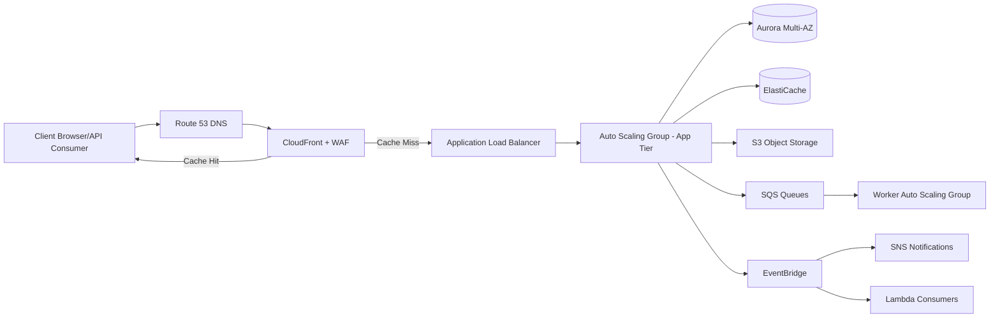
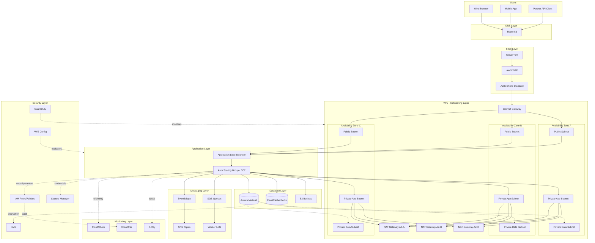
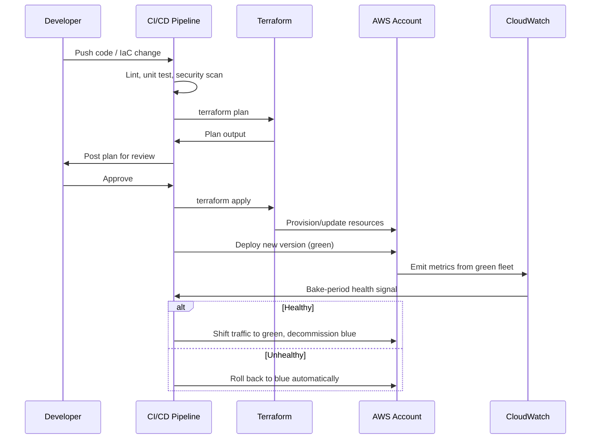

# Chapter 1 – Introduction to Production-Ready Architecture

*The AWS Reference Architecture Handbook — 100 Production-Ready Cloud Architectures with AWS, Terraform, AI, Security, FinOps, and Enterprise Design Patterns*

---

## 1. Executive Summary

Every enterprise that runs meaningful workloads on AWS eventually asks the same question, usually after something has already gone wrong: "Why did we build it this way?" The honest answer, in far too many organizations, is that nobody made an explicit architectural decision at all. Services were provisioned incrementally, a proof-of-concept quietly became the production system, and the resulting environment is a accumulation of tactical choices rather than a deliberate design. This chapter — and this book — exists to correct that pattern by giving architects a library of reference architectures that encode deliberate, defensible, production-tested decisions, along with the reasoning that makes those decisions transferable to new problems.

A **reference architecture** is not a diagram. A diagram is an artifact that a reference architecture produces, but the architecture itself is a documented set of decisions, constraints, and trade-offs that together satisfy a class of business and technical requirements in a repeatable way. When an architecture is "reference," it means it has been abstracted from a specific implementation enough that it can be applied to a family of similar problems — a highly available three-tier web application, an event-driven order processing system, a multi-region active-active platform — while still being concrete enough that an engineering team can implement it without inventing the hard parts from scratch. The distinction matters because organizations frequently confuse "an architecture that worked once" with "a reference architecture." The former is an anecdote; the latter is a pattern that has been validated against multiple failure modes, cost models, and compliance regimes, and that comes with explicit guidance about when it should NOT be used, which is just as important as when it should.

The business problem this chapter addresses is architectural drift and the absence of a shared vocabulary for evaluating design decisions. In a mature engineering organization, when someone proposes "let's put this behind an Application Load Balancer with Auto Scaling across three Availability Zones, RDS Multi-AZ for the primary datastore, and CloudFront in front of static assets," every architect in the room should be able to evaluate that proposal against known trade-offs: cost per environment, operational burden, blast radius of a single-AZ failure, RTO/RPO characteristics, and where the design sits on a maturity curve from "startup MVP" to "global enterprise platform." Without a reference architecture and a common vocabulary, that same conversation degenerates into opinion, whoever argues loudest, or worse, whoever built the last system that happened to survive an audit.

Organizations adopt disciplined reference architectures for several converging reasons. First, **predictability of outcome**. When a team implements a well-architected three-tier design instead of improvising, the failure modes are known in advance: what happens when an AZ goes dark, what happens when the database fails over, what the blast radius of a bad deployment looks like. Second, **auditability**. Regulated industries — financial services, healthcare, insurance, public sector — increasingly require architecture review boards to demonstrate that a system was designed against a named framework (most commonly the AWS Well-Architected Framework) rather than assembled ad hoc. Third, **cost control**. FinOps maturity is impossible without architectural consistency; you cannot right-size, apply Savings Plans intelligently, or reason about unit economics if every workload is a bespoke snowflake. Fourth, **talent leverage**. When architectures follow known patterns, new engineers onboard faster, incident response is faster because responders recognize the shape of the system, and knowledge does not walk out the door when a single senior engineer leaves.

The major business benefits of standardizing on reference architectures compound over time rather than appearing immediately, which is precisely why organizations under short-term delivery pressure tend to under-invest in this discipline. In the first quarter after adoption, the benefit is mostly a shared language for design reviews. Within a year, the benefit becomes measurable: mean time to recovery drops because responders are debugging a known topology instead of reverse-engineering a novel one; the cost per unit of workload compresses because Reserved capacity and Savings Plans can be purchased against a stable baseline; and the audit and compliance cycle — SOC 2, PCI-DSS, HIPAA, FedRAMP, ISO 27001 — becomes materially cheaper because the same control evidence (encryption at rest, IAM least privilege, centralized logging, network segmentation) is reused across systems that share an architecture rather than re-derived for each bespoke system.

Typical enterprise scenarios where this discipline becomes non-negotiable include: a financial services company migrating a monolithic on-premises trading-adjacent system to AWS under a hard regulatory deadline, where the architecture must demonstrate RTO/RPO commitments to examiners before go-live; a healthcare SaaS vendor that must pass a HIPAA security risk assessment for every new customer contract and cannot afford bespoke architecture reviews each time; a retail company whose Black Friday traffic is 40x baseline and whose architecture must scale predictably without a war room; and a multi-brand enterprise consolidating dozens of independently built applications onto a common platform team, where the only way to support that many systems with a fixed headcount is architectural standardization.

It is worth being explicit about what this chapter is *not* claiming. A reference architecture is not a substitute for judgment, and this book will repeatedly emphasize where a documented pattern should be deviated from. The architectures in this book are starting points calibrated to common requirement profiles — they are not universal answers. A sixty-person startup that adopts the same multi-region, multi-account, Transit-Gateway-connected architecture as a Fortune 100 bank is not being rigorous; it is over-engineering, and over-engineering is a failure mode this book treats with the same seriousness as under-engineering. Chapter 34's "Architect's Corner" section exists specifically to counteract the temptation to cargo-cult every pattern in this book at full strength regardless of actual requirements.

Finally, this chapter establishes the conceptual toolkit used throughout the rest of the book: architecture maturity levels (so you can locate where your organization actually is, not where its slide decks claim it is), the AWS Well-Architected Framework (the six pillars against which every subsequent architecture in this book will be explicitly scored), Architecture Decision Records (the artifact that makes a decision auditable and reversible instead of tribal knowledge), core design principles (failure isolation, least privilege, immutable infrastructure, loose coupling, and cost-awareness as a first-class constraint rather than an afterthought), the inherent trade-offs that no architecture escapes, and the review lifecycle that governs how an architecture moves from proposal to production to eventual deprecation. Every one of the ninety-nine architecture-specific chapters that follow this one will assume the reader has internalized the vocabulary established here.

---

## 2. Business Requirements

Before any architecture — reference or otherwise — can be evaluated, it must be pinned to an explicit requirements profile. A shockingly large fraction of failed cloud migrations trace back to a single root cause: the requirements were assumed rather than written down, so the architecture optimized for the wrong thing. This section defines the requirements categories that every subsequent chapter in this book will populate with concrete numbers. For Chapter 1, we illustrate the framework using a representative baseline profile — a **highly available three-tier web application** — that recurs throughout the book as the default reference point against which more specialized architectures (event-driven, serverless, multi-region, data-intensive) are compared.

### 2.1 Business Drivers

Business drivers are the non-technical forces that make an architecture necessary in the first place. They typically fall into four categories: revenue protection (the system generates or touches revenue, so downtime has a direct P&L impact), regulatory obligation (a named framework — PCI-DSS, HIPAA, SOC 2, GDPR, FedRAMP — mandates specific controls), competitive pressure (time-to-market or feature velocity is the dominant constraint), and cost rationalization (an existing system is too expensive to operate and must be re-platformed). Most real systems are driven by a blend of these, but an architecture review should require the sponsoring team to rank them, because the ranking changes design trade-offs materially. A revenue-protection-driven system tolerates higher infrastructure spend in exchange for availability; a cost-rationalization-driven system inverts that priority.

### 2.2 Functional Requirements

| Requirement | Description |
|---|---|
| User-facing web and API access | Public HTTPS endpoints serving both a browser-rendered application and a versioned REST/JSON API for partner integrations |
| Authentication and authorization | Support for federated identity (SAML/OIDC) in addition to first-party credentials |
| File and media handling | Users can upload and retrieve documents/images up to 100 MB |
| Transactional data operations | CRUD operations against a relational model with referential integrity guarantees |
| Asynchronous processing | Long-running operations (report generation, bulk imports) must not block the request/response cycle |
| Search | Full-text and faceted search across the primary dataset |
| Notifications | Email and push notification delivery triggered by domain events |
| Audit trail | Every state-changing operation must be attributable to an actor and timestamped immutably |

### 2.3 Non-Functional Requirements

Non-functional requirements (NFRs) are where most architectural decisions actually originate, because they cannot be satisfied by adding a feature — they require structural choices. The NFR categories that recur across nearly every chapter in this book are scalability, availability, latency, durability, compliance, security, and recoverability. We define each below with the concrete targets used as this book's default baseline; individual chapters adjust these targets up or down for their specific scenario.

**Scalability goals.** The baseline architecture must absorb a 10x traffic spike within 5 minutes without manual intervention, and must support linear horizontal scaling of the compute tier up to at least 50 nodes before any component in the design requires re-architecture (this ceiling is deliberately called out — see Section 24, Scaling Limits, in Chapter 34 for what happens beyond it).

**Availability requirements.** The baseline target is 99.95% monthly uptime (approximately 21.6 minutes of allowed downtime per month), which maps to a Multi-AZ design without requiring multi-region active-active complexity. Systems requiring 99.99% or higher (≈4.3 minutes/month) are directed to the multi-region chapters later in this book, because single-region Multi-AZ architectures cannot economically clear that bar — a full regional control-plane event (rare but real; AWS has had regional API-plane degradations) will violate a 99.99% SLA even with perfect Multi-AZ execution.

**Latency requirements.** p50 API latency under 100ms, p99 under 500ms, measured at the ALB, excluding client network time. Static asset delivery via CDN should achieve sub-50ms p50 globally.

**Compliance requirements.** The baseline profile assumes SOC 2 Type II as a floor, with PCI-DSS SAQ-D or HIPAA Security Rule as common overlays depending on vertical. Each compliance regime is treated in this book as an overlay of controls on top of the base architecture, not a different architecture — encryption at rest and in transit, centralized immutable logging, and least-privilege IAM satisfy the substrate of nearly all of them simultaneously.

**Security expectations.** No plaintext secrets in code or environment variables outside of a secrets manager; all data encrypted at rest with customer-managed KMS keys where compliance requires demonstrable key control; all inter-tier traffic encrypted in transit; public attack surface limited to the CDN/WAF/ALB layer.

**Recovery objectives.**

| Metric | Baseline Target | Definition |
|---|---|---|
| RPO (Recovery Point Objective) | ≤ 5 minutes | Maximum acceptable data loss measured in time, driven by continuous replication (e.g., RDS Multi-AZ synchronous replication, cross-region read replica lag) |
| RTO (Recovery Time Objective) | ≤ 30 minutes | Maximum acceptable time to restore service after a declared disaster |

**SLAs.** External customer-facing SLA is typically set at a level the architecture can beat with margin — if the NFR target is 99.95%, the contractual SLA offered to customers is usually 99.9%, preserving an error-budget cushion for planned maintenance and unanticipated degradation.

**Expected workload and growth.** The baseline profile assumes 500 requests/second sustained, 5,000 requests/second peak, a primary dataset of 500 GB growing 15% year-over-year, and a three-year capacity planning horizon — long enough to justify Reserved Instance or Savings Plan commitments, short enough that the architecture should not be over-built for hypothetical scale that may never materialize.

> **Note:** Every architecture chapter in this book restates this requirements table with its own specific numbers. Treat the numbers above as the default null hypothesis, not a mandate — the entire point of requirements-driven design is that you replace these numbers with your organization's actual figures before choosing an architecture, not after.

---

## 3. Architecture Overview

### 3.1 Overall Design and Philosophy

The reference architecture used to ground this chapter is a **highly available, horizontally scalable three-tier web application**, composed of an edge/delivery tier, an application/compute tier, and a data tier, with cross-cutting concerns (security, observability, identity) applied uniformly across all three. The philosophy underlying this design is **failure isolation through redundancy at every layer, with statelessness pushed as far up the stack as possible**. Nothing in the compute tier holds durable state; every instance is disposable and replaceable by Auto Scaling without data loss, because all durable state lives in managed data services (RDS, S3, DynamoDB) that are themselves designed for Multi-AZ resilience. This is the single most important architectural principle in this book: **compute is cattle, not pets**, and the corollary — **data services are the load-bearing walls of the system, and receive proportionally more redundancy investment than compute**.

### 3.2 Core Components

- **Edge tier:** Amazon Route 53 (DNS), Amazon CloudFront (CDN), AWS WAF (edge security)
- **Networking tier:** VPC spanning three Availability Zones, public and private subnets, NAT Gateways, Internet Gateway
- **Application tier:** Application Load Balancer, Auto Scaling Group of EC2 instances (or ECS/Fargate tasks, depending on containerization maturity — this book treats EC2 Auto Scaling as the baseline and calls out the containerized variant explicitly where relevant)
- **Asynchronous tier:** Amazon SQS for task queuing, Amazon SNS for fan-out notification, Amazon EventBridge for domain event routing
- **Data tier:** Amazon RDS (Aurora PostgreSQL-compatible) Multi-AZ for transactional data, Amazon S3 for object storage, Amazon ElastiCache for session/cache data
- **Security and identity:** IAM roles and policies, AWS KMS, AWS Secrets Manager, AWS Certificate Manager
- **Observability:** Amazon CloudWatch, AWS CloudTrail, AWS X-Ray

### 3.3 Component Interaction and High-Level Workflow

At a high level, a client request enters through Route 53 DNS resolution, is served static content directly from CloudFront's edge cache where possible, and dynamic requests are forwarded through CloudFront to an Application Load Balancer that distributes traffic across healthy EC2 instances in an Auto Scaling Group spread across three Availability Zones. Application instances read and write transactional data to an RDS Aurora cluster (writer endpoint for writes, reader endpoint for read replicas), retrieve/store session state in ElastiCache to keep the compute tier stateless, and offload long-running work to SQS queues consumed by dedicated worker instances. Domain events (order placed, user registered) are published to EventBridge, which routes them to downstream consumers — SNS topics for notification fan-out, Lambda functions for lightweight event-driven processing, or additional SQS queues for durable asynchronous work.

### 3.4 Request, Response, and Data Lifecycle

The **request lifecycle** begins at DNS resolution, proceeds through edge caching and WAF inspection, load balancing, and application processing, and terminates either at a cache hit (fastest path) or a full round-trip through the data tier. The **response lifecycle** is the inverse path, with the addition that responses eligible for caching are written back to CloudFront's edge cache with an explicit TTL policy, and all responses — success and failure — are logged to CloudWatch Logs with a correlation ID that ties the request to its full trace in X-Ray. The **data lifecycle** governs how data moves and ages within the system: hot transactional data lives in Aurora, session data lives in ElastiCache with a short TTL, uploaded objects land in an S3 "ingest" prefix and are subsequently processed and moved to a "processed" prefix by an event-driven Lambda triggered on S3 PUT, and cold data is moved via S3 Lifecycle policies to Infrequent Access and eventually Glacier Deep Archive tiers based on access patterns.



---

## 4. AWS Services Used

For each service below: purpose, why it was selected over alternatives, viable alternatives and when you'd choose them instead, known limitations, pricing considerations, and best practices. Only services relevant to the baseline three-tier architecture are covered in depth here; specialized services (e.g., managed Kafka, Redshift, SageMaker) are covered in the chapters where they are architecturally central.

### 4.1 Amazon EC2

**Purpose:** Resizable compute capacity for the application tier, running the actual request-handling code.

**Why selected:** EC2 gives full control over the runtime environment, is the most mature and best-understood compute primitive in AWS, and has the widest Reserved Instance/Savings Plan discounting ecosystem, which matters for predictable, long-running workloads.

**Alternatives:** AWS Fargate (serverless containers) removes instance patching burden at a ~20-30% price premium and is preferred when the team wants container portability without managing an EC2 fleet; AWS Lambda is preferred for spiky, short-duration, event-driven workloads rather than long-lived request-handling services; ECS/EKS on EC2 is preferred over raw EC2 Auto Scaling Groups when the team already has container orchestration expertise and wants finer-grained bin-packing of multiple services onto shared hosts.

**Limitations:** Patching, AMI lifecycle management, and instance-level security hardening are the operator's responsibility; scaling latency (new instance boot + application warm-up) is measured in minutes, not seconds, which matters for architectures needing sub-30-second scale-out response to load spikes.

**Pricing considerations:** On-Demand pricing is the most expensive and should never be the steady-state cost basis for predictable baseline load; Savings Plans (Compute Savings Plans specifically, for flexibility across instance families) should cover the predictable baseline, with On-Demand or Spot absorbing burst capacity above baseline.

**Best practices:** Use launch templates (not launch configurations, which are deprecated), enable detailed CloudWatch monitoring only where the 1-minute granularity is actually consumed by an alarm or dashboard (5-minute granularity is free and sufficient for most capacity planning), and bake AMIs with a tool like EC2 Image Builder rather than configuring instances post-boot with long user-data scripts.

### 4.2 Application Load Balancer (ALB)

**Purpose:** Layer 7 load balancing, TLS termination, path/host-based routing, and health-check-driven traffic distribution across the application tier.

**Why selected:** ALB understands HTTP semantics (path-based routing, host-based routing, WebSocket support), integrates natively with Auto Scaling Groups and ECS services, and supports native TLS certificate management via ACM.

**Alternatives:** Network Load Balancer (NLB) is preferred when the workload is TCP/UDP-level, requires static IP addresses, or needs to preserve client source IP without proxy protocol overhead — common for non-HTTP protocols or extreme-low-latency requirements. Gateway Load Balancer is used for inserting third-party virtual appliances (firewalls, IDS/IPS) transparently into the traffic path, not for standard application load balancing.

**Limitations:** ALB adds a small but non-zero latency overhead versus NLB; it cannot preserve raw TCP-level characteristics needed by some legacy protocols.

**Pricing considerations:** Billed on Load Balancer Capacity Units (LCUs), which blend new connections, active connections, bandwidth, and rule evaluations — a common cost surprise is a workload with many WAF rule evaluations per request driving LCU cost up disproportionately to raw bandwidth.

**Best practices:** Terminate TLS at the ALB using ACM-managed certificates with auto-renewal, enable access logs to S3 for every production ALB, and use target group health checks with an application-specific health endpoint (not just a TCP check) that verifies downstream dependencies are reachable.

### 4.3 Amazon CloudFront

**Purpose:** Global content delivery network caching static and semi-static content at edge locations close to end users, and providing a single ingress point for WAF and Shield protection.

**Why selected:** Reduces origin load, reduces latency for geographically distributed users, and provides a natural chokepoint for edge security controls.

**Alternatives:** Third-party CDNs (Akamai, Cloudflare, Fastly) are chosen when an organization has existing multi-cloud CDN contracts or needs CDN features CloudFront lacks (certain edge-compute paradigms); for internal-only applications with no geographic distribution requirement, a CDN may be unnecessary complexity entirely.

**Limitations:** Cache invalidation is not instantaneous and costs money past a free monthly allotment; debugging cache behavior (why a response was or wasn't cached) requires understanding of Cache-Control headers, CloudFront cache policies, and origin request policies, which is a common source of production incidents.

**Pricing considerations:** Data transfer OUT to the internet from CloudFront is billed per GB with regional pricing tiers, and is one of the most common line items architects underestimate during cost forecasting (see Chapter 34, Cost Surprises).

**Best practices:** Use separate cache behaviors for static assets (long TTL, versioned filenames) versus API responses (short or no caching, careful Vary header handling), and always front dynamic origins with CloudFront even when caching is minimal, purely for the WAF/Shield integration and connection reuse benefits.

### 4.4 AWS Lambda

**Purpose:** Event-driven, short-duration compute for asynchronous processing, S3-triggered workflows, and lightweight API handlers.

**Why selected:** Zero infrastructure management, sub-second billing granularity, and native integration with nearly every AWS event source.

**Alternatives:** For workloads exceeding the 15-minute maximum execution duration or requiring persistent in-memory state across invocations, EC2 or Fargate is preferred; for extremely high, sustained invocation rates, the per-invocation cost of Lambda can exceed the cost of a fixed EC2/Fargate fleet, making a break-even analysis necessary (see Chapter 16, Cost Optimization).

**Limitations:** Cold start latency (mitigated but not eliminated by Provisioned Concurrency), 15-minute maximum execution time, and ephemeral storage limits (10 GB in `/tmp`).

**Pricing considerations:** Billed per millisecond of execution and memory allocated; over-provisioning memory "just in case" is a frequent, quietly compounding cost mistake.

**Best practices:** Right-size memory allocation using AWS Lambda Power Tuning, keep deployment packages small to minimize cold start time, and use Lambda only where the workload's shape (spiky, event-driven, short-duration) actually matches its cost and performance profile rather than by default.

### 4.5 Amazon S3

**Purpose:** Durable, highly available object storage for user uploads, static assets, application logs, and backup artifacts.

**Why selected:** 99.999999999% (11 nines) durability, virtually unlimited scale, and the widest ecosystem integration of any storage service in AWS.

**Alternatives:** Amazon EFS is preferred when POSIX filesystem semantics and concurrent read/write access from multiple compute instances are required; Amazon FSx is preferred for Windows file shares or high-performance computing workloads needing Lustre.

**Limitations:** Not a filesystem — no native support for partial in-place file edits, directory rename is not atomic (it's implemented as copy+delete under most tooling), and strong read-after-write consistency (now standard) still does not change the fact that S3 is an object store, not a POSIX filesystem.

**Pricing considerations:** Storage class selection (Standard, Standard-IA, One Zone-IA, Glacier Instant/Flexible/Deep Archive) drives the majority of cost variance; retrieval fees on IA and Glacier tiers are a common surprise when architects assume "cheaper storage" without accounting for access-pattern-driven retrieval costs.

**Best practices:** Apply S3 Lifecycle policies to automatically transition and expire objects, enable S3 Block Public Access at the account level by default, use S3 Bucket Keys to reduce KMS request costs when using SSE-KMS encryption at scale.

### 4.6 Amazon RDS / Aurora

**Purpose:** Managed relational database for transactional data requiring ACID guarantees, referential integrity, and complex query capability.

**Why selected:** Aurora (PostgreSQL or MySQL compatible) provides Multi-AZ synchronous replication, up to 15 read replicas, storage that auto-scales up to 128 TiB, and a Global Database option for cross-region disaster recovery, all while remaining wire-compatible with standard PostgreSQL/MySQL drivers and tooling.

**Alternatives:** Standard RDS (non-Aurora) is chosen when the specific database engine (Oracle, SQL Server) required is not Aurora-compatible; Amazon DynamoDB is preferred when access patterns are key-value or single-table-design-friendly and horizontal scale beyond what a relational engine handles gracefully is required; self-managed database-on-EC2 is almost never justified for new production workloads given the operational burden it reintroduces.

**Limitations:** Aurora writer is still a single logical writer instance (no multi-writer for most engine versions without Aurora Multi-Master, which has its own trade-offs and limited engine support); vertical scaling of the writer requires a brief failover-driven interruption.

**Pricing considerations:** Aurora I/O-Optimized pricing versus Standard pricing depends on I/O-to-compute cost ratio — I/O-heavy workloads (high query volume against comparatively small data) often come out cheaper on I/O-Optimized despite the higher instance-hour price.

**Best practices:** Always deploy Multi-AZ for production, use a reader endpoint for all read-only traffic to offload the writer, and enable Performance Insights to catch query regressions before they become incidents.

### 4.7 Amazon DynamoDB

**Purpose:** Fully managed, serverless NoSQL key-value and document store for workloads needing single-digit-millisecond latency at effectively unlimited scale.

**Why selected (when used):** No connection pooling concerns, automatic partitioning, and on-demand or provisioned capacity modes that scale without manual intervention.

**Alternatives:** Aurora/RDS when relational integrity and complex multi-table joins are core to the access pattern; ElastiCache when the data is purely ephemeral cache rather than a system of record.

**Limitations:** Query flexibility is constrained by the primary key/GSI design chosen at table creation — retrofitting new access patterns onto an existing DynamoDB table is materially harder than adding an index to a relational table.

**Pricing considerations:** On-demand capacity mode simplifies operations but costs more per request at sustained high throughput than well-tuned provisioned capacity with auto scaling.

**Best practices:** Design the table schema around access patterns first (single-table design where appropriate), enable Point-in-Time Recovery for production tables, and use DynamoDB Accelerator (DAX) only when microsecond-level read latency is a genuine requirement, not a default.

### 4.8 Amazon SNS and Amazon SQS

**Purpose:** SNS provides pub/sub fan-out messaging; SQS provides durable, at-least-once point-to-point queuing that decouples producers from consumers and absorbs load spikes.

**Why selected:** Together they implement the classic fan-out-and-queue pattern: an SNS topic publishes an event once, and multiple SQS queues subscribe to receive independent, durable copies for different downstream consumers.

**Alternatives:** Amazon EventBridge is preferred when routing logic based on event content (not just topic subscription) is needed, or when integrating with a large number of AWS-native and third-party SaaS event sources; Apache Kafka (via Amazon MSK) is preferred when consumers need to replay historical events from an ordered log rather than consume-and-delete semantics.

**Limitations:** Standard SQS queues provide at-least-once delivery and best-effort ordering — applications must be idempotent; FIFO queues provide strict ordering and exactly-once processing but at roughly 3,000 messages/second throughput ceiling (300 with high throughput mode adjustments (actual figures depend on batching)) versus effectively unlimited throughput for Standard queues.

**Pricing considerations:** Both services are inexpensive per-request but can become a meaningful line item at very high message volumes; long-polling reduces empty-receive costs versus short-polling.

**Best practices:** Always configure a Dead Letter Queue (DLQ) for production SQS queues, set visibility timeout based on realistic worst-case processing time (not the average), and use SNS message filtering to avoid delivering irrelevant messages to subscribers.

### 4.9 Amazon EventBridge

**Purpose:** Serverless event bus for routing domain events between producers and consumers based on content-based rules, with native integration to dozens of AWS services and SaaS partners.

**Why selected:** Decouples event producers from the knowledge of who consumes their events, enables schema registry and discovery, and supports content-based filtering without consumer-side logic.

**Alternatives:** SNS/SQS for simpler fan-out needs without content-based routing requirements.

**Limitations:** Event delivery is asynchronous and best-effort ordered only within a single event bus and source — cross-service ordering guarantees require additional design (sequence tokens, idempotency keys).

**Pricing considerations:** Billed per event published; archive and replay features incur additional storage costs.

**Best practices:** Use a dedicated custom event bus per domain/bounded context rather than dumping everything on the default bus, and define and version event schemas explicitly using the EventBridge Schema Registry.

### 4.10 IAM, VPC, Route 53, CloudWatch, CloudTrail, AWS Config, GuardDuty, KMS, Secrets Manager, Systems Manager

These cross-cutting services are treated in depth in their dedicated sections (Section 9 Network Topology, Section 10 Identity and Access, Section 11 Security Architecture, Section 21 Monitoring, Section 22 Logging) rather than repeated here, to avoid redundant explanation. In summary: **IAM** governs who/what can call which API; **VPC** provides network isolation; **Route 53** provides DNS resolution and health-check-driven failover routing; **CloudWatch** provides metrics, logs, and alarms; **CloudTrail** provides an immutable audit log of every API call; **AWS Config** provides continuous configuration compliance evaluation; **GuardDuty** provides threat detection via anomaly analysis of VPC Flow Logs, DNS logs, and CloudTrail; **KMS** provides encryption key management; **Secrets Manager** provides credential storage with automatic rotation; **Systems Manager** provides patch management, parameter storage, and session-based (no SSH key) instance access.

---

## 5. Complete Architecture Diagram



---

## 6. Component-by-Component Explanation

| Component | Purpose | Scaling | High Availability | Failure Handling | Key Dependencies |
|---|---|---|---|---|---|
| Route 53 | DNS resolution, health-check-based failover routing | Fully managed, no scaling action needed | Anycast-based, globally distributed by design | Automatic failover to healthy endpoint via health checks | None (foundational) |
| CloudFront | Edge caching, TLS termination, WAF integration | Automatic, global edge network | Inherent to the service (200+ edge locations) | Origin failover groups for origin-level failure | ALB or S3 origin, ACM certificate |
| WAF | Layer 7 filtering (SQLi, XSS, rate-based rules) | Scales with CloudFront/ALB automatically | Attached to CloudFront/ALB, inherits their HA | Rule evaluation failure defaults to configurable allow/block | CloudFront or ALB |
| ALB | Layer 7 load balancing and health-check routing | Auto-scales capacity units transparently | Deployed across 3 AZs by default | Removes unhealthy targets from rotation automatically | VPC subnets, target group, ACM cert |
| Auto Scaling Group (App) | Hosts stateless application code | Target-tracking or step scaling on CPU/request count | Instances spread across 3 AZs | Unhealthy instance replacement automatic | Launch template, IAM instance profile |
| SQS | Durable async task buffering | Virtually unlimited, no operator action | Redundant across AZs within the region | DLQ captures repeatedly failing messages | IAM policy, consumer ASG/Lambda |
| EventBridge | Domain event routing | Scales automatically | Regionally redundant | Failed invocations retried with backoff, then DLQ | Event bus, target permissions |
| Aurora | System-of-record relational data | Read replicas scale reads; storage auto-scales | Multi-AZ synchronous standby with automatic failover | Automatic failover typically <60s | KMS key, subnet group, security group |
| ElastiCache | Session cache, hot-read cache | Cluster mode scales shards horizontally | Multi-AZ with automatic failover (Redis) | Replica promoted automatically on primary failure | VPC subnet group, security group |
| S3 | Object storage for uploads, static assets, logs | Effectively unlimited | 11 nines durability, multi-AZ by design within a region | Versioning protects against accidental overwrite/delete | KMS key (if SSE-KMS), IAM bucket policy |

Each component above is designed to fail independently without cascading: an AZ-level failure removes at most one-third of ALB targets, one Aurora Multi-AZ standby relationship failover event, and one-third of ElastiCache shard replicas — none of which individually take the system down, which is the entire point of the failure-isolation design principle introduced in Section 3.1.

---

## 7. End-to-End Request Flow

1. **Client initiates request** to `app.example.com`.
2. **Route 53** resolves the domain to the CloudFront distribution's endpoint, applying any configured health-check-based routing policy.
3. **CloudFront** checks its edge cache. If the object is cached and fresh (TTL not expired), it is returned immediately to the client and the flow ends here.
4. On a **cache miss**, CloudFront forwards the request toward the origin, first passing it through **AWS WAF**, which evaluates the request against configured rule groups (managed rules for SQLi/XSS, rate-based rules, custom rules).
5. If WAF **blocks** the request, a 403 is returned to the client and the event is logged; the flow ends.
6. If WAF **allows** the request, it proceeds to the **Application Load Balancer**.
7. The ALB evaluates listener rules (host/path-based routing) and selects a **target group**.
8. The ALB performs a **health-check-informed** selection of a healthy EC2 instance within the target group, using round-robin or least-outstanding-requests algorithm.
9. The selected **application instance** processes the request. If the request requires session data, it queries **ElastiCache**.
10. If the request requires persisted data, the application queries **Aurora** — reads are directed to the reader endpoint, writes to the writer endpoint.
11. If the request involves file upload/retrieval, the application interacts with **S3** directly or via a pre-signed URL issued to the client.
12. If the request triggers a long-running operation, the application **enqueues a message to SQS** and returns an immediate acknowledgment (HTTP 202) to the client rather than blocking.
13. A separate **worker Auto Scaling Group** polls the SQS queue, processes the message, and writes results back to Aurora/S3, publishing a completion event to **EventBridge** if downstream systems need to react.
14. Throughout steps 9–13, the application emits **structured logs** to CloudWatch Logs and **trace segments** to X-Ray, tagged with a correlation ID generated at step 2/6.
15. The application constructs the **HTTP response**, including appropriate `Cache-Control` headers if the response is cacheable.
16. The response traverses back through the **ALB → WAF → CloudFront** chain; CloudFront stores a copy in its edge cache if cacheable, and forwards the response to the client.
17. **CloudWatch Alarms** continuously evaluate metrics emitted at every step (ALB 5xx rate, target response time, SQS queue depth, Aurora CPU/connections) and trigger SNS-based on-call notification if thresholds are breached.
18. In the event of an **application-level error**, the instance returns a 5xx response, which is logged, counted against the ALB's error-rate metric, and — if the instance itself is unhealthy — triggers the ALB health check to fail, removing the instance from rotation and prompting Auto Scaling to replace it.

---

## 8. Deployment Flow

**Infrastructure provisioning** is performed exclusively through Terraform (see Section 18) against a remote state backend (S3 with DynamoDB state locking), never through manual console changes in production accounts. **The Terraform workflow** follows plan → review → apply, gated by a CI/CD pipeline that runs `terraform plan`, posts the plan as a pull request comment for human review, and only runs `terraform apply` after an approving review and merge to the main branch.

**CI/CD deployment** of application code follows a separate pipeline from infrastructure changes: application artifacts are built, scanned (dependency vulnerability scanning, static analysis), packaged into a versioned AMI or container image, and deployed via a **blue-green deployment** strategy using a second Auto Scaling Group and ALB target group swap (or, for ECS, a CodeDeploy blue-green deployment with automated rollback on CloudWatch alarm breach). Blue-green is preferred over in-place rolling deployment for this baseline architecture because it provides an instantaneous rollback path (swap the ALB listener rule back to the previous target group) rather than requiring a slower reverse-rolling-update.

**Rollback** is triggered either manually or automatically based on CloudWatch alarms monitoring the new target group's error rate and latency during a bake period (typically 10–15 minutes) before the old target group is decommissioned.

**Secrets** required at deployment time (database credentials, API keys) are never baked into AMIs or container images; they are fetched at instance boot time from Secrets Manager using the instance's IAM role, with no long-lived credentials stored anywhere in the pipeline.

**Configuration** is layered: environment-specific values (non-secret) are stored in Systems Manager Parameter Store, and application code reads configuration via a startup-time fetch rather than baked-in environment variables, allowing configuration changes without a full redeploy where appropriate.

**Validation** occurs at multiple gates: `terraform validate` and `tflint` pre-plan, automated smoke tests against the new target group before it receives production traffic, and post-deployment synthetic canary checks (CloudWatch Synthetics) that continuously validate critical user journeys.



---

## 9. Network Topology

The VPC uses a **/16 CIDR block** (e.g., `10.0.0.0/16`), providing 65,536 addresses subdivided into **/24 subnets** per tier per AZ — small enough to avoid IP exhaustion concerns for this workload profile, large enough to leave room for future subnet additions without re-architecting the VPC.

| Subnet Tier | AZ-A | AZ-B | AZ-C | Purpose |
|---|---|---|---|---|
| Public | 10.0.0.0/24 | 10.0.1.0/24 | 10.0.2.0/24 | ALB, NAT Gateways, bastion/SSM endpoints |
| Private App | 10.0.10.0/24 | 10.0.11.0/24 | 10.0.12.0/24 | EC2 application instances |
| Private Data | 10.0.20.0/24 | 10.0.21.0/24 | 10.0.22.0/24 | Aurora, ElastiCache |

**Public subnets** host only internet-facing load balancers and NAT Gateways — never application or database instances directly. **Private app subnets** host the application tier, reachable only from the ALB and outbound to the internet via NAT Gateway (for package updates, third-party API calls). **Private data subnets** host Aurora and ElastiCache, reachable only from the private app subnet's security group, with no route to the internet at all — not even via NAT — because the data tier has no legitimate reason to initiate outbound internet connections.

**NAT Gateway** is deployed one-per-AZ (not a single shared NAT Gateway) specifically to avoid a cross-AZ single point of failure and to avoid inter-AZ data transfer charges that a shared NAT Gateway would incur; this is a deliberate cost/resilience trade-off discussed further in Section 16.

**Internet Gateway** provides the VPC's sole path to/from the public internet, attached once at the VPC level.

**Transit Gateway** is not part of this baseline single-VPC architecture but becomes necessary once the organization operates multiple VPCs/accounts needing to share network connectivity (see the multi-account and multi-region chapters later in this book) — introducing it prematurely here would be unjustified complexity for a single-application baseline.

**Route tables**: the public subnet route table sends `0.0.0.0/0` to the Internet Gateway; each private app subnet route table sends `0.0.0.0/0` to its AZ-local NAT Gateway; the private data subnet route table has no default route to the internet at all.

**Network ACLs** are used sparingly as a coarse, stateless second layer of defense (e.g., explicitly denying known-bad CIDR ranges at the subnet boundary), while **Security Groups** do the actual fine-grained, stateful access control: the ALB security group allows inbound 443 from `0.0.0.0/0`; the app tier security group allows inbound only from the ALB security group on the application port; the data tier security group allows inbound only from the app tier security group on the database/cache port. This chained security-group-referencing-security-group pattern (rather than CIDR-based rules) is a best practice that survives IP address churn from Auto Scaling without requiring rule updates.

**PrivateLink** (VPC Endpoints) is used for S3, DynamoDB (gateway endpoints, no cost), and Secrets Manager/KMS/Systems Manager (interface endpoints) so that traffic to these AWS services never traverses the NAT Gateway or the public internet, which both reduces NAT Gateway data-processing cost and tightens the security posture by removing a path to the public internet entirely for these calls.

**Hybrid connectivity** (Direct Connect or Site-to-Site VPN) is not required for this baseline cloud-native architecture but is covered in the enterprise hybrid chapters for organizations with on-premises data centers that must remain connected during a phased migration.

---

## 10. Identity and Access

**IAM Roles** are used exclusively for workload identity — EC2 instances assume an instance profile role, Lambda functions assume an execution role — and **IAM Users with long-lived access keys are prohibited** in this architecture for any workload identity; human access is federated through IAM Identity Center (successor to AWS SSO) tied to the corporate identity provider.

**IAM Policies** attached to workload roles follow least privilege scoped to specific resource ARNs wherever the AWS service supports resource-level permissions, rather than wildcard `Resource: "*"` grants. A representative least-privilege policy for the application tier's access to its own S3 bucket:

```json

{
  "Version": "2012-10-17",
  "Statement": [
    {
      "Sid": "AppBucketReadWrite",
      "Effect": "Allow",
      "Action": [
        "s3:GetObject",
        "s3:PutObject"
      ],
      "Resource": "arn:aws:s3:::app-example-uploads-prod/*"
    },
    {
      "Sid": "AppBucketList",
      "Effect": "Allow",
      "Action": "s3:ListBucket",
      "Resource": "arn:aws:s3:::app-example-uploads-prod",
      "Condition": {
        "StringLike": { "s3:prefix": ["uploads/*"] }
      }
    },
    {
      "Sid": "DecryptWithAppKMSKey",
      "Effect": "Allow",
      "Action": ["kms:Decrypt", "kms:GenerateDataKey"],
      "Resource": "arn:aws:kms:us-east-1:111122223333:key/app-key-id"
    }
  ]
}

```

**Resource Policies** (bucket policies, KMS key policies, SQS queue policies) provide the resource-side complement to identity-side IAM policies, and are used specifically for cross-account access grants and to enforce account-wide guardrails (e.g., a bucket policy denying any request not using TLS, regardless of which identity is calling).

**STS (Security Token Service)** issues the temporary credentials that every IAM role assumption relies on; understanding STS matters operationally because temporary credentials expire (typically 1 hour by default, configurable up to 12 hours for role assumption), and any architecture that appears to have "stopped working after an hour" for a specific batch job is almost always an STS session expiration issue.

**Cross-account access** for this baseline architecture is minimal (single production account plus a separate account for CI/CD deployment), using an IAM role in the production account with a trust policy scoped to the specific CI/CD account and external ID, assumed via STS `AssumeRole` rather than shared credentials.

**Least privilege** is enforced not just at design time but continuously, using IAM Access Analyzer to identify unused permissions and external access findings, feeding a quarterly permissions review.

**Service Roles** (the role a service itself assumes to act on the user's behalf, e.g., the RDS service role for enhanced monitoring, or the Auto Scaling service-linked role) are distinct from workload identity roles and are largely AWS-managed, but should still be reviewed during security audits.

**Permission boundaries** are attached to any IAM role created by automation (e.g., a CI/CD pipeline that provisions IAM roles as part of Terraform) to cap the maximum permissions that role can ever be granted, preventing privilege escalation even if the automation's own policy logic has a bug.

---

## 11. Security Architecture

**Encryption at rest** is enabled by default for every data store in this architecture: Aurora storage encryption via KMS, S3 default bucket encryption (SSE-KMS for data requiring demonstrable customer key control, SSE-S3 acceptable for lower-sensitivity data), and EBS volume encryption for all EC2 instances.

**KMS** provides the encryption key hierarchy; this architecture uses **customer-managed keys (CMKs)**, not AWS-managed keys, wherever compliance requires audit-visible key policies and the ability to disable/rotate keys independently of AWS's default schedule.

**TLS** is enforced end-to-end: client-to-CloudFront (TLS 1.2 minimum, enforced via CloudFront security policy), CloudFront-to-ALB, and ALB-to-instance can optionally also be encrypted for architectures with the highest sensitivity requirements (at a small latency cost); database connections use TLS via the RDS/Aurora certificate bundle.

**WAF** rule groups deployed include AWS Managed Rules for the OWASP Top 10 (SQL injection, common vulnerabilities), a rate-based rule to mitigate credential-stuffing and basic DDoS patterns, and custom rules specific to known application-layer attack patterns observed in prior incidents.

**Shield Standard** is enabled automatically at no cost for all CloudFront/Route 53 resources, providing protection against common network/transport-layer DDoS. **Shield Advanced** is an explicit upgrade decision (see Section 16 for cost) justified when the business impact of a large-scale DDoS event exceeds the Shield Advanced subscription cost — typically justified for e-commerce or financial workloads, not justified for low-traffic internal tools.

**Secrets Manager** stores database credentials with automatic rotation configured via a Lambda rotation function, eliminating static long-lived database passwords entirely.

**Certificate Manager (ACM)** issues and auto-renews the public TLS certificates used by CloudFront and the ALB, removing the operational burden (and historical outage cause) of manually renewing certificates before expiration.

**GuardDuty** is enabled account-wide, continuously analyzing VPC Flow Logs, DNS query logs, and CloudTrail management/data events for anomalous patterns (e.g., an EC2 instance suddenly querying a cryptomining pool domain, or API calls from an unusual geographic location).

**Inspector** continuously scans EC2 instances and container images for known CVEs, integrated into the CI/CD pipeline as a blocking gate for critical/high severity findings above an agreed threshold.

**Security Hub** aggregates findings from GuardDuty, Inspector, Config, and third-party tools into a single dashboard scored against the CIS AWS Foundations Benchmark and AWS Foundational Security Best Practices standard.

**CloudTrail** is enabled organization-wide with a dedicated, access-restricted logging account as the delivery destination, and log file integrity validation enabled so that any tampering with historical logs is cryptographically detectable.

**AWS Config** continuously evaluates resource configuration against rules (e.g., "no security group allows unrestricted SSH," "all EBS volumes must be encrypted") and can be configured to auto-remediate certain violations.

**Zero Trust** principles are applied at the network layer (no implicit trust based on network location — every service-to-service call is authenticated and authorized regardless of whether it originates "inside" the VPC) and are most fully realized in this architecture through the exclusive use of IAM-authenticated service calls and Security-Group-referencing rather than broad CIDR trust.

**Threat model summary:**

| Attack Vector | Mitigation |
|---|---|
| DDoS (volumetric/protocol) | CloudFront + Shield Standard/Advanced, ALB elastic capacity |
| Application-layer attacks (SQLi, XSS) | WAF managed rule groups, parameterized queries, output encoding |
| Credential stuffing / brute force | WAF rate-based rules, MFA on human accounts, account lockout policies |
| Data exfiltration via compromised instance | Least-privilege IAM, VPC endpoints (no NAT path needed for AWS API calls), GuardDuty anomaly detection |
| Insider threat / privilege misuse | CloudTrail immutable audit logs, least privilege, permission boundaries, quarterly access reviews |
| Supply chain (compromised dependency) | Inspector/dependency scanning in CI/CD, SBoM generation, signed artifacts |
| Misconfiguration drift | AWS Config continuous evaluation, Terraform as sole change path (no console drift) |

---

## 12. High Availability

**AZ failures:** The architecture tolerates the complete loss of any single Availability Zone without customer-visible downtime — the ALB stops routing to targets in the failed AZ, Aurora fails over to its synchronous standby (typically <60 seconds), and ElastiCache promotes a replica in a surviving AZ.

**Instance failures:** Auto Scaling health checks detect and replace failed instances automatically, typically within 2–5 minutes depending on AMI boot time and application warm-up.

**Regional failures:** This baseline single-region architecture does *not* tolerate a full regional failure without manual intervention and data loss up to the last cross-region backup/replica point — this is an explicit, documented limitation of the baseline design, not an oversight (see Section 13 and the multi-region chapters for architectures that do tolerate regional failure).

**Database failures:** Aurora Multi-AZ failover is automatic and DNS-based (the writer endpoint CNAME is repointed), requiring application-level retry logic with exponential backoff to ride out the brief connection interruption.

**Load balancing and health checks:** The ALB's target group health check (an application-specific `/health` endpoint that verifies database connectivity, not just process liveness) is the primary signal driving both traffic routing and Auto Scaling replacement decisions.

**Failover** for DNS-level routing (used in multi-region designs, not needed for this single-region baseline) would use Route 53 health-check-based failover routing policies.

---

## 13. Disaster Recovery

**Backup strategy:** Aurora automated backups with a 35-day retention window (the maximum), plus manual snapshots before any major schema migration; S3 versioning enabled on all buckets with lifecycle-managed expiration of old versions.

**Snapshots** of Aurora are additionally copied cross-region on a scheduled basis (via AWS Backup) to protect against a regional-scope disaster, even though this baseline architecture does not run active-active across regions.

**Cross-region replication** of S3 objects is enabled for the uploads bucket, providing an independently restorable copy of user-generated content in a second region.

**Disaster recovery strategy classification** for this baseline is **Backup and Restore** (the lowest-cost, highest-RTO tier) upgraded selectively to **Pilot Light** for the specific data tier (a minimal, continuously-updated Aurora Global Database secondary cluster kept warm in the DR region) — a deliberate hybrid, because full **Warm Standby** or **Multi-Site Active-Active** would roughly double infrastructure cost for a business whose actual RTO/RPO requirements (Section 2.3: RTO ≤30 min, RPO ≤5 min) do not require it.

| DR Strategy | RTO | RPO | Relative Cost | Used In This Architecture? |
|---|---|---|---|---|
| Backup and Restore | Hours | Hours | 1x (lowest) | Compute tier |
| Pilot Light | 10s of minutes | Minutes | ~1.2–1.5x | Data tier (Aurora Global DB) |
| Warm Standby | Minutes | Seconds–minutes | ~1.7–2x | Not used (over-engineered for stated NFRs) |
| Multi-Site Active-Active | Near-zero | Near-zero | 2x+ | Not used (reserved for 99.99%+ SLA tiers) |

---

## 14. Scalability

**Horizontal scaling** is the primary scaling mechanism for the application tier: the Auto Scaling Group scales out based on target-tracking policies (average CPU utilization, or preferably ALB request-count-per-target for request-bound workloads) across a configured min/max/desired range spanning all three AZs.

**Vertical scaling** is used sparingly — primarily for the Aurora writer instance class, where scaling up (not out) is the only option for write-throughput headroom, and requires a brief failover.

**Auto Scaling** policies combine target tracking (steady-state responsiveness) with a scheduled scaling action ahead of known traffic events (e.g., a marketing campaign launch) to pre-warm capacity rather than reacting purely to load after the fact.

**Serverless scaling** (Lambda, DynamoDB on-demand) requires no explicit capacity planning by design, which is precisely why asynchronous, spiky workloads in this architecture (image processing, notification delivery) are offloaded to Lambda rather than added to the EC2 fleet's peak sizing.

**Database scaling** uses Aurora read replicas (up to 15) to scale read throughput horizontally, with Aurora Auto Scaling automatically adding/removing replicas based on average CPU or connection count across the replica fleet.

**Storage scaling** for Aurora is automatic and requires no operator action up to 128 TiB; S3 storage scaling is inherently unlimited.

**Queue scaling** for SQS-backed workers uses a target-tracking Auto Scaling policy on the custom CloudWatch metric `ApproximateNumberOfMessagesVisible` divided by the number of running workers, keeping per-worker backlog roughly constant regardless of absolute queue depth.

---

## 15. Performance Optimization

**Caching** is applied at three layers: CloudFront edge caching for static/semi-static content, ElastiCache for session data and frequently-read database query results, and application-level in-memory caching for reference data that changes rarely (feature flags, configuration). **Compression** (gzip/Brotli) is enabled at CloudFront and the ALB/application layer for all text-based responses, reducing transfer time meaningfully for JSON API payloads. **CDN** placement of static assets with long cache TTLs and cache-busting via versioned filenames eliminates the vast majority of origin requests for unchanging content. **Database optimization** includes query plan review via Aurora Performance Insights, appropriate indexing reviewed against actual query patterns (not speculative indexing), and read/write splitting to the reader/writer endpoints respectively. **Connection pooling** is essential given Aurora's finite max-connections ceiling relative to a horizontally-scaled application fleet — this architecture uses Amazon RDS Proxy specifically to pool and multiplex connections from a potentially large number of Lambda/EC2 clients down to a manageable number of actual database connections, which also smooths over the brief connection interruption during a Multi-AZ failover. **Concurrency** within each application instance is tuned to the workload's I/O-bound vs. CPU-bound profile (async I/O for I/O-bound API handlers, worker-process-per-core for CPU-bound processing). **Async processing** (Section 7, step 12) is the primary lever for keeping p99 API latency low — anything that cannot complete within the latency SLA is moved off the synchronous request path entirely rather than optimized in place.

---

## 16. Cost Optimization (FinOps)

### 16.1 Estimated Monthly Cost by Deployment Size

*(Illustrative figures for us-east-1, subject to change with AWS pricing updates — always validate against the AWS Pricing Calculator before presenting to stakeholders.)*

| Component | Small (Startup) | Medium (Growth) | Enterprise |
|---|---|---|---|
| EC2 App Tier (Auto Scaling) | 2× t3.medium (~$60) | 4–8× m6i.large (~$500) | 12–30× m6i.xlarge (~$3,500+) |
| ALB | ~$20 | ~$50 | ~$200+ |
| Aurora | 1 writer db.t4g.medium (~$100) | Writer + 2 readers db.r6g.large (~$900) | Writer + 4 readers db.r6g.2xlarge (~$5,000+) |
| ElastiCache | 1 node cache.t4g.micro (~$15) | 3-node cluster cache.r6g.large (~$450) | Multi-shard cache.r6g.xlarge cluster (~$2,000+) |
| CloudFront + Data Transfer | ~$30 | ~$400 | ~$3,000+ |
| NAT Gateway (3x) | ~$100 | ~$150 | ~$300+ |
| S3 + Lifecycle | ~$20 | ~$200 | ~$1,500+ |
| CloudWatch/Logging | ~$20 | ~$150 | ~$1,000+ |
| **Approximate Total** | **~$365/mo** | **~$2,800/mo** | **~$16,500+/mo** |

> **Warning:** These figures exclude Reserved Instance/Savings Plan discounts (typically 20–40% off On-Demand for 1-year commitments), data transfer between regions if applicable, and third-party licensing. Treat this table as an ordering-of-magnitude sanity check, never as a substitute for a proper Cost Explorer forecast against your actual traffic profile.

### 16.2 Major Cost Drivers and Optimization

- **Reserved Instances / Savings Plans:** Apply Compute Savings Plans to the predictable baseline portion of EC2/Fargate/Lambda spend; do not commit against burst capacity.
- **Spot Instances:** Appropriate for the worker/async tier (Section 3.2) where interruption tolerance is high, inappropriate for the synchronous request-handling tier unless the architecture explicitly designs for graceful Spot interruption handling.
- **S3 Lifecycle and storage classes:** Transition infrequently-accessed uploads to Standard-IA after 30 days and Glacier Deep Archive after 180 days; the savings are substantial for architectures with large, aging object stores.
- **Rightsizing:** Use AWS Compute Optimizer recommendations quarterly rather than sizing instances once at launch and never revisiting.
- **Cost allocation and tagging:** Every resource tagged with `Environment`, `CostCenter`, `Application`, and `Owner` at creation time (enforced via Service Control Policies denying resource creation without required tags), enabling accurate chargeback.
- **Budgets and Cost Anomaly Detection:** AWS Budgets alerts at 80%/100%/120% of forecasted monthly spend per cost center; Cost Anomaly Detection catches sudden, unexplained spend spikes (a classic sign of a misconfigured Lambda in an infinite retry loop, or a forgotten NAT Gateway data-processing spike).

---

## 17. AI-Assisted Operations

**Amazon Q** (Developer and Business variants) assists architects and operators by answering AWS-specific questions grounded in account context, generating and explaining Infrastructure as Code, and summarizing CloudWatch logs/traces during incident investigation directly within the AWS console.

**Amazon Bedrock** provides managed access to foundation models for building custom AI-assisted operational tooling — for example, a Bedrock-backed Lambda function that classifies incoming support tickets by likely root cause category using recent CloudWatch alarm history as context, or that drafts an incident postmortem summary from a raw timeline of CloudWatch/CloudTrail events.

**AI-assisted troubleshooting** in practice means feeding an LLM a redacted (no secrets, no PII) excerpt of relevant logs, the recent deployment history, and the specific error signature, and using it to narrow the hypothesis space faster than manual `grep`-driven investigation — this accelerates triage but does not replace an engineer's judgment on the actual fix, especially for anything touching data integrity.

**Log analysis** at scale benefits from AI summarization of CloudWatch Logs Insights query results, particularly for surfacing an unusual pattern across millions of log lines that a human would not manually notice.

**Incident response** can use AI to draft the initial timeline and stakeholder communication from raw alarm/event data, freeing the incident commander to focus on the technical mitigation rather than documentation during the live incident.

**Cost optimization** benefits from AI-assisted analysis of Cost Explorer data to identify non-obvious optimization opportunities (e.g., correlating a cost spike with a specific deployment or feature launch) faster than manual cost report review.

**Capacity planning** can use AI-assisted forecasting against historical CloudWatch metrics to project when a given Auto Scaling Group's max capacity or an Aurora instance class will need to be revisited, ahead of it becoming an incident.

**Architecture review** can use an LLM to check a proposed Terraform plan or architecture diagram against the Well-Architected Framework pillars as a first-pass reviewer, surfacing obvious gaps (missing Multi-AZ, unencrypted resources, overly permissive IAM) before a human architect's time is spent on the review.

**AI-generated Terraform** accelerates the first draft of a new module (see Section 18) but every generated module must still pass the same `terraform validate`, `tflint`, `checkov`/`tfsec` security scanning, and human review gates as hand-written code — AI-generated infrastructure code is not exempt from review, and treating it as such is one of the anti-patterns covered in Section 27.

**AI-generated documentation** (runbooks, architecture descriptions, ADRs) is useful as a first draft generated from the actual Terraform/application code so documentation reflects reality rather than intent, but must be reviewed by an engineer with system knowledge before publication, since generated documentation can confidently describe behavior that does not match the actual deployed system.

> **Tip:** Never grant an AI tool direct write access to production infrastructure without a human-in-the-loop approval gate. Use AI to draft the change; use your existing CI/CD approval workflow to execute it.

---

## 18. Terraform Implementation

The following is a representative, modular Terraform structure for the baseline architecture. Directory layout:

```

infrastructure/
├── modules/
│   ├── networking/
│   ├── compute/
│   ├── database/
│   └── security/
├── environments/
│   ├── prod/
│   └── staging/
└── backend.tf

```

**Remote state backend:**

```hcl

# backend.tf

terraform {
  required_version = ">= 1.7.0"

  backend "s3" {
    bucket         = "example-corp-tfstate-prod"
    key            = "app-baseline/terraform.tfstate"
    region         = "us-east-1"
    dynamodb_table = "terraform-locks"
    encrypt        = true
  }

  required_providers {
    aws = {
      source  = "hashicorp/aws"
      version = "~> 5.0"
    }
  }
}

provider "aws" {
  region = var.aws_region

  default_tags {
    tags = {
      Environment = var.environment
      ManagedBy   = "terraform"
      Application = "app-baseline"
    }
  }
}

```

**Variables (root module):**

```hcl

# variables.tf

variable "aws_region" {
  description = "Primary AWS region for deployment"
  type        = string
  default     = "us-east-1"
}

variable "environment" {
  description = "Deployment environment name (prod, staging)"
  type        = string
}

variable "vpc_cidr" {
  description = "CIDR block for the VPC"
  type        = string
  default     = "10.0.0.0/16"
}

variable "azs" {
  description = "Availability Zones to deploy across"
  type        = list(string)
  default     = ["us-east-1a", "us-east-1b", "us-east-1c"]
}

variable "app_instance_type" {
  description = "EC2 instance type for the application tier"
  type        = string
  default     = "m6i.large"
}

variable "db_instance_class" {
  description = "Aurora instance class"
  type        = string
  default     = "db.r6g.large"
}

```

**Networking module (excerpt):**

```hcl

# modules/networking/main.tf

resource "aws_vpc" "main" {
  cidr_block           = var.vpc_cidr
  enable_dns_support   = true
  enable_dns_hostnames = true

  tags = { Name = "${var.environment}-vpc" }
}

resource "aws_subnet" "public" {
  for_each                = toset(var.azs)
  vpc_id                  = aws_vpc.main.id
  cidr_block              = cidrsubnet(var.vpc_cidr, 8, index(var.azs, each.value))
  availability_zone       = each.value
  map_public_ip_on_launch = true

  tags = { Name = "${var.environment}-public-${each.value}" }
}

resource "aws_subnet" "private_app" {
  for_each          = toset(var.azs)
  vpc_id            = aws_vpc.main.id
  cidr_block        = cidrsubnet(var.vpc_cidr, 8, index(var.azs, each.value) + 10)
  availability_zone = each.value

  tags = { Name = "${var.environment}-private-app-${each.value}" }
}

resource "aws_nat_gateway" "this" {
  for_each      = toset(var.azs)
  allocation_id = aws_eip.nat[each.value].id
  subnet_id     = aws_subnet.public[each.value].id

  tags = { Name = "${var.environment}-nat-${each.value}" }
}

resource "aws_eip" "nat" {
  for_each = toset(var.azs)
  domain   = "vpc"
}

```

**Compute module (excerpt) — Auto Scaling Group with launch template:**

```hcl

# modules/compute/main.tf

resource "aws_launch_template" "app" {
  name_prefix   = "${var.environment}-app-"
  image_id      = var.app_ami_id
  instance_type = var.app_instance_type

  iam_instance_profile {
    name = aws_iam_instance_profile.app.name
  }

  vpc_security_group_ids = [aws_security_group.app.id]

  metadata_options {
    http_tokens = "required" # enforce IMDSv2
  }

  tag_specifications {
    resource_type = "instance"
    tags          = { Name = "${var.environment}-app" }
  }
}

resource "aws_autoscaling_group" "app" {
  name                = "${var.environment}-app-asg"
  min_size            = var.asg_min_size
  max_size            = var.asg_max_size
  desired_capacity    = var.asg_desired_capacity
  vpc_zone_identifier = values(var.private_app_subnet_ids)
  target_group_arns   = [aws_lb_target_group.app.arn]
  health_check_type   = "ELB"
  health_check_grace_period = 300

  launch_template {
    id      = aws_launch_template.app.id
    version = "$Latest"
  }

  dynamic "tag" {
    for_each = var.common_tags
    content {
      key                 = tag.key
      value               = tag.value
      propagate_at_launch = true
    }
  }
}

resource "aws_autoscaling_policy" "target_tracking" {
  name                   = "${var.environment}-app-target-tracking"
  autoscaling_group_name = aws_autoscaling_group.app.name
  policy_type            = "TargetTrackingScaling"

  target_tracking_configuration {
    predefined_metric_specification {
      predefined_metric_type = "ALBRequestCountPerTarget"
      resource_label          = "${var.alb_arn_suffix}/${var.target_group_arn_suffix}"
    }
    target_value = 500
  }
}

```

**IAM module (excerpt) — least-privilege instance role:**

```hcl

# modules/security/iam.tf

resource "aws_iam_role" "app_instance_role" {
  name = "${var.environment}-app-instance-role"

  assume_role_policy = jsonencode({
    Version = "2012-10-17"
    Statement = [{
      Effect    = "Allow"
      Principal = { Service = "ec2.amazonaws.com" }
      Action    = "sts:AssumeRole"
    }]
  })

  permissions_boundary = aws_iam_policy.permission_boundary.arn
}

resource "aws_iam_role_policy" "app_secrets_access" {
  name = "${var.environment}-app-secrets-access"
  role = aws_iam_role.app_instance_role.id

  policy = jsonencode({
    Version = "2012-10-17"
    Statement = [{
      Effect   = "Allow"
      Action   = ["secretsmanager:GetSecretValue"]
      Resource = var.db_secret_arn
    }]
  })
}

```

**Outputs (root module):**

```hcl

# outputs.tf

output "alb_dns_name" {
  description = "DNS name of the Application Load Balancer"
  value       = module.compute.alb_dns_name
}

output "aurora_writer_endpoint" {
  description = "Aurora cluster writer endpoint"
  value       = module.database.writer_endpoint
  sensitive   = false
}

output "vpc_id" {
  value = module.networking.vpc_id
}

```

**Best practices applied above:** remote state with locking, `for_each` over static resource duplication, `permissions_boundary` on all created roles, `http_tokens = "required"` enforcing IMDSv2 to prevent SSRF-based credential theft, target-tracking Auto Scaling tied to a request-based metric rather than CPU alone, and `sensitive` output marking for anything that could leak credentials into CI logs.

---

## 19. AWS CLI Examples

**Deployment validation:**

```bash

# Verify Auto Scaling Group health after deployment

aws autoscaling describe-auto-scaling-groups \
  --auto-scaling-group-names prod-app-asg \
  --query 'AutoScalingGroups[0].Instances[*].[InstanceId,HealthStatus,LifecycleState]' \
  --output table

# Check target group health behind the ALB

aws elbv2 describe-target-health \
  --target-group-arn arn:aws:elasticloadbalancing:us-east-1:111122223333:targetgroup/prod-app-tg/abc123

```

**Monitoring:**

```bash

# Pull recent 5xx error rate from the ALB

aws cloudwatch get-metric-statistics \
  --namespace AWS/ApplicationELB \
  --metric-name HTTPCode_Target_5XX_Count \
  --dimensions Name=LoadBalancer,Value=app/prod-alb/abc123 \
  --start-time $(date -u -d '1 hour ago' +%Y-%m-%dT%H:%M:%S) \
  --end-time $(date -u +%Y-%m-%dT%H:%M:%S) \
  --period 300 \
  --statistics Sum

# Check Aurora replica lag

aws cloudwatch get-metric-statistics \
  --namespace AWS/RDS \
  --metric-name AuroraReplicaLag \
  --dimensions Name=DBInstanceIdentifier,Value=prod-app-db-reader-1 \
  --start-time $(date -u -d '30 minutes ago' +%Y-%m-%dT%H:%M:%S) \
  --end-time $(date -u +%Y-%m-%dT%H:%M:%S) \
  --period 60 \
  --statistics Average

```

**Troubleshooting:**

```bash

# Tail recent application logs via CloudWatch Logs Insights

aws logs start-query \
  --log-group-name "/prod/app" \
  --start-time $(date -d '15 minutes ago' +%s) \
  --end-time $(date +%s) \
  --query-string 'fields @timestamp, @message | filter @message like /ERROR/ | sort @timestamp desc | limit 50'

# Inspect recent SQS DLQ messages without deleting them

aws sqs receive-message \
  --queue-url https://sqs.us-east-1.amazonaws.com/111122223333/prod-worker-dlq \
  --max-number-of-messages 10 \
  --visibility-timeout 0

```

**Cleanup (staging/ephemeral environments):**

```bash

# Scale down staging ASG to zero outside business hours

aws autoscaling update-auto-scaling-group \
  --auto-scaling-group-name staging-app-asg \
  --min-size 0 --max-size 0 --desired-capacity 0

# Identify unattached EBS volumes for cost cleanup

aws ec2 describe-volumes \
  --filters Name=status,Values=available \
  --query 'Volumes[*].[VolumeId,Size,CreateTime]' \
  --output table

```

---

## 20. CI/CD Integration

| Platform | Typical Role in This Architecture | Notes |
|---|---|---|
| GitHub Actions | Terraform plan/apply pipeline, application build/test/deploy | Preferred when source is already on GitHub; OIDC federation to AWS avoids long-lived access keys in CI |
| GitLab CI | Equivalent role for GitLab-hosted source | Native Terraform integration via GitLab's Infrastructure-as-Code features |
| Jenkins | Legacy/enterprise environments with existing Jenkins investment | Requires more manual plugin/credential management than GitHub Actions/GitLab OIDC |
| AWS CodePipeline | AWS-native alternative, tightly integrated with CodeBuild/CodeDeploy | Preferred when the organization wants to minimize third-party CI tooling and stay within the AWS console/IAM boundary |

**Terraform pipeline pattern (GitHub Actions excerpt):**

```yaml

name: terraform-plan-apply
on:
  pull_request:
    paths: ["infrastructure/**"]
  push:
    branches: [main]
    paths: ["infrastructure/**"]

permissions:
  id-token: write
  contents: read

jobs:
  plan:
    runs-on: ubuntu-latest
    steps:
      - uses: actions/checkout@v4
      - uses: aws-actions/configure-aws-credentials@v4
        with:
          role-to-assume: arn:aws:iam::111122223333:role/gha-terraform-plan
          aws-region: us-east-1
      - uses: hashicorp/setup-terraform@v3
      - run: terraform -chdir=infrastructure/environments/prod init
      - run: terraform -chdir=infrastructure/environments/prod validate
      - run: tflint --chdir=infrastructure/environments/prod
      - run: checkov -d infrastructure/environments/prod --compact
      - run: terraform -chdir=infrastructure/environments/prod plan -out=tfplan

```

**Validation and security scanning** are non-negotiable pipeline gates: `terraform validate` for syntax correctness, `tflint` for provider-specific best-practice linting, and `checkov`/`tfsec` for security misconfiguration scanning (unencrypted resources, overly permissive security groups, public S3 buckets) — all run before a plan is ever presented for human approval.

**Policy as Code** (using Open Policy Agent/Sentinel, or AWS's own Service Control Policies at the organization level) enforces guardrails that no individual Terraform plan can override — e.g., "no S3 bucket may ever be created with public read access," enforced at a layer above any single team's pipeline.

**Rollback** for infrastructure changes is handled via `terraform apply` of the previous known-good state (from version-controlled `.tf` files, never manual console reversion) or, for application deployments, via the blue-green traffic-shift-back mechanism described in Section 8.

---

## 21. Monitoring

**CloudWatch** is the backbone of this architecture's observability: metrics (ALB request count/latency/error rate, Auto Scaling Group instance count, Aurora CPU/connections/replica lag, SQS queue depth), Logs (structured JSON application logs), and Alarms (threshold and anomaly-detection-based) all flow through it.

**Dashboards** are built per-service (not one monolithic dashboard) so that an on-call engineer for a specific component can see exactly the metrics relevant to their service without noise from unrelated systems.

**Metrics** that matter most for this architecture's SLOs: ALB `TargetResponseTime` (p50/p99), `HTTPCode_Target_5XX_Count`, Aurora `CPUUtilization` and `DatabaseConnections`, SQS `ApproximateAgeOfOldestMessage` (a better queue-health signal than raw depth).

**Tracing (X-Ray)** provides distributed trace visibility across the ALB → application → Aurora/S3/SQS call chain, essential for diagnosing which specific downstream dependency is responsible for an elevated p99 latency rather than guessing.

**Alarms** are configured with both a warning threshold (paging during business hours only, via a lower-urgency notification channel) and a critical threshold (paging 24/7 via PagerDuty/Opsgenie integration), avoiding the common anti-pattern of a single threshold that either pages too often (alert fatigue) or not soon enough.

**SLIs, SLOs, and error budgets:** the primary SLI is "percentage of requests served with HTTP status <500 and latency <500ms"; the SLO is 99.9% of requests meeting that bar over a rolling 28-day window; the error budget (0.1% of requests) is tracked explicitly and burn-rate alarms (a request rate of error-budget consumption that would exhaust the entire monthly budget in under 6 hours) trigger a distinct, higher-urgency alert than a simple threshold breach, following the Google SRE-originated multi-window burn-rate alerting pattern.

---

## 22. Logging

**Centralized logging** aggregates application logs, ALB access logs, VPC Flow Logs, and CloudTrail into a single logging account, separate from the workload account, so that a compromise of the workload account cannot be used to tamper with its own audit trail.

**CloudWatch Logs** is the near-real-time destination for application logs, with metric filters extracting key signals (error counts, specific exception types) directly into CloudWatch metrics/alarms.

**S3** serves as the long-term, cost-efficient archival destination for logs beyond their CloudWatch Logs retention window (typically 30–90 days in CloudWatch, then exported/archived to S3 with lifecycle transition to Glacier for multi-year compliance retention).

**Athena** provides SQL-based ad hoc querying directly against archived logs in S3 without needing to reload them into a live system — invaluable for a post-incident investigation reaching back further than the CloudWatch Logs retention window.

**OpenSearch** (Amazon OpenSearch Service) is used when full-text search and near-real-time log analytics across a high log volume justify the additional operational and cost overhead versus CloudWatch Logs Insights alone — typically justified once log volume and query sophistication (complex aggregations, dashboards for non-engineering stakeholders) outgrow what Logs Insights comfortably provides.

**Retention** policies are explicit and compliance-driven: application debug logs retained 30 days, audit-relevant logs (authentication events, data access) retained per the applicable compliance regime (often 1–7 years), and CloudTrail logs retained indefinitely in the dedicated logging account given their relatively low storage cost and high forensic value.

**Audit logging** specifically (as distinct from general application logging) captures who did what to which resource and when, at the application layer (business-meaningful events like "user X changed the billing plan of account Y") in addition to the infrastructure-layer audit trail CloudTrail already provides.

---

## 23. Operational Excellence

**Runbooks** exist for every alarm that can page an on-call engineer, and are treated as code (version-controlled, reviewed) rather than a wiki page that drifts from reality — each runbook states the alarm's meaning, likely causes ranked by frequency, and step-by-step diagnostic/remediation actions.

**Automation** targets the elimination of toil: routine remediation (restarting an unhealthy instance, scaling out ahead of a known traffic pattern) is automated wherever the remediation is well-understood and low-risk, reserving human judgment for genuinely novel situations.

**Patch management** uses Systems Manager Patch Manager on a defined maintenance window, applied first to a canary subset of instances before fleet-wide rollout, with the immutable-AMI pattern (rebuild and replace instances rather than patch in place) preferred wherever deployment velocity supports it.

**Maintenance** windows for database engine version upgrades and other disruptive changes are scheduled during documented low-traffic periods and communicated to stakeholders in advance, never performed as a surprise.

**Incident response** follows a defined severity classification (Sev1–Sev4) with corresponding response time and communication cadence commitments, an assigned Incident Commander role distinct from the engineer doing the technical mitigation, and a mandatory blameless postmortem for every Sev1/Sev2 incident.

**Change management** requires every production change (infrastructure or application) to flow through the CI/CD pipeline described in Sections 8 and 20 — there is no "emergency console change" path in a mature version of this architecture, because emergency console changes are precisely what causes untracked configuration drift that undermines every other control in this chapter.

---

## 24. Failure Scenarios

| # | Scenario | Symptoms | Root Cause | Detection | Resolution | Prevention |
|---|---|---|---|---|---|---|
| 1 | Single AZ outage | Elevated latency briefly, some 5xx during ALB re-routing | AWS infrastructure event in one AZ | ALB target health checks fail for that AZ's instances; GuardDuty/Health Dashboard | ALB automatically stops routing to affected AZ; Auto Scaling replaces instances elsewhere | Multi-AZ design (already in place); regularly test AZ failure via chaos engineering |
| 2 | Aurora writer failover | Brief (10-60s) connection errors from application | Underlying host failure or maintenance-triggered failover | RDS Event Subscription, CloudWatch `DatabaseConnections` drop | Application-level retry with exponential backoff rides out the failover | RDS Proxy to smooth failover; test failover quarterly with `reboot --force-failover` |
| 3 | NAT Gateway exhaustion | Outbound connections from app tier time out | Port exhaustion under high outbound connection volume | CloudWatch `ErrorPortAllocation` metric on NAT Gateway | Add additional NAT Gateway capacity or reduce unnecessary outbound calls | Use VPC endpoints for AWS API calls to avoid NAT dependency entirely |
| 4 | Auto Scaling flapping | Instances continuously launched and terminated | Health check failing due to slow application warm-up, not an actual fault | ASG activity history shows repeated launch/terminate cycles | Increase health check grace period; fix underlying slow-start issue | Load-test application startup time before setting grace period |
| 5 | SQS DLQ silently filling | No customer-visible symptom initially; eventual data staleness noticed downstream | Consumer bug causing repeated processing failure | CloudWatch alarm on DLQ `ApproximateNumberOfMessagesVisible` > 0 | Fix consumer bug, redrive DLQ messages | Always alarm on DLQ depth, never assume "zero incoming" means "healthy" |
| 6 | Runaway Lambda cost | Unexpected bill spike | Infinite retry loop from a misconfigured event source mapping | Cost Anomaly Detection alert | Fix retry/backoff configuration, add reserved concurrency cap | Set Lambda reserved concurrency limits and budget alarms proactively |
| 7 | CloudFront serving stale content | Users report seeing outdated data after a deploy | Cache-Control headers not set correctly for dynamic content, or invalidation not triggered | User reports, synthetic canary detecting stale version marker | Manual invalidation, fix Cache-Control headers/cache policy | Version static asset filenames; explicit short/no-cache policy for dynamic API responses |
| 8 | Credential leakage in logs | Secret value appears in CloudWatch Logs | Application accidentally logs full request/response body including Authorization header | Automated secret-scanning of log groups (e.g., via a Lambda or third-party tool) | Rotate the leaked credential immediately, scrub logs, fix logging code | Structured logging with an explicit denylist of sensitive fields; never log raw request/response bodies |
| 9 | IAM policy over-permissioning | Security review or IAM Access Analyzer flags unused broad permissions | Policy written with `Resource: "*"` for convenience during initial build, never tightened | IAM Access Analyzer, quarterly access review | Tighten policy to specific resource ARNs actually used | Enforce least-privilege review as a PR gate for any new IAM policy |
| 10 | Regional service degradation (control plane) | Terraform applies fail, Auto Scaling actions delayed | AWS regional API-plane issue (rare but real) | AWS Health Dashboard, elevated API error rates in CloudTrail | Wait out the AWS-side event; avoid making risky changes during a known regional event | Multi-region architecture for workloads that cannot tolerate this (see later chapters) |
| 11 | Bad deployment (application bug) | Elevated error rate immediately after deploy | Insufficient test coverage or bad canary/bake logic | CloudWatch alarm on post-deploy error rate during bake period | Automatic or manual rollback to previous target group (Section 8) | Mandatory bake period with automated rollback trigger, never skip it under delivery pressure |
| 12 | ElastiCache node failure | Elevated latency, increased database load (cache misses) | Underlying node hardware failure | CloudWatch `CurrEngineCPUUtilization`/health metrics for the cluster | Automatic replica promotion (Multi-AZ enabled) | Ensure Multi-AZ is actually enabled — a common oversight in initial ElastiCache setup |
| 13 | Certificate expiration | TLS handshake failures, browser warnings | Manually-managed certificate not renewed (should not occur with ACM auto-renewal, but occurs with third-party certs imported into ACM) | Synthetic canary detecting TLS errors, ACM expiration notification | Renew/re-import certificate | Use ACM-issued (not imported) certificates wherever possible for automatic renewal |
| 14 | Cross-AZ data transfer cost spike | Unexpected data transfer line-item increase | Application tier not AZ-aware, routing requests to database replicas in a different AZ unnecessarily | Cost Explorer breakdown by usage type | Configure AZ-aware routing/read-replica selection | Design for AZ affinity where cost-sensitive, understanding the resilience/cost trade-off |
| 15 | Secrets Manager rotation failure | Application suddenly failing to authenticate to database | Rotation Lambda function bug or insufficient permissions | CloudWatch alarm on rotation Lambda errors, application connection failures | Manually complete/rollback the rotation, fix Lambda | Test rotation in staging before enabling in production; alarm explicitly on rotation failures |

---

## 25. Troubleshooting Guide

| Problem | Symptoms | Likely Cause | Diagnosis | AWS CLI Commands | Resolution |
|---|---|---|---|---|---|
| High p99 latency | Slow responses under load | Database contention, missing index, or undersized instance | Check Aurora Performance Insights, X-Ray trace breakdown | `aws rds describe-db-instances`, X-Ray console/API | Add index, scale up/out, add caching layer |
| 5xx spike after deploy | Error rate climbs immediately post-deployment | Bad application code or misconfiguration in new version | Compare error rate before/after deploy timestamp in CloudWatch | `aws cloudwatch get-metric-statistics --metric-name HTTPCode_Target_5XX_Count` | Roll back to previous target group |
| Instances failing health checks | ASG continuously replacing instances | Application not listening on expected port, or slow startup | Check target group health reasons, instance system log | `aws elbv2 describe-target-health`, `aws ec2 get-console-output` | Fix startup script/health endpoint, adjust grace period |
| Database connection exhaustion | "too many connections" errors | Application not using connection pooling / RDS Proxy | Check `DatabaseConnections` metric vs. max_connections parameter | `aws cloudwatch get-metric-statistics --metric-name DatabaseConnections` | Introduce RDS Proxy, fix connection leak in application code |
| SQS messages not being processed | Growing queue depth | Worker ASG scaled to zero, or consumer throwing exceptions | Check worker ASG desired capacity, CloudWatch Logs for consumer errors | `aws sqs get-queue-attributes`, `aws autoscaling describe-auto-scaling-groups` | Scale workers up, fix consumer bug, redrive DLQ |
| Unexpected AWS bill increase | Cost Explorer shows spike | New resource left running, data transfer spike, or retry storm | Cost Explorer by service/usage type, Cost Anomaly Detection findings | `aws ce get-cost-and-usage` | Identify and terminate/rightsize offending resource |
| WAF blocking legitimate traffic | Customers report 403 errors | Overly aggressive managed rule group or rate-based rule | Check WAF sampled requests for the blocking rule | `aws wafv2 get-sampled-requests` | Tune rule exclusion or rate threshold |
| TLS handshake failures | Clients cannot connect via HTTPS | Certificate expired or misconfigured security policy | Check ACM certificate status, CloudFront/ALB security policy | `aws acm describe-certificate` | Renew certificate, correct minimum TLS version setting |
| Terraform apply fails midway | Partial resource creation, state drift | Race condition, IAM permission gap, or AWS service limit hit | Review Terraform error output, check Service Quotas | `aws service-quotas get-service-quota` | Fix permissions/quota, `terraform apply` again (idempotent) |
| GuardDuty finding: unusual API activity | Security alert generated | Compromised credential or legitimate but unusual admin action | Review CloudTrail event history for the flagged principal/time window | `aws cloudtrail lookup-events` | Rotate compromised credential if confirmed malicious; otherwise document as expected activity |

---

## 26. Best Practices

1. Treat all infrastructure as code — no manual console changes in production.
2. Enforce least-privilege IAM policies scoped to specific resource ARNs.
3. Enable Multi-AZ for every production data store without exception.
4. Use IMDSv2 exclusively; disable IMDSv1 at the instance metadata options level.
5. Encrypt all data at rest with customer-managed KMS keys where compliance requires it.
6. Enforce TLS 1.2+ everywhere, terminating and re-encrypting at appropriate boundaries.
7. Use Secrets Manager with automatic rotation; never hardcode credentials.
8. Design the application tier to be fully stateless; push all state to managed data services.
9. Use target-tracking Auto Scaling policies tied to a request-based metric, not CPU alone, for request-serving fleets.
10. Deploy via blue-green with an automated bake-period rollback trigger.
11. Alarm on both threshold breaches and error-budget burn rate, not just raw thresholds.
12. Use VPC endpoints for AWS service calls to avoid unnecessary NAT Gateway traversal and cost.
13. Tag every resource at creation time with cost-center, owner, and environment.
14. Apply S3 Lifecycle policies proactively rather than after storage cost becomes a problem.
15. Use RDS Proxy or application-level connection pooling for any horizontally-scaled compute tier talking to a relational database.
16. Enable CloudTrail organization-wide with log file integrity validation, delivered to a separate account.
17. Enable GuardDuty and Security Hub account-wide from day one, not retroactively after an incident.
18. Use permission boundaries on any IAM role created by automation.
19. Test disaster recovery procedures on a defined schedule, not only during an actual disaster.
20. Use immutable AMIs/container images built via a pipeline, not configuration-managed-in-place instances.
21. Set explicit, tested health check grace periods based on measured application startup time.
22. Use Dead Letter Queues on every production SQS queue, and alarm on their depth.
23. Right-size compute using Compute Optimizer recommendations on a recurring cadence.
24. Apply Reserved Instances/Savings Plans to the predictable baseline, not to burst capacity.
25. Use Infrastructure as Code modules that are reusable across environments via variables, not copy-pasted per environment.
26. Require security scanning (Checkov/tfsec, dependency scanning) as a blocking CI gate.
27. Use Policy as Code / Service Control Policies for guardrails that no individual team can override.
28. Design idempotent message consumers given SQS Standard queues' at-least-once delivery semantics.
29. Separate the logging/audit account from the workload account.
30. Document every architectural decision as an ADR (Section 30) at the time it is made, not retroactively.
31. Conduct blameless postmortems for every Sev1/Sev2 incident and track remediation action items to closure.
32. Review IAM permissions quarterly using Access Analyzer to remove unused grants.

---

## 27. Anti-Patterns

1. **Manual console changes in production** — Dangerous because it creates untracked drift from the IaC source of truth, making disaster recovery and audit unreliable. Correct approach: all changes via the Terraform/CI pipeline, console access restricted to read-only for most engineers.
2. **Wildcard IAM policies (`Resource: "*"`, `Action: "*"`)** — Dangerous because a single compromised credential or misused role becomes an account-wide compromise. Correct approach: scope every policy to the specific resources and actions actually required.
3. **Single-AZ production databases** — Dangerous because any AZ-level event becomes a full outage with data-loss risk. Correct approach: Multi-AZ by default for any production data store, no exceptions without a documented, approved rationale.
4. **Hardcoded secrets in code or environment variables** — Dangerous because secrets end up in version control history and CI logs. Correct approach: Secrets Manager/Parameter Store fetched at runtime via IAM role.
5. **Shared NAT Gateway across AZs treated as sufficient** — Dangerous because it reintroduces a cross-AZ single point of failure the rest of the architecture was designed to avoid. Correct approach: one NAT Gateway per AZ.
6. **No Dead Letter Queue on production SQS queues** — Dangerous because permanently failing messages silently vanish (after `maxReceiveCount` visibility timeout cycles) with no operator visibility. Correct approach: DLQ plus an alarm on its depth.
7. **Ignoring the bake period during deployment** — Dangerous because a bad deploy reaches 100% of traffic before anyone notices. Correct approach: mandatory bake period with automated rollback triggers.
8. **Treating Lambda as free** — Dangerous because at sustained high invocation rates, Lambda can cost more than an equivalent fixed EC2/Fargate fleet. Correct approach: model the break-even point explicitly before committing to serverless for high-throughput steady-state workloads.
9. **Over-permissioned service roles "to save time during setup"** — Dangerous because "temporary" broad permissions become permanent by default. Correct approach: least privilege from the first commit, tightened further via Access Analyzer findings.
10. **No monitoring on asynchronous processing paths** — Dangerous because the synchronous request path looking healthy masks a completely broken async pipeline (Section 24, scenario 5). Correct approach: explicit alarms on queue depth, message age, and DLQ population.
11. **CPU-only Auto Scaling for request-serving fleets** — Dangerous because CPU utilization often lags actual customer-facing latency degradation for I/O-bound workloads. Correct approach: target-tracking on `ALBRequestCountPerTarget` or a custom latency-derived metric.
12. **Storing all logs in CloudWatch Logs indefinitely at default retention** — Dangerous because it is unnecessarily expensive at scale and does not serve genuine long-term compliance retention needs efficiently. Correct approach: tiered retention with S3/Glacier archival.
13. **Skipping disaster recovery testing** — Dangerous because an untested DR plan is a hypothesis, not a capability; RTO/RPO commitments made to the business are unverified. Correct approach: scheduled DR game days with documented results.
14. **One monolithic IAM role shared across many unrelated services** — Dangerous because it maximizes blast radius of a single compromised credential and makes least-privilege analysis nearly impossible. Correct approach: one role per workload/service with scoped permissions.
15. **Using default VPC and default security groups for production** — Dangerous because default configurations are optimized for ease of first use, not production security posture. Correct approach: purpose-built VPC and security groups defined in Terraform.
16. **No tagging strategy** — Dangerous because cost allocation, ownership accountability, and automated policy enforcement (e.g., "shut down all `Environment=staging` resources after hours") become impossible. Correct approach: enforced tagging at resource creation via Terraform variables and SCPs.
17. **Treating AI-generated Terraform/code as pre-approved** — Dangerous because generated code can be syntactically valid and functionally wrong or insecure, and skipping review defeats the purpose of having a review gate at all. Correct approach: identical review/scanning gates for AI-generated and human-written code.
18. **No idempotency in asynchronous message consumers** — Dangerous because SQS Standard queues' at-least-once delivery guarantees duplicate delivery will eventually occur, and non-idempotent processing corrupts data (e.g., double-charging a customer). Correct approach: design consumers to be idempotent using a deduplication key.
19. **Provisioning multi-region active-active architecture for workloads that don't need 99.99%+ availability** — Dangerous in the sense of wasted spend and operational complexity disproportionate to actual business requirement. Correct approach: match DR strategy tier (Section 13) to actual RTO/RPO/SLA requirements, not to what sounds impressive.
20. **Alerting only on hard thresholds, never on trend/burn-rate** — Dangerous because slow degradations that will eventually breach SLA go unnoticed until it's too late to react gracefully. Correct approach: multi-window burn-rate alerting alongside simple thresholds.

---

## 28. Alternatives

| Alternative | Advantages | Disadvantages | Relative Cost | Operational Complexity | Security | Performance |
|---|---|---|---|---|---|---|
| **Serverless (Lambda + API Gateway + DynamoDB)** | No server management, scales to zero, pay-per-use | Cold starts, 15-min execution ceiling, DynamoDB access-pattern rigidity | Lower at low/variable traffic, higher at very high sustained traffic | Lower (no patching/capacity mgmt) | Comparable, smaller attack surface (no OS to patch) | Excellent for spiky load, cold-start penalty for latency-sensitive first requests |
| **Containerized (ECS/EKS + Fargate + Aurora)** | Portability, finer-grained bin-packing, ecosystem (Helm, Kubernetes tooling) | Kubernetes (EKS) has a real learning curve and control-plane cost | Moderate; Fargate carries a premium over equivalent EC2 | Moderate to high (especially EKS) | Comparable; container image scanning becomes an additional control surface | Comparable to EC2 baseline once warmed |
| **Monolith on a single large EC2 instance (no Auto Scaling)** | Simplest to reason about, cheapest at very low traffic | No horizontal scale, single point of failure, manual scaling | Lowest at tiny scale | Lowest initially, but manual ops burden grows | Weaker (single instance is a bigger blast radius) | Fine at low traffic, hard ceiling at moderate traffic |
| **Multi-region active-active** | Tolerates full regional failure, lowest possible RTO/RPO | Roughly 2x infrastructure cost, data consistency complexity (conflict resolution) | Highest | Highest (cross-region deployment, data replication, DNS-based routing) | Comparable, larger overall footprint to secure | Best possible latency for globally distributed users |
| **Managed PaaS (e.g., AWS App Runner / Elastic Beanstalk)** | Fastest initial time-to-production, less Terraform to write | Less control over underlying infrastructure, potential lock-in to the platform's opinionated deployment model | Comparable to EC2 baseline at small scale | Lowest (platform manages most operational concerns) | Comparable, less visibility into underlying configuration | Good for straightforward web apps, less flexible for unusual architectures |

The baseline architecture in this chapter (EC2 Auto Scaling + Aurora Multi-AZ + CloudFront) sits deliberately in the middle of this spectrum: more operational control than serverless or PaaS, less complexity and cost than multi-region active-active, matched to the requirements profile defined in Section 2. Chapters covering each alternative in this book will make the same requirements-first case for when that alternative is the better-fitting choice.

---

## 29. Real Enterprise Case Study

**Company profile:** "Meridian Retail Group" (illustrative composite, not an actual company), a mid-market e-commerce retailer with approximately 400 employees, $180M annual revenue, operating a single monolithic PHP application on two self-managed on-premises servers in a colocation facility.

**Business problem:** Meridian's Black Friday/Cyber Monday traffic reached roughly 25x baseline, and the existing colocation infrastructure had no elastic capacity — the previous two holiday seasons had each included a multi-hour outage during peak shopping hours, with an estimated direct revenue impact in the high six figures per incident, plus reputational damage reflected in social media sentiment analysis afterward.

**Architecture decisions:** Meridian's engineering leadership adopted the three-tier reference architecture described in this chapter, with two specific adaptations: (1) a scheduled Auto Scaling action pre-warming the fleet to 3x baseline capacity beginning 48 hours before the historically observed peak, layered on top of target-tracking scaling for the actual peak itself, and (2) Aurora configured with 4 read replicas (rather than the baseline's 2) specifically to handle the read-heavy product catalog browsing traffic that dominates pre-purchase browsing behavior.

**Migration approach:** Meridian executed a phased strangler-fig migration over five months: the product catalog and browsing experience (read-heavy, lower risk) migrated first behind CloudFront and the new ALB/Auto Scaling tier, with the checkout/payment flow remaining on-premises and integrated via API during a transition window, followed by full checkout migration once the new architecture had proven itself through one full quarter of production traffic.

**Challenges encountered:** The application's original session-handling logic stored session state in local server memory, which was fundamentally incompatible with the new stateless, horizontally-scaled compute tier — this required a genuine application-code change (externalizing session state to ElastiCache) rather than a pure infrastructure lift-and-shift, and was the single largest source of schedule slippage in the migration, consuming roughly six weeks more engineering time than originally estimated. A second challenge was underestimating NAT Gateway data-processing costs during the first month, driven by an unexpectedly high volume of outbound third-party API calls (payment gateway, tax calculation service) that had not been accounted for in the initial cost model.

**Lessons learned:** Session externalization should be treated as a mandatory pre-migration workstream, assessed and estimated before committing to a migration timeline, not discovered mid-migration. Cost models built before migration should explicitly enumerate every outbound third-party dependency and estimate its data-transfer footprint, rather than modeling only inbound customer traffic.

**Results:** During the subsequent Black Friday/Cyber Monday period, the new architecture absorbed a 28x baseline traffic spike (slightly higher than the historical peak) with zero customer-facing downtime, p99 latency remaining under the 500ms target throughout, and Auto Scaling reaching approximately 22 application instances at peak versus a 4-instance steady-state baseline. Post-event cost analysis showed the holiday-period infrastructure spend increase was more than offset by the avoided revenue loss from the previous years' outages, and the architecture's reusability meant the following year's peak-readiness work consisted of adjusting scaling schedule parameters rather than any structural redesign.

---

## 30. Architecture Decision Record (ADR)

```markdown

# ADR-001: Adopt Multi-AZ Three-Tier Architecture with Aurora and Auto Scaling

## Status

Accepted

## Context

The current on-premises/single-instance architecture cannot absorb the
organization's peak traffic multiplier (observed up to 25-28x baseline
during seasonal peaks) without manual, error-prone capacity intervention,
and has no automatic failover for the database tier, resulting in
multi-hour customer-facing outages during the two most recent peak
seasons.

## Decision

Adopt a three-tier architecture on AWS consisting of: CloudFront + WAF
at the edge, an Application Load Balancer fronting an EC2 Auto Scaling
Group across three Availability Zones, Aurora (PostgreSQL-compatible)
in Multi-AZ configuration with read replicas, and ElastiCache for
session/cache data, provisioned entirely via Terraform.

## Alternatives Considered

1. Serverless (Lambda + API Gateway + DynamoDB) — rejected due to the
   application's existing relational data model and the engineering
   cost of a full DynamoDB single-table redesign within the required
   timeline.
2. Containerized on EKS — rejected due to the team's limited existing
   Kubernetes operational experience and the tight migration timeline;
   revisit once the platform team has built EKS expertise on a
   lower-stakes workload.
3. Remain on-premises with added colocation capacity — rejected due to
   the multi-month lead time to provision additional physical capacity,
   which would not meet the next peak season deadline.

## Consequences

Positive: elastic capacity absorbing traffic spikes without manual
intervention; automatic Multi-AZ database failover; improved security
posture via WAF, GuardDuty, and least-privilege IAM; audit-ready
CloudTrail logging supporting the organization's SOC 2 initiative.
Negative: introduces AWS operational expertise as a new organizational
dependency; increases baseline monthly infrastructure cost versus the
fully-depreciated on-premises hardware (though total cost of ownership,
including avoided outage impact, is favorable); requires the session-
externalization application change identified as a migration
prerequisite.

## Risks

Session-state externalization is on the critical path and carries
schedule risk (realized during implementation — see Chapter 1, Section
29 case study). NAT Gateway data-processing costs were initially
underestimated and required a follow-up cost-model correction.

## Review Date

This decision will be revisited 12 months after production cutover,
or sooner if peak traffic exceeds 40x baseline (the current design's
tested ceiling) or if a 99.99%+ availability SLA is contractually
required, at which point the multi-region active-active alternative
(see later chapters) should be re-evaluated.

```

---

## 31. Architecture Review Checklist

**Security**
- [ ] All data encrypted at rest with KMS (customer-managed where required)
- [ ] TLS enforced end-to-end at every network hop
- [ ] No wildcard IAM policies; least privilege verified via Access Analyzer
- [ ] WAF managed rule groups enabled and tuned against false positives
- [ ] Secrets Manager used for all credentials, with rotation configured
- [ ] GuardDuty, Security Hub, and Config enabled account-wide

**Networking**
- [ ] Multi-AZ subnet design with NAT Gateway per AZ
- [ ] Security groups reference other security groups, not broad CIDR ranges, wherever possible
- [ ] VPC endpoints used for S3/DynamoDB/Secrets Manager/KMS/SSM traffic
- [ ] No database or cache resources in public subnets

**Operations**
- [ ] Runbook exists for every alarm capable of paging on-call
- [ ] Blue-green deployment with automated bake-period rollback
- [ ] Patch management scheduled via Systems Manager
- [ ] Change management: no production changes outside the CI/CD pipeline

**Performance**
- [ ] p50/p99 latency targets defined and monitored
- [ ] Caching strategy defined at CDN, application, and database layers
- [ ] Connection pooling (RDS Proxy or equivalent) in place

**Scalability**
- [ ] Target-tracking Auto Scaling tied to a request-based metric
- [ ] Database read scaling via replicas, with Aurora Auto Scaling configured
- [ ] Load testing performed at 2x the documented peak traffic assumption

**Reliability**
- [ ] Multi-AZ enabled for every stateful component
- [ ] DR strategy documented and tested, matched to actual RTO/RPO requirements
- [ ] Dead Letter Queues configured and alarmed on every production queue

**Cost**
- [ ] Tagging strategy enforced at resource creation
- [ ] Reserved Instances/Savings Plans applied to predictable baseline
- [ ] Budgets and Cost Anomaly Detection configured
- [ ] S3 lifecycle policies applied

**Compliance**
- [ ] CloudTrail enabled with log integrity validation, delivered to a separate account
- [ ] Audit logging captures business-meaningful state changes, not just infrastructure events
- [ ] Data residency/retention requirements mapped to specific compliance regime

---

## 32. Summary

This chapter established the conceptual foundation for every architecture in this book: a reference architecture is a documented, reusable set of decisions and trade-offs, not merely a diagram, and its value comes from making design conversations evidence-based rather than opinion-based. Using a baseline highly-available three-tier web application as a grounding example, we walked through the full lifecycle of an architecture — from business requirements and NFRs, through component design, security, availability, disaster recovery, cost, and operational practice, to the review artifacts (ADRs, checklists) that make an architecture auditable and defensible over time.

The key architectural decisions worth carrying forward into every subsequent chapter are: push statelessness as far up the stack as possible so compute is disposable; treat managed data services as the load-bearing walls deserving the most redundancy investment; match the disaster recovery tier and multi-region complexity to actual, stated RTO/RPO/SLA requirements rather than to what sounds impressive in a design review; and enforce least privilege and infrastructure-as-code discipline from day one, because retrofitting these controls onto a live system is always more expensive than building them in from the start.

**When to use this baseline pattern:** Organizations with a single-region, predictable-to-moderately-spiky workload, an availability target in the 99.9–99.95% range, and a relational data model with real referential integrity requirements.

**When not to use it:** workloads requiring 99.99%+ availability or tolerance of a full regional failure (go to multi-region architectures), workloads with truly variable-to-zero baseline traffic where serverless economics dominate, or workloads whose access patterns are fundamentally key-value/single-table rather than relational (consider DynamoDB-centric designs covered later in this book).

---

## 33. Further Reading

- AWS Well-Architected Framework — https://aws.amazon.com/architecture/well-architected/
- AWS Whitepapers and Guides library — https://aws.amazon.com/whitepapers/
- AWS Reliability Pillar whitepaper
- AWS Security Pillar whitepaper
- AWS Cost Optimization Pillar whitepaper
- Terraform Documentation (HashiCorp) — https://developer.hashicorp.com/terraform
- AWS Prescriptive Guidance — https://aws.amazon.com/prescriptive-guidance/
- Google SRE Book (for the multi-window burn-rate alerting pattern referenced in Section 21) — https://sre.google/sre-book/table-of-contents/
- Open Policy Agent documentation, for Policy-as-Code patterns referenced in Section 20
- Later chapters in this book covering: Multi-Region Active-Active Architectures, Serverless-First Architectures, Event-Driven Microservices, and DynamoDB Single-Table Design Patterns

---

# 34. Architect's Corner

## Why This Architecture Exists

Experienced architects converge on the three-tier, Multi-AZ pattern not because it is fashionable but because it is the smallest design that survives the failure modes that actually occur in production at moderate-to-large scale: single-instance failure, single-AZ failure, deployment-introduced regressions, and traffic spikes within an order of magnitude of baseline. Simpler designs — a single instance, a single-AZ database — fail not in theory but on a predictable schedule, because AWS's own SLAs are explicit that individual instances and single AZs are not guaranteed indefinitely available; treating them as if they were is a bet against AWS's own documented failure model. This architecture evolved specifically because enterprises kept encountering the same three enterprise requirements independently: an audit committee demanding demonstrable RTO/RPO, a finance team demanding predictable unit economics that only architectural consistency provides, and an SRE function demanding that on-call engineers face a known topology at 3 a.m. rather than a bespoke snowflake.

## When You SHOULD Choose This Architecture

Organizations with 50+ engineers, an existing or emerging platform/SRE function, workloads processing real transactional data with referential integrity requirements, a traffic profile with predictable-to-moderate variability (single-digit to low-double-digit multiplier peaks), a compliance obligation (SOC 2, PCI, HIPAA) requiring demonstrable controls, and a budget that supports Multi-AZ redundancy (roughly 1.5-2x the cost of a single-AZ equivalent) as the cost of doing business rather than a luxury. Growth expectations of steady, plannable scale (not explosive, unpredictable hypergrowth) fit this pattern well because Auto Scaling and read-replica scaling both have practical ceilings that a well-planned three-year horizon can anticipate.

## When You Should NOT Choose This Architecture

A five-person startup pre-product-market-fit should not adopt this architecture — the Terraform module maintenance burden, the NAT Gateway and Multi-AZ Aurora baseline cost (easily $300-500/month before a single customer exists), and the operational surface area to monitor are all disproportionate to a stage where the dominant risk is "nobody wants this product," not "we can't scale it." Internal tools with a handful of known users, batch-only workloads with no real-time availability requirement, and genuinely bursty-to-zero traffic profiles are all better served by simpler or serverless alternatives (Section 28). Teams without at least one engineer comfortable operating Terraform and reading Aurora/CloudWatch metrics under pressure should build that capability on a lower-stakes system first, not on the system that generates the company's revenue.

## Hidden Trade-offs

The operational complexity this architecture introduces is not the Terraform code itself — that part is largely solved and reusable — it's the tribal-knowledge accumulation around *why* specific parameters were chosen (health check grace periods, target-tracking thresholds, connection pool sizes) that erodes if not captured in ADRs and runbooks. Unexpected cloud costs cluster around data transfer (cross-AZ, CDN egress, NAT Gateway processing) far more often than compute, and first-time cost models routinely underestimate these by 20-40%. Troubleshooting difficulty rises non-linearly with the number of async hops in the request path — a synchronous three-hop request is easy to trace; a request that fans out across SQS, EventBridge, and three Lambda consumers requires genuinely disciplined correlation-ID propagation or it becomes nearly undebuggable. Deployment complexity is real but bounded by the blue-green pattern; the bigger risk is teams skipping the bake period under delivery pressure, which defeats the entire safety mechanism. Vendor lock-in is moderate — Aurora's PostgreSQL wire-compatibility and Terraform's provider abstraction both provide meaningful (though not complete) portability compared to fully proprietary managed services. The learning curve for IAM least-privilege policy authorship is steeper than most teams expect, and is the most common cause of both security findings and developer friction ("why can't my Lambda access this bucket") in the first few months. Security implications of Multi-AZ and cross-service communication are generally positive (smaller blast radius per component) but require genuinely disciplined security-group hygiene to avoid the trap of "just allow the whole VPC CIDR" convenience patterns. Maintenance burden is ongoing and real: AMI rebuilds, Terraform provider version upgrades, and Aurora engine version upgrades all require scheduled attention that a "set it and forget it" mental model will not provide.

## Common Architecture Review Questions

1. Why this database (Aurora) instead of a fully serverless alternative like DynamoDB?
2. Why not go fully serverless (Lambda/Fargate) for the compute tier?
3. Why three Availability Zones specifically, and not two or four?
4. Why not Kubernetes (EKS) instead of EC2 Auto Scaling Groups?
5. How are secrets managed, and how is rotation tested?
6. How is disaster recovery tested, and how often?
7. How is compliance (SOC 2/PCI/HIPAA) demonstrated to auditors concretely?
8. How is cost monitored, and who is accountable when a budget is exceeded?
9. What is the actual measured RTO/RPO, versus the target?
10. What happens during a full regional AWS outage, and is that an accepted risk?
11. How is least privilege verified on an ongoing basis, not just at initial design time?
12. What is the blast radius of a single compromised EC2 instance credential?
13. How are database schema migrations performed without downtime?
14. What is the actual tested maximum traffic multiplier this architecture can absorb?
15. How is configuration drift between Terraform state and actual deployed resources detected?
16. What is the process for rotating the KMS customer-managed key, and what is its impact?
17. How is PII specifically identified and handled differently from non-sensitive data in this design?
18. What is the on-call escalation path, and how quickly can a Sev1 be triaged?
19. How are third-party dependencies (payment gateways, external APIs) monitored for their own availability?
20. What is the actual cost delta between this architecture and the next tier up (multi-region), and what specific trigger would justify that upgrade?

## Production Pitfalls

1. **Problem:** Health check grace period set too short. **Business impact:** Customers see intermittent errors during every deployment. **Technical impact:** Auto Scaling continuously replaces healthy-but-slow-starting instances. **Solution:** Measure actual application warm-up time under load and set grace period with margin.
2. **Problem:** No RDS Proxy or connection pooling. **Business impact:** Outages during traffic spikes from connection exhaustion. **Technical impact:** "Too many connections" errors cascading across the fleet. **Solution:** Introduce RDS Proxy before the fleet size makes it urgent, not after an incident.
3. **Problem:** IAM policies copied from AWS documentation examples with wildcard resources. **Business impact:** Failed compliance audit. **Technical impact:** Excessive blast radius on credential compromise. **Solution:** Scope every policy to the specific ARNs in use.
4. **Problem:** No DLQ alarming. **Business impact:** Silent data processing failures discovered days later by a customer complaint. **Technical impact:** Backlog of unprocessed messages with no operator visibility. **Solution:** Alarm on DLQ depth from day one.
5. **Problem:** CloudFront cache misconfigured for API responses. **Business impact:** Users see stale or, worse, another user's cached data. **Technical impact:** Cache poisoning from missing Vary headers. **Solution:** Explicit no-cache policy for personalized API responses, verified with cache-hit-ratio monitoring.
6. **Problem:** Terraform state stored locally or without locking. **Business impact:** Concurrent infrastructure changes corrupt state, causing outages. **Technical impact:** State drift and resource duplication/orphaning. **Solution:** S3 backend with DynamoDB locking from the very first commit.
7. **Problem:** Skipping load testing before a known peak event. **Business impact:** Outage during the highest-revenue period of the year. **Technical impact:** Undiscovered scaling ceiling hit in production. **Solution:** Load test at 2x documented peak assumption ahead of every known high-traffic event.
8. **Problem:** Single shared NAT Gateway. **Business impact:** Full outage from a single NAT Gateway/AZ failure. **Technical impact:** Cross-AZ single point of failure reintroduced despite Multi-AZ elsewhere. **Solution:** One NAT Gateway per AZ.
9. **Problem:** Secrets rotation configured but never tested. **Business impact:** Authentication outage when rotation eventually fires in production for the first time. **Technical impact:** Rotation Lambda bug discovered live. **Solution:** Test rotation explicitly in staging before relying on it in production.
10. **Problem:** No budget alarms configured. **Business impact:** Finance discovers a cost overrun a month after the fact. **Technical impact:** Runaway resource (forgotten test environment, retry storm) goes unnoticed. **Solution:** AWS Budgets and Cost Anomaly Detection configured for every account from creation.
11. **Problem:** Logging sensitive data (full request bodies, auth headers) to CloudWatch Logs. **Business impact:** Compliance violation, potential breach notification obligation. **Technical impact:** Credentials/PII exposed to anyone with log read access. **Solution:** Structured logging with an explicit denylist/allowlist of fields.
12. **Problem:** No documented DR test results. **Business impact:** Auditors reject the RTO/RPO claim as unverified. **Technical impact:** Actual recovery time unknown until a real disaster forces the first-ever test. **Solution:** Scheduled DR game days with documented, reviewed results.
13. **Problem:** Manual console changes "just this once" during an incident. **Business impact:** Configuration drift undermines every subsequent Terraform plan. **Technical impact:** The next `terraform apply` unexpectedly reverts the manual fix. **Solution:** Even emergency changes go through an expedited but still-tracked pipeline path.
14. **Problem:** Underestimating cross-AZ and NAT Gateway data transfer costs in the initial business case. **Business impact:** Budget overrun erodes stakeholder trust in future cloud initiatives. **Technical impact:** None directly, but drives pressure to cut corners elsewhere. **Solution:** Explicitly model data transfer costs using realistic traffic assumptions before presenting a business case.
15. **Problem:** Treating AI-generated Terraform or documentation as final without review. **Business impact:** Security gaps or inaccurate documentation reach production. **Technical impact:** Misconfigurations that pass syntax validation but fail security/architectural intent. **Solution:** Identical review rigor for AI-assisted and human-authored artifacts.

## Lessons Learned

Migrations most often slip schedule not because of infrastructure provisioning (which is largely mechanical with modern Terraform modules) but because of unaccounted-for application-layer coupling to the old environment — session state, local file system assumptions, hardcoded internal IP addresses — discovered only once the new environment is being integration-tested. Monitoring is frequently insufficient not because teams forget to enable CloudWatch, but because they alarm only on infrastructure-level signals (CPU, instance health) and never build the business-level SLIs (successful checkout rate, search latency) that actually reflect customer experience. Teams underestimate networking because VPC design feels like a solved, one-time task, when in practice IP address planning, NAT Gateway sizing, and security group hygiene require ongoing attention as the architecture grows additional services and accounts. IAM becomes overly complex not from any single bad decision but from incremental permission additions during feature development that are never revisited or pruned — left unmanaged for 18-24 months, most production IAM policies accumulate substantial unused permission surface. Terraform modules become difficult to maintain when they are built for a single specific environment rather than parameterized from the start, and when module boundaries don't align with team/ownership boundaries, creating unclear change-approval responsibility.

## Cost Surprises

Data transfer costs consistently surprise first-time AWS architects more than any other line item: CloudFront egress to the internet, cross-AZ traffic between the application tier and a database replica in a different AZ, and NAT Gateway per-GB data processing charges (distinct from the NAT Gateway's hourly charge) can collectively exceed compute costs at moderate-to-high traffic volumes. CloudFront costs scale with both request count and data transferred, and geographic pricing tiers mean the same traffic volume served predominantly to certain regions costs more than to others. NAT Gateway costs have two independent components — hourly charge per gateway and per-GB data processing charge — and teams that model only the hourly charge underestimate materially for chatty applications making frequent third-party API calls. Logging costs compound quietly: CloudWatch Logs ingestion and storage, plus CloudWatch Logs Insights query costs at scale, are frequently 5-10% of total infrastructure spend once teams start logging verbosely for debugging and never dial it back down. Cross-AZ charges apply to traffic between the application tier and database replicas or cache nodes in a different AZ, meaning naive round-robin selection across AZs, rather than AZ-aware routing, can meaningfully inflate costs at scale. Idle resources (staging environments left running 24/7, orphaned EBS volumes from terminated instances, unused Elastic IPs) accumulate silently without an active rightsizing/cleanup discipline. Storage growth in S3 and Aurora is often modeled linearly from current usage without accounting for the compounding effect of retention policies that were never actually configured, causing storage costs to grow faster than the underlying business. Monitoring costs (CloudWatch custom metrics, X-Ray traces, third-party APM licensing) scale with the granularity of observability chosen and are worth reviewing against actual alarm/dashboard usage, not just enabled by default everywhere. Third-party licensing (APM tools, security scanning SaaS products) often gets bundled into "infrastructure cost" conversations late, after the AWS-native cost model is already presented to stakeholders, creating an awkward second conversation.

## Security Blind Spots

IAM misconfigurations are the single most common finding in real architecture reviews, specifically overly permissive roles created during initial development and never tightened once the feature stabilized. Encryption gaps most often appear not in the primary data store (which teams remember to encrypt) but in secondary artifacts — CloudWatch Logs, EBS snapshots, SNS topic messages — that are overlooked because they feel like "just logs" rather than data requiring the same protection. Secret leakage most commonly occurs through verbose application logging of full request/response payloads rather than through any exotic attack, making log content review a genuinely high-value, low-glamour security control. Insufficient logging and auditing usually manifests as CloudTrail being enabled but not actually reviewed — the logs exist, satisfying a checkbox, but no one has built the detection rules or dashboards that make the data operationally useful. Network exposure blind spots typically involve a security group rule added during debugging ("just allow my IP for now") that is never removed, or a rule that references `0.0.0.0/0` for a port that should never be internet-facing. Supply chain risks in this architecture surface through unpinned dependency versions in application builds and unsigned/unverified container base images pulled from public registries. Container security (when the Fargate/ECS variant is used) blind spots include running containers as root by default and failing to scan base images for known CVEs before promotion to production. API security blind spots include relying solely on network-layer controls (security groups) without application-layer authentication/authorization checks on every endpoint, assuming "it's inside the VPC" is sufficient protection — a Zero Trust violation this architecture's design principles explicitly reject.

## Scaling Limits

Commonly encountered AWS service quotas at this architecture's growth stage include EC2 On-Demand instance vCPU limits per region (a soft limit, raisable via Service Quotas request, but worth checking well before a known traffic event, not during one), Aurora's maximum of 15 read replicas per cluster, ALB's target group limit of 1,000 registered targets, and Lambda's concurrent execution limit per region (a soft limit shared across all functions in the account unless reserved concurrency is explicitly partitioned). Performance bottlenecks typically emerge first at the database tier — the Aurora writer's single-instance write throughput ceiling is usually the actual scaling wall long before the stateless application tier's horizontal scaling exhausts any AWS-imposed limit. Scaling bottlenecks in the messaging tier appear when SQS FIFO queue throughput ceilings (a few thousand messages/second even with high-throughput mode) are reached by workloads that assumed unlimited throughput from Standard queue behavior during initial design. Operational bottlenecks emerge from Terraform apply time and blast radius as a single state file grows to represent an increasingly large portion of the infrastructure — a common trigger for splitting into multiple smaller, independently-applied state files/workspaces once apply time or review complexity becomes a genuine bottleneck. To prepare before reaching these limits, request known soft-limit increases proactively ahead of a forecasted growth milestone (Service Quotas requests can take days to process), and monitor Aurora writer CPU/IOPS trend lines specifically as the earliest leading indicator that a vertical scale-up or read/write-splitting architectural change is approaching necessity.

## Evolution Path

```

Startup (single instance, single AZ, manual deploys)
        ↓
Small Production (Auto Scaling introduced, Multi-AZ RDS, basic CI/CD)
        ↓
Highly Available (this chapter's baseline: 3-AZ, Aurora Multi-AZ + replicas,
                   CloudFront/WAF, full IaC, blue-green deployment)
        ↓
Microservices (domain-driven service decomposition, EventBridge/SQS-first
               communication, per-service data stores, service mesh
               considerations)
        ↓
Multi-Region (Aurora Global Database, Route 53 health-check-based failover
              or active-active routing, cross-region replication for S3
              and other stateful services)
        ↓
Global Enterprise (multi-account landing zone via AWS Organizations/Control
                    Tower, Transit Gateway for inter-VPC/inter-account
                    connectivity, centralized identity federation, dedicated
                    platform engineering team owning shared infrastructure
                    as an internal product)

```

Each transition is driven by a specific, named constraint being hit — not by calendar time or by a desire to "modernize." The Startup → Small Production transition is typically driven by the first real outage or the first customer contract requiring an uptime commitment. Small Production → Highly Available is driven by traffic variability exceeding what a single-AZ database failover tolerance and unscheduled manual scaling can absorb — precisely the trigger in this chapter's case study. Highly Available → Microservices is driven by team scaling (multiple teams needing independent deployability of different parts of the system) more often than by a purely technical scaling limit. Microservices → Multi-Region is driven by either a genuine 99.99%+ availability commitment or true global user-latency requirements. Multi-Region → Global Enterprise is driven by organizational scale — multiple business units or acquired companies needing a shared, governed platform rather than independently-managed AWS accounts.

## Decision Matrix

| Criteria | This Baseline (3-Tier HA) | Serverless-First | Single-Instance Monolith | Multi-Region Active-Active |
|---|---|---|---|---|
| Cost | 3 | 4 (at low/variable traffic) | 5 (at tiny scale only) | 1 |
| Complexity | 3 | 3 | 5 (simple, but deceptively so) | 1 |
| Performance | 4 | 3 (cold starts) | 2 | 5 |
| Reliability | 4 | 4 | 1 | 5 |
| Scalability | 4 | 5 | 1 | 5 |
| Security | 4 | 4 | 2 | 4 |
| Operational Effort | 3 | 4 (less to manage) | 2 (deceptively low, grows with scale) | 1 |
| Maintainability | 4 | 3 | 2 | 3 |
| Compliance Readiness | 4 | 3 | 1 | 4 |
| Time to Market | 3 | 4 | 5 | 1 |
| Developer Experience | 4 | 3 | 3 | 2 |
| **Overall Recommendation** | **Best default for mid-market production workloads with moderate scale and compliance needs** | **Best for variable/low-baseline traffic and small teams** | **Only for true MVP/pre-PMF stage** | **Only when 99.99%+ SLA or true global latency is contractually required** |

*(Scale: 1 = worst/lowest, 5 = best/highest, on relevant axis for each criterion — for Cost and Complexity, higher score means more favorable/lower actual cost or complexity.)*

## Final Recommendations from the Architect

**Biggest success factor:** treating the requirements document (Section 2) as the actual source of truth for every downstream decision, and being willing to say "we don't need Multi-Region for this" even when a stakeholder finds multi-region impressive-sounding.

**Biggest implementation risk:** underestimating application-layer coupling to the old environment (session state, hardcoded assumptions) during a migration — budget explicit discovery time for this before committing to a timeline.

**First thing to build:** the networking foundation (VPC, subnets, security groups) via Terraform, because every other component depends on it and retrofitting network topology changes later is disproportionately disruptive.

**First thing to automate:** the Terraform plan/apply pipeline itself, before writing a single line of application deployment automation — infrastructure change safety is the prerequisite for everything else.

**First thing to monitor:** the ALB's error rate and latency, because it is the single metric closest to actual customer experience and will surface problems anywhere downstream in the stack.

**First security control to enable:** least-privilege IAM on the very first workload role created, not retrofitted later — permissions are far easier to grant incrementally than to revoke from a system already depending on them.

**First FinOps recommendation:** enforce tagging at resource creation time via Terraform variables and a Service Control Policy, because cost allocation is nearly impossible to reconstruct retroactively once untagged resources have accumulated for months.

**First disaster recovery test:** a controlled Aurora Multi-AZ forced-failover test in a non-production environment within the first month, specifically to validate that application-level retry/backoff logic actually rides out the failover gracefully rather than assuming it does.

**Long-term maintenance advice:** schedule a recurring (quarterly is a reasonable cadence) architecture review against this exact checklist (Section 31), because architectures that were correct at launch silently drift out of alignment with actual traffic patterns, team structure, and compliance obligations if no one is explicitly checking.
