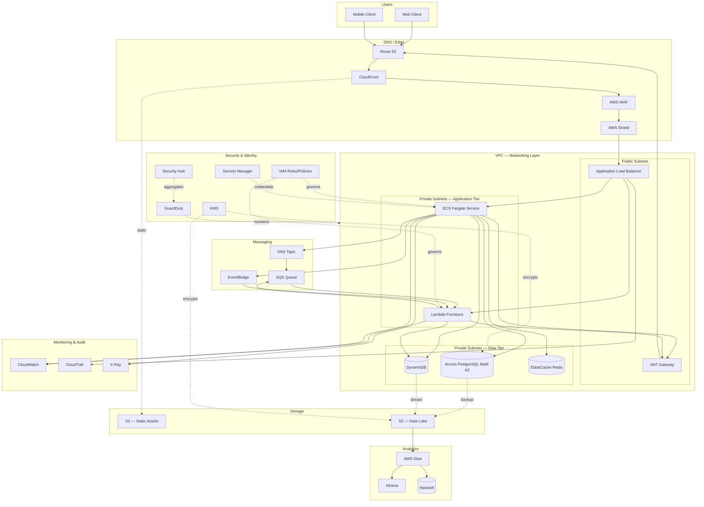
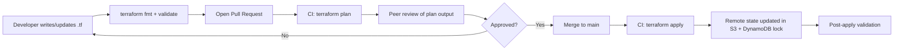

# Chapter 2 – AWS Building Blocks

> **Visual note:** This chapter uses Mermaid diagrams for architecture and sequence flows, and Markdown tables for comparisons, cost estimates, and checklists. All Terraform and CLI examples are written against provider `hashicorp/aws >= 5.0` and AWS CLI v2.

---

# 1 Executive Summary

Every enterprise cloud architecture, no matter how sophisticated it eventually becomes, is assembled from a small, stable set of primitive AWS services. Compute runs your code. Storage holds your data. Networking connects everything and enforces boundaries. Databases give that data structure and durability. Messaging decouples systems in time. Analytics turns data into insight. AI services add inference and automation on top. Security, identity, monitoring, cost optimization, and governance are the cross-cutting disciplines that keep all of the above safe, observable, affordable, and compliant over the life of the system.

This chapter exists because every one of the ninety-nine other reference architectures in this book is a *composition* of these building blocks. Rather than re-explaining what EC2, S3, RDS, or IAM are inside every chapter, this chapter establishes the vocabulary, the selection criteria, and the trade-offs once, in depth, so later chapters can focus on how blocks combine into complete, production-grade systems. If you are an experienced AWS practitioner, treat this chapter as a calibration exercise: the value is not in the definitions, it is in the decision criteria — when a block is the right choice, when it is the wrong choice, and what it costs you operationally and financially either way.

**The business problem.** Organizations rarely fail at cloud adoption because they picked the "wrong" service in isolation. EC2, Lambda, ECS, and EKS can all run a web application. RDS, Aurora, and DynamoDB can all store transactional data. The failures that matter — the ones that produce outages, runaway bills, failed audits, and abandoned migrations — come from mismatches between a building block's operating model and the organization's actual constraints: its team size, its compliance obligations, its traffic shape, its release cadence, and its tolerance for operational surprise. A ten-person startup that adopts the same EKS-plus-service-mesh topology as a 400-engineer bank is not being "more cloud-native" — it is importing operational complexity it cannot staff. Conversely, a regulated financial institution that tries to run core ledger workloads on a single unmanaged EC2 instance with no multi-AZ database is not being "lean" — it is accumulating undocumented risk that will surface during an audit, an incident, or a departure of the one engineer who understands the box.

**The architecture objective.** This chapter's objective is to give you a decision framework, not a shopping list. For every category of building block — compute, storage, networking, databases, messaging, analytics, AI, security, identity, monitoring, cost, and governance — you should walk away able to answer three questions for your own workload: (1) which AWS service in this category fits the workload's actual shape (traffic pattern, state model, latency budget, team skill set); (2) what does choosing it commit you to operationally, contractually (via SLAs), and financially over a 3-year horizon; and (3) what is the credible off-ramp if the choice turns out to be wrong in eighteen months. Enterprise architecture reviews that skip question 3 are the reason so many organizations end up with expensive, hard-to-reverse commitments to a single compute model or database engine.

**Why organizations adopt a structured building-block approach.** Left ungoverned, cloud adoption tends toward sprawl: every team picks its own compute model, its own database, its own logging format, its own IAM pattern. This is not a hypothetical — it is the default outcome of decentralized cloud adoption inside any organization larger than a handful of teams. A structured building-block catalog, with explicit selection criteria and default patterns per category, gives platform teams a small number of "paved roads" that cover the overwhelming majority of use cases, while still leaving an explicit, reviewed escape hatch for genuinely novel requirements. This is precisely the model AWS itself recommends under the Operational Excellence pillar of the Well-Architected Framework: prefer small, well-understood, composable services with clear ownership boundaries over bespoke, one-off infrastructure.

**Major business benefits.** Standardizing on a well-reasoned set of building blocks delivers four categories of benefit that matter to the business, not just to engineering:

1. **Speed of delivery.** When compute, storage, networking, and database patterns are pre-approved and codified as Terraform modules (see Chapter 18 of this reference architecture and the parallel patterns in the companion DevOps series), a new service can go from design to production in days, not months, because the architecture review has already happened once, at the platform level, instead of once per team.
2. **Predictable, controllable cost.** Building blocks chosen for the right workload shape (e.g., Lambda for spiky, low-duty-cycle traffic instead of always-on EC2; S3 Intelligent-Tiering instead of manually managed lifecycle rules) avoid the two most common cost failure modes: over-provisioned steady-state compute, and unmanaged storage growth.
3. **Auditable, defensible security posture.** A small number of well-understood identity and encryption patterns, applied consistently, are dramatically easier to audit than a heterogeneous mix of ad hoc IAM policies and inconsistent encryption-at-rest configurations across dozens of independently designed systems.
4. **Organizational resilience to staff turnover.** Bespoke, cleverly optimized infrastructure that only one engineer fully understands is a business continuity risk. Standard building blocks, documented once in a catalog like this chapter, are operable by any engineer who has been onboarded to the platform's paved roads.

**Typical enterprise scenarios.** Across the client engagements and architecture reviews that inform this book, the same handful of scenarios recur constantly, and each one maps to a distinct combination of building blocks:

- **Customer-facing web/mobile backend** — ALB + Auto Scaling Group or ECS Fargate, RDS or Aurora, CloudFront + S3 for static assets, ElastiCache for session/data caching, SQS/SNS for asynchronous work, CloudWatch + X-Ray for observability.
- **Event-driven data pipeline** — S3 as the landing zone, EventBridge or Kinesis for event routing, Lambda or Glue for transformation, Athena/Redshift for analytics, Step Functions for orchestration.
- **Internal line-of-business application** — Smaller footprint, often single-AZ or two-AZ, RDS (not Aurora) or DynamoDB depending on access pattern, App Runner or ECS Fargate for compute, tighter cost constraints, less aggressive HA/DR targets.
- **Regulated core system (banking, healthcare, insurance)** — Multi-AZ everything, encryption enforced via SCP, extensive CloudTrail/Config/Security Hub coverage, Transit Gateway-based network segmentation, formal DR runbooks with tested RTO/RPO, and heavy governance overhead that is *appropriate* for the risk profile rather than accidental.
- **AI-augmented internal tooling** — Bedrock for managed foundation model access, Lambda or ECS for orchestration logic, DynamoDB or OpenSearch for retrieval-augmented generation (RAG) context stores, strict IAM boundaries around model invocation to control cost and prevent data exfiltration through prompts.

Each of these scenarios reappears, in far greater architectural detail, across the other ninety-nine chapters of this book. What they all share is that they are built from the same twelve categories of building block covered in this chapter — the difference between them is entirely in *which* service within each category was chosen, and why. Getting that "why" right, consistently, for your organization's actual constraints, is the single highest-leverage architectural skill a cloud architect can develop, and it is the skill this chapter is designed to build.

---

# 2 Business Requirements

Before selecting any specific AWS service, an architecture review should establish the requirements the building blocks must satisfy. The table below captures the requirement categories that recur across almost every enterprise workload, along with the questions a Principal Architect should be asking during intake.

| Requirement Category | Key Questions | Typical Enterprise Answer |
|---|---|---|
| Business drivers | What revenue, cost, or risk outcome does this system serve? | Reduce time-to-market, cut infrastructure spend, meet a compliance deadline, replace an out-of-support legacy platform |
| Functional requirements | What must the system do, end to end? | Serve API traffic, process events, store transactional/analytical data, authenticate users |
| Non-functional requirements | Performance, availability, security, maintainability | p99 latency < 300ms, 99.95% availability, encryption at rest/in transit, least-privilege IAM |
| Scalability goals | Expected peak vs. baseline load, growth curve | 10x traffic growth over 24 months; 5x spike during known seasonal events |
| Availability requirements | Acceptable downtime per year, per incident | 99.9%–99.99% depending on tier; core payment paths typically 99.95%+ |
| Latency requirements | End-user and internal service latency budgets | < 200ms p95 for interactive APIs; < 5s for async batch jobs |
| Compliance requirements | Regulatory frameworks in scope | PCI-DSS, HIPAA, SOC 2, GDPR, FedRAMP depending on industry and geography |
| Security expectations | Data classification, threat model | PII/PCI data requires field-level encryption, restricted network paths, audited access |
| Recovery objectives | RPO/RTO per system tier | See RPO/RTO table below |
| SLAs | Internal and external commitments | Contractual uptime and support response times passed down to infrastructure design |
| Expected workload | Requests/sec, data volume, concurrency | Baseline + peak numbers, ideally from real traffic analysis, not guesses |
| Expected growth | 1-year, 3-year projection | Drives right-sizing and Reserved Instance/Savings Plan commitment horizon |

### RPO and RTO by System Tier

Not every system in an enterprise portfolio deserves the same recovery investment. A common and defensible pattern is to classify systems into tiers and apply differentiated RPO/RTO targets, because chasing near-zero RPO/RTO for every system is both financially wasteful and operationally counterproductive — it dilutes engineering attention that should go to the systems that actually need it.

| Tier | Example Systems | RPO Target | RTO Target | Typical Pattern |
|---|---|---|---|---|
| Tier 0 – Mission Critical | Payment processing, core ledger | < 1 minute | < 15 minutes | Multi-AZ + multi-region active-active or active-passive, automated failover |
| Tier 1 – Business Critical | Customer-facing web app, order management | < 15 minutes | < 1 hour | Multi-AZ, cross-region backup, warm standby |
| Tier 2 – Important | Internal tools, reporting dashboards | < 4 hours | < 8 hours | Multi-AZ, daily cross-region snapshot |
| Tier 3 – Non-critical | Dev/test environments, batch analytics | < 24 hours | < 48 hours | Single-AZ acceptable, standard backup |

> **Note:** RPO/RTO targets should be signed off by the business owner, not set unilaterally by engineering. A common architecture review failure is engineering assuming a system is Tier 2 while the business treats it as Tier 0 during an actual incident.

### Expected Workload and Growth Modeling

A Principal Architect should push back on vague workload descriptions ("it needs to scale") and insist on numbers, even rough ones, because every subsequent sizing, cost, and capacity decision in this chapter depends on them:

- **Baseline requests/sec** and **peak requests/sec**, with the ratio between them (a 3x peak-to-baseline ratio drives very different Auto Scaling policy design than a 20x ratio).
- **Read/write ratio** for data stores — this alone often decides between RDS, Aurora, and DynamoDB.
- **Data volume today** and **projected data volume at 12/24/36 months**, since storage class and database engine limits (e.g., single-instance RDS storage ceilings) become relevant at scale.
- **Concurrency and connection count**, which drives decisions like whether RDS Proxy or DynamoDB is more appropriate than raw RDS connections from a large fleet of Lambda functions.
- **Latency sensitivity by request type** — not every endpoint has the same latency budget; batch and reporting endpoints can tolerate seconds where checkout APIs cannot tolerate more than tens of milliseconds of added latency.

---

# 3 Architecture Overview

## Overall Design Philosophy

The building blocks in this chapter are organized so that each category maps to a distinct architectural *concern*, and a well-designed system keeps those concerns loosely coupled. Compute should be swappable (EC2 today, Fargate tomorrow) without rewriting the data layer. Storage and database choices should be driven by access pattern, not by whatever the team already knows. Networking should enforce security boundaries independently of application logic — the network should deny by default even if an application bug would otherwise allow an unintended call. Security, identity, monitoring, cost, and governance are not separate "phases" bolted on at the end; they are cross-cutting concerns applied to every other block from day one.

This is the practical expression of the AWS Well-Architected Framework's six pillars — Operational Excellence, Security, Reliability, Performance Efficiency, Cost Optimization, and Sustainability — at the building-block level rather than the whole-system level. Every category section later in this chapter includes an explicit Well-Architected mapping.

## Core Components and How They Interact

A representative enterprise workload composed from this chapter's building blocks looks like the following, at a level of abstraction appropriate for a component interaction overview (a full request-lifecycle diagram follows in Section 5):

- **Edge and networking** (Route 53, CloudFront, WAF, Shield) receive and filter inbound traffic before it reaches application infrastructure.
- **Compute** (ALB-fronted Auto Scaling Group, ECS Fargate service, or Lambda functions) executes application logic inside private subnets.
- **Data layer** (RDS/Aurora for relational, DynamoDB for key-value/document, S3 for objects) persists state, with access mediated entirely through IAM and security groups — never through public endpoints for anything holding production data.
- **Messaging** (SQS, SNS, EventBridge) decouples compute components in time, absorbing bursts and enabling asynchronous, retryable processing.
- **Analytics** (Athena, Redshift, QuickSight, Glue) consumes data at rest for reporting and business intelligence without impacting operational data stores.
- **AI services** (Bedrock, SageMaker, Comprehend, Rekognition) are invoked as managed APIs from application or pipeline code, governed by the same IAM and monitoring discipline as any other service call.
- **Security and identity** (IAM, KMS, Secrets Manager, GuardDuty, Security Hub) wrap every other component: no compute-to-data call happens without an IAM policy evaluation; no data at rest exists without a KMS key; no credential is embedded in code.
- **Monitoring** (CloudWatch, CloudTrail, X-Ray) observes every layer continuously, feeding both automated alarms and the audit trail required for compliance and incident forensics.
- **Cost optimization and governance** (Cost Explorer, Budgets, AWS Config, Organizations/SCPs) operate as a continuous control loop across the entire account structure, not as a one-time setup task.

## High-Level Workflow: Request, Response, and Data Lifecycle

**Request lifecycle:** A client request resolves DNS via Route 53, is optionally cached and filtered at CloudFront/WAF, is load-balanced across compute instances by ALB (or invoked directly for Lambda-fronted APIs via API Gateway), is authenticated/authorized (application-level auth plus IAM for any AWS API calls the request triggers), and is processed by application logic that reads/writes the data layer as needed.

**Response lifecycle:** The application constructs a response, which may be cached at CloudFront for cacheable content, logged (access logs, application logs, X-Ray trace segments) as it returns, and delivered back through the same edge path. Errors are captured at every layer — ALB target health, application exceptions, database errors — and surfaced through CloudWatch Alarms rather than relying on users to report failures.

**Data lifecycle:** Data enters the system either synchronously (a write during a request) or asynchronously (via an event on SQS/SNS/EventBridge, or a batch job). It is persisted in the appropriate store based on access pattern, encrypted at rest via KMS, backed up according to its RPO tier, and eventually transitions through storage lifecycle policies (e.g., S3 Standard → Standard-IA → Glacier) or is deleted according to a documented retention policy. Analytics pipelines read this data without ever writing back into operational stores, preserving a clean separation between OLTP and OLAP concerns.


---

# 4 AWS Services Used

This section covers every AWS service category relevant to a general-purpose enterprise architecture. For each service: purpose, why it is typically selected, alternatives, limitations, pricing considerations, and best practices.

## 4.1 Compute

### Amazon EC2

**Purpose:** Resizable virtual machines (instances) running on the Nitro hypervisor, giving full control over the operating system, networking stack, and installed software.

**Why selected:** EC2 is chosen when a workload needs OS-level control (custom kernel modules, licensed software with specific OS requirements, legacy applications not easily containerized), sustained high utilization (making Reserved Instances/Savings Plans economical), or specialized hardware (GPU, high-memory, or bare-metal instances for HPC and ML training).

**Alternatives:** ECS/EKS on Fargate (no OS management), Lambda (event-driven, no server management at all), Lightsail (simplified EC2 for small workloads).

**Limitations:** You are responsible for OS patching, security hardening, and capacity planning. Scaling is slower than serverless (minutes, not milliseconds) even with Auto Scaling. Idle capacity is billed regardless of utilization unless using Spot.

**Pricing considerations:** On-Demand for unpredictable/short-lived workloads; Reserved Instances or Savings Plans for steady-state workloads (up to ~72% discount for 3-year all-upfront commitments); Spot Instances for fault-tolerant, interruptible workloads (up to ~90% discount, but subject to 2-minute interruption notice).

**Best practices:** Use Auto Scaling Groups instead of standalone instances for anything production-facing; use launch templates (not launch configurations, which are legacy); enforce IMDSv2 to prevent SSRF-based credential theft; use Systems Manager Session Manager instead of SSH key pairs and bastion hosts wherever possible.

> **Warning:** Long-lived EC2 instances that are manually configured ("pet" servers) are one of the most common sources of configuration drift and undocumented risk in enterprise environments. Treat every instance as replaceable; if it cannot be terminated and recreated from a launch template without data loss, it is an architectural liability.

### Amazon ECS (Elastic Container Service)

**Purpose:** AWS-native container orchestration, supporting both the EC2 launch type (you manage the underlying instances) and the Fargate launch type (AWS manages the compute, you only define task definitions).

**Why selected:** ECS is generally preferred over EKS when the organization does not have existing Kubernetes expertise, does not need the Kubernetes ecosystem (Helm charts, custom operators, multi-cloud portability), and wants a lower operational burden. Fargate specifically is chosen when teams want container packaging without managing any underlying instances.

**Alternatives:** EKS (Kubernetes for teams with that expertise or a multi-cloud requirement), App Runner (even simpler, for standard web services), Lambda (for workloads that fit an event-driven, short-duration execution model).

**Limitations:** Fargate has less control over the underlying host (no custom kernel modules, no DaemonSets-equivalent), and cold-start/task-launch times, while faster than most EC2 provisioning, are slower than Lambda cold starts for lightweight functions. ECS-native tooling is AWS-specific — less portable than Kubernetes manifests.

**Pricing considerations:** Fargate charges per vCPU/memory-second actually consumed by the task, which can be more expensive than well-utilized EC2 at scale but cheaper than under-utilized EC2 at low/variable scale. Fargate Spot offers discounted pricing for interruption-tolerant tasks.

**Best practices:** Use Fargate for the majority of stateless services; reserve the EC2 launch type for cases needing GPU access, custom AMIs, or very high task density per host for cost efficiency at large scale.

### AWS Lambda

**Purpose:** Fully managed, event-driven function execution with no server management; you deploy code, AWS handles provisioning, scaling, and patching of the execution environment.

**Why selected:** Ideal for spiky or low-duty-cycle workloads, event processing (S3 triggers, SQS consumers, API Gateway backends), and glue logic between AWS services. Cost-efficient at low-to-moderate, bursty traffic because you pay only for actual invocation time.

**Alternatives:** ECS Fargate (for workloads needing longer execution times than Lambda's 15-minute maximum, or requiring more predictable latency without cold starts), EC2 (for sustained, high-throughput workloads where Lambda's per-invocation overhead becomes more expensive than dedicated compute).

**Limitations:** 15-minute maximum execution duration; cold-start latency (mitigated but not eliminated by Provisioned Concurrency); ephemeral storage limits (up to 10 GB via `/tmp`); can become significantly more expensive than EC2/Fargate at sustained high request volume.

**Pricing considerations:** Pay per request and per GB-second of execution; Provisioned Concurrency adds a fixed hourly cost per configured concurrent execution, which should be reserved for latency-sensitive endpoints only, not applied blanket across all functions.

**Best practices:** Keep functions small and single-purpose; externalize configuration via Parameter Store/Secrets Manager rather than environment variables for sensitive values; set appropriate memory allocation (which also scales CPU) based on profiling, not guesswork, since under-provisioned memory is a common source of both slow performance and higher total cost.

### Compute Decision Matrix

| Factor | EC2 | ECS Fargate | Lambda | EKS |
|---|---|---|---|---|
| Operational overhead | High | Low | Lowest | Highest |
| Cold start | None (always running) | Seconds | Milliseconds–seconds | N/A (pods) |
| Max execution duration | Unlimited | Unlimited | 15 minutes | Unlimited |
| Best for steady-state high throughput | Yes | Yes | No | Yes |
| Best for spiky/event-driven | No | Partial | Yes | Partial |
| Team needs Kubernetes skills | No | No | No | Yes |
| Custom OS/kernel access | Yes | No | No | Yes (node level) |
| Typical cost profile at low utilization | Poor | Fair | Excellent | Poor |
| Typical cost profile at high, steady utilization | Excellent (with RI/SP) | Good | Poor | Good |

## 4.2 Storage

### Amazon S3

**Purpose:** Object storage offering 11 nines of durability, unlimited scale, and multiple storage classes for cost/access-frequency trade-offs.

**Why selected:** S3 is the default choice for unstructured data — static assets, backups, data lake landing zones, log archives — because of its durability guarantees, integration with virtually every other AWS service, and mature lifecycle management tooling.

**Alternatives:** EFS (for POSIX-compliant shared file access across compute), EBS (block storage attached to a single instance), FSx (for Windows file shares or high-performance computing file systems).

**Limitations:** Not a filesystem — no in-place partial-object edits, no native file locking (application-level coordination required); eventual consistency historically required careful design, though S3 now offers strong read-after-write consistency for all operations.

**Pricing considerations:** Storage class selection is the primary cost lever. Standard for frequently accessed data, Standard-IA/One Zone-IA for infrequent access, Glacier Instant/Flexible/Deep Archive for archival, and Intelligent-Tiering when access patterns are unpredictable and you want automatic optimization without manual lifecycle rule authoring.

**Best practices:** Enable versioning and MFA delete for critical buckets; enforce bucket policies denying non-TLS access and unencrypted uploads; use S3 Lifecycle rules to automatically transition and expire objects; never make a bucket holding production or customer data public — use CloudFront with Origin Access Control (OAC) instead of public bucket policies for content delivery.

### Amazon EBS

**Purpose:** Block storage volumes attached to individual EC2 instances, used for boot volumes and low-latency, high-IOPS application storage.

**Why selected:** Required whenever an EC2 instance needs persistent, instance-attached storage with predictable low-latency IOPS — databases running on EC2, for example.

**Alternatives:** Instance store (ephemeral, faster but data lost on stop/terminate — appropriate only for caches or scratch space), EFS (if multiple instances need shared access), S3 (for data that doesn't need block-level access).

**Limitations:** Tied to a single Availability Zone; must be explicitly snapshotted for durability beyond that AZ; performance tiers (gp3, io2) must be matched to workload IOPS/throughput requirements or you either overpay or bottleneck.

**Pricing considerations:** gp3 decouples IOPS/throughput from volume size (unlike gp2), letting you provision exactly what you need instead of over-provisioning size just to get more IOPS — this alone commonly cuts EBS spend by 20–30% when migrating from gp2.

### Amazon EFS

**Purpose:** Fully managed, elastic NFS file system that multiple compute instances (EC2, ECS, Lambda) can mount concurrently.

**Why selected:** Needed for workloads requiring shared, POSIX-compliant file access across a fleet — content management systems, shared configuration, some legacy application migrations.

**Limitations:** Higher per-GB cost than S3; latency characteristics different from local block storage, which can matter for latency-sensitive workloads.

### Storage Decision Matrix

| Factor | S3 | EBS | EFS | FSx |
|---|---|---|---|---|
| Access pattern | Object (API) | Block (single instance) | File (shared, POSIX) | File (Windows/HPC) |
| Multi-instance concurrent access | Yes (via API) | No | Yes | Yes |
| Durability | 11 nines | AZ-bound, needs snapshots | Regional | Varies by type |
| Typical use case | Data lake, backups, static assets | Databases, boot volumes | Shared app storage | Windows shares, HPC scratch |
| Cost profile | Lowest per GB (with tiering) | Moderate | Higher per GB | Higher per GB |

## 4.3 Networking

### Amazon VPC

**Purpose:** Logically isolated virtual network within AWS where you control IP addressing, subnetting, routing, and connectivity.

**Why selected:** Every non-trivial AWS workload runs inside a VPC; the decisions that matter are subnet layout, route table design, and boundary enforcement, covered in depth in Section 9.

**Best practices:** Plan CIDR ranges to avoid overlap with on-premises networks and other VPCs you may need to peer or connect via Transit Gateway; reserve address space for growth; separate public and private subnets across at least two (ideally three) Availability Zones.

### Elastic Load Balancing (ALB/NLB)

**Purpose:** Distributes incoming traffic across multiple compute targets; ALB operates at Layer 7 (HTTP/HTTPS, supports path/host-based routing), NLB at Layer 4 (TCP/UDP, ultra-low latency, static IPs).

**Why selected:** ALB is the default for HTTP(S) application traffic needing content-based routing, WAF integration, and native support for ECS/Lambda targets. NLB is chosen for extreme performance requirements, non-HTTP protocols, or when a static IP is required by a downstream consumer/firewall allowlist.

### Amazon CloudFront

**Purpose:** Global content delivery network (CDN) that caches content at edge locations, reducing latency and origin load, and integrates with WAF and Shield for edge-level security filtering.

**Why selected:** Any public-facing application benefits from CloudFront in front of it — even for largely dynamic content, CloudFront reduces TLS handshake latency, provides DDoS absorption at the edge, and offloads static asset delivery from origin compute.

### Amazon Route 53

**Purpose:** Managed DNS service with health-check-based routing policies (failover, weighted, latency-based, geolocation).

**Why selected:** DNS is the entry point for virtually every architecture; Route 53's health-check integration is what makes automated regional/AZ failover possible without manual DNS changes during an incident.

### AWS Transit Gateway

**Purpose:** Hub-and-spoke network transit device connecting multiple VPCs and on-premises networks without requiring a full mesh of VPC peering connections.

**Why selected:** Once an organization has more than a handful of VPCs needing to communicate, Transit Gateway replaces an unmanageable peering mesh (which scales as O(n²) connections) with a single hub, dramatically simplifying route table management and centralizing network segmentation policy.

### AWS PrivateLink

**Purpose:** Private connectivity between VPCs and AWS services (or third-party SaaS) without traversing the public internet, using interface endpoints inside your VPC.

**Why selected:** Required whenever traffic to an AWS service (S3, DynamoDB, Secrets Manager, etc.) or a partner SaaS product must never traverse the public internet — a common compliance requirement in regulated industries.

## 4.4 Databases

### Amazon RDS

**Purpose:** Managed relational database service supporting MySQL, PostgreSQL, MariaDB, Oracle, and SQL Server, handling patching, backups, and (optionally) Multi-AZ failover.

**Why selected:** The default choice for transactional relational workloads that don't need Aurora's specific scaling characteristics — internal applications, moderate-scale OLTP systems, or workloads requiring a specific engine (Oracle, SQL Server) not offered by Aurora.

**Limitations:** Storage and compute scale together (you must resize the instance to get more of either); Multi-AZ failover typically takes 60–120 seconds; read replica lag is asynchronous and can grow under heavy write load.

### Amazon Aurora

**Purpose:** AWS-built, MySQL- and PostgreSQL-compatible relational database with storage decoupled from compute, replicated automatically across three Availability Zones, and capable of up to 15 low-latency read replicas.

**Why selected:** Chosen over standard RDS when the workload needs higher throughput, faster failover (typically under 30 seconds), rapid read-scaling, or Aurora Serverless v2's ability to scale compute capacity automatically based on load without a maintenance-window resize.

**Limitations:** Slightly higher baseline cost than equivalent RDS instances; PostgreSQL/MySQL compatibility is high but not 100% — some extensions and engine-specific features may not be supported; Aurora Serverless v2 has a minimum billed capacity floor.

### Amazon DynamoDB

**Purpose:** Fully managed, serverless key-value and document database with single-digit-millisecond latency at virtually unlimited scale, using a NoSQL access-pattern-driven data model.

**Why selected:** Chosen when access patterns are known in advance and can be modeled around primary/sort keys and secondary indexes, when the workload needs to scale to very high request rates without capacity planning, or when the team wants to eliminate database operational overhead entirely.

**Limitations:** Query flexibility is far more limited than SQL — ad hoc queries and complex joins are not supported natively; schema (access pattern) design must happen up front and is expensive to change later; item size limit of 400 KB.

**Best practices:** Design the table's partition key and sort key around the application's actual query patterns before writing any code — this is the single most consequential DynamoDB design decision and is very costly to change post-launch.

### Database Decision Matrix

| Factor | RDS | Aurora | DynamoDB |
|---|---|---|---|
| Query model | SQL, joins, ad hoc queries | SQL, joins, ad hoc queries | Key-value/document, defined access patterns |
| Scaling | Vertical (resize instance) | Vertical + read replicas, Serverless v2 | Horizontal, near-unlimited |
| Failover time | 60–120s (Multi-AZ) | < 30s | N/A (multi-AZ by default) |
| Operational overhead | Low (managed) | Low (managed) | Lowest (fully serverless) |
| Best for | Traditional OLTP, known engine requirements | High-throughput OLTP, fast failover needs | High-scale, well-defined access patterns |
| Schema flexibility | High (relational) | High (relational) | Low — access patterns fixed at design time |

## 4.5 Messaging

### Amazon SQS

**Purpose:** Fully managed message queuing service supporting both standard (at-least-once, best-effort ordering) and FIFO (exactly-once processing, strict ordering) queues.

**Why selected:** The default choice for decoupling producers and consumers, absorbing traffic bursts, and enabling retry/dead-letter handling for asynchronous work.

### Amazon SNS

**Purpose:** Fully managed pub/sub messaging service, fanning out a single published message to multiple subscribers (SQS queues, Lambda functions, HTTP endpoints, email/SMS).

**Why selected:** Chosen when a single event needs to trigger multiple independent downstream processes — SNS-to-multiple-SQS fan-out is a standard pattern for this.

### Amazon EventBridge

**Purpose:** Serverless event bus supporting content-based routing rules, schema registry, and integration with over 200 AWS services and SaaS partners as event sources.

**Why selected:** Preferred over SNS/SQS when routing logic needs to be based on event content (not just topic), when integrating multiple AWS services' native events, or when building a broader event-driven architecture with many producers and consumers that shouldn't need to know about each other directly.

### Messaging Decision Matrix

| Factor | SQS | SNS | EventBridge |
|---|---|---|---|
| Pattern | Point-to-point queue | Pub/sub fan-out | Content-based event routing |
| Ordering guarantee | FIFO queues only | No | No (per-event) |
| Content-based filtering | No | Basic (attributes) | Advanced (rule patterns) |
| Best for | Work queues, buffering, retries | Simple fan-out to multiple subscribers | Complex, multi-source event architectures |

## 4.6 Analytics

**Amazon Athena** — serverless SQL query engine over data in S3, ideal for ad hoc analysis without provisioning a data warehouse. **Amazon Redshift** — managed data warehouse for large-scale, complex analytical queries with predictable, high-concurrency reporting workloads. **AWS Glue** — managed ETL service (crawlers, jobs, Data Catalog) for preparing data for analytics. **Amazon Kinesis** — real-time streaming data ingestion and processing. **Amazon QuickSight** — managed BI/dashboarding layer on top of the above.

**Selection guidance:** Athena for infrequent, ad hoc, or low-concurrency queries directly against S3 data (pay-per-query, no infrastructure to manage); Redshift when you have sustained, high-concurrency, complex analytical workloads that justify a provisioned (or Serverless) warehouse; Glue as the ETL layer that populates both.

## 4.7 AI Services

**Amazon Bedrock** — managed access to foundation models (Anthropic Claude, Amazon Titan, and others) via a unified API, without managing model infrastructure. **Amazon SageMaker** — full ML platform for training, tuning, and deploying custom models. **Amazon Comprehend/Rekognition/Textract** — pre-built AI APIs for text analysis, image/video analysis, and document extraction respectively.

**Selection guidance:** Bedrock for generative AI use cases (summarization, chat, RAG) without building custom models; SageMaker when you need custom model training on proprietary data; the specialized Comprehend/Rekognition/Textract APIs when the use case matches their specific pre-built capability exactly, since building the equivalent from a foundation model would be more expensive and less accurate for narrow, well-defined tasks.

## 4.8 Security, Identity, and Monitoring Services

These are covered in dedicated detail in Sections 10, 11, 21, and 22. In summary: **IAM** for identity and access control, **KMS** for encryption key management, **Secrets Manager** for credential storage and rotation, **GuardDuty** for threat detection, **Security Hub** for centralized security posture, **AWS Config** for configuration compliance, **CloudTrail** for API audit logging, **CloudWatch** for metrics/logs/alarms, and **AWS Systems Manager** for operational tooling (Session Manager, Parameter Store, Patch Manager).

---

# 5 Complete Architecture Diagram

The diagram below shows a representative, layered enterprise architecture assembled entirely from this chapter's building blocks — the composition pattern that recurs, with variation, throughout the rest of this book.



**Diagram legend and interpretation:**

- Solid arrows represent synchronous or direct traffic flow (client requests, service-to-service calls).
- Dotted arrows represent asynchronous relationships, governance relationships (IAM/KMS acting on a resource), or data replication/backup flows.
- The Data Tier subnets have no route to the internet — outbound access, where required (e.g., for patching), goes through the NAT Gateway from the Application Tier only, and the Data Tier itself has no NAT route at all in a properly locked-down design.
- Security and Monitoring subgraphs are drawn separately because they are cross-cutting: in practice, every component in every other subgraph has an IAM role, is encrypted via KMS where it stores data, and emits logs/metrics to CloudWatch and CloudTrail.

---

# 6 Component-by-Component Explanation

| Component | Purpose | Scaling | High Availability | Failure Handling | Key Dependencies |
|---|---|---|---|---|---|
| Route 53 | DNS resolution, health-check-based failover | N/A (managed, global) | Multi-region by design | Health checks trigger automatic failover routing | None (root of the chain) |
| CloudFront | Edge caching, TLS termination, DDoS absorption | Automatic, global edge network | Built-in multi-edge-location redundancy | Origin failover groups for multi-origin resilience | Origin (ALB or S3) |
| WAF / Shield | Layer 7 filtering, DDoS protection | Automatic | N/A (edge service) | Rule-based blocking; Shield Advanced adds 24/7 DRT support | CloudFront/ALB attachment |
| ALB | Layer 7 load balancing, routing | Automatic, scales to traffic | Multi-AZ by default | Removes unhealthy targets via health checks | Target compute (ECS/EC2/Lambda) |
| ECS Fargate Service | Runs containerized application logic | Auto Scaling based on CPU/memory/custom metrics | Tasks spread across multiple AZs | ECS reschedules failed tasks automatically | ALB, IAM task role, data tier |
| Lambda Functions | Event-driven processing | Automatic, per-invocation | Multi-AZ by default | Automatic retries (config-dependent), DLQ for poison messages | IAM execution role, event source |
| Aurora | Primary relational data store | Read replicas (up to 15), Serverless v2 auto-scaling | 3-AZ storage replication, automated failover | Automatic failover to replica, point-in-time recovery | KMS, Secrets Manager, VPC security groups |
| DynamoDB | High-scale key-value data store | On-demand or provisioned with auto scaling | Multi-AZ by default (all tables) | Automatic; conditional writes prevent race conditions | IAM, KMS (encryption at rest) |
| ElastiCache Redis | Caching, session store | Cluster mode for horizontal scaling | Multi-AZ with automatic failover | Automatic failover to replica | VPC security groups |
| SQS | Decoupling, buffering, retry | Automatic, virtually unlimited throughput | Multi-AZ by design | Dead-letter queues for repeated processing failures | IAM |
| SNS | Pub/sub fan-out | Automatic | Multi-AZ by design | Delivery retries with backoff | IAM |
| EventBridge | Content-based event routing | Automatic | Multi-AZ by design | Retry policies, DLQ per rule target | IAM, schema registry |
| S3 | Object storage (assets, data lake, backups) | Automatic, virtually unlimited | 11 nines durability, multi-AZ within region | Versioning + cross-region replication for DR | KMS, IAM bucket policy |
| GuardDuty | Threat detection | N/A (managed, regional) | Multi-region aggregation via Security Hub | Findings feed into Security Hub and EventBridge for automated response | CloudTrail, VPC Flow Logs, DNS logs |
| CloudWatch | Metrics, logs, alarms, dashboards | Automatic | Regional service with high durability | Alarms trigger SNS/Lambda-based remediation | All compute/data components as sources |

---

# 7 End-to-End Request Flow

The following sequence describes a typical authenticated API request through the architecture in Section 5, from client to database and back.

```mermaid

sequenceDiagram
    participant C as Client
    participant R53 as Route 53
    participant CF as CloudFront
    participant WAF as WAF
    participant ALB as ALB
    participant APP as ECS Fargate (App)
    participant CACHE as ElastiCache
    participant DB as Aurora
    participant CW as CloudWatch
    participant XR as X-Ray

    C->>R53: 1. Resolve api.example.com
    R53-->>C: 2. Return CloudFront distribution IP
    C->>CF: 3. HTTPS request
    CF->>WAF: 4. Evaluate WAF rules
    WAF-->>CF: 5. Allow (rules pass)
    CF->>ALB: 6. Forward request to origin
    ALB->>APP: 7. Route to healthy target (weighted/round-robin)
    APP->>XR: 8. Start trace segment
    APP->>CACHE: 9. Check cache for requested resource
    alt Cache hit
        CACHE-->>APP: 10a. Return cached data
    else Cache miss
        APP->>DB: 10b. Query Aurora
        DB-->>APP: 11b. Return result set
        APP->>CACHE: 12b. Populate cache (TTL-based)
    end
    APP->>CW: 13. Emit custom metrics
    APP-->>ALB: 14. Return response
    ALB-->>CF: 15. Return response
    CF-->>C: 16. Return response (cached at edge if cacheable)
    APP->>XR: 17. Close trace segment
    Note over CW,XR: 18. Errors at any step trigger CloudWatch Alarms;<br/>trace data available in X-Ray for latency debugging

```

**Step-by-step narrative:**

1–2. DNS resolution via Route 53, potentially using latency-based or failover routing policies to direct the client to the nearest/healthiest region.
3–5. The request reaches CloudFront, which evaluates attached WAF rules (rate limiting, SQL injection/XSS pattern matching, geo-blocking) before forwarding.
6–7. CloudFront forwards to the ALB origin; the ALB evaluates target group health and routes to a healthy ECS task.
8. The application starts an X-Ray trace segment, allowing the full request path (including downstream calls) to be visualized and profiled later.
9–12. The application checks ElastiCache first (cache-aside pattern); on a miss, it queries Aurora and populates the cache with an appropriate TTL to avoid stale data beyond the application's tolerance.
13. Custom application metrics (e.g., business-relevant counters, not just infrastructure metrics) are emitted to CloudWatch.
14–16. The response propagates back through the ALB and CloudFront, which caches the response at the edge if cache headers permit.
17–18. The X-Ray trace segment closes; any errors at any step in this entire chain (WAF block, unhealthy target, database timeout, cache failure) are captured as CloudWatch Alarms and, ideally, routed to an incident management system rather than requiring a human to notice a dashboard anomaly.

> **Tip:** Instrument error handling and logging at every hop, not just at the application layer. A very common production gap is an application that logs its own errors thoroughly but has no visibility into ALB 5xx rates or CloudFront error rates — meaning the team often finds out about edge-layer failures from customer complaints rather than monitoring.

---

# 8 Deployment Flow

## Infrastructure Provisioning

Infrastructure for the building blocks in this chapter should be provisioned entirely through Infrastructure as Code — Terraform is used throughout this book (see Section 18 for concrete modules). Manual, console-driven provisioning of anything beyond a throwaway proof-of-concept is an anti-pattern (see Section 27) because it is not reproducible, not reviewable, and not auditable in the same way a pull request is.

## Terraform Workflow



## CI/CD Deployment for Application Code

Application deployment (as opposed to infrastructure) typically follows a separate pipeline: build → test → security scan → push image to ECR (or package Lambda artifact) → deploy via ECS service update or Lambda alias shift → run smoke tests → promote or roll back. Chapter 20 of this book covers CI/CD integration in full depth; this section focuses on the deployment strategies most relevant to the building blocks above.

## Blue-Green Deployment

Blue-green deployment maintains two full environments (blue = current production, green = new version) and shifts traffic from blue to green once the green environment passes validation. For ECS, this is implemented natively via AWS CodeDeploy's ECS blue/green deployment type, which manages two target groups behind the same ALB and shifts traffic (immediately or on a linear/canary schedule) while keeping the ability to roll back instantly by shifting traffic back to blue.

**When to use:** Systems where instant rollback capability is worth the cost of running duplicate infrastructure during the deployment window — typically Tier 0/Tier 1 systems from the RPO/RTO table in Section 2.

**When not to use:** Low-traffic internal tools where the operational complexity and doubled resource cost during deployment isn't justified by the risk profile — a simple rolling deployment is sufficient.

## Rollback

Rollback strategy should be decided and tested *before* it is needed, not improvised during an incident. For blue-green deployments, rollback is a traffic-shift operation (fast, typically under a minute). For rolling deployments, rollback means redeploying the previous task definition/AMI/Lambda version — slower, but appropriate for lower-tier systems. In all cases, database migrations must be designed to be backward-compatible with the previous application version for at least one deployment cycle, so that a rollback of application code doesn't leave the database in a state the old code can't handle.

## Secrets and Configuration in the Deployment Pipeline

Secrets (database credentials, API keys, third-party tokens) must never be stored in Terraform state in plaintext, never committed to source control, and never baked into container images or AMIs. The standard pattern is: secrets live in Secrets Manager (rotated automatically where the engine supports it) or Parameter Store (SecureString) for lower-sensitivity configuration, and application code or task definitions reference the secret ARN, retrieving the actual value at runtime via IAM-scoped access — never at build time.

## Validation

Every deployment pipeline should include automated post-deploy validation: smoke tests against critical endpoints, a health-check gate before the deployment is considered "complete" (not just before traffic shifts, but a sustained health check over a few minutes to catch slow-onset failures), and automated rollback triggers tied to CloudWatch Alarms (e.g., elevated 5xx rate or latency regression triggers an automatic rollback rather than waiting for a human to notice).

---

# 9 Network Topology

## VPC and CIDR Planning

A production VPC should be planned with a CIDR block large enough to accommodate multiple subnet tiers across multiple Availability Zones, with headroom for growth. A common enterprise pattern:

| Element | Example CIDR | Notes |
|---|---|---|
| VPC | 10.0.0.0/16 | 65,536 addresses; leave room for multiple VPCs per environment across the CIDR space (e.g., 10.0.0.0/16 for prod, 10.1.0.0/16 for staging) |
| Public subnet AZ-a | 10.0.0.0/24 | ALB, NAT Gateway |
| Public subnet AZ-b | 10.0.1.0/24 | ALB, NAT Gateway |
| Private app subnet AZ-a | 10.0.10.0/24 | ECS/EC2/Lambda ENIs |
| Private app subnet AZ-b | 10.0.11.0/24 | ECS/EC2/Lambda ENIs |
| Private data subnet AZ-a | 10.0.20.0/24 | RDS/Aurora/ElastiCache |
| Private data subnet AZ-b | 10.0.21.0/24 | RDS/Aurora/ElastiCache |

> **Warning:** Never plan CIDR ranges in isolation from the rest of the organization's network estate. Overlapping CIDR ranges between VPCs that later need to be peered or connected via Transit Gateway (or to on-premises networks via Direct Connect/VPN) force a costly re-IP effort. Establish an IP address management (IPAM) policy — AWS VPC IPAM is purpose-built for this — before the second VPC is created.

## Public vs. Private Subnets

Public subnets have a route to an Internet Gateway and host only resources that genuinely need to be internet-reachable: the ALB, NAT Gateways, and (rarely) bastion hosts (preferably replaced entirely by Systems Manager Session Manager, which needs no public subnet or open inbound port at all). Private subnets have no direct route to the internet; outbound access, where required, goes through a NAT Gateway in the public subnet. The data tier should, wherever possible, have no NAT route at all — if a database genuinely needs outbound internet access (rare), that need should be scrutinized carefully.

## NAT Gateway vs. Internet Gateway

The Internet Gateway (IGW) enables bidirectional internet connectivity for resources with public IPs, attached at the VPC level. The NAT Gateway enables outbound-only internet connectivity for private-subnet resources (e.g., pulling OS patches or npm packages) without exposing them to inbound connections. A NAT Gateway should be deployed per-AZ (not a single shared NAT Gateway) for both availability (a single NAT Gateway is an AZ-level single point of failure) and to avoid cross-AZ data transfer charges on outbound traffic.

## Transit Gateway for Multi-VPC Connectivity

Once an organization operates more than roughly 3–4 VPCs that need mutual connectivity, Transit Gateway should replace VPC peering as the default pattern. Peering connections do not support transitive routing (VPC A peered to B, and B peered to C, does not let A reach C), forcing a full mesh that becomes unmanageable quickly. Transit Gateway centralizes this as a hub, and its route tables can be used to enforce segmentation (e.g., production VPCs cannot route to development VPCs even though both attach to the same Transit Gateway).

## Route Tables, Network ACLs, and Security Groups

| Control | Scope | Stateful? | Typical Use |
|---|---|---|---|
| Route Tables | Subnet-level | N/A | Determine where traffic is sent (IGW, NAT, TGW, VPC endpoint, local) |
| Network ACLs | Subnet-level | No (stateless — must define both inbound and outbound rules) | Coarse-grained subnet boundary control, defense in depth |
| Security Groups | ENI/instance-level | Yes (return traffic automatically allowed) | Primary mechanism for least-privilege access control between resources |

> **Note:** Security Groups, not Network ACLs, should be the primary access control mechanism in almost all designs — they are stateful, resource-scoped, and far easier to reason about. NACLs are best reserved for coarse, rarely-changing subnet-level rules (e.g., explicitly denying a known-bad CIDR range) rather than fine-grained application logic.

## VPC Endpoints and PrivateLink

Gateway endpoints (S3, DynamoDB — no additional cost) and Interface endpoints (most other AWS services, via PrivateLink — hourly + data processing cost) allow private-subnet resources to reach AWS services without traversing the NAT Gateway or the public internet at all. This both reduces NAT Gateway data processing costs (often significant at scale — see Section 16) and satisfies compliance requirements mandating that traffic to AWS services never touch the public internet.

## Hybrid Connectivity

For organizations connecting on-premises data centers to AWS, **Site-to-Site VPN** provides quick, encrypted connectivity over the public internet (adequate for moderate throughput and non-latency-critical needs), while **AWS Direct Connect** provides a dedicated, private network connection with consistent low latency and higher throughput, typically justified once VPN bandwidth or latency variability becomes a bottleneck for the workload (e.g., large-scale data migration, latency-sensitive hybrid applications, or as a compliance requirement to avoid transiting the public internet at all).

---

# 10 Identity and Access

## IAM Roles vs. IAM Users vs. Resource Policies

Production architectures should not use long-lived IAM users with static access keys for workload identity at all. Compute resources (EC2 instances, ECS tasks, Lambda functions) assume **IAM roles**, which vend short-lived, automatically rotated credentials via the instance metadata service (IMDSv2) or the Lambda/ECS execution environment. **Resource policies** (attached directly to a resource, such as an S3 bucket policy or a KMS key policy) complement identity-based policies by controlling who/what can access that specific resource, regardless of what identity-based policy the caller has — both must allow the action for cross-account access to succeed.

## STS and Cross-Account Access

AWS Security Token Service (STS) issues temporary credentials via `AssumeRole`, which is the mechanism underlying essentially all cross-account access patterns: a central security/audit account assuming a read-only role into member accounts, a CI/CD pipeline in a tooling account assuming a deployment role into a target account, or federated human users assuming roles via IAM Identity Center (formerly AWS SSO). External ID conditions should be required on any cross-account role intended for third-party access, to prevent the "confused deputy" problem.

## Least Privilege in Practice

Least privilege is easy to state as a principle and consistently hard to operationalize. Practical techniques that make it achievable rather than aspirational:

- Start every new role with a minimal policy and add permissions as concrete needs arise (deny-by-default), rather than starting broad and attempting to narrow later — narrowing an over-permissioned role in production is politically and operationally harder than starting narrow.
- Use **IAM Access Analyzer** to generate least-privilege policies based on actual CloudTrail activity for an existing role, then review and tighten before applying.
- Use **permission boundaries** to cap the maximum permissions a role can ever have, even if someone later attaches an overly broad policy to it — this is particularly important for roles that can create other IAM roles (privilege escalation prevention).
- Scope resource ARNs explicitly wherever the API supports it (`arn:aws:s3:::my-specific-bucket/*` rather than `arn:aws:s3:::*`), and use IAM condition keys (`aws:SourceVpce`, `aws:PrincipalOrgID`, `s3:x-amz-server-side-encryption`) to further restrict when a permission applies.

## Service Roles vs. Service-Linked Roles

A **service role** is an IAM role you create and attach to a resource so that resource can call other AWS services on your behalf (e.g., an ECS task role allowing the task to read from S3). A **service-linked role** is predefined by AWS for a specific service (e.g., the role Elastic Load Balancing uses to manage ENIs) and cannot be modified beyond what AWS allows — this distinction matters when troubleshooting permission errors, since service-linked role permissions are not something you can simply edit.

## Example: Least-Privilege ECS Task Role

```json

{
  "Version": "2012-10-17",
  "Statement": [
    {
      "Sid": "ReadSpecificS3Prefix",
      "Effect": "Allow",
      "Action": ["s3:GetObject"],
      "Resource": "arn:aws:s3:::acme-prod-assets/uploads/*"
    },
    {
      "Sid": "ReadWriteSpecificDynamoTable",
      "Effect": "Allow",
      "Action": [
        "dynamodb:GetItem",
        "dynamodb:PutItem",
        "dynamodb:Query",
        "dynamodb:UpdateItem"
      ],
      "Resource": "arn:aws:dynamodb:us-east-1:123456789012:table/acme-orders",
      "Condition": {
        "StringEquals": { "aws:PrincipalOrgID": "o-exampleorgid" }
      }
    },
    {
      "Sid": "ReadSpecificSecret",
      "Effect": "Allow",
      "Action": ["secretsmanager:GetSecretValue"],
      "Resource": "arn:aws:secretsmanager:us-east-1:123456789012:secret:acme/prod/db-creds-*"
    }
  ]
}

```

Note what this policy deliberately does *not* grant: no `s3:*`, no `dynamodb:*`, no access to any secret outside the specific application's namespace, and no wildcard resource ARNs. This is the level of specificity a production architecture review should expect from every workload identity.

---

# 11 Security Architecture

## Encryption

**At rest:** Every data store in this chapter's building-block catalog — S3, EBS, RDS/Aurora, DynamoDB, ElastiCache (in-transit and at-rest options), EFS — supports encryption at rest via AWS KMS. Production architectures should enforce this via Service Control Policies (SCPs) at the AWS Organizations level, denying the creation of unencrypted resources, rather than relying on every engineer remembering to check a box.

**In transit:** TLS 1.2+ should be enforced for all external endpoints (via ALB/CloudFront listener configuration and AWS Certificate Manager for certificate provisioning/rotation) and, in regulated environments, for internal service-to-service traffic as well (e.g., via ACM Private CA or a service mesh's mutual TLS).

## KMS: Key Management

AWS KMS supports both AWS-managed keys (no configuration, but no fine-grained access control or rotation policy control) and customer-managed keys (CMKs — full control over key policy, rotation schedule, and the ability to disable/schedule deletion). Production workloads handling sensitive data should use customer-managed keys with a key policy that restricts `kms:Decrypt` to only the specific IAM roles that need it, and enable automatic annual key rotation.

## WAF and Shield

**AWS WAF** provides Layer 7 filtering (SQL injection, cross-site scripting, rate limiting, geo-blocking, and managed rule groups maintained by AWS and third parties) attached to CloudFront, ALB, or API Gateway. **AWS Shield Standard** is included at no additional cost and provides protection against common network/transport layer DDoS attacks; **Shield Advanced** (paid) adds enhanced protection for Layer 7 attacks, cost protection against scaling-driven DDoS charges, and 24/7 access to the AWS DDoS Response Team — typically justified for internet-facing Tier 0/Tier 1 systems in regulated or high-visibility industries.

## Secrets Manager and Certificate Manager

**Secrets Manager** stores credentials, API keys, and other secrets, with native automatic rotation support for RDS/Aurora/DocumentDB credentials and a Lambda-based rotation framework for other secret types. **AWS Certificate Manager (ACM)** provisions and automatically renews public TLS certificates for use with CloudFront, ALB, and API Gateway at no additional cost, eliminating a historically common source of production outages (expired, manually-managed certificates).

## GuardDuty, Inspector, and Security Hub

**GuardDuty** is a managed threat detection service analyzing CloudTrail, VPC Flow Logs, and DNS logs for anomalous or known-malicious activity (compromised credentials, cryptomining, unusual API call patterns) without requiring you to deploy or manage any detection infrastructure. **Inspector** performs automated vulnerability scanning of EC2 instances, container images in ECR, and Lambda functions against known CVEs. **Security Hub** aggregates findings from GuardDuty, Inspector, Config, and third-party tools into a single, prioritized view, and can evaluate your environment against standards like CIS AWS Foundations Benchmark and PCI-DSS.

## CloudTrail and AWS Config

**CloudTrail** logs every API call made in the account (who, what, when, from where), and should be enabled organization-wide with logs delivered to a centralized, access-restricted S3 bucket in a dedicated logging account — this is both an audit requirement in nearly every compliance framework and frequently the deciding evidence during incident investigation. **AWS Config** continuously records resource configuration state and evaluates it against rules (managed or custom) — e.g., flagging any S3 bucket that becomes public, or any security group allowing unrestricted inbound SSH — providing continuous compliance monitoring rather than point-in-time audits alone.

## Zero Trust Principles Applied to This Architecture

Zero Trust, applied concretely rather than as a buzzword, means: no implicit trust based on network location alone (a request originating inside the VPC is not automatically trusted); every service-to-service call is authenticated and authorized (IAM roles, not shared secrets, wherever possible); encryption is applied in transit even for "internal" traffic in high-sensitivity environments; and least-privilege IAM plus fine-grained security groups replace broad network-perimeter trust as the primary security boundary.

## Threat Model and Mitigations

| Attack Vector | Description | Primary Mitigation |
|---|---|---|
| Credential compromise (long-lived keys) | Leaked IAM user access keys used for unauthorized access | Use IAM roles instead of long-lived keys; GuardDuty anomaly detection; mandatory MFA for human users |
| SSRF against IMDS | Application vulnerability used to steal instance credentials via the metadata service | Enforce IMDSv2 (session-oriented, token-required) account-wide via SCP |
| Public data exposure | S3 bucket or snapshot accidentally made public | SCP denying public bucket policies; AWS Config rules; S3 Block Public Access at account level |
| Overly permissive IAM | Wildcard policies granting far more access than needed | IAM Access Analyzer, permission boundaries, regular access reviews |
| Injection attacks (SQLi, XSS) | Malicious input exploiting application vulnerabilities | WAF managed rule groups; parameterized queries; input validation at the application layer |
| DDoS | Volumetric or application-layer denial of service | CloudFront + Shield (Standard/Advanced) + WAF rate-based rules |
| Supply chain compromise | Malicious dependency or compromised CI/CD pipeline | Inspector scanning, SBOM generation, signed artifacts, restricted CI/CD IAM roles |
| Data exfiltration via compromised workload | Compromised container/instance exfiltrating data over the network | Egress-restricted security groups, VPC endpoints instead of NAT for AWS service traffic, GuardDuty |

---

# 12 High Availability

## Availability Zone Failures

Every stateful and stateless component in this chapter's building blocks should be deployed across a minimum of two, ideally three, Availability Zones. AZs are physically isolated data centers within a region, and while individual AZ failures are rare, they are not hypothetical — they happen, and single-AZ architectures for anything beyond Tier 3 workloads (per Section 2's tiering) are an unmanaged risk, not a cost optimization.

## Instance/Task Failures

ALB health checks combined with Auto Scaling Group (or ECS service) desired-count enforcement automatically replace failed instances/tasks without human intervention. The key design requirement is that application state must not live on the failing instance/task itself — sessions belong in ElastiCache or DynamoDB, not in local memory, so that any healthy instance can serve any request (a stateless compute tier is a prerequisite for this entire failure-handling model to work).

## Regional Failures

Regional failure handling is the most expensive tier of HA to build and should be reserved for Tier 0 systems (per Section 2) where the business impact justifies it. Patterns range from backup-and-restore (cheapest, slowest RTO) through pilot light and warm standby to full active-active multi-region (most expensive, fastest RTO) — covered in depth in Section 13.

## Database Failure Handling

Aurora and RDS Multi-AZ deployments handle primary-instance failure via automated failover to a standby/replica, with Aurora typically completing failover in under 30 seconds and RDS Multi-AZ in 60–120 seconds. Applications must implement retry logic with exponential backoff for the brief connection interruption during failover — a surprisingly common production gap is application code that treats a failover-induced connection error as a permanent failure rather than a transient one to retry.

## Load Balancing and Health Checks

Health check configuration is a frequently under-engineered detail with outsized impact. A health check endpoint should verify genuine service health (can the service reach its database, is its dependency chain healthy) rather than simply returning HTTP 200 unconditionally — the latter causes the load balancer to keep routing traffic to instances that are technically running but functionally broken.

> **Tip:** Distinguish liveness (is the process running) from readiness (is the process able to serve traffic correctly right now) in health check design, mirroring the same distinction used in Kubernetes probes. An ALB target group health check should generally reflect readiness, not just liveness.

---

# 13 Disaster Recovery

## Backup Strategy

Every stateful component needs an explicit, tested backup strategy, not an assumption that "AWS handles it." RDS/Aurora automated backups (point-in-time recovery, typically a 1–35 day retention window) plus manual snapshots for longer retention; DynamoDB point-in-time recovery and on-demand backups; S3 versioning plus, for critical buckets, cross-region replication; EBS snapshot schedules via Data Lifecycle Manager or AWS Backup.

## AWS Backup for Centralized Policy

**AWS Backup** provides a single, policy-driven backup service spanning RDS, DynamoDB, EBS, EFS, and other supported services, with centralized retention policies, cross-region and cross-account copy, and compliance reporting — generally preferable to configuring backup independently per-service once an organization has more than a handful of data stores to manage.

## DR Strategy Patterns

| Pattern | RTO | RPO | Relative Cost | Description |
|---|---|---|---|---|
| Backup & Restore | Hours | Hours | $ | Regular backups to a DR region; infrastructure provisioned only when needed |
| Pilot Light | Tens of minutes | Minutes | $$ | Core data replicated continuously; minimal standby compute, scaled up on failover |
| Warm Standby | Minutes | Seconds–minutes | $$$ | Scaled-down but fully functional replica environment running continuously |
| Multi-Site Active-Active | Near-zero | Near-zero | $$$$ | Full production capacity running simultaneously in multiple regions, active traffic in both |

**Selection guidance:** Map each system's Section 2 tier directly to a DR pattern — Tier 0 systems justify warm standby or active-active; Tier 2/3 systems are typically over-engineered by anything beyond backup-and-restore or pilot light. A common architecture review failure is applying a single DR pattern uniformly across an entire portfolio regardless of tier, which either overspends on low-value systems or under-protects high-value ones.

## Cross-Region Replication

S3 Cross-Region Replication (CRR), Aurora Global Database (sub-second replication lag, fast regional failover), and DynamoDB Global Tables (multi-region, multi-active) are the primary building blocks for the data-replication component of any multi-region DR pattern above backup-and-restore.

## Testing DR

A DR plan that has never been tested is a hypothesis, not a capability. Enterprise architecture reviews should require documented evidence of DR tests — at minimum annually for Tier 0/1 systems — including actual failover execution (not just a tabletop walkthrough), measured RTO/RPO against the target, and a post-test report of gaps found and remediated.

---

# 14 Scalability

## Horizontal vs. Vertical Scaling

Horizontal scaling (adding more instances/tasks) is generally preferred over vertical scaling (larger instances) for stateless compute because it improves both capacity and fault tolerance simultaneously, and has no hard ceiling the way a single instance's maximum size does. Vertical scaling remains relevant for stateful components where horizontal scaling is architecturally harder (a single RDS primary instance, for example) until you reach the point of adopting a horizontally-scalable data store (Aurora read replicas, DynamoDB) instead.

## Auto Scaling Configuration

EC2/ECS Auto Scaling should combine target-tracking policies (e.g., maintain 60% average CPU utilization) for smooth, predictable scaling with step-scaling or scheduled scaling for known traffic patterns (e.g., scaling up ahead of a predictable daily/weekly peak rather than reacting after the fact, since reactive scaling always lags the actual traffic increase by the time it takes new instances/tasks to become healthy).

## Serverless Scaling

Lambda scales automatically per-invocation up to account/region concurrency limits (a soft limit, raisable via support request); DynamoDB on-demand mode scales read/write capacity automatically without any configuration. The main architectural consideration is downstream dependency capacity — a Lambda function scaling to thousands of concurrent executions can overwhelm a downstream RDS instance's connection limit, which is why RDS Proxy (connection pooling) is a near-mandatory companion to Lambda-plus-RDS architectures at any meaningful scale.

## Database Scaling

Vertical (instance resize) and read-replica horizontal scaling for RDS/Aurora; Aurora Serverless v2 for workloads with variable, hard-to-predict load that don't want fixed instance sizing at all; DynamoDB's native horizontal partitioning for workloads needing scale beyond what a relational engine's single-writer model comfortably handles.

## Storage and Queue Scaling

S3 scales storage capacity and request rate automatically with no configuration required at the level of typical enterprise workloads (extremely high request-rate workloads should follow S3 request-rate partitioning guidance in key naming). SQS scales throughput automatically for standard queues; FIFO queues have a per-second throughput ceiling (300–3,000 msg/s depending on batching) that should be checked against expected peak load during design, not discovered in production.

---

# 15 Performance Optimization

## Caching Strategy

A layered caching strategy typically combines CloudFront (edge caching for cacheable HTTP responses and static assets), ElastiCache (application-level data caching, session storage), and, where appropriate, DAX (DynamoDB Accelerator) for microsecond-latency reads against DynamoDB. Cache invalidation strategy (TTL-based vs. explicit invalidation on write) should be decided deliberately per data type — TTL-based caching is simpler but tolerates staleness; explicit invalidation is more complex but keeps data current at the cost of additional write-path logic.

## Compression and Payload Optimization

Enabling compression (gzip/Brotli) at CloudFront and the application/ALB layer for text-based responses (JSON, HTML, CSS, JS) typically reduces transferred bytes by 60–80% for compressible content, directly improving both latency and CloudFront/data-transfer cost.

## Database Optimization

Query optimization (appropriate indexing, avoiding N+1 query patterns, using `EXPLAIN`/`EXPLAIN ANALYZE` during development rather than only when a production issue occurs), connection pooling (RDS Proxy for Lambda/high-concurrency compute), and read/write splitting (routing read-only queries to Aurora read replicas) are the highest-leverage database performance interventions, generally far more impactful than instance-size increases alone.

## Concurrency and Async Processing

CPU-bound or I/O-bound work that doesn't need to block the request path (sending a confirmation email, generating a report, processing an uploaded file) should be moved off the synchronous request path entirely via SQS/EventBridge-triggered async processing — this both improves perceived latency for the end user and improves resilience, since a slow or temporarily-unavailable downstream dependency no longer directly degrades the user-facing request latency.

---

# 16 Cost Optimization (FinOps)

## Estimated Monthly Costs by Deployment Size

The estimates below are illustrative, based on `us-east-1` on-demand pricing at time of writing, for the architecture pattern shown in Section 5. Actual costs vary by traffic pattern, data volume, and commitment discounts — treat these as a starting point for a Cost Explorer-validated estimate, not a quote.

| Component | Small (startup) | Medium (growth-stage) | Enterprise |
|---|---|---|---|
| Compute (ECS Fargate / EC2) | $150–400 | $1,500–4,000 | $15,000–50,000+ |
| Database (Aurora) | $200–400 | $1,200–3,000 | $10,000–30,000+ |
| Load Balancing + NAT | $80–150 | $300–600 | $1,500–4,000 |
| CloudFront + WAF | $20–100 | $300–1,000 | $3,000–15,000 |
| S3 Storage | $10–50 | $200–800 | $2,000–10,000+ |
| ElastiCache | $50–100 | $400–1,000 | $3,000–8,000 |
| Messaging (SQS/SNS/EventBridge) | < $20 | $100–300 | $1,000–5,000 |
| Monitoring (CloudWatch/X-Ray) | $30–80 | $200–600 | $2,000–6,000 |
| **Approximate Total** | **$560–1,300** | **$4,200–11,300** | **$38,500–128,000+** |

## Major Cost Drivers

In roughly descending order of how often they dominate an unexpectedly high AWS bill: compute (especially over-provisioned, always-on EC2/Fargate for spiky workloads), NAT Gateway data processing charges, database instance over-sizing, CloudFront/data-transfer for high-traffic media-heavy applications, and unmanaged storage growth (snapshots, old log data, orphaned EBS volumes never cleaned up after instance termination).

## Reserved Instances, Savings Plans, and Spot

**Reserved Instances (RIs)** commit to a specific instance family/region for 1 or 3 years in exchange for a discount (up to ~72% for 3-year all-upfront); best suited for genuinely steady-state workloads. **Savings Plans** offer similar discounts with more flexibility (commit to a $/hour spend rather than a specific instance type), making them preferable to RIs for most modern architectures where instance types may change over the commitment period. **Spot Instances** offer the deepest discounts (up to ~90%) for fault-tolerant, interruptible workloads (batch processing, CI/CD runners, stateless web tiers behind an ASG that can absorb interruptions) but are inappropriate for stateful, interruption-sensitive workloads.

## S3 Lifecycle and Storage Classes

| Storage Class | Use Case | Relative Cost |
|---|---|---|
| S3 Standard | Frequently accessed data | Baseline |
| S3 Intelligent-Tiering | Unknown/changing access patterns | Baseline + small monitoring fee, saves automatically |
| S3 Standard-IA | Infrequent access, millisecond retrieval needed | ~45% less than Standard |
| S3 Glacier Instant Retrieval | Archival with millisecond retrieval | ~68% less than Standard |
| S3 Glacier Flexible Retrieval | Archival, retrieval in minutes–hours acceptable | ~80% less than Standard |
| S3 Glacier Deep Archive | Long-term archival (7+ years), 12-hour retrieval acceptable | ~95% less than Standard |

A lifecycle policy transitioning objects Standard → Standard-IA at 30 days → Glacier Flexible at 90 days → Deep Archive at 365 days is a common, defensible default for log and backup data; application data with genuinely unpredictable access should generally use Intelligent-Tiering instead of hand-authored lifecycle rules.

## Rightsizing

Compute Optimizer (free, AWS-native) analyzes actual CPU/memory/network utilization for EC2, Lambda, and EBS and recommends rightsizing — in most environments that have never run this exercise, it surfaces double-digit percentage savings opportunities immediately, since default instance-size choices at initial deployment are rarely revisited as actual load becomes known.

## Cost Allocation, Tagging, and Budgets

A mandatory tagging policy (enforced via SCP or AWS Config rules, not just documentation) covering at minimum `Environment`, `Owner`, `CostCenter`, and `Project` tags on every billable resource is the prerequisite for any meaningful cost allocation reporting. **AWS Budgets** should be configured with alert thresholds (e.g., 80%/100%/120% of forecasted spend) per cost center, and **Cost Anomaly Detection** should be enabled to catch unexpected spend spikes (a misconfigured Auto Scaling policy, a runaway Lambda recursion, an accidentally-public data transfer path) within hours rather than at the end of the billing cycle.

---

# 17 AI-Assisted Operations

## Amazon Q and Bedrock in Operational Workflows

**Amazon Q Developer** integrates into the IDE and AWS Console to assist with code generation, Infrastructure-as-Code authoring, and troubleshooting AWS Console errors directly. **Amazon Bedrock** provides managed access to foundation models for building custom AI-assisted tooling — log analysis summarization, incident postmortem drafting, architecture documentation generation — via API, without managing model infrastructure.

## AI-Assisted Log Analysis and Incident Response

A practical, production-tested pattern: CloudWatch Logs Insights queries surface anomalous log patterns during an incident, and a Bedrock-backed internal tool summarizes the relevant log excerpts, correlates them against recent deployments (via CloudTrail/CI-CD event history), and drafts an initial incident timeline for the on-call engineer to verify and refine — this compresses the "what changed and where do I look" phase of an incident from potentially tens of minutes of manual log searching to a much shorter guided starting point, without removing human judgment from the actual remediation decision.

## AI-Assisted Capacity Planning and Architecture Review

Foundation models can meaningfully accelerate — but should not replace — capacity planning and architecture review: summarizing Compute Optimizer/Cost Explorer output into a digestible narrative for a non-technical stakeholder, drafting a first-pass Well-Architected Framework review against a documented architecture, or generating candidate failure-mode scenarios for a design review to consider. In every case, the AI output is a *draft* input to a human review process, not an approved deliverable — this distinction matters most in regulated environments where the architecture decision record (Section 30) must reflect accountable human judgment.

## AI-Generated Terraform and Documentation

AI-assisted Terraform generation is genuinely useful for scaffolding (generating a first draft of a module matching an established pattern) and for documentation generation (turning a reviewed, working Terraform module into readable documentation). It should never be the last step before `terraform apply` in production — AI-generated infrastructure code should go through the identical plan-review-approve pipeline described in Section 8, with no shortcut for AI-authored changes.

> **Warning:** A recurring production incident pattern is AI-generated IAM policies that are broader than necessary (e.g., defaulting to `Resource: "*"` because it "works" without the author verifying the minimal necessary scope). Any AI-assisted IAM policy authoring must go through the same least-privilege review described in Section 10 — AI assistance changes who writes the first draft, not the review bar the draft must clear.

---

# 18 Terraform Implementation

The modules below provide a representative, modular starting point for the architecture in Section 5. They are intentionally scoped to the core networking, compute, and IAM layers — a full, production-complete module set (covering every service in Section 4) would run to thousands of lines and is beyond a single chapter; treat this as the skeleton pattern to extend.

## Provider and Backend Configuration

```hcl

# versions.tf

terraform {
  required_version = ">= 1.7.0"

  required_providers {
    aws = {
      source  = "hashicorp/aws"
      version = "~> 5.0"
    }
  }

  # Remote state with locking. The S3 bucket and DynamoDB table

  # must be created once, out-of-band, before this backend can be used.

  backend "s3" {
    bucket         = "acme-terraform-state-prod"
    key            = "chapter-02/building-blocks/terraform.tfstate"
    region         = "us-east-1"
    dynamodb_table = "acme-terraform-locks"
    encrypt        = true
  }
}

provider "aws" {
  region = var.aws_region

  default_tags {
    tags = {
      Environment = var.environment
      Project     = var.project_name
      ManagedBy   = "terraform"
    }
  }
}

```

## Variables

```hcl

# variables.tf

variable "aws_region" {
  description = "AWS region for deployment"
  type        = string
  default     = "us-east-1"
}

variable "environment" {
  description = "Deployment environment (dev, staging, prod)"
  type        = string
}

variable "project_name" {
  description = "Project name used for resource naming and tagging"
  type        = string
  default     = "acme-platform"
}

variable "vpc_cidr" {
  description = "CIDR block for the VPC"
  type        = string
  default     = "10.0.0.0/16"
}

variable "azs" {
  description = "Availability Zones to deploy across"
  type        = list(string)
  default     = ["us-east-1a", "us-east-1b", "us-east-1c"]
}

variable "app_instance_count" {
  description = "Desired count for the ECS Fargate service"
  type        = number
  default     = 2
}

```

## Networking Module

```hcl

# modules/networking/main.tf

resource "aws_vpc" "main" {
  cidr_block           = var.vpc_cidr
  enable_dns_support   = true
  enable_dns_hostnames = true

  tags = { Name = "${var.project_name}-${var.environment}-vpc" }
}

resource "aws_subnet" "public" {
  count                   = length(var.azs)
  vpc_id                  = aws_vpc.main.id
  cidr_block              = cidrsubnet(var.vpc_cidr, 8, count.index)
  availability_zone       = var.azs[count.index]
  map_public_ip_on_launch = true

  tags = { Name = "${var.project_name}-${var.environment}-public-${var.azs[count.index]}" }
}

resource "aws_subnet" "private_app" {
  count             = length(var.azs)
  vpc_id            = aws_vpc.main.id
  cidr_block        = cidrsubnet(var.vpc_cidr, 8, count.index + 10)
  availability_zone = var.azs[count.index]

  tags = { Name = "${var.project_name}-${var.environment}-app-${var.azs[count.index]}" }
}

resource "aws_subnet" "private_data" {
  count             = length(var.azs)
  vpc_id            = aws_vpc.main.id
  cidr_block        = cidrsubnet(var.vpc_cidr, 8, count.index + 20)
  availability_zone = var.azs[count.index]

  tags = { Name = "${var.project_name}-${var.environment}-data-${var.azs[count.index]}" }
}

resource "aws_internet_gateway" "main" {
  vpc_id = aws_vpc.main.id
  tags   = { Name = "${var.project_name}-${var.environment}-igw" }
}

# One NAT Gateway per AZ — avoids single-AZ dependency and

# cross-AZ data transfer charges on outbound traffic.

resource "aws_eip" "nat" {
  count  = length(var.azs)
  domain = "vpc"
}

resource "aws_nat_gateway" "main" {
  count         = length(var.azs)
  allocation_id = aws_eip.nat[count.index].id
  subnet_id     = aws_subnet.public[count.index].id
  tags          = { Name = "${var.project_name}-${var.environment}-nat-${var.azs[count.index]}" }

  depends_on = [aws_internet_gateway.main]
}

resource "aws_route_table" "public" {
  vpc_id = aws_vpc.main.id

  route {
    cidr_block = "0.0.0.0/0"
    gateway_id = aws_internet_gateway.main.id
  }

  tags = { Name = "${var.project_name}-${var.environment}-public-rt" }
}

resource "aws_route_table" "private" {
  count  = length(var.azs)
  vpc_id = aws_vpc.main.id

  route {
    cidr_block     = "0.0.0.0/0"
    nat_gateway_id = aws_nat_gateway.main[count.index].id
  }

  tags = { Name = "${var.project_name}-${var.environment}-private-rt-${var.azs[count.index]}" }
}

resource "aws_route_table_association" "public" {
  count          = length(var.azs)
  subnet_id      = aws_subnet.public[count.index].id
  route_table_id = aws_route_table.public.id
}

resource "aws_route_table_association" "private_app" {
  count          = length(var.azs)
  subnet_id      = aws_subnet.private_app[count.index].id
  route_table_id = aws_route_table.private[count.index].id
}

# Data subnets deliberately have NO route to a NAT Gateway —

# the data tier should have no outbound internet path at all.

resource "aws_route_table" "data" {
  vpc_id = aws_vpc.main.id
  tags   = { Name = "${var.project_name}-${var.environment}-data-rt" }
}

resource "aws_route_table_association" "private_data" {
  count          = length(var.azs)
  subnet_id      = aws_subnet.private_data[count.index].id
  route_table_id = aws_route_table.data.id
}

```

## Security Groups Module

```hcl

# modules/security/main.tf

resource "aws_security_group" "alb" {
  name_prefix = "${var.project_name}-${var.environment}-alb-"
  vpc_id      = var.vpc_id
  description = "Allow inbound HTTPS from the internet"

  ingress {
    description = "HTTPS from internet"
    from_port   = 443
    to_port     = 443
    protocol    = "tcp"
    cidr_blocks = ["0.0.0.0/0"]
  }

  egress {
    description = "To application tier only"
    from_port   = 0
    to_port     = 0
    protocol    = "-1"
    cidr_blocks = [var.vpc_cidr]
  }

  tags = { Name = "${var.project_name}-${var.environment}-alb-sg" }
}

resource "aws_security_group" "app" {
  name_prefix = "${var.project_name}-${var.environment}-app-"
  vpc_id      = var.vpc_id
  description = "Application tier — allows traffic only from ALB"

  ingress {
    description     = "From ALB"
    from_port       = 8080
    to_port         = 8080
    protocol        = "tcp"
    security_groups = [aws_security_group.alb.id]
  }

  egress {
    description = "Outbound to data tier and internet via NAT"
    from_port   = 0
    to_port     = 0
    protocol    = "-1"
    cidr_blocks = ["0.0.0.0/0"]
  }

  tags = { Name = "${var.project_name}-${var.environment}-app-sg" }
}

resource "aws_security_group" "data" {
  name_prefix = "${var.project_name}-${var.environment}-data-"
  vpc_id      = var.vpc_id
  description = "Data tier — allows traffic only from application tier, no egress to internet"

  ingress {
    description     = "PostgreSQL from app tier"
    from_port       = 5432
    to_port         = 5432
    protocol        = "tcp"
    security_groups = [aws_security_group.app.id]
  }

  # No egress rule defined beyond the default deny-all —

  # the data tier does not need to initiate outbound connections.

  tags = { Name = "${var.project_name}-${var.environment}-data-sg" }
}

```

## IAM Module (ECS Task Role Example)

```hcl

# modules/iam/main.tf

data "aws_iam_policy_document" "ecs_task_assume" {
  statement {
    actions = ["sts:AssumeRole"]
    principals {
      type        = "Service"
      identifiers = ["ecs-tasks.amazonaws.com"]
    }
  }
}

resource "aws_iam_role" "ecs_task" {
  name               = "${var.project_name}-${var.environment}-ecs-task-role"
  assume_role_policy = data.aws_iam_policy_document.ecs_task_assume.json
}

data "aws_iam_policy_document" "ecs_task_permissions" {
  statement {
    sid       = "ReadAppSecrets"
    effect    = "Allow"
    actions   = ["secretsmanager:GetSecretValue"]
    resources = [var.db_secret_arn]
  }

  statement {
    sid       = "ReadWriteAppTable"
    effect    = "Allow"
    actions   = ["dynamodb:GetItem", "dynamodb:PutItem", "dynamodb:Query"]
    resources = [var.dynamodb_table_arn]
  }
}

resource "aws_iam_role_policy" "ecs_task" {
  name   = "${var.project_name}-${var.environment}-ecs-task-policy"
  role   = aws_iam_role.ecs_task.id
  policy = data.aws_iam_policy_document.ecs_task_permissions.json
}

```

## Outputs

```hcl

# outputs.tf

output "vpc_id" {
  description = "ID of the created VPC"
  value       = module.networking.vpc_id
}

output "private_app_subnet_ids" {
  description = "IDs of the private application subnets"
  value       = module.networking.private_app_subnet_ids
}

output "ecs_task_role_arn" {
  description = "ARN of the ECS task IAM role"
  value       = module.iam.ecs_task_role_arn
}

```

## Terraform Best Practices Applied Above

- **Remote state with locking** (S3 + DynamoDB) prevents concurrent applies from corrupting state — a near-mandatory baseline for any team larger than one engineer.
- **`default_tags`** at the provider level ensures every resource is tagged consistently without repeating tag blocks everywhere, directly supporting the cost allocation practices in Section 16.
- **Modular structure** (`modules/networking`, `modules/security`, `modules/iam`) allows the same modules to be reused across environments (dev/staging/prod) with different variable inputs, rather than duplicating near-identical `.tf` files per environment.
- **No hardcoded secrets or account IDs** — everything sensitive or environment-specific is a variable or a data source lookup.
- **Explicit `description` fields** on every security group rule — a small habit that pays off enormously during future audits and incident investigations, when someone needs to understand *why* a rule exists without spelunking through Git history.

---

# 19 AWS CLI Examples

## Deployment and Validation

```bash

# Validate Terraform-managed VPC exists and inspect subnet layout

aws ec2 describe-subnets \
  --filters "Name=vpc-id,Values=$(terraform output -raw vpc_id)" \
  --query 'Subnets[].{ID:SubnetId,AZ:AvailabilityZone,CIDR:CidrBlock}' \
  --output table

# Force a new ECS deployment after a task definition update

aws ecs update-service \
  --cluster acme-prod-cluster \
  --service acme-app-service \
  --force-new-deployment

# Watch deployment rollout status

aws ecs describe-services \
  --cluster acme-prod-cluster \
  --services acme-app-service \
  --query 'services[0].deployments[].{Status:status,Running:runningCount,Desired:desiredCount}'

```

## Monitoring and Diagnostics

```bash

# Tail application logs in near real-time

aws logs tail /ecs/acme-app-service --follow --since 10m

# Query CloudWatch Logs Insights for error patterns in the last hour

aws logs start-query \
  --log-group-name /ecs/acme-app-service \
  --start-time $(date -d '1 hour ago' +%s) \
  --end-time $(date +%s) \
  --query-string 'fields @timestamp, @message | filter @message like /ERROR/ | sort @timestamp desc | limit 50'

# Check ALB target health

aws elbv2 describe-target-health \
  --target-group-arn $(aws elbv2 describe-target-groups \
    --names acme-app-tg --query 'TargetGroups[0].TargetGroupArn' --output text)

# View recent CloudWatch alarm state changes

aws cloudwatch describe-alarm-history \
  --alarm-name acme-app-high-5xx-rate \
  --max-records 10

```

## Troubleshooting

```bash

# Inspect the most recent CloudTrail events for a specific IAM role

# (useful for diagnosing "why did this role's permissions change")

aws cloudtrail lookup-events \
  --lookup-attributes AttributeKey=ResourceName,AttributeValue=acme-app-ecs-task-role \
  --max-results 10

# Check for GuardDuty findings in the last 24 hours

aws guardduty list-findings \
  --detector-id $(aws guardduty list-detectors --query 'DetectorIds[0]' --output text) \
  --finding-criteria '{"Criterion":{"updatedAt":{"GreaterThan":'"$(date -d '24 hours ago' +%s000)"'}}}'

# Diagnose an Aurora failover event

aws rds describe-events \
  --source-identifier acme-prod-aurora-cluster \
  --source-type db-cluster \
  --duration 1440

```

## Cleanup

```bash

# Identify orphaned EBS volumes (not attached to any instance) — a

# common source of silent, unmanaged storage cost

aws ec2 describe-volumes \
  --filters Name=status,Values=available \
  --query 'Volumes[].{ID:VolumeId,Size:Size,Created:CreateTime}' \
  --output table

# List S3 objects matching an expired lifecycle candidate prefix, dry-run style

aws s3api list-objects-v2 \
  --bucket acme-prod-logs \
  --prefix "raw/" \
  --query 'Contents[?LastModified<=`2025-01-01`].[Key,LastModified]' \
  --output table

```

---

# 20 CI/CD Integration

## Pipeline Stages

A production CI/CD pipeline for the building blocks in this chapter typically includes: source checkout, dependency install, unit tests, static analysis/security scanning, container build, image vulnerability scan (Inspector or a third-party scanner), push to ECR, Terraform plan (for any infrastructure change in the same PR), deployment (blue-green or rolling per Section 8), smoke tests, and either automatic promotion or automatic rollback based on post-deploy health signals.

## GitHub Actions Example

```yaml

name: Deploy Application

on:
  push:
    branches: [main]

jobs:
  build-test-scan:
    runs-on: ubuntu-latest
    steps:
      - uses: actions/checkout@v4
      - name: Run unit tests
        run: make test
      - name: Static analysis
        run: make lint
      - name: Build container image
        run: docker build -t acme-app:${{ github.sha }} .
      - name: Scan image for vulnerabilities
        run: trivy image --exit-code 1 --severity CRITICAL,HIGH acme-app:${{ github.sha }}

  terraform-plan:
    runs-on: ubuntu-latest
    needs: build-test-scan
    steps:
      - uses: actions/checkout@v4
      - uses: hashicorp/setup-terraform@v3
      - run: terraform init
      - run: terraform plan -out=tfplan
      - name: Post plan summary to PR
        run: terraform show -no-color tfplan >> $GITHUB_STEP_SUMMARY

  deploy:
    runs-on: ubuntu-latest
    needs: terraform-plan
    environment: production
    steps:
      - name: Push image to ECR
        run: |
          aws ecr get-login-password | docker login --username AWS --password-stdin ${{ secrets.ECR_REGISTRY }}
          docker push ${{ secrets.ECR_REGISTRY }}/acme-app:${{ github.sha }}
      - name: Deploy via CodeDeploy blue/green
        run: |
          aws deploy create-deployment \
            --application-name acme-app \
            --deployment-group-name acme-app-prod \
            --revision '{"revisionType":"AppSpecContent","appSpecContent":{"content":"..."}}'
      - name: Run smoke tests
        run: make smoke-test ENV=production

```

## Policy as Code

Security and compliance policy should be enforced in the pipeline, not only in post-hoc audits — tools like `tfsec`/`checkov` for Terraform static analysis and Open Policy Agent (OPA)/Conftest for custom organizational policy (e.g., "no security group may allow 0.0.0.0/0 on port 22") should run as a required, blocking CI stage, not an advisory one.

## Rollback in the Pipeline

The deployment stage should be paired with an automated rollback trigger: a CloudWatch Alarm on elevated error rate or latency, evaluated over a defined bake period post-deployment (e.g., 10 minutes), that automatically triggers a CodeDeploy rollback to the previous task definition if breached — removing the dependency on a human noticing the regression before more users are affected.

---

# 21 Monitoring

## CloudWatch: Metrics, Dashboards, Alarms

Every component in Section 6 should emit both infrastructure-level metrics (CPU, memory, request count, error rate — largely automatic for managed AWS services) and application-level custom metrics (business-relevant counters: orders placed, payment failures, queue processing lag) via the CloudWatch embedded metric format or PutMetricData API. Dashboards should be organized around user-facing outcomes (checkout success rate, API latency by endpoint) as the top-level view, with infrastructure metrics available as drill-down detail — not the reverse, which is how most under-designed dashboards end up organized and why they're rarely consulted during an actual incident.

## Distributed Tracing with X-Ray

X-Ray traces a request across every instrumented hop (ALB → ECS → downstream AWS SDK calls → database), making it possible to identify exactly which component in a multi-hop request is responsible for elevated latency — without X-Ray (or an equivalent like OpenTelemetry), diagnosing "which of these six services is slow" typically requires correlating timestamps across six separate log groups by hand.

## SLIs, SLOs, and Error Budgets

| Concept | Definition | Example |
|---|---|---|
| SLI (Service Level Indicator) | A measured metric of user-facing behavior | p99 API latency, successful request percentage |
| SLO (Service Level Objective) | A target value for an SLI over a time window | p99 latency < 300ms for 99.5% of 30-day rolling window |
| Error Budget | The allowable amount of SLO violation before corrective action is mandated | 0.5% of requests may exceed the latency target before the team pauses feature work to address reliability |

Defining SLOs explicitly (rather than relying on informal "it feels slow" reports) gives engineering teams an objective basis for prioritizing reliability work against feature work — the error budget concept, specifically, prevents both extremes: shipping features indefinitely while reliability silently degrades, and over-investing in reliability work for a system that is comfortably within its target.

## Alarm Design

Alarms should be actionable — every alarm that fires should correspond to a documented response (a runbook entry, per Section 23) and should route to the team actually able to act on it. Alarm fatigue from noisy, non-actionable alarms is one of the most common reasons genuinely critical alarms get ignored; a periodic alarm audit (are we still getting paged for this, and did the last ten pages require action) should be a standing operational practice, not a one-time setup task.

---

# 22 Logging

## Centralized Logging Architecture

Logs from every compute component (ECS task logs, Lambda logs, VPC Flow Logs, ALB access logs, CloudTrail) should flow into CloudWatch Logs as the initial collection point, then, for cost-effective long-term retention and cross-account analysis, be exported to S3 (via a CloudWatch Logs subscription filter or scheduled export) in a centralized logging account — separate from the account where the workload runs, so that a compromised workload account cannot be used to tamper with its own audit trail.

## Querying Logs at Scale with Athena

Once logs are in S3, Athena provides SQL-based querying over the full historical log archive without needing to keep everything hot in CloudWatch Logs (which becomes expensive at scale for long retention). A Glue crawler can maintain the schema/partition catalog automatically as new log data lands.

## OpenSearch for Operational Log Analysis

For teams needing near-real-time, full-text-searchable log analysis with rich dashboarding (rather than ad hoc SQL queries), Amazon OpenSearch Service is the standard choice, typically fed via a CloudWatch Logs subscription or Kinesis Data Firehose. OpenSearch is more expensive to operate than the S3-plus-Athena pattern and should be reserved for logs that genuinely need real-time search (active incident investigation, security monitoring) rather than applied blanket to all log data.

## Retention Policy

| Log Type | Typical Hot Retention (CloudWatch) | Typical Cold Retention (S3) |
|---|---|---|
| Application logs | 30 days | 1 year |
| ALB/CloudFront access logs | 30 days | 1–3 years |
| VPC Flow Logs | 14 days | 1 year |
| CloudTrail (audit) | 90 days | 7 years (compliance-driven) |

Retention periods should be driven by the applicable compliance framework (PCI-DSS, HIPAA, SOC 2 all specify minimum audit log retention) as a floor, with cost as the reason to move data to S3/Glacier rather than a reason to delete it prematurely.

## Audit Logging

CloudTrail should be enabled as an organization-wide trail (not per-account, which risks gaps if a new account is created and someone forgets to enable logging), delivered to the centralized logging account's S3 bucket, with log file integrity validation enabled so that any tampering with historical log files is cryptographically detectable — a specific requirement in several compliance frameworks and a genuinely important forensic capability during a security incident.

---

# 23 Operational Excellence

## Runbooks

Every alarm defined in Section 21 should have a corresponding runbook entry: what the alarm means, likely causes ranked by frequency, diagnostic steps, and remediation steps — written so that an on-call engineer unfamiliar with the specific subsystem can follow it under incident pressure, not just the engineer who originally built the system.

## Automation

Repetitive operational tasks — certificate renewal (handled automatically by ACM), patching (Systems Manager Patch Manager on a defined maintenance window schedule), routine scaling adjustments (Auto Scaling target tracking rather than manual capacity changes) — should be automated wherever the task is well-understood and low-risk, freeing human attention for genuinely novel problems.

## Patch Management

Systems Manager Patch Manager should be configured with a defined patch baseline (which patch classifications auto-approve, and after what delay) and a maintenance window schedule, with patch compliance reported continuously via Systems Manager Compliance rather than tracked manually. Container-based workloads (ECS Fargate) shift most OS patching responsibility to AWS, but base image patching (rebuilding and redeploying container images with updated base layers) remains the team's responsibility and should be on the same kind of scheduled cadence.

## Change Management

Every infrastructure change should go through the same reviewed pull-request pipeline described in Section 8, regardless of urgency — including emergency changes, which should use an expedited review path (e.g., a single required approver instead of two) rather than bypassing review entirely. Bypassing change management "just this once" during an incident is a well-documented pattern that both increases the chance of a bad change making the incident worse and erodes the change management discipline for future incidents.

## Incident Response Process

A minimal, effective incident response process includes: a clear severity classification (tied to the Section 2 tiering, so a Tier 0 outage and a Tier 3 outage trigger appropriately different urgency), a named incident commander role separate from the person actively debugging, a communication channel/cadence for stakeholder updates, and a mandatory blameless postmortem within a defined window (typically within one week) that produces concrete, assigned, tracked action items — not just a narrative of what happened.

---

# 24 Failure Scenarios

| # | Failure | Symptoms | Root Cause | Detection | Resolution | Prevention |
|---|---|---|---|---|---|---|
| 1 | AZ outage | Elevated errors, subset of tasks unreachable | Physical/power/network failure in one AZ | CloudWatch AZ-level health signals, ALB target health | ALB routes around unhealthy AZ automatically; ASG replaces lost capacity in healthy AZs | Multi-AZ deployment for every tier, including data |
| 2 | Database primary failure | Connection errors, elevated latency during failover | Underlying host failure, storage issue | RDS/Aurora events, CloudWatch DatabaseConnections drop | Automated Multi-AZ failover; application retry logic | Multi-AZ enabled, tested failover, retry logic with backoff in app code |
| 3 | NAT Gateway failure | Private-subnet outbound calls fail in one AZ | Single NAT Gateway serving multiple AZs, or AZ-level issue | Elevated errors on outbound-dependent calls (e.g., third-party API calls) | Traffic in affected AZ has no path; requires per-AZ NAT | Deploy one NAT Gateway per AZ (Section 9) |
| 4 | Runaway Lambda recursion | Sudden cost spike, throttling errors | Misconfigured event source causing self-triggering loop | Cost Anomaly Detection, CloudWatch invocation count spike | Disable/fix the trigger; add recursion guard | Recursion detection config, careful event-source design review |
| 5 | Exhausted RDS connections | Application errors: "too many connections" | High-concurrency compute (e.g., Lambda) opening direct DB connections | CloudWatch DatabaseConnections near max_connections | Deploy RDS Proxy; add connection pooling | RDS Proxy as default pattern for Lambda-to-RDS |
| 6 | S3 bucket made public accidentally | GuardDuty/Config finding, potential data exposure | Manual console change or misconfigured bucket policy | AWS Config rule violation, Security Hub finding | Immediately restrict bucket policy; rotate any exposed credentials | S3 Block Public Access at account level via SCP |
| 7 | Certificate expiration | TLS handshake failures, browser warnings | Manually managed certificate not renewed | Uptime monitoring, CloudWatch synthetic canary failure | Issue/attach new certificate | Use ACM for automatic renewal instead of manually managed certs |
| 8 | DynamoDB hot partition | Throttling on specific keys despite overall table capacity available | Poor partition key design causing uneven access distribution | CloudWatch ThrottledRequests metric | Redesign partition key strategy (often requires data migration) | Model partition key against actual access pattern before launch (Section 4.4) |
| 9 | Auto Scaling flapping | Repeated scale-out/scale-in cycles, cost spikes | Scaling policy threshold too sensitive or metric too noisy | CloudWatch Auto Scaling activity history | Tune target-tracking thresholds, add cooldown periods | Load-test scaling policies before production; use appropriate metric smoothing |
| 10 | Secrets Manager rotation failure | Application authentication failures after rotation window | Rotation Lambda misconfigured or lacks required permissions | CloudWatch Logs from rotation Lambda, application auth error spike | Manually complete/roll back rotation; fix Lambda permissions | Test rotation in staging before enabling in production |
| 11 | CloudFront cache poisoning via unkeyed headers | Users receiving incorrect cached content | Cache key configuration includes/excludes wrong headers | User reports, synthetic monitoring mismatches | Invalidate affected cache, fix cache policy | Careful cache key policy design and testing before launch |
| 12 | IAM permission boundary blocking legitimate access | Unexpected AccessDenied errors after a role change | Permission boundary or SCP more restrictive than intended | CloudTrail AccessDenied events | Adjust boundary/SCP after review | Test IAM changes in a non-prod account/OU first |
| 13 | Cross-region replication lag during regional incident | DR region data is stale at failover time | Replication lag exceeded RPO target under heavy write load | Aurora Global Database replication lag metric | Accept data loss within measured lag, or delay failover | Monitor replication lag continuously; alarm before it approaches RPO threshold |
| 14 | WAF rule blocking legitimate traffic | Elevated 403s from legitimate users | Overly aggressive managed rule group or custom rule | CloudWatch WAF metrics, user reports | Adjust/exclude the specific rule | Use WAF in "count" mode before "block" mode for new rules |
| 15 | Orphaned resources accumulating cost | Gradual, unexplained cost creep | Resources (EBS volumes, snapshots, load balancers) not cleaned up after their owning resource is deleted | Cost Anomaly Detection, monthly cost review | Identify and terminate orphaned resources | Automated cleanup via lifecycle policies; IaC-only provisioning (Section 8) so deletion is also codified |

---

# 25 Troubleshooting Guide

| Problem | Symptoms | Likely Cause | Diagnosis | AWS CLI Command | Resolution |
|---|---|---|---|---|---|
| High API latency | p99 latency above SLO | Database query slowness, cold Lambda starts, or downstream dependency | Check X-Ray trace breakdown by segment | `aws xray get-trace-summaries --time-range-type TraceId` | Optimize slow query/add index; enable Provisioned Concurrency; add caching |
| 5xx errors from ALB | Elevated ALB 5xx count | Unhealthy targets, application crashes | Check target health and application logs | `aws elbv2 describe-target-health --target-group-arn <arn>` | Fix application bug; verify health check configuration |
| ECS tasks stuck in PENDING | Service never reaches desired count | Insufficient subnet IPs, image pull failure, IAM permission issue | Check ECS service events | `aws ecs describe-services --cluster <c> --services <s>` | Free subnet IP space; fix ECR permissions; verify task role |
| Database CPU pegged at 100% | Slow queries, timeouts | Missing index, inefficient query, undersized instance | Enable Performance Insights, review slow query log | `aws rds describe-db-instances --db-instance-identifier <id>` | Add index; optimize query; consider read replica offload or instance resize |
| Unexpected cost spike | Bill significantly above forecast | Runaway resource (Lambda loop, oversized Auto Scaling), data transfer spike | Cost Explorer breakdown by service/day | `aws ce get-cost-and-usage --time-period Start=...,End=... --granularity DAILY --metrics UnblendedCost` | Identify and stop the runaway resource; add Budget alert for early detection next time |
| GuardDuty finding: unusual API activity | Security alert for anomalous behavior | Compromised credentials or genuinely new legitimate usage pattern | Review CloudTrail events for the flagged principal | `aws cloudtrail lookup-events --lookup-attributes AttributeKey=Username,AttributeValue=<user>` | Rotate/revoke compromised credentials; suppress finding if verified legitimate |
| Terraform apply fails with state lock error | "Error acquiring the state lock" | Previous apply crashed without releasing DynamoDB lock | Check DynamoDB lock table entry | `aws dynamodb get-item --table-name acme-terraform-locks --key '{"LockID":{"S":"<lock-id>"}}'` | Verify no other apply is running, then `terraform force-unlock` |
| SQS messages not being processed | Growing ApproximateNumberOfMessagesVisible | Consumer (Lambda/ECS) errors or insufficient concurrency | Check consumer error logs and DLQ | `aws sqs get-queue-attributes --queue-url <url> --attribute-names All` | Fix consumer bug; increase concurrency; inspect DLQ for poison messages |
| CloudFront serving stale content | Users see outdated content past expected TTL | Cache invalidation not triggered, or TTL misconfigured | Check distribution cache behavior settings | `aws cloudfront get-distribution-config --id <dist-id>` | Issue invalidation; correct TTL/cache policy |

---

# 26 Best Practices

1. Treat every EC2 instance, ECS task, and Lambda function as disposable — never store irreplaceable state on compute.
2. Deploy every stateful and stateless tier across a minimum of two, preferably three, Availability Zones.
3. Use IAM roles for all workload identity; never embed long-lived access keys in application code or configuration.
4. Enforce least privilege from day one — start narrow, expand only against demonstrated need.
5. Enable encryption at rest via KMS for every data store, enforced organization-wide via SCP.
6. Enforce TLS 1.2+ for every external endpoint via ACM-issued certificates.
7. Use Secrets Manager or Parameter Store SecureString for all credentials — never commit secrets to source control.
8. Provision all infrastructure through Terraform (or an equivalent IaC tool) with mandatory peer review of plan output before apply.
9. Maintain remote Terraform state with locking (S3 + DynamoDB) for any team larger than one engineer.
10. Deploy one NAT Gateway per Availability Zone, not a single shared NAT Gateway.
11. Give the data tier no route to the internet at all — not even through NAT — unless a specific, reviewed exception applies.
12. Use RDS Proxy (or equivalent connection pooling) whenever high-concurrency compute (especially Lambda) connects to RDS/Aurora.
13. Design DynamoDB partition keys around actual access patterns before writing application code, not after.
14. Apply S3 lifecycle policies (or Intelligent-Tiering) to every bucket holding data with a known or unknown-but-changing access pattern.
15. Tag every billable resource with, at minimum, Environment, Owner, CostCenter, and Project, enforced via policy, not convention.
16. Enable AWS Budgets and Cost Anomaly Detection on every account from the day it is created.
17. Classify every system into an explicit availability/DR tier (Section 2) and map its architecture decisions to that tier deliberately.
18. Test disaster recovery failover at least annually for Tier 0/1 systems, with measured RTO/RPO evidence, not a tabletop exercise alone.
19. Enable GuardDuty, Security Hub, and AWS Config organization-wide, not per-account in an ad hoc fashion.
20. Centralize CloudTrail logging to a dedicated logging account with log file integrity validation enabled.
21. Design health checks to reflect readiness (can this instance genuinely serve traffic correctly), not just liveness (is the process running).
22. Implement retry logic with exponential backoff in application code for all downstream AWS service calls.
23. Instrument distributed tracing (X-Ray or OpenTelemetry) across every service hop before you need it during an incident, not after.
24. Define explicit SLOs and error budgets for every Tier 0/1 system, and use them to prioritize reliability work.
25. Ensure every CloudWatch Alarm maps to a documented, actionable runbook entry.
26. Automate patch management via Systems Manager Patch Manager with a defined baseline and maintenance window.
27. Require blameless postmortems with tracked action items within one week of any significant incident.
28. Use blue-green or canary deployment strategies for Tier 0/1 systems where instant rollback capability matters.
29. Design database schema migrations to be backward-compatible with the previous application version for at least one deployment cycle.
30. Run Compute Optimizer and act on its rightsizing recommendations on a recurring (at minimum quarterly) cadence.
31. Prefer Savings Plans over Reserved Instances for most modern workloads, given their flexibility across instance types.
32. Use VPC endpoints (Gateway for S3/DynamoDB, Interface/PrivateLink for other services) to keep AWS service traffic off the public internet.
33. Require policy-as-code checks (tfsec, checkov, OPA) as a blocking CI stage for all infrastructure changes.

---

# 27 Anti-Patterns

1. **Manually configured "pet" servers** — Undocumented, irreplaceable EC2 instances. *Correct approach:* Immutable infrastructure via launch templates/AMIs, replaceable without data loss.
2. **Single-AZ production databases** — An entire class of outage risk accepted for no real savings once the business impact of downtime is priced in. *Correct approach:* Multi-AZ by default for anything above Tier 3.
3. **Long-lived IAM access keys for applications** — A standing credential-theft target. *Correct approach:* IAM roles with short-lived, automatically rotated credentials.
4. **Wildcard IAM policies (`Resource: "*"`, `Action: "*"`)** — Removes any meaningful audit boundary. *Correct approach:* Explicit resource ARNs and action lists, reviewed via Access Analyzer.
5. **Public S3 buckets for "convenience"** — A leading cause of real-world data breaches. *Correct approach:* CloudFront with Origin Access Control; S3 Block Public Access at the account level.
6. **A single shared NAT Gateway across all AZs** — An unnecessary AZ-level single point of failure and a cross-AZ cost penalty. *Correct approach:* One NAT Gateway per AZ.
7. **Manual, console-driven infrastructure changes in production** — Not reproducible, not reviewable. *Correct approach:* IaC-only provisioning with PR review.
8. **No automated rollback tied to health signals** — Deployments that degrade production silently until a human notices. *Correct approach:* CloudWatch Alarm-triggered automatic rollback.
9. **Storing session state in local instance memory** — Breaks the statelessness required for horizontal scaling and graceful failure handling. *Correct approach:* ElastiCache or DynamoDB for session storage.
10. **Treating all systems with the same DR strategy regardless of tier** — Either overspends on low-value systems or under-protects high-value ones. *Correct approach:* Explicit tiering (Section 2) driving differentiated DR investment (Section 13).
11. **Health checks that only verify process liveness** — Load balancers keep routing to functionally broken instances. *Correct approach:* Readiness-based health checks verifying actual dependency health.
12. **Ignoring NAT Gateway data processing costs until the bill arrives** — A frequently underestimated cost driver. *Correct approach:* VPC endpoints for AWS service traffic; monitor NAT data processing metrics proactively.
13. **Never testing DR failover** — A DR plan that exists only on paper. *Correct approach:* Scheduled, evidence-producing failover tests at least annually for critical tiers.
14. **Alert fatigue from non-actionable alarms** — Genuinely critical alerts get lost in noise. *Correct approach:* Periodic alarm audit; every alarm maps to a documented, actionable response.
15. **Hardcoded secrets in container images or Terraform variables files** — A near-guaranteed future credential leak. *Correct approach:* Secrets Manager/Parameter Store referenced at runtime only.
16. **DynamoDB table design driven by "what looks like a relational schema" instead of access patterns** — Leads to expensive redesign or costly scan-heavy queries later. *Correct approach:* Design partition/sort keys around known access patterns before launch.
17. **Treating AI-generated infrastructure code or IAM policies as production-ready without review** — Bypasses the same review bar human-authored changes must clear. *Correct approach:* Identical plan-review-approve pipeline regardless of authorship.
18. **Bypassing change management during incidents "just this once"** — Increases risk of compounding the incident and erodes discipline long-term. *Correct approach:* An expedited but still-reviewed emergency change path.
19. **Running Kubernetes (EKS) without existing team expertise, "because it's the standard"** — Imports substantial operational complexity the team cannot support. *Correct approach:* Choose compute based on actual team capability and workload fit (Section 4.1's decision matrix), not perceived industry default.
20. **No tagging enforcement, discovered only when a cost allocation report comes back mostly "untagged"** — Cost visibility arrives too late to be actionable. *Correct approach:* Tag policy enforced via SCP/Config rule from account creation.

---

# 28 Alternatives

| Alternative Approach | Advantages | Disadvantages | Relative Cost | Operational Complexity | Security | Performance |
|---|---|---|---|---|---|---|
| **This architecture** (ECS Fargate + Aurora + managed messaging) | Balanced operational overhead, strong AWS-native integration, mature tooling | AWS-specific, moderate learning curve for full stack | $$$ | Medium | Strong (with disciplined IAM/KMS use) | Strong |
| **Kubernetes (EKS) based** | Portable across clouds, large ecosystem, fine-grained scheduling control | Highest operational complexity, requires dedicated platform expertise | $$$$ | High | Strong but requires more manual configuration | Strong |
| **Fully serverless (Lambda + DynamoDB + API Gateway)** | Near-zero idle cost, minimal operational overhead, scales to zero | 15-min execution limits, cold starts, DynamoDB's rigid access-pattern modeling | $ (low traffic) – $$$ (high sustained traffic) | Low | Strong (smaller attack surface) | Excellent for spiky, variable for sustained high throughput |
| **Traditional EC2 + self-managed database on EC2** | Maximum control, familiar to teams with on-prem background | Highest patching/operational burden, no managed failover, slowest to provision | $$ | High | Depends entirely on team discipline | Good, but requires manual tuning |
| **Multi-cloud (AWS + Azure/GCP) active-active** | Vendor risk diversification, potential negotiating leverage | Very high complexity, duplicated tooling/expertise, higher net cost | $$$$$ | Very High | Complex — doubled attack surface to secure consistently | Depends on design, rarely simpler than single-cloud |
| **App Runner / Elastic Beanstalk (PaaS-style)** | Lowest setup complexity, fastest time-to-first-deploy | Least architectural control, can become limiting at scale or for complex topologies | $$ | Low | Good defaults, less customizable | Good for standard web workloads |

**When each alternative wins:** The architecture in this chapter is the right default for most mid-to-large enterprise workloads needing a balance of control and managed-service leverage. Fully serverless wins for genuinely spiky, event-driven workloads, especially at a startup's early stage before traffic is predictable. EKS wins when the organization already has Kubernetes expertise or a genuine multi-cloud portability requirement. Traditional EC2-with-self-managed-database is rarely the right choice for new builds today, and mostly persists as legacy debt. Multi-cloud active-active is justified only by specific regulatory or extreme business-continuity requirements — the operational cost is severe and should not be taken on for hypothetical future flexibility alone. PaaS options win for small teams prioritizing speed over architectural control, typically pre-Series-B startups or internal tools with modest scale requirements.

---

# 29 Real Enterprise Case Study

**Company profile:** A mid-sized regional insurance provider ("Meridian Assurance," a composite profile representative of common patterns in this segment) with approximately 1,200 employees, serving both direct consumers and broker partners through a customer portal and a broker API, operating under state insurance regulatory requirements and handling PII/financial data subject to SOC 2 and state-level data protection statutes.

**Business problem:** Meridian's customer portal and broker API ran on an aging on-premises data center footprint, with a single-instance PostgreSQL database, no automated failover, and a deployment process requiring a maintenance window and manual verification. The most recent major outage — a failed storage array during a routine maintenance window — kept the broker API offline for six hours, directly affecting broker relationships and triggering a regulatory inquiry into business continuity practices. Leadership mandated a cloud migration with explicit, auditable availability and DR guarantees within an 18-month window.

**Architecture decisions:** The platform team adopted a variant of this chapter's reference architecture: ECS Fargate for both the customer portal and broker API (chosen over EKS given the team's limited container-orchestration experience, and over Lambda given the broker API's need for consistent, low-latency response times incompatible with cold starts at the required SLA), Aurora PostgreSQL Multi-AZ (chosen over standard RDS specifically for its faster failover characteristics, given the Tier 1 classification assigned to both the portal and broker API), and a Transit Gateway-based network topology connecting the new AWS environment to the remaining on-premises systems during a phased migration.

**Migration approach:** Rather than a single cutover, Meridian executed a phased strangler-fig migration: new features were built cloud-native from day one, read-heavy reporting workloads were migrated first (lowest risk, since a rollback to on-premises reporting had minimal business impact), followed by the broker API, with the customer-facing portal migrated last after the team had a full migration cycle's worth of operational experience with the new platform.

**Challenges:** The most significant challenge was underestimated IAM design time — the initial architecture review approved a rough IAM structure that, in practice, required three rounds of refinement as the security team identified overly broad permissions during a pre-production audit, delaying the broker API migration by roughly six weeks. A secondary challenge was NAT Gateway cost, which came in nearly 40% above initial estimates due to underestimated data transfer volume from third-party broker integrations routing through the private subnets — resolved by moving several of those integrations to VPC endpoints and PrivateLink where the partner supported it.

**Lessons learned:** Meridian's platform lead documented three lessons that map directly onto this chapter's Architect's Corner: first, that IAM policy design should be scoped and reviewed with the security team from the initial architecture review, not treated as an implementation detail finalized late; second, that cost estimates for network egress and NAT data processing need real traffic data, not order-of-magnitude guesses, given how disproportionately that line item grew relative to compute; third, that the phased strangler-fig migration approach, while slower than a single cutover, gave the team confidence and operational experience that made the highest-risk final phase (the customer portal) far less stressful than it would have been as the first migrated component.

**Results:** Eighteen months post-migration, Meridian reported a measured 99.97% availability for the broker API (up from an estimated 99.5% on the legacy on-premises platform), a DR failover time under 20 minutes (tested quarterly, evidence retained for regulatory review), and a deployment cadence that moved from monthly maintenance-window releases to multiple deployments per week with automated rollback — directly addressing both the regulatory business-continuity concern and a previously unstated but real business cost of slow feature delivery to brokers.

---

# 30 Architecture Decision Record (ADR)

**ADR-002: Adopt ECS Fargate + Aurora Multi-AZ as the Default Compute and Database Pattern for Tier 1 Web/API Workloads**

**Status:** Accepted

**Context:** The organization is standardizing compute and database patterns across its portfolio of customer-facing web and API workloads to reduce architectural sprawl, improve auditability, and establish a reusable, pre-reviewed Terraform module set (Section 18). Workloads in scope are stateless web/API services requiring Multi-AZ availability, moderate-to-high traffic with some variability, and a relational data model.

**Decision:** Adopt ECS Fargate for compute and Aurora (PostgreSQL or MySQL-compatible, per workload requirement) Multi-AZ for the relational data layer as the default pattern for Tier 1 workloads matching the scope above, implemented via the shared Terraform modules described in Section 18.

**Alternatives considered:**
- *EKS:* Rejected as the default due to the operational overhead exceeding what most application teams can independently support; remains available as an approved alternative for teams with demonstrated Kubernetes expertise or a documented multi-cloud requirement.
- *Lambda + DynamoDB:* Rejected as the default for this workload class due to the 15-minute execution ceiling and DynamoDB's access-pattern rigidity being a poor fit for the varied, evolving query needs of typical customer-facing web/API workloads; remains approved for genuinely event-driven, spiky workloads.
- *EC2 + self-managed PostgreSQL:* Rejected due to the operational burden of manual patching and failover management being strictly worse than Aurora's managed equivalent with no offsetting benefit for this workload class.

**Consequences:** Teams adopting this pattern gain a pre-reviewed, auditable architecture with known cost and operational characteristics, at the cost of some flexibility relative to a fully bespoke design. Teams with workload characteristics genuinely outside this pattern's fit (very high, sustained low-latency requirements incompatible with Fargate's resource model; genuinely non-relational data models) must submit an architecture exception request rather than defaulting to this pattern.

**Risks:** Aurora's baseline cost is higher than standard RDS, which could be miscalculated as "too expensive" by teams comparing sticker price without accounting for the faster failover and reduced operational burden; mitigated by including the full TCO comparison (Section 16) in the platform team's onboarding documentation.

**Review date:** This ADR will be reviewed 18 months from acceptance, or sooner if a workload's requirements are found to be a poor fit for the pattern more than twice in a single quarter.

---

# 31 Architecture Review Checklist

**Security**
- [ ] All data stores encrypted at rest via customer-managed KMS keys
- [ ] TLS 1.2+ enforced on all external endpoints
- [ ] No long-lived IAM access keys used by application workloads
- [ ] IAM policies scoped to specific resource ARNs, reviewed via Access Analyzer
- [ ] Secrets stored in Secrets Manager/Parameter Store, never in code or Terraform variables
- [ ] WAF attached to all public-facing CloudFront/ALB endpoints
- [ ] GuardDuty, Security Hub, and Config enabled organization-wide

**Networking**
- [ ] Multi-AZ subnet layout with public/private/data tier separation
- [ ] One NAT Gateway per AZ
- [ ] Data tier has no route to the internet
- [ ] Security groups scoped to specific source security groups, not broad CIDR ranges
- [ ] VPC endpoints used for AWS service traffic where available

**Operations**
- [ ] All infrastructure provisioned via reviewed Terraform, no manual console changes
- [ ] Remote state with locking configured
- [ ] Runbooks exist for every defined CloudWatch Alarm
- [ ] Patch management automated via Systems Manager

**Performance**
- [ ] Caching strategy defined and appropriate to data volatility
- [ ] Database queries reviewed for indexing/N+1 patterns
- [ ] Connection pooling (RDS Proxy) in place for high-concurrency compute-to-database paths

**Scalability**
- [ ] Auto Scaling policies load-tested before production
- [ ] Database scaling path identified for 12/24-month projected growth
- [ ] Stateless compute design verified (no local session state)

**Reliability**
- [ ] System tier (Section 2) explicitly assigned and documented
- [ ] DR pattern matches assigned tier
- [ ] DR failover tested with retained evidence
- [ ] Health checks verify readiness, not just liveness

**Cost**
- [ ] Mandatory tags applied and enforced
- [ ] Budgets and Cost Anomaly Detection configured
- [ ] Reserved Instance/Savings Plan strategy reviewed against actual utilization
- [ ] S3 lifecycle policies configured for all applicable buckets

**Compliance**
- [ ] CloudTrail enabled organization-wide with log file validation
- [ ] Log retention periods meet applicable regulatory minimums
- [ ] Architecture Decision Record completed and reviewed
- [ ] Access reviews scheduled on a recurring cadence

---

# 32 Summary

This chapter established the foundational AWS building blocks — compute, storage, networking, databases, messaging, analytics, AI services, security, identity, monitoring, cost optimization, and governance — that every subsequent architecture in this book is composed from. The central argument is not that any one service in a given category is universally "best," but that the right choice is a function of workload shape, team capability, compliance obligation, and honest cost accounting over a multi-year horizon, and that getting this selection process right, consistently, is the highest-leverage skill a cloud architect develops.

**Key architecture decisions revisited:** Prefer managed services (Aurora over self-managed databases on EC2, Fargate over self-managed EC2 fleets where the workload fits) because the operational burden they remove is almost always worth more than their marginal cost premium. Enforce security and identity discipline (least-privilege IAM, encryption everywhere, centralized audit logging) as a default posture applied uniformly, not a set of exceptions bolted on for regulated workloads only. Tier every system explicitly and let that tier drive availability, DR, and cost investment deliberately rather than uniformly.

**Lessons learned, restated:** The organizations that succeed with this pattern invest in IAM design early (not late), validate cost assumptions against real traffic data (not estimates), and test their disaster recovery plans with actual evidence (not tabletop exercises alone). The organizations that struggle typically under-invested in one of these three areas and discovered the gap during an incident or an audit rather than during design review.

**When to use this architecture pattern:** Mid-to-large enterprise customer-facing or internal web/API workloads with a relational data model, moderate-to-high and somewhat variable traffic, a need for genuine Multi-AZ availability, and a team with (or willing to build) baseline AWS operational competency.

**When not to use it:** Very early-stage startups pre-product-market-fit, where the operational and cost overhead of a full Multi-AZ, managed-service architecture is premature relative to the actual business risk of downtime; workloads with a genuinely non-relational, massive-scale access pattern better served by a DynamoDB-first design; and organizations with existing, mature Kubernetes investment where EKS is a better fit than introducing ECS as a second orchestration paradigm.

---

# 33 Further Reading

- AWS Well-Architected Framework — the six pillars referenced throughout this chapter: https://aws.amazon.com/architecture/well-architected/
- AWS Whitepaper: "Disaster Recovery of Workloads on AWS" — the source for the RPO/RTO pattern taxonomy in Section 13
- AWS Whitepaper: "Security Pillar — AWS Well-Architected Framework"
- AWS Documentation: Amazon VPC User Guide — for the full networking detail behind Section 9
- AWS Documentation: IAM User Guide, particularly the sections on permission boundaries and IAM Access Analyzer
- Terraform Documentation: AWS Provider — https://registry.terraform.io/providers/hashicorp/aws/latest/docs
- HashiCorp: "Terraform Best Practices" documentation, for the module and state patterns extended in Section 18
- Open Policy Agent documentation, for the policy-as-code patterns referenced in Section 20
- The companion volume in this series, *The Complete Open-Source DevOps Pipeline (with AI-Augmented Workflows)*, for deeper coverage of CI/CD, Kubernetes, and observability tooling referenced throughout this chapter
- Subsequent chapters in this book, which apply the building blocks established here to 100 complete, scenario-specific reference architectures

---

# 34 Architect's Corner

## Why This Architecture Exists

Experienced architects converge on this general shape — managed compute, managed relational database with automated failover, decoupled messaging, defense-in-depth security — not because it is exciting, but because it is the pattern that survives contact with real production incidents. Simpler designs (a single EC2 instance running a monolith against a single-instance database) fail predictably: they fail during the first unplanned AZ event, they fail when the one engineer who understands the manual deployment process is unavailable during an incident, and they fail an audit the first time a regulator asks how RPO/RTO commitments are actually met. This architecture's specific shape — the managed-service bias, the explicit tiering, the separation of data/app/public network layers — evolved directly in response to those recurring failure modes, not from a preference for complexity for its own sake. The enterprise requirements that drove this evolution are almost always the same three: a compliance framework requiring demonstrable, tested business continuity; a growth trajectory that outpaced a small team's ability to manually operate infrastructure; and at least one prior incident significant enough to change how leadership prioritizes reliability investment.

## When You SHOULD Choose This Architecture

This pattern fits organizations with 20+ engineers (enough to have at least a nascent platform function, even if it's not a dedicated team yet), traffic that is meaningful but not yet at hyperscale (thousands to low millions of requests per day, growing predictably), some compliance surface (SOC 2 is the common baseline; PCI/HIPAA push further toward the stricter end of every control in this chapter), and a budget that supports Multi-AZ managed services without requiring board-level cost justification for every component. Growth expectations matter specifically: if the organization expects to double traffic within 12–18 months, the horizontal scaling patterns in Section 14 pay for their setup cost quickly; if growth is flat or uncertain, some of this architecture's investment (particularly the DR tier for anything below Tier 1) may be premature.

## When You Should NOT Choose This Architecture

Pre-product-market-fit startups burn runway faster than necessary building Multi-AZ, defense-in-depth infrastructure for a product that might pivot entirely within six months — a single-AZ deployment with straightforward backup-and-restore DR, upgraded once traction is proven, is the financially correct choice at that stage, not a corner cut. Teams without at least one engineer comfortable with Terraform, IAM, and networking fundamentals will spend more time fighting the tooling than benefiting from it — a PaaS option (App Runner, Elastic Beanstalk) or even a well-run managed platform outside AWS entirely may serve them better until that expertise exists. Organizations with hard budget ceilings that can't absorb Aurora's premium over standard RDS, or NAT Gateway/data-transfer costs at scale, should consider the leaner alternatives in Section 28 rather than adopting this pattern and then fighting it on cost every quarter.

## Hidden Trade-offs

**Operational complexity** is real even with managed services — Terraform module maintenance, IAM policy drift, and the sheer number of moving pieces (a dozen-plus AWS services in a "simple" deployment) require sustained platform investment, not a one-time setup. **Unexpected cloud costs** cluster around NAT Gateway data processing, cross-AZ transfer, and CloudWatch Logs ingestion/storage at scale — all easy to underestimate from a services-list level. **Troubleshooting difficulty** increases with the number of managed abstractions between the symptom and the root cause — an Aurora failover event, for instance, is easy to detect but requires understanding several layers (connection pooling behavior, application retry logic, DNS caching) to fully diagnose why an application didn't recover gracefully. **Deployment complexity** for blue-green ECS deployments is genuinely more involved to set up correctly than a simple rolling deployment, and teams often under-invest in testing the rollback path until they need it under pressure. **Vendor lock-in** is moderate — the specific services (Aurora, Fargate, EventBridge) are AWS-native, though the architectural patterns themselves translate conceptually to other clouds. **Learning curve** for a team new to this full stack is measured in months, not days, particularly for IAM and networking depth. **Security implications** of managed services cut both ways: AWS handles infrastructure-layer security, but the team still owns application-layer security and the (large) surface area of IAM misconfiguration. **Maintenance burden** is lower than self-managed infrastructure but non-zero — Terraform modules need updating as providers evolve, and "set and forget" is not a valid operating model for any of this.

## Common Architecture Review Questions

1. Why this database engine and not a serverless alternative?
2. Why ECS Fargate and not EKS, given the organization's existing container experience?
3. Why Multi-AZ for this specific system — what is the documented tier justification?
4. Why not Kubernetes, if other teams in the organization already run it?
5. How are secrets rotated, and how is rotation tested before it runs in production?
6. How is disaster recovery tested, and what evidence exists from the last test?
7. How is compliance (SOC 2, PCI, HIPAA as applicable) demonstrated for this specific system?
8. How is cost monitored, and who is alerted when spend deviates from forecast?
9. What is the blast radius if this system's IAM role were fully compromised?
10. What happens to in-flight requests during a database failover?
11. What is the actual measured RTO/RPO, versus the target?
12. How does a rollback work, and has it been tested under realistic conditions?
13. What is the retry/backoff behavior for every downstream AWS service call?
14. Which alarms exist for this system, and does each map to a documented runbook?
15. What data does this system classify as sensitive, and how is that classification enforced technically (not just documented)?
16. What is the plan if this system's traffic grows 10x faster than projected?
17. Who owns this system's Terraform modules, and what is the review process for changes to them?
18. What third-party dependencies exist, and what happens if one becomes unavailable?
19. Is there a single point of failure anywhere in this design, and if so, is it explicitly accepted or an oversight?
20. What was the last incident involving this system or its closest architectural sibling, and what changed as a result?

## Production Pitfalls

1. **Problem:** IAM roles copied from a similar system without re-scoping. **Business impact:** Expanded breach blast radius. **Technical impact:** Overly broad access undetected until an audit or incident. **Solution:** Treat every IAM role as a fresh least-privilege design, even when starting from a similar template.
2. **Problem:** No load testing of Auto Scaling policies before launch. **Business impact:** Poor customer experience during real traffic spikes. **Technical impact:** Scaling lag or flapping under actual load patterns. **Solution:** Load-test scaling policies against realistic traffic shapes pre-launch.
3. **Problem:** Database migrations that break backward compatibility with the previous app version. **Business impact:** Failed rollback during an incident, extending downtime. **Technical impact:** Application errors post-rollback due to schema mismatch. **Solution:** Enforce backward-compatible migrations for at least one deployment cycle.
4. **Problem:** Health checks that only check process liveness. **Business impact:** Customers hitting broken functionality that infrastructure reports as "healthy." **Technical impact:** Load balancer keeps routing to functionally degraded targets. **Solution:** Readiness-based health checks verifying actual dependency health.
5. **Problem:** No connection pooling between Lambda and RDS/Aurora. **Business impact:** Intermittent, hard-to-reproduce outages under load. **Technical impact:** Connection exhaustion at the database. **Solution:** RDS Proxy as a default pattern, not an afterthought.
6. **Problem:** Alarms configured but never tied to a runbook. **Business impact:** Slower incident response, inconsistent handling across on-call rotations. **Technical impact:** On-call engineers improvising under pressure. **Solution:** Every alarm ships with its runbook entry before going live.
7. **Problem:** Tagging policy documented but not enforced. **Business impact:** Cost allocation reporting becomes unreliable, undermining FinOps efforts. **Technical impact:** "Untagged" becomes the largest line item in cost reports. **Solution:** Enforce tagging via SCP/Config rule, not documentation alone.
8. **Problem:** DR plan never actually tested end-to-end. **Business impact:** False confidence going into a regulatory audit or real incident. **Technical impact:** Untested runbooks fail in ways only discovered live. **Solution:** Scheduled, evidence-producing DR tests on a defined cadence.
9. **Problem:** Secrets rotation enabled without testing the rotation Lambda. **Business impact:** Unplanned authentication outage. **Technical impact:** Application can't reach the database after a silent rotation failure. **Solution:** Test rotation in staging before enabling in production.
10. **Problem:** WAF rules deployed directly in block mode without a count-mode observation period. **Business impact:** Legitimate customers blocked, support ticket spike. **Technical impact:** False positives from overly broad managed rule groups. **Solution:** Count mode first, review, then switch to block mode.
11. **Problem:** Single shared NAT Gateway across AZs to save cost. **Business impact:** An entire AZ's outbound connectivity depends on infrastructure in a different AZ. **Technical impact:** Cascading failure scope beyond what Multi-AZ design intended. **Solution:** One NAT Gateway per AZ, budgeted for from the start.
12. **Problem:** CloudTrail enabled per-account instead of organization-wide. **Business impact:** Audit gaps when new accounts are created. **Technical impact:** Missing forensic evidence during a security incident in an account someone forgot to configure. **Solution:** Organization-wide trail from Day 1 of the AWS Organization.
13. **Problem:** DynamoDB table designed like a relational schema. **Business impact:** Expensive, disruptive redesign once real query patterns emerge. **Technical impact:** Scan-heavy, throttled, expensive access patterns. **Solution:** Design partition/sort keys against actual access patterns before writing application code.
14. **Problem:** AI-generated Terraform/IAM applied without the standard review pipeline. **Business impact:** Same breach/outage risk as any unreviewed change, with an added false sense of "it's probably fine, an AI wrote it carefully." **Technical impact:** Overly broad generated policies, subtly incorrect resource configurations. **Solution:** Identical review bar regardless of who or what authored the change.
15. **Problem:** Cost Anomaly Detection not configured until after a surprise bill. **Business impact:** Delayed discovery of runaway spend, sometimes by weeks. **Technical impact:** No early-warning signal for the exact class of incident it exists to catch. **Solution:** Enable Cost Anomaly Detection and Budgets from account creation, not reactively.

## Lessons Learned

What usually causes delays is IAM — not because IAM is conceptually hard, but because getting the scope right requires knowing the application's actual behavior in detail, which is often not fully known until integration testing, forcing rework late in the project. Migrations fail most often not from a technical blocker but from underestimating the data migration and validation phase — teams plan the infrastructure migration in detail and treat "move the data over" as a footnote, when it is frequently the highest-risk part of the entire effort. Monitoring is often insufficient specifically at the business-metric level — teams instrument infrastructure metrics thoroughly and instrument business outcomes (successful checkouts, not just HTTP 200s) as an afterthought, which means the dashboard can look "all green" while the business is actually being harmed. Teams underestimate networking specifically around NAT Gateway cost and CIDR planning — both are easy to defer and expensive to fix retroactively once traffic patterns and VPC peering relationships are established. IAM becomes overly complex when roles are cloned and modified repeatedly over time without periodic review — a role that started narrow accumulates permissions the way a shared codebase accumulates dead code, and needs the same kind of periodic cleanup. Terraform modules become difficult to maintain when they grow too many optional parameters trying to serve every team's slightly different need — the better pattern is smaller, more opinionated modules with a documented, reviewed exception process for genuine outliers, rather than one mega-module with fifty variables.

## Cost Surprises

Data transfer costs consistently surprise teams moving from on-premises, where internal network traffic was effectively free — cross-AZ and cross-region transfer, NAT Gateway processing, and CloudFront origin fetches all carry real per-GB costs that add up quickly at scale. CloudFront costs scale with both request count and data transferred, and can be significantly higher than expected for media-heavy or high-request-volume applications without careful cache-hit-ratio optimization. NAT Gateway costs specifically combine an hourly charge with a per-GB data processing charge that is easy to underestimate for chatty, high-volume third-party API integrations. Logging costs (CloudWatch Logs ingestion and storage) grow quietly and linearly with traffic and log verbosity — a team that logs at DEBUG level in production without realizing it can produce a genuinely surprising CloudWatch bill. Cross-AZ charges apply to traffic between resources in different AZs within the same VPC — a detail many teams miss when reasoning about "internal" traffic being free. Idle resources — a load balancer left running after its service was decommissioned, an oversized RDS instance provisioned "for headroom" and never rightsized — accumulate quietly across a growing portfolio. Storage growth in S3 and EBS snapshots compounds if lifecycle policies aren't actively managed, particularly for automated backup systems that default to indefinite retention. Monitoring tooling itself (X-Ray traces, detailed CloudWatch metrics, third-party APM agents) has a real cost that should be budgeted explicitly, not assumed to be negligible. Third-party licensing (commercial software running on EC2, marketplace AMIs) is a cost category entirely outside AWS's own pricing that teams sometimes forget to include in TCO comparisons against the alternatives in Section 28.

## Security Blind Spots

IAM misconfigurations remain the single most common real-world security gap — specifically, roles that were scoped correctly at creation and have since accumulated permissions through well-intentioned but unreviewed additions. Overly permissive roles are often introduced under time pressure ("just add `s3:*` for now, we'll fix it later") and the "later" frequently never happens without an enforced review cadence. Encryption gaps typically appear not in the primary data store (which teams remember to encrypt) but in secondary locations — database snapshots, EBS snapshots created ad hoc for debugging, or CloudWatch Logs containing sensitive data logged accidentally by application code. Secret leakage most often happens through logs (a stack trace containing a connection string) or through accidentally committed `.tfvars` files, rather than through the Secrets Manager integration itself being compromised. Insufficient logging is common specifically at the application layer — infrastructure-level logging (CloudTrail, VPC Flow Logs) is usually enabled, but application-level audit logging of who accessed what sensitive data is frequently missing until a compliance requirement forces it retroactively. Insufficient auditing manifests as logs existing but never being reviewed — a log that is collected but never queried provides forensic value after an incident but no preventive value before one. Network exposure blind spots typically involve a security group rule added for debugging ("allow my IP for now") that is never removed. Supply chain risks are increasingly relevant for container-based architectures — base image vulnerabilities and dependency confusion attacks are real threats that Inspector scanning catches only if it's actually configured to scan continuously, not just at build time. Container security blind spots include running containers as root unnecessarily and failing to set resource limits, which turns a single compromised or buggy container into a broader availability problem. API security blind spots include insufficient rate limiting at the application layer (WAF rate-based rules help at the edge, but application-level abuse — e.g., a single authenticated user hammering an expensive endpoint — needs its own control).

## Scaling Limits

Commonly encountered AWS service quotas include: EC2 On-Demand instance vCPU limits per region (a soft limit, but one that surprises teams during a rapid scale-out event if not raised proactively ahead of a known traffic event); Lambda concurrent execution limits per account/region (default 1,000, soft limit, raisable); RDS/Aurora connection limits, which are a hard function of instance size and the reason connection pooling (Section 14) becomes mandatory well before the database's CPU/memory becomes the bottleneck; DynamoDB partition throughput limits (3,000 RCU/1,000 WCU per partition), which is the underlying mechanical reason poor partition key design causes throttling even when aggregate table capacity looks sufficient; VPC limits on ENIs per subnet, which can silently block ECS task or Lambda-in-VPC scaling if subnet sizing wasn't planned with peak concurrent task count in mind; and CloudFront/WAF request-per-second soft limits, rarely hit but worth knowing exist before a major traffic event. The general pattern for preparing before reaching these limits: request quota increases proactively ahead of known scaling events (product launches, marketing campaigns) rather than reactively during them, and include service quota headroom explicitly in capacity planning reviews, not just raw compute/database sizing.

## Evolution Path

**Startup:** Single-AZ or minimal Multi-AZ, small EC2/Fargate footprint, single RDS instance, backup-and-restore DR, minimal formal governance — deliberately lean, matched to low traffic and pre-product-market-fit risk tolerance.

**Small production:** Multi-AZ introduced for compute and database, basic CloudWatch alarming, Terraform adopted for at least the core networking/compute layers, first formal tagging/cost visibility practices.

**Highly available:** Full Multi-AZ across every tier (this chapter's default pattern), automated blue-green deployment, DR tier classification introduced, GuardDuty/Security Hub/Config enabled, RDS Proxy and caching layers added under real production load pressure.

**Microservices:** Monolith decomposed into independently deployable services, EventBridge/SQS-based decoupling becomes the primary integration pattern rather than direct service-to-service calls, service-level IAM roles and security groups proliferate (requiring the governance discipline from Section 10/26 to avoid sprawl), API Gateway or a service mesh introduced for cross-service traffic management.

**Multi-region:** Aurora Global Database or DynamoDB Global Tables introduced for genuinely global data, Route 53 latency-based/geo routing replaces single-region DNS, warm standby or active-active DR patterns replace pilot light, and the organization typically stands up a dedicated platform/SRE function if it hasn't already.

**Global enterprise:** Multiple AWS Organizations OUs with SCP-enforced governance boundaries per business unit/region, dedicated security and FinOps functions with continuous (not periodic) review cycles, formal architecture review board processes (Section 31's checklist becomes a mandatory gate, not a suggestion), and a mature Well-Architected review cadence applied portfolio-wide rather than per-project.

## Decision Matrix

| Criteria | This Architecture (ECS Fargate + Aurora) | Fully Serverless (Lambda + DynamoDB) | EKS-based | Traditional EC2 + Self-Managed DB |
|---|---|---|---|---|
| Cost (low/variable traffic) | Fair | Excellent | Poor | Fair |
| Cost (high, steady traffic) | Good | Fair | Good | Good |
| Complexity | Medium | Low–Medium | High | Medium–High |
| Performance | Strong | Variable (cold starts) | Strong | Strong (with tuning) |
| Reliability | Strong | Strong | Strong | Depends on team discipline |
| Scalability | Strong | Excellent | Strong | Fair (manual effort) |
| Security | Strong | Strong (smaller surface) | Strong (more manual config) | Depends on team discipline |
| Operational effort | Medium | Low | High | High |
| Maintainability | Good | Good | Fair (ecosystem complexity) | Fair |
| Compliance readiness | Strong | Strong | Strong | Requires more manual evidence |
| Time to market | Good | Excellent | Fair | Poor |
| Developer experience | Good | Good (within Lambda's constraints) | Fair (steep learning curve) | Fair |
| **Overall recommendation** | **Default choice for most Tier 0–2 enterprise web/API workloads** | Best for spiky/event-driven workloads and early-stage products | Best with existing K8s expertise or multi-cloud requirement | Generally not recommended for new builds |

## Final Recommendations from the Architect

**Biggest success factor:** Getting IAM design right early, with security team involvement from the initial architecture review rather than as a late-stage gate — this single practice prevents more delays and rework than any other item in this chapter.

**Biggest implementation risk:** Underestimating data migration complexity and network/NAT cost — both are consistently under-scoped relative to their actual effort and cost impact.

**First thing to build:** The core networking layer (VPC, subnets, route tables, security groups) as reusable, reviewed Terraform modules — everything else depends on this being right, and it is the most expensive layer to retrofit later.

**First thing to automate:** Infrastructure provisioning via Terraform with mandatory plan review — manual console changes, even "just this once," are the seed of most configuration drift problems documented in Section 27.

**First thing to monitor:** Business-outcome metrics (successful transactions, not just HTTP status codes) alongside infrastructure metrics from day one — infrastructure-only monitoring consistently misses the incidents that actually matter to the business.

**First security control to enable:** Organization-wide CloudTrail with log file integrity validation, before any workload account is created — it is the one control that, if missing, cannot be retroactively applied to fill a gap in the historical record.

**First FinOps recommendation:** Enforce mandatory resource tagging via SCP or Config rule from account creation — every other cost optimization practice in Section 16 depends on being able to attribute spend accurately, and tagging is the one practice that is nearly impossible to retrofit cleanly across an existing, untagged resource fleet.

**First disaster recovery test:** Run a full, evidence-producing failover test for the highest-tier system within the first 90 days of that system reaching production — waiting longer means the first real test of the DR plan risks being an actual incident rather than a scheduled exercise.

**Long-term maintenance advice:** Treat this architecture, and the Terraform modules implementing it, as a living platform product with an owning team and a review cadence — not a one-time project that is "done" at launch. The organizations that sustain this architecture well over years are the ones that schedule recurring IAM access reviews, recurring Well-Architected reviews, recurring DR tests, and recurring cost/rightsizing reviews as standing operational practice, rather than one-time setup tasks that quietly go stale.
