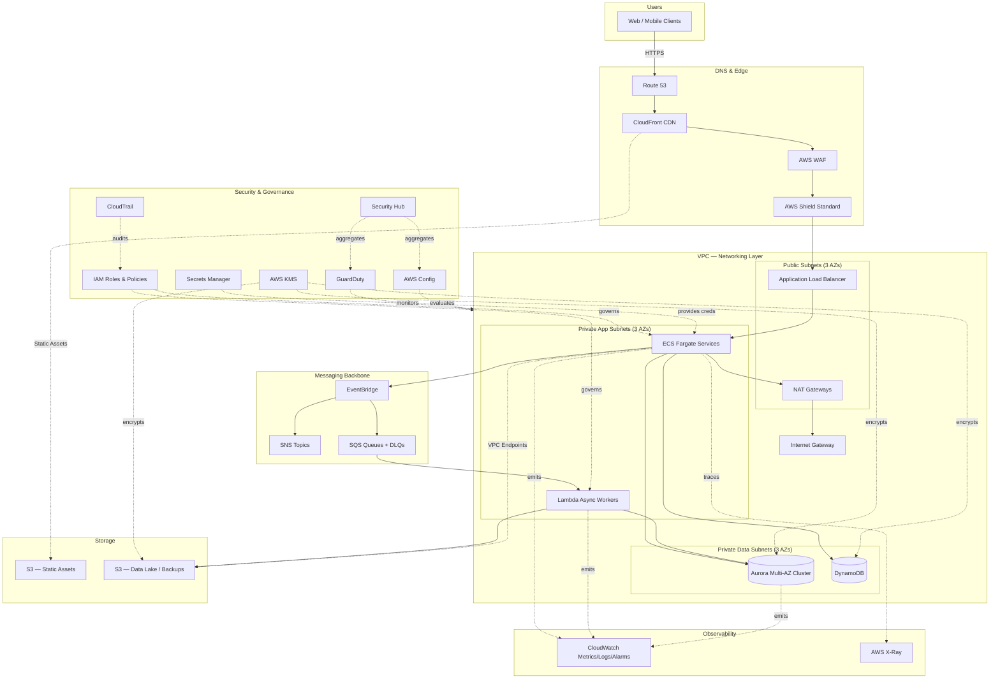
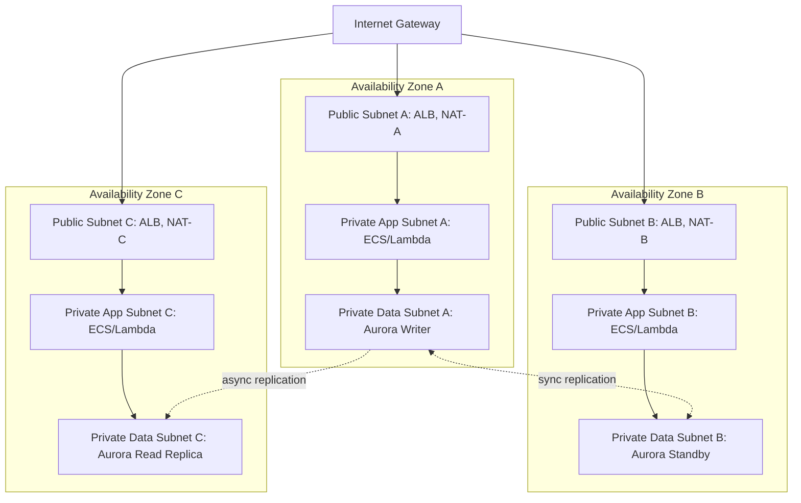
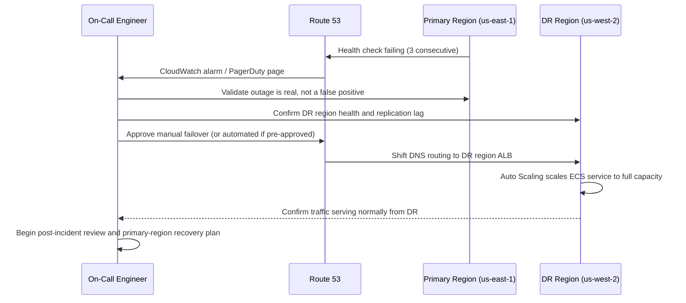

# Chapter 3 – Enterprise Design Principles

*Reliability · Scalability · Performance · Security · Cost Optimization · Sustainability · Operational Excellence · Resilience*

> **How to read this chapter:** Rather than treating each design principle as an abstract pillar, this chapter anchors every principle to a single, realistic reference architecture — an **Enterprise Multi-Tier Web & API Platform** running order management, customer, and reporting workloads for a mid-to-large enterprise. Every section explains how that architecture embodies (or deliberately trades off) each principle, so you leave this chapter with both the theory and a concrete, production-ready pattern you can adapt.

---

# 1. Executive Summary

## The Business Problem

Every enterprise that moves beyond a single application team eventually hits the same wall: individual services are technically sound, but the *system as a whole* is unpredictable. A checkout service might have 99.95% uptime, a pricing service 99.9%, and a shared database 99.99% — yet the customer-facing experience that depends on all three might realistically deliver only 99.75% availability, because failure probabilities compound across the request path. Similarly, a platform that scales beautifully for read traffic can fall over completely during a flash sale because nobody modeled write amplification on the primary database. And a platform that scores well on a security checklist can still be breached because access control was designed service-by-service, with no enterprise-wide identity or network segmentation strategy.

The business problem this chapter addresses is not "how do I use EC2" or "how do I configure an Application Load Balancer." It is: **how do I make deliberate, defensible engineering trade-offs across reliability, scalability, performance, security, cost, sustainability, operational excellence, and resilience — simultaneously, on a shared production system, under real budget and time constraints?**

These eight principles are frequently in tension with one another. Maximizing reliability (e.g., synchronous multi-region replication) often increases cost and latency. Maximizing performance (e.g., aggressive caching) can undermine data freshness and complicate consistency reasoning. Maximizing security (e.g., strict least-privilege IAM, mandatory encryption, tightly scoped network paths) increases operational overhead and can slow developer velocity if not automated. An architecture that ignores these tensions and simply "turns every dial to eleven" will be unnecessarily expensive, hard to operate, and slower to change — the opposite of what an enterprise actually needs.

## Architecture Objective

The objective of this chapter's reference architecture is to demonstrate a **defensible balance point**: a design that a Well-Architected Framework review board would approve, that a FinOps team would not flag as wasteful, that a security team would sign off on, and that an SRE team could operate with a normal on-call rotation rather than a war room. Concretely, the architecture targets:

- **99.95% availability** for the customer-facing tier, achieved through multi-AZ redundancy rather than multi-region active-active (a deliberate cost/complexity trade-off explained in Section 13).
- **Sub-200ms p95 API latency** for authenticated read requests, achieved through edge caching, connection pooling, and read replicas rather than a full event-sourced/CQRS rewrite.
- **Horizontal elasticity** to absorb a 10x traffic spike (e.g., a marketing campaign or seasonal peak) within minutes, without manual intervention.
- **Zero standing long-lived credentials** anywhere in the request path — every service-to-service call is authorized via IAM roles, STS, or short-lived tokens.
- **Auditable, encrypted-at-rest and in-transit data** sufficient to satisfy SOC 2, PCI-DSS (if payment data is in scope), and typical enterprise data-governance requirements.
- **A cost model that scales sub-linearly with traffic**, so that a 3x increase in orders does not require a 3x increase in AWS spend.

## Why Organizations Adopt This Architecture

Organizations converge on this general shape — public-facing edge, stateless application tier behind a load balancer, managed relational database with a read-replica strategy, asynchronous messaging for decoupling, and a centralized security/observability layer — for a specific reason: **it is the least-surprising architecture available to a team of ordinary skill applying ordinary AWS managed services.** It does not require the organization to have deep Kubernetes expertise, a dedicated data engineering team, or a global SRE function to operate safely. It is also the architecture that AWS itself, and most enterprise cloud consultancies, recommend as the default "graduate from startup to production-grade enterprise system" pattern, before an organization has a specific, evidence-based reason (e.g., genuine multi-region regulatory requirements, or genuinely bursty compute-heavy workloads) to deviate from it.

Crucially, organizations do *not* adopt this architecture because it is the most technically sophisticated option available. They adopt it because it is **operationally boring in the right ways** — every component has well-documented failure modes, every component has a managed AWS equivalent with an SLA, and every component can be explained to an auditor, a new hire, or an executive without a whiteboard session lasting an hour.

## Major Business Benefits

| Benefit | Explanation |

|---|---|

| Predictable uptime | Multi-AZ redundancy at every tier removes single points of failure without requiring multi-region operational complexity. |

| Faster time-to-market | Managed services (RDS/Aurora, ALB, Lambda, SQS) remove weeks of undifferentiated heavy lifting compared to self-managed alternatives. |

| Lower total cost of ownership | Right-sized compute, S3 lifecycle policies, and Reserved/Savings Plans reduce spend by 30–50% versus naive on-demand deployment. |

| Auditable compliance posture | CloudTrail, Config, GuardDuty, and KMS provide the evidentiary trail auditors expect for SOC 2 / ISO 27001 / PCI-DSS. |

| Reduced key-person risk | Standardized, documented patterns (Terraform modules, runbooks) mean the architecture does not depend on one engineer's tribal knowledge. |

| Elastic cost model | Auto Scaling and serverless components mean the business pays for capacity it uses, not capacity it merely provisions for peak. |

## Typical Enterprise Scenarios

This architecture pattern is the right starting point for:

- A retail or e-commerce platform serving a national or multi-national customer base with predictable daily/seasonal traffic patterns.
- A B2B SaaS platform with multiple enterprise customers requiring contractual uptime SLAs (99.9%+) and SOC 2 attestations.
- An internal enterprise system of record (order management, claims processing, logistics) that has outgrown a monolithic on-prem deployment and is migrating to AWS as part of a broader cloud transformation.
- A financial services or healthcare workload that requires strong encryption, auditability, and access control, but does not have a genuine regulatory requirement for active-active multi-region deployment.

It is **not** the right starting point for a pre-product-market-fit startup (too much operational scaffolding for the value delivered), nor for a workload with a hard regulatory requirement for regional data residency and true zero-RPO disaster recovery (which requires the multi-region patterns discussed in Chapter 13 and referenced here in Section 13).

---

# 2. Business Requirements

## Business Drivers

- Reduce customer-facing downtime that directly correlates with lost revenue and support escalations.
- Support geographic expansion into new markets without re-architecting the platform.
- Meet enterprise customer procurement requirements (SOC 2 Type II, uptime SLAs, data encryption attestations).
- Reduce infrastructure operating cost as a percentage of revenue as the platform scales.
- Enable the engineering organization to ship features weekly rather than quarterly.

## Functional Requirements

| Requirement | Description |

|---|---|

| Customer authentication | Support username/password, SSO (SAML/OIDC), and MFA. |

| Order processing | Accept, validate, price, and persist customer orders synchronously; process fulfillment asynchronously. |

| Catalog and search | Serve product catalog data with sub-second response times, including filtered and faceted search. |

| Reporting | Provide near-real-time operational dashboards and daily batch financial reporting. |

| Notifications | Send transactional email/SMS/push notifications triggered by order lifecycle events. |

| Admin console | Internal-only administrative interface, network-isolated from the public internet. |

## Non-Functional Requirements

| Category | Target |

|---|---|

| Availability | 99.95% (≈ 4.38 hours downtime/year) for customer-facing tier |

| Latency (p95) | < 200ms for cached/read API calls; < 500ms for write/transactional calls |

| Throughput | Sustain 5,000 requests/second at peak, burst to 15,000 req/s for short campaign windows |

| Durability | 99.999999999% (11 nines) for persisted order and financial data |

| Security | Encryption at rest and in transit for all data classified Confidential or higher |

| Compliance | SOC 2 Type II; PCI-DSS SAQ-D scope if card data is processed directly (recommend tokenization via a PCI-compliant payment processor instead) |

## Scalability Goals

The platform must scale horizontally to absorb both gradual growth (organic traffic increase of ~20% year over year) and sharp, predictable spikes (flash sales, marketing campaigns causing 5–10x baseline traffic for hours at a time) without manual pre-provisioning beyond a scheduled scaling action for known events.

## Availability Requirements

99.95% for the public API and web tier; 99.9% for the internal admin console (planned maintenance windows acceptable); 99.99% for the underlying data tier (Aurora Multi-AZ), since a database outage cascades into every dependent service.

## Latency Requirements

p50 < 80ms, p95 < 200ms, p99 < 500ms for API responses measured at the ALB, excluding client network time. CloudFront edge caching is required for static assets and cacheable API responses to meet these targets for geographically distributed users.

## Compliance Requirements

- SOC 2 Type II (security, availability, confidentiality trust service criteria).
- GDPR / CCPA data-subject rights support if EU/California customers are in scope.
- PCI-DSS scope minimization via a third-party tokenizing payment gateway (Stripe, Adyen, Braintree) rather than direct card-data handling.

## Security Expectations

No long-lived credentials in application code or CI/CD pipelines; encryption at rest via AWS KMS with customer-managed keys (CMKs) for sensitive data stores; network segmentation between public, application, and data tiers; centralized audit logging retained for a minimum of one year (longer if compliance requires); automated vulnerability scanning of container images and dependencies.

## Recovery Objectives

### Recovery Point Objective (RPO)

**RPO ≤ 5 minutes** for transactional data (orders, payments, customer records), achieved via Aurora automated backups plus continuous binlog/WAL-based point-in-time recovery, and cross-region snapshot replication for disaster recovery.

### Recovery Time Objective (RTO)

**RTO ≤ 30 minutes** for a single-AZ failure (handled automatically by Multi-AZ failover, typically < 2 minutes). **RTO ≤ 4 hours** for a full regional failure, using the Warm Standby disaster recovery pattern detailed in Section 13.

## SLAs

External customer-facing SLA: 99.9% monthly uptime commitment (intentionally set slightly below the 99.95% internal target to leave margin for planned maintenance and unforeseen degradation). Internal engineering SLO: 99.95% with an explicit error budget of 0.05% (~21.9 minutes/month) that gates release velocity when exhausted.

## Expected Workload

Baseline: 800 requests/second sustained during business hours across three time zones. Peak: 5,000–15,000 requests/second during flash sales, product launches, or major marketing campaigns, typically lasting 2–6 hours.

## Expected Growth

20–30% year-over-year organic traffic growth; architecture must support a 5x scale-out over a 3-year horizon without a fundamental re-architecture (though component-level changes, such as introducing DynamoDB for specific high-throughput access patterns, are expected and planned for).

---

# 3. Architecture Overview

## Overall Design

The architecture follows a **three-tier, multi-AZ, event-augmented** design: a stateless presentation/API tier behind an Application Load Balancer and CloudFront, a managed relational data tier (Amazon Aurora) with read replicas, and an asynchronous messaging backbone (SQS/SNS/EventBridge) that decouples order processing from downstream systems like notifications, fulfillment, and reporting. Compute is a hybrid of containerized services (ECS on Fargate) for the API tier and Lambda for event-driven, bursty, or low-traffic asynchronous workloads.

## Architecture Philosophy

The guiding philosophy is **"managed services first, custom infrastructure only where it delivers genuine differentiation."** Every component defaults to the AWS-managed option (Aurora over self-managed MySQL on EC2; Fargate over self-managed EC2 clusters; SQS over a self-hosted message broker) unless a specific, documented requirement cannot be met by the managed service. This philosophy trades a small amount of fine-grained control for a large reduction in operational burden — patching, backups, failover, and scaling are handled by AWS for the majority of the stack, freeing the platform team to focus on business logic.

The second guiding principle is **failure isolation through decoupling**. Synchronous request paths (the checkout flow) are kept as short and simple as possible. Anything that does not need to happen synchronously — fulfillment triggering, notification sending, analytics event capture — is pushed onto asynchronous queues so that a slow or failing downstream dependency cannot cascade into a customer-facing outage.

## Core Components

| Layer | Components |

|---|---|

| Edge | Route 53, CloudFront, AWS WAF, AWS Shield Standard |

| Networking | VPC, public/private subnets across 3 AZs, NAT Gateways, Transit Gateway (for hybrid/multi-account connectivity) |

| Application | Application Load Balancer, ECS on Fargate (API services), Lambda (async workers) |

| Messaging | Amazon SNS, Amazon SQS, Amazon EventBridge |

| Data | Amazon Aurora (MySQL-compatible) Multi-AZ with read replicas, Amazon DynamoDB (session/cart data), Amazon S3 (object storage, static assets, data lake) |

| Security | IAM, AWS KMS, Secrets Manager, GuardDuty, Security Hub, AWS Config, CloudTrail |

| Observability | CloudWatch (metrics, logs, alarms, dashboards), AWS X-Ray (distributed tracing) |

## How Components Interact

Client requests enter through Route 53 DNS resolution, are served either directly from CloudFront's edge cache (static assets, cacheable API responses) or forwarded to the regional Application Load Balancer. The ALB distributes requests across ECS Fargate tasks running in private subnets across three Availability Zones. Application services read/write to Aurora for transactional data and to DynamoDB for high-throughput, low-latency session state. When an order is placed, the API service persists the order transactionally, then publishes an `OrderPlaced` event to EventBridge, which fans out to SQS queues consumed by Lambda functions responsible for notification delivery, fulfillment system integration, and analytics ingestion into S3.

## High-Level Workflow

1. User request arrives via CloudFront/ALB.
2. Application tier authenticates/authorizes the request (JWT validation against Cognito or an internal identity provider).
3. Business logic executes, reading/writing Aurora and DynamoDB as needed.
4. Domain events are published to EventBridge for asynchronous downstream processing.
5. Response is returned to the client, with cacheable responses tagged for CloudFront caching.

## Request Lifecycle

DNS resolution → TLS termination at CloudFront/ALB → WAF rule evaluation → routing to healthy ECS target → application processing → data tier read/write → response serialization → response caching decision → client delivery.

## Response Lifecycle

Application generates response → cache-control headers applied based on content type/sensitivity → ALB returns response to CloudFront → CloudFront caches per configured TTL (or passes through for `no-store` responses) → CloudWatch/X-Ray capture latency and status metrics for the full path.

## Data Lifecycle

Transactional data is written to Aurora primary, replicated synchronously to the Multi-AZ standby, and asynchronously to up to 2 read replicas. Nightly automated snapshots are retained for 35 days; continuous transaction logs enable point-in-time recovery to any second within that window. Snapshots are copied cross-region weekly for disaster recovery. Cold data (orders older than 18 months) is exported to S3 via AWS Database Migration Service or scheduled ETL jobs and transitioned through S3 Standard-IA to Glacier Deep Archive per a lifecycle policy, reducing storage cost by roughly 80% for rarely accessed historical data.

---

# 4. AWS Services Used

For each service: purpose, why selected, alternatives considered, limitations, pricing considerations, and best practices.

## Amazon EC2

**Purpose:** Provides the underlying virtual machine compute that AWS-managed services (including the ECS EC2 launch type, if used instead of Fargate) run on; also used directly for workloads that need OS-level access, licensing considerations (e.g., BYOL software), or specialized instance types (GPU, high-memory).

**Why selected:** In this architecture, EC2 is used sparingly — primarily as a fallback launch type for ECS if Fargate's per-task cost becomes unfavorable at very high sustained utilization, and for any bastion/jump-host requirements.

**Alternatives:** Fargate (chosen as the primary compute for this architecture — see below), Lambda for event-driven compute.

**Limitations:** Requires patch management, AMI lifecycle management, and capacity planning that Fargate abstracts away.

**Pricing considerations:** On-Demand pricing is 2–4x more expensive than equivalent Reserved Instance or Savings Plan pricing for steady-state workloads; Spot Instances can reduce cost by up to 90% but require interruption-tolerant workloads.

**Best practices:** Use Auto Scaling Groups across multiple AZs; use launch templates (not launch configurations, which are deprecated); enable detailed monitoring only where the extra granularity justifies the cost; use Systems Manager Session Manager instead of SSH bastion hosts.

## Application Load Balancer (ALB)

**Purpose:** Layer 7 load balancing, TLS termination, path/host-based routing, and health-check-driven traffic distribution across ECS tasks.

**Why selected:** ALB is the correct choice (over Network Load Balancer) whenever routing decisions need to be content-aware (path-based routing to different microservices, host-based routing for multi-tenant subdomains) and when native integration with ECS service discovery and target group health checks is required.

**Alternatives:** Network Load Balancer (NLB) — chosen instead when ultra-low latency, static IP addresses, or non-HTTP(S) protocols (raw TCP/UDP) are required. API Gateway — chosen instead (or in addition) when request throttling, API key management, and native Lambda integration without a container runtime are the priority.

**Limitations:** ALB does not natively support static IP addresses (use an NLB in front, or Global Accelerator, if a fixed IP is contractually required by a customer's firewall allowlist).

**Pricing considerations:** Billed on Load Balancer Capacity Units (LCUs), which factor in new connections, active connections, processed bytes, and rule evaluations — cost is generally modest compared to compute, but WAF web ACL rule evaluations attached to the ALB add incremental cost per request.

**Best practices:** Enable access logs to S3 for audit and troubleshooting; use target group health checks with an application-specific health endpoint (not just a TCP check); enable deletion protection in production.

## Amazon CloudFront

**Purpose:** Global content delivery network (CDN) providing edge caching, TLS termination close to the user, DDoS absorption, and integration with AWS WAF.

**Why selected:** Reduces latency for geographically distributed users, offloads cacheable traffic from the origin (reducing ALB/Fargate load and cost), and provides the first layer of defense against volumetric DDoS attacks via AWS Shield Standard (automatically included).

**Alternatives:** Third-party CDNs (Cloudflare, Akamai, Fastly) — sometimes chosen for multi-cloud strategies or specific edge-compute capabilities, but at the cost of a second vendor relationship and reduced native AWS integration (e.g., with WAF and Shield Advanced).

**Limitations:** Cache invalidation is not instantaneous and costs money beyond a free monthly allotment; debugging cache behavior requires careful attention to `Cache-Control` headers and CloudFront cache policies.

**Pricing considerations:** Data transfer out to the internet from CloudFront is generally cheaper than data transfer directly from EC2/ALB to the internet, particularly at volume — this is a genuine cost optimization, not just a performance one.

**Best practices:** Use separate cache behaviors for static assets (long TTL) versus dynamic API responses (short TTL or no caching); enable Origin Shield for high-traffic origins to reduce origin load further; use Origin Access Control (OAC) to restrict S3 origin access to CloudFront only.

## AWS Lambda

**Purpose:** Event-driven, serverless compute for asynchronous workers (notification delivery, event processing, scheduled batch jobs) that do not require a persistent runtime.

**Why selected:** For workloads with intermittent or unpredictable invocation patterns (e.g., processing an `OrderPlaced` event), Lambda's pay-per-invocation model is more cost-effective than provisioning always-on containers, and it scales to zero when idle.

**Alternatives:** ECS Fargate tasks triggered by SQS polling — chosen instead when execution time regularly exceeds Lambda's 15-minute maximum, or when a workload needs a persistent connection pool that Lambda's execution model makes inefficient.

**Limitations:** 15-minute maximum execution duration; cold-start latency (mitigated with Provisioned Concurrency for latency-sensitive functions); execution environment is stateless between invocations.

**Pricing considerations:** Billed per millisecond of execution and memory allocated; over-provisioning memory (a common mistake) increases cost even if execution time doesn't change proportionally — right-sizing via AWS Lambda Power Tuning is a recommended FinOps practice.

**Best practices:** Keep functions single-purpose; use Lambda Destinations or DLQs for failure handling rather than swallowing errors; avoid VPC-attached Lambdas unless the function must reach a VPC-only resource (VPC attachment adds ENI provisioning latency, mitigated but not eliminated by Hyperplane ENIs).

## Amazon S3

**Purpose:** Durable object storage for static web assets, uploaded documents, data lake landing zone, and backup artifacts.

**Why selected:** 11 nines of durability, native lifecycle management, and deep integration with CloudFront, Athena, and Glacier make S3 the default storage choice for anything that isn't a relational or key-value access pattern.

**Alternatives:** Amazon EFS — chosen instead when POSIX file-system semantics are required (e.g., legacy applications expecting a shared file system). Amazon FSx — chosen for Windows-native file shares or high-performance computing scratch storage.

**Limitations:** Not a POSIX file system; strong read-after-write consistency is provided for all requests as of December 2020, but application-level idempotency is still required for safe retries.

**Pricing considerations:** Storage class selection dramatically affects cost — S3 Standard for frequently accessed data, S3 Standard-IA or S3 Intelligent-Tiering for infrequent access, Glacier Deep Archive for compliance-retention cold data.

**Best practices:** Enable versioning and MFA delete for buckets containing critical data; use bucket policies plus Object Ownership settings to prevent accidental public exposure; use S3 Lifecycle rules rather than manual deletion scripts.

## Amazon RDS / Amazon Aurora

**Purpose:** Managed relational database for transactional order, customer, and catalog data.

**Why selected:** Aurora (MySQL-compatible) is selected over standard RDS MySQL/PostgreSQL because Aurora's storage layer is distributed across 3 AZs by default (6 copies of data), provides faster failover (typically under 30 seconds, often under 10), and supports up to 15 low-latency read replicas versus 5 for standard RDS.

**Alternatives:** Standard RDS PostgreSQL/MySQL — chosen instead when the team has strong preference/expertise with a specific engine, or when Aurora's premium (typically 20% over equivalent RDS instance pricing) isn't justified by the workload's availability requirements. Amazon DynamoDB — chosen instead (and, in this architecture, used *alongside* Aurora) for access patterns that are pure key-value or single-digit-millisecond-latency-critical, such as session and shopping cart data.

**Limitations:** Vertical scaling (instance class changes) still requires a brief failover; write throughput is bound to a single writer instance (Aurora does support a multi-writer configuration but with meaningful trade-offs, not used in this baseline architecture).

**Pricing considerations:** I/O-Optimized Aurora pricing can be more economical than Aurora Standard for I/O-heavy workloads (>25% of instance cost spent on I/O) — this is a common missed FinOps optimization.

**Best practices:** Always deploy Multi-AZ in production; use a reader endpoint for read-heavy reporting queries rather than hitting the writer instance; enable Performance Insights for query-level tuning visibility.

## Amazon DynamoDB

**Purpose:** Key-value/document store for session state, shopping cart contents, and any access pattern requiring single-digit-millisecond latency at very high request volume.

**Why selected:** DynamoDB's on-demand or auto-scaled provisioned capacity model handles unpredictable, spiky traffic (like cart operations during a flash sale) without the connection-pool exhaustion risk that a relational database faces under similar load.

**Alternatives:** ElastiCache (Redis) — chosen instead (or in addition) when sub-millisecond latency or complex data structures (sorted sets, pub/sub) are required, and durability guarantees can be relaxed. Aurora — chosen instead when the access pattern requires complex relational joins or ACID transactions across multiple entities.

**Limitations:** Query flexibility is constrained by the chosen partition/sort key design decided at table-creation time; redesigning access patterns later requires a data migration.

**Pricing considerations:** On-demand capacity mode is more expensive per request than well-tuned provisioned capacity with auto scaling, but removes the risk of throttling from capacity under-provisioning during unpredictable traffic.

**Best practices:** Design partition keys to avoid "hot partitions"; use DynamoDB Streams plus Lambda for change-data-capture into the event bus rather than dual-writing from the application.

## Amazon SNS

**Purpose:** Pub/sub fan-out messaging — one published message can be delivered to many subscribed endpoints (SQS queues, Lambda functions, HTTP endpoints, email/SMS).

**Why selected:** Used for broadcasting domain events (e.g., `OrderPlaced`) to multiple independent downstream consumers (notification service, fulfillment integration, analytics pipeline) without the publisher needing to know about each subscriber.

**Alternatives:** EventBridge — increasingly preferred (and used as the primary event bus in this architecture) for its native content-based filtering and schema registry; SNS remains valuable for simple fan-out and for direct SMS/email delivery.

**Limitations:** No built-in message retention/replay (unlike SQS or EventBridge Archive); message ordering is not guaranteed unless using FIFO topics, which have lower throughput limits.

**Pricing considerations:** Priced per request/notification delivered; SMS delivery cost varies significantly by destination country and should be monitored via Cost Anomaly Detection.

**Best practices:** Use SNS-to-SQS fan-out (rather than direct Lambda subscription) for consumers needing retry/DLQ semantics and back-pressure handling.

## Amazon SQS

**Purpose:** Durable, decoupled message queuing between the order-processing service and asynchronous consumers.

**Why selected:** Provides at-least-once delivery, configurable visibility timeouts, and dead-letter queue support, ensuring that a temporary outage in a downstream consumer (e.g., the notification service) does not cause message loss or block the producer.

**Alternatives:** Amazon MQ (managed RabbitMQ/ActiveMQ) — chosen instead when the organization has an existing investment in AMQP/JMS-based messaging patterns and needs protocol compatibility. Kinesis Data Streams — chosen instead when ordered, replayable, high-throughput streaming (not simple queuing) is required, such as clickstream analytics.

**Limitations:** Standard queues do not guarantee ordering (FIFO queues do, but at roughly 1/10th the throughput ceiling of standard queues).

**Pricing considerations:** Priced per request; long-polling reduces the number of empty-receive requests and therefore cost compared to short-polling.

**Best practices:** Always configure a dead-letter queue with a maxReceiveCount; set visibility timeout to at least 6x the consumer's expected processing time; use batching (`SendMessageBatch`/`ReceiveMessage` with `MaxNumberOfMessages`) to reduce API call volume and cost.

## Amazon EventBridge

**Purpose:** Serverless event bus supporting content-based routing rules, schema discovery, and third-party SaaS event integration.

**Why selected:** Chosen as the primary domain-event backbone because it supports rule-based filtering (routing `OrderPlaced` events differently from `OrderCancelled` events without consumer-side filtering logic) and has native archive/replay capability for reprocessing events after a downstream bug fix.

**Alternatives:** SNS/SQS combination — simpler but requires consumer-side filtering or multiple topics per event type. Kafka (MSK) — chosen instead for extremely high-throughput streaming with strict ordering-per-key and long retention windows measured in days, common in data-platform-centric architectures.

**Limitations:** At-least-once delivery (occasional duplicates possible — consumers must be idempotent); event size limit of 256KB.

**Pricing considerations:** Priced per event published; for very high event volumes, Kafka/MSK or Kinesis can become more cost-effective, but at a significant increase in operational complexity.

**Best practices:** Define and register event schemas in the EventBridge Schema Registry; use a dedicated custom event bus per major domain rather than putting everything on the default bus, to simplify access control and reduce noisy-neighbor rule-evaluation overhead.

## AWS IAM

**Purpose:** Identity and access management for both human users and AWS resources/services.

**Why selected:** Foundational to every AWS account; every other service's access control is built on IAM policies, roles, and permission boundaries.

**Alternatives:** There is no viable alternative within AWS; the only variation is whether identity federation is layered on top via AWS IAM Identity Center (formerly AWS SSO) or a third-party IdP (Okta, Azure AD/Entra ID) via SAML/OIDC federation — both of which this architecture uses for human access, while workload identity uses IAM roles directly.

**Limitations:** IAM policy complexity grows significantly in multi-account environments without disciplined use of Service Control Policies (SCPs) and permission boundaries.

**Pricing considerations:** IAM itself is free; cost implications are indirect, via the blast radius of overly permissive policies leading to unexpected resource creation/usage.

**Best practices:** Apply least privilege via scoped policies, not `*` actions/resources; use IAM Access Analyzer to identify unused permissions; prefer roles over long-lived access keys everywhere.

## Amazon VPC

**Purpose:** Isolated virtual network providing subnetting, routing, and security-group/NACL-based traffic control.

**Why selected:** Required for network isolation between public-facing, application, and data tiers, and to satisfy compliance requirements for network segmentation.

**Alternatives:** None within AWS for network isolation at this level; the variation is single-VPC-with-subnets (used here) versus multi-VPC-with-Transit-Gateway-peering (used for larger, multi-team, or multi-account estates).

**Limitations:** CIDR planning mistakes made early (too-small VPC/subnet ranges) are expensive to correct later and often require an IP migration project.

**Pricing considerations:** VPC itself is free; NAT Gateway (per-hour plus per-GB processed) and cross-AZ data transfer are the primary VPC-related cost drivers.

**Best practices:** Reserve generous CIDR ranges up front (a /16 VPC with /20 or /21 subnets is common for enterprise workloads); use VPC Flow Logs for network audit and troubleshooting.

## Amazon Route 53

**Purpose:** DNS resolution, health-check-based failover routing, and domain registration.

**Why selected:** Native integration with ALB/CloudFront health checks enables automated DNS failover for disaster recovery scenarios; latency-based and geolocation routing policies support future multi-region expansion.

**Alternatives:** Third-party DNS providers (Cloudflare DNS, NS1) — sometimes chosen for advanced traffic-steering features or multi-cloud DNS strategies.

**Limitations:** DNS TTL-based failover is not instantaneous — clients caching a DNS response will not see a failover until their local TTL expires, which is why this is paired with health-check-based routing rather than relied upon alone for sub-second failover.

**Pricing considerations:** Priced per hosted zone and per query; health checks against endpoints outside AWS incur additional cost.

**Best practices:** Use low TTLs (60–300s) on records that participate in failover routing; use Route 53 Application Recovery Controller for the most stringent RTO requirements.

## Amazon CloudWatch

**Purpose:** Centralized metrics, logs, alarms, and dashboards across every AWS service in the architecture.

**Why selected:** Native integration means every managed service (ALB, Aurora, Lambda, ECS) emits metrics and logs to CloudWatch without additional agents in most cases, providing a single pane of glass for operational visibility.

**Alternatives:** Third-party observability platforms (Datadog, New Relic, Grafana Cloud) — often layered on top of or alongside CloudWatch for richer visualization, cross-account aggregation, or APM features CloudWatch does not natively provide.

**Limitations:** Native dashboarding and alerting are functional but less sophisticated than dedicated observability platforms; log-query language (CloudWatch Logs Insights) has a learning curve.

**Pricing considerations:** Custom metrics, high-resolution metrics, and long log retention are the primary cost drivers — a common FinOps optimization is reducing log retention on high-volume, low-value debug logs.

**Best practices:** Use metric filters and structured (JSON) logging so Logs Insights queries are fast and reliable; define SLO-based alarms, not just resource-utilization alarms.

## AWS CloudTrail

**Purpose:** Records every API call made within the AWS account(s), providing the audit trail required for security investigation and compliance.

**Why selected:** Mandatory for SOC 2 and most compliance frameworks; provides non-repudiation for "who did what, when."

**Alternatives:** None — CloudTrail is the AWS-native mechanism; some organizations additionally forward CloudTrail events to a SIEM (Splunk, Datadog, Security Hub) for correlation with other security signals.

**Limitations:** Management-event logging is enabled by default at no extra cost, but data-event logging (e.g., every S3 object-level `GetObject`/`PutObject`) incurs cost and must be deliberately scoped.

**Pricing considerations:** First copy of management events is free; data events and additional trail copies incur per-event charges.

**Best practices:** Enable CloudTrail organization-wide (via AWS Organizations) rather than per-account; send logs to a dedicated, access-restricted log-archive account with S3 Object Lock enabled to prevent tampering.

## AWS Config

**Purpose:** Continuously records AWS resource configuration state and evaluates it against compliance rules (e.g., "are all EBS volumes encrypted?").

**Why selected:** Provides continuous compliance monitoring rather than point-in-time audits, and integrates with Security Hub for a unified compliance score.

**Alternatives:** Third-party CSPM tools (Wiz, Prisma Cloud) — often used in addition to Config for cross-cloud posture management or more advanced attack-path analysis.

**Limitations:** Config rules evaluate configuration state, not runtime behavior — it will not detect an application-layer vulnerability, only a misconfigured resource.

**Pricing considerations:** Priced per configuration item recorded and per rule evaluation; can become a meaningful cost line in accounts with very high resource churn.

**Best practices:** Use Conformance Packs to deploy a standard rule set (e.g., AWS Well-Architected Security Pillar pack) consistently across accounts via Organizations.

## Amazon GuardDuty

**Purpose:** Managed threat detection using machine learning and threat intelligence feeds to identify malicious or anomalous activity (compromised credentials, cryptomining, reconnaissance).

**Why selected:** Requires no infrastructure to deploy or manage, and analyzes VPC Flow Logs, DNS logs, and CloudTrail events automatically once enabled.

**Alternatives:** Third-party EDR/XDR tools for workload-level threat detection (CrowdStrike, SentinelOne) — used in addition to GuardDuty for host-level visibility GuardDuty does not provide.

**Limitations:** Detects known patterns and anomalies against AWS control-plane and network data; does not replace application-level security testing or a web application firewall.

**Pricing considerations:** Priced based on volume of CloudTrail events, VPC Flow Logs, and DNS logs analyzed — cost scales with account activity, not a flat fee.

**Best practices:** Enable organization-wide via AWS Organizations with a delegated administrator account; route findings automatically to Security Hub and an incident-response Slack/PagerDuty channel via EventBridge.

## AWS KMS

**Purpose:** Managed creation and control of cryptographic keys used to encrypt data at rest across S3, EBS, RDS/Aurora, DynamoDB, and Secrets Manager.

**Why selected:** Enables customer-managed keys (CMKs) with fine-grained key policies and full audit trail (every key usage is logged to CloudTrail) — required for compliance frameworks that mandate customer control over encryption keys, not just "encryption enabled."

**Alternatives:** AWS-owned/AWS-managed keys — simpler, no additional cost, but offer less granular access control and no ability to disable/rotate on the customer's own schedule; used for less sensitive data classifications in this architecture.

**Limitations:** API request quotas can be hit under very high-throughput encryption/decryption workloads if not using envelope encryption / data key caching appropriately.

**Pricing considerations:** CMKs are billed per key per month plus per API request beyond the free tier — a real but generally small line item relative to compute/data costs.

**Best practices:** Use separate CMKs per data classification/environment (never share a production and non-production key); enable automatic annual key rotation.

## AWS Secrets Manager

**Purpose:** Secure storage, automatic rotation, and fine-grained access control for database credentials, API keys, and other secrets.

**Why selected:** Native automatic-rotation integration with RDS/Aurora removes the operational burden of manually rotating database passwords, and IAM-based access control means secrets are never embedded in application code or environment variables checked into source control.

**Alternatives:** AWS Systems Manager Parameter Store (SecureString) — a lower-cost alternative for secrets that do not require automatic rotation; HashiCorp Vault — chosen instead in multi-cloud environments or when the organization has existing Vault expertise/tooling.

**Limitations:** Per-secret monthly charge (unlike Parameter Store, which is free for standard parameters) means very large numbers of secrets should be evaluated for consolidation.

**Pricing considerations:** Charged per secret per month plus per API call — for architectures with hundreds of secrets, this can become a noticeable (though rarely dominant) cost line.

**Best practices:** Enable automatic rotation for all database credentials; use resource policies to restrict which IAM principals/services can retrieve a given secret.

## AWS Systems Manager

**Purpose:** Operational management toolset covering Session Manager (secure shell access without open SSH ports or bastion hosts), Parameter Store, Patch Manager, and Run Command.

**Why selected:** Session Manager eliminates the need for bastion hosts and open port 22/3389 security-group rules, directly reducing the network attack surface, while Patch Manager automates OS-level patching compliance across any remaining EC2 fleet.

**Alternatives:** Traditional bastion hosts with SSH key management — higher operational and security overhead, retained only for exceptional cases.

**Limitations:** Requires the SSM Agent installed and an IAM instance profile with the appropriate managed policy — easy to forget on custom AMIs, which silently breaks Session Manager access.

**Pricing considerations:** Most Systems Manager capabilities used here are free; Parameter Store advanced tier and higher-throughput API usage carry incremental cost.

**Best practices:** Bake the SSM Agent and instance profile into golden AMIs/launch templates by default; use Patch Manager maintenance windows to enforce a documented patch cadence rather than ad hoc patching.

---

# 5. Complete Architecture Diagram



---

# 6. Component-by-Component Explanation

## Route 53

**Purpose:** Authoritative DNS resolution for the platform's public domains and subdomains, plus health-check-driven failover routing.
**Responsibilities:** Resolve `www.example.com` and `api.example.com` to the appropriate CloudFront/ALB endpoints; execute health checks against origin endpoints; execute failover routing policies during regional incidents.
**Inputs:** DNS queries from client resolvers; health-check results from monitored endpoints.
**Outputs:** DNS responses (A/AAAA/CNAME/Alias records); CloudWatch metrics on health-check status.
**Scaling:** Fully managed, scales automatically with global query volume — no customer-managed scaling required.
**High availability:** Route 53 is a global service with a 100% availability SLA for the DNS service itself.
**Failure handling:** Health-check failures trigger automatic failover to a secondary record (e.g., a static maintenance page in S3, or a DR-region endpoint).
**Dependencies:** None upstream; downstream consumers are all client resolvers globally.
**Security:** DNSSEC can be enabled for zones requiring protection against DNS spoofing; Route 53 Resolver query logging provides an audit trail.
**Monitoring:** CloudWatch alarms on health-check status; query logging to CloudWatch Logs for anomaly detection.

## CloudFront

**Purpose:** Edge caching and global content delivery, reducing latency and origin load.
**Responsibilities:** Cache static assets and cacheable API responses at edge locations; terminate TLS close to the user; enforce WAF rules before traffic reaches the origin.
**Inputs:** Client HTTPS requests; origin responses from ALB/S3.
**Outputs:** Cached or origin-fetched HTTP responses to clients; access logs to S3.
**Scaling:** Fully managed and globally distributed; scales automatically with request volume.
**High availability:** Distributed across AWS's global edge network by design; no single point of failure.
**Failure handling:** If an origin is unhealthy, CloudFront can be configured with origin failover to a secondary origin (e.g., a static S3-hosted maintenance page).
**Dependencies:** ALB (dynamic content origin), S3 (static content origin).
**Security:** Origin Access Control restricts direct S3 access; AWS WAF web ACL evaluates requests before they reach the origin; field-level encryption available for highly sensitive form fields.
**Monitoring:** CloudWatch metrics for cache hit ratio, error rates, and origin latency; real-time logs for detailed request-level analysis.

## Application Load Balancer

**Purpose:** Distribute incoming application traffic across healthy ECS Fargate tasks in multiple AZs.
**Responsibilities:** TLS termination; path/host-based routing to target groups; continuous health checking of registered targets.
**Inputs:** HTTPS traffic from CloudFront/WAF.
**Outputs:** Proxied requests to ECS tasks; access logs to S3; CloudWatch metrics.
**Scaling:** Scales automatically to handle increased connection/request volume (subject to LCU-based soft limits that can be raised via support request for anticipated extreme events).
**High availability:** Deployed across a minimum of 2 (recommended 3) Availability Zones; AWS manages the underlying load-balancer node redundancy.
**Failure handling:** Automatically routes around unhealthy targets based on configurable health-check thresholds; connection draining ensures in-flight requests complete during deployments or scale-in events.
**Dependencies:** ECS target groups; ACM-issued TLS certificate.
**Security:** Security groups restrict inbound traffic to HTTPS (443) only from CloudFront's managed prefix list; WAF web ACL attached for OWASP Top 10 protection.
**Monitoring:** CloudWatch metrics (TargetResponseTime, HTTPCode_Target_5XX_Count, HealthyHostCount); access logs queried via Athena for detailed analysis.

## ECS on Fargate (Application Tier)

**Purpose:** Run containerized, stateless API services without managing underlying EC2 instances.
**Responsibilities:** Execute business logic; validate and process requests; interact with Aurora/DynamoDB; publish domain events to EventBridge.
**Inputs:** HTTP requests from the ALB; configuration/secrets from Parameter Store/Secrets Manager.
**Outputs:** HTTP responses; database reads/writes; published events.
**Scaling:** Application Auto Scaling based on target-tracking policies (CPU utilization, request count per target, or custom CloudWatch metrics like queue depth for related async services).
**High availability:** Tasks distributed across 3 AZs via the ECS service scheduler's spread placement strategy.
**Failure handling:** Unhealthy tasks are automatically stopped and replaced by the ECS service scheduler; ALB health checks prevent traffic routing to unhealthy tasks during the replacement window.
**Dependencies:** Aurora, DynamoDB, EventBridge, Secrets Manager, ECR (container image registry).
**Security:** Task IAM roles scoped to only the permissions each service needs (least privilege); tasks run in private subnets with no direct internet route (egress via NAT Gateway only).
**Monitoring:** Container Insights for CPU/memory/network metrics; X-Ray for distributed tracing across service calls; structured application logs to CloudWatch Logs.

## Lambda Async Workers

**Purpose:** Process asynchronous domain events (notifications, fulfillment triggers, analytics ingestion) triggered by SQS messages.
**Responsibilities:** Consume messages from SQS; execute business logic for the specific event type; write results to S3/Aurora as appropriate; report failures to a dead-letter queue.
**Inputs:** SQS event messages (batched).
**Outputs:** Side effects (emails sent, S3 objects written, Aurora records updated); CloudWatch metrics and logs.
**Scaling:** Automatically scales concurrency based on SQS queue depth, up to configured reserved/provisioned concurrency limits.
**High availability:** Inherently multi-AZ as a fully managed serverless service.
**Failure handling:** Failed invocations are retried per the SQS redrive policy, then routed to a dead-letter queue for manual investigation after `maxReceiveCount` is exceeded.
**Dependencies:** SQS, S3, Aurora, Secrets Manager.
**Security:** Function execution roles scoped per-function to least privilege; environment variables containing secrets are avoided in favor of Secrets Manager runtime retrieval.
**Monitoring:** CloudWatch metrics (Invocations, Errors, Duration, Throttles); Lambda Insights for enhanced runtime metrics.

## Aurora Multi-AZ Cluster

**Purpose:** Durable, highly available transactional data store for orders, customers, and catalog data.
**Responsibilities:** Persist and serve transactional reads/writes with ACID guarantees; replicate synchronously to a standby for failover; replicate asynchronously to read replicas for read scaling.
**Inputs:** SQL queries from ECS services and Lambda functions.
**Outputs:** Query results; automated backups; binlog/WAL streams for point-in-time recovery and CDC.
**Scaling:** Vertical scaling via instance class change (brief failover required); horizontal read scaling via up to 15 read replicas; Aurora Serverless v2 available for variable-workload environments (not the baseline choice here, given predictable steady-state load, but discussed as an alternative in Section 28).
**High availability:** Storage is automatically replicated 6 ways across 3 AZs; automatic failover to a standby instance typically completes within 30 seconds.
**Failure handling:** Automatic failover promotes a replica to writer on primary instance failure; application connection strings use the cluster endpoint, which automatically re-points post-failover.
**Dependencies:** KMS (encryption), Secrets Manager (credential rotation), VPC security groups.
**Security:** Encryption at rest via KMS CMK; encryption in transit enforced via TLS; network access restricted to application-tier security groups only (no public accessibility).
**Monitoring:** Performance Insights for query-level performance; CloudWatch metrics (CPUUtilization, FreeableMemory, ReadLatency, WriteLatency, ReplicaLag).

## DynamoDB (Session/Cart Store)

**Purpose:** Low-latency, high-throughput store for ephemeral session and shopping-cart data.
**Responsibilities:** Serve sub-10ms reads/writes for cart operations; automatically expire stale sessions via TTL.
**Inputs:** Key-value read/write requests from ECS services.
**Outputs:** Item data; DynamoDB Streams change events for downstream processing if needed.
**Scaling:** On-demand capacity mode absorbs unpredictable spikes automatically; provisioned capacity with auto scaling is more cost-effective for steady, predictable patterns.
**High availability:** Data is automatically replicated across 3 AZs within the region by default.
**Failure handling:** Fully managed — no customer-visible failover process; AWS handles all replica management transparently.
**Dependencies:** KMS (encryption at rest).
**Security:** Fine-grained IAM access control at the table/item level via condition keys; encryption at rest by default.
**Monitoring:** CloudWatch metrics (ConsumedReadCapacityUnits, ConsumedWriteCapacityUnits, ThrottledRequests).

## EventBridge / SNS / SQS (Messaging Backbone)

**Purpose:** Decouple the synchronous order-processing path from asynchronous downstream consumers.
**Responsibilities:** Route domain events to interested consumers based on content-based rules; buffer messages during consumer outages; provide dead-letter handling for poison messages.
**Inputs:** Domain events published by ECS services (e.g., `OrderPlaced`, `OrderCancelled`).
**Outputs:** Filtered event delivery to SQS queues, Lambda functions, or third-party SaaS integrations.
**Scaling:** Fully managed and scales automatically with event volume.
**High availability:** Multi-AZ by design as fully managed services.
**Failure handling:** SQS dead-letter queues capture messages that repeatedly fail processing; CloudWatch alarms on DLQ depth trigger operational alerts.
**Dependencies:** IAM (publish/subscribe permissions), KMS (optional encryption of message bodies).
**Security:** Resource policies restrict which principals can publish/subscribe; server-side encryption available for sensitive message payloads.
**Monitoring:** CloudWatch metrics (NumberOfMessagesSent, ApproximateAgeOfOldestMessage, NumberOfMessagesDeleted).

## S3 (Static Assets & Data Lake)

**Purpose:** Durable storage for static web assets, uploaded content, backups, and the analytical data lake.
**Responsibilities:** Serve static assets to CloudFront; store analytics event data landed from Lambda/Kinesis; retain backup artifacts.
**Inputs:** Uploaded objects from build pipelines, application services, and ETL jobs.
**Outputs:** Object retrieval to CloudFront, Athena, and internal reporting tools.
**Scaling:** Virtually unlimited automatic scaling — no capacity planning required.
**High availability:** 99.99% availability SLA and 11 nines of durability within a region by design.
**Failure handling:** Cross-region replication (CRR) provides resilience against a regional S3 event (extremely rare but part of a defense-in-depth DR posture).
**Dependencies:** KMS (encryption), CloudFront (content delivery), Athena/Glue (analytics access).
**Security:** Bucket policies deny public access by default (S3 Block Public Access enabled account-wide); Object Ownership set to "Bucket owner enforced" to eliminate ACL-based misconfiguration risk.
**Monitoring:** S3 Storage Lens for organization-wide usage/cost visibility; CloudTrail data events for object-level access auditing on sensitive buckets.

## IAM, KMS, Secrets Manager (Security Layer)

**Purpose:** Provide identity, encryption key management, and secret storage underpinning every other component's security posture.
**Responsibilities:** Authenticate and authorize every API call (IAM); encrypt data at rest with auditable key usage (KMS); store and rotate credentials (Secrets Manager).
**Inputs:** Policy definitions (IAM), key policies (KMS), secret values (Secrets Manager).
**Outputs:** Access decisions; encrypted/decrypted data; retrieved secret values.
**Scaling:** Fully managed, scales transparently with account activity.
**High availability:** Region-resilient by design (IAM is a global service; KMS and Secrets Manager are regional but highly available within region).
**Failure handling:** N/A in the traditional sense — these are control-plane services with AWS-managed high availability.
**Dependencies:** Underlying to every other service in the architecture.
**Security:** This layer *is* the security control — least-privilege policies, CMK key policies, and automatic secret rotation are the primary levers.
**Monitoring:** CloudTrail logs every IAM, KMS, and Secrets Manager API call; GuardDuty and Access Analyzer flag anomalous or overly permissive configurations.

## GuardDuty, Security Hub, Config, CloudTrail (Governance Layer)

**Purpose:** Continuous threat detection, compliance evaluation, and audit logging across the account/organization.
**Responsibilities:** Detect anomalous behavior (GuardDuty); aggregate security findings into a unified score (Security Hub); continuously evaluate resource configuration against rules (Config); record every API call (CloudTrail).
**Inputs:** VPC Flow Logs, DNS logs, CloudTrail events, resource configuration snapshots.
**Outputs:** Security findings, compliance scores, audit trails.
**Scaling:** Fully managed, scales with account activity.
**High availability:** Regional services with AWS-managed availability.
**Failure handling:** N/A — these are monitoring/control-plane services, not workload-serving components.
**Dependencies:** Underlying VPC, IAM, and resource configuration across the account.
**Security:** These services collectively *are* the enterprise security and compliance evidentiary layer.
**Monitoring:** Findings routed via EventBridge to a security incident-response pipeline (ticketing system, Slack, PagerDuty).

## CloudWatch & X-Ray (Observability Layer)

**Purpose:** Centralized metrics, logs, alarms, dashboards, and distributed tracing.
**Responsibilities:** Aggregate telemetry from every component; evaluate alarm conditions; visualize system health; trace requests across service boundaries.
**Inputs:** Metrics/logs emitted by every AWS service and application in the architecture; trace segments from instrumented services.
**Outputs:** Dashboards, alarm notifications (via SNS to PagerDuty/Slack), trace maps.
**Scaling:** Fully managed, scales with telemetry volume (with corresponding cost impact).
**High availability:** Regional service with AWS-managed availability.
**Failure handling:** N/A — this is the monitoring layer itself; its own availability is a shared responsibility with AWS.
**Dependencies:** Every other component in the architecture as a telemetry source.
**Security:** IAM controls who can read logs/metrics or modify alarms; log data classified as sensitive is encrypted with KMS.
**Monitoring:** "Who monitors the monitors" is addressed via a small set of synthetic canary checks (CloudWatch Synthetics) independent of the primary telemetry pipeline.

---

# 7. End-to-End Request Flow

**Scenario:** An authenticated customer submits a checkout request (`POST /api/orders`).

1. **Client** initiates an HTTPS request to `api.example.com/orders`.
2. **DNS resolution**: Client resolver queries Route 53, receiving the CloudFront distribution's alias target.
3. **CloudFront**: Request arrives at the nearest edge location; since this is a `POST` request, it is not cacheable and is forwarded toward the origin.
4. **AWS WAF**: The web ACL attached to CloudFront evaluates the request against managed rule groups (SQLi, XSS, rate-based rules); a malicious or rate-exceeding request is blocked here with a 403 response.
5. **Origin fetch to ALB**: CloudFront forwards the request over a persistent TLS connection to the regional Application Load Balancer.
6. **ALB routing**: The ALB terminates TLS (if not already handled at CloudFront-to-origin), evaluates listener rules, and routes to the `orders-service` target group.
7. **Health-checked target selection**: The ALB selects a healthy ECS Fargate task from the target group using round-robin/least-outstanding-requests algorithm.
8. **Application authentication**: The `orders-service` validates the JWT bearer token against the identity provider's public key (cached locally to avoid a network round-trip on every request).
9. **Business logic execution**: The service validates the order payload (inventory availability, pricing rules) via a synchronous call to Aurora and/or DynamoDB for cart state.
10. **Database write (Aurora)**: The service opens a transaction against the Aurora writer endpoint, inserting the order record and decrementing inventory atomically.
11. **Transaction commit**: On successful commit, Aurora synchronously replicates the write to its Multi-AZ standby before acknowledging.
12. **Domain event publication**: The service publishes an `OrderPlaced` event to the custom EventBridge event bus.
13. **Event routing**: EventBridge rules match the event and fan it out to three SQS queues: `notifications-queue`, `fulfillment-queue`, and `analytics-queue`.
14. **Response construction**: The `orders-service` constructs a JSON response containing the order confirmation and `Cache-Control: no-store` header (since this is unique, sensitive data).
15. **Response return**: The response travels ALB → CloudFront → client; CloudFront does not cache it per the `no-store` directive.
16. **Asynchronous processing begins**: In parallel, Lambda functions triggered by the three SQS queues begin processing — sending a confirmation email, notifying the fulfillment system, and writing an analytics event to S3.
17. **Logging**: Structured request/response logs are emitted to CloudWatch Logs by the `orders-service`; ALB access logs are written to S3.
18. **Tracing**: X-Ray captures a trace segment spanning steps 6–15, enabling later root-cause analysis of latency or errors in this specific request.
19. **Monitoring**: CloudWatch metrics for request count, latency, and status code are updated in near real-time, feeding the operational dashboard.
20. **Error handling (alternate path)**: If step 10's transaction fails (e.g., inventory conflict), the service returns a `409 Conflict` response at step 14 instead, and no event is published at step 12 — ensuring no downstream system is notified of an order that was never actually placed.

---

# 8. Deployment Flow

## Infrastructure Provisioning

All infrastructure is defined as code using Terraform, organized into reusable modules (networking, compute, data, security) composed per environment (dev/staging/production) via environment-specific root configurations. Infrastructure changes flow through the same pull-request review process as application code.

## Terraform Workflow

1. Engineer creates a feature branch and modifies a Terraform module or root configuration.
2. `terraform fmt` and `terraform validate` run locally/in a pre-commit hook.
3. A pull request triggers a CI pipeline that runs `terraform plan` against the target environment's remote state, posting the plan output as a PR comment for human review.
4. A second engineer reviews the plan output alongside the code change (not just the code change alone).
5. On merge to the environment branch (or via a manual approval gate for production), `terraform apply` executes in CI using a scoped IAM role assumed via OIDC federation (no long-lived AWS credentials stored in CI).
6. State is stored remotely in S3 with DynamoDB-based state locking to prevent concurrent-apply corruption.

## CI/CD Deployment

Application code follows a separate but coordinated pipeline: build → unit test → container image build → image vulnerability scan (Amazon Inspector or a third-party scanner) → push to ECR → deploy to ECS via a blue-green deployment strategy.

## Blue-Green Deployment

ECS deployments use AWS CodeDeploy's blue-green strategy: a new task set ("green") is provisioned alongside the running ("blue") task set; the ALB shifts traffic incrementally (or all-at-once, per configuration) to the green task set; CloudWatch alarms monitor error rate and latency during the shift; if alarms breach thresholds, CodeDeploy automatically rolls back traffic to the blue task set.

## Rollback

Rollback is a first-class, tested operation, not an afterthought: for Terraform, rollback means applying the previous known-good configuration (state history retained in S3 versioning); for application deployments, rollback means CodeDeploy shifting traffic back to the blue task set, which remains running (not terminated) for a configurable "bake time" after a successful-looking green deployment.

## Secrets

No secrets are stored in Terraform variable files or application repositories. Database credentials are generated by Aurora/Secrets Manager integration at cluster creation and retrieved at runtime by the application via the Secrets Manager SDK, using the task's IAM role for authorization — never embedded in container images or environment variables.

## Configuration

Non-secret configuration (feature flags, environment-specific endpoints) is stored in Systems Manager Parameter Store, retrieved at container startup, and cached in-memory with a short TTL to allow configuration changes without a full redeployment.

## Validation

Post-deployment validation includes automated smoke tests against key API endpoints, a CloudWatch synthetic canary verifying the full checkout flow end-to-end, and a manual go/no-go checklist for production releases affecting the payment or inventory subsystems specifically.

---

# 9. Network Topology

## VPC

A single production VPC per environment (dev/staging/production isolated into separate AWS accounts under AWS Organizations, each with its own VPC) using a `/16` CIDR block to leave ample room for subnet growth.

## CIDR

| Environment | VPC CIDR | Notes |

|---|---|---|

| Production | 10.0.0.0/16 | 65,536 addresses; supports growth to dozens of subnets |

| Staging | 10.1.0.0/16 | Mirrors production topology at smaller subnet sizes |

| Dev | 10.2.0.0/16 | Shared by multiple developers; smaller instance footprint |

## Public Subnets

Three `/20` public subnets (one per AZ) host only the ALB and NAT Gateways — no application compute is ever placed in a public subnet.

## Private Subnets

Three `/20` private application subnets host ECS Fargate tasks and VPC-attached Lambda functions. Three additional `/20` private data subnets host Aurora and any VPC-attached caching layers, further isolated from the application subnets by security group rules (not just NACLs).

## NAT Gateway

One NAT Gateway per AZ (three total) to avoid a cross-AZ single point of failure and avoid inter-AZ data transfer charges that would occur if application subnets in AZ-B routed egress traffic through a NAT Gateway in AZ-A.

## Internet Gateway

A single Internet Gateway attached to the VPC, providing the route for public-subnet resources (ALB, NAT Gateways) to reach the internet.

## Transit Gateway

Used when the platform spans multiple VPCs/accounts (e.g., a shared-services account hosting CI/CD runners, or a hybrid on-premises connection via Direct Connect). Transit Gateway centralizes routing rather than requiring a full mesh of VPC peering connections, which becomes unmanageable beyond 3–4 VPCs.

## Route Tables

Public subnet route table sends `0.0.0.0/0` to the Internet Gateway. Private application subnet route tables send `0.0.0.0/0` to the AZ-local NAT Gateway. Private data subnet route tables have no default internet route at all — only routes to other VPC subnets and any VPC endpoints — since the database tier has no legitimate reason to reach the public internet.

## Network ACLs

Stateless, subnet-level rules used as a coarse-grained defense-in-depth layer (e.g., explicitly denying known-bad CIDR ranges) — not the primary access-control mechanism, since NACL rule management at scale is error-prone compared to security groups.

## Security Groups

Stateful, resource-level rules used as the primary access-control mechanism: the ALB security group allows inbound 443 only from CloudFront's managed prefix list; the ECS task security group allows inbound only from the ALB security group on the application port; the Aurora security group allows inbound only from the ECS task security group on port 3306.

## PrivateLink

VPC Interface Endpoints (PrivateLink) are used for S3, Secrets Manager, KMS, CloudWatch Logs, and ECR API/DKR access, so that ECS tasks in private subnets can reach these AWS services without routing through the NAT Gateway — reducing both NAT Gateway data-processing cost and the network attack surface (traffic never traverses the public internet).

## Hybrid Connectivity

For enterprises with an on-premises data center dependency (e.g., a legacy ERP system that cannot yet be migrated), AWS Direct Connect terminates at the Transit Gateway, providing private, low-latency connectivity without traversing the public internet — used here only if a genuine hybrid dependency exists; otherwise omitted entirely to reduce cost and complexity.



---

# 10. Identity and Access

## IAM Roles

Every compute resource (ECS task, Lambda function) assumes a dedicated IAM role scoped to its specific needs — there is no shared "application role" used across services, since a shared role becomes a shared blast radius.

## IAM Policies

Policies are written as scoped JSON documents referencing specific resource ARNs (e.g., a specific S3 bucket and prefix, a specific Secrets Manager secret ARN) rather than wildcard resources, and reviewed via IAM Access Analyzer before deployment.

```json

{
  "Version": "2012-10-17",
  "Statement": [
    {
      "Sid": "AllowOrdersServiceSecretsRead",
      "Effect": "Allow",
      "Action": ["secretsmanager:GetSecretValue"],
      "Resource": "arn:aws:secretsmanager:us-east-1:111122223333:secret:prod/orders-service/db-credentials-??????"
    },
    {
      "Sid": "AllowOrdersServiceEventPublish",
      "Effect": "Allow",
      "Action": ["events:PutEvents"],
      "Resource": "arn:aws:events:us-east-1:111122223333:event-bus/orders-domain-bus"
    },
    {
      "Sid": "DenyOutsideExpectedRegion",
      "Effect": "Deny",
      "Action": "*",
      "Resource": "*",
      "Condition": {
        "StringNotEquals": { "aws:RequestedRegion": "us-east-1" }
      }
    }
  ]
}

```

## Resource Policies

S3 bucket policies, KMS key policies, SQS queue policies, and Secrets Manager resource policies are used as a second, independent layer of access control alongside IAM identity policies — an attacker who compromises an over-permissive identity policy is still blocked if the resource policy does not also grant access.

## STS

AWS Security Token Service issues short-lived (typically 1-hour) temporary credentials for every role assumption — human access via IAM Identity Center federation, CI/CD access via GitHub Actions OIDC federation, and service-to-service access via task/execution roles. No IAM user access keys exist in this architecture at all.

## Cross-Account Access

Production, staging, and dev live in separate AWS accounts under an AWS Organizations structure with a dedicated log-archive account and a dedicated security-tooling account. Cross-account access (e.g., a CI/CD pipeline in a shared-services account deploying to production) is granted via a role in the target account that trusts the source account's role, assumed via `sts:AssumeRole`, never via shared credentials.

## Least Privilege

Enforced through a combination of: scoped IAM policies (above), Service Control Policies at the AWS Organizations level (e.g., denying the ability to disable CloudTrail or GuardDuty account-wide, denying region usage outside approved regions), and permission boundaries on any role capable of creating other IAM roles (to prevent privilege escalation via self-granted permissions).

## Service Roles

Distinct service-linked and custom service roles exist for: ECS task execution (pulling images from ECR, writing logs to CloudWatch), ECS task role (application runtime permissions), Lambda execution roles (per function), CodeDeploy service role, and the Config/GuardDuty service-linked roles created automatically by AWS.

## Permission Boundaries

Applied to any IAM role/user capable of creating new IAM entities (e.g., a platform-team automation role), capping the maximum permissions that role can grant to anything it creates — this prevents a compromised or misconfigured automation pipeline from creating an admin-equivalent role for itself.

---

# 11. Security Architecture

## Encryption

All data at rest is encrypted: Aurora via KMS CMK, DynamoDB via KMS (AWS-owned key for non-sensitive tables, CMK for session data containing any PII), S3 via SSE-KMS for buckets containing customer data, SSE-S3 acceptable for genuinely public static assets. All data in transit uses TLS 1.2 minimum (TLS 1.3 preferred), enforced via ALB security policies and Aurora's `require_secure_transport` parameter.

## KMS

Separate CMKs per data classification and per environment; key policies explicitly enumerate which IAM roles may `Encrypt`/`Decrypt`/`GenerateDataKey`, with automatic annual rotation enabled and CloudTrail logging every key usage for audit purposes.

## TLS

TLS termination occurs at CloudFront (client-to-edge) and again at the ALB (edge-to-origin, using AWS Certificate Manager-issued certificates with automatic renewal) — no unencrypted traffic exists anywhere between the client and the application tier.

## WAF

AWS WAF web ACL attached to CloudFront (for edge-level filtering) evaluates AWS Managed Rule Groups (Core Rule Set, Known Bad Inputs, SQL Database) plus custom rate-based rules limiting any single IP to a defined request threshold per 5-minute window, mitigating both application-layer attacks and basic credential-stuffing/scraping attempts.

## Shield

AWS Shield Standard (automatic, no cost, included with CloudFront/ALB) provides baseline protection against common network/transport-layer DDoS attacks. AWS Shield Advanced is evaluated (and typically justified) once the business impact of a large-scale, sophisticated DDoS attack exceeds its incremental cost — providing enhanced detection, 24/7 DRT (DDoS Response Team) access, and cost protection for scaling charges incurred during an attack.

## Secrets Manager

As described in Sections 4 and 8 — automatic rotation for database credentials, IAM-scoped retrieval, no secrets in code or environment variables.

## Certificate Manager

ACM issues and automatically renews public TLS certificates for CloudFront and ALB; private CA (ACM Private CA) is used if internal service-to-service mTLS is required (not baseline in this architecture, but a natural evolution for a service-mesh adoption discussed in Section 29's evolution path).

## GuardDuty

As described in Section 4 — continuous, ML-driven threat detection across CloudTrail, VPC Flow Logs, and DNS query logs, with findings routed to Security Hub and an incident-response channel.

## Inspector

Amazon Inspector automatically scans ECR container images for known OS and language-package vulnerabilities (CVEs) on push and continuously thereafter as new CVEs are published, and scans EC2 instances (where used) and Lambda function code for the same. Findings above a defined severity threshold block promotion to production via the CI/CD pipeline.

## Security Hub

Aggregates findings from GuardDuty, Inspector, Config, and Macie (if enabled for S3 data-classification scanning) into a single prioritized view, scored against the AWS Foundational Security Best Practices standard and, where applicable, CIS AWS Foundations Benchmark.

## CloudTrail

As described in Section 4 — organization-wide trail, immutable log-archive account with S3 Object Lock, forming the audit backbone for every compliance framework in scope.

## AWS Config

As described in Section 4 — continuous configuration compliance evaluation against Conformance Packs mapped to internal security policy and external frameworks (SOC 2, CIS).

## Zero Trust

The architecture applies zero-trust principles at the network layer (no implicit trust based on network location — every service-to-service call is authenticated via IAM/SigV4 or a validated JWT, even for calls originating from within the VPC) and is on an evolution path (see Section 29) toward mutual TLS between services as the platform grows into a service-mesh topology.

## Threat Model

Primary threats considered: (1) compromised application dependency introducing a supply-chain vulnerability; (2) over-permissive IAM role exploited after a compromised CI/CD credential; (3) SQL injection or other OWASP Top 10 application-layer attack; (4) DDoS/volumetric attack against the public endpoint; (5) data exfiltration via a misconfigured public S3 bucket; (6) credential stuffing against the authentication endpoint.

## Attack Vectors

| Vector | Description |

|---|---|

| Public S3 bucket misconfiguration | Accidental public read/write access to a bucket containing customer data |

| Overly permissive IAM role | A role with wildcard `*:*` permissions compromised via a leaked credential or vulnerable dependency |

| Unpatched container base image | A known CVE in an outdated base OS image within a container |

| Exposed database | An RDS/Aurora instance mistakenly made publicly accessible |

| Leaked secret in source control | A database password or API key accidentally committed to a Git repository |

| SSRF via application vulnerability | A vulnerable endpoint used to reach the EC2 instance metadata service |

## Mitigations

| Attack Vector | Mitigation |

|---|---|

| Public S3 misconfiguration | Account-wide S3 Block Public Access; Config rule alerting on any bucket policy change |

| Overly permissive IAM role | IAM Access Analyzer; scoped policies; permission boundaries; SCPs |

| Unpatched container image | Inspector continuous scanning; CI/CD gate blocking critical CVEs |

| Exposed database | Aurora deployed with `PubliclyAccessible: false`; Config rule enforcing this setting |

| Leaked secret | Pre-commit secret scanning (git-secrets/TruffleHog); Secrets Manager for all runtime secrets |

| SSRF to instance metadata | IMDSv2 enforced (token-required) on all EC2 instances; Fargate tasks have no instance metadata service exposure by design |

---

# 12. High Availability

## AZ Failures

Every tier (ALB, ECS, Aurora, NAT Gateway) is deployed across a minimum of 3 Availability Zones. Loss of a single AZ removes roughly one-third of application capacity, automatically compensated by the ECS service scheduler launching replacement tasks in the remaining healthy AZs and the ALB routing exclusively to healthy targets — no manual intervention required.

## Instance Failures

Individual ECS task failures are detected via ALB health checks (typically within 30–90 seconds) and container-level health checks (`HEALTHCHECK` in the Dockerfile or ECS task definition); the ECS service scheduler replaces failed tasks automatically to maintain the desired task count.

## Regional Failures

A full regional failure is the least likely but highest-impact scenario, addressed via the Warm Standby disaster recovery pattern described in Section 13 — not addressed by Multi-AZ alone, since Multi-AZ protects against AZ-level, not region-level, failures.

## Database Failures

Aurora Multi-AZ automatic failover promotes a standby (or an existing reader, in Aurora's architecture, since all Aurora replicas can serve as failover targets) to writer within approximately 30 seconds, with the cluster endpoint automatically re-pointing — application code should implement connection retry logic with exponential backoff to gracefully ride out this brief window rather than surfacing an error to the end user.

## Load Balancing

The ALB continuously health-checks registered targets and removes unhealthy targets from rotation within the configured unhealthy-threshold window (default: 3 consecutive failed checks), preventing user requests from being routed to a failing task.

## Health Checks

Application-level health-check endpoints (e.g., `/health`) verify not just that the process is running, but that critical dependencies (database connectivity, cache connectivity) are reachable — a "shallow" health check that only confirms the HTTP server is up can mask a deeper failure and delay detection.

## Failover

Failover is tested regularly (see Section 13's DR testing cadence) rather than assumed to work based on AWS documentation alone — untested failover is one of the most common production pitfalls discussed in Section 34.

---

# 13. Disaster Recovery

## Backup Strategy

Aurora automated backups run continuously (transaction logs streamed in near-real-time) with a 35-day retention window, supporting point-in-time recovery to any second within that window. DynamoDB Point-in-Time Recovery (PITR) is enabled for the session/cart table. S3 versioning is enabled for buckets containing critical uploaded content.

## Snapshots

In addition to continuous backups, a daily manual Aurora snapshot is taken and copied cross-region to the designated DR region (e.g., `us-west-2` if the primary region is `us-east-1`), providing a recovery point independent of the primary region's availability.

## Cross-Region Replication

S3 buckets containing critical data (uploaded documents, data-lake exports) have Cross-Region Replication configured to the DR region bucket, and the daily Aurora snapshot copy provides the database-tier equivalent.

## Pilot Light

Not the chosen pattern for this architecture's baseline, but described for comparison: a Pilot Light DR strategy keeps only the data tier (e.g., a continuously replicating Aurora Global Database read replica) running in the DR region, with compute (ALB, ECS services) defined in Terraform but not provisioned until a disaster is declared — minimizing standby cost at the expense of a longer RTO (typically hours) to stand up compute.

## Warm Standby

**This is the chosen pattern.** The DR region runs a scaled-down but fully functional copy of the architecture at all times — an Aurora Global Database secondary cluster (continuously replicating with typically sub-second lag), a minimal ECS service (1 task per AZ rather than the production fleet size), and all supporting infrastructure (VPC, ALB, security groups) already provisioned via the same Terraform modules used for production. In a declared disaster, Route 53 failover routing shifts traffic to the DR region's ALB, and the ECS service is scaled up to full capacity within minutes via Auto Scaling.

## Multi-Site (Active-Active)

Considered and explicitly rejected as the baseline pattern for this architecture, due to the significant increase in complexity (bidirectional data replication conflict resolution, global traffic management, doubled steady-state cost) relative to the business's actual RTO/RPO requirements (Section 2: RTO ≤ 4 hours, RPO ≤ 5 minutes) — both of which Warm Standby satisfies at meaningfully lower cost and complexity. Active-Active is revisited in Section 29's evolution path for organizations that later develop a genuine business requirement for it (e.g., regulatory data-residency requirements demanding simultaneous multi-region write availability).

## Active-Passive

The Warm Standby pattern used here is a form of active-passive: the DR region is fully deployed and continuously data-synchronized but does not serve production traffic under normal conditions, minimizing the risk of data-consistency issues that active-active introduces while still delivering a fast, largely automated failover.

## RPO

≤ 5 minutes, achieved via Aurora Global Database's typically sub-second cross-region replication lag (well within the 5-minute target with substantial margin) plus continuous transaction-log-based backups in the primary region.

## RTO

≤ 4 hours for a full regional failure, driven primarily by: Route 53 health-check detection and failover time (minutes), DR-region ECS service scale-up time (minutes to tens of minutes), and — the largest component — the human decision-making and validation time built into the documented disaster-declaration runbook, which deliberately includes a human-in-the-loop confirmation step to avoid an automated failover triggered by a false-positive health check causing an unnecessary, disruptive region switch.



---

# 14. Scalability

## Horizontal Scaling

The primary scaling mechanism for the application tier: ECS Application Auto Scaling adds/removes Fargate tasks based on target-tracking policies (average CPU utilization at 60%, or ALB request-count-per-target as an alternative/complementary metric), distributing new tasks evenly across all three AZs.

## Vertical Scaling

Used sparingly — primarily for the Aurora writer instance, where a workload's per-transaction complexity (not just volume) may require a larger instance class rather than more instances (since Aurora has a single writer). Vertical scaling of Aurora requires a brief failover and is therefore scheduled during low-traffic maintenance windows where possible.

## Auto Scaling

| Component | Scaling Trigger | Scale-Out Behavior |

|---|---|---|

| ECS `orders-service` | CPU > 60% for 3 minutes, or ALB RequestCountPerTarget > threshold | Add tasks in increments of 25% of current count, max 3-minute cooldown |

| Lambda async workers | SQS queue depth (`ApproximateNumberOfMessagesVisible`) | Automatic concurrency scaling, capped by reserved concurrency limit |

| Aurora read replicas | Sustained `ReplicaLag` or read-CPU threshold breach | Manual/scheduled addition of a replica for anticipated events; not fully automatic |

| DynamoDB (on-demand mode) | N/A — automatic | Scales transparently with no configuration |

## Serverless Scaling

Lambda and DynamoDB (on-demand mode) both scale automatically without pre-provisioning, making them the preferred choice for workloads with unpredictable or highly bursty traffic patterns (e.g., cart operations during a flash sale) where pre-provisioning capacity for the peak would be wasteful during normal operation.

## Database Scaling

Read scaling is achieved via Aurora read replicas (up to 15, though the baseline architecture provisions 2–3) fronted by the Aurora reader endpoint, which load-balances read traffic across all available replicas. Write scaling is bounded by the single-writer architecture; for workloads that genuinely require horizontal write scaling, this is a signal to evaluate a sharding strategy or a purpose-built horizontally-scalable database (DynamoDB, or Aurora Limitless Database for very large-scale distributed SQL requirements) rather than forcing the relational single-writer model further than it reasonably goes.

## Storage Scaling

Aurora storage scales automatically in 10GB increments up to 128TB with no manual provisioning or downtime. S3 has effectively unlimited automatic storage scaling. DynamoDB storage scales automatically per-partition with no manual intervention.

## Queue Scaling

SQS scales automatically to any throughput without configuration (standard queues); FIFO queues have a per-message-group throughput ceiling (300 messages/second without batching, 3,000/second with batching) that must be accounted for in capacity planning if FIFO ordering is required for a specific queue.

---

# 15. Performance Optimization

## Caching

Multi-layer caching strategy: CloudFront edge caching for static assets and cacheable API GET responses (product catalog data, typically cached for 5–15 minutes); DynamoDB for session/cart data requiring single-digit-millisecond access; an optional ElastiCache (Redis) layer in front of Aurora for expensive, frequently-repeated read queries (e.g., a computed product-recommendation list) — deliberately not included in the architecture's baseline to avoid premature complexity, added only when Performance Insights data demonstrates a specific query pattern justifies it.

## Compression

Gzip/Brotli compression enabled at CloudFront and at the ALB (via the application response headers), reducing payload size for JSON API responses and static assets by 60–80% for typical text-based content.

## CDN

CloudFront, as detailed in Sections 4 and 6, serves as both a performance optimization (reduced latency via edge locations) and a cost optimization (reduced origin load and cheaper data-transfer-out pricing at volume).

## Database Optimization

Query optimization is driven by Performance Insights data, not guesswork: identifying top wait-event contributors, adding covering indexes for the most frequent query patterns, and using `EXPLAIN` plans to catch full table scans before they reach production. Read-heavy reporting queries are routed to the Aurora reader endpoint, never the writer, to avoid contending with transactional write throughput.

## Connection Pooling

Amazon RDS Proxy is used in front of Aurora to pool and multiplex database connections from potentially hundreds of concurrent Lambda/ECS task connections down to a much smaller number of actual database connections — critical for Lambda-based access patterns, where each concurrent invocation would otherwise open its own connection and risk exhausting Aurora's `max_connections` limit during a traffic spike.

## Concurrency

ECS Fargate tasks are configured with an appropriate worker/thread pool sized to the task's vCPU allocation (over-provisioning worker threads relative to available vCPU causes context-switching overhead without throughput benefit); Lambda concurrency is managed via reserved concurrency limits on functions that share a downstream dependency (e.g., the database) with a hard capacity ceiling.

## Async Processing

As detailed throughout this chapter, anything not required for the synchronous customer-facing response (notifications, fulfillment triggering, analytics) is processed asynchronously via the EventBridge/SQS/Lambda pipeline, keeping the synchronous critical path as short as possible and directly improving p95/p99 latency for the customer-facing transaction.

---

# 16. Cost Optimization (FinOps)

## Estimated Monthly Cost — Small Deployment

*(Baseline: ~50 req/s sustained, single-region, minimal redundancy for a staging-like environment)*

| Line Item | Estimated Monthly Cost (USD) |

|---|---|

| ECS Fargate (2 tasks avg, 0.5 vCPU/1GB) | $60 |

| Application Load Balancer | $20 |

| Aurora (1x db.r6g.large, Multi-AZ) | $520 |

| NAT Gateway (3x, low traffic) | $100 |

| CloudFront (low traffic) | $15 |

| S3 (moderate storage/requests) | $25 |

| Lambda (low invocation volume) | $10 |

| CloudWatch/Config/GuardDuty/other governance | $60 |

| **Estimated Total** | **≈ $810/month** |

## Estimated Monthly Cost — Medium Deployment

*(Baseline: ~800 req/s sustained business-hours traffic, full production redundancy)*

| Line Item | Estimated Monthly Cost (USD) |

|---|---|

| ECS Fargate (12 tasks avg, 1 vCPU/2GB) | $700 |

| Application Load Balancer | $60 |

| Aurora (2x db.r6g.xlarge writer+standby, 2 read replicas) | $3,200 |

| NAT Gateway (3x, moderate data processing) | $600 |

| CloudFront | $300 |

| S3 | $150 |

| DynamoDB (on-demand, moderate volume) | $200 |

| Lambda | $150 |

| SNS/SQS/EventBridge | $80 |

| CloudWatch/X-Ray/logging | $400 |

| Security/Governance (GuardDuty, Config, Security Hub, CloudTrail) | $250 |

| **Estimated Total** | **≈ $6,090/month** |

## Estimated Monthly Cost — Enterprise Deployment

*(Baseline: peak sustained 5,000+ req/s, Warm Standby DR region, full observability/security stack)*

| Line Item | Estimated Monthly Cost (USD) |

|---|---|

| ECS Fargate (60+ tasks avg across peaks) | $4,500 |

| Application Load Balancer (x2 regions) | $150 |

| Aurora Global Database (primary + DR secondary, multiple replicas) | $14,000 |

| NAT Gateway (x2 regions, high data processing) | $2,500 |

| CloudFront | $2,000 |

| S3 (including cross-region replication) | $1,200 |

| DynamoDB | $1,500 |

| Messaging (SNS/SQS/EventBridge) | $500 |

| Lambda | $900 |

| CloudWatch/X-Ray/logging at scale | $2,800 |

| Security/Governance at scale | $1,200 |

| **Estimated Total** | **≈ $31,250/month** |

> **Note:** These figures are directional planning estimates based on `us-east-1` on-demand list pricing as commonly published; actual cost depends heavily on negotiated Enterprise Discount Program (EDP) rates, Reserved Instance/Savings Plan coverage, and real traffic patterns. Always validate with the AWS Pricing Calculator and Cost Explorer against real usage data before presenting figures to finance stakeholders.

## Major Cost Drivers

In order of typical magnitude for this architecture: (1) Aurora compute and I/O, (2) ECS Fargate compute, (3) data transfer (NAT Gateway processing charges and inter-AZ transfer), (4) CloudWatch Logs ingestion/storage at high log volume, (5) CloudFront data transfer out.

## Optimization Opportunities

| Opportunity | Typical Savings |

|---|---|

| Compute Savings Plans (1-year, no upfront) for steady-state ECS/Lambda | 20–28% vs. on-demand |

| Aurora Reserved Instances (1-year) for the writer/standby | 30–40% vs. on-demand |

| S3 Intelligent-Tiering for data-lake objects | 20–40% on storage with unpredictable access patterns |

| Right-sizing ECS task CPU/memory based on Container Insights data | 15–30% on over-provisioned services |

| VPC Endpoints (PrivateLink) to avoid NAT Gateway data processing charges for AWS-service traffic | Varies; often 10–20% of total NAT cost |

| Reducing CloudWatch Logs retention on high-volume debug logs | 10–25% of total CloudWatch spend |

## Reserved Instances

Applied to Aurora instances with predictable, steady-state utilization (the writer and standby, at minimum) — not applied to ECS Fargate, which uses Savings Plans instead since Fargate does not support RI purchase directly.

## Savings Plans

Compute Savings Plans applied to the baseline steady-state Fargate/Lambda usage (the "floor" of the auto-scaling range), with the elastic portion above that floor left on-demand — this avoids overcommitting to a savings plan sized for peak traffic that rarely materializes.

## Spot

Not used for the primary customer-facing ECS service (interruption risk is unacceptable for the synchronous request path), but a strong candidate for the Lambda-adjacent or EC2-based batch/reporting workloads (e.g., a nightly Aurora-to-data-lake ETL job) that can tolerate interruption and retry.

## S3 Lifecycle

Data-lake and log-archive buckets transition: Standard (0–30 days) → Standard-IA (30–90 days) → Glacier Deep Archive (90+ days, or immediately for pure compliance-retention data with no expected access).

## Storage Classes

| Data Type | Storage Class |

|---|---|

| Active static web assets | S3 Standard |

| Uploaded customer documents (recent) | S3 Standard |

| Data-lake exports older than 90 days | S3 Glacier Deep Archive |

| CloudTrail/access logs (compliance retention) | S3 Glacier Deep Archive after 90 days |

| Unpredictable-access analytical datasets | S3 Intelligent-Tiering |

## Rightsizing

Conducted quarterly using Compute Optimizer recommendations (for EC2/Lambda) and Container Insights utilization data (for ECS Fargate task CPU/memory), comparing provisioned versus actually-consumed resources and adjusting task definitions accordingly.

## Cost Allocation

Every resource is tagged with `Environment`, `CostCenter`, `Application`, and `Owner` tags, enforced via an AWS Config rule (`required-tags`) that flags (and, in stricter environments, prevents via SCP) untagged resource creation.

## Tagging

Tagging is enforced at creation time via Terraform (tags are a required module variable, not optional), not retrofitted after the fact — retrofitting tags across an existing estate is a common, avoidable FinOps remediation project.

## Budgets

AWS Budgets configured per cost center/environment with alert thresholds at 50%, 80%, and 100% of the monthly forecast, notifying both the engineering team lead and the FinOps function.

## Cost Anomaly Detection

AWS Cost Anomaly Detection monitors each major service (Aurora, Fargate, data transfer) for statistically significant deviations from historical spend patterns, alerting the platform team same-day rather than waiting for the monthly bill to reveal an unexpected cost spike (e.g., from a misconfigured Lambda retry loop or an accidentally-public NAT Gateway data-processing charge).

---

# 17. AI-Assisted Operations

## Amazon Q

Amazon Q Developer is used within the IDE and CI/CD pipeline to accelerate Terraform module authoring, generate unit tests for application code, and explain unfamiliar error messages/stack traces during incident response — reducing mean-time-to-understanding during an on-call page, though never used as a substitute for human review before a production change is applied.

## Bedrock

Amazon Bedrock (accessing foundation models such as Anthropic's Claude family via a managed, enterprise-governed API) is used for two specific operational functions in this architecture: (1) summarizing high-volume CloudWatch Logs into a human-readable incident timeline during a P1 outage, and (2) generating a first-draft root-cause-analysis document from a structured set of metrics/logs/timeline data, which an engineer then reviews and finalizes.

## AI Troubleshooting

During an incident, an engineer can feed a bounded, redacted set of recent CloudWatch Logs and X-Ray trace data to a Bedrock-backed internal tool, which correlates the error signature against the architecture's known failure-mode runbook library (Section 24) and suggests the most likely matching scenario and its documented resolution steps — a suggestion for the on-call engineer to verify, never an automated remediation action taken without human approval.

## Log Analysis

CloudWatch Logs Insights queries are increasingly generated from natural-language descriptions via Amazon Q, lowering the barrier for on-call engineers who are not CloudWatch Logs Insights query-language experts to still extract the specific log lines they need during an incident.

## Incident Response

AI-assisted timeline reconstruction (correlating CloudTrail, CloudWatch Alarms, and deployment events into a single chronological narrative) meaningfully reduces the time spent in the early "what happened, in what order" phase of a post-incident review, though the actual root-cause determination remains a human judgment call, particularly for judgment-dependent trade-off decisions.

## Cost Optimization

Bedrock-backed analysis of Cost Explorer data can identify rightsizing candidates and unusual spend patterns in natural language ("Aurora read replica #2 has averaged 8% CPU utilization for 30 days — consider removing or downsizing"), which the FinOps practitioner then validates against actual query-load requirements before acting.

## Capacity Planning

Historical CloudWatch metrics combined with a foundation model's forecasting capability provide a first-pass estimate of when a given resource (e.g., Aurora storage, ECS task count during projected peak season) will require proactive scaling action — used as an input to, not a replacement for, the quarterly capacity-planning review involving the platform and finance teams.

## Architecture Review

New Terraform pull requests are increasingly accompanied by an AI-generated summary of the proposed infrastructure change's security and cost implications (e.g., "this change removes the `PubliclyAccessible: false` setting on the RDS instance defined in `data.tf`"), which a human reviewer uses as a checklist prompt rather than a final approval signal.

## AI-Generated Terraform

AI-assisted Terraform authoring accelerates writing boilerplate resource definitions and variable/output blocks, but every generated module is still subject to the same `terraform plan` review, `tfsec`/Checkov static-analysis scanning, and human PR approval as hand-written code — AI-generated infrastructure code receives no reduced scrutiny.

## AI-Generated Documentation

Runbooks, ADRs (Section 30), and architecture diagrams' accompanying prose are frequently first-drafted with AI assistance and then reviewed/edited by the responsible engineer — this chapter's own writing process is a real-world example of exactly this pattern.

---

# 18. Terraform Implementation

## Repository Structure

```

infrastructure/
├── modules/
│   ├── networking/
│   ├── compute-ecs/
│   ├── data-aurora/
│   ├── messaging/
│   └── security/
├── environments/
│   ├── production/
│   │   ├── main.tf
│   │   ├── variables.tf
│   │   ├── backend.tf
│   │   └── terraform.tfvars
│   ├── staging/
│   └── dev/
└── README.md

```

## Providers

```hcl

# environments/production/providers.tf

terraform {
  required_version = ">= 1.7.0"

  required_providers {
    aws = {
      source  = "hashicorp/aws"
      version = "~> 5.50"
    }
  }

  backend "s3" {
    bucket         = "acme-corp-terraform-state-prod"
    key            = "platform/production/terraform.tfstate"
    region         = "us-east-1"
    dynamodb_table = "terraform-state-lock-prod"
    encrypt        = true
  }
}

provider "aws" {
  region = var.aws_region

  default_tags {
    tags = {
      Environment = var.environment
      ManagedBy   = "terraform"
      CostCenter  = var.cost_center
      Application = "order-management-platform"
    }
  }
}

```

## Variables

```hcl

# environments/production/variables.tf

variable "aws_region" {
  description = "Primary AWS region for the production deployment"
  type        = string
  default     = "us-east-1"
}

variable "environment" {
  description = "Environment name, used for tagging and resource naming"
  type        = string
  default     = "production"
}

variable "cost_center" {
  description = "FinOps cost center code for chargeback reporting"
  type        = string
}

variable "vpc_cidr" {
  description = "CIDR block for the production VPC"
  type        = string
  default     = "10.0.0.0/16"
}

variable "availability_zones" {
  description = "List of AZs to deploy across; minimum 3 recommended for production"
  type        = list(string)
  default     = ["us-east-1a", "us-east-1b", "us-east-1c"]
}

variable "db_instance_class" {
  description = "Aurora instance class for writer and standby"
  type        = string
  default     = "db.r6g.xlarge"
}

variable "ecs_task_cpu" {
  description = "vCPU units for the orders-service ECS task (1024 = 1 vCPU)"
  type        = number
  default     = 1024
}

variable "ecs_task_memory" {
  description = "Memory (MB) for the orders-service ECS task"
  type        = number
  default     = 2048
}

```

## Networking Module

```hcl

# modules/networking/main.tf

resource "aws_vpc" "main" {
  cidr_block           = var.vpc_cidr
  enable_dns_support   = true
  enable_dns_hostnames = true

  tags = {
    Name = "${var.environment}-vpc"
  }
}

resource "aws_subnet" "public" {
  count             = length(var.availability_zones)
  vpc_id            = aws_vpc.main.id
  cidr_block        = cidrsubnet(var.vpc_cidr, 4, count.index)
  availability_zone = var.availability_zones[count.index]

  tags = {
    Name = "${var.environment}-public-${var.availability_zones[count.index]}"
    Tier = "public"
  }
}

resource "aws_subnet" "private_app" {
  count             = length(var.availability_zones)
  vpc_id            = aws_vpc.main.id
  cidr_block        = cidrsubnet(var.vpc_cidr, 4, count.index + 4)
  availability_zone = var.availability_zones[count.index]

  tags = {
    Name = "${var.environment}-private-app-${var.availability_zones[count.index]}"
    Tier = "private-app"
  }
}

resource "aws_subnet" "private_data" {
  count             = length(var.availability_zones)
  vpc_id            = aws_vpc.main.id
  cidr_block        = cidrsubnet(var.vpc_cidr, 4, count.index + 8)
  availability_zone = var.availability_zones[count.index]

  tags = {
    Name = "${var.environment}-private-data-${var.availability_zones[count.index]}"
    Tier = "private-data"
  }
}

resource "aws_internet_gateway" "main" {
  vpc_id = aws_vpc.main.id
}

resource "aws_eip" "nat" {
  count  = length(var.availability_zones)
  domain = "vpc"
}

resource "aws_nat_gateway" "main" {
  count         = length(var.availability_zones)
  allocation_id = aws_eip.nat[count.index].id
  subnet_id     = aws_subnet.public[count.index].id

  tags = {
    Name = "${var.environment}-nat-${var.availability_zones[count.index]}"
  }
}

resource "aws_route_table" "public" {
  vpc_id = aws_vpc.main.id

  route {
    cidr_block = "0.0.0.0/0"
    gateway_id = aws_internet_gateway.main.id
  }

  tags = { Name = "${var.environment}-public-rt" }
}

resource "aws_route_table" "private_app" {
  count  = length(var.availability_zones)
  vpc_id = aws_vpc.main.id

  route {
    cidr_block     = "0.0.0.0/0"
    nat_gateway_id = aws_nat_gateway.main[count.index].id
  }

  tags = { Name = "${var.environment}-private-app-rt-${count.index}" }
}

```

## Compute Module (ECS Fargate Service)

```hcl

# modules/compute-ecs/main.tf

resource "aws_ecs_cluster" "main" {
  name = "${var.environment}-orders-cluster"

  setting {
    name  = "containerInsights"
    value = "enabled"
  }
}

resource "aws_ecs_task_definition" "orders_service" {
  family                   = "${var.environment}-orders-service"
  requires_compatibilities = ["FARGATE"]
  network_mode             = "awsvpc"
  cpu                      = var.ecs_task_cpu
  memory                   = var.ecs_task_memory
  execution_role_arn       = aws_iam_role.ecs_execution_role.arn
  task_role_arn            = aws_iam_role.ecs_task_role.arn

  container_definitions = jsonencode([
    {
      name      = "orders-service"
      image     = "${var.ecr_repository_url}:${var.image_tag}"
      essential = true
      portMappings = [
        { containerPort = 8080, protocol = "tcp" }
      ]
      logConfiguration = {
        logDriver = "awslogs"
        options = {
          "awslogs-group"         = "/ecs/${var.environment}/orders-service"
          "awslogs-region"        = var.aws_region
          "awslogs-stream-prefix" = "orders-service"
        }
      }
      secrets = [
        {
          name      = "DB_CREDENTIALS"
          valueFrom = var.db_secret_arn
        }
      ]
      healthCheck = {
        command     = ["CMD-SHELL", "curl -f http://localhost:8080/health || exit 1"]
        interval    = 30
        timeout     = 5
        retries     = 3
        startPeriod = 60
      }
    }
  ])
}

resource "aws_ecs_service" "orders_service" {
  name            = "${var.environment}-orders-service"
  cluster         = aws_ecs_cluster.main.id
  task_definition = aws_ecs_task_definition.orders_service.arn
  desired_count   = var.desired_task_count
  launch_type     = "FARGATE"

  network_configuration {
    subnets          = var.private_app_subnet_ids
    security_groups  = [var.ecs_security_group_id]
    assign_public_ip = false
  }

  load_balancer {
    target_group_arn = var.target_group_arn
    container_name   = "orders-service"
    container_port   = 8080
  }

  deployment_controller {
    type = "CODE_DEPLOY"
  }

  lifecycle {
    ignore_changes = [task_definition, desired_count]
  }
}

resource "aws_appautoscaling_target" "ecs_target" {
  max_capacity       = var.max_task_count
  min_capacity       = var.min_task_count
  resource_id        = "service/${aws_ecs_cluster.main.name}/${aws_ecs_service.orders_service.name}"
  scalable_dimension = "ecs:service:DesiredCount"
  service_namespace  = "ecs"
}

resource "aws_appautoscaling_policy" "cpu_scaling" {
  name               = "${var.environment}-orders-cpu-scaling"
  policy_type        = "TargetTrackingScaling"
  resource_id        = aws_appautoscaling_target.ecs_target.resource_id
  scalable_dimension = aws_appautoscaling_target.ecs_target.scalable_dimension
  service_namespace  = aws_appautoscaling_target.ecs_target.service_namespace

  target_tracking_scaling_policy_configuration {
    predefined_metric_specification {
      predefined_metric_type = "ECSServiceAverageCPUUtilization"
    }
    target_value       = 60.0
    scale_in_cooldown  = 300
    scale_out_cooldown = 60
  }
}

```

## IAM (Task Roles, Least Privilege)

```hcl

# modules/compute-ecs/iam.tf

resource "aws_iam_role" "ecs_task_role" {
  name = "${var.environment}-orders-service-task-role"

  assume_role_policy = jsonencode({
    Version = "2012-10-17"
    Statement = [{
      Effect    = "Allow"
      Principal = { Service = "ecs-tasks.amazonaws.com" }
      Action    = "sts:AssumeRole"
    }]
  })
}

resource "aws_iam_role_policy" "ecs_task_policy" {
  name = "${var.environment}-orders-service-task-policy"
  role = aws_iam_role.ecs_task_role.id

  policy = jsonencode({
    Version = "2012-10-17"
    Statement = [
      {
        Sid      = "SecretsAccess"
        Effect   = "Allow"
        Action   = ["secretsmanager:GetSecretValue"]
        Resource = var.db_secret_arn
      },
      {
        Sid      = "EventBridgePublish"
        Effect   = "Allow"
        Action   = ["events:PutEvents"]
        Resource = var.event_bus_arn
      },
      {
        Sid      = "DynamoDBSessionAccess"
        Effect   = "Allow"
        Action   = ["dynamodb:GetItem", "dynamodb:PutItem", "dynamodb:UpdateItem"]
        Resource = var.dynamodb_table_arn
      }
    ]
  })
}

```

## Outputs

```hcl

# environments/production/outputs.tf

output "alb_dns_name" {
  description = "DNS name of the production Application Load Balancer"
  value       = module.compute_ecs.alb_dns_name
}

output "aurora_cluster_endpoint" {
  description = "Writer endpoint for the Aurora cluster"
  value       = module.data_aurora.cluster_endpoint
  sensitive   = true
}

output "vpc_id" {
  description = "ID of the production VPC"
  value       = module.networking.vpc_id
}

```

## Remote State

Remote state is stored in a dedicated, access-restricted S3 bucket per environment with versioning and encryption enabled, and DynamoDB-based state locking prevents two simultaneous `terraform apply` operations from corrupting state. Cross-environment state references (e.g., staging reading a shared-services account's VPC ID) use `terraform_remote_state` data sources with explicit, minimal IAM read access to the source state bucket.

## Best Practices

- One state file per environment (never a single shared state file across dev/staging/production).
- Modules accept explicit input variables with no hidden defaults that silently differ between environments.
- `terraform plan` output is always reviewed by a human before `apply` in any shared environment.
- Sensitive outputs are marked `sensitive = true` to avoid accidental exposure in CI logs.
- State files are never stored locally or committed to source control.

---

# 19. AWS CLI Examples

## Deployment

```bash

# Register a new ECS task definition revision

aws ecs register-task-definition \
  --cli-input-json file://task-definition.json \
  --region us-east-1

# Trigger a blue-green deployment via CodeDeploy

aws deploy create-deployment \
  --application-name production-orders-service \
  --deployment-group-name production-orders-dg \
  --revision revisionType=AppSpecContent,appSpecContent="{content=\"$(cat appspec.yaml)\"}" \
  --region us-east-1

# Apply Terraform changes for a specific environment

cd environments/production
terraform init -backend-config=backend.hcl
terraform plan -out=tfplan
terraform apply tfplan

```

## Validation

```bash

# Confirm ECS service reached steady state after deployment

aws ecs describe-services \
  --cluster production-orders-cluster \
  --services production-orders-service \
  --query 'services[0].deployments'

# Run a synthetic smoke test against the checkout endpoint

curl -f -X POST https://api.example.com/orders \
  -H "Authorization: Bearer $TEST_TOKEN" \
  -H "Content-Type: application/json" \
  -d '{"sku":"TEST-SKU","quantity":1}'

# Verify Aurora cluster status and endpoint

aws rds describe-db-clusters \
  --db-cluster-identifier production-orders-aurora \
  --query 'DBClusters[0].[Status,Endpoint,ReaderEndpoint]'

```

## Monitoring

```bash

# Fetch recent 5xx error count from the ALB target group

aws cloudwatch get-metric-statistics \
  --namespace AWS/ApplicationELB \
  --metric-name HTTPCode_Target_5XX_Count \
  --dimensions Name=LoadBalancer,Value=app/production-alb/abc123 \
  --start-time $(date -u -d '1 hour ago' +%Y-%m-%dT%H:%M:%S) \
  --end-time $(date -u +%Y-%m-%dT%H:%M:%S) \
  --period 300 \
  --statistics Sum

# Query recent application errors via Logs Insights

aws logs start-query \
  --log-group-name /ecs/production/orders-service \
  --start-time $(date -d '30 minutes ago' +%s) \
  --end-time $(date +%s) \
  --query-string 'fields @timestamp, @message | filter level = "ERROR" | sort @timestamp desc | limit 50'

# Check current SQS dead-letter queue depth

aws sqs get-queue-attributes \
  --queue-url https://sqs.us-east-1.amazonaws.com/111122223333/notifications-dlq \
  --attribute-names ApproximateNumberOfMessages

```

## Troubleshooting

```bash

# Inspect the most recent stopped ECS task and its stop reason

aws ecs list-tasks \
  --cluster production-orders-cluster \
  --service-name production-orders-service \
  --desired-status STOPPED \
  --query 'taskArns[0]' --output text | \
xargs -I{} aws ecs describe-tasks \
  --cluster production-orders-cluster \
  --tasks {} \
  --query 'tasks[0].[stoppedReason,containers[0].reason]'

# Check GuardDuty findings from the last 24 hours

aws guardduty list-findings \
  --detector-id $(aws guardduty list-detectors --query 'DetectorIds[0]' --output text) \
  --finding-criteria '{"Criterion":{"updatedAt":{"Gte":'$(date -d '24 hours ago' +%s000)'}}}'

# Identify the current Aurora writer instance

aws rds describe-db-clusters \
  --db-cluster-identifier production-orders-aurora \
  --query 'DBClusters[0].DBClusterMembers[?IsClusterWriter==`true`].DBInstanceIdentifier'

```

## Cleanup

```bash

# Deregister old, unused ECS task definition revisions (retain last 5)

aws ecs list-task-definitions \
  --family-prefix production-orders-service \
  --status ACTIVE \
  --sort DESC \
  --query 'taskDefinitionArns[5:]' --output text | \
tr '\t' '\n' | xargs -I{} aws ecs deregister-task-definition --task-definition {}

# Remove untagged, orphaned EBS snapshots older than 90 days (dev/staging only)

aws ec2 describe-snapshots --owner-ids self \
  --query "Snapshots[?StartTime<='$(date -d '90 days ago' --iso-8601)'].SnapshotId" \
  --output text | tr '\t' '\n' | xargs -I{} aws ec2 delete-snapshot --snapshot-id {}

```

---

# 20. CI/CD Integration

## GitHub Actions

```yaml

# .github/workflows/terraform-production.yml

name: Terraform Production
on:
  pull_request:
    paths: ['infrastructure/environments/production/**']

permissions:
  id-token: write   # required for OIDC federation, no static AWS keys
  contents: read

jobs:
  plan:
    runs-on: ubuntu-latest
    steps:
      - uses: actions/checkout@v4
      - uses: aws-actions/configure-aws-credentials@v4
        with:
          role-to-assume: arn:aws:iam::111122223333:role/github-actions-terraform-plan
          aws-region: us-east-1
      - uses: hashicorp/setup-terraform@v3
      - run: terraform init
        working-directory: infrastructure/environments/production
      - run: terraform validate
        working-directory: infrastructure/environments/production
      - run: tfsec infrastructure/environments/production
      - run: terraform plan -no-color
        working-directory: infrastructure/environments/production

```

## GitLab CI

```yaml

stages: [validate, plan, apply]

terraform-plan:
  stage: plan
  image: hashicorp/terraform:1.7
  script:
    - cd infrastructure/environments/production
    - terraform init
    - terraform plan -out=tfplan
  rules:
    - if: '$CI_PIPELINE_SOURCE == "merge_request_event"'

```

## Jenkins

```groovy

pipeline {
    agent any
    stages {
        stage('Terraform Plan') {
            steps {
                withAWS(role: 'jenkins-terraform-plan-role') {
                    dir('infrastructure/environments/production') {
                        sh 'terraform init'
                        sh 'terraform plan -out=tfplan'
                    }
                }
            }
        }
        stage('Manual Approval') {
            steps { input message: 'Apply this Terraform plan to production?' }
        }
        stage('Terraform Apply') {
            steps {
                withAWS(role: 'jenkins-terraform-apply-role') {
                    dir('infrastructure/environments/production') {
                        sh 'terraform apply tfplan'
                    }
                }
            }
        }
    }
}

```

## AWS CodePipeline

Used as an alternative to GitHub Actions/GitLab/Jenkins when the organization prefers to keep the entire toolchain within AWS: CodeCommit or a GitHub source action triggers CodeBuild for `terraform plan`/application build, a manual approval action gates production, and CodeDeploy executes the blue-green ECS deployment.

## Terraform Pipeline

Every pipeline (regardless of tool) follows the same sequence: format check → validate → static security scan (tfsec/Checkov) → plan → human review of plan output → manual approval gate for production → apply → post-apply drift detection scheduled nightly.

## Validation

Pipelines validate not just Terraform syntax but policy compliance via Open Policy Agent (OPA)/Sentinel-style policy-as-code checks (e.g., "no security group may allow 0.0.0.0/0 on port 22") before a plan is even eligible for human review.

## Security Scanning

`tfsec` or Checkov scans every Terraform plan for common misconfigurations (public S3 buckets, unencrypted volumes, overly permissive security groups); Amazon Inspector and a container-scanning step (Trivy/Snyk) scan every application container image before it is eligible for deployment.

## Policy as Code

```hcl

# Example Sentinel/OPA-style policy (conceptual, engine-agnostic)

deny_public_db_access {
    input.resource_changes[_].change.after.publicly_accessible == true
}

```

Policies like this run automatically in CI and fail the pipeline before a human reviewer even sees the plan, catching an entire class of misconfiguration before it becomes a review-time judgment call.

## Rollback

Application rollback is a CodeDeploy traffic-shift-back operation (Section 8); infrastructure rollback is a `terraform apply` of the last-known-good configuration, retrievable from Git history and S3 state versioning — both rollback paths are tested quarterly as part of the game-day exercises described in Section 23.

---

# 21. Monitoring

## CloudWatch

Serves as the central metrics and alarming backbone: every managed AWS service in this architecture emits metrics to CloudWatch by default, supplemented by custom application metrics (e.g., "orders placed per minute," "cart abandonment rate") published via the CloudWatch embedded metric format from within application logs, which is more cost-efficient than the `PutMetricData` API for high-cardinality custom metrics.

## Dashboards

A tiered dashboard structure: an executive dashboard (overall uptime, order volume, revenue-adjacent metrics), an SRE operational dashboard (latency percentiles, error rates, queue depths, Aurora replica lag), and per-service deep-dive dashboards used primarily during incident investigation.

## Metrics

Key metrics tracked per tier: ALB (`TargetResponseTime`, `HTTPCode_Target_5XX_Count`, `HealthyHostCount`), ECS (`CPUUtilization`, `MemoryUtilization`, task count), Aurora (`CPUUtilization`, `ReadLatency`, `WriteLatency`, `ReplicaLag`, `DatabaseConnections`), SQS (`ApproximateAgeOfOldestMessage`, `ApproximateNumberOfMessagesVisible`).

## Logs

Structured (JSON) application logs are shipped to CloudWatch Logs with a consistent schema (`timestamp`, `level`, `service`, `trace_id`, `message`, structured fields), enabling reliable Logs Insights queries and downstream correlation with X-Ray trace IDs.

## Tracing

## X-Ray

AWS X-Ray instrumentation is added to every ECS service and Lambda function via the X-Ray SDK, producing a service map that visualizes the full request path (ALB → ECS → Aurora/DynamoDB → EventBridge) and surfaces per-segment latency, making it straightforward to identify which specific hop is responsible for a latency regression rather than guessing from aggregate metrics alone.

## Alarms

Alarms are defined against SLO-relevant thresholds (e.g., "p95 latency > 200ms for 5 consecutive minutes," "5xx error rate > 1% for 3 consecutive minutes") rather than arbitrary resource-utilization thresholds alone — a CPU-utilization alarm on its own frequently produces noisy, low-value pages that erode on-call trust in the alerting system.

## Notifications

Alarms route through SNS to PagerDuty (for pages requiring immediate human response) and to a Slack channel (for lower-urgency, informational alerts), with a documented escalation policy if a P1 page is not acknowledged within 5 minutes.

## SLIs

Service Level Indicators tracked: request success rate (non-5xx responses / total requests), p95 latency, and Aurora replica lag — each with a corresponding published SLO.

## SLOs

| SLI | SLO Target | Measurement Window |

|---|---|---|

| Request success rate | ≥ 99.95% | Rolling 30 days |

| p95 API latency | < 200ms | Rolling 30 days |

| Aurora replica lag | < 1,000ms | Rolling 7 days |

## Error Budgets

The 99.95% success-rate SLO implies a monthly error budget of approximately 21.9 minutes of equivalent full downtime; when the error budget is exhausted ahead of schedule, the engineering organization's agreed policy is to pause non-essential feature releases and prioritize reliability work until the budget resets — a policy that must be agreed upon by engineering leadership in advance of an incident, not negotiated in the moment.

---

# 22. Logging

## Centralized Logging

All application and infrastructure logs across every AWS account (production, staging, dev, shared-services) are forwarded to a dedicated, access-restricted log-archive account, both for security segregation (a compromised production account cannot be used to delete its own audit trail) and for unified cross-environment querying.

## CloudWatch Logs

The primary near-real-time log destination for application services, retained for 30 days in the source account before being exported to S3 for long-term retention — balancing fast query access for recent incidents against the higher cost of indefinite CloudWatch Logs retention.

## S3

Long-term log archival destination: CloudWatch Logs are exported nightly (or streamed continuously via a subscription filter to Kinesis Data Firehose) into a partitioned S3 bucket (`year=/month=/day=/`) in the log-archive account, with S3 Object Lock enabled in compliance mode to prevent any principal — including an account administrator — from deleting logs before the retention period expires.

## Athena

Amazon Athena queries the S3-archived logs directly using standard SQL, without provisioning any database infrastructure — used for retrospective security investigations and compliance reporting spanning longer time windows than CloudWatch Logs Insights' practical query range.

## OpenSearch

Amazon OpenSearch Service is layered on top of the same log pipeline (via Kinesis Data Firehose dual-delivery to both S3 and OpenSearch) when the organization requires rich, interactive log search and visualization (Kibana-style dashboards) beyond what Athena's batch-query model comfortably supports — introduced as the platform matures, not part of the baseline architecture's day-one footprint, given its additional operational and cost overhead.

## Retention

| Log Type | Hot Retention (CloudWatch) | Cold Retention (S3) |

|---|---|---|

| Application logs | 30 days | 1 year |

| ALB access logs | N/A (S3 direct) | 1 year |

| CloudTrail | 90 days | 7 years (compliance) |

| VPC Flow Logs | 14 days | 1 year |

## Audit Logging

CloudTrail data events are selectively enabled (not blanket-enabled, to manage cost) for S3 buckets and DynamoDB tables containing regulated data classifications, providing object/item-level access audit trails sufficient for a SOC 2 auditor's sampling request.

---

# 23. Operational Excellence

## Runbooks

Every known failure scenario in Section 24 has a corresponding, version-controlled runbook stored alongside the infrastructure code (not in a separate wiki that drifts out of sync), containing the exact diagnostic commands and remediation steps — reducing mean-time-to-resolution and reducing dependence on any single engineer's memory during a 3 a.m. page.

## Automation

Routine operational tasks (credential rotation, patch application via Systems Manager Patch Manager, snapshot cleanup, cost-anomaly triage) are automated via scheduled Lambda functions or Systems Manager Automation documents rather than manual runbook execution, reserving human attention for genuinely novel situations.

## Patch Management

Systems Manager Patch Manager applies OS-level security patches to any remaining EC2 fleet (bastion/jump infrastructure) during a defined weekly maintenance window, with patch compliance reported via Systems Manager Compliance and fed into the Security Hub aggregated score. Container base images are rebuilt and redeployed on a similar cadence (or immediately upon a critical CVE disclosure) rather than patched in place.

## Maintenance

Aurora minor-version upgrades and other managed-service maintenance actions are scheduled during the lowest-traffic maintenance window (typically 2–4 a.m. in the platform's primary customer time zone) and always preceded by a successful staging-environment dry run.

## Incident Response

A documented incident-severity matrix (P1: full outage/data-loss risk; P2: significant degradation; P3: minor, non-customer-facing issue) defines the expected response time, communication cadence, and escalation path for each severity level, reviewed and rehearsed via quarterly game-day exercises.

## Change Management

All production changes — infrastructure and application — flow through the same pull-request review and CI/CD pipeline; there is no "emergency SSH in and fix it" path in normal operation, and the rare genuine emergency exception is logged and reviewed in the next post-incident review to determine whether the change-management process itself needs adjustment.

---

# 24. Failure Scenarios

| # | Scenario | Symptoms | Root Cause | Detection | Resolution | Prevention |

|---|---|---|---|---|---|---|

| 1 | Single AZ outage | Elevated 5xx rate, reduced healthy host count | AWS infrastructure event in one AZ | ALB `HealthyHostCount` alarm, AWS Health Dashboard | ECS scheduler automatically redistributes tasks; no manual action typically required | Multi-AZ deployment by default across all tiers |

| 2 | Aurora writer failure | Brief connection errors, then recovery | Underlying instance hardware fault | RDS event notification, CloudWatch `DatabaseConnections` drop | Automatic Multi-AZ failover (~30s); verify application retry logic engaged correctly | Multi-AZ Aurora; connection retry with exponential backoff in application code |

| 3 | NAT Gateway saturation | Elevated latency/timeouts for egress-dependent calls | Traffic burst exceeding NAT Gateway bandwidth | CloudWatch `BytesOutToDestination` / `ErrorPortAllocation` | Scale-out is automatic per-AZ; investigate unexpected egress-heavy traffic pattern | VPC endpoints for AWS-service traffic to reduce NAT dependency |

| 4 | SQS consumer failure (Lambda) | Growing queue depth, `ApproximateAgeOfOldestMessage` rising | Downstream dependency (e.g., email provider) outage or bug in consumer code | CloudWatch alarm on queue age/depth | Fix/redeploy consumer; replay messages from DLQ once resolved | DLQ with alerting; idempotent consumer design supporting safe replay |

| 5 | Poison message loop | Repeated Lambda invocation failures for the same message | Malformed event payload triggering an unhandled exception | Lambda `Errors` metric spike, DLQ depth increase | Message routed to DLQ after `maxReceiveCount`; fix parsing bug, manually reprocess | Schema validation at publish time; defensive parsing in consumers |

| 6 | Credential-stuffing attack | Spike in failed authentication attempts | Automated bot traffic testing leaked credential lists | WAF rate-based rule triggers, GuardDuty finding | WAF rate limiting blocks offending IPs automatically | Rate-based WAF rules; MFA enforcement; CAPTCHA on repeated failures |

| 7 | Misconfigured IAM policy deployed | Application errors (`AccessDenied`) after deployment | Overly restrictive (or accidentally permissive) policy change in Terraform PR | Application error logs, CloudTrail `AccessDenied` events | Roll back Terraform change; redeploy previous policy version | Policy-as-code checks in CI; staging environment validation before production |

| 8 | Aurora storage/CPU exhaustion during flash sale | Elevated write latency, connection errors | Under-provisioned instance class for the actual peak load | Performance Insights, CloudWatch `CPUUtilization` | Scale instance class (requires brief failover) or add read replicas for read-heavy portion | Pre-event capacity review and scheduled scale-up for known high-traffic events |

| 9 | CloudFront cache poisoning misconfiguration | Users served stale or incorrect cached content | Cache key configuration includes/excludes wrong headers | Customer reports, synthetic canary failures | Correct cache policy; invalidate affected cache paths | Careful cache-behavior review in CI; canary tests covering cache-sensitive endpoints |

| 10 | Secrets Manager rotation failure | Application cannot connect to database after rotation window | Rotation Lambda lacks required network/permission access | CloudWatch Logs error, failed rotation CloudWatch event | Manually complete/retry rotation; verify Lambda VPC/IAM configuration | Test rotation in staging before enabling in production; monitor rotation success metric |

| 11 | Regional service disruption (AWS-side) | Broad, multi-service degradation within the primary region | AWS regional incident (rare but historically has occurred) | AWS Health Dashboard, widespread CloudWatch alarm activation | Execute documented DR failover runbook (Section 13) | Warm Standby DR region; regularly tested failover procedure |

| 12 | Container image with critical CVE deployed | Passes functional tests but fails security scan post-deployment | CI pipeline vulnerability gate was bypassed or misconfigured | Inspector continuous scanning finding | Emergency patch and redeploy; review why the CI gate did not block it | Enforce (not just report) Inspector findings as a hard CI gate above defined severity |

| 13 | Runaway Lambda cost from retry misconfiguration | Unexpected cost spike in Cost Anomaly Detection | Function retrying indefinitely against a permanently failing dependency | Cost Anomaly Detection alert, Lambda `Errors`/`Invocations` spike | Disable/fix the function; add a maximum retry/backoff ceiling | Reserved concurrency limits; DLQ with alerting rather than unbounded retry |

| 14 | Terraform state lock deadlock | CI/CD pipeline apply step hangs indefinitely | A previous apply crashed without releasing the DynamoDB lock | Pipeline timeout, DynamoDB lock table inspection | Manually verify no concurrent apply is genuinely running, then force-unlock | Pipeline timeouts with automatic lock cleanup; avoid manual `terraform apply` outside CI |

| 15 | DDoS volumetric attack | Sharp traffic spike, elevated latency for legitimate users | Large-scale automated attack traffic | Shield/CloudWatch anomaly detection, WAF rule triggers | Shield Standard absorbs most volumetric attacks automatically; escalate to Shield Advanced DRT if sustained | CloudFront/Shield Standard baseline; Shield Advanced for high-risk periods (major launches) |

| 16 | Silent data corruption from a bad application deployment | Downstream reports of incorrect financial data days later | A logic bug in order-total calculation shipped without an integration test catching it | Reconciliation report discrepancy, customer complaint | Point-in-time recovery to before the bad deployment; targeted data-correction script; full RCA | Stronger integration test coverage on financial calculations; canary deployment with automated business-metric monitoring |

| 17 | Cross-AZ data transfer cost spike | Unexpected NAT/data-transfer cost increase | Application misconfiguration causing cross-AZ chatter instead of AZ-local calls | Cost Anomaly Detection, VPC Flow Logs analysis | Fix service discovery/connection logic to prefer AZ-local targets | AZ-aware routing/service mesh configuration; regular cost/architecture review |

---

# 25. Troubleshooting Guide

| Problem | Symptoms | Likely Cause | Diagnosis | AWS CLI Commands | Resolution |

|---|---|---|---|---|---|

| Elevated 5xx errors | ALB error rate alarm firing | Unhealthy ECS tasks or Aurora connectivity issue | Check target group health, ECS task logs | `aws elbv2 describe-target-health --target-group-arn <arn>` | Restart/redeploy unhealthy tasks; verify Aurora connectivity |

| High p95 latency | Latency SLO alarm firing | Slow database query or downstream dependency | Review X-Ray trace map for the slowest segment | `aws xray get-trace-summaries --start-time ... --end-time ...` | Add index/optimize query; introduce caching if read-heavy |

| Growing SQS backlog | `ApproximateAgeOfOldestMessage` rising | Consumer Lambda failing or under-scaled | Check Lambda error rate and concurrency limits | `aws lambda get-function-concurrency --function-name <name>` | Fix consumer bug; raise reserved concurrency if legitimately under-scaled |

| Failed deployment | CodeDeploy deployment stuck/rolled back | New task set failing health checks | Check ECS task logs and CodeDeploy deployment events | `aws deploy get-deployment --deployment-id <id>` | Fix application startup issue; verify health-check endpoint |

| Database connection exhaustion | `TooManyConnections` errors | No connection pooling (e.g., RDS Proxy) in front of Lambda-based access | Check `DatabaseConnections` metric vs. `max_connections` | `aws rds describe-db-clusters --query 'DBClusters[0].Endpoint'` | Introduce RDS Proxy; review Lambda concurrency limits |

| Unexpected cost spike | Budget alert triggered | Misconfigured resource (retry loop, oversized instance) | Review Cost Explorer by service/day | `aws ce get-cost-and-usage --time-period ... --granularity DAILY` | Identify and remediate the specific resource driving the spike |

| Certificate expiry warning | ACM certificate nearing expiration | DNS validation record removed or domain ownership change | Check ACM certificate validation status | `aws acm describe-certificate --certificate-arn <arn>` | Restore DNS validation record; ACM auto-renews once validated |

| GuardDuty high-severity finding | Security alert notification | Potentially compromised credential or anomalous API activity | Review finding details and associated CloudTrail events | `aws guardduty get-findings --detector-id <id> --finding-ids <id>` | Rotate affected credentials; investigate per incident-response runbook |

| Terraform apply failure | Pipeline apply step errors | State drift or resource already exists outside Terraform | Run `terraform plan` to identify drift | `terraform plan -detailed-exitcode` | Import drifted resource or reconcile manual change; re-run apply |

| Config rule non-compliance | Security Hub score drop | Newly created resource violates a compliance rule | Review the specific Config rule evaluation | `aws configservice get-compliance-details-by-config-rule --config-rule-name <name>` | Remediate the non-compliant resource configuration |

---

# 26. Best Practices

1. Deploy every production tier across a minimum of 3 Availability Zones.
2. Use IAM roles for every service-to-service call; never use long-lived IAM access keys.
3. Encrypt all data at rest with KMS customer-managed keys for any data classified Confidential or higher.
4. Enforce TLS 1.2+ everywhere; disable legacy TLS/SSL protocol versions at the ALB and CloudFront.
5. Store all infrastructure as code in Terraform; never make manual console changes to production.
6. Require human review of every `terraform plan` output before applying to a shared environment.
7. Use remote state with locking (S3 + DynamoDB) for every Terraform environment.
8. Tag every resource with `Environment`, `CostCenter`, `Application`, and `Owner` at creation time.
9. Configure a dead-letter queue with alerting on every SQS queue.
10. Design every asynchronous consumer to be idempotent, since at-least-once delivery guarantees duplicates will occur.
11. Use RDS Proxy (or equivalent connection pooling) in front of Aurora for any Lambda-based access pattern.
12. Enable automated Secrets Manager rotation for every database credential.
13. Never store secrets in application code, environment variables, or Terraform variable files.
14. Enable AWS Config, CloudTrail, and GuardDuty organization-wide from day one, not retrofitted later.
15. Route audit logs to a dedicated, access-restricted log-archive account with S3 Object Lock enabled.
16. Define SLO-based alarms (latency, error rate) in addition to resource-utilization alarms.
17. Instrument every service with distributed tracing (X-Ray) from initial deployment, not added reactively during an incident.
18. Use blue-green deployments with automated rollback triggers tied to CloudWatch alarms.
19. Test disaster recovery failover on a regular (at minimum quarterly) cadence, not just on paper.
20. Right-size compute resources quarterly using Compute Optimizer and Container Insights data.
21. Apply Reserved Instances/Savings Plans to steady-state baseline usage, leaving elastic capacity on-demand.
22. Use S3 Lifecycle policies to transition cold data automatically rather than relying on manual cleanup.
23. Use VPC endpoints (PrivateLink) for AWS-service traffic to reduce NAT Gateway cost and public-network exposure.
24. Enforce least-privilege IAM policies scoped to specific resource ARNs, never wildcard `Resource: "*"` in production.
25. Use permission boundaries on any role capable of creating other IAM roles.
26. Scan every container image for vulnerabilities before deployment and continuously thereafter.
27. Enforce a hard CI/CD gate blocking deployment of images with unpatched critical/high CVEs.
28. Use Systems Manager Session Manager instead of bastion hosts with open SSH ports.
29. Design health-check endpoints to verify real dependency connectivity, not just process liveness.
30. Set connection retry with exponential backoff in application code to gracefully handle brief database failovers.
31. Review IAM Access Analyzer findings on a scheduled cadence, not only when investigating an incident.
32. Maintain a documented, version-controlled runbook for every known failure scenario.
33. Conduct quarterly game-day exercises simulating AZ failure, regional failure, and credential compromise.
34. Define and socialize an error-budget policy before an incident forces the conversation.

---

# 27. Anti-Patterns

1. **Storing database credentials in environment variables.** Dangerous because environment variables are frequently logged, exposed in process listings, or leaked via debugging tools. Correct approach: retrieve credentials at runtime from Secrets Manager using the task's IAM role.
2. **Using IAM user access keys for application authentication.** Long-lived credentials that, once leaked, provide indefinite access until manually rotated. Correct approach: use IAM roles with STS-issued temporary credentials exclusively.
3. **Wildcard IAM policies (`Action: "*"`, `Resource: "*"`).** Dramatically expands blast radius if the role is ever compromised. Correct approach: scope every policy to specific actions and resource ARNs.
4. **Placing application compute in public subnets.** Unnecessarily exposes compute directly to the internet. Correct approach: only load balancers belong in public subnets; application compute belongs in private subnets reached via the load balancer.
5. **Skipping dead-letter queues on SQS/SNS.** Silent message loss on repeated processing failure, with no visibility into what was lost. Correct approach: always configure a DLQ with alerting on depth.
6. **Synchronous cross-service calls on the critical customer-facing path.** A slow or failing downstream service directly degrades the customer experience. Correct approach: decouple non-essential work via asynchronous messaging.
7. **Single-AZ database deployment in production.** A single AZ failure becomes a full outage rather than an automatic failover. Correct approach: Multi-AZ deployment is non-negotiable for production data tiers.
8. **Manual console changes to production infrastructure.** Creates drift between actual infrastructure and the Terraform state describing it, undermining the entire IaC discipline. Correct approach: every change flows through the Terraform/CI pipeline, even "quick fixes."
9. **No connection pooling between Lambda and a relational database.** Each concurrent Lambda invocation opening its own connection can exhaust the database's connection limit under load. Correct approach: use RDS Proxy.
10. **Ignoring Config/Security Hub findings as noise.** Findings accumulate unaddressed until an actual incident or audit forces a scramble. Correct approach: triage findings on a defined cadence as part of normal operations.
11. **Overly aggressive CloudFront caching of personalized/sensitive API responses.** Risks serving one user's data to another. Correct approach: explicit `Cache-Control: no-store` (or equivalent cache policy exclusion) on any response containing user-specific or sensitive data.
12. **No automated rollback trigger on deployment.** A bad deployment continues serving traffic until a human notices and manually intervenes. Correct approach: CloudWatch alarm-triggered automatic rollback in the deployment pipeline.
13. **Treating disaster recovery as a document, never tested.** DR runbooks that have never been executed frequently fail in ways only discovered during the actual disaster. Correct approach: scheduled DR failover tests, at minimum annually, ideally quarterly.
14. **Provisioning for peak traffic 24/7.** Wastes significant cost on capacity that sits idle the vast majority of the time. Correct approach: Auto Scaling with a right-sized baseline plus elastic capacity for peaks.
15. **Sharing a single IAM role across many unrelated services.** A vulnerability or compromise in one service grants access to everything the shared role can touch. Correct approach: one scoped role per service.
16. **No tagging strategy, retrofitted after cost visibility becomes a problem.** Untagged resources are effectively invisible to cost-allocation reporting. Correct approach: enforce tagging at resource-creation time via Terraform and Config rules.
17. **Logging everything at DEBUG level in production indefinitely.** Drives up CloudWatch Logs cost with low-value data. Correct approach: appropriate log-level discipline plus lifecycle-based retention tiers.
18. **No schema validation on published domain events.** A producer's change silently breaks a consumer expecting a different event shape. Correct approach: EventBridge Schema Registry with versioned schemas and consumer-side validation.
19. **Treating Terraform modules as copy-pasted per environment rather than parameterized.** Environments drift apart over time, and a fix applied to production is never backported to staging. Correct approach: shared modules with environment-specific variable inputs.
20. **No error budget policy agreed in advance.** Release-velocity-versus-reliability trade-off decisions become political arguments during an incident rather than following a pre-agreed policy. Correct approach: define and socialize the error-budget policy before it's needed.
21. **Assuming AWS managed-service SLAs eliminate the need for your own monitoring.** A managed service meeting its SLA does not guarantee your specific workload is unaffected by a dependency's degradation. Correct approach: monitor your own SLIs end-to-end, not just the underlying service's published status.

---

# 28. Alternatives

## Alternative 1: Fully Serverless (API Gateway + Lambda + DynamoDB, no ECS/Aurora)

| Dimension | Assessment |

|---|---|

| Advantages | Near-zero idle cost; effectively no server/container patching; scales to zero and to very high concurrency automatically |

| Disadvantages | Complex relational queries and multi-table transactions are significantly harder to express well in DynamoDB; cold-start latency for infrequently invoked functions |

| Cost | Lower for spiky/low-baseline workloads; can exceed the ECS/Aurora baseline architecture's cost at very high, sustained request volumes |

| Operational complexity | Lower infrastructure operational burden, but higher application-level complexity in data modeling |

| Security | Comparable, with a smaller network attack surface (no VPC-attached compute required for most functions) |

| Performance | Excellent for simple key-value access; weaker for complex relational reporting queries without additional tooling |

## Alternative 2: Kubernetes (Amazon EKS) Instead of ECS Fargate

| Dimension | Assessment |

|---|---|

| Advantages | Portability across cloud providers; access to the broader Kubernetes ecosystem (Helm charts, operators, service mesh); finer-grained scheduling control |

| Disadvantages | Meaningfully higher operational complexity (cluster upgrades, node group management even with managed node groups, add-on lifecycle management) |

| Cost | EKS control-plane cost plus underlying compute; often comparable to or higher than Fargate for equivalent workloads unless the organization already has deep Kubernetes operational maturity |

| Operational complexity | Significantly higher — requires a dedicated platform team with Kubernetes expertise to operate safely at production scale |

| Security | Comparable if configured correctly, but the larger surface area (cluster RBAC, network policies, admission controllers) introduces more configuration surface to secure |

| Performance | Comparable at the workload level; Kubernetes offers more scheduling flexibility for specialized workloads (GPU scheduling, complex affinity rules) |

## Alternative 3: Multi-Region Active-Active

| Dimension | Assessment |

|---|---|

| Advantages | Near-zero RTO; can serve traffic from the geographically nearest region, improving latency for global user bases |

| Disadvantages | Significant data-consistency engineering complexity (conflict resolution for concurrent writes to the same entity in different regions) |

| Cost | Roughly double the steady-state infrastructure cost of the Warm Standby baseline, since both regions run full production capacity |

| Operational complexity | Substantially higher — requires careful design around eventual consistency, global traffic management, and conflict resolution |

| Security | Comparable, but the larger footprint (two full production environments) doubles the attack surface requiring monitoring |

| Performance | Better for a genuinely global user base with strict regional latency requirements |

## Alternative 4: Monolithic Application on EC2 (No Containers)

| Dimension | Assessment |

|---|---|

| Advantages | Simpler mental model for a small team without container/orchestration expertise; lower learning curve |

| Disadvantages | Slower deployment cycles (full AMI rebuilds or in-place updates rather than fast container image swaps); harder to achieve fine-grained resource isolation between services |

| Cost | Can be lower for a genuinely small, single-service workload; becomes less cost-efficient as the number of independently-scaling services grows |

| Operational complexity | Lower initially, but scales poorly as the team and codebase grow beyond a single deployable unit |

| Security | Comparable if patched diligently, though OS-level patch management burden is higher than with immutable container images |

| Performance | Comparable for equivalent instance sizing; lacks the fine-grained per-service auto-scaling the containerized architecture provides |

## Alternative 5: Managed PaaS (AWS App Runner / Elastic Beanstalk)

| Dimension | Assessment |

|---|---|

| Advantages | Fastest path from code to running service; AWS manages far more of the underlying infrastructure decisions |

| Disadvantages | Less fine-grained control over networking, scaling behavior, and deployment strategy than the ECS/Terraform baseline |

| Cost | Comparable or slightly higher per unit of compute, offset by reduced engineering time spent on infrastructure management |

| Operational complexity | Lowest of all alternatives — appropriate for smaller teams prioritizing speed over control |

| Security | Comparable baseline security, but less customizable for organizations with specific compliance-driven network segmentation requirements |

| Performance | Comparable for typical web workloads; less suited to workloads requiring highly specific resource tuning |

---

# 29. Real Enterprise Case Study

## Company Profile

**Meridian Retail Group** (illustrative composite, not a real entity), a mid-market multi-brand retailer with approximately 1,200 employees and $450M in annual revenue, operating both e-commerce and in-store point-of-sale systems across North America.

## Business Problem

Meridian's e-commerce platform was originally built as a monolithic PHP application on a small fleet of self-managed EC2 instances behind a single load balancer, with a single-AZ MySQL database. Two consecutive Black Friday events resulted in significant downtime — the second caused an estimated $1.8M in lost revenue over four hours — driving executive sponsorship for a platform re-architecture.

## Architecture Decisions

The platform team adopted the pattern described throughout this chapter: containerized services on ECS Fargate, Aurora Multi-AZ replacing the single-AZ MySQL instance, CloudFront/WAF replacing direct internet-facing EC2 exposure, and an EventBridge/SQS messaging backbone replacing a set of fragile, tightly-coupled synchronous internal API calls between the checkout and fulfillment systems.

## Migration

Migration proceeded in four phases over approximately nine months: (1) infrastructure foundation (VPC, IAM, Terraform tooling) built alongside the existing production system with zero customer impact; (2) database migration to Aurora via AWS Database Migration Service with a brief, scheduled cutover window; (3) incremental service-by-service migration of application logic into containerized ECS services, using the strangler-fig pattern to route specific paths to the new services while the monolith continued serving unmigrated paths; (4) full cutover and monolith decommissioning.

## Challenges

The team significantly underestimated the effort required to redesign IAM policies with genuine least privilege — the original monolith ran under a single broad EC2 instance profile, and decomposing that into per-service scoped roles required careful analysis of exactly which AWS API calls each new service actually needed, adding roughly six weeks to the timeline. A second challenge was database connection management: the initial ECS deployment did not include RDS Proxy, and the team experienced a connection-exhaustion incident during a load test two weeks before the following Black Friday, which delayed the go-live decision by a stressful ten days while RDS Proxy was retrofitted and validated.

## Lessons Learned

The team's own retrospective identified three recurring themes: first, that IAM redesign is consistently underestimated in migration timelines; second, that load testing at realistic (not optimistic) peak-multiplier assumptions should begin far earlier in the migration timeline, not in the final weeks before a known high-traffic event; third, that the strangler-fig incremental migration approach, while slower than a "big bang" cutover, meaningfully reduced business risk and allowed the team to build confidence progressively.

## Results

Following the migration, Meridian's subsequent Black Friday event handled a measured peak of 11,400 requests/second (versus a previous maximum sustained capacity of roughly 1,200 requests/second on the legacy platform) with zero customer-facing downtime, and the platform team reported a 34% reduction in year-over-year infrastructure cost per order processed, driven primarily by Auto Scaling eliminating the previous practice of provisioning fixed EC2 capacity sized for the worst-case peak year-round.

---

# 30. Architecture Decision Record (ADR)

**ADR-014: Adopt Aurora Multi-AZ with Warm Standby DR Instead of Multi-Region Active-Active**

## Context

The platform requires an RTO ≤ 4 hours and RPO ≤ 5 minutes per the business requirements defined in Section 2. The engineering organization must decide between a Warm Standby disaster recovery pattern and a full multi-region active-active deployment.

## Decision

Adopt the Warm Standby pattern: Aurora Global Database with a continuously-replicating secondary cluster in a designated DR region, a minimally-scaled but fully functional standby application tier, and Route 53 health-check-driven failover routing with a human-in-the-loop confirmation step before DNS cutover.

## Alternatives Considered

1. **Pilot Light** — rejected because the compute stand-up time (estimated 30–60 minutes to provision and warm up ECS services from a cold state) was assessed as too close to the 4-hour RTO budget to leave adequate margin for the human decision-making and validation steps that must also fit within that window.
2. **Multi-Region Active-Active** — rejected because it would roughly double steady-state infrastructure cost and introduce significant data-consistency engineering complexity (conflict resolution for concurrent writes across regions) that the business's actual RTO/RPO requirements do not justify.
3. **Backup-and-Restore only (no standing DR region)** — rejected because the estimated RTO (many hours to fully restore and validate a new environment from backups alone) would not meet the 4-hour requirement.

## Consequences

**Positive:** Meets the documented RTO/RPO targets with a well-understood, testable failover procedure and a cost roughly 15–25% above single-region (rather than 100% above, as active-active would require).

**Negative:** The DR region's minimally-scaled standby capacity means a scale-up delay of several minutes is required before it can absorb full production traffic post-failover — acceptable within the 4-hour RTO budget but a genuine limitation the team must remember when reviewing this decision in the future.

## Risks

The primary residual risk is that DR failover testing (Section 13) is executed infrequently enough that a configuration drift between primary and DR regions goes undetected until an actual disaster — mitigated by the quarterly game-day testing cadence, but requiring ongoing discipline to maintain.

## Review Date

This ADR is scheduled for review 12 months from adoption, or immediately upon any material change to the business's RTO/RPO requirements (e.g., a new customer contract with a stricter uptime SLA, or a regulatory requirement for regional data residency that would necessitate revisiting the active-active alternative).

---

# 31. Architecture Review Checklist

## Security

- [ ] No IAM policy uses wildcard `Resource: "*"` in production without an explicitly documented and reviewed justification.
- [ ] All data at rest is encrypted with a KMS key appropriate to its data classification.
- [ ] No security group allows unrestricted inbound access (`0.0.0.0/0`) on any port other than 443 at the public-facing load balancer.
- [ ] Secrets Manager (not environment variables or code) is the sole source of runtime credentials.
- [ ] GuardDuty, Security Hub, Config, and CloudTrail are enabled organization-wide.

## Networking

- [ ] Every tier is deployed across a minimum of 3 Availability Zones.
- [ ] Application and data-tier subnets have no direct route to the internet.
- [ ] VPC endpoints are used for AWS-service traffic from private subnets where cost/security justifies it.
- [ ] CIDR ranges leave adequate room for anticipated subnet growth.

## Operations

- [ ] Every known failure scenario has a corresponding, version-controlled runbook.
- [ ] Deployment pipeline includes automated rollback triggers tied to CloudWatch alarms.
- [ ] Disaster recovery failover has been tested within the last 12 months (ideally quarterly).

## Performance

- [ ] p95/p99 latency targets are defined and monitored as explicit SLOs, not just informally observed.
- [ ] Caching strategy is documented, including explicit exclusion of sensitive/personalized responses from shared caches.
- [ ] Database queries contributing most to Performance Insights wait time have been reviewed for indexing opportunities.

## Scalability

- [ ] Auto Scaling policies are configured and tested against a realistic peak-traffic load test, not just default settings.
- [ ] Database read scaling (replicas) is sufficient for projected reporting/read-query growth.
- [ ] Queue-based consumers scale independently of the synchronous request-serving tier.

## Reliability

- [ ] RTO/RPO targets are explicitly documented and mapped to a specific, tested DR pattern.
- [ ] Health checks verify actual dependency connectivity, not just process liveness.
- [ ] Connection retry with backoff is implemented for all database client code.

## Cost

- [ ] All resources are tagged for cost allocation at creation time.
- [ ] Reserved Instances/Savings Plans cover the steady-state baseline utilization.
- [ ] Cost Anomaly Detection and AWS Budgets are configured with appropriate alert thresholds.

## Compliance

- [ ] CloudTrail logs are retained in an access-restricted, tamper-evident (Object Lock) log-archive account.
- [ ] Data classification mapping to encryption/access-control requirements is documented and current.
- [ ] Compliance framework mapping (SOC 2 / PCI-DSS scope / GDPR) has been reviewed by the compliance function, not assumed by engineering alone.

---

# 32. Summary

## Business Value

This architecture delivers a defensible balance across all eight enterprise design principles: 99.95%+ availability through multi-AZ redundancy without multi-region complexity; sub-200ms latency through layered caching and connection pooling; horizontal elasticity absorbing 10x traffic spikes without manual intervention; a zero-standing-credential security posture; and a cost model that scales sub-linearly with traffic growth through right-sizing, Reserved Instances/Savings Plans, and serverless components for bursty workloads.

## Key Architecture Decisions

The most consequential decisions were: choosing Aurora Multi-AZ with Warm Standby DR over both simpler (Pilot Light) and more expensive (multi-region active-active) alternatives; decoupling the synchronous checkout path from asynchronous downstream processing via EventBridge/SQS; and defaulting to managed AWS services throughout, reserving custom infrastructure complexity for the specific areas (business logic in ECS/Lambda) where it delivers genuine differentiation.

## Lessons Learned

IAM redesign toward genuine least privilege is consistently underestimated in migration timelines. Load testing at realistic peak-multiplier assumptions must begin early, not in the final weeks before a known high-traffic event. Connection pooling (RDS Proxy) is easy to overlook until a production incident forces the retrofit.

## When to Use

This architecture is the right default for enterprise workloads requiring 99.9%+ availability, moderate-to-high but broadly predictable traffic with occasional sharp spikes, compliance requirements around encryption and auditability, and a team of ordinary (not deep specialist) AWS/DevOps skill able to operate the system with a standard on-call rotation.

## When Not to Use

This architecture is not the right starting point for a pre-product-market-fit startup where the operational scaffolding exceeds the value delivered, nor for workloads with a genuine regulatory requirement for active-active multi-region deployment with true zero-RPO, nor for extremely high-throughput streaming/event-processing workloads better served by a Kafka/Kinesis-centric data-platform architecture.

---

# 33. Further Reading

- AWS Well-Architected Framework — https://aws.amazon.com/architecture/well-architected/
- AWS Well-Architected Framework: Reliability Pillar Whitepaper
- AWS Well-Architected Framework: Security Pillar Whitepaper
- AWS Well-Architected Framework: Cost Optimization Pillar Whitepaper
- AWS Well-Architected Framework: Sustainability Pillar Whitepaper
- Amazon Aurora User Guide — official AWS documentation
- Amazon ECS Developer Guide — official AWS documentation
- AWS Disaster Recovery Whitepaper (Pilot Light, Warm Standby, Multi-Site patterns)
- Terraform documentation — https://developer.hashicorp.com/terraform/docs
- AWS Provider for Terraform — registry.terraform.io/providers/hashicorp/aws
- CIS Amazon Web Services Foundations Benchmark
- AWS Security Reference Architecture (AWS SRA)
- Open Policy Agent documentation — for policy-as-code implementation patterns
- Additional titles in this reference architecture series: *The AWS Reference Architecture Handbook* — Chapters on Multi-Region Architectures, Event-Driven Architectures, and Kubernetes on AWS


---

# 34. Architect's Corner

## Why This Architecture Exists

Experienced architects converge on this pattern not because it's clever, but because it's the shape that survives contact with reality. Simpler designs — a single EC2 instance, a single-AZ database, a synchronous monolith — fail predictably as soon as real traffic, real compliance requirements, and real on-call burden enter the picture. The specific enterprise requirements that drove this architecture's evolution were: a board-level intolerance for revenue-impacting downtime after a costly outage; a procurement/legal requirement for SOC 2 attestation that forced encryption, audit logging, and access control to be designed in rather than bolted on; and an engineering organization that needed to ship features weekly without every deployment being a high-anxiety event. This architecture solves the specific problem of making reliability, security, and velocity simultaneously achievable for a team of ordinary (not elite) skill.

## When You SHOULD Choose This Architecture

Organizations with 50–2,000 engineers, established product-market fit, revenue directly tied to platform uptime, existing or imminent enterprise-customer compliance requirements (SOC 2, ISO 27001), traffic that is largely predictable with occasional 5–10x spikes, and a budget that can absorb roughly $6K–$30K+/month in infrastructure cost as described in Section 16. Engineering maturity should include at least basic CI/CD discipline and a willingness to adopt Infrastructure as Code — this architecture assumes Terraform competency, not console-driven operations.

## When You Should NOT Choose This Architecture

Pre-product-market-fit startups burning runway on infrastructure sophistication they don't yet need — a single-AZ deployment with a documented "we know this is a trade-off" note is often the right call for the first 12–18 months. Teams without any Terraform/IaC experience will find the learning curve steep; a managed PaaS (Alternative 5, Section 28) is often the better starting point until that expertise is built or hired. Workloads with a genuine hard requirement for active-active multi-region (financial trading systems, certain data-residency-regulated workloads) need the more complex pattern discussed in Section 28's Alternative 3, not this one.

## Hidden Trade-offs

The operational complexity of this architecture is genuinely non-trivial — a team needs to understand Terraform, ECS, Aurora failover behavior, and EventBridge/SQS semantics simultaneously, not sequentially. Cloud costs are frequently underestimated by 20–40% in initial planning because NAT Gateway data processing, CloudWatch Logs ingestion, and cross-AZ data transfer are easy to omit from a first-pass estimate. Troubleshooting a distributed, asynchronous system is inherently harder than debugging a monolith — a bug's symptom (a missing notification email) and its root cause (a silently failed Lambda three hops upstream) can be separated by significant investigative distance without disciplined tracing. Deployment complexity (blue-green, health-check-gated rollback) requires genuine engineering investment to get right, not just enable-and-forget. Vendor lock-in to AWS-specific managed services (Aurora, EventBridge, ECS) is real and deliberate — the trade-off for reduced operational burden is reduced portability, which is the correct trade for most enterprises but should be a conscious decision, not an accident.

## Common Architecture Review Questions

1. Why Aurora rather than a fully serverless data layer (DynamoDB-only)?
2. Why not Kubernetes (EKS) instead of ECS Fargate?
3. Why three Availability Zones specifically, not two or four?
4. How are database credentials rotated, and how is rotation tested?
5. How is disaster recovery failover actually tested, and how often?
6. How is PCI-DSS scope minimized given that the platform processes orders?
7. What is the actual measured RTO from the most recent DR test, versus the target?
8. How is IAM least privilege enforced and audited on an ongoing basis, not just at initial design?
9. Why EventBridge instead of a simpler SNS/SQS-only messaging design?
10. What happens to in-flight orders if the Aurora writer fails mid-transaction?
11. How is cost visibility maintained per business unit or product line?
12. What is the process if a critical CVE is found in a running container image in production?
13. How does the platform prevent a single compromised IAM role from accessing unrelated systems?
14. What is the actual error budget policy, and has engineering leadership signed off on it?
15. How is configuration drift between the DR region and primary region detected?
16. Why is RDS Proxy required, and what specific incident (if any) justified adding it?
17. What is the blast radius of a misconfigured Terraform change reaching production?
18. How are secrets prevented from leaking into source control or CI logs?
19. What is the plan if AWS Aurora itself experiences a multi-AZ regional service disruption?
20. How is the platform's actual SLO performance (not just the target) reported to leadership?

## Production Pitfalls

1. **Problem:** Deploying without RDS Proxy in front of Lambda-based data access. **Business impact:** Customer-facing outage during a traffic spike. **Technical impact:** Connection exhaustion against Aurora's `max_connections` limit. **Solution:** Add RDS Proxy before, not after, the first real load test.
2. **Problem:** IAM roles copied from a "works fine" broad template rather than scoped per service. **Business impact:** Increased breach blast radius, failed compliance audit. **Technical impact:** A single compromised credential grants far more access than necessary. **Solution:** Scope every role individually; use Access Analyzer to validate.
3. **Problem:** No DLQ configured on a critical SQS queue. **Business impact:** Silent loss of customer notifications or fulfillment triggers. **Technical impact:** Poison messages retried indefinitely or dropped without trace. **Solution:** Configure a DLQ with alerting on every queue as a non-negotiable default.
4. **Problem:** CloudFront caching a personalized API response due to an overly broad cache policy. **Business impact:** One customer sees another customer's data — a severe privacy incident. **Technical impact:** Cache key configuration didn't account for auth-scoped responses. **Solution:** Explicit `no-store` on personalized responses; canary tests covering this specific risk.
5. **Problem:** DR region never actually tested end-to-end. **Business impact:** A real disaster reveals the DR region doesn't actually work, extending the outage far beyond the documented RTO. **Technical impact:** Configuration drift, expired IAM roles, or a forgotten Terraform apply in the DR region. **Solution:** Scheduled, mandatory quarterly DR failover tests with leadership visibility into results.
6. **Problem:** Logging secrets or PII in plaintext to CloudWatch Logs. **Business impact:** Compliance violation, potential breach notification obligation. **Technical impact:** Sensitive data sitting in a system with broader read access than the original data store. **Solution:** Structured logging with explicit field-level redaction for sensitive values.
7. **Problem:** Ignoring Security Hub/Config findings as background noise. **Business impact:** A genuine vulnerability sits unaddressed for months until exploited or flagged by an auditor. **Technical impact:** Findings accumulate without triage process. **Solution:** Scheduled weekly triage with an owner assigned to every open finding.
8. **Problem:** Under-provisioning for a known marketing event (assuming Auto Scaling alone will handle it). **Business impact:** Degraded or failed checkout during the exact moment revenue depends on it working. **Technical impact:** Scaling lag or database bottleneck not addressed by application-tier scaling alone. **Solution:** Pre-event capacity review and scheduled pre-scaling for known high-traffic windows.
9. **Problem:** Terraform state stored without locking. **Business impact:** A corrupted production environment from a concurrent apply. **Technical impact:** Two engineers applying simultaneously without coordination. **Solution:** S3 + DynamoDB remote state with locking, enforced via CI, not local applies.
10. **Problem:** No automated rollback trigger on deployment. **Business impact:** A bad release continues serving broken traffic until a human notices. **Technical impact:** Slow manual detection and rollback. **Solution:** CloudWatch alarm-gated automatic rollback in the CodeDeploy configuration.
11. **Problem:** Overlooking cross-AZ data transfer charges in cost estimates. **Business impact:** A surprising, hard-to-explain cost line item to finance stakeholders. **Technical impact:** Service discovery not AZ-aware, causing unnecessary cross-AZ chatter. **Solution:** AZ-aware routing and regular cost/architecture reviews using VPC Flow Logs.
12. **Problem:** Manual, undocumented "quick fix" console changes to production. **Business impact:** Compliance audit failure (change management gap); a future Terraform apply silently reverts the undocumented fix. **Technical impact:** State drift between actual infrastructure and Terraform's understanding of it. **Solution:** Zero-tolerance policy for manual production changes outside the pipeline.
13. **Problem:** Assuming a managed service's SLA means your specific workload is unaffected by its issues. **Business impact:** A "the vendor said it's fine" response that doesn't match customer-reported degradation. **Technical impact:** No end-to-end SLI monitoring independent of the underlying service's own status page. **Solution:** Monitor your own SLIs regardless of upstream-reported health.
14. **Problem:** Secrets Manager rotation enabled but never validated in staging first. **Business impact:** A production outage triggered by the rotation process itself. **Technical impact:** Rotation Lambda lacking correct VPC/IAM configuration only discovered in production. **Solution:** Always validate rotation end-to-end in staging before enabling in production.
15. **Problem:** No error-budget policy agreed before it's needed. **Business impact:** A heated, unproductive argument between product and engineering leadership during an active incident about whether to keep shipping features. **Technical impact:** No consistent trigger for prioritizing reliability work over feature work. **Solution:** Define and formally socialize the error-budget policy well before it's tested by a real incident.

## Lessons Learned

Migrations consistently underestimate the IAM redesign effort required to move from a broad, monolithic permission model to genuine per-service least privilege — budget real weeks, not days, for this specifically. Migrations fail most often not because of the new architecture's technical shortcomings, but because of insufficient load testing at realistic (not optimistic) traffic multipliers, discovered too close to a known high-traffic event to comfortably remediate. Monitoring is frequently "sufficient" for steady-state operation but insufficient for genuine incident diagnosis, because it was built around resource-utilization metrics rather than SLO-aligned signals and distributed tracing. Teams consistently underestimate how much of the networking design (CIDR planning, AZ-aware routing, VPC endpoint usage) affects both reliability and cost months after initial deployment. IAM policies and Terraform modules both tend toward unmanageable complexity over time without deliberate, scheduled refactoring — treat both as living code requiring maintenance, not "set and forget" artifacts.

## Cost Surprises

NAT Gateway data-processing charges are one of the most consistently underestimated cost lines — every byte processed through a NAT Gateway carries a per-GB charge in addition to the hourly charge, and this compounds quickly for chatty services. CloudFront data-transfer-out costs scale with success (more traffic is generally good news, but the bill grows with it, and this needs to be modeled into unit economics, not treated as a surprise). Cross-AZ data transfer between application and database tiers is easy to overlook in initial cost models and can become significant if service discovery isn't AZ-aware. CloudWatch Logs ingestion and storage costs grow quietly with every new service added, particularly at verbose (DEBUG) log levels left enabled in production. Idle resources — an over-provisioned Aurora read replica running at 8% utilization, a Lambda function with unnecessarily high memory allocation — accumulate unnoticed without a disciplined quarterly rightsizing review. Storage growth in S3 (especially unstructured data-lake exports without a lifecycle policy) compounds over years if not actively managed. Third-party licensing (APM tools, security scanning platforms layered atop native AWS tooling) is a real, recurring cost that's easy to omit from an AWS-focused cost model.

## Security Blind Spots

IAM misconfigurations remain the single most common real-world root cause of cloud security incidents — a role granted broad permissions "temporarily" during initial development that's never subsequently scoped down. Encryption gaps often exist not in the primary data store (which teams remember to encrypt) but in secondary locations — CloudWatch Logs containing sensitive data, S3 buckets used for temporary data exports, or database snapshots shared across accounts without equivalent access controls. Secret leakage via source control remains common despite widespread awareness — a credential committed in an early commit and later "removed" often remains recoverable in Git history unless the history itself is scrubbed. Insufficient logging on data-plane events (as opposed to the free control-plane events) means many organizations discover, only during a genuine investigation, that they don't actually have the object-level access logs they assumed they had. Network exposure risks frequently hide in "temporary" security group rules opened for a specific debugging session and never closed. Supply-chain risk from third-party container base images and open-source dependencies is a growing and frequently under-scanned attack surface. API security gaps often exist at the authorization layer — authentication (who are you) is usually implemented correctly, while fine-grained authorization (what specifically can this authenticated user do) is more often incomplete or inconsistently enforced across endpoints.

## Scaling Limits

Commonly encountered AWS service quotas include: Lambda concurrent execution limits (a soft limit, raisable via support request, but easy to hit unexpectedly during a traffic spike if not pre-emptively raised for a known event); Aurora's maximum of 15 read replicas (a hard architectural ceiling that signals a need to consider sharding or a different database strategy well before it's reached); ALB rule-evaluation and target-group limits (soft limits, generally raisable); VPC limits on the number of subnets, route tables, and security-group rules per resource (worth reviewing during initial CIDR/network design, since hitting these limits later can require disruptive rework). Performance bottlenecks typically emerge first at the database tier (write throughput bound to a single Aurora writer) well before the stateless application tier's horizontal scaling limits are approached. Operational bottlenecks — the genuine limiting factor at true enterprise scale — are usually human: the number of engineers who deeply understand the IAM policy structure, the Terraform module design, or the specific failure modes of the messaging backbone. Preparing before reaching these limits means proactively requesting quota increases for anticipated events, reviewing Trusted Advisor's service-quota utilization reports quarterly, and treating "we're approaching a hard architectural limit" as a planned re-architecture project, not a surprise discovered during an incident.

## Evolution Path

**Startup** — single-AZ, minimal redundancy, cost-optimized above all else; acceptable risk given low absolute revenue impact of downtime.
**↓**
**Small Production** — Multi-AZ database, basic Auto Scaling, still a largely monolithic or lightly-decomposed application; this chapter's architecture begins to take shape here.
**↓**
**Highly Available** — the full baseline architecture described in this chapter: multi-AZ across every tier, asynchronous decoupling via EventBridge/SQS, Warm Standby DR, full observability and security tooling.
**↓**
**Microservices** — the monolithic or lightly-decomposed application tier is broken into independently deployable, independently scaling services, each with its own data store where justified by genuinely different access patterns (introducing DynamoDB, potentially ElastiCache, alongside Aurora for specific services).
**↓**
**Multi-Region** — driven by a genuine business requirement (global user base requiring low regional latency, or a regulatory data-residency requirement), the architecture evolves from Warm Standby toward active-active, absorbing the data-consistency engineering complexity discussed in Section 28's Alternative 3.
**↓**
**Global Enterprise** — a mature platform organization with dedicated SRE, security, and FinOps functions, likely operating a service mesh for inter-service mTLS and fine-grained traffic management, and a data platform (Kafka/Kinesis-centric) alongside the transactional architecture for real-time analytics at scale.

## Decision Matrix

| Criteria | This Architecture (ECS + Aurora + Warm Standby) | Fully Serverless | EKS/Kubernetes | Multi-Region Active-Active | Monolith on EC2 |

|---|---|---|---|---|---|

| Cost | 3 | 4 | 2 | 1 | 4 |

| Complexity (lower = simpler) | 3 | 4 | 2 | 1 | 5 |

| Performance | 4 | 3 | 4 | 5 | 3 |

| Reliability | 4 | 4 | 4 | 5 | 2 |

| Scalability | 4 | 5 | 4 | 5 | 2 |

| Security | 4 | 4 | 3 | 4 | 3 |

| Operational Effort (lower = less effort) | 3 | 4 | 2 | 1 | 3 |

| Maintainability | 4 | 3 | 3 | 3 | 2 |

| Compliance | 4 | 4 | 3 | 4 | 3 |

| Time to Market | 4 | 4 | 2 | 2 | 4 |

| Developer Experience | 4 | 3 | 3 | 3 | 3 |

| **Overall Recommendation** | **Best default for most enterprise workloads** | Best for spiky, low-baseline workloads | Best with existing Kubernetes expertise | Best only with genuine multi-region requirement | Best only for very small teams/simple workloads |

*(Scale: 1 = weakest, 5 = strongest, scored relative to the specific business requirements in Section 2 — not a universal ranking.)*

## Final Recommendations from the Architect

**Biggest success factor:** Getting IAM least-privilege design right from the start, rather than retrofitting it — this single decision affects security posture, audit outcomes, and blast radius more than almost any other architectural choice.

**Biggest implementation risk:** Under-testing the disaster recovery failover path until it's needed for real — an untested runbook is not a mitigated risk, it's a deferred discovery of new problems during an actual disaster.

**First thing to build:** The networking foundation (VPC, subnets, security groups) via Terraform, since every other component depends on it and retrofitting network topology later is disruptive.

**First thing to automate:** The CI/CD pipeline for infrastructure changes, including the policy-as-code security gate — manual production changes should never be a normal path, from day one.

**First thing to monitor:** End-to-end request success rate and latency as explicit SLOs, before worrying about granular resource-utilization dashboards.

**First security control to enable:** CloudTrail and GuardDuty organization-wide — the audit trail and threat detection you don't have during an incident can never be reconstructed after the fact.

**First FinOps recommendation:** Enforce tagging at resource creation time via Terraform, since retrofitting cost allocation across an untagged estate is a much larger project than doing it correctly from the start.

**First disaster recovery test:** A tabletop exercise within the first month of go-live, followed by a genuine failover test in a staging-equivalent environment within the first quarter — don't wait for the "right" calm period, because it rarely arrives on its own.

**Long-term maintenance advice:** Treat this architecture as a living system requiring scheduled quarterly review (rightsizing, IAM policy audit, DR test, Terraform module refactoring) rather than a project that's "done" once it first reaches production — the architectures that age well are the ones with a deliberate maintenance cadence built in from the beginning, not the ones left alone until they force an emergency.
