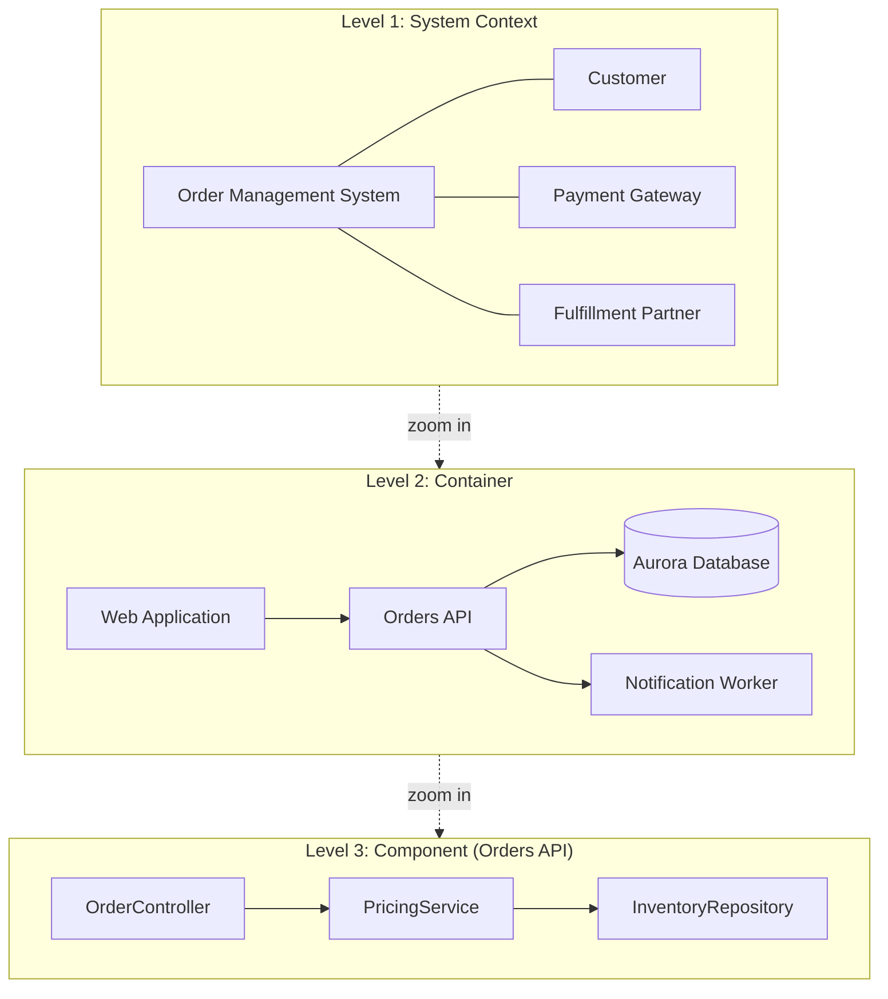
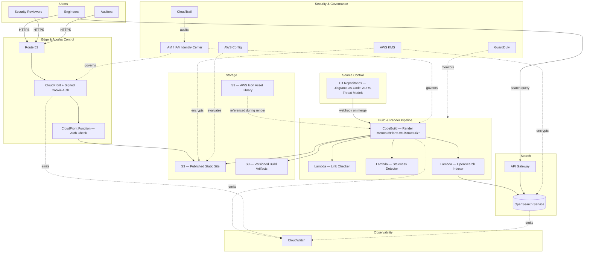

# Chapter 4 – Architecture Documentation

*C4 Model · AWS Icons · Sequence Diagrams · Network Diagrams · Data Flow Diagrams · Threat Models · ADRs · Documentation Best Practices*

> **How to read this chapter:** Documentation is treated here not as an afterthought but as a production system in its own right — one with its own architecture, deployment pipeline, availability requirements, and failure modes. This chapter anchors every principle to a concrete reference architecture: an **Enterprise Architecture Documentation Platform** — a Documentation-as-Code system that generates, versions, reviews, and publishes C4 diagrams, AWS architecture diagrams, sequence diagrams, network diagrams, data flow diagrams, threat models, and Architecture Decision Records for every production system in the organization, hosted on AWS and deployed with the same rigor as any customer-facing workload.

---

# 1. Executive Summary

## The Business Problem

Enterprise architecture documentation almost universally fails in one of two predictable ways. The first failure mode is **staleness**: a wiki page, a PowerPoint deck, or a Visio diagram is created once — usually during a design review or an audit preparation sprint — and is never updated again. Six months later, the diagram shows three services where there are now eleven, describes a database that has since been replaced, and omits the disaster recovery region that was added after a postmortem. Engineers stop trusting it, stop referencing it, and eventually stop maintaining it at all, which accelerates the staleness further. The second failure mode is **inaccessibility of the right altitude**: an organization has either an executive-level, oversimplified box diagram that tells a new engineer nothing about how the system actually behaves, or a data-dump of every Terraform resource with no narrative structure, and nothing in between — no view that lets a security reviewer understand the trust boundaries, a new hire understand the request flow, or an SRE understand the failure domains, without reverse-engineering it from source code.

Both failure modes have the same root cause: **documentation that is decoupled from the software delivery lifecycle is documentation that will decay.** If a diagram lives in a slide deck on a shared drive, nothing forces it to be updated when the architecture changes. If a threat model lives in a security team's local folder, engineering never sees it and never validates it against the actual deployed system. The business problem this chapter addresses is not "how do we draw a nicer diagram" — it is **how do we make architecture documentation a byproduct of engineering work rather than a separate, perpetually-behind-schedule project**, and how do we structure that documentation so that every audience — executive, architect, developer, security reviewer, auditor, and incident responder — can find the altitude of detail they specifically need.

## Architecture Objective

The objective of the reference architecture in this chapter is a **Documentation-as-Code platform**: architecture diagrams (C4 model context/container/component views), sequence diagrams, network diagrams, data flow diagrams, threat models, and ADRs are authored as text (Mermaid, PlantUML, or Structurizr DSL) stored in the same Git repository as the infrastructure and application code they describe, reviewed via the same pull-request process, rendered automatically by a CI/CD pipeline, and published to a versioned, access-controlled, searchable internal documentation site hosted on AWS. Concretely, this reference architecture targets:

- **Documentation that cannot silently drift out of sync with a merged infrastructure change**, because a missing or unreviewed diagram update is a CI check, not a hopeful expectation.
- **A layered viewing model** (per the C4 model, detailed in Section 3) so an executive can view a one-page Context diagram while an engineer can drill into a Component diagram for the specific service they're debugging, without either audience wading through the other's level of detail.
- **A single source of truth for security and audit evidence** — threat models and ADRs that an auditor can be pointed to directly, with a Git history proving when they were last reviewed and by whom.
- **Sub-second search and cross-linking** across hundreds of architecture documents spanning dozens of systems, so "which services talk to the payments database" is a search query, not a multi-day archaeology exercise.
- **A publishing pipeline with its own availability, security, and cost discipline** — this platform is itself a production system serving internal enterprise users and, in some organizations, external auditors, and is designed with the same rigor as any customer-facing application.

## Why Organizations Adopt This Architecture

Organizations converge on a Documentation-as-Code approach for the same reason they converge on Infrastructure-as-Code: **anything not enforced by tooling eventually stops happening**, no matter how well-intentioned the team. A wiki-based or slide-based documentation strategy depends entirely on individual discipline with no structural reinforcement; a Documentation-as-Code strategy makes the diagram update part of the same pull request that changes the architecture, reviewed by the same reviewer, merged in the same commit. This is not a novel or exotic idea — it mirrors exactly how the industry solved the equivalent staleness problem for infrastructure a decade earlier by moving from manually-configured servers to Terraform.

The second reason organizations adopt this pattern is **audit and compliance pressure**. SOC 2, ISO 27001, PCI-DSS, and similar frameworks all require demonstrable, current architecture documentation and threat models, along with evidence of when they were last reviewed. A documentation platform with Git-backed version history provides exactly this evidence automatically; a slide deck provides only whatever the last-modified timestamp happens to show, with no record of who reviewed it or against what version of the actual system.

## Major Business Benefits

| Benefit | Explanation |
|---|---|
| Reduced onboarding time | New engineers self-serve architecture understanding via layered C4 diagrams instead of requiring hours of tribal-knowledge transfer from senior staff. |
| Faster incident response | Accurate, current network and data flow diagrams let responders reason about blast radius and dependencies during an active incident rather than during a calmer retrospective. |
| Audit readiness | ADRs and threat models with Git-backed review history provide direct, always-current evidence for SOC 2/ISO 27001 auditors. |
| Reduced architectural drift | Documentation tied to the CI/CD pipeline surfaces undocumented changes as a review-time signal, not a surprise discovered months later. |
| Better cross-team collaboration | A shared, searchable documentation platform lets teams discover and reuse existing patterns rather than re-solving problems other teams have already documented. |
| Lower key-person risk | Architecture knowledge is captured in reviewable, versioned artifacts rather than existing only in a small number of engineers' heads. |

## Typical Enterprise Scenarios

This architecture is the right investment for:

- A platform engineering organization with more than roughly 15–20 engineers, where tribal-knowledge transfer no longer scales.
- Any organization pursuing or maintaining SOC 2 Type II, ISO 27001, or similar compliance certifications requiring current, evidenced architecture and threat model documentation.
- Organizations undergoing rapid team growth, where onboarding velocity is a measurable bottleneck to feature delivery.
- Enterprises with multiple, semi-autonomous engineering teams whose systems interact — where cross-team dependency understanding is otherwise maintained only through informal Slack conversations.
- Any regulated industry (financial services, healthcare, insurance) where architecture and data flow documentation is a recurring, high-cost manual exercise ahead of each audit cycle.

It is a lower priority for a very small engineering team (fewer than 10–15 engineers) where informal, verbal architecture knowledge transfer genuinely remains efficient, and the overhead of a dedicated documentation pipeline exceeds its near-term value — though even small teams benefit from adopting the lightweight practices (ADRs, diagrams-as-code in the same repository) without the full publishing platform described here.

---

# 2. Business Requirements

## Business Drivers

- Reduce new-engineer time-to-productivity, currently bottlenecked by informal knowledge transfer from a small number of senior architects.
- Provide auditors with current, evidenced architecture and threat model documentation without a multi-week pre-audit scramble.
- Reduce incident mean-time-to-resolution by ensuring responders have accurate network and data flow diagrams available during an active incident.
- Preserve architectural knowledge as the organization experiences engineer turnover.
- Enable architecture review boards to evaluate proposed designs against a consistent, comparable documentation standard.

## Functional Requirements

| Requirement | Description |
|---|---|
| Diagrams-as-code authoring | Support Mermaid, PlantUML, and Structurizr DSL as text-based diagram source formats stored in Git. |
| Automated rendering | CI/CD pipeline renders diagram source into static SVG/PNG and publishes to the documentation site on every merge to main. |
| C4 model support | Support Context, Container, Component, and (optionally) Code-level C4 views with consistent cross-linking between levels. |
| ADR repository | Structured, searchable repository of Architecture Decision Records, one per architecturally significant decision, linked to the systems they affect. |
| Threat model repository | STRIDE-based threat model documents per system, linked to their corresponding architecture diagrams and data flow diagrams. |
| Full-text search | Search across all diagrams, ADRs, and threat models by system name, component name, technology, or decision keyword. |
| Access control | Role-based access — general engineering read access, restricted write access per system ownership, and a separate read tier for auditors/compliance without broader engineering access. |
| Versioning | Every document accessible at any historical Git commit, not just the latest version. |

## Non-Functional Requirements

| Category | Target |
|---|---|
| Availability | 99.5% (internal tooling — lower than customer-facing tiers, but not "best effort") |
| Latency | < 1 second page load for rendered documentation pages; < 2 seconds for search queries |
| Build/render pipeline latency | Diagram changes published within 5 minutes of merge to main |
| Durability | 99.999999999% (11 nines) for documentation source and rendered artifacts (S3-backed) |
| Security | Read access restricted to authenticated internal users; write access scoped to system owners via Git branch protection |
| Compliance | Documentation update history must be retrievable for a minimum of 3 years to satisfy audit evidence requirements |

## Scalability Goals

The platform must scale to several hundred documented systems and several thousand individual diagrams/ADRs/threat models without a degradation in search latency or build pipeline throughput, supporting concurrent documentation updates from dozens of engineering teams without pipeline queuing delays exceeding a few minutes.

## Availability Requirements

99.5% is an appropriate target for an internal documentation platform — meaningfully lower than the 99.95%+ typically required for customer-facing systems, since a brief documentation-site outage does not directly impact revenue, but still high enough that engineers can depend on it during an active incident without a fallback plan of "hope someone has a local cached copy."

## Latency Requirements

Sub-second page loads for rendered diagrams and ADRs (achieved via CloudFront edge caching of static content), and sub-2-second full-text search response times even as the corpus grows into the thousands of documents.

## Compliance Requirements

SOC 2 Type II requires demonstrable evidence that architecture documentation and threat models are reviewed on a defined cadence (this platform's Git history provides exactly this evidence); ISO 27001 similarly requires documented risk assessments (threat models) tied to identified systems; internal audit requirements typically mandate a minimum 3-year retention of documentation change history.

## Security Expectations

No documentation — particularly threat models and network diagrams, which are inherently sensitive attacker-relevant information — should be publicly internet-accessible; access is restricted to authenticated internal users via SSO, with a further-restricted tier for highly sensitive threat models (e.g., payment processing, authentication systems) visible only to security-cleared roles.

## Recovery Objectives

### Recovery Point Objective (RPO)

**RPO = 0** for documentation source content, since it is stored in Git (GitHub/GitLab) with its own independent durability guarantees entirely decoupled from the rendering/publishing platform's own availability.

### Recovery Time Objective (RTO)

**RTO ≤ 4 hours** for the rendering/publishing platform itself — if the documentation website is unavailable, the underlying Git repositories remain directly accessible as a fallback, meaningfully relaxing the urgency of restoring the polished publishing layer compared to a customer-facing outage.

## SLAs

Internal SLA: 99.5% monthly uptime for the documentation website; no formal external SLA, since this is an internal tooling platform, though auditor access during a certification audit window is treated as a higher-priority availability period with proactive monitoring.

## Expected Workload

Baseline: a few hundred engineers viewing documentation during business hours, with bursty spikes during onboarding cohorts and pre-audit review periods; the CI/CD rendering pipeline processes on the order of dozens to low hundreds of documentation pull requests per day across the engineering organization.

## Expected Growth

Documentation corpus growth tracks engineering headcount and system count growth — expect roughly linear growth in stored documents and rendering pipeline load as the organization adds new services, with no fundamental re-architecture required up to several thousand documented systems given the chosen AWS services' inherent scalability.

---

# 3. Architecture Overview

## Overall Design

The platform is a **static-site-generation pipeline with a dynamic search layer**: documentation source files (Markdown, Mermaid, PlantUML, Structurizr DSL) live in the same Git repositories as the code they document, a CI/CD pipeline renders diagram source into static images and composes them with Markdown prose into a static documentation site (using a static site generator such as MkDocs or Docusaurus), the built site is published to S3 and served via CloudFront, and a separate lightweight search service (backed by OpenSearch) indexes the rendered content for full-text search.

## Architecture Philosophy

The guiding philosophy is **"documentation lives where the code lives, and is validated the same way code is."** A diagram is not "done" when it looks good in a preview — it is done when it has passed the same pull-request review, the same CI validation (does the Mermaid/PlantUML syntax parse correctly, do internal cross-links resolve, is an ADR present for any change touching a documented architecturally-significant decision), and the same merge process as the infrastructure or application code it describes. This philosophy deliberately trades the polish of a dedicated diagramming tool's WYSIWYG interface for the durability and reviewability of plain-text, diffable source formats — a trade-off explored further in Section 28's alternatives comparison.

The second guiding principle is **progressive disclosure via the C4 model**: every documented system provides, at minimum, a Context diagram (System Context) and a Container diagram, with Component diagrams added for systems complex enough to warrant them. This ensures every audience — from an executive glancing at a Context diagram to an engineer debugging a specific container's internals — finds their appropriate altitude of detail within the same coherent, cross-linked documentation set, rather than needing an entirely separate document per audience.

## Documentation Layers (Chapter Focus Areas)

This section provides the deep-dive explanation of each documentation artifact type this chapter is specifically about — the AWS platform delivering these artifacts is described in Sections 4 onward.

### The C4 Model

The C4 model (Context, Containers, Components, Code) is a hierarchical approach to software architecture diagramming created to solve exactly the "wrong altitude" problem described in Section 1. It defines four progressively detailed levels:

- **Level 1 — System Context**: shows the system as a single box, its users, and the other systems it interacts with, deliberately omitting all internal detail. This is the correct level for an executive briefing, a new-hire's first exposure to a system, or an architecture review board's initial framing of a proposal.
- **Level 2 — Container**: decomposes the system into its deployable/runnable units (a web application, an API service, a database, a message queue) and shows how they communicate. This is the correct level for a new engineer joining the team, or a cross-team dependency conversation ("does your container talk to our database directly, or only via our API?").
- **Level 3 — Component**: decomposes a single container into its major internal structural components (e.g., a specific service's controller, business-logic, and repository layers). This is the correct level for an engineer about to modify that specific container's internals, or a detailed security review of a single service.
- **Level 4 — Code**: optional, auto-generated (e.g., via IDE class-diagram tooling) rather than hand-maintained, since hand-maintained code-level diagrams go stale within days. This platform deliberately does not mandate Level 4 diagrams as a manually-authored artifact — the cost of keeping them current exceeds their value versus simply reading the code directly.

**When to use each level:** Context and Container diagrams are mandatory for every documented system in this platform. Component diagrams are required only for containers with genuine internal architectural complexity (e.g., a service with multiple distinct internal layers or a non-trivial internal event-processing pipeline) — a simple CRUD service with a single controller-to-database path does not warrant a Component diagram, and forcing one is a common process failure discussed in Section 27.

**When NOT to use C4 diagrams:** For a single-purpose Lambda function performing a simple, well-named transformation with no internal architectural complexity, a Context and Container-level mention is sufficient — a full four-level C4 treatment for a 40-line function is documentation-process overhead without corresponding value.



### AWS Architecture Icons

AWS publishes an official Architecture Icons set (updated several times per year) covering every AWS service, organized by category (Compute, Storage, Database, Networking & Content Delivery, Security/Identity/Compliance, and so on) with standardized colors per category. This platform mandates the **official AWS Architecture Icons** (never hand-drawn or generic cloud-shape approximations) for any AWS-service-level architecture diagram, for two concrete reasons: first, consistency — an engineer moving between documented systems immediately recognizes "orange square = compute-adjacent, this specific icon = Lambda" without re-learning a bespoke visual language per team; second, currency — using the officially maintained icon set (rather than a locally-cached, unmaintained copy) ensures new service icons and rebrand updates (AWS periodically updates icon styling) are reflected consistently. Diagram source (Mermaid/PlantUML/Structurizr) references icon assets by standardized identifier, resolved at render time against a centrally maintained icon-asset library stored in S3, rather than each team maintaining its own local copy of icon image files — this avoids both version drift and the common failure of a team using an outdated icon for a service AWS has since re-styled.

**Best practice:** icons are used at the Container level and below (AWS service selection is implementation detail invisible at the System Context level, where the diagram should show logical systems, not specific AWS services) — a Context diagram showing "Amazon Aurora" instead of "Order Database" leaks an implementation detail to an audience (executives, cross-system integration partners) who neither need nor benefit from it, and creates unnecessary rework if the underlying service is later replaced.

### Sequence Diagrams

Sequence diagrams document the temporal, step-by-step interaction between components for a specific scenario — precisely the artifact needed to answer "in what order do these five services call each other during checkout, and what happens if step 3 fails?" This platform mandates a sequence diagram for every architecturally significant workflow (the primary "happy path" plus at least one significant failure/retry path) — a static Container diagram alone cannot express ordering, synchronous-versus-asynchronous distinction, or timeout/retry behavior, all of which are exactly the details an incident responder or a new engineer implementing a similar flow needs.

```mermaid
sequenceDiagram
    participant Client
    participant API as Orders API
    participant DB as Aurora
    participant EB as EventBridge
    participant Worker as Notification Worker

    Client->>API: POST /orders
    API->>DB: BEGIN TRANSACTION; INSERT order
    DB-->>API: Commit OK
    API->>EB: PutEvents(OrderPlaced)
    API-->>Client: 201 Created
    EB->>Worker: OrderPlaced event
    Worker->>Worker: Send confirmation email
    Note over API,DB: Alternate path — DB write fails
    API->>DB: BEGIN TRANSACTION; INSERT order
    DB-->>API: Constraint violation
    API-->>Client: 409 Conflict (no event published)
```

**When to use:** Any workflow spanning 3+ components with a meaningful ordering or failure-branching structure. **When NOT to use:** A trivial single-hop request/response (client calls API, API responds) does not need a sequence diagram — the Container diagram already communicates this adequately, and an unnecessary sequence diagram adds maintenance burden without corresponding clarity gain.

### Network Diagrams

Network diagrams document the actual network topology — VPCs, subnets, route tables, security group boundaries, and connectivity paths (including to on-premises or third-party networks) — at a level of physical/logical network detail that C4 Container diagrams deliberately omit (C4 is about software structure, not network topology). This platform requires a current network diagram per VPC/environment, auto-validated where possible against the actual deployed Terraform state (Section 20 describes the CI check that flags a network diagram as stale if the underlying Terraform network module has changed without a corresponding diagram update).

**When to use:** Every production VPC, and any environment in scope for a compliance audit's network-segmentation evidence requirement. **When NOT to use:** A network diagram is the wrong artifact for describing application-level service-to-service call patterns — that's a Container or sequence diagram's job; conflating the two produces a diagram too cluttered to be useful for either purpose.

### Data Flow Diagrams

Data flow diagrams (DFDs) trace how a specific class of data (customer PII, payment card data, authentication credentials) moves through the system — which components read it, write it, transform it, and where it crosses a trust boundary. DFDs are the foundational input to threat modeling (below) and to compliance data-mapping exercises (GDPR Article 30 records of processing, PCI-DSS cardholder data flow diagrams). This platform requires a DFD for any data classification of "Confidential" or higher, maintained separately from (but cross-linked to) the corresponding Container diagram, since a DFD's organizing principle (follow the data) differs from a Container diagram's organizing principle (show the deployable units) even though they describe overlapping ground.

**When to use:** Any system processing regulated or sensitive data classes. **When NOT to use:** A DFD for a system processing only non-sensitive, already-public data (e.g., a public documentation site's own content) is process overhead without compliance or security value.

### Threat Models

A threat model is a structured analysis of a system's attack surface, typically organized using the STRIDE framework (Spoofing, Tampering, Repudiation, Information Disclosure, Denial of Service, Elevation of Privilege), identifying specific threats at each trust-boundary crossing identified in the corresponding DFD, along with the mitigation already in place or required. This platform requires a threat model for every system handling Confidential-or-higher data or exposed to the public internet, reviewed at minimum annually and additionally upon any architecturally significant change (a new external integration, a new trust boundary, a new data classification introduced).

**Example STRIDE entry (Orders API, "place order" trust boundary crossing from public internet to VPC):**

| Threat Category | Specific Threat | Mitigation |
|---|---|---|
| Spoofing | Attacker forges a customer's session to place fraudulent orders | JWT signature validation; short token expiry; MFA on account changes |
| Tampering | Attacker modifies order payload in transit to alter pricing | TLS 1.2+ enforced end-to-end; server-side price recalculation, never trusting client-supplied price |
| Repudiation | Customer disputes having placed an order | CloudTrail + application-level audit log with immutable order history |
| Information Disclosure | Attacker enumerates order IDs to view other customers' orders | Authorization check on every order-detail request tied to the authenticated customer ID, not just the order ID |
| Denial of Service | Attacker floods the checkout endpoint | WAF rate-based rules; CloudFront/Shield Standard absorption |
| Elevation of Privilege | Compromised customer session used to access admin endpoints | Separate authorization scopes for customer vs. admin roles; admin console network-isolated |

**When to use:** Mandatory for internet-facing systems and anything processing regulated data. **When NOT to use:** A full STRIDE exercise for a purely internal, read-only reporting dashboard with no sensitive data and no external exposure is disproportionate — a lighter-weight security review checklist (Section 31) is more appropriate there.

### Architecture Decision Records (ADRs)

An ADR is a short, structured document capturing a single architecturally significant decision: the context that prompted it, the decision made, the alternatives considered and why they were rejected, and the resulting consequences. ADRs are the mechanism by which "why did we do it this way" survives past the memory of the engineers who made the original decision — one of the most common and costly forms of institutional knowledge loss discussed in Section 34. This platform requires an ADR for any decision meeting at least one of: introduces a new AWS service or third-party dependency; changes a previously documented architectural pattern; has a significant, hard-to-reverse cost or security implication; or was contested enough during design review to warrant recording the reasoning, not just the outcome.

**When to use:** As above. **When NOT to use:** An ADR for a routine, easily reversible implementation choice (e.g., which specific npm logging library a single service uses internally) is process overhead — ADRs are for architecturally significant, hard-to-reverse decisions, not every decision.

### Documentation Best Practices (Summary Principles)

- Documentation source lives in the same repository as the code it documents, not a separate wiki or drive.
- Every diagram is text-based (Mermaid/PlantUML/Structurizr), never a binary image file with no diffable source.
- Documentation changes are reviewed via the same pull-request process as code changes, by a reviewer with genuine context on the system.
- Every system has, at minimum, a Context and Container-level C4 diagram — no system is "too small to document."
- Diagrams reference the official AWS icon set at the Container level and below; logical/business terms are used at Context level.
- A documentation "owner" (typically the team that owns the system) is explicitly assigned and reviewed for currency on a defined cadence, not left ownerless.
- Stale documentation is actively flagged (via the CI checks described in Section 20) rather than silently trusted.

## Core Components

| Layer | Components |
|---|---|
| Source | Git repositories (per-system, containing Markdown/Mermaid/PlantUML/Structurizr DSL alongside application code) |
| Build/Render | AWS CodeBuild (or GitHub Actions runners) rendering diagram source to SVG, composing the static site via MkDocs/Docusaurus |
| Publishing | Amazon S3 (static site origin), Amazon CloudFront (CDN + access control integration) |
| Search | Amazon OpenSearch Service (full-text index of rendered content) |
| Access Control | AWS IAM Identity Center / SSO federation, CloudFront signed cookies for authenticated access |
| Automation | AWS Lambda (link-checking, staleness-detection, ADR-index generation) |
| Storage | S3 (icon asset library, build artifacts, search index snapshots) |
| Security | IAM, KMS (encryption of any sensitive threat-model content at rest), CloudTrail, GuardDuty |
| Observability | CloudWatch (build pipeline health, site latency, search performance) |

## How Components Interact

An engineer commits a diagram/ADR/threat-model change alongside a related infrastructure or application code change in the same pull request. On merge to `main`, a CodeBuild (or GitHub Actions) pipeline renders all changed Mermaid/PlantUML/Structurizr source into SVG images, runs link-validation and staleness-detection Lambda functions, composes the static documentation site, and publishes the built output to S3. CloudFront serves the published site to authenticated users (validated via signed cookies issued after SSO login), and a separate indexing Lambda function updates the OpenSearch index with the newly published content, making it immediately searchable.

## High-Level Workflow

1. Engineer authors or updates a diagram/ADR/threat model as part of a pull request touching the relevant system.
2. Pull request review validates both the code change and the accompanying documentation change together.
3. On merge, the CI/CD pipeline renders and publishes the updated documentation.
4. The search index is updated to reflect the newly published content.
5. Engineers, security reviewers, and auditors access the current documentation via the CloudFront-served static site with SSO-authenticated access.

## Request Lifecycle

Authenticated user request → CloudFront edge (checks signed cookie for access authorization) → cache hit (served directly from edge) or cache miss (origin fetch from S3) → response delivered to the browser; a search query instead routes through a small API Gateway/Lambda layer to OpenSearch, returning ranked results with deep links into the specific rendered documentation page and section.

## Response Lifecycle

Static documentation pages are served with long cache TTLs (since publishing is the only mutation event, and it happens through the controlled CI/CD pipeline, not ad hoc edits) with cache invalidation triggered automatically as the final step of each successful publish, ensuring users see updated content within minutes of a merge without unnecessarily short TTLs undermining CDN efficiency the rest of the time.

## Data Lifecycle

Documentation source lives indefinitely in Git (subject to the source repository's own retention policy, typically indefinite for an active codebase). Rendered build artifacts in S3 are versioned (S3 versioning enabled) with lifecycle rules transitioning older build versions to S3 Standard-IA after 90 days, since only the latest published version is actively served, but historical versions are retained for audit-trail purposes (an auditor asking "what did the threat model say on the date of this specific incident" can be answered from S3 version history plus the corresponding Git commit).

---

# 4. AWS Services Used

## Amazon S3

**Purpose:** Origin storage for the built static documentation site, the AWS icon asset library, and versioned build artifacts.

**Why selected:** S3's native static-website-hosting capability, versioning, and deep CloudFront integration make it the default choice for any static-content publishing pipeline; no server management is required at all.

**Alternatives:** AWS Amplify Hosting — chosen instead when the team wants an integrated build+deploy experience with less manual CI/CD wiring, at the cost of somewhat less control over the exact build pipeline steps this platform requires (custom staleness-detection Lambda invocation, custom OpenSearch indexing step).

**Limitations:** S3 static hosting alone provides no server-side access control — authentication/authorization must be layered on via CloudFront (see below).

**Pricing considerations:** Storage cost is negligible for a documentation site's typical size (megabytes to low gigabytes); request pricing is likewise minor relative to CloudFront's own charges for the same traffic.

**Best practices:** Enable versioning to support the audit-evidence use case described in Section 3's Data Lifecycle; use Origin Access Control so the bucket is reachable only via CloudFront, never directly.

## Amazon CloudFront

**Purpose:** CDN and access-control enforcement point for the documentation site.

**Why selected:** Provides both performance (edge caching for the sub-second latency target in Section 2) and the access-control mechanism (CloudFront signed cookies, issued after SSO authentication) restricting the site to authenticated internal users only.

**Alternatives:** Application Load Balancer with a Lambda@Edge or CloudFront Function for auth-check — used instead when the origin is dynamic rather than a static site; not applicable here given the static-site architecture.

**Limitations:** Signed-cookie-based access control requires an auxiliary authentication service (issuing the signed cookie after SSO validation) — CloudFront itself does not perform the SSO handshake.

**Pricing considerations:** Data-transfer-out costs scale with documentation-site traffic, which is typically modest (internal-only audience) relative to a customer-facing CDN workload.

**Best practices:** Use a dedicated CloudFront Function (lightweight, low-latency) to validate the signed cookie at the edge before any origin fetch, rejecting unauthenticated requests without incurring S3 origin cost.

## AWS Lambda

**Purpose:** Executes the auxiliary automation tasks in the pipeline — SSO-authentication token issuance/validation, link-checking across documentation pages, staleness-detection (comparing documentation last-updated timestamps against the underlying system's infrastructure code change history), ADR-index regeneration, and OpenSearch index updates.

**Why selected:** Each of these is an event-driven, intermittent task well suited to Lambda's pay-per-invocation, scale-to-zero model — none require a persistently running server.

**Alternatives:** AWS CodeBuild directly (running these as build-pipeline steps) — used for tasks tightly coupled to the build process itself (rendering, site composition), while Lambda is reserved for tasks triggered independently of a specific build (e.g., a nightly staleness-detection sweep across all documented systems, not just ones changed in the current build).

**Limitations:** As with any Lambda usage, 15-minute maximum execution time — the staleness-detection sweep across a very large documentation corpus should be designed to process systems in parallel/batched invocations rather than a single long-running function if the corpus grows large enough to approach this limit.

**Pricing considerations:** Negligible for this workload's invocation volume and frequency.

**Best practices:** Keep each function single-purpose (link-checker, staleness-detector, index-updater are three separate functions, not one monolithic function); use Lambda Destinations to route failures to a monitoring channel rather than silently swallowing them.

## Amazon OpenSearch Service

**Purpose:** Full-text search index across all published documentation content.

**Why selected:** Provides sub-second full-text search with relevance ranking across a corpus that will grow into the thousands of documents — a capability a static site alone cannot provide (client-side search libraries do not scale well past a few hundred pages without noticeably degrading page-load performance).

**Alternatives:** Algolia or a similar managed search-as-a-service product — sometimes chosen for a more polished out-of-box search UX at the cost of sending internal documentation content to a third-party vendor, which many enterprises' data-governance policies preclude for anything containing network diagrams or threat models.

**Limitations:** Requires cluster sizing and ongoing management (even in the managed OpenSearch Service form) that a smaller documentation corpus might not justify — for a genuinely small corpus (a few dozen systems), a simpler client-side search index may suffice, deferring OpenSearch adoption until the corpus size justifies it.

**Pricing considerations:** Priced per instance-hour for the underlying OpenSearch cluster nodes plus storage — a modest but non-trivial fixed cost, one of the more significant line items in this platform's overall (otherwise quite low) cost profile, discussed further in Section 16.

**Best practices:** Use OpenSearch Serverless (rather than provisioned instances) if traffic is genuinely bursty/unpredictable, avoiding the need to size a fixed cluster for a search workload with uncertain growth.

## AWS CodeBuild

**Purpose:** Executes the CI/CD rendering and publishing pipeline — diagram rendering, static site composition, and S3 deployment.

**Why selected:** Native AWS integration (IAM roles, VPC connectivity if needed, CloudWatch Logs) without needing to manage build-agent infrastructure, and straightforward integration with both CodePipeline and third-party source triggers (GitHub webhooks).

**Alternatives:** GitHub Actions — frequently the actual choice in organizations whose source control is GitHub-hosted, avoiding a second CI system to operate alongside GitHub's own; CodeBuild remains the right choice when the organization has standardized on AWS-native CI/CD tooling (CodePipeline/CodeCommit) for other reasons.

**Limitations:** Build environment customization (specific rendering tool versions for Mermaid/PlantUML/Structurizr) requires maintaining a custom build container image, adding a small ongoing maintenance task.

**Pricing considerations:** Priced per build-minute; a documentation rendering pipeline's build minutes are typically a very small fraction of an organization's overall CI/CD spend.

**Best practices:** Cache rendering-tool dependencies (npm packages for Mermaid CLI, PlantUML JAR, Structurizr CLI) between builds to keep build times low as the documentation corpus and build frequency grow.

## AWS IAM / IAM Identity Center

**Purpose:** Authentication and authorization for both human documentation access (via IAM Identity Center SSO federation) and the pipeline's own service-to-service permissions (build role, indexing Lambda role).

**Why selected:** Centralizes human access control through the organization's existing SSO provider rather than a separate documentation-platform-specific user database, and scopes every pipeline component's permissions to exactly what it needs (the rendering build role can write to S3 but has no reason to read from OpenSearch; the indexing Lambda can write to OpenSearch but has no reason to modify IAM).

**Alternatives:** A dedicated documentation-platform user database (e.g., a simple Cognito user pool) — considered and rejected, since it would require maintaining a second identity source for the same population of internal engineering users already managed via the corporate SSO provider.

**Limitations:** None specific to this use case beyond standard IAM policy-management discipline.

**Pricing considerations:** IAM Identity Center itself carries no direct cost; the indirect cost is the engineering time required to maintain correct group-to-permission mappings as the organization's team structure evolves.

**Best practices:** Map documentation read/write access to existing engineering-team SSO groups rather than creating a parallel, documentation-specific permission structure that inevitably drifts out of sync with actual team membership.

## AWS KMS

**Purpose:** Encrypts at rest any documentation content classified as sensitive — most notably, threat models and network diagrams, which are inherently attacker-relevant if disclosed.

**Why selected:** Provides auditable, access-controlled encryption for the S3 buckets and OpenSearch indices containing this sensitive subset of content, consistent with the same data-classification-driven encryption approach used for production data elsewhere in the organization (Chapter 3, Section 11).

**Alternatives:** SSE-S3 (AWS-owned keys) — acceptable for the non-sensitive majority of documentation content (Context/Container diagrams, ADRs describing already-public-facing architectural patterns); CMKs are reserved specifically for the sensitive subset.

**Limitations:** None specific to this workload beyond the general KMS considerations described in Chapter 3.

**Pricing considerations:** Minor, given the relatively small volume of genuinely sensitive documentation content relative to a production data workload.

**Best practices:** Use a distinct CMK for the threat-model/network-diagram content specifically, with a narrowly scoped key policy limiting decrypt access to the security team and the specific engineering teams who own the corresponding systems.

## AWS CloudTrail / AWS Config / Amazon GuardDuty

**Purpose:** As described in Chapter 3 — the same organization-wide audit logging, configuration compliance evaluation, and threat detection services apply to this platform's own infrastructure, since it is itself a production AWS account/workload requiring the same governance baseline as any other.

**Why selected:** Consistency with the organization's existing security baseline, and specifically important here because this platform's own S3 buckets, if misconfigured, would represent a genuinely severe internal-information-disclosure risk (a publicly-exposed threat-model or network-diagram bucket is a significant finding).

**Best practices:** Apply the same Config rule (`s3-bucket-public-read-prohibited` and equivalent) to this platform's buckets as to any production data bucket — documentation infrastructure is not exempt from the organization's standard security baseline simply because it is "just documentation."

## Amazon CloudWatch

**Purpose:** Monitoring for the build pipeline's health (build success/failure rate, build duration), the CloudFront/S3 site's latency and error rate, and the OpenSearch cluster's query performance.

**Why selected:** Native integration with every other service in this platform, consistent with the observability approach detailed in Chapter 3, Section 21.

**Best practices:** Alert specifically on build pipeline failure rate — a silently failing documentation build (e.g., a Mermaid syntax error blocking the pipeline) means documentation updates silently stop publishing, exactly the staleness failure mode this entire platform exists to prevent, and deserves proactive alerting rather than being discovered only when someone notices a diagram looks outdated.

---

# 5. Complete Architecture Diagram



---

# 6. Component-by-Component Explanation

## Git Repositories

**Purpose:** Canonical, version-controlled source of truth for every diagram, ADR, and threat model.
**Responsibilities:** Store text-based documentation source alongside the code it documents; enforce review via branch protection and required pull-request approval.
**Inputs:** Engineer commits/pull requests.
**Outputs:** Webhook events triggering the build pipeline on merge.
**Scaling:** Inherits the scaling characteristics of the underlying source-control platform (GitHub/GitLab), effectively unlimited for this use case.
**High availability:** Delegated entirely to the source-control provider's own SLA.
**Failure handling:** N/A — this is the platform's authoritative source; recovery from a build-pipeline failure always starts from Git, never the other way around.
**Dependencies:** None upstream.
**Security:** Branch protection rules require pull-request review before merge to `main`; repository-level access control restricts write access to the owning team.
**Monitoring:** Webhook delivery failures are monitored and alerted, since a missed webhook silently prevents a documentation update from being published.

## CodeBuild Rendering Pipeline

**Purpose:** Transforms text-based diagram source and Markdown prose into a published static documentation site.
**Responsibilities:** Render Mermaid/PlantUML/Structurizr source to SVG; compose the static site via the chosen static-site generator; invoke downstream Lambda functions for link-checking, staleness-detection, and search indexing; publish the built site to S3.
**Inputs:** Git repository content at the merged commit.
**Outputs:** Static site artifacts in S3; invocation events for downstream Lambda functions.
**Scaling:** CodeBuild scales concurrent builds automatically; build concurrency limits can be raised via support request if the organization's build volume grows substantially.
**High availability:** A build failure affects only the specific pull request's publish, not the currently-published site, which remains served from the last successful build's artifacts.
**Failure handling:** A failed build blocks publishing of that specific change and alerts the responsible engineer via the CI/CD notification channel; the previously published site continues serving unaffected.
**Dependencies:** Git (source), S3 (destination), the three downstream Lambda functions.
**Security:** Build role scoped to only the S3 prefixes and Lambda functions it needs to invoke — no broader account access.
**Monitoring:** CloudWatch alarms on build failure rate and build duration.

## CloudFront + Signed Cookie Authentication

**Purpose:** Serves the published documentation site while restricting access to authenticated internal users.
**Responsibilities:** Validate a signed cookie (issued after SSO authentication) at the edge before serving any content; cache and serve static site content globally.
**Inputs:** HTTPS requests from users; signed cookies issued by the auxiliary authentication service.
**Outputs:** Rendered documentation pages, or a redirect to the SSO login flow for unauthenticated requests.
**Scaling:** Fully managed, scales automatically with request volume.
**High availability:** Distributed globally by design; no single point of failure.
**Failure handling:** N/A for the CDN layer itself; an SSO provider outage would prevent new authentication but would not affect users with an already-valid signed cookie until its expiry.
**Dependencies:** S3 (origin), the auxiliary SSO-integration authentication service.
**Security:** This is the platform's primary access-control enforcement point — the CloudFront Function performing cookie validation is the critical security control preventing unauthenticated access to potentially sensitive threat-model/network-diagram content.
**Monitoring:** CloudWatch metrics on cache hit ratio, 4xx rate (a spike may indicate expired-cookie issues affecting many users simultaneously, worth distinguishing from a genuine attack pattern).

## Link-Checker Lambda

**Purpose:** Validates that internal cross-links between documentation pages (e.g., a Container diagram linking to its corresponding Component diagram, or an ADR linking to the system it affects) resolve correctly.
**Responsibilities:** Crawl the newly built site's internal links; report broken links as a build-pipeline warning (not necessarily a hard failure, depending on the organization's strictness preference).
**Inputs:** The newly rendered static site content.
**Outputs:** A link-validation report surfaced in the CI/CD pipeline output.
**Scaling:** Scales with documentation corpus size; for a very large corpus, this can be parallelized across multiple Lambda invocations.
**High availability/Failure handling:** A failure in this function should not block publishing (it's a quality-assurance check, not the core publishing function) — it fails open with an alert, not closed.
**Dependencies:** The build pipeline's output.
**Security:** Read-only access to the built site content; no write access to any production system.
**Monitoring:** Broken-link count trended over time as a documentation-quality metric.

## Staleness-Detector Lambda

**Purpose:** Flags documentation that may be out of sync with the actual system it describes.
**Responsibilities:** Compare a documented system's diagram/ADR last-updated timestamp against that system's actual infrastructure-code (Terraform) last-meaningful-change timestamp; flag a significant gap as a staleness warning.
**Inputs:** Git commit history for both the documentation and the corresponding infrastructure repository.
**Outputs:** A staleness report, surfaced both in CI/CD output for the specific pull request and in a periodic organization-wide staleness dashboard.
**Scaling:** Runs both per-build (for immediately changed systems) and on a scheduled nightly sweep (for detecting staleness in systems that haven't had a recent documentation change but have had a recent infrastructure change).
**High availability/Failure handling:** Non-blocking, alert-only — a failure here should not prevent publishing.
**Dependencies:** Git history for both documentation and infrastructure repositories.
**Security:** Read-only access to Git history; no write access to any system.
**Monitoring:** Staleness-flag count trended over time, ideally decreasing as the organization's documentation discipline matures.

## OpenSearch Indexer Lambda & OpenSearch Service

**Purpose:** Maintains a full-text-searchable index of all published documentation content.
**Responsibilities:** Parse newly published content and update the OpenSearch index; serve search queries via the API Gateway front door.
**Inputs:** Newly published static site content.
**Outputs:** Updated search index; search query results.
**Scaling:** OpenSearch cluster (or OpenSearch Serverless) scales per configured capacity; indexing Lambda scales automatically with publish frequency.
**High availability:** Multi-AZ OpenSearch deployment (standard for production use) tolerates a single-AZ failure without search downtime.
**Failure handling:** A failed indexing run is retried; search remains available (slightly stale) using the last successfully indexed content during a transient indexing failure.
**Dependencies:** The build pipeline's published output.
**Security:** IAM-scoped access; sensitive threat-model/network-diagram content is indexed into a separately access-controlled OpenSearch index or field-level security configuration, not the same open index as general documentation.
**Monitoring:** CloudWatch metrics on indexing lag and search query latency.

---

# 7. End-to-End Request Flow

**Scenario A: An engineer views a Container diagram for the Orders service.**

1. **Client**: Engineer's browser requests `docs.internal.example.com/orders-service/container`.
2. **DNS resolution**: Route 53 resolves to the CloudFront distribution.
3. **CloudFront edge**: Request arrives at the nearest edge location.
4. **Auth check**: A CloudFront Function validates the signed authentication cookie; if absent/expired, the request is redirected to the SSO login flow instead of proceeding to steps 5+.
5. **Cache check**: CloudFront checks its edge cache for the requested page.
6. **Cache hit path**: If cached, the page is served directly from the edge with no origin fetch.
7. **Cache miss path**: If not cached, CloudFront fetches from the S3 origin (via Origin Access Control, so the bucket itself remains inaccessible directly).
8. **Origin response**: S3 returns the static HTML/SVG content to CloudFront.
9. **Edge caching**: CloudFront caches the response per its configured TTL for subsequent requests.
10. **Response delivery**: The rendered page (including the embedded Container diagram SVG, referencing AWS icons resolved at build time) is delivered to the engineer's browser.
11. **Logging**: CloudFront access logs are written to S3 for later analysis.
12. **Monitoring**: CloudWatch metrics for request count, latency, and cache hit ratio are updated.

**Scenario B: A security reviewer searches for "which systems handle payment card data."**

13. **Client**: Search query submitted from the documentation site's search UI.
14. **API Gateway**: Receives the search request, validated against the same authentication context established in steps 1–4.
15. **Lambda (search handler)**: Constructs and issues the query against OpenSearch, applying field-level security so only content the reviewer's role is authorized to see is included in results.
16. **OpenSearch**: Executes the full-text query and returns ranked results.
17. **Response construction**: Results are formatted with deep links into the specific documentation pages/sections matching the query.
18. **Response delivery**: Results returned to the reviewer's browser.
19. **Error handling (alternate path)**: If OpenSearch is temporarily degraded, the search handler returns a graceful degraded-mode response (e.g., "search temporarily unavailable, browse by system name instead") rather than a raw 500 error, since documentation browsing via the static site remains available even if search specifically is degraded.

---

# 8. Deployment Flow

## Infrastructure Provisioning

The documentation platform's own AWS infrastructure (S3 buckets, CloudFront distribution, OpenSearch cluster, Lambda functions, IAM roles) is defined in Terraform, following the identical module/environment structure and review discipline described in Chapter 3, Section 18 — this platform does not get an exception from Infrastructure-as-Code discipline simply because it is "just documentation tooling."

## Terraform Workflow

Identical process to Chapter 3, Section 8: feature branch → `terraform plan` posted to the pull request → human review → merge-triggered `terraform apply` via a scoped CI role assumed through OIDC federation, with remote state in S3 plus DynamoDB locking.

## CI/CD Deployment

The documentation *content* pipeline (rendering diagrams and publishing the site) is a distinct pipeline from the documentation *platform infrastructure* pipeline (provisioning the S3/CloudFront/OpenSearch resources themselves) — conflating the two would mean a routine diagram update pull request triggers unnecessary infrastructure-change review overhead, and vice versa.

## Blue-Green Deployment

For the static content pipeline, "blue-green" takes the form of publishing to a versioned S3 prefix and only updating the CloudFront origin path (or the referenced index object) atomically once the full build succeeds — partial/incomplete builds are never partially visible to users. For the underlying platform infrastructure itself (e.g., an OpenSearch cluster version upgrade), standard blue-green patterns apply as described in Chapter 3.

## Rollback

Content rollback is simple and fast: republish the previous successful build's S3 artifact version (S3 versioning retains it) and invalidate the CloudFront cache — typically restorable within minutes. Infrastructure rollback follows the same Terraform-based process described in Chapter 3.

## Secrets

The signed-cookie authentication mechanism's signing key is stored in Secrets Manager, never embedded in the CloudFront Function code directly, and rotated on a defined schedule with the CloudFront Function configured to accept both the current and immediately-previous key during a rotation grace period to avoid invalidating in-flight sessions.

## Configuration

Non-secret configuration (which SSO groups map to which documentation access tiers, OpenSearch index names, cache TTL policies) is stored in Parameter Store and read at build/deploy time, allowing configuration changes without a full pipeline redeployment.

## Validation

Post-deployment validation includes an automated smoke test confirming the site loads, a specific known diagram renders correctly, and a test search query returns expected results — run automatically after every content-pipeline publish, not just after infrastructure changes.

---

# 9. Network Topology

## VPC

The documentation platform's OpenSearch cluster (if using provisioned instances rather than OpenSearch Serverless) is deployed within a dedicated VPC, following the same three-AZ private-subnet pattern described in Chapter 3 — even though this is "just" a documentation platform, its OpenSearch cluster is a stateful, network-addressable resource warranting the same isolation discipline as any production database.

## CIDR

A modest `/22` VPC CIDR is sufficient for this platform's relatively small compute footprint (no large auto-scaling application fleet, just the OpenSearch cluster and any VPC-attached Lambda functions).

## Public Subnets

None required for direct exposure — CloudFront and S3 handle all public-facing traffic without any VPC-resident public subnet; the VPC exists solely to host the OpenSearch cluster privately.

## Private Subnets

OpenSearch cluster nodes are deployed across 3 private subnets (one per AZ) with no direct internet route.

## NAT Gateway

A single NAT Gateway (or none at all, if VPC endpoints cover 100% of the OpenSearch cluster's AWS-service dependencies) suffices given this platform's minimal egress traffic needs — a meaningful cost difference from the three-NAT-Gateway pattern justified for a customer-facing production workload in Chapter 3.

## Internet Gateway

Not required at all if OpenSearch's only network dependency is within-VPC Lambda invocation via VPC endpoints; omitted entirely if so, further reducing both cost and attack surface.

## Route Tables

Private subnet route tables route only to VPC endpoints and other VPC subnets — no default internet route, since the OpenSearch cluster has no legitimate reason to reach the public internet directly.

## Network ACLs

Standard baseline NACLs; not a primary control given the small number of resources in this VPC and the stronger security-group-based control described below.

## Security Groups

The OpenSearch cluster's security group permits inbound access only from the specific Lambda functions' security groups (indexer and search-handler) — no direct engineer/browser access to the OpenSearch cluster's network endpoint is permitted at all; all access is mediated through the API Gateway/Lambda search layer.

## PrivateLink

VPC endpoints for S3, Secrets Manager, and CloudWatch Logs allow VPC-resident Lambda functions to reach these services without a NAT Gateway at all, which — given this platform's small footprint — can eliminate the NAT Gateway cost entirely rather than merely reducing it.

## Hybrid Connectivity

Not applicable — this platform has no on-premises dependency.

---

# 10. Identity and Access

## IAM Roles

Distinct roles exist for: the CodeBuild rendering pipeline (write access to the site S3 bucket and permission to invoke the three downstream Lambda functions, nothing more), each of the three Lambda functions (scoped individually — the indexer role can write to OpenSearch but not read Git history; the staleness-detector role can read Git history via a scoped GitHub App token but has no OpenSearch access), and the search-handler Lambda behind API Gateway (read-only OpenSearch access, no write access at all).

## IAM Policies

```json
{
  "Version": "2012-10-17",
  "Statement": [
    {
      "Sid": "AllowIndexerOpenSearchWrite",
      "Effect": "Allow",
      "Action": ["es:ESHttpPost", "es:ESHttpPut"],
      "Resource": "arn:aws:es:us-east-1:111122223333:domain/docs-platform-search/*"
    },
    {
      "Sid": "AllowIndexerReadPublishedSite",
      "Effect": "Allow",
      "Action": ["s3:GetObject"],
      "Resource": "arn:aws:s3:::acme-docs-platform-site/*"
    },
    {
      "Sid": "DenySearchHandlerWriteAccess",
      "Effect": "Deny",
      "Action": ["es:ESHttpPost", "es:ESHttpPut", "es:ESHttpDelete"],
      "Resource": "arn:aws:es:us-east-1:111122223333:domain/docs-platform-search/*"
    }
  ]
}
```

## Resource Policies

The S3 site bucket's resource policy restricts access exclusively to the specific CloudFront distribution's Origin Access Control identity — no other principal, including other AWS accounts within the organization, has direct read access.

## STS

As with the primary application architecture in Chapter 3, all access — human (via SSO federation) and service-to-service — uses STS-issued short-lived temporary credentials; no long-lived IAM user access keys exist anywhere in this platform.

## Cross-Account Access

The documentation platform lives in its own dedicated AWS account (separate from any production workload account), consistent with the organization's account-per-workload-class strategy, with narrowly scoped cross-account roles permitting the platform's build pipeline to read (but never write) selected metadata from production accounts' Config/Terraform state, specifically for the staleness-detection feature described in Section 6.

## Least Privilege

Enforced identically to the pattern described in Chapter 3: scoped resource ARNs (never wildcards), SCPs preventing the documentation account from being used to provision unrelated production-workload resources, and permission boundaries on the small number of roles capable of creating other roles.

## Service Roles

CodeBuild service role, the three Lambda execution roles, and the API Gateway/Lambda search-handler role are each distinct, narrowly scoped service roles — no shared "documentation platform role" used across multiple components.

## Permission Boundaries

Applied to the CI/CD pipeline's own deployment role (the one that runs `terraform apply` for this platform's infrastructure), capping its maximum grantable permissions to prevent a compromised pipeline from provisioning resources outside this platform's own intended scope.

---

# 11. Security Architecture

## Encryption

All documentation content at rest is encrypted — SSE-S3 for the general (non-sensitive) documentation majority, KMS CMK for the specifically sensitive threat-model/network-diagram subset, and OpenSearch's own encryption-at-rest for the search index. All traffic is TLS-only, enforced at CloudFront.

## KMS

A dedicated CMK scopes decrypt access to the security team and the specific engineering teams owning the systems described in the sensitive content, distinct from any production-data CMK, so that documentation-platform key policy changes cannot inadvertently affect production data access and vice versa.

## TLS

TLS termination at CloudFront using an ACM-issued certificate with automatic renewal, TLS 1.2 minimum enforced via CloudFront's security policy configuration.

## WAF

An AWS WAF web ACL attached to CloudFront applies baseline managed rule groups even though this is an internal-only platform, since "internal-only" describes intended access, not actual network reachability — the CloudFront distribution's URL is still technically internet-routable even if access-controlled by the signed-cookie mechanism, and WAF provides defense-in-depth against attempts to bypass that control.

## Shield

AWS Shield Standard applies automatically as with any CloudFront distribution; Shield Advanced is not typically justified for an internal documentation platform given its low business-criticality relative to customer-facing systems, though this is a judgment call to be revisited if the organization's threat model specifically identifies internal documentation (particularly threat models and network diagrams) as a high-value target for a sophisticated adversary conducting reconnaissance ahead of a larger attack.

## Secrets Manager

Stores the signed-cookie signing key and any third-party API credentials (e.g., a GitHub App token used for the staleness-detector's cross-repository read access), with automatic rotation configured where the underlying credential type supports it.

## Certificate Manager

ACM issues and auto-renews the TLS certificate for the documentation site's custom domain.

## GuardDuty

Enabled for this platform's dedicated AWS account identically to every other account in the organization, per Chapter 3's organization-wide governance baseline — no exception for "just a documentation account."

## Inspector

Applies to any container images used in the CodeBuild rendering environment (the custom build image containing the Mermaid CLI, PlantUML, and Structurizr CLI tooling), scanned for vulnerabilities on the same cadence as any other container image in the organization.

## Security Hub

Aggregates this platform's Config/GuardDuty/Inspector findings into the organization's unified Security Hub view, alongside every other account — a security review of this platform is not a separate, bespoke exercise but part of the standard organization-wide continuous compliance posture.

## CloudTrail

Enabled and forwarded to the organization's centralized log-archive account identically to Chapter 3's pattern.

## AWS Config

Applies the same Conformance Pack used organization-wide, most notably flagging any accidental public-read configuration on this platform's S3 buckets — a genuinely severe finding given the sensitivity of some content this platform hosts.

## Zero Trust

Every request — even one originating from within the corporate network — is authenticated via the signed-cookie mechanism validated at the CloudFront edge; there is no "trusted internal network" bypass of authentication, consistent with a zero-trust posture.

## Threat Model (of the Documentation Platform Itself)

This platform is itself subject to the same threat-modeling discipline it exists to support for other systems — recursive, but genuinely necessary, since a compromise of this platform (particularly its threat-model and network-diagram content) provides an attacker with a significant reconnaissance advantage against every other system in the organization.

## Attack Vectors

| Vector | Description |
|---|---|
| Signed-cookie forgery | An attacker forges or replays a signed authentication cookie to bypass access control |
| Public S3 misconfiguration | Accidental public exposure of the site bucket, particularly its sensitive threat-model content |
| Compromised CI/CD credential | A leaked build-pipeline credential used to publish malicious/misleading documentation content |
| OpenSearch index exposure | Misconfigured field-level security exposing sensitive content to an under-privileged searcher |
| Cross-repository token overreach | The staleness-detector's cross-repository read token scoped more broadly than necessary, providing an attacker who compromises it wider access than intended |

## Mitigations

| Attack Vector | Mitigation |
|---|---|
| Signed-cookie forgery | Strong signing-key length/rotation; short cookie expiry; IP/user-agent binding where feasible |
| Public S3 misconfiguration | Account-wide S3 Block Public Access; Config rule alerting on any bucket policy change |
| Compromised CI/CD credential | Scoped build role permissions; branch protection requiring review before any merge that triggers a build |
| OpenSearch index exposure | Field-level security tested explicitly as part of the platform's own QA process, not assumed correct |
| Cross-repository token overreach | Token scoped to read-only, specific-repository access only, reviewed on the same cadence as any other credential |

---

# 12. High Availability

## AZ Failures

The OpenSearch cluster (if using provisioned instances) is deployed Multi-AZ across 3 zones; loss of one AZ is absorbed automatically without search downtime. CloudFront/S3 require no AZ-level consideration at all, being inherently global/regional managed services.

## Instance Failures

OpenSearch node failures are handled by the cluster's own replica-shard mechanism, automatically routing queries to healthy replica shards without manual intervention.

## Regional Failures

A full regional failure would affect this platform's ability to publish new documentation updates and to serve search queries, but the underlying Git repositories (hosted independently, typically by a third-party SaaS source-control provider with its own multi-region resilience) remain accessible as a fallback — engineers can still read the raw Markdown/diagram source directly from Git even if the polished published site is unavailable, meaningfully reducing the business impact of a regional AWS event compared to a customer-facing system with no equivalent fallback.

## Database Failures

N/A in the traditional sense — OpenSearch is the closest analog, and its failure handling is described above; there is no separate transactional database in this platform's architecture.

## Load Balancing

CloudFront inherently load-balances across its global edge network; API Gateway similarly load-balances search requests across the search-handler Lambda's automatically-scaled concurrency.

## Health Checks

Route 53 health checks monitor the CloudFront distribution's availability; CloudWatch Synthetics canaries periodically verify that a known documentation page loads correctly and that a test search query returns expected results, catching a degraded-but-not-fully-down failure mode that a simple health check might miss.

## Failover

Given the relatively low criticality (99.5% target, not 99.95%+) and the Git-based fallback described above, this platform does not warrant the full Warm Standby DR pattern described in Chapter 3 for the primary customer-facing architecture — a simpler backup-and-restore DR approach (Section 13) is proportionate to its actual business criticality.

---

# 13. Disaster Recovery

## Backup Strategy

The authoritative source (Git repositories) requires no separate backup strategy from this platform's perspective, since it is backed up and made durable by the source-control provider independently. This platform's own responsibility is backing up the rendered/published artifacts and the OpenSearch index, both of which are, notably, fully reconstructable from the Git source by simply re-running the build pipeline — a materially different (and lower-risk) DR posture than a transactional production database, where lost data cannot be regenerated from another source.

## Snapshots

OpenSearch automated snapshots (daily, retained 14 days) provide a fast-restore path for the search index specifically; however, since the index is fully rebuildable from published content, snapshot restoration is a convenience (faster recovery) rather than the only recovery path.

## Cross-Region Replication

Given the "fully reconstructable from Git" property, cross-region replication of the published site/search index is a "nice to have, not a strict requirement" for this platform — a genuinely different risk posture than the primary production architecture in Chapter 3, and worth explicitly documenting as a deliberate, evidence-based DR-strategy simplification rather than an oversight, if this platform is ever reviewed by an auditor comparing its DR rigor to the production system's.

## Pilot Light / Warm Standby / Multi-Site / Active-Active / Active-Passive

For this platform specifically, a simple **Backup-and-Restore** pattern is deliberately chosen over any of the more elaborate patterns described in Chapter 3, Section 13 — a full regional failure is addressed by re-running the build pipeline against the Git source in an alternate region, which, given the modest build time (typically minutes), comfortably meets the RTO target below without maintaining any standing DR-region infrastructure at all. This is presented explicitly as a comparison point: **not every system warrants the same DR pattern**, and matching DR investment to actual business criticality (rather than defaulting to the most sophisticated pattern everywhere) is itself a core FinOps and architecture-review discipline.

## RPO

**RPO = 0** for the authoritative Git source (per Section 2); **RPO ≈ 24 hours** for the OpenSearch index specifically if relying on daily snapshots rather than a full rebuild, though a full rebuild from published content achieves effectively RPO = 0 for the index as well, just at the cost of longer restoration time than a snapshot restore.

## RTO

**RTO ≤ 4 hours**, achieved via re-running the build pipeline in an alternate region against the Git source — a target comfortably met given typical build durations of single-digit minutes, with the majority of the 4-hour budget representing decision-making and validation time, not actual technical restoration time.

---

# 14. Scalability

## Horizontal Scaling

The build pipeline scales via CodeBuild's automatic concurrent-build scaling as documentation pull-request volume grows; the search layer scales via OpenSearch cluster node count (or, if using OpenSearch Serverless, fully automatic capacity scaling).

## Vertical Scaling

Rarely needed for this platform's modest workload; if the OpenSearch cluster's query load grows substantially (e.g., a much larger documentation corpus, or heavier automated tooling querying it), node instance type can be increased.

## Auto Scaling

| Component | Scaling Trigger | Behavior |
|---|---|---|
| CodeBuild | Concurrent build requests | Scales automatically up to account concurrency limits |
| Search-handler Lambda | Concurrent search requests | Scales automatically with request volume |
| OpenSearch (provisioned) | Manual/scheduled based on corpus growth and query volume trends | Not fully automatic — reviewed quarterly against actual usage |
| OpenSearch Serverless (alternative) | Automatic | Scales transparently with query/indexing load |

## Serverless Scaling

Lambda and API Gateway components scale automatically to zero during idle periods (nights/weekends for an internal tool with a business-hours usage pattern), directly reducing cost relative to a design requiring always-on compute for a workload with genuinely low off-hours utilization.

## Database Scaling

N/A beyond the OpenSearch scaling discussion above.

## Storage Scaling

S3 storage scales automatically and without limit for both the published site content and versioned build artifacts.

## Queue Scaling

Not a significant architectural concern for this platform, given its modest, largely synchronous build-pipeline workload — no message-queue-based component analogous to Chapter 3's order-processing backbone exists here.

---

# 15. Performance Optimization

## Caching

CloudFront edge caching is the primary performance lever, with long TTLs justified by the fact that content changes only through the controlled publish pipeline (never ad hoc), paired with automatic cache invalidation as the final step of every successful publish.

## Compression

Gzip/Brotli compression enabled at CloudFront for the static HTML/SVG/CSS/JS content, meaningfully reducing page-load size for the SVG-heavy diagram content this platform serves.

## CDN

CloudFront, as above — the primary reason page loads meet the sub-second target even for a globally distributed engineering organization.

## Database Optimization

Not directly applicable (no transactional database), though the OpenSearch index mapping is deliberately designed with the specific query patterns (search by system name, technology, decision keyword) in mind, rather than a generic full-document index, to keep query latency low as the corpus grows.

## Connection Pooling

Not applicable to this platform's largely static-content, serverless architecture.

## Concurrency

The search-handler Lambda's concurrency is monitored and, if necessary, a reserved concurrency floor is configured to avoid cold-start latency during the first search query after an idle period — a minor but real UX consideration for an internal tool used in bursts (e.g., immediately following an all-hands architecture review meeting).

## Async Processing

The staleness-detection nightly sweep and the link-checker are both deliberately asynchronous, decoupled from the synchronous publish-pipeline critical path — a link-checker taking a few extra seconds should never delay an engineer's documentation update from actually publishing.

---

# 16. Cost Optimization (FinOps)

## Estimated Monthly Cost — Small Deployment

*(A few dozen documented systems, small engineering organization)*

| Line Item | Estimated Monthly Cost (USD) |
|---|---|
| S3 (site + artifacts) | $10 |
| CloudFront | $20 |
| CodeBuild (low build volume) | $15 |
| Lambda (link-check, staleness, indexing) | $5 |
| OpenSearch (small managed cluster, or Serverless at low volume) | $150 |
| CloudWatch/security baseline | $30 |
| **Estimated Total** | **≈ $230/month** |

## Estimated Monthly Cost — Medium Deployment

*(A few hundred documented systems, mid-size engineering organization)*

| Line Item | Estimated Monthly Cost (USD) |
|---|---|
| S3 | $40 |
| CloudFront | $80 |
| CodeBuild | $60 |
| Lambda | $25 |
| OpenSearch (3-node provisioned cluster) | $450 |
| CloudWatch/security baseline | $80 |
| **Estimated Total** | **≈ $735/month** |

## Estimated Monthly Cost — Enterprise Deployment

*(Several thousand documented systems, large multi-team engineering organization, higher search/build volume)*

| Line Item | Estimated Monthly Cost (USD) |
|---|---|
| S3 | $120 |
| CloudFront | $250 |
| CodeBuild | $200 |
| Lambda | $80 |
| OpenSearch (larger provisioned cluster, Multi-AZ) | $1,400 |
| CloudWatch/security baseline | $200 |
| **Estimated Total** | **≈ $2,250/month** |

> **Note:** These are directional planning figures, not a substitute for validating against actual usage in the AWS Pricing Calculator and Cost Explorer. This platform's cost is a small fraction of the primary production architecture's cost (Chapter 3), which is itself a useful FinOps talking point when justifying the platform's value relative to its cost.

## Major Cost Drivers

OpenSearch is, by a meaningful margin, the largest cost line for this platform at every scale tier — a direct consequence of running a stateful, always-on cluster for a workload (search) that is otherwise entirely serverless/static. This is the single most important target for cost optimization discussed below.

## Optimization Opportunities

| Opportunity | Typical Savings |
|---|---|
| OpenSearch Serverless instead of provisioned instances, for genuinely bursty/low-baseline search traffic | Can substantially reduce cost for organizations where search query volume is low and spiky rather than steady |
| CloudFront cache TTL tuning (longer TTLs given the controlled-publish content-change model) | Reduces origin fetch frequency and associated S3 request costs |
| CodeBuild dependency caching | Reduces build minutes, and therefore cost, as build frequency grows |
| S3 Lifecycle rules on versioned build artifacts (transition older versions to Standard-IA) | Reduces storage cost for artifacts retained purely for audit-history purposes, rarely actually accessed |

## Reserved Instances / Savings Plans

Applied to the OpenSearch cluster nodes if using provisioned (not Serverless) capacity with a genuinely steady-state, predictable workload — the same logic as Aurora Reserved Instances in Chapter 3, applied to this platform's own dominant cost driver.

## Spot

Not applicable to this platform's architecture — no EC2/Fargate compute exists here to apply Spot pricing to.

## S3 Lifecycle / Storage Classes

Versioned build artifacts older than 90 days (representing historical documentation snapshots retained for audit purposes, not active serving) transition to S3 Standard-IA; the actively-served latest site version remains in S3 Standard.

## Rightsizing

The OpenSearch cluster's node count/instance type is reviewed quarterly against actual query volume and indexing load — a common FinOps miss for internal tooling platforms is provisioning a cluster sized for an anticipated growth curve that takes years to materialize, paying for unused capacity in the meantime.

## Cost Allocation / Tagging / Budgets / Cost Anomaly Detection

Identical discipline to Chapter 3's approach — every resource tagged with `Environment`, `CostCenter` (typically a shared "Platform Engineering" cost center for this specific platform), and `Application`; AWS Budgets configured with alert thresholds; Cost Anomaly Detection monitoring specifically for an unexpected OpenSearch or CloudFront cost spike.

---

# 17. AI-Assisted Operations

## Amazon Q / Bedrock for Documentation Generation

This is one of the areas where AI assistance provides genuinely significant leverage for this specific platform: Amazon Q Developer (or a Bedrock-backed internal tool) can generate a first-draft Mermaid Container diagram directly from a service's Terraform module and application code structure, which an engineer then reviews, corrects, and commits — meaningfully lowering the barrier to keeping diagrams current, since "generate an updated diagram" becomes a much smaller task than "manually redraw the diagram from scratch" after every architectural change.

## AI Troubleshooting / Log Analysis

Less centrally relevant to this specific platform than to the primary production architecture in Chapter 3, though the same Bedrock-backed log-summarization approach can assist in diagnosing a build-pipeline failure (e.g., summarizing a confusing Mermaid/PlantUML syntax error into a clearer, actionable message for the engineer who introduced it).

## Incident Response

If this platform itself experiences an outage, the same AI-assisted incident-timeline-reconstruction approach described in Chapter 3, Section 17 applies, scaled to this platform's lower business criticality (a P3/P4-equivalent incident process, not a P1 war room).

## Cost Optimization / Capacity Planning

Bedrock-assisted analysis of OpenSearch usage trends can flag an over-provisioned cluster (the dominant cost driver identified in Section 16) earlier than a purely manual quarterly review might catch it.

## Architecture Review

AI-assisted review of a proposed diagram/ADR pull request can flag an apparent inconsistency (e.g., "this Container diagram shows a direct connection from the web tier to the database, but the corresponding ADR states all database access goes through the API tier") before a human reviewer even opens the pull request — a genuinely valuable, chapter-specific application of AI assistance to the documentation-quality problem this platform exists to solve.

## AI-Generated Terraform

Applies identically to this platform's own infrastructure as described in Chapter 3, Section 17 — AI-assisted authoring, human-reviewed and CI-validated before merge, no reduced scrutiny for AI-generated code.

## AI-Generated Documentation

This entire chapter's subject matter is, in a sense, about formalizing exactly this practice: AI-assisted first drafts of ADRs, threat models, and diagrams, always reviewed and finalized by the responsible engineer — the discipline is in the review and validation step, not in avoiding AI assistance altogether.

---

# 18. Terraform Implementation

## Repository Structure

```
docs-platform-infrastructure/
├── modules/
│   ├── static-site-hosting/
│   ├── search-cluster/
│   └── build-pipeline/
├── environments/
│   └── production/
│       ├── main.tf
│       ├── variables.tf
│       └── backend.tf
└── README.md
```

## Providers and Backend

```hcl
# environments/production/providers.tf

terraform {
  required_version = ">= 1.7.0"

  required_providers {
    aws = {
      source  = "hashicorp/aws"
      version = "~> 5.50"
    }
  }

  backend "s3" {
    bucket         = "acme-corp-terraform-state-docs-platform"
    key            = "docs-platform/production/terraform.tfstate"
    region         = "us-east-1"
    dynamodb_table = "terraform-state-lock-docs-platform"
    encrypt        = true
  }
}

provider "aws" {
  region = var.aws_region

  default_tags {
    tags = {
      Environment = "production"
      ManagedBy   = "terraform"
      CostCenter  = "platform-engineering"
      Application = "architecture-documentation-platform"
    }
  }
}
```

## Static Site Hosting Module

```hcl
# modules/static-site-hosting/main.tf

resource "aws_s3_bucket" "docs_site" {
  bucket = "${var.environment}-docs-platform-site"
}

resource "aws_s3_bucket_versioning" "docs_site" {
  bucket = aws_s3_bucket.docs_site.id
  versioning_configuration {
    status = "Enabled"
  }
}

resource "aws_s3_bucket_public_access_block" "docs_site" {
  bucket                  = aws_s3_bucket.docs_site.id
  block_public_acls       = true
  block_public_policy     = true
  ignore_public_acls      = true
  restrict_public_buckets = true
}

resource "aws_cloudfront_origin_access_control" "docs_site" {
  name                              = "${var.environment}-docs-site-oac"
  origin_access_control_origin_type = "s3"
  signing_behavior                  = "always"
  signing_protocol                  = "sigv4"
}

resource "aws_cloudfront_function" "auth_check" {
  name    = "${var.environment}-docs-auth-check"
  runtime = "cloudfront-js-2.0"
  comment = "Validates signed authentication cookie before serving documentation content"
  publish = true
  code    = file("${path.module}/functions/auth-check.js")
}

resource "aws_cloudfront_distribution" "docs_site" {
  enabled             = true
  default_root_object = "index.html"
  price_class         = "PriceClass_100"

  origin {
    domain_name              = aws_s3_bucket.docs_site.bucket_regional_domain_name
    origin_id                = "docs-site-s3"
    origin_access_control_id = aws_cloudfront_origin_access_control.docs_site.id
  }

  default_cache_behavior {
    allowed_methods        = ["GET", "HEAD"]
    cached_methods         = ["GET", "HEAD"]
    target_origin_id       = "docs-site-s3"
    viewer_protocol_policy = "redirect-to-https"

    function_association {
      event_type   = "viewer-request"
      function_arn = aws_cloudfront_function.auth_check.arn
    }

    forwarded_values {
      query_string = false
      cookies {
        forward = "whitelist"
        whitelisted_names = ["docs_auth_token"]
      }
    }
    min_ttl     = 0
    default_ttl = 3600
    max_ttl     = 86400
  }

  restrictions {
    geo_restriction {
      restriction_type = "none"
    }
  }

  viewer_certificate {
    acm_certificate_arn = var.acm_certificate_arn
    ssl_support_method  = "sni-only"
  }
}
```

## Search Cluster Module (OpenSearch)

```hcl
# modules/search-cluster/main.tf

resource "aws_opensearch_domain" "docs_search" {
  domain_name    = "${var.environment}-docs-platform-search"
  engine_version = "OpenSearch_2.15"

  cluster_config {
    instance_type          = var.opensearch_instance_type
    instance_count         = 3
    zone_awareness_enabled = true
    zone_awareness_config {
      availability_zone_count = 3
    }
  }

  vpc_options {
    subnet_ids         = var.private_subnet_ids
    security_group_ids = [var.opensearch_security_group_id]
  }

  encrypt_at_rest {
    enabled    = true
    kms_key_id = var.kms_key_arn
  }

  node_to_node_encryption {
    enabled = true
  }

  domain_endpoint_options {
    enforce_https       = true
    tls_security_policy = "Policy-Min-TLS-1-2-2019-07"
  }

  ebs_options {
    ebs_enabled = true
    volume_type = "gp3"
    volume_size = var.opensearch_volume_size_gb
  }
}
```

## IAM (Search Indexer Lambda Role)

```hcl
# modules/build-pipeline/iam.tf

resource "aws_iam_role" "indexer_lambda_role" {
  name = "${var.environment}-docs-indexer-lambda-role"

  assume_role_policy = jsonencode({
    Version = "2012-10-17"
    Statement = [{
      Effect    = "Allow"
      Principal = { Service = "lambda.amazonaws.com" }
      Action    = "sts:AssumeRole"
    }]
  })
}

resource "aws_iam_role_policy" "indexer_lambda_policy" {
  name = "${var.environment}-docs-indexer-policy"
  role = aws_iam_role.indexer_lambda_role.id

  policy = jsonencode({
    Version = "2012-10-17"
    Statement = [
      {
        Sid      = "OpenSearchWriteAccess"
        Effect   = "Allow"
        Action   = ["es:ESHttpPost", "es:ESHttpPut"]
        Resource = "${aws_opensearch_domain.docs_search.arn}/*"
      },
      {
        Sid      = "ReadPublishedSiteContent"
        Effect   = "Allow"
        Action   = ["s3:GetObject"]
        Resource = "${aws_s3_bucket.docs_site.arn}/*"
      }
    ]
  })
}
```

## Outputs

```hcl
# environments/production/outputs.tf

output "docs_site_url" {
  description = "CloudFront distribution domain for the documentation site"
  value       = module.static_site_hosting.cloudfront_domain_name
}

output "opensearch_endpoint" {
  description = "OpenSearch domain endpoint for the search-handler Lambda"
  value       = module.search_cluster.domain_endpoint
  sensitive   = true
}
```

## Remote State

Identical discipline to Chapter 3: S3 backend with versioning, DynamoDB locking, one state file for this platform's dedicated environment, never shared with any production-workload state file.

## Best Practices

- This platform's own infrastructure is provisioned with the same review rigor as any production system — no "it's just documentation tooling" exception.
- Modules are parameterized (instance sizes, subnet counts) rather than hardcoded, supporting the small/medium/enterprise cost tiers described in Section 16 without maintaining separate module copies.
- The CloudFront Function's auth-check logic is version-controlled and tested (via a unit-test harness simulating various cookie states) before being published to production, since it is the platform's primary security control.

---

# 19. AWS CLI Examples

## Deployment

```bash
# Apply Terraform changes for the documentation platform infrastructure
cd environments/production
terraform init -backend-config=backend.hcl
terraform plan -out=tfplan
terraform apply tfplan

# Manually trigger a documentation site rebuild (outside the normal Git-triggered flow)
aws codebuild start-build \
  --project-name docs-platform-render-pipeline \
  --region us-east-1
```

## Validation

```bash
# Confirm the CloudFront distribution is deployed and enabled
aws cloudfront get-distribution \
  --id E1A2B3C4D5E6F7 \
  --query 'Distribution.[Status,DistributionConfig.Enabled]'

# Verify the OpenSearch domain is active and healthy
aws opensearch describe-domain \
  --domain-name production-docs-platform-search \
  --query 'DomainStatus.[Processing,Created]'

# Run a smoke-test search query
curl -s -X GET "https://search.docs.internal.example.com/_search?q=orders-service" \
  -H "Authorization: Bearer $TEST_TOKEN"
```

## Monitoring

```bash
# Check recent CodeBuild build history and status
aws codebuild list-builds-for-project \
  --project-name docs-platform-render-pipeline \
  --query 'ids[0:5]' --output text | \
tr '\t' '\n' | xargs -I{} aws codebuild batch-get-builds --ids {} \
  --query 'builds[0].[buildStatus,startTime]'

# Fetch CloudFront cache hit ratio over the last hour
aws cloudwatch get-metric-statistics \
  --namespace AWS/CloudFront \
  --metric-name CacheHitRate \
  --dimensions Name=DistributionId,Value=E1A2B3C4D5E6F7 \
  --start-time $(date -u -d '1 hour ago' +%Y-%m-%dT%H:%M:%S) \
  --end-time $(date -u +%Y-%m-%dT%H:%M:%S) \
  --period 300 --statistics Average

# Check OpenSearch cluster health status
aws opensearch describe-domain-health \
  --domain-name production-docs-platform-search
```

## Troubleshooting

```bash
# Inspect the most recent failed CodeBuild build logs
aws codebuild batch-get-builds \
  --ids $(aws codebuild list-builds-for-project \
    --project-name docs-platform-render-pipeline \
    --query 'ids[0]' --output text) \
  --query 'builds[0].logs.[groupName,streamName]'

# Check for recent broken-link-checker Lambda errors
aws logs filter-log-events \
  --log-group-name /aws/lambda/docs-platform-link-checker \
  --filter-pattern "ERROR" \
  --start-time $(date -d '2 hours ago' +%s000)

# Verify a specific document is present in the OpenSearch index
curl -s -X GET "https://search.docs.internal.example.com/_doc/orders-service-container-diagram" \
  -H "Authorization: Bearer $TEST_TOKEN"
```

## Cleanup

```bash
# Remove build artifacts older than 90 days from the versioned artifacts bucket
aws s3api list-object-versions \
  --bucket production-docs-platform-artifacts \
  --query "Versions[?LastModified<='$(date -d '90 days ago' --iso-8601)'].[Key,VersionId]" \
  --output text | while read key version; do
    aws s3api delete-object --bucket production-docs-platform-artifacts --key "$key" --version-id "$version"
done
```

---

# 20. CI/CD Integration

## GitHub Actions

```yaml
# .github/workflows/docs-render-publish.yml
name: Render and Publish Documentation
on:
  push:
    branches: [main]
    paths: ['docs/**/*.md', 'docs/**/*.mmd', 'docs/**/*.puml']

permissions:
  id-token: write
  contents: read

jobs:
  render-and-publish:
    runs-on: ubuntu-latest
    steps:
      - uses: actions/checkout@v4
      - name: Render Mermaid diagrams
        run: npx @mermaid-js/mermaid-cli -i docs -o build/diagrams
      - name: Check for stale documentation
        run: python3 scripts/staleness_check.py --repo . --threshold-days 180
      - name: Build static site
        run: mkdocs build --strict
      - uses: aws-actions/configure-aws-credentials@v4
        with:
          role-to-assume: arn:aws:iam::111122223333:role/github-actions-docs-publish
          aws-region: us-east-1
      - name: Publish to S3
        run: aws s3 sync ./site s3://production-docs-platform-site --delete
      - name: Invalidate CloudFront cache
        run: |
          aws cloudfront create-invalidation \
            --distribution-id E1A2B3C4D5E6F7 \
            --paths "/*"
      - name: Trigger search re-index
        run: aws lambda invoke --function-name docs-platform-indexer /dev/null
```

## Terraform Pipeline for Platform Infrastructure

Identical structure to Chapter 3, Section 20 — `terraform plan` posted to pull requests, human review, manual approval gate before `apply` to this platform's production account, `tfsec`/Checkov static analysis as a hard CI gate.

## Validation

The documentation content pipeline includes two validation steps specific to this chapter's subject matter that a typical application CI/CD pipeline would not have: **diagram syntax validation** (does the Mermaid/PlantUML/Structurizr source actually parse and render without error — a broken diagram should fail the build, not publish a blank or error-state image) and **staleness checking** (does this pull request's change to application/infrastructure code correspond to an expected documentation update, based on a configurable mapping of code paths to documentation ownership).

## Security Scanning

Applies to this platform's own Terraform-defined infrastructure identically to any other system (tfsec/Checkov); additionally, the content pipeline itself scans for accidental inclusion of genuinely sensitive information (credentials, internal IP addresses not intended for the documentation's stated audience) in documentation source before publishing, using a simple secret-scanning pattern-match step.

## Policy as Code

A policy check enforces that any pull request touching a system's Terraform module includes either a corresponding documentation update or an explicit, reviewed `docs-exempt` label with a stated justification — making the "documentation is a byproduct of engineering work" philosophy from Section 3 an enforced CI check, not merely an aspiration.

## Rollback

Content rollback (Section 8) republishes the previous S3 artifact version and invalidates the CloudFront cache; infrastructure rollback follows the standard Terraform-based process.

---

# 21. Monitoring

## CloudWatch

Tracks build pipeline health (success/failure rate, duration), CloudFront performance (cache hit ratio, latency, error rate), and OpenSearch cluster health (query latency, indexing lag, node health).

## Dashboards

A single consolidated dashboard for this platform (given its modest scale relative to the primary production architecture) covering: build success rate over the last 30 days, current published-site latency percentiles, search query volume and latency, and the staleness-detector's flagged-document count trend.

## Metrics

Key metrics: `Builds/FailureRate`, `CloudFront/CacheHitRate`, `CloudFront/4xxErrorRate`, `OpenSearch/SearchLatency`, `OpenSearch/IndexingLatency`, custom metric `Docs/StaleDocumentCount`.

## Logs

CloudFront access logs, CodeBuild build logs, and Lambda function logs are all centralized in CloudWatch Logs, following the same structured-logging discipline described in Chapter 3.

## Tracing / X-Ray

Applied to the search-handler Lambda/API Gateway path specifically, to diagnose latency issues in the search feature — less critical for the largely static-content-serving majority of this platform's traffic, which CloudFront/S3 metrics adequately characterize without full distributed tracing.

## Alarms

Alarms on: build failure rate exceeding a threshold (the most important alarm in this platform, given the staleness-prevention mission described in Section 1), CloudFront 5xx error rate, and OpenSearch cluster health degradation.

## Notifications

Build-failure alarms route to the specific engineering team whose pull request triggered the failed build (via a CI/CD bot comment on the pull request itself, in addition to the standard SNS/Slack alerting channel), ensuring rapid resolution by the person best positioned to fix it.

## SLIs / SLOs

| SLI | SLO Target |
|---|---|
| Documentation site availability | ≥ 99.5% monthly |
| Build-to-publish latency | < 5 minutes, 95th percentile |
| Search query latency | < 2 seconds, 95th percentile |

## Error Budgets

Given this platform's lower business criticality, its error-budget policy is correspondingly lighter-weight than the primary production architecture's — an SLO miss here prompts a review and prioritization conversation, not an automatic feature-freeze, reflecting the proportionate-response principle discussed throughout this chapter.

---

# 22. Logging

## Centralized Logging

Follows the identical organization-wide pattern from Chapter 3 — all logs from this platform's account are forwarded to the same centralized log-archive account, ensuring a security investigation spanning both this platform and production systems can be conducted from a single consistent log source.

## CloudWatch Logs / S3 / Athena

CloudFront access logs and build-pipeline logs are exported to S3 for long-term retention and queried via Athena when investigating a specific historical access pattern (e.g., confirming which users accessed a specific sensitive threat-model document during an investigation).

## OpenSearch

Not used as a general log-analysis platform for this system's own operational logs (that role is filled by CloudWatch Logs/Athena as above) — OpenSearch in this architecture is specifically the documentation-content search index, a distinct concern from operational log analysis, and conflating the two would complicate both.

## Retention

| Log Type | Retention |
|---|---|
| CloudFront access logs | 1 year (supports the audit-evidence requirement in Section 2) |
| Build pipeline logs | 90 days |
| CloudTrail | 7 years (organization-wide compliance standard, applied uniformly) |

## Audit Logging

CloudTrail data events are enabled for the sensitive-content S3 bucket/prefix specifically (the threat-model and network-diagram subset), providing object-level access logs sufficient to answer "who viewed this specific threat model, and when" — a direct, concrete piece of audit evidence this platform's entire design exists to make readily available.

---

# 23. Operational Excellence

## Runbooks

A small, focused set of runbooks specific to this platform: "build pipeline failing for all pull requests" (likely a shared build-image or tooling issue, not an individual documentation error), "search returning stale/missing results" (likely an indexing-lag issue), and "site returning 403 for legitimate users" (likely a signed-cookie/SSO-integration issue).

## Automation

The staleness-detection nightly sweep and the link-checker are themselves forms of operational automation reducing the manual auditing burden that would otherwise fall on a documentation-platform owner or security team.

## Patch Management

The CodeBuild custom build image (containing Mermaid CLI, PlantUML, Structurizr CLI) is rebuilt on a defined monthly cadence to pick up security patches in its base OS layer and rendering-tool dependencies, following the same Inspector-scanned, CI-gated process as any other container image in the organization.

## Maintenance

OpenSearch version upgrades are scheduled during low-traffic periods (this platform's usage is inherently business-hours-weighted, making maintenance windows easier to identify than for a customer-facing, always-on workload) and validated in a staging environment first.

## Incident Response

Given this platform's lower criticality, its incident-severity matrix maps to lower urgency tiers than the primary production architecture (Chapter 3) for equivalent symptom severity — a full outage of this documentation platform is a P2/P3-equivalent incident, not a P1, reflecting the Git-based fallback discussed in Section 12.

## Change Management

Identical pull-request-based change management discipline as any other system in the organization — this platform does not get a lighter-weight change process just because its subject matter is documentation.

---

# 24. Failure Scenarios

| # | Scenario | Symptoms | Root Cause | Detection | Resolution | Prevention |
|---|---|---|---|---|---|---|
| 1 | Build pipeline failing for all PRs | Every documentation pull request fails CI | Shared build-image dependency broken (e.g., a Mermaid CLI version bump introducing a breaking change) | CloudWatch alarm on build failure rate | Roll back the build image to the previous known-good version | Pin rendering-tool versions explicitly; test image updates in a canary pipeline before wide rollout |
| 2 | Individual diagram fails to render | Single PR's build fails, others succeed | Mermaid/PlantUML syntax error in the specific diagram source | Build log inspection | Fix the syntax error in the source | Local pre-commit rendering validation before pushing |
| 3 | Site returns 403 for legitimate users | Widespread authentication failures | Signed-cookie signing-key rotation not applied consistently, or SSO integration issue | CloudFront 4xx metric spike, user reports | Verify signing-key configuration; check SSO provider status | Test key rotation in staging; monitor SSO provider health independently |
| 4 | Search returns stale results | Recently published content missing from search | Indexing Lambda failure or backlog | CloudWatch indexing-lag metric | Manually re-trigger indexing for affected content | Alerting on indexing lag exceeding threshold |
| 5 | Sensitive threat model publicly exposed | Security team or Config alert | S3 bucket policy misconfiguration during a Terraform change | AWS Config rule violation, GuardDuty finding | Immediately correct the bucket policy; assess exposure window and notify per incident process | Config rule enforced as a hard CI gate, not just a monitoring alert |
| 6 | Staleness detector flooding PRs with false positives | Engineers begin ignoring staleness warnings | Staleness threshold miscalibrated (too aggressive) for a legitimately slow-changing system | Engineer feedback, declining PR-comment engagement | Recalibrate the staleness threshold per system criticality tier | Configurable per-system thresholds rather than one global setting |
| 7 | OpenSearch cluster degraded | Slow or failing search queries | Under-provisioned cluster for actual query volume growth | CloudWatch search-latency metric | Scale cluster instance type/count | Quarterly rightsizing review against actual usage trends |
| 8 | Broken cross-links throughout the site | Link-checker reports rising broken-link count | A system renamed/restructured without updating references from other systems' documentation | Link-checker report | Fix broken references; consider a redirect mapping for renamed systems | Link-checker run on every build, not just periodically |
| 9 | Documentation pull request approved without a qualified reviewer | An architecturally significant change merges with a superficial review | No enforced reviewer-expertise requirement on documentation changes | Retrospective discovery (e.g., during an incident where the diagram was wrong) | Correct the documentation; add the missing reviewer requirement | CODEOWNERS-based required-reviewer enforcement per system |
| 10 | ADR missing for a significant decision | An architecture review board later asks "why was this decision made" with no record | No enforced requirement tying architecturally significant PRs to an ADR | Architecture review board feedback | Retroactively author the ADR from available context/interviews | CI check flagging PRs matching "architecturally significant" criteria without an accompanying ADR |
| 11 | CloudFront serving outdated content after publish | Users report seeing stale diagrams despite a recent merge | Cache invalidation step failed silently | User report, or a monitoring check comparing published S3 content-hash to CloudFront-served content-hash | Manually trigger cache invalidation | Alert on invalidation-step failure as a hard pipeline failure, not a soft warning |
| 12 | Cross-repository staleness-detector token expired | Staleness detection silently stops working for cross-repo comparisons | Token rotation missed | Detector's own error logs, or noticing detection has stopped flagging anything | Rotate and update the token | Automated token rotation with monitoring on the rotation process itself |
| 13 | Documentation site slow for a specific region | Users in one geography report slow load times | CloudFront edge location issue, or a genuinely under-provisioned `PriceClass` setting excluding that region's nearby edge locations | Regional latency metrics if instrumented, or user reports | Adjust CloudFront price class/edge coverage | Monitor latency by region proactively, not only reactively |
| 14 | Search index and published site diverge | A document appears in search but 404s when clicked, or vice versa | Indexing ran against a stale/future build artifact due to a race condition in the pipeline | User report, automated consistency check | Re-run indexing against the current published content | Sequence the pipeline so indexing always runs strictly after successful S3 publish, not in parallel |
| 15 | A KMS key policy change accidentally revokes security team's decrypt access to threat models | Security team cannot open threat-model documents | Overly broad Terraform change to the KMS key policy | Security team report, CloudTrail `AccessDenied` events | Roll back the key policy change | Require security-team review specifically for any change touching the sensitive-content KMS key policy |

---

# 25. Troubleshooting Guide

| Problem | Symptoms | Likely Cause | Diagnosis | AWS CLI Commands | Resolution |
|---|---|---|---|---|---|
| Build fails on diagram render step | CI failure with a Mermaid/PlantUML parse error | Syntax error in diagram source | Read the specific build log error line | `aws codebuild batch-get-builds --ids <id>` | Fix the syntax error; consider adding a pre-commit local validation hook |
| Site shows 403 for authenticated users | Widespread login redirect loop | Signed-cookie key mismatch or expired SSO session handling | Check CloudFront Function logs and signing-key configuration | `aws cloudfront get-function --name docs-auth-check` | Verify/redeploy the CloudFront Function with the current signing key |
| Search returns no results for known content | Empty results for a query expected to match | Indexing Lambda failure or backlog | Check indexer Lambda logs and last-successful-run timestamp | `aws logs filter-log-events --log-group-name /aws/lambda/docs-platform-indexer` | Manually invoke the indexer for the affected content |
| Diagram displays with missing AWS icons | Broken image placeholders in a rendered diagram | Icon asset reference doesn't match the centrally maintained icon library | Check the specific icon identifier against the icon library manifest | `aws s3 ls s3://docs-platform-icon-library/` | Correct the icon identifier reference in the diagram source |
| Staleness detector flags a document incorrectly | False-positive staleness warning on a PR | Threshold miscalibrated for that specific system's actual change cadence | Review the staleness-detector's configured threshold for that system | N/A (configuration review) | Adjust the per-system staleness threshold configuration |
| CloudFront cache not reflecting recent publish | Users see outdated content after a merge | Cache invalidation step failed or was skipped | Check the build pipeline's invalidation step logs | `aws cloudfront list-invalidations --distribution-id <id>` | Manually trigger `aws cloudfront create-invalidation` |
| OpenSearch cluster shows yellow/red health | Search errors or degraded performance | Node failure or shard allocation issue | Check cluster health and shard allocation status | `aws opensearch describe-domain-health --domain-name <name>` | Investigate node status; scale/replace unhealthy nodes if needed |

---

# 26. Best Practices

1. Store every diagram, ADR, and threat model as text-based source in the same repository as the code it documents.
2. Require documentation updates to pass through the same pull-request review process as code changes.
3. Provide, at minimum, C4 Context and Container diagrams for every documented system.
4. Reserve Component-level diagrams for containers with genuine internal architectural complexity, not every container.
5. Use official AWS Architecture Icons at the Container level and below; use logical/business terms at the Context level.
6. Author sequence diagrams for every architecturally significant workflow, including at least one failure/retry path.
7. Maintain a current network diagram per production VPC, validated against actual Terraform state where feasible.
8. Require a data flow diagram for any system processing data classified Confidential or higher.
9. Require a STRIDE-based threat model for any internet-facing system or any system processing regulated data.
10. Require an ADR for any decision introducing a new dependency, changing an established pattern, or contested enough to warrant recording the reasoning.
11. Explicitly assign a documentation owner per system, reviewed for currency on a defined cadence.
12. Automate staleness detection rather than relying on manual, infrequent documentation audits.
13. Automate link-checking on every build to catch broken cross-references immediately, not months later.
14. Enforce a CI gate requiring a documentation update (or an explicit, justified exemption) for architecturally significant infrastructure changes.
15. Restrict sensitive documentation content (threat models, network diagrams) to a smaller access tier than general engineering documentation.
16. Encrypt sensitive documentation content at rest with a dedicated KMS CMK, distinct from production-data keys.
17. Apply the organization's standard security baseline (Config, GuardDuty, CloudTrail) to the documentation platform's own AWS account without exception.
18. Use signed-cookie or equivalent edge-level authentication rather than relying on "internal network" access alone as a security boundary.
19. Cache published static content aggressively, paired with automated cache invalidation tied to the publish pipeline.
20. Design the platform's own DR posture proportionate to its actual business criticality, not by default-copying a more critical system's DR pattern.
21. Retain versioned build artifacts for audit-evidence purposes, with lifecycle rules transitioning older versions to cheaper storage.
22. Right-size the search infrastructure (often the platform's dominant cost driver) against actual query volume on a quarterly cadence.
23. Use AI-assisted first-draft generation for diagrams/ADRs to lower the barrier to keeping documentation current, always paired with human review.
24. Map documentation read/write access to existing SSO groups rather than maintaining a parallel, platform-specific permission system.
25. Provide full-text search across the entire documentation corpus rather than relying on manual navigation/browsing alone.
26. Alert proactively on build-pipeline failure rate, since a silently failing pipeline directly causes the staleness this platform exists to prevent.
27. Distinguish this platform's own incident-severity tier from the primary production architecture's tier, reflecting its genuinely different business criticality.
28. Test the CloudFront Function's authentication logic with a dedicated unit-test harness before deployment, since it is the platform's primary security control.
29. Keep C4 Context diagrams technology-agnostic; introduce AWS-specific service detail only from the Container level downward.
30. Review and refresh threat models at minimum annually, and immediately upon any new external integration or trust boundary.

---

# 27. Anti-Patterns

1. **Maintaining architecture diagrams as binary image files (PNG/Visio) with no text-based source.** Impossible to diff, review meaningfully in a pull request, or regenerate consistently. Correct approach: text-based diagram source (Mermaid/PlantUML/Structurizr) rendered by the build pipeline.
2. **Storing documentation in a wiki entirely decoupled from the code repository.** Nothing forces the wiki to be updated when the architecture changes. Correct approach: documentation source lives in the same repository, reviewed in the same pull request.
3. **Producing a single, all-purpose architecture diagram trying to serve every audience.** Either too detailed for an executive or too shallow for an engineer. Correct approach: layered C4 diagrams matched to audience altitude.
4. **Forcing a full four-level C4 treatment on every trivial component.** Documentation-process overhead disproportionate to the component's actual complexity. Correct approach: Context and Container diagrams as a baseline; Component diagrams only where genuine internal complexity warrants them.
5. **Using hand-drawn or generic cloud-shape icons instead of official AWS Architecture Icons.** Creates unnecessary visual-language inconsistency across teams and diagrams. Correct approach: centrally maintained, officially sourced AWS icon library referenced by standardized identifier.
6. **Showing specific AWS service names at the C4 Context level.** Leaks implementation detail to an audience who doesn't need it and creates unnecessary rework if the underlying service changes. Correct approach: logical/business terms at Context level; AWS services introduced at Container level and below.
7. **Writing ADRs only for decisions that turned out well, skipping the ones that were later reversed.** Loses valuable "why we tried X and it didn't work" institutional knowledge. Correct approach: ADRs document the decision made at the time, including superseded ADRs linked to their replacements, not a revisionist history.
8. **No enforced reviewer-expertise requirement on documentation pull requests.** A diagram can be merged by a reviewer with no actual context on the system, defeating the purpose of review. Correct approach: CODEOWNERS-based required-reviewer mapping per documented system.
9. **Treating threat models as a one-time deliverable created before a compliance audit and never revisited.** Becomes stale and inaccurate almost immediately as the system evolves. Correct approach: scheduled annual review plus event-triggered review on significant architectural change.
10. **Storing sensitive threat models and network diagrams with the same access control as general documentation.** Unnecessarily broadens the population who can access genuinely attacker-relevant information. Correct approach: a distinct, more restricted access tier for sensitive content classes.
11. **No automated staleness detection, relying entirely on manual documentation audits.** Manual audits happen infrequently and are usually triggered only by an upcoming compliance deadline, missing drift for long periods otherwise. Correct approach: automated comparison of documentation and infrastructure change timestamps.
12. **Publishing the documentation site without any authentication, relying on "security through obscurity" of an unlisted URL.** An unlisted internal URL is not a security control. Correct approach: enforced authentication (signed cookies, SSO) at the CDN edge.
13. **No link-checking, allowing cross-references between documents to silently rot as systems are renamed or restructured.** Erodes trust in the documentation's navigability over time. Correct approach: automated link-checking on every build.
14. **Treating the documentation platform's own infrastructure as exempt from the organization's standard security/governance baseline.** "It's just documentation" is not a valid exemption, particularly given the sensitivity of threat-model and network-diagram content. Correct approach: identical Config/GuardDuty/CloudTrail baseline as any production account.
15. **Copying the primary production system's full Warm Standby DR pattern onto the documentation platform without reassessing actual criticality.** Wastes cost and operational effort disproportionate to this platform's actual business impact if unavailable. Correct approach: a DR pattern proportionate to the platform's own RTO/RPO requirements, which are typically far more relaxed given the Git-based fallback.
16. **No mapping between documentation access tiers and actual data sensitivity.** Either over-restricts general architectural knowledge unnecessarily, or under-restricts genuinely sensitive threat-model content. Correct approach: explicit data-classification-driven access tiering.
17. **Generating AI-assisted diagrams/ADRs and publishing them without human review.** Risks publishing subtly incorrect or misleading architectural documentation with an unearned appearance of authority. Correct approach: AI-generated content always reviewed and corrected by an engineer with actual system context before merge.
18. **Allowing documentation pull requests to bypass the standard code-review branch-protection rules "because it's just docs."** Erodes the discipline this entire platform depends on. Correct approach: identical branch protection and review requirements as code changes.
19. **No explicit documentation ownership assignment, leaving systems' documentation effectively ownerless.** Ownerless documentation degrades fastest, since no one is accountable for its currency. Correct approach: an explicit owner (typically the owning engineering team) assigned and reviewed.
20. **Conflating the documentation content pipeline with the platform's own infrastructure pipeline into a single, undifferentiated CI/CD process.** Causes routine diagram updates to trigger unnecessary infrastructure-change review overhead, or vice versa. Correct approach: two distinct pipelines with review processes matched to their actual risk profile.

---

# 28. Alternatives

## Alternative 1: Dedicated Diagramming SaaS (Lucidchart, Draw.io Cloud, Miro)

| Dimension | Assessment |
|---|---|
| Advantages | Polished WYSIWYG editing experience; lower authoring learning curve than text-based diagram languages |
| Disadvantages | Binary/proprietary source format not diffable in pull requests; documentation lifecycle decoupled from the code review process this chapter's approach specifically aims to couple it to |
| Cost | Per-seat licensing cost that scales with engineering headcount, versus this architecture's marginal-cost-near-zero rendering pipeline |
| Operational complexity | Lower initial setup complexity; higher long-term staleness risk given the decoupling from code review |
| Security | Sending architecture/network/threat-model content to a third-party SaaS vendor requires careful data-governance review, which many enterprises' policies restrict for this specific content class |
| Performance | Comparable for viewing; editing collaboration features may be superior to a text-based diagram workflow |

## Alternative 2: Confluence/Notion Wiki-Based Documentation

| Dimension | Assessment |
|---|---|
| Advantages | Familiar, low-friction authoring experience for non-engineers (product managers, executives) who may also need to contribute |
| Disadvantages | No enforced coupling to the code review/CI process; the exact staleness failure mode described in Section 1 |
| Cost | Per-seat licensing, generally modest |
| Operational complexity | Lower initial complexity; no rendering pipeline or search infrastructure to operate |
| Security | Access control is typically simpler to configure than this chapter's custom signed-cookie approach, at the cost of weaker guarantees that documentation reflects the actual deployed system |
| Performance | Adequate for a smaller documentation corpus; built-in search is often less precise than a purpose-built OpenSearch index for large corpora |

## Alternative 3: Structurizr Cloud/On-Premises (Dedicated C4 Modeling Tool)

| Dimension | Assessment |
|---|---|
| Advantages | Purpose-built for the C4 model specifically, with strong built-in support for cross-level linking and a single underlying model generating all four C4 levels consistently |
| Disadvantages | A more specialized tool requiring the team to learn the Structurizr DSL specifically, versus the broader Mermaid/PlantUML ecosystem familiarity many engineers already have |
| Cost | Licensing cost for the hosted/enterprise tier, versus this architecture's self-hosted, AWS-native approach |
| Operational complexity | Lower operational burden if using the hosted Structurizr Cloud offering; comparable complexity to this chapter's architecture if self-hosting Structurizr on-premises/on-AWS |
| Security | Hosted Structurizr Cloud raises the same third-party data-governance considerations as Alternative 1 for sensitive content; self-hosted Structurizr avoids this but adds operational burden |
| Performance | Purpose-built C4 rendering is often visually cleaner than hand-authored Mermaid C4-style diagrams, at the cost of the additional tooling dependency |

## Alternative 4: Docs-as-Code Without a Dedicated Search Layer (Static Site Only)

| Dimension | Assessment |
|---|---|
| Advantages | Meaningfully simpler and cheaper architecture — no OpenSearch cluster (this chapter's dominant cost driver) at all |
| Disadvantages | Client-side or no search at all; navigability degrades significantly as the documentation corpus grows past a few hundred pages |
| Cost | Substantially lower — the majority of Section 16's cost estimate is the search layer |
| Operational complexity | Lower — no stateful cluster to manage or rightsize |
| Security | Comparable; slightly smaller attack surface with one fewer stateful service |
| Performance | Adequate for a small-to-medium documentation corpus; a poor fit once the corpus grows large enough that browsing/navigation alone becomes impractical |

## Alternative 5: Fully Manual, Ad Hoc Documentation (No Platform at All)

| Dimension | Assessment |
|---|---|
| Advantages | Zero infrastructure cost or operational overhead |
| Disadvantages | This is precisely the failure mode described in Section 1 — near-certain staleness, no enforced review coupling, no audit-evidence trail, no searchability |
| Cost | Lowest direct infrastructure cost, but highest indirect cost in onboarding time, incident response friction, and audit-preparation labor |
| Operational complexity | None from a platform perspective, but highest ongoing manual-labor burden |
| Security | No structural access control beyond whatever ad hoc file-sharing mechanism is used, typically weaker than a purpose-built platform |
| Performance | N/A — no platform to measure |

---

# 29. Real Enterprise Case Study

## Company Profile

**Northbridge Financial Services** (illustrative composite, not a real entity), a regional bank holding company with approximately 3,000 employees and a 250-person technology organization, undergoing its first SOC 2 Type II audit cycle following a cloud migration.

## Business Problem

Ahead of its first SOC 2 audit, Northbridge's technology organization discovered that architecture documentation existed only as an inconsistent mix of outdated Visio diagrams (some over two years old), a handful of PowerPoint decks from the original cloud migration's design-review phase, and undocumented tribal knowledge held by a small number of senior architects. The audit preparation effort consumed approximately six weeks of senior architect time reconstructing current-state diagrams and threat models essentially from scratch, delaying the audit timeline and creating significant opportunity cost.

## Architecture Decisions

Following the audit, the platform engineering team adopted the Documentation-as-Code pattern described in this chapter: Mermaid-based C4 diagrams and threat models stored alongside each system's Terraform/application repository, rendered via a GitHub Actions pipeline, published to an internal S3/CloudFront-hosted site with OpenSearch-backed search, and gated by a CI check requiring documentation updates for architecturally significant infrastructure changes.

## Migration

The rollout was deliberately incremental, prioritized by audit relevance: the 12 systems in the SOC 2 audit's scope were documented first (Context, Container, threat model, and relevant ADRs), followed by a broader rollout across the remaining ~60 systems in the technology organization over the subsequent two quarters, using the AI-assisted first-draft generation approach described in Section 17 to accelerate the initial authoring effort for each system.

## Challenges

The team significantly underestimated the effort required to establish accurate *current-state* diagrams for legacy systems whose original design documentation (if it existed at all) no longer matched reality — several systems required direct interviews with the original implementing engineers (where still employed) or careful reverse-engineering from Terraform state and CloudTrail history. A second challenge was cultural: several engineering teams initially treated the CI-enforced documentation-update requirement as friction, and required explicit executive sponsorship and a clear connection to the audit-cost lesson learned to build genuine buy-in rather than teams finding ways to bypass the `docs-exempt` label mechanism.

## Lessons Learned

The team's retrospective identified that reconstructing accurate historical/current-state documentation for a legacy system is a materially larger effort than maintaining documentation for a system built with the Documentation-as-Code discipline from day one — reinforcing the case for adopting this pattern as early as possible in a system's lifecycle rather than deferring it. The team also found that the AI-assisted first-draft generation approach reduced initial authoring time by roughly half for systems with reasonably clean, well-structured Terraform, but provided much less acceleration for systems with significant infrastructure drift or undocumented manual configuration, since the AI tooling's draft accuracy depends heavily on the underlying infrastructure-as-code's own accuracy and completeness.

## Results

For the subsequent year's SOC 2 Type II audit cycle, architecture and threat-model documentation preparation time dropped from approximately six weeks of senior architect effort to under three days of validation review, since current, Git-evidenced documentation already existed for every in-scope system. The technology organization also reported a measurable reduction in new-engineer ramp-up time, with several teams citing the layered C4 documentation specifically as the resource that let new hires become productive on unfamiliar systems roughly a week faster than the organization's prior onboarding baseline.

---

# 30. Architecture Decision Record (ADR)

**ADR-027: Adopt Documentation-as-Code with Mermaid/PlantUML Instead of a Dedicated Diagramming SaaS**

## Context

Following a costly SOC 2 audit-preparation cycle (Section 29), the technology organization needs a sustainable architecture documentation approach that remains current without requiring a recurring, multi-week manual reconstruction effort ahead of every audit.

## Decision

Adopt a Documentation-as-Code approach: architecture diagrams (C4 model), sequence diagrams, network diagrams, threat models, and ADRs are authored as text-based source (Mermaid, PlantUML) stored in each system's own Git repository, reviewed via the standard pull-request process, and published via an automated rendering pipeline to an internally-hosted, access-controlled documentation site.

## Alternatives Considered

1. **Dedicated diagramming SaaS (Lucidchart/Draw.io Cloud)** — rejected as the primary authoring mechanism because its binary/proprietary source format cannot be meaningfully diffed or reviewed in the same pull request as the corresponding code change, undermining the core "documentation as a byproduct of engineering work" objective, though retained as an option for early-stage, pre-code-review whiteboarding/brainstorming diagrams not intended as the authoritative published artifact.
2. **Confluence wiki** — rejected as the primary repository for the same reason: no structural coupling to the code-review process, and this was in fact a contributing factor to the original staleness problem the organization was trying to solve.
3. **Structurizr (hosted or self-hosted)** — seriously considered given its purpose-built C4 model support, but ultimately deferred as a "revisit in 12 months" option rather than the initial choice, given the additional DSL-specific learning curve relative to the broader engineering organization's existing familiarity with Mermaid from other contexts (README files, existing lightweight diagramming).

## Consequences

**Positive:** Documentation updates now flow through the same review discipline as code changes, meaningfully reducing staleness risk; audit preparation time for the subsequent cycle dropped by over 90%, as reported in Section 29's results. **Negative:** The text-based diagram authoring experience has a steeper initial learning curve than a WYSIWYG tool for engineers unfamiliar with Mermaid/PlantUML syntax, requiring a modest initial training investment; diagram visual polish is somewhat below what a dedicated diagramming tool produces, a trade-off judged acceptable given the corresponding gain in currency and reviewability.

## Risks

The primary residual risk is that CI-enforced documentation requirements are perceived as friction and are worked around (via overuse of the `docs-exempt` label) rather than genuinely adopted — mitigated by executive sponsorship and periodic review of `docs-exempt` usage patterns to catch and address systemic over-use.

## Review Date

Scheduled for review 12 months from adoption, specifically including a reassessment of the deferred Structurizr option now that the organization has direct experience with the Mermaid/PlantUML-based approach's actual strengths and limitations in practice.

---

# 31. Architecture Review Checklist

## Security

- [ ] Sensitive documentation content (threat models, network diagrams) is encrypted with a dedicated KMS CMK and access-restricted beyond general engineering read access.
- [ ] The documentation site enforces authentication at the CDN edge; no "internal network" implicit-trust bypass exists.
- [ ] The documentation platform's own AWS account meets the organization's standard Config/GuardDuty/CloudTrail baseline.

## Networking

- [ ] The OpenSearch cluster (if provisioned, not Serverless) is deployed within a VPC with no direct public access.
- [ ] VPC endpoints are used for AWS-service traffic where feasible to minimize NAT Gateway dependency.

## Operations

- [ ] A documentation owner is explicitly assigned per system.
- [ ] Automated staleness detection and link-checking run on every build.
- [ ] A distinct, proportionate incident-severity tier is defined for this platform, separate from customer-facing production systems.

## Performance

- [ ] Sub-second page-load and sub-2-second search-latency targets are monitored, not just assumed.
- [ ] CloudFront caching and invalidation are configured and validated as part of the publish pipeline.

## Scalability

- [ ] The search infrastructure's capacity is reviewed quarterly against actual corpus size and query volume growth.

## Reliability

- [ ] A DR approach proportionate to this platform's actual RTO/RPO requirements is documented, explicitly justified relative to (not simply copied from) the primary production architecture's DR pattern.
- [ ] The Git-based fallback (raw source remains accessible even if the published site is down) is documented as part of this platform's resilience posture.

## Cost

- [ ] The search layer (typically the dominant cost driver) is right-sized against actual usage, not provisioned for a hypothetical future scale.
- [ ] All resources are tagged for cost allocation consistent with the organization's standard tagging policy.

## Compliance

- [ ] Every system in a compliance framework's audit scope has a current, reviewed threat model and ADR set.
- [ ] Documentation change history is retrievable for the compliance-mandated retention period (minimum 3 years).

---

# 32. Summary

## Business Value

This architecture converts architecture documentation from a perpetually-stale, manually-maintained liability into a reliably current, audit-ready, searchable production system — directly reducing audit preparation labor (Section 29's case study showed a reduction from six weeks to under three days), reducing new-engineer ramp-up time, and providing incident responders with trustworthy network and data flow diagrams during active incidents.

## Key Architecture Decisions

The most consequential decisions were: choosing text-based, diffable diagram source (Mermaid/PlantUML) over a WYSIWYG SaaS tool specifically to couple documentation review to the existing code-review process; adopting the C4 model's layered altitude structure so a single coherent documentation set serves executives, engineers, and security reviewers without separate, divergent artifacts; and deliberately choosing a lighter-weight, proportionate DR and incident-severity posture for this platform rather than defaulting to copy the primary production architecture's more stringent pattern.

## Lessons Learned

Reconstructing accurate documentation for legacy, undocumented systems is a materially larger effort than maintaining documentation for a system built with this discipline from inception — the case for early adoption strengthens the longer an organization waits. AI-assisted first-draft generation meaningfully accelerates authoring but depends on the underlying infrastructure-as-code's own accuracy. Cultural adoption requires genuine executive sponsorship, not just tooling availability, to prevent the CI-enforcement mechanism from being routinely bypassed.

## When to Use

This architecture is the right investment for any organization with 15+ engineers, active or planned compliance certification requirements (SOC 2, ISO 27001), or measurable pain from tribal-knowledge-dependent onboarding or incident response.

## When Not to Use

A very small engineering team where informal, verbal architecture knowledge transfer remains genuinely efficient does not yet need the full publishing platform described here, though the lightweight practices (text-based diagrams and ADRs in the same repository as code, reviewed via pull request) are valuable at any team size and cost very little to adopt early.

---

# 33. Further Reading

- The C4 Model for Software Architecture — https://c4model.com
- AWS Architecture Icons — https://aws.amazon.com/architecture/icons/
- AWS Well-Architected Framework — https://aws.amazon.com/architecture/well-architected/
- Michael Nygard's original ADR proposal — "Documenting Architecture Decisions"
- OWASP Threat Modeling / STRIDE methodology documentation
- Mermaid documentation — https://mermaid.js.org
- PlantUML documentation — https://plantuml.com
- Structurizr documentation — https://structurizr.com
- Terraform documentation — https://developer.hashicorp.com/terraform/docs
- Amazon OpenSearch Service Developer Guide — official AWS documentation
- AWS Security Reference Architecture (AWS SRA)
- Additional titles in this reference architecture series: *The AWS Reference Architecture Handbook* — Chapters on Enterprise Design Principles, Security Architectures, and Multi-Region Architectures


---

# 34. Architect's Corner

## Why This Architecture Exists

Experienced architects invest in a dedicated documentation platform for one specific reason: they have personally lived through the six-week audit-reconstruction scramble, the incident where nobody could produce a current network diagram at 3 a.m., or the departure of a senior architect who took undocumented tribal knowledge with them. Simpler approaches — a wiki, a slide deck, a "we'll document it later" intention — fail for a structural reason, not a discipline reason: nothing in those approaches ties a documentation update to the event (a code/infrastructure change) that makes it necessary. The enterprise requirements that drove this architecture's evolution were, almost without exception, a compliance audit that revealed the gap, an incident that took longer to resolve because responders lacked accurate diagrams, or an onboarding bottleneck that became a measurable drag on delivery velocity as the organization scaled past the size where informal knowledge transfer works.

## When You SHOULD Choose This Architecture

Organizations with 15+ engineers spanning more than a small handful of teams, any organization pursuing or maintaining SOC 2/ISO 27001/similar certifications, organizations experiencing measurable onboarding-velocity pain, and organizations whose engineering culture already has reasonable pull-request discipline (this platform amplifies an existing code-review culture; it cannot single-handedly create one). Budget considerations are modest relative to a production customer-facing system (Section 16) — this is a comparatively low-cost, high-leverage investment once the organization is past the very smallest scale.

## When You Should NOT Choose This Architecture

A team of fewer than roughly 10–15 engineers, where every engineer already has full context on every system, gains little from the formal publishing/search infrastructure and should instead simply adopt the lightweight underlying practice — text-based diagrams and ADRs committed alongside code — without building the full CloudFront/OpenSearch platform. An organization with weak or nonexistent code-review discipline should fix that foundational problem first; this platform amplifies existing review culture, it does not create one from nothing.

## Hidden Trade-offs

The operational complexity of running yet another production-grade AWS platform (however modest relative to a customer-facing workload) is a genuine addition to the platform team's surface area, not a free lunch. Unexpected costs concentrate almost entirely in the OpenSearch search layer, which is easy to over-provision relative to actual usage in the platform's early life. Troubleshooting a "diagram won't render" issue requires genuine familiarity with the specific text-based diagram language's syntax, a real (if modest) new skill for the team to acquire. Deployment complexity is low relative to the primary production architecture, but the CI-enforcement mechanisms (staleness detection, mandatory ADR checks) require careful tuning to avoid becoming ignored noise rather than a genuinely respected signal. There is a real vendor/tooling lock-in consideration in choosing Mermaid/PlantUML/Structurizr specifically, though — unlike a proprietary SaaS's binary format — text-based diagram source remains at least readable and portable even if the organization later migrates rendering tooling. The learning curve for engineers unfamiliar with text-based diagramming is real but modest and short-lived. The maintenance burden of keeping the custom build image's rendering tooling current is a small but genuine ongoing task that needs an assigned owner, or it will itself become the next thing that silently goes stale.

## Common Architecture Review Questions

1. Why text-based diagram source (Mermaid/PlantUML) instead of a dedicated diagramming SaaS?
2. Why is the C4 model specifically the chosen documentation framework, rather than a bespoke in-house standard?
3. How is documentation staleness actually detected, not just hoped to be prevented?
4. Why is a lighter DR pattern acceptable here when the primary production architecture uses Warm Standby?
5. How are sensitive threat models and network diagrams access-restricted differently from general documentation?
6. Why OpenSearch rather than a simpler client-side search solution?
7. How is documentation ownership assigned and enforced per system?
8. What prevents engineers from routinely bypassing the CI documentation-requirement check?
9. How is the AWS icon library kept current as AWS updates its official icon set?
10. Why is a Component-level C4 diagram not mandated for every container?
11. How does an auditor verify documentation currency without manually re-deriving it themselves?
12. What is the actual measured reduction in audit-preparation time since adopting this platform?
13. How is AI-assisted diagram/ADR generation validated before publishing, and by whom?
14. What happens to this platform's availability if the underlying Git provider (GitHub/GitLab) has an outage?
15. How is the signed-cookie authentication mechanism's signing key rotated without disrupting active user sessions?
16. Why is the documentation platform in its own dedicated AWS account rather than a shared-services account?
17. How does the staleness-detector avoid becoming a source of ignored, low-signal noise?
18. What is the actual retention period for documentation change history, and does it meet the compliance-mandated minimum?
19. How is a legacy, previously-undocumented system's initial documentation validated for accuracy before publishing?
20. What is the plan if the OpenSearch cluster's cost grows disproportionately to its actual value delivered?

## Production Pitfalls

1. **Problem:** Treating the CI documentation-requirement check as an obstacle to route around via the exemption label. **Business impact:** The platform silently reverts to the exact staleness problem it was built to solve. **Technical impact:** Growing gap between actual and documented architecture. **Solution:** Periodic review of exemption-label usage patterns, with executive-level accountability for teams overusing it.
2. **Problem:** Publishing AI-generated diagrams without a knowledgeable human review. **Business impact:** Subtly incorrect documentation carries an unearned appearance of authority, potentially worse than no documentation at all. **Technical impact:** An engineer trusts a wrong diagram during an incident. **Solution:** Mandatory human review and sign-off by someone with actual system context before merge, regardless of how the first draft was produced.
3. **Problem:** Over-provisioning the OpenSearch cluster "to be safe" well beyond actual query volume. **Business impact:** A disproportionate, easily-avoidable cost line for an internal tooling platform. **Technical impact:** None directly, but represents wasted spend. **Solution:** Quarterly rightsizing review against actual CloudWatch usage metrics.
4. **Problem:** No distinct access tier for sensitive threat-model/network-diagram content. **Business impact:** Unnecessarily broadens the population with access to genuinely attacker-relevant reconnaissance material. **Technical impact:** Larger blast radius if any individual account is compromised. **Solution:** Explicit data-classification-driven access tiering, encrypted with a dedicated KMS CMK.
5. **Problem:** Assuming the documentation platform inherits the primary production architecture's DR requirements without reassessing actual criticality. **Business impact:** Wasted investment in DR sophistication disproportionate to this platform's actual business impact if briefly unavailable. **Technical impact:** None directly — this is a cost/effort misallocation, not a reliability gap. **Solution:** An explicit, documented DR-proportionality assessment (Section 13) rather than a default copy-paste of the production pattern.
6. **Problem:** No enforced reviewer-expertise requirement, allowing any team member to approve any documentation change. **Business impact:** Documentation quality degrades even while nominally "reviewed." **Technical impact:** Incorrect diagrams merge and are trusted. **Solution:** CODEOWNERS-based required-reviewer mapping tied to actual system ownership.
7. **Problem:** Reconstructing legacy-system documentation without validating it against the actual deployed state. **Business impact:** New documentation that is itself inaccurate from day one, undermining trust in the whole initiative. **Technical impact:** Diagrams don't match reality. **Solution:** Cross-validate initial legacy documentation against actual Terraform state and CloudTrail history, not solely against institutional memory.
8. **Problem:** Ignoring build-pipeline failure alerts as low-priority since "it's just documentation." **Business impact:** A silently broken pipeline means documentation updates simply stop publishing, unnoticed for weeks. **Technical impact:** Growing staleness exactly parallel to having no pipeline at all. **Solution:** Treat build-pipeline failure-rate alarms with the same proactive urgency as any other production monitoring alert.
9. **Problem:** No staleness-threshold calibration per system, using one global threshold for both fast-changing and genuinely stable systems. **Business impact:** Engineers begin ignoring staleness warnings once they learn most are false positives. **Technical impact:** The detector loses its signal value entirely. **Solution:** Per-system configurable thresholds reflecting each system's actual change cadence.
10. **Problem:** Conflating operational log analysis with the documentation search index (using OpenSearch for both without separation). **Business impact:** Confused mental model and potential access-control conflation between operational logs and documentation content. **Technical impact:** Harder-to-reason-about security boundaries. **Solution:** Keep the documentation search index and any operational log-analysis platform architecturally distinct.
11. **Problem:** No explicit documentation ownership assignment for a subset of systems. **Business impact:** Those systems' documentation degrades fastest, with no one accountable. **Technical impact:** Growing inconsistency in documentation quality across the organization. **Solution:** Mandatory owner assignment as part of any new system's initial setup checklist.
12. **Problem:** Underestimating the effort to reconstruct accurate current-state documentation for legacy, previously undocumented systems. **Business impact:** Rollout timelines slip significantly beyond initial estimates. **Technical impact:** N/A — this is a planning/estimation failure. **Solution:** Budget meaningfully more time per legacy system than per system built with this discipline from inception, and validate this assumption early with a pilot system.
13. **Problem:** Deploying the signed-cookie authentication mechanism without testing key-rotation behavior under active sessions. **Business impact:** A rotation event causes a widespread, confusing authentication failure for legitimate users. **Technical impact:** CloudFront Function rejecting previously-valid cookies signed with a now-rotated-out key. **Solution:** Support a grace period accepting both current and immediately-previous signing keys during rotation, tested explicitly before production use.
14. **Problem:** No secret-scanning step in the documentation content pipeline itself. **Business impact:** An engineer accidentally includes a real credential or internal IP address in example diagram content, which then gets published. **Technical impact:** A genuine information-disclosure incident originating from documentation content, not application code. **Solution:** A dedicated secret-scanning pattern-match step in the content pipeline, not just the application code pipeline.
15. **Problem:** Treating this platform's own security posture as inherently lower-risk than production systems simply because it is "documentation." **Business impact:** Underestimating the real reconnaissance value this platform's content (particularly threat models and network diagrams) provides to an attacker who compromises it. **Technical impact:** A less rigorously secured platform holding disproportionately sensitive content relative to its perceived importance. **Solution:** Apply the organization's full standard security baseline without exception, explicitly reasoning about this platform's content sensitivity independent of its operational business-criticality tier.

## Lessons Learned

Migrations to this pattern consistently underestimate the effort required for legacy, previously-undocumented systems specifically — budget meaningfully more time here than for systems built with the discipline from inception. Adoption failures are most often cultural, not technical: without genuine executive sponsorship connecting the CI-enforcement mechanism to a concrete, previously-felt business pain (an audit scramble, a slow incident response), teams find ways to route around the friction rather than embracing it. Monitoring for this platform is often initially insufficient because teams reflexively apply the same monitoring rigor as a customer-facing system without first reasoning about this platform's genuinely different criticality tier, leading either to alert fatigue (over-monitoring low-stakes metrics) or, conversely, under-monitoring the one metric that actually matters most here — build-pipeline failure rate. Teams underestimate how much of this platform's ongoing value depends on the *quality* of the underlying pull-request review culture it depends on, not just the tooling itself — the platform amplifies good review discipline and does relatively little to compensate for its absence. IAM for this platform becomes unexpectedly fiddly specifically around the sensitive-content access tier, since it requires a genuinely different (narrower) permission model than the rest of the documentation content, easy to under-design initially and painful to retrofit. The custom build-image maintenance (keeping Mermaid/PlantUML/Structurizr CLI versions current and patched) is a small, easy-to-neglect task that becomes a real problem if left fully unowned.

## Cost Surprises

The OpenSearch cluster is, almost without exception, the single largest and most surprising cost line for organizations adopting this pattern for the first time, given that every other component in this architecture is either free-tier-adjacent or scales to near-zero at idle — teams accustomed to a mostly-serverless documentation pipeline are often caught off guard by a stateful cluster's always-on cost. CloudFront costs scale with actual internal traffic, which is usually modest but can spike unexpectedly during onboarding cohort waves or pre-audit review periods, worth anticipating rather than treating as an anomaly each time. Cross-region replication costs, if adopted despite this platform's generally lower DR requirements (Section 13), are easy to add "just in case" without a clear justification proportional to actual business need — worth explicitly challenging before adding. Storage growth from versioned build artifacts, retained indefinitely for audit-evidence purposes without a lifecycle policy, compounds quietly over years exactly as it would for any other S3 workload. Third-party AI-tooling costs (if using a Bedrock-backed or similar AI-assisted diagram-generation tool at meaningful scale across a very large documentation corpus) are worth monitoring specifically, since per-invocation costs can add up during an initial bulk-authoring push across dozens of legacy systems.

## Security Blind Spots

The most common blind spot is treating this platform's content as lower-sensitivity simply because it's "documentation, not production data" — network diagrams and threat models are precisely the reconnaissance material a sophisticated attacker most wants, and this platform deserves security scrutiny proportionate to that content sensitivity, independent of the platform's own operational business-criticality tier. IAM misconfiguration around the sensitive-content access tier specifically is a recurring gap, since it requires deliberate design distinct from the simpler general-documentation access model. Secret leakage into documentation content itself (example credentials, internal IP addresses included in illustrative diagrams) is an easily overlooked variant of the more familiar source-code secret-leakage problem. Insufficient object-level audit logging on the sensitive-content S3 prefix specifically means an organization may not actually be able to answer "who viewed this threat model" even though it feels intuitively like the kind of platform that should always be able to answer that question. Supply-chain risk in the custom build image's rendering-tool dependencies (Mermaid CLI, PlantUML JAR, Structurizr CLI, and their own transitive dependencies) deserves the same Inspector-scanning discipline as any other container image, easy to overlook for a "just a build tool" image. API security for the search-handler Lambda/API Gateway path deserves the same authorization scrutiny as any other API — a naive implementation might authenticate the user but fail to apply the same field-level content-sensitivity filtering that the main site's access-control model enforces.

## Scaling Limits

The most commonly encountered limit is OpenSearch cluster capacity relative to corpus size and query volume — worth monitoring proactively via CloudWatch rather than discovering via degraded search-query latency. CodeBuild concurrent-build limits (a soft, raisable limit) can be encountered if documentation pull-request volume grows substantially with organizational scale, particularly around a broad, phased legacy-documentation rollout generating many concurrent pull requests. Lambda concurrency limits for the search-handler function are rarely a genuine bottleneck at this platform's typical traffic profile but are worth pre-emptively reviewing if the organization anticipates a large, sudden onboarding cohort. The genuine operational bottleneck at true enterprise scale (hundreds of systems, thousands of documents) is rarely a technical AWS service limit at all — it is the number of engineers across the organization who deeply understand and actively champion the Documentation-as-Code discipline itself, which does not scale automatically with headcount growth and requires deliberate, ongoing cultural reinforcement.

## Evolution Path

**Startup** — no formal documentation platform; a README and verbal knowledge transfer suffice at this scale.
**↓**
**Small Production** — lightweight adoption of the underlying practice begins: text-based diagrams and ADRs committed alongside code in the same repository, reviewed via pull request, but with no dedicated publishing/search infrastructure yet.
**↓**
**Highly Available** — the full platform described in this chapter is introduced: automated rendering pipeline, CloudFront-hosted static site, OpenSearch-backed search, staleness detection, and CI-enforced documentation requirements.
**↓**
**Microservices** — the documentation corpus grows substantially as the number of independently-owned services grows; per-system ownership assignment and CODEOWNERS-based review-expertise enforcement become essential rather than optional at this stage.
**↓**
**Multi-Region** — documentation begins covering genuinely more complex network topologies and data-residency-driven data flow diagrams; the documentation platform itself may be replicated to a second region if the organization's own criticality reassessment (Section 13) concludes this platform's availability requirements have grown alongside the broader organization's.
**↓**
**Global Enterprise** — a dedicated documentation/developer-experience platform team owns this system as a first-class internal product, with its own roadmap, SLOs, and continuous investment, rather than being a secondary responsibility of the platform engineering team that also owns production infrastructure.

## Decision Matrix

| Criteria | This Architecture (Docs-as-Code + S3/CloudFront/OpenSearch) | Diagramming SaaS | Wiki (Confluence/Notion) | Structurizr | No Platform (Ad Hoc) |
|---|---|---|---|---|---|
| Cost | 4 | 3 | 4 | 3 | 5 |
| Complexity (lower = simpler) | 3 | 4 | 4 | 3 | 5 |
| Performance | 4 | 4 | 3 | 4 | 1 |
| Reliability | 4 | 3 | 3 | 3 | 1 |
| Scalability | 4 | 3 | 2 | 4 | 1 |
| Security | 4 | 2 | 3 | 3 | 1 |
| Operational Effort (lower = less effort) | 3 | 4 | 4 | 3 | 5 |
| Maintainability | 4 | 2 | 2 | 4 | 1 |
| Compliance | 4 | 2 | 2 | 3 | 1 |
| Time to Market | 3 | 4 | 5 | 3 | 5 |
| Developer Experience | 4 | 4 | 3 | 3 | 2 |
| **Overall Recommendation** | **Best default for organizations of meaningful scale with compliance requirements** | Best for small teams valuing polish over review-coupling | Best for very small teams or non-engineering-heavy documentation | Best with dedicated C4-modeling investment | Acceptable only at very small scale, temporarily |

*(Scale: 1 = weakest, 5 = strongest, scored relative to the business requirements in Section 2 — not a universal ranking.)*

## Final Recommendations from the Architect

**Biggest success factor:** Genuine executive sponsorship connecting the CI-enforcement mechanism to a concrete, previously-felt business pain — tooling alone does not create the cultural discipline this platform depends on. **Biggest implementation risk:** Underestimating the effort to reconstruct accurate documentation for legacy, previously-undocumented systems, causing rollout timelines to slip and eroding confidence in the initiative before it delivers its full value. **First thing to build:** The lightweight underlying practice — text-based diagrams and ADRs in the same repository as code, reviewed via pull request — before investing in the full publishing/search platform; prove the discipline works at small scale first. **First thing to automate:** Staleness detection, since it directly targets this entire chapter's core problem and provides an early, visible win. **First thing to monitor:** Build-pipeline failure rate — a silently broken pipeline is the single failure mode most likely to quietly undo this platform's entire value proposition. **First security control to enable:** Access-tiered encryption (KMS CMK) for sensitive threat-model and network-diagram content, before broader rollout, since this content class carries disproportionate risk if exposed. **First FinOps recommendation:** Start with OpenSearch Serverless (or defer search entirely until the corpus genuinely warrants it) rather than provisioning a fixed cluster sized for an anticipated future scale that may take years to materialize. **First disaster recovery test:** Validate that the platform can be fully rebuilt from Git source alone within the target RTO, confirming the "fully reconstructable from source" assumption this platform's entire DR posture depends on, rather than assuming it without ever having actually tried it. **Long-term maintenance advice:** Treat this platform as a first-class internal product with an assigned owner and a scheduled quarterly review cadence (rightsizing, staleness-detector threshold tuning, exemption-label usage audit) — the organizations that get the most enduring value from this pattern are the ones that keep investing in it deliberately, rather than treating its initial rollout as a one-time project that's "finished" once first launched.
