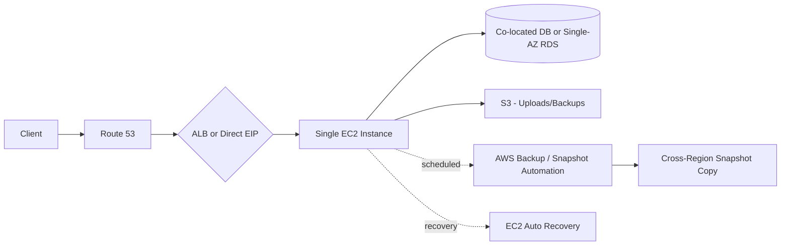
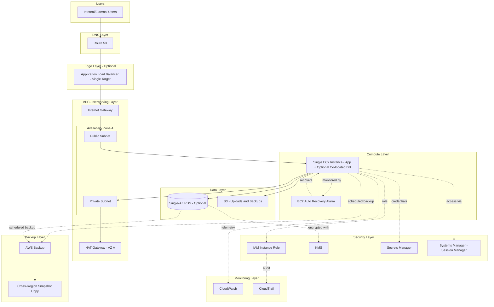
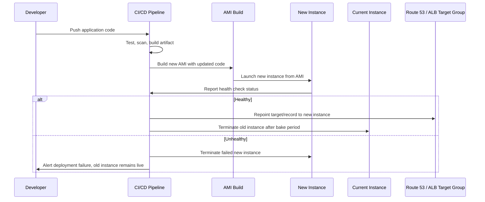

# Part II – Core Infrastructure Architectures

# Chapter 5 – Single EC2 Production Architecture

*The AWS Reference Architecture Handbook — 100 Production-Ready Cloud Architectures with AWS, Terraform, AI, Security, FinOps, and Enterprise Design Patterns*

---

## 1. Executive Summary

Not every production workload needs — or can justify — a three-tier, Multi-AZ, Auto-Scaled architecture. This is an uncomfortable statement for a book largely dedicated to high-availability design patterns, but it is an honest one, and honesty about when *not* to over-build is as much a part of Principal-level architecture judgment as knowing how to build for scale. This chapter covers the **Single EC2 Production Architecture**: a deliberately minimal pattern consisting of one right-sized EC2 instance running the application (and, in many real deployments, a co-located database), fronted by a single Application Load Balancer or directly exposed via Elastic IP, secured with the same rigor as any production system, backed up on a defined schedule, and monitored with the same seriousness as a fifty-node fleet — just without the horizontal redundancy.

The business problem this architecture solves is the mismatch between actual requirements and default enterprise tooling. A large fraction of real workloads — internal admin tools, low-traffic B2B SaaS products in early customer validation, batch-processing jobs, staging/QA environments, proof-of-concept systems being evaluated for future investment, single-tenant deployments for a specific enterprise customer with modest usage, and legacy applications being "lifted and shifted" as a first step before a larger re-architecture — simply do not generate enough traffic or carry enough business risk to justify the cost and operational overhead of Multi-AZ redundancy. Yet a surprising number of these systems get built on the "enterprise default" pattern anyway, because the team defaults to copying whatever reference architecture they last worked with, without re-deriving requirements. This chapter exists to give that re-derivation a name and a defensible, production-quality pattern of its own, rather than leaving "just use one instance" as an unstated, undocumented shortcut that nobody feels confident defending in a review.

The architecture's objective is to deliver a genuinely production-grade single-instance deployment — not a hobbyist EC2 instance with a cron job and a prayer, but a system with the same security posture (encrypted storage, least-privilege IAM, centralized logging, patch management), the same observability discipline (CloudWatch alarms, structured logging, synthetic health checks), and the same disaster recovery rigor (automated snapshots, tested restore procedures, documented RTO/RPO) as any other system in this book, scoped honestly to a single point of compute and (optionally) a single point of data persistence. The core design tension this chapter resolves explicitly is: *how do you build something genuinely production-ready without pretending it has resilience characteristics it does not actually have?* The answer is transparency — every SLA commitment, every RTO/RPO number, and every architecture review conversation about this pattern must state plainly that it tolerates instance-level failure through fast, automated replacement (not zero-downtime failover) and does not tolerate simultaneous AZ-level failure without a recovery action.

Organizations adopt this architecture for several converging reasons that are as much financial and organizational as technical. First, **cost efficiency at low-to-moderate scale**. A Multi-AZ Aurora cluster plus a 3-AZ Auto Scaling fleet has a real baseline cost — often $300-800/month before a single customer transaction occurs — that is simply not justified for a workload serving a few hundred internal users or a handful of enterprise pilot customers. Second, **operational simplicity for small teams**. A two- or three-person engineering team supporting a portfolio of a dozen internal tools cannot realistically operate a dozen Multi-AZ, Auto-Scaled, Terraform-per-environment architectures; a single-instance pattern with strong automation around backup and recovery is the difference between a maintainable portfolio and a team perpetually fighting infrastructure sprawl. Third, **appropriate risk-matching**. Not every application failure has the same business cost — an internal expense-reporting tool being down for twenty minutes during an automated instance replacement is a mild inconvenience, not a revenue event, and architecting it as if it were the former is a genuine misallocation of engineering effort that could be spent on customer-facing reliability instead. Fourth, **a deliberate staging step in an evolution path**. Many successful production systems begin as a single-instance deployment during initial customer validation, and this chapter's pattern gives that stage a proper production posture (rather than "we'll fix the infrastructure later," which in practice often means "we'll fix it during an outage").

The major business benefits are straightforward: a materially lower monthly infrastructure bill (frequently 60-75% lower than the equivalent Multi-AZ baseline architecture from Chapter 1), a dramatically smaller operational surface area (one instance to patch, one set of logs to review, one Terraform module of modest size), and faster initial time-to-production because there are fewer moving parts to provision, wire together, and validate before the first deployment. These benefits compound for organizations running many small, independent workloads — the aggregate savings and operational simplification across a portfolio of twenty single-instance systems dwarfs what any one of them saves individually.

Typical enterprise scenarios for this pattern include: an internal-only application (HR tool, reporting dashboard, admin console) with a known, bounded user base of employees who tolerate a brief outage without customer-facing consequence; a SaaS vendor's staging or QA environment that must faithfully mirror production configuration but does not need production's redundancy; a proof-of-concept or pilot deployment for a specific enterprise customer during a paid trial period, where the contract does not yet include an uptime SLA and the workload will either be decommissioned or re-architected to the Chapter 1 pattern once the customer converts to a full contract; a batch-processing or scheduled-job workload where "always-on availability" is not even a meaningful concept because the system is only active during defined processing windows; and a genuinely low-traffic B2B product serving a handful of customers where the entire monthly infrastructure budget must remain proportionate to a modest revenue base during early growth.

It is worth stating plainly what this chapter is not: it is not a shortcut for teams who are Multi-AZ-appropriate but unwilling to invest in it, and it is not a permanent architecture for any system whose usage, revenue significance, or compliance obligations grow past the thresholds defined in Section 2. The single most common failure mode this book has observed with the single-EC2 pattern in real enterprise environments is not the pattern itself failing technically — it is organizational failure to revisit the decision as the workload's actual risk profile changes, leaving a genuinely business-critical system running on an architecture that was honestly appropriate eighteen months ago and is not appropriate today. Section 34's "Evolution Path" and Section 30's ADR both build in an explicit review trigger specifically to counteract this failure mode.

---

## 2. Business Requirements

### 2.1 Business Drivers

The dominant business driver for this architecture is **cost-to-risk proportionality**: the infrastructure spend and operational investment should scale with the actual business impact of an outage, not with a generic "production means Multi-AZ" assumption. A secondary driver is **team capacity constraint** — organizations with limited platform/SRE headcount need architectures whose operational burden per workload is low enough that a small team can support many of them.

### 2.2 Functional Requirements

| Requirement | Description |
|---|---|
| Web/API access | Serves either a browser-rendered internal tool or a low-volume API |
| Authentication | Typically integrates with an existing identity provider (SSO) rather than implementing first-party auth |
| Data persistence | A single relational or file-based datastore, often co-located on the same instance for the smallest deployments, or a single-AZ RDS instance for a moderate step up |
| Scheduled/batch processing | Cron-driven or Systems Manager-driven scheduled jobs are common in this pattern |
| Basic file storage | S3 for any file upload/artifact storage, regardless of compute pattern |

### 2.3 Non-Functional Requirements

**Scalability goals.** This architecture explicitly does **not** target horizontal scalability as a design goal. The scaling strategy is vertical (resize the instance) up to a defined ceiling, beyond which the architecture is expected to graduate to the Chapter 1 pattern. The baseline target supported without redesign is roughly 50-100 requests/second sustained on a right-sized instance (e.g., `m6i.large` or `m6i.xlarge`), which comfortably covers the internal-tool and early-SaaS scenarios this chapter targets.

**Availability requirements.** The honest, documented target for this baseline is **99.5% monthly uptime** (≈3.6 hours of allowed downtime per month) — a target achievable through fast automated instance replacement and a disciplined patch/maintenance process, without pretending to Multi-AZ-grade availability. Organizations requiring 99.9%+ should treat that requirement itself as the trigger to adopt Chapter 1's pattern instead.

**Latency requirements.** p50 under 150ms, p99 under 800ms — slightly more lenient than the Chapter 1 baseline, reflecting the lower-traffic, often-internal nature of typical workloads on this pattern, though the architecture is fully capable of tighter latency targets if the workload demands it.

**Compliance requirements.** SOC 2 Type II controls remain fully achievable on this architecture (encryption, logging, access control do not require Multi-AZ) — this is an important, frequently misunderstood point: **compliance and high availability are separate concerns**, and this pattern satisfies the former without the latter. PCI-DSS cardholder data environments and HIPAA workloads handling PHI at meaningful volume are generally steered toward Chapter 1's pattern, primarily because the availability and blast-radius expectations that typically accompany those regimes' business context (not the compliance framework's text itself) tend to argue for Multi-AZ.

**Security expectations.** Identical baseline to every other architecture in this book: encryption at rest and in transit, least-privilege IAM, no long-lived credentials, centralized audit logging. Security posture is **not** the dimension this architecture compromises on relative to Chapter 1 — availability is.

**Recovery objectives.**

| Metric | Baseline Target | Definition |
|---|---|---|
| RPO | ≤ 24 hours (or ≤ 1 hour with more frequent snapshot scheduling) | Determined by backup/snapshot frequency, not continuous replication |
| RTO | ≤ 2 hours | Time to restore from the most recent snapshot/AMI onto a new instance |

**SLAs.** Internal tools typically carry no formal external SLA. Where an external SLA is contractually required (e.g., a paid pilot), it should be set no higher than 99% to preserve margin against the architecture's honest 99.5% internal target.

**Expected workload and growth.** Baseline: 10-100 requests/second, a dataset under 100 GB, and — critically — an **explicit growth ceiling** stated in the requirements document itself: if projected traffic or data volume will exceed roughly 3x the current baseline within the planning horizon, the architecture decision should default to Chapter 1's pattern from the outset rather than building this pattern with an expectation of near-term migration.

> **Note:** The single most important requirements-gathering question for this architecture is not "how much traffic will we have" but "what is the actual cost of a two-hour outage to the business." If that answer is anything beyond mild inconvenience and a Slack apology, this is not the right architecture regardless of current traffic volume.

---

## 3. Architecture Overview

### 3.1 Overall Design and Philosophy

The design philosophy here inverts Chapter 1's "compute is cattle, data services are load-bearing walls" principle into something more honest for this scale: **the entire system is a single, well-cared-for asset**, and the architecture's job is to make that asset as resilient to *its own* failure modes as possible (fast automated replacement, frequent backups, immutable AMI-based rebuilds) while being transparent that it does not tolerate infrastructure-level (AZ) failure without a recovery action. This is not "unmanaged" or "informal" infrastructure — every practice from Chapter 1 that does not specifically require multiple instances or multiple AZs (IAM least privilege, encryption, monitoring, IaC, patch management, backup automation) applies here with equal rigor.

### 3.2 Core Components

- **Compute:** A single EC2 instance (or, for the moderate-traffic variant, a single instance behind an ALB purely for TLS termination and health-check-driven auto-*replacement*, not load distribution)
- **Networking:** A VPC with one public and one private subnet (single AZ is common for the smallest deployments; spreading the public/private pair across two AZs at negligible extra cost is a recommended low-cost resilience improvement, covered in Section 12)
- **Data:** Either a co-located database on the same instance (smallest deployments) or a single-AZ RDS instance (recommended once the dataset or query load justifies separating compute and data lifecycle)
- **Storage:** S3 for backups, file uploads, and AMI-adjacent artifacts
- **Security and identity:** IAM instance role, KMS, Secrets Manager, Systems Manager (Session Manager for shell access — no SSH keys, no bastion host)
- **Observability:** CloudWatch (metrics, logs, alarms), CloudTrail

### 3.3 Component Interaction and High-Level Workflow

A client request reaches the instance either directly via an Elastic IP and Route 53 A record (simplest, lowest-cost variant) or through a single-target ALB (recommended once TLS termination automation and health-check-driven instance replacement are wanted). The application processes the request, reading/writing to either its co-located database or a single-AZ RDS instance, and reads/writes files to S3. Backups run on a scheduled basis (via AWS Backup or a Systems Manager Automation document) that snapshots both the EBS volume(s) and, if RDS is used, the database independently. Instance-level failure is handled by an EC2 Auto Recovery alarm (not an Auto Scaling Group — there is deliberately only ever one instance) that automatically recovers the instance on the underlying hardware failure detection, or, for a full instance-level fault, a documented runbook procedure to relaunch from the most recent AMI/snapshot within the RTO target.

### 3.4 Request, Response, and Data Lifecycle

The request/response lifecycle mirrors Chapter 1's pattern minus the load-balancing and multi-instance fan-out: DNS resolution → optional ALB TLS termination and health check → single instance processes the request → response returned. The data lifecycle is where this architecture requires the most deliberate design attention precisely because there is no automatic replication cushion: application data is written to the primary datastore, EBS snapshots (or RDS automated backups) capture point-in-time state on a schedule matched to the RPO target, and those snapshots are copied to a separate account or at minimum a separate region on a less frequent cadence to protect against account-level or regional-scope loss scenarios, not just instance-level ones.



---

## 4. AWS Services Used

### 4.1 Amazon EC2

**Purpose:** Hosts the application (and optionally the database) as the architecture's single compute unit.

**Why selected:** Full control, the widest instance-family selection for right-sizing, and native support for **EC2 Auto Recovery** — a CloudWatch-alarm-driven feature that automatically recovers an instance (preserving its instance ID, private IP, EBS volumes, and metadata) onto new underlying hardware when AWS detects a hardware-level status check failure, without requiring an Auto Scaling Group.

**Alternatives:** Lightsail is viable for the very smallest, simplest deployments (a static internal tool with minimal customization needs) but sacrifices the fine-grained IAM, VPC, and CloudWatch integration this book's security/observability standards require; it is generally not recommended once the workload is genuinely "production" in the enterprise sense this book targets.

**Limitations:** No horizontal failure tolerance — an AZ-level event takes the system down until a manual/scripted recovery action in a different AZ is executed.

**Pricing considerations:** This is precisely the architecture where On-Demand-to-Reserved/Savings-Plan conversion matters most proportionally, since there is no burst-capacity complexity to reason about — a single, steady-state instance is an ideal Savings Plan or Standard Reserved Instance candidate, often achieving 30-40% savings for a 1-year commitment with no downside given the instance's role is not expected to change size frequently.

**Best practices:** Enable EC2 Auto Recovery via a CloudWatch alarm on `StatusCheckFailed_System`, use gp3 EBS volumes (better baseline performance-per-dollar than gp2), and build the instance from a versioned, pipeline-produced AMI rather than configuring it by hand.

### 4.2 Application Load Balancer (ALB) — Optional Single-Target Variant

**Purpose:** In this architecture, the ALB's value is not load distribution (there is only one target) but **TLS termination automation via ACM** and **health-check-driven visibility** into instance health, decoupled from DNS-level changes.

**Why selected (when used):** Removes the operational burden of manual certificate management on the instance itself, and provides a clean healthcheck signal that CloudWatch/on-call tooling can alarm on independent of the instance's own self-reported health.

**Alternatives:** A direct Elastic IP with a certificate managed via Certbot/Let's Encrypt on the instance itself is a lower-cost, lower-automation alternative appropriate for the very smallest, most cost-sensitive deployments (internal tools with no compliance requirement around certificate management automation); it is not recommended once the workload has any customer-facing exposure, given the operational risk of manual certificate renewal.

**Limitations:** Adds a modest fixed monthly cost (~$20+) that is a meaningfully larger proportion of this architecture's total bill than it is in Chapter 1's larger baseline.

**Pricing considerations:** For genuinely minimal internal tools, the ALB's fixed cost may exceed the value it provides versus a direct EIP + Certbot approach — this is one of the few places in this book where the "best practice" (ALB) is explicitly a judgment call against the "minimal cost" alternative, and Section 34 discusses this trade-off directly.

**Best practices:** If used, configure a health check against a real application health endpoint (not just TCP), and set deregistration delay low given there is no second target to absorb traffic during any delay.

### 4.3 Amazon RDS (Single-AZ)

**Purpose:** Managed relational database, decoupled from the application instance's own lifecycle, for workloads whose data management needs (backup automation, engine patching, query performance) exceed what a co-located database on the same instance can comfortably provide.

**Why selected over co-located database:** Once a workload's database requires its own backup schedule independent of the application instance's AMI rebuild cycle, RDS's automated backup, point-in-time recovery, and independent patching lifecycle become worth the additional ~$50-150/month over a co-located database, particularly because it decouples "I need to rebuild/resize the app instance" from "I risk the database."

**Alternatives:** A co-located database (PostgreSQL/MySQL installed directly on the EC2 instance) is appropriate only for the smallest, most cost-sensitive deployments where the entire dataset is small, backup requirements are modest, and the team explicitly accepts that an instance rebuild event also touches the database's operational continuity.

**Limitations:** Single-AZ RDS has **no automatic failover** — an AZ-level event affecting the RDS instance requires the same manual/scripted recovery process as the EC2 instance itself, restoring from the most recent automated backup or snapshot.

**Pricing considerations:** Single-AZ RDS is roughly half the cost of the equivalent Multi-AZ configuration — this cost delta is the specific, quantifiable trade-off being made in exchange for the availability gap documented in Section 12.

**Best practices:** Enable automated backups with the maximum useful retention window, enable deletion protection, and — critically for this architecture specifically — test the actual point-in-time restore procedure on a defined schedule (Section 13), since a Single-AZ RDS instance's recovery path is exercised far less often by AWS's own automatic mechanisms than a Multi-AZ instance's failover is.

### 4.4 Amazon S3

**Purpose:** Object storage for file uploads and, critically in this architecture, the destination for EBS snapshot exports, application-level backups, and AMI-adjacent build artifacts.

**Why selected:** Same durability and ecosystem rationale as Chapter 1; in this architecture S3 additionally serves as an important resilience layer given the absence of Multi-AZ database replication — application-level data exports to S3 (even a nightly `pg_dump` for a co-located database) provide an inexpensive, durable, cross-referenceable backup independent of EBS snapshot mechanics.

**Best practices:** Enable versioning and cross-region replication specifically for the backup/snapshot-export bucket, given its outsized importance to this architecture's actual disaster recovery capability.

### 4.5 IAM, VPC, Route 53, CloudWatch, CloudTrail, KMS, Secrets Manager, Systems Manager

Applied with the same rigor as Chapter 1 (see that chapter's Section 4 for full treatment); the one architecturally significant difference in this chapter is the central role of **Systems Manager Session Manager** for shell access. Because there is only one instance and no bastion-host-worthy fleet to justify additional infrastructure, Session Manager is not just a best practice here — it is the only sanctioned access path, eliminating SSH key management entirely for a system where key rotation/revocation discipline is easy to let slip precisely because there's "only one box."

---

## 5. Complete Architecture Diagram



---

## 6. Component-by-Component Explanation

| Component | Purpose | Scaling | High Availability | Failure Handling | Dependencies |
|---|---|---|---|---|---|
| Single EC2 Instance | Hosts application logic (and optionally database) | Vertical only (resize instance type) | None at the AZ level; instance-level recovery only | EC2 Auto Recovery for hardware faults; documented manual rebuild runbook for AZ-level events | Launch template/AMI, IAM instance profile, EBS volumes |
| ALB (optional) | TLS termination, health-check visibility | N/A (single target) | Inherits ALB's own multi-AZ presence, but fronts only one backend target | Health check failure surfaces instance unhealthiness; does not itself provide failover | ACM certificate, target group |
| Single-AZ RDS (optional) | Managed relational data store | Vertical only | None at the AZ level; automated backups provide recovery path | Restore from automated backup/snapshot on failure | KMS key, subnet group, security group |
| S3 | Backup artifact storage, file uploads | Effectively unlimited | Inherently multi-AZ within the region by design | Versioning protects against accidental overwrite | KMS key (if SSE-KMS) |
| AWS Backup | Centralized, scheduled backup orchestration across EC2/EBS/RDS | N/A | N/A | Alarms on backup job failure trigger operator response | IAM service role, backup vault |
| EC2 Auto Recovery Alarm | Detects and triggers automatic recovery from underlying hardware failure | N/A | Recovers onto new hardware within the same AZ | Does not help with AZ-level failure — only hardware-level | CloudWatch alarm on `StatusCheckFailed_System` |

---

## 7. End-to-End Request Flow

1. **Client initiates request** to the application's domain.
2. **Route 53** resolves to the ALB (or directly to the instance's Elastic IP in the minimal variant).
3. If using the **ALB variant**, TLS is terminated at the ALB using an ACM-managed certificate.
4. The ALB's **health check** confirms the single target is healthy before forwarding; if unhealthy, the ALB returns a 503 rather than forwarding to a known-bad instance.
5. The request reaches the **single EC2 instance**.
6. The application processes the request, querying either the **co-located database** or the **single-AZ RDS instance**.
7. If the request involves file storage, the application interacts with **S3** directly or via a pre-signed URL.
8. The application emits **structured logs** to CloudWatch Logs and relevant metrics (request count, error count, latency) as custom CloudWatch metrics.
9. The application constructs the **HTTP response** and returns it through the ALB (if used) to the client.
10. **CloudWatch Alarms** continuously evaluate instance-level health (`StatusCheckFailed_System`, `StatusCheckFailed_Instance`), application error rate, and RDS metrics (if used), triggering SNS-based on-call notification on threshold breach.
11. On a **hardware-level failure** detected via `StatusCheckFailed_System`, **EC2 Auto Recovery** automatically relaunches the instance on new underlying hardware, preserving instance ID, private IP address, and attached EBS volumes — application-level state on the instance's root/data volumes survives this event.
12. On an **AZ-level event** (not recoverable via EC2 Auto Recovery, since the entire AZ is affected), the documented runbook is executed: launch a new instance from the most recent pipeline-built AMI in a surviving AZ, restore the most recent EBS/RDS snapshot, repoint the Route 53 record or ALB target group, and validate via synthetic health check before declaring recovery complete.

---

## 8. Deployment Flow

Infrastructure provisioning follows the identical Terraform-first discipline established in Chapter 1 — no manual console changes, plan/review/apply gated by CI/CD. The key difference in this chapter's deployment flow is the **absence of a blue-green Auto Scaling Group swap**, since there is only one instance. Deployment instead follows one of two patterns depending on the workload's tolerance for a brief interruption:

**Pattern A — In-place deployment with a health-checked restart:** the application is redeployed onto the existing instance (via a Systems Manager Run Command or a CodeDeploy in-place deployment), the service is restarted, and a synthetic health check validates the new version before the deployment is marked successful; this pattern accepts a brief (seconds to low-minutes) service interruption during the restart, appropriate given the architecture's documented 99.5% availability target.

**Pattern B — Replace-and-swap:** a new instance is launched from a freshly built AMI containing the new application version, validated via health check while the old instance continues serving traffic, and then the ALB target group (or Elastic IP/Route 53 record) is repointed to the new instance before the old one is terminated — this pattern achieves near-zero-downtime deployment at the cost of briefly running two instances (a small, temporary cost increase) and is the recommended default for any workload with genuine external users, reserving Pattern A for internal tools where the brief interruption is a non-issue.

**Rollback** for Pattern A is a redeploy of the previous known-good application version; for Pattern B, rollback is simply repointing back to the still-running previous instance, providing a faster and lower-risk rollback path — another reason Pattern B is generally preferred once the workload matters enough to have external users.

**Secrets and configuration** follow the identical Secrets Manager/Parameter Store pattern from Chapter 1 — the single-instance nature of this architecture does not justify any relaxation of secrets hygiene.



---

## 9. Network Topology

The VPC uses a **/24 or /23 CIDR block** (e.g., `10.1.0.0/24`) — deliberately smaller than Chapter 1's `/16`, since this architecture will never grow into dozens of subnets across multiple AZs for a single application; over-provisioning IP space here is unnecessary complexity in the opposite direction.

| Subnet Tier | AZ-A | AZ-B (recommended, low-cost resilience) | Purpose |
|---|---|---|---|
| Public | 10.1.0.0/26 | 10.1.1.0/26 | ALB (if used), NAT Gateway |
| Private | 10.1.0.64/26 | 10.1.1.64/26 | EC2 instance, RDS (if used) |

**A two-AZ subnet layout is recommended even for a single-instance architecture**, at negligible cost, specifically so that the AZ-level recovery runbook (Section 8, step 12) can relaunch into a pre-existing, already-configured subnet in a second AZ rather than needing to provision new networking during an active recovery — provisioning infrastructure under incident pressure is exactly the kind of avoidable risk this book counsels against.

**NAT Gateway:** a single NAT Gateway (not one per AZ) is an acceptable, deliberate cost optimization in this architecture specifically, given that the entire compute layer is already a single point of failure — paying for AZ-redundant NAT Gateway capacity to protect a system that has no other AZ redundancy provides no proportional benefit. This is a direct, explicit reversal of Chapter 1's per-AZ NAT Gateway guidance, and the reasoning for the reversal should be documented in the ADR (Section 30) so a future reviewer understands it was a deliberate choice, not an oversight.

**Security Groups** follow the same least-privilege, security-group-referencing pattern as Chapter 1: the ALB (or direct ingress) security group allows inbound 443 from `0.0.0.0/0`; the instance security group allows inbound only from the ALB security group (or, in the direct-EIP variant, from `0.0.0.0/0` on 443 only); RDS (if used) allows inbound only from the instance security group.

**PrivateLink (VPC Endpoints)** for S3, Secrets Manager, KMS, and Systems Manager are still recommended in this architecture despite its smaller scale, both for the security benefit (no NAT/internet path needed for AWS API calls) and because Session Manager specifically requires either internet access via NAT or the relevant SSM VPC endpoints to function — and since this architecture's entire remote-access strategy depends on Session Manager working reliably, the endpoints are not optional in practice.

---

## 10. Identity and Access

The IAM model is identical in principle to Chapter 1 — one workload role, least privilege, no long-lived credentials, permission boundaries on any automation-created role — scaled down only in the sense that there is one instance profile role rather than several per-service roles. A representative instance role policy:

```json

{
  "Version": "2012-10-17",
  "Statement": [
    {
      "Sid": "AppS3Access",
      "Effect": "Allow",
      "Action": ["s3:GetObject", "s3:PutObject"],
      "Resource": "arn:aws:s3:::app-single-ec2-uploads-prod/*"
    },
    {
      "Sid": "SecretsAccess",
      "Effect": "Allow",
      "Action": "secretsmanager:GetSecretValue",
      "Resource": "arn:aws:secretsmanager:us-east-1:111122223333:secret:app/db-credentials-*"
    },
    {
      "Sid": "SSMSessionManager",
      "Effect": "Allow",
      "Action": [
        "ssmmessages:CreateControlChannel",
        "ssmmessages:CreateDataChannel",
        "ssmmessages:OpenControlChannel",
        "ssmmessages:OpenDataChannel"
      ],
      "Resource": "*"
    },
    {
      "Sid": "CloudWatchMetrics",
      "Effect": "Allow",
      "Action": ["cloudwatch:PutMetricData"],
      "Resource": "*"
    }
  ]
}

```

**A specific access-control risk unique to this architecture deserves emphasis:** because there is only one instance and no fleet, it is tempting for teams to grant broader-than-necessary permissions "since it's just one box anyway" or to allow multiple engineers direct root/administrator shell access via Session Manager without individual accountability. Both temptations should be explicitly resisted — Session Manager sessions are logged individually per IAM principal to CloudTrail and (optionally) S3/CloudWatch Logs for session content, and that per-principal accountability is only meaningful if engineers are not sharing a single elevated role to access the box.

---

## 11. Security Architecture

Security controls are applied with full rigor, matching Chapter 1's standard exactly: encryption at rest via KMS for both EBS volumes and RDS (if used), TLS enforced at the ALB (or instance-level Certbot-managed certificate in the minimal variant), WAF attached to the ALB where the workload has any public exposure (recommended for any external-facing deployment, optional for a purely internal tool reachable only via VPN/corporate network), Secrets Manager for all credentials, GuardDuty and Config enabled account-wide regardless of how small any individual workload is (these are account-level controls, not per-workload — there is no cost or complexity reason to skip them for a single-instance workload).

**A genuinely architecture-specific security consideration:** because the application and (in the co-located variant) the database share a single instance, the traditional network-layer segmentation between application and data tiers does not exist. This means the application process's own compromise (e.g., a dependency vulnerability) has a shorter path to the database than in Chapter 1's segmented design. This is a real, honest trade-off, and it is one of the strongest arguments for using single-AZ RDS rather than a co-located database once the data being protected has any real sensitivity — separating the database onto its own managed instance restores a meaningful security boundary even without restoring AZ-level redundancy.

**Threat model summary (delta from Chapter 1):**

| Attack Vector | Chapter 1 Mitigation | This Architecture's Mitigation | Notes |
|---|---|---|---|
| Instance compromise reaching the database | Network segmentation (different subnet/security group tier) | Same, *if* using single-AZ RDS in a separate subnet; weaker if co-located | Strongly prefer separate RDS instance once data sensitivity is non-trivial |
| DDoS | CloudFront + Shield + elastic ALB/ASG capacity | Shield Standard only (typically no CloudFront in this pattern); no elastic capacity to absorb volumetric load | Consider adding CloudFront purely for its Shield/WAF benefit even without caching value, for any public-facing deployment |
| AZ-level infrastructure event | Automatic, transparent failover | Manual/scripted runbook execution | This is the primary, accepted trade-off of this architecture |

---

## 12. High Availability

This is the section where this architecture's honest limitations must be stated without euphemism, because an architecture review board deserves a precise answer, not marketing language. **AZ failures:** not tolerated without a manual/scripted recovery action; the documented RTO (Section 2.3) accounts for this. **Instance failures (hardware-level):** tolerated automatically via EC2 Auto Recovery, which relaunches the instance on new underlying hardware within the same AZ, typically within a few minutes, preserving the instance's EBS volumes, private IP, and metadata — this covers the most statistically common single-instance failure mode (underlying host hardware fault) without requiring any operator action. **Regional failures:** not tolerated; this pattern has no cross-region failover capability by design (cross-region snapshot copies exist for disaster recovery, not live failover — see Section 13). **Database failures:** for co-located databases, identical to instance failure handling above; for single-AZ RDS, an underlying storage or instance fault triggers AWS's own automated recovery for many fault classes, but does not span AZs. **Load balancing:** not applicable in the single-target sense — the ALB (if used) provides TLS termination and health-check visibility, not load distribution. **Health checks** are the primary HA-adjacent mechanism this architecture relies on, feeding both the ALB's routing decision (serve traffic or return 503) and the CloudWatch alarm that pages on-call for anything EC2 Auto Recovery cannot itself resolve.

> **Warning:** Any stakeholder conversation about this architecture that uses the word "highly available" without immediately qualifying it as "at the instance-hardware-failure level, not the AZ level" is setting an expectation this architecture cannot meet. This distinction has caused real production incidents in organizations that assumed "it's on AWS, so it's Multi-AZ" without verifying the actual architecture.

---

## 13. Disaster Recovery

**Backup strategy** is the load-bearing disaster recovery mechanism for this entire architecture, given the absence of live replication: AWS Backup orchestrates scheduled EBS snapshots (frequency matched to the RPO target — hourly for a 1-hour RPO, daily for a 24-hour RPO) and, if single-AZ RDS is used, RDS automated backups with point-in-time recovery within the retention window.

**Snapshots** are retained on a tiered schedule (e.g., hourly snapshots retained 24 hours, daily snapshots retained 30 days, weekly snapshots retained 12 months) using AWS Backup's lifecycle rules, avoiding both the cost of retaining every hourly snapshot indefinitely and the risk of an insufficient retention window during an investigation that discovers a problem days after it began.

**Cross-region replication** of the backup vault is configured specifically because this architecture has no other cross-region resilience mechanism at all — unlike Chapter 1, where cross-region backup copy is a supplement to an already-resilient single-region design, here it is the *only* protection against a regional-scope event, making it considerably more important to actually test (see below) than the equivalent control in a Multi-AZ architecture.

**DR strategy classification** for this architecture is squarely **Backup and Restore** — the lowest-cost, highest-RTO tier from Chapter 1's DR strategy taxonomy — and that classification should be stated explicitly in every architecture review, because it is the single most important fact a reviewer needs to correctly evaluate this pattern's fit against actual business requirements.

| DR Strategy | RTO | RPO | Relative Cost | Used In This Architecture? |
|---|---|---|---|---|
| Backup and Restore | Hours | Minutes-to-hours (backup-frequency dependent) | 1x (lowest) | Yes — the only strategy this pattern employs |
| Pilot Light | 10s of minutes | Minutes | ~1.2-1.5x | Not used — would require a standing warm resource in a second AZ/region, contrary to this pattern's cost rationale |
| Warm Standby / Active-Active | Minutes / Near-zero | Seconds-minutes / Near-zero | 1.7x+ | Not used — graduate to Chapter 1 or a multi-region pattern instead |

> **Tip:** The recovery runbook referenced throughout this chapter (launch from AMI, restore latest snapshot, repoint DNS/ALB target, validate) should be tested — actually executed against a real, disposable test environment, not merely reviewed on paper — on at least a quarterly cadence. An untested runbook is, in practice, an unverified hypothesis about your RTO, and the gap between "documented RTO" and "actual demonstrated RTO" is one of the most common findings in real enterprise DR audits.

---

## 14. Scalability

**Vertical scaling** is this architecture's primary and, in most cases, only scaling lever: resizing the EC2 instance to a larger type (requiring a brief stop/start, or a Pattern B replace-and-swap deployment to avoid even that interruption) and, if RDS is used, resizing the RDS instance class similarly. **Horizontal scaling is explicitly out of scope** — the moment a workload's traffic genuinely requires horizontal scaling to meet latency or throughput targets, that is the architectural signal to graduate to Chapter 1's pattern, not to bolt an Auto Scaling Group onto what was designed as a single-instance system (a common, messy anti-pattern covered in Section 27). **Storage scaling** for EBS uses gp3 volumes' ability to be resized and have IOPS/throughput adjusted independently and online, without downtime, providing meaningful headroom before an instance-type change is even needed. **Serverless scaling** has no role in this architecture's core compute pattern by definition, though Lambda remains entirely appropriate for any genuinely asynchronous, spiky side-workload (e.g., a nightly report-generation job) that the single instance would otherwise need to be sized to accommodate at its peak — offloading spiky async work to Lambda is a legitimate and recommended way to keep the primary instance's sizing driven by steady-state load rather than occasional peaks.

**Explicit scaling ceiling guidance:** teams should treat sustained CPU utilization consistently above 60-70% on the largest reasonably-priced instance in the relevant family, or a dataset approaching the point where a single RDS instance class cannot provide acceptable query latency, as the trigger to begin planning migration to Chapter 1's architecture — not as a signal to look for further vertical headroom that likely does not exist at a reasonable price point.

---

## 15. Performance Optimization

**Caching** is applied more conservatively than in Chapter 1 — there is no CDN in most deployments of this pattern (though adding CloudFront purely for TLS/Shield benefit, with minimal caching, is reasonable for public-facing variants), and in-process application-level caching (an in-memory LRU cache for frequently-read, rarely-changed reference data) carries more relative value here than a distributed cache like ElastiCache, whose operational cost is harder to justify for this scale. **Compression** (gzip/Brotli) at the application/web-server layer remains a low-cost, meaningful latency improvement regardless of scale. **Database optimization** (query plan review, appropriate indexing) matters proportionally *more* in this architecture, not less, because there is no read-replica escape valve to absorb an inefficient query pattern — every query's cost is paid directly by the single instance's capacity budget. **Connection pooling** (e.g., PgBouncer for a co-located or single-AZ Postgres deployment) remains important specifically to avoid the application exhausting the database's connection limit under load, even without RDS Proxy's additional Multi-AZ-failover-smoothing benefit being relevant here. **Concurrency** tuning within the single instance (worker process count matched to available vCPU, async I/O for I/O-bound handlers) is the primary lever for extracting more throughput from fixed vertical capacity before a resize is needed.

---

## 16. Cost Optimization (FinOps)

### 16.1 Estimated Monthly Cost by Deployment Size

| Component | Minimal (Internal Tool) | Moderate (Early SaaS/Pilot) | Growth Ceiling (approaching Ch.1 threshold) |
|---|---|---|---|
| EC2 Instance | 1× t3.medium (~$30) | 1× m6i.large (~$70) | 1× m6i.2xlarge (~$280) |
| ALB (optional) | Not used (direct EIP) | ~$20 | ~$25 |
| RDS Single-AZ (optional) | Not used (co-located) | db.t4g.medium (~$50) | db.r6g.large (~$220) |
| S3 (uploads + backups) | ~$5 | ~$25 | ~$100 |
| AWS Backup | ~$3 | ~$15 | ~$60 |
| NAT Gateway (single) | ~$35 | ~$35 | ~$40 |
| CloudWatch/Logging | ~$5 | ~$25 | ~$100 |
| **Approximate Total** | **~$78/mo** | **~$240/mo** | **~$825/mo** |

> **Note:** Compare this directly to Chapter 1's baseline table (~$365/mo at "Small" scale) — the gap illustrates the actual dollar cost of Multi-AZ redundancy at comparable traffic, which is exactly the trade-off this architecture asks a business to make deliberately, rather than by default.

### 16.2 Major Cost Drivers and Optimization

**Reserved Instances / Savings Plans** are unusually high-value in this architecture specifically because there is a single, steady-state instance whose size rarely changes — a 1- or 3-year Standard Reserved Instance (not just a Savings Plan) is often the single best FinOps lever available here, since the commitment risk (instance type changing) that makes Savings Plans preferable in Chapter 1's more dynamic fleet is largely absent. **Spot Instances** are generally inappropriate for the primary instance in this pattern (a Spot interruption of the *only* instance is a full outage, not a graceful capacity reduction), though remain appropriate for any offloaded async/batch side-workload. **S3 lifecycle policies** on the backup/snapshot-export bucket specifically deserve attention given backups are this architecture's primary DR mechanism and can otherwise accumulate cost silently. **Rightsizing** deserves a specific note here: because there is no Auto Scaling Group smoothing out mis-sizing (an oversized fleet just means slightly wasted spend across many instances; an oversized single instance means the *entire* compute budget is inflated), Compute Optimizer recommendations should be reviewed and acted on more diligently for this pattern than for a fleet-based architecture. **Tagging and cost allocation** remain fully applicable and, for organizations running a large portfolio of single-instance workloads, arguably more important than in Chapter 1, since distinguishing twenty different single-instance systems' costs from each other in a shared account requires disciplined tagging from day one.

---

## 17. AI-Assisted Operations

The AI-assisted operations practices from Chapter 1 (Amazon Q for troubleshooting and IaC generation, Bedrock-backed custom tooling, AI-assisted log analysis and postmortem drafting) apply identically here, with one architecture-specific emphasis: **AI-assisted capacity planning** carries outsized value in this pattern precisely because there is no Auto Scaling safety net absorbing a sizing misjudgment — using Amazon Q or a Bedrock-backed forecasting tool against historical CloudWatch CPU/memory/connection trend data to project when the current instance size will become insufficient gives a small team (who may not have dedicated capacity-planning bandwidth) meaningful lead time to schedule a resize or, eventually, a migration to the Chapter 1 pattern before it becomes an incident rather than a planned change.

---

## 18. Terraform Implementation

```

infrastructure/
├── modules/
│   ├── networking/
│   ├── compute-single-instance/
│   └── security/
├── environments/
│   ├── prod/
│   └── staging/
└── backend.tf

```

**Remote state backend** (identical pattern to Chapter 1):

```hcl

# backend.tf

terraform {
  required_version = ">= 1.7.0"

  backend "s3" {
    bucket         = "example-corp-tfstate-prod"
    key            = "app-single-ec2/terraform.tfstate"
    region         = "us-east-1"
    dynamodb_table = "terraform-locks"
    encrypt        = true
  }

  required_providers {
    aws = {
      source  = "hashicorp/aws"
      version = "~> 5.0"
    }
  }
}

provider "aws" {
  region = var.aws_region

  default_tags {
    tags = {
      Environment = var.environment
      ManagedBy   = "terraform"
      Application = "app-single-ec2"
    }
  }
}

```

**Single-instance compute module with EC2 Auto Recovery:**

```hcl

# modules/compute-single-instance/main.tf

resource "aws_instance" "app" {
  ami                    = var.app_ami_id
  instance_type          = var.instance_type
  subnet_id              = var.private_subnet_id
  vpc_security_group_ids = [aws_security_group.app.id]
  iam_instance_profile   = aws_iam_instance_profile.app.name

  root_block_device {
    volume_type = "gp3"
    volume_size = var.root_volume_size
    encrypted   = true
    kms_key_id  = var.kms_key_arn
  }

  metadata_options {
    http_tokens = "required" # enforce IMDSv2
  }

  # Prevent accidental termination via Terraform apply/destroy on the

  # single production instance without an explicit, reviewed change.

  lifecycle {
    prevent_destroy = true
  }

  tags = {
    Name = "${var.environment}-app-single"
  }
}

resource "aws_cloudwatch_metric_alarm" "instance_auto_recovery" {
  alarm_name          = "${var.environment}-app-instance-system-status-check"
  comparison_operator = "GreaterThanThreshold"
  evaluation_periods  = 2
  metric_name         = "StatusCheckFailed_System"
  namespace           = "AWS/EC2"
  period              = 60
  statistic           = "Minimum"
  threshold           = 0
  alarm_description   = "Triggers EC2 auto-recovery on underlying hardware failure"

  dimensions = {
    InstanceId = aws_instance.app.id
  }

  alarm_actions = [
    "arn:aws:automate:${var.aws_region}:ec2:recover"
  ]
}

resource "aws_cloudwatch_metric_alarm" "instance_health_paging" {
  alarm_name          = "${var.environment}-app-instance-status-check-page"
  comparison_operator = "GreaterThanThreshold"
  evaluation_periods  = 2
  metric_name         = "StatusCheckFailed_Instance"
  namespace           = "AWS/EC2"
  period              = 60
  statistic           = "Minimum"
  threshold           = 0
  alarm_description   = "Pages on-call for instance-level (not hardware-level) status check failures, which auto-recovery does not resolve"

  dimensions = {
    InstanceId = aws_instance.app.id
  }

  alarm_actions = [var.oncall_sns_topic_arn]
}

```

**AWS Backup plan for scheduled EBS/RDS snapshots:**

```hcl

# modules/compute-single-instance/backup.tf

resource "aws_backup_vault" "app" {
  name        = "${var.environment}-app-backup-vault"
  kms_key_arn = var.kms_key_arn
}

resource "aws_backup_plan" "app" {
  name = "${var.environment}-app-backup-plan"

  rule {
    rule_name         = "hourly"
    target_vault_name = aws_backup_vault.app.name
    schedule          = "cron(0 * * * ? *)"

    lifecycle {
      delete_after = 2 # days
    }
  }

  rule {
    rule_name         = "daily"
    target_vault_name = aws_backup_vault.app.name
    schedule          = "cron(0 5 * * ? *)"

    lifecycle {
      delete_after = 30
    }

    copy_action {
      destination_vault_arn = var.dr_region_backup_vault_arn
    }
  }
}

resource "aws_backup_selection" "app" {
  name         = "${var.environment}-app-backup-selection"
  plan_id      = aws_backup_plan.app.id
  iam_role_arn = aws_iam_role.backup.arn

  resources = [
    aws_instance.app.arn,
  ]
}

```

**Best practices applied above:** `prevent_destroy` on the single production instance as a guardrail against accidental Terraform-driven termination, an explicit CloudWatch alarm wired directly to the `ec2:recover` automation action, a *second*, distinct alarm for instance-level (not just system-level) status failures that pages a human because auto-recovery does not address that failure class, and an AWS Backup plan with a cross-region copy action built directly into the daily rule.

---

## 19. AWS CLI Examples

**Deployment validation:**

```bash

# Confirm the instance is running and passing both status checks

aws ec2 describe-instance-status \
  --instance-ids i-0123456789abcdef0 \
  --query 'InstanceStatuses[0].[InstanceStatus.Status,SystemStatus.Status]' \
  --output table

```

**Monitoring:**

```bash

# Check recent CPU utilization to inform a resize decision

aws cloudwatch get-metric-statistics \
  --namespace AWS/EC2 \
  --metric-name CPUUtilization \
  --dimensions Name=InstanceId,Value=i-0123456789abcdef0 \
  --start-time $(date -u -d '24 hours ago' +%Y-%m-%dT%H:%M:%S) \
  --end-time $(date -u +%Y-%m-%dT%H:%M:%S) \
  --period 3600 \
  --statistics Average,Maximum

```

**Troubleshooting:**

```bash

# Start a Session Manager shell session (no SSH key required)

aws ssm start-session --target i-0123456789abcdef0

# List recent backup job status for this instance

aws backup list-backup-jobs \
  --by-resource-arn arn:aws:ec2:us-east-1:111122223333:instance/i-0123456789abcdef0 \
  --query 'BackupJobs[0:5].[CreationDate,State,PercentDone]' \
  --output table

```

**Disaster recovery execution:**

```bash

# List available recovery points for the instance

aws backup list-recovery-points-by-resource \
  --resource-arn arn:aws:ec2:us-east-1:111122223333:instance/i-0123456789abcdef0

# Restore the most recent recovery point to a new instance

aws backup start-restore-job \
  --recovery-point-arn arn:aws:backup:us-east-1:111122223333:recovery-point:abcd-1234 \
  --metadata file://restore-metadata.json \
  --iam-role-arn arn:aws:iam::111122223333:role/aws-backup-restore-role

```

**Cleanup:**

```bash

# Identify old, unattached EBS snapshots not managed by AWS Backup lifecycle rules

aws ec2 describe-snapshots \
  --owner-ids self \
  --query 'Snapshots[?StartTime<=`2026-01-01`].[SnapshotId,StartTime,VolumeSize]' \
  --output table

```

---

## 20. CI/CD Integration

The CI/CD platform choice and pipeline structure (GitHub Actions, GitLab CI, Jenkins, CodePipeline) follow the same guidance as Chapter 1, with the pipeline logic itself simplified to match this architecture's deployment patterns (Section 8). The key CI/CD difference is that the pipeline drives either an **in-place Systems Manager Run Command deployment** (Pattern A) or an **AMI-build-and-instance-swap** (Pattern B), rather than an Auto Scaling Group blue-green traffic shift. Validation and security scanning gates (`terraform validate`, `tflint`, `checkov`/`tfsec`, dependency vulnerability scanning) remain fully mandatory and unchanged — this architecture's smaller scale is not a justification for relaxing any pipeline safety gate.

```yaml

name: deploy-single-instance
on:
  push:
    branches: [main]

permissions:
  id-token: write
  contents: read

jobs:
  build-and-deploy:
    runs-on: ubuntu-latest
    steps:
      - uses: actions/checkout@v4
      - uses: aws-actions/configure-aws-credentials@v4
        with:
          role-to-assume: arn:aws:iam::111122223333:role/gha-deploy-single-ec2
          aws-region: us-east-1
      - name: Build application artifact
        run: ./scripts/build.sh
      - name: Build new AMI
        run: ./scripts/build-ami.sh --version ${{ github.sha }}
      - name: Launch replacement instance and validate health
        run: ./scripts/deploy-replace-and-swap.sh --ami-id $(cat ami_id.txt)
      - name: Repoint target group on success
        run: ./scripts/promote-new-instance.sh

```

---

## 21. Monitoring

CloudWatch remains the observability backbone, with dashboard and alarm design scaled to the architecture's single-instance reality: a single dashboard covering instance CPU/memory/disk, application error rate and latency, RDS metrics (if used), and backup job success/failure status is sufficient — there is no need for Chapter 1's per-service dashboard separation given the smaller component count. **The specific alarms that matter most in this architecture**, beyond the standard error-rate/latency alarms shared with Chapter 1, are: `StatusCheckFailed_System` (wired to auto-recovery, per Section 18), `StatusCheckFailed_Instance` (paging a human, since auto-recovery does not address this class), disk space utilization (a single instance filling its root volume is a full outage with no other instance to absorb load, making this alarm considerably higher-priority here than in a fleet architecture), and AWS Backup job failure (since a silently failing backup job directly erodes this architecture's only real DR mechanism without any other signal surfacing the problem).

**SLOs and error budgets** are still worth defining explicitly even at this scale — a 99.5% SLO with its corresponding ~3.6-hour monthly error budget gives the team a concrete, non-arbitrary threshold for deciding whether a given month's incidents warrant an architecture escalation (i.e., a serious conversation about graduating to Chapter 1's pattern) versus falling within the accepted, budgeted risk of this architecture choice.

---

## 22. Logging

Centralized logging principles (a separate logging account/destination, CloudWatch Logs for near-real-time access, S3/Athena for cost-efficient long-term archival) apply identically to Chapter 1. The practical difference is volume — a single low-to-moderate-traffic instance generates a small fraction of Chapter 1's log volume, meaning **OpenSearch is very rarely justified for this architecture's scale**; CloudWatch Logs Insights alone is almost always sufficient for the query sophistication this pattern's traffic volume requires, and introducing OpenSearch here would itself be a proportionality anti-pattern of the kind this chapter warns against throughout.

---

## 23. Operational Excellence

Runbooks carry even more relative importance in this architecture than in Chapter 1, specifically because there is no automatic failover to buy time during an incident — the AZ-level recovery runbook (Section 7, step 12) is the actual mechanism standing between an AZ event and extended downtime, and its quality directly determines whether the documented RTO is achievable under real incident pressure. Patch management follows the same Systems Manager Patch Manager approach as Chapter 1, applied to the single instance during a defined maintenance window, ideally using the Pattern B replace-and-swap deployment mechanism so patching itself does not require accepting downtime. Change management retains the same "everything through the pipeline, no manual console changes" discipline — the temptation to make a "quick manual fix" is measurably higher on a single, familiar instance that an engineer can SSH/Session-Manager into directly, which is precisely why this discipline needs to be stated explicitly rather than assumed for this architecture.

---

## 24. Failure Scenarios

| # | Scenario | Symptoms | Root Cause | Detection | Resolution | Prevention |
|---|---|---|---|---|---|---|
| 1 | Underlying hardware fault | Brief instance unavailability, automatic recovery | AWS host-level hardware failure | `StatusCheckFailed_System` alarm | EC2 Auto Recovery relaunches automatically on new hardware | Already mitigated by design; verify alarm wiring periodically |
| 2 | Full AZ outage | Complete service unavailability until manual action | AWS infrastructure event affecting entire AZ | `StatusCheckFailed_Instance`/`System` both failing, AWS Health Dashboard | Execute documented AZ-failure recovery runbook (Section 7, step 12) | Pre-configured second-AZ subnet reduces recovery time; quarterly runbook testing |
| 3 | Root volume full | Application errors, potential crash | Uncontrolled log growth or backup artifact accumulation on local disk | CloudWatch disk utilization alarm | Free space or resize the EBS volume online (gp3 supports online resize) | Proactive disk utilization alarm at 70-80% threshold, log rotation configured |
| 4 | Backup job failure | No immediate symptom; discovered only during a later restore attempt or alarm review | IAM permission drift, backup vault misconfiguration | AWS Backup job failure alarm (must be explicitly configured) | Fix underlying permission/config issue, trigger manual backup immediately | Always alarm on backup job failure explicitly; never assume "no news is good news" |
| 5 | Database on same instance as application, resource contention | Elevated latency for both app and DB under load | Co-located workloads competing for CPU/memory/IO on the same instance | CPU/memory CloudWatch metrics, application latency correlation | Resize instance, or migrate to separate single-AZ RDS instance | Choose separate RDS instance proactively once traffic/data justify it (Section 4.3) |
| 6 | Deployment failure (Pattern B) | New instance fails health check | Application bug or misconfiguration in new AMI | Health check failure during deployment pipeline validation step | Pipeline automatically terminates failed new instance, old instance continues serving | Mandatory health check gate before target/DNS repoint (already built into Pattern B) |
| 7 | Deployment failure (Pattern A) | Brief service interruption extends beyond expected restart window | Application fails to start with new code | Synthetic health check timeout | Roll back to previous known-good deployment artifact | Prefer Pattern B for any workload where this risk is unacceptable |
| 8 | Certificate expiration (direct-EIP variant) | TLS handshake failures | Certbot renewal automation failure on the instance itself | Synthetic canary detecting TLS errors | Manually renew certificate, fix renewal automation | Migrate to ALB + ACM for automatic renewal once the workload has any external exposure |
| 9 | Session Manager access failure | Engineers cannot access the instance for troubleshooting | Missing VPC endpoints for SSM in a NAT-less or misconfigured subnet | Session start failure error message | Verify/add required SSM VPC endpoints or NAT route | Include SSM endpoints in the base networking module from initial provisioning |
| 10 | Snapshot restore produces stale data | Restored instance/database missing recent transactions | Backup frequency insufficient for actual RPO need | Discovered during restore, ideally during a scheduled DR test rather than a real incident | Restore from the most recent available point, accept documented data loss within RPO | Set backup frequency explicitly against the stated RPO target, not a default schedule |
| 11 | Instance type deprecated/retired by AWS | AWS notification of upcoming instance retirement | Long-running instance on an aging instance generation | AWS Health Dashboard scheduled retirement notification | Planned resize/migration to a current-generation instance type before the retirement date | Track AWS Health Dashboard notifications proactively; avoid indefinitely deferring instance generation upgrades |
| 12 | Unpatched OS vulnerability exploited | Anomalous process activity, GuardDuty finding | Patch management window missed or deferred repeatedly | GuardDuty finding, Inspector CVE scan | Incident response per Section 23, patch immediately, rotate any potentially exposed credentials | Enforce, not just schedule, the patch management maintenance window |
| 13 | Cost spike from forgotten Pattern-B duplicate instance | Unexpected bill increase | Deployment pipeline failed to terminate the old instance after a successful swap | Cost Anomaly Detection alert | Identify and terminate the orphaned instance | Add an explicit, alarmed cleanup step verification to the deployment pipeline |
| 14 | RDS storage full (single-AZ) | Write failures, application errors | Storage auto-scaling not enabled or ceiling reached | RDS `FreeStorageSpace` CloudWatch alarm | Increase allocated storage or enable RDS storage auto scaling | Enable RDS storage auto scaling proactively, alarm well before the ceiling |
| 15 | Manual console change causes Terraform drift | Next `terraform apply` unexpectedly reverts a "quick fix" | Engineer bypassed the pipeline for expedience | `terraform plan` shows unexpected diff | Reconcile the manual change into Terraform properly, or revert it | Enforce the "everything through the pipeline" discipline explicitly for this architecture's easy-to-access single instance |

---

## 25. Troubleshooting Guide

| Problem | Symptoms | Likely Cause | Diagnosis | AWS CLI Commands | Resolution |
|---|---|---|---|---|---|
| Instance unreachable | Application fully down | Hardware fault, AZ event, or crashed application process | Check instance status checks, then application process status via Session Manager | `aws ec2 describe-instance-status` | Wait for auto-recovery (system check) or execute AZ runbook (AZ event) or restart process (app crash) |
| High latency under moderate load | Slow responses without a traffic spike | Undersized instance, database contention, or resource contention with co-located DB | CloudWatch CPU/memory, RDS Performance Insights if applicable | `aws cloudwatch get-metric-statistics --metric-name CPUUtilization` | Resize instance, separate co-located DB to single-AZ RDS, optimize queries |
| Disk space critical | Application errors writing files/logs | Log growth, uncleaned temp files, backup artifacts accumulating locally | Session Manager shell, `df -h` | N/A (shell-level diagnosis) | Clean up, configure log rotation, resize EBS volume online |
| Deployment stuck / health check never passes | New instance never receives traffic | Application misconfiguration in new AMI, missing environment config | Review application startup logs on the new instance via Session Manager | `aws logs get-log-events` | Fix configuration, rebuild AMI, redeploy |
| Backup job repeatedly failing | AWS Backup console/alarm shows failures | IAM role permission gap for the backup service role | Review AWS Backup job failure reason | `aws backup list-backup-jobs --by-state FAILED` | Correct IAM role policy for the backup service role |
| Cannot start Session Manager session | "TargetNotConnected" or similar error | SSM Agent not running, or missing network path to SSM endpoints | Check instance's SSM agent status via console, verify VPC endpoint/NAT routing | `aws ssm describe-instance-information` | Restart SSM agent, fix network path to SSM/EC2 messages endpoints |
| Unexpected cost increase | Cost Explorer spike | Orphaned duplicate instance from a failed deployment swap, or backup retention misconfiguration | Cost Explorer by resource, `aws ec2 describe-instances` for unexpected running instances | `aws ce get-cost-and-usage` | Terminate orphaned resources, correct backup lifecycle rules |

---

## 26. Best Practices

1. State the architecture's honest availability target (typically 99.5%) explicitly in every stakeholder-facing document — never let "production" imply Multi-AZ by default.
2. Use EC2 Auto Recovery via a CloudWatch alarm on `StatusCheckFailed_System` for every production single-instance deployment.
3. Configure a *separate* alarm on `StatusCheckFailed_Instance` that pages a human, since auto-recovery does not resolve this failure class.
4. Prefer a separate single-AZ RDS instance over a co-located database once data sensitivity or backup independence matters.
5. Use Systems Manager Session Manager exclusively for shell access — no SSH keys, no bastion host.
6. Set backup frequency explicitly against the stated RPO, not a default schedule.
7. Configure cross-region backup vault copy, since this is the architecture's only cross-region resilience mechanism.
8. Test the AZ-failure recovery runbook on an actual disposable environment at least quarterly.
9. Pre-provision a second-AZ subnet pair even though only one AZ is normally used, to speed up an actual AZ-failure recovery.
10. Prefer Pattern B (replace-and-swap) deployment over Pattern A (in-place restart) for any workload with real external users.
11. Use `prevent_destroy` in Terraform on the production instance resource as a guardrail against accidental termination.
12. Enable gp3 EBS volumes and use online resize before assuming an instance-type change is needed for storage headroom.
13. Alarm on disk space utilization at a proactive threshold (70-80%), given there is no other instance to absorb load if this instance fills up.
14. Enforce the same least-privilege IAM, encryption, and secrets management standards as any Multi-AZ architecture — do not relax security posture at this scale.
15. Explicitly document the growth ceiling (traffic, data volume) at which this architecture should be replaced, at design time, not discovered reactively.
16. Prefer a single Reserved Instance/Savings Plan commitment for the steady-state instance, given its low likelihood of resizing frequently.
17. Avoid Spot Instances for the primary application instance; reserve Spot for offloaded async/batch work only.
18. Route any genuinely spiky, asynchronous workload to Lambda rather than sizing the primary instance for occasional peaks.
19. Enable RDS storage auto scaling (if using RDS) to avoid a storage-full outage.
20. Enable AWS Backup job failure alarming explicitly — do not assume a silent backup system is a healthy one.
21. Maintain the same "everything through the CI/CD pipeline" discipline as any other architecture, resisting the temptation of easy direct instance access.
22. Build from a versioned, pipeline-produced AMI rather than configuring the instance by hand.
23. Review Compute Optimizer rightsizing recommendations more diligently here than in a fleet architecture, since mis-sizing has no averaging effect to soften it.
24. Use VPC endpoints for S3, Secrets Manager, KMS, and Systems Manager, both for security and because Session Manager depends on SSM connectivity.
25. Add CloudFront (even with minimal caching) purely for its WAF/Shield benefit on any public-facing deployment of this pattern.
26. Track AWS Health Dashboard notifications for instance-generation deprecation proactively.
27. Tag every resource for cost allocation, particularly important when running many single-instance workloads in a shared account.
28. Define an explicit SLO and error budget even at this modest availability target, to make "is this month's incident count acceptable" a data-driven question.
29. Document the accepted trade-off (single NAT Gateway, no per-AZ redundancy) explicitly in the ADR so future reviewers understand it was deliberate.
30. Revisit the architecture decision on a fixed cadence (e.g., every 6-12 months) regardless of whether an incident has prompted the conversation.

---

## 27. Anti-Patterns

1. **Calling this architecture "highly available" without qualification** — Dangerous because it sets an expectation the design cannot meet, leading to a false sense of security among stakeholders. Correct approach: state the specific, honest availability target and its AZ-level limitation explicitly.
2. **Bolting an Auto Scaling Group of size 1 onto this pattern "for future flexibility"** — Dangerous because it adds Auto Scaling's operational complexity (launch templates, scaling policies to maintain) without providing any actual horizontal scaling benefit at size 1, and creates a false impression that the system is more resilient than it is. Correct approach: use EC2 Auto Recovery directly; adopt a real Auto Scaling Group only when genuinely moving to Chapter 1's pattern.
3. **SSH key-based access instead of Session Manager** — Dangerous because SSH key management/rotation discipline is easy to neglect on a single, familiar instance, and provides weaker audit trail than Session Manager's per-principal session logging. Correct approach: Session Manager exclusively.
4. **Skipping backup frequency alignment with the actual RPO target** — Dangerous because a default daily backup schedule silently fails to meet a stated 1-hour RPO commitment. Correct approach: set backup frequency deliberately against the documented RPO.
5. **Never testing the AZ-failure recovery runbook** — Dangerous because the documented RTO is unverified until tested, and an untested runbook is discovered to be incomplete/incorrect precisely during the worst possible moment — an actual incident. Correct approach: scheduled, actual runbook execution against a disposable test environment.
6. **Co-locating a database with real sensitivity requirements on the same instance as the internet-facing application indefinitely** — Dangerous because it removes the network segmentation boundary that limits an application compromise's blast radius. Correct approach: migrate to a separate single-AZ RDS instance once data sensitivity justifies it.
7. **Relaxing IAM least-privilege discipline "because it's just one box"** — Dangerous because the blast radius of a single compromised credential is not smaller just because there's only one instance — it may in fact be the entire system. Correct approach: identical least-privilege rigor as any other architecture.
8. **No disk space alarm** — Dangerous because a full root volume is a complete, sudden outage with no other instance to absorb the impact. Correct approach: proactive disk utilization alarming.
9. **Assuming "it's on AWS" implies Multi-AZ** — Dangerous because it leads stakeholders to make business commitments (SLAs) the actual architecture cannot support. Correct approach: explicit architecture documentation reviewed by anyone making external commitments.
10. **Manual console changes because Session Manager access makes it "easy" to just fix something directly** — Dangerous because it reintroduces the same configuration drift risk this book warns against everywhere else, and is *more* tempting here specifically because of how accessible the single instance is. Correct approach: pipeline-only changes, no exceptions.
11. **Never revisiting the architecture decision as the workload grows** — Dangerous because a system that was appropriately single-instance eighteen months ago may now be business-critical and under-architected for its actual current risk. Correct approach: scheduled architecture decision review (Section 30's ADR review date).
12. **Using Spot Instances for the primary application instance** — Dangerous because a Spot interruption is a full, immediate outage of the only compute resource, with a two-minute interruption notice as the only warning. Correct approach: On-Demand with Reserved Instance/Savings Plan coverage for the primary instance; Spot only for genuinely interruption-tolerant offloaded work.
13. **No cross-region backup copy** — Dangerous because this architecture has no other cross-region resilience mechanism at all, unlike Chapter 1 where it is a supplementary control. Correct approach: cross-region backup vault copy configured from initial provisioning.
14. **Deferring instance-generation upgrades indefinitely** — Dangerous because AWS eventually retires older instance generations, and an unplanned forced migration under a retirement deadline is riskier than a planned one. Correct approach: track AWS Health Dashboard notifications and schedule upgrades proactively.
15. **Skipping WAF/Shield on a public-facing deployment "because there's no CloudFront"** — Dangerous because it leaves the ALB (or direct EIP) with no application-layer or amplified DDoS protection. Correct approach: attach WAF to the ALB regardless of CDN usage; consider adding CloudFront purely for its Shield/WAF value on public-facing deployments.
16. **Treating this pattern as a permanent architecture for a workload whose stated growth ceiling has been exceeded** — Dangerous because it is the exact organizational failure mode Section 1 identifies as the most common real-world problem with this pattern. Correct approach: honor the explicit growth-ceiling trigger documented at design time.
17. **In-place deployment (Pattern A) for an external-facing, revenue-relevant workload** — Dangerous because it accepts an avoidable downtime window when Pattern B achieves near-zero-downtime at modest additional cost. Correct approach: default to Pattern B for anything with real external users.
18. **No explicit SLO/error budget defined "because it's just a small system"** — Dangerous because without a defined budget, every incident becomes a subjective argument rather than a data-driven "are we within accepted risk" conversation. Correct approach: define an SLO and error budget even at modest scale.
19. **Sharing a single elevated IAM role/Session Manager access across multiple engineers** — Dangerous because it defeats the per-principal audit trail Session Manager is specifically designed to provide. Correct approach: individual IAM identities per engineer, even on a small team.
20. **No documented, explicit growth-ceiling trigger in the original architecture decision** — Dangerous because "when should we graduate this" becomes a retrospective, contested question instead of a pre-agreed threshold. Correct approach: state the specific traffic/data ceiling in the ADR at design time (Section 30).

---

## 28. Alternatives

| Alternative | Advantages | Disadvantages | Relative Cost | Operational Complexity | Security | Performance |
|---|---|---|---|---|---|---|
| **Chapter 1's Multi-AZ Three-Tier Architecture** | AZ-level fault tolerance, horizontal scale headroom | Higher baseline cost, more components to operate | 3-4x this pattern's cost | Higher | Comparable (this pattern matches on encryption/IAM; weaker on network segmentation if co-located DB used) | Better under load due to horizontal scale |
| **Fully Serverless (Lambda + API Gateway + DynamoDB)** | No server management, scales to zero for genuinely idle internal tools | Cold starts, DynamoDB access-pattern rigidity, less familiar operational model for teams used to instance-based ops | Comparable to this pattern at low/idle traffic, potentially lower | Lower | Comparable, smaller OS-level attack surface | Fine for low, spiky traffic; less predictable latency |
| **AWS Lightsail** | Simplest possible setup, bundled pricing | Weak IAM/VPC/CloudWatch integration relative to this book's standards, harder to grow into a more sophisticated architecture later | Lower | Lowest | Weaker (less granular control) | Adequate for the very smallest workloads only |
| **Managed PaaS (App Runner / Elastic Beanstalk, single instance)** | Faster initial setup, less Terraform to author | Less control, platform-specific deployment model | Comparable | Lower | Comparable | Comparable |
| **On-premises/colocation single server** | No cloud dependency, potentially lower cost if hardware is already owned/depreciated | No elastic capacity, physical hardware failure requires physical intervention, no native integration with AWS-native security/observability tooling | Variable (often lower marginal cost, higher fixed/capital cost) | Higher (physical hardware management) | Weaker unless independently engineered | Comparable, no cloud-native scaling options |

The core decision this architecture navigates relative to its most relevant comparison — Chapter 1 — is a direct, quantifiable trade of roughly 3-4x cost and meaningfully more operational surface area in exchange for AZ-level fault tolerance and horizontal scale headroom. This chapter's position is that this trade should be made *consciously*, against the specific business-impact-of-downtime question raised in Section 1, rather than defaulted into in either direction.

---

## 29. Real Enterprise Case Study

**Company profile:** "Northbridge Logistics" (illustrative composite, not an actual company), a regional freight brokerage with approximately 120 employees, running a homegrown internal load-matching and carrier-management tool used exclusively by roughly 40 internal dispatchers.

**Business problem:** The tool had been running for two years on an unmanaged, manually-configured EC2 instance with no IaC, no automated backups beyond an ad hoc weekly manual snapshot an engineer remembered to take, SSH key access shared across the small engineering team, and no CloudWatch alarming beyond AWS's default instance status indicators in the console. A near-miss incident — an accidental `rm -rf` during a manual debugging session that was caught and reverted only because of luck and a recent manual snapshot — prompted a security and reliability review.

**Architecture decisions:** Rather than migrating to a Multi-AZ, Auto-Scaled architecture (which the review correctly identified as disproportionate to a 40-user internal tool with no customer-facing revenue impact), the team adopted this chapter's Single EC2 Production Architecture pattern: the application was rebuilt onto a pipeline-produced AMI, database migrated from a co-located instance to a separate single-AZ RDS instance (given the operational data's genuine business sensitivity — carrier payment and rate information), Session Manager replaced shared SSH key access, AWS Backup was configured with hourly/daily/cross-region-copy tiers matched to a documented 1-hour RPO, and EC2 Auto Recovery plus a full CloudWatch alarm suite was wired up, all provisioned via Terraform for the first time.

**Migration approach:** The team executed the migration over three weeks — notably fast, specifically because this pattern's smaller surface area made a full rebuild-and-cutover feasible in a way a Multi-AZ migration would not have been on the same timeline, given the team's two available engineers were also maintaining several other internal tools concurrently.

**Challenges encountered:** The single largest challenge was cultural, not technical — the engineering team's habit of direct SSH access and ad hoc manual fixes was deeply ingrained after two years of operating this way, and the transition to pipeline-only changes required explicit management reinforcement (removing standing SSH access entirely, rather than merely discouraging it) before the old habit genuinely stopped. A secondary challenge was correctly estimating the backup retention/cross-region-copy cost, which the team had not previously budgeted for at all given the prior ad hoc manual snapshot approach had no ongoing cost visibility.

**Lessons learned:** Removing the old access path entirely (not merely providing a new one) was necessary to actually change engineering behavior — an available-but-discouraged shortcut will eventually be used again under time pressure. A previously "free" (because manual and irregular) backup practice becoming a paid, automated, properly-scheduled one is a legitimate and expected cost increase that should be presented to stakeholders as a risk-reduction investment, not hidden or minimized.

**Results:** Following the migration, the team executed a scheduled DR test (restoring from the most recent AWS Backup recovery point to a fresh instance) within the first month, successfully validating a real RTO of approximately 45 minutes against the documented 2-hour target — giving the team genuine confidence in the number rather than a hopeful, untested estimate. The near-miss data-loss scenario that originally prompted the review has not recurred, and the small engineering team reports meaningfully reduced anxiety around the system specifically because Session Manager's audit trail and the pipeline-only change discipline removed the "did someone just make an undocumented change" uncertainty that had previously made troubleshooting slower than it needed to be.

---

## 30. Architecture Decision Record (ADR)

```markdown

# ADR-005: Adopt Single EC2 Production Architecture for Internal

Load-Matching Tool

## Status

Accepted

## Context

The internal load-matching tool serves approximately 40 dispatchers with
no external customer-facing exposure and no direct revenue-generating
transaction flow. The current unmanaged single-instance deployment has
no infrastructure-as-code, no automated/scheduled backups, shared SSH
key access with no per-engineer audit trail, and no alarming beyond
default console indicators — a near-miss data-loss incident prompted
this review.

## Decision

Adopt the Single EC2 Production Architecture pattern: a pipeline-built
AMI on a single EC2 instance with EC2 Auto Recovery, a separate
single-AZ RDS instance for operational data, Systems Manager Session
Manager as the sole access path, AWS Backup with hourly/daily/cross-
region-copy tiers matched to a 1-hour RPO / 2-hour RTO target, and full
Terraform provisioning with CI/CD-gated deployment.

## Alternatives Considered

1. Chapter 1's Multi-AZ three-tier architecture — rejected as
   disproportionate to a 40-user internal tool with no revenue impact
   from downtime; the roughly 3-4x cost increase and added operational
   surface area were not justified against the actual business risk.
2. Continue with the existing unmanaged deployment plus only
   incremental fixes (add scheduled snapshots, nothing else) — rejected
   because it would not address the shared-access audit trail gap or
   the absence of infrastructure-as-code, both of which were identified
   as root contributors to the near-miss incident.

## Consequences

Positive: automated, tested backup/recovery capability replacing an ad
hoc manual process; individual audit trail for all administrative
access via Session Manager; infrastructure-as-code enabling repeatable,
reviewable changes; documented, tested RTO/RPO commitments.
Negative: new, previously unbudgeted recurring cost for RDS and AWS
Backup (approximately $150/month net increase); required removing
standing SSH access, which required deliberate change management with
the engineering team; the architecture explicitly does not tolerate
AZ-level failure without a manual recovery runbook execution.

## Risks

The documented RTO depends on the recovery runbook remaining accurate
as the application evolves; without disciplined quarterly testing, the
runbook risks becoming stale and the RTO commitment unverified. Growth
in this tool's usage or a future decision to expose it beyond internal
dispatchers (e.g., to external carrier partners) would invalidate the
original risk assessment underlying this decision.

## Review Date

This decision will be revisited 12 months after implementation, or
immediately if: (a) usage grows beyond approximately 100 concurrent
users, (b) the tool is exposed to any external/partner-facing audience,
or (c) sustained CPU utilization exceeds 65% on the current instance
type, any of which should trigger re-evaluation against Chapter 1's
Multi-AZ pattern.

```

---

## 31. Architecture Review Checklist

**Security**
- [ ] Encryption at rest (EBS, RDS if used) via KMS
- [ ] TLS enforced at the ALB or instance-level with automated renewal
- [ ] Session Manager is the sole access path; no SSH keys in use
- [ ] Least-privilege IAM instance role, no wildcard permissions
- [ ] Secrets Manager used for all credentials

**Networking**
- [ ] Second-AZ subnet pair pre-provisioned even if only one AZ is active
- [ ] Security groups reference other security groups, not broad CIDR ranges
- [ ] VPC endpoints configured for S3/Secrets Manager/KMS/SSM

**Operations**
- [ ] Deployment pattern (A or B) explicitly chosen and documented, matched to the workload's downtime tolerance
- [ ] AZ-failure recovery runbook exists, is version-controlled, and has been tested within the last quarter
- [ ] Patch management scheduled via Systems Manager

**Performance**
- [ ] Connection pooling in place if a relational database is used
- [ ] Compression enabled at the application/web-server layer

**Scalability**
- [ ] Explicit growth-ceiling documented (traffic and data volume) at which migration to Chapter 1's pattern is triggered
- [ ] Vertical scaling headroom (current instance type vs. largest reasonable option in the family) understood and documented

**Reliability**
- [ ] EC2 Auto Recovery alarm configured and verified
- [ ] Separate alarm for instance-level status check failures that pages a human
- [ ] Disk space utilization alarm configured

**Cost**
- [ ] Reserved Instance/Savings Plan applied to the steady-state instance
- [ ] Tagging strategy enforced
- [ ] Backup retention lifecycle rules configured (not indefinite retention by default)

**Compliance**
- [ ] Honest availability target (e.g., 99.5%) documented and communicated to anyone making external SLA commitments
- [ ] Audit logging (CloudTrail, Session Manager session logs) enabled and retained per applicable requirements
- [ ] Backup/restore procedure tested and documented as evidence for any relevant compliance audit

---

## 32. Summary

This chapter presented the **Single EC2 Production Architecture** as a deliberate, honestly-scoped pattern for workloads whose business risk does not justify Multi-AZ redundancy — not as a lesser or informal version of "real" production infrastructure, but as a distinct, properly engineered pattern with its own security rigor, its own disaster recovery discipline (Backup and Restore, matched explicitly to a stated RPO/RTO), and its own cost profile, roughly one-third to one-quarter of Chapter 1's baseline at comparable traffic.

The key architectural decisions worth carrying forward are: state the architecture's actual availability characteristics honestly and specifically, never letting "it's on AWS" imply resilience the design does not provide; apply the same security and IaC discipline as any larger architecture, since this pattern's smaller scale is not a justification for relaxing those controls; invest disproportionately in backup/recovery automation and testing, since it is this architecture's only real defense against data loss and extended downtime; and document an explicit growth-ceiling trigger at design time so the decision to graduate to a Multi-AZ pattern is a planned, proactive change rather than a reactive scramble during an incident.

**When to use this pattern:** internal tools with a bounded, known user base; early-stage SaaS products during customer validation with an explicit near-term revenue growth expectation; staging/QA environments; batch/scheduled-job workloads; single-customer pilot deployments without a contractual uptime SLA. **When not to use it:** any workload where an outage has a direct, material revenue or safety impact; any workload already exceeding, or clearly about to exceed, the documented growth ceiling; any workload requiring a contractual SLA above roughly 99%.

---

## 33. Further Reading

- AWS Well-Architected Framework — https://aws.amazon.com/architecture/well-architected/
- AWS EC2 Auto Recovery documentation — https://docs.aws.amazon.com/AWSEC2/latest/UserGuide/ec2-instance-recover.html
- AWS Backup documentation — https://docs.aws.amazon.com/aws-backup/
- AWS Systems Manager Session Manager documentation — https://docs.aws.amazon.com/systems-manager/latest/userguide/session-manager.html
- AWS Reliability Pillar whitepaper
- AWS Cost Optimization Pillar whitepaper
- Terraform AWS Provider Documentation — https://registry.terraform.io/providers/hashicorp/aws/latest/docs
- Chapter 1 of this book — Introduction to Production-Ready Architecture (for the Multi-AZ baseline this chapter is explicitly compared against throughout)
- Later chapters in this book covering: Multi-Region Active-Active Architectures, Serverless-First Architectures, and Highly Available Three-Tier Architectures (the natural evolution path from this chapter's pattern)

---

# 34. Architect's Corner

## Why This Architecture Exists

Experienced architects reach for this pattern not out of laziness or budget constraint alone, but because they have seen the opposite failure mode play out repeatedly: engineering teams so committed to "doing production right" that they build Multi-AZ, Auto-Scaled infrastructure for a workload that will never see meaningful traffic, burning weeks of engineering time and a disproportionate ongoing budget on redundancy nobody needed, while the actual product risk — whether anyone wants what's being built — goes unaddressed. This architecture exists because the discipline of matching infrastructure investment to actual business risk is itself a form of engineering rigor, not a shortcut around it. The business problems it solves exceptionally well are the ones where the true risk is organizational (too few engineers to operate a large portfolio of over-built systems) or economic (a workload's revenue significance genuinely does not justify a 3-4x infrastructure cost multiplier) rather than technical. Simpler, *less* rigorous designs than this one — the unmanaged, no-IaC, ad hoc-backup single instance this chapter's case study describes — eventually fail not because a single instance is inherently unreliable, but because the absence of discipline around that single instance (no backups, shared credentials, no monitoring) compounds risk regardless of the underlying compute topology. The specific enterprise requirement that drove this pattern's formalization was the recognition that "small" and "unmanaged" are not synonyms, and that a genuinely production-grade single-instance pattern was worth documenting explicitly rather than leaving as an undocumented shortcut every team reinvents inconsistently.

## When You SHOULD Choose This Architecture

Organizations of any size running internal tools with a bounded, known, employee-only user base; early-stage startups (typically under 20 engineers) validating product-market fit where infrastructure spend must remain proportionate to a modest or pre-revenue budget; platform/SRE teams of 2-5 people supporting a portfolio of many small, independent workloads where per-workload operational simplicity is the dominant constraint; and any workload — regardless of company size — genuinely characterized by low, predictable traffic and a documented business tolerance for a multi-hour recovery window in the rare event of an AZ-level incident. Compliance requirements up to and including SOC 2 Type II are fully compatible with this pattern; PCI-DSS and HIPAA workloads handling meaningful transaction/PHI volume generally are not, primarily due to the business context (revenue/patient-safety significance) that typically accompanies those regimes, not the compliance text itself. Growth expectations should be modest-to-moderate within the planning horizon — a workload expected to 10x in the next two quarters should not be built on this pattern even if current traffic is low, because the migration cost under growth pressure typically exceeds the cost of building on Chapter 1's pattern from the start in that specific case.

## When You Should NOT Choose This Architecture

Any workload where a multi-hour outage has direct, material revenue impact, safety impact, or serious reputational consequence should not use this pattern regardless of current traffic volume — the determining factor is business impact of downtime, not request-per-second count. Teams tempted to use this pattern purely to defer an inevitable, near-term Multi-AZ migration (rather than because the workload's actual risk profile genuinely fits) should recognize that a rushed migration under growth pressure is typically more expensive and riskier than building Chapter 1's pattern from the outset when growth is already a near-certainty. Budget limitations that are so severe that even this pattern's modest cost (Section 16) is unaffordable are a signal to reconsider the project's viability entirely, not to further degrade the architecture's security or backup posture — the security and backup rigor in this chapter are not optional cost-reduction levers. Teams with genuinely zero operational maturity (no one comfortable with Terraform, CloudWatch, or basic Linux troubleshooting) will struggle with this pattern's IaC and observability requirements just as much as with Chapter 1's, and may be better served starting with a fully managed PaaS option (Section 28) while building that operational capability.

## Hidden Trade-offs

The operational complexity this architecture avoids at the infrastructure layer (no Auto Scaling policies, no multi-target load balancing logic) is real, but it does not disappear entirely — it shifts into disciplined backup/recovery operations and runbook maintenance, which are easy to under-invest in precisely because "nothing has gone wrong yet" provides false reassurance that they are unnecessary. Unexpected cloud costs in this pattern cluster differently than in Chapter 1 — less around data transfer (traffic volumes are typically lower), more around the accumulation of retained snapshots/backups if lifecycle rules are not configured carefully, and around the easy-to-overlook cost of a Pattern-B deployment's temporary duplicate instance if a pipeline bug fails to clean it up. Troubleshooting difficulty is generally *lower* than Chapter 1's for the simple reason that there is only one place to look — no cross-AZ, cross-instance correlation puzzle — but this can create a false sense of security among engineers who then under-invest in structured logging and correlation IDs, only to struggle when the workload eventually does grow into a more distributed pattern. Deployment complexity is genuinely lower with Pattern A, genuinely comparable to Chapter 1's blue-green with Pattern B. Vendor lock-in is comparable to Chapter 1 — Terraform and standard Linux/database tooling remain portable. The learning curve is gentler for junior engineers, which is itself a double-edged consideration: it is an accessible pattern for a team building operational maturity, but the accessibility can also enable exactly the "quick manual fix" anti-pattern (Section 27) that erodes the discipline this chapter otherwise insists on. Security implications are equivalent to Chapter 1 in principle, but the co-located-database variant specifically introduces a real, honest security trade-off (Section 11) that should never be glossed over in a review. Maintenance burden is genuinely lower in absolute terms (one instance to patch, one AMI pipeline) but proportionally *more* impactful per neglected item, since there is no fleet averaging out one instance falling behind on patches.

## Common Architecture Review Questions

1. What is this architecture's actual, tested RTO — not the target, the demonstrated number from the last test?
2. What specific business impact justifies accepting no AZ-level failover?
3. Why a co-located database versus a separate RDS instance, and what data sensitivity assessment informed that choice?
4. How is shell access controlled and audited, and is it per-individual or shared?
5. What is the documented growth ceiling that triggers migration to a Multi-AZ pattern?
6. How frequently is the AZ-failure recovery runbook actually tested, versus merely reviewed on paper?
7. What is the backup retention and cross-region copy configuration, and does it match the stated RPO?
8. Is EC2 Auto Recovery configured, and has the alarm-to-recovery-action wiring been verified (not just assumed)?
9. What happens to in-flight requests during a Pattern A in-place deployment restart?
10. How is the deployment pipeline's "old instance cleanup" step verified to avoid orphaned duplicate instances and cost?
11. What SLA, if any, is contractually offered to customers, and does it align with the architecture's actual demonstrated availability?
12. How is disk space monitored, and what is the alarm threshold?
13. Is Reserved Instance/Savings Plan coverage in place for the steady-state instance?
14. What is the process when this instance's current type is announced for AWS retirement?
15. Is WAF attached for any public-facing exposure of this instance/ALB?
16. How does this architecture demonstrate SOC 2 (or other applicable) compliance controls, specifically the availability-related ones, given its known limitations?
17. What is the actual current CPU/memory headroom versus the largest reasonably-priced instance in this family?
18. Who is accountable for reviewing this architecture decision on its scheduled review date, and is that ownership documented?
19. Is there a documented incident where this pattern's limitations (AZ-level failure, single point of compute) were actually tested by a real event, and what was learned?
20. What would migration to Chapter 1's Multi-AZ pattern cost and require, if triggered today?

## Production Pitfalls

1. **Problem:** No alarm wired to EC2 Auto Recovery, so the feature exists in theory but never actually fires. **Business impact:** A hardware fault becomes a full, unrecovered outage instead of an automatic few-minute recovery. **Technical impact:** Silent gap between intended and actual resilience. **Solution:** Explicitly verify the CloudWatch alarm-to-recovery-action wiring in a controlled test, not just at design time.
2. **Problem:** Shared SSH/Session Manager access across the team. **Business impact:** Compliance audit finding, inability to attribute a problematic change to an individual. **Technical impact:** No real per-principal accountability. **Solution:** Individual IAM identities, Session Manager exclusively, no shared credentials.
3. **Problem:** Backup schedule set once at launch and never revisited as RPO requirements evolved. **Business impact:** A business-critical dataset now has an RPO gap nobody has re-examined. **Technical impact:** Actual data-loss exposure exceeds the originally documented, approved figure. **Solution:** Revisit backup frequency during the scheduled architecture review, not only at initial design.
4. **Problem:** Co-located database retained long after data sensitivity grew to justify separation. **Business impact:** Elevated breach blast-radius risk for increasingly sensitive data. **Technical impact:** No network segmentation boundary between app and data. **Solution:** Trigger RDS separation explicitly as part of the scheduled architecture review, not only reactively.
5. **Problem:** Growth ceiling exceeded without triggering the planned migration conversation. **Business impact:** The system is now genuinely under-architected for its real business risk. **Technical impact:** Increasing incident frequency/severity as load grows against a fixed-capacity design. **Solution:** Treat the documented growth-ceiling trigger as a mandatory, calendared checkpoint, not an informal guideline.
6. **Problem:** Manual "quick fix" via direct instance access bypassing the pipeline. **Business impact:** Undocumented state that the next legitimate deployment silently reverts, reintroducing the original problem. **Technical impact:** Configuration drift. **Solution:** Remove standing direct access entirely (not merely discourage it) to change the behavior reliably, as the Northbridge Logistics case study demonstrated.
7. **Problem:** No disk space alarm. **Business impact:** Full, sudden outage with no other instance to absorb the impact. **Technical impact:** Application-level write failures cascading into a full crash. **Solution:** Proactive utilization alarming well before the volume fills.
8. **Problem:** Orphaned duplicate instance from a failed Pattern-B deployment cleanup step. **Business impact:** Ongoing, unnoticed cost. **Technical impact:** None directly, but indicates a pipeline reliability gap. **Solution:** Explicit, alarmed verification of old-instance termination as a pipeline step.
9. **Problem:** Never testing the AZ-failure recovery runbook. **Business impact:** The documented RTO is an unverified guess presented to stakeholders as fact. **Technical impact:** Real recovery time during an actual event may substantially exceed the documented target. **Solution:** Scheduled, actual runbook execution against a disposable environment.
10. **Problem:** Treating this architecture's lower operational complexity as license to skip least-privilege IAM rigor. **Business impact:** Elevated blast radius on credential compromise. **Technical impact:** Overly broad permissions accumulate unnoticed. **Solution:** Identical least-privilege discipline as any other architecture in this book.
11. **Problem:** No WAF on a public-facing deployment. **Business impact:** Elevated exposure to common web application attacks with no compensating control. **Technical impact:** Application-layer attacks reach the single instance directly. **Solution:** Attach WAF to the ALB (or add CloudFront purely for this benefit) for any public exposure.
12. **Problem:** Instance-generation deprecation notices ignored until a forced migration deadline. **Business impact:** Rushed, higher-risk migration under a hard AWS-imposed deadline instead of a planned change. **Technical impact:** Compressed testing window for the instance-type change. **Solution:** Track AWS Health Dashboard notifications proactively and schedule upgrades with margin.
13. **Problem:** Certificate renewal automation on a direct-EIP deployment fails silently. **Business impact:** Full outage from TLS handshake failures, often discovered by customers before the team. **Technical impact:** Expired certificate. **Solution:** Synthetic canary monitoring for TLS validity, or migrate to ALB + ACM for automatic renewal.
14. **Problem:** No explicit SLO/error budget defined. **Business impact:** Every incident becomes a subjective debate rather than a data-driven decision about whether the architecture is still appropriate. **Technical impact:** No objective trigger for escalation. **Solution:** Define and track an explicit SLO from initial design.
15. **Problem:** RDS storage auto scaling not enabled. **Business impact:** Write-failure outage when storage fills, often at an inconvenient time with no advance warning. **Technical impact:** Database unavailability. **Solution:** Enable storage auto scaling proactively, alarm on approaching thresholds regardless.

## Lessons Learned

Delays in adopting this pattern properly (versus continuing with an unmanaged ad hoc single instance) most often stem from underestimating how much of the value comes from process discipline (pipeline-only changes, tested backups) rather than from the infrastructure topology itself — teams that treat this as "just provision an EC2 instance with Terraform" without also changing the team's operational habits around access and change management get only a fraction of the architecture's actual risk-reduction value. Migrations from an unmanaged legacy single instance to this properly-engineered pattern fail most often not on the technical provisioning (which is genuinely fast, as the case study illustrates) but on the cultural transition away from direct, informal access — removing the old access path, not merely providing a better new one, is what actually changes behavior. Monitoring is often insufficient in real deployments of this pattern specifically because teams reasonably (but incorrectly) assume a smaller system needs proportionally less observability investment — in practice, the *absence* of a second instance to absorb a problem means several specific alarms (disk space, backup job failure, instance-level status checks) matter more here, not less, than in a fleet architecture. Teams underestimate networking even at this smaller scale, particularly the value of pre-provisioning a second-AZ subnet pair before it's needed during an actual incident — this is a small, cheap, easily-deferred task that pays for itself entirely in reduced recovery-runbook execution time during the one event that matters. IAM becomes overly complex even on a single instance when permissions are granted incrementally during feature development and never pruned — the absence of a large fleet does not exempt a workload from permission creep. Terraform modules for this pattern become difficult to maintain primarily when teams copy-paste a Chapter-1-style module and strip out the Auto Scaling Group rather than designing the module intentionally for a single-instance topology from the start, resulting in confusing half-vestigial resources and variables that no longer serve a purpose.

## Cost Surprises

Unexpected AWS charges in this architecture cluster around backup retention accumulating beyond what lifecycle rules were configured to allow — a common specific case is hourly snapshots that were intended to be short-retention but whose lifecycle rule was misconfigured, silently accumulating months of hourly recovery points at meaningful storage cost. Data transfer costs are typically much smaller than in Chapter 1 given the traffic profile, but NAT Gateway's per-GB data processing charge remains a real, sometimes-overlooked line item for any instance making frequent outbound third-party API calls. CloudFront costs, when added purely for WAF/Shield benefit rather than caching value, should be modeled with the expectation of a low cache-hit ratio (since caching is not the primary goal), meaning the cost model should not assume the typical high-cache-hit-ratio economics Chapter 1's CDN usage benefits from. Logging costs remain modest at this scale but can still surprise a team that enables verbose debug-level logging during initial development and forgets to dial it back for production. Cross-AZ charges are largely not applicable to this single-AZ-primary pattern, one of its genuine cost advantages relative to Chapter 1. Idle resources are a specific, recurring risk in this pattern given how easy it is to spin up a "temporary" duplicate instance during manual troubleshooting or a deployment and forget to terminate it — the case study's near-miss culture of informal access makes this a realistic, not hypothetical, risk. Storage growth on the RDS instance (if used) should be modeled explicitly, since unlike Aurora's transparent auto-scaling, standard RDS storage increases require either auto scaling to be explicitly enabled or a manual, occasionally-disruptive resize. Monitoring costs remain modest given lower log/metric volume, but a team that provisions a full OpenSearch cluster "to be thorough" for this scale's log volume (an anti-pattern noted in Section 22) will find that single decision dominates the architecture's entire monthly bill disproportionately. Third-party licensing considerations are typically minimal for this pattern's usual internal-tool/early-SaaS use cases, but should still be reviewed if any third-party APM or security tooling is added, given its cost may be disproportionately large relative to this architecture's otherwise modest bill.

## Security Blind Spots

IAM misconfigurations in this pattern most commonly take the form of a single instance role accumulating broad permissions over time because there is only "one thing to worry about," when in fact that one role represents the entire system's privilege boundary and deserves more scrutiny per-permission, not less. Overly permissive roles specifically around Session Manager and Secrets Manager access are worth extra attention, since compromise of this single instance's credentials is a compromise of the entire system, with no segmentation to limit the blast radius the way Chapter 1's per-service-role model provides. Encryption gaps most often appear on the co-located database variant, where teams remember to encrypt the EBS root volume but may not verify the database's own on-disk encryption configuration matches expectations. Secret leakage risk is elevated slightly in this pattern because a single engineer with Session Manager access can often see more of the system's full configuration surface in one place than in a segmented, multi-service architecture — reinforcing why individual (not shared) access and disciplined secrets management matter even more here. Insufficient logging and auditing is a realistic risk specifically because a small team may reasonably (but incorrectly) deprioritize CloudTrail/Session Manager session logging review given the system's smaller scale — the actual audit value of these logs does not scale down with instance count. Network exposure blind spots include a security group rule left open from initial debugging that never gets removed, a risk shared with Chapter 1 but slightly elevated here given the more informal, accessible nature of a single-instance system's early development. Supply chain risks (unpinned dependencies, unverified base images) apply identically to this pattern's application build process. Container security is not directly applicable unless the instance is running a container runtime, in which case identical guidance to Chapter 1 applies. API security blind spots include the same Zero-Trust-violation risk of assuming "it's inside the VPC" is sufficient protection, which is equally inappropriate here as in any other architecture in this book.

## Scaling Limits

The most commonly encountered constraint in this architecture is not an AWS service quota at all, but the practical ceiling of vertical scaling economics — at some point, moving to the next larger instance type within a family stops being proportionally cost-effective, and that point (not any hard AWS-imposed limit) is usually the real scaling ceiling for this pattern. EC2 vCPU limits per region (a soft, raisable limit) are rarely the binding constraint for a single-instance architecture given how far below typical account-wide quotas one instance sits. RDS storage limits (64 TiB maximum for most engines on standard RDS, distinct from Aurora's higher ceiling) are worth being aware of but are very rarely approached at this pattern's typical data volumes. The genuine performance bottleneck most commonly encountered is database query performance degrading as data volume grows without a read-replica escape valve to absorb read-heavy load — this is usually the first, earliest signal that the architecture's growth ceiling (Section 26, item 15) is approaching, well before compute-level CPU/memory constraints become binding. Operational bottlenecks emerge less from any technical limit and more from the team's own capacity to maintain disciplined runbook testing and backup verification as the number of single-instance systems in a portfolio grows — the pattern that makes any *one* system easy to operate can still produce an operationally overwhelming *portfolio* if a team scales the number of these systems without also scaling their operational review cadence. To prepare before reaching these limits, track database query latency trends explicitly as the leading indicator (rather than waiting for compute-level metrics to signal a problem), and treat the documented growth-ceiling trigger (Section 26/30) as the proactive mechanism that should surface the need for a migration conversation before any of these limits are actually reached in production.

## Evolution Path

```

Unmanaged Ad Hoc Instance (no IaC, manual backups, shared access)
        ↓
This Chapter's Pattern: Single EC2 Production Architecture
(pipeline-built AMI, IAM least privilege, automated tested backups,
 Session Manager access, EC2 Auto Recovery, documented RTO/RPO)
        ↓
Chapter 1's Highly Available Three-Tier Architecture
(Multi-AZ, Auto Scaling, Aurora Multi-AZ, CloudFront/WAF)
        ↓
Microservices
        ↓
Multi-Region
        ↓
Global Enterprise

```

The transition from an unmanaged ad hoc instance to this chapter's pattern is driven by exactly the trigger the case study illustrates — a near-miss or actual incident exposing the absence of backup/access discipline, or a compliance requirement (SOC 2 readiness) that requires demonstrable, tested controls an ad hoc setup cannot provide. The transition from this chapter's pattern to Chapter 1's Multi-AZ architecture is driven by the documented growth-ceiling trigger — sustained CPU utilization, dataset growth, or, most importantly, a change in the workload's actual business risk profile (an internal tool becoming customer-facing, a pilot converting to a revenue-generating contract with an SLA commitment) — being met, not by calendar time or a general sense that "we should probably upgrade this eventually." Notably, this chapter's pattern is not always a mandatory waypoint — some workloads reasonably launch directly into Chapter 1's pattern when the business risk is clear from day one (a funded startup's core product with an investor-facing uptime commitment, for instance), while others may remain on this chapter's pattern indefinitely as a permanently appropriate architecture for their permanently modest risk profile (a stable, low-growth internal tool).

## Decision Matrix

| Criteria | This Pattern (Single EC2) | Chapter 1 (Multi-AZ 3-Tier) | Fully Serverless | Lightsail |
|---|---|---|---|---|
| Cost | 5 (lowest) | 2 | 4 (at low/idle traffic) | 5 |
| Complexity | 4 (simple) | 2 | 3 | 5 (simplest) |
| Performance | 3 | 4 | 3 | 2 |
| Reliability | 2 (honest, documented limitation) | 4 | 4 | 2 |
| Scalability | 1 (vertical only, explicit ceiling) | 4 | 5 | 1 |
| Security | 4 (full rigor, minus network segmentation if co-located DB) | 4 | 4 | 2 |
| Operational Effort | 4 (low) | 2 | 4 (lowest) | 5 (lowest) |
| Maintainability | 4 | 3 | 3 | 2 |
| Compliance Readiness | 3 (fine for SOC 2; not for PCI/HIPAA at volume) | 4 | 3 | 1 |
| Time to Market | 4 | 3 | 4 | 5 |
| Developer Experience | 4 (familiar, accessible) | 3 | 3 | 4 |
| **Overall Recommendation** | **Best for internal tools, pilots, and genuinely low-risk workloads with a documented growth ceiling** | **Best default once business risk of downtime is material** | **Best for genuinely idle/spiky low-traffic workloads** | **Only for the very smallest, least regulated use cases** |

*(Scale: 1 = worst/lowest, 5 = best/highest on the relevant axis; for Cost, Complexity, and Operational Effort, higher score means more favorable — i.e., lower actual cost/complexity/effort.)*

## Final Recommendations from the Architect

**Biggest success factor:** being genuinely honest, in writing, about this architecture's availability characteristics before any stakeholder makes an external commitment that assumes more resilience than the design provides. **Biggest implementation risk:** underinvesting in backup/recovery testing because the absence of a recent incident creates false confidence — treat an untested runbook as an unverified hypothesis, not a working capability. **First thing to build:** the Terraform module for the instance, its IAM role, and its networking, with `prevent_destroy` protection from the very first apply. **First thing to automate:** the AWS Backup schedule with cross-region copy, since this is the architecture's single most important resilience mechanism and should never depend on a human remembering to run a manual snapshot. **First thing to monitor:** disk space utilization and the two distinct EC2 status-check alarms (system-level wired to auto-recovery, instance-level wired to human paging), since these three signals cover the failure modes most likely to actually occur in this pattern. **First security control to enable:** Session Manager as the exclusive access path, removing SSH entirely from day one rather than deprecating it gradually. **First FinOps recommendation:** commit to a Reserved Instance or Savings Plan for the steady-state instance immediately once its size has stabilized post-launch, since this pattern's single, predictable instance is close to the ideal use case for that commitment. **First disaster recovery test:** execute the full AZ-failure recovery runbook — actual restore from the most recent AWS Backup recovery point onto a fresh instance in the pre-provisioned second-AZ subnet — within the first month of going live, while the procedure is freshest in the team's memory and easiest to correct if it reveals gaps. **Long-term maintenance advice:** calendar the architecture review date from Section 30's ADR as a recurring, non-negotiable meeting, not an informal "we'll revisit if something comes up" intention — the single most common way this pattern goes wrong in real enterprise environments is not a technical failure of the architecture itself, but an organizational failure to notice that the workload it was built for has quietly outgrown it.
