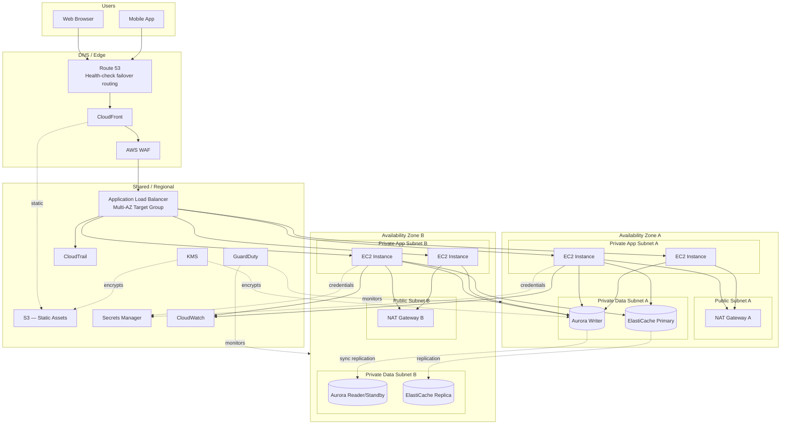
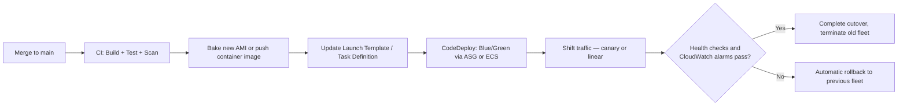

# Part II – Core Infrastructure Architectures

# Chapter 6 – Highly Available Multi-AZ Web Application

> **Visual note:** This chapter uses Mermaid diagrams for architecture and sequence flows, and Markdown tables for comparisons, cost estimates, and checklists. All Terraform and CLI examples are written against provider `hashicorp/aws >= 5.0` and AWS CLI v2. Where this chapter uses a service already introduced in Chapter 2 ("AWS Building Blocks"), it re-explains that service briefly on first use so the chapter remains self-contained.

---

# 1 Executive Summary

A highly available, Multi-AZ web application is the single most common production architecture in the AWS ecosystem, and for good reason: it is the minimum viable design for any customer-facing system that a business is unwilling to watch go dark every time a single server, disk, or data center room has a bad day. This chapter defines that architecture precisely — a public web/API application, fronted by a content delivery network and load balancer, running stateless compute spread across at least two Availability Zones, backed by a relational database configured for automated failover, with every layer instrumented, encrypted, and governed by least-privilege identity. It is the architecture most organizations should be running the day they have paying customers, and it is the architecture this book treats as the baseline that every more specialized pattern in later chapters (event-driven, serverless, microservices, multi-region, data platform) either extends or deliberately departs from.

**The business problem.** Downtime is not an abstract engineering concern; it has a direct, quantifiable cost, and that cost is rarely distributed evenly across a system's lifetime. A single-instance, single-AZ web application is exposed to an uncomfortably long list of independent, uncorrelated failure sources: instance hardware failure, an operating system crash, a bad deployment, a disk filling up, or the loss of an entire Availability Zone due to power, cooling, or network failure at the physical data center level. Each of these is individually rare, but an organization running any meaningful transaction volume for more than a year or two will, with near certainty, experience at least one of them. When it happens on a single-AZ architecture, the outcome is total unavailability until a human intervenes — no automatic recovery path exists. This is the business problem this architecture solves: it converts a category of failure that previously meant "the site is down until someone fixes it" into a category of failure that means "the site kept running, and an engineer investigates during business hours."

**The architecture objective.** The objective of this chapter's design is not maximum availability at any cost — that is the domain of the multi-region, active-active architectures covered later in this book, appropriate only for a narrow slice of truly mission-critical systems. The objective here is the highest availability achievable *within a single AWS Region*, at a cost and operational complexity that a team of a handful of engineers can reasonably build, operate, and troubleshoot. Concretely: eliminate every single point of failure below the region level, automate recovery from the failure modes that occur often enough to matter (AZ loss, instance loss, database primary loss), and make the remaining, much rarer failure modes (regional loss) a deliberate, documented, and reasonably priced business decision rather than an unexamined gap.

**Why organizations adopt this architecture.** Three forces reliably drive an organization toward this pattern. First, a growth-stage business crosses a revenue or user threshold where downtime cost, calculated honestly (lost transactions, support burden, reputational damage, SLA penalties), exceeds the cost of building proper redundancy — this crossover typically happens earlier than founders expect, often within the first twelve months of meaningful traffic. Second, a compliance or enterprise-sales requirement forces the issue directly: SOC 2 audits, enterprise procurement questionnaires, and cyber-insurance underwriting all routinely ask for documented Multi-AZ architecture and tested failover, and a "no" answer closes deals or fails audits. Third, and most viscerally, an organization experiences a single-AZ outage severe enough that leadership mandates it never happens again — this is the least efficient way to arrive at this architecture (reactive rather than proactive), but it remains one of the most common paths in practice, and this book's position is that the proactive path is cheaper in every sense.

**Major business benefits.** The benefits of this architecture map directly onto the AWS Well-Architected Framework's Reliability pillar, but are worth stating in business terms specifically:

1. **Continuity of revenue and customer trust during infrastructure failures.** An AZ failure or instance failure becomes invisible to end users rather than an outage — this is the architecture's core value proposition and the reason it is worth its incremental cost over a single-AZ design.
2. **Predictable, boring incident response.** Because failover is automated (ALB health checks, Auto Scaling replacement, RDS/Aurora Multi-AZ failover), the on-call engineer's job during an AZ event is to *verify* that automated recovery worked, not to manually rebuild infrastructure under pressure at 3 a.m. This measurably reduces both incident duration and on-call burnout.
3. **A credible answer to enterprise and regulatory diligence.** "We run Multi-AZ with automated failover, tested quarterly" is a specific, verifiable answer that satisfies the overwhelming majority of enterprise security questionnaires and compliance audits concerned with availability — versus a vague assurance that invites further scrutiny.
4. **A foundation that scales forward without a rebuild.** Because this architecture already separates compute from state, uses managed services for the database and load balancing tier, and provisions everything as code, it is the correct starting point to evolve toward microservices, multi-region, or event-driven patterns later (Section 34's Evolution Path covers this in detail) — teams that skip this step and jump from single-instance to a more exotic pattern typically end up rebuilding this layer anyway, under more pressure and with production traffic already depending on it.

**Typical enterprise scenarios.** This exact architecture, with variation mainly in instance sizing, database engine choice, and the specific mix of caching and messaging components, recurs across an enormous range of enterprise use cases: a SaaS product's core customer-facing application; an e-commerce storefront's browsing and checkout experience (though checkout specifically often adds the messaging-decoupling patterns covered in Chapter 2 and later chapters, to isolate payment processing from browsing traffic); an insurance or financial services customer portal (where the compliance driver above is usually explicit and documented); a media or content platform's origin application behind CloudFront; and internal enterprise applications that, while not public-facing, serve enough of the organization that their downtime has a real, measurable productivity cost and therefore justifies the same Multi-AZ investment as a customer-facing system. What unites all of these scenarios is not the specific business domain, but a shared shape: synchronous, latency-sensitive, stateful-at-the-database-layer, moderate-to-high traffic, and unacceptable to leave down for an extended, unbounded period while an engineer manually rebuilds infrastructure. Where a workload's shape diverges meaningfully from this — genuinely spiky/event-driven traffic, an access pattern that fits DynamoDB far better than a relational model, or a requirement for cross-region continuity — later chapters in this book cover the architectures purpose-built for those cases, and Section 28 of this chapter compares this pattern against those alternatives directly.

---

# 2 Business Requirements

## Business Drivers

| Driver | Description |
|---|---|
| Revenue protection | Downtime directly translates to lost transactions/signups/revenue for any customer-facing system |
| Compliance and enterprise sales | SOC 2, ISO 27001, and enterprise procurement diligence routinely require documented, tested HA architecture |
| Customer trust and reputation | Public outages damage brand trust disproportionately to their technical severity |
| Operational sustainability | Automated failover reduces on-call burden and incident duration compared to manual recovery |

## Functional Requirements

- Serve authenticated and unauthenticated HTTP(S) web/API traffic to end users globally or regionally, depending on the business's customer base.
- Persist transactional data with full ACID guarantees for the application's core relational data model.
- Serve static assets (images, JS/CSS bundles, downloadable content) efficiently at scale.
- Support session-aware functionality (logged-in user state) without binding a user's session to a specific compute instance.
- Provide a deployment mechanism that ships new application versions without a maintenance window.

## Non-Functional Requirements

| Category | Requirement |
|---|---|
| Performance | p95 API latency under 250ms for interactive endpoints; static asset delivery under 100ms globally via CDN |
| Availability | 99.95% monthly uptime target (see Availability Requirements below) |
| Security | Encryption at rest and in transit for all data; least-privilege IAM; WAF-filtered public endpoints |
| Maintainability | Infrastructure fully defined as code; any engineer on the team can safely deploy a change following documented process |
| Observability | Every layer (edge, compute, database) emits metrics, logs, and traces sufficient to diagnose a production incident without SSH access to any host |

## Scalability Goals

The architecture should absorb at least 5x baseline traffic without manual intervention (via Auto Scaling) and support a documented path to 20x baseline traffic within a planned capacity review cycle (quarterly), without requiring an architectural redesign — only parameter and instance-size adjustments.

## Availability Requirements

| Tier | Target | Allowed Downtime/Month | Allowed Downtime/Year |
|---|---|---|---|
| 99.9% ("three nines") | Minimum acceptable for this architecture | ~43 minutes | ~8.7 hours |
| 99.95% | Target for this chapter's reference design | ~21.5 minutes | ~4.4 hours |
| 99.99% | Achievable with additional investment (see Section 28) | ~4.3 minutes | ~52 minutes |

> **Note:** 99.95% within a single region is a realistic, achievable target for the architecture in this chapter, assuming disciplined implementation of every layer described in Sections 6 and 12. Chasing 99.99%+ within this architecture's scope (single-region) has diminishing returns — at that point, the remaining risk is dominated by regional-level failure modes that only a multi-region architecture (a later chapter in this book) addresses, and the honest recommendation to an architecture review board is to say so explicitly rather than imply this single-region pattern can be tuned into near-100% availability.

## Latency Requirements

Interactive, user-facing API endpoints: p95 under 250ms, p99 under 600ms. Static asset delivery via CloudFront: sub-100ms globally for cached content. Background/report-generation endpoints: latency budget of several seconds is acceptable, and should be handled asynchronously (see Chapter 2, Section 15) rather than forced into the same synchronous latency budget as interactive endpoints.

## Compliance Requirements

Typical compliance obligations for this architecture pattern include SOC 2 Type II (availability and security trust service criteria specifically implicate the HA and monitoring design in this chapter), PCI-DSS if payment card data is processed or stored (which should push the architecture toward additional network segmentation, covered in Section 9), and, for organizations serving EU customers, GDPR data protection requirements affecting encryption, access logging, and data residency decisions.

## Security Expectations

All data classified as sensitive (PII, credentials, payment-adjacent data) must be encrypted at rest via KMS and in transit via TLS 1.2+; access to production data must be governed by least-privilege IAM with no standing, unaudited human access to the database; all administrative access must go through Systems Manager Session Manager or an equivalent audited path rather than direct SSH/RDP.

## Recovery Objectives

| Objective | Target for This Architecture |
|---|---|
| RPO (Recovery Point Objective) | Under 5 minutes (achieved via Aurora/RDS Multi-AZ synchronous replication plus continuous backup) |
| RTO (Recovery Time Objective) | Under 30 minutes for AZ-level failure (automated); under 4 hours for full-region loss if backup-and-restore DR is the chosen pattern (see Section 13) |

This maps to a **Tier 1 ("Business Critical")** classification in the tiering framework introduced in Chapter 2, Section 2 — important enough to justify full Multi-AZ investment and a tested (though not necessarily active-active) disaster recovery plan, but not warranting the Tier 0 investment of continuous multi-region active-active operation unless the specific business has an unusually low tolerance for any downtime (payment processing, life-safety systems).

## SLAs

Internal/contractual SLA commitments for a Tier 1 system under this architecture typically read: 99.9% monthly uptime (with the 99.95% design target above providing margin), P1 incident response within 15 minutes during business hours (30 minutes off-hours), and a documented, tested disaster recovery plan reviewed at least annually.

## Expected Workload and Growth

A representative mid-market SaaS deployment of this architecture: baseline 50–200 requests/second, peak 500–1,500 requests/second during business hours and marketing campaigns, a read-heavy relational workload (roughly 80/20 read/write ratio typical of web application traffic), starting data volume in the tens to low hundreds of GB, and a 12-month growth projection of 3–5x traffic as the business scales — all comfortably within this architecture's designed scaling envelope (Section 14) without requiring a database engine change or a compute-model change within that horizon.

---

# 3 Architecture Overview

## Overall Design Philosophy

This architecture applies a small number of consistent principles at every layer: **no single point of failure below the region boundary**, **stateless compute so that any healthy instance can serve any request**, **automated detection and recovery for every failure mode common enough to occur in normal operation**, and **defense-in-depth security applied uniformly rather than concentrated at the perimeter alone**. These are the same principles introduced generally in Chapter 2; this chapter applies them to one specific, complete, buildable system rather than discussing them in the abstract.

## Core Components

- **Edge layer:** Route 53 for DNS with health-check-based failover, CloudFront for CDN caching and TLS termination, AWS WAF for Layer 7 filtering, and AWS Shield Standard for baseline DDoS protection.
- **Load balancing:** An Application Load Balancer spanning at least two (this chapter's reference design uses three) Availability Zones, routing to healthy compute targets only.
- **Compute:** An Auto Scaling Group of EC2 instances (or, in the ECS Fargate variant discussed in Section 4, a Fargate service) running the stateless application tier, spread evenly across the same AZs as the ALB.
- **Session/cache layer:** ElastiCache for Redis in cluster mode, Multi-AZ, holding session state and frequently accessed data — critical to keeping the compute tier genuinely stateless.
- **Database:** RDS or Aurora (this chapter presents both, with explicit selection guidance in Section 4) in a Multi-AZ configuration, private-subnet-only, encrypted at rest.
- **Static asset storage:** S3, served through CloudFront rather than directly from the application tier.
- **Security and identity:** IAM roles for all compute-to-service access, KMS for encryption, Secrets Manager for database credentials, GuardDuty/Security Hub/Config for continuous security posture monitoring.
- **Monitoring:** CloudWatch for metrics/logs/alarms, X-Ray for distributed tracing, CloudTrail for audit logging.

## How Components Interact

Traffic enters through Route 53 and CloudFront, is filtered by WAF, and reaches the ALB, which distributes it across healthy EC2 instances (or Fargate tasks) in the private application subnets. The application tier reads/writes session and cache data in ElastiCache and transactional data in RDS/Aurora, both in private data subnets with no direct internet exposure. Static assets are served directly from S3 via CloudFront, bypassing the application tier entirely for content that doesn't require server-side logic. Every component emits telemetry to CloudWatch and X-Ray continuously, and every API call against the AWS control plane itself is recorded by CloudTrail.

## High-Level Workflow

**Request lifecycle:** DNS resolution → CDN edge (cache hit returns immediately; cache miss or non-cacheable request proceeds) → WAF evaluation → ALB routing to a healthy target → application processing (including session lookup, business logic, and data access) → response construction.

**Response lifecycle:** The application returns a response through the ALB and CloudFront; cacheable responses are cached at the edge per the configured cache policy; response time and status are logged at every layer (ALB access logs, CloudFront logs, application logs) for both operational monitoring and later analysis.

**Data lifecycle:** Writes go synchronously to the Aurora/RDS primary, which replicates synchronously to its Multi-AZ standby before the write is acknowledged (this synchronous replication is precisely what makes near-zero RPO failover possible — an architectural detail worth understanding, not just accepting, because it directly explains why Multi-AZ write latency is slightly higher than a single-instance database, a trade-off this chapter considers well justified for the availability gained). Reads may be served from the primary directly or, at higher read scale, from read replicas. Data is backed up continuously via automated snapshots and point-in-time recovery, with a retention period matching the compliance requirements from Section 2.

---

# 4 AWS Services Used

## Amazon EC2 (and the ECS Fargate Alternative)

**Purpose:** Runs the stateless application tier inside an Auto Scaling Group spread across multiple AZs.

**Why selected:** EC2 with Auto Scaling is chosen for this reference architecture because it is the most broadly applicable, best-understood compute model for a traditional web application, works with essentially any language/runtime/framework without containerization as a prerequisite, and gives the operations team direct OS-level troubleshooting access when needed. Many organizations implementing this exact architecture choose ECS Fargate instead once their application is already containerized — the HA design (Multi-AZ, ALB-fronted, Auto Scaling) is identical either way; only the compute substrate changes. This chapter presents EC2 as the primary example and calls out the Fargate variant where it materially changes the design.

**Alternatives:** ECS Fargate (if already containerized, removes OS patching burden), Lambda (only appropriate if the application can be decomposed into short-lived, stateless functions — a poor fit for most traditional monolithic or lightly-decomposed web applications, which is the common starting point for this architecture).

**Limitations:** Requires OS patch management (via Systems Manager Patch Manager) and AMI lifecycle management; Auto Scaling reaction time (typically 1-3 minutes to launch and pass health checks) is not instantaneous, so a sudden, extreme traffic spike can briefly outpace scaling unless pre-warmed capacity or scheduled scaling is used ahead of a known event.

**Pricing considerations:** On-Demand for the baseline, variable-safety-margin portion of capacity; Savings Plans covering the steady-state baseline instance count (the number of instances that are essentially always running, even at 3 a.m.) typically cut compute cost 30-45% versus pure On-Demand.

**Best practices:** Launch templates (not launch configurations); one Auto Scaling Group spanning all target AZs rather than one ASG per AZ (letting AWS balance placement); IMDSv2 enforced; user data scripts kept minimal and idempotent, with configuration pulled from Parameter Store/Secrets Manager at boot rather than baked into a static AMI that goes stale.

## Application Load Balancer (ALB)

**Purpose:** Layer 7 load balancing and health-check-driven routing across the Multi-AZ compute fleet.

**Why selected:** ALB is the correct choice (over NLB) for this architecture because the workload is standard HTTP(S) traffic that benefits from ALB's content-based routing, native WAF integration, and target-group health checks — the specific mechanism that makes automated instance-failure and AZ-failure recovery possible without any DNS-level change.

**Best practices:** Configure health checks against a dedicated, lightweight `/health` endpoint that verifies real downstream dependency health (database connectivity, cache connectivity) rather than returning an unconditional 200; set deregistration delay (connection draining) long enough to let in-flight requests complete during scale-in or deployment (30-60 seconds is a common default, tuned to the application's typical request duration).

## Amazon CloudFront

**Purpose:** Global edge caching and TLS termination in front of the ALB and S3.

**Why selected:** Even for an application with substantial dynamic content, CloudFront materially improves perceived performance (TLS handshake termination at the edge, closer to the user, rather than at the origin) and absorbs a meaningful share of both static asset traffic and DDoS volume before it ever reaches the ALB or application tier.

**Best practices:** Use separate cache behaviors for static assets (long TTL, cached aggressively) versus dynamic API paths (short or zero TTL, but still benefiting from connection reuse and edge TLS termination); enable Origin Shield if origin load from cache misses across many edge locations becomes a measurable cost or load factor.

## Amazon S3

**Purpose:** Durable object storage for static assets (images, JS/CSS bundles, user uploads) served through CloudFront.

**Why selected:** Offloading static assets from the application tier to S3+CloudFront reduces compute fleet size requirements (the app tier no longer serves large static payloads), improves global delivery latency, and is dramatically cheaper per GB served than serving the same content from EC2/ALB.

**Best practices:** Use Origin Access Control (OAC) so the S3 bucket itself remains fully private and is only reachable through CloudFront — never make the bucket public for "simplicity," per the anti-pattern documented in Chapter 2.

## Amazon RDS and Amazon Aurora

**Purpose:** The relational, transactional data store for the application, configured for Multi-AZ automated failover.

**Why selected — RDS vs. Aurora for this architecture:** Both are valid choices for this pattern, and the decision is one of the most consequential in the whole chapter. **RDS Multi-AZ** is the right default when the team wants a simpler, well-understood managed-database model, doesn't need Aurora's faster failover or higher read-replica ceiling, or requires a specific engine Aurora doesn't support (Oracle, SQL Server). **Aurora** is the right choice when failover speed matters more (Aurora typically fails over in under 30 seconds versus RDS Multi-AZ's 60-120 seconds), when the application's read traffic is expected to scale beyond what a small number of RDS read replicas comfortably support, or when Aurora Serverless v2's automatic capacity scaling is attractive for a workload with meaningfully variable load. This chapter's reference Terraform (Section 18) implements Aurora, as the faster failover directly improves the RTO figure committed to in Section 2, but the RDS Multi-AZ variant is architecturally identical in every other respect and is called out explicitly where it differs.

**Limitations:** Both require the application to handle a brief connection interruption gracefully during failover (retry logic is not optional — see the Production Pitfalls in Section 34); vertical scaling still has a ceiling that, for this chapter's target workload (Section 2), is not expected to be reached within the planned growth horizon, but should be revisited at the next capacity review if growth materially exceeds projections.

**Best practices:** Enable Performance Insights for query-level visibility without needing to reproduce issues manually; set backup retention to match the compliance requirement from Section 2 (commonly 7-35 days for automated backups, supplemented by longer-retention manual/AWS Backup snapshots); place the database exclusively in private data subnets with no route to the internet, per the network design in Section 9.

## Amazon ElastiCache (Redis)

**Purpose:** Session storage and application-level data caching, enabling the compute tier to remain genuinely stateless.

**Why selected:** Without an external session store, session affinity would need to be handled via sticky sessions at the load balancer — a pattern this architecture deliberately avoids, because sticky sessions undermine the even load distribution and clean failure handling that make Auto Scaling and AZ failover work smoothly. ElastiCache Redis in Multi-AZ cluster mode gives every application instance access to the same session state regardless of which instance served a user's previous request.

**Best practices:** Enable Multi-AZ with automatic failover (a single-node cache is itself a single point of failure and undermines the HA design elsewhere); use it deliberately for genuinely cacheable/session data rather than as an ad hoc dumping ground for anything that "might be useful to cache," which leads to unpredictable memory pressure and eviction behavior.

## IAM, VPC, Route 53

Covered in depth in Chapter 2, Sections 4.3 and 4.8, and applied specifically to this architecture in Sections 9 and 10 of this chapter.

## KMS, Secrets Manager, Systems Manager

Covered in depth in Chapter 2, Section 4.8 and Section 11; applied specifically here for database/EBS encryption keys, database credential storage and rotation, and patch management/Session Manager access respectively — see Sections 10, 11, and 23 of this chapter.

## CloudWatch, CloudTrail, GuardDuty, AWS Config

Covered in depth in Chapter 2; this chapter's specific monitoring and security configuration for this architecture is in Sections 11, 21, and 22.

## Compute Model Decision Matrix (This Architecture Specifically)

| Factor | EC2 + Auto Scaling (reference design) | ECS Fargate (common alternative) |
|---|---|---|
| Fit for non-containerized apps | Excellent — no prerequisite | Requires containerization first |
| OS patch management burden | Team-owned (via Patch Manager) | Removed (AWS-managed) |
| Deployment model | AMI-based or user-data/config-management-based | Container image + task definition |
| Cost profile at steady-state | Slightly better with Savings Plans on well-utilized fleets | Comparable, sometimes slightly higher per-vCPU |
| Operational familiarity for traditional ops teams | High | Requires container/orchestration familiarity |
| Recommended when | App isn't containerized, or team has strong EC2/AMI operational maturity | App is already containerized, team wants to shed OS management |

---

# 5 Complete Architecture Diagram



**Diagram interpretation:** This is the architecture in its most literal, physically-grounded form — note that everything except the ALB, S3, and the regional/global services in the "Shared" subgraph is deliberately duplicated per-AZ. This duplication is the entire point of the design: the loss of AZ A leaves AZ B's compute, cache replica (promoted to primary), and Aurora reader (promoted to writer, if AZ A held the writer) fully capable of serving all traffic without any AZ-A-only resource being a hard dependency for continued operation.

---

# 6 Component-by-Component Explanation

| Component | Purpose | Scaling | High Availability | Failure Handling | Dependencies |
|---|---|---|---|---|---|
| Route 53 | DNS resolution with health-check failover | N/A (global, managed) | Multi-region by design | Health check failure removes an unhealthy endpoint from rotation | CloudFront/ALB health |
| CloudFront | Edge caching, TLS termination | Automatic, global | Built-in multi-edge redundancy | Origin failover group (optional) for multi-origin resilience | ALB, S3 origins |
| WAF | Layer 7 filtering | Automatic | N/A (edge-attached) | Rule-based blocking, fails open/closed per configuration | CloudFront/ALB attachment |
| ALB | Layer 7 load balancing across AZs | Automatic, scales to traffic | Spans all configured AZs by default | Removes unhealthy targets from rotation within health-check interval | EC2/Fargate targets in ≥2 AZs |
| EC2 Auto Scaling Group | Runs stateless application logic | Target-tracking + scheduled scaling | Instances spread evenly across AZs | ASG replaces terminated/unhealthy instances automatically | ALB target group, IAM instance profile, data tier |
| Aurora (Multi-AZ) | Primary relational data store | Read replicas, Serverless v2 option | Synchronous replication to standby in a second AZ | Automated failover, typically < 30 seconds | KMS, Secrets Manager, data-tier security group |
| ElastiCache Redis | Session store, data cache | Cluster mode for horizontal scale | Multi-AZ with automatic failover | Automatic promotion of replica to primary on failure | Application-tier security group |
| S3 | Static asset storage | Automatic, unlimited | 11 nines durability | Versioning + lifecycle for recovery from accidental deletion | KMS, CloudFront OAC |
| NAT Gateway (per AZ) | Outbound internet for private app subnet | Automatic, scales to traffic | One per AZ — no cross-AZ dependency | AZ-scoped; only affects that AZ's outbound traffic if it fails | IGW, public subnet |
| Secrets Manager | Database credential storage/rotation | N/A (managed) | Multi-AZ by design | Automatic rotation Lambda re-runs on schedule/failure | KMS, IAM |
| GuardDuty | Threat detection | N/A (managed, regional) | Multi-AZ/region aggregation via Security Hub | Findings routed to Security Hub/EventBridge | CloudTrail, VPC Flow Logs |
| CloudWatch | Metrics, logs, alarms | Automatic | Regional, highly durable | Alarms trigger SNS/Lambda-based response | All components as telemetry sources |

---

# 7 End-to-End Request Flow

```mermaid

sequenceDiagram
    participant C as Client
    participant R53 as Route 53
    participant CF as CloudFront
    participant WAF as WAF
    participant ALB as ALB
    participant APP as EC2 App Instance
    participant CACHE as ElastiCache
    participant DB as Aurora Writer
    participant CW as CloudWatch

    C->>R53: 1. Resolve app.example.com
    R53-->>C: 2. Return healthy endpoint (per health check)
    C->>CF: 3. HTTPS request
    CF->>WAF: 4. Evaluate WAF rules
    WAF-->>CF: 5. Allow
    CF->>ALB: 6. Forward to origin (dynamic path, not cached)
    ALB->>APP: 7. Route to healthy target in least-loaded AZ
    APP->>CACHE: 8. Look up session data
    CACHE-->>APP: 9. Return session (user authenticated)
    APP->>DB: 10. Execute query/transaction
    DB-->>APP: 11. Return result
    APP->>CACHE: 12. Update cache if applicable
    APP->>CW: 13. Emit request metrics/logs
    APP-->>ALB: 14. Return response
    ALB-->>CF: 15. Return response
    CF-->>C: 16. Deliver response
    Note over ALB,DB: 17. If APP instance or DB primary fails mid-request,<br/>ALB health check / DB failover triggers recovery;<br/>client-visible impact limited to in-flight requests
    Note over CW: 18. Errors at any step trigger CloudWatch Alarms

```

**Step-by-step narrative:** Steps 1-6 mirror the general request path described in Chapter 2, Section 7, applied here specifically. Step 7 is the step this chapter's architecture is built around: the ALB's target selection is AZ-agnostic from the client's perspective — it simply routes to the least-loaded healthy target, which may be in either AZ, and the client has no visibility into or dependency on which AZ actually serves the request. Steps 8-9 retrieve session state from ElastiCache rather than from local instance memory — this is what allows step 7's AZ-agnostic routing to work correctly even when a user's previous request was served by a different instance in a different AZ. Steps 10-11 execute against the Aurora writer; if the writer's AZ has failed and a failover is in progress, the application's retry logic (a specific, mandatory implementation detail discussed further in Section 34) handles the brief connection interruption transparently to the end user in the large majority of cases, at the cost of a few hundred milliseconds to a few seconds of added latency on the specific request that was in flight during the failover moment.

---

# 8 Deployment Flow

## Infrastructure Provisioning and Terraform Workflow

Identical in process to the general pattern in Chapter 2, Section 8: `terraform fmt`/`validate` → PR → CI-run `terraform plan` → peer review of plan output → merge → CI-run `terraform apply` against locked remote state. This chapter's specific modules are provided in Section 18.

## CI/CD Application Deployment



## Blue-Green Deployment for This Architecture

For the EC2 variant, blue-green deployment is implemented via a second Auto Scaling Group (the "green" fleet) launched from an updated launch template, registered to a second target group behind the same ALB, with traffic shifted from blue to green via weighted target group rules (managed by CodeDeploy's EC2/ASG blue-green deployment type) rather than a manual DNS or ALB listener change. For the Fargate variant, this maps directly onto CodeDeploy's native ECS blue-green support described in Chapter 2, Section 8.

**When to use blue-green here specifically:** Given this chapter's Tier 1 classification and the explicit RTO commitment in Section 2, blue-green (with its near-instant rollback capability) is the recommended default deployment strategy for this architecture, not an optional enhancement — a bad deployment is, in practice, a far more common cause of a production incident than an actual AZ failure, and the deployment strategy should be engineered with the same seriousness as the infrastructure HA design.

## Rollback

Traffic-shift rollback (shifting back to the blue target group) completes in well under a minute. As with the general guidance in Chapter 2, Section 8, database schema migrations deployed alongside an application change must remain backward-compatible with the immediately prior application version for at least one full deployment cycle, so a rollback of application code never leaves the database in a state the rolled-back code cannot handle correctly.

## Secrets and Configuration

Database credentials, Redis auth tokens, and any third-party API keys are stored in Secrets Manager and retrieved at instance boot (EC2 user data invokes the AWS CLI/SDK to fetch secrets, never embeds them) or at container start (ECS task definition secrets integration). Application configuration that varies by environment (dev/staging/prod) but isn't sensitive uses Parameter Store standard parameters, keeping the same AMI/container image deployable across environments with environment-specific configuration injected at runtime.

## Validation

Post-deployment validation for this architecture specifically includes: automated smoke tests against both the ALB directly (bypassing CloudFront cache) and through CloudFront (validating cache behavior wasn't broken by the deployment), a sustained health-check bake period (5-10 minutes) before considering the deployment complete, and an explicit check that both AZs are serving traffic roughly evenly post-deployment (a skewed distribution can indicate one AZ's fleet failed to launch correctly even if aggregate health checks are passing).

---

# 9 Network Topology

## VPC and Subnet Design for This Architecture

This architecture requires a minimum of two AZs and is presented here with three, since three-AZ designs tolerate a simultaneous AZ failure plus routine maintenance in a second AZ with less capacity risk than a two-AZ design, at a modest incremental cost (primarily one additional NAT Gateway and, if used, one additional database standby/reader).

| Subnet Tier | AZ-a | AZ-b | AZ-c | Purpose |
|---|---|---|---|---|
| Public | 10.0.0.0/24 | 10.0.1.0/24 | 10.0.2.0/24 | ALB, NAT Gateway |
| Private — App | 10.0.10.0/24 | 10.0.11.0/24 | 10.0.12.0/24 | EC2/Fargate application tier |
| Private — Data | 10.0.20.0/24 | 10.0.21.0/24 | 10.0.22.0/24 | Aurora, ElastiCache |

## NAT Gateway Placement

One NAT Gateway per AZ, as established in Chapter 2, Section 9 — this architecture is precisely the case that principle exists for: a shared, single NAT Gateway would turn a routine, expected AZ event into an outbound-connectivity outage for two-thirds of the application fleet, directly undermining the entire point of the Multi-AZ design.

## Security Groups for This Architecture

| Security Group | Inbound | Outbound | Attached To |
|---|---|---|---|
| `alb-sg` | 443 from 0.0.0.0/0 | To `app-sg` only | ALB |
| `app-sg` | App port from `alb-sg` only | To `data-sg`, `cache-sg`, and internet via NAT (for third-party API calls, patching) | EC2 instances / Fargate tasks |
| `data-sg` | DB port from `app-sg` only | None (default deny) | Aurora cluster |
| `cache-sg` | Redis port from `app-sg` only | None (default deny) | ElastiCache nodes |

> **Warning:** A common, dangerous simplification during initial implementation is a single, broad security group covering both the application and data tiers "to save time during setup." This defeats the network-level defense-in-depth this architecture is built around — a compromised application instance would have unrestricted network reachability to the database, rather than being confined to exactly the database port the application actually needs. Keep the tiers separated from day one; retrofitting this separation later, after dependencies have organically grown around the loose configuration, is significantly more work.

## VPC Endpoints

This architecture should use Gateway endpoints for S3 (no additional cost, keeps static-asset-related S3 API calls off the NAT path) and, where the compliance posture from Section 2 requires it, Interface endpoints for Secrets Manager and KMS, ensuring credential retrieval and encryption operations never transit the public internet even indirectly via NAT.

## Hybrid Connectivity

If this application needs connectivity to an on-premises system (a legacy internal API, an on-prem identity provider), Site-to-Site VPN is the appropriate starting point given this architecture's traffic profile; Direct Connect is generally not justified purely for this pattern unless the organization already has Direct Connect provisioned for other reasons or the on-premises integration itself has unusually high throughput/latency requirements.

---

# 10 Identity and Access

## IAM Roles for This Architecture's Components

| Role | Attached To | Key Permissions |
|---|---|---|
| EC2 instance profile / ECS task role | Application compute | Read specific Secrets Manager secret (DB credentials); read/write specific S3 prefix if the app handles uploads; CloudWatch PutMetricData/PutLogEvents |
| RDS/Aurora enhanced monitoring role | Aurora cluster | Publish enhanced monitoring metrics to CloudWatch Logs |
| Secrets rotation Lambda role | Rotation Lambda | Rotate the specific secret; modify the specific RDS/Aurora cluster's master user password |
| Deployment/CI role | CI/CD pipeline | Update launch templates/task definitions, invoke CodeDeploy, read (not write) Terraform state for plan generation |

## Least Privilege in Practice for This Architecture

The application's IAM role should be scoped to the exact Secrets Manager secret ARN holding its own database credentials — not a wildcard covering all secrets in the account, and not even a wildcard covering all secrets with a shared prefix unless that prefix is genuinely scoped to this one application. The same specificity applies to the S3 prefix for user uploads (if any) — the application's role should never be granted blanket `s3:*` access to a shared bucket that also holds other applications' or teams' data.

## Cross-Account Considerations

Where this architecture's CI/CD pipeline lives in a separate tooling/deployment account from the workload account (a common and recommended pattern for larger organizations), the pipeline's IAM role in the tooling account assumes a deployment role in the workload account via STS `AssumeRole`, scoped narrowly to the specific resources (this application's ASG, target group, and CodeDeploy application) it needs to manage — not broad administrative access to the entire workload account.

## Example: Application IAM Policy for This Architecture

```json

{
  "Version": "2012-10-17",
  "Statement": [
    {
      "Sid": "ReadOwnDatabaseSecret",
      "Effect": "Allow",
      "Action": ["secretsmanager:GetSecretValue"],
      "Resource": "arn:aws:secretsmanager:us-east-1:123456789012:secret:acme/webapp/aurora-creds-*"
    },
    {
      "Sid": "UploadUserContent",
      "Effect": "Allow",
      "Action": ["s3:PutObject", "s3:GetObject"],
      "Resource": "arn:aws:s3:::acme-webapp-uploads-prod/user-uploads/*"
    },
    {
      "Sid": "PublishMetricsAndLogs",
      "Effect": "Allow",
      "Action": [
        "cloudwatch:PutMetricData",
        "logs:CreateLogStream",
        "logs:PutLogEvents"
      ],
      "Resource": "*",
      "Condition": {
        "StringEquals": { "cloudwatch:namespace": "AcmeWebApp" }
      }
    }
  ]
}

```

Note the `cloudwatch:namespace` condition on the metrics permission — even where a wildcard resource is unavoidable (CloudWatch metrics don't support resource-level ARN scoping the way S3 or Secrets Manager do), a condition key narrows the practical blast radius of the permission.

---

# 11 Security Architecture

## Encryption for This Architecture

Every data store in this design is encrypted at rest via a customer-managed KMS key dedicated to this application (not a shared, account-wide key covering unrelated applications, which would make key-policy-based access control meaningless as a boundary): Aurora storage, automated backups and snapshots, ElastiCache (at-rest and in-transit encryption both enabled), S3 (SSE-KMS), and EBS volumes on the EC2 fleet. TLS 1.2+ is enforced at the CloudFront and ALB listener level via an ACM-issued certificate, with HTTP-to-HTTPS redirection configured so no unencrypted path to the application exists.

## WAF Rule Configuration for This Architecture

A representative production WAF configuration for this pattern combines the AWS Managed Rules Core Rule Set (common web exploits), the SQL Injection managed rule group, a rate-based rule (e.g., block an IP exceeding 2,000 requests in 5 minutes — tuned against actual legitimate traffic patterns, not a generic default), and, if the application has a login endpoint, a specific rule group or custom rule targeting credential-stuffing patterns against that endpoint specifically.

## Secrets Manager and Certificate Manager

Database credentials use Secrets Manager's native RDS/Aurora rotation integration (a fully managed Lambda AWS provides and maintains, requiring only that you enable it and set a rotation schedule — commonly every 30-90 days). ACM issues and automatically renews the public certificate used by CloudFront and the ALB, eliminating the expired-certificate failure mode listed in Chapter 2's failure scenarios.

## GuardDuty, Security Hub, Config for This Architecture

GuardDuty monitors this application's VPC Flow Logs, DNS query logs, and CloudTrail activity for anomalous patterns — for this specific architecture, the findings most likely to be operationally relevant are unusual API call patterns against the application's IAM role (potentially indicating a compromised instance) and unusual network traffic patterns from the application subnets. AWS Config rules relevant to this architecture specifically include: `rds-multi-az-support` (verifying Multi-AZ remains enabled — a surprisingly common drift, since it's possible to accidentally disable Multi-AZ during a database modification), `alb-http-to-https-redirection-check`, and `s3-bucket-public-read-prohibited` for the static assets bucket.

## Zero Trust Applied to This Architecture

No implicit trust is granted based on VPC membership alone — the application-to-database and application-to-cache security group rules described in Section 9 restrict traffic by security group reference, not IP range, meaning even a compromised instance elsewhere in the same VPC (in a different security group) cannot reach the database. Every AWS API call the application makes (Secrets Manager, S3, CloudWatch) is authenticated and scoped via IAM as described in Section 10, not implicitly trusted because the call originates from "inside the VPC."

## Threat Model for This Architecture

| Attack Vector | Specific Relevance to This Architecture | Mitigation |
|---|---|---|
| Credential stuffing against login endpoint | Directly relevant — this is a customer-facing web application with authentication | WAF rate-based/custom rules, application-level account lockout, MFA where applicable |
| SQL injection | Directly relevant given the relational database backend | WAF SQLi managed rule group, parameterized queries in application code |
| Session hijacking | Directly relevant given the ElastiCache-backed session model | Secure, HttpOnly, SameSite session cookies; short session TTLs; TLS everywhere |
| SSRF via application vulnerability | Relevant to any EC2-backed application | IMDSv2 enforcement account-wide |
| Compromised deployment pipeline | Relevant given the blue-green CI/CD flow in Section 8 | Scoped IAM roles for CI/CD, mandatory PR review, signed artifacts |
| Public exposure of the data tier | Mitigated by design (private subnets, no NAT route from data tier) | Continuous AWS Config validation that this remains true |

---

# 12 High Availability

## AZ Failures

This is the failure mode this entire chapter's architecture exists to survive automatically. When an AZ becomes unavailable: the ALB stops routing to targets in that AZ within its configured health-check interval (typically detecting failure within 10-30 seconds, depending on threshold configuration); the Auto Scaling Group's health-check-driven replacement attempts to launch replacement capacity in the remaining healthy AZs (rather than retrying the failed AZ) once EC2 itself reports that AZ as impaired; the Aurora cluster, if its writer was in the failed AZ, fails over automatically to a reader in a healthy AZ, typically completing in under 30 seconds; ElastiCache promotes a replica in a healthy AZ to primary automatically. The end-to-end, user-visible impact of a well-implemented instance of this architecture during an AZ failure is a brief (seconds, not minutes) latency blip on in-flight requests and no impact at all on new requests issued after the ALB has removed the failed AZ's targets from rotation.

## Instance/Task Failures

Individual instance failures (distinct from AZ-level failures) are handled purely by ALB health checks and Auto Scaling replacement, with no database or cache involvement at all — this is the most common failure mode this architecture handles and the one it handles most cheaply and simply, precisely because the compute tier's statelessness (Section 3) means an instance failure has no data consequence whatsoever.

## Database Failures

Beyond the AZ-failure case above, a database failure can also be triggered by a bad query pattern overwhelming the primary, a failed minor-version upgrade, or (rarely) a genuine storage-layer issue. Aurora's architecture (six-way storage replication across three AZs, independent of compute-instance failover) makes storage-layer failure recovery largely automatic and transparent even in cases that would be a serious incident on a traditional single-instance database.

## Load Balancing and Health Check Tuning for This Architecture

| Health Check Parameter | Recommended Value | Rationale |
|---|---|---|
| Healthy threshold | 2-3 consecutive successes | Avoid flapping a target in and out of rotation on transient blips |
| Unhealthy threshold | 2-3 consecutive failures | Fast enough to detect real failure, slow enough to avoid false positives |
| Interval | 10-15 seconds | Balances detection speed against health-check request volume |
| Timeout | 5 seconds | Should be well under the interval, and reflect genuine expected health-endpoint latency |
| Health check path | Dedicated `/health` endpoint checking DB + cache connectivity | Verifies actual readiness, not just process liveness (Chapter 2, Section 12) |

## Failover Testing

For this architecture specifically, failover testing should include: a manual Aurora failover (`aws rds failover-db-cluster`) executed in a non-production environment with the same configuration as production, verified against the RTO target from Section 2; a simulated AZ failure (achieved by modifying an ASG's AZ subnet association temporarily, or via AWS Fault Injection Simulator's AZ-availability-impairment action) to validate the full chain of ALB, Auto Scaling, and database behavior together, not just the database failover in isolation.

---

# 13 Disaster Recovery

## Scope: This Chapter's DR Boundary

This chapter's architecture is explicitly a **single-region** HA design. Its disaster recovery strategy, by default, addresses AZ-level and component-level failure automatically (Section 12) and addresses **regional**-level failure via backup-and-restore — the least expensive DR pattern from the taxonomy in Chapter 2, Section 13. Organizations whose risk tolerance requires faster regional recovery than backup-and-restore provides should adopt the multi-region patterns covered in a later chapter of this book, built as an explicit extension of this chapter's architecture rather than a replacement for it.

## Backup Strategy

Aurora automated backups (continuous, point-in-time recovery within the retention window) plus a daily AWS Backup job copying a snapshot to a second region, retained per the compliance schedule from Section 2. S3 static assets use Cross-Region Replication to a DR-region bucket. Infrastructure itself (VPC, ALB, ASG, Aurora cluster definitions) is reproducible in a DR region from the same Terraform modules (Section 18) with region-specific variable values, rather than needing separate, hand-maintained DR infrastructure definitions.

## Regional Failover Runbook (Backup-and-Restore Pattern)

1. Declare a regional disaster per the incident severity classification (Chapter 2, Section 23).
2. Run `terraform apply` against the DR region's variable set to provision networking, compute, and security groups (these can be pre-provisioned in a lower-cost, scaled-down state — effectively a lightweight pilot-light variant — to shorten this step, at modest standing cost).
3. Restore the Aurora cluster from the latest cross-region snapshot.
4. Update Route 53 to point to the DR region's ALB (a pre-configured failover routing policy with health checks can automate this step rather than requiring a manual DNS change).
5. Validate application health against the restored environment before fully committing traffic.
6. Communicate status per the incident communication plan.

## RPO/RTO for This Pattern

| Pattern | RPO | RTO |
|---|---|---|
| AZ failure (automated, in-region) | Near-zero (synchronous replication) | Under 30 seconds (Aurora) to a few minutes (full AZ evacuation) |
| Regional failure — backup-and-restore (default for this chapter) | Depends on cross-region snapshot frequency — typically 1-24 hours | 2-4 hours (infrastructure provisioning + data restore + validation) |
| Regional failure — pilot light (upgrade path) | Minutes (with more frequent replication) | 30-60 minutes |

> **Note:** The gap between this chapter's Section 2 RTO commitment (under 4 hours for full-region loss) and a pilot-light or warm-standby pattern's much faster RTO is a deliberate, cost-driven design choice, not an oversight — see Section 34's discussion of when the additional standing cost of a faster-RTO pattern is and isn't justified for a Tier 1 system specifically.

---

# 14 Scalability

## Horizontal Scaling of the Compute Tier

Target-tracking Auto Scaling (commonly on average CPU utilization or, better for this workload profile, ALB `RequestCountPerTarget`) adds and removes instances automatically. For predictable daily/weekly traffic patterns (business-hours peaks, known marketing campaign windows), scheduled scaling actions that pre-provision capacity ahead of the predictable peak avoid the latency of reactive scaling catching up after the peak has already begun.

## Database Scaling

Aurora read replicas absorb read traffic growth without touching the writer; for this architecture's typical 80/20 read/write ratio (Section 2), adding read replicas is usually the first and most effective database scaling lever as traffic grows, well before a writer instance-size increase becomes necessary. Aurora Serverless v2 is worth evaluating at the next capacity review if traffic variability (rather than absolute growth) becomes the dominant scaling challenge.

## Cache and Storage Scaling

ElastiCache cluster mode allows horizontal shard scaling if session/cache data volume or throughput exceeds a single shard's capacity — uncommon for this architecture's typical workload but worth monitoring via `CurrConnections` and `BytesUsedForCache` metrics as a leading indicator. S3 and CloudFront scale automatically with no configuration required at this architecture's traffic scale.

## Growth Path Beyond This Chapter's Design Envelope

If traffic growth materially exceeds the 20x projection in Section 2, or the application's data access patterns evolve toward something DynamoDB fits better than the relational model, that is the signal to evaluate the more specialized architectures in later chapters of this book (event-driven decoupling, read-heavy caching architectures, or a partial migration of specific high-scale access patterns to DynamoDB alongside the existing Aurora-backed core) — not a signal that this chapter's architecture was the wrong choice, but that the system has grown past this pattern's designed scope, which is the expected, healthy outcome of a successful product.

---

# 15 Performance Optimization

## Caching Strategy Specific to This Architecture

A cache-aside pattern at the ElastiCache layer (application checks cache, falls through to Aurora on a miss, populates the cache with an appropriate TTL) combined with CloudFront edge caching for genuinely static or infrequently-changing dynamic content (e.g., a product catalog page with a short TTL and explicit invalidation on update) together typically remove 60-80% of read load from the database for a content-read-heavy web application matching this chapter's workload profile.

## Connection Pooling

Given EC2/Fargate's relatively modest per-instance connection count compared to a Lambda-based architecture, RDS Proxy is optional rather than mandatory for this specific architecture (unlike the Lambda-to-RDS pattern flagged as near-mandatory in Chapter 2), but remains a worthwhile addition once the Auto Scaling Group's maximum instance count multiplied by the application's per-instance connection pool size approaches Aurora's maximum connection limit for the chosen instance class.

## Database Query Optimization

Enable Aurora Performance Insights from day one (low overhead, immediately actionable) rather than only after a performance incident forces its adoption; review the top-wait-event and top-SQL views on a regular cadence as a preventive practice, not purely a reactive incident-response tool.

## Compression and Async Processing

Enable compression at CloudFront and the ALB/application layer for all compressible response types. Any request-path work that doesn't need to complete before returning a response to the user (sending a welcome email after signup, generating a downloadable report, processing an uploaded image) should be moved to asynchronous processing via SQS, consistent with the general pattern in Chapter 2, Section 15 — this both improves perceived latency and, notably for this architecture, reduces the average request duration the ALB/Auto Scaling capacity planning needs to account for.

---

# 16 Cost Optimization (FinOps)

## Estimated Monthly Costs for This Architecture

Estimates based on `us-east-1` on-demand pricing at time of writing, for the specific component set in Section 5 (three AZs, Aurora, ElastiCache, ALB, CloudFront/WAF). Treat as a Cost Explorer-validated starting point, not a quote.

| Component | Small (startup, ~50 req/s baseline) | Medium (growth-stage, ~500 req/s baseline) | Enterprise (~2,000+ req/s baseline) |
|---|---|---|---|
| EC2 Auto Scaling fleet (3 AZ) | $250–450 | $2,000–4,500 | $12,000–35,000 |
| Aurora (writer + 1-2 readers, Multi-AZ) | $350–600 | $1,800–3,500 | $8,000–20,000 |
| ElastiCache (Multi-AZ) | $80–150 | $500–1,200 | $3,000–7,000 |
| ALB | $25–40 | $100–250 | $600–1,500 |
| NAT Gateways (3x) | $100–150 | $250–500 | $1,000–3,000 |
| CloudFront + WAF | $30–100 | $300–900 | $2,500–8,000 |
| S3 | $10–30 | $100–400 | $1,000–4,000 |
| Monitoring (CloudWatch, X-Ray) | $30–60 | $200–500 | $1,500–4,000 |
| **Approximate Total** | **$875–1,580** | **$5,250–11,750** | **$29,600–82,500** |

## Major Cost Drivers Specific to This Architecture

The three-AZ NAT Gateway footprint and Aurora's Multi-AZ-plus-reader configuration are this architecture's specific cost signature relative to a simpler single-AZ design — both are the direct, justified price of the availability guarantees in Section 12, and should be presented to budget stakeholders explicitly as that trade-off (the cost of not having this redundancy is the outage cost calculated in Section 1) rather than defended vaguely.

## Optimization Opportunities Specific to This Architecture

- **Savings Plans on the steady-state EC2 baseline** — since this architecture's ASG has a well-defined minimum capacity (the floor below which it never scales down), that floor is an excellent Savings Plan candidate; only the variable, above-baseline capacity should remain On-Demand.
- **Aurora reader right-sizing** — a common over-provisioning pattern is sizing read replicas identically to the writer "for consistency" without checking actual read-replica utilization; Performance Insights (Section 15) data should drive reader instance sizing independently.
- **NAT Gateway data processing reduction** — adding VPC Gateway/Interface endpoints (Section 9) for S3, Secrets Manager, and KMS traffic removes that traffic from the metered NAT Gateway path entirely, a savings that scales with fleet size and request volume.
- **CloudFront cache hit ratio tuning** — for this architecture's mix of static and dynamic content, improving cache hit ratio on the static-asset cache behavior directly reduces both ALB/origin load and CloudFront origin-fetch cost.

## Tagging and Budget Configuration for This Architecture

At minimum: `Application=webapp`, `Environment`, `Tier=1` (referencing the Chapter 2 tiering framework, making the availability-driven cost of this specific architecture traceable in cost reports), and `CostCenter`. A dedicated AWS Budget for this application's resource group, with 80/100/120% alert thresholds, is recommended given the meaningful cost delta between this architecture and a lower-availability alternative — stakeholders should see the actual number, not just agree to the pattern in the abstract during a design review.

---

# 17 AI-Assisted Operations

## Applying Chapter 2's AI-Operations Patterns to This Architecture

The general Amazon Q / Bedrock-based operational patterns introduced in Chapter 2, Section 17 apply directly here, with a few specifics worth calling out for this architecture:

**AI-assisted failover incident analysis:** A Bedrock-backed internal tool, given CloudWatch Logs Insights output from an Aurora failover event alongside the corresponding ALB and application logs, can draft a first-pass timeline correlating the database failover moment with any elevated application error rate — useful for quickly distinguishing "the failover itself caused brief, expected errors that self-resolved" from "the application's retry logic didn't handle the failover correctly and needs a fix," which is a meaningfully different, more urgent finding.

**AI-assisted capacity planning for Auto Scaling policy tuning:** Given several months of CloudWatch metrics (request rate, CPU utilization, scaling activity history), a Bedrock-backed analysis can surface patterns a human reviewer might miss in a quick dashboard glance — e.g., a recurring, small-scale flapping pattern in the Auto Scaling group that isn't severe enough to page anyone but represents real, avoidable cost and reliability risk.

**AI-generated Terraform for this specific module set:** Given this chapter's provided Terraform (Section 18) as a reference pattern, AI-assisted generation of additional environment-specific variable files (dev/staging configurations derived from the production pattern) is a reasonable, time-saving use case — provided every generated `.tf` change still goes through the identical plan-review-approve pipeline from Section 8, with particular scrutiny (per Chapter 2's warning) on any generated IAM policy statements.

---

# 18 Terraform Implementation

The modules below extend the Chapter 2 networking/security/IAM foundation with this chapter's specific compute, database, and cache layers. As in Chapter 2, this is a representative, production-grade skeleton — extend it with the organization's specific application requirements rather than treating it as a complete, drop-in final product.

## Aurora Module

```hcl

# modules/database/main.tf

resource "aws_db_subnet_group" "aurora" {
  name       = "${var.project_name}-${var.environment}-aurora-subnets"
  subnet_ids = var.private_data_subnet_ids

  tags = { Name = "${var.project_name}-${var.environment}-aurora-subnets" }
}

resource "aws_rds_cluster_parameter_group" "aurora" {
  name   = "${var.project_name}-${var.environment}-aurora-pg"
  family = "aurora-postgresql15"

  parameter {
    name  = "log_min_duration_statement"
    value = "1000" # Log queries slower than 1 second — supports Section 15's optimization workflow
  }
}

resource "aws_rds_cluster" "aurora" {
  cluster_identifier              = "${var.project_name}-${var.environment}-aurora"
  engine                          = "aurora-postgresql"
  engine_version                  = "15.4"
  database_name                   = var.database_name
  master_username                 = "app_admin"
  manage_master_user_password     = true # Credentials auto-managed in Secrets Manager
  db_subnet_group_name            = aws_db_subnet_group.aurora.name
  db_cluster_parameter_group_name = aws_rds_cluster_parameter_group.aurora.name
  vpc_security_group_ids          = [var.data_security_group_id]

  storage_encrypted              = true
  kms_key_id                     = var.kms_key_arn
  backup_retention_period        = var.backup_retention_days
  preferred_backup_window        = "03:00-04:00"
  preferred_maintenance_window   = "sun:04:30-sun:05:30"
  deletion_protection            = var.environment == "prod" ? true : false
  copy_tags_to_snapshot          = true
  enabled_cloudwatch_logs_exports = ["postgresql"]

  tags = { Name = "${var.project_name}-${var.environment}-aurora-cluster" }
}

# Writer instance

resource "aws_rds_cluster_instance" "writer" {
  identifier              = "${var.project_name}-${var.environment}-aurora-writer"
  cluster_identifier      = aws_rds_cluster.aurora.id
  instance_class          = var.aurora_instance_class
  engine                  = aws_rds_cluster.aurora.engine
  engine_version           = aws_rds_cluster.aurora.engine_version
  db_subnet_group_name    = aws_db_subnet_group.aurora.name
  performance_insights_enabled = true
  monitoring_interval     = 60
  monitoring_role_arn     = var.rds_monitoring_role_arn

  tags = { Name = "${var.project_name}-${var.environment}-aurora-writer" }
}

# Reader instance in a second AZ — Terraform's `count` places

# each instance; Aurora itself handles AZ placement automatically

# to spread across the cluster's subnet group.

resource "aws_rds_cluster_instance" "reader" {
  count                   = var.reader_count
  identifier              = "${var.project_name}-${var.environment}-aurora-reader-${count.index}"
  cluster_identifier      = aws_rds_cluster.aurora.id
  instance_class          = var.aurora_reader_instance_class
  engine                  = aws_rds_cluster.aurora.engine
  engine_version           = aws_rds_cluster.aurora.engine_version
  db_subnet_group_name    = aws_db_subnet_group.aurora.name
  performance_insights_enabled = true

  tags = { Name = "${var.project_name}-${var.environment}-aurora-reader-${count.index}" }
}

```

## Auto Scaling Group and Launch Template Module

```hcl

# modules/compute/main.tf

resource "aws_launch_template" "app" {
  name_prefix   = "${var.project_name}-${var.environment}-app-"
  image_id      = var.app_ami_id
  instance_type = var.app_instance_type

  iam_instance_profile {
    name = var.instance_profile_name
  }

  vpc_security_group_ids = [var.app_security_group_id]

  metadata_options {
    http_tokens   = "required" # Enforce IMDSv2 — Chapter 2, Section 4.1 best practice
    http_endpoint = "enabled"
  }

  monitoring {
    enabled = true # Detailed CloudWatch monitoring
  }

  user_data = base64encode(templatefile("${path.module}/user_data.sh.tpl", {
    secret_arn   = var.db_secret_arn
    cache_endpoint = var.cache_endpoint
    environment  = var.environment
  }))

  tag_specifications {
    resource_type = "instance"
    tags = { Name = "${var.project_name}-${var.environment}-app" }
  }
}

resource "aws_autoscaling_group" "app" {
  name                      = "${var.project_name}-${var.environment}-app-asg"
  vpc_zone_identifier        = var.private_app_subnet_ids # Spans all AZs passed in
  min_size                  = var.asg_min_size
  max_size                  = var.asg_max_size
  desired_capacity          = var.asg_desired_capacity
  health_check_type         = "ELB" # Use ALB target health, not just EC2 status checks
  health_check_grace_period = 120

  launch_template {
    id      = aws_launch_template.app.id
    version = "$Latest"
  }

  target_group_arns = [var.target_group_arn]

  # Spread instances evenly across AZs rather than

  # concentrating in whichever AZ has capacity first

  availability_zone_distribution {
    capacity_distribution_strategy = "balanced-best-effort"
  }

  tag {
    key                 = "Name"
    value               = "${var.project_name}-${var.environment}-app"
    propagate_at_launch = true
  }
}

resource "aws_autoscaling_policy" "target_tracking_requests" {
  name                   = "${var.project_name}-${var.environment}-request-count-tracking"
  autoscaling_group_name = aws_autoscaling_group.app.name
  policy_type            = "TargetTrackingScaling"

  target_tracking_configuration {
    predefined_metric_specification {
      predefined_metric_type = "ALBRequestCountPerTarget"
      resource_label          = var.alb_target_group_resource_label
    }
    target_value = 1000 # requests per target — tune against load-test data
  }
}

```

## ElastiCache Module

```hcl

# modules/cache/main.tf

resource "aws_elasticache_subnet_group" "redis" {
  name       = "${var.project_name}-${var.environment}-redis-subnets"
  subnet_ids = var.private_data_subnet_ids
}

resource "aws_elasticache_replication_group" "redis" {
  replication_group_id       = "${var.project_name}-${var.environment}-redis"
  description                 = "Session and cache store for ${var.project_name}"
  engine                      = "redis"
  engine_version               = "7.1"
  node_type                   = var.cache_node_type
  num_cache_clusters           = var.cache_node_count # e.g. 2 for primary + 1 replica
  automatic_failover_enabled  = true
  multi_az_enabled            = true
  subnet_group_name           = aws_elasticache_subnet_group.redis.name
  security_group_ids          = [var.cache_security_group_id]
  at_rest_encryption_enabled  = true
  transit_encryption_enabled  = true
  kms_key_id                  = var.kms_key_arn

  tags = { Name = "${var.project_name}-${var.environment}-redis" }
}

```

## Root Module Composition

```hcl

# main.tf

module "networking" {
  source       = "./modules/networking"
  vpc_cidr     = var.vpc_cidr
  azs          = var.azs
  project_name = var.project_name
  environment  = var.environment
}

module "security" {
  source       = "./modules/security"
  vpc_id       = module.networking.vpc_id
  vpc_cidr     = var.vpc_cidr
  project_name = var.project_name
  environment  = var.environment
}

module "database" {
  source                  = "./modules/database"
  private_data_subnet_ids = module.networking.private_data_subnet_ids
  data_security_group_id  = module.security.data_security_group_id
  kms_key_arn              = module.security.kms_key_arn
  aurora_instance_class    = var.aurora_instance_class
  reader_count              = var.aurora_reader_count
  backup_retention_days    = var.backup_retention_days
  rds_monitoring_role_arn  = module.iam.rds_monitoring_role_arn
  project_name             = var.project_name
  environment               = var.environment
  database_name             = var.database_name
}

module "cache" {
  source                    = "./modules/cache"
  private_data_subnet_ids   = module.networking.private_data_subnet_ids
  cache_security_group_id   = module.security.cache_security_group_id
  kms_key_arn                = module.security.kms_key_arn
  cache_node_type             = var.cache_node_type
  cache_node_count            = var.cache_node_count
  project_name                = var.project_name
  environment                  = var.environment
}

module "compute" {
  source                       = "./modules/compute"
  private_app_subnet_ids       = module.networking.private_app_subnet_ids
  app_security_group_id        = module.security.app_security_group_id
  instance_profile_name        = module.iam.app_instance_profile_name
  target_group_arn              = module.load_balancer.target_group_arn
  alb_target_group_resource_label = module.load_balancer.target_group_resource_label
  db_secret_arn                  = module.database.master_user_secret_arn
  cache_endpoint                  = module.cache.primary_endpoint
  app_ami_id                      = var.app_ami_id
  app_instance_type               = var.app_instance_type
  asg_min_size                    = var.asg_min_size
  asg_max_size                    = var.asg_max_size
  asg_desired_capacity            = var.asg_desired_capacity
  project_name                    = var.project_name
  environment                      = var.environment
}

```

## Outputs

```hcl

# outputs.tf

output "alb_dns_name" {
  description = "DNS name of the Application Load Balancer"
  value       = module.load_balancer.alb_dns_name
}

output "aurora_cluster_endpoint" {
  description = "Writer endpoint for the Aurora cluster"
  value       = module.database.cluster_endpoint
}

output "aurora_reader_endpoint" {
  description = "Reader endpoint for the Aurora cluster (load-balanced across readers)"
  value       = module.database.reader_endpoint
}

```

## Terraform Best Practices Applied Above (Beyond Chapter 2's General Guidance)

- **`manage_master_user_password = true`** delegates Aurora credential storage and initial generation entirely to the native Secrets Manager integration, avoiding ever having a plaintext master password pass through Terraform state or CLI output at all.
- **`availability_zone_distribution` with `balanced-best-effort`** makes the Section 12 HA guarantee (even AZ spread) an explicit, codified Auto Scaling Group setting rather than an implicit assumption.
- **`health_check_type = "ELB"`** on the ASG ensures Auto Scaling reacts to genuine application-level health (via the ALB target group health check) rather than only EC2-level status checks, which would miss an application that's running but not actually serving traffic correctly.
- **Separate writer/reader instance resources** with independently configurable instance classes allow reader right-sizing (Section 16) without needing to touch the writer's configuration.

---

# 19 AWS CLI Examples

## Deployment and Validation

```bash

# Verify the ASG is balanced across all target AZs

aws autoscaling describe-auto-scaling-groups \
  --auto-scaling-group-names acme-prod-app-asg \
  --query 'AutoScalingGroups[0].Instances[].{ID:InstanceId,AZ:AvailabilityZone,Health:HealthStatus}' \
  --output table

# Confirm Aurora cluster is genuinely Multi-AZ (writer and reader in different AZs)

aws rds describe-db-clusters \
  --db-cluster-identifier acme-prod-aurora \
  --query 'DBClusters[0].DBClusterMembers[].{ID:DBInstanceIdentifier,Writer:IsClusterWriter}'

aws rds describe-db-instances \
  --query 'DBInstances[?DBClusterIdentifier==`acme-prod-aurora`].{ID:DBInstanceIdentifier,AZ:AvailabilityZone}'

# Check ALB target health across both target groups during a blue-green deployment

aws elbv2 describe-target-health --target-group-arn <blue-tg-arn>
aws elbv2 describe-target-health --target-group-arn <green-tg-arn>

```

## Monitoring

```bash

# Check current traffic distribution per AZ (useful post-deployment validation, Section 8)

aws cloudwatch get-metric-data \
  --metric-data-queries '[{"Id":"reqCount","MetricStat":{"Metric":{"Namespace":"AWS/ApplicationELB","MetricName":"RequestCount","Dimensions":[{"Name":"LoadBalancer","Value":"<alb-arn-suffix>"}]},"Period":300,"Stat":"Sum"}}]' \
  --start-time $(date -d '1 hour ago' -Iseconds) \
  --end-time $(date -Iseconds)

# Check Aurora replication lag (relevant before relying on a reader for a failover)

aws cloudwatch get-metric-statistics \
  --namespace AWS/RDS \
  --metric-name AuroraReplicaLag \
  --dimensions Name=DBInstanceIdentifier,Value=acme-prod-aurora-reader-0 \
  --start-time $(date -d '1 hour ago' -Iseconds) \
  --end-time $(date -Iseconds) \
  --period 300 \
  --statistics Average

```

## Testing Failover

```bash

# Trigger a controlled Aurora failover (non-production environments, as part of scheduled DR testing)

aws rds failover-db-cluster \
  --db-cluster-identifier acme-staging-aurora \
  --target-db-instance-identifier acme-staging-aurora-reader-0

# Watch the failover complete

aws rds describe-events \
  --source-identifier acme-staging-aurora \
  --source-type db-cluster \
  --duration 15

```

## Troubleshooting

```bash

# Find recently terminated/replaced ASG instances and why

aws autoscaling describe-scaling-activities \
  --auto-scaling-group-name acme-prod-app-asg \
  --max-records 20 \
  --query 'Activities[].{Time:StartTime,Description:Description,Cause:Cause}'

# Check ElastiCache failover history

aws elasticache describe-events \
  --source-identifier acme-prod-redis \
  --source-type replication-group \
  --duration 1440

```

## Cleanup

```bash

# Identify old, unused launch template versions after several deployments

aws ec2 describe-launch-template-versions \
  --launch-template-id <lt-id> \
  --query 'LaunchTemplateVersions[?VersionNumber!=`$Latest`].[VersionNumber,CreateTime]'

```

---

# 20 CI/CD Integration

## Pipeline Design for This Architecture

Building on Chapter 2, Section 20's general pipeline, this architecture's pipeline adds two application-specific stages: an AMI-bake step (for the EC2 variant, using a tool like HashiCorp Packer to produce an immutable, versioned AMI from the application build artifact) and a blue-green traffic-shift stage via CodeDeploy targeting the dual-target-group ALB configuration from Section 8.

## GitHub Actions Example (EC2/AMI Variant)

```yaml

name: Deploy Web Application

on:
  push:
    branches: [main]

jobs:
  build-test-scan:
    runs-on: ubuntu-latest
    steps:
      - uses: actions/checkout@v4
      - run: make test
      - run: make lint
      - name: Security scan dependencies
        run: make audit

  bake-ami:
    runs-on: ubuntu-latest
    needs: build-test-scan
    steps:
      - uses: actions/checkout@v4
      - name: Build AMI with Packer
        run: packer build -var "app_version=${{ github.sha }}" webapp.pkr.hcl
      - name: Output AMI ID
        run: echo "AMI_ID=$(cat manifest.json | jq -r '.builds[-1].artifact_id' | cut -d: -f2)" >> $GITHUB_ENV

  deploy:
    runs-on: ubuntu-latest
    needs: bake-ami
    environment: production
    steps:
      - name: Update launch template with new AMI
        run: |
          aws ec2 create-launch-template-version \
            --launch-template-id ${{ secrets.LAUNCH_TEMPLATE_ID }} \
            --source-version '$Latest' \
            --launch-template-data '{"ImageId":"${{ env.AMI_ID }}"}'
      - name: Start CodeDeploy blue/green deployment
        run: |
          aws deploy create-deployment \
            --application-name acme-webapp \
            --deployment-group-name acme-webapp-prod \
            --revision '{"revisionType":"AppSpecContent","appSpecContent":{"content":"{\"version\":0.0,\"Resources\":[{\"TargetService\":{\"Type\":\"AutoScalingGroup\"}}]}"}}'
      - name: Wait for deployment and validate health
        run: |
          aws deploy wait deployment-successful --deployment-id ${{ env.DEPLOYMENT_ID }}
          make smoke-test ENV=production

```

## Policy as Code for This Architecture

In addition to the general `tfsec`/`checkov` checks from Chapter 2, this architecture's pipeline should include a specific policy check verifying that any Terraform change to the Aurora cluster resource does not disable `deletion_protection` or reduce `backup_retention_period` below the compliance-driven minimum from Section 2, without an explicit, reviewed override — a plausible and dangerous accidental change (e.g., copy-pasting a non-production variable value into a production `.tfvars` file).

---

# 21 Monitoring

## Key Metrics and Dashboard Design for This Architecture

| Metric | Source | Why It Matters Here |
|---|---|---|
| `RequestCountPerTarget`, `TargetResponseTime` | ALB | Core user-facing performance signal; also drives Auto Scaling (Section 18) |
| `HealthyHostCount` / `UnHealthyHostCount` per AZ | ALB Target Group | Directly reveals AZ-level degradation before a full AZ failure alarm might fire |
| `CPUUtilization`, `DatabaseConnections` | Aurora | Leading indicators for both scaling and connection-exhaustion risk (Section 15) |
| `AuroraReplicaLag` | Aurora reader | Confirms reader freshness — relevant to both read-scaling confidence and failover readiness |
| `CurrConnections`, `Evictions` | ElastiCache | Session-store health; rising evictions signal undersized cache nodes |
| `5xxError` rate | ALB and CloudFront | The single most important aggregate health signal for this architecture |

A production dashboard for this architecture should present these grouped by AZ where the metric supports that dimension (ALB target health, EC2 CPU) specifically so that an emerging AZ-level issue is visible before it becomes a full failure — an aggregate-only dashboard can mask a single AZ degrading while the other AZs' healthy metrics pull the average into an acceptable-looking range.

## SLOs for This Architecture

| SLI | SLO | Error Budget (30-day rolling) |
|---|---|---|
| p95 API latency | < 250ms | 5% of requests may exceed |
| Successful request rate | > 99.9% | 0.1% of requests may fail |
| Availability (per Section 2) | 99.95% | ~21.5 minutes/month |

## Alarm Design Specific to This Architecture

Critical, page-worthy alarms for this architecture: ALB 5xx rate exceeding SLO threshold sustained over 5 minutes; `UnHealthyHostCount` in a single AZ exceeding 50% of that AZ's fleet (an early AZ-degradation signal, distinct from and earlier-firing than a full outage alarm); Aurora failover event (informational-but-urgent — confirms automated recovery triggered and should be verified, even if it resolved itself); `DatabaseConnections` approaching the instance class's connection ceiling.

---

# 22 Logging

## Log Sources for This Architecture

ALB access logs (delivered to S3, capturing per-request client IP, target, latency, and status — the primary source for post-incident request-level analysis), CloudFront access logs, application logs (structured JSON, shipped to CloudWatch Logs via the CloudWatch agent or the application's logging library), Aurora's exported PostgreSQL logs (per the `enabled_cloudwatch_logs_exports` setting in Section 18's Terraform), and VPC Flow Logs for the application and data subnets.

## Correlating Logs Across This Architecture's Layers

A single user-facing incident typically requires correlating a request across ALB access logs (was it routed successfully, what was the target and latency), application logs (what did the application actually do, keyed by a request ID propagated from the ALB via a header), and potentially Aurora's slow query log if the application log indicates a slow downstream call — this is precisely the workflow X-Ray tracing (Section 21) is designed to shortcut, by attaching all of these signals to a single trace ID rather than requiring manual timestamp correlation across four separate log sources.

## Retention for This Architecture

Given this chapter's Tier 1/SOC 2 compliance context from Section 2, ALB and application logs are retained 30 days hot in CloudWatch Logs and 1 year in S3; CloudTrail (organization-wide, per Chapter 2's general guidance) is retained per the 7-year compliance-driven schedule where PCI-DSS applies, shorter otherwise per the organization's specific compliance obligations.

---

# 23 Operational Excellence

## Runbooks Specific to This Architecture

At minimum, this architecture requires documented runbooks for: an Aurora automated failover event (what to verify, even though recovery is automatic), an AZ-level ALB target health degradation alarm, an Auto Scaling Group failing to launch healthy replacement instances (a specific, higher-urgency variant of a general instance failure, since it indicates Auto Scaling's automated recovery itself may be impaired), and a blue-green deployment rollback (both the automatic-trigger case and the manual-decision case).

## Patch Management for the EC2 Variant

Given this architecture's Auto Scaling-based, immutable-AMI deployment model (Section 8), routine OS patching is typically handled by rebuilding and redeploying a new AMI on a scheduled cadence (weekly or monthly, plus out-of-band for critical CVEs) rather than in-place patching of running instances — consistent with the "treat every instance as disposable" principle from Chapter 2's best practices, and notably simpler to reason about than a patch-in-place model, since every instance in the fleet at any given moment is guaranteed to be running the exact same, known-good AMI version.

## Change Management for This Architecture

Given this system's Tier 1 classification, changes to the Aurora cluster configuration, security group rules for the data tier, and the WAF rule set specifically should require two reviewer approvals (rather than the single-approver default for lower-risk changes), reflecting both the sensitivity of the data tier and the blast radius of a WAF misconfiguration on customer-facing availability.

---

# 24 Failure Scenarios

| # | Failure | Symptoms | Root Cause | Detection | Resolution | Prevention |
|---|---|---|---|---|---|---|
| 1 | Full AZ outage | Elevated latency for ~seconds, subset of targets unhealthy | Physical/power/network failure in one AZ | ALB target health, AZ-level CloudWatch signals | Automatic — ALB reroutes, ASG replaces capacity, Aurora/ElastiCache fail over | Three-AZ design (Section 9), tested failover (Section 12) |
| 2 | Aurora writer failure | Brief connection errors, elevated write latency | Underlying instance/storage issue | RDS events, `DatabaseConnections` drop | Automatic failover to reader, typically < 30s | Aurora Multi-AZ, application retry logic |
| 3 | Single NAT Gateway serving all AZs (misconfiguration) | Two-thirds of fleet loses outbound connectivity during one AZ's NAT failure | Deviation from one-NAT-per-AZ pattern | Elevated errors on outbound-dependent calls, scoped to specific AZ | Deploy per-AZ NAT Gateways | Terraform module enforces one NAT per AZ by construction (Section 18) |
| 4 | Session loss on instance replacement | Users unexpectedly logged out or losing form state | Application storing session in local memory instead of ElastiCache | User reports, no corresponding infra alarm | Fix application to use ElastiCache-backed sessions | Enforce stateless-compute design review (Section 3) before launch |
| 5 | ElastiCache primary failure | Elevated latency, temporary cache-miss storm against Aurora | Node failure in the cache primary's AZ | ElastiCache events, `CurrConnections` drop | Automatic failover to replica | Multi-AZ ElastiCache with automatic failover enabled |
| 6 | Auto Scaling launches unhealthy instances repeatedly | ASG desired count never reached, or instances cycle rapidly | Bad AMI, broken user-data script, or IAM permission missing for boot-time secret retrieval | ASG scaling activity history, EC2 system log | Roll back to last known-good launch template version | Smoke-test every new AMI/launch template in staging before production promotion |
| 7 | Blue-green deployment stuck mid-shift | Traffic split indefinitely between old and new fleets | CodeDeploy health check against green fleet failing | CodeDeploy deployment status, target group health | Manual rollback to blue if automatic rollback didn't trigger | Bake-period health checks with an explicit timeout and automatic rollback condition |
| 8 | WAF blocking legitimate traffic after a rule update | Spike in 403s, user complaints | Overly broad managed rule group update or misconfigured custom rule | CloudWatch WAF metrics, user reports | Roll back or exclude the specific rule | Deploy new WAF rules in count mode first (Chapter 2, Section 24 pattern applied here) |
| 9 | Database connection exhaustion under traffic spike | Application errors: "too many connections" | Fleet scaled out faster than connection pooling accounted for | `DatabaseConnections` near max | Add RDS Proxy or reduce per-instance pool size | Load-test Auto Scaling max capacity against Aurora connection ceiling before production |
| 10 | Secrets Manager rotation breaks application auth | Application-wide authentication failures after a rotation window | Application caching old credentials past their validity, or rotation Lambda misconfigured | Application error spike correlated with rotation schedule | Force application credential refresh; fix rotation Lambda if at fault | Test rotation behavior in staging; ensure app re-fetches credentials rather than caching indefinitely |
| 11 | Skewed AZ traffic distribution post-deployment | One AZ handling disproportionate load | New launch template failed to launch correctly in one AZ | Per-AZ ALB target count and request distribution metrics | Investigate and fix the specific AZ's launch failure | Explicit post-deployment AZ-balance validation (Section 8) |
| 12 | CloudFront serving stale content after a release | Users see outdated static assets | Cache invalidation not triggered as part of the deployment pipeline | User reports, asset version mismatch | Issue CloudFront invalidation for changed paths | Automate cache invalidation as a deployment pipeline step for versioned static assets |
| 13 | Aurora storage autoscaling reaching an unexpected cost tier | Gradual cost increase without a corresponding traffic increase | Unbounded data growth (e.g., unmanaged log table, missing retention policy on an application table) | Cost Explorer, Aurora storage metrics | Implement application-level data retention/archival | Regular data growth review as part of capacity planning (Section 14) |
| 14 | Health check endpoint itself becomes a bottleneck | Elevated latency correlating with health check interval | Health check endpoint performs an expensive dependency check on every single health-check request | ALB health check latency, application logs | Cache the health check's dependency-check result for a few seconds | Design health check endpoint to be lightweight even while checking real readiness |
| 15 | Orphaned blue fleet left running after a completed deployment | Unexplained, gradually accumulating compute cost | CodeDeploy configured without automatic old-fleet termination after a successful cutover | Cost Anomaly Detection, manual ASG audit | Terminate the orphaned fleet | Configure automatic termination of the previous fleet after a defined bake period post-cutover |

---

# 25 Troubleshooting Guide

| Problem | Symptoms | Likely Cause | Diagnosis | AWS CLI Command | Resolution |
|---|---|---|---|---|---|
| Elevated p95 latency | Latency above SLO, no error rate increase | Database query slowness, cache miss storm, or single-AZ overload | Check Performance Insights top SQL; check per-AZ ALB metrics | `aws rds describe-db-instances` + CloudWatch query | Optimize slow query; verify cache hit ratio; confirm even AZ distribution |
| Elevated 5xx rate | ALB/CloudFront 5xx spike | Unhealthy targets, application exceptions, or database connectivity loss | Check target health and application error logs | `aws elbv2 describe-target-health --target-group-arn <arn>` | Fix underlying application bug; verify DB/cache connectivity |
| ASG not reaching desired capacity | Fewer running instances than desired | Subnet IP exhaustion, AMI/launch failure, IAM permission gap | Review ASG scaling activities | `aws autoscaling describe-scaling-activities --auto-scaling-group-name <name>` | Free subnet IP space; fix AMI/IAM issue |
| Aurora failover took longer than expected | RTO exceeded target from Section 2 | Application retry/backoff misconfigured, or DNS/connection caching held a stale writer endpoint | Review application connection-handling logs around the failover timestamp | `aws rds describe-events --source-identifier <cluster> --source-type db-cluster` | Fix application retry logic; verify driver respects Aurora's cluster endpoint DNS TTL |
| Session data missing after deployment | Users logged out en masse post-deploy | ElastiCache cluster was inadvertently replaced/flushed rather than reused | Check ElastiCache events for a replacement event coinciding with the deployment | `aws elasticache describe-events --source-identifier <name>` | Restore from ElastiCache backup if configured; fix Terraform to avoid unintended replacement (check for forced-replacement attribute changes in `terraform plan`) |
| Unexpectedly high NAT Gateway cost | Bill spike in data transfer line item | Missing VPC endpoints for S3/Secrets Manager/KMS traffic | Cost Explorer breakdown by NAT Gateway usage | `aws ce get-cost-and-usage --time-period Start=...,End=... --granularity DAILY --metrics UnblendedCost --filter '{"Dimensions":{"Key":"SERVICE","Values":["EC2 - Other"]}}'` | Add Gateway/Interface VPC endpoints |
| Blue-green deployment failing health checks | CodeDeploy reports green fleet unhealthy | New AMI/task definition has a genuine defect, or health check endpoint dependency (DB/cache) unreachable from new fleet's security group | Review green fleet's application logs directly | `aws logs tail /var/log/webapp --follow` (via Session Manager) | Fix the underlying defect; verify security group rules weren't accidentally scoped differently for the new launch template |

---

# 26 Best Practices

1. Deploy across a minimum of two, ideally three, Availability Zones for every tier — compute, database, and cache alike.
2. Keep the application tier fully stateless; store all session data in ElastiCache, never in local instance memory.
3. Use ALB target-group health checks (`health_check_type = "ELB"` on the ASG) rather than EC2-status-only health checks.
4. Design the health check endpoint to verify genuine downstream readiness (DB, cache) while remaining lightweight enough not to become its own bottleneck.
5. Deploy one NAT Gateway per AZ without exception.
6. Use Aurora over standard RDS when failover speed materially affects your committed RTO.
7. Enable `manage_master_user_password` (or an equivalent native Secrets Manager integration) rather than handling initial database credentials manually.
8. Enable Performance Insights on the database from day one, not only after a performance incident.
9. Use `balanced-best-effort` AZ distribution on the Auto Scaling Group to guarantee even instance spread.
10. Treat every EC2 instance as disposable; patch via AMI rebuild and redeploy, not in-place patching of running instances.
11. Use blue-green deployment as the default strategy for this Tier 1 architecture, not an optional enhancement.
12. Keep database schema migrations backward-compatible with the immediately prior application version for at least one deployment cycle.
13. Scope every IAM role to the exact resource ARNs it needs — the application role should never have blanket Secrets Manager or S3 access.
14. Enforce IMDSv2 on every launch template.
15. Enable Multi-AZ and automatic failover on ElastiCache, not just on the database.
16. Use VPC Gateway/Interface endpoints for S3, Secrets Manager, and KMS traffic to reduce NAT Gateway cost and improve security posture.
17. Test Aurora failover and simulated AZ loss on a recurring, scheduled cadence — not only during onboarding.
18. Instrument per-AZ dashboards, not only aggregate metrics, so a single-AZ degradation is visible before it becomes a full outage.
19. Automate cache invalidation as part of the deployment pipeline for any versioned static assets served through CloudFront.
20. Enforce a bake period with automated health-check validation before completing a blue-green cutover, and automatically terminate the old fleet only after that bake period succeeds.
21. Right-size Aurora readers independently from the writer, based on actual Performance Insights data rather than "matching for consistency."
22. Set ALB deregistration delay long enough to allow in-flight requests to complete during scale-in or deployment.
23. Apply target-tracking Auto Scaling on `ALBRequestCountPerTarget` in addition to or instead of CPU utilization for web-traffic-driven workloads.
24. Use scheduled scaling ahead of known traffic events rather than relying solely on reactive target-tracking.
25. Require two-reviewer approval for changes to the data-tier security group, Aurora cluster configuration, and WAF rule set specifically.
26. Deploy WAF rule changes in count mode before switching to block mode.
27. Tag this architecture's resources with a `Tier` value reflecting its Chapter 2 tier classification, making the availability-driven cost traceable in FinOps reporting.
28. Enable organization-wide CloudTrail, GuardDuty, Security Hub, and Config as a baseline for this architecture, consistent with Chapter 2's general guidance.
29. Correlate ALB, application, and database logs via a propagated request ID, and back this with X-Ray tracing rather than relying on manual timestamp correlation during incidents.
30. Document and test the regional backup-and-restore DR runbook (Section 13) at least annually, with retained evidence of the measured RTO/RPO.
31. Validate post-deployment that traffic distribution across AZs remains balanced, as an explicit deployment validation step.
32. Set database backup retention and deletion protection according to the compliance schedule from Section 2, and add a policy-as-code check preventing accidental reduction of either.

---

# 27 Anti-Patterns

1. **A single, shared NAT Gateway across all AZs** — Converts a routine AZ event into an outbound-connectivity outage for the majority of the fleet. *Correct approach:* One NAT Gateway per AZ.
2. **Storing session state in local instance memory** — Breaks the AZ-agnostic routing this entire architecture depends on. *Correct approach:* ElastiCache-backed sessions.
3. **Health checks that only verify process liveness** — The ALB keeps routing to instances that are running but functionally broken. *Correct approach:* Readiness checks against real dependencies (DB, cache).
4. **A single, broad security group spanning app and data tiers** — Removes the network-level defense-in-depth the whole design relies on. *Correct approach:* Tier-separated security groups referencing each other, not broad CIDR ranges.
5. **Sizing Aurora readers identically to the writer "for consistency" without checking utilization** — Wastes budget on unneeded reader capacity. *Correct approach:* Right-size readers based on Performance Insights data.
6. **No automated rollback tied to deployment health signals** — A bad deployment silently degrades production until a human notices. *Correct approach:* CloudWatch Alarm-triggered automatic rollback during the bake period.
7. **Database schema migrations that break backward compatibility with the previous app version** — Makes rollback impossible exactly when it's needed most. *Correct approach:* Backward-compatible migrations for at least one deployment cycle.
8. **Never testing Aurora failover or simulated AZ loss** — The DR/HA plan exists only in theory. *Correct approach:* Scheduled, evidence-producing failover tests.
9. **Aggregate-only monitoring dashboards without per-AZ breakdowns** — Masks an emerging single-AZ degradation until it becomes a full failure. *Correct approach:* Per-AZ dashboard panels for target health and compute metrics.
10. **Leaving the old fleet running indefinitely after a successful blue-green cutover** — Accumulates silent, unexplained cost. *Correct approach:* Automatic termination after a defined bake period.
11. **Deploying new WAF rules directly in block mode** — Risks blocking legitimate traffic without warning. *Correct approach:* Count mode first, then block after review.
12. **Caching application credentials indefinitely instead of re-fetching after Secrets Manager rotation** — Causes an application-wide authentication outage at the next rotation cycle. *Correct approach:* Application logic that re-fetches credentials on auth failure or on a schedule shorter than the rotation interval.
13. **Skipping post-deployment AZ-balance validation** — A silently broken single-AZ launch template failure goes unnoticed until that AZ is needed during a failure event. *Correct approach:* Explicit AZ-distribution check as a deployment validation step.
14. **Treating this chapter's backup-and-restore regional DR pattern as equivalent to true multi-region high availability** — Sets an unrealistic expectation with leadership or auditors about actual regional RTO. *Correct approach:* State the RTO/RPO gap explicitly (Section 13) and treat multi-region active-active as a distinct architectural upgrade, not an assumed property of this design.
15. **Granting the application's IAM role blanket Secrets Manager or S3 access "to avoid IAM friction during development"** — Expands blast radius unnecessarily and is rarely tightened later. *Correct approach:* Scope to exact resource ARNs from the start.
16. **Health check endpoints that perform an expensive, uncached dependency check on every single health-check request** — Turns the health check itself into a performance and cost problem at scale. *Correct approach:* Cache the dependency-check result for a few seconds.
17. **No connection pooling as the fleet scales toward Aurora's connection ceiling** — Causes intermittent, load-correlated connection exhaustion errors. *Correct approach:* Monitor `DatabaseConnections` against fleet size and add RDS Proxy before the ceiling is reached.
18. **Manually managing the Aurora master password outside of Secrets Manager's native integration** — Risks the password passing through Terraform state, CLI history, or a CI log in plaintext. *Correct approach:* `manage_master_user_password = true`.
19. **No cache-invalidation step in the deployment pipeline for versioned static assets** — Users see stale content after a release until the CloudFront TTL naturally expires. *Correct approach:* Automated invalidation as a pipeline step.
20. **Applying the same single-approver change management process to data-tier and WAF changes as to low-risk application code changes** — Under-scrutinizes the changes most likely to cause a severe incident. *Correct approach:* Elevated review requirements for the specific high-blast-radius change categories.

---

# 28 Alternatives

| Alternative | Advantages | Disadvantages | Relative Cost | Operational Complexity | Security | Performance |
|---|---|---|---|---|---|---|
| **This architecture** (Multi-AZ EC2/Fargate + Aurora Multi-AZ) | Balanced availability, cost, and operational complexity within a single region | Regional failure still relies on backup-and-restore by default | $$$ | Medium | Strong | Strong |
| **Single-AZ deployment** | Lowest cost, simplest to operate | No automated recovery from AZ failure — unacceptable for any Tier 1+ system | $ | Low | Weaker (no AZ redundancy) | Comparable when healthy, zero resilience when not |
| **Multi-region active-active** | Near-zero RTO/RPO even for full regional loss | Significantly higher cost and complexity; data consistency across regions requires careful design | $$$$$ | Very High | Strong, larger surface to secure consistently | Excellent, with added cross-region latency considerations for writes |
| **Fully serverless (Lambda + Aurora Serverless v2 + DynamoDB)** | Lower idle cost, scales to zero, less infrastructure to manage | Cold starts, 15-min execution ceiling, less natural fit for a traditional stateful web app | $–$$$ (traffic-dependent) | Low–Medium | Strong (smaller attack surface) | Variable — excellent for spiky traffic, less predictable for sustained high throughput |
| **Kubernetes (EKS) Multi-AZ** | Portable, fine-grained scheduling control, large ecosystem | Highest operational overhead of the options compared here; overkill for a single web application unless already running other workloads on EKS | $$$$ | High | Strong but requires more manual configuration | Strong |
| **Managed PaaS (App Runner / Elastic Beanstalk)** | Fastest initial setup, least operational overhead | Least architectural control; can become limiting as the application's specific needs diverge from the PaaS's assumptions | $$ | Low | Good defaults, less customizable | Good for standard web workloads |

**When each alternative wins:** This chapter's architecture is the right default for the Tier 1 profile defined in Section 2. Single-AZ is only appropriate for genuinely Tier 3 workloads or true pre-production environments, never for a production Tier 1+ system. Multi-region active-active is justified specifically when the business's downtime tolerance is measured in seconds rather than hours even for a full regional event — a genuinely rare requirement outside payments, life-safety, and similar domains. Fully serverless is worth strong consideration if the application's actual traffic pattern is spikier than this chapter's baseline assumption, or if the team is building this application from scratch today without existing EC2/AMI operational investment. EKS is the right choice only if the organization already has Kubernetes operational maturity elsewhere — introducing it solely for this one application is rarely justified. A managed PaaS is the right starting point for a small team prioritizing speed to market over the specific architectural control this chapter's design provides, with a credible upgrade path to this chapter's architecture once traffic and risk tolerance justify it.

---

# 29 Real Enterprise Case Study

**Company profile:** A mid-market logistics and freight-brokerage company ("Harbor Freight Solutions," a composite profile representative of common patterns in this segment) with roughly 400 employees, operating a customer- and carrier-facing web portal used to book, track, and invoice freight shipments, generating the substantial majority of the company's revenue-driving activity through this single application.

**Business problem:** Harbor Freight's portal ran on a single large EC2 instance with a co-located PostgreSQL database, a setup that had scaled adequately during the company's early growth but had accumulated two significant AZ-level outages in the preceding year — one from an EC2 hardware failure, one from an AZ-level network event — each lasting 90 minutes to 3 hours, during which carriers could not confirm shipments and customer support fielded a large volume of complaint calls. A subsequent enterprise customer's security review flagged the single-AZ architecture explicitly as a contract-renewal risk.

**Architecture decisions:** The platform team implemented the pattern in this chapter directly: a three-AZ Auto Scaling Group of EC2 instances behind an ALB, Aurora PostgreSQL Multi-AZ with two read replicas (chosen over standard RDS specifically for the faster failover, given the direct revenue impact of the prior outages), ElastiCache Redis Multi-AZ for session state (the legacy single-instance design had stored sessions in local memory, which the team identified during the redesign as the reason a simple instance replacement, even absent a full AZ event, had previously logged users out unexpectedly), and CloudFront + WAF in front of the application, which had not previously existed at all.

**Migration approach:** Given the always-on, revenue-critical nature of the portal, the team executed the migration during a planned low-traffic window (a weekend), first standing up the new Multi-AZ infrastructure in parallel via Terraform, migrating the database via AWS Database Migration Service with a brief cutover window, and validating the new environment against a synthetic traffic replay of recent real production traffic patterns before switching Route 53 to the new ALB.

**Challenges:** The most significant challenge was discovering, during load testing of the new environment, that the legacy application's session-handling code assumed session data was always available with zero latency (an artifact of the old local-memory session design) and did not handle an ElastiCache connection timeout gracefully — this required an application code change, not just an infrastructure change, and added roughly three weeks to the project timeline beyond the initial infrastructure-only estimate. A secondary challenge was right-sizing the Aurora reader instances — the team initially matched reader size to writer size "to be safe," and only right-sized down (saving roughly 30% of the database tier's monthly cost) after a month of Performance Insights data made clear the readers were significantly underutilized at that size.

**Lessons learned:** Harbor Freight's engineering lead specifically noted that the application-layer assumptions baked into the original single-AZ design (particularly around session handling) were a bigger source of migration risk than the infrastructure changes themselves — a pattern this chapter's Section 34 addresses directly, and one worth flagging explicitly to any team assuming a Multi-AZ migration is purely an infrastructure exercise. The team also noted that synthetic traffic replay testing before cutover caught two additional latent bugs (an uncached, expensive database query that had been masked by the old architecture's aggressive over-provisioning, and a WAF rule that initially blocked a legitimate carrier-integration API pattern) that would otherwise have surfaced as production incidents in the new environment.

**Results:** Twelve months post-migration, Harbor Freight reported zero customer-visible downtime from two subsequent AZ-level events that CloudWatch confirmed did occur during that period (both handled by automated failover exactly as designed), a measured availability of 99.97% against the 99.95% design target, and successfully passed the enterprise customer's renewed security review, directly protecting a contract the original single-AZ architecture had put at risk.

---

# 30 Architecture Decision Record (ADR)

**ADR-006: Adopt Multi-AZ EC2 Auto Scaling + Aurora Multi-AZ as the Standard Pattern for Tier 1 Customer-Facing Web Applications**

**Status:** Accepted

**Context:** The organization operates customer-facing web applications currently running on single-AZ or otherwise non-redundant infrastructure, exposing the business to unplanned downtime from routine, individually-uncorrelated failure modes (instance failure, AZ failure) that a Multi-AZ architecture handles automatically. This ADR governs the default pattern for any application classified Tier 1 or higher per the Chapter 2, Section 2 tiering framework.

**Decision:** Adopt the architecture described in this chapter — Multi-AZ EC2 Auto Scaling (or ECS Fargate, per Section 4's decision matrix) behind an Application Load Balancer, Aurora Multi-AZ for the relational data tier, ElastiCache Multi-AZ for session/cache state, and CloudFront/WAF at the edge — as the required baseline for all Tier 1+ customer-facing web applications, implemented via the shared Terraform modules in Section 18.

**Alternatives considered:**
- *Continue with single-AZ infrastructure, relying on faster manual incident response:* Rejected — manual response cannot match automated failover's recovery time, and the approach does not scale with headcount as the application portfolio grows.
- *Multi-region active-active for all Tier 1 applications:* Rejected as the default due to the significant additional cost and complexity being disproportionate to most Tier 1 applications' actual RTO/RPO requirements; remains available as an explicit upgrade path for the subset of applications with genuinely stricter requirements (Tier 0).
- *Fully serverless (Lambda-based) rewrite:* Rejected as the default migration target due to the engineering cost of rearchitecting existing applications against a new compute and data model, though it remains the recommended default for genuinely new, greenfield applications with a spiky traffic profile.

**Consequences:** Applications adopting this pattern gain automated recovery from the AZ- and instance-level failure modes responsible for the majority of the organization's historical downtime, at a documented, budgeted cost increase over their prior single-AZ footprint. Application teams must account for the operational and code-level implications of statelessness (session handling via ElastiCache, retry logic for database failover) as part of adopting this pattern, not as an afterthought.

**Risks:** Teams may underestimate the application-code changes required to genuinely support statelessness (as seen in the Section 29 case study), leading to schedule slippage if the migration is scoped as infrastructure-only; mitigated by requiring an explicit application-code review as part of the migration plan for any application adopting this pattern.

**Review date:** This ADR will be reviewed 18 months from acceptance, or sooner if more than one Tier 1 application under this pattern experiences an availability incident inconsistent with the design's stated guarantees.

---

# 31 Architecture Review Checklist

**Security**
- [ ] All data stores (Aurora, ElastiCache, S3) encrypted at rest via a dedicated customer-managed KMS key
- [ ] TLS 1.2+ enforced end-to-end (CloudFront, ALB) with HTTP-to-HTTPS redirection
- [ ] WAF attached with managed rule groups plus workload-specific rate-based/custom rules
- [ ] Application IAM role scoped to exact Secrets Manager and S3 resource ARNs
- [ ] IMDSv2 enforced on all launch templates

**Networking**
- [ ] Minimum two, target three, AZs for every tier
- [ ] One NAT Gateway per AZ
- [ ] Data-tier security group allows traffic only from the app-tier security group, no CIDR-based rules
- [ ] Data tier has no route to the internet

**Operations**
- [ ] All infrastructure provisioned via reviewed Terraform
- [ ] Blue-green deployment configured with automated health-check-gated rollback
- [ ] Runbooks exist for Aurora failover, AZ degradation, and ASG launch failure
- [ ] Old fleet automatically terminated after a successful, validated cutover

**Performance**
- [ ] Cache-aside pattern implemented against ElastiCache for appropriate data
- [ ] CloudFront cache behaviors tuned separately for static vs. dynamic content
- [ ] Performance Insights enabled on Aurora from launch

**Scalability**
- [ ] Target-tracking Auto Scaling configured and load-tested
- [ ] Scheduled scaling configured for known traffic patterns
- [ ] Aurora reader count and instance class validated against actual read load

**Reliability**
- [ ] Health checks verify genuine downstream readiness, not just liveness
- [ ] Aurora failover tested with measured RTO against the Section 2 target
- [ ] Simulated AZ failure tested end-to-end (ALB, ASG, database, cache together)
- [ ] Regional backup-and-restore DR runbook documented and tested at least annually

**Cost**
- [ ] Savings Plans applied to the ASG's steady-state minimum capacity
- [ ] VPC endpoints in place for S3/Secrets Manager/KMS traffic
- [ ] Aurora readers right-sized independently from the writer
- [ ] Tier-specific tagging applied and Budgets/Cost Anomaly Detection configured

**Compliance**
- [ ] Backup retention and deletion protection set per the compliance schedule, with policy-as-code preventing accidental reduction
- [ ] CloudTrail, Config, GuardDuty, Security Hub enabled
- [ ] Architecture Decision Record completed
- [ ] Log retention meets applicable regulatory minimums

---

# 32 Summary

This chapter took the general building blocks established in Chapter 2 and assembled them into one complete, specific, buildable architecture: a highly available, Multi-AZ web application capable of surviving the AZ- and instance-level failure modes that account for the overwhelming majority of real-world production downtime, at a cost and operational complexity appropriate for a Tier 1 business-critical system operated by a team of a handful of engineers.

**Key architecture decisions revisited:** Stateless compute (session state in ElastiCache, never local memory) is the design decision that makes every other piece of automated recovery in this architecture actually work — get this wrong, and AZ-agnostic ALB routing, Auto Scaling instance replacement, and database failover all still technically function, but the user experience during a failure event degrades badly anyway. Aurora's faster failover over standard RDS is worth its modest cost premium specifically because it directly and measurably improves the RTO commitment this architecture makes. One NAT Gateway per AZ, three-AZ subnet design, and tier-separated security groups are the specific network decisions that prevent a partial failure from becoming a full one.

**Lessons learned, restated:** The Section 29 case study's central lesson — that application-code assumptions (particularly around session handling and failover-tolerant retry logic) are frequently a bigger migration risk than the infrastructure change itself — is worth carrying into every implementation of this pattern. Teams that treat this as a pure infrastructure exercise consistently discover the application-layer gap during testing, or worse, during the first real production failover.

**When to use this architecture:** Any customer-facing or internally business-critical web application classified Tier 1 (per Chapter 2, Section 2) with a relational data model, moderate-to-high traffic, and a team capable of operating Terraform-managed AWS infrastructure.

**When not to use it:** Pre-production environments and genuinely Tier 3 internal tools, where single-AZ is a defensible, cost-appropriate choice; workloads with a genuinely non-relational access pattern better served by a DynamoDB-first design; and organizations whose actual downtime tolerance requires multi-region active-active, for whom this chapter's architecture is a necessary foundation but not a sufficient final design on its own.

---

# 33 Further Reading

- AWS Whitepaper: "Disaster Recovery of Workloads on AWS" — the source for the regional DR pattern taxonomy applied in Section 13
- AWS Documentation: "Amazon Aurora User Guide," specifically the sections on Multi-AZ failover mechanics and Aurora Global Database (relevant to the multi-region upgrade path discussed in Section 28)
- AWS Documentation: "Application Load Balancer" user guide, particularly target group health check configuration
- AWS Well-Architected Framework — Reliability Pillar whitepaper, for the deeper theoretical grounding behind this chapter's practical design choices
- Terraform AWS Provider documentation for `aws_rds_cluster`, `aws_autoscaling_group`, and `aws_elasticache_replication_group`
- AWS Fault Injection Simulator documentation, for the AZ-failure simulation testing referenced in Section 12
- Chapter 2 of this book ("AWS Building Blocks"), for the foundational service selection criteria this chapter builds directly on
- Later chapters in this book covering event-driven architectures, serverless patterns, and multi-region active-active designs — the natural evolution paths from this chapter's architecture as described in Section 34

---

# 34 Architect's Corner

## Why This Architecture Exists

Experienced architects converge on this exact pattern for one simple reason: it is the point at which the marginal cost of eliminating a category of failure (AZ loss, instance loss) becomes dramatically smaller than the cost of that failure actually occurring in production. Simpler, single-AZ designs work fine right up until the day they don't, and when they fail, they fail completely and require manual intervention to recover — there is no graceful degradation, only "up" and "down." This architecture exists because organizations that run customer-facing systems long enough inevitably experience an AZ-level or instance-level event, and the business cost of that event, multiplied by its very real (not hypothetical) probability over a multi-year system lifetime, exceeds the fully-loaded cost of Multi-AZ redundancy in almost every case once an organization has real revenue or contractual obligations riding on the system. The specific enterprise requirements that drove this pattern's evolution — synchronous database replication for near-zero RPO, automated ALB health-check-driven routing, stateless compute enabling true AZ-agnostic failover — all trace back to real incidents at real companies where a "we'll fix it manually when it happens" posture proved unsustainable at scale.

## When You SHOULD Choose This Architecture

This pattern fits organizations that have moved past the "will this product survive" question and into the "this product now generates real revenue or serves real operational dependencies" phase — typically past initial product-market fit, with a small platform-capable engineering function (even one or two engineers with genuine AWS operational depth is enough to run this architecture well). Traffic profile: meaningful, growing, but not yet at a scale requiring the specialized patterns in later chapters — this chapter's design comfortably serves from tens of requests per second to several thousand. Compliance requirements: any SOC 2, ISO 27001, or enterprise-security-questionnaire pressure is a strong, specific signal this architecture (and its documented, testable HA/DR story) is the right investment. Budget: the organization should be comfortable with the cost delta shown in Section 16 relative to a single-AZ design, and should think of that delta explicitly as insurance against a quantifiable downtime cost, not as pure overhead. Growth expectations: this pattern's scaling headroom (Section 14) comfortably covers an organization expecting 3-5x growth over the next year without requiring an architectural rework.

## When You Should NOT Choose This Architecture

Pre-revenue or pre-product-market-fit products should not adopt this full pattern yet — the NAT Gateway, Multi-AZ Aurora, and Multi-AZ ElastiCache costs (Section 16) are real money that is better spent on iterating toward product-market fit than on redundancy for a product that might be rebuilt entirely within months. A team with no existing Terraform, IAM, or AWS networking depth will struggle more with this architecture's setup and ongoing maintenance than the availability benefit is worth until that expertise exists — a managed PaaS option (Section 28) is the more honest choice at that stage. Genuinely internal, low-stakes tools (an internal analytics dashboard used by three people, for instance) rarely justify this pattern's cost and complexity — apply the Chapter 2 tiering framework honestly, and don't default every system to Tier 1 out of an abundance of caution that isn't actually warranted by the system's real business impact.

## Hidden Trade-offs

**Operational complexity** is genuinely higher than a single-AZ design — three-AZ Terraform modules, blue-green deployment tooling, and Multi-AZ database/cache configuration all require ongoing familiarity, not a one-time setup. **Unexpected cloud costs** cluster specifically around the three-AZ NAT Gateway footprint and Aurora reader over-provisioning (Section 16) — both are easy to under-budget if the initial cost estimate is done at the "one NAT Gateway" single-AZ mental model instead of accounting for the multiplied per-AZ cost. **Troubleshooting difficulty** increases specifically around failover events — an Aurora failover that took longer than expected, or an ElastiCache failover that didn't fully clear stale connections in application connection pools, requires understanding several interacting layers rather than a single obvious root cause. **Deployment complexity** for blue-green specifically is a genuine step up from a simple rolling deployment, and teams that haven't tested the rollback path under realistic conditions before they need it in production are taking on real risk. **Vendor lock-in** is moderate to high given the direct dependence on Aurora's specific failover mechanics and ALB/ASG's specific health-check integration — the architectural pattern translates conceptually to other clouds, but the implementation does not port directly. **Learning curve** for a team new to this stack, specifically the interaction between ALB health checks, Auto Scaling, and Aurora failover during a real incident, is genuinely non-trivial and benefits enormously from the scheduled failover testing recommended in Section 12 — teams that only encounter this interaction for the first time during a real production incident are learning it at the worst possible time. **Security implications** are net-positive versus a single-AZ design (more defense-in-depth layers) but add IAM and security-group surface area that itself needs ongoing review. **Maintenance burden** includes AMI/container image rebuild cadence, Terraform module upkeep as the AWS provider evolves, and periodic right-sizing reviews — none of it is "set and forget."

## Common Architecture Review Questions

1. Why Aurora specifically, and not standard RDS Multi-AZ?
2. Why three Availability Zones instead of two?
3. Why EC2 Auto Scaling instead of ECS Fargate or Lambda?
4. How is session state handled, and how was statelessness actually verified (not just assumed)?
5. What is the measured Aurora failover time, and when was it last tested?
6. What is the measured regional RTO, and how does the backup-and-restore DR runbook actually work end-to-end?
7. How are database credentials managed and rotated, and has rotation been tested?
8. How is the WAF rule set validated before being switched from count mode to block mode?
9. What happens to in-flight requests during a blue-green traffic shift?
10. What is the rollback procedure for a bad deployment, and how quickly does it complete?
11. How is cost monitored specifically for this architecture's Multi-AZ premium, and who reviews it?
12. What IAM permissions does the application's compute role actually have, and has that been reviewed against least privilege recently?
13. How is compliance (SOC 2 availability criteria specifically) demonstrated with evidence, not just architecture diagrams?
14. What is the plan if traffic grows 10x faster than the Section 2 projection?
15. Is there any single point of failure in this design that was consciously accepted rather than eliminated, and why?
16. How does the team know an AZ-level degradation is happening before it becomes a full outage?
17. What third-party dependencies does the application have, and what happens if one becomes unavailable during a database failover window?
18. Who owns this architecture's Terraform modules, and what is the review bar for changes to the data-tier configuration specifically?
19. What was the last actual incident involving this architecture or a close sibling, and what changed as a result?
20. Why not multi-region active-active, given the stated Tier 1 classification?

## Production Pitfalls

1. **Problem:** Session handling code written under a single-AZ, local-memory assumption, never actually rewritten during the Multi-AZ migration. **Business impact:** Users logged out unexpectedly during ordinary instance replacement, not just during a real failure event. **Technical impact:** Application doesn't genuinely support the stateless design the infrastructure assumes. **Solution:** Explicit application-code review and load testing against instance replacement as part of any Multi-AZ migration, per the Section 29 case study.
2. **Problem:** Aurora readers sized identically to the writer without utilization data. **Business impact:** Ongoing, avoidable database cost. **Technical impact:** None directly, but represents unexamined waste. **Solution:** Right-size against Performance Insights data after a representative traffic period.
3. **Problem:** WAF rules deployed directly in block mode. **Business impact:** Legitimate customer/partner traffic blocked without warning. **Technical impact:** False positives from overly broad managed rule groups. **Solution:** Count mode first, review actual traffic impact, then switch to block mode.
4. **Problem:** Blue-green rollback path never tested before it's needed in production. **Business impact:** A bad deployment's recovery takes far longer than the design assumes, during an actual incident. **Technical impact:** Untested automation frequently has edge cases that only surface under real conditions. **Solution:** Rehearse rollback in staging as a routine practice, not just design it and assume it works.
5. **Problem:** Health check endpoint performs an expensive, uncached database query on every health check request. **Business impact:** Added, unnecessary database load and cost. **Technical impact:** Health check latency itself becomes a factor in overall system performance. **Solution:** Cache the dependency-check result briefly.
6. **Problem:** No connection pooling as the fleet's maximum Auto Scaling capacity approaches Aurora's connection ceiling. **Business impact:** Intermittent outages specifically during traffic spikes, the worst possible time. **Technical impact:** Connection exhaustion errors under load. **Solution:** Monitor and add RDS Proxy before the ceiling is reached, not after the first incident.
7. **Problem:** Old fleet left running after a successful blue-green cutover, with no automatic termination. **Business impact:** Quietly doubled compute cost that persists indefinitely if unnoticed. **Technical impact:** None beyond cost. **Solution:** Automatic termination after a defined, validated bake period.
8. **Problem:** Cache invalidation not automated as part of the deployment pipeline. **Business impact:** Users see stale static content after releases, generating confused support tickets. **Technical impact:** CloudFront serving outdated assets until natural TTL expiry. **Solution:** Automated invalidation as a pipeline step for versioned assets.
9. **Problem:** Application caches Secrets Manager credentials indefinitely instead of on a refresh schedule shorter than the rotation interval. **Business impact:** Application-wide authentication outage at the next scheduled rotation. **Technical impact:** Stale credentials rejected by the database after rotation. **Solution:** Re-fetch credentials on auth failure or on a schedule shorter than rotation frequency.
10. **Problem:** Single, broad security group covering both app and data tiers, introduced "temporarily" during initial setup and never fixed. **Business impact:** Expanded breach blast radius if the app tier is ever compromised. **Technical impact:** No network-level containment between tiers. **Solution:** Tier-separated security groups from day one; treat "temporary" broad rules as a tracked, time-boxed technical debt item, not a permanent state.
11. **Problem:** Post-deployment AZ-balance validation skipped. **Business impact:** A silently broken single-AZ launch template failure isn't discovered until that AZ is needed during a real AZ event. **Technical impact:** Reduced actual redundancy despite dashboards showing aggregate health as "fine." **Solution:** Explicit per-AZ balance check as a standard deployment validation step.
12. **Problem:** Aurora failover tested once during initial setup and never again. **Business impact:** Confidence in the documented RTO erodes silently as the application and its dependencies evolve. **Technical impact:** A code change since the last test may have broken retry/backoff behavior without anyone noticing. **Solution:** Scheduled, recurring failover tests, not a one-time onboarding exercise.
13. **Problem:** NAT Gateway cost budgeted using a single-AZ mental model, then significantly exceeded once the three-AZ design's actual data processing volume is measured. **Business impact:** Budget surprise, potential pressure to cut corners elsewhere to compensate. **Technical impact:** None directly. **Solution:** Budget NAT Gateway cost per-AZ from the initial estimate, informed by real traffic data where available.
14. **Problem:** Database backup retention silently reduced during an unrelated Terraform change (e.g., a copy-pasted variable from a lower environment). **Business impact:** Compliance gap discovered during an audit rather than proactively. **Technical impact:** Reduced recovery window if a restore is ever needed. **Solution:** Policy-as-code check specifically preventing this class of accidental change (Section 20).
15. **Problem:** This architecture's Tier 1 backup-and-restore regional DR pattern presented to leadership or auditors as equivalent to true multi-region high availability. **Business impact:** A false sense of security about actual regional-failure RTO, discovered only during a real regional event or a pointed audit question. **Technical impact:** None — this is a communication gap, not a technical one. **Solution:** State the RTO/RPO honestly and explicitly (Section 13), and treat multi-region as a distinct, separately-justified upgrade.

## Lessons Learned

What usually causes delays in implementing this architecture is not the infrastructure itself but the application-code changes required to genuinely support statelessness — teams routinely underestimate this because it doesn't show up in an infrastructure-only project plan, and it typically surfaces only during load testing or, worse, during the first production instance replacement after go-live. Migrations from a single-AZ design fail most often when the team treats the migration as a lift-and-shift of infrastructure alone, without auditing the application for baked-in single-instance assumptions (local session storage being the most common, but also things like local file caching or in-memory rate limiting that silently breaks when spread across multiple instances). Monitoring is often insufficient specifically at the per-AZ granularity — aggregate dashboards can look healthy while one AZ is quietly degraded, and teams that only build aggregate dashboards discover this gap during, rather than before, an actual AZ event. Teams underestimate networking specifically around the NAT Gateway multiplication effect of going from one AZ to three — the cost and configuration surface both triple, and teams that budgeted and designed for "a NAT Gateway" singular are surprised by the tripled reality. IAM becomes overly complex when the application's role is granted broad access "temporarily" during initial development and the narrowing pass never actually happens once the system reaches production — schedule the narrowing pass as an explicit pre-launch task, not a someday item. Terraform modules for this architecture become difficult to maintain specifically when database and cache configuration is inlined directly in the root module rather than factored into the dedicated modules shown in Section 18 — the module boundary matters more here than in a simpler architecture, because the database and cache configuration genuinely differs across environments (dev might reasonably run single-AZ Aurora to save cost, while prod must not) in a way that's easy to handle cleanly with separate modules and hard to handle cleanly with everything inlined.

## Cost Surprises

The specific cost surprises for this architecture cluster around the multiplication effect of going Multi-AZ: NAT Gateway cost triples (one per AZ) relative to a naive single-NAT estimate, and teams that didn't explicitly re-budget for this after moving from a two-AZ to a three-AZ design are commonly surprised. CloudFront costs scale with both the increased request volume this architecture is built to handle and any media-heavy content served through it — worth modeling against realistic, not optimistic, cache-hit-ratio assumptions. NAT Gateway data processing charges specifically for third-party API traffic (payment processors, shipping/logistics integrations, and similar) are easy to underestimate until VPC endpoints are in place to remove AWS-service traffic from that same metered path. Logging costs grow with the addition of ALB access logs, CloudFront logs, VPC Flow Logs, and Aurora's exported PostgreSQL logs all running simultaneously — each individually modest, collectively a real line item at scale. Cross-AZ data transfer charges apply specifically to the database-to-reader replication traffic and any chatty cross-AZ service calls within the application tier — usually modest for this architecture's typical workload but worth monitoring as traffic grows. Idle resources specifically to watch for in this architecture: an orphaned blue fleet after a blue-green deployment (Section 27's anti-pattern #10), and an over-provisioned reader fleet before right-sizing. Storage growth in Aurora and its automated/cross-region backup copies compounds over time and should be reviewed against the compliance-driven retention requirement rather than left at an unreviewed default. Monitoring costs (CloudWatch detailed metrics, X-Ray tracing, Performance Insights' extended retention tier if enabled) are individually modest but should be included explicitly in the Section 16 cost model rather than assumed negligible.

## Security Blind Spots

The most common IAM misconfiguration specific to this architecture is a compute role granted broad Secrets Manager or S3 access during initial development that's never narrowed before production launch — exactly the pattern flagged in Lessons Learned above. Overly permissive roles in this architecture specifically tend to accumulate around the deployment pipeline's IAM role, which needs meaningfully broad permissions to manage the ASG/CodeDeploy resources and is therefore an attractive target if compromised — scope it to exactly this application's resources, not account-wide deployment permissions. Encryption gaps specific to this architecture commonly appear in ElastiCache — teams remember to encrypt Aurora and S3 but occasionally miss enabling both at-rest and in-transit encryption on ElastiCache specifically, since it's easy to treat the cache layer as "just session data" and underestimate its sensitivity (session data frequently includes enough information to reconstruct an authenticated session if intercepted). Secret leakage risk in this architecture concentrates in the EC2 user-data script and CI/CD pipeline logs — a user-data script that echoes a fetched secret for debugging purposes during initial setup, and is never removed, is a realistic, observed pattern. Insufficient logging specific to this architecture often means Aurora's PostgreSQL logs aren't actually exported to CloudWatch (an easy Terraform setting to omit, as it's not required for the database to function) — meaning slow-query and error investigation during an incident lacks a key data source. Network exposure blind spots specific to this pattern include a security group rule opened for local development access against a shared, non-production Aurora instance that's structurally similar enough to production that the habit carries over. Container/AMI supply chain risk applies to the AMI-baking pipeline (Section 20) specifically — an outdated base AMI with known CVEs, rebuilt from a stale Packer template that hasn't been refreshed, is a realistic and common gap. API security blind spots for this architecture specifically include insufficient rate limiting on any endpoint that triggers expensive downstream work (e.g., report generation, bulk data export) — WAF's general rate-based rules help at the aggregate level but don't substitute for endpoint-specific application-level throttling on the expensive paths.

## Scaling Limits

The AWS service quotas most likely to be encountered by this specific architecture as it grows: EC2 On-Demand vCPU limits per region during a rapid, unplanned traffic spike (a soft limit, worth pre-emptively raising ahead of any known high-traffic event like a product launch or seasonal peak); Aurora's per-instance-class connection limit, which becomes the practical scaling ceiling for the compute fleet's maximum size well before CPU or memory becomes the bottleneck, making RDS Proxy adoption a near-certain eventual requirement as this architecture scales past its initial design point; ALB's default limit on registered targets per target group (generally generous, but worth knowing exists before a very large fleet); and VPC ENI-per-subnet limits, which can silently cap Auto Scaling Group maximum size if the app subnet CIDR block was sized too conservatively during initial network design (Section 9) — a strong argument for erring toward a larger subnet CIDR than seems necessary at initial launch, since resizing a subnet later is disruptive. The general pattern for preparing before these limits bite: track the specific metric behind each quota (connection count, vCPU usage, ENI count) as a first-class capacity planning input, not just aggregate traffic, and request quota increases ahead of a known scaling event rather than reactively when a limit is actually hit mid-incident.

## Evolution Path

**Startup:** Single-AZ, minimal redundancy, direct EC2-to-database connectivity, backup-and-restore as the only DR posture — appropriate given low traffic and pre-product-market-fit risk tolerance, and explicitly not this chapter's architecture yet.

**Small production:** First Multi-AZ steps — typically the database first (given it's the highest-consequence single point of failure), then compute, often before the application has been fully audited for statelessness, which is a common source of the session-handling gap discussed above.

**Highly available (this chapter):** The complete pattern described in this chapter — three-AZ compute, Aurora Multi-AZ, ElastiCache Multi-AZ, blue-green deployment, and the full security/monitoring/governance layer built out deliberately rather than accumulated ad hoc.

**Microservices:** The monolithic application behind this chapter's single ALB/ASG is decomposed into independently deployable services, each potentially adopting this same Multi-AZ pattern independently, with EventBridge/SQS-based decoupling (Chapter 2) replacing direct service-to-service calls, and the Section 10 IAM model expanding to cover many more, more narrowly-scoped service roles.

**Multi-region:** This chapter's architecture is replicated into a second region, with Aurora Global Database replacing single-region Aurora Multi-AZ, Route 53 latency-based or geo-routing replacing the single-region DNS entry, and the DR pattern upgrading from this chapter's backup-and-restore to warm standby or active-active depending on the specific business requirement driving the expansion.

**Global enterprise:** Multiple instances of this pattern (or its microservices-decomposed descendant) operate across business units and regions under a shared AWS Organizations governance model, with the Chapter 2 governance and FinOps practices applied portfolio-wide, and this chapter's per-application ADR (Section 30) becoming one of many standardized against a common architecture review board process (Chapter 2, Section 31).

## Decision Matrix

| Criteria | This Architecture (Multi-AZ EC2 + Aurora) | Single-AZ | Multi-Region Active-Active | Fully Serverless |
|---|---|---|---|---|
| Cost | Moderate | Lowest | Highest | Low–Moderate (traffic-dependent) |
| Complexity | Medium | Lowest | Very High | Low–Medium |
| Performance | Strong | Strong when healthy, zero resilience when not | Excellent | Variable (cold starts) |
| Reliability | Strong (single-region) | Weak | Excellent | Strong |
| Scalability | Strong | Weak (manual effort) | Excellent | Excellent |
| Security | Strong | Weaker (no AZ redundancy) | Strong, larger surface | Strong (smaller surface) |
| Operational effort | Medium | Lowest | Very High | Low |
| Maintainability | Good | Good (until it isn't) | Fair (cross-region complexity) | Good |
| Compliance readiness | Strong | Weak — fails most HA-related audit questions | Strong | Strong |
| Time to market | Good | Excellent | Poor | Excellent |
| Developer experience | Good | Good | Fair (cross-region debugging complexity) | Good (within serverless constraints) |
| **Overall recommendation** | **Default choice for Tier 1 customer-facing web applications** | Only for genuinely low-stakes/pre-production systems | Only for the subset of Tier 0 systems with true near-zero downtime tolerance | Strong alternative for spiky-traffic or greenfield applications |

## Final Recommendations from the Architect

**Biggest success factor:** Auditing and fixing the application code's statelessness assumptions (session handling above all) as an explicit, scoped part of the migration project — not an implicit side effect of the infrastructure change.

**Biggest implementation risk:** Underestimating that application-code work, and scoping the project as infrastructure-only — this is the single most common source of schedule slippage and post-launch incidents seen across real implementations of this pattern.

**First thing to build:** The three-AZ networking foundation and tier-separated security groups (Section 9), since every other component's placement and access model depends on this being right from the start.

**First thing to automate:** The blue-green deployment pipeline with automated, health-check-gated rollback — get this working and tested well before the first real production deployment depends on it working correctly under pressure.

**First thing to monitor:** Per-AZ target health and request distribution, specifically because aggregate-only monitoring is the blind spot most likely to let a real AZ degradation go unnoticed until it's a full incident.

**First security control to enable:** Tier-separated security groups referencing each other by security-group ID rather than CIDR range — this single control is what actually gives the "defense in depth" claim substance rather than being aspirational.

**First FinOps recommendation:** Add VPC Gateway/Interface endpoints for S3, Secrets Manager, and KMS before the NAT Gateway data processing bill makes the case for you after the fact — it's a small, low-risk change with an immediate, measurable cost benefit.

**First disaster recovery test:** A controlled Aurora failover in a staging environment configured identically to production, executed within the first month of the architecture reaching production — before the team's first real, unplanned failover event becomes their first experience with how the system actually behaves under failure.

**Long-term maintenance advice:** Schedule recurring failover tests, recurring reader right-sizing reviews, and a recurring application-code statelessness audit (as the application evolves, new code can reintroduce local-state assumptions just as easily as the original design had them) as standing operational practice — this architecture's reliability guarantees are only as good as the last time they were actually verified under realistic failure conditions, not the day they were designed.
