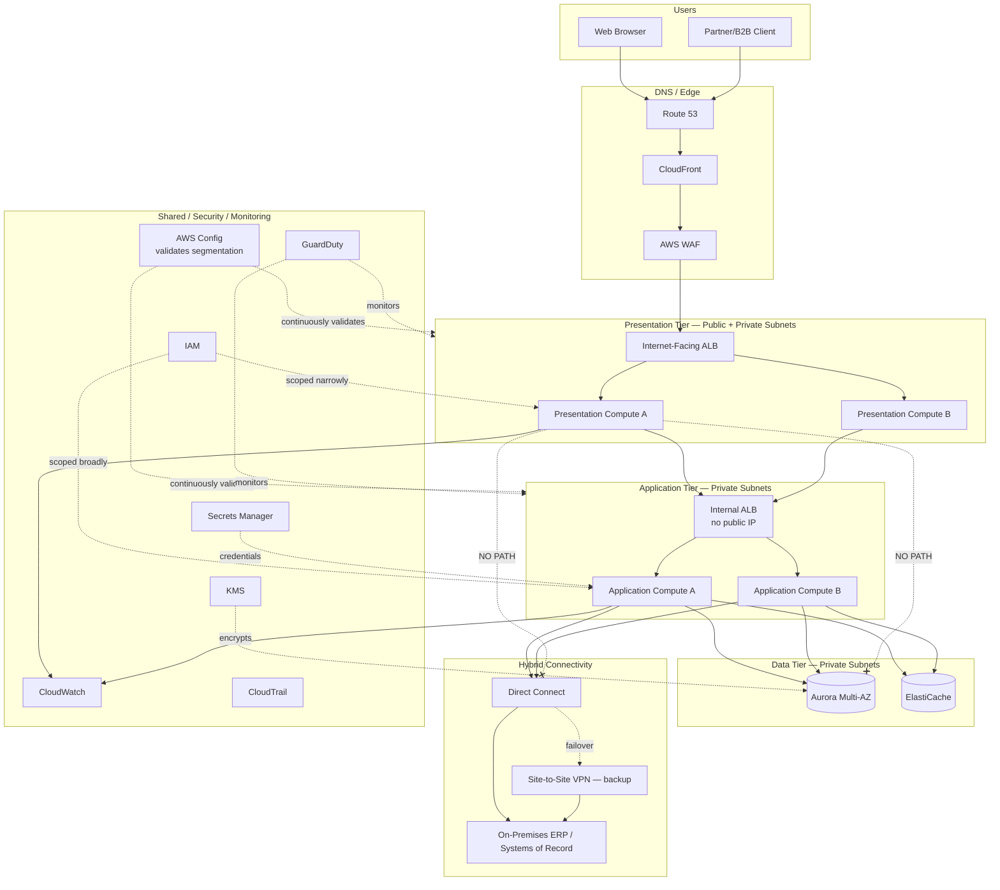
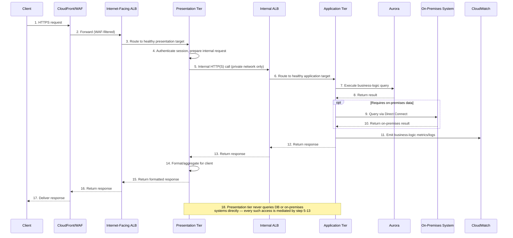
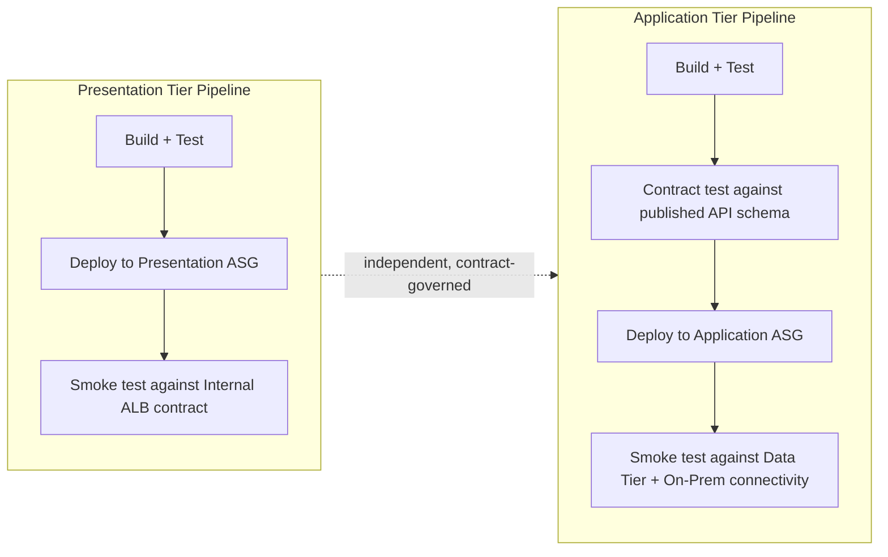

# Chapter 7 – Three-Tier Enterprise Architecture

> **Visual note:** This chapter uses Mermaid diagrams for architecture and sequence flows, and Markdown tables for comparisons, cost estimates, and checklists. All Terraform and CLI examples are written against provider `hashicorp/aws >= 5.0` and AWS CLI v2. Where this chapter uses a service already introduced in Chapter 2 ("AWS Building Blocks") or Chapter 6 ("Highly Available Multi-AZ Web Application"), it re-explains that service briefly on first use so the chapter remains self-contained.

---

# 1 Executive Summary

The three-tier architecture is the pattern most large enterprises actually run underneath whatever more fashionable label their architecture diagrams use. It predates the cloud by decades — presentation logic, business logic, and data persistence separated into three distinct layers, each independently scalable, independently securable, and independently owned — and it survives in the cloud era not out of institutional inertia but because the separation of concerns it enforces remains exactly as valuable in 2026 as it was when it was first formalized for client-server computing. Chapter 6 of this book presented a highly available, Multi-AZ web application with a single compute tier sitting directly in front of the database. This chapter extends that pattern into a genuine three-tier design — a distinct presentation/web tier, a distinct application/business-logic tier, and a distinct data tier — separated not just conceptually but by real network boundaries, real security groups, and, frequently in large enterprises, real organizational ownership boundaries between the teams responsible for each tier.

**The business problem.** Enterprises with substantial existing application portfolios, internal compliance functions, and often a mix of legacy and modern systems face a problem that a simpler two-tier (web-plus-database) design does not adequately solve: the presentation layer and the business logic layer have different security exposure, different scaling characteristics, and often different ownership. A public-facing web tier is the system's actual attack surface and needs to be treated, architecturally, as a hostile-adjacent zone — hardened, monitored, and rate-limited more aggressively than anything behind it. Business logic, meanwhile, frequently needs to integrate with internal systems (an on-premises ERP, a mainframe-adjacent service, an internal identity provider) that should never be directly reachable from the public internet-facing tier under any circumstances, even if the web tier were fully compromised. Collapsing these concerns into a single application tier, as Chapter 6's simpler pattern does, is entirely appropriate for a self-contained SaaS application — but it is architecturally insufficient for the specific risk profile of a large enterprise with internal system integration requirements, stricter regulatory segmentation mandates, and organizational structures that expect (and often require, for audit purposes) a clean separation between "the part of the system the internet can reach" and "the part of the system that touches internal data of record."

**The architecture objective.** This chapter's objective is to formalize genuine tier separation as an architectural and security control, not merely a code-organization convention. Concretely: the presentation tier terminates public traffic and contains no direct database connectivity or business logic of consequence; the application tier contains all business logic and is the only tier permitted to reach the data tier or internal enterprise systems; the data tier is reachable only from the application tier, never from the presentation tier or the public internet under any configuration. Each tier scales independently according to its own load characteristics (the presentation tier often needs to scale faster and more aggressively than the application tier, since it absorbs the initial brunt of any traffic spike or attack), and each tier can be developed, deployed, and — critically for a large enterprise — audited independently.

**Why organizations adopt this architecture.** Three forces drive enterprises toward formal three-tier separation specifically, beyond the general Multi-AZ availability drivers covered in Chapter 6. First, **regulatory and audit requirements** in financial services, healthcare, insurance, and government sectors frequently mandate documented network segmentation between internet-facing and internal-data-touching infrastructure as an explicit control, not a best practice suggestion — PCI-DSS's network segmentation requirements are a direct example, and three-tier separation is the most straightforward way to satisfy them cleanly. Second, **hybrid connectivity requirements**: enterprises migrating incrementally from on-premises systems need an application tier that can reach both AWS-native services and on-premises systems via Direct Connect or VPN, while keeping that connectivity entirely out of reach of the public-facing presentation tier — collapsing tiers would mean the internet-facing layer sits on the same network segment as the path to internal systems, an unacceptable risk. Third, **organizational structure**: many large enterprises have separate teams (sometimes separate vendors or separate cost centers) responsible for front-end/presentation concerns versus core business logic versus the systems of record — the architecture needs to reflect and enforce that organizational boundary technically, not just informally.

**Major business benefits.** 

1. **Defense in depth as a structural property, not a policy.** An attacker who compromises the presentation tier gains no direct path to the data tier or internal systems — they must additionally compromise the application tier, which sits behind its own network boundary, its own security group rules, and typically its own, more restrictive IAM permissions. This is a fundamentally stronger security posture than a two-tier design, where compromising the single compute tier is sufficient to reach the database directly.
2. **Independent scaling reduces both cost and risk.** The presentation tier, which handles raw request volume including a meaningful share of bot traffic, scanning, and attack attempts, can scale aggressively and cheaply (often on lightweight, stateless compute) without that scaling driving unnecessary scale-out of the more expensive, business-logic-heavy application tier.
3. **Cleaner audit and compliance evidence.** When an auditor asks "show me that your public-facing infrastructure cannot reach your systems of record directly," a three-tier architecture with explicit network boundaries between tiers is a straightforward, visual, verifiable answer — a two-tier design forces a more complicated explanation involving application-layer controls that are harder to independently verify.
4. **Supports genuine team and vendor separation.** A large enterprise can have one team (or an external agency) own the presentation tier's user experience and front-end code while a separate, more tightly access-controlled team owns the application tier's business logic and data access — the network architecture enforces this separation technically rather than relying purely on code review discipline.

**Typical enterprise scenarios.** This pattern recurs specifically in: large enterprise customer portals where the front-end is developed with more frequent release cadence and by a larger, less security-cleared team than the back-end business logic; internal enterprise applications (HR systems, procurement portals, claims processing systems) that must integrate with on-premises systems of record while still being reachable by employees or partners over the internet or a corporate VPN; regulated industry customer-facing applications (banking, insurance, healthcare) where network segmentation between internet-facing and internal-data-touching tiers is an explicit, audited compliance control; and any application undergoing incremental modernization from a legacy on-premises three-tier deployment, where preserving the tier boundary during the cloud migration meaningfully reduces both migration risk and the scope of what needs to be re-architected simultaneously. What unites these scenarios is not necessarily higher traffic than Chapter 6's pattern — a three-tier architecture is not primarily a scaling optimization — but a genuine need for the specific security and organizational boundary that only real tier separation provides. Where that need doesn't exist, Section 28 of this chapter is explicit that Chapter 6's simpler two-tier pattern is the more appropriate, lower-complexity choice.

---

# 2 Business Requirements

## Business Drivers

| Driver | Description |
|---|---|
| Regulatory network segmentation | PCI-DSS, and internal enterprise security policy frequently mandate explicit segmentation between internet-facing and internal-data-touching infrastructure |
| Hybrid/on-premises integration | Application tier must reach on-premises systems of record without exposing that connectivity to the public-facing tier |
| Organizational/vendor separation | Distinct teams own presentation vs. business-logic vs. data concerns, requiring technical enforcement of the boundary |
| Independent scaling economics | Presentation tier absorbs the majority of raw traffic/attack volume and should scale independently of the more expensive application tier |
| Modernization continuity | Enterprises migrating from legacy on-premises three-tier deployments preserve a familiar, auditable tier structure during migration |

## Functional Requirements

- Terminate all public HTTP(S) traffic at a presentation tier with no direct database or internal-system connectivity.
- Route validated, authenticated requests from the presentation tier to an internal application tier over a private network path only.
- Execute all business logic, data validation, and internal-system integration exclusively within the application tier.
- Persist transactional data in a data tier reachable only from the application tier.
- Support hybrid connectivity from the application tier to on-premises systems via Direct Connect or Site-to-Site VPN, with no such connectivity reachable from the presentation tier.

## Non-Functional Requirements

| Category | Requirement |
|---|---|
| Security segmentation | No security group, route table, or NACL configuration may permit direct presentation-tier-to-data-tier or presentation-tier-to-on-premises connectivity, under any circumstance |
| Performance | p95 latency under 300ms end-to-end (accounting for the additional internal hop versus Chapter 6's two-tier design) |
| Availability | 99.95% monthly uptime target, consistent with the Tier 1 classification from Chapter 2, Section 2 |
| Auditability | Network segmentation between tiers must be demonstrable via AWS Config rules and documented architecture, independent of application-layer controls |
| Maintainability | Each tier independently deployable without requiring a coordinated release across all three |

## Scalability Goals

The presentation tier should scale independently and more aggressively than the application tier — a representative target is presentation-tier capacity sized for 3-5x the application tier's effective throughput, reflecting the reality that a meaningful share of presentation-tier traffic (bot scanning, malformed requests, legitimate but non-business-logic-triggering traffic like health checks and asset requests) never reaches the application tier at all.

## Availability Requirements

Consistent with Chapter 6's Tier 1 framework: 99.95% monthly uptime target (~21.5 minutes/month allowed downtime), with the added architectural consideration that an outage in either the presentation tier or the application tier independently constitutes a full application outage — the tiers are not independently useful, and both must individually meet the same availability bar, not an averaged or combined one.

## Latency Requirements

| Path | Latency Budget |
|---|---|
| Client → Presentation tier (edge) | Under 100ms (CDN-cached where applicable) |
| Presentation tier → Application tier (internal hop) | Under 20ms (same-region, private networking) |
| Application tier → Data tier | Under 10ms (same-AZ where possible, cross-AZ for the standby path) |
| Application tier → On-premises system (hybrid calls) | Highly variable — must be explicitly budgeted per integration, typically 50-200ms via Direct Connect |
| **Total end-to-end (interactive request, no on-premises call)** | **Under 300ms p95** |

## Compliance Requirements

This architecture is frequently the direct implementation vehicle for PCI-DSS Requirement 1 (network segmentation) when payment-adjacent data is involved, SOC 2's logical access and network security criteria, and, for insurance/healthcare enterprises, HIPAA's technical safeguards around system segmentation. Internal enterprise security policy in regulated industries frequently goes further than external compliance frameworks strictly require, mandating three-tier segmentation as an internal standard regardless of whether a specific external framework technically requires it for a given application.

## Security Expectations

Beyond the general expectations established in Chapter 6, Section 2: the presentation tier must be treated as operating in a semi-trusted zone (able to reach the application tier, but never trusted with direct data access or internal-system credentials); the application tier holds the only IAM permissions and network paths capable of reaching sensitive data or internal systems; and any credential or secret used for on-premises integration must be scoped exclusively to the application tier's compute identity, never present in the presentation tier under any circumstance, including in shared configuration or logging.

## Recovery Objectives

| Objective | Target |
|---|---|
| RPO | Under 5 minutes (data tier, consistent with Chapter 6) |
| RTO — presentation or application tier failure | Under 15 minutes (independent tier-level automated recovery) |
| RTO — data tier failure | Under 30 seconds to a few minutes (Aurora Multi-AZ, per Chapter 6) |
| RTO — hybrid connectivity path failure (Direct Connect) | Under 5 minutes (automatic failover to backup VPN path, see Section 9) |

## SLAs

Consistent with Chapter 6's Tier 1 framework, with an additional internal SLA frequently established between the teams owning each tier — for example, the application tier team commits to a specific p99 internal-API response time to the presentation tier team, formalizing what would otherwise be an informal, undocumented dependency between two organizationally separate teams.

## Expected Workload and Growth

A representative large-enterprise deployment: presentation tier baseline 200-800 requests/second (including a meaningful share of non-business traffic — health checks, bot activity, static asset requests before CDN offload), application tier baseline 100-400 requests/second (reflecting genuine business-logic-triggering traffic after the presentation tier filters and aggregates), data volume in the hundreds of GB to low TB range typical of an established enterprise system of record, and 12-month growth projections in the 2-4x range typical of a mature enterprise application rather than a hypergrowth startup — this architecture's complexity is justified by segmentation and organizational requirements more than by extreme scale, and its growth profile should be read accordingly.

---

# 3 Architecture Overview

## Overall Design Philosophy

This architecture applies one additional principle on top of the Chapter 6 foundation: **the network topology must make tier boundaries structurally impossible to bypass**, not merely discouraged by convention. Where Chapter 6 uses a public/private subnet split with a single private application tier, this chapter introduces a third subnet tier and a second, internal-facing load balancer, so that the presentation tier's only network path to anything beyond itself is through that internal load balancer to the application tier — there is no security group rule, no route table entry, anywhere in the design that would allow the presentation tier to reach the data tier or any on-premises system directly.

## Core Components

- **Presentation tier:** Public subnets and a first private subnet tier hosting a stateless web/presentation layer (increasingly, a modern single-page application served from CloudFront/S3, with a thin server-side presentation layer for server-rendered pages or BFF — backend-for-frontend — API aggregation), fronted by an internet-facing ALB.
- **Internal load balancer:** A second, internal-facing ALB (or NLB, depending on protocol needs) sitting between the presentation tier and the application tier — this is the architectural element that most concretely distinguishes a genuine three-tier design from a two-tier design with an extra code layer.
- **Application tier:** A second private subnet tier hosting the business-logic compute fleet, the only tier with IAM permissions and network reachability to the data tier and any on-premises integration.
- **Data tier:** A third private subnet tier (as in Chapter 6), reachable only from the application tier.
- **Hybrid connectivity:** Direct Connect (primary) or Site-to-Site VPN (backup or sole method for lower-throughput needs), terminating into the application tier's subnets only.
- **Security and identity, monitoring:** The same categories of service as Chapter 6 (IAM, KMS, Secrets Manager, GuardDuty/Security Hub/Config, CloudWatch/X-Ray/CloudTrail), applied per-tier with materially different permission scopes between the presentation and application tiers specifically.

## How Components Interact

Public traffic reaches the internet-facing ALB and the presentation tier compute fleet. The presentation tier, upon receiving a request that requires business logic or data access, makes an internal HTTP(S) call to the internal-facing ALB, which routes to the application tier. The application tier executes business logic, reaches the data tier and (where applicable) on-premises systems via the hybrid connectivity path, and returns a response to the presentation tier, which formats and returns the final response to the client. Critically, the presentation tier never queries the database directly and never initiates a hybrid-connectivity call directly — every such interaction is mediated by the application tier, which is the only tier holding the relevant IAM permissions and network route.

## High-Level Workflow

**Request lifecycle:** DNS/CDN/WAF (as in Chapter 6) → internet-facing ALB → presentation tier → internal-facing ALB → application tier → data tier and/or on-premises system → response propagates back through the same path in reverse.

**Response lifecycle:** The application tier's response returns to the presentation tier, which may apply additional formatting, aggregation of multiple internal calls (a common BFF pattern), or client-specific transformation, before returning through the internet-facing ALB and CDN to the client.

**Data lifecycle:** Identical in principle to Chapter 6's data lifecycle (synchronous Multi-AZ replication, encrypted at rest, backed up per RPO tier), with the addition that some data may originate from or be synchronized with an on-premises system of record via the application tier's hybrid connectivity path — a data flow that, by design, the presentation tier has no visibility into or ability to trigger directly.

---

# 4 AWS Services Used

## Amazon EC2 / ECS Fargate (Presentation Tier)

**Purpose:** Runs the stateless presentation/web layer — server-side rendering, BFF API aggregation, or a thin proxy layer in front of a CloudFront/S3-hosted single-page application.

**Why selected:** The presentation tier's workload profile (high request volume, low per-request compute cost, minimal state) makes it a strong candidate for ECS Fargate or even Lambda in many modern implementations, distinct from the application tier's typically heavier, more stateful compute needs. This chapter presents both tiers as EC2/ASG-based for consistency with Chapter 6's patterns and to keep the network-segmentation focus of this chapter clear, but explicitly calls out where Fargate or Lambda is often the better real-world choice specifically for the presentation tier.

**Alternatives:** Lambda behind API Gateway (excellent fit if the presentation tier is a thin BFF layer with no long-running state); ECS Fargate (good middle ground); CloudFront + S3 alone (if the presentation tier is a pure static SPA with no server-side aggregation needs at all, in which case there may be no presentation-tier compute whatsoever, and the internal ALB is called directly from client-side JavaScript through a scoped API path — a valid variant discussed further in Section 28).

**Limitations:** Whichever compute model is chosen, the presentation tier's IAM role must be deliberately, aggressively scoped to exclude any data-tier or on-premises-system access — this is a discipline requirement, not a technical limitation of the service itself, but it is the single most consequential configuration decision for this tier.

## Amazon EC2 / ECS Fargate (Application Tier)

**Purpose:** Runs all business logic, data validation, and internal/on-premises system integration.

**Why selected:** Consistent with Chapter 6's compute selection guidance — EC2 Auto Scaling for teams with strong AMI/OS operational maturity, ECS Fargate for containerized teams wanting reduced OS management burden. The specific consideration this chapter adds: the application tier's compute model should support long-lived connections to on-premises systems (persistent database-style connections, message queue consumers) more comfortably than a purely request-scoped Lambda model typically does, which is one reason the application tier in enterprise three-tier designs skews toward EC2/Fargate even in organizations otherwise comfortable with serverless for simpler workloads.

## Application Load Balancer — Internet-Facing and Internal (Two Distinct ALBs)

**Purpose:** Two separate ALB deployments — one internet-facing, routing public traffic to the presentation tier; one internal-facing, routing presentation-tier-to-application-tier traffic — rather than the single ALB used in Chapter 6's two-tier design.

**Why selected:** This is the single most architecturally significant service decision in this chapter. An internal ALB (created with `internal = true` in Terraform, meaning it has no public IP and is only reachable from within the VPC) is what makes the application tier genuinely unreachable from the public internet even if every other control failed — it is a structural, not merely a policy-based, boundary. Using a single ALB with path-based routing to "simulate" tier separation (a pattern this chapter explicitly treats as an anti-pattern in Section 27) does not provide this guarantee, because it relies entirely on application-layer routing logic remaining correctly configured rather than on network topology.

**Alternatives:** Internal NLB instead of internal ALB, if the presentation-to-application protocol is not HTTP(S) or requires ultra-low-latency Layer 4 routing; API Gateway (private) as the internal entry point, if the application tier is itself decomposed into multiple internally-routed API services rather than a single monolithic application tier — a pattern more common in the microservices evolution discussed in Section 34.

**Best practices:** The internal ALB's security group should permit inbound traffic only from the presentation tier's security group, exactly mirroring the tier-separation discipline established in Chapter 6, Section 9, but applied one layer earlier in the request path than that chapter's design required.

## AWS Direct Connect and Site-to-Site VPN

**Purpose:** Private, non-internet connectivity between the application tier's VPC and on-premises enterprise systems.

**Why selected:** Direct Connect is selected over VPN as the primary hybrid connectivity path when the integration has meaningful, sustained throughput requirements or requires more consistent, predictable latency than VPN over the public internet reliably provides — common for enterprise integrations with an on-premises ERP, mainframe-adjacent middleware, or a high-volume internal data synchronization job. Site-to-Site VPN serves as either the sole hybrid connectivity method for lower-throughput integrations, or as an automatic backup path if the primary Direct Connect link fails.

**Limitations:** Direct Connect requires physical circuit provisioning lead time (often measured in weeks), which should be planned for early in any project timeline involving this architecture — a common, costly planning mistake is treating Direct Connect provisioning as a "just another Terraform resource" that can be stood up on the same timeline as the rest of the AWS infrastructure.

**Best practices:** Terminate Direct Connect and VPN connectivity exclusively into the application tier's route tables — never extend a route from the presentation tier's route table toward the Direct Connect virtual interface or VPN gateway, even as a "temporary" convenience, since this is precisely the kind of configuration drift that defeats the architecture's core security property.

## Amazon Aurora / RDS, ElastiCache, S3

Covered in depth in Chapter 2 and applied specifically to a Multi-AZ design in Chapter 6; this chapter's data tier is architecturally identical to Chapter 6's, differing only in that it is reachable exclusively from the application tier (never the presentation tier) — a distinction enforced at the security-group and subnet level described in Section 9.

## IAM, KMS, Secrets Manager

Covered generally in Chapter 2 and Chapter 6; this chapter's specific application is the deliberately asymmetric permission scoping between the presentation and application tiers described in Section 10 — the presentation tier's IAM role should, in a correctly implemented instance of this architecture, have essentially no permissions beyond basic CloudWatch logging and metrics, while the application tier's role holds everything needed for data access and on-premises integration.

## CloudWatch, CloudTrail, GuardDuty, AWS Config

As in Chapter 6, with this chapter's specific addition: AWS Config rules that continuously validate the tier-segmentation property itself (Section 11) — verifying, for example, that no security group attached to a presentation-tier resource has a rule permitting direct reachability to the data-tier security group — turning the architecture's core security claim into something continuously, automatically verified rather than asserted once at design time and never re-checked.

## Compute and Load Balancer Decision Matrix for This Architecture

| Factor | Presentation Tier | Application Tier |
|---|---|---|
| Typical compute model | Fargate or Lambda (often), EC2 (this chapter's reference) | EC2 or Fargate (long-lived connections favor these over Lambda) |
| IAM permission scope | Minimal — logging/metrics only | Broad within its domain — data tier, secrets, on-premises integration |
| Load balancer | Internet-facing ALB | Internal-facing ALB (no public IP) |
| Typical scaling trigger | Raw request volume, including non-business traffic | Business-logic-triggering request volume only |
| State | Fully stateless | Fully stateless (business logic), though may hold connection pools to data tier/on-premises systems |
| Network reachability | Public internet inbound; application tier outbound only | Presentation tier inbound only; data tier and on-premises systems outbound |

---

# 5 Complete Architecture Diagram



**Diagram interpretation:** The two `-.NO PATH.-x` edges are drawn deliberately — they represent connections that must never exist in the actual security group and route table configuration, shown here specifically to make the architecture's core negative security property visible in the diagram itself, not just described in prose. Every legitimate path from the presentation tier to the data tier or on-premises systems passes through the internal ALB and the application tier; there is no shortcut.

---

# 6 Component-by-Component Explanation

| Component | Purpose | Scaling | High Availability | Failure Handling | Dependencies |
|---|---|---|---|---|---|
| Internet-Facing ALB | Public traffic entry point for the presentation tier | Automatic | Multi-AZ by default | Removes unhealthy presentation targets | Presentation tier compute |
| Presentation Tier Compute | Renders/aggregates responses, terminates public traffic, no direct data access | Aggressive target-tracking, often on raw request count | Multi-AZ Auto Scaling | ASG replaces failed instances; internet-facing ALB reroutes | Internal ALB, minimal IAM (logging only) |
| Internal ALB | Routes presentation-tier traffic to the application tier; not publicly reachable | Automatic | Multi-AZ by default | Removes unhealthy application targets | Application tier compute, presentation-tier security group as sole permitted source |
| Application Tier Compute | Executes business logic, data access, on-premises integration | Target-tracking on business-logic-relevant metrics | Multi-AZ Auto Scaling | ASG replaces failed instances; internal ALB reroutes | Data tier, Secrets Manager, Direct Connect/VPN, broader IAM scope |
| Aurora (Data Tier) | Transactional data store | Read replicas | Multi-AZ synchronous replication | Automated failover (Chapter 6, Section 12) | KMS, application-tier security group as sole permitted source |
| Direct Connect | Primary hybrid connectivity to on-premises systems | Fixed circuit capacity — plan ahead (Section 4) | Can be provisioned with redundant circuits for HA | VPN automatic backup path | On-premises router configuration, application-tier route table |
| AWS Config (segmentation rules) | Continuously validates that tier-boundary security properties hold | N/A (continuous evaluation) | Regional, highly durable | Non-compliant resource flagged and optionally auto-remediated | CloudTrail, resource configuration history |

---

# 7 End-to-End Request Flow



**Step-by-step narrative:** Steps 1-4 mirror Chapter 6's request path up through the presentation tier. Step 5 is the architecturally significant step this chapter adds: the presentation tier makes an *internal* call, over private networking only, to the internal ALB — this call should use the same rigor (timeouts, retries, circuit breaking) an application would apply to any external dependency, since from the presentation tier's perspective, the application tier genuinely is a separate, independently-failing service. Steps 6-10 execute entirely within the application tier's trust boundary, including the optional on-premises system call in step 9-10, which the presentation tier has no visibility into and cannot trigger directly under any circumstance. Step 18's note is worth internalizing as the architecture's single load-bearing invariant: if any future change (a "quick fix," a misconfigured security group, a well-intentioned but incorrect optimization) ever creates a direct presentation-tier-to-data-tier or presentation-tier-to-on-premises path, the entire security rationale for this architecture over Chapter 6's simpler pattern evaporates — this is precisely why Section 11's continuous AWS Config validation of this property is not optional tooling but a core control.

---

# 8 Deployment Flow

## Independent Tier Deployment

Unlike Chapter 6's single-fleet deployment pipeline, this architecture supports — and, given the organizational drivers from Section 1, frequently requires — independent deployment pipelines per tier. The presentation tier, often owned by a front-end-focused team with a faster release cadence, deploys independently of the application tier, provided the internal API contract between them (versioned, and ideally governed by a schema/contract-testing discipline) remains backward-compatible.



## Terraform Workflow

Identical process to Chapter 2/Chapter 6 (`fmt`/`validate` → PR → CI `plan` → review → merge → CI `apply`), typically organized as separate Terraform state files/workspaces per tier in a large enterprise implementation of this pattern — this both matches the independent-ownership model from Section 1 and limits the blast radius of a `terraform apply` in one tier's configuration from being able to accidentally affect another tier's resources.

## Blue-Green Deployment Per Tier

Each tier independently supports the blue-green deployment pattern from Chapter 6, Section 8. A meaningful operational nuance specific to this architecture: a presentation-tier blue-green cutover and an application-tier blue-green cutover happening concurrently should be avoided or very carefully coordinated, since debugging an issue that emerges during simultaneous dual-tier deployment is significantly harder than isolating an issue to a single tier's change.

## Rollback and API Contract Versioning

Because the presentation and application tiers deploy independently, the internal API contract between them must be treated with the same discipline as a public API contract — a breaking change to the application tier's internal API cannot be deployed until the presentation tier has been updated to handle it, or the application tier must support both the old and new contract simultaneously during a transition window (API versioning on the internal ALB's path routing, or a header-based version negotiation scheme).

## Secrets, Configuration, and the Tier Boundary

Consistent with the IAM scoping principle from Section 4: the presentation tier's deployment pipeline and runtime configuration should contain no database credentials, no on-premises system credentials, and no Direct Connect/VPN configuration details whatsoever — not even in an unused, dormant configuration file. The application tier's deployment pipeline holds all of this. A configuration audit that finds any data-tier or on-premises credential reference anywhere in the presentation tier's codebase or deployed configuration is a finding that should block deployment, not a note for later cleanup.

## Validation

Beyond Chapter 6's general post-deployment validation, this architecture's validation should explicitly include a check that the presentation tier's deployed configuration and IAM role have not drifted toward broader permissions than intended (a common, gradual failure mode — see Section 34's Production Pitfalls) and that the internal ALB's security group continues to permit traffic only from the presentation tier's current security group, not a broader or stale rule.

---

# 9 Network Topology

## Subnet Design for This Architecture

This architecture extends Chapter 6's three-subnet-tier (public/app/data) design to four subnet tiers across each Availability Zone:

| Subnet Tier | AZ-a | AZ-b | AZ-c | Purpose |
|---|---|---|---|---|
| Public | 10.0.0.0/24 | 10.0.1.0/24 | 10.0.2.0/24 | Internet-facing ALB, NAT Gateway |
| Private — Presentation | 10.0.10.0/24 | 10.0.11.0/24 | 10.0.12.0/24 | Presentation-tier compute, internal ALB |
| Private — Application | 10.0.20.0/24 | 10.0.21.0/24 | 10.0.22.0/24 | Application-tier compute |
| Private — Data | 10.0.30.0/24 | 10.0.31.0/24 | 10.0.32.0/24 | Aurora, ElastiCache |

> **Note:** The internal ALB is placed in the presentation subnet tier (reachable from presentation-tier compute) but could equally be placed in its own dedicated subnet tier in a very large enterprise implementation wanting an additional layer of routing/NACL control specifically around that boundary. This chapter's reference design keeps it in the presentation tier for simplicity; Section 34 discusses when the added subnet tier is worth the additional complexity.

## Route Tables

Each subnet tier has its own route table, and — this is the specific, load-bearing detail for this architecture — **the presentation-tier route table has no route toward the data-tier subnets, the Direct Connect virtual interface, or the VPN gateway.** Only the application-tier route table includes those routes. This is what makes the "NO PATH" property in Section 5's diagram a network-layer fact rather than merely a security-group-enforced convention — even if a future security group change were misconfigured, the presentation tier would still have no *route* to reach the data tier or on-premises systems, a second, independent layer of the same control.

## Security Groups

| Security Group | Inbound | Outbound | Attached To |
|---|---|---|---|
| `ext-alb-sg` | 443 from 0.0.0.0/0 | To `presentation-sg` only | Internet-facing ALB |
| `presentation-sg` | App port from `ext-alb-sg` only | To `int-alb-sg` and internet via NAT (CDN/asset calls only — no on-prem or data-tier destinations) | Presentation-tier compute |
| `int-alb-sg` | App port from `presentation-sg` only | To `application-sg` only | Internal ALB |
| `application-sg` | App port from `int-alb-sg` only | To `data-sg`, `cache-sg`, and the Direct Connect/VPN route | Application-tier compute |
| `data-sg` | DB port from `application-sg` only | None | Aurora cluster |

> **Warning:** A specific, observed enterprise anti-pattern is adding a "temporary" security group rule allowing `presentation-sg` to reach `data-sg` directly, typically introduced during an urgent debugging session and never removed. Because this defeats the architecture's entire purpose, this specific rule pattern should be an explicit, named check in the AWS Config custom rule set (Section 11) and in the CI/CD policy-as-code gate (Section 20) — not something relying purely on manual review to catch.

## Transit Gateway (For Multi-VPC Enterprise Environments)

Large enterprises implementing this architecture across multiple business units or environments (dev/staging/prod, or multiple applications sharing hybrid connectivity infrastructure) typically centralize Direct Connect and VPN termination in a dedicated "network" or "connectivity" VPC, connected to each application's VPC via Transit Gateway — rather than provisioning a separate Direct Connect virtual interface per application VPC. This is a direct application of the Transit Gateway pattern from Chapter 2, Section 9, with the specific addition here that Transit Gateway route tables should enforce that only application-tier subnets (never presentation-tier subnets) have a route to the shared connectivity VPC at all — segmentation enforced centrally, not per-application.

## VPC Endpoints and PrivateLink

As in Chapter 6, Gateway endpoints for S3 and Interface endpoints for Secrets Manager/KMS reduce NAT Gateway reliance. This chapter adds a specific consideration: these endpoints should be provisioned in the application tier's subnets (where the actual Secrets Manager/KMS calls originate, given the IAM scoping from Section 10) — provisioning them in the presentation tier's subnets as well is usually unnecessary, since the presentation tier should have minimal-to-no direct AWS service calls requiring them.

## Hybrid Connectivity Detail

| Element | Configuration |
|---|---|
| Primary path | AWS Direct Connect, terminating via a Direct Connect Gateway into the application tier's VPC (or the shared connectivity VPC, per the Transit Gateway pattern above) |
| Backup path | Site-to-Site VPN, configured with a higher BGP route priority number (lower preference) so Direct Connect is preferred when healthy |
| Failover behavior | BGP route withdrawal on Direct Connect failure automatically shifts traffic to the VPN path within the RTO target from Section 2 |
| Monitoring | CloudWatch metrics on the Direct Connect connection (`ConnectionState`, `ConnectionBpsEgress/Ingress`) and VPN tunnel state, alarmed independently |

---

# 10 Identity and Access

## Asymmetric IAM Scoping Between Tiers

The defining IAM characteristic of this architecture, beyond Chapter 6's general least-privilege guidance, is the deliberate, large asymmetry between the presentation tier's and application tier's permission scope:

| Role | Attached To | Permission Scope |
|---|---|---|
| Presentation-tier instance role | Presentation compute | CloudWatch `PutMetricData`/`PutLogEvents` only. No Secrets Manager, no S3 beyond (at most) reading its own static configuration, no database or on-premises access of any kind. |
| Application-tier instance role | Application compute | Secrets Manager (data-tier and on-premises credentials), S3 (application data as needed), DynamoDB/Aurora access, CloudWatch, and any additional AWS service the business logic genuinely requires |
| Deployment pipeline role (presentation) | CI/CD | Scoped to presentation-tier ASG/launch template/CodeDeploy resources only |
| Deployment pipeline role (application) | CI/CD | Scoped to application-tier ASG/launch template/CodeDeploy resources, and — if managed via IaC in the same pipeline — Direct Connect/VPN configuration resources |

## Verifying the Asymmetry, Not Just Designing It

A design review approving this architecture should require evidence, not just a stated intention, that the presentation-tier role's permission boundary genuinely excludes data-tier and on-premises access — `aws iam simulate-principal-policy` against the presentation-tier role, tested against the specific actions (e.g., `secretsmanager:GetSecretValue` on the application's database secret ARN) that should be denied, is a concrete verification step worth running as part of every architecture review and, ideally, as an automated CI check against the role's Terraform-defined policy.

## Permission Boundaries

Given the asymmetry above, a permission boundary attached to the presentation-tier role — capping its maximum possible permissions regardless of any future policy attached to it — is a particularly valuable defense-in-depth control for this specific tier, since the presentation tier is both the most likely target of compromise (it is, by design, the internet-facing surface) and the tier whose permissions should never legitimately expand to include data-tier or on-premises access.

## Cross-Account Considerations

In enterprises where presentation-tier and application-tier ownership genuinely spans separate organizational units, it is not uncommon for each tier to be deployed into its own AWS account (connected via the network topology in Section 9, e.g., through Transit Gateway or VPC peering), with the account boundary itself serving as an additional, IAM-independent enforcement mechanism for the tier separation. This is a natural extension of the single-VPC pattern presented in this chapter's reference design, appropriate once organizational separation between the tiers is genuinely at the account-ownership level rather than merely the team level within a shared account.

## Example: Presentation-Tier IAM Policy (Deliberately Minimal)

```json

{
  "Version": "2012-10-17",
  "Statement": [
    {
      "Sid": "LoggingAndMetricsOnly",
      "Effect": "Allow",
      "Action": [
        "cloudwatch:PutMetricData",
        "logs:CreateLogStream",
        "logs:PutLogEvents"
      ],
      "Resource": "*",
      "Condition": {
        "StringEquals": { "cloudwatch:namespace": "AcmeThreeier/Presentation" }
      }
    }
  ]
}

```

Note what is absent: no `secretsmanager:*`, no `dynamodb:*`/`rds:*`, no `s3:*` beyond what's explicitly needed for static configuration (and even that is often better served by baking configuration into the deployment artifact rather than granting any S3 read permission at all). This is the concrete, auditable evidence of the tier-separation claim this entire architecture is built around.

---

# 11 Security Architecture

## Encryption

Consistent with Chapter 6: KMS encryption at rest for Aurora, ElastiCache, and S3; TLS 1.2+ enforced at both the internet-facing ALB and, importantly, the **internal** ALB as well — internal traffic being "inside the VPC" is not a reason to skip TLS in this architecture, particularly given the Zero Trust principle established in Chapter 2 and the specific value of encrypting the presentation-to-application hop given that hop crosses a genuine trust boundary (from a semi-trusted, internet-facing tier to a more trusted, data-touching tier).

## WAF and Shield

Applied at the internet-facing ALB exactly as in Chapter 6. This chapter adds a specific consideration: because the presentation tier itself is designed to hold no sensitive data or direct data-tier access, a WAF rule bypass or presentation-tier compromise, while still serious, has a meaningfully lower worst-case impact in this architecture than in Chapter 6's two-tier design — this is precisely the risk-reduction benefit the additional architectural complexity is purchasing, and is worth stating explicitly in any cost-benefit discussion with a review board (Section 34).

## AWS Config Rules Validating Segmentation

This chapter's most distinctive security control, beyond Chapter 6's general Config rule set: custom AWS Config rules (implemented via Config custom rules backed by a Lambda evaluator, or increasingly via native rule support) that specifically validate the tier-segmentation property:

- No security group attached to a presentation-tier resource permits inbound or outbound traffic to/from the `data-sg` security group.
- No presentation-tier subnet's route table contains a route to the Direct Connect virtual interface or VPN gateway.
- The internal ALB's security group permits inbound traffic only from the presentation-tier security group (not `0.0.0.0/0`, not a broader internal CIDR range).
- The presentation-tier IAM role's attached policies contain no `secretsmanager:GetSecretValue`, `rds:*`, or `dynamodb:*` actions.

These rules should be configured with automatic remediation where safe to do so (e.g., automatically removing an offending security group rule) or, at minimum, a high-severity Security Hub finding routed directly to the platform security team — this specific class of drift is exactly the kind of slow, well-intentioned erosion (see Section 34's Lessons Learned) that a point-in-time architecture review cannot catch on its own.

## GuardDuty, Inspector, Security Hub

Applied per-tier as in Chapter 6, with GuardDuty findings involving the presentation tier warranting a different, faster escalation path than findings involving the application tier, given the presentation tier's internet-facing exposure — a finding suggesting presentation-tier compromise should trigger an assumption that the application tier's boundary is now under active probing, even though the network segmentation should prevent it from being reached.

## Zero Trust Applied to This Architecture

This chapter is, in a meaningful sense, Zero Trust's network-segmentation principle applied concretely and structurally rather than left as an abstract goal: no implicit trust is extended from the presentation tier to the application tier merely because both are "inside the VPC" — the internal ALB, its own security group, and TLS on the internal hop all treat that boundary with the same rigor as the public-facing boundary, just with a different (application-tier-only) set of permitted callers.

## Threat Model for This Architecture

| Attack Vector | Specific Relevance | Mitigation |
|---|---|---|
| Presentation-tier compromise (RCE, SSRF, dependency vulnerability) | High likelihood given internet exposure | Network segmentation (Section 9) ensures compromise does not directly yield data-tier or on-premises access; minimal IAM permissions (Section 10) limit lateral movement via AWS APIs |
| Configuration drift reintroducing a presentation-to-data-tier path | The single most likely way this architecture's guarantee actually fails in practice | Continuous AWS Config validation (above), policy-as-code CI gates (Section 20) |
| Compromised Direct Connect/VPN credentials or misconfigured BGP | Exposes the on-premises integration path specifically | Restrict hybrid connectivity IAM/network configuration to the application tier only; monitor Direct Connect/VPN state changes as a security-relevant event, not just an availability one |
| Internal ALB accidentally made internet-facing during a Terraform change | A specific, observed misconfiguration risk given `internal = true` is a single boolean | AWS Config rule specifically checking `internal ALB` boolean state; policy-as-code check in CI (Section 20) |
| SSRF from the application tier reaching an unintended internal or on-premises endpoint | Relevant given the application tier's broader network reachability | Explicit allow-listing of on-premises destination endpoints at the security-group/NACL level, not open-ended reachability to the entire on-premises network |

---

# 12 High Availability

## AZ and Instance Failures

Identical mechanics to Chapter 6, Section 12, applied independently to both the presentation and application tiers: each tier's Auto Scaling Group spans the same set of AZs, each tier's ALB (internet-facing and internal, respectively) performs health-check-driven routing, and a single AZ's loss is absorbed automatically within both tiers simultaneously, without either tier's failure handling depending on the other's.

## Independent Tier Failure

This architecture introduces a failure mode Chapter 6's design does not have: **the application tier can fail independently of the presentation tier**, and the presentation tier must handle this gracefully rather than simply failing the entire request. The presentation tier's calls to the internal ALB should implement explicit timeouts, retries with backoff, and — for a mature implementation — a circuit breaker that fails fast with a degraded-but-informative response (rather than hanging until a client-side timeout) if the application tier is unreachable or unhealthy for a sustained period.

## Hybrid Connectivity Failures

A Direct Connect failure (physical circuit issue, provider-side outage) should fail over automatically to the Site-to-Site VPN backup path via BGP route withdrawal, as configured in Section 9. This failover is specific to this architecture (Chapter 6 has no hybrid connectivity to fail over) and should be included explicitly in this chapter's failure-testing regimen (Section 12's testing guidance below), not assumed to work correctly simply because it was configured once during initial setup.

## Load Balancing and Health Checks — Two Tiers, Two Configurations

| Health Check Parameter | Internet-Facing ALB (Presentation Tier) | Internal ALB (Application Tier) |
|---|---|---|
| Health check path | `/health` — lightweight, presentation-tier-only checks | `/health` — verifies data-tier and (optionally, with caution re: cost) on-premises connectivity |
| Healthy/unhealthy thresholds | 2-3 consecutive (Chapter 6 defaults) | 2-3 consecutive |
| Interval | 10-15 seconds | 10-15 seconds |

> **Tip:** The application tier's health check endpoint should verify data-tier connectivity but should generally avoid an active, real-time check of on-premises system health on every single health-check request — an on-premises system outage is a genuine, real degradation, but you generally do not want the application tier's own ALB to start removing otherwise-healthy targets from rotation purely because a downstream on-premises dependency is degraded, since that removes application-tier capacity precisely when careful, controlled degraded-mode handling (returning a clear error for the specific on-premises-dependent functionality, while continuing to serve everything else) is more valuable than removing the target entirely.

## Failover Testing for This Architecture

Beyond Chapter 6's Aurora and simulated-AZ-failure testing, this architecture's failure-testing regimen should specifically include: killing the internal ALB's connectivity (or scaling the application tier ASG to zero in a controlled staging test) to verify the presentation tier degrades gracefully rather than hanging or returning an unhelpful generic error; and a Direct Connect failover test (coordinated with the network/connectivity team, given the physical circuit involved) verifying the BGP failover to VPN actually completes within the RTO target from Section 2.

---

# 13 Disaster Recovery

## Scope: This Chapter's DR Boundary

As in Chapter 6, this chapter's default DR posture addresses AZ- and component-level failure automatically (Section 12) and addresses full regional failure via backup-and-restore, extended here to also account for the hybrid connectivity path. Organizations requiring faster regional recovery should layer the multi-region patterns from a later chapter onto this architecture's foundation, with the added complexity that hybrid connectivity itself typically needs a DR-region-specific Direct Connect or VPN path, provisioned and tested in advance — not an afterthought added during an actual regional failover event.

## Backup Strategy

Data-tier backup strategy is identical to Chapter 6, Section 13 (Aurora automated backups, AWS Backup cross-region copy). This chapter adds: presentation-tier and application-tier infrastructure should be reproducible from the same Terraform modules in a DR region (Section 18), and any on-premises-synchronized data that the application tier depends on should have its own, explicitly documented recovery approach — since restoring the AWS-side infrastructure alone does not restore on-premises system availability, and a DR runbook that only addresses the AWS side while implicitly assuming on-premises systems are unaffected is incomplete for this specific architecture.

## Regional Failover Runbook (Extended for Hybrid Connectivity)

1. Declare a regional disaster per the incident severity classification.
2. Provision DR-region infrastructure for all three tiers via Terraform (Section 18).
3. Restore the Aurora cluster from the latest cross-region snapshot.
4. **Establish DR-region hybrid connectivity** — activate the pre-provisioned backup Direct Connect circuit or VPN tunnel in the DR region (this step has no equivalent in Chapter 6 and should be rehearsed, not assumed to work on the first real attempt).
5. Validate application-tier connectivity to on-premises systems from the DR region specifically — a on-premises firewall or routing rule scoped only to the primary region's connectivity endpoint is a realistic, easy-to-miss gap.
6. Update Route 53 to point to the DR region's internet-facing ALB.
7. Validate end-to-end application health, including at least one on-premises-dependent code path, before fully committing traffic.
8. Communicate status per the incident communication plan.

## RPO/RTO for This Pattern

| Pattern | RPO | RTO |
|---|---|---|
| AZ failure (in-region, automated) | Near-zero | Under 30 seconds (data tier) to a few minutes (full tier evacuation) |
| Application-tier-only failure | N/A (stateless) | Under a few minutes (ASG replacement), presentation tier degrades gracefully in the interim |
| Direct Connect failure (automated VPN failover) | Zero (no data loss, connectivity path change only) | Under 5 minutes (BGP convergence) |
| Regional failure — backup-and-restore, including hybrid connectivity re-establishment | 1-24 hours (data), depends on DR-region connectivity readiness | 4-8 hours (longer than Chapter 6's equivalent, specifically due to hybrid connectivity re-establishment) |

> **Note:** The regional RTO for this architecture is honestly longer than Chapter 6's equivalent specifically because of the hybrid connectivity dependency — this should be stated plainly to stakeholders and auditors rather than implied to match Chapter 6's figure. Organizations with a genuinely low regional-RTO requirement for a hybrid-connected application should invest specifically in pre-provisioned, continuously-validated DR-region hybrid connectivity (effectively a pilot-light pattern applied to the network layer itself) rather than assuming the AWS-side infrastructure's fast provisioning time alone determines the overall RTO.

---

# 14 Scalability

## Independent Per-Tier Scaling

The defining scalability characteristic of this architecture, beyond Chapter 6's general Auto Scaling guidance: the presentation and application tiers scale on different triggers and to different degrees. The presentation tier commonly scales on raw `RequestCountPerTarget` or CPU, sized to absorb traffic bursts including non-business traffic; the application tier scales on a combination of its own request volume from the internal ALB and, where relevant, business-logic-specific custom CloudWatch metrics (e.g., queue depth for asynchronous work, or on-premises integration call latency as a signal of downstream saturation).

## Database and Cache Scaling

Identical to Chapter 6, Section 14 — Aurora read replicas, Serverless v2 evaluation at the next capacity review, ElastiCache cluster-mode horizontal scaling — since the data tier's design is unchanged by the introduction of the presentation/application tier split.

## Hybrid Connectivity as a Scaling Constraint

This architecture introduces a scaling dimension Chapter 6 does not have: **Direct Connect circuit bandwidth is a fixed capacity ceiling** that application-tier Auto Scaling cannot scale past. If application-tier growth increases on-premises integration call volume beyond the provisioned circuit's capacity, the fix is a circuit upgrade or an additional parallel circuit (both requiring the same physical-provisioning lead time discussed in Section 4), not an Auto Scaling policy change — this should be an explicit, tracked capacity planning input distinct from the AWS-side compute and database scaling reviewed at the standard capacity review cadence.

## Growth Path Beyond This Chapter's Design Envelope

As application-tier business logic grows in scope and complexity, the natural evolution (detailed further in Section 34) is decomposing the single application tier into multiple, independently-scaled internal services — at which point the internal ALB in this chapter's design is often replaced or supplemented by a private API Gateway or a service mesh providing more granular internal routing, and this chapter's two-tier-of-compute design becomes the microservices pattern covered in a later chapter of this book.

---

# 15 Performance Optimization

## The Additional Internal Hop's Performance Cost

This architecture's presentation-to-application internal hop (Section 7, step 5) adds latency that Chapter 6's single-tier design does not have — typically 5-20ms for a same-region, private-networking call, per the budget in Section 2. This cost should be treated as a deliberate, accepted trade-off for the security and organizational benefits described in Section 1, not as an oversight to be optimized away by collapsing the tiers back together — Section 28 discusses explicitly when that trade-off is and isn't worth making.

## Connection Pooling for the Internal Hop

The presentation tier should maintain a persistent, pooled connection (HTTP keep-alive at minimum, or a longer-lived connection pool for a high-throughput internal protocol) to the internal ALB rather than establishing a new connection per request — this is a specific, easy-to-overlook optimization opportunity unique to this architecture's extra hop, and its absence is a common, measurable source of unnecessary latency in real implementations.

## Caching Strategy

Chapter 6's ElastiCache-based caching strategy applies at the application tier as before. This chapter adds a presentation-tier-specific consideration: presentation-tier responses that aggregate multiple internal calls (a BFF pattern) can often cache the aggregated result at the presentation tier itself (in-process, short-TTL caching, or a presentation-tier-local ElastiCache instance separate from the application tier's) for data that tolerates brief staleness, reducing internal-hop call volume without touching the application tier's own caching strategy.

## Database and On-Premises Call Optimization

Aurora query optimization guidance is unchanged from Chapter 6, Section 15. On-premises system calls specifically should be minimized per request wherever possible (batching, caching results with an appropriate TTL at the application tier) given their typically higher and more variable latency (Section 2's latency budget table) relative to AWS-native data tier calls — a request path that makes multiple sequential on-premises calls is a common, easily-overlooked source of the p95/p99 latency gap between this architecture's target and Chapter 6's simpler equivalent.

---

# 16 Cost Optimization (FinOps)

## Estimated Monthly Costs for This Architecture

Estimates based on `us-east-1` on-demand pricing at time of writing, extending Chapter 6's cost model with a second compute tier, a second ALB, and hybrid connectivity. Treat as a Cost Explorer-validated starting point.

| Component | Medium (growth-stage enterprise) | Enterprise (large, regulated) |
|---|---|---|
| Presentation-tier compute | $1,200–2,500 | $6,000–15,000 |
| Application-tier compute | $1,800–4,000 | $10,000–28,000 |
| Aurora (Multi-AZ + readers) | $1,800–3,500 | $8,000–20,000 |
| ElastiCache | $500–1,200 | $3,000–7,000 |
| Internet-facing ALB | $100–250 | $600–1,500 |
| Internal ALB | $80–150 | $400–900 |
| NAT Gateways (3x) | $250–500 | $1,000–3,000 |
| Direct Connect (port + data transfer) | $300–800 | $2,000–6,000 |
| Site-to-Site VPN (backup) | $40–80 | $150–300 |
| CloudFront + WAF | $300–900 | $2,500–8,000 |
| Monitoring | $250–600 | $2,000–5,000 |
| **Approximate Total** | **$6,620–14,480** | **$35,650–94,700** |

## Major Cost Drivers Specific to This Architecture

The second compute tier and second ALB are additive cost relative to Chapter 6, but rarely the dominant new line item — **Direct Connect** typically is, particularly the port-hour cost of a redundant, higher-bandwidth circuit sized for enterprise integration volume, plus data transfer costs that scale with on-premises call volume in a way that's easy to underestimate before production traffic patterns are known.

## Optimization Opportunities Specific to This Architecture

- **Right-size the presentation tier independently from the application tier** — since the presentation tier often handles a higher raw request volume but lighter per-request compute cost, using a different (often smaller, more numerous) instance type than the application tier, rather than defaulting both tiers to the same instance family "for consistency," typically reduces presentation-tier cost meaningfully.
- **Direct Connect commitment sizing** — right-sizing the committed circuit bandwidth against actual measured on-premises integration traffic (rather than an initial, conservative overestimate carried forward indefinitely) is a recurring, worthwhile FinOps review item specific to this architecture.
- **Evaluate Lambda for the presentation tier** where the workload genuinely fits (Section 4) — for a presentation tier that is a thin BFF layer with bursty, request-scoped traffic, Lambda's pay-per-invocation model can meaningfully undercut an always-on ASG, particularly for enterprise applications with pronounced business-hours traffic patterns and low overnight/weekend baseline.

## Tagging and Budget Configuration

Tag resources with a `Tier=presentation` / `Tier=application` / `Tier=data` value in addition to the general tags from Chapter 2/6 — this specific tagging enables cost reporting that shows the actual cost delta of the presentation/application split versus a hypothetical two-tier design, which is valuable, concrete evidence for the periodic architecture review discussed in Section 34's Decision Matrix.

---

# 17 AI-Assisted Operations

## Applying Prior Chapters' AI-Operations Patterns Here

The general patterns from Chapter 2, Section 17 and Chapter 6, Section 17 apply directly. This chapter's specific additions:

**AI-assisted segmentation drift detection:** A Bedrock-backed tool, given the current Terraform-defined security group and route table configuration plus the AWS Config rule evaluation history from Section 11, can draft a plain-language summary of any detected or emerging segmentation drift for a non-technical compliance stakeholder — translating "security group `sg-0abc123` gained an ingress rule from `sg-presentation-tier`" into a clear statement of what changed and why it matters for the architecture's core security claim.

**AI-assisted internal API contract review:** Given the presentation tier's and application tier's independently-evolving codebases (Section 8), a Bedrock-backed tool comparing the two against the published internal API contract can flag likely breaking changes before they reach production — a genuinely useful application given this architecture's specific two-independently-deployed-tiers structure, which Chapter 6's single-tier design doesn't need at all.

**AI-generated Terraform for the additional hybrid connectivity and dual-ALB configuration:** As with prior chapters, AI-assisted generation is a reasonable starting point for scaffolding new environment variants of this chapter's Terraform (Section 18), with the same mandatory review pipeline — and, specific to this chapter, particular scrutiny on any AI-generated route table or security group change given how directly those resources implement the architecture's core segmentation guarantee.

---

# 18 Terraform Implementation

The modules below extend Chapter 6's compute/database/cache modules with this chapter's presentation-tier/application-tier split, the internal ALB, and Direct Connect. As in prior chapters, this is a representative skeleton for extension, not a complete final product.

## Internal ALB Module

```hcl

# modules/internal_alb/main.tf

resource "aws_lb" "internal" {
  name               = "${var.project_name}-${var.environment}-internal-alb"
  internal           = true # Critical: no public IP, VPC-internal only
  load_balancer_type = "application"
  security_groups    = [var.internal_alb_security_group_id]
  subnets            = var.presentation_tier_subnet_ids

  enable_deletion_protection = var.environment == "prod" ? true : false

  tags = { Name = "${var.project_name}-${var.environment}-internal-alb" }
}

resource "aws_lb_target_group" "application" {
  name        = "${var.project_name}-${var.environment}-app-tg"
  port        = var.app_port
  protocol    = "HTTPS"
  vpc_id      = var.vpc_id
  target_type = "instance"

  health_check {
    path                = "/health"
    healthy_threshold   = 2
    unhealthy_threshold = 2
    interval            = 15
    timeout             = 5
    matcher             = "200"
  }

  tags = { Name = "${var.project_name}-${var.environment}-app-tg" }
}

resource "aws_lb_listener" "internal_https" {
  load_balancer_arn = aws_lb.internal.arn
  port              = 443
  protocol          = "HTTPS"
  ssl_policy        = "ELBSecurityPolicy-TLS13-1-2-2021-06"
  certificate_arn   = var.internal_certificate_arn # ACM Private CA-issued, for internal TLS

  default_action {
    type             = "forward"
    target_group_arn = aws_lb_target_group.application.arn
  }
}

```

## Segmentation-Enforcing Security Group and Route Table Module

```hcl

# modules/segmentation/main.tf

# Presentation tier: outbound restricted to the internal ALB and

# internet (for CDN/asset purposes only) — no data-tier, no on-prem.

resource "aws_security_group" "presentation" {
  name_prefix = "${var.project_name}-${var.environment}-presentation-"
  vpc_id      = var.vpc_id
  description = "Presentation tier — no data tier or on-prem reachability"

  ingress {
    description     = "From internet-facing ALB"
    from_port       = var.presentation_app_port
    to_port         = var.presentation_app_port
    protocol        = "tcp"
    security_groups = [var.ext_alb_security_group_id]
  }

  egress {
    description     = "To internal ALB only"
    from_port       = 443
    to_port         = 443
    protocol        = "tcp"
    security_groups = [aws_security_group.internal_alb.id]
  }

  egress {
    description = "Internet via NAT — CDN/asset calls only, no data-tier/on-prem CIDR ranges"
    from_port   = 443
    to_port     = 443
    protocol    = "tcp"
    cidr_blocks = ["0.0.0.0/0"]
  }

  tags = { Name = "${var.project_name}-${var.environment}-presentation-sg" }
}

resource "aws_security_group" "internal_alb" {
  name_prefix = "${var.project_name}-${var.environment}-int-alb-"
  vpc_id      = var.vpc_id
  description = "Internal ALB — reachable only from the presentation tier"

  ingress {
    description     = "From presentation tier only"
    from_port       = 443
    to_port         = 443
    protocol        = "tcp"
    security_groups = [aws_security_group.presentation.id]
  }

  egress {
    description     = "To application tier only"
    from_port       = var.application_app_port
    to_port         = var.application_app_port
    protocol        = "tcp"
    security_groups = [aws_security_group.application.id]
  }

  tags = { Name = "${var.project_name}-${var.environment}-int-alb-sg" }
}

resource "aws_security_group" "application" {
  name_prefix = "${var.project_name}-${var.environment}-application-"
  vpc_id      = var.vpc_id
  description = "Application tier — reaches data tier and on-prem via Direct Connect"

  ingress {
    description     = "From internal ALB only"
    from_port       = var.application_app_port
    to_port         = var.application_app_port
    protocol        = "tcp"
    security_groups = [aws_security_group.internal_alb.id]
  }

  egress {
    description     = "To data tier"
    from_port       = 5432
    to_port         = 5432
    protocol        = "tcp"
    security_groups = [var.data_security_group_id]
  }

  egress {
    description = "To on-premises systems via Direct Connect — scoped to known on-prem CIDR only"
    from_port   = 443
    to_port     = 443
    protocol    = "tcp"
    cidr_blocks = var.on_premises_cidr_blocks # explicit allow-list, never 0.0.0.0/0
  }

  tags = { Name = "${var.project_name}-${var.environment}-application-sg" }
}

# The structural guarantee: the presentation-tier route table has

# NO route toward the Direct Connect virtual interface or VPN gateway.

resource "aws_route_table" "presentation" {
  vpc_id = var.vpc_id

  route {
    cidr_block     = "0.0.0.0/0"
    nat_gateway_id = var.nat_gateway_id
  }

  # Deliberately no route to var.dx_gateway_id or var.vpn_gateway_id here.

  tags = { Name = "${var.project_name}-${var.environment}-presentation-rt" }
}

resource "aws_route_table" "application" {
  vpc_id = var.vpc_id

  route {
    cidr_block     = "0.0.0.0/0"
    nat_gateway_id = var.nat_gateway_id
  }

  route {
    destination_cidr_block = var.on_premises_cidr # e.g. "192.168.0.0/16"
    transit_gateway_id     = var.transit_gateway_id
  }

  tags = { Name = "${var.project_name}-${var.environment}-application-rt" }
}

```

## AWS Config Rule Enforcing the Segmentation Property

```hcl

# modules/compliance/main.tf

resource "aws_config_config_rule" "no_presentation_to_data_tier" {
  name = "${var.project_name}-${var.environment}-no-presentation-data-access"

  source {
    owner             = "CUSTOM_LAMBDA"
    source_identifier = aws_lambda_function.segmentation_checker.arn

    source_detail {
      message_type = "ConfigurationItemChangeNotification"
    }
  }

  scope {
    compliance_resource_types = ["AWS::EC2::SecurityGroup"]
  }

  depends_on = [aws_lambda_permission.config_invoke]
}

# aws_lambda_function.segmentation_checker (implementation omitted for

# brevity) evaluates each changed security group against the presentation-sg

# and data-sg IDs, flagging any rule that would create a direct path

# between them, per the check described in Section 11.

```

## Root Module Composition Addendum

```hcl

# main.tf (addendum to Chapter 6's root module)

module "segmentation" {
  source                   = "./modules/segmentation"
  vpc_id                    = module.networking.vpc_id
  ext_alb_security_group_id = module.load_balancer.ext_alb_security_group_id
  data_security_group_id    = module.security.data_security_group_id
  on_premises_cidr_blocks    = var.on_premises_cidr_blocks
  on_premises_cidr           = var.on_premises_cidr
  transit_gateway_id         = var.transit_gateway_id
  nat_gateway_id              = module.networking.nat_gateway_id
  presentation_app_port       = var.presentation_app_port
  application_app_port        = var.application_app_port
  project_name                 = var.project_name
  environment                   = var.environment
}

module "internal_alb" {
  source                          = "./modules/internal_alb"
  vpc_id                            = module.networking.vpc_id
  presentation_tier_subnet_ids      = module.networking.presentation_subnet_ids
  internal_alb_security_group_id    = module.segmentation.internal_alb_security_group_id
  internal_certificate_arn           = var.internal_certificate_arn
  app_port                            = var.application_app_port
  project_name                        = var.project_name
  environment                          = var.environment
}

```

## Terraform Best Practices Applied Above (Beyond Prior Chapters)

- **`internal = true` on the internal ALB** is the single most consequential line in this chapter's Terraform — a policy-as-code check (Section 20) should specifically assert this value never changes to `false` in any environment.
- **Explicit `on_premises_cidr_blocks` allow-listing** on the application tier's egress rule, rather than a broad `0.0.0.0/0` or an entire on-premises supernet, limits the blast radius of a compromised application-tier instance even within the tier that's permitted to reach on-premises systems at all.
- **Separate route tables per tier**, with the presentation tier's table deliberately omitting the Direct Connect/Transit Gateway route, provides the second, network-layer enforcement of segmentation described in Section 9 — redundant with the security-group-based enforcement by design, not by accident.
- **A dedicated Config rule module** operationalizes Section 11's continuous validation requirement as actual, versioned infrastructure code rather than a manual audit checklist item.

---

# 19 AWS CLI Examples

## Deployment and Validation

```bash

# Confirm the internal ALB is genuinely internal (no public DNS/IP exposure)

aws elbv2 describe-load-balancers \
  --names acme-prod-internal-alb \
  --query 'LoadBalancers[0].{Scheme:Scheme,DNS:DNSName}'

# Scheme must read "internal" — "internet-facing" here is a critical misconfiguration

# Verify the presentation-tier route table has no route to the Direct Connect gateway

aws ec2 describe-route-tables \
  --route-table-ids <presentation-rt-id> \
  --query 'RouteTables[0].Routes[?GatewayId!=`null`]'

# Check application-tier target health behind the internal ALB

aws elbv2 describe-target-health \
  --target-group-arn $(aws elbv2 describe-target-groups \
    --names acme-prod-app-tg --query 'TargetGroups[0].TargetGroupArn' --output text)

```

## Monitoring

```bash

# Check Direct Connect connection state

aws directconnect describe-connections \
  --connection-id dxcon-xxxxxxxx \
  --query 'connections[0].{State:connectionState,Bandwidth:bandwidth}'

# Check VPN tunnel state (the automatic backup path)

aws ec2 describe-vpn-connections \
  --vpn-connection-ids vpn-xxxxxxxx \
  --query 'VpnConnections[0].VgwTelemetry[].{OutsideIP:OutsideIpAddress,Status:Status}'

# Compare presentation-tier and application-tier request volume

# (a large, sustained gap is expected and healthy — see Section 2)

aws cloudwatch get-metric-data \
  --metric-data-queries '[
    {"Id":"presReq","MetricStat":{"Metric":{"Namespace":"AWS/ApplicationELB","MetricName":"RequestCount","Dimensions":[{"Name":"LoadBalancer","Value":"<ext-alb-arn-suffix>"}]},"Period":300,"Stat":"Sum"}},
    {"Id":"appReq","MetricStat":{"Metric":{"Namespace":"AWS/ApplicationELB","MetricName":"RequestCount","Dimensions":[{"Name":"LoadBalancer","Value":"<int-alb-arn-suffix>"}]},"Period":300,"Stat":"Sum"}}
  ]' \
  --start-time $(date -d '1 hour ago' -Iseconds) --end-time $(date -Iseconds)

```

## Troubleshooting

```bash

# Verify the presentation-tier IAM role's effective permissions

# against a data-tier action that should be denied

aws iam simulate-principal-policy \
  --policy-source-arn arn:aws:iam::123456789012:role/acme-prod-presentation-role \
  --action-names secretsmanager:GetSecretValue \
  --resource-arns arn:aws:secretsmanager:us-east-1:123456789012:secret:acme/webapp/aurora-creds-* \
  --query 'EvaluationResults[0].EvalDecision'

# Expected result: "implicitDeny" — anything else is a finding

# Audit all security group rules referencing the presentation-tier security group

aws ec2 describe-security-groups \
  --filters "Name=ip-permission.group-id,Values=<presentation-sg-id>" \
  --query 'SecurityGroups[].{ID:GroupId,Name:GroupName}'

```

## Cleanup

```bash

# Find any stale VPN connections left over from a Direct Connect migration

aws ec2 describe-vpn-connections \
  --filters "Name=state,Values=available" \
  --query 'VpnConnections[?VpnConnectionId!=`vpn-xxxxxxxx`].[VpnConnectionId,State]'

```

---

# 20 CI/CD Integration

## Policy as Code Specific to This Architecture

In addition to the general `tfsec`/`checkov` checks from Chapter 2 and 6, this architecture's pipeline should include custom policy checks specifically validating the segmentation properties from Section 11 at plan time, before they ever reach an apply:

```yaml

# Excerpt from a Conftest/OPA policy applied to `terraform plan` JSON output

package terraform.segmentation

deny[msg] {
  resource := input.resource_changes[_]
  resource.type == "aws_lb"
  resource.change.after.internal == false
  contains(resource.address, "internal")
  msg := sprintf("Internal ALB resource '%s' must have internal = true", [resource.address])
}

deny[msg] {
  resource := input.resource_changes[_]
  resource.type == "aws_security_group_rule"
  resource.change.after.source_security_group_id == data.presentation_sg_id
  resource.change.after.security_group_id == data.data_tier_sg_id
  msg := "Security group rule would create a direct presentation-tier-to-data-tier path"
}

```

This runs as a required, blocking CI stage on every Terraform change affecting this architecture's networking or security group resources — catching the specific, high-impact misconfiguration class flagged throughout this chapter before it ever reaches `apply`, rather than relying solely on the AWS Config rule (Section 11) to catch it after the fact.

## Independent Pipelines, Shared Policy Gate

Consistent with Section 8's independent-tier-deployment model, the presentation-tier and application-tier pipelines are separate, but both pass through the same shared policy-as-code gate above whenever their changes touch shared or tier-boundary infrastructure — a governance pattern that lets the two tiers move independently for their own tier-internal changes while still enforcing the architecture's core cross-tier guarantee consistently.

## GitHub Actions Example (Application Tier, Highlighting the Segmentation Gate)

```yaml

name: Deploy Application Tier

on:
  push:
    branches: [main]
    paths: ["application-tier/**", "infra/application-tier/**"]

jobs:
  build-test-scan:
    runs-on: ubuntu-latest
    steps:
      - uses: actions/checkout@v4
      - run: make test
      - run: make contract-test # Validates against the published internal API schema (Section 8)

  terraform-plan-and-policy-gate:
    runs-on: ubuntu-latest
    needs: build-test-scan
    steps:
      - uses: actions/checkout@v4
      - uses: hashicorp/setup-terraform@v3
      - run: terraform init
      - run: terraform plan -out=tfplan
      - run: terraform show -json tfplan > tfplan.json
      - name: Segmentation policy gate
        run: conftest test tfplan.json --policy policy/segmentation.rego

  deploy:
    runs-on: ubuntu-latest
    needs: terraform-plan-and-policy-gate
    environment: production
    steps:
      - run: terraform apply -auto-approve tfplan
      - run: make smoke-test ENV=production TIER=application

```

---

# 21 Monitoring

## Key Metrics Specific to This Architecture

| Metric | Source | Why It Matters Here |
|---|---|---|
| `RequestCount` ratio, presentation vs. application ALB | Both ALBs | A sudden, unexplained change in this ratio can indicate either a presentation-tier caching regression or an application-tier issue causing retries/errors |
| Internal-hop latency (presentation → internal ALB → application) | X-Ray trace segments | Isolates the specific cost of this architecture's extra hop (Section 15) from overall request latency |
| `ConnectionState`, `ConnectionBpsEgress/Ingress` | Direct Connect | Leading indicator of both availability and approaching bandwidth ceiling (Section 14) |
| VPN tunnel status | Site-to-Site VPN | Confirms the backup path is healthy and ready, not just assumed to be |
| Presentation-tier IAM policy evaluation results (via scheduled `simulate-principal-policy` check) | Custom CloudWatch metric from a scheduled Lambda | Continuous, automated evidence that the least-privilege boundary from Section 10 still holds |

## SLOs Specific to This Architecture

Building on Chapter 6's SLO framework: an additional internal SLO for the presentation-to-application internal hop specifically (e.g., p95 internal-hop latency under 20ms, per the Section 2 budget), tracked and alarmed independently from the end-to-end SLO — this lets the team distinguish "the internal hop itself is degraded" from "the application tier's business logic or data-tier calls are slow," which point to different owning teams and different remediation paths given this architecture's organizational separation.

## Alarm Design Specific to This Architecture

Beyond Chapter 6's alarm set: an alarm on Direct Connect connection state changes (informational-but-urgent, confirming automated VPN failover triggered correctly); an alarm on a sustained, significant drop in the presentation-to-application request ratio (a leading indicator of a presentation-tier caching or circuit-breaker issue); and a scheduled, automated check (alarmed on failure) verifying the presentation-tier IAM role's `simulate-principal-policy` result against the data-tier secret remains `implicitDeny`.

---

# 22 Logging

## Log Sources Specific to This Architecture

In addition to Chapter 6's log sources: internal ALB access logs (a frequently overlooked addition — teams remember to enable access logs on the internet-facing ALB and forget the internal one, which is precisely the log source most useful for diagnosing the presentation-to-application hop specifically), Direct Connect/VPN CloudWatch Logs (connection state change history), and, where the application tier's on-premises integration code logs call-level detail, those logs specifically flagged and retained per the compliance schedule given their frequent involvement in demonstrating segmentation compliance during an audit.

## Correlating Logs Across Three Tiers

A single user-facing incident in this architecture may require correlating across four log sources rather than Chapter 6's typical two or three: presentation-tier application logs, internal ALB access logs, application-tier application logs, and (if relevant) on-premises-integration-specific logs — reinforcing, even more strongly than in Chapter 6, the value of X-Ray (or equivalent distributed tracing) propagating a single trace ID across all four.

## Audit Logging for Compliance Evidence

Given this architecture's frequent role as the direct implementation of a compliance-mandated segmentation control (Section 2), the AWS Config rule evaluation history (Section 11) and the CloudTrail record of any change to the segmentation-relevant security groups and route tables should be retained per the longest applicable compliance retention period, since this specific log data is often the direct evidence an auditor requests when verifying the segmentation control's operating effectiveness over time, not just its design at a point in time.

---

# 23 Operational Excellence

## Runbooks Specific to This Architecture

Beyond Chapter 6's runbook set: a runbook for "application tier unreachable from presentation tier" (distinguishing an internal ALB issue from an application-tier ASG issue), a runbook for "Direct Connect failure and VPN failover verification," and a runbook for "AWS Config segmentation rule violation detected" — the last of these being effectively a security incident runbook, since a genuine segmentation violation (as opposed to a benign, intentional change) should be treated with the urgency of a potential security control failure, not a routine configuration drift ticket.

## Change Management Specific to This Architecture

Any change to the security groups, route tables, or the internal ALB's `internal` setting described in Sections 9-11 should require the elevated, two-reviewer approval Chapter 6 recommends for data-tier changes generally, plus an explicit sign-off step confirming the change was validated against the policy-as-code gate (Section 20) — this specific class of change is the one most directly tied to this architecture's core compliance and security claim, and should be treated with commensurate process rigor.

## Cross-Team Coordination

Because this architecture frequently spans separate teams owning the presentation and application tiers (Section 1), operational excellence here includes an explicit, documented interface between those teams: a shared on-call escalation path for internal-hop issues (since a presentation-tier engineer diagnosing a slow request may need application-tier expertise to complete the diagnosis, and vice versa), and a joint review of the internal API contract's evolution on a regular cadence, not just reactively when a breaking change causes an incident.

---

# 24 Failure Scenarios

| # | Failure | Symptoms | Root Cause | Detection | Resolution | Prevention |
|---|---|---|---|---|---|---|
| 1 | Internal ALB accidentally becomes internet-facing | Application tier unexpectedly reachable from the public internet | `internal` attribute flipped during a Terraform change | AWS Config rule violation, Security Hub finding | Immediately revert to `internal = true`; audit for any exploitation | Policy-as-code CI gate (Section 20) blocking this specific change |
| 2 | Presentation-to-data-tier security group rule introduced | Segmentation guarantee silently defeated | "Temporary" debugging rule never removed | AWS Config custom rule (Section 11) | Remove the offending rule immediately; treat as a security incident | Config rule with automatic remediation; policy-as-code CI gate |
| 3 | Direct Connect circuit failure | On-premises integration calls failing or timing out | Physical circuit/provider-side issue | CloudWatch Direct Connect connection state alarm | Automatic BGP failover to VPN | Redundant Direct Connect circuits for Tier 0 integrations; tested VPN failover |
| 4 | Application tier fails, presentation tier hangs | Client requests time out slowly rather than failing fast | No circuit breaker/timeout on the presentation-to-internal-ALB call | Elevated presentation-tier request duration, application-tier target health | Add/fix circuit breaker and explicit timeout | Circuit breaker as a mandatory presentation-tier implementation requirement (Section 12) |
| 5 | Internal API contract breaking change deployed | Presentation tier errors against application tier post-deployment | Independent-tier deployment without contract testing | Contract test failure (should be caught pre-deploy), or production error spike if missed | Roll back the breaking tier; coordinate a compatible joint release | Mandatory contract testing in both tiers' CI pipelines (Section 8, 20) |
| 6 | On-premises system outage cascades to application tier health check failures | Application tier ASG removes otherwise-healthy targets due to on-prem dependency check | Health check endpoint performs a real-time, blocking on-premises check | ALB target health drop correlated with on-prem system status | Remove blocking on-prem check from the health check path; handle degraded mode in application logic instead | Health check design guidance in Section 12's Tip |
| 7 | Direct Connect bandwidth saturation | Elevated on-premises call latency under load, without a corresponding AWS-side resource constraint | Application-tier growth outpaced provisioned circuit capacity | Direct Connect `ConnectionBpsEgress/Ingress` approaching provisioned bandwidth | Provision additional/upgraded circuit (lead-time dependent) | Track Direct Connect utilization as an explicit capacity planning input (Section 14) |
| 8 | Presentation-tier IAM role gains broad permissions over time | Segmentation's IAM-layer guarantee weakens without a corresponding infrastructure change | Gradual policy accretion during unrelated feature work | Scheduled `simulate-principal-policy` check (Section 21) fails | Remove the excess permissions | Permission boundary (Section 10) capping maximum possible presentation-tier permissions |
| 9 | Internal ALB TLS certificate expires | Presentation-to-application calls fail with TLS errors | Internal certificate not managed via ACM auto-renewal | Elevated internal-hop error rate, TLS handshake failures in logs | Reissue/attach a valid certificate | Use ACM (public or Private CA) for internal certificates, not manually managed certs |
| 10 | VPN backup path never actually tested, fails during a real Direct Connect outage | Extended on-premises integration outage despite "having" a backup path | VPN configuration drifted or was never fully validated post-setup | Real Direct Connect outage reveals the gap | Fix VPN configuration under incident pressure — worse than catching it in testing | Scheduled Direct Connect failover testing (Section 12) |
| 11 | Presentation-tier and application-tier blue-green deployments overlap | Confusing, hard-to-diagnose incident during a deployment window | Two independent pipelines deployed without coordination | Elevated error rate correlated with two simultaneous deployment events | Roll back the more recent/riskier of the two changes first | Deployment coordination calendar/lock for concurrent-tier changes (Section 8) |
| 12 | Static, hardcoded on-premises CIDR allow-list becomes stale after an on-prem network change | Application tier can no longer reach a relocated on-premises system | On-prem network topology changed without updating the AWS-side security group | Application-tier errors specific to the affected on-premises integration | Update the security group's on-premises CIDR allow-list | Establish a change-notification process between on-premises network team and AWS platform team |
| 13 | Aurora writer failure (data tier) | Same as Chapter 6, Section 24, #2 | Underlying instance/storage issue | RDS events | Automated Multi-AZ failover | Aurora Multi-AZ, application-tier retry logic |
| 14 | Full AZ outage | Same as Chapter 6, Section 24, #1, now affecting two tiers simultaneously | Physical/power/network failure in one AZ | ALB target health across both ALBs | Automatic — both tiers' ASGs and both ALBs reroute independently | Three-AZ design applied to both tiers |
| 15 | CI/CD segmentation policy gate bypassed via an emergency change | Segmentation violation deployed via an "emergency" path that skips the standard gate | Change management exception process didn't apply the same policy checks | AWS Config rule catches it post-deployment (a slower, worse detection point than the CI gate) | Immediately revert; review why the emergency path bypassed the gate | Apply the segmentation policy gate even to emergency/expedited change paths, per Chapter 2's general change management guidance |

---

# 25 Troubleshooting Guide

| Problem | Symptoms | Likely Cause | Diagnosis | AWS CLI Command | Resolution |
|---|---|---|---|---|---|
| Presentation tier can't reach application tier | 5xx errors on all internal-dependent requests | Internal ALB misconfigured, security group rule missing, or application-tier ASG unhealthy | Check internal ALB target health and security group rules | `aws elbv2 describe-target-health --target-group-arn <app-tg-arn>` | Fix security group rule or application-tier health issue |
| Segmentation Config rule non-compliant | Security Hub/Config finding | A security group or route table change introduced a forbidden path | Review the specific resource flagged | `aws configservice get-compliance-details-by-config-rule --config-rule-name <rule-name>` | Revert the offending change immediately |
| On-premises integration timing out | Application-tier errors specific to on-prem-dependent endpoints | Direct Connect degraded, VPN not yet failed over, or on-prem system itself down | Check Direct Connect and VPN state | `aws directconnect describe-connections --connection-id <id>` | Verify/trigger VPN failover; escalate to on-prem team if the on-prem system itself is down |
| Presentation-tier IAM simulate check fails (permission where there should be denial) | Automated alarm from Section 21's scheduled check | Policy drift granted excess presentation-tier permissions | Review the role's attached policies | `aws iam list-attached-role-policies --role-name acme-prod-presentation-role` | Remove the excess policy/statement; add a permission boundary if not already present |
| Internal-hop latency elevated | X-Ray shows elevated time between presentation and application spans | Missing connection pooling/keep-alive, or internal ALB under-provisioned | Review X-Ray trace breakdown and internal ALB metrics | `aws xray get-trace-summaries --time-range-type TraceId` | Add connection pooling; verify internal ALB isn't a bottleneck |
| Contract test failures blocking deployment | CI pipeline fails at the contract-test stage | A tier's change is incompatible with the currently deployed version of the other tier | Review the contract test diff | N/A — application-level tooling | Coordinate a compatible joint release, or add backward-compatible versioning to the internal API |

---

# 26 Best Practices

1. Treat the internal ALB's `internal = true` setting as the architecture's single most safety-critical configuration value; gate any change to it behind policy-as-code.
2. Give the presentation tier a deliberately minimal IAM role — logging and metrics only, verified via scheduled `simulate-principal-policy` checks.
3. Route table design should independently enforce segmentation (no Direct Connect/VPN route from the presentation tier) as a second, non-security-group-dependent control.
4. Scope the application tier's on-premises egress rule to an explicit CIDR allow-list, never a broad supernet or `0.0.0.0/0`.
5. Enable TLS on the internal ALB, not just the internet-facing one — internal does not mean untrusted-network-safe.
6. Implement circuit breakers and explicit timeouts on the presentation tier's calls to the internal ALB.
7. Design the application tier's health check to avoid a blocking, real-time on-premises dependency check.
8. Provision Direct Connect with a tested, automated VPN backup path via BGP failover.
9. Track Direct Connect bandwidth utilization as an explicit, recurring capacity planning input distinct from AWS-side Auto Scaling.
10. Use independent Terraform state/workspaces per tier to limit blast radius and match organizational ownership boundaries.
11. Require contract testing between the presentation and application tiers in both tiers' CI pipelines.
12. Coordinate (or lock against) simultaneous blue-green deployments across both tiers.
13. Apply a dedicated, custom AWS Config rule set continuously validating the segmentation properties this architecture depends on.
14. Apply a policy-as-code CI gate catching segmentation-defeating changes before `terraform apply`, not only after via AWS Config.
15. Tag resources by tier (`Tier=presentation`/`Tier=application`/`Tier=data`) to make the architecture's cost delta and ownership boundaries visible in reporting.
16. Size presentation-tier and application-tier compute independently — different instance types/counts are expected and appropriate, not an inconsistency to "fix."
17. Retain Config rule evaluation history and CloudTrail records of segmentation-relevant changes for the full compliance-mandated retention period.
18. Establish a documented, joint on-call and change-review process between the teams owning each tier.
19. Rehearse the Direct Connect-to-VPN failover on a scheduled cadence, not just at initial setup.
20. Include hybrid connectivity re-establishment explicitly in the regional DR runbook and its RTO estimate.
21. Use ACM (public or Private CA) for internal ALB certificates to avoid manual renewal failures.
22. Apply a permission boundary to the presentation-tier role capping its maximum possible permissions regardless of future policy changes.
23. Maintain persistent connection pooling from the presentation tier to the internal ALB to minimize the extra hop's latency cost.
24. Treat a genuine AWS Config segmentation violation as a security incident, not a routine configuration-drift ticket.
25. Consider separate AWS accounts per tier once organizational ownership is genuinely separate at that level, not just at the team level.
26. Document the internal API contract between presentation and application tiers with the same rigor as a public API.
27. Extend Section 21's monitoring to explicitly track the presentation-to-application request ratio as a leading indicator of tier-specific issues.
28. Include at least one on-premises-dependent code path explicitly in DR failover validation, not just AWS-native functionality.
29. Right-size Direct Connect circuit commitment against measured traffic on a recurring FinOps review cadence.
30. Evaluate Lambda or Fargate specifically for the presentation tier when its workload profile (bursty, thin BFF) fits, rather than defaulting both tiers to the same compute model.
31. Apply the elevated, two-reviewer change management process to any change touching segmentation-relevant security groups, route tables, or the internal ALB.
32. Log and retain internal ALB access logs — a commonly overlooked addition relative to the internet-facing ALB's logs.

---

# 27 Anti-Patterns

1. **Simulating tier separation with a single ALB and path-based routing instead of a genuine internal ALB** — Relies entirely on application-layer routing logic remaining correctly configured, providing no structural network guarantee. *Correct approach:* A real, `internal = true` ALB with its own security group.
2. **A "temporary" security group rule allowing the presentation tier to reach the data tier directly** — Defeats the architecture's entire purpose and tends to become permanent. *Correct approach:* Never introduce this rule; use the internal ALB and application tier for all such access, even during debugging.
3. **Skipping TLS on the internal ALB "because it's inside the VPC"** — Treats network location as sufficient trust, contradicting the Zero Trust principle this architecture is built on. *Correct approach:* TLS on every hop, including internal ones.
4. **No timeout or circuit breaker on the presentation tier's internal-ALB calls** — An application-tier failure hangs presentation-tier requests instead of failing fast and gracefully. *Correct approach:* Explicit timeouts and circuit breakers as a mandatory implementation requirement.
5. **A blocking, real-time on-premises health check inside the application tier's ALB health check endpoint** — Removes otherwise-healthy application-tier capacity during an on-premises outage. *Correct approach:* Handle on-premises dependency degradation in application logic, not via health-check-driven target removal.
6. **Broad on-premises CIDR allow-listing (an entire supernet or `0.0.0.0/0`) on the application tier's egress rule** — Expands blast radius unnecessarily even within the tier permitted some on-premises reachability. *Correct approach:* Explicit, narrow CIDR allow-listing per known on-premises endpoint.
7. **Deploying presentation-tier and application-tier changes simultaneously without coordination** — Makes incident diagnosis significantly harder by conflating two independent changes. *Correct approach:* A deployment coordination process for concurrent-tier changes.
8. **No contract testing between independently-deployed tiers** — A breaking internal API change reaches production without warning. *Correct approach:* Mandatory contract testing in both tiers' CI pipelines.
9. **Treating Direct Connect provisioning as a same-timeline Terraform resource** — Physical circuit lead time (often weeks) derails project timelines when discovered late. *Correct approach:* Initiate Direct Connect provisioning at the start of the project, in parallel with other infrastructure work.
10. **Never testing the VPN backup path** — A "configured but unverified" backup path frequently fails to actually work when a real Direct Connect outage occurs. *Correct approach:* Scheduled, evidence-producing failover testing.
11. **Granting the presentation tier's IAM role broad permissions "to avoid friction during development," never narrowed before production** — The single most consequential and, per Section 34, most common real-world failure of this architecture's core promise. *Correct approach:* Minimal presentation-tier IAM from the start, verified via automated checks, not narrowed reactively.
12. **Sizing the presentation and application tiers identically "for consistency"** — Wastes budget on a presentation tier over-provisioned relative to its actual per-request compute cost, or under-provisions the application tier relative to its heavier logic. *Correct approach:* Independent sizing based on each tier's actual workload characteristics.
13. **Relying solely on the AWS Config rule to catch segmentation violations, with no CI-time policy gate** — Detects the violation only after it's already deployed, rather than blocking it beforehand. *Correct approach:* Both a CI-time policy gate and a continuous post-deployment Config rule, as complementary, not redundant, controls.
14. **Placing the internal ALB's certificate under manual management instead of ACM** — Risks an internal-hop outage from an expired, forgotten certificate. *Correct approach:* ACM-managed certificates for internal TLS, same as external.
15. **Treating this chapter's backup-and-restore regional DR pattern as equivalent to Chapter 6's, ignoring the added hybrid-connectivity re-establishment step** — Understates the actual regional RTO to stakeholders. *Correct approach:* State the extended RTO explicitly and account for DR-region hybrid connectivity readiness.
16. **No joint on-call process between the teams owning each tier** — Incidents spanning the internal hop take longer to resolve when the two teams aren't coordinated. *Correct approach:* An explicit, documented joint escalation path.
17. **Emergency change processes that bypass the segmentation policy-as-code gate** — Creates exactly the class of urgent, pressured change most likely to introduce a segmentation violation, with the weakest safeguard applied to it. *Correct approach:* Apply the same policy gate even to expedited emergency changes.
18. **No connection pooling from the presentation tier to the internal ALB** — Adds unnecessary latency to every single request via repeated connection establishment. *Correct approach:* Persistent, pooled connections for the internal hop.
19. **Collapsing this architecture back to a two-tier design under cost or complexity pressure, without revisiting whether the original segmentation/compliance driver still applies** — Silently reintroduces the risk this architecture was built to eliminate. *Correct approach:* If tier separation is no longer justified, make that an explicit, reviewed architectural decision (a new ADR), not a quiet, undocumented erosion.
20. **No tagging distinguishing tier-level cost**, making the specific cost delta of this architecture's added complexity invisible to FinOps review. *Correct approach:* Tier-level tagging as described in Section 16 and 26.

---

# 28 Alternatives

| Alternative | Advantages | Disadvantages | Relative Cost | Operational Complexity | Security | Performance |
|---|---|---|---|---|---|---|
| **This architecture** (genuine 3-tier with internal ALB) | Strong, structural network segmentation; supports independent team/vendor ownership and hybrid connectivity isolation | Additional latency (internal hop), additional operational surface (two ALBs, two IAM scopes, contract testing) | $$$$ | Medium-High | Strongest of the options compared here | Good, with a modest, deliberate latency trade-off |
| **Chapter 6's two-tier design** | Simpler, lower latency, fewer moving parts | No structural separation between presentation and business logic; relies more heavily on application-layer discipline for any segmentation need | $$$ | Medium | Strong, but weaker isolation than genuine 3-tier | Better (no internal hop) |
| **Single ALB with path-based routing "simulating" tiers** | Lower cost and complexity than a genuine internal ALB | Provides no structural network guarantee — explicitly an anti-pattern in this chapter (Section 27) | $$ | Low | Weak — application-layer-only enforcement | Good |
| **Microservices with a service mesh / private API Gateway** | Finer-grained internal segmentation than a single application tier; scales organizationally to many independently-owned services | Substantially higher operational complexity; often premature for an application that doesn't yet need more than two internal tiers | $$$$$ | Very High | Strong, with more granular control | Strong, with added inter-service latency |
| **Separate AWS accounts per tier (account-level segmentation)** | Segmentation enforced at the strongest possible boundary (account, not just network) | Highest governance/operational overhead; often overkill unless organizational ownership is genuinely at the account level | $$$$$ | Very High | Strongest possible | Comparable to this chapter's design, with added cross-account networking overhead |
| **On-premises presentation tier, cloud-only application/data tiers (reverse hybrid)** | Fits organizations not yet ready to move any internet-facing surface to the cloud | Unusual, generally only seen mid-migration; internet-facing infrastructure on-premises is increasingly hard to justify security-wise | Varies | High (managing two infrastructure paradigms) | Depends heavily on on-premises security maturity | Depends heavily on on-premises-to-cloud connectivity quality |

**When each alternative wins:** This chapter's genuine three-tier architecture is the right choice specifically when the regulatory, organizational, or hybrid-connectivity drivers from Section 1 are real and specific — not a generic "more tiers is more secure" assumption. Chapter 6's simpler two-tier design is the right default when those specific drivers don't apply; adding a third tier purely for its own sake, without a concrete reason from Section 1, adds real cost and latency for a security benefit the organization may not actually need given its risk profile. The path-based-routing "simulation" is never the right choice — if a genuine internal ALB's cost and complexity aren't justified, the honest answer is Chapter 6's design, not a version of this chapter's design that only looks separated. A service-mesh/microservices approach wins once the application tier itself has grown large and organizationally complex enough to need internal decomposition beyond a single tier — the natural next evolutionary step covered further in Section 34. Account-level segmentation wins when the organizational separation between tiers is genuinely at the account-ownership level (separate business units, separate compliance scopes) rather than merely separate teams within one organization.

---

# 29 Real Enterprise Case Study

**Company profile:** A regional health insurance provider ("Meridian Health Partners," a composite profile representative of common patterns in this segment) with approximately 2,500 employees, operating a member-facing web portal for claims status, benefits information, and provider search, which needed to integrate with an on-premises claims-processing mainframe-adjacent system that could not be migrated to the cloud within the project's timeline, subject to HIPAA technical safeguard requirements around system segmentation.

**Business problem:** Meridian's existing member portal ran as a Chapter 6-style two-tier design with a VPN tunnel from the application compute directly to the on-premises claims system — a design that had passed an initial compliance review but was flagged during a subsequent, more rigorous HIPAA technical safeguards audit for insufficient segmentation between the internet-facing web layer and the on-premises-connected business logic, since both lived in the same compute tier with the same IAM role and network reachability. The audit finding specifically required demonstrable separation before the next certification cycle, six months out.

**Architecture decisions:** The platform team implemented this chapter's pattern directly: a new presentation tier (containerized on ECS Fargate, given the team's existing container experience and the tier's suitability for that model per Section 4) handling all member-facing rendering and session management with a deliberately minimal IAM role; an application tier (EC2 Auto Scaling, given its need for long-lived on-premises connections) holding all claims-processing business logic and the sole path to both Aurora (for portal-specific data) and the on-premises system via a newly-provisioned Direct Connect circuit with VPN backup; and the AWS Config-based continuous segmentation validation from Section 11, specifically built to generate the audit evidence the compliance team needed for the upcoming certification.

**Migration approach:** Given the six-month audit deadline, the team prioritized the segmentation-critical path first — provisioning Direct Connect (started in week one, given its lead time, per this chapter's explicit warning in Section 4 and Section 27) in parallel with building the new presentation/application tier split, migrating the existing two-tier application's business logic into the new application tier with minimal functional change (deliberately deferring any feature work to keep the migration's scope narrow and auditable), and running the old and new architectures in parallel behind a feature-flagged Route 53 weighted routing split during validation.

**Challenges:** The most significant challenge, consistent with this chapter's Section 34 warnings, was that the original two-tier application's code had grown several places where "the compute tier" implicitly assumed direct database and on-premises access were both available from the same context — untangling this into a genuine internal-API-mediated call pattern between the new presentation and application tiers required more code change than the infrastructure-only initial estimate assumed, costing roughly four weeks against the six-month timeline. A secondary challenge was Direct Connect provisioning taking slightly longer than the vendor's initial estimate, validating this chapter's explicit guidance to start that process immediately rather than treating it as a late-stage infrastructure task.

**Lessons learned:** Meridian's compliance and engineering leads jointly noted that the AWS Config-based continuous segmentation validation (Section 11) turned out to be more valuable during the audit itself than the architecture diagram alone — the auditor specifically requested evidence that the segmentation had held continuously since implementation, not just a design-time attestation, and the Config rule evaluation history provided exactly that. The team also noted, consistent with this chapter's guidance, that treating the internal API contract between the new tiers with real API-governance rigor (versioning, contract testing) from the start avoided the kind of ad hoc, tightly-coupled internal calls that had made the original two-tier system's later segmentation difficult in the first place.

**Results:** The redesigned architecture passed the HIPAA technical safeguards recertification with the Config rule evaluation history cited specifically as strong supporting evidence, on-premises integration reliability improved measurably (attributed to Direct Connect's more predictable latency versus the prior VPN-only path, plus the newly automated BGP failover), and the clean internal API boundary between tiers subsequently allowed the front-end team to ship a portal redesign roughly eight weeks faster than a comparable prior redesign effort, since it required no coordinated business-logic changes at all — an unplanned but welcome benefit of the tier separation beyond its original compliance motivation.

---

# 30 Architecture Decision Record (ADR)

**ADR-007: Adopt Genuine Three-Tier Segmentation with an Internal ALB for Applications Requiring On-Premises Integration or Regulatory Network Segmentation**

**Status:** Accepted

**Context:** The organization operates and is building customer- and member-facing applications that require integration with on-premises systems of record and are subject to compliance frameworks (HIPAA, PCI-DSS, or internal enterprise security policy) mandating demonstrable network segmentation between internet-facing infrastructure and internal-data-touching or on-premises-connected infrastructure. Chapter 6's two-tier Multi-AZ pattern, while appropriate for self-contained applications without these specific drivers, does not provide structural network segmentation between the presentation layer and business logic/on-premises integration.

**Decision:** Adopt the architecture described in this chapter — a genuine presentation tier and application tier separated by an internal, non-public ALB, with asymmetric IAM scoping, tier-separated route tables and security groups, and continuous AWS Config validation of the segmentation properties — for any application meeting at least one of: (a) requires on-premises system integration, (b) is subject to a compliance framework with explicit network segmentation requirements, or (c) has genuinely separate organizational ownership between presentation and business-logic development.

**Alternatives considered:**
- *Continue with Chapter 6's two-tier pattern plus application-layer access controls:* Rejected for in-scope applications specifically because application-layer controls alone do not provide the structural, network-level guarantee that compliance frameworks and audit processes increasingly expect to see demonstrated independently of application code correctness.
- *Single ALB with path-based routing "simulating" tier separation:* Rejected as providing no genuine security benefit over the two-tier pattern while adding complexity, per Section 27's anti-pattern analysis.
- *Microservices/service-mesh decomposition from the outset:* Rejected as premature for applications with a single, cohesive business-logic domain; reserved as the natural evolution path (Section 34) once the application tier's internal complexity genuinely warrants further decomposition.

**Consequences:** Applications adopting this pattern gain structural, auditable network segmentation and support for safe on-premises integration, at the cost of additional latency (the internal hop), additional operational surface (two tiers' worth of compute, IAM, and deployment pipelines), and a Direct Connect provisioning lead time that must be planned for explicitly at project outset. Teams must implement contract testing and circuit-breaking discipline for the internal API boundary as a first-class requirement, not an afterthought.

**Risks:** Teams may underestimate the application-code refactoring required to genuinely separate presentation from business logic in an existing two-tier application (as seen in Section 29's case study), risking schedule slippage if the migration is scoped as infrastructure-only; mitigated by requiring an explicit application-code segmentation audit as part of any migration plan adopting this pattern, and by starting Direct Connect provisioning at project outset given its independent, often-underestimated lead time.

**Review date:** This ADR will be reviewed 18 months from acceptance, or immediately following any AWS Config segmentation rule violation classified as a genuine security incident rather than benign drift.

---

# 31 Architecture Review Checklist

**Security**
- [ ] Internal ALB configured with `internal = true`, verified via automated policy check
- [ ] Presentation-tier IAM role verified (via `simulate-principal-policy`) to have no data-tier or on-premises access
- [ ] TLS enforced on both the internet-facing and internal ALB
- [ ] On-premises egress from the application tier scoped to an explicit CIDR allow-list
- [ ] Permission boundary applied to the presentation-tier role

**Networking**
- [ ] Four-subnet-tier design (public, presentation, application, data) across a minimum of three AZs
- [ ] Presentation-tier route table has no route to Direct Connect/VPN/Transit Gateway
- [ ] Internal ALB security group permits inbound only from the presentation-tier security group
- [ ] Direct Connect provisioned with a tested, automated VPN backup path

**Operations**
- [ ] Independent Terraform state/workspaces per tier
- [ ] Contract testing enforced in both tiers' CI pipelines
- [ ] Policy-as-code gate blocking segmentation-defeating Terraform changes, including on emergency change paths
- [ ] Joint on-call/escalation process documented between tier-owning teams

**Performance**
- [ ] Internal-hop latency measured and tracked against its own SLO, separate from end-to-end latency
- [ ] Connection pooling configured for the presentation-to-internal-ALB path
- [ ] Circuit breaker and explicit timeout implemented on the presentation tier's internal calls

**Scalability**
- [ ] Presentation and application tiers sized and scaled independently, based on their actual respective workload profiles
- [ ] Direct Connect bandwidth utilization tracked as an explicit capacity planning input

**Reliability**
- [ ] Application-tier-only failure handled gracefully by the presentation tier (degraded response, not a hang)
- [ ] Direct Connect-to-VPN failover tested on a scheduled cadence with retained evidence
- [ ] Regional DR runbook explicitly includes hybrid connectivity re-establishment, with a realistic RTO estimate

**Cost**
- [ ] Tier-level tagging in place, showing this architecture's cost delta versus a simpler two-tier design
- [ ] Direct Connect circuit commitment right-sized against measured traffic on a recurring cadence
- [ ] Presentation-tier compute model (EC2/Fargate/Lambda) evaluated against its actual workload profile, not defaulted to match the application tier

**Compliance**
- [ ] AWS Config rules continuously validating the segmentation property, with evaluation history retained per the compliance schedule
- [ ] CloudTrail records of any change to segmentation-relevant resources retained per the compliance schedule
- [ ] Architecture Decision Record completed, explicitly citing the specific regulatory/organizational/hybrid-connectivity driver justifying this pattern over Chapter 6's simpler alternative

---

# 32 Summary

This chapter extended the highly available, Multi-AZ foundation from Chapter 6 into a genuine three-tier architecture, adding structural network segmentation between a public-facing presentation tier and an internal, business-logic-and-data-touching application tier, specifically to satisfy the regulatory, organizational, and hybrid-connectivity drivers that a simpler two-tier design cannot adequately address on its own.

**Key architecture decisions revisited:** The internal ALB, configured with `internal = true`, is this architecture's single most consequential and safety-critical component — it is what converts tier separation from an application-layer convention into a structural, network-topology-level guarantee, reinforced independently by route-table design and continuously verified by AWS Config. The deliberate asymmetry in IAM permission scope between the presentation and application tiers is the identity-layer expression of the same principle, and should be treated with the same rigor and the same continuous verification.

**Lessons learned, restated:** The Section 29 case study's central lesson — that separating an existing, tightly-coupled two-tier application's code into a genuinely segmented three-tier design is more work than the infrastructure change alone suggests — echoes Chapter 6's parallel finding about application-code statelessness assumptions, and is worth internalizing as a general pattern: this book's architectures consistently reveal that the infrastructure change is rarely the hardest part of a migration; the application code's implicit assumptions about the infrastructure it runs on almost always are.

**When to use this architecture:** Applications with a genuine regulatory network-segmentation requirement, a genuine need for isolated hybrid connectivity to on-premises systems, or genuine organizational/vendor separation between presentation and business-logic ownership.

**When not to use it:** Self-contained applications without on-premises integration, without a specific compliance driver requiring structural segmentation, and without organizational separation between front-end and back-end ownership — for these, Chapter 6's simpler, lower-latency, lower-complexity two-tier pattern remains the more appropriate default, and adding this chapter's additional tier without a concrete driver from Section 1 is added cost and complexity without a corresponding benefit.

---

# 33 Further Reading

- AWS Documentation: "Application Load Balancer" user guide, specifically the sections on internal load balancers and cross-zone load balancing
- AWS Documentation: "AWS Direct Connect User Guide," particularly the sections on resiliency models and BGP failover to VPN
- AWS Whitepaper: "Hybrid Connectivity" — architecture patterns for connecting AWS to on-premises environments
- AWS Documentation: "AWS Config Developer Guide," specifically custom rule development for the segmentation-validation pattern in Section 11
- PCI Security Standards Council: PCI-DSS Requirement 1 documentation, for the network segmentation compliance driver referenced throughout this chapter
- Open Policy Agent / Conftest documentation, for the policy-as-code segmentation gate pattern in Section 20
- Chapter 2 of this book ("AWS Building Blocks") and Chapter 6 ("Highly Available Multi-AZ Web Application"), which this chapter builds on directly
- Later chapters in this book covering microservices decomposition and multi-region active-active patterns — the natural evolution paths from this chapter's architecture as described in Section 34

---

# 34 Architect's Corner

## Why This Architecture Exists

Experienced architects reach for genuine three-tier segmentation specifically when a two-tier design's application-layer discipline stops being a sufficient answer to a very direct question: "show me, structurally, that your internet-facing infrastructure cannot reach your systems of record." A two-tier design can answer that question with careful application code, tight IAM scoping within a single role, and disciplined engineering practice — but all of that is defeasible by a single bug, a single misconfigured permission, or a single engineer under deadline pressure taking a shortcut. This architecture exists because, past a certain point of regulatory scrutiny, organizational scale, or on-premises integration sensitivity, "defeasible by a mistake" stops being an acceptable answer, and the business needs a control that holds even when application code has a bug — a network topology that makes the forbidden path not just discouraged but absent. The specific enterprise requirements that drove this pattern's evolution are almost always some combination of a compliance framework's explicit segmentation language (PCI-DSS Requirement 1 is the canonical example, but internal enterprise security policy in regulated industries frequently goes further), a genuine on-premises integration that must never be reachable from the internet-facing surface under any circumstance, and an organizational reality where the team writing internet-facing UI code is not the same team — sometimes not even the same company — as the team with access to systems of record.

## When You SHOULD Choose This Architecture

This pattern fits large or mid-large enterprises (typically several hundred employees and up, though the driver matters more than headcount) with at least one of: a live compliance obligation requiring documented network segmentation, an active or planned on-premises integration that cannot move to a purely cloud-native model in the relevant timeframe, or genuinely separate teams/vendors owning presentation versus business logic. Traffic profile is a secondary consideration here — this architecture is not primarily a scaling pattern, and a modest-traffic application with a genuine compliance driver justifies it just as much as a high-traffic one. Engineering maturity requirements are somewhat higher than Chapter 6's pattern: the team needs comfort with two independently-deployed tiers, contract testing discipline, and — critically — enough network engineering depth to correctly implement and verify the segmentation properties, not just assume Terraform got it right. Budget considerations should explicitly account for Direct Connect's cost and lead time if hybrid connectivity is in scope, and for the genuine, ongoing operational cost of maintaining two tiers' worth of IAM, deployment, and monitoring surface rather than one. Growth expectations matter less than for Chapter 6's pattern; this architecture is justified by risk and organizational structure more than by anticipated scale.

## When You Should NOT Choose This Architecture

Self-contained applications with no on-premises integration, no explicit compliance segmentation mandate, and a single team owning the entire stack should not adopt this pattern — the additional latency, operational surface, and IAM complexity are real costs with no corresponding benefit for that profile, and Chapter 6's simpler design serves them better. Organizations under genuine budget or timeline pressure who are tempted to implement a "simulated" version of this architecture (a single ALB with path-based routing, as flagged explicitly as an anti-pattern in Section 27) should recognize that this gets them the cost and complexity of appearing to have tier separation without the actual security benefit — in that situation, the honest choice is Chapter 6's design, not a hollow version of this one. Teams without existing network engineering depth, or without the organizational maturity to sustain two independently-deployed tiers with proper contract testing, will likely find the operational burden of this architecture exceeds its benefit until that maturity develops — a phased approach (Chapter 6 first, this chapter's pattern once the specific driver materializes) is frequently the more realistic path than attempting this architecture from day one.

## Hidden Trade-offs

**Operational complexity** roughly doubles the IAM, deployment pipeline, and monitoring surface relative to Chapter 6 — two tiers, two ALBs, two sets of scaling policies, and a contract-testing discipline between them that has no Chapter 6 equivalent at all. **Unexpected cloud costs** cluster specifically around Direct Connect (both the port-hour cost and the frequently underestimated data transfer cost as on-premises integration volume grows) and around a presentation tier that's inadvertently sized to match the application tier "for consistency" rather than its actual, lighter workload. **Troubleshooting difficulty** increases meaningfully — an incident may now span two independently-owned codebases, two IAM scopes, and potentially an on-premises system outside AWS's own observability entirely, requiring cross-team coordination that a single-tier incident never needs. **Deployment complexity** is real given the independent-pipeline, contract-tested model — teams new to this pattern frequently underestimate how much process rigor genuine independent deployability actually requires to be safe rather than merely fast. **Vendor lock-in** is comparable to Chapter 6's, with the addition that Direct Connect's physical circuit is itself a real-world, non-trivially-portable dependency. **Learning curve** is steeper than Chapter 6's — engineers need to understand not just Multi-AZ failover mechanics but the specific network-segmentation reasoning (route tables as an independent control from security groups, why internal TLS matters, why the internal ALB's boolean setting is safety-critical) that this chapter is built around. **Security implications** are net strongly positive relative to Chapter 6 for the specific threat model this architecture targets, but only if the segmentation is genuinely maintained — a poorly-implemented instance of this pattern (with drift, with an overly-permissive presentation-tier role never narrowed) can end up with all of this architecture's cost and none of its security benefit, which is a worse outcome than honestly choosing Chapter 6's simpler design. **Maintenance burden** includes the ongoing, active verification (Section 11, 21) that the segmentation property continues to hold — this is not a "build once, done" control, and organizations that treat it that way are the ones most likely to end up as the subject of Section 34's Production Pitfalls below.

## Common Architecture Review Questions

1. What specific driver (compliance, on-premises integration, organizational) justifies three-tier segmentation over Chapter 6's simpler two-tier pattern for this application?
2. How is the internal ALB's `internal = true` setting protected against accidental change?
3. What evidence exists that the presentation tier's IAM role genuinely cannot reach the data tier or on-premises systems — not just that it wasn't designed to?
4. Why Direct Connect and not VPN alone, or vice versa, for this specific integration's throughput and latency needs?
5. How is the VPN backup path tested, and when was it last verified to actually work under a real Direct Connect failure?
6. What happens to presentation-tier requests when the application tier is completely unreachable — hang, fail fast, or degrade gracefully?
7. How is the internal API contract between the two tiers versioned and tested?
8. What is the actual measured internal-hop latency, and does it fit within the end-to-end latency budget?
9. How is segmentation continuously verified, versus verified once at initial design/audit time?
10. What is the process if a "temporary" security group rule is needed for debugging — and how is it guaranteed to actually be temporary?
11. Who owns the presentation tier, who owns the application tier, and what is the joint on-call/escalation process between them?
12. What is the actual regional DR RTO, accounting explicitly for hybrid connectivity re-establishment?
13. Is the on-premises CIDR allow-list on the application tier's egress rule reviewed and kept current as the on-premises network evolves?
14. What would a compliance auditor be shown as evidence that this architecture's segmentation control has operated effectively over time, not just at a point in time?
15. How does a change to segmentation-relevant infrastructure get reviewed, and does that review process apply even to emergency/expedited changes?
16. What is the plan if Direct Connect bandwidth becomes a scaling constraint before AWS-side compute does?
17. Why not collapse to a single tier with strong application-layer controls instead, given the added cost and latency of this design?
18. Why not go further to a full microservices/service-mesh decomposition instead, given the application tier's business-logic complexity?
19. How does this architecture's cost compare to Chapter 6's simpler pattern, and is that delta being tracked and justified on an ongoing basis?
20. What was the last incident or drift event involving this architecture's segmentation boundary, and what changed as a result?

## Production Pitfalls

1. **Problem:** Presentation-tier IAM role granted broad permissions during initial development, never narrowed before production. **Business impact:** The architecture's core security claim is false in practice despite being true on paper. **Technical impact:** A compromised presentation-tier instance has far more reach than the design assumes. **Solution:** Scheduled, automated `simulate-principal-policy` verification, not a one-time design review.
2. **Problem:** A debugging-session security group rule connecting the presentation tier directly to the data tier, never removed. **Business impact:** Silent, undocumented defeat of the segmentation control, potentially discovered only during an audit or incident. **Technical impact:** Direct network path exists contrary to the documented architecture. **Solution:** AWS Config rule with automatic remediation, plus policy-as-code CI gate.
3. **Problem:** Direct Connect provisioning started late in the project timeline, treated as "just another Terraform resource." **Business impact:** Project delay measured in weeks against a fixed compliance deadline. **Technical impact:** None directly — a planning failure, not a technical one. **Solution:** Initiate Direct Connect provisioning at project outset, in parallel with all other work.
4. **Problem:** VPN backup path configured once and never tested against a real Direct Connect failure. **Business impact:** Extended on-premises integration outage during an actual circuit failure, when the untested backup path doesn't work as assumed. **Technical impact:** Configuration drift or an incomplete setup goes undetected until it's needed. **Solution:** Scheduled, evidence-producing failover testing.
5. **Problem:** No circuit breaker on the presentation tier's calls to the internal ALB. **Business impact:** An application-tier outage degrades into a presentation-tier outage via request hangs and exhausted connection pools, rather than a fast, graceful degraded response. **Technical impact:** Cascading failure across tiers that were supposed to fail independently. **Solution:** Mandatory circuit breaker and timeout implementation.
6. **Problem:** Application-tier health check performs a blocking, real-time on-premises system check. **Business impact:** An on-premises outage removes otherwise-healthy application-tier capacity, worsening the incident's blast radius. **Technical impact:** Health-check-driven target removal for a dependency issue that doesn't actually indicate the application-tier instance itself is unhealthy. **Solution:** Handle on-premises dependency degradation in application logic, not the health check path.
7. **Problem:** Internal API contract between tiers evolves without versioning or contract testing. **Business impact:** A breaking change deployed to one tier causes a production incident affecting the other, independently-owned tier. **Technical impact:** No automated detection of contract incompatibility before deployment. **Solution:** Mandatory contract testing in both tiers' CI pipelines.
8. **Problem:** Presentation and application tier compute sized identically "for consistency" without workload-specific justification. **Business impact:** Unnecessary cost on whichever tier is over-provisioned relative to its actual load. **Technical impact:** None directly — a cost/efficiency issue. **Solution:** Independent sizing based on each tier's measured workload characteristics.
9. **Problem:** Internal ALB's TLS certificate manually managed rather than ACM-issued. **Business impact:** An internal-hop outage from an expired, forgotten certificate — arguably more embarrassing than an external certificate expiry, since it indicates the internal boundary wasn't held to the same operational rigor as the external one. **Technical impact:** TLS handshake failures on every internal-hop request. **Solution:** ACM-managed certificates for internal TLS from the start.
10. **Problem:** On-premises CIDR allow-list on the application tier's egress rule goes stale after an on-premises network change. **Business impact:** A specific on-premises integration silently breaks after an unrelated on-premises network team change. **Technical impact:** Egress rule no longer matches the actual, current on-premises endpoint location. **Solution:** A documented change-notification process between the on-premises network team and the AWS platform team.
11. **Problem:** Simultaneous, uncoordinated blue-green deployments across both tiers. **Business impact:** A confusing incident during the deployment window that takes longer to diagnose and resolve than either change alone would have caused. **Technical impact:** Two independent changes' effects conflated in the same incident timeline. **Solution:** A deployment coordination process or lock for concurrent-tier changes.
12. **Problem:** No connection pooling from the presentation tier to the internal ALB. **Business impact:** Unnecessary latency on every request, compounding across the architecture's already-added internal hop. **Technical impact:** Repeated TLS/TCP handshake overhead per request. **Solution:** Persistent, pooled connections for the internal hop.
13. **Problem:** Emergency change process bypasses the segmentation policy-as-code gate. **Business impact:** The highest-pressure, most error-prone class of change gets the weakest safeguard applied to it, precisely backwards from where the safeguard is most needed. **Technical impact:** A segmentation-defeating change can reach production via the emergency path undetected until the (slower) AWS Config rule catches it after the fact. **Solution:** Apply the same policy gate to emergency changes; if speed is genuinely needed, expedite the human review, not the automated check.
14. **Problem:** The architecture is quietly collapsed back toward a two-tier design under cost or delivery pressure — a "temporary" direct call from presentation to data tier introduced as a shortcut and never revisited — without anyone making an explicit decision to abandon the segmentation requirement. **Business impact:** The compliance or security posture the organization believes it has no longer matches reality. **Technical impact:** Silent architectural drift away from the documented design. **Solution:** If tier separation is genuinely no longer justified, make that an explicit, reviewed ADR update, not a silent erosion.
15. **Problem:** No tier-level cost tagging, making the architecture's actual cost delta over a simpler two-tier design invisible to leadership. **Business impact:** Difficulty justifying (or, alternately, difficulty noticing when it's no longer justified) the ongoing cost of this architecture's added complexity. **Technical impact:** None directly — a FinOps visibility gap. **Solution:** Tier-level tagging as described in Section 16.

## Lessons Learned

What usually causes delays in implementing this architecture, echoing but extending Chapter 6's finding, is not the infrastructure but the application-code work required to genuinely separate presentation concerns from business logic in an application that was previously written as a single, tightly-coupled tier — this is a bigger lift than Chapter 6's statelessness refactor, because it requires defining and implementing an actual internal API contract, not just moving session state to an external store. Migrations from a two-tier to this three-tier pattern fail most often when the team scopes the project as "add an internal ALB" rather than "define a genuine API boundary between presentation and business logic," which is the actual, harder engineering work the infrastructure change is meant to enable. Monitoring is often insufficient specifically at the internal-hop level — teams instrument the external-facing request path thoroughly (because that's what Chapter 6 already taught them) and treat the internal hop as an implementation detail not worth its own SLO, missing the specific diagnostic value of being able to isolate "the hop itself is slow" from "the application tier's business logic is slow." Teams underestimate networking specifically around Direct Connect's provisioning lead time and around the subtlety of route-table-based segmentation as a distinct control from security-group-based segmentation — many teams implement only the security-group side and don't realize the route table itself needs equally deliberate design. IAM becomes overly complex, more so than in Chapter 6, because the deliberate *asymmetry* between two tiers' permission scopes is a design principle that's easy to state and easy to erode over time as both tiers' codebases evolve and engineers reach for the path of least resistance when a feature needs "just one more" permission. Terraform modules for this architecture become difficult to maintain specifically around the segmentation-enforcing resources (security groups, route tables, the Config rule) if they're not factored into their own clearly-owned module, as shown in Section 18 — scattering these safety-critical resources across multiple, loosely-related files makes the policy-as-code review process (Section 20) harder to apply consistently.

## Cost Surprises

Beyond Chapter 6's cost surprises, this architecture's specific additions: Direct Connect's port-hour cost is a new, fixed line item with no Chapter 6 equivalent, and its data transfer cost scales with on-premises integration volume in a way that's genuinely hard to estimate accurately before production traffic patterns are known — budget conservatively and revisit after the first quarter of real traffic. A second ALB (internal) roughly doubles the ALB line item, modest individually but worth including explicitly rather than assuming "we already have an ALB in the budget." A presentation tier sized to match the application tier "for consistency" (Section 27's anti-pattern) wastes cost specifically on this architecture's added tier in a way Chapter 6's single-tier design has no equivalent opportunity to waste. Direct Connect's redundant-circuit option (for organizations needing HA at the circuit level itself, beyond the VPN backup) is a substantial cost step-up worth evaluating explicitly against the actual RTO requirement rather than defaulting to redundant circuits everywhere. Cross-tier, cross-AZ data transfer for the internal hop itself is usually modest but adds a line item Chapter 6's design doesn't have. Monitoring costs specifically grow with the addition of X-Ray tracing across the extra hop and internal ALB access logs — both worth budgeting for explicitly given their diagnostic value described throughout this chapter.

## Security Blind Spots

The most consequential security blind spot specific to this architecture, more so than Chapter 6's general IAM misconfiguration risk, is the presentation-tier IAM role's permission scope eroding gradually toward broader access — because this architecture's entire security value proposition rests on that asymmetry holding, its erosion is a more severe finding than a comparable permission-scope issue in Chapter 6's single-tier design, where there was never a structural asymmetry claim to defeat in the first place. Overly permissive roles here specifically tend to accumulate on the deployment pipeline roles for each tier, which — if either pipeline's role is scoped broadly enough to modify the other tier's infrastructure — creates a path around the intended tier-ownership separation even if the runtime IAM roles remain correctly scoped. Encryption gaps specific to this architecture concentrate on the internal ALB, where teams sometimes reason (incorrectly, per Section 11) that internal traffic doesn't need the same TLS rigor as external traffic. Secret leakage risk specific to this pattern includes on-premises system credentials, which must exist only in the application tier and never in the presentation tier's configuration, logs, or deployment artifacts — a specific, targeted check worth adding to any secrets-scanning tooling used in this architecture's CI pipelines. Insufficient logging specific to this architecture commonly means the internal ALB's access logs aren't enabled at all (Section 22's specific warning), removing visibility into exactly the hop most useful for diagnosing tier-boundary issues. Insufficient auditing manifests specifically as the AWS Config segmentation rules existing but their evaluation history not actually being reviewed on any cadence — collected but unreviewed evidence provides audit value after the fact but no preventive value before an incident. Network exposure blind spots specific to this pattern include the on-premises CIDR allow-list going stale (Section 34's Production Pitfalls #10) and, less commonly but more severely, the internal ALB's `internal` attribute being flipped during a Terraform change that wasn't caught by the policy gate. Supply chain risk applies equally to both tiers' build pipelines, with the added consideration that a compromised presentation-tier build pipeline has a meaningfully lower worst-case impact (given the tier's minimal IAM permissions) than a compromised application-tier build pipeline, which is a useful, concrete way to communicate this architecture's actual risk-reduction value to a security team evaluating where to focus scarce review attention. API security blind spots specific to this architecture include the internal API between presentation and application tiers itself lacking the same authentication/authorization rigor as the external API — "it's internal" is not, per this chapter's Zero Trust framing, a legitimate reason to skip request-level authentication on that internal call.

## Scaling Limits

Beyond the AWS service quotas discussed in Chapter 6 (which apply equally to this architecture's data tier and to each tier's compute independently), this chapter's specific, additional scaling constraint is **Direct Connect circuit bandwidth**, which is a hard, physical-provisioning-bound ceiling that no amount of AWS-side Auto Scaling can address — this is the single scaling limit in this chapter most likely to be encountered as a genuine surprise, because every other limit in this book's architectures so far has been an AWS service quota (soft or hard, but always addressable via a support request or configuration change within hours to days); a Direct Connect bandwidth ceiling requires weeks of physical provisioning lead time to address, identical to the initial circuit provisioning timeline flagged repeatedly throughout this chapter. A secondary, related constraint is the on-premises system's own capacity — this architecture's AWS-side scaling can outpace what an on-premises mainframe-adjacent system was ever designed to handle, and application-tier Auto Scaling that isn't rate-limited against known on-premises capacity can turn an AWS-side traffic spike into an on-premises outage, a failure mode with no analog anywhere else in this book so far. Internal ALB request-handling capacity itself is rarely the bottleneck (ALBs scale automatically to very high throughput), but the two-hop request path does mean any given request consumes capacity at both the internet-facing and internal ALB simultaneously, worth accounting for in overall capacity planning even though neither individually is likely to be the limiting factor before the Direct Connect or on-premises constraints bind first.

## Evolution Path

**Startup / small production:** Not this chapter's architecture — see Chapter 6's earlier evolution stages, which cover this range.

**Highly available (Chapter 6):** The two-tier Multi-AZ pattern, appropriate until a genuine driver from Section 1 of this chapter materializes.

**Three-tier enterprise (this chapter):** Genuine presentation/application tier separation adopted specifically in response to a compliance mandate, an on-premises integration requirement, or organizational separation between front-end and business-logic ownership — the architectural change this entire chapter describes.

**Microservices:** The application tier, having grown in business-logic complexity and organizational ownership breadth, is itself decomposed into multiple internally-routed services — the single internal ALB from this chapter's design is often replaced or supplemented by a private API Gateway or service mesh providing per-service routing, authentication, and observability, and the asymmetric two-tier IAM model from Section 10 expands into a larger, more granular set of per-service roles following the same least-privilege principle at finer grain.

**Multi-region:** This chapter's architecture, including its hybrid connectivity, is replicated into a second region — requiring, as flagged in Section 13, a DR-region-specific Direct Connect or VPN path provisioned and tested in advance, since this chapter's added hybrid-connectivity dependency makes multi-region expansion meaningfully more involved than Chapter 6's equivalent expansion.

**Global enterprise:** Multiple instances of this pattern (or its microservices-decomposed descendant) operate across business units, each potentially with its own on-premises integration and compliance scope, under a shared AWS Organizations governance model with the Chapter 2 governance/FinOps practices and this chapter's segmentation-validation pattern applied consistently, portfolio-wide, via a centralized architecture review board process.

## Decision Matrix

| Criteria | This Architecture (3-Tier + Internal ALB) | Chapter 6's 2-Tier Design | Single ALB "Simulated" Separation | Microservices/Service Mesh |
|---|---|---|---|---|
| Cost | Higher | Moderate | Low-Moderate | Highest |
| Complexity | Medium-High | Medium | Low (deceptively) | Very High |
| Performance | Good (added hop latency) | Better (no added hop) | Good | Strong (with inter-service latency) |
| Reliability | Strong, with independent tier failure handling | Strong | Comparable to 2-tier, but weaker isolation | Strong |
| Scalability | Strong, independently per tier | Strong | Strong | Excellent |
| Security | Strongest (structural segmentation) | Strong | Weak (no structural guarantee) | Strong, more granular |
| Operational effort | High | Medium | Medium (misleadingly appears lower) | Very High |
| Maintainability | Good, with contract-testing discipline | Good | Fair (false sense of separation complicates future work) | Fair (distributed system complexity) |
| Compliance readiness | Strongest — directly satisfies segmentation mandates | Good, but relies more on application-layer evidence | Poor — does not satisfy structural segmentation requirements | Strong |
| Time to market | Slower initial build | Faster | Fast (but a false economy for compliance-driven needs) | Slowest |
| Developer experience | Good, once contract-testing discipline is established | Good | Good short-term, poor long-term (masked coupling) | Fair (distributed system debugging) |
| **Overall recommendation** | **Right choice when a genuine segmentation/hybrid-connectivity/organizational driver exists** | Right choice absent that specific driver | Not recommended — provides false assurance | Right choice once the application tier itself outgrows single-tier internal complexity |

## Final Recommendations from the Architect

**Biggest success factor:** Treating the internal API contract between presentation and application tiers as a first-class, versioned, contract-tested interface from day one — not an informal convention that happens to work because both tiers were built by the same team during initial development.

**Biggest implementation risk:** Underestimating the application-code refactoring needed to genuinely separate presentation from business logic in a system that wasn't originally designed that way, and starting Direct Connect provisioning too late in the project timeline — both are planning failures more than technical ones, and both are entirely avoidable with the lessons in this section applied at project kickoff rather than discovered mid-project.

**First thing to build:** The segmentation-enforcing network layer itself (Section 9's route tables and security groups, Section 18's Terraform) — get the structural guarantee right and verified before building application logic on top of it, since retrofitting genuine segmentation into an already-built, tightly-coupled system is exactly the harder path this chapter's case study describes.

**First thing to automate:** The policy-as-code CI gate (Section 20) blocking segmentation-defeating changes — build this before the first production deployment, not after the first incident reveals its absence.

**First thing to monitor:** The presentation-tier IAM role's actual, verified permission scope via scheduled `simulate-principal-policy` checks — this is the leading indicator most likely to reveal the architecture's core promise quietly eroding before it becomes a genuine security incident.

**First security control to enable:** The internal ALB's `internal = true` setting, protected by a policy-as-code check from its very first Terraform commit — this single boolean is this chapter's most safety-critical configuration value, and protecting it from day one costs almost nothing relative to discovering its importance after an accidental flip.

**First FinOps recommendation:** Tier-level cost tagging (Section 16, 26) from the start, so the organization has real data — not a rough estimate — when it eventually needs to justify (or reconsider) this architecture's added cost relative to Chapter 6's simpler pattern at the next periodic architecture review.

**First disaster recovery test:** A coordinated Direct Connect-to-VPN failover test, run in a staging environment configured identically to production, within the first month of go-live — this is the failure mode with the least Chapter-6 precedent and the one most likely to reveal a gap between the design and the actual, tested behavior.

**Long-term maintenance advice:** Schedule recurring, joint reviews (across the tier-owning teams) of the internal API contract, the presentation-tier's actual IAM permission scope, and the Direct Connect capacity utilization trend — this architecture's core value is a continuously-maintained property, not a one-time design achievement, and the organizations that sustain it well are the ones that build its verification into standing operational practice rather than treating the initial architecture review as the last time anyone seriously checked that the segmentation still holds.
