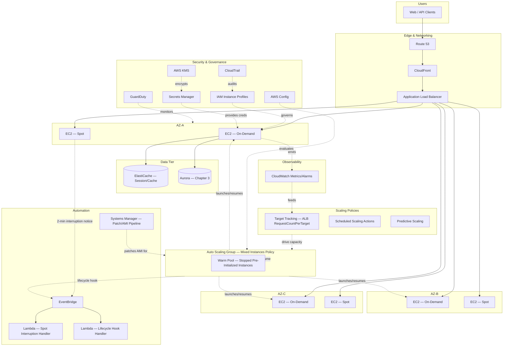

# Part II – Core Infrastructure Architectures

# Chapter 8 – Auto Scaling Architecture

> **How to read this chapter:** This chapter anchors every concept to a concrete reference architecture — an **Enterprise Auto Scaling Compute Platform** for a mid-to-large web/API workload — built on EC2 Auto Scaling Groups behind an Application Load Balancer, using a mixed On-Demand/Spot instance policy, target-tracking and predictive scaling policies, warm pools, and scheduled scaling for known traffic patterns. Where a serverless (Lambda) or container (ECS/Fargate/EKS) auto scaling approach would be preferable instead, this chapter says so explicitly and explains why — auto scaling is a cross-cutting capability, not a single service, and choosing the right scaling substrate for a given workload is as important as configuring the scaling policy correctly once you've chosen it.

---

# 1. Executive Summary

## The Business Problem

Every workload with variable demand faces the same fundamental tension: provision for peak and pay for idle capacity most of the time, or provision for average load and fail during peaks. Before Auto Scaling existed as a mature, managed capability, enterprises resolved this tension the expensive way — capacity planning teams forecasted peak demand months in advance, procured (or reserved) enough compute to handle the worst case, and accepted that the fleet would sit at 15–30% utilization the vast majority of the time. This is not a hypothetical inefficiency; it is the default outcome of any fixed-capacity system facing variable demand, and it directly costs money that provides no corresponding business value the other 70–85% of the time.

The business problem an Auto Scaling architecture solves is not merely "add more servers when busy." It is: **how does an organization match compute supply to demand continuously and automatically, across time horizons ranging from a sudden five-minute traffic spike to a predictable weekly pattern to a slow year-over-year growth curve, without a human being in the loop for the routine cases, while still preserving enough headroom and safety margin that the automation itself never becomes the cause of an outage.** A poorly designed auto scaling configuration is not merely wasteful — it can actively cause outages: scaling policies that react too slowly to a sudden spike, that thrash between scaling in and out, that scale out compute but hit a downstream database connection limit, or that terminate instances mid-request without proper connection draining, all turn an auto scaling system from a reliability asset into a reliability liability.

A second, related business problem is **the widening gap between the on-demand price of compute and its actual cost of production.** AWS's Spot Instance market, Savings Plans, and Reserved Instances all offer substantial discounts (30–90%) in exchange for either interruption tolerance or a capacity/spend commitment. An architecture that scales purely on-demand leaves this discount opportunity entirely on the table; an architecture that scales intelligently — combining a Reserved/Savings-Plan-covered baseline with Spot-covered elastic capacity — captures most of the available discount while retaining the elasticity that makes Auto Scaling valuable in the first place.

## Architecture Objective

This chapter's reference architecture targets a compute platform that:

- **Scales out fast enough to absorb a genuine traffic spike** (target: 50% additional capacity available within 3–5 minutes of a scaling trigger) without over-scaling in response to transient noise.
- **Scales in conservatively enough to avoid flapping** — the single most common auto scaling production issue — while still reclaiming genuinely idle capacity within a reasonable window (typically 10–15 minutes of sustained low utilization).
- **Blends On-Demand, Reserved/Savings-Plan-covered, and Spot capacity** to minimize cost without compromising the availability of the fraction of the fleet serving latency-sensitive, non-interruption-tolerant traffic.
- **Anticipates known traffic patterns** (daily business-hours cycles, weekly patterns, planned marketing events) via scheduled and predictive scaling, rather than relying solely on reactive metric-based scaling for entirely foreseeable demand.
- **Fails safely** — a scaling-policy misconfiguration, a metric-collection outage, or an Auto Scaling service disruption should degrade gracefully (holding the last known-good capacity) rather than catastrophically (scaling to zero or scaling without bound).
- **Integrates cleanly with the downstream tiers** (database connection pools, cache capacity, message queue consumer concurrency) that a scaling application tier places load on, so that solving the compute-elasticity problem doesn't simply relocate the bottleneck one tier deeper.

## Why Organizations Adopt This Architecture

Organizations adopt EC2 Auto Scaling Group-based architectures — as opposed to relying entirely on Fargate's or Lambda's own scaling model — for a specific, recurring set of reasons: they have existing EC2-based operational tooling and expertise: they need finer-grained control over instance type selection, placement, and lifecycle than Fargate exposes; they run workloads with licensing models tied to specific instance characteristics (per-core software licensing, specialized hardware like GPU or high-memory instances); or they run at a scale and steady-state utilization where Reserved Instance/Savings Plan economics on EC2 outperform Fargate's inherently more expensive per-vCPU/per-GB pricing. This is not a claim that EC2 Auto Scaling is universally superior to Fargate or Lambda — Section 28 compares all three in detail — but rather that a specific, common set of enterprise circumstances make EC2-based Auto Scaling Groups the right choice, and understanding auto scaling deeply at the EC2 level also builds the conceptual foundation that transfers directly to understanding ECS Service Auto Scaling and Lambda concurrency scaling, both covered comparatively in this chapter.

## Major Business Benefits

| Benefit | Explanation |
|---|---|
| Reduced infrastructure cost | Capacity matches actual demand rather than worst-case peak, typically reducing compute spend 30–60% versus fixed-capacity provisioning. |
| Improved availability | Automatic replacement of unhealthy instances and automatic capacity growth during demand spikes reduce both planned and unplanned downtime. |
| Reduced operational toil | Engineers no longer manually provision or decommission capacity for routine demand fluctuation. |
| Faster response to demand spikes | Automated scaling responds within minutes, versus the hours-to-days lead time of manual capacity provisioning. |
| Better cost predictability | A well-designed mixed On-Demand/Reserved/Spot strategy produces a more predictable cost curve than either pure on-demand elasticity or pure fixed-capacity overprovisioning. |
| Foundation for further automation | Auto Scaling Groups integrate directly with CI/CD (rolling deployments), Systems Manager (patch management), and observability tooling, compounding operational leverage. |

## Typical Enterprise Scenarios

This architecture pattern fits:

- Web and API workloads with pronounced daily/weekly demand cycles (e.g., business-hours-weighted B2B SaaS traffic, or B2C e-commerce traffic peaking evenings and weekends).
- Workloads with predictable seasonal or event-driven spikes (retail flash sales, tax-season financial services traffic, back-to-school education platform traffic) that benefit from scheduled/predictive scaling layered on top of reactive scaling.
- Batch or semi-real-time processing workloads (video transcoding, data pipeline workers, image processing) that are highly interruption-tolerant and therefore excellent Spot Instance candidates within an Auto Scaling Group's mixed-instance policy.
- Organizations with an existing EC2-centric operational model (configuration management via Systems Manager, custom AMI pipelines, EC2-specific monitoring/security tooling) where a wholesale migration to Fargate/Lambda is not currently justified by the workload's characteristics.
- Licensed commercial software (databases, specialized middleware) with per-core or per-instance licensing models incompatible with Fargate's abstracted compute model.

It is a poorer fit for workloads with a genuinely spiky-to-zero traffic pattern (long idle periods with occasional bursts) better served by Lambda's scale-to-zero model, or for organizations that have already invested in container-orchestration operational maturity and would gain more from ECS/Fargate's simpler operational model than from EC2 Auto Scaling's additional configuration surface — both alternatives are compared in depth in Section 28.

---

# 2. Business Requirements

## Business Drivers

- Reduce compute cost as a percentage of revenue by matching capacity to actual demand rather than provisioning for worst-case peak year-round.
- Maintain customer-facing availability during both predictable (marketing campaign) and unpredictable (viral traffic, competitor outage redirect) demand spikes.
- Reduce the operational burden of manual capacity planning and provisioning on the platform engineering team.
- Establish a compute platform that scales with the business without requiring a fundamental re-architecture at each growth stage.

## Functional Requirements

| Requirement | Description |
|---|---|
| Automatic capacity adjustment | Fleet size adjusts automatically based on real-time utilization metrics. |
| Scheduled capacity adjustment | Fleet size adjusts proactively ahead of known traffic patterns (business-hours ramp-up, weekend ramp-down, planned campaigns). |
| Predictive capacity adjustment | Fleet size adjusts based on machine-learning-derived forecasts of recurring traffic patterns, reducing reliance on purely reactive scaling for foreseeable demand. |
| Health-based instance replacement | Unhealthy instances are automatically detected and replaced without manual intervention. |
| Cost-optimized instance sourcing | The fleet draws from a blend of On-Demand, Reserved/Savings-Plan-covered, and Spot capacity based on workload interruption tolerance. |
| Graceful instance lifecycle | Instances are drained of in-flight connections before termination during both scale-in and deployment events. |

## Non-Functional Requirements

| Category | Target |
|---|---|
| Scale-out responsiveness | Additional capacity available within 3–5 minutes of a sustained scaling trigger |
| Scale-in conservatism | No scale-in action within 10 minutes of the most recent scale-out action (cooldown) |
| Availability | 99.95% for the application tier, consistent with Chapter 3's baseline |
| Instance replacement time | An unhealthy instance is detected and replacement initiated within 2 minutes |
| Spot interruption handling | Interruption-tolerant workloads receive and act on the 2-minute Spot interruption notice without dropping in-flight work |

## Scalability Goals

The platform must scale from a baseline of roughly 10 instances during off-peak hours to 60+ instances during peak marketing events (a 6x elastic range) within single-digit minutes of the triggering condition, and support long-term organic growth to a substantially larger baseline without a fundamental redesign of the scaling policy structure.

## Availability Requirements

99.95% for the customer-facing tier, achieved through multi-AZ Auto Scaling Group distribution combined with ALB health-check-driven traffic routing — consistent with the availability target established in Chapter 3, since this chapter's Auto Scaling Group is a specific implementation of that chapter's application tier.

## Latency Requirements

Scaling actions themselves must not introduce customer-facing latency degradation — this requires sufficient scale-out lead time (triggering before the fleet is already saturated, not after) and sufficient warm-up/health-check-grace-period tuning so that newly launched instances are not sent production traffic before their application process has genuinely finished initializing.

## Compliance Requirements

Identical baseline to Chapter 3 (SOC 2, encryption, audit logging); Auto Scaling-specific compliance considerations include ensuring that AMIs used for instance launch are patched and scanned consistently (Section 23), and that Spot Instance usage does not violate any data-residency or licensing constraint that assumes a specific, persistent instance identity.

## Security Expectations

Every launched instance receives its IAM role via an EC2 instance profile scoped to least privilege (Section 10); no long-lived credentials are baked into AMIs; instances are launched exclusively from a vetted, regularly-patched golden AMI pipeline (Section 23), not ad hoc community AMIs.

## Recovery Objectives

### Recovery Point Objective (RPO)

**RPO = N/A at the compute tier** — Auto Scaling Group instances are, by design, stateless and disposable; no unique, unrecoverable data lives on an individual instance. (The data-tier RPO remains governed by Chapter 3's Aurora-focused disaster recovery discussion.)

### Recovery Time Objective (RTO)

**RTO ≤ 5 minutes** for full fleet replacement in the event of a bad AMI or a widespread instance-level failure, achieved via the Auto Scaling Group's ability to launch an entirely new generation of instances from a known-good AMI/launch-template version.

## SLAs

Internal engineering SLO: 99.95% for the application tier, with an explicit acknowledgment that a poorly tuned scaling policy is itself now a top-3 historical root cause of SLO misses for this class of workload, addressed specifically via the failure-scenario and troubleshooting guidance in Sections 24–25.

## Expected Workload

Baseline: roughly 800 requests/second during business hours, dropping to roughly 150 requests/second overnight; recurring weekly peak on Monday mornings (a 2–3x spike versus the prior week's average) and predictable seasonal peaks around known promotional calendar events.

## Expected Growth

20–30% year-over-year organic baseline growth, plus continued reliance on scheduled/predictive scaling for known event-driven peaks that grow in both frequency and magnitude as the business's marketing calendar becomes more aggressive.

---

# 3. Architecture Overview

## Overall Design

The reference architecture is an **EC2 Auto Scaling Group behind an Application Load Balancer**, using a **mixed instances policy** blending On-Demand (for baseline, latency-guaranteed capacity) and Spot (for elastic, cost-optimized, interruption-tolerant overflow capacity), governed by a combination of **target-tracking scaling policies** (reactive, metric-driven), **scheduled scaling actions** (proactive, calendar-driven), and **predictive scaling** (proactive, ML-forecast-driven), with a **warm pool** maintaining pre-initialized but stopped instances to reduce scale-out latency for instances with slow application startup times.

## Architecture Philosophy

The guiding philosophy is **"layer proactive scaling on top of reactive scaling; never rely on reactive scaling alone for foreseeable demand."** Reactive, metric-based scaling (target tracking on CPU utilization or request count per target) is necessary but insufficient on its own — by the time a reactive policy's triggering metric crosses its threshold, the fleet is already under load, and the 3–5 minute lead time to bring new capacity online means a genuinely sudden, foreseeable spike (a scheduled marketing email send, a known Monday-morning traffic pattern) can cause real, avoidable customer-facing degradation before reactive scaling catches up. Scheduled and predictive scaling exist specifically to pre-provision capacity ahead of foreseeable demand, reserving reactive scaling for genuinely unforeseeable variation.

The second guiding principle is **treat Spot interruption as a normal, expected event, not an exceptional failure** — a workload is only placed in the Spot-eligible portion of the mixed-instances policy if it is architecturally interruption-tolerant (stateless, checkpointable, or trivially retryable), and the Auto Scaling Group's Spot-interruption-notice handling (via EventBridge, described in Section 6) is a first-class, tested part of the architecture, not an afterthought.

## Core Components

| Layer | Components |
|---|---|
| Edge/Networking | Application Load Balancer, target groups, 3-AZ VPC subnet distribution |
| Compute | EC2 Auto Scaling Group (mixed instances policy: On-Demand + Spot), Launch Template, warm pool |
| Scaling Policies | Target-tracking policies, scheduled scaling actions, predictive scaling, step scaling (for specific non-standard metrics) |
| Automation | Systems Manager (patching, golden AMI pipeline), EventBridge (Spot interruption handling, lifecycle hooks) |
| Data | Amazon Aurora (per Chapter 3), Amazon ElastiCache (session/cache tier absorbing scale-out load) |
| Security | IAM instance profiles, Secrets Manager, KMS, Security Groups |
| Observability | CloudWatch (Auto Scaling metrics, custom application metrics driving target-tracking policies), CloudWatch Application Insights |

## How Components Interact

Client traffic arrives at the ALB, which distributes it across the Auto Scaling Group's currently healthy instances. CloudWatch continuously evaluates the metrics feeding each configured scaling policy (target-tracking on ALB request-count-per-target, scheduled actions tied to calendar time, predictive scaling forecasts refreshed daily). When a scaling policy determines additional capacity is needed, the Auto Scaling Group either launches a new instance directly or, if a warm-pool instance is available, resumes a pre-initialized stopped instance — meaningfully reducing the time-to-serving-traffic for workloads with slow startup. Newly launched/resumed instances complete a health-check grace period before the ALB begins routing production traffic to them. During scale-in, a lifecycle hook drains in-flight connections before instance termination; for Spot instances, a two-minute interruption notice triggers the same graceful-drain lifecycle hook proactively, ahead of AWS's actual reclamation of the instance.

## High-Level Workflow

1. CloudWatch evaluates configured scaling-policy metrics on a continuous basis.
2. A scaling policy determines a capacity change is needed (scale-out or scale-in).
3. The Auto Scaling Group either launches new instances (from the Launch Template) or resumes warm-pool instances.
4. New instances pass their health-check grace period and are registered as healthy targets in the ALB target group.
5. The ALB begins routing traffic to newly healthy instances.
6. For scale-in, a lifecycle hook drains connections before the instance is terminated.

## Request Lifecycle

Client request → DNS/CloudFront (per Chapter 3) → ALB → target-group routing to a healthy Auto Scaling Group instance → application processing → response. The Auto Scaling Group's scaling state is transparent to this per-request lifecycle; a request is never aware of whether it landed on an On-Demand or Spot instance, nor whether the fleet has recently scaled — this abstraction is the entire point of the architecture.

## Response Lifecycle

Identical to Chapter 3's response lifecycle; the Auto Scaling Group's presence is invisible at the response-construction level, mediated entirely through the ALB's target-group abstraction.

## Data Lifecycle

Instances are explicitly stateless with respect to application data — session state lives in ElastiCache/DynamoDB (never on local instance disk), and any instance can be terminated and replaced without data loss, which is the foundational architectural property that makes aggressive, automated scaling safe in the first place. Instance-level ephemeral data (application logs, local caches) is streamed to CloudWatch Logs / S3 continuously rather than depended upon to survive instance termination.

---

# 4. AWS Services Used

## Amazon EC2

**Purpose:** Provides the virtual machine compute underlying the Auto Scaling Group.

**Why selected:** EC2 gives the fine-grained control over instance type, placement, and lifecycle this architecture specifically needs — access to a wide range of instance families (compute-optimized, memory-optimized, burstable) and full compatibility with Spot Instances, Reserved Instances, and Savings Plans, none of which apply to EC2 in quite the same directly-purchasable way as to Fargate.

**Alternatives:** ECS/Fargate — chosen instead when the team prioritizes a simpler operational model over fine-grained instance control (Section 28 compares in depth); Lambda — chosen instead for workloads with a genuinely spiky-to-zero traffic pattern.

**Limitations:** Requires AMI lifecycle management, OS-level patching, and capacity-type/instance-type selection expertise that Fargate abstracts away entirely.

**Pricing considerations:** On-Demand pricing is the ceiling; Reserved Instances/Savings Plans (for the steady-state baseline) and Spot Instances (for interruption-tolerant elastic capacity) both offer substantial discounts, central to this chapter's cost model (Section 16).

**Best practices:** Use a mixed-instances policy spanning multiple instance types within a family (increasing Spot availability and reducing simultaneous-interruption risk); always launch from a versioned Launch Template, never a Launch Configuration (deprecated).

## Application Load Balancer (ALB)

**Purpose:** Distributes traffic across the Auto Scaling Group's healthy instances and provides the health-check signal the Auto Scaling Group uses (in ELB health-check mode) to determine instance health.

**Why selected:** As detailed in Chapter 3, Section 4 — Layer 7 routing, native target-group integration with Auto Scaling Groups, and the request-count-per-target metric this chapter uses as a primary target-tracking scaling signal.

**Alternatives:** Network Load Balancer — used instead for non-HTTP(S) protocols or when a static IP is required; this chapter's target-tracking-on-ALB-metric approach does not directly translate to an NLB-fronted fleet, which instead relies on CPU/custom-metric-based scaling.

**Best practices:** Enable ALB target-group deregistration delay (connection draining) tuned to the application's longest expected in-flight request duration, so scale-in never truncates a legitimate in-flight request.

## AWS Lambda

**Purpose:** In this architecture specifically, used for two auxiliary automation functions — processing Spot Instance interruption notices (received via EventBridge) to trigger application-level graceful shutdown beyond what the standard lifecycle hook alone provides, and processing Auto Scaling lifecycle-hook events to perform custom pre-termination/post-launch validation.

**Why selected:** Event-driven, intermittent automation tasks well suited to Lambda's model, avoiding the need for a persistently running orchestration service just to react to Auto Scaling lifecycle events.

**Alternatives:** Systems Manager Automation documents — chosen instead for more complex, multi-step remediation workflows; Lambda is preferred here for its lower latency in responding to the time-sensitive 2-minute Spot interruption notice.

**Best practices:** Keep the interruption-handling function extremely fast and reliable — it operates within a hard 2-minute window, and its own failure should not prevent the underlying Auto Scaling Group lifecycle hook's default action (typically, proceeding with termination after a timeout) from still occurring safely.

## Amazon CloudWatch

**Purpose:** Supplies every metric this chapter's scaling policies act on — both AWS-native metrics (ALB request count per target, EC2 CPU utilization) and custom application metrics (e.g., application-reported queue depth or in-flight request count) published via the CloudWatch embedded metric format.

**Why selected:** Native, tightly-coupled integration with Auto Scaling target-tracking and step-scaling policies — a target-tracking policy is, structurally, a CloudWatch alarm pair (high/low threshold) wired directly to a scaling action.

**Best practices:** Prefer a small number of well-chosen scaling metrics (ALB request-count-per-target is usually the best default for a request-driven web/API workload) over CPU utilization alone, since CPU utilization is often a lagging and imprecise proxy for actual capacity need in I/O-bound or asynchronous workloads.

## Amazon EventBridge

**Purpose:** Delivers Auto Scaling lifecycle-hook events and Spot Instance interruption notices to the Lambda automation functions described above.

**Why selected:** Native AWS event source for both event types, with content-based filtering allowing the platform to route lifecycle events precisely (e.g., only `EC2 Instance-terminate Lifecycle Action` events for this specific Auto Scaling Group) without a polling-based alternative.

**Best practices:** Keep the EventBridge rule scope narrow (this Auto Scaling Group specifically) to avoid unrelated noise reaching the automation Lambda functions.

## AWS IAM

**Purpose:** Provides the EC2 instance profile (IAM role) attached to every launched instance, scoping exactly which AWS APIs the running application may call.

**Why selected:** As detailed in Chapter 3 — foundational to least-privilege access for every compute resource in the architecture.

**Best practices:** Scope the instance profile narrowly to the specific application's needs (Secrets Manager read for its own credentials, CloudWatch Logs write, S3 access to its specific bucket/prefix) — never attach a broad, shared instance profile across dissimilar workloads.

## Amazon VPC

**Purpose:** Provides the multi-AZ subnet structure the Auto Scaling Group launches instances into.

**Why selected:** As detailed in Chapter 3 — network isolation and multi-AZ distribution are foundational, not optional, for any production Auto Scaling Group.

**Best practices:** Ensure the Auto Scaling Group's configured subnets span a minimum of 3 AZs so the group can continue distributing new capacity even if one AZ is temporarily capacity-constrained (a real, if uncommon, AWS-side occurrence, particularly for high-demand Spot instance types during regional capacity crunches).

## AWS Systems Manager

**Purpose:** Manages the golden AMI patch pipeline (Section 23), provides Session Manager access to running instances without SSH/bastion infrastructure, and executes fleet-wide operational commands (e.g., a coordinated configuration refresh) via Run Command.

**Why selected:** Removes the operational burden of managing a bastion host fleet and provides a consistent, auditable mechanism for both routine patching and ad hoc operational intervention across a dynamically-sized fleet where individual instance identity is transient.

**Best practices:** Bake the SSM Agent and an appropriately scoped instance profile into the golden AMI itself, so every launched instance is immediately Session-Manager-accessible without additional bootstrap steps.

## AWS Secrets Manager

**Purpose:** Supplies runtime credentials (database credentials, third-party API keys) to instances at application startup.

**Why selected:** As detailed in Chapter 3 — no secrets baked into the AMI or Launch Template user data, since both are effectively long-lived, widely-distributed artifacts unsuitable for secret storage.

**Best practices:** Retrieve secrets via the instance's IAM role at application startup, never via Launch Template user data variables (which are visible to any process with access to the instance metadata service, and are also visible via the EC2 console/API to anyone with `DescribeLaunchTemplateVersions` permission).

## Amazon CloudTrail / AWS Config / Amazon GuardDuty / AWS KMS

**Purpose:** As detailed in Chapter 3 — the same organization-wide audit, compliance, and threat-detection baseline applies identically to this Auto Scaling architecture's AWS account, with one Auto Scaling-specific Config rule addition: flagging any Auto Scaling Group whose Launch Template references an AMI older than the organization's defined maximum patch age.

---

# 5. Complete Architecture Diagram



---

# 6. Component-by-Component Explanation

## Application Load Balancer

**Purpose:** Distributes traffic across the Auto Scaling Group's currently healthy instances and supplies the health-check signal driving instance replacement.
**Responsibilities:** Route requests based on configured listener rules; perform continuous health checks against a target-group-configured health endpoint; publish `RequestCountPerTarget` and related metrics consumed by the target-tracking scaling policy.
**Inputs:** Client HTTPS requests; health-check responses from registered targets.
**Outputs:** Proxied requests to healthy instances; CloudWatch metrics.
**Scaling:** Scales automatically with request volume (subject to raisable soft limits).
**High availability:** Deployed across 3 AZs.
**Failure handling:** Removes unhealthy targets from rotation automatically based on configured thresholds.
**Dependencies:** Auto Scaling Group target group registration.
**Security:** Security group restricting inbound to HTTPS from CloudFront's managed prefix list only.
**Monitoring:** `TargetResponseTime`, `HTTPCode_Target_5XX_Count`, `HealthyHostCount`, `RequestCountPerTarget`.

## Auto Scaling Group (Mixed Instances Policy)

**Purpose:** Maintains the desired, minimum, and maximum instance count across a blend of On-Demand and Spot capacity, distributed across multiple AZs.
**Responsibilities:** Launch/terminate instances in response to scaling-policy decisions; enforce health-check-based replacement; execute lifecycle hooks during launch and termination; manage warm-pool instance state transitions.
**Inputs:** Scaling-policy decisions (target-tracking, scheduled, predictive); health-check results from the ALB and/or EC2 status checks.
**Outputs:** Running EC2 instances registered with the ALB target group; lifecycle-hook events to EventBridge.
**Scaling:** This *is* the scaling mechanism — configured with a minimum, maximum, and desired capacity, and a mixed-instances policy specifying the On-Demand/Spot split (e.g., "the first 40% of desired capacity is On-Demand; the remainder is Spot, allocated via the `capacity-optimized` allocation strategy across a specified list of instance types").
**High availability:** Distributes launched instances evenly across all configured AZs by default.
**Failure handling:** Replaces instances failing EC2 status checks or ALB health checks automatically; if an entire AZ becomes capacity-constrained for a specific instance type, the mixed-instances policy's multi-instance-type specification allows the group to source capacity from an alternate type/AZ combination rather than failing to launch at all.
**Dependencies:** Launch Template (instance configuration), target group (health-check/registration), IAM instance profile.
**Security:** Every launched instance inherits the Launch Template's specified IAM instance profile, security groups, and (optionally) encrypted EBS volumes.
**Monitoring:** `GroupDesiredCapacity`, `GroupInServiceInstances`, `GroupPendingInstances`, `GroupTerminatingInstances`.

## Launch Template

**Purpose:** Defines the versioned, immutable specification for every instance the Auto Scaling Group launches — AMI ID, instance type(s), IAM instance profile, security groups, EBS volume configuration, and user-data bootstrap script.
**Responsibilities:** Provide a single, versioned source of truth for instance configuration, enabling safe, auditable configuration changes via new template versions rather than in-place instance mutation.
**Inputs:** Engineer-authored Terraform configuration.
**Outputs:** Instance specifications consumed by the Auto Scaling Group at launch time.
**Scaling:** N/A (a configuration artifact, not a running component).
**High availability:** N/A.
**Failure handling:** A bad Launch Template version (e.g., referencing a broken AMI) is rolled back by reverting the Auto Scaling Group to reference the previous known-good Launch Template version, followed by an instance-refresh operation.
**Dependencies:** The golden AMI pipeline (Section 23), IAM, security groups.
**Security:** User-data scripts must never embed secrets directly (Section 4); IMDSv2 is enforced (`HttpTokens: required`) to mitigate SSRF-based instance-metadata-service credential theft.
**Monitoring:** N/A directly, though Launch Template version drift (multiple Auto Scaling Groups referencing inconsistent versions) is worth periodic audit.

## Warm Pool

**Purpose:** Maintains a pool of pre-initialized, stopped (or hibernated) instances ready to be resumed rather than launched from scratch, reducing scale-out latency for workloads with slow application startup (e.g., a JVM application with a multi-minute warm-up period).
**Responsibilities:** Keep a configured number of instances in a `Stopped` state, having already completed the Launch Template's user-data bootstrap (application installed, dependencies fetched) but not actively serving traffic or incurring full compute charges.
**Inputs:** Auto Scaling Group scale-out decisions.
**Outputs:** Resumed instances transitioning rapidly into the `InService` state.
**Scaling:** Configured with its own minimum/maximum warm-pool size, independent of the main group's desired capacity.
**High availability:** Distributed across the same AZs as the main group.
**Failure handling:** A warm-pool instance failing its resume health check is terminated and replaced within the pool, rather than being pushed into production traffic.
**Dependencies:** Same Launch Template as the main group.
**Security:** Identical security posture to in-service instances, since a warm-pool instance has already executed the full bootstrap process and holds the same IAM instance profile.
**Monitoring:** Warm-pool size and age (an instance sitting in the warm pool for an extended period may need periodic refresh to avoid serving with a now-outdated application version).

## Target-Tracking Scaling Policy

**Purpose:** Reactively adjusts desired capacity to maintain a specified target value for a chosen metric (e.g., `ALBRequestCountPerTarget = 1000`).
**Responsibilities:** Continuously compare the actual metric value against the configured target and adjust desired capacity via a CloudWatch-alarm-driven mechanism, functionally equivalent to a thermostat.
**Inputs:** The configured CloudWatch metric (ALB request count per target, EC2 average CPU utilization, or a custom application metric).
**Outputs:** Desired-capacity adjustments to the Auto Scaling Group.
**Scaling:** This is itself the primary reactive scaling mechanism.
**High availability/Failure handling:** If metric collection is temporarily disrupted, the policy holds the last known desired capacity rather than scaling unpredictably — a deliberate, safe default.
**Dependencies:** CloudWatch metric availability.
**Security:** N/A directly.
**Monitoring:** The scaling policy's own activity history (`DescribeScalingActivities`) provides an audit trail of every scaling decision and its triggering metric value.

## Scheduled Scaling Actions

**Purpose:** Proactively adjusts minimum/maximum/desired capacity ahead of known, calendar-predictable demand changes.
**Responsibilities:** Execute a pre-configured capacity change at a specific time (e.g., raise minimum capacity to 25 instances at 07:00 local time on weekdays, ahead of the predictable business-hours ramp-up, rather than waiting for reactive scaling to catch up after demand has already increased).
**Inputs:** A cron-like schedule expression and target capacity values.
**Outputs:** Capacity adjustments at the scheduled time.
**Scaling:** Proactive, calendar-driven — complements, rather than replaces, reactive target-tracking.
**Dependencies:** None beyond the Auto Scaling Group itself.
**Monitoring:** Scheduled-action execution history, alerting if a scheduled action fails to execute (rare, but worth monitoring given its role in pre-empting entirely foreseeable demand).

## Predictive Scaling

**Purpose:** Uses historical CloudWatch metric data (typically at least 24 hours, ideally several weeks, of history) to forecast recurring load patterns and pre-provision capacity ahead of the forecasted peak, refined daily as more data accumulates.
**Responsibilities:** Generate a rolling 48-hour capacity forecast and schedule pre-emptive scaling actions to have that forecasted capacity available before it's actually needed, rather than reacting only once real-time metrics cross a threshold.
**Inputs:** Historical CloudWatch metric data for the configured target metric.
**Outputs:** Forecast-driven scheduled capacity adjustments, automatically regenerated daily.
**Scaling:** Most effective for workloads with strong, repeating weekly/daily seasonality (e.g., the Monday-morning spike described in Section 2); provides limited benefit for workloads with genuinely irregular, non-repeating demand patterns.
**Dependencies:** Sufficient historical metric data — a newly launched workload with no scaling history should rely on target-tracking and scheduled scaling alone until enough data accumulates for predictive scaling's forecast to be reliable.
**Monitoring:** Forecast-versus-actual accuracy, reviewed periodically to confirm predictive scaling continues adding value as the workload's traffic pattern evolves.

---

# 7. End-to-End Request Flow

1. **Client** sends an HTTPS request to the application's public endpoint.
2. **DNS resolution** via Route 53 resolves to the CloudFront distribution (per Chapter 3's edge pattern).
3. **CloudFront** forwards non-cacheable requests to the regional ALB.
4. **ALB routing**: The ALB selects a healthy target from the Auto Scaling Group's currently registered instances, using round-robin or least-outstanding-requests.
5. **Application processing**: The selected EC2 instance processes the request, reading/writing Aurora and ElastiCache as needed (per Chapter 3's data-tier pattern).
6. **Metric emission**: The ALB records the request against `RequestCountPerTarget` for the serving instance's target group; the instance itself may additionally publish custom application metrics.
7. **Response delivery**: The response returns to the client via ALB → CloudFront.
8. **Continuous scaling evaluation (parallel to steps 1–7)**: CloudWatch continuously evaluates the target-tracking policy's metric against its configured target value.
9. **Scale-out trigger**: If the metric exceeds the target for the configured evaluation period, the target-tracking policy increases the Auto Scaling Group's desired capacity.
10. **Capacity sourcing decision**: The Auto Scaling Group determines whether to resume a warm-pool instance (faster) or launch a new instance from the Launch Template (slower, but unlimited by warm-pool size), and which capacity type (On-Demand/Spot) and instance type to use per the mixed-instances policy's allocation strategy.
11. **Instance launch/resume**: The new instance boots (or resumes from `Stopped` state) and executes any remaining bootstrap steps.
12. **Health-check grace period**: The instance is given a configured grace period before its health-check status affects the Auto Scaling Group's view of overall group health, avoiding a false "unhealthy" determination during legitimate startup time.
13. **Target-group registration**: Once healthy, the instance is registered with the ALB target group.
14. **Traffic routing begins**: The ALB begins routing new requests to the newly healthy instance, completing the scale-out cycle.
15. **Scale-in trigger (alternate path)**: If the metric falls sufficiently below target for a sustained period (respecting the configured cooldown), the target-tracking policy decreases desired capacity.
16. **Lifecycle hook — termination**: Before actually terminating a selected instance, a lifecycle hook pauses the termination and triggers a Lambda function (via EventBridge) that deregisters the instance from the target group and waits for in-flight connections to drain.
17. **Graceful termination**: Once drained (or a maximum wait time is reached), the lifecycle hook completes and the instance is terminated.
18. **Spot interruption (alternate path)**: If a Spot instance receives a 2-minute interruption notice, the same graceful-drain process is triggered proactively by the Spot-interruption Lambda handler, ahead of AWS's actual reclamation, rather than waiting for the standard scale-in lifecycle hook.
19. **Logging**: Application logs, ALB access logs, and Auto Scaling activity history are all captured to CloudWatch Logs/S3 throughout.
20. **Monitoring**: CloudWatch dashboards reflect the current fleet size, scaling activity, and request-serving metrics in near-real-time throughout this entire flow.

---

# 8. Deployment Flow

## Infrastructure Provisioning

The Auto Scaling Group, Launch Template, scaling policies, and warm-pool configuration are all defined in Terraform, following the identical module/environment structure described in Chapter 3, Section 18.

## Terraform Workflow

Identical review-and-apply discipline to Chapter 3 — `terraform plan` posted to the pull request, human review, merge-triggered apply via a scoped CI role.

## CI/CD Deployment

Application deployment to a running Auto Scaling Group uses an **instance refresh** — a native Auto Scaling Group capability that incrementally replaces instances with a new Launch Template version (containing the updated AMI or updated user-data script) while respecting a configured minimum-healthy-percentage, functionally equivalent to a rolling deployment.

## Blue-Green Deployment

For changes significant enough to warrant a full blue-green approach (rather than an in-place instance refresh), a second Auto Scaling Group ("green") is created alongside the running ("blue") group, both registered with the same ALB target group initially with the green group's desired capacity at zero, then incrementally scaled up while the blue group is scaled down — CodeDeploy's Auto Scaling Group blue-green deployment type automates exactly this pattern.

## Rollback

Instance-refresh rollback is a first-class, tested operation: reverting the Auto Scaling Group's Launch Template reference to the previous version and initiating a new instance refresh. Because instances are stateless and disposable by design (Section 3's Data Lifecycle), rollback is symmetric with forward deployment — there is no asymmetric "harder to undo" risk as there might be with a stateful deployment.

## Secrets

As in Chapter 3 — Secrets Manager, retrieved at instance boot via the IAM instance profile, never embedded in the Launch Template's user data or baked into the AMI.

## Configuration

Non-secret configuration is retrieved from Parameter Store at instance boot, allowing configuration changes to take effect on the next instance refresh without requiring a new AMI build for every configuration tweak.

## Validation

Post-instance-refresh validation includes automated health-check confirmation for every replaced instance batch, plus a CloudWatch alarm-gated automatic pause of the instance refresh if the application-level error rate increases during the rollout — preventing a bad deployment from being rolled out to the entire fleet before the problem is detected.

---

# 9. Network Topology

## VPC / CIDR / Subnets

Identical topology to Chapter 3: a `/16` production VPC, 3 public subnets (ALB only), 3 private application subnets (Auto Scaling Group instances), 3 private data subnets (Aurora/ElastiCache). The Auto Scaling Group's subnet configuration explicitly lists all 3 private application subnets, allowing the group to distribute new capacity across all of them regardless of which specific subnet a given scale-out event happens to land in.

## NAT Gateway

One NAT Gateway per AZ, as in Chapter 3 — necessary for instance egress (OS package updates via Systems Manager, calls to external APIs) without exposing instances to inbound internet traffic.

## Internet Gateway / Route Tables

Identical to Chapter 3's pattern — public subnet routes to the Internet Gateway; private application subnet routes to the AZ-local NAT Gateway; private data subnet has no default internet route.

## Network ACLs / Security Groups

Security groups remain the primary access-control mechanism: the Auto Scaling Group's instance security group permits inbound only from the ALB security group on the application port, and outbound only to the specific database/cache security groups plus HTTPS (443) for Systems Manager/Secrets Manager/external API access via VPC endpoints where possible.

## PrivateLink

VPC endpoints for Systems Manager (SSM, SSM Messages, EC2 Messages — required for Session Manager access), Secrets Manager, S3, and CloudWatch Logs allow instances in private subnets to reach these services without traversing the NAT Gateway, both reducing cost and reducing the network attack surface — particularly valuable for this architecture given the potentially large, dynamically-changing instance count, where NAT Gateway data-processing charges scale directly with fleet size and Systems Manager traffic volume.

## Multi-AZ Distribution for Auto Scaling Specifically

A specific network consideration unique to this chapter: the Auto Scaling Group's mixed-instances policy should specify multiple instance types precisely because Spot capacity availability varies independently per AZ per instance type — a group configured for only a single instance type is more likely to experience a temporary Spot capacity shortfall in a specific AZ than one configured with a broader, price-and-capacity-appropriate list of acceptable instance types.

---

# 10. Identity and Access

## IAM Roles (Instance Profiles)

Every EC2 instance launched by the Auto Scaling Group receives an IAM instance profile — the mechanism by which an EC2 instance assumes an IAM role — scoped specifically to the application's runtime needs: Secrets Manager read access to its own credential secret, CloudWatch Logs write access, S3 read/write to its specific application bucket/prefix, and SSM-required permissions for Session Manager connectivity.

## IAM Policies

```json

{
  "Version": "2012-10-17",
  "Statement": [
    {
      "Sid": "AllowInstanceSecretsRead",
      "Effect": "Allow",
      "Action": ["secretsmanager:GetSecretValue"],
      "Resource": "arn:aws:secretsmanager:us-east-1:111122223333:secret:prod/web-fleet/db-credentials-??????"
    },
    {
      "Sid": "AllowCloudWatchLogsWrite",
      "Effect": "Allow",
      "Action": ["logs:CreateLogStream", "logs:PutLogEvents"],
      "Resource": "arn:aws:logs:us-east-1:111122223333:log-group:/ec2/production/web-fleet:*"
    },
    {
      "Sid": "AllowSSMSessionManager",
      "Effect": "Allow",
      "Action": [
        "ssmmessages:CreateControlChannel",
        "ssmmessages:CreateDataChannel",
        "ssmmessages:OpenControlChannel",
        "ssmmessages:OpenDataChannel"
      ],
      "Resource": "*"
    }
  ]
}

```

## Resource Policies

The Secrets Manager secret's resource policy restricts access to this specific instance profile's role ARN, providing a second, independent access-control layer beyond the identity-side IAM policy above.

## STS

As throughout this book — the EC2 instance profile mechanism is itself built on STS: the EC2 service assumes the role on the instance's behalf and delivers short-lived, automatically-rotated temporary credentials to the instance via the instance metadata service (IMDSv2-protected).

## Cross-Account Access

Not typically required for the compute tier itself in a single-account production environment; if the Auto Scaling Group's application needs to read from a shared-services account resource (e.g., a centrally-managed artifact bucket), a narrowly scoped cross-account role is assumed via `sts:AssumeRole`, following the identical pattern described in Chapter 3.

## Least Privilege

Enforced via the same scoped-ARN, no-wildcard discipline as Chapter 3; a specific Auto Scaling-relevant consideration is ensuring the instance profile does not include Auto Scaling Group management permissions itself (e.g., `autoscaling:SetDesiredCapacity`) unless the application genuinely needs to programmatically manage its own scaling, which is unusual and should be treated as a flagged exception requiring explicit justification, not a default.

## Service Roles

Distinct roles exist for: the EC2 instance profile (application runtime), the Auto Scaling service-linked role (automatically created by AWS, granting the Auto Scaling service itself permission to call EC2/ELB APIs on the account's behalf), the Spot-interruption-handler Lambda's execution role, and the lifecycle-hook-handler Lambda's execution role.

## Permission Boundaries

Applied to any automation role capable of modifying Auto Scaling Group configuration (e.g., a CI/CD deployment role executing an instance refresh), capping its maximum permissions to prevent an compromised or misconfigured pipeline from making broader changes than intended.

---

# 11. Security Architecture

## Encryption

EBS volumes attached to every launched instance are encrypted by default (enforced via an AWS Config rule and, more strongly, via an account-level EBS-encryption-by-default setting) using a KMS CMK; data in transit between the ALB and instances uses TLS.

## KMS

A dedicated CMK for EBS volume encryption across the fleet, distinct from the Aurora/S3 CMKs described in Chapter 3, with key policy access scoped to the specific roles needing decrypt access (the EC2 service itself, for volume attach/detach operations).

## TLS

TLS termination at the ALB (as in Chapter 3); instance-to-database and instance-to-cache traffic within the VPC is also TLS-encrypted where the downstream service supports it (Aurora, ElastiCache both support in-transit encryption).

## WAF / Shield

Applied at CloudFront/ALB as described in Chapter 3 — the Auto Scaling Group's specific security contribution is ensuring the fleet itself never has a public IP address at all (instances launch exclusively into private subnets), so WAF/Shield at the edge is the sole internet-facing defense layer, with no secondary, inconsistently-configured direct-instance exposure risk.

## Secrets Manager / Certificate Manager

As described throughout this book; the Auto Scaling-specific consideration is ensuring every instance retrieves its own secrets independently at boot (via its IAM instance profile) rather than any secret ever being embedded in the Launch Template, AMI, or user-data script.

## GuardDuty / Inspector

Amazon Inspector's EC2 scanning specifically applies here — continuously scanning the fleet's running instances (via the SSM Agent-based scanning mechanism) for known OS and package vulnerabilities, which is particularly valuable given this architecture's potentially large, dynamically-changing instance count where manual vulnerability scanning would not scale.

## Security Hub / CloudTrail / AWS Config

As described in Chapter 3; an Auto Scaling-specific Config rule (`autoscaling-launch-config-hop-limit`, or a custom rule) checks that the Launch Template enforces `HttpTokens: required` (IMDSv2) across the fleet, since IMDSv1 (permitting unauthenticated instance-metadata-service requests) is a well-known SSRF-to-credential-theft attack vector, historically responsible for several major real-world breaches.

## Zero Trust

Every instance authenticates to every downstream service (Aurora, ElastiCache, Secrets Manager) via its own IAM instance profile / IAM database authentication rather than a shared, network-location-implied trust — an instance's mere presence within the private application subnet grants it no implicit access beyond what its specific instance profile explicitly authorizes.

## Threat Model

Primary Auto Scaling-specific threats: (1) a compromised golden AMI propagating a vulnerability or backdoor to every subsequently launched instance; (2) an overly broad instance profile providing a stepping-stone for lateral movement if a single instance is compromised; (3) IMDSv1-enabled instances allowing SSRF-based credential theft; (4) a malicious or buggy Launch Template change deployed via a compromised CI/CD credential, propagating to the entire fleet via instance refresh.

## Attack Vectors and Mitigations

| Attack Vector | Mitigation |
|---|---|
| Compromised golden AMI | Inspector continuous scanning; AMI build pipeline security scanning before publication; AMI provenance tracking |
| Overly broad instance profile | Least-privilege, per-application-scoped instance profiles; IAM Access Analyzer review |
| IMDSv1 SSRF credential theft | `HttpTokens: required` (IMDSv2) enforced account-wide via Config rule and SCP |
| Compromised CI/CD credential modifying Launch Template | Scoped CI/CD deployment role permissions; mandatory PR review before any Launch Template change merges |
| Lateral movement post-compromise | Security groups restricting instance-to-instance traffic to only genuinely required paths, not a flat "allow all within VPC" default |

---

# 12. High Availability

## AZ Failures

The Auto Scaling Group's multi-AZ subnet configuration means loss of a single AZ removes roughly one-third of fleet capacity, automatically compensated by the group launching replacement capacity in the remaining healthy AZs (assuming sufficient max-capacity headroom is configured to absorb this without breaching the configured maximum).

## Instance Failures

Both EC2 status checks (detecting underlying hardware/hypervisor issues) and ALB health checks (detecting application-level failures) feed into the Auto Scaling Group's health-determination logic; an instance failing either check is terminated and replaced automatically.

## Regional Failures

Addressed at the broader architecture level per Chapter 3's Warm Standby DR pattern — the Auto Scaling Group construct itself is region-scoped, and a full regional failure requires the DR-region's own (typically smaller, scaled-up-on-demand) Auto Scaling Group to absorb failed-over traffic.

## Database Failures

Handled at the Aurora tier per Chapter 3; the Auto Scaling Group's instances implement connection retry with exponential backoff to gracefully ride out the brief Aurora failover window without instance-level health checks incorrectly flagging instances as unhealthy due to a transient, correctly-handled downstream database blip.

## Load Balancing / Health Checks / Failover

As described throughout this chapter — the ALB's health-check configuration (path, interval, healthy/unhealthy thresholds) is tuned specifically to distinguish a genuinely failed instance from one still completing its startup grace period, a frequent source of false-positive instance churn when misconfigured (Section 24).

---

# 13. Disaster Recovery

## Backup Strategy

The Auto Scaling Group itself requires no backup in the traditional sense — its "backup" is simply its Terraform definition and Launch Template, both of which are re-appliable in any region. The golden AMI (Section 23) is copied to the DR region on the same cadence as it's published to the primary region, ensuring the DR region always has an equally current, patched AMI available.

## Snapshots

Not directly applicable to the stateless compute tier; relevant only insofar as the golden AMI itself is conceptually a "snapshot" of a known-good instance configuration, versioned and retained per the organization's AMI retention policy (typically the last 5–10 versions, to support rollback without unbounded storage growth).

## Cross-Region Replication

The golden AMI is replicated cross-region as described above; the Auto Scaling Group's Terraform configuration is applied independently in the DR region as part of the Warm Standby pattern (Chapter 3, Section 13), typically maintained at a smaller minimum/desired capacity in steady state and scaled up during an actual failover.

## Pilot Light / Warm Standby / Active-Active / Active-Passive

The compute tier's DR posture directly inherits the pattern chosen for the overall architecture in Chapter 3 (Warm Standby) — the DR region's Auto Scaling Group is kept running at minimal capacity continuously (not a Pilot Light's "defined but not provisioned" state), since Auto Scaling Group provisioning itself is fast, but the warm-pool and target-tracking-policy "muscle memory" (recent scaling history feeding predictive scaling's forecast) benefits from continuous, if minimal, operation in the standby region.

## RPO / RTO

**RPO = N/A** at the compute tier (stateless); **RTO ≤ 5 minutes** for the compute tier specifically to scale from its Warm-Standby minimal capacity to full production capacity following a Route 53 failover, well within the overall architecture's 4-hour RTO budget (Chapter 3, Section 13), leaving ample margin for the data-tier failover and human validation steps that dominate the overall RTO budget.

---

# 14. Scalability

## Horizontal Scaling

The Auto Scaling Group's core function — described throughout this chapter — is horizontal scaling of stateless compute capacity in direct response to reactive, scheduled, and predictive scaling signals.

## Vertical Scaling

Achieved by publishing a new Launch Template version referencing a larger/smaller instance type and executing an instance refresh; unlike Aurora's vertical scaling (Chapter 3), this requires no downtime for the fleet as a whole, since instances are replaced incrementally while the group continues serving traffic from its remaining instances throughout the refresh.

## Auto Scaling — Policy Comparison

| Policy Type | Best For | Limitation |
|---|---|---|
| Target tracking | The default choice for most request-driven workloads; simple to configure, self-tuning within its target | Reacts only after the metric crosses target; not proactive |
| Step scaling | Workloads needing different scaling magnitudes at different metric severity levels (e.g., add 2 instances if CPU > 70%, add 10 if CPU > 90%) | More complex to configure and tune than target tracking; used only when target tracking's single-target-value model is insufficient |
| Scheduled scaling | Entirely foreseeable, calendar-driven demand changes | Requires manual configuration per known event; does not adapt automatically to changing patterns |
| Predictive scaling | Recurring, seasonal demand patterns with sufficient historical data | Requires 24+ hours (ideally weeks) of historical data; not useful for a new, historyless workload |

## Serverless Scaling (Comparison)

Lambda's concurrency-based automatic scaling and ECS Fargate's task-count-based Service Auto Scaling both provide comparable elasticity with less configuration surface than EC2 Auto Scaling Groups, at the cost of the fine-grained instance-type/Spot-blending control this chapter's architecture specifically leverages — Section 28 compares these in depth.

## Database Scaling / Storage Scaling / Queue Scaling

As described in Chapter 3 — the compute tier's elasticity must be matched by corresponding elasticity (or sufficiently generous static capacity) at the database-connection-pool level (via RDS Proxy, Chapter 3 Section 15) to avoid simply relocating the bottleneck from compute to database connections during a scale-out event.

---

# 15. Performance Optimization

## Caching

ElastiCache absorbs session-state and frequently-repeated-query load that would otherwise scale linearly (and expensively) with fleet size if served directly from Aurora on every request.

## Compression / CDN

As described in Chapter 3 — CloudFront and response compression reduce the actual request volume reaching the Auto Scaling Group's instances in the first place, directly reducing the required fleet size for a given end-user traffic volume.

## Database Optimization / Connection Pooling

RDS Proxy (Chapter 3, Section 15) is particularly important for an Auto Scaling architecture specifically, since a rapidly scaling fleet can otherwise open database connections faster than Aurora's `max_connections` limit can absorb, turning a successful compute scale-out into a self-inflicted database-connection-exhaustion incident (Section 24, Scenario 3).

## Concurrency

Each instance's internal worker/thread-pool concurrency is tuned to its vCPU allocation; over-provisioning worker concurrency relative to available vCPU causes context-switching overhead that can make CPU utilization *appear* high (potentially over-triggering CPU-based scaling policies) without a corresponding genuine throughput gain — a specific, common cause of the "target-tracking scaling on the wrong metric" anti-pattern discussed in Section 27.

## Async Processing

As in Chapter 3 — pushing non-critical-path work onto asynchronous queues keeps the Auto Scaling Group's synchronous request-serving instances focused on latency-sensitive work, producing a cleaner, more predictable scaling signal (request count/latency) than a fleet also burdened with unpredictable background-processing load competing for the same compute capacity.

---

# 16. Cost Optimization (FinOps)

## Estimated Monthly Cost — Small Deployment

*(Baseline ~10 instances, modest mixed On-Demand/Spot split)*

| Line Item | Estimated Monthly Cost (USD) |
|---|---|
| EC2 — On-Demand baseline (4x m6i.large) | $400 |
| EC2 — Spot elastic capacity (6x m6i.large average, ~70% discount) | $180 |
| ALB | $25 |
| NAT Gateway (3x, moderate) | $150 |
| CloudWatch (Auto Scaling + custom metrics) | $40 |
| **Estimated Total** | **≈ $795/month** |

## Estimated Monthly Cost — Medium Deployment

*(Baseline ~30 instances average, peak 60+)*

| Line Item | Estimated Monthly Cost (USD) |
|---|---|
| EC2 — On-Demand baseline (12x m6i.xlarge, Savings-Plan-covered) | $1,900 |
| EC2 — Spot elastic capacity (18x m6i.xlarge average) | $850 |
| ALB | $60 |
| NAT Gateway | $500 |
| CloudWatch | $150 |
| Systems Manager (patch/session management at scale) | $30 |
| **Estimated Total** | **≈ $3,490/month** |

## Estimated Monthly Cost — Enterprise Deployment

*(Baseline ~80 instances, peak 200+ during major events)*

| Line Item | Estimated Monthly Cost (USD) |
|---|---|
| EC2 — On-Demand baseline (Savings-Plan-covered) | $6,500 |
| EC2 — Spot elastic capacity | $3,200 |
| ALB (multi-region) | $150 |
| NAT Gateway | $1,800 |
| CloudWatch | $600 |
| Systems Manager | $100 |
| **Estimated Total** | **≈ $12,350/month** |

> **Note:** Directional planning figures based on `us-east-1` on-demand list pricing; validate against the AWS Pricing Calculator and actual Spot pricing history for the specific instance types/AZs in scope. Spot pricing varies continuously and by instance type/AZ combination — these figures assume a typical, non-scarce Spot market for common general-purpose instance families.

## Major Cost Drivers

EC2 compute (both On-Demand and Spot) dominates, followed by NAT Gateway data-processing charges, which scale directly with both fleet size and the volume of egress traffic (OS patching, external API calls) each instance generates.

## Optimization Opportunities

| Opportunity | Typical Savings |
|---|---|
| Mixed-instances policy with Spot for interruption-tolerant capacity | 60–90% off On-Demand pricing for the Spot-eligible portion |
| Compute Savings Plans for the On-Demand baseline | 20–30% off On-Demand pricing for the committed portion |
| Predictive/scheduled scaling reducing over-provisioned reactive-scaling buffer | 10–20% reduction in average fleet size versus purely reactive scaling with conservative buffers |
| VPC endpoints reducing NAT Gateway data-processing charges | Varies; often 10–20% of total NAT cost |
| Warm pools reducing wasted "scaling out too early to compensate for slow boot" over-provisioning | Workload-dependent; most relevant for slow-starting applications |

## Reserved Instances / Savings Plans

Applied specifically to the *minimum* desired capacity — the baseline the fleet never scales below — since this portion of the fleet runs 24/7 and captures the full discount; the elastic portion above the baseline remains On-Demand or Spot, avoiding the common FinOps mistake of over-committing to a Savings Plan sized for peak capacity that is rarely actually sustained.

## Spot

The central cost-optimization lever for this chapter's architecture specifically — applied to the portion of the fleet serving interruption-tolerant traffic (typically the elastic, above-baseline capacity), using a diversified mixed-instances policy (multiple instance types/families) and the `capacity-optimized` allocation strategy to minimize simultaneous-interruption risk.

## S3 Lifecycle / Storage Classes

Applies to this architecture's log/artifact storage identically to Chapter 3's pattern; not a primary cost consideration for the compute tier itself.

## Rightsizing

Quarterly review of actual per-instance CPU/memory utilization (via CloudWatch/Compute Optimizer) against the currently configured instance type — a common miss is provisioning a larger instance type than the workload's actual utilization justifies "to be safe," when the correct lever for handling load variability is the Auto Scaling Group's instance *count*, not oversized individual instances.

## Cost Allocation / Tagging / Budgets / Cost Anomaly Detection

As in Chapter 3; an Auto Scaling-specific Cost Anomaly Detection consideration is monitoring specifically for a scaling-policy misconfiguration causing runaway fleet growth (Section 24, Scenario 1) — this is one of the few cost anomalies with a genuine, urgent operational (not just financial) dimension, since runaway scaling can also indicate an underlying application problem (a retry storm, a traffic-pattern anomaly) rather than simply "legitimate but expensive" behavior.

---

# 17. AI-Assisted Operations

## Amazon Q / Bedrock for Scaling-Policy Tuning

A genuinely valuable, chapter-specific application: Bedrock-backed analysis of historical CloudWatch scaling-activity data and request-volume patterns can suggest an initial target-tracking target value or recommend introducing predictive scaling once sufficient historical data exists — an engineer then validates the suggestion against actual business knowledge of upcoming traffic changes (a planned marketing campaign the historical data has no way of knowing about) before applying it.

## AI Troubleshooting

During a scaling-related incident (fleet flapping, failure to scale out fast enough), an AI-assisted tool can correlate Auto Scaling activity history, CloudWatch alarm state transitions, and application error logs into a single timeline faster than manual cross-referencing across the AWS console's several relevant pages.

## Log Analysis / Incident Response

As described in Chapter 3, applied specifically to Auto Scaling Group lifecycle events and scaling-activity logs during an incident retrospective.

## Cost Optimization / Capacity Planning

Bedrock-assisted analysis of Spot interruption-frequency history by instance type/AZ combination can suggest a more resilient instance-type diversification for the mixed-instances policy than an engineer might arrive at through manual historical-data review alone.

## Architecture Review

An AI-assisted review of a proposed Auto Scaling Group Terraform change can flag a specific, well-known risk pattern (e.g., "this configuration sets `HealthCheckGracePeriod` to 30 seconds, which is shorter than this application's known 90-second startup time, and will likely cause instance flapping") before a human reviewer even needs to independently recall that specific operational lesson.

## AI-Generated Terraform / AI-Generated Documentation

As described in Chapter 3 — applied identically to this chapter's Terraform modules and architecture documentation, always human-reviewed before merge.

---

# 18. Terraform Implementation

## Repository Structure

```

compute-autoscaling/
├── modules/
│   ├── launch-template/
│   ├── autoscaling-group/
│   └── scaling-policies/
├── environments/
│   └── production/
│       ├── main.tf
│       ├── variables.tf
│       └── backend.tf
└── README.md

```

## Providers and Variables

```hcl

# environments/production/providers.tf

terraform {
  required_version = ">= 1.7.0"
  required_providers {
    aws = {
      source  = "hashicorp/aws"
      version = "~> 5.50"
    }
  }
  backend "s3" {
    bucket         = "acme-corp-terraform-state-prod"
    key            = "compute-autoscaling/production/terraform.tfstate"
    region         = "us-east-1"
    dynamodb_table = "terraform-state-lock-prod"
    encrypt        = true
  }
}

provider "aws" {
  region = var.aws_region
  default_tags {
    tags = {
      Environment = "production"
      ManagedBy   = "terraform"
      Application = "web-fleet"
    }
  }
}

```

```hcl

# environments/production/variables.tf

variable "instance_types" {
  description = "Ordered list of instance types eligible for the mixed-instances policy"
  type        = list(string)
  default     = ["m6i.large", "m6a.large", "m5.large"]
}

variable "on_demand_base_capacity" {
  description = "Minimum number of On-Demand instances always maintained regardless of desired capacity"
  type        = number
  default     = 4
}

variable "on_demand_percentage_above_base" {
  description = "Percentage of capacity above the base that should be On-Demand; remainder is Spot"
  type        = number
  default     = 30
}

variable "min_size" {
  type    = number
  default = 6
}

variable "max_size" {
  type    = number
  default = 60
}

```

## Launch Template Module

```hcl

# modules/launch-template/main.tf

resource "aws_launch_template" "web_fleet" {
  name_prefix   = "${var.environment}-web-fleet-"
  image_id      = var.ami_id
  instance_type = var.default_instance_type

  iam_instance_profile {
    arn = var.instance_profile_arn
  }

  vpc_security_group_ids = [var.instance_security_group_id]

  metadata_options {
    http_tokens                = "required"   # Enforce IMDSv2
    http_put_response_hop_limit = 1
    http_endpoint               = "enabled"
  }

  block_device_mappings {
    device_name = "/dev/xvda"
    ebs {
      volume_size           = 30
      volume_type           = "gp3"
      encrypted             = true
      kms_key_id            = var.ebs_kms_key_arn
      delete_on_termination = true
    }
  }

  monitoring {
    enabled = true   # Detailed CloudWatch monitoring (1-minute granularity)
  }

  user_data = base64encode(templatefile("${path.module}/user-data.sh.tpl", {
    environment    = var.environment
    secrets_arn    = var.db_secret_arn
    parameter_path = "/production/web-fleet/"
  }))

  tag_specifications {
    resource_type = "instance"
    tags = {
      Name = "${var.environment}-web-fleet"
    }
  }

  lifecycle {
    create_before_destroy = true
  }
}

```

## Auto Scaling Group Module

```hcl

# modules/autoscaling-group/main.tf

resource "aws_autoscaling_group" "web_fleet" {
  name                = "${var.environment}-web-fleet-asg"
  vpc_zone_identifier = var.private_app_subnet_ids
  target_group_arns   = [var.target_group_arn]

  min_size         = var.min_size
  max_size         = var.max_size
  desired_capacity = var.desired_capacity

  health_check_type         = "ELB"
  health_check_grace_period = 120   # Tuned to this application's ~90s startup time plus margin

  mixed_instances_policy {
    launch_template {
      launch_template_specification {
        launch_template_id = var.launch_template_id
        version             = "$Latest"
      }

      dynamic "override" {
        for_each = var.instance_types
        content {
          instance_type = override.value
        }
      }
    }

    instances_distribution {
      on_demand_base_capacity                = var.on_demand_base_capacity
      on_demand_percentage_above_base_capacity = var.on_demand_percentage_above_base
      spot_allocation_strategy                = "capacity-optimized"
    }
  }

  instance_refresh {
    strategy = "Rolling"
    preferences {
      min_healthy_percentage = 90
      instance_warmup        = 120
    }
  }

  warm_pool {
    pool_state                  = "Stopped"
    min_size                    = var.warm_pool_min_size
    max_group_prepared_capacity  = var.warm_pool_max_size
  }

  tag {
    key                 = "Name"
    value               = "${var.environment}-web-fleet"
    propagate_at_launch = true
  }
}

resource "aws_autoscaling_policy" "target_tracking_requests" {
  name                   = "${var.environment}-target-tracking-requests"
  autoscaling_group_name = aws_autoscaling_group.web_fleet.name
  policy_type            = "TargetTrackingScaling"

  target_tracking_configuration {
    predefined_metric_specification {
      predefined_metric_type = "ALBRequestCountPerTarget"
      resource_label          = var.alb_target_group_resource_label
    }
    target_value     = 1000
    scale_in_cooldown  = 600
    scale_out_cooldown = 60
  }
}

resource "aws_autoscaling_schedule" "business_hours_ramp_up" {
  scheduled_action_name  = "${var.environment}-business-hours-ramp-up"
  autoscaling_group_name = aws_autoscaling_group.web_fleet.name
  recurrence             = "0 7 * * MON-FRI"
  min_size                = 20
  max_size                = var.max_size
  desired_capacity        = 20
  time_zone               = "America/New_York"
}

resource "aws_autoscaling_policy" "predictive_scaling" {
  name                   = "${var.environment}-predictive-scaling"
  autoscaling_group_name = aws_autoscaling_group.web_fleet.name
  policy_type            = "PredictiveScaling"

  predictive_scaling_configuration {
    metric_specification {
      target_value = 1000
      predefined_load_metric_specification {
        predefined_metric_type = "ALBTargetGroupRequestCount"
        resource_label           = var.alb_target_group_resource_label
      }
    }
    mode                      = "ForecastAndScale"
    scheduling_buffer_time     = 300
  }
}

```

## IAM (EC2 Instance Profile)

```hcl

# modules/launch-template/iam.tf

resource "aws_iam_role" "web_fleet_instance_role" {
  name = "${var.environment}-web-fleet-instance-role"
  assume_role_policy = jsonencode({
    Version = "2012-10-17"
    Statement = [{
      Effect    = "Allow"
      Principal = { Service = "ec2.amazonaws.com" }
      Action    = "sts:AssumeRole"
    }]
  })
}

resource "aws_iam_instance_profile" "web_fleet" {
  name = "${var.environment}-web-fleet-instance-profile"
  role = aws_iam_role.web_fleet_instance_role.name
}

resource "aws_iam_role_policy_attachment" "ssm_managed" {
  role       = aws_iam_role.web_fleet_instance_role.name
  policy_arn = "arn:aws:iam::aws:policy/AmazonSSMManagedInstanceCore"
}

```

## Outputs

```hcl

# environments/production/outputs.tf

output "autoscaling_group_name" {
  value = module.autoscaling_group.name
}

output "launch_template_latest_version" {
  value = module.launch_template.latest_version
}

```

## Remote State / Best Practices

Identical discipline to Chapter 3 — S3 remote state with DynamoDB locking; every Auto Scaling-relevant parameter (instance types, min/max size, target-tracking target value) is a variable, not hardcoded, supporting the small/medium/enterprise cost tiers from Section 16 via a single parameterized module set. `create_before_destroy` is set on the Launch Template resource specifically to avoid a brief window with no valid Launch Template during updates.

---

# 19. AWS CLI Examples

## Deployment

```bash

# Apply Terraform changes for the Auto Scaling Group

cd environments/production
terraform init -backend-config=backend.hcl
terraform plan -out=tfplan
terraform apply tfplan

# Manually trigger an instance refresh after a new Launch Template version is published

aws autoscaling start-instance-refresh \
  --auto-scaling-group-name production-web-fleet-asg \
  --preferences '{"MinHealthyPercentage": 90, "InstanceWarmup": 120}'

```

## Validation

```bash

# Confirm the Auto Scaling Group's current state

aws autoscaling describe-auto-scaling-groups \
  --auto-scaling-group-names production-web-fleet-asg \
  --query 'AutoScalingGroups[0].[DesiredCapacity,MinSize,MaxSize,Instances[].HealthStatus]'

# Verify the mixed-instances policy's current On-Demand/Spot split

aws autoscaling describe-auto-scaling-groups \
  --auto-scaling-group-names production-web-fleet-asg \
  --query 'AutoScalingGroups[0].MixedInstancesPolicy'

# Check instance-refresh progress

aws autoscaling describe-instance-refreshes \
  --auto-scaling-group-name production-web-fleet-asg \
  --query 'InstanceRefreshes[0].[Status,PercentageComplete]'

```

## Monitoring

```bash

# Fetch recent scaling activity history

aws autoscaling describe-scaling-activities \
  --auto-scaling-group-name production-web-fleet-asg \
  --max-items 10

# Check the current target-tracking policy's alarm state

aws cloudwatch describe-alarms \
  --alarm-name-prefix "TargetTracking-production-web-fleet-asg"

# View the ALB request-count-per-target metric feeding the scaling policy

aws cloudwatch get-metric-statistics \
  --namespace AWS/ApplicationELB \
  --metric-name RequestCountPerTarget \
  --dimensions Name=TargetGroup,Value=targetgroup/production-web-tg/abc123 \
  --start-time $(date -u -d '1 hour ago' +%Y-%m-%dT%H:%M:%S) \
  --end-time $(date -u +%Y-%m-%dT%H:%M:%S) \
  --period 300 --statistics Average

```

## Troubleshooting

```bash

# Identify why a specific instance was terminated

aws autoscaling describe-scaling-activities \
  --auto-scaling-group-name production-web-fleet-asg \
  --query "Activities[?contains(Description, 'i-0abcd1234')]"

# Check for recent Spot interruption notices

aws ec2 describe-spot-instance-requests \
  --filters "Name=state,Values=closed" \
  --query 'SpotInstanceRequests[].[InstanceId,Status.Message]'

# Verify a specific instance's health-check status as seen by the ALB

aws elbv2 describe-target-health \
  --target-group-arn arn:aws:elasticloadbalancing:us-east-1:111122223333:targetgroup/production-web-tg/abc123

```

## Cleanup

```bash

# Deregister and remove old, unused Launch Template versions (retain last 5)

aws ec2 describe-launch-template-versions \
  --launch-template-name production-web-fleet \
  --query 'LaunchTemplateVersions[5:].VersionNumber' --output text | \
tr '\t' '\n' | xargs -I{} aws ec2 delete-launch-template-versions \
  --launch-template-name production-web-fleet --versions {}

```

---

# 20. CI/CD Integration

## GitHub Actions (Instance Refresh Pipeline)

```yaml

name: Deploy Web Fleet
on:
  push:
    branches: [main]
    paths: ['app/**']

permissions:
  id-token: write
  contents: read

jobs:
  build-and-refresh:
    runs-on: ubuntu-latest
    steps:
      - uses: actions/checkout@v4
      - name: Build and publish new AMI via Packer
        run: packer build ami.pkr.hcl
      - uses: aws-actions/configure-aws-credentials@v4
        with:
          role-to-assume: arn:aws:iam::111122223333:role/github-actions-deploy-web-fleet
          aws-region: us-east-1
      - name: Publish new Launch Template version
        run: |
          aws ec2 create-launch-template-version \
            --launch-template-name production-web-fleet \
            --source-version 1 \
            --launch-template-data "{\"ImageId\":\"${{ steps.build.outputs.ami_id }}\"}"
      - name: Start instance refresh
        run: |
          aws autoscaling start-instance-refresh \
            --auto-scaling-group-name production-web-fleet-asg \
            --preferences '{"MinHealthyPercentage": 90, "InstanceWarmup": 120}'
      - name: Monitor instance refresh and pause on alarm
        run: python3 scripts/monitor_refresh.py --asg production-web-fleet-asg

```

## Terraform Pipeline

Identical structure to Chapter 3's discipline — `terraform plan` reviewed on every pull request, `tfsec`/Checkov gating, manual approval for production.

## Validation / Security Scanning

The AMI build pipeline (Packer, per Section 23) includes an Inspector or Trivy vulnerability scan as a hard gate before the resulting AMI is published and made eligible for use in the Launch Template — an unpatched or vulnerable AMI should never reach the point of being referenced by a production Launch Template version in the first place.

## Policy as Code

A policy check specifically validates that any Launch Template change enforces `HttpTokens: required` (IMDSv2) and references an approved, Inspector-scanned AMI — failing the pipeline before human review if either condition is violated.

## Rollback

Reverting the Auto Scaling Group's Launch Template to the previous version and initiating a new instance refresh — the same mechanism used for forward deployment, applied in reverse, with no asymmetric complexity given the stateless nature of the fleet.

---

# 21. Monitoring

## CloudWatch

Tracks both AWS-native Auto Scaling Group metrics (`GroupDesiredCapacity`, `GroupInServiceInstances`, `GroupPendingInstances`) and the metrics feeding each configured scaling policy.

## Dashboards

A dedicated Auto Scaling dashboard showing: current versus historical desired capacity (overlaid with request volume, to visually validate that scaling tracks demand appropriately), Spot interruption frequency, and instance-refresh progress during deployments.

## Metrics / Alarms

| Metric | Alarm Purpose |
|---|---|
| `GroupInServiceInstances` vs `GroupDesiredCapacity` | Detects a fleet stuck unable to reach desired capacity (e.g., a broken AMI or IAM misconfiguration preventing successful launches) |
| `RequestCountPerTarget` | Feeds the target-tracking policy directly; also alarmed independently to detect abnormal per-instance load |
| Spot interruption rate | Detects an unusually high interruption rate suggesting the current instance-type selection needs diversification |
| Instance-refresh `PercentageComplete` stalled | Detects a deployment stuck partway through, often due to new instances failing health checks |

## Tracing / X-Ray

Applied at the application level as described in Chapter 3; the Auto Scaling Group's own scaling decisions are visible via the Auto Scaling activity history rather than X-Ray, which traces application-level requests, not infrastructure-level scaling events.

## SLIs / SLOs / Error Budgets

As in Chapter 3, with an Auto Scaling-specific SLI addition: **scaling responsiveness** — the time between a scaling trigger condition being met and new capacity actually serving traffic — tracked as an internal engineering metric even though it is not typically a customer-facing SLA commitment directly.

---

# 22. Logging

## Centralized Logging

Application logs, ALB access logs, and Auto Scaling activity notifications (published via SNS to a logging pipeline) are all centralized per Chapter 3's organization-wide pattern.

## CloudWatch Logs / S3 / Athena

Auto Scaling activity notifications specifically are valuable Athena-queryable historical data — "how many times did we scale out due to the Monday-morning pattern over the last quarter, and how well did predictive scaling anticipate it" is a genuinely useful retrospective query for tuning future scaling-policy configuration.

## Retention

Auto Scaling activity history is retained in CloudWatch Logs for 90 days and exported to S3 for longer-term trend analysis, consistent with Chapter 3's general logging retention policy.

## Audit Logging

CloudTrail captures every Auto Scaling API call (`SetDesiredCapacity`, `UpdateAutoScalingGroup`, manual scaling overrides), providing an audit trail distinguishing automated scaling-policy-driven changes from manual human intervention — an important distinction during a post-incident review determining whether a scaling anomaly was policy-driven or the result of a manual override.

---

# 23. Operational Excellence

## Runbooks

Dedicated runbooks for: "fleet not scaling out despite high load" (Section 24, Scenario 1), "Spot interruptions causing customer-facing errors" (Scenario 5), and "instance refresh stuck/failing" (Scenario 8).

## Automation — The Golden AMI Pipeline

A specific, chapter-central automation concern: the golden AMI build pipeline (typically using HashiCorp Packer) runs on a defined schedule (e.g., weekly) plus on-demand for urgent security patches, applying OS updates, the latest application runtime dependencies, and the Inspector-scanned validation gate described in Section 20, producing a new, versioned AMI that becomes the candidate for the next Launch Template version.

## Patch Management

Two complementary patch paths: (1) the golden AMI pipeline described above, for baseline OS/runtime patching applied to all newly launched instances; (2) Systems Manager Patch Manager for time-sensitive, in-place patching of already-running instances when an urgent security patch cannot wait for the next scheduled AMI rebuild and fleet-wide instance refresh.

## Maintenance

AMI rebuilds and their corresponding instance refreshes are scheduled during lower-traffic windows where feasible, though the rolling, health-check-gated nature of an instance refresh means it is generally safe to execute during business hours as well, unlike the more disruptive maintenance windows required for Chapter 3's Aurora vertical-scaling operations.

## Incident Response

Scaling-related incidents (fleet flapping, failure to scale, Spot-interruption-driven errors) are triaged using the Section 24/25 failure-scenario and troubleshooting references, with severity determined by actual customer-facing impact (elevated error rate or latency), not merely by the presence of an Auto Scaling anomaly in isolation.

## Change Management

Every Launch Template and scaling-policy change flows through the same Terraform/CI pull-request review process as any other infrastructure change — there is no "just an Auto Scaling tweak, no need for review" exception, given how directly scaling-policy misconfiguration can cause a production incident (Section 24).

---

# 24. Failure Scenarios

| # | Scenario | Symptoms | Root Cause | Detection | Resolution | Prevention |
|---|---|---|---|---|---|---|
| 1 | Fleet fails to scale out despite high load | Elevated latency/errors while `GroupDesiredCapacity` remains flat | Scaling policy misconfigured (wrong metric, target set too high) or metric-collection failure | Compare `RequestCountPerTarget` trend against `GroupDesiredCapacity` | Correct the scaling-policy target value or metric selection; manually scale out to relieve immediate pressure | Alarm specifically on "high request volume with flat desired capacity" as a distinct signal from either metric alone |
| 2 | Scaling flapping (rapid scale-out/scale-in cycling) | Frequent instance launch/terminate activity, unstable fleet size | Cooldown period too short, or target-tracking target value set too close to natural metric noise | Auto Scaling activity history showing rapid alternating actions | Increase cooldown period; widen the target-tracking tolerance | Conservative default cooldowns (Section 3's philosophy); avoid overly aggressive target values |
| 3 | Database connection exhaustion during scale-out | `TooManyConnections` errors coinciding with a scale-out event | No RDS Proxy connection pooling in front of Aurora; each new instance opens its own connection pool | Aurora `DatabaseConnections` metric spiking in lockstep with `GroupInServiceInstances` | Introduce RDS Proxy; cap max desired capacity until resolved | RDS Proxy provisioned before the fleet's max size is allowed to grow significantly |
| 4 | New instances receiving traffic before fully initialized | Elevated error rate immediately following scale-out | `HealthCheckGracePeriod` set shorter than actual application startup time | Correlate error spikes with instance launch timestamps | Increase the grace period to match actual measured startup time | Measure actual startup time explicitly; set grace period with margin, not a guessed default |
| 5 | Spot interruptions causing dropped in-flight requests | Sporadic errors correlating with Spot instance terminations | No lifecycle-hook-based graceful drain on Spot interruption notice | CloudTrail/EventBridge Spot interruption events correlated with error timestamps | Deploy the Spot-interruption Lambda handler described in Section 6 | Treat Spot interruption handling as a mandatory, tested component from initial rollout, not an afterthought |
| 6 | Warm pool instances serving outdated application version | A newly resumed warm-pool instance behaves inconsistently with the rest of the fleet | Warm-pool instance was initialized before the most recent deployment and never refreshed | Compare instance launch/bootstrap timestamp against the most recent deployment timestamp | Refresh the warm pool as part of the standard instance-refresh/deployment process | Explicitly include warm-pool instances in the instance-refresh scope, not just in-service instances |
| 7 | Predictive scaling forecast significantly wrong | Fleet either over- or under-provisioned relative to actual demand despite predictive scaling being enabled | A genuine, one-off change in traffic pattern (e.g., a new marketing channel) that the historical-data-based forecast has not yet learned | Compare predictive scaling's forecast against actual observed demand | Rely on target-tracking's reactive correction in the interim; forecast improves as new pattern accumulates history | Treat predictive scaling as a complement to, never a replacement for, reactive target tracking |
| 8 | Instance refresh stuck partway through | `PercentageComplete` stalled; deployment appears hung | New instances (from the updated Launch Template) failing health checks | Check newly launched instances' application logs and health-check endpoint directly | Fix the underlying application/configuration issue; the instance refresh auto-rolls-back per configured alarm thresholds if configured | Configure instance-refresh alarm-based automatic rollback rather than relying on manual detection alone |
| 9 | IMDSv1 exploited for credential theft via an SSRF vulnerability | Anomalous API activity attributable to an instance's role, without a corresponding legitimate application action | `HttpTokens` not set to `required` on the Launch Template, permitting unauthenticated instance-metadata-service access | GuardDuty finding, CloudTrail anomaly | Immediately enforce IMDSv2 fleet-wide via an emergency instance refresh; rotate any potentially exposed credentials | `HttpTokens: required` enforced via Config rule/SCP from initial rollout, never left as a default-permissive setting |
| 10 | Cost spike from unconstrained max_size during a runaway scaling event | Unexpected, large cost increase correlated with an abnormally large fleet size | An application bug (retry storm, infinite loop) driving an artificially high scaling-policy metric, with `max_size` set too permissively | Cost Anomaly Detection alert; `GroupDesiredCapacity` trend review | Manually cap capacity; fix the underlying application bug causing the artificial demand signal | Set `max_size` deliberately, based on genuine peak-capacity planning, not an arbitrarily large "just in case" value |
| 11 | AZ-specific Spot capacity shortfall | Scale-out partially fails for a specific instance type in a specific AZ | Insufficient Spot capacity for the specific instance type/AZ combination at that moment | Auto Scaling activity history showing a specific launch failure reason | The mixed-instances policy's multiple instance types allow the group to source capacity from an alternate type/AZ | Configure a sufficiently diversified instance-type list from initial rollout, not just a single preferred type |
| 12 | Golden AMI build pipeline silently failing | New AMIs stop being published; fleet runs an increasingly outdated, unpatched image | A dependency or build-tool version change breaking the Packer build without failing loudly | Scheduled AMI-age monitoring/alerting | Fix the build pipeline; manually trigger a rebuild once fixed | Alert specifically on AMI age exceeding a defined maximum threshold, not just on build-pipeline failure alone |
| 13 | Lifecycle hook timeout causing forced, ungraceful termination | Dropped in-flight requests during scale-in despite a configured lifecycle hook | The lifecycle hook's Lambda handler failed or exceeded its heartbeat timeout, causing AWS's default action (proceed with termination) to trigger | Lifecycle-hook Lambda error logs; correlate with dropped-request timestamps | Fix the Lambda handler's reliability; increase the heartbeat timeout if genuinely needed for connection draining | Monitor lifecycle-hook Lambda success rate as a first-class operational metric, not an assumed-reliable background process |
| 14 | Scheduled scaling action conflicting with an in-progress deployment | An instance refresh is disrupted by a scheduled scaling action firing mid-deployment | Scheduled scaling action's timing not coordinated with the deployment pipeline's typical execution window | Correlate deployment start time with scheduled-action execution time | Reschedule deployments to avoid known scheduled-scaling-action windows, or vice versa | Document and coordinate scheduled scaling windows against typical deployment windows explicitly |
| 15 | Custom application metric feeding target tracking becomes unavailable | Scaling policy stops adjusting capacity in response to genuine demand changes | The application's custom-metric-publishing code has a bug or the IAM permission for `cloudwatch:PutMetricData` was inadvertently removed | Metric data gap visible in CloudWatch; scaling activity history shows no recent actions despite load changes | Fix the metric-publishing code/permission; consider a secondary, AWS-native metric (e.g., ALB request count) as a fallback signal | Alarm specifically on missing/stale custom-metric data, distinct from the metric's actual value |

---

# 25. Troubleshooting Guide

| Problem | Symptoms | Likely Cause | Diagnosis | AWS CLI Commands | Resolution |
|---|---|---|---|---|---|
| Fleet not scaling out under load | Elevated latency, flat desired capacity | Scaling policy misconfigured or metric unavailable | Compare metric trend against desired capacity | `aws autoscaling describe-scaling-activities` | Correct policy configuration; manually scale to relieve pressure |
| Instances launching but failing health checks | High `GroupPendingInstances`, low `GroupInServiceInstances` | Application startup failure or grace period too short | Check instance application logs directly via Session Manager | `aws ssm start-session --target i-0abcd1234` | Fix startup issue; adjust grace period if legitimately needed |
| Database connection errors after scale-out | `TooManyConnections` on Aurora | No connection pooling for a scaling fleet | Compare Aurora connections against instance count | `aws rds describe-db-clusters --query 'DBClusters[0].Endpoint'` | Deploy RDS Proxy |
| Spot instances terminating unexpectedly with customer impact | Sporadic errors correlated with instance termination | No graceful-drain handling for Spot interruption notices | Check EventBridge/CloudTrail for interruption events | `aws ec2 describe-spot-instance-requests` | Deploy the Spot-interruption Lambda lifecycle handler |
| Instance refresh stuck | `PercentageComplete` not advancing | New instances failing health checks | Check newly launched instance logs and target-group health | `aws autoscaling describe-instance-refreshes` | Fix underlying issue; consider manual rollback to prior Launch Template version |
| Unexpected cost spike from fleet size | Cost Anomaly Detection alert | Runaway scaling from an application bug or misconfigured max_size | Review `GroupDesiredCapacity` trend and correlate with application error logs | `aws cloudwatch get-metric-statistics --metric-name GroupDesiredCapacity` | Cap capacity manually; fix the root-cause application issue |
| GuardDuty finding related to instance credentials | Anomalous IAM activity attributable to an instance role | IMDSv1 exploited via SSRF | Check Launch Template `HttpTokens` setting | `aws ec2 describe-launch-template-versions --query 'LaunchTemplateVersions[].LaunchTemplateData.MetadataOptions'` | Enforce IMDSv2 fleet-wide; rotate exposed credentials |

---

# 26. Best Practices

1. Always use a mixed-instances policy spanning multiple instance types, not a single instance type, to improve Spot availability and reduce simultaneous-interruption risk.
2. Reserve On-Demand (or Reserved Instance/Savings-Plan-covered) capacity specifically for the baseline load the fleet never scales below.
3. Use Spot Instances only for genuinely interruption-tolerant workload portions, with a tested, first-class graceful-drain handler for the 2-minute interruption notice.
4. Prefer ALB request-count-per-target over CPU utilization as the primary target-tracking metric for request-driven web/API workloads.
5. Set the health-check grace period based on the application's actual measured startup time, with margin — never a guessed default.
6. Configure a conservative scale-in cooldown (typically 5–10 minutes) to prevent flapping, while allowing faster scale-out response.
7. Layer scheduled scaling on top of reactive scaling for entirely foreseeable demand changes, rather than relying on reactive scaling alone.
8. Introduce predictive scaling only once sufficient historical metric data exists to produce a reliable forecast.
9. Use warm pools for workloads with genuinely slow application startup times, and include warm-pool instances explicitly in the deployment/instance-refresh scope.
10. Enforce IMDSv2 (`HttpTokens: required`) on every Launch Template without exception.
11. Encrypt EBS volumes by default across the fleet, using a dedicated KMS CMK.
12. Never embed secrets in Launch Template user data or bake them into the golden AMI; retrieve secrets at boot via the instance's IAM role.
13. Scope every instance profile to the specific application's least-privilege needs, never a broad, shared instance profile.
14. Deploy RDS Proxy (or equivalent connection pooling) before allowing the fleet's maximum size to grow significantly, to avoid database connection exhaustion during scale-out.
15. Use a versioned Launch Template with `create_before_destroy` lifecycle behavior, never a deprecated Launch Configuration.
16. Deploy application updates via instance refresh with a configured minimum-healthy-percentage and alarm-based automatic rollback.
17. Distribute the Auto Scaling Group across a minimum of 3 Availability Zones.
18. Scan the golden AMI for vulnerabilities (via Inspector or an equivalent tool) as a hard CI gate before it becomes eligible for use in a Launch Template.
19. Rebuild the golden AMI on a defined regular cadence, plus on-demand for urgent security patches.
20. Monitor AMI age explicitly, alerting when the fleet's referenced AMI exceeds a defined maximum patch age.
21. Use Systems Manager Session Manager instead of bastion hosts/open SSH for operational access to fleet instances.
22. Set `max_size` deliberately based on genuine peak-capacity planning, never an arbitrarily large "just in case" value.
23. Alert specifically on "high demand signal with flat desired capacity" as a distinct failure signature from either metric alone.
24. Alert on missing or stale custom-metric data feeding a target-tracking policy, distinct from the metric's actual value.
25. Track scaling-policy activity history as an audit trail distinguishing automated actions from manual overrides.
26. Right-size instance type based on actual utilization data; use fleet instance count, not oversized individual instances, as the primary lever for handling load variability.
27. Apply Compute Savings Plans specifically to the always-on baseline capacity, not capacity sized for rarely-sustained peaks.
28. Diversify Spot-eligible instance types/families sufficiently to avoid a single-point-of-capacity-shortfall during a regional Spot capacity crunch.
29. Coordinate scheduled scaling action timing with typical deployment windows to avoid the two colliding mid-rollout.
30. Treat scaling-policy and Launch Template changes with the same pull-request review rigor as any other production infrastructure change.

---

# 27. Anti-Patterns

1. **Scaling on CPU utilization alone for an I/O-bound or asynchronous workload.** CPU is often a lagging, imprecise proxy for actual capacity need in such workloads, causing under- or over-scaling. Correct approach: use a request-driven metric (ALB request count per target) or an accurate custom application metric instead.
2. **Setting an overly aggressive target-tracking target value close to natural metric noise.** Causes flapping — rapid scale-out/scale-in cycling that wastes cost and destabilizes the fleet. Correct approach: choose a target value with genuine margin from typical noise, validated against historical data.
3. **Guessing the health-check grace period rather than measuring actual application startup time.** Too short causes false-positive instance churn; too long delays genuine failure detection. Correct approach: measure actual startup time explicitly and set the grace period with deliberate margin.
4. **Using a single instance type in the mixed-instances policy.** Increases simultaneous-interruption risk for Spot capacity and reduces resilience to AZ-specific capacity shortfalls. Correct approach: a diversified list of comparable instance types/families.
5. **Placing genuinely stateful or non-interruption-tolerant workloads on Spot Instances without a tested graceful-drain mechanism.** Causes dropped work or customer-facing errors on interruption. Correct approach: Spot only for interruption-tolerant workloads, paired with a first-class interruption handler.
6. **Baking secrets into the golden AMI or Launch Template user data.** Both are long-lived, relatively widely-accessible artifacts unsuitable for secret storage. Correct approach: retrieve secrets at boot via Secrets Manager using the instance's IAM role.
7. **Leaving IMDSv1 enabled (not enforcing `HttpTokens: required`).** A well-known SSRF-to-credential-theft attack vector responsible for real-world breaches. Correct approach: enforce IMDSv2 fleet-wide via Launch Template configuration and a Config rule.
8. **Setting `max_size` to an arbitrarily large value "just in case."** Removes the safety ceiling that would otherwise cap a runaway-scaling incident's cost and blast radius. Correct approach: set `max_size` deliberately based on genuine peak-capacity planning.
9. **No RDS Proxy or equivalent connection pooling in front of a database serving a dynamically-scaling fleet.** Risks database connection exhaustion precisely when the fleet successfully scales out to meet demand. Correct approach: connection pooling provisioned before the fleet's maximum size grows significantly.
10. **Treating warm-pool instances as exempt from the standard deployment/instance-refresh process.** Warm-pool instances can silently run an outdated application version, causing inconsistent behavior when resumed. Correct approach: explicitly include warm-pool instances in deployment scope.
11. **No cooldown period, or an excessively short one, on scaling policies.** Causes flapping and unnecessary instance churn. Correct approach: a conservative scale-in cooldown, tuned against observed fleet behavior.
12. **Relying solely on reactive scaling for entirely foreseeable demand changes.** Causes avoidable customer-facing degradation during the lag between demand increase and reactive scaling's response. Correct approach: layer scheduled/predictive scaling on top of reactive scaling for foreseeable patterns.
13. **Introducing predictive scaling before sufficient historical data exists.** Produces an unreliable forecast that can mis-provision capacity. Correct approach: rely on target tracking and scheduled scaling until enough historical data accumulates.
14. **No alarm-based automatic rollback configured on instance refresh.** A bad deployment can roll out to the entire fleet before a human notices. Correct approach: configure instance-refresh alarm thresholds tied to CloudWatch alarms that pause/roll back the refresh automatically.
15. **Sharing a single broad IAM instance profile across dissimilar workloads/Auto Scaling Groups.** Expands blast radius if any one instance is compromised. Correct approach: a distinct, narrowly scoped instance profile per application/Auto Scaling Group.
16. **No monitoring of golden AMI age.** The fleet can silently run an increasingly outdated, unpatched image if the build pipeline quietly stops functioning. Correct approach: explicit alerting on AMI age exceeding a defined maximum threshold.
17. **Ignoring Spot interruption-frequency data when selecting instance types for the mixed-instances policy.** Leads to a fleet more prone to simultaneous, correlated interruptions than a more carefully diversified selection would experience. Correct approach: review Spot interruption-frequency history (via the AWS Spot Instance advisor or historical CloudWatch data) when choosing the instance-type list.
18. **No coordination between scheduled scaling actions and deployment pipeline timing.** A scheduled scaling action firing mid-deployment can disrupt an in-progress instance refresh. Correct approach: explicit coordination/documentation of both schedules to avoid collision.
19. **Treating Auto Scaling Group and Launch Template changes as low-risk, "no review needed" tweaks.** Given how directly scaling-policy misconfiguration can cause a production incident, this is a meaningfully higher-risk change class than the "just docs" framing would suggest. Correct approach: identical pull-request review rigor as any other production infrastructure change.
20. **No alerting on "high demand with flat desired capacity," relying only on individual metric alarms.** This specific failure signature (Scenario 1) can otherwise go undetected until customer-facing impact is already significant. Correct approach: a dedicated composite alarm/detection specifically for this failure pattern.

---

# 28. Alternatives

## Alternative 1: ECS Service Auto Scaling on Fargate

| Dimension | Assessment |
|---|---|
| Advantages | Meaningfully simpler operational model — no AMI pipeline, no OS patch management, no instance-type/Spot-blending configuration surface |
| Disadvantages | Less fine-grained control over instance type/placement; per-vCPU/per-GB Fargate pricing is generally higher than equivalent EC2 pricing, particularly for steady-state baseline capacity where EC2 Reserved Instances/Savings Plans offer a deeper discount |
| Cost | Lower operational (engineering time) cost; often higher direct compute cost at steady-state scale, though this gap narrows for genuinely variable workloads where Fargate's finer-grained billing avoids EC2's instance-level rounding |
| Operational complexity | Substantially lower — no golden AMI pipeline, no warm-pool/instance-refresh configuration surface |
| Security | Comparable; Fargate removes OS-level patch management burden entirely, which is itself a security benefit, at the cost of less visibility/control over the underlying runtime |
| Performance | Comparable for most workloads; EC2 retains an edge for workloads needing specific instance characteristics (GPU, specialized networking, per-core licensing) |

## Alternative 2: AWS Lambda with Reserved/Provisioned Concurrency

| Dimension | Assessment |
|---|---|
| Advantages | True scale-to-zero for genuinely spiky-to-idle traffic patterns; no fleet-sizing decisions at all |
| Disadvantages | 15-minute maximum execution duration; cold-start latency for infrequently-invoked functions (mitigated, not eliminated, by Provisioned Concurrency); less suited to workloads requiring persistent connections or long-lived in-memory state |
| Cost | Can be substantially cheaper for genuinely low-baseline, spiky workloads; can exceed EC2 Auto Scaling cost at high, sustained request volumes |
| Operational complexity | Lowest of all alternatives — no fleet management at all |
| Security | Smaller network attack surface for non-VPC-attached functions; comparable for VPC-attached functions |
| Performance | Excellent for short-lived, stateless request handling; a poor fit for workloads needing persistent connections or long processing windows |

## Alternative 3: Amazon EKS with Cluster Autoscaler / Karpenter

| Dimension | Assessment |
|---|---|
| Advantages | Portability across cloud providers; access to the Kubernetes ecosystem; Karpenter specifically offers fast, flexible node provisioning with native Spot integration comparable to (in some ways more sophisticated than) EC2 Auto Scaling Group mixed-instances policies |
| Disadvantages | Significantly higher operational complexity (cluster upgrades, node lifecycle management even with Karpenter, add-on maintenance) than this chapter's EC2 Auto Scaling Group approach |
| Cost | EKS control-plane cost plus underlying compute; Karpenter's more efficient bin-packing can reduce compute waste relative to a traditional Auto Scaling Group in some workload profiles |
| Operational complexity | Substantially higher — requires genuine Kubernetes operational expertise to run safely at scale |
| Security | Comparable if configured correctly; larger configuration surface (RBAC, network policies, admission controllers) to secure correctly |
| Performance | Comparable; Karpenter's provisioning speed is often faster than a traditional Auto Scaling Group's launch-template-based instance launch, particularly for diverse instance-type requirements |

## Alternative 4: Fixed-Capacity Provisioning (No Auto Scaling)

| Dimension | Assessment |
|---|---|
| Advantages | Maximally simple — no scaling-policy configuration, no scaling-related failure modes at all |
| Disadvantages | Provisioned for worst-case peak, wasting significant cost during the (typically large) majority of time spent below peak; no automated response to unexpected demand spikes |
| Cost | Highest, since capacity is sized for peak and maintained at that size continuously |
| Operational complexity | Lowest — but this simplicity comes directly at the cost of the elasticity this entire chapter's architecture exists to provide |
| Security | Comparable, though a fixed fleet foregoes the "replace unhealthy instances automatically" resilience benefit Auto Scaling Groups provide even absent any actual scaling need |
| Performance | Comparable at steady peak load; degrades under any demand spike exceeding the fixed provisioned capacity |

## Alternative 5: AWS App Runner (Managed Container Auto Scaling PaaS)

| Dimension | Assessment |
|---|---|
| Advantages | Simplest possible path from a container image to an auto-scaling, load-balanced service, with essentially no infrastructure configuration required |
| Disadvantages | Least configuration control of any alternative — no fine-grained scaling-policy tuning, no Spot integration, no custom networking topology beyond what App Runner exposes |
| Cost | Can be cost-competitive for simple, moderate-scale workloads; lacks this chapter's cost-optimization levers (Spot, Reserved Instances) for high-scale, cost-sensitive workloads |
| Operational complexity | Lowest — appropriate for small teams prioritizing speed over control |
| Security | Comparable baseline security; less customizable for organizations with specific network-segmentation or compliance requirements |
| Performance | Adequate for typical web workloads; not suited to the fine-grained instance-type/Spot-blending optimization this chapter's architecture specifically enables |

---

# 29. Real Enterprise Case Study

## Company Profile

**Cascade Media Group** (illustrative composite, not a real entity), a digital media and streaming company with roughly 600 employees, whose ad-serving and content-recommendation platform experiences pronounced daily and event-driven traffic spikes tied to live-streaming events.

## Business Problem

Cascade's ad-serving platform ran on a fixed-capacity EC2 fleet sized for its largest historical live-streaming event, resulting in average fleet utilization below 20% outside of live events, while still experiencing occasional capacity shortfalls during genuinely unprecedented events (a viral moment during an unscheduled live stream) that exceeded even the "worst case" the fixed fleet had been sized for.

## Architecture Decisions

The platform team adopted the mixed-instances-policy Auto Scaling Group pattern described in this chapter: a modest On-Demand/Savings-Plan-covered baseline sized for typical off-peak traffic, a Spot-heavy elastic tier for the ad-serving workload's genuinely interruption-tolerant request-processing logic, target-tracking scaling on ALB request count per target, and scheduled scaling actions pre-provisioning capacity ahead of every calendar-scheduled live-streaming event (with predictive scaling layered on top once sufficient historical data accumulated for the platform's recurring weekly live-show schedule).

## Migration

The team migrated incrementally: first introducing Auto Scaling Group mechanics with a purely On-Demand mixed-instances policy (validating the scaling-policy tuning and lifecycle-hook behavior without the added variable of Spot interruption), then introducing Spot capacity for the elastic tier once confident in the underlying scaling behavior, and finally introducing scheduled and predictive scaling once sufficient operational confidence and historical data existed.

## Challenges

The team's initial target-tracking configuration used average CPU utilization as the scaling metric, which proved to be a poor proxy for the ad-serving workload's actual bottleneck (a mix of CPU and downstream ad-network API call latency), causing under-scaling during real demand spikes despite CPU utilization appearing only moderately elevated — the team subsequently switched to a custom application metric directly reflecting queued/in-flight request count, which tracked genuine capacity need far more accurately. A second challenge was an initial health-check grace period set too short for the application's actual JVM-based startup time, causing a period of instance flapping during the first several live-scaling events until the team measured actual startup time directly and corrected the configuration.

## Lessons Learned

The team's retrospective specifically highlighted that CPU utilization, while the most commonly reached-for default scaling metric, is frequently the wrong choice for workloads with a meaningful I/O-bound or downstream-dependency-latency component, and that measuring actual application startup time empirically (rather than estimating it) should be a mandatory pre-production step before finalizing health-check grace-period configuration. The team also found that introducing Spot capacity incrementally, after validating core scaling behavior on On-Demand capacity alone, meaningfully reduced the risk and diagnostic complexity of the migration compared to attempting to tune scaling policy and Spot-interruption handling simultaneously.

## Results

Following the migration, Cascade's average fleet utilization rose from approximately 20% to approximately 65%, and infrastructure cost for the ad-serving platform decreased by roughly 45% year-over-year despite a 15% increase in overall traffic volume over the same period, driven by the combination of Spot Instance adoption for the elastic tier and the elimination of the previous fixed-capacity peak-provisioning waste. The platform also successfully absorbed an unscheduled viral-traffic event roughly 40% larger than any previously observed peak without customer-facing degradation, validating the reactive target-tracking policy's ability to handle genuinely unforeseen demand beyond what scheduled/predictive scaling alone could have anticipated.

---

# 30. Architecture Decision Record (ADR)

**ADR-041: Adopt a Mixed-Instances Policy (On-Demand + Spot) Instead of a Pure On-Demand Auto Scaling Group**

## Context

The ad-serving platform's Auto Scaling Group compute cost represents a significant, growing line item, and the workload's request-processing logic is architecturally stateless and interruption-tolerant (individual ad-serving requests are trivially retryable and complete in well under one second), making it a strong Spot Instance candidate.

## Decision

Adopt a mixed-instances policy maintaining a modest On-Demand baseline (sized for typical off-peak load, Savings-Plan-covered) with the elastic capacity above that baseline sourced from Spot Instances across a diversified list of comparable instance types, using the `capacity-optimized` allocation strategy, paired with a tested Lambda-based graceful-drain handler responding to the 2-minute Spot interruption notice.

## Alternatives Considered

1. **Pure On-Demand mixed-instances policy** — rejected as the long-term target, though used as an intentional interim step during initial migration (Section 29) to validate scaling-policy behavior independent of Spot-interruption complexity.
2. **Pure Spot fleet with no On-Demand baseline** — rejected because a scenario of simultaneous, correlated Spot interruption across the entire fleet (rare but possible during a severe capacity crunch) would leave zero serving capacity; an On-Demand baseline guarantees a floor of guaranteed capacity regardless of Spot market conditions.
3. **Reserved Instances sized for full anticipated peak, no Spot at all** — rejected because it would require committing to a peak-sized capacity reservation the workload only actually needs during infrequent live-streaming events, reintroducing the fixed-capacity waste problem this migration specifically aims to solve.

## Consequences

**Positive:** Compute cost decreased by roughly 45% (Section 29's results) while successfully handling a larger-than-any-previous-peak unscheduled event. **Negative:** The architecture now requires ongoing attention to Spot interruption-frequency trends and periodic instance-type-list diversification review — a genuine, ongoing operational task that a pure On-Demand fleet would not require.

## Risks

The primary residual risk is a severe, prolonged regional Spot capacity shortage across all instance types in the diversified list simultaneously — mitigated, but not eliminated, by the On-Demand baseline and by monitoring Spot interruption-frequency trends proactively rather than only reactively during an actual shortage event.

## Review Date

Scheduled for review 12 months from adoption, specifically reassessing the On-Demand/Spot capacity split ratio against actual observed interruption frequency and cost-savings data accumulated over that period.

---

# 31. Architecture Review Checklist

## Security

- [ ] IMDSv2 (`HttpTokens: required`) is enforced on every Launch Template.
- [ ] EBS volumes are encrypted by default with a dedicated KMS CMK.
- [ ] No secrets are embedded in the Launch Template user data or golden AMI.
- [ ] Every instance profile is scoped to least privilege, specific to its application.

## Networking

- [ ] The Auto Scaling Group's subnet configuration spans a minimum of 3 Availability Zones.
- [ ] Instances launch exclusively into private subnets, never public subnets.
- [ ] VPC endpoints are used for Systems Manager, Secrets Manager, and S3 traffic where feasible.

## Operations

- [ ] The golden AMI pipeline runs on a defined schedule with an enforced vulnerability-scanning gate.
- [ ] AMI age is monitored and alerted on if it exceeds a defined maximum threshold.
- [ ] A tested Spot-interruption graceful-drain handler is deployed if any portion of the fleet uses Spot capacity.

## Performance

- [ ] The health-check grace period is set based on measured, not estimated, application startup time.
- [ ] RDS Proxy (or equivalent connection pooling) is provisioned before the fleet's maximum size is allowed to grow significantly.

## Scalability

- [ ] Scheduled and/or predictive scaling is layered on top of reactive target tracking for foreseeable demand patterns.
- [ ] The mixed-instances policy specifies a diversified list of comparable instance types.
- [ ] `max_size` is set deliberately based on genuine peak-capacity planning, not an arbitrary large value.

## Reliability

- [ ] Cooldown periods are configured conservatively enough to prevent scaling-policy flapping.
- [ ] Instance-refresh alarm-based automatic rollback is configured for deployments.
- [ ] A composite alarm exists for the "high demand signal with flat desired capacity" failure pattern.

## Cost

- [ ] Compute Savings Plans/Reserved Instances are applied specifically to the always-on baseline capacity.
- [ ] Spot Instances are used for the interruption-tolerant elastic capacity portion.
- [ ] Instance types are right-sized against actual utilization data, not oversized "to be safe."

## Compliance

- [ ] CloudTrail captures every Auto Scaling API call, distinguishing automated from manual scaling actions.
- [ ] The golden AMI build/patch process is documented and auditable against the organization's patch-compliance policy.

---

# 32. Summary

## Business Value

This architecture converts compute provisioning from a manual, worst-case-peak-sized fixed cost into an automated, demand-matched elastic cost — typically reducing compute spend 30–60% relative to fixed-capacity provisioning while simultaneously improving availability through automated unhealthy-instance replacement and automated response to demand spikes.

## Key Architecture Decisions

The most consequential decisions were: layering scheduled and predictive scaling on top of reactive target tracking rather than relying on reactive scaling alone for foreseeable demand; adopting a mixed-instances policy blending On-Demand baseline capacity with Spot elastic capacity to capture substantial cost savings without compromising a guaranteed capacity floor; and treating Spot interruption handling and health-check grace-period tuning as first-class, empirically-validated architectural components rather than default-configuration afterthoughts.

## Lessons Learned

CPU utilization is frequently the wrong default scaling metric for I/O-bound or downstream-dependency-latency-sensitive workloads. Health-check grace periods should be set from measured, not estimated, application startup time. Introducing Spot capacity incrementally, after validating core scaling behavior on On-Demand capacity alone, reduces migration risk and diagnostic complexity.

## When to Use

This architecture is the right choice for workloads with variable, at-least-partially-predictable demand, an existing EC2-centric operational model or a genuine need for fine-grained instance-type/licensing control, and sufficient interruption-tolerant workload characteristics to benefit meaningfully from Spot Instance cost savings.

## When Not to Use

A workload with a genuinely spiky-to-zero traffic pattern is better served by Lambda's scale-to-zero model (Alternative 2); an organization with mature container-orchestration operational investment may gain more from ECS/Fargate's or EKS/Karpenter's simpler-per-unit-of-control operational model (Alternatives 1 and 3) than from this chapter's additional EC2-specific configuration surface.

---

# 33. Further Reading

- AWS Well-Architected Framework — https://aws.amazon.com/architecture/well-architected/
- Amazon EC2 Auto Scaling User Guide — official AWS documentation
- AWS Predictive Scaling for Amazon EC2 Auto Scaling — official AWS documentation
- AWS Spot Instances documentation and Spot Instance Advisor — official AWS documentation
- AWS re:Invent sessions on EC2 Auto Scaling best practices
- Terraform AWS Provider documentation — registry.terraform.io/providers/hashicorp/aws
- HashiCorp Packer documentation — for golden AMI pipeline implementation
- AWS Well-Architected Framework: Cost Optimization Pillar Whitepaper
- AWS Well-Architected Framework: Reliability Pillar Whitepaper
- Additional titles in this reference architecture series: *The AWS Reference Architecture Handbook* — Chapters on Enterprise Design Principles, Serverless Architectures, and Container Orchestration on AWS


---

# 34. Architect's Corner

## Why This Architecture Exists

Experienced architects reach for a well-tuned Auto Scaling architecture because they've seen both failure modes it prevents play out in production: the fixed-capacity fleet that either wastes enormous sums provisioning for a peak that occurs a few hours a month, or — worse — the fleet that was sized for "typical" peak and falls over the first time actual demand genuinely exceeds every historical precedent. Simpler designs (fixed capacity, or naive single-metric reactive scaling with no scheduled/predictive layering) eventually fail because they optimize for the easy 80% of demand variability and leave the organization exposed on the harder, more consequential 20% — the entirely foreseeable Monday-morning spike that reactive scaling responds to too late, or the genuinely novel event that no amount of scheduling could have anticipated but that a properly-tuned reactive policy handles gracefully. The specific enterprise requirement that drives adoption of this full pattern — not just "turn on Auto Scaling with default settings" — is almost always a prior incident: a scaling policy that flapped, a Spot interruption that dropped customer traffic, or a cost review that revealed a fixed-capacity fleet sitting at 20% utilization.

## When You SHOULD Choose This Architecture

Organizations with an existing EC2-centric operational model, workloads with meaningfully variable but at-least-partially-predictable demand (daily/weekly cycles, known event-driven peaks), and enough traffic volume that the FinOps benefit of Spot/Reserved-Instance blending materially matters (a fleet of 3–5 instances has less to gain from this chapter's full sophistication than a fleet regularly scaling from 10 to 100+). Engineering maturity should include comfort with Terraform-based infrastructure management and at least one engineer with genuine familiarity with EC2/Auto Scaling internals, since the troubleshooting scenarios in Section 24 require that depth of understanding to diagnose confidently.

## When You Should NOT Choose This Architecture

A workload with fewer than roughly 5–10 baseline instances gains comparatively little from the full mixed-instances-policy/predictive-scaling sophistication described here relative to its configuration overhead — a simpler target-tracking-only configuration, or an ECS Fargate/App Runner alternative, is often the better starting point. An organization without any existing EC2 operational investment, evaluating a greenfield workload, should seriously consider whether Fargate or Lambda better matches its actual operational maturity and workload characteristics before defaulting to EC2 Auto Scaling Groups simply because "that's how it's always been done."

## Hidden Trade-offs

The genuine operational complexity here is non-trivial and easy to underestimate from outside: a fully-configured mixed-instances policy with target tracking, scheduled actions, predictive scaling, and warm pools has meaningfully more configuration surface — and more ways to be subtly misconfigured — than a simple fixed-capacity fleet or a Fargate service. Unexpected costs concentrate in two places: NAT Gateway data-processing charges that scale with fleet size in ways easy to under-model initially, and the ongoing (if modest) engineering time required to periodically review and adjust the instance-type diversification list as Spot market conditions shift. Troubleshooting difficulty is real — a scaling-related incident often requires correlating data across the Auto Scaling activity history, CloudWatch alarms, ALB target-group health, and application logs simultaneously, a genuinely harder diagnostic task than debugging a fixed-capacity fleet. Deployment complexity via instance refresh is manageable but requires careful health-check and rollback-threshold tuning to get right. The learning curve for a team new to EC2 Auto Scaling specifically (as distinct from general AWS familiarity) is real, particularly around the interplay between health-check grace periods, cooldowns, and the different scaling-policy types. Security implications center on the instance-profile/IMDSv2 configuration surface, which — unlike Fargate, where much of this is abstracted away — remains the operating team's explicit responsibility here. The maintenance burden of the golden AMI pipeline is a genuine, ongoing task requiring an assigned owner, not a "build once and forget" artifact.

## Common Architecture Review Questions

1. Why EC2 Auto Scaling Groups rather than ECS/Fargate or Lambda for this workload?
2. Why a mixed On-Demand/Spot policy rather than pure On-Demand or pure Spot?
3. How is the On-Demand baseline sized, and what is the justification for that specific split ratio?
4. Why is ALB request count per target the chosen scaling metric rather than CPU utilization?
5. How was the health-check grace period value determined — measured or estimated?
6. What is the tested behavior when a Spot instance receives its 2-minute interruption notice?
7. How does the architecture prevent database connection exhaustion during a scale-out event?
8. Why is IMDSv2 enforcement a hard requirement rather than a recommendation?
9. How is the golden AMI kept current, and what triggers an emergency rebuild?
10. What is `max_size` set to, and what specific analysis justifies that ceiling?
11. How does the architecture distinguish a legitimate demand spike from an application bug driving a false scaling signal?
12. What is the actual measured accuracy of predictive scaling's forecast against observed demand?
13. How are scheduled scaling actions coordinated with the deployment pipeline to avoid mid-deployment conflicts?
14. What happens to warm-pool instances during a deployment — are they included in the instance-refresh scope?
15. How is Spot interruption frequency monitored, and what triggers a review of the instance-type diversification list?
16. What is the cooldown configuration, and what data justifies it as neither too aggressive nor too conservative?
17. How is the fleet's IAM instance profile scoped, and how is this validated against actual least-privilege need?
18. What is the rollback procedure if a bad deployment is detected partway through an instance refresh?
19. How does this architecture's compute-tier RTO relate to the overall system's disaster-recovery RTO commitment?
20. What is the actual, measured cost savings attributable to the Spot/Reserved-Instance strategy versus a pure On-Demand baseline?

## Production Pitfalls

1. **Problem:** Scaling on CPU utilization for an I/O-bound workload. **Business impact:** Under-scaling during genuine demand spikes, causing customer-facing latency/errors. **Technical impact:** The scaling signal doesn't correlate with actual capacity need. **Solution:** Switch to a request-driven or custom application metric that genuinely reflects the bottleneck.
2. **Problem:** Health-check grace period guessed rather than measured. **Business impact:** Instance flapping during scale-out events, wasting cost and destabilizing the fleet. **Technical impact:** Genuinely healthy, still-initializing instances marked unhealthy prematurely. **Solution:** Measure actual application startup time empirically before finalizing the grace-period value.
3. **Problem:** No RDS Proxy in front of a database serving a scaling fleet. **Business impact:** Customer-facing outage during a successful scale-out event, precisely when the architecture should be demonstrating its value. **Technical impact:** Database connection exhaustion. **Solution:** Provision connection pooling before allowing the fleet's max size to grow significantly.
4. **Problem:** Single instance type in the mixed-instances policy. **Business impact:** Scale-out partially fails during a regional Spot capacity shortfall for that specific type. **Technical impact:** No fallback instance type/AZ combination available. **Solution:** Diversify the instance-type list from initial rollout.
5. **Problem:** No tested Spot-interruption graceful-drain handler. **Business impact:** Dropped customer requests during routine, expected Spot reclamation events. **Technical impact:** Instances terminated without connection draining. **Solution:** Deploy and explicitly test the 2-minute-notice lifecycle handler before relying on Spot capacity in production.
6. **Problem:** IMDSv1 left enabled. **Business impact:** A genuine, historically-demonstrated credential-theft attack vector via SSRF. **Technical impact:** Unauthenticated instance-metadata-service access. **Solution:** Enforce `HttpTokens: required` fleet-wide without exception.
7. **Problem:** `max_size` set to an arbitrarily large "just in case" value. **Business impact:** A runaway-scaling incident (from an application bug) can produce an enormous, unexpected cost spike with no automatic ceiling. **Technical impact:** No safety bound on fleet growth. **Solution:** Set `max_size` deliberately from genuine peak-capacity analysis.
8. **Problem:** Secrets embedded in Launch Template user data. **Business impact:** Credential exposure to anyone with `DescribeLaunchTemplateVersions` permission, a broader population than intended. **Technical impact:** Secrets visible outside the intended access boundary. **Solution:** Retrieve secrets at boot via Secrets Manager using the instance's IAM role.
9. **Problem:** Golden AMI pipeline silently failing, fleet running an increasingly outdated image. **Business impact:** Growing, unmonitored security exposure. **Technical impact:** New instances launch from a stale AMI without anyone noticing. **Solution:** Explicit AMI-age monitoring and alerting, independent of build-pipeline-failure alerting alone.
10. **Problem:** No alarm-based automatic rollback on instance refresh. **Business impact:** A bad deployment can roll out to the entire fleet before manual detection. **Technical impact:** Extended customer-facing impact during a bad deployment. **Solution:** Configure CloudWatch alarm thresholds tied to automatic instance-refresh pause/rollback.
11. **Problem:** Warm-pool instances excluded from the deployment/instance-refresh process. **Business impact:** Inconsistent application behavior when an outdated warm-pool instance is resumed into production. **Technical impact:** A resumed instance serving an older application version than the rest of the fleet. **Solution:** Explicitly include warm-pool instances in deployment scope.
12. **Problem:** Overly aggressive target-tracking target value causing flapping. **Business impact:** Wasted cost and destabilized fleet size, occasionally with customer-facing latency variance during the churn. **Technical impact:** Rapid scale-out/scale-in cycling. **Solution:** Widen the target value's margin from natural metric noise; lengthen cooldowns.
13. **Problem:** Scheduled scaling action firing mid-deployment. **Business impact:** A disrupted, harder-to-diagnose deployment. **Technical impact:** Two independent capacity-changing mechanisms colliding. **Solution:** Explicit coordination between scheduled-scaling windows and typical deployment windows.
14. **Problem:** Broad, shared IAM instance profile across dissimilar Auto Scaling Groups. **Business impact:** Expanded blast radius if any single instance/workload is compromised. **Technical impact:** Excess permissions available to a compromised instance beyond its own actual needs. **Solution:** A distinct, narrowly-scoped instance profile per application.
15. **Problem:** Predictive scaling enabled before sufficient historical data exists. **Business impact:** Mis-provisioned capacity based on an unreliable early forecast. **Technical impact:** Forecast accuracy genuinely requires accumulated historical data to be trustworthy. **Solution:** Rely on target tracking and scheduled scaling until adequate history accumulates.

## Lessons Learned

Migrations to a fully-tuned Auto Scaling architecture consistently underestimate the empirical tuning effort required — health-check grace periods, target-tracking target values, and cooldown periods all benefit far more from measured, iterative tuning against real traffic than from confidently-guessed initial values, and teams that skip this empirical step tend to experience an avoidable round of production incidents before converging on a stable configuration. Migrations that introduce Spot capacity and sophisticated scaling-policy layering (scheduled, predictive) simultaneously, rather than incrementally, generally have a harder time diagnosing which specific change caused a given issue — the incremental rollout approach described in Section 29's case study consistently produces a smoother migration. Monitoring is frequently insufficient not because metrics are missing, but because the specific composite failure signatures this chapter emphasizes (high demand with flat desired capacity; missing custom-metric data; AMI age exceeding threshold) require deliberate, purpose-built alarms beyond the default per-metric alarms most teams configure first. Teams underestimate how directly compute-tier scaling interacts with the database-connection-pool tier — a successful, well-tuned compute scale-out that isn't matched by corresponding connection-pooling capacity simply relocates the bottleneck one tier deeper, often to a component the compute-scaling team doesn't directly own or monitor as closely.

## Cost Surprises

NAT Gateway data-processing charges scale directly with fleet size in this architecture specifically, since every instance's OS patching and external API traffic routes through it — a fleet regularly scaling from 10 to 100 instances generates meaningfully more NAT-processed data volume than the same peak-sized fixed fleet running continuously would suggest, since the elastic portion's traffic is genuinely additive, not merely redistributed. CloudWatch costs from detailed (1-minute) monitoring and custom-metric publication scale with both fleet size and monitoring granularity, easy to underestimate when enabling detailed monitoring fleet-wide "for better scaling responsiveness" without weighing the corresponding cost. Spot Instance savings are real but variable — a specific instance type's Spot discount can shift meaningfully over weeks/months as market conditions change, meaning a cost model built on a snapshot-in-time Spot price can drift from actual realized savings if not periodically revalidated. Systems Manager costs, generally minor, can grow with fleet size and patch-management frequency at genuinely large scale. Idle warm-pool instances, while cheaper than fully running instances, still carry a storage cost (EBS volumes attached to stopped instances) that's easy to overlook when sizing the warm pool generously "to be safe" without a corresponding cost review.

## Security Blind Spots

IMDSv1 remaining enabled on a subset of the fleet (e.g., an older Launch Template version still in use by instances that haven't yet cycled through an instance refresh) is a common, easy-to-miss blind spot — a Config rule check at a point in time can pass while previously-launched instances still run an older, IMDSv1-permissive configuration until their next refresh. Overly broad instance profiles, often inherited from an early "get it working" phase and never subsequently tightened, remain a frequent gap. Golden AMI provenance — genuinely knowing what's baked into the AMI currently in production use, and confirming it was actually scanned and approved through the intended pipeline rather than a manually-created exception — is a common audit gap. Secrets Manager access patterns deserve periodic review to confirm the instance-profile-scoped access still matches actual current application needs, not a broader grant left over from an earlier architecture iteration. Supply-chain risk in the golden AMI build pipeline's own dependencies (base AMI source, Packer plugin versions, any third-party provisioning scripts) deserves the same scrutiny as any other software supply chain. API security for any custom scaling-automation Lambda functions (the Spot-interruption handler, the lifecycle-hook handler) deserves the same least-privilege IAM scrutiny as any other production Lambda function, easy to overlook since these functions feel like "just glue code" rather than genuine attack surface.

## Scaling Limits

Commonly encountered limits include the default Auto Scaling Group and Launch Template quotas per region (soft limits, raisable via support request, worth reviewing proactively ahead of an anticipated large-scale event rather than discovering them during it), EC2 On-Demand/Spot instance limits per instance family per region (also soft, also worth proactive review), and ALB target-group registered-target count limits (a soft limit, relevant only at very large fleet sizes). Performance bottlenecks at true scale typically emerge first at the database-connection or downstream-dependency tier, not at the compute-scaling mechanism itself, which is inherently designed for high elasticity. Operational bottlenecks at genuine enterprise scale center on the diminishing number of engineers who deeply understand the full interplay of target-tracking, scheduled, and predictive scaling policies simultaneously — a genuinely non-trivial mental model that doesn't automatically transfer with headcount growth and benefits from deliberate internal documentation and knowledge-sharing (see Chapter 4). Preparing before reaching these limits means proactively requesting quota increases ahead of known large events, reviewing Trusted Advisor's service-quota utilization reports, and load-testing at genuinely realistic (not optimistic) peak-multiplier assumptions well before a known high-traffic event, not in the final week beforehand.

## Evolution Path

**Startup** — a small, fixed-capacity EC2 fleet or a single instance; no Auto Scaling Group at all, since the operational overhead exceeds the value at this scale.
**↓**
**Small Production** — a basic Auto Scaling Group with target tracking on a single sensible metric, pure On-Demand, no scheduled/predictive scaling yet; this chapter's baseline capability begins here.
**↓**
**Highly Available** — the full pattern described in this chapter: mixed-instances policy, layered scheduled/predictive scaling, warm pools, tested Spot-interruption handling, and RDS Proxy-backed connection pooling to match the compute tier's elasticity.
**↓**
**Microservices** — multiple independently-scaling Auto Scaling Groups per service, each with its own tuned scaling policy reflecting that specific service's actual load characteristics, rather than one large, undifferentiated fleet.
**↓**
**Multi-Region** — the compute tier's Auto Scaling Group pattern is replicated into a DR (or, for genuinely global workloads, active-active) region, coordinated with the broader multi-region data-tier strategy from Chapter 3.
**↓**
**Global Enterprise** — organizations at this stage often begin evaluating Karpenter-based EKS node provisioning or a hybrid EC2/Fargate/Lambda portfolio matched per-workload to its specific characteristics, rather than a single compute-scaling pattern applied uniformly across a now highly diverse service portfolio.

## Decision Matrix

| Criteria | This Architecture (EC2 ASG, Mixed Instances) | ECS/Fargate Service Auto Scaling | Lambda Concurrency Scaling | EKS + Karpenter | Fixed Capacity |
|---|---|---|---|---|---|
| Cost | 4 | 3 | 4 | 4 | 1 |
| Complexity (lower = simpler) | 2 | 4 | 5 | 2 | 5 |
| Performance | 4 | 4 | 4 | 4 | 3 |
| Reliability | 4 | 4 | 4 | 4 | 2 |
| Scalability | 4 | 4 | 5 | 5 | 1 |
| Security | 4 | 4 | 4 | 3 | 3 |
| Operational Effort (lower = less effort) | 2 | 4 | 5 | 2 | 4 |
| Maintainability | 3 | 4 | 4 | 3 | 3 |
| Compliance | 4 | 4 | 3 | 3 | 3 |
| Time to Market | 3 | 4 | 5 | 2 | 5 |
| Developer Experience | 3 | 4 | 4 | 3 | 4 |
| **Overall Recommendation** | **Best for EC2-centric, cost-sensitive, or licensing-constrained workloads** | Best for teams wanting elasticity with lower operational overhead | Best for spiky, low-baseline, short-execution workloads | Best with existing Kubernetes expertise and diverse workload portfolios | Acceptable only for very small, stable-demand workloads |

*(Scale: 1 = weakest, 5 = strongest, scored relative to this chapter's specific business requirements in Section 2 — not a universal ranking.)*

## Final Recommendations from the Architect

**Biggest success factor:** Empirically measuring — never guessing — the application's actual startup time, actual scaling-relevant bottleneck metric, and actual Spot interruption tolerance before finalizing configuration; this chapter's failure scenarios are overwhelmingly rooted in configuration values that were estimated rather than measured. **Biggest implementation risk:** Introducing every sophistication (Spot, scheduled scaling, predictive scaling, warm pools) simultaneously rather than incrementally, making it far harder to isolate which specific change caused an issue during initial tuning. **First thing to build:** A basic target-tracking policy on a carefully-chosen, genuinely-representative metric, validated against real traffic before adding any further sophistication. **First thing to automate:** The golden AMI build-and-scan pipeline, since every subsequent capability (instance refresh, warm pools, Spot capacity) depends on a trustworthy, current AMI as its foundation. **First thing to monitor:** The composite "demand signal high, desired capacity flat" failure pattern — the single failure signature most likely to cause direct, immediate customer-facing impact if missed. **First security control to enable:** IMDSv2 enforcement (`HttpTokens: required`), given its direct, well-documented real-world exploitation history. **First FinOps recommendation:** Apply Reserved Instances/Savings Plans to the always-on baseline capacity specifically, deferring Spot adoption until core scaling behavior is validated and stable. **First disaster recovery test:** Validate that the compute tier can scale from DR-region minimal capacity to full production capacity within the allotted RTO window, as an isolated test independent of the full regional-failover exercise, so a compute-tier-specific issue doesn't first surface during a genuine, higher-stakes DR event. **Long-term maintenance advice:** Treat the instance-type diversification list, the target-tracking target value, and the scheduled/predictive scaling configuration as living parameters requiring periodic (at minimum quarterly) review against actual observed traffic and Spot-market data — the organizations that get the most enduring value from this architecture are the ones that keep tuning it deliberately as both the workload and the underlying Spot market evolve, rather than treating the initial configuration as permanent.
