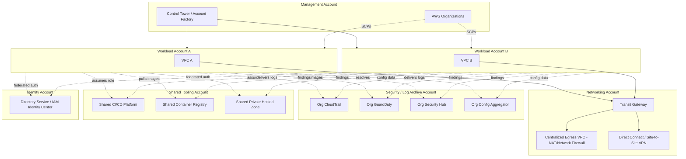
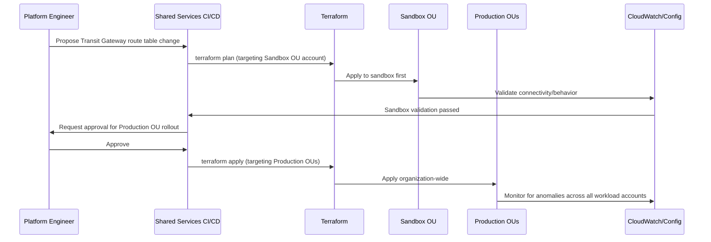

# Part II – Core Infrastructure Architectures

# Chapter 9 – Shared Services Architecture

*The AWS Reference Architecture Handbook — 100 Production-Ready Cloud Architectures with AWS, Terraform, AI, Security, FinOps, and Enterprise Design Patterns*

---

## 1. Executive Summary

Every organization that grows past its first two or three AWS accounts eventually confronts the same structural question: who owns the VPC, who owns the CI/CD pipeline, who owns the Active Directory connector, and why does every new application team spend their first month reinventing infrastructure that a dozen other teams already built, tested, and are separately paying for? The **Shared Services Architecture** is this book's answer to that question — a dedicated AWS account (or small set of accounts) that centralizes the infrastructure, tooling, and platform capabilities that every workload account needs, so that individual application teams consume shared, governed capabilities rather than re-provisioning them independently. This is not a single application architecture in the sense of Chapters 1 and 5; it is a **platform architecture** — the infrastructure that other architectures in this book are built on top of, once an organization has more than a handful of AWS accounts.

The business problem this architecture solves is the compounding cost of decentralized infrastructure ownership. In a young multi-account AWS environment, it is common — almost inevitable — for each application team to independently stand up its own VPC, its own NAT Gateways, its own CI/CD runners, its own DNS zone, its own directory service integration, and its own security tooling. Each of these is a reasonable decision in isolation. In aggregate, across twenty, fifty, or two hundred accounts, this pattern produces staggering duplicated cost (fifty sets of NAT Gateways where five would suffice), inconsistent security posture (fifty independently-configured GuardDuty/Config setups, some inevitably misconfigured or simply never enabled), fragmented operational visibility (no single place to see the organization's actual security or cost posture), and a genuine drag on new-team velocity, because every new team's first quarter is spent re-solving problems — DNS, connectivity, CI/CD, identity federation — that are not specific to their application and add no differentiated business value when solved redundantly.

The architecture's objective is to identify the capabilities that are genuinely common across workload teams — networking connectivity, DNS, CI/CD tooling, container registries, centralized logging, security tooling, directory/identity services, and sometimes shared data platforms — and provide them as internally consumed, centrally governed services from a dedicated shared services account (or a small number of them: typically one for networking, one for security/logging, one for shared tooling), connected to workload accounts via Transit Gateway and consumed via well-defined interfaces (Resource Access Manager shares, cross-account IAM roles, internal service endpoints) rather than each workload account re-provisioning its own copy.

Organizations adopt this architecture as a direct consequence of AWS multi-account growth, which itself is a widely recommended AWS best practice (isolating workloads by account for blast-radius containment, billing clarity, and independent compliance boundaries) that, without a shared services layer, produces exactly the duplication problem described above. The architecture typically emerges at an inflection point — usually somewhere between 10 and 30 AWS accounts — where the CFO notices the NAT Gateway and cross-account data transfer line items have grown disproportionately to actual usage, where the security team can no longer manually verify that every account has GuardDuty enabled, or where a platform/DevOps team is formally created specifically because "every team building their own CI/CD pipeline" has become an acknowledged organizational inefficiency.

The major business benefits compound across three dimensions. **Cost**: centralizing NAT Gateway, Transit Gateway attachment, and shared tooling infrastructure converts N independent instances of fixed infrastructure cost into effectively one (plus modest per-account attachment costs), which at real enterprise scale (dozens to hundreds of accounts) represents genuine, material savings — often the single largest FinOps lever available to a mature AWS organization, larger than any individual workload's rightsizing effort. **Security and compliance consistency**: a shared services account with organization-wide GuardDuty, Security Hub, Config, and CloudTrail aggregation (via AWS Organizations delegated administrator features) means security posture is enforced and visible centrally rather than depending on every individual team correctly configuring it, and audit evidence for the entire organization can be produced from one place rather than reconstructed account-by-account. **Team velocity**: a new application team building on top of a mature shared services layer can be provisioned a fully-networked, DNS-registered, CI/CD-connected, security-baseline-compliant AWS account in hours via an automated account vending process, rather than spending weeks manually wiring up infrastructure that dozens of other teams have already solved.

Typical enterprise scenarios where this architecture becomes necessary include: a company that has grown from a single AWS account to dozens through organic team growth or through acquisitions, each bringing its own AWS footprint, and now needs a coherent way to connect and govern them; a platform engineering team being formally established with a mandate to reduce the operational burden on individual application teams; a regulated enterprise (financial services, healthcare) that needs to demonstrate consistent security controls across every account in scope for an audit, which is operationally infeasible without centralization; and an organization pursuing an AWS Control Tower or Landing Zone Accelerator-based multi-account strategy, where the shared services account is a first-class, explicitly designed component of the overall landing zone rather than an afterthought bolted on after account sprawl has already occurred.

It is worth being explicit about the organizational, not merely technical, nature of this architecture. Building the Transit Gateway and the shared VPC is the easy part. The harder, more consequential part — and the part that determines whether this architecture succeeds or becomes its own bottleneck — is defining clear service boundaries and ownership: what, precisely, does the shared services team own and support, what remains the workload team's responsibility, and what is the actual, tested process (not aspiration) for a workload team to request a new shared capability or flag that a shared service is not meeting their needs. Chapter 34's "Architect's Corner" addresses this dimension directly, because in this book's collective experience across many enterprise engagements, the technical design of shared services architectures rarely fails; the *governance model* around them frequently does, either by becoming an unresponsive bottleneck that workload teams route around (recreating the original duplication problem) or by never establishing clear enough boundaries that anyone can reason about who is accountable when something breaks.

---

## 2. Business Requirements

### 2.1 Business Drivers

The primary business driver is **economy of scale applied to platform infrastructure**: centralizing genuinely common capabilities to convert per-account fixed costs into shared, amortized costs, and centralizing security/compliance tooling to convert per-account manual diligence into organization-wide automated enforcement. A secondary, equally important driver is **reducing new-team time-to-production** by providing a paved path that eliminates redundant infrastructure work.

### 2.2 Functional Requirements

| Requirement | Description |
|---|---|
| Centralized network connectivity | Workload account VPCs can reach shared resources and, where approved, each other, without each account building its own connectivity solution |
| Centralized DNS | A shared, hierarchical private DNS namespace resolvable across all connected accounts |
| Shared CI/CD tooling | A common, centrally-maintained CI/CD platform (or shared runner/agent fleet) available to all workload accounts without each team operating its own |
| Centralized container registry | A shared Amazon ECR (or equivalent) for common base images and, optionally, application images, with organization-wide vulnerability scanning |
| Centralized identity federation | A single integration point with the corporate identity provider (SAML/OIDC), avoiding per-account, per-team custom auth integration |
| Centralized logging and security tooling | Organization-wide CloudTrail, GuardDuty, Security Hub, and Config aggregation into a dedicated account |
| Account vending | A repeatable, automated process for provisioning new workload accounts pre-wired to shared services |

### 2.3 Non-Functional Requirements

**Scalability goals.** The shared services layer must scale to support the organization's full account count — commonly designed with headroom for 2-5x the current account count over a three-year horizon — without requiring a redesign of the core Transit Gateway/networking topology, since re-architecting foundational connectivity across dozens of already-connected accounts is disproportionately disruptive compared to designing adequate headroom initially.

**Availability requirements.** This is one of the most important, easily underestimated requirements in this entire architecture: **the shared services layer typically must exceed the availability target of any individual workload it serves**, because an outage in shared DNS, shared connectivity, or shared identity federation does not take down one application — it can simultaneously degrade every connected workload account. A common target is 99.95%+ for the core networking/DNS shared services, explicitly higher than what many individual workload accounts might target for themselves in isolation.

**Latency requirements.** Cross-account, cross-VPC traffic routed through Transit Gateway should add minimal latency overhead (typically single-digit milliseconds) relative to a direct VPC peering connection — an explicit design constraint that rules out overly convoluted routing topologies (e.g., unnecessary hairpinning through inspection appliances for traffic that does not require it).

**Compliance requirements.** This architecture is frequently the *mechanism* by which compliance is achieved organization-wide (centralized CloudTrail satisfying audit logging requirements for every connected account simultaneously) rather than a compliance requirement in its own right — but the shared services account(s) themselves typically carry the *most* stringent security posture in the entire organization, since a compromise of shared services infrastructure has organization-wide blast radius.

**Security expectations.** Least-privilege cross-account access is non-negotiable and receives outsized design attention in this architecture specifically because the alternative — broad, convenient cross-account trust relationships — creates exactly the kind of organization-wide blast radius this architecture must be designed to avoid, even though its entire purpose is enabling controlled cross-account access.

**Recovery objectives.**

| Metric | Baseline Target | Definition |
|---|---|---|
| RPO (shared network/DNS configuration) | Near-zero | Configuration is IaC-defined and re-appliable; the real recovery concern is the live Transit Gateway/routing state, not data |
| RTO (Transit Gateway/core connectivity) | ≤ 15 minutes | Given the organization-wide impact of a shared connectivity outage, this RTO is deliberately tighter than most individual workload architectures in this book |
| RTO (shared CI/CD platform) | ≤ 1 hour | A CI/CD outage blocks deployments organization-wide but does not affect already-running workloads, giving slightly more RTO latitude |

**SLAs.** Internal SLAs (platform-team-to-application-team commitments) are standard for this architecture even though there is typically no external customer-facing SLA — these internal SLAs matter because dozens of downstream teams' own external SLA commitments transitively depend on the shared services layer's actual availability.

**Expected workload and growth.** Sized to the organization's account count and per-account traffic aggregate, with the explicit growth assumption being **organizational** (account count, team count) rather than purely traffic-based — a critical distinction from every other architecture in this book, where growth is normally reasoned about primarily as request volume.

> **Note:** Requirements-gathering for this architecture should explicitly include a stakeholder interview round with representative workload teams, not just the platform team's own assumptions about what should be centralized — the most common early design mistake in this pattern is centralizing something workload teams did not actually want centralized (over-standardizing a genuinely team-specific tool) while under-investing in something they all independently rebuilt anyway (under-recognizing genuine common need).

---

## 3. Architecture Overview

### 3.1 Overall Design and Philosophy

The design philosophy of this architecture is **centralize the genuinely common, federate the genuinely team-specific, and make the boundary between the two explicit and governed rather than assumed**. Unlike Chapters 1 and 5, which describe a single workload's internal structure, this architecture describes the connective tissue and shared substrate *between* workloads — it is topologically a hub, with the shared services account(s) at the center and workload accounts as spokes, all connected through AWS Transit Gateway rather than a fragile mesh of point-to-point VPC peering connections (which does not scale past a small number of accounts due to peering's non-transitive nature and connection-count growth).

### 3.2 Core Components

- **Networking account:** Hosts the Transit Gateway, centralized egress (NAT Gateways/Network Firewall for outbound internet access from workload accounts), and, where required, Direct Connect/Site-to-Site VPN termination for hybrid connectivity
- **Security/logging account (log archive account):** Aggregates CloudTrail, GuardDuty findings, Security Hub findings, and Config data organization-wide via AWS Organizations delegated administrator capabilities
- **Shared tooling account:** Hosts CI/CD platform infrastructure (self-hosted runners, or the control plane for a managed CI/CD service), a shared Amazon ECR registry, and other common developer-facing tooling
- **Identity/directory account (or integration within the management/security account):** Hosts the directory service (AWS Managed Microsoft AD or a connector to an external IdP) and IAM Identity Center configuration
- **AWS Organizations and Control Tower / Landing Zone Accelerator:** Provides the account structure, Service Control Policies, and automated account provisioning (account vending) that ties the whole multi-account environment together
- **Workload accounts:** Individual application teams' accounts, each implementing one of this book's other architecture patterns (Chapter 1, Chapter 5, or others) internally, while consuming shared services externally

### 3.3 Component Interaction and High-Level Workflow

A new workload account is provisioned through an **account vending machine** process (an automated pipeline, typically built on Control Tower Account Factory or a custom Service Catalog/Terraform-based equivalent) that creates the account within the correct AWS Organizations organizational unit (OU), applies baseline Service Control Policies, attaches the account's VPC to the central Transit Gateway, registers the account's private DNS zone into the shared Route 53 Private Hosted Zone association, grants the account access to the shared CI/CD platform and container registry via cross-account IAM roles, and enrolls the account into the organization-wide GuardDuty/Security Hub/Config aggregation automatically. From that point forward, the workload team operates largely independently within their account — deploying their own Chapter 1 or Chapter 5-style application architecture — while transparently benefiting from centralized connectivity, security monitoring, and tooling without needing to provision any of it themselves.

### 3.4 Request, Response, and Data Lifecycle

Because this is a platform architecture rather than a single application, "request lifecycle" here refers to two distinct flows: **inter-account network traffic** (a request originating in one workload account's VPC destined for another workload account's VPC, or for a shared resource, traverses the Transit Gateway, evaluated against Transit Gateway route tables that enforce which accounts can reach which other accounts — not a full mesh by default) and **the account/service provisioning lifecycle** (a new account request flows through the account vending pipeline described above, an outcome that is itself a first-class "data lifecycle" this architecture must handle reliably, since a broken account vending pipeline directly blocks new team onboarding organization-wide).



---

## 4. AWS Services Used

### 4.1 AWS Organizations

**Purpose:** The foundational multi-account management service, providing consolidated billing, organizational unit (OU) hierarchy, and Service Control Policies (SCPs) that enforce guardrails across all member accounts.

**Why selected:** It is the only AWS-native way to manage a multi-account environment coherently, and every other component of this architecture (Control Tower, delegated administrator for security services, RAM sharing) depends on it.

**Alternatives:** There is no realistic alternative to AWS Organizations for a multi-account AWS environment of any real size — the question is not whether to use it, but how to structure the OU hierarchy and which SCPs to apply.

**Limitations:** SCPs are guardrails (deny-based, maximum permission ceilings) not grants — they cannot themselves grant permissions, only restrict what IAM policies within an account can allow, a frequently misunderstood point during initial design.

**Best practices:** Structure OUs by function/environment (e.g., Security, Infrastructure, Workloads/Production, Workloads/Non-Production) rather than by team or department, since SCPs and other org-wide policies typically need to differ by environment risk profile more than by organizational reporting structure.

### 4.2 AWS Control Tower / Landing Zone Accelerator

**Purpose:** Provides an opinionated, automated setup of a multi-account landing zone, including account factory (automated new-account vending), a baseline set of guardrails, and centralized logging/security account setup.

**Why selected:** Removes substantial undifferentiated heavy lifting versus building the equivalent multi-account governance and account-vending automation entirely from scratch with custom Terraform/Service Catalog tooling.

**Alternatives:** Landing Zone Accelerator on AWS (LZA) is preferred over Control Tower when an organization needs deeper customization than Control Tower's opinionated model comfortably allows, particularly for complex, highly regulated environments (e.g., specific FedRAMP or DoD compliance overlays) with requirements LZA's more flexible, code-based approach accommodates more readily. A fully custom Terraform-based account vending solution is chosen when an organization's account provisioning requirements are unusual enough that neither Control Tower nor LZA's opinionated structures fit well, accepting the higher build/maintenance cost in exchange for full control.

**Limitations:** Control Tower's opinionated defaults can be genuinely restrictive for organizations with unusual compliance or architectural requirements; migrating an already-large, organically-grown multi-account environment *into* Control Tower governance after the fact (rather than starting with it) is a nontrivial, carefully-sequenced undertaking in its own right.

**Best practices:** Adopt Control Tower (or LZA) as early as possible in a multi-account journey — the earlier it is adopted, the fewer already-existing, non-conforming accounts need to be retrofitted into its governance model later.

### 4.3 AWS Transit Gateway

**Purpose:** A regional network transit hub enabling scalable, centrally-managed connectivity between many VPCs and on-premises networks, replacing the need for a full mesh of point-to-point VPC peering connections.

**Why selected:** VPC peering is non-transitive (A peered to B, B peered to C does not let A reach C) and grows in connection count quadratically with the number of VPCs needing mutual connectivity — completely impractical past a handful of VPCs. Transit Gateway provides a hub-and-spoke model where each VPC needs only one attachment, and route tables control exactly which VPCs can reach which others, providing both scalability and fine-grained routing control in one mechanism.

**Alternatives:** VPC peering remains appropriate for a small, stable number of VPCs needing simple, direct connectivity (e.g., two accounts with a permanent, well-understood relationship) where Transit Gateway's additional cost and complexity are not justified; AWS Cloud WAN is preferred for very large, global organizations needing a higher-level, policy-based approach to defining and managing network segments across multiple regions, effectively an abstraction layer above multiple regional Transit Gateways.

**Limitations:** Transit Gateway itself has quotas worth planning around explicitly — a default limit on the number of VPC attachments per Transit Gateway and a per-attachment bandwidth ceiling (which can be a genuine bottleneck for very high-throughput inter-VPC data flows, a very different failure mode than the "too many connections" problem VPC peering has at scale).

**Pricing considerations:** Billed per attachment-hour plus per-GB data processing charge for all traffic traversing it — at scale, this data-processing charge can become one of the largest line items in the entire shared services budget, making traffic pattern analysis (which workloads are generating the most inter-account traffic, and whether that traffic pattern is actually necessary) a genuine, recurring FinOps exercise for this architecture specifically.

**Best practices:** Use separate Transit Gateway route tables per traffic-segmentation requirement (e.g., production workloads should not, by default, be able to route to non-production workloads even though both attach to the same Transit Gateway) rather than a single flat route table granting universal reachability.

### 4.4 AWS Resource Access Manager (RAM)

**Purpose:** Enables sharing of specific AWS resources (subnets, Transit Gateway attachments, License Manager configurations, Route 53 Resolver rules) across accounts within an AWS Organization without requiring resource duplication or complex cross-account IAM policy authoring for each shared resource type.

**Why selected:** It is the AWS-native mechanism specifically designed for this exact use case — sharing infrastructure resources (not data, not application-level access) across accounts within an organization — and integrates natively with Organizations, requiring no custom cross-account trust policy authoring for the resource types it supports.

**Best practices:** Share subnets via RAM (rather than each account building its own subnets in a shared VPC construct) specifically for centralized-VPC patterns where multiple accounts' workloads run within a genuinely shared VPC rather than their own — a more advanced and more tightly-coupled variant of this architecture than the Transit-Gateway-connected-separate-VPCs pattern this chapter primarily describes, worth understanding as a related alternative (see Section 28).

### 4.5 Amazon Route 53 (Private Hosted Zones and Resolver)

**Purpose:** Provides centralized private DNS resolution across all connected accounts/VPCs, and Route 53 Resolver enables DNS query forwarding to on-premises DNS servers (for hybrid environments) or from on-premises to AWS-hosted private zones.

**Why selected:** Without a shared, associated Private Hosted Zone strategy, each workload account either cannot resolve other accounts' internal service names at all, or resorts to hardcoded IP addresses — both are anti-patterns this architecture explicitly eliminates by providing a shared, hierarchical private DNS namespace (e.g., `internal.example.com`, with each workload team owning a delegated subdomain like `payments.internal.example.com`) associated across all relevant VPCs via RAM sharing.

**Best practices:** Delegate DNS subdomains to workload teams rather than centralizing every DNS record's creation through the platform team — this is a specific, concrete example of the "centralize the shared substrate, federate the team-specific detail" philosophy from Section 3.1: the *zone association mechanism* is centralized, but *record management within a team's delegated subdomain* is federated.

### 4.6 Amazon ECR (Elastic Container Registry)

**Purpose:** A managed container registry; in this architecture, a shared instance hosts common base images (organization-approved, hardened OS/language runtime images) and, in centralized-registry variants, application images from multiple workload teams.

**Why selected:** Centralizing at least the base-image layer ensures every workload team builds from a consistently patched, vulnerability-scanned foundation rather than each team independently sourcing and maintaining their own base images with inconsistent patch cadences.

**Alternatives:** A fully decentralized model where each workload account runs its own ECR repositories is preferred when workload teams' image content is genuinely sensitive enough that even read access from a shared registry account is undesirable, or when organizational structure makes a shared registry's access-control model awkward to administer; most organizations land on a hybrid — shared base images, per-account application image repositories — which this chapter recommends as the default.

**Best practices:** Enable ECR's image scanning (basic or enhanced, the latter powered by Amazon Inspector) on the shared base-image repository specifically, since a vulnerability in a base image propagates to every workload team building on top of it, making this the highest-leverage place in the entire container supply chain to catch issues early.

### 4.7 IAM, KMS, Secrets Manager, Systems Manager, CloudWatch, CloudTrail, AWS Config, GuardDuty, Security Hub

These services are covered in depth in Sections 10, 11, 21, and 22, with the specific architectural emphasis in this chapter being **cross-account patterns** — delegated administrator configuration for GuardDuty/Security Hub/Config (allowing the security account to manage these services organization-wide rather than requiring per-account manual enablement), organization-wide CloudTrail (a single trail capturing management events across every account, delivered to the centralized log archive account's S3 bucket), and cross-account IAM roles (the mechanism by which workload accounts consume shared CI/CD, ECR, and other tooling without direct, standing credentials).

---

## 5. Complete Architecture Diagram

```mermaid

flowchart TB
    subgraph Users["Platform Consumers"]
        DEV[Application Developers]
        SEC[Security/Compliance Team]
        PLAT[Platform Team]
    end

    subgraph MgmtAcct["Management Account"]
        ORG[AWS Organizations + SCPs]
        AF[Account Factory / Account Vending]
    end

    subgraph NetworkAcct["Networking Account"]
        TGW[Transit Gateway]
        subgraph EgressVPC["Centralized Egress VPC"]
            NATG[NAT Gateways]
            NFW[Network Firewall - Optional]
        end
        VPNGW[Site-to-Site VPN / Direct Connect Gateway]
        R53R[Route 53 Resolver]
    end

    subgraph SecurityAcct["Security / Log Archive Account"]
        CTORG[Organization CloudTrail]
        GDORG[Organization GuardDuty - Delegated Admin]
        SHORG[Organization Security Hub - Delegated Admin]
        CFGORG[Organization Config Aggregator]
        LOGS3[Centralized Log Archive S3]
    end

    subgraph ToolingAcct["Shared Tooling Account"]
        CICDP[CI/CD Control Plane]
        ECRS[Shared ECR - Base + App Images]
        PHZ[Shared Private Hosted Zones]
        ARTIFACT[Shared Artifact Storage]
    end

    subgraph IdentityAcct["Identity Account"]
        IDC[IAM Identity Center]
        DIRSVC[Directory Service]
    end

    subgraph WorkloadA["Workload Account - Team Payments"]
        VPCA[VPC A - Ch.1 3-Tier App]
    end

    subgraph WorkloadB["Workload Account - Team Reporting"]
        VPCB[VPC B - Ch.5 Single Instance App]
    end

    DEV --> AF
    SEC --> SecurityAcct
    PLAT --> ToolingAcct
    PLAT --> NetworkAcct

    AF --> WorkloadA
    AF --> WorkloadB
    ORG -.guardrails.-> WorkloadA
    ORG -.guardrails.-> WorkloadB

    VPCA --> TGW
    VPCB --> TGW
    TGW --> NATG
    TGW --> VPNGW
    TGW -.DNS.-> R53R

    WorkloadA -.CloudTrail delivery.-> CTORG
    WorkloadB -.CloudTrail delivery.-> CTORG
    WorkloadA -.findings.-> GDORG
    WorkloadB -.findings.-> GDORG
    WorkloadA -.findings.-> SHORG
    WorkloadB -.findings.-> SHORG
    WorkloadA -.config.-> CFGORG
    WorkloadB -.config.-> CFGORG
    CTORG --> LOGS3

    WorkloadA -.assume role.-> CICDP
    WorkloadB -.assume role.-> CICDP
    WorkloadA -.pull images.-> ECRS
    WorkloadB -.pull images.-> ECRS
    WorkloadA -.resolve.-> PHZ
    WorkloadB -.resolve.-> PHZ

    WorkloadA -.federated login.-> IDC
    WorkloadB -.federated login.-> IDC
    IDC --> DIRSVC

```



---

## 6. Component-by-Component Explanation

| Component | Purpose | Scaling | High Availability | Failure Handling | Dependencies |
|---|---|---|---|---|---|
| Transit Gateway | Central network hub for inter-VPC/hybrid connectivity | Scales to thousands of attachments per quota limits | Regionally resilient by design; deploy a second Transit Gateway in a second region for multi-region designs | Route table misconfiguration is the dominant real-world failure mode, not the service itself failing | VPC attachments, route tables, RAM shares |
| Centralized Egress VPC | Provides shared, inspected outbound internet access for workload accounts that do not need their own NAT Gateways | Scales via additional NAT Gateway capacity or Network Firewall endpoint scaling | Deployed across multiple AZs within the networking account | NAT Gateway failure in one AZ does not affect other AZs' egress capacity | Transit Gateway, Elastic IPs |
| Organization CloudTrail | Captures management (and optionally data) events across every account into one trail | Scales automatically; no operator action needed | Delivered to a highly durable, versioned, cross-region-replicated S3 bucket | Delivery failure alarms on the log archive account | Log archive S3 bucket, KMS key |
| Delegated Admin GuardDuty/Security Hub/Config | Centralizes security finding aggregation and configuration compliance evaluation across the organization | Scales automatically | No additional HA design needed; these are regional, AWS-managed services | Finding ingestion failure from a specific member account triggers an investigation into that account's delegation configuration | Organizations delegated administrator setup |
| Shared CI/CD Platform | Provides common build/deploy tooling consumed by all workload accounts | Scales via additional build capacity (runners/agents) | Deploy the control plane across multiple AZs; consider Multi-AZ or even multi-region for organizations where CI/CD downtime is highly disruptive | Runner/agent failure is absorbed by additional capacity; control-plane failure blocks new deployments organization-wide until resolved | Cross-account IAM roles, shared ECR |
| Shared ECR | Hosts common base images and, optionally, application images | Effectively unlimited | Regionally resilient by design (S3-backed) | Registry unavailability blocks image pulls organization-wide — a high-blast-radius dependency requiring careful monitoring | KMS key (if encrypted), cross-account repository policies |
| Account Vending (Account Factory) | Automates new workload account creation and baseline configuration | Scales to the organization's account growth rate | The pipeline itself should be treated with production rigor (tested, monitored) given its organization-wide blast radius if broken | Failed vending run requires manual remediation; should alarm the platform team immediately | AWS Organizations, Control Tower/LZA, Terraform/Service Catalog |

---

## 7. End-to-End Request Flow

This section describes two distinct flows given this architecture's dual nature as both a network path and a provisioning process.

**Flow A — Inter-account application traffic (Team Payments' application calling Team Reporting's internal API):**

1. Team Payments' application (running in Workload Account A, per a Chapter 1-style internal architecture) resolves `reporting.internal.example.com` via the **shared Route 53 Private Hosted Zone** association.
2. The DNS query resolves to an internal ALB IP address within Workload Account B's VPC.
3. The request is routed from VPC A's route table toward the **Transit Gateway** attachment, since the destination CIDR is outside VPC A's own range.
4. The **Transit Gateway route table** associated with VPC A's attachment is evaluated; if VPC B's CIDR is present in a reachable route table (the two accounts' traffic segmentation policy permits this specific communication), the packet is forwarded toward VPC B's attachment.
5. If the traffic segmentation policy does **not** permit this communication (e.g., a production-to-non-production boundary), the Transit Gateway route table simply has no route to the destination, and the request fails at the network layer — a deliberate, policy-enforced outcome, not a fault.
6. The request arrives at VPC B's internal ALB, is processed by Team Reporting's application, and the response traverses the same path in reverse.
7. **VPC Flow Logs** on both VPCs' Transit Gateway attachments capture this cross-account flow, feeding the centralized log archive account for later audit/troubleshooting.

**Flow B — New workload account provisioning:**

8. A team lead submits a **new account request** through the platform team's intake process (a ticket, a Service Catalog product, or a pull request against an account-inventory repository, depending on the organization's chosen tooling).
9. The **account vending pipeline** creates the new AWS account within the correct Organizational Unit via AWS Organizations.
10. Baseline **Service Control Policies** applicable to that OU take effect immediately upon account creation.
11. The pipeline provisions the account's **baseline VPC** and attaches it to the central **Transit Gateway**, associating it with the appropriate route table for its OU/traffic segmentation tier.
12. The pipeline associates the account's VPC with the **shared Private Hosted Zones** it needs to resolve, and delegates a subdomain (e.g., `newteam.internal.example.com`) for the team's own record management.
13. The pipeline grants the new account **cross-account IAM roles** for the shared CI/CD platform and shared ECR registry.
14. The pipeline enrolls the account as a **member** in the organization's delegated-administrator GuardDuty, Security Hub, and Config configuration, and confirms the organization CloudTrail is capturing the new account's events (this is typically automatic once the account joins the Organization, but verification is still a recommended pipeline step).
15. The pipeline sends a **completion notification** to the requesting team with the new account's ID, a link to their federated IAM Identity Center access, and a pointer to platform documentation — the team can begin deploying their own workload architecture (e.g., Chapter 1's or Chapter 5's pattern) within minutes to hours of the request, rather than weeks.

---

## 8. Deployment Flow

Infrastructure provisioning for the shared services layer itself follows the same Terraform-first, CI/CD-gated discipline as every other architecture in this book, with one added dimension: **this Terraform codebase's blast radius is organization-wide**, meaning the review and validation gates for changes to Transit Gateway route tables, SCPs, or the account vending pipeline itself deserve materially more scrutiny (mandatory multi-reviewer approval, a staged rollout to a non-production OU before production OUs, and often a scheduled change window rather than continuous deployment) than a typical single workload's infrastructure changes.

**Blue-green deployment concepts** apply differently here than in Chapters 1 or 5 — there is no "traffic-shifting" in the conventional sense for a Transit Gateway or an Organizations SCP change. Instead, the equivalent safety pattern is **staged rollout by OU**: a proposed SCP or routing change is first applied to a Sandbox or Development OU, validated there for an observation period, and only then promoted to Production OUs — conceptually parallel to a bake period, but scoped by organizational unit rather than by traffic percentage.

**Rollback** for shared services changes requires particular care because a rollback of, say, a Transit Gateway route table change can itself be disruptive if workload accounts have begun depending on newly-available connectivity in the interim — this architecture's change management process (Section 23) explicitly requires considering "is rolling this back itself safe" as a pre-deployment question, not an assumption.

**Secrets and configuration** for shared services (e.g., the CI/CD platform's own credentials, cross-account role trust policial details) follow the same Secrets Manager-based pattern as other chapters, with the specific addition that cross-account role ARNs and external IDs used in trust policies are themselves sensitive configuration deserving careful management, since a leaked cross-account role ARN combined with a leaked or guessable external ID could enable unauthorized cross-account access.



---

## 9. Network Topology

This is the section where this architecture differs most substantially from Chapters 1 and 5, since the "network topology" here spans multiple accounts rather than a single VPC.

**The networking account's VPC** hosts the Transit Gateway attachment point and the centralized egress infrastructure, using a CIDR range (e.g., `100.64.0.0/16`, deliberately chosen from a range unlikely to collide with any workload account's own VPC CIDR) reserved specifically for shared infrastructure, never for application workloads.

**Each workload account's VPC** uses its own CIDR block, allocated from a centrally-managed IP address plan (via IPAM — Amazon VPC IP Address Manager) specifically to guarantee non-overlapping CIDR ranges across the entire organization, a prerequisite for any inter-account routing to function at all — two workload accounts with overlapping CIDR ranges cannot be connected via Transit Gateway without a NAT-based workaround, making upfront IPAM discipline one of the highest-leverage early decisions in this architecture.

**Transit Gateway route tables** are the primary traffic segmentation mechanism: a common pattern uses separate route tables for Production, Non-Production, and Shared Services traffic segments, with explicit, intentional routes added between segments only where a genuine, approved business need exists (e.g., a specific Non-Production account needing read access to a Production reporting API) rather than a single flat route table granting universal reachability by default.

**Centralized egress** (a shared NAT Gateway/Network Firewall setup in the networking account) is a common, cost-motivated pattern for workload accounts whose outbound internet needs are modest — routing their egress traffic through the Transit Gateway to a shared NAT Gateway rather than each account provisioning its own. This is a direct, explicit cost/architecture trade-off worth stating plainly: centralized egress reduces NAT Gateway *fixed* cost dramatically at scale, but adds Transit Gateway data-processing charges for that same traffic and introduces the shared egress path itself as a new, organization-wide-blast-radius dependency — the FinOps analysis in Section 16 walks through when this trade-off is favorable.

**PrivateLink (VPC Endpoint Services)** is frequently used within this architecture for exposing genuinely internal, cross-account services (e.g., the shared CI/CD platform's API) via an Endpoint Service in the tooling account, consumed via Interface VPC Endpoints in each workload account — an alternative to routing this traffic through the Transit Gateway, often preferred specifically for the shared tooling/services layer because it avoids exposing broader VPC-to-VPC reachability just to reach one specific service, tightening the blast radius of that specific cross-account dependency.

**Hybrid connectivity** (Direct Connect or Site-to-Site VPN) is frequently a core function of the shared services architecture specifically — rather than every workload account independently establishing its own on-premises connectivity, a single Direct Connect Gateway or VPN termination point in the networking account, attached to the Transit Gateway, provides on-premises connectivity to every connected workload account simultaneously, which is one of this architecture's most immediately compelling value propositions for organizations mid-migration from on-premises infrastructure.

---

## 10. Identity and Access

**IAM Roles in this architecture are overwhelmingly cross-account**, and this is where the least-privilege discipline established in every other chapter of this book matters most acutely, because a mistake here has organization-wide, not single-workload, blast radius. A representative cross-account role trust policy for a workload account assuming a role to interact with the shared CI/CD platform:

```json

{
  "Version": "2012-10-17",
  "Statement": [
    {
      "Effect": "Allow",
      "Principal": {
        "AWS": "arn:aws:iam::222233334444:root"
      },
      "Action": "sts:AssumeRole",
      "Condition": {
        "StringEquals": {
          "sts:ExternalId": "unique-per-account-external-id-value"
        },
        "ArnLike": {
          "aws:PrincipalArn": "arn:aws:iam::222233334444:role/workload-a-cicd-deploy-role"
        }
      }
    }
  ]
}

```

**A specific, important note on the trust policy above:** it restricts the trust not merely to "account 222233334444" (the workload account) via the account root principal, but further constrains it via `aws:PrincipalArn` to the *specific* IAM role expected to assume this cross-account role, and requires an `sts:ExternalId` — this combination is deliberately defensive against the "confused deputy" problem, where a broadly-trusted account-level principal could otherwise be leveraged by any IAM principal within that account, not just the intended one.

**STS** underlies every cross-account interaction in this architecture; session duration for cross-account roles should generally be shorter (e.g., 1 hour) than might be convenient, specifically because the organization-wide blast radius of a leaked cross-account session credential is proportionally larger than a leaked single-workload credential.

**Cross-account access** patterns in this architecture fall into two categories worth distinguishing explicitly: **hub-to-spoke** (the shared services accounts reaching into workload accounts, e.g., Config/GuardDuty delegated administrator functionality reading workload account data) and **spoke-to-hub** (workload accounts reaching into shared services accounts, e.g., a workload account's CI/CD pipeline assuming a role to push to the shared ECR registry) — these should use distinct, purpose-specific roles rather than a single, broadly-scoped "shared services access" role, since the two directions carry genuinely different risk profiles and audit requirements.

**Permission boundaries** are applied to any role created by the account vending automation itself, capping what a newly-vended account's automation-created roles can ever be granted, providing a safety net against the account vending pipeline's own logic containing a bug that would otherwise over-grant permissions during automated provisioning.

**Service Control Policies** deserve specific attention in this architecture as the primary organization-wide guardrail mechanism — a representative SCP denying the disabling of GuardDuty within any member account (protecting the organization-wide security visibility this architecture exists partly to provide):

```json

{
  "Version": "2012-10-17",
  "Statement": [
    {
      "Sid": "DenyGuardDutyDisable",
      "Effect": "Deny",
      "Action": [
        "guardduty:DeleteDetector",
        "guardduty:DisassociateFromMasterAccount",
        "guardduty:UpdateDetector"
      ],
      "Resource": "*",
      "Condition": {
        "StringNotEquals": {
          "aws:PrincipalArn": "arn:aws:iam::333344445555:role/security-team-guardduty-admin"
        }
      }
    }
  ]
}

```

---

## 11. Security Architecture

The security architecture of the shared services layer itself deserves the **most stringent** posture of any account in the organization, precisely because it is the highest-blast-radius component in the entire multi-account environment — a compromise here is not a single workload's compromise, it is potentially every connected workload's compromise.

**Encryption** for all shared services data (the centralized log archive S3 bucket, the shared ECR registry, any shared artifact storage) uses customer-managed KMS keys with tightly-scoped key policies, since these repositories aggregate the most organization-sensitive data (every account's audit logs, every team's container images) in single locations.

**GuardDuty, Security Hub, and Config** are configured via **delegated administrator** — a specific Organizations feature that allows a designated member account (the security/log archive account) to manage these services organization-wide, rather than requiring the management account itself to directly administer security tooling (a best practice specifically because the management account should be used as sparingly as possible, given its own outsized, organization-wide privilege).

**CloudTrail** is configured as a single **organization trail**, created from the management account, which automatically applies to every current and future member account — this is specifically preferable to each account maintaining its own independent trail, because an organization trail cannot be disabled or modified by member account administrators, closing a specific security gap (a compromised or rogue workload account administrator disabling their own account's audit trail to cover tracks) that independent per-account trails do not close.

**Network Firewall**, deployed in the centralized egress VPC (Section 9), provides organization-wide, centrally-managed outbound traffic inspection — a single point to enforce domain allowlisting/denylisting or intrusion detection signatures across every workload account's egress traffic, rather than each account needing to independently deploy and maintain its own equivalent inspection capability.

**Zero Trust** principles apply with particular force to the cross-account boundary itself: no workload account should be implicitly trusted by virtue of being "inside the organization" — every cross-account role assumption is explicitly scoped, time-limited, and logged, and Transit Gateway route tables enforce that network-level reachability between accounts is the exception requiring justification, not the default.

**Threat model summary specific to this architecture:**

| Attack Vector | Mitigation |
|---|---|
| Compromised workload account escalating to shared services | Least-privilege, tightly-scoped cross-account role trust policies (ArnLike + ExternalId condition, per Section 10); SCPs denying dangerous actions even for compromised credentials within an account |
| Lateral movement via overly-permissive Transit Gateway routing | Segmented route tables by traffic tier; explicit, justified routes only |
| Compromise of the shared services account itself | Most stringent security posture in the organization; minimal human access; break-glass procedures for emergency access, logged and alerted |
| Supply chain compromise via shared base container images | Enhanced ECR scanning on shared base images specifically, given their organization-wide propagation |
| Account vending pipeline compromise/bug creating over-privileged new accounts | Permission boundaries on automation-created roles; mandatory review gate on pipeline changes given organization-wide blast radius |
| Rogue workload account administrator disabling their own audit trail | Organization-wide CloudTrail (cannot be disabled by member account administrators) |

---

## 12. High Availability

**AZ failures** affecting the networking account's centralized egress infrastructure are handled the same way as Chapter 1's guidance (NAT Gateway per AZ, Multi-AZ deployment of any centralized inspection appliances) — but with the added weight that a centralized egress failure here potentially affects every workload account relying on it, not just one, making the redundancy investment proportionally more justified even for traffic volumes that might not individually justify it in a single-workload context. **Instance/service failures** within the shared tooling account (e.g., a CI/CD control-plane component) are handled per that specific tool's own HA guidance, generally requiring Multi-AZ deployment given the organization-wide dependency on deployment capability. **Regional failures** affecting the Transit Gateway or shared services accounts are a genuinely serious organization-wide risk this architecture must confront directly — Transit Gateway is a regional service, meaning a full regional event affects connectivity for every attached workload account simultaneously; organizations with a genuine multi-region requirement typically deploy a second, region-local Transit Gateway with either Cloud WAN or a manually-managed inter-region peering configuration connecting the two, a design decision covered in more depth in this book's dedicated multi-region chapters. **Load balancing and health checks** are less centrally relevant to this architecture's own components (which are mostly network/control-plane infrastructure rather than request-serving application tiers) but remain fully applicable to any request-serving component within the shared tooling account (e.g., a CI/CD web UI) using the same ALB/health-check patterns as Chapter 1.

> **Warning:** Because the shared services layer's availability ceiling effectively becomes a floor for every connected workload account's own achievable availability, an organization committing to 99.99% availability for even one critical workload account must ensure the shared services layer itself is architected to exceed that bar — a Chapter 1-style Multi-AZ workload architecture cannot actually achieve 99.99% if it depends on a single-region, single-instance shared NAT Gateway path that itself only achieves 99.9%.

---

## 13. Disaster Recovery

**Backup strategy** for this architecture is primarily about **configuration recoverability** rather than data recoverability in the traditional sense — the Transit Gateway route tables, SCPs, and account vending pipeline logic are all Terraform-defined and version-controlled, meaning the actual "backup" is the Git repository history and the ability to re-apply that configuration to a freshly-created or repaired resource. The genuine data-recovery concern in this architecture is the **centralized log archive** (CloudTrail/Config/GuardDuty finding history) and the **shared ECR registry's image history**, both of which use S3's versioning and cross-region replication capabilities.

**Cross-region replication** of the centralized log archive S3 bucket is essentially mandatory for this architecture given its role as potentially the *only* copy of organization-wide audit history — a loss of this data is not merely inconvenient, it can represent a compliance failure (inability to produce audit evidence) independent of any operational impact.

**DR strategy classification** for the shared services layer's control-plane/configuration is effectively **Pilot Light** by virtue of being fully Terraform-defined and re-appliable to a new Transit Gateway/account structure if needed, while the **data-plane** components (log archive, shared registry) use a **Backup and Restore** approach layered with cross-region replication for the log archive specifically, given its compliance-critical nature.

| Component | DR Approach | RTO | RPO |
|---|---|---|---|
| Transit Gateway / routing configuration | Terraform re-apply (Pilot Light equivalent) | ≤ 30 minutes to reconstruct core routing | Near-zero (IaC-defined) |
| Centralized log archive (CloudTrail/Config) | S3 versioning + cross-region replication | ≤ 1 hour to restore access | Near-zero given continuous replication |
| Shared ECR registry | Cross-region replication (native ECR feature) | ≤ 1 hour | Near-zero |
| Account vending pipeline | Terraform re-apply + pipeline redeployment | ≤ 2 hours | Near-zero (IaC-defined) |

---

## 14. Scalability

**Horizontal scaling** in this architecture refers principally to **account count and attachment count** rather than request throughput — the Transit Gateway's attachment quota (a soft, raisable limit) and the account vending pipeline's throughput (how many new accounts can be provisioned per week without manual bottlenecks) are the primary scaling dimensions to plan for. **Vertical scaling** has limited relevance here given the architecture's largely control-plane/network nature, though the shared CI/CD platform's build capacity (runner/agent fleet size) does scale in a manner closer to a traditional application's Auto Scaling pattern. **Database scaling** is not typically a first-class concern for the shared services layer itself (which is mostly network/IAM/logging configuration, not a data-serving application), though any shared data platform component (a shared analytics data lake, for instance, sometimes included in more advanced variants of this architecture) would follow the scaling guidance of whichever specific chapter covers that pattern. **Queue scaling** is relevant specifically for the account vending pipeline if implemented as an asynchronous, SQS-driven provisioning workflow — a pattern recommended once account creation volume is high enough that synchronous, blocking provisioning becomes a bottleneck.

**Explicit scaling ceiling guidance:** organizations approaching several hundred AWS accounts, or requiring Transit Gateway attachment counts near the default service quota, should engage AWS account teams proactively regarding quota increases well ahead of need, and should evaluate whether AWS Cloud WAN's higher-level abstraction (Section 4.3) is warranted before attachment counts become difficult to reason about within a single, flat Transit Gateway configuration.

---

## 15. Performance Optimization

**Caching** in this architecture is most relevant at the shared ECR registry layer — pull-through cache repositories (a native ECR feature) reduce redundant external registry pulls (e.g., from Docker Hub) across many workload accounts, both improving pull latency and reducing exposure to external registry rate limits, which is a genuinely common, easily overlooked operational risk once dozens of workload accounts' CI/CD pipelines are all independently pulling the same public base images. **Compression** is relevant to the shared log archive specifically — CloudTrail and Config data delivered to S3 should use compression to reduce both storage cost and query time for any Athena-based analysis against the archive. **Database optimization** and **connection pooling** are not typically first-class concerns of the shared services layer itself, though the shared CI/CD platform's own backing datastore (if self-hosted) would follow standard guidance. **Concurrency** and **async processing** are most relevant to the account vending pipeline, where provisioning many new accounts concurrently (rather than strictly serially) meaningfully improves the platform team's ability to keep pace with organizational growth, provided the underlying automation is designed to be safely parallelizable (i.e., account-scoped operations that do not contend on shared, serially-updated state like a single Transit Gateway route table without appropriate locking).

---

## 16. Cost Optimization (FinOps)

### 16.1 Estimated Monthly Cost by Organization Size

| Component | Small (10-20 accounts) | Medium (50-100 accounts) | Enterprise (200+ accounts) |
|---|---|---|---|
| Transit Gateway (attachments + data processing) | ~$300 | ~$1,500 | ~$8,000+ |
| Centralized Egress (NAT/Network Firewall) | ~$200 | ~$800 | ~$3,000+ |
| Organization CloudTrail + Log Archive S3 | ~$100 | ~$500 | ~$2,500+ |
| GuardDuty/Security Hub/Config (org-wide) | ~$150 | ~$700 | ~$4,000+ |
| Shared CI/CD Platform infrastructure | ~$400 | ~$1,200 | ~$4,000+ |
| Shared ECR + data transfer | ~$50 | ~$300 | ~$1,500+ |
| Direct Connect / VPN (if applicable) | ~$300 | ~$300 | ~$1,000+ |
| **Approximate Total** | **~$1,500/mo** | **~$5,300/mo** | **~$24,000+/mo** |

> **Note:** Critically, this cost should always be compared against the **counterfactual** — what would N independent workload accounts each provisioning their own equivalent infrastructure cost — not evaluated in isolation. At 100 workload accounts each running their own NAT Gateway, security tooling, and CI/CD infrastructure independently, the aggregate cost of that decentralized approach routinely exceeds this table's centralized figures by 3-5x, which is the actual FinOps case for this architecture's existence.

### 16.2 Major Cost Drivers and Optimization

**Transit Gateway data processing charges** are consistently the largest and most variable cost driver at scale, making **traffic pattern analysis** (which inter-account flows are generating the most data, and whether they are architecturally necessary or could be reduced — for instance, by relocating two chatty, tightly-coupled services into the same account/VPC rather than routing high-volume traffic between accounts) a genuinely high-leverage, recurring FinOps exercise unique to this architecture. **Centralized egress** cost optimization involves periodically reassessing which workload accounts still benefit from shared NAT/inspection versus which have grown enough outbound traffic volume that a dedicated NAT Gateway (or even a direct-to-internet path, for accounts with unusual compliance-driven requirements) is more cost-effective than routing through the shared path plus its Transit Gateway data-processing overhead. **Reserved Instances/Savings Plans** apply to any steady-state compute within the shared tooling account (CI/CD runners, for instance) using the same guidance as Chapters 1 and 5. **Cost allocation and tagging** are, if anything, more organizationally important here than in any single-workload architecture, because shared services costs must be fairly and transparently attributed (charged back or shown back) to consuming workload accounts for the organization's unit economics and per-team budgeting to remain meaningful — an underdeveloped cost allocation model for shared services is a common, specific source of organizational friction between the platform team and workload teams who feel they are being charged unfairly or opaquely for shared infrastructure they do not fully understand or control.

---

## 17. AI-Assisted Operations

The AI-assisted operations practices established in Chapters 1 and 5 apply here, with **architecture review** carrying particular additional weight in this chapter's context: using Amazon Q or a Bedrock-backed tool to review a proposed Transit Gateway route table change or SCP modification against the organization's documented traffic segmentation policy before it reaches human review is a genuinely high-value application, given the organization-wide blast radius of a routing or policy mistake and the difficulty of manually reasoning about the full effect of a route table change across dozens of connected accounts. **AI-assisted cost analysis** is similarly valuable for the specific traffic-pattern-analysis FinOps exercise described in Section 16 — correlating Transit Gateway Flow Logs with Cost Explorer data to identify which specific inter-account flows are driving cost is exactly the kind of cross-referencing task an LLM-assisted analysis tool can accelerate meaningfully versus manual investigation.

---

## 18. Terraform Implementation

```

infrastructure/
├── modules/
│   ├── organizations/
│   ├── transit-gateway/
│   ├── account-vending/
│   └── delegated-admin/
├── environments/
│   ├── management/
│   ├── networking/
│   ├── security/
│   └── tooling/
└── backend.tf

```

**Remote state backend** (per-account state, given the multi-account nature of this architecture):

```hcl

# environments/networking/backend.tf

terraform {
  required_version = ">= 1.7.0"

  backend "s3" {
    bucket         = "example-corp-tfstate-shared-services"
    key            = "networking-account/terraform.tfstate"
    region         = "us-east-1"
    dynamodb_table = "terraform-locks-shared-services"
    encrypt        = true

    # Assume into the networking account for this state's operations

    role_arn       = "arn:aws:iam::222233334444:role/terraform-networking-admin"
  }
}

```

**Transit Gateway with segmented route tables:**

```hcl

# modules/transit-gateway/main.tf

resource "aws_ec2_transit_gateway" "main" {
  description                    = "Central Transit Gateway - Shared Services"
  amazon_side_asn                = 64512
  default_route_table_association = "disable"
  default_route_table_propagation = "disable"

  tags = {
    Name = "shared-services-tgw"
  }
}

resource "aws_ec2_transit_gateway_route_table" "production" {
  transit_gateway_id = aws_ec2_transit_gateway.main.id
  tags               = { Name = "tgw-rt-production" }
}

resource "aws_ec2_transit_gateway_route_table" "non_production" {
  transit_gateway_id = aws_ec2_transit_gateway.main.id
  tags               = { Name = "tgw-rt-non-production" }
}

resource "aws_ec2_transit_gateway_route_table" "shared_services" {
  transit_gateway_id = aws_ec2_transit_gateway.main.id
  tags               = { Name = "tgw-rt-shared-services" }
}

# Example: Production workload account attachment

resource "aws_ec2_transit_gateway_vpc_attachment" "workload_a" {
  transit_gateway_id = aws_ec2_transit_gateway.main.id
  vpc_id             = var.workload_a_vpc_id
  subnet_ids         = var.workload_a_tgw_subnet_ids

  tags = { Name = "attach-workload-a-production" }
}

resource "aws_ec2_transit_gateway_route_table_association" "workload_a" {
  transit_gateway_attachment_id  = aws_ec2_transit_gateway_vpc_attachment.workload_a.id
  transit_gateway_route_table_id = aws_ec2_transit_gateway_route_table.production.id
}

# Production route table can reach shared services, but NOT non-production by default

resource "aws_ec2_transit_gateway_route" "production_to_shared" {
  destination_cidr_block        = var.shared_services_cidr
  transit_gateway_attachment_id = aws_ec2_transit_gateway_vpc_attachment.shared_services.id
  transit_gateway_route_table_id = aws_ec2_transit_gateway_route_table.production.id
}

```

**RAM share for a shared Private Hosted Zone:**

```hcl

# modules/dns-sharing/main.tf

resource "aws_ram_resource_share" "shared_dns" {
  name                      = "shared-private-dns-zones"
  allow_external_principals = false
}

resource "aws_ram_resource_association" "shared_dns" {
  resource_arn       = aws_route53_zone.internal.arn
  resource_share_arn = aws_ram_resource_share.shared_dns.arn
}

resource "aws_ram_principal_association" "org_share" {
  principal          = var.aws_organization_arn
  resource_share_arn = aws_ram_resource_share.shared_dns.arn
}

```

**Cross-account IAM role for workload access to shared CI/CD (created in the tooling account, trust scoped per workload account):**

```hcl

# modules/account-vending/cross_account_role.tf

resource "aws_iam_role" "workload_cicd_access" {
  for_each = var.workload_accounts

  name = "cicd-access-${each.key}"

  assume_role_policy = jsonencode({
    Version = "2012-10-17"
    Statement = [{
      Effect = "Allow"
      Principal = {
        AWS = "arn:aws:iam::${each.value.account_id}:root"
      }
      Action = "sts:AssumeRole"
      Condition = {
        StringEquals = {
          "sts:ExternalId" = each.value.external_id
        }
        ArnLike = {
          "aws:PrincipalArn" = "arn:aws:iam::${each.value.account_id}:role/${each.value.deploy_role_name}"
        }
      }
    }]
  })

  max_session_duration = 3600
}

resource "aws_iam_role_policy" "cicd_scoped_access" {
  for_each = var.workload_accounts

  name = "cicd-scoped-policy-${each.key}"
  role = aws_iam_role.workload_cicd_access[each.key].id

  policy = jsonencode({
    Version = "2012-10-17"
    Statement = [{
      Effect   = "Allow"
      Action   = ["ecr:GetDownloadUrlForLayer", "ecr:BatchGetImage", "ecr:BatchCheckLayerAvailability"]
      Resource = "arn:aws:ecr:us-east-1:${var.tooling_account_id}:repository/base-images/*"
    }]
  })
}

```

**Best practices applied above:** per-account state with role assumption baked into the backend configuration, explicit route table segmentation with `default_route_table_association/propagation` disabled (forcing every attachment to be deliberately, explicitly associated rather than defaulting to a flat, universally-reachable topology), `for_each` over the workload accounts map for repeatable cross-account role creation, and the same `ArnLike` + `ExternalId` defensive trust policy pattern introduced in Section 10.

---

## 19. AWS CLI Examples

**Deployment validation:**

```bash

# Confirm a new VPC attachment is available and associated with the correct route table

aws ec2 describe-transit-gateway-attachments \
  --filters Name=state,Values=available \
  --query 'TransitGatewayAttachments[*].[TransitGatewayAttachmentId,ResourceId,Association.TransitGatewayRouteTableId]' \
  --output table

```

**Monitoring:**

```bash

# Check Transit Gateway data processing volume by attachment, to inform cost/traffic analysis

aws cloudwatch get-metric-statistics \
  --namespace AWS/TransitGateway \
  --metric-name BytesIn \
  --dimensions Name=TransitGateway,Value=tgw-0123456789abcdef0 \
  --start-time $(date -u -d '24 hours ago' +%Y-%m-%dT%H:%M:%S) \
  --end-time $(date -u +%Y-%m-%dT%H:%M:%S) \
  --period 3600 \
  --statistics Sum

```

**Troubleshooting:**

```bash

# Verify an account's GuardDuty enrollment status under delegated administration

aws guardduty list-members \
  --detector-id 00b00fd00fd00fd00fd00fd00fd00fd0 \
  --query 'Members[?AccountId==`444455556666`]'

# Trace a specific cross-account access denial via CloudTrail

aws cloudtrail lookup-events \
  --lookup-attributes AttributeKey=EventName,AttributeValue=AssumeRole \
  --start-time $(date -u -d '1 hour ago' +%Y-%m-%dT%H:%M:%S) \
  --query 'Events[?contains(CloudTrailEvent, `AccessDenied`)]'

```

**Cleanup:**

```bash

# Identify Transit Gateway route table entries that reference a decommissioned attachment

aws ec2 search-transit-gateway-routes \
  --transit-gateway-route-table-id tgw-rtb-0123456789abcdef0 \
  --filters Name=state,Values=blackhole

```

---

## 20. CI/CD Integration

The shared services layer's own CI/CD pipeline (deploying changes to Transit Gateway configuration, SCPs, and the account vending automation itself) requires stricter gates than typical application CI/CD given its organization-wide blast radius: mandatory multi-approver review for any change touching Transit Gateway route tables or SCPs, a staged rollout by OU (Section 8), and typically a scheduled change window rather than continuous deployment for the highest-blast-radius changes (core routing, SCPs affecting production OUs). **Policy as Code** (Open Policy Agent, or AWS's native SCP simulation tools) is used to validate proposed SCP changes against known-good test scenarios before they are ever applied to a live OU, given how easy it is for a subtly incorrect SCP to unexpectedly block a legitimate, critical action organization-wide (a specific, well-known real-world failure mode: an overly broad `Deny` statement in an SCP that inadvertently blocks the very administrative access needed to fix the SCP itself, requiring a break-glass procedure to resolve).

---

## 21. Monitoring

CloudWatch dashboards for this architecture are organized around the shared services' own health (Transit Gateway attachment status and data processing volume, centralized egress NAT Gateway health, CI/CD platform build success rate and queue depth, account vending pipeline success/failure rate) rather than any single application's request-level metrics. **The specific alarms that matter most in this architecture** are: Transit Gateway attachment state changes (an unexpected attachment deletion or state change is a strong signal of either a misconfiguration or a security incident), account vending pipeline failure (given its direct impact on new-team onboarding velocity), organization CloudTrail delivery failure (a compliance-critical signal), and GuardDuty/Security Hub delegated administrator health (ensuring the organization-wide security visibility this architecture provides is actually functioning, not silently degraded for some subset of accounts). **SLOs** for the shared services layer are typically defined and reported to workload teams as an internal service-level commitment (e.g., "Transit Gateway connectivity: 99.95% monthly," "CI/CD platform availability: 99.9% monthly, excluding scheduled maintenance windows") — a genuinely important practice specifically because these SLOs are the concrete artifact that lets downstream workload teams reason about their own achievable availability commitments, per the warning in Section 12.

---

## 22. Logging

**Centralized logging is this architecture's most direct, unambiguous value delivery**, and the design described throughout this chapter — an organization CloudTrail delivering to a dedicated log archive account's S3 bucket, with GuardDuty/Security Hub/Config similarly aggregated via delegated administration — is itself the centralized logging architecture other chapters' Section 22 guidance assumes exists. **Athena** against the centralized log archive is the primary mechanism for organization-wide security and compliance investigations spanning multiple accounts, since it can query CloudTrail data across every account's events from the single archive location without needing to separately query dozens of individual accounts. **Retention** for the centralized log archive should generally follow the organization's most stringent applicable compliance requirement across all connected accounts, since a single shared archive necessarily applies one retention policy across all the data it holds — a workload account with an unusually long regulatory retention requirement effectively sets the floor for the entire shared archive's retention configuration, worth flagging explicitly during requirements gathering rather than discovering after the fact that the shared archive's default retention is insufficient for one specific, stringent workload.

---

## 23. Operational Excellence

**Runbooks** for this architecture must cover organization-wide-blast-radius scenarios specifically: "Transit Gateway route table misconfiguration blocking legitimate traffic," "account vending pipeline failure blocking new account creation," "SCP change inadvertently blocking critical access, requiring break-glass procedure," and "centralized egress NAT Gateway exhaustion affecting multiple workload accounts simultaneously." **Change management** for this architecture is meaningfully stricter than any single workload's change process, given the reasoning throughout this chapter — every proposed change should explicitly answer "which accounts/teams could this affect" and "is rolling this back itself safe" before being approved, questions that are largely rhetorical for a single workload's own infrastructure but are genuinely load-bearing questions here. **Incident response** for a shared services incident requires a different communication pattern than a single workload's incident — because multiple, potentially many, downstream teams are affected simultaneously, the incident commander role for a shared services incident typically includes an explicit "notify affected workload teams" responsibility that a single-workload incident's runbook does not need to formalize to the same degree.

---

## 24. Failure Scenarios

| # | Scenario | Symptoms | Root Cause | Detection | Resolution | Prevention |
|---|---|---|---|---|---|---|
| 1 | Transit Gateway route table misconfiguration | Specific workload accounts suddenly cannot reach each other or shared services | Erroneous or missing route entry from a recent change | Workload team reports connectivity failure; Transit Gateway Flow Logs show blackholed traffic | Correct the route table entry via the reviewed change process | Staged rollout by OU (Section 8); pre-deployment connectivity test plan |
| 2 | Centralized egress NAT Gateway exhaustion | Multiple workload accounts experience outbound connection failures simultaneously | Aggregate outbound traffic across accounts exceeded provisioned NAT capacity | CloudWatch `ErrorPortAllocation` metric on the shared NAT Gateway | Add NAT Gateway capacity, or migrate the highest-volume accounts to dedicated NAT Gateways | Capacity planning against aggregate, not per-account, traffic projections |
| 3 | SCP inadvertently blocks critical administrative action | Platform team cannot perform a needed emergency action anywhere in the organization | Overly broad `Deny` statement in a newly-applied SCP | Immediate, widespread `AccessDenied` errors across multiple accounts/teams | Execute break-glass procedure (a pre-established, separately-secured path to modify/remove the SCP) | Policy-as-code validation of SCPs against test scenarios before applying to production OUs |
| 4 | Account vending pipeline failure | New account requests stall, no completion notification sent | Bug in automation, or an AWS service quota reached during account creation | Pipeline failure alarm, or team follow-up after unusually long wait | Manual remediation of the specific failed step, fix underlying pipeline bug | Treat the vending pipeline itself with the same testing/monitoring rigor as production application infrastructure |
| 5 | Organization CloudTrail delivery failure | Gap in centralized audit log history | S3 bucket policy misconfiguration or KMS key access issue in the log archive account | CloudTrail delivery failure alarm (must be explicitly configured) | Restore correct bucket/KMS permissions, verify no permanent data gap | Alarm explicitly on CloudTrail delivery failure; treat any gap as a compliance-relevant incident |
| 6 | Delegated administrator misconfiguration for GuardDuty | Some accounts silently missing from organization-wide GuardDuty coverage | Account not correctly enrolled during vending, or delegation relationship broken | Periodic delegated-administrator membership audit (must be scheduled, not assumed) | Re-enroll the affected account(s) | Include GuardDuty/Security Hub/Config enrollment verification as an explicit account vending pipeline step |
| 7 | Overlapping CIDR ranges between two workload accounts | Two accounts cannot be connected via Transit Gateway without a NAT workaround | IPAM discipline not enforced during account/VPC provisioning | Discovered during an attempted Transit Gateway attachment or connectivity request | Re-IP one of the conflicting VPCs (highly disruptive) or implement a NAT-based workaround | Enforce IPAM-managed CIDR allocation for every new VPC from day one |
| 8 | Cross-account role trust policy too permissive | Unintended lateral access discovered during a security review | Trust policy using only account-root principal without ArnLike/ExternalId scoping | IAM Access Analyzer cross-account finding | Tighten the trust policy to the specific expected principal and add ExternalId | Use the defensive trust policy pattern (Section 10) as the mandatory template for all cross-account roles |
| 9 | Shared ECR base image contains a newly-discovered CVE | Organization-wide vulnerability exposure across many workload accounts' builds | Base image not rebuilt/rescanned after a new CVE disclosure | Enhanced ECR scanning (Inspector-powered) finding | Rebuild and republish the patched base image, notify all consuming teams | Scheduled, proactive base image rebuild cadence, not only reactive to scan findings |
| 10 | Direct Connect/VPN termination failure | Complete loss of on-premises connectivity for every connected workload account | Hardware/carrier-level failure at the Direct Connect location, or VPN tunnel failure | AWS Health Dashboard, VPN tunnel status CloudWatch metrics | Failover to backup VPN tunnel/Direct Connect circuit if provisioned; escalate to carrier if not | Provision redundant Direct Connect circuits or a backup Site-to-Site VPN specifically because this is a single point of failure for many accounts |
| 11 | Shared CI/CD platform control-plane outage | Deployments blocked organization-wide; already-running workloads unaffected | Control-plane component failure or overload | CI/CD platform health check alarm | Failover per the platform's own HA design, or restore from backup if self-hosted | Multi-AZ deployment of the CI/CD control plane given its organization-wide dependency |
| 12 | Cost anomaly from unexpected Transit Gateway data processing spike | Sudden, large increase in shared services cost | A specific workload account began generating unusually high inter-account traffic (e.g., a misconfigured application causing a retry storm across accounts) | Cost Anomaly Detection alert | Identify the specific account/flow via Transit Gateway Flow Logs, engage that team to fix the underlying issue | Per-account traffic/cost visibility dashboards so anomalies are attributable quickly |
| 13 | Break-glass procedure itself untested and fails during an actual emergency | Extended outage while attempting to use an unfamiliar/broken emergency access path | Break-glass credentials/procedure not exercised since creation | Discovered during the emergency itself (worst-case) or during a scheduled test | Fall back to AWS Support escalation if available; otherwise, extended manual recovery | Test the break-glass procedure on a scheduled cadence, treating it with the same rigor as any DR test |
| 14 | New workload account's SCP inheritance places it in the wrong OU | Account has incorrect (too permissive or too restrictive) guardrails from day one | Account vending automation error, or ambiguous OU-assignment logic | Discovered during initial account validation, or later during a security audit | Move the account to the correct OU, verify SCP effects | Automated post-vending validation step confirming OU placement and effective SCPs match the request |
| 15 | Shared Route 53 Private Hosted Zone association missing for a new account | New account cannot resolve internal service names | Association step skipped or failed during vending | Application-level DNS resolution failures reported by the new team | Manually associate the VPC with the required zones | Explicit, verified vending pipeline step with a post-provisioning DNS resolution smoke test |

---

## 25. Troubleshooting Guide

| Problem | Symptoms | Likely Cause | Diagnosis | AWS CLI Commands | Resolution |
|---|---|---|---|---|---|
| Cross-account connectivity failure | Application in Account A cannot reach a resource in Account B | Missing or incorrect Transit Gateway route table association/route | Check both accounts' route tables and the Transit Gateway's segment route tables | `aws ec2 describe-transit-gateway-route-tables`, `aws ec2 search-transit-gateway-routes` | Add/correct the required route, following the change management process |
| Cross-account role assumption denied | `AccessDenied` when a workload account tries to assume a shared services role | Trust policy ArnLike/ExternalId mismatch, or the calling principal is genuinely not authorized | Review the specific trust policy and the calling principal's actual ARN | `aws iam get-role --role-name <role>`, `aws cloudtrail lookup-events` | Correct the trust policy or the calling principal's configuration |
| New account missing from GuardDuty coverage | Security team cannot see findings for a specific account | Delegated administrator enrollment step failed or was skipped | Check delegated administrator member list | `aws guardduty list-members --detector-id <id>` | Manually invite/enroll the account, fix the vending pipeline step |
| DNS resolution failure for internal service names | Application cannot resolve `*.internal.example.com` names | Missing Private Hosted Zone association for the requesting VPC | Check zone associations | `aws route53 get-hosted-zone --id <zone-id>` | Associate the VPC with the required zone via RAM share acceptance |
| Unexpected shared services cost spike | Cost Anomaly Detection alert | High-volume inter-account traffic from a specific misbehaving workload | Transit Gateway Flow Logs analysis by source/destination account | `aws ce get-cost-and-usage`, Flow Logs query via Athena | Engage the responsible team to fix the underlying traffic pattern |
| SCP blocking a legitimate action | `AccessDenied` for an action that should be permitted | Overly broad Deny statement in a recently-changed SCP | Use IAM policy simulator / SCP evaluation against the specific action | `aws organizations describe-policy` | Correct the SCP, following the mandatory review process for SCP changes |
| Account vending pipeline stuck | New account request has not completed after expected time | A specific automation step failed (quota limit, API throttling, misconfiguration) | Review pipeline execution logs for the specific failed step | Pipeline-specific logging (e.g., CodePipeline/Step Functions execution history) | Manually complete or retry the failed step, fix the underlying automation bug |

---

## 26. Best Practices

1. Structure AWS Organizations OUs by environment/risk tier (Security, Infrastructure, Production Workloads, Non-Production Workloads) rather than by team/department.
2. Adopt Control Tower or Landing Zone Accelerator as early as possible in the multi-account journey.
3. Enforce IPAM-managed, non-overlapping CIDR allocation for every VPC across the entire organization from day one.
4. Use segmented Transit Gateway route tables (production, non-production, shared services) rather than a single flat route table.
5. Disable `default_route_table_association`/`propagation` on the Transit Gateway, forcing every attachment to be deliberately, explicitly associated.
6. Use the ArnLike + ExternalId defensive trust policy pattern for every cross-account IAM role, never a bare account-root principal trust.
7. Configure GuardDuty, Security Hub, and Config via delegated administrator, not direct management-account administration.
8. Create a single organization-wide CloudTrail from the management account rather than independent per-account trails.
9. Enable enhanced (Inspector-powered) scanning on shared base container images specifically, given their organization-wide propagation.
10. Apply permission boundaries to any IAM role created by the account vending automation itself.
11. Treat the account vending pipeline with the same production rigor (testing, monitoring, alerting) as any customer-facing application.
12. Stage all shared-services infrastructure changes through a Sandbox/Development OU before promoting to Production OUs.
13. Require multi-approver review for any change touching Transit Gateway route tables or Service Control Policies.
14. Validate proposed SCPs against known-good test scenarios (policy-as-code) before applying them to any production OU.
15. Establish and periodically test a break-glass emergency access procedure independent of the normal cross-account access path.
16. Cross-region replicate the centralized log archive S3 bucket, given its role as potentially the only copy of organization-wide audit history.
17. Define and publish internal SLOs for the shared services layer (Transit Gateway connectivity, CI/CD availability) so downstream teams can reason about their own achievable commitments.
18. Perform periodic Transit Gateway traffic pattern analysis to identify unexpectedly high-cost or architecturally-unnecessary inter-account flows.
19. Establish a transparent cost allocation/chargeback model for shared services consumption from the outset, not retroactively.
20. Delegate DNS subdomain record management to workload teams while centralizing only the zone association mechanism.
21. Provision redundant Direct Connect circuits or a backup Site-to-Site VPN for any hybrid connectivity termination point.
22. Deploy the shared CI/CD platform's control plane across multiple AZs given its organization-wide deployment-blocking impact if it fails.
23. Include automated post-vending validation (OU placement, effective SCPs, DNS zone associations, GuardDuty enrollment) as an explicit pipeline step, not an assumption.
24. Use PrivateLink (VPC Endpoint Services) for exposing specific shared services (e.g., CI/CD API) rather than broad VPC-to-VPC reachability via Transit Gateway where only one specific service needs to be reached.
25. Periodically audit delegated-administrator membership lists to catch accounts silently missing from organization-wide security coverage.
26. Use pull-through cache repositories in the shared ECR registry to reduce redundant external registry pulls and rate-limit exposure across many accounts' CI/CD pipelines.
27. Treat "is rolling this back itself safe" as a mandatory pre-deployment question for any shared services change.
28. Establish a clear, published, and enforced boundary of what the platform team owns versus what remains workload-team responsibility.
29. Interview representative workload teams during initial design, not just the platform team's own assumptions about what should be centralized.
30. Engage AWS account teams proactively regarding Transit Gateway attachment quota increases well ahead of actual need.

---

## 27. Anti-Patterns

1. **A single, flat Transit Gateway route table with universal reachability** — Dangerous because it provides no traffic segmentation, meaning a compromised account in a low-risk OU has network-level reachability to high-risk production accounts by default. Correct approach: segmented route tables with explicit, justified routes only.
2. **Cross-account IAM roles trusting only the account-root principal, with no ArnLike/ExternalId scoping** — Dangerous because any IAM principal within the trusted account, not just the intended one, can assume the role (the "confused deputy" problem). Correct approach: the defensive trust policy pattern from Section 10.
3. **Per-account independent CloudTrail instead of an organization trail** — Dangerous because a compromised or rogue account administrator can disable their own account's audit trail, hiding malicious activity. Correct approach: a single organization-wide trail that member account administrators cannot disable.
4. **Treating the account vending pipeline as a one-time build with no ongoing maintenance/monitoring** — Dangerous because its organization-wide, ongoing dependency (every new team's onboarding) is disproportionate to the "set it and forget it" treatment it often receives. Correct approach: production-grade monitoring and testing for the vending pipeline itself.
5. **No IPAM discipline, allowing overlapping VPC CIDR ranges across accounts** — Dangerous because it makes future inter-account connectivity require highly disruptive re-IP-ing or awkward NAT workarounds. Correct approach: centrally-managed, non-overlapping CIDR allocation from the very first account.
6. **Overly broad SCPs authored without policy-as-code validation** — Dangerous because a subtly incorrect Deny statement can block legitimate, critical actions organization-wide, sometimes including the very access needed to fix the SCP itself. Correct approach: validate SCPs against test scenarios before applying to production OUs, and maintain a tested break-glass procedure.
7. **Centralizing something workload teams did not actually want centralized** — Dangerous because it creates friction and encourages teams to build unofficial shadow-IT workarounds, recreating the original duplication problem this architecture exists to solve. Correct approach: interview representative workload teams during design, and treat centralization decisions as reversible experiments, not permanent mandates.
8. **No transparent cost allocation model for shared services** — Dangerous because workload teams cannot reason about their own unit economics and often perceive shared services costs as arbitrary or unfair. Correct approach: establish a clear chargeback/showback model from the outset.
9. **Skipping staged rollout by OU for shared services changes** — Dangerous because a mistake in a Transit Gateway or SCP change reaches every connected account simultaneously with no observation period. Correct approach: Sandbox/Development OU validation before Production OU promotion.
10. **A single, unredundant Direct Connect circuit or VPN tunnel serving the entire organization's hybrid connectivity** — Dangerous because its failure affects every connected workload account simultaneously with no failover path. Correct approach: redundant circuits/tunnels given the organization-wide blast radius.
11. **Never auditing delegated-administrator membership lists** — Dangerous because accounts can silently fall out of organization-wide security coverage (GuardDuty, Security Hub) without any obvious symptom until an actual security incident reveals the gap. Correct approach: periodic, scheduled membership audits.
12. **Applying the same security posture to the shared services accounts as to any workload account** — Dangerous because these accounts carry organization-wide blast radius and deserve the most stringent posture in the entire environment, not a default/average one. Correct approach: explicitly elevated security controls and minimal human access for shared services accounts.
13. **No break-glass procedure, or an untested one** — Dangerous because the one time it is genuinely needed (an SCP lockout, a critical account access issue) is the worst possible time to discover it does not work. Correct approach: establish and periodically test break-glass access.
14. **Ignoring Transit Gateway data processing costs during initial design** — Dangerous because this cost driver can dominate the shared services budget at scale and is easy to overlook when initial cost modeling focuses on attachment fees alone. Correct approach: model data processing costs explicitly against realistic inter-account traffic projections.
15. **No PrivateLink usage, routing all cross-account service consumption through broad Transit Gateway VPC-to-VPC reachability** — Dangerous because it grants broader network-level reachability than the actual use case (reaching one specific service) requires. Correct approach: PrivateLink/VPC Endpoint Services for specific shared service consumption.
16. **Unclear ownership boundary between the platform team and workload teams** — Dangerous because it produces either an unresponsive bottleneck (everything routed through an overwhelmed platform team) or duplicated effort (workload teams building around an unclear or unresponsive shared service). Correct approach: explicitly published, enforced ownership boundaries.
17. **No enhanced scanning on shared base container images** — Dangerous because a vulnerability here propagates to every workload team's builds simultaneously. Correct approach: Inspector-powered enhanced ECR scanning on shared base images specifically.
18. **Session durations for cross-account roles set as long as convenient rather than as short as safely possible** — Dangerous because the organization-wide blast radius of a leaked cross-account session credential is proportionally larger than a single-workload credential leak. Correct approach: shorter session durations for cross-account roles specifically.
19. **No post-vending validation confirming OU placement, effective SCPs, DNS associations, and security tool enrollment** — Dangerous because silent partial-provisioning failures leave new accounts in an inconsistent, unverified state. Correct approach: explicit, automated post-vending validation as a mandatory pipeline step.
20. **Treating this architecture as a purely technical build with no attention to the governance/ownership model** — Dangerous because, as this book's collective experience shows, the technical design of shared services architectures rarely fails outright; the governance model around them frequently does. Correct approach: invest deliberately in service boundaries, SLOs, and a responsive intake process alongside the technical build.

---

## 28. Alternatives

| Alternative | Advantages | Disadvantages | Relative Cost | Operational Complexity | Security | Performance |
|---|---|---|---|---|---|---|
| **Fully decentralized (no shared services layer)** | No platform team dependency, maximum per-team autonomy | Massive duplicated cost and effort at scale, inconsistent security posture across accounts, slow new-team onboarding | Highest at scale (N× duplicated fixed infrastructure) | Lower per-account, much higher in aggregate across the organization | Inconsistent, dependent entirely on each team's own diligence | Comparable per-account, no shared bottleneck risk |
| **VPC peering mesh (no Transit Gateway)** | Simpler for a very small number of accounts, no Transit Gateway cost | Non-transitive, connection count grows quadratically, impractical past a handful of VPCs | Lower at very small scale, becomes unmanageable quickly | Low initially, very high as account count grows | Comparable if well-managed, harder to audit consistently at scale | Comparable for direct peered pairs |
| **Single shared VPC (RAM-shared subnets) rather than separate VPCs per account** | Simpler routing (no Transit Gateway needed for intra-VPC traffic), lower networking cost | Weaker account-level blast-radius isolation, shared VPC-level service quotas/limits affect all tenants, more complex security group management across teams | Lower networking cost | Comparable to this chapter's pattern, differently distributed | Weaker isolation than separate VPCs + Transit Gateway | Comparable, potentially better for very chatty intra-VPC workloads |
| **AWS Cloud WAN (instead of a single regional Transit Gateway)** | Higher-level, policy-based, natively multi-region network management | Additional abstraction layer and cost, likely unnecessary complexity for organizations confined to one or two regions | Higher | Lower once adopted (declarative network policy), higher initial learning curve | Comparable, arguably stronger for complex multi-region segmentation | Better for genuinely global, multi-region organizations |
| **Third-party multi-cloud networking platform (e.g., Aviatrix)** | Consistent networking abstraction across AWS and other clouds, additional features beyond native AWS tooling | Additional vendor dependency and licensing cost, another tool for the platform team to operate and the security team to audit | Higher (licensing plus AWS-native costs) | Higher (additional platform to operate) | Comparable, depends on vendor's own security posture | Comparable, vendor-dependent |

The core decision this architecture navigates relative to the fully decentralized alternative is not a subtle one — at any real multi-account scale (roughly 10+ accounts), the aggregate cost and security-consistency case for centralization is typically overwhelming, and the primary design questions become *how* to centralize well (governance, boundaries, technical topology) rather than *whether* to centralize at all.

---

## 29. Real Enterprise Case Study

**Company profile:** "Cascade Health Analytics" (illustrative composite, not an actual company), a healthcare data analytics company that grew from 3 AWS accounts to 47 over two years, largely through organic team growth and one small acquisition, with no formal platform team or multi-account governance strategy in place.

**Business problem:** A routine internal cost review revealed that the organization was paying for 47 independent sets of NAT Gateways, 12 different, inconsistently-configured CI/CD tooling setups (some teams using GitHub Actions, others Jenkins, one team still manually deploying via SSH), and — most seriously, given the company's healthcare data handling — an inconsistent security posture where GuardDuty was enabled in only 31 of the 47 accounts, discovered only when the security team attempted to produce a consolidated security posture report for an upcoming HIPAA compliance audit and could not do so without manually checking each account individually.

**Architecture decisions:** The company adopted this chapter's Shared Services Architecture pattern, standing up a dedicated networking account (Transit Gateway, centralized egress), a security/log archive account (organization CloudTrail, GuardDuty/Security Hub/Config via delegated administrator), and a shared tooling account (standardizing on GitHub Actions with a shared runner fleet, plus a shared ECR registry for common base images). Given the compliance urgency, GuardDuty/Security Hub/Config delegated administrator enrollment across all 47 existing accounts was prioritized as the first workstream, ahead of the full Transit Gateway network consolidation.

**Migration approach:** The team executed a phased approach over four months: month one focused exclusively on security tooling enrollment (delegated administrator setup, enrolling all 47 existing accounts) to address the compliance-critical gap immediately; months two through four handled the networking consolidation (deploying Transit Gateway, migrating accounts from their independent NAT Gateways to centralized egress in priority order based on cost impact), and CI/CD standardization was treated as an opt-in migration for existing accounts (new accounts were required to use the shared platform from day one, existing accounts migrated on their own schedule over the following year) specifically to avoid forcing a disruptive, synchronized cutover across every team's active development work simultaneously.

**Challenges encountered:** The largest technical challenge was discovering, during IPAM planning, that four of the 47 accounts had overlapping VPC CIDR ranges (a direct consequence of the prior lack of any centralized IP address planning), requiring a disruptive re-IP of two of those accounts' VPCs before they could be connected to the new Transit Gateway — a multi-week remediation that had not been anticipated in the original project timeline. The largest organizational challenge was the CI/CD standardization workstream generating real resistance from teams who had invested significant effort in their existing (non-standard) tooling and did not initially see the value of migrating, ultimately resolved by making the shared platform's benefits (faster provisioning, centralized security scanning, reduced individual maintenance burden) concretely visible through a pilot with one enthusiastic early-adopter team rather than through top-down mandate alone.

**Lessons learned:** Security/compliance-critical gaps (like the GuardDuty enrollment inconsistency) should be addressed as an independent, fast-tracked workstream ahead of the full architecture build-out when there is genuine audit timeline pressure, rather than waiting for the complete shared services platform to be ready. IPAM/CIDR planning should be one of the very first steps in any multi-account consolidation effort, since discovering conflicts late in the process (as happened here) creates disruptive, hard-to-schedule remediation work. Voluntary, benefit-demonstrated adoption (the CI/CD pilot approach) proved more durable than mandated migration for changes touching teams' existing, actively-used tooling.

**Results:** Within six months, the organization successfully produced its HIPAA compliance security posture report from the centralized Security Hub dashboard in under a day, versus the multi-week manual account-by-account review the previous audit cycle had required. NAT Gateway and associated networking costs decreased by approximately 55% following centralized egress migration, and new-account provisioning time (for both organic growth and any future acquisitions) decreased from an estimated 3-4 weeks of ad hoc manual setup to under one business day via the newly-built account vending pipeline.

---

## 30. Architecture Decision Record (ADR)

```markdown

# ADR-009: Adopt Shared Services Architecture for Multi-Account

AWS Environment

## Status

Accepted

## Context

The organization operates 47 AWS accounts with no centralized network
connectivity, inconsistent security tooling enrollment (GuardDuty
enabled in only 31 of 47 accounts), 12 independently-maintained CI/CD
tooling configurations, and no repeatable process for provisioning new
accounts. An upcoming HIPAA compliance audit requires a consolidated,
organization-wide security posture report that cannot currently be
produced without manual, account-by-account review.

## Decision

Adopt the Shared Services Architecture pattern: a dedicated networking
account hosting a central Transit Gateway and centralized egress; a
security/log archive account with organization CloudTrail and
delegated-administrator GuardDuty/Security Hub/Config; a shared
tooling account standardizing CI/CD on GitHub Actions with a shared
runner fleet and shared ECR registry; and an automated account vending
pipeline for future account provisioning.

## Alternatives Considered

1. Remain fully decentralized, addressing only the immediate GuardDuty
   enrollment gap account-by-account — rejected because it would not
   address the underlying networking cost duplication or provide a
   repeatable process for future account growth, including the
   anticipated continuation of acquisition-driven account growth.
2. VPC peering mesh instead of Transit Gateway — rejected given the
   current 47-account count already exceeds what a peering mesh can
   manage practically, and continued growth is expected.
3. Single shared VPC (RAM-shared subnets) rather than separate VPCs per
   account — rejected due to the healthcare data handling context,
   where per-account blast-radius isolation was judged to be
   sufficiently important to retain separate VPCs per account despite
   the additional Transit Gateway complexity/cost this requires.

## Consequences

Positive: consolidated, auditable security posture reporting
(demonstrated within six months, satisfying the HIPAA audit
requirement); approximately 55% reduction in networking infrastructure
cost; new account provisioning time reduced from 3-4 weeks to under one
business day.
Negative: required a four-month migration effort including disruptive
re-IP remediation for two accounts with overlapping CIDR ranges; CI/CD
standardization met initial team resistance and required a longer,
opt-in migration timeline than originally planned; the shared services
accounts now represent the organization's highest-blast-radius
infrastructure, requiring elevated, ongoing security investment.

## Risks

The account vending pipeline and Transit Gateway configuration are now
organization-wide, single points of process/infrastructure risk;
inadequate ongoing investment in monitoring and testing these
components could reintroduce the reliability and security gaps this
decision was meant to close. Future acquisitions bringing additional
AWS accounts must be onboarded through the established vending process
promptly to avoid recreating the original account sprawl problem.

## Review Date

This decision will be revisited 12 months after full implementation,
or sooner if: (a) Transit Gateway attachment count approaches 70% of
the current service quota, (b) any future acquisition brings more than
15 additional accounts requiring onboarding, or (c) the CI/CD
standardization adoption rate has not reached at least 80% of existing
accounts, at which point the opt-in migration approach should be
re-evaluated.

```

---

## 31. Architecture Review Checklist

**Security**
- [ ] Cross-account IAM role trust policies use ArnLike + ExternalId scoping, never bare account-root trust
- [ ] GuardDuty, Security Hub, and Config configured via delegated administrator with periodic membership audits
- [ ] Single organization-wide CloudTrail, not independent per-account trails
- [ ] Enhanced scanning enabled on shared base container images
- [ ] Break-glass emergency access procedure established and tested

**Networking**
- [ ] IPAM-managed, non-overlapping CIDR allocation enforced for every VPC
- [ ] Segmented Transit Gateway route tables by traffic tier, default association/propagation disabled
- [ ] PrivateLink used for specific shared service consumption rather than broad VPC-to-VPC reachability where appropriate
- [ ] Redundant Direct Connect circuits or backup VPN for hybrid connectivity

**Operations**
- [ ] Account vending pipeline monitored and tested with production-grade rigor
- [ ] Staged rollout by OU for shared services infrastructure changes
- [ ] Multi-approver review required for Transit Gateway/SCP changes
- [ ] Runbooks exist for organization-wide-blast-radius failure scenarios

**Performance**
- [ ] Pull-through cache configured on the shared ECR registry
- [ ] Transit Gateway traffic patterns periodically reviewed for unnecessary cross-account chattiness

**Scalability**
- [ ] Transit Gateway attachment quota headroom tracked against organizational growth projections
- [ ] Account vending pipeline throughput sufficient for expected onboarding rate

**Reliability**
- [ ] Published internal SLOs for shared services layer availability
- [ ] Cross-region replication configured for the centralized log archive and shared ECR registry
- [ ] Multi-AZ deployment for the shared CI/CD control plane

**Cost**
- [ ] Transparent cost allocation/chargeback model established for shared services consumption
- [ ] Transit Gateway data processing costs modeled against realistic traffic projections
- [ ] Regular traffic pattern analysis to identify unexpectedly costly inter-account flows

**Compliance**
- [ ] Centralized log archive retention meets the most stringent applicable requirement across all connected accounts
- [ ] Consolidated security posture reporting demonstrated as achievable from the centralized dashboards
- [ ] Post-vending validation confirms OU placement, SCPs, DNS associations, and security tool enrollment for every new account

---

## 32. Summary

This chapter presented the **Shared Services Architecture** as the platform-layer pattern that underlies every other architecture in this book once an organization operates more than a handful of AWS accounts — centralizing genuinely common infrastructure (networking, DNS, CI/CD tooling, security monitoring, identity federation) while federating team-specific application architecture to individual workload accounts, connected via Transit Gateway rather than an unscalable peering mesh, and governed through AWS Organizations, Service Control Policies, and an automated account vending process.

The key architectural decisions worth carrying forward are: centralize based on genuine, validated common need (interview workload teams, don't assume), not based on what is merely possible to centralize; apply the most stringent security posture in the entire organization to the shared services accounts themselves, given their outsized blast radius; invest as much in the governance model (clear ownership boundaries, published SLOs, a responsive intake process) as in the technical build, since this book's collective experience shows the governance dimension, not the technical design, is where this architecture most commonly struggles; and recognize that the shared services layer's own availability becomes an effective ceiling on every downstream workload's achievable availability, requiring it to be engineered to a higher standard than any individual workload it serves.

**When to use this pattern:** any organization operating, or clearly growing toward, more than roughly 10 AWS accounts; organizations establishing a formal platform engineering function; regulated enterprises needing consistent, demonstrable security posture across many accounts; organizations pursuing formal multi-account governance via Control Tower or Landing Zone Accelerator. **When not to use it:** a small organization with just one or two AWS accounts and no near-term growth expectation, where the platform investment itself would exceed any realistic duplication cost it might prevent; organizations not yet ready to invest in the governance/ownership model this architecture genuinely requires to succeed, for whom a partial, poorly-governed implementation may create more organizational friction than the decentralized status quo.

---

## 33. Further Reading

- AWS Well-Architected Framework — https://aws.amazon.com/architecture/well-architected/
- AWS Organizations documentation — https://docs.aws.amazon.com/organizations/
- AWS Control Tower documentation — https://docs.aws.amazon.com/controltower/
- AWS Landing Zone Accelerator on AWS — https://aws.amazon.com/solutions/implementations/landing-zone-accelerator-on-aws/
- AWS Transit Gateway documentation — https://docs.aws.amazon.com/vpc/latest/tgw/
- AWS Multi-Account Strategy whitepaper
- AWS Prescriptive Guidance — Multi-Account Strategy — https://aws.amazon.com/prescriptive-guidance/
- Terraform AWS Provider Documentation — https://registry.terraform.io/providers/hashicorp/aws/latest/docs
- Chapter 1 of this book — Introduction to Production-Ready Architecture (for the workload-level pattern typically deployed within accounts vended by this chapter's architecture)
- Chapter 5 of this book — Single EC2 Production Architecture (another common workload-level pattern deployed within vended accounts)
- Later chapters in this book covering: Multi-Region Active-Active Architectures, Hybrid Cloud Connectivity Patterns, and Enterprise Landing Zone Design

---

# 34. Architect's Corner

## Why This Architecture Exists

Experienced architects reach for a shared services architecture not as a networking exercise but as a direct response to organizational scale outpacing decentralized coordination — the specific business problem it solves exceptionally well is the compounding, largely invisible cost of dozens of teams independently re-solving problems (connectivity, security tooling enablement, CI/CD, DNS) that are not differentiators for any of them. Simpler designs — letting every team provision its own everything — do not fail because any single team's decentralized setup is wrong; they fail in aggregate, at the organizational level, once account count crosses roughly ten to twenty, because the multiplicative cost and inconsistent security posture become impossible for any central function (finance, security, compliance) to reason about or certify. The specific enterprise requirement that most consistently drives adoption of this pattern, in this book's experience, is a compliance or audit event — exactly like the case study's HIPAA report — that makes the cost of decentralization suddenly, concretely visible in a way that gradual, distributed inefficiency rarely does on its own.

## When You SHOULD Choose This Architecture

Organizations operating, or clearly on a trajectory toward, more than roughly ten to twenty AWS accounts; any organization establishing a formal platform engineering or DevOps function with an explicit mandate to reduce per-team infrastructure burden; regulated industries needing to demonstrate consistent security controls across many accounts for audit purposes; organizations that have grown through acquisition and now operate multiple, independently-built AWS footprints needing consolidation. Engineering maturity should include at least a nascent platform/infrastructure team capable of operating shared, organization-wide infrastructure with appropriate rigor — this is not a pattern for an organization with no dedicated infrastructure ownership at all. Budget considerations favor this architecture strongly at real scale (the aggregate savings case is typically compelling well before the shared services investment itself becomes expensive), but the upfront build cost (a genuine multi-month effort, as the case study illustrates) should be budgeted honestly rather than assumed to be trivial.

## When You Should NOT Choose This Architecture

A small organization with only one or two AWS accounts and no concrete near-term growth expectation should not invest in this architecture — the platform build effort itself would exceed any realistic duplication cost it might prevent, and a much simpler direct VPC peering or even single-account approach remains entirely appropriate. Organizations not genuinely ready to invest in the governance dimension (Section 34's recurring theme throughout this chapter) — clear ownership boundaries, published SLOs, a responsive team intake process — should be cautious about a partial implementation that builds the technical topology without the organizational discipline to operate it well, since this book's experience suggests that combination often creates more friction (an unresponsive, under-resourced platform team blocking workload teams' progress) than the decentralized status quo it was meant to improve. Teams facing extreme time pressure to ship a single specific application should not treat this architecture as a prerequisite blocking that work — it is a parallel, longer-horizon organizational investment, not a gate in front of any single workload's delivery timeline.

## Hidden Trade-offs

The operational complexity this architecture introduces is concentrated, not eliminated — it does not disappear from the organization, it moves from being distributed (and largely invisible) across dozens of teams to being concentrated in one platform team's remit, which is precisely the point, but that concentration means the platform team's own operational maturity now gates the reliability of infrastructure every other team depends on. Unexpected cloud costs cluster around Transit Gateway data processing charges at scale, which grow with inter-account traffic volume in a way that is easy to underestimate during initial cost modeling focused primarily on attachment fees. Troubleshooting difficulty is genuinely higher for cross-account issues than for any single workload's internal troubleshooting, simply because the failure could originate in either account, the shared infrastructure itself, or the boundary between them, and diagnosing which requires access and context spanning multiple accounts that not every engineer will have. Deployment complexity for the shared services layer itself is deliberately higher-friction (multi-approver review, staged OU rollout) than typical application deployment, a conscious trade-off given the blast radius, not an oversight. Vendor lock-in is meaningfully higher than in single-workload architectures, given the deep integration with AWS Organizations, Control Tower, and Transit Gateway specifically — migrating this layer to a different cloud or a fundamentally different topology later is a substantial undertaking, more so than migrating any individual workload built on top of it. The learning curve for engineers joining the platform team is steep, spanning networking, IAM, Organizations governance, and often compliance domain knowledge simultaneously. Security implications are almost entirely positive in aggregate (consistent, centrally-enforced posture) but concentrate risk in the shared services accounts themselves, which is why this chapter insists repeatedly on their needing the organization's most stringent security controls, not a default posture. Maintenance burden is genuinely ongoing and nontrivial — Transit Gateway route table hygiene, SCP review, account vending pipeline health — and requires dedicated, not incidental, team capacity to sustain properly.

## Common Architecture Review Questions

1. What specific capabilities are being centralized, and was this validated with representative workload teams or assumed by the platform team?
2. What is the explicit boundary between platform team ownership and workload team responsibility?
3. Why Transit Gateway rather than a VPC peering mesh or AWS Cloud WAN?
4. How is IPAM/CIDR allocation enforced to prevent overlapping ranges across accounts?
5. How are cross-account IAM role trust policies scoped to prevent the confused-deputy problem?
6. How is GuardDuty/Security Hub/Config delegated administrator enrollment verified and periodically audited?
7. Why a single organization-wide CloudTrail rather than independent per-account trails?
8. How is the break-glass emergency access procedure tested, and when was it last exercised?
9. What is the account vending pipeline's own monitoring, testing, and failure-recovery process?
10. What internal SLOs are published for shared services availability, and how do they compare to the availability targets of the most critical downstream workloads?
11. How is Transit Gateway data processing cost modeled and monitored against actual usage?
12. What is the cost allocation/chargeback model for shared services consumption by workload teams?
13. How is a proposed Service Control Policy change validated before being applied to production OUs?
14. What is the staged rollout process for shared services infrastructure changes, and how long is the observation period at each stage?
15. How is cross-region resilience addressed for the Transit Gateway and centralized log archive, given their organization-wide dependency?
16. What redundancy exists for hybrid connectivity (Direct Connect/VPN) given its single-point-of-failure risk for every connected account?
17. How does the organization prevent or detect overly permissive Transit Gateway routing between production and non-production traffic segments?
18. What is the process for a workload team to request a new shared capability or flag that an existing shared service is not meeting their needs?
19. How is the shared base container image supply chain secured and kept current against newly disclosed vulnerabilities?
20. What would it take to onboard 20 additional accounts from a future acquisition, and has that process actually been tested, not merely designed?

## Production Pitfalls

1. **Problem:** Transit Gateway route tables left flat/universal instead of segmented by traffic tier. **Business impact:** A compromised low-risk account has network reachability to high-risk production accounts. **Technical impact:** No network-level containment of lateral movement. **Solution:** Retroactively segment route tables, a disruptive but necessary remediation.
2. **Problem:** Cross-account trust policies using bare account-root principals. **Business impact:** Elevated breach blast radius, likely security audit finding. **Technical impact:** Any IAM principal in the trusted account, not just the intended one, can assume the role. **Solution:** Retrofit ArnLike + ExternalId scoping across all existing cross-account roles.
3. **Problem:** GuardDuty delegated administrator enrollment silently missing for some accounts. **Business impact:** Compliance audit failure or security blind spot discovered reactively. **Technical impact:** Incomplete organization-wide threat detection coverage. **Solution:** Immediate re-enrollment plus a recurring, scheduled membership audit going forward.
4. **Problem:** Overlapping VPC CIDR ranges discovered only during Transit Gateway attachment planning. **Business impact:** Disruptive, unplanned re-IP remediation work, as in the case study. **Technical impact:** Two accounts cannot be connected without a workaround. **Solution:** Retroactive IPAM adoption and CIDR remediation, prioritized before further account onboarding.
5. **Problem:** Account vending pipeline treated as a one-time build with no ongoing monitoring. **Business impact:** New account onboarding silently degrades or stalls, slowing organizational growth. **Technical impact:** Undetected pipeline failures. **Solution:** Production-grade monitoring and alerting on the vending pipeline itself.
6. **Problem:** SCP change applied directly to all production OUs without a staged rollout. **Business impact:** An organization-wide access-blocking incident affecting many teams simultaneously. **Technical impact:** No observation period to catch the mistake before broad impact. **Solution:** Mandatory Sandbox/Development OU staging for all SCP and Transit Gateway changes.
7. **Problem:** No transparent cost allocation model for shared services. **Business impact:** Workload teams distrust or dispute shared services charges, creating organizational friction. **Technical impact:** None directly, but undermines the architecture's political sustainability. **Solution:** Establish and publish a clear chargeback/showback methodology.
8. **Problem:** Single, unredundant Direct Connect circuit. **Business impact:** Complete loss of on-premises connectivity for every connected account during a carrier-level failure. **Technical impact:** No failover path. **Solution:** Provision redundant circuits or a backup VPN path.
9. **Problem:** Break-glass procedure never tested since creation. **Business impact:** Extended outage during an actual SCP lockout emergency when the untested procedure fails or is misunderstood. **Technical impact:** No reliable emergency access path. **Solution:** Scheduled, periodic break-glass testing.
10. **Problem:** CI/CD standardization mandated top-down without demonstrating concrete benefit. **Business impact:** Team resistance, shadow-IT workarounds, slower-than-planned adoption. **Technical impact:** Fragmented tooling persists longer than intended. **Solution:** Voluntary, benefit-demonstrated adoption via an early-adopter pilot, as in the case study.
11. **Problem:** No PrivateLink usage; all cross-account service consumption routed through broad Transit Gateway reachability. **Business impact:** Larger-than-necessary network attack surface between accounts. **Technical impact:** Overly broad reachability for narrow use cases. **Solution:** PrivateLink/VPC Endpoint Services for specific shared service consumption.
12. **Problem:** Shared base container image not rebuilt after a new CVE disclosure. **Business impact:** Organization-wide vulnerability exposure across every team building on the affected base image. **Technical impact:** Propagated vulnerability. **Solution:** Scheduled, proactive base image rebuild cadence, not purely reactive to scan alerts.
13. **Problem:** No published internal SLOs for the shared services layer. **Business impact:** Downstream teams cannot accurately reason about their own achievable availability commitments. **Technical impact:** Mismatched expectations surfacing only during an actual outage. **Solution:** Define and publish explicit shared services SLOs.
14. **Problem:** Unclear ownership boundary between platform and workload teams. **Business impact:** Either an overwhelmed, unresponsive platform team or workload teams routing around shared services entirely. **Technical impact:** Inconsistent architecture across the organization despite the shared services investment. **Solution:** Explicitly published, enforced ownership boundaries and a responsive intake process.
15. **Problem:** Treating the shared services accounts with the same security posture as any workload account. **Business impact:** Elevated organization-wide breach risk given these accounts' outsized blast radius. **Technical impact:** Insufficient hardening of the highest-value target in the environment. **Solution:** Explicitly elevated security controls and minimized human access for shared services accounts specifically.

## Lessons Learned

Delays in shared services rollouts most often stem from underestimating the IPAM/CIDR remediation effort — as the case study illustrates, discovering overlapping ranges mid-project, after accounts were provisioned independently for years without central planning, routinely adds weeks of disruptive, hard-to-schedule remediation work that a proper upfront IPAM audit would have surfaced earlier and cheaper. Migrations of this kind fail most often not on the core networking build (which, while nontrivial, is comparatively mechanical) but on the CI/CD and tooling standardization workstream specifically, where existing teams' sunk investment in their own tooling creates real, legitimate resistance that a purely top-down mandate handles poorly — voluntary, benefit-demonstrated adoption consistently outperforms mandate in this book's experience. Monitoring is often insufficient specifically for the account vending pipeline and the Transit Gateway configuration itself, both of which teams tend to treat as "infrastructure that, once built, doesn't need the same monitoring rigor as an application" — precisely the wrong instinct given their organization-wide dependency. Teams underestimate networking even at this architectural layer's own scale, particularly the ongoing effort of Transit Gateway route table hygiene as account count and traffic segmentation requirements grow more complex over time — a route table that was clean and well-understood at 20 accounts can become genuinely difficult to reason about at 100 without deliberate, ongoing maintenance discipline. IAM becomes overly complex specifically around the proliferation of cross-account roles as more shared services and more workload accounts are added — without a consistent, enforced template (the ArnLike + ExternalId pattern from Section 10) applied from the start, these roles tend to accumulate inconsistent, ad hoc trust policies that become a genuine audit burden. Terraform modules for this architecture become difficult to maintain specifically because of the multi-account state management complexity (Section 18) — modules that assume a single-account context and are retrofitted for cross-account operation, rather than being designed for it from the start, tend to accumulate confusing, inconsistent provider/assume-role configuration over time.

## Cost Surprises

Unexpected AWS charges in this architecture concentrate overwhelmingly around Transit Gateway data processing fees, which scale with actual inter-account traffic volume in a way that is genuinely difficult to project accurately before the architecture is live and real traffic patterns emerge — organizations should expect to revisit and refine this specific cost model within the first few months of operation rather than treating initial projections as final. Data transfer costs specifically between accounts in different Availability Zones or regions, now traversing the Transit Gateway, can be a nontrivial addition to what was previously "free" intra-account traffic before centralization — a real, if usually favorable-on-net, cost shift worth surfacing explicitly to finance stakeholders rather than allowing it to appear as an unexplained increase. CloudFront costs are not typically a first-class concern of this architecture itself (they belong to individual workload accounts' own architectures) but the shared services layer's own centralized egress can affect how those workloads' costs are attributed if not carefully tagged and tracked. NAT Gateway costs, ironically, are usually a source of *savings* surprise (positively) rather than overrun in this architecture, given centralized egress's consolidation effect — though the Transit Gateway data processing cost for routing that egress traffic partially offsets the NAT Gateway savings and should be modeled together, not separately. Logging costs from the centralized log archive can grow faster than expected once every connected account's CloudTrail, Config, and GuardDuty data begins flowing into one location — a cost that was previously distributed (and often under-monitored) across many accounts becomes suddenly, visibly concentrated and worth budgeting explicitly rather than being surprised by the aggregate. Cross-AZ charges apply within the shared services accounts' own multi-AZ deployments (the centralized egress VPC, the CI/CD control plane) using the same considerations as any other architecture in this book. Idle resources are a specific risk during the migration period described in the case study — accounts partially migrated to centralized egress while still retaining their old, now-redundant NAT Gateways represent a real, easy-to-overlook double-cost during the transition window. Storage growth in the centralized log archive is generally predictable and manageable with proper lifecycle policies, but retention requirements driven by the single most stringent connected workload (Section 22) can make the archive's storage footprint larger than a "typical" account's needs would suggest. Monitoring costs scale with the number of connected accounts and the granularity of shared services observability chosen. Third-party licensing (a multi-cloud networking platform, if used per Section 28's alternatives) can meaningfully dominate this architecture's cost profile if adopted, and should be weighed carefully against native AWS tooling's lower licensing overhead unless genuine multi-cloud requirements justify it.

## Security Blind Spots

IAM misconfigurations in this architecture concentrate specifically around cross-account trust policies, where the convenience of a bare account-root principal trust is a persistent temptation that undermines the entire architecture's security value proposition if not consistently resisted via the ArnLike + ExternalId pattern. Overly permissive roles here have organization-wide, not single-account, blast radius, making this the single highest-priority IAM review focus area in the entire organization. Encryption gaps most commonly appear in the centralized log archive if KMS key policies are not carefully scoped — this repository aggregates the most sensitive audit data in the entire organization and deserves correspondingly rigorous key management. Secret leakage risk is elevated specifically around cross-account role ARNs and external IDs used in trust policies, which function similarly to credentials in terms of their sensitivity even though they are not literally secrets in the Secrets Manager sense. Insufficient logging and auditing is a less likely blind spot in this architecture specifically (since centralized logging is largely its purpose), but a real risk exists in *under-auditing the shared services accounts' own activity* — ironically, the account responsible for organization-wide audit logging can itself become an under-scrutinized blind spot if its own administrative activity is not held to the same or higher scrutiny as any workload account. Network exposure blind spots include an overly permissive Transit Gateway route table segment boundary, discussed at length throughout this chapter. Supply chain risks concentrate specifically in the shared base container image pipeline, where a compromise or vulnerability propagates organization-wide rather than to a single team. Container security and API security blind spots apply to the shared tooling account's own CI/CD platform and any exposed shared APIs with the same rigor as any individual workload architecture in this book, with the added consideration that a compromise here has a uniquely broad, organization-wide blast radius given every workload team's CI/CD dependency on it.

## Scaling Limits

The most commonly encountered AWS service quota in this architecture is the Transit Gateway VPC attachment limit (a soft, raisable quota, but worth tracking proactively against organizational account growth, per Section 14) and, for very large or complex deployments, the number of routes per Transit Gateway route table. AWS Organizations itself has quotas on the number of accounts and the depth/breadth of the OU hierarchy, rarely binding for most organizations but worth being aware of for genuinely massive, multi-thousand-account environments. Performance bottlenecks most commonly emerge not from any hard AWS quota but from the practical difficulty of reasoning about an increasingly large, flat Transit Gateway route table configuration as account count grows into the hundreds — this is the specific scaling limit that typically prompts organizations to evaluate AWS Cloud WAN's higher-level policy abstraction (Section 28) rather than continuing to hand-manage an increasingly complex single Transit Gateway configuration. Scaling bottlenecks in the account vending pipeline emerge when synchronous, serial account-provisioning logic cannot keep pace with organizational growth (particularly acquisition-driven bursts of many simultaneous new accounts, as flagged as a specific ADR review trigger in Section 30) — asynchronous, parallelizable provisioning architecture (Section 14) becomes necessary well before this point is reached in practice. Operational bottlenecks emerge from the platform team's own capacity to review and approve shared services changes (Transit Gateway route table changes, SCP modifications) as the rate of legitimate change requests grows with organizational size — a review process appropriately rigorous for ten workload teams can become an organizational bottleneck at fifty without either additional platform team capacity or a more scalable, self-service (but still appropriately guarded) change request model. To prepare before reaching these limits, track Transit Gateway attachment count and route table complexity trends explicitly against organizational growth projections, and treat the account vending pipeline's throughput capacity and the platform team's own change-review capacity as first-class scaling metrics deserving the same proactive planning attention as any individual workload's request-throughput capacity planning.

## Evolution Path

```

Small Multi-Account (3-10 accounts, no shared services layer,
                      independent per-account infrastructure)
        ↓
This Chapter's Pattern: Shared Services Architecture
(Transit Gateway hub, centralized security/logging via delegated
 administrator, shared CI/CD and container registry, automated
 account vending)
        ↓
Mature Platform Organization
(self-service account vending, published internal SLOs and a formal
 platform-as-product operating model, expanded shared data/analytics
 platform capabilities)
        ↓
Multi-Region Shared Services
(a second regional Transit Gateway or AWS Cloud WAN, cross-region
 replication of centralized logging and shared registries, regional
 failover considerations for the shared services layer itself)
        ↓
Global Enterprise Landing Zone
(fully automated, self-service multi-region, multi-business-unit
 account provisioning; formal platform-as-product internal billing;
 dedicated platform reliability engineering function)

```

The transition into this chapter's pattern is most commonly driven, per the case study and Section 34's opening discussion, by a compliance/audit event or a cost review making decentralization's true aggregate cost suddenly visible, rather than by a planned, proactive architectural roadmap alone — organizations that adopt this pattern proactively, before such a forcing event, generally experience a smoother, less disruptive migration than those (like the case study's Cascade Health Analytics) who adopt it reactively under audit pressure. The transition from this chapter's pattern to a mature platform organization is driven by the shared services layer's usage and value becoming well-established enough that the platform team can shift from "build the initial centralization" mode to "operate and continuously improve a genuine internal product" mode, typically marked by the introduction of self-service account vending (reducing the platform team's own bottleneck role in routine account provisioning) and formal internal SLO publication. The transition to multi-region shared services is driven by the same forcing functions covered in this book's dedicated multi-region chapters — a genuine 99.99%+ availability requirement or true global latency needs — applied now to the shared services layer itself rather than to any single workload.

## Decision Matrix

| Criteria | This Pattern (Shared Services) | Fully Decentralized | VPC Peering Mesh | Cloud WAN |
|---|---|---|---|---|
| Cost | 4 (at real scale; lower at very small scale) | 1 (at scale; higher at small scale) | 3 (small scale only) | 3 |
| Complexity | 3 | 4 (per-account simplicity, organizational complexity) | 4 (small scale), 1 (large scale) | 2 |
| Performance | 4 | 3 | 4 (direct peered pairs) | 4 |
| Reliability | 4 (if well-architected; ceiling for all downstream workloads) | 2 (inconsistent across accounts) | 3 | 4 |
| Scalability | 4 | 2 | 1 (past a handful of accounts) | 5 |
| Security | 5 (centralized, consistent) | 2 (inconsistent by design) | 3 | 5 |
| Operational Effort | 3 (concentrated in platform team) | 2 (distributed but higher in aggregate) | 3 (small scale), 1 (large scale) | 3 |
| Maintainability | 4 | 2 | 2 | 4 |
| Compliance | 5 | 2 | 3 | 5 |
| Time to Market (new team onboarding) | 5 (once built) | 1 | 2 | 5 |
| Developer Experience | 4 | 2 (repeated redundant setup work) | 3 | 4 |
| **Overall Recommendation** | **Best for organizations at or approaching real multi-account scale (10+ accounts)** | **Only appropriate for very small (1-3 account) organizations** | **Only for a small, stable number of accounts with simple connectivity needs** | **Best for genuinely large, multi-region, multi-business-unit organizations** |

*(Scale: 1 = worst/lowest, 5 = best/highest on the relevant axis; for Cost, Complexity, and Operational Effort, higher score means more favorable — i.e., lower actual cost/complexity/effort, evaluated at the organization's actual current scale.)*

## Final Recommendations from the Architect

**Biggest success factor:** treating this architecture as much as an organizational/governance investment as a technical one — the clearest predictor of long-term success in this book's experience is whether the platform team establishes genuinely clear ownership boundaries and a responsive intake process alongside the technical build, not merely whether the Transit Gateway and account vending pipeline are correctly configured. **Biggest implementation risk:** discovering IPAM/CIDR conflicts or other latent inconsistencies from years of decentralized, ungoverned account growth only after the shared services build is underway — front-load this discovery work explicitly rather than assuming a clean slate. **First thing to build:** the IPAM strategy and centralized log archive with organization CloudTrail, since both are foundational prerequisites for everything else and are far easier to establish before further account sprawl than to retrofit later. **First thing to automate:** the account vending pipeline, since it is the single artifact most directly responsible for whether this architecture actually improves new-team velocity, the core value proposition alongside security consistency. **First thing to monitor:** Transit Gateway attachment state changes and account vending pipeline success/failure rate, since these two signals most directly reflect whether the shared services layer's most organization-critical functions are healthy. **First security control to enable:** GuardDuty and Security Hub via delegated administrator across every existing account, prioritized ahead of the full networking consolidation if there is any compliance timeline pressure, exactly as the case study's Cascade Health Analytics did. **First FinOps recommendation:** establish the cost allocation/chargeback model for shared services consumption from the very first workload account onboarded, since retrofitting fair cost attribution after teams have grown accustomed to an opaque or absent model is a much harder organizational conversation than starting with transparency. **First disaster recovery test:** validate the break-glass emergency access procedure in a controlled exercise before it is ever needed for a real SCP lockout or access emergency — this is the single most commonly neglected DR test in this entire architecture, precisely because its need is rare, which is exactly why it must be deliberately exercised rather than assumed to work. **Long-term maintenance advice:** calendar a recurring Transit Gateway route table and SCP hygiene review, treating route table complexity growth as a leading indicator worth tracking explicitly rather than allowing it to accumulate silently until it becomes genuinely difficult for anyone to reason about — the single most common way this architecture degrades over time in real enterprise environments is not a dramatic failure, but a slow accumulation of well-intentioned, individually-reasonable exceptions to the original clean segmentation design, each one making the next one easier to justify.
