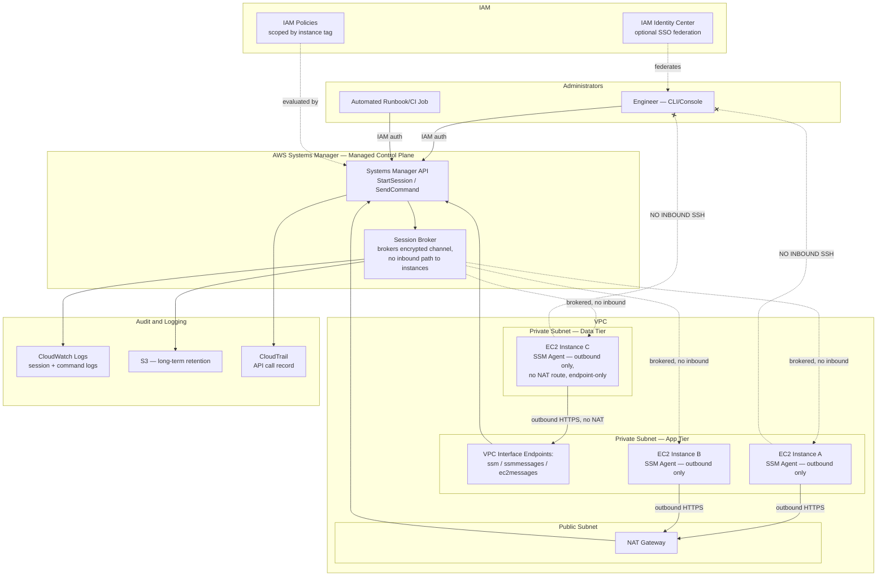
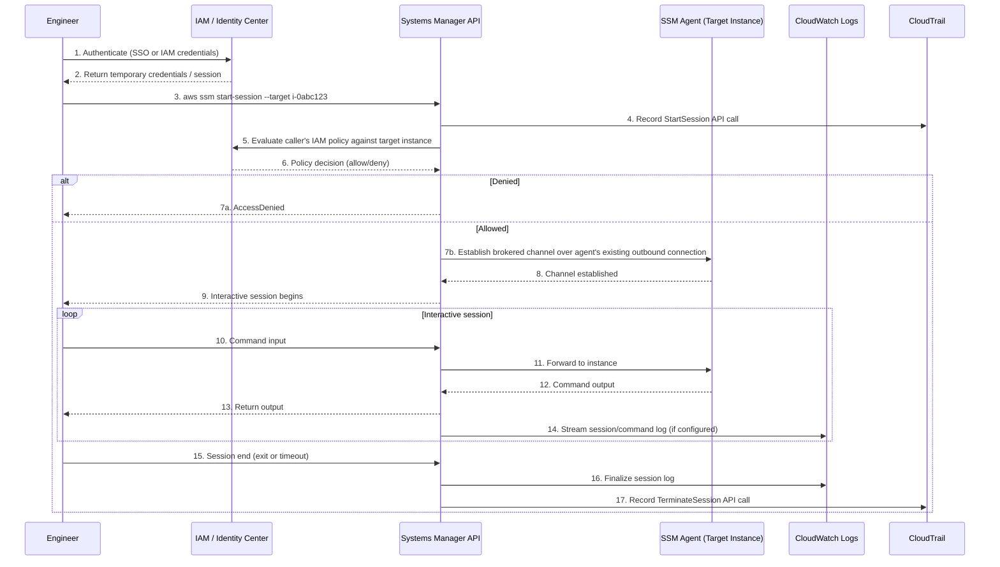
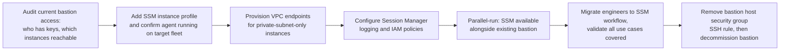

# Chapter 10 – Bastion-less Infrastructure with SSM

> **Visual note:** This chapter uses Mermaid diagrams for architecture and sequence flows, and Markdown tables for comparisons, cost estimates, and checklists. All Terraform and CLI examples are written against provider `hashicorp/aws >= 5.0` and AWS CLI v2. Where this chapter uses a service already introduced in Chapter 2 ("AWS Building Blocks"), Chapter 6, or Chapter 7, it re-explains that service briefly on first use so the chapter remains self-contained.

---

# 1 Executive Summary

For as long as enterprises have run compute in private subnets, they have needed a way for administrators to reach it — and for almost as long, the default answer has been a bastion host: a hardened, internet-reachable EC2 instance sitting in a public subnet, running SSH, whose entire job is to be the one machine an administrator can jump through to reach everything else. This chapter describes the architecture that replaces the bastion host entirely: administrative access mediated by AWS Systems Manager Session Manager, with no inbound SSH or RDP port open anywhere in the environment, no bastion host to patch and monitor, and every session cryptographically authenticated via IAM and fully logged to CloudWatch and S3. This is not primarily a cost-optimization chapter — a bastion host is cheap — it is a security architecture chapter, and the case for it rests on eliminating an entire, well-understood, heavily-targeted category of attack surface rather than on saving a few dollars a month on a `t3.micro` instance.

**The business problem.** A bastion host, however carefully hardened, is a permanently internet-reachable machine whose sole purpose is to accept inbound remote-access connections — which makes it, definitionally, one of the highest-value targets in the entire environment for an external attacker, and one of the most consequential single points of compromise for an internal one. Every bastion host represents an open inbound port (even if restricted to specific source IPs via a security group, that source-IP allow-list itself becomes a target — a compromised or spoofed "trusted" IP defeats the control entirely) that must be patched, monitored, and audited indefinitely, for as long as the bastion exists. SSH key management compounds the problem: keys get shared between engineers more often than anyone would like to admit, keys get left on laptops that leave the company, and revoking a single compromised or departed-employee key across a fleet of bastion hosts and their `authorized_keys` files is an operational task that is easy to get wrong under time pressure. Compliance auditors have, over the last several years, become considerably more pointed about this specific pattern — a documented bastion host with SSH key-based access is now routinely flagged in SOC 2 and PCI-DSS assessments as a control worth scrutinizing closely, precisely because the historical incident record shows bastion hosts and shared SSH keys behind a meaningful share of real-world lateral-movement breaches.

**The architecture objective.** The objective of this chapter's design is to eliminate the bastion host's entire risk profile — not by hardening it further, but by removing the inbound network path it exists to provide, and replacing it with a mechanism where access is: (1) mediated entirely by IAM, meaning every permission grant, revocation, and audit question has a single, familiar, and already-governed control plane; (2) fully logged at the command level, not just the connection level, satisfying audit requirements that a bastion host's SSH session logs (if they exist at all, and they frequently don't by default) struggle to meet; and (3) requiring zero open inbound ports anywhere in the private subnet — SSM Session Manager's connectivity is entirely outbound-initiated from the managed instance to the AWS Systems Manager service, meaning there is no listening SSH daemon reachable from anywhere, including from within the VPC itself, to compromise.

**Why organizations adopt this architecture.** Three forces drive the shift away from bastion hosts specifically. First, **security team mandate following an incident or audit finding** — the most common trigger in practice is a penetration test or compliance audit specifically flagging the bastion host and its SSH key management as a finding requiring remediation, at which point the organization discovers that AWS has already solved this problem natively and at no additional licensing cost. Second, **operational burden reduction** — a bastion host is infrastructure that itself needs patching, monitoring, high availability design (a single bastion host is itself a single point of failure for all administrative access), and its own security hardening review on a recurring cadence; eliminating it removes an entire, non-trivial maintenance burden from the platform team's backlog. Third, **the specific difficulty of SSH key lifecycle management at scale** — an organization with dozens or hundreds of engineers needing occasional administrative access to production infrastructure faces a real, recurring operational cost in provisioning, rotating, and revoking SSH keys correctly and promptly, especially across a fleet of bastion hosts that may not have perfectly synchronized `authorized_keys` state; IAM-mediated access, by contrast, is revoked the moment a user's IAM permissions are removed or their identity is deactivated, with no separate credential material to track down and invalidate.

**Major business benefits.**

1. **Eliminated inbound attack surface for administrative access.** With no bastion host and no open SSH/RDP ports, there is no network path for a credential-stuffing, brute-force, or unpatched-SSH-vulnerability attack against the administrative access layer to even begin — the attack surface this entire architecture removes doesn't get hardened, it gets deleted.
2. **Command-level audit trail satisfying compliance requirements directly.** Every Session Manager session, and every command executed within it (when configured with logging, per Section 11), is recorded to CloudWatch Logs and/or S3 automatically — turning "prove that access to production systems is logged and auditable" from an assembled, sometimes-incomplete answer involving bastion host SSH logs and `bash_history` files into a single, centrally-queryable, tamper-evident log stream.
3. **IAM as the single access-control plane.** Granting, restricting, and revoking administrative access to any managed instance becomes an IAM policy change — the same control plane, the same review process, and the same tooling (IAM Access Analyzer, permission boundaries) already governing every other AWS access decision in the organization, rather than a separate SSH-key-and-bastion-host access model requiring its own parallel governance process.
4. **Reduced operational burden and cost.** No bastion host to provision, patch, monitor, or maintain in a highly-available configuration; no SSH key rotation process to run; no `authorized_keys` synchronization across a fleet — the maintenance burden this architecture removes is real and recurring, not one-time.

**Typical enterprise scenarios.** This pattern applies universally to essentially any organization running EC2 instances (or, via SSM's hybrid activation capability, on-premises or other-cloud servers) that require occasional administrative access — which is to say, it applies to nearly every enterprise AWS environment, making it one of the most broadly applicable architectures in this book despite its relatively narrow, specific focus. It is especially prominent in regulated industries (financial services, healthcare) where the audit trail and IAM-mediated access control directly satisfy specific compliance language; in organizations that have experienced a security incident or audit finding involving bastion hosts or SSH key sprawl; in organizations with a distributed or remote engineering team where a traditional "VPN plus bastion" access model has become an operational bottleneck; and, increasingly, as simply the default, unremarkable choice for any new enterprise AWS environment being designed today, in the same way that Multi-AZ (Chapter 6) has become the unremarkable default for any production workload rather than a specialized choice reserved for the most critical systems. Where an organization has a specific, unusual requirement that genuinely doesn't fit SSM's model — true offline/air-gapped environments with no path to the AWS Systems Manager service at all, or a small number of legacy systems that cannot run the SSM Agent — Section 28 of this chapter addresses those cases directly and honestly, rather than presenting this pattern as universally applicable without qualification.

---

# 2 Business Requirements

## Business Drivers

| Driver | Description |
|---|---|
| Attack surface elimination | Remove the internet-reachable bastion host and all open inbound SSH/RDP ports as a standing risk |
| Audit and compliance evidence | Provide a centralized, command-level, tamper-evident log of all administrative access |
| IAM as the single access control plane | Consolidate administrative access governance into the same IAM tooling used elsewhere |
| Operational burden reduction | Eliminate bastion host provisioning, patching, HA design, and SSH key lifecycle management |
| Distributed workforce support | Provide secure administrative access without requiring VPN infrastructure or office-network presence |

## Functional Requirements

- Provide interactive shell access to EC2 instances in private subnets for authorized administrators, with no inbound network port required.
- Support port forwarding for accessing internal services (databases, internal web UIs) that don't have their own public-facing access path.
- Support running commands or scripts across a fleet of instances without interactive access, for routine operational tasks (patching, configuration checks).
- Support access to on-premises or other-cloud servers via the same control plane, where hybrid infrastructure exists.
- Log every session, and ideally every command within a session, to a centralized, queryable, retained log store.

## Non-Functional Requirements

| Category | Requirement |
|---|---|
| Security | No inbound SSH/RDP port open on any managed instance's security group, under any circumstance |
| Auditability | Every session logged with identity, start/end time, and (where configured) command-level detail |
| Availability | Administrative access itself should not depend on any single point of failure (a single bastion host, a single VPN concentrator) |
| Access control granularity | Support scoping which specific instances a given IAM principal can access, not just all-or-nothing |
| Latency | Interactive session responsiveness comparable to direct SSH — sub-second command echo |

## Scalability Goals

The architecture should scale to an arbitrary number of managed instances and an arbitrary number of authorized human/automated principals without requiring any change to the access mechanism itself — unlike a bastion-host model, where fleet growth eventually strains a single bastion host's capacity or requires a bastion host per environment/VPC, SSM Session Manager's control plane is a fully managed AWS service with no comparable scaling ceiling for this workload's typical volume.

## Availability Requirements

Administrative access availability should match or exceed the availability of the underlying AWS Systems Manager service itself (a managed, multi-AZ AWS service with its own high availability design, outside the scope of what this chapter's Terraform needs to provision) — a meaningful improvement over a bastion-host model where availability is bounded by a single (or, at best, a small, manually load-balanced set of) EC2 instance's own uptime.

## Latency Requirements

Interactive Session Manager sessions should provide command-echo latency comparable to direct SSH for engineers in the same general geographic region as the target AWS Region — typically well under 200ms round-trip for interactive use, sufficient for comfortable interactive shell work; this is generally achieved without additional tuning, but Section 15 covers VPC endpoint placement considerations that materially affect this figure for private-subnet-only architectures.

## Compliance Requirements

This architecture directly satisfies (and is frequently implemented specifically in response to) compliance language requiring documented, auditable, and access-controlled remote administrative access: PCI-DSS Requirement 8 (identify and authenticate access) and Requirement 10 (track and monitor all access), SOC 2's logical access control and audit logging criteria, and, for federal or federally-adjacent workloads, FedRAMP's remote access and audit logging control families — all of which are satisfied more directly and more completely by SSM Session Manager's IAM-mediated, fully-logged model than by a bastion-host-and-SSH-key model, which typically requires substantial supplementary tooling and process documentation to satisfy the same control language.

## Security Expectations

No SSH key pairs used for interactive administrative access to any instance in scope; every administrative session authenticated via IAM (optionally combined with an external identity provider via IAM Identity Center, covered in Section 10); every session and, where the compliance requirement demands it, every command within a session logged to a centrally retained, access-restricted log store; and no security group in the environment permitting inbound SSH (port 22) or RDP (port 3389) from any source, including from within the VPC.

## Recovery Objectives

Administrative access itself has no traditional RPO (there is no data to lose) but does have an implicit availability expectation: if the primary means of administrative access were to fail during an incident requiring hands-on remediation, the organization needs a documented, tested fallback (Section 13 covers this specifically, since it is a genuinely different consideration than the RPO/RTO tables in Chapters 6 and 7, which concerned the *workload's* availability, not the *administrative access mechanism's*).

## SLAs

There is typically no external, customer-facing SLA for administrative access itself, but an internal operational expectation is common: administrative access to any production instance should be obtainable, for an authorized engineer, within minutes of an incident being declared — a standard this architecture meets easily given IAM's near-instantaneous permission evaluation, in contrast to a bastion-host model that might require VPN connection setup, bastion host capacity availability, or SSH key provisioning delay for an engineer who doesn't already have standing access configured.

## Expected Workload and Growth

A representative enterprise deployment: tens to low hundreds of engineers with some form of administrative access entitlement (though typically a much smaller number with standing production access, per the least-privilege guidance in Section 10), hundreds to low thousands of managed EC2 instances across environments, and session volume that scales roughly linearly with engineering headcount and incident frequency rather than with end-user traffic — this workload profile is, notably, decoupled from the application-layer scaling concerns covered in Chapters 6 and 7, since administrative access volume has no direct relationship to production request volume.

---

# 3 Architecture Overview

## Overall Design Philosophy

This architecture applies a single, sharply-focused principle: **administrative access is a pull, not a push, connection**. Every managed instance's SSM Agent initiates an outbound HTTPS connection to the AWS Systems Manager service (directly, or via a VPC interface endpoint, per Section 9); no component anywhere in this design listens for or accepts an inbound connection from an administrator. This inversion — from "administrators connect in" to "instances connect out, and administrators are brokered through AWS's control plane" — is what eliminates the attack surface described in Section 1, and it is the single architectural idea this entire chapter elaborates on.

## Core Components

- **SSM Agent:** Software running on every managed instance (pre-installed on most current Amazon Linux, Ubuntu, and Windows AMIs; installable via user data or a golden-AMI pipeline otherwise) that maintains the outbound connection to the Systems Manager service and executes session/command requests brokered through it.
- **IAM roles and policies:** The mechanism controlling which human or automated principals may start a session with which instances — covered in depth in Section 10, and the primary access-control lever this architecture relies on.
- **VPC interface endpoints for SSM:** For instances in fully private subnets with no NAT Gateway path to the internet (a common, deliberate design choice for the data-tier and application-tier patterns from Chapters 6 and 7), interface endpoints for `ssm`, `ssmmessages`, and `ec2messages` provide the private connectivity path to the Systems Manager service without requiring any internet route at all.
- **CloudWatch Logs / S3 session logging:** The destination for session and command-level audit logs, configured centrally rather than per-instance.
- **Session Manager preferences:** An account/organization-level configuration object controlling logging destinations, KMS encryption for session data, idle session timeout, and (via a managed policy or Session Manager's run-as feature) which OS user a session executes as.
- **Systems Manager Fleet Manager, Run Command, Patch Manager:** Higher-level SSM capabilities built on the same underlying agent and connectivity model, covered in Section 4, that extend this architecture beyond interactive shell access into fleet-wide operational automation.

## How Components Interact

An authorized administrator, authenticated via IAM (directly or via IAM Identity Center federation), calls the Session Manager API (via the AWS CLI, Console, or `aws ssm start-session`) specifying a target instance. AWS Systems Manager evaluates the caller's IAM permissions against the target instance, and — if authorized — brokers an encrypted, bidirectional data channel between the caller and the target instance's SSM Agent, which the agent reaches via its own outbound connection to the Systems Manager service (directly or through a VPC interface endpoint). No component in this chain requires the target instance to accept any inbound network connection from the administrator; the instance-side connection was already established outbound, and the Systems Manager service multiplexes the administrator's session onto it.

## High-Level Workflow

**Request lifecycle (interactive session):** Administrator authenticates via IAM → calls `start-session` → Systems Manager evaluates IAM policy against the target instance → session brokered over the instance's existing outbound connection → administrator receives an interactive shell, fully proxied through the Systems Manager service, with no direct network path ever established between the administrator's client and the target instance.

**Response lifecycle:** Terminal output streams back through the same brokered channel; the session terminates on explicit exit, an idle timeout (configurable, Section 11), or an administrative termination via the Systems Manager API — at which point the log of the session (and, if configured, every command executed within it) is finalized in CloudWatch Logs and/or S3.

**Data lifecycle (for fleet-wide operations via Run Command/Patch Manager):** A command document is dispatched to a targeted set of instances (by tag, instance ID, or resource group); each instance's SSM Agent pulls and executes the command via its own outbound connection, and returns output and status back through the same channel — the same pull-based model applied to non-interactive, fleet-wide operational tasks rather than a single interactive session.

---

# 4 AWS Services Used

## AWS Systems Manager (Session Manager, Run Command, Patch Manager, Fleet Manager)

**Purpose:** The core service family this entire architecture is built on. Session Manager provides interactive shell access and port forwarding; Run Command executes ad hoc or scheduled commands/scripts across a fleet without an interactive session; Patch Manager automates OS patch compliance scanning and remediation; Fleet Manager provides a console-based, graphical view for common operational tasks (file transfer, process/service inspection) without requiring CLI familiarity.

**Why selected:** Systems Manager is an AWS-native, no-additional-license-cost service that directly replaces the bastion host's functionality while eliminating its attack surface, and it is deeply integrated with IAM, CloudTrail, and CloudWatch — meaning this architecture requires no third-party access-broker product and no separate identity system beyond what the organization already uses for every other AWS access decision.

**Alternatives:** A third-party privileged access management (PAM) or Zero Trust network access (ZTNA) product (e.g., a commercial bastion-replacement or VPN-alternative product) — appropriate when the organization has a multi-cloud or hybrid requirement where a single, AWS-agnostic access broker across all environments is a stronger organizational fit than an AWS-native tool per cloud; a traditional bastion host with SSH — the pattern this chapter replaces, appropriate only in the specific edge cases discussed in Section 28.

**Limitations:** Requires the SSM Agent to be installed, running, and able to reach the Systems Manager service (directly or via VPC endpoint) — an instance with a broken or absent agent, or with no network path to the service at all, cannot be accessed via this method, and a fallback plan (Section 13) is a mandatory part of any complete implementation, not an optional nicety. Session Manager's interactive shell experience, while very close to native SSH, has some minor differences (no native SCP-equivalent file transfer without additional configuration, though `aws ssm start-session` with the `AWS-StartPortForwardingSession` document or the newer file-transfer-via-S3 patterns address this) worth validating against the specific workflows engineers rely on today before a full cutover.

**Pricing considerations:** Session Manager, Run Command, and the core Systems Manager management features used in this architecture carry no additional charge beyond the underlying EC2 instance and any CloudWatch Logs/S3 storage for session logs — this is a rare case in AWS architecture where eliminating a piece of infrastructure (the bastion host) is both a security improvement and a direct cost reduction, with no offsetting new service charge for the replacement capability itself.

**Best practices:** Enable session logging to both CloudWatch Logs (for near-real-time querying/alerting) and S3 (for long-term, cost-effective retention) from the very first instance onboarded, not retrofitted later; scope IAM permissions to specific instances via tags rather than granting blanket `ssm:StartSession` on all resources (Section 10); enable KMS encryption for session data.

## Amazon EC2

**Purpose:** The managed compute this architecture provides access to — conceptually unchanged from Chapters 6 and 7, but this chapter's specific concern is the instance's IAM role and security group configuration, not its application workload.

**Why selected/covered here:** Every EC2 instance in this architecture requires an IAM instance profile granting the managed-instance-side SSM permissions (Section 10) and a security group with no inbound SSH/RDP rule — the two specific, mandatory configuration changes this chapter's pattern requires relative to a bastion-host-accessed fleet.

**Best practices:** Use an AMI with the SSM Agent pre-installed (current Amazon Linux 2/2023 and most published Ubuntu AMIs ship with it) rather than installing it via user data, which introduces a bootstrap-time dependency and a potential gap if the installation step fails silently; keep the SSM Agent itself updated via a scheduled Patch Manager or Run Command job, since an outdated agent can lack recent Session Manager features or security fixes.

## Amazon VPC (Interface Endpoints Specifically)

**Purpose:** For fully private-subnet instances with no NAT Gateway internet route (the data-tier pattern from Chapters 6 and 7, or an application tier deliberately denied internet egress for security reasons), interface endpoints for `com.amazonaws.<region>.ssm`, `ssmmessages`, and `ec2messages` provide the private network path the SSM Agent needs to reach the Systems Manager service.

**Why selected:** Without these endpoints, an instance in a subnet with no NAT Gateway route (or, per Chapter 7's segmentation pattern, an instance deliberately denied broader internet egress) would have no path to reach the Systems Manager service at all, making this entire architecture's access mechanism unavailable for exactly the private, most-locked-down instances that most need a bastion-host alternative in the first place.

**Best practices:** Provision all three required interface endpoints (`ssm`, `ssmmessages`, `ec2messages`) together — a common, easy-to-make configuration mistake is provisioning only `ssm` and being confused when Session Manager sessions still fail to establish, since all three are required for the full Session Manager feature set to function.

## IAM

**Purpose:** The access-control plane for this entire architecture — covered in depth in Section 10, but worth stating plainly here: IAM is not a supporting service in this chapter, it is the primary security control the architecture is built around.

## KMS

**Purpose:** Encrypts Session Manager session data in transit through the Systems Manager service (beyond the TLS already in place) and encrypts session logs at rest in CloudWatch Logs/S3.

**Why selected:** While Session Manager sessions are TLS-encrypted by default, adding a customer-managed KMS key for session encryption gives the organization key-level control (rotation, access policy, revocation) consistent with the encryption discipline established in Chapters 2, 6, and 7 for every other sensitive data path.

## CloudWatch (Logs) and S3

**Purpose:** The destination for session and command audit logs (Section 22) — CloudWatch Logs for near-real-time visibility and alerting, S3 for durable, cost-effective long-term retention meeting the compliance requirements from Section 2.

## CloudTrail

**Purpose:** Records every Systems Manager API call (`StartSession`, `TerminateSession`, `SendCommand`, and so on) as a standard AWS API event — this is a distinct, complementary log source from the session/command content logs above: CloudTrail tells you *who called the API and when*; Session Manager's own logging tells you *what happened inside the session*. Both are required for a complete audit picture, and conflating them (assuming CloudTrail alone is sufficient audit evidence) is a common, incomplete implementation worth flagging explicitly.

## AWS Config, GuardDuty, Security Hub

**Purpose:** As in prior chapters — this chapter's specific application is validating that no security group in the environment has drifted to permit inbound SSH/RDP (a direct, automatable check that operationalizes this architecture's core negative security property, exactly analogous to Chapter 7's segmentation-validation Config rules), and GuardDuty's `UnauthorizedAccess` finding types are relevant to detecting anomalous Session Manager usage patterns specifically.

## Systems Manager vs. Alternatives Decision Matrix

| Factor | SSM Session Manager (this chapter) | Traditional Bastion Host + SSH | Commercial PAM/ZTNA Product | Site-to-Site/Client VPN + Direct Access |
|---|---|---|---|---|
| Inbound port required | None | SSH (22) or RDP (3389) on the bastion | Varies — often none (agent-based) | VPN port on the concentrator |
| Credential model | IAM (no separate keys) | SSH key pairs | Product-specific, often SSO-integrated | VPN credentials, often separate from IAM |
| Audit granularity | Session + optional command-level logging, natively | Depends entirely on bastion configuration — often minimal by default | Typically strong, product-dependent | Connection-level typically; in-session activity not natively logged |
| Additional infrastructure to maintain | None (managed AWS service) | The bastion host itself (patching, HA, monitoring) | Agent/broker infrastructure, often still self-hosted or SaaS | VPN concentrator/Client VPN endpoint |
| Additional cost | None beyond existing EC2/log storage | Bastion EC2 instance cost | Typically per-seat or per-endpoint licensing | Client VPN or Site-to-Site VPN hourly + data charges |
| Multi-cloud/hybrid fit | Good via SSM hybrid activations, AWS-centric | N/A (per-cloud bastion) | Often the strongest fit for genuine multi-cloud | Good, but VPN-specific per environment |
| Best for | The default choice for AWS-centric environments | Legacy environments not yet migrated, specific edge cases (Section 28) | Large, genuinely multi-cloud enterprises wanting one access model everywhere | Organizations needing broader network-level access beyond just administrative shell access |

---

# 5 Complete Architecture Diagram



**Diagram interpretation:** Every arrow between an administrator and an instance passes through the Systems Manager control plane — there is no direct arrow, and the two `-.NO INBOUND SSH.-x` edges are drawn deliberately, as in Chapter 7's diagram, to make the architecture's core negative security property visible. Instance C, in the data tier with no NAT Gateway route at all, reaches the Systems Manager service exclusively via the VPC interface endpoints — this is the specific configuration that makes this architecture viable even for Chapter 6 and 7's most locked-down data-tier instances.

---

# 6 Component-by-Component Explanation

| Component | Purpose | Scaling | High Availability | Failure Handling | Dependencies |
|---|---|---|---|---|---|
| SSM Agent (per instance) | Maintains outbound connection, executes brokered sessions/commands | N/A (per-instance) | Restarts automatically if it crashes (managed by the OS's init system) | Instance unreachable via SSM if agent is stopped/uninstalled/network-isolated — fallback plan required (Section 13) | Network path to Systems Manager service (NAT or VPC endpoint), IAM instance profile |
| IAM instance profile | Grants the instance's SSM Agent permission to communicate with the service | N/A | N/A (IAM is inherently highly available) | A missing/misconfigured instance profile prevents the agent from registering at all | IAM |
| Systems Manager control plane | Brokers sessions, evaluates IAM permissions, dispatches commands | Fully managed, scales automatically | Multi-AZ, AWS-managed | Regional service outage would affect all SSM-based access simultaneously — see Section 13's fallback discussion | AWS-managed, no customer-side HA design needed |
| VPC interface endpoints | Private connectivity path for instances with no NAT/internet route | Automatic, scales with ENI throughput per AZ | Deploy one endpoint (with its underlying ENIs) per AZ for resilience | An AZ's endpoint failure is mitigated by deploying across multiple AZs | VPC, private subnets, security group permitting HTTPS from managed instances |
| CloudWatch Logs (session logging) | Near-real-time session/command log destination | Automatic | Regional, highly durable | N/A | KMS (if encrypted), IAM permissions for the SSM service role to write logs |
| S3 (session logging) | Long-term, durable session log retention | Automatic, unlimited | 11 nines durability | N/A | KMS, bucket policy |
| CloudTrail | Records Systems Manager API calls | Automatic | Regional, highly durable | N/A | S3 for log delivery |
| IAM Identity Center (optional) | Federates human access via existing corporate identity provider | N/A (managed) | Multi-AZ, AWS-managed | N/A | Existing IdP (Okta, Azure AD, etc.) |

---

# 7 End-to-End Request Flow



**Step-by-step narrative:** Steps 1-2 authenticate the engineer through IAM directly or, in a mature enterprise implementation, through IAM Identity Center federating from the organization's existing corporate identity provider (Section 10) — either way, this is the same identity system already governing every other AWS access decision, not a separate credential to manage. Steps 3-6 are the access-control-decision core of this architecture: the `StartSession` API call is itself recorded by CloudTrail (step 4) before the IAM policy decision is even made, meaning even a denied attempt is part of the audit trail. Step 7b is the step that makes this architecture fundamentally different from a bastion host: the "connection" from the engineer's perspective is entirely a brokered relationship through the Systems Manager service — at no point does the engineer's client establish a direct network connection to the target instance, and at no point does the target instance need to accept an inbound connection from anywhere. Steps 10-14 repeat for the duration of an interactive session, with logging (step 14) happening continuously rather than only at session start/end, which is what enables the command-level audit granularity described in Section 1.

---

# 8 Deployment Flow

## Provisioning This Architecture

This architecture is almost entirely a configuration and policy layer on top of existing compute (the EC2 instances from Chapters 6/7's application and data tiers), rather than new standalone infrastructure — the "deployment" here is: (1) ensuring every instance's AMI/launch template includes the SSM Agent and a correctly-scoped IAM instance profile, (2) provisioning the VPC interface endpoints for any subnet without a NAT route, (3) configuring Session Manager preferences (logging destinations, KMS key, timeout) at the account or organization level, and (4) writing the IAM policies that grant specific principals access to specific instances.

## Terraform Workflow

Identical process to prior chapters — this architecture's specific Terraform (Section 18) is typically added as a module applied across every environment's compute layer, rather than a standalone "SSM architecture" deployed once, since its components (instance profile, security group with no SSH rule, VPC endpoints, Session Manager preferences) attach to and modify existing infrastructure from Chapters 6 and 7 rather than standing up a new, independent system.

## Migration Flow: Bastion Host to SSM (For Existing Environments)



> **Tip:** Resist the temptation to decommission the bastion host in the same change that introduces SSM access. Run both in parallel for a defined validation period (two to four weeks is typical) specifically to catch any workflow (a specific file-transfer pattern, a specific tool that assumes direct SSH, a specific automation script) that the team didn't realize depended on direct SSH access until SSM-only access revealed the gap.

## CI/CD Integration for This Architecture's Own Infrastructure

The Terraform managing instance profiles, security groups, VPC endpoints, and Session Manager preferences goes through the same `plan`/review/`apply` pipeline as every other chapter's infrastructure. This chapter adds one specific CI check worth calling out: a policy-as-code assertion (Section 20) that no security group definition in the Terraform plan contains an inbound rule for port 22 or 3389 from any source — the same pattern Chapter 7 applied to its segmentation guarantee, applied here to this architecture's own core negative security property.

## Rollback

Because this architecture is primarily a configuration/policy layer, "rollback" typically means re-adding a bastion host and its SSH access path temporarily (from a previously-decommissioned but not-yet-deleted Terraform module) rather than a traditional application rollback — this should be a documented, rehearsed procedure (Section 13's fallback plan) precisely because it's the kind of task nobody wants to be improvising during an actual incident where SSM access itself has become unavailable.

## Secrets and Configuration

This architecture notably *reduces* the secrets-management burden relative to a bastion-host model — there are no SSH private keys to store, rotate, or revoke. The Session Manager preferences configuration itself (KMS key ARN, log destinations) is non-sensitive configuration, appropriately managed as plain Terraform variables rather than requiring Secrets Manager.

## Validation

Post-deployment validation should include: confirming `aws ssm describe-instance-information` shows every target instance as `Online` (not just that the Terraform applied successfully — an instance profile can be correctly attached while the agent itself is still failing to register, a distinct failure mode worth explicitly checking for); confirming a test session actually establishes end-to-end for at least one instance per subnet/VPC-endpoint configuration; and confirming session logs actually appear in the configured CloudWatch Logs group and S3 bucket for that test session, not just that the configuration was accepted by Terraform.

---

# 9 Network Topology

## No Bastion Subnet Required

The most immediately visible network-topology difference this architecture introduces relative to a bastion-host design: there is no dedicated "bastion subnet" or bastion-specific public-subnet resource at all. Compare this to a traditional design, which typically reserves a small public subnet specifically to host the bastion instance — this architecture removes that subnet's reason for existing entirely, simplifying the overall network topology while simultaneously improving its security posture, a genuinely rare combination.

## VPC Interface Endpoint Placement

For any private subnet without a NAT Gateway route (Chapter 6 and 7's data tiers, or a deliberately internet-denied application tier), the three required interface endpoints — `com.amazonaws.<region>.ssm`, `ssmmessages`, and `ec2messages` — must be provisioned with at least one endpoint ENI per AZ the managed instances run in, to avoid a single-AZ endpoint becoming a bottleneck or point of failure for administrative access to instances in other AZs.

| Endpoint | Purpose |
|---|---|
| `com.amazonaws.<region>.ssm` | Core Systems Manager API calls (agent registration, command dispatch) |
| `com.amazonaws.<region>.ssmmessages` | Session Manager's data channel — required specifically for interactive sessions and port forwarding |
| `com.amazonaws.<region>.ec2messages` | Agent-to-service messaging used by Run Command and other SSM features |

> **Warning:** Provisioning only the `ssm` endpoint and omitting `ssmmessages` is a specific, common misconfiguration that results in `describe-instance-information` showing the instance as online (since agent registration uses the `ssm` and `ec2messages` endpoints successfully) while `start-session` still fails to establish an interactive session — a confusing failure mode if the team doesn't already know all three endpoints are required together.

## Security Groups

| Security Group | Inbound | Outbound | Notes |
|---|---|---|---|
| Managed instance security group | **No SSH (22) or RDP (3389) rule, from any source, including within the VPC** | HTTPS (443) to the internet (via NAT) or to the VPC endpoints | This is the architecture's defining security group configuration — the absence of the SSH/RDP rule, not a specific presence of anything, is the control |
| VPC endpoint security group | HTTPS (443) from the managed instance security group | N/A (endpoints don't typically need outbound rules of their own) | Scope inbound to exactly the security groups of instances that need SSM access, not a broad VPC CIDR range |

## Route Tables

No changes to route table design are required specifically for this architecture beyond what Chapters 6 and 7 already establish — instances with a NAT Gateway route reach the Systems Manager service through it; instances without one (and, per Chapter 7's segmentation design, with no route to on-premises systems either) reach it via the VPC interface endpoints instead, requiring no route table entry at all since interface endpoints are reached via their ENI's private IP directly within the VPC's local route.

## Interaction with Chapter 7's Segmentation Design

This architecture composes cleanly with Chapter 7's three-tier segmentation pattern: the presentation tier, application tier, and data tier from that chapter each independently gain SSM-based access (via their own VPC endpoints or NAT route, per their own existing network configuration) with no need to punch any new hole in the segmentation boundaries Chapter 7 established — administrative access to the data tier, specifically, remains reachable only via SSM's outbound-initiated model, never via a new inbound path that would undermine that chapter's core guarantee.

## PrivateLink and Hybrid Considerations

For organizations extending this architecture to on-premises servers via SSM's hybrid activation capability (Section 4's mention of hybrid environments), the on-premises server's SSM Agent requires outbound HTTPS connectivity to the Systems Manager service's public endpoint or, for a fully private hybrid setup, a Direct Connect/VPN path (per Chapter 7's hybrid connectivity pattern) to the VPC hosting the interface endpoints — extending this chapter's bastion-less model to the on-premises estate as well, rather than leaving on-premises administrative access as a separate, unaddressed problem.

---

# 10 Identity and Access

## IAM as the Architecture's Core Control

Every access decision in this architecture — who can start a session with which instance, who can run which command against which fleet — is an IAM policy evaluation. This is the single most important design detail in this entire chapter: understanding it well is understanding the architecture.

## Managed-Instance-Side IAM Role

Every EC2 instance needs an instance profile with a role trusting `ec2.amazonaws.com` and, at minimum, the AWS-managed `AmazonSSMManagedInstanceCore` policy (or an equivalent, more narrowly-scoped custom policy for organizations wanting to avoid the broader managed policy) — this is what allows the instance's SSM Agent to register with and communicate with the Systems Manager service at all.

## Human/Caller-Side IAM Policy — Scoping by Tag

The access-control decision that actually matters for least privilege is the *caller's* IAM policy, and the standard, recommended pattern is scoping `ssm:StartSession` by instance tag rather than granting it against `Resource: "*"`:

```json

{
  "Version": "2012-10-17",
  "Statement": [
    {
      "Sid": "StartSessionOnlyToTaggedInstances",
      "Effect": "Allow",
      "Action": "ssm:StartSession",
      "Resource": "arn:aws:ec2:us-east-1:123456789012:instance/*",
      "Condition": {
        "StringEquals": {
          "ssm:resourceTag/Environment": "staging",
          "ssm:resourceTag/Team": "platform"
        }
      }
    },
    {
      "Sid": "AllowSessionDocument",
      "Effect": "Allow",
      "Action": "ssm:StartSession",
      "Resource": "arn:aws:ssm:us-east-1:123456789012:document/SSM-SessionManagerRunShell"
    },
    {
      "Sid": "AllowTerminateOwnSessions",
      "Effect": "Allow",
      "Action": ["ssm:TerminateSession", "ssm:ResumeSession"],
      "Resource": "arn:aws:ssm:us-east-1:*:session/${aws:username}-*"
    }
  ]
}

```

Note the `ssm:resourceTag/Environment` and `ssm:resourceTag/Team` conditions — this is what turns "any engineer with any SSM permission can reach any instance" into a genuinely least-privilege model where an engineer's access is scoped to exactly the environment and team-owned instances relevant to their role, mirroring the tag-based tiering and ownership conventions established in Chapters 2, 6, and 7.

## Production Access as a Distinct, More Tightly Scoped Grant

A mature implementation of this architecture treats standing production access as a meaningfully smaller grant than staging/development access — many organizations implement time-bound, request-and-approve access to production specifically (via IAM Identity Center permission sets with a defined session duration, or a just-in-time access broker built on top of `AssumeRole` with a short-lived session) rather than standing, always-available production `ssm:StartSession` permission for every engineer with staging access.

## STS and Cross-Account Access

Consistent with the general pattern from Chapter 2, Section 10: an organization with a centralized tooling/access account can have engineers authenticate once (often via IAM Identity Center) and `AssumeRole` into the specific workload account and role granting the appropriately-scoped SSM access — this is a common, recommended pattern for organizations with the multi-account structure discussed throughout this book, rather than managing SSM IAM policies independently and inconsistently per account.

## Permission Boundaries

A permission boundary on any role capable of granting or modifying SSM-related IAM policies is a worthwhile defense-in-depth control, preventing a compromised or misconfigured automation pipeline from ever being able to grant itself (or another principal) broader SSM access than the boundary allows — directly analogous to the permission-boundary guidance in Chapters 2 and 7 applied to this specific, security-sensitive capability.

## Run-As and OS-Level User Mapping

Session Manager's `run-as` support allows a session to execute as a specific, non-root OS user (configured via Session Manager preferences and the target instance's OS-level user provisioning) rather than the default root/administrator context — this is a meaningful additional least-privilege layer specifically relevant to this architecture, letting the IAM-level "who can start a session" decision be complemented by an OS-level "what can this session actually do once started" boundary, rather than every session implicitly running with full administrative OS privileges.

---

# 11 Security Architecture

## Encryption

Session Manager sessions are TLS-encrypted in transit by default between the client, the Systems Manager service, and the target instance's agent. This chapter's specific recommendation, consistent with the encryption discipline in every prior chapter: enable a customer-managed KMS key for Session Manager's own session-data encryption (configured in Session Manager preferences) rather than relying solely on the AWS-managed default, giving the organization key-level rotation and access control, and encrypt the CloudWatch Logs group and S3 bucket holding session logs with the same or a related key.

## Session Logging Configuration

```json

{
  "schemaVersion": "1.0",
  "description": "Session Manager preferences enforcing full audit logging",
  "sessionType": "Standard_Stream",
  "inputs": {
    "cloudWatchLogGroupName": "/aws/ssm/session-logs",
    "cloudWatchEncryptionEnabled": true,
    "cloudWatchStreamingEnabled": true,
    "s3BucketName": "acme-prod-ssm-session-logs",
    "s3EncryptionEnabled": true,
    "s3KeyPrefix": "session-logs/",
    "kmsKeyId": "arn:aws:kms:us-east-1:123456789012:key/xxxxxxxx",
    "idleSessionTimeout": "20",
    "maxSessionDuration": "480",
    "runAsEnabled": true,
    "runAsDefaultUser": "ssm-user"
  }
}

```

`cloudWatchStreamingEnabled: true` specifically enables near-real-time, command-level log streaming (not just a session summary logged at the end) — this is the setting that turns Session Manager's audit capability from "we know a session happened" into "we know exactly what was typed and returned," which is the level of granularity most compliance frameworks referenced in Section 2 actually expect for privileged access logging.

## WAF, Shield — Not Directly Applicable

Unlike every prior chapter in this book, WAF and Shield have no direct application to this architecture — there is no public-facing HTTP(S) endpoint for them to protect, since this architecture's entire point is that there is no comparable public attack surface for administrative access at all. This is worth stating explicitly during an architecture review, since a reviewer accustomed to every chapter including a WAF discussion might otherwise wonder about its absence here.

## GuardDuty, Inspector, Security Hub

GuardDuty's relevance to this architecture is specific: its `UnauthorizedAccess:IAMUser/*` and related finding types are directly relevant to detecting anomalous Session Manager usage (an unusual source location for a `StartSession` call, unusual timing, or a pattern consistent with credential compromise) — these findings should be routed with high priority given that a compromised IAM credential with SSM access is now, in this architecture, the primary remaining path to administrative compute access, making its anomaly detection more operationally important here than in an architecture where administrative access has other independent controls (like a bastion host's separate SSH key) as well.

## Zero Trust Applied to This Architecture

This chapter is arguably the clearest, most literal implementation of Zero Trust principles in this book: there is no network-location-based trust extended to any administrator at all — not "inside the VPN," not "on the corporate network," not "able to reach the bastion host." Every single session is authenticated and authorized via IAM at the moment it's requested, regardless of the requester's network location, and the absence of any listening SSH/RDP service means there is no network-level trust boundary to reason about in the first place.

## Threat Model for This Architecture

| Attack Vector | Specific Relevance | Mitigation |
|---|---|---|
| Compromised IAM credentials with SSM access | The primary remaining path to administrative access in this architecture | MFA enforcement for human IAM/Identity Center access, tightly scoped tag-based policies (Section 10), GuardDuty anomaly detection |
| Overly broad `ssm:StartSession` grants (`Resource: "*"`) | Defeats the least-privilege benefit this architecture is meant to provide | Tag-based scoping (Section 10), regular IAM Access Analyzer review |
| SSM Agent vulnerability or supply-chain compromise | The agent itself is privileged software running on every managed instance | Keep the agent updated via scheduled Patch Manager/Run Command jobs; monitor AWS security bulletins for the SSM Agent specifically |
| Insufficient session logging (logging not enabled, or CloudWatch-only without S3 retention) | Leaves the architecture's core audit-trail promise unfulfilled | Enforce logging configuration via Session Manager preferences at the organization level, not per-account opt-in |
| Loss of SSM availability during an incident (regional service issue, or agent/network failure) | This architecture's single-mechanism reliance is itself a risk if unaddressed | Documented, tested fallback access plan (Section 13) |
| Session hijacking via a compromised client machine | An attacker with control of an authorized engineer's laptop could start sessions as that engineer | Standard endpoint security controls (outside this chapter's scope, but a real, relevant dependency); short session timeouts (Section 11's `idleSessionTimeout`) limit the exploitation window |

---

# 12 High Availability

## What "High Availability" Means for an Access Architecture

Unlike Chapters 6 and 7, where high availability concerned the workload serving customer traffic, this chapter's high-availability concern is the *availability of administrative access itself* — a genuinely different, though related, question: if the primary means of reaching production infrastructure fails, can an engineer still respond to an incident?

## AZ and Regional Failures

The Systems Manager control plane itself is a fully managed, multi-AZ AWS service — customers do not design or provision its high availability, unlike the bastion host in the pattern this chapter replaces, where a single bastion instance was itself a single point of failure for all administrative access. A managed instance's own AZ failure affects that specific instance's reachability (consistent with Chapter 6's general AZ-failure handling — the instance is simply gone, replaced by Auto Scaling, and administrative access resumes against its replacement) but has no bearing on the availability of the SSM access *mechanism* itself for every other instance.

## VPC Interface Endpoint Availability

For private-subnet-only instances, the VPC interface endpoints themselves should be deployed across the same set of AZs as the managed instances (Section 9) specifically so that a single AZ's endpoint ENI issue doesn't remove SSM access to instances in that AZ while the endpoint issue is being resolved — a direct application of the same "one per AZ" principle Chapter 6 established for NAT Gateways.

## SSM Agent Failures

An individual instance's SSM Agent crashing or failing to register is the most granular failure mode this architecture has, and it is instance-specific rather than architecture-wide — a scheduled health check (via `describe-instance-information`, Section 19) or a CloudWatch alarm on an instance transitioning out of `Online` status catches this at the individual-instance level, and remediation is typically a Run Command-triggered agent restart or, if the instance itself is otherwise unreachable via SSM, a fallback access path (Section 13).

## Regional Systems Manager Service Availability

This is the failure mode most distinct from anything in prior chapters: a genuine, region-wide Systems Manager service degradation (rare, but not impossible — every AWS service has, on occasion, experienced regional issues) would affect SSM-based administrative access to *every* instance in that region simultaneously, a blast radius with no direct analog in a bastion-host model, where the bastion host's own availability was decoupled from any single AWS service's health beyond EC2 itself. This is precisely why Section 13's fallback plan is not an optional nicety for this architecture specifically — it is the single most important resilience consideration this chapter introduces relative to every other pattern in this book.

---

# 13 Disaster Recovery

## DR for an Access Mechanism, Not a Workload

This section addresses a genuinely different question than Chapters 6 and 7's DR sections: not "how do we recover the workload's data and availability," but "how do we regain administrative access to our infrastructure if the primary access mechanism itself becomes unavailable." Every organization implementing this architecture should have an explicit, documented, and periodically tested answer to this question — its absence is one of this chapter's most consequential Production Pitfalls (Section 34).

## Fallback Access Options

| Fallback Option | When Appropriate | Trade-offs |
|---|---|---|
| EC2 Instance Connect (browser-based, ephemeral SSH key) | A reasonable, still-relatively-low-attack-surface fallback for EC2 instances with a public or private IP reachable from the console | Still technically opens a brief SSH path; should be scoped via IAM just as tightly as SSM access, and is itself dependent on the EC2 console/API being available |
| A minimal, dormant "break-glass" bastion host (stopped, not running) | Organizations wanting a physical, non-AWS-Systems-Manager-dependent fallback | Requires the same patch/security hardening discipline as a traditional bastion, but only during the rare window it's actually started and used; should have its own tightly scoped, alarmed IAM permissions for starting it |
| AWS Support engagement for a genuine regional SSM outage | A true regional Systems Manager service degradation affecting many customers simultaneously | Not a customer-controlled mitigation — appropriate to have as documented context for an incident communication plan, not as a primary technical mitigation |
| EC2 Serial Console (for instances that support it) | Instances that are network-isolated or otherwise unreachable via any IP-based method at all | Requires its own IAM permission and has its own distinct security considerations (it provides OS-level console access, bypassing network controls entirely) — should be governed with at least as much rigor as SSM access itself |

> **Note:** The "break-glass bastion" fallback deserves a specific callout: if an organization chooses this option, the bastion's Terraform module should be kept in the repository (Section 8's rollback discussion) but with its EC2 instance in a stopped state and its security group's SSH rule absent by default, only added and the instance started via a specific, alarmed, audited break-glass procedure — this preserves nearly all of this chapter's security benefit while still providing a tested, real fallback for the specific regional-outage scenario Section 12 describes.

## Backup Strategy for This Architecture's Own Configuration

The IAM policies, Session Manager preferences, and VPC endpoint configuration that constitute this architecture are themselves fully defined in Terraform (Section 18) and therefore inherently reproducible from version control — there is no independent "backup" of the access architecture itself beyond the standard Terraform state backup practices established in Chapter 2.

## RPO/RTO for This Pattern

| Scenario | RPO | RTO |
|---|---|---|
| Individual instance's SSM Agent failure | N/A (no data) | Minutes (Run Command-triggered restart, or fallback access per instance) |
| VPC endpoint AZ failure | N/A | Automatic (other-AZ endpoints continue serving, per Section 12) |
| Regional Systems Manager service degradation | N/A | Depends entirely on the fallback plan above — should be explicitly tested and its RTO measured, not assumed |

## Testing the Fallback Plan

Consistent with the failover-testing discipline established in Chapters 6 and 7: the fallback access mechanism chosen above should be tested on a scheduled cadence (at minimum annually, more frequently for organizations with a lower risk tolerance), with the test specifically validating that an engineer unfamiliar with the fallback's exact procedure can execute it correctly from documentation alone, under realistic time pressure — since the scenario in which this fallback is actually needed is, by definition, one where the team's primary, familiar access method has already failed.

---

# 14 Scalability

## This Architecture Scales Differently Than a Workload

Unlike Chapters 6 and 7's scaling concerns (driven by customer traffic), this architecture's relevant scaling dimensions are the number of managed instances and the number of authorized principals — both of which the Systems Manager control plane handles natively without requiring the customer to design or provision any scaling behavior, a meaningful simplification relative to a bastion-host model where fleet growth eventually required either a more powerful bastion instance, multiple bastion hosts behind their own load balancer, or a bastion-per-VPC proliferation.

## Managed Instance Fleet Growth

There is no meaningful ceiling on the number of instances this architecture supports that a typical enterprise would encounter in practice — Systems Manager is designed to manage fleets at a scale far beyond what even a large enterprise's EC2 footprint typically reaches. The practical scaling consideration is IAM policy design (Section 10): as the fleet grows, tag-based scoping becomes increasingly important to keep individual engineers' effective access appropriately narrow, rather than an "it still works technically" concern about the platform's raw capacity.

## Session Volume and Run Command Fleet Targeting

Run Command's fleet-wide dispatch (used for patch compliance checks, configuration audits, and similar routine operational tasks — Section 4) does have practical throttling/rate considerations at very large scale (many thousands of simultaneous targets), addressable via Systems Manager's built-in rate control settings (`MaxConcurrency`, `MaxErrors`) on a given command execution — a configuration lever worth understanding before running a Patch Manager job against a very large fleet for the first time, so that a single bad patch doesn't get applied to 100% of the fleet before the first failures are even detected.

## Multi-Account and Multi-Region Considerations

For organizations with the multi-account structure discussed throughout this book, Systems Manager's cross-account and cross-region capabilities (via AWS Organizations integration and Resource Groups) allow a security or platform team to manage SSM access and view fleet status across the entire organization from a single delegated administrator account, rather than needing to separately configure and monitor this architecture per account — a scaling consideration specifically relevant to the organizational, not technical, dimension of growth.

---

# 15 Performance Optimization

## Interactive Session Responsiveness

The primary "performance" consideration for this architecture, distinct from Chapters 6 and 7's throughput/latency concerns, is interactive session responsiveness — how quickly keystrokes and command output round-trip through the brokered Session Manager channel. This is generally comparable to direct SSH for engineers connecting from a location with reasonable connectivity to the target AWS Region, but two specific factors materially affect it:

## VPC Endpoint Placement and Regional Proximity

For private-subnet instances reached via VPC interface endpoints, ensuring those endpoints exist in the same AZs as the managed instances (Section 9, 12) avoids an unnecessary cross-AZ hop on every session's data path — a small but measurable latency factor at scale, and one that's easy to overlook if endpoints were provisioned once in a single AZ "to get it working" rather than deliberately across all relevant AZs.

## Client-Side Considerations

The `session-manager-plugin` (required for CLI-based `aws ssm start-session` usage) should be kept updated, since performance and feature improvements do ship in newer plugin versions; for organizations with many engineers connecting from a specific, consistent geographic location far from the target AWS Region, this is a latency factor inherent to the distance involved (identical to the equivalent factor for direct SSH from the same location) rather than something this architecture specifically introduces or can optimize away.

## Command Execution at Scale (Run Command / Patch Manager)

For fleet-wide, non-interactive operations, the relevant "performance" consideration is total completion time across a large target set, tunable via the `MaxConcurrency` setting mentioned in Section 14 — a higher concurrency value completes the fleet-wide operation faster but increases the blast radius of a bad command/patch before the first failures are observed, making this a deliberate risk/speed trade-off rather than a pure performance optimization, and one that should generally favor a conservative, staged rollout (a small initial concurrency and `MaxErrors` threshold, expanding only after the initial batch succeeds) for anything beyond routine, well-tested operations.

---

# 16 Cost Optimization (FinOps)

## This Architecture's Distinctive Cost Profile: A Net Reduction

Unlike every prior chapter in this book, this architecture's primary FinOps story is cost *elimination* rather than cost estimation for new infrastructure — Session Manager, Run Command, and the core Systems Manager capabilities used here carry no direct service charge. The costs that do exist are modest and mostly incremental to infrastructure the organization already has.

## Estimated Monthly Costs

| Component | Small (dozens of instances) | Medium (hundreds of instances) | Enterprise (thousands of instances) |
|---|---|---|---|
| Systems Manager (Session Manager, Run Command core features) | $0 | $0 | $0 |
| VPC interface endpoints (3 endpoints × AZ count) | $15–30 | $30–60 | $60–150 (multiple VPCs) |
| CloudWatch Logs (session logging) | $5–15 | $30–100 | $200–600 |
| S3 (long-term session log retention) | $2–10 | $10–40 | $50–200 |
| KMS (session/log encryption) | $1–5 | $5–15 | $15–50 |
| **Approximate Total (new/incremental cost)** | **$23–60** | **$75–215** | **$325–1,000** |

## Comparison: Cost Eliminated by Removing the Bastion Host

| Item | Typical Bastion-Host Cost (Removed) |
|---|---|
| Bastion EC2 instance (or HA pair) | $15–60/month per instance, more for an HA pair across AZs |
| Bastion patch management / operational time | Difficult to price precisely, but a real, recurring engineering time cost |
| SSH key rotation/audit process | Recurring engineering time cost, difficult to price precisely but non-trivial at scale |

> **Note:** For most organizations, this architecture's net FinOps impact is close to cost-neutral-to-positive even before accounting for the operational time savings — the new VPC endpoint and logging costs are typically comparable to or less than a single always-on bastion instance, and the eliminated operational burden (patch management, key rotation) represents a real, if harder-to-quantify-precisely, additional saving.

## Major Cost Drivers

Session log storage (CloudWatch Logs specifically, given its higher per-GB cost relative to S3) is the primary driver worth actively managing at scale — a high-verbosity logging configuration (Section 11) across a very large fleet with frequent session usage can accumulate meaningfully, making a CloudWatch Logs retention policy (transitioning to S3-only retention after a shorter hot window, per the general logging guidance in Chapter 2, Section 22) a worthwhile optimization once volume justifies it.

## Optimization Opportunities

- **Tune CloudWatch Logs retention** to the minimum period actually needed for near-real-time querying/alerting (commonly 30-90 days), relying on the S3 destination for the longer compliance-driven retention period, consistent with the general logging cost pattern from Chapter 2.
- **Consolidate VPC endpoints where multiple VPCs share connectivity via Transit Gateway** (per Chapter 7's centralized connectivity pattern) — a shared "network" VPC's SSM endpoints can, with appropriate DNS/routing configuration, serve multiple application VPCs, avoiding a full triple-endpoint-per-AZ cost multiplied across every individual VPC.

## Tagging and Budget Configuration

Tag the log storage and VPC endpoint resources with the standard `Project`/`Environment`/`CostCenter` tags from Chapter 2 — given this architecture's low absolute cost relative to the workloads it provides access to, a dedicated Budget alert is less critical here than for the compute/database-heavy patterns in prior chapters, but is still worth including in the platform team's overall Budget structure for completeness and to catch a genuine anomaly (e.g., an unexpectedly verbose logging configuration or an unusually high session volume) early.

---

# 17 AI-Assisted Operations

## Applying Prior Chapters' AI-Operations Patterns Here

**AI-assisted session log analysis:** A Bedrock-backed tool, given a Session Manager session's command-level log (Section 11), can summarize what an engineer actually did during an incident-response session — genuinely useful for postmortem documentation, and for a security review of a specific, flagged session, without requiring a human reviewer to read through raw terminal output line by line.

**AI-assisted anomaly triage:** Given GuardDuty findings related to Session Manager usage (Section 11) alongside the corresponding CloudTrail and session log data, a Bedrock-backed tool can draft a first-pass assessment of whether a flagged session pattern looks like legitimate, if unusual, engineering activity (an engineer accessing an unfamiliar instance during a genuine incident) versus a pattern more consistent with credential compromise — a draft assessment for a human security analyst to verify, not an automated blocking decision.

**AI-generated Run Command documents:** Given a well-tested, existing SSM document as a reference pattern, AI-assisted generation of additional command documents for routine operational tasks (a new patch-compliance check, a new configuration-audit script) is a reasonable time-saving use case, provided every generated document goes through the same review and, critically, is first tested against a small `MaxConcurrency` before any fleet-wide rollout, exactly as recommended in Section 14 for any command document regardless of its authorship.

**AI-assisted IAM policy scoping:** Given the tag-based scoping pattern from Section 10 as a template, a Bedrock-backed tool can help draft the specific tag-condition policies for a new team or environment being onboarded to this architecture — again, subject to the same mandatory human IAM review Chapter 2's general AI-operations guidance requires for any AI-generated permission grant.

---

# 18 Terraform Implementation

The modules below implement this chapter's core components: the managed-instance IAM role, VPC interface endpoints, Session Manager preferences, and tag-scoped caller IAM policies. As in prior chapters, this is a representative skeleton for extension.

## Managed Instance IAM Role Module

```hcl

# modules/ssm_instance_role/main.tf

data "aws_iam_policy_document" "ec2_assume" {
  statement {
    actions = ["sts:AssumeRole"]
    principals {
      type        = "Service"
      identifiers = ["ec2.amazonaws.com"]
    }
  }
}

resource "aws_iam_role" "ssm_managed_instance" {
  name               = "${var.project_name}-${var.environment}-ssm-instance-role"
  assume_role_policy = data.aws_iam_policy_document.ec2_assume.json
}

# AWS-managed policy covering core SSM Agent registration and

# communication permissions. A narrower, custom policy can replace

# this for organizations wanting to avoid its broader default scope.

resource "aws_iam_role_policy_attachment" "ssm_core" {
  role       = aws_iam_role.ssm_managed_instance.name
  policy_arn = "arn:aws:iam::aws:policy/AmazonSSMManagedInstanceCore"
}

resource "aws_iam_instance_profile" "ssm_managed_instance" {
  name = "${var.project_name}-${var.environment}-ssm-instance-profile"
  role = aws_iam_role.ssm_managed_instance.name
}

```

## VPC Interface Endpoints Module

```hcl

# modules/ssm_endpoints/main.tf

locals {
  ssm_endpoint_services = ["ssm", "ssmmessages", "ec2messages"]
}

resource "aws_security_group" "ssm_endpoints" {
  name_prefix = "${var.project_name}-${var.environment}-ssm-endpoints-"
  vpc_id      = var.vpc_id
  description = "Allows HTTPS from managed instances to SSM VPC endpoints"

  ingress {
    description     = "HTTPS from managed instance security groups"
    from_port       = 443
    to_port         = 443
    protocol        = "tcp"
    security_groups = var.managed_instance_security_group_ids
  }

  tags = { Name = "${var.project_name}-${var.environment}-ssm-endpoints-sg" }
}

resource "aws_vpc_endpoint" "ssm" {
  for_each            = toset(local.ssm_endpoint_services)
  vpc_id              = var.vpc_id
  service_name        = "com.amazonaws.${var.aws_region}.${each.value}"
  vpc_endpoint_type    = "Interface"
  subnet_ids            = var.private_subnet_ids # one per AZ, per Section 9/12
  security_group_ids    = [aws_security_group.ssm_endpoints.id]
  private_dns_enabled  = true

  tags = { Name = "${var.project_name}-${var.environment}-${each.value}-endpoint" }
}

```

## Session Manager Preferences Module

```hcl

# modules/ssm_preferences/main.tf

resource "aws_kms_key" "ssm_session" {
  description             = "Encrypts SSM Session Manager session data and logs"
  deletion_window_in_days = 30
  enable_key_rotation      = true

  tags = { Name = "${var.project_name}-${var.environment}-ssm-session-kms" }
}

resource "aws_cloudwatch_log_group" "ssm_sessions" {
  name              = "/aws/ssm/${var.project_name}-${var.environment}-session-logs"
  retention_in_days = var.cloudwatch_log_retention_days
  kms_key_id         = aws_kms_key.ssm_session.arn
}

resource "aws_s3_bucket" "ssm_sessions" {
  bucket = "${var.project_name}-${var.environment}-ssm-session-logs"
}

resource "aws_s3_bucket_server_side_encryption_configuration" "ssm_sessions" {
  bucket = aws_s3_bucket.ssm_sessions.id

  rule {
    apply_server_side_encryption_by_default {
      sse_algorithm     = "aws:kms"
      kms_master_key_id = aws_kms_key.ssm_session.arn
    }
  }
}

resource "aws_s3_bucket_lifecycle_configuration" "ssm_sessions" {
  bucket = aws_s3_bucket.ssm_sessions.id

  rule {
    id     = "transition-and-retain"
    status = "Enabled"

    transition {
      days          = 90
      storage_class = "STANDARD_IA"
    }

    transition {
      days          = 365
      storage_class = "GLACIER"
    }
  }
}

resource "aws_ssm_document" "session_manager_prefs" {
  name            = "SSM-SessionManagerRunShell"
  document_type   = "Session"
  document_format = "JSON"

  content = jsonencode({
    schemaVersion = "1.0"
    description   = "Session Manager preferences enforcing full audit logging"
    sessionType   = "Standard_Stream"
    inputs = {
      cloudWatchLogGroupName      = aws_cloudwatch_log_group.ssm_sessions.name
      cloudWatchEncryptionEnabled = true
      cloudWatchStreamingEnabled  = true
      s3BucketName                 = aws_s3_bucket.ssm_sessions.id
      s3EncryptionEnabled          = true
      s3KeyPrefix                   = "session-logs/"
      kmsKeyId                      = aws_kms_key.ssm_session.arn
      idleSessionTimeout            = "20"
      maxSessionDuration             = "480"
      runAsEnabled                   = true
      runAsDefaultUser               = "ssm-user"
    }
  })
}

```

## Tag-Scoped Caller IAM Policy Module

```hcl

# modules/ssm_caller_policy/main.tf

data "aws_iam_policy_document" "ssm_start_session" {
  statement {
    sid       = "StartSessionOnlyToTaggedInstances"
    effect    = "Allow"
    actions   = ["ssm:StartSession"]
    resources = ["arn:aws:ec2:${var.aws_region}:${var.account_id}:instance/*"]

    condition {
      test     = "StringEquals"
      variable = "ssm:resourceTag/Environment"
      values   = [var.environment]
    }

    condition {
      test     = "StringEquals"
      variable = "ssm:resourceTag/Team"
      values   = [var.team]
    }
  }

  statement {
    sid       = "AllowSessionDocument"
    effect    = "Allow"
    actions   = ["ssm:StartSession"]
    resources = ["arn:aws:ssm:${var.aws_region}:${var.account_id}:document/SSM-SessionManagerRunShell"]
  }

  statement {
    sid       = "AllowTerminateOwnSessions"
    effect    = "Allow"
    actions   = ["ssm:TerminateSession", "ssm:ResumeSession"]
    resources = ["arn:aws:ssm:${var.aws_region}:*:session/$${aws:username}-*"]
  }
}

resource "aws_iam_policy" "ssm_caller" {
  name   = "${var.project_name}-${var.environment}-${var.team}-ssm-access"
  policy = data.aws_iam_policy_document.ssm_start_session.json
}

```

## Root Module Composition Addendum

```hcl

# main.tf (addendum — applies to any Chapter 6/7 compute module's instances)

module "ssm_instance_role" {
  source       = "./modules/ssm_instance_role"
  project_name = var.project_name
  environment  = var.environment
}

module "ssm_endpoints" {
  source                                = "./modules/ssm_endpoints"
  vpc_id                                  = module.networking.vpc_id
  aws_region                              = var.aws_region
  private_subnet_ids                       = module.networking.private_data_subnet_ids
  managed_instance_security_group_ids       = [module.security.app_security_group_id, module.security.data_security_group_id]
  project_name                              = var.project_name
  environment                                = var.environment
}

module "ssm_preferences" {
  source                        = "./modules/ssm_preferences"
  cloudwatch_log_retention_days = 90
  project_name                   = var.project_name
  environment                     = var.environment
}

module "ssm_caller_policy_platform" {
  source        = "./modules/ssm_caller_policy"
  aws_region     = var.aws_region
  account_id      = data.aws_caller_identity.current.account_id
  environment       = var.environment
  team               = "platform"
  project_name        = var.project_name
}

```

## Terraform Best Practices Applied Above

- **A dedicated KMS key for session encryption**, separate from other application keys, gives this specific, highly sensitive log data its own access policy and rotation schedule.
- **The S3 lifecycle policy** transitions session logs to cheaper storage classes automatically, applying the same FinOps discipline from Chapter 2, Section 16 to this architecture's own log storage.
- **Tag-scoped caller policies as a reusable module**, parameterized by `environment` and `team`, let the organization onboard a new team's access with a single module call rather than hand-authoring a new IAM policy document each time — directly supporting the least-privilege-at-scale goal from Section 10.
- **`private_dns_enabled = true`** on the VPC endpoints ensures the SSM Agent's default service DNS names resolve to the private endpoint IPs automatically, with no application-level configuration change needed on the managed instances themselves.

---

# 19 AWS CLI Examples

## Deployment and Validation

```bash

# Confirm an instance is registered and online with SSM

aws ssm describe-instance-information \
  --filters "Key=InstanceIds,Values=i-0abc123def456" \
  --query 'InstanceInformationList[0].{Status:PingStatus,AgentVersion:AgentVersion,Platform:PlatformName}'

# Start an interactive session (requires the session-manager-plugin installed locally)

aws ssm start-session --target i-0abc123def456

# Start a port-forwarding session to reach an internal service (e.g., a database) locally

aws ssm start-session \
  --target i-0abc123def456 \
  --document-name AWS-StartPortForwardingSession \
  --parameters '{"portNumber":["5432"],"localPortNumber":["15432"]}'

```

## Monitoring

```bash

# List all currently online managed instances

aws ssm describe-instance-information \
  --query 'InstanceInformationList[?PingStatus==`Online`].[InstanceId,ComputerName]' \
  --output table

# List all currently active sessions (useful during an incident to see who else is connected where)

aws ssm describe-sessions --state Active

# Tail recent session log entries for a specific session ID

aws logs tail /aws/ssm/acme-prod-session-logs --filter-pattern "<session-id>" --since 1h

```

## Fleet-Wide Operations (Run Command)

```bash

# Run a command against a tagged fleet, with conservative concurrency

aws ssm send-command \
  --document-name "AWS-RunShellScript" \
  --targets "Key=tag:Environment,Values=staging" \
  --parameters 'commands=["uptime", "df -h"]' \
  --max-concurrency "10%" \
  --max-errors "5%"

# Check the status/output of a Run Command invocation

aws ssm list-command-invocations \
  --command-id <command-id> \
  --details \
  --query 'CommandInvocations[].{Instance:InstanceId,Status:Status}'

```

## Troubleshooting

```bash

# Verify the required VPC endpoints exist and are available

aws ec2 describe-vpc-endpoints \
  --filters "Name=vpc-id,Values=<vpc-id>" "Name=service-name,Values=*ssm*,*ssmmessages*,*ec2messages*" \
  --query 'VpcEndpoints[].{Service:ServiceName,State:State}'

# Verify an instance's IAM instance profile is correctly attached

aws ec2 describe-instances \
  --instance-ids i-0abc123def456 \
  --query 'Reservations[0].Instances[0].IamInstanceProfile'

# Verify no security group in the environment permits inbound SSH/RDP

aws ec2 describe-security-groups \
  --filters "Name=ip-permission.from-port,Values=22,3389" \
  --query 'SecurityGroups[].{ID:GroupId,Name:GroupName}'

```

## Cleanup

```bash

# Identify managed instances that have gone offline (potential agent or network issues)

aws ssm describe-instance-information \
  --filters "Key=PingStatus,Values=ConnectionLost" \
  --query 'InstanceInformationList[].[InstanceId,LastPingDateTime]'

```

---

# 20 CI/CD Integration

## Policy as Code Specific to This Architecture

Consistent with the pattern established in Chapter 7, this architecture's Terraform pipeline should include a specific, blocking policy check preventing the reintroduction of inbound SSH/RDP rules:

```yaml

# Excerpt from a Conftest/OPA policy applied to `terraform plan` JSON output

package terraform.bastionless

deny[msg] {
  resource := input.resource_changes[_]
  resource.type == "aws_security_group_rule"
  resource.change.after.type == "ingress"
  resource.change.after.from_port <= 22
  resource.change.after.to_port >= 22
  msg := sprintf("Security group rule '%s' would open inbound SSH (port 22)", [resource.address])
}

deny[msg] {
  resource := input.resource_changes[_]
  resource.type == "aws_security_group_rule"
  resource.change.after.type == "ingress"
  resource.change.after.from_port <= 3389
  resource.change.after.to_port >= 3389
  msg := sprintf("Security group rule '%s' would open inbound RDP (port 3389)", [resource.address])
}

```

This runs as a required, blocking CI stage on every Terraform change — the CI-time equivalent of the AWS Config rule described in Section 11's threat model, catching the specific, high-impact misconfiguration class this entire chapter exists to prevent before it ever reaches `apply`, exactly mirroring Chapter 7's segmentation-gate pattern applied to this chapter's own core guarantee.

## GitHub Actions Example (Onboarding a New Team to SSM Access)

```yaml

name: Onboard Team SSM Access

on:
  pull_request:
    paths: ["infra/ssm-access/**"]

jobs:
  plan-and-policy-gate:
    runs-on: ubuntu-latest
    steps:
      - uses: actions/checkout@v4
      - uses: hashicorp/setup-terraform@v3
      - run: terraform init
      - run: terraform plan -out=tfplan
      - run: terraform show -json tfplan > tfplan.json
      - name: No-inbound-SSH/RDP policy gate
        run: conftest test tfplan.json --policy policy/bastionless.rego
      - name: IAM least-privilege review reminder
        run: echo "Confirm this policy's tag conditions scope access to exactly the intended team/environment before approving."

  apply:
    runs-on: ubuntu-latest
    needs: plan-and-policy-gate
    environment: production
    if: github.event_name == 'push'
    steps:
      - run: terraform apply -auto-approve tfplan

```

## Validating Session Manager Access as Part of Deployment

For any new fleet of instances brought online (via any prior chapter's compute Terraform), a post-deployment CI/CD validation step should confirm `describe-instance-information` shows the new instances as `Online` before considering the deployment successful — treating SSM registration as a first-class deployment health check, not an afterthought discovered only when an engineer first tries to access the new fleet.

---

# 21 Monitoring

## Key Metrics and Signals Specific to This Architecture

| Signal | Source | Why It Matters Here |
|---|---|---|
| Instance `PingStatus` (Online/ConnectionLost) | `describe-instance-information` via a scheduled Lambda/CloudWatch metric | The leading indicator of an instance becoming unreachable via this architecture's primary access mechanism |
| Active session count and duration | `describe-sessions`, session logs | Operational visibility, and a useful signal for detecting unusually long-running or numerous concurrent sessions |
| `StartSession`/`SendCommand` CloudTrail events, especially denied attempts | CloudTrail | Both routine audit trail and a security-relevant signal — a pattern of denied attempts may indicate a misconfigured policy or a genuine unauthorized-access attempt |
| GuardDuty findings referencing Session Manager activity | GuardDuty | Anomaly detection specific to this architecture's primary remaining attack vector (Section 11) |
| SSM Agent version distribution across the fleet | `describe-instance-information` | Identifies instances running an outdated agent that may lack recent features or security fixes |

## SLOs for This Architecture

Given this architecture's nature as an access mechanism rather than a customer-facing workload, its "SLOs" are internal, operational commitments rather than customer-facing availability targets: for example, "a `StartSession` request against an `Online` instance succeeds within 5 seconds, 99.9% of the time" — a genuinely different kind of SLO than Chapters 6 and 7's request-latency SLOs, but worth defining explicitly for the same reason: it gives the platform team an objective basis for noticing and prioritizing a genuine degradation in this architecture's own reliability, rather than relying on ad hoc engineer complaints as the only detection mechanism.

## Alarm Design Specific to This Architecture

A CloudWatch alarm on a meaningful drop in the count of `Online` managed instances (a leading indicator of a broader agent or network-connectivity issue affecting multiple instances simultaneously, rather than a single instance's isolated failure); an alarm on an unusual spike in denied `StartSession` attempts (per the GuardDuty/CloudTrail signal above); and — specific to this architecture's own resilience story from Section 12/13 — a periodic, automated synthetic check that actually starts and immediately terminates a test session against a canary instance, alarming if that synthetic check itself fails, providing continuous, active verification that the architecture is working end-to-end rather than relying solely on passive `PingStatus` monitoring.

---

# 22 Logging

## Session and Command-Level Logging (Recap and Application)

Section 11 covers the specific Session Manager preferences configuration; this section addresses the operational logging discipline built on top of it. Every session's full command-level transcript (given `cloudWatchStreamingEnabled: true`) is retained in CloudWatch Logs for near-real-time querying and, via the S3 destination, for long-term retention — the two-destination pattern mirrors the general logging architecture from Chapter 2, Section 22, applied specifically to this chapter's most audit-sensitive log source.

## Correlating Session Logs with CloudTrail

As flagged in Section 4: a complete audit picture for this architecture requires correlating two distinct log sources — CloudTrail's record of the `StartSession`/`SendCommand` API calls themselves (who, when, against which target) and Session Manager's own session content logs (what actually happened during the session). An audit or incident investigation that only consults one of these two sources has an incomplete picture; a mature implementation of this architecture should have documented, practiced query patterns joining the two (e.g., by session ID, which appears in both) rather than discovering the need to do so for the first time during an actual investigation.

## Querying Session Logs at Scale with Athena

Consistent with Chapter 2, Section 22's general pattern: once session logs accumulate in S3, Athena provides SQL-based querying over the full historical archive — genuinely useful for a compliance audit request like "show every session that accessed this specific instance in the last twelve months" or "show every session run by this specific engineer," queries that would be impractical to construct against CloudWatch Logs alone once the retention window has moved older data to S3-only storage.

## Retention

Given this architecture's frequent role as direct compliance evidence (Section 2), session log retention in S3 should match the longest applicable compliance-mandated retention period for privileged access logs — commonly 1-7 years depending on the specific framework — with CloudWatch Logs retained for a much shorter, cost-optimized hot window (Section 16) sufficient for operational querying and alerting.

## Audit Logging as This Architecture's Primary Deliverable

It's worth stating plainly: for this specific architecture, the audit log *is* one of the primary deliverables, not a secondary consideration bolted onto a workload-focused design as in prior chapters. A misconfiguration that leaves session logging disabled or incomplete doesn't just weaken this architecture's security posture the way, say, a missing CloudWatch alarm might weaken a workload's operational visibility — it can mean the architecture fails to satisfy the specific compliance requirement (Section 2) that was frequently the primary reason it was adopted in the first place.

---

# 23 Operational Excellence

## Runbooks Specific to This Architecture

At minimum: a runbook for "instance shows ConnectionLost in `describe-instance-information`" (covering agent restart via Run Command where still reachable, or escalation to the fallback access plan from Section 13 where not); a runbook for the fallback access procedure itself (Section 13), rehearsed on a scheduled cadence; and a runbook for "GuardDuty finding involving anomalous Session Manager activity" (a security-incident-response runbook, given the elevated relevance of this specific finding type discussed in Section 11).

## Patch Management — Of the SSM Agent Itself

A specific, easy-to-overlook operational task this architecture introduces: the SSM Agent itself should be kept updated across the fleet, via a scheduled Run Command or Patch Manager job (ironically, using this architecture's own mechanism to maintain itself) — an outdated agent can lack recent Session Manager features, and, more importantly, may be missing security fixes for the agent software itself, which, as flagged in Section 11's threat model, is privileged software running on every managed instance.

## Change Management for This Architecture

Any change to the Section 10 IAM policies (particularly any change loosening a tag-based scoping condition, or any change touching the security-group configuration validated by Section 20's policy gate) should require the same elevated, two-reviewer approval Chapters 6 and 7 recommend for their own highest-blast-radius changes — this architecture's IAM policies and security group absence-of-rules are its core security control, deserving commensurate change-management rigor.

## Onboarding and Offboarding

A specific operational process this architecture simplifies relative to a bastion-host model, worth documenting explicitly as a benefit realized in practice: onboarding a new engineer to production access is an IAM policy/group membership change (Section 10's tag-scoped module makes this a single, reviewable Terraform change per team); offboarding is the same IAM change in reverse, taking effect immediately — with no separate SSH key to generate, distribute, or revoke across a bastion host's `authorized_keys` file, directly realizing the operational-burden-reduction benefit described in Section 1.

---

# 24 Failure Scenarios

| # | Failure | Symptoms | Root Cause | Detection | Resolution | Prevention |
|---|---|---|---|---|---|---|
| 1 | SSM Agent stopped/crashed on an instance | Instance shows `ConnectionLost`, no session possible | Agent process crashed or was manually stopped | `describe-instance-information` PingStatus alarm | Restart agent via Run Command if any other reachable path exists, otherwise fallback access (Section 13) | Monitor agent health; avoid manual agent modification outside of tested, controlled patch processes |
| 2 | Missing/misconfigured IAM instance profile | Instance never registers with SSM at all | Instance profile not attached, or missing the required managed policy | `describe-instance-information` shows no entry for the instance | Attach the correct instance profile (may require instance stop/start for the attachment to take effect on some platforms) | Enforce instance profile attachment via Terraform module (Section 18), validate at deployment (Section 8) |
| 3 | Missing VPC interface endpoints for a private-subnet-only instance | Instance shows `ConnectionLost` or never registers | No network path to the Systems Manager service (no NAT, no endpoints) | `describe-vpc-endpoints` shows missing services for the relevant VPC | Provision the three required endpoints | Include endpoint provisioning as a mandatory step for any private-subnet-only fleet, validated at deployment |
| 4 | Only `ssm` endpoint provisioned, `ssmmessages`/`ec2messages` missing | Instance shows `Online` but interactive sessions fail to establish | Incomplete endpoint provisioning (Section 9's specific warning) | Session start failure despite Online status | Provision the remaining required endpoints | Provision all three endpoints together, always, as a single Terraform resource block (Section 18) |
| 5 | Overly broad `ssm:StartSession` IAM grant (`Resource: "*"`) | No immediate symptom — a latent security gap, not an outage | Policy authored without tag-based scoping | IAM Access Analyzer review, or a security audit finding | Rescope the policy to tag conditions | Use the reusable, tag-scoped module from Section 18 as the default pattern, not a broad grant |
| 6 | Session logging not enabled or misconfigured | Sessions succeed but no audit trail exists | Session Manager preferences not configured, or configured without CloudWatch/S3 destinations | Compliance audit finding, or an incident investigation discovering no log exists | Configure Session Manager preferences correctly (Section 11, 18) | Enforce logging configuration organization-wide via SCP or a mandatory Terraform module, not per-account opt-in |
| 7 | Inbound SSH rule reintroduced via an unrelated Terraform change | The architecture's core guarantee silently defeated | A copy-pasted security group rule from another environment/module | AWS Config rule (Section 11) or the CI policy gate (Section 20) | Remove the rule immediately | The CI policy gate should catch this before deployment; Config rule as a backstop |
| 8 | Regional Systems Manager service degradation | All SSM-based access unavailable simultaneously, region-wide | Rare AWS-side service issue | AWS Health Dashboard, widespread `describe-instance-information` failures | Execute the fallback access plan (Section 13) | Documented, tested fallback plan — the single most important preparation for this specific scenario |
| 9 | Outdated SSM Agent lacking a required feature or security fix | A specific Session Manager feature (e.g., port forwarding) unavailable on an older-agent instance | Agent not kept current via scheduled patching | Feature failure specific to certain instances, or a security bulletin review | Update the agent via Run Command/Patch Manager | Scheduled agent update job as a standing operational practice (Section 23) |
| 10 | Compromised IAM credentials used for unauthorized SSM access | Unexpected session activity from an unfamiliar principal or unusual pattern | Credential theft/phishing | GuardDuty finding, anomalous CloudTrail pattern | Revoke/rotate the compromised credentials immediately; review session logs for the scope of access | MFA enforcement, tight tag-based scoping limiting blast radius, GuardDuty monitoring |
| 11 | `MaxConcurrency` set too high on a fleet-wide Run Command patch job | A bad patch applied to a large percentage of the fleet before failures are detected | Aggressive concurrency setting on an under-tested command document | Elevated `Failed` status count in `list-command-invocations` | Halt the command, roll back the affected instances | Conservative `MaxConcurrency`/`MaxErrors` staged rollout as standard practice (Section 14) |
| 12 | Break-glass bastion accidentally left running with its SSH rule active | The exact attack surface this architecture eliminates is quietly reintroduced | Fallback procedure executed but not properly reverted afterward | AWS Config rule (same one from #7) catches the reintroduced SSH rule | Stop the bastion instance and remove the SSH rule immediately | Treat break-glass bastion teardown as an explicit, checked step of the fallback runbook, not assumed to happen automatically |
| 13 | Session idle timeout set too long or disabled | An unattended, authenticated session remains open longer than necessary, widening the exploitation window if the client machine is compromised mid-session | Session Manager preferences configured with an excessive or absent `idleSessionTimeout` | Security review of Session Manager preferences configuration | Set an appropriately short idle timeout (Section 11's example uses 20 minutes) | Enforce the timeout setting organization-wide via the shared preferences module, not per-team discretion |
| 14 | Cross-account role for SSM access scoped too broadly | An engineer with legitimate access to one account/environment can reach instances in an unintended account | Overly broad `AssumeRole` trust policy or permission set | IAM Access Analyzer, periodic access review | Narrow the trust policy/permission set to the intended scope | Apply the same tag-based, least-privilege discipline across account boundaries, not just within a single account |
| 15 | Run Command document contains an unreviewed, destructive command | Fleet-wide execution of an unintended, harmful action | Command document authored or modified without adequate review | Elevated error/failure rate across the fleet immediately after execution | Halt further execution; assess and remediate affected instances | Mandatory review process for command documents, especially any with fleet-wide targeting, mirroring the change-management rigor for any other high-blast-radius change |

---

# 25 Troubleshooting Guide

| Problem | Symptoms | Likely Cause | Diagnosis | AWS CLI Command | Resolution |
|---|---|---|---|---|---|
| Instance not appearing in SSM at all | No entry in `describe-instance-information` | Missing/misconfigured instance profile, or agent not installed/running | Check instance profile attachment and, if console/other access is available, the agent's own service status | `aws ec2 describe-instances --instance-ids <id> --query 'Reservations[0].Instances[0].IamInstanceProfile'` | Attach the correct instance profile; verify agent installation on the AMI |
| Instance shows `ConnectionLost` | Was previously `Online`, now unreachable | Agent crashed, network path lost, or instance itself unhealthy | Check EC2 instance status checks and, where reachable, agent logs | `aws ec2 describe-instance-status --instance-ids <id>` | Restart agent if reachable via another means; otherwise use fallback access |
| `start-session` fails despite `Online` status | Error establishing the interactive session specifically | Missing `ssmmessages` endpoint, or an IAM policy denying the specific session document | Check VPC endpoints and run `iam simulate-principal-policy` against the caller's role | `aws ec2 describe-vpc-endpoints --filters "Name=vpc-id,Values=<vpc-id>"` | Provision the missing endpoint; fix the IAM policy |
| Session establishes but no log appears | Session works, but CloudWatch/S3 shows no corresponding log entry | Session Manager preferences not configured, or configured against a different/incorrect log destination | Review the active Session Manager preferences document | `aws ssm get-document --name SSM-SessionManagerRunShell --query 'Content'` | Correct the preferences document; verify IAM permissions for the SSM service role to write logs |
| Run Command execution stuck or slow across a large fleet | Long-running command invocation, most targets still pending | `MaxConcurrency` set very low relative to fleet size, or targets themselves slow to respond | Check invocation status distribution | `aws ssm list-command-invocations --command-id <id> --query 'CommandInvocations[].Status'` | Adjust concurrency for future runs; for the current run, allow it to complete or cancel and re-dispatch with adjusted settings |
| Engineer denied access they believe they should have | `AccessDenied` on `StartSession` | Tag-based IAM condition not matching the target instance's actual tags | Compare the target instance's tags against the caller's policy condition | `aws ec2 describe-tags --filters "Name=resource-id,Values=<instance-id>"` | Correct the instance's tags or the policy's condition, whichever is actually wrong |

---

# 26 Best Practices

1. Remove every inbound SSH (22) and RDP (3389) security group rule across the environment as this architecture's foundational, non-negotiable change.
2. Enforce this via a CI policy-as-code gate and a continuously-evaluating AWS Config rule, not a one-time manual cleanup.
3. Attach the SSM-required IAM instance profile to every EC2 instance via the launch template/AMI pipeline, not as a manual, post-launch step.
4. Provision all three required VPC interface endpoints (`ssm`, `ssmmessages`, `ec2messages`) together, one per AZ, for every private-subnet-only fleet.
5. Scope every caller's `ssm:StartSession` IAM policy by instance tag (environment, team) rather than granting broad `Resource: "*"` access.
6. Treat standing production access as a smaller, more tightly scoped grant than staging/development access; consider time-bound, just-in-time access for production specifically.
7. Enable both CloudWatch Logs (near-real-time) and S3 (long-term) session logging destinations from the very first instance onboarded.
8. Enable `cloudWatchStreamingEnabled` for command-level, not just session-summary, logging.
9. Use a customer-managed KMS key for session data and log encryption, consistent with this book's general encryption discipline.
10. Set a conservative idle session timeout (commonly 15-30 minutes) to limit the exploitation window of an unattended, authenticated session.
11. Use Session Manager's `run-as` feature to execute sessions as a scoped, non-root OS user rather than defaulting to root/administrator context.
12. Keep the SSM Agent updated across the fleet via a scheduled Run Command or Patch Manager job.
13. Document and periodically test a fallback access plan for a genuine regional Systems Manager service degradation.
14. Keep any break-glass bastion fallback stopped by default, with its SSH rule absent until explicitly, auditedly activated.
15. Correlate CloudTrail (who called the API) with Session Manager's own logs (what happened in the session) as complementary, not redundant, audit sources.
16. Retain session logs in S3 for the full compliance-mandated retention period, with a shorter, cost-optimized CloudWatch Logs hot window.
17. Route GuardDuty findings involving Session Manager activity with elevated priority, given this architecture's reliance on IAM credential integrity as its primary remaining control.
18. Use conservative `MaxConcurrency`/`MaxErrors` settings for any fleet-wide Run Command/Patch Manager operation, especially on first use of a new command document.
19. Require review for any Run Command document with fleet-wide targeting, with the same rigor as any other high-blast-radius infrastructure change.
20. Run the migration from a bastion host to this architecture in parallel for a defined validation period before decommissioning the bastion.
21. Validate SSM registration (`Online` status) as an explicit deployment health check for any new compute fleet, not an afterthought.
22. Use MFA enforcement for all human IAM/Identity Center principals granted any SSM access.
23. Apply permission boundaries to any role capable of granting or modifying SSM-related IAM policies.
24. Use IAM Identity Center federation from the organization's existing identity provider rather than standalone IAM users, where the organization has an existing IdP.
25. Apply cross-account `AssumeRole` scoping with the same tag-based least-privilege discipline used within a single account.
26. Tag session-log storage and endpoint resources consistently with the organization's standard cost-allocation tags.
27. Consolidate VPC endpoints via a shared connectivity VPC (per Chapter 7's Transit Gateway pattern) where multiple VPCs would otherwise each provision a full, redundant endpoint set.
28. Build a synthetic, scheduled canary check that actually starts and terminates a test session, rather than relying solely on passive agent-status monitoring.
29. Require elevated, two-reviewer approval for any change loosening a tag-based IAM scoping condition or touching the no-SSH/RDP security group guarantee.
30. Document the offboarding process explicitly as an IAM/group-membership change with immediate effect, and verify it in practice, not just in policy documentation.
31. Include EC2 Serial Console access, where enabled, under the same IAM governance rigor as Session Manager access itself, given its OS-level, network-control-bypassing nature.
32. Review SSM Agent version distribution across the fleet on a recurring cadence, not only when a specific feature gap is discovered.

---

# 27 Anti-Patterns

1. **Leaving inbound SSH/RDP rules in place "just in case" alongside SSM access** — Preserves the exact attack surface this architecture exists to eliminate, defeating its core purpose. *Correct approach:* Remove the rules entirely once migration validation (Section 8) is complete.
2. **Granting `ssm:StartSession` with `Resource: "*"`** — Turns any SSM permission into unrestricted access to every instance in the account. *Correct approach:* Tag-based scoping (Section 10) as the default pattern.
3. **Deploying this architecture without enabling session logging** — Loses the primary compliance and audit benefit that frequently motivates adopting this pattern in the first place. *Correct approach:* Configure CloudWatch and S3 logging destinations from day one.
4. **Provisioning only the `ssm` VPC endpoint and omitting `ssmmessages`/`ec2messages`** — Results in a confusing, partial-failure state where instances appear online but sessions can't start. *Correct approach:* Provision all three required endpoints together, always.
5. **No documented or tested fallback access plan** — Leaves the organization with no recourse during a genuine regional Systems Manager degradation. *Correct approach:* A documented, scheduled-tested fallback plan (Section 13).
6. **A break-glass bastion left running indefinitely "for convenience"** — Silently reintroduces the eliminated attack surface. *Correct approach:* Keep it stopped by default, activated only via an audited procedure.
7. **Treating CloudTrail alone as sufficient audit evidence** — Misses the actual session/command content, which CloudTrail doesn't capture. *Correct approach:* Correlate CloudTrail with Session Manager's own session logs.
8. **No idle session timeout configured** — Widens the exploitation window if an authenticated client machine is compromised mid-session. *Correct approach:* A conservative, enforced idle timeout.
9. **Running Run Command/Patch Manager fleet-wide operations at high concurrency without staged rollout** — Risks applying a bad change to most of the fleet before the first failure is detected. *Correct approach:* Conservative `MaxConcurrency`/`MaxErrors`, expanded only after initial success.
10. **Installing the SSM Agent via user data instead of a pre-baked AMI** — Introduces a bootstrap-time dependency and potential silent failure point. *Correct approach:* Use an AMI with the agent pre-installed, or a golden-AMI pipeline that guarantees it.
11. **Never updating the SSM Agent across the fleet** — Misses security fixes and feature improvements to privileged, on-instance software. *Correct approach:* Scheduled agent update job.
12. **Standing, always-available production access granted identically to staging access** — Fails to reflect production's genuinely higher risk profile. *Correct approach:* Time-bound or more tightly scoped production access specifically.
13. **No MFA enforcement on IAM/Identity Center principals with SSM access** — Leaves credential compromise as a low-friction path to the architecture's primary remaining attack vector. *Correct approach:* Mandatory MFA for all human principals.
14. **Assuming Systems Manager's own high availability means no HA design is needed anywhere in this architecture** — Ignores the very real need for VPC endpoint redundancy across AZs (Section 12). *Correct approach:* Deploy endpoints across all relevant AZs, exactly as with any other AZ-scoped resource.
15. **Migrating to this architecture and immediately decommissioning the bastion host in the same change** — Skips the validation period needed to catch workflow gaps. *Correct approach:* A defined parallel-run validation period (Section 8).
16. **Sessions defaulting to root/administrator OS context with no `run-as` scoping** — Misses an additional least-privilege layer this architecture specifically supports. *Correct approach:* Configure `run-as` with a scoped, non-root default user.
17. **No policy-as-code CI gate specifically checking for reintroduced SSH/RDP rules** — Relies solely on the slower, after-the-fact AWS Config rule to catch drift. *Correct approach:* Both a CI-time gate and a continuous Config rule, as complementary controls (mirroring Chapter 7's segmentation-gate guidance).
18. **Cross-account SSM access roles scoped as broadly as "any instance in any account"** — Defeats the least-privilege benefit across account boundaries. *Correct approach:* The same tag-based scoping discipline applied consistently across accounts.
19. **Run Command documents authored and executed without any review process, especially for destructive or fleet-wide operations** — Risks unreviewed, harmful actions executed across the entire fleet at once. *Correct approach:* Mandatory review for command documents, proportional to their blast radius.
20. **Treating this architecture as "done" once initially deployed, with no recurring review of IAM scoping, agent versions, or fallback-plan currency** — Lets the architecture's actual security posture drift from its designed state over time. *Correct approach:* Recurring, scheduled reviews as standing operational practice (Section 23, 34).

---

# 28 Alternatives

| Alternative | Advantages | Disadvantages | Relative Cost | Operational Complexity | Security | Performance |
|---|---|---|---|---|---|---|
| **This architecture** (SSM Session Manager, no bastion) | Eliminates inbound attack surface entirely; IAM-native; strong native audit logging; no additional infrastructure to maintain | Requires SSM Agent connectivity and IAM discipline; single-mechanism reliance requires a documented fallback | Lowest (often a net cost reduction) | Low (once implemented) | Strongest of the options compared here | Comparable to direct SSH for most use cases |
| **Traditional bastion host + SSH** | Simple, extremely well-understood, works identically across any cloud/on-prem environment | Open inbound port, SSH key lifecycle management burden, the bastion itself is infrastructure to maintain and a single point of failure/compromise | Low (bastion instance cost) but with real, harder-to-price operational burden | Medium (ongoing bastion maintenance) | Weakest of the options compared here | Good |
| **Client VPN / Site-to-Site VPN with direct SSH** | Familiar to teams with traditional network-security backgrounds; supports broader network-level access beyond just shell access | Still requires SSH key management on top of VPN credentials; VPN concentrator is itself infrastructure and a potential point of failure | Moderate (VPN endpoint/connection charges) | Medium-High | Moderate — network-level trust boundary still exists | Good, with VPN overhead |
| **Commercial PAM/ZTNA product** | Often the strongest fit for genuine multi-cloud/hybrid environments wanting one access model everywhere; typically strong built-in audit and approval workflows | Licensing cost, an additional vendor/product to operate and secure, potential redundancy with IAM's own capabilities in an AWS-only environment | Moderate-High (per-seat/per-endpoint licensing) | Medium (managing the product itself) | Strong, product-dependent | Good, product-dependent |
| **EC2 Instance Connect (as the primary mechanism, not just fallback)** | Simpler than full Session Manager setup for basic shell access needs; browser-based, ephemeral-key model | Weaker audit/logging capability than Session Manager; still technically opens a brief SSH path; less suited to port-forwarding and fleet-wide command execution use cases | Low | Low | Moderate — better than a standing bastion, weaker than full SSM | Good |

**When each alternative wins:** This chapter's architecture is the right default for the overwhelming majority of AWS-centric enterprise environments, and is presented throughout this book as the assumed access model for every other chapter's compute (Chapters 6, 7, and beyond). A traditional bastion host remains defensible only in narrow edge cases: environments with no path to the AWS Systems Manager service at all (true air-gapped/offline deployments), or a small number of legacy systems that genuinely cannot run the SSM Agent — and even then, the recommendation is to minimize the bastion's footprint and scope rather than treat it as an equal, unremarkable alternative. VPN-with-SSH wins when the organization has a genuine, broader need for network-level access beyond administrative shell access specifically (e.g., accessing an internal, non-SSH service that has no other exposed access path) — though even in that case, Session Manager's port-forwarding capability (Section 4) often covers the same need without the VPN infrastructure. A commercial PAM/ZTNA product wins specifically for organizations with a genuine, substantial multi-cloud or hybrid-cloud footprint wanting a single, consistent access model and audit trail across all of it, where maintaining separate per-cloud native tooling (this chapter's pattern for AWS, an equivalent for another cloud) would itself become an operational burden. EC2 Instance Connect alone is reasonable only for very small environments with minimal fleet-wide operational needs and no strong compliance driver requiring the fuller audit capability this chapter's primary pattern provides.

---

# 29 Real Enterprise Case Study

**Company profile:** A mid-market fintech company ("Ledgerline Financial," a composite profile representative of common patterns in this segment) with approximately 350 employees, operating payment-processing infrastructure subject to PCI-DSS, with an engineering organization of roughly 80 engineers, a meaningful subset of whom required occasional production access for incident response and operational tasks.

**Business problem:** Ledgerline's existing access model used a pair of bastion hosts (one per environment, staging and production) with SSH key-based access, keys distributed and tracked via a spreadsheet-based process that had grown increasingly unreliable as the engineering team scaled — a routine, annual PCI-DSS assessment specifically flagged the bastion host's SSH key management as a finding, noting that the assessment team could not verify, from the evidence provided, that departed employees' keys had been reliably revoked, and that session-level audit logging on the bastion was effectively nonexistent (SSH connection logs existed, but no record of what commands were actually run once connected).

**Architecture decisions:** The platform team implemented this chapter's pattern directly: SSM Session Manager as the sole administrative access mechanism, with the tag-based IAM scoping pattern from Section 10 implementing a specific policy — engineers on-call for a given service got standing access to that service's tagged instances in staging, but production access required a time-bound permission set granted via IAM Identity Center's just-in-time access request workflow, expiring automatically after eight hours. Session logging was configured with full command-level CloudWatch and S3 streaming from day one, specifically because the PCI-DSS finding had centered on exactly this gap.

**Migration approach:** The team followed this chapter's recommended parallel-run pattern (Section 8): SSM access was enabled fleet-wide while the existing bastion hosts remained operational, with a four-week validation window during which the team specifically tracked which engineers were still using the bastion versus SSM, following up individually with any engineer still using the old path to understand why (in two cases, this surfaced a specific SCP file-transfer workflow that needed an SSM-based replacement pattern before those engineers could fully migrate).

**Challenges:** The most significant challenge, consistent with this chapter's Section 34 warnings, was underestimating the IAM policy design work needed to implement genuinely least-privilege, tag-based scoping across the company's roughly fifteen distinct service teams — the initial design took a broader, faster-to-implement approach (a single shared policy granting environment-level access) that the security team correctly flagged during review as insufficiently scoped relative to the PCI-DSS finding's intent, requiring a redesign to the per-team, tag-scoped module pattern shown in Section 18, adding roughly three weeks to the project timeline. A secondary challenge was VPC endpoint provisioning for the payment-processing service's most locked-down data-tier instances (which had no NAT Gateway route at all, per a Chapter 6/7-style network design already in place) — the team initially missed provisioning the `ssmmessages` endpoint specifically (Section 24's failure scenario #4), losing a day to that specific, easily-overlooked misconfiguration before identifying and fixing it.

**Lessons learned:** Ledgerline's platform lead specifically noted that the time-bound, just-in-time production access pattern turned out to be more operationally significant than initially expected — beyond satisfying the audit finding, it gave the team a genuinely useful, automatic signal of exactly who had touched production and when during any given week, without anyone needing to manually track it, which proved valuable well beyond the original compliance motivation. The team also validated this chapter's explicit warning about fallback access: during the project, they deliberately simulated a Systems Manager service disruption in a non-production test to verify their break-glass bastion fallback actually worked as documented, and discovered the runbook's IAM permission for starting the break-glass instance had a typo that would have blocked the very engineer meant to execute it during a real incident — caught in a test, not during an actual emergency, precisely the value of the rehearsal discipline this chapter recommends.

**Results:** The subsequent PCI-DSS assessment closed the original finding, citing the command-level session logging and IAM-mediated, time-bound production access specifically as satisfying the relevant control language; the platform team eliminated two bastion hosts and their associated patch-management and SSH-key-rotation operational burden entirely; and — an unplanned but appreciated benefit — the shift to IAM Identity Center-based, just-in-time production access reduced the standing count of engineers with always-available production access from roughly 30 (under the old, broader bastion-key model) to effectively zero, with access instead granted per-incident and automatically expiring, a meaningfully improved baseline security posture beyond what the original compliance finding specifically required.

---

# 30 Architecture Decision Record (ADR)

**ADR-010: Adopt SSM Session Manager as the Sole Administrative Access Mechanism, Eliminating Bastion Hosts and Inbound SSH/RDP**

**Status:** Accepted

**Context:** The organization's current administrative access model relies on bastion hosts with SSH key-based access, which a recent compliance assessment flagged for insufficient audit logging and unreliable SSH key lifecycle management, particularly around employee offboarding. AWS Systems Manager Session Manager provides equivalent or superior administrative access capability, natively integrated with IAM and CloudTrail, at no additional service cost.

**Decision:** Adopt SSM Session Manager, Run Command, and Patch Manager as the sole administrative access mechanism for all EC2 instances across the organization's AWS environments, with tag-based IAM scoping (per Section 10), full command-level session logging (per Section 11), and time-bound, just-in-time access specifically for production environments. Remove all inbound SSH/RDP security group rules and decommission existing bastion hosts following a documented parallel-run validation period.

**Alternatives considered:**
- *Harden the existing bastion hosts further (improved key rotation process, mandatory session recording add-on) rather than replacing them:* Rejected because it addresses the audit-logging finding only partially and does not eliminate the underlying inbound-attack-surface risk that is the more fundamental concern.
- *Adopt a commercial PAM/ZTNA product:* Rejected as unnecessary given the organization's AWS-only infrastructure footprint; reserved as a future reconsideration point if the organization's infrastructure genuinely becomes multi-cloud.
- *Client VPN with continued SSH access:* Rejected as not meaningfully improving on the SSH key management problem that was the original finding's core concern, while adding VPN infrastructure to maintain.

**Consequences:** The organization gains a directly compliance-satisfying, IAM-native access model with eliminated inbound attack surface and reduced bastion-related operational burden, at the cost of a required migration effort (IAM policy design, engineer workflow transition) and a new dependency on the availability of the AWS Systems Manager service itself, requiring an explicit, tested fallback plan.

**Risks:** Underestimating the IAM policy design effort for genuinely least-privilege, tag-based scoping across a multi-team organization, as observed during the migration (Section 29); mitigated by using the reusable, tag-scoped Terraform module pattern (Section 18) as the standard implementation approach rather than ad hoc, per-team policy authoring. A secondary risk is inadequate fallback-access planning; mitigated by the mandatory, scheduled-tested fallback plan requirement (Section 13).

**Review date:** This ADR will be reviewed 12 months from acceptance, or immediately following any incident involving degraded Systems Manager availability that tests the fallback plan under real conditions.

---

# 31 Architecture Review Checklist

**Security**
- [ ] No security group anywhere in the environment permits inbound SSH (22) or RDP (3389) from any source
- [ ] Every caller's `ssm:StartSession` IAM policy scoped by instance tag, not `Resource: "*"`
- [ ] MFA enforced for all human IAM/Identity Center principals with any SSM access
- [ ] Production access specifically implemented as time-bound/just-in-time, not standing
- [ ] Session data and logs encrypted via a customer-managed KMS key

**Networking**
- [ ] All three required VPC interface endpoints (`ssm`, `ssmmessages`, `ec2messages`) provisioned together for every private-subnet-only fleet
- [ ] Endpoints deployed across all AZs the managed instances run in
- [ ] No new network path introduced that would undermine any existing segmentation design (e.g., Chapter 7's tier separation)

**Operations**
- [ ] SSM registration (`Online` status) validated as part of every new fleet's deployment process
- [ ] SSM Agent kept updated via a scheduled Run Command/Patch Manager job
- [ ] Fallback access plan documented and tested on a scheduled cadence
- [ ] Break-glass bastion (if used) kept stopped by default, with an audited activation procedure

**Performance**
- [ ] VPC endpoints placed in the same AZs as managed instances to avoid unnecessary cross-AZ latency
- [ ] `MaxConcurrency`/`MaxErrors` tuned appropriately for fleet-wide Run Command operations

**Scalability**
- [ ] Tag-based IAM scoping module reusable across teams/environments as the fleet grows
- [ ] Cross-account access (if applicable) scoped with the same least-privilege discipline as within a single account

**Reliability**
- [ ] Synthetic canary session check configured to actively verify end-to-end functionality
- [ ] Regional Systems Manager service degradation scenario explicitly included in the fallback plan

**Cost**
- [ ] CloudWatch Logs retention tuned to the minimum necessary hot window, with S3 for longer retention
- [ ] VPC endpoints consolidated via shared connectivity infrastructure where multiple VPCs would otherwise duplicate them

**Compliance**
- [ ] Command-level session logging enabled (`cloudWatchStreamingEnabled: true`), not just session-summary logging
- [ ] Session log retention meets the applicable compliance-mandated minimum
- [ ] CloudTrail and session logs both retained and documented as complementary audit evidence
- [ ] Architecture Decision Record completed, citing the specific compliance or security driver

---

# 32 Summary

This chapter replaced the bastion host — one of the oldest, most familiar patterns in cloud and on-premises infrastructure alike — with an architecture built entirely around AWS Systems Manager Session Manager's IAM-mediated, outbound-only connectivity model. Unlike most of this book's architectures, this chapter's primary value proposition is subtractive: it eliminates an entire, well-understood category of attack surface and operational burden rather than adding new infrastructure to solve a new problem.

**Key architecture decisions revisited:** The absence of any inbound SSH/RDP rule, anywhere, is this architecture's defining and non-negotiable property, protected by both a CI-time policy gate and a continuously-evaluating AWS Config rule. Tag-based IAM scoping is what turns this architecture from "technically works" into "genuinely least-privilege," and deserves the same design rigor this book has applied to every other chapter's IAM decisions. Command-level session logging is frequently this architecture's primary compliance deliverable, not an optional enhancement.

**Lessons learned, restated:** The Section 29 case study's central lessons — that genuinely least-privilege, tag-based IAM scoping across a multi-team organization takes real design effort, and that a fallback access plan is only as good as its last successful test — both echo themes from earlier chapters in this book (Chapter 6's application-code statelessness gap, Chapter 7's application-code segmentation gap) in a specific, recurring pattern worth naming explicitly: in every architecture this book has covered so far, the infrastructure change has consistently been easier than getting the surrounding process and access-design details genuinely right, and this chapter's IAM scoping and fallback-plan testing are its own versions of that same, recurring lesson.

**When to use this architecture:** Virtually every AWS-centric enterprise environment with EC2 instances requiring administrative access — this is presented throughout this book as the assumed default access model, not a specialized choice for a narrow subset of workloads.

**When not to use it:** True air-gapped/offline environments with no path to the AWS Systems Manager service at all, and the small, genuinely legacy subset of systems that cannot run the SSM Agent — for these specific, narrow cases, a minimized, tightly-scoped bastion or an alternative access mechanism (Section 28) remains the honest answer, though even then, the recommendation is to minimize that exception's footprint rather than treat it as equally acceptable to this chapter's default pattern.

---

# 33 Further Reading

- AWS Documentation: "AWS Systems Manager User Guide," specifically the Session Manager, Run Command, and Patch Manager sections
- AWS Documentation: "Session Manager - Getting Started," including the required VPC endpoint configuration for private-subnet-only environments
- AWS Whitepaper: "Security Best Practices for Amazon EC2," particularly the sections addressing remote access
- AWS Well-Architected Framework — Security Pillar whitepaper, for the Zero Trust and least-privilege principles this chapter applies concretely
- PCI Security Standards Council: PCI-DSS Requirements 8 and 10 documentation, for the identification/authentication and audit-logging compliance drivers referenced throughout this chapter
- Terraform AWS Provider documentation for `aws_ssm_document`, `aws_vpc_endpoint`, and `aws_iam_instance_profile`
- Open Policy Agent / Conftest documentation, for the no-inbound-SSH/RDP policy gate pattern in Section 20
- Chapter 2 of this book ("AWS Building Blocks"), Chapter 6 ("Highly Available Multi-AZ Web Application"), and Chapter 7 ("Three-Tier Enterprise Architecture"), whose compute layers this chapter's access architecture applies to directly
- Later chapters in this book covering centralized identity (IAM Identity Center at scale) and multi-account governance patterns, which extend this chapter's access model across a full AWS Organization

---

# 34 Architect's Corner

## Why This Architecture Exists

Experienced architects push organizations toward this pattern because the bastion host, evaluated honestly, has always been a compromise rather than a solution — it was the best available answer to "how do administrators reach private infrastructure" before a managed, IAM-native alternative existed, and it persisted well past the point that alternative became available largely through inertia, not through any ongoing technical merit. The specific business problems this architecture solves exceptionally well are the ones that actually show up in real incident postmortems and audit findings: a departed employee's SSH key that was never revoked, a bastion host's own unpatched vulnerability becoming the actual point of compromise in a breach, and an auditor's inability to get a straight answer about what actually happened during a specific privileged session because the logging simply didn't capture it. Simpler designs — "just harden the bastion better," "just rotate keys more often" — eventually fail not because the discipline is impossible to maintain, but because it requires indefinite, perfect, ongoing operational diligence against a problem that a managed service has already solved structurally; the failure mode is not a single dramatic mistake but a slow, probabilistic erosion of that diligence over years, across employee turnover, across urgent deadlines, across the hundred small moments where "we'll fix the key rotation process properly next quarter" quietly becomes never. The specific enterprise requirement that most directly drove this pattern's adoption industry-wide has been the same one behind Ledgerline's case study in Section 29: compliance frameworks becoming more specific and pointed about privileged-access audit logging and credential lifecycle management, at exactly the moment AWS made a genuinely superior, no-additional-cost alternative available.

## When You SHOULD Choose This Architecture

This pattern fits essentially every organization running EC2 infrastructure, which makes the "when should you choose it" question almost inverted relative to every other chapter in this book — the more useful question is "is there a specific reason not to," addressed in the next section. Company size is not a meaningful gating factor here in the way it is for, say, Chapter 7's three-tier segmentation pattern — a five-person startup benefits from this architecture's reduced operational burden just as much as, if not more than, a Fortune 500 enterprise, since a small team has even less capacity to spare for bastion-host patching and SSH key hygiene. Traffic profile is irrelevant, since this architecture's scaling dimension (Section 14) is administrative access volume, not customer traffic. Engineering maturity requirements are genuinely low relative to most of this book's architectures — the core mechanism (IAM policies, an instance profile, a few VPC endpoints) is meaningfully simpler to implement correctly than, say, Chapter 7's dual-ALB segmentation design. Compliance requirements, where they exist, are a strong accelerant but not a prerequisite — this architecture is worth adopting purely for its operational and security benefits even absent any specific compliance driver. Budget considerations favor this architecture actively, given its typically cost-neutral-or-positive profile (Section 16). Growth expectations of any kind — this architecture scales cleanly with headcount and fleet size without requiring redesign.

## When You Should NOT Choose This Architecture

The honest, narrow set of situations where this chapter's pattern isn't the right full answer: genuinely air-gapped or offline environments with no network path to the AWS Systems Manager service at all — a real, if increasingly rare, category, typically found in specific defense, industrial control, or similarly isolated deployment contexts. A small number of legacy operating systems or specialized appliance-like instances that cannot run the SSM Agent at all — here, the recommendation is not to abandon this architecture for the entire fleet, but to minimize the footprint of the exception (a single, tightly-scoped bastion serving only those specific legacy systems, rather than reverting the whole environment to a bastion-based model). Organizations already deeply invested in and satisfied with a commercial PAM/ZTNA product across a genuinely multi-cloud footprint may reasonably conclude that adding an AWS-specific mechanism alongside their existing tool creates more operational fragmentation than benefit — though even here, it's worth evaluating whether that commercial tool itself is built on top of, or could integrate with, this same underlying SSM mechanism rather than treating the two as mutually exclusive.

## Hidden Trade-offs

**Operational complexity** is genuinely lower than a bastion-host model in steady state, but the *migration* itself (Section 8, 29) has real complexity that shouldn't be underestimated — specifically the IAM policy design work for genuine least-privilege, tag-based scoping across a multi-team organization, which is easy to under-scope initially (as Ledgerline discovered) and expensive to redesign later. **Unexpected cloud costs** are minimal for this architecture specifically (Section 16), but the broader organizational cost of the migration effort itself — engineer time for IAM design, workflow validation, and the parallel-run period — is real and worth budgeting honestly rather than treating this as a "quick win" that costs nothing to implement. **Troubleshooting difficulty** for the architecture itself is generally lower than a bastion host's (no SSH daemon configuration, no `authorized_keys` synchronization issues to debug), but a genuinely new class of troubleshooting emerges around VPC endpoint configuration (Section 24's specific, easy-to-miss failure modes) that teams new to this pattern haven't encountered before and initially find unfamiliar. **Deployment complexity** is low once established, but the initial rollout benefits meaningfully from the phased, parallel-run approach (Section 8) rather than a single "flip the switch" cutover. **Vendor lock-in** is a genuine consideration worth naming honestly: this architecture is deeply AWS-native, and an organization with a credible multi-cloud future should weigh that against the alternative of a cloud-agnostic PAM product from the start, even though SSM's hybrid-activation capability (Section 4, 9) does extend some of this architecture's benefit to non-AWS infrastructure. **Learning curve** is genuinely gentle for engineers (the day-to-day experience of `aws ssm start-session` is very close to familiar SSH usage), but meaningfully steeper for the platform team designing the IAM scoping model correctly the first time. **Security implications** are strongly positive, provided the architecture is implemented with the rigor this chapter describes — a poorly-scoped version (broad `Resource: "*"` grants, logging not enabled) captures the marketing of "no bastion host" without the substance of its actual security benefit, which is arguably a worse outcome than an honestly-acknowledged, well-hardened bastion host, since it creates a false sense of security. **Maintenance burden** shifts rather than disappears entirely — there's no bastion to patch, but there is now an SSM Agent fleet to keep updated, IAM policies to periodically review for scope creep, and a fallback plan that needs testing — real, if generally lighter-weight, ongoing work.

## Common Architecture Review Questions

1. Is there any inbound SSH or RDP rule anywhere in this environment, and how is that continuously verified rather than checked once?
2. How is `ssm:StartSession` access scoped for each team/role — tag-based, or broader?
3. Is production access standing or time-bound/just-in-time?
4. What is the fallback plan if AWS Systems Manager itself experiences a regional degradation?
5. Has that fallback plan actually been tested, and when?
6. What is logged for each session — session-level only, or full command-level content?
7. Where are session logs retained, for how long, and does that meet the applicable compliance requirement?
8. How is CloudTrail correlated with Session Manager's own session logs during an investigation?
9. Are all three required VPC interface endpoints provisioned for every private-subnet-only fleet, and deployed across all relevant AZs?
10. Is MFA enforced for every human principal with any SSM access?
11. How is the SSM Agent kept updated across the fleet?
12. What happens to an engineer's access the moment they leave the team or the company?
13. Is there a break-glass bastion fallback, and if so, how is it prevented from becoming a standing, forgotten attack surface itself?
14. How is cross-account SSM access scoped, if the organization has a multi-account structure?
15. What is the process and review bar for authoring a new Run Command document, especially one with fleet-wide targeting?
16. What `MaxConcurrency`/`MaxErrors` settings are used for fleet-wide patch operations, and why?
17. How does this architecture interact with any existing network segmentation design (e.g., a three-tier pattern) — does it introduce any new cross-tier path?
18. Was the migration from any prior bastion-host model run in parallel with a validation period, or cut over immediately?
19. How is GuardDuty or equivalent anomaly detection specifically tuned to Session Manager usage patterns?
20. What is the plan for the small number of legacy systems, if any, that cannot run the SSM Agent?

## Production Pitfalls

1. **Problem:** `ssm:StartSession` granted with `Resource: "*"` for expedience during initial rollout, never subsequently narrowed. **Business impact:** The architecture's least-privilege benefit is entirely unrealized despite appearing implemented. **Technical impact:** Any principal with the permission can reach any instance in the account. **Solution:** Tag-based scoping from the start, using the reusable module pattern (Section 18).
2. **Problem:** Session logging configured for CloudWatch only, without command-level streaming enabled. **Business impact:** A compliance audit discovers the logging doesn't actually capture what was typed during sessions, failing to satisfy the control it was meant to. **Technical impact:** Session summary exists; content does not. **Solution:** Explicitly enable `cloudWatchStreamingEnabled: true`, verified via a test session during initial setup, not assumed correct.
3. **Problem:** VPC endpoints provisioned in only one AZ. **Business impact:** Instances in other AZs experience degraded or failed access if that single AZ's endpoint has an issue. **Technical impact:** An avoidable, AZ-scoped single point of failure for administrative access. **Solution:** Deploy endpoints across every AZ hosting managed instances.
4. **Problem:** No fallback access plan documented at all. **Business impact:** A genuine regional Systems Manager degradation leaves the organization with no way to reach production infrastructure during an active incident. **Technical impact:** None until the scenario actually occurs, at which point it's severe. **Solution:** Document and test a fallback plan before it's needed, per Section 13.
5. **Problem:** A break-glass bastion fallback left running continuously "for convenience" rather than stopped by default. **Business impact:** The exact attack surface this entire architecture exists to eliminate is quietly reintroduced. **Technical impact:** An active, listening SSH service exists in an environment that's supposed to have none. **Solution:** Keep it stopped by default with an audited, alarmed activation procedure.
6. **Problem:** SSM Agent never updated after initial AMI baking. **Business impact:** Missing security fixes for privileged, on-instance software over an extended period. **Technical impact:** Potential exposure to known agent vulnerabilities, and missing newer Session Manager features. **Solution:** Scheduled agent update job via Run Command/Patch Manager.
7. **Problem:** Production and staging access granted via an identical, undifferentiated IAM policy. **Business impact:** Production's genuinely higher risk profile isn't reflected in the access model. **Technical impact:** No meaningful access-control distinction despite very different blast-radius profiles. **Solution:** Time-bound or otherwise more tightly scoped production access specifically.
8. **Problem:** MFA not enforced for IAM/Identity Center principals with SSM access. **Business impact:** A single compromised password becomes sufficient for administrative infrastructure access. **Technical impact:** No second factor protecting the architecture's primary remaining attack vector. **Solution:** Mandatory MFA enforcement.
9. **Problem:** The bastion-to-SSM migration cut over immediately, without a parallel-run validation period. **Business impact:** A specific workflow (file transfer, a particular tool) breaks in production without warning, discovered by an engineer mid-incident rather than during planned validation. **Technical impact:** An access-method gap surfaces at the worst possible time. **Solution:** A defined parallel-run period, as in Section 8 and validated by the Ledgerline case study.
10. **Problem:** Run Command fleet-wide patch job executed at high concurrency on first use of a new, under-tested command document. **Business impact:** A bad patch applied broadly before the first failure is caught, potentially causing a wider outage than the patch itself was meant to fix. **Technical impact:** Rapid, wide blast radius for an unvalidated change. **Solution:** Conservative `MaxConcurrency`/`MaxErrors`, staged expansion only after initial success.
11. **Problem:** IAM policy tag conditions reference a tag key that isn't consistently applied across the fleet (e.g., some instances tagged `Team`, others `team` or missing the tag entirely). **Business impact:** Inconsistent, confusing access behavior — some intended-accessible instances are unreachable, or the reverse. **Technical impact:** Tag-matching IAM conditions fail silently for mismatched or missing tags. **Solution:** Enforce tagging consistency via the same tagging policy discipline established in Chapter 2, applied specifically to the tags this architecture's IAM conditions depend on.
12. **Problem:** Cross-account SSM access role trust policy scoped more broadly than intended (e.g., trusting an entire OU rather than a specific role). **Business impact:** Unintended principals gain cross-account access. **Technical impact:** Broader-than-designed trust relationship. **Solution:** Narrow trust policy scoping, reviewed with the same rigor as any other cross-account IAM trust relationship.
13. **Problem:** No synthetic canary check verifying end-to-end session establishment; monitoring relies solely on passive `PingStatus`. **Business impact:** A subtle failure (e.g., a broken session-establishment path despite instances showing `Online`) goes undetected until an engineer happens to need access and hits it. **Technical impact:** A monitoring gap specific to the difference between "agent registered" and "sessions actually work." **Solution:** A scheduled synthetic session-start-and-terminate check, per Section 21.
14. **Problem:** Session idle timeout left at a very long default or disabled entirely. **Business impact:** An unattended, authenticated session remains exploitable for far longer than necessary if the client machine is compromised. **Technical impact:** An extended exposure window with no corresponding operational benefit. **Solution:** A conservative, organization-wide enforced idle timeout.
15. **Problem:** No recurring review of the fleet's IAM scoping, agent versions, or fallback-plan currency after initial implementation. **Business impact:** The architecture's actual security posture drifts from its designed state over months or years, discovered only during an audit or incident. **Technical impact:** Accumulated, unreviewed configuration drift. **Solution:** Recurring, scheduled reviews as standing operational practice, not a one-time implementation milestone.

## Lessons Learned

What usually causes delays in implementing this architecture, echoing but distinct from every prior chapter's version of this lesson, is not the core mechanism (which is genuinely simple to stand up technically) but the organizational work of designing genuinely least-privilege, tag-based IAM scoping across a multi-team enterprise — as Ledgerline's case study shows, the temptation to ship a broader, faster "environment-level" policy first and narrow it later is real, and the narrowing rarely happens promptly once the broader version is already working. Migrations from a bastion-host model fail most often, or at least stall, when the team skips the parallel-run validation period and discovers a workflow gap (a specific file-transfer pattern, a specific automation script assuming direct SSH) only after the bastion is already decommissioned, turning a planned validation exercise into an unplanned production incident. Monitoring is often insufficient specifically around the gap between "agent shows Online" and "sessions actually establish successfully" — teams that only monitor `PingStatus` miss the specific, real failure mode (Section 24, #4) where an incomplete VPC endpoint configuration leaves instances appearing healthy while genuinely inaccessible. Teams underestimate the VPC networking specifics this architecture requires — specifically, that all three interface endpoints are required together, not just the most obviously-named `ssm` endpoint, a detail easy to miss without having encountered the resulting confusing failure mode before. IAM becomes overly complex, in the specific direction of becoming too permissive rather than too complicated, when tag-based conditions are added as an afterthought to an already-broad policy rather than designed narrow from the start — the discipline of starting narrow and expanding only against demonstrated need, emphasized throughout this book since Chapter 2, applies with particular force to this architecture's caller-side IAM policies specifically, since they are this architecture's single most consequential access control. Terraform modules for this architecture become difficult to maintain if the tag-scoped caller policy isn't factored into a genuinely reusable module (Section 18) from the start — hand-authoring a near-identical IAM policy document per team, with minor copy-paste variations, is both harder to review consistently and more error-prone than a single, well-tested, parameterized module.

## Cost Surprises

This architecture's cost surprises are, refreshingly, mostly positive relative to every other chapter in this book — but a few specific items are worth naming. CloudWatch Logs costs can grow meaningfully if command-level streaming logging (Section 11) is enabled across a very large, high-session-volume fleet without a corresponding retention policy tuning the hot-storage window down to what's actually needed operationally, with the rest relying on the cheaper S3 destination — this is the primary cost line item worth actively managing at any real scale. VPC interface endpoint costs, while modest per-endpoint, multiply across every VPC that provisions its own full three-endpoint set independently — an organization with many VPCs that hasn't consolidated connectivity via a shared network VPC (Chapter 7's Transit Gateway pattern) will find this cost adds up more than the per-endpoint sticker price suggests. The migration project's engineering time cost — IAM design, workflow validation, the parallel-run period — is a real, if not an AWS-billed, cost that should be budgeted honestly as part of any migration plan rather than treated as a "free" infrastructure change simply because the target-state AWS service itself carries no direct charge. Idle resources are less of a concern here than in prior chapters given this architecture's minimal standing infrastructure footprint, though a forgotten, continuously-running break-glass bastion (Section 27's anti-pattern) does represent both a cost and, far more importantly, a security surprise.

## Security Blind Spots

The most consequential security blind spot specific to this architecture, echoing but distinct from Chapter 7's presentation-tier IAM concern, is the caller-side `ssm:StartSession` policy scope eroding toward breadth over time — because this architecture's entire security value proposition rests on IAM being the sole, well-scoped access control, its erosion here is arguably even more consequential than in prior chapters, since there is no second, independent control (no separate SSH key, no separate network boundary) to fall back on if the IAM scoping itself is wrong. Overly permissive roles here specifically tend to originate from the "ship it broad, narrow it later" pattern flagged repeatedly throughout this section — a genuinely common, human, understandable shortcut under deadline pressure that this architecture's design should actively resist via the reusable, narrow-by-default module pattern (Section 18) rather than relying on individual engineer discipline. Encryption gaps specific to this architecture are relatively rare given Session Manager's default TLS encryption, but teams sometimes skip the additional customer-managed KMS key configuration (Section 11), settling for AWS-managed defaults where the organization's broader encryption-key governance policy would otherwise call for customer-managed keys, as established in every prior chapter of this book. Secret leakage risk is, notably, lower in this architecture than in a bastion-host model — there's no SSH private key to leak — but session content itself can contain sensitive data (an engineer pasting a credential into a terminal during troubleshooting, for instance), which is precisely why the session logs themselves need to be treated as sensitive data requiring the same access restriction and encryption as any other sensitive log source, not as a lesser concern simply because "it's just operational logs." Insufficient logging specific to this architecture means command-level streaming not enabled, per Production Pitfall #2 above — the single most common gap that undermines this architecture's primary compliance value. Insufficient auditing manifests as session logs collected but never actually queried or reviewed on any cadence — precisely the same pattern flagged in Chapter 7's segmentation-validation discussion, applied here to this architecture's own audit trail. Network exposure blind spots specific to this pattern are, again, comparatively minor given the architecture's design, but the specific risk of a reintroduced SSH/RDP rule via unrelated configuration drift (Section 24, #7) remains real and requires the same continuous validation discipline established throughout this book. Supply chain risk applies specifically to the SSM Agent itself — it is privileged software running on every managed instance, and keeping it updated (Section 23) is this architecture's most direct supply-chain-adjacent maintenance responsibility. API/session security specific to this architecture includes ensuring `run-as` is configured with an appropriately scoped, non-root default user rather than leaving every session to execute with full OS-level privileges by default, an easy-to-overlook additional least-privilege layer this architecture specifically enables but doesn't enforce automatically.

## Scaling Limits

This architecture has, notably, fewer AWS service quota concerns than most chapters in this book — the Systems Manager control plane's own scaling is AWS-managed and comfortably exceeds the fleet sizes any realistic enterprise would encounter. The scaling limits worth planning for are more operational than quota-based: Run Command's `MaxConcurrency` setting (Section 14) is a deliberate throttle the team controls, not a hard AWS ceiling, and choosing it appropriately for the fleet's size and the specific command's risk profile is a design decision rather than a limit to work around. IAM policy document size limits (a hard AWS constraint on the total size of a single IAM policy) can become relevant for an organization with a very large number of distinct tag-based conditions accumulated in a single policy over time — worth watching for as the tag-scoped module pattern (Section 18) is applied across a growing number of teams, and a signal to split into multiple, more narrowly-scoped policies attached to different roles rather than one increasingly unwieldy policy document. VPC interface endpoint ENI throughput per AZ is rarely a practical bottleneck at the fleet sizes this architecture typically serves, but is worth monitoring (via the endpoint's own CloudWatch metrics) at genuinely large scale, alongside the general principle established in Chapter 6 and 7 of tracking the specific metric behind any potential quota rather than only aggregate traffic. The general pattern for preparing before any of these limits bite: treat `MaxConcurrency` and IAM policy structure as deliberate design choices reviewed periodically as the fleet and team count grow, rather than defaults set once and never revisited.

## Evolution Path

**Startup / small production:** This chapter's architecture is, unusually among this book's patterns, appropriate from the very earliest stage — there's no meaningful "graduate into this later" version of bastion-less access the way there is for, say, Multi-AZ redundancy; a five-person startup benefits from adopting this pattern from day one just as much as an established enterprise, given its low implementation complexity and immediate operational benefit.

**Highly available / three-tier enterprise (Chapters 6, 7):** This architecture applies identically and without modification to both of those chapters' compute tiers — it is genuinely orthogonal to the workload-availability and network-segmentation concerns those chapters address, composing cleanly with either.

**Microservices:** As the compute footprint decomposes into many more, smaller services (per Chapter 7's Section 34 evolution discussion), the tag-based IAM scoping model from this chapter scales naturally to that growth — more teams, more tags, more narrowly-scoped policies, all following the same reusable module pattern rather than requiring a fundamentally different access architecture at that stage.

**Multi-region:** This architecture requires no fundamental redesign for multi-region expansion — VPC endpoints and IAM policies are provisioned per-region/per-VPC following the same pattern, and Systems Manager's own multi-region capability (Section 14) supports viewing and managing fleet status across regions from a single delegated view.

**Global enterprise:** At full organizational scale, this architecture's natural evolution is centralizing SSM governance (IAM Identity Center permission sets, fleet-wide agent version compliance, session log aggregation) through a delegated administrator account across the full AWS Organization, applying the same governance-at-scale principles established in Chapter 2 for cost and compliance to this specific, security-critical capability — turning what started as a per-account or per-team configuration into a centrally governed, organization-wide standard.

## Decision Matrix

| Criteria | This Architecture (SSM, no bastion) | Traditional Bastion + SSH | Commercial PAM/ZTNA | VPN + SSH |
|---|---|---|---|---|
| Cost | Lowest (often net-negative vs. bastion) | Low direct cost, real hidden operational cost | Moderate-High (licensing) | Moderate |
| Complexity | Low | Medium (ongoing maintenance) | Medium (managing the product) | Medium-High |
| Performance | Strong, comparable to direct SSH | Strong | Good, product-dependent | Good, with VPN overhead |
| Reliability | Strong (AWS-managed control plane), requires a documented fallback | Depends entirely on bastion HA design, which is often inadequate | Strong, product-dependent | Depends on VPN concentrator HA |
| Scalability | Excellent, no meaningful ceiling for enterprise use | Requires manual scaling (multiple bastions, load balancing) | Good | Good |
| Security | Strongest of the options compared here | Weakest — standing inbound attack surface | Strong | Moderate — network-level trust boundary remains |
| Operational effort | Lowest | Highest (patching, key rotation, HA design) | Medium | Medium-High |
| Maintainability | Good | Fair (SSH key sprawl over time) | Good, if the product itself is well-supported | Fair |
| Compliance readiness | Strongest — native, granular audit logging | Weak by default, requires significant supplementary tooling | Strong, product-dependent | Weak-Moderate |
| Time to market | Fast | Fast initially, but with accumulating technical debt | Slower (procurement, integration) | Moderate |
| Developer experience | Good, familiar CLI/console workflow | Familiar, but with key-management friction | Varies by product | Familiar, with VPN connection friction |
| **Overall recommendation** | **Default choice for essentially all AWS-centric environments** | Only for narrow, genuinely unavoidable edge cases | Right choice for genuine multi-cloud/hybrid at scale | Right choice only for broader network-access needs beyond shell access |

## Final Recommendations from the Architect

**Biggest success factor:** Designing tag-based, genuinely least-privilege IAM scoping correctly from the start, using a reusable module rather than ad hoc per-team policies — this is the single design decision most responsible for whether this architecture delivers its full security benefit or merely its surface appearance.

**Biggest implementation risk:** Underestimating the IAM design effort and skipping the parallel-run validation period — both are planning and process risks, not technical ones, and both are directly, easily avoidable by applying the lessons in this section from the outset rather than discovering them mid-migration.

**First thing to build:** The tag-based caller IAM policy module (Section 18) and the managed-instance IAM role — these two pieces, done correctly, are the majority of this architecture's actual security substance; everything else (endpoints, logging configuration) is comparatively straightforward once the IAM foundation is right.

**First thing to automate:** The CI policy-as-code gate blocking any reintroduced inbound SSH/RDP rule — build this before removing a single bastion host, so the architecture's core guarantee is protected from day one of the migration, not added as an afterthought once the migration is "done."

**First thing to monitor:** The gap between agent `PingStatus` and actual session-establishment success, via a synthetic canary check — this is the specific, easy-to-miss failure mode (Section 24, #4) most likely to catch a team by surprise if left unmonitored.

**First security control to enable:** Full command-level session logging (`cloudWatchStreamingEnabled: true`) — enable this before the first production session ever happens, since a gap in this specific configuration means every session before it's fixed has no meaningful audit trail, a gap that can't be retroactively filled.

**First FinOps recommendation:** Tune CloudWatch Logs retention to the minimum operationally useful hot window from the start, relying on S3 for the compliance-driven longer retention — a small, easy configuration choice that avoids an otherwise slowly accumulating cost line item at scale.

**First disaster recovery test:** A deliberate, scheduled simulation of Systems Manager unavailability (as Ledgerline ran, per Section 29) to validate the fallback access plan actually works end-to-end, including every IAM permission it depends on — run this before the fallback is ever needed for real, not after.

**Long-term maintenance advice:** Schedule recurring reviews of IAM scoping (watching specifically for the "broad grant that was never narrowed" pattern), SSM Agent version compliance across the fleet, and fallback-plan currency — this architecture's security value, like every access-control system this book has covered, is a continuously-maintained property rather than a one-time implementation achievement, and the organizations that sustain its full benefit over years are the ones that build its verification into standing operational rhythm rather than treating the initial rollout as the last time anyone seriously checks that it still works as designed.
