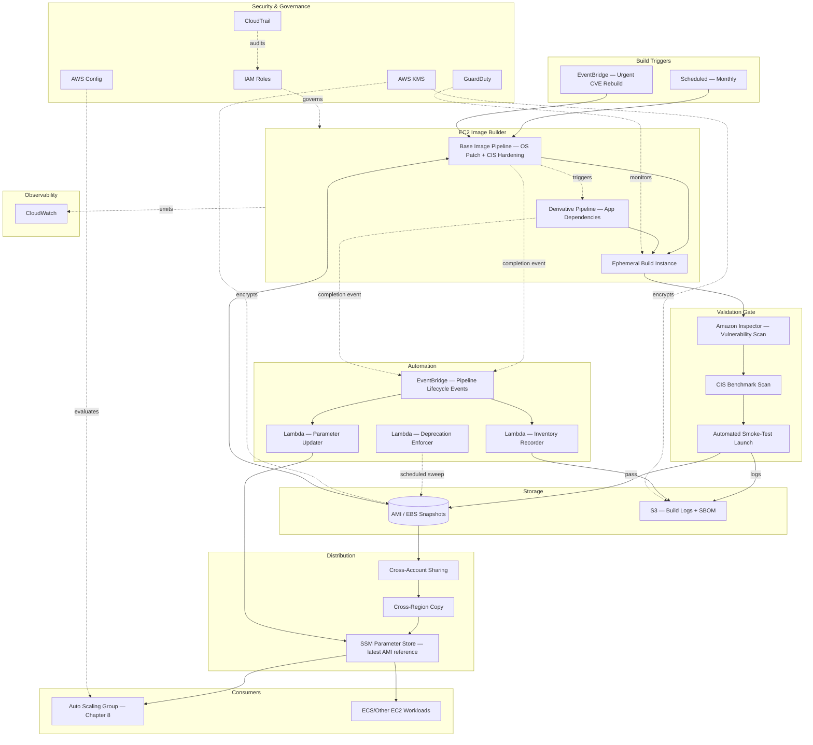

# Part II – Core Infrastructure Architectures

# Chapter 11 – Golden AMI Architecture

> **How to read this chapter:** This chapter anchors every concept to a concrete reference architecture — an **Enterprise Golden AMI Factory**: a centralized, automated image-building pipeline (built on EC2 Image Builder, with a Packer-based alternative path discussed explicitly) that produces hardened, patched, compliance-scanned Amazon Machine Images consumed by every EC2-based workload across the organization — including the Auto Scaling Group architecture from Chapter 8, which referenced this pipeline without describing it in depth. Where Chapter 8 treated the golden AMI as an input, this chapter treats it as the product, and explains how that product is built, tested, versioned, distributed, and retired.

---

# 1. Executive Summary

## The Business Problem

Every organization running EC2 instances at meaningful scale eventually confronts the same question: where does a new instance's initial software state actually come from? Absent a deliberate answer, the default answer is troubling — a public AMI from the AWS Marketplace or the Amazon Linux/Ubuntu maintainers, bootstrapped at launch time via a user-data script that installs packages, applies configuration, and hopes the internet-facing package repositories it depends on are reachable, current, and not compromised at the exact moment a new instance happens to launch. This "configure at boot" model has three compounding problems. First, **it is slow** — installing and configuring software at every instance launch adds minutes to scale-out time, directly undermining the responsiveness an Auto Scaling architecture (Chapter 8) depends on. Second, **it is inconsistent** — if package repository state changes between two instances' launch times (a new version is published, a package is yanked, a transient network failure interrupts one instance's bootstrap but not another's), two instances launched from the "same" configuration can end up running meaningfully different software, an entirely avoidable and historically very common source of "works on some instances, not others" production incidents. Third, **it is insecure by default** — a bootstrap script pulling from public repositories at launch time has no built-in vulnerability-scanning gate, no hardening baseline enforcement, and no audit trail proving what software, at what version, was actually running on a given instance at a given point in time — precisely the evidence an auditor or incident responder needs and frequently cannot produce under this model.

The business problem a Golden AMI architecture solves is: **how does an organization guarantee that every EC2 instance launched anywhere in its estate starts from a known-good, pre-tested, pre-hardened, pre-scanned software baseline — built once, validated once, and reused consistently — rather than reconstructing that baseline unreliably at every single launch.** This is not merely a convenience; it is the foundation that makes several other architectural properties possible at all: the fast scale-out times Chapter 8's Auto Scaling architecture depends on, the audit-evidence trail SOC 2/ISO 27001 compliance requires, and the confidence that a fleet-wide security patch has actually been applied everywhere, not just wherever a bootstrap script happened to succeed.

## Architecture Objective

This chapter's reference architecture targets a centralized AMI factory that:

- **Builds a new AMI on a defined, automated cadence** (at minimum monthly, plus on-demand for urgent security patches), starting from a vetted base image, applying OS patches, a CIS-benchmark-aligned hardening baseline, required agents (SSM Agent, monitoring/security agents), and organization-standard runtime dependencies.
- **Validates every build automatically** before it becomes eligible for use — vulnerability scanning (Amazon Inspector or an equivalent tool), CIS-benchmark compliance scanning, and a smoke-test launch confirming the resulting AMI actually boots and passes basic health checks.
- **Versions every AMI immutably** and makes the specific software Bill of Materials (BOM) of any given AMI version queryable after the fact, satisfying both operational rollback needs and audit-evidence requirements.
- **Distributes approved AMIs** to every AWS account and region that needs them, via a controlled, permissioned sharing mechanism rather than ad hoc copying.
- **Deprecates and retires old AMI versions** on a defined lifecycle, preventing indefinite accumulation of increasingly outdated, unpatched images remaining technically launchable.
- **Reduces instance boot-to-serving time** by front-loading configuration into the image-build process rather than the instance-launch process, directly supporting Chapter 8's scale-out responsiveness targets.

## Why Organizations Adopt This Architecture

Organizations adopt a centralized Golden AMI factory for the same underlying reason they adopt centralized Infrastructure-as-Code (Chapter 3) and centralized architecture documentation (Chapter 4): **a capability that every team needs, if left to each team to solve independently, is solved inconsistently, redundantly, and — for security-relevant capabilities specifically — often insecurely.** Without a centralized AMI factory, each application team typically builds its own ad hoc bootstrap scripts, achieving wildly inconsistent levels of hardening, patch currency, and vulnerability-scanning rigor across the organization, and duplicating the same "install the monitoring agent, configure the SSM Agent, apply CIS hardening" work dozens of times with dozens of subtly different results. A centralized factory solves this once, correctly, with genuine security and compliance rigor, and lets every consuming team simply reference an approved AMI ID rather than reinventing image hardening from scratch.

The second reason, closely related to Chapter 8's cost and reliability discussion, is that **a pre-baked AMI is measurably faster to launch from and more reliable to launch than a bootstrap-at-launch-time instance**, directly serving the Auto Scaling architecture's scale-out responsiveness requirements — this is not merely a security nicety layered on top of Chapter 8's Auto Scaling architecture, but a genuine prerequisite for that architecture actually meeting its stated 3–5 minute scale-out target.

## Major Business Benefits

| Benefit | Explanation |
|---|---|
| Faster, more reliable instance launches | Pre-baked configuration eliminates bootstrap-time package installation, reducing time-to-serving and eliminating a common source of launch-time failure. |
| Consistent security posture fleet-wide | Every instance launches from the same hardened, scanned baseline, rather than an inconsistently-bootstrapped one-off configuration. |
| Auditable software provenance | Every AMI version has a recorded build history, vulnerability scan result, and software Bill of Materials, directly supporting compliance evidence requirements. |
| Reduced duplicate engineering effort | One centralized team builds and maintains the hardening/patching pipeline once, rather than every application team reinventing it independently. |
| Faster, safer patch rollout | A critical security patch is applied once at the image level and propagated fleet-wide via a standard instance-refresh mechanism (Chapter 8), rather than requiring per-instance manual remediation. |
| Reduced blast radius from compromised dependencies | Vulnerability scanning at build time catches a compromised or vulnerable package before it ever reaches a running production instance, rather than discovering it in production. |

## Typical Enterprise Scenarios

This architecture is the right investment for:

- Any organization running EC2 Auto Scaling Groups at the scale and rigor described in Chapter 8, for which this chapter's AMI factory is a direct, necessary dependency.
- Regulated industries (financial services, healthcare) requiring demonstrable evidence of patch compliance and software provenance for every production instance.
- Organizations with multiple application teams independently launching EC2 instances, where consistency and reduced duplicate effort are the primary drivers.
- Organizations running licensed commercial software with specific, validated OS/dependency version requirements that benefit from a controlled, tested baseline rather than an unpredictable bootstrap-time installation.
- Any organization that has experienced a security incident traceable to an unpatched, inconsistently-configured, or unauthorized AMI — a common trigger event, much like Chapter 4's SOC-2-audit-driven adoption of Documentation-as-Code.

It is a lower priority for organizations running exclusively on Fargate/Lambda with no EC2 footprint at all (there is no AMI to build), or for a very small organization running a handful of EC2 instances where the operational overhead of a dedicated image-building pipeline exceeds its near-term value — though even small organizations benefit from adopting a lightweight version of this practice (a single, version-controlled Packer template, even without the full EC2 Image Builder pipeline) rather than relying on bootstrap-at-launch-time configuration indefinitely.

---

# 2. Business Requirements

## Business Drivers

- Reduce instance launch time to support Chapter 8's Auto Scaling Group scale-out responsiveness targets.
- Provide auditable evidence of patch compliance and software provenance for every production instance, without a manual per-instance audit exercise.
- Reduce duplicate engineering effort across application teams independently solving the same hardening/bootstrap problem.
- Reduce the window of exposure between a critical vulnerability disclosure and its remediation across the fleet.

## Functional Requirements

| Requirement | Description |
|---|---|
| Automated image builds | A defined pipeline builds new AMI versions on a schedule and on-demand, without manual, ad hoc image creation. |
| Vulnerability scanning gate | Every build is scanned for known vulnerabilities before being marked eligible for use. |
| Hardening baseline | Every build applies a defined CIS-benchmark-aligned (or equivalent) hardening configuration. |
| Required agent installation | Every build includes the SSM Agent, CloudWatch Agent, and any mandatory security/monitoring agents pre-installed and pre-configured. |
| Multi-account/region distribution | Approved AMIs are shared to every AWS account and region requiring them via a controlled mechanism. |
| Version lifecycle management | AMI versions are deprecated and eventually removed on a defined schedule, with clear rules for how long a version remains launchable after a newer version is published. |
| Software Bill of Materials | Every AMI version's installed package list and versions are recorded and queryable after the fact. |

## Non-Functural Requirements

| Category | Target |
|---|---|
| Build frequency | Full rebuild at minimum monthly; expedited rebuild within 24 hours of a critical (CVSS ≥ 9) vulnerability disclosure affecting an included package |
| Build validation latency | A build's full validation (scan + smoke test) completes within 60 minutes of build completion |
| Distribution latency | An approved AMI is available in every subscribed account/region within 15 minutes of approval |
| AMI launch success rate | ≥ 99.9% of launches from an approved AMI succeed and pass their configured health check within the expected boot window |
| Vulnerability remediation SLA | Critical vulnerabilities remediated (patched and redistributed) within 48 hours of disclosure; high within 7 days |

## Scalability Goals

The pipeline must support building and distributing AMI variants for multiple base operating systems (Amazon Linux 2023, Ubuntu 22.04/24.04, potentially Windows Server) and multiple application-specific derivative images (a base hardened OS image, plus application-specific images layering runtime dependencies on top) without a linear increase in pipeline maintenance burden per additional variant — achieved through the layered-image-composition pattern described in Section 3.

## Availability Requirements

The AMI factory pipeline itself targets 99% availability (a lower bar than customer-facing production systems, since a brief pipeline outage delays the *next* build but does not affect already-published, already-in-use AMIs) — but the AMIs it produces must be launchable with effectively 100% reliability, since AMI launch failures directly cascade into Auto Scaling Group scale-out failures (Chapter 8, Section 24, Scenario 1).

## Latency Requirements

Not a primary concern for the build pipeline itself (build times of 20–45 minutes are entirely acceptable given the monthly/on-demand cadence); the latency requirement that matters is the *consuming* instance's boot-to-healthy time, which this architecture directly improves by front-loading configuration into the image rather than the boot process.

## Compliance Requirements

SOC 2 and ISO 27001 both require demonstrable patch-management evidence; this architecture's build history, scan results, and software Bill of Materials directly satisfy this requirement. CIS Benchmark alignment is frequently an explicit contractual or regulatory requirement (particularly in financial services and government-adjacent industries) satisfied by the hardening stage of the build pipeline.

## Security Expectations

No AMI reaches "approved for use" status without passing the vulnerability-scanning gate; no AMI is built from an unvetted, non-organization-approved base image; every build's provenance (source base image, applied patches, installed packages) is recorded and auditable.

## Recovery Objectives

### Recovery Point Objective (RPO)

**RPO = N/A** in the traditional data-loss sense — the "data" this architecture protects is the build pipeline's configuration and history, which lives in version control (Terraform, EC2 Image Builder component definitions) with the same durability guarantees as any other Git-backed infrastructure.

### Recovery Time Objective (RTO)

**RTO ≤ 4 hours** to restore full pipeline functionality following a pipeline-infrastructure failure, and — critically — **RTO = 0** for already-approved, already-distributed AMIs, since a pipeline outage does not retroactively invalidate previously published, currently-in-use images.

## SLAs

Internal SLA: monthly build cadence met ≥ 95% of the time (allowing for occasional legitimate delay due to a failed validation requiring investigation before republishing); critical-vulnerability expedited rebuild SLA met 100% of the time, treated as a compliance-relevant commitment.

## Expected Workload

A handful of base-image build pipelines (one per supported OS/major-version combination) plus a larger number of application-specific derivative-image pipelines (one per major application/team, layering on top of the shared base), with build volume scaling roughly linearly with the number of actively maintained application teams rather than with instance count or request volume.

## Expected Growth

Growth in this architecture's scope tracks organizational growth in EC2-based workloads and application teams, not customer-facing traffic — a fundamentally different growth driver than the customer-facing architectures in Chapters 3 and 8, worth explicitly noting when this pipeline's own capacity planning is reviewed.

---

# 3. Architecture Overview

## Overall Design

The reference architecture is a **layered image-composition pipeline built on EC2 Image Builder**: a base OS image (Amazon Linux 2023 or Ubuntu) is hardened and patched into an organization-standard "base golden AMI," which is then used as the source for one or more application-specific "derivative golden AMIs" that layer application runtime dependencies on top of the already-hardened, already-scanned base — avoiding the need to re-apply hardening and re-run OS-level patching separately for every application team's image.

## Architecture Philosophy

The guiding philosophy is **"harden and scan once, at the lowest common layer; let every consumer inherit that work rather than repeating it."** This is directly analogous to Chapter 3's "managed services first" philosophy and Chapter 4's "documentation as a byproduct of engineering work" philosophy — in each case, a capability that would otherwise be solved redundantly and inconsistently by many teams is instead solved once, centrally, with genuine rigor, and made available for reuse. Concretely, this means the base golden AMI is owned and maintained by a central platform/security team, while individual application teams own only the derivative-image layer specific to their own runtime dependencies, inheriting the base layer's hardening and patch state automatically whenever the base is rebuilt and the derivative image is subsequently rebuilt against the new base.

The second guiding principle is **treat an AMI as an immutable, versioned artifact, never a mutable one** — an existing AMI version is never modified in place; every change (a new patch, a new application dependency version) produces a new AMI version, and the previous version remains available (though eventually deprecated per the lifecycle policy in Section 23) for rollback and for auditing what was actually running at any point in the past.

## Core Components

| Layer | Components |
|---|---|
| Build Orchestration | EC2 Image Builder (pipelines, recipes, components), triggered on schedule and via EventBridge for on-demand rebuilds |
| Compute (Build-Time) | Ephemeral EC2 instances launched by Image Builder specifically to perform the build, terminated automatically after image creation |
| Validation | Amazon Inspector (vulnerability scanning), a CIS-benchmark scanning tool (e.g., an OpenSCAP-based component), automated smoke-test launch and health check |
| Storage | Amazon S3 (build logs, software Bill of Materials, component definitions), Amazon EC2 AMI/snapshot storage (the images themselves) |
| Distribution | AMI sharing across accounts (via AWS Resource Access Manager or direct AMI permission sharing), cross-region AMI copy |
| Automation | AWS Lambda (build-result processing, distribution triggering, deprecation-schedule enforcement), Amazon EventBridge (build lifecycle events) |
| Security | IAM (build-role and distribution permissions), KMS (AMI/snapshot encryption), Secrets Manager (any build-time credentials needed, e.g., for a private package repository) |
| Observability | CloudWatch (build success/failure, build duration, AMI age tracking) |

## How Components Interact

A scheduled (or on-demand, EventBridge-triggered) EC2 Image Builder pipeline execution launches an ephemeral build instance from the specified parent image (the AWS-published base OS AMI, for a base-layer pipeline, or the current approved base golden AMI, for a derivative-layer pipeline). The pipeline applies its configured components in sequence — OS patching, CIS hardening, agent installation, application-specific dependency installation — then invokes Amazon Inspector and a CIS-compliance scanning component against the resulting, not-yet-published image. If validation passes, Image Builder creates the final AMI and (per the pipeline's configured distribution settings) automatically copies it to every configured target region and shares it with every configured target AWS account. A Lambda function triggered by the pipeline's completion EventBridge event records the new AMI's metadata (version, scan results, software Bill of Materials) into a central inventory (an S3-backed catalog, or a DynamoDB table) and updates the Systems Manager Parameter Store parameter that consuming Auto Scaling Group Launch Templates reference (Chapter 8's `image_id` input), enabling consuming teams to adopt the new AMI via a simple parameter read rather than needing to track specific AMI IDs manually.

## High-Level Workflow

1. A base-layer Image Builder pipeline executes on its defined schedule (or is triggered on-demand for an urgent patch).
2. The pipeline builds, patches, hardens, and validates a new base golden AMI.
3. Upon successful validation, the base AMI is published and distributed to all configured accounts/regions.
4. Each derivative-layer pipeline (one per application team) is triggered (automatically, upon base AMI publication, or independently on its own schedule) to rebuild against the new base.
5. Each derivative AMI is validated and published following the same pattern.
6. Consuming Auto Scaling Groups (Chapter 8) pick up the new AMI version via their referenced Parameter Store parameter, typically via a scheduled or manually-triggered instance refresh.

## Request Lifecycle

Not directly applicable in the traditional customer-facing sense — this architecture's "request" is a scheduled or event-triggered build execution, not a customer HTTP request. The closest analog is the build-pipeline execution lifecycle described above.

## Response Lifecycle

The "response" is the published, validated AMI itself, plus its associated metadata record — consumed by downstream Auto Scaling Group Launch Templates (Chapter 8) referencing it via Parameter Store, and by the audit/compliance tooling querying the central AMI inventory.

## Data Lifecycle

Each AMI version, once published, is retained per the deprecation policy (Section 23) — typically the most recent 5–10 versions remain launchable, with older versions first deprecated (marked non-launchable for new instances, though existing instances already running from them are unaffected) and eventually deregistered entirely once no running instance depends on them, confirmed via a dependency check against the current Auto Scaling Group/Launch Template configuration fleet-wide.

---

# 4. AWS Services Used

## Amazon EC2

**Purpose:** Provides both the ephemeral build-time compute Image Builder uses to construct each image, and — indirectly — the eventual runtime target the resulting AMI is designed for.

**Why selected:** Foundational; there is no AMI-building architecture without EC2 as the underlying compute abstraction the AMI describes.

**Alternatives:** N/A at this layer — AMIs are an EC2-specific artifact by definition; the analogous concept for containers (a container image) is addressed by a distinct pipeline (Section 28 discusses this comparison).

**Limitations:** Build-time EC2 instances incur standard On-Demand compute cost for the duration of each build (typically 20–45 minutes) — a minor but real, and easily overlooked, ongoing cost line (Section 16).

**Best practices:** Use the smallest instance type that reliably completes the build within a reasonable time — build-time compute has no reason to match the target workload's production instance type.

## EC2 Image Builder

**Purpose:** The managed orchestration service for defining, building, testing, and distributing AMIs — the central service this entire chapter's architecture is built around.

**Why selected:** Provides native, managed handling of exactly the workflow this chapter needs — recipe-based image composition, built-in and custom "components" (reusable, versioned build steps), automated test/validation stages, and native cross-account/cross-region distribution — without the operational burden of self-managing an equivalent Packer-based pipeline's underlying orchestration infrastructure (build-server fleet, state management, scheduling).

**Alternatives:** HashiCorp Packer, self-orchestrated via CodeBuild/Jenkins — chosen instead by organizations with existing deep Packer investment, a need for build logic Image Builder's component model doesn't cleanly express, or a genuine multi-cloud imaging requirement (Packer supports building equivalent images for other cloud providers from a similar template structure, which Image Builder, an AWS-specific service, does not).

**Limitations:** Image Builder's component DSL (YAML-based) has a real, if modest, learning curve distinct from general Terraform/HCL familiarity; very complex, highly conditional build logic can be more naturally expressed in a general-purpose Packer provisioner script than in Image Builder's more structured component model.

**Pricing considerations:** No charge for the Image Builder service itself; the customer pays only for the underlying build-time EC2 instance usage and storage of the resulting AMI/snapshots.

**Best practices:** Compose images in layers (base OS hardening component, then application-specific components) rather than one monolithic recipe per application, directly enabling this chapter's "harden once, reuse everywhere" philosophy; version every component explicitly rather than relying on an implicit "latest" reference.

## Amazon S3

**Purpose:** Stores build logs, the software Bill of Materials generated per build, and any custom Image Builder component definitions not embedded directly in Terraform.

**Why selected:** As throughout this book — durable, low-cost, natively integrated storage for build artifacts and audit evidence.

**Best practices:** Enable versioning and appropriate lifecycle rules; encrypt with a dedicated KMS CMK given the potential sensitivity of detailed software inventory data (a precise software Bill of Materials is itself useful reconnaissance information for an attacker, similar to the network-diagram sensitivity discussed in Chapter 4).

## AWS Lambda

**Purpose:** Processes Image Builder pipeline completion events — recording build metadata into the central AMI inventory, updating the Parameter Store reference consuming teams read, triggering downstream derivative-image rebuilds, and enforcing the AMI deprecation-schedule policy on a scheduled basis.

**Why selected:** Event-driven, intermittent automation tasks well suited to Lambda's model, consistent with this book's general pattern (Chapters 3, 4, 8) of using Lambda for exactly this class of lightweight, event-triggered orchestration glue.

**Best practices:** Keep each function single-purpose (inventory-recorder, parameter-updater, deprecation-enforcer as distinct functions), consistent with the single-responsibility principle applied throughout this book's Lambda usage.

## Amazon EventBridge

**Purpose:** Delivers Image Builder pipeline lifecycle events (build started, build succeeded, build failed, image state changed) to the Lambda automation functions described above, and delivers the scheduled trigger for on-demand urgent rebuilds.

**Why selected:** Native AWS event source for Image Builder lifecycle events, with content-based filtering allowing precise routing (e.g., only `IMAGE_STATUS_CHANGED` events with a status of `AVAILABLE` trigger the inventory-recorder function).

**Best practices:** Use a dedicated EventBridge rule per downstream automation concern rather than one broad rule with in-Lambda filtering logic, keeping the routing logic visible and auditable at the EventBridge configuration level.

## Amazon Inspector

**Purpose:** Scans each build's resulting (not-yet-published) AMI for known OS and language-package vulnerabilities before it is allowed to proceed to publication.

**Why selected:** Native, managed vulnerability scanning with no additional scanning infrastructure to operate, directly integrated into the build pipeline as a hard validation gate rather than a post-hoc, after-the-fact audit.

**Alternatives:** Third-party scanning tools (Trivy, Qualys, Tenable) — sometimes preferred for organizations with existing enterprise-wide vulnerability-management tooling investment and a need for a single, consistent scanning tool across both EC2 AMIs and container images.

**Limitations:** Scans known-CVE-database vulnerabilities in installed packages; does not validate custom application-code-level vulnerabilities, which remain the responsibility of the application's own SAST/DAST pipeline.

**Best practices:** Configure a hard severity threshold (e.g., any CVSS ≥ 7 finding blocks publication) rather than treating scan results as advisory-only; review and explicitly document any accepted-risk exception (a vulnerability with no available patch, mitigated by a compensating control) rather than silently ignoring it.

## AWS IAM

**Purpose:** Scopes the Image Builder pipeline's build role (permissions to launch build instances, access component definitions, write logs), the distribution role (permissions to copy/share AMIs across accounts and regions), and the automation Lambda functions' execution roles.

**Why selected:** As throughout this book — foundational least-privilege access control for every component in the architecture.

**Best practices:** Scope the distribution role narrowly to only the specific target accounts/regions the organization has actually approved for AMI sharing, reviewed periodically as the set of consuming accounts evolves.

## AWS Systems Manager

**Purpose:** Provides the Parameter Store parameter (e.g., `/golden-ami/base/al2023/latest`) that consuming Launch Templates (Chapter 8) reference, decoupling consumers from needing to track specific AMI IDs directly; also provides the SSM Agent baked into every golden AMI, enabling Session Manager access to any instance launched from it without further bootstrap.

**Why selected:** As throughout this book — Parameter Store is the natural, low-overhead mechanism for exactly this "latest approved version" indirection pattern, and SSM Agent pre-baking directly serves Chapter 8's bastion-free operational access model.

**Best practices:** Maintain both a `latest` parameter (automatically updated on every successful publish) and explicit versioned parameters (e.g., `/golden-ami/base/al2023/2026-07-01`) so consuming teams can choose between always-latest and pinned-version consumption models based on their own risk tolerance and change-management process.

## AWS KMS

**Purpose:** Encrypts the AMI's underlying EBS snapshots and any sensitive build-artifact storage (S3 buckets holding software Bill of Materials data).

**Why selected:** Consistent with this book's data-classification-driven encryption approach (Chapters 3, 4) — an AMI's precise software inventory is sensitive, reconnaissance-relevant information warranting encryption and access control.

**Best practices:** Use a dedicated CMK for golden-AMI-related encryption, with key policy access scoped to the build pipeline's own roles and the specific consuming accounts authorized to launch instances from the resulting AMIs (since a shared AMI's encrypted snapshot requires the consuming account to also have decrypt access to the CMK).

## Amazon CloudTrail / AWS Config / Amazon GuardDuty

**Purpose:** As described in Chapter 3 — the same organization-wide audit, compliance, and threat-detection baseline applies to this architecture's AWS account, with an Auto-Scaling/AMI-specific Config rule addition (already introduced in Chapter 8) flagging any Launch Template referencing an AMI older than the organization's defined maximum patch age, directly enforced using this chapter's AMI-inventory metadata as the source of truth for "how old is this AMI, really."

---

# 5. Complete Architecture Diagram



---

# 6. Component-by-Component Explanation

## Base Image Pipeline (EC2 Image Builder)

**Purpose:** Produces the organization-standard hardened, patched base golden AMI that every derivative pipeline builds upon.
**Responsibilities:** Launch an ephemeral build instance from the current AWS-published base OS AMI; apply OS patching, CIS-benchmark hardening, SSM/CloudWatch agent installation; invoke the validation gate; publish the resulting AMI upon success.
**Inputs:** The current AWS-published parent AMI; the organization's component definitions (patch, hardening, agent-installation steps).
**Outputs:** A new base golden AMI version; build logs and software Bill of Materials; a pipeline-completion EventBridge event.
**Scaling:** N/A in the traditional sense — this is a scheduled/triggered batch process, not a request-serving component; "scaling" here means supporting multiple base-OS variants (Amazon Linux, Ubuntu) as parallel, independently-scheduled pipelines.
**High availability:** Not applicable in the traditional sense; a failed build simply does not publish a new version, leaving the previous version as the current "latest" until the issue is resolved and the build re-run.
**Failure handling:** A failed validation stage (scan failure, smoke-test failure) halts publication automatically; the pipeline alerts the owning team rather than silently retrying indefinitely.
**Dependencies:** The AWS-published parent AMI (itself subject to occasional changes AWS makes to its base images, worth monitoring), Amazon Inspector, the CIS-scanning component.
**Security:** The build role has no more permission than strictly required to launch a build instance, execute components, and publish the resulting AMI — critically, no permission to modify any *existing*, already-published AMI, enforcing the immutability principle from Section 3.
**Monitoring:** Build success/failure rate, build duration trend, time-since-last-successful-build (directly feeding the "is our base AMI dangerously outdated" alerting concern).

## Derivative Image Pipeline (EC2 Image Builder)

**Purpose:** Layers application-team-specific runtime dependencies on top of the current approved base golden AMI.
**Responsibilities:** Launch a build instance from the current base golden AMI (referenced via the Parameter Store `latest` parameter, ensuring every derivative rebuild automatically picks up the most recent base-layer hardening/patches); install application-specific dependencies; invoke the same validation gate; publish the resulting derivative AMI.
**Inputs:** The current base golden AMI; application-team-owned component definitions (their specific runtime/dependency installation steps).
**Outputs:** A new derivative golden AMI version, specific to that application team.
**Scaling:** One pipeline per actively maintained application team/workload requiring a distinct runtime dependency set; scales linearly with the number of such teams, a deliberate, accepted trade-off in exchange for each team retaining ownership of only its own narrow, application-specific layer.
**Dependencies:** The base image pipeline's successful publication (either triggered automatically upon base publication, or on the derivative pipeline's own independent schedule, per the organization's chosen coupling model — Section 27 discusses the trade-offs of automatic-trigger versus independent-schedule coupling).
**Security:** The derivative pipeline's build role is scoped to that specific application team's needs only — it cannot, for instance, modify the base pipeline's components or publish a base-layer AMI itself.
**Monitoring:** Identical metrics to the base pipeline, tracked per application team, surfaced on a shared dashboard so the platform team can see at a glance which teams' derivative images are current versus lagging behind the latest base.

## Validation Gate (Inspector, CIS Scan, Smoke Test)

**Purpose:** Ensures no AMI reaches "available for use" status without passing a defined, automated set of security and functional checks.
**Responsibilities:** Scan the freshly-built (not-yet-published) image for known vulnerabilities; verify CIS-benchmark hardening compliance; launch a temporary instance from the built image and confirm it boots successfully and passes a basic health check.
**Inputs:** The freshly-built, pre-publication image.
**Outputs:** A pass/fail determination gating publication; detailed scan/compliance reports stored to S3.
**Scaling:** Runs once per build; not a continuously-running service.
**Failure handling:** A failed validation halts the pipeline before publication — the build is never made available to consumers, and the previous approved version remains the current "latest" until the failure is investigated and resolved.
**Dependencies:** Amazon Inspector, the organization's CIS-compliance scanning component/tool.
**Security:** This *is* the primary security control this entire architecture exists to enforce — its own configuration (severity thresholds, hardening-benchmark version) deserves the same change-review rigor as any other security-critical configuration.
**Monitoring:** Validation pass/fail rate over time, and — importantly — a trend of *which specific findings* most commonly cause failures, feeding back into which components most need proactive attention.

## AMI Inventory (S3/DynamoDB-backed Catalog)

**Purpose:** Records every published AMI version's metadata — build timestamp, source components and their versions, vulnerability scan result summary, software Bill of Materials — in a centrally queryable form.
**Responsibilities:** Provide the audit-evidence answer to "what was actually running in this AMI version, and when was it built and validated" without needing to reconstruct this from raw build logs after the fact.
**Inputs:** Pipeline-completion event data, processed by the inventory-recorder Lambda function.
**Outputs:** Queryable metadata records, typically exposed via a simple internal API or directly queryable in DynamoDB/Athena.
**Scaling:** Scales trivially with AMI build volume, which — per Section 2 — is modest and predictable.
**Security:** Read access is broadly available to engineering and audit/compliance functions; write access is restricted to the inventory-recorder Lambda function alone, preventing manual tampering with the audit record.
**Monitoring:** Primarily consumed reactively (during an audit or incident investigation) rather than continuously monitored itself.

## Distribution Layer (Cross-Account Sharing, Cross-Region Copy)

**Purpose:** Makes an approved AMI available in every AWS account and region that needs to launch instances from it.
**Responsibilities:** Automatically copy the newly published AMI to each configured target region; grant launch permission to each configured target AWS account.
**Inputs:** The newly published, validated AMI.
**Outputs:** Region-local AMI copies and cross-account launch permissions.
**Scaling:** Scales with the number of target regions/accounts, configured explicitly per the organization's actual account/region footprint, not an unbounded "share with everyone" default.
**Security:** AMI sharing is permission-based, not public — only explicitly authorized AWS account IDs receive launch permission, and the underlying KMS CMK's key policy must independently grant those same accounts decrypt access, providing a genuine two-factor control (AMI permission AND key access) rather than a single point of access control.
**Monitoring:** Distribution completion status per target account/region, alerting if a specific target's copy/share operation fails (which would otherwise silently leave that account referencing a stale AMI version).

---

# 7. End-to-End Request Flow

**Scenario: A monthly scheduled base-image rebuild, followed by a derivative rebuild and eventual consumption by an Auto Scaling Group.**

1. **Trigger**: The base image pipeline's monthly schedule fires (or an urgent CVE-driven EventBridge event triggers an out-of-cycle rebuild).
2. **Build instance launch**: EC2 Image Builder launches an ephemeral EC2 instance from the current AWS-published parent AMI.
3. **Component execution — OS patching**: The pipeline applies the latest available OS security patches.
4. **Component execution — CIS hardening**: The pipeline applies the organization's CIS-benchmark-aligned hardening configuration (disabling unnecessary services, enforcing password/session policies, configuring audit logging).
5. **Component execution — required agents**: The pipeline installs and configures the SSM Agent, CloudWatch Agent, and any mandatory security agents.
6. **Image creation**: Image Builder creates an AMI (and underlying EBS snapshot) from the now-configured build instance.
7. **Vulnerability scan**: Amazon Inspector scans the new AMI for known vulnerabilities in installed OS packages.
8. **CIS compliance scan**: A CIS-benchmark scanning component verifies the hardening configuration was applied correctly and completely.
9. **Smoke-test launch**: Image Builder launches a temporary instance from the new AMI and executes a basic health-check script confirming successful boot and expected service availability.
10. **Validation decision**: If all three validation steps pass, the pipeline proceeds to publication; if any fail, the pipeline halts and alerts the owning team, and the build-instance and any temporary resources are cleaned up automatically.
11. **Publication**: The validated AMI is marked available, and its underlying build-time compute/temporary resources are terminated.
12. **Distribution — cross-region copy**: The new AMI is automatically copied to every configured target region.
13. **Distribution — cross-account sharing**: Launch permission is granted to every configured target AWS account, with the corresponding KMS key policy already granting the necessary decrypt access.
14. **Completion event**: Image Builder emits a pipeline-completion event to EventBridge.
15. **Inventory recording**: The inventory-recorder Lambda function processes the event, recording the new AMI's metadata (version, scan results, software Bill of Materials) into the central AMI catalog.
16. **Parameter update**: The parameter-updater Lambda function updates the `/golden-ami/base/al2023/latest` Parameter Store value to reference the new AMI ID, and creates a new explicit versioned parameter for teams pinning to a specific version.
17. **Derivative pipeline trigger**: The base publication event triggers (or is picked up by the independently-scheduled) derivative pipeline for each application team.
18. **Derivative build**: Each derivative pipeline repeats steps 2–16 using the new base AMI as its parent image, layering its own application-specific components.
19. **Consumption — Auto Scaling Group instance refresh**: A consuming Auto Scaling Group (Chapter 8), configured to reference the derivative AMI's Parameter Store `latest` value, picks up the new version — either automatically on its own scheduled refresh cadence, or via a manually-triggered instance refresh once the platform team announces the new version's availability.
20. **Error handling (alternate path)**: If the smoke-test launch (step 9) fails — for example, the CIS hardening configuration inadvertently disabled a service the application actually requires — the pipeline halts before publication, the previous AMI version remains the current "latest," and the failure is investigated and the underlying component definition corrected before the next build attempt.

---

# 8. Deployment Flow

## Infrastructure Provisioning

The Image Builder pipelines, recipes, components, and distribution configuration are all defined in Terraform, following the identical module/environment structure described in Chapter 3, Section 18 — this pipeline is itself infrastructure, provisioned and reviewed with the same rigor as any other production system in this book.

## Terraform Workflow

Identical review-and-apply discipline to every other chapter — `terraform plan` posted to the pull request, human review (specifically including a security-team reviewer for any change touching the hardening component or validation-gate severity thresholds), merge-triggered apply via a scoped CI role.

## CI/CD Deployment

Unlike the application/infrastructure deployment pipelines described in prior chapters, this chapter's "deployment" *is* the image-build pipeline itself — there is no separate application deployment step distinct from the AMI build, since the golden AMI's entire purpose is to already contain everything a launched instance needs.

## Blue-Green Deployment

The blue-green pattern applies here in a specific, AMI-centric form: the "green" AMI version is built and validated fully before any consuming Auto Scaling Group is asked to adopt it; a consuming group's own instance-refresh process (Chapter 8, Section 8) then performs the actual blue-green transition at the fleet level, not this pipeline itself.

## Rollback

AMI rollback is simple given the immutable-versioning principle from Section 3: revert the Parameter Store `latest` reference (or the consuming Launch Template's pinned version) to the previous known-good AMI version and initiate a new instance refresh — symmetric with forward adoption, with no special-case rollback logic required.

## Secrets

Any build-time credentials required (e.g., access to a private, license-gated package repository) are retrieved via Secrets Manager at build time using the build instance's IAM role, never embedded in the component definition or baked into the resulting AMI itself.

## Configuration

Component definitions themselves are the "configuration" in this architecture — version-controlled, reviewed via pull request, and referenced by explicit version number in each pipeline's recipe, never an implicit "latest component" reference that could silently change a build's behavior between runs.

## Validation

As detailed in Section 6's Validation Gate component — vulnerability scanning, CIS compliance scanning, and smoke-test launch, all automated and all gating publication, with no manual "eyeball it and approve" step required (or permitted) for routine builds.

---

# 9. Network Topology

## VPC / Build-Time Networking

The Image Builder pipeline's ephemeral build instances launch into a dedicated, minimal VPC — not the production application VPC from Chapters 3 and 8.

Reasons for this separation:

- Build instances need outbound internet access (to fetch OS patches and packages), which should never be granted to production application subnets directly.
- Keeping build infrastructure isolated limits blast radius if a build-time compromise ever occurred (e.g., a malicious package pulled during patching).
- It avoids any accidental network-level interaction between build-time instances and running production workloads.

## CIDR and Subnets

A small `/24` VPC is more than sufficient for this workload:

- One public subnet (for the NAT Gateway, or direct internet access if the build subnet itself is public — see below).
- One subnet dedicated to build instances, typically configured as private-with-NAT-egress for tighter control, though some organizations use a public subnet directly for build instances given their strictly ephemeral, non-production nature.

## NAT Gateway

- A single NAT Gateway is generally sufficient — build instances are ephemeral and not customer-facing, so multi-AZ NAT redundancy (as required in Chapters 3 and 8) is not a hard requirement here.
- A build failure due to a NAT Gateway issue simply delays that build; it does not cause customer-facing impact.

## Internet Gateway / Route Tables

- Standard pattern: public subnet routes to the Internet Gateway; build subnet routes to the NAT Gateway for package-repository access.
- No production data subnet exists in this VPC at all — there is no persistent data tier here, only ephemeral build compute.

## Network ACLs / Security Groups

- The build instance security group permits outbound HTTPS (443) for package repositories and AWS API calls, and nothing else inbound.
- No inbound access is required at all — Image Builder manages build instances via SSM, not SSH, so no inbound port needs to be open.

## PrivateLink

VPC endpoints are used for:

- Systems Manager (SSM, SSM Messages, EC2 Messages) — required for Image Builder's own management of the build instance.
- S3 (for build-log and component-definition access).
- EC2 Image Builder's own service endpoint, where supported.

Benefit: reduces both NAT Gateway cost and the build instance's actual internet-routable surface area, consistent with this book's general PrivateLink philosophy (Chapters 3, 4, 8).

## Hybrid Connectivity

- Not applicable in the typical case.
- An exception exists for organizations with an on-premises, license-gated package repository (e.g., a commercial database client library) — in that specific case, the build VPC connects via Transit Gateway/Direct Connect, following the same pattern described in Chapter 3, Section 9.

---

# 10. Identity and Access

## IAM Roles

Distinct roles exist for each of the following, with no sharing across roles:

- **Build instance role** — permissions to execute Image Builder components, write logs, and (if applicable) retrieve build-time secrets from Secrets Manager.
- **Image Builder service role** — the role Image Builder itself assumes to orchestrate build-instance lifecycle, snapshot creation, and AMI publication.
- **Distribution role** — permissions to copy AMIs cross-region and grant cross-account launch permissions.
- **Automation Lambda roles** — one per function (inventory-recorder, parameter-updater, deprecation-enforcer), each scoped narrowly to its own single task.

## IAM Policies

```json

{
  "Version": "2012-10-17",
  "Statement": [
    {
      "Sid": "AllowBuildLogWrite",
      "Effect": "Allow",
      "Action": ["s3:PutObject"],
      "Resource": "arn:aws:s3:::acme-golden-ami-build-logs/*"
    },
    {
      "Sid": "AllowSecretsReadForPrivateRepo",
      "Effect": "Allow",
      "Action": ["secretsmanager:GetSecretValue"],
      "Resource": "arn:aws:secretsmanager:us-east-1:111122223333:secret:golden-ami/private-repo-creds-??????"
    },
    {
      "Sid": "DenyModifyExistingAMIs",
      "Effect": "Deny",
      "Action": ["ec2:DeregisterImage", "ec2:ModifyImageAttribute"],
      "Resource": "*",
      "Condition": {
        "StringNotEquals": { "aws:PrincipalArn": "arn:aws:iam::111122223333:role/golden-ami-deprecation-enforcer" }
      }
    }
  ]
}

```

Key point: only the deprecation-enforcer Lambda's role may ever deregister or modify an existing AMI — no build role, human engineer role, or other automation role has this permission, directly enforcing the immutability principle from Section 3 at the IAM layer, not just as a documented convention.

## Resource Policies

- The AMI's launch-permission list (a resource-level policy on the AMI itself) explicitly enumerates every authorized consuming AWS account — no public or "all accounts in the organization" wildcard grant.
- The KMS CMK's key policy independently enumerates the same set of accounts for decrypt access, providing the two-factor control described in Section 6.

## STS

As throughout this book:

- Every role assumption uses short-lived STS credentials.
- No long-lived IAM user access keys exist anywhere in this pipeline.

## Cross-Account Access

This is a central concern for this specific chapter, since AMI distribution is inherently cross-account:

- The distribution role in the "publisher" account (where the golden AMI factory itself lives) is granted permission to modify AMI launch permissions and copy AMIs — it does not need any role *in* the consuming accounts.
- Consuming accounts need only standard `ec2:RunInstances` permission referencing the shared AMI ID — no special cross-account role is required on the consumer side beyond the AMI's own launch-permission grant.

## Least Privilege

Applied identically to every other chapter's discipline:

- Scoped ARNs, never wildcards.
- SCPs preventing the golden-AMI-factory account from being used for unrelated production workloads.
- Permission boundaries on any role capable of modifying IAM itself.

## Service Roles

- The Image Builder service-linked role (automatically created by AWS) grants Image Builder itself the permissions it needs to manage build-instance lifecycle on the account's behalf.
- This is distinct from, and should not be confused with, the build-instance's own IAM instance profile.

## Permission Boundaries

- Applied to the CI/CD deployment role that applies Terraform changes to this pipeline's own infrastructure.
- Caps its maximum grantable permissions, preventing a compromised pipeline from provisioning resources outside this chapter's intended scope.

---

# 11. Security Architecture

## Encryption

- Every AMI's underlying EBS snapshot is encrypted with a dedicated KMS CMK.
- Build logs and software Bill of Materials data in S3 are encrypted with the same or a closely related CMK.
- No unencrypted AMI or snapshot is ever published, enforced via an AWS Config rule.

## KMS

- A dedicated CMK, distinct from the production application CMKs described in Chapter 3.
- Key policy explicitly enumerates: the build pipeline's own roles (encrypt/decrypt for build-time operations), and every consuming account authorized to launch instances from the shared AMI (decrypt only).

## TLS

- All build-time package-repository and AWS API traffic uses TLS.
- Not a primary architectural concern in this chapter relative to Chapters 3 and 8, since there is no customer-facing traffic here at all.

## WAF / Shield

- Not applicable — this architecture has no internet-facing endpoint of its own.

## Secrets Manager

- Stores any build-time credentials (private package repository access, license keys needed during build).
- Retrieved at build time via the build instance's IAM role.
- Never embedded in a component definition or baked into the resulting AMI.

## Certificate Manager

- Not typically applicable to this specific pipeline, absent a build-time requirement for a specific internal TLS certificate (e.g., to reach an internal, TLS-secured package repository).

## GuardDuty

- Enabled for this account identically to every other account in the organization.
- Specifically valuable here: an anomalous API call pattern from the build-instance role (e.g., attempting to read a secret it has no legitimate reason to access) would be a strong signal of a compromised build process.

## Inspector

- The core validation-gate scanning tool described in Section 6.
- Also applies its standard continuous-scanning capability to the ephemeral build instances themselves while they exist, though their short lifespan makes this secondary to the explicit build-time scan step.

## Security Hub

- Aggregates this account's Config/GuardDuty/Inspector findings into the organization's unified view, per Chapter 3's pattern.

## CloudTrail

- Captures every Image Builder API call, every AMI permission-modification call, and every KMS key-policy change.
- This audit trail is the primary evidence a security team would use to investigate any question about how a specific AMI came to be built, published, or shared.

## AWS Config

- Applies the organization's standard Conformance Pack.
- Adds a golden-AMI-specific rule flagging any published AMI whose underlying snapshot is unencrypted, or whose launch permissions include an unexpected/unauthorized account ID.

## Zero Trust

- No implicit trust is granted based on network location.
- Every build-time credential retrieval, every AMI permission grant, and every cross-account share is explicitly, individually authorized — never inherited from a broader, ambient trust relationship.

## Threat Model

Primary threats specific to this chapter's architecture:

1. A compromised or malicious package pulled during the OS-patching build step, propagating to every subsequently launched instance.
2. An attacker gaining the ability to modify a component definition, silently injecting a backdoor into future builds.
3. Overly broad AMI sharing (accidentally granting launch permission to an unintended account).
4. A stale, unpatched AMI remaining the "latest" reference indefinitely due to a silently broken build pipeline.
5. Software Bill of Materials data itself being exposed, providing an attacker a precise map of exploitable package versions across the fleet.

## Attack Vectors and Mitigations

| Attack Vector | Mitigation |
|---|---|
| Compromised package during patch step | Pin package-repository sources to vetted, organization-approved mirrors; Inspector scan as a hard gate before publication |
| Malicious component-definition modification | Pull-request review requirement, with mandatory security-team reviewer, for any component-definition change |
| Overly broad AMI sharing | Explicit, reviewed account allowlist; Config rule alerting on unexpected launch-permission grants |
| Silently broken pipeline leaving a stale AMI as "latest" | AMI-age monitoring and alerting (Section 21), independent of build-pipeline-failure alerting alone |
| Software Bill of Materials exposure | Access-restricted, KMS-encrypted storage for SBOM data, following the same sensitivity classification as Chapter 4's threat-model/network-diagram content |

---

# 12. High Availability

## AZ Failures

- Build-time compute is inherently transient and non-customer-facing.
- A build instance affected by an AZ issue simply fails that specific build attempt; Image Builder retries in an alternate AZ automatically on the next scheduled/triggered execution.
- No customer-facing impact results either way.

## Instance Failures

- A failed build instance (hardware fault, unexpected termination) fails that build attempt.
- The pipeline is re-run — either automatically, if configured for retry, or manually by the owning team.
- The previous, already-published AMI version remains fully available and launchable throughout.

## Regional Failures

- This chapter's pipeline is region-scoped.
- The DR region (per Chapter 3's Warm Standby pattern) requires its own, independently-scheduled base and derivative pipelines, or — more commonly — receives AMIs distributed via this chapter's own cross-region copy mechanism from the primary region's pipeline.
- Either approach ensures the DR region always has a current, validated AMI available without depending on the primary region's build pipeline being operational at the exact moment of a regional failover.

## Database Failures

- Not applicable — this architecture has no persistent database tier of its own.

## Load Balancing / Health Checks / Failover

- Not applicable in the traditional sense.
- The closest analog is the smoke-test launch (Section 6), which serves a "health check" function for the AMI itself before it is ever exposed to a real consumer.

---

# 13. Disaster Recovery

## Backup Strategy

- The pipeline's own definition (Terraform, Image Builder recipes/components) is backed up implicitly via Git, per this book's consistent pattern.
- Already-published AMIs are themselves the "backup" of a known-good software state — an organization can always launch a previous, still-retained AMI version if a current build is somehow compromised or found faulty after the fact.

## Snapshots

- Every AMI is, by definition, backed by an EBS snapshot.
- No separate, additional snapshot strategy is required beyond retaining the AMI itself per the deprecation policy (Section 23).

## Cross-Region Replication

- Handled as a first-class, automated part of the distribution stage (Section 6) — every published AMI is copied to every configured target region as part of normal operation, not as a separate, bolted-on DR process.

## Pilot Light / Warm Standby / Active-Active / Active-Passive

- This chapter's own DR posture is best described as a variant of **Active-Active**, in a specific, narrow sense:
  - the base/derivative pipelines can run independently in multiple regions.
  - or, more commonly, a single primary-region pipeline's output is simply replicated everywhere via cross-region copy, functioning as a lightweight Active-Passive model for the *build* process specifically, while the *published artifacts* themselves are genuinely available everywhere at all times.
- Full Warm Standby (Chapter 3's chosen pattern for the customer-facing architecture) is unnecessary overhead here, since there is no customer-facing availability requirement for the build pipeline itself.

## RPO

- **RPO = 0** for already-published AMIs (durable, cross-region-replicated S3/EBS-backed artifacts).
- **RPO = up to one build cycle** (typically one month) for the *next* AMI version, if the pipeline itself experiences an extended outage — an acceptable, explicitly accepted risk given this architecture's lower criticality relative to customer-facing systems.

## RTO

- **RTO ≤ 4 hours** to restore full pipeline functionality following an infrastructure failure (Section 2), achieved by reapplying the pipeline's Terraform definition in an alternate region/account if necessary.
- **RTO = 0** for already-published, already-distributed AMIs, which remain fully launchable regardless of the build pipeline's own current health.

---

# 14. Scalability

## Horizontal Scaling

- Scaling in this chapter means supporting more base-OS variants and more application-team derivative pipelines, not higher build throughput for a single pipeline.
- Each pipeline is independent; adding a new application team's derivative pipeline does not affect any existing pipeline's operation.

## Vertical Scaling

- Build-instance size can be increased if a specific build (e.g., compiling a large application dependency from source) genuinely requires more compute/memory than the default build-instance type provides.
- This is tuned per-pipeline, not globally.

## Auto Scaling (Comparison)

- Not directly applicable to the build pipeline itself, which is a scheduled/triggered batch process, not a continuously-scaling service.
- The *output* of this chapter's architecture (the golden AMI) is precisely what feeds Chapter 8's Auto Scaling Group architecture — this chapter and Chapter 8 are complementary, not overlapping, concerns.

## Serverless Scaling

- The Lambda automation functions (inventory-recorder, parameter-updater, deprecation-enforcer) scale automatically and trivially, given their low, infrequent invocation volume.

## Database Scaling / Storage Scaling / Queue Scaling

- Not directly applicable.
- S3 storage for build logs/SBOM data scales automatically without limit, consistent with this book's general S3 usage pattern.

---

# 15. Performance Optimization

## Build Time Optimization

- Layer image composition (base, then derivative) so each derivative build only needs to add its own incremental dependencies, not repeat the full OS-hardening process from scratch.
- Cache package-manager data where the build tool supports it, reducing repeated download time across builds.
- Use the smallest build-instance type that reliably completes the build in a reasonable time — oversized build instances waste cost without meaningfully improving build speed for typically I/O-bound (package download/install) build steps.

## Caching

- Not a customer-facing caching concern in this chapter.
- The closest analog: caching package-repository data at the build-instance level (or via a regional package-mirror/proxy) to reduce build time and reduce dependency on external repository availability at build time.

## Compression / CDN

- Not applicable to this architecture.

## Database Optimization / Connection Pooling / Concurrency

- Not applicable — no database or connection-pooled resource exists in this pipeline.

## Async Processing

- The distribution stage (cross-region copy, cross-account sharing) is inherently asynchronous relative to the build/validation stage, allowing the pipeline to report "build succeeded" promptly while distribution continues in the background, tracked to completion via its own status checks (Section 6).

---

# 16. Cost Optimization (FinOps)

## Estimated Monthly Cost — Small Deployment

*(1–2 base pipelines, 2–3 derivative pipelines, monthly builds)*

| Line Item | Estimated Monthly Cost (USD) |
|---|---|
| Build-instance compute (modest instance type, ~5 builds/month, ~30 min each) | $10 |
| EBS snapshot storage (retained versions) | $15 |
| S3 (build logs, SBOM) | $5 |
| Inspector scanning | $10 |
| NAT Gateway (single, low traffic) | $35 |
| CloudWatch | $10 |
| **Estimated Total** | **≈ $85/month** |

## Estimated Monthly Cost — Medium Deployment

*(2–3 base pipelines, 10–15 derivative pipelines, monthly + occasional urgent builds)*

| Line Item | Estimated Monthly Cost (USD) |
|---|---|
| Build-instance compute | $60 |
| EBS snapshot storage | $80 |
| S3 | $20 |
| Inspector scanning | $50 |
| NAT Gateway | $50 |
| CloudWatch | $30 |
| **Estimated Total** | **≈ $290/month** |

## Estimated Monthly Cost — Enterprise Deployment

*(Multiple base-OS variants, 40+ derivative pipelines, frequent urgent rebuilds, multi-region distribution)*

| Line Item | Estimated Monthly Cost (USD) |
|---|---|
| Build-instance compute | $250 |
| EBS snapshot storage (larger retained-version count, multi-region) | $400 |
| S3 | $80 |
| Inspector scanning | $200 |
| NAT Gateway | $80 |
| CloudWatch | $100 |
| **Estimated Total** | **≈ $1,110/month** |

> **Note:** Directional planning figures. This chapter's architecture is, notably, one of the least expensive in this book — its value is overwhelmingly in risk reduction, consistency, and operational leverage rather than direct infrastructure cost, worth stating explicitly when justifying its investment relative to its modest direct cost.

## Major Cost Drivers

In rough order:

1. EBS snapshot storage for retained AMI versions (grows with both version-retention count and the number of distinct pipelines).
2. Inspector scanning cost (scales with build frequency and image count).
3. Build-instance compute (modest, given short build durations).
4. NAT Gateway (minor, given low build-time egress volume).

## Optimization Opportunities

| Opportunity | Typical Savings |
|---|---|
| Aggressive but safe AMI-version deprecation (Section 23) | Directly reduces EBS snapshot storage cost, the largest line item |
| Layered composition (base + derivative) instead of monolithic per-team pipelines | Reduces total build-minutes and redundant Inspector scanning across the fleet |
| Right-sized build-instance type | Modest, but real, reduction in per-build compute cost |
| Consolidating rarely-used derivative pipelines that could share a single, slightly more general image | Reduces total pipeline count and associated storage/scanning overhead |

## Reserved Instances / Savings Plans / Spot

- Not typically applicable — build-instance usage is short-duration and infrequent, not a steady-state workload suited to a capacity commitment.
- Spot could theoretically be used for build instances (interruption-tolerant, since a failed build simply retries), but the savings are marginal given how small build compute cost already is relative to this chapter's other cost lines — a low-priority optimization.

## S3 Lifecycle / Storage Classes

- Build logs and SBOM data older than a defined retention window (e.g., 1 year, aligned with compliance retention requirements) transition to S3 Glacier Deep Archive.

## Rightsizing

- Reviewed quarterly: build-instance type, snapshot-retention count, and Inspector scanning scope, against actual pipeline usage and cost trends.

## Cost Allocation / Tagging / Budgets / Cost Anomaly Detection

- Identical discipline to every other chapter — every resource tagged with `Environment`, `CostCenter` (typically "Platform Engineering"), `Application`.
- Cost Anomaly Detection specifically monitors for an unexpected spike in Inspector scanning cost or EBS snapshot storage, either of which could indicate an unintended proliferation of pipelines or a deprecation-policy failure leaving too many old versions retained.

---

# 17. AI-Assisted Operations

## Amazon Q / Bedrock for Component Authoring

- A genuinely valuable application: AI-assisted generation of a first-draft Image Builder component definition (e.g., "harden this Amazon Linux 2023 base image to CIS Level 1") based on the organization's existing hardening standards documentation.
- An engineer reviews, tests, and refines the generated component before it enters the pipeline — the same human-review discipline applied throughout this book's AI-assisted-authoring guidance.

## AI Troubleshooting

- Useful for correlating a failed validation-gate result (a specific Inspector finding, a specific CIS check failure) against the component definition most likely responsible, faster than manual cross-referencing.

## Log Analysis

- Bedrock-assisted summarization of a lengthy build log can quickly surface the specific step that failed, without an engineer needing to manually scroll through the full log output.

## Incident Response

- If a published AMI is later found to contain a vulnerability that should have been caught by the validation gate, AI-assisted analysis of the build history can help identify exactly when the gap was introduced (e.g., a scanning-tool configuration change that inadvertently narrowed its scope).

## Cost Optimization

- AI-assisted analysis of snapshot-storage growth trends can flag an overly conservative deprecation policy (retaining more versions than genuinely necessary) earlier than a purely manual quarterly review might.

## Capacity Planning

- Less relevant here than in Chapters 3/8, given this architecture's modest, predictable scale — but still useful for forecasting Inspector scanning cost growth as the number of derivative pipelines increases.

## Architecture Review

- An AI-assisted review of a proposed component-definition change can flag a specific, known-risky pattern (e.g., "this component disables SELinux, which conflicts with the organization's CIS-hardening requirement") before a human reviewer needs to catch it manually.

## AI-Generated Terraform / AI-Generated Documentation

- Applies identically to this chapter's own infrastructure and documentation, per the pattern established in Chapters 3 and 4 — always human-reviewed before merge.

---

# 18. Terraform Implementation

## Repository Structure

```

golden-ami-factory/
├── modules/
│   ├── base-pipeline/
│   ├── derivative-pipeline/
│   └── distribution/
├── components/
│   ├── os-hardening-cis.yaml
│   ├── ssm-agent-install.yaml
│   └── app-runtime-nodejs.yaml
├── environments/
│   └── production/
│       ├── main.tf
│       ├── variables.tf
│       └── backend.tf
└── README.md

```

## Providers and Backend

```hcl

# environments/production/providers.tf

terraform {
  required_version = ">= 1.7.0"
  required_providers {
    aws = {
      source  = "hashicorp/aws"
      version = "~> 5.50"
    }
  }
  backend "s3" {
    bucket         = "acme-corp-terraform-state-golden-ami"
    key            = "golden-ami-factory/production/terraform.tfstate"
    region         = "us-east-1"
    dynamodb_table = "terraform-state-lock-golden-ami"
    encrypt        = true
  }
}

provider "aws" {
  region = var.aws_region
  default_tags {
    tags = {
      Environment = "production"
      ManagedBy   = "terraform"
      Application = "golden-ami-factory"
    }
  }
}

```

## Base Pipeline Module

```hcl

# modules/base-pipeline/main.tf

resource "aws_imagebuilder_component" "os_hardening" {
  name     = "${var.environment}-os-hardening-cis"
  version  = var.component_version
  platform = "Linux"
  data     = file("${path.module}/../../components/os-hardening-cis.yaml")
}

resource "aws_imagebuilder_image_recipe" "base_al2023" {
  name         = "${var.environment}-base-al2023"
  version      = var.recipe_version
  parent_image = var.parent_ami_arn   # e.g., latest AWS-published AL2023 AMI

  component {
    component_arn = aws_imagebuilder_component.os_hardening.arn
  }
  component {
    component_arn = var.ssm_agent_component_arn
  }

  block_device_mapping {
    device_name = "/dev/xvda"
    ebs {
      volume_size           = 20
      volume_type           = "gp3"
      encrypted             = true
      kms_key_id            = var.kms_key_arn
      delete_on_termination = true
    }
  }
}

resource "aws_imagebuilder_infrastructure_configuration" "build_infra" {
  name                          = "${var.environment}-build-infra"
  instance_types                = ["m6i.large"]
  instance_profile_name          = var.build_instance_profile_name
  subnet_id                      = var.build_subnet_id
  security_group_ids             = [var.build_security_group_id]
  terminate_instance_on_failure  = true

  logging {
    s3_logs {
      s3_bucket_name = var.build_logs_bucket_name
      s3_key_prefix  = "base-al2023/"
    }
  }
}

resource "aws_imagebuilder_distribution_configuration" "dist" {
  name = "${var.environment}-base-al2023-distribution"

  distribution {
    region = "us-east-1"
    ami_distribution_configuration {
      name = "base-al2023-{{ imagebuilder:buildDate }}"
      launch_permission {
        user_ids = var.consuming_account_ids
      }
      kms_key_id = var.kms_key_arn
    }
  }

  dynamic "distribution" {
    for_each = var.additional_regions
    content {
      region = distribution.value
      ami_distribution_configuration {
        name = "base-al2023-{{ imagebuilder:buildDate }}"
        launch_permission {
          user_ids = var.consuming_account_ids
        }
      }
    }
  }
}

resource "aws_imagebuilder_image_pipeline" "base_al2023" {
  name                             = "${var.environment}-base-al2023-pipeline"
  image_recipe_arn                 = aws_imagebuilder_image_recipe.base_al2023.arn
  infrastructure_configuration_arn = aws_imagebuilder_infrastructure_configuration.build_infra.arn
  distribution_configuration_arn   = aws_imagebuilder_distribution_configuration.dist.arn

  image_tests_configuration {
    image_tests_enabled = true
    timeout_minutes      = 60
  }

  schedule {
    schedule_expression = "cron(0 6 1 * ? *)"   # Monthly, 1st of month, 06:00 UTC
    pipeline_execution_start_condition = "EXPRESSION_MATCH_ONLY"
  }
}

```

## IAM (Build Role)

```hcl

# modules/base-pipeline/iam.tf

resource "aws_iam_role" "build_instance_role" {
  name = "${var.environment}-golden-ami-build-role"
  assume_role_policy = jsonencode({
    Version = "2012-10-17"
    Statement = [{
      Effect    = "Allow"
      Principal = { Service = "ec2.amazonaws.com" }
      Action    = "sts:AssumeRole"
    }]
  })
}

resource "aws_iam_role_policy_attachment" "imagebuilder_managed" {
  role       = aws_iam_role.build_instance_role.name
  policy_arn = "arn:aws:iam::aws:policy/EC2InstanceProfileForImageBuilder"
}

resource "aws_iam_role_policy_attachment" "ssm_managed" {
  role       = aws_iam_role.build_instance_role.name
  policy_arn = "arn:aws:iam::aws:policy/AmazonSSMManagedInstanceCore"
}

resource "aws_iam_instance_profile" "build_instance" {
  name = "${var.environment}-golden-ami-build-profile"
  role = aws_iam_role.build_instance_role.name
}

```

## Outputs

```hcl

# environments/production/outputs.tf

output "base_al2023_pipeline_arn" {
  value = module.base_pipeline.pipeline_arn
}

output "latest_base_ami_parameter_name" {
  value = "/golden-ami/base/al2023/latest"
}

```

## Remote State / Best Practices

- Identical discipline to every other chapter's Terraform approach: S3 remote state with DynamoDB locking, one state file per environment.
- Component definitions are version-controlled YAML files, referenced by explicit version — never an implicit "latest" component reference within a recipe, since recipes themselves are meant to be immutable, auditable definitions of exactly what a given AMI version contains.
- Any change to the hardening component specifically requires a security-team reviewer on the pull request, enforced via CODEOWNERS.

---

# 19. AWS CLI Examples

## Deployment

```bash

# Apply Terraform changes for the golden AMI factory

cd environments/production
terraform init -backend-config=backend.hcl
terraform plan -out=tfplan
terraform apply tfplan

# Manually trigger an on-demand pipeline execution (e.g., for an urgent CVE patch)

aws imagebuilder start-image-pipeline-execution \
  --image-pipeline-arn arn:aws:imagebuilder:us-east-1:111122223333:image-pipeline/production-base-al2023-pipeline

```

## Validation

```bash

# Check the status of the most recent pipeline execution

aws imagebuilder list-image-pipeline-images \
  --image-pipeline-arn arn:aws:imagebuilder:us-east-1:111122223333:image-pipeline/production-base-al2023-pipeline \
  --query 'imageSummaryList[0].[state.status,version]'

# View the Inspector scan findings for a specific built image

aws inspector2 list-findings \
  --filter-criteria '{"resourceId":[{"comparison":"EQUALS","value":"ami-0abcd1234"}]}'

# Confirm the current "latest" AMI parameter value

aws ssm get-parameter --name /golden-ami/base/al2023/latest --query 'Parameter.Value'

```

## Monitoring

```bash

# List recent pipeline executions and their outcomes

aws imagebuilder list-image-pipeline-images \
  --image-pipeline-arn arn:aws:imagebuilder:us-east-1:111122223333:image-pipeline/production-base-al2023-pipeline \
  --max-items 10

# Check how old the currently-published "latest" AMI is

aws ec2 describe-images --image-ids ami-0abcd1234 --query 'Images[0].CreationDate'

# Verify cross-region distribution completed successfully

aws ec2 describe-images --region us-west-2 --owners 111122223333 \
  --filters "Name=name,Values=base-al2023-*" --query 'Images[0].[ImageId,State]'

```

## Troubleshooting

```bash

# Inspect the build log for a failed pipeline execution

aws s3 cp s3://acme-golden-ami-build-logs/base-al2023/i-0abcd1234/build.log - | tail -100

# Check which accounts currently have launch permission on a specific AMI

aws ec2 describe-image-attribute \
  --image-id ami-0abcd1234 --attribute launchPermission

# Verify the KMS key policy grants decrypt access to the expected consuming accounts

aws kms get-key-policy --key-id alias/golden-ami-cmk --policy-name default

```

## Cleanup

```bash

# Deregister AMI versions older than the retention policy (after confirming no active dependency)

aws ec2 describe-images --owners 111122223333 \
  --filters "Name=name,Values=base-al2023-*" \
  --query "Images[?CreationDate<='$(date -d '180 days ago' --iso-8601)'].ImageId" \
  --output text | tr '\t' '\n' | xargs -I{} aws ec2 deregister-image --image-id {}

```

---

# 20. CI/CD Integration

## GitHub Actions (Component/Recipe Change Pipeline)

```yaml

name: Golden AMI Factory - Terraform
on:
  pull_request:
    paths: ['golden-ami-factory/**']

permissions:
  id-token: write
  contents: read

jobs:
  plan:
    runs-on: ubuntu-latest
    steps:
      - uses: actions/checkout@v4
      - uses: aws-actions/configure-aws-credentials@v4
        with:
          role-to-assume: arn:aws:iam::111122223333:role/github-actions-golden-ami-plan
          aws-region: us-east-1
      - uses: hashicorp/setup-terraform@v3
      - run: terraform init
        working-directory: golden-ami-factory/environments/production
      - run: terraform validate
        working-directory: golden-ami-factory/environments/production
      - name: Validate component YAML syntax
        run: python3 scripts/validate_components.py golden-ami-factory/components/
      - run: tfsec golden-ami-factory/environments/production
      - run: terraform plan -no-color
        working-directory: golden-ami-factory/environments/production

```

## Terraform Pipeline

- Identical structure to every prior chapter: plan on pull request, human review, manual approval gate for production, `tfsec`/Checkov gating.
- A **mandatory security-team CODEOWNERS reviewer** is specifically required for any pull request touching:
  - the hardening component definition.
  - the validation-gate severity threshold configuration.
  - the AMI-sharing account allowlist.

## Validation

- Component YAML syntax is validated in CI before merge, catching a malformed component definition before it ever reaches a real pipeline execution.
- A dry-run/lint step confirms every recipe references only explicitly-versioned components, never an implicit "latest."

## Security Scanning

- `tfsec`/Checkov apply to this pipeline's own Terraform-defined infrastructure, identically to every other chapter.
- The build pipeline's own output (the resulting AMI) is separately scanned by Amazon Inspector as described in Section 6 — a distinct, AMI-specific scanning concern from the infrastructure-code scanning applied to this factory's own Terraform.

## Policy as Code

- A policy check enforces that every published AMI's underlying snapshot is encrypted, and that its launch-permission list is a subset of the explicitly approved account allowlist — failing the pipeline if either condition is violated, rather than relying on a post-hoc Config rule alone to catch it.

## Rollback

- Reverting the `latest` Parameter Store reference (or a consuming team's pinned version) to the previous known-good AMI version.
- No infrastructure-level rollback is typically needed for the pipeline itself, since a failed build never reaches publication in the first place.

---

# 21. Monitoring

## CloudWatch

Tracks:

- Pipeline execution success/failure rate.
- Build duration trend.
- Time-since-last-successful-build (the most important metric in this entire chapter, given its direct relationship to fleet-wide patch currency).
- Inspector finding counts by severity, trended over time.

## Dashboards

A dedicated golden-AMI dashboard showing, per pipeline (base and each derivative):

- Current AMI version and its build/publish date.
- Days since last successful build.
- Most recent validation-gate result summary.
- Distribution status per target region/account.

## Metrics / Alarms

| Metric | Alarm Purpose |
|---|---|
| Time since last successful build | Detects a silently broken pipeline leaving an increasingly outdated AMI as "latest" |
| Validation-gate failure rate | Detects a systemic issue (e.g., a scanning-tool configuration problem, or a genuinely worsening vulnerability trend in a base dependency) |
| Distribution failure (per target account/region) | Detects a specific consumer silently left behind on a stale AMI version |
| Inspector critical/high finding count | Detects a build that, while it may have passed the configured threshold, still warrants proactive review |

## Tracing / X-Ray

- Not applicable — there is no distributed, multi-service request path in this architecture to trace.

## SLIs / SLOs / Error Budgets

| SLI | SLO Target |
|---|---|
| Successful monthly build completion | ≥ 95% of months |
| Critical-CVE expedited rebuild | 100% within 48 hours of disclosure |
| Distribution completion | ≥ 99% of target accounts/regions within 15 minutes of publication |

- Given the compliance-relevant nature of the critical-CVE SLA specifically, a miss here is treated as a genuine incident requiring a post-incident review, not merely a routine SLO miss.

---

# 22. Logging

## Centralized Logging

- Build logs, Inspector scan reports, and CIS-compliance scan reports are all centralized to the organization's log-archive account, per Chapter 3's organization-wide pattern.

## CloudWatch Logs / S3 / Athena

- Build logs are written directly to S3 (via the Image Builder logging configuration) rather than CloudWatch Logs, given their batch, per-build nature.
- Athena is used to query historical build logs and SBOM data across many builds — for example, "which AMI versions, across the last 12 months, included a specific now-deprecated package version" is a genuinely useful Athena query during an incident investigation or compliance audit.

## OpenSearch

- Not typically warranted at this architecture's modest log volume; Athena's batch-query model is sufficient given the infrequent, non-real-time nature of this data's consumption pattern.

## Retention

| Log Type | Retention |
|---|---|
| Build logs | 1 year (aligned with general audit-evidence retention) |
| Inspector/CIS scan reports | 3 years (aligned with the longer compliance-evidence retention many frameworks require for vulnerability-management records) |
| CloudTrail | 7 years (organization-wide standard) |

## Audit Logging

- CloudTrail captures every Image Builder API call and every AMI permission/KMS key-policy change.
- This is the direct evidentiary trail for "who built, approved, and shared this specific AMI version, and when" — precisely the audit question this entire chapter's architecture exists to answer confidently.

---

# 23. Operational Excellence

## Runbooks

Dedicated runbooks for:

- "Base pipeline build failing repeatedly" (likely a parent-AMI change or component regression).
- "Validation gate blocking publication" (Inspector/CIS failure investigation steps).
- "AMI distribution incomplete for a specific account/region" (permission or KMS key-policy troubleshooting).

## Automation — Deprecation Policy Enforcement

A specific, chapter-central automation concern:

- The deprecation-enforcer Lambda runs on a scheduled sweep (e.g., weekly).
- It identifies AMI versions older than the retention policy (e.g., the 10 most recent versions per pipeline are retained; older versions are candidates for deprecation).
- Before deregistering a candidate version, it checks whether any current Auto Scaling Group/Launch Template (Chapter 8) still references it — if so, the version is flagged for manual review rather than automatically deregistered, since forcibly removing an AMI a running Launch Template still references would break that team's ability to launch new instances.
- Only versions with zero current dependencies are automatically deregistered.

## Patch Management

- The monthly build cadence *is* this architecture's primary patch-management mechanism.
- Complemented by the on-demand, urgent-CVE-triggered rebuild path for anything that cannot wait for the next scheduled cycle.

## Maintenance

- Component definitions themselves require periodic maintenance — a hardening benchmark version update (e.g., a new CIS Benchmark release) or a change to organization security policy requires a reviewed update to the relevant component, followed by validation that existing derivative pipelines still build successfully against the updated base.

## Incident Response

- If a published AMI is later found to be defective (e.g., a hardening misconfiguration causing a downstream application failure) or insecure (a vulnerability the validation gate should have caught but didn't):
  - the `latest` parameter is immediately reverted to the previous known-good version.
  - affected consuming teams are notified to trigger an instance refresh back to that version if they've already adopted the defective one.
  - a root-cause investigation determines whether the validation gate itself needs a configuration fix to catch this class of issue in the future.

## Change Management

- Every component-definition and pipeline-configuration change flows through the same Terraform/CI pull-request review process as any other production infrastructure change, with the additional mandatory security-team review for hardening-related changes described in Section 20.

---

# 24. Failure Scenarios

| # | Scenario | Symptoms | Root Cause | Detection | Resolution | Prevention |
|---|---|---|---|---|---|---|
| 1 | Base pipeline build fails repeatedly | No new base AMI published for several cycles | A change in the AWS-published parent AMI broke a hardening component's assumptions | Build failure alerts; AMI-age monitoring | Fix the component to accommodate the parent AMI's change; re-run the build | Pin the parent AMI reference to a specific, tested version rather than an always-latest reference, updated deliberately |
| 2 | Validation gate blocks publication indefinitely | The pipeline repeatedly fails at the Inspector scan stage | A genuine, currently-unpatched vulnerability exists in a required base package with no available fix | Inspector finding detail review | Document an explicitly reviewed, time-boxed risk-acceptance exception; monitor for an upstream patch | Maintain a documented risk-acceptance process for exactly this scenario, rather than leaving the pipeline silently stuck |
| 3 | Smoke test fails after a hardening change | New builds fail their post-build health check | The CIS hardening component disabled a service the application actually requires | Smoke-test failure log review | Adjust the hardening component to make an explicit, documented exception for the required service | Involve the consuming application team's review before merging a hardening-component change that could plausibly affect them |
| 4 | Cross-account AMI sharing missing a newly onboarded account | A new consuming team cannot launch instances from the shared AMI | The new account was not added to the distribution configuration's allowlist | Consuming team's launch failure report | Add the account to the allowlist and the KMS key policy; re-run distribution | Include AMI-sharing allowlist updates as a standard step in any new-account-onboarding checklist |
| 5 | KMS key policy updated without corresponding AMI permission update (or vice versa) | A consuming account can see the AMI but cannot launch from it (decrypt failure) | The two-factor control (AMI permission + KMS decrypt access) was updated asymmetrically | Consuming team's launch failure, decrypt-related error message | Synchronize both the AMI launch-permission list and the KMS key policy for the affected account | Manage both configurations together, ideally via the same Terraform resource/module, to prevent asymmetric updates |
| 6 | Deprecation enforcer deregisters an AMI still in active use | A consuming Auto Scaling Group's Launch Template references a now-deregistered AMI, breaking future launches | The dependency check failed to detect the reference (e.g., a Launch Template in an account the enforcer didn't have visibility into) | Consuming team's launch failure after a routine deprecation sweep | Restore the AMI from its retained snapshot if possible, or expedite the consuming team's migration to a current version | Ensure the deprecation enforcer's dependency check has visibility across every consuming account, not just the publisher account |
| 7 | Derivative pipeline builds against a stale base reference | A derivative AMI does not include the latest base-layer security patches | The derivative pipeline was pinned to a specific base AMI version rather than referencing the `latest` parameter, and was never updated | Software Bill of Materials review showing an outdated base-layer package version | Update the derivative pipeline's parent-image reference and rebuild | Default derivative pipelines to reference `latest`, reserving explicit version-pinning for teams with a documented, deliberate reason |
| 8 | Software Bill of Materials data exposed beyond intended access | Unauthorized internal party can view detailed package-version inventory | S3 bucket/object permissions misconfigured | AWS Config finding, or a security review | Correct the bucket policy; assess and document the exposure window | Apply the same access-tiering discipline used for Chapter 4's sensitive documentation content to this chapter's SBOM data specifically |
| 9 | Urgent CVE rebuild SLA missed | A critical vulnerability remains unpatched fleet-wide beyond the 48-hour target | The urgent-rebuild trigger path was not actually tested/exercised prior to the real event, and failed in an unanticipated way | Post-incident review following the SLA miss | Fix the urgent-rebuild trigger mechanism; expedite the delayed rebuild | Periodically test the urgent-rebuild path deliberately (a "fire drill"), not only during a genuine emergency |
| 10 | Build-instance IAM role over-permissioned | A security review identifies the build role has broader access than any component actually requires | Role permissions accumulated over time without periodic review | IAM Access Analyzer finding | Scope the role down to actual observed usage | Periodic (at minimum annual) least-privilege review of the build role specifically |
| 11 | Component definition modified without required security review | A hardening-relevant change merges without the mandatory security-team reviewer | CODEOWNERS misconfiguration or an emergency bypass not subsequently reviewed | Retrospective audit of merge history against CODEOWNERS enforcement | Correct the CODEOWNERS configuration; review the change that bypassed it | Test CODEOWNERS enforcement periodically, not just assume it's correctly configured |
| 12 | AMI age alarm ignored/unaddressed for an extended period | An old, increasingly outdated AMI remains "latest" despite repeated alerts | Alert fatigue, or no clearly assigned owner for the specific failing pipeline | Extended AMI-age trend review | Assign explicit ownership and escalation path for AMI-age alarms specifically | Ensure every pipeline has an explicitly assigned, accountable owner, not a diffuse "platform team" responsibility |
| 13 | Cross-region distribution silently fails for one region | Instances in a specific region cannot find the expected AMI | A region-specific permission or quota issue during the copy operation | Distribution-status monitoring (Section 21) | Manually re-trigger the cross-region copy for the affected region | Alert specifically on per-region distribution completion, not just overall pipeline success |
| 14 | A previously-accepted risk exception is never revisited after a patch becomes available | The fleet continues running with a documented-but-now-unnecessary vulnerability exception | No scheduled review process for existing risk-acceptance exceptions | Periodic exception-registry review | Rebuild and republish once the patch is confirmed available and validated | Maintain a dated, reviewed risk-exception registry with a mandatory recurring review cadence |
| 15 | Build pipeline's own Terraform state drifts from actual AWS configuration | A manual, undocumented change to pipeline configuration made outside Terraform | An engineer made an emergency console change during an incident and never backported it to Terraform | `terraform plan` showing unexpected drift on the next routine apply | Reconcile the drift — import the manual change into Terraform or revert it | Treat this pipeline's own infrastructure with the same "no manual console changes" discipline as any other production system (Chapter 3) |

---

# 25. Troubleshooting Guide

| Problem | Symptoms | Likely Cause | Diagnosis | AWS CLI Commands | Resolution |
|---|---|---|---|---|---|
| Pipeline build failing | No new AMI published for the expected cycle | Component error, parent-AMI change, or infrastructure issue | Review the build log in S3 | `aws s3 cp s3://.../build.log -` | Fix the underlying component/configuration issue and re-run |
| Validation gate blocking publication | Build completes but AMI never reaches "available" | Inspector or CIS scan failure | Review the specific finding detail | `aws inspector2 list-findings --filter-criteria ...` | Patch the underlying package, or document a reviewed risk exception |
| Consuming account cannot launch from shared AMI | `RunInstances` fails with a permission or decrypt error | Missing AMI launch permission or missing KMS key-policy grant | Check both the AMI's launch-permission list and the CMK's key policy | `aws ec2 describe-image-attribute --attribute launchPermission` | Add the account to both the AMI permission list and the KMS key policy |
| AMI unexpectedly deregistered | A Launch Template referencing it fails to launch new instances | Deprecation enforcer removed a version still in use | Check the deprecation-enforcer's recent run log | `aws imagebuilder list-image-pipeline-images` | Restore from snapshot if possible; migrate the consuming team to a current version urgently |
| Derivative AMI missing recent base-layer patches | SBOM review shows an outdated base package version | Derivative pipeline pinned to a stale base version | Compare the derivative pipeline's parent-image reference against the current base `latest` | `aws ssm get-parameter --name /golden-ami/base/al2023/latest` | Update the derivative pipeline's parent-image reference and rebuild |
| Urgent CVE rebuild not completing in time | SLA-relevant delay in critical patch rollout | The urgent-rebuild trigger path itself has an undetected issue | Review the EventBridge rule and Lambda trigger logs for the urgent-rebuild path | `aws events list-rules --name-prefix golden-ami-urgent` | Fix the trigger mechanism; manually trigger the rebuild in the interim |

---

# 26. Best Practices

1. Build images in layers (base OS hardening, then application-specific derivatives) rather than one monolithic pipeline per application.
2. Version every component definition explicitly; never reference an implicit "latest" component within a recipe.
3. Enforce a hard vulnerability-scanning gate (Amazon Inspector or equivalent) before any AMI reaches "available" status.
4. Enforce CIS-benchmark (or equivalent) hardening compliance scanning as a second, independent validation gate.
5. Include an automated smoke-test launch as a third validation gate, confirming the built image actually boots and passes a basic health check.
6. Never modify an existing, published AMI in place; every change produces a new, immutable version.
7. Maintain both a `latest` Parameter Store reference and explicit versioned parameters, supporting both always-latest and pinned consumption models.
8. Distribute AMIs via an explicit, reviewed account/region allowlist — never a public or organization-wide wildcard share.
9. Synchronize AMI launch-permission grants and KMS key-policy grants together, ideally via the same Terraform resource, to avoid asymmetric updates.
10. Encrypt every AMI's underlying snapshot with a dedicated KMS CMK, distinct from production application CMKs.
11. Store and access-restrict the software Bill of Materials with the same sensitivity discipline applied to Chapter 4's threat-model content.
12. Monitor and alert on AMI age (time since last successful build) as the single most important operational metric in this architecture.
13. Maintain an automated, on-demand rebuild path for urgent security patches, distinct from the routine scheduled cadence.
14. Test the urgent-rebuild path periodically via a deliberate "fire drill," not only during a genuine emergency.
15. Require a mandatory security-team reviewer for any pull request touching the hardening component or validation-gate thresholds.
16. Ensure the deprecation-enforcement automation checks for active dependencies across every consuming account before deregistering an AMI version.
17. Default derivative pipelines to reference the base pipeline's `latest` output, reserving explicit version-pinning for teams with a documented, deliberate reason.
18. Maintain a dated, reviewed risk-exception registry for any vulnerability finding accepted rather than remediated, with a recurring review cadence.
19. Scope the build-instance IAM role narrowly to actual component needs, reviewed periodically for accumulated, unused permissions.
20. Use the smallest build-instance type that reliably completes each pipeline's build within a reasonable time.
21. Isolate build-time infrastructure into its own dedicated, minimal VPC, separate from production application VPCs.
22. Use VPC endpoints for Systems Manager, S3, and Image Builder service traffic to reduce both cost and network exposure.
23. Retain a defined number of recent AMI versions per pipeline (e.g., 5–10), balancing rollback flexibility against storage cost.
24. Apply S3 lifecycle rules to transition older build logs and SBOM data to cheaper storage classes as they age.
25. Treat this pipeline's own Terraform-defined infrastructure with the same "no manual console changes" discipline as any customer-facing production system.
26. Assign explicit, accountable ownership to every pipeline (base and each derivative), avoiding diffuse, unowned responsibility.
27. Query historical build/SBOM data via Athena to answer audit and incident-investigation questions, rather than relying on manual log review.
28. Include AMI-sharing allowlist updates as a standard step in any new-AWS-account-onboarding checklist.
29. Pin the parent (source) AMI reference deliberately and update it in a controlled, tested manner, rather than always building from an always-latest AWS-published image.
30. Review and update hardening components proactively when a referenced benchmark (e.g., CIS Benchmark) publishes a new version, rather than waiting for an audit to surface the gap.

---

# 27. Anti-Patterns

1. **Bootstrapping instance configuration entirely at launch time via user-data scripts, with no pre-baked golden AMI at all.** Slow, inconsistent, and lacks any pre-launch security validation gate. Correct approach: front-load configuration into a validated, pre-built AMI.
2. **Modifying an existing AMI in place rather than publishing a new version.** Breaks the immutability and auditability this entire architecture depends on. Correct approach: every change produces a new, versioned AMI; the previous version remains available for rollback.
3. **Treating vulnerability-scan results as advisory rather than a hard publication gate.** Allows a known-vulnerable image to reach production. Correct approach: a defined severity threshold that blocks publication automatically.
4. **Sharing an AMI with a public or organization-wide wildcard launch permission.** Unnecessarily broadens exposure of what may be sensitive, hardened configuration and package-inventory information. Correct approach: an explicit, reviewed account/region allowlist.
5. **Granting AMI launch permission without a corresponding KMS key-policy grant (or vice versa).** Produces confusing launch failures and represents an easily-overlooked asymmetric access-control gap. Correct approach: manage both together, ideally via the same Terraform resource.
6. **No automated dependency check before AMI deprecation/deregistration.** Risks breaking a consuming team's ability to launch new instances without warning. Correct approach: verify zero active dependencies across all consuming accounts before automatic deregistration.
7. **One monolithic pipeline per application team, each independently re-implementing OS hardening from scratch.** Duplicates effort and produces inconsistent hardening quality across teams. Correct approach: layered composition — harden once at the base layer, reuse via derivative pipelines.
8. **No mandatory security review for changes to the hardening component or validation-gate configuration.** Allows a security-relevant regression to merge without appropriate scrutiny. Correct approach: CODEOWNERS-enforced mandatory security-team review for this specific change class.
9. **Pinning a derivative pipeline to a specific, aging base AMI version indefinitely.** Causes the derivative image to silently fall behind on base-layer security patches. Correct approach: default to referencing the base pipeline's `latest` output.
10. **No monitoring of AMI age, relying only on build-pipeline-failure alerts.** A pipeline that stops triggering entirely (rather than failing loudly) can leave a stale AMI as "latest" indefinitely without any failure alert firing. Correct approach: explicit, independent AMI-age alerting.
11. **Baking secrets or license keys directly into the AMI.** Any instance launched from the AMI — and anyone with launch/describe permission on it — gains access to the embedded secret. Correct approach: retrieve secrets at build time via Secrets Manager, never embed them in the resulting image.
12. **No documented risk-acceptance process for an unpatchable vulnerability finding.** Leaves the pipeline stuck indefinitely, or worse, leads to an ad hoc, undocumented bypass of the validation gate. Correct approach: a formal, time-boxed, reviewed exception process.
13. **Using an always-latest reference for the parent (source) base OS AMI without any validation step.** A breaking change in the AWS-published base image can silently break every dependent build. Correct approach: pin and deliberately, testedly update the parent-image reference.
14. **No smoke-test launch validation stage.** A hardening or configuration change can pass vulnerability/compliance scanning while still breaking the actual running application. Correct approach: an automated post-build launch and health-check validation stage.
15. **Treating this pipeline's own infrastructure as exempt from the organization's standard "no manual console changes" discipline.** Introduces Terraform-state drift and undermines the reproducibility this architecture depends on. Correct approach: identical IaC discipline as any other production system.
16. **No periodic least-privilege review of the build-instance IAM role.** Permissions accumulate over time without ever being revisited or reduced. Correct approach: at minimum an annual review against actual observed component needs.
17. **Software Bill of Materials data stored without access restriction.** Provides an attacker a precise map of exploitable package versions across the fleet if exposed. Correct approach: the same access-tiering and encryption discipline applied to other sensitive architectural content (Chapter 4).
18. **No periodic testing of the urgent, on-demand rebuild path.** The mechanism meant to handle a genuine emergency may itself be broken, discovered only during the emergency it was meant to handle. Correct approach: a deliberate, scheduled "fire drill" test of the urgent path.
19. **Coupling derivative-pipeline triggering to the base pipeline so tightly that a base-pipeline failure blocks every derivative pipeline indefinitely, with no independent fallback schedule.** A single upstream failure cascades unnecessarily broadly. Correct approach: derivative pipelines retain their own independent scheduled trigger as a fallback, in addition to (not solely) the base-publication-triggered path.
20. **No explicit, accountable ownership assigned per pipeline.** Diffuse "the platform team owns it somehow" responsibility leads to exactly the alert-fatigue and unaddressed-alarm failure mode described in Section 24, Scenario 12. Correct approach: an explicitly named, accountable owner per pipeline.

---

# 28. Alternatives

## Alternative 1: HashiCorp Packer, Self-Orchestrated

| Dimension | Assessment |
|---|---|
| Advantages | Mature, widely-adopted tool with a large community and plugin ecosystem; genuine multi-cloud image-building capability from similar template structures |
| Disadvantages | Requires self-managing the orchestration layer (a CodeBuild/Jenkins pipeline triggering Packer builds) that EC2 Image Builder provides natively |
| Cost | Comparable underlying build-instance cost; additional operational cost for the self-managed orchestration infrastructure |
| Operational complexity | Higher — the team owns both the Packer templates and the surrounding CI/CD orchestration, validation-gate wiring, and distribution logic that Image Builder provides out of the box |
| Security | Comparable, achievable with equivalent rigor, but requires the team to build the validation-gate integration (Inspector, CIS scanning) themselves rather than using Image Builder's native test-stage integration |
| Performance | Comparable build times; Packer's broader provisioner ecosystem can sometimes express complex build logic more flexibly than Image Builder's component model |

## Alternative 2: Bootstrap-at-Launch-Time (No Golden AMI)

| Dimension | Assessment |
|---|---|
| Advantages | No image-building pipeline to build or maintain at all; simplest possible starting point |
| Disadvantages | This is precisely the failure mode described in Section 1 — slow, inconsistent, no pre-launch security validation, and directly undermines Chapter 8's Auto Scaling Group scale-out responsiveness targets |
| Cost | No pipeline infrastructure cost; higher indirect cost from slower scale-out, inconsistent configuration incidents, and audit-preparation labor |
| Operational complexity | Lowest infrastructure complexity; highest ongoing incident and inconsistency risk |
| Security | Weakest — no pre-launch vulnerability-scanning gate at all |
| Performance | Slowest instance boot-to-serving time of any alternative |

## Alternative 3: Container Images Instead of AMIs (Fargate/ECS-Centric)

| Dimension | Assessment |
|---|---|
| Advantages | If the broader architecture is container-centric (Chapter 8's Alternative 1 discussion), the equivalent hardening/scanning discipline is applied to container images instead, with a comparable pipeline (ECR + Inspector container scanning) — genuinely simpler if there is no EC2 footprint requiring an AMI at all |
| Disadvantages | Not a direct substitute if the organization genuinely runs EC2-based Auto Scaling Groups (Chapter 8) requiring an actual AMI; solves a related but distinct problem |
| Cost | Comparable in structure; container-image scanning (via ECR + Inspector) is a well-trodden, similarly-priced path |
| Operational complexity | Lower if the organization has no EC2 footprint at all; irrelevant/not-a-substitute if it does |
| Security | Comparable rigor achievable via ECR image scanning as the equivalent validation gate |
| Performance | Container images typically have faster "launch" (container start) times than full EC2 instance boot, an advantage specific to the container model, not a golden-AMI-versus-Packer distinction |

## Alternative 4: Third-Party Golden Image Management Platforms (e.g., HashiCorp Enterprise, CIS-provided hardened AMIs from AWS Marketplace)

| Dimension | Assessment |
|---|---|
| Advantages | Pre-built, vendor-maintained hardened images (e.g., CIS Hardened Images available directly on the AWS Marketplace) remove the organization's own hardening-component-authoring burden entirely |
| Disadvantages | Less control over the exact hardening configuration and validation criteria; ongoing per-instance-hour licensing cost for marketplace-sourced hardened images; still requires the organization's own layer for application-specific derivative images |
| Cost | Marketplace image licensing adds a per-hour cost on top of standard EC2 compute, which can be significant at fleet scale |
| Operational complexity | Lower for the base-hardening layer specifically; comparable for the application-specific derivative layer, which the organization still owns regardless |
| Security | Can be comparable or even superior for the base layer, given the vendor's dedicated security expertise, at the cost of less transparency into the exact configuration applied |
| Performance | Comparable |

## Alternative 5: Immutable Infrastructure via Full Container Adoption (No EC2 AMIs, No VMs at All)

| Dimension | Assessment |
|---|---|
| Advantages | Eliminates the AMI-specific concerns of this chapter entirely by eliminating EC2-based compute from the architecture altogether, in favor of Fargate/Lambda exclusively |
| Disadvantages | Not viable for workloads with the specific EC2-dependent requirements discussed in Chapter 8 (specialized instance types, per-core licensing, deep EC2 operational tooling investment) |
| Cost | Removes this chapter's cost entirely, at the cost of Fargate's generally higher per-unit compute pricing discussed in Chapter 8, Section 28 |
| Operational complexity | Lower in the specific sense of removing AMI management, though the organization still needs an equivalent container-image hardening/scanning discipline |
| Security | Comparable rigor achievable via container-image scanning; the underlying security *philosophy* of this chapter (harden and scan once, before runtime) transfers directly even if the specific artifact (AMI vs. container image) differs |
| Performance | Faster container start time; not applicable as a direct comparison if the workload's actual requirements genuinely necessitate EC2 |

---

# 29. Real Enterprise Case Study

## Company Profile

**Meridian Health Systems** (illustrative composite, not a real entity), a healthcare technology company with approximately 1,400 employees, operating a HIPAA-regulated patient-data platform across a large EC2-based fleet supporting both customer-facing and internal clinical-workflow applications.

## Business Problem

Meridian's application teams each independently maintained their own EC2 bootstrap scripts, with wildly inconsistent patch cadences discovered during a HIPAA security risk assessment — some teams patched monthly, others had not meaningfully updated their bootstrap configuration in over a year. The assessment specifically flagged the organization's inability to produce, on demand, an accurate, current inventory of installed software versions across the fleet, a direct HIPAA Security Rule risk-analysis documentation gap.

## Architecture Decisions

Following the assessment, the platform security team built the layered EC2 Image Builder-based golden AMI factory described in this chapter:

- a single, centrally-owned base pipeline for the organization's standard Amazon Linux 2023 baseline, hardened to CIS Level 1.
- individual derivative pipelines for each of the organization's roughly 20 actively maintained application teams.
- a hard Inspector vulnerability-scanning gate.
- centralized SBOM tracking to directly address the audit's specific documentation-gap finding.

## Migration

The rollout prioritized the highest-risk, most directly HIPAA-regulated application teams first, migrating each team's existing bootstrap-script logic into a derivative Image Builder component over a period of roughly four months, with the remaining, lower-risk internal-tooling teams migrated over the following two quarters.

## Challenges

- The team significantly underestimated how much undocumented, tribal-knowledge configuration existed in several teams' bootstrap scripts — configuration that had accumulated over years with no single engineer fully understanding every step, requiring careful reverse-engineering before it could be faithfully captured in a derivative pipeline's component definitions.
- A second challenge was cultural: several application teams initially resisted giving up direct control over their own bootstrap process, requiring the security team to demonstrate — concretely, via the audit finding itself — the business necessity driving the change, rather than relying on tooling mandate alone.

## Lessons Learned

- The team's retrospective specifically noted that reverse-engineering years of undocumented bootstrap-script configuration into clean, reviewable component definitions was a substantially larger effort than anticipated, directly paralleling Chapter 4's finding about legacy documentation reconstruction effort.
- The team also found that involving each application team directly in reviewing and validating their own derivative pipeline's component definition — rather than the platform security team unilaterally authoring it on their behalf — significantly improved both accuracy and the affected team's buy-in.

## Results

- The subsequent year's HIPAA security risk assessment specifically cited the golden AMI factory's centralized SBOM tracking as directly closing the previous year's documentation-gap finding.
- Average time-to-patch for a newly disclosed critical vulnerability across the fleet dropped from an inconsistent, team-dependent range of "days to several months" to a consistent, organization-wide 48-hour SLA.
- Average instance boot-to-healthy time for the migrated application teams' Auto Scaling Groups (Chapter 8) decreased by roughly 60%, directly attributable to front-loading configuration into the golden AMI rather than the previous bootstrap-at-launch-time model.

---

# 30. Architecture Decision Record (ADR)

**ADR-053: Adopt EC2 Image Builder Instead of Self-Orchestrated Packer for the Golden AMI Factory**

## Context

Following a HIPAA security risk assessment finding (Section 29), the organization needs a centralized, auditable AMI-building pipeline with a hard vulnerability-scanning gate and reliable software Bill of Materials tracking, to be built and operated by a platform security team without deep prior AMI-pipeline-orchestration expertise.

## Decision

Adopt EC2 Image Builder as the orchestration engine for the golden AMI factory, using its native recipe/component model for layered base-plus-derivative image composition, its native test-stage integration for the Amazon Inspector vulnerability-scanning gate, and its native distribution configuration for cross-account/cross-region AMI sharing.

## Alternatives Considered

1. **Self-orchestrated Packer, via CodeBuild/Jenkins** — rejected as the initial choice given the platform security team's limited prior orchestration-pipeline-building experience; Image Builder's native handling of exactly this workflow (recipe composition, test-stage gating, distribution) directly reduced the team's implementation burden and time-to-value, though Packer remains a documented, viable option for teams with different starting expertise or genuine multi-cloud imaging requirements.
2. **AWS Marketplace CIS Hardened Images** — considered for the base layer specifically, but ultimately not adopted as the primary approach due to the ongoing per-instance-hour licensing cost at the organization's fleet scale, and a desire for full internal transparency and control over the exact hardening configuration applied, a specific priority given the HIPAA compliance context.
3. **Continuing with per-team bootstrap scripts, with only improved documentation/standardization guidance** — rejected outright, since this would not address the audit's core finding that inconsistent, unauditable configuration itself was the root problem, not merely a documentation gap layered on top of an otherwise sound approach.

## Consequences

**Positive:** The subsequent year's compliance assessment specifically cited the resulting SBOM-tracking capability as closing the prior finding; patch-time consistency and instance boot performance both improved measurably (Section 29's results). **Negative:** The organization is now more deeply invested in an AWS-specific service (Image Builder) than a Packer-based approach would have entailed, a conscious trade-off given the organization's single-cloud (AWS-only) posture at the time of this decision.

## Risks

The primary residual risk is the multi-year effort required to fully migrate every legacy application team's bootstrap-script logic into clean, reviewed derivative-pipeline component definitions — mitigated by the phased, risk-prioritized rollout described in Section 29, but not eliminated as an ongoing, multi-quarter effort.

## Review Date

Scheduled for review 18 months from adoption, specifically reassessing whether the organization's cloud strategy has evolved in a direction (e.g., a genuine multi-cloud requirement) that would revisit the Packer alternative.

---

# 31. Architecture Review Checklist

## Security

- [ ] Every AMI's underlying snapshot is encrypted with a dedicated KMS CMK.
- [ ] A hard vulnerability-scanning gate (Amazon Inspector or equivalent) blocks publication of any AMI exceeding the defined severity threshold.
- [ ] AMI sharing uses an explicit, reviewed account/region allowlist, never a public or organization-wide wildcard.
- [ ] The KMS key policy and AMI launch-permission list are kept synchronized for every consuming account.

## Networking

- [ ] Build-time infrastructure is isolated in its own dedicated, minimal VPC, separate from production application VPCs.
- [ ] VPC endpoints are used for Systems Manager, S3, and Image Builder service traffic where feasible.

## Operations

- [ ] Every pipeline (base and each derivative) has an explicitly named, accountable owner.
- [ ] AMI age is monitored and alerted on independently of build-pipeline-failure alerting alone.
- [ ] The urgent, on-demand rebuild path is periodically tested via a deliberate exercise, not only during a real emergency.
- [ ] A documented, time-boxed risk-acceptance process exists for any unpatchable vulnerability finding.

## Performance

- [ ] Layered image composition (base plus derivative) is used to minimize redundant build time and scanning across teams.
- [ ] Build-instance type is right-sized for each pipeline's actual needs.

## Scalability

- [ ] The pipeline structure supports adding new base-OS variants and new derivative pipelines without disrupting existing ones.

## Reliability

- [ ] The deprecation-enforcement automation verifies zero active dependencies across all consuming accounts before deregistering any AMI version.
- [ ] A defined number of recent AMI versions is retained per pipeline to support rollback.

## Cost

- [ ] AMI-version retention count is reviewed against actual rollback/audit needs, not retained indefinitely by default.
- [ ] Build-instance types and Inspector-scanning scope are reviewed quarterly against actual usage.

## Compliance

- [ ] CloudTrail captures every Image Builder API call and every AMI permission/KMS key-policy change.
- [ ] Software Bill of Materials data is retained and queryable for the compliance-mandated retention period.
- [ ] Hardening-component changes require a mandatory, CODEOWNERS-enforced security-team reviewer.

---

# 32. Summary

## Business Value

This architecture converts EC2 instance configuration from an inconsistent, per-team, bootstrap-time exercise into a centralized, auditable, pre-validated product:

- faster, more reliable instance launches, directly supporting Chapter 8's Auto Scaling Group scale-out targets.
- a consistent, fleet-wide security and hardening posture.
- auditable software provenance satisfying compliance evidence requirements, as demonstrated concretely in Section 29's case study.

## Key Architecture Decisions

The most consequential decisions were:

- adopting a layered base-plus-derivative composition model, so hardening and OS patching are solved once centrally rather than redundantly per application team.
- enforcing a hard, automated vulnerability-scanning gate rather than treating scan results as advisory.
- treating every AMI as an immutable, versioned artifact, never modified in place.

## Lessons Learned

- Reverse-engineering years of undocumented, tribal-knowledge bootstrap-script configuration into clean component definitions is a substantially larger effort than anticipated, directly paralleling Chapter 4's legacy-documentation-reconstruction finding.
- Involving each consuming application team directly in reviewing their own derivative pipeline improves both accuracy and adoption buy-in relative to a unilateral, platform-team-only authoring approach.

## When to Use

This architecture is the right investment for any organization running EC2 Auto Scaling Groups at Chapter 8's scale and rigor, any regulated industry requiring demonstrable patch-compliance evidence, and any organization with multiple application teams independently solving the same bootstrap/hardening problem inconsistently.

## When Not to Use

An organization with no EC2 footprint at all (fully Fargate/Lambda-based) does not need this specific architecture, though the underlying philosophy — harden and scan once, centrally, before runtime — transfers directly to an equivalent container-image pipeline. A very small organization running a handful of EC2 instances may reasonably start with a single, lightweight, version-controlled Packer template rather than the full EC2 Image Builder-based factory described here, adopting the fuller pattern as EC2 footprint and team count grow.

---

# 33. Further Reading

- AWS Well-Architected Framework — https://aws.amazon.com/architecture/well-architected/
- EC2 Image Builder User Guide — official AWS documentation
- Amazon Inspector User Guide — official AWS documentation
- CIS Benchmarks — https://www.cisecurity.org/cis-benchmarks
- HashiCorp Packer documentation — https://developer.hashicorp.com/packer
- AWS Well-Architected Framework: Security Pillar Whitepaper
- AWS Well-Architected Framework: Operational Excellence Pillar Whitepaper
- Terraform AWS Provider documentation — registry.terraform.io/providers/hashicorp/aws
- NIST SP 800-53 (relevant control families: Configuration Management, System and Information Integrity)
- Additional titles in this reference architecture series: *The AWS Reference Architecture Handbook* — Chapters on Auto Scaling Architecture, Enterprise Design Principles, and Security Architectures


---

# 34. Architect's Corner

## Why This Architecture Exists

Experienced architects invest in a golden AMI factory after seeing the same pattern repeat across organizations:

- Every application team independently solves the "how do I configure a new instance" problem, and every team solves it slightly differently.
- The inconsistency is invisible until a security incident, an audit finding, or a scale-out failure forces it into the open — exactly the HIPAA-assessment trigger event described in Section 29.
- Simpler designs (bootstrap-at-launch-time scripts) work fine at small scale, then fail in a specific, predictable way as team count and fleet size grow: nobody can any longer answer "what software, at what version, is actually running across our fleet" with confidence.

The enterprise requirements that drove this architecture's evolution were almost always one of:

- a compliance audit revealing a patch-consistency or software-inventory gap.
- a security incident traceable to an unpatched or inconsistently-hardened instance.
- an Auto Scaling architecture (Chapter 8) whose scale-out responsiveness was bottlenecked by slow, bootstrap-time configuration.

## When You SHOULD Choose This Architecture

- Organizations running EC2 Auto Scaling Groups at meaningful scale (Chapter 8's territory), where this chapter's architecture is a direct, necessary dependency, not an optional enhancement.
- Regulated industries needing demonstrable patch-compliance and software-provenance evidence.
- Organizations with multiple application teams (roughly 5+) independently launching EC2 instances, where consistency and reduced duplicate effort meaningfully matter.
- Organizations with at least one platform/security engineer able to own and maintain the pipeline — this is not a "set up once and never touch again" system.

## When You Should NOT Choose This Architecture

- A very small organization running a handful of EC2 instances, where a single, lightweight, version-controlled Packer template is sufficient and the operational overhead of a full EC2 Image Builder factory exceeds its near-term value.
- An organization with no EC2 footprint at all (fully Fargate/Lambda) — build the equivalent discipline around container images instead.
- An organization not yet ready to invest in ongoing pipeline ownership — a golden AMI factory that nobody maintains becomes exactly the "stale AMI silently marked latest" failure mode described in Section 24, arguably worse than having no golden AMI factory at all, since it creates false confidence.

## Hidden Trade-offs

- **Operational complexity:** a fully-layered base-plus-derivative pipeline structure, with validation gates and cross-account distribution, has real configuration surface — more than teams new to Image Builder typically expect going in.
- **Unexpected costs:** concentrate in EBS snapshot storage (scales with both retention policy and pipeline count) and Inspector scanning volume — both easy to underestimate initially.
- **Troubleshooting difficulty:** a failed validation gate requires genuine familiarity with both the specific scanning tool's output and the hardening component's intended behavior — not a trivial diagnostic task for an engineer unfamiliar with the pipeline's internals.
- **Deployment complexity:** is actually lower here than in most other chapters, since "deployment" and "build" are the same step — a genuine simplification relative to Chapters 3 and 8.
- **Vendor lock-in:** choosing EC2 Image Builder specifically (over Packer) does deepen AWS-specific tooling investment, a conscious trade-off explicitly named in this chapter's ADR (Section 30).
- **Learning curve:** Image Builder's component YAML DSL is a genuinely new skill distinct from general Terraform/HCL familiarity, requiring real ramp-up time for a team new to it.
- **Security implications:** this pipeline, if compromised, is a single point capable of propagating a vulnerability or backdoor across the entire fleet — its own security posture deserves scrutiny proportionate to that blast radius, not treated as "just a build tool."
- **Maintenance burden:** component definitions require real, ongoing maintenance as hardening benchmarks evolve and base OS images change — a genuine, assigned-owner responsibility, not a "build once" artifact.

## Common Architecture Review Questions

1. Why EC2 Image Builder rather than a self-orchestrated Packer pipeline?
2. How is the layered base-plus-derivative composition structured, and why?
3. What is the hard vulnerability-scanning severity threshold, and who approved it?
4. How is CIS-benchmark (or equivalent) hardening compliance validated, specifically?
5. What happens if a critical vulnerability has no available patch yet?
6. How is AMI sharing scoped — is there an explicit account/region allowlist?
7. How are the AMI launch-permission list and KMS key policy kept synchronized?
8. How is AMI age monitored, and what triggers an alert?
9. What is the tested behavior of the urgent, on-demand rebuild path?
10. How does the deprecation-enforcement automation avoid breaking an active dependency?
11. Who is the explicitly accountable owner for each pipeline, base and derivative?
12. How is the software Bill of Materials data access-restricted?
13. What is the documented process for an accepted, time-boxed risk exception?
14. How does this pipeline's own infrastructure avoid manual, undocumented console drift?
15. What is the actual measured improvement in instance boot-to-healthy time since adoption?
16. How is a hardening-component change reviewed, and is a security-team reviewer mandatory?
17. What is the build-instance IAM role scoped to, and when was it last reviewed for least privilege?
18. How does a consuming Auto Scaling Group actually pick up a new AMI version — automatically or manually?
19. What is the retained-version count per pipeline, and what analysis justifies that specific number?
20. How would this architecture be validated during a compliance audit, concretely — what evidence would be produced?

## Production Pitfalls

1. **Problem:** No hard vulnerability-scanning gate, treating scan results as advisory. **Business impact:** A known-vulnerable image reaches production undetected. **Technical impact:** Fleet-wide exposure to a preventable vulnerability. **Solution:** Enforce a defined severity threshold as a hard publication gate.
2. **Problem:** Modifying an existing AMI in place. **Business impact:** Loses the auditability and rollback safety this entire architecture depends on. **Technical impact:** No reliable way to answer "what was actually running at time X." **Solution:** Every change produces a new, immutable version.
3. **Problem:** AMI age not monitored independently of build-pipeline-failure alerts. **Business impact:** A silently-stopped-triggering pipeline leaves a stale, unpatched AMI as "latest" indefinitely. **Technical impact:** Growing, unmonitored security exposure. **Solution:** Explicit, independent AMI-age alerting.
4. **Problem:** Asymmetric AMI-permission and KMS key-policy updates. **Business impact:** A newly onboarded consuming team experiences a confusing launch failure. **Technical impact:** Decrypt access doesn't match launch permission. **Solution:** Manage both together, ideally via the same Terraform resource.
5. **Problem:** Deprecation automation deregisters an AMI still in active use. **Business impact:** A consuming team suddenly cannot launch new instances. **Technical impact:** The dependency check lacked visibility into a specific consuming account. **Solution:** Ensure dependency checks have genuine cross-account visibility before automatic deregistration.
6. **Problem:** No mandatory security review for hardening-component changes. **Business impact:** A security-relevant regression merges without appropriate scrutiny. **Technical impact:** The validation gate itself could be weakened unnoticed. **Solution:** CODEOWNERS-enforced mandatory review for this specific change class.
7. **Problem:** Derivative pipelines pinned to a stale base version indefinitely. **Business impact:** Teams believe they're current when they're actually running outdated base-layer patches. **Technical impact:** Silent security drift. **Solution:** Default to referencing the base pipeline's `latest` output.
8. **Problem:** No documented risk-acceptance process for an unpatchable finding. **Business impact:** The pipeline gets stuck indefinitely, or someone bypasses the gate informally and undocumented. **Technical impact:** Loss of the validation gate's integrity. **Solution:** A formal, time-boxed, reviewed exception process.
9. **Problem:** Secrets or license keys baked directly into the AMI. **Business impact:** Broader-than-intended exposure of sensitive credentials. **Technical impact:** Anyone with launch/describe permission gains access. **Solution:** Retrieve secrets at build time via Secrets Manager only.
10. **Problem:** No smoke-test launch validation stage. **Business impact:** A hardening change breaks the actual application without being caught before publication. **Technical impact:** Vulnerability/compliance scans pass while functional behavior silently regresses. **Solution:** An automated post-build launch and health-check stage.
11. **Problem:** Software Bill of Materials data left access-unrestricted. **Business impact:** Provides an attacker a precise map of exploitable package versions fleet-wide. **Technical impact:** Disproportionate reconnaissance value if exposed. **Solution:** Apply the same access-tiering discipline as Chapter 4's sensitive content.
12. **Problem:** No periodic testing of the urgent rebuild path. **Business impact:** The mechanism meant for a genuine emergency may itself be broken, discovered only during the emergency. **Technical impact:** Missed critical-CVE remediation SLA. **Solution:** A deliberate, scheduled "fire drill" test.
13. **Problem:** No explicit, accountable owner per pipeline. **Business impact:** Diffuse responsibility leads to unaddressed alerts and drifting AMI age. **Technical impact:** No one accountable for a specific pipeline's health. **Solution:** Explicitly named ownership per pipeline.
14. **Problem:** Reverse-engineering undocumented legacy bootstrap scripts underestimated in migration planning. **Business impact:** Rollout timelines slip significantly. **Technical impact:** N/A — a planning/estimation failure. **Solution:** Budget meaningfully more time for legacy migration than for greenfield derivative pipelines.
15. **Problem:** Manual, undocumented console changes to this pipeline's own infrastructure. **Business impact:** Terraform-state drift, undermining reproducibility. **Technical impact:** The next routine `terraform apply` produces unexpected changes. **Solution:** Identical "no manual console changes" discipline as any other production system.

## Lessons Learned

- Migrations consistently underestimate the effort to reverse-engineer years of undocumented, tribal-knowledge bootstrap-script logic into clean, reviewable component definitions — directly paralleling Chapter 4's legacy-documentation-reconstruction finding.
- Involving each consuming application team directly in reviewing their own derivative pipeline, rather than a unilateral platform-team authoring approach, measurably improves both accuracy and adoption buy-in.
- Monitoring is frequently insufficient not because metrics are missing, but because the single most important signal (AMI age / time-since-last-successful-build) is easy to under-prioritize relative to more familiar build-success/failure metrics.
- Teams underestimate how much of this architecture's ongoing value depends on genuine, assigned ownership — an unowned pipeline decays exactly like unowned documentation (Chapter 4) or an unowned Auto Scaling policy (Chapter 8).
- IAM for the build role becomes unexpectedly permissive over time if not periodically reviewed, since components accumulate incremental permission needs that are rarely revisited once granted.
- Component definitions, like Terraform modules (Chapter 3) and documentation (Chapter 4), become difficult to maintain if not deliberately kept modular and well-commented from the start.

## Cost Surprises

- EBS snapshot storage for retained AMI versions is the dominant, most-often-underestimated cost line, scaling with both retention-policy generosity and total pipeline count.
- Inspector scanning cost scales with both build frequency and image count — a proliferation of derivative pipelines (one per team) multiplies this cost line in a way that's easy to overlook when approving a new team's pipeline request.
- NAT Gateway cost, while modest here relative to Chapters 3/8, is still a real, recurring line item for build-time egress traffic that's sometimes forgotten in initial cost estimates.
- A generous, "just in case" version-retention policy compounds storage cost quietly over time, exactly like Chapter 4's versioned-artifact storage-growth pattern.
- Marketplace-sourced hardened base images (Alternative 4, Section 28), if adopted, introduce an ongoing per-instance-hour licensing cost that's easy to underestimate at fleet scale.

## Security Blind Spots

- Software Bill of Materials data treated as low-sensitivity "just build metadata" is a common blind spot — it is precisely the reconnaissance information an attacker most wants, deserving the same scrutiny as network diagrams and threat models (Chapter 4).
- Build-instance IAM role permissions accumulating unreviewed over time is a recurring gap, mirroring the same pattern seen in Chapter 8's EC2 instance profiles.
- Asymmetric AMI-permission/KMS-key-policy configuration is an easy-to-introduce, easy-to-overlook gap given that the two controls live in different services and are rarely reviewed together.
- Supply-chain risk in the build pipeline's own package sources (the OS repository mirrors, any third-party components) deserves the same scrutiny as any other software supply chain — a compromised upstream package source propagates directly into every subsequent build.
- Insufficient auditing of who approved a specific risk-acceptance exception, and when it was last reviewed, is a common compliance-evidence gap discovered only during an actual audit.
- Container security is a distinct but related concern for organizations running both EC2 (via this chapter's AMI pipeline) and containerized workloads (via an equivalent ECR-based image-scanning pipeline) — the two pipelines deserve parity in rigor, not one significantly more mature than the other.

## Scaling Limits

- Commonly encountered limits include per-region Image Builder pipeline/component quotas (soft, raisable) and EC2 On-Demand build-instance limits (rarely a genuine constraint given this workload's modest, infrequent build volume).
- Performance bottlenecks at scale typically emerge in cross-region distribution completion time for organizations with many target regions, worth monitoring explicitly (Section 21) rather than assuming distribution "just works" everywhere simultaneously.
- The genuine operational bottleneck at true enterprise scale (dozens of derivative pipelines) is rarely a technical AWS quota — it is the platform team's capacity to review security-relevant component changes and to maintain genuine, assigned ownership across a growing pipeline count.
- Preparing before reaching these limits means proactively reviewing quota utilization ahead of onboarding a large new wave of application teams, and consolidating genuinely similar derivative pipelines rather than allowing unbounded, one-per-team proliferation.

## Evolution Path

**Startup** — no golden AMI at all; bootstrap-at-launch-time scripts are an acceptable, pragmatic starting point at this scale.
**↓**
**Small Production** — a single, lightweight, version-controlled Packer template or a single basic Image Builder pipeline, covering the organization's one or two primary application types.
**↓**
**Highly Available** — the full layered base-plus-derivative EC2 Image Builder factory described in this chapter, with a hard vulnerability-scanning gate, cross-account distribution, and AMI-age monitoring, directly supporting Chapter 8's Auto Scaling architecture at production rigor.
**↓**
**Microservices** — derivative pipeline count grows to match a larger number of independently-owned services; per-pipeline ownership assignment and CODEOWNERS-based review become essential, not optional, at this stage.
**↓**
**Multi-Region** — cross-region distribution becomes a first-class, actively monitored concern as consuming workloads spread across multiple regions per Chapter 3's multi-region patterns.
**↓**
**Global Enterprise** — the golden AMI factory itself becomes a dedicated platform-team product with its own roadmap, potentially expanding to support additional base-OS variants, hybrid on-premises image parity, and integration with an equivalent container-image hardening pipeline under a unified "software supply chain" governance umbrella.

## Decision Matrix

| Criteria | This Architecture (EC2 Image Builder) | Self-Orchestrated Packer | Bootstrap-at-Launch (No Golden AMI) | Marketplace Hardened Images | Container-Only (No AMI) |
|---|---|---|---|---|---|
| Cost | 4 | 3 | 4 | 2 | 4 |
| Complexity (lower = simpler) | 3 | 2 | 5 | 4 | 3 |
| Performance | 4 | 4 | 1 | 4 | 5 |
| Reliability | 4 | 4 | 1 | 4 | 4 |
| Scalability | 4 | 4 | 2 | 3 | 4 |
| Security | 5 | 4 | 1 | 4 | 4 |
| Operational Effort (lower = less effort) | 3 | 2 | 4 | 4 | 4 |
| Maintainability | 4 | 3 | 1 | 4 | 4 |
| Compliance | 5 | 4 | 1 | 4 | 4 |
| Time to Market | 3 | 2 | 5 | 4 | 4 |
| Developer Experience | 3 | 3 | 3 | 4 | 4 |
| **Overall Recommendation** | **Best default for AWS-centric organizations needing rigor with lower orchestration burden** | Best with existing Packer expertise or multi-cloud needs | Acceptable only at very small scale, temporarily | Best when vendor-provided hardening rigor outweighs licensing cost | Best when EC2 has no genuine role in the architecture |

*(Scale: 1 = weakest, 5 = strongest, scored relative to this chapter's specific business requirements in Section 2 — not a universal ranking.)*

## Final Recommendations from the Architect

- **Biggest success factor:** genuine, assigned ownership per pipeline — the organizations that get lasting value from this architecture are the ones where every pipeline has a specific, accountable owner, not a diffuse platform-team responsibility.
- **Biggest implementation risk:** underestimating the effort to reverse-engineer undocumented legacy bootstrap-script logic into clean component definitions — budget real time for this, informed by Section 29's case study.
- **First thing to build:** the base-layer pipeline for the organization's single most common OS/instance-family combination, validated thoroughly before adding any derivative pipelines on top.
- **First thing to automate:** the vulnerability-scanning gate — this is the single highest-leverage automated control this architecture provides.
- **First thing to monitor:** AMI age (time since last successful build) — the single most important operational signal in this entire chapter.
- **First security control to enable:** the hard Inspector scanning gate with a defined, non-negotiable severity threshold.
- **First FinOps recommendation:** set a deliberate, reviewed AMI-version retention policy before storage cost accumulates unnoticed.
- **First disaster recovery test:** confirm that a previous, still-retained AMI version can actually be used to roll back a consuming Auto Scaling Group's instance refresh successfully, before you ever need to rely on that capability during a real incident.
- **Long-term maintenance advice:** treat component definitions as living code requiring the same periodic review and refactoring discipline as Terraform modules (Chapter 3) and architecture documentation (Chapter 4) — the pipelines that stay valuable over years are the ones someone keeps deliberately maintaining, not the ones built once and left alone.
