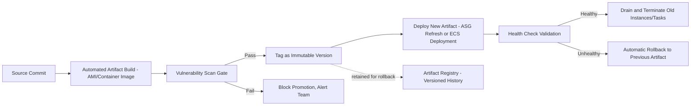
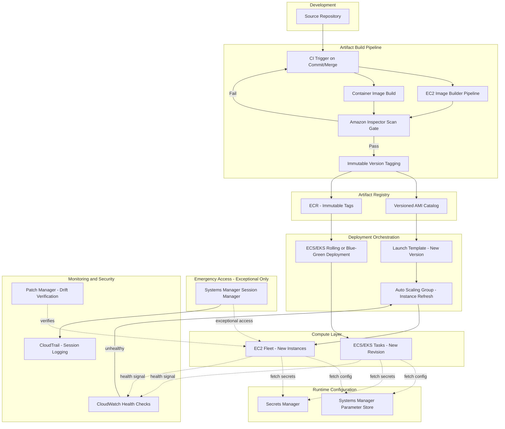
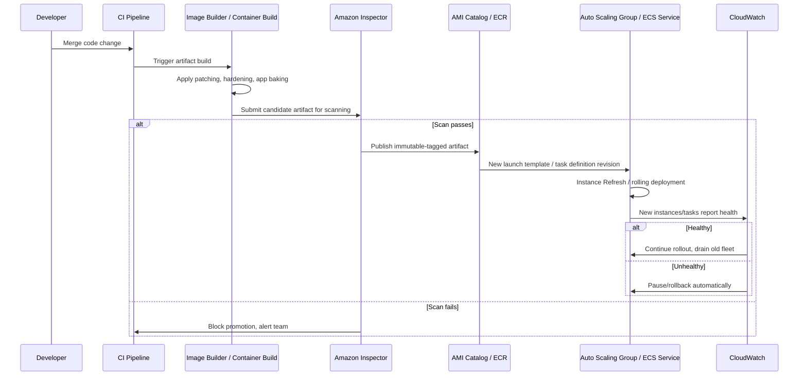

# Part II – Core Infrastructure Architectures

# Chapter 12 – Immutable Infrastructure

*The AWS Reference Architecture Handbook — 100 Production-Ready Cloud Architectures with AWS, Terraform, AI, Security, FinOps, and Enterprise Design Patterns*

---

## 1. Executive Summary

Ask any engineer who has spent a career operating production systems what they fear most at 3 a.m., and a common answer is not "the database went down" — that has a runbook. It is "I don't know what state this server is actually in, and neither does anyone else." That fear is the direct product of **mutable infrastructure**: servers that are patched in place, configured incrementally over months or years by different engineers using different tools at different times, until the running system's actual configuration diverges from what any document, playbook, or configuration-management tool claims it should be. This phenomenon — commonly called **configuration drift** — is not a rare edge case; it is the default outcome of any sufficiently long-lived, mutable server, and it is the specific problem **Immutable Infrastructure** exists to eliminate structurally rather than manage procedurally.

Immutable infrastructure is a design discipline, not a single AWS service: once a compute resource (an EC2 instance, a container, a Lambda function's underlying execution environment) is deployed, it is never modified in place again. Any change — an application code update, an operating system patch, a configuration change — is implemented by building an entirely new, versioned artifact (an AMI, a container image), deploying new instances/tasks from that artifact, validating them, and terminating the old ones. Nothing is ever patched, `ssh`'d into for a "quick fix," or reconfigured after launch. If a running instance's behavior needs to change, a new instance replaces it; the old one is destroyed, not edited. This is a deceptively simple rule with disproportionately large consequences for reliability, security, auditability, and deployment confidence — which is why immutable infrastructure appears as its own dedicated chapter in this book rather than being treated as a minor implementation detail of Chapters 1 and 5's application architectures, both of which this chapter's discipline actually underpins in their AMI-based deployment guidance.

The business problem immutable infrastructure solves is the accumulation of undocumented, unreproducible state. In a mutable-infrastructure organization, "what does this server actually have installed, and why" is frequently an unanswerable question with confidence — the honest answer is usually "some combination of the original provisioning script, several since-forgotten manual hotfixes, and whatever the last three engineers to SSH in for a debugging session happened to change." This unreproducibility has severe, compounding consequences: a security patch applied manually to one instance in a fleet of twenty but not the other nineteen, discovered only during an audit or, worse, during an active exploit; a "works on this instance but not that one" production incident that consumes hours of engineering time because the two instances' actual configurations have silently diverged despite supposedly running "the same" application; a disaster recovery plan that assumes a server can be rebuilt from documentation, only to discover during an actual disaster that the documentation has been stale for a year and the rebuilt server behaves differently from the one it replaced; and a compliance audit that cannot produce confident, verifiable evidence of what was running in production at a specific point in time, because the running configuration was never a single, versioned, reproducible artifact to begin with.

The architecture's objective is to make every unit of compute a disposable, exactly-reproducible artifact: build once, deploy the identical artifact everywhere it is needed, and replace rather than repair when change is needed. This objective directly enables several other practices this book treats as best practice elsewhere — Chapter 1's blue-green Auto Scaling Group deployment pattern and Chapter 5's AMI-based replace-and-swap deployment pattern are both, in fact, specific applications of the immutable infrastructure discipline this chapter formalizes as a first-class architectural concern in its own right.

Organizations adopt immutable infrastructure for reasons that compound heavily with organizational scale and system age. First, **security posture and patch confidence**: when every instance is provably running from the exact same versioned AMI or container image, "have we patched this CVE everywhere" becomes a verifiable yes/no answer (rebuild the golden image, redeploy the fleet, done) rather than an open-ended audit of every individual instance's actual state. Second, **deployment reliability**: because a new version is validated as a complete artifact before receiving any production traffic (as opposed to a rolling in-place update that can leave a fleet in a partially-updated, inconsistent intermediate state for an extended period), deployment failures are caught before they affect customers, and rollback means simply routing back to the still-running previous artifact rather than attempting to reverse a partial in-place change. Third, **debugging and incident response velocity**: when an engineer knows with certainty that every instance in a fleet is byte-for-byte identical (because none of them have ever been individually modified), a production incident's investigation space collapses dramatically — "is this instance somehow different from the others" is eliminated as a hypothesis entirely, letting the investigation focus immediately on genuine application logic, data, or external dependency issues. Fourth, **audit and compliance evidence**: a versioned AMI/container image build pipeline produces an inherent, verifiable record of exactly what was deployed, when, and from what source code commit — audit evidence that a fleet of individually-patched, manually-maintained servers simply cannot produce with the same confidence.

The major business benefits are best understood as compounding risk reduction rather than a single, easily-quantified line-item savings: fewer "snowflake server" incidents, meaningfully faster mean-time-to-recovery during incidents (since "rebuild from the known-good artifact" is always available as a recovery option, independent of diagnosing the specific root cause first), faster and safer patch cycles (a critical CVE can be remediated fleet-wide via a rebuild-and-redeploy cycle rather than a coordinated, error-prone, per-instance manual patching campaign), and a meaningfully reduced security attack surface (no SSH daemon needed for routine operations, no drift-introducing manual access paths that also happen to be common attacker footholds once compromised).

Typical enterprise scenarios where this discipline becomes essential, rather than merely nice-to-have, include: any organization operating fleets of EC2 instances or containers at a scale where manual per-instance consistency becomes practically unverifiable (roughly a dozen instances of the same role or more); regulated industries needing to demonstrate exactly what software and configuration was running in production at any historical point in time for audit purposes; organizations that have experienced a "configuration drift" incident — a production outage or security exposure traceable specifically to an individual instance silently diverging from its peers — and are formally addressing the root cause rather than the symptom; and any organization adopting a genuine DevOps/platform engineering operating model, for which immutable infrastructure is widely considered a foundational prerequisite rather than an optional enhancement, since most modern CI/CD, blue-green deployment, and Infrastructure-as-Code practices assume it implicitly.

It is worth stating plainly what adopting this discipline requires organizationally, not just technically: **it requires giving up the ability to SSH into a production instance and "just fix it,"** which is a genuine behavioral and cultural change for engineering teams accustomed to that access pattern, and is frequently the single hardest part of adopting this architecture in practice — harder, in this book's experience, than any of the AMI pipeline or Terraform tooling involved. Section 34's "Architect's Corner" addresses this cultural dimension directly, because the technical mechanics of building an AMI pipeline are genuinely well-understood and largely solved; the organizational discipline to never bypass it under incident pressure is where this pattern most commonly erodes in real enterprise environments.

---

## 2. Business Requirements

### 2.1 Business Drivers

The primary business driver is **eliminating unverifiable, unreproducible production state** as a source of security risk, incident risk, and audit risk. A secondary driver is **deployment confidence** — the ability to deploy frequently, with high confidence that a failed deployment can be reversed quickly and completely, which itself is frequently a prerequisite for an organization's broader continuous-delivery ambitions.

### 2.2 Functional Requirements

| Requirement | Description |
|---|---|
| Versioned build artifacts | Every deployable unit (AMI, container image, Lambda deployment package) is versioned, immutable once built, and traceable to a specific source commit |
| No in-place modification | No production compute resource is ever patched, reconfigured, or manually modified after launch |
| Automated artifact building | AMI/container image builds are fully automated (no manual "golden image" creation via console click-through) |
| Fast, reliable replacement | The pipeline can replace an entire fleet's running artifact within a defined, tested time window |
| No standing SSH/shell access for routine operations | Emergency/debugging access exists but is explicitly exceptional, logged, and never used to make a lasting change |

### 2.3 Non-Functional Requirements

**Scalability goals.** The AMI/container image build pipeline itself must scale to support the organization's deployment frequency — for an organization deploying multiple times daily across dozens of services, build pipeline throughput and build time become first-class engineering concerns in their own right, not an afterthought.

**Availability requirements.** This is a cross-cutting discipline applied atop whichever specific workload architecture (Chapter 1's Multi-AZ pattern, Chapter 5's single-instance pattern) is in use — immutable infrastructure does not itself set an availability target; it is a mechanism that *improves* the achievable reliability of whichever target the underlying architecture already commits to, primarily by making deployments (a leading cause of production incidents industry-wide) meaningfully safer.

**Latency requirements.** Not directly affected by this pattern, though the artifact-build-and-replace cycle time (how long it takes to go from "code merged" to "new artifact validated and serving production traffic") is a meaningful engineering-velocity metric this pattern should be explicitly measured against — a common target is under 20 minutes for a full build-validate-deploy cycle for a typical application, though this varies significantly by application size and test suite scope.

**Compliance requirements.** Immutable infrastructure is frequently the *mechanism* by which several compliance controls are satisfied with much higher confidence than a mutable-infrastructure equivalent: demonstrable, versioned evidence of exactly what was running in production at any point in time; a clean, auditable trail from source code commit to deployed artifact; and elimination of an entire class of "unauthorized manual change" risk that many compliance frameworks specifically probe for during audits.

**Security expectations.** No standing SSH access to production instances for routine operations; all emergency/debugging access via Systems Manager Session Manager, explicitly logged and treated as exceptional; every artifact scanned for known vulnerabilities before deployment, not after.

**Recovery objectives.**

| Metric | Baseline Target | Definition |
|---|---|---|
| RTO (fleet-wide rollback to previous known-good artifact) | ≤ 15 minutes | Time to detect a bad deployment and complete a full rollback to the previous artifact |
| RTO (rebuild an entire fleet from the golden AMI/image after a suspected compromise) | ≤ 1 hour | A specific, valuable capability immutable infrastructure provides that mutable infrastructure generally cannot match with the same confidence |

**SLAs.** Not directly set by this pattern, though the deployment reliability and rollback-speed improvements this pattern provides are frequently cited as a direct contributor to an organization's ability to commit to a tighter external SLA with confidence.

**Expected workload and growth.** Sized to the organization's deployment frequency and fleet size, with the specific planning dimension being **build pipeline capacity** (concurrent builds supportable, build queue depth under peak deploy-frequency conditions) rather than request throughput, which is governed by whichever underlying workload architecture this pattern is applied to.

> **Note:** A frequently underestimated non-functional requirement for this pattern is **artifact build time itself**. An organization that adopts immutable infrastructure but whose AMI build takes 45 minutes will find that "fix a critical production bug" now takes 45 minutes longer than an in-place hotfix would have, which is a genuine, sometimes contentious trade-off worth surfacing explicitly during design rather than discovering during the first urgent incident where it matters.

---

## 3. Architecture Overview

### 3.1 Overall Design and Philosophy

The design philosophy of immutable infrastructure can be stated as a small number of absolute rules, deliberately treated as non-negotiable rather than aspirational guidelines: **(1) never modify a running production compute resource in place; (2) every change is a new, versioned artifact; (3) deployment is always replacement, never patching; (4) rollback is always "route back to the previous artifact," never "attempt to reverse a change."** This is a stricter, more absolute version of the "compute is cattle, not pets" principle introduced in Chapter 1 — where Chapter 1 treats disposability primarily as an Auto Scaling / failure-recovery property, this chapter treats disposability as the *organizing principle of the entire deployment and change-management lifecycle*, applying it deliberately to every compute paradigm (EC2, containers, and, with appropriate nuance, serverless) rather than only to the Auto Scaling Group replacement scenario.

### 3.2 Core Components

- **Artifact build pipeline:** Automated, triggered-on-commit pipeline that produces a versioned AMI (via EC2 Image Builder or Packer) or container image (via a standard container build toolchain), including baked-in patching, hardening, and application code
- **Artifact registry:** Amazon ECR for container images (with immutable tag enforcement); the AMI equivalent is the EC2 AMI catalog itself, versioned via naming/tagging convention and often mirrored to a dedicated AMI-sharing account for multi-account distribution
- **Vulnerability scanning gate:** Amazon Inspector (for both EC2 AMIs, via EC2 instance scanning, and container images, via ECR enhanced scanning) as a mandatory pre-deployment gate
- **Deployment orchestration:** Auto Scaling Groups with launch template versioning (EC2) or ECS/EKS rolling or blue-green deployment mechanisms (containers), both consuming the versioned artifact rather than mutating existing compute
- **Configuration delivery:** Systems Manager Parameter Store / Secrets Manager for runtime configuration fetched at boot/startup, keeping the baked artifact itself environment-agnostic (the same AMI/image is deployed to staging and production, differentiated only by externally-supplied configuration, not by rebuilding a different artifact per environment)
- **Emergency access (exceptional, not routine):** Systems Manager Session Manager, explicitly scoped, logged, and — critically — any change made during an emergency session is understood to be temporary and must be reflected back into the pipeline-built artifact at the next build, never left as a standing, undocumented divergence

### 3.3 Component Interaction and High-Level Workflow

A code change (application code, a Dockerfile change, a Packer template update) is committed and triggers the artifact build pipeline. The pipeline builds a new, versioned artifact from a clean base, applies the latest OS patches and any organization-standard hardening steps, bakes in the new application code, and tags the result with a unique, immutable version identifier tied to the source commit. The vulnerability scanning gate evaluates the new artifact; a critical/high-severity finding above the organization's threshold blocks promotion. Once the artifact passes scanning, it is deployed — for EC2, this means creating a new launch template version referencing the new AMI and triggering an Auto Scaling Group instance refresh (or the Pattern B replace-and-swap approach from Chapter 5); for containers, this means a new task definition revision or deployment referencing the new image tag. New instances/tasks boot, fetch their runtime configuration from Parameter Store/Secrets Manager, pass health checks, and begin receiving traffic; old instances/tasks are drained and terminated only after the new fleet is validated healthy.

### 3.4 Request, Response, and Data Lifecycle

The request and response lifecycle for the running application is identical to whichever underlying workload architecture (Chapter 1, Chapter 5, or another pattern in this book) this discipline is applied to — immutable infrastructure does not change how a request is processed once an instance is running; it changes only how that instance came to exist and how it is ever replaced. The **artifact lifecycle** is the genuinely new concept this chapter introduces: source commit → automated build → scan → tag/version → deploy → validate → (eventually) deprecate and delete old artifact versions per a retention policy, forming a complete, auditable chain from code to running production system that mutable infrastructure's ad hoc, undocumented change history cannot provide.



---

## 4. AWS Services Used

### 4.1 EC2 Image Builder

**Purpose:** Automates the creation, testing, and distribution of golden AMIs, applying a defined pipeline of build components (OS patching, software installation, hardening steps, application baking) to produce a versioned, tested AMI without manual console-driven image creation.

**Why selected:** It is the AWS-native mechanism specifically designed for this exact use case, integrating with EC2, Systems Manager, and Inspector for the build-test-scan lifecycle this chapter's pattern requires, without needing a separate self-hosted build orchestration tool for the AMI-specific portion of the pipeline.

**Alternatives:** HashiCorp Packer is preferred when an organization needs a single, cloud-agnostic image-building tool spanning AWS and other providers/hypervisors, or when existing Packer template investment already exists and migrating to EC2 Image Builder would not provide sufficient incremental value; a fully custom build script (using the AWS CLI/SDK directly within a CI/CD pipeline) is chosen only when the organization's build requirements are unusual enough that neither Image Builder nor Packer's opinionated models fit well, accepting higher maintenance cost for full control.

**Limitations:** Image Builder pipelines can have longer build times than a hand-tuned custom script for very simple images, given the overhead of its test/validation phase — a worthwhile trade-off for most production use cases, but worth being aware of when optimizing the fastest possible build-to-deploy cycle time referenced in Section 2.3.

**Pricing considerations:** Image Builder itself has no separate charge beyond the underlying EC2 instance time consumed during the build/test process — a cost-efficient choice relative to maintaining separate, always-on build infrastructure for image creation.

**Best practices:** Use Image Builder's component framework to separate OS-hardening components (reusable across many application images) from application-specific baking steps, and enable the built-in test phase (launching a temporary instance from the candidate AMI and running validation scripts) as a mandatory pipeline gate rather than an optional step.

### 4.2 Amazon EC2 Auto Scaling (Launch Templates and Instance Refresh)

**Purpose:** Provides the mechanism by which a fleet of EC2 instances is replaced with new instances from an updated launch template (referencing a new AMI) in a controlled, health-check-gated manner.

**Why selected:** The **Instance Refresh** feature specifically (not merely an Auto Scaling Group's default replacement-on-termination behavior) is purpose-built for exactly this chapter's use case — replacing an entire fleet's underlying AMI with a new version, in configurable batches, with an automatic pause/rollback capability if the new instances fail health checks during the rollout.

**Alternatives:** A manual Pattern B replace-and-swap (per Chapter 5's guidance, appropriate for single-instance architectures without an Auto Scaling Group at all) is used when the underlying architecture does not use Auto Scaling in the first place; ECS/EKS rolling deployments (Section 4.3) are the container-native equivalent for containerized workloads.

**Limitations:** Instance Refresh's batch size and warm-up time settings require careful tuning against the specific application's startup characteristics — too aggressive a batch size can replace too much capacity simultaneously, risking a capacity shortfall if the new AMI has an undetected issue that only manifests under load.

**Best practices:** Configure Instance Refresh with a minimum healthy percentage that ensures adequate serving capacity remains at every stage of the rollout, and always pair it with the same bake-period health-check validation logic described in Chapter 1's blue-green deployment guidance.

### 4.3 Amazon ECS / Amazon EKS (Container Orchestration)

**Purpose:** Orchestrates containerized workloads, providing native rolling and blue-green deployment mechanisms that replace running tasks/pods with new ones referencing an updated, immutable container image tag, without ever modifying a running container's filesystem in place.

**Why selected:** Containers are inherently well-suited to immutable infrastructure's philosophy — a container image is immutable by the technology's own design (any runtime filesystem change is ephemeral and lost on container restart unless explicitly persisted to a volume, which itself should be treated as external state, not baked artifact content) — making ECS/EKS a natural, idiomatic fit for this chapter's discipline.

**Alternatives:** Raw EC2 Auto Scaling (Section 4.2) remains appropriate for organizations not yet using containers; AWS Fargate (a serverless compute option for both ECS and EKS) removes the underlying EC2 instance management entirely, which for the purposes of this chapter's discipline, further reinforces immutability by removing the temptation of "SSH into the underlying host" entirely, since there is no accessible underlying host to SSH into.

**Limitations:** Persistent volumes (EFS-backed, for stateful container workloads) require explicit design attention to ensure they hold only genuinely external, non-baked state — a common anti-pattern (Section 27) is inadvertently treating a persistent volume as a place to store configuration that should instead be baked into the image or delivered via Parameter Store/Secrets Manager at startup.

**Best practices:** Enforce **immutable image tags** in ECR (a specific repository setting preventing a tag from ever being overwritten once pushed) so that a deployment referencing `app:v1.4.2` is guaranteed to always resolve to the exact same image content, eliminating an entire class of "the tag says v1.4.2 but the actual image content silently changed" drift risk that mutable tags would otherwise permit.

### 4.4 Amazon ECR (Elastic Container Registry)

**Purpose:** Stores and versions container images, serving as the container-world equivalent of the AMI catalog for this chapter's artifact lifecycle.

**Why selected:** Native integration with ECS/EKS, IAM-based access control, and — critically for this chapter's discipline — the immutable tag enforcement feature described above.

**Best practices:** Enable enhanced scanning (Amazon Inspector-powered) on every repository as a mandatory pre-deployment gate, and configure lifecycle policies to expire old, unused image versions on a defined schedule while explicitly retaining enough recent versions to support the organization's rollback-window requirements (Section 13).

### 4.5 Amazon Inspector

**Purpose:** Continuous vulnerability scanning for EC2 instances (via the running-instance scanning capability) and container images in ECR (via enhanced scanning), identifying known CVEs against installed packages.

**Why selected:** It is the natural pre-deployment scanning gate for this chapter's pattern specifically because it integrates directly with both artifact types (AMIs, via EC2 Image Builder's build pipeline, and container images, via ECR) this chapter's discipline produces, without requiring a separate third-party scanning tool for baseline coverage.

**Alternatives:** Third-party container/image scanning tools (Trivy, Snyk, Aqua) are chosen when an organization needs scanning capability spanning multiple clouds or on-premises registries in a single consistent tool, or when specific compliance/policy features beyond Inspector's native capability are required.

**Best practices:** Treat a scanning failure as a hard pipeline gate for critical/high-severity findings by default, with an explicit, documented, time-boxed exception process (not a silent bypass) for cases where a finding is a false positive or has a compensating control — never simply disable the gate under delivery pressure.

### 4.6 Systems Manager (Parameter Store, Session Manager, Patch Manager)

**Purpose:** Parameter Store and Secrets Manager (Section 4.7) provide the externalized, runtime-fetched configuration that keeps a baked artifact environment-agnostic; Session Manager provides the sole, explicitly-exceptional access path for emergency debugging without SSH keys; Patch Manager's role in this architecture is specifically *diminished* relative to a mutable-infrastructure environment — since instances are never patched in place, Patch Manager's traditional "patch running instances" function is replaced by "patch the golden AMI/image and redeploy," though Patch Manager's compliance-scanning/reporting capability remains useful for verifying that currently-running instances do, in fact, reflect the latest patched artifact (a valuable drift-detection cross-check on the discipline itself).

**Best practices:** Fetch configuration at instance/container startup, never bake environment-specific values into the artifact itself — the same AMI/image should be deployable to staging and production, differentiated only by which Parameter Store path or Secrets Manager secret it is pointed at via a startup-time environment variable, not by building a different artifact per environment.

### 4.7 Secrets Manager

Covered identically to its treatment in Chapters 1 and 5 — no credential is ever baked into an AMI or container image; every credential is fetched at runtime via the compute resource's IAM role.

### 4.8 IAM, CloudWatch, CloudTrail

Applied with the same rigor as prior chapters, with a specific architecturally-relevant emphasis in this chapter: CloudTrail logging of every Session Manager session (Section 4.6) is treated as a first-class compliance artifact specifically *because* this pattern makes emergency access exceptional rather than routine, meaning every logged session is inherently a meaningful, reviewable event rather than noise buried among constant routine access.

---

## 5. Complete Architecture Diagram



---

## 6. Component-by-Component Explanation

| Component | Purpose | Scaling | High Availability | Failure Handling | Dependencies |
|---|---|---|---|---|---|
| Artifact build pipeline | Produces versioned, immutable AMIs/container images | Scales via parallel build capacity for multiple concurrent builds | N/A (a CI/CD control-plane concern, not a runtime HA concern) | Failed build blocks promotion; alerts the owning team | Source repository, base image/AMI, build components |
| Vulnerability scan gate | Blocks promotion of artifacts with unacceptable known vulnerabilities | Scales with build throughput | N/A | Scan failure blocks the pipeline; documented exception process for false positives | Amazon Inspector, artifact registry |
| Auto Scaling Group Instance Refresh | Replaces a fleet's running instances with new artifact-based instances in controlled batches | Configurable batch size/percentage | Spread across AZs per the underlying workload architecture (Chapter 1) | Automatic pause/rollback on health check failure during rollout | Launch template, target group health checks |
| ECS/EKS deployment | Replaces running tasks/pods with new image-based tasks | Configurable rollout strategy (rolling, blue-green) | Multi-AZ task placement per the underlying workload architecture | Automatic rollback on failed health checks (native to ECS/EKS deployment circuit breaker features) | Task definition revision, target group/service mesh health checks |
| Parameter Store / Secrets Manager | Delivers runtime configuration/credentials to an environment-agnostic artifact | Scales automatically | Regionally redundant by design | Fetch failure at startup should fail the instance's health check, not silently proceed with defaults | IAM instance/task role |
| Session Manager | Sole emergency access path; never a routine operational tool in this architecture | N/A | N/A | Session failures should not block the ability to simply replace the instance instead of debugging in place | SSM agent, IAM permissions, VPC endpoints |

---

## 7. End-to-End Request Flow

This section, per this chapter's cross-cutting nature, describes the **deployment/artifact flow** specifically (the request/response flow for the running application itself is identical to Chapter 1's or Chapter 5's guidance, depending on the underlying workload architecture).

1. A developer merges a **code change** (application code or infrastructure/image-definition change) to the main branch.
2. The **CI pipeline** triggers automatically, beginning the artifact build process.
3. For an EC2-based workload, **EC2 Image Builder** launches a temporary build instance, applies the defined component pipeline (base OS patching, hardening steps, application baking), and captures the result as a candidate AMI.
4. For a containerized workload, the **container build stage** builds a new image layer stack from the Dockerfile, tagged with a unique, commit-derived identifier.
5. The candidate artifact is submitted to **Amazon Inspector** for vulnerability scanning.
6. If the scan finds **critical/high-severity vulnerabilities** above the organization's threshold, the pipeline halts, and the responsible team is alerted — the artifact is never promoted in this state.
7. If the scan **passes**, the artifact is tagged with its final, immutable version identifier and published to the **AMI catalog or ECR repository** (with immutable tag enforcement for containers).
8. A new **launch template version** (EC2) or **task definition revision** (ECS/EKS) is created, referencing the new artifact.
9. **Instance Refresh** (EC2) or a **rolling/blue-green deployment** (ECS/EKS) begins, replacing running compute in controlled batches, never modifying any existing instance/task in place.
10. Each new instance/task **fetches its runtime configuration** from Parameter Store and any required credentials from Secrets Manager at startup — the artifact itself contains no environment-specific configuration.
11. **Health checks** validate each new instance/task before it begins receiving production traffic.
12. If health checks **fail** during the rollout, the deployment automatically **pauses** (EC2 Instance Refresh) or **rolls back** (ECS/EKS deployment circuit breaker), and the previous, still-running artifact continues serving traffic unaffected.
13. If health checks **pass** for the full rollout, old instances/tasks are **drained and terminated** — never reused, never reconfigured, only ever fully replaced.
14. The now-superseded artifact version **remains in the registry** (per the retention policy in Section 13) specifically to support a fast rollback if a problem is discovered after the fact, even though the deployment itself has completed successfully.
15. **CloudWatch and CloudTrail** capture the entire event sequence — build completion, scan result, deployment progress, health check outcomes — providing the auditable artifact-to-production trail this chapter's discipline is specifically designed to produce.

---

## 8. Deployment Flow

This chapter's entire subject matter *is* the deployment flow in the sense established by Chapters 1 and 5 — rather than repeating that guidance, this section focuses on what is specifically different or additionally rigorous about deployment under a strict immutable infrastructure discipline.

**Infrastructure provisioning** for the pipeline itself (the Image Builder pipeline definition, the ECR repository configuration, the Auto Scaling Group's Instance Refresh settings) follows the same Terraform-first discipline as every other chapter, with the specific addition that **the artifact-build pipeline definition is itself an immutable-infrastructure-adjacent concern** — changes to how artifacts are built deserve the same review rigor as changes to the artifacts themselves, since a bug in the build pipeline (e.g., an incorrectly configured hardening component) would silently propagate into every subsequent artifact built from it.

**The Terraform workflow** for this pattern specifically must account for the fact that **AMI IDs and container image tags are themselves values that change on every deployment** — a common, important design decision is whether the AMI ID/image tag is managed as a Terraform variable updated by the CI/CD pipeline on each deployment (keeping Terraform as the single source of truth for exactly which artifact version is live) versus managed outside Terraform entirely via the Auto Scaling Group's own Instance Refresh or the ECS service's own deployment mechanism (treating artifact rollout as a distinct, faster-cadence process from infrastructure change management) — this chapter recommends the latter for most organizations, specifically because coupling every application deployment to a full Terraform apply cycle is usually slower and more heavyweight than the deployment frequency this pattern is meant to enable.

**Blue-green deployment**, as covered in Chapters 1 and 5, is in fact the direct, natural expression of immutable infrastructure applied to the deployment moment specifically — this chapter's contribution is emphasizing that the *entire* infrastructure lifecycle, not just the deployment moment, follows this same replace-don't-modify discipline, including OS patching (Section 4.6's Patch Manager role diminishment) and configuration changes (Section 4.6's runtime-fetched configuration pattern), not only application code updates.

**Rollback** under this pattern is unusually simple and fast specifically because the previous artifact was never modified or deleted during the new deployment — rolling back means creating a new launch template version (or task definition revision) that references the *previous* artifact and running the exact same Instance Refresh/deployment mechanism in reverse, which is why this chapter's rollback RTO target (Section 2.3, ≤15 minutes) is achievable with high confidence: it is the same mechanism as forward deployment, just pointed at a different, already-validated artifact version.

**Validation** gates specific to this pattern include the mandatory vulnerability scan (Section 4.5), the Image Builder test phase (Section 4.1), and — a genuinely important, sometimes-overlooked validation step — **explicit testing that the new artifact boots correctly with zero manual intervention**, since an artifact that happens to have been "fixed up" with a manual step during its initial creation (violating the discipline at the very moment it is supposed to be established) will fail unpredictably on its next automated rebuild.



---

## 9. Network Topology

Immutable infrastructure does not itself prescribe a specific network topology — it is applied atop whichever workload architecture's networking design (Chapter 1's Multi-AZ VPC, Chapter 5's smaller single-instance VPC, or Chapter 9's multi-account shared services networking) already governs the workload in question. The one network-topology-adjacent consideration specific to this chapter is **the build pipeline's own network access requirements**: EC2 Image Builder's temporary build instances need outbound internet access (or VPC endpoint access) to fetch OS packages and updates during the build process, meaning the build pipeline typically operates within its own dedicated subnet with controlled egress (via NAT Gateway or, preferably, a centralized egress pattern per Chapter 9 if the organization has adopted that architecture), separate from the running production fleet's own networking, since the build environment's security requirements (outbound package-repository access) and the production fleet's security requirements (minimal, tightly-scoped egress) are often genuinely different and should not be conflated into a single security group or subnet design.

**Security Groups** for the build pipeline's temporary instances should be even more tightly scoped and shorter-lived than the production fleet's own security groups, given that a build instance exists only transiently and has no legitimate reason to accept any inbound traffic at all — a build instance's security group should typically allow no inbound rules whatsoever, only the specific outbound rules needed to fetch packages and report build status.

---

## 10. Identity and Access

**IAM Roles** specific to this chapter's discipline include a dedicated **Image Builder pipeline role** (permissions to launch/terminate temporary build instances, read component definitions, and publish resulting AMIs — distinct from any application workload role) and an **artifact-consuming instance/task role** (the running production fleet's own role, per Chapters 1/5's guidance, with no special modification needed for this chapter's discipline beyond ensuring it does not carry any permission that would allow the instance to modify its own launch template or the artifact registry — a running instance should never be able to influence what artifact it or its peers will be replaced with next, a specific, deliberate separation-of-duties control).

**A particularly important least-privilege consideration for this chapter:** the CI/CD pipeline's own IAM role, which triggers Instance Refresh or ECS deployments, should be scoped specifically to deployment-related actions (`autoscaling:StartInstanceRefresh`, `ecs:UpdateService`, and related read actions) and explicitly should **not** carry broad EC2 or ECS administrative permissions beyond what deployment specifically requires — a compromised CI/CD credential with narrowly-scoped deployment permissions can, at worst, deploy a bad (but still scanned and validated) artifact; a compromised CI/CD credential with broad administrative permissions could bypass the entire discipline this chapter describes by directly modifying running infrastructure.

**Permission boundaries** applied to the artifact build pipeline's automation-created roles (per the pattern established in Chapters 5 and 9) remain equally relevant here.

---

## 11. Security Architecture

The security architecture of this pattern is best understood as **shifting security enforcement left, into the artifact build pipeline, rather than relying on runtime, in-place remediation**. Every security control that would traditionally require "go patch the running server" instead becomes "rebuild the golden artifact with the fix, then redeploy" — a structurally more reliable enforcement mechanism because it cannot be selectively skipped for one instance in a fleet the way a manual per-instance patch campaign can.

**Encryption** of the AMI/container image itself (EBS snapshot encryption for AMIs, at-rest encryption for ECR repositories) uses the same KMS-based approach as prior chapters. **Vulnerability scanning** (Section 4.5) is the pattern's central, defining security control, specifically because it operates on the artifact *before* deployment rather than on the running instance after the fact — a fundamentally more effective enforcement point since it can categorically block a known-vulnerable artifact from ever reaching production, rather than merely detecting the vulnerability's presence in an already-running fleet.

**No SSH access** to production instances is both a security benefit (eliminating an entire class of credential-based attack surface and a common lateral-movement foothold) and, more subtly, a *discipline-enforcement* mechanism — removing the technical *capability* for engineers to make an undocumented, driftinducing manual change removes the temptation entirely, which this book's experience suggests is considerably more effective than a policy that merely discourages the behavior while leaving the access path open.

**Zero Trust** principles apply specifically to the "is this artifact what we think it is" question — cryptographic image signing (for container images, via a tool like AWS Signer or a supply-chain-security tool like Sigstore/Cosign) provides verifiable proof that a deployed artifact matches exactly what the build pipeline produced and scanned, closing a specific supply-chain gap where an attacker with registry write access could otherwise substitute a malicious image under a legitimate-looking tag.

**Threat model summary specific to this architecture:**

| Attack Vector | Mitigation |
|---|---|
| Undetected configuration drift enabling an unpatched vulnerability to persist | Immutability itself — no instance can silently diverge from the fleet's known-good artifact |
| Supply chain substitution (a malicious artifact deployed under a legitimate tag) | Immutable ECR tags, cryptographic image signing, artifact provenance tracking |
| Compromised build pipeline producing a malicious "golden" artifact | Least-privilege pipeline IAM role, mandatory scanning gate, build pipeline change review rigor equal to production code review |
| Standing SSH access as a lateral-movement foothold | Eliminated entirely in favor of exceptional, logged Session Manager access |
| A "quick fix" applied directly to a running instance, bypassing the pipeline | Removed technical capability (no SSH), organizational discipline (Section 34), and drift-detection cross-checks (Patch Manager compliance scanning) |

---

## 12. High Availability

Immutable infrastructure's contribution to high availability is specifically **deployment-risk reduction**, not a new HA mechanism in its own right — the underlying AZ/instance/regional failure handling guidance from Chapter 1 (for Multi-AZ workloads) or Chapter 5 (for single-instance workloads) applies unchanged. What this chapter's discipline specifically improves is the **failure mode introduced by deployments themselves**, historically one of the most common causes of production incidents industry-wide: because a new artifact is fully built, scanned, and validated as a complete unit *before* any production traffic reaches it, and because rollback means simply routing back to an already-running previous artifact rather than attempting to reverse a partial in-place change, this pattern measurably reduces both the likelihood and the blast radius of deployment-caused outages relative to an in-place, mutable deployment approach.

---

## 13. Disaster Recovery

**Backup strategy** for this architecture centers on **artifact registry retention** rather than traditional data backup — the AMI catalog and ECR repository, with an appropriate retention policy (Section 4.4), effectively constitute a rolling backup of "every known-good, previously-deployed configuration," providing a recovery capability distinct from, and complementary to, the data-tier backup strategies covered in Chapters 1 and 5.

**A specific, valuable disaster recovery capability this pattern provides that mutable infrastructure cannot match with equal confidence:** in the event of a suspected compromise of the running fleet, the recovery action is simply "terminate the potentially-compromised instances/tasks and redeploy fresh instances from the last-known-good, pre-compromise artifact version" — a fast, high-confidence remediation, since the replacement instances are guaranteed to be byte-for-byte identical to a known state, entirely unlike a mutable-infrastructure incident response, which typically requires painstaking forensic verification that a "cleaned" in-place server has genuinely had every trace of the compromise removed.

**Cross-region replication** of the artifact registry (AMI copy to a DR region, ECR cross-region replication) ensures the disaster recovery mechanisms described in Chapters 1 and 5 (rebuild in a surviving region/AZ) can reference the correct, current artifact version even during a regional event affecting the primary artifact registry's own region.

| DR Capability | This Pattern's Contribution |
|---|---|
| Rebuild a failed instance | Immediate — from the exact same artifact already validated and running elsewhere in the fleet |
| Recover from a suspected compromise | Fast, high-confidence — redeploy from the last-known-good artifact rather than attempting in-place remediation |
| Rebuild in a DR region/AZ | Requires the artifact registry itself to be cross-region replicated (a specific, additional DR requirement this pattern introduces) |
| Roll back a bad deployment | Near-instant — route back to the still-available previous artifact version |

---

## 14. Scalability

This chapter's discipline does not itself introduce new scalability mechanisms beyond what Chapters 1 and 5 already describe for the underlying workload — Auto Scaling, Instance Refresh batch sizing, and ECS/EKS task scaling all apply unchanged. The scalability dimension genuinely specific to this chapter is **build pipeline throughput**: as an organization's deployment frequency grows (more services, more frequent deploys per service), the artifact build pipeline's own concurrent-build capacity and average build time become a real constraint worth capacity-planning explicitly, using the same target metrics introduced in Section 2.3 (build-to-deploy cycle time) as the specific thing being scaled for, rather than the request-throughput metrics that govern scaling elsewhere in this book.

---

## 15. Performance Optimization

**Build time optimization** is this chapter's most distinctive performance concern: layer caching for container image builds (ensuring unchanged base layers are not needlessly rebuilt), Image Builder component reuse (separating rarely-changing hardening/base components from frequently-changing application-baking steps so the pipeline can cache and skip unchanged stages), and parallelizing independent build stages where the pipeline tooling supports it, all directly reduce the artifact build-to-deploy cycle time that Section 2.3 identifies as a key metric for this pattern. **Runtime performance** of the deployed application itself follows the same guidance as Chapters 1 and 5 unchanged — immutability is a build/deployment-time discipline, not a runtime performance concern.

---

## 16. Cost Optimization (FinOps)

### 16.1 Estimated Monthly Cost Delta

Immutable infrastructure's direct cost impact is generally modest relative to the underlying workload architecture's own cost (covered in Chapters 1/5/9's respective cost sections) — the primary incremental costs are build pipeline compute time and artifact registry storage.

| Component | Small (few services, infrequent deploys) | Medium (dozens of services, daily deploys) | Enterprise (hundreds of services, continuous deployment) |
|---|---|---|---|
| Image Builder / container build compute time | ~$30/mo | ~$300/mo | ~$2,500+/mo |
| Amazon Inspector scanning | ~$20/mo | ~$200/mo | ~$1,500+/mo |
| ECR/AMI storage (with lifecycle policies) | ~$10/mo | ~$100/mo | ~$800+/mo |
| Temporary build instance compute | ~$20/mo | ~$150/mo | ~$1,200+/mo |
| **Approximate Total Incremental Cost** | **~$80/mo** | **~$750/mo** | **~$6,000+/mo** |

### 16.2 Major Cost Drivers and Optimization

**Artifact registry storage** grows unbounded without a lifecycle policy — retaining every historical AMI/image version indefinitely is both unnecessary cost and, ironically, counter to the pattern's own goal of a clean, manageable artifact history; a retention policy balancing rollback-window needs (Section 13) against storage cost (e.g., retain the last 10-20 versions, or 90 days, whichever is more restrictive) is a standard, recommended practice. **Build compute time** is optimized primarily through the caching and parallelization techniques in Section 15, which reduce both cycle time and the underlying compute cost of each build. **Vulnerability scanning costs** scale with the number of unique artifacts scanned — a build pipeline that unnecessarily rebuilds and rescans unchanged base layers on every commit (rather than reusing a cached, already-scanned base layer) both wastes build time and inflates scanning cost without any corresponding security benefit. **The cost this pattern avoids**, which is harder to quantify but genuinely significant, is the engineering time cost of configuration-drift-related incidents and manual patch campaigns — organizations adopting this pattern specifically to address recurring drift-related incidents should track incident frequency/severity before and after adoption as the actual FinOps case for the pattern, since the direct infrastructure cost table above understates its true value.

---

## 17. AI-Assisted Operations

**AI-generated Terraform and build pipeline definitions** are a natural fit for this chapter's subject matter — using Amazon Q or a Bedrock-backed tool to draft a new EC2 Image Builder component definition or a Packer template from a natural-language description of required hardening steps accelerates initial pipeline construction, though (per this book's standing guidance) every generated component still requires the same review and testing rigor as any hand-written pipeline definition, arguably more so here given that a flawed hardening component silently propagates into every subsequent artifact built from it. **AI-assisted vulnerability triage** is a genuinely high-value application specific to this pattern: using an LLM-assisted tool to help a team quickly assess whether a newly-disclosed CVE affecting a package in the golden AMI/image is actually exploitable in the specific way the application uses that package (versus a theoretical, non-applicable finding) can meaningfully speed up the "should this block the pipeline" triage decision without compromising the scanning gate's overall rigor.

---

## 18. Terraform Implementation

```

infrastructure/
├── modules/
│   ├── image-builder-pipeline/
│   ├── ecr-repository/
│   └── asg-instance-refresh/
├── environments/
│   ├── prod/
│   └── staging/
└── backend.tf

```

**EC2 Image Builder pipeline module:**

```hcl

# modules/image-builder-pipeline/main.tf

resource "aws_imagebuilder_image_recipe" "app" {
  name         = "${var.environment}-app-recipe"
  version      = var.recipe_version
  parent_image = var.base_ami_arn

  component {
    component_arn = aws_imagebuilder_component.os_hardening.arn
  }

  component {
    component_arn = aws_imagebuilder_component.app_bake.arn
  }

  block_device_mapping {
    device_name = "/dev/xvda"
    ebs {
      volume_size           = var.root_volume_size
      volume_type           = "gp3"
      encrypted             = true
      kms_key_id            = var.kms_key_arn
      delete_on_termination = true
    }
  }
}

resource "aws_imagebuilder_component" "os_hardening" {
  name     = "${var.environment}-os-hardening"
  platform = "Linux"
  version  = var.hardening_component_version

  data = yamlencode({
    schemaVersion = "1.0"
    phases = [{
      name = "build"
      steps = [
        {
          name   = "DisablePasswordAuth"
          action  = "ExecuteBash"
          inputs = { commands = ["sed -i 's/PasswordAuthentication yes/PasswordAuthentication no/' /etc/ssh/sshd_config"] }
        },
        {
          name   = "ApplyLatestPatches"
          action  = "ExecuteBash"
          inputs = { commands = ["yum update -y --security"] }
        }
      ]
    }]
  })
}

resource "aws_imagebuilder_image_pipeline" "app" {
  name                             = "${var.environment}-app-pipeline"
  image_recipe_arn                 = aws_imagebuilder_image_recipe.app.arn
  infrastructure_configuration_arn = aws_imagebuilder_infrastructure_configuration.app.arn
  distribution_configuration_arn   = aws_imagebuilder_distribution_configuration.app.arn

  image_tests_configuration {
    image_tests_enabled = true
    timeout_minutes     = 60
  }

  schedule {
    schedule_expression = "cron(0 3 ? * MON *)" # weekly rebuild for latest patches
    pipeline_execution_start_condition = "EXPRESSION_MATCH_ONLY"
  }
}

```

**ECR repository with immutable tags and enhanced scanning:**

```hcl

# modules/ecr-repository/main.tf

resource "aws_ecr_repository" "app" {
  name                 = "${var.environment}-app"
  image_tag_mutability = "IMMUTABLE"

  image_scanning_configuration {
    scan_on_push = true
  }

  encryption_configuration {
    encryption_type = "KMS"
    kms_key         = var.kms_key_arn
  }
}

resource "aws_ecr_registry_scanning_configuration" "enhanced" {
  scan_type = "ENHANCED"

  rule {
    scan_frequency = "CONTINUOUS_SCAN"
    repository_filter {
      filter      = "${var.environment}-*"
      filter_type = "WILDCARD"
    }
  }
}

resource "aws_ecr_lifecycle_policy" "retention" {
  repository = aws_ecr_repository.app.name

  policy = jsonencode({
    rules = [{
      rulePriority = 1
      description  = "Retain last 20 tagged images, expire the rest"
      selection = {
        tagStatus   = "any"
        countType   = "imageCountMoreThan"
        countNumber = 20
      }
      action = { type = "expire" }
    }]
  })
}

```

**Auto Scaling Group with Instance Refresh referencing the versioned launch template:**

```hcl

# modules/asg-instance-refresh/main.tf

resource "aws_launch_template" "app" {
  name_prefix   = "${var.environment}-app-"
  image_id      = var.ami_id # supplied by the CI/CD pipeline on each deploy
  instance_type = var.instance_type

  iam_instance_profile {
    name = var.instance_profile_name
  }

  metadata_options {
    http_tokens = "required"
  }
}

resource "aws_autoscaling_group" "app" {
  name                = "${var.environment}-app-asg"
  min_size            = var.min_size
  max_size            = var.max_size
  desired_capacity    = var.desired_capacity
  vpc_zone_identifier = var.private_subnet_ids
  target_group_arns   = [var.target_group_arn]
  health_check_type   = "ELB"

  launch_template {
    id      = aws_launch_template.app.id
    version = "$Latest"
  }

  instance_refresh {
    strategy = "Rolling"
    preferences {
      min_healthy_percentage = 90
      instance_warmup        = 300
    }
    triggers = ["launch_template"]
  }
}

```

**Best practices applied above:** a scheduled weekly Image Builder pipeline execution ensuring the golden AMI is regularly rebuilt with the latest security patches even absent an application code change, `image_tag_mutability = "IMMUTABLE"` on the ECR repository as a hard technical enforcement of the immutable-tag principle, enhanced continuous scanning enabled at the registry level, an explicit lifecycle policy bounding artifact retention, and `instance_refresh` configured directly on the Auto Scaling Group so that any launch template change (a new AMI) automatically triggers a controlled, health-check-gated rollout.

---

## 19. AWS CLI Examples

**Deployment validation:**

```bash

# Check the status of an in-progress Instance Refresh

aws autoscaling describe-instance-refreshes \
  --auto-scaling-group-name prod-app-asg \
  --query 'InstanceRefreshes[0].[Status,PercentageComplete,InstancesToUpdate]' \
  --output table

```

**Monitoring:**

```bash

# Confirm the currently-running AMI version across the fleet matches the expected latest artifact

aws ec2 describe-instances \
  --filters Name=tag:aws:autoscaling:groupName,Values=prod-app-asg \
            Name=instance-state-name,Values=running \
  --query 'Reservations[*].Instances[*].[InstanceId,ImageId]' \
  --output table

```

**Troubleshooting:**

```bash

# Check the latest Image Builder pipeline execution status and any failure reason

aws imagebuilder list-image-pipeline-images \
  --image-pipeline-arn arn:aws:imagebuilder:us-east-1:111122223333:image-pipeline/prod-app-pipeline \
  --query 'imageSummaryList[0].[state.status,state.reason]'

# Review Inspector findings blocking a specific image

aws inspector2 list-findings \
  --filter-criteria '{"ecrImageTags":[{"comparison":"EQUALS","value":"v1.4.2"}]}' \
  --query 'findings[*].[severity,title,vulnerabilityId]' \
  --output table

```

**Rollback execution:**

```bash

# Roll back by pointing the launch template at the previous known-good AMI and triggering a new refresh

aws ec2 create-launch-template-version \
  --launch-template-id lt-0123456789abcdef0 \
  --source-version 1 \
  --launch-template-data '{"ImageId":"ami-previousknowngood0"}'

aws autoscaling start-instance-refresh \
  --auto-scaling-group-name prod-app-asg \
  --preferences '{"MinHealthyPercentage":90,"InstanceWarmup":300}'

```

**Cleanup:**

```bash

# Identify old, unused AMIs and their associated snapshots for cleanup beyond the retention policy window

aws ec2 describe-images \
  --owners self \
  --query 'Images[?CreationDate<=`2026-01-01`].[ImageId,Name,CreationDate]' \
  --output table

```

---

## 20. CI/CD Integration

The CI/CD platform guidance from Chapters 1, 5, and 9 applies unchanged; this chapter's specific addition is the **mandatory sequencing** of build → scan → tag → deploy as an unskippable pipeline chain, with the scan gate implemented as a genuine, blocking pipeline step (not an advisory report reviewed after the fact). **Policy as Code** in this chapter's context specifically includes validating that a proposed build pipeline change does not accidentally weaken the hardening/patching component (e.g., a well-intentioned troubleshooting change that comments out the security-update step "temporarily" and is never reverted) — a specific, real-world failure mode this book has observed, worth an explicit, automated policy check rather than relying solely on manual code review to catch it.

```yaml

name: immutable-artifact-pipeline
on:
  push:
    branches: [main]

jobs:
  build-scan-deploy:
    runs-on: ubuntu-latest
    steps:
      - uses: actions/checkout@v4
      - name: Build container image
        run: docker build -t app:${{ github.sha }} .
      - name: Push to ECR with immutable tag
        run: |
          docker tag app:${{ github.sha }} ${{ vars.ECR_REPO }}:${{ github.sha }}
          docker push ${{ vars.ECR_REPO }}:${{ github.sha }}
      - name: Wait for Inspector scan result
        run: ./scripts/wait-for-inspector-scan.sh --image-tag ${{ github.sha }}
      - name: Fail pipeline on critical/high findings
        run: ./scripts/check-inspector-findings.sh --image-tag ${{ github.sha }} --max-severity high
      - name: Deploy new task definition revision
        run: ./scripts/deploy-ecs-service.sh --image-tag ${{ github.sha }}

```

---

## 21. Monitoring

Monitoring for this pattern combines the standard application-level dashboards from Chapters 1/5 with a specific, additional dashboard tracking **artifact pipeline health**: build success/failure rate, average build duration (against the cycle-time target from Section 2.3), scan pass/fail rate and finding severity distribution over time, and Instance Refresh/ECS deployment success rate. **A specific, valuable alarm unique to this chapter's discipline** is a **drift-detection alarm**: a scheduled check (via Patch Manager compliance scanning or a custom script comparing running instances' AMI IDs against the expected latest launch template AMI) that alerts if any running instance's artifact version does not match what the launch template/task definition currently specifies — a direct, automated verification that the "no in-place modification, ever" discipline is actually holding in practice, not merely assumed.

---

## 22. Logging

Logging guidance from prior chapters applies unchanged, with the specific addition that **Session Manager session logs** (Section 4.6) deserve individual review as a matter of course in this architecture, given how rare and significant a legitimate emergency access event should be under this discipline — a Session Manager session log review process (even a lightweight weekly review of session count and duration) serves as both a security control and a discipline-adherence check, since an unexpectedly high or growing rate of emergency sessions is itself a leading indicator that the "no in-place modification" discipline is eroding somewhere in the organization.

---

## 23. Operational Excellence

**Runbooks** for this architecture should explicitly codify the rule "any change made during an emergency Session Manager session must be reflected back into the pipeline-built artifact at the next build" — a runbook that merely says "use Session Manager for emergency access" without this explicit follow-up requirement leaves a gap through which drift can silently re-enter the system one "temporary" emergency fix at a time. **Change management** for this pattern is, in effect, entirely redefined relative to a mutable-infrastructure organization's traditional change management process: there is no "request approval to SSH in and make a change" pathway at all in a mature implementation of this discipline — every change is a pull request against the artifact definition (Dockerfile, Packer/Image Builder template, application code), reviewed and merged through the same code review process as application code itself, which is simultaneously a meaningful simplification (one change process, not two parallel ones) and a genuine cultural shift for teams accustomed to a separate, faster "just SSH in" path for urgent fixes.

---

## 24. Failure Scenarios

| # | Scenario | Symptoms | Root Cause | Detection | Resolution | Prevention |
|---|---|---|---|---|---|---|
| 1 | New artifact fails health checks during rollout | Instance Refresh pauses automatically | Bug in the newly-baked application code or a hardening component regression | CloudWatch health check failures during rollout | Automatic pause preserves the still-healthy old fleet; investigate and fix the artifact, then redeploy | Mandatory Image Builder test phase / pre-deployment smoke tests catching the issue before production rollout |
| 2 | Vulnerability scan blocks a routine deployment unexpectedly | Pipeline halts with a new critical/high finding | A dependency version bump introduced a newly-scanned vulnerability | Inspector finding in the pipeline scan step | Patch or pin the specific dependency, or apply the documented exception process if a false positive | Dependency version pinning with deliberate, reviewed updates rather than always-latest |
| 3 | Engineer bypasses the pipeline with an emergency SSH/Session Manager fix that is never reflected back into the artifact | Fleet silently diverges after the next scheduled rebuild reverts the "temporary" fix unexpectedly | Discipline violation — the fix was applied out-of-band and not committed to the artifact definition | Drift-detection alarm (Section 21), or the original issue reappearing after the next rebuild | Formalize the fix as a proper artifact change and redeploy | Explicit runbook requirement (Section 23) and drift-detection alarming |
| 4 | Build pipeline itself has a bug silently weakening a hardening component | New artifacts pass the pipeline but carry a security regression | An edit to the Image Builder component/Packer template inadvertently disabled or weakened a hardening step | Discovered during a security review or an unrelated incident investigation | Fix the component, rebuild, and redeploy the entire fleet | Treat build pipeline definition changes with the same review rigor as production application code |
| 5 | Container image tag mutability accidentally left enabled | An image referenced by a known-good tag is later found to have different content than expected | `IMMUTABLE` tag enforcement not configured on the ECR repository | Discovered during an incident investigation or a security audit | Enable immutable tags going forward; investigate whether any tag substitution occurred | Enforce `image_tag_mutability = "IMMUTABLE"` from the repository's initial creation |
| 6 | Instance Refresh batch size too aggressive, causing a capacity shortfall | Elevated latency/errors during a deployment despite the new artifact itself being healthy | Too many instances replaced simultaneously relative to remaining serving capacity | CloudWatch latency/error rate correlated with deployment timing | Adjust `min_healthy_percentage`/batch size, redeploy with safer settings | Tune Instance Refresh preferences against tested application startup/warm-up characteristics |
| 7 | Golden AMI's scheduled weekly rebuild introduces an unexpected OS-level regression | Application behaves differently after a routine, code-change-free rebuild | An automatic OS security update changed a system library's behavior in a way the application depended on | Automated smoke tests failing post-rebuild, or a production incident correlated with rebuild timing | Pin the specific problematic package version temporarily while investigating, then redeploy | Include representative application smoke tests in the Image Builder test phase, not only generic OS-level tests |
| 8 | Runtime configuration fetch failure at instance startup | New instances fail health checks; old fleet remains serving traffic (a "safe" failure mode) | Parameter Store/Secrets Manager permission issue or a missing parameter | Application startup logs showing configuration fetch failure | Fix the underlying IAM permission or parameter, redeploy | Configuration fetch failure should explicitly fail the health check rather than silently falling back to defaults |
| 9 | Artifact registry storage grows unbounded | Rising S3/ECR storage cost with no corresponding operational benefit | No lifecycle/retention policy configured | Cost Anomaly Detection or routine cost review | Apply a retention policy, clean up excess historical versions | Configure lifecycle policies from the registry's initial creation |
| 10 | Cross-region artifact replication lag during a regional DR event | DR region cannot find the expected latest artifact version | Replication lag or misconfiguration | Discovered during a DR test or an actual regional event | Fall back to the most recent successfully-replicated version, accept documented staleness | Regular DR testing (Section 13) validating actual artifact availability in the DR region, not just assuming replication works |
| 11 | Build pipeline compromise producing a malicious artifact | Anomalous behavior discovered in a "legitimately" deployed artifact | Compromised CI/CD credential or build environment | GuardDuty finding, unexpected artifact content discovered during investigation | Immediately halt deployment of the affected artifact version, rebuild from a verified-clean state, rotate compromised credentials | Least-privilege pipeline IAM roles, image signing/provenance verification |
| 12 | ECS deployment circuit breaker not enabled, allowing a bad deployment to proceed fully | Full production impact from a bad deployment that should have been automatically rolled back | Deployment configuration oversight | Elevated error rate post-deployment with no automatic rollback observed | Manual rollback to the previous task definition revision | Enable the ECS deployment circuit breaker with rollback enabled as a mandatory configuration |
| 13 | Session Manager access itself becomes unavailable during an actual emergency | Engineers cannot access an instance for legitimate emergency diagnosis | Missing VPC endpoints or SSM agent issue | Session start failure | Fall back to simply terminating and replacing the instance rather than attempting to debug in place — often the correct action anyway under this discipline | Verify SSM connectivity as part of routine health checks, not only when access is urgently needed |
| 14 | A "hotfix" branch bypasses the normal review process under incident pressure, introducing a build pipeline regression | A rushed emergency fix inadvertently disables a scanning gate or hardening step "to save time" | Incident-pressure shortcut around the normal change review process | Discovered during a subsequent, unrelated security review | Restore the bypassed control, conduct a retrospective on why the shortcut felt necessary | Ensure the normal pipeline is fast enough that bypassing it under pressure is never actually the faster path (Section 2.3's cycle-time target exists partly for this reason) |
| 15 | Persistent volume (container workload) inadvertently used to store configuration that should be baked/externalized | Configuration behaves inconsistently across container restarts or replacements | Anti-pattern: treating ephemeral/persistent storage as a place for baked configuration | Discovered when a container replacement loses expected configuration state | Move the configuration to Parameter Store/Secrets Manager or bake it into the image as appropriate | Explicit architectural review distinguishing genuinely external state from configuration during initial design |

---

## 25. Troubleshooting Guide

| Problem | Symptoms | Likely Cause | Diagnosis | AWS CLI Commands | Resolution |
|---|---|---|---|---|---|
| Deployment stuck mid-rollout | Instance Refresh percentage not advancing | New instances failing health checks | Check target group health reasons for new instances | `aws elbv2 describe-target-health`, `aws autoscaling describe-instance-refreshes` | Investigate and fix the new artifact, or cancel the refresh to preserve the old fleet |
| Fleet shows mixed AMI versions unexpectedly | Some instances on the old AMI, some on new, outside of an active deployment | An in-progress Instance Refresh was interrupted, or manual instance launch bypassed the ASG | Compare running instances' ImageId against the launch template's current version | `aws ec2 describe-instances`, `aws autoscaling describe-auto-scaling-groups` | Trigger a fresh Instance Refresh to reconcile the fleet to a single consistent version |
| Scan gate blocking all deployments | Every recent build fails the vulnerability scan | A base image update introduced a widely-applicable new CVE | Review the specific finding(s) in Inspector | `aws inspector2 list-findings` | Patch the affected package in the build definition, or apply the documented, time-boxed exception process |
| Rollback not restoring expected behavior | Application still misbehaving after rolling back to the "previous" artifact | The previous artifact version was itself already faulty, or rollback targeted the wrong version | Verify the exact artifact version referenced by the launch template/task definition post-rollback | `aws ec2 describe-launch-template-versions` | Roll back further to a confirmed-good historical version |
| Unexpected configuration behavior differs between staging and production | Same artifact version, different observed behavior by environment | Environment-specific Parameter Store/Secrets Manager values misconfigured | Compare the actual fetched configuration values per environment | `aws ssm get-parameters-by-path` | Correct the environment-specific parameter values, not the artifact itself |
| Drift-detection alarm firing | Alert indicating a running instance's artifact version does not match the expected latest | Either an in-progress deployment (expected, transient) or a genuine discipline violation | Check whether a deployment is currently in progress; if not, investigate the specific flagged instance | `aws ssm list-compliance-items`, `aws ec2 describe-instances` | If genuine drift, terminate and replace the specific instance immediately |

---

## 26. Best Practices

1. Never modify a running production compute resource in place, without exception.
2. Automate the entire artifact build process — no manual, console-driven "golden image" creation.
3. Enforce immutable ECR tags (`image_tag_mutability = "IMMUTABLE"`) from the repository's initial creation.
4. Make vulnerability scanning a hard, blocking pipeline gate for critical/high-severity findings, with a documented, time-boxed exception process — never a silent bypass.
5. Fetch all environment-specific configuration and credentials at runtime via Parameter Store/Secrets Manager; never bake environment-specific values into the artifact.
6. Use Systems Manager Session Manager exclusively for any emergency access; eliminate SSH keys and bastion hosts entirely.
7. Treat any change made during an emergency access session as temporary by definition, requiring it to be reflected back into the pipeline-built artifact at the next build.
8. Schedule regular (e.g., weekly) golden AMI/image rebuilds to pick up the latest OS security patches even absent an application code change.
9. Include representative application smoke tests in the artifact build pipeline's test phase, not only generic OS-level validation.
10. Configure Instance Refresh/ECS deployment circuit breaker settings against tested application startup characteristics, not default assumptions.
11. Apply a retention/lifecycle policy to the artifact registry balancing rollback-window needs against storage cost.
12. Cross-region replicate the artifact registry to support disaster recovery in a secondary region.
13. Scope the CI/CD pipeline's own IAM role tightly to deployment-specific actions, never broad administrative EC2/ECS permissions.
14. Prevent the running production fleet's own IAM role from having any permission to modify the launch template or artifact registry (separation of duties).
15. Review the build pipeline's own definition changes (Packer templates, Image Builder components, Dockerfiles) with the same rigor as production application code.
16. Implement a drift-detection alarm comparing running instances' actual artifact version against the expected latest, as an automated check on the discipline itself.
17. Log and periodically review every Session Manager session, treating an unexpectedly high emergency-access rate as a leading indicator of eroding discipline.
18. Use configuration fetch failure at startup to explicitly fail the health check, never silently fall back to defaults.
19. Pin dependency versions deliberately rather than always building against "latest," reviewing updates on a controlled cadence.
20. Ensure the normal, disciplined deployment pipeline is fast enough (Section 2.3's cycle-time target) that bypassing it under incident pressure is never genuinely the faster option.
21. Use cryptographic image signing/provenance verification to close the supply-chain gap where a malicious artifact could otherwise be substituted under a legitimate tag.
22. Separate genuinely external, persistent state (data that must survive instance/container replacement) from configuration that should be baked or externally fetched — never conflate the two.
23. Treat the build pipeline's outbound network access (for fetching OS packages) as a distinct security boundary from the production fleet's own networking.
24. Include a mandatory, automated policy check preventing a build pipeline change from silently weakening a hardening/patching step.
25. Prefer decoupling artifact deployment cadence (fast, frequent) from full infrastructure Terraform apply cadence (slower, more heavyweight) for most organizations.
26. Test the actual rollback mechanism (not just forward deployment) on a regular, scheduled basis, not only reactively during an incident.
27. Verify that a newly-created artifact boots correctly with zero manual intervention before considering the pipeline "working" — a manually-patched initial artifact silently violates the discipline from day one.
28. Track configuration-drift-related incident frequency before and after adopting this pattern as the actual FinOps/reliability case for the investment.
29. Use separate, purpose-specific IAM roles for build-pipeline automation versus production workload identity, never a shared role.
30. Enforce this discipline consistently across every compute paradigm in use (EC2, containers, and — with appropriate nuance — Lambda deployment packages), not selectively for only the newest workloads.

---

## 27. Anti-Patterns

1. **"Just SSH in and fix it" under incident pressure** — Dangerous because it is the single most common way this entire discipline erodes in practice, reintroducing exactly the unverifiable drift this pattern exists to eliminate. Correct approach: replace, don't patch, even under time pressure — and invest in making the pipeline fast enough that this is never the tempting shortcut.
2. **Mutable ECR tags** — Dangerous because a tag's referenced content can silently change after deployment, undermining the entire "known, verified artifact" guarantee this pattern depends on. Correct approach: `IMMUTABLE` tag enforcement from day one.
3. **Baking environment-specific configuration into the artifact itself** — Dangerous because it forces building a different artifact per environment, defeating the "build once, deploy everywhere" principle and increasing the risk of an untested configuration difference between staging and production. Correct approach: externalized, runtime-fetched configuration.
4. **Silently bypassing the vulnerability scan gate under delivery pressure** — Dangerous because it defeats the pattern's central security control at exactly the moments (rushed releases) when rigor matters most. Correct approach: a documented, time-boxed exception process, never a silent bypass.
5. **Treating the build pipeline definition as "just infrastructure" exempt from the same code review rigor as application code** — Dangerous because a flawed hardening/patching component silently propagates into every subsequent artifact. Correct approach: identical review rigor for pipeline definition changes.
6. **No scheduled golden AMI/image rebuild cadence, rebuilding only on application code changes** — Dangerous because OS-level security patches accumulate unapplied between application releases, silently reintroducing the patch-lag risk this pattern is meant to eliminate. Correct approach: a scheduled, regular rebuild independent of application release cadence.
7. **No drift-detection mechanism verifying the discipline is actually holding** — Dangerous because the discipline's adherence becomes an assumption rather than a verified fact. Correct approach: an explicit, automated drift-detection alarm.
8. **Granting the running production fleet's own IAM role permission to modify its own launch template or artifact registry** — Dangerous because it removes the separation-of-duties control that prevents a compromised instance from influencing its own future replacement. Correct approach: strict separation between workload identity and deployment-pipeline identity.
9. **Unbounded artifact registry retention with no lifecycle policy** — Dangerous because storage cost grows indefinitely with no corresponding operational benefit past the actual useful rollback window. Correct approach: an explicit retention policy balancing rollback needs against cost.
10. **Persistent container volumes used to store configuration that should be baked or externally fetched** — Dangerous because it reintroduces exactly the kind of undocumented, drift-prone state this pattern exists to eliminate, just relocated to a volume instead of a server's root filesystem. Correct approach: clear separation between genuinely external data and configuration.
11. **Overly aggressive Instance Refresh/deployment batch sizing** — Dangerous because it can create a capacity shortfall during rollout even when the new artifact itself is healthy, causing a self-inflicted availability incident during a routine deployment. Correct approach: batch sizing tuned against tested application startup/warm-up characteristics.
12. **No ECS deployment circuit breaker (or equivalent automatic rollback) enabled** — Dangerous because a bad deployment can proceed to full production impact without any automatic safeguard. Correct approach: enable automatic rollback on failed health checks as a mandatory configuration.
13. **Treating this pattern as applicable only to the newest workloads while leaving legacy mutable systems unaddressed indefinitely** — Dangerous because it creates a two-tier organization where the drift and patch-lag risks this pattern addresses persist unaddressed in exactly the systems (often the oldest, most business-critical) that would benefit most. Correct approach: an explicit, prioritized migration plan for legacy mutable systems, not indefinite deferral.
14. **No cryptographic image signing/provenance verification** — Dangerous because it leaves a supply-chain gap where a malicious artifact could be substituted under a legitimate-looking tag without detection. Correct approach: image signing as a standard practice for any organization with meaningful supply-chain risk exposure.
15. **Coupling every application deployment to a full, heavyweight Terraform apply cycle** — Dangerous because it slows deployment cadence disproportionately, creating organizational pressure to bypass the disciplined pipeline for "quick" changes. Correct approach: decouple fast-cadence artifact deployment from slower-cadence infrastructure change management where appropriate.
16. **Configuration fetch failures at startup silently falling back to default values** — Dangerous because a misconfigured or missing parameter can cause an instance to run with incorrect settings without any visible failure signal. Correct approach: explicit health check failure on configuration fetch failure.
17. **No representative application smoke tests in the artifact build pipeline, relying only on generic OS-level validation** — Dangerous because generic tests can pass while the specific application-level regression that matters goes undetected until production. Correct approach: application-specific smoke tests as part of the mandatory build validation phase.
18. **Broad, standing administrative IAM permissions for the CI/CD pipeline's deployment role** — Dangerous because a compromised pipeline credential with broad permissions can bypass the entire disciplined deployment process by directly modifying running infrastructure. Correct approach: narrowly-scoped, deployment-specific pipeline permissions.
19. **No cross-region replication of the artifact registry** — Dangerous because a regional event affecting the primary artifact registry's region can block disaster recovery rebuild efforts in a surviving region precisely when they are most needed. Correct approach: cross-region replication as a standard configuration.
20. **Never testing the actual rollback mechanism, only ever testing forward deployment** — Dangerous because an untested rollback path may fail exactly when it is most urgently needed during an actual bad-deployment incident. Correct approach: regular, scheduled rollback testing, not only reactive use during a real incident.

---

## 28. Alternatives

| Alternative | Advantages | Disadvantages | Cost | Operational Complexity | Security | Performance |
|---|---|---|---|---|---|---|
| **Mutable infrastructure with configuration management (Ansible/Chef/Puppet)** | Faster individual "hotfix" application, familiar to teams with existing configuration-management investment | Configuration drift remains a persistent risk despite tooling; "what state is this server actually in" remains harder to answer with full confidence | Comparable or slightly lower build tooling cost | Lower initial learning curve, higher long-term drift-management burden | Weaker — patches applied in place, drift risk persists | Comparable runtime performance; slower, less confident patch/rollback cycles |
| **Fully serverless (Lambda-based) architecture** | No underlying server to patch or drift at all — the platform manages the execution environment entirely | Less applicable to workloads that don't fit Lambda's execution model; the "artifact" concept still applies to deployment packages, just with less infrastructure to reason about | Comparable or lower at appropriate traffic profiles | Lower (removes an entire category of concern) | Strong — smaller attack surface, no OS-level patching burden at all | Comparable for suitable workloads, cold-start considerations apply |
| **Container-native (Kubernetes/ECS) without strict immutability discipline (mutable tags, in-place `kubectl exec` fixes permitted)** | Faster ad hoc fixes, familiar to teams used to direct container access | Reintroduces exactly the drift and unverifiable-state risks this chapter's discipline exists to eliminate, just within a container rather than a VM | Comparable | Lower short-term, higher long-term (same drift-management burden, different substrate) | Weaker — mutable tags and in-place exec access reintroduce the core risk | Comparable |
| **GitOps-driven Kubernetes (e.g., Flux/ArgoCD) with strict reconciliation** | An even stronger, continuously-enforced version of this chapter's discipline — the cluster's actual state is continuously reconciled against a Git-defined desired state, automatically correcting any drift | Requires Kubernetes adoption and GitOps tooling investment, a larger undertaking for organizations not already on that path | Higher initial tooling investment | Higher initial complexity, lower long-term drift-management burden once mature | Strong — continuous reconciliation actively corrects drift, not merely preventing it at deployment time | Comparable |
| **Traditional golden-image-with-manual-patch-cycle (periodic, but not fully automated, AMI rebuilds)** | Lower initial automation investment than a fully automated pipeline | Retains much of the patch-lag and manual-process risk this chapter's fully-automated approach is specifically designed to eliminate | Lower upfront tooling cost | Comparable initial complexity, higher ongoing manual burden | Weaker than full automation — manual process steps are the specific failure points this chapter's pattern removes | Comparable |

The core decision this chapter navigates relative to its most relevant comparison — mutable infrastructure with configuration management tooling — is whether an organization is willing to give up the (illusory, in this book's experience) convenience of fast, in-place hotfixes in exchange for structurally eliminating configuration drift as a risk category entirely, a trade this chapter argues is almost always worthwhile once fleet size or compliance requirements cross a modest threshold, and is essentially free (a matter of discipline and tooling, not fundamental cost) for any organization already operating Auto Scaling Groups or container orchestration.

---

## 29. Real Enterprise Case Study

**Company profile:** "Ferrous Systems Manufacturing" (illustrative composite, not an actual company), an industrial equipment manufacturer with an internal engineering team of approximately 60 people supporting a portfolio of customer-facing order management and internal ERP-adjacent applications, running on a fleet of roughly 80 EC2 instances across several application tiers, historically managed via Ansible playbooks applied in place on a rolling patch schedule.

**Business problem:** A production security incident — a critical CVE in a widely-used web server component — required patching across the entire 80-instance fleet under time pressure. The rollout, performed via the existing Ansible-based in-place patching process, took eleven days to complete across all instances, and a post-incident review discovered that six instances had silently failed their patch application (due to a transient Ansible connectivity issue during the rollout) without triggering any alert, remaining vulnerable for an additional nine days until a manual verification sweep caught the gap — a gap that, fortunately, was not exploited, but that the security team assessed as a serious near-miss directly attributable to the mutable-infrastructure patching approach's lack of verifiable, guaranteed consistency.

**Architecture decisions:** The team adopted this chapter's Immutable Infrastructure pattern for the entire fleet: EC2 Image Builder pipelines were established for each application tier's golden AMI, incorporating the organization's existing Ansible hardening logic (repurposed as Image Builder components rather than an in-place-applied playbook), Amazon Inspector was configured as a mandatory scanning gate, Auto Scaling Groups were introduced for tiers that had previously been static, unmanaged EC2 fleets, and SSH access was formally deprecated organization-wide in favor of Systems Manager Session Manager for any remaining exceptional access needs.

**Migration approach:** The team executed the migration over five months, prioritized by the application tiers with the most direct customer-facing exposure first (the order management system's web tier), followed by internal-facing tiers, specifically so the highest-value security improvement (the customer-facing attack surface) was realized earliest rather than proportionally distributing effort evenly across all tiers regardless of risk.

**Challenges encountered:** The largest technical challenge was decomposing the organization's existing, deeply interdependent Ansible playbooks (which had accumulated substantial undocumented ordering dependencies over several years) into clean, independently-testable Image Builder components — a genuinely time-consuming untangling effort that took longer than initially estimated. The largest organizational challenge, consistent with this chapter's repeated emphasis, was cultural: several senior engineers who had for years relied on direct SSH access for routine troubleshooting were initially resistant to the change, and adoption only became durable once the team demonstrated, through a series of controlled tests, that the new build-and-redeploy cycle (optimized to under 15 minutes for the customer-facing tier) was in practice faster and less error-prone than the "SSH in and manually fix" habit it replaced for the vast majority of real troubleshooting scenarios encountered.

**Lessons learned:** A patch/hotfix response that depends on a mutable-infrastructure tool's continued connectivity to every instance (as the Ansible connectivity failure demonstrated) is a single point of failure for the entire patching guarantee, whereas an immutable fleet's guarantee (every running instance provably originates from the exact same scanned, validated artifact) does not depend on continued per-instance connectivity at patch-application time at all. Demonstrating the new pipeline's actual speed and reliability through controlled tests was considerably more effective at overcoming engineer resistance than policy mandate alone.

**Results:** Following full migration, a subsequent critical CVE affecting a different, unrelated component was remediated fleet-wide (golden AMI rebuild, scan, redeploy across all Auto Scaling Groups) within 4 hours from patch availability to full production deployment, with automated verification (the drift-detection alarm from Section 21) confirming 100% of running instances reflected the patched artifact — a dramatic improvement from the previous incident's eleven-day, incompletely-verified rollout. The security team now includes "time to fleet-wide remediation for a critical CVE" as a tracked, regularly-tested metric, treating it with the same seriousness as a disaster recovery RTO commitment.

---

## 30. Architecture Decision Record (ADR)

```markdown

# ADR-012: Adopt Immutable Infrastructure Discipline Across the

Application Fleet

## Status

Accepted

## Context

A critical CVE patching effort across the existing 80-instance,
Ansible-managed mutable fleet took eleven days to complete, and a
post-incident review discovered six instances had silently failed
patch application due to a transient tooling connectivity issue,
remaining vulnerable for an additional nine days before manual
verification caught the gap. This near-miss exposed a structural
weakness in the mutable, in-place patching approach: patch compliance
depended on continued tooling connectivity to every individual
instance with no independent, automated verification of actual
fleet-wide consistency.

## Decision

Adopt an Immutable Infrastructure discipline organization-wide:
EC2 Image Builder pipelines producing versioned, scanned golden AMIs
per application tier; Auto Scaling Groups with Instance Refresh
replacing any previously-static EC2 fleets; Amazon Inspector as a
mandatory pre-deployment vulnerability scanning gate; and Systems
Manager Session Manager replacing SSH as the sole (and explicitly
exceptional) access path, with any emergency change required to be
reflected back into the pipeline-built artifact at the next rebuild.

## Alternatives Considered

1. Improve the existing Ansible-based patching process (e.g., add
   connectivity-failure alerting, retry logic) without adopting full
   immutability — rejected because it would address only the specific
   failure mode observed in this incident, not the broader,
   structural drift risk the review identified as the underlying
   concern.
2. Adopt a GitOps/Kubernetes-based approach instead of an AMI-based
   EC2 approach — rejected for this migration given the organization's
   existing EC2-based fleet and the disproportionate additional
   undertaking (full container/Kubernetes adoption) relative to the
   specific problem being solved; noted as a potential future
   evolution once container adoption matures independently.

## Consequences

Positive: subsequent critical CVE remediation completed fleet-wide in
4 hours with 100% verified compliance, versus the prior incident's
eleven-day, incompletely-verified rollout; elimination of standing SSH
access as an attack surface and drift vector; a single, auditable
artifact-to-production trail satisfying the security team's
compliance evidence requirements more directly than the previous
mutable approach could.
Negative: a genuinely significant upfront migration effort (five
months) including a time-consuming decomposition of legacy,
interdependent Ansible playbooks into clean Image Builder components;
initial cultural resistance from engineers accustomed to direct SSH
access, requiring deliberate change management rather than policy
mandate alone; a new, ongoing operational dependency on the artifact
build pipeline's own health and speed.

## Risks

The build pipeline itself is now a critical-path dependency for any
patch or fix — if its build time regresses or its own definition
accumulates undetected issues, the organization's ability to respond
quickly to a future critical vulnerability could be impaired. Ongoing
discipline (never bypassing the pipeline under incident pressure) is
an organizational, not purely technical, risk that requires sustained
reinforcement, not a one-time migration effort.

## Review Date

This decision will be revisited 12 months after full migration
completion, with an explicit check on: (a) build-to-deploy cycle time
remaining under the 15-minute target for customer-facing tiers, (b)
the rate of emergency Session Manager access sessions as a leading
indicator of discipline adherence, and (c) whether container/GitOps
adoption has matured enough elsewhere in the organization to warrant
evaluating a migration from the current AMI-based approach to a
GitOps-based equivalent for an even stronger, continuously-reconciled
guarantee.

```

---

## 31. Architecture Review Checklist

**Security**
- [ ] No standing SSH access to any production instance; Session Manager is the sole access path
- [ ] Vulnerability scanning is a hard, blocking pipeline gate with a documented exception process
- [ ] Immutable ECR tags enforced on every container repository
- [ ] Cryptographic image signing/provenance verification in place for supply-chain-sensitive workloads

**Networking**
- [ ] Build pipeline's temporary instances use a distinct, tightly-scoped security posture from the production fleet
- [ ] Artifact registry cross-region replicated for disaster recovery

**Operations**
- [ ] Runbooks explicitly codify "any emergency change must be reflected back into the artifact at the next build"
- [ ] Drift-detection alarm configured and verified to actually fire on genuine drift
- [ ] Scheduled, regular golden artifact rebuilds independent of application release cadence

**Performance**
- [ ] Build-to-deploy cycle time measured and tracked against an explicit target
- [ ] Layer/component caching used to minimize unnecessary rebuild time

**Scalability**
- [ ] Build pipeline concurrent-build capacity sized against actual organizational deployment frequency
- [ ] Instance Refresh/deployment batch sizing tuned against tested application startup characteristics

**Reliability**
- [ ] ECS deployment circuit breaker (or ASG Instance Refresh rollback) enabled and tested
- [ ] Rollback mechanism tested on a regular, scheduled basis, not only reactively during incidents

**Cost**
- [ ] Artifact registry retention/lifecycle policy configured, bounding storage growth
- [ ] Build compute time optimized via caching/parallelization

**Compliance**
- [ ] Every deployed artifact traceable to a specific source commit and scan result
- [ ] Session Manager session logs retained and periodically reviewed as compliance/discipline evidence

---

## 32. Summary

This chapter presented **Immutable Infrastructure** as a cross-cutting design discipline — never modify a running production compute resource in place; every change is a new, versioned, scanned artifact; deployment is always replacement, never patching; rollback is always routing back to a previous artifact, never attempting to reverse a partial change — that structurally eliminates configuration drift rather than managing it procedurally, directly underpinning the blue-green and replace-and-swap deployment guidance already established in Chapters 1 and 5, while extending that same discipline to patching, configuration management, and emergency access as well.

The key architectural decisions worth carrying forward are: automate the entire artifact build process with a mandatory vulnerability scanning gate; externalize all environment-specific configuration so the same artifact deploys identically everywhere; eliminate standing SSH access entirely in favor of exceptional, logged Session Manager sessions with an explicit requirement that any emergency change be reflected back into the pipeline; and recognize that the hardest part of adopting this pattern is organizational discipline, not technical tooling — the build pipeline mechanics are well-understood and largely solved, while the cultural shift away from "just SSH in and fix it" is where this pattern most commonly erodes in real enterprise environments if not deliberately, continuously reinforced.

**When to use this pattern:** any organization operating a fleet of a dozen or more same-role instances/containers; any organization needing to demonstrate exactly what was running in production at a given point in time for compliance purposes; any organization that has experienced a configuration-drift-related security or reliability incident and is addressing the structural root cause; any organization pursuing a genuine DevOps/platform engineering operating model. **When not to use it:** a genuinely tiny, single-instance deployment where the discipline's overhead exceeds any realistic drift risk (though even here, the discipline costs little once basic AMI/build tooling exists, and this book generally recommends applying it even at small scale per Chapter 5's own AMI-based deployment guidance); organizations not yet ready to commit to the organizational discipline (eliminating SSH, reviewing build pipeline changes with real rigor) this pattern genuinely requires to deliver its value, for whom a partial, inconsistently-enforced implementation may create a false sense of security without the actual risk reduction.

---

## 33. Further Reading

- AWS Well-Architected Framework — https://aws.amazon.com/architecture/well-architected/
- EC2 Image Builder documentation — https://docs.aws.amazon.com/imagebuilder/
- Amazon ECR image scanning documentation — https://docs.aws.amazon.com/AmazonECR/latest/userguide/image-scanning.html
- Amazon EC2 Auto Scaling Instance Refresh documentation — https://docs.aws.amazon.com/autoscaling/ec2/userguide/ec2-auto-scaling-instance-refresh.html
- Amazon ECS deployment circuit breaker documentation — https://docs.aws.amazon.com/AmazonECS/latest/developerguide/deployment-type-ecs.html
- HashiCorp Packer documentation — https://developer.hashicorp.com/packer
- Sigstore / Cosign project documentation, for container image signing — https://www.sigstore.dev/
- AWS Security Pillar and Operational Excellence Pillar whitepapers
- Terraform AWS Provider Documentation — https://registry.terraform.io/providers/hashicorp/aws/latest/docs
- Chapter 1 of this book — Introduction to Production-Ready Architecture (for the blue-green deployment pattern this chapter's discipline directly underpins)
- Chapter 5 of this book — Single EC2 Production Architecture (for the AMI-based replace-and-swap pattern this chapter formalizes as a general discipline)
- Later chapters in this book covering: Container Orchestration Architectures, GitOps-Driven Kubernetes Platforms, and Zero-Downtime Deployment Patterns

---

# 34. Architect's Corner

## Why This Architecture Exists

Experienced architects adopt immutable infrastructure not as a stylistic preference for how servers should be managed, but because they have personally investigated enough production incidents whose root cause, after hours of investigation, turned out to be "this one instance was subtly different from its peers, and nobody knew why" to recognize that mutable infrastructure's convenience is largely illusory once a fleet exists for more than a few months. The business problems it solves exceptionally well are precisely the ones this chapter's case study illustrates: a patch rollout that must be verifiably complete, not merely believed complete; an incident investigation that should never need to ask "is this instance actually the same as the others" as one of its hypotheses; and a compliance audit that needs to produce confident evidence of exactly what was running in production, not a best-effort reconstruction from incomplete change logs. Simpler, mutable designs eventually fail not because any single manual patch or hotfix was itself wrong, but because the *accumulation* of individually-reasonable manual changes, applied by different people at different times with different levels of documentation rigor, is mathematically certain to produce drift given enough time and enough people — this is not a hypothetical risk, it is the default outcome of mutable infrastructure's own nature. The specific enterprise requirement that most consistently drives adoption, in this book's experience, is exactly the case study's pattern: a security incident or a near-miss that makes the cost of unverifiable fleet consistency suddenly, concretely visible.

## When You SHOULD Choose This Architecture

Any organization operating a dozen or more instances/containers of the same application role, where manual per-instance consistency verification is no longer practically feasible; any organization with compliance obligations requiring demonstrable evidence of exactly what was running in production at a given time; organizations that have experienced, or want to proactively prevent, a configuration-drift-related incident; and essentially any organization already operating Auto Scaling Groups or container orchestration, for whom this discipline is a comparatively low-cost formalization of practices that are already partially in place rather than a wholesale new investment. Engineering maturity requirements are modest for the core technical mechanics (most teams already have some CI/CD pipeline to extend) but genuinely significant for the organizational discipline dimension — teams need real institutional willingness to eliminate the "just SSH in" habit, not merely discourage it in a policy document. Budget considerations are favorable in most cases — the direct infrastructure cost (Section 16) is modest, and the risk-reduction value, while harder to quantify precisely, is typically well worth the investment once fleet size or compliance stakes justify it at all.

## When You Should NOT Choose This Architecture

An organization with a single, genuinely disposable instance and no compliance requirement at all might reasonably defer the full pipeline investment described in this chapter, though Chapter 5's own recommendation to build even a single-instance deployment from a pipeline-produced AMI suggests the marginal cost of at least partial adoption is low enough that full deferral is rarely well-justified purely on cost grounds. Organizations facing extreme time pressure to ship a single feature should not treat adopting this full discipline as a blocking prerequisite for that specific, urgent work — it is a parallel, foundational investment best pursued deliberately rather than as a rushed side effect of an unrelated deadline. Teams not genuinely willing to eliminate SSH access (as opposed to merely discouraging its use while leaving the door open) should recognize, per this chapter's repeated emphasis, that a policy-only approach without the actual technical removal of the bypass path is likely to erode under the first serious incident-pressure test, producing a false sense of discipline rather than the genuine risk reduction this pattern is meant to deliver.

## Hidden Trade-offs

The operational complexity this architecture introduces is concentrated in the build pipeline itself, which becomes a new, critical-path dependency for the organization's ability to respond to any issue, not merely a convenience layer — if the pipeline's build time regresses, or its own definition accumulates an undetected issue, the organization's actual incident-response speed can be genuinely impaired, a real trade-off worth acknowledging rather than assuming the pipeline is a strictly positive addition with no downside risk of its own. Unexpected cloud costs are generally modest for this pattern specifically (Section 16) relative to the underlying workload's own cost, though artifact registry storage left unmanaged (no lifecycle policy) can grow more than expected over time. Troubleshooting difficulty is, in one sense, meaningfully *reduced* by this pattern (the "is this instance different" hypothesis is eliminated), but genuinely *increased* in a different, specific way: engineers accustomed to debugging a live, running instance directly must adjust to a workflow where the correct troubleshooting action is frequently "replace the instance and investigate the artifact/logs elsewhere," which is a real adjustment to established habits, not merely a policy change. Deployment complexity, counterintuitively, tends to *decrease* once the pipeline matures (a single, well-understood build-scan-deploy chain replaces a more ad hoc, multiple-pathways change process), though the initial build-out effort (as the case study's five-month migration illustrates) is genuinely substantial, particularly for organizations with significant legacy configuration-management investment to decompose. Vendor lock-in is comparable to prior chapters' guidance — the core discipline (build artifacts, never patch in place) is portable across cloud providers even if the specific tooling (EC2 Image Builder, ECR) is AWS-specific. The learning curve is meaningful specifically for the organizational/cultural dimension, less so for the technical mechanics, which most teams with existing CI/CD experience can pick up relatively quickly. Security implications are strongly positive in aggregate, with the specific caveat that the build pipeline itself becomes the highest-value target for an attacker seeking to compromise the fleet at scale (Section 24, scenario 11), requiring commensurately elevated security investment in the pipeline's own identity and access controls. Maintenance burden shifts from "patch many individual instances over time" to "maintain one well-tested build pipeline definition" — a net reduction in most organizations' experience, but a shift in *where* maintenance effort is concentrated that teams should plan staffing and expertise around explicitly.

## Common Architecture Review Questions

1. What is the actual, measured build-to-deploy cycle time, and how does it compare to the organization's target?
2. Is SSH access to production instances technically eliminated, or merely discouraged while remaining available?
3. Is vulnerability scanning a genuine, blocking pipeline gate, or an advisory report reviewed after deployment?
4. Are ECR tags configured as immutable, and was this verified rather than assumed?
5. What is the documented exception process for a scan finding that is a false positive or has a compensating control?
6. How is a drift-detection check implemented, and has it been verified to actually fire on genuine drift, not just tested in theory?
7. What happens, procedurally, to a change made during an emergency Session Manager session — is it guaranteed to be reflected back into the pipeline-built artifact?
8. How is the build pipeline's own IAM role scoped, and does it follow least privilege as rigorously as any production workload role?
9. Does the running production fleet's own IAM role have any permission to modify its own launch template or the artifact registry?
10. What is the artifact registry's retention/lifecycle policy, and how was the retention window chosen relative to rollback needs?
11. Is the artifact registry cross-region replicated to support disaster recovery in a secondary region?
12. How often is the golden AMI/image rebuilt on a schedule, independent of application code changes?
13. Are representative application-level smoke tests included in the build pipeline's validation phase, or only generic OS-level checks?
14. How is the actual rollback mechanism tested, and how recently was it last exercised?
15. What is the ECS deployment circuit breaker (or ASG Instance Refresh rollback) configuration, and has it been verified to actually trigger correctly?
16. Is cryptographic image signing or provenance verification in place, and if not, what is the organization's assessed supply-chain risk tolerance without it?
17. How does the organization track and respond to an unexpectedly high rate of emergency Session Manager access as a leading indicator of eroding discipline?
18. What was the organization's specific motivating incident or risk assessment driving adoption of this pattern, and how is success being measured against it?
19. How is a build pipeline definition change (a Packer template, an Image Builder component, a Dockerfile) reviewed, relative to how production application code changes are reviewed?
20. What would the actual, tested time-to-fleet-wide-remediation be for a newly-disclosed critical CVE today, and when was this last verified with a real drill rather than assumed?

## Production Pitfalls

1. **Problem:** SSH access technically eliminated on paper but a forgotten bastion host or security group rule still permits it in practice. **Business impact:** False confidence in the discipline's actual enforcement. **Technical impact:** A residual, unaudited access path undermines the entire pattern's guarantee. **Solution:** Explicit, verified removal of every SSH access path, not merely a policy stating it is discouraged.
2. **Problem:** Vulnerability scan findings reviewed manually and "waved through" under delivery pressure without a documented exception process. **Business impact:** Known vulnerabilities reach production with no audit trail justifying the decision. **Technical impact:** Erosion of the pattern's central security control. **Solution:** A formal, time-boxed, documented exception process — never an informal, undocumented bypass.
3. **Problem:** Build pipeline definition changes merged without the same review rigor as application code. **Business impact:** A weakened hardening step silently affects every subsequent artifact. **Technical impact:** Undetected security regression propagated fleet-wide. **Solution:** Identical review process for pipeline definition changes as for production application code.
4. **Problem:** No scheduled rebuild cadence; the golden AMI/image is only rebuilt when application code changes. **Business impact:** OS-level security patches lag significantly behind their release, reintroducing the exact patch-lag risk this pattern exists to solve. **Technical impact:** An increasingly outdated base layer across the entire fleet. **Solution:** A scheduled, regular rebuild cadence independent of application release frequency.
5. **Problem:** Configuration fetch failures at instance startup silently fall back to default values rather than failing the health check. **Business impact:** Instances run with incorrect, unintended configuration without any visible failure signal. **Technical impact:** Silent misconfiguration in production. **Solution:** Explicit health check failure on any configuration fetch failure.
6. **Problem:** No drift-detection alarm configured, or one configured but never actually tested to confirm it fires correctly. **Business impact:** The organization believes the discipline is holding when it may not be. **Technical impact:** Undetected drift persisting silently. **Solution:** An explicit, periodically-tested drift-detection mechanism.
7. **Problem:** The production workload's own IAM role retains permission to modify the artifact registry or launch template. **Business impact:** A compromised instance could influence its own future replacement, undermining the pattern's security guarantee. **Technical impact:** Broken separation of duties. **Solution:** Strict IAM separation between workload identity and deployment-pipeline identity.
8. **Problem:** Artifact registry retention left unconfigured, accumulating unbounded historical versions. **Business impact:** Unnecessary, growing storage cost. **Technical impact:** A cluttered, harder-to-reason-about artifact history. **Solution:** An explicit lifecycle/retention policy from the registry's initial creation.
9. **Problem:** Instance Refresh/deployment batch sizing set too aggressively, untested against actual application startup characteristics. **Business impact:** A self-inflicted capacity shortfall during routine, otherwise-healthy deployments. **Technical impact:** Elevated latency/errors correlated purely with deployment timing, not any actual artifact defect. **Solution:** Batch sizing tuned and load-tested against real application startup/warm-up behavior.
10. **Problem:** No cross-region replication of the artifact registry. **Business impact:** A regional event affecting the primary artifact registry's region can block disaster recovery efforts precisely when they are most needed. **Technical impact:** Inability to rebuild in a surviving region. **Solution:** Cross-region replication as a standard, non-optional configuration.
11. **Problem:** Persistent container volumes used to store what should be baked or externally-fetched configuration. **Business impact:** Inconsistent behavior across container replacements, reintroducing drift in a new location. **Technical impact:** Configuration effectively "hidden" from the artifact/config-fetch model this pattern relies on. **Solution:** Explicit architectural separation between genuinely external data and configuration.
12. **Problem:** The rollback mechanism is assumed to work but has never actually been tested end-to-end. **Business impact:** Rollback fails or takes longer than expected during a real bad-deployment incident, exactly when speed matters most. **Technical impact:** Extended incident duration. **Solution:** Regular, scheduled rollback testing, not only reactive use.
13. **Problem:** No cryptographic image signing, leaving a supply-chain gap where a malicious artifact could be substituted under a legitimate tag. **Business impact:** Elevated, undetected supply-chain compromise risk. **Technical impact:** No verifiable proof that a deployed artifact matches what the pipeline actually built and scanned. **Solution:** Image signing/provenance verification for organizations with meaningful supply-chain risk exposure.
14. **Problem:** An emergency "hotfix" made via Session Manager during an incident is never reflected back into the pipeline-built artifact. **Business impact:** The fix silently disappears at the next scheduled rebuild, and the original issue recurs unexpectedly. **Technical impact:** A confusing, hard-to-diagnose recurrence of an already-"fixed" issue. **Solution:** An explicit, enforced runbook requirement to formalize any emergency change into the artifact definition promptly.
15. **Problem:** The build pipeline's own IAM role carries broader permissions than deployment specifically requires. **Business impact:** A compromised pipeline credential could bypass the entire disciplined process by directly modifying running infrastructure. **Technical impact:** An elevated blast radius for a pipeline-level compromise. **Solution:** Narrowly-scoped, deployment-specific pipeline IAM permissions, reviewed with the same rigor as any other cross-cutting, high-blast-radius credential.

## Lessons Learned

Delays in adopting this pattern most often stem from underestimating the effort required to decompose legacy, deeply interdependent configuration-management scripts (Ansible/Chef/Puppet playbooks accumulated over years) into clean, independently-buildable pipeline components — as the case study illustrates, this untangling work is frequently the single largest time sink in a migration, larger than building the new pipeline tooling itself. Migrations fail most often not on the technical build (which, while substantial, is comparatively well-understood) but on the cultural transition away from direct, ad hoc instance access — teams that migrate the tooling but leave SSH access technically available "just in case" tend to see the old habit persist indefinitely, undermining the migration's actual risk-reduction value even though the new pipeline nominally exists. Monitoring is often insufficient specifically around the drift-detection dimension — teams build the pipeline and assume the discipline holds, without implementing the explicit, automated verification (comparing running instances' actual artifact versions against the expected latest) that would catch a genuine violation before it becomes a larger problem. Teams underestimate the build pipeline's own criticality once the migration is complete — having eliminated the old "quick manual fix" pathway, the organization's actual incident-response speed now depends entirely on the pipeline's own health and build time, a new critical-path dependency that deserves the same monitoring and capacity-planning attention as any other production-critical system, not an assumption that "it's just a build tool." IAM becomes overly complex specifically around the separation-of-duties boundary between workload identity and pipeline identity if this distinction is not established clearly and consistently from the start — retrofitting this separation after workload roles have already accumulated broader permissions is harder than establishing it correctly during initial migration. Terraform modules for this pattern become difficult to maintain when artifact-version management (AMI IDs, image tags) is not clearly separated from infrastructure-topology management within the codebase, leading to confusing, tightly-coupled modules that make routine artifact deployments unnecessarily heavyweight.

## Cost Surprises

Unexpected AWS charges in this architecture are generally modest relative to the underlying workload's own cost, but artifact registry storage left without a lifecycle policy is the most common specific surprise, growing steadily as every historical build accumulates indefinitely without anyone noticing until a routine cost review flags it. Vulnerability scanning costs scale with the number of unique artifacts scanned, meaning a build pipeline that unnecessarily rebuilds and rescans unchanged base layers on every commit (rather than effectively caching and reusing already-scanned, unchanged layers) both wastes build time and inflates scanning cost without any corresponding security benefit — a specific, avoidable inefficiency worth reviewing during any FinOps pass on this pattern. Build compute time itself is rarely a large absolute cost, but can become a noticeable line item at very high deployment frequency across many services if build caching and parallelization are not actively optimized. Cross-region artifact replication adds a modest, generally worthwhile cost for disaster recovery preparedness, though it is sometimes overlooked in initial cost modeling since it is easy to treat the artifact registry as "just a small storage cost" without accounting for the replication multiplier. The cost this pattern most distinctly avoids — though it rarely appears as a line item on any invoice — is the engineering time cost of drift-related incidents and manual, error-prone patch campaigns, precisely the cost the case study's near-miss incident made visible; organizations evaluating this pattern's FinOps case should explicitly track incident frequency and remediation time before and after adoption rather than judging the investment purely against the modest direct infrastructure costs in Section 16's table.

## Security Blind Spots

IAM misconfigurations in this architecture concentrate specifically around two boundaries worth double-checking in any review: the build pipeline's own role (which should be narrowly scoped to deployment-specific actions, never broad administrative permissions) and the running workload's own role (which should never have permission to modify its own launch template or the artifact registry, preserving separation of duties). Overly permissive roles at either of these boundaries undermine the pattern's core security value proposition even if every other aspect of the implementation is correct. Encryption gaps are less commonly an issue for this specific pattern given AMIs and ECR repositories both support standard KMS-based encryption straightforwardly, but are worth verifying were not overlooked, particularly for any legacy AMI pipeline migrated from an older, unencrypted baseline. Secret leakage risk in this architecture is specifically about ensuring no credential is ever baked into the artifact itself during the build process — a build script that temporarily needs a credential to fetch a private package repository, for instance, should use a build-time-scoped, ephemeral credential rather than one that risks being accidentally left in a build log or cached layer. Insufficient logging and auditing is a less likely blind spot for this pattern specifically (given its inherent artifact-to-production traceability), but the specific area worth double-checking is whether Session Manager session logs are actually being reviewed, not merely captured — captured-but-unreviewed logs provide much less real security value than an active review process. Network exposure blind spots include the build pipeline's own temporary instances retaining broader security group rules than their transient, build-only purpose requires. Supply chain risks are this pattern's most distinctive area of ongoing attention, given the golden AMI/image's organization-wide propagation — both the base image's own provenance and any third-party build components deserve the same scrutiny as a direct application dependency. Container security and API security blind spots apply with the same rigor as any other architecture in this book, with the specific reinforcement that a container-native implementation of this pattern should verify persistent volumes are not being used to reintroduce baked-in, undocumented configuration state by another name.

## Scaling Limits

The most commonly encountered constraint in this architecture is not a hard AWS service quota but **build pipeline throughput** — as an organization's deployment frequency grows across more services, the practical ceiling is the pipeline's own concurrent-build capacity and average build time, both of which require explicit capacity planning distinct from any request-throughput scaling concern governed by the underlying workload architecture. EC2 Image Builder and ECR themselves have generous default quotas rarely binding for most organizations' actual build volume, though very high-frequency, many-service organizations should track concurrent build execution limits proactively. Performance bottlenecks most commonly emerge from unoptimized build processes (no layer/component caching, unnecessary full rebuilds for trivial changes) rather than from any AWS-imposed ceiling — the build-to-deploy cycle time target introduced in Section 2.3 is the practical metric to track as the leading indicator of whether this bottleneck is approaching. Scaling bottlenecks in the vulnerability scanning gate emerge if scan turnaround time itself becomes a meaningful fraction of the overall build-to-deploy cycle at very high build frequency — worth monitoring as deployment frequency grows, since a scanning gate that takes minutes is a reasonable trade-off at moderate frequency but can become the dominant contributor to cycle time at very high frequency. Operational bottlenecks emerge from the review capacity for build pipeline definition changes (Packer templates, Image Builder components) as the number of distinct pipelines across many services grows — the same rigor this chapter insists on for these changes can itself become an organizational bottleneck without either shared, reusable hardening components (reducing the number of pipelines needing full independent review) or additional platform team capacity. To prepare before reaching these limits, track build-to-deploy cycle time as an explicit, trended metric from the very first pipeline's adoption, and invest in shared, reusable build components (per Chapter 9's shared-services philosophy, if that architecture is also in use) specifically to reduce the marginal review and maintenance burden of each additional service's own pipeline.

## Evolution Path

```

Mutable Infrastructure (manual/config-management-driven patching,
                        standing SSH access, undocumented drift)
        ↓
This Chapter's Pattern: Immutable Infrastructure
(automated AMI/image build pipeline, mandatory vulnerability
 scanning gate, Instance Refresh/rolling deployment, Session
 Manager-only access, externalized configuration)
        ↓
GitOps-Driven Continuous Reconciliation
(Kubernetes/container-native, continuously-reconciled desired state
 via Flux/ArgoCD, drift automatically corrected rather than merely
 detected)
        ↓
Fully Automated, Policy-Enforced Software Supply Chain
(cryptographic provenance/signing enforced at admission control,
 automated dependency update and rebuild pipelines, continuous
 compliance evidence generation)

```

The transition into this chapter's pattern is most commonly driven, per the case study and this chapter's repeated emphasis, by a security incident or near-miss making mutable infrastructure's unverifiable-consistency risk suddenly, concretely visible — organizations that adopt this discipline proactively, before such a forcing event, generally experience a smoother migration with less urgency-driven pressure than those adopting reactively under incident-response scrutiny. The transition from this chapter's pattern to GitOps-driven continuous reconciliation is driven by container/Kubernetes adoption maturing independently within the organization, at which point the stronger guarantee of *continuous, automatic* drift correction (rather than this chapter's build-time prevention plus periodic drift-detection alarming) becomes an attractive, incremental strengthening of the same underlying discipline rather than a wholesale replacement of it. The transition to a fully automated, policy-enforced software supply chain is typically driven by regulatory or large-customer-contract requirements for demonstrable software supply chain security (increasingly common in government and large-enterprise procurement) that go beyond what this chapter's baseline scanning-gate approach alone satisfies.

## Decision Matrix

| Criteria | This Pattern (Immutable Infra) | Mutable + Config Mgmt | GitOps/K8s Continuous Reconciliation | Traditional Manual Golden Image |
|---|---|---|---|---|
| Cost | 4 | 4 | 3 (higher initial tooling investment) | 4 |
| Complexity | 3 | 4 (lower initially, higher long-term) | 2 (higher initial, lower long-term) | 4 |
| Performance | 4 | 4 | 4 | 4 |
| Reliability | 5 | 2 (drift risk persists) | 5 | 3 |
| Scalability | 4 | 3 | 5 | 2 |
| Security | 5 | 2 (patch-lag and drift risk) | 5 | 3 |
| Operational Effort | 4 (once mature) | 3 (ongoing drift management) | 4 (once mature) | 3 (manual process burden) |
| Maintainability | 4 | 2 | 4 | 2 |
| Compliance | 5 | 2 | 5 | 3 |
| Time to Market | 4 | 4 | 3 (steeper initial adoption) | 4 |
| Developer Experience | 4 | 3 | 4 | 3 |
| **Overall Recommendation** | **Best default for any organization with a fleet of meaningful size or compliance obligations** | **Only appropriate for very small, low-stakes deployments with no near-term growth** | **Best for organizations already mature in container/Kubernetes adoption seeking the strongest possible guarantee** | **A transitional step at best; rarely the right long-term destination** |

*(Scale: 1 = worst/lowest, 5 = best/highest on the relevant axis; for Cost, Complexity, and Operational Effort, higher score means more favorable — i.e., lower actual cost/complexity/effort once the pattern is mature.)*

## Final Recommendations from the Architect

**Biggest success factor:** genuinely, technically eliminating standing SSH access — not merely discouraging it while leaving the door open — since this single change is what actually forces the organizational discipline this pattern depends on, rather than leaving it as an easily-abandoned aspiration under the first real incident-pressure test. **Biggest implementation risk:** underestimating the effort required to decompose legacy, interdependent configuration-management scripts into clean, independently-buildable pipeline components, precisely the challenge that consumed the most time in the case study's migration — budget for this discovery and untangling work explicitly rather than assuming it will be straightforward. **First thing to build:** the automated artifact build pipeline itself (EC2 Image Builder or an equivalent container build pipeline) for the single highest-value, most customer-facing application tier first, following the case study's prioritization approach rather than attempting a simultaneous, organization-wide rollout. **First thing to automate:** the vulnerability scanning gate as a hard, blocking pipeline step, since this is the pattern's central security value proposition and should never be treated as an optional, later-phase enhancement. **First thing to monitor:** build-to-deploy cycle time from the very first pipeline's adoption, since this metric directly determines whether the disciplined path will remain genuinely faster than the "just SSH in" shortcut it is meant to replace under real incident pressure. **First security control to enable:** eliminating SSH access entirely in favor of Session Manager, paired with session logging and review, since this is both the pattern's most concrete security improvement and its most effective discipline-enforcement mechanism. **First FinOps recommendation:** configure an artifact registry lifecycle/retention policy from the very first repository's creation, avoiding the unbounded storage growth that is this pattern's single most common, easily-avoidable cost surprise. **First disaster recovery test:** validate the actual rollback mechanism — creating a new launch template version pointing at a previous artifact and triggering Instance Refresh — end-to-end in a non-production environment before the pattern is considered production-ready, not merely assumed to work because the forward-deployment path has been tested. **Long-term maintenance advice:** track the rate of emergency Session Manager access sessions as an ongoing, trended metric, treating any sustained increase as a leading indicator that the discipline is eroding somewhere in the organization and warrants investigation — in this book's experience, this single metric is the most reliable early warning sign that a well-implemented immutable infrastructure pattern is beginning to slide back toward the mutable, drift-prone state it was built to eliminate.
