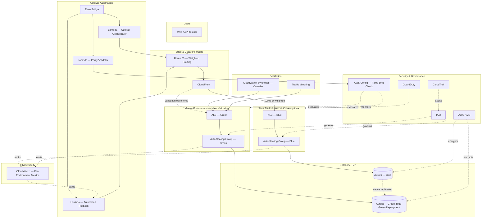

# Part II – Core Infrastructure Architectures

# Chapter 13 – Blue-Green Infrastructure

> **How to read this chapter:** This chapter anchors every concept to a concrete reference architecture — an **Enterprise Blue-Green Deployment Platform** for a web/API workload, built on two parallel, full-stack environments ("Blue" and "Green"), an Application Load Balancer with weighted/swappable target groups, Route 53 weighted routing for the edge-level cutover, and Amazon Aurora Blue-Green Deployments for the database tier. This builds directly on the Auto Scaling architecture (Chapter 8) and the Golden AMI factory (Chapter 11) — both of which this chapter's two parallel environments consume as inputs — and complements Chapter 8's instance-refresh-based rolling deployment model with the alternative, environment-level cutover model this chapter describes in depth.

---

# 1. Executive Summary

## The Business Problem

Every deployment mechanism has to answer one core question:

- What happens to a running, revenue-generating production system while new code is being introduced?

There are, broadly, two families of answer:

- **In-place, incremental replacement** — the rolling/instance-refresh model described in Chapter 8, where old and new versions coexist briefly on the *same* fleet, one instance at a time.
- **Parallel, full-environment replacement** — the blue-green model this chapter describes, where an entirely separate, fully-provisioned copy of the production environment is stood up, validated independently, and then substituted for the currently-live environment in a single, near-instantaneous cutover.

Rolling deployment (Chapter 8) is efficient and cost-effective, but it has a specific, structural weakness:

- Old and new code versions run **simultaneously, on the same shared downstream dependencies** (the same database, the same cache, the same message queues) for the entire duration of the rollout.
- If the new version's database schema expectations, cache key formats, or message payload formats are incompatible with the old version's, both versions can corrupt shared state for each other during that overlap window.
- Rollback, mid-rollout, means reversing a partially-completed instance replacement — recoverable, but not instantaneous, and not always clean if shared state was already touched by the new version.

The business problem this chapter's architecture solves is:

- **How does an organization deploy a genuinely risky change** — a database migration, a major version upgrade, a breaking API contract change, a change the organization is not fully confident will behave correctly in production — **with a rollback mechanism that is both instantaneous and clean**, rather than a rollback that itself takes time and cannot fully undo partial, already-applied side effects?
- **How does an organization validate a new version against real production-like conditions** (real production traffic mirrored or shifted incrementally) **before committing to it fully**, rather than discovering a problem only after 100% of traffic is already on the new version?

A second, related business problem:

- Certain categories of change — a major database engine version upgrade, a significant schema migration, a multi-region failover rehearsal — are **poorly suited to incremental, instance-by-instance rollout** in the first place, because the change is inherently all-or-nothing at the data-tier level.
- Blue-green deployment, extended down to the database tier via Amazon Aurora Blue-Green Deployments, gives these categories of change a safe, tested, reversible mechanism that Chapter 8's compute-tier-only rolling model does not directly address.

## Architecture Objective

This chapter's reference architecture targets a deployment platform that:

- Maintains **two complete, independently-scaled, independently-validatable environments** (Blue and Green) at all times, with exactly one serving live production traffic at any given moment.
- Performs a **cutover between environments in seconds, not minutes**, via a DNS weight change or ALB listener-rule swap, not a fleet-wide instance replacement.
- Supports an **instantaneous, clean rollback** — reverting the cutover mechanism back to the previous environment — for the full duration of a defined validation/bake window after a cutover.
- Extends the same blue-green philosophy to the **database tier** via Aurora Blue-Green Deployments, for changes (major-version upgrades, schema migrations) that a compute-tier-only blue-green pattern cannot safely address alone.
- Validates the idle (non-live) environment **thoroughly, using synthetic and/or mirrored real traffic**, before it is ever promoted to serve live production traffic.
- Avoids the **double-cost trap** — running two full-scale production environments simultaneously, indefinitely — through deliberate cost-management patterns discussed in Section 16.

## Why Organizations Adopt This Architecture

Organizations adopt blue-green infrastructure for a specific, recurring set of reasons:

- They have experienced a **rollback that didn't fully roll back** — a rolling deployment rollback that reverted application code but left behind already-corrupted shared state (a bad cache entry, a partially-migrated database row), causing an extended incident even after the "fix."
- They need to perform a **genuinely high-risk change** (a major database engine upgrade, a significant schema migration) with a tested, safe, reversible mechanism, rather than relying on hope and a restore-from-backup fallback plan.
- They operate under a **compliance or contractual requirement** for near-zero-downtime deployments, where even the brief, per-instance disruption of a rolling deployment's connection draining is unacceptable.
- They want the confidence of validating a new version against **real, mirrored production traffic** before committing to it, rather than relying solely on staging-environment testing that never perfectly replicates production conditions.

This is not a claim that blue-green is universally superior to Chapter 8's rolling deployment model:

- Blue-green costs more (two environments, even briefly).
- Blue-green is more operationally complex (environment-parity management, database-tier synchronization).
- Section 28 compares both models directly, and many organizations use **both** — rolling deployment for routine, low-risk application releases, and blue-green specifically reserved for higher-risk changes.

## Major Business Benefits

| Benefit | Explanation |
|---|---|
| Instantaneous, clean rollback | Reverting a cutover is a routing change, not a fleet-wide instance replacement — typically complete in under 60 seconds. |
| Reduced deployment risk for high-stakes changes | Database engine upgrades and schema migrations get a safe, tested, reversible path via Aurora Blue-Green Deployments. |
| Full pre-production validation under real conditions | The idle environment can be validated with mirrored production traffic before ever serving a real user. |
| Near-zero-downtime cutover | A DNS weight change or listener-rule swap introduces no per-instance connection-draining disruption. |
| Reduced blast radius during validation | A problem discovered in the idle environment during validation never reaches a single real customer. |
| Supports compliance/contractual near-zero-downtime commitments | Directly addresses SLA commitments stricter than a rolling deployment model alone can guarantee. |

## Typical Enterprise Scenarios

This architecture pattern fits:

- Organizations performing **major, infrequent, high-risk changes** — a database engine major-version upgrade, a significant schema migration, a foundational platform re-architecture — that warrant a fully-isolated validation environment and instantaneous rollback path.
- Regulated industries (financial services, healthcare) with **contractual or regulatory near-zero-downtime requirements** that a rolling deployment's connection-draining window cannot fully satisfy.
- Organizations that have **experienced a "rollback that didn't roll back" incident** and specifically want structural protection against a repeat.
- Organizations wanting to validate a new release against **mirrored, real production traffic** before committing, for confidence beyond what staging-environment testing alone provides.
- Organizations layering blue-green **specifically on top of** an existing rolling-deployment model (Chapter 8), reserved for a defined subset of higher-risk change types, rather than replacing rolling deployment entirely for every release.

It is a poorer fit for:

- Routine, low-risk, frequent application releases, where Chapter 8's rolling deployment model is more cost-effective and operationally simpler.
- Small organizations without the budget or operational maturity to maintain two fully-provisioned, independently-validated production environments.
- Workloads with a data tier that cannot practically be duplicated (a very large, expensive-to-replicate database) without a specific, targeted mechanism like Aurora Blue-Green Deployments, discussed in depth in this chapter, to make the data-tier replication itself efficient and safe.

---

# 2. Business Requirements

## Business Drivers

- Provide a genuinely safe, tested, reversible deployment path for high-risk changes (database engine upgrades, schema migrations, major version releases).
- Reduce the business impact of a bad deployment by making rollback instantaneous and clean, not partial or delayed.
- Meet contractual/regulatory near-zero-downtime commitments stricter than a rolling deployment model can fully guarantee.
- Validate new releases against real, mirrored production conditions before full customer exposure.

## Functional Requirements

| Requirement | Description |
|---|---|
| Dual-environment maintenance | Two complete, independently-addressable environments (Blue, Green) exist at all times. |
| Traffic cutover mechanism | A defined, tested mechanism (DNS weighted routing, ALB listener-rule swap) shifts live traffic between environments. |
| Environment parity validation | Automated checks confirm both environments are configuration-equivalent before a cutover is permitted. |
| Database-tier blue-green support | Aurora Blue-Green Deployments (or an equivalent mechanism) extends the pattern to schema/engine-version changes. |
| Instantaneous rollback | Reverting a cutover is possible within a defined bake window, without requiring a new deployment. |
| Traffic mirroring/shadow testing | Real production requests can be mirrored to the idle environment for validation without affecting real responses. |

## Non-Functional Requirements

| Category | Target |
|---|---|
| Cutover time | ≤ 60 seconds from cutover initiation to majority of traffic routed to the new environment |
| Rollback time | ≤ 60 seconds from rollback initiation to traffic fully reverted |
| Bake window | Minimum 30 minutes (configurable per change risk level) before the previous environment is decommissioned/repurposed |
| Environment parity | 100% infrastructure-configuration parity between Blue and Green, enforced via Terraform (Section 8) |
| Availability during cutover | No customer-facing downtime attributable to the cutover mechanism itself |

## Scalability Goals

- Both environments must be independently capable of handling full production peak load, since either may be the "live" environment at any given time.
- The architecture must support this dual-full-scale requirement without requiring the platform team to double every cost line indefinitely (Section 16 details specific mitigations).

## Availability Requirements

- 99.95% for the customer-facing tier, consistent with Chapter 3's baseline — this chapter's architecture is a deployment-mechanism layer on top of, not a replacement for, Chapter 3's underlying multi-AZ availability design.

## Latency Requirements

- The cutover mechanism itself must introduce no measurable latency regression — a DNS weighted-routing change or ALB listener-rule swap should be effectively instantaneous from the client's perspective, subject to DNS TTL/caching behavior discussed in Section 9.

## Compliance Requirements

- Identical baseline to Chapter 3 (SOC 2, encryption, audit logging).
- An additional, chapter-specific requirement: every cutover and rollback event must be logged with sufficient detail (who initiated it, what validation passed beforehand, exact timestamp) to serve as change-management audit evidence.

## Security Expectations

- Both environments maintain identical security posture — IAM roles, security groups, encryption configuration — validated as part of the pre-cutover parity check (Section 6), not assumed by convention alone.

## Recovery Objectives

### Recovery Point Objective (RPO)

- **RPO = 0** for the compute tier (stateless, per Chapter 8's data-lifecycle principle).
- **RPO ≤ 5 minutes** for the database tier during an Aurora Blue-Green Deployment switchover, consistent with Chapter 3's baseline, achieved via Aurora's native replication mechanism underlying the Blue-Green Deployments feature.

### Recovery Time Objective (RTO)

- **RTO ≤ 60 seconds** specifically for reverting a completed cutover, within the bake window.
- **RTO ≤ 5 minutes** for a full Aurora Blue-Green Deployment switchback, if the database tier itself was part of the cutover.

## SLAs

- Internal engineering SLO: 100% of high-risk changes (as classified by the organization's own change-risk taxonomy) use this chapter's blue-green mechanism, not a direct rolling deployment, with cutover/rollback success tracked as a first-class deployment-pipeline metric.

## Expected Workload

- Blue-green cutovers are inherently a lower-frequency event than routine rolling deployments (Chapter 8) — typically reserved for major releases, database changes, or particularly risk-sensitive application changes, occurring perhaps weekly to monthly rather than the multiple-times-per-day cadence a rolling deployment model might support.

## Expected Growth

- As an organization's change-risk taxonomy matures and more change categories are explicitly classified as "requires blue-green," the frequency of blue-green cutovers grows — the architecture should support this growth without requiring a fundamental redesign, primarily through increased automation of the environment-provisioning and parity-validation steps described in Sections 6 and 8.

---

# 3. Architecture Overview

## Overall Design

The reference architecture maintains two parallel, full-stack environments:

- **Blue** — assume, at a given point in time, this is the currently-live environment serving production traffic.
- **Green** — the idle environment, provisioned identically, available to receive a new release for validation before cutover.

Both environments share:

- The same VPC (in the simpler, single-VPC variant) or separate, parity-managed VPCs (in the stricter-isolation variant), each containing an Auto Scaling Group (Chapter 8) built from the current approved golden AMI (Chapter 11).
- A shared or Aurora-Blue-Green-Deployment-managed database tier, depending on whether the specific change being deployed requires database-tier involvement at all.

## Architecture Philosophy

The guiding philosophy is **"validate in isolation, cut over atomically, retain the ability to reverse."**

This breaks down into three specific principles:

- **Isolation during validation** — the idle environment is fully provisioned and can be thoroughly tested (synthetic tests, mirrored real traffic) without any risk of affecting real customer-facing behavior, since it receives no live production traffic until cutover.
- **Atomicity at cutover** — the actual traffic-shifting mechanism (DNS weight change, listener-rule swap) is designed to be as close to instantaneous and all-or-nothing as the underlying AWS primitives allow, minimizing the window during which some fraction of traffic is on the old version and some on the new.
- **Reversibility within a bake window** — the previous environment is deliberately *not* torn down immediately after cutover; it remains fully provisioned and ready to receive traffic again for a defined bake period, making rollback a routing change, not a redeployment.

A second, closely related principle:

- **Database-tier changes get their own, more careful blue-green treatment** via Aurora Blue-Green Deployments, distinct from (though coordinated with) the compute-tier cutover — since a database's "environment" cannot be duplicated and discarded as casually as a stateless compute fleet, and a database engine/schema change has fundamentally different risk characteristics than an application code change.

## Core Components

| Layer | Components |
|---|---|
| Edge/Routing | Route 53 (weighted routing records), Application Load Balancer (listener rules, target-group swap) |
| Compute — Blue | Auto Scaling Group (Chapter 8), built from the current approved golden AMI (Chapter 11) |
| Compute — Green | Identical Auto Scaling Group structure, independently scalable, currently idle or in validation |
| Database | Amazon Aurora, using Aurora Blue-Green Deployments for engine/schema-level changes |
| Validation | Synthetic canary tests (CloudWatch Synthetics), traffic-mirroring (VPC Traffic Mirroring or ALB request mirroring where applicable) |
| Automation | AWS Lambda (cutover orchestration, parity validation, automated rollback triggering), EventBridge (deployment lifecycle events) |
| Security | IAM, KMS, Secrets Manager — parity-validated across both environments |
| Observability | CloudWatch (per-environment metrics, cutover-specific dashboards), CloudWatch Alarms gating automated rollback |

## How Components Interact

- A new release is deployed to the currently-idle environment (Green, in this example) using the same instance-refresh/deployment mechanism described in Chapter 8, but targeting an environment receiving no live traffic.
- Automated parity validation confirms Green's infrastructure configuration matches Blue's (aside from the intentional application-version difference), and synthetic/mirrored-traffic tests validate Green's actual behavior.
- Once validation passes, a human-approved (or, for lower-risk changes, automated) cutover initiates: Route 53 weighted routing shifts an increasing percentage of traffic to Green (or, for a simpler all-at-once cutover, shifts 100% immediately), while CloudWatch alarms monitor Green's error rate/latency throughout.
- If alarms breach configured thresholds during the bake window, an automated rollback reverts the Route 53 weighting back to Blue.
- If the bake window completes successfully, Blue is either decommissioned, scaled down to a minimal standby state, or repurposed as the *next* idle environment for the following release cycle — the labels "Blue" and "Green" swap meaning with each cycle, not the physical environments swapping identity.

## High-Level Workflow

1. Deploy the new release to the idle environment.
2. Validate the idle environment's parity and functional correctness.
3. Initiate cutover (weighted or all-at-once).
4. Monitor the bake window with automated rollback gating.
5. Finalize (decommission/repurpose the previous environment) or roll back.

## Request Lifecycle

- Identical to Chapter 3/8's request lifecycle from the client's perspective — the client is entirely unaware of which physical environment (Blue or Green) is currently serving its request; this is precisely the abstraction this architecture exists to provide.

## Response Lifecycle

- Identical to Chapter 3/8's response lifecycle; the blue-green mechanism operates entirely at the routing layer, invisible to response construction.

## Data Lifecycle

- For compute-tier-only changes, both environments share the same underlying database — no data-tier blue-green mechanism is invoked at all, and this chapter's architecture operates purely as a compute-tier cutover mechanism layered on top of Chapter 8.
- For database-tier changes, Aurora Blue-Green Deployments creates a fully replicated "green" database environment kept in sync with the "blue" production database via native Aurora replication, and the eventual switchover is a distinct, database-specific cutover event (detailed in Section 6), which may be coordinated with, but is mechanically separate from, the compute-tier Route 53/ALB cutover.

---

# 4. AWS Services Used

## Amazon EC2 / Auto Scaling Groups

- **Purpose:** Provides the compute tier for both the Blue and Green environments, identical in structure to Chapter 8's Auto Scaling Group architecture.
- **Why selected:** Reusing Chapter 8's already-established, well-understood Auto Scaling Group pattern for each environment avoids introducing a second, unfamiliar compute model just for this chapter's purposes.
- **Alternatives:** ECS/Fargate — equally valid as the compute substrate for each environment; the blue-green routing/cutover pattern described in this chapter applies identically regardless of which compute substrate (EC2 or Fargate) underlies each environment.
- **Best practices:** Both environments' Auto Scaling Groups should reference the same golden AMI parameter (Chapter 11), differing only in the specific AMI *version* or application deployment appropriate to each environment's current release.

## Application Load Balancer (ALB)

- **Purpose:** Provides target-group-level routing that can be used for a listener-rule-based cutover mechanism, as an alternative or complement to Route 53-based cutover.
- **Why selected:** ALB listener rules can be updated to shift traffic between two target groups (one per environment) with a single API call, providing a faster, more surgical cutover mechanism than DNS-based routing alone, and avoiding any DNS-caching-related propagation delay.
- **Alternatives:** Route 53 weighted routing (discussed below) — chosen instead (or in combination) when the two environments are sufficiently isolated (e.g., separate VPCs, separate ALBs entirely) that a single shared ALB cannot mediate between them.
- **Best practices:** Where both environments share a single ALB (the simpler variant), use weighted target groups for a gradual, percentage-based cutover; where each environment has its own dedicated ALB, use Route 53 weighted routing across the two ALB DNS names instead.

## Amazon Route 53

- **Purpose:** Provides DNS-based weighted routing between two environments' distinct endpoints (e.g., two separate ALBs, one per environment), enabling a cutover mechanism that works even when the two environments are otherwise fully isolated from each other.
- **Why selected:** Native, managed weighted-routing and health-check-based failover, consistent with its role in Chapter 3's architecture.
- **Alternatives:** ALB listener-rule swap (above) — preferred when environments share infrastructure enough to make this viable; Route 53 weighted routing is preferred when environments are more fully isolated, or when a global, multi-region cutover is in scope.
- **Limitations:** DNS-based routing is subject to client-side and resolver-side caching (TTL-dependent), meaning a Route 53 weight change does not achieve instantaneous, 100%-immediate cutover the way an ALB listener-rule swap can — a specific, important trade-off discussed further in Section 9.
- **Best practices:** Use low TTLs (60 seconds or less) on records participating in blue-green cutover to minimize the propagation-delay trade-off.

## Amazon Aurora (Blue-Green Deployments)

- **Purpose:** Provides a managed, native mechanism for creating a fully replicated "green" database environment (same engine, or an upgraded engine version, or a modified schema) kept in sync with the live "blue" database, and performing a controlled, low-downtime switchover between them.
- **Why selected:** Manually replicating a large production database for blue-green purposes is operationally complex and error-prone; Aurora Blue-Green Deployments handles the replication topology, DNS endpoint management, and switchover orchestration natively, specifically designed for exactly this use case (major-version upgrades, schema changes).
- **Alternatives:** Manual read-replica-promotion-based approaches — used before Aurora Blue-Green Deployments existed as a native feature, but meaningfully more operationally complex and risk-prone; still relevant for non-Aurora RDS engines lacking an equivalent native feature.
- **Limitations:** Aurora Blue-Green Deployments has specific supported-change constraints (certain schema changes are supported for online replication, others are not) — the feature does not make every possible database change safe to blue-green; some changes still require a more traditional maintenance-window-based migration.
- **Pricing considerations:** The green database environment incurs its own compute/storage cost for the duration it exists, similar in principle to Chapter 3's read-replica cost discussion — a temporary, deliberate doubling of database cost for the specific window during which the blue-green database change is being validated and cut over.
- **Best practices:** Use Aurora Blue-Green Deployments specifically for major-version upgrades and supported schema changes; validate the green database thoroughly (application-level smoke tests against it, not just replication-lag monitoring) before switchover; keep the switchover window as short as practically possible to minimize the brief write-pause Aurora's switchover mechanism requires.

## AWS Lambda

- **Purpose:** Orchestrates cutover automation — executing the parity-validation checks, initiating the Route 53/ALB traffic shift, monitoring bake-window alarms, and triggering automated rollback if thresholds are breached.
- **Why selected:** Event-driven, intermittent orchestration tasks consistent with this book's established Lambda usage pattern (Chapters 3, 4, 8, 11).
- **Best practices:** Keep the rollback-triggering function extremely reliable and fast, given its safety-critical role — a failure in this specific function during an actual bad-deployment scenario directly undermines this entire architecture's core value proposition.

## Amazon EventBridge

- **Purpose:** Delivers deployment-lifecycle events (deployment started, validation passed, cutover initiated, bake window started/completed, rollback triggered) to the Lambda automation functions and to any downstream notification/logging consumers.
- **Why selected:** Native event bus consistent with this book's established pattern, providing precise, content-based routing of each distinct lifecycle event to its relevant automation.

## AWS CloudWatch

- **Purpose:** Supplies the metrics (error rate, latency, custom application health signals) that gate the automated rollback decision during the bake window, and provides per-environment dashboards distinguishing Blue's and Green's independent health.
- **Why selected:** Native integration consistent with every prior chapter; a blue-green-specific consideration is the need for metrics to be queryable *per environment*, not only aggregated across both, since the entire point of the bake window is comparing the new environment's behavior in isolation.
- **Best practices:** Tag/dimension every relevant metric with an explicit environment label (Blue/Green) rather than relying on an implicit, harder-to-query distinction like instance ID ranges.

## AWS IAM / AWS KMS / AWS Secrets Manager

- **Purpose:** As throughout this book — least-privilege access control, encryption, and secret management, applied identically and in parity across both environments.
- **Why selected:** Consistency with the established organization-wide security baseline; a specific, chapter-relevant consideration is that the automated parity-validation check (Section 6) explicitly verifies IAM/security-group/encryption configuration matches between Blue and Green, not merely application-version differences.

## Amazon CloudTrail / AWS Config / Amazon GuardDuty

- **Purpose:** As described in Chapter 3 — organization-wide audit, compliance, and threat-detection baseline, applied identically to both Blue and Green environments' AWS resources.
- **Chapter-specific addition:** A Config rule/custom check specifically flags any configuration drift between the two environments outside the intentional, currently-in-progress application-version difference — directly supporting the parity-validation requirement from Section 2.

---

# 5. Complete Architecture Diagram



---

# 6. Component-by-Component Explanation

## Route 53 Weighted Routing

- **Purpose:** Shifts client traffic between the Blue and Green environments' respective endpoints.
- **Responsibilities:** Maintain weighted record sets pointing to each environment's ALB (or CloudFront distribution); adjust weights during a cutover; support instant reversion during rollback.
- **Inputs:** Weight-adjustment API calls from the cutover-orchestrator Lambda function.
- **Outputs:** DNS responses reflecting the current weight distribution.
- **Scaling:** Fully managed; no scaling configuration required.
- **High availability:** Global, highly available by design.
- **Failure handling:** A misconfigured weight change is reverted via the same API, subject to DNS TTL propagation delay (Section 9).
- **Dependencies:** Health checks against each environment's endpoint, optionally gating automatic failover independent of a deliberate cutover.
- **Security:** IAM-scoped access restricting who/what can modify weighted routing records — a highly sensitive permission, since it directly controls live production traffic routing.
- **Monitoring:** CloudWatch metrics on health-check status per environment; Route 53 query logging for audit purposes.

## Application Load Balancer — Per Environment

- **Purpose:** Distributes traffic within each environment across that environment's Auto Scaling Group instances (identical role to Chapter 8's ALB).
- **Responsibilities:** As described in Chapter 8, Section 6 — unchanged by this chapter's blue-green pattern, since each environment's internal load-balancing behavior is independent of the cutover mechanism operating one layer up (at Route 53 or via listener-rule swap).
- **Chapter-specific note:** Where the simpler, single-ALB variant is used instead of per-environment ALBs, the "cutover" mechanism becomes a listener-rule weight change between two target groups on the *same* ALB, rather than a Route 53 weight change across two ALBs — functionally similar, operationally faster (no DNS propagation delay), but requiring both environments to share the same ALB and therefore the same VPC-level network path.

## Auto Scaling Group — Blue / Green

- **Purpose:** Provides the compute tier for each environment, identical in structure and configuration (aside from the deliberate application-version difference) to Chapter 8's architecture.
- **Responsibilities:** Serve requests routed to this specific environment; scale independently based on that environment's own traffic share.
- **Scaling:** Each environment scales independently — during a gradual, weighted cutover, the newly-receiving-traffic environment's Auto Scaling Group scales out to match its growing traffic share, while the environment losing traffic share scales in accordingly.
- **High availability:** Multi-AZ, per Chapter 8's baseline, independently for each environment.
- **Failure handling:** Standard Chapter 8 instance-health-check-based replacement, independently per environment.
- **Dependencies:** The golden AMI (Chapter 11); the environment-specific Aurora endpoint (Blue's database, or Green's, during a database-tier blue-green event).
- **Security:** Identical IAM instance profile structure to Chapter 8, validated for parity between environments as part of the pre-cutover check.
- **Monitoring:** All Chapter 8 metrics, explicitly dimensioned by environment (Blue/Green) to support isolated bake-window analysis.

## Aurora Blue-Green Deployment

- **Purpose:** Creates and manages a fully replicated "green" database environment for engine-version or supported-schema changes, and orchestrates the eventual switchover.
- **Responsibilities:** Establish and maintain native replication from the current production ("blue") database to the new ("green") database; provide distinct endpoints for validating the green database independently; execute a coordinated, low-downtime switchover that promotes green to become the new production database.
- **Inputs:** A defined target engine version or schema change; validation queries/smoke tests run against the green endpoint before switchover.
- **Outputs:** A completed switchover (green becomes the new "blue"), or a decision not to proceed (green environment is discarded, no impact to production).
- **Scaling:** The green database is provisioned at a size appropriate for full production load, since it will need to serve that load immediately upon switchover.
- **High availability:** Both blue and green databases maintain their own Multi-AZ configuration independently during the deployment's lifetime.
- **Failure handling:** If validation against the green database fails, the Blue-Green Deployment is simply deleted with no impact to the still-live blue database — a clean, zero-risk abort path.
- **Dependencies:** Sufficient replication capacity/bandwidth to keep green synchronized with blue's ongoing write volume without unacceptable lag.
- **Security:** The green database inherits equivalent encryption/IAM-authentication configuration to blue, validated as part of the parity check.
- **Monitoring:** Replication lag between blue and green, tracked continuously and required to be within an acceptable threshold before switchover is permitted to proceed.

## Parity Validator (Lambda)

- **Purpose:** Confirms Green's infrastructure configuration matches Blue's, aside from the intentional application-version/database-version difference currently being deployed.
- **Responsibilities:** Compare IAM roles, security group rules, KMS key usage, instance types, and Auto Scaling configuration between the two environments; fail the validation (blocking cutover) if an unintended drift is detected.
- **Inputs:** Both environments' current Terraform-applied configuration state.
- **Outputs:** A pass/fail parity determination, gating whether cutover is permitted to proceed.
- **Failure handling:** A detected, unintended drift halts the cutover process and alerts the owning team — cutover should never proceed with unexplained configuration drift between environments.

## Cutover Orchestrator (Lambda)

- **Purpose:** Executes the actual traffic-shifting mechanism (Route 53 weight change or ALB listener-rule swap) once validation has passed and a human (or automated, for lower-risk changes) approval has been given.
- **Responsibilities:** Adjust routing weights incrementally (for a gradual cutover) or immediately (for an all-at-once cutover), per the chosen cutover strategy for that specific release; emit lifecycle events at each stage.
- **Failure handling:** A failure partway through a gradual cutover halts further weight adjustment and alerts the owning team, leaving traffic split at its last successfully-applied state rather than proceeding blindly.

## Automated Rollback (Lambda)

- **Purpose:** Monitors CloudWatch alarms during the bake window and automatically reverts the cutover if a configured threshold is breached.
- **Responsibilities:** Continuously evaluate the bake-window alarms; upon a breach, immediately revert Route 53/ALB weighting back to the previous environment; notify the owning team.
- **Failure handling:** This function's own reliability is safety-critical — it is tested independently and regularly (Section 23), given that its failure during an actual bad deployment directly undermines this chapter's core promise of fast, reliable rollback.

---

# 7. End-to-End Request Flow

**Scenario: A gradual, weighted cutover from Blue (currently live) to Green (new release).**

1. **Pre-deployment**: The Green environment is currently idle, running the same application version as Blue (its previous release), receiving no live traffic.
2. **Deploy to Green**: The new release is deployed to Green via the Chapter 8 instance-refresh mechanism, entirely isolated from live traffic.
3. **Parity validation**: The parity-validator Lambda confirms Green's infrastructure configuration matches Blue's aside from the intended application-version difference.
4. **Synthetic validation**: CloudWatch Synthetics canaries execute a defined set of functional tests directly against Green's endpoint.
5. **Traffic-mirroring validation (optional, higher-rigor path)**: A subset of real production requests is mirrored (not redirected) to Green, and its responses are compared against Blue's actual responses for consistency, without ever serving Green's response to the real client.
6. **Approval gate**: For high-risk changes, a human approver reviews the validation results and explicitly approves cutover; for lower-risk, well-established change types, this gate may be automated based on validation results alone.
7. **Cutover initiation**: The cutover-orchestrator Lambda begins shifting Route 53 (or ALB listener) weight from Blue toward Green — for example, 10% initially.
8. **Bake window monitoring begins**: CloudWatch alarms specific to Green's metrics (error rate, latency, custom health signals) are actively monitored.
9. **Progressive weight increase**: Absent any alarm breach, weight shifts progressively (e.g., 10% → 50% → 100%) over a defined schedule.
10. **Full cutover reached**: 100% of traffic is now routed to Green.
11. **Extended bake window**: Green continues serving 100% of traffic for a defined additional period (e.g., 30–60 minutes) while monitoring continues, since some issues only manifest under full production load or after a longer duration than the progressive-shift window alone would reveal.
12. **Finalization decision**: If the bake window completes without incident, the deployment is finalized — Blue is decommissioned or repurposed as the next cycle's idle environment.
13. **Rollback path (alternate)**: If a CloudWatch alarm breaches its threshold at any point during steps 8–11, the automated-rollback Lambda immediately reverts Route 53/ALB weighting to 100% Blue.
14. **Post-rollback validation**: Confirm Blue is correctly serving 100% of traffic again and error rates have returned to baseline.
15. **Root-cause investigation**: The Green environment (and its failed release) remains available, untouched, for investigation — it is not immediately torn down, preserving the exact failing state for diagnosis.
16. **Logging throughout**: Every weight change, alarm evaluation, and approval decision is logged to CloudWatch Logs/CloudTrail, providing the audit trail described in Section 2's compliance requirements.
17. **Database-tier coordination (if applicable)**: If this release also includes a database-tier change, the Aurora Blue-Green Deployment's own switchover (Section 6) is coordinated with — though mechanically distinct from — the compute-tier Route 53/ALB cutover, typically sequenced so the database switchover completes immediately before the compute-tier cutover begins routing meaningful traffic to the new application version expecting the new schema.
18. **Error handling — application-level errors during bake**: A spike in application-level errors (5xx responses) specifically, rather than infrastructure-level alarms alone, is one of the most common and most important rollback triggers, requiring the bake-window alarm configuration to include genuine application-health signals, not merely infrastructure-utilization metrics.

---

# 8. Deployment Flow

## Infrastructure Provisioning

- Both Blue and Green environments' infrastructure is defined in a single, shared Terraform module set, parameterized by an `environment_color` variable (or equivalent) — never as two independently-drifting Terraform configurations, which would undermine the parity guarantee this entire architecture depends on.

## Terraform Workflow

- Identical review-and-apply discipline to every prior chapter.
- A chapter-specific addition: any Terraform change is applied to *both* environments' configuration simultaneously (since they share the same module, differing only in environment-specific variables like the current application version), directly enforcing infrastructure parity at the source, rather than relying solely on the post-hoc parity-validation check to catch drift after the fact.

## CI/CD Deployment

- The CI/CD pipeline's deployment stage targets the currently-idle environment specifically — determined dynamically (e.g., by querying Route 53's current weight configuration) rather than a hardcoded "always deploy to Green" assumption, since which physical environment is idle changes with each release cycle.

## Blue-Green Deployment (This Chapter's Core Subject)

- Detailed exhaustively throughout Sections 3, 6, and 7 — the deployment flow described in this section refers specifically to *how code reaches the idle environment*, which is itself the Chapter 8 instance-refresh mechanism, applied to an environment currently receiving no live traffic.

## Rollback

- As detailed in Section 7 — a routing-layer reversion, not a redeployment, and the single most important operational capability this architecture exists to provide.

## Secrets

- Both environments retrieve secrets independently via Secrets Manager, using their own environment-specific IAM instance profiles — never a shared secret retrieval path that could create an unintended coupling between the two environments' security boundaries.

## Configuration

- Non-secret configuration is retrieved from Parameter Store, with environment-specific configuration paths (e.g., `/production/blue/...` and `/production/green/...`) where a genuine difference is required (such as the current application version identifier), and shared configuration paths for everything that should remain in parity.

## Validation

- The most elaborate validation stage of any chapter in this book so far, spanning: infrastructure parity validation, synthetic functional testing, optional traffic-mirroring comparison, and continuous bake-window alarm monitoring — reflecting this architecture's core purpose as, fundamentally, a *validation and risk-reduction* mechanism first, and a deployment mechanism second.

---

# 9. Network Topology

## VPC — Shared vs. Isolated Variants

Two common topology choices exist for this architecture:

- **Shared-VPC variant**: Blue and Green Auto Scaling Groups live in the same VPC, same subnets, differing only by target group. Simpler; faster cutover (a single ALB's listener-rule swap, no DNS propagation delay). Weaker isolation — a VPC-level networking issue affects both environments simultaneously.
- **Isolated-VPC variant**: Blue and Green each have their own VPC (or at least their own subnets/ALB), with Route 53 weighted routing mediating between them. Stronger isolation — a networking-layer issue in one environment cannot directly affect the other. Slower cutover (subject to DNS TTL propagation).

Choice depends on the specific risk being mitigated:

- If the concern is primarily *application-code* risk, the shared-VPC variant is usually sufficient and simpler.
- If the concern includes *infrastructure-level* risk (e.g., validating an entirely new network configuration alongside the application change), the isolated-VPC variant is warranted.

## CIDR

- The isolated-VPC variant requires planning two full VPC CIDR ranges (e.g., `10.10.0.0/16` for Blue, `10.11.0.0/16` for Green), following the same sizing discipline as Chapter 3, Section 9.
- The shared-VPC variant requires no additional CIDR planning beyond Chapter 3's baseline.

## Public / Private Subnets

- Identical structure to Chapters 3 and 8 within each environment — public subnets host only the ALB (or NAT Gateways); private subnets host the Auto Scaling Group instances; private data subnets host the Aurora cluster(s).

## NAT Gateway

- Each environment (in the isolated-VPC variant) requires its own NAT Gateway(s), following Chapter 3's one-per-AZ pattern.
- In the shared-VPC variant, both environments' instances share the same NAT Gateway infrastructure, since they're in the same subnets.

## Internet Gateway / Route Tables

- Standard pattern per environment, identical to Chapter 3's baseline, replicated per environment in the isolated-VPC variant.

## Transit Gateway

- Relevant specifically if the isolated-VPC variant is chosen and either environment needs connectivity to shared-services resources (a central artifact repository, a shared logging account) — Transit Gateway mediates this connectivity for both VPCs without requiring a full peering mesh.

## Network ACLs / Security Groups

- Security groups remain the primary access-control mechanism, following Chapter 3's discipline, replicated identically (parity-validated, per Section 6) across both environments.
- A chapter-specific consideration: the parity-validation check specifically diffs security group rules between environments, since an unintentional security-group difference is both a security risk and a potential source of a confusing, hard-to-diagnose bake-window failure.

## PrivateLink

- VPC endpoints for Secrets Manager, S3, Systems Manager, and CloudWatch Logs are configured identically in both environments, following Chapter 3/8's established pattern.

## Hybrid Connectivity

- Not typically applicable specifically to this chapter's cutover mechanism; if the broader architecture has a hybrid on-premises dependency (Chapter 3, Section 9), both Blue and Green environments require equivalent connectivity to it, validated as part of parity checking.

---

# 10. Identity and Access

## IAM Roles

- Each environment maintains its own, structurally-identical set of IAM roles (Auto Scaling Group instance profile, Aurora-access role, etc.), differing only in resource ARNs specific to that environment's own resources.
- The cutover-orchestrator and automated-rollback Lambda functions have a distinct, narrowly-scoped role permitting Route 53/ALB routing changes specifically — a highly sensitive permission set, since it directly controls live production traffic.

## IAM Policies

```json

{
  "Version": "2012-10-17",
  "Statement": [
    {
      "Sid": "AllowRoute53WeightedRecordUpdate",
      "Effect": "Allow",
      "Action": ["route53:ChangeResourceRecordSets"],
      "Resource": "arn:aws:route53:::hostedzone/Z1ABCD2EFGHIJK",
      "Condition": {
        "ForAllValues:StringEquals": {
          "route53:ChangeResourceRecordSetsRecordTypes": ["A"]
        }
      }
    },
    {
      "Sid": "AllowReadBothEnvironmentMetrics",
      "Effect": "Allow",
      "Action": ["cloudwatch:GetMetricData", "cloudwatch:DescribeAlarms"],
      "Resource": "*"
    },
    {
      "Sid": "DenyOtherHostedZoneModification",
      "Effect": "Deny",
      "Action": ["route53:ChangeResourceRecordSets"],
      "NotResource": "arn:aws:route53:::hostedzone/Z1ABCD2EFGHIJK"
    }
  ]
}

```

## Resource Policies

- Each environment's Aurora cluster and KMS CMK carry resource-level policies scoped specifically to that environment's own IAM roles — no cross-environment resource access exists at the identity-policy level, aside from the Aurora Blue-Green Deployment's own AWS-managed replication mechanism, which operates through Aurora's native, AWS-internal replication path rather than a customer-managed IAM permission.

## STS

- As throughout this book — every role assumption uses short-lived STS credentials; no long-lived IAM user access keys exist anywhere in this architecture.

## Cross-Account Access

- Typically not required within a single blue-green pair, which usually lives within one AWS account.
- If Blue and Green intentionally live in separate AWS accounts (an even-stronger isolation variant, used by organizations with the most stringent isolation requirements), cross-account access follows the standard `sts:AssumeRole` pattern described in Chapter 3.

## Least Privilege

- Enforced identically to every prior chapter's discipline.
- A chapter-specific point of emphasis: the cutover-orchestrator and rollback Lambda roles should be scoped to modify *only* the specific Route 53 hosted zone / ALB listener relevant to this specific application — never a broad, "can modify any Route 53 record" permission, which would represent an unacceptably large blast radius for a role this safety-critical.

## Service Roles

- Distinct roles for: each environment's Auto Scaling Group instance profile, the Aurora Blue-Green Deployment's own AWS-managed service role, and each of the three cutover-automation Lambda functions.

## Permission Boundaries

- Applied to the CI/CD deployment role that applies Terraform changes to this architecture's shared module set, capping its maximum permissions and preventing it from being used to provision resources outside this chapter's intended scope.

---

# 11. Security Architecture

## Encryption

- Both environments' EBS volumes and Aurora clusters are encrypted with KMS CMKs, following Chapter 3/8's discipline.
- A chapter-specific point: Blue and Green may use either the *same* CMK (simpler, appropriate when both environments are within the same account/trust boundary) or *distinct* CMKs (stronger isolation, appropriate for the separate-account variant) — this is a deliberate architectural decision, documented in an ADR (Section 30), not a default left to chance.

## KMS

- Key policies are validated for parity between environments as part of the pre-cutover parity check, ensuring no unintended difference in which roles can decrypt each environment's data.

## TLS

- Identical discipline to Chapter 3 — TLS termination at each environment's ALB/CloudFront, enforced consistently across both.

## WAF / Shield

- Applied consistently to both environments' edge configuration; the parity check specifically confirms both environments' WAF web ACL rules match, since an unintentional difference here represents a genuine security gap that could otherwise go unnoticed until exploited specifically against whichever environment has the weaker configuration.

## Secrets Manager

- Each environment retrieves its own secrets independently, as described in Section 8; a chapter-specific consideration is ensuring both environments' database credentials are correctly scoped to their *own* Aurora cluster specifically — a misconfiguration here (Green accidentally configured with Blue's database credentials) could cause a serious, hard-to-diagnose cross-environment data issue during validation.

## Certificate Manager

- Both environments use ACM-issued certificates, validated for matching domain coverage and expiration status as part of parity checking.

## GuardDuty / Inspector / Security Hub / CloudTrail / AWS Config

- Applied identically to both environments' AWS resources, per the organization-wide baseline (Chapter 3).
- The AWS Config parity-drift rule (Section 4) is this chapter's specific, additive security control beyond the standard baseline — flagging any unintentional configuration divergence between Blue and Green as a security-relevant finding, not merely an operational one.

## Zero Trust

- Every request, in either environment, is authenticated/authorized identically to Chapter 3's zero-trust baseline; the blue-green cutover mechanism operates purely at the routing layer and does not alter this underlying trust model in either environment.

## Threat Model

Primary threats specific to this chapter's architecture:

1. Unauthorized modification of the Route 53/ALB cutover mechanism, redirecting production traffic maliciously.
2. Configuration drift between environments creating an unnoticed security gap in whichever environment is weaker.
3. A compromised CI/CD credential deploying malicious code specifically to the currently-idle environment, exploiting the (correct) assumption that the idle environment receives less immediate scrutiny than the live one.
4. Data leakage between environments if traffic-mirroring or database-replication mechanisms are misconfigured to expose one environment's data to the other inappropriately.

## Attack Vectors and Mitigations

| Attack Vector | Mitigation |
|---|---|
| Unauthorized Route 53/ALB modification | Narrowly-scoped IAM policy restricting exactly which records/listeners can be modified, by exactly which roles |
| Configuration drift creating a security gap | Automated parity-validation check, blocking cutover on any unexplained drift |
| Compromised CI/CD credential targeting the idle environment | Identical CI/CD security scrutiny (Chapter 3, Section 20) applied to deployments targeting either environment, with no reduced rigor for "just the idle one" |
| Data leakage via misconfigured mirroring/replication | Explicit, reviewed configuration of traffic-mirroring scope; Aurora Blue-Green Deployment's native replication mechanism, which is AWS-managed and does not expose data through a customer-configurable, misconfigurable path |

---

# 12. High Availability

## AZ Failures

- Each environment independently maintains Chapter 8's multi-AZ resilience; an AZ failure affecting the currently-live environment is absorbed by that environment's own Auto Scaling Group redistribution, entirely independent of the blue-green mechanism itself.

## Instance Failures

- Handled identically and independently within each environment, per Chapter 8's baseline.

## Regional Failures

- This chapter's blue-green mechanism is a same-region concern; a full regional failure is addressed by Chapter 3's separate Warm Standby DR pattern, which operates orthogonally to (and can be combined with) this chapter's blue-green deployment mechanism.

## Database Failures

- Within the currently-live environment, handled by Aurora's standard Multi-AZ failover (Chapter 3).
- During an active Aurora Blue-Green Deployment specifically, a failure affecting the green database halts the deployment (it can simply be deleted with no impact to the still-serving blue database) — a cleaner failure mode than a failure affecting the actual production (blue) database during an unrelated event, which follows Chapter 3's standard Aurora HA handling.

## Load Balancing / Health Checks / Failover

- Each environment's ALB performs standard health-checking within that environment (Chapter 8's baseline).
- The blue-green cutover mechanism itself can *also* use Route 53 health checks as a secondary, automatic failover trigger — if the currently-live environment's endpoint fails its health check entirely (a scenario more severe than a bake-window alarm breach), Route 53 can automatically fail over to the other environment's endpoint if it happens to still be provisioned and healthy, providing a secondary, orthogonal resilience benefit beyond the deliberate cutover mechanism's primary purpose.

---

# 13. Disaster Recovery

## Backup Strategy

- Identical to Chapter 3's Aurora backup strategy, applied to whichever environment currently holds the production ("blue") database at any given time.
- A chapter-specific consideration: during an active Aurora Blue-Green Deployment, both blue and green databases maintain their own independent backup schedules, since green is a fully independent Aurora cluster, not merely a logical copy.

## Snapshots

- As in Chapter 3; the green database (during an active Blue-Green Deployment) begins its own snapshot history from its creation point, distinct from blue's longer-running snapshot history.

## Cross-Region Replication

- This chapter's blue-green mechanism is explicitly a same-region, deployment-risk-mitigation pattern — it is not a substitute for Chapter 3's cross-region DR strategy, and the two should be understood as addressing different risks (deployment risk vs. regional-failure risk) that happen to share some underlying mechanisms (Aurora replication).

## Pilot Light / Warm Standby / Multi-Site / Active-Active / Active-Passive

- Not directly applicable as DR patterns in this chapter's context — this chapter's "two environments" are a deployment-risk mechanism, operating on a much shorter timescale (hours to days per release cycle) than Chapter 3's DR patterns (which address region-level failures on a much rarer, less predictable timescale).
- Worth explicitly distinguishing for any reader who might otherwise conflate this chapter's Blue/Green environments with Chapter 3's Warm Standby DR region — they are different concepts solving different problems, even though both involve maintaining a second, parallel environment.

## RPO

- **RPO = 0** for the compute tier (stateless).
- **RPO ≤ 5 minutes** for an Aurora Blue-Green Deployment switchover specifically, consistent with Chapter 3's general database RPO target.

## RTO

- **RTO ≤ 60 seconds** for reverting a compute-tier cutover within the bake window.
- **RTO ≤ 5 minutes** for an Aurora Blue-Green Deployment switchback, if the database tier was part of the specific release being deployed.

---

# 14. Scalability

## Horizontal Scaling

- Each environment scales independently via its own Auto Scaling Group (Chapter 8), with the environment currently receiving a growing share of traffic (during a gradual cutover) scaling out to match.

## Vertical Scaling

- Applied identically and independently within each environment, following Chapter 8's baseline.

## Auto Scaling — Blue-Green-Specific Consideration

- During a gradual, weighted cutover, both environments' Auto Scaling Groups must be able to respond to a *rapidly changing* traffic share (e.g., 10% → 50% → 100% over a short schedule) — this is a more demanding scaling-responsiveness requirement than Chapter 8's typical organic-traffic-growth scenario, and benefits specifically from:
  - pre-warming the target environment's capacity *ahead* of the weight shift (scaling Green out to an anticipated capacity *before* traffic actually arrives, rather than relying on reactive target-tracking alone to catch up after the fact).
  - using a scheduled or manually-triggered capacity pre-provisioning step as part of the cutover-orchestrator's workflow, rather than depending solely on Chapter 8's reactive scaling policies during the cutover window itself.

## Serverless Scaling

- If the compute substrate is Fargate/Lambda rather than EC2 Auto Scaling Groups, the same blue-green routing pattern applies identically, with each environment's serverless compute scaling according to its own native mechanism (Chapter 8, Section 28's comparison).

## Database Scaling

- The green database (during an active Aurora Blue-Green Deployment) should be provisioned at a size equal to or greater than blue's current size, since it must be immediately ready to serve full production load upon switchover — under-provisioning green specifically to save cost during validation is a common, risky anti-pattern (Section 27).

## Storage Scaling / Queue Scaling

- Not distinctly different from Chapter 3/8's baseline treatment within each individual environment.

---

# 15. Performance Optimization

## Caching

- A specific, important consideration for this chapter: if the application relies on a shared cache (e.g., ElastiCache) between Blue and Green, a cache-key-format change introduced by the new release can cause subtle bugs if the old and new versions briefly share the same cache during a gradual cutover.
- Best practice: version cache keys explicitly (e.g., include an application-version or schema-version component in the cache key), so Blue and Green never inadvertently read/write incompatible cache entries under the same key during the overlap window.

## Compression / CDN

- Applied identically to both environments, following Chapter 3's baseline; CloudFront's origin configuration during a cutover event should be reviewed for cache-invalidation implications if origin-level behavior changes between the two environments' releases.

## Database Optimization

- The parity-validation check should include comparing query-performance characteristics between blue and green databases where a schema change is involved (via Aurora Performance Insights data), not merely confirming replication completed successfully.

## Connection Pooling

- Both environments should have their own RDS Proxy (Chapter 3, Section 15) configuration, validated for parity, ensuring the connection-pooling benefit applies consistently regardless of which environment is currently live.

## Concurrency

- Not distinctly different from Chapter 8's baseline treatment within each individual environment.

## Async Processing

- A specific, important consideration: if the application publishes events to a shared message queue/event bus (Chapter 3's EventBridge/SQS pattern) from both environments during an overlap window, message schema compatibility between the old and new application versions must be explicitly validated — an incompatible message published by Green but consumed by a downstream service still expecting Blue's schema (or vice versa) is a common, subtle blue-green failure mode (Section 24).

---

# 16. Cost Optimization (FinOps)

## Estimated Monthly Cost — Small Deployment

*(Modest workload, shared-VPC variant, infrequent blue-green cycles, Green scaled to minimal standby between releases)*

| Line Item | Estimated Monthly Cost (USD) |
|---|---|
| Blue environment (full production capacity) | $800 |
| Green environment (minimal standby between releases, scaled up only during active cutover windows) | $150 |
| Aurora (shared, no active Blue-Green Deployment most of the time) | $500 |
| Route 53 / ALB | $50 |
| CloudWatch (per-environment dashboards, synthetics) | $40 |
| **Estimated Total** | **≈ $1,540/month** |

## Estimated Monthly Cost — Medium Deployment

*(Larger workload, isolated-VPC variant, monthly blue-green cycles including occasional Aurora Blue-Green Deployments)*

| Line Item | Estimated Monthly Cost (USD) |
|---|---|
| Blue environment (full production capacity) | $3,500 |
| Green environment (standby + periodic full-scale validation windows) | $900 |
| Aurora (baseline) | $3,200 |
| Aurora Blue-Green Deployment (temporary, ~1 week/month active) | $700 (prorated) |
| Route 53 / ALB (x2, isolated variant) | $150 |
| CloudWatch | $150 |
| **Estimated Total** | **≈ $8,600/month** |

## Estimated Monthly Cost — Enterprise Deployment

*(Large workload, isolated-VPC variant, frequent high-risk releases, near-continuous Aurora Blue-Green Deployment usage)*

| Line Item | Estimated Monthly Cost (USD) |
|---|---|
| Blue environment (full production capacity) | $14,000 |
| Green environment (frequently at or near full scale for validation) | $6,000 |
| Aurora (baseline) | $14,000 |
| Aurora Blue-Green Deployment (near-continuous usage) | $4,500 |
| Route 53 / ALB | $400 |
| CloudWatch | $600 |
| **Estimated Total** | **≈ $39,500/month** |

> **Note:** Directional planning figures. This chapter's architecture has a genuinely higher cost profile than Chapter 8's rolling-deployment-only model, specifically because of the deliberate, temporary doubling of capacity during validation/cutover windows — the cost-management levers below exist specifically to minimize how much of this doubled cost is *sustained* versus *temporary*.

## Major Cost Drivers

1. The idle environment's standby/validation-scale compute cost — the single largest lever for cost optimization in this chapter.
2. Aurora Blue-Green Deployment's temporary green-database cost, incurred only during active database-tier change windows.
3. Duplicate NAT Gateway/networking cost in the isolated-VPC variant specifically.

## Optimization Opportunities

| Opportunity | Typical Savings |
|---|---|
| Scale the idle environment down to a minimal standby footprint between active release cycles, rather than maintaining full production capacity continuously | Can reduce the idle environment's cost by 70–90% during non-deployment periods |
| Use the shared-VPC variant where isolation requirements permit, avoiding duplicate NAT Gateway/networking cost | Eliminates a full second NAT Gateway cost line |
| Delete the Aurora Blue-Green Deployment's green database promptly after a successful switchover (or a decision not to proceed), rather than leaving it provisioned indefinitely | Avoids paying for a fully-provisioned, unused green database beyond its actual validation window |
| Pre-warm the target environment's capacity just-in-time for a scheduled cutover, rather than maintaining full capacity continuously "just in case" | Reduces sustained cost while still meeting the scale-out-speed requirement during an actual cutover |

## Reserved Instances / Savings Plans

- Applied to the currently-live environment's baseline capacity, following Chapter 8's discipline.
- Deliberately **not** applied to the idle environment's standby capacity, which should remain flexible (minimal, scaled-up-on-demand) rather than committed, since its actual utilization pattern is fundamentally different from a steady-state production baseline.

## Spot / S3 Lifecycle / Storage Classes / Rightsizing

- Applied identically to each environment's own resources, following Chapters 3/8's established discipline.

## Cost Allocation / Tagging / Budgets / Cost Anomaly Detection

- Every resource tagged with an explicit `Environment: blue` or `Environment: green` tag (in addition to the standard `Environment: production` tag), enabling cost reporting to distinguish "cost of maintaining live production" from "cost of validation/deployment risk mitigation" as two distinct, separately-trackable FinOps line items.
- Cost Anomaly Detection specifically monitors for the idle environment's cost unexpectedly remaining at full-production-scale beyond its expected validation window — a strong signal that a "finalize or scale down" step was missed after a completed deployment cycle.

---

# 17. AI-Assisted Operations

## Amazon Q / Bedrock for Bake-Window Analysis

- A genuinely valuable, chapter-specific application: Bedrock-assisted comparison of Blue's and Green's metric patterns during a bake window can surface a subtle behavioral difference (e.g., a slightly elevated p99 latency in Green not severe enough to breach a hard alarm threshold, but still worth a human's attention) faster than manual dashboard comparison.

## AI Troubleshooting

- Useful for correlating a bake-window rollback event against the specific application-code or configuration change most likely responsible, by cross-referencing the deployment's change history against the timing of the alarm breach.

## Log Analysis

- Bedrock-assisted analysis of Green's logs during validation can help identify a subtle error pattern (e.g., an increased rate of a specific, non-fatal warning message) that a purely metric-threshold-based bake-window alarm might not catch.

## Incident Response

- If a rollback occurs, AI-assisted timeline reconstruction (correlating the deployment pipeline's events, CloudWatch alarms, and application logs) accelerates the post-incident review, consistent with this book's established pattern (Chapters 3, 8).

## Cost Optimization

- AI-assisted analysis of historical bake-window durations and idle-environment utilization can suggest a more cost-efficient standby-scaling schedule than a static, manually-configured one.

## Capacity Planning

- AI-assisted forecasting of the target environment's required pre-warmed capacity, based on historical cutover traffic-shift patterns, directly supports the scaling consideration described in Section 14.

## Architecture Review

- An AI-assisted review of a proposed change to the cutover-orchestrator or automated-rollback Lambda functions can flag a specific, known-risky pattern (e.g., "this change removes the alarm-breach check before proceeding to the next weight-increase step") given how safety-critical these specific functions are.

## AI-Generated Terraform / AI-Generated Documentation

- Applied identically to this chapter's own infrastructure and documentation, per the established pattern — always human-reviewed before merge, with particular scrutiny for any AI-generated change touching the cutover/rollback automation specifically.

---

# 18. Terraform Implementation

## Repository Structure

```

blue-green-platform/
├── modules/
│   ├── environment/          # Shared module: one Auto Scaling Group + ALB per environment
│   ├── cutover-routing/       # Route 53 weighted records / ALB listener rules
│   └── cutover-automation/    # Lambda functions + EventBridge rules
├── environments/
│   └── production/
│       ├── main.tf            # Instantiates the environment module twice (blue, green)
│       ├── variables.tf
│       └── backend.tf
└── README.md

```

## Providers and Variables

```hcl

# environments/production/providers.tf

terraform {
  required_version = ">= 1.7.0"
  required_providers {
    aws = {
      source  = "hashicorp/aws"
      version = "~> 5.50"
    }
  }
  backend "s3" {
    bucket         = "acme-corp-terraform-state-prod"
    key            = "blue-green-platform/production/terraform.tfstate"
    region         = "us-east-1"
    dynamodb_table = "terraform-state-lock-prod"
    encrypt        = true
  }
}

provider "aws" {
  region = var.aws_region
  default_tags {
    tags = {
      Environment = "production"
      ManagedBy   = "terraform"
      Application = "web-fleet"
    }
  }
}

```

## Environment Module (Instantiated Twice — Blue and Green)

```hcl

# modules/environment/variables.tf

variable "color" {
  description = "Environment color identifier: blue or green"
  type        = string
  validation {
    condition     = contains(["blue", "green"], var.color)
    error_message = "color must be either 'blue' or 'green'."
  }
}

variable "ami_parameter_name" {
  description = "SSM Parameter Store path for this environment's current golden AMI reference"
  type        = string
}

variable "desired_capacity" {
  description = "Current desired capacity for this environment (minimal for idle, full for live)"
  type        = number
}

```

```hcl

# modules/environment/main.tf

data "aws_ssm_parameter" "ami" {
  name = var.ami_parameter_name
}

resource "aws_launch_template" "this" {
  name_prefix   = "production-web-fleet-${var.color}-"
  image_id      = data.aws_ssm_parameter.ami.value
  instance_type = var.instance_type

  iam_instance_profile {
    arn = var.instance_profile_arn
  }

  vpc_security_group_ids = [var.instance_security_group_id]

  metadata_options {
    http_tokens = "required"
  }

  tag_specifications {
    resource_type = "instance"
    tags = {
      Name        = "production-web-fleet-${var.color}"
      Environment = "production"
      Color       = var.color
    }
  }

  lifecycle {
    create_before_destroy = true
  }
}

resource "aws_autoscaling_group" "this" {
  name                = "production-web-fleet-${var.color}-asg"
  vpc_zone_identifier = var.private_app_subnet_ids
  target_group_arns   = [aws_lb_target_group.this.arn]

  min_size         = var.min_size
  max_size         = var.max_size
  desired_capacity = var.desired_capacity

  health_check_type         = "ELB"
  health_check_grace_period = 120

  launch_template {
    id      = aws_launch_template.this.id
    version = "$Latest"
  }

  tag {
    key                 = "Color"
    value               = var.color
    propagate_at_launch = true
  }
}

resource "aws_lb_target_group" "this" {
  name     = "prod-web-${var.color}-tg"
  port     = 8080
  protocol = "HTTP"
  vpc_id   = var.vpc_id

  health_check {
    path                = "/health"
    healthy_threshold   = 3
    unhealthy_threshold = 3
    interval            = 15
  }
}

```

## Cutover Routing Module (Route 53 Weighted Records)

```hcl

# modules/cutover-routing/main.tf

resource "aws_route53_record" "blue" {
  zone_id        = var.hosted_zone_id
  name           = var.record_name
  type           = "A"
  set_identifier = "blue"

  weighted_routing_policy {
    weight = var.blue_weight
  }

  alias {
    name                   = var.blue_alb_dns_name
    zone_id                = var.blue_alb_zone_id
    evaluate_target_health = true
  }
}

resource "aws_route53_record" "green" {
  zone_id        = var.hosted_zone_id
  name           = var.record_name
  type           = "A"
  set_identifier = "green"

  weighted_routing_policy {
    weight = var.green_weight
  }

  alias {
    name                   = var.green_alb_dns_name
    zone_id                = var.green_alb_zone_id
    evaluate_target_health = true
  }
}

```

## Cutover Automation Module (Lambda + EventBridge)

```hcl

# modules/cutover-automation/main.tf

resource "aws_lambda_function" "cutover_orchestrator" {
  function_name = "production-cutover-orchestrator"
  role          = aws_iam_role.cutover_orchestrator.arn
  runtime       = "python3.12"
  handler       = "orchestrator.handler"
  filename      = data.archive_file.orchestrator.output_path
  timeout       = 60

  environment {
    variables = {
      HOSTED_ZONE_ID = var.hosted_zone_id
      RECORD_NAME    = var.record_name
    }
  }
}

resource "aws_lambda_function" "automated_rollback" {
  function_name = "production-automated-rollback"
  role          = aws_iam_role.automated_rollback.arn
  runtime       = "python3.12"
  handler       = "rollback.handler"
  filename      = data.archive_file.rollback.output_path
  timeout       = 30
}

resource "aws_cloudwatch_metric_alarm" "green_error_rate" {
  alarm_name          = "production-green-5xx-error-rate"
  comparison_operator = "GreaterThanThreshold"
  evaluation_periods  = 2
  metric_name         = "HTTPCode_Target_5XX_Count"
  namespace           = "AWS/ApplicationELB"
  period              = 60
  statistic           = "Sum"
  threshold           = 10
  dimensions = {
    TargetGroup = var.green_target_group_arn_suffix
  }
  alarm_actions = [aws_lambda_function.automated_rollback.arn]
}

```

## IAM (Cutover Orchestrator Role)

```hcl

# modules/cutover-automation/iam.tf

resource "aws_iam_role" "cutover_orchestrator" {
  name = "production-cutover-orchestrator-role"
  assume_role_policy = jsonencode({
    Version = "2012-10-17"
    Statement = [{
      Effect    = "Allow"
      Principal = { Service = "lambda.amazonaws.com" }
      Action    = "sts:AssumeRole"
    }]
  })
}

resource "aws_iam_role_policy" "cutover_orchestrator_policy" {
  name = "production-cutover-orchestrator-policy"
  role = aws_iam_role.cutover_orchestrator.id

  policy = jsonencode({
    Version = "2012-10-17"
    Statement = [
      {
        Sid      = "Route53WeightedRecordUpdate"
        Effect   = "Allow"
        Action   = ["route53:ChangeResourceRecordSets", "route53:GetHostedZone"]
        Resource = "arn:aws:route53:::hostedzone/${var.hosted_zone_id}"
      },
      {
        Sid      = "ReadCloudWatchAlarms"
        Effect   = "Allow"
        Action   = ["cloudwatch:DescribeAlarms"]
        Resource = "*"
      }
    ]
  })
}

```

## Outputs

```hcl

# environments/production/outputs.tf

output "current_live_color" {
  description = "Which environment (blue/green) is currently receiving 100% of production traffic"
  value       = module.cutover_routing.current_live_color
}

output "blue_asg_name" {
  value = module.environment_blue.asg_name
}

output "green_asg_name" {
  value = module.environment_green.asg_name
}

```

## Remote State / Best Practices

- A single, shared Terraform module (`modules/environment`) is instantiated twice — once per color — with only the `color`, `desired_capacity`, and version-specific variables differing, directly enforcing infrastructure parity at the source rather than relying on two independently-maintained, drift-prone configurations.
- The cutover-routing and cutover-automation modules are separate, since they represent the *mechanism* operating on top of the two environments, not the environments themselves.
- `create_before_destroy` is set on the Launch Template resource, consistent with Chapter 8's established pattern.

---

# 19. AWS CLI Examples

## Deployment

```bash

# Apply Terraform changes for the blue-green platform

cd environments/production
terraform init -backend-config=backend.hcl
terraform plan -out=tfplan
terraform apply tfplan

# Manually initiate a cutover weight shift (10% to Green)

aws lambda invoke \
  --function-name production-cutover-orchestrator \
  --payload '{"action": "shift_weight", "green_weight": 10, "blue_weight": 90}' \
  response.json

```

## Validation

```bash

# Confirm current Route 53 weighted routing configuration

aws route53 list-resource-record-sets \
  --hosted-zone-id Z1ABCD2EFGHIJK \
  --query "ResourceRecordSets[?Name=='api.example.com.']"

# Verify Green environment's health via its target group

aws elbv2 describe-target-health \
  --target-group-arn arn:aws:elasticloadbalancing:us-east-1:111122223333:targetgroup/prod-web-green-tg/abc123

# Check Aurora Blue-Green Deployment status and replication lag

aws rds describe-blue-green-deployments \
  --query 'BlueGreenDeployments[0].[Status,SwitchoverDetails]'

```

## Monitoring

```bash

# Compare Blue vs Green error rates over the last 30 minutes

aws cloudwatch get-metric-statistics \
  --namespace AWS/ApplicationELB \
  --metric-name HTTPCode_Target_5XX_Count \
  --dimensions Name=TargetGroup,Value=targetgroup/prod-web-green-tg/abc123 \
  --start-time $(date -u -d '30 minutes ago' +%Y-%m-%dT%H:%M:%S) \
  --end-time $(date -u +%Y-%m-%dT%H:%M:%S) \
  --period 60 --statistics Sum

# Check the automated-rollback alarm's current state

aws cloudwatch describe-alarms \
  --alarm-names production-green-5xx-error-rate \
  --query 'MetricAlarms[0].StateValue'

```

## Troubleshooting

```bash

# Review recent cutover-orchestrator Lambda invocations for errors

aws logs filter-log-events \
  --log-group-name /aws/lambda/production-cutover-orchestrator \
  --filter-pattern "ERROR" \
  --start-time $(date -d '1 hour ago' +%s000)

# Confirm which specific alarm triggered an automated rollback

aws cloudwatch describe-alarm-history \
  --alarm-name production-green-5xx-error-rate \
  --history-item-type StateUpdate \
  --max-records 5

# Diff Blue and Green security group rules for parity verification

diff <(aws ec2 describe-security-groups --group-ids sg-blue123 --query 'SecurityGroups[0].IpPermissions') \
     <(aws ec2 describe-security-groups --group-ids sg-green456 --query 'SecurityGroups[0].IpPermissions')

```

## Cleanup

```bash

# Scale the now-idle environment down to minimal standby after a successful cutover

aws autoscaling update-auto-scaling-group \
  --auto-scaling-group-name production-web-fleet-blue-asg \
  --desired-capacity 2 --min-size 2

# Delete a completed Aurora Blue-Green Deployment after successful switchover

aws rds delete-blue-green-deployment \
  --blue-green-deployment-identifier bgd-production-aurora-upgrade

```

---

# 20. CI/CD Integration

## GitHub Actions (Cutover Pipeline)

```yaml

name: Blue-Green Cutover
on:
  workflow_dispatch:
    inputs:
      target_environment:
        description: 'Environment to deploy to (blue or green — auto-detected if omitted)'
        required: false

permissions:
  id-token: write
  contents: read

jobs:
  deploy-and-validate:
    runs-on: ubuntu-latest
    steps:
      - uses: actions/checkout@v4
      - uses: aws-actions/configure-aws-credentials@v4
        with:
          role-to-assume: arn:aws:iam::111122223333:role/github-actions-blue-green-deploy
          aws-region: us-east-1
      - name: Determine idle environment
        id: idle
        run: echo "color=$(python3 scripts/determine_idle_environment.py)" >> "$GITHUB_OUTPUT"
      - name: Deploy release to idle environment
        run: python3 scripts/deploy_to_environment.py --color ${{ steps.idle.outputs.color }}
      - name: Run parity validation
        run: python3 scripts/validate_parity.py --color ${{ steps.idle.outputs.color }}
      - name: Run synthetic validation
        run: python3 scripts/run_synthetics.py --color ${{ steps.idle.outputs.color }}

  cutover:
    needs: deploy-and-validate
    runs-on: ubuntu-latest
    environment: production-cutover-approval   # Requires manual approval
    steps:
      - name: Initiate gradual cutover
        run: python3 scripts/initiate_cutover.py --schedule "10,50,100" --interval-minutes 10
      - name: Monitor bake window
        run: python3 scripts/monitor_bake_window.py --duration-minutes 60

```

## Terraform Pipeline

- Identical structure to every prior chapter: plan on pull request, human review, manual approval gate, `tfsec`/Checkov gating.
- A chapter-specific addition: any pull request touching the cutover-orchestrator or automated-rollback Lambda function code requires a mandatory second reviewer, given how safety-critical this specific code path is.

## Validation

- The pipeline's validation stage is intentionally the most elaborate of any chapter in this book: parity validation, synthetic tests, and (for higher-risk releases) traffic-mirroring comparison, all required to pass before the cutover stage is even eligible to begin.

## Security Scanning

- Applies to this platform's Terraform-defined infrastructure identically to every prior chapter; the application container/AMI itself is separately scanned per Chapter 11's golden AMI validation gate before ever reaching either environment.

## Policy as Code

- A policy check enforces that a cutover cannot proceed if the parity-validation stage reports any unexplained infrastructure drift, and that an Aurora Blue-Green Deployment switchover cannot proceed if replication lag exceeds a defined threshold — both are hard, automated gates, not advisory checks a human could choose to override casually.

## Rollback

- As detailed throughout this chapter — a routing-layer reversion via the automated-rollback Lambda, triggered either by an alarm breach or a manual decision, always available within the bake window.

---

# 21. Monitoring

## CloudWatch

Tracks, per environment (dimensioned explicitly by color):

- Request count, error rate, and latency percentiles.
- Auto Scaling Group health and capacity.
- Aurora Blue-Green Deployment replication lag, during an active deployment.

## Dashboards

A dedicated cutover dashboard showing, side by side:

- Blue's and Green's current traffic-weight split.
- Blue's and Green's error rate and latency, overlaid for direct visual comparison during a bake window.
- Current bake-window elapsed time and remaining time until finalization eligibility.

## Metrics / Alarms

| Metric | Alarm Purpose |
|---|---|
| Per-environment 5xx error rate | Primary automated-rollback trigger |
| Per-environment p99 latency | Secondary automated-rollback trigger, catching performance regressions that don't manifest as hard errors |
| Aurora replication lag (during active Blue-Green Deployment) | Gates whether a database switchover is safe to proceed |
| Idle-environment cost/scale anomaly | Detects a "forgot to scale down after finalizing" oversight (Section 16) |

## Tracing / X-Ray

- Applied within each environment identically to Chapter 8's baseline; a chapter-specific use is comparing Green's trace-level latency breakdown against Blue's during validation, to catch a specific slow downstream call the aggregate latency metric alone might not clearly attribute.

## SLIs / SLOs / Error Budgets

| SLI | SLO Target |
|---|---|
| Cutover success rate (completes without triggering automated rollback) | ≥ 90% of attempted cutovers |
| Rollback execution time | ≤ 60 seconds, 100% of triggered rollbacks |
| Parity-validation pass rate | Tracked as a leading indicator of Terraform-module discipline, not a hard SLO |

- A cutover-success-rate SLO below target is treated as a signal to invest further in pre-cutover validation rigor (more thorough synthetic tests, traffic mirroring), not merely accepted as an inherent rate of failure.

---

# 22. Logging

## Centralized Logging

- Identical organization-wide pattern to every prior chapter — logs from both environments forwarded to the centralized log-archive account.

## CloudWatch Logs / S3 / Athena

- Every cutover and rollback event, along with its full validation-result detail, is exported to S3 and queryable via Athena — directly supporting the change-management audit-evidence requirement from Section 2.

## Retention

| Log Type | Retention |
|---|---|
| Cutover/rollback event logs | 3 years (compliance-relevant change-management evidence) |
| Per-environment application logs | 90 days hot (CloudWatch), 1 year cold (S3) |
| CloudTrail | 7 years (organization-wide standard) |

## Audit Logging

- CloudTrail captures every Route 53 record modification and every Lambda invocation of the cutover-orchestrator/automated-rollback functions, providing the definitive "who/what initiated this cutover, and when" evidentiary trail.

---

# 23. Operational Excellence

## Runbooks

Dedicated runbooks for:

- "Cutover stuck partway through a gradual weight shift."
- "Automated rollback triggered — root-cause investigation checklist."
- "Aurora Blue-Green Deployment switchover blocked by replication lag."

## Automation

- The parity-validation, cutover-orchestration, and automated-rollback functions are themselves the core automation this chapter's architecture depends on — each is tested independently and regularly, not merely trusted to work correctly when eventually needed.

## Patch Management

- Follows Chapter 11's golden AMI pipeline discipline identically for both environments; a specific chapter-relevant practice is using a blue-green cutover itself as the deployment mechanism for a golden AMI patch rollout, when the patch is significant/risky enough to warrant this chapter's validation rigor rather than a routine Chapter 8 instance refresh.

## Maintenance

- Aurora Blue-Green Deployment is the primary maintenance mechanism this chapter enables for major-version upgrades specifically, replacing a traditional maintenance-window-based in-place upgrade with a validated, reversible alternative.

## Incident Response

- A triggered automated rollback is itself treated as a (typically low-severity, since it worked as designed) operational event warranting a brief review — confirming the rollback executed correctly and understanding what the triggering issue was, even though customer impact was, by design, minimized or avoided entirely.

## Change Management

- Every cutover is logged as a formal change-management record, satisfying the audit-evidence requirement from Section 2; high-risk cutovers require the human-approval gate described in Section 7, while lower-risk, well-established change types may use an automated approval path based on validation results alone.

---

# 24. Failure Scenarios

| # | Scenario | Symptoms | Root Cause | Detection | Resolution | Prevention |
|---|---|---|---|---|---|---|
| 1 | Cutover triggers immediate error-rate spike | 5xx errors spike as soon as weight shifts to Green | A genuine bug in the new release not caught during validation | Automated-rollback alarm breach | Automated rollback reverts to Blue within the configured alarm-evaluation window | More thorough synthetic/mirrored-traffic validation before cutover |
| 2 | Shared cache causes cross-version corruption during overlap | Intermittent, hard-to-reproduce errors during a gradual cutover specifically | Blue and Green share a cache with an incompatible key format between versions | Error pattern correlates with cutover timing, not a specific environment alone | Roll back; fix cache-key versioning; redeploy | Version cache keys explicitly (Section 15) |
| 3 | Message-schema incompatibility between overlapping versions | A downstream consumer fails processing messages published during the overlap window | Green publishes a new message schema a shared downstream consumer doesn't yet understand | Downstream consumer error logs correlating with cutover timing | Roll back; coordinate schema versioning/consumer updates before retrying | Explicit message-schema versioning and backward-compatibility validation as part of parity checking |
| 4 | Parity validation fails on an intentional-but-undocumented difference | Cutover blocked despite the release being otherwise ready | A legitimate infrastructure change wasn't properly reflected in both environments' shared Terraform module | Parity-validator failure detail | Update the shared module correctly, re-plan, re-apply to both environments | Enforce that infrastructure changes always go through the shared module (Section 8), never applied to one environment ad hoc |
| 5 | Aurora Blue-Green Deployment stuck on excessive replication lag | Switchover cannot proceed; lag remains above threshold | Write volume on blue exceeds green's replication capacity to keep up | Replication-lag metric monitoring | Temporarily reduce write load if possible; consider a larger green instance class | Size green appropriately for current, not historical, write volume before initiating the deployment |
| 6 | Idle environment left at full scale indefinitely after finalization | Unexpected sustained cost | The "scale down the previous environment" step was missed after a successful cutover | Cost Anomaly Detection alert | Manually scale down the idle environment | Automate the post-finalization scale-down step as part of the cutover-orchestrator's workflow, not a manual afterthought |
| 7 | Automated-rollback Lambda itself fails during a real bad-deployment event | Error rate remains elevated despite an alarm breach; no automatic reversion occurs | A bug or permission issue in the rollback function itself | Manual observation that rollback did not occur despite an alarm firing | Manually execute the Route 53 weight reversion | Regularly test the rollback function via a deliberate "fire drill" (Section 34), not only trust it works when genuinely needed |
| 8 | DNS caching delays rollback propagation | Some clients continue reaching Green briefly after a Route 53-based rollback | Client-side or resolver-side DNS caching beyond the configured TTL | User reports of inconsistent behavior immediately post-rollback | Wait out the TTL window; consider the ALB-listener-swap variant for faster reversion in future releases | Use low TTLs on cutover-participating records; prefer the shared-ALB listener-swap variant when isolation requirements allow |
| 9 | Traffic-mirroring configuration leaks production data to the idle environment inappropriately | A compliance/security review flags unexpected data presence in the validation environment | Mirroring scope not carefully restricted (e.g., mirrored requests included sensitive payloads not intended for the less-scrutinized idle environment) | Security review or Config finding | Immediately restrict/disable the mirroring configuration; assess data-exposure scope | Explicit, reviewed scoping of exactly what traffic is mirrored, with the same data-classification discipline as any other data flow (Chapter 4) |
| 10 | Human approval gate bypassed under deployment-deadline pressure | A high-risk change is cut over without the mandatory review | Process/tooling didn't hard-enforce the approval gate for the applicable risk classification | Post-hoc audit of change-management records | Formal incident review of the bypass; reinforce process | Make the approval gate a hard, non-bypassable pipeline check for the defined risk classification, not a convention alone |
| 11 | Green environment's Auto Scaling Group fails to scale out fast enough during a rapid weight shift | Elevated latency/errors specifically attributable to under-capacity, not application bugs | No pre-warming step; reactive scaling alone couldn't keep pace with the shift schedule | Correlate error timing with Green's `GroupInServiceInstances` trend during the shift | Slow the shift schedule; pre-warm capacity ahead of the next attempt | Pre-warm target capacity ahead of a scheduled weight shift (Section 14), rather than relying on reactive scaling alone |
| 12 | Security group drift between environments goes undetected | A security review, not the automated parity check, discovers an unintended difference | The parity-validation check's scope didn't include this specific configuration dimension | Manual security audit | Correct the drift; expand the parity check's scope | Continuously expand and maintain the parity-validation check's coverage as new configuration dimensions are introduced over time |
| 13 | Database credentials misconfigured, pointing Green at Blue's database | Green's validation traffic inadvertently affects production data | A configuration/parameter-path error during environment setup | Data anomaly discovered during validation review | Immediately halt Green's traffic; correct the credential configuration; assess data impact | Explicit, environment-scoped parameter paths (Section 8), validated as part of parity checking |
| 14 | Bake window too short to catch a delayed-onset issue | A problem only manifests after full cutover and an extended period, after the bake window already closed | Bake-window duration set too short for this specific class of change | The issue surfaces well after finalization, now requiring a full new deployment cycle to fix rather than a simple rollback | Standard incident-response and fix-forward process, since the rollback window has closed | Calibrate bake-window duration to the specific risk profile of the change, with higher-risk changes warranting a longer window |
| 15 | Cutover coincides with an unrelated, concurrent incident | Difficulty distinguishing whether elevated error rates are caused by the cutover or an unrelated concurrent issue | Poor timing coordination — a cutover was initiated during an already-degraded period | Incident timeline review | Roll back regardless, to eliminate one variable, then investigate the unrelated issue separately | Avoid initiating cutovers during any period of known, pre-existing degradation; check current system health before initiating |

---

# 25. Troubleshooting Guide

| Problem | Symptoms | Likely Cause | Diagnosis | AWS CLI Commands | Resolution |
|---|---|---|---|---|---|
| Cutover triggers error spike | 5xx errors immediately following a weight shift | New release bug | Compare error logs between Blue and Green for the same time window | `aws logs filter-log-events` | Automated rollback should trigger; verify it did |
| Rollback did not occur despite alarm breach | Elevated errors persist past the expected rollback trigger point | Automated-rollback Lambda failure | Check the Lambda's own error logs and recent invocations | `aws lambda get-function --function-name production-automated-rollback` | Manually execute the Route 53 weight reversion; fix the Lambda |
| Parity validation blocking cutover | Pipeline halts at the parity-check stage | Genuine, undocumented infrastructure drift | Review the parity-validator's detailed diff output | Custom diagnostic script comparing environment-specific Terraform state | Correct the shared module and re-apply to both environments |
| Aurora Blue-Green Deployment switchover blocked | Deployment remains in a pending state | Replication lag above threshold | Check current replication lag | `aws rds describe-blue-green-deployments` | Wait for lag to clear, reduce write load, or resize green |
| Idle environment unexpectedly costly | Cost Anomaly Detection alert | Post-finalization scale-down step missed | Check current desired capacity of the idle environment's Auto Scaling Group | `aws autoscaling describe-auto-scaling-groups` | Manually scale down; automate this step going forward |
| Some clients still reaching the rolled-back environment | Inconsistent behavior briefly after rollback | DNS TTL/caching delay | Confirm current Route 53 weight configuration is correctly set | `aws route53 list-resource-record-sets` | Wait out the TTL; consider a faster cutover mechanism for future releases |

---

# 26. Best Practices

1. Maintain both environments' infrastructure via a single, shared, parameterized Terraform module — never two independently-maintained configurations.
2. Enforce automated parity validation as a hard gate before any cutover is permitted to proceed.
3. Include genuine application-health signals (error rate, latency) — not just infrastructure metrics — in the bake-window alarm configuration driving automated rollback.
4. Pre-warm the target environment's capacity ahead of a scheduled weight shift, rather than relying solely on reactive scaling during the cutover itself.
5. Version cache keys explicitly to avoid cross-version corruption when Blue and Green briefly share a cache during an overlap window.
6. Validate message-schema compatibility explicitly for any shared message queue/event bus consumed by both environments during an overlap window.
7. Use Aurora Blue-Green Deployments specifically for major-version upgrades and supported schema changes, not as a universal database-change mechanism.
8. Size the green database (during an active Aurora Blue-Green Deployment) for current, not historical, write volume.
9. Automate the post-finalization scale-down of the previous (no-longer-live) environment as part of the cutover-orchestrator's workflow.
10. Use low DNS TTLs on any records participating in a Route 53-based cutover mechanism.
11. Prefer the shared-ALB listener-rule-swap variant over Route 53 weighted routing when isolation requirements permit, for faster, DNS-caching-independent cutover and rollback.
12. Test the automated-rollback mechanism regularly via a deliberate exercise, not only trust it works when genuinely needed during a real incident.
13. Require a mandatory second reviewer for any change to the cutover-orchestrator or automated-rollback Lambda function code, given its safety-critical role.
14. Make the human-approval gate for high-risk cutovers a hard, non-bypassable pipeline check, not a convention alone.
15. Calibrate bake-window duration to the specific risk profile of each change — higher-risk changes warrant longer windows.
16. Explicitly scope any traffic-mirroring configuration, applying the same data-classification discipline as any other sensitive data flow.
17. Use environment-scoped (never shared) database credentials and parameter paths for each of Blue and Green.
18. Tag every resource with an explicit environment-color tag, in addition to the standard environment tag, to support cost and operational reporting distinguishing the two.
19. Avoid initiating a cutover during a period of known, pre-existing system degradation.
20. Roll back immediately if a cutover coincides with any ambiguous, hard-to-attribute incident, to eliminate the cutover as a variable before further investigation.
21. Continuously expand the parity-validation check's configuration coverage as new infrastructure dimensions are introduced over time.
22. Delete an Aurora Blue-Green Deployment's green database promptly after a successful switchover or a decision not to proceed.
23. Track cutover success rate (completing without triggering rollback) as a first-class SLO, using a below-target rate as a signal to invest in stronger pre-cutover validation.
24. Log every cutover and rollback event with full validation-result detail, satisfying change-management audit-evidence requirements.
25. Use CloudWatch Synthetics canaries against the idle environment's endpoint directly, independent of and in addition to any traffic-mirroring validation.
26. Reserve this chapter's full blue-green mechanism for genuinely higher-risk changes, using Chapter 8's simpler rolling-deployment model for routine, low-risk releases.
27. Confirm both environments' WAF web ACL configuration matches exactly as part of parity validation, given the security-relevant nature of any drift here.
28. Ensure the parity-validation, cutover-orchestration, and automated-rollback Lambda functions each have narrowly-scoped IAM permissions appropriate to their specific, safety-critical role.
29. Document the decision (via an ADR) on whether Blue and Green share a KMS CMK or use distinct CMKs, rather than leaving this to implicit convention.
30. Review historical bake-window durations and idle-environment utilization periodically to refine standby-scaling schedules for cost efficiency.

---

# 27. Anti-Patterns

1. **Maintaining Blue and Green via two independently-drifting Terraform configurations.** Undermines the parity guarantee this entire architecture depends on. Correct approach: a single, shared, parameterized module instantiated twice.
2. **Treating parity-validation failures as advisory rather than a hard gate.** Allows cutover to proceed despite unexplained infrastructure drift. Correct approach: parity validation blocks cutover automatically on any unexplained difference.
3. **Bake-window alarms based solely on infrastructure metrics (CPU, memory), with no genuine application-health signal.** Can miss the exact class of failure (application-level bugs) this architecture most needs to catch. Correct approach: include error rate and latency, dimensioned per environment, as primary alarm signals.
4. **Under-provisioning the green database during an Aurora Blue-Green Deployment "to save cost."** Risks an inability to handle full production load immediately upon switchover. Correct approach: size green for current production load, not a cost-minimized guess.
5. **Leaving the idle environment at full production scale indefinitely after finalization.** Wastes significant, easily-avoidable cost. Correct approach: automate scale-down as part of the standard post-finalization workflow.
6. **Sharing a cache between Blue and Green with no key-versioning strategy.** Risks subtle, hard-to-diagnose cross-version data corruption during the overlap window. Correct approach: explicit cache-key versioning tied to application/schema version.
7. **No explicit message-schema compatibility validation for a shared queue/event bus.** Risks a downstream consumer failure when the new version's message format differs from the old. Correct approach: explicit schema-versioning and backward-compatibility checks as part of validation.
8. **Relying solely on reactive Auto Scaling during a rapid, scheduled weight shift.** Can cause a capacity-driven latency/error spike attributable to under-scaling, not the actual application change. Correct approach: pre-warm target capacity ahead of a scheduled shift.
9. **No independent, regular testing of the automated-rollback mechanism.** The mechanism most relied upon during a genuine bad-deployment event may itself be broken, discovered only when it's needed for real. Correct approach: a deliberate, scheduled "fire drill" test.
10. **Allowing the human-approval gate for high-risk changes to be bypassed informally under deadline pressure.** Defeats the entire purpose of the risk-classification-driven approval process. Correct approach: a hard, non-bypassable pipeline check.
11. **Using Route 53 weighted routing exclusively, even when a shared-VPC listener-rule-swap variant would meet the isolation requirement with faster, DNS-caching-independent cutover/rollback.** Introduces unnecessary rollback latency. Correct approach: choose the fastest cutover mechanism that still satisfies the actual isolation requirement.
12. **No explicit scoping of traffic-mirroring configuration.** Risks inadvertently exposing sensitive production data to a less-scrutinized validation environment. Correct approach: explicit, reviewed mirroring scope with data-classification discipline applied.
13. **Database credentials or parameter paths accidentally shared between Blue and Green.** Risks Green's validation activity inadvertently affecting production data. Correct approach: strictly environment-scoped credentials and configuration paths.
14. **No tagging distinction between the two environments beyond the standard `Environment: production` tag.** Makes cost and operational reporting unable to distinguish "live production cost" from "validation/risk-mitigation cost." Correct approach: an explicit color tag on every resource.
15. **Initiating a cutover during a period of known, pre-existing system degradation.** Confounds root-cause analysis and increases risk during an already-fragile period. Correct approach: verify system health before initiating any cutover.
16. **A parity-validation check with a narrow, unmaintained scope that misses new configuration dimensions introduced over time.** Gives false confidence that parity is verified when it may not fully be. Correct approach: continuously expand the check's coverage as the architecture evolves.
17. **Leaving a completed Aurora Blue-Green Deployment's green database provisioned indefinitely after switchover.** Wastes cost on an unused, fully-provisioned duplicate database. Correct approach: delete promptly after a successful switchover or an abandonment decision.
18. **No mandatory additional review for changes to the cutover-orchestrator or automated-rollback code specifically.** Under-scrutinizes the single most safety-critical code path in this entire architecture. Correct approach: a mandatory second reviewer for this specific change class.
19. **Calibrating every change's bake window to the same fixed duration regardless of risk profile.** Either wastes time on low-risk changes or under-protects high-risk ones. Correct approach: risk-calibrated bake-window duration.
20. **Conflating this chapter's Blue/Green deployment-risk mechanism with Chapter 3's Warm Standby disaster-recovery pattern.** Leads to confused architecture reviews and potentially redundant or missing controls. Correct approach: explicitly distinguish the two as addressing different risks on different timescales.

---

# 28. Alternatives

## Alternative 1: Rolling Deployment / Instance Refresh (Chapter 8's Model)

| Dimension | Assessment |
|---|---|
| Advantages | Lower cost (no sustained duplicate-environment capacity); operationally simpler; well-suited to frequent, routine, low-risk releases |
| Disadvantages | Old and new versions share the same downstream dependencies during the rollout window; rollback is a reversal of a partially-completed process, not an instantaneous routing change |
| Cost | Meaningfully lower — no deliberate capacity doubling |
| Operational complexity | Lower — a single environment, no parity-management overhead |
| Security | Comparable; lacks this chapter's explicit parity-validation control specifically, since there's only one environment to validate |
| Performance | Comparable steady-state performance; lacks this chapter's isolated pre-production validation-under-real-conditions capability |

## Alternative 2: Canary Deployment

| Dimension | Assessment |
|---|---|
| Advantages | Similar risk-reduction philosophy to blue-green, but shifts a small percentage of traffic to a small number of new-version instances *within* the same environment/fleet, rather than a fully separate parallel environment — lower cost than full blue-green |
| Disadvantages | Less complete isolation than a fully separate environment; a canary instance still shares the same downstream dependencies (database, cache) as the rest of the fleet throughout its validation period, similar to rolling deployment's core limitation |
| Cost | Lower than full blue-green; higher than pure rolling deployment given the additional canary-specific tooling/monitoring |
| Operational complexity | Moderate — requires canary-specific routing and monitoring, but not a fully duplicated environment |
| Security | Comparable; shares Alternative 1's downstream-dependency-sharing limitation |
| Performance | Good for catching application-level regressions early with minimal blast radius; does not address database-tier change risk the way Aurora Blue-Green Deployments does |

## Alternative 3: Feature Flags / Progressive Delivery (Application-Layer Control)

| Dimension | Assessment |
|---|---|
| Advantages | Extremely fine-grained control (per-user, per-cohort feature enablement) without any infrastructure-level environment duplication at all |
| Disadvantages | Addresses application-behavior risk specifically, not infrastructure-level or database-engine-level risk; requires the application itself to be architected for flag-based conditional logic, adding its own code complexity |
| Cost | Lowest infrastructure cost of any alternative — no duplicated environment |
| Operational complexity | Shifts complexity into the application code and feature-flag management system, rather than infrastructure |
| Security | Comparable; introduces its own distinct risk (feature-flag misconfiguration) not present in infrastructure-level blue-green |
| Performance | Excellent for application-behavior experimentation; not a substitute for this chapter's infrastructure/database-tier risk mitigation |

## Alternative 4: Full Multi-Region Active-Active (Chapter 3's Alternative Extended)

| Dimension | Assessment |
|---|---|
| Advantages | If already operating active-active across regions, a regional cutover mechanism can double as a deployment-risk-mitigation tool (deploy to one region, validate, then shift traffic) |
| Disadvantages | Justifiable only if the organization already has a genuine multi-region active-active requirement (Chapter 3, Section 28) for reasons independent of deployment risk — building full multi-region active-active *solely* for this chapter's deployment-risk purpose is significant over-engineering |
| Cost | Highest of any alternative, given full multi-region duplication |
| Operational complexity | Highest — combines this chapter's environment-parity concerns with full multi-region data-consistency complexity |
| Security | Comparable, at a larger overall footprint requiring proportionately more security review scope |
| Performance | Can offer the best of both worlds (deployment risk mitigation and regional latency/resilience benefits) but only for organizations that already need the underlying multi-region architecture regardless |

## Alternative 5: In-Place Upgrade with Extensive Pre-Production Testing (No Blue-Green at All)

| Dimension | Assessment |
|---|---|
| Advantages | Simplest possible approach; lowest infrastructure cost; appropriate when staging-environment testing genuinely, reliably predicts production behavior |
| Disadvantages | No isolated, real-production-scale validation; rollback is whatever mechanism the underlying change type supports (which, for a database engine upgrade, may mean a lengthy restore-from-backup, not an instantaneous reversion) |
| Cost | Lowest of any alternative |
| Operational complexity | Lowest |
| Security | Comparable for the change itself; lacks this chapter's structural rollback-safety net entirely |
| Performance | Adequate for organizations with a strong staging-environment-fidelity track record; risky for organizations that have been burned by staging/production behavioral differences before |

---

# 29. Real Enterprise Case Study

## Company Profile

**Solstice Insurance Group** (illustrative composite, not a real entity), a mid-size property and casualty insurance company with roughly 900 employees, operating a claims-processing platform on Aurora PostgreSQL, approaching a mandatory major-version database engine upgrade with a hard end-of-support deadline.

## Business Problem

Solstice's previous database engine upgrade attempt (two years prior, on a different but related system) used an in-place, maintenance-window-based upgrade approach that encountered an unexpected compatibility issue mid-upgrade, resulting in an extended, unplanned outage during the rollback-via-backup-restore process — the restore itself took over six hours, well beyond the company's contractual claims-processing-availability SLA with several of its distribution partners.

## Architecture Decisions

For the upcoming mandatory upgrade, the platform team adopted this chapter's Aurora Blue-Green Deployment-based approach specifically:

- a green Aurora cluster created at the new target engine version, continuously replicated from the live blue cluster.
- extensive validation against the green cluster's endpoint directly, using a replayed sample of real production query patterns.
- a compute-tier blue-green pair (per this chapter's broader architecture) coordinated with the database switchover, ensuring the application-tier code compatible with the new engine version was validated in isolation before the database switchover, and cut over immediately following a successful switchover.

## Migration

- The team ran the Aurora Blue-Green Deployment in parallel for approximately two weeks before the planned switchover, continuously monitoring replication lag and running scheduled validation query batches against the green endpoint.
- The actual switchover — the moment of highest historical risk, per the prior incident — was scheduled during a low-traffic window and completed in under four minutes, with the compute-tier cutover to the new, engine-compatible application version following within the same maintenance window.

## Challenges

- The team's initial validation query batches against the green endpoint did not include a specific class of reporting query with unusual query-planner behavior under the new engine version — discovered only during the extended two-week parallel-running period, not immediately, giving the team time to address it before the actual switchover rather than discovering it live.
- A second challenge was coordinating the compute-tier and database-tier cutover timing precisely enough that the application version expecting the new schema/engine behavior was live at (and not before or meaningfully after) the exact moment of the database switchover.

## Lessons Learned

- The team's retrospective specifically credited the extended, real-query-pattern validation period against the green database — rather than a shorter, synthetic-test-only validation — with catching the query-planner behavioral difference before it became a production incident.
- The team also found that precisely coordinating compute-tier and database-tier cutover timing required more careful, explicit sequencing logic in the cutover-orchestration automation than initially anticipated, an effort worth budgeting deliberately in any similarly-coordinated release.

## Results

- The engine upgrade completed with a total switchover-related downtime of under four minutes, compared to the prior incident's six-plus-hour unplanned outage for a comparable (if not identical) type of database change.
- The company subsequently adopted this chapter's blue-green pattern as the mandatory approach for any future major-version database engine upgrade or significant schema migration across its entire platform, formalized via the ADR in Section 30.

---

# 30. Architecture Decision Record (ADR)

**ADR-067: Mandate Aurora Blue-Green Deployments for All Major-Version Database Engine Upgrades**

## Context

Following a prior in-place database engine upgrade incident resulting in an extended, unplanned outage during backup-restore-based rollback (Section 29), the organization needs a standard, safe, tested mechanism for future major-version engine upgrades and significant schema migrations.

## Decision

Mandate Aurora Blue-Green Deployments, coordinated with a compute-tier blue-green cutover per this chapter's architecture, as the required approach for any major-version database engine upgrade or schema migration classified as architecturally significant, replacing the previous in-place, maintenance-window-based upgrade approach.

## Alternatives Considered

1. **Continue with in-place, maintenance-window-based upgrades, with improved pre-upgrade testing** — rejected as the primary approach, since it does not fundamentally change the rollback mechanism's inherent slowness (a backup restore) if a genuine problem is discovered mid-upgrade, regardless of how thorough pre-upgrade testing is.
2. **Manual read-replica-promotion-based blue-green approach, without Aurora's native Blue-Green Deployments feature** — rejected given the meaningfully higher operational complexity and error-proneness of manually orchestrating the equivalent replication topology and switchover sequencing that the native feature handles automatically.
3. **Full multi-region active-active as a general-purpose deployment-risk mitigation** — rejected as significant over-engineering relative to the organization's actual requirement, which is specifically about safe major-version upgrades, not a general multi-region availability requirement.

## Consequences

**Positive:** The subsequent real-world upgrade (Section 29) completed with under four minutes of switchover-related downtime, versus the prior incident's six-plus hours. **Negative:** Every major-version upgrade now requires a more elaborate, longer-duration validation process (the two-week parallel-running period in Section 29's case study) than the previous, faster (but riskier) in-place approach — a deliberately accepted trade-off of validation thoroughness for upgrade speed.

## Risks

The primary residual risk is the coordination complexity between the compute-tier and database-tier cutover timing, identified as a specific challenge in Section 29 — mitigated by dedicated, explicit sequencing logic in the cutover-orchestration automation, reviewed and tested ahead of each future upgrade rather than improvised each time.

## Review Date

Scheduled for review 24 months from adoption, or immediately following any future major-version upgrade, to incorporate lessons learned from that specific instance into the standard process.

---

# 31. Architecture Review Checklist

## Security

- [ ] Both environments' IAM roles, security groups, and KMS key policies are validated for parity before any cutover.
- [ ] The cutover-orchestrator and automated-rollback Lambda functions have narrowly-scoped, safety-critical-appropriate IAM permissions.
- [ ] Any traffic-mirroring configuration has an explicitly reviewed, restricted scope.

## Networking

- [ ] The choice between shared-VPC and isolated-VPC variants is explicitly documented and justified relative to the specific isolation requirement.
- [ ] DNS TTLs on cutover-participating Route 53 records are set low enough to support timely rollback.

## Operations

- [ ] Runbooks exist for a stuck cutover, a failed automated rollback, and a blocked Aurora Blue-Green Deployment switchover.
- [ ] The automated-rollback mechanism is tested via a deliberate, scheduled exercise, not only trusted implicitly.
- [ ] The post-finalization scale-down of the previous environment is automated, not a manual afterthought.

## Performance

- [ ] Target-environment capacity is pre-warmed ahead of a scheduled weight shift.
- [ ] Cache-key versioning and message-schema compatibility are validated for any shared downstream dependency during the overlap window.

## Scalability

- [ ] Both environments are independently capable of handling full production peak load.
- [ ] The green database (during an active Aurora Blue-Green Deployment) is sized for current production write volume.

## Reliability

- [ ] Bake-window alarms include genuine application-health signals, not infrastructure metrics alone.
- [ ] Bake-window duration is calibrated to each change's specific risk profile.

## Cost

- [ ] The idle environment is scaled to a minimal standby footprint between active release cycles.
- [ ] Aurora Blue-Green Deployment's green database is deleted promptly after switchover or abandonment.
- [ ] Every resource is tagged with an explicit environment-color tag for cost-reporting granularity.

## Compliance

- [ ] Every cutover and rollback event is logged with full validation-result detail, satisfying change-management audit-evidence requirements.
- [ ] High-risk cutovers require a hard, non-bypassable human-approval gate.

---

# 32. Summary

## Business Value

This architecture converts high-risk deployments — major database engine upgrades, significant schema migrations, and any change the organization is not fully confident will behave correctly in production — from a slow-rollback, shared-fate risk into a fast-rollback, isolated-validation-first process:

- instantaneous, clean rollback within a defined bake window.
- full pre-production validation against real, production-scale conditions.
- a demonstrated, concrete result (Section 29's case study) of reducing a comparable upgrade's downtime from over six hours to under four minutes.

## Key Architecture Decisions

The most consequential decisions were:

- maintaining both environments via a single, shared, parameterized Terraform module to structurally enforce parity, rather than relying on convention alone.
- adopting Aurora Blue-Green Deployments specifically for database-tier changes, rather than attempting to extend the compute-tier cutover pattern to the database naively.
- reserving this chapter's full mechanism for genuinely higher-risk changes, using Chapter 8's simpler rolling-deployment model for routine releases.

## Lessons Learned

- Extended, real-query-pattern validation periods catch issues synthetic testing alone misses.
- Precise compute-tier/database-tier cutover-timing coordination requires deliberate, tested sequencing logic, not improvisation.
- A genuinely reliable automated-rollback mechanism requires regular, deliberate testing — trusting it silently is itself a risk.

## When to Use

This architecture is the right investment for major, infrequent, high-risk changes; organizations with contractual/regulatory near-zero-downtime requirements; and any organization that has experienced a "rollback that didn't fully roll back" incident and wants structural protection against a repeat.

## When Not to Use

Routine, low-risk, frequent application releases are better served by Chapter 8's simpler, lower-cost rolling-deployment model. Small organizations without the budget or operational maturity for two fully-provisioned, independently-validated environments should defer full adoption, potentially starting with the lighter-weight canary-deployment alternative (Section 28) instead.

---

# 33. Further Reading

- AWS Well-Architected Framework — https://aws.amazon.com/architecture/well-architected/
- Amazon Aurora Blue-Green Deployments documentation — official AWS documentation
- AWS Route 53 Weighted Routing documentation — official AWS documentation
- AWS CodeDeploy Blue-Green Deployment documentation — official AWS documentation
- AWS Well-Architected Framework: Reliability Pillar Whitepaper
- AWS Well-Architected Framework: Operational Excellence Pillar Whitepaper
- Terraform AWS Provider documentation — registry.terraform.io/providers/hashicorp/aws
- Martin Fowler, "BlueGreenDeployment" (martinfowler.com) — foundational pattern description
- Additional titles in this reference architecture series: *The AWS Reference Architecture Handbook* — Chapters on Auto Scaling Architecture, Golden AMI Architecture, and Enterprise Design Principles

---

# 34. Architect's Corner

## Why This Architecture Exists

Experienced architects reach for blue-green infrastructure after living through a specific kind of pain:

- A rollback that reversed application code but left corrupted shared state behind, extending an incident rather than ending it.
- A database upgrade that went wrong mid-flight, with the only rollback path being a slow, multi-hour restore-from-backup.
- A change so significant that staging-environment testing alone couldn't provide enough confidence to proceed without a safety net.

Simpler designs (rolling deployment alone, in-place database upgrades) work fine for routine, low-risk changes, and fail in a specific, predictable way for high-risk ones:

- The failure mode isn't "the deployment mechanism doesn't work" — it's "the deployment mechanism works fine until the one time the new version is genuinely broken, at which point rollback is slow, partial, or both."

The enterprise requirements that drove this architecture's evolution are almost always:

- a prior incident where rollback didn't fully roll back.
- a contractual or regulatory near-zero-downtime commitment.
- a looming high-risk change (a major database upgrade) with a hard deadline and no acceptable margin for an extended outage.

## When You SHOULD Choose This Architecture

- Organizations facing an infrequent but genuinely high-risk change — a database engine upgrade, a significant schema migration, a foundational re-architecture.
- Organizations with contractual/regulatory near-zero-downtime requirements stricter than a rolling deployment's connection-draining window can fully satisfy.
- Organizations that have already experienced a "rollback that didn't work" incident and want structural, not just procedural, protection against a repeat.
- Organizations with the budget and operational maturity to maintain (even temporarily) two fully-provisioned, independently-validated environments.

## When You Should NOT Choose This Architecture

- Routine, frequent, low-risk application releases — Chapter 8's rolling deployment model is more cost-effective and operationally simpler for this majority case.
- Small organizations without the budget for temporary capacity doubling, or without the operational maturity to maintain genuine environment parity.
- Teams not yet ready to invest in the elaborate validation tooling (parity checks, synthetic tests, traffic mirroring) this architecture depends on for its safety guarantees — a blue-green mechanism without rigorous validation is mostly just an expensive rolling-deployment substitute.

## Hidden Trade-offs

- **Operational complexity:** genuinely higher than Chapter 8's rolling-deployment model — parity management, dual-environment monitoring, and cutover-orchestration automation all add real configuration surface.
- **Unexpected costs:** concentrate in forgetting to scale down the idle environment after finalization, and in leaving an Aurora Blue-Green Deployment's green database provisioned longer than necessary.
- **Troubleshooting difficulty:** a bake-window issue requires comparing Blue's and Green's behavior side by side, a genuinely harder diagnostic task than debugging a single environment.
- **Deployment complexity:** the most elaborate of any chapter in this book so far — parity validation, synthetic testing, gradual weight-shifting, and bake-window monitoring, all before a deployment is even considered complete.
- **Vendor lock-in:** Aurora Blue-Green Deployments is an AWS-specific, Aurora-specific feature — a genuine, if reasonable, deepening of AWS-specific tooling investment.
- **Learning curve:** teams new to this pattern need real ramp-up time to understand the interplay between compute-tier and database-tier cutover coordination specifically.
- **Security implications:** the cutover-orchestrator and automated-rollback functions are uniquely safety-critical — a compromise or bug here has an outsized, direct impact on production traffic routing.
- **Maintenance burden:** the parity-validation check's configuration coverage requires ongoing maintenance as new infrastructure dimensions are introduced — a check that isn't kept current gives false confidence.

## Common Architecture Review Questions

1. Why blue-green specifically, rather than Chapter 8's rolling deployment, for this class of change?
2. How is infrastructure parity between Blue and Green enforced, not just assumed?
3. What specific application-health signals gate the automated-rollback decision?
4. How is the automated-rollback mechanism itself tested, and how often?
5. What is the bake-window duration, and what analysis justifies that specific duration for this change's risk level?
6. How does Aurora Blue-Green Deployments handle the specific schema change in this release — is it a supported change type?
7. How is compute-tier and database-tier cutover timing coordinated?
8. What happens if replication lag prevents an Aurora Blue-Green Deployment switchover from proceeding on schedule?
9. Is the human-approval gate for this change's risk classification a hard, non-bypassable check?
10. How is cache-key or message-schema compatibility validated for the overlap window?
11. What is the actual measured cutover success rate (completing without triggering rollback) historically?
12. How quickly is the idle environment scaled down after a successful finalization?
13. Is traffic-mirroring used for this release, and if so, what is its exact scope and data-sensitivity review?
14. What is the DNS TTL on cutover-participating Route 53 records, and how does that affect rollback speed?
15. How does this architecture's Blue/Green pattern relate to, and differ from, the organization's separate multi-region DR strategy?
16. Who has IAM permission to modify the cutover-orchestrator's Route 53/ALB configuration, and how is that scoped?
17. What is the plan if a bake-window issue is discovered only after the window has already closed?
18. How is the decision made between the shared-VPC and isolated-VPC topology variants for this specific workload?
19. What evidence does this mechanism produce for change-management audit purposes?
20. How was the prior "rollback that didn't fully roll back" incident (if any) specifically addressed by this architecture's design?

## Production Pitfalls

1. **Problem:** Parity validation treated as advisory, not a hard gate. **Business impact:** Cutover proceeds despite unexplained drift, risking a confusing, hard-to-diagnose production issue. **Technical impact:** An unvalidated configuration difference reaches live traffic. **Solution:** Make parity validation a hard, automated blocking gate.
2. **Problem:** Bake-window alarms based only on infrastructure metrics. **Business impact:** A genuine application-level regression slips through undetected until well after full cutover. **Technical impact:** The exact failure class this architecture exists to catch goes unmonitored. **Solution:** Include error rate and latency as primary, dimensioned-per-environment alarm signals.
3. **Problem:** Green database under-provisioned to save cost during an Aurora Blue-Green Deployment. **Business impact:** Switchover succeeds technically but green cannot handle full production load immediately after. **Technical impact:** A capacity-driven incident immediately following what should have been a safe, validated switchover. **Solution:** Size green for current production load, not a cost-minimized guess.
4. **Problem:** Idle environment left at full scale indefinitely. **Business impact:** Ongoing, unnecessary cost. **Technical impact:** None directly — a pure cost-efficiency miss. **Solution:** Automate post-finalization scale-down.
5. **Problem:** No regular testing of the automated-rollback mechanism. **Business impact:** The mechanism relied upon during a genuine bad deployment may be broken exactly when needed most. **Technical impact:** A triggered alarm with no actual reversion occurring. **Solution:** Scheduled "fire drill" testing of the rollback path.
6. **Problem:** Shared cache with no key-versioning strategy. **Business impact:** Subtle, hard-to-reproduce data corruption during the overlap window. **Technical impact:** Old and new application versions read/write incompatible cache data under the same key. **Solution:** Explicit cache-key versioning tied to application/schema version.
7. **Problem:** No message-schema compatibility validation for a shared event bus/queue. **Business impact:** A downstream consumer fails processing messages from the new version during overlap. **Technical impact:** Schema incompatibility between concurrently-running versions. **Solution:** Explicit schema-versioning and backward-compatibility checks in the validation stage.
8. **Problem:** Human-approval gate bypassed under deadline pressure. **Business impact:** A high-risk change ships without the scrutiny its risk classification demands. **Technical impact:** N/A directly — a process-integrity failure. **Solution:** A hard, non-bypassable pipeline check for the applicable risk classification.
9. **Problem:** Traffic-mirroring scope not explicitly reviewed. **Business impact:** Sensitive production data inadvertently exposed to a less-scrutinized validation environment. **Technical impact:** A data-classification/compliance gap. **Solution:** Explicit, reviewed mirroring scope with the same data-sensitivity discipline as any other data flow.
10. **Problem:** Database credentials or parameter paths accidentally shared between Blue and Green. **Business impact:** Green's validation activity inadvertently touches production data. **Technical impact:** A serious, hard-to-diagnose cross-environment data issue. **Solution:** Strictly environment-scoped credentials and configuration.
11. **Problem:** Reactive-only Auto Scaling during a rapid, scheduled weight shift. **Business impact:** A capacity-driven latency/error spike wrongly attributed to the application change itself. **Technical impact:** Under-scaling during the shift window. **Solution:** Pre-warm target capacity ahead of a scheduled shift.
12. **Problem:** DNS caching delaying rollback propagation. **Business impact:** Some clients continue experiencing the problem briefly after a "completed" rollback. **Technical impact:** TTL-bound propagation delay inherent to DNS-based cutover. **Solution:** Low TTLs, or prefer the faster ALB-listener-swap variant where isolation requirements allow.
13. **Problem:** No mandatory additional review for cutover-orchestrator/automated-rollback code changes. **Business impact:** A bug in the most safety-critical code path in this architecture goes undetected until a real incident. **Technical impact:** Under-scrutinized changes to production-traffic-routing logic. **Solution:** Mandatory second reviewer for this specific change class.
14. **Problem:** Fixed bake-window duration regardless of change risk. **Business impact:** Low-risk changes wait unnecessarily long; high-risk changes may finalize before a delayed-onset issue manifests. **Technical impact:** Miscalibrated risk/time trade-off. **Solution:** Risk-calibrated bake-window duration per change type.
15. **Problem:** Conflating this chapter's mechanism with the organization's multi-region DR strategy. **Business impact:** Confused architecture reviews, potentially redundant or missing controls. **Technical impact:** Two distinct concerns (deployment risk vs. regional-failure risk) treated as one. **Solution:** Explicitly distinguish and document the two as separate, complementary mechanisms.

## Lessons Learned

- Extended, real-query-pattern validation periods (Section 29's two-week parallel-running window) catch issues that shorter, synthetic-test-only validation misses — budget genuine time for this on high-risk changes, not just a token validation window.
- Migrations to this pattern consistently underestimate the coordination complexity between compute-tier and database-tier cutover timing — this deserves dedicated, tested sequencing logic, not improvisation under deadline pressure.
- Monitoring is frequently insufficient not because metrics are missing, but because bake-window alarms default to infrastructure-utilization signals when genuine application-health signals are what actually catch the failure class this architecture exists to prevent.
- Teams underestimate how much of this architecture's value depends on the automated-rollback mechanism's own reliability — an untested rollback path is a false sense of security, not a genuine safety net.
- IAM for the cutover-orchestrator and automated-rollback functions deserves narrower, more deliberate scoping than teams initially provide, given the outsized blast radius a compromise or bug here represents.
- Terraform modules shared between Blue and Green become the single most important discipline in this entire architecture — the moment they diverge into two independently-maintained configurations, the parity guarantee this chapter depends on is gone.

## Cost Surprises

- Forgetting to scale down the idle environment after finalization is the most common, most avoidable cost surprise in this architecture — automate it, don't rely on manual discipline.
- Aurora Blue-Green Deployment's green database, left provisioned longer than the actual validation window requires, is a second common, easily-avoidable cost line.
- The isolated-VPC variant's duplicate NAT Gateway and networking cost is easy to underestimate relative to the simpler shared-VPC variant, worth an explicit cost/isolation trade-off discussion before defaulting to full isolation.
- CloudWatch costs from per-environment-dimensioned metrics and synthetic canaries scale with both environment count and validation rigor, a real but usually modest line item worth tracking as validation sophistication grows over time.
- Traffic-mirroring infrastructure, if used, adds its own data-transfer and processing cost, worth weighing against its specific validation value for each release rather than enabling it unconditionally for every deployment.

## Security Blind Spots

- Configuration drift between Blue and Green outside the parity-validation check's current scope is a recurring blind spot — the check's coverage needs continuous expansion as the architecture evolves, not a one-time setup.
- The cutover-orchestrator and automated-rollback Lambda functions' IAM permissions deserve the same least-privilege scrutiny as any other production system, easy to under-scope given their "just glue code" appearance despite genuinely high-stakes function.
- Traffic-mirroring configurations are an easy-to-overlook data-exposure vector, given that mirrored traffic effectively duplicates production request data into a second, potentially less-scrutinized environment.
- Database credential/parameter-path misconfiguration (Green accidentally pointed at Blue's database) is a subtle, serious cross-environment security and data-integrity risk, worth explicit validation, not just assumed correct.
- WAF/security-group parity between environments deserves explicit inclusion in the automated parity check — an unintentional weaker configuration in one environment is a genuine, exploitable gap if discovered by an attacker before a human reviewer.

## Scaling Limits

- Route 53 weighted-routing record-set limits and ALB listener-rule limits are rarely a genuine constraint at this architecture's typical scale, but worth a proactive quota review ahead of an unusually complex, multi-stage gradual cutover schedule.
- Aurora Blue-Green Deployment's replication capacity is the most likely genuine bottleneck at high write-volume scale — validated explicitly (Section 24, Scenario 5) before relying on it for a high-write-throughput production database.
- The genuine operational bottleneck at scale is rarely a technical AWS quota — it is the platform team's capacity to maintain genuine Terraform-module parity discipline and to keep the parity-validation check's coverage current as the architecture evolves.
- Preparing before reaching these limits means load-testing the specific gradual-cutover schedule against realistic traffic patterns well before a genuinely high-stakes release, not discovering a scaling gap during the actual event.

## Evolution Path

**Startup** — no blue-green mechanism at all; a single environment with Chapter 8's rolling deployment is entirely appropriate at this scale.
**↓**
**Small Production** — a lightweight, manually-orchestrated blue-green pattern reserved for the rare, genuinely high-risk change, without the full automation this chapter describes.
**↓**
**Highly Available** — the full pattern described in this chapter: shared Terraform modules, automated parity validation, synthetic/mirrored-traffic testing, and automated rollback, reserved for a defined class of higher-risk changes.
**↓**
**Microservices** — blue-green patterns are applied per-service rather than platform-wide, with each service team owning its own cutover-orchestration configuration built on a shared, centrally-maintained module.
**↓**
**Multi-Region** — this chapter's same-region deployment-risk mechanism is explicitly coordinated with (but kept conceptually distinct from) the organization's multi-region DR strategy, potentially using a blue-green cutover as the mechanism for validating a release in one region before propagating it to others.
**↓**
**Global Enterprise** — the organization formalizes a risk-classification taxonomy explicitly mapping specific change types to specific deployment mechanisms (routine rolling deployment, canary, full blue-green, or a combination), rather than an ad hoc, case-by-case decision each time.

## Decision Matrix

| Criteria | This Architecture (Blue-Green) | Rolling Deployment (Ch. 8) | Canary Deployment | Feature Flags | Full Multi-Region Active-Active |
|---|---|---|---|---|---|
| Cost | 2 | 5 | 4 | 5 | 1 |
| Complexity (lower = simpler) | 2 | 4 | 3 | 3 | 1 |
| Performance | 4 | 4 | 4 | 4 | 5 |
| Reliability | 5 | 3 | 3 | 3 | 5 |
| Scalability | 4 | 4 | 4 | 4 | 5 |
| Security | 4 | 4 | 3 | 3 | 4 |
| Operational Effort (lower = less effort) | 2 | 4 | 3 | 4 | 1 |
| Maintainability | 3 | 4 | 3 | 3 | 2 |
| Compliance | 5 | 3 | 3 | 3 | 4 |
| Time to Market | 3 | 5 | 4 | 4 | 2 |
| Developer Experience | 3 | 4 | 4 | 3 | 2 |
| **Overall Recommendation** | **Best for genuinely high-risk, infrequent changes needing instant rollback** | Best for routine, frequent, low-risk releases | Best for gradual, in-fleet application-risk validation | Best for application-behavior experimentation | Best only with an existing multi-region requirement |

*(Scale: 1 = weakest, 5 = strongest, scored relative to this chapter's specific business requirements in Section 2 — not a universal ranking.)*

## Final Recommendations from the Architect

- **Biggest success factor:** structural parity enforcement via a single, shared Terraform module — the moment Blue and Green are maintained independently, this architecture's core safety guarantee quietly erodes.
- **Biggest implementation risk:** an untested automated-rollback mechanism — the single component whose failure most directly undermines this entire architecture's value proposition, and the one most easily assumed to work without ever being deliberately verified.
- **First thing to build:** the shared environment Terraform module, instantiated for both colors from day one, even before building any cutover automation on top of it.
- **First thing to automate:** the parity-validation check, since it is the foundational trust mechanism every subsequent automation step depends on.
- **First thing to monitor:** per-environment, dimensioned application error rate and latency — the genuine health signals that should gate every automated rollback decision.
- **First security control to enable:** narrowly-scoped IAM permissions for the cutover-orchestrator and automated-rollback functions specifically, given their outsized blast radius if compromised or buggy.
- **First FinOps recommendation:** automate idle-environment scale-down as part of the standard post-finalization workflow, before it becomes a recurring, silently-accumulating cost surprise.
- **First disaster recovery test:** a deliberate "fire drill" of the automated-rollback mechanism itself — trigger a synthetic alarm breach and confirm the reversion actually executes correctly, before ever depending on it during a genuine incident.
- **Long-term maintenance advice:** treat the parity-validation check's configuration coverage as a living, continuously-expanding artifact — the organizations that get lasting value from this architecture are the ones that keep extending what "parity" means as their infrastructure evolves, rather than treating the initial check's scope as permanent and complete.
