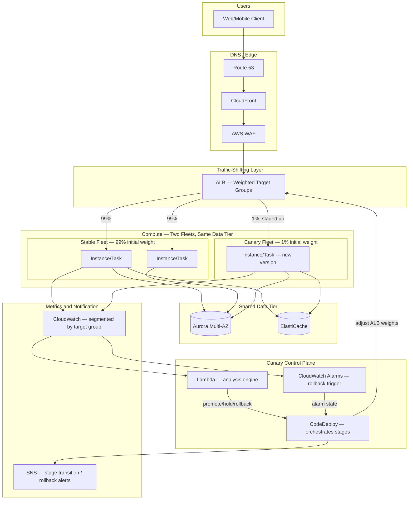
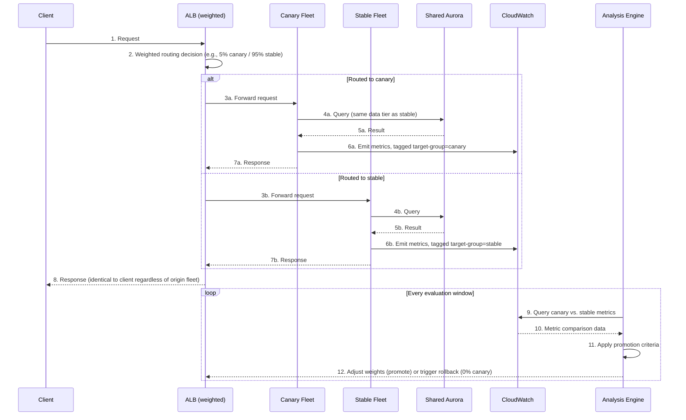
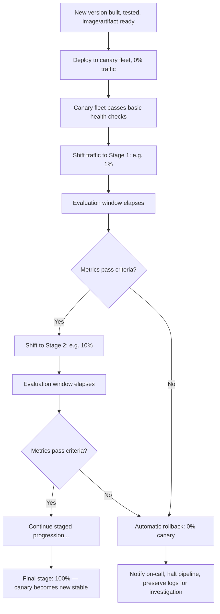

# Chapter 14 – Canary Infrastructure

> **Visual note:** This chapter uses Mermaid diagrams for architecture and sequence flows, and Markdown tables for comparisons, cost estimates, and checklists. All Terraform and CLI examples are written against provider `hashicorp/aws >= 5.0` and AWS CLI v2. Where this chapter uses a service already introduced in Chapter 2 ("AWS Building Blocks"), Chapter 6, Chapter 7, or Chapter 10, it re-explains that service briefly on first use so the chapter remains self-contained.

---

# 1 Executive Summary

Canary infrastructure solves a specific, narrow, and expensive problem: how does an organization ship a change to production without betting the entire user base on it being correct the first time?

Chapter 6 of this book covered blue-green deployment — an all-or-nothing traffic cutover between two full environments. Canary infrastructure is a different, complementary release strategy.

Instead of an instant cutover, a canary release exposes a new version to a small, controlled slice of real production traffic first. Only after that slice proves healthy does traffic shift further, in stages, toward full rollout.

**The business problem.**

Every production deployment carries risk. Testing environments, however thorough, cannot fully replicate:

- Real production data shapes and edge cases
- Actual concurrent user behavior at scale
- Integration quirks with live third-party dependencies
- Subtle performance regressions only visible under real load

A blue-green deployment (Chapter 6) catches these problems — but only after the *entire* traffic pool has already shifted to the new version. The blast radius, when something goes wrong, is 100% of users, for however long detection and rollback take.

Canary infrastructure exists to shrink that blast radius deliberately, before the organization has committed to full rollout.

**The architecture objective.**

This chapter's objective is precise, automated, and reversible traffic shifting:

- Route a small, defined percentage of production traffic to a new version
- Continuously evaluate that version's health against explicit, automated criteria
- Increase traffic in controlled stages only when those criteria are met
- Automatically roll back the instant a stage's criteria are violated
- Do all of this without the deploying engineer needing to babysit a dashboard

The distinction from blue-green matters: blue-green asks "is the new version healthy enough to take 100% of traffic right now?" Canary asks "is the new version healthy enough to take 1% of traffic right now — and then 5%, and then 25%?" Canary buys time and data before the expensive, harder-to-reverse full commitment.

**Why organizations adopt this architecture.**

Three forces drive canary adoption specifically, beyond the general deployment-safety motivations covered in Chapter 6:

1. **High-consequence traffic.** Organizations where even a few minutes of full-traffic exposure to a bad deploy is unacceptable — payment processing, healthcare systems, anything with a hard SLA penalty — need a release mechanism with a smaller first exposure than blue-green provides.
2. **High deployment frequency.** Organizations deploying many times per day (a common outcome of mature CI/CD, covered in Chapter 2 and 6) accumulate risk with every release. Canary analysis, done well, is what makes frequent deployment *safer* rather than riskier, by catching regressions on a small slice before they compound.
3. **Regulatory or contractual change-control requirements.** Some enterprises — financial services and healthcare especially — are required to demonstrate a documented, evidence-based promotion process for production changes. Canary analysis produces exactly that evidence: a recorded, metric-backed decision at each traffic stage.

**Major business benefits.**

- **Reduced blast radius.** A bad deploy affects 1-5% of traffic, not 100%, during the window before automated rollback triggers.
- **Faster, more confident detection.** Canary analysis compares the new version's metrics directly against a control group serving the same traffic conditions at the same time — a cleaner signal than comparing against yesterday's baseline.
- **Automated, unemotional rollback decisions.** The decision to roll back is made by a metrics threshold, not by an engineer weighing whether a concerning-but-ambiguous metric justifies the disruption of a full rollback.
- **Evidence trail for change management.** Every promotion decision (1% → 10% → 50% → 100%) is backed by a recorded metrics comparison — directly useful for the compliance evidence needs described above.
- **Faster overall release velocity, paradoxically.** Because canary analysis catches problems early and automatically, teams can deploy more often with less manual pre-release verification overhead, since the safety net is now structural rather than procedural.

**Typical enterprise scenarios.**

- A payments or checkout API where even a brief full-traffic outage has direct, measurable revenue impact.
- A high-traffic public API platform where API consumers (internal or external/partner) are sensitive to latency regressions that a small-scale test environment wouldn't reveal.
- A mobile or web backend serving a large, heterogeneous user base where "it works on staging" has repeatedly failed to predict production behavior.
- Any Chapter 6 or Chapter 7 architecture's application tier, once deployment frequency and traffic-criticality have grown to the point that blue-green's instant, all-or-nothing cutover is no longer an acceptable risk profile.

Canary infrastructure is not a replacement for blue-green deployment — it is frequently layered *on top of* it. A canary stage validates a new version on a small slice of traffic; once that canary stage passes, the promotion to 100% can still use blue-green's fast, clean cutover mechanics. Section 28 discusses this composition explicitly.

---

# 2 Business Requirements

## Business Drivers

| Driver | Description |
|---|---|
| Blast radius reduction | Limit the user population exposed to a bad deploy before it's caught |
| Deployment frequency support | Make frequent releases safer, not riskier, as CI/CD maturity increases |
| Regulatory change evidence | Produce an auditable, metrics-backed record of each promotion decision |
| Reduced manual verification overhead | Replace ad hoc "does it look okay" checks with automated, objective criteria |

## Functional Requirements

- Route a configurable percentage of production traffic to a canary version.
- Compare canary metrics against a control group (the stable version) serving comparable traffic, concurrently.
- Automatically promote traffic in stages when defined health criteria are met.
- Automatically roll back to 0% canary traffic when criteria are violated.
- Preserve full audit history of every stage transition and the metrics behind each decision.
- Support both automated (metrics-driven) and manual (human-approved) promotion gates, depending on the specific service's risk tier.

## Non-Functional Requirements

| Category | Requirement |
|---|---|
| Detection speed | Canary analysis must detect a significant regression within minutes, not hours |
| Traffic-shifting granularity | Support percentage increments as fine as 1% for the highest-risk services |
| Rollback speed | Rollback to 0% canary traffic must complete in under 60 seconds |
| Metric fidelity | Canary and control groups must be compared using statistically comparable sample sizes and time windows |
| Auditability | Every stage transition decision must be logged with the metrics that drove it |

## Scalability Goals

- Support canary analysis at both low-traffic services (where statistical significance takes longer to reach) and high-traffic services (where a 1% canary slice is still a meaningful, statistically significant sample).
- Scale the canary mechanism itself across many independently-deployed services without per-service bespoke tooling — a shared, reusable canary pipeline (Section 18) rather than a hand-built one-off per team.

## Availability Requirements

Canary infrastructure inherits the availability target of the underlying workload (Tier 1, 99.95%, per Chapter 6's framework) — but adds a distinct, additional guarantee:

- The canary *mechanism itself* (traffic splitting, metrics evaluation, rollback triggering) must not become a single point of failure for the deployment pipeline.
- A failure in the canary analysis system should fail safe — defaulting to "do not promote" and "hold at current traffic split" rather than either stalling indefinitely or promoting blindly.

## Latency Requirements

- Canary traffic routing itself should add negligible latency overhead (single-digit milliseconds) relative to the standard request path.
- Metrics evaluation latency (the time between a canary request completing and that data point being reflected in the promotion decision) should be under 1-2 minutes for near-real-time rollback capability.

## Compliance Requirements

- SOC 2 and PCI-DSS change-management criteria are directly satisfied by canary infrastructure's automatic, metrics-backed promotion audit trail.
- Financial services and healthcare organizations frequently require a documented, evidence-based change-approval process — canary analysis logs (Section 22) serve as that evidence directly, often more completely than a manual sign-off process would.

## Security Expectations

- Canary and stable versions must be equally subject to every security control described in Chapters 6, 7, and 10 (encryption, IAM scoping, network segmentation, no bastion access) — a canary version is production, not a lesser-scrutinized staging environment.
- The canary control plane (whichever mechanism does the traffic splitting and promotion decisions) must itself be governed by least-privilege IAM, since it has the power to shift production traffic and trigger rollbacks.

## Recovery Objectives

| Objective | Target |
|---|---|
| RPO | Inherits the underlying workload's RPO (Chapter 6) — canary deployment does not change data-tier recovery characteristics |
| RTO — canary rollback | Under 60 seconds from criteria violation to 0% canary traffic |
| RTO — canary mechanism failure | Under 5 minutes to fail safe (hold current split, alert on-call) |

## SLAs

- Internal SLA: a canary stage's health evaluation completes and a promote/hold/rollback decision is made within a defined evaluation window (commonly 10-30 minutes per stage, tunable per service risk tier).
- External customer SLA is unaffected by canary deployment itself — the entire mechanism exists specifically to protect it.

## Expected Workload and Growth

- A representative enterprise deployment: dozens to hundreds of services, each deploying multiple times per week to multiple times per day, each requiring canary analysis at a cadence proportional to deployment frequency.
- Canary infrastructure's own resource footprint (traffic-splitting rules, metrics evaluation compute) scales with deployment *frequency*, not with production traffic volume directly — a distinct growth driver from the workload scaling concerns in Chapters 6 and 7.

---

# 3 Architecture Overview

## Overall Design Philosophy

This architecture is built around one core loop, repeated at every traffic stage:

1. **Shift** a defined percentage of traffic to the canary version.
2. **Observe** canary metrics against a control group, for a defined evaluation window.
3. **Decide** — promote to the next stage, hold and re-evaluate, or roll back to 0%.
4. **Repeat** until either full rollout (100%) or rollback (0%).

Every step in that loop should be automatable. Human judgment still has a place — particularly for the highest-risk services or the final promotion to 100% — but the default path should require no manual intervention for a healthy deployment to reach full rollout.

## Core Components

- **Traffic-shifting layer.** ALB weighted target groups (simplest, this chapter's reference implementation), or a service mesh / API Gateway canary routing feature for finer-grained, header-based, or session-sticky canary routing.
- **Canary and stable compute fleets.** Two parallel, independently-scaled Auto Scaling Groups or ECS services — the canary fleet running the new version, the stable fleet running the current production version.
- **Metrics pipeline.** CloudWatch metrics (standard ALB/application metrics) plus, ideally, custom application-level metrics specific to the service's actual business-relevant health signals.
- **Canary analysis engine.** The component evaluating canary metrics against control metrics and making the promote/hold/rollback decision — this chapter presents both a native AWS (CodeDeploy-based) implementation and a more sophisticated custom/open-source (Kayenta-style) implementation.
- **Deployment orchestrator.** AWS CodeDeploy (native, simpler) or a CI/CD pipeline orchestrating the stage-by-stage traffic shifts and analysis engine calls directly (Section 18, 20).

## How Components Interact

- The deployment orchestrator deploys the new version to the canary fleet (0% traffic initially).
- The orchestrator instructs the traffic-shifting layer to route the first stage's percentage (e.g., 1%) to the canary fleet.
- The metrics pipeline continuously collects metrics from both fleets.
- After the evaluation window elapses, the canary analysis engine compares canary vs. control metrics against defined thresholds.
- The orchestrator receives the decision and either shifts more traffic (next stage), holds (re-evaluate), or rolls back (0% canary traffic, stable fleet serves 100%).
- On successful full rollout, the canary fleet becomes the new stable fleet (or, in a blue-green-composed model, a final clean cutover replaces the stable fleet entirely — Section 28).

## High-Level Workflow

**Request lifecycle:** A client request reaches the traffic-shifting layer exactly as in Chapter 6's request flow, with one addition — the layer's routing decision now includes a weighted split between the canary and stable target groups, determined by the current stage's traffic percentage.

**Response lifecycle:** Identical to Chapter 6 from the client's perspective — canary routing is invisible to the end user. The response's origin (canary or stable) is tagged in logs/metrics for the analysis engine's use, not exposed to the client.

**Data lifecycle:** Canary and stable fleets typically share the same data tier (same Aurora cluster, same ElastiCache) — this is a deliberate, important architectural choice discussed in depth in Section 6, since a canary version with its own isolated data tier would not be testing against real production data conditions, defeating much of the purpose of canary analysis in the first place.

---

# 4 AWS Services Used

## AWS CodeDeploy

**Purpose:** Native AWS deployment orchestration supporting canary and linear traffic-shifting patterns for EC2/ASG, ECS, and Lambda deployments, with built-in CloudWatch alarm-based rollback triggers.

**Why selected:** CodeDeploy is the lowest-friction way to implement canary deployment for organizations already using AWS-native compute (EC2 Auto Scaling or ECS, per Chapters 6 and 7) — it requires no additional third-party tooling and integrates directly with ALB target groups and CloudWatch alarms.

**Alternatives:**

- A service mesh (App Mesh, or a self-managed Istio/Linkerd on EKS) — better suited for finer-grained canary routing (header-based, percentage-of-specific-user-segments) in a microservices environment with many services needing consistent canary tooling.
- A custom canary analysis engine (e.g., an open-source tool like Kayenta, or a bespoke Lambda-based evaluator) — appropriate when CodeDeploy's threshold-based CloudWatch alarm model isn't sophisticated enough (Section 28 covers this trade-off in depth).

**Limitations:**

- CodeDeploy's canary/linear deployment configurations support a fixed set of traffic-shifting patterns (e.g., "10% then remainder after 10 minutes") rather than fully arbitrary, dynamically-decided stage sequences.
- Its native rollback trigger is CloudWatch alarm state, which is simple and reliable but less statistically rigorous than a dedicated canary analysis engine's comparative metrics evaluation (Section 28).

**Pricing considerations:** CodeDeploy itself carries no additional charge for EC2/ECS deployments (Lambda deployments do have a small per-update charge) — the cost of this architecture is almost entirely the doubled compute footprint during the canary evaluation window (running both canary and stable fleets simultaneously), not the orchestration tooling itself.

**Best practices:** Define CloudWatch alarms specifically for rollback triggering (distinct from general operational alarms) with thresholds tuned tighter than a standard production alarm, since a canary rollback should trigger on an earlier, smaller signal than a full-scale incident alarm would.

## Application Load Balancer (Weighted Target Groups)

**Purpose:** The traffic-shifting mechanism for this chapter's reference implementation — an ALB listener rule with two weighted target groups (canary and stable), where the weight ratio determines the traffic split.

**Why selected:** Already established as this book's default HTTP(S) load-balancing layer (Chapters 6 and 7); weighted target groups require no additional infrastructure beyond adjusting existing ALB configuration, making this the simplest, most broadly applicable canary traffic-shifting mechanism for organizations already on this book's reference architectures.

**Limitations:** ALB weighted routing is percentage-based across all traffic, not natively session-sticky or user-segment-aware — a user's requests can land on canary for one request and stable for the next, which is acceptable for most stateless services (Chapter 6's design) but worth confirming against the specific service's requirements before relying on it for a scenario needing consistent per-user canary exposure.

## Amazon EC2 / ECS Fargate (Canary and Stable Fleets)

**Purpose:** The compute running each version — identical in nature to Chapters 6 and 7's compute tiers, with the specific addition here of running two fleets (canary and stable) simultaneously during the evaluation window.

**Why selected/covered here:** No new compute service is introduced — this chapter's specific concern is the *sizing and lifecycle* of the canary fleet relative to the stable fleet, covered in Section 14.

## Amazon CloudWatch (Metrics, Alarms, Anomaly Detection)

**Purpose:** The metrics pipeline this architecture's canary analysis is built on — standard ALB/application metrics segmented by target group (canary vs. stable), plus CloudWatch Alarms as CodeDeploy's native rollback trigger.

**Why selected:** Already this book's default metrics platform (Chapters 2, 6, 7); this chapter's specific addition is CloudWatch's **Anomaly Detection** feature, which can model a metric's expected range based on historical patterns — useful for canary analysis because it accounts for normal, expected variance (e.g., time-of-day traffic patterns) rather than a single static threshold that might be wrong for the specific hour a canary happens to run.

**Best practices:** Tag/dimension every relevant metric by target group (canary/stable) from the start — retrofitting this dimension after a canary architecture is already built is a common, avoidable rework item (Section 34).

## AWS Lambda

**Purpose:** Frequently used to implement the canary analysis engine's decision logic itself — a scheduled or event-triggered function that queries CloudWatch metrics for both fleets, applies the comparison logic, and calls the CodeDeploy API (or a custom orchestrator) with a promote/hold/rollback decision.

**Why selected:** A natural fit for this specific, event-driven, relatively lightweight computation — no need for always-on compute to run periodic metric comparisons.

## Amazon SNS / EventBridge

**Purpose:** Notification of stage transitions and rollback events to on-call/deployment channels (Slack, PagerDuty via SNS) and, via EventBridge, triggering downstream automation (e.g., automatically opening an incident ticket on rollback).

## IAM, KMS, Secrets Manager, VPC, GuardDuty, Config, CloudTrail

Covered in depth in Chapters 2, 6, 7, and 10; this chapter's specific application is scoping the canary orchestrator's IAM permissions narrowly (Section 10) given its ability to shift production traffic and trigger deployments — a specific, high-consequence permission set deserving the same rigor as any other production-traffic-controlling component in this book.

## Traffic-Shifting Mechanism Decision Matrix

| Factor | ALB Weighted Target Groups (this chapter's reference) | Service Mesh (App Mesh/Istio) | API Gateway Canary | DNS-based (Route 53 weighted) |
|---|---|---|---|---|
| Granularity | Percentage-based, all traffic | Percentage + header/attribute-based | Percentage-based, per-stage/deployment | Percentage-based, DNS-resolution-time |
| Session stickiness | Not native | Native support | Limited | Not applicable (DNS-level) |
| Setup complexity | Low | High (requires mesh adoption) | Low-Medium | Low |
| Best fit | Chapter 6/7-style ALB-fronted services | Microservices environments already on a mesh | Lambda/API Gateway-based services | Cross-region or DNS-level traffic shifting, coarser-grained |
| Rollback speed | Seconds (weight change) | Seconds | Seconds | Minutes (DNS TTL/propagation dependent) |

---

# 5 Complete Architecture Diagram



**Diagram interpretation:** Both fleets write to the *same* Aurora cluster and ElastiCache — this is deliberate (Section 3, Section 6) and is what makes canary analysis meaningful: the canary version is tested against real production data and real concurrent load, not an isolated copy. The canary control plane (CodeDeploy, Lambda analysis engine, CloudWatch alarms) is the component this chapter adds on top of Chapter 6's architecture — everything else is the same Multi-AZ pattern already established.

---

# 6 Component-by-Component Explanation

| Component | Purpose | Scaling | High Availability | Failure Handling | Dependencies |
|---|---|---|---|---|---|
| ALB weighted target groups | Splits traffic by percentage between canary and stable | Automatic | Multi-AZ (Chapter 6) | Target-level health checks per fleet, independent of the other fleet | Canary and stable target groups |
| Stable fleet | Serves the majority of traffic during canary evaluation | Standard Auto Scaling (Chapter 6) | Multi-AZ | Unaffected by canary fleet issues — isolated failure domain | ALB, data tier |
| Canary fleet | Serves the evaluation slice of traffic | Sized deliberately smaller during evaluation (Section 14) | Multi-AZ (even at small scale — a single-AZ canary is a design gap) | Unhealthy canary targets are simply removed from the small canary pool; doesn't affect stable fleet | ALB, data tier |
| CodeDeploy | Orchestrates stage progression, adjusts ALB weights | N/A (managed) | AWS-managed | Fails safe — halts progression if it loses connectivity or receives a rollback signal | ALB, CloudWatch Alarms, IAM |
| Lambda analysis engine | Compares canary vs. stable metrics, issues promote/hold/rollback decisions | Automatic, per-invocation | Multi-AZ (Lambda's default) | On error, should default to "hold" (fail safe), never "promote" | CloudWatch, CodeDeploy API, IAM |
| CloudWatch Alarms (rollback trigger) | Simple, fast threshold-based automatic rollback signal | N/A (managed) | Regional, highly durable | Alarm state directly triggers CodeDeploy rollback | CloudWatch metrics from both fleets |
| Shared data tier (Aurora, ElastiCache) | Provides real production data conditions for canary testing | Identical to Chapter 6 | Identical to Chapter 6 | Identical to Chapter 6 — no canary-specific change | Both fleets as clients |

---

# 7 End-to-End Request Flow



**Step-by-step narrative:**

- Steps 1-8 are invisible to the client — canary routing changes *which fleet* serves a request, never the response contract itself.
- Step 6a/6b's target-group tagging is the single most important implementation detail in this entire flow: without it, canary and stable metrics can't be compared at all, and the whole architecture has no signal to act on.
- Steps 9-12 run on a fixed cadence (the evaluation window from Section 2), independent of individual request flow — this is the decision loop described in Section 3, running continuously until the canary reaches 100% or is rolled back to 0%.

---

# 8 Deployment Flow

## Infrastructure Provisioning

Canary infrastructure is provisioned as an extension of Chapter 6/7's existing compute and load-balancer Terraform:

- A second target group (canary) is added alongside the existing stable target group.
- The ALB listener rule is updated to a weighted-forward action across both target groups.
- CodeDeploy application and deployment group resources are added, referencing both target groups.
- CloudWatch Alarms specific to rollback triggering are defined.

## Canary Deployment Workflow



## Terraform and CI/CD Workflow

- Identical `plan`/review/`apply` pipeline to every prior chapter for the *infrastructure* (target groups, CodeDeploy resources, alarms).
- The *application deployment* itself (a new version reaching the canary fleet) runs through a separate CI/CD pipeline stage that calls CodeDeploy's `create-deployment` API — this is the pipeline stage this chapter's Section 20 covers in depth.

## Composing with Blue-Green (Chapter 6)

- A common, mature pattern: use canary staging (1% → 10% → 50%) to validate the new version under real traffic, then execute the *final* cutover to 100% using blue-green's clean, instant mechanics rather than a final small percentage increment.
- This gets the best of both: canary's small initial blast radius, and blue-green's fast, complete, easily-reversible final cutover.

## Rollback

- **Automatic rollback** (the default, primary path): a CloudWatch Alarm breach or a Lambda analysis engine's "rollback" decision immediately sets canary weight to 0%.
- **Manual rollback**: an on-call engineer can trigger the same 0%-weight action directly via CodeDeploy or the AWS CLI (Section 19), for cases where a human notices a problem the automated criteria didn't catch.
- Rollback speed target: under 60 seconds (Section 2) — this is an ALB weight change, not a redeploy, and should be treated as such in the implementation (never require a new deployment cycle to "roll back" from canary; it should be a routing change only).

## Secrets and Configuration

- Canary and stable fleets share the same Secrets Manager-sourced credentials (Chapter 6, Section 8) — there is no canary-specific secret, since both fleets access the same data tier with the same application identity.
- Configuration that *does* differ between canary and stable (e.g., a feature flag the new version introduces) should be managed via the application's own configuration/feature-flag system, not via separate infrastructure-level secrets.

## Validation

- Before shifting any traffic to a canary fleet, validate its own basic health independently (ALB health checks passing, `describe-instance-information`/target health confirming readiness) — a canary fleet that's already unhealthy before receiving traffic should never proceed to Stage 1.
- Post-rollback validation: confirm 0% canary traffic is actually reflected in real request routing (not just the CodeDeploy state), since a rollback that updates orchestration state but not the actual ALB weights leaves users still exposed to the bad version.

---

# 9 Network Topology

## No New Network Topology Required

This architecture, notably, requires **no changes** to the VPC, subnet, or route-table design from Chapters 6 and 7:

- Canary and stable fleets live in the *same* private application subnets as any standard Chapter 6/7 deployment.
- They share the *same* security groups (both are the same application, just different versions) — a canary fleet does not need a distinct security posture from the stable fleet it's validating against.
- The only network-layer change is at the ALB listener/target-group level (Section 4), not at the VPC/subnet/routing level.

## Why This Matters

- Keeping canary and stable fleets network-topology-identical is itself a validation principle: if the canary fleet needed *different* network rules to function, that's a sign the deployment isn't a clean version-only change, and the canary test's validity is compromised.
- This also means canary infrastructure composes cleanly with Chapter 7's three-tier segmentation — a canary deployment of the *application tier* still respects the same internal-ALB-only reachability from the presentation tier, with no new path introduced.

## Security Groups — No Change

| Security Group | Canary Fleet | Stable Fleet |
|---|---|---|
| Application tier SG | Same rules as stable | Same rules as canary |
| Data tier SG | Same — canary and stable both connect via the same application-tier SG reference | Same |

> **Note:** If a canary version genuinely requires a new outbound dependency (a new third-party API, for instance) that the stable version doesn't have, that *is* a legitimate security group change — but it should be reviewed with the same rigor as any other security group change (Chapter 6/7's elevated review process), not slipped in as "just part of the canary deployment."

## Multi-Region Considerations

- For a multi-region architecture (a later chapter in this book), canary deployment is typically scoped **per region** — validate in one region first, then roll the same validated version out to other regions, rather than canary-testing simultaneously across all regions at once.
- This gives an additional layer of blast-radius reduction: even a canary rollback failure in one region doesn't affect other regions' stability.

---

# 10 Identity and Access

## IAM Roles for This Architecture's Components

| Role | Attached To | Key Permissions |
|---|---|---|
| Canary/stable fleet instance role | Compute (identical to Chapter 6) | Same as any standard application-tier role — no canary-specific permissions needed on the compute side |
| CodeDeploy service role | CodeDeploy | Permission to modify the specific ALB's target group weights, read CloudWatch Alarms, manage the specific Auto Scaling Groups/ECS services involved |
| Analysis engine (Lambda) role | Lambda function | Read-only CloudWatch metrics access; permission to call CodeDeploy's deployment-control API (promote/stop) — nothing else |
| CI/CD pipeline role | CI/CD system | Permission to call `create-deployment`, read deployment status — scoped to the specific application/deployment group, not account-wide CodeDeploy access |

## Least Privilege for the Canary Control Plane

- The analysis engine's Lambda role is a specific, high-consequence permission set: it can effectively control production traffic routing.
- Scope it narrowly: read access to *only* the specific CloudWatch metrics/namespaces relevant to canary analysis, and write access to *only* the specific CodeDeploy deployment group's control actions — never broader CloudWatch or CodeDeploy account-wide access.

```json

{
  "Version": "2012-10-17",
  "Statement": [
    {
      "Sid": "ReadCanaryMetricsOnly",
      "Effect": "Allow",
      "Action": ["cloudwatch:GetMetricData", "cloudwatch:GetMetricStatistics"],
      "Resource": "*",
      "Condition": {
        "StringEquals": { "cloudwatch:namespace": "AcmeApp/CanaryAnalysis" }
      }
    },
    {
      "Sid": "ControlSpecificDeploymentOnly",
      "Effect": "Allow",
      "Action": [
        "codedeploy:GetDeployment",
        "codedeploy:ContinueDeployment",
        "codedeploy:StopDeployment"
      ],
      "Resource": "arn:aws:codedeploy:us-east-1:123456789012:deploymentgroup:acme-webapp/acme-webapp-canary-dg"
    }
  ]
}

```

## Cross-Account Considerations

- Consistent with prior chapters: in a multi-account structure, the CI/CD pipeline in a tooling account assumes a scoped deployment role in the target workload account — the canary-specific addition is that this role's permissions should be scoped to *initiate and monitor* deployments, with the actual promote/rollback decision authority resting with the analysis engine's more narrowly-scoped role, not the broader pipeline role.

## Permission Boundaries

- A permission boundary on the analysis engine's role, capping its maximum possible permissions regardless of future policy changes, is a strong defense-in-depth control here — this is a role whose entire purpose is to make automated, unattended decisions affecting production traffic, and it deserves the same boundary discipline Chapter 7 applied to its presentation-tier role.

---

# 11 Security Architecture

## Encryption, TLS, WAF, Shield

- No changes from Chapter 6/7's baseline — canary and stable fleets are both production and receive identical treatment: KMS encryption at rest, TLS 1.2+ enforced, WAF/Shield applied at the shared ALB/CloudFront layer ahead of both fleets equally.

## The Canary Control Plane as a Security-Relevant Component

- This chapter introduces a genuinely new security consideration relative to Chapters 6, 7, and 10: **an automated system with the authority to shift production traffic and trigger deployments.**
- This deserves the same threat-model attention this book has applied to every other production-traffic-controlling component.

## Threat Model for This Architecture

| Attack Vector | Specific Relevance | Mitigation |
|---|---|---|
| Compromised analysis engine credentials | Could be used to force a malicious promotion (shift 100% traffic to a compromised canary version) | Narrow IAM scoping (Section 10), permission boundary, MFA on any human-accessible path to modify the analysis engine |
| Malicious or buggy analysis logic | A flawed comparison algorithm could promote a genuinely bad version | Code review for the analysis engine's decision logic with the same rigor as production application code; fail-safe defaults (hold, not promote, on any uncertainty) |
| Canary fleet as a smaller, potentially under-monitored attack surface | A canary fleet, if deployed with less security scrutiny "because it's small and temporary," becomes a weaker link | Enforce identical security posture on canary and stable fleets (Section 2's explicit requirement) |
| Rollback mechanism failure/tampering | If rollback itself can be disabled or delayed, the entire safety mechanism is defeated | Monitor and alarm on the rollback mechanism's own health (Section 21); protect the CloudWatch Alarms and CodeDeploy configuration with the same change-management rigor as any other critical control |

## GuardDuty, Config, CloudTrail

- CloudTrail records every CodeDeploy API call (deployment creation, stage transitions, rollback triggers) — this audit trail is *itself* the compliance evidence described in Section 2, and should be retained per the applicable compliance schedule.
- An AWS Config rule (consistent with Chapter 7's segmentation-validation pattern) can validate that the canary fleet's security group configuration has not drifted from the stable fleet's — catching exactly the "canary got a weaker security posture" risk flagged above.

## Zero Trust Applied to This Architecture

- No implicit trust is extended to the canary fleet merely because it's "new" or "temporary" — it authenticates to the data tier with the same IAM-scoped identity, passes through the same WAF, and is subject to the same monitoring as the stable fleet.
- The canary control plane itself follows Zero Trust identity-based authorization (Section 10) rather than any network-location-based trust.

---

# 12 High Availability

## Two Independent, Small-Scale HA Concerns

This chapter introduces a distinct HA question beyond Chapter 6's general AZ/instance-failure handling: **is the canary fleet itself, despite being small, still resilient enough not to produce a false-negative signal?**

- A canary fleet with only a single instance in a single AZ risks conflating "this version has a bug" with "this instance/AZ had an unrelated blip" — the canary analysis engine can't distinguish the two if the canary fleet isn't itself Multi-AZ.
- **Recommendation:** even at 1% traffic, the canary fleet should span at least two AZs, with enough instances that a single instance failure doesn't invalidate an entire evaluation window's data.

## AZ and Instance Failures

- Identical mechanics to Chapter 6 for both fleets independently — an AZ failure affecting the stable fleet is handled by that fleet's own Auto Scaling/ALB health checks, completely independent of the canary fleet's state, and vice versa.
- This independence is a feature: a canary fleet issue should never cascade into a stable fleet issue, since they are separate, if same-application, deployments.

## Database and Cache Failures

- Both fleets share the same data tier (Section 6), so a data-tier failure (Aurora failover, per Chapter 6, Section 12) affects both fleets simultaneously and identically.
- This is expected and correct — it means a canary analysis window that happens to span a database failover event will show *both* canary and stable metrics degrading together, which the analysis engine should be designed to recognize as "not canary-specific" (Section 34's Production Pitfalls covers this failure mode explicitly).

## Load Balancing and Health Checks

- Canary and stable target groups have independent health checks — an unhealthy canary instance is removed from the canary pool without affecting the stable target group at all.
- Given the canary fleet's small size, a single unhealthy instance represents a much larger percentage of *that* fleet's capacity than the same single-instance loss would for the larger stable fleet — size the canary fleet's minimum instance count with this in mind (Section 14).

## Canary Control Plane Availability

- CodeDeploy and Lambda are both AWS-managed, multi-AZ services — no customer-side HA design is needed for the control plane itself.
- The relevant availability question is: what happens if the control plane is *unavailable* mid-evaluation? The answer should always be "the current traffic split holds, unchanged" — never "traffic defaults to 100% canary" or "traffic defaults to 0% stable." Section 13 covers this fail-safe requirement further.

---

# 13 Disaster Recovery

## DR Scope for This Architecture

Canary infrastructure does not introduce new data to protect and does not change Chapter 6's data-tier DR posture. This section instead addresses **failure of the canary mechanism itself**, distinct from workload DR.

## Fail-Safe Behavior Requirements

- **Analysis engine failure:** hold current traffic split, alert on-call — never promote, never roll back on a whim of missing data.
- **CodeDeploy service disruption:** the ALB weight configuration should remain at its last-set value; a stalled deployment is a safer failure mode than an unintended, orchestrator-less weight change.
- **Metrics pipeline failure (CloudWatch data gap):** the analysis engine should treat missing data as inconclusive — hold, not promote — since promoting without evidence defeats the entire point of this architecture.

## Backup Strategy

- No canary-specific backup strategy is needed beyond Chapter 6's data-tier backups — the canary fleet is stateless application compute, fully reproducible from the same CI/CD artifact that produced it.

## RPO/RTO for This Pattern

| Scenario | RPO | RTO |
|---|---|---|
| Canary rollback (criteria violated) | N/A (no data) | Under 60 seconds (Section 2) |
| Analysis engine failure | N/A | Fails safe immediately (hold); human intervention resumes progression once fixed |
| Full regional failure | Inherits Chapter 6's regional DR RTO/RPO | Canary deployments should be paused/not initiated during an active regional DR event |

## Testing

- Include a deliberate "inject a bad canary version in staging" test as part of the regular DR/chaos testing cadence established in Chapters 6 and 7 — verifying the rollback mechanism actually triggers correctly and within the RTO target, not just trusting that the CloudWatch Alarm configuration is theoretically correct.
- Also test the fail-safe path explicitly: simulate the analysis engine being unreachable mid-evaluation, and confirm the traffic split holds rather than drifting to an unintended state.

---

# 14 Scalability

## Canary Fleet Sizing — A Distinct Design Question

Unlike Chapters 6/7's scaling concerns (driven by customer traffic), this chapter introduces a sizing question with no direct analog: **how big should the canary fleet be, given it's only receiving a small percentage of traffic?**

Two competing considerations:

- **Too small:** a single-instance or two-instance canary fleet may not generate enough request volume, in the evaluation window, to reach statistical significance — a regression might exist but not show up clearly against normal request-to-request variance.
- **Too large:** an oversized canary fleet (matching the stable fleet's full capacity "just in case") wastes compute cost during every evaluation window, since it's only ever receiving a small traffic percentage.

**Practical guidance:**

- Size the canary fleet to comfortably handle its *current stage's* traffic percentage with normal Multi-AZ redundancy (Section 12) — not the full production load.
- For low-traffic services, consider a longer evaluation window (more time to accumulate a statistically meaningful sample) rather than an oversized canary fleet.
- For high-traffic services, even 1% can be a large enough absolute request volume to reach significance quickly — the canary fleet stays small, and evaluation windows can be short.

## Auto Scaling During Canary Stages

- The canary fleet should still Auto Scale within its stage's traffic bounds — a 1% canary receiving an unexpected spike (e.g., a broader traffic spike affecting the whole service) should scale up proportionally, not be starved of capacity simply because it's "just a canary."
- As traffic percentage increases stage-by-stage, the canary fleet's Auto Scaling Group's max capacity should scale correspondingly — this should be automated as part of the stage-transition logic, not a manual step an engineer might forget.

## Database and Cache Scaling

- No canary-specific scaling concern here — both fleets share the same data tier, sized for full production load per Chapter 6's guidance, regardless of the current canary traffic split.

## Queue/Async Scaling

- For services with an asynchronous, queue-based component (Chapter 2's messaging patterns), canary analysis of queue-consuming logic requires a specific design decision: does the canary version consume from the *same* queue as stable (with some messages processed by canary, some by stable — testing real concurrent behavior) or a separate, mirrored queue (cleaner isolation, but not testing real production consumption patterns)? Most mature implementations prefer the shared-queue model for the same reason canary fleets share a data tier — realism is the point.

---

# 15 Performance Optimization

## Canary Analysis Itself Should Not Degrade Performance

- Metrics emission (target-group tagging, Section 6) should add negligible overhead to the request path — this is standard CloudWatch metrics emission, not a new, heavier instrumentation layer.
- The analysis engine's evaluation cadence (Section 2) should be tuned so it doesn't itself become a bottleneck or a source of excessive CloudWatch API calls at scale (many services, each with frequent canary deployments, each polling metrics on a tight cadence) — batch and rate-limit the analysis engine's CloudWatch queries where the organization runs canary analysis across a large number of services simultaneously.

## Caching Considerations

- If the canary version changes cache key structure or serialization format, ensure canary and stable versions don't corrupt each other's cached data in the *shared* ElastiCache instance (Section 6) — this is a specific, easy-to-overlook risk unique to the shared-data-tier design this chapter recommends.
- **Mitigation:** version cache keys explicitly (e.g., include a schema/version identifier in the key) whenever a canary deployment changes anything about how data is cached, so canary and stable never silently read or overwrite each other's incompatible cache entries.

## Database Query Optimization

- Identical guidance to Chapter 6, Section 15 — with the specific addition that a canary version introducing a new or modified query should be watched closely for its impact on Aurora Performance Insights data *for the shared cluster*, since a canary's inefficient query can degrade database performance for the *stable* fleet's traffic too, given the shared data tier.

## Connection Pooling

- Both fleets draw from the same Aurora connection ceiling (Chapter 6, Section 15) — when sizing the canary fleet's connection pool, account for the fact that it's sharing headroom with the stable fleet's connections, not operating against an independent budget.

---

# 16 Cost Optimization (FinOps)

## The Core Cost Driver: Doubled Compute During Evaluation

Unlike most of this book's chapters, this architecture's primary cost driver is straightforward and singular: **running two compute fleets simultaneously during every deployment's evaluation window.**

- This cost is temporary (only during active canary evaluation, not continuously) and proportional to deployment frequency and evaluation window duration — not a permanent, doubled baseline cost.
- A service deploying once a week with a 30-minute total evaluation window incurs a very different cost profile than one deploying twenty times a day with hour-long windows per stage.

## Estimated Incremental Monthly Cost

| Deployment Frequency | Evaluation Window (total, all stages) | Approximate Additional Monthly Compute Cost |
|---|---|---|
| Weekly | 30 minutes | Negligible (a few dollars) |
| Daily | 1 hour | $20–80, depending on canary fleet size |
| Multiple times/day (5-10) | 1-2 hours per deployment | $150–600 |
| Continuous deployment (20+/day) | 30-60 minutes per deployment | $400–1,500 |

## Optimization Opportunities

- **Right-size the canary fleet to its current stage's traffic**, not the full stable fleet's capacity (Section 14) — this is the single largest lever, since an oversized canary fleet multiplies the "doubled compute" cost unnecessarily.
- **Minimize evaluation window duration** to the shortest period that still reaches statistical significance (Section 14) — a longer-than-necessary window extends the doubled-compute cost window for no additional safety benefit.
- **Use Spot Instances for the canary fleet specifically**, where the workload tolerates it — a canary fleet, being short-lived and load-balanced with graceful instance replacement already expected, is often a good Spot candidate even for a service whose *stable* fleet isn't.

## Major Cost Drivers Beyond Compute

- Lambda invocations for the analysis engine (typically negligible — well within Lambda's low-cost tier for this workload's invocation frequency).
- CloudWatch custom metrics, if the service emits many canary-specific custom metrics beyond the AWS-standard ones — worth reviewing at scale (many services × many custom metrics) per Chapter 2's general CloudWatch cost guidance.

## Tagging and Budget Configuration

- Tag canary fleet resources distinctly (`DeploymentRole=canary`) so their cost is visible and trackable separately from the stable fleet's steady-state cost in FinOps reporting — without this, canary compute cost is invisible, blended into the general compute line item, and the specific FinOps trade-off described above (fleet size vs. evaluation window duration) can't be evaluated with real data.

---

# 17 AI-Assisted Operations

## AI-Assisted Canary Analysis

- A Bedrock-backed tool, given canary vs. stable metrics for a completed evaluation window, can draft a plain-language summary of the comparison for a human reviewer — particularly useful for the highest-risk services where a human still reviews the automated decision before final approval, per Section 2's mixed automated/manual gate model.

## AI-Assisted Rollback Root-Cause Drafting

- On an automatic rollback, a Bedrock-backed tool can correlate the canary version's code diff (from the CI/CD pipeline) with the specific metrics that triggered rollback, drafting an initial hypothesis for the engineer investigating — a starting point for triage, not a substitute for the engineer's own investigation.

## AI-Generated Analysis Criteria

- Given a service's historical metrics distribution, a Bedrock-backed tool can help draft reasonable initial promotion thresholds (e.g., "error rate should not exceed X% above control, based on this service's typical variance") — a genuinely useful starting point for a team setting up canary analysis for a new service for the first time, subject to the same human review every AI-generated configuration in this book requires before being trusted in production.

## AI-Generated Terraform

- As in prior chapters: AI-assisted scaffolding of this chapter's CodeDeploy/target-group/alarm Terraform (Section 18) for a new service, following the established module pattern, subject to the same mandatory review pipeline — with particular attention to the analysis engine's IAM policy (Section 10), given its production-traffic-controlling authority.

---

# 18 Terraform Implementation

## CodeDeploy Canary Deployment Group Module

```hcl

# modules/canary_deployment/main.tf

resource "aws_codedeploy_app" "app" {
  name             = "${var.project_name}-${var.environment}"
  compute_platform = "Server" # or "ECS" for the Fargate variant
}

resource "aws_codedeploy_deployment_group" "canary" {
  app_name              = aws_codedeploy_app.app.name
  deployment_group_name = "${var.project_name}-${var.environment}-canary-dg"
  service_role_arn      = var.codedeploy_service_role_arn

  deployment_config_name = aws_codedeploy_deployment_config.canary.id

  auto_rollback_configuration {
    enabled = true
    events  = ["DEPLOYMENT_FAILURE", "DEPLOYMENT_STOP_ON_ALARM"]
  }

  alarm_configuration {
    alarms  = [var.error_rate_alarm_name, var.latency_alarm_name]
    enabled = true
  }

  load_balancer_info {
    target_group_pair_info {
      prod_traffic_route {
        listener_arns = [var.alb_listener_arn]
      }
      target_group {
        name = var.stable_target_group_name
      }
      target_group {
        name = var.canary_target_group_name
      }
    }
  }

  auto_scaling_groups = [var.stable_asg_name]
}

# Custom, fine-grained staged rollout — 1% -> 10% -> 25% -> 50% -> 100%,

# with a defined interval between each stage for evaluation.

resource "aws_codedeploy_deployment_config" "canary" {
  deployment_config_name = "${var.project_name}-${var.environment}-canary-config"
  compute_platform        = "Server"

  traffic_routing_config {
    type = "TimeBasedCanary"

    time_based_canary {
      interval   = var.stage_interval_minutes
      percentage = var.initial_canary_percentage
    }
  }
}

```

## Rollback Alarm Module

```hcl

# modules/canary_alarms/main.tf

resource "aws_cloudwatch_metric_alarm" "canary_error_rate" {
  alarm_name          = "${var.project_name}-${var.environment}-canary-error-rate"
  comparison_operator = "GreaterThanThreshold"
  evaluation_periods   = 2
  metric_name          = "HTTPCode_Target_5XX_Count"
  namespace             = "AWS/ApplicationELB"
  period                 = 60
  statistic              = "Sum"
  threshold               = var.canary_error_threshold

  dimensions = {
    TargetGroup  = var.canary_target_group_arn_suffix
    LoadBalancer = var.alb_arn_suffix
  }

  alarm_description = "Triggers automatic canary rollback on elevated 5xx rate"
  alarm_actions      = [var.codedeploy_stop_deployment_sns_topic_arn]
}

resource "aws_cloudwatch_metric_alarm" "canary_latency" {
  alarm_name          = "${var.project_name}-${var.environment}-canary-latency"
  comparison_operator = "GreaterThanThreshold"
  evaluation_periods   = 3
  metric_name          = "TargetResponseTime"
  namespace             = "AWS/ApplicationELB"
  period                 = 60
  statistic              = "p95"
  threshold               = var.canary_latency_threshold_seconds

  dimensions = {
    TargetGroup  = var.canary_target_group_arn_suffix
    LoadBalancer = var.alb_arn_suffix
  }

  alarm_description = "Triggers automatic canary rollback on elevated p95 latency vs. control"
  alarm_actions      = [var.codedeploy_stop_deployment_sns_topic_arn]
}

```

## Analysis Engine Lambda Module (Skeleton)

```hcl

# modules/canary_analysis_lambda/main.tf

resource "aws_lambda_function" "canary_analysis" {
  function_name = "${var.project_name}-${var.environment}-canary-analysis"
  role          = aws_iam_role.analysis_engine.arn
  runtime       = "python3.12"
  handler       = "analyze.handler"
  timeout       = 60
  filename      = var.lambda_package_path

  environment {
    variables = {
      CANARY_TARGET_GROUP = var.canary_target_group_arn_suffix
      STABLE_TARGET_GROUP  = var.stable_target_group_arn_suffix
      DEPLOYMENT_GROUP      = var.codedeploy_deployment_group_name
      ERROR_RATE_MAX_DELTA  = var.error_rate_max_delta_pct
      LATENCY_MAX_DELTA     = var.latency_max_delta_pct
    }
  }
}

resource "aws_cloudwatch_event_rule" "evaluation_schedule" {
  name                = "${var.project_name}-${var.environment}-canary-eval-schedule"
  schedule_expression = "rate(2 minutes)"
}

resource "aws_cloudwatch_event_target" "invoke_analysis" {
  rule = aws_cloudwatch_event_rule.evaluation_schedule.name
  arn  = aws_lambda_function.canary_analysis.arn
}

```

## Terraform Best Practices Applied Above

- **`auto_rollback_configuration` and `alarm_configuration` set together** — both the deployment-failure path and the metrics-alarm path trigger rollback, giving the architecture two independent, complementary safety nets rather than relying on a single trigger mechanism.
- **The custom `aws_codedeploy_deployment_config`** demonstrates a fully parameterized, multi-stage canary progression rather than CodeDeploy's simpler built-in presets — necessary for organizations wanting the finer-grained staging (1% → 10% → 25% → 50% → 100%) this chapter's earlier sections describe.
- **A dedicated SNS topic for `alarm_actions`**, feeding into CodeDeploy's stop-deployment action, decouples the alarm from the rollback mechanism directly — allowing the same topic to also drive human notifications (Section 4) without duplicating alarm configuration.
- **A scheduled EventBridge rule invoking the analysis Lambda** on a fixed cadence, rather than a purely event-driven trigger, gives predictable, bounded evaluation timing consistent with the SLA target from Section 2.

---

# 19 AWS CLI Examples

## Deployment and Validation

```bash

# Start a new canary deployment

aws deploy create-deployment \
  --application-name acme-webapp \
  --deployment-group-name acme-webapp-canary-dg \
  --revision '{"revisionType":"AppSpecContent","appSpecContent":{"content":"..."}}'

# Check current deployment status and stage

aws deploy get-deployment \
  --deployment-id d-XXXXXXXXX \
  --query 'deploymentInfo.{Status:status,Overview:deploymentOverview}'

# Check current ALB weight split between canary and stable target groups

aws elbv2 describe-rules \
  --listener-arn <listener-arn> \
  --query 'Rules[0].Actions[0].ForwardConfig.TargetGroups[].{TG:TargetGroupArn,Weight:Weight}'

```

## Monitoring

```bash

# Compare canary vs. stable 5xx error counts over the last 30 minutes

aws cloudwatch get-metric-data \
  --metric-data-queries '[
    {"Id":"canaryErr","MetricStat":{"Metric":{"Namespace":"AWS/ApplicationELB","MetricName":"HTTPCode_Target_5XX_Count","Dimensions":[{"Name":"TargetGroup","Value":"<canary-tg-suffix>"}]},"Period":60,"Stat":"Sum"}},
    {"Id":"stableErr","MetricStat":{"Metric":{"Namespace":"AWS/ApplicationELB","MetricName":"HTTPCode_Target_5XX_Count","Dimensions":[{"Name":"TargetGroup","Value":"<stable-tg-suffix>"}]},"Period":60,"Stat":"Sum"}}
  ]' \
  --start-time $(date -d '30 minutes ago' -Iseconds) --end-time $(date -Iseconds)

# Check alarm state for the rollback-triggering alarms

aws cloudwatch describe-alarms \
  --alarm-names acme-prod-canary-error-rate acme-prod-canary-latency \
  --query 'MetricAlarms[].{Name:AlarmName,State:StateValue}'

```

## Manual Intervention

```bash

# Manually promote to the next stage (bypass automated wait, if a human has reviewed and approved)

aws deploy continue-deployment \
  --deployment-id d-XXXXXXXXX \
  --deployment-wait-type READY_WAIT

# Manually trigger an immediate rollback

aws deploy stop-deployment \
  --deployment-id d-XXXXXXXXX \
  --auto-rollback-enabled

```

## Troubleshooting

```bash

# Get detailed deployment lifecycle event history for a specific deployment

aws deploy get-deployment \
  --deployment-id d-XXXXXXXXX \
  --query 'deploymentInfo.deploymentStatusMessages'

# Check target health independently for canary and stable target groups

aws elbv2 describe-target-health --target-group-arn <canary-tg-arn>
aws elbv2 describe-target-health --target-group-arn <stable-tg-arn>

```

## Cleanup

```bash

# List completed/stopped deployments older than a retention threshold, for cleanup of associated artifacts

aws deploy list-deployments \
  --application-name acme-webapp \
  --include-only-statuses Stopped Failed \
  --create-time-range start=$(date -d '90 days ago' -Iseconds)

```

---

# 20 CI/CD Integration

## Pipeline Stage for Canary Deployment

```yaml

name: Canary Deploy

on:
  push:
    branches: [main]

jobs:
  build-test-scan:
    runs-on: ubuntu-latest
    steps:
      - uses: actions/checkout@v4
      - run: make test
      - run: make lint
      - run: make build

  deploy-canary:
    runs-on: ubuntu-latest
    needs: build-test-scan
    environment: production
    steps:
      - name: Start canary deployment
        id: deploy
        run: |
          DEPLOYMENT_ID=$(aws deploy create-deployment \
            --application-name acme-webapp \
            --deployment-group-name acme-webapp-canary-dg \
            --revision '{"revisionType":"AppSpecContent","appSpecContent":{"content":"${{ steps.build.outputs.appspec }}"}}' \
            --query 'deploymentId' --output text)
          echo "deployment_id=$DEPLOYMENT_ID" >> "$GITHUB_OUTPUT"

      - name: Wait for canary progression (or failure/rollback)
        run: |
          aws deploy wait deployment-successful --deployment-id ${{ steps.deploy.outputs.deployment_id }}

      - name: Notify on rollback
        if: failure()
        run: |
          aws sns publish --topic-arn ${{ secrets.DEPLOY_NOTIFICATIONS_TOPIC_ARN }} \
            --message "Canary deployment ${{ steps.deploy.outputs.deployment_id }} rolled back — investigate before retrying."

```

## Policy as Code Specific to This Architecture

- A required, blocking check verifying the deployment configuration includes both `auto_rollback_configuration` and `alarm_configuration` enabled (Section 18) — preventing a deployment group from being created or modified without its safety nets active.
- A check verifying the analysis engine's IAM policy (Section 10) remains scoped to the specific deployment group, not broadened to account-wide CodeDeploy access, mirroring the segmentation-gate pattern from Chapter 7.

## Manual Approval Gates for High-Risk Services

- For the highest-risk services (Section 2's mixed automated/manual gate model), insert a manual approval step in the CI/CD pipeline at a specific stage (commonly before the final jump to 100%) — the pipeline pauses, notifies a designated approver, and only continues on explicit human sign-off, while still benefiting from automated rollback protection throughout the earlier stages.

---

# 21 Monitoring

## Key Metrics Specific to This Architecture

| Metric | Source | Why It Matters Here |
|---|---|---|
| Error rate delta (canary − stable) | CloudWatch, segmented by target group | The core comparative signal driving promote/hold/rollback decisions |
| Latency delta (p50/p95/p99, canary − stable) | CloudWatch, segmented by target group | Catches performance regressions specifically, distinct from correctness regressions |
| Canary request volume (absolute count) | CloudWatch | Confirms statistical significance has actually been reached before trusting a comparison |
| Deployment stage/status | CodeDeploy | Operational visibility into where each active deployment currently sits |
| Rollback frequency (over time) | CodeDeploy deployment history | A leading indicator of overall release quality — a rising rollback rate suggests a process or testing gap upstream of canary |

## SLOs for This Architecture

- An internal SLO for the canary mechanism itself: "95% of deployments reach a promote/hold/rollback decision within the defined evaluation window, with no manual intervention required" — tracking the automation's own reliability, distinct from the underlying workload's customer-facing SLOs (Chapter 6).

## Alarm Design Specific to This Architecture

- The rollback-triggering alarms (Section 18) are deliberately tighter-threshold than general production alarms — this is intentional, not a mistake to "fix" by loosening them to match standard incident-alarm thresholds.
- A separate, standard-threshold alarm should still exist for genuine incident response, distinct from the canary-specific rollback alarm — conflating the two means either incident alarms fire too eagerly (matching the tight canary threshold) or canary rollback triggers too late (matching the looser incident threshold).

---

# 22 Logging

## Canary Decision Audit Log

- Every stage transition decision (promote, hold, rollback) should be logged with the specific metrics values that drove it — this is the compliance evidence described in Section 2, and should be structured, queryable data (not just a CloudWatch Logs text entry) suitable for an audit request like "show every promotion decision for this service in the last quarter, with supporting metrics."

## Correlating Deployment Logs with Application Logs

- A deployment/rollback event should be correlatable with the application logs from the specific time window and specific fleet (canary vs. stable) it affected — tagging application logs with a deployment ID or version identifier (in addition to the target-group tagging already established for metrics, Section 6) makes this correlation straightforward during an investigation.

## Retention

- Deployment/canary decision audit logs should be retained per the same compliance-driven schedule as other change-management evidence (Chapter 7, Section 22) — commonly 1-7 years depending on the applicable framework, since this log is frequently the direct evidence a compliance audit requests for change-approval verification.

---

# 23 Operational Excellence

## Runbooks Specific to This Architecture

- A runbook for "canary rolled back automatically" — covering how to investigate (correlating the audit log, Section 22, with application logs and the code diff), and when it's appropriate to retry versus requiring a code fix first.
- A runbook for "canary stuck at a stage, not progressing" — distinguishing a genuine hold (insufficient data yet) from a stalled control plane (Section 13's fail-safe scenario) requiring manual intervention.
- A runbook for "manual promotion approval" for high-risk services (Section 20), documenting exactly what an approver should review before signing off.

## Setting Promotion Criteria — An Iterative Process

- Initial promotion thresholds (Section 17's AI-assistance note) should be treated as a starting hypothesis, refined over the first several real deployments — a threshold set too tight causes frequent false-positive rollbacks (eroding team trust in the mechanism); one set too loose misses genuine regressions.
- Track false-positive rollback rate as an explicit operational metric, and revisit thresholds if it's meaningfully above zero for a stable, well-tested service.

## Change Management

- Changes to promotion criteria/thresholds, rollback alarm configuration, or the analysis engine's decision logic should go through the same elevated, two-reviewer approval this book has applied to every other high-blast-radius change (Chapters 6, 7, 10) — these are the specific configuration points that determine whether this architecture actually protects production or merely appears to.

## Incident Response Integration

- A canary rollback event should, for any service above the lowest risk tier, automatically open a low-severity incident ticket (via the EventBridge/SNS integration from Section 4) even if no customer impact occurred — this ensures the underlying code issue gets tracked and fixed, rather than the rollback being treated as "the system worked, nothing to do here" and the same bug potentially being reintroduced in a later deployment.

---

# 24 Failure Scenarios

| # | Failure | Symptoms | Root Cause | Detection | Resolution | Prevention |
|---|---|---|---|---|---|---|
| 1 | Canary rollback fails to actually shift traffic | Rollback "triggers" but users still hit the bad version | ALB weight update API call failed silently, or CodeDeploy state diverged from actual ALB configuration | Post-rollback validation (Section 8) catches the mismatch | Manually correct ALB weights immediately | Automated post-rollback validation as a standard pipeline step |
| 2 | False-positive rollback from an unrelated data-tier blip | Canary rolled back despite the code being fine | A shared-data-tier issue (Section 12) affected both fleets, but only canary's smaller sample crossed the alarm threshold | Compare canary AND stable metrics during the same window — both show the issue | Re-deploy the same version after confirming it wasn't code-related | Analysis engine logic should check whether stable also degraded before attributing a regression to the canary version specifically |
| 3 | Canary fleet undersized, never reaches statistical significance | Evaluation windows repeatedly inconclusive, deployments stall at Stage 1 | Canary fleet/traffic percentage too small for the service's actual traffic volume | Repeated "hold" decisions with a stated reason of insufficient sample size | Increase canary fleet size or evaluation window duration | Size the canary fleet and evaluation window against the service's actual traffic volume from the start (Section 14) |
| 4 | Cache corruption between canary and stable versions | Intermittent, hard-to-reproduce errors in the stable fleet during a canary deployment | Canary version changed cache key structure without versioning (Section 15) | Error pattern correlates with canary deployment windows specifically | Fix cache key versioning; flush affected cache entries | Mandatory cache-key versioning review for any deployment touching caching logic |
| 5 | Analysis engine promotes despite missing data | A stage advances even though insufficient metrics existed to evaluate it | Analysis engine's fail-safe logic defaults to "promote" on ambiguous/missing data instead of "hold" | Post-incident review of a bad promotion decision | Fix the analysis engine's default behavior | Explicit fail-safe design review and testing (Section 13) before trusting the engine in production |
| 6 | Overly tight promotion thresholds causing frequent false-positive rollbacks | Deployments routinely roll back despite the code being fine, eroding team trust | Thresholds set without accounting for the service's normal metric variance | Rising false-positive rollback rate (Section 23) | Loosen thresholds based on actual historical variance data | Treat initial thresholds as a hypothesis to refine, not a final, set-once configuration |
| 7 | Canary and stable fleets drift in security group configuration | Canary fleet has a weaker security posture than stable | Manual, ad hoc security group change applied only to canary "temporarily" | AWS Config rule comparing canary vs. stable security groups (Section 11) | Align configurations immediately | Enforce identical security configuration via the same Terraform module for both fleets |
| 8 | CodeDeploy service disruption mid-evaluation | Deployment appears stuck, no stage progression | Rare AWS-side service issue | AWS Health Dashboard, stalled deployment status | Traffic split holds at current value (fail-safe); wait for service recovery or manually intervene | Design for fail-safe hold behavior explicitly (Section 13) |
| 9 | Analysis engine Lambda times out repeatedly | Evaluation windows consistently show "hold" due to engine failure, not genuine metric ambiguity | Lambda timeout too short for the CloudWatch query volume, or a downstream API slowdown | CloudWatch Logs for the Lambda function showing timeout errors | Increase Lambda timeout or optimize the query logic | Load-test the analysis engine against realistic metric query volume before production use |
| 10 | Canary fleet's Auto Scaling didn't scale with its traffic percentage | Canary fleet overwhelmed at a later stage (e.g., 50%) despite being fine at 1% | Auto Scaling max capacity not updated as the stage-transition logic increased traffic percentage | Elevated canary-specific latency/errors correlating with a stage transition | Manually scale the canary fleet; fix the automation gap | Automate ASG capacity adjustment as part of stage-transition logic (Section 14) |
| 11 | Manual approval gate bypassed under deadline pressure | A high-risk service's final promotion skipped its required human review | Process/discipline failure, not a technical one | Post-incident review of the deployment history | Reinforce the approval gate; consider making it a technical (not just process) blocker | Implement manual approval gates as actual pipeline blockers (Section 20), not merely a documented expectation |
| 12 | Rollback alarm and general incident alarm conflated | Either too many pages for routine canary rollbacks, or incident alarms too slow to fire | A single alarm threshold used for both purposes | On-call fatigue complaints, or a slow incident response | Separate the two alarm sets with independently tuned thresholds | Design rollback and incident alarms as distinct from the start (Section 21) |
| 13 | Canary deployment initiated during an active regional DR event | Canary and DR failover processes conflict, complicating an already-active incident | No guard preventing new deployments during a declared DR/incident state | Manual observation during an incident, or a deployment-freeze policy violation | Halt the canary deployment; resume after the DR event resolves | Automated deployment freeze during a declared incident/DR state (Section 13) |
| 14 | Statistical false positive from a small-sample canary during a genuinely quiet traffic period | A rollback triggers on noise, not a real regression, specifically during low-traffic hours | Evaluation window's sample size was too small for the specific time of day | Comparing the false-positive rate by time-of-day reveals a pattern | Extend evaluation windows during low-traffic periods, or use CloudWatch Anomaly Detection (Section 4) to account for expected variance | Design evaluation windows with time-of-day traffic variance in mind, not a single fixed duration |
| 15 | Cost overrun from an oversized canary fleet left running continuously | Unexpectedly high compute cost, disproportionate to actual canary usage | Canary fleet's minimum capacity set too high and never scaled down between deployments | Cost Anomaly Detection, or a routine FinOps review (Section 16) | Right-size and, where appropriate, scale the canary fleet to zero between active deployments | Tag and monitor canary fleet cost specifically (Section 16) to catch this early |

---

# 25 Troubleshooting Guide

| Problem | Symptoms | Likely Cause | Diagnosis | AWS CLI Command | Resolution |
|---|---|---|---|---|---|
| Deployment stuck, not progressing | No stage transition after the evaluation window has elapsed | Analysis engine failure, or a genuine "hold" due to insufficient data | Check Lambda logs and the deployment's status messages | `aws deploy get-deployment --deployment-id <id> --query 'deploymentInfo.deploymentStatusMessages'` | Fix the analysis engine if it's erroring; otherwise wait for more data or extend the window |
| Unexpected rollback | Deployment rolled back without an obvious cause | Alarm threshold breach — check which alarm fired and why | Review alarm history and the corresponding canary/stable metric comparison | `aws cloudwatch describe-alarm-history --alarm-name <name>` | Investigate whether the trigger was code-related or environmental (Failure Scenario #2) |
| Canary traffic not actually receiving requests | Metrics show near-zero canary request volume despite a nonzero configured weight | ALB rule misconfiguration, or canary targets unhealthy and removed from rotation | Check target health and the ALB rule's actual weight configuration | `aws elbv2 describe-target-health --target-group-arn <canary-tg-arn>` | Fix target health issues; verify ALB rule weights match the intended stage |
| Analysis engine erroring | Lambda invocation failures visible in CloudWatch Logs | Missing IAM permission, malformed metric query, or a downstream API issue | Review Lambda execution logs | `aws logs tail /aws/lambda/<function-name> --since 1h` | Fix the specific error (permission, query syntax, or API issue) |
| Manual promotion command has no effect | `continue-deployment` called but deployment doesn't advance | Deployment already in a terminal state, or a permissions issue on the calling principal | Check current deployment status first | `aws deploy get-deployment --deployment-id <id> --query 'deploymentInfo.status'` | Verify deployment is in a promotable state; check IAM permissions for the caller |

---

# 26 Best Practices

1. Share the same data tier between canary and stable fleets — isolated canary data defeats the purpose of testing against real production conditions.
2. Enforce identical security posture (security groups, IAM, encryption) between canary and stable fleets from the start.
3. Tag every relevant metric by target group (canary/stable) from the very first implementation, not retrofitted later.
4. Size the canary fleet against its current stage's actual traffic, not the full stable fleet's capacity.
5. Automate Auto Scaling adjustment as traffic percentage increases stage-by-stage.
6. Keep the canary fleet Multi-AZ even at small scale, to avoid conflating an AZ blip with a genuine version regression.
7. Version cache keys explicitly for any deployment that changes caching structure, given the shared-cache-tier design.
8. Design the analysis engine's fail-safe default as "hold," never "promote," on missing or ambiguous data.
9. Use separate, independently-tuned alarm thresholds for canary rollback triggers versus general incident response.
10. Treat initial promotion thresholds as a hypothesis to refine using real historical variance data, not a final configuration.
11. Track false-positive rollback rate explicitly as an operational metric.
12. Require a distinct manual approval gate, enforced as an actual pipeline blocker, for the highest-risk services' final promotion stage.
13. Validate that a rollback decision actually results in a real ALB weight change, not just an orchestration-state change.
14. Correlate canary and stable metrics together before attributing a regression specifically to the canary version — a shared-data-tier issue affects both.
15. Log every stage transition decision with its supporting metrics as structured, queryable audit data.
16. Correlate deployment/version identifiers with application logs, in addition to target-group-tagged metrics.
17. Retain canary decision audit logs per the applicable compliance-driven schedule.
18. Automatically open a tracked ticket on any rollback, even absent customer impact, to ensure the underlying issue gets fixed.
19. Scope the analysis engine's IAM permissions narrowly — read-only on specific metrics namespaces, write-only on the specific deployment group's control actions.
20. Apply a permission boundary to the analysis engine's role, given its production-traffic-controlling authority.
21. Require elevated, two-reviewer approval for changes to promotion criteria, alarm configuration, or analysis logic.
22. Guard against initiating new canary deployments during an active, declared regional DR event.
23. Compose canary staging with blue-green's final cutover mechanics for the best of both approaches (Section 28).
24. Scope canary deployments per-region in a multi-region architecture, rather than simultaneously across all regions.
25. Right-size or scale-to-zero the canary fleet between active deployments to avoid unnecessary standing cost.
26. Tag canary fleet resources distinctly for FinOps visibility into this architecture's specific cost driver.
27. Test the fail-safe "hold" behavior explicitly, not just the happy-path promotion behavior, before trusting the mechanism in production.
28. Extend evaluation windows or apply CloudWatch Anomaly Detection during known low-traffic periods to avoid small-sample false positives.
29. Consider Spot Instances for the canary fleet specifically, given its short-lived, already-fault-tolerant nature.
30. Use a shared, reusable Terraform module for canary infrastructure across services, rather than bespoke, per-team implementations.
31. Include a deliberate "inject a bad version" test in the regular chaos/DR testing cadence to validate rollback actually works end-to-end.
32. Never let a canary fleet's network topology or security configuration diverge from the stable fleet's, even "temporarily."

---

# 27 Anti-Patterns

1. **Giving the canary fleet an isolated, separate data tier** — Defeats the entire purpose of testing against real production data and concurrency conditions. *Correct approach:* Shared data tier (Section 3, 6).
2. **Applying weaker security controls to the canary fleet "because it's temporary"** — Creates a genuinely weaker attack surface, however briefly. *Correct approach:* Identical security posture to stable, always.
3. **Sizing the canary fleet to match the full stable fleet's capacity "just in case"** — Wastes compute cost proportional to deployment frequency for no safety benefit. *Correct approach:* Size to the current stage's actual traffic percentage.
4. **Not tagging metrics by target group from the start** — Makes canary-vs-stable comparison impossible without a rework project later. *Correct approach:* Build this in from the first implementation.
5. **Analysis engine defaulting to "promote" on missing/ambiguous data** — Silently defeats the architecture's safety purpose in exactly the scenario it should be most cautious. *Correct approach:* Fail-safe defaults to "hold."
6. **Using the same alarm thresholds for canary rollback and general incident response** — Produces either alarm fatigue or delayed incident detection. *Correct approach:* Independently tuned, purpose-specific alarms.
7. **Treating initial promotion thresholds as permanent, set-once configuration** — Leads to either chronic false-positive rollbacks or missed regressions as the service's traffic patterns evolve. *Correct approach:* Iterative refinement based on real historical data.
8. **No manual approval gate for the highest-risk services' final promotion** — Removes human judgment from the single highest-consequence stage transition. *Correct approach:* An enforced, pipeline-blocking manual gate for that specific service tier.
9. **Rollback triggering without validating the ALB weight actually changed** — A "successful" rollback that doesn't actually stop user exposure to the bad version. *Correct approach:* Automated post-rollback validation.
10. **Attributing every canary-window metric degradation to the canary version without checking stable's metrics too** — Produces false-positive rollbacks from shared-infrastructure issues unrelated to the code change. *Correct approach:* Always compare both fleets' behavior during the same window.
11. **Unversioned cache keys across a canary deployment that changes caching logic** — Risks cache corruption affecting the stable fleet too, given the shared cache. *Correct approach:* Explicit cache-key versioning for any caching-relevant change.
12. **No Auto Scaling adjustment as canary traffic percentage increases** — Risks the canary fleet being overwhelmed at a later stage despite being fine at an earlier, smaller one. *Correct approach:* Automate capacity adjustment as part of stage-transition logic.
13. **Broad, account-wide IAM permissions for the analysis engine or CI/CD pipeline role** — Turns a production-traffic-controlling automation into an outsized security risk if compromised. *Correct approach:* Narrow scoping to the specific deployment group and metrics namespace.
14. **Skipping the fail-safe testing described in Section 13** — Discovers the analysis engine's actual failure behavior for the first time during a genuine incident, rather than in a controlled test. *Correct approach:* Deliberately test fail-safe behavior before trusting the mechanism in production.
15. **Initiating new canary deployments during an active regional DR event** — Compounds an already-active incident with additional, unrelated change risk. *Correct approach:* An automated deployment freeze during declared incidents.
16. **Bypassing a manual approval gate under deadline pressure** — Defeats the specific control put in place for the highest-risk services. *Correct approach:* Enforce the gate as a technical pipeline blocker, not a process expectation alone.
17. **Running canary analysis simultaneously across all regions in a multi-region architecture** — Removes the additional blast-radius benefit of per-region sequencing. *Correct approach:* Validate in one region before rolling out to others.
18. **No tracked follow-up after an automatic rollback, treating "the system caught it" as the end of the story** — Risks the same bug being reintroduced in a later deployment without ever being properly fixed. *Correct approach:* Automatically open a tracked incident/ticket on every rollback.
19. **Leaving the canary fleet running at full capacity continuously between deployments** — Wastes cost without any corresponding safety benefit during idle periods. *Correct approach:* Right-size or scale to zero between active deployments.
20. **Changing promotion criteria or rollback alarm configuration without the same change-management rigor as any other production-critical change** — Under-scrutinizes exactly the configuration that determines whether this architecture provides real protection. *Correct approach:* Elevated, two-reviewer approval for these specific changes.

---

# 28 Alternatives

| Alternative | Advantages | Disadvantages | Relative Cost | Operational Complexity | Security | Performance |
|---|---|---|---|---|---|---|
| **This architecture** (staged canary + automated analysis) | Smallest initial blast radius; statistically-grounded, automated promotion decisions; strong audit trail | Doubled compute during evaluation; requires careful threshold tuning; adds deployment pipeline complexity | $$$ | Medium-High | Strong, with a new control-plane component to secure | Adds evaluation latency to the overall deployment timeline (not request latency) |
| **Blue-green only (Chapter 6)** | Simpler, faster full cutover, easier to reason about and troubleshoot | Full-traffic exposure the moment cutover happens — no small-slice validation first | $$ | Medium | Strong | Instant cutover, no staged evaluation delay |
| **Rolling deployment (no canary/blue-green)** | Simplest, lowest operational overhead | Gradual but uncontrolled exposure — no explicit metrics gate between batches, weaker rollback guarantees | $ | Low | Adequate for low-risk services | Fast, but least protective |
| **Feature flags / dark launches** | Extremely fine-grained control (per-user, per-segment), no infrastructure-level traffic shifting needed | Requires the application itself to support flag-based branching; doesn't validate infrastructure-level changes (new AMI, new dependency version) the way a canary deployment does | $ (mostly engineering effort, not infra cost) | Medium (requires flag-system investment) | Depends on flag-system maturity | No inherent latency impact |
| **Full A/B testing platform (statistical experimentation)** | Rigorous statistical methodology, often reused for product experiments beyond just deployment safety | Typically slower to reach a decision (designed for product metrics, not fast operational rollback), heavier tooling investment | $$$$ | High | Strong, but a larger, more general-purpose system to secure | Not optimized for fast rollback — a different goal than this chapter's architecture |
| **Shadow traffic / dark traffic mirroring** | Zero customer risk — mirrored traffic never affects real responses | Doesn't validate real user-facing behavior under genuine response conditions (write side-effects are especially tricky to mirror safely) | $$ (duplicate processing cost, no duplicate response-serving cost) | Medium-High | Strong | No customer-facing latency impact at all |

**When each alternative wins:** This chapter's staged-canary-with-automated-analysis pattern is the right choice for Tier 1 services (Chapter 6's framework) deploying frequently enough that manual verification doesn't scale, and important enough that blue-green's all-at-once cutover carries too much risk. Blue-green alone remains the right, simpler choice for services deploying infrequently enough that the added canary tooling investment isn't justified. Rolling deployment is appropriate for genuinely low-risk, internal, Tier 3 services. Feature flags are the right complement (often layered *with* canary infrastructure, not instead of it) when the organization needs finer-grained, product-level control beyond what infrastructure-level traffic shifting alone provides. A full A/B testing platform is the right choice when the organization's primary goal is genuinely statistical product experimentation, with deployment safety as a secondary benefit rather than the primary goal this chapter addresses. Shadow traffic mirroring is worth adding as a *pre-canary* validation step for especially high-risk changes, catching gross issues before even a 1% canary exposure, though it doesn't replace canary analysis's real-response validation entirely.

---

# 29 Real Enterprise Case Study

**Company profile:** A mid-sized online ticketing and events platform ("Cascadia Events," a composite profile representative of common patterns in this segment) with roughly 220 employees, operating a high-traffic checkout API subject to significant revenue-per-minute exposure during popular on-sale events, deploying its core booking service multiple times per week.

**Business problem:** Cascadia's checkout API used Chapter 6-style blue-green deployment exclusively. A deployment six months prior had introduced a subtle bug affecting a specific payment method — invisible in staging, but causing roughly 8% of checkout attempts to fail once the full blue-green cutover completed. The bug wasn't caught until customer complaints arrived, by which point the full cutover meant 100% of traffic had been exposed for nearly 40 minutes, coinciding unluckily with a moderately high-traffic period, resulting in a meaningful, quantifiable revenue loss and a customer-trust hit the leadership team wanted structurally prevented from recurring.

**Architecture decisions:** The platform team implemented this chapter's pattern directly on top of their existing Chapter 6 Multi-AZ architecture: a CodeDeploy-orchestrated canary configuration with stages at 1%, 10%, 25%, 50%, and 100%, each with a 10-minute evaluation window; CloudWatch Alarms comparing canary vs. stable 5xx rates and p95 latency; and — specifically because checkout was classified as their highest risk tier — a mandatory manual approval gate before the jump from 50% to 100%, requiring an on-call engineer's explicit sign-off reviewing the automated analysis summary.

**Migration approach:** The team began with the lowest-risk services in their portfolio to build confidence and tune the analysis engine's thresholds against real deployment data, before applying the pattern to the checkout API itself roughly six weeks into the rollout — deliberately sequencing risk, consistent with this chapter's general guidance to treat initial thresholds as a hypothesis to refine rather than trusting them immediately on the highest-stakes service.

**Challenges:** The most significant challenge, echoing this chapter's Section 34 warnings, was an early false-positive rollback problem — the initial error-rate threshold was set as a flat percentage without accounting for the checkout service's genuinely low baseline traffic during off-peak hours, causing several early-morning deployments to roll back on statistical noise rather than genuine regressions. The team resolved this by extending evaluation windows specifically for off-peak deployment windows and adopting CloudWatch Anomaly Detection (Section 4) for the latency comparison, which accounted for expected variance far better than a static threshold. A secondary challenge was the shared-cache-tier cache-key versioning issue described in Section 15 — an early canary deployment that changed session serialization format caused intermittent errors on the *stable* fleet until the team implemented explicit cache-key versioning.

**Lessons learned:** Cascadia's platform lead specifically noted that the manual approval gate for the 50%-to-100% jump, while adding a small amount of deployment latency, became a valued, trusted checkpoint rather than a resented bottleneck — engineers reported that having a deliberate, reviewed final decision point for the highest-consequence step actually increased their confidence in deploying frequently, rather than slowing them down in practice, since the automated stages up to 50% already did the bulk of the safety work. The team also validated this chapter's explicit warning about correlating canary and stable metrics together: on one occasion, an Aurora failover event during an active canary evaluation window briefly degraded both fleets' latency simultaneously, and the analysis engine's logic (specifically built to compare both fleets, not evaluate canary in isolation) correctly held rather than falsely attributing the blip to the canary version.

**Results:** Twelve months after full rollout, Cascadia reported zero full-traffic-exposure incidents from checkout API deployments (versus the single, costly incident that motivated the project), a measured average blast radius reduction of roughly 95% for any deployment that did trigger a rollback (caught at an early canary stage rather than after a full cutover), and — an unplanned benefit consistent with this chapter's Section 1 — an increase in checkout API deployment frequency from roughly twice weekly to near-daily, since the team's confidence in the automated safety net let them ship smaller, more frequent changes rather than batching risk into larger, less frequent releases.

---

# 30 Architecture Decision Record (ADR)

**ADR-014: Adopt Staged Canary Deployment with Automated Metrics Analysis for Tier 1 Services**

**Status:** Accepted

**Context:** The organization's Tier 1 services currently use blue-green deployment exclusively (per ADR-006, Chapter 6), which provides strong rollback capability but exposes 100% of traffic immediately upon cutover. A recent incident demonstrated the business cost of a regression reaching full traffic exposure before detection. Deployment frequency for several core services has grown to a point where manual pre-release verification no longer scales safely.

**Decision:** Adopt staged canary deployment (1% → 10% → 25% → 50% → 100%, per-stage automated metrics comparison against a shared-data-tier control group) as the required deployment pattern for all Tier 1 services, implemented via CodeDeploy and the shared Terraform module pattern in Section 18, composed with blue-green's cutover mechanics for the final promotion stage. The highest-risk subset of Tier 1 services additionally require a manual approval gate before final promotion.

**Alternatives considered:**
- *Continue with blue-green only, improve pre-release testing instead:* Rejected as insufficient — no amount of pre-production testing reliably catches every real-production-condition regression, and the fundamental blast-radius problem (100% exposure on cutover) remains unaddressed.
- *Adopt a full statistical A/B testing platform:* Rejected as disproportionate tooling investment for a deployment-safety use case, given the organization's lack of a broader product-experimentation need that would justify the additional cost and complexity.
- *Feature-flag-based dark launches instead of infrastructure-level canary:* Rejected as the sole mechanism, since it doesn't validate infrastructure-level changes (new dependency versions, new AMIs); retained as a complementary technique for product-level, fine-grained control alongside this architecture, not a replacement for it.

**Consequences:** Tier 1 services gain a significantly reduced blast radius for deployment regressions and an automated, evidence-backed promotion process satisfying the organization's change-management and compliance evidence needs. Teams must invest in tuning promotion criteria against real service-specific traffic patterns, and accept a modest increase in total deployment pipeline duration (the staged evaluation windows) in exchange for the safety benefit.

**Risks:** Poorly-tuned initial thresholds risk either false-positive rollbacks eroding team trust in the mechanism, or missed regressions if thresholds are too loose; mitigated by treating thresholds as an iteratively-refined hypothesis (Section 23) and starting rollout with lower-risk services before applying the pattern to the highest-stakes ones, per the sequencing validated in Section 29's case study.

**Review date:** This ADR will be reviewed 12 months from acceptance, or immediately following any incident where a false-positive or false-negative canary decision is identified as a contributing factor.

---

# 31 Architecture Review Checklist

**Security**
- [ ] Canary and stable fleets enforce identical security group, IAM, and encryption configuration
- [ ] Analysis engine's IAM role scoped narrowly to specific metrics namespace and deployment group
- [ ] Permission boundary applied to the analysis engine's role
- [ ] AWS Config rule validating no configuration drift between canary and stable security groups

**Networking**
- [ ] No new VPC/subnet/security-group topology introduced beyond the existing Chapter 6/7 pattern
- [ ] ALB weighted target group configuration reviewed and tested for correct traffic-split behavior

**Operations**
- [ ] Runbooks exist for stuck deployments, unexpected rollbacks, and manual promotion approval
- [ ] Change management applied to promotion criteria, alarm thresholds, and analysis logic changes
- [ ] Automatic incident ticket creation configured for every rollback event

**Performance**
- [ ] Cache-key versioning strategy defined for any deployment affecting caching logic
- [ ] Canary fleet's Auto Scaling capacity automated to track its current stage's traffic percentage

**Scalability**
- [ ] Canary fleet and evaluation window sized appropriately for the service's actual traffic volume
- [ ] Multi-region canary deployments scoped per-region, not simultaneously across all regions

**Reliability**
- [ ] Fail-safe "hold" behavior explicitly tested for analysis engine and control-plane failures
- [ ] Rollback validated to actually change ALB traffic weights, not just orchestration state
- [ ] Canary fleet is genuinely Multi-AZ, even at small scale

**Cost**
- [ ] Canary fleet resources tagged distinctly for FinOps visibility
- [ ] Canary fleet right-sized to current stage traffic, not oversized to match stable fleet capacity
- [ ] Evaluation window duration minimized to the shortest period reaching statistical significance

**Compliance**
- [ ] Every stage transition decision logged as structured, queryable audit data with supporting metrics
- [ ] Audit log retention meets the applicable compliance-mandated schedule
- [ ] Manual approval gate enforced as a technical pipeline blocker for the highest-risk services

---

# 32 Summary

This chapter added staged, metrics-driven canary deployment on top of the Multi-AZ (Chapter 6) and three-tier (Chapter 7) architectures established earlier in this book — reducing the blast radius of a bad production deployment from 100% of traffic to a small, controlled, automatically-evaluated slice.

**Key architecture decisions revisited:**

- Sharing the data tier between canary and stable fleets is what makes canary analysis meaningful — testing against real production data and concurrency, not an isolated copy.
- The fail-safe default of "hold" on missing or ambiguous data is what keeps this architecture's automation trustworthy under uncertainty.
- Comparing canary metrics against a *concurrent* stable control group, not a historical baseline, is what makes the comparison statistically sound.

**Lessons learned, restated:**

- The Section 29 case study's central lessons — that promotion thresholds need iterative, traffic-pattern-aware tuning, and that comparing both fleets (not just canary in isolation) prevents false-positive rollbacks from shared-infrastructure issues — echo this book's recurring theme: the infrastructure mechanism is usually easier to build correctly than the surrounding calibration and process discipline needed to trust it in production.

**When to use this architecture:** Tier 1 services with meaningful deployment frequency, where blue-green's full, instant cutover carries more risk than the business is willing to accept, and where automated, evidence-backed promotion decisions satisfy a genuine compliance or change-management need.

**When not to use it:** Low-risk, infrequently-deployed, Tier 3 services, where the added canary tooling investment isn't justified relative to blue-green's simplicity — and for services whose traffic volume is too low to ever reach statistical significance within a reasonable evaluation window, where a longer, more deliberate manual-review process may serve better than automated statistical analysis.

---

# 33 Further Reading

- AWS Documentation: "AWS CodeDeploy User Guide," specifically the sections on canary and linear deployment configurations
- AWS Documentation: "Application Load Balancer" user guide, weighted target group routing
- AWS Documentation: "Amazon CloudWatch Anomaly Detection," for the variance-aware alerting pattern referenced in Section 4 and 24
- AWS Well-Architected Framework — Operational Excellence Pillar whitepaper, for the deployment-safety principles this chapter applies concretely
- Terraform AWS Provider documentation for `aws_codedeploy_deployment_group` and `aws_codedeploy_deployment_config`
- Kayenta (open-source canary analysis engine, originally from Netflix/Spinnaker), for teams wanting a more sophisticated statistical comparison engine than this chapter's CloudWatch-alarm-based reference implementation
- Chapter 2 of this book ("AWS Building Blocks"), Chapter 6 ("Highly Available Multi-AZ Web Application"), and Chapter 7 ("Three-Tier Enterprise Architecture"), whose compute and networking foundations this chapter's canary infrastructure builds directly on
- Later chapters in this book covering feature-flag-based progressive delivery and multi-region deployment patterns, which extend and compose with this chapter's canary model

---

# 34 Architect's Corner

## Why This Architecture Exists

Experienced architects reach for canary infrastructure once a specific, painful realization sets in: blue-green's rollback capability is fast, but its *detection* window is still the entire user base.

- Blue-green answers "can we recover quickly?" — a genuinely important question.
- Canary answers a different, earlier question: "can we find out something's wrong before most users are affected at all?"
- Both questions matter. Organizations that only ever ask the first one eventually experience an incident like Cascadia's (Section 29) — a fast rollback that still happened too late, because 100% of traffic was already exposed by the time detection occurred.

Simpler designs — blue-green alone, or worse, rolling deployment with no explicit metrics gate — eventually fail specifically as deployment frequency rises. The math is unforgiving:

- At low deployment frequency, the odds of any single deployment being the "bad one" are low, and manual verification catches most problems anyway.
- As frequency rises (a natural, desired outcome of maturing CI/CD), the *cumulative* odds of a bad deployment reaching full traffic rise too — unless the safety mechanism scales with frequency, which manual verification does not, and canary automation does.

The specific enterprise requirement that most directly drives adoption is almost always a real incident, much like Cascadia's — canary infrastructure is rarely built proactively before the first expensive lesson, though this book's position, consistent with every chapter before it, is that the proactive path is cheaper than the reactive one.

## When You SHOULD Choose This Architecture

- **Deployment frequency:** multiple times per week at minimum; the value compounds sharply for daily-or-more deployment cadences.
- **Traffic criticality:** Tier 1 services (Chapter 6's framework) where a full-traffic exposure window, even briefly, has real, quantifiable business cost.
- **Traffic volume:** high enough that even a 1-5% canary slice reaches statistical significance within a reasonable evaluation window — very low-traffic services may need the alternative sequencing discussed in Section 28.
- **Engineering maturity:** a team already comfortable with Chapter 6's blue-green mechanics and Chapter 2's CI/CD discipline; canary analysis is an *addition* to that maturity, not a starting point for a team without it.
- **Compliance requirements:** any organization needing documented, evidence-based change-approval — this architecture produces that evidence as a direct byproduct, not as separate compliance overhead.
- **Budget considerations:** the doubled-compute cost during evaluation (Section 16) should be weighed honestly against the quantified cost of the incident this architecture prevents — for a genuinely high-consequence service, this comparison is rarely close.

## When You Should NOT Choose This Architecture

- **Low deployment frequency:** a service deploying monthly gets little marginal benefit from canary automation relative to careful manual blue-green verification — the tooling investment isn't justified.
- **Low traffic volume:** if a service's total traffic is too low to ever reach statistical significance within an acceptable evaluation window, canary analysis produces false confidence, not real safety — a longer, deliberate manual review process may serve better.
- **Team without blue-green maturity yet:** attempting to build canary automation before the team has mastered the simpler blue-green mechanics it depends on (traffic-shifting infrastructure, rollback discipline) is building on an unstable foundation.
- **Genuinely low-risk, Tier 3 services:** the operational overhead of tuning and maintaining canary thresholds isn't worth it for a service where a rolling deployment's simpler, weaker guarantees are already acceptable.

## Hidden Trade-offs

- **Operational complexity:** a genuinely new control-plane component (the analysis engine) to build, secure, and maintain — this is not "free" safety, it's traded operational surface for reduced deployment risk.
- **Unexpected cloud costs:** the doubled-compute pattern (Section 16) is straightforward to estimate, but teams new to this architecture consistently underestimate it until they see the first month's actual bill broken out by the `DeploymentRole=canary` tag.
- **Troubleshooting difficulty:** a new failure class emerges — was a rollback a genuine regression, a statistical false positive, or a shared-infrastructure blip affecting both fleets? This distinction (Section 24, Failure #2) takes real practice to diagnose quickly.
- **Deployment complexity:** the CI/CD pipeline itself becomes more involved (staged progression, evaluation windows, manual gates for some services) — deployment takes longer in wall-clock time, even though it's safer.
- **Vendor lock-in:** moderate — CodeDeploy's canary mechanics are AWS-specific, though the *pattern* (staged traffic shift with automated analysis) translates conceptually to other clouds' equivalent tooling.
- **Learning curve:** genuinely steep for the team calibrating promotion thresholds correctly the first time — expect the first several weeks of real deployments to surface tuning issues (Cascadia's off-peak false positives, Section 29, are a representative example, not an edge case).
- **Security implications:** net positive, but only if the new control-plane component (Section 11) receives the same security rigor as any other production-traffic-controlling system — a poorly-secured analysis engine is a new, serious risk this architecture introduces.
- **Maintenance burden:** promotion criteria need periodic revisiting as traffic patterns evolve; this is not a "configure once" system.

## Common Architecture Review Questions

1. Why staged canary and not blue-green alone, given this service's deployment frequency?
2. What is the fail-safe behavior if the analysis engine itself fails mid-evaluation?
3. How are promotion thresholds set, and how were they validated against this service's actual traffic variance?
4. Why does the canary fleet share the data tier with stable, rather than an isolated copy?
5. How is a false-positive rollback (shared-infrastructure issue) distinguished from a genuine, canary-specific regression?
6. What is the evaluation window duration, and how was it chosen relative to this service's traffic volume?
7. Is there a manual approval gate, and for which specific stage transition?
8. How is the analysis engine's IAM access scoped, given its production-traffic-controlling authority?
9. How is rollback validated to have actually changed traffic routing, not just orchestration state?
10. What is the canary fleet's sizing relative to the stable fleet, and how was that determined?
11. How does Auto Scaling behave as traffic percentage increases stage-by-stage?
12. What happens to a canary deployment if a regional DR event is declared mid-evaluation?
13. How is cache consistency protected between canary and stable versions sharing the same cache tier?
14. What is the audit trail for a promotion decision, and does it satisfy the applicable compliance requirement?
15. How is the false-positive rollback rate tracked, and what's the current baseline?
16. Why not a full statistical A/B testing platform instead, given the more rigorous methodology available there?
17. How does this compose with feature flags, if the team also uses them?
18. What is the cost delta of this architecture versus blue-green alone, and is it justified for this specific service?
19. How is security posture kept identical between canary and stable fleets, and is that continuously validated?
20. What was the last rollback event for this service, and what did the post-rollback investigation find?

## Production Pitfalls

1. **Problem:** Canary fleet given an isolated data tier "to be safe." **Business impact:** Regressions specific to real production data/concurrency go undetected. **Technical impact:** Canary tests an unrealistic environment. **Solution:** Shared data tier, per Section 3/6.
2. **Problem:** Promotion thresholds copied from another service without validating against this service's own traffic variance. **Business impact:** Chronic false-positive rollbacks erode trust in the mechanism, or missed regressions from too-loose thresholds. **Technical impact:** Thresholds mismatched to actual metric distribution. **Solution:** Validate thresholds against real historical data before trusting them.
3. **Problem:** Analysis engine's error handling defaults to "promote" rather than "hold." **Business impact:** A bad version can reach full traffic specifically during the failure mode this architecture exists to guard against. **Technical impact:** Inverted fail-safe logic. **Solution:** Explicit, tested fail-safe design (Section 13).
4. **Problem:** No comparison between canary and stable metrics during the same window — canary evaluated in isolation. **Business impact:** False-positive rollbacks from shared-infrastructure issues (Cascadia's Aurora failover example, Section 29). **Technical impact:** Attribution error in the analysis logic. **Solution:** Always compare both fleets concurrently.
5. **Problem:** Canary fleet's Auto Scaling not adjusted as traffic percentage increases. **Business impact:** Genuine performance degradation at a later stage, potentially triggering a false-positive rollback caused by capacity, not code. **Technical impact:** Under-provisioned canary fleet at higher stages. **Solution:** Automate capacity scaling with stage transitions.
6. **Problem:** Analysis engine IAM role scoped too broadly. **Business impact:** A compromised engine could manipulate production traffic routing broadly. **Technical impact:** Excess permission surface on a high-consequence automated system. **Solution:** Narrow scoping per Section 10.
7. **Problem:** No cache-key versioning for a canary deployment changing caching logic. **Business impact:** Intermittent errors on the *stable* fleet, not just canary — a surprising, hard-to-diagnose cross-contamination. **Technical impact:** Cache corruption from incompatible serialization formats sharing keys. **Solution:** Explicit cache-key versioning discipline (Section 15).
8. **Problem:** Rollback triggers in CodeDeploy's state but the ALB weight change fails silently. **Business impact:** Users continue hitting the bad version despite an apparently successful rollback. **Technical impact:** State divergence between the orchestrator and actual routing configuration. **Solution:** Automated post-rollback validation confirming actual traffic change.
9. **Problem:** Manual approval gate exists in documentation but isn't a technical pipeline blocker. **Business impact:** Gets bypassed under deadline pressure exactly when its scrutiny matters most. **Technical impact:** A process control with no enforcement mechanism. **Solution:** Implement as an actual, blocking pipeline step.
10. **Problem:** Same alarm thresholds used for canary rollback and general production incident alerting. **Business impact:** Either alarm fatigue from routine canary events, or delayed genuine incident detection. **Technical impact:** Conflated, mismatched alarm purposes. **Solution:** Separate, independently-tuned alarm sets.
11. **Problem:** Canary deployments continue during an active, declared regional DR event. **Business impact:** Compounds an already-active incident with unrelated change risk. **Technical impact:** No deployment-freeze guard tied to incident state. **Solution:** Automated freeze during declared incidents.
12. **Problem:** No follow-up ticket automatically created after a rollback. **Business impact:** The underlying bug risks being reintroduced in a future deployment, since nobody was assigned to actually fix it. **Technical impact:** A caught issue with no forcing function to resolve it. **Solution:** Automatic incident/ticket creation on every rollback (Section 23).
13. **Problem:** Canary fleet left running at full, oversized capacity continuously rather than scaled between deployments. **Business impact:** Unnecessary, ongoing compute cost disproportionate to actual canary usage. **Technical impact:** None beyond cost. **Solution:** Right-size or scale to zero between active deployments.
14. **Problem:** Security group configuration allowed to drift between canary and stable fleets over time. **Business impact:** A weaker security posture on the fleet actively receiving new, less-vetted code. **Technical impact:** Configuration inconsistency undetected without an explicit check. **Solution:** AWS Config rule and shared Terraform module enforcing parity (Section 11).
15. **Problem:** Evaluation window duration fixed regardless of time-of-day traffic variance. **Business impact:** False-positive rollbacks specifically during low-traffic periods (Cascadia's off-peak example). **Technical impact:** Insufficient sample size for statistical significance during quiet hours. **Solution:** Time-of-day-aware evaluation windows or CloudWatch Anomaly Detection.

## Lessons Learned

- What usually causes delays: underestimating the threshold-tuning iteration period — teams that expect canary analysis to work correctly from the first deployment are consistently surprised by an early false-positive or false-negative event requiring recalibration, echoing Cascadia's off-peak experience.
- Why migrations (from blue-green-only to canary) fail: skipping the sequenced rollout (lowest-risk services first, building confidence and tuning data, before applying to the highest-stakes service) — Cascadia's six-week staged rollout, not an immediate jump to checkout, is the pattern worth replicating.
- Why monitoring is often insufficient: teams instrument canary-vs-stable comparison metrics but forget to also monitor the canary *mechanism's* own health (Section 21's SLO) — a silently-broken analysis engine that always "holds" looks, superficially, like a working safety net, when it's actually just stalled.
- Why teams underestimate networking: rarely an issue for this specific architecture, since it deliberately reuses Chapter 6/7's existing network topology — but teams sometimes over-engineer new network infrastructure for canary "just in case," adding unnecessary complexity Section 9 explicitly argues against.
- How IAM becomes overly complex: the analysis engine's role accumulating permissions "to make debugging easier" during initial development, never narrowed before production — the same pattern flagged in Chapters 7 and 10, recurring here for a new component.
- How Terraform modules become difficult to maintain: hand-authoring near-duplicate CodeDeploy configurations per service instead of a shared, parameterized module (Section 18) — exactly the pattern this book has warned against since Chapter 2.

## Cost Surprises

- The doubled-compute cost during evaluation windows (Section 16) is the primary, expected cost — but teams are consistently surprised by its *aggregate* size once multiplied across many services each deploying frequently, until it's tagged and tracked explicitly (`DeploymentRole=canary`).
- CloudWatch custom metrics costs, if a service emits many canary-specific metrics beyond AWS-standard ones, accumulate at scale across many services — worth reviewing per Chapter 2's general CloudWatch cost guidance.
- Lambda invocation costs for the analysis engine are typically negligible individually, but worth confirming at scale (many services × frequent evaluation cadence) rather than assuming.
- An oversized or never-scaled-down canary fleet (Failure Scenario #15) is the most common, avoidable cost surprise specific to this architecture — a FinOps review catching this early prevents it from becoming a recurring, unnoticed cost.
- Data transfer costs are generally unaffected by canary deployment itself (both fleets share the same data tier and general traffic patterns as a standard Chapter 6 deployment) — not a meaningful new cost driver here.

## Security Blind Spots

- The analysis engine's IAM permissions are this architecture's most consequential, and most commonly under-scrutinized, new attack surface — a component most security reviewers haven't yet developed a mental model for auditing, simply because it's new and specific to this pattern.
- Security configuration drift between canary and stable fleets (Failure Scenario #7) is a genuine, observed risk — a canary fleet is "new" and sometimes gets ad hoc changes applied to it that would never be approved for the stable fleet, under the mistaken assumption that its temporary nature makes it lower-stakes.
- Insufficient logging specific to this architecture means promotion decisions not captured as structured, queryable audit data — undermining the compliance-evidence value that's frequently this architecture's primary business justification.
- Supply chain risk is unchanged from Chapters 6/7/10 for the compute itself, but the analysis engine's own code (if custom-built rather than using CodeDeploy's native alarm-based triggers) is new, security-relevant software deserving the same review rigor as any other production-facing code.
- API/control-plane security specific to this architecture: the CodeDeploy and Lambda APIs controlling promotion/rollback should themselves be protected by the same MFA-for-human-access and IAM least-privilege discipline established in Chapter 10, since they are, functionally, another privileged-access surface.

## Scaling Limits

- CodeDeploy and CloudWatch service quotas are rarely a practical constraint at the deployment frequencies this architecture typically serves — the more relevant "scaling limit" is organizational: how many services can a platform team support with well-tuned, individually-calibrated canary configurations before the tuning burden itself becomes a bottleneck.
- CloudWatch API rate limits can become relevant if many services' analysis engines poll metrics on a tight, uncoordinated cadence simultaneously — worth monitoring and, if needed, staggering evaluation schedules across services at genuinely large scale.
- IAM policy size limits are a distant concern here, given the narrow, per-deployment-group scoping this chapter recommends (Section 10) — a non-issue if that scoping discipline is followed from the start.
- The practical bottleneck most organizations hit first is *not* an AWS quota — it's the human effort required to correctly tune promotion criteria for each new service onboarded to this pattern, which doesn't scale automatically the way the underlying AWS infrastructure does.

## Evolution Path

- **Startup / small production:** Not yet this chapter's architecture — deployment frequency and traffic-criticality haven't yet crossed the threshold that justifies canary tooling investment; blue-green (Chapter 6) or even simple rolling deployment suffices.
- **Highly available (Chapter 6):** Blue-green established as the deployment safety baseline.
- **Three-tier enterprise (Chapter 7):** Segmentation added; canary infrastructure, when later adopted, composes cleanly with this pattern's existing network topology (Section 9), requiring no changes to it.
- **Canary infrastructure (this chapter):** Adopted once deployment frequency and/or traffic-criticality justify the investment — typically triggered by an incident (Section 29) or a deliberate, proactive maturity investment.
- **Microservices:** As the compute footprint decomposes into many services (Chapter 7's Section 34), canary infrastructure scales via the shared, reusable module pattern (Section 18) rather than per-service bespoke tooling — the organizational tuning-effort bottleneck (Scaling Limits, above) becomes the dominant constraint at this stage.
- **Multi-region:** Canary deployment sequenced per-region (Section 9), adding an additional layer of blast-radius reduction beyond the single-region traffic-percentage staging this chapter focuses on.
- **Global enterprise:** A centralized platform team maintains the shared canary Terraform modules and default promotion-criteria templates across the organization, with individual service teams tuning thresholds against their own traffic data — mirroring the centralized-governance pattern established in Chapter 2 and Chapter 10 for other cross-cutting concerns.

## Decision Matrix

| Criteria | This Architecture (Staged Canary + Analysis) | Blue-Green Only | Rolling Deployment | Feature Flags |
|---|---|---|---|---|
| Cost | Higher (doubled compute during evaluation) | Moderate | Lowest | Low (engineering effort, not infra) |
| Complexity | High | Medium | Low | Medium (flag system investment) |
| Performance (deployment safety) | Strongest — smallest blast radius | Strong rollback, full initial exposure | Weakest | Strong for product-level control, weak for infra changes |
| Reliability | Strong, with a new control-plane dependency | Strong, simpler | Adequate for low-risk services | Depends on flag system maturity |
| Scalability | Strong via shared modules | Strong | Strong | Strong |
| Security | Strong, with a new attack surface to secure (analysis engine) | Strong | Adequate | Depends on flag system |
| Operational effort | High (threshold tuning, ongoing calibration) | Medium | Low | Medium |
| Maintainability | Good, if modularized | Good | Good | Good |
| Compliance readiness | Strongest — automated, evidence-backed audit trail | Good | Weak | Moderate |
| Time to market (per deployment) | Slower (staged evaluation windows) | Fast | Fastest | Fast |
| Developer experience | Good, once trusted; frustrating during threshold-tuning period | Good | Good | Good |
| **Overall recommendation** | **Right choice for Tier 1, high-frequency-deploy services** | Right choice for lower-frequency Tier 1/2 services | Right choice for Tier 3, low-risk services | Right complement, not a replacement, for infra-level canary |

## Final Recommendations from the Architect

**Biggest success factor:** Treating promotion thresholds as an iteratively-tuned hypothesis from day one, validated against real traffic data before trusting the mechanism on the highest-stakes service — not a set-once configuration.

**Biggest implementation risk:** Skipping the sequenced, lowest-risk-first rollout and applying canary analysis to the highest-stakes service immediately, before the team has real operational experience calibrating it — Cascadia's six-week staged approach (Section 29) is the pattern to replicate, not the exception.

**First thing to build:** The shared data tier and target-group metric tagging (Section 3, 6) — get this foundational, correctness-critical detail right before building anything else on top of it.

**First thing to automate:** Post-rollback validation confirming the ALB weight actually changed — a rollback that doesn't verify its own effect is a false sense of security, and this is cheap to build relative to the risk it closes.

**First thing to monitor:** The canary mechanism's own health (Section 21) — specifically, the gap between "the mechanism appears to be working" and "the mechanism is actually evaluating real data and making real decisions," since a silently-stalled analysis engine looks superficially fine until it's tested.

**First security control to enable:** Narrow IAM scoping for the analysis engine (Section 10), before it ever has write access to a real production deployment group — this is the architecture's single highest-consequence new permission grant.

**First FinOps recommendation:** Tag canary fleet resources distinctly and review actual doubled-compute cost after the first month of real deployments — don't estimate this cost once and forget it; the real number, tracked over time, is what actually informs whether fleet sizing and evaluation window duration are well-tuned.

**First disaster recovery test:** Deliberately inject a bad version in a staging environment and confirm the full rollback chain — alarm firing, CodeDeploy stopping the deployment, ALB weight actually reverting — works end-to-end before trusting it in production with real customer traffic.

**Long-term maintenance advice:** Schedule recurring reviews of promotion thresholds (as traffic patterns evolve), false-positive rollback rate (as a leading indicator of miscalibration), and the analysis engine's own IAM scope (watching for the same permission-creep pattern flagged throughout this book) — this architecture's protective value, like every other pattern in this book, is a continuously-maintained property, not a one-time implementation milestone.
