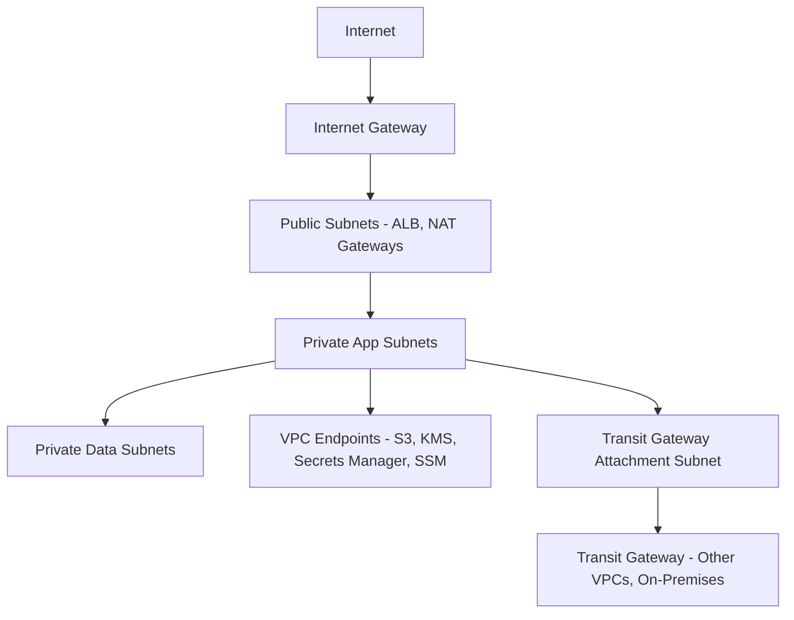
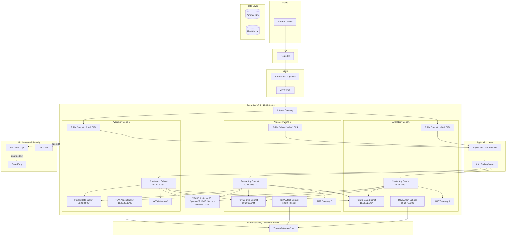
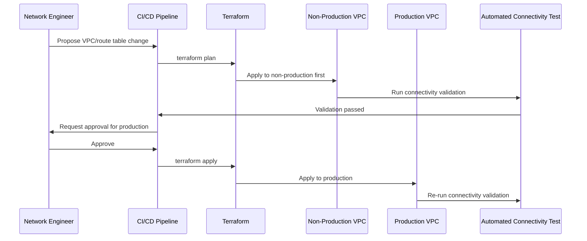

# Part III – Network Architectures

# Chapter 15 – Enterprise VPC

*The AWS Reference Architecture Handbook — 100 Production-Ready Cloud Architectures with AWS, Terraform, AI, Security, FinOps, and Enterprise Design Patterns*

---

## 1. Executive Summary

Every architecture in this book — the three-tier application in Chapter 1, the single-instance pattern in Chapter 5, the multi-account hub in Chapter 9, the immutable compute pipeline in Chapter 12 — runs inside a network. This chapter is about that network itself: how to design a single VPC (Virtual Private Cloud) that is genuinely enterprise-grade, not merely "the default VPC with a few subnets added."

**The business problem this chapter solves:**

- Networking decisions made early are disproportionately expensive to change later.
- A VPC's CIDR block, once chosen and populated with resources, cannot be resized without significant disruption.
- Subnet boundaries, once workloads are deployed into them, are hard to redraw without downtime.
- Route table and security group design, if done ad hoc, produces a network nobody can confidently reason about after the second or third team starts deploying into it.
- Unlike an application bug, a networking mistake often isn't discovered until it blocks something important — a new VPN connection that won't fit the existing route table, an inter-service connectivity requirement that collides with an undersized subnet, or a security review that cannot explain why a given security group allows a specific inbound rule.

**The architecture's objective:**

- Provide a single VPC design template — CIDR sizing, subnet tiering, routing, and security boundary layout — that scales from a first production workload to dozens of services and hundreds of resources without requiring a redesign.
- Make the VPC's structure legible: any engineer should be able to look at the subnet layout and route tables and understand, without archaeology, what is allowed to talk to what and why.
- Treat the VPC itself as a long-lived platform asset with its own lifecycle, not as an implicit side effect of the first application deployed into it.

**Why organizations adopt this architecture:**

- They have outgrown the default VPC (which is flat, has no tiering, and mixes public and private concerns without segmentation).
- They are onboarding a second or third application team into what was previously a single-application VPC and need clear tenancy boundaries.
- A security or compliance review has flagged the existing network as too permissive, too poorly documented, or too inconsistent to pass an audit.
- They are planning for Transit Gateway connectivity (Chapter 9) or hybrid on-premises connectivity and need the VPC's own internal structure to be compatible with that future integration.
- A merger or acquisition has introduced a second, differently-designed VPC that must be reconciled or connected to the first.

**Major business benefits:**

- **Predictable growth.** A correctly-sized CIDR block and subnet allocation plan means adding new subnets, new AZs, or new workload tiers does not require re-IP-ing existing resources.
- **Auditable security posture.** A tiered subnet design (public, private-application, private-data) with security groups referencing other security groups (not broad CIDR ranges) gives a security reviewer a fast, confident way to verify segmentation.
- **Operational clarity.** New engineers can understand "where things live and why" quickly, reducing onboarding time and the risk of an accidental misconfiguration born from confusion about the network's actual structure.
- **Compatibility with future architectures.** A VPC designed with IPAM discipline and Transit-Gateway-ready subnet layout from the start avoids the costly, disruptive remediation this book's Chapter 9 case study describes (overlapping CIDR ranges discovered only during a later multi-account consolidation effort).

**Typical enterprise scenarios:**

- A platform team standing up the "reference VPC" that every future application account or workload will be built from — the VPC equivalent of the golden AMI concept from Chapter 12.
- An organization migrating from a single flat VPC (built early, before any network discipline existed) to a properly tiered, IPAM-managed design.
- A newly-provisioned workload account (per Chapter 9's account vending process) whose VPC must be built to a consistent, pre-approved template so it attaches cleanly to the organization's Transit Gateway.
- A regulated enterprise that must demonstrate, to an auditor's satisfaction, exactly which network paths exist between its public-facing systems and its sensitive data stores.

> **Note:** This chapter assumes no prior chapter has been read. Where Chapter 1 and Chapter 9 each describe a VPC as part of a larger application or multi-account story, this chapter treats VPC design as the primary subject, in full depth, independent of any single workload sitting inside it.

---

## 2. Business Requirements

### 2.1 Business Drivers

- **Segmentation and blast-radius containment.** Different workload tiers (public web, application, data) should not share a flat network space.
- **Auditability.** Security and compliance teams need to verify network paths quickly, not reconstruct them from tribal knowledge.
- **Future compatibility.** The VPC must be able to attach to a Transit Gateway (Chapter 9), support hybrid connectivity, and grow in subnet count without a redesign.
- **Consistency across accounts.** In a multi-account organization, every workload account's VPC should follow the same template, so the shared services layer's routing and security assumptions hold everywhere.

### 2.2 Functional Requirements

| Requirement | Description |
|---|---|
| Multi-tier subnet layout | Public, private-application, and private-data subnets, each with a distinct routing and security posture |
| Multi-AZ coverage | Subnet tiers replicated across a minimum of three Availability Zones |
| Internet-facing capability | Public subnets can host internet-facing load balancers and NAT Gateways |
| Private outbound capability | Private subnets can reach the internet for package updates and third-party API calls, via NAT |
| No internet path for data tier | Data subnets have no route to the internet at all, inbound or outbound |
| Service endpoint access | AWS service traffic (S3, DynamoDB, Secrets Manager, KMS, SSM) reachable without traversing the public internet |
| Future Transit Gateway attachment | Subnet design includes a dedicated subnet tier for Transit Gateway attachments |
| Hybrid connectivity readiness | CIDR and routing design accommodate a future Direct Connect or Site-to-Site VPN termination |

### 2.3 Non-Functional Requirements

**Scalability goals:**

- Support at least 5x the current resource count within the existing CIDR allocation, without requiring a new VPC or a CIDR expansion.
- Support the addition of new subnet tiers (e.g., a dedicated subnet for container workloads, or a dedicated subnet for a service mesh's ingress) without re-IP-ing any existing subnet.

**Availability requirements:**

- The network layer itself should never be the limiting factor in the workload's own availability target.
- Every subnet tier is deployed across a minimum of three AZs so that no single AZ failure removes more than one-third of any tier's capacity.

**Latency requirements:**

- Intra-VPC latency between tiers (application to data, for instance) should be negligible (sub-millisecond) — a property of VPC networking generally, not something this design needs to specifically engineer for, but worth stating explicitly as an expected baseline.

**Compliance requirements:**

- Demonstrable network segmentation between public-facing and sensitive-data-holding subnets, a common, specific ask in SOC 2, PCI-DSS, and HIPAA network architecture reviews.
- VPC Flow Logs enabled and retained per the applicable compliance regime's audit-log retention requirement.

**Security expectations:**

- No security group permits unrestricted inbound access on a sensitive port from `0.0.0.0/0`.
- Security groups reference other security groups wherever possible, not broad CIDR ranges.
- Network ACLs are used as a coarse, secondary control layer, not the primary access-control mechanism.

**Recovery objectives:**

| Metric | Baseline Target | Definition |
|---|---|---|
| RPO (network configuration) | Near-zero | Configuration is Terraform-defined and re-appliable |
| RTO (rebuild the VPC's routing/subnet configuration after a catastrophic misconfiguration) | ≤ 30 minutes | Time to re-apply known-good Terraform state |

**SLAs:**

- Not set directly by the VPC itself, but the VPC design should never be the reason a workload cannot meet its own stated SLA — see the warning in Chapter 1, Section 12, about shared infrastructure setting a ceiling on downstream availability, which applies equally to this chapter's subject.

**Expected workload and growth:**

- Baseline: a VPC supporting 3-5 application tiers, growing to 10-15 within a three-year horizon.
- CIDR sizing should be chosen against this growth projection specifically, not against only the current day's resource count.

> **Warning:** The single most common, hardest-to-reverse mistake in enterprise VPC design is choosing a CIDR block too small for the organization's actual three-year growth trajectory. A `/24` VPC (256 addresses) that seemed generous for a first application becomes a genuine constraint once five more teams deploy into it. Size the VPC CIDR for the organization's ambition, not its current headcount.

---

## 3. Architecture Overview

### 3.1 Overall Design and Philosophy

This chapter's design rests on three explicit principles:

- **Tier by function, not by team.** Subnets are organized by what they do (public-facing, application, data, Transit Gateway attachment) rather than by which team owns the workload inside them. Team-level isolation is better achieved at the account level (Chapter 9) than by subdividing a single VPC per team.
- **Segment by default, connect by exception.** Every route between tiers should be a deliberate, reviewed decision — never an accidental byproduct of an overly permissive route table or security group.
- **Design for the VPC you'll need in three years, not the one you need today.** CIDR sizing, subnet count, and IPAM allocation should all be chosen against a growth projection, because every one of these decisions is expensive to revisit later.

### 3.2 Core Components

- A single VPC with a deliberately-sized CIDR block, allocated via IPAM.
- Four subnet tiers, each present in every Availability Zone used:
  - Public subnets (internet-facing load balancers, NAT Gateways)
  - Private application subnets (compute workloads)
  - Private data subnets (databases, caches)
  - Transit Gateway attachment subnets (dedicated, small subnets solely for the TGW ENI)
- Route tables, one set per tier, enforcing the intended traffic flow.
- Security groups, layered by tier, referencing each other rather than CIDR ranges.
- Network ACLs, applied sparingly as a coarse secondary control.
- VPC endpoints (Gateway endpoints for S3/DynamoDB; Interface endpoints for Secrets Manager, KMS, SSM, and other frequently-used AWS APIs).
- VPC Flow Logs, delivered to a centralized logging destination.

### 3.3 How Components Interact

- Public subnets route to the Internet Gateway.
- Private application subnets route outbound traffic to a NAT Gateway (one per AZ), and have no direct inbound path from the internet.
- Private data subnets have no route to the internet at all — not even via NAT.
- Transit Gateway attachment subnets exist purely to host the TGW's elastic network interfaces, kept deliberately small and free of any application workload.
- VPC endpoints let application and data subnets reach AWS service APIs without leaving the VPC's private address space.

### 3.4 High-Level Workflow

- A request enters through a public-subnet load balancer.
- Traffic is forwarded to the private application subnet.
- The application subnet reaches the private data subnet directly, within the VPC, with no internet traversal.
- The application subnet reaches AWS services (S3, Secrets Manager, KMS) via VPC endpoints.
- Any traffic destined for another VPC or on-premises network routes through the Transit Gateway attachment subnet.



---

## 4. AWS Services Used

### 4.1 Amazon VPC

**Purpose:**

- The foundational network container for every other resource in this chapter.

**Why selected:**

- There is no alternative for AWS-native networking — the design question is entirely about how the VPC is structured, not whether to use one.

**Limitations:**

- The VPC's primary CIDR block cannot be resized after resources are deployed into subnets carved from it (secondary CIDR blocks can be added, but this introduces its own complexity — see Section 27).

**Best practices:**

- Allocate the VPC's CIDR block via IPAM (Section 4.2), never manually chosen in isolation from the rest of the organization's IP address plan.

### 4.2 Amazon VPC IP Address Manager (IPAM)

**Purpose:**

- Centrally plans, tracks, and allocates IP address ranges across an organization's VPCs, preventing the overlapping-CIDR problem described in Chapter 9's case study.

**Why selected:**

- Without IPAM, CIDR allocation is typically ad hoc — each new VPC's range chosen by whoever creates it, with no central visibility into what's already in use.
- IPAM provides that central visibility and can enforce allocation from designated pools.

**Alternatives:**

- A manually-maintained spreadsheet of allocated CIDR ranges — workable at very small scale (a handful of VPCs), but a well-documented source of the overlapping-range incidents this book repeatedly warns against once an organization grows past that scale.

**Best practices:**

- Establish IPAM before the second VPC is ever created, not retroactively after CIDR conflicts have already occurred.

### 4.3 NAT Gateway

**Purpose:**

- Provides outbound-only internet access for private subnet resources.

**Why selected:**

- Managed, highly available within its AZ, and requires no patching or capacity management, unlike a self-managed NAT instance.

**Alternatives:**

- NAT instances (self-managed EC2 acting as a NAT) are rarely justified today given NAT Gateway's managed nature — occasionally still used for very specific, unusual routing requirements NAT Gateway does not support.

**Pricing considerations:**

- Billed hourly per gateway plus a per-GB data processing charge — this is frequently a larger cost line item than expected; see Section 16.

**Best practices:**

- One NAT Gateway per AZ for production workloads (Chapter 1's guidance); a single, shared NAT Gateway is an acceptable, deliberate cost trade-off only for lower-tier or single-AZ-primary workloads (Chapter 5's guidance).

### 4.4 AWS Transit Gateway

**Purpose:**

- Connects this VPC to other VPCs and on-premises networks at scale, covered in full depth in Chapter 9.

**Why selected here:**

- Even a VPC not yet connected to a Transit Gateway should be **designed as if it will be** — a dedicated, small attachment subnet reserved from day one avoids a disruptive later retrofit.

### 4.5 VPC Endpoints (Gateway and Interface)

**Purpose:**

- Let VPC resources reach AWS service APIs (S3, DynamoDB via Gateway endpoints; Secrets Manager, KMS, Systems Manager, and others via Interface endpoints) without routing through the public internet or a NAT Gateway.

**Why selected:**

- Security: removes an entire class of traffic from ever needing internet-bound routing.
- Cost: Gateway endpoints are free; even Interface endpoints (which have an hourly + data-processing charge) are frequently cheaper than the equivalent NAT Gateway data-processing cost for the same traffic.

**Best practices:**

- Always use Gateway endpoints for S3 and DynamoDB — there is essentially no reason not to, given they are free and remove real NAT traffic.
- Add Interface endpoints for Secrets Manager, KMS, and SSM as a standard part of every VPC template, not an afterthought added only when a specific incident (like Chapter 5's Session Manager connectivity failure scenario) forces the issue.

### 4.6 Security Groups and Network ACLs

**Purpose:**

- Security groups: stateful, resource-attached, primary access control mechanism.
- Network ACLs: stateless, subnet-attached, coarse secondary control layer.

**Why security groups are primary:**

- They can reference other security groups as their source/destination, which survives IP address churn from Auto Scaling — a property CIDR-based NACL rules cannot replicate as cleanly.

**Best practices:**

- Use NACLs sparingly, for broad, rarely-changing rules (e.g., explicitly denying a known-bad CIDR range at the subnet boundary) — not as the primary mechanism for day-to-day access control.

### 4.7 CloudWatch (VPC Flow Logs), CloudTrail, GuardDuty

- **VPC Flow Logs** capture accepted/rejected traffic metadata at the ENI, subnet, or VPC level — essential both for security investigation and for the traffic-pattern cost analysis described in Chapter 9.
- **CloudTrail** captures every API-level change to the VPC's own configuration (who created/modified a route table, a security group, a subnet).
- **GuardDuty** analyzes VPC Flow Logs (among other signals) for anomalous network behavior.

---

## 5. Complete Architecture Diagram



---

## 6. Component-by-Component Explanation

| Component | Purpose | Scaling | High Availability | Failure Handling | Dependencies |
|---|---|---|---|---|---|
| Public subnets | Host internet-facing ALBs and NAT Gateways | Add subnets per new AZ as needed | One per AZ, minimum three | AZ failure removes one subnet's capacity only | Internet Gateway |
| Private app subnets | Host application compute | Sized generously for Auto Scaling headroom | One per AZ, minimum three | AZ failure removes one-third of app capacity | NAT Gateway, route tables |
| Private data subnets | Host databases and caches | Sized for data-tier instance count, rarely needs to be large | One per AZ, minimum three | AZ failure triggers Multi-AZ failover (per Chapter 1) | Security groups referencing app-tier SG |
| TGW attachment subnets | Host Transit Gateway ENIs only | Fixed, small (/28 is generally sufficient) | One per AZ | N/A — purely a connectivity attachment point | Transit Gateway |
| NAT Gateway | Outbound internet access for private subnets | One per AZ for production | AZ-scoped; failure affects only that AZ's egress | Auto Scaling instances in a failed AZ's subnet route via a different AZ's NAT if configured for cross-AZ failover, otherwise egress in that AZ is briefly unavailable | Elastic IP, public subnet |
| VPC endpoints | AWS service access without internet traversal | Scales automatically | Regionally resilient | N/A | Route tables, security groups |

---

## 7. End-to-End Request Flow

1. **Client** resolves the application's domain via **Route 53**.
2. Traffic optionally passes through **CloudFront and WAF** at the edge.
3. Traffic enters the VPC via the **Internet Gateway**, landing on a **public subnet**.
4. The **Application Load Balancer**, residing in the public subnets, receives the request.
5. The ALB forwards the request to a target in a **private application subnet**.
6. The application instance processes the request.
7. If data access is required, the application queries a resource in the **private data subnet** — traffic never leaves the VPC.
8. If the application needs an AWS service (S3, Secrets Manager, KMS), it reaches it via a **VPC endpoint**, again without leaving the VPC.
9. If the application needs a third-party API or an OS package update, outbound traffic routes through the **NAT Gateway** in the same AZ.
10. If the request requires reaching another VPC or an on-premises system, traffic routes through the **Transit Gateway attachment subnet**.
11. **VPC Flow Logs** capture the accepted/rejected status of each of these hops.
12. The response returns along the same path, back through the ALB, to the client.

---

## 8. Deployment Flow

- **Infrastructure provisioning** for the VPC follows the same Terraform-first discipline as every other chapter in this book.
- No manual console changes — ever. A VPC's route tables and security groups are exactly the kind of resource where a single manual "quick fix" creates the drift this book's Chapter 12 warns against, just applied to networking instead of compute.
- **The Terraform workflow** for VPC changes deserves particular care:
  - Any change to a route table or security group affecting a production subnet should go through the same staged rollout (test in a non-production VPC first) described in Chapter 9.
  - `terraform plan` output for a VPC change should always be read carefully for unexpected resource replacement — some VPC attributes (like changing a subnet's CIDR) force a full resource replacement, which is destructive.
- **Rollback:**
  - Because the VPC's configuration is entirely Terraform-defined, rollback means reverting to the previous known-good Terraform state and re-applying.
  - A VPC-level rollback is riskier than an application-level rollback (Chapter 1) because network changes can affect many resources simultaneously — this is why staged validation matters more here, not less.
- **Validation:**
  - `terraform plan` review by a second engineer for any production VPC change.
  - Automated connectivity tests (a simple Lambda or EC2-based check confirming expected reachability between tiers) run after every VPC change, not just assumed to work.



---

## 9. Network Topology

### 9.1 VPC and CIDR

- Use a `/16` CIDR block for an enterprise VPC intended to support multiple application tiers over a multi-year horizon (65,536 addresses).
- Allocate this block via IPAM, from a pool reserved specifically for this account/environment, never chosen independently.
- Reserve headroom deliberately:
  - Don't allocate every subnet at initial creation.
  - Leave unused CIDR space within the VPC's overall block for future subnet tiers you haven't yet designed.

### 9.2 Subnet Tiering

| Tier | Example CIDR (per AZ) | Size | Purpose |
|---|---|---|---|
| Public | `/24` | 256 addresses | ALBs, NAT Gateways — rarely needs to be large |
| Private application | `/22` | 1,024 addresses | The largest tier; Auto Scaling headroom lives here |
| Private data | `/24` | 256 addresses | Databases, caches — a small, stable resource count |
| Transit Gateway attachment | `/28` | 16 addresses | Only the TGW ENI lives here |

- Each tier is replicated across a minimum of three Availability Zones.
- Sizing rationale:
  - Application subnets are sized largest because this is where horizontal scaling (Auto Scaling Groups, ECS tasks) consumes the most addresses over time.
  - Data subnets are sized smaller because relational/cache instance counts rarely scale horizontally to the same degree.
  - TGW attachment subnets are deliberately tiny — they exist solely to host an elastic network interface, never an application workload.

### 9.3 Route Tables

- One route table per subnet tier, not a single shared route table for the whole VPC.
- Public subnet route table: default route (`0.0.0.0/0`) to the Internet Gateway.
- Private application subnet route table: default route to the AZ-local NAT Gateway.
- Private data subnet route table: **no default route to the internet at all.**
- Transit Gateway attachment subnet route table: routes to other VPCs/on-premises CIDRs via the Transit Gateway.

### 9.4 Network ACLs

- Used sparingly, for coarse, rarely-changing rules only.
- A representative use: explicitly denying a known-bad CIDR range at the data-subnet boundary as a defense-in-depth measure, in addition to (never instead of) security-group-level control.

### 9.5 Security Groups

- Chained, security-group-referencing design (per Chapter 1's established pattern):
  - ALB security group: allows inbound 443 from `0.0.0.0/0`.
  - Application security group: allows inbound only from the ALB security group.
  - Data security group: allows inbound only from the application security group.
- This pattern survives Auto Scaling IP churn without requiring rule updates, unlike CIDR-based rules.

### 9.6 PrivateLink / VPC Endpoints

- Gateway endpoints (free): S3, DynamoDB.
- Interface endpoints (hourly + data charge): Secrets Manager, KMS, Systems Manager, and any other frequently-called AWS API.
- Endpoint policies should be scoped — don't accept the default "allow all" endpoint policy for a sensitive service without review.

### 9.7 Hybrid and Transit Gateway Readiness

- Even if not yet connected, reserve:
  - A dedicated Transit Gateway attachment subnet tier, in every AZ.
  - CIDR space that does not overlap with any known or anticipated on-premises range.
- If hybrid connectivity (Direct Connect or Site-to-Site VPN) is already planned, terminate it in a dedicated networking account (Chapter 9), not directly inside this application VPC.

---

## 10. Identity and Access

- **IAM Roles** relevant to this chapter are primarily the roles that manage the VPC itself:
  - A dedicated **network-admin Terraform role**, scoped to VPC, subnet, route table, and security group actions.
  - This role should be distinct from any application workload role — a compromised application instance should never have permission to modify the network it runs inside.
- **IAM Policies:**
  - Scope the network-admin role's permissions to the specific VPC/account it manages, not organization-wide, unless it is genuinely the Chapter 9 shared-services networking account's role.
- **Resource Policies:**
  - VPC endpoint policies are a resource policy this chapter specifically calls out — scope them to the specific principals/actions actually needed, rather than accepting an open "allow all principals, all actions" default.
- **Cross-account access:**
  - If this VPC will be attached to a Transit Gateway owned by a different account (Chapter 9), the attachment itself requires a Resource Access Manager share and appropriate cross-account acceptance — covered in full in that chapter.
- **Least privilege:**
  - No application workload role should ever include EC2 networking permissions (`ec2:CreateRoute`, `ec2:ModifySecurityGroupRules`, etc.) — these belong exclusively to the network-admin role.
- **Permission boundaries:**
  - Apply a permission boundary to the network-admin role itself, capping the maximum permissions it can ever exercise, as a safety net against a Terraform module bug over-granting access.

---

## 11. Security Architecture

- **Encryption:**
  - VPC-level traffic between AWS resources within a region is already encrypted in transit at the AWS infrastructure layer for most paths; application-level TLS (Chapter 1's guidance) remains necessary for anything traversing outside that boundary or requiring end-to-end guarantees independent of AWS's own network encryption.
- **KMS:**
  - Used for VPC Flow Log encryption at rest and for any Interface VPC Endpoint requiring KMS-encrypted data in transit to the underlying service.
- **WAF and Shield:**
  - Applied at the edge (ALB/CloudFront), not within this chapter's VPC-internal scope directly — see Chapter 1 for full treatment.
- **GuardDuty:**
  - Directly consumes this chapter's VPC Flow Logs as one of its primary analysis inputs — a specific, concrete reason Flow Logs should never be disabled to save cost.
- **Zero Trust:**
  - Applied here specifically as: no subnet or security group is trusted merely because it is "inside the VPC." Every tier boundary (public → app, app → data) is an explicit, reviewed, minimal permission grant, not an assumed-safe internal network.

**Threat model summary:**

| Attack Vector | Mitigation |
|---|---|
| Direct internet access to the data tier | No route to the internet from data subnets, by design |
| Lateral movement from a compromised app instance to the data tier | Security-group-referencing pattern limits reachability to only the specific required port |
| Overly broad VPC endpoint policy | Explicit, scoped endpoint policies, reviewed rather than defaulted |
| Undetected anomalous network behavior | VPC Flow Logs feeding GuardDuty |
| Network-layer configuration drift | Terraform-only change management (Chapter 12's discipline, applied to networking) |

---

## 12. High Availability

- **AZ failures:**
  - Every subnet tier exists in a minimum of three AZs; losing one AZ removes at most one-third of any tier's capacity.
- **NAT Gateway failures:**
  - One NAT Gateway per AZ (production default) means an AZ-scoped NAT failure affects only that AZ's outbound traffic, not the whole VPC.
- **Regional failures:**
  - A VPC itself is a regional construct; a full regional event requires a second VPC in a second region — covered in this book's dedicated multi-region chapters, not this one.
- **Transit Gateway failures:**
  - Covered fully in Chapter 9; from this chapter's perspective, the relevant point is simply that the attachment subnet design should not itself introduce any additional single point of failure beyond what Transit Gateway's own regional resilience already provides.

---

## 13. Disaster Recovery

- **Backup strategy:**
  - The VPC's configuration itself is fully defined in Terraform — the "backup" is the version-controlled Terraform state and code, not a traditional data backup.
- **Snapshots:**
  - Not directly applicable to VPC networking constructs themselves (unlike EBS/RDS); the relevant recovery artifact is the Terraform codebase.
- **Cross-region replication:**
  - Not applicable to a single VPC's own configuration; a DR-region VPC is a separate, independently-provisioned resource (from the same Terraform module, parameterized for the DR region) — see this book's multi-region chapters.
- **DR classification:**
  - This chapter's VPC configuration is effectively **Pilot Light** by nature of being fully IaC-defined and re-appliable to a fresh VPC if the existing one is ever catastrophically misconfigured or destroyed.

| Component | DR Approach | RTO | RPO |
|---|---|---|---|
| VPC / subnet / route table configuration | Terraform re-apply | ≤ 30 minutes | Near-zero |
| VPC Flow Log history | S3 delivery with cross-region replication (if configured) | ≤ 1 hour to restore access | Near-zero given continuous delivery |

---

## 14. Scalability

- **Horizontal scaling** of the network itself means adding subnets — new AZs, new subnet tiers — within the existing CIDR headroom reserved per Section 9.1.
- **Vertical scaling** has limited meaning for a VPC; the closer analogy is CIDR block expansion via a secondary CIDR, which this chapter recommends avoiding if at all possible (Section 27) by sizing correctly the first time.
- **Auto Scaling** of compute within the application subnets is governed by Chapter 1's guidance; this chapter's job is simply to ensure the application subnet tier has enough address space to support that scaling without running out of IPs — a specific, concrete reason the application tier is sized as the largest subnet in Section 9.2's table.
- **Explicit scaling ceiling guidance:**
  - Track subnet IP utilization as a leading indicator — an application subnet consistently above 70% IP utilization is a signal to plan additional capacity (a new subnet, or in the worst case, a CIDR expansion) well before exhaustion becomes an incident.

---

## 15. Performance Optimization

- **Caching, compression, CDN, database optimization, connection pooling, concurrency, and async processing** are all covered in depth in Chapter 1 and apply unchanged to workloads running inside this chapter's VPC design.
- The specific network-layer performance consideration unique to this chapter is:
  - **VPC endpoint routing** reduces latency for AWS service calls relative to routing through a NAT Gateway to the public AWS service endpoint, in addition to the cost and security benefits already covered.
  - **Placement group** considerations (cluster placement groups for latency-sensitive, high-throughput workloads) are a VPC-adjacent optimization worth knowing about for specific high-performance computing or tightly-coupled cluster workloads, though not a default recommendation for typical enterprise application tiers.

---

## 16. Cost Optimization (FinOps)

### 16.1 Estimated Monthly Cost by Deployment Size

| Component | Small (1-2 app tiers) | Medium (5-8 app tiers) | Enterprise (15+ app tiers) |
|---|---|---|---|
| NAT Gateway (3x, one per AZ) | ~$100 | ~$100 | ~$120 |
| NAT Gateway data processing | ~$50 | ~$400 | ~$2,500+ |
| Interface VPC Endpoints (per endpoint, x3 AZ) | ~$60 | ~$180 | ~$400+ |
| VPC Flow Logs (S3 storage + ingestion) | ~$20 | ~$150 | ~$1,000+ |
| Transit Gateway attachment (if connected) | ~$50 | ~$50 | ~$50 |
| **Approximate Total** | **~$280/mo** | **~$880/mo** | **~$4,000+/mo** |

### 16.2 Major Cost Drivers and Optimization

- **NAT Gateway data processing** is consistently the largest, most variable cost line item — driven by actual outbound traffic volume, not subnet count.
  - Optimization: move traffic to VPC endpoints wherever possible (S3, DynamoDB, Secrets Manager, KMS, SSM) to remove it from the NAT-billed path entirely.
- **Interface endpoint proliferation** — adding an Interface endpoint for every AWS service "just in case" adds hourly cost across every AZ; add endpoints for services actually in heavy use, not speculatively for all of them.
- **VPC Flow Log volume** — logging at the ENI level for every single interface can generate substantial log volume at scale; consider VPC-level or subnet-level Flow Log aggregation where per-ENI granularity isn't specifically needed for the analysis at hand.
- **Idle NAT Gateways** in rarely-used non-production VPCs are a common, easily-overlooked cost — consider whether a non-production VPC needs 24/7 NAT Gateway availability at all, or whether it can be scheduled down outside business hours.

---

## 17. AI-Assisted Operations

- **Amazon Q** can review a proposed VPC Terraform plan for common misconfigurations (a route table accidentally granting a data subnet internet access, a security group with an unintentionally broad CIDR rule) before human review — a genuinely useful first-pass check given how easy subtle route table/security group mistakes are to miss by eye.
- **AI-assisted troubleshooting** for connectivity issues (Section 25) can accelerate root-cause narrowing by correlating VPC Flow Log rejections with the specific route table/security group rule likely responsible, faster than manual log inspection.
- **AI-generated Terraform** for a new subnet tier or endpoint addition should still go through the same `terraform plan` review and connectivity validation (Section 8) as any hand-written change — network changes are exactly the kind of high-blast-radius change where this book's standing "review AI output with the same rigor" guidance matters most.

---

## 18. Terraform Implementation

```

infrastructure/
├── modules/
│   └── enterprise-vpc/
├── environments/
│   ├── prod/
│   └── staging/
└── backend.tf

```

**Core VPC module:**

```hcl

# modules/enterprise-vpc/main.tf

resource "aws_vpc" "main" {
  cidr_block           = var.vpc_cidr
  enable_dns_support   = true
  enable_dns_hostnames = true

  tags = { Name = "${var.environment}-vpc" }
}

resource "aws_internet_gateway" "main" {
  vpc_id = aws_vpc.main.id
  tags   = { Name = "${var.environment}-igw" }
}

# Public subnets

resource "aws_subnet" "public" {
  for_each                = var.az_config
  vpc_id                  = aws_vpc.main.id
  cidr_block              = each.value.public_cidr
  availability_zone       = each.key
  map_public_ip_on_launch = true

  tags = { Name = "${var.environment}-public-${each.key}", Tier = "public" }
}

# Private application subnets

resource "aws_subnet" "app" {
  for_each          = var.az_config
  vpc_id            = aws_vpc.main.id
  cidr_block        = each.value.app_cidr
  availability_zone = each.key

  tags = { Name = "${var.environment}-app-${each.key}", Tier = "application" }
}

# Private data subnets

resource "aws_subnet" "data" {
  for_each          = var.az_config
  vpc_id            = aws_vpc.main.id
  cidr_block        = each.value.data_cidr
  availability_zone = each.key

  tags = { Name = "${var.environment}-data-${each.key}", Tier = "data" }
}

# Transit Gateway attachment subnets

resource "aws_subnet" "tgw" {
  for_each          = var.az_config
  vpc_id            = aws_vpc.main.id
  cidr_block        = each.value.tgw_cidr
  availability_zone = each.key

  tags = { Name = "${var.environment}-tgw-${each.key}", Tier = "transit-gateway" }
}

```

**Route tables, one set per tier:**

```hcl

# modules/enterprise-vpc/routing.tf

resource "aws_route_table" "public" {
  vpc_id = aws_vpc.main.id
  route {
    cidr_block = "0.0.0.0/0"
    gateway_id = aws_internet_gateway.main.id
  }
  tags = { Name = "${var.environment}-rt-public" }
}

resource "aws_nat_gateway" "this" {
  for_each      = var.az_config
  allocation_id = aws_eip.nat[each.key].id
  subnet_id     = aws_subnet.public[each.key].id
  tags          = { Name = "${var.environment}-nat-${each.key}" }
}

resource "aws_route_table" "app" {
  for_each = var.az_config
  vpc_id   = aws_vpc.main.id
  route {
    cidr_block     = "0.0.0.0/0"
    nat_gateway_id = aws_nat_gateway.this[each.key].id
  }
  tags = { Name = "${var.environment}-rt-app-${each.key}" }
}

# Data subnets deliberately have NO default route to the internet

resource "aws_route_table" "data" {
  vpc_id = aws_vpc.main.id
  tags   = { Name = "${var.environment}-rt-data" }
}

```

**Gateway and Interface VPC endpoints:**

```hcl

# modules/enterprise-vpc/endpoints.tf

resource "aws_vpc_endpoint" "s3" {
  vpc_id            = aws_vpc.main.id
  service_name      = "com.amazonaws.${var.aws_region}.s3"
  vpc_endpoint_type = "Gateway"
  route_table_ids   = concat(
    [for rt in aws_route_table.app : rt.id],
    [aws_route_table.data.id]
  )
}

resource "aws_vpc_endpoint" "secrets_manager" {
  vpc_id              = aws_vpc.main.id
  service_name        = "com.amazonaws.${var.aws_region}.secretsmanager"
  vpc_endpoint_type   = "Interface"
  subnet_ids          = [for s in aws_subnet.app : s.id]
  security_group_ids  = [aws_security_group.endpoints.id]
  private_dns_enabled = true
}

```

**Security group chain:**

```hcl

# modules/enterprise-vpc/security_groups.tf

resource "aws_security_group" "alb" {
  name_prefix = "${var.environment}-alb-"
  vpc_id      = aws_vpc.main.id

  ingress {
    from_port   = 443
    to_port     = 443
    protocol    = "tcp"
    cidr_blocks = ["0.0.0.0/0"]
  }
}

resource "aws_security_group" "app" {
  name_prefix = "${var.environment}-app-"
  vpc_id      = aws_vpc.main.id

  ingress {
    from_port       = 8080
    to_port         = 8080
    protocol        = "tcp"
    security_groups = [aws_security_group.alb.id]
  }
}

resource "aws_security_group" "data" {
  name_prefix = "${var.environment}-data-"
  vpc_id      = aws_vpc.main.id

  ingress {
    from_port       = 5432
    to_port         = 5432
    protocol        = "tcp"
    security_groups = [aws_security_group.app.id]
  }
}

```

**Best practices applied above:**

- `for_each` over an `az_config` map, driving subnet/NAT/route table creation consistently per AZ.
- Data subnets' route table has no default route defined at all — the absence is deliberate, not an oversight.
- Gateway endpoint route table association covers both app and data subnets, since both need S3/DynamoDB access without a NAT path.
- Security groups reference each other (`security_groups = [...]`), never raw CIDR blocks, for the app and data tiers.

---

## 19. AWS CLI Examples

**Deployment validation:**

```bash

# Confirm subnet-to-AZ mapping matches expectations

aws ec2 describe-subnets \
  --filters Name=vpc-id,Values=vpc-0123456789abcdef0 \
  --query 'Subnets[*].[SubnetId,CidrBlock,AvailabilityZone,Tags[?Key==`Tier`].Value|[0]]' \
  --output table

```

**Monitoring:**

```bash

# Check NAT Gateway data processing volume, the largest typical cost driver

aws cloudwatch get-metric-statistics \
  --namespace AWS/NATGateway \
  --metric-name BytesOutToDestination \
  --dimensions Name=NatGatewayId,Value=nat-0123456789abcdef0 \
  --start-time $(date -u -d '24 hours ago' +%Y-%m-%dT%H:%M:%S) \
  --end-time $(date -u +%Y-%m-%dT%H:%M:%S) \
  --period 3600 \
  --statistics Sum

```

**Troubleshooting:**

```bash

# Query VPC Flow Logs (delivered to CloudWatch Logs) for rejected traffic to a specific destination

aws logs start-query \
  --log-group-name "/vpc/flow-logs" \
  --start-time $(date -d '30 minutes ago' +%s) \
  --end-time $(date +%s) \
  --query-string 'fields @timestamp, srcAddr, dstAddr, dstPort, action | filter action = "REJECT" and dstAddr = "10.20.32.15" | sort @timestamp desc | limit 50'

```

**Cleanup:**

```bash

# Identify unused Elastic IPs (a common, easily-overlooked cost item after a NAT Gateway teardown)

aws ec2 describe-addresses \
  --query 'Addresses[?AssociationId==`null`].[PublicIp,AllocationId]' \
  --output table

```

---

## 20. CI/CD Integration

- The CI/CD platform guidance from Chapters 1, 5, and 9 applies unchanged.
- This chapter's specific addition: **automated post-apply connectivity validation** as a mandatory pipeline step.
  - After any VPC Terraform apply, run a small suite of checks confirming:
    - App subnet resources can reach the data subnet on the expected port.
    - Data subnet resources cannot reach the internet.
    - App subnet resources can reach S3/Secrets Manager via VPC endpoint (not NAT).
  - This is the network equivalent of Chapter 1's post-deployment synthetic canary check, and should be treated with the same non-negotiable rigor.

---

## 21. Monitoring

- **CloudWatch dashboards** for this chapter's subject should track: NAT Gateway data processing volume (by AZ), VPC endpoint request counts, subnet IP utilization percentage per tier, and Flow Log rejection rate over time.
- **The specific alarm that matters most here:** a sudden spike in Flow Log rejections for a specific subnet/security group pair — often the earliest signal of either a misconfiguration (a legitimate service suddenly blocked) or a security event (something attempting unauthorized access).
- **SLOs** for the network layer itself are less commonly published as a standalone metric than for an application, but a reasonable internal target is "network-layer availability: 99.99%+, effectively never the limiting factor in any workload's own SLA" — consistent with the warning in Chapter 1, Section 12.

---

## 22. Logging

- **VPC Flow Logs** are this chapter's most important logging artifact — delivered to either CloudWatch Logs (for near-real-time querying via Logs Insights) or S3 (for cost-efficient long-term retention and Athena-based historical analysis).
- **Retention** should match the organization's most stringent applicable compliance requirement, consistent with Chapter 9's guidance on centralized log archive retention.
- **Audit logging** of the VPC's own configuration changes (who modified a route table, when) comes from CloudTrail, not Flow Logs — the two serve different purposes and both are necessary: Flow Logs show what traffic moved; CloudTrail shows what configuration changed.

---

## 23. Operational Excellence

- **Runbooks** for this chapter's subject should cover: "unexpected connectivity loss between tiers," "NAT Gateway data processing cost spike investigation," and "Transit Gateway attachment troubleshooting."
- **Change management:** every VPC change — no matter how small it seems — goes through the staged, reviewed Terraform process (Section 8). There is no "quick console fix" exception for networking, precisely because a single mistaken route table or security group edit can have organization-wide (Chapter 9) or fleet-wide (Chapter 1) consequences.

---

## 24. Failure Scenarios

| # | Scenario | Symptoms | Root Cause | Detection | Resolution | Prevention |
|---|---|---|---|---|---|---|
| 1 | Application subnet IP exhaustion | New instances fail to launch | Subnet undersized relative to actual Auto Scaling growth | Launch failure error, subnet IP utilization alarm | Add a new subnet in the same AZ, or expand via a secondary CIDR as a last resort | Size the application subnet tier generously from the start (Section 9.2) |
| 2 | Accidental route added granting data subnet internet access | Security review flags unexpected internet reachability | A Terraform change mistakenly added a default route to the data route table | `terraform plan` diff review, or a scheduled security audit | Remove the erroneous route immediately | Mandatory `terraform plan` review for any route table change |
| 3 | NAT Gateway data processing cost spike | Unexpected cost increase | A specific application began making unusually high-volume outbound calls | Cost Anomaly Detection, NAT Gateway CloudWatch metrics | Identify and address the specific traffic source; consider a VPC endpoint if the destination is an AWS service | Regular NAT Gateway traffic pattern review |
| 4 | Overly permissive security group rule | Security audit finds `0.0.0.0/0` on a sensitive port | Rule added during initial debugging, never removed | IAM Access Analyzer / security group audit tooling | Tighten the rule immediately | Mandatory security group rule review as part of any change |
| 5 | VPC endpoint policy too permissive | Audit finds an Interface endpoint accepting requests from unintended principals | Default "allow all" endpoint policy never reviewed | Security review | Scope the endpoint policy explicitly | Review and scope every endpoint policy at creation, never accept the default |
| 6 | AZ failure affecting one NAT Gateway | Instances in the affected AZ's app subnet temporarily lose outbound internet access | AWS infrastructure event in one AZ | NAT Gateway health metrics, application error correlation | Wait for AWS-side recovery, or reroute via a cross-AZ NAT path if explicitly configured for it | Multi-AZ NAT Gateway design (already standard per Section 9.3) |
| 7 | Transit Gateway attachment subnet misconfigured | New cross-VPC connectivity doesn't work as expected | Attachment subnet route table missing the expected route to the TGW | Connectivity test failure | Correct the route table | Automated connectivity validation (Section 20) as a standard post-change check |
| 8 | Overlapping CIDR discovered during a later Transit Gateway attachment | Cannot attach this VPC to the shared Transit Gateway | No IPAM discipline used when this VPC was originally created | Discovered during Chapter 9-style multi-account consolidation planning | Re-IP the VPC (highly disruptive) or use a NAT-based workaround | IPAM-managed CIDR allocation from the very first VPC (Section 4.2) |
| 9 | VPC Flow Logs disabled to save cost | No visibility during a security investigation | A well-intentioned but shortsighted cost-cutting decision | Discovered only when Flow Log data is needed and unavailable | Re-enable Flow Logs immediately; accept the visibility gap for the period they were disabled | Treat Flow Logs as a non-negotiable control, not an optional cost lever |
| 10 | Interface endpoint DNS resolution not working as expected | Application cannot resolve the AWS service's private DNS name | `private_dns_enabled` not set, or a conflicting custom DNS configuration | Application-level connection failure to the AWS service | Correct the endpoint's DNS configuration | Verify `private_dns_enabled = true` as a standard part of endpoint creation |
| 11 | Route table associated with the wrong subnet | Traffic behaves unexpectedly for a specific subnet | Terraform module error in the association resource | Connectivity test failure, or a security review | Correct the association | Automated connectivity validation catching the mismatch immediately after apply |
| 12 | Secondary CIDR block added to relieve address exhaustion, causing routing confusion | Some resources in the secondary CIDR cannot reach expected destinations | Secondary CIDR not fully accounted for in every relevant route table/security group | Connectivity test failure after the secondary CIDR's first subnet is used | Update the affected route tables/security groups | Avoid needing a secondary CIDR in the first place via correct initial sizing (Section 2.3's warning) |
| 13 | Network ACL rule accidentally blocking legitimate traffic | Intermittent, hard-to-diagnose connectivity failures | An overly broad NACL deny rule added without full traffic-pattern awareness | Flow Log rejection analysis pointing to the NACL rather than the security group | Correct or remove the NACL rule | Use NACLs sparingly and test broadly before applying |
| 14 | TGW attachment subnet accidentally hosts an application resource | Unexpected exposure or connectivity behavior for that resource | A Terraform module change or manual action ignored the "TGW subnet is attachment-only" convention | Discovered during a routine audit | Move the resource to the correct subnet tier | Explicit tagging (`Tier = "transit-gateway"`) and automated policy checks preventing non-TGW resources in that subnet |
| 15 | Cost Anomaly Detection missed a slow, creeping NAT cost increase | Gradual, not sudden, cost growth goes unnoticed for months | Anomaly detection tuned for sudden spikes, not gradual drift | Discovered during a routine quarterly cost review | Identify and address the underlying gradual traffic growth | Combine anomaly detection with a scheduled, recurring manual cost trend review |

---

## 25. Troubleshooting Guide

| Problem | Symptoms | Likely Cause | Diagnosis | AWS CLI Commands | Resolution |
|---|---|---|---|---|---|
| App instance cannot reach the database | Connection timeout | Missing or incorrect security group rule | Check both security groups' rules | `aws ec2 describe-security-groups` | Add/correct the required rule |
| App instance cannot reach the internet | Package install/update fails | NAT Gateway route missing or NAT Gateway itself unhealthy | Check the app subnet's route table and NAT Gateway status | `aws ec2 describe-route-tables`, `aws ec2 describe-nat-gateways` | Fix the route or replace the unhealthy NAT Gateway |
| Unexpected internet reachability from the data tier | Security scan flags an open path | Erroneous route in the data subnet's route table | Review the data route table | `aws ec2 describe-route-tables` | Remove the erroneous route |
| S3 access failing despite correct IAM permissions | `Access Denied` or connection failure despite policy review | Missing Gateway endpoint route table association for the calling subnet | Check endpoint route table associations | `aws ec2 describe-vpc-endpoints` | Add the missing route table association |
| Cross-VPC traffic not reaching its destination | Connection timeout to a resource in another VPC | Missing Transit Gateway route table entry | Check TGW route tables | `aws ec2 search-transit-gateway-routes` | Add the missing route, following change management |
| Unexpectedly high NAT cost | Cost Explorer spike | High-volume traffic that should be using a VPC endpoint instead | Correlate Flow Logs with the specific traffic pattern | `aws logs start-query`, `aws ce get-cost-and-usage` | Add the appropriate VPC endpoint |

---

## 26. Best Practices

1. Allocate every VPC's CIDR block via IPAM, never in isolation.
2. Size the VPC CIDR for a three-year growth projection, not the current day's needs.
3. Use a `/16` for an enterprise VPC intended to host multiple application tiers over time.
4. Tier subnets by function (public, app, data, TGW attachment), not by team.
5. Deploy every subnet tier across a minimum of three Availability Zones.
6. Give the application subnet tier the most address space — this is where horizontal scaling consumes IPs.
7. Give data subnets no route to the internet at all, not even outbound.
8. Use one NAT Gateway per AZ for production workloads.
9. Use security groups that reference other security groups, not CIDR ranges, for tier-to-tier access control.
10. Use Network ACLs sparingly, as a coarse secondary control, never the primary access mechanism.
11. Enable Gateway endpoints for S3 and DynamoDB in every VPC — there is no good reason not to.
12. Add Interface endpoints for Secrets Manager, KMS, and Systems Manager as a standard template component.
13. Reserve a dedicated, small Transit Gateway attachment subnet tier even before actually attaching to one.
14. Never accept a VPC endpoint's default "allow all principals" policy without explicit review.
15. Enable VPC Flow Logs from the moment the VPC is created, never as an afterthought.
16. Feed VPC Flow Logs into GuardDuty for anomaly detection.
17. Treat every VPC/route table/security group change as Terraform-only — no manual console changes, ever.
18. Require `terraform plan` review by a second engineer for any production VPC change.
19. Run automated connectivity validation after every VPC change, confirming both expected reachability and expected non-reachability.
20. Track subnet IP utilization as a leading indicator, planning ahead of exhaustion.
21. Scope the network-admin IAM role tightly, distinct from any application workload role.
22. Never grant an application workload role EC2 networking permissions.
23. Apply a permission boundary to the network-admin role as a safety net.
24. Monitor NAT Gateway data processing volume explicitly — it is consistently the largest, most variable cost driver.
25. Move AWS-service-bound traffic to VPC endpoints wherever possible, both for cost and security.
26. Avoid adding Interface endpoints speculatively for services not in heavy use.
27. Retain VPC Flow Logs per the organization's most stringent applicable compliance requirement.
28. Stage every VPC change through a non-production VPC first, per the same discipline described in Chapter 9.
29. Document the rationale for any deliberate deviation from this chapter's default tiering (e.g., Chapter 5's single-NAT-Gateway cost trade-off) explicitly in an ADR.
30. Revisit the VPC's CIDR and subnet sizing on a scheduled cadence (e.g., annually), not only when a problem forces the conversation.

---

## 27. Anti-Patterns

1. **Choosing a CIDR block too small for future growth** — Dangerous because it forces a highly disruptive re-IP or secondary-CIDR remediation later. Correct approach: size for a three-year horizon from the start.
2. **A single flat subnet with no tiering** — Dangerous because it provides no network-level segmentation between public-facing and sensitive resources. Correct approach: the four-tier design in Section 9.2.
3. **A shared route table across all subnet tiers** — Dangerous because it makes it easy to accidentally grant a sensitive subnet unintended reachability. Correct approach: one route table per tier.
4. **CIDR-based security group rules instead of security-group-referencing rules** — Dangerous because they don't survive Auto Scaling IP churn and are harder to reason about at scale. Correct approach: the chained security-group pattern in Section 9.5.
5. **Relying on Network ACLs as the primary access control mechanism** — Dangerous because NACLs are stateless and harder to reason about for complex, bidirectional application traffic. Correct approach: security groups as primary, NACLs as a coarse secondary layer only.
6. **No IPAM discipline** — Dangerous because it produces the overlapping-CIDR problem described repeatedly in this book (Chapter 9's case study). Correct approach: IPAM from the very first VPC.
7. **Accepting default VPC endpoint policies without review** — Dangerous because the default is often broader than the organization's actual intended access. Correct approach: explicit, scoped endpoint policies.
8. **Disabling VPC Flow Logs to save cost** — Dangerous because it removes the primary visibility mechanism for both security investigation and GuardDuty's anomaly detection. Correct approach: treat Flow Logs as non-negotiable.
9. **Manual console changes to route tables or security groups** — Dangerous because it introduces exactly the drift Chapter 12 warns against, applied to networking. Correct approach: Terraform-only change management.
10. **No automated connectivity validation after a network change** — Dangerous because a subtle misconfiguration (a missing route, an incorrect security group reference) can go unnoticed until it causes a production incident. Correct approach: mandatory post-apply connectivity tests.
11. **Data subnets with any route to the internet, even indirect** — Dangerous because it removes the network-level guarantee that sensitive data cannot be directly reached from or reach out to the public internet. Correct approach: zero internet route for data subnets, verified explicitly.
12. **Provisioning a Transit Gateway attachment subnet only after deciding to attach, rather than reserving it upfront** — Dangerous because retrofitting a new subnet tier into an already-populated VPC's CIDR space can be awkward or impossible depending on how the space was originally allocated. Correct approach: reserve the TGW attachment tier from initial VPC design.
13. **A single, shared NAT Gateway for a genuinely large, multi-AZ production fleet** — Dangerous because it reintroduces a cross-AZ single point of failure for a workload whose scale otherwise justifies full redundancy. Correct approach: one NAT Gateway per AZ for production (Chapter 5's single-NAT trade-off is a deliberate exception for a different, smaller-scale architecture, not a default).
14. **Adding Interface endpoints for every AWS service speculatively** — Dangerous only in the cost sense — unnecessary hourly charges across every AZ for endpoints providing no real traffic reduction. Correct approach: add endpoints for services genuinely in use.
15. **Using the VPC's default security group for anything** — Dangerous because the default security group's rules are often broader than intended and its use is easy to lose track of. Correct approach: purpose-built security groups for every resource, never the default.
16. **No subnet IP utilization monitoring** — Dangerous because address exhaustion is discovered only when a launch failure actually occurs. Correct approach: proactive utilization tracking as a leading indicator.
17. **Retrofitting network segmentation onto a live, already-populated flat VPC without careful, staged migration planning** — Dangerous because moving live resources between subnets is disruptive if not carefully sequenced. Correct approach: plan the migration explicitly, potentially using a parallel new VPC and a phased cutover rather than an in-place restructuring.
18. **Granting the network-admin Terraform role organization-wide permissions when it only manages a single VPC/account** — Dangerous because it creates unnecessary blast radius for a compromised credential. Correct approach: scope the role tightly to its actual area of responsibility.
19. **No documented ADR for a deliberate deviation from the standard tiering (e.g., a single NAT Gateway for cost reasons)** — Dangerous because a future reviewer may mistake the deviation for an oversight rather than a deliberate, reasoned trade-off. Correct approach: document every deliberate deviation explicitly.
20. **Treating the VPC as a one-time setup with no scheduled review** — Dangerous because growth assumptions made at initial design can become stale, and a subnet sized adequately at launch can silently approach exhaustion years later with no one revisiting the original sizing decision. Correct approach: a scheduled, recurring VPC design review.

---

## 28. Alternatives

| Alternative | Advantages | Disadvantages | Cost | Operational Complexity | Security | Performance |
|---|---|---|---|---|---|---|
| **Flat, untiered VPC (default VPC or a simple custom VPC with no subnet segmentation)** | Simplest possible setup, fastest initial time-to-production | No network-level segmentation, hard to secure or audit at any real scale | Lowest | Lowest initially, much higher long-term (retrofitting segmentation later is disruptive) | Weakest | Comparable |
| **Single shared VPC across many teams (per-team subnets, RAM-shared)** | Simpler routing than multiple VPCs connected via Transit Gateway | Weaker account-level blast-radius isolation than Chapter 9's separate-VPC-per-account model; shared VPC-level service quotas affect every tenant | Lower networking cost | Comparable | Weaker isolation than this chapter's per-account VPC + Transit Gateway model | Comparable |
| **This chapter's tiered, single-account VPC** | Clear segmentation, auditable, Transit-Gateway-ready | Requires more upfront design discipline than a flat VPC | Moderate | Moderate | Strong | Strong |
| **Fully serverless (no VPC at all, for workloads that don't require one)** | No networking to design or manage at all | Not viable for workloads requiring VPC-only resources (RDS, ElastiCache, private connectivity) | Lowest for genuinely VPC-free workloads | Lowest | Comparable, smaller attack surface | Comparable for suitable workloads |
| **Multiple small, single-purpose VPCs per application, peered or Transit-Gateway-connected** | Strong per-application isolation | More VPCs to manage individually, more Transit Gateway attachments and associated cost | Higher aggregate cost | Higher (more resources to track) | Comparable or stronger isolation, at higher operational cost | Comparable |

The core decision this chapter navigates is between a flat, undisciplined VPC (fast to start, expensive to fix later) and this chapter's tiered, IPAM-planned design (a modest upfront design investment that avoids the disruptive remediation this book's case studies repeatedly describe).

---

## 29. Real Enterprise Case Study

**Company profile:** "Meridian Analytics Group" (illustrative composite, not an actual company), a data analytics vendor with roughly 200 employees, whose original AWS environment was a single flat VPC created three years earlier by a founding engineer, with no subnet tiering, a single shared NAT Gateway, and security groups that had accumulated broad CIDR-based rules over time as new features were added under delivery pressure.

**Business problem:**

- A prospective enterprise customer's security due-diligence review specifically asked for network segmentation evidence between the company's public-facing API and its customer data store.
- The team could not produce a confident answer — the flat VPC's security groups had accumulated enough ad hoc rules over three years that no one could state with certainty exactly what could reach the database.
- The deal was placed on hold pending a satisfactory network architecture review.

**Architecture decisions:**

- The team adopted this chapter's tiered VPC design: public, application, data, and Transit Gateway attachment subnets, each in three AZs.
- CIDR allocation was brought under IPAM management for the first time.
- The security group chain was rebuilt from scratch (ALB → app → data, each referencing the prior tier's security group) rather than attempting to audit and prune the existing three years of accumulated CIDR-based rules.

**Migration approach:**

- Rather than attempting a risky in-place restructuring of the existing flat VPC, the team built the new tiered VPC in parallel, migrated workloads tier by tier (data tier first, given it was the specific focus of the customer's due-diligence concern), and validated connectivity at each stage before cutting production traffic over.

**Challenges encountered:**

- The largest challenge was untangling which of the existing flat VPC's many security group rules were actually load-bearing versus vestigial — several rules referenced IP ranges no one could immediately explain, requiring careful, conservative testing (temporarily removing a rule in a non-production environment and monitoring for breakage) rather than assuming any given rule was safe to delete.
- A secondary challenge was coordinating the cutover timing with the customer's own security review timeline, which added schedule pressure to what the team would otherwise have preferred to execute more gradually.

**Lessons learned:**

- Building a new, correctly-tiered VPC in parallel and migrating deliberately was safer and, in the end, faster than attempting to retrofit segmentation onto the live flat VPC in place.
- Unexplained, unattributed security group rules accumulated over years are a genuine, recurring finding in real enterprise environments — a scheduled, periodic security group audit (Section 26) would have caught this drift long before it became a deal-blocking issue.

**Results:**

- The team produced a clear, auditable network segmentation diagram (essentially Section 5's architecture diagram, populated with their actual CIDR values) that satisfied the customer's security review within two weeks of the new VPC's completion.
- The deal, previously on hold, closed successfully.
- The company subsequently adopted this chapter's tiered VPC as its standard template for every new account provisioned through its account vending process (Chapter 9).

---

## 30. Architecture Decision Record (ADR)

```markdown

# ADR-015: Adopt Tiered Enterprise VPC Design

## Status

Accepted

## Context

A prospective enterprise customer's security due-diligence review
requested demonstrable network segmentation evidence between the
public-facing API and the customer data store. The existing flat,
untiered VPC — accumulated over three years of ad hoc security group
rule additions — could not provide this evidence with confidence,
placing the deal on hold.

## Decision

Adopt a tiered VPC design: public, private-application, private-data,
and Transit Gateway attachment subnet tiers, each replicated across
three Availability Zones, with CIDR allocation brought under IPAM
management and a security-group-referencing chain (ALB to app to
data) replacing the accumulated CIDR-based rules.

## Alternatives Considered

1. Audit and prune the existing flat VPC's security group rules in
   place — rejected due to the difficulty of confidently identifying
   which of the many accumulated rules were load-bearing versus
   vestigial without extensive, risky trial-and-error testing in
   production.
2. A single shared VPC with per-team subnets rather than this
   chapter's function-based tiering — rejected because the specific
   customer concern was about tier-level segmentation (public vs.
   data), which function-based tiering addresses more directly than
   team-based subdivision would.

## Consequences

Positive: the previously-blocked enterprise deal closed within two
weeks of the new VPC's completion; the design became the company's
standard template for all future account provisioning.
Negative: required a genuine parallel-build-and-migrate effort rather
than a simple in-place change, adding real short-term engineering
cost; some historical security group rules were never fully explained
before being retired, an accepted residual risk given the alternative
(indefinite deal delay) was worse.

## Risks

The new VPC's security group chain assumes accurate knowledge of
every legitimate cross-tier traffic pattern; any missed pattern will
surface as a connectivity failure requiring a follow-up fix, which is
an accepted, monitored risk during the initial post-migration period.

## Review Date

This decision will be revisited 12 months after migration completion,
or sooner if subnet IP utilization in any tier exceeds 70%, or if a
future multi-account consolidation effort (Chapter 9) requires
re-evaluating this VPC's CIDR allocation relative to the
organization's broader IPAM plan.

```

---

## 31. Architecture Review Checklist

**Security**
- [ ] Data subnets have no route to the internet, verified explicitly
- [ ] Security groups reference other security groups, not broad CIDR ranges
- [ ] VPC endpoint policies are explicitly scoped, not left as default
- [ ] VPC Flow Logs enabled and feeding GuardDuty

**Networking**
- [ ] CIDR allocated via IPAM
- [ ] Subnet tiers replicated across a minimum of three AZs
- [ ] Transit Gateway attachment subnet reserved even if not yet connected
- [ ] One route table per subnet tier

**Operations**
- [ ] All VPC changes via Terraform, no manual console changes
- [ ] Automated post-apply connectivity validation configured
- [ ] `terraform plan` review required for any production VPC change

**Performance**
- [ ] VPC endpoints in place for heavily-used AWS services

**Scalability**
- [ ] Subnet IP utilization monitored as a leading indicator
- [ ] CIDR sized for a multi-year growth projection

**Reliability**
- [ ] One NAT Gateway per AZ for production workloads
- [ ] No single subnet tier concentrated in fewer than three AZs

**Cost**
- [ ] NAT Gateway data processing volume monitored explicitly
- [ ] Interface endpoints added only for services genuinely in heavy use

**Compliance**
- [ ] VPC Flow Log retention matches the organization's most stringent applicable requirement
- [ ] Network segmentation diagram available and current for audit purposes

---

## 32. Summary

- This chapter presented the **Enterprise VPC** as a tiered, IPAM-planned, security-group-chained network design — public, private-application, private-data, and Transit Gateway attachment subnet tiers, each replicated across three Availability Zones.
- **Key decisions:** size the CIDR for years of growth, not the current day; tier by function; use security-group-referencing over CIDR-based rules; reserve Transit Gateway readiness from day one; never allow a manual console change to this network's configuration.
- **When to use this pattern:** any organization building or rebuilding a production VPC intended to host more than one application tier over its lifetime; any organization needing demonstrable network segmentation for compliance or customer security review purposes; any organization planning future Transit Gateway or hybrid connectivity.
- **When not to use it:** a genuinely single-purpose, throwaway VPC with no growth expectation, where the full four-tier design may be more structure than the workload warrants (though even here, the IPAM and security-group-chaining disciplines cost little to apply and are recommended regardless of scale).

---

## 33. Further Reading

- AWS Well-Architected Framework — https://aws.amazon.com/architecture/well-architected/
- Amazon VPC documentation — https://docs.aws.amazon.com/vpc/
- Amazon VPC IP Address Manager documentation — https://docs.aws.amazon.com/vpc/latest/ipam/
- AWS VPC Flow Logs documentation — https://docs.aws.amazon.com/vpc/latest/userguide/flow-logs.html
- AWS Prescriptive Guidance — Networking — https://aws.amazon.com/prescriptive-guidance/
- Terraform AWS Provider Documentation — https://registry.terraform.io/providers/hashicorp/aws/latest/docs
- Chapter 1 of this book — Introduction to Production-Ready Architecture (for the application-layer patterns this VPC design hosts)
- Chapter 9 of this book — Shared Services Architecture (for Transit Gateway and multi-account networking this VPC's design is built to attach to)
- Later chapters in this book covering: Multi-Region Networking, Hybrid Connectivity Patterns, and Network Security Deep Dive

---

# 34. Architect's Corner

## Why This Architecture Exists

- Experienced architects insist on a tiered, disciplined VPC design for one core reason: **networking mistakes are unusually expensive to fix after the fact.**
- A misconfigured IAM policy can be corrected in minutes.
- A poorly-sized VPC CIDR, once populated with live resources, can take months of careful, disruptive migration to correct — as this chapter's case study illustrates.
- The specific business problems this pattern solves exceptionally well:
  - Demonstrating network segmentation to a security-conscious customer or auditor, quickly and confidently.
  - Avoiding the overlapping-CIDR crisis this book's Chapter 9 describes when a later multi-account consolidation effort discovers years of undisciplined VPC creation.
  - Giving new engineers a legible, self-explaining network structure rather than an archaeology project.
- Simpler, flat VPC designs eventually fail not because any single early decision was wrong, but because **the accumulation of undocumented security group rules and undersized subnets, over years, produces a network nobody can confidently reason about.**
- The specific enterprise requirement that most consistently drives adoption, in this book's experience, is exactly the case study's pattern: a customer or auditor security review that cannot be satisfied by the existing network's structure.

## When You SHOULD Choose This Architecture

- Any organization building a new production VPC intended to host more than one application tier.
- Any organization whose existing VPC has grown organically, without tiering, past the point where anyone can confidently explain its security group rules.
- Organizations planning Transit Gateway or hybrid connectivity in the near-to-medium term.
- Organizations in regulated industries needing demonstrable network segmentation evidence.
- Engineering maturity requirements are modest — this is fundamentally a design discipline, not an exotic technology, and most teams with basic Terraform experience can implement it directly.
- Budget considerations are favorable: the incremental cost of tiering, IPAM, and VPC endpoints (Section 16) is modest relative to the risk it mitigates.

## When You Should NOT Choose This Architecture

- A genuinely throwaway, single-purpose VPC (a short-lived test environment, for instance) may not need the full four-tier design — though the IPAM and security-group-chaining disciplines are cheap enough that this book still recommends applying them even here.
- An organization with zero growth expectation and a single, permanently small application may find the full tiering more structure than the workload strictly requires — though Chapter 5's guidance suggests even a single-instance architecture benefits from at least the public/private subnet split and IPAM discipline at minimum.
- Teams facing extreme delivery pressure should not treat a full VPC redesign as a blocking prerequisite for shipping a specific, urgent feature — sequence the redesign as a parallel effort, as the case study's team did, rather than a gate in front of unrelated work.

## Hidden Trade-offs

- **Operational complexity:** four subnet tiers per AZ, each with its own route table, is more to track than a flat VPC — though this book's experience is that this complexity is more legible, not less, once the tiering convention is understood, precisely because it's consistent and documented rather than ad hoc.
- **Unexpected cloud costs:** NAT Gateway data processing charges remain the most common surprise, regardless of how well-tiered the VPC is — tiering does not eliminate this cost, though VPC endpoints meaningfully reduce it.
- **Troubleshooting difficulty:** genuinely lower once the tiering convention is understood — a connectivity problem's investigation space is smaller when everyone knows exactly which route table and security group govern a given traffic path.
- **Deployment complexity:** VPC changes deserve more review rigor than most other infrastructure changes, given their blast radius — this is a deliberate trade-off, not an oversight.
- **Vendor lock-in:** the tiering concept itself is portable across clouds; the specific Terraform resources (`aws_vpc`, `aws_subnet`) are AWS-specific.
- **Learning curve:** modest for engineers with basic networking familiarity; steeper for those without prior VPC/subnet/route-table experience.
- **Security implications:** strongly positive in aggregate — the main risk is a false sense of security if the tiering is implemented but never actually validated (Section 20's connectivity tests) or reviewed (Section 26's periodic audit).
- **Maintenance burden:** modest and ongoing — periodic CIDR/subnet-utilization review, periodic security group rule audit — but far lower than the alternative (an undisciplined VPC eventually requiring the disruptive remediation this chapter's case study describes).

## Common Architecture Review Questions

1. How was the VPC's CIDR block sized, and against what growth projection?
2. Is CIDR allocation managed via IPAM, or chosen independently for each VPC?
3. What is the subnet tiering structure, and does every tier exist in at least three AZs?
4. Do data subnets have any route to the internet, direct or indirect?
5. Are security groups security-group-referencing, or CIDR-based?
6. How is a proposed route table or security group change reviewed before being applied to production?
7. Are VPC Flow Logs enabled, and do they feed into GuardDuty?
8. Is a Transit Gateway attachment subnet reserved, even if not yet connected?
9. What VPC endpoints are configured, and were their policies explicitly scoped or left as default?
10. How is subnet IP utilization monitored, and what is the escalation threshold?
11. What is the process for adding a new subnet tier without disrupting existing resources?
12. How is NAT Gateway data processing cost tracked and attributed?
13. Is there an automated connectivity validation step after every VPC change?
14. How would this VPC attach to a future Transit Gateway, and has that path been tested?
15. What compensating controls exist if a security group rule is found to be overly permissive during an audit?
16. How often is the security group rule set reviewed for vestigial, unexplained rules?
17. Is the network-admin IAM role scoped tightly, distinct from application workload roles?
18. What would it take to onboard this VPC into a Chapter 9-style multi-account shared services model?
19. How is VPC Flow Log data retained, and does the retention period meet the organization's compliance obligations?
20. What is the actual, tested RTO for rebuilding this VPC's configuration from Terraform after a catastrophic misconfiguration?

## Production Pitfalls

1. **Problem:** CIDR block chosen too small initially. **Business impact:** A disruptive re-IP effort required later, as costly delivery delay. **Technical impact:** Subnet exhaustion blocking Auto Scaling. **Solution:** Size for a multi-year projection from the start.
2. **Problem:** Security group rules accumulate unexplained CIDR-based entries over years. **Business impact:** Failed customer/auditor security review, as in the case study. **Technical impact:** No confident answer to "what can reach the database." **Solution:** Rebuild the security group chain using the referencing pattern; schedule periodic audits going forward.
3. **Problem:** No IPAM discipline. **Business impact:** A later multi-account consolidation effort discovers overlapping CIDRs, forcing disruptive remediation. **Technical impact:** Cannot attach the VPC to a shared Transit Gateway without a workaround. **Solution:** Adopt IPAM before the second VPC is ever created.
4. **Problem:** Data subnets given a route to the internet "temporarily" during debugging, never removed. **Business impact:** A compliance/security finding, potential breach exposure. **Technical impact:** Direct internet reachability to sensitive data. **Solution:** Mandatory `terraform plan` review catching any route table change to the data tier.
5. **Problem:** VPC Flow Logs disabled to reduce cost. **Business impact:** No visibility during a subsequent security investigation. **Technical impact:** GuardDuty loses a primary analysis input. **Solution:** Treat Flow Logs as non-negotiable, not a cost lever.
6. **Problem:** No automated connectivity validation after a VPC change. **Business impact:** A subtle misconfiguration reaches production undetected. **Technical impact:** A connectivity failure discovered only when it causes an incident. **Solution:** Mandatory post-apply connectivity tests.
7. **Problem:** Single shared NAT Gateway for a genuinely large production fleet. **Business impact:** A cross-AZ single point of failure the rest of the architecture was designed to avoid. **Technical impact:** Full egress outage from one NAT Gateway/AZ failure. **Solution:** One NAT Gateway per AZ for production scale.
8. **Problem:** VPC endpoint policies left at their default, "allow all" configuration. **Business impact:** Broader-than-intended access, a security audit finding. **Technical impact:** No enforced scoping of which principals/actions can use the endpoint. **Solution:** Explicit, scoped endpoint policies as standard practice.
9. **Problem:** No subnet IP utilization monitoring. **Business impact:** A launch failure during a critical scaling event, at the worst possible time. **Technical impact:** Address exhaustion discovered reactively. **Solution:** Proactive utilization tracking as a leading indicator.
10. **Problem:** Manual console change to a route table "just this once." **Business impact:** Configuration drift undermining the next Terraform apply. **Technical impact:** The next legitimate change silently reverts the manual fix, or conflicts with it. **Solution:** Terraform-only change management, no exceptions.
11. **Problem:** Transit Gateway attachment subnet not reserved upfront. **Business impact:** A disruptive retrofit required when the organization later adopts Chapter 9's shared services model. **Technical impact:** Difficulty carving a new subnet tier out of an already-populated CIDR space. **Solution:** Reserve the TGW attachment tier from initial VPC design, even before connecting to one.
12. **Problem:** No documented rationale for a deliberate design deviation (e.g., a single NAT Gateway for a specific cost reason). **Business impact:** A future reviewer mistakes the deviation for an oversight, potentially "fixing" it unnecessarily or flagging it as a finding. **Technical impact:** Wasted remediation effort on an intentional decision. **Solution:** Document every deliberate deviation explicitly in an ADR.
13. **Problem:** Interface endpoints added for every AWS service speculatively. **Business impact:** Unnecessary recurring cost across every AZ. **Technical impact:** None directly, but a FinOps inefficiency. **Solution:** Add endpoints only for services genuinely in heavy use.
14. **Problem:** Security-group-referencing pattern not followed consistently — some tiers use CIDR-based rules, others reference security groups. **Business impact:** Inconsistent security posture, harder to audit. **Technical impact:** CIDR-based rules break under Auto Scaling IP churn. **Solution:** Consistent application of the security-group-referencing pattern across every tier.
15. **Problem:** No scheduled, recurring VPC design review. **Business impact:** Growth assumptions made at initial design become stale, silently approaching a limit no one is tracking. **Technical impact:** Subnet exhaustion or an outdated tiering structure discovered only when a problem forces the conversation. **Solution:** A scheduled, recurring VPC design and utilization review.

## Lessons Learned

- Delays in adopting a properly tiered VPC most often stem from underestimating how disruptive retrofitting segmentation onto a live, already-populated flat VPC actually is.
- The case study's approach — building the new tiered VPC in parallel and migrating deliberately, tier by tier — is consistently safer and, in this book's experience, faster than attempting an in-place restructuring.
- Migrations fail most often not on the Terraform mechanics (comparatively well-understood) but on the difficulty of confidently untangling years of accumulated, unexplained security group rules.
- Monitoring is often insufficient specifically around subnet IP utilization and NAT Gateway data processing volume — both tend to be treated as "set and forget" once the VPC is initially built, when in fact both deserve ongoing, trended tracking.
- Teams underestimate networking generally, and this chapter's subject specifically, because a VPC that "works" day to day gives no natural signal that its underlying design (CIDR sizing, tiering, security group discipline) is quietly accumulating risk until an external forcing function — a customer security review, a compliance audit, a multi-account consolidation effort — makes the gap suddenly, urgently visible.
- IAM becomes overly complex around the network-admin role specifically when its permissions are broadened opportunistically over time ("just add EC2 admin access, it's easier") rather than being scoped deliberately and revisited periodically.
- Terraform modules for VPC design become difficult to maintain when subnet/route table/security group logic is duplicated per environment rather than parameterized through a single, well-tested module — exactly the `for_each`-driven pattern demonstrated in Section 18.

## Cost Surprises

- **NAT Gateway data processing charges** are, without exception, the most common and most underestimated cost line item in this chapter's subject — driven by actual traffic volume, which is hard to project accurately before a workload is live.
- **Data transfer costs** between AZs (a resource in one AZ's app subnet talking to a resource in another AZ's data subnet, for instance) are a real, if usually modest, cost worth being aware of, particularly at high transaction volumes.
- **CloudFront costs** are not this chapter's direct concern but interact with it — traffic patterns that bypass CloudFront's caching and hit the origin directly increase both CloudFront and the underlying ALB/NAT-adjacent costs.
- **Interface VPC Endpoint costs** are a specific, sometimes-overlooked line item — each endpoint has an hourly charge per AZ, meaning a template that adds ten endpoints "to be thorough" across three AZs adds thirty hourly charges, worth reviewing against actual usage.
- **Logging costs** from VPC Flow Logs can grow meaningfully at scale, particularly at per-ENI granularity — worth reviewing whether subnet-level or VPC-level aggregation meets the actual analysis need before defaulting to the most granular option everywhere.
- **Cross-AZ charges** apply to any traffic that crosses an AZ boundary within the VPC — a specific, quantifiable reason AZ-aware resource placement (keeping chatty resources co-located within the same AZ where the availability trade-off allows it) is worth considering for genuinely high-volume internal traffic patterns.
- **Idle resources:** a NAT Gateway left running 24/7 in a rarely-used non-production VPC is a common, easily-overlooked cost — worth reviewing whether non-production environments need continuous NAT availability at all.
- **Storage growth** in the VPC Flow Log archive should be modeled explicitly against the organization's actual retention requirement, not left to grow indefinitely without a lifecycle policy.
- **Monitoring costs** scale with the granularity of CloudWatch metrics and Flow Log analysis chosen — a reasonable, deliberate choice, not a default-to-maximum-granularity-everywhere approach.
- **Third-party licensing** is not typically a direct concern of this chapter's subject, though any third-party network security appliance (a virtual firewall deployed via Gateway Load Balancer, for instance) would add its own licensing cost on top of the native AWS networking costs covered here.

## Security Blind Spots

- **IAM misconfigurations** in this chapter's context concentrate around the network-admin role's scope — broadened opportunistically over time rather than deliberately scoped and periodically reviewed.
- **Overly permissive roles** are a risk specifically where an application workload role is inadvertently granted EC2 networking permissions it does not need, blurring the separation this chapter insists on between workload identity and network-management identity.
- **Encryption gaps** are less commonly an issue for VPC networking itself (much of AWS's own infrastructure-layer encryption applies automatically), but worth verifying for VPC Flow Log storage and any Interface Endpoint requiring KMS-encrypted service communication.
- **Secret leakage** is not typically a direct concern of VPC design itself, though a security group or NACL rule mistakenly logged in a public repository (as part of an overly verbose Terraform output, for instance) could reveal internal network topology details useful to an attacker.
- **Insufficient logging** most commonly manifests as VPC Flow Logs being enabled but never actually reviewed or fed into an analysis pipeline (GuardDuty, Athena) — captured-but-unreviewed logs provide much less real security value than an active analysis process.
- **Insufficient auditing** of the VPC's own configuration changes (missing or under-reviewed CloudTrail data for EC2 networking API calls) is a specific, recurring gap worth checking during any security review.
- **Network exposure blind spots** include the classic "temporary" security group rule added during debugging and never removed — this chapter's case study is a direct illustration of this exact failure mode accumulated over years.
- **Supply chain risks** are less directly relevant to VPC design itself, though any third-party network appliance or Terraform module sourced from an untrusted registry deserves the same provenance scrutiny as any other supply-chain-relevant dependency.
- **Container security** and **API security** blind spots are not this chapter's direct subject, but the VPC design described here is exactly the substrate those workloads (per Chapter 12's container guidance) run inside, and a well-tiered VPC provides a meaningfully stronger network-level foundation for those higher-layer controls to build on.

## Scaling Limits

- The most commonly encountered constraint in this chapter's subject is **subnet IP address exhaustion**, specifically in the application tier, given it hosts the most horizontally-scaled workloads.
- AWS VPC quotas worth tracking proactively include the number of subnets per VPC, the number of route tables per VPC, and the number of security group rules per security group — all soft, raisable limits, but worth monitoring against actual growth rather than discovering the ceiling during an urgent scaling event.
- Performance bottlenecks are rarely a direct property of VPC design itself (VPC networking is not typically a throughput bottleneck for standard enterprise workloads), though NAT Gateway bandwidth limits can become a genuine constraint for very high-volume outbound traffic patterns.
- Scaling bottlenecks emerge specifically when a VPC's original CIDR sizing proves insufficient for actual growth — the single scaling limit this chapter emphasizes most, given how disruptive it is to correct after the fact.
- Operational bottlenecks emerge from the review capacity for VPC changes as an organization's rate of legitimate networking change requests grows — appropriately rigorous review for a handful of changes per month can become a bottleneck at a much higher change velocity without either a faster, still-safe review process or additional platform team capacity.
- To prepare before reaching these limits, track subnet IP utilization and VPC-level quota consumption explicitly and proactively, treating both as first-class capacity-planning metrics on the same footing as any application's own request-throughput capacity planning.

## Evolution Path

```

Default/Flat VPC (no tiering, single shared NAT Gateway, ad hoc
                  security group rules)
        ↓
This Chapter's Pattern: Tiered Enterprise VPC
(public/app/data/TGW-attachment tiers, IPAM-managed CIDR,
 security-group-referencing chain, VPC endpoints)
        ↓
Multi-Account Shared Services Integration (Chapter 9)
(this VPC attaches to a central Transit Gateway, participates in
 organization-wide centralized logging and security tooling)
        ↓
Multi-Region Networking
(a second regional VPC of the same design, connected via a second
 regional Transit Gateway or AWS Cloud WAN)
        ↓
Global Enterprise Network
(fully automated, self-service VPC provisioning from this chapter's
 template as part of the Chapter 9 account vending pipeline, applied
 consistently across every business unit and region)

```

- The transition into this chapter's pattern is most commonly driven by exactly the case study's forcing function — a customer or compliance security review the existing flat VPC cannot satisfy.
- The transition to multi-account shared services integration is driven by the organization's broader account-count growth, per Chapter 9's own evolution path.
- The transition to multi-region networking is driven by the same forcing functions covered in this book's dedicated multi-region chapters — applied here specifically to the VPC/networking layer.

## Decision Matrix

| Criteria | This Pattern (Tiered VPC) | Flat/Default VPC | Single Shared VPC (multi-team) | Multiple Small VPCs per App |
|---|---|---|---|---|
| Cost | 4 | 5 (lowest initially) | 4 | 2 (higher aggregate) |
| Complexity | 3 | 5 (simplest initially) | 3 | 2 |
| Performance | 4 | 4 | 4 | 4 |
| Reliability | 4 | 2 | 3 | 4 |
| Scalability | 4 | 1 | 3 | 3 |
| Security | 5 | 1 | 3 | 4 |
| Operational Effort | 3 | 4 (initially), 1 (long-term) | 3 | 2 |
| Maintainability | 4 | 1 | 3 | 3 |
| Compliance | 5 | 1 | 3 | 4 |
| Time to Market | 3 | 5 | 4 | 3 |
| Developer Experience | 4 | 3 | 3 | 3 |
| **Overall Recommendation** | **Best default for any production VPC intended to host more than one application tier** | **Only appropriate for a genuinely disposable, single-purpose environment** | **Reasonable for a small number of closely-related teams sharing infrastructure** | **Best for organizations wanting the strongest per-application isolation, at higher cost** |

*(Scale: 1 = worst/lowest, 5 = best/highest on the relevant axis; for Cost, Complexity, and Operational Effort, higher score means more favorable — i.e., lower actual cost/complexity/effort.)*

## Final Recommendations from the Architect

- **Biggest success factor:** getting the CIDR sizing and IPAM discipline right from the very first VPC — this single decision is the hardest and most disruptive to reverse of anything covered in this chapter.
- **Biggest implementation risk:** underestimating how much undocumented, unexplained security group drift has accumulated in an existing flat VPC, and the corresponding effort required to safely untangle it, as the case study illustrates.
- **First thing to build:** the four-tier subnet layout and IPAM-managed CIDR allocation, before any application workload is deployed into the VPC.
- **First thing to automate:** post-apply connectivity validation, confirming both expected reachability and expected non-reachability after every VPC change.
- **First thing to monitor:** subnet IP utilization per tier and NAT Gateway data processing volume — the two metrics most likely to surface a real problem before it becomes an incident.
- **First security control to enable:** VPC Flow Logs, feeding GuardDuty, from the moment the VPC is created.
- **First FinOps recommendation:** add Gateway endpoints for S3 and DynamoDB immediately — free, and an immediate reduction in NAT Gateway data processing cost.
- **First disaster recovery test:** validate that the VPC's entire configuration can be rebuilt from Terraform alone, in a fresh account, without any manual intervention or undocumented tribal knowledge required.
- **Long-term maintenance advice:** schedule a recurring, calendared VPC design review — covering CIDR/subnet utilization trends and a security group rule audit — treating it with the same seriousness as any other production system's periodic architecture review, since the single most common way this chapter's design degrades over time is not a dramatic failure, but the same slow, well-intentioned accumulation of exceptions that produced the case study's original flat VPC in the first place.
