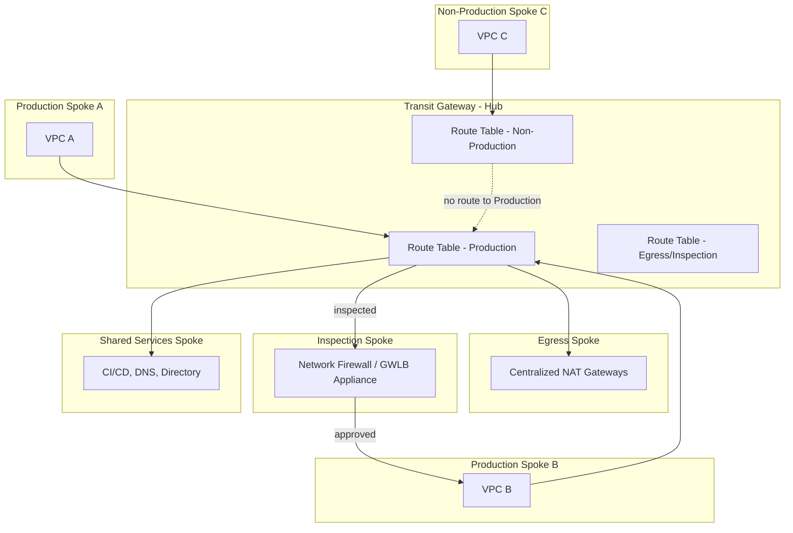
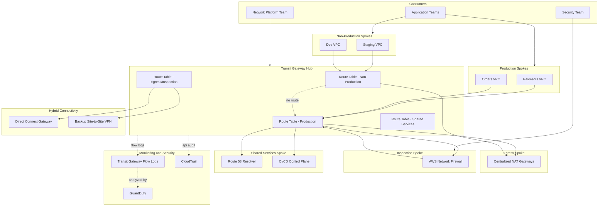
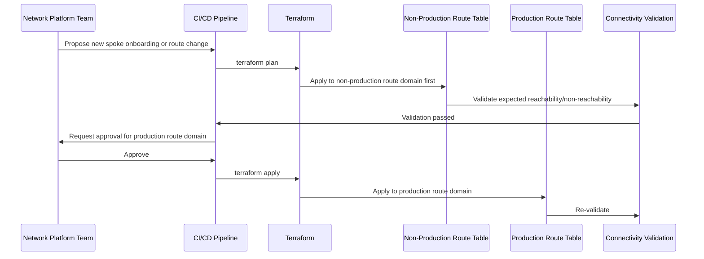

# Part III – Network Architectures

# Chapter 16 – Hub and Spoke Networking

*The AWS Reference Architecture Handbook — 100 Production-Ready Cloud Architectures with AWS, Terraform, AI, Security, FinOps, and Enterprise Design Patterns*

---

## 1. Executive Summary

**The business problem this chapter solves:**

- Chapter 15 designed a single, well-tiered VPC. This chapter answers the next question every growing organization asks: how do many VPCs — dozens, sometimes hundreds — connect to each other, to shared services, and to on-premises networks, without the connectivity model itself becoming unmanageable.
- VPC peering, AWS's simplest inter-VPC connectivity mechanism, does not scale past a small number of VPCs. Peering is non-transitive (if VPC A peers with VPC B, and B peers with C, A still cannot reach C), and the number of peering connections needed for full mesh connectivity grows quadratically with VPC count. At 10 VPCs needing full connectivity, that's 45 peering connections. At 50 VPCs, it's 1,225. Each one is a separate resource to provision, route, and secure.
- Beyond the connection-count problem, a peering mesh has no natural place to enforce centralized security policy. Every VPC's route tables and security groups must independently encode the organization's segmentation rules, with no single point where a security team can inspect or control inter-VPC traffic.
- **Hub and Spoke Networking** solves both problems at once: a central hub (built on AWS Transit Gateway, and at larger scale, optionally AWS Cloud WAN) provides one connection point per VPC ("spoke"), with routing and security policy centrally defined and enforced, rather than replicated independently across every VPC pair.

**The architecture's objective:**

- Give every VPC ("spoke") exactly one attachment to a central hub.
- Let the hub's route tables — not each spoke's own configuration — decide which spokes can reach which other spokes.
- Provide a single, natural insertion point for centralized security inspection (a dedicated inspection VPC), centralized egress (a shared NAT/firewall path), and hybrid connectivity (Direct Connect / VPN termination), all attached to the same hub rather than duplicated per spoke.

**Why organizations adopt this architecture:**

- VPC count has crossed the point where a peering mesh is either already unmanageable or clearly about to become so.
- A security or compliance mandate requires centralized inspection of inter-VPC and outbound internet traffic — something a peering mesh has no natural place to provide.
- A hybrid cloud migration requires connecting many VPCs to an on-premises data center, and provisioning that connectivity per-VPC (per-VPC VPN tunnels, for instance) is both expensive and operationally fragile.
- An organization is formalizing its Chapter 9 multi-account shared services strategy, for which hub-and-spoke networking is the underlying network topology (this chapter is the network-architecture-focused deep dive on the same Transit Gateway pattern Chapter 9 introduced from an account-governance perspective).

**Major business benefits:**

- **Linear, not quadratic, connection growth.** Adding the 51st spoke requires exactly one new attachment, not 50 new peering connections.
- **Centralized security enforcement.** Inter-spoke and spoke-to-internet traffic can be forced through a single inspection point, giving the security team one place to apply, audit, and update policy — instead of auditing dozens of independently-configured VPCs.
- **Centralized, cost-efficient shared infrastructure.** NAT Gateways, Direct Connect termination, and DNS resolution can all be provisioned once, in the hub, rather than duplicated in every spoke.
- **Segmentation without per-spoke complexity.** Traffic segmentation (production cannot reach non-production, for instance) is enforced in the hub's route tables — a spoke's own configuration doesn't need to encode this policy at all.

**Typical enterprise scenarios:**

- An organization with 20+ AWS accounts, each with its own VPC, needing a scalable connectivity model — this is the network-topology backbone of Chapter 9's shared services architecture.
- A regulated enterprise required to demonstrate that all outbound internet traffic and all inter-application-tier traffic passes through a centrally-managed, auditable inspection point.
- An organization migrating from on-premises to AWS in phases, needing every new VPC to automatically gain on-premises connectivity without provisioning a new VPN/Direct Connect path per VPC.
- A company operating multiple business units or product lines, each with several VPCs, needing selective connectivity (this business unit's VPCs can reach shared services, but not each other's VPCs) enforced centrally rather than negotiated bilaterally.

> **Note:** This chapter and Chapter 9 cover overlapping ground from different angles. Chapter 9 treats Transit-Gateway-based hub-and-spoke connectivity as one component of a broader multi-account governance story (account vending, delegated security administration, shared tooling). This chapter treats hub-and-spoke networking as its own subject: route table segmentation strategies, spoke categorization, centralized inspection architecture, and the Transit-Gateway-versus-Cloud-WAN decision, in full depth, independent of the account-governance layer. Read this chapter for the network design itself; read Chapter 9 for how that network design fits into a larger multi-account platform.

---

## 2. Business Requirements

### 2.1 Business Drivers

- **Connectivity scalability.** The connection model must scale linearly with VPC count, not quadratically.
- **Centralized security enforcement.** Inter-spoke and outbound traffic must be inspectable and controllable from a single point.
- **Cost efficiency at scale.** Shared infrastructure (NAT, hybrid connectivity termination) should be provisioned once, not per spoke.

### 2.2 Functional Requirements

| Requirement | Description |
|---|---|
| Any-to-any spoke connectivity, where approved | Any spoke can reach any other spoke it is explicitly permitted to reach |
| Segmented traffic domains | Production spokes cannot reach non-production spokes by default |
| Centralized egress | Spokes route outbound internet traffic through a shared, centrally-managed path |
| Centralized inspection | Traffic between spokes, and between spokes and the internet, can be routed through a firewall/IDS inspection VPC |
| Hybrid connectivity for every spoke | Every spoke automatically gains on-premises connectivity through the hub, without a per-spoke VPN/Direct Connect setup |
| Fast spoke onboarding | A new spoke VPC can be attached and correctly routed within minutes, not days |

### 2.3 Non-Functional Requirements

**Scalability goals:**

- Support growth from a handful of spokes to hundreds without a topology redesign.
- Support the addition of new traffic segments (a new business unit, a new environment tier) without disrupting existing spokes' connectivity.

**Availability requirements:**

- The hub itself must exceed the availability target of any individual spoke it serves — the same principle established in Chapter 9: shared infrastructure sets a ceiling on what any spoke can achieve.
- A common target: 99.95%+ for the hub's core routing function.

**Latency requirements:**

- Inter-spoke traffic routed through the hub should add minimal latency (single-digit milliseconds) relative to a direct connection.
- Traffic routed through a centralized inspection VPC will add additional latency proportional to the inspection appliance's own processing time — a specific, deliberate trade-off this chapter discusses in Section 15.

**Compliance requirements:**

- Demonstrable, centralized enforcement of network segmentation across every spoke, a common and specific ask during a multi-account security audit.
- Full traffic visibility (Flow Logs at the hub and inspection VPC) sufficient to reconstruct any inter-spoke traffic pattern during an investigation.

**Security expectations:**

- No spoke has network-level reachability to another spoke unless explicitly, deliberately routed.
- All outbound internet traffic from spokes without their own dedicated egress passes through the centralized egress/inspection path.

**Recovery objectives:**

| Metric | Baseline Target | Definition |
|---|---|---|
| RTO (hub routing configuration restore) | ≤ 15 minutes | Time to re-apply known-good Terraform state to the hub |
| RTO (inspection VPC failure, fallback to direct routing) | ≤ 10 minutes | Time to reroute around a failed inspection path if a documented bypass procedure exists |

**SLAs:**

- Internal SLAs (platform-to-workload-team commitments) for hub availability, consistent with Chapter 9's guidance on publishing internal SLOs for shared infrastructure.

**Expected workload and growth:**

- Sized against **spoke count**, not request throughput — the hub's own scaling dimension is attachment count and aggregate data-processing volume across all spokes, covered in Section 14.

> **Warning:** A hub-and-spoke design with a single, flat route table shared by every spoke provides no real segmentation value over a peering mesh — it merely centralizes the connection count while still allowing universal reachability. The entire security benefit of this architecture depends on deliberately segmented route tables (Section 9), not merely on using a Transit Gateway instead of peering.

---

## 3. Architecture Overview

### 3.1 Overall Design and Philosophy

- **One attachment per spoke, many possible routing outcomes.** Each spoke VPC attaches to the hub exactly once. What that spoke can reach is entirely a function of which hub route table its attachment is associated with — not anything configured within the spoke itself.
- **Categorize spokes by traffic domain, not by team or application.** Production spokes, non-production spokes, shared-services spokes, and an egress/inspection spoke each get their own route table domain in the hub.
- **Centralize the things that are genuinely common:** egress, inspection, hybrid connectivity termination, and DNS resolution all live in dedicated, shared spokes (or the hub's own infrastructure) rather than being duplicated per application spoke.

### 3.2 Core Components

- **The hub:** an AWS Transit Gateway (or, for very large, multi-region organizations, AWS Cloud WAN — see Section 28).
- **Application spokes:** individual workload VPCs (built per Chapter 15's tiered design), each with a single Transit Gateway attachment.
- **Egress spoke:** a dedicated VPC hosting centralized NAT Gateways, through which spokes without their own NAT route outbound internet traffic.
- **Inspection spoke:** a dedicated VPC hosting a firewall/IDS appliance (AWS Network Firewall, or a third-party virtual appliance via Gateway Load Balancer), through which selected inter-spoke or spoke-to-internet traffic is forced to pass.
- **Shared services spoke:** hosts genuinely common infrastructure (as in Chapter 9) — CI/CD tooling, shared DNS, directory services.
- **Hybrid connectivity attachment:** a Direct Connect Gateway or Site-to-Site VPN attachment to the hub, providing on-premises connectivity to every spoke simultaneously.

### 3.3 How Components Interact

- A spoke's Transit Gateway attachment is associated with exactly one route table (its traffic domain).
- That route table determines which other attachments (spokes, egress, inspection, hybrid) it can route to.
- Traffic requiring inspection is routed first to the inspection spoke, then — if permitted — onward to its actual destination, via the hub's route tables directing traffic through the inspection VPC rather than directly to the destination spoke.

### 3.4 High-Level Workflow

- A production spoke needs to reach a shared-services spoke: its route table includes a route to the shared-services attachment; traffic flows directly through the hub.
- A production spoke needs outbound internet access: its route table routes to the egress spoke's attachment, where centralized NAT Gateways provide the actual internet path.
- A production spoke needs to reach another production spoke, and the organization's policy requires all inter-application traffic to be inspected: the route table sends this traffic to the inspection spoke first, and the inspection VPC's own routing sends it onward to the destination after inspection.



---

## 4. AWS Services Used

### 4.1 AWS Transit Gateway

**Purpose:**

- The hub itself — a regional network transit device that VPCs and on-premises networks attach to, replacing the non-transitive, quadratically-growing peering mesh.

**Why selected:**

- One attachment per VPC, regardless of how many other VPCs it needs to reach.
- Route tables provide fine-grained, centrally-managed control over exactly which attachments can reach which others.

**Alternatives:**

- VPC peering: appropriate only for a small, stable number of VPCs with simple, direct connectivity needs — not this chapter's subject at all past roughly a handful of VPCs.
- AWS Cloud WAN: a higher-level, policy-based network management service for organizations operating across multiple regions, described in Section 28.

**Limitations:**

- Transit Gateway is regional — connecting hubs across multiple regions requires either manual inter-region peering of Transit Gateways or Cloud WAN's higher-level abstraction.
- Attachment count and route count per route table both have quotas — soft, raisable, but worth tracking against growth (Section 14).

**Pricing considerations:**

- Billed per attachment-hour plus a per-GB data processing charge for all traffic traversing the hub — this data processing charge is consistently the largest, most variable cost line item at scale (Section 16).

**Best practices:**

- Use multiple, segmented route tables from the start (Section 9) — never a single flat route table.
- Disable default route table association and propagation, forcing every attachment to be deliberately, explicitly associated with the correct route table.

### 4.2 AWS Network Firewall

**Purpose:**

- A managed network firewall service providing stateful inspection, intrusion detection/prevention, and domain-based filtering — the natural choice for the centralized inspection spoke described in Section 3.2.

**Why selected:**

- Managed scaling and high availability, native integration with Transit Gateway and Gateway Load Balancer routing patterns, and rule-group-based policy management that can be centrally authored and versioned.

**Alternatives:**

- A third-party virtual appliance (Palo Alto, Fortinet, Check Point) deployed behind a Gateway Load Balancer is chosen when the organization has existing investment in, or specific feature requirements from, a particular vendor's firewall product not matched by Network Firewall's native capability.

**Limitations:**

- Adds processing latency to every inspected flow — a real, quantifiable trade-off (Section 15) that should be scoped to genuinely security-sensitive traffic paths, not applied blindly to all traffic including latency-sensitive internal calls that don't need it.

**Pricing considerations:**

- Billed per endpoint-hour plus a per-GB processing charge — at scale, inspecting all inter-spoke traffic (not just internet-bound traffic) can become a very large cost line item, worth scoping deliberately (Section 16).

**Best practices:**

- Scope inspection to genuinely security-relevant traffic paths (e.g., internet-bound egress, cross-business-unit traffic) rather than every single inter-spoke flow, unless compliance genuinely requires full inspection of all traffic.

### 4.3 AWS Cloud WAN

**Purpose:**

- A higher-level network management service providing a global, policy-based network across multiple regions, effectively abstracting over multiple regional Transit Gateways with centrally-defined network policy.

**Why selected (when used):**

- Organizations operating across many regions benefit from Cloud WAN's single, declarative network policy document, rather than manually managing and keeping in sync many regional Transit Gateways.

**Alternatives:**

- A single-region Transit Gateway (Section 4.1) remains the right choice for organizations confined to one or two regions, where Cloud WAN's additional abstraction layer and cost are not yet justified.

**Best practices:**

- Adopt Cloud WAN only once genuine multi-region hub-and-spoke requirements exist — introducing it prematurely for a single-region organization is unjustified complexity (Section 27).

### 4.4 AWS Resource Access Manager (RAM)

**Purpose:**

- Shares Transit Gateway attachments and other resources across accounts within an AWS Organization, letting spoke VPCs in different accounts attach to a centrally-owned hub without complex custom cross-account IAM authoring.

**Why selected:**

- The native AWS mechanism purpose-built for exactly this cross-account resource-sharing need, covered in more depth from the account-governance angle in Chapter 9.

### 4.5 Direct Connect Gateway / Site-to-Site VPN

**Purpose:**

- Terminates hybrid, on-premises connectivity at the hub, providing every attached spoke with on-premises reachability simultaneously.

**Why selected:**

- Removes the need to provision separate hybrid connectivity per spoke VPC — a single termination point, attached once to the hub, serves every spoke.

**Best practices:**

- Provision redundant Direct Connect circuits or a backup VPN path — a single termination point is now a single point of failure for every spoke's hybrid connectivity, a materially higher blast radius than a single VPC's own connectivity failing.

### 4.6 Route 53 Resolver

**Purpose:**

- Provides DNS query forwarding between AWS-hosted private zones and on-premises DNS infrastructure, and centralized private DNS resolution across every spoke attached to the hub.

**Why selected:**

- Without a centralized resolver strategy, each spoke would need its own DNS forwarding configuration to reach on-premises names, duplicating effort and creating inconsistency.

### 4.7 IAM, CloudWatch, CloudTrail, GuardDuty

- Applied with the same rigor as Chapters 9 and 15, with this chapter's specific emphasis being **Transit Gateway Flow Logs** and **Network Firewall logging**, both of which feed GuardDuty and Athena-based analysis for the hub's own traffic patterns.

---

## 5. Complete Architecture Diagram



---

## 6. Component-by-Component Explanation

| Component | Purpose | Scaling | High Availability | Failure Handling | Dependencies |
|---|---|---|---|---|---|
| Transit Gateway (hub) | Central routing point for all spokes | Scales to thousands of attachments per quota | Regionally resilient by design | Route table misconfiguration is the dominant real-world failure mode | Route tables, VPC attachments, RAM shares |
| Application spoke VPCs | Host individual workloads | Independently scaled per Chapter 1/5/15 guidance | Multi-AZ per each spoke's own internal design | Spoke-internal failures don't affect other spokes | Chapter 15's tiered VPC design |
| Egress spoke | Provides shared, centralized outbound internet path | Scales via added NAT Gateway capacity | Multi-AZ NAT Gateway deployment within the spoke | AZ-scoped NAT failure affects only that AZ's egress capacity | Transit Gateway attachment, Elastic IPs |
| Inspection spoke | Centralized traffic inspection | Scales via Network Firewall's managed capacity or additional appliance instances | Multi-AZ deployment recommended given organization-wide dependency | Firewall failure can be configured to fail-open or fail-closed — a deliberate design decision (Section 24) | Transit Gateway attachment, Gateway Load Balancer (if third-party appliance) |
| Shared services spoke | Hosts genuinely common infrastructure | Per Chapter 9's guidance | Per Chapter 9's guidance | Per Chapter 9's guidance | Transit Gateway attachment |
| Hybrid connectivity attachment | On-premises reachability for every spoke | Scales with Direct Connect circuit bandwidth | Redundant circuits/tunnels recommended | Single point of failure for every spoke's hybrid connectivity if not redundant | Direct Connect Gateway or VPN, Transit Gateway attachment |

---

## 7. End-to-End Request Flow

**Flow: a request from the Orders VPC (production spoke) to the Payments VPC (production spoke), subject to mandatory inter-application inspection:**

1. The Orders application resolves the Payments service's internal DNS name via the **shared Route 53 Resolver**.
2. The request is routed out of the Orders VPC toward the **Transit Gateway attachment**, since the destination is outside the local VPC's CIDR.
3. The **production route table** evaluates the destination; because organization policy requires inspection of inter-application traffic, the route table sends the traffic to the **inspection spoke's** attachment first, not directly to Payments.
4. The **Network Firewall** in the inspection spoke evaluates the traffic against configured rule groups.
5. If **permitted**, the inspection VPC's own routing forwards the traffic onward to the Payments VPC's attachment.
6. If **denied**, the traffic is dropped and logged; the Orders application experiences a connection failure.
7. The Payments VPC's application processes the request.
8. The response follows the same inspected path in reverse.
9. **Transit Gateway Flow Logs** and **Network Firewall logs** both capture this flow, feeding the centralized log archive (Chapter 9) for audit and troubleshooting.

**Flow: a request from the Staging VPC (non-production spoke) attempting to reach the Payments VPC (production spoke):**

10. The **non-production route table** has no route to the production spoke's attachment at all.
11. The request fails at the network layer — a deliberate, policy-enforced outcome, not a fault requiring investigation.

---

## 8. Deployment Flow

- Infrastructure provisioning for the hub follows the same Terraform-first, staged-rollout discipline established in Chapter 9 — this chapter's specific addition is around **spoke onboarding automation** specifically.
- **Spoke onboarding as a repeatable, automated process:**
  - A new spoke VPC's Transit Gateway attachment creation, route table association, and any required inspection routing should be a single, automated pipeline step — not a manually-executed, one-off procedure repeated (and potentially done inconsistently) for every new spoke.
- **Blue-green concepts for hub changes:**
  - As in Chapter 9, there is no traffic-shifting equivalent for a route table change — the safety mechanism is staged rollout: apply to a non-production spoke's route table domain first, validate, then apply to production route table domains.
- **Rollback:**
  - Rolling back a route table change means reverting to the previous Terraform-defined route set and re-applying — genuinely fast, but only as safe as the pre-deployment question "is rolling this back itself safe" (Chapter 9's guidance) has been considered.
- **Validation:**
  - Automated connectivity tests confirming both expected reachability (production to shared services) and expected non-reachability (non-production to production) after every hub change.



---

## 9. Network Topology

### 9.1 Spoke Categorization

- **Production spokes:** application VPCs hosting live, customer-facing or business-critical workloads.
- **Non-production spokes:** staging, development, and test VPCs.
- **Shared services spoke(s):** the Chapter 9 shared tooling/security/identity accounts' VPCs.
- **Egress spoke:** dedicated VPC hosting centralized NAT Gateways.
- **Inspection spoke:** dedicated VPC hosting the firewall/IDS appliance.

### 9.2 Route Table Segmentation Strategy

| Route Table Domain | Can Reach | Cannot Reach (by default) |
|---|---|---|
| Production | Shared services, egress/inspection, hybrid on-premises | Non-production spokes |
| Non-production | Shared services (read-only subset), egress/inspection | Production spokes |
| Shared services | Production, non-production (as needed for the specific shared service) | N/A — shared services is often intentionally reachable from both domains |
| Egress/inspection | Internet (via NAT), on-premises (via hybrid attachment) | Direct spoke-to-spoke traffic that hasn't been explicitly routed through it |

- This is the single most important design decision in the entire chapter: **route table domain boundaries are the actual security control**, not a detail to be finalized later.
- Disable default route table association and propagation on the Transit Gateway itself, forcing every new attachment to be deliberately assigned to the correct domain rather than defaulting to universal reachability.

### 9.3 CIDR and IPAM

- Every spoke's CIDR is allocated via IPAM (Chapter 15), coordinated centrally to guarantee non-overlapping ranges across every spoke that might ever need to communicate through the hub.
- The hub itself does not need its own large CIDR allocation — Transit Gateway is a routing construct, not an address space consumer, aside from the small subnets each spoke reserves for its own TGW attachment ENIs (per Chapter 15's guidance).

### 9.4 Centralized Egress Design

- Spokes without their own dedicated NAT Gateways route outbound internet traffic to the egress spoke via the hub.
- This is a direct cost/architecture trade-off (introduced in Chapter 9, Section 9): centralized egress reduces NAT Gateway *fixed* cost at scale, but adds Transit Gateway data processing charges for that same traffic.
- Spokes with very high outbound traffic volume may be better served by their own dedicated NAT Gateways, bypassing the centralized path — a deliberate, cost-modeled exception, not a universal rule.

### 9.5 Centralized Inspection Design

- Two common patterns:
  - **North-south inspection only:** traffic between spokes and the internet (or on-premises) is inspected; spoke-to-spoke traffic is not.
  - **East-west inspection also:** inter-spoke traffic is also routed through inspection — a stronger security posture, at meaningfully higher latency and cost (Section 15, Section 16).
- Choose based on the organization's actual compliance requirement — full east-west inspection is justified for genuinely high-sensitivity environments (financial transaction processing between services, for instance), not a default for every inter-spoke call.

### 9.6 Hybrid Connectivity

- Terminate Direct Connect / VPN at the hub, not at individual spokes.
- Provision redundant circuits/tunnels — a single hybrid connectivity path is now a single point of failure for every attached spoke, not just one VPC.

### 9.7 PrivateLink as a Complement, Not a Replacement

- For narrow, specific cross-spoke service consumption (one spoke needing to reach one specific service in another spoke), PrivateLink (an Interface VPC Endpoint backed by a Network Load Balancer in the provider spoke) is often preferable to a full hub-routed path, because it exposes only the specific service, not broader VPC-to-VPC reachability.
- Use hub-and-spoke routing for genuine, broad connectivity needs; use PrivateLink for narrow, specific service exposure — the two patterns complement each other rather than compete.

---

## 10. Identity and Access

- **IAM Roles:**
  - A dedicated **hub-admin Terraform role**, scoped to Transit Gateway, route table, and RAM share management — distinct from any spoke-level or application-level role.
- **Cross-account access:**
  - Spoke VPCs typically live in different accounts (per Chapter 9) than the hub itself; RAM shares (Section 4.4) are the mechanism by which a spoke account's VPC can create a Transit Gateway attachment against a hub owned by a different account.
- **Least privilege:**
  - No spoke account's own IAM roles should have permission to modify the hub's route tables — route table domain assignment is exclusively the network platform team's responsibility, enforced via IAM policy, not merely convention.
- **Permission boundaries:**
  - Applied to any automation-created role in the spoke onboarding pipeline (Section 8), capping the maximum permissions that pipeline's automation can ever grant.

---

## 11. Security Architecture

- **The route table segmentation strategy (Section 9.2) is this chapter's primary security control** — every other control (encryption, WAF, GuardDuty) operates within whatever reachability the route tables already establish.
- **Encryption:** Direct Connect traffic can optionally be encrypted via MACsec; Site-to-Site VPN traffic is encrypted by design (IPsec).
- **Network Firewall / inspection appliance rule groups** should be centrally authored and version-controlled, just as Chapter 9 insists for Service Control Policies — a security-critical, organization-wide-blast-radius configuration deserving the same review rigor.
- **Zero Trust:** no spoke is trusted merely because it is "attached to the same hub" — every route table domain boundary is an explicit, reviewed, minimal-reachability decision.
- **GuardDuty** consumes Transit Gateway Flow Logs directly, extending its anomaly-detection capability across the entire hub-and-spoke topology, not just a single VPC.

**Threat model summary:**

| Attack Vector | Mitigation |
|---|---|
| A compromised non-production spoke reaching production | No route from the non-production route table domain to production, by design |
| Uninspected lateral movement between application spokes | East-west inspection routing (Section 9.5) for genuinely sensitive traffic paths |
| A single, flat route table providing accidental universal reachability | Disabled default association/propagation; explicit, segmented route tables from the start |
| Hybrid connectivity compromise providing on-premises attackers a path to every spoke | Hub-level route table scoping of exactly which spokes can reach the hybrid attachment |
| Overly broad RAM share granting unintended spoke onboarding capability | Scoped RAM principal associations, reviewed regularly |

---

## 12. High Availability

- **AZ failures** within any individual spoke are handled per that spoke's own internal design (Chapter 1, Chapter 5, or Chapter 15's guidance) — the hub itself does not change this.
- **Egress spoke AZ failures:** one NAT Gateway per AZ within the egress spoke, per Chapter 1's standard guidance, so a single AZ's NAT failure affects only that AZ's centralized-egress traffic.
- **Inspection spoke failures:** a genuinely important design decision is whether the inspection path **fails open** (traffic proceeds uninspected if the firewall is unavailable) or **fails closed** (traffic is blocked entirely if the firewall is unavailable) — covered explicitly in Section 24; there is no universally correct answer, only a deliberate, documented choice matched to the organization's actual risk tolerance.
- **Regional failures:** a single-region Transit Gateway hub is itself a regional single point of failure for every attached spoke's inter-spoke connectivity — organizations with genuine multi-region requirements should evaluate Cloud WAN (Section 28) or manually-peered regional hubs.
- **Hybrid connectivity failures:** redundant Direct Connect circuits or a backup VPN path, given the organization-wide blast radius of a single termination point's failure.

---

## 13. Disaster Recovery

- **Backup strategy:** the hub's entire configuration (route tables, attachments, associations) is Terraform-defined and re-appliable — the "backup" is the version-controlled codebase, consistent with Chapter 9's guidance.
- **The genuinely important DR consideration specific to this chapter:** if the inspection spoke fails and the organization has chosen a fail-closed design, every route depending on inspection is effectively down until the inspection spoke recovers or a documented bypass procedure is executed — this makes the inspection spoke's own availability design (Section 12) a first-class DR concern, not a secondary one.
- **DR classification:** Pilot Light-equivalent for the hub's own routing configuration (re-appliable from Terraform); the egress and inspection spokes' own internal resilience follows standard Multi-AZ guidance.

| Component | DR Approach | RTO | RPO |
|---|---|---|---|
| Hub route tables/attachments | Terraform re-apply | ≤ 15 minutes | Near-zero |
| Inspection spoke (fail-closed design) | Multi-AZ redundancy plus a documented, tested bypass procedure | ≤ 10 minutes to execute bypass if needed | Near-zero |
| Hybrid connectivity | Redundant circuit/tunnel failover | Automatic if redundant, else manual escalation | Near-zero |

---

## 14. Scalability

- **Horizontal scaling** in this chapter's context means adding spokes, not adding request-throughput capacity — the hub's scaling dimension is attachment count and aggregate data-processing volume.
- **Explicit scaling ceiling guidance:**
  - Track Transit Gateway attachment count against the current service quota, requesting increases proactively well ahead of need.
  - Track route table complexity as organizations approach hundreds of spokes — at that scale, reasoning about a single, large Transit Gateway's route tables by hand becomes genuinely difficult, and Cloud WAN's policy-based abstraction (Section 28) becomes worth evaluating.
- **Egress and inspection spoke scaling** follow their own internal Auto Scaling / managed-service scaling guidance (NAT Gateway capacity, Network Firewall's managed throughput scaling).

---

## 15. Performance Optimization

- **Inspection latency is this chapter's most distinctive performance trade-off.** Every inspected flow incurs the firewall/appliance's own processing latency — scope inspection deliberately (Section 9.5) rather than applying it universally to traffic that doesn't need it.
- **Centralized egress versus dedicated NAT** is a latency and cost trade-off simultaneously: centralized egress adds a hub traversal hop; a spoke with very high-volume, latency-sensitive outbound traffic may be better served by its own dedicated NAT Gateway.
- **DNS resolution latency:** centralizing Route 53 Resolver in a shared services spoke adds a hub traversal for every private DNS query from every other spoke — generally negligible in absolute terms, but worth being aware of for extremely latency-sensitive applications.

---

## 16. Cost Optimization (FinOps)

### 16.1 Estimated Monthly Cost by Spoke Count

| Component | Small (5-10 spokes) | Medium (25-50 spokes) | Enterprise (100+ spokes) |
|---|---|---|---|
| Transit Gateway attachments | ~$150 | ~$750 | ~$3,000+ |
| Transit Gateway data processing | ~$200 | ~$1,500 | ~$10,000+ |
| Egress spoke NAT Gateways | ~$150 | ~$400 | ~$1,200+ |
| Inspection spoke (Network Firewall) | ~$300 | ~$1,000 | ~$4,000+ |
| Hybrid connectivity (Direct Connect/VPN) | ~$300 | ~$300 | ~$1,000+ |
| **Approximate Total** | **~$1,100/mo** | **~$3,950/mo** | **~$19,000+/mo** |

### 16.2 Major Cost Drivers and Optimization

- **Transit Gateway data processing charges** are, as in Chapter 9, consistently the largest and most variable cost line — driven by actual inter-spoke and egress traffic volume.
  - Optimization: periodic traffic pattern analysis (correlating Transit Gateway Flow Logs with Cost Explorer) to identify unexpectedly high-volume flows, and to evaluate whether a specific high-traffic spoke pair would be better served by direct peering (bypassing the hub) for that specific relationship.
- **Inspection cost** scales with inspected traffic volume — scoping inspection to genuinely necessary paths (Section 9.5) rather than blanket east-west inspection of every flow directly controls this cost.
- **Cost allocation:** tag every spoke and attachment clearly, so hub-level costs (Transit Gateway data processing, inspection) can be fairly attributed back to the specific spokes generating them, consistent with Chapter 9's chargeback guidance.

---

## 17. AI-Assisted Operations

- **Architecture review:** using Amazon Q or a Bedrock-backed tool to review a proposed route table change against the organization's documented segmentation policy before human review — given how easy it is to introduce an unintended reachability path across dozens of spokes by hand, this is a genuinely high-value application.
- **Cost analysis:** correlating Transit Gateway Flow Logs with Cost Explorer data to identify the specific spoke pairs driving data processing cost, exactly the traffic-pattern-analysis exercise described in Section 16.
- **AI-generated Terraform** for a new spoke's onboarding configuration should go through the same review and connectivity-validation gates as any hand-written change, given the organization-wide blast radius of a hub-level mistake.

---

## 18. Terraform Implementation

```

infrastructure/
├── modules/
│   ├── transit-gateway-hub/
│   ├── egress-spoke/
│   ├── inspection-spoke/
│   └── spoke-attachment/
├── environments/
│   └── networking-account/
└── backend.tf

```

**Hub with segmented route tables:**

```hcl

# modules/transit-gateway-hub/main.tf

resource "aws_ec2_transit_gateway" "hub" {
  description                     = "Hub and Spoke - Central Transit Gateway"
  amazon_side_asn                  = 64512
  default_route_table_association  = "disable"
  default_route_table_propagation  = "disable"

  tags = { Name = "hub-and-spoke-tgw" }
}

resource "aws_ec2_transit_gateway_route_table" "production" {
  transit_gateway_id = aws_ec2_transit_gateway.hub.id
  tags                = { Name = "rt-production" }
}

resource "aws_ec2_transit_gateway_route_table" "non_production" {
  transit_gateway_id = aws_ec2_transit_gateway.hub.id
  tags                = { Name = "rt-non-production" }
}

resource "aws_ec2_transit_gateway_route_table" "egress_inspection" {
  transit_gateway_id = aws_ec2_transit_gateway.hub.id
  tags                = { Name = "rt-egress-inspection" }
}

```

**Spoke attachment module, reused for every new spoke:**

```hcl

# modules/spoke-attachment/main.tf

resource "aws_ec2_transit_gateway_vpc_attachment" "spoke" {
  transit_gateway_id = var.transit_gateway_id
  vpc_id              = var.spoke_vpc_id
  subnet_ids          = var.spoke_tgw_subnet_ids

  tags = { Name = "attach-${var.spoke_name}" }
}

resource "aws_ec2_transit_gateway_route_table_association" "spoke" {
  transit_gateway_attachment_id  = aws_ec2_transit_gateway_vpc_attachment.spoke.id
  transit_gateway_route_table_id = var.route_table_id
}

resource "aws_ec2_transit_gateway_route_table_propagation" "spoke" {
  transit_gateway_attachment_id  = aws_ec2_transit_gateway_vpc_attachment.spoke.id
  transit_gateway_route_table_id = var.route_table_id
}

```

**Production route table: route to shared services, egress/inspection, but NOT non-production:**

```hcl

# environments/networking-account/routes.tf

resource "aws_ec2_transit_gateway_route" "production_to_shared" {
  destination_cidr_block         = var.shared_services_cidr
  transit_gateway_attachment_id  = module.shared_services_attachment.attachment_id
  transit_gateway_route_table_id = aws_ec2_transit_gateway_route_table.production.id
}

resource "aws_ec2_transit_gateway_route" "production_to_egress_inspection" {
  destination_cidr_block         = "0.0.0.0/0"
  transit_gateway_attachment_id  = module.inspection_spoke_attachment.attachment_id
  transit_gateway_route_table_id = aws_ec2_transit_gateway_route_table.production.id
}

# Deliberately no route from production to non-production — the absence

# of a route IS the segmentation control.

```

**Best practices applied above:**

- `default_route_table_association`/`propagation` disabled, forcing every attachment through deliberate, explicit association.
- A single, reusable `spoke-attachment` module invoked once per new spoke, with the target route table passed as a variable — this is what makes spoke onboarding a fast, consistent, repeatable operation rather than a bespoke, error-prone process each time.
- The absence of a route between production and non-production route tables is the actual security control, documented explicitly with a comment rather than left as an unexplained gap.

---

## 19. AWS CLI Examples

**Deployment validation:**

```bash

# Confirm a new spoke's attachment is associated with the correct route table

aws ec2 describe-transit-gateway-attachments \
  --filters Name=state,Values=available \
  --query 'TransitGatewayAttachments[*].[TransitGatewayAttachmentId,ResourceId,Association.TransitGatewayRouteTableId]' \
  --output table

```

**Monitoring:**

```bash

# Check data processing volume per attachment, to identify the highest-cost spokes

aws cloudwatch get-metric-statistics \
  --namespace AWS/TransitGateway \
  --metric-name BytesIn \
  --dimensions Name=TransitGatewayAttachment,Value=tgw-attach-0123456789abcdef0 \
  --start-time $(date -u -d '24 hours ago' +%Y-%m-%dT%H:%M:%S) \
  --end-time $(date -u +%Y-%m-%dT%H:%M:%S) \
  --period 3600 \
  --statistics Sum

```

**Troubleshooting:**

```bash

# Confirm whether a route exists between two spokes' route table domains

aws ec2 search-transit-gateway-routes \
  --transit-gateway-route-table-id tgw-rtb-0123456789abcdef0 \
  --filters Name=type,Values=static,propagated

# Review Network Firewall logs for a blocked flow

aws logs start-query \
  --log-group-name "/inspection/network-firewall" \
  --start-time $(date -d '30 minutes ago' +%s) \
  --end-time $(date +%s) \
  --query-string 'fields @timestamp, event.src_ip, event.dest_ip, event.alert.action | filter event.alert.action = "blocked" | sort @timestamp desc'

```

**Cleanup:**

```bash

# Identify stale route entries referencing a decommissioned spoke attachment

aws ec2 search-transit-gateway-routes \
  --transit-gateway-route-table-id tgw-rtb-0123456789abcdef0 \
  --filters Name=state,Values=blackhole

```

---

## 20. CI/CD Integration

- Spoke onboarding should be a **single, automated pipeline** — invoked by a workload team requesting a new spoke, executing the `spoke-attachment` module with the correct route table target, and running automated connectivity validation before marking the onboarding complete.
- Mandatory multi-approver review for any change to a route table's route set, given the organization-wide blast radius, consistent with Chapter 9's guidance.
- **Policy as Code** validation of proposed route changes against the documented segmentation policy (e.g., "production route tables must never contain a route to a non-production attachment") as an automated, blocking pipeline check, not solely a manual review.

---

## 21. Monitoring

- Dashboards tracking: attachment count and state, data processing volume per attachment, inspection spoke throughput and blocked-flow rate, and hybrid connectivity tunnel/circuit health.
- **The specific alarm that matters most here:** an unexpected route appearing in a production route table domain — a strong signal of either a misconfiguration or a policy violation, and one of the highest-value automated checks this chapter's architecture can implement.
- **SLOs:** published hub connectivity availability (e.g., 99.95% monthly), consistent with Chapter 9's guidance on internal shared-infrastructure SLOs.

---

## 22. Logging

- **Transit Gateway Flow Logs** and **Network Firewall logs** are this chapter's primary logging artifacts, both delivered to the centralized log archive (Chapter 9) for retention and Athena-based analysis.
- Retention should match the organization's most stringent applicable compliance requirement.

---

## 23. Operational Excellence

- **Runbooks** should cover: "unexpected cross-domain connectivity discovered," "inspection spoke failure — execute documented bypass or wait for recovery, per the fail-open/fail-closed decision," and "hybrid connectivity failure — failover to backup circuit/tunnel."
- **Change management:** every hub-level change goes through staged rollout and multi-approver review — there is no exception for "just a small route table tweak," given how easily a small route table change can have organization-wide consequences.

---

## 24. Failure Scenarios

| # | Scenario | Symptoms | Root Cause | Detection | Resolution | Prevention |
|---|---|---|---|---|---|---|
| 1 | Route table misconfiguration granting unintended cross-domain reachability | Security review or automated policy check flags an unexpected route | Manual error or incomplete review during a route table change | Automated policy-as-code check (Section 20), or a scheduled route table audit | Remove the erroneous route immediately | Mandatory policy-as-code validation as a blocking pipeline gate |
| 2 | Inspection spoke failure, fail-closed design | All traffic requiring inspection is blocked | Firewall appliance or Network Firewall endpoint failure | Application-level connectivity failures correlated with inspection spoke health alarms | Execute documented bypass procedure or wait for automatic recovery | Multi-AZ inspection spoke deployment; tested bypass procedure |
| 3 | Inspection spoke failure, fail-open design | Traffic proceeds uninspected during the outage | Same as above | Firewall health alarm without corresponding connectivity failure (the "silent" failure mode of fail-open) | Restore the firewall, review traffic that passed uninspected during the outage window | Explicit alarming on firewall health independent of application-level symptoms, since fail-open hides the problem from downstream applications |
| 4 | Centralized egress NAT exhaustion across many spokes | Multiple spokes experience simultaneous outbound connection failures | Aggregate outbound traffic across all spokes using centralized egress exceeded capacity | NAT Gateway `ErrorPortAllocation` metric | Add NAT capacity, or migrate the highest-volume spokes to dedicated NAT Gateways | Capacity planning against aggregate, not per-spoke, projected traffic |
| 5 | Hybrid connectivity single point of failure | Complete loss of on-premises connectivity for every attached spoke | Non-redundant Direct Connect circuit or VPN tunnel failure | AWS Health Dashboard, tunnel status metrics | Failover to redundant circuit/tunnel if provisioned | Redundant hybrid connectivity from the start, given the organization-wide blast radius |
| 6 | Overlapping CIDR between two spokes discovered at attachment time | Cannot attach a new spoke without a workaround | No IPAM discipline enforced during spoke VPC creation | Discovered during the attachment attempt | Re-IP the offending spoke (disruptive) or implement a NAT-based workaround | IPAM-managed CIDR allocation enforced from the first spoke onward |
| 7 | Route table complexity grows unmanageable at scale | Engineers struggle to confidently reason about the current segmentation state | Organic growth in spoke count and route entries without periodic simplification | A security review or onboarding delay caused by route table confusion | Simplify and document the route table structure, consider Cloud WAN if genuinely multi-region | Periodic route table hygiene review as spoke count grows |
| 8 | Spoke onboarded to the wrong route table domain | The new spoke has incorrect (too broad or too narrow) connectivity from day one | Manual error in the onboarding process, or an automation bug | Post-onboarding connectivity validation (mandatory per Section 20) | Correct the route table association | Automated, mandatory post-onboarding validation, never skipped |
| 9 | RAM share too broadly scoped | An unintended account/spoke can create attachments against the hub | Overly permissive principal association in the RAM share | Periodic RAM share audit | Tighten the principal association | Scope RAM shares narrowly and review them regularly |
| 10 | Network Firewall rule group change inadvertently blocks legitimate traffic | Multiple spokes report unexpected connection failures simultaneously | An overly broad deny rule in a centrally-updated rule group | Elevated Network Firewall block-rate alarm correlated with the rule group's last change | Roll back the rule group change | Staged rollout and testing of rule group changes, same discipline as route table changes |
| 11 | Cost anomaly from an unexpectedly chatty spoke pair | Sudden Transit Gateway data processing cost spike | A misconfigured application generating excessive inter-spoke traffic (e.g., a retry storm) | Cost Anomaly Detection, Flow Log analysis by spoke pair | Engage the responsible team to fix the underlying traffic pattern | Per-spoke traffic/cost visibility dashboards |
| 12 | A spoke's TGW attachment subnet undersized or misconfigured | Attachment creation fails or behaves unexpectedly | Insufficient IP addresses reserved in the spoke's TGW attachment subnet | Attachment creation error | Correct the subnet configuration | Follow Chapter 15's `/28`-per-AZ sizing guidance for TGW attachment subnets consistently |
| 13 | Direct Connect Gateway BGP session flapping | Intermittent hybrid connectivity | Carrier-side or on-premises router BGP instability | CloudWatch BGP session state metrics | Engage the carrier/network team to stabilize the BGP session | Redundant, diverse-path circuits reducing single-session dependency |
| 14 | A spoke bypasses the intended inspection path via a manually-added direct route | Traffic reaches its destination without passing through inspection, undetected | A manual or automation error added a direct route alongside the intended inspected route | Policy-as-code check catching the unintended direct route | Remove the bypass route | Mandatory policy-as-code validation, specifically checking for unintended direct routes around inspection |
| 15 | Transit Gateway attachment quota approached without warning | New spoke onboarding blocked | No proactive quota tracking against spoke growth | Attachment creation failure | Request a quota increase from AWS | Proactive quota tracking against spoke growth projections (Section 14) |

---

## 25. Troubleshooting Guide

| Problem | Symptoms | Likely Cause | Diagnosis | AWS CLI Commands | Resolution |
|---|---|---|---|---|---|
| Spoke cannot reach another spoke | Connection timeout | No route between the two route table domains, possibly by design | Check both spokes' route table associations and the hub's route entries | `aws ec2 describe-transit-gateway-route-tables`, `aws ec2 search-transit-gateway-routes` | If the reachability is intended, add the missing route via the reviewed change process; if not intended, no action needed |
| Spoke cannot reach the internet | Outbound requests time out | Missing route to the egress spoke, or centralized NAT exhaustion | Check the spoke's route table for a default route, check NAT Gateway metrics | `aws ec2 describe-route-tables`, `aws cloudwatch get-metric-statistics` | Add the missing route or increase NAT capacity |
| Legitimate traffic blocked unexpectedly | Application reports connection refused/reset | An overly broad Network Firewall rule group change | Review firewall logs for the specific blocked flow | `aws logs start-query` against firewall logs | Correct the rule group, following the staged rollout process |
| New spoke onboarding stuck | Attachment created but connectivity validation fails | Incorrect route table association, or a missing propagation | Compare the spoke's actual association against the intended route table | `aws ec2 describe-transit-gateway-attachments` | Correct the association/propagation |
| Unexpected cost spike | Cost Anomaly Detection alert | A specific spoke pair generating high-volume, unexpected traffic | Transit Gateway Flow Log analysis by source/destination | `aws ce get-cost-and-usage`, Flow Log query via Athena | Engage the responsible team; consider direct peering for that specific high-volume pair if hub traversal is genuinely unnecessary for it |
| Hybrid connectivity down | On-premises systems unreachable from any spoke | Direct Connect/VPN failure | Check AWS Health Dashboard and tunnel/circuit status | `aws directconnect describe-connections` | Failover to redundant path if available; escalate to carrier if not |

---

## 26. Best Practices

1. Use Transit Gateway (or Cloud WAN for genuine multi-region needs) rather than a peering mesh once spoke count exceeds a handful.
2. Disable default route table association and propagation on the Transit Gateway from creation.
3. Segment route tables by traffic domain (production, non-production, shared services, egress/inspection) — never a single flat route table.
4. Treat the absence of a route between domains as the primary security control, and document it explicitly.
5. Allocate every spoke's CIDR via IPAM, coordinated centrally across the entire hub.
6. Reserve a dedicated, small Transit Gateway attachment subnet in every spoke, per Chapter 15's sizing guidance.
7. Centralize egress via a dedicated egress spoke for spokes without high enough traffic volume to justify their own NAT Gateways.
8. Centralize inspection via a dedicated inspection spoke, scoped deliberately (north-south only, or north-south plus east-west) based on actual compliance requirements.
9. Make an explicit, documented fail-open versus fail-closed decision for the inspection path — never leave it as an accidental default.
10. Provision redundant Direct Connect circuits or a backup VPN path for hybrid connectivity terminated at the hub.
11. Build a single, reusable spoke onboarding Terraform module, invoked consistently for every new spoke.
12. Require automated, mandatory post-onboarding connectivity validation for every new spoke.
13. Require multi-approver review and staged rollout for any hub-level route table or Network Firewall rule group change.
14. Implement policy-as-code validation catching unintended cross-domain routes or inspection bypasses automatically.
15. Track Transit Gateway attachment count and route table complexity against growth projections, proactively.
16. Scope RAM shares narrowly, reviewed on a recurring basis.
17. Scope the hub-admin IAM role tightly, distinct from any spoke-level or application-level role.
18. Never grant a spoke account's own IAM roles permission to modify the hub's route tables.
19. Feed Transit Gateway Flow Logs and Network Firewall logs into GuardDuty and a centralized log archive.
20. Publish an internal SLO for hub connectivity availability, given its ceiling effect on every downstream spoke.
21. Periodically analyze Transit Gateway traffic patterns to identify unexpectedly costly or architecturally unnecessary flows.
22. Consider direct peering (bypassing the hub) for a specific, genuinely high-volume, stable spoke pair when hub traversal cost/latency for that pair is disproportionate.
23. Use PrivateLink for narrow, specific cross-spoke service exposure rather than broad hub-routed reachability where only one service needs to be reached.
24. Tag every spoke and attachment clearly for cost allocation.
25. Adopt Cloud WAN only once genuine multi-region hub-and-spoke requirements exist, not preemptively.
26. Test the hybrid connectivity failover path on a scheduled basis, not only during an actual outage.
27. Test the inspection spoke's bypass procedure (if fail-closed) on a scheduled basis.
28. Review the route table structure periodically for accumulated, no-longer-needed exceptions, especially as spoke count grows.
29. Establish clear ownership: the network platform team owns the hub and its route tables; workload teams own their own spoke VPC's internal design.
30. Document every deliberate deviation from the standard route table segmentation (e.g., a specific spoke granted an unusual cross-domain route) explicitly in an ADR.

---

## 27. Anti-Patterns

1. **A single, flat Transit Gateway route table for every spoke** — Dangerous because it provides no real segmentation benefit over a peering mesh, merely centralizing the connection count. Correct approach: segmented route tables by traffic domain from the start.
2. **Leaving default route table association/propagation enabled** — Dangerous because every new attachment defaults to universal reachability unless someone remembers to change it. Correct approach: disable both, forcing deliberate association.
3. **No IPAM discipline across spokes** — Dangerous because overlapping CIDRs block future attachments and require disruptive re-IP-ing to resolve. Correct approach: centrally-coordinated IPAM from the first spoke.
4. **Inspecting every single inter-spoke flow "to be safe," without regard to actual compliance need** — Dangerous in the sense of unnecessary cost and latency, disproportionate to the actual risk being mitigated. Correct approach: scope inspection deliberately based on genuine sensitivity, not blanket application.
5. **No fail-open/fail-closed decision made explicitly for the inspection path** — Dangerous because an accidental default (often fail-open, silently) can leave the organization exposed without anyone realizing inspection stopped happening. Correct approach: an explicit, documented, deliberately-chosen failure mode.
6. **A single, non-redundant hybrid connectivity termination point** — Dangerous because its failure affects every attached spoke simultaneously. Correct approach: redundant circuits/tunnels given the organization-wide blast radius.
7. **Manually onboarding each new spoke via ad hoc console or one-off script actions** — Dangerous because inconsistent onboarding produces spokes with incorrect or inconsistent route table associations. Correct approach: a single, reusable, automated onboarding module.
8. **Skipping post-onboarding connectivity validation** — Dangerous because a misconfigured new spoke's incorrect reachability may not be discovered until it causes an incident or a security finding. Correct approach: mandatory, automated validation after every onboarding.
9. **Granting spoke-account IAM roles permission to modify hub route tables** — Dangerous because it undermines the entire centralized-control value proposition of this architecture. Correct approach: hub route table management is exclusively the network platform team's IAM-enforced responsibility.
10. **Overly broad RAM share principal associations** — Dangerous because it allows unintended accounts to create attachments against the hub. Correct approach: narrowly-scoped, regularly-reviewed RAM shares.
11. **No policy-as-code validation of proposed route changes** — Dangerous because a subtle, manually-introduced route mistake can silently create an unintended cross-domain reachability path. Correct approach: automated, blocking policy checks as a standard pipeline gate.
12. **Treating Network Firewall rule group changes with less rigor than route table changes** — Dangerous because a bad rule group change can block legitimate traffic organization-wide just as easily as a bad route table change. Correct approach: identical staged rollout and review rigor for both.
13. **No periodic route table hygiene review** — Dangerous because accumulated, no-longer-needed exceptions make the segmentation policy progressively harder to reason about confidently. Correct approach: a scheduled, recurring review.
14. **Adopting Cloud WAN prematurely, before genuine multi-region requirements exist** — Dangerous only in the unnecessary-complexity sense — an additional abstraction layer and cost with no corresponding benefit for a single-region organization. Correct approach: a single-region Transit Gateway until multi-region need is genuine.
15. **Ignoring Transit Gateway data processing costs during initial design** — Dangerous because this cost driver can dominate the hub-and-spoke budget at scale and is easy to underestimate if cost modeling focuses only on attachment fees. Correct approach: model data processing costs against realistic inter-spoke traffic projections.
16. **No traffic-pattern analysis identifying candidates for direct peering instead of hub traversal** — Dangerous only in the FinOps sense — paying hub-traversal cost and latency for a stable, high-volume spoke pair that would be better served by a direct peering connection. Correct approach: periodic traffic pattern review with this specific optimization in mind.
17. **Treating the inspection spoke's own availability with less rigor than any production application** — Dangerous because, in a fail-closed design, the inspection spoke's downtime directly translates to downtime for every dependent spoke's inspected traffic paths. Correct approach: Multi-AZ deployment and the same operational rigor as any organization-critical system.
18. **No testing of the hybrid connectivity failover path** — Dangerous because an untested failover may not actually work when a real circuit/tunnel failure occurs. Correct approach: scheduled, periodic failover testing.
19. **Unclear ownership boundary between the network platform team and workload teams regarding spoke VPC internals** — Dangerous because it produces either an overreaching platform team dictating application-level details it shouldn't, or workload teams making networking decisions that should be centrally governed. Correct approach: a clear, published boundary — the platform team owns the hub and route table domains; workload teams own their own spoke's internal tiering (Chapter 15).
20. **No documented rationale for a deliberate route table exception (e.g., a specific spoke granted unusual cross-domain access)** — Dangerous because a future reviewer may mistake the exception for a security gap rather than a deliberate, reasoned decision. Correct approach: document every deliberate exception explicitly in an ADR.

---

## 28. Alternatives

| Alternative | Advantages | Disadvantages | Cost | Operational Complexity | Security | Performance |
|---|---|---|---|---|---|---|
| **VPC peering mesh** | Simple for a very small, stable number of VPCs | Non-transitive, connection count grows quadratically, impractical past a handful of VPCs | Lower at very small scale | Low initially, unmanageable at scale | Comparable if well-managed, harder to audit at scale | Comparable for direct peered pairs |
| **This chapter's pattern (Transit Gateway hub-and-spoke)** | Linear connection growth, centralized security enforcement, single insertion point for shared infrastructure | Requires deliberate route table segmentation discipline to realize its full security value | Moderate, with a significant data-processing cost component at scale | Moderate | Strong, if segmented correctly | Strong, with a deliberate inspection-latency trade-off where applied |
| **AWS Cloud WAN** | Global, policy-based, natively multi-region | Additional abstraction and cost, unnecessary for single/dual-region organizations | Higher | Lower once adopted (declarative policy), higher initial learning curve | Comparable, arguably stronger for complex multi-region segmentation | Better for genuinely global, multi-region organizations |
| **Single shared VPC (no hub-and-spoke at all)** | Simplest possible topology for a small number of closely-related workloads | Weak workload isolation, doesn't scale to many independent teams/accounts | Lower | Lowest | Weaker isolation | Comparable |
| **Third-party SD-WAN/multi-cloud networking platform** | Consistent networking abstraction across AWS and other clouds | Additional vendor dependency and licensing cost | Higher | Higher (additional platform to operate) | Comparable, vendor-dependent | Comparable, vendor-dependent |

The core decision this chapter navigates is not "should we centralize connectivity" (at any real scale, the answer is yes) but **how deliberately the route table segmentation is designed** — the difference between a hub-and-spoke topology that provides genuine security value and one that merely centralizes the peering mesh's connection-count problem without addressing its security limitations at all.

---

## 29. Real Enterprise Case Study

**Company profile:** "Aldergrove Financial Services" (illustrative composite, not an actual company), a mid-size financial services firm with 34 AWS accounts, each with its own VPC, connected via an organically-grown VPC peering mesh with 187 individual peering connections.

**Business problem:**

- A routine internal network audit discovered that the peering mesh had grown to the point where no single engineer could produce an accurate, complete picture of which accounts could reach which others.
- Several peering connections were found to grant broader reachability than any current business need justified — remnants of long-since-deprecated integrations that had never been cleaned up.
- A regulatory examination specifically requested evidence of network segmentation between the firm's trading-adjacent systems and its lower-sensitivity internal tools, which the peering mesh's ad hoc structure could not confidently demonstrate.

**Architecture decisions:**

- The firm adopted this chapter's hub-and-spoke pattern: a central Transit Gateway with segmented route tables for trading-adjacent production, general production, non-production, and shared services domains, plus a dedicated inspection spoke using AWS Network Firewall for all traffic touching the trading-adjacent domain specifically (east-west inspection for that domain only, not organization-wide, given the cost/latency trade-off).

**Migration approach:**

- The team ran the new Transit Gateway hub in parallel with the existing peering mesh during a transition period, migrating spoke-by-spoke: trading-adjacent accounts first (given the regulatory driver), followed by general production, then non-production, decommissioning each migrated account's old peering connections only after its new hub attachment was validated.

**Challenges encountered:**

- The largest challenge was reconstructing the actual, current business justification for each of the 187 existing peering connections — a genuinely time-consuming discovery effort, since several connections' original purpose was undocumented and had to be inferred from Flow Log traffic analysis before the team could confidently decide whether each one had a legitimate equivalent in the new hub's route tables.
- A secondary challenge was the inspection spoke's initial sizing — the first Network Firewall deployment was undersized for the trading-adjacent domain's actual peak traffic volume, causing a brief period of elevated latency that required a capacity adjustment shortly after cutover.

**Lessons learned:**

- Reconstructing undocumented historical connectivity is a real, underestimated cost of migrating away from an organically-grown peering mesh — Flow Log-based traffic analysis proved more reliable than asking teams to recall or document historical decisions from memory.
- Scoping inspection specifically to the domain that actually required it (rather than applying it organization-wide) kept both cost and latency proportional to the actual regulatory driver.

**Results:**

- The firm produced a clear, auditable network segmentation diagram for the regulatory examination, satisfying the specific request within the examination's timeline.
- The 187-connection peering mesh was fully decommissioned within four months, replaced by a single Transit Gateway hub with under 40 total route table entries across all domains — a dramatic reduction in the network's actual, reasoned-about complexity, even as spoke count itself remained unchanged.

---

## 30. Architecture Decision Record (ADR)

```markdown

# ADR-016: Adopt Transit Gateway Hub-and-Spoke, Replacing the

Existing VPC Peering Mesh

## Status

Accepted

## Context

A routine network audit found the existing 34-account, 187-connection
VPC peering mesh had grown beyond what any engineer could confidently
reason about. Several peering connections granted broader reachability
than any current business need justified. A regulatory examination
specifically requested evidence of network segmentation between
trading-adjacent systems and lower-sensitivity internal tools, which
the peering mesh could not confidently demonstrate.

## Decision

Adopt a Transit Gateway hub-and-spoke topology with segmented route
tables (trading-adjacent production, general production,
non-production, shared services) and a dedicated inspection spoke
using AWS Network Firewall, scoped to east-west inspection of the
trading-adjacent domain specifically.

## Alternatives Considered

1. Audit and prune the existing peering mesh in place — rejected
   because the fundamental non-transitive, quadratic-growth limitation
   of peering would remain even after cleanup, and would recur as the
   organization continued to grow.
2. Organization-wide east-west inspection of all traffic, not just the
   trading-adjacent domain — rejected as disproportionate cost and
   latency relative to the specific regulatory driver, which concerned
   only the trading-adjacent systems.

## Consequences

Positive: a clear, auditable segmentation model satisfying the
regulatory examination; a dramatic reduction in actual network
complexity (187 connections to under 40 route entries); a scalable
foundation for future account growth.
Negative: a genuinely significant migration effort (four months)
including time-consuming reconstruction of undocumented historical
peering connections' business justification; an initial inspection
spoke capacity shortfall requiring a post-cutover adjustment.

## Risks

The inspection spoke is now a critical dependency for the
trading-adjacent domain's connectivity (a fail-closed design); its own
availability and capacity must be managed with the same rigor as any
trading-adjacent production system. Future spoke growth must continue
to be onboarded through the established Terraform module and
validation process to avoid recreating undocumented, ad hoc
connectivity.

## Review Date

This decision will be revisited 12 months after full migration, or
sooner if trading-adjacent traffic volume approaches the inspection
spoke's current capacity ceiling, or if the organization begins
operating in a second AWS region, at which point Cloud WAN should be
evaluated as a replacement for the current single-region Transit
Gateway hub.

```

---

## 31. Architecture Review Checklist

**Security**
- [ ] Route tables segmented by traffic domain, never a single flat table
- [ ] Default route table association/propagation disabled on the Transit Gateway
- [ ] No route exists between production and non-production domains unless explicitly justified and documented
- [ ] Fail-open/fail-closed decision for the inspection path made explicitly and documented
- [ ] RAM shares scoped narrowly and reviewed regularly

**Networking**
- [ ] IPAM-coordinated CIDR allocation across every spoke
- [ ] Dedicated, correctly-sized Transit Gateway attachment subnets in every spoke
- [ ] Redundant hybrid connectivity (Direct Connect/VPN) terminated at the hub

**Operations**
- [ ] Single, reusable spoke onboarding Terraform module
- [ ] Mandatory, automated post-onboarding connectivity validation
- [ ] Multi-approver review and staged rollout for hub-level changes
- [ ] Policy-as-code validation catching unintended cross-domain routes

**Performance**
- [ ] Inspection scoped deliberately, not applied blanket to all traffic
- [ ] High-volume, stable spoke pairs evaluated for direct peering as a latency/cost optimization

**Scalability**
- [ ] Transit Gateway attachment quota tracked against growth projections
- [ ] Route table complexity reviewed periodically as spoke count grows

**Reliability**
- [ ] Multi-AZ inspection spoke deployment
- [ ] Tested hybrid connectivity failover path
- [ ] Tested inspection bypass procedure (if fail-closed)

**Cost**
- [ ] Transit Gateway data processing cost modeled against realistic traffic projections
- [ ] Periodic traffic pattern analysis identifying cost/latency optimization candidates
- [ ] Cost allocation tagging in place for every spoke and attachment

**Compliance**
- [ ] Auditable network segmentation diagram available and current
- [ ] Transit Gateway Flow Logs and Network Firewall logs retained per compliance requirements

---

## 32. Summary

- This chapter presented **Hub and Spoke Networking** — a Transit-Gateway-centered topology providing linear, not quadratic, connectivity growth, and a single, centrally-governed point for security enforcement, shared egress, and hybrid connectivity.
- **Key decisions:** segment route tables by traffic domain from day one; disable default attachment association/propagation; scope centralized inspection deliberately rather than blanket-applying it; provision redundant hybrid connectivity given its organization-wide blast radius; automate spoke onboarding as a single, consistent, validated pipeline.
- **When to use this pattern:** any organization whose VPC/account count has outgrown, or is clearly about to outgrow, a peering mesh; any organization needing centrally-enforced, auditable network segmentation; any organization needing to extend hybrid on-premises connectivity to many VPCs efficiently.
- **When not to use it:** a small, stable number of VPCs with simple, direct connectivity needs, where a peering mesh remains simpler and cheaper; a single-region organization with no near-term multi-region plans, for whom Cloud WAN specifically would be premature.

---

## 33. Further Reading

- AWS Well-Architected Framework — https://aws.amazon.com/architecture/well-architected/
- AWS Transit Gateway documentation — https://docs.aws.amazon.com/vpc/latest/tgw/
- AWS Network Firewall documentation — https://docs.aws.amazon.com/network-firewall/
- AWS Cloud WAN documentation — https://docs.aws.amazon.com/vpc/latest/cloudwan/
- AWS Prescriptive Guidance — Centralized Network Inspection Architectures — https://aws.amazon.com/prescriptive-guidance/
- Terraform AWS Provider Documentation — https://registry.terraform.io/providers/hashicorp/aws/latest/docs
- Chapter 9 of this book — Shared Services Architecture (for the account-governance layer this network topology underpins)
- Chapter 15 of this book — Enterprise VPC (for the internal tiered design of each individual spoke)
- Later chapters in this book covering: Multi-Region Networking and Hybrid Cloud Connectivity Patterns

---

# 34. Architect's Corner

## Why This Architecture Exists

- Experienced architects reach for hub-and-spoke networking the moment a peering mesh's quadratic connection growth becomes a real, felt operational burden — not merely a theoretical concern.
- The specific business problems it solves exceptionally well:
  - Giving a security team one place to enforce and audit network segmentation, instead of forty-plus independently-configured VPCs.
  - Giving a network platform team a fast, consistent, automatable way to onboard new spokes.
  - Providing on-premises connectivity to every spoke through a single, centrally-managed termination point.
- Simpler designs — peering meshes — don't fail because any single peering connection was wrong; they fail because **the accumulation of connections, each individually reasonable at the time, eventually produces a topology no one can fully explain**, exactly as this chapter's case study illustrates.
- The specific enterprise requirement that most consistently drives adoption, in this book's experience, is a security audit or regulatory examination that the existing peering mesh cannot satisfy with confidence.

## When You SHOULD Choose This Architecture

- Organizations with VPC/account count in the double digits and growing.
- Organizations needing demonstrable, centrally-enforced network segmentation for compliance or regulatory purposes.
- Organizations planning or already executing a hybrid, phased on-premises-to-cloud migration.
- Organizations already adopting Chapter 9's multi-account shared services model, for which this chapter's topology is the underlying network substrate.
- Engineering maturity requirements: a dedicated network platform function, even a small one, capable of operating shared, organization-wide routing infrastructure with genuine rigor.

## When You Should NOT Choose This Architecture

- A small organization with a handful of VPCs and no near-term growth expectation — a peering mesh remains simpler and cheaper at this scale.
- An organization not yet ready to invest in the route table segmentation discipline this architecture depends on for its actual security value — a hub-and-spoke topology with a flat, unsegmented route table is not meaningfully better than the peering mesh it replaced.
- Teams under extreme delivery pressure for a single, unrelated project should not treat a full network topology migration as a blocking prerequisite for that work.

## Hidden Trade-offs

- **Operational complexity** concentrates in the network platform team's ownership of the hub, rather than disappearing — this is the intended trade, but it means that team's own operational maturity now gates the reliability of every spoke's connectivity.
- **Unexpected cloud costs** cluster around Transit Gateway data processing charges, which are genuinely difficult to project accurately before real traffic patterns emerge post-migration.
- **Troubleshooting difficulty** for cross-spoke issues requires visibility spanning multiple accounts and the hub itself — genuinely harder than troubleshooting within a single spoke's own boundary, though easier than reconstructing an undocumented peering mesh's actual behavior.
- **Deployment complexity** for hub-level changes is deliberately higher-friction (staged rollout, multi-approver review) than a typical application deployment — a conscious trade-off given the blast radius, not an oversight.
- **Vendor lock-in** is real and specific to AWS's Transit Gateway/Cloud WAN constructs, though the underlying hub-and-spoke *concept* is portable.
- **Learning curve** is steep for engineers new to enterprise networking specifically — route table segmentation, BGP for hybrid connectivity, and firewall rule authoring are all genuinely specialized skills.
- **Security implications** are strongly positive in aggregate, concentrated risk in the hub and inspection spoke specifically, both of which deserve the organization's most rigorous security posture.
- **Maintenance burden** includes ongoing route table hygiene as spoke count and segmentation requirements grow more complex over time — a route table clean and well-understood at 20 spokes can become genuinely difficult to reason about at 100 without deliberate, ongoing discipline.

## Common Architecture Review Questions

1. Why Transit Gateway rather than a peering mesh, and at what spoke count did that decision become necessary?
2. How are route tables segmented, and what traffic domains exist?
3. Is default route table association/propagation disabled on the hub?
4. What is the fail-open/fail-closed decision for the inspection path, and why?
5. How is inspection scoped — north-south only, or also east-west, and for which domains?
6. How is IPAM coordinated across every spoke to prevent CIDR overlap?
7. What redundancy exists for hybrid connectivity terminated at the hub?
8. How is a new spoke onboarded, and is the process automated and consistent?
9. What automated validation confirms a new spoke's actual reachability matches its intended route table domain?
10. How are RAM shares scoped, and how often are they reviewed?
11. What is the review process for a proposed hub-level route table or firewall rule group change?
12. How is Transit Gateway data processing cost tracked and attributed to specific spokes?
13. Has the hybrid connectivity failover path been tested, and when?
14. Has the inspection bypass procedure (if fail-closed) been tested, and when?
15. What would trigger evaluating Cloud WAN instead of the current single-region Transit Gateway?
16. How is route table complexity kept manageable as spoke count grows?
17. What is the actual, current Transit Gateway attachment count relative to the service quota?
18. How does the organization detect an unintended cross-domain route introduced by error?
19. What is the ownership boundary between the network platform team and individual workload teams regarding spoke VPC internals?
20. What would it cost, in cash and engineering time, to onboard 20 additional spokes from a future acquisition?

## Production Pitfalls

1. **Problem:** Flat, unsegmented route tables. **Business impact:** No real security improvement over the peering mesh being replaced. **Technical impact:** Universal reachability persists. **Solution:** Retroactively segment route tables by traffic domain.
2. **Problem:** Default route table association left enabled. **Business impact:** New spokes gain unintended broad reachability by default. **Technical impact:** Silent, unreviewed connectivity grants. **Solution:** Disable default association/propagation immediately.
3. **Problem:** No fail-open/fail-closed decision made explicitly. **Business impact:** An accidental fail-open default silently leaves the organization uninspected during an outage. **Technical impact:** Undetected exposure during firewall downtime. **Solution:** Make and document the decision explicitly.
4. **Problem:** Single, non-redundant hybrid connectivity termination. **Business impact:** Total on-premises connectivity loss for every spoke during a single circuit failure. **Technical impact:** No failover path. **Solution:** Redundant circuits/tunnels.
5. **Problem:** Manual, inconsistent spoke onboarding. **Business impact:** Onboarding delays and inconsistent security posture across spokes. **Technical impact:** Some spokes end up in the wrong route table domain. **Solution:** A single, reusable, automated onboarding module.
6. **Problem:** No post-onboarding connectivity validation. **Business impact:** A misconfigured spoke's incorrect reachability discovered only during an incident or audit. **Technical impact:** Undetected misconfiguration. **Solution:** Mandatory, automated validation after every onboarding.
7. **Problem:** Overlapping CIDR discovered at attachment time. **Business impact:** Disruptive re-IP remediation required. **Technical impact:** Cannot attach without a workaround. **Solution:** IPAM discipline enforced from the first spoke.
8. **Problem:** Overly broad RAM share. **Business impact:** Unintended accounts able to create attachments. **Technical impact:** Uncontrolled hub growth. **Solution:** Narrow, regularly-reviewed RAM shares.
9. **Problem:** Blanket east-west inspection of all traffic regardless of actual sensitivity. **Business impact:** Disproportionate cost and latency. **Technical impact:** Unnecessary processing overhead on low-sensitivity traffic. **Solution:** Scope inspection deliberately per domain's actual requirement.
10. **Problem:** Inspection spoke undersized for actual peak traffic. **Business impact:** Elevated latency or dropped connections during peak periods, as the case study experienced. **Technical impact:** Capacity shortfall. **Solution:** Size against realistic peak traffic projections, validated before cutover, not discovered after.
11. **Problem:** No policy-as-code validation of route changes. **Business impact:** An unintended cross-domain route silently introduced. **Technical impact:** Undetected segmentation violation. **Solution:** Automated, blocking policy checks on every proposed route change.
12. **Problem:** Undocumented historical peering connections carried forward without justification review. **Business impact:** Perpetuating unexplained, potentially unnecessary reachability into the new architecture. **Technical impact:** Continued, unaudited risk. **Solution:** Explicit Flow-Log-based reconstruction and justification review before migrating each connection, as the case study demonstrates.
13. **Problem:** No testing of the hybrid connectivity failover path. **Business impact:** Failover doesn't work as expected during a real circuit failure. **Technical impact:** Extended on-premises connectivity outage. **Solution:** Scheduled, periodic failover testing.
14. **Problem:** No periodic route table hygiene review as spoke count grows. **Business impact:** Accumulated, unexplained exceptions make the segmentation policy progressively harder to trust. **Technical impact:** Growing audit and troubleshooting burden. **Solution:** A scheduled, recurring review.
15. **Problem:** Unclear ownership boundary between the network platform team and workload teams. **Business impact:** Either an overreaching platform team or inconsistent, ungoverned spoke-level networking decisions. **Technical impact:** Inconsistent architecture across spokes. **Solution:** A clearly published, enforced ownership boundary.

## Lessons Learned

- Delays in hub-and-spoke migrations most often stem from underestimating the effort required to reconstruct undocumented historical connectivity from an organically-grown peering mesh — as the case study illustrates, Flow-Log-based traffic analysis is more reliable than relying on institutional memory.
- Migrations fail most often not on the Transit Gateway provisioning itself (comparatively mechanical) but on the inspection spoke's initial capacity planning — sizing against actual, measured peak traffic rather than an estimate is worth the extra discovery effort before cutover.
- Monitoring is often insufficient specifically around unintended cross-domain route detection — teams build the segmented route tables and assume they'll stay that way, without the automated policy-as-code check that would catch an accidental violation immediately.
- Teams underestimate networking specifically around hybrid connectivity redundancy — a single circuit or tunnel "because we'll add the second one later" is a common, risky shortcut that persists longer than intended under delivery pressure.
- IAM becomes overly complex around RAM share principal associations specifically, if not scoped narrowly and reviewed on a recurring basis from the start.
- Terraform modules for this pattern become difficult to maintain when the spoke onboarding module is not genuinely reusable — a module built for the first spoke's specific requirements, rather than parameterized generically from the start, tends to accumulate confusing, spoke-specific special cases over time.

## Cost Surprises

- Transit Gateway data processing charges are, without exception, the largest and hardest-to-project cost line item, driven by actual inter-spoke and egress traffic volume that is genuinely difficult to estimate accurately before real production traffic patterns emerge.
- Inspection cost scales directly with inspected traffic volume — a decision to inspect broadly, rather than scoped deliberately, has an outsized and sometimes-surprising cost impact at scale.
- Data transfer costs between spokes in different Availability Zones or regions, now routed through the hub, can be a nontrivial addition relative to what was previously direct, unmediated traffic in a peering mesh.
- Idle resources are a specific risk during a phased migration (as in the case study) — spokes partially migrated to the new hub while their old peering connections remain active represent a real, easy-to-overlook duplicate-path cost during the transition window.
- Monitoring costs scale with the number of spokes and the granularity of Flow Log/Network Firewall logging chosen — a deliberate choice, not a default-to-maximum-everywhere approach.

## Security Blind Spots

- IAM misconfigurations concentrate specifically around the hub-admin role's scope and around RAM share principal associations — both deserve the highest-priority review focus in this architecture.
- Overly permissive roles here have organization-wide, not single-spoke, blast radius, given the hub's central position.
- Encryption gaps are less commonly a direct concern for the hub's own routing constructs, but worth verifying for the hybrid connectivity path (MACsec for Direct Connect, IPsec for VPN) and for Network Firewall/Flow Log storage.
- Insufficient logging and auditing is a risk specifically if Transit Gateway Flow Logs or Network Firewall logs are enabled but never actually reviewed — captured-but-unreviewed logs provide far less real security value than an active review and alerting process.
- Network exposure blind spots include an accidentally-introduced direct route bypassing the intended inspection path (Section 24, scenario 14) — a specific, high-value target for the policy-as-code checks this chapter recommends.
- Supply chain risks and container/API security blind spots are not this chapter's direct subject but apply, unchanged, to whatever workloads run inside each spoke — per Chapters 1, 5, 9, 12, and 15's respective guidance.

## Scaling Limits

- The most commonly encountered constraint is the Transit Gateway VPC attachment quota — a soft, raisable limit, worth tracking proactively against spoke growth rather than discovering it during an urgent onboarding request.
- Route count per route table is a second quota worth monitoring, particularly for organizations with many spokes and correspondingly many explicit routes.
- Performance bottlenecks most commonly emerge not from any hard AWS quota but from the practical difficulty of reasoning about an increasingly large, complex route table structure as spoke count grows into the hundreds — the specific scaling limit that typically prompts an evaluation of Cloud WAN's higher-level policy abstraction.
- Operational bottlenecks emerge from the network platform team's own review capacity for hub-level changes as spoke count and change request volume grow — worth planning additional capacity or a more scalable, still-safe self-service onboarding model well before this becomes a genuine bottleneck.
- To prepare before reaching these limits, track attachment count, route table complexity, and change-review turnaround time explicitly as organizational growth metrics, on the same footing as any individual workload's own capacity planning.

## Evolution Path

```

VPC Peering Mesh (organic growth, non-transitive, quadratic connection
                   count, undocumented historical connections)
        ↓
This Chapter's Pattern: Transit Gateway Hub-and-Spoke
(segmented route tables, centralized egress/inspection, redundant
 hybrid connectivity, automated spoke onboarding)
        ↓
Multi-Account Shared Services Integration (Chapter 9)
(the hub becomes the network substrate for a broader account
 governance and shared tooling strategy)
        ↓
Multi-Region Hub-and-Spoke via Cloud WAN
(a global, policy-based network spanning multiple regional hubs,
 adopted once genuine multi-region requirements exist)

```

- The transition into this chapter's pattern is most commonly driven by exactly the case study's forcing function: a security audit or regulatory examination the existing peering mesh cannot satisfy.
- The transition to multi-account shared services integration is a natural, often simultaneous step, since the two architectures (this chapter's network topology and Chapter 9's account governance) are complementary and frequently adopted together.
- The transition to Cloud WAN is driven specifically by genuine multi-region operational requirements, not by single-region route table complexity alone (which is better addressed by the route table hygiene practices in Section 26 first).

## Decision Matrix

| Criteria | This Pattern (Hub-and-Spoke) | Peering Mesh | Single Shared VPC | Cloud WAN |
|---|---|---|---|---|
| Cost | 4 | 4 (small scale), 1 (large scale) | 4 | 3 |
| Complexity | 3 | 4 (small scale), 1 (large scale) | 4 | 2 |
| Performance | 4 | 4 (direct pairs) | 4 | 4 |
| Reliability | 4 | 3 | 3 | 4 |
| Scalability | 4 | 1 | 2 | 5 |
| Security | 5 (if segmented correctly) | 2 | 2 | 5 |
| Operational Effort | 3 | 3 (small), 1 (large) | 3 | 3 |
| Maintainability | 4 | 1 (at scale) | 3 | 4 |
| Compliance | 5 | 2 | 3 | 5 |
| Time to Market (new spoke onboarding) | 5 (once built) | 2 | 4 | 5 |
| Developer Experience | 4 | 2 (at scale) | 3 | 4 |
| **Overall Recommendation** | **Best for organizations at or approaching double-digit spoke/account counts** | **Only for a small, stable number of VPCs** | **Only for a small number of closely-related, co-managed workloads** | **Best for genuinely large, multi-region organizations** |

*(Scale: 1 = worst/lowest, 5 = best/highest on the relevant axis; for Cost, Complexity, and Operational Effort, higher score means more favorable, evaluated at the organization's actual current and near-term scale.)*

## Final Recommendations from the Architect

- **Biggest success factor:** getting route table segmentation right from the very first spoke, since retrofitting real segmentation onto an already-flat hub later is nearly as disruptive as the original peering-mesh migration this chapter's case study describes.
- **Biggest implementation risk:** underestimating the effort to reconstruct and validate undocumented historical connectivity when migrating away from an organically-grown peering mesh — budget real discovery time for this, using Flow Log analysis rather than institutional memory.
- **First thing to build:** the segmented route tables themselves, with default association/propagation disabled, before onboarding a single spoke.
- **First thing to automate:** the spoke onboarding module, since consistent, validated onboarding is what makes this architecture's velocity benefit real rather than theoretical.
- **First thing to monitor:** unintended cross-domain routes, via an automated policy-as-code check — the single highest-value automated control this architecture can implement.
- **First security control to enable:** the fail-open/fail-closed decision for the inspection path, made explicitly and documented, rather than left as an accidental default.
- **First FinOps recommendation:** track Transit Gateway data processing cost per spoke pair from day one, so the highest-cost flows are visible before they become a surprising line item months later.
- **First disaster recovery test:** the hybrid connectivity failover path, validated end-to-end before the hub is considered production-ready.
- **Long-term maintenance advice:** schedule a recurring route table and RAM share hygiene review, treating the slow accumulation of unexplained exceptions — exactly the failure mode that produced the case study's original 187-connection peering mesh — as the specific, ongoing risk this architecture must be actively maintained against, not merely built once and assumed to stay correct.
