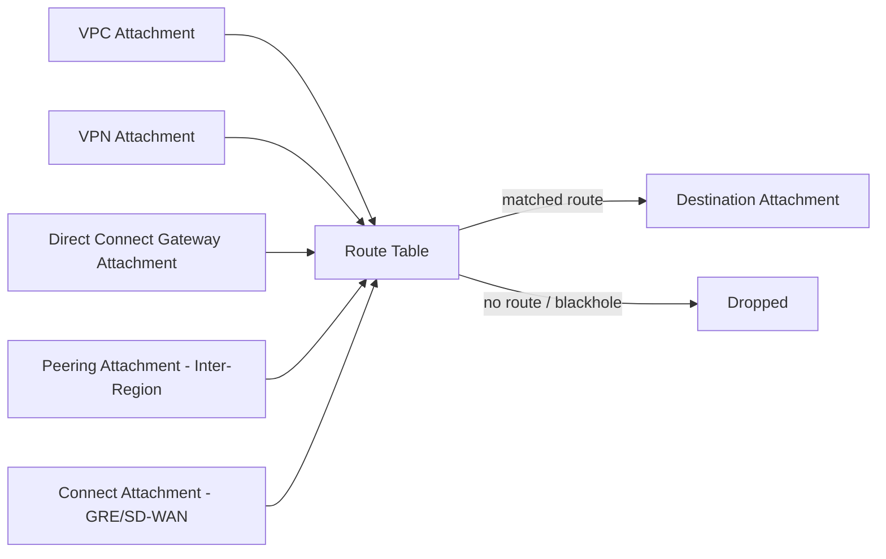
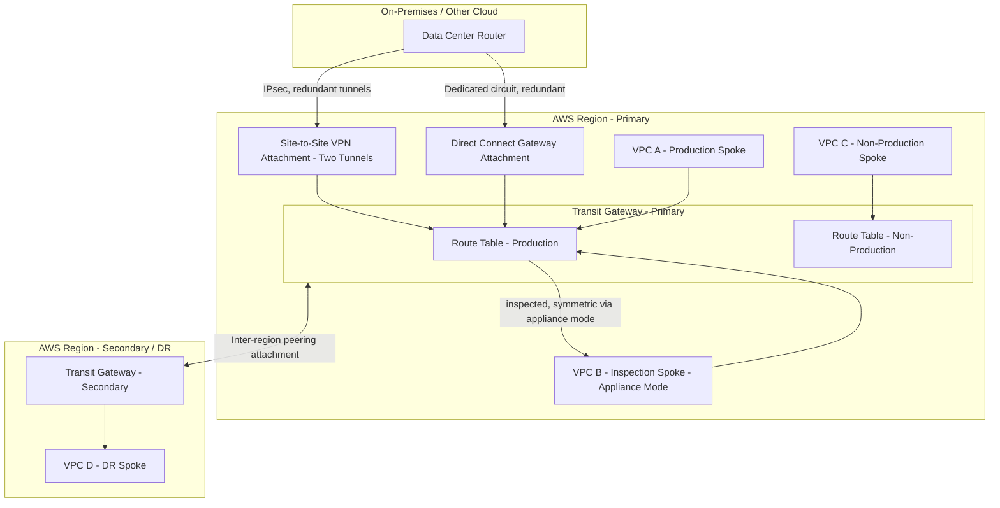
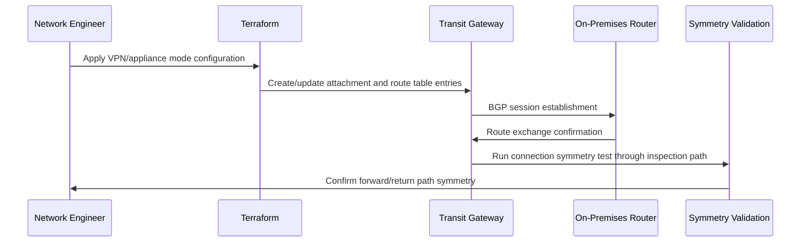

# Part III – Network Architectures

# Chapter 17 – Transit Gateway

*The AWS Reference Architecture Handbook — 100 Production-Ready Cloud Architectures with AWS, Terraform, AI, Security, FinOps, and Enterprise Design Patterns*

---

## 1. Executive Summary

**How this chapter differs from Chapters 9 and 16:**

- Chapter 9 covered Transit Gateway as one component of a multi-account governance story.
- Chapter 16 covered hub-and-spoke as a network topology pattern: spoke categorization, route table segmentation strategy, centralized egress/inspection design.
- **This chapter is the deep technical reference on Transit Gateway itself** — as an AWS service, in full mechanical detail: every attachment type it supports (not just VPC attachments), how route propagation and association actually work at the API level, appliance mode and ECMP for stateful inspection symmetry, multicast domains, inter-region peering, BGP path selection for hybrid connectivity, and the specific service quotas that become binding constraints at scale.
- Read Chapters 9 and 16 for *why* and *where* Transit Gateway fits into a broader architecture. Read this chapter for exactly *how* the service itself works and how to configure every one of its capabilities correctly.

**The business problem this chapter solves:**

- Teams that have adopted Transit Gateway at the "one VPC attachment per spoke" level (Chapters 9 and 16) frequently stop there, missing several of the service's other attachment types and capabilities that solve specific, real connectivity problems.
- Common gaps: teams that don't know Transit Gateway can directly terminate a VPN attachment (not just route to it via an external VPN Gateway), teams that don't realize appliance mode exists and are unknowingly experiencing asymmetric routing through their inspection appliances, and teams planning a genuinely multi-region topology who don't know inter-region peering attachments exist as a native alternative to Cloud WAN for simpler multi-region needs.

**The architecture's objective:**

- Provide a complete technical reference for every Transit Gateway attachment type, its correct use case, and its specific configuration requirements.
- Explain the mechanics of route table association and propagation precisely enough that an engineer can predict routing behavior before applying a change, not just after observing it.
- Cover the specific quotas, performance characteristics, and failure modes that only become visible at real production scale.

**Why organizations adopt full Transit Gateway capability (beyond basic VPC-to-VPC attachment):**

- They need to terminate Site-to-Site VPN connections directly at the hub, rather than routing to a separately-managed VPN Gateway.
- They need symmetric routing through a stateful inspection appliance (Chapter 16's inspection spoke) and have discovered that without appliance mode, connections intermittently fail due to asymmetric return-path routing.
- They need multicast support for a specific application (financial market data distribution, for instance) that depends on it.
- They operate in two or three regions and need direct inter-region connectivity without the additional abstraction and cost of Cloud WAN.
- They are integrating a third-party SD-WAN solution and need a Connect attachment (GRE-based) rather than a standard VPC or VPN attachment.

**Major business benefits:**

- **Correct, predictable routing behavior**, verified through an accurate mental model of association/propagation mechanics rather than trial and error.
- **Elimination of a specific, hard-to-diagnose class of production incident** — asymmetric routing through an inspection appliance — that only appliance mode correctly resolves.
- **A native, lower-cost alternative to Cloud WAN** for organizations with modest (two-to-three-region) multi-region needs, via inter-region peering attachments.
- **A single service capable of replacing several separate, historically-distinct networking constructs** (VPN Gateways, Direct Connect Gateways, VPC peering) with one consistently-managed hub.

**Typical enterprise scenarios:**

- An organization already running Chapter 16's hub-and-spoke pattern that now needs to add Site-to-Site VPN termination directly at the hub for a newly-acquired subsidiary's network.
- An organization whose centralized inspection spoke (Chapter 16) is experiencing intermittent, hard-to-reproduce connection failures — the classic symptom of missing appliance mode configuration.
- An organization planning a two-region active-passive disaster recovery architecture that needs direct, low-latency connectivity between its primary and DR region's Transit Gateways.
- An organization using multicast for real-time data distribution (market data, IoT telemetry fan-out) needing Transit Gateway's multicast domain feature.

> **Note:** This chapter assumes no prior chapter has been read, per this book's standing requirement, but is written assuming the reader has a working notion of what a hub-and-spoke topology is (Chapter 16) and how it fits a multi-account governance strategy (Chapter 9) — those chapters remain the right starting point for the broader architectural narrative; this chapter is the technical deep dive on the specific service underneath both of them.

---

## 2. Business Requirements

### 2.1 Business Drivers

- **Correctness of routing behavior**, specifically around stateful inspection symmetry — the single most common technical gap this chapter addresses.
- **Consolidation of networking constructs** onto a single, consistently-managed service rather than separate VPN Gateways, Direct Connect Gateways, and peering connections managed independently.
- **Multi-region connectivity** without introducing Cloud WAN's additional abstraction for organizations whose multi-region footprint remains modest (two-to-three regions).

### 2.2 Functional Requirements

| Requirement | Description |
|---|---|
| VPC attachments | Standard spoke VPC connectivity, per Chapters 9 and 16 |
| VPN attachments | Direct Site-to-Site VPN termination at the Transit Gateway itself |
| Direct Connect Gateway attachments | On-premises connectivity via Direct Connect, terminated at the hub |
| Peering attachments | Inter-region (or, less commonly, cross-account without RAM sharing) Transit Gateway connectivity |
| Connect attachments | GRE-based attachments for SD-WAN appliance integration |
| Appliance mode | Ensures symmetric routing for a stateful inspection VPC attachment |
| Multicast domains | Multicast group support for applications requiring it |
| ECMP | Equal-cost multi-path routing across multiple VPN tunnels or Direct Connect circuits |

### 2.3 Non-Functional Requirements

**Scalability goals:**

- Support the full range of attachment types simultaneously (VPC, VPN, Direct Connect, peering, Connect) without hitting per-attachment-type or aggregate quotas unexpectedly.

**Availability requirements:**

- Each attachment type has its own specific HA considerations (Section 12) — a VPN attachment's availability depends on tunnel redundancy in a way a VPC attachment's does not.

**Latency requirements:**

- Appliance mode's specific latency implication (Section 15): forcing symmetric routing through a single AZ's inspection appliance for a given flow can add cross-AZ latency if the client and the appliance instance handling that flow's hash are in different AZs — a real, quantifiable trade-off, not a free correctness improvement.

**Compliance requirements:**

- Consistent with Chapters 9 and 16 — this chapter adds the specific requirement that inspection appliance symmetry (appliance mode) itself is a control worth documenting explicitly for any compliance framework requiring demonstrable, complete traffic inspection (asymmetric routing can mean only half of a bidirectional flow is actually inspected).

**Security expectations:**

- Appliance mode enabled for any attachment associated with a route table that routes to a stateful inspection appliance — this is a security-critical, not merely a reliability, configuration.

**Recovery objectives:**

| Metric | Baseline Target | Definition |
|---|---|---|
| RTO (VPN tunnel failover) | Automatic, sub-minute | AWS-managed Site-to-Site VPN provides automatic tunnel failover when ECMP/redundant tunnels are configured correctly |
| RTO (Direct Connect circuit failover) | Automatic if redundant circuits provisioned, else manual escalation | Consistent with Chapter 16's hybrid connectivity guidance |
| RTO (inter-region peering attachment failure) | ≤ 15 minutes | Time to reroute via a backup path if one exists, or re-establish the peering attachment |

**Expected workload and growth:**

- Sized against the specific quota ceilings covered in Section 14 — attachment counts per type, routes per route table, and the specific bandwidth ceiling per VPN tunnel (a commonly underestimated constraint, covered in detail below).

> **Warning:** A single Site-to-Site VPN tunnel has a hard bandwidth ceiling of approximately 1.25 Gbps. This is an AWS-imposed limit on the IPsec tunnel itself, not a Transit Gateway limitation — but it is frequently discovered only when an organization's actual hybrid traffic volume exceeds it in production. If your on-premises bandwidth requirement exceeds 1.25 Gbps, ECMP across multiple tunnels (Section 9) or Direct Connect (which does not have this per-tunnel ceiling) is required, not optional.

---

## 3. Architecture Overview

### 3.1 Overall Design and Philosophy

- Transit Gateway is, mechanically, a collection of **attachments** and **route tables**.
- An attachment is a connection point — to a VPC, a VPN, a Direct Connect Gateway, another Transit Gateway (peering), or a Connect (GRE) endpoint.
- A route table is where routing decisions actually happen — which attachment can reach which CIDR ranges, via which other attachment.
- **Association** determines which route table an attachment uses to make its own outbound routing decisions.
- **Propagation** determines which route tables automatically learn a given attachment's routes (so other attachments know how to reach it) — association and propagation are separate, frequently-confused concepts, clarified fully in Section 9.

### 3.2 Core Components

- The Transit Gateway resource itself (one per region, per hub, per Chapter 16's guidance).
- VPC attachments (Chapters 9, 16).
- VPN attachments, terminated directly at the Transit Gateway.
- Direct Connect Gateway attachments.
- Peering attachments (inter-region or cross-account).
- Connect attachments (GRE-based, for SD-WAN integration).
- Route tables, with explicit association and propagation configuration per attachment.
- Multicast domains (where multicast is required).

### 3.3 How Components Interact

- Every attachment type ultimately participates in the same route table association/propagation model — this uniformity is Transit Gateway's core design strength: a VPN attachment and a VPC attachment are both just "attachments" from the route table's perspective, routed identically.
- Appliance mode changes only how traffic *through* a specific VPC attachment is hashed for path selection — it does not change the association/propagation model itself.

### 3.4 High-Level Workflow

- A packet arrives at an attachment.
- The attachment's associated route table is consulted for the destination CIDR.
- The matching route points to another attachment (or a blackhole, if intentionally unreachable).
- The packet is forwarded to that attachment.



---

## 4. AWS Services Used

### 4.1 AWS Transit Gateway (core service)

- Covered in full mechanical detail throughout this chapter; Chapters 9 and 16 cover its role in the broader architecture.

### 4.2 AWS Site-to-Site VPN

**Purpose:**

- Provides IPsec-encrypted connectivity over the public internet between AWS and an on-premises (or another cloud's) network, terminated as a VPN attachment directly at the Transit Gateway.

**Why selected:**

- Faster to provision than Direct Connect (hours, not weeks), and adequate for many organizations' actual bandwidth and latency requirements.

**Alternatives:**

- Direct Connect (Section 4.3) is preferred when bandwidth requirements exceed a single tunnel's ~1.25 Gbps ceiling (even with ECMP across tunnels, Direct Connect provides more predictable, dedicated bandwidth) or when the organization's compliance requirements call for a private, non-internet-transiting connection.

**Limitations:**

- Per-tunnel bandwidth ceiling (Section 2.3's warning); latency and jitter are subject to the public internet path's variability, unlike Direct Connect's dedicated circuit.

**Best practices:**

- Always configure both tunnels of a Site-to-Site VPN connection (AWS provisions two by default, for redundancy) and verify the on-premises router is actually configured to use both, not just the first — a surprisingly common, easy-to-miss configuration gap.

### 4.3 AWS Direct Connect

**Purpose:**

- A dedicated, private network connection between on-premises infrastructure and AWS, bypassing the public internet entirely.

**Why selected:**

- Higher, more predictable bandwidth and lower, more consistent latency than Site-to-Site VPN.

**Alternatives:**

- Site-to-Site VPN (Section 4.2) for lower-bandwidth, faster-to-provision needs.

**Limitations:**

- Provisioning lead time is measured in weeks, not hours — a specific planning constraint worth factoring into any migration timeline.

**Best practices:**

- Provision redundant circuits at physically diverse locations, per Chapter 16's hybrid connectivity guidance, and terminate via a Direct Connect Gateway attached to the Transit Gateway rather than to individual VPCs directly.

### 4.4 IAM, CloudWatch, CloudTrail, GuardDuty

- Applied consistently with Chapters 9 and 16; this chapter's specific monitoring emphasis (Section 21) is on attachment-type-specific metrics (VPN tunnel state, Direct Connect BGP session state) not covered in those chapters' more general treatment.

---

## 5. Complete Architecture Diagram



---

## 6. Component-by-Component Explanation

| Component | Purpose | Scaling | High Availability | Failure Handling | Dependencies |
|---|---|---|---|---|---|
| VPC attachment | Standard spoke connectivity | One per VPC, up to the account/region quota | Inherent to Transit Gateway's regional resilience | N/A beyond standard route table considerations | Subnet in each AZ used |
| VPN attachment | On-premises connectivity over IPsec | Add tunnels via ECMP for bandwidth beyond one tunnel's ceiling | Two tunnels per connection by default | Automatic failover between tunnels if on-premises router configured for both | Customer Gateway, on-premises router BGP/static config |
| Direct Connect Gateway attachment | On-premises connectivity via dedicated circuit | Add circuits for bandwidth/redundancy | Redundant circuits recommended | Manual or automatic failover depending on circuit redundancy | Direct Connect Gateway, physical circuit provisioning |
| Peering attachment | Inter-region or cross-account connectivity without RAM sharing | One per region pair | Depends on both regions' own resilience | No automatic cross-region failover — a second, independent path is required for true redundancy | Both Transit Gateways' route tables must be configured to reference each other |
| Connect attachment | GRE-based SD-WAN appliance integration | Scales with the underlying VPC/Direct Connect/VPN attachment it's layered on | Inherits the underlying attachment's HA characteristics | Depends on the SD-WAN appliance's own HA design | An underlying VPC, VPN, or Direct Connect attachment |
| Appliance mode (VPC attachment setting) | Ensures symmetric routing through a stateful appliance | N/A — a per-attachment boolean setting | Improves reliability of the appliance's own stateful tracking | Without it, asymmetric routing can cause intermittent connection failures | The inspection VPC's own Multi-AZ appliance deployment |

---

## 7. End-to-End Request Flow

**Flow: on-premises traffic reaching a production spoke via redundant Site-to-Site VPN tunnels:**

1. An on-premises router initiates traffic destined for an AWS-hosted production VPC.
2. The router's BGP session (or static routing) selects one of the two available VPN tunnels, based on configured preference or ECMP if both are active.
3. Traffic arrives at the **VPN attachment** on the Transit Gateway.
4. The attachment's associated route table (production domain, per Chapter 16) is consulted.
5. The matching route directs traffic to the **inspection spoke's attachment**, since organization policy requires inspection of on-premises-originated traffic.
6. Because the inspection VPC attachment has **appliance mode enabled**, both the forward and return paths of this specific flow are guaranteed to traverse the same inspection appliance instance (in the same AZ), preserving the appliance's stateful connection tracking.
7. The inspection appliance evaluates the traffic and, if permitted, forwards it onward to the **production spoke's attachment**.
8. The production application processes the request.
9. The response traverses the same path in reverse — critically, through the *same* inspection appliance instance, thanks to appliance mode, rather than potentially a different instance in a different AZ (which would break the appliance's stateful tracking and could cause the connection to fail or be dropped).
10. If the primary VPN tunnel fails, the on-premises router's BGP session detects this and shifts traffic to the second tunnel automatically, without requiring any Transit Gateway-side reconfiguration.

---

## 8. Deployment Flow

- Consistent with Chapters 9 and 16's staged-rollout, Terraform-only discipline.
- **This chapter's specific addition:** appliance mode and multicast domain configuration changes should be validated with an explicit **connection-symmetry test** — confirming that a test flow's forward and return paths both traverse the same inspection appliance instance — not merely a basic reachability test, since asymmetric routing can appear to "work" for stateless protocols while silently breaking stateful ones.
- **Validation for VPN/Direct Connect attachment changes** should include confirming BGP session establishment and route exchange, not just Terraform apply success — a Terraform apply can succeed while the actual BGP session with on-premises equipment fails to establish due to a configuration mismatch on the customer side.



---

## 9. Network Topology

### 9.1 Association and Propagation — Precisely Defined

- **Association:** the route table an attachment *uses* to make its own routing decisions. Each attachment can be associated with exactly **one** route table at a time.
- **Propagation:** which route table(s) *learn* a given attachment's routes automatically, so other attachments know how to reach it. An attachment can propagate its routes to **multiple** route tables.
- These are independent settings — an attachment can be associated with the "production" route table (meaning production's routing rules govern its outbound decisions) while propagating its routes to both "production" and "shared services" route tables (meaning both domains can learn how to reach it).
- This independence is precisely what enables Chapter 16's segmentation pattern: the shared services spoke is associated with its own route table, but propagates to both production and non-production, since both domains need to reach it.

### 9.2 Static Routes and Blackholes

- In addition to propagated routes, **static routes** can be manually added to any route table, pointing a specific CIDR at a specific attachment — used for the deliberate inspection-routing pattern in Chapter 16 (a static route sends traffic to the inspection attachment rather than directly to its ultimate destination).
- A **blackhole route** explicitly drops traffic matching a CIDR, rather than merely lacking a route — useful for explicitly denying a previously-reachable CIDR (e.g., during a decommissioning) with an auditable, visible route table entry rather than a silent absence.

### 9.3 Appliance Mode — Full Detail

- **The problem it solves:** by default, Transit Gateway distributes traffic for a given VPC attachment across the attachment's ENIs (one per AZ) using a hash based on source/destination IP and port. For a *stateless* flow, this is fine. For a flow passing through a *stateful* appliance (a firewall tracking connection state), the forward and return paths might hash to different AZs' ENIs, meaning the appliance instance handling the return path never saw the forward path — its connection tracking table doesn't recognize the return traffic, and the appliance drops it as invalid.
- **What appliance mode does:** when enabled on a VPC attachment, Transit Gateway ensures that all traffic for a given flow (in both directions) is sent to the same AZ's ENI, preserving the stateful appliance's ability to track the full, bidirectional conversation.
- **The trade-off:** if the client-side traffic enters through one AZ but the appliance instance handling that flow's hash lives in a different AZ, traffic must cross AZ boundaries to reach it — a small latency and (potentially) cross-AZ data transfer cost increase, in exchange for correctness.
- **When to enable it:** any VPC attachment that fronts a stateful inspection appliance (Network Firewall, or a third-party virtual appliance) — this is not optional if correctness matters, only a question of accepting the latency/cost trade-off it introduces.
- **When NOT to enable it:** VPC attachments that don't involve stateful appliance processing at all — enabling it there provides no benefit and forecloses some of Transit Gateway's default load-distribution flexibility for no reason.

### 9.4 Equal-Cost Multi-Path (ECMP)

- When multiple VPN tunnels or Direct Connect circuits exist between the same two endpoints with equal BGP path cost, Transit Gateway can distribute traffic across all of them simultaneously (rather than using one as primary and the other purely as failover).
- **When to use it:** when aggregate bandwidth across multiple tunnels/circuits is genuinely needed (Section 2.3's warning about the 1.25 Gbps per-tunnel ceiling) — ECMP is the mechanism that lets multiple tunnels contribute to a single logical connection's total throughput.
- **When NOT to rely on it exclusively:** for a genuinely latency-sensitive, single stateful flow, ECMP's per-flow (not per-packet) hashing means any single flow still traverses only one tunnel — ECMP increases aggregate capacity across many flows, not any single flow's own throughput ceiling.

### 9.5 Multicast Domains

- Transit Gateway supports IGMPv2-based multicast group membership, letting attached VPCs participate in a shared multicast domain.
- **When to use it:** applications genuinely requiring one-to-many or many-to-many multicast distribution (financial market data feeds, certain media distribution workloads) — a specific, relatively narrow use case, not a general-purpose feature most organizations need.
- **When NOT to use it:** as a substitute for standard unicast application architecture — multicast adds real operational complexity and should only be adopted when the application's own protocol genuinely requires it.

### 9.6 Peering Attachments (Inter-Region)

- Connect two Transit Gateways, typically in different regions, directly.
- **When to use it:** organizations with a modest (two-to-three-region) multi-region footprint needing direct inter-region connectivity without Cloud WAN's additional abstraction and cost (Chapter 16, Section 28).
- **When NOT to use it:** organizations with many regions or complex, frequently-changing multi-region policy needs — at that scale, manually managing peering attachments and keeping every regional Transit Gateway's route tables in sync becomes its own operational burden, and Cloud WAN's centralized policy model becomes the better fit.
- **Limitation:** peering attachments do not support transitive routing through a third Transit Gateway by default in every configuration — verify the specific routing requirement against current AWS documentation before assuming a three-region mesh works automatically via peering alone.

### 9.7 Connect Attachments (SD-WAN Integration)

- A GRE-based attachment type, layered on top of an existing VPC, VPN, or Direct Connect attachment, specifically designed for integrating third-party SD-WAN appliances that use GRE and BGP.
- **When to use it:** an organization has standardized on a specific SD-WAN vendor's solution and needs that appliance to participate directly in Transit Gateway's routing domain.
- **When NOT to use it:** organizations without an existing SD-WAN investment — introducing Connect attachments and their GRE tunneling complexity without a genuine SD-WAN integration need is unjustified complexity.

---

## 10. Identity and Access

- Consistent with Chapter 16's guidance: a dedicated hub-admin role, scoped tightly, distinct from spoke-level roles.
- **This chapter's specific addition:** VPN attachment configuration includes a **pre-shared key**, which is a credential and must be treated with the same rigor as any other secret (Secrets Manager, never hardcoded in Terraform variables committed to source control).
- Direct Connect Gateway association across accounts uses the same RAM-sharing mechanism as VPC attachments (Chapter 16) — scope these shares narrowly and review them regularly.

---

## 11. Security Architecture

- **Appliance mode is, in this chapter's specific context, a security control, not merely a reliability one** — asymmetric routing around a stateful firewall can mean only one direction of a bidirectional flow is actually inspected, a genuine, easily-overlooked security gap that looks like a reliability issue (intermittent connection failures) until properly diagnosed.
- **VPN pre-shared keys** and any Direct Connect MACsec keys are managed via Secrets Manager/KMS, never in plaintext Terraform state committed to a shared repository (ensure remote state itself is encrypted, per Chapter 1's remote state backend guidance).
- **Threat model summary specific to this chapter:**

| Attack Vector | Mitigation |
|---|---|
| Asymmetric routing silently bypassing half of a bidirectional flow's inspection | Appliance mode enabled on any attachment fronting a stateful inspection appliance |
| Compromised or leaked VPN pre-shared key | Secrets Manager storage, periodic rotation, encrypted Terraform state |
| Unauthorized peering attachment acceptance | Explicit, reviewed acceptance workflow for cross-account/cross-region peering requests, never auto-accept |
| Direct Connect physical/BGP-layer compromise | MACsec encryption where supported, BGP session monitoring for anomalous route announcements |

---

## 12. High Availability

- **VPN attachments:** two tunnels per connection by default; true redundancy requires the on-premises router to actually use both (a common gap — verify, don't assume).
- **Direct Connect attachments:** redundancy requires physically diverse circuits, not just logical redundancy within a single physical location.
- **Peering attachments:** no automatic cross-region failover exists natively — a genuinely redundant multi-region design requires an independent second path (a second peering attachment via a different route, or a fallback through Cloud WAN/on-premises transit) if inter-region connectivity itself must be highly available.
- **Appliance mode's HA interaction:** ensure the inspection VPC's appliance is deployed Multi-AZ (Chapter 16) — appliance mode's AZ-affinity for a given flow means a failed AZ's appliance instance requires Transit Gateway to reroute that flow's traffic, which depends on the appliance's own Multi-AZ health-check-driven failover working correctly.

---

## 13. Disaster Recovery

- Consistent with Chapters 9 and 16 — the Transit Gateway's own configuration is Terraform-defined and re-appliable.
- **This chapter's specific addition:** for organizations using inter-region peering attachments as part of a DR architecture, the peering attachment itself, and both regions' route tables, must be included in the DR runbook's validation steps — a DR test that only validates the DR region's own application stack, without confirming the peering attachment's routes are correctly configured for a failover scenario, is an incomplete test.

| Component | DR Approach | RTO | RPO |
|---|---|---|---|
| VPN/Direct Connect attachment configuration | Terraform re-apply | ≤ 15 minutes | Near-zero |
| Inter-region peering attachment | Terraform re-apply plus BGP/route re-verification | ≤ 30 minutes | Near-zero |

---

## 14. Scalability

- **Attachment quotas** (per Transit Gateway, per account, per region) are soft, raisable limits — track them against growth, per Chapter 16's guidance, specifically now inclusive of every attachment type (VPC, VPN, Direct Connect, peering, Connect), not just VPC attachments.
- **Routes per route table** is a specific quota worth monitoring for organizations with many static routes (e.g., a large number of explicit inspection-routing entries).
- **VPN tunnel bandwidth** (Section 2.3's warning) is the specific scaling ceiling for hybrid connectivity via VPN — ECMP across multiple tunnels, or a transition to Direct Connect, are the two paths past it.
- **Multicast domain limits** (number of domains, number of members per domain) are worth checking against current AWS documentation for any genuinely multicast-dependent workload before committing to the pattern at scale.

---

## 15. Performance Optimization

- **Appliance mode's latency trade-off** (Section 9.3) is this chapter's most distinctive performance consideration — accept it deliberately for flows genuinely requiring stateful inspection; don't apply it blanket to attachments that don't need it.
- **ECMP for aggregate throughput**, not single-flow latency — understand this distinction before assuming ECMP alone solves a single high-bandwidth application's needs (Section 9.4).
- **Direct Connect versus VPN for latency-sensitive hybrid workloads:** Direct Connect's dedicated circuit provides materially more consistent latency than VPN's public-internet-transiting path — a genuine consideration for latency-sensitive hybrid applications, not merely a bandwidth one.

---

## 16. Cost Optimization (FinOps)

### 16.1 Estimated Monthly Cost by Attachment Mix

| Component | Small (VPC attachments only) | Medium (VPC + VPN) | Enterprise (VPC + VPN + Direct Connect + inter-region peering) |
|---|---|---|---|
| VPC attachment hours | ~$150 | ~$300 | ~$1,500 |
| VPN attachment hours + data processing | N/A | ~$200 | ~$800 |
| Direct Connect Gateway attachment + circuit | N/A | N/A | ~$800+ (excludes circuit port-hour cost, billed separately) |
| Inter-region peering attachment + data processing | N/A | N/A | ~$1,000+ |
| **Approximate Total (Transit Gateway-specific charges only)** | **~$150/mo** | **~$500/mo** | **~$4,100+/mo** |

### 16.2 Major Cost Drivers and Optimization

- **Data processing charges apply per attachment type** — VPN, Direct Connect Gateway, and peering attachments each carry their own per-GB processing charge in addition to VPC attachment charges for the same logical flow if it traverses multiple attachment types (e.g., on-premises → VPN attachment → inspection VPC attachment → production VPC attachment all incur separate processing charges for the same packet).
- **This compounding effect is a specific, easily underestimated cost driver** — model the full attachment-hop count for a given traffic pattern, not just the "entry" attachment's cost, when forecasting hybrid + inspected traffic costs.
- **ECMP does not reduce per-byte cost** — it distributes load across tunnels/circuits for capacity and redundancy, not cost efficiency; don't expect a cost reduction from adding ECMP tunnels, only a capacity and reliability improvement.

---

## 17. AI-Assisted Operations

- **AI-assisted route table review** specifically for appliance mode and static route configuration — given how easy it is to miss enabling appliance mode on a newly-added inspection-fronting attachment, an automated pre-review check flagging "this attachment routes to a known stateful appliance but does not have appliance mode enabled" is a genuinely high-value, specific application for this chapter's subject.
- **AI-assisted BGP configuration review** for VPN/Direct Connect attachments — reviewing a proposed BGP configuration against common misconfiguration patterns (asymmetric AS-path prepending, missing route filters) before it reaches a live on-premises router.

---

## 18. Terraform Implementation

```

infrastructure/
├── modules/
│   ├── tgw-vpn-attachment/
│   ├── tgw-dx-attachment/
│   ├── tgw-peering-attachment/
│   └── tgw-appliance-mode-vpc-attachment/
└── environments/
    └── networking-account/

```

**VPN attachment with two tunnels, ECMP-ready:**

```hcl

# modules/tgw-vpn-attachment/main.tf

resource "aws_customer_gateway" "onprem" {
  bgp_asn    = var.onprem_bgp_asn
  ip_address = var.onprem_public_ip
  type       = "ipsec.1"

  tags = { Name = "cgw-${var.connection_name}" }
}

resource "aws_vpn_connection" "main" {
  customer_gateway_id = aws_customer_gateway.onprem.id
  transit_gateway_id  = var.transit_gateway_id
  type                 = "ipsec.1"
  static_routes_only  = false # enables BGP, required for ECMP

  tags = { Name = "vpn-${var.connection_name}" }
}

resource "aws_ec2_transit_gateway_route_table_association" "vpn" {
  transit_gateway_attachment_id  = aws_vpn_connection.main.transit_gateway_attachment_id
  transit_gateway_route_table_id = var.route_table_id
}

resource "aws_ec2_transit_gateway_route_table_propagation" "vpn" {
  transit_gateway_attachment_id  = aws_vpn_connection.main.transit_gateway_attachment_id
  transit_gateway_route_table_id = var.route_table_id
}

```

**VPC attachment with appliance mode enabled, for the inspection spoke:**

```hcl

# modules/tgw-appliance-mode-vpc-attachment/main.tf

resource "aws_ec2_transit_gateway_vpc_attachment" "inspection" {
  transit_gateway_id = var.transit_gateway_id
  vpc_id              = var.inspection_vpc_id
  subnet_ids          = var.inspection_tgw_subnet_ids

  # This is the specific setting that resolves asymmetric routing

  # through a stateful appliance. Without it, connection tracking

  # in the firewall will intermittently break.

  appliance_mode_support = "enable"

  tags = { Name = "attach-inspection-appliance-mode" }
}

```

**Inter-region peering attachment:**

```hcl

# modules/tgw-peering-attachment/main.tf

resource "aws_ec2_transit_gateway_peering_attachment" "cross_region" {
  transit_gateway_id      = var.local_transit_gateway_id
  peer_transit_gateway_id = var.remote_transit_gateway_id
  peer_region              = var.remote_region

  tags = { Name = "tgw-peering-${var.local_region}-to-${var.remote_region}" }
}

# The peering attachment must be accepted on the remote side

resource "aws_ec2_transit_gateway_peering_attachment_accepter" "cross_region" {
  provider                      = aws.remote_region
  transit_gateway_attachment_id = aws_ec2_transit_gateway_peering_attachment.cross_region.id

  tags = { Name = "tgw-peering-accept-${var.local_region}-to-${var.remote_region}" }
}

```

**Best practices applied above:**

- `static_routes_only = false` on the VPN connection specifically enables BGP, a prerequisite for both automatic failover and ECMP.
- `appliance_mode_support = "enable"` is the single-line configuration resolving the entire asymmetric-routing problem class described in Section 9.3 — easy to add, easy to forget, and worth an explicit code comment explaining why it's there.
- The peering attachment's accepter resource runs against the remote region's provider alias, making the two-sided nature of a peering attachment explicit in the Terraform code rather than assumed.

---

## 19. AWS CLI Examples

**Deployment validation:**

```bash

# Confirm both VPN tunnels are up

aws ec2 describe-vpn-connections \
  --vpn-connection-ids vpn-0123456789abcdef0 \
  --query 'VpnConnections[0].VgwTelemetry[*].[OutsideIpAddress,Status]' \
  --output table

```

**Monitoring:**

```bash

# Check appliance-mode-enabled attachment's data processing volume

aws cloudwatch get-metric-statistics \
  --namespace AWS/TransitGateway \
  --metric-name BytesIn \
  --dimensions Name=TransitGatewayAttachment,Value=tgw-attach-inspection0123 \
  --start-time $(date -u -d '1 hour ago' +%Y-%m-%dT%H:%M:%S) \
  --end-time $(date -u +%Y-%m-%dT%H:%M:%S) \
  --period 300 \
  --statistics Sum

```

**Troubleshooting:**

```bash

# Check BGP session state for a Direct Connect attachment

aws directconnect describe-virtual-interfaces \
  --virtual-interface-id dxvif-0123456789abcdef0 \
  --query 'virtualInterfaces[0].[bgpPeers[0].bgpStatus,virtualInterfaceState]'

# Verify appliance_mode_support is actually enabled on an attachment

aws ec2 describe-transit-gateway-vpc-attachments \
  --transit-gateway-attachment-ids tgw-attach-inspection0123 \
  --query 'TransitGatewayVpcAttachments[0].Options.ApplianceModeSupport'

```

**Cleanup:**

```bash

# Identify VPN connections with a down tunnel, worth investigating before decommissioning or reconfiguring

aws ec2 describe-vpn-connections \
  --query 'VpnConnections[*].[VpnConnectionId,VgwTelemetry[?Status==`DOWN`].OutsideIpAddress]'

```

---

## 20. CI/CD Integration

- Consistent with Chapter 16's staged-rollout, multi-approver-review discipline.
- **This chapter's specific addition:** a mandatory policy-as-code check verifying that any VPC attachment associated with a route table containing a static route to a known stateful inspection attachment has `appliance_mode_support = "enable"` set — an automated, specific catch for the single most common misconfiguration this chapter addresses.

---

## 21. Monitoring

- **VPN tunnel state** (`TunnelState` metric) — alarm on any tunnel transitioning to DOWN, even if the connection's aggregate availability is preserved by the second tunnel, since an undetected single-tunnel failure leaves the connection with no further redundancy.
- **Direct Connect BGP session state** — alarm on session flapping or unexpected route withdrawal.
- **Appliance-mode-enabled attachment data processing volume**, tracked specifically given its outsized cost contribution (Section 16).
- **Peering attachment state** — alarm on any unexpected state change, given the organization-wide impact of an inter-region connectivity loss for DR-dependent architectures.

---

## 22. Logging

- Transit Gateway Flow Logs, consistent with Chapter 16, with the specific addition that flow logs should be reviewed for asymmetric-routing symptoms (a flow's forward and return legs traversing different attachments/AZs) as part of any appliance mode troubleshooting investigation.

---

## 23. Operational Excellence

- **Runbooks specific to this chapter's subject:** "VPN tunnel down — confirm on-premises router failover to the second tunnel," "Direct Connect BGP session flapping — engage carrier," "intermittent connection failures through the inspection spoke — check appliance mode configuration first, before assuming an application-level bug."
- The last runbook entry above reflects a genuinely common, easily-misdiagnosed real-world pattern: intermittent, hard-to-reproduce connection failures through an inspection appliance are very often an asymmetric-routing/appliance-mode configuration gap, not an application bug — and a team unfamiliar with appliance mode can spend significant, unproductive time investigating the wrong layer before discovering this.

---

## 24. Failure Scenarios

| # | Scenario | Symptoms | Root Cause | Detection | Resolution | Prevention |
|---|---|---|---|---|---|---|
| 1 | Intermittent connection failures through the inspection spoke | Connections seemingly randomly fail, especially long-lived ones | Appliance mode not enabled, causing asymmetric routing and broken stateful tracking | Flow Log analysis showing forward/return path asymmetry | Enable appliance mode on the affected attachment | Mandatory appliance mode policy-as-code check (Section 20) |
| 2 | VPN tunnel down, connectivity continues but with no further redundancy | One tunnel shows DOWN in telemetry | ISP/internet path issue, or a configuration mismatch on one tunnel | `VgwTelemetry` status check, tunnel state alarm | Investigate and restore the down tunnel | Alarm explicitly on single-tunnel-down state, don't wait for both to fail |
| 3 | On-premises router only using one of two provisioned VPN tunnels | No automatic failover occurs when the primary tunnel fails | On-premises router configuration only references one tunnel | Discovered during a failover test or an actual outage | Correct the on-premises router's configuration to use both tunnels | Validate both-tunnel usage during initial setup, not just tunnel provisioning |
| 4 | Direct Connect BGP session flapping | Intermittent hybrid connectivity | Carrier-side instability or a misconfigured BGP timer | BGP session state CloudWatch metric | Engage the carrier/network team | Redundant, diverse-path circuits reducing single-session dependency |
| 5 | Inter-region peering attachment not accepted | Peering remains in a pending state, no connectivity | The remote region's accepter resource was never applied | `terraform plan` showing a pending peering attachment, or a connectivity test failure | Apply the accepter resource in the remote region | Include the accepter resource in the same reviewed change as the peering attachment request |
| 6 | Static route to inspection attachment missing after a Terraform refactor | Traffic bypasses inspection entirely, reaching its destination directly | A refactor inadvertently dropped the static route | Policy-as-code check (Section 20) or a security audit | Restore the static route | Automated, mandatory validation of the inspection-routing static route's presence |
| 7 | ECMP not distributing traffic as expected | One tunnel/circuit carries disproportionate load | BGP path costs not actually equal, or on-premises router not configured for ECMP | Traffic volume metrics per tunnel/circuit showing imbalance | Correct the BGP configuration for genuinely equal-cost paths | Validate ECMP distribution during initial setup with a load test |
| 8 | VPN pre-shared key leaked in Terraform state or logs | A security finding during a routine review | Insufficiently protected remote state, or the key logged in a CI/CD pipeline's output | Security audit, or a secret-scanning tool | Rotate the compromised key immediately | Encrypted remote state, secret-scanning in CI/CD, never echo sensitive Terraform variables |
| 9 | Multicast group membership not propagating as expected | Multicast-dependent application not receiving expected traffic | Multicast domain association or IGMP configuration issue | Application-level symptom correlated with multicast domain configuration review | Correct the multicast domain association | Test multicast functionality explicitly as part of any change to the multicast domain |
| 10 | Route table quota approached without warning | New route addition blocked | No proactive quota tracking against growing static route count | Route addition failure | Request a quota increase, or simplify the route table (Chapter 16's hygiene guidance) | Proactive quota tracking |
| 11 | Attachment count approaching the per-Transit-Gateway quota | New attachment creation blocked | No proactive quota tracking against attachment growth across all types | Attachment creation failure | Request a quota increase | Proactive tracking inclusive of every attachment type, not just VPC attachments |
| 12 | Appliance mode enabled on an attachment that doesn't need it | Unexpected latency/cost increase with no corresponding security benefit | Overly broad application of appliance mode as a "just in case" default | Cost/latency review | Disable appliance mode on attachments genuinely not fronting a stateful appliance | Enable appliance mode deliberately, only where genuinely needed |
| 13 | Direct Connect circuit under-provisioned for actual peak traffic | Sustained high utilization, elevated latency during peak periods | Circuit sized against an initial, since-exceeded estimate | Circuit utilization CloudWatch metrics | Provision additional circuit capacity | Proactive utilization tracking against growth |
| 14 | Cross-region peering attachment latency higher than expected for a latency-sensitive DR replication path | Replication lag exceeds acceptable RPO | Underlying inter-region network path latency inherent to the specific region pair | Replication lag monitoring | Evaluate whether the specific region pair's latency is compatible with the RPO target, or adjust the DR architecture | Validate actual inter-region latency during design, before committing to a specific DR region pair |
| 15 | GRE Connect attachment misconfiguration with a third-party SD-WAN appliance | SD-WAN routes not exchanging correctly | BGP or GRE tunnel configuration mismatch between the appliance and the Connect attachment | Vendor-specific diagnostic tooling, BGP session state | Correct the configuration per the SD-WAN vendor's Transit Gateway integration guide | Validate the specific vendor's Connect attachment integration in a non-production environment first |

---

## 25. Troubleshooting Guide

| Problem | Symptoms | Likely Cause | Diagnosis | AWS CLI Commands | Resolution |
|---|---|---|---|---|---|
| Intermittent connection drops through inspection | Long-lived connections fail unpredictably | Missing appliance mode | Flow Log path asymmetry analysis | `aws ec2 describe-transit-gateway-vpc-attachments` | Enable appliance mode |
| VPN connectivity degraded, not fully down | Elevated packet loss, not full outage | One of two tunnels down | Tunnel telemetry status | `aws ec2 describe-vpn-connections` | Restore the down tunnel; confirm on-premises router is actually using both |
| No connectivity between two regions via peering | Complete connectivity failure | Peering attachment not accepted, or missing route table entries in one region | Check attachment state and both regions' route tables | `aws ec2 describe-transit-gateway-peering-attachments` | Accept the attachment and/or add the missing routes |
| Unexpectedly high Transit Gateway cost for hybrid + inspected traffic | Cost higher than modeled | Multiple attachment-hop data processing charges compounding for the same logical flow | Break down cost by attachment, correlate with the actual traffic path's hop count | `aws ce get-cost-and-usage` | Re-model cost against the full hop count, evaluate whether inspection scope can be narrowed |
| BGP session won't establish for a new VPN/Direct Connect attachment | No route exchange occurring | ASN mismatch, or a firewall blocking BGP (TCP 179) | Review BGP configuration on both sides | `aws ec2 describe-vpn-connections`, `aws directconnect describe-virtual-interfaces` | Correct the ASN or firewall configuration |

---

## 26. Best Practices

1. Understand association and propagation as distinct, independent settings before designing any route table strategy.
2. Enable appliance mode on every VPC attachment fronting a stateful inspection appliance, without exception.
3. Never enable appliance mode on attachments that don't need it — it has a real latency/cost trade-off.
4. Always provision and verify both VPN tunnels are actually used by the on-premises router, not just provisioned.
5. Enable BGP (`static_routes_only = false`) on VPN connections to support automatic failover and ECMP.
6. Use ECMP for aggregate bandwidth across multiple tunnels/circuits, understanding it does not increase any single flow's throughput.
7. Prefer Direct Connect over VPN once bandwidth requirements exceed a single tunnel's ~1.25 Gbps ceiling.
8. Provision redundant, physically diverse Direct Connect circuits.
9. Store VPN pre-shared keys in Secrets Manager, never as plaintext Terraform variables.
10. Encrypt Terraform remote state given the sensitivity of VPN/Direct Connect configuration details it contains.
11. Use inter-region peering attachments for modest (two-to-three-region) multi-region needs; evaluate Cloud WAN for larger, more complex multi-region topologies.
12. Always include the peering attachment accepter resource in the same reviewed change as the peering request itself.
13. Use blackhole routes explicitly, with a documented reason, rather than relying on route absence alone for decommissioned connectivity.
14. Adopt Connect attachments only when a genuine SD-WAN integration need exists.
15. Adopt multicast domains only when an application genuinely requires multicast, not as a general-purpose default.
16. Alarm on single-tunnel-down state for VPN connections, not only full-connection failure.
17. Alarm on Direct Connect BGP session flapping.
18. Alarm on unexpected peering attachment state changes.
19. Track attachment count against quota, inclusive of every attachment type.
20. Track route count per route table against quota, especially for route tables with many static routes.
21. Include appliance mode and static inspection-routing checks in automated, blocking policy-as-code validation.
22. Test both-tunnel VPN failover explicitly during initial setup and periodically thereafter.
23. Test ECMP traffic distribution explicitly with a load test during initial setup.
24. Model Transit Gateway cost against the full attachment-hop count of a traffic pattern, not just the entry attachment.
25. Validate BGP session establishment as part of any VPN/Direct Connect deployment validation, not just Terraform apply success.
26. Include the peering attachment and both regions' route tables in any DR runbook that depends on inter-region connectivity.
27. Validate a new SD-WAN vendor's Connect attachment integration in non-production before production rollout.
28. Review Flow Logs for path asymmetry as a standard first diagnostic step for intermittent inspection-spoke connection issues.
29. Document every attachment type's specific HA characteristics in the organization's own network runbooks, since they differ meaningfully from each other.
30. Revisit the full attachment inventory (not just VPC attachments) during any periodic network architecture review.

---

## 27. Anti-Patterns

1. **Assuming Transit Gateway only supports VPC attachments** — Dangerous in the missed-opportunity sense: teams re-invent VPN Gateway management separately instead of using native VPN attachments. Correct approach: understand and use the full range of attachment types this chapter covers.
2. **Not enabling appliance mode on an inspection-fronting attachment** — Dangerous because it causes intermittent, hard-to-diagnose connection failures that look like application bugs. Correct approach: enable it deliberately, verified by policy-as-code.
3. **Enabling appliance mode everywhere "to be safe"** — Dangerous only in the unnecessary latency/cost sense. Correct approach: enable it only where a stateful appliance is genuinely in the path.
4. **Provisioning only one VPN tunnel** — Dangerous because it removes the redundancy AWS's default two-tunnel design provides. Correct approach: always provision and use both.
5. **Provisioning both tunnels but only configuring the on-premises router to use one** — Dangerous because it creates a false sense of redundancy that fails exactly when needed. Correct approach: validate both-tunnel usage explicitly.
6. **Relying on VPN alone for bandwidth requirements exceeding the per-tunnel ceiling, without ECMP or Direct Connect** — Dangerous because the connection will bottleneck at approximately 1.25 Gbps regardless of on-premises or AWS-side capacity. Correct approach: ECMP across multiple tunnels or migrate to Direct Connect.
7. **A single, non-redundant Direct Connect circuit** — Dangerous because its failure eliminates hybrid connectivity for every dependent spoke. Correct approach: redundant, physically diverse circuits.
8. **VPN pre-shared keys stored in plaintext Terraform variables or unencrypted state** — Dangerous because it exposes a credential capable of impersonating the on-premises endpoint. Correct approach: Secrets Manager and encrypted remote state.
9. **Peering attachment requested without the corresponding accepter resource applied** — Dangerous only in the sense of an incomplete, non-functional deployment. Correct approach: include both sides in the same reviewed change.
10. **Assuming peering attachments provide automatic cross-region failover** — Dangerous because a genuinely redundant multi-region design requires an explicit second path, which peering alone does not provide natively. Correct approach: design and test an actual failover path if inter-region connectivity itself must be highly available.
11. **Assuming ECMP increases a single flow's throughput** — Dangerous only in the capacity-planning-miscalculation sense — a single high-bandwidth flow's throughput remains bounded by one tunnel/circuit's ceiling regardless of how many ECMP paths exist. Correct approach: understand ECMP as an aggregate-capacity, not per-flow-throughput, mechanism.
12. **Adopting multicast domains without a genuine multicast-dependent application** — Dangerous only in the unnecessary-complexity sense. Correct approach: adopt only when genuinely required.
13. **Adopting Connect attachments without an existing SD-WAN vendor relationship** — Dangerous only in the unnecessary-complexity sense. Correct approach: adopt only when integrating a genuine SD-WAN solution.
14. **No alarm on single-tunnel-down VPN state** — Dangerous because the connection appears healthy (traffic still flows via the remaining tunnel) while redundancy is silently gone. Correct approach: alarm explicitly on any single tunnel's DOWN state.
15. **No alarm on Direct Connect BGP session flapping** — Dangerous because intermittent instability can precede a full outage without warning. Correct approach: explicit BGP session state alarming.
16. **Modeling Transit Gateway cost against only the entry attachment, ignoring the full hop count** — Dangerous only in the cost-forecasting-accuracy sense — a hybrid, inspected traffic pattern's true cost compounds across every attachment hop it traverses. Correct approach: model the full path.
17. **No validation of BGP session establishment as part of deployment validation** — Dangerous because a Terraform apply can succeed while the actual routing never comes up, masking a failed deployment as a successful one. Correct approach: explicit BGP session validation.
18. **Treating a DR runbook's inter-region peering attachment and route tables as already-validated, without including them in the actual DR test** — Dangerous because an untested peering configuration may not actually support the failover scenario it was designed for. Correct approach: include the full network path in every DR test, not just the application stack.
19. **Rolling out a new SD-WAN vendor's Connect attachment directly to production without non-production validation** — Dangerous given the genuine complexity and vendor-specific nuance of GRE/BGP integration. Correct approach: validate in non-production first.
20. **Investigating an intermittent inspection-spoke connection failure at the application layer before checking appliance mode configuration** — Dangerous only in the wasted-investigation-time sense — this is consistently one of the most common, most mis-diagnosed production issues this chapter's subject produces. Correct approach: check appliance mode configuration as an early, standard diagnostic step.

---

## 28. Alternatives

| Alternative | Advantages | Disadvantages | Cost | Operational Complexity | Security | Performance |
|---|---|---|---|---|---|---|
| **This chapter's pattern (full Transit Gateway capability — VPC, VPN, Direct Connect, peering, Connect attachments, appliance mode)** | Single, consistently-managed hub for every connectivity need | Requires genuine understanding of each attachment type's specific mechanics | Moderate to high depending on attachment mix | Moderate | Strong, if appliance mode and segmentation are correctly applied | Strong, with well-understood, specific trade-offs (appliance mode latency, VPN bandwidth ceiling) |
| **Separate, independently-managed VPN Gateways and Direct Connect Gateways per VPC (no Transit Gateway at all)** | Simpler for a very small number of VPCs with independent hybrid connectivity needs | Does not scale, duplicates hybrid connectivity provisioning per VPC | Higher aggregate cost at scale | Higher aggregate operational burden | Comparable per-VPC, harder to audit consistently | Comparable |
| **AWS Cloud WAN** | Global, policy-based, natively multi-region | Additional abstraction and cost, unnecessary for a modest two-to-three-region footprint | Higher | Lower once adopted, higher initial learning curve | Comparable, arguably stronger for complex multi-region segmentation | Better for genuinely global, multi-region organizations |
| **Third-party SD-WAN as the sole connectivity fabric, bypassing Transit Gateway attachments entirely** | Vendor-native management plane, potentially familiar to network teams already using it elsewhere | Loses the unified AWS-native route table model this chapter describes; harder to integrate with AWS-native security tooling | Higher (vendor licensing plus AWS costs) | Higher (a second network management plane to operate) | Comparable, vendor-dependent | Comparable, vendor-dependent |
| **Manual VPC peering mesh (no hub at all)** | Simplest for a tiny number of VPCs | Non-transitive, quadratic connection growth (Chapter 16) | Lower at tiny scale | Unmanageable past a handful of VPCs | Weaker at scale | Comparable for direct pairs |

---

## 29. Real Enterprise Case Study

**Company profile:** "Brackenridge Insurance Group" (illustrative composite, not an actual company), a mid-size insurance carrier already running Chapter 16's hub-and-spoke topology with a centralized inspection spoke, experiencing a recurring, unexplained production issue: customer-facing claims-processing sessions intermittently failed mid-transaction, roughly 2-3% of the time, with no clear pattern the application team could identify.

**Business problem:**

- The intermittent failure rate was low enough to be genuinely difficult to reproduce on demand, but high enough to generate a steady stream of customer complaints and support tickets.
- The application team spent several weeks investigating application-layer causes (session timeout configuration, database connection pooling) without finding a root cause, since the actual issue was at the network layer.

**Architecture decisions:**

- A network engineer, newly familiar with this chapter's material, hypothesized that the symptom pattern (intermittent failures specifically for longer-lived, stateful sessions, not simple request/response API calls) matched the classic appliance-mode/asymmetric-routing signature described in Section 9.3.
- Reviewing the inspection spoke's Transit Gateway attachment configuration confirmed appliance mode had never been enabled — the inspection spoke had been built following Chapter 16's general guidance, but this specific, easy-to-miss setting had been overlooked during initial implementation.

**Migration approach:**

- The fix itself was a single Terraform attribute change (`appliance_mode_support = "enable"`) applied through the standard staged-rollout process (non-production validation first, per this chapter's Section 8 guidance), requiring only a brief maintenance window for the affected attachment to be recreated (a property change on this specific attribute requires attachment replacement, not an in-place update).

**Challenges encountered:**

- The primary challenge was diagnostic, not implementation — correctly identifying that the symptom pattern matched an asymmetric-routing signature required specific familiarity with appliance mode's existence and behavior, knowledge the original implementing team had not had access to.
- A secondary, minor challenge was that the attachment recreation required to apply the setting caused a brief (under two minutes) connectivity interruption for the inspection spoke, requiring careful scheduling during a low-traffic maintenance window.

**Lessons learned:**

- Intermittent, hard-to-reproduce connection failures through any inspection appliance should trigger an appliance mode configuration check as an early, standard diagnostic step — not after weeks of unproductive application-layer investigation.
- A policy-as-code check (Section 20) verifying appliance mode is enabled on any attachment routing to a known stateful appliance would have caught this gap automatically at initial deployment time, rather than requiring a specific engineer's prior knowledge to eventually diagnose it in production.

**Results:**

- The intermittent failure rate dropped to effectively zero immediately following the appliance mode change.
- The organization subsequently added the specific policy-as-code check this chapter recommends (Section 20) to its standard Transit Gateway change pipeline, and conducted a retrospective review of every other inspection-fronting attachment in its environment, finding and correcting one additional instance of the same gap in a lower-traffic, less-noticed non-production environment.

---

## 30. Architecture Decision Record (ADR)

```markdown

# ADR-017: Enable Appliance Mode on the Inspection Spoke's Transit

Gateway Attachment

## Status

Accepted

## Context

Customer-facing claims-processing sessions experienced a recurring,
intermittent failure rate of approximately 2-3%, affecting
longer-lived, stateful sessions specifically. Weeks of application-
layer investigation found no root cause. Network-layer investigation
identified the symptom pattern as consistent with asymmetric routing
through the inspection spoke's stateful firewall appliance, and
confirmed that appliance mode had never been enabled on the relevant
Transit Gateway VPC attachment.

## Decision

Enable `appliance_mode_support = "enable"` on the inspection spoke's
Transit Gateway VPC attachment, applied through the standard staged
rollout process (non-production validation first), and add a
policy-as-code check to the standard change pipeline verifying
appliance mode is enabled on any attachment routing to a known
stateful inspection appliance.

## Alternatives Considered

1. Continue application-layer investigation — rejected once the
   network-layer root cause was identified with high confidence via
   Flow Log path-asymmetry analysis.
2. Remove the centralized inspection requirement entirely for
   claims-processing traffic — rejected as a compliance-relevant
   regression; the correct fix (appliance mode) resolves the
   underlying issue without sacrificing the inspection requirement.

## Consequences

Positive: intermittent failure rate dropped to effectively zero
immediately following the change; the organization gained a specific,
automated safeguard (the policy-as-code check) against recurrence of
this exact gap elsewhere in its environment.
Negative: the attachment recreation required to apply the setting
caused a brief, scheduled connectivity interruption; the underlying
diagnostic delay (several weeks of application-layer investigation
before the network-layer cause was identified) represented a real,
avoidable cost that better initial documentation or training could
have prevented.

## Risks

Any future new inspection-fronting attachment must also have appliance
mode enabled at creation time — the policy-as-code check mitigates
this but should not be treated as a substitute for engineer awareness
of the underlying mechanics described in this chapter.

## Review Date

This decision will be revisited whenever the inspection spoke's
architecture changes materially (a new appliance vendor, a
multi-region inspection design), to confirm appliance mode
configuration remains correct for the new design.

```

---

## 31. Architecture Review Checklist

**Security**
- [ ] Appliance mode enabled on every attachment fronting a stateful inspection appliance
- [ ] VPN pre-shared keys stored in Secrets Manager, never in plaintext
- [ ] Peering attachment acceptance is an explicit, reviewed action, never auto-accept

**Networking**
- [ ] Association and propagation understood as distinct settings, applied deliberately per attachment
- [ ] Both VPN tunnels provisioned and confirmed in active use by the on-premises router
- [ ] Redundant, physically diverse Direct Connect circuits where Direct Connect is used

**Operations**
- [ ] Policy-as-code check verifying appliance mode on inspection-fronting attachments
- [ ] BGP session establishment validated as part of deployment validation, not just Terraform apply success
- [ ] Runbook exists specifically for "intermittent inspection-spoke connection failures — check appliance mode first"

**Performance**
- [ ] Appliance mode applied only where genuinely needed, not blanket
- [ ] ECMP configuration validated with an actual load test, not assumed to distribute traffic correctly

**Scalability**
- [ ] Attachment count tracked against quota, inclusive of every attachment type
- [ ] VPN bandwidth requirements checked against the per-tunnel ceiling, with ECMP or Direct Connect planned if exceeded

**Reliability**
- [ ] Single-tunnel-down alarming configured for every VPN connection
- [ ] Direct Connect BGP session flapping alarming configured

**Cost**
- [ ] Transit Gateway cost modeled against the full attachment-hop count of actual traffic patterns
- [ ] ECMP understood as a capacity/redundancy mechanism, not a cost optimization

**Compliance**
- [ ] Appliance mode's role in ensuring complete (not merely partial, asymmetric) traffic inspection is documented for audit purposes

---

## 32. Summary

- This chapter provided the deep technical reference for **Transit Gateway itself** — every attachment type (VPC, VPN, Direct Connect Gateway, peering, Connect), the precise mechanics of association and propagation, appliance mode's critical role in stateful inspection correctness, ECMP, and multicast domains.
- **Key decisions:** understand association and propagation as independent settings; enable appliance mode deliberately, only where a stateful appliance is genuinely in the path; provision and validate redundant VPN tunnels and Direct Connect circuits; model cost against the full attachment-hop count of real traffic patterns.
- **When to use this chapter's guidance:** any organization already operating Chapter 16's hub-and-spoke topology that needs to add VPN, Direct Connect, inter-region, or SD-WAN connectivity, or that is experiencing intermittent, hard-to-diagnose connection issues through a centralized inspection appliance.
- **When not to use it:** organizations whose needs are fully satisfied by basic VPC-to-VPC attachment (Chapter 16's coverage) with no hybrid, multi-region, or stateful-inspection requirement — this chapter's additional mechanics are only relevant once one of those specific needs arises.

---

## 33. Further Reading

- AWS Transit Gateway documentation — https://docs.aws.amazon.com/vpc/latest/tgw/
- AWS Transit Gateway appliance mode documentation — https://docs.aws.amazon.com/vpc/latest/tgw/transit-gateway-appliance-scenario.html
- AWS Site-to-Site VPN documentation — https://docs.aws.amazon.com/vpn/latest/s2svpn/
- AWS Direct Connect documentation — https://docs.aws.amazon.com/directconnect/
- AWS Transit Gateway multicast documentation — https://docs.aws.amazon.com/vpc/latest/tgw/tgw-multicast-overview.html
- Terraform AWS Provider Documentation — https://registry.terraform.io/providers/hashicorp/aws/latest/docs
- Chapter 9 of this book — Shared Services Architecture (for the account-governance context this service operates within)
- Chapter 16 of this book — Hub and Spoke Networking (for the broader topology and segmentation strategy this chapter's mechanics support)
- Later chapters in this book covering: Multi-Region Networking and Hybrid Cloud Connectivity Patterns

---

# 34. Architect's Corner

## Why This Architecture Exists

- Experienced architects go beyond Chapters 9 and 16's basic hub-and-spoke coverage because **the specific mechanics this chapter covers are where real production incidents actually occur** — not in the high-level topology decision, but in a single missing configuration attribute (appliance mode) or a single misunderstood behavior (ECMP's per-flow, not per-packet, distribution).
- The specific business problem this chapter's depth solves exceptionally well: **diagnosing and preventing the exact class of intermittent, hard-to-reproduce production incident** this chapter's case study describes — a class of incident that, without this specific knowledge, can consume weeks of misdirected application-layer investigation.
- Simpler treatments of Transit Gateway (stopping at "attach VPCs to a hub") eventually fail once an organization's actual connectivity needs extend past basic VPC-to-VPC routing — hybrid connectivity, stateful inspection, or multi-region needs all require the specific mechanics this chapter covers.

## When You SHOULD Choose This Architecture

- Any organization already running Chapter 16's hub-and-spoke topology that needs hybrid (VPN/Direct Connect), inter-region, or SD-WAN connectivity.
- Any organization operating a centralized inspection spoke, for whom appliance mode is not optional if inspection correctness matters.
- Organizations with a modest, two-to-three-region multi-region footprint for whom inter-region peering attachments are a simpler, lower-cost alternative to Cloud WAN.

## When You Should NOT Choose This Architecture

- Organizations whose connectivity needs are fully satisfied by basic VPC-to-VPC attachment with no hybrid, multi-region, or stateful-inspection requirement — this chapter's additional mechanics add no value until one of those specific needs exists.
- Organizations without a genuine SD-WAN vendor relationship should not adopt Connect attachments merely because the capability exists.
- Organizations without a genuinely multicast-dependent application should not adopt multicast domains.

## Hidden Trade-offs

- **Operational complexity** genuinely increases with each additional attachment type adopted — a hub running VPC, VPN, Direct Connect, and peering attachments simultaneously requires an engineer to understand the specific HA and failure characteristics of each, not a single unified mental model.
- **Unexpected cloud costs** compound specifically at the attachment-hop level (Section 16) — a traffic pattern crossing multiple attachment types incurs multiple, separate data-processing charges for the same logical flow, a genuinely easy-to-underestimate cost multiplier.
- **Troubleshooting difficulty** for the specific failure modes this chapter covers (asymmetric routing, BGP session issues) requires genuinely specialized knowledge — this chapter's case study is a direct illustration of how costly that knowledge gap can be in lost investigation time.
- **Deployment complexity** for VPN/Direct Connect attachments includes a genuine dependency on external, on-premises configuration correctness that a pure AWS-side Terraform apply cannot fully validate — BGP session establishment requires both sides to be correctly configured.
- **Vendor lock-in** is comparable to Chapters 9 and 16 — the underlying concepts are portable, the specific AWS API surface is not.
- **Learning curve** is meaningfully steeper for this chapter's specific mechanics (appliance mode, ECMP, BGP) than for basic hub-and-spoke topology alone.
- **Security implications:** appliance mode is a security control, not merely a reliability one, a distinction this chapter emphasizes because it's frequently missed.
- **Maintenance burden** includes tracking quota consumption across every attachment type, not just VPC attachments, and periodically re-validating BGP/tunnel redundancy configuration hasn't silently drifted.

## Common Architecture Review Questions

1. Which Transit Gateway attachment types are in use, and why was each one chosen over its alternatives?
2. Is appliance mode enabled on every attachment fronting a stateful inspection appliance?
3. Is appliance mode explicitly *not* enabled on attachments that don't need it, avoiding unnecessary latency/cost?
4. Are both VPN tunnels provisioned, and has the on-premises router's actual use of both been validated?
5. Is BGP enabled on VPN connections, and is ECMP configured and validated with a load test where multiple tunnels/circuits exist?
6. Is Direct Connect circuit redundancy physically diverse, not merely logically redundant?
7. How are VPN pre-shared keys managed, and is Terraform remote state encrypted?
8. For any inter-region peering attachment, has the accepter resource been applied, and has a genuine failover path been designed and tested if inter-region connectivity itself must be highly available?
9. Is Transit Gateway cost modeled against the full attachment-hop count of actual traffic patterns, not just the entry attachment?
10. Is there a policy-as-code check verifying appliance mode configuration on inspection-fronting attachments?
11. Are BGP session establishment and route exchange validated as part of deployment validation, separate from Terraform apply success?
12. Is attachment count tracked against quota, inclusive of every attachment type in use?
13. Is route count per route table tracked against quota, especially for tables with many static routes?
14. Is there an alarm for single-tunnel-down VPN state, distinct from full-connection-failure alarming?
15. Is there an alarm for Direct Connect BGP session flapping?
16. For any multicast domain in use, is there a genuine application requirement driving its adoption?
17. For any Connect attachment in use, is there a genuine SD-WAN vendor relationship driving its adoption?
18. What is the documented runbook for diagnosing intermittent inspection-spoke connection failures, and does it reference appliance mode as an early diagnostic step?
19. Has the organization's full DR runbook been tested inclusive of any inter-region peering attachment and both regions' route tables, not just the application stack?
20. What would it take to add a new attachment type (e.g., a new SD-WAN Connect attachment, or a new Direct Connect circuit) to the existing hub, and has that process been documented?

## Production Pitfalls

1. **Problem:** Appliance mode never enabled on the inspection spoke's attachment. **Business impact:** Intermittent, customer-facing connection failures, exactly as this chapter's case study describes. **Technical impact:** Asymmetric routing breaking stateful firewall connection tracking. **Solution:** Enable appliance mode, validated via a policy-as-code check going forward.
2. **Problem:** Only one VPN tunnel actually in use by the on-premises router, despite both being provisioned. **Business impact:** No actual redundancy during a tunnel failure, discovered only during an outage. **Technical impact:** Full hybrid connectivity loss instead of a graceful tunnel failover. **Solution:** Validate both-tunnel usage explicitly during initial setup.
3. **Problem:** VPN bandwidth bottlenecked at the per-tunnel ceiling with no ECMP or Direct Connect migration planned. **Business impact:** Degraded hybrid application performance during peak periods. **Technical impact:** Traffic exceeding the ~1.25 Gbps single-tunnel ceiling. **Solution:** Add ECMP tunnels or migrate to Direct Connect.
4. **Problem:** VPN pre-shared key committed in plaintext to a Terraform variables file in source control. **Business impact:** Security audit finding, potential credential compromise. **Technical impact:** An attacker with repository access could impersonate the on-premises endpoint. **Solution:** Move the key to Secrets Manager immediately, rotate it, and scan history for prior exposure.
5. **Problem:** Peering attachment requested but the accepter resource never applied. **Business impact:** A stalled, non-functional multi-region connectivity project. **Technical impact:** The peering attachment remains in a pending state indefinitely. **Solution:** Apply the accepter resource; include both sides in every future peering change as a single reviewed unit.
6. **Problem:** Assuming a peering attachment provides automatic cross-region failover for a DR architecture. **Business impact:** A DR failover that doesn't actually work as assumed during a real regional event. **Technical impact:** No genuine second path for inter-region connectivity. **Solution:** Design and test an explicit, independent failover path if this level of resilience is genuinely required.
7. **Problem:** Single, non-redundant Direct Connect circuit. **Business impact:** Complete hybrid connectivity loss for every dependent spoke during a circuit failure. **Technical impact:** No failover path. **Solution:** Redundant, physically diverse circuits.
8. **Problem:** No alarm on single-tunnel-down VPN state. **Business impact:** Redundancy silently lost without anyone noticing until the second tunnel also fails. **Technical impact:** An undetected, elevated-risk state persisting indefinitely. **Solution:** Explicit alarming on any single tunnel's DOWN state.
9. **Problem:** Appliance mode applied blanket to every attachment "to be safe." **Business impact:** Unnecessary latency and cost across attachments that don't need it. **Technical impact:** Cross-AZ traffic forced where it wasn't previously required. **Solution:** Apply appliance mode deliberately, only where a stateful appliance is genuinely in the path.
10. **Problem:** No BGP session validation as part of deployment, relying solely on Terraform apply success. **Business impact:** A deployment believed successful while actual routing never came up. **Technical impact:** A silent, undiscovered connectivity gap. **Solution:** Explicit BGP session establishment validation as a deployment gate.
11. **Problem:** Cost modeled against only the entry attachment for a hybrid, inspected traffic pattern. **Business impact:** A significant, unexpected cost overrun once the full attachment-hop cost compounding becomes visible. **Technical impact:** None directly, but a recurring FinOps surprise. **Solution:** Model the full hop count explicitly during initial cost forecasting.
12. **Problem:** Adopting Connect attachments or multicast domains without a genuine underlying need. **Business impact:** Unnecessary operational complexity and cost. **Technical impact:** Additional configuration surface with no corresponding business value. **Solution:** Adopt only when a genuine, specific requirement exists.
13. **Problem:** DR runbook tested only at the application layer, never validating the inter-region peering attachment and route tables specifically. **Business impact:** A DR test result that doesn't reflect the actual, full failover capability. **Technical impact:** An untested network path discovered broken only during a real disaster. **Solution:** Include the full network path in every DR test.
14. **Problem:** A new SD-WAN vendor's Connect attachment rolled out directly to production without non-production validation. **Business impact:** Production connectivity issues during initial integration. **Technical impact:** Vendor-specific GRE/BGP misconfiguration discovered live. **Solution:** Validate in non-production first, always.
15. **Problem:** Application-layer investigation pursued for weeks before checking appliance mode configuration during an intermittent inspection-spoke failure. **Business impact:** Extended customer impact and wasted engineering time, exactly as this chapter's case study illustrates. **Technical impact:** A network-layer root cause misdiagnosed as an application issue. **Solution:** Make appliance mode configuration review an early, standard diagnostic step for this specific symptom pattern.

## Lessons Learned

- Delays in diagnosing this chapter's specific failure modes most often stem from a knowledge gap, not a technical difficulty — appliance mode's existence and behavior are genuinely not well-known outside teams with specific Transit Gateway depth, exactly as the case study illustrates.
- Migrations that add hybrid connectivity to an existing hub-and-spoke topology fail most often not on the AWS-side Terraform configuration, but on coordinating correct, matching BGP configuration with an on-premises network team that may be working from different assumptions or documentation.
- Monitoring is often insufficient specifically around single-tunnel-down and BGP session flapping states — teams tend to alarm only on full connectivity loss, missing the earlier, more actionable warning signs this chapter recommends alarming on directly.
- Teams underestimate the specific mechanics covered in this chapter — appliance mode, ECMP's per-flow behavior, the VPN per-tunnel bandwidth ceiling — precisely because Chapters 9 and 16's broader topology guidance doesn't need to cover them, creating a real gap between "we understand hub-and-spoke" and "we understand Transit Gateway's full capability and its specific failure modes."
- IAM and Terraform module complexity for this chapter's subject concentrate around the credential handling for VPN pre-shared keys and the two-sided nature of peering attachments (both regions' Terraform configurations must be coordinated) — both worth explicit, deliberate module design rather than ad hoc handling.

## Cost Surprises

- The compounding, per-attachment-hop data processing charge (Section 16) is this chapter's single most distinctive and most commonly underestimated cost surprise — a hybrid, inspected traffic pattern crossing three or four attachment types for a single logical flow pays the data processing charge at every hop, not once.
- VPN and Direct Connect attachment hourly charges are individually modest but add up across many connections in a large hybrid environment.
- ECMP does not reduce cost — a common, mistaken assumption; it only distributes load for capacity and redundancy purposes.
- Direct Connect circuit port-hour costs are billed separately from the Direct Connect Gateway attachment itself, worth including explicitly in any cost model rather than assuming the Transit Gateway-side charges represent the full picture.
- Inter-region peering attachment data processing costs, for organizations replicating significant data volume between regions (a DR architecture's ongoing replication traffic, for instance), can become a meaningful, recurring cost worth modeling explicitly against the DR architecture's actual replication volume.

## Security Blind Spots

- The single most distinctive security blind spot this chapter covers is **asymmetric routing silently defeating half of a bidirectional flow's inspection** — a genuine security gap that presents as a reliability symptom (intermittent connection failures), making it easy to misdiagnose and underestimate its security significance until specifically understood.
- VPN pre-shared key handling deserves the same rigor as any other credential — plaintext exposure in Terraform state or CI/CD logs is a realistic, recurring finding in real environments.
- Peering attachment acceptance should never be automatic — an explicit, reviewed acceptance step prevents an unintended or malicious cross-account/cross-region connectivity grant.
- BGP session security (route filtering, preventing unintended route announcements from being accepted) deserves explicit configuration review, particularly for Direct Connect attachments where a compromised or misconfigured on-premises router could otherwise announce unexpected routes into the Transit Gateway's routing domain.

## Scaling Limits

- Attachment count quotas apply per Transit Gateway across every attachment type combined — track the aggregate, not just VPC attachments, against growth.
- Route count per route table is a specific quota worth monitoring for organizations with many static routes (common in heavily-segmented, multiple-inspection-path designs).
- VPN per-tunnel bandwidth (~1.25 Gbps) is the specific, hard scaling ceiling for hybrid connectivity via VPN alone — plan the transition to Direct Connect or ECMP well before actual traffic approaches this ceiling, not after experiencing degradation.
- Direct Connect circuit bandwidth is provisioned per circuit and should be tracked against actual utilization trends, with additional circuits or an upgraded circuit size planned proactively.
- To prepare before reaching these limits, track attachment count, route count, and VPN/Direct Connect utilization explicitly and proactively — the same discipline this book applies to every other capacity-planning dimension, applied here to Transit Gateway's own specific quotas.

## Evolution Path

```

Basic Hub-and-Spoke (Chapter 16): VPC attachments only, single region
        ↓
This Chapter's Full Capability: VPN and/or Direct Connect attachments
added for hybrid connectivity; appliance mode enabled for centralized
inspection; ECMP added if bandwidth requires it
        ↓
Multi-Region via Inter-Region Peering Attachments
(a modest, two-to-three-region footprint connected directly)
        ↓
AWS Cloud WAN
(adopted once genuine multi-region complexity exceeds what manually-
 managed peering attachments can reasonably support)

```

- The transition from basic hub-and-spoke to this chapter's full capability is driven by a specific, concrete need arising: a hybrid migration project, a centralized inspection requirement, or (per the case study) discovering an existing inspection spoke has a latent appliance mode gap.
- The transition to inter-region peering, and eventually Cloud WAN, follows the same multi-region evolution path described in Chapter 16.

## Decision Matrix

| Criteria | This Chapter's Full TGW Capability | Basic VPC-Only Hub-and-Spoke | Separate Per-VPC VPN/DX Gateways | Cloud WAN |
|---|---|---|---|---|
| Cost | 3 | 4 | 2 (at scale) | 3 |
| Complexity | 3 | 4 | 2 (at scale) | 2 |
| Performance | 4 (with correct appliance mode/ECMP config) | 4 | 3 | 4 |
| Reliability | 4 (with redundant tunnels/circuits) | 4 | 3 | 4 |
| Scalability | 4 | 3 (limited to VPC-to-VPC needs) | 1 | 5 |
| Security | 5 (with appliance mode correctly applied) | 3 (no hybrid/inspection mechanics needed yet) | 3 | 5 |
| Operational Effort | 3 | 4 | 2 | 3 |
| Maintainability | 4 | 4 | 2 | 4 |
| Compliance | 5 | 3 | 3 | 5 |
| Time to Market | 4 | 5 | 3 | 3 |
| Developer Experience | 3 (steeper learning curve) | 4 | 3 | 4 |
| **Overall Recommendation** | **Best once hybrid, inspection, or multi-region needs exist** | **Sufficient for VPC-only connectivity needs** | **Only for a very small number of independently-connected VPCs** | **Best for genuinely large, complex multi-region organizations** |

*(Scale: 1 = worst/lowest, 5 = best/highest on the relevant axis; for Cost, Complexity, and Operational Effort, higher score means more favorable.)*

## Final Recommendations from the Architect

- **Biggest success factor:** genuinely understanding association versus propagation, and appliance mode's specific mechanics, before assuming a hub-and-spoke deployment is complete — these are the specific details where real production incidents concentrate.
- **Biggest implementation risk:** deploying a centralized inspection spoke without appliance mode enabled, exactly as this chapter's case study describes — treat this as a mandatory, checked configuration, not an optional enhancement.
- **First thing to build:** the association/propagation route table structure (Chapter 16), then layer this chapter's attachment-type-specific mechanics on top as each specific need (hybrid, inspection, multi-region) arises.
- **First thing to automate:** the policy-as-code check verifying appliance mode is enabled on any attachment routing to a known stateful inspection appliance — the single highest-value automated control this chapter's subject can implement.
- **First thing to monitor:** VPN single-tunnel-down state and Direct Connect BGP session flapping — both provide earlier warning than waiting for full connectivity loss.
- **First security control to enable:** appliance mode on every inspection-fronting attachment, understood explicitly as a security control, not merely a reliability one.
- **First FinOps recommendation:** model Transit Gateway cost against the full attachment-hop count of actual traffic patterns before committing to a hybrid-plus-inspection architecture, since the compounding per-hop cost is this chapter's most commonly underestimated line item.
- **First disaster recovery test:** for any inter-region peering attachment supporting a DR architecture, validate the full network path — not just the application stack — as part of the DR test itself.
- **Long-term maintenance advice:** periodically re-validate that every inspection-fronting attachment still has appliance mode enabled, that both VPN tunnels remain genuinely in active use, and that BGP/ECMP configuration hasn't silently drifted — these are exactly the kinds of configuration details that, once correctly set, are easy to assume will simply remain correct forever, and this chapter's case study is a direct demonstration of what happens when that assumption goes unchecked.
