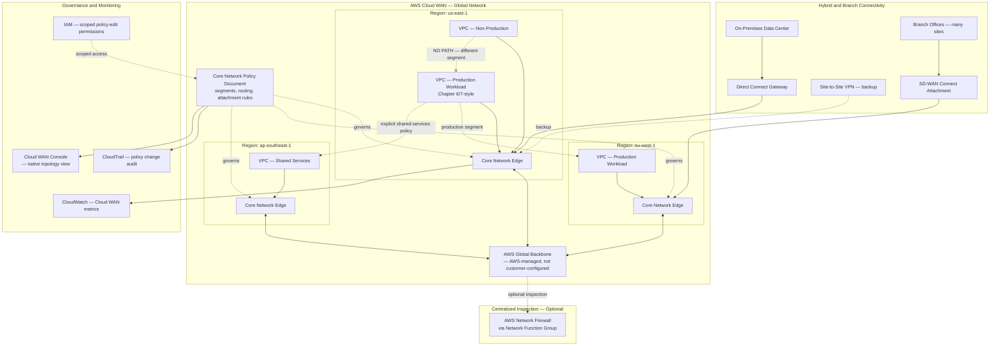
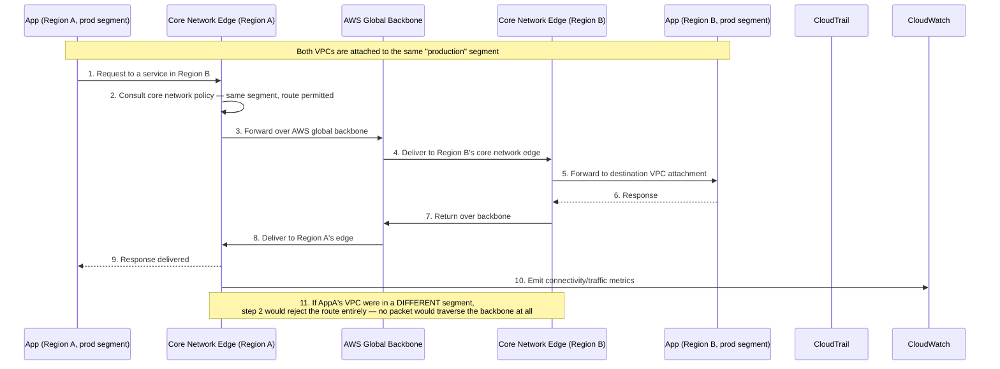
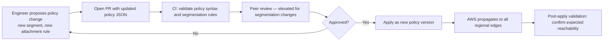

# Part III – Network Architectures

# Chapter 18 – Cloud WAN

> **Visual note:** This chapter uses Mermaid diagrams for architecture and sequence flows, and Markdown tables for comparisons, cost estimates, and checklists. All Terraform and CLI examples are written against provider `hashicorp/aws >= 5.0` and AWS CLI v2. Where this chapter uses a service already introduced in Chapter 2 ("AWS Building Blocks") or Chapter 7 ("Three-Tier Enterprise Architecture"), it re-explains that service briefly on first use so the chapter remains self-contained.

---

# 1 Executive Summary

AWS Cloud WAN is a managed, global network service. It lets an enterprise build and operate one unified network spanning:

- Multiple AWS Regions
- Multiple VPCs
- On-premises data centers
- SD-WAN edges and branch offices

All of this is centrally managed from a single network policy document, rather than a growing pile of Transit Gateways, peering connections, and route tables hand-maintained per region.

**The business problem.**

Chapter 7 of this book introduced Transit Gateway as the hub for connecting multiple VPCs and on-premises networks within a single AWS Region.

That pattern works well at the scale it was designed for. It runs into real limits as an organization grows past a handful of regions:

- Each region's Transit Gateway is managed independently.
- Connecting Transit Gateways across regions requires peering connections, each with its own route propagation rules to maintain by hand.
- There is no single, central place to define "how should traffic flow between any two points in our global network" — that logic ends up scattered across dozens of route tables, in multiple regions, maintained by different teams over time.

This is the same organizational-sprawl problem Chapter 2 described for compute and storage sprawl, applied specifically to network topology at global scale.

The practical result, seen repeatedly in real enterprise environments:

- Route tables drift out of sync between regions.
- Nobody has a single, accurate picture of the organization's actual global network topology.
- Adding a new region means re-deriving the same peering and routing logic from scratch, usually by someone who wasn't involved in the original design.

**The architecture objective.**

Cloud WAN's objective is to replace *many independently-managed regional hubs* with *one centrally-managed global network*, defined declaratively:

- A single **core network policy document** describes the entire global topology — which regions exist, which segments (isolated routing domains) exist, and how segments relate to each other.
- AWS operates the global backbone connecting regions — the enterprise does not build or maintain inter-region connectivity itself.
- Changes to the global network are policy changes, versioned and reviewed like code, not manual route table edits made region-by-region.

This is a genuinely different operating model from Transit Gateway peering — not a bigger version of the same thing, but a shift from imperative, per-region configuration to declarative, global policy.

**Why organizations adopt this architecture.**

Three forces drive adoption specifically:

1. **True multi-region operating scale.** Once an organization operates production workloads (Chapter 6, 7's patterns) in three or more AWS Regions, the Transit-Gateway-peering-mesh approach from Chapter 7 becomes genuinely difficult to reason about and audit — Cloud WAN's single policy document restores that missing single source of truth.
2. **Segmentation as a first-class, global concept.** Cloud WAN's "segments" (e.g., production, non-production, shared-services) are enforced consistently across every region and every attachment (VPC, VPN, Direct Connect, SD-WAN) from one policy — rather than Chapter 7's per-VPC security-group-and-route-table segmentation discipline, re-implemented by hand in every region.
3. **SD-WAN and branch-office integration at scale.** Enterprises with many physical branch locations (retail chains, bank branches, distributed manufacturing) need a way to connect hundreds of sites to AWS without a bespoke VPN or Direct Connect configuration per site — Cloud WAN's native SD-WAN integration (via supported third-party SD-WAN vendors) addresses this directly.

**Major business benefits.**

- **A single, authoritative network topology.** One policy document is the network's source of truth — replacing a patchwork of region-specific Terraform states and manually-reconciled route tables.
- **Consistent segmentation everywhere.** A "production" segment behaves identically in every region and for every attachment type, closing the segmentation-drift risk this book has flagged since Chapter 7.
- **Reduced operational burden for global connectivity.** AWS operates the inter-region backbone — the enterprise no longer designs, builds, or troubleshoots inter-region peering paths itself.
- **Built-in network-level observability.** Cloud WAN provides a native network topology view and event history, directly supporting the audit and compliance evidence needs this book has emphasized since Chapter 7 and Chapter 14.
- **Faster new-region onboarding.** Adding a new region to an existing global network is a policy update, not a from-scratch replication of peering and routing logic.

**Typical enterprise scenarios.**

- A global SaaS company operating production workloads in three or more regions, needing consistent, auditable segmentation between production and non-production traffic across all of them.
- A multinational enterprise migrating from a legacy MPLS/private WAN to a cloud-centric network, using Cloud WAN's SD-WAN integration to connect existing branch offices directly into AWS.
- A financial services or healthcare organization needing to demonstrate, for a single audit, that segmentation between regulated and non-regulated workloads is enforced identically everywhere — not verified region-by-region as a manual, error-prone exercise.
- An enterprise that has already built the Chapter 7-style Transit-Gateway-per-region pattern and is now hitting the specific pain points (route table drift, no single topology view, slow new-region onboarding) that motivate migrating to Cloud WAN as the next evolutionary step (Section 34 covers this migration path explicitly).

Cloud WAN is not a replacement for everything this book has covered about networking so far. It operates *above* the VPC-level designs from Chapters 6, 7, and 10 — those chapters' subnet layouts, security groups, and segmentation patterns remain valid and necessary *within* each VPC. Cloud WAN's job is connecting those VPCs, regions, and on-premises networks together, globally, under one policy. Section 28 discusses precisely where Transit Gateway alone remains the better, simpler choice, and where Cloud WAN's added capability is worth its added complexity.

---

# 2 Business Requirements

## Business Drivers

| Driver | Description |
|---|---|
| Global network complexity reduction | Replace many independently-managed regional Transit Gateways with one centrally-managed network |
| Consistent global segmentation | Enforce identical routing/isolation policy across every region and attachment type |
| SD-WAN and branch integration | Connect many physical sites to AWS without per-site bespoke connectivity engineering |
| Faster region onboarding | Add a new region via policy update, not from-scratch network design |
| Audit and compliance evidence | Single source of truth for global network topology and change history |

## Functional Requirements

- Connect VPCs across multiple AWS Regions under one managed network.
- Connect on-premises data centers via Direct Connect and VPN into the same managed network.
- Connect SD-WAN branch locations directly into the network via supported SD-WAN vendor integrations.
- Enforce segment-based isolation (e.g., production cannot route to non-production) consistently across every region and attachment.
- Support explicit, policy-defined exceptions to segment isolation where genuinely required (e.g., a shared-services segment reachable from both production and non-production).

## Non-Functional Requirements

| Category | Requirement |
|---|---|
| Topology consistency | The network policy document is the single source of truth — no region-specific deviation permitted outside of it |
| Change auditability | Every policy change versioned, reviewed, and attributable |
| Global route propagation | New attachments' routes propagate to all appropriate regions automatically, without manual per-region route table edits |
| Segmentation enforcement | No possible network path exists between segments unless explicitly permitted by policy |
| Backbone performance | Inter-region traffic uses the AWS global backbone, not the public internet |

## Scalability Goals

- Support growth from a handful of regions and VPCs to dozens of regions and hundreds of VPCs/attachments without a change in operating model — this is Cloud WAN's central scalability promise relative to Chapter 7's per-region Transit Gateway pattern.
- Support hundreds to low thousands of SD-WAN branch-office attachments for enterprises with a large physical footprint.

## Availability Requirements

- The Cloud WAN core network itself is a fully managed, highly available AWS service — no customer-side HA design is required for the backbone itself (unlike Transit Gateway, where cross-region connectivity via peering was the customer's own design responsibility).
- Individual attachments (a specific VPC, a specific Direct Connect connection) retain their own availability characteristics — a single Direct Connect circuit failure, for instance, still requires the redundant-circuit or VPN-backup design established in Chapter 7, Section 9.

## Latency Requirements

- Inter-region traffic over the Cloud WAN backbone should meet or exceed the latency characteristics of a well-designed Transit Gateway peering mesh, since both ultimately traverse the AWS global backbone rather than the public internet.
- Branch-to-AWS latency via SD-WAN integration depends on the specific SD-WAN vendor's on-ramp architecture and the branch's proximity to the nearest AWS edge location — a factor to validate during vendor selection (Section 4), not assumed uniform.

## Compliance Requirements

- Cloud WAN's segment-based policy model is frequently adopted specifically to satisfy network segmentation requirements (PCI-DSS Requirement 1, as established in Chapter 7) at a *global*, multi-region scale — where Chapter 7's per-VPC segmentation pattern was sufficient for a single-region deployment, this chapter's pattern extends the same guarantee across the organization's entire global footprint.
- Financial services and healthcare organizations with multi-region regulatory obligations (data residency, cross-border data flow restrictions) can encode those constraints directly into segment policy — for example, preventing a segment in one region from ever routing to a segment in a region outside an approved data-residency boundary.

## Security Expectations

- No segment may reach another segment except through an explicit, reviewed policy statement — the same "deny by default, allow by explicit exception" principle established for security groups in Chapters 6 and 7, applied here at the network-segment level, globally.
- Policy changes affecting segmentation require the same elevated, two-reviewer change-management rigor Chapter 7 established for its own segmentation-critical Terraform changes.

## Recovery Objectives

| Objective | Target |
|---|---|
| RPO | Not directly applicable — Cloud WAN carries no data of its own; inherits the RPO of the workloads it connects |
| RTO — single attachment failure (e.g., one VPC's connectivity) | Minutes — automatic route withdrawal and failover within the core network |
| RTO — regional Cloud WAN edge failure | Minutes — AWS-managed failover to healthy regional edges, given a Multi-Region core network design |
| RTO — on-premises hybrid connectivity failure | Depends on the underlying Direct Connect/VPN redundancy design (Chapter 7, Section 13) — Cloud WAN doesn't change this, it inherits it |

## SLAs

- Cloud WAN's core network carries an AWS service-level availability commitment for the managed backbone itself.
- The organization's own internal SLA for "time to onboard a new region" or "time to approve and apply a segmentation policy change" is a meaningful, worth-tracking internal metric distinct from the AWS service SLA — and one of the concrete benefits this architecture is meant to improve relative to Chapter 7's per-region approach.

## Expected Workload and Growth

- A representative enterprise Cloud WAN deployment: 3-10+ AWS Regions, tens to hundreds of VPC attachments, a handful of Direct Connect/VPN hybrid connections, and — for enterprises with a large physical footprint — dozens to hundreds of SD-WAN branch attachments.
- Growth in this architecture is primarily *attachment count and region count* growth, not traffic-volume growth in the way Chapters 6 and 7 measured it — the relevant scaling question here is "how many things need to connect to this network," not "how much request traffic must it serve."

---

# 3 Architecture Overview

## Overall Design Philosophy

Cloud WAN inverts the network design process relative to Chapter 7's Transit Gateway pattern:

- **Transit Gateway (Chapter 7):** design starts from the infrastructure — provision a Transit Gateway per region, then wire up route tables and peering connections to achieve the desired topology.
- **Cloud WAN (this chapter):** design starts from the *policy* — declare the desired global topology (segments, regions, routing relationships) in a single document, and AWS provisions and maintains the underlying infrastructure to match it.

This is a policy-as-topology model. The network policy document is not documentation *of* the network — it *is* the network's actual configuration source.

## Core Components

- **Global network:** The top-level container — one per organization (or per major business unit, for organizations wanting separate global networks for different regulatory/organizational domains).
- **Core network:** The Cloud WAN-managed backbone within a global network, spanning the AWS Regions the organization operates in.
- **Core network policy document:** A JSON document defining segments, their associated regions, routing/sharing rules between segments, and attachment policy — the architecture's single source of truth.
- **Segments:** Isolated routing domains (e.g., `production`, `nonprod`, `shared-services`) — the Cloud WAN equivalent of, and direct evolution from, Chapter 7's per-VPC segmentation concept, but enforced globally.
- **Attachments:** The connection points into the core network — VPC attachments, VPN attachments, Direct Connect gateway attachments, and SD-WAN (Connect) attachments.
- **Network Function Groups (optional):** For routing traffic through centralized inspection/firewall appliances (e.g., AWS Network Firewall or a third-party virtual appliance) before it reaches its destination segment.

## How Components Interact

- An administrator (or, in a mature implementation, a CI/CD pipeline per Section 20) updates the core network policy document — for example, adding a new VPC attachment to the `production` segment.
- AWS Cloud WAN validates the policy and propagates the resulting routing configuration across every relevant region's core network edge automatically.
- Traffic between two attachments in the same segment routes automatically; traffic between attachments in different segments is blocked unless the policy explicitly permits sharing between those specific segments.
- Inter-region traffic within a segment traverses the AWS global backbone via the core network's regional edges — the organization does not configure or manage this path directly.

## High-Level Workflow

**Request lifecycle (inter-VPC, cross-region, within a segment):** A request originates in a VPC in Region A, attached to the `production` segment. It's routed via that VPC's attachment to the nearest core network edge, carried across the AWS backbone to the core network edge in Region B, and delivered to the destination VPC's attachment — all without the organization configuring peering connections or region-specific route tables, since the core network policy already declared both VPCs as members of the same segment.

**Response lifecycle:** Symmetric to the request path — the response traverses the same backbone path in reverse, with Cloud WAN's routing determined entirely by the policy document's segment membership, not by manually-maintained route table entries.

**Data lifecycle:** Cloud WAN itself carries no data at rest — it is purely a connectivity and routing layer. The data lifecycle for any given workload remains exactly as described in whichever prior chapter's pattern that workload follows (Chapter 6's Aurora Multi-AZ replication, for instance) — Cloud WAN's role is solely in *how* traffic reaches that data tier across regions, not in the data tier's own behavior.

---

# 4 AWS Services Used

## AWS Cloud WAN

**Purpose:** The core managed service this chapter is built around — provides the global network, core network, policy engine, and attachment management described in Section 3.

**Why selected:** Chosen over a pure Transit-Gateway-peering-mesh approach (Chapter 7) once an organization's region count, attachment count, or segmentation-consistency requirements outgrow what a manually-maintained peering mesh can reliably support (Section 28 gives explicit guidance on this threshold).

**Alternatives:**

- Transit Gateway with inter-region peering (Chapter 7's pattern) — simpler, appropriate for 1-3 regions with a modest attachment count.
- A third-party SD-WAN vendor's own cloud-native networking overlay — appropriate for organizations with an existing, deep investment in a specific SD-WAN vendor's own cloud orchestration layer, where Cloud WAN would be a redundant, competing control plane rather than a complementary one.

**Limitations:**

- Cloud WAN policy documents have a learning curve — the JSON-based segment/routing policy syntax is a genuinely new skill for teams used to Transit Gateway's route-table-based mental model.
- Not every AWS Region supports Cloud WAN core network edges at every point in time — verify current regional availability before committing to a design (a search-verified check, not an assumption, given this can change).

**Pricing considerations:** Cloud WAN pricing is based on core network edge hours (per region with an active edge) plus data processing charges for traffic traversing the network — a different cost model from Transit Gateway's per-attachment-hour-plus-data-processing model, requiring its own FinOps analysis (Section 16) rather than a direct line-by-line comparison.

**Best practices:** Treat the core network policy document as code — version-controlled, peer-reviewed, deployed via CI/CD (Section 20) — from the very first policy version, not retrofitted after informal, ad hoc console changes have already accumulated.

## AWS Transit Gateway

**Purpose:** Still relevant within this architecture — Cloud WAN can integrate with existing, per-region Transit Gateways as a migration path (Section 29), and some organizations run a hybrid model (Cloud WAN for the global backbone, Transit Gateway within a specific region for finer-grained, region-local routing needs).

**Why covered here:** Understanding Transit Gateway (Chapter 7) is a prerequisite for understanding what Cloud WAN changes and what it doesn't — Cloud WAN's segments map conceptually to Transit Gateway route tables, but with global, policy-driven propagation Transit Gateway alone doesn't provide.

## AWS Direct Connect and Site-to-Site VPN

**Purpose:** Hybrid connectivity into the Cloud WAN core network, via Direct Connect Gateway attachments and VPN attachments respectively — conceptually identical in purpose to Chapter 7's hybrid connectivity pattern, but now attaching to a global core network rather than a single region's Transit Gateway.

**Why selected/covered here:** No change in the underlying Direct Connect/VPN technology from Chapter 7 — this chapter's specific addition is that a single Direct Connect Gateway attachment can now reach every region in the core network's segment structure, rather than requiring a separate hybrid connection per region.

## SD-WAN Integration (via Supported Third-Party Vendors)

**Purpose:** Connects SD-WAN branch/edge devices directly into the Cloud WAN core network via the Connect attachment type, using supported vendor solutions (e.g., Cisco, Aruba, VMware, and other AWS-validated SD-WAN partners).

**Why selected:** For enterprises with many physical locations (retail, banking branches, manufacturing sites), this eliminates the need to backhaul branch traffic to a small number of central Direct Connect/VPN termination points — branches connect natively into the same policy-governed network as every AWS-hosted workload.

**Limitations:** Requires SD-WAN infrastructure already in place or being adopted as part of this project — this is not a lightweight, incremental change for an organization without existing SD-WAN investment, and should be scoped and budgeted as its own significant initiative if adopted for the first time alongside Cloud WAN.

## AWS Network Firewall (via Network Function Groups)

**Purpose:** Centralized traffic inspection routed through the Cloud WAN core network — appropriate when the organization needs to inspect (not just segment) traffic crossing between segments, or all egress traffic to the internet, at a single, centrally-managed point rather than per-VPC.

**Why selected:** Complements segment-based isolation (which prevents *unauthorized* paths) with actual content inspection (which examines *authorized* traffic for malicious content) — the two are complementary controls, not substitutes for each other.

## VPC, IAM, CloudWatch, CloudTrail, GuardDuty, Config, KMS

Covered in depth in Chapters 2, 6, 7, and 10; this chapter's specific application is scoping IAM permissions over the core network policy document itself (Section 10) — a genuinely new, high-consequence permission surface, since the policy document controls global network reachability.

## Cloud WAN vs. Transit Gateway Peering Decision Matrix

| Factor | Cloud WAN (this chapter) | Transit Gateway + Inter-Region Peering (Chapter 7) |
|---|---|---|
| Topology source of truth | Single policy document | Distributed across per-region Terraform/route tables |
| Region count sweet spot | 3+ regions, growing | 1-3 regions, stable |
| Segmentation consistency | Enforced globally by one policy | Manually replicated per region |
| New region onboarding | Policy update | Full peering/route-table design per new region |
| SD-WAN branch integration | Native (Connect attachments) | Not natively supported — requires a separate VPN/Direct Connect per site |
| Learning curve | Higher (new policy syntax) | Lower (familiar route-table model) |
| Best fit | Global enterprises, multi-region by design | Regional or narrowly multi-region deployments |

---

# 5 Complete Architecture Diagram



**Diagram interpretation:** The policy document governs every regional edge simultaneously — there is no per-region equivalent to update separately. The `-.NO PATH.-x` edge between the production and non-production VPCs within the *same region* is deliberate: segment isolation applies regardless of region, meaning two VPCs in the same region can be just as isolated from each other as two VPCs on opposite sides of the globe, purely as a function of segment membership, not physical/network proximity.

---

# 6 Component-by-Component Explanation

| Component | Purpose | Scaling | High Availability | Failure Handling | Dependencies |
|---|---|---|---|---|---|
| Core network policy document | Single source of truth for global topology and segmentation | N/A (a document, not infrastructure) | Versioned; prior versions retained for rollback | A bad policy version can be rolled back to the last-known-good version | IAM (edit permissions), CI/CD (Section 20) |
| Core network edge (per region) | Regional entry/exit point to the global backbone | Automatic, AWS-managed | Multi-AZ within the region, AWS-managed | AWS-managed failover; no customer-side HA design needed | Core network policy, regional attachments |
| VPC attachment | Connects a specific VPC to a specific segment | N/A (one per VPC) | Inherits the VPC's own Multi-AZ design (Chapter 6) | Attachment-level failure is isolated to that specific VPC's connectivity | The VPC, the core network edge in that VPC's region |
| Direct Connect Gateway attachment | Connects on-premises Direct Connect circuits to the core network | N/A | Depends on the underlying Direct Connect circuit redundancy (Chapter 7, Section 9) | Falls back to VPN attachment per the same pattern as Chapter 7 | Direct Connect, core network |
| SD-WAN (Connect) attachment | Connects SD-WAN branch infrastructure to the core network | Scales to hundreds of branch sites | Depends on the SD-WAN vendor's own architecture | Vendor-dependent; validate during vendor selection | SD-WAN vendor infrastructure, core network |
| Network Function Group (optional) | Routes traffic through centralized inspection | Scales with the underlying firewall/appliance capacity | Multi-AZ, per standard AWS Network Firewall design | Fails per the underlying firewall service's own HA design | AWS Network Firewall or third-party appliance |

---

# 7 End-to-End Request Flow



**Step-by-step narrative:**

- Step 2 is the architecturally significant step in this entire flow: the routing decision is made by consulting the *policy document's segment membership*, not a manually-configured route table entry specific to this pair of VPCs.
- This is the same request as Chapter 7's cross-region equivalent would require — except in Chapter 7's model, achieving this path would have required an explicit Transit Gateway peering connection and route propagation configuration between the two regions, configured by an engineer, for this specific pair of regions.
- Here, the path exists automatically the moment both VPCs are declared members of the same segment in the policy document — adding a third region's VPC to the same segment requires no additional per-pair configuration at all.

---

# 8 Deployment Flow

## Infrastructure Provisioning

Cloud WAN deployment has two distinct layers, worth separating clearly:

- **The global network and core network themselves** — provisioned once, rarely changed structurally (Section 18's Terraform).
- **The core network policy document** — changed frequently, as segments and attachments evolve — this is the layer that should go through the most rigorous, frequent review cycle (Section 20).

## Policy Document Deployment Workflow



## Terraform Workflow

- Same `plan`/review/`apply` discipline as every prior chapter, applied to the `aws_networkmanager_core_network_policy_document` resource (Section 18) specifically.
- **Key difference from prior chapters:** a single policy document change can affect routing across *every region* simultaneously — the blast radius of an error here is structurally larger than a single-region Terraform change, which should directly inform the review rigor applied (Section 20).

## Blue-Green for Policy Changes

- Cloud WAN retains prior policy versions — a bad policy change can be rolled back to the previous version quickly, conceptually similar to Chapter 6's blue-green rollback speed, but operating on network policy rather than application code.
- **Recommendation:** treat every policy change as if it were a blue-green deployment of the network itself — validate the new policy's effect in a non-production global network (a separate Cloud WAN instance scoped to non-production regions/segments) before applying the equivalent change to production, wherever the organization's scale justifies maintaining a separate non-production Cloud WAN instance for this purpose.

## Rollback

- Reverting to a previous core network policy version is the primary rollback mechanism — fast, and does not require re-provisioning any underlying infrastructure, since the core network edges and attachments themselves are unaffected by a policy-only rollback.

## Secrets and Configuration

- The core network policy document itself is non-sensitive configuration (network topology, not credentials) and should be stored in version control like any other infrastructure code.
- SD-WAN vendor integration credentials, where applicable, follow the same Secrets Manager pattern established throughout this book.

## Validation

- Post-deployment validation for any policy change should include an explicit reachability test: confirm that segments expected to be isolated remain isolated, and segments expected to be connected can actually reach each other — an automated test suite running representative connectivity checks after every policy change, not just a visual review of the policy JSON, is the recommended practice (Section 20).

---

# 9 Network Topology

## VPC and CIDR Design — Unchanged from Prior Chapters

- Cloud WAN does not change how an individual VPC's subnets, CIDR ranges, or route tables are designed within that VPC — Chapters 6, 7, and 10's guidance applies without modification.
- What changes is how *that VPC connects to everything else* — via a Cloud WAN attachment instead of a Transit Gateway peering connection or direct VPC peering.

## CIDR Planning at Global Scale

- Chapter 7's warning about CIDR overlap planning applies with even greater force here: every VPC across every region that will ever join the same Cloud WAN segment must have a non-overlapping CIDR range.
- **Recommendation:** adopt a global IP address management (IPAM) strategy — AWS VPC IPAM, integrated with Cloud WAN, is purpose-built for this — before the second region's VPCs are provisioned, not retrofitted once overlap has already occurred across a dozen VPCs.

## Segments as the Primary Topology Concept

| Segment (example) | Purpose | Regions | Cross-Segment Sharing |
|---|---|---|---|
| `production` | Production workloads (Chapter 6/7 patterns) | All regions | Explicit, limited sharing with `shared-services` only |
| `nonprod` | Development, staging, QA environments | All regions | No sharing with `production` |
| `shared-services` | Centralized services (logging, identity, monitoring) | All regions | Shared with both `production` and `nonprod`, by explicit policy |
| `branch` | SD-WAN-connected branch office traffic | Regions with SD-WAN Connect attachments | Scoped sharing with `production` only for specific, approved application paths |

## Attachment Types and Their Network-Level Behavior

- **VPC attachment:** the most common attachment type — connects a single VPC to a single segment.
- **VPN attachment:** connects an on-premises VPN endpoint directly to a segment, without requiring a separate Transit Gateway.
- **Direct Connect Gateway attachment:** connects one or more Direct Connect circuits, potentially spanning multiple on-premises locations, into the core network.
- **Connect attachment (SD-WAN):** connects SD-WAN branch infrastructure, using GRE or another supported tunnel protocol between the SD-WAN appliance and the core network edge.

## Route Tables — Still Relevant, But Automatically Populated

- Within each attached VPC, route tables still exist exactly as in Chapter 6/7's designs — but the routes pointing toward *other* segment members (across regions) are populated automatically by Cloud WAN based on the policy document, not hand-entered by an engineer.
- This is the single biggest operational difference from Chapter 7's model: route table maintenance for inter-VPC/inter-region connectivity effectively disappears as a manual task.

## Security Groups and NACLs — Still the VPC-Level Control

- Cloud WAN's segmentation operates at the network-routing level (can traffic reach this VPC's attachment at all); security groups and NACLs (Chapters 6, 7) remain the fine-grained, resource-level control within a VPC once traffic does arrive.
- Both layers matter — segment isolation prevents an entire class of unauthorized cross-region/cross-VPC traffic from ever being routable at all, while security groups govern exactly which specific resources within a reachable VPC a given connection can reach.

## PrivateLink Interaction

- VPC endpoints and PrivateLink (Chapter 2, 7, 10) continue to operate exactly as before within each VPC — Cloud WAN doesn't replace or interact with them directly, since PrivateLink connections are a separate, endpoint-specific mechanism rather than a general routing path Cloud WAN's segments would govern.

---

# 10 Identity and Access

## IAM Roles for This Architecture's Components

| Role | Attached To | Key Permissions |
|---|---|---|
| Network policy editor role | Platform/network engineers | `networkmanager:PutCoreNetworkPolicy`, `networkmanager:ExecuteCoreNetworkChangeSet` — scoped to the specific core network only |
| Attachment requester role | Application/workload teams | Permission to *request* a new VPC attachment to a specific, pre-approved segment — not permission to modify the policy document itself |
| CI/CD pipeline role | CI/CD system | Permission to apply reviewed, approved policy changes — the actual production-facing permission, distinct from a human's direct console access |
| Read-only network visibility role | Broader engineering org, auditors | `networkmanager:Get*` and `networkmanager:List*` only — visibility into topology without edit capability |

## Why Policy-Edit Permission Deserves Special Scrutiny

- The core network policy document controls global network reachability — a compromised or overly-broad policy-edit permission is, in effect, a compromised or overly-broad *global network segmentation* control.
- This deserves the same rigor this book applied to Chapter 7's segmentation-enforcing IAM roles and Chapter 14's canary analysis engine role — a small, deliberately narrow set of principals should hold direct policy-edit permission, with most changes flowing through the CI/CD pipeline's more auditable, reviewed path instead.

## Example: Scoped Policy-Editor IAM Policy

```json

{
  "Version": "2012-10-17",
  "Statement": [
    {
      "Sid": "ManageSpecificCoreNetworkPolicyOnly",
      "Effect": "Allow",
      "Action": [
        "networkmanager:PutCoreNetworkPolicy",
        "networkmanager:GetCoreNetworkPolicy",
        "networkmanager:GetCoreNetworkChangeSet",
        "networkmanager:ExecuteCoreNetworkChangeSet"
      ],
      "Resource": "arn:aws:networkmanager::123456789012:core-network/core-network-0abc123def456"
    },
    {
      "Sid": "DenyDeleteGlobalNetwork",
      "Effect": "Deny",
      "Action": ["networkmanager:DeleteGlobalNetwork", "networkmanager:DeleteCoreNetwork"],
      "Resource": "*"
    }
  ]
}

```

- Note the explicit `Deny` statement on deletion actions — a defense-in-depth control preventing even an authorized policy editor from accidentally (or maliciously) deleting the global network or core network entirely, a catastrophic, high-blast-radius action that should require a separate, even more restricted permission grant.

## Attachment Requests — A Separate, Lower-Privilege Workflow

- Application teams generally should not have direct `PutCoreNetworkPolicy` permission at all.
- Instead: a workload team requests a new VPC attachment (e.g., via a Service Catalog product, an internal self-service tool, or a scoped Terraform module they can invoke but not directly author policy through) that translates into a reviewed, pre-approved policy change pattern — keeping the actual policy-editing permission concentrated in the platform/network team.

## Cross-Account Considerations

- Cloud WAN's global network is typically owned by a central networking/platform account, with individual workload accounts sharing attachments into it via AWS Resource Access Manager (RAM) — a direct extension of the multi-account patterns established throughout this book, now applied at the global-network level.
- Each workload account's own IAM governs what that account's engineers can do *within* their VPCs; the central networking account governs the segment/policy layer connecting those VPCs together.

## Permission Boundaries

- A permission boundary on any role capable of modifying the core network policy is a strong defense-in-depth control here, exactly analogous to the boundary guidance in Chapters 2, 7, and 14 — capping the maximum possible network-topology-altering permission regardless of what policy might later be attached to that role.

---

# 11 Security Architecture

## Encryption and TLS

- Traffic traversing the AWS global backbone between Cloud WAN core network edges is encrypted by AWS at the infrastructure level.
- This does **not** replace application-level TLS (Chapters 6, 7) — encrypt application traffic end-to-end regardless of the underlying network's own transport security, consistent with the Zero Trust principle established throughout this book: never rely on network-location or network-provider trust alone.

## Segment Isolation as the Primary Security Control

- This chapter's core security property, directly analogous to Chapter 7's tier-segmentation guarantee, but now global: **no segment can reach another segment except through an explicit, reviewed policy statement.**
- Just as Chapter 7 emphasized both a security-group-layer *and* a route-table-layer enforcement of segmentation for defense in depth, Cloud WAN's segment isolation is itself the network-layer control — VPC-level security groups (Chapters 6, 7) remain the complementary, finer-grained control within a reachable segment.

## AWS Network Firewall Integration (Centralized Inspection)

- For traffic that must be *inspected*, not merely *segmented* — internet egress from any VPC, or traffic crossing between segments via an approved exception — routing it through a Network Function Group with AWS Network Firewall (or a supported third-party appliance) provides centralized, consistently-applied inspection.
- This avoids the Chapter 7-era pattern of deploying and maintaining a separate inspection appliance per VPC or per region — one centrally-managed inspection point, reachable via policy, serves the entire global network.

## GuardDuty, Config, CloudTrail

- CloudTrail records every `PutCoreNetworkPolicy` and `ExecuteCoreNetworkChangeSet` call — this audit trail is the direct evidence for the compliance requirements described in Section 2, and should be retained per the applicable schedule, exactly as Chapter 7's segmentation-change audit trail was.
- An AWS Config rule (or a custom check in the CI policy gate, Section 20) can validate that the *deployed* core network policy matches the version-controlled source of truth — catching any out-of-band console change that bypassed the reviewed pipeline, the same drift-detection principle applied throughout this book since Chapter 7.
- GuardDuty's relevance here is more indirect than in prior chapters — Cloud WAN itself is a routing layer, not a compute or data resource GuardDuty directly instruments — but anomalous cross-segment traffic patterns detected at the VPC Flow Log level (within an individual VPC) remain just as relevant as in Chapter 7's threat model.

## Zero Trust Applied to This Architecture

- Segment membership is not a substitute for identity-based authorization — a request reaching an application merely because its origin VPC shares a segment with the destination is still subject to that application's own authentication and authorization (Chapters 6, 7), exactly as "inside the VPC" was never sufficient trust on its own in Chapter 7's segmentation design.
- Cloud WAN's segments answer "can this traffic possibly reach this destination at the network layer" — they do not and should not answer "should this specific request be allowed," which remains the application and IAM layers' responsibility.

## Threat Model for This Architecture

| Attack Vector | Specific Relevance | Mitigation |
|---|---|---|
| Overly broad policy-edit IAM permission | Compromise yields control over global network segmentation | Narrow IAM scoping (Section 10), permission boundary, CI/CD-mediated changes only |
| A single bad policy change affecting all regions simultaneously | Larger blast radius than any single-region Chapter 7 mistake | Elevated review (Section 20), staged rollout via a non-production global network first |
| Out-of-band console policy change bypassing review | Defeats the entire reviewed-change-management model | Config rule/drift detection comparing deployed policy against version control |
| Segment misconfiguration accidentally permitting unintended cross-segment reachability | Silently defeats the segmentation guarantee this architecture exists to provide | Automated post-change reachability testing (Section 8), periodic segment-isolation audit |
| SD-WAN branch compromise | A compromised branch device could pivot into the broader network via its Connect attachment | Scope branch segment membership narrowly (Section 9's `branch` segment example), never grant branches direct `production` segment membership without a specific, reviewed justification |

---

# 12 High Availability

## The Core Network Itself Is AWS-Managed HA

- Unlike Chapter 7's Transit-Gateway-peering-mesh, where inter-region connectivity resilience was a design the customer had to build (redundant peering paths, careful route propagation), Cloud WAN's core network backbone is AWS-managed, multi-AZ within each region, and designed for high availability without customer-side configuration.
- This is one of this architecture's clearest operational-burden reductions relative to Chapter 7's pattern — the specific class of HA design work Chapter 7 required for inter-region connectivity mostly disappears.

## Attachment-Level Availability — Still the Customer's Responsibility

- **VPC attachments** inherit whatever HA design exists *within* that VPC (Chapter 6's Multi-AZ patterns) — Cloud WAN doesn't change this.
- **Direct Connect/VPN attachments** still require the redundant-circuit-plus-VPN-backup design from Chapter 7, Section 9 — Cloud WAN provides the attachment point, not immunity from a single circuit's own failure modes.
- **SD-WAN Connect attachments** depend on the SD-WAN vendor's own resilience architecture at the branch — validate this during vendor selection (Section 4), since a poorly-resilient branch SD-WAN device remains a single point of failure regardless of how robust the Cloud WAN side of the connection is.

## Regional Edge Failure

- A regional core network edge failure is handled by AWS's own multi-AZ design within that region — from the customer's perspective, this should be transparent, though monitoring (Section 21) should still track edge health explicitly rather than assuming invisibility means non-existence.

## Policy Propagation Failure

- A genuinely new failure mode relative to Chapter 7: if policy propagation to a specific regional edge fails or lags, that region's attachments may temporarily see stale routing information.
- **Mitigation:** monitor Cloud WAN's own change-set execution status (Section 19, 21) explicitly after every policy change, confirming propagation completed successfully across every affected region before considering the change fully applied.

## Load Balancing and Health Checks

- Not directly applicable at the Cloud WAN layer itself — load balancing and health checks remain a per-workload concern (Chapter 6's ALB patterns), operating *within* whichever VPC/segment the workload lives in, unaffected by how that VPC connects to the broader global network.

---

# 13 Disaster Recovery

## DR Scope for This Architecture

- Cloud WAN doesn't hold data and has no RPO of its own — this section addresses **failure or misconfiguration of the network layer itself**, distinct from the workload-level DR patterns established in Chapters 6, 7, and 14.

## Backup Strategy — Policy Version History

- Cloud WAN retains prior core network policy versions natively — this *is* the backup strategy for this architecture's most critical artifact.
- **Recommendation:** additionally maintain the policy document in version control (Section 8) as a second, independent source of truth — not relying solely on Cloud WAN's own internal version history, consistent with this book's general principle (since Chapter 2) of infrastructure-as-code being the authoritative, reproducible source, not a convenience layer on top of console-managed state.

## Regional DR and Multi-Region Design Interaction

- Cloud WAN is itself an *enabler* of the multi-region DR patterns a later chapter of this book will cover in depth — a well-designed core network policy makes adding a DR region's VPCs to the appropriate segment a policy change, not a from-scratch peering exercise, directly supporting faster regional failover architecture than Chapter 7's per-region Transit Gateway pattern would.
- For an organization executing an actual regional failover (per a DR runbook established in an earlier chapter), Cloud WAN's segment structure should already include the DR region as a standing member of the relevant segments — added and validated well before an actual DR event, not provisioned reactively during one.

## RPO/RTO for This Pattern

| Scenario | RPO | RTO |
|---|---|---|
| Single attachment failure | N/A | Minutes — automatic route withdrawal |
| Regional core network edge failure | N/A | Minutes — AWS-managed failover |
| Bad policy change | N/A | Minutes — rollback to prior policy version |
| Full Cloud WAN service disruption (rare, AWS-side) | N/A | Depends on AWS's own service recovery; existing attachments' direct connectivity (where redundant paths exist outside Cloud WAN, e.g., a direct VPC peering fallback) may be the only mitigation available — worth explicitly deciding whether this scenario justifies a non-Cloud-WAN fallback path for the most critical segments |

## Testing

- Include a policy-rollback test in the organization's regular DR/chaos testing cadence (established in Chapters 6, 7, 14) — deliberately apply a policy change in a non-production global network, verify it behaves as expected, then verify rollback to the prior version restores expected connectivity within the RTO target.
- Test segment isolation explicitly and regularly, not just at initial design time — the same "verify the negative" testing principle Chapter 7 established for its segmentation guarantee applies here at global scale.

---

# 14 Scalability

## The Core Scalability Promise: Attachment and Region Growth Without Redesign

- This is Cloud WAN's central value proposition relative to Chapter 7's pattern — adding a new region, or a new VPC attachment within an existing region, is a policy update, not a network redesign.
- Contrast with Chapter 7: adding a fourth region to a three-region Transit Gateway peering mesh means designing and provisioning three new peering connections (one to each existing region) plus their route propagation — an O(n) growth in configuration burden per new region, in a full-mesh design.
- Cloud WAN's growth is effectively O(1) per new region from the policy-authoring perspective — declare the new region's edge and its segment memberships; AWS handles the resulting backbone connectivity.

## Horizontal Scaling — Attachment Count

- Cloud WAN is designed to support attachment counts (VPCs, VPNs, Direct Connect Gateways, SD-WAN Connect attachments) at a scale well beyond what a hand-maintained Transit Gateway peering mesh could reasonably support before becoming unmanageable.
- The practical scaling constraint at real enterprise scale is less about AWS service limits and more about **policy document complexity** — a very large, complex segment structure with many exceptions and sharing rules becomes harder for humans to review correctly, even though the underlying service can technically support it (Section 34 addresses this specific, organizational scaling limit).

## SD-WAN Branch Scaling

- For enterprises with hundreds of branch locations, Cloud WAN's Connect attachment model is specifically designed to scale to this count without per-branch bespoke network engineering — the SD-WAN vendor's own orchestration layer handles branch-side provisioning, while Cloud WAN's policy governs how branch traffic is segmented once it reaches AWS.

## Vertical/Throughput Scaling

- Individual attachment throughput (how much data a single VPC attachment or Direct Connect Gateway attachment can carry) has its own service quotas, distinct from the attachment-*count* scaling discussed above — worth tracking per Section 34's scaling-limits guidance, particularly for any single attachment carrying disproportionately high traffic relative to the rest of the network.

## Multi-Account Scaling

- Consistent with Section 10's RAM-based sharing pattern: Cloud WAN scales cleanly across a growing number of AWS accounts in an AWS Organization, since attachment requests from many accounts all flow into the same centrally-governed core network and policy — a direct extension of the multi-account governance patterns established since Chapter 2.

---

# 15 Performance Optimization

## Backbone Performance Is Largely AWS-Managed

- Unlike Chapter 6/7's application-tier performance optimization (caching, connection pooling, query tuning — all customer-controlled), Cloud WAN's inter-region backbone performance is largely determined by AWS's own global network infrastructure, not by customer-side tuning.
- The customer-controlled performance levers here are narrower and more specific than in prior chapters.

## Regional Edge Placement

- Ensure a core network edge exists in every region where the organization has meaningful attachment density — routing traffic through a distant region's edge unnecessarily (a possible outcome of an incomplete or poorly-planned regional edge rollout) adds avoidable latency.

## SD-WAN On-Ramp Selection

- For branch connectivity specifically, the choice of which AWS edge location a branch's SD-WAN Connect attachment terminates into materially affects branch-to-AWS latency — validate this against actual branch geography during vendor/architecture selection (Section 4), not as an afterthought once branches are already connected.

## Segment Design and Traffic Locality

- A segment design that forces logically-related workloads into artificially separated segments (requiring an explicit cross-segment sharing exception for routine, high-volume traffic) both adds policy complexity and, depending on how that exception is implemented (e.g., routed through a centralized inspection point per Section 11), can add unnecessary latency to what should be a direct, low-latency path.
- **Recommendation:** design segments around genuine security/compliance boundaries (Section 9's examples), not around organizational team structure alone — a segment boundary that doesn't correspond to a real isolation requirement adds complexity and potential latency without a corresponding security benefit.

## Network Function Group Placement

- If routing traffic through centralized inspection (Section 11), be deliberate about which traffic actually needs it — routing all inter-segment traffic through a single, centralized inspection point, even for segments with a legitimate, frequent, high-volume sharing relationship, can turn that inspection point into both a latency bottleneck and a cost driver (Section 16) disproportionate to the actual security value it adds for that specific traffic pattern.

---

# 16 Cost Optimization (FinOps)

## Cloud WAN's Cost Model — Distinct from Transit Gateway

Cloud WAN pricing has two primary components, worth understanding as genuinely distinct from Chapter 7's Transit Gateway cost model:

- **Core network edge charges** — an hourly rate per region with an active edge.
- **Data processing charges** — a per-GB rate for traffic traversing the core network, generally structured with a within-region-attachment rate and a separate, typically higher, inter-region/backbone rate.

## Estimated Monthly Costs

| Deployment Size | Regions with Active Edges | Approximate Edge Cost | Approximate Data Processing Cost | Approximate Total |
|---|---|---|---|---|
| Small (3 regions, moderate traffic) | 3 | $600–1,200 | $500–2,000 | $1,100–3,200 |
| Medium (5-6 regions, meaningful inter-region traffic) | 5-6 | $1,500–3,000 | $3,000–10,000 | $4,500–13,000 |
| Enterprise (8-10+ regions, high inter-region traffic, SD-WAN branches) | 8-10+ | $3,000–6,000+ | $15,000–50,000+ | $18,000–56,000+ |

> **Note:** These figures are illustrative estimates, not a quote — validate against Cost Explorer and current AWS pricing for the organization's specific region mix and traffic patterns, consistent with every cost table in this book.

## Comparison Against Chapter 7's Transit Gateway Peering Model

- For a small number of regions (1-3) with modest inter-region traffic, Transit Gateway peering (Chapter 7) is typically the lower-cost option — Cloud WAN's edge charges add a cost floor that isn't justified until region count and operational complexity genuinely warrant it.
- As region count and attachment count grow, Cloud WAN's *operational* cost savings (reduced engineering time spent designing and maintaining peering meshes) increasingly offset its direct service cost premium — this is a FinOps analysis that should include engineering time, not compare AWS service charges alone.

## Major Cost Drivers

- **Inter-region data processing** is typically the largest single line item at real enterprise scale — review actual inter-region traffic patterns (Section 21's monitoring) to identify whether traffic is flowing efficiently (e.g., not unnecessarily routing through a distant region's edge, per Section 15) before assuming the cost is simply the unavoidable price of the traffic volume.
- **Core network edges in regions with minimal actual attachment activity** — a region with an active edge but very few attachments and little traffic is a candidate for edge removal or consolidation, reviewed periodically.

## Optimization Opportunities

- **Right-size regional edge footprint** — only maintain active edges in regions with genuine attachment density, consistent with Section 15's guidance.
- **Review Network Function Group routing scope** — avoid routing high-volume, legitimate cross-segment traffic through centralized inspection unnecessarily (Section 15), since this both adds inspection-appliance cost and potentially double-counts data processing charges.
- **Consolidate SD-WAN branch on-ramps** where geographically sensible, rather than defaulting every branch to the nearest edge without considering aggregate traffic patterns across nearby branches.

## Tagging and Budget Configuration

- Tag Cloud WAN resources (core network, attachments) with the standard `Project`/`Environment`/`CostCenter` tags from Chapter 2, and additionally track cost by **segment** where the billing/cost-allocation tooling supports it — since segment-level cost visibility (e.g., "how much does the `shared-services` segment's cross-region traffic actually cost") is a genuinely useful, architecture-specific FinOps question this book's general tagging guidance doesn't automatically surface.

---

# 17 AI-Assisted Operations

## AI-Assisted Policy Document Review

- Given the core network policy document's JSON complexity at real enterprise scale, a Bedrock-backed tool can draft a plain-language summary of what a proposed policy change actually does — "this change adds VPC X in region Y to the production segment, and adds a new sharing exception allowing production to reach shared-services in region Z" — genuinely useful for a human reviewer verifying a change matches its stated intent, especially as the policy document grows large and hard to read at a glance.

## AI-Assisted Segmentation Drift Detection

- Consistent with the general pattern established in Chapter 7, Section 17: a Bedrock-backed tool comparing the deployed policy against the version-controlled source (Section 11's drift-detection guidance) can draft a clear explanation of any detected discrepancy for a compliance or security stakeholder.

## AI-Assisted Capacity and Cost Forecasting

- Given historical Cloud WAN data-processing metrics (Section 21) alongside planned regional expansion, a Bedrock-backed tool can help draft a first-pass cost forecast for a new region's addition — a useful input to the FinOps review process (Section 16), subject to validation against actual Cost Explorer data once the region is live, not treated as a final, load-bearing estimate.

## AI-Generated Terraform and Policy Scaffolding

- As with every prior chapter: AI-assisted generation of new segment definitions or attachment configurations, following the established module pattern (Section 18), subject to the same mandatory human review — with particular scrutiny given to any AI-generated cross-segment sharing rule, since this is precisely the kind of change most likely to silently and consequentially weaken segmentation if generated without careful review.

---

# 18 Terraform Implementation

## Global Network and Core Network Module

```hcl

# modules/cloud_wan_core/main.tf

resource "aws_networkmanager_global_network" "main" {
  description = "${var.project_name} global network"

  tags = { Name = "${var.project_name}-global-network" }
}

resource "aws_networkmanager_core_network" "main" {
  global_network_id = aws_networkmanager_global_network.main.id
  description        = "${var.project_name} core network — Cloud WAN backbone"

  # The policy document itself is applied as a separate resource

  # (below) so that policy changes can be reviewed and versioned

  # independently from the core network's initial creation.

  create_base_policy = true
  base_policy_document = data.aws_networkmanager_core_network_policy_document.base.json

  tags = { Name = "${var.project_name}-core-network" }
}

```

## Core Network Policy Document (Segments and Attachment Rules)

```hcl

# modules/cloud_wan_core/policy.tf

data "aws_networkmanager_core_network_policy_document" "main" {
  core_network_configuration {
    vpn_ecmp_support = true
    asn_ranges        = ["64512-64555"]

    edge_locations {
      location = "us-east-1"
      asn      = 64512
    }
    edge_locations {
      location = "eu-west-1"
      asn      = 64513
    }
    edge_locations {
      location = "ap-southeast-1"
      asn      = 64514
    }
  }

  segments {
    name                          = "production"
    description                   = "Production workloads — all regions"
    require_attachment_acceptance = true
  }

  segments {
    name                          = "nonprod"
    description                   = "Non-production workloads — all regions"
    require_attachment_acceptance = false
  }

  segments {
    name                          = "shared-services"
    description                   = "Centralized logging, identity, monitoring"
    require_attachment_acceptance = true
  }

  # Explicit, reviewed exception: production and shared-services may

  # reach each other. No other cross-segment path exists unless

  # explicitly declared here — deny by default, per Section 11.

  segment_actions {
    action     = "share"
    mode       = "attachment-route"
    segment    = "production"
    share_with = ["shared-services"]
  }

  segment_actions {
    action     = "share"
    mode       = "attachment-route"
    segment    = "nonprod"
    share_with = ["shared-services"]
  }

  attachment_policies {
    rule_number     = 100
    condition_logic = "and"

    conditions {
      type     = "tag-value"
      operator = "equals"
      key      = "Environment"
      value    = "production"
    }

    action {
      association_method = "constant"
      segment             = "production"
    }
  }

  attachment_policies {
    rule_number     = 200
    condition_logic = "and"

    conditions {
      type     = "tag-value"
      operator = "equals"
      key      = "Environment"
      value    = "shared-services"
    }

    action {
      association_method = "constant"
      segment             = "shared-services"
    }
  }
}

```

## VPC Attachment Module

```hcl

# modules/cloud_wan_vpc_attachment/main.tf

resource "aws_networkmanager_vpc_attachment" "this" {
  core_network_id = var.core_network_id
  vpc_arn          = var.vpc_arn
  subnet_arns       = var.attachment_subnet_arns # dedicated subnets for the Cloud WAN attachment ENIs

  tags = {
    Name        = "${var.project_name}-${var.environment}-cwan-attachment"
    Environment = var.environment # drives attachment_policies matching, per the policy document above
  }
}

```

## Root Module Composition

```hcl

# main.tf

module "cloud_wan_core" {
  source       = "./modules/cloud_wan_core"
  project_name = var.project_name
}

module "prod_vpc_attachment_use1" {
  source                  = "./modules/cloud_wan_vpc_attachment"
  core_network_id           = module.cloud_wan_core.core_network_id
  vpc_arn                    = module.production_vpc_use1.vpc_arn
  attachment_subnet_arns     = module.production_vpc_use1.cwan_attachment_subnet_arns
  project_name                = var.project_name
  environment                  = "production"
}

module "prod_vpc_attachment_euw1" {
  source                  = "./modules/cloud_wan_vpc_attachment"
  core_network_id           = module.cloud_wan_core.core_network_id
  vpc_arn                    = module.production_vpc_euw1.vpc_arn
  attachment_subnet_arns     = module.production_vpc_euw1.cwan_attachment_subnet_arns
  project_name                = var.project_name
  environment                  = "production"
}

```

## Terraform Best Practices Applied Above

- **Segments and attachment policies defined together, in one reviewed document** — this is the single-source-of-truth principle from Section 3, made concrete in code, rather than segments implied by scattered per-attachment configuration.
- **`require_attachment_acceptance = true` on `production` and `shared-services`** — an additional manual-approval gate for the highest-consequence segments, directly analogous to Chapter 14's manual approval gate for high-risk canary promotions — a new attachment to these segments requires explicit acceptance, not automatic inclusion merely by matching a tag.
- **Tag-driven `attachment_policies`** mean a new VPC tagged `Environment=production` is automatically routed into the correct segment without a bespoke policy change per VPC — directly parallel to Chapter 10's tag-based IAM scoping pattern, applied here to network segment assignment instead of access control.
- **Explicit, named `segment_actions` for sharing** — every cross-segment path is a deliberate, visible line in the policy document, never an implicit or accidental side effect of some other configuration.

---

# 19 AWS CLI Examples

## Deployment and Validation

```bash

# View the current core network policy document

aws networkmanager get-core-network-policy \
  --core-network-id core-network-0abc123def456 \
  --query 'CoreNetworkPolicy.PolicyDocument' --output text

# Create a new policy version (change set) from an updated document

aws networkmanager put-core-network-policy \
  --core-network-id core-network-0abc123def456 \
  --policy-document file://policy.json

# Check change set validation results before executing

aws networkmanager get-core-network-change-set \
  --core-network-id core-network-0abc123def456 \
  --policy-version-id 5

# Execute an approved change set

aws networkmanager execute-core-network-change-set \
  --core-network-id core-network-0abc123def456 \
  --policy-version-id 5

```

## Monitoring

```bash

# List all attachments and their current state

aws networkmanager list-attachments \
  --core-network-id core-network-0abc123def456 \
  --query 'Attachments[].{ID:AttachmentId,Type:AttachmentType,Segment:SegmentName,State:State}'

# Check a specific region's core network edge status

aws networkmanager get-core-network \
  --core-network-id core-network-0abc123def456 \
  --query 'CoreNetwork.Edges[?EdgeLocation==`eu-west-1`]'

# View network topology change events (audit trail)

aws networkmanager get-core-network-change-events \
  --core-network-id core-network-0abc123def456 \
  --policy-version-id 5

```

## Troubleshooting

```bash

# Verify a specific VPC attachment's segment assignment

aws networkmanager get-vpc-attachment \
  --attachment-id attachment-0abc123def456 \
  --query 'VpcAttachment.{Segment:CoreNetworkAttachment.SegmentName,State:CoreNetworkAttachment.State}'

# Confirm expected reachability between two attachments (via a test instance in each,

# using standard connectivity tools — Cloud WAN itself doesn't provide an application-layer

# reachability test, so validate at the network layer directly)

# From an instance in the source VPC:

#   curl -m 5 http://<destination-private-ip>:<port>/health

# Review policy change history to identify when a specific segment rule was introduced

aws networkmanager list-core-network-policy-versions \
  --core-network-id core-network-0abc123def456 \
  --query 'CoreNetworkPolicyVersions[].{Version:PolicyVersionId,Alias:Alias,ChangeSetState:ChangeSetState}'

```

## Cleanup

```bash

# Identify attachments in a REJECTED or FAILED state, candidates for cleanup

aws networkmanager list-attachments \
  --core-network-id core-network-0abc123def456 \
  --states REJECTED FAILED \
  --query 'Attachments[].[AttachmentId,AttachmentType,State]'

```

---

# 20 CI/CD Integration

## Policy Change Pipeline

```yaml

name: Cloud WAN Policy Change

on:
  pull_request:
    paths: ["network/cloud-wan/policy.json"]

jobs:
  validate-and-diff:
    runs-on: ubuntu-latest
    steps:
      - uses: actions/checkout@v4
      - name: Validate policy JSON syntax
        run: python scripts/validate_cwan_policy.py network/cloud-wan/policy.json
      - name: Generate human-readable policy diff
        run: python scripts/summarize_policy_change.py --base main --head ${{ github.head_ref }}
      - name: Segmentation regression check
        run: python scripts/check_no_unintended_sharing.py network/cloud-wan/policy.json

  apply:
    runs-on: ubuntu-latest
    needs: validate-and-diff
    environment: production
    if: github.event_name == 'push'
    steps:
      - name: Apply new policy version
        run: |
          CHANGE_SET=$(aws networkmanager put-core-network-policy \
            --core-network-id ${{ secrets.CORE_NETWORK_ID }} \
            --policy-document file://network/cloud-wan/policy.json \
            --query 'CoreNetworkPolicy.PolicyVersionId' --output text)
          aws networkmanager execute-core-network-change-set \
            --core-network-id ${{ secrets.CORE_NETWORK_ID }} \
            --policy-version-id $CHANGE_SET

      - name: Post-apply reachability validation
        run: python scripts/validate_expected_reachability.py --config network/cloud-wan/reachability-tests.yaml

```

## Policy as Code Specific to This Architecture

- The `check_no_unintended_sharing.py` step above is this chapter's equivalent of Chapter 7's segmentation policy gate — a scripted check comparing the proposed policy's `segment_actions` sharing rules against a maintained allow-list of approved cross-segment paths, blocking any change introducing an unapproved sharing rule.
- The `validate_expected_reachability.py` post-apply step operationalizes Section 8's reachability-testing recommendation as an actual, automated pipeline gate rather than a manual, easy-to-skip verification step.

## Manual Approval for the Highest-Consequence Changes

- Consistent with Chapter 14's manual-gate pattern: changes specifically adding a new cross-segment sharing rule, or changes affecting the `production` segment's membership, should route through a mandatory human approval step in the pipeline — distinct from lower-risk changes (e.g., adding a new VPC attachment that merely matches an existing, already-approved tag-based policy rule), which can flow through with automated review alone.

---

# 21 Monitoring

## Key Metrics Specific to This Architecture

| Metric | Source | Why It Matters Here |
|---|---|---|
| Per-edge, per-segment traffic volume | CloudWatch (Cloud WAN metrics) | Identifies actual traffic patterns, informing both cost (Section 16) and performance (Section 15) decisions |
| Attachment state (available/pending/rejected/failed) | Cloud WAN topology API | Operational visibility into the health of every attachment across the global network |
| Policy change-set execution status | Cloud WAN change-set API | Confirms a policy change has fully propagated across all affected regions, not just been accepted |
| Cross-segment traffic (should be near-zero except for explicitly-permitted paths) | VPC Flow Logs, correlated with segment membership | A direct, ongoing verification of the segmentation guarantee — genuinely unexpected cross-segment traffic is a security-relevant signal |

## SLOs for This Architecture

- An internal SLO for policy change propagation: "99% of policy changes fully propagate to all affected regional edges within N minutes" — a direct, measurable version of the "faster new-region onboarding" business benefit claimed in Section 1.
- An internal SLO for segmentation integrity: "zero unauthorized cross-segment traffic observed" — tracked continuously, not just verified at design time, mirroring Chapter 7's segmentation-validation discipline applied at global scale.

## Alarm Design Specific to This Architecture

- An alarm on any attachment transitioning to a `FAILED` or unexpectedly `REJECTED` state — an operational signal distinct from, but complementary to, the security-focused segmentation alarms below.
- An alarm on detected cross-segment traffic that doesn't match an approved `segment_actions` sharing rule — the network-layer equivalent of Chapter 7's Config-rule-based segmentation violation alarm, adapted to Cloud WAN's segment model.
- An alarm on policy change-set execution taking meaningfully longer than the SLO target above, which may indicate a propagation issue in a specific region worth investigating before it affects that region's attachments' actual connectivity.

---

# 22 Logging

## Policy Change Audit Log

- Every `PutCoreNetworkPolicy` and `ExecuteCoreNetworkChangeSet` CloudTrail event, correlated with the corresponding version-controlled policy document change (Section 8), is this architecture's primary compliance-evidence log — directly analogous to Chapter 14's canary-decision audit log, but for network topology changes instead of deployment decisions.

## VPC Flow Logs for Segmentation Verification

- VPC Flow Logs (already established in Chapters 6 and 7) remain the primary evidence source for verifying actual observed traffic matches the intended segment isolation — correlate flow log data with segment membership (via attachment/VPC tagging) to build the continuous verification described in Section 21.

## Centralized Logging Architecture

- Consistent with the general pattern from Chapter 2, Section 22: Cloud WAN and VPC Flow Log data should flow into the organization's centralized logging account, not remain siloed per-workload-account — particularly important here, since a genuine segmentation investigation frequently needs to correlate traffic across multiple accounts and regions simultaneously, which is far more tractable against a centralized log store than against per-account, per-region log silos.

## Retention

- Policy change audit logs should be retained per the same compliance-driven schedule as Chapter 7's segmentation-change evidence (commonly 1-7 years) — this is frequently the direct evidence requested during a network-segmentation-focused compliance audit at global scale.

---

# 23 Operational Excellence

## Runbooks Specific to This Architecture

- A runbook for "policy change failed to propagate to a specific region" — covering diagnosis (change-set status check) and escalation.
- A runbook for "unexpected cross-segment traffic detected" — a security-incident-response runbook, given the segmentation-violation implications, mirroring Chapter 7's equivalent runbook.
- A runbook for "new region onboarding" — documenting the actual, current process for adding a new regional edge and its initial segment memberships, kept current as the organization's own practice evolves.

## Change Management

- Every policy change affecting segment membership or cross-segment sharing rules should go through the same elevated, two-reviewer approval this book has applied consistently since Chapter 6 to its highest-blast-radius changes — here, arguably more consequential than any single prior chapter's equivalent, since a single policy error can affect every region simultaneously (Section 8's specific warning).

## Patch Management — Not Directly Applicable

- Unlike compute-focused chapters (6, 7, 10), there is no customer-managed "patching" concern for Cloud WAN itself — it's a fully managed AWS service. Operational excellence here is entirely about policy discipline and change management, not infrastructure maintenance.

## Onboarding a New Region — A Repeatable Process

- Given this architecture's core promise (Section 14) of O(1) region-onboarding complexity, the actual onboarding process should be documented as a repeatable checklist: add the new region's edge to the policy document, verify propagation, attach the new region's VPCs via the standard tag-driven attachment policy (Section 18), and run the standard post-change reachability validation (Section 20) — turning what was a substantial, bespoke design exercise in Chapter 7's model into a well-understood, low-risk, repeatable operational task.

## Team Ownership

- Consistent with the centralized-governance pattern established in Chapter 2 and reinforced in Chapter 10: a dedicated network/platform team should own the core network policy document and hold the narrow policy-edit IAM permissions (Section 10), with workload teams interacting through the lower-privilege attachment-request workflow — this ownership model scales far better across a growing organization than a model where any team with sufficient IAM permission can directly edit global network segmentation.

---

# 24 Failure Scenarios

| # | Failure | Symptoms | Root Cause | Detection | Resolution | Prevention |
|---|---|---|---|---|---|---|
| 1 | Policy change introduces unintended cross-segment sharing | Traffic reaches a segment that should be isolated | A `segment_actions` rule authored or reviewed incorrectly | Automated segmentation regression check (Section 20), or a Config-rule-equivalent post-deployment audit | Roll back to the prior policy version immediately | Mandatory `check_no_unintended_sharing.py`-style CI gate before every policy apply |
| 2 | Policy propagation stalls in one region | New attachments/routes work in most regions but not a specific one | A transient AWS-side propagation issue, or a region-specific edge health problem | Change-set execution status monitoring (Section 21) | Re-attempt the change set; escalate to AWS Support if persistent | Monitor change-set execution status as a standard, automated post-apply step |
| 3 | CIDR overlap between VPCs in the same segment | Routing behaves unpredictably; some traffic silently fails to reach its intended destination | Inadequate global IPAM planning (Section 9) | Traffic troubleshooting reveals overlapping ranges | Requires a VPC re-IP — costly; may require temporary NAT-based workaround | Global IPAM strategy established before the second region's VPCs are provisioned |
| 4 | Overly broad policy-edit IAM permission | No immediate symptom — a latent security gap | Policy authored without the narrow scoping from Section 10 | IAM Access Analyzer review, or a security audit finding | Rescope the permission immediately | Use the reusable, narrowly-scoped IAM pattern from Section 10 as the default |
| 5 | Out-of-band console change to the policy document | Deployed policy diverges from version-controlled source | An engineer made an emergency console change without going through the CI/CD pipeline | Drift-detection check comparing deployed policy against Git (Section 11) | Reconcile — either revert the console change or fast-follow it with a proper, reviewed commit | Restrict console policy-edit access; route all changes through CI/CD, even emergency ones (mirroring the guidance from Chapter 7, Section 27) |
| 6 | SD-WAN branch device compromise used to probe the broader network | Anomalous traffic originating from a branch attachment reaching beyond its intended scope | Branch segment membership scoped too broadly | GuardDuty/VPC Flow Log anomaly detection at the destination VPC | Isolate the affected branch attachment; investigate the compromise | Scope branch segments narrowly from the start (Section 9, 11) |
| 7 | A single Direct Connect circuit failure with no VPN backup configured | On-premises connectivity to the core network lost entirely | Redundancy not configured for that specific hybrid attachment | Direct Connect connection state alarm | Connectivity down until the circuit is restored or a backup is provisioned reactively | Apply Chapter 7, Section 9's redundant-circuit-plus-VPN-backup pattern to every Direct Connect Gateway attachment |
| 8 | Regional core network edge in a region with minimal actual usage, quietly accumulating cost | Unexplained cost line item with little corresponding business value | An edge provisioned for an initial project that never materialized, never decommissioned | Cost Anomaly Detection, or a routine FinOps review (Section 16) | Decommission the unused edge | Periodic review of edge utilization against actual attachment/traffic activity |
| 9 | Network Function Group routing scope too broad | Unnecessary latency and cost on legitimate, high-volume cross-segment traffic | All inter-segment traffic routed through centralized inspection by default, without scoping to genuinely inspection-worthy paths | Elevated latency reports, cost review | Scope Network Function Group routing to specific, justified traffic categories | Deliberate routing-scope design during initial architecture (Section 15) |
| 10 | Policy document grows too complex for reliable human review | A reviewer approves a change without fully understanding its cumulative effect, given policy complexity | Segment/sharing-rule sprawl accumulated over time without periodic simplification | A post-incident review reveals the approving reviewer didn't catch an issue a simpler policy would have made obvious | Simplify and consolidate the policy structure | Periodic policy-document complexity review, consistent with Section 34's organizational-scaling-limit guidance |
| 11 | New VPC attachment tagged incorrectly, lands in the wrong segment | A workload unexpectedly isolated from (or worse, exposed to) resources it shouldn't be | Tag-driven `attachment_policies` matched on an incorrect or missing tag | Post-attachment reachability validation catches the mismatch (Section 8, 20) | Correct the VPC's tags and re-attach | Enforce tagging discipline via the same policy established in Chapter 2, applied specifically to the tags this architecture's attachment policies depend on |
| 12 | Attempted deletion of the global network or core network | Catastrophic, organization-wide connectivity loss if it succeeds | An overly-permissive IAM policy allowed a destructive action | CloudTrail records the delete attempt | If successful, requires full network reconstruction from Terraform/policy version control — severe | Explicit `Deny` statement on deletion actions in every policy-editor IAM role (Section 10) |
| 13 | Reachability test suite not updated as new segments/sharing rules are added | Post-change validation (Section 20) passes despite an actual segmentation gap, because the test suite doesn't cover the new configuration | Test suite maintenance lagging behind policy evolution | A manual, ad hoc verification catches what the automated suite missed | Update the test suite immediately; treat this as equivalent in severity to a missing unit test for critical application logic | Require reachability test coverage updates as part of the same PR introducing a new segment or sharing rule |
| 14 | SD-WAN vendor-side outage affecting many branches simultaneously | Widespread branch connectivity loss, unrelated to any AWS-side issue | Vendor infrastructure failure outside AWS's control | Vendor status page, widespread Connect attachment state changes | Escalate to the SD-WAN vendor; no AWS-side remediation available | Factor vendor reliability and support SLA into the initial vendor selection (Section 4) |
| 15 | Cost Anomaly Detection not configured for Cloud WAN's data processing charges specifically | A traffic pattern change (e.g., a misconfigured application generating excessive cross-region chatter) produces a significant, undetected cost spike | Standard account-level cost monitoring not granular enough to catch a Cloud-WAN-specific anomaly quickly | Discovered only at the end of a billing cycle | Investigate and fix the underlying traffic pattern | Configure Cost Anomaly Detection with Cloud WAN-specific granularity (Section 16) |

---

# 25 Troubleshooting Guide

| Problem | Symptoms | Likely Cause | Diagnosis | AWS CLI Command | Resolution |
|---|---|---|---|---|---|
| Two VPCs in the same segment can't reach each other | Connection timeouts despite expected same-segment reachability | Attachment not yet in `AVAILABLE` state, or a VPC-level security group/NACL blocking the traffic (a layer below Cloud WAN's own segmentation) | Check attachment state first, then VPC-level controls | `aws networkmanager list-attachments --core-network-id <id> --query 'Attachments[].[AttachmentId,State]'` | Wait for attachment to become available, or fix the VPC-level security group/NACL |
| Cross-segment traffic unexpectedly succeeding | Traffic reaches a segment that should be isolated | An unintended `segment_actions` sharing rule (Failure Scenario #1) | Review the current policy's `segment_actions` block | `aws networkmanager get-core-network-policy --core-network-id <id>` | Remove the unintended rule; roll back if urgent |
| Policy change stuck in `PENDING` state | Change-set never reaches `EXECUTION_SUCCEEDED` | A validation issue in the proposed policy, or a propagation delay | Check change-set status and any associated error messages | `aws networkmanager get-core-network-change-set --core-network-id <id> --policy-version-id <version>` | Fix the identified validation issue; re-submit |
| New VPC attachment stuck in `PENDING_ATTACHMENT_ACCEPTANCE` | Attachment never becomes available despite the underlying VPC being healthy | `require_attachment_acceptance = true` on the target segment, awaiting manual approval | Check the segment's acceptance requirement and pending-acceptance queue | `aws networkmanager list-attachments --core-network-id <id> --states PENDING_ATTACHMENT_ACCEPTANCE` | Have an authorized reviewer accept the attachment |
| High latency between two regions within the same segment | Cross-region requests slower than expected | Traffic routed through an unexpected intermediate edge, or a genuinely distant region pair | Trace the actual path via standard network diagnostic tools from a test instance in each region | N/A — use `traceroute`/`mtr` from within the VPCs | Verify edge placement (Section 15); escalate to AWS Support if the path looks genuinely anomalous |

---

# 26 Best Practices

1. Treat the core network policy document as code — version-controlled, peer-reviewed, deployed via CI/CD — from the very first version.
2. Scope policy-edit IAM permission narrowly, to a small, dedicated network/platform team, per Section 10.
3. Include an explicit `Deny` on global network/core network deletion actions in every policy-editor role.
4. Require `require_attachment_acceptance = true` for the highest-consequence segments (`production`, `shared-services`).
5. Use tag-driven `attachment_policies` rather than manually attaching each VPC to its segment individually.
6. Establish a global IPAM strategy before the second region's VPCs are provisioned.
7. Design segments around genuine security/compliance boundaries, not organizational team structure alone.
8. Make every cross-segment sharing rule explicit, named, and visible in the policy document — never an implicit side effect.
9. Run an automated segmentation-regression check as a blocking CI gate before every policy apply.
10. Run automated post-change reachability validation after every policy apply, not just a manual, ad hoc check.
11. Monitor policy change-set execution status explicitly, confirming full propagation before considering a change complete.
12. Maintain the policy document in version control as an independent source of truth, not relying solely on Cloud WAN's internal version history.
13. Test policy rollback as part of the regular DR/chaos testing cadence.
14. Test segment isolation continuously, not just at initial design time — verify the negative, not just the intended positive paths.
15. Apply the redundant-circuit-plus-VPN-backup pattern to every Direct Connect Gateway attachment.
16. Scope SD-WAN branch segment membership narrowly, never granting broad `production` access without specific justification.
17. Route only genuinely inspection-worthy traffic through centralized Network Function Groups, not all inter-segment traffic by default.
18. Periodically review and simplify the policy document's structure as it grows, to keep it reliably human-reviewable.
19. Periodically review regional edge utilization and decommission edges with minimal genuine activity.
20. Track cost by segment, not just by the standard Project/Environment/CostCenter tags, for architecture-specific FinOps visibility.
21. Configure Cost Anomaly Detection with Cloud WAN-specific granularity for inter-region data processing charges.
22. Correlate VPC Flow Logs with segment membership as the continuous, ongoing verification of the segmentation guarantee.
23. Centralize Cloud WAN and VPC Flow Log data into the organization's centralized logging account.
24. Retain policy change audit logs per the applicable compliance-driven schedule.
25. Require elevated, two-reviewer approval for any change to segment membership or cross-segment sharing rules.
26. Require reachability test suite updates in the same PR that introduces a new segment or sharing rule.
27. Document region onboarding as a repeatable checklist, realizing this architecture's O(1) region-growth promise in actual practice.
28. Give workload teams a lower-privilege attachment-request workflow rather than direct policy-edit permission.
29. Validate SD-WAN vendor reliability and support SLA during vendor selection, not after branch connectivity already depends on it.
30. Apply a permission boundary to every role capable of modifying the core network policy.
31. Restrict emergency/console policy changes just as strictly as routine ones — route everything through CI/CD.
32. Compare the deployed policy against the version-controlled source on a recurring, automated cadence to catch drift.

---

# 27 Anti-Patterns

1. **Managing the core network policy via ad hoc console edits** — Loses the review, audit, and rollback benefits that are this architecture's entire operational value proposition. *Correct approach:* Version-controlled, CI/CD-deployed policy changes from day one.
2. **Granting broad, account-wide `networkmanager:*` permission instead of narrow, resource-scoped policy-edit access** — Turns a single compromised credential into control over global network segmentation. *Correct approach:* Narrow IAM scoping (Section 10).
3. **No explicit `Deny` on core network/global network deletion** — Leaves a catastrophic, organization-wide action reachable by any sufficiently-permissioned (even if otherwise well-intentioned) principal. *Correct approach:* An explicit deny statement in every policy-editor role.
4. **Designing segments around team/org-chart structure rather than genuine security boundaries** — Adds policy complexity and cross-segment sharing exceptions without a corresponding security rationale. *Correct approach:* Segment design driven by compliance/isolation requirements (Section 9).
5. **Routing all inter-segment traffic through centralized inspection by default** — Creates an unnecessary latency and cost bottleneck for legitimate, high-volume, already-approved traffic. *Correct approach:* Scope inspection routing deliberately (Section 15).
6. **No automated segmentation-regression check in CI** — Relies entirely on manual review to catch an unintended cross-segment sharing rule, a detection method proven unreliable at this book's scale since Chapter 7. *Correct approach:* A scripted, blocking CI gate.
7. **No post-change reachability validation** — Trusts that a policy change did what it was intended to do without ever actually verifying it. *Correct approach:* Automated, post-apply reachability tests (Section 20).
8. **Treating Cloud WAN's internal policy version history as a sufficient backup**, with no independent version control copy — Creates a single point of failure for the architecture's most critical artifact. *Correct approach:* Version control as the independent, authoritative source (Section 13).
9. **No global IPAM strategy before multi-region VPC provisioning begins** — Risks CIDR overlap that's expensive and disruptive to fix later. *Correct approach:* Establish IPAM discipline from the start (Section 9).
10. **Granting SD-WAN branch attachments broad segment membership "for simplicity"** — Turns a single compromised branch device into a much larger network-wide risk. *Correct approach:* Narrow, justified branch segment scoping.
11. **No redundancy on Direct Connect Gateway attachments** — A single circuit failure severs on-premises connectivity entirely. *Correct approach:* The same redundant-circuit-plus-VPN pattern established in Chapter 7.
12. **Letting the policy document grow indefinitely complex without periodic simplification** — Eventually exceeds what a human reviewer can reliably verify, undermining the review-based safety this architecture depends on. *Correct approach:* Periodic complexity review and consolidation.
13. **No monitoring of policy change-set propagation status** — Assumes a change is fully applied the moment it's submitted, missing a possible regional propagation delay or failure. *Correct approach:* Explicit propagation-status monitoring (Section 21).
14. **Comparing Cloud WAN's cost against Transit Gateway's cost using AWS service charges alone**, ignoring engineering-time savings — Produces a FinOps conclusion that may not reflect this architecture's actual total value. *Correct approach:* Include operational/engineering-time cost in the comparison (Section 16).
15. **Leaving unused regional edges provisioned indefinitely** — Accumulates quiet, unjustified cost. *Correct approach:* Periodic edge-utilization review.
16. **Allowing emergency policy changes to bypass the standard CI/CD review path** — Introduces exactly the highest-pressure, most error-prone change through the weakest safeguard, precisely backwards. *Correct approach:* Apply the same review rigor even to urgent changes, echoing the same guidance from Chapters 7 and 10.
17. **Not updating the reachability test suite when new segments or sharing rules are introduced** — Creates a false sense of coverage where the automated gate no longer actually tests the current configuration. *Correct approach:* Require test suite updates as part of the same change.
18. **Workload teams holding direct policy-edit IAM permission** — Diffuses accountability for the organization's most consequential shared control, and increases the number of people who could introduce a segmentation error. *Correct approach:* A centralized network/platform team with narrow ownership, and a lower-privilege attachment-request workflow for everyone else.
19. **Assuming network-layer segmentation alone is sufficient security, without application-layer authentication/authorization** — Repeats the Zero Trust gap this book has flagged since Chapter 7, now at global scale. *Correct approach:* Segments answer "can traffic reach this destination," never "should this specific request be allowed."
20. **Adopting Cloud WAN for a one-or-two-region deployment "because it's the more modern option"** — Takes on real, unnecessary cost and complexity without the corresponding benefit this architecture is designed to deliver at genuine multi-region scale. *Correct approach:* Apply Section 28's honest threshold guidance before adopting this pattern.

---

# 28 Alternatives

| Alternative | Advantages | Disadvantages | Relative Cost | Operational Complexity | Security | Performance |
|---|---|---|---|---|---|---|
| **This architecture** (AWS Cloud WAN) | Single global policy source of truth; consistent segmentation everywhere; native SD-WAN integration; AWS-managed backbone HA | Learning curve for policy syntax; cost floor not justified below a certain region/attachment count | $$$$ | Medium (once mastered), high initial learning investment | Strongest — global, consistent segmentation enforcement | Strong, AWS-managed backbone |
| **Transit Gateway + inter-region peering (Chapter 7)** | Simpler, familiar route-table model; lower cost floor | Manual, per-region-pair peering and route maintenance; no single topology source of truth; segmentation consistency relies on manual discipline | $$ | Medium, growing with region count | Good, but consistency depends on manual diligence | Good, AWS backbone via peering |
| **Third-party SD-WAN vendor's own cloud orchestration overlay** | Deep integration with existing SD-WAN investment; potentially familiar to network engineering teams from a non-AWS background | Redundant/competing control plane with AWS-native tooling; less native integration with AWS-specific services (VPC attachments, IAM) | $$$ (vendor licensing plus AWS costs) | High (managing two overlapping systems) | Depends on vendor maturity | Depends on vendor architecture |
| **Direct VPC peering mesh (no hub at all)** | Simplest possible model for a very small number of VPCs | O(n²) connection growth, unmanageable past a handful of VPCs, no segmentation concept at all | $ | Low at very small scale, unmanageable beyond it | Weak — no centralized segmentation control | Good for the few connections it supports |
| **Public internet with VPN-only connectivity between regions** | Lowest direct cost, no specialized networking service required | Unpredictable latency/performance, weaker security posture, no AWS backbone benefit | $ | Low | Weak relative to any AWS-backbone-based option | Poor, variable |

**When each alternative wins:** This chapter's Cloud WAN pattern is the right choice once an organization operates in 3+ regions with meaningful cross-region traffic and a genuine need for consistent, auditable global segmentation — precisely the threshold below which Chapter 7's Transit Gateway peering mesh remains simpler and more cost-effective. Transit Gateway peering wins for 1-3 regions with a stable, slowly-growing footprint, where the operational burden of manual peering maintenance hasn't yet become genuinely painful. A third-party SD-WAN vendor's own overlay wins only for organizations with such deep existing investment in that vendor's orchestration layer that introducing AWS-native Cloud WAN would create more integration friction than benefit — a genuinely narrow case. Direct VPC peering wins only at very small scale (a handful of VPCs, unlikely to grow much further) where any hub-based architecture would be over-engineering. Public-internet-only connectivity is rarely the right default for production enterprise traffic, and is included here mainly as the baseline every other option improves upon.

---

# 29 Real Enterprise Case Study

**Company profile:** A global logistics and supply-chain software company ("Meridian Logistics Software," a composite profile representative of common patterns in this segment) with roughly 1,800 employees, operating production workloads across five AWS Regions (North America, EU, and three APAC regions serving distinct customer bases), plus a network of 40 regional distribution-center offices needing direct connectivity to AWS-hosted logistics-tracking applications.

**Business problem:** Meridian's network had grown organically, region by region, using Chapter 7-style Transit Gateway peering — each new region added meant a new round of peering connections to every existing region, and the platform team had accumulated, over several years, ten separate peering connections across five regions with increasingly inconsistent route propagation and security group conventions between them. A recent internal security review found that a specific non-production VPC in one region had an unintended, forgotten route path to a production VPC in another region — introduced during an early, expedient peering setup years earlier and never caught since, because no single view of the organization's actual global network topology existed to audit against.

**Architecture decisions:** The platform team adopted this chapter's Cloud WAN pattern directly: a single global network with core network edges in all five production regions, three segments (`production`, `nonprod`, `shared-services`) with `production` requiring explicit attachment acceptance, and a Connect-attachment-based SD-WAN integration (via their existing SD-WAN vendor, already deployed at the 40 distribution centers for other purposes) bringing branch connectivity directly into the `production` segment for the specific tracking-application traffic those offices needed, without full, broad production network access.

**Migration approach:** Rather than a single cutover, the team ran Cloud WAN in parallel with the existing Transit Gateway mesh during migration — attaching VPCs to Cloud WAN segments one region at a time, validating expected (and, critically, verifying the *absence* of unexpected) reachability via the automated test suite described in Section 20, before removing that region's legacy Transit Gateway peering connections. This let them specifically re-verify and correct the exact class of forgotten, unintended route that had prompted the project in the first place, region by region, with fresh scrutiny rather than assuming the legacy configuration was correct.

**Challenges:** The most significant challenge was, unsurprisingly, discovering more of the same class of unintended legacy routing than the initial security review had found — the migration's region-by-region reachability validation surfaced two additional forgotten cross-region paths, both remediated as part of the Cloud WAN cutover rather than left in place. A secondary challenge was policy document complexity: the team's first attempt at a policy document, written to preserve every nuance of the legacy peering mesh's actual (accumulated, somewhat accidental) behavior, was difficult to review confidently — the team ultimately decided to intentionally simplify the target segmentation model rather than faithfully replicate the legacy mesh's organic, undocumented complexity, a decision that added roughly three weeks to the project but produced a meaningfully more reviewable, auditable end state.

**Lessons learned:** Meridian's network architecture lead specifically noted that the project's real value wasn't primarily the operational-burden reduction (though that materialized as expected) — it was the forced, thorough re-examination of years of organically-accumulated network configuration that the migration required, surfacing and closing security gaps that had existed, unnoticed, for a long time. The team also validated this chapter's explicit guidance about policy complexity: their decision to simplify rather than faithfully replicate the legacy topology, while adding short-term project time, was specifically credited with making the new policy document something the security team could confidently review and continue to review for future changes, rather than a translated version of the same audit-resistant complexity in a new format.

**Results:** Post-migration, Meridian reported a single, centrally-reviewable network topology for the first time in the company's history, closure of the two additional unintended routing paths discovered during migration, a documented region-onboarding process that the team subsequently used to add a sixth region in under a week (versus the multi-week peering design effort the same task would have required under the legacy model), and successful SD-WAN integration bringing all 40 distribution centers onto consistent, centrally-governed network policy rather than the ad hoc, per-site VPN configurations that had previously existed for a subset of locations.

---

# 30 Architecture Decision Record (ADR)

**ADR-018: Adopt AWS Cloud WAN as the Global Network Backbone, Replacing Per-Region Transit Gateway Peering**

**Status:** Accepted

**Context:** The organization operates production workloads across five AWS Regions, connected via an organically-grown Transit Gateway peering mesh with ten separate peering connections and no single, authoritative view of actual global network topology. A recent security review identified an unintended cross-region routing path with no clear origin or ownership, prompting a broader audit that found the existing model's per-region, manually-maintained approach could not reliably guarantee consistent segmentation at the organization's current scale.

**Decision:** Adopt AWS Cloud WAN as the organization's global network backbone, replacing the existing Transit Gateway peering mesh with a single global network, core network, and centrally-managed policy document defining `production`, `nonprod`, and `shared-services` segments. Migrate region-by-region, with mandatory reachability validation at each step, per Section 20's approach and Section 29's case study.

**Alternatives considered:**
- *Remediate the specific known issues within the existing Transit Gateway peering model, without adopting Cloud WAN:* Rejected because it addresses only the specific issues already found, not the underlying structural problem (no single topology source of truth) that made those issues possible and hard to detect in the first place.
- *Adopt a third-party SD-WAN vendor's cloud networking overlay instead of AWS Cloud WAN:* Rejected given the organization's AWS-centric infrastructure and the desire for native IAM/VPC integration Cloud WAN provides more directly.
- *Continue growing the Transit Gateway peering mesh, investing instead in better internal documentation/tooling around it:* Rejected as treating a structural problem with a process-only fix, likely to degrade again over time given the same organic-growth pressures that produced the current state.

**Consequences:** The organization gains a single, auditable, centrally-governed network topology with consistent segmentation across all regions, and a materially faster region-onboarding process. The migration itself required significant, one-time effort (including the discovery and remediation of the pre-existing unintended routing paths found during the process) and required deliberately simplifying the target segmentation model rather than faithfully replicating the legacy topology's organic complexity.

**Risks:** Policy document complexity could, if not actively managed, eventually recreate the same audit-resistance problem in a new form; mitigated by the explicit, ongoing complexity-review discipline established in Section 26/34. A secondary risk is over-concentration of policy-edit authority in a small team becoming an operational bottleneck for legitimate attachment requests; mitigated by the lower-privilege, self-service attachment-request workflow described in Section 10.

**Review date:** This ADR will be reviewed 18 months from acceptance, or immediately following any detected segmentation violation, consistent with the review triggers established in this book's other segmentation-critical ADRs (Chapter 7's ADR-007).

---

# 31 Architecture Review Checklist

**Security**
- [ ] Policy-edit IAM permission scoped to a small, dedicated network/platform team only
- [ ] Explicit `Deny` on global network/core network deletion actions in every relevant role
- [ ] `require_attachment_acceptance = true` enforced for the highest-consequence segments
- [ ] SD-WAN branch segment membership scoped narrowly, not granted broad production access by default

**Networking**
- [ ] Global IPAM strategy in place before multi-region VPC provisioning
- [ ] Every cross-segment sharing rule explicit, named, and reviewed in the policy document
- [ ] Direct Connect Gateway attachments have VPN backup redundancy

**Operations**
- [ ] Core network policy document managed as version-controlled code, deployed via CI/CD
- [ ] Automated segmentation-regression check as a blocking CI gate
- [ ] Automated post-change reachability validation
- [ ] Region-onboarding process documented as a repeatable checklist

**Performance**
- [ ] Regional edge placement matches actual attachment density
- [ ] Network Function Group routing scoped to genuinely inspection-worthy traffic only

**Scalability**
- [ ] Tag-driven attachment policies used rather than manual, per-VPC attachment configuration
- [ ] Policy document complexity periodically reviewed and simplified

**Reliability**
- [ ] Policy change-set propagation status monitored explicitly
- [ ] Policy rollback tested as part of the regular DR testing cadence
- [ ] Segment isolation tested continuously, not just at initial design time

**Cost**
- [ ] Cloud WAN cost compared against Transit Gateway peering inclusive of engineering-time savings, not AWS charges alone
- [ ] Cost tracked by segment, not just standard resource tags
- [ ] Cost Anomaly Detection configured with Cloud-WAN-specific granularity
- [ ] Regional edge utilization reviewed periodically for decommissioning candidates

**Compliance**
- [ ] Policy change audit logs (CloudTrail) retained per the applicable compliance schedule
- [ ] VPC Flow Logs correlated with segment membership for ongoing segmentation verification
- [ ] Architecture Decision Record completed, citing the specific driver (region count, segmentation consistency, SD-WAN need) justifying this pattern over Transit Gateway alone

---

# 32 Summary

This chapter introduced AWS Cloud WAN as the architecture for connecting an enterprise's global AWS footprint — multiple regions, on-premises data centers, and SD-WAN branch offices — under a single, centrally-managed policy document, replacing the per-region Transit Gateway peering pattern established in Chapter 7 once an organization's scale and segmentation-consistency needs outgrow it.

**Key architecture decisions revisited:**

- The core network policy document is this architecture's single source of truth — treating it with the same code-review rigor as any other production-critical infrastructure code is the foundation everything else in this chapter depends on.
- Segments are the global evolution of Chapter 7's per-VPC segmentation concept — the same "deny by default, explicit exception only" principle, now enforced consistently across every region and attachment type from one place.
- The core network backbone itself is AWS-managed HA — a genuine operational-burden reduction relative to the customer-designed inter-region resilience Chapter 7's peering mesh required.

**Lessons learned, restated:**

- The Section 29 case study's central finding — that a Cloud WAN migration frequently surfaces pre-existing, unnoticed segmentation gaps in the legacy network it replaces — is a specific, valuable instance of this book's recurring theme: a well-designed architecture's real value often includes forcing an honest, thorough re-examination of accumulated technical debt, not just the forward-looking capability it adds.
- Deliberately simplifying the target segmentation model, rather than faithfully replicating legacy complexity, was specifically credited with making the new architecture genuinely reviewable — a lesson worth generalizing: this architecture's safety depends on humans being able to actually understand and verify the policy document, which is itself a design constraint, not just an implementation detail.

**When to use this architecture:** Organizations operating in 3+ AWS Regions with meaningful cross-region traffic, a genuine need for consistent, auditable global segmentation, and/or a large physical branch-office footprint needing SD-WAN integration.

**When not to use it:** Organizations in 1-3 regions with a stable, slowly-growing footprint, where Chapter 7's Transit Gateway peering pattern remains simpler and more cost-effective — adopting Cloud WAN prematurely, before its specific benefits are actually needed, adds real cost and complexity without a corresponding return.

---

# 33 Further Reading

- AWS Documentation: "AWS Cloud WAN User Guide," specifically the core network policy document schema reference
- AWS Documentation: "AWS Network Manager" (the underlying service Cloud WAN is built on)
- AWS Whitepaper: "Building a Scalable and Secure Multi-VPC AWS Network Infrastructure," for the broader context connecting this chapter to Chapter 7's Transit Gateway foundations
- AWS Documentation: SD-WAN partner integration guides for Cloud WAN Connect attachments
- Terraform AWS Provider documentation for `aws_networkmanager_core_network`, `aws_networkmanager_core_network_policy_document`, and `aws_networkmanager_vpc_attachment`
- AWS Well-Architected Framework — Reliability and Security Pillars, for the global-scale segmentation and availability principles this chapter applies concretely
- Chapter 2 of this book ("AWS Building Blocks") and Chapter 7 ("Three-Tier Enterprise Architecture"), whose segmentation and hybrid-connectivity foundations this chapter directly extends to global scale
- Later chapters in this book covering multi-region active-active architectures, which build directly on this chapter's global network foundation

---

# 34 Architect's Corner

## Why This Architecture Exists

Experienced architects reach for Cloud WAN once they've personally felt the specific pain Chapter 7's Transit Gateway peering mesh accumulates at real scale.

- The pain isn't any single peering connection being hard to configure — each one, individually, is simple.
- The pain is that a peering *mesh* has no natural place for global policy to live. Segmentation consistency across regions becomes a matter of institutional memory and discipline, not something the architecture itself enforces.
- Meridian's case study (Section 29) is the representative version of this: a forgotten route, introduced years earlier for an expedient reason, surviving unnoticed because no single view of the network existed to catch it.

Simpler designs — more peering connections, more disciplined documentation, a stricter change-review process for Transit Gateway route tables — eventually fail for a structural reason, not a discipline reason:

- Discipline degrades under organizational pressure (deadlines, staff turnover, competing priorities) in a way a structural guarantee doesn't.
- A peering mesh's correctness depends on every engineer, at every point in time, correctly understanding the *cumulative* effect of years of prior peering decisions — an increasingly unreasonable expectation as the mesh grows.

The specific enterprise requirement that most directly drives Cloud WAN adoption is the same pattern seen in Chapter 7's and Chapter 14's origin stories: a security review or audit finding that exposes the gap between the network's assumed and actual behavior, at a scale where a spreadsheet or tribal knowledge can no longer bridge that gap reliably.

## When You SHOULD Choose This Architecture

- **Region count:** 3 or more AWS Regions with genuine, ongoing cross-region traffic — below this, the operational pain this architecture solves generally hasn't materialized yet.
- **Growth trajectory:** actively adding regions, not just operating a stable, fixed set — the O(1) vs. O(n) onboarding-complexity difference (Section 14) compounds in value with every additional region.
- **Segmentation stakes:** genuine regulatory or compliance requirements for consistent, auditable global segmentation (financial services, healthcare, any PCI-DSS-scoped multi-region deployment).
- **Physical footprint:** a meaningful number of branch offices or distributed sites needing direct AWS connectivity via SD-WAN — a use case Transit Gateway alone doesn't natively address at all.
- **Team maturity:** a platform/network engineering function capable of authoring and reviewing policy-as-code at the sophistication this chapter's Terraform (Section 18) requires — this is a genuinely more advanced skill set than Chapter 7's route-table model demands.
- **Budget:** comfortable with Cloud WAN's cost floor (Section 16) relative to the demonstrated, or credibly anticipated, operational and security cost of the peering-mesh alternative.

## When You Should NOT Choose This Architecture

- **1-3 stable regions:** the specific pain this architecture solves (topology sprawl, segmentation drift across many regions) generally hasn't emerged yet, and Chapter 7's simpler, lower-cost pattern remains the right choice.
- **No genuine cross-region traffic:** an organization operating multiple regions independently, with little-to-no legitimate inter-region communication, doesn't need a unified backbone connecting them — each region's Chapter 6/7 architecture can simply stand alone.
- **No SD-WAN need and no compliance-driven segmentation-consistency requirement:** absent either of these specific drivers, Cloud WAN's added capability may not be worth its learning curve and cost floor relative to Transit Gateway peering.
- **Team without policy-as-code maturity yet:** an organization still building basic Terraform/CI-CD discipline (Chapter 2's foundational practices) should establish that maturity first — Cloud WAN's policy document is not a forgiving place to learn infrastructure-as-code fundamentals for the first time, given its global blast radius.

## Hidden Trade-offs

- **Operational complexity:** genuinely lower *day-to-day* complexity once mastered (no per-region peering maintenance), but a real, non-trivial *initial* complexity in learning the policy document's schema and mental model — don't underestimate this ramp-up period in project planning.
- **Unexpected cloud costs:** the edge-hour cost floor (Section 16) is easy to under-budget if the comparison is made against Transit Gateway's per-attachment cost alone, without including the region-count multiplier.
- **Troubleshooting difficulty:** a genuinely new failure class (policy propagation delays, Section 12) that Chapter 7's model doesn't have — teams new to this architecture need real practice distinguishing "the policy is wrong" from "the policy is right but hasn't finished propagating yet."
- **Deployment complexity:** every policy change is, functionally, a global-blast-radius deployment — the review and validation rigor this demands (Section 20) is a step up from even Chapter 7's already-elevated segmentation-change process, since a single Cloud WAN policy error can affect every region simultaneously in a way a single-region Transit Gateway change cannot.
- **Vendor lock-in:** meaningfully deeper than Chapter 7's Transit Gateway pattern — the policy document schema, segment model, and SD-WAN integration are all AWS-Cloud-WAN-specific; migrating away later is a genuinely larger undertaking than migrating away from a Transit Gateway peering mesh would be.
- **Learning curve:** the steepest of any networking pattern covered in this book so far — budget real time for the platform team to build genuine fluency before trusting production traffic to a self-authored policy document.
- **Security implications:** strongly positive once correctly implemented (Section 11), but the concentration of segmentation-defining authority into a single policy document also concentrates risk — a compromised policy-editor credential is a more consequential single point of failure than a compromised credential in a more distributed, per-region Transit Gateway model would be.
- **Maintenance burden:** shifts from "maintain many regional route tables" to "maintain one policy document's growing complexity over time" — genuinely lighter-weight day to day, but requires the periodic complexity-review discipline (Section 23, 26) to avoid recreating Chapter 7's sprawl problem in a new, single-document form.

## Common Architecture Review Questions

1. What specific pain (region count, segmentation consistency, SD-WAN need) justifies Cloud WAN over Transit Gateway peering for this organization, right now?
2. How is the core network policy document version-controlled and reviewed?
3. Who holds direct policy-edit IAM permission, and how narrowly is it scoped?
4. What prevents an accidental or malicious deletion of the global network or core network?
5. How is a proposed policy change validated for unintended cross-segment sharing before being applied?
6. How is post-change reachability actually verified, not just assumed?
7. What is the fallback if a policy change needs to be rolled back urgently?
8. How is policy propagation status monitored across all affected regions?
9. What is the global IPAM strategy preventing CIDR overlap across regions?
10. How are SD-WAN branch attachments scoped, and what prevents a compromised branch from reaching more of the network than intended?
11. What redundancy exists for Direct Connect Gateway attachments specifically?
12. How is the policy document's complexity kept manageable as the organization and its segment/sharing-rule count grow?
13. How does the cost of this architecture compare to Transit Gateway peering, inclusive of engineering-time savings?
14. How is cross-segment traffic continuously verified against the intended policy, not just checked at design time?
15. What is the process for onboarding a new region, and has it actually been exercised as a repeatable task?
16. How does this architecture interact with existing Chapter 6/7 VPC-level segmentation and security groups?
17. What happens to production traffic if Cloud WAN itself experiences a service disruption?
18. Is there a non-production global network for testing policy changes before applying them to production?
19. How is emergency/urgent policy change access governed, and does it bypass the standard review process?
20. What was the last segmentation-relevant finding or incident, and what changed in the policy document as a result?

## Production Pitfalls

1. **Problem:** Policy-edit IAM permission granted broadly during initial rollout, never narrowed. **Business impact:** A much larger population of principals capable of altering global network segmentation than intended. **Technical impact:** Excess permission surface on the architecture's most consequential control. **Solution:** Narrow scoping from the start (Section 10).
2. **Problem:** No explicit deny on core network/global network deletion. **Business impact:** A single mistaken or malicious action could destroy the organization's entire global network configuration. **Technical impact:** A catastrophic, high-blast-radius action left reachable. **Solution:** Explicit deny statement in every policy-editor role.
3. **Problem:** Policy document authored to faithfully replicate a legacy peering mesh's organic complexity rather than being deliberately simplified. **Business impact:** The new architecture inherits the same audit-resistance problem it was meant to solve, just in a new format. **Technical impact:** A policy document too complex for reliable human review. **Solution:** Deliberate simplification during migration, per Section 29's case study.
4. **Problem:** No automated segmentation-regression check in CI. **Business impact:** An unintended cross-segment sharing rule reaches production undetected until discovered by an audit or, worse, an incident. **Technical impact:** No blocking gate for this specific, high-consequence error class. **Solution:** A scripted, mandatory CI check (Section 20).
5. **Problem:** No post-change reachability validation. **Business impact:** A policy change's actual effect is never confirmed to match its intent. **Technical impact:** Silent gaps between intended and actual network behavior. **Solution:** Automated, post-apply reachability tests.
6. **Problem:** SD-WAN branch attachments given broad segment access "to simplify initial setup." **Business impact:** A compromised branch device becomes a much larger network-wide risk than necessary. **Technical impact:** Excess network reachability from a comparatively less-controlled environment (a physical branch office) into the core network. **Solution:** Narrow, justified branch segment scoping from the start.
7. **Problem:** No VPN backup for a Direct Connect Gateway attachment. **Business impact:** A single circuit failure severs on-premises connectivity entirely. **Technical impact:** No redundant path. **Solution:** Apply Chapter 7's redundant-circuit pattern to every hybrid attachment.
8. **Problem:** Global IPAM strategy not established before multi-region VPC growth. **Business impact:** Expensive, disruptive re-IP effort once overlap is discovered. **Technical impact:** CIDR conflicts within a shared segment. **Solution:** IPAM discipline established early (Section 9).
9. **Problem:** Regional edges left provisioned in regions with minimal actual usage. **Business impact:** Quiet, unjustified recurring cost. **Technical impact:** None beyond cost. **Solution:** Periodic edge-utilization review.
10. **Problem:** All inter-segment traffic routed through centralized inspection by default. **Business impact:** Unnecessary latency and cost for legitimate, already-approved, high-volume traffic paths. **Technical impact:** An avoidable bottleneck. **Solution:** Deliberate, scoped inspection routing (Section 15).
11. **Problem:** Reachability test suite not updated when new segments/sharing rules are introduced. **Business impact:** A false sense of coverage — the automated safety net doesn't actually test the current configuration. **Technical impact:** Test suite drift relative to policy evolution. **Solution:** Require test updates in the same PR as the policy change.
12. **Problem:** Emergency policy changes made via console, bypassing the CI/CD review pipeline. **Business impact:** The highest-pressure, most error-prone changes get the weakest safeguard, precisely backwards. **Technical impact:** Deployed policy diverges from version control. **Solution:** Route even emergency changes through the same reviewed pipeline, echoing the same guidance from Chapters 7 and 10.
13. **Problem:** Cost comparison against Transit Gateway made using AWS service charges alone, ignoring engineering-time savings. **Business impact:** A potentially incorrect "too expensive" conclusion that undervalues this architecture's real total cost of ownership benefit at genuine scale. **Technical impact:** None — a FinOps analysis gap. **Solution:** Include engineering-time cost in the comparison (Section 16).
14. **Problem:** No monitoring of policy change-set propagation status. **Business impact:** A change assumed complete may still be propagating (or stalled) in a specific region, leading to confusing, inconsistent behavior. **Technical impact:** Undetected regional propagation lag or failure. **Solution:** Explicit propagation-status monitoring as a standard post-apply step.
15. **Problem:** No periodic review of policy document complexity as the organization and its segment/rule count grow. **Business impact:** The architecture slowly recreates the audit-resistant sprawl problem it was adopted to solve. **Technical impact:** A policy document that's technically correct but practically unreviewable. **Solution:** Scheduled, recurring complexity review (Section 23, 26).

## Lessons Learned

- What usually causes delays: underestimating the policy-document learning curve for the team authoring and reviewing it — expect the first several policy changes to take longer and require more iteration than the team's Chapter 7 Transit Gateway experience would predict.
- Why migrations fail (or stall): attempting a single, big-bang cutover from a legacy peering mesh instead of the region-by-region, validate-then-cut-over approach Meridian's case study (Section 29) used — the incremental approach both reduces risk and, as a genuine side benefit, surfaces legacy issues worth fixing along the way rather than blindly carrying them forward.
- Why monitoring is often insufficient: teams monitor attachment health and basic connectivity but forget to monitor the *segmentation guarantee itself* continuously (Section 21's cross-segment-traffic alarm) — exactly the gap that let Meridian's forgotten route survive unnoticed for years under the legacy model, and a gap this architecture doesn't automatically close just by existing; it still requires deliberate, ongoing verification.
- Why teams underestimate networking: specifically here, teams sometimes assume Cloud WAN "solves" segmentation simply by being adopted, without recognizing that segment design quality and ongoing policy discipline (Section 26/27) still determine whether that promise is actually realized in practice.
- How IAM becomes overly complex: the policy-editor role accumulating broader permissions over time as different team members need occasional access, echoing the same erosion pattern flagged in Chapters 7, 10, and 14 — this architecture's version of that pattern is particularly consequential given the global blast radius involved.
- How Terraform modules become difficult to maintain: hand-authoring policy document fragments per team or per region instead of the tag-driven, centrally-composed module pattern shown in Section 18 — leads back toward the same fragmented-ownership problem this architecture exists to solve.

## Cost Surprises

- The core network edge-hour cost floor (Section 16) is the most commonly underestimated line item, specifically when a team compares Cloud WAN's total cost against Transit Gateway's per-attachment model without accounting for the region-count multiplier on edge charges.
- Inter-region data processing charges, particularly for genuinely high-volume, latency-sensitive cross-region application traffic (e.g., synchronous cross-region database replication patterns from a later chapter's multi-region designs), can be a larger cost driver than teams initially model, especially before Cost Anomaly Detection (Section 16) is configured with sufficient granularity to catch a traffic-pattern change quickly.
- SD-WAN vendor licensing costs are separate from, and additive to, AWS's own Cloud WAN charges — a cost easy to overlook if the FinOps analysis focuses only on the AWS bill and doesn't include the vendor contract as part of the same total-cost-of-ownership picture.
- Network Function Group / centralized inspection costs scale with however much traffic is routed through them — an over-broad inspection-routing policy (Production Pitfall #10 above) is a direct, avoidable cost multiplier, not just a performance one.
- Unused regional edges (Production Pitfall #9) are this architecture's most common, quietly-accumulating cost surprise — specific enough to warrant its own recurring FinOps review line item, not just folded into a general cost review.

## Security Blind Spots

- The concentration of segmentation-defining authority into one policy document, while a benefit for consistency, is also this architecture's most significant new security blind spot if the corresponding IAM discipline (Section 10) isn't followed rigorously — a single compromised policy-editor credential is more consequential here than an equivalent compromise would be under Chapter 7's more distributed, per-region model.
- Overly permissive policy-edit roles, granted broadly during initial rollout and never narrowed, is the specific, recurring pattern this book has flagged in every chapter introducing a new high-consequence automated or centralized control (Chapters 7, 10, 14) — this chapter's version of that pattern carries the largest blast radius of any of them, given its genuinely global scope.
- Encryption gaps are less likely here than in prior chapters, given AWS's own backbone encryption — but the reminder from Section 11 bears repeating as a security blind spot specifically: teams sometimes mistakenly treat backbone-level encryption as sufficient, skipping application-layer TLS "because the network is already encrypted," which is precisely the network-location-based trust this book has warned against since Chapter 7.
- Insufficient logging specific to this architecture means policy change events aren't correlated with the version-controlled source that produced them — making a genuine security investigation harder than it needs to be, since the investigator has to reconstruct intent from the deployed policy alone rather than reading the reviewed PR that explains why a change was made.
- Insufficient auditing manifests as the segmentation-violation alarm (Section 21) existing in configuration but the underlying VPC Flow Log correlation never actually being validated to work correctly — an untested detection control provides no real protection, a lesson this book has emphasized since Chapter 6's failover-testing guidance and Chapter 14's fail-safe-testing guidance.
- Network exposure blind spots specific to this pattern center on SD-WAN branch scoping (Production Pitfall #6) — branches are, almost by definition, a less centrally-controlled environment than an AWS VPC, and deserve correspondingly more conservative segment access by default.
- Supply-chain risk here includes the SD-WAN vendor's own software/appliance security posture, which is now a dependency of the broader network's security, not just that specific vendor's own customer's concern — validate this during vendor selection (Section 4) with the same rigor this book applies to any other third-party dependency.

## Scaling Limits

- Cloud WAN's underlying service limits (edge count, attachment count per core network, policy document size) are generally generous relative to real enterprise scale — most organizations will hit the *organizational* scaling limit (policy document complexity outpacing what a human reviewer can reliably verify, Section 23/26) well before any AWS-side service quota becomes the binding constraint.
- Individual attachment throughput limits are a more likely practical bottleneck than attachment *count* limits — worth tracking for any single, disproportionately high-traffic attachment (a specific VPC or Direct Connect Gateway carrying far more traffic than the rest of the network) rather than assuming uniform headroom across every attachment.
- The SD-WAN Connect attachment model scales well to hundreds of branches from AWS's side, but the practical bottleneck at that scale is usually the SD-WAN vendor's own branch-side provisioning and support capacity, not anything Cloud-WAN-specific.
- The general pattern for preparing before any of these limits bite: treat policy document complexity as a tracked, reviewed metric in its own right (not just "does it still technically validate and apply"), and monitor per-attachment throughput explicitly rather than only aggregate network-wide traffic.

## Evolution Path

- **Single region (Chapter 6):** No multi-region networking concern yet — this chapter's architecture is not relevant.
- **Multi-region via Transit Gateway peering (Chapter 7):** The natural next step once a second and third region are added — appropriate and sufficient at this scale.
- **Cloud WAN adoption (this chapter):** Triggered once region count, segmentation-consistency requirements, or SD-WAN branch needs outgrow what a peering mesh reliably supports — typically prompted by an audit finding or a specific, felt operational pain point, per this chapter's Section 1 and Section 34's opening discussion.
- **Multi-region active-active workloads:** A later chapter's architecture pattern, which depends directly on this chapter's global network foundation to make cross-region application traffic (not just infrastructure connectivity) fast, reliable, and consistently segmented.
- **Global enterprise:** At full organizational scale, Cloud WAN's policy document becomes one of the central, most carefully governed artifacts in the company's entire infrastructure estate — reviewed with a rigor and process maturity matching its blast radius, maintained by a dedicated network/platform function, and subject to the same recurring complexity-management discipline this section has emphasized throughout.

## Decision Matrix

| Criteria | This Architecture (Cloud WAN) | Transit Gateway Peering (Chapter 7) | Third-Party SD-WAN Overlay | Direct VPC Peering Mesh |
|---|---|---|---|---|
| Cost | Higher floor, better TCO at scale | Lower floor, worse TCO at large scale | Highest (dual licensing) | Lowest at very small scale |
| Complexity | High initial learning curve, lower steady-state | Familiar, growing complexity with region count | High (two overlapping systems) | Low at small scale, unmanageable beyond it |
| Performance | Strong, AWS-managed backbone | Good, AWS backbone via peering | Vendor-dependent | Good for the few connections it supports |
| Reliability | Strong, AWS-managed HA for the backbone | Good, customer-designed resilience | Vendor-dependent | Weak — no centralized resilience design |
| Scalability | Excellent — O(1) region onboarding | Fair — O(n) per new region | Good, vendor-dependent | Poor — O(n²) connections |
| Security | Strongest — global, consistent segmentation | Good, consistency depends on discipline | Vendor-dependent | Weak — no segmentation concept |
| Operational effort | High initial, lower steady-state | Medium, growing with region count | High (managing two systems) | Low initially, unmanageable at scale |
| Maintainability | Good, with active complexity management | Fair, degrades with region count | Fair | Poor beyond small scale |
| Compliance readiness | Strongest — single source of truth for audits | Good, requires more manual evidence assembly | Vendor-dependent | Weak |
| Time to market (new region) | Fast — policy update | Slow — full peering design per region | Vendor-dependent | N/A beyond small scale |
| Developer experience | Good once mastered; steep initial learning curve | Good, familiar model | Fair (two systems to understand) | Good only at small scale |
| **Overall recommendation** | **Right choice for genuine multi-region (3+) enterprises with segmentation/SD-WAN needs** | Right choice for 1-3 stable regions | Right choice only with deep existing vendor lock-in | Right choice only for a handful of VPCs, unlikely to grow |

## Final Recommendations from the Architect

**Biggest success factor:** Treating the core network policy document with the same code-review rigor as this book has applied to every other high-blast-radius artifact since Chapter 6 — and deliberately simplifying the target segmentation design during migration rather than faithfully replicating legacy complexity, per Meridian's case study.

**Biggest implementation risk:** Underestimating the policy-document learning curve and attempting a big-bang cutover instead of the region-by-region, validate-then-cutover approach — both are planning risks, not technical ones, and both are avoidable by applying this section's lessons from the outset.

**First thing to build:** The global IPAM strategy and the core network's segment structure (Section 9) — get the foundational topology decisions right before attaching a single production VPC, since these are the hardest details to change retroactively once workloads depend on them.

**First thing to automate:** The segmentation-regression CI check and post-change reachability validation (Section 20) — build both before the first production policy change, not after the first incident reveals their absence.

**First thing to monitor:** Cross-segment traffic correlated against the intended policy (Section 21) — this is the specific, continuous verification that closes exactly the gap that let Meridian's forgotten route survive unnoticed for years under the legacy model.

**First security control to enable:** Narrow, deny-on-deletion IAM scoping for the policy-editor role (Section 10) — this is this architecture's single highest-consequence permission grant, and protecting it from day one costs little relative to the risk it closes.

**First FinOps recommendation:** Model the true cost comparison against Transit Gateway peering inclusive of engineering-time savings, not AWS service charges alone (Section 16) — this is the analysis that actually determines whether this architecture is the right choice for the organization's current scale, and getting it wrong in either direction has real consequences.

**First disaster recovery test:** A deliberate policy-rollback test in a non-production global network, confirming the rollback mechanism actually restores expected connectivity within the target RTO — run this before the team's first real need to roll back a bad production policy change.

**Long-term maintenance advice:** Schedule recurring reviews of policy document complexity, policy-editor IAM scope, and regional edge utilization — this architecture's central promise (a single, trustworthy source of truth for global network topology) is only as good as the ongoing discipline that keeps the policy document reviewable and the IAM scoping narrow; without that continued discipline, this architecture can slowly recreate, in a new form, the exact sprawl and audit-resistance problem it was adopted to solve.
