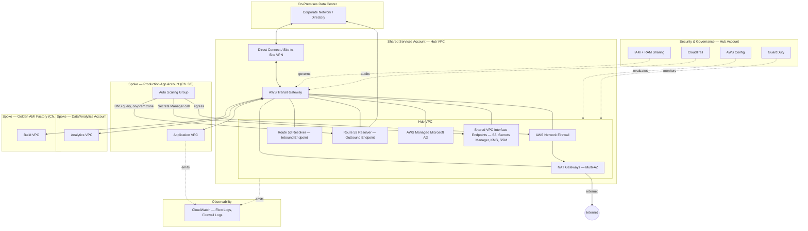

# Part III – Network Architectures

# Chapter 19 – Shared Services VPC

> **How to read this chapter:** This chapter anchors every concept to a concrete reference architecture — an **Enterprise Shared Services VPC**: a centralized hub VPC, connected via AWS Transit Gateway to every application/workload VPC ("spoke") across the organization's multi-account estate, hosting centralized egress (NAT Gateways), centralized DNS resolution (Route 53 Resolver endpoints), centralized directory services (AWS Managed Microsoft AD), shared VPC interface endpoints for common AWS services, and centralized network security inspection (AWS Network Firewall). This is the network foundation every other architecture in this book's Part II (Chapters 3, 8, 11, 13) implicitly assumes exists — this chapter makes it explicit, self-contained, and buildable in its own right.

---

# 1. Executive Summary

## The Business Problem

Every enterprise running more than a handful of AWS accounts eventually hits the same wall:

- Each application team provisions its own VPC.
- Each VPC needs its own NAT Gateways for internet egress.
- Each VPC needs its own DNS resolution configuration, its own VPC interface endpoints for AWS services (Secrets Manager, S3, KMS), and its own connectivity back to any shared, centrally-managed resource (a corporate directory service, an on-premises data center, a shared logging pipeline).
- Multiplied across dozens or hundreds of accounts, this becomes **the same handful of network building blocks, reimplemented independently, dozens or hundreds of times** — inconsistently, at meaningfully higher aggregate cost, and with no single team accountable for the organization's actual network security posture as a whole.

This is structurally the same problem this book has already addressed in other domains:

- Chapter 3 addressed it for infrastructure patterns generally ("managed services first, consistent patterns").
- Chapter 4 addressed it for documentation ("harden and document once, reuse everywhere").
- Chapter 11 addressed it for compute images ("build and scan once, distribute everywhere").
- **This chapter addresses it for the network layer specifically** — the literal wires and routes and DNS resolution paths connecting every other architecture in this book together.

Left unaddressed, the consequences compound:

- **Cost**: dozens of independently-provisioned NAT Gateways, each with its own hourly and per-GB charge, when a much smaller number of centrally-shared NAT Gateways could serve the same aggregate egress traffic more efficiently.
- **Security inconsistency**: some VPCs correctly restrict egress via a network firewall; others don't, because no central team owns or enforces a consistent network security posture across the estate.
- **Operational duplication**: every team solves DNS resolution to on-premises resources, or VPC endpoint provisioning for the same handful of AWS services, independently — the same undifferentiated networking work, repeated at every team's own pace and quality level.
- **Connectivity complexity at scale**: without a hub, connecting N VPCs to each other and to shared resources requires a full mesh of peering connections, growing quadratically (N×(N-1)/2 connections) as the account count grows — quickly becoming unmanageable past a handful of VPCs.

## Architecture Objective

This chapter's reference architecture targets a hub-and-spoke network topology that:

- Provides **centralized, shared egress** (NAT Gateways, and optionally a centralized network firewall) so internet-bound traffic from every spoke VPC exits through a small number of consistently-monitored, consistently-secured paths.
- Provides **centralized DNS resolution** — both for public DNS (via Route 53 Resolver) and for private, on-premises-hosted DNS zones (via Route 53 Resolver endpoints and forwarding rules) — shared across every spoke VPC without each spoke needing its own resolver configuration.
- Provides **centrally-shared VPC interface endpoints** for common AWS services, avoiding the cost and management overhead of provisioning the same endpoint independently in every spoke VPC.
- Provides **a single, auditable hub-and-spoke connectivity model** via Transit Gateway, replacing an unmanageable peering mesh with linear (N connections, not N² ) connectivity growth as the organization scales.
- Provides **centralized hybrid connectivity** (Direct Connect / VPN to on-premises) as a shared resource, rather than every spoke needing its own independent hybrid connection.
- Maintains **strict routing and security-group isolation** between spokes by default — a shared hub does not mean spokes can freely reach each other; it means they share centrally-managed *infrastructure*, not necessarily open *network paths* to one another.

## Why Organizations Adopt This Architecture

Organizations adopt a Shared Services VPC for the same underlying reason they adopt every other centralization pattern in this book:

- A capability every team needs, if solved independently by each team, is solved **inconsistently, redundantly, and less securely** than if solved once, centrally, with genuine networking and security expertise.
- The trigger event is almost always **scale** — the organization crosses a threshold (often somewhere between 10 and 30 AWS accounts) where the cost and operational overhead of per-VPC NAT Gateways, DNS configuration, and VPC endpoints becomes visibly, measurably wasteful, or where a peering-mesh's quadratic connection growth becomes operationally unmanageable.
- A second common trigger: a **security or compliance review** identifies inconsistent network egress controls across the estate — some VPCs correctly filtering and logging egress traffic through a network firewall, others with unrestricted, unmonitored internet access — and the organization needs a structural, not just policy-based, fix.

## Major Business Benefits

| Benefit | Explanation |
|---|---|
| Reduced networking cost | A small number of centrally-shared NAT Gateways and VPC endpoints replace dozens of independently-provisioned, underutilized duplicates. |
| Consistent network security posture | Centralized egress inspection (Network Firewall) and DNS control apply uniformly, not per-team, per-VPC discretion. |
| Simplified connectivity at scale | Transit Gateway's hub-and-spoke model grows linearly with account count, replacing an unmanageable full-mesh peering topology. |
| Centralized hybrid connectivity | A single, shared Direct Connect/VPN connection serves every spoke VPC, rather than each needing its own. |
| Reduced duplicate engineering effort | DNS resolution, VPC endpoint provisioning, and egress filtering are solved once, centrally, and consumed everywhere. |
| Clear network ownership and accountability | A single, identifiable platform networking team owns the shared hub, rather than diffuse, inconsistent per-team ownership. |

## Typical Enterprise Scenarios

This architecture pattern fits:

- Organizations operating **10 or more AWS accounts/VPCs**, where per-VPC networking cost and operational duplication have become visible and measurable.
- Organizations with a **hybrid on-premises dependency** (a data center directory service, an on-premises database, a legacy system not yet migrated) needing shared, centrally-managed connectivity rather than per-team, independently-negotiated connections.
- Organizations pursuing **AWS Landing Zone or Control Tower-based multi-account governance**, where a Shared Services VPC is a standard, expected component of the overall account-vending and network-governance model.
- Organizations that have experienced **inconsistent network security findings** across their account estate during a security review, and want a structural fix rather than a per-team policy mandate.
- Organizations planning for **continued account/VPC growth**, where a peering-mesh topology's quadratic connection growth is already, or will soon become, operationally unmanageable.

It is a poorer fit for:

- Very small organizations with only a handful of AWS accounts, where the operational overhead of standing up and maintaining a Transit Gateway hub exceeds its near-term benefit relative to simple VPC peering.
- Organizations with a genuine, strict regulatory requirement for complete network isolation between specific workloads, where even shared *infrastructure* (not just shared network paths) is unacceptable — though even here, a Shared Services VPC pattern can often be adapted with sufficiently strict routing and security-group controls, discussed in Section 11.

---

# 2. Business Requirements

## Business Drivers

- Reduce aggregate networking cost (NAT Gateway, VPC endpoint duplication) across a growing multi-account estate.
- Establish a consistent, centrally-enforced network egress security posture across every account.
- Simplify connectivity topology as account/VPC count grows, avoiding an unmanageable peering mesh.
- Provide centralized, shared hybrid connectivity to on-premises resources.

## Functional Requirements

| Requirement | Description |
|---|---|
| Hub-and-spoke connectivity | Every spoke VPC connects to the shared hub via Transit Gateway, not direct peering to every other VPC. |
| Centralized egress | Internet-bound traffic from spoke VPCs routes through the shared hub's NAT Gateways (and, where required, a centralized Network Firewall). |
| Centralized DNS resolution | Spoke VPCs resolve both public and on-premises-hosted private DNS zones via shared Route 53 Resolver endpoints in the hub. |
| Shared VPC interface endpoints | Common AWS service endpoints (Secrets Manager, S3, KMS, Systems Manager) are provisioned once in the hub and shared to spokes via Resource Access Manager or endpoint-service sharing patterns. |
| Centralized hybrid connectivity | A single Direct Connect/VPN connection in the hub provides on-premises connectivity to every spoke VPC via Transit Gateway routing. |
| Strict spoke isolation by default | Spoke VPCs cannot reach each other directly through the hub unless explicitly, deliberately permitted via Transit Gateway route table configuration. |

## Non-Functional Requirements

| Category | Target |
|---|---|
| Egress throughput | Support aggregate egress traffic across all spokes without becoming a bottleneck, scaling NAT Gateway capacity accordingly |
| DNS resolution latency | < 20ms for cross-account DNS queries routed through the shared resolver endpoints |
| Hub availability | 99.99% for the Transit Gateway and NAT Gateway infrastructure, given its foundational, blast-radius-wide role |
| Connectivity provisioning time | A new spoke VPC can be attached to the hub and receive standard shared services within 1 business day of request |
| Security posture consistency | 100% of spoke VPCs route egress through the centrally-managed path — no exceptions without an explicitly documented and reviewed justification |

## Scalability Goals

- The hub must support attachment of **at minimum 100 spoke VPCs** without requiring a fundamental redesign, well beyond most organizations' realistic near-term account growth, but within Transit Gateway's actual service quotas (discussed in Section 34).
- Aggregate egress bandwidth must scale by adding NAT Gateway capacity in the hub, not by requiring each spoke to provision its own.

## Availability Requirements

- 99.99% for the hub's core infrastructure (Transit Gateway, NAT Gateways, Route 53 Resolver endpoints) — meaningfully *higher* than a typical single application's availability target (Chapter 3's 99.95%), since **the hub's blast radius spans every spoke VPC simultaneously** — a hub outage doesn't just take down one workload, it can degrade egress and DNS resolution for the entire organization at once.

## Latency Requirements

- Cross-VPC traffic routed through Transit Gateway incurs a small, generally negligible latency overhead versus direct VPC peering — acceptable for the vast majority of workloads, but worth explicitly validating for latency-sensitive inter-service communication patterns (discussed further in Section 15).

## Compliance Requirements

- Identical baseline to Chapter 3 (SOC 2, encryption, audit logging).
- A chapter-specific addition: centralized egress logging (VPC Flow Logs at the hub, plus Network Firewall logging) provides a single, comprehensive source of truth for "what did every account in our organization talk to on the internet, and when" — directly valuable for both security investigations and compliance evidence.

## Security Expectations

- Every spoke VPC's egress traffic is inspectable and filterable at the hub, via Network Firewall, without depending on each individual spoke team to correctly configure their own egress filtering.
- Spoke-to-spoke connectivity is denied by default at the Transit Gateway route-table level, requiring an explicit, reviewed exception for any legitimate cross-spoke communication need.

## Recovery Objectives

### Recovery Point Objective (RPO)

- **RPO = N/A** in the traditional data-loss sense — this architecture is network infrastructure, not a data store; its "state" is configuration, backed by Terraform/Git per this book's established IaC discipline.

### Recovery Time Objective (RTO)

- **RTO ≤ 30 minutes** to restore hub connectivity following an infrastructure failure, given the hub's organization-wide blast radius — a meaningfully tighter target than most individual application architectures in this book, reflecting the hub's foundational, everything-depends-on-it role.

## SLAs

- Internal engineering SLA: 99.99% hub availability, with any hub-affecting incident treated as an organization-wide P1 regardless of which specific spoke workload's team first notices the symptom.

## Expected Workload

- Aggregate egress traffic across all spokes, DNS query volume proportional to total compute footprint across the organization, and a relatively small, infrequent rate of new spoke-VPC attachment requests (typically driven by new account/project provisioning, not a high-frequency operational event).

## Expected Growth

- Growth in this architecture's scope tracks organizational account/VPC growth, not any single workload's traffic growth — a fundamentally different, generally slower-moving growth driver than the customer-facing architectures elsewhere in this book, but one with a potentially much larger blast radius if under-provisioned.

---

# 3. Architecture Overview

## Overall Design

The reference architecture is a **hub-and-spoke topology built on AWS Transit Gateway**:

- A single **Shared Services VPC** (the hub) lives in a dedicated, centrally-managed AWS account (commonly named "Network" or "Shared Services" in an AWS Organizations account structure).
- Every application/workload VPC (a "spoke") — including the VPCs described in Chapters 3, 8, 11, and 13 — attaches to the Transit Gateway, gaining access to the hub's shared services without a direct peering relationship to the hub VPC or to any other spoke.
- The hub VPC itself contains: NAT Gateways (centralized egress), Route 53 Resolver endpoints (centralized DNS), AWS Managed Microsoft AD (centralized directory services, if required), shared VPC interface endpoints, and (optionally) AWS Network Firewall for centralized egress/ingress inspection.

## Architecture Philosophy

The guiding philosophy is **"centralize shared infrastructure; keep spoke isolation strict by default."**

This breaks down into two, deliberately-balanced principles:

- **Centralize what is genuinely shared and undifferentiated** — NAT Gateways, DNS resolution, common VPC endpoints, hybrid connectivity — since every spoke needs functionally the same thing, and solving it once centrally is both cheaper and more consistently secure than dozens of independent implementations.
- **Do not centralize, or implicitly grant, spoke-to-spoke connectivity** — attaching to a shared hub is not the same as granting every spoke free access to every other spoke; Transit Gateway route tables are deliberately configured so that, by default, a spoke can reach the hub's shared services and (if configured) on-premises resources, but cannot reach another spoke's resources without an explicit, reviewed routing exception.

A second guiding principle, directly inherited from this book's established pattern (Chapters 3, 4, 8, 11, 13): **this hub is itself production infrastructure, built and reviewed with the same Terraform/CI rigor as any customer-facing system** — not a one-off, console-configured convenience.

## Core Components

| Layer | Components |
|---|---|
| Connectivity Hub | AWS Transit Gateway, Transit Gateway route tables (per-spoke and per-purpose segmentation) |
| Shared Egress | NAT Gateways (hub VPC, multi-AZ), AWS Network Firewall (optional, centralized inspection) |
| Shared DNS | Route 53 Resolver inbound/outbound endpoints, Resolver rules (forwarding to on-premises DNS) |
| Shared Directory | AWS Managed Microsoft AD (if required by the organization) |
| Shared Endpoints | VPC interface endpoints for Secrets Manager, S3, KMS, Systems Manager, shared to spokes via Resource Access Manager |
| Hybrid Connectivity | AWS Direct Connect / Site-to-Site VPN, terminating in the hub, routed to spokes via Transit Gateway |
| Security | IAM (hub account and cross-account roles), Network Firewall policies, Security Groups, NACLs |
| Observability | CloudWatch, VPC Flow Logs (hub and spoke), Network Firewall logging |

## How Components Interact

- Each spoke VPC (an application account's VPC, per Chapters 3/8/13's architectures) attaches to the Transit Gateway via a VPC attachment.
- The spoke's route table sends internet-bound (`0.0.0.0/0`) traffic to the Transit Gateway, which routes it to the hub VPC's NAT Gateways (optionally via a Network Firewall inspection VPC first).
- DNS queries from spoke instances resolve either directly (for standard public DNS, via the VPC's default resolver) or via the hub's Route 53 Resolver outbound endpoint (for on-premises-hosted private zones, per configured forwarding rules).
- A spoke instance needing to call Secrets Manager, S3, or another commonly-used AWS service reaches the *shared* VPC interface endpoint in the hub (via Transit Gateway routing and PrivateLink), rather than the spoke provisioning its own redundant endpoint.
- Transit Gateway route tables are segmented (Section 9) so that a spoke's traffic can reach the hub's shared services and on-premises resources, but a separate route table (or explicit routing rule) prevents unintended spoke-to-spoke traffic unless deliberately configured.

## High-Level Workflow

1. A new application account/VPC is provisioned (per the organization's account-vending process).
2. The new VPC is attached to the Transit Gateway as a spoke.
3. The spoke's route tables are configured to send shared-services-bound and internet-bound traffic to the Transit Gateway.
4. The spoke gains access to centralized egress, DNS resolution, and shared VPC endpoints without any per-spoke NAT Gateway or endpoint provisioning.
5. Any legitimate spoke-to-spoke connectivity need is explicitly requested, reviewed, and provisioned via a dedicated Transit Gateway route-table configuration — never granted implicitly.

## Request Lifecycle

- An application request within a spoke VPC (e.g., the Chapter 3 order-processing API call) is entirely unaffected by this chapter's architecture for intra-VPC traffic — this chapter's hub is invoked specifically when a spoke needs to reach the internet, an on-premises resource, or a shared AWS service endpoint, not for ordinary intra-application traffic within a single spoke.

## Response Lifecycle

- Identical observation — this chapter's architecture is invisible to the response lifecycle of any individual application; it is the shared plumbing beneath every application's network path to the outside world.

## Data Lifecycle

- Not directly applicable in the traditional sense — this chapter's "data" is network configuration state (Transit Gateway route tables, Resolver rules, Network Firewall policies), version-controlled in Terraform per this book's established IaC discipline, with genuinely serious consequences for state drift given the hub's organization-wide blast radius.

---

# 4. AWS Services Used

## Amazon VPC

- **Purpose:** Provides both the hub VPC itself and every spoke VPC's foundational network isolation.
- **Why selected:** Foundational; there is no AWS network architecture without VPC as the base abstraction.
- **Best practices:** The hub VPC's own CIDR range must be planned with the same rigor as any spoke (Section 9), and must not overlap with any spoke's CIDR, since overlapping CIDRs cannot be connected via Transit Gateway routing.

## AWS Transit Gateway

- **Purpose:** Provides the hub-and-spoke connectivity mechanism this entire chapter is built around — a managed, highly-available regional router connecting multiple VPCs (and, optionally, on-premises networks via Direct Connect/VPN) without a full peering mesh.
- **Why selected:** Transit Gateway's core value is replacing the O(N²) connection growth of a VPC peering mesh with O(N) growth — each spoke needs only one attachment to the hub, not a direct connection to every other VPC it might need to reach.
- **Alternatives:** VPC Peering (mesh topology) — viable and simpler for a very small number of VPCs (roughly under 5–10), but becomes unmanageable as the organization scales, both in raw connection count and in the difficulty of maintaining consistent routing/security policy across a growing mesh.
- **Limitations:** Transit Gateway itself has account and per-region attachment quotas (soft, raisable — Section 34); cross-region Transit Gateway peering exists but introduces its own latency and data-transfer cost considerations, discussed in Section 13.
- **Pricing considerations:** Priced per attachment-hour plus per-GB of data processed — a real, though generally modest relative to compute, cost line that scales with both spoke count and aggregate traffic volume (Section 16).
- **Best practices:** Use multiple Transit Gateway route tables to segment traffic (e.g., a "production spokes" route table distinct from a "non-production spokes" route table), rather than a single, flat route table granting uniform access to every attachment.

## NAT Gateway

- **Purpose:** Provides centralized internet egress for spoke VPCs' private-subnet resources, hosted in the hub VPC rather than replicated per spoke.
- **Why selected:** Centralizing NAT Gateways in the hub reduces both the raw count of NAT Gateways the organization pays for and the operational burden of monitoring/securing dozens of independent egress paths.
- **Alternatives:** Per-spoke NAT Gateways — the default, decentralized pattern most organizations start with before adopting this chapter's architecture; remains appropriate for a small number of VPCs where centralization's benefit doesn't yet outweigh the added Transit-Gateway-routing complexity and cross-AZ data-transfer considerations (Section 16).
- **Limitations:** Centralized NAT Gateways introduce cross-AZ data-transfer charges for spoke traffic originating in an AZ different from the NAT Gateway serving it, unless careful AZ-aware routing is maintained — a genuine, non-trivial cost trade-off discussed in depth in Section 16.
- **Best practices:** Deploy NAT Gateways across all AZs the hub VPC spans, and route each spoke's traffic to the AZ-local NAT Gateway where the spoke's own subnet structure allows this alignment, minimizing avoidable cross-AZ charges.

## AWS Network Firewall

- **Purpose:** Provides centralized, stateful traffic inspection and filtering for egress (and, optionally, ingress) traffic passing through the hub, enforcing consistent security policy across every spoke's outbound traffic.
- **Why selected:** Without a centralized firewall, each spoke's egress security posture depends entirely on that spoke team's own security-group and NACL discipline — inconsistent in practice; a centralized Network Firewall enforces a uniform baseline (e.g., blocking known-malicious domains, restricting egress to an approved allowlist) regardless of individual spoke team diligence.
- **Alternatives:** Third-party firewall appliances (Palo Alto, Fortinet) deployed in the hub via a Gateway Load Balancer — chosen instead by organizations with existing investment in a specific third-party firewall vendor's rule sets/expertise, or requiring capabilities beyond AWS Network Firewall's current feature set.
- **Limitations:** Adds a genuine data-path hop and corresponding latency/cost for every inspected packet; not always justified for every traffic class (Section 27 discusses over-application as an anti-pattern).
- **Pricing considerations:** Priced per endpoint-hour plus per-GB processed — a meaningful cost addition (Section 16) that should be weighed against the specific security requirement it addresses, not applied reflexively to all traffic.
- **Best practices:** Apply Network Firewall specifically to traffic classes genuinely requiring inspection (e.g., production egress to the public internet), rather than unconditionally inspecting all traffic including low-risk, high-volume paths like S3/DynamoDB access via VPC endpoints, which bypass the firewall entirely when properly routed via PrivateLink.

## Amazon Route 53 (Resolver)

- **Purpose:** Provides centralized DNS resolution — Route 53 Resolver inbound endpoints allow on-premises systems to resolve AWS-hosted private DNS zones; outbound endpoints allow AWS-hosted workloads to resolve on-premises-hosted private DNS zones — both hosted centrally in the hub and shared to every spoke.
- **Why selected:** Without centralization, each spoke VPC would need its own Resolver endpoints and forwarding-rule configuration to reach on-premises DNS — redundant, inconsistent, and a real per-endpoint cost multiplied across every spoke.
- **Alternatives:** Per-VPC Resolver endpoints — the decentralized default, appropriate only for a small number of VPCs with hybrid DNS requirements.
- **Best practices:** Associate Resolver rules with spoke VPCs via AWS Resource Access Manager (RAM) sharing from the hub account, rather than duplicating the rule definitions in every spoke account.

## AWS Directory Service (AWS Managed Microsoft AD)

- **Purpose:** Provides centralized directory services (Active Directory) for organizations requiring Windows-based authentication, Kerberos-based database authentication (e.g., for SQL Server), or integration with an existing on-premises Active Directory forest.
- **Why selected:** Hosting a single, centrally-managed directory in the hub and sharing it to spokes (via AWS Resource Access Manager, or via directory trust relationships) avoids each spoke needing its own directory infrastructure.
- **Alternatives:** AWS IAM Identity Center — preferred for AWS-native, human-user SSO access (as used throughout this book, e.g., Chapter 10); AWS Managed Microsoft AD is specifically relevant when Windows-native or on-premises-AD-integrated authentication is a genuine requirement, not a general-purpose substitute for IAM Identity Center.
- **Limitations:** Not every organization needs this component at all — it is included in this chapter's reference architecture as a common, but not universal, shared-services element; omit it entirely if no workload has a genuine Windows/AD-integration requirement.

## VPC Interface Endpoints (AWS PrivateLink)

- **Purpose:** Provides private, non-internet-routed connectivity from spoke VPCs to AWS services (Secrets Manager, S3, KMS, Systems Manager, and others), hosted centrally in the hub and shared to spokes.
- **Why selected:** Provisioning the same interface endpoint independently in every spoke VPC is redundant and multiplies per-endpoint-hour cost; centralizing common endpoints in the hub and sharing them via Resource Access Manager (or via endpoint-service/PrivateLink connections) reduces both cost and management overhead.
- **Alternatives:** Per-spoke VPC endpoints — appropriate for services with genuinely spoke-specific access patterns or where an organization's isolation requirements preclude any shared-endpoint architecture.
- **Limitations:** Not every AWS service supports the specific sharing mechanism cleanly, and some organizations find per-spoke endpoints simpler to reason about for a smaller VPC count, despite the cost inefficiency.
- **Best practices:** Share only the specific, genuinely common endpoints most spokes need (S3, Secrets Manager, KMS, Systems Manager are typical candidates); leave service-specific, less-common endpoints to be provisioned per-spoke as needed.

## AWS Direct Connect / Site-to-Site VPN

- **Purpose:** Provides hybrid connectivity to on-premises data centers, terminating in the hub and made available to every spoke via Transit Gateway routing.
- **Why selected:** A single, centrally-managed hybrid connection serving every spoke is both more cost-effective and more consistently monitored/secured than each spoke team independently negotiating and managing its own on-premises connectivity.
- **Best practices:** Use Direct Connect with a Site-to-Site VPN as a backup path for resilience (Section 12), both terminating in the hub and made available identically to every attached spoke.

## AWS IAM

- **Purpose:** Scopes access to the hub account's resources (Transit Gateway configuration, Network Firewall policy, Resolver rules) and manages the cross-account sharing relationships (via Resource Access Manager) that make hub resources consumable by spoke accounts.
- **Why selected:** As throughout this book — foundational least-privilege access control; a chapter-specific emphasis is that Transit Gateway route-table modification permission is uniquely sensitive, given its organization-wide blast radius, and deserves correspondingly tighter access restriction than most other IAM-scoped resources in this book.

## Amazon CloudWatch / AWS CloudTrail / AWS Config / Amazon GuardDuty

- **Purpose:** As described in Chapter 3 — organization-wide audit, compliance, and threat-detection baseline, applied to the hub account with particular emphasis given its foundational role.
- **Chapter-specific addition:** VPC Flow Logs at the hub, combined with Network Firewall logging, provide the single most comprehensive, organization-wide egress-traffic audit trail available anywhere in the architecture — directly valuable for both security investigation and the compliance evidence requirement from Section 2.

---

# 5. Complete Architecture Diagram



---

# 6. Component-by-Component Explanation

## AWS Transit Gateway

- **Purpose:** Central routing hub connecting every spoke VPC and the on-premises network, without requiring a full peering mesh.
- **Responsibilities:** Route traffic between attachments according to configured route tables; enforce spoke isolation via route-table segmentation.
- **Inputs:** VPC attachments (one per spoke), a Direct Connect/VPN attachment (for on-premises connectivity).
- **Outputs:** Routed traffic between attachments per the configured route tables.
- **Scaling:** Scales to a large number of attachments (soft-limited, raisable — Section 34); bandwidth scales with the underlying attachment and cross-AZ data-path capacity.
- **High availability:** Regionally resilient and highly available by design as a managed AWS service; deployed across all AZs the hub VPC spans.
- **Failure handling:** A Transit Gateway route-table misconfiguration is the most common real-world "failure" in practice — not a service outage, but a routing mistake; addressed via the same Terraform/CI review discipline as any other production change (Section 8).
- **Dependencies:** Correctly non-overlapping CIDR ranges across all attached VPCs (Section 9).
- **Security:** Route-table modification permission is among the most sensitive IAM grants in this entire book, given its organization-wide blast radius.
- **Monitoring:** Transit Gateway Network Manager provides topology visualization and route-table auditing; CloudWatch metrics track bytes/packets processed per attachment.

## NAT Gateway (Centralized)

- **Purpose:** Provides shared internet egress for every spoke's private-subnet resources.
- **Responsibilities:** Perform network address translation for outbound internet traffic; scale automatically with traffic volume within each provisioned NAT Gateway's throughput ceiling.
- **Scaling:** Individual NAT Gateways have a bandwidth ceiling (per the AWS-documented per-NAT-Gateway throughput limit); the hub provisions multiple NAT Gateways (one per AZ, at minimum) and can add further capacity as aggregate spoke egress volume grows.
- **High availability:** One NAT Gateway per AZ in the hub VPC, consistent with Chapter 3's per-AZ NAT Gateway discipline, avoiding a single-AZ dependency for organization-wide egress.
- **Failure handling:** An AZ-local NAT Gateway failure is absorbed by re-routing that AZ's spoke traffic to another AZ's NAT Gateway, at the cost of cross-AZ data-transfer charges for the duration of the failover — an explicit, accepted trade-off for availability.
- **Dependencies:** The hub VPC's Internet Gateway.
- **Monitoring:** `BytesOutToDestination`, `ErrorPortAllocation`, and per-NAT-Gateway bandwidth utilization, tracked to anticipate the need for additional NAT Gateway capacity before a throughput ceiling is actually reached.

## AWS Network Firewall

- **Purpose:** Provides centralized, stateful inspection and filtering of egress traffic transiting the hub.
- **Responsibilities:** Evaluate traffic against configured rule groups (domain allowlisting, intrusion-detection signatures, protocol-specific rules); log every evaluated flow.
- **Scaling:** Scales automatically with traffic volume within the endpoint's provisioned capacity; additional firewall endpoints can be added per-AZ as volume grows.
- **High availability:** Deployed across multiple AZs in the hub VPC, consistent with the NAT Gateway's per-AZ redundancy pattern.
- **Failure handling:** A firewall-endpoint failure in one AZ is absorbed by routing that AZ's traffic through another AZ's endpoint, following the same cross-AZ trade-off pattern as NAT Gateway.
- **Dependencies:** Correctly configured routing directing egress traffic through the firewall endpoint before reaching the NAT Gateway (a specific routing pattern detailed in Section 9).
- **Security:** This *is* the primary centralized security control this architecture provides beyond basic connectivity — its rule-group configuration deserves the same change-review rigor as any other security-critical configuration in this book.
- **Monitoring:** Alert logs (blocked/alerted traffic) and flow logs (all evaluated traffic), both exported to the centralized logging pipeline (Section 22).

## Route 53 Resolver Endpoints

- **Purpose:** Provides centralized, shared DNS resolution for on-premises-hosted private zones (outbound endpoint) and for AWS-hosted private zones queried from on-premises (inbound endpoint).
- **Responsibilities:** Forward DNS queries per configured Resolver rules; serve as the shared resolution path for every attached spoke.
- **Scaling:** Scales automatically with query volume within the endpoint's provisioned IP-address capacity (configurable at creation).
- **High availability:** Deployed across multiple AZs by design.
- **Dependencies:** Correctly configured Resolver rules, shared to spoke accounts via Resource Access Manager.
- **Monitoring:** Resolver query logging (optional, but recommended) provides a full DNS-query audit trail, valuable for both security investigation and troubleshooting (Section 24).

## Shared VPC Interface Endpoints

- **Purpose:** Provides private, PrivateLink-based connectivity from spokes to common AWS services, without requiring an internet path or a per-spoke redundant endpoint.
- **Responsibilities:** Terminate PrivateLink connections for the specific AWS services configured (S3, Secrets Manager, KMS, Systems Manager, etc.); resolve via private DNS to spoke-originated requests.
- **Dependencies:** Correct private-DNS configuration ensuring spoke instances resolve the AWS service's standard endpoint hostname to the shared endpoint's private IP, not the public service endpoint.
- **Security:** Endpoint policies restrict which specific API actions/resources are reachable through the shared endpoint, providing an additional access-control layer beyond IAM alone.
- **Monitoring:** VPC endpoint-specific CloudWatch metrics tracking connection count and data processed.

---

# 7. End-to-End Request Flow

**Scenario: An EC2 instance in a spoke VPC (the Chapter 8 Auto Scaling Group) makes an outbound HTTPS call to a third-party API, retrieves a secret from Secrets Manager, and resolves an on-premises-hosted internal hostname.**

1. **Application startup**: The instance's application code needs to retrieve a database credential from Secrets Manager.
2. **DNS resolution — AWS service endpoint**: The instance resolves `secretsmanager.us-east-1.amazonaws.com`, which — due to the shared VPC interface endpoint's private-DNS configuration — resolves to the private IP of the hub's shared Secrets Manager endpoint, not the public AWS endpoint.
3. **Routing to the shared endpoint**: The request routes from the spoke VPC, through its Transit Gateway attachment, to the hub VPC's shared Secrets Manager interface endpoint — entirely over the AWS private network, never touching the public internet.
4. **Secret retrieval**: The Secrets Manager API call completes, authenticated via the instance's own IAM role (Chapter 8's discipline), and the credential is returned.
5. **Application makes an outbound call to a third-party API**: The application now needs to reach `api.thirdpartyservice.com` over the public internet.
6. **DNS resolution — public hostname**: Standard DNS resolution occurs via the VPC's default resolver (Amazon-provided DNS, or the VPC's configured resolver), unaffected by the hub's Resolver configuration for this specific, purely-public query.
7. **Egress routing**: The spoke's route table sends this `0.0.0.0/0`-destined traffic to the Transit Gateway.
8. **Transit Gateway routing to the hub**: The Transit Gateway routes the traffic to the hub VPC.
9. **Network Firewall inspection**: The traffic passes through the hub's Network Firewall, evaluated against configured rule groups (e.g., confirming `api.thirdpartyservice.com` is an approved egress destination, not a known-malicious domain).
10. **NAT Gateway translation**: Assuming the firewall permits the traffic, it passes to the AZ-local NAT Gateway, which performs network address translation.
11. **Internet Gateway egress**: The translated traffic exits via the hub VPC's Internet Gateway to the public internet.
12. **Response path**: The response returns via the same path in reverse — Internet Gateway → NAT Gateway → Network Firewall → Transit Gateway → spoke VPC → the originating instance.
13. **Application resolves an on-premises-hosted internal hostname**: The application now needs to reach `internal-service.corp.example.com`, a DNS zone hosted on-premises, not in Route 53.
14. **DNS resolution — private, on-premises zone**: Per the VPC's Resolver rule association (shared from the hub via Resource Access Manager), this query is forwarded to the hub's Route 53 Resolver outbound endpoint.
15. **Forwarding to on-premises DNS**: The outbound endpoint forwards the query, via the Direct Connect/VPN connection, to the on-premises DNS server.
16. **Resolution and response**: The on-premises DNS server resolves the hostname and returns the IP address, which propagates back through the same path to the originating instance.
17. **Application connects to the on-premises resource**: Using the resolved IP address, the application's connection routes via the spoke's Transit Gateway attachment, through the hub, over the Direct Connect/VPN connection, to the on-premises resource.
18. **Logging throughout**: VPC Flow Logs (at both spoke and hub), Network Firewall logs, and Resolver query logs all capture this entire flow, providing the comprehensive audit trail described in Section 2.
19. **Error handling — firewall block (alternate path)**: If step 9's Network Firewall determines the destination domain is not approved (e.g., it matches a known-malicious-domain rule), the traffic is dropped and logged as a block/alert event, never reaching the NAT Gateway or the public internet at all.
20. **Monitoring throughout**: CloudWatch metrics at every hop (Transit Gateway attachment bytes, NAT Gateway bandwidth, Network Firewall evaluation counts, Resolver query counts) feed the observability dashboards described in Section 21.

---

# 8. Deployment Flow

## Infrastructure Provisioning

- The hub VPC, Transit Gateway, and all shared-services components are defined in Terraform, in a dedicated repository owned by the platform networking team, following this book's established module/environment structure (Chapter 3, Section 18).
- Each spoke VPC's Terraform configuration includes a small, standardized module (provided by the platform networking team) that handles the spoke's side of the Transit Gateway attachment and route-table configuration — spoke teams do not hand-roll their own attachment logic.

## Terraform Workflow

- Identical review-and-apply discipline to every prior chapter, with a chapter-specific emphasis: **any change to the hub's Transit Gateway route tables requires a mandatory platform-networking-team reviewer**, given the organization-wide blast radius of a routing mistake.
- Spoke-side attachment module changes require review from the spoke team plus a lighter-weight, automated validation (confirming the spoke's CIDR doesn't overlap with any existing attachment) rather than a full platform-team review for every routine spoke provisioning request.

## CI/CD Deployment

- The hub's own infrastructure deploys via a dedicated, tightly-controlled pipeline distinct from any individual application's deployment pipeline (Chapters 3, 8, 13) — this chapter's infrastructure is a shared dependency underlying every other pipeline in the organization, and is deployed on its own, deliberately conservative cadence.

## Blue-Green Deployment

- Not typically applicable in the same sense as Chapter 13's application-level blue-green pattern — Transit Gateway route-table changes are typically small, incremental, and validated via `terraform plan` review rather than a full parallel-environment cutover; however, a genuinely major hub re-architecture (e.g., migrating to a new CIDR scheme) could adopt a phased, parallel-hub validation approach conceptually similar to Chapter 13's philosophy, if warranted by the change's risk profile.

## Rollback

- A Terraform-based reversion to the previous known-good hub configuration, following this book's established IaC rollback discipline (Chapter 3, Section 8) — given the hub's blast radius, rollback speed and reliability deserve particular attention and, ideally, periodic testing (Section 34).

## Secrets

- The hub account itself has minimal secret-management needs beyond what any other AWS account requires (Chapter 3's Secrets Manager discipline); a chapter-specific note is that the AWS Managed Microsoft AD component (if used) has its own administrator credentials, managed via Secrets Manager with the same rigor as any other credential in this book.

## Configuration

- Transit Gateway route tables, Resolver rules, and Network Firewall policies are all Terraform-managed configuration, version-controlled and reviewed — never modified via the AWS Console in production, consistent with this book's "no manual console changes" discipline (Chapter 3, Section 27).

## Validation

- Post-deployment validation for any hub change includes: confirming existing spoke connectivity remains intact (a synthetic connectivity test from a representative spoke), confirming DNS resolution still functions correctly for both public and on-premises zones, and confirming Network Firewall rule changes don't inadvertently block legitimate, previously-approved traffic.

---

# 9. Network Topology

## VPC — Hub

- The hub VPC lives in its own dedicated AWS account (commonly named "Network" or "Shared Services") within the organization's AWS Organizations structure.
- It contains no application workloads at all — only shared networking infrastructure (NAT Gateways, Network Firewall, Resolver endpoints, shared VPC endpoints, and, if used, AWS Managed Microsoft AD).

## CIDR — Organization-Wide Planning

- This is the single most consequential planning decision in this entire chapter:
  - Every VPC in the organization (hub and every spoke) must use **non-overlapping CIDR ranges**, since Transit Gateway routing cannot function correctly between VPCs with overlapping address space.
  - Best practice: maintain a centralized, authoritative CIDR allocation registry (a simple spreadsheet or, better, a dedicated IPAM tool — AWS VPC IP Address Manager) assigning each new spoke VPC a CIDR block from a pre-planned, non-overlapping range before that VPC is ever created.
  - A common enterprise pattern: allocate a large parent range (e.g., `10.0.0.0/8`) organization-wide, with the hub taking a specific `/16` (e.g., `10.0.0.0/16`) and each spoke assigned its own `/16` or `/20` from within the remaining space, per the organization's actual scale expectations.

## Public Subnets

- The hub VPC's public subnets host only the Internet Gateway-facing resources: NAT Gateway elastic IPs, and (if the Direct Connect/VPN termination requires it) any public-facing VPN endpoint resources.

## Private Subnets

- The hub VPC's private subnets host the Network Firewall endpoints, Route 53 Resolver endpoints, shared VPC interface endpoints, and (if used) the AWS Managed Microsoft AD domain controllers.

## NAT Gateway

- One or more NAT Gateways per AZ in the hub VPC, sized for the aggregate egress bandwidth of every attached spoke — a materially larger capacity-planning exercise than a single application's own NAT Gateway sizing (Chapter 3, Section 9), given the hub's aggregation of traffic from potentially dozens of spokes.

## Internet Gateway

- A single Internet Gateway attached to the hub VPC, serving as the sole organization-wide internet egress point for every spoke routing through the hub (unless a specific spoke has an explicitly justified, separately-reviewed exception).

## Transit Gateway

- The core connectivity component of this entire chapter, described exhaustively in Sections 3, 4, and 6.
- **Route table segmentation** is the single most important Transit Gateway design decision:
  - A "production spokes" route table, granting production spoke VPCs access to the hub's shared services and on-premises connectivity, but not to each other.
  - A "non-production spokes" route table, similarly isolated from production spokes and from each other.
  - A "shared services" route table, used by the hub VPC's own attachment, with routes to every spoke (needed for the hub to actually serve traffic back to any spoke).
  - Any deliberate, reviewed spoke-to-spoke connectivity exception is implemented as an explicit, narrowly-scoped additional route — never a default, blanket "all spokes can reach all spokes" configuration.

## Route Tables

- Each spoke VPC's own route table sends `0.0.0.0/0` (internet-bound) and any on-premises-destined CIDR ranges to the Transit Gateway attachment, while all intra-VPC traffic remains local, unaffected by this chapter's architecture.

## Network ACLs

- Applied at the hub VPC level as a coarse-grained, defense-in-depth layer, consistent with this book's general NACL treatment (Chapter 3, Section 9) — not the primary access-control mechanism, but a useful additional layer given the hub's sensitivity.

## Security Groups

- The hub VPC's Network Firewall, Resolver endpoints, and shared VPC endpoints each have narrowly-scoped security groups permitting only the specific, expected traffic patterns — for example, the shared Secrets Manager VPC endpoint's security group permits inbound HTTPS only from the CIDR ranges of VPCs explicitly authorized to use it.

## PrivateLink

- The shared VPC interface endpoints described in Sections 4 and 6 are themselves a PrivateLink-based mechanism — this is one of the chapter's central architectural components, not an auxiliary consideration as in some other chapters.

## Hybrid Connectivity

- A first-class, central concern for this chapter specifically: Direct Connect (primary) with Site-to-Site VPN (backup) terminating in the hub VPC, made available to every spoke via Transit Gateway routing, following the resilience pattern described in Section 12.

---

# 10. Identity and Access

## IAM Roles

- The hub account maintains its own set of IAM roles distinct from any spoke account: a Transit Gateway administration role (Terraform CI role, narrowly scoped), a Network Firewall policy-management role, and a Resource Access Manager sharing-administration role.

## IAM Policies

```json

{
  "Version": "2012-10-17",
  "Statement": [
    {
      "Sid": "AllowTransitGatewayRouteTableManagement",
      "Effect": "Allow",
      "Action": [
        "ec2:CreateTransitGatewayRoute",
        "ec2:DeleteTransitGatewayRoute",
        "ec2:ReplaceTransitGatewayRoute"
      ],
      "Resource": "arn:aws:ec2:us-east-1:222233334444:transit-gateway-route-table/tgw-rtb-0abc123"
    },
    {
      "Sid": "DenyTransitGatewayDeletion",
      "Effect": "Deny",
      "Action": ["ec2:DeleteTransitGateway"],
      "Resource": "*"
    },
    {
      "Sid": "AllowRAMSharingToOrgOUs",
      "Effect": "Allow",
      "Action": ["ram:CreateResourceShare", "ram:AssociateResourceShare"],
      "Resource": "*",
      "Condition": {
        "StringEquals": { "ram:RequestedResourceType": "ec2:TransitGateway" }
      }
    }
  ]
}

```

## Resource Policies

- Resource Access Manager (RAM) resource shares define exactly which AWS Organizations OUs or specific account IDs may attach to the Transit Gateway or consume shared VPC endpoints — an explicit, reviewed allowlist, never an organization-wide open share by default.

## STS

- As throughout this book — every role assumption uses short-lived STS credentials; no long-lived IAM user access keys exist anywhere in this architecture.

## Cross-Account Access

- This chapter's architecture is **inherently cross-account by design**:
  - The hub lives in its own account.
  - Every spoke lives in its own separate account.
  - Resource Access Manager is the primary mechanism enabling spoke accounts to attach to the hub's Transit Gateway and consume shared endpoints, without requiring a customer-managed cross-account IAM role for every individual sharing relationship.

## Least Privilege

- Enforced with particular emphasis on Transit Gateway route-table modification permission specifically — restricted to a small, named set of platform-networking-team roles, distinct from the broader set of engineers who might have general infrastructure-deployment permissions elsewhere in the organization.

## Service Roles

- The Transit Gateway and Resource Access Manager both use AWS service-linked roles for their own internal operation, distinct from and not to be confused with the customer-managed roles administering their configuration.

## Permission Boundaries

- Applied to the hub account's CI/CD deployment role, capping its maximum grantable permissions and preventing a compromised pipeline from provisioning resources or modifying sharing relationships beyond this chapter's intended scope.

---

# 11. Security Architecture

## Encryption

- Site-to-Site VPN connections use IPsec encryption in transit by design; Direct Connect traffic is not encrypted by default at the network layer and should be paired with application-layer TLS (or a VPN-over-Direct-Connect configuration) for genuinely sensitive traffic, an important, sometimes-overlooked distinction discussed further in Section 27.

## KMS

- Any hub-resident resources requiring encryption at rest (e.g., AWS Managed Microsoft AD's underlying storage) use a dedicated hub-account KMS CMK, distinct from any spoke account's own CMKs.

## TLS

- Application-layer TLS remains the responsibility of each individual workload (Chapters 3, 8, 13) — this chapter's network layer provides the *path*, not application-layer encryption; a common architecture-review misunderstanding worth explicitly correcting (Section 34).

## WAF / Shield

- Not directly applicable to this chapter's hub — WAF and Shield operate at the application edge (CloudFront/ALB, per Chapter 3), not at the Transit Gateway/NAT Gateway layer; this chapter's Network Firewall is the network-layer analog, operating on different traffic (broad egress/ingress patterns) than WAF's HTTP-request-level inspection.

## Secrets Manager

- Used identically to every other chapter for any hub-resident credentials (e.g., AWS Managed Microsoft AD administrator credentials).

## Certificate Manager

- Relevant only if the hub terminates any TLS-protected endpoint directly (uncommon for this chapter's core components, which are primarily network/routing infrastructure rather than application endpoints).

## GuardDuty

- Enabled for the hub account identically to every other account, with particular value here: GuardDuty's VPC Flow Log-based threat detection has visibility into the *aggregated* egress traffic pattern of the entire organization when applied to the hub, potentially surfacing an anomaly (e.g., one specific spoke's traffic pattern deviating sharply from the rest) that per-spoke GuardDuty alone might not as easily contextualize.

## Inspector

- Not directly applicable to this chapter's core infrastructure (no EC2/container workloads to scan in the hub itself, aside from any AWS Managed Microsoft AD-related instances, which AWS manages directly).

## Security Hub

- Aggregates the hub account's Config/GuardDuty findings into the organization's unified view, per Chapter 3's pattern, with the hub account's findings arguably warranting the highest-priority triage given the account's foundational role.

## CloudTrail

- Captures every Transit Gateway, Network Firewall, and Resource Access Manager API call in the hub account — this audit trail is the definitive record of "who changed the organization's shared network configuration, and when," among the most sensitive audit trails in the entire organization.

## AWS Config

- Applies the organization's standard Conformance Pack, plus a chapter-specific custom rule flagging any Transit Gateway route-table change that grants spoke-to-spoke connectivity without a corresponding, documented exception record.

## Zero Trust

- This chapter's architecture explicitly does **not** grant implicit trust between spokes merely because they share hub infrastructure — attachment to the shared hub provides access to shared *services*, not automatic network reachability to every other spoke, directly embodying the zero-trust principle at the network-topology level.

## Threat Model

Primary threats specific to this chapter's architecture:

1. Unauthorized or accidental Transit Gateway route-table modification granting unintended spoke-to-spoke connectivity.
2. A compromised spoke account's traffic reaching another spoke due to an overly permissive route-table configuration.
3. Network Firewall rule misconfiguration inadvertently permitting egress to a malicious destination, or conversely blocking legitimate business traffic.
4. Resource Access Manager sharing misconfiguration granting hub access to an unintended AWS account.
5. On-premises connectivity (Direct Connect/VPN) providing an attacker who compromises the on-premises network a path into the AWS environment via the shared hub.

## Attack Vectors and Mitigations

| Attack Vector | Mitigation |
|---|---|
| Unauthorized route-table modification | Narrowly-scoped IAM permission restricted to the platform networking team; mandatory PR review for any hub route-table change |
| Spoke-to-spoke lateral movement via misconfigured routing | Route-table segmentation with explicit, reviewed exceptions only; Config rule flagging unreviewed spoke-to-spoke routes |
| Network Firewall misconfiguration | Change-review discipline identical to any other security-critical configuration; staged rule-group rollout with monitoring before full enforcement |
| Unintended Resource Access Manager sharing | Explicit, reviewed account/OU allowlists; periodic audit of active resource shares against the expected, documented list |
| On-premises compromise reaching AWS via the hub | Network Firewall inspection applied to on-premises-originated traffic as well as outbound traffic; monitoring for anomalous traffic patterns originating from the Direct Connect/VPN path specifically |

---

# 12. High Availability

## AZ Failures

- Every hub component (NAT Gateways, Network Firewall endpoints, Route 53 Resolver endpoints) is deployed across a minimum of 3 AZs, following this book's established multi-AZ discipline (Chapter 3) — an AZ failure is absorbed by the remaining AZs' capacity, with the specific, accepted cross-AZ cost trade-off noted in Sections 6 and 16.

## Instance Failures

- Not directly applicable in the traditional EC2-instance sense for most of this chapter's components, which are managed AWS services (Transit Gateway, NAT Gateway, Network Firewall, Route 53 Resolver) rather than customer-managed EC2 instances; the exception is AWS Managed Microsoft AD, whose underlying domain-controller instances are managed by AWS with automatic replacement on failure.

## Regional Failures

- A full regional failure affecting the hub is a genuinely severe, organization-wide event, given the hub's blast radius — addressed via a **secondary, standby hub in a DR region**, pre-provisioned (at minimum, defined in Terraform and ready to deploy quickly) and connected to the same on-premises network via a secondary Direct Connect/VPN path, with spoke VPCs in the DR region (per each application's own Chapter 3 Warm Standby pattern) attaching to this secondary hub.

## Database Failures

- Not applicable — this chapter's architecture has no database tier of its own (AWS Managed Microsoft AD is the closest analog, and its own HA is AWS-managed).

## Load Balancing

- Not directly applicable in the traditional ALB sense; Transit Gateway and NAT Gateway both provide their own internal load-distribution across AZs as part of their managed-service design.

## Health Checks / Failover

- Route 53 health checks can monitor the hub's own endpoint availability (e.g., confirming the Network Firewall/NAT Gateway path is functioning) as an input to a broader organizational health dashboard, though the hub itself does not typically have a customer-facing DNS failover mechanism the way an application architecture (Chapter 3) does.

---

# 13. Disaster Recovery

## Backup Strategy

- This chapter's "backup" is its Terraform definition, version-controlled per this book's established IaC discipline — the hub's actual runtime state (route tables, firewall rules, Resolver configuration) is fully reconstructable by reapplying Terraform, assuming the underlying VPC/CIDR allocation is preserved.

## Snapshots

- Not directly applicable to most of this chapter's components; AWS Managed Microsoft AD (if used) has its own AWS-managed backup mechanism.

## Cross-Region Replication

- The DR-region standby hub described in Section 12 is this chapter's cross-region resilience mechanism, maintained via the same Terraform module set applied to a second region, kept in sync via the same CI/CD pipeline (Section 20).

## Pilot Light / Warm Standby / Multi-Site / Active-Active / Active-Passive

- Most organizations adopt a **Pilot Light**-equivalent pattern for the DR-region hub specifically: the Terraform definition exists and is validated periodically, but the DR hub's Transit Gateway/NAT Gateway/Network Firewall infrastructure may not be continuously running at full capacity, provisioned instead upon an actual regional-failover decision — appropriate given the hub's comparatively low steady-state utilization relative to its potential blast radius if a full Warm Standby were maintained continuously for cost efficiency.
- Organizations with a stricter RTO requirement (Section 2) may instead maintain a continuously-running, smaller-scale Warm Standby hub in the DR region, scaled up during an actual failover — a direct trade-off between DR-readiness cost and RTO, explicitly documented via an ADR (Section 30).

## RPO

- **RPO = 0** for the hub's configuration itself (Terraform/Git-backed); the practical RPO concern is ensuring the DR-region hub's configuration has not drifted from the primary region's, validated via periodic Terraform plan comparison between regions.

## RTO

- **RTO ≤ 30 minutes** to stand up (or scale up, in the Warm Standby variant) the DR-region hub and re-route affected spoke traffic, consistent with the organization-wide-impact RTO target established in Section 2.

---

# 14. Scalability

## Horizontal Scaling

- This chapter's primary scaling dimension is **attachment count** (number of spoke VPCs) and **aggregate throughput** (total egress/DNS/endpoint traffic across all spokes) — both addressed by adding capacity within the hub (additional NAT Gateway capacity, additional Network Firewall endpoint capacity) rather than any change to individual spokes.

## Vertical Scaling

- Not a meaningful concept for most of this chapter's managed-service components; the closest analog is increasing Route 53 Resolver endpoint IP-address capacity or Network Firewall endpoint capacity as query/traffic volume grows.

## Auto Scaling (Comparison)

- Not directly applicable — Transit Gateway, NAT Gateway, and Network Firewall all scale automatically within their respective service limits without customer-configured Auto Scaling Groups; the customer-facing scaling lever is adding *more* NAT Gateways/firewall endpoints as aggregate volume grows, a capacity-planning exercise reviewed periodically (Section 23), not a reactive, metric-driven Auto Scaling policy as in Chapter 8.

## Serverless Scaling

- Not directly applicable to this chapter's core infrastructure.

## Database Scaling / Storage Scaling / Queue Scaling

- Not applicable — no database, storage, or queue tier exists within this chapter's own architecture (aside from AWS Managed Microsoft AD's AWS-managed storage, if used).

---

# 15. Performance Optimization

## Caching

- Not directly applicable to this chapter's network-layer components; DNS resolution *does* benefit from standard DNS-caching behavior at the client/resolver level, reducing repeated query volume against the shared Resolver endpoints.

## Compression / CDN

- Not applicable at this layer — compression and CDN caching are application-layer/edge-layer concerns (Chapter 3), operating above this chapter's network-routing layer.

## Database Optimization / Connection Pooling

- Not applicable to this chapter's own architecture.

## Concurrency

- Not directly applicable in the traditional sense; the closest analog is ensuring the shared NAT Gateway/Network Firewall capacity is sized to avoid becoming a concurrency/throughput bottleneck for the aggregate traffic of all attached spokes (Section 14).

## Async Processing

- Not applicable to this chapter's own architecture.

## Latency Considerations (Chapter-Specific)

- Traffic routed through Transit Gateway between two VPCs incurs a small additional latency hop versus direct VPC peering — generally negligible (single-digit milliseconds) for the vast majority of workloads, but worth explicitly validating for genuinely latency-sensitive inter-spoke communication patterns before assuming it is negligible for a specific, latency-critical use case.
- Centralized Network Firewall inspection adds a further, generally small but non-zero latency and processing overhead to every inspected packet — a specific, deliberate trade-off (Section 27 discusses when this trade-off is and isn't justified for a given traffic class).

---

# 16. Cost Optimization (FinOps)

## Estimated Monthly Cost — Small Deployment

*(~10 spoke VPCs, modest aggregate egress traffic)*

| Line Item | Estimated Monthly Cost (USD) |
|---|---|
| Transit Gateway (attachment-hours, ~10 spokes + hub) | $350 |
| Transit Gateway data processing | $200 |
| NAT Gateway (hub, 3x, moderate aggregate traffic) | $400 |
| Network Firewall (3x endpoints, moderate volume) | $650 |
| Route 53 Resolver endpoints | $50 |
| Direct Connect (modest port size) | $300 |
| CloudWatch / Flow Logs | $80 |
| **Estimated Total** | **≈ $2,030/month** |

## Estimated Monthly Cost — Medium Deployment

*(~40 spoke VPCs, larger aggregate egress traffic)*

| Line Item | Estimated Monthly Cost (USD) |
|---|---|
| Transit Gateway (attachment-hours) | $1,400 |
| Transit Gateway data processing | $1,200 |
| NAT Gateway (hub) | $1,500 |
| Network Firewall | $2,200 |
| Route 53 Resolver endpoints | $150 |
| Direct Connect | $700 |
| CloudWatch / Flow Logs | $300 |
| **Estimated Total** | **≈ $7,450/month** |

## Estimated Monthly Cost — Enterprise Deployment

*(100+ spoke VPCs, high aggregate egress traffic, multi-region hub)*

| Line Item | Estimated Monthly Cost (USD) |
|---|---|
| Transit Gateway (attachment-hours, x2 regions) | $4,500 |
| Transit Gateway data processing | $5,000 |
| NAT Gateway | $5,500 |
| Network Firewall | $8,000 |
| Route 53 Resolver endpoints | $400 |
| Direct Connect (x2, primary + DR) | $2,000 |
| CloudWatch / Flow Logs | $1,200 |
| **Estimated Total** | **≈ $26,600/month** |

> **Note:** Directional planning figures. This chapter's architecture typically represents genuine net savings versus the decentralized alternative (dozens of independent per-spoke NAT Gateways and endpoints) at any meaningful scale, but the *absolute* cost is real and grows with both spoke count and aggregate traffic — worth tracking explicitly as its own FinOps line item, distinct from any individual application's own cost reporting.

## Major Cost Drivers

1. Network Firewall (endpoint-hours plus per-GB processing) — often the single largest line item, given its per-byte-inspected pricing model.
2. Transit Gateway data processing (per-GB, scales with aggregate cross-VPC traffic).
3. NAT Gateway (both hourly and per-GB, though centralization reduces the *count* of NAT Gateways relative to a fully decentralized model).
4. Direct Connect port-hour cost (relatively fixed, scales with port size chosen, not traffic volume directly).

## Optimization Opportunities

| Opportunity | Typical Savings |
|---|---|
| Centralizing NAT Gateways (this chapter's core pattern) versus per-spoke NAT Gateways | Often 30–50% reduction in total NAT Gateway cost at meaningful spoke-count scale |
| Routing only genuinely-inspection-worthy traffic through Network Firewall, not all traffic indiscriminately | Avoids unnecessary per-GB inspection cost for low-risk, high-volume paths (e.g., traffic already routed via VPC endpoints, bypassing the firewall entirely) |
| AZ-aware routing minimizing cross-AZ data-transfer charges between spoke and hub NAT Gateway capacity | Reduces an easily-overlooked, avoidable cost line |
| Sizing Direct Connect port capacity to actual, not aspirational, aggregate hybrid-traffic volume | Avoids paying for unused port capacity |

## Reserved Instances / Savings Plans / Spot

- Not directly applicable to this chapter's core managed-service components, which are billed on their own per-hour/per-GB pricing models without an RI/Savings-Plan equivalent (aside from Direct Connect, which does not have an RI-equivalent commitment discount either).

## S3 Lifecycle / Storage Classes

- Applies to this chapter's Flow Log and Network Firewall log storage in S3, following the same lifecycle discipline established in Chapter 3 (transition to Standard-IA/Glacier as logs age beyond active-investigation relevance).

## Rightsizing

- Reviewed quarterly: NAT Gateway and Network Firewall endpoint capacity against actual aggregate traffic trends, and Direct Connect port utilization against actual sustained hybrid-traffic volume.

## Cost Allocation / Tagging / Budgets / Cost Anomaly Detection

- This chapter's hub costs are tracked as their own, distinct FinOps cost center (e.g., "Shared Network Services"), explicitly separated from any individual application's own cost reporting — a specific, important FinOps practice, since a shared-hub cost is not fairly attributable to any single application team, and needs its own budget/ownership and, ideally, a cost-allocation methodology (e.g., pro-rated by actual per-spoke traffic volume) if the organization wants to charge back hub costs to consuming teams.

---

# 17. AI-Assisted Operations

## Amazon Q / Bedrock for Route-Table Analysis

- A genuinely valuable, chapter-specific application: Bedrock-assisted analysis of a proposed Transit Gateway route-table change can flag an unintended spoke-to-spoke connectivity grant before a human reviewer needs to manually trace through the route table's full effect — given how easy it is for a well-intentioned but overly broad route-table entry to grant more connectivity than intended.

## AI Troubleshooting

- Useful for correlating a spoke's reported connectivity issue against the specific route-table, security-group, or Network Firewall rule most likely responsible, faster than manual, sequential elimination across each possible layer.

## Log Analysis

- Bedrock-assisted summarization of VPC Flow Logs and Network Firewall logs can surface an anomalous traffic pattern (e.g., a specific spoke suddenly generating traffic to an unusual destination) faster than manual log review across a very high-volume, organization-wide log stream.

## Incident Response

- AI-assisted timeline reconstruction during a hub-affecting incident (correlating CloudTrail route-table changes, CloudWatch metrics, and spoke-team-reported symptoms) accelerates the especially time-pressured triage process for an incident with this chapter's organization-wide blast radius.

## Cost Optimization

- AI-assisted analysis of per-spoke traffic patterns through the shared hub can suggest a fairer cost-allocation methodology, or flag a specific spoke's disproportionate contribution to Network Firewall inspection cost, worth a conversation with that spoke's owning team.

## Capacity Planning

- AI-assisted forecasting of aggregate egress/DNS/endpoint traffic growth, based on historical trends across the growing spoke count, directly supports the NAT Gateway/Network Firewall capacity-planning discussed in Section 14.

## Architecture Review

- An AI-assisted review of a proposed hub configuration change can flag a specific, known-risky pattern (e.g., "this Network Firewall rule change removes a previously-blocking rule without a documented justification") before a human reviewer needs to catch it manually.

## AI-Generated Terraform / AI-Generated Documentation

- Applied identically to this chapter's own infrastructure and documentation, per this book's established pattern — always human-reviewed before merge, with particular scrutiny for any AI-generated change touching Transit Gateway route tables specifically, given their organization-wide blast radius.

---

# 18. Terraform Implementation

## Repository Structure

```

shared-services-network/
├── modules/
│   ├── transit-gateway/
│   ├── hub-vpc/
│   ├── spoke-attachment/       # Consumed by every spoke account's own repo
│   └── network-firewall/
├── environments/
│   └── production/
│       ├── main.tf
│       ├── variables.tf
│       └── backend.tf
└── README.md

```

## Providers and Variables

```hcl

# environments/production/providers.tf

terraform {
  required_version = ">= 1.7.0"
  required_providers {
    aws = {
      source  = "hashicorp/aws"
      version = "~> 5.50"
    }
  }
  backend "s3" {
    bucket         = "acme-corp-terraform-state-network"
    key            = "shared-services-network/production/terraform.tfstate"
    region         = "us-east-1"
    dynamodb_table = "terraform-state-lock-network"
    encrypt        = true
  }
}

provider "aws" {
  region = var.aws_region
  default_tags {
    tags = {
      Environment = "production"
      ManagedBy   = "terraform"
      Application = "shared-services-network"
    }
  }
}

```

## Transit Gateway Module

```hcl

# modules/transit-gateway/main.tf

resource "aws_ec2_transit_gateway" "hub" {
  description                    = "Organization shared services hub"
  amazon_side_asn                 = 64512
  default_route_table_association = "disable"
  default_route_table_propagation = "disable"
  auto_accept_shared_attachments   = "disable"

  tags = { Name = "shared-services-tgw" }
}

resource "aws_ec2_transit_gateway_route_table" "production_spokes" {
  transit_gateway_id = aws_ec2_transit_gateway.hub.id
  tags = { Name = "production-spokes-rt" }
}

resource "aws_ec2_transit_gateway_route_table" "shared_services" {
  transit_gateway_id = aws_ec2_transit_gateway.hub.id
  tags = { Name = "shared-services-rt" }
}

resource "aws_ram_resource_share" "tgw_share" {
  name                      = "shared-services-tgw-share"
  allow_external_principals = false
}

resource "aws_ram_resource_association" "tgw_association" {
  resource_arn       = aws_ec2_transit_gateway.hub.arn
  resource_share_arn = aws_ram_resource_share.tgw_share.arn
}

resource "aws_ram_principal_association" "org_ou" {
  principal          = var.production_ou_arn
  resource_share_arn = aws_ram_resource_share.tgw_share.arn
}

```

## Spoke Attachment Module (Consumed by Spoke Accounts)

```hcl

# modules/spoke-attachment/main.tf

resource "aws_ec2_transit_gateway_vpc_attachment" "spoke" {
  transit_gateway_id = var.transit_gateway_id
  vpc_id             = var.spoke_vpc_id
  subnet_ids         = var.spoke_tgw_subnet_ids

  tags = { Name = "${var.spoke_name}-tgw-attachment" }
}

resource "aws_ec2_transit_gateway_route_table_association" "spoke" {
  transit_gateway_attachment_id  = aws_ec2_transit_gateway_vpc_attachment.spoke.id
  transit_gateway_route_table_id = var.route_table_id   # e.g., production_spokes route table
}

resource "aws_route" "spoke_default_to_tgw" {
  route_table_id         = var.spoke_private_route_table_id
  destination_cidr_block = "0.0.0.0/0"
  transit_gateway_id     = var.transit_gateway_id
}

```

## Network Firewall Module

```hcl

# modules/network-firewall/main.tf

resource "aws_networkfirewall_firewall_policy" "egress_policy" {
  name = "shared-services-egress-policy"

  firewall_policy {
    stateless_default_actions          = ["aws:forward_to_sfe"]
    stateless_fragment_default_actions = ["aws:forward_to_sfe"]

    stateful_rule_group_reference {
      resource_arn = aws_networkfirewall_rule_group.domain_allowlist.arn
    }
  }
}

resource "aws_networkfirewall_rule_group" "domain_allowlist" {
  capacity = 100
  name     = "approved-egress-domains"
  type     = "STATEFUL"

  rule_group {
    rules_source {
      rules_source_list {
        generated_rules_type = "ALLOWLIST"
        target_types         = ["HTTP_HOST", "TLS_SNI"]
        targets              = var.approved_egress_domains
      }
    }
  }
}

resource "aws_networkfirewall_firewall" "hub" {
  name                = "shared-services-firewall"
  firewall_policy_arn = aws_networkfirewall_firewall_policy.egress_policy.arn
  vpc_id              = var.hub_vpc_id

  dynamic "subnet_mapping" {
    for_each = var.firewall_subnet_ids
    content {
      subnet_id = subnet_mapping.value
    }
  }
}

```

## Outputs

```hcl

# environments/production/outputs.tf

output "transit_gateway_id" {
  value = module.transit_gateway.transit_gateway_id
}

output "production_spokes_route_table_id" {
  value = module.transit_gateway.production_spokes_route_table_id
}

output "resource_share_arn" {
  value = module.transit_gateway.resource_share_arn
}

```

## Remote State / Best Practices

- The hub's own state is stored in a dedicated, access-restricted S3 bucket in the hub account, with DynamoDB locking, following this book's established discipline.
- The `spoke-attachment` module is published (e.g., as a versioned, internal Terraform module registry entry) for every spoke account's own repository to consume, ensuring every spoke attaches consistently rather than each team hand-rolling its own attachment logic.
- `default_route_table_association = "disable"` and `default_route_table_propagation = "disable"` on the Transit Gateway resource are deliberate, security-relevant settings — they force every attachment's route-table association to be an explicit, reviewed decision, rather than an implicit default granting broader connectivity than intended.

---

# 19. AWS CLI Examples

## Deployment

```bash

# Apply Terraform changes for the shared services hub

cd environments/production
terraform init -backend-config=backend.hcl
terraform plan -out=tfplan
terraform apply tfplan

# Accept a pending Transit Gateway attachment request from a new spoke account

aws ec2 accept-transit-gateway-vpc-attachment \
  --transit-gateway-attachment-id tgw-attach-0abcd1234

```

## Validation

```bash

# List all current Transit Gateway attachments and their states

aws ec2 describe-transit-gateway-attachments \
  --filters "Name=transit-gateway-id,Values=tgw-0abcd1234" \
  --query 'TransitGatewayAttachments[].[ResourceId,State,ResourceType]'

# Verify a specific spoke's route-table association

aws ec2 get-transit-gateway-route-table-associations \
  --transit-gateway-route-table-id tgw-rtb-0abcd1234

# Confirm Network Firewall status and rule-group associations

aws network-firewall describe-firewall \
  --firewall-name shared-services-firewall \
  --query 'Firewall.FirewallPolicyArn'

```

## Monitoring

```bash

# Check aggregate NAT Gateway bandwidth utilization

aws cloudwatch get-metric-statistics \
  --namespace AWS/NATGateway \
  --metric-name BytesOutToDestination \
  --dimensions Name=NatGatewayId,Value=nat-0abcd1234 \
  --start-time $(date -u -d '1 hour ago' +%Y-%m-%dT%H:%M:%S) \
  --end-time $(date -u +%Y-%m-%dT%H:%M:%S) \
  --period 300 --statistics Sum

# Review recent Network Firewall alert logs

aws logs filter-log-events \
  --log-group-name /shared-services/network-firewall/alerts \
  --start-time $(date -d '1 hour ago' +%s000)

# Check Route 53 Resolver query volume

aws cloudwatch get-metric-statistics \
  --namespace AWS/Route53Resolver \
  --metric-name InboundQueryVolume \
  --start-time $(date -u -d '1 hour ago' +%Y-%m-%dT%H:%M:%S) \
  --end-time $(date -u +%Y-%m-%dT%H:%M:%S) \
  --period 300 --statistics Sum

```

## Troubleshooting

```bash

# Trace why a spoke instance cannot reach the internet (check route table)

aws ec2 describe-route-tables \
  --route-table-ids rtb-0abcd1234 \
  --query 'RouteTables[0].Routes'

# Confirm a specific spoke's CIDR does not overlap with another attachment

aws ec2 describe-vpcs --vpc-ids vpc-spoke1 vpc-spoke2 \
  --query 'Vpcs[].[VpcId,CidrBlock]'

# Check Network Firewall for a blocked-traffic event matching a specific destination

aws logs filter-log-events \
  --log-group-name /shared-services/network-firewall/alerts \
  --filter-pattern "{ $.event.alert.signature_id = * }" \
  --start-time $(date -d '30 minutes ago' +%s000)

```

## Cleanup

```bash

# Remove a decommissioned spoke's Transit Gateway attachment

aws ec2 delete-transit-gateway-vpc-attachment \
  --transit-gateway-attachment-id tgw-attach-0abcd1234

# Remove the corresponding route-table association

aws ec2 disassociate-transit-gateway-route-table \
  --transit-gateway-route-table-id tgw-rtb-0abcd1234 \
  --transit-gateway-attachment-id tgw-attach-0abcd1234

```

---

# 20. CI/CD Integration

## GitHub Actions (Hub Infrastructure Pipeline)

```yaml

name: Shared Services Network - Terraform
on:
  pull_request:
    paths: ['shared-services-network/**']

permissions:
  id-token: write
  contents: read

jobs:
  plan:
    runs-on: ubuntu-latest
    steps:
      - uses: actions/checkout@v4
      - uses: aws-actions/configure-aws-credentials@v4
        with:
          role-to-assume: arn:aws:iam::222233334444:role/github-actions-network-plan
          aws-region: us-east-1
      - uses: hashicorp/setup-terraform@v3
      - run: terraform init
        working-directory: shared-services-network/environments/production
      - run: terraform validate
        working-directory: shared-services-network/environments/production
      - name: Check for spoke-to-spoke route additions
        run: python3 scripts/check_route_table_diff.py
      - run: tfsec shared-services-network/environments/production
      - run: terraform plan -no-color
        working-directory: shared-services-network/environments/production

```

## Terraform Pipeline

- Identical structure to every prior chapter: plan on pull request, human review, manual approval gate, `tfsec`/Checkov gating.
- A chapter-specific, mandatory addition: **any change to a Transit Gateway route table requires review and approval by the platform networking team specifically**, enforced via CODEOWNERS, regardless of which team authored the pull request.

## Validation

- The pipeline includes a custom script comparing the proposed route-table configuration against the previous state, specifically flagging any *new* route that would grant connectivity between two spoke CIDR ranges — surfacing this as an explicit, must-acknowledge review item rather than a silent diff line among many others.

## Security Scanning

- `tfsec`/Checkov apply identically to this chapter's Terraform-defined infrastructure; a chapter-specific custom policy check validates that `default_route_table_association` and `default_route_table_propagation` remain disabled on the Transit Gateway resource, since re-enabling either would silently undermine the deliberate spoke-isolation design.

## Policy as Code

- A policy check enforces that any new Resource Access Manager principal association is limited to an approved AWS Organizations OU or explicitly-listed account ID — never an open, all-principals share.

## Rollback

- A Terraform-based reversion to the previous known-good hub configuration, following this book's established IaC rollback discipline — given the hub's blast radius, this rollback path itself deserves periodic, deliberate testing (Section 34), not only trust that it would work if genuinely needed.

---

# 21. Monitoring

## CloudWatch

Tracks:

- Transit Gateway bytes/packets processed, per attachment.
- NAT Gateway bandwidth utilization and error-port-allocation events.
- Network Firewall traffic-evaluation counts (allowed, blocked, alerted).
- Route 53 Resolver query volume, per endpoint.

## Dashboards

A dedicated network-operations dashboard showing:

- Aggregate egress bandwidth trend across all spokes, with per-spoke breakdown available on drill-down.
- Current Transit Gateway attachment count and each attachment's health status.
- Network Firewall block/alert event rate, trended over time to catch both a rule misconfiguration (sudden spike in blocks) and a potential security event (sudden spike in alerts for a specific signature).

## Metrics / Alarms

| Metric | Alarm Purpose |
|---|---|
| NAT Gateway bandwidth approaching provisioned ceiling | Proactive capacity-planning trigger before an actual throughput bottleneck occurs |
| Transit Gateway attachment state change to `unavailable` | Detects a spoke losing hub connectivity entirely |
| Network Firewall block-rate spike | Detects either a rule misconfiguration or a genuine attempted-malicious-egress event, requiring investigation to distinguish |
| Route 53 Resolver endpoint query failure rate | Detects a DNS-resolution-affecting issue with organization-wide impact |

## Tracing / X-Ray

- Not directly applicable to this chapter's network-layer infrastructure; X-Ray operates at the application-request level (Chapter 3), above this chapter's routing layer.

## SLIs / SLOs / Error Budgets

| SLI | SLO Target |
|---|---|
| Hub availability (Transit Gateway, NAT Gateway, Network Firewall combined) | ≥ 99.99% monthly |
| New spoke attachment provisioning time | ≤ 1 business day, ≥ 95% of requests |
| Egress traffic successfully routed without Network Firewall false-positive block | ≥ 99.9% |

- Given the hub's organization-wide blast radius, an SLO miss here is treated as a higher-priority signal than an equivalent-percentage miss on any single application's own SLO — the affected population is every workload in the organization, not one team's customers.

---

# 22. Logging

## Centralized Logging

- VPC Flow Logs from both the hub and every spoke, plus Network Firewall logs and Route 53 Resolver query logs, are all centralized to the organization's log-archive account, following Chapter 3's organization-wide pattern.

## CloudWatch Logs / S3 / Athena

- Given the very high volume of Flow Log and Resolver query log data across a large multi-account estate, Athena querying against S3-archived logs (rather than CloudWatch Logs Insights alone) is the practical, cost-effective approach for any broad, historical investigation (e.g., "which spokes have communicated with a specific external IP address over the last 90 days").

## OpenSearch

- Larger organizations sometimes layer OpenSearch on top of this same log pipeline (dual-delivery via Kinesis Data Firehose, per Chapter 4's pattern) for interactive, near-real-time network-traffic visualization and search, particularly valuable for a security team conducting active threat-hunting across the aggregated, organization-wide traffic dataset.

## Retention

| Log Type | Retention |
|---|---|
| VPC Flow Logs (hub and spokes) | 1 year (security investigation and compliance evidence) |
| Network Firewall logs | 1 year |
| Route 53 Resolver query logs | 1 year |
| CloudTrail | 7 years (organization-wide standard) |

## Audit Logging

- CloudTrail captures every Transit Gateway, Network Firewall, and Resource Access Manager API call in the hub account, providing the definitive record of who changed the organization's shared network configuration and when — among the highest-priority audit trails in the entire organization, given this chapter's foundational role.

---

# 23. Operational Excellence

## Runbooks

Dedicated runbooks for:

- "A specific spoke has lost connectivity to the hub" (route-table and attachment-state diagnostic steps).
- "Network Firewall is blocking legitimate business traffic" (rule-group investigation and emergency exception process).
- "Aggregate egress bandwidth approaching NAT Gateway capacity ceiling" (capacity-expansion procedure).

## Automation

- New spoke onboarding is substantially automated via the shared `spoke-attachment` Terraform module (Section 18) — a new spoke team applies a small, standardized configuration rather than requiring the platform networking team to manually configure each new attachment.

## Patch Management

- Not directly applicable to most of this chapter's fully-managed AWS services; the exception is AWS Managed Microsoft AD (if used), where domain-controller patching is handled by AWS automatically, requiring no customer action.

## Maintenance

- Network Firewall rule-group updates (e.g., adding a newly-approved egress domain, or removing a deprecated one) are treated as routine, reviewed configuration changes following the standard Terraform/CI process (Section 20), not ad hoc console edits.

## Incident Response

- Given the hub's organization-wide blast radius, any hub-affecting incident is automatically classified at the organization's highest severity tier (P1), regardless of which specific spoke team first reports the symptom, and involves the platform networking team as the primary responder from the outset.

## Change Management

- Every hub configuration change flows through the mandatory platform-networking-team-reviewed Terraform/CI process described in Sections 8 and 20 — there is no "quick fix" exception path for hub-level changes, given the risk a poorly-considered emergency change could pose across the entire organization.

---

# 24. Failure Scenarios

| # | Scenario | Symptoms | Root Cause | Detection | Resolution | Prevention |
|---|---|---|---|---|---|---|
| 1 | A spoke loses all internet connectivity | Application errors reaching external dependencies | Transit Gateway attachment or route-table association removed/misconfigured | `GroupInServiceInstances` unaffected, but egress-dependent calls fail; Transit Gateway attachment state check | Restore the correct route-table association | Config rule alerting on any spoke attachment losing its expected route-table association |
| 2 | Overly broad route-table entry grants unintended spoke-to-spoke connectivity | A security review or unexpected cross-spoke traffic discovered | A route-table change was applied without the mandatory platform-networking-team review | Config rule flagging unreviewed spoke-to-spoke routes | Remove the unintended route; investigate how the review process was bypassed | Enforce, not just document, the mandatory-reviewer CODEOWNERS rule for Transit Gateway route-table changes |
| 3 | NAT Gateway bandwidth ceiling reached | Elevated latency/errors for egress-dependent calls across multiple spokes simultaneously | Aggregate spoke traffic growth outpaced NAT Gateway capacity planning | `BytesOutToDestination` approaching the documented per-NAT-Gateway throughput ceiling | Provision additional NAT Gateway capacity | Proactive capacity-planning review (Section 23) triggered well before the ceiling is actually reached |
| 4 | Network Firewall rule change blocks legitimate business traffic | A specific application suddenly cannot reach a previously-working external dependency | A rule-group update removed or narrowed a previously-approved domain allowlist entry | Application error correlating with the timing of the firewall rule-group deployment | Roll back the rule-group change or add the missing allowlist entry | Staged rule-group rollout with a defined monitoring/bake period before full enforcement |
| 5 | DNS resolution for an on-premises zone fails organization-wide | Every spoke experiencing failures resolving on-premises-hosted hostnames | Route 53 Resolver outbound endpoint or the underlying Direct Connect/VPN path failed | Resolver query-failure-rate alarm | Investigate and restore the Resolver endpoint or the underlying hybrid connectivity path | Multi-AZ Resolver endpoint deployment; Direct Connect + VPN backup path redundancy |
| 6 | A new spoke's CIDR overlaps with an existing attachment | The new spoke's attachment fails, or routing behaves unpredictably | No centralized CIDR allocation registry consulted before the new spoke's VPC was created | Terraform apply failure, or a subtle, hard-to-diagnose routing anomaly if the overlap wasn't caught at creation time | Re-CIDR the new spoke's VPC (disruptive) or, if not yet in production, simply recreate it with a correct, non-overlapping CIDR | Mandatory, enforced CIDR allocation registry/IPAM check before any new spoke VPC is created |
| 7 | Resource Access Manager share accidentally includes an unintended account | An unauthorized account gains access to shared hub resources | A RAM principal association was misconfigured (e.g., an overly broad OU selection) | Periodic audit of active resource shares against the documented, expected list | Remove the unintended principal association immediately | Config rule alerting on any RAM share modification for hub resources |

2  

| 8 | Cross-AZ NAT Gateway routing causes unexpected cost spike | Cost Anomaly Detection alert on data-transfer charges | A spoke's subnet-to-NAT-Gateway routing isn't AZ-aligned, causing avoidable cross-AZ data transfer | Cost Anomaly Detection correlated with VPC Flow Log analysis showing cross-AZ traffic patterns | Correct the spoke's route-table AZ alignment | AZ-aware routing design validated at initial spoke-attachment setup, not discovered after the fact |
| 9 | Direct Connect failure with no VPN backup configured | Complete loss of on-premises connectivity organization-wide | No backup path was provisioned, or the backup VPN was misconfigured/untested | Hybrid-connectivity health-check failure | Failover to the (hopefully already-working) VPN backup; if none exists, expedite emergency VPN provisioning | Always provision and periodically test a VPN backup path alongside the primary Direct Connect connection |
| 10 | AWS Managed Microsoft AD domain controller issue affects authentication organization-wide | Applications relying on AD-based authentication begin failing | An AWS-managed AD component issue (rare, but the blast radius is organization-wide given centralization) | Application authentication-failure alerts across multiple, otherwise-unrelated spokes simultaneously | Engage AWS Support; verify AD health via the AWS-provided monitoring | Multi-AZ AD deployment (AWS-managed default); periodic authentication-flow synthetic testing |
| 11 | A spoke team hand-rolls its own Transit Gateway attachment instead of using the shared module | Inconsistent configuration, potential route-table misassociation | The shared `spoke-attachment` module wasn't discovered, documented, or enforced as the required path | Config rule or periodic audit detecting an attachment not matching the expected module-generated configuration pattern | Migrate the spoke to use the standard shared module | Better internal documentation/discoverability of the required module (Chapter 4's discipline applied here); enforce via a Config rule if feasible |
| 12 | GuardDuty finding related to anomalous hub egress traffic | A security alert flags unusual traffic originating from a specific spoke, transiting the hub | A compromised instance within a spoke attempting command-and-control communication or data exfiltration | GuardDuty finding | Isolate the affected spoke/instance; investigate per the organization's incident-response process | Network Firewall domain-allowlisting reduces (though does not eliminate) this risk; GuardDuty provides a complementary detection layer |
| 13 | Hub Terraform state lock deadlock during a routine change | CI/CD pipeline apply step hangs indefinitely | A previous apply crashed without releasing the DynamoDB lock | Pipeline timeout | Verify no concurrent apply is genuinely running, then force-unlock | Pipeline timeouts with automatic lock cleanup, following Chapter 3's established pattern |
| 14 | DR-region standby hub configuration has drifted from the primary region | A regional failover reveals the DR hub doesn't actually match the primary's current configuration | No periodic cross-region Terraform-plan comparison was performed | Discovered only during an actual failover attempt — the worst possible time | Reconcile the DR hub's configuration urgently during the failover | Scheduled, periodic cross-region configuration-drift comparison, well before any actual failover is needed |
| 15 | Route 53 Resolver rule sharing misconfigured, leaving a subset of spokes unable to resolve on-premises hostnames | Some, but not all, spokes experience on-premises DNS resolution failures | The Resolver rule's RAM share wasn't correctly associated with the affected spokes' accounts/VPCs | Inconsistent Resolver query-failure pattern across spokes, isolated to specific accounts | Correct the RAM association for the affected spokes | Standard, tested onboarding checklist ensuring every new spoke receives the full, correct set of shared-resource associations |

---

# 25. Troubleshooting Guide

| Problem | Symptoms | Likely Cause | Diagnosis | AWS CLI Commands | Resolution |
|---|---|---|---|---|---|
| Spoke cannot reach the internet | Egress-dependent calls timing out | Missing or incorrect route to the Transit Gateway | Check the spoke's route table for a `0.0.0.0/0` route to the TGW | `aws ec2 describe-route-tables` | Add/correct the route |
| Spoke cannot reach another spoke (when it legitimately should) | Application-level connection failures between two specific spokes | No explicit, reviewed spoke-to-spoke route configured | Check both spokes' TGW route-table associations | `aws ec2 search-transit-gateway-routes` | Add an explicit, reviewed spoke-to-spoke route via the platform networking team |
| DNS resolution failing for an on-premises hostname | `NXDOMAIN` or timeout for internal, on-premises-hosted zones | Resolver rule not associated with the spoke's VPC | Check Resolver rule associations for the affected VPC | `aws route53resolver list-resolver-rule-associations` | Associate the correct Resolver rule with the spoke VPC |
| Unexpected traffic block | Application receiving connection-refused/reset errors to a specific external destination | Network Firewall rule not permitting the destination | Review Network Firewall alert logs for the specific flow | `aws logs filter-log-events --log-group-name /shared-services/network-firewall/alerts` | Add the destination to the approved-domain allowlist if legitimate |
| Aggregate egress bandwidth degraded | Elevated latency across multiple spokes simultaneously | NAT Gateway throughput ceiling reached | Check `BytesOutToDestination` against the documented per-Gateway ceiling | `aws cloudwatch get-metric-statistics --metric-name BytesOutToDestination` | Provision additional NAT Gateway capacity |
| New spoke attachment stuck in `pending` | The new spoke cannot access any shared services | The attachment was not accepted in the hub account | Check attachment state | `aws ec2 describe-transit-gateway-attachments` | Accept the pending attachment via `aws ec2 accept-transit-gateway-vpc-attachment` |

---

# 26. Best Practices

1. Maintain a centralized, authoritative CIDR allocation registry (or IPAM tool) and consult it before creating any new spoke VPC.
2. Disable default Transit Gateway route-table association and propagation, forcing every attachment's routing to be an explicit, reviewed decision.
3. Segment Transit Gateway route tables by purpose (production spokes, non-production spokes, shared services) rather than using a single, flat route table.
4. Require mandatory platform-networking-team review for any Transit Gateway route-table change, enforced via CODEOWNERS.
5. Deny spoke-to-spoke connectivity by default; require an explicit, documented, reviewed exception for any legitimate cross-spoke communication need.
6. Deploy NAT Gateways, Network Firewall endpoints, and Route 53 Resolver endpoints across a minimum of 3 AZs in the hub.
7. Route only genuinely inspection-worthy traffic through Network Firewall, avoiding unnecessary per-GB inspection cost for low-risk paths.
8. Use AZ-aware routing between spoke subnets and hub NAT Gateway capacity to minimize avoidable cross-AZ data-transfer charges.
9. Provision a Site-to-Site VPN as a tested backup path alongside the primary Direct Connect connection.
10. Publish a standardized, versioned `spoke-attachment` Terraform module for every spoke team to consume, rather than allowing hand-rolled attachment logic.
11. Track this chapter's hub costs as their own, distinct FinOps cost center, separate from any individual application's cost reporting.
12. Use Resource Access Manager with an explicit, reviewed account/OU allowlist — never an open, all-principals share.
13. Enable VPC Flow Logs, Network Firewall logging, and Route 53 Resolver query logging, all centralized to the organization's log-archive account.
14. Treat any hub-affecting incident as the organization's highest severity tier by default, given its organization-wide blast radius.
15. Provision a DR-region standby hub, with periodic cross-region Terraform-plan comparison to detect configuration drift before an actual failover is needed.
16. Stage Network Firewall rule-group changes with a defined monitoring/bake period before full enforcement, rather than deploying directly to full effect.
17. Enable GuardDuty on the hub account specifically, given its unique, aggregated visibility into organization-wide egress traffic patterns.
18. Use IAM Identity Center for human-user SSO access; reserve AWS Managed Microsoft AD specifically for genuine Windows/AD-integration requirements, not as a general substitute.
19. Restrict Transit Gateway route-table modification permission to a small, explicitly-named set of platform-networking-team roles.
20. Periodically audit active Resource Access Manager shares against the documented, expected list of authorized accounts/OUs.
21. Validate that application-layer TLS is used for genuinely sensitive traffic over Direct Connect, since Direct Connect itself does not encrypt traffic at the network layer by default.
22. Size Direct Connect port capacity to actual, sustained hybrid-traffic volume, reviewed periodically, not an aspirational or arbitrary initial guess.
23. Test the DR-region hub's failover path periodically via a deliberate exercise, not only trust it would work if genuinely needed.
24. Use a custom CI check specifically flagging any new route-table entry that would grant spoke-to-spoke connectivity, surfacing it as a must-acknowledge review item.
25. Apply the same "no manual console changes" IaC discipline to hub infrastructure as to any other production system in the organization.
26. Include a standard, tested onboarding checklist ensuring every new spoke receives the full, correct set of shared-resource associations (Resolver rules, VPC endpoint shares, route-table association).
27. Monitor NAT Gateway and Network Firewall capacity proactively, triggering capacity expansion well before an actual throughput ceiling is reached.
28. Distinguish, in architecture reviews, between this chapter's network-layer connectivity and application-layer encryption/authentication — the two are complementary, not substitutes for each other.
29. Apply S3 lifecycle rules to Flow Log and Network Firewall log storage, transitioning older logs to cheaper storage classes as they age beyond active-investigation relevance.
30. Document the DR-region hub's chosen pattern (Pilot Light vs. Warm Standby) via an ADR, explicitly reasoning about the RTO/cost trade-off rather than defaulting to either pattern without analysis.

---

# 27. Anti-Patterns

1. **Building a full VPC peering mesh instead of a Transit Gateway hub-and-spoke topology at meaningful scale.** Connection count grows quadratically, becoming unmanageable past a handful of VPCs. Correct approach: Transit Gateway hub-and-spoke, growing linearly with spoke count.
2. **Enabling default Transit Gateway route-table association and propagation.** Implicitly grants broader connectivity than intended for every new attachment. Correct approach: disable both, forcing explicit, reviewed routing decisions.
3. **A single, flat Transit Gateway route table serving every attachment.** Fails to enforce the spoke-isolation principle this chapter's architecture depends on. Correct approach: segmented route tables by purpose (production, non-production, shared services).
4. **Allowing spoke-to-spoke connectivity by default, "just in case a team needs it later."** Unnecessarily broadens the blast radius of any single spoke's compromise. Correct approach: deny by default; require an explicit, documented, reviewed exception per legitimate need.
5. **No centralized CIDR allocation registry, leading to overlapping spoke CIDRs.** Breaks Transit Gateway routing and can require a disruptive re-CIDR exercise to fix. Correct approach: mandatory, enforced CIDR allocation check before any new spoke VPC is created.
6. **Applying Network Firewall inspection indiscriminately to all traffic, including traffic already routed via VPC endpoints.** Wastes inspection cost on traffic that doesn't need it and that, properly routed, bypasses the firewall path anyway. Correct approach: apply inspection specifically to genuinely inspection-worthy traffic classes.
7. **No backup (VPN) path alongside the primary Direct Connect connection.** A Direct Connect failure causes complete, organization-wide loss of on-premises connectivity with no fallback. Correct approach: always provision and periodically test a VPN backup path.
8. **Assuming Direct Connect traffic is encrypted by default.** It is not, at the network layer — a common, dangerous misunderstanding. Correct approach: pair with application-layer TLS or a VPN-over-Direct-Connect configuration for sensitive traffic.
9. **Hand-rolled, per-spoke-team Transit Gateway attachment logic instead of a standardized, shared module.** Produces inconsistent configuration and makes organization-wide auditing harder. Correct approach: a single, versioned, shared `spoke-attachment` module.
10. **No mandatory platform-networking-team review for Transit Gateway route-table changes.** Given the organization-wide blast radius, under-reviewing this specific change class is disproportionately risky relative to its apparent simplicity. Correct approach: mandatory, CODEOWNERS-enforced review.
11. **Treating hub costs as invisible, absorbed into general infrastructure spend with no dedicated cost center.** Makes it impossible to fairly evaluate or charge back the shared infrastructure's actual cost. Correct approach: a distinct, tracked FinOps cost center for shared network services.
12. **No AZ-aware routing between spoke subnets and hub NAT Gateway capacity.** Causes avoidable, easily-overlooked cross-AZ data-transfer cost. Correct approach: align spoke subnet-to-NAT-Gateway routing by AZ wherever the topology allows.
13. **Deploying Network Firewall rule-group changes directly to full enforcement without a staged rollout.** Risks blocking legitimate business traffic with no warning period to catch the mistake before full impact. Correct approach: staged rollout with a defined monitoring/bake period.
14. **No periodic audit of active Resource Access Manager shares.** A share misconfiguration (an unintended account gaining access) can go undetected indefinitely. Correct approach: scheduled, periodic audit against the documented, expected share list.
15. **No DR-region standby hub at all, assuming a regional AWS failure affecting the hub is acceptable to address reactively.** Given the hub's organization-wide blast radius, a regional failure with no DR hub means every spoke loses shared services simultaneously with no prepared recovery path. Correct approach: at minimum a Pilot-Light-equivalent DR hub, defined in Terraform and periodically validated.
16. **No periodic cross-region configuration-drift comparison for the DR hub.** A DR hub that has silently drifted from the primary's configuration provides false confidence until an actual failover reveals the gap. Correct approach: scheduled, periodic Terraform-plan comparison between regions.
17. **Conflating this chapter's network-layer architecture with application-layer security controls in an architecture review.** Leads to a false sense that network-layer connectivity alone provides encryption or authentication it does not. Correct approach: explicitly distinguish network-layer connectivity from application-layer security, treating both as necessary and complementary.
18. **No enforced onboarding checklist for new spokes, leading to inconsistent shared-resource associations (some spokes missing Resolver rule associations, VPC endpoint access, etc.).** Produces confusing, inconsistent behavior across the spoke estate. Correct approach: a standard, tested onboarding checklist applied to every new spoke.
19. **Using AWS Managed Microsoft AD as a general-purpose substitute for IAM Identity Center human-user SSO.** Introduces unnecessary Windows/AD-specific operational overhead for a need IAM Identity Center already addresses natively. Correct approach: reserve AWS Managed Microsoft AD specifically for genuine Windows/AD-integration requirements.
20. **Treating a hub-affecting incident with the same severity classification process as any single application's incident, rather than an automatic highest-tier classification.** Under-prioritizes an incident whose actual blast radius spans the entire organization. Correct approach: automatic, default highest-severity classification for any hub-affecting incident.

---

# 28. Alternatives

## Alternative 1: Full VPC Peering Mesh (No Transit Gateway)

| Dimension | Assessment |
|---|---|
| Advantages | No Transit Gateway attachment/data-processing cost; simpler to reason about for a genuinely small number of VPCs |
| Disadvantages | Connection count grows quadratically (N×(N-1)/2); becomes operationally unmanageable past roughly 5–10 VPCs; no natural place to centralize shared services like NAT Gateway or Network Firewall |
| Cost | Lower at very small scale; the operational cost of managing a growing mesh quickly outweighs any direct cost savings |
| Operational complexity | Lower initially; grows rapidly and unfavorably with VPC count |
| Security | No natural centralized-inspection point; each peering relationship's security posture depends on the two peered VPCs' own configuration |
| Performance | Comparable latency to Transit Gateway for direct peer-to-peer traffic; no meaningful performance advantage at the scale where Transit Gateway becomes necessary anyway |

## Alternative 2: AWS Cloud WAN

| Dimension | Assessment |
|---|---|
| Advantages | Provides a higher-level, policy-based global network management abstraction on top of Transit Gateway, particularly valuable for organizations operating across many regions with complex, centrally-defined routing policies |
| Disadvantages | Adds its own service-specific learning curve and abstraction layer; may be more sophistication than a single-region or few-region organization genuinely needs |
| Cost | Additional cost layer on top of the underlying Transit Gateway infrastructure it manages |
| Operational complexity | Can reduce complexity for genuinely large, multi-region topologies by centralizing policy definition; adds complexity for simpler, single/few-region topologies where Transit Gateway alone is sufficient |
| Security | Comparable, with the added benefit of centrally-defined, consistently-applied network policies across regions |
| Performance | Comparable to a well-architected multi-region Transit Gateway topology |

## Alternative 3: Per-Spoke NAT Gateways and VPC Endpoints (Fully Decentralized)

| Dimension | Assessment |
|---|---|
| Advantages | Simpler to reason about per-team; no cross-account sharing complexity; appropriate for a genuinely small number of VPCs |
| Disadvantages | This is precisely the problem this chapter's architecture exists to solve — cost duplication, inconsistent security posture, and unmanageable connectivity growth at scale |
| Cost | Higher aggregate cost at meaningful scale, given the duplicated NAT Gateway/endpoint provisioning across every spoke |
| Operational complexity | Lower per-team complexity; higher organization-wide inconsistency and audit burden |
| Security | Inconsistent — dependent entirely on each individual team's own diligence, with no centralized enforcement mechanism |
| Performance | Comparable; no Transit Gateway routing hop, marginally lower latency for a given spoke's own egress traffic specifically |

## Alternative 4: Third-Party SD-WAN / Cloud Networking Platforms

| Dimension | Assessment |
|---|---|
| Advantages | Some organizations with existing multi-cloud or hybrid SD-WAN investment prefer extending that same platform's policy model into AWS, rather than adopting AWS-native Transit Gateway/Network Firewall specifically |
| Disadvantages | Introduces a third-party dependency and licensing cost; less deep, native integration with AWS-specific services (Resource Access Manager sharing, native Route 53 Resolver integration) than this chapter's AWS-native approach |
| Cost | Additional third-party licensing cost on top of underlying AWS networking charges |
| Operational complexity | Comparable or higher, depending on the team's existing familiarity with the specific third-party platform versus AWS-native tooling |
| Security | Comparable, achievable with equivalent rigor; the specific value proposition is consistency across a genuinely multi-cloud estate, not superior AWS-specific security |
| Performance | Comparable; some third-party platforms offer additional traffic-engineering sophistication beyond AWS-native Transit Gateway routing |

## Alternative 5: No Shared Hub — Fully Independent, Isolated Accounts (Maximum Isolation)

| Dimension | Assessment |
|---|---|
| Advantages | Maximum possible isolation between workloads; appropriate for organizations with a genuine, strict regulatory requirement precluding any shared infrastructure whatsoever, even centrally-managed shared infrastructure |
| Disadvantages | Forgoes every cost and consistency benefit this chapter's architecture provides; each account/VPC independently solves egress, DNS, and hybrid connectivity from scratch |
| Cost | Highest aggregate cost of any alternative at meaningful scale |
| Operational complexity | Highest aggregate operational burden, with no centralized ownership or consistency |
| Security | Can be equally or more secure *per workload* if each team has genuinely strong security discipline, but with no organization-wide consistency guarantee or centralized enforcement mechanism |
| Performance | Comparable; no Transit Gateway hop, but this is rarely the deciding factor given the scale of cost and operational trade-offs involved |

---

# 29. Real Enterprise Case Study

## Company Profile

**Ashford Logistics Group** (illustrative composite, not a real entity), a national freight and logistics company with roughly 2,200 employees, operating an AWS estate that had grown organically to 45 separate AWS accounts across warehouse-management, fleet-tracking, customer-portal, and internal-tooling workloads.

## Business Problem

Ashford's network architecture had evolved without central coordination: each of the 45 accounts had its own independently-provisioned NAT Gateways, its own ad hoc VPC peering connections to a small number of other accounts it happened to need, and no consistent egress security posture — a security audit specifically flagged that roughly one-third of accounts had no egress filtering at all, while others had inconsistent, team-specific firewall rules.

## Architecture Decisions

The platform networking team designed and implemented the hub-and-spoke architecture described in this chapter:

- a dedicated Shared Services account hosting the Transit Gateway hub, centralized NAT Gateways, and AWS Network Firewall.
- a phased migration of all 45 existing accounts from their ad hoc peering relationships to standardized Transit Gateway attachments.
- a centralized CIDR allocation registry (retroactively constructed, since none had existed previously) to identify and resolve several overlapping CIDR ranges discovered during the initial assessment.

## Migration

- The team prioritized migrating the accounts with the most direct security exposure first (those with no egress filtering at all), followed by the accounts with the most complex existing ad hoc peering relationships.
- Several accounts required a CIDR remediation (re-creating VPCs with non-overlapping ranges) before they could be attached to the new hub, adding meaningful time to the migration for those specific accounts.
- The full migration, across all 45 accounts, took approximately seven months, sequenced to avoid disrupting any account's production traffic during its specific cutover window.

## Challenges

- The team significantly underestimated how many accounts had CIDR overlaps requiring remediation — discovered only during the centralized registry's initial construction, since no organization-wide CIDR visibility had previously existed.
- A second challenge was cultural: several application teams had grown accustomed to managing their own NAT Gateway and firewall configuration independently, and needed convincing that centralization would not meaningfully slow down their own operational autonomy for routine, already-approved traffic patterns.

## Lessons Learned

- The team's retrospective specifically noted that constructing an accurate, complete CIDR allocation registry retroactively, for an estate that had grown organically for years without one, was a substantially larger and more error-prone effort than establishing one from the start would have been — directly reinforcing this chapter's emphasis on early CIDR planning discipline.
- The team also found that clearly communicating the specific security-posture improvement (universal egress filtering, previously present in only two-thirds of accounts) was the most effective argument for securing application-team buy-in, more so than the cost-savings argument alone.

## Results

- Following the full migration, Ashford reported a 35% reduction in aggregate NAT Gateway cost across the estate, driven by consolidating dozens of individually-provisioned, under-utilized NAT Gateways into the hub's centrally-managed, more efficiently-utilized capacity.
- 100% of accounts now route egress through consistent, centrally-managed Network Firewall inspection, directly closing the security audit's original finding.
- The subsequent year's security audit specifically cited the Shared Services VPC architecture as closing the previous year's egress-inconsistency finding, and the platform networking team reported new-account network onboarding time dropping from a previous average of roughly two weeks (each new account independently working out its own peering/NAT/firewall configuration) to under one business day using the standardized `spoke-attachment` module.

---

# 30. Architecture Decision Record (ADR)

**ADR-081: Adopt a Transit Gateway Hub-and-Spoke Topology Instead of Continued Ad Hoc VPC Peering**

## Context

Following a security audit finding inconsistent egress filtering across the organization's 45-account AWS estate (Section 29), and given the operational unmanageability of the existing ad hoc VPC peering relationships, the organization needs a standardized, centrally-manageable network connectivity and security architecture.

## Decision

Adopt a Transit Gateway-based hub-and-spoke topology, with a dedicated Shared Services account hosting centralized NAT Gateways, AWS Network Firewall, and shared VPC interface endpoints, replacing all existing ad hoc VPC peering relationships across the 45-account estate.

## Alternatives Considered

1. **Continue with ad hoc VPC peering, with improved per-team security-configuration guidance** — rejected, since it would not address the fundamental unmanageability of a growing peering mesh, nor provide any centralized enforcement mechanism for consistent egress filtering, relying instead on continued per-team diligence that the audit had already shown to be inconsistent in practice.
2. **AWS Cloud WAN** — considered but deferred, given the organization's single-region (at the time of this decision) footprint; the additional abstraction layer's benefit is most pronounced for genuinely multi-region topologies, which did not yet describe Ashford's actual estate.
3. **Fully independent, isolated accounts with no shared hub at all** — rejected as disproportionate over-isolation relative to the organization's actual regulatory requirements, which did not mandate this degree of isolation, and which would have forgone the cost and consistency benefits the hub-and-spoke model provides.

## Consequences

**Positive:** The subsequent year's security audit specifically cited the resulting architecture as closing the prior egress-inconsistency finding; aggregate NAT Gateway cost decreased by 35%; new-account network onboarding time decreased from roughly two weeks to under one business day. **Negative:** The migration required a substantial, seven-month effort including unanticipated CIDR remediation work for several accounts, and introduced a new organization-wide dependency (the Shared Services hub) whose availability now has a broader blast radius than any single account's own networking previously did.

## Risks

The primary residual risk is the hub's own concentrated blast radius — a hub-affecting incident now has organization-wide impact in a way no single account's prior, independent networking configuration did — mitigated by the elevated availability target (99.99%), the mandatory review discipline for hub configuration changes, and the DR-region standby hub, but representing a genuine, structural risk-concentration trade-off accepted in exchange for this architecture's consistency and cost benefits.

## Review Date

Scheduled for review 18 months from full migration completion, specifically reassessing whether the organization's continued growth (additional regions, significantly increased account count) warrants adopting AWS Cloud WAN as the next evolution of this architecture.

---

# 31. Architecture Review Checklist

## Security

- [ ] Transit Gateway default route-table association and propagation are disabled.
- [ ] Route tables are segmented by purpose, with spoke-to-spoke connectivity denied by default.
- [ ] Network Firewall inspection is applied to genuinely inspection-worthy traffic classes.
- [ ] Resource Access Manager shares use an explicit, reviewed account/OU allowlist.

## Networking

- [ ] A centralized CIDR allocation registry (or IPAM tool) is maintained and consulted before any new spoke VPC is created.
- [ ] NAT Gateway, Network Firewall, and Resolver endpoints are deployed across a minimum of 3 AZs.
- [ ] AZ-aware routing minimizes avoidable cross-AZ data-transfer cost between spokes and hub NAT Gateway capacity.
- [ ] A Site-to-Site VPN backup path is provisioned and tested alongside the primary Direct Connect connection.

## Operations

- [ ] A standardized, versioned `spoke-attachment` Terraform module is published and required for every new spoke.
- [ ] Mandatory platform-networking-team review is enforced (via CODEOWNERS) for Transit Gateway route-table changes.
- [ ] A standard onboarding checklist ensures every new spoke receives the complete, correct set of shared-resource associations.

## Performance

- [ ] Aggregate NAT Gateway and Network Firewall capacity is monitored proactively against actual traffic trends.
- [ ] Latency-sensitive inter-spoke communication patterns have been explicitly validated against the Transit Gateway routing hop's overhead.

## Scalability

- [ ] The hub's design supports the organization's realistic multi-year account/VPC growth projection without a fundamental redesign.

## Reliability

- [ ] The hub's availability target (99.99%) reflects its organization-wide blast radius appropriately.
- [ ] A DR-region standby hub exists, with periodic cross-region configuration-drift comparison.

## Cost

- [ ] Hub costs are tracked as a distinct, dedicated FinOps cost center, separate from individual application cost reporting.
- [ ] NAT Gateway and Network Firewall capacity is right-sized quarterly against actual utilization.

## Compliance

- [ ] VPC Flow Logs, Network Firewall logs, and Resolver query logs are all centralized and retained per the compliance-mandated period.
- [ ] CloudTrail captures every hub-account API call relevant to network configuration changes.

---

# 32. Summary

## Business Value

This architecture converts network connectivity and egress security from a per-team, inconsistently-implemented responsibility into a centrally-managed, consistently-enforced shared service:

- reduced aggregate networking cost through NAT Gateway and endpoint centralization.
- consistent, organization-wide egress security posture via centralized Network Firewall inspection.
- linear, manageable connectivity growth via Transit Gateway, replacing an unmanageable peering mesh.
- a demonstrated, concrete result (Section 29's case study) of a 35% NAT Gateway cost reduction and closing a significant security-audit finding.

## Key Architecture Decisions

The most consequential decisions were:

- adopting Transit Gateway's hub-and-spoke model specifically to avoid the quadratic connection growth of a peering mesh.
- disabling default route-table association/propagation and segmenting route tables by purpose, to structurally enforce spoke isolation rather than relying on convention.
- centralizing NAT Gateway, DNS resolution, and common VPC endpoints in the hub, while deliberately not centralizing (or implicitly granting) spoke-to-spoke connectivity.

## Lessons Learned

- Constructing an accurate CIDR allocation registry retroactively, for an estate that grew organically without one, is a substantially larger effort than establishing one from the start.
- Communicating the specific security-posture improvement is often a more effective driver of application-team buy-in than the cost-savings argument alone.
- A hub's organization-wide blast radius warrants an availability target and change-review discipline meaningfully stricter than any individual application's own standards.

## When to Use

This architecture is the right investment for organizations operating 10 or more AWS accounts/VPCs, organizations with a hybrid on-premises dependency needing shared connectivity, and any organization that has experienced inconsistent network security findings across its estate and wants a structural, not just policy-based, fix.

## When Not to Use

Very small organizations with only a handful of AWS accounts should consider simple VPC peering instead, deferring this chapter's full architecture until account/VPC growth genuinely justifies its operational overhead. Organizations with a strict regulatory requirement precluding any shared infrastructure whatsoever should consider Alternative 5 (fully independent, isolated accounts) instead, accepting its higher aggregate cost as the price of maximum isolation.

---

# 33. Further Reading

- AWS Well-Architected Framework — https://aws.amazon.com/architecture/well-architected/
- AWS Transit Gateway documentation — official AWS documentation
- AWS Network Firewall documentation — official AWS documentation
- Amazon Route 53 Resolver documentation — official AWS documentation
- AWS Cloud WAN documentation — official AWS documentation
- AWS Well-Architected Framework: Reliability Pillar Whitepaper
- AWS Well-Architected Framework: Security Pillar Whitepaper
- AWS Prescriptive Guidance: Multi-Account Network Architecture
- Terraform AWS Provider documentation — registry.terraform.io/providers/hashicorp/aws
- Additional titles in this reference architecture series: *The AWS Reference Architecture Handbook* — Chapters on Enterprise Design Principles, Auto Scaling Architecture, and Golden AMI Architecture

---

# 34. Architect's Corner

## Why This Architecture Exists

Experienced architects reach for a Shared Services VPC after watching the same pattern play out repeatedly:

- An organization starts with a handful of AWS accounts, each managing its own networking independently — entirely reasonable at that scale.
- Account count grows, driven by team autonomy, project isolation, or acquisition activity.
- Somewhere between 10 and 30 accounts, the cost of duplicated NAT Gateways, the inconsistency of per-team security postures, and the unmanageability of an ad hoc peering mesh all become simultaneously, visibly painful.

Simpler designs (per-account NAT Gateways, ad hoc peering) work fine at small scale, and fail in a specific, predictable way as account count grows:

- The failure mode isn't a single dramatic event — it's a slow accumulation of cost waste, inconsistent security posture, and connectivity complexity that eventually forces a large, disruptive remediation project (exactly as described in Section 29's case study) rather than a planned, proactive evolution.

The enterprise requirements that most often drive adoption of this specific architecture:

- a security audit revealing inconsistent egress controls across the account estate.
- a cost review revealing significant NAT Gateway/endpoint duplication waste.
- the operational unmanageability of an ad hoc VPC peering mesh becoming undeniable.

## When You SHOULD Choose This Architecture

- Organizations operating 10 or more AWS accounts/VPCs, where per-account networking cost and operational duplication are visible and measurable.
- Organizations with a genuine hybrid on-premises dependency needing shared, centrally-managed connectivity.
- Organizations adopting AWS Control Tower/Landing Zone-based multi-account governance, where this architecture is a standard, expected component.
- Organizations that have experienced an inconsistent-security-posture finding and want a structural, not just policy-based, fix.

## When You Should NOT Choose This Architecture

- Very small organizations with only a handful of accounts, where simple VPC peering remains manageable and the operational overhead of standing up a full Transit Gateway hub isn't yet justified.
- Organizations with a strict, genuine regulatory requirement precluding any shared infrastructure whatsoever — though this is rarer than it initially appears, and often can be satisfied with sufficiently strict routing/security-group controls within this chapter's architecture rather than requiring full independence (Alternative 5).
- Organizations not yet ready to invest in the CIDR-planning discipline this architecture depends on — a hub-and-spoke topology built on top of already-overlapping CIDR ranges creates more problems than it solves.

## Hidden Trade-offs

- **Operational complexity:** genuinely higher than a per-account model initially, though it *reduces* aggregate organizational complexity at scale — the trade-off is front-loaded setup complexity for long-term operational simplicity.
- **Unexpected costs:** concentrate in Network Firewall's per-GB inspection pricing and in cross-AZ data-transfer charges from non-AZ-aware spoke-to-hub routing.
- **Troubleshooting difficulty:** a connectivity issue now potentially spans multiple accounts (spoke, hub) and multiple teams (application team, platform networking team), a genuinely harder coordination problem than debugging a single account's own, self-contained networking.
- **Deployment complexity:** hub changes require a different, more conservative review process than most application-level infrastructure changes, given the organization-wide blast radius.
- **Vendor lock-in:** deepens AWS-specific networking investment (Transit Gateway, Network Firewall) — a reasonable trade-off for an AWS-centric organization, worth naming explicitly for one considering a genuine multi-cloud strategy.
- **Learning curve:** Transit Gateway route-table segmentation and Resource Access Manager sharing are genuinely new concepts for teams whose prior networking experience is limited to single-VPC application architectures.
- **Security implications:** the hub becomes the single most consequential blast-radius concentration point in the entire organization's AWS footprint — its own security posture deserves scrutiny proportionate to that concentration.
- **Maintenance burden:** the CIDR allocation registry, the shared Terraform modules, and the Network Firewall rule sets all require genuine, ongoing, assigned ownership — an unmaintained hub decays exactly like unowned documentation (Chapter 4) or an unowned Auto Scaling policy (Chapter 8), but with a much larger blast radius when it does.

## Common Architecture Review Questions

1. Why Transit Gateway rather than continued VPC peering, at this organization's specific account-count scale?
2. How is spoke-to-spoke connectivity prevented by default, and how is a legitimate exception requested and reviewed?
3. What is the centralized CIDR allocation strategy, and how is it enforced before a new spoke VPC is created?
4. How is Network Firewall rule-group scope decided — what traffic is inspected, and what bypasses inspection?
5. What is the hub's availability target, and why is it set higher than a typical single application's target?
6. How is Resource Access Manager sharing scoped, and how is it periodically audited?
7. What is the DR strategy for the hub itself, and what pattern (Pilot Light vs. Warm Standby) was chosen, and why?
8. How is a new spoke onboarded, and what is the expected timeline?
9. Who has permission to modify Transit Gateway route tables, and what review process gates that permission?
10. How is the hub's cost tracked and allocated — is it a shared cost center, or charged back to consuming teams?
11. What happens during a Direct Connect failure — is there a tested VPN backup path?
12. How is DNS resolution for on-premises-hosted zones handled, and is it consistently available across every spoke?
13. What is the actual, measured cost savings from NAT Gateway/endpoint centralization versus the prior decentralized model?
14. How does this architecture's centralized egress model relate to, and complement, each individual application's own security architecture (Chapter 3, Section 11)?
15. What is the process for retiring a decommissioned spoke's attachment cleanly?
16. How is configuration drift between the primary and DR-region hubs detected and remediated?
17. What GuardDuty/Security Hub visibility exists specifically for the hub account, given its aggregated traffic visibility?
18. How would a security team investigate "what did account X communicate with over the last 90 days" using this architecture's logging?
19. What is the plan if aggregate egress traffic growth outpaces current NAT Gateway/Network Firewall capacity faster than anticipated?
20. How is this architecture's design validated against the organization's actual, realistic multi-year account-growth projection?

## Production Pitfalls

1. **Problem:** Overlapping spoke CIDR ranges discovered only at attachment time. **Business impact:** A disruptive, unplanned re-CIDR exercise for the affected spoke. **Technical impact:** Transit Gateway routing cannot function correctly between overlapping ranges. **Solution:** Mandatory, enforced CIDR registry check before any new VPC is created.
2. **Problem:** Default Transit Gateway route-table association left enabled. **Business impact:** Unintended, broader-than-necessary connectivity granted implicitly. **Technical impact:** A structural gap in the spoke-isolation design. **Solution:** Explicitly disable default association and propagation.
3. **Problem:** Network Firewall applied indiscriminately to all traffic, including VPC-endpoint-routed traffic that should bypass it entirely. **Business impact:** Unnecessary, avoidable inspection cost. **Technical impact:** Wasted per-GB processing charges. **Solution:** Scope inspection specifically to genuinely inspection-worthy traffic classes.
4. **Problem:** No backup VPN path alongside Direct Connect. **Business impact:** A single Direct Connect failure causes complete, organization-wide on-premises connectivity loss. **Technical impact:** No failover path exists. **Solution:** Provision and periodically test a VPN backup.
5. **Problem:** Hand-rolled, inconsistent per-spoke attachment configuration. **Business impact:** Harder organization-wide auditing and inconsistent behavior across spokes. **Technical impact:** Configuration drift from the intended standard pattern. **Solution:** A single, versioned, shared attachment module, required for every spoke.
6. **Problem:** No mandatory platform-team review for route-table changes. **Business impact:** A routing mistake can have organization-wide impact, discovered only after the fact. **Technical impact:** Under-reviewed, high-blast-radius changes. **Solution:** CODEOWNERS-enforced mandatory review.
7. **Problem:** Hub costs absorbed into general infrastructure spend with no dedicated tracking. **Business impact:** Impossible to fairly evaluate the architecture's actual cost-effectiveness or charge back costs to consuming teams. **Technical impact:** N/A — a FinOps visibility gap. **Solution:** A distinct, tracked cost center for shared network services.
8. **Problem:** No AZ-aware routing between spokes and hub NAT Gateway capacity. **Business impact:** Avoidable, easily-overlooked cross-AZ data-transfer cost. **Technical impact:** Traffic crossing AZ boundaries unnecessarily. **Solution:** Align spoke-to-NAT-Gateway routing by AZ wherever the topology allows.
9. **Problem:** Network Firewall rule-group changes deployed directly to full enforcement. **Business impact:** Legitimate business traffic blocked with no warning period. **Technical impact:** An overly narrow or incorrect rule change. **Solution:** Staged rollout with a defined monitoring/bake period.
10. **Problem:** No periodic Resource Access Manager share audit. **Business impact:** An unintended account retaining access to shared hub resources indefinitely, undetected. **Technical impact:** An access-control gap. **Solution:** Scheduled, periodic audit against the documented, expected share list.
11. **Problem:** No DR-region standby hub. **Business impact:** A regional AWS failure affecting the hub takes down shared services for every spoke simultaneously, with no prepared recovery path. **Technical impact:** Single-region dependency for organization-wide-critical infrastructure. **Solution:** At minimum a Pilot-Light-equivalent DR hub, periodically validated.
12. **Problem:** DR-region hub configuration silently drifted from the primary. **Business impact:** False confidence in DR readiness, discovered only during an actual failover. **Technical impact:** The DR hub doesn't actually match the primary's current configuration. **Solution:** Scheduled, periodic cross-region configuration-drift comparison.
13. **Problem:** No standard onboarding checklist for new spokes. **Business impact:** Inconsistent shared-resource associations (missing Resolver rules, missing endpoint access) across the spoke estate. **Technical impact:** Confusing, hard-to-diagnose per-spoke behavioral inconsistency. **Solution:** A standard, tested onboarding checklist applied to every new spoke.
14. **Problem:** Assuming Direct Connect traffic is encrypted by default. **Business impact:** Sensitive traffic transiting an unencrypted network path without the team realizing it. **Technical impact:** A genuine, easily-missed encryption gap. **Solution:** Explicit application-layer TLS or VPN-over-Direct-Connect for sensitive traffic.
15. **Problem:** Treating a hub-affecting incident with the same severity-classification process as a single application's incident. **Business impact:** Under-prioritized response to an incident with organization-wide impact. **Technical impact:** Delayed engagement of the platform networking team. **Solution:** Automatic, default highest-severity classification for any hub-affecting incident.

## Lessons Learned

- Constructing an accurate, complete CIDR allocation registry retroactively, for an estate that grew organically without one, is a substantially larger and more error-prone effort than establishing one from the very start — directly reinforcing the case for early CIDR-planning discipline, even for an organization with only a handful of accounts today.
- Migrations to this pattern consistently underestimate the number of accounts requiring CIDR remediation — budget real time for this discovery and remediation effort, informed by Section 29's case study.
- Communicating the specific security-posture improvement (consistent egress filtering) is often a more persuasive driver of application-team buy-in than the cost-savings argument alone, since teams relate more directly to a concrete security gap being closed than to an abstract cost-efficiency argument.
- Monitoring is frequently insufficient not because metrics are missing, but because the hub's organization-wide blast radius demands a fundamentally different, stricter monitoring and alerting posture than any individual application, easy to under-prioritize if the platform networking team applies the same monitoring rigor as a typical application team.
- Teams underestimate how much of this architecture's ongoing value depends on genuine, assigned ownership of the CIDR registry, the shared Terraform modules, and the Network Firewall rule sets — an unmaintained hub decays exactly like unowned documentation or an unowned Auto Scaling policy, but with a much larger blast radius.
- IAM for the hub becomes unexpectedly sensitive relative to most other architectures in this book — Transit Gateway route-table modification permission deserves narrower, more deliberate scoping than teams initially provide, given its outsized organization-wide impact.

## Cost Surprises

- Network Firewall's per-GB inspection pricing is the most commonly underestimated cost line, particularly if inspection scope isn't deliberately limited to genuinely inspection-worthy traffic classes.
- Cross-AZ data-transfer charges from non-AZ-aware spoke-to-hub routing accumulate quietly and are easy to overlook in an initial cost model.
- Transit Gateway's per-GB data-processing charge (distinct from the attachment-hour charge) scales with aggregate cross-VPC traffic and is sometimes underestimated relative to the more visible, hourly attachment cost.
- Direct Connect port-hour cost is a relatively fixed, easy-to-forecast line item, but sizing the wrong port capacity (too large, "just in case") wastes cost on unused capacity, while too small a port constrains the entire organization's hybrid-connectivity throughput.
- VPC Flow Log and Network Firewall log storage costs grow with both the number of attached spokes and their aggregate traffic volume, worth tracking explicitly rather than treating as an afterthought line item.

## Security Blind Spots

- Spoke-to-spoke connectivity granted inadvertently via an overly broad route-table entry is the single most consequential blind spot specific to this architecture — the automated Config-rule check and mandatory review process described throughout this chapter exist specifically to catch this.
- Direct Connect's lack of default network-layer encryption is a commonly-missed gap, particularly for teams assuming "private connectivity" implies "encrypted connectivity" — it does not, inherently.
- Resource Access Manager share misconfiguration (an unintended account gaining access to shared hub resources) is an easy-to-introduce, easy-to-overlook gap given how sharing configuration lives in a different service (RAM) than the resource being shared (Transit Gateway, VPC endpoints).
- Supply-chain risk in Network Firewall's rule-group sources (if using a managed, third-party-curated rule-group subscription) deserves the same scrutiny as any other software/data supply chain the organization depends on.
- Insufficient centralized logging coverage — if VPC Flow Logs or Network Firewall logs are enabled inconsistently across spokes, a security investigation into "what did this specific spoke communicate with" can hit an unexpected gap precisely where it's most needed.

## Scaling Limits

- Transit Gateway has per-account and per-region attachment quotas (soft, raisable via support request) — worth reviewing proactively well ahead of an anticipated large wave of new spoke onboarding, not discovered mid-onboarding-push.
- NAT Gateway per-Gateway bandwidth ceiling is a genuine, hard constraint requiring proactive capacity addition (more NAT Gateways, not a single Gateway's unlimited scaling) as aggregate spoke traffic grows.
- Network Firewall endpoint capacity similarly requires proactive scaling as aggregate inspected traffic volume grows.
- Route 53 Resolver endpoint IP-address capacity (configured at creation) can become a genuine constraint at very high query volume, worth sizing generously from the start given the relative difficulty of resizing after the fact.
- The genuine operational bottleneck at true enterprise scale is rarely a technical AWS quota — it is the platform networking team's capacity to review and approve the growing volume of route-table changes and new-spoke-onboarding requests as the organization's account count grows, worth addressing via increased automation (Section 23) rather than simply growing the review team's headcount indefinitely.

## Evolution Path

**Startup** — a handful of AWS accounts, each managing its own simple VPC networking independently; no shared hub needed at this scale.
**↓**
**Small Production** — account count grows past roughly 5–10; simple VPC peering begins showing early signs of unmanageability, prompting initial consideration of a centralized approach.
**↓**
**Highly Available** — the full Shared Services VPC architecture described in this chapter: Transit Gateway hub-and-spoke, centralized NAT Gateway and Network Firewall, centralized DNS, and a standardized spoke-onboarding process.
**↓**
**Microservices** — spoke count grows substantially as more independently-owned service teams provision their own accounts/VPCs; the standardized onboarding process and shared Terraform modules become essential, not optional, at this stage.
**↓**
**Multi-Region** — the hub itself is replicated (via the DR pattern described in Section 13, or evolved toward a true multi-region active architecture) as the organization's own workloads expand across regions.
**↓**
**Global Enterprise** — the organization evaluates and potentially adopts AWS Cloud WAN as the next evolution, centralizing policy definition across a genuinely large, multi-region, multi-hub topology that a single-region Transit Gateway hub alone can no longer cleanly express.

## Decision Matrix

| Criteria | This Architecture (Transit Gateway Hub-and-Spoke) | VPC Peering Mesh | AWS Cloud WAN | Per-Spoke Decentralized | Fully Isolated Accounts |
|---|---|---|---|---|---|
| Cost | 4 | 4 | 3 | 2 | 1 |
| Complexity (lower = simpler) | 3 | 4 | 2 | 4 | 5 |
| Performance | 4 | 4 | 4 | 4 | 4 |
| Reliability | 4 | 3 | 4 | 3 | 3 |
| Scalability | 5 | 1 | 5 | 2 | 2 |
| Security | 4 | 2 | 4 | 2 | 5 |
| Operational Effort (lower = less effort) | 3 | 4 | 2 | 3 | 5 |
| Maintainability | 4 | 2 | 4 | 2 | 3 |
| Compliance | 4 | 2 | 4 | 2 | 5 |
| Time to Market | 3 | 4 | 2 | 4 | 5 |
| Developer Experience | 4 | 3 | 3 | 4 | 3 |
| **Overall Recommendation** | **Best default for organizations with 10+ accounts** | Best only at very small scale (< 10 VPCs) | Best for genuinely large, multi-region topologies | Acceptable only at very small scale, temporarily | Best only with a genuine, strict isolation regulatory requirement |

*(Scale: 1 = weakest, 5 = strongest, scored relative to this chapter's specific business requirements in Section 2 — not a universal ranking.)*

## Final Recommendations from the Architect

- **Biggest success factor:** disciplined, enforced CIDR allocation planning from the very start — the single decision most responsible for whether this architecture's later evolution is smooth or painfully disruptive.
- **Biggest implementation risk:** underestimating the volume of CIDR remediation required for an organically-grown estate — budget real time for this, informed directly by Section 29's case study.
- **First thing to build:** the centralized CIDR allocation registry, even before the Transit Gateway itself — every subsequent decision depends on getting this right first.
- **First thing to automate:** the standardized `spoke-attachment` Terraform module, since it is what makes consistent, low-friction spoke onboarding possible at any meaningful scale.
- **First thing to monitor:** aggregate NAT Gateway and Network Firewall capacity against actual traffic growth, given how directly a capacity shortfall here affects every spoke simultaneously.
- **First security control to enable:** disabling Transit Gateway default route-table association and propagation, and enforcing spoke-isolation-by-default route-table segmentation.
- **First FinOps recommendation:** establish a distinct, tracked cost center for shared network services before the hub's cost becomes invisible, absorbed into general infrastructure spend with no clear ownership or accountability.
- **First disaster recovery test:** validate that the DR-region standby hub's configuration genuinely matches the primary's, via an actual cross-region Terraform-plan comparison, before ever needing to rely on it during a real regional failover.
- **Long-term maintenance advice:** treat the CIDR registry, the shared Terraform modules, and the Network Firewall rule sets as living artifacts requiring the same ongoing, assigned-ownership discipline as any other production system in this book — the organizations that get lasting value from this architecture are the ones that keep investing in it deliberately as their account estate grows, rather than treating its initial implementation as a one-time project that's "done."
