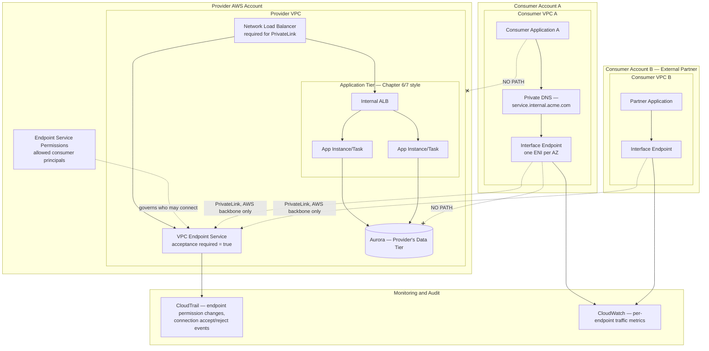
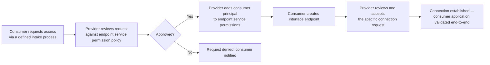

# Chapter 20 – PrivateLink Architecture

> **Visual note:** This chapter uses Mermaid diagrams for architecture and sequence flows, and Markdown tables for comparisons, cost estimates, and checklists. All Terraform and CLI examples are written against provider `hashicorp/aws >= 5.0` and AWS CLI v2. Where this chapter uses a service already introduced in Chapter 2 ("AWS Building Blocks"), Chapter 7 ("Three-Tier Enterprise Architecture"), or Chapter 18 ("Cloud WAN"), it re-explains that service briefly on first use so the chapter remains self-contained.

---

# 1 Executive Summary

AWS PrivateLink lets a service in one VPC be consumed from another VPC — or from a different AWS account, or a different organization entirely — without either side ever touching the public internet, and without either side needing to know the other's internal network layout at all.

This chapter treats PrivateLink as its own architecture pattern, distinct from the VPC interface endpoints already introduced in Chapter 2 and Chapter 10.

- Chapter 2 and Chapter 10 used interface endpoints to reach *AWS-owned services* (S3, Secrets Manager, SSM) privately.
- This chapter covers the other half of PrivateLink: exposing *your own service* privately, to consumers who are not you — other teams, other business units, other companies entirely.

**The business problem.**

Enterprises increasingly need to expose an internal service to a consumer that:

- Should never receive broad network reachability into the provider's VPC.
- May be a different team, a different AWS account, a different business unit, or an external partner company.
- Needs production-grade reliability and low latency, not a public API workaround.

The two obvious alternatives both have real problems:

- **VPC peering or Transit Gateway/Cloud WAN attachment** (Chapters 7, 18) gives the consumer *network-level* reachability into the provider's VPC — every route between the two sides is now open, constrained only by security groups. For a genuine service-boundary relationship (especially cross-account or cross-company), this is far more access than the relationship actually calls for.
- **A public API** (even one behind WAF and strong authentication, per Chapter 6/7's patterns) exposes the service to the entire internet's attack surface, for a consumer relationship that may only ever need to originate from a small, known set of AWS accounts.

**The architecture objective.**

PrivateLink's objective is a one-way, service-level exposure with no network-level reachability in either direction beyond the single service being shared:

- A **service provider** publishes a specific service (fronted by a Network Load Balancer or a Gateway Load Balancer) as a **VPC Endpoint Service**.
- A **service consumer** creates an **interface endpoint** in their own VPC, connecting to that specific published service — and nothing else in the provider's VPC.
- The consumer's traffic never leaves the AWS network backbone; the provider's VPC is never directly reachable by the consumer beyond the specific published service.
- No IP address planning coordination is required between provider and consumer — this is a specific, valuable property distinct from VPC peering, where both sides' CIDR ranges must be coordinated to avoid overlap.

**Why organizations adopt this architecture.**

Three forces drive PrivateLink adoption specifically, distinct from Chapter 7's tier-segmentation drivers and Chapter 18's global-network drivers:

1. **SaaS and platform business models.** A company selling a service to other companies (B2B SaaS, a data platform, an API product) needs to expose that service privately to customers' AWS environments — PrivateLink is the standard, AWS-native mechanism for this, letting a provider serve many consumer accounts from one NLB without VPC peering with each one individually.
2. **Internal platform-as-a-product patterns.** A large enterprise's internal platform team (owning, say, a shared authentication service, a shared data platform, or a shared ML inference service) wants to expose that service to many internal consumer teams/accounts without granting each one broader VPC-level access — the same pattern as external SaaS, applied internally.
3. **Strict cross-account/cross-boundary security requirements.** Any relationship where the provider and consumer sides have different trust levels, different compliance scopes, or simply different ownership, and where the relationship should be limited to "consumer can reach this one specific service" rather than "consumer can reach anything reachable within the provider's network."

**Major business benefits.**

- **Minimal network exposure in both directions.** The consumer gets no visibility into or reachability toward the provider's broader VPC; the provider gets no visibility into or reachability toward the consumer's VPC. This is a fundamentally tighter boundary than VPC peering or a Transit Gateway/Cloud WAN attachment provides.
- **No CIDR coordination required.** Unlike VPC peering (which requires non-overlapping CIDR ranges between the two VPCs), PrivateLink has no such requirement — the provider and consumer can each use whatever IP addressing scheme they already have, a genuinely significant advantage at scale, especially for a SaaS provider serving many customers who cannot realistically coordinate CIDR ranges with all of them.
- **Scales to many consumers from one provider.** A single VPC Endpoint Service can be consumed by a very large number of separate consumer accounts/VPCs, each independently, without the provider needing a separate peering connection or Transit Gateway attachment per consumer.
- **Consistent with the same Zero Trust principle this book has applied since Chapter 7.** Network-level reachability is scoped to exactly what's needed — nothing more — mirroring the tier-segmentation and global-segmentation principles from Chapters 7 and 18, now applied at the level of an individual, specific service relationship.
- **Removes public-internet exposure for services that would otherwise need it.** A service that would otherwise require a public endpoint (to be reachable by external partners or customers) can instead be reached entirely over the AWS backbone.

**Typical enterprise scenarios.**

- A B2B SaaS company exposing its core product's API to customer AWS environments, so customer application traffic never leaves AWS's network.
- A large enterprise's internal platform team (Chapter 10's SSM pattern owner, or a shared identity/data service) exposing that service to dozens of internal consumer teams across many AWS accounts, without granting each one Transit Gateway or Cloud WAN-level reachability.
- A financial services company connecting to a specific third-party data or market-data provider that offers its service via PrivateLink specifically to avoid exposing sensitive financial data flows to the public internet.
- An enterprise consuming AWS Marketplace SaaS products that are themselves delivered via PrivateLink, requiring the consumer side of this chapter's architecture even though they aren't building the provider side.

PrivateLink composes cleanly with every networking pattern in this book so far: it operates *within* a VPC's existing subnet/security-group design (Chapters 6, 7), can coexist with a Chapter 18 Cloud WAN-connected VPC without conflict, and specifically addresses the one relationship type those broader patterns are deliberately *not* meant to grant — a narrow, single-service, cross-boundary connection. Section 28 discusses precisely when PrivateLink is the right choice versus VPC peering, Cloud WAN, or a public API.

---

# 2 Business Requirements

## Business Drivers

| Driver | Description |
|---|---|
| Minimal cross-boundary network exposure | Expose exactly one service, nothing more, to a consumer with a different trust level |
| SaaS/platform business model support | Serve many customer or internal-consumer accounts from one provider without per-consumer peering |
| No CIDR coordination burden | Avoid the IP-address-planning overhead VPC peering imposes at scale |
| Public-internet exposure avoidance | Keep sensitive service traffic entirely on the AWS backbone |
| Internal platform-as-a-product enablement | Let a platform team serve many internal consumers under one governed, auditable connection model |

## Functional Requirements

- Publish a specific internal service as a VPC Endpoint Service, fronted by a Network Load Balancer or Gateway Load Balancer.
- Allow consumer VPCs (same account, cross-account, or external organization) to create an interface endpoint connecting to that published service.
- Support access control at both the provider side (who may connect at all — endpoint service permissions) and the consumer side (which specific principals/resources within the consumer's VPC may use the endpoint).
- Support private DNS resolution so consumers can reach the service using a familiar, stable hostname rather than a raw endpoint-specific DNS name.
- Support the provider side scaling to many concurrent consumer connections without per-consumer infrastructure provisioning.

## Non-Functional Requirements

| Category | Requirement |
|---|---|
| Network isolation | No route exists between consumer and provider VPCs beyond the specific published service |
| Availability | The published service and the endpoint mechanism itself should meet the same Tier 1 availability target (99.95%) as the underlying workload |
| Latency | PrivateLink adds minimal latency overhead (single-digit milliseconds) relative to direct connectivity |
| Auditability | Every endpoint connection request, acceptance, and rejection is logged and attributable |
| Consumer isolation | One consumer's connection/usage pattern must not affect another consumer's experience of the same service |

## Scalability Goals

- Support growth from a handful of consumers to hundreds or thousands, without redesigning the provider-side architecture — this is PrivateLink's central scalability promise, directly analogous to Cloud WAN's O(1) region-onboarding promise (Chapter 18) but applied to consumer *count* instead of region count.
- Support the provider-side NLB/service scaling independently of any single consumer's traffic pattern.

## Availability Requirements

- The provider-side NLB and its target service should follow the same Multi-AZ design established in Chapter 6 — PrivateLink itself doesn't provide availability; it provides a private connectivity path to whatever availability the underlying service already has.
- The interface endpoint mechanism itself, on the consumer side, should span multiple AZs (one endpoint ENI per AZ) for the same reasons Chapter 2 and Chapter 10 established for AWS-service interface endpoints.

## Latency Requirements

- PrivateLink connections add minimal, generally negligible latency relative to a direct, same-region connection — the practical latency consideration is ensuring the consumer's interface endpoint exists in the same AZ(s) as the consuming workload, avoiding an unnecessary cross-AZ hop (the same principle established in Chapter 6/10 for VPC endpoint placement).

## Compliance Requirements

- For a SaaS provider, PrivateLink is frequently a specific, named requirement in enterprise customer security questionnaires and procurement contracts — "does your service support private connectivity without traversing the public internet" is a common, pointed question in regulated-industry vendor assessments.
- For a consumer, using PrivateLink to reach a third-party or internal service satisfies the same network-segmentation-adjacent compliance language (PCI-DSS, SOC 2) this book has addressed since Chapter 7, applied specifically to cross-boundary service consumption.

## Security Expectations

- The provider must explicitly control which consumer principals (AWS accounts, IAM principals) may create an endpoint connection at all (endpoint service permissions, Section 10).
- The provider must explicitly decide whether connections require manual acceptance or are automatically accepted, based on the sensitivity of the exposed service (Section 11).
- The consumer must scope which resources/security groups within their own VPC may actually use the endpoint, exactly as any other VPC resource would be scoped (Chapters 6, 7).

## Recovery Objectives

| Objective | Target |
|---|---|
| RPO | Not directly applicable — PrivateLink carries no data of its own; inherits the RPO of the service it connects to |
| RTO — single endpoint/AZ failure | Minutes — the remaining AZs' endpoint ENIs continue serving, per the Multi-AZ design (Section 12) |
| RTO — provider-side NLB/service failure | Inherits the underlying service's own RTO (Chapter 6's Multi-AZ patterns) |

## SLAs

- The provider's SLA to its consumers should explicitly address PrivateLink connectivity availability, distinct from the underlying service's own application-level SLA — a consumer experiencing an endpoint-level connectivity issue needs a different diagnostic and escalation path than one experiencing an application-level error.

## Expected Workload and Growth

- A representative enterprise PrivateLink provider deployment: one or a handful of published services, each consumed by a growing number of separate consumer accounts/VPCs over time — tens for an internal platform service, potentially hundreds or thousands for an external B2B SaaS product.
- Growth here is primarily *consumer count* growth — a very different scaling dimension from Chapter 6/7's request-volume-driven scaling, and closer in shape to Chapter 18's attachment-count growth model.

---

# 3 Architecture Overview

## Overall Design Philosophy

PrivateLink applies one core principle: **expose the service, not the network.**

- Every other networking pattern in this book so far (VPC peering, Transit Gateway, Cloud WAN) connects *networks* — once connected, reachability is governed by route tables and security groups, but the underlying network topology itself becomes mutually visible and routable, to some degree, between the two sides.
- PrivateLink connects a *single service endpoint* — the consumer's VPC gains reachability to exactly that one NLB-fronted service, and nothing else about the provider's VPC (its CIDR range, its other resources, its route tables) is ever visible or reachable to the consumer.

This is a fundamentally different trust model: network-level connectivity (Chapters 7, 18) assumes an ongoing, broad relationship between two networks; PrivateLink assumes a narrow, specific, service-level relationship that may exist between parties with no other network relationship at all.

## Core Components — Provider Side

- **The published service** — any TCP-based service, fronted by a **Network Load Balancer** (Layer 4, for standard TCP services) or a **Gateway Load Balancer** (for traffic-inspection/security-appliance use cases).
- **VPC Endpoint Service** — the PrivateLink construct wrapping the NLB/GWLB, published for consumers to connect to.
- **Endpoint service permissions** — the provider-side access control determining which consumer principals may even attempt a connection.
- **Acceptance settings** — whether new connection requests are automatically accepted or require manual, per-request provider approval.

## Core Components — Consumer Side

- **Interface endpoint** — an ENI (one per AZ, for HA) created in the consumer's own VPC/subnets, representing the private connection to the provider's published service.
- **Private DNS (optional but recommended)** — lets the consumer reach the service via a stable, familiar hostname rather than the raw, endpoint-specific DNS name AWS generates by default.
- **Security group on the interface endpoint** — scopes which resources within the consumer's VPC may actually use the endpoint, exactly as any other security-group-governed resource.

## How Components Interact

- The provider creates an NLB fronting their service, then wraps it in a VPC Endpoint Service, configuring permissions for which consumer accounts/principals may connect.
- A consumer, having been granted permission, creates an interface endpoint in their own VPC pointing at the provider's service.
- The provider optionally reviews and accepts the specific connection request (Section 11).
- Once accepted, traffic from resources in the consumer's VPC (scoped by the endpoint's security group) reaches the provider's NLB via the interface endpoint's ENI, entirely over the AWS network backbone.
- From the provider's NLB's perspective, traffic arrives looking like it originated from within the provider's own VPC (via the endpoint's private IP, unless the provider enables source-IP preservation) — the consumer's own VPC topology is never exposed to the provider either.

## High-Level Workflow

**Request lifecycle:** A consumer's application resolves the service's DNS name (private DNS, if configured) to the interface endpoint's private IP, sends its request, which traverses the AWS backbone to the provider's NLB, which forwards to the actual service (an ALB, an EC2 fleet, an ECS service — whatever the provider's own Chapter 6/7-style architecture looks like behind the NLB).

**Response lifecycle:** Symmetric — the response returns via the same NLB-to-interface-endpoint path, with no different handling than the request path's reverse.

**Data lifecycle:** PrivateLink itself carries no data at rest. The provider's own service handles data exactly per whatever pattern its own architecture (Chapter 6, 7) already establishes — PrivateLink's role is purely the private transport layer connecting the consumer to that service.

---

# 4 AWS Services Used

## AWS PrivateLink (VPC Endpoint Services and Interface Endpoints)

**Purpose:** The core service this chapter is built around — covered generally, from the consumer side, in Chapters 2 and 10 (reaching AWS-owned services privately); this chapter covers the full provider-and-consumer architecture for exposing a *custom* service.

**Why selected:** The default, AWS-native mechanism for narrow, service-level, cross-boundary private connectivity — chosen over VPC peering/Transit Gateway/Cloud WAN specifically when the relationship should be scoped to one service, not general network reachability (Section 28 covers this decision in full).

**Alternatives:**

- VPC peering or Transit Gateway/Cloud WAN attachment (Chapters 7, 18) — appropriate when the relationship genuinely calls for broader network-level connectivity between two VPCs under common or closely coordinated ownership.
- A public API behind WAF/API Gateway (Chapter 6, 7 patterns) — appropriate when the consumer population is genuinely public/unknown in advance, rather than a specific, known set of AWS principals.
- A third-party API gateway/service mesh product with its own private-connectivity model — appropriate for organizations with an existing, deep investment in that specific tooling across a genuinely multi-cloud footprint.

**Limitations:**

- PrivateLink operates at Layer 4 (TCP) — it does not natively support UDP-based services, and Layer 7 concerns (path-based routing, header inspection) must be handled by whatever sits behind the NLB, not by PrivateLink itself.
- The provider must front their service with an NLB or GWLB specifically — an existing ALB-fronted service (Chapter 6's default pattern) requires an additional NLB in front of (or alongside) the ALB to be PrivateLink-compatible.

**Pricing considerations:** Both provider (endpoint service) and consumer (interface endpoint) sides incur an hourly charge per endpoint/AZ, plus data processing charges per GB — a different, additive cost model from a simple VPC peering connection (which has no comparable per-endpoint hourly charge), covered in depth in Section 16.

**Best practices:** Front the published service with an NLB even if the underlying service is already ALB-fronted for its own direct traffic — this is the standard "NLB in front of ALB" pattern for making an existing Chapter 6-style architecture PrivateLink-compatible without duplicating the entire compute/data tier.

## Elastic Load Balancing — Network Load Balancer (Provider Side)

**Purpose:** The specific load balancer type PrivateLink's VPC Endpoint Service construct requires on the provider side.

**Why selected over ALB:** NLB is required specifically because PrivateLink operates at Layer 4 — an ALB (Layer 7, introduced in Chapter 6) cannot directly back a VPC Endpoint Service. Where the underlying service is naturally ALB-fronted (the overwhelming majority of this book's Chapter 6/7 patterns), the standard solution is an NLB with the ALB registered as its target, rather than replacing the ALB.

**Best practices:** Enable cross-zone load balancing on the NLB to ensure even distribution across all AZs the underlying service spans, consistent with the Multi-AZ discipline established since Chapter 6.

## Elastic Load Balancing — Gateway Load Balancer (Provider Side, Inspection Use Case)

**Purpose:** A specialized load balancer type for routing traffic through third-party or AWS-native (Network Firewall) inspection appliances, using PrivateLink (via GWLB endpoints) as the mechanism for distributing traffic to the appliance fleet.

**Why selected:** Relevant specifically when PrivateLink is used not to expose an application service, but to insert a centralized inspection point into a traffic path — conceptually related to, and sometimes composed with, Chapter 18's Network Function Group pattern for Cloud WAN.

## Amazon VPC (Interface Endpoints, Consumer Side)

**Purpose:** Covered generally since Chapter 2 — this chapter's specific application is creating an interface endpoint pointed at a *third-party or internal custom* VPC Endpoint Service, rather than an AWS-owned one.

**Best practices:** Deploy the endpoint's ENIs across the same AZs as the consuming workload (Chapter 6/10's general VPC endpoint placement guidance), and enable private DNS wherever the provider supports it, to avoid hardcoding the raw, endpoint-specific DNS name into application configuration.

## Route 53 (Private Hosted Zones, for Private DNS)

**Purpose:** Where a provider's default private DNS configuration doesn't fit the consumer's needs (e.g., the consumer wants to reach the service via their own internal naming convention), a Route 53 private hosted zone in the consumer's VPC can alias a friendly internal hostname to the interface endpoint.

## IAM

**Purpose:** Governs both provider-side endpoint service permissions (which consumer principals may connect, Section 10) and consumer-side permissions (which of the consumer's own IAM principals may create/manage interface endpoints) — a genuinely two-sided IAM design this chapter's earlier chapters' single-account IAM patterns didn't need to address.

## CloudWatch, CloudTrail, GuardDuty, Config

Covered in depth throughout this book; this chapter's specific application is monitoring endpoint connection state and data-transfer volume (Section 21) and auditing endpoint service permission changes (Section 22) — a genuinely new, cross-account-relevant audit surface.

## PrivateLink vs. Alternatives Decision Matrix

| Factor | PrivateLink (this chapter) | VPC Peering | Transit Gateway / Cloud WAN | Public API (WAF-fronted) |
|---|---|---|---|---|
| Scope of exposure | One specific service only | Entire VPC (constrained by security groups/route tables) | Entire segment/network (Chapter 18) | Entire internet, access-controlled at the application layer |
| CIDR coordination required | No | Yes (non-overlapping ranges mandatory) | Yes, within the shared network | N/A |
| Consumer count scaling | Excellent — many consumers, one provider-side endpoint service | Poor — one peering connection per pair | Good, but grants broader reachability per attachment | Excellent, but with public exposure trade-offs |
| Cross-account/cross-org fit | Excellent — this is its primary use case | Workable, but grants broad reachability | Workable within a shared Cloud WAN global network; awkward across separate organizations | Natural fit for genuinely external/unknown consumers |
| Best fit | Narrow, specific service relationships, especially cross-boundary | Two VPCs under common ownership needing broad connectivity | An organization's own multi-VPC/multi-region network (Chapters 7, 18) | Genuinely public-facing APIs |

---

# 5 Complete Architecture Diagram



**Diagram interpretation:** Both `-.NO PATH.-x` edges are the point of this entire diagram — a consumer's application can reach the provider's published service (via the NLB), but has no network path whatsoever to anything else in the provider's VPC, including the data tier, even though that data tier is the ultimate destination of the request the consumer sent. The provider's Aurora cluster remains exactly as unreachable to Consumer A and Consumer B as Chapter 7's data tier was to its own presentation tier — the same segmentation principle, now enforced across an account/organization boundary rather than within a single VPC.

---

# 6 Component-by-Component Explanation

| Component | Purpose | Scaling | High Availability | Failure Handling | Dependencies |
|---|---|---|---|---|---|
| VPC Endpoint Service (provider) | Publishes the service for consumer connection | Scales to many concurrent consumers automatically | AWS-managed | Independent of any single consumer's connection state | NLB, endpoint service permissions |
| Network Load Balancer (provider) | Layer 4 front-end required by PrivateLink | Standard NLB Auto Scaling/cross-zone behavior | Multi-AZ (Chapter 6 pattern) | Standard NLB target health-check failover | Underlying ALB/application tier |
| Endpoint service permissions | Access control — who may connect at all | N/A | AWS-managed | A denied principal simply cannot create an endpoint | IAM (consumer principal identity) |
| Interface endpoint (consumer) | The consumer's private connection point | One ENI per AZ — deploy across all AZs the consuming workload spans | Multi-AZ if provisioned as such | An AZ's endpoint ENI failure is mitigated by other-AZ endpoints, per Chapter 2/10's general guidance | VPC Endpoint Service, consumer's own VPC/subnets |
| Private DNS (optional) | Friendly hostname resolution | N/A | Regional, highly durable (Route 53) | N/A | Route 53, endpoint configuration |
| Interface endpoint security group | Scopes which consumer resources may use the endpoint | N/A | N/A | N/A | Consumer's own security group design |

---

# 7 End-to-End Request Flow

```mermaid

sequenceDiagram
    participant ConsApp as Consumer Application
    participant DNS as Private DNS
    participant IE as Interface Endpoint (Consumer VPC)
    participant EPS as VPC Endpoint Service
    participant NLB as Provider NLB
    participant ALB as Provider Internal ALB
    participant App as Provider App Tier
    participant CT as CloudTrail

    ConsApp->>DNS: 1. Resolve service.internal.acme.com
    DNS-->>ConsApp: 2. Return interface endpoint private IP
    ConsApp->>IE: 3. Send request (stays within consumer's VPC to this point)
    IE->>EPS: 4. Forward over AWS backbone — no public internet, no direct VPC route
    EPS->>NLB: 5. Deliver to provider's NLB
    NLB->>ALB: 6. Forward to provider's internal ALB
    ALB->>App: 7. Route to healthy application target
    App-->>ALB: 8. Response
    ALB-->>NLB: 9. Response
    NLB-->>EPS: 10. Response
    EPS-->>IE: 11. Response delivered back over the backbone
    IE-->>ConsApp: 12. Response received
    Note over EPS,CT: 13. Every new connection request logged;<br/>ongoing traffic reflected in CloudWatch metrics (Section 21)

```

**Step-by-step narrative:**

- Steps 1-3 happen entirely within the consumer's own VPC — from the consumer application's perspective, this looks like calling any other internal service.
- Step 4 is the architecturally significant step: traffic leaves the consumer's VPC via the interface endpoint's ENI and travels over the AWS backbone directly to the provider's endpoint service — never touching the public internet, and never requiring any route table entry pointing toward the provider's actual VPC CIDR range (there isn't one, since the consumer never needs to know it).
- Steps 5-9 happen entirely within the provider's own VPC, following whatever Chapter 6/7-style internal architecture the provider has already built — PrivateLink's involvement ends at the NLB; everything behind it is standard, familiar architecture from earlier chapters.
- The consumer never sees, and cannot reach, anything in the provider's VPC beyond this one NLB-fronted service — precisely the narrow exposure this chapter's architecture is designed to guarantee.

---

# 8 Deployment Flow

## Provider-Side Provisioning

- Provision (or reuse) the underlying service's Chapter 6/7-style architecture.
- Add an NLB in front of it (or in front of the existing internal ALB, per Section 4's standard pattern).
- Create the VPC Endpoint Service wrapping the NLB.
- Configure endpoint service permissions (Section 10) and acceptance settings (Section 11).

## Consumer-Side Provisioning

- Obtain the provider's service name (a specific, provider-issued identifier — not a guessable or self-service-discoverable value, itself a deliberate access-control property).
- Create an interface endpoint in the consumer's VPC, referencing that service name.
- Await provider acceptance, if the provider requires manual acceptance (Section 11).
- Configure private DNS (optional) and the endpoint's security group to scope which consumer resources may use it.

## New-Consumer Onboarding Workflow



- This workflow should be treated as a standard, repeatable operational process (Section 23) — not an ad hoc, one-off exercise repeated inconsistently for each new consumer.

## Terraform Workflow

- Provider-side Terraform (NLB, VPC Endpoint Service, permissions) follows the same `plan`/review/`apply` discipline as every prior chapter, with the endpoint service permissions list specifically deserving the elevated review rigor this book has applied to every other access-control-defining resource (Chapters 7, 10, 14, 18).
- Consumer-side Terraform (the interface endpoint itself) is typically much simpler — a single resource block per consuming VPC, following the same pattern established for AWS-service interface endpoints in Chapters 2 and 10.

## Blue-Green for the Provider's Underlying Service

- The provider's own service can still use blue-green or canary deployment (Chapters 6, 14) for its application-level releases — PrivateLink's NLB/endpoint-service layer is unaffected by and independent of how the provider deploys the service sitting behind it.

## Rollback

- Revoking a consumer's endpoint service permission immediately blocks any *new* connection attempts from that principal; existing, already-accepted connections may need to be explicitly rejected/deleted by the provider to fully sever an active relationship — worth understanding this distinction (permission revocation vs. active connection termination) clearly before relying on permission revocation alone during an urgent access-removal scenario.

## Secrets and Configuration

- No PrivateLink-specific secret exists — authentication to the actual service (API keys, mTLS certificates, IAM-based auth) remains the application's own responsibility, following whichever pattern the provider's service already uses. PrivateLink provides the private network path; it does not provide application-level authentication on its own.

## Validation

- Post-deployment validation on the provider side: confirm the endpoint service is in an `Available` state and NLB target health is green.
- Post-deployment validation on the consumer side: confirm the interface endpoint reaches `Available` state, and run an actual connectivity test (a request to the service) from within the consumer's VPC — not just confirming the endpoint object exists, but confirming it actually works end-to-end.

---

# 9 Network Topology

## No Changes to Either Side's Internal VPC Design

- Exactly as Chapter 18 required no changes to individual VPCs' subnet/security-group design, PrivateLink requires none either — the provider's and consumer's own internal architectures (Chapter 6/7 patterns) remain unchanged. PrivateLink adds a narrow, specific connectivity mechanism *between* two otherwise-unrelated VPCs, without altering either one's internal topology.

## No CIDR Coordination Required — Why This Matters

- Unlike VPC peering (Chapter 7's alternative comparison) and Transit Gateway/Cloud WAN attachments (which require the connected VPCs to have non-overlapping CIDR ranges within the shared network), PrivateLink has no such requirement.
- The provider's VPC and every consumer's VPC can each use `10.0.0.0/16`, or any other range, independently, with zero risk of conflict — because the consumer never routes to the provider's actual VPC CIDR at all; it only ever routes to its own local interface endpoint ENI.
- This is a specific, high-value property for a SaaS provider serving many customers, who cannot realistically coordinate CIDR planning with every one of them.

## Subnet Placement for the Interface Endpoint (Consumer Side)

- Deploy the interface endpoint's ENIs in the same subnets/AZs as the consuming application, following the identical placement guidance established in Chapters 2 and 10 for AWS-service interface endpoints — avoiding an unnecessary cross-AZ hop.

## Subnet Placement for the NLB (Provider Side)

- The NLB should be internal (no public-facing exposure needed — PrivateLink handles the private connectivity), placed in the provider's application-tier or a dedicated PrivateLink-facing subnet tier, consistent with Chapter 7's internal-ALB pattern applied here to an internal NLB instead.

## Security Groups

| Security Group | Provider Side | Consumer Side |
|---|---|---|
| NLB (provider) | NLBs don't support security groups directly in all configurations — control access via endpoint service permissions (Section 10) instead, and via the target group's own security group | N/A |
| Interface endpoint (consumer) | N/A | Scope inbound to only the specific consumer resources/security groups that should use this service — the same least-privilege discipline as any other Chapter 6/7 security group |

## Route Tables — Notably Simpler Than Chapters 7 and 18

- Neither side needs a route table entry pointing at the other's VPC CIDR — the entire mechanism operates via the interface endpoint's local ENI and AWS's internal PrivateLink routing, not customer-configured routes.
- This is a genuine simplification relative to every other cross-VPC connectivity pattern in this book — worth highlighting explicitly during an architecture review, since it's a common point of confusion for engineers expecting PrivateLink to require the same route-table work Chapter 7's Transit Gateway pattern does.

## Interaction with Cloud WAN (Chapter 18)

- PrivateLink and Cloud WAN solve different problems and compose without conflict: a VPC attached to a Cloud WAN segment can simultaneously have its own PrivateLink interface endpoints, unrelated to and unaffected by its Cloud WAN segment membership.
- A common pattern: use Cloud WAN for broad, trusted, internal multi-region connectivity between an organization's own VPCs (Chapter 18), and PrivateLink specifically for the narrower relationships — external partners, SaaS consumers, or even internal platform services where broader network reachability genuinely isn't warranted even between two internal teams.

---

# 10 Identity and Access

## The Two-Sided IAM Model

This chapter introduces a genuinely new IAM shape relative to every prior chapter: **both the provider and the consumer have independent, non-overlapping IAM decisions to make, about different things:**

- **Provider-side:** who may connect to my service at all (endpoint service permissions).
- **Consumer-side:** who, within my own VPC/account, may create or use an interface endpoint pointed at this specific external service.

## Provider-Side: Endpoint Service Permissions

- A provider's VPC Endpoint Service has an explicit **allowed principals** list — a set of AWS account IDs, IAM users, or IAM roles permitted to create an interface endpoint connection request against this service.
- This is the provider's primary access-control lever, and should be treated with the same review rigor this book has applied to every other access-defining resource since Chapter 7.

```json

{
  "Version": "2012-10-17",
  "Statement": [
    {
      "Sid": "AllowSpecificConsumerAccountsOnly",
      "Effect": "Allow",
      "Principal": {
        "AWS": [
          "arn:aws:iam::111111111111:root",
          "arn:aws:iam::222222222222:root"
        ]
      },
      "Action": "ec2:CreateVpcEndpoint",
      "Resource": "*"
    }
  ]
}

```

- Note the explicit, enumerated account list — never leave endpoint service permissions open to `"*"` (any AWS account) unless the service is genuinely intended for fully open, self-service, unauthenticated-at-the-network-layer consumption, which is rare and should be a deliberate, explicit decision, not a default.

## Consumer-Side: Who May Create Interface Endpoints

- Within the consumer's own account, `ec2:CreateVpcEndpoint` should be scoped narrowly — not every engineer should be able to create a new interface endpoint to an arbitrary external service, since doing so establishes a new, potentially sensitive private connectivity path out of the organization's network.

```json

{
  "Version": "2012-10-17",
  "Statement": [
    {
      "Sid": "CreateInterfaceEndpointsToApprovedServicesOnly",
      "Effect": "Allow",
      "Action": ["ec2:CreateVpcEndpoint", "ec2:DescribeVpcEndpointServices"],
      "Resource": "*",
      "Condition": {
        "StringEquals": {
          "ec2:VpceServiceName": [
            "com.amazonaws.vpce.us-east-1.vpce-svc-0abc123def456",
            "com.amazonaws.vpce.us-east-1.vpce-svc-0fed654cba321"
          ]
        }
      }
    }
  ]
}

```

- This condition-based scoping means an engineer can create endpoints only to the specific, pre-approved list of external service names the organization has reviewed and approved — not to any arbitrary VPC Endpoint Service they might discover or be given a name for.

## Least Privilege in Practice — Both Sides

- Provider side: scope endpoint service permissions to the specific, known consumer accounts with an actual, approved business relationship — never broad or speculative.
- Consumer side: scope interface-endpoint-creation permission to a small, platform/network-team-governed set of principals, with a defined intake process (Section 8) for onboarding new external service connections, mirroring the same centralized-ownership model Chapter 18 established for Cloud WAN policy changes.

## Cross-Account Considerations

- This entire architecture *is* a cross-account access pattern by its nature — the standard multi-account guidance from throughout this book (centralized network/platform account ownership, RAM sharing where applicable) applies, with the specific addition that both provider and consumer sides need their own, independently-reviewed access decisions, rather than a single shared IAM trust relationship governing the whole thing.

## Permission Boundaries

- A permission boundary on any role capable of modifying endpoint service permissions (provider side) or approved-service-name lists (consumer side) is a strong defense-in-depth control here, exactly analogous to every other high-consequence, access-defining role covered in this book since Chapter 7.

---

# 11 Security Architecture

## Encryption and TLS

- PrivateLink itself doesn't encrypt traffic — it provides private network transport, not application-layer encryption.
- **Enforce TLS at the application layer regardless**, exactly as Chapter 7 insisted on TLS for the "internal" hop between presentation and application tiers — "it's on PrivateLink" is not a valid reason to skip TLS, for the same Zero-Trust reasons this book has emphasized since Chapter 7.

## Acceptance Settings — A Genuinely New Security Control

- The provider chooses whether new connection requests are **automatically accepted** or require **manual acceptance**.
- **Manual acceptance** is the recommended default for any service exposing sensitive data or functionality — it gives the provider an explicit, reviewed checkpoint for every new consumer relationship, directly analogous to Chapter 14's manual-approval-gate pattern for high-risk canary promotions, applied here to a new, potentially higher-stakes decision: granting an entirely new external party ongoing access to a service.
- **Automatic acceptance** is appropriate only for genuinely low-sensitivity, high-volume, self-service scenarios where the endpoint service permissions list (Section 10) already provides sufficient access control on its own.

## GuardDuty, Inspector, Security Hub

- GuardDuty's relevance here is analogous to Chapter 18's: PrivateLink itself is a routing/connectivity layer, not directly instrumented by GuardDuty, but anomalous traffic patterns at the provider's NLB/application layer (an unusual volume or pattern from a specific consumer) remain relevant and worth monitoring (Section 21).
- Security Hub can aggregate findings related to endpoint service permission changes (via a custom Config rule, Section 11 below) alongside the organization's broader security posture view established since Chapter 2.

## AWS Config for Endpoint Service Permission Drift

- Consistent with the drift-detection pattern established in Chapters 7 and 18: an AWS Config rule (or custom check) comparing the deployed endpoint service permissions against the version-controlled, approved list catches any out-of-band console change — for example, an emergency, undocumented addition of a new consumer account that bypassed the standard review process.

## Zero Trust Applied to This Architecture

- A consumer reaching the provider's service via PrivateLink is not implicitly trusted merely because the connection is private and pre-approved at the network layer — the provider's application should still authenticate and authorize every request (API keys, mTLS, IAM-based auth, whatever the service's own pattern is), exactly as Chapter 7 insisted network-location trust alone was never sufficient.
- Symmetrically, the consumer should not implicitly trust the provider's responses merely because the connection is private — standard application-layer response validation still applies.

## Threat Model for This Architecture

| Attack Vector | Specific Relevance | Mitigation |
|---|---|---|
| Overly broad endpoint service permissions | Any AWS account (if permissions are misconfigured to `"*"`) could attempt to connect | Explicit, enumerated allow-list (Section 10); never default to open permissions |
| A compromised consumer account with an accepted connection | The compromised account retains its existing, legitimate network path to the provider's service | Application-layer authentication/authorization as the actual gate on what a connected consumer can do (Zero Trust, above); provider-side per-consumer rate limiting and anomaly monitoring |
| Automatic acceptance for a sensitive service | Removes the provider's review checkpoint for new consumer relationships | Manual acceptance as the default for sensitive services (this section) |
| Unauthorized interface-endpoint creation within the consumer's own account | An engineer establishes an unreviewed, unapproved private connectivity path to an external service | Condition-scoped `ec2:CreateVpcEndpoint` permission (Section 10), limiting creation to a pre-approved service-name list |
| Endpoint service permission drift via an out-of-band console change | Defeats the reviewed-change-management model for who may connect | AWS Config drift detection, comparing deployed permissions against version control |

---

# 12 High Availability

## Provider-Side HA — Inherits the Underlying Service's Design

- The published service's actual availability is determined entirely by its own Chapter 6/7-style Multi-AZ architecture — PrivateLink adds a connectivity layer on top, it does not change the underlying service's HA characteristics.
- The NLB itself should span the same AZs as the underlying service, following standard NLB Multi-AZ configuration.

## Consumer-Side HA — Interface Endpoint AZ Placement

- Exactly as established in Chapters 2, 6, and 10: deploy the interface endpoint's ENIs across every AZ the consuming workload spans — a single-AZ interface endpoint is an avoidable, unnecessary single point of failure for that consumer's access to the service, identical in nature to a single-AZ bastion host or a single-AZ NAT Gateway from earlier chapters.

## AZ Failures

- A single AZ's interface endpoint ENI failure is mitigated automatically by the other AZs' endpoint ENIs, provided the consumer deployed Multi-AZ per the guidance above — the same pattern established for AWS-service interface endpoints since Chapter 2.

## Regional Failures

- PrivateLink connections are inherently regional — a provider serving consumers across multiple regions needs a separate VPC Endpoint Service (and NLB) per region, consistent with the general pattern of every regional AWS service.
- For a provider with a genuine multi-region presence (following a later chapter's multi-region architecture pattern), this means PrivateLink access is set up per-region, independently — worth factoring into the onboarding workflow (Section 8) for any consumer needing access in more than one region.

## Provider-Side Failure Handling — What the Consumer Experiences

- If the provider's underlying service experiences an outage (an AZ failure handled per Chapter 6's patterns, or a genuine full-service incident), the consumer's interface endpoint itself remains technically healthy — the failure manifests as the provider's NLB target health degrading, and ultimately as connection failures/timeouts at the application layer, not as the interface endpoint itself becoming unavailable.
- **This distinction matters for troubleshooting** (Section 25): a consumer experiencing connectivity issues needs to distinguish "my interface endpoint is unhealthy" from "the interface endpoint is healthy but the provider's service behind it is down" — these have different diagnostic paths and different parties responsible for remediation.

## Load Balancing and Health Checks

- The provider's NLB performs standard target health checks against the underlying service (Chapter 6's patterns) — unaffected by and unaware of PrivateLink specifically.
- There is no consumer-visible health check at the PrivateLink layer itself; the consumer's visibility into provider-side health is limited to what the provider's own service-level status/monitoring communicates (Section 21's SLA discussion).

---

# 13 Disaster Recovery

## DR Scope for This Architecture

- PrivateLink itself carries no data and inherits whatever DR posture the underlying provided service already has (Chapter 6's Multi-AZ, or a later chapter's multi-region pattern).
- This section addresses DR considerations specific to the *connectivity relationship* itself, not the underlying service's own data-tier DR.

## Provider-Side DR — Multi-Region Service Consumers

- If the provider's service has a multi-region DR posture (an active-passive or active-active pattern from a later chapter), the provider should also expose a VPC Endpoint Service in the DR region, and communicate to consumers how failover affects their PrivateLink connection specifically — does the consumer need a *separate* interface endpoint in the DR region ready in advance, or does failover happen transparently behind a single regional endpoint? This should be an explicit, documented part of the provider's DR runbook, not an assumption.

## Consumer-Side DR — Depending on an External Service

- A consumer whose own application has a Tier 1 availability requirement (Chapter 6's framework) but depends on a PrivateLink-connected external service should explicitly account for that dependency's own availability characteristics in their own DR planning — the consumer's application is only as resilient as its most fragile dependency, and a PrivateLink connection to a single-region, single-AZ-fragile provider service is a real, specific risk worth surfacing during the consumer's own architecture review (Section 31).

## Backup Strategy

- No PrivateLink-specific backup strategy exists — the endpoint service and interface endpoint configurations are, like everything else in this book, reproducible from version-controlled Terraform (Section 18), which is the actual "backup" for this architecture's configuration.

## RPO/RTO for This Pattern

| Scenario | RPO | RTO |
|---|---|---|
| Single AZ interface endpoint failure | N/A | Minutes — other-AZ endpoints continue serving |
| Provider-side underlying service failure | N/A | Inherits the provider's own service RTO (Chapter 6) |
| Endpoint service permission accidentally revoked | N/A | Minutes to restore, once detected — emphasizing the value of the drift-detection monitoring from Section 11 |
| Regional PrivateLink service disruption (rare, AWS-side) | N/A | Depends on AWS's own service recovery; no customer-side mitigation beyond a genuinely separate, non-PrivateLink fallback path for the most critical dependencies, a decision worth making deliberately rather than defaulting to |

## Testing

- Include an interface-endpoint AZ-failure simulation in the consumer's regular DR/chaos testing cadence, consistent with the general testing discipline established since Chapter 6 — verifying that traffic continues flowing via the remaining AZs' endpoints without manual intervention.
- For a provider, include a test of the endpoint service permission revocation/re-grant process, confirming the operational workflow (Section 8, 23) actually works as documented, not just assumed to.

---

# 14 Scalability

## The Core Scalability Promise: Many Consumers, One Provider-Side Endpoint

- This is PrivateLink's central value proposition, directly analogous to Chapter 18's Cloud WAN attachment-scaling promise — a single VPC Endpoint Service can serve a very large number of independent consumer accounts, each with their own interface endpoint, without the provider needing separate infrastructure per consumer.
- Contrast with VPC peering: a provider serving 500 consumer accounts via peering would need 500 separate peering connections, each with its own route table maintenance — PrivateLink needs one endpoint service, with a growing (but centrally-managed) permissions list.

## Provider-Side Scaling

- The underlying service (behind the NLB) scales exactly per its own Chapter 6/7-style Auto Scaling design — PrivateLink doesn't change this, and the NLB itself scales automatically to the aggregate traffic volume across all connected consumers.
- **A specific scaling consideration unique to this architecture:** the provider's service capacity planning must account for the *aggregate* traffic from potentially many independent consumers, whose individual usage patterns the provider may have limited visibility into or control over — worth building per-consumer rate limiting or throttling (at the application layer, since PrivateLink itself doesn't provide this) if any single consumer's usage pattern could disproportionately affect service capacity for others.

## Consumer-Side Scaling

- Largely irrelevant from a scaling perspective — each consumer's interface endpoint serves that consumer's own traffic volume, with no cross-consumer scaling interaction at the consumer's own VPC level.

## Onboarding Velocity at Scale

- For a provider with a genuinely large and growing consumer base (a mature B2B SaaS product), the manual-review onboarding workflow (Section 8) that's appropriate for a handful of consumers becomes an operational bottleneck at hundreds or thousands of consumers.
- **Mitigation:** a self-service onboarding portal (a common pattern for mature SaaS providers) that automates the endpoint service permission grant against a pre-vetted, automated approval process (e.g., verified account ownership plus a signed agreement) for lower-risk consumer relationships, reserving manual review specifically for higher-sensitivity or higher-risk cases.

## Multi-Region Provider Scaling

- As noted in Section 12/13: scaling to serve consumers across multiple regions means replicating the provider-side endpoint service infrastructure per region — this is a genuine, additive scaling dimension distinct from within-region consumer-count growth, and should be planned for explicitly as part of the provider's own multi-region roadmap.

---

# 15 Performance Optimization

## PrivateLink's Own Latency Overhead — Minimal

- PrivateLink itself adds negligible latency overhead relative to a direct, same-region connection — the AWS backbone path it uses is not meaningfully slower than any other same-region AWS-internal traffic.

## AZ-Local Routing (Consumer Side)

- The single most impactful, customer-controlled performance lever: ensure the consuming application and its interface endpoint are in the same AZ wherever possible, avoiding an unnecessary cross-AZ hop — identical guidance to Chapters 2, 6, and 10's VPC endpoint placement recommendations, repeated here because it remains just as relevant for custom PrivateLink services as for AWS-owned ones.

## NLB Cross-Zone Load Balancing (Provider Side)

- Enabling cross-zone load balancing on the provider's NLB ensures traffic arriving via any AZ's PrivateLink path is distributed evenly across the underlying service's full target fleet, not artificially constrained to targets in the same AZ the traffic happened to arrive through — a specific, easy-to-overlook NLB configuration setting worth verifying explicitly.

## Connection Reuse

- As with any Layer 4 connection, encourage consumer applications to reuse persistent connections to the interface endpoint rather than establishing a new TCP (and, if applicable, TLS) handshake per request — the same connection-pooling principle established in Chapter 7 for the presentation-to-application internal hop, applied here to the cross-account PrivateLink hop.

## Provider-Side Capacity Planning for Aggregate Multi-Consumer Load

- As flagged in Section 14: the provider's own service performance (query latency, connection pool sizing at the data tier) must be planned against aggregate load across all consumers, not any single consumer's traffic pattern in isolation — a specific extension of Chapter 6's general capacity-planning guidance, applied to a genuinely multi-tenant traffic pattern this book's earlier single-tenant architectures didn't need to consider.

---

# 16 Cost Optimization (FinOps)

## Cost Model — Both Sides Pay

Unlike a standard VPC endpoint to an AWS-owned service (where only the consumer pays, per Chapter 2), a custom PrivateLink relationship has costs on **both** sides:

- **Provider side:** VPC Endpoint Service hourly charge, plus NLB hourly and LCU charges (standard NLB pricing), plus data processing charges for traffic through the endpoint service.
- **Consumer side:** Interface endpoint hourly charge (per AZ), plus data processing charges for traffic through the endpoint.

## Estimated Monthly Costs

| Deployment Size | Provider-Side Cost (NLB + Endpoint Service + Data) | Consumer-Side Cost per Consumer (Endpoint + Data) |
|---|---|---|
| Small (few consumers, modest traffic) | $50–150 | $15–40 per consumer |
| Medium (dozens of consumers, meaningful traffic) | $300–800 | $15–60 per consumer, scaling with usage |
| Enterprise (hundreds+ consumers, high traffic SaaS) | $1,500–5,000+ | Varies widely per consumer; aggregate data processing often the dominant cost |

> **Note:** For a SaaS provider, per-consumer data processing costs are frequently passed through to the customer as part of the product's pricing model — worth an explicit FinOps conversation with the product/pricing team, not treated purely as an internal infrastructure cost to absorb silently.

## Major Cost Drivers

- **Data processing charges scale directly with traffic volume** — the dominant cost driver for any high-traffic PrivateLink relationship, on both sides.
- **Provider-side NLB LCU charges** scale with connection count, active flow count, and bandwidth — standard NLB cost drivers, unaffected by PrivateLink specifically but worth including in the total cost picture for this architecture.
- **Consumer-side per-AZ endpoint hourly charges** are typically small individually but accumulate meaningfully if a consumer creates redundant or forgotten endpoints across many services/regions without periodic review.

## Optimization Opportunities

- **Right-size the number of AZs the interface endpoint spans** to the consuming workload's actual AZ footprint — deploying endpoint ENIs in every available AZ "for maximum redundancy," when the consuming workload itself only runs in three specific AZs, is unnecessary cost with no corresponding availability benefit.
- **Review and remove unused interface endpoints** on the consumer side periodically — an endpoint created for a since-deprecated integration, never cleaned up, is a quiet, ongoing cost with no business value.
- **For providers, monitor per-consumer traffic patterns** to identify a disproportionately high-usage consumer whose actual usage may warrant a pricing conversation, distinct from a purely technical capacity-planning concern (Section 14).

## Tagging and Budget Configuration

- Tag both provider-side (NLB, endpoint service) and consumer-side (interface endpoint) resources with the standard tags from Chapter 2, plus a specific tag identifying the counterparty relationship (`Consumer=partner-x` or `Provider=vendor-y`) — enabling cost attribution per relationship, which is a genuinely useful FinOps question this architecture's multi-tenant/multi-party nature specifically raises that single-tenant architectures in earlier chapters didn't need to answer.

---

# 17 AI-Assisted Operations

## AI-Assisted Consumer Onboarding Review

- Given a new consumer's access request (Section 8's workflow), a Bedrock-backed tool can draft a summary of the requesting account's context (prior relationship history, requested scope) for the human reviewer's final decision — particularly valuable for a provider processing a high volume of onboarding requests (Section 14's self-service-portal scenario), where AI-assisted triage can separate routine, low-risk requests from ones warranting closer manual scrutiny.

## AI-Assisted Endpoint Service Permission Drift Analysis

- Consistent with the pattern established in Chapters 7 and 18: a Bedrock-backed tool comparing deployed endpoint service permissions against the version-controlled approved list can draft a clear explanation of any detected drift for a security reviewer.

## AI-Assisted Capacity Forecasting for Multi-Tenant Load

- Given historical per-consumer traffic data, a Bedrock-backed tool can help draft a capacity forecast accounting for aggregate, multi-consumer growth patterns — a genuinely useful input to the provider-side capacity planning discussed in Section 14/15, subject to validation against real Performance Insights/CloudWatch data, not treated as a final, load-bearing estimate.

## AI-Generated Terraform for New Consumer Onboarding

- As with every prior chapter: AI-assisted generation of the consumer-side Terraform (a new interface endpoint, following the established module pattern) for a newly-onboarded consumer is a reasonable time-saving use case, subject to the same mandatory review — with particular attention to the security group scoping the endpoint's usage within the consumer's own VPC.

---

# 18 Terraform Implementation

## Provider-Side Module: NLB and VPC Endpoint Service

```hcl

# modules/privatelink_provider/main.tf

resource "aws_lb" "service_nlb" {
  name               = "${var.project_name}-${var.environment}-privatelink-nlb"
  internal           = true
  load_balancer_type = "network"
  subnets            = var.provider_subnet_ids

  enable_cross_zone_load_balancing = true

  tags = { Name = "${var.project_name}-${var.environment}-privatelink-nlb" }
}

resource "aws_lb_target_group" "service" {
  name        = "${var.project_name}-${var.environment}-privatelink-tg"
  port        = var.service_port
  protocol    = "TCP"
  vpc_id      = var.vpc_id
  target_type = "alb" # registering the existing internal ALB (Chapter 7 pattern) as the NLB's target

  health_check {
    protocol            = "HTTPS"
    path                 = "/health"
    healthy_threshold    = 2
    unhealthy_threshold  = 2
    interval              = 15
  }
}

resource "aws_lb_target_group_attachment" "alb" {
  target_group_arn = aws_lb_target_group.service.arn
  target_id         = var.internal_alb_arn
  port               = var.service_port
}

resource "aws_lb_listener" "nlb_listener" {
  load_balancer_arn = aws_lb.service_nlb.arn
  port              = var.service_port
  protocol          = "TCP"

  default_action {
    type             = "forward"
    target_group_arn = aws_lb_target_group.service.arn
  }
}

resource "aws_vpc_endpoint_service" "this" {
  network_load_balancer_arns = [aws_lb.service_nlb.arn]
  acceptance_required         = var.require_manual_acceptance # true for sensitive services (Section 11)

  tags = { Name = "${var.project_name}-${var.environment}-endpoint-service" }
}

resource "aws_vpc_endpoint_service_allowed_principal" "consumers" {
  for_each                = toset(var.allowed_consumer_principal_arns)
  vpc_endpoint_service_id = aws_vpc_endpoint_service.this.id
  principal_arn            = each.value
}

```

## Consumer-Side Module: Interface Endpoint

```hcl

# modules/privatelink_consumer/main.tf

resource "aws_security_group" "endpoint" {
  name_prefix = "${var.project_name}-${var.environment}-plendpoint-"
  vpc_id      = var.vpc_id
  description = "Allows access to the PrivateLink interface endpoint from approved consumer resources only"

  ingress {
    description     = "From consuming application security group only"
    from_port       = var.service_port
    to_port         = var.service_port
    protocol        = "tcp"
    security_groups = [var.consuming_app_security_group_id]
  }

  tags = { Name = "${var.project_name}-${var.environment}-plendpoint-sg" }
}

resource "aws_vpc_endpoint" "provider_service" {
  vpc_id              = var.vpc_id
  service_name         = var.provider_service_name # provider-issued identifier
  vpc_endpoint_type    = "Interface"
  subnet_ids            = var.consumer_subnet_ids # same AZs as the consuming workload
  security_group_ids    = [aws_security_group.endpoint.id]
  private_dns_enabled  = var.enable_private_dns

  tags = { Name = "${var.project_name}-${var.environment}-privatelink-endpoint" }
}

# Optional: alias a friendly internal hostname to the endpoint,

# where the provider's own private DNS doesn't fit the consumer's

# internal naming convention.

resource "aws_route53_record" "friendly_alias" {
  count   = var.custom_dns_alias != null ? 1 : 0
  zone_id = var.internal_hosted_zone_id
  name    = var.custom_dns_alias
  type    = "CNAME"
  ttl     = 300
  records = [aws_vpc_endpoint.provider_service.dns_entry[0]["dns_name"]]
}

```

## Root Module Composition (Provider Side)

```hcl

# main.tf — provider account

module "privatelink_provider" {
  source                          = "./modules/privatelink_provider"
  vpc_id                            = module.production_vpc.vpc_id
  provider_subnet_ids                = module.production_vpc.privatelink_subnet_ids
  internal_alb_arn                    = module.application_tier.internal_alb_arn
  service_port                         = 443
  require_manual_acceptance            = true
  allowed_consumer_principal_arns       = [
    "arn:aws:iam::111111111111:root",
    "arn:aws:iam::222222222222:root"
  ]
  project_name = var.project_name
  environment   = var.environment
}

```

## Root Module Composition (Consumer Side)

```hcl

# main.tf — consumer account

module "privatelink_consumer" {
  source                        = "./modules/privatelink_consumer"
  vpc_id                          = module.consumer_vpc.vpc_id
  consumer_subnet_ids              = module.consumer_vpc.private_app_subnet_ids
  consuming_app_security_group_id  = module.consumer_app.security_group_id
  provider_service_name             = "com.amazonaws.vpce.us-east-1.vpce-svc-0abc123def456"
  service_port                       = 443
  enable_private_dns                 = true
  custom_dns_alias                    = "vendor-service.internal.acme.com"
  internal_hosted_zone_id             = module.consumer_vpc.internal_hosted_zone_id
  project_name                         = var.project_name
  environment                           = var.environment
}

```

## Terraform Best Practices Applied Above

- **`acceptance_required = var.require_manual_acceptance`** exposed as a variable, not hardcoded, so the provider's Terraform module can be reused for both sensitive services (manual review) and lower-sensitivity ones (automatic acceptance) without duplicating the module.
- **`for_each` over `allowed_consumer_principal_arns`** makes the provider's permission list a clearly reviewable, itemized list in the Terraform plan output — a new consumer addition shows up as a single, obvious added resource, not a diff buried inside a larger monolithic resource.
- **Interface endpoint security group scoped to the specific consuming application's security group**, not a broader CIDR range — the same least-privilege discipline applied throughout this book, now applied to the consumer's own use of an externally-provided service.
- **`target_type = "alb"` on the target group** demonstrates the standard "NLB in front of existing ALB" pattern (Section 4) for making an already-built Chapter 6/7-style service PrivateLink-compatible without any change to its own internal architecture.

---

# 19 AWS CLI Examples

## Provider-Side Deployment and Validation

```bash

# Check the endpoint service's current state and configuration

aws ec2 describe-vpc-endpoint-services \
  --filters "Name=service-id,Values=vpce-svc-0abc123def456" \
  --query 'ServiceDetails[0].{State:ServiceState,AcceptanceRequired:AcceptanceRequired}'

# List pending connection requests awaiting manual acceptance

aws ec2 describe-vpc-endpoint-connections \
  --filters "Name=vpc-endpoint-state,Values=pendingAcceptance" \
  --query 'VpcEndpointConnections[].{EndpointId:VpcEndpointId,Owner:VpcEndpointOwner}'

# Accept a specific pending connection request

aws ec2 accept-vpc-endpoint-connections \
  --service-id vpce-svc-0abc123def456 \
  --vpc-endpoint-ids vpce-0fedcba654321

```

## Consumer-Side Deployment and Validation

```bash

# Check the interface endpoint's current state

aws ec2 describe-vpc-endpoints \
  --vpc-endpoint-ids vpce-0fedcba654321 \
  --query 'VpcEndpoints[0].{State:State,DnsEntries:DnsEntries}'

# Test connectivity from within the consumer's VPC (run from a test instance)

#   curl -m 5 https://vendor-service.internal.acme.com/health

```

## Monitoring

```bash

# Provider-side: list all currently connected consumers

aws ec2 describe-vpc-endpoint-connections \
  --filters "Name=service-id,Values=vpce-svc-0abc123def456" "Name=vpc-endpoint-state,Values=available" \
  --query 'VpcEndpointConnections[].{EndpointId:VpcEndpointId,Owner:VpcEndpointOwner,State:VpcEndpointState}'

# Provider-side: check NLB target health behind the endpoint service

aws elbv2 describe-target-health --target-group-arn <nlb-target-group-arn>

# Consumer-side: check current allowed-principals list, if the consumer has visibility

# (this command run from the PROVIDER account, listing who's allowed to connect)

aws ec2 describe-vpc-endpoint-service-permissions \
  --service-id vpce-svc-0abc123def456 \
  --query 'AllowedPrincipals[].Principal'

```

## Troubleshooting

```bash

# Diagnose why a specific consumer's connection request was rejected

aws ec2 describe-vpc-endpoint-connections \
  --filters "Name=vpc-endpoint-id,Values=vpce-0fedcba654321" \
  --query 'VpcEndpointConnections[0].{State:VpcEndpointState,Reason:RejectionReason}'

# Verify a consumer's IAM principal is actually on the allowed list

aws ec2 describe-vpc-endpoint-service-permissions \
  --service-id vpce-svc-0abc123def456 \
  --query 'AllowedPrincipals[?Principal==`arn:aws:iam::111111111111:root`]'

```

## Cleanup

```bash

# Identify rejected or expired connection requests, candidates for cleanup review

aws ec2 describe-vpc-endpoint-connections \
  --filters "Name=service-id,Values=vpce-svc-0abc123def456" "Name=vpc-endpoint-state,Values=rejected" \
  --query 'VpcEndpointConnections[].[VpcEndpointId,VpcEndpointOwner]'

# Identify consumer-side interface endpoints unused for an extended period

# (requires correlating CloudWatch traffic metrics — no single CLI command covers this directly)

aws cloudwatch get-metric-statistics \
  --namespace AWS/PrivateLinkEndpoints \
  --metric-name BytesProcessed \
  --dimensions Name=VPC Endpoint Id,Value=vpce-0fedcba654321 \
  --start-time $(date -d '30 days ago' -Iseconds) --end-time $(date -Iseconds) \
  --period 86400 --statistics Sum

```

---

# 20 CI/CD Integration

## Provider-Side Pipeline: New Consumer Onboarding

```yaml

name: PrivateLink Consumer Onboarding

on:
  pull_request:
    paths: ["privatelink/allowed_consumers.json"]

jobs:
  validate-and-review:
    runs-on: ubuntu-latest
    steps:
      - uses: actions/checkout@v4
      - name: Validate consumer principal ARN format
        run: python scripts/validate_principal_arns.py privatelink/allowed_consumers.json
      - name: Check against known/vetted consumer registry
        run: python scripts/check_consumer_vetting_status.py privatelink/allowed_consumers.json

  apply:
    runs-on: ubuntu-latest
    needs: validate-and-review
    environment: production
    if: github.event_name == 'push'
    steps:
      - uses: hashicorp/setup-terraform@v3
      - run: terraform init
      - run: terraform plan -out=tfplan
      - run: terraform apply -auto-approve tfplan
      - name: Notify consumer of approval
        run: python scripts/notify_consumer_approved.py

```

## Policy as Code Specific to This Architecture

- A required, blocking check verifying `allowed_consumer_principal_arns` never includes a wildcard or overly broad pattern — mirroring the same "never `Resource: *`" discipline this book has applied to IAM policies since Chapter 2, now applied to endpoint service permissions specifically.
- A check confirming `acceptance_required = true` remains set for any service tagged as handling sensitive data — preventing an accidental, unreviewed switch to automatic acceptance for a service that shouldn't have it.

## Consumer-Side Pipeline: New External Service Approval

- A separate, consumer-side pipeline governs additions to the approved-service-name allow-list referenced in Section 10's IAM condition — this should go through the same platform/network-team review as any other new external dependency, distinct from and typically more centrally-controlled than the provider-side onboarding pipeline above.

---

# 21 Monitoring

## Key Metrics Specific to This Architecture

| Metric | Source | Why It Matters Here |
|---|---|---|
| Active connection count (provider side) | CloudWatch (VPC Endpoint Service metrics) | Overall relationship health and growth trend |
| Per-endpoint bytes processed | CloudWatch | Traffic volume, both for capacity planning (Section 14) and cost tracking (Section 16) |
| Pending connection requests (provider side) | `describe-vpc-endpoint-connections` | Operational visibility into the onboarding queue, especially relevant if manual acceptance creates a backlog |
| NLB target health (provider side) | CloudWatch (standard NLB metrics) | The underlying service's actual health, distinct from the PrivateLink layer's own state |
| Interface endpoint state (consumer side) | CloudWatch / `describe-vpc-endpoints` | Confirms the consumer's own connectivity path remains healthy |

## SLOs for This Architecture

- Provider-side SLO: "99.9% of connection acceptance decisions (for services requiring manual acceptance) are made within N business hours" — a genuinely operational, process-oriented SLO distinct from the underlying service's own technical availability SLO, but just as relevant to the overall consumer experience of onboarding.
- Consumer-side SLO: inherited from whatever availability target the consumer's own application has (Chapter 6's framework), with an explicit acknowledgment that the PrivateLink-connected external dependency's own availability is a factor outside the consumer's direct control (Section 13).

## Alarm Design Specific to This Architecture

- An alarm on any interface endpoint transitioning out of `available` state unexpectedly (consumer side).
- An alarm on a growing backlog of pending, unaccepted connection requests (provider side) — an operational signal that the manual-acceptance workflow may be falling behind actual demand.
- An alarm on a sudden, significant drop in a specific consumer's traffic volume — potentially indicating a problem on the consumer's end worth proactively reaching out about, a genuinely relationship-oriented monitoring signal this book's earlier, single-tenant architectures didn't need.

---

# 22 Logging

## Endpoint Service Permission Change Audit Log

- Every addition or removal of an allowed consumer principal (provider side) should be logged as structured, queryable audit data — directly analogous to Chapter 7 and Chapter 18's segmentation-change audit logs, but specific to "who is allowed to even attempt connecting to my service."

## Connection Accept/Reject Audit Log

- Every connection request's accept/reject decision (and, ideally, the reviewer's stated reason where manual review applies) should be logged — this is the direct evidence for "who approved this specific external party's access to our service, and why," frequently relevant to both internal audit and, for a SaaS provider, customer-facing security questionnaires.

## Centralized Logging

- Consistent with the general pattern established since Chapter 2: PrivateLink-related CloudTrail events (endpoint service creation, permission changes, connection accept/reject events) should flow into the organization's centralized logging account, not remain siloed in the provider's own workload account alone.

## Retention

- Retain endpoint service permission and connection-decision audit logs per the same compliance-driven schedule this book has applied to every other access-control-relevant log source (commonly 1-7 years) — particularly relevant for a SaaS provider needing to answer a specific customer's security questionnaire about historical access grants.

---

# 23 Operational Excellence

## Runbooks Specific to This Architecture

- A runbook for "new consumer onboarding" — the actual, current process for reviewing and accepting a new connection request (Section 8), kept current as the organization's practice evolves.
- A runbook for "consumer reports connectivity issues" — covering the diagnostic path distinguishing endpoint-layer issues from underlying-service issues (Section 12).
- A runbook for "revoke consumer access" — covering both permission-list removal and, where necessary, active connection termination (Section 8's rollback distinction), since these are two separate actions that are easy to conflate under time pressure.

## Change Management

- Changes to endpoint service permissions (provider side) and the approved-external-service allow-list (consumer side) should go through the same elevated, two-reviewer approval this book has applied consistently to every access-control-defining change since Chapter 7 — these are, functionally, decisions about who can reach what across an organizational or company boundary, deserving commensurate rigor.

## Consumer Relationship Management (Provider Side)

- For a provider with a growing consumer base, operational excellence extends beyond pure infrastructure — maintaining an accurate, current registry of which consumer maps to which business relationship/contract, why they were granted access, and who the internal and external points of contact are, is a genuinely important operational artifact this architecture's multi-party nature requires that single-tenant architectures in earlier chapters didn't.

## Periodic Access Review

- Consistent with the general access-review discipline established in Chapter 10 for SSM access: periodically review the endpoint service's allowed-principals list and actual connected consumers, removing any that no longer correspond to an active business relationship — an unused or forgotten consumer grant is both a latent security risk and a sign of process debt worth addressing proactively rather than discovering during an audit.

## Team Ownership

- A provider-side service should have clear, documented ownership of both the underlying service (standard Chapter 6/7 ownership) and the PrivateLink relationship layer specifically (who approves new consumers, who monitors the connection health) — these can be the same team for a smaller organization, but should be explicitly assigned regardless, avoiding the "nobody's specifically responsible for reviewing new consumer requests" gap that leads to either onboarding delays or under-reviewed approvals.

---

# 24 Failure Scenarios

| # | Failure | Symptoms | Root Cause | Detection | Resolution | Prevention |
|---|---|---|---|---|---|---|
| 1 | Endpoint service permissions accidentally set to allow any account | Unauthorized accounts able to create connection requests | A misconfigured or overly broad Terraform change | AWS Config drift check, or a security audit finding | Restrict permissions to the intended, enumerated list immediately | Policy-as-code CI gate rejecting wildcard/broad principal grants (Section 20) |
| 2 | Consumer's interface endpoint in only one AZ | Reduced availability for that consumer if the single AZ's endpoint ENI fails | Endpoint provisioned without following Multi-AZ guidance | Consumer-side monitoring reveals single-AZ deployment during a review | Add endpoint ENIs in additional AZs | Enforce Multi-AZ endpoint deployment via the standard Terraform module (Section 18) |
| 3 | Provider's NLB not configured for cross-zone load balancing | Uneven traffic distribution, potential overload on targets in one AZ | Default NLB setting not overridden | Elevated latency/errors correlating with specific AZ's targets | Enable cross-zone load balancing | Set `enable_cross_zone_load_balancing = true` explicitly in the Terraform module |
| 4 | Manual acceptance workflow backlog grows unmanaged | New consumers experience long onboarding delays | No monitoring/alerting on pending-request queue depth | Consumer complaints, or a periodic manual review discovers the backlog | Process the backlog; add capacity/process improvement | Alarm on pending-request backlog depth (Section 21) |
| 5 | Consumer creates an interface endpoint to an unapproved/unvetted external service | An unreviewed external connectivity path established | No condition-scoped IAM restriction on `ec2:CreateVpcEndpoint` | Periodic access review, or an AWS Config check | Remove the unapproved endpoint; review how it was created | Condition-scoped IAM policy (Section 10) limiting endpoint creation to a pre-approved service list |
| 6 | Application-layer authentication not enforced behind an accepted PrivateLink connection | Any principal from a connected consumer account can reach the service with no further authentication | Provider assumed PrivateLink connectivity alone was sufficient access control (Zero Trust violation, Section 11) | A security review or penetration test identifies the gap | Add application-layer authentication immediately | Design review explicitly requiring application-layer auth regardless of network-layer connectivity control |
| 7 | Provider's underlying service outage misdiagnosed as a PrivateLink issue | Consumer support escalation delayed by troubleshooting the wrong layer | Lack of clear diagnostic guidance distinguishing endpoint-layer from service-layer health | Extended troubleshooting time before identifying the actual root cause | Correct the diagnosis, escalate to the actual responsible team | Documented, clear runbook distinguishing these failure layers (Section 23, 25) |
| 8 | Forgotten, unused interface endpoint left provisioned | Ongoing, unnecessary cost | No periodic review of consumer-side endpoint usage | Cost Anomaly Detection, or a routine FinOps review | Remove the unused endpoint | Periodic endpoint-utilization review (Section 16, 23) |
| 9 | A specific consumer's traffic pattern degrades service performance for other consumers | Multiple consumers report elevated latency simultaneously | No per-consumer rate limiting/throttling at the application layer | Provider-side monitoring correlates the degradation with one specific consumer's traffic spike | Apply rate limiting to the offending consumer; investigate the cause with them | Design per-consumer throttling into the service's application layer from the start (Section 14) |
| 10 | Endpoint service permission drift via an out-of-band console change | Deployed permissions diverge from the version-controlled, approved list | An emergency console change bypassed the standard CI/CD pipeline | AWS Config drift detection (Section 11) | Reconcile — revert or fast-follow with a proper, reviewed commit | Restrict console permission-edit access; route all changes through CI/CD, even emergency ones |
| 11 | Consumer's DNS resolution misconfigured, bypassing the private endpoint | Traffic unexpectedly attempts to route over the public internet instead of PrivateLink | Private DNS not enabled, or a conflicting DNS configuration in the consumer's VPC | Traffic analysis reveals unexpected public-internet egress for what should be a PrivateLink-routed request | Correct the DNS configuration | Enable `private_dns_enabled = true` and validate DNS resolution as part of post-deployment validation (Section 8) |
| 12 | Provider decommissions the service without adequate consumer notice | Consumer applications suddenly unable to connect, with no warning | Inadequate change-management process for provider-side service deprecation | Consumer-side connection failures, escalation | Restore service if possible, or expedite the consumer's migration to an alternative | Formal deprecation/notice process as part of the provider's service ownership responsibilities (Section 23) |
| 13 | Regional PrivateLink service disruption (rare AWS-side event) | All consumers in the affected region experience connectivity issues simultaneously | AWS-side service issue outside customer control | AWS Health Dashboard, widespread simultaneous connection failures across consumers | Wait for AWS service recovery, or fail over to a genuinely separate fallback path if one was deliberately designed | Decide explicitly during design whether this scenario justifies a non-PrivateLink fallback for the most critical dependencies (Section 13) |
| 14 | Consumer's security group scoping the endpoint too broadly | More resources within the consumer's VPC can reach the external service than intended | Endpoint security group configured with an overly broad source (e.g., the entire VPC CIDR instead of a specific application security group) | Security review of the consumer's own VPC configuration | Narrow the security group scoping | Apply the same least-privilege security group discipline established throughout this book from the start |
| 15 | Cost surprise from unexpectedly high data processing charges | A cost review reveals PrivateLink data processing charges far above initial estimates | Underestimated traffic volume during initial capacity/cost planning | Cost Anomaly Detection, or a routine FinOps review | Investigate the actual traffic driver; adjust the cost model or, if legitimate, the pricing conversation with the consumer (for a SaaS provider) | Model realistic traffic volume during initial planning, not an optimistic estimate (Section 16) |

---

# 25 Troubleshooting Guide

| Problem | Symptoms | Likely Cause | Diagnosis | AWS CLI Command | Resolution |
|---|---|---|---|---|---|
| Consumer cannot create an interface endpoint at all | `UnauthorizedOperation` or similar error on `create-vpc-endpoint` | Consumer's principal not on the provider's allowed-principals list, or consumer's own IAM lacks `ec2:CreateVpcEndpoint` | Verify both the provider-side permission list and the consumer's own IAM policy | `aws ec2 describe-vpc-endpoint-service-permissions --service-id <id>` | Add the consumer principal to the provider's allowed list, or fix the consumer's IAM policy |
| Endpoint created but stuck in `pendingAcceptance` | Consumer cannot connect despite having created the endpoint | Provider requires manual acceptance and hasn't yet reviewed the request | Check the provider-side pending connections queue | `aws ec2 describe-vpc-endpoint-connections --filters "Name=vpc-endpoint-state,Values=pendingAcceptance"` | Provider reviews and accepts the request |
| Connectivity works but is slow | Elevated latency on requests to the PrivateLink-connected service | Endpoint and consuming application in different AZs, or provider-side NLB cross-zone balancing disabled | Check endpoint AZ placement relative to the consuming workload | `aws ec2 describe-vpc-endpoints --vpc-endpoint-ids <id> --query 'VpcEndpoints[0].SubnetIds'` | Add endpoint ENIs in the consuming workload's actual AZs; enable NLB cross-zone balancing |
| DNS resolves to an unexpected address | Requests fail or route incorrectly | Private DNS not enabled, or a conflicting Route 53 configuration | Check the endpoint's private DNS setting and the VPC's DNS resolution configuration | `aws ec2 describe-vpc-endpoints --vpc-endpoint-ids <id> --query 'VpcEndpoints[0].PrivateDnsEnabled'` | Enable private DNS, or correct the conflicting configuration |
| Connection accepted but application-level requests fail | TCP connectivity succeeds, but the actual service call fails | An application-layer issue (authentication, the underlying service itself) — not a PrivateLink issue | Test raw TCP connectivity first, then the application-layer call separately | `nc -zv <endpoint-dns-name> <port>` (basic TCP check) | Diagnose and fix the application-layer issue, distinct from the network layer |

---

# 26 Best Practices

1. Front the provider's underlying ALB-based service with an NLB rather than rebuilding the service specifically for PrivateLink.
2. Enable cross-zone load balancing on the provider-side NLB.
3. Default to manual acceptance (`acceptance_required = true`) for any service handling sensitive data.
4. Never set endpoint service permissions to an open/wildcard principal list.
5. Scope consumer-side `ec2:CreateVpcEndpoint` permission to a pre-approved list of external service names via IAM conditions.
6. Deploy consumer-side interface endpoints across every AZ the consuming workload spans.
7. Enforce application-layer authentication and TLS regardless of PrivateLink's private network transport — network-level connectivity control is not a substitute for it.
8. Scope the consumer-side endpoint's security group to the specific consuming application, not a broad VPC CIDR range.
9. Enable private DNS wherever the provider supports it, and validate DNS resolution as part of post-deployment testing.
10. Treat endpoint service permission changes and approved-external-service allow-list changes with the same elevated, two-reviewer change management as any other access-control-defining change.
11. Maintain a version-controlled, itemized list of allowed consumer principals (provider side), reviewed via a policy-as-code CI gate.
12. Monitor and alarm on a growing backlog of pending, unaccepted connection requests.
13. Build per-consumer rate limiting/throttling into the provider's own application layer for any multi-tenant service.
14. Maintain a consumer relationship registry (who, why, when granted) for any provider with a growing consumer base.
15. Periodically review and remove unused or forgotten interface endpoints (consumer side) and stale allowed-principal entries (provider side).
16. Document a clear runbook distinguishing "PrivateLink connectivity issue" from "underlying provider service issue" for faster troubleshooting.
17. Apply AWS Config drift detection comparing deployed endpoint service permissions against the version-controlled source.
18. Route all endpoint service permission changes through CI/CD, including emergency changes — no unreviewed console edits.
19. Tag both provider- and consumer-side resources with a specific counterparty/relationship identifier for per-relationship cost attribution.
20. Model realistic, not optimistic, traffic volume during initial cost and capacity planning.
21. Establish a formal deprecation/notice process before decommissioning any provider-side published service.
22. For providers serving many consumers, build a self-service onboarding workflow for lower-risk relationships, reserving manual review for higher-sensitivity cases.
23. Explicitly decide, during design, whether a genuinely non-PrivateLink fallback path is warranted for the most critical dependencies.
24. Test AZ-failure resilience for consumer-side interface endpoints as part of the regular DR/chaos testing cadence.
25. Test the endpoint service permission revocation and connection-termination workflow, confirming it works as documented before an urgent access-removal scenario requires it.
26. Apply a permission boundary to any role capable of modifying endpoint service permissions or approved-service allow-lists.
27. Use condition-scoped IAM policies (both sides) rather than broad, unscoped `ec2:CreateVpcEndpoint`/permission-management access.
28. Retain endpoint service permission and connection-decision audit logs per the applicable compliance-driven schedule.
29. Route PrivateLink-related CloudTrail events into the organization's centralized logging account.
30. Correlate consumer traffic drop-offs proactively as a relationship-health signal, not purely a technical anomaly.
31. Replicate provider-side endpoint service infrastructure per region for any provider with genuine multi-region consumer needs.
32. Assign explicit ownership for both the underlying service and the PrivateLink relationship layer specifically, even if it's the same team.

---

# 27 Anti-Patterns

1. **Treating PrivateLink connectivity as sufficient access control on its own, with no application-layer authentication** — A fundamental Zero Trust violation; any principal from a connected consumer account gains unauthenticated access. *Correct approach:* Application-layer auth regardless of network-layer connectivity control (Section 11).
2. **Setting endpoint service permissions to an open/wildcard principal list "for simplicity"** — Removes the provider's primary access-control lever entirely. *Correct approach:* An explicit, enumerated allow-list (Section 10).
3. **Defaulting to automatic acceptance for a sensitive service** — Removes the provider's review checkpoint for new, potentially high-risk consumer relationships. *Correct approach:* Manual acceptance as the default for sensitive services.
4. **No condition-scoping on consumer-side `ec2:CreateVpcEndpoint` permission** — Lets any sufficiently-permissioned engineer establish an unreviewed external connectivity path. *Correct approach:* IAM conditions limiting creation to a pre-approved service list (Section 10).
5. **Single-AZ interface endpoint deployment** — An avoidable single point of failure for that consumer's access to the service. *Correct approach:* Multi-AZ endpoint deployment, matching the consuming workload's AZ footprint.
6. **NLB cross-zone load balancing left disabled** — Produces uneven traffic distribution and potential overload on specific AZs' targets. *Correct approach:* Explicitly enable it.
7. **No per-consumer rate limiting on a multi-tenant provider service** — One consumer's traffic spike can degrade performance for every other consumer. *Correct approach:* Application-layer throttling designed in from the start.
8. **No periodic review of allowed principals or connected consumers** — Stale, forgotten grants accumulate as a latent security risk. *Correct approach:* Scheduled, recurring access review (Section 23, 26).
9. **Managing endpoint service permissions via ad hoc console edits** — Loses the review, audit, and rollback benefits this architecture's operational model depends on. *Correct approach:* Version-controlled, CI/CD-deployed changes (Section 20).
10. **No formal deprecation process before decommissioning a published service** — Breaks consumer applications with no warning. *Correct approach:* A documented, communicated deprecation/notice process.
11. **Conflating "permission revoked" with "connection terminated"** — Assumes revoking a consumer's permission immediately severs an already-active connection, when it may only block new connection attempts. *Correct approach:* Understand and, where necessary, explicitly execute both actions during an access-removal scenario.
12. **No monitoring of the manual-acceptance pending-request queue** — Lets onboarding delays accumulate unnoticed until consumers complain. *Correct approach:* Explicit backlog-depth alarming (Section 21).
13. **Consumer-side interface endpoint security group scoped to the entire VPC CIDR** — Grants far more of the consumer's own VPC access to the external service than intended. *Correct approach:* Scope to the specific consuming application's security group.
14. **No DNS validation as part of post-deployment testing** — A misconfigured private DNS setting can silently route traffic over the public internet instead of PrivateLink, defeating the architecture's purpose without an obvious symptom. *Correct approach:* Explicit DNS resolution validation post-deployment.
15. **Underestimating traffic volume during cost/capacity planning** — Leads to unpleasant cost or performance surprises once real usage materializes. *Correct approach:* Model realistic traffic volume, informed by actual or comparable usage data where available.
16. **No consumer relationship registry for a growing multi-consumer provider** — Makes periodic access review and incident response slower and less reliable, since nobody has a clear, current picture of who's connected and why. *Correct approach:* Maintain this as a deliberate operational artifact.
17. **Misdiagnosing a provider-side service outage as a PrivateLink connectivity issue, or vice versa** — Delays the correct escalation and remediation. *Correct approach:* A clear, documented runbook distinguishing these failure layers.
18. **Allowing emergency endpoint-service-permission changes to bypass the standard CI/CD review path** — Applies the weakest safeguard to the highest-pressure, most error-prone changes, echoing the same anti-pattern flagged in Chapters 7, 10, and 18. *Correct approach:* Apply the same review rigor even to urgent changes.
19. **No explicit decision about a non-PrivateLink fallback for the most critical dependencies** — Leaves a genuine regional PrivateLink service disruption with no mitigation path at all. *Correct approach:* Make this a deliberate design decision, not an unexamined gap (Section 13).
20. **Building a brand-new, PrivateLink-specific application architecture instead of fronting an existing Chapter 6/7-style service with an NLB** — Unnecessarily duplicates infrastructure and effort. *Correct approach:* The standard "NLB in front of existing ALB" pattern (Section 4, 18).

---

# 28 Alternatives

| Alternative | Advantages | Disadvantages | Relative Cost | Operational Complexity | Security | Performance |
|---|---|---|---|---|---|---|
| **This architecture** (PrivateLink) | Narrowest possible exposure — one service only; no CIDR coordination; scales to many consumers from one provider endpoint | Layer 4 only (no native UDP); requires an NLB even for an already-ALB-fronted service; both-sides cost model | $$$ | Medium | Strongest — minimal exposure in both directions | Strong, minimal overhead |
| **VPC peering (Chapter 7 context)** | Simple for a single, stable, closely-coordinated relationship; no per-endpoint hourly charge | Grants broad VPC-level reachability; requires CIDR coordination; O(n) connections for many consumers | $ | Low for one relationship, unmanageable for many | Weaker — broader exposure than the relationship may need | Good |
| **Transit Gateway / Cloud WAN attachment (Chapter 18)** | Appropriate for genuine, ongoing, broad network relationships within an organization's own network | Far more access than a narrow service relationship needs; awkward across separate organizations/companies | $$$$ | High | Weaker for this specific use case — broader than necessary | Strong |
| **Public API behind WAF/API Gateway** | Natural fit for genuinely public/unknown consumers; no per-consumer infrastructure | Public internet exposure; requires strong application-layer auth to compensate for the lack of network-layer restriction | $$ | Medium | Depends entirely on application-layer controls | Good, with public-internet variability |
| **Site-to-Site VPN between provider and consumer** | Works across any network, not just AWS-to-AWS | CIDR coordination still required; heavier setup per relationship; not AWS-backbone-optimized | $$ | Medium-High | Moderate — network-level trust boundary still exists | Variable, public-internet-dependent unless paired with Direct Connect |

**When each alternative wins:** PrivateLink is the right choice specifically when the relationship should be scoped to one service, especially across an account, business-unit, or company boundary — this is the majority of genuine SaaS-provider and internal-platform-as-a-product relationships. VPC peering remains simpler and sufficient for a small number of closely-coordinated, broad-relationship VPCs under common ownership. Transit Gateway/Cloud WAN is the right choice for an organization's own internal, ongoing, broad network relationships (Chapters 7, 18) — not for narrow, external, or per-service relationships. A public API is the right choice when the consumer population is genuinely public or unknowable in advance, rather than a specific, known set of AWS principals. Site-to-Site VPN remains relevant for non-AWS-to-AWS relationships or where the counterparty isn't on AWS at all, a scenario outside this chapter's specific AWS-to-AWS scope.

---

# 29 Real Enterprise Case Study

**Company profile:** A B2B data analytics platform ("Beacon Analytics," a composite profile representative of common patterns in this segment) with roughly 150 employees, providing a real-time data-ingestion API consumed by customers' own AWS-hosted applications, serving customers primarily in financial services and insurance — industries with a pronounced sensitivity to data traversing the public internet.

**Business problem:** Beacon's data-ingestion API was originally exposed as a public endpoint behind API Gateway and WAF (a Chapter 6/7-style pattern), authenticated via API keys. This worked technically, but became a recurring, specific friction point in enterprise sales cycles — several prospective financial-services customers' security review processes flagged public-internet exposure of the data path as a blocker, regardless of the strength of Beacon's authentication and WAF controls, since their own internal policy required private connectivity for this class of data flow as a non-negotiable baseline, not a risk-accepted exception.

**Architecture decisions:** The platform team implemented this chapter's PrivateLink pattern as an *additional* connectivity option alongside (not replacing) the existing public API — an NLB fronting the same internal ALB and application tier already serving the public API, wrapped in a VPC Endpoint Service with manual acceptance required, given the sensitivity of the data involved. New enterprise customers requesting private connectivity would go through a defined onboarding workflow: a signed order confirming the relationship, followed by the customer's AWS account ID being added to the endpoint service's allowed-principals list.

**Migration approach:** Rather than requiring every customer to migrate to PrivateLink, Beacon ran both connectivity paths in parallel indefinitely — existing customers using the public API continued unaffected, while new enterprise customers (and any existing customer specifically requesting it) onboarded via PrivateLink. This let the sales and customer-success teams offer PrivateLink as a specific, differentiating capability during procurement conversations without forcing an unnecessary migration for customers who had no specific requirement for it.

**Challenges:** The most significant challenge was building a genuinely reliable, scalable onboarding workflow — Beacon's first several PrivateLink customers were onboarded via a fully manual process (an engineer directly running Terraform to add each new principal), which worked at low volume but was clearly not going to scale as PrivateLink adoption grew among their target enterprise segment. The team invested in a self-service portal (Section 14's guidance) that let a customer submit their AWS account ID directly, triggering an automated vetting check (confirming an active, signed contract existed for that account) before routing to a human reviewer for final approval — reducing the onboarding cycle from several days of back-and-forth email coordination to typically under 24 hours. A secondary challenge was per-consumer capacity planning (Section 14) — one early enterprise customer's usage pattern, involving large, bursty batch uploads, caused noticeable latency degradation for other, smaller customers sharing the same underlying service capacity until Beacon implemented per-consumer rate limiting at the application layer.

**Lessons learned:** Beacon's engineering lead specifically noted that the "NLB in front of existing ALB" pattern (Section 4, 18) meant the actual PrivateLink implementation work was much smaller than initially estimated — the bulk of the project's real effort went into the onboarding process, access governance, and per-consumer capacity management, not the core networking configuration itself, a pattern consistent with this book's recurring theme that the infrastructure mechanism is often easier than the surrounding operational discipline needed to run it well at scale. The team also validated the value of maintaining both public and private connectivity paths simultaneously rather than forcing a full migration — the optionality turned out to be commercially valuable in its own right, letting different customer segments choose the connectivity model matching their actual risk tolerance and compliance requirements.

**Results:** Within twelve months of launch, PrivateLink connectivity became a specifically cited, positive factor in several enterprise sales cycles that had previously stalled on the public-connectivity concern, with roughly 30% of Beacon's enterprise customer base (weighted toward the financial-services and insurance segments specifically) adopting it. The self-service onboarding portal reduced average onboarding time from several days to under 24 hours, and the per-consumer rate limiting eliminated the cross-customer performance degradation issue entirely, with no further incidents of that specific kind reported in the subsequent operating period.

---

# 30 Architecture Decision Record (ADR)

**ADR-020: Offer AWS PrivateLink as a Private Connectivity Option for the Data-Ingestion API, Alongside the Existing Public API**

**Status:** Accepted

**Context:** The organization's data-ingestion API is currently exposed publicly (API Gateway + WAF + API key authentication). Enterprise sales cycles in the financial-services and insurance segments have repeatedly stalled on customer security reviews specifically flagging public-internet exposure of this data path as a non-negotiable blocker, regardless of existing authentication and WAF controls.

**Decision:** Implement AWS PrivateLink (an NLB fronting the existing internal application tier, wrapped in a VPC Endpoint Service requiring manual connection acceptance) as an additional, optional connectivity path for customers who require it, offered alongside — not replacing — the existing public API. Build a self-service onboarding workflow with automated vetting and human final approval to support this at scale, per Section 14's guidance.

**Alternatives considered:**
- *Require all customers to migrate to PrivateLink, deprecating the public API entirely:* Rejected as unnecessarily disruptive to existing customers with no specific private-connectivity requirement, and as removing commercially valuable optionality for customer segments with different risk tolerances.
- *Address the sales objection purely through stronger public-API security messaging/certifications, without building PrivateLink:* Rejected because customer feedback specifically indicated the objection was to public-internet exposure as a category, a policy-level requirement in the affected customers' own security programs, not addressable through additional assurance about the existing public path's security controls.
- *Build a Site-to-Site VPN option instead of PrivateLink:* Rejected given the added CIDR-coordination burden and setup overhead per customer relationship, which would not scale as well as PrivateLink's no-CIDR-coordination, many-consumers-from-one-endpoint model.

**Consequences:** The organization gains a specific, differentiating capability directly addressing a recurring sales objection in its target enterprise segments, at the cost of an additional connectivity path to build, monitor, and operationally support (onboarding workflow, per-consumer capacity management, dual-path monitoring). Engineering must maintain both connectivity paths indefinitely, and build the operational discipline (Section 23) a growing, multi-consumer relationship model requires.

**Risks:** Onboarding process scaling issues, as observed during initial rollout (Section 29); mitigated by the self-service portal investment. A secondary risk is per-consumer capacity contention affecting service quality for other consumers, as also observed; mitigated by application-layer rate limiting implemented in response.

**Review date:** This ADR will be reviewed 12 months from acceptance, or immediately following any incident involving cross-consumer performance degradation or an endpoint service permission misconfiguration.

---

# 31 Architecture Review Checklist

**Security**
- [ ] Endpoint service permissions scoped to an explicit, enumerated allow-list — never a wildcard
- [ ] Manual acceptance (`acceptance_required = true`) enabled for any service handling sensitive data
- [ ] Application-layer authentication enforced regardless of PrivateLink's network-layer connectivity
- [ ] Consumer-side `ec2:CreateVpcEndpoint` scoped via IAM condition to a pre-approved service-name list

**Networking**
- [ ] Provider-side NLB configured with cross-zone load balancing enabled
- [ ] Consumer-side interface endpoint deployed across every AZ the consuming workload spans
- [ ] Private DNS enabled and validated as part of post-deployment testing
- [ ] Consumer-side endpoint security group scoped to the specific consuming application only

**Operations**
- [ ] Documented onboarding workflow for new consumers, with defined review/approval steps
- [ ] Runbook distinguishing PrivateLink connectivity issues from underlying provider-service issues
- [ ] Periodic access review of allowed principals and connected consumers
- [ ] Formal deprecation/notice process defined for any future service decommissioning

**Performance**
- [ ] Per-consumer rate limiting/throttling implemented at the application layer for multi-tenant services
- [ ] Connection reuse/pooling encouraged in consumer-facing integration documentation

**Scalability**
- [ ] Onboarding workflow scales appropriately for the anticipated consumer growth rate (manual vs. self-service, per Section 14)
- [ ] Provider-side capacity planning accounts for aggregate multi-consumer traffic, not single-consumer assumptions

**Reliability**
- [ ] Consumer-side AZ-failure resilience tested as part of the regular DR/chaos testing cadence
- [ ] Explicit decision made about a non-PrivateLink fallback for the most critical dependencies

**Cost**
- [ ] Resources tagged with a specific counterparty/relationship identifier for per-relationship cost attribution
- [ ] Realistic traffic volume modeled during initial cost/capacity planning
- [ ] Periodic review for unused/forgotten interface endpoints and stale allowed-principal entries

**Compliance**
- [ ] Endpoint service permission changes and connection accept/reject decisions logged as structured, queryable audit data
- [ ] Audit logs retained per the applicable compliance-driven schedule
- [ ] Architecture Decision Record completed, citing the specific business driver (compliance requirement, sales objection, internal platform need)

---

# 32 Summary

This chapter covered AWS PrivateLink as the architecture for exposing a specific, custom service privately to consumers across an account, business-unit, or company boundary — the narrowest, most tightly-scoped connectivity pattern covered in this book's networking chapters, standing in deliberate contrast to Chapter 7's tier-level segmentation and Chapter 18's organization-wide global network.

**Key architecture decisions revisited:**

- PrivateLink exposes *the service*, not *the network* — the consumer gains reachability to exactly one NLB-fronted endpoint, never to the provider's broader VPC, and vice versa.
- No CIDR coordination is required between provider and consumer, a specific, high-value property distinct from every other cross-VPC connectivity pattern in this book, and the property that makes PrivateLink scale cleanly to many independent consumers from one provider.
- Application-layer authentication remains mandatory regardless of PrivateLink's private network transport — the same Zero Trust principle this book has emphasized since Chapter 7, applied here across an even more consequential trust boundary (a genuinely separate company or business unit, not just a different tier within one application).

**Lessons learned, restated:**

- The Section 29 case study's central finding — that the actual PrivateLink networking implementation was the smaller part of the project, while onboarding workflow and per-consumer capacity governance were the larger, harder parts — is this chapter's specific instance of a theme this book has returned to repeatedly: the infrastructure mechanism is usually easier to get right than the surrounding operational and organizational discipline needed to run it safely and sustainably at real scale.

**When to use this architecture:** Any relationship that should be scoped to one specific service, especially across an account, business-unit, or company boundary — SaaS provider-to-customer relationships, internal platform-as-a-product services, and third-party integrations handling sensitive data.

**When not to use it:** A genuinely broad, ongoing network relationship between two VPCs under common or closely coordinated ownership (Chapter 7's VPC peering or Chapter 18's Cloud WAN are better fits), or a genuinely public, unknown-in-advance consumer population (a public API is the better fit) — PrivateLink's narrow scoping is a feature for the relationships it's designed for, and unnecessary overhead for relationships that call for something broader or something more open.

---

# 33 Further Reading

- AWS Documentation: "AWS PrivateLink" — the core service documentation covering both VPC Endpoint Services (provider) and interface endpoints (consumer)
- AWS Documentation: "Network Load Balancer" user guide, specifically the ALB-as-target pattern referenced in Section 4 and 18
- AWS Whitepaper: "Building a Scalable and Secure Multi-VPC AWS Network Infrastructure," for the broader context connecting this chapter to Chapters 7 and 18's connectivity patterns
- AWS Well-Architected Framework — Security Pillar whitepaper, for the Zero Trust and least-privilege principles this chapter applies across account/organization boundaries
- Terraform AWS Provider documentation for `aws_vpc_endpoint_service`, `aws_vpc_endpoint_service_allowed_principal`, and `aws_vpc_endpoint`
- AWS Marketplace documentation on PrivateLink-delivered SaaS products, for the consumer-side perspective on connecting to a third-party PrivateLink service
- Chapter 2 of this book ("AWS Building Blocks"), Chapter 7 ("Three-Tier Enterprise Architecture"), and Chapter 18 ("Cloud WAN"), whose segmentation and connectivity foundations this chapter directly extends to narrow, cross-boundary service relationships
- Later chapters in this book covering multi-region architectures and API product patterns, which frequently compose with this chapter's PrivateLink model for cross-region or cross-organization service delivery

---

# 34 Architect's Corner

## Why This Architecture Exists

Experienced architects reach for PrivateLink specifically when they notice that every other connectivity option in their toolkit grants more access than a relationship actually needs.

- VPC peering and Cloud WAN (Chapters 7, 18) are built for relationships where both sides are, in some sense, "us" — under common ownership, or at least closely coordinated governance.
- A public API is built for relationships where the consumer is genuinely unknown in advance.
- Neither fits the specific, common case of "a known, specific external or internal party needs to reach exactly one of our services, and nothing else" — which is precisely the gap PrivateLink closes.

Beacon's case study (Section 29) is the representative version of this: the business problem wasn't that their public API was insecure — it was that "public" was itself the disqualifying property for a specific, risk-sensitive customer segment, regardless of the strength of the controls behind it.

Simpler designs — a public API with ever-stronger authentication, or a bespoke VPN per enterprise customer — eventually fail for structural reasons specific to each:

- A public API can be made arbitrarily well-defended, but it cannot stop being reachable from the public internet, which is precisely the property some customers' own security policy treats as disqualifying regardless of downstream controls.
- A bespoke VPN per customer requires CIDR coordination and setup overhead that doesn't scale past a handful of relationships, the same structural problem VPC peering has at scale (Chapter 7).

The specific enterprise requirement that most directly drives PrivateLink adoption is a policy-level, non-negotiable requirement in the *consumer's* own security program — not a technical vulnerability in the provider's existing approach.

## When You SHOULD Choose This Architecture

- **Relationship shape:** a specific, known counterparty (a customer's AWS account, a partner company, an internal platform's consumer team) needing exactly one service, nothing broader.
- **Trust boundary:** genuinely different ownership or governance on each side — a different company, a different business unit, a different compliance scope.
- **Compliance/procurement driver:** a customer or partner's own policy specifically requires private connectivity, as Beacon's case study demonstrates — this is often a stronger, more concrete signal than a generic "let's be more secure" motivation.
- **Consumer count:** growing, or expected to grow, beyond what a peering-per-relationship model could reasonably support.
- **Data sensitivity:** the service in question carries data sensitive enough that public-internet exposure, even behind strong controls, is worth eliminating as a category of risk.
- **Team maturity:** comfort building and operating an NLB-fronted service and, critically, the ongoing access-governance discipline (Section 23) a growing multi-consumer relationship model requires — this is as much an operational-process investment as a technical one.

## When You Should NOT Choose This Architecture

- **A single, stable, closely-coordinated relationship between two VPCs under common ownership:** VPC peering remains simpler here, with no added per-endpoint hourly cost.
- **A genuinely broad, ongoing internal network relationship:** Chapter 7/18's patterns are the right fit — PrivateLink's narrow, single-service scoping would be an awkward, restrictive fit for a relationship that's supposed to be broad.
- **A genuinely public, unknown-in-advance consumer population:** a public API remains the right model — PrivateLink's endpoint service permissions require knowing your consumers' AWS account IDs in advance, which doesn't fit an open, self-service-signup consumer base.
- **A service without the operational maturity to support a growing external consumer base:** building the provider side of PrivateLink is straightforward; building the surrounding onboarding, access-review, and per-consumer capacity governance (Section 14, 23) is real, ongoing work that shouldn't be underestimated at the outset.

## Hidden Trade-offs

- **Operational complexity:** the provider side is genuinely more operationally involved than a public API's "anyone with a valid key can connect" model — every new consumer relationship has an explicit onboarding, review, and (potentially) capacity-planning step.
- **Unexpected cloud costs:** the both-sides cost model (Section 16) is easy to underestimate if a team only budgets for the provider side, or only for the consumer side, without accounting for the other party's cost as part of the overall relationship's total cost.
- **Troubleshooting difficulty:** the specific, new failure-diagnosis challenge of distinguishing "PrivateLink connectivity issue" from "underlying provider service issue" (Section 24, Failure #7) takes real practice — teams new to this architecture often burn troubleshooting time on the wrong layer before developing the diagnostic instinct.
- **Deployment complexity:** modest for the core NLB/endpoint-service mechanism itself, but the surrounding onboarding workflow (Section 8, 14) can become a genuinely significant piece of software/process in its own right at real consumer scale, as Beacon's case study demonstrates.
- **Vendor lock-in:** moderate — the PrivateLink mechanism itself is AWS-specific, though the underlying "expose one service narrowly" pattern translates conceptually to other clouds' equivalent private-link offerings.
- **Learning curve:** gentler than Chapter 18's Cloud WAN policy syntax, but still a genuinely new mental model (two-sided IAM, NLB-fronting an existing ALB service) relative to Chapter 6/7's single-VPC patterns.
- **Security implications:** strongly positive when implemented correctly (Section 11), but carries a specific, easy-to-miss trap: assuming the private network connection itself is sufficient access control, without enforcing application-layer authentication — precisely the anti-pattern flagged as this chapter's most consequential.
- **Maintenance burden:** shifts toward relationship governance over time — access reviews, consumer registry upkeep, per-consumer capacity monitoring — genuinely lighter than a bespoke VPN-per-customer model, but not zero, and easy to under-resource once the initial implementation excitement fades.

## Common Architecture Review Questions

1. Why PrivateLink specifically, and not VPC peering or a public API, for this relationship?
2. How are endpoint service permissions scoped, and is the list ever set to a wildcard?
3. Is manual acceptance enabled, and for which services specifically?
4. What application-layer authentication exists behind the PrivateLink connection — is network connectivity treated as sufficient on its own?
5. How is a new consumer onboarded, and how does that process scale as consumer count grows?
6. What prevents one consumer's traffic pattern from degrading performance for other consumers?
7. How is consumer-side interface endpoint AZ placement validated against the consuming workload's actual footprint?
8. Is cross-zone load balancing enabled on the provider-side NLB?
9. How is DNS resolution validated to actually route through PrivateLink rather than the public internet?
10. What is the process for revoking a consumer's access, and does it address both permission removal and active connection termination?
11. How is endpoint service permission drift detected if a console change bypasses the standard review pipeline?
12. What is the deprecation/notice process if this service is ever decommissioned?
13. How is cost attributed per consumer relationship, and is that visibility used in any pricing or capacity conversations?
14. What is the fallback if a genuine regional PrivateLink service disruption occurs?
15. How does the consumer-side IAM scope who may create new interface endpoints, and to which approved services?
16. Is there a consumer relationship registry, and how current is it kept?
17. How is a PrivateLink connectivity issue distinguished operationally from an underlying service issue during an incident?
18. What is the actual measured onboarding time for a new consumer, and has that process been tested under realistic load?
19. How does this architecture interact with the organization's Cloud WAN or Transit Gateway design, if one exists?
20. What was the last access-review finding, and what changed as a result?

## Production Pitfalls

1. **Problem:** Endpoint service permissions accidentally left open or overly broad. **Business impact:** Unauthorized accounts able to attempt connections. **Technical impact:** The provider's primary access-control lever effectively disabled. **Solution:** Explicit, enumerated allow-list (Section 10), protected by a CI policy gate.
2. **Problem:** Application-layer authentication assumed unnecessary because "it's already on PrivateLink." **Business impact:** Any principal from a connected consumer account gains unauthenticated access to the service. **Technical impact:** A fundamental Zero Trust violation. **Solution:** Enforce application-layer auth regardless of network-layer connectivity control.
3. **Problem:** Manual acceptance workflow with no monitoring, backlog grows unnoticed. **Business impact:** New consumer onboarding delays, potential lost business for a SaaS provider. **Technical impact:** No operational visibility into the queue. **Solution:** Alarm on pending-request backlog depth (Section 21).
4. **Problem:** No per-consumer rate limiting on a multi-tenant service. **Business impact:** One consumer's usage spike degrades service for every other consumer, as observed in Beacon's case study. **Technical impact:** No isolation between tenants at the application layer. **Solution:** Application-layer throttling designed in from the start.
5. **Problem:** Consumer-side interface endpoint deployed in a single AZ. **Business impact:** An avoidable outage for that specific consumer if the single AZ's endpoint fails. **Technical impact:** No redundancy at the connectivity layer. **Solution:** Multi-AZ endpoint deployment matching the consuming workload's footprint.
6. **Problem:** No condition-scoping on consumer-side endpoint-creation IAM permission. **Business impact:** An engineer establishes an unreviewed connection to an unapproved external service. **Technical impact:** An unaudited new external dependency. **Solution:** IAM condition scoping to a pre-approved service-name list (Section 10).
7. **Problem:** Endpoint service permission changes made via console, bypassing CI/CD. **Business impact:** Deployed access diverges from the reviewed, version-controlled source. **Technical impact:** Undetected drift until a Config check or audit catches it. **Solution:** Route all changes, including emergency ones, through the same reviewed pipeline.
8. **Problem:** No formal deprecation process before decommissioning a published service. **Business impact:** Consumer applications break with no warning, damaging trust in the relationship. **Technical impact:** An avoidable, poorly-communicated outage. **Solution:** A documented, communicated deprecation process.
9. **Problem:** No consumer relationship registry maintained as the consumer base grows. **Business impact:** Slower, less reliable access reviews and incident response, since nobody has a clear current picture of who's connected and why. **Technical impact:** Operational knowledge gap. **Solution:** Maintain this as a deliberate, current operational artifact.
10. **Problem:** Cost modeled only from one side (provider or consumer) without accounting for the other. **Business impact:** An incomplete, misleading total-cost picture for the relationship. **Technical impact:** None directly — a FinOps analysis gap. **Solution:** Model both sides' costs together (Section 16).
11. **Problem:** DNS misconfiguration silently routes traffic over the public internet instead of PrivateLink. **Business impact:** Defeats the entire architectural purpose without an obvious symptom. **Technical impact:** Private DNS not enabled or a conflicting configuration. **Solution:** Explicit DNS resolution validation as part of post-deployment testing.
12. **Problem:** Provider-side NLB cross-zone load balancing left disabled. **Business impact:** Uneven load distribution, potential AZ-specific degradation. **Technical impact:** A default setting not overridden. **Solution:** Explicitly enable it in the Terraform module.
13. **Problem:** No periodic review of allowed principals or connected consumers. **Business impact:** Stale, forgotten access grants persist as a latent security risk. **Technical impact:** Access accumulates without a corresponding cleanup process. **Solution:** Scheduled, recurring access review.
14. **Problem:** Misdiagnosing a provider-side outage as a PrivateLink issue (or the reverse) during an incident. **Business impact:** Delayed escalation to the actually-responsible team. **Technical impact:** Wasted troubleshooting time on the wrong layer. **Solution:** A clear, documented runbook distinguishing these failure layers.
15. **Problem:** No explicit decision made about a non-PrivateLink fallback for the most critical dependencies. **Business impact:** A genuine regional PrivateLink disruption leaves no mitigation path. **Technical impact:** A single-mechanism dependency with no considered alternative. **Solution:** Make this a deliberate, documented design decision, not an unexamined gap.

## Lessons Learned

- What usually causes delays: underestimating the onboarding-workflow engineering effort relative to the core PrivateLink networking configuration — Beacon's experience (the networking was the easy part; the onboarding process and access governance were the real project) is the representative pattern, not an exception.
- Why migrations (from public-only to PrivateLink-plus-public) succeed or stall: running both connectivity paths in parallel indefinitely, rather than forcing a full migration, both reduces risk and preserves commercially valuable optionality for different consumer segments — Beacon's explicit choice to not deprecate the public API is the pattern worth replicating.
- Why monitoring is often insufficient: teams instrument the underlying service's own health thoroughly but forget to monitor the PrivateLink relationship layer itself specifically — pending-request backlog, per-consumer traffic anomalies, endpoint state — treating PrivateLink as "just another interface endpoint" rather than a relationship worth its own monitoring dimension.
- Why teams underestimate networking: rarely an issue for the core mechanism itself (which reuses Chapter 6/7's existing internal architecture almost unchanged), but teams sometimes underestimate the DNS and cross-zone-load-balancing configuration details (Section 24's failure scenarios) that are easy to get subtly wrong on first implementation.
- How IAM becomes overly complex: endpoint service permissions accumulating consumer principals without a corresponding periodic review, echoing the same erosion pattern flagged in every prior networking chapter (7, 10, 14, 18) — this chapter's version is specifically consequential because each entry represents a distinct external relationship, not just an internal permission grant.
- How Terraform modules become difficult to maintain: hand-authoring a new NLB/endpoint-service configuration per published service instead of the shared, parameterized module pattern shown in Section 18 — the same lesson this book has repeated since Chapter 2, applied here to a genuinely new resource type.

## Cost Surprises

- The both-sides cost model (Section 16) is the primary, most commonly underestimated surprise — teams building the provider side sometimes don't account for the fact that every consumer also incurs their own cost, which matters directly for a SaaS provider deciding how (or whether) to pass that cost through in pricing.
- NLB LCU charges, driven by connection count and active flows, can be a larger cost component than the PrivateLink-specific charges themselves at high consumer-count scale — worth modeling as part of the same total cost picture, not treated as a separate, unrelated line item.
- Forgotten, unused consumer-side interface endpoints (Production Pitfall pattern echoed since Chapter 2) accumulate quietly if not periodically reviewed — individually small, collectively a real, avoidable cost at scale.
- Per-consumer data processing costs, for a SaaS provider, are worth surfacing explicitly to the product/pricing team rather than absorbed silently — Beacon's experience suggests this is as much a business-model question as an infrastructure cost question.
- Monitoring/logging costs for the endpoint service permission and connection-decision audit trail (Section 22) are typically modest individually, but worth including in the overall cost model for any provider serving a genuinely large consumer base, consistent with this book's general logging-cost guidance since Chapter 2.

## Security Blind Spots

- The single most consequential security blind spot specific to this architecture is treating PrivateLink connectivity as sufficient access control on its own — a pattern this chapter has flagged repeatedly because it's the specific mistake most likely to undermine an otherwise well-implemented instance of this pattern.
- Overly permissive endpoint service permissions (a wildcard or overly broad principal list) is this chapter's version of the recurring "ship it broad, narrow it later" pattern flagged in every prior access-control-defining chapter (7, 10, 14, 18) — here, the blast radius is specifically who can even attempt to reach a service that may hold sensitive customer data.
- Encryption gaps are unlikely at the PrivateLink transport layer itself (AWS handles this), but teams sometimes mistakenly treat this as sufficient and skip application-layer TLS/authentication — the same network-location-trust mistake this book has warned against since Chapter 7, now recurring at a cross-organization boundary where the consequences of getting it wrong are arguably higher.
- Secret leakage risk here is generally lower than in compute-heavy chapters, since PrivateLink itself carries no credentials — but the application-layer authentication mechanism behind it (API keys, mTLS certificates) deserves the same secrets-management rigor established since Chapter 6.
- Insufficient logging specific to this architecture means endpoint service permission changes and connection accept/reject decisions aren't captured as structured, queryable audit data — undermining exactly the compliance-evidence value (Section 2) that's frequently this architecture's primary business justification for a SaaS provider's enterprise customers.
- Insufficient auditing manifests as the periodic access review existing in policy but not actually being performed on schedule — an unreviewed, growing allowed-principals list is a slow-motion version of the same access-erosion pattern this book has flagged in every chapter introducing a new access-control surface.
- Network exposure blind spots specific to this pattern center on the consumer-side endpoint security group being scoped too broadly (Production Pitfall pattern, Anti-Pattern #13) — a mistake that grants more of the consumer's own VPC access to the external service than the relationship actually calls for.
- Supply chain risk here includes the provider's own dependency chain behind the NLB — PrivateLink doesn't change the provider's own supply-chain security posture, which remains governed by whatever Chapter 6/7 practices the provider's underlying service already follows.

## Scaling Limits

- PrivateLink's underlying service quotas (endpoints per VPC, allowed principals per endpoint service) are generally generous relative to real enterprise scale — most organizations will hit the *operational* scaling limit (onboarding workflow throughput, per-consumer capacity management) well before any AWS-side quota becomes the binding constraint, mirroring Chapter 18's equivalent observation about Cloud WAN policy complexity.
- NLB connection/flow limits are a more likely practical bottleneck at very high consumer-count, high-traffic scale than any PrivateLink-specific quota — worth tracking as the provider-side scaling metric that actually matters, rather than assuming the endpoint-service layer itself is where growth will first be constrained.
- The manual-acceptance workflow (Section 11) doesn't scale linearly with consumer count without process investment — this is the specific, human-throughput bottleneck Beacon's case study addressed via a self-service portal, and it's worth anticipating before consumer growth outpaces the manual process rather than after.
- The general pattern for preparing before these limits bite: track onboarding-cycle-time and per-consumer capacity utilization as explicit, monitored metrics from early in the provider's rollout, not just after growth has already outpaced the initial manual process.

## Evolution Path

- **Single-tenant service (Chapters 6, 7):** No PrivateLink concern yet — the service has no external consumer relationship requiring this narrow exposure model.
- **First external/cross-boundary consumer relationship:** The trigger for adopting this chapter's pattern — typically a specific compliance requirement or a first enterprise customer/partner needing private connectivity, addressed via a manual, low-volume onboarding process initially.
- **Growing consumer base (this chapter's primary focus):** Onboarding process investment (self-service portal, automated vetting) and per-consumer capacity governance (rate limiting) become necessary, per Beacon's case study, as consumer count grows past what a fully manual process can sustain.
- **Multi-region provider expansion:** The provider replicates its PrivateLink infrastructure per region (Section 12/13) as its own service adopts a later chapter's multi-region architecture pattern, requiring per-region consumer onboarding coordination.
- **Platform ecosystem maturity:** At full maturity, a provider's PrivateLink offering becomes one of several standardized connectivity options (alongside a public API and possibly AWS Marketplace listing) that customers choose between based on their own risk tolerance and procurement requirements — exactly the "both paths, indefinitely" model Beacon adopted rather than forcing convergence on one.
- **Internal platform-as-a-product at global enterprise scale:** The same pattern, applied internally, becomes a standard mechanism the organization's central platform function uses to expose shared internal services (identity, data platforms, ML inference) to many internal consumer teams across a large AWS Organization, governed with the same rigor this section has described for external relationships.

## Decision Matrix

| Criteria | This Architecture (PrivateLink) | VPC Peering | Transit Gateway / Cloud WAN | Public API |
|---|---|---|---|---|
| Cost | Moderate, both-sides model | Low for one relationship | High | Low-Moderate |
| Complexity | Medium | Low for few relationships | High | Medium |
| Performance | Strong, minimal overhead | Good | Strong | Good, variable |
| Reliability | Strong, inherits underlying service's HA | Good | Strong, AWS-managed backbone (Chapter 18) | Good |
| Scalability (consumer count) | Excellent — many consumers, one endpoint | Poor — O(n) connections | Good within an org, awkward across orgs | Excellent |
| Security | Strongest — narrowest possible exposure | Weaker — broad VPC-level reachability | Weaker for this specific use case | Depends entirely on app-layer controls |
| Operational effort | Medium — onboarding/governance overhead | Low for few, unmanageable for many | High | Medium |
| Maintainability | Good, with active relationship governance | Fair, degrades with relationship count | Fair, requires active complexity management | Good |
| Compliance readiness | Strongest for private-connectivity requirements | Good | Good | Weaker for private-connectivity-specific requirements |
| Time to market (new relationship) | Fast once the pattern is established | Fast for one relationship | Slow | Fast |
| Developer experience | Good, once the two-sided IAM model is understood | Good, familiar | Fair (policy complexity) | Good |
| **Overall recommendation** | **Right choice for narrow, cross-boundary, single-service relationships** | Right choice for a few, closely-coordinated VPCs | Right choice for broad, internal, multi-region networks | Right choice for genuinely public, unknown consumers |

## Final Recommendations from the Architect

**Biggest success factor:** Building the onboarding and access-governance process with the same seriousness as the core networking implementation — Beacon's experience is the clearest evidence that this, not the NLB/endpoint-service configuration itself, is where the real project effort and long-term value lie.

**Biggest implementation risk:** Underestimating onboarding-process scaling needs and per-consumer capacity contention — both are organizational/process risks more than technical ones, and both are avoidable by planning for consumer growth from the start rather than reactively, once growth has already outpaced a manual process.

**First thing to build:** The NLB-in-front-of-existing-ALB pattern (Section 4, 18) — this is genuinely the easy, low-risk part, and getting it working correctly and early frees the team's attention for the harder onboarding and governance work.

**First thing to automate:** Endpoint service permission changes through a reviewed CI/CD pipeline (Section 20) — build this before the first external consumer is onboarded, not after an out-of-band console change has already introduced drift.

**First thing to monitor:** Pending-request backlog depth and per-consumer traffic patterns (Section 21) — both are the specific, early leading indicators of the two most common operational failure modes this chapter has documented (onboarding delays, cross-consumer performance degradation).

**First security control to enable:** Application-layer authentication behind the PrivateLink connection, verified explicitly, before the first consumer is ever accepted — this is the single most consequential control this chapter emphasizes, precisely because "it's private" is such a tempting, incorrect reason to skip it.

**First FinOps recommendation:** Model both sides' costs together from the start, and tag resources by counterparty relationship (Section 16) — this is the visibility that actually informs whether and how to structure pricing for a SaaS provider, not an afterthought to add once cost questions arise.

**First disaster recovery test:** A consumer-side AZ-failure simulation, confirming the remaining AZs' interface endpoints continue serving without manual intervention — run this early, since it's a low-cost, low-risk test that validates a foundational assumption (Multi-AZ endpoint deployment) this entire architecture depends on.

**Long-term maintenance advice:** Schedule recurring reviews of endpoint service permissions, the consumer relationship registry, and per-consumer capacity trends — this architecture's value, like the segmentation guarantees in Chapters 7 and 18 before it, is a continuously-maintained property, not a one-time implementation milestone, and the organizations that get the most lasting value from it are the ones that treat relationship governance as an ongoing operational discipline rather than a project that concludes at launch.
