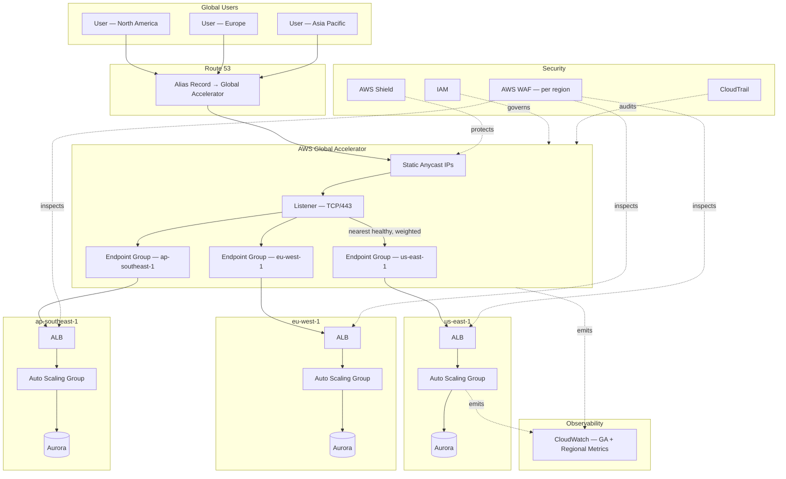

# Part III – Network Architectures

# Chapter 21 – Global Accelerator

> **How to read this chapter:** This chapter anchors every concept to a concrete reference architecture — an **Enterprise Global Traffic Management Platform** built on AWS Global Accelerator, fronting multi-region Application Load Balancer and Network Load Balancer endpoints for a latency-sensitive, globally-distributed workload. This complements, rather than replaces, the CloudFront-fronted architecture in Chapter 3 — the two solve different problems, and this chapter explains precisely where each belongs, where they overlap, and where they're deliberately used together.

---

# 1. Executive Summary

## The Business Problem

Global users hitting a single-region application face a specific, physics-bound problem:

- Every request travels the public internet's best-effort path from the user's location to the application's region.
- The public internet's routing (BGP) optimizes for *reachability*, not *latency* — a request from Singapore to a `us-east-1`-hosted application might traverse a genuinely inefficient path, hopping through multiple internet exchange points, each adding latency and jitter.
- For interactive applications (gaming, financial trading, real-time collaboration, VoIP/video) and for globally-distributed API workloads, this unpredictable, often-suboptimal path directly degrades user experience in a way users notice and complain about.

A second, related business problem:

- **Failover speed and predictability.** DNS-based failover (Route 53 health checks changing which region a domain resolves to) is fundamentally rate-limited by DNS caching — a client that has already cached a resolved IP address will not see a failover until its local TTL expires, which can range from seconds to (for misbehaving resolvers that ignore TTLs) much longer.
- For workloads with a strict RTO requirement, this DNS-propagation uncertainty is a genuine reliability gap — an organization might design and test a multi-region failover plan that mechanically works, but discover during a real incident that a meaningful fraction of clients continue reaching the failed region for minutes longer than planned, because of DNS caching behavior outside the organization's direct control.

A third business problem, specific to a class of workloads:

- Applications requiring **static, allowlistable IP addresses** — a client (often an enterprise customer's own firewall configuration) that only permits outbound traffic to a specific, pre-approved IP address range cannot easily consume a service behind a CDN or a DNS-based multi-region setup where the resolved IP address can change.
- This is common in B2B integrations, financial services counterparty connections, and IoT/device fleets with hardcoded or firewall-constrained connectivity.

The business problem this chapter's architecture solves is: **how does an organization route global user traffic to the *network-optimal* AWS region (not just *a* healthy region), fail over between regions in seconds rather than minutes without depending on client-side DNS cache expiration, and provide a small set of static, anycast IP addresses that never change regardless of which backend region is actually serving traffic?**

## Architecture Objective

This chapter's reference architecture targets a global traffic-management platform that:

- Routes each client's traffic to the **AWS region providing the lowest network latency for that specific client**, using AWS's own global network backbone rather than the public internet's best-effort routing, for the portion of the path between the client and the nearest AWS edge location.
- Provides a **small, fixed set of static anycast IP addresses** that remain constant regardless of backend region health or traffic-distribution changes — directly solving the IP-allowlisting requirement.
- Performs **health-check-driven failover between regions within seconds**, not minutes, because failover happens at the AWS network layer (anycast routing table updates), not via DNS resolution and client-side cache expiration.
- Supports **fine-grained traffic control** — weighted distribution across regions (a "traffic dial"), client-affinity (ensuring a given client consistently reaches the same backend for session-stateful protocols), and endpoint-group-level health thresholds.
- Complements, rather than duplicates, **CloudFront's content-delivery and caching capabilities** (Chapter 3) — this chapter's architecture is for TCP/UDP-level traffic acceleration and failover, not HTTP-layer caching, and the two are frequently used together for different portions of a single application's traffic.

## Why Organizations Adopt This Architecture

Organizations adopt AWS Global Accelerator for a specific, recurring set of reasons:

- They operate a **genuinely global user base** for a latency-sensitive, often non-HTTP or non-cacheable workload (gaming servers, VoIP, real-time trading platforms, IoT device fleets) where CloudFront's HTTP-caching model doesn't apply, but network-path optimization still matters enormously.
- They have a **strict multi-region failover RTO requirement** that DNS-based failover's caching uncertainty cannot reliably meet.
- They have **enterprise customers or partners requiring static IP allowlisting** for inbound connections to the organization's service.
- They need **fine-grained, centrally-controlled traffic weighting** across regions — for a phased regional migration, a controlled regional capacity test, or a deliberate active-active traffic-distribution policy — without depending on DNS TTL propagation timing.

This is not a claim that Global Accelerator is a universal requirement:

- Section 28 compares it directly against CloudFront-only and Route 53-only approaches.
- Many organizations use CloudFront (Chapter 3) for the vast majority of their HTTP(S) traffic and add Global Accelerator specifically for a defined subset of traffic (a non-HTTP protocol, a static-IP requirement, or a stricter-than-DNS-can-provide failover need) — the two are complementary tools solving different problems, not competing choices for the same problem.

## Major Business Benefits

| Benefit | Explanation |
|---|---|
| Reduced, more consistent latency | Traffic enters AWS's global network backbone at the nearest edge location, rather than traversing the public internet's best-effort path for the entire journey. |
| Sub-30-second failover | Health-check-driven failover operates at the anycast-routing layer, independent of client-side DNS caching behavior. |
| Static IP addresses for allowlisting | A fixed, small set of anycast IPs remains constant regardless of backend region changes, directly satisfying enterprise-customer firewall-allowlist requirements. |
| Fine-grained traffic control | Weighted traffic dials and endpoint-level configuration support controlled migrations, capacity testing, and deliberate active-active distribution policies. |
| Works for non-HTTP protocols | Unlike CloudFront (HTTP/HTTPS-focused), Global Accelerator operates at the TCP/UDP layer, supporting gaming, VoIP, IoT, and other non-HTTP workloads. |
| Simplified client-side configuration | A single, static entry point simplifies client and partner integration relative to managing multiple regional endpoints directly. |

## Typical Enterprise Scenarios

This architecture pattern fits:

- Real-time, latency-sensitive applications with a genuinely global user base: multiplayer gaming backends, VoIP/video-conferencing signaling and media servers, real-time financial trading platforms.
- IoT device fleets requiring a static, allowlistable endpoint, often with firmware that cannot easily be updated to handle DNS-based endpoint changes.
- B2B/partner integrations where the receiving organization's firewall configuration requires a small, stable set of source/destination IP addresses.
- Organizations with a strict, contractually-committed multi-region failover RTO (often single-digit seconds to low minutes) that DNS-based failover cannot reliably guarantee given client-side caching behavior outside their control.
- Organizations performing a **phased, traffic-weighted regional migration** — gradually shifting a percentage of global traffic from a legacy region to a new region, with the ability to adjust that percentage instantly and precisely.

It is a poorer fit for:

- Purely HTTP(S), highly cacheable content (static assets, typical web application traffic) already well served by CloudFront's edge-caching model (Chapter 3) — adding Global Accelerator here provides limited additional benefit relative to its cost, unless a genuine static-IP or non-DNS-failover requirement also exists.
- Single-region workloads with no genuine multi-region or global-latency requirement — this chapter's entire value proposition depends on having multiple regional (or at least multiple AZ-distributed within a region, in Global Accelerator's more limited single-region use case) backend endpoints to route between.
- Cost-sensitive workloads where the marginal latency/failover-speed improvement doesn't justify Global Accelerator's additional, always-on hourly and per-GB cost on top of the underlying ALB/NLB infrastructure it fronts.

---

# 2. Business Requirements

## Business Drivers

- Reduce and stabilize latency for a globally-distributed user base accessing a latency-sensitive workload.
- Meet a contractually-committed multi-region failover RTO that DNS-based failover cannot reliably guarantee.
- Provide static, allowlistable IP addresses for enterprise-customer and partner firewall integration requirements.
- Support controlled, precisely-adjustable traffic distribution across regions for migration and capacity-management purposes.

## Functional Requirements

| Requirement | Description |
|---|---|
| Static anycast IP addresses | The service is reachable via a small, fixed set of IP addresses that never change. |
| Multi-region endpoint groups | Traffic routes to the network-optimal healthy region among multiple configured regional endpoint groups. |
| Health-check-driven failover | Unhealthy regional endpoints are automatically removed from the routing table within seconds of detected failure. |
| Weighted traffic distribution | Traffic can be deliberately weighted across regions (e.g., 90/10, 50/50) rather than always routing 100% to the single nearest healthy region. |
| Client affinity | Optional session-stickiness ensures a given client consistently reaches the same backend endpoint for protocols requiring connection-level consistency. |
| Support for non-HTTP protocols | The architecture supports TCP and UDP traffic, not solely HTTP(S). |

## Non-Functional Requirements

| Category | Target |
|---|---|
| Failover time | ≤ 30 seconds from health-check failure detection to traffic rerouting away from the unhealthy endpoint |
| Latency improvement | Measurable, validated latency improvement versus direct-to-region routing for the organization's actual global user distribution |
| IP address stability | 100% — the anycast IP addresses never change for the lifetime of the accelerator |
| Health-check interval | Configurable, typically 10–30 seconds, balancing failover speed against health-check overhead |
| Traffic-weight adjustment latency | Weight changes take effect within seconds of an API call, not subject to DNS TTL propagation delay |

## Scalability Goals

- The architecture must support adding additional regional endpoint groups as the organization expands into new AWS regions, without requiring any change to the static anycast IP addresses clients already depend on.
- Aggregate throughput must scale with the underlying ALB/NLB endpoints' own capacity in each region — Global Accelerator itself is not typically the throughput bottleneck.

## Availability Requirements

- 99.99% for the Global Accelerator layer itself, consistent with the elevated availability bar established for foundational, wide-blast-radius infrastructure in this book (Chapter 19's Shared Services VPC hub carries a similar rationale).
- The underlying regional endpoints (ALB/NLB, and the Auto Scaling Groups behind them per Chapter 8) maintain their own independent availability targets per Chapter 3's baseline.

## Latency Requirements

- The specific latency target depends on the workload — real-time gaming/VoIP workloads often target sub-100ms round-trip latency for the majority of the global user base; less real-time-sensitive API workloads may target a more moderate improvement.
- Validated empirically per region/client-geography combination (Section 15), not assumed from AWS's general marketing claims alone.

## Compliance Requirements

- Identical baseline to Chapter 3 (SOC 2, encryption, audit logging).
- A chapter-specific consideration: data-residency requirements must be explicitly reasoned about, since Global Accelerator's edge-entry model means traffic *enters* the AWS network at a location that may differ from where it's ultimately *processed* — the entry point does not itself process or store data, but this distinction is worth explicitly documenting for a data-residency-sensitive audit (Section 11).

## Security Expectations

- The static anycast IP addresses, combined with AWS Shield's automatic integration, provide a specific DDoS-mitigation benefit (Section 11) valuable for internet-facing, latency-sensitive workloads that are frequently attractive DDoS targets (gaming and financial platforms particularly).

## Recovery Objectives

### Recovery Point Objective (RPO)

- **RPO = N/A** at the traffic-routing layer itself (stateless); actual RPO is governed by the underlying application/database architecture in each region (Chapter 3's baseline).

### Recovery Time Objective (RTO)

- **RTO ≤ 30 seconds** specifically for traffic rerouting away from a failed region, a meaningfully tighter target than DNS-based failover can reliably guarantee, and the primary reason many organizations adopt this architecture specifically for its failover-speed benefit.

## SLAs

- AWS's own Global Accelerator SLA commits to 99.99% availability for the service itself; the organization's own end-to-end SLA to its customers should be modeled as the combination of this commitment and the underlying regional infrastructure's own availability, not assumed to inherit 99.99% automatically for the whole stack.

## Expected Workload

- Global, latency-sensitive traffic with a genuinely international user distribution — the architecture's value is proportional to how geographically dispersed the actual user base is; a workload with 95% of its users in a single metro area gains comparatively little from this chapter's global-routing optimization.

## Expected Growth

- Growth in this architecture's scope tracks the organization's regional expansion (new AWS regions added as endpoint groups) and overall global user-base growth, both relatively independent of any single region's own traffic-growth pattern.

---

# 3. Architecture Overview

## Overall Design

The reference architecture places **AWS Global Accelerator in front of multiple regional Application Load Balancers (or Network Load Balancers, for non-HTTP protocols)**, each fronting a regional Auto Scaling Group (Chapter 8) deployment of the application.

- Global Accelerator provides two static anycast IP addresses (by default), advertised from AWS edge locations worldwide via Anycast routing.
- Client traffic enters the AWS network at the nearest edge location to the client (not the nearest to the backend region), then traverses AWS's own global network backbone to reach the optimal healthy regional endpoint.
- Endpoint groups (one per AWS region) each contain the regional ALB/NLB, with configurable traffic dials and health-check thresholds.

## Architecture Philosophy

The guiding philosophy is **"optimize the network path, not just the application layer."**

This is a meaningfully different optimization target than Chapter 3's CloudFront-centric architecture:

- CloudFront optimizes primarily for **content delivery** — caching content close to users and reducing origin load, operating at the HTTP layer.
- Global Accelerator optimizes primarily for **network path and failover speed** — routing traffic onto AWS's backbone as early as possible and providing anycast-based, sub-DNS-latency failover, operating at the TCP/UDP layer, protocol-agnostic.

A second guiding principle, directly inherited from this book's established pattern: **the underlying regional infrastructure (ALB, Auto Scaling Group, database tier) is unchanged from Chapter 3/8's architecture** — this chapter adds a global traffic-management layer *in front of* that existing, proven regional architecture, replicated across multiple regions, rather than reinventing the regional application architecture itself.

## Core Components

| Layer | Components |
|---|---|
| Global Traffic Management | AWS Global Accelerator (static anycast IPs, listeners, endpoint groups, traffic dials) |
| Regional Entry | Application Load Balancer or Network Load Balancer, per region |
| Regional Compute | Auto Scaling Group (Chapter 8), per region, built from the golden AMI (Chapter 11) |
| Regional Data | Amazon Aurora (per-region, coordinated per Chapter 3/13's multi-region patterns as applicable) |
| Security | AWS Shield (automatic with Global Accelerator), WAF (at the regional ALB layer), IAM |
| Observability | CloudWatch (Global Accelerator-specific metrics), Flow Logs |

## How Components Interact

- A client's DNS resolution for the service's domain resolves (via a Route 53 alias record) to the Global Accelerator's static anycast IP addresses.
- The client's traffic is routed, via BGP Anycast, to the nearest AWS edge location advertising those IP addresses — not necessarily the region actually serving the traffic.
- From that edge location, Global Accelerator routes the traffic across AWS's own global network backbone to the healthy regional endpoint group determined to be optimal for that client, based on latency and configured traffic dials.
- The selected region's ALB/NLB receives the traffic and routes it to the regional Auto Scaling Group, exactly as described in Chapter 3/8's architecture.
- Continuous health checks against each endpoint group inform Global Accelerator's routing decisions, automatically excluding an unhealthy region's endpoint group from traffic distribution within the configured failover window.

## High-Level Workflow

1. Client resolves the service domain to the Global Accelerator's static IP addresses.
2. Client traffic enters the AWS network at the nearest edge location.
3. Global Accelerator routes the traffic, over AWS's backbone, to the optimal healthy regional endpoint.
4. The regional ALB/NLB and Auto Scaling Group process the request per Chapter 3/8's established pattern.
5. Continuous health checking ensures traffic only routes to currently-healthy regions, with automatic failover on region-level failure.

## Request Lifecycle

- Client DNS resolution → anycast routing to nearest edge → AWS backbone transit to the optimal region → regional ALB/NLB → regional Auto Scaling Group → application processing — this chapter's specific contribution is the "anycast routing to nearest edge → backbone transit to the optimal region" portion, which does not exist in a direct-to-region or CloudFront-only architecture.

## Response Lifecycle

- The response traverses the same optimized path in reverse — a specific, measurable latency benefit versus the public internet's best-effort return path, particularly valuable for genuinely round-trip-latency-sensitive protocols (gaming, VoIP) where both directions matter, not just the initial request.

## Data Lifecycle

- Not directly applicable to this chapter's own architecture — Global Accelerator is a stateless traffic-routing layer; the underlying regional application's data lifecycle follows Chapter 3's established pattern, replicated (with appropriate multi-region data-consistency handling, discussed in Section 13) across each active region.

---

# 4. AWS Services Used

## AWS Global Accelerator

- **Purpose:** Provides static anycast IP addresses and intelligent, latency-and-health-based traffic routing across multiple regional endpoints — the central service this entire chapter is built around.
- **Why selected:** No other AWS service provides this specific combination of static anycast IPs, sub-DNS-latency failover, and protocol-agnostic (TCP/UDP) traffic optimization across regions.
- **Alternatives:** Amazon CloudFront (Chapter 3) — the right choice for HTTP(S)-specific, cacheable content delivery, but does not provide static IP addresses or protocol-agnostic TCP/UDP routing; Route 53 latency-based/geolocation routing — the right choice for a lower-cost, DNS-based approach when the organization's failover-speed and static-IP requirements are less strict, but subject to DNS-caching propagation delay.
- **Limitations:** Adds its own hourly and per-GB data-transfer cost on top of the underlying regional ALB/NLB infrastructure; provides no HTTP-layer caching (unlike CloudFront) — genuinely cacheable content still benefits from being served via CloudFront, potentially in combination with Global Accelerator for the non-cacheable portion of traffic.
- **Pricing considerations:** Priced as a fixed hourly accelerator charge plus a per-GB "premium" data-transfer charge on top of standard AWS data-transfer pricing — a genuine, non-trivial cost addition that should be weighed against its specific latency/failover benefit for the actual workload (Section 16).
- **Best practices:** Use Global Accelerator specifically for traffic that benefits from its unique capabilities (static IPs, sub-DNS failover, non-HTTP protocols, genuine global latency sensitivity) rather than applying it reflexively to all traffic regardless of whether it needs these specific properties.

## Application Load Balancer / Network Load Balancer

- **Purpose:** Serves as the regional entry point Global Accelerator routes traffic to, identical in role to Chapter 3's ALB for HTTP(S) workloads, or providing NLB for non-HTTP TCP/UDP workloads Global Accelerator is particularly well suited for.
- **Why selected:** ALB is used when the workload is HTTP(S)-based and benefits from Layer-7 routing features (Chapter 3, Section 4); NLB is used for non-HTTP protocols (gaming, VoIP, custom TCP/UDP protocols) or when preserving the client's source IP address at the backend is required.
- **Best practices:** Configure the regional ALB/NLB's health check to accurately reflect genuine regional application health — Global Accelerator's own failover decision is only as good as the health signal it receives from each endpoint group.

## Amazon EC2 / Auto Scaling Groups

- **Purpose:** Provides the regional compute tier behind each region's ALB/NLB, identical in structure to Chapter 8's architecture, replicated per active region.
- **Why selected:** Reusing the established, well-understood Auto Scaling Group pattern per region avoids introducing a new, unfamiliar compute model just for this chapter's global-routing purposes.

## Amazon Route 53

- **Purpose:** Provides the DNS alias record resolving the service's domain name to the Global Accelerator's static anycast IP addresses, and (optionally) health checks feeding organization-wide monitoring dashboards independent of Global Accelerator's own internal health-check mechanism.
- **Why selected:** Even though Global Accelerator itself doesn't depend on DNS for its failover speed (its core advantage), a DNS record is still needed for the initial, human-friendly domain-to-IP resolution — this record simply doesn't need to change during a regional failover, since the underlying anycast IPs remain constant.
- **Best practices:** Use a Route 53 alias record (not a CNAME) pointing to the Global Accelerator, benefiting from alias records' zone-apex support and lack of an additional DNS lookup hop.

## AWS Shield

- **Purpose:** Provides automatic DDoS protection for Global Accelerator's static IP addresses, included at no additional cost with Shield Standard, with Shield Advanced available for enhanced protection and cost-protection guarantees.
- **Why selected:** Global Accelerator's static, well-known IP addresses are, precisely because of their stability, also a more predictable target for a sustained DDoS campaign than a dynamically-resolved CloudFront distribution — Shield's automatic integration is a meaningful, relevant security benefit for this specific architecture.
- **Best practices:** Evaluate Shield Advanced specifically for workloads (gaming, financial platforms) with an elevated, realistic DDoS threat profile, given Global Accelerator's static-IP nature.

## AWS WAF

- **Purpose:** Applied at the regional ALB layer (for HTTP(S) traffic) exactly as in Chapter 3 — Global Accelerator itself, operating below the HTTP layer for TCP/UDP traffic generally, does not perform WAF-style HTTP-request inspection directly.
- **Why selected:** WAF remains necessary for HTTP-layer application security regardless of whether traffic arrives via Global Accelerator or a direct regional ALB — this chapter's architecture does not replace or diminish the need for Chapter 3's WAF discipline at the regional entry point.

## Amazon CloudWatch

- **Purpose:** Provides Global Accelerator-specific metrics (per-endpoint-group traffic volume, health-check status, processed bytes) in addition to the standard regional ALB/Auto Scaling Group metrics established in Chapters 3 and 8.
- **Why selected:** Native integration consistent with every prior chapter; a chapter-specific consideration is the need to monitor traffic distribution *across* regions (is the traffic dial actually producing the intended distribution?) in addition to each region's own internal health.

## AWS IAM

- **Purpose:** Scopes access to Global Accelerator configuration (endpoint-group membership, traffic-dial weights, listener configuration) — a chapter-specific emphasis, similar to Chapter 19's Transit Gateway route-table sensitivity, is that Global Accelerator traffic-dial and endpoint-group modification permission is uniquely consequential, given its direct, immediate effect on global traffic distribution.

## Amazon CloudTrail / AWS Config / Amazon GuardDuty

- **Purpose:** As described in Chapter 3 — organization-wide audit, compliance, and threat-detection baseline, applied to the account(s) hosting the Global Accelerator configuration and each regional endpoint.
- **Chapter-specific addition:** CloudTrail captures every Global Accelerator API call (endpoint-group weight changes, listener modifications) — the definitive audit trail for "who changed global traffic distribution, and when," directly relevant to both operational incident review and change-management compliance evidence.

---

# 5. Complete Architecture Diagram



---

# 6. Component-by-Component Explanation

## AWS Global Accelerator

- **Purpose:** Provides the static anycast entry point and global traffic-routing intelligence this chapter's architecture is centered on.
- **Responsibilities:** Advertise the static IP addresses from AWS edge locations worldwide; route incoming traffic to the optimal healthy endpoint group based on latency and configured weights; continuously evaluate endpoint-group health.
- **Inputs:** Client traffic arriving at any AWS edge location; health-check results from each endpoint group's configured health-check target.
- **Outputs:** Routed traffic to the selected regional ALB/NLB.
- **Scaling:** Fully managed, scales automatically with global traffic volume.
- **High availability:** Distributed globally by design across AWS edge locations; the service itself carries a 99.99% AWS SLA.
- **Failure handling:** An unhealthy endpoint group is automatically excluded from routing consideration within the configured health-check failure threshold, without any DNS-propagation delay.
- **Dependencies:** At least one healthy endpoint group must exist for the accelerator to route traffic successfully at all — a scenario where every region is simultaneously unhealthy is a genuine, if rare, total-outage scenario discussed in Section 24.
- **Security:** IAM-scoped configuration access; Shield-protected by default.
- **Monitoring:** CloudWatch metrics for processed bytes/packets, flow count, and health-check status per endpoint group.

## Endpoint Groups (Per Region)

- **Purpose:** Represents a specific AWS region's set of backend endpoints (typically a single regional ALB/NLB) as a unit Global Accelerator can route to, weight, and health-check independently.
- **Responsibilities:** Aggregate health status across the region's registered endpoints; apply the configured traffic dial (a percentage, from 0–100%, of the traffic that would otherwise route to this region based on latency).
- **Inputs:** Health-check results from each registered endpoint (typically the regional ALB).
- **Outputs:** A pass/fail health determination and an effective traffic-weighting decision, feeding Global Accelerator's overall routing logic.
- **Scaling:** Add additional endpoint groups (new regions) as the organization expands; no inherent scaling limit relevant to typical enterprise deployments.
- **Failure handling:** If every endpoint within a group fails its health check, the entire group is excluded from routing, and traffic redistributes to the remaining healthy groups automatically.
- **Dependencies:** The regional ALB/NLB's own health-check endpoint accurately reflecting genuine application health.
- **Monitoring:** Per-endpoint-group traffic volume and health status, critical for validating that the configured traffic dial is actually producing the intended real-world distribution.

## Traffic Dial

- **Purpose:** Provides a deliberate, precise mechanism for controlling what percentage of a region's "natural" (latency-optimal) traffic share is actually routed there — used for phased migrations, controlled capacity testing, or deliberately balancing load away from a purely latency-optimal distribution.
- **Responsibilities:** Scale down (or, at 0%, entirely exclude) a healthy region's traffic share independent of its actual health status — a deliberate, operator-controlled override of the default latency-optimal routing.
- **Chapter-specific note:** This is functionally similar in *purpose* to Chapter 13's blue-green weighted cutover mechanism, but operates at the *global, cross-region* level via Global Accelerator rather than the *application-release* level via Route 53/ALB weighted routing described in Chapter 13 — the two mechanisms can be used together (e.g., a blue-green application release within a single region, while Global Accelerator's traffic dial separately controls the proportion of global traffic reaching that region at all).

## Client Affinity

- **Purpose:** Optionally ensures a given client (identified by source IP) consistently routes to the same regional endpoint across multiple connections, important for protocols maintaining client-side session state that assumes connection-level consistency with a specific backend.
- **Responsibilities:** Maintain a consistent client-to-endpoint-group mapping for the duration the affinity setting is configured.
- **When to use:** Protocols/applications where switching backend regions mid-session would break application state (certain gaming protocols, some real-time collaboration tools).
- **When NOT to use:** Stateless HTTP(S) APIs where session state lives in a shared, multi-region-accessible store (Chapter 3's DynamoDB/ElastiCache pattern) gain no benefit from client affinity and should generally leave it disabled, allowing Global Accelerator's full latency-optimal, health-aware routing flexibility.

## Regional ALB/NLB and Auto Scaling Group

- **Purpose, Responsibilities, Scaling, High Availability, Failure Handling, Dependencies, Security, Monitoring:** Identical to Chapters 3 and 8's established treatment — this chapter's architecture does not modify the regional application architecture itself, only adds the global traffic-management layer in front of it, replicated per active region.

---

# 7. End-to-End Request Flow

**Scenario: A client in Singapore connects to a service using AWS Global Accelerator with endpoint groups in `us-east-1`, `eu-west-1`, and `ap-southeast-1`.**

1. **Client DNS resolution**: The client resolves the service's domain name, which — via a Route 53 alias record — resolves to Global Accelerator's static anycast IP addresses.
2. **Anycast routing to the nearest edge**: The client's traffic is routed, via BGP anycast, to the AWS edge location geographically/network-topologically nearest to the client — in this scenario, likely an edge location in or near Singapore.
3. **Entry onto the AWS global network**: The traffic enters AWS's own backbone network at this edge location, rather than continuing to traverse the public internet.
4. **Global Accelerator routing decision**: Global Accelerator evaluates the health and configured traffic dial of each endpoint group, determining that `ap-southeast-1` is both the lowest-latency and currently-healthy option for this client.
5. **Backbone transit to the selected region**: The traffic transits AWS's private backbone network from the Singapore edge location to the `ap-southeast-1` region — a materially more predictable, often faster path than the public internet's best-effort routing would have provided for the equivalent direct connection.
6. **Regional ALB routing**: The `ap-southeast-1` ALB receives the traffic and routes it to a healthy instance in that region's Auto Scaling Group, per Chapter 8's established pattern.
7. **Application processing**: The instance processes the request, reading/writing the `ap-southeast-1` regional Aurora cluster (or a globally-replicated data tier, per the specific multi-region data architecture in use).
8. **Response path**: The response traverses the same optimized path in reverse — regional ALB → AWS backbone → Singapore edge location → client.
9. **Continuous health evaluation (parallel to steps 1–8)**: Global Accelerator continuously health-checks all three endpoint groups, independent of any individual client's specific request flow.
10. **Regional failure scenario (alternate path)**: If `ap-southeast-1`'s endpoint group health check begins failing (e.g., the regional ALB reports no healthy targets), Global Accelerator excludes it from routing consideration within the configured failure threshold — typically within the tens-of-seconds range, not minutes.
11. **Automatic rerouting**: Subsequent requests from the same Singapore-based client are now routed to the next-best healthy region — likely `eu-west-1` or `us-east-1`, depending on actual measured latency and current traffic-dial configuration — without requiring any DNS change or client-side cache expiration.
12. **Client experience during failover**: An in-flight, already-established connection to the failed region is disrupted (a TCP-level reset, in most cases) — Global Accelerator's failover speed minimizes the *window* of disruption, but does not eliminate the need for client-side retry logic to handle an in-flight connection's interruption gracefully.
13. **Error handling — total outage (rare, alternate path)**: If every configured endpoint group simultaneously fails its health check (a genuinely rare, multi-region simultaneous failure), Global Accelerator has no healthy endpoint to route to, and the organization's broader incident-response process (Section 23) takes over, since no automated traffic-routing mechanism can route around a simultaneous failure of every backend.
14. **Logging throughout**: Global Accelerator flow logs (if enabled) and each region's own VPC Flow Logs/ALB access logs capture this entire flow, feeding the centralized logging pipeline described in Section 22.
15. **Monitoring throughout**: CloudWatch dashboards reflect per-endpoint-group traffic distribution and health status in near-real-time, validating that the observed distribution matches the intended, configured traffic-dial and latency-optimal routing behavior.

---

# 8. Deployment Flow

## Infrastructure Provisioning

- Global Accelerator's configuration (listeners, endpoint groups, traffic dials) is defined in Terraform, in a dedicated module set, following this book's established discipline, typically owned by the same platform networking team responsible for Chapter 19's Shared Services VPC, given the similar organization-wide-impact nature of both.

## Terraform Workflow

- Identical review-and-apply discipline to every prior chapter, with a chapter-specific emphasis: **any change to an endpoint group's traffic dial or health-check configuration requires review**, given its direct, immediate effect on global traffic distribution — a mistake here doesn't just risk one region's traffic, it can silently misdirect a meaningful fraction of global users.

## CI/CD Deployment

- The regional application deployment pipelines (Chapter 8's instance refresh, or Chapter 13's blue-green pattern) operate independently, per region, exactly as described in those chapters — this chapter's Global Accelerator configuration deploys via its own, separate pipeline, since it is a distinct concern (global traffic routing) from any individual region's application deployment.

## Blue-Green Deployment

- This chapter's traffic dial provides a *global, cross-region* analog to Chapter 13's blue-green pattern: a new region can be brought online with its traffic dial initially set to 0% (added to the accelerator, fully deployed and health-checked, but receiving no live traffic), then gradually increased as confidence grows — directly parallel in philosophy to Chapter 13's gradual, validated cutover approach, applied here at the regional level rather than the application-release level.

## Rollback

- Reverting a traffic-dial change (setting a problematic region's dial back to its previous value, or to 0%) takes effect within seconds via a Global Accelerator API call — among the fastest rollback mechanisms described anywhere in this book, given the absence of any DNS-propagation delay.

## Secrets

- Global Accelerator itself has no secret-management requirements of its own; the underlying regional applications follow Chapter 3/8's established Secrets Manager discipline independently, per region.

## Configuration

- Endpoint-group weights and health-check configuration are Terraform-managed, version-controlled, and reviewed — never modified via the AWS Console in production, consistent with this book's "no manual console changes" discipline.

## Validation

- Post-deployment validation for any Global Accelerator configuration change includes: confirming traffic distribution across regions matches the intended configuration (via CloudWatch per-endpoint-group traffic metrics), confirming health checks correctly reflect genuine regional application health, and — for a new region's initial onboarding — a synthetic, geographically-distributed latency test validating the expected performance improvement before fully committing production traffic to it.

---

# 9. Network Topology

## VPC — Per Region

- Each region's VPC follows Chapter 3's established topology (public subnets for the ALB, private subnets for the Auto Scaling Group and Aurora cluster) — this chapter's architecture does not modify the regional VPC design, only adds Global Accelerator as a layer above it.

## CIDR

- Each region's VPC CIDR follows the same non-overlapping-allocation discipline established in Chapter 19, particularly important if the regions are later connected via Transit Gateway peering or a global Shared Services architecture.

## Public / Private Subnets

- Identical structure to Chapter 3 within each region; Global Accelerator itself operates outside any customer VPC entirely — it is a global, AWS-managed edge service, not a resource deployed into a specific VPC/subnet.

## NAT Gateway / Internet Gateway

- Standard per-region pattern, following Chapter 3's discipline, unaffected by this chapter's addition of Global Accelerator in front of the regional ALB.

## Transit Gateway

- Not directly required for Global Accelerator's own operation; if the organization also operates a Chapter 19 Shared Services architecture per region, Transit Gateway continues serving its established role for intra-region and hybrid connectivity, entirely orthogonal to Global Accelerator's global, inter-region traffic-routing role.

## Route Tables / Network ACLs / Security Groups

- Standard per-region configuration, following Chapter 3's discipline; the regional ALB's security group specifically should permit inbound traffic from Global Accelerator's IP ranges (published by AWS) if any IP-based security-group restriction is used at the ALB layer, rather than assuming all inbound traffic is already implicitly trusted.

## PrivateLink

- Not typically applicable to Global Accelerator's own architecture; PrivateLink continues serving its established role (Chapters 3, 19) for private connectivity to AWS services within each region.

## Hybrid Connectivity

- Global Accelerator can also front on-premises endpoints (via an Elastic IP or a static IP registered as a custom endpoint), a less common but genuinely supported pattern for organizations with a hybrid architecture wanting Global Accelerator's static-IP and health-check-failover benefits extended to an on-premises data center endpoint alongside AWS regional endpoints — worth noting as a specific chapter-relevant hybrid capability distinct from Chapter 19's Direct-Connect-focused hybrid connectivity.

---

# 10. Identity and Access

## IAM Roles

- A dedicated, narrowly-scoped role for Global Accelerator configuration management (endpoint groups, listeners, traffic dials), distinct from any individual region's own application-deployment roles.

## IAM Policies

```json

{
  "Version": "2012-10-17",
  "Statement": [
    {
      "Sid": "AllowGlobalAcceleratorEndpointGroupManagement",
      "Effect": "Allow",
      "Action": [
        "globalaccelerator:UpdateEndpointGroup",
        "globalaccelerator:DescribeEndpointGroup"
      ],
      "Resource": "arn:aws:globalaccelerator::333344445555:accelerator/abcd1234-...."
    },
    {
      "Sid": "DenyAcceleratorDeletion",
      "Effect": "Deny",
      "Action": ["globalaccelerator:DeleteAccelerator"],
      "Resource": "*"
    }
  ]
}

```

## Resource Policies

- Global Accelerator itself does not use resource-based policies in the same way S3 or KMS do; access control is managed entirely through IAM identity policies scoped to specific accelerator/endpoint-group ARNs.

## STS

- As throughout this book — every role assumption uses short-lived STS credentials.

## Cross-Account Access

- If regional applications live in separate AWS accounts (per this book's general multi-account discipline), Global Accelerator can register cross-account endpoints via AWS Resource Access Manager, following a similar cross-account sharing pattern to Chapter 19's Transit Gateway sharing model.

## Least Privilege

- Traffic-dial and endpoint-group modification permission is treated with the same elevated sensitivity as Chapter 19's Transit Gateway route-table permission, restricted to a small, named set of platform-networking-team roles.

## Service Roles

- Global Accelerator uses AWS-managed service-linked roles for its own internal operation, distinct from the customer-managed roles administering its configuration.

## Permission Boundaries

- Applied to the CI/CD deployment role managing this chapter's Terraform-defined Global Accelerator configuration, capping its maximum grantable permissions.

---

# 11. Security Architecture

## Encryption

- Global Accelerator itself does not terminate TLS — TLS termination continues to occur at the regional ALB (or at the backend application, for NLB-fronted TCP workloads), exactly as in Chapter 3's established pattern; Global Accelerator passes traffic through to the regional endpoint largely transparently at the TCP/UDP layer.

## KMS

- Not directly applicable to Global Accelerator's own configuration; each region's ALB/application continues using its own KMS CMKs per Chapter 3's discipline.

## TLS

- End-to-end TLS from client to regional ALB/application is preserved through Global Accelerator's pass-through model — a specific, important point to validate during architecture review, since Global Accelerator's presence in the path does not itself terminate or inspect encrypted traffic.

## WAF

- Applied at the regional ALB layer, exactly as in Chapter 3 — Global Accelerator's TCP/UDP-layer operation means it does not perform HTTP-request-level inspection itself; WAF remains the correct, necessary layer for that function, unaffected by this chapter's addition.

## Shield

- Automatically applied to Global Accelerator's static IP addresses via Shield Standard at no additional cost; Shield Advanced is available for enhanced, proactive DDoS protection and cost-protection guarantees, worth specifically evaluating given the static, publicly-known nature of Global Accelerator's IP addresses (Section 1's DDoS-target consideration).

## Secrets Manager / Certificate Manager

- Continue serving their established roles at the regional application layer, per Chapters 3 and 8; not directly applicable to Global Accelerator's own configuration.

## GuardDuty / Inspector / Security Hub

- Applied per-region, per the organization's standard baseline; not directly applicable to Global Accelerator itself, which has no EC2/container compute of its own to scan.

## CloudTrail

- Captures every Global Accelerator API call — endpoint-group weight changes, listener modifications, health-check-configuration changes — providing the definitive audit trail for global traffic-routing changes, directly analogous in importance to Chapter 19's Transit Gateway CloudTrail emphasis.

## AWS Config

- A chapter-specific custom rule can flag any endpoint-group traffic-dial change exceeding a defined threshold (e.g., a change of more than 25 percentage points in a single API call) as requiring additional review — a specific, practical control against an accidental, overly aggressive traffic-shift mistake.

## Zero Trust

- Global Accelerator's pass-through model means the zero-trust posture of the underlying regional application (Chapter 3's IAM-based service-to-service authentication, per-request authorization) is entirely unaffected and unmodified by this chapter's addition — Global Accelerator adds a routing capability, not a trust boundary of its own.

## Threat Model

Primary threats specific to this chapter's architecture:

1. DDoS attacks specifically targeting Global Accelerator's static, publicly-known IP addresses.
2. Unauthorized or accidental traffic-dial modification silently misdirecting a meaningful fraction of global traffic.
3. A health-check misconfiguration causing Global Accelerator to route traffic to a genuinely unhealthy region (a false-healthy determination) or to incorrectly exclude a genuinely healthy region (a false-unhealthy determination).
4. Reliance on Global Accelerator's pass-through model creating a false assumption that traffic is inspected/filtered at this layer when it is not.

## Attack Vectors and Mitigations

| Attack Vector | Mitigation |
|---|---|
| DDoS targeting static IPs | Shield Standard (automatic) plus Shield Advanced for elevated-risk workloads |
| Unauthorized traffic-dial modification | Narrowly-scoped IAM permission; mandatory review for traffic-dial changes; Config rule flagging large single-step changes |
| Health-check misconfiguration | Health-check target validated to accurately reflect genuine application health, not merely infrastructure liveness (Chapter 8's health-check discipline applied here) |
| False assumption of traffic inspection at the Global Accelerator layer | Explicit architecture-review documentation clarifying that WAF/inspection remains a regional-ALB-layer responsibility, not provided by Global Accelerator itself |

---

# 12. High Availability

## AZ Failures

- Handled independently within each region, per Chapter 3/8's established multi-AZ discipline — Global Accelerator's own role is orthogonal to intra-region AZ resilience.

## Instance Failures

- Handled independently within each region's Auto Scaling Group, per Chapter 8's established pattern, unaffected by this chapter's addition.

## Regional Failures

- This is the specific scenario this chapter's architecture most directly and valuably addresses: a full regional failure is detected via endpoint-group health-check failure, and traffic automatically reroutes to the next-best healthy region within the configured failure threshold — meaningfully faster and more reliable than DNS-based regional failover alone (Chapter 3's Warm Standby pattern's own failover mechanism).

## Database Failures

- Handled per each region's own Aurora Multi-AZ configuration (Chapter 3); a full regional database failure is a distinct concern from Global Accelerator's traffic-routing role — Global Accelerator can route traffic away from a region whose *compute* tier is unhealthy, but a region-specific data-consistency or replication issue requires the broader multi-region data architecture (Chapter 13's Aurora Blue-Green/Global Database patterns, or a dedicated multi-region data strategy) to address correctly.

## Load Balancing

- Global Accelerator itself performs a form of global load balancing (across regions); the regional ALB/NLB continues performing its own, established intra-region load balancing (Chapter 3/8) beneath it — the two operate at different layers and are complementary, not redundant.

## Health Checks

- Global Accelerator's endpoint-group health checks are configured independently from (though ideally consistent with) each region's own ALB target-group health checks — worth explicitly validating that both layers' health-check logic agrees on what "healthy" means, to avoid a confusing scenario where Global Accelerator considers a region healthy while the regional ALB is simultaneously failing instances, or vice versa.

## Failover

- The core capability this entire chapter's architecture provides, detailed exhaustively throughout Sections 1, 3, 7, and 12 — sub-30-second, DNS-independent failover between regions.

---

# 13. Disaster Recovery

## Backup Strategy

- Global Accelerator's own configuration is Terraform/Git-backed, following this book's established IaC discipline; there is no separate "backup" concept for the accelerator itself beyond its version-controlled configuration.

## Snapshots

- Not applicable to Global Accelerator directly; each region's Aurora cluster continues its own snapshot strategy per Chapter 3.

## Cross-Region Replication

- This chapter's entire architecture *is*, in a meaningful sense, a cross-region resilience mechanism — Global Accelerator's multi-region endpoint-group model is what enables fast, automated cross-region failover in the first place, complementing (not replacing) the underlying data-tier cross-region replication strategy each region's own database architecture requires independently.

## Pilot Light / Warm Standby / Multi-Site / Active-Active / Active-Passive

- Global Accelerator supports all of these patterns via its traffic-dial mechanism:
  - **Active-Passive**: one region's traffic dial set to 100%, others at 0% (or excluded entirely), with automatic failover to a standby region upon health-check failure.
  - **Active-Active**: multiple regions' traffic dials set to non-zero values simultaneously, each serving a genuine share of live production traffic based on latency-optimal routing.
  - **Warm Standby**: a standby region's endpoint group configured and health-checked but receiving minimal or no live traffic dial allocation until an actual failover event, at which point its dial can be increased.
- This chapter's architecture is, in fact, one of the cleanest AWS-native mechanisms for implementing genuine Active-Active multi-region traffic distribution, given its combination of latency-optimal routing and precise, instant traffic-dial control — directly relevant to organizations evaluating Chapter 3's Alternative 3 (multi-region active-active) more seriously than that chapter's baseline recommendation, now that this chapter provides the traffic-management mechanism to make it practical.

## RPO

- **RPO = N/A** at the traffic-routing layer; governed entirely by the underlying multi-region data architecture's own RPO (Chapter 3/13's patterns).

## RTO

- **RTO ≤ 30 seconds** specifically for the traffic-rerouting portion of a regional failover — a meaningfully tighter contribution to the overall failover RTO than Chapter 3's DNS-based Warm Standby failover mechanism alone provides, though the *overall* system RTO still depends on the data tier's own failover speed (Aurora Global Database or equivalent) as well.

---

# 14. Scalability

## Horizontal Scaling

- Adding a new region is the primary scaling dimension for this chapter's architecture — a new endpoint group is added to the existing accelerator configuration, with no change required to the static anycast IP addresses clients already depend on.

## Vertical Scaling

- Not a meaningful concept for Global Accelerator itself; the underlying regional ALB/Auto Scaling Group continue their own established scaling patterns (Chapters 3, 8) independently per region.

## Auto Scaling (Comparison)

- Global Accelerator itself scales automatically and transparently with global traffic volume, requiring no customer-configured scaling policy; the regional compute tier behind each endpoint group continues using Chapter 8's Auto Scaling Group mechanism independently.

## Serverless Scaling

- If a region's compute substrate is Fargate/Lambda rather than EC2 (Chapter 8, Section 28's comparison), Global Accelerator's endpoint-group model applies identically, fronting an ALB in front of Fargate services just as readily as one in front of an EC2 Auto Scaling Group.

## Database Scaling / Storage Scaling / Queue Scaling

- Governed by each region's own independent architecture (Chapter 3), unaffected by this chapter's addition.

---

# 15. Performance Optimization

## Caching

- Not directly applicable to Global Accelerator itself (no HTTP-layer caching, unlike CloudFront); genuinely cacheable content should continue to be served via CloudFront (Chapter 3), potentially with CloudFront configured to use Global Accelerator as its origin-fetch path for non-cacheable, dynamic-content requests specifically — a combined pattern discussed further in Section 28.

## Compression

- Applied at the regional ALB/application layer, exactly as in Chapter 3 — Global Accelerator's TCP/UDP pass-through model does not itself perform HTTP-layer compression.

## CDN

- CloudFront (Chapter 3) remains the correct tool for CDN/edge-caching purposes; this chapter's Global Accelerator addresses a different concern (network-path optimization and failover speed for non-cacheable or non-HTTP traffic) — the two are frequently deployed together for a single application, each handling the specific traffic class it's best suited for.

## Database Optimization / Connection Pooling

- Governed by each region's own independent architecture (Chapter 3, Section 15), unaffected by this chapter's addition.

## Concurrency

- Not directly applicable to Global Accelerator's own architecture; each region's Auto Scaling Group and application-level concurrency configuration (Chapter 8) operates independently.

## Async Processing

- Not directly applicable to Global Accelerator's own architecture.

## Latency Validation (Chapter-Specific)

- **This is the single most important performance-optimization practice specific to this chapter**: the actual latency benefit of Global Accelerator versus direct-to-region routing should be empirically validated, per client geography, using real measurement (e.g., AWS's own comparison tooling, or third-party synthetic monitoring from multiple global locations) — not assumed from general marketing claims, since the actual improvement varies meaningfully based on the specific client geography, the specific regions in use, and current internet routing conditions between them.

---

# 16. Cost Optimization (FinOps)

## Estimated Monthly Cost — Small Deployment

*(2 regions, modest global traffic volume)*

| Line Item | Estimated Monthly Cost (USD) |
|---|---|
| Global Accelerator fixed hourly charge | $18 (fixed, per accelerator) |
| Global Accelerator data-transfer premium | $150 |
| Regional ALB (x2) | $50 |
| Regional compute/data (per Chapters 3/8, x2 regions) | $1,600 |
| CloudWatch | $40 |
| **Estimated Total** | **≈ $1,858/month** |

## Estimated Monthly Cost — Medium Deployment

*(4 regions, larger global traffic volume)*

| Line Item | Estimated Monthly Cost (USD) |
|---|---|
| Global Accelerator fixed hourly charge | $18 |
| Global Accelerator data-transfer premium | $900 |
| Regional ALB (x4) | $100 |
| Regional compute/data (x4 regions) | $6,400 |
| CloudWatch | $150 |
| **Estimated Total** | **≈ $7,568/month** |

## Estimated Monthly Cost — Enterprise Deployment

*(6+ regions, high global traffic volume, active-active distribution)*

| Line Item | Estimated Monthly Cost (USD) |
|---|---|
| Global Accelerator fixed hourly charge | $18 |
| Global Accelerator data-transfer premium | $4,500 |
| Regional ALB (x6) | $150 |
| Regional compute/data (x6 regions) | $18,000 |
| CloudWatch | $500 |
| **Estimated Total** | **≈ $23,168/month** |

> **Note:** Directional planning figures. The Global Accelerator-specific incremental cost (fixed charge plus data-transfer premium) is typically a modest fraction of the overall multi-region architecture's total cost, which is dominated by the underlying regional compute/data infrastructure replicated per region (Chapter 3/8's own cost model, multiplied by region count) — the Global Accelerator "premium" should be evaluated specifically against its latency/failover-speed benefit, not conflated with the much larger cost of operating multiple regions in the first place, which many organizations require regardless of whether they use Global Accelerator.

## Major Cost Drivers

1. The underlying multi-region compute/data infrastructure (Chapters 3/8's cost, multiplied by region count) — this dominates total cost far more than Global Accelerator's own incremental charge.
2. Global Accelerator's per-GB data-transfer premium, which scales with total traffic volume routed through the accelerator.
3. The fixed hourly accelerator charge — a small, predictable, non-traffic-dependent baseline cost.

## Optimization Opportunities

| Opportunity | Typical Savings |
|---|---|
| Route only the traffic genuinely benefiting from Global Accelerator's properties (non-cacheable, non-HTTP, static-IP-requiring) through it, using CloudFront for cacheable content separately | Avoids paying the Global Accelerator data-transfer premium for traffic that would be equally well (or better) served, and served more cheaply, via CloudFront's caching |
| Right-size the number of active regions to actual global user distribution, rather than deploying to every AWS region "for completeness" | Avoids the substantial underlying regional-infrastructure cost of maintaining regions with negligible actual user traffic |
| Use traffic dials to keep a genuine standby (Pilot Light/Warm Standby) region's live traffic share near zero until an actual failover, rather than running full Active-Active capacity in every region by default | Reduces steady-state regional infrastructure cost for regions serving primarily a DR/failover role rather than genuine day-to-day traffic |

## Reserved Instances / Savings Plans / Spot

- Not applicable to Global Accelerator itself; applied at the regional compute layer following Chapter 8's established discipline, independently per region.

## S3 Lifecycle / Storage Classes

- Applies to Global Accelerator flow logs (if enabled) and each region's own log storage, following Chapter 3's established lifecycle discipline.

## Rightsizing

- Reviewed periodically: actual traffic distribution across regions (validating traffic dials still reflect the intended, current business priorities) and the genuine ongoing value of Global Accelerator specifically versus a simpler, lower-cost alternative (Section 28), as the workload's actual global-user-distribution and latency-sensitivity profile evolves over time.

## Cost Allocation / Tagging / Budgets / Cost Anomaly Detection

- Global Accelerator's own cost is tracked as a distinct line item, separate from each region's underlying infrastructure cost, supporting a clear FinOps evaluation of whether its specific latency/failover-speed benefit continues justifying its incremental cost as the workload evolves.

---

# 17. AI-Assisted Operations

## Amazon Q / Bedrock for Traffic-Pattern Analysis

- A genuinely valuable, chapter-specific application: Bedrock-assisted analysis of per-region traffic distribution and latency data can suggest whether the current traffic-dial configuration still reflects the organization's actual global user distribution, flagging drift (e.g., a growing user base in a geography now better served by a region not currently weighted accordingly) an engineer might not notice from raw metrics alone.

## AI Troubleshooting

- Useful for correlating a reported regional latency complaint against the actual Global Accelerator routing decision and underlying network path for that specific client geography, faster than manual investigation across multiple AWS console pages.

## Log Analysis

- Bedrock-assisted summarization of Global Accelerator flow logs can help identify an anomalous traffic pattern (e.g., a sudden, unexplained shift in which region a specific client population is routing to) faster than manual log review.

## Incident Response

- AI-assisted timeline reconstruction during a regional-failover event (correlating CloudTrail traffic-dial-relevant changes, CloudWatch health-check state transitions, and regional application incident data) accelerates the especially time-pressured triage process for a multi-region incident.

## Cost Optimization

- AI-assisted analysis of per-region traffic volume versus regional infrastructure cost can flag a region with disproportionately low traffic relative to its maintained capacity, worth a conversation about right-sizing.

## Capacity Planning

- AI-assisted forecasting of global traffic growth, segmented by geography, directly supports decisions about when to add a new regional endpoint group.

## Architecture Review

- An AI-assisted review of a proposed traffic-dial change can flag a specific, known-risky pattern (e.g., "this change reduces the `eu-west-1` traffic dial to 0% without a corresponding increase in another region's capacity, risking overload elsewhere") before a human reviewer needs to manually calculate the capacity implications.

## AI-Generated Terraform / AI-Generated Documentation

- Applied identically to this chapter's own infrastructure and documentation, per this book's established pattern — always human-reviewed before merge, with particular scrutiny for any AI-generated change touching traffic-dial or health-check configuration specifically.

---

# 18. Terraform Implementation

## Repository Structure

```

global-accelerator-platform/
├── modules/
│   ├── accelerator/
│   └── endpoint-group/
├── environments/
│   └── production/
│       ├── main.tf
│       ├── variables.tf
│       └── backend.tf
└── README.md

```

## Providers and Variables

```hcl

# environments/production/providers.tf

terraform {
  required_version = ">= 1.7.0"
  required_providers {
    aws = {
      source  = "hashicorp/aws"
      version = "~> 5.50"
    }
  }
  backend "s3" {
    bucket         = "acme-corp-terraform-state-network"
    key            = "global-accelerator/production/terraform.tfstate"
    region         = "us-east-1"
    dynamodb_table = "terraform-state-lock-network"
    encrypt        = true
  }
}

provider "aws" {
  region = "us-west-2"   # Global Accelerator API calls are made against us-west-2 regardless of endpoint regions
  default_tags {
    tags = {
      Environment = "production"
      ManagedBy   = "terraform"
      Application = "global-traffic-platform"
    }
  }
}

```

## Accelerator Module

```hcl

# modules/accelerator/main.tf

resource "aws_globalaccelerator_accelerator" "main" {
  name            = "production-global-accelerator"
  ip_address_type = "IPV4"
  enabled         = true

  attributes {
    flow_logs_enabled   = true
    flow_logs_s3_bucket = var.flow_logs_bucket_name
    flow_logs_s3_prefix = "global-accelerator/"
  }
}

resource "aws_globalaccelerator_listener" "https" {
  accelerator_arn = aws_globalaccelerator_accelerator.main.id
  client_affinity = "NONE"
  protocol        = "TCP"

  port_range {
    from_port = 443
    to_port   = 443
  }
}

```

## Endpoint Group Module (Instantiated Per Region)

```hcl

# modules/endpoint-group/variables.tf

variable "region_name" {
  description = "Human-readable region identifier (e.g., us-east-1)"
  type        = string
}

variable "traffic_dial_percentage" {
  description = "Percentage (0-100) of this region's latency-optimal traffic share to actually route here"
  type        = number
  default     = 100
}

variable "alb_arn" {
  description = "ARN of the regional Application Load Balancer to register as the endpoint"
  type        = string
}

```

```hcl

# modules/endpoint-group/main.tf

resource "aws_globalaccelerator_endpoint_group" "region" {
  listener_arn            = var.listener_arn
  endpoint_group_region    = var.aws_region
  traffic_dial_percentage  = var.traffic_dial_percentage

  health_check_path                = "/health"
  health_check_interval_seconds     = 10
  health_check_protocol             = "HTTPS"
  threshold_count                   = 3

  endpoint_configuration {
    endpoint_id = var.alb_arn
    weight      = 100
    client_ip_preservation_enabled = true
  }
}

```

## Root Module — Instantiating Multiple Endpoint Groups

```hcl

# environments/production/main.tf

module "accelerator" {
  source = "../../modules/accelerator"
  flow_logs_bucket_name = var.flow_logs_bucket_name
}

module "endpoint_group_us_east_1" {
  source                  = "../../modules/endpoint-group"
  listener_arn             = module.accelerator.listener_arn
  aws_region                = "us-east-1"
  region_name                = "us-east-1"
  alb_arn                     = var.us_east_1_alb_arn
  traffic_dial_percentage     = 100
}

module "endpoint_group_eu_west_1" {
  source                  = "../../modules/endpoint-group"
  listener_arn             = module.accelerator.listener_arn
  aws_region                = "eu-west-1"
  region_name                = "eu-west-1"
  alb_arn                     = var.eu_west_1_alb_arn
  traffic_dial_percentage     = 100
}

module "endpoint_group_ap_southeast_1" {
  source                  = "../../modules/endpoint-group"
  listener_arn             = module.accelerator.listener_arn
  aws_region                = "ap-southeast-1"
  region_name                = "ap-southeast-1"
  alb_arn                     = var.ap_southeast_1_alb_arn
  traffic_dial_percentage     = 0   # New region onboarded at 0% initially, per Section 8's gradual-cutover practice
}

```

## IAM (Accelerator Management Role)

```hcl

# modules/accelerator/iam.tf

resource "aws_iam_role" "ga_management" {
  name = "production-global-accelerator-mgmt-role"
  assume_role_policy = jsonencode({
    Version = "2012-10-17"
    Statement = [{
      Effect    = "Allow"
      Principal = { Service = "lambda.amazonaws.com" }
      Action    = "sts:AssumeRole"
    }]
  })
}

resource "aws_iam_role_policy" "ga_management_policy" {
  name = "production-ga-mgmt-policy"
  role = aws_iam_role.ga_management.id

  policy = jsonencode({
    Version = "2012-10-17"
    Statement = [
      {
        Sid      = "AllowEndpointGroupUpdate"
        Effect   = "Allow"
        Action   = ["globalaccelerator:UpdateEndpointGroup"]
        Resource = aws_globalaccelerator_accelerator.main.id
      }
    ]
  })
}

```

## Outputs

```hcl

# environments/production/outputs.tf

output "static_ip_addresses" {
  description = "The static anycast IP addresses clients should use/allowlist"
  value       = module.accelerator.static_ip_addresses
}

output "accelerator_dns_name" {
  value = module.accelerator.dns_name
}

```

## Remote State / Best Practices

- The accelerator and endpoint-group modules are separated so that a new region's onboarding (adding an endpoint-group module instantiation) does not require modifying the core accelerator/listener configuration.
- `traffic_dial_percentage` defaults to `0` for the `endpoint-group` module specifically, requiring a deliberate, explicit override to route live traffic to a newly-added region — a safe-by-default pattern directly parallel to Chapter 13's "idle environment receives no traffic until deliberately cut over" philosophy.
- Every traffic-dial value is a reviewed Terraform variable change, never a manual console adjustment, given its direct, immediate global-traffic-distribution impact.

---

# 19. AWS CLI Examples

## Deployment

```bash

# Apply Terraform changes for the Global Accelerator configuration

cd environments/production
terraform init -backend-config=backend.hcl
terraform plan -out=tfplan
terraform apply tfplan

# Manually adjust a region's traffic dial (e.g., gradually onboarding a new region)

aws globalaccelerator update-endpoint-group \
  --endpoint-group-arn arn:aws:globalaccelerator::333344445555:accelerator/abcd/listener/1234/endpoint-group/5678 \
  --traffic-dial-percentage 25

```

## Validation

```bash

# List the accelerator's static IP addresses

aws globalaccelerator describe-accelerator \
  --accelerator-arn arn:aws:globalaccelerator::333344445555:accelerator/abcd1234 \
  --query 'Accelerator.IpSets[0].IpAddresses'

# Check each endpoint group's current health status

aws globalaccelerator describe-endpoint-group \
  --endpoint-group-arn arn:aws:globalaccelerator::333344445555:accelerator/abcd/listener/1234/endpoint-group/5678 \
  --query 'EndpointGroup.EndpointDescriptions'

# Verify current traffic-dial configuration across all endpoint groups

aws globalaccelerator list-endpoint-groups \
  --listener-arn arn:aws:globalaccelerator::333344445555:accelerator/abcd/listener/1234 \
  --query 'EndpointGroups[].[EndpointGroupRegion,TrafficDialPercentage]'

```

## Monitoring

```bash

# Check Global Accelerator processed-bytes metric

aws cloudwatch get-metric-statistics \
  --namespace AWS/GlobalAccelerator \
  --metric-name ProcessedBytesIn \
  --dimensions Name=Accelerator,Value=abcd1234 \
  --start-time $(date -u -d '1 hour ago' +%Y-%m-%dT%H:%M:%S) \
  --end-time $(date -u +%Y-%m-%dT%H:%M:%S) \
  --period 300 --statistics Sum

# Check a specific endpoint group's healthy-endpoint count

aws cloudwatch get-metric-statistics \
  --namespace AWS/GlobalAccelerator \
  --metric-name HealthyEndpointCount \
  --dimensions Name=Accelerator,Value=abcd1234 Name=EndpointGroup,Value=eu-west-1 \
  --start-time $(date -u -d '1 hour ago' +%Y-%m-%dT%H:%M:%S) \
  --end-time $(date -u +%Y-%m-%dT%H:%M:%S) \
  --period 300 --statistics Average

```

## Troubleshooting

```bash

# Review recent CloudTrail events for Global Accelerator configuration changes

aws cloudtrail lookup-events \
  --lookup-attributes AttributeKey=EventSource,AttributeValue=globalaccelerator.amazonaws.com \
  --start-time $(date -d '24 hours ago' --iso-8601=seconds)

# Confirm a specific regional ALB's health check is passing (root-cause for an unhealthy endpoint group)

aws elbv2 describe-target-health \
  --target-group-arn arn:aws:elasticloadbalancing:eu-west-1:333344445555:targetgroup/prod-eu-tg/abc123

# Trace flow logs for a specific client IP's routing decision

aws s3 cp s3://acme-ga-flow-logs/global-accelerator/ - --recursive | grep "203.0.113.42"

```

## Cleanup

```bash

# Decommission a region: set its traffic dial to 0% before removal

aws globalaccelerator update-endpoint-group \
  --endpoint-group-arn arn:aws:globalaccelerator::333344445555:accelerator/abcd/listener/1234/endpoint-group/9999 \
  --traffic-dial-percentage 0

# Remove the endpoint group entirely once confirmed no traffic is routing to it

aws globalaccelerator delete-endpoint-group \
  --endpoint-group-arn arn:aws:globalaccelerator::333344445555:accelerator/abcd/listener/1234/endpoint-group/9999

```

---

# 20. CI/CD Integration

## GitHub Actions (Traffic-Dial Change Pipeline)

```yaml

name: Global Accelerator - Terraform
on:
  pull_request:
    paths: ['global-accelerator-platform/**']

permissions:
  id-token: write
  contents: read

jobs:
  plan:
    runs-on: ubuntu-latest
    steps:
      - uses: actions/checkout@v4
      - uses: aws-actions/configure-aws-credentials@v4
        with:
          role-to-assume: arn:aws:iam::333344445555:role/github-actions-ga-plan
          aws-region: us-west-2
      - uses: hashicorp/setup-terraform@v3
      - run: terraform init
        working-directory: global-accelerator-platform/environments/production
      - run: terraform validate
        working-directory: global-accelerator-platform/environments/production
      - name: Check for large single-step traffic-dial changes
        run: python3 scripts/check_traffic_dial_diff.py --max-delta 25
      - run: tfsec global-accelerator-platform/environments/production
      - run: terraform plan -no-color
        working-directory: global-accelerator-platform/environments/production

```

## Terraform Pipeline

- Identical structure to every prior chapter: plan on pull request, human review, manual approval gate, `tfsec`/Checkov gating.
- A chapter-specific addition: a custom CI check flags any single traffic-dial change exceeding a defined percentage-point threshold (e.g., more than 25 points in one change), requiring explicit acknowledgment and platform-networking-team review before merge — directly analogous to Chapter 19's route-table-change review discipline.

## Validation

- The pipeline's validation stage includes confirming the health-check configuration for any new or modified endpoint group accurately targets a genuine application-health endpoint, not merely a basic TCP-connectivity check that could mask a real application-level failure.

## Security Scanning

- `tfsec`/Checkov apply identically to this chapter's Terraform-defined infrastructure; a chapter-specific policy check validates that Shield Advanced is explicitly enabled (or explicitly, deliberately not enabled with documented justification) for any workload classified as elevated-DDoS-risk.

## Policy as Code

- A policy check enforces that any newly-added endpoint group defaults to `traffic_dial_percentage = 0`, requiring a separate, deliberate follow-up change to route live traffic to it — never allowing a new region to receive full traffic immediately upon initial provisioning.

## Rollback

- Reverting a traffic-dial change to its previous value, taking effect within seconds via the Global Accelerator API — among the fastest, most reliable rollback mechanisms in this entire book, given the complete absence of DNS-propagation delay.

---

# 21. Monitoring

## CloudWatch

Tracks:

- Per-endpoint-group traffic volume (processed bytes/packets), validating actual distribution against the configured traffic dial.
- Per-endpoint-group healthy-endpoint count.
- New-flow-count metrics, useful for detecting an unusual traffic-pattern shift.

## Dashboards

A dedicated global-traffic dashboard showing:

- Real-time traffic distribution across all active regions, overlaid against the configured traffic-dial targets, to visually confirm actual behavior matches intent.
- Per-region health-check status history, useful for spotting a flapping or degrading region before it triggers a full failover.
- A world-map-style visualization (built from Global Accelerator flow-log geolocation data) showing which regions are actually serving which client geographies in near-real-time.

## Metrics / Alarms

| Metric | Alarm Purpose |
|---|---|
| Endpoint-group healthy-endpoint count drops to zero | Primary regional-failover-triggering signal, requiring immediate incident-response engagement |
| Actual traffic distribution deviating significantly from configured traffic-dial targets | Detects a potential health-check or routing-logic issue worth investigating even absent a hard failure |
| Global Accelerator processed-bytes trending toward an unexpected spike | Potential DDoS indicator, worth correlating with Shield's own detection signals |

## Tracing / X-Ray

- Applied at the regional application layer, per Chapter 3/8's established pattern; Global Accelerator itself, operating below the application layer, is not directly traced by X-Ray, though its presence in the network path is a relevant factor when interpreting overall request latency.

## SLIs / SLOs / Error Budgets

| SLI | SLO Target |
|---|---|
| Global Accelerator availability | ≥ 99.99% monthly (aligned with AWS's own SLA commitment) |
| Regional failover time (health-check failure to traffic rerouted) | ≤ 30 seconds, ≥ 99% of triggered failovers |
| Measured client-perceived latency improvement versus direct-to-region baseline | Tracked and reviewed quarterly against the specific latency target established for the workload (Section 2) |

---

# 22. Logging

## Centralized Logging

- Global Accelerator flow logs (if enabled) are centralized to the organization's log-archive account, following Chapter 3's organization-wide pattern, alongside each region's own VPC Flow Logs and ALB access logs.

## CloudWatch Logs / S3 / Athena

- Flow logs are delivered directly to S3 (per the Terraform configuration in Section 18) and queried via Athena for historical analysis — for example, "which client geographies experienced a failover event during last month's `eu-west-1` incident, and how quickly did their traffic reroute" is a genuinely useful Athena query for a post-incident review.

## OpenSearch

- Larger organizations may layer OpenSearch on top of this same log pipeline for interactive, near-real-time global-traffic visualization, following the same pattern described in Chapters 4 and 19.

## Retention

| Log Type | Retention |
|---|---|
| Global Accelerator flow logs | 1 year |
| Regional ALB access logs / VPC Flow Logs | 1 year, per Chapter 3's established pattern |
| CloudTrail | 7 years (organization-wide standard) |

## Audit Logging

- CloudTrail captures every Global Accelerator configuration change — the definitive record of "who changed global traffic distribution, and when," a genuinely high-priority audit trail given this chapter's organization-wide-impact potential.

---

# 23. Operational Excellence

## Runbooks

Dedicated runbooks for:

- "A region's endpoint group has failed health checks — confirm automatic failover behavior and investigate root cause."
- "Traffic distribution doesn't match the configured traffic dial — diagnostic steps."
- "Onboarding a new region — the standard, gradual traffic-dial ramp-up procedure."

## Automation

- New-region onboarding follows the standardized `endpoint-group` Terraform module (Section 18), defaulting to 0% traffic dial, with a documented, typically manual (given its relative infrequency and significance) process for gradually increasing the dial as confidence grows — a candidate for further automation (a scheduled, gradual ramp-up similar to Chapter 13's automated cutover schedule) as the organization's onboarding frequency increases.

## Patch Management

- Not directly applicable to Global Accelerator itself (fully AWS-managed); each region's underlying compute continues following Chapter 11's golden AMI patch-management discipline independently.

## Maintenance

- Traffic-dial adjustments for planned regional maintenance (e.g., temporarily reducing a region's dial to near-zero ahead of a planned database maintenance window) follow the same reviewed Terraform/CI process as any other configuration change.

## Incident Response

- A regional failover event, while often successfully automated by Global Accelerator's health-check mechanism, still warrants a post-event review confirming the failover behaved as expected and understanding the underlying regional failure's root cause — an automated, successful failover is not itself the end of the incident-response process.

## Change Management

- Every traffic-dial and endpoint-group configuration change flows through the mandatory-review Terraform/CI process described in Sections 8 and 20 — there is no "quick fix" exception path for this chapter's configuration, given its direct, immediate global-traffic-distribution impact.

---

# 24. Failure Scenarios

| # | Scenario | Symptoms | Root Cause | Detection | Resolution | Prevention |
|---|---|---|---|---|---|---|
| 1 | A region's ALB fails health checks | Global Accelerator automatically excludes the region from routing | The region's underlying application/Auto Scaling Group is genuinely unhealthy | Endpoint-group healthy-endpoint-count alarm | Automated failover to remaining healthy regions; investigate and resolve the regional failure per Chapter 8's own troubleshooting guide | Multi-AZ regional resilience (Chapter 3/8) reduces the likelihood of a full-region health-check failure in the first place |
| 2 | Health-check false positive | Global Accelerator considers a region healthy despite a genuine, partial application degradation | Health-check target too shallow (e.g., checking only basic connectivity, not genuine application health) | Customer-reported errors despite the region showing as "healthy" | Correct the health-check target to a deeper, more representative application-health endpoint | Design health-check endpoints to verify genuine dependency health, per Chapter 8's established discipline |
| 3 | Health-check false negative | A genuinely healthy region is excluded from routing unnecessarily | Health-check threshold too aggressive (triggers on transient, self-resolving blips) | Unnecessary traffic redistribution and regional under-utilization | Adjust the health-check threshold/interval to tolerate brief, transient issues | Empirically tune the health-check threshold against the region's actual, observed transient-failure patterns |
| 4 | Traffic-dial misconfiguration silently misdirects traffic | A region receives significantly more or less traffic than intended | A Terraform change applied an incorrect traffic-dial value, not caught by review | Traffic-distribution-versus-configured-dial monitoring | Correct the traffic-dial value | Mandatory review and the large-single-step-change CI check (Section 20) for traffic-dial modifications |
| 5 | Simultaneous multi-region failure | Global Accelerator has no healthy endpoint group to route to | A genuinely rare, correlated multi-region event (e.g., a common upstream dependency failing across all regions simultaneously) | Complete traffic-routing failure, customer-facing total outage | Full incident-response engagement; no automated traffic-routing mechanism can route around a simultaneous failure of every backend | Architect for genuine failure independence between regions — avoid a shared, single-point-of-failure dependency across all regional deployments |
| 6 | DDoS attack targeting the static anycast IPs | Elevated traffic volume, potential service degradation | A sustained volumetric or application-layer attack against the well-known, static IP addresses | Shield/CloudWatch anomaly detection | Shield Standard absorbs most volumetric attacks automatically; escalate to Shield Advanced DRT for sustained, sophisticated attacks | Shield Advanced evaluation for elevated-DDoS-risk workloads (gaming, financial platforms) |
| 7 | Client affinity causing uneven load distribution | One region receiving disproportionate load despite balanced traffic dials | Client-affinity configuration combined with a client population concentrated in a way that skews the affinity-based routing | Per-region traffic-volume monitoring showing sustained imbalance | Reassess whether client affinity is genuinely required for this workload; consider disabling if not | Only enable client affinity for protocols genuinely requiring it (Section 6) |
| 8 | New region onboarded at full traffic dial without adequate validation | The new region's under-tested capacity or configuration causes customer-facing issues immediately upon receiving live traffic | Skipped the gradual, 0%-to-100% traffic-dial ramp-up practice | Customer-reported errors correlating with the new region's onboarding timing | Reduce the new region's traffic dial immediately; investigate and fix before re-attempting | Always onboard new regions at 0% traffic dial, ramping gradually with monitoring at each step (Section 8) |
| 9 | Regional ALB security group blocking Global Accelerator's IP ranges | The endpoint group appears unhealthy despite the regional application being genuinely healthy | The ALB's security group was configured with an overly restrictive IP allowlist not accounting for Global Accelerator's published IP ranges | Health-check failures despite direct regional testing showing the application healthy | Update the security group to permit Global Accelerator's IP ranges | Explicitly account for Global Accelerator's IP ranges in any IP-based security-group restriction at the regional ALB |
| 10 | Flow logs not enabled, hampering incident investigation | A post-incident review cannot determine which regions specific client populations were routed to during a past event | Flow logging was never enabled at initial setup | Discovered only during an actual investigation — the worst time to discover a logging gap | Enable flow logging going forward; the historical gap cannot be retroactively filled | Enable flow logging as a standard, default part of initial accelerator provisioning, not an optional afterthought |
| 11 | Health-check endpoint itself becomes a bottleneck under load | The health-check request volume itself contributes meaningfully to regional load during a high-traffic period | Health-check interval set too aggressively relative to the endpoint's own processing cost | Correlate elevated regional load with health-check request volume specifically | Adjust health-check interval/threshold to balance failover responsiveness against health-check overhead | Right-size health-check frequency for the specific application's health-check-endpoint cost characteristics |
| 12 | Cross-account endpoint registration misconfigured | A regional ALB in a separate AWS account is not correctly registered as an endpoint | Resource Access Manager sharing or cross-account endpoint registration permissions incorrectly configured | Endpoint group shows no registered endpoints for the affected region | Correct the cross-account sharing/registration configuration | Standardized, tested onboarding checklist for any cross-account endpoint registration |
| 13 | Terraform state drift from a manual console traffic-dial adjustment during an emergency | The next routine `terraform apply` unexpectedly reverts an emergency manual change | An engineer made an emergency console change during an incident without subsequently reconciling it in Terraform | `terraform plan` showing unexpected drift | Reconcile the drift — update Terraform to reflect the emergency change's intended end state, or revert the manual change deliberately | Treat this chapter's configuration with the same "no manual console changes" discipline as any other production system, with a clear emergency-change reconciliation process when an exception genuinely occurs |
| 14 | A workload migrated to Global Accelerator without validating genuine latency benefit for its actual user base | No measurable improvement (or a slight regression) is observed after migration, undermining confidence in the architecture | The organization's actual global user distribution didn't genuinely benefit from Global Accelerator's specific properties for this workload | Post-migration latency measurement showing no meaningful improvement | Reassess whether Global Accelerator is genuinely the right tool for this specific workload (Section 28); consider reverting to a simpler alternative if not | Empirically validate expected latency benefit (Section 15) before committing to a full migration, not after |
| 15 | Endpoint weight (within an endpoint group) misconfigured, causing uneven load within a single region | One AZ or ALB within a multi-endpoint region receiving disproportionate load | Endpoint-level weight configuration (distinct from the region-level traffic dial) set incorrectly | Regional-level monitoring showing uneven internal distribution despite correct overall region-level traffic dial | Correct the endpoint-level weight configuration | Validate both region-level traffic dials and endpoint-level weights during any configuration review, not just the more commonly-discussed traffic dial alone |

---

# 25. Troubleshooting Guide

| Problem | Symptoms | Likely Cause | Diagnosis | AWS CLI Commands | Resolution |
|---|---|---|---|---|---|
| A region appears unhealthy in Global Accelerator despite working when tested directly | Endpoint group shows zero healthy endpoints | Security group blocking Global Accelerator's IP ranges, or an overly strict health-check configuration | Compare direct ALB health-check results against Global Accelerator's reported status | `aws globalaccelerator describe-endpoint-group` | Correct the security group or health-check configuration |
| Traffic not distributing as expected | Actual regional traffic volume doesn't match configured traffic dials | Misconfigured traffic dial, or a health-check issue excluding a region unexpectedly | Compare configured dials against actual CloudWatch traffic-volume metrics per region | `aws cloudwatch get-metric-statistics --namespace AWS/GlobalAccelerator` | Correct the traffic-dial configuration or resolve the underlying health issue |
| Failover slower than expected | Customer impact persists longer than the configured health-check threshold would suggest | Health-check interval/threshold set too conservatively, or the regional failure wasn't cleanly detected by the configured health-check target | Review the health-check configuration and the actual failure's specific characteristics | `aws globalaccelerator describe-endpoint-group` | Tune health-check interval/threshold; ensure the health-check target accurately reflects genuine application health |
| DDoS-related service degradation | Elevated latency/errors correlating with a traffic spike | A volumetric or application-layer DDoS attack | Correlate with Shield/CloudWatch anomaly-detection signals | `aws shield describe-attack` (if Shield Advanced is enabled) | Engage Shield Advanced DRT if available; otherwise rely on Shield Standard's automatic mitigation |
| Cross-account endpoint not appearing | A regional ALB in a separate account isn't registered | Cross-account sharing/registration misconfiguration | Verify Resource Access Manager sharing configuration | `aws ram get-resource-shares` | Correct the cross-account sharing configuration |
| Unexpected Terraform drift on traffic dials | `terraform plan` shows an unexpected traffic-dial change | A manual console adjustment was made without Terraform reconciliation | Compare current live configuration against the last-applied Terraform state | `aws globalaccelerator describe-endpoint-group` | Reconcile Terraform to reflect the intended end state |

---

# 26. Best Practices

1. Use Global Accelerator specifically for traffic genuinely benefiting from its unique properties (static IPs, sub-DNS failover, non-HTTP protocols, genuine global latency sensitivity), not reflexively for all traffic.
2. Combine Global Accelerator with CloudFront where appropriate — CloudFront for cacheable HTTP(S) content, Global Accelerator for non-cacheable, dynamic, or non-HTTP traffic.
3. Empirically validate the actual latency benefit for the organization's real global user distribution before committing to a full migration.
4. Default new endpoint groups to a 0% traffic dial, ramping up gradually with monitoring at each step, mirroring Chapter 13's gradual-cutover philosophy.
5. Design health-check endpoints to verify genuine, deep application health, not merely basic infrastructure connectivity.
6. Require mandatory review, with a large-single-step-change CI check, for any traffic-dial modification exceeding a defined threshold.
7. Enable Global Accelerator flow logging as a standard, default part of initial provisioning, not an optional afterthought.
8. Explicitly account for Global Accelerator's published IP ranges in any IP-based security-group restriction at the regional ALB layer.
9. Only enable client affinity for protocols genuinely requiring connection-level backend consistency; leave it disabled for stateless, shared-state-store-backed applications.
10. Evaluate Shield Advanced specifically for workloads with an elevated, realistic DDoS threat profile, given the static, publicly-known nature of Global Accelerator's IP addresses.
11. Validate that health-check logic between Global Accelerator's endpoint-group checks and each region's own ALB target-group checks is consistent, avoiding a confusing disagreement between the two layers.
12. Track Global Accelerator's incremental cost as a distinct FinOps line item, evaluated specifically against its latency/failover-speed benefit, not conflated with the much larger underlying multi-region infrastructure cost.
13. Right-size the number of active regions to actual global user distribution, rather than deploying to every AWS region for its own sake.
14. Use traffic dials to keep a genuine standby/DR region's live traffic share near zero in steady state, increasing it only during an actual failover.
15. Apply the same "no manual console changes" IaC discipline to Global Accelerator configuration as to any other production system, with a documented emergency-change reconciliation process for genuine exceptions.
16. Maintain a standardized, tested onboarding checklist for both new regions and cross-account endpoint registrations.
17. Monitor per-region traffic distribution continuously, comparing actual behavior against configured traffic-dial intent, not merely trusting the configuration is producing the expected result.
18. Treat a regional failover event as warranting a post-event review even when the automated failover behaved correctly, to understand and address the underlying regional-failure root cause.
19. Right-size health-check interval and threshold to balance failover responsiveness against health-check-induced load on the regional endpoint.
20. Explicitly document, in architecture reviews, that Global Accelerator's pass-through model does not itself provide HTTP-layer inspection — WAF remains a required, separate regional-layer control.
21. Use a Route 53 alias record (not CNAME) to point the service domain at Global Accelerator's DNS name.
22. Validate both region-level traffic dials and endpoint-level weights during any configuration review, not just the more commonly-discussed traffic dial alone.
23. Architect for genuine failure independence between regions, avoiding a shared, single-point-of-failure dependency that could cause a simultaneous multi-region failure Global Accelerator cannot route around.
24. Periodically reassess whether Global Accelerator continues to be the right tool as the workload's actual global-user-distribution and latency-sensitivity profile evolves.
25. Use the accelerator/endpoint-group Terraform module separation, so new-region onboarding doesn't require modifying core listener/accelerator configuration.
26. Document the DR pattern (Active-Passive, Active-Active, Warm Standby) chosen for each specific workload via an ADR, explicitly reasoning about the RTO/cost trade-off.
27. Correlate CloudTrail traffic-dial change history with any customer-reported latency or availability issue during incident investigation.
28. Apply S3 lifecycle rules to flow-log storage, transitioning older logs to cheaper storage classes as they age beyond active-investigation relevance.
29. Restrict traffic-dial and endpoint-group modification permission to a small, explicitly-named set of platform-networking-team roles.
30. Test the failover path deliberately (a scheduled "fire drill" reducing a region's health-check status intentionally in a controlled manner) rather than only discovering its real-world behavior during a genuine incident.

---

# 27. Anti-Patterns

1. **Applying Global Accelerator reflexively to all traffic without evaluating whether it genuinely benefits from its specific properties.** Adds unnecessary cost without corresponding value for traffic already well-served by CloudFront or direct regional routing. Correct approach: route specifically the traffic classes that benefit (non-cacheable, non-HTTP, static-IP-requiring, genuinely latency-sensitive).
2. **Assuming Global Accelerator provides HTTP-layer caching like CloudFront.** It does not — conflating the two leads to a misconfigured architecture missing genuine caching opportunities. Correct approach: use CloudFront for cacheable content, Global Accelerator for the traffic classes it specifically addresses.
3. **Assuming Global Accelerator provides WAF-equivalent HTTP-request inspection.** It operates at the TCP/UDP layer and does not inspect HTTP requests. Correct approach: maintain WAF at the regional ALB layer regardless of Global Accelerator's presence.
4. **Onboarding a new region at 100% traffic dial immediately, with no gradual ramp-up or validation period.** Risks exposing an under-tested region's issues directly to live customer traffic. Correct approach: default to 0%, ramp gradually with monitoring at each step.
5. **No mandatory review for traffic-dial changes.** Given the direct, immediate, global-traffic-distribution impact, under-reviewing this specific change class is disproportionately risky. Correct approach: mandatory review, with a large-single-step-change CI check.
6. **Shallow health-check endpoints that verify only basic connectivity, not genuine application health.** Risks Global Accelerator routing traffic to a region that is technically reachable but functionally broken. Correct approach: deep, dependency-aware health-check endpoints, per Chapter 8's health-check discipline.
7. **Overly aggressive health-check thresholds triggering failover on transient, self-resolving blips.** Causes unnecessary traffic redistribution and regional under-utilization. Correct approach: empirically tune thresholds against the region's actual observed transient-failure patterns.
8. **No flow logging enabled.** Hampers incident investigation and post-mortem analysis, discovered only when the logging gap is actually needed. Correct approach: enable flow logging by default at initial provisioning.
9. **IP-based security-group restrictions at the regional ALB that don't account for Global Accelerator's published IP ranges.** Causes confusing, hard-to-diagnose false-unhealthy determinations. Correct approach: explicitly include Global Accelerator's IP ranges in any such restriction.
10. **Enabling client affinity by default for all workloads, regardless of actual protocol requirements.** Can cause uneven load distribution without corresponding benefit for workloads that don't actually need connection-level backend consistency. Correct approach: enable only for protocols genuinely requiring it.
11. **No Shield Advanced evaluation for an elevated-DDoS-risk workload using Global Accelerator's static, publicly-known IP addresses.** Under-protects a specifically more predictable DDoS target. Correct approach: explicit evaluation and, where justified, adoption of Shield Advanced.
12. **Treating Global Accelerator's incremental cost as conflated with the much larger underlying multi-region infrastructure cost.** Obscures whether Global Accelerator specifically is providing value proportional to its own cost. Correct approach: track it as a distinct FinOps line item.
13. **Deploying to every AWS region "for completeness" rather than matching actual global user distribution.** Wastes substantial underlying regional-infrastructure cost for regions serving negligible real traffic. Correct approach: right-size active regions to actual, validated user distribution.
14. **Running full Active-Active capacity in a region intended primarily as a DR/failover standby.** Wastes steady-state infrastructure cost when a Warm Standby or Pilot Light pattern, using the traffic dial to keep the standby region's live share near zero, would suffice. Correct approach: match the DR pattern (and its steady-state traffic dial) to the region's actual intended role.
15. **Manual console traffic-dial adjustments during an incident, never reconciled back into Terraform.** Causes confusing state drift on the next routine apply. Correct approach: treat this configuration with the same IaC discipline as any other production system, with a documented emergency-change reconciliation process.
16. **Migrating to Global Accelerator without first empirically validating the expected latency benefit for the organization's actual user base.** Risks a costly migration producing no measurable improvement. Correct approach: validate empirically before committing to a full migration.
17. **Ignoring endpoint-level weight configuration within a region, focusing review only on the region-level traffic dial.** Can produce uneven internal load distribution despite correct overall regional traffic share. Correct approach: validate both levels during any configuration review.
18. **No post-event review following a successful, automated regional failover.** Misses the opportunity to understand and address the underlying regional-failure root cause, risking a repeat. Correct approach: treat every failover event, successful or not, as warranting a review.
19. **Health-check intervals set aggressively enough to themselves become a meaningful load contributor during high-traffic periods.** Creates a self-inflicted performance concern. Correct approach: right-size health-check frequency against the endpoint's own processing cost characteristics.
20. **No deliberate testing of the failover path, relying entirely on it working correctly whenever a genuine failure eventually occurs.** An untested failover mechanism is a false sense of security. Correct approach: periodic, deliberate failover-path testing via a controlled exercise.

---

# 28. Alternatives

## Alternative 1: Amazon CloudFront Only (No Global Accelerator)

| Dimension | Assessment |
|---|---|
| Advantages | Lower cost; native HTTP-layer caching; well-suited to the vast majority of typical web/API traffic; simpler architecture (Chapter 3's baseline) |
| Disadvantages | No static IP addresses; no support for non-HTTP protocols; DNS-based (not sub-DNS-latency) failover behavior for origin changes |
| Cost | Lower than adding Global Accelerator on top |
| Operational complexity | Lower — a single, well-understood service (Chapter 3) |
| Security | Comparable, with native WAF/Shield integration at the HTTP layer |
| Performance | Excellent for cacheable content; less optimized network-path benefit for non-cacheable, dynamic, or non-HTTP traffic specifically |

## Alternative 2: Route 53 Latency-Based/Geolocation Routing Only

| Dimension | Assessment |
|---|---|
| Advantages | Lower cost than Global Accelerator; simpler to reason about for teams already familiar with Route 53's routing policies |
| Disadvantages | Subject to DNS-caching propagation delay for failover; no static IP addresses; no AWS-backbone network-path optimization (routing decision is made at DNS-resolution time, but the actual traffic still traverses the public internet to the resolved region) |
| Cost | Lower — no Global Accelerator-specific charges |
| Operational complexity | Lower; a well-understood, DNS-native approach |
| Security | Comparable; lacks Global Accelerator's specific DDoS-target-predictability trade-off (dynamic DNS resolution is a less stable, if not necessarily more secure, target) |
| Performance | Provides regional selection but not Global Accelerator's specific network-path/backbone optimization or sub-DNS-latency failover speed |

## Alternative 3: Combined CloudFront + Global Accelerator

| Dimension | Assessment |
|---|---|
| Advantages | Captures both CloudFront's HTTP-caching benefit for cacheable content and Global Accelerator's network-path optimization/failover-speed benefit for dynamic, non-cacheable traffic — this chapter's recommended pattern for most HTTP(S)-based, globally-distributed, latency-sensitive workloads |
| Disadvantages | Higher combined cost and configuration complexity than either service alone |
| Cost | Highest of the HTTP(S)-focused alternatives, given both services' respective charges |
| Operational complexity | Higher — two services' configuration to maintain, coordinated carefully |
| Security | Comparable, with the combined benefit of both services' respective security integrations (WAF/Shield at CloudFront, Shield at Global Accelerator) |
| Performance | Best of both — optimal for genuinely mixed cacheable/non-cacheable, globally-distributed HTTP(S) workloads |

## Alternative 4: Third-Party Global Traffic Management (e.g., a Multi-CDN/Multi-Cloud Traffic Manager)

| Dimension | Assessment |
|---|---|
| Advantages | Provides traffic management across multiple cloud providers or CDN vendors, relevant for a genuine multi-cloud strategy that AWS-native Global Accelerator cannot address (it only routes to AWS-hosted endpoints) |
| Disadvantages | Introduces a third-party dependency and licensing cost; less deep, native integration with AWS-specific services than this chapter's AWS-native approach |
| Cost | Additional third-party licensing cost on top of underlying AWS infrastructure charges |
| Operational complexity | Comparable or higher, depending on the team's existing familiarity with the specific third-party platform |
| Security | Comparable, achievable with equivalent rigor; the specific value proposition is genuine multi-cloud/multi-CDN flexibility, not superior AWS-specific capability |
| Performance | Comparable for AWS-only workloads; genuinely valuable specifically for a multi-cloud topology this chapter's AWS-native architecture cannot address |

## Alternative 5: Anycast via a Self-Managed BGP/Anycast Setup (No Managed Service)

| Dimension | Assessment |
|---|---|
| Advantages | Maximum control over routing behavior; theoretically no per-service markup beyond underlying network costs |
| Disadvantages | Requires genuine, deep network engineering expertise (BGP peering, anycast announcement management) most organizations do not have in-house and should not attempt to build from scratch; forgoes AWS's managed health-checking, failover automation, and Shield integration entirely |
| Cost | Potentially lower direct service cost, but at a substantially higher engineering-time and operational-risk cost that dwarfs the savings for the vast majority of organizations |
| Operational complexity | Highest of any alternative — genuine network engineering discipline, not application/infrastructure engineering, is required to operate this safely |
| Security | Requires the organization to independently replicate DDoS protection and failover-safety mechanisms AWS provides natively via Shield and Global Accelerator's managed health-checking |
| Performance | Can theoretically match or exceed a managed service's performance in expert hands, but the realistic risk/expertise trade-off makes this the right choice only for a very small number of organizations with genuine, existing network-engineering depth |

---

# 29. Real Enterprise Case Study

## Company Profile

**Vantage Games Studio** (illustrative composite, not a real entity), an online multiplayer gaming company with roughly 450 employees, operating real-time multiplayer game servers accessed by a genuinely global player base across North America, Europe, and Asia-Pacific.

## Business Problem

Vantage's game servers, hosted in three AWS regions with DNS-based (Route 53 latency routing) traffic direction, experienced two specific, recurring player complaints: elevated and inconsistent in-game latency for players in secondary markets (particularly Southeast Asia, geographically distant from the nearest deployed region), and a multi-minute player-visible disruption during a regional incident several months prior, caused by DNS TTL propagation delay preventing affected players' game clients from failing over to a healthy region promptly.

## Architecture Decisions

The platform team adopted AWS Global Accelerator specifically to address both complaints directly:

- Global Accelerator's static anycast IPs and AWS-backbone network-path optimization to reduce and stabilize latency for geographically distant player populations.
- Global Accelerator's sub-30-second, DNS-independent failover to directly address the prior incident's multi-minute player-visible disruption.
- Client affinity enabled specifically for the game's real-time session protocol, which required consistent backend-region connectivity for the duration of an active match.

## Migration

- The team validated expected latency improvement empirically before committing, using a synthetic testing tool measuring round-trip latency from multiple global test locations against both the existing direct-to-region setup and a Global-Accelerator-fronted test environment.
- The production migration itself followed this chapter's gradual-ramp-up practice: the new Global Accelerator endpoint was introduced alongside the existing DNS-based routing, with player traffic gradually shifted via a controlled client-side rollout (a percentage of client app versions configured to use the new Global Accelerator endpoint, increased gradually) rather than an instantaneous full cutover.

## Challenges

- The team's initial client-affinity configuration interacted unexpectedly with their game server's own internal matchmaking logic, which occasionally rebalanced players across backend server clusters within a region in a way that briefly conflicted with Global Accelerator's affinity-based routing assumptions — requiring a coordination fix between the matchmaking service and the Global Accelerator configuration.
- A second challenge was validating the actual, real-world latency improvement was genuinely being realized for the specific player populations most affected by the original complaint, requiring the team to build lightweight, in-client latency telemetry to measure real player experience directly, rather than relying solely on synthetic pre-migration testing.

## Lessons Learned

- The team's retrospective specifically credited the gradual, client-version-based rollout approach with catching the matchmaking-interaction issue on a small percentage of traffic before it affected the broader player base, directly validating this chapter's gradual-cutover philosophy.
- The team also found that synthetic, pre-migration latency testing, while a valuable and necessary first validation step, did not fully substitute for real, in-production player-experience telemetry — both were ultimately necessary to have full confidence in the migration's actual benefit.

## Results

- Measured median latency for the previously-underserved Southeast Asian player population decreased by approximately 35% following the full migration, directly closing the original latency complaint.
- The subsequent regional incident (a planned failover test, deliberately conducted post-migration to validate the new architecture) demonstrated a complete traffic-rerouting time of under 25 seconds, compared to the prior DNS-based incident's multi-minute player-visible disruption — a result the team specifically highlighted to company leadership as direct validation of the migration's core objective.

---

# 30. Architecture Decision Record (ADR)

**ADR-094: Adopt AWS Global Accelerator for Multi-Region Game Server Traffic Routing**

## Context

Following recurring player complaints about elevated latency for geographically distant player populations, and a prior incident where DNS-based regional failover caused a multi-minute player-visible disruption (Section 29), the organization needs a traffic-routing mechanism providing genuine network-path optimization and sub-DNS-latency failover for its real-time, latency-sensitive multiplayer game traffic.

## Decision

Adopt AWS Global Accelerator, fronting the existing three-region ALB/Auto Scaling Group deployment, with client affinity enabled for the game's real-time session protocol, replacing the previous Route 53 latency-based routing as the primary traffic-direction mechanism.

## Alternatives Considered

1. **Continue with Route 53 latency-based routing, with reduced DNS TTLs to mitigate (not eliminate) the failover-delay issue** — rejected as insufficient, since even an aggressively-reduced TTL cannot fully eliminate client-side/resolver-side caching behavior outside the organization's control, and does not address the underlying network-path-optimization latency complaint at all.
2. **Third-party multi-CDN/traffic-management platform** — considered but rejected, given the organization's exclusively AWS-hosted infrastructure and the corresponding lack of genuine multi-cloud requirement that would justify the additional third-party dependency and cost.
3. **Self-managed BGP/anycast setup** — rejected outright as disproportionate engineering investment and operational risk relative to Global Accelerator's managed equivalent, given the organization's platform team did not have (and had no strategic reason to build) deep, in-house network-engineering/BGP expertise.

## Consequences

**Positive:** Measured latency for the previously-underserved player population decreased by approximately 35%; a subsequent planned failover test demonstrated sub-25-second traffic rerouting, directly validating the architecture's core objective. **Negative:** The organization now carries Global Accelerator's incremental cost (fixed hourly charge plus data-transfer premium) on top of its existing multi-region infrastructure cost, and the client-affinity/matchmaking-service interaction required a coordination fix not anticipated in initial planning.

## Risks

The primary residual risk is the client-affinity/matchmaking-service interaction pattern discovered during migration — while resolved for the current matchmaking logic, any future change to the matchmaking service's own backend-rebalancing behavior needs explicit coordination with the Global Accelerator client-affinity configuration going forward, a dependency the team must actively track rather than assume is a one-time fix.

## Review Date

Scheduled for review 12 months from full migration completion, specifically reassessing whether additional regions should be added as the player base's geographic distribution continues to evolve.

---

# 31. Architecture Review Checklist

## Security

- [ ] Shield Advanced is explicitly evaluated (and enabled or explicitly deferred with documented justification) given the workload's DDoS-risk profile.
- [ ] Regional ALB security groups explicitly account for Global Accelerator's published IP ranges.
- [ ] WAF remains active at the regional ALB layer, since Global Accelerator does not itself provide HTTP-layer inspection.

## Networking

- [ ] Flow logging is enabled by default at initial provisioning.
- [ ] Each region's VPC CIDR follows the organization's non-overlapping allocation discipline (Chapter 19).

## Operations

- [ ] New regions are onboarded at 0% traffic dial with a documented, gradual ramp-up procedure.
- [ ] Mandatory review, with a large-single-step-change CI check, is enforced for traffic-dial modifications.
- [ ] A post-event review process exists for every regional failover event, successful or not.

## Performance

- [ ] The expected latency benefit has been empirically validated for the organization's actual global user distribution, using both synthetic testing and (where feasible) real in-production telemetry.
- [ ] Health-check interval/threshold is tuned to balance failover responsiveness against health-check-induced load.

## Scalability

- [ ] The architecture supports adding new regions without requiring any change to the static anycast IP addresses clients depend on.

## Reliability

- [ ] Health-check endpoints verify genuine, deep application health, not merely basic connectivity.
- [ ] Client affinity is enabled only for protocols genuinely requiring connection-level backend consistency.

## Cost

- [ ] Global Accelerator's incremental cost is tracked as a distinct FinOps line item, evaluated specifically against its latency/failover-speed benefit.
- [ ] Active regions are right-sized to actual, validated global user distribution.

## Compliance

- [ ] CloudTrail captures every Global Accelerator configuration change relevant to global traffic distribution.
- [ ] Data-residency implications of the edge-entry model are explicitly documented for any data-residency-sensitive audit.

---

# 32. Summary

## Business Value

This architecture converts global traffic routing from public-internet best-effort delivery and DNS-caching-constrained failover into AWS-backbone-optimized, sub-30-second, health-aware traffic management:

- reduced and stabilized latency for geographically distant user populations.
- dramatically faster, more reliable multi-region failover than DNS-based approaches alone can provide.
- static, allowlistable IP addresses satisfying enterprise-customer and partner integration requirements.
- a demonstrated, concrete result (Section 29's case study) of a 35% latency reduction for an underserved player population and sub-25-second failover, directly validating the architecture's core value proposition.

## Key Architecture Decisions

The most consequential decisions were:

- selecting Global Accelerator specifically for traffic genuinely benefiting from its unique properties, rather than applying it reflexively to all traffic.
- combining Global Accelerator with CloudFront where a workload has a genuine mix of cacheable and non-cacheable/non-HTTP traffic.
- adopting a gradual, validated traffic-dial ramp-up practice for both new-region onboarding and the initial production migration itself, directly parallel to Chapter 13's blue-green cutover philosophy.

## Lessons Learned

- Empirical, real-world latency validation — not just synthetic pre-migration testing — is necessary to confirm the architecture is actually delivering its intended benefit for real users.
- Client-affinity configuration can interact unexpectedly with an application's own internal session/backend-management logic, warranting careful, explicit coordination rather than an assumption of independence.
- A gradual, phased rollout approach catches integration issues on a small percentage of traffic before they affect the broader user base.

## When to Use

This architecture is the right investment for latency-sensitive, globally-distributed workloads (gaming, VoIP, real-time collaboration, financial trading), workloads requiring static IP allowlisting, and organizations with a strict multi-region failover RTO requirement that DNS-based approaches cannot reliably meet.

## When Not to Use

Workloads consisting primarily of cacheable HTTP(S) content are better served by CloudFront alone (Chapter 3). Single-region workloads with no genuine global-latency or multi-region-failover requirement gain no benefit from this chapter's architecture. Cost-sensitive workloads where the latency/failover-speed improvement doesn't clearly justify the incremental cost should validate the expected benefit empirically (Section 15) before committing.

---

# 33. Further Reading

- AWS Well-Architected Framework — https://aws.amazon.com/architecture/well-architected/
- AWS Global Accelerator Developer Guide — official AWS documentation
- AWS Global Accelerator vs. Amazon CloudFront comparison — official AWS documentation
- AWS Shield Advanced documentation — official AWS documentation
- AWS Well-Architected Framework: Reliability Pillar Whitepaper
- AWS Well-Architected Framework: Performance Efficiency Pillar Whitepaper
- Terraform AWS Provider documentation — registry.terraform.io/providers/hashicorp/aws
- AWS Prescriptive Guidance: Multi-Region Application Architecture
- Additional titles in this reference architecture series: *The AWS Reference Architecture Handbook* — Chapters on Enterprise Design Principles, Blue-Green Infrastructure, and Shared Services VPC

---

# 34. Architect's Corner

## Why This Architecture Exists

Experienced architects reach for Global Accelerator after encountering one of a small number of specific, recurring pains:

- A genuinely global user base complaining about inconsistent, geography-dependent latency that CloudFront's caching model doesn't address, because the traffic in question isn't cacheable.
- A multi-region failover plan that works on paper but reveals, during a real incident, that DNS caching keeps a meaningful fraction of clients pointed at a dead region for far longer than planned.
- An enterprise customer or partner integration blocked entirely by a firewall-allowlisting requirement that a dynamically-resolved endpoint cannot satisfy.

Simpler designs (DNS-based routing alone, direct-to-region routing) work fine until one of these three specific pressures appears, at which point they fail in predictable, well-understood ways:

- DNS-based failover's failure mode isn't dramatic — it's a slow, uneven, client-dependent trickle of traffic still reaching a dead region for minutes after the "failover" nominally completed.
- Direct-to-region routing's failure mode is simply inconsistent, unoptimized latency for users far from the serving region, often not even recognized as fixable until someone specifically investigates why a specific geography's users complain more than others.

The enterprise requirement that most often drives adoption of this specific architecture is a **direct, credible business cost** attached to one of these three pressures — lost player retention from latency complaints, a contractual SLA penalty from a failover that took too long, or a blocked enterprise deal from an unsatisfiable IP-allowlisting requirement — not merely a theoretical architectural preference for "more resilience."

## When You SHOULD Choose This Architecture

- Organizations with a genuinely global, latency-sensitive user base for non-HTTP or non-cacheable traffic (gaming, VoIP, real-time collaboration, financial trading).
- Organizations with a contractually-committed multi-region failover RTO that DNS-based approaches cannot reliably guarantee.
- Organizations needing static, allowlistable IP addresses for enterprise-customer or partner firewall integration.
- Organizations with sufficient traffic volume and business criticality that Global Accelerator's incremental cost is clearly justified by its specific, measurable benefit.

## When You Should NOT Choose This Architecture

- Workloads consisting primarily of cacheable HTTP(S) content, already well served by CloudFront alone.
- Single-region workloads with no genuine multi-region or global-latency requirement.
- Cost-sensitive workloads where the expected latency/failover-speed benefit hasn't been empirically validated and clearly justified against the incremental cost.
- Teams not yet ready to invest in the traffic-dial-change review discipline this architecture depends on for safe operation — a powerful, instant global-traffic-routing lever deserves commensurate operational maturity.

## Hidden Trade-offs

- **Operational complexity:** genuinely adds a new configuration surface (endpoint groups, traffic dials, health checks) on top of the existing multi-region application architecture it fronts.
- **Unexpected costs:** the data-transfer premium can surprise teams who model only the fixed hourly charge and forget the per-GB cost scales with actual traffic volume.
- **Troubleshooting difficulty:** a "why is this region unhealthy" investigation now spans both Global Accelerator's own health-check layer and the regional ALB's target-group health layer — two potentially disagreeing sources of truth to reconcile.
- **Deployment complexity:** genuinely lower than most chapters in this book for the rollback path specifically (traffic-dial reversion is near-instantaneous), but higher for the initial, careful, empirically-validated onboarding of each new region.
- **Vendor lock-in:** Global Accelerator only routes to AWS-hosted endpoints — a genuine constraint for any organization considering a future multi-cloud strategy, worth naming explicitly.
- **Learning curve:** teams accustomed to DNS-based traffic management need real ramp-up time to understand the distinct mental model of anycast routing, traffic dials, and endpoint-group health, which behaves differently from anything DNS-based in ways that aren't always intuitive at first.
- **Security implications:** the static, well-known IP addresses that make allowlisting possible also make the service a more predictable, findable DDoS target — a trade-off worth naming explicitly, not assuming away.
- **Maintenance burden:** traffic dials and health-check configuration require the same ongoing, assigned-ownership discipline as Chapter 19's Transit Gateway route tables — an unmaintained configuration here decays, or worse, silently misdirects global traffic, exactly as easily as an unreviewed hub route-table change.

## Common Architecture Review Questions

1. Why Global Accelerator specifically, rather than CloudFront alone or Route 53 latency-based routing?
2. What specific traffic classes are routed through Global Accelerator, and which (if any) are handled separately via CloudFront?
3. What is the empirically measured latency benefit for the organization's actual global user distribution?
4. How is health-check logic kept consistent between Global Accelerator's endpoint-group checks and each region's own ALB target-group checks?
5. What is the actual measured failover time from a real or deliberately-triggered test, not just the theoretical configured threshold?
6. How is client affinity used, and does it interact with any application-level session/backend-management logic that needs explicit coordination?
7. What is the review process for a traffic-dial change, and is there a hard, automated gate for large single-step changes?
8. How does the organization's regional ALB security group account for Global Accelerator's published IP ranges?
9. Is Shield Advanced enabled, and if not, what specific risk analysis justifies that decision?
10. How is flow logging configured, and is it sufficient to reconstruct "which region served which client" during a post-incident investigation?
11. What is the onboarding process for a new region, and does it include a gradual, monitored traffic-dial ramp-up?
12. How is this chapter's incremental cost tracked separately from the underlying multi-region infrastructure cost it fronts?
13. What data-residency implications does the edge-entry model have for this organization's specific compliance requirements?
14. How would the organization detect a simultaneous, correlated multi-region failure, and what is the response plan given no automated mechanism can route around it?
15. What is the DR pattern (Active-Passive, Active-Active, Warm Standby) chosen for this specific workload, and what analysis justifies it?
16. How is Terraform state reconciled after any emergency manual console change during an incident?
17. Who has permission to modify traffic dials and endpoint-group configuration, and how is that scoped?
18. How does this architecture combine with (or avoid duplicating) CloudFront's own caching and edge capabilities for the same application?
19. What is the plan if global user distribution shifts meaningfully — how is a new region added, and how quickly?
20. How does the organization validate, on an ongoing basis, that actual traffic distribution matches configured intent?

## Production Pitfalls

1. **Problem:** Migrating without empirically validating expected latency benefit first. **Business impact:** A costly migration with no measurable improvement, undermining confidence in future architecture investment. **Technical impact:** No genuine latency gain for the actual user base. **Solution:** Validate empirically, with both synthetic and real in-production telemetry, before committing.
2. **Problem:** Shallow health-check endpoints. **Business impact:** Customers experience errors despite the region reporting as "healthy." **Technical impact:** A false-healthy determination routing traffic to a functionally broken region. **Solution:** Deep, dependency-aware health-check endpoints.
3. **Problem:** No mandatory review for traffic-dial changes. **Business impact:** A misconfiguration can silently misdirect a meaningful fraction of global traffic. **Technical impact:** An under-reviewed, high-impact change class. **Solution:** Mandatory review with a large-single-step-change CI check.
4. **Problem:** New region onboarded at full traffic dial immediately. **Business impact:** An under-tested region's issues reach live customers immediately. **Technical impact:** No validation window before full exposure. **Solution:** Default to 0%, ramp gradually with monitoring.
5. **Problem:** Regional ALB security groups not accounting for Global Accelerator's IP ranges. **Business impact:** Confusing, hard-to-diagnose false-unhealthy determinations. **Technical impact:** Legitimate health-check traffic blocked. **Solution:** Explicitly include Global Accelerator's published IP ranges.
6. **Problem:** No flow logging enabled. **Business impact:** An incident investigation cannot reconstruct which regions served which clients during a past event. **Technical impact:** A logging gap discovered only when actually needed. **Solution:** Enable flow logging by default at initial provisioning.
7. **Problem:** Client affinity enabled without considering its interaction with application-level session/backend logic. **Business impact:** Unexpected, hard-to-diagnose behavior when application-level rebalancing conflicts with Global-Accelerator-level affinity assumptions. **Technical impact:** Two independent systems making conflicting backend-consistency assumptions. **Solution:** Explicit coordination and testing between the two layers before production use.
8. **Problem:** No Shield Advanced evaluation for an elevated-DDoS-risk workload. **Business impact:** Under-protection against a specifically more predictable, static-IP-targeted attack. **Technical impact:** Reliance on Shield Standard alone for a workload whose risk profile may warrant more. **Solution:** Explicit, documented risk evaluation and decision.
9. **Problem:** Treating Global Accelerator's cost as conflated with the underlying multi-region infrastructure cost. **Business impact:** Inability to fairly evaluate whether Global Accelerator specifically is delivering value proportional to its own cost. **Technical impact:** A FinOps visibility gap. **Solution:** Track it as a distinct, separately-reported line item.
10. **Problem:** Deploying to every AWS region regardless of actual user distribution. **Business impact:** Substantial wasted infrastructure cost for regions serving negligible real traffic. **Technical impact:** Over-provisioned global footprint. **Solution:** Right-size active regions to validated, actual user distribution.
11. **Problem:** No deliberate failover-path testing. **Business impact:** A false sense of security about failover reliability, discovered incorrect only during a genuine incident. **Technical impact:** An untested, assumed-working safety mechanism. **Solution:** Periodic, deliberate controlled failover exercises.
12. **Problem:** Manual console traffic-dial adjustment during an incident, never reconciled into Terraform. **Business impact:** The next routine apply unexpectedly reverts the emergency change. **Technical impact:** Configuration drift. **Solution:** A documented emergency-change reconciliation process.
13. **Problem:** Assuming Global Accelerator provides HTTP-layer inspection or caching. **Business impact:** A missing WAF layer or missed caching opportunity, discovered only after a security or performance issue. **Technical impact:** A fundamental misunderstanding of the service's actual layer of operation. **Solution:** Explicit architecture-review documentation distinguishing Global Accelerator's TCP/UDP-layer role from CloudFront's HTTP-layer role and WAF's inspection role.
14. **Problem:** Health-check interval set aggressively enough to become a meaningful load contributor itself. **Business impact:** A self-inflicted performance concern during high-traffic periods. **Technical impact:** Health-check traffic competing with genuine application load. **Solution:** Right-size health-check frequency against the endpoint's actual processing cost.
15. **Problem:** No post-event review following a successful, automated failover. **Business impact:** The underlying regional-failure root cause goes unaddressed, risking a repeat. **Technical impact:** An automated success masking an unresolved underlying problem. **Solution:** Treat every failover event as warranting a review, successful or not.

## Lessons Learned

- Migrations to this architecture consistently benefit from a gradual, phased rollout (client-version-based, or traffic-dial-based) rather than an instantaneous full cutover — this catches integration issues (like Section 29's matchmaking-service interaction) on a small percentage of traffic before they affect the broader user base.
- Synthetic, pre-migration latency testing is necessary but not sufficient — real, in-production telemetry from actual users is what ultimately confirms the architecture is delivering its intended benefit, and teams that skip this step operate on assumption rather than evidence.
- Monitoring is frequently insufficient not because metrics are missing, but because teams monitor Global Accelerator's health-check status and each region's own ALB health independently, without validating the two layers agree — a disagreement here is a common, confusing troubleshooting trap.
- Teams underestimate how much of this architecture's value depends on genuinely empirical validation, both before and after migration — assuming AWS's general marketing claims about latency improvement apply uniformly to every organization's specific user distribution is a common, avoidable mistake.
- IAM for traffic-dial and endpoint-group modification deserves the same narrow, deliberate scoping as Chapter 19's Transit Gateway route-table permission — teams that treat this as routine, low-stakes configuration under-appreciate its actual, immediate global-traffic-distribution blast radius.

## Cost Surprises

- The per-GB data-transfer premium is the most commonly underestimated cost line, particularly for teams that model only the small, fixed hourly accelerator charge and forget that cost scales with actual traffic volume.
- Deploying to more regions than actual user distribution justifies compounds the underlying regional-infrastructure cost (Chapter 3/8's own cost, multiplied by region count) far more than it compounds Global Accelerator's own incremental charge — worth remembering that the *regional infrastructure* cost, not Global Accelerator itself, is usually the dominant driver of any cost surprise in this architecture.
- Running full Active-Active capacity in a region intended primarily as a DR standby, rather than using the traffic dial to keep its live share near zero, is an easily-avoidable, recurring cost surprise.
- Shield Advanced's own subscription cost, if adopted, is a meaningful, fixed monthly commitment worth weighing explicitly against the specific DDoS-risk profile that justifies it, not adopted reflexively for every workload using Global Accelerator.

## Security Blind Spots

- The assumption that Global Accelerator provides HTTP-layer inspection is the most consequential blind spot specific to this chapter — teams that make this assumption may have a genuine WAF gap they don't realize exists.
- IP-based security-group restrictions at the regional ALB that don't account for Global Accelerator's published IP ranges are a common, confusing, easily-overlooked configuration gap.
- The static, well-known nature of Global Accelerator's IP addresses is itself a security-relevant property (a more predictable DDoS target) that teams sometimes fail to explicitly weigh when deciding on Shield Advanced adoption.
- Cross-account endpoint registration (if the organization's regional applications live in separate accounts) deserves the same Resource-Access-Manager-sharing scrutiny as Chapter 19's Transit Gateway sharing model — an easily-overlooked parallel given how differently the two services' sharing mechanisms are typically discussed.
- Data-residency implications of the edge-entry model (traffic entering AWS's network at a location that may differ from where it's ultimately processed) deserve explicit documentation for any data-residency-sensitive compliance review, since the distinction between "entry point" and "processing location" is easy to elide in an informal architecture description.

## Scaling Limits

- Global Accelerator itself has generous, rarely-binding service quotas for endpoint groups and listeners per accelerator — the practical scaling limit in this architecture is almost always the underlying regional infrastructure's own capacity (Chapter 8's Auto Scaling Group limits), not Global Accelerator itself.
- Health-check request volume, at a very large number of endpoint groups with aggressive intervals, can become a genuine, if unusual, consideration worth reviewing at extreme scale.
- The genuine operational bottleneck at true enterprise scale is rarely a technical AWS quota — it is the platform networking team's capacity to review and approve the growing volume of traffic-dial changes and new-region-onboarding requests as the organization's global footprint grows, worth addressing via increased automation (a more sophisticated, tested gradual-ramp-up automation, similar to Chapter 13's automated bake-window mechanics) rather than simply growing the review team's headcount indefinitely.

## Evolution Path

**Startup** — a single AWS region; no global traffic-management layer needed at this scale.
**↓**
**Small Production** — a second region added for basic DR purposes, using simple Route 53 latency-based or failover routing; Global Accelerator not yet justified.
**↓**
**Highly Available** — genuine global-latency complaints or a stricter-than-DNS-can-provide failover RTO requirement emerges, prompting adoption of the full Global Accelerator architecture described in this chapter.
**↓**
**Microservices** — multiple independently-deployed services each evaluate whether they individually warrant Global Accelerator's specific benefits, versus sharing a single, centrally-managed accelerator instance for the organization's genuinely latency-sensitive traffic classes.
**↓**
**Multi-Region** — the organization's region count grows further, with Global Accelerator's traffic-dial mechanism increasingly used for genuine Active-Active distribution, not merely Active-Passive failover.
**↓**
**Global Enterprise** — the organization evaluates whether a genuine multi-cloud strategy (Alternative 4) or a more sophisticated, centrally-governed global traffic-policy platform is warranted as its footprint and complexity continue to grow beyond what a single AWS-native Global Accelerator instance can most efficiently express.

## Decision Matrix

| Criteria | This Architecture (Global Accelerator) | CloudFront Only | Route 53 Latency Routing Only | Combined CloudFront + GA | Self-Managed Anycast |
|---|---|---|---|---|---|
| Cost | 3 | 5 | 5 | 2 | 3 |
| Complexity (lower = simpler) | 3 | 4 | 4 | 2 | 1 |
| Performance | 5 | 4 | 3 | 5 | 5 |
| Reliability | 5 | 4 | 3 | 5 | 4 |
| Scalability | 5 | 5 | 4 | 5 | 3 |
| Security | 4 | 4 | 3 | 4 | 2 |
| Operational Effort (lower = less effort) | 3 | 4 | 4 | 2 | 1 |
| Maintainability | 4 | 4 | 4 | 3 | 2 |
| Compliance | 4 | 4 | 3 | 4 | 3 |
| Time to Market | 4 | 5 | 4 | 3 | 1 |
| Developer Experience | 4 | 4 | 4 | 3 | 2 |
| **Overall Recommendation** | **Best for latency-sensitive, static-IP, or strict-failover-RTO workloads** | Best for cacheable HTTP(S)-only workloads | Best for cost-sensitive workloads with relaxed failover requirements | Best for genuinely mixed cacheable/non-cacheable global workloads | Best only with deep, existing network-engineering expertise |

*(Scale: 1 = weakest, 5 = strongest, scored relative to this chapter's specific business requirements in Section 2 — not a universal ranking.)*

## Final Recommendations from the Architect

- **Biggest success factor:** rigorous, empirical validation of the actual latency benefit for the organization's real global user distribution — both before committing to migration and after, via real production telemetry, not assumption from AWS's general marketing claims.
- **Biggest implementation risk:** underestimating the interaction between client affinity and any application-level session or backend-rebalancing logic — this specific integration risk, seen directly in Section 29's case study, deserves explicit, deliberate testing before production reliance.
- **First thing to build:** the Terraform module structure separating the core accelerator/listener configuration from per-region endpoint groups, so new-region onboarding never risks disturbing the core, already-validated configuration.
- **First thing to automate:** the gradual, monitored traffic-dial ramp-up process for new-region onboarding, reducing the risk of exposing an under-tested region to full live traffic prematurely.
- **First thing to monitor:** the agreement (or disagreement) between Global Accelerator's own endpoint-group health status and each region's own ALB target-group health status — a disagreement here is an early, valuable signal worth catching before it becomes a confusing troubleshooting session during a real incident.
- **First security control to enable:** explicit inclusion of Global Accelerator's published IP ranges in every regional ALB's security-group configuration, before it becomes a source of confusing false-unhealthy determinations.
- **First FinOps recommendation:** track Global Accelerator's incremental cost as a distinct line item from day one, so its actual cost-effectiveness can be evaluated honestly against its specific, measurable benefit rather than disappearing into the much larger underlying multi-region infrastructure spend.
- **First disaster recovery test:** a deliberate, controlled failover exercise — intentionally failing a region's health check in a safe, monitored way — to measure actual, real-world failover time, rather than trusting the configured threshold's theoretical value until a genuine incident tests it for the first time.
- **Long-term maintenance advice:** treat traffic-dial configuration and health-check tuning as living parameters requiring the same periodic, deliberate review as any other production system in this book — the organizations that get the most enduring value from this architecture are the ones that keep validating, as their user base and regional footprint evolve, that the configured traffic distribution still genuinely reflects both current reality and current business priorities, rather than treating the initial configuration as permanent.
