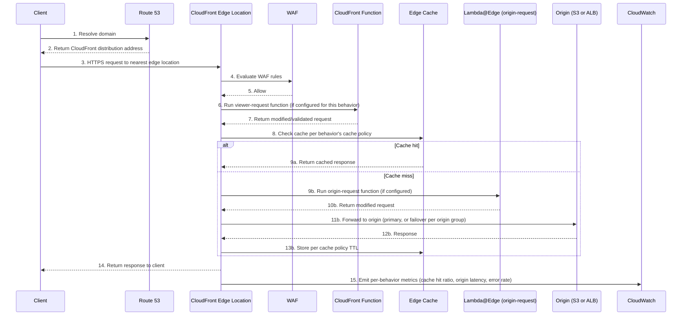
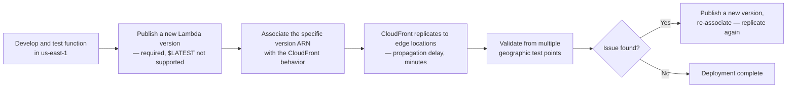

# Chapter 22 – CloudFront Edge Architecture

> **Visual note:** This chapter uses Mermaid diagrams for architecture and sequence flows, and Markdown tables for comparisons, cost estimates, and checklists. All Terraform and CLI examples are written against provider `hashicorp/aws >= 5.0` and AWS CLI v2. Where this chapter uses a service already introduced in Chapter 2 ("AWS Building Blocks"), Chapter 6 ("Highly Available Multi-AZ Web Application"), or Chapter 14 ("Canary Infrastructure"), it re-explains that service briefly on first use so the chapter remains self-contained.

---

# 1 Executive Summary

Every prior chapter in this book has treated CloudFront as a supporting player — a caching and TLS-termination layer sitting in front of an ALB, mentioned but never designed in depth.

This chapter reverses that emphasis. It treats CloudFront as the primary architectural layer, and asks the questions a Principal Architect actually needs answered to run a serious, global edge presence:

- How should cache behaviors be structured for a site with dozens of distinct content types?
- How does origin failover actually work, and what does it NOT protect against?
- How does Lambda@Edge or CloudFront Functions change what the edge is capable of doing, not just how fast it serves content?
- How is a global edge network actually secured, monitored, and cost-managed at enterprise scale?

**The business problem.**

A CDN is, at first glance, a simple idea: cache content closer to users, reduce latency, reduce origin load.

In practice, at enterprise scale, that simple idea accumulates real complexity:

- A single site or API serves many distinct content types — static assets, personalized API responses, video, user uploads — each needing different caching, security, and routing behavior.
- Global user bases have wildly different latency expectations and, increasingly, different data-residency and content-restriction requirements by region.
- The edge itself has become a place to run logic (Lambda@Edge, CloudFront Functions), not just cache bytes — which means the edge is now part of the application's actual behavior, not merely its delivery mechanism, and needs the same design rigor this book has applied to every other compute layer.
- Origin infrastructure (Chapter 6/7's ALB-fronted applications) still needs protecting from the specific failure modes a badly-configured edge layer can cause — a cache-miss storm, a misconfigured cache key, or an edge function bug can all degrade or take down the origin just as effectively as a traffic spike can.

**The architecture objective.**

This chapter's objective is a CloudFront distribution designed with the same deliberateness this book has applied to every compute and network layer before it:

- Multiple, purpose-specific cache behaviors, each tuned to its content type's actual caching and security needs.
- Origin failover and origin groups providing real resilience, understood precisely for what they do and don't protect against.
- Edge compute (CloudFront Functions for lightweight, high-volume logic; Lambda@Edge for heavier, request/response-transforming logic) used deliberately, for the specific problems each is suited to.
- Security controls (WAF, Shield, Origin Access Control, signed URLs/cookies) applied consistently across every distribution, not configured once and forgotten.
- Full observability (real-time logs, standard logs, CloudWatch metrics) sufficient to actually operate this layer, not just assume it works.

**Why organizations adopt this architecture.**

Three forces drive investment in a deliberately-designed edge architecture, beyond simply "turning CloudFront on" in front of an existing ALB:

1. **Global user base with real latency and availability stakes.** Once an organization has meaningful traffic from multiple continents, the difference between a default CloudFront configuration and a deliberately tuned one becomes measurable in real conversion/engagement metrics, not just abstract performance numbers.
2. **Content and traffic diversity outgrowing a single cache policy.** A site serving static assets, a JSON API, user-uploaded media, and server-rendered HTML from the same origin needs distinctly different caching behavior for each — a single, one-size-fits-all cache behavior either over-caches dynamic content (serving stale, incorrect data) or under-caches static content (wasting origin capacity and money).
3. **Security and compliance requirements specific to edge exposure.** Because CloudFront is the organization's actual internet-facing surface (the origin, per Chapter 6/7's design, should never be directly reachable), the edge layer carries the WAF, Shield, and access-control responsibility this book has treated as critical since Chapter 6 — and at genuine scale, that responsibility needs its own deliberate design, not a default configuration inherited from a quick initial setup.

**Major business benefits.**

- **Meaningfully lower latency for a global user base**, achieved specifically through purpose-tuned cache behaviors and, where warranted, edge compute that avoids an origin round-trip entirely for logic that can run at the edge.
- **Reduced origin load and cost**, since a well-tuned cache behavior set removes far more traffic from the origin than a default, generic configuration does — directly reducing the Chapter 6/7 compute and database tier's required capacity.
- **A genuinely stronger security posture**, with the origin never directly reachable (Origin Access Control, Chapter 6's pattern, formalized further here), and WAF/Shield protection applied consistently across every content type the distribution serves.
- **New product capability at the edge** — personalization, A/B testing, authentication checks, and request/response transformation executed at the edge via Lambda@Edge/CloudFront Functions, closer to the user and without burdening the origin.
- **Operational clarity from real observability** — real-time logs and structured cache-behavior design make it possible to actually understand and tune the edge layer's behavior over time, rather than treating it as an opaque, "it just works" black box.

**Typical enterprise scenarios.**

- A global e-commerce platform serving product images, a dynamic cart/checkout API, and personalized recommendations from the same domain, each needing distinctly different edge treatment.
- A media/content platform serving video-on-demand or live streaming content at scale, where origin cost and latency are both directly, measurably tied to cache hit ratio.
- A SaaS platform (potentially the very B2B provider described in Chapter 20's PrivateLink case study) serving both a marketing site (heavily cacheable) and an authenticated application/API (largely uncacheable, but still benefiting from edge-layer security and TLS termination) from related domains.
- Any Chapter 6/7-style application reaching the point where its default, un-tuned CloudFront configuration is either serving stale content incorrectly, failing to protect the origin adequately, or leaving meaningful latency and cost improvement unrealized simply because nobody has designed the edge layer deliberately since it was first switched on.

This chapter builds directly on Chapter 6's introduction of CloudFront as a supporting component, and composes with Chapter 14's canary deployment patterns (for deploying edge function changes safely) and Chapter 20's PrivateLink patterns (for origins that should never be reachable even via a public ALB). Section 28 discusses explicitly when a simpler, single-behavior CloudFront configuration remains sufficient, and when this chapter's fuller design is worth the added complexity.

---

# 2 Business Requirements

## Business Drivers

| Driver | Description |
|---|---|
| Global latency reduction | Serve content close to users worldwide, measurably improving engagement/conversion metrics |
| Origin cost and load reduction | Remove cacheable traffic from the origin, reducing Chapter 6/7 compute and database tier requirements |
| Content-type-specific behavior | Support static, dynamic, API, and media content with distinct caching/security treatment from one distribution |
| Edge-layer security posture | Keep the origin unreachable directly, with WAF/Shield protection applied consistently at the edge |
| New product capability at the edge | Enable personalization, A/B testing, and request transformation without an origin round-trip |

## Functional Requirements

- Support multiple cache behaviors, each mapped to a specific path pattern and content type, with independently tunable TTL, cache key, and compression settings.
- Support origin failover between a primary and secondary origin for critical content paths.
- Support edge compute (CloudFront Functions and/or Lambda@Edge) for request/response manipulation, authentication checks, and redirects.
- Support signed URLs/cookies for restricting access to specific content (e.g., paid media, time-limited downloads).
- Support real-time and standard access logging sufficient for both operational monitoring and security investigation.

## Non-Functional Requirements

| Category | Requirement |
|---|---|
| Latency | p95 edge response time under 100ms globally for cached content; origin-dependent latency for uncacheable content should not be worsened by the edge layer |
| Cache hit ratio | A defined, monitored target per cache behavior (e.g., 90%+ for static assets, lower and behavior-specific for dynamic content) |
| Security | No direct origin reachability; WAF and Shield applied to all internet-facing distributions |
| Availability | 99.95%+ for the edge layer itself, inheriting and not degrading the underlying origin's own Tier 1 availability target (Chapter 6) |
| Observability | Real-time visibility into cache performance, error rates, and edge function execution, segmented by cache behavior |

## Scalability Goals

- Scale to serve global traffic spikes (product launches, viral content, marketing campaigns) without manual intervention — CloudFront's edge network scales automatically, but cache behavior and edge function design must not introduce an artificial bottleneck (Section 14).
- Support growth in the number of distinct content types/cache behaviors as the application's product surface grows, without the distribution's configuration becoming unmanageable (Section 23, 34).

## Availability Requirements

Consistent with Chapter 6's Tier 1 framework, with an important addition specific to this architecture: the edge layer's own availability characteristics (Section 12) are distinct from, and should not silently degrade, the origin's own carefully-designed Multi-AZ availability — a badly-configured origin failover setting can, counterintuitively, make the overall system less available than the origin alone would be.

## Latency Requirements

| Content Type | Latency Target |
|---|---|
| Cached static assets (images, CSS, JS) | Under 50ms globally (edge cache hit) |
| Cached, infrequently-changing dynamic content | Under 100ms globally (edge cache hit) |
| Uncacheable, authenticated API responses | Origin's own latency budget (Chapter 6/7) plus minimal edge overhead (single-digit ms) |
| Edge-function-processed requests (CloudFront Functions) | Sub-millisecond added overhead |
| Edge-function-processed requests (Lambda@Edge) | Single-digit-to-tens-of-milliseconds added overhead, depending on function complexity |

## Compliance Requirements

- Data residency and content-restriction requirements (geo-restriction) are frequently a specific, named compliance driver for this architecture — certain content must not be served to users in specific countries/regions, a requirement CloudFront's geo-restriction feature addresses directly at the edge, before a request ever reaches the origin.
- PCI-DSS and SOC 2 considerations from Chapter 6/7 continue to apply to the edge layer specifically — TLS enforcement, WAF coverage, and access logging retention are all part of the same compliance evidence chain established in earlier chapters, extended to this layer.

## Security Expectations

- The origin must never be directly reachable — enforced via Origin Access Control for S3 origins and via a custom-header-plus-security-group pattern for ALB origins (Section 11), consistent with Chapter 6's original guidance, formalized fully here.
- WAF must be attached and actively tuned (not merely present) for every internet-facing distribution.
- Signed URLs/cookies must be used for any content requiring restricted, time-limited, or per-user access control at the edge.

## Recovery Objectives

| Objective | Target |
|---|---|
| RPO | Not applicable — CloudFront carries no data of its own; inherits the origin's RPO |
| RTO — single edge location failure | Near-zero, transparent — AWS's global edge network routes around a single location's issue automatically |
| RTO — origin failure with origin failover configured | Seconds to low minutes, depending on health-check configuration (Section 12) |
| RTO — origin failure without origin failover | Inherits the origin's own RTO (Chapter 6) — CloudFront alone does not provide origin-level resilience without explicit origin group configuration |

## SLAs

- CloudFront's own service-level commitment covers the edge network's availability; the organization's internal SLA should separately address cache-behavior-specific targets (hit ratio, latency) as operational metrics worth tracking and improving over time, not just a "CloudFront is up or down" binary.

## Expected Workload and Growth

- A representative enterprise deployment: one or a handful of distributions, each with anywhere from a handful to several dozen cache behaviors, serving global traffic that may range from moderate (a regional business) to very high (a global consumer platform) — this architecture's design principles apply across that entire range, with the specific tuning and edge-compute investment scaling with the traffic and product complexity involved.
- Growth here is multidimensional: growing request volume, growing content-type diversity (more cache behaviors), and growing geographic reach (more regions with meaningful traffic, each with potentially distinct latency/compliance needs).

---

# 3 Architecture Overview

## Overall Design Philosophy

This architecture applies one core principle throughout: **every content type gets the cache and security treatment it actually needs, not a single, generic default applied uniformly.**

- A distribution with one cache behavior, tuned for one content type, is easy to reason about but poorly serves an application with diverse content.
- A distribution with many, purpose-specific cache behaviors is more work to design and maintain, but correctly serves each content type's actual needs — this is the trade-off this chapter's architecture deliberately makes, and Section 34 discusses precisely when that trade-off is and isn't worth it.

## Core Components

- **Distribution:** The top-level CloudFront resource, with one or more origins and one or more cache behaviors.
- **Origins:** Where CloudFront fetches content from when it can't serve from cache — an S3 bucket (static assets), an ALB (Chapter 6/7's application tier), or a custom/third-party origin.
- **Origin groups:** A primary-plus-secondary origin pairing with automatic failover on defined error conditions (Section 12).
- **Cache behaviors:** Path-pattern-matched rules, each specifying which origin to use, caching policy (TTL, cache key composition), and which edge functions (if any) to invoke.
- **Cache policies and origin request policies:** Reusable, named configurations controlling exactly what varies the cache key (headers, query strings, cookies) and what's forwarded to the origin — the specific mechanism that makes fine-grained, per-behavior caching tunable.
- **Edge compute:** CloudFront Functions (lightweight, sub-millisecond, viewer-request/response only) and Lambda@Edge (heavier, can run at all four CloudFront trigger points, can make external calls).
- **Security layer:** WAF (attached to the distribution), Shield (automatic Standard, optional Advanced), Origin Access Control, signed URLs/cookies.

## How Components Interact

- A request arrives at the nearest CloudFront edge location, matched against the distribution's cache behaviors by path pattern.
- If a CloudFront Function is configured for viewer-request, it runs first — fast, simple logic (header manipulation, redirects, basic auth checks).
- CloudFront checks its cache for a matching, valid entry per that behavior's cache policy; on a hit, it (optionally runs a viewer-response function, then) returns the cached response directly.
- On a miss, CloudFront forwards the request toward the origin — optionally through a Lambda@Edge origin-request function for heavier transformation — reaching the primary origin, or the secondary if the origin group's failover conditions are met.
- The origin's response returns through CloudFront, optionally through an origin-response Lambda@Edge function, gets cached per policy, and is returned to the client.

## High-Level Workflow

**Request lifecycle:** Client → DNS (Route 53) → nearest CloudFront edge location → cache behavior matching → CloudFront Function (viewer-request, if configured) → cache lookup → (on miss) Lambda@Edge (origin-request, if configured) → origin (with failover per origin group config) → response.

**Response lifecycle:** Origin response → Lambda@Edge (origin-response, if configured) → cache write (per policy) → CloudFront Function (viewer-response, if configured) → client, with the response cached at that edge location for subsequent requests matching the same cache key.

**Data lifecycle:** CloudFront itself is a caching layer, not a data store — cached content has a defined TTL (explicit or origin-header-driven) and is evicted/refreshed accordingly; the actual data lifecycle (persistence, backup, replication) remains entirely the origin's responsibility, following whichever Chapter 6/7 pattern the origin itself implements.

---

# 4 AWS Services Used

## Amazon CloudFront

**Purpose:** The core service this chapter is built around — a global content delivery network with points of presence worldwide, providing caching, TLS termination, and (via edge compute) request/response processing close to users.

**Why selected:** Already established as this book's default CDN layer since Chapter 6; this chapter treats it as a first-class architectural subject rather than a supporting component, given its role as the organization's actual internet-facing surface.

**Alternatives:** A third-party CDN (Cloudflare, Fastly, Akamai) — appropriate for organizations with specific edge-compute platform requirements CloudFront doesn't meet, existing multi-CDN strategies for resilience, or negotiated enterprise pricing making a third-party CDN more cost-effective at extreme scale; a multi-CDN architecture (CloudFront plus a second provider) — appropriate for organizations with an availability requirement strict enough to justify eliminating single-CDN-provider risk entirely (Section 28 covers this trade-off).

**Limitations:** Cache behavior path-pattern matching has a defined evaluation order and complexity ceiling — an extremely large number of highly granular cache behaviors becomes harder to reason about and maintain (Section 34); Lambda@Edge functions have stricter size/duration/dependency limits than a standard Lambda function, reflecting their execution at edge locations rather than a single AWS Region.

**Pricing considerations:** Data transfer out (to viewers) and request-count charges vary by edge location/region tier; edge compute (CloudFront Functions and Lambda@Edge) carries its own separate, additional charge; covered in depth in Section 16.

**Best practices:** Design cache behaviors around actual content-type and caching-need boundaries, not arbitrary URL structure; use cache policies and origin request policies (reusable, named objects) rather than embedding cache configuration directly in each behavior, for easier review and reuse across behaviors.

## AWS WAF (Web Application Firewall)

**Purpose:** Layer 7 filtering attached directly to the CloudFront distribution — already established in Chapter 6 as the standard protection layer; this chapter's specific addition is tuning WAF rules per the distribution's actual, observed traffic patterns across its various cache behaviors, not a single generic rule set applied uniformly.

**Best practices:** Different cache behaviors may warrant different WAF rule emphasis — a login/authentication path benefits more from rate-based and credential-stuffing-focused rules than a static-asset path does, and WAF's rule-group structure supports this differentiation without requiring separate distributions.

## AWS Shield (Standard and Advanced)

**Purpose:** DDoS protection — Shield Standard is automatic and included at no additional cost for every CloudFront distribution; Shield Advanced adds enhanced protection, cost protection against scaling-driven DDoS charges, and access to the AWS DDoS Response Team.

**Why selected:** Given CloudFront's role as the organization's actual internet-facing surface (this chapter's central premise), Shield Advanced is frequently justified specifically for the edge layer, even for organizations that concluded Shield Standard was sufficient for a less business-critical or lower-visibility origin-only deployment.

## Amazon S3 (Static Origin, with Origin Access Control)

**Purpose:** The standard origin for static assets — already established in Chapter 6; this chapter's specific addition is the Origin Access Control (OAC) configuration that keeps the bucket fully private, reachable only via CloudFront, consistent with the "origin never directly reachable" principle established since Chapter 6 and reinforced throughout this book (Chapters 7, 20).

## Application Load Balancer (Dynamic Origin)

**Purpose:** The standard origin for dynamic content/API traffic — the same internal-or-public ALB from Chapter 6/7's application tier, made reachable by CloudFront specifically (and, ideally, exclusively) via a custom-header-plus-security-group restriction pattern (Section 11).

## AWS Lambda@Edge

**Purpose:** Heavier edge compute — runs at any of CloudFront's four trigger points (viewer-request, origin-request, origin-response, viewer-response), can access the full request/response, make external network calls, and use a broader runtime/dependency footprint than CloudFront Functions.

**Why selected over CloudFront Functions:** Chosen specifically when the logic needs to run at origin-request/origin-response time (not just viewer-request/response), needs to call an external service, or needs a more capable runtime than CloudFront Functions' restricted JavaScript environment provides.

**Limitations:** Higher latency overhead than CloudFront Functions; deployed to a specific AWS Region (`us-east-1`) and replicated by AWS to edge locations, with replication propagation delay to account for during deployment (Section 8).

## CloudFront Functions

**Purpose:** Lightweight, sub-millisecond-overhead edge compute for viewer-request and viewer-response triggers only — header manipulation, simple redirects, basic request validation, cache-key normalization.

**Why selected over Lambda@Edge:** The default choice for any edge logic that fits within its constraints (viewer-request/response only, no external calls, restricted JavaScript subset) given its significantly lower latency overhead and lower cost at high request volume — reach for Lambda@Edge only when CloudFront Functions' constraints genuinely don't fit the use case.

## Amazon Route 53

**Purpose:** DNS resolution directing traffic to the CloudFront distribution — established since Chapter 6; this chapter's specific application is alias records pointing custom domains at the distribution, plus, for a multi-distribution or multi-CDN architecture, weighted/latency-based routing across distributions (Section 28).

## AWS Certificate Manager

**Purpose:** TLS certificate provisioning for custom domains on the CloudFront distribution — must be provisioned in `us-east-1` specifically for CloudFront use, regardless of where the origin infrastructure itself lives, a specific, easy-to-miss regional requirement worth calling out explicitly.

## CloudWatch, CloudTrail, GuardDuty, Config, KMS, Secrets Manager

Covered in depth throughout this book; this chapter's specific application is CloudFront-specific metrics/logging (Section 21, 22), signed-URL/cookie key management via Secrets Manager or CloudFront key groups (Section 11), and drift detection for WAF/OAC configuration (Section 11), consistent with the pattern established in every prior networking chapter.

## Edge Compute Decision Matrix

| Factor | CloudFront Functions | Lambda@Edge |
|---|---|---|
| Trigger points | Viewer-request, viewer-response only | All four: viewer-request, origin-request, origin-response, viewer-response |
| Latency overhead | Sub-millisecond | Single-digit to tens of milliseconds |
| Runtime | Restricted JavaScript subset | Full Node.js/Python, standard Lambda runtimes |
| External network calls | Not supported | Supported (with added latency) |
| Max execution time | Very short (microseconds-scale budget) | Up to 5s (viewer triggers) / 30s (origin triggers) |
| Cost at high volume | Lower | Higher |
| Best fit | Header manipulation, redirects, simple auth checks, cache-key normalization | Origin selection logic, external API calls, heavier request/response transformation |

---

# 5 Complete Architecture Diagram

```mermaid

flowchart TB
    subgraph Users["Global Users"]
        U1[User — North America]
        U2[User — Europe]
        U3[User — APAC]
    end

    subgraph DNS["DNS"]
        R53[Route 53]
    end

    subgraph Edge["CloudFront Distribution"]
        WAF[AWS WAF]
        SHIELD[Shield Standard/Advanced]

        subgraph Behaviors["Cache Behaviors"]
            CB1["/static/* — long TTL, static assets"]
            CB2["/api/* — no cache, dynamic"]
            CB3["/media/* — signed URLs, long TTL"]
            CB4["/* — default, HTML pages, short TTL"]
        end

        CFFUNC[CloudFront Functions<br/>viewer-request/response]
        LAMBDAEDGE[Lambda@Edge<br/>origin-request/response]
    end

    subgraph OriginsStatic["Static Origins"]
        S3[(S3 — Static Assets<br/>Origin Access Control)]
        S3MEDIA[(S3 — Media<br/>Origin Access Control)]
    end

    subgraph OriginsDynamic["Dynamic Origin — Chapter 6/7 Application"]
        OG[Origin Group —<br/>Primary + Failover]
        ALBPRIMARY[ALB — Primary Region]
        ALBFAILOVER[ALB — Failover Region]
        APP[Application Tier]
        AURORA[(Aurora)]
    end

    subgraph Monitoring["Observability"]
        CW[CloudWatch — per-behavior metrics]
        RTLOGS[Real-Time Logs]
        S3LOGS[(S3 — Standard Access Logs)]
        CT[CloudTrail]
    end

    U1 --> R53
    U2 --> R53
    U3 --> R53
    R53 --> WAF
    WAF --> SHIELD
    SHIELD --> Behaviors

    CB1 --> CFFUNC
    CB4 --> CFFUNC
    CFFUNC -.cache hit — no origin call.-> U1

    CB1 --> S3
    CB3 --> S3MEDIA
    CB2 --> LAMBDAEDGE
    CB4 --> LAMBDAEDGE
    LAMBDAEDGE --> OG
    OG --> ALBPRIMARY
    OG -.failover.-> ALBFAILOVER
    ALBPRIMARY --> APP
    ALBFAILOVER --> APP
    APP --> AURORA

    Behaviors --> CW
    Behaviors --> RTLOGS
    Behaviors --> S3LOGS
    WAF --> CT

    U1 -.NO DIRECT PATH.-x ALBPRIMARY
    U1 -.NO DIRECT PATH.-x S3

```

**Diagram interpretation:** Four distinct cache behaviors route to different origins and edge-compute treatments, exactly this chapter's central design principle. The `-.NO DIRECT PATH.-x` edges reaffirm the same origin-protection guarantee established in Chapter 6 — no user, regardless of which cache behavior serves their request, ever reaches the S3 origin or the ALB directly, only through CloudFront's edge layer.

---

# 6 Component-by-Component Explanation

| Component | Purpose | Scaling | High Availability | Failure Handling | Dependencies |
|---|---|---|---|---|---|
| CloudFront distribution | Global edge presence, caching, TLS termination | Automatic, AWS-managed, global | AWS-managed, inherently multi-location | Individual edge location issues routed around automatically by AWS | Origins, WAF, edge compute |
| Cache behaviors | Content-type-specific routing and caching rules | N/A (configuration, not infrastructure) | N/A | A misconfigured behavior affects only its matched path pattern | Cache policies, origin request policies, origins |
| Origin group | Primary/secondary origin failover | N/A | Provides resilience against a single origin's full failure | Automatic failover per defined error-code/timeout conditions (Section 12) | Both origins' own health |
| CloudFront Functions | Lightweight viewer-request/response logic | Automatic, scales with request volume | AWS-managed, runs at every edge location | Function errors fail the request per configured behavior — design carefully (Section 24) | None (self-contained, no external calls) |
| Lambda@Edge | Heavier origin-request/response logic | Automatic, AWS-replicates to edge locations | AWS-managed | Function errors/timeouts affect the specific request; monitor execution metrics (Section 21) | IAM execution role, any external services called |
| WAF | Layer 7 filtering | Automatic | AWS-managed | Rule-based blocking; monitor false-positive rate | Attached distribution |
| Origin (S3, OAC) | Static content storage | Automatic, unlimited | 11 nines durability (Chapter 6) | Standard S3 availability characteristics | KMS, OAC configuration |
| Origin (ALB, Chapter 6/7 app) | Dynamic content/API origin | Standard Auto Scaling (Chapter 6) | Multi-AZ (Chapter 6) | Origin group failover if configured, otherwise inherits Chapter 6's own failure handling | Application tier, data tier |

---

# 7 End-to-End Request Flow



**Step-by-step narrative:**

- Steps 4-5 (WAF) run before any cache lookup — malicious or invalid requests are rejected before consuming any cache or origin resources at all.
- Step 6-7's CloudFront Function runs on every request matching its behavior, cache hit or miss — useful for tasks like normalizing the cache key itself (e.g., stripping irrelevant query parameters) before the cache lookup in step 8 even happens.
- The branch at step 8 is this architecture's central efficiency mechanism: a cache hit (9a) never reaches the origin at all — no Lambda@Edge origin-request invocation, no ALB/application/database round-trip, none of Chapter 6/7's compute or data tier is involved in serving this specific request.
- Step 9b-13b's Lambda@Edge invocation only happens on a cache miss — a deliberate design point, since running heavier edge compute on every single request (including cache hits) would defeat much of CloudFront's latency and cost benefit.

---

# 8 Deployment Flow

## Distribution and Cache Behavior Deployment

- Distribution configuration (origins, cache behaviors, WAF association) follows the standard `plan`/review/`apply` Terraform workflow established throughout this book.
- **A CloudFront-specific consideration:** distribution changes can take up to several minutes to propagate globally to every edge location — this should be factored into deployment timing and validation windows, distinct from the near-instant propagation of, say, an ALB target group weight change (Chapter 14).

## Lambda@Edge Deployment — A Genuinely Different Workflow



- **Lambda@Edge requires a published, versioned function** — `$LATEST` cannot be associated with a CloudFront trigger, meaning every change requires publishing a new version and updating the association, a meaningfully different and slower iteration cycle than a standard Lambda function's typical deployment flow.
- **Rollback** means re-associating the distribution's behavior with the previous, known-good Lambda version ARN — retain prior versions specifically to make this fast, rather than only ever keeping the latest.

## CloudFront Functions Deployment — Faster Iteration

- CloudFront Functions deploy and propagate significantly faster than Lambda@Edge, and support a built-in test tool for validating function behavior against sample events before publishing — use this test tool as a standard, required step in the deployment pipeline (Section 20), not an optional nicety.

## Canary Deployment for Edge Functions (Composing with Chapter 14)

- For a high-risk edge function change (one affecting a significant volume of production traffic), consider a staged rollout: initially associate the new function version with a low-traffic cache behavior or a small subset of paths, validate, then expand — directly applying Chapter 14's canary principle to edge compute, even though CloudFront doesn't natively provide the same weighted-traffic-splitting mechanism CodeDeploy does for compute fleets.
- A practical implementation: use a CloudFront Function to route a small, deterministic percentage of requests (via a request attribute like a hashed cookie or IP) to a "canary" cache behavior associated with the new Lambda@Edge version, while the majority continue to the stable behavior — a manual but effective way to import Chapter 14's staged-rollout safety into a layer that doesn't have it built in.

## Rollback

- Distribution-level configuration rollback (cache behavior changes, origin changes) is a standard Terraform revert-and-apply, subject to the same propagation delay noted above.
- Edge function rollback (both CloudFront Functions and Lambda@Edge) means re-associating the previous version — fast for CloudFront Functions, subject to the replication delay for Lambda@Edge.

## Secrets and Configuration

- Signed URL/cookie private keys (Section 11) should be managed via CloudFront key groups, with the actual private key material never embedded in Lambda@Edge/CloudFront Function code — generate and rotate these consistent with the Secrets Manager-based rotation discipline established since Chapter 6.
- Origin-facing custom headers used for origin-access restriction (Section 11) are non-sensitive configuration values but should still be treated as access-control-relevant and protected from casual disclosure (not logged in plaintext, not exposed in client-visible error messages).

## Validation

- Post-deployment validation should include: confirming the distribution reaches `Deployed` status across all edge locations (not just that the API call succeeded), testing each modified cache behavior's actual caching behavior (cache hit on a repeat request, correct TTL), and, for any edge function change, testing from multiple geographic locations given the global nature of the propagation.

---

# 9 Network Topology

## CloudFront Sits Outside the VPC Model

- Unlike every prior networking chapter (7, 18, 20), CloudFront is not a VPC-resident resource — it has no subnets, no CIDR range, no security groups of its own in the traditional sense.
- Its "network topology" is AWS's global edge location footprint, entirely AWS-managed — the customer's network design work here is entirely about how CloudFront *reaches* origins that do live in a VPC (Chapter 6/7's application tier), not about CloudFront's own internal topology.

## Origin Access Restriction — The Critical Network-Boundary Control

- **For S3 origins:** Origin Access Control (OAC) — the S3 bucket policy permits access only from the specific CloudFront distribution, with the bucket itself having no public access at all (Chapter 6's original guidance, standard practice).
- **For ALB/custom origins:** since an ALB doesn't have an OAC-equivalent native mechanism, the standard pattern is a custom header (a secret value CloudFront adds to every origin request) checked by a WAF rule or the application itself, rejecting any request lacking the correct header value — combined with restricting the ALB's security group to CloudFront's published IP range as defense in depth.

```hcl

# Example: WAF rule rejecting any request without CloudFront's custom header

resource "aws_wafv2_web_acl" "origin_protection" {
  name  = "${var.project_name}-${var.environment}-origin-protection"
  scope = "REGIONAL" # attached to the ALB, not the CloudFront distribution itself

  default_action {
    block {} # deny by default — only CloudFront-originated requests (with the header) pass
  }

  rule {
    name     = "allow-cloudfront-only"
    priority = 1

    action {
      allow {}
    }

    statement {
      byte_match_statement {
        search_string = var.cloudfront_origin_secret_header_value
        field_to_match {
          single_header {
            name = "x-origin-verify"
          }
        }
        text_transformation {
          priority = 0
          type     = "NONE"
        }
        positional_constraint = "EXACTLY"
      }
    }

    visibility_config {
      sampled_requests_enabled   = true
      cloudwatch_metrics_enabled = true
      metric_name                = "allow-cloudfront-only"
    }
  }

  visibility_config {
    sampled_requests_enabled   = true
    cloudwatch_metrics_enabled = true
    metric_name                = "origin-protection-acl"
  }
}

```

> **Warning:** The custom-header secret value must be rotated periodically and treated with the same rigor as any other credential (Chapter 6's Secrets Manager pattern) — a static, never-rotated header value that leaks (e.g., via a misconfigured log or an exposed configuration file) permanently defeats this specific origin-protection control until rotated.

## VPC Origins (Direct VPC Connectivity, No Public Origin Exposure)

- CloudFront's VPC origins capability allows a distribution to reach an origin (an internal ALB or EC2/IP-based origin) that lives entirely within a private subnet, with no public IP or internet-facing listener at all — a stronger guarantee than the header-based pattern above, since there's no public endpoint to protect in the first place, only a private one CloudFront reaches directly.
- **This is the recommended pattern for new architectures** where the origin doesn't otherwise need any public exposure — directly composing with Chapter 7's internal-ALB pattern, extending "the application tier is never publicly reachable" all the way through to CloudFront's own connectivity mechanism.

## Interaction with PrivateLink (Chapter 20)

- CloudFront's VPC origins capability and Chapter 20's PrivateLink pattern solve related but distinct problems: VPC origins let CloudFront reach a *private* origin within the *same* organization's VPC; PrivateLink is for exposing a service *across* an account/organization boundary. They are not typically composed directly (CloudFront doesn't connect through a PrivateLink interface endpoint to reach an origin), but both reflect the same underlying principle — minimize public exposure to exactly what's necessary.

## Geo-Restriction

- CloudFront's geo-restriction feature (allow-list or deny-list by country) operates entirely at the edge, before a request ever reaches the origin — the most efficient point in the entire request path to enforce a data-residency or content-licensing restriction, since a geo-blocked request never consumes any origin capacity at all.

## Hybrid/On-Premises Origins

- CloudFront can use an on-premises origin (via a public or, with VPC origins, a privately-reachable endpoint) exactly as it would any other custom origin — relevant for an organization migrating incrementally from on-premises infrastructure (echoing Chapter 7's hybrid-connectivity migration pattern) while already adopting CloudFront as the edge layer ahead of a full origin migration.

---

# 10 Identity and Access

## IAM Roles for This Architecture's Components

| Role | Attached To | Key Permissions |
|---|---|---|
| Lambda@Edge execution role | Lambda@Edge functions | Minimal — typically just CloudWatch Logs write access; broader permissions only if the function genuinely needs to call another AWS service |
| CloudFront Function (no IAM role) | N/A | CloudFront Functions don't assume an IAM role — they run in a restricted sandbox with no AWS API access at all, a specific, deliberate limitation |
| Distribution management role | Platform/network team | `cloudfront:CreateDistribution`, `cloudfront:UpdateDistribution`, scoped to specific distribution ARNs |
| OAC/S3 origin permission | S3 bucket policy (resource-based, not IAM role-based) | Grants read access only to the specific CloudFront distribution's OAC identity |

## Least Privilege for Lambda@Edge

- A Lambda@Edge function's execution role should be scoped as narrowly as any other Lambda function in this book (Chapter 2's general IAM guidance) — the common mistake is granting broad permissions "in case the function needs them later," when in practice most Lambda@Edge functions (header manipulation, simple redirects, basic auth token validation) need no AWS API access beyond logging at all.
- **Special consideration:** Lambda@Edge functions execute in a region determined by the requesting user's proximity, not necessarily the function's home region — any AWS API calls the function makes should account for this (e.g., calling a regional service endpoint appropriately) rather than assuming same-region latency characteristics.

## Distribution and Cache Behavior Change Permissions

- Given this book's consistent emphasis on scoping high-blast-radius changes narrowly: distribution-level changes (adding an origin, modifying WAF association, changing cache behavior routing) should require the same elevated review this book has applied to every other production-traffic-controlling change since Chapter 6 — a distribution misconfiguration can affect global traffic instantly upon propagation.

## Cross-Account Considerations

- For an organization with a centralized platform/network account owning shared CloudFront infrastructure (a common pattern for a multi-brand or multi-product enterprise), workload teams in separate accounts typically request origin additions or cache behavior changes through a reviewed process rather than holding direct distribution-edit IAM permission themselves — mirroring the centralized-ownership model established in Chapters 10, 14, 18, and 20 for other high-consequence, shared infrastructure.

## Permission Boundaries

- A permission boundary on any role capable of modifying distribution configuration, WAF rules, or OAC settings is a strong defense-in-depth control here, consistent with every other chapter's guidance for access-defining, production-traffic-controlling roles.

---

# 11 Security Architecture

## Encryption and TLS

- Enforce TLS 1.2+ (minimum; TLS 1.3 where client compatibility allows) on the CloudFront-to-viewer connection via the distribution's minimum protocol version setting.
- Enforce HTTPS-only origin connections (CloudFront-to-origin) wherever the origin supports it — never fall back to unencrypted origin communication as a convenience.
- Use ACM-issued certificates (provisioned in `us-east-1`, per Section 4) with automatic renewal, avoiding the manually-managed-certificate failure mode flagged since Chapter 2.

## Origin Access Control and the Custom-Header Pattern — Recap and Emphasis

- Covered in depth in Section 9 — this is this chapter's single most important security control, and deserves explicit verification (not just initial configuration) on a recurring basis: confirm the S3 bucket genuinely has no public access, and confirm the ALB's security group and/or WAF rule genuinely rejects non-CloudFront-originated traffic, via periodic testing (Section 23), not just a one-time setup check.

## WAF Rule Design Per Cache Behavior

- Beyond the general WAF guidance from Chapter 6: this chapter's multi-behavior design benefits from differentiated WAF rule emphasis — rate-based rules tuned tighter for authentication/checkout paths than for static-asset paths, and managed rule groups (SQL injection, common exploits) applied consistently across all behaviors regardless of content type, since injection attempts can target any path, not just obviously dynamic ones.

## Signed URLs and Signed Cookies

- For content requiring restricted, time-limited, or per-user access control (paid media, private downloads, a specific cache behavior serving user-specific content), CloudFront's signed URL/cookie mechanism validates a cryptographic signature before serving content, even from cache — implemented via a CloudFront key group (public/private key pair, with the private key held by the origin/application, never by CloudFront or exposed to clients).
- **Best practice:** use signed cookies (not signed URLs) for a case involving multiple restricted resources per session (e.g., an entire private video library), since a signed cookie applies across all matching requests without needing to sign each individual URL — signed URLs remain the better fit for a single, specific restricted resource (a one-time download link).

## GuardDuty, Inspector, Security Hub

- GuardDuty's relevance to CloudFront specifically is more indirect than for compute-heavy architectures — but anomalous origin-request patterns (a sudden change in traffic shape reaching the origin, potentially indicating a cache-bypass attack or a WAF rule gap) remain a relevant signal, correlated via the origin's own GuardDuty coverage (Chapter 6/7).
- Security Hub aggregates WAF findings and Config rule violations (below) into the organization's broader security posture view, consistent with every prior chapter.

## AWS Config for Drift Detection

- Consistent with the pattern established in Chapters 7, 18, and 20: an AWS Config rule validating that every internet-facing CloudFront distribution has WAF attached, that S3 origins have public access blocked, and that the minimum TLS protocol version meets the organization's standard — catching configuration drift before it becomes a genuine security gap.

## Zero Trust Applied to This Architecture

- A cached response served directly from the edge, without reaching the origin at all, still passed through WAF evaluation (Section 7, step 4) — caching is never used as a reason to skip security filtering, even though it might seem redundant for a response CloudFront has already validated once before caching it (a new request against a cached response still needs the same WAF scrutiny, since the request itself, not just the cached content, is what WAF evaluates).
- Edge functions (Lambda@Edge, CloudFront Functions) performing authentication/authorization checks should validate tokens/signatures cryptographically, never rely on the mere presence of a header or cookie as sufficient proof of identity — the same rigor this book has applied to every other authentication decision since Chapter 6.

## Threat Model for This Architecture

| Attack Vector | Specific Relevance | Mitigation |
|---|---|---|
| Direct origin access, bypassing CloudFront entirely | Defeats WAF, geo-restriction, and signed-URL controls, all of which are edge-layer-only | OAC (S3), VPC origins or custom-header-plus-WAF-rule (ALB) — Section 9 |
| Cache poisoning via an unkeyed, attacker-controlled header/parameter | Malicious content served to many subsequent legitimate users from cache | Careful cache-key/cache-policy design (Section 15), explicit review of what varies the cache key |
| Leaked custom-header secret value | Origin-protection control defeated | Periodic rotation, treated as a credential (Section 9) |
| Overly broad Lambda@Edge IAM permissions | Expanded blast radius if a function is compromised or has a vulnerability | Narrow, minimal IAM scoping (Section 10) |
| Signed URL/cookie private key exposure | Content-restriction control defeated entirely | Key stored only at the origin/application, never in Lambda@Edge/CloudFront Function code, rotated periodically |
| WAF misconfiguration or drift removing protection | Origin exposed to attacks WAF was meant to block | AWS Config rule validating WAF attachment and rule presence (above) |

---

# 12 High Availability

## CloudFront's Edge Network Itself Is AWS-Managed HA

- Consistent with every other fully-managed AWS service covered in this book (Cloud WAN's backbone, Chapter 18; PrivateLink's connectivity, Chapter 20): CloudFront's global edge network availability is AWS's responsibility, requiring no customer-side HA design for the edge locations themselves.

## Origin Failover — What It Does and Doesn't Protect Against

This is the single most important, and most commonly misunderstood, high-availability mechanism in this chapter.

- **What it does:** an origin group with a primary and secondary origin automatically fails over when the primary returns a configured set of error status codes (e.g., 500, 502, 503, 504) or times out — CloudFront retries the request against the secondary origin.
- **What it does NOT do:** protect against a primary origin that's returning valid-looking but *incorrect* responses (a 200 OK with wrong or stale data) — origin failover triggers on error conditions, not on data correctness, which remains entirely the origin's own responsibility (Chapter 6's application-level correctness, not this chapter's concern).
- **What it does NOT do:** provide session/state consistency between primary and secondary origins — if the two origins have independent data tiers (rather than sharing one, per Chapter 14's canary-fleet pattern), a failover mid-session can produce inconsistent behavior unless the application is explicitly designed to handle it.

## Designing Origin Groups Correctly

- The secondary origin should be a genuinely independent failure domain from the primary — a different region (per a later chapter's multi-region pattern), not merely a different AZ within the same region's Chapter 6 Multi-AZ design, since Chapter 6's own Multi-AZ ALB already handles AZ-level failures without needing CloudFront's origin failover at all.
- Origin failover is specifically valuable for protecting against a genuine regional-scale origin failure — a scenario Chapter 6's single-region Multi-AZ design doesn't address on its own (Chapter 6, Section 13 flagged this same gap and addressed it via backup-and-restore DR; origin groups are an alternative or complementary mechanism specifically for read-heavy or cacheable content).

## AZ and Instance Failures (at the Origin)

- Handled entirely by the origin's own Chapter 6 Multi-AZ design — CloudFront is unaware of and unaffected by an individual AZ or instance failure within the origin, as long as the origin's own ALB continues responding successfully (Chapter 6's health-check-driven target replacement).

## Load Balancing and Health Checks

- CloudFront's origin failover uses simple error-code/timeout-based detection, not a dedicated health-check mechanism the way Chapter 6's ALB target groups do — for finer-grained, proactive failover (detecting a degraded-but-not-yet-erroring origin before it starts returning errors), the origin's own health-check-driven Auto Scaling (Chapter 6) remains the primary defense, with CloudFront's origin failover serving as a secondary, coarser-grained backstop.

## Regional Failures

- A genuine AWS regional failure affecting the origin (not just an individual AZ) is exactly the scenario origin failover with a genuinely separate secondary region addresses — composing directly with whatever multi-region DR pattern a later chapter in this book establishes for the origin itself.

---

# 13 Disaster Recovery

## DR Scope for This Architecture

- CloudFront carries no data of its own — this section addresses the edge layer's specific role in the organization's broader DR posture, not a new, independent DR concern.

## CloudFront's Role in Origin DR

- For cacheable content specifically, CloudFront's cache itself provides a form of resilience during a brief origin outage — cached content continues serving from the edge even while the origin is unreachable, until the cache entry's TTL expires, a genuinely valuable, often-overlooked property worth factoring into the overall DR posture for read-heavy, cacheable workloads.
- For uncacheable content (authenticated API responses, real-time data), CloudFront provides no such buffer — the origin's own DR posture (Chapter 6, 13) remains the sole determinant of availability during an origin outage.

## Stale-While-Revalidate and Extended Caching During an Outage

- CloudFront supports serving stale cached content (beyond its normal TTL) specifically when the origin is unreachable, via the origin's own `Cache-Control: stale-if-error` header or CloudFront's own origin failure handling settings — a deliberate, valuable DR mechanism for content where serving slightly-stale data during an outage is preferable to serving an error, worth configuring explicitly for the specific cache behaviors where that trade-off makes sense (and explicitly NOT configuring it for behaviors where stale data would be actively harmful, like pricing or inventory information).

## Backup Strategy

- No CloudFront-specific backup strategy exists — distribution configuration is, like everything else in this book, reproducible from version-controlled Terraform (Section 18).

## RPO/RTO for This Pattern

| Scenario | RPO | RTO |
|---|---|---|
| Single edge location issue | N/A | Near-zero — AWS routes around it automatically |
| Origin failure, cacheable content, within TTL | N/A | Zero — served from cache, origin issue invisible to users |
| Origin failure, cacheable content, `stale-if-error` configured | N/A | Zero to the stale-content max-age — extended availability at the cost of data freshness |
| Origin failure, uncacheable content | Inherits the origin's own RPO (N/A, typically) | Inherits the origin's own RTO (Chapter 6, 13) |
| Origin failure with origin group failover configured | N/A | Seconds to low minutes, per failover detection settings |

## Testing

- Include a deliberate origin-failure simulation (returning the configured failover-triggering error codes from a test origin) in the regular DR/chaos testing cadence established since Chapter 6 — confirming origin failover actually triggers within the expected timeframe, not just trusting the configuration is correct.
- Test `stale-if-error` behavior explicitly for the specific cache behaviors configured to use it, confirming stale content is genuinely served (not an error) during a simulated origin outage.

---

# 14 Scalability

## CloudFront's Own Scaling Is Automatic and Effectively Unlimited

- Consistent with every fully-managed AWS edge/global service in this book: CloudFront scales to handle traffic spikes (product launches, viral content, DDoS attempts) automatically, with no customer-side capacity provisioning required for the edge layer itself.

## The Real Scaling Question: Protecting the Origin from Cache-Miss Storms

- The scalability concern that actually matters for this architecture is not CloudFront's own capacity, but **the origin's capacity to handle the cache-miss traffic CloudFront forwards to it** — a well-designed cache behavior set (high hit ratio, appropriate TTLs) can reduce origin load by orders of magnitude relative to a poorly-tuned one, directly determining how much Chapter 6/7 compute and database capacity the origin actually needs to provision.
- A specific, real failure mode worth naming: a cache behavior with an inadvertently narrow or highly-variable cache key (Section 15) can produce a near-zero cache hit ratio despite appearing, superficially, to be "using CloudFront" — every request still reaches the origin as if CloudFront weren't there at all, while the organization pays for CloudFront's data-transfer and request charges on top of full origin load.

## Cache-Miss Storm Protection: Origin Shield

- **Origin Shield** — an additional caching layer at a single, designated AWS Region, sitting between the broader edge network and the origin — consolidates cache-miss requests from many edge locations into far fewer requests actually reaching the origin, specifically protecting against the "thundering herd" scenario where a popular piece of content's cache expires simultaneously across many edge locations, each independently requesting a fresh copy from the origin at once.
- **When to enable it:** for any origin sensitive to request-count-driven load or cost (a database-backed dynamic origin, or an origin with strict rate limits), Origin Shield is a low-effort, high-value addition; for a purely static, highly-cacheable origin already handling load comfortably, it may add unnecessary cost without a corresponding benefit (Section 16).

## Horizontal Scaling of Edge Compute

- CloudFront Functions scale automatically and near-instantaneously with request volume, given their sub-millisecond execution model.
- Lambda@Edge scales automatically as well, but is subject to standard Lambda concurrency considerations (Chapter 2) at extreme request volume — worth monitoring (Section 21) for any origin-request/response function on a very high-traffic cache behavior.

## Queue/Storage Scaling

- Not directly applicable to CloudFront itself — any queue-based or storage-scaling concern remains entirely the origin's own responsibility, following whichever Chapter 2/6/7 pattern the origin's architecture already implements.

---

# 15 Performance Optimization

## Cache Key Design — The Single Highest-Leverage Performance Lever

- The cache policy's cache key composition (which headers, query strings, and cookies vary the cached response) is the single most consequential setting in this entire architecture for actual cache hit ratio.
- **Include only what genuinely varies the response.** Including an unnecessary header, query parameter, or cookie in the cache key fragments the cache into many near-duplicate entries, each with fewer hits, directly degrading hit ratio and increasing origin load — a specific, common, and easily-avoidable performance mistake.
- **Exclude tracking/analytics query parameters explicitly** (e.g., `utm_source`, `fbclid`) from the cache key via the cache policy's configuration — these vary per marketing campaign but never actually change the response content, and including them by default (CloudFront's historical default behavior, worth explicitly verifying against current policy) needlessly fragments the cache.

## TTL Strategy Per Content Type

| Content Type | Recommended TTL Strategy |
|---|---|
| Immutable, versioned static assets (e.g., `app.a1b2c3.js`) | Very long TTL (a year+) — the filename itself changes on update, so a long TTL is always safe |
| Non-versioned static assets | Moderate TTL (hours to a day), with cache invalidation on deploy (Chapter 6's deployment pipeline integration) |
| Frequently-changing but cacheable dynamic content | Short TTL (seconds to minutes), balancing freshness against origin load reduction |
| Uncacheable, personalized/authenticated content | TTL of zero — explicitly configured as non-cacheable, not merely defaulted |

## Compression

- Enable CloudFront's automatic compression (Brotli/gzip) for all compressible content types — directly reduces transferred bytes and improves perceived latency, consistent with the general compression guidance established in Chapter 6, Section 15, now applied at the edge specifically.

## Connection Optimization

- CloudFront maintains persistent connections to origins where possible, reducing repeated TLS/TCP handshake overhead for cache-miss traffic — no customer configuration needed beyond ensuring the origin itself supports and doesn't prematurely close persistent connections.

## HTTP/2 and HTTP/3

- Enable HTTP/2 (and HTTP/3 where client support and the organization's compatibility requirements allow) on the distribution — provides meaningful performance improvements (multiplexing, header compression) for clients with many concurrent requests to the same origin, essentially "free" performance requiring only a configuration toggle.

## Database and Application-Layer Optimization

- Unchanged from Chapter 6/7's guidance — CloudFront's caching reduces the *frequency* of origin requests, but every cache-miss request still depends on the origin's own query optimization, connection pooling, and caching-layer performance (Chapter 6, Section 15) for its own latency characteristics.

---

# 16 Cost Optimization (FinOps)

## Cost Model

CloudFront's cost has several distinct components worth understanding separately:

- **Data transfer out** (to viewers) — the dominant cost driver for most distributions, priced per GB and varying by the geographic region/edge-location tier the traffic is served from.
- **Request charges** — per-10,000-requests, varying by HTTP method and region tier.
- **Edge compute** — CloudFront Functions (a small per-invocation charge) and Lambda@Edge (standard Lambda pricing, at the region the function executes, plus a CloudFront-specific per-request charge).
- **Origin Shield** — an additional, separate charge for the origin-shield caching layer, where enabled.
- **Field-level encryption, real-time logs** — smaller, feature-specific additional charges.

## Estimated Monthly Costs

| Deployment Size | Data Transfer | Requests | Edge Compute | Approximate Total |
|---|---|---|---|---|
| Small (moderate traffic, mostly static) | $200–800 | $50–150 | $10–50 | $260–1,000 |
| Medium (meaningful global traffic, mixed content) | $1,500–5,000 | $300–1,000 | $100–500 | $1,900–6,500 |
| Enterprise (high global traffic, media-heavy or high API volume) | $10,000–50,000+ | $2,000–8,000 | $1,000–5,000 | $13,000–63,000+ |

> **Note:** These figures are illustrative — CloudFront pricing varies meaningfully by geographic distribution of traffic (serving primarily from lower-cost regions is cheaper than serving primarily from higher-cost ones), and should be validated against Cost Explorer for the organization's actual traffic geography.

## Major Cost Drivers

- **Poor cache hit ratio is the single largest avoidable cost driver** — every cache miss both costs more directly (origin data transfer, if the origin itself charges for egress, e.g., S3) and indirectly (more origin compute/database capacity required, per Section 14's scalability discussion) than a cache hit would.
- **Unnecessary Lambda@Edge usage where CloudFront Functions would suffice** — given Lambda@Edge's meaningfully higher per-request cost (Section 4), using it for logic that CloudFront Functions' simpler, cheaper model could handle is a direct, avoidable cost premium.
- **Data transfer geography** — traffic served predominantly from higher-cost edge location tiers (certain regions carry a price premium) versus lower-cost tiers; the CloudFront price class setting (Section 26) lets an organization deliberately trade off edge-location coverage against cost where global reach genuinely isn't required.

## Optimization Opportunities

- **Improve cache hit ratio** through the cache-key design discipline established in Section 15 — this is consistently the highest-leverage cost optimization available for this architecture, often more impactful than any pricing-tier or configuration-toggle change.
- **Use CloudFront price classes** to restrict distribution to specific edge-location tiers (e.g., North America and Europe only) where the organization's actual user base doesn't warrant full global edge coverage — a direct, deliberate cost/reach trade-off.
- **Prefer CloudFront Functions over Lambda@Edge** wherever the use case fits within CloudFront Functions' constraints (Section 4).
- **Right-size Origin Shield adoption** — valuable for origin-load-sensitive services, potentially unnecessary added cost for already-comfortable, highly-cacheable static origins (Section 14).

## Tagging and Budget Configuration

- Tag distributions with the standard `Project`/`Environment`/`CostCenter` tags from Chapter 2; given CloudFront's cost sensitivity to cache hit ratio specifically, track hit ratio as a first-class FinOps metric per distribution/cache behavior, not just aggregate spend — a declining hit ratio is often the earliest, most actionable signal of a coming cost increase, well before it shows up as a Cost Anomaly Detection alert.

---

# 17 AI-Assisted Operations

## AI-Assisted Cache Behavior Analysis

- Given CloudFront access logs and per-behavior CloudWatch metrics, a Bedrock-backed tool can draft an analysis identifying cache behaviors with unexpectedly low hit ratios and hypothesize likely causes (an overly broad cache key, a short TTL relative to content change frequency) — a genuinely useful starting point for the manual investigation and tuning this chapter's Section 15 describes, not a substitute for it.

## AI-Assisted WAF Rule Tuning

- Given WAF's sampled request logs, a Bedrock-backed tool can help identify patterns suggesting either a false-positive-prone rule (blocking legitimate traffic) or a gap where a genuine attack pattern is passing through unblocked — a useful triage aid for the WAF tuning process established in Chapter 6, applied here across this chapter's differentiated, per-behavior rule design (Section 11).

## AI-Assisted Edge Function Code Review

- Given the elevated review bar this book applies to any code executing at high volume and low latency (CloudFront Functions, Lambda@Edge), a Bedrock-backed tool can draft an initial code review flagging obvious issues (unnecessary external calls in a CloudFront Function context where they're unsupported, missing error handling, an IAM permission broader than the function's logic requires) — subject to the same mandatory human review this book has required for every AI-assisted output since Chapter 2.

## AI-Generated Terraform for New Cache Behaviors

- As with every prior chapter: AI-assisted generation of a new cache behavior's Terraform, following the established module pattern (Section 18), for a new content type being added to an existing distribution — subject to the same mandatory review, with particular attention to the cache key/TTL configuration given its direct cost and correctness implications (Section 15, 16).

---

# 18 Terraform Implementation

## Distribution Module with Multiple Cache Behaviors

```hcl

# modules/cloudfront_distribution/main.tf

resource "aws_cloudfront_origin_access_control" "s3_static" {
  name                              = "${var.project_name}-${var.environment}-s3-oac"
  origin_access_control_origin_type = "s3"
  signing_behavior                   = "always"
  signing_protocol                    = "sigv4"
}

resource "aws_cloudfront_distribution" "main" {
  enabled             = true
  is_ipv6_enabled      = true
  price_class          = var.price_class # e.g. "PriceClass_100" for NA/EU-only cost optimization
  web_acl_id            = var.waf_web_acl_arn
  aliases                = var.custom_domain_aliases

  # Origin: S3 static assets, via OAC

  origin {
    domain_name              = var.s3_static_bucket_regional_domain_name
    origin_id                 = "s3-static-origin"
    origin_access_control_id  = aws_cloudfront_origin_access_control.s3_static.id
  }

  # Origin: dynamic application, via origin group with failover

  origin {
    domain_name = var.alb_primary_domain_name
    origin_id    = "alb-primary-origin"

    custom_origin_config {
      http_port                = 80
      https_port                = 443
      origin_protocol_policy    = "https-only"
      origin_ssl_protocols       = ["TLSv1.2"]
    }

    custom_header {
      name  = "x-origin-verify"
      value = var.cloudfront_origin_secret_header_value
    }
  }

  origin {
    domain_name = var.alb_failover_domain_name
    origin_id    = "alb-failover-origin"

    custom_origin_config {
      http_port                = 80
      https_port                = 443
      origin_protocol_policy    = "https-only"
      origin_ssl_protocols       = ["TLSv1.2"]
    }

    custom_header {
      name  = "x-origin-verify"
      value = var.cloudfront_origin_secret_header_value
    }
  }

  origin_group {
    origin_id = "alb-origin-group"

    failover_criteria {
      status_codes = [500, 502, 503, 504]
    }

    member {
      origin_id = "alb-primary-origin"
    }
    member {
      origin_id = "alb-failover-origin"
    }
  }

  # Default cache behavior — HTML pages, short TTL

  default_cache_behavior {
    target_origin_id        = "alb-origin-group"
    viewer_protocol_policy   = "redirect-to-https"
    allowed_methods           = ["GET", "HEAD", "OPTIONS"]
    cached_methods             = ["GET", "HEAD"]
    cache_policy_id             = var.default_cache_policy_id
    origin_request_policy_id    = var.default_origin_request_policy_id
    compress                     = true

    function_association {
      event_type   = "viewer-request"
      function_arn = var.viewer_request_function_arn
    }
  }

  # Static assets — long TTL, S3 origin

  ordered_cache_behavior {
    path_pattern             = "/static/*"
    target_origin_id          = "s3-static-origin"
    viewer_protocol_policy    = "redirect-to-https"
    allowed_methods             = ["GET", "HEAD"]
    cached_methods               = ["GET", "HEAD"]
    cache_policy_id               = var.static_asset_cache_policy_id
    compress                       = true
  }

  # API — no cache, dynamic origin with Lambda@Edge origin-request

  ordered_cache_behavior {
    path_pattern             = "/api/*"
    target_origin_id          = "alb-origin-group"
    viewer_protocol_policy    = "https-only"
    allowed_methods             = ["GET", "HEAD", "OPTIONS", "PUT", "POST", "PATCH", "DELETE"]
    cached_methods               = ["GET", "HEAD"]
    cache_policy_id               = var.no_cache_policy_id
    origin_request_policy_id       = var.forward_all_origin_request_policy_id

    lambda_function_association {
      event_type   = "origin-request"
      lambda_arn    = var.api_origin_request_lambda_edge_arn
      include_body  = true
    }
  }

  restrictions {
    geo_restriction {
      restriction_type = var.geo_restriction_type # "none", "whitelist", or "blacklist"
      locations          = var.geo_restriction_locations
    }
  }

  viewer_certificate {
    acm_certificate_arn      = var.acm_certificate_arn # must be in us-east-1
    ssl_support_method        = "sni-only"
    minimum_protocol_version  = "TLSv1.2_2021"
  }

  logging_config {
    bucket           = var.access_log_bucket_domain_name
    prefix            = "${var.project_name}-${var.environment}/"
    include_cookies   = false
  }

  tags = { Name = "${var.project_name}-${var.environment}-distribution" }
}

```

## Cache Policy Module (Reusable, Named Cache Key Configuration)

```hcl

# modules/cloudfront_cache_policies/main.tf

resource "aws_cloudfront_cache_policy" "static_assets" {
  name        = "${var.project_name}-static-assets"
  default_ttl = 86400
  max_ttl      = 31536000
  min_ttl      = 1

  parameters_in_cache_key_and_forwarded_to_origin {
    cookies_config {
      cookie_behavior = "none"
    }
    headers_config {
      header_behavior = "none"
    }
    query_strings_config {
      query_string_behavior = "none" # static assets never vary by query string
    }
    enable_accept_encoding_brotli = true
    enable_accept_encoding_gzip    = true
  }
}

resource "aws_cloudfront_cache_policy" "no_cache" {
  name        = "${var.project_name}-no-cache"
  default_ttl = 0
  max_ttl      = 0
  min_ttl      = 0

  parameters_in_cache_key_and_forwarded_to_origin {
    cookies_config {
      cookie_behavior = "all"
    }
    headers_config {
      header_behavior = "whitelist"
      headers {
        items = ["Authorization"]
      }
    }
    query_strings_config {
      query_string_behavior = "all"
    }
  }
}

```

## Lambda@Edge Function Module

```hcl

# modules/lambda_at_edge/main.tf

# NOTE: Lambda@Edge functions must be created in us-east-1, regardless

# of where the rest of the infrastructure lives — provider alias required.

resource "aws_lambda_function" "origin_request" {
  provider      = aws.us_east_1
  function_name = "${var.project_name}-api-origin-request"
  role           = aws_iam_role.edge_function.arn
  runtime        = "nodejs20.x"
  handler         = "index.handler"
  filename         = var.lambda_package_path
  publish           = true # required — CloudFront cannot reference $LATEST
}

resource "aws_iam_role" "edge_function" {
  provider = aws.us_east_1
  name     = "${var.project_name}-edge-function-role"

  assume_role_policy = jsonencode({
    Version = "2012-10-17"
    Statement = [{
      Action = "sts:AssumeRole"
      Effect = "Allow"
      Principal = {
        Service = ["lambda.amazonaws.com", "edgelambda.amazonaws.com"]
      }
    }]
  })
}

resource "aws_iam_role_policy_attachment" "logs" {
  provider   = aws.us_east_1
  role        = aws_iam_role.edge_function.name
  policy_arn  = "arn:aws:iam::aws:policy/service-role/AWSLambdaBasicExecutionRole"
}

```

## Terraform Best Practices Applied Above

- **Separate, named cache policies per content type** (`static_assets`, `no_cache`) rather than inline cache configuration on each behavior — reusable, independently reviewable, and directly implementing this chapter's core "content-type-specific treatment" principle in code.
- **`origin_protocol_policy = "https-only"`** on the custom origin config enforces the TLS discipline from Section 11 at the infrastructure level, not just as a documented expectation.
- **A dedicated `us-east-1` provider alias** for Lambda@Edge resources makes the region requirement (Section 4, 8) explicit and impossible to accidentally violate via a misplaced default-provider resource.
- **`publish = true`** on the Lambda@Edge function directly encodes the versioning requirement from Section 8 into the Terraform configuration itself, rather than relying on a manual step someone might forget.

---

# 19 AWS CLI Examples

## Deployment and Validation

```bash

# Check distribution deployment status (confirm it reached "Deployed", not just that the API call succeeded)

aws cloudfront get-distribution \
  --id E1A2B3C4D5E6F7 \
  --query 'Distribution.{Status:Status,DomainName:DomainName}'

# Validate a cache behavior's actual caching by testing a repeat request

curl -sI https://cdn.example.com/static/logo.png | grep -i x-cache

# First request: "Miss from cloudfront"; repeat request: "Hit from cloudfront"

# List all cache behaviors and their target origins for a distribution

aws cloudfront get-distribution-config \
  --id E1A2B3C4D5E6F7 \
  --query 'DistributionConfig.CacheBehaviors.Items[].{Path:PathPattern,Origin:TargetOriginId}'

```

## Monitoring

```bash

# Check cache hit ratio for a specific distribution over the last 24 hours

aws cloudwatch get-metric-statistics \
  --namespace AWS/CloudFront \
  --metric-name CacheHitRate \
  --dimensions Name=DistributionId,Value=E1A2B3C4D5E6F7 Name=Region,Value=Global \
  --start-time $(date -d '24 hours ago' -Iseconds) --end-time $(date -Iseconds) \
  --period 3600 --statistics Average

# Check origin latency (indicates how much traffic is reaching the origin, and how slow that is)

aws cloudwatch get-metric-statistics \
  --namespace AWS/CloudFront \
  --metric-name OriginLatency \
  --dimensions Name=DistributionId,Value=E1A2B3C4D5E6F7 Name=Region,Value=Global \
  --start-time $(date -d '1 hour ago' -Iseconds) --end-time $(date -Iseconds) \
  --period 300 --statistics Average p95

# Check WAF-blocked request count for the distribution's associated Web ACL

aws cloudwatch get-metric-statistics \
  --namespace AWS/WAFV2 \
  --metric-name BlockedRequests \
  --dimensions Name=WebACL,Value=<web-acl-name> Name=Region,Value=CloudFront Name=Rule,Value=ALL \
  --start-time $(date -d '1 hour ago' -Iseconds) --end-time $(date -Iseconds) \
  --period 300 --statistics Sum

```

## Cache Management

```bash

# Invalidate specific paths after a deployment (use sparingly — see cost/best-practice guidance)

aws cloudfront create-invalidation \
  --distribution-id E1A2B3C4D5E6F7 \
  --paths "/index.html" "/static/app.js"

# Check invalidation status

aws cloudfront get-invalidation \
  --distribution-id E1A2B3C4D5E6F7 \
  --id I1A2B3C4D5E6F7 \
  --query 'Invalidation.Status'

```

## Troubleshooting

```bash

# Verify the S3 origin's bucket policy correctly restricts access to the OAC identity only

aws s3api get-bucket-policy --bucket acme-prod-static-assets --query 'Policy' --output text

# Check Lambda@Edge function replication status across regions

aws lambda get-function \
  --function-name acme-api-origin-request \
  --qualifier 5 \
  --region us-east-1 \
  --query 'Configuration.{State:State,LastUpdateStatus:LastUpdateStatus}'

# Query real-time logs (requires a Kinesis Data Stream configured as the destination)

# — real-time log analysis typically happens via the configured stream consumer, not directly via CLI

```

## Cleanup

```bash

# List old, unused Lambda@Edge function versions (retain recent ones for rollback, per Section 8)

aws lambda list-versions-by-function \
  --function-name acme-api-origin-request \
  --region us-east-1 \
  --query 'Versions[?Version!=`$LATEST`].[Version,LastModified]'

```

---

# 20 CI/CD Integration

## Distribution and Cache Behavior Pipeline

```yaml

name: CloudFront Distribution Update

on:
  pull_request:
    paths: ["cloudfront/**"]

jobs:
  plan-and-review:
    runs-on: ubuntu-latest
    steps:
      - uses: actions/checkout@v4
      - uses: hashicorp/setup-terraform@v3
      - run: terraform init
      - run: terraform plan -out=tfplan
      - name: Summarize cache behavior changes for reviewer
        run: python scripts/summarize_cache_behavior_diff.py tfplan

  apply:
    runs-on: ubuntu-latest
    needs: plan-and-review
    environment: production
    if: github.event_name == 'push'
    steps:
      - run: terraform apply -auto-approve tfplan
      - name: Wait for distribution deployment
        run: aws cloudfront wait distribution-deployed --id ${{ secrets.DISTRIBUTION_ID }}
      - name: Validate cache behavior
        run: python scripts/validate_cache_behaviors.py --config cloudfront/reachability-tests.yaml

```

## Lambda@Edge-Specific Pipeline Considerations

```yaml

  deploy-lambda-edge:
    runs-on: ubuntu-latest
    needs: build-test
    environment: production
    steps:
      - name: Run CloudFront Functions test tool (fast, cheap validation before Lambda@Edge)
        run: aws cloudfront test-function --name viewer-request-fn --if-match <etag> --event-object file://test-event.json

      - name: Publish new Lambda@Edge version
        run: |
          VERSION=$(aws lambda publish-version \
            --function-name acme-api-origin-request \
            --region us-east-1 \
            --query 'Version' --output text)
          echo "LAMBDA_VERSION=$VERSION" >> "$GITHUB_ENV"

      - name: Update CloudFront distribution to reference the new version
        run: terraform apply -auto-approve -var="lambda_edge_version=${{ env.LAMBDA_VERSION }}"

      - name: Wait for global propagation, then validate from multiple regions
        run: |
          sleep 300  # Lambda@Edge replication typically completes within a few minutes
          python scripts/validate_from_multiple_regions.py

```

## Policy as Code Specific to This Architecture

- A required check verifying every internet-facing distribution has a WAF Web ACL associated — a direct, automated enforcement of the security requirement from Section 11.
- A check verifying S3 origins use OAC (not a public bucket policy or a legacy OAI configuration) — catching the specific, high-impact origin-exposure misconfiguration this chapter warns about repeatedly.
- A check verifying `origin_protocol_policy = "https-only"` on every custom origin configuration.

---

# 21 Monitoring

## Key Metrics Specific to This Architecture

| Metric | Source | Why It Matters Here |
|---|---|---|
| Cache hit ratio, per distribution and (via custom metrics/real-time logs) per behavior | CloudWatch, real-time logs | The single most important operational and cost health signal for this architecture |
| Origin latency | CloudWatch | Reveals how much of overall latency is attributable to cache misses reaching the origin |
| 4xx/5xx error rate, per behavior | CloudWatch | Distinguishes client-error patterns (potentially cache-key or routing issues) from origin-error patterns (potentially triggering failover) |
| WAF blocked/allowed request counts, per rule | CloudWatch (WAFV2 namespace) | Both security visibility and false-positive-rate tuning input |
| Lambda@Edge invocation count, duration, and error rate | CloudWatch (Lambda namespace, replicated per execution region) | Edge-compute-specific health, distinct from the distribution's own metrics |

## SLIs, SLOs, and Error Budgets

- **Cache hit ratio SLO** (e.g., "static asset behavior maintains 95%+ hit ratio") is a genuinely new SLO category this chapter introduces relative to prior chapters — a declining hit ratio isn't necessarily a customer-facing incident, but is a leading indicator worth its own tracked target and alerting threshold.
- **Edge latency SLO**, segmented by cache behavior and, where real-time logs support it, by geography — since a global architecture's "average" latency can mask meaningfully poor performance in a specific region.

## Real-Time Logs

- CloudFront's real-time logs (streamed to Kinesis Data Streams) provide sub-minute-latency visibility into individual request data — genuinely valuable for active incident investigation or real-time security monitoring, at an additional cost (Section 16) that should be weighed against standard logs' sufficiency for most day-to-day operational needs.
- **Recommendation:** enable real-time logs selectively, for the specific distributions/behaviors where sub-minute visibility provides genuine operational value (a high-traffic API behavior, for instance), rather than universally across every distribution regardless of actual need.

## Alarm Design Specific to This Architecture

- An alarm on cache hit ratio dropping below a defined threshold for a given behavior — an early warning for the specific, common failure mode of an inadvertent cache-key change or TTL misconfiguration degrading hit ratio silently.
- An alarm on origin 5xx error rate reaching the origin-failover trigger threshold — since reaching that threshold means failover is imminent or already occurring, worth alerting on proactively rather than only discovering failover happened after the fact.
- An alarm on Lambda@Edge error rate or duration approaching its configured timeout — an edge-function-specific health signal distinct from the distribution's own aggregate metrics.

---

# 22 Logging

## Standard Access Logs vs. Real-Time Logs

- **Standard access logs** (delivered to S3, per the Terraform example in Section 18) provide complete, cost-effective, but delayed (minutes to hours) request-level detail — the default choice for most compliance, audit, and batch-analysis needs.
- **Real-time logs** (Section 21) provide near-instant visibility at additional cost — the choice for active operational/security monitoring, not a wholesale replacement for standard logs' completeness and lower cost.

## Querying Access Logs at Scale with Athena

- Consistent with the general pattern established since Chapter 2: once standard access logs accumulate in S3, Athena provides SQL-based querying over the full historical archive — genuinely useful for cache-hit-ratio analysis by path pattern, geographic traffic distribution analysis, or a security investigation spanning a longer historical window than real-time logs' retention typically covers.

## Correlating CloudFront Logs with Origin Logs

- A complete request-level investigation frequently needs to correlate a CloudFront access log entry (edge-layer view: cache status, edge location, WAF action) with the corresponding origin-side log entry (Chapter 6/7's ALB access logs, application logs) — propagating a request ID or correlation header from CloudFront through to the origin (via an origin request policy forwarding a specific header, or a CloudFront-generated unique ID) makes this correlation tractable, mirroring the same cross-layer correlation discipline established in Chapter 7.

## Retention

- Retain standard access logs per the compliance-driven schedule established throughout this book (commonly 1-7 years, depending on the applicable framework) — for a public-facing edge layer, access logs are frequently relevant evidence for both security investigations and, in regulated industries, demonstrating the geo-restriction and access-control controls described in Section 2 and Section 11 were actually enforced, not just configured.

## Audit Logging

- CloudTrail records every CloudFront API call (distribution creation/update, WAF association changes, OAC configuration changes) — this is the direct audit evidence for who changed the edge layer's security-relevant configuration and when, consistent with every other access-control-relevant audit trail established throughout this book.

---

# 23 Operational Excellence

## Runbooks Specific to This Architecture

- A runbook for "cache hit ratio dropped unexpectedly" — covering diagnosis (recent cache policy/TTL changes, an unexpected traffic pattern shift) and remediation.
- A runbook for "origin failover triggered" — confirming the secondary origin is genuinely healthy and serving correctly, not just that failover occurred, and tracking the primary origin's recovery for eventual failback.
- A runbook for "verify origin-access-restriction controls" — a periodic, scheduled check confirming the S3 OAC and ALB custom-header/WAF-rule protections genuinely still block direct origin access, not assumed correct indefinitely from initial setup (Section 11's explicit recommendation).

## Cache Invalidation Discipline

- Cache invalidation (`create-invalidation`, Section 19) should be used sparingly and deliberately — it carries its own cost at scale and, more importantly, is a blunt instrument relative to a well-designed versioned-asset strategy (Section 15's immutable, versioned static asset pattern), where a content change simply produces a new URL rather than requiring invalidation of an old one at all.
- **Recommendation:** reserve explicit invalidation for genuine emergencies (incorrect content needing immediate removal) or for non-versioned content types where invalidation is the only available freshness mechanism, rather than as a routine step in every deployment.

## Change Management

- Distribution configuration changes (cache behaviors, origins, WAF association) affecting production traffic should go through the same elevated, two-reviewer approval this book has applied consistently since Chapter 6 to any change with immediate, global-blast-radius potential — a bad cache behavior change can degrade or break the entire site's serving behavior worldwide within the propagation window.

## Patch Management — Edge Function Dependencies

- Lambda@Edge functions with external dependencies (npm packages, for instance) should follow the same dependency-update and vulnerability-scanning discipline established for standard Lambda functions since Chapter 2 — the "it runs at the edge" framing doesn't exempt this code from standard software supply-chain hygiene.

## Onboarding a New Content Type or Cache Behavior — A Repeatable Process

- As the application's product surface grows and new content types need distinct edge treatment, onboarding a new cache behavior should follow a documented, repeatable process: define the content's caching/security needs explicitly, select or create the appropriate cache policy and origin request policy, determine whether edge compute is needed and which type, and validate via the standard post-deployment checks (Section 8) — turning what could become an ad hoc, inconsistent process into a well-understood operational task, mirroring the region-onboarding discipline Chapter 18 established for Cloud WAN.

---

# 24 Failure Scenarios

| # | Failure | Symptoms | Root Cause | Detection | Resolution | Prevention |
|---|---|---|---|---|---|---|
| 1 | Cache hit ratio collapses after a deployment | Origin load spikes, latency increases, costs rise | A cache-key or TTL change unintentionally fragmented the cache | Cache hit ratio alarm (Section 21) | Revert the cache policy change | Cache hit ratio validation as a standard post-deployment check (Section 8) |
| 2 | Origin bypass via direct access | Traffic reaching the origin that never passed through CloudFront/WAF | OAC misconfigured, or ALB security group/WAF rule not actually restricting to CloudFront-only | Origin-side access logs show requests without the expected custom header, or from unexpected sources | Fix OAC/WAF configuration immediately; treat as a security incident given potential prior exposure | Periodic, scheduled verification of origin-access-restriction controls (Section 23) |
| 3 | Lambda@Edge function stuck on an old version due to incomplete replication | Some regions serve old behavior, others serve new — inconsistent global behavior | Deployment validated too soon after publishing, before global replication completed | Geographic testing (Section 8, 20) reveals inconsistency | Wait for replication to complete; re-validate | Build a replication-wait step into the deployment pipeline (Section 20) |
| 4 | Origin group failover triggers unexpectedly | Traffic serving from the secondary origin despite the primary being healthy | Overly aggressive failover error-code/timeout configuration | Origin failover event monitoring, correlated with the primary's actual health | Tune failover criteria to match genuine failure conditions, not transient blips | Careful failover-criteria design and testing (Section 12) before production reliance |
| 5 | Signed URL/cookie private key exposed | Restricted content becomes accessible without valid authorization | Key embedded in code, logged, or otherwise leaked | Security review, or anomalous access patterns to restricted content | Rotate the key group immediately; investigate scope of exposure | Never embed private key material in edge function code; treat as a credential (Section 11) |
| 6 | WAF rule blocking legitimate traffic on a specific behavior | Elevated 403s on a specific path pattern, user complaints | A managed rule group or custom rule too aggressive for that behavior's actual traffic pattern | WAF metrics, user reports | Adjust or exclude the specific rule for that behavior | Deploy new WAF rules in count mode before block mode, per Chapter 7's established pattern |
| 7 | Cache poisoning via an unkeyed, attacker-controlled header | Malicious or incorrect content served to subsequent legitimate users from cache | Cache key configuration includes/excludes headers incorrectly, allowing an attacker-influenced response to be cached and served broadly | User reports of unexpected content, or a security review of cache-key design | Invalidate the affected cache entries; fix the cache-key configuration | Careful, deliberate cache-key design review (Section 15) — never include a header/parameter without understanding its full effect |
| 8 | Origin Shield not enabled, cache-miss storm overwhelms origin | Origin capacity exhausted when a popular item's cache expires across many edge locations simultaneously | No origin-load-consolidation layer in place | Origin-side capacity alarms correlating with a specific content expiration event | Enable Origin Shield; consider a longer TTL for the affected content | Enable Origin Shield proactively for origin-load-sensitive services (Section 14) |
| 9 | ACM certificate provisioned in the wrong region | Distribution creation/update fails, or certificate association error | Certificate created in a region other than `us-east-1` | Terraform apply error referencing certificate region | Reprovision the certificate in `us-east-1` | Explicit `us-east-1` provider alias in Terraform for all CloudFront-related ACM resources (Section 18) |
| 10 | Geo-restriction misconfigured, blocking legitimate users | Users in an intended-to-be-served region receive access-denied errors | Restriction type or location list configured incorrectly | User reports from the affected region | Correct the geo-restriction configuration | Test geo-restriction changes against representative traffic from each affected region before full rollout |
| 11 | `stale-if-error` not configured for a behavior that would benefit from it | An origin blip causes a full outage for content that could have served stale instead | No stale-serving configuration for read-heavy, cacheable content | Post-incident review reveals an avoidable outage | Configure `stale-if-error`/extended caching for the appropriate behaviors | Deliberate design decision during initial architecture, per Section 13 |
| 12 | Custom-header secret value never rotated | A stale credential remains valid indefinitely, widening the exposure window if ever leaked | No rotation schedule established for the origin-access custom header | Security review identifies the gap | Rotate immediately and establish a schedule | Treat the header value as a credential requiring rotation from the start (Section 9, 11) |
| 13 | Real-time logs enabled universally, driving unnecessary cost | Higher-than-expected logging costs with limited corresponding operational value | Real-time logs enabled by default across all distributions/behaviors rather than selectively | Cost review reveals the logging line item | Disable real-time logs for behaviors that don't need sub-minute visibility | Selective, deliberate real-time log enablement (Section 21) |
| 14 | CloudFront Function attempting an unsupported operation (e.g., an external call) | Function fails to deploy or behaves unexpectedly at runtime | A misunderstanding of CloudFront Functions' restricted execution environment | Deployment-time validation error, or runtime failures | Move the logic to Lambda@Edge if it genuinely requires capabilities CloudFront Functions doesn't support | Clear understanding of the CloudFront Functions vs. Lambda@Edge decision matrix (Section 4) before implementation |
| 15 | Distribution configuration drift via an out-of-band console change | Deployed distribution config diverges from the version-controlled Terraform | An emergency console change bypassed the standard CI/CD pipeline | AWS Config drift check, or a `terraform plan` showing unexpected changes on the next apply | Reconcile — revert or fast-follow with a proper, reviewed commit | Restrict console distribution-edit access; route all changes through CI/CD, even emergency ones |

---

# 25 Troubleshooting Guide

| Problem | Symptoms | Likely Cause | Diagnosis | AWS CLI Command | Resolution |
|---|---|---|---|---|---|
| Low cache hit ratio on a specific behavior | Elevated origin load, unexpected cost | Overly broad cache key, or TTL too short relative to content change frequency | Review the cache policy's key configuration and compare against actual content update frequency | `aws cloudfront get-cache-policy --id <policy-id>` | Narrow the cache key to only genuinely-varying attributes; adjust TTL |
| Content not updating after a deploy | Users see stale content past an expected update | Cache TTL not yet expired, and no invalidation issued | Check the cache policy's TTL and the last invalidation time | `aws cloudfront list-invalidations --distribution-id <id>` | Issue a targeted invalidation, or adopt versioned asset URLs to avoid needing invalidation at all |
| 403 errors from the origin | Requests reaching CloudFront succeed, but origin-side requests fail | Custom header value mismatch, or WAF rule on the origin-side ACL misconfigured | Check the origin's own logs for the specific rejection reason | `aws wafv2 get-web-acl --scope REGIONAL --id <id> --name <name>` | Correct the header value or WAF rule configuration |
| Lambda@Edge function errors | Elevated 5xx on the associated behavior | Function code error, timeout, or IAM permission gap | Review Lambda@Edge execution logs (note: logs appear in the region closest to the invocation, not necessarily `us-east-1`) | `aws logs tail /aws/lambda/us-east-1.<function-name> --since 1h` | Fix the function code, increase timeout if legitimate, or correct IAM permissions |
| Distribution not reflecting a recent Terraform change | Old behavior persists despite a successful `apply` | Distribution still propagating (Section 8), or a drift/out-of-band change overwrote the intended state | Check distribution status and compare deployed config against the Terraform-planned state | `aws cloudfront get-distribution --id <id> --query 'Distribution.Status'` | Wait for propagation to complete; investigate drift if status shows `Deployed` but behavior doesn't match |

---

# 26 Best Practices

1. Design cache behaviors around actual content-type and caching-need boundaries, not arbitrary URL structure.
2. Use named, reusable cache policies and origin request policies rather than inline, per-behavior configuration.
3. Include only genuinely response-varying attributes in the cache key — never headers/parameters "just in case."
4. Exclude tracking/analytics query parameters from the cache key explicitly.
5. Use long TTLs for immutable, versioned static assets; avoid relying on cache invalidation as a routine freshness mechanism.
6. Enforce Origin Access Control for every S3 origin — never a public bucket, even "temporarily."
7. Use a custom-header-plus-WAF-rule pattern (or, preferably, VPC origins) to prevent direct ALB/custom origin access.
8. Treat the origin-access custom header value as a credential requiring periodic rotation.
9. Attach WAF to every internet-facing distribution, with differentiated rule emphasis per cache behavior's actual risk profile.
10. Default to CloudFront Functions over Lambda@Edge whenever the use case fits within its constraints.
11. Publish and reference specific Lambda@Edge versions — never rely on `$LATEST` — and retain prior versions for fast rollback.
12. Build a replication-wait step into the Lambda@Edge deployment pipeline before validation.
13. Test edge function changes from multiple geographic locations given global propagation.
14. Enable Origin Shield for any origin sensitive to request-count-driven load or cost.
15. Use signed cookies (not signed URLs) for session-scoped access to multiple restricted resources.
16. Never embed signed-URL/cookie private key material in edge function code.
17. Configure `stale-if-error`/extended caching deliberately for read-heavy, cacheable content where serving stale data is preferable to an error.
18. Explicitly avoid stale-serving configuration for content where staleness would be actively harmful (pricing, inventory).
19. Enable HTTP/2 (and HTTP/3 where compatible) as a low-effort performance improvement.
20. Use CloudFront price classes deliberately to balance edge-location coverage against cost.
21. Track cache hit ratio as a first-class FinOps and operational metric, per distribution and per behavior.
22. Enable real-time logs selectively, only for distributions/behaviors genuinely needing sub-minute visibility.
23. Correlate CloudFront access logs with origin-side logs via a propagated request ID.
24. Apply AWS Config rules validating WAF attachment, OAC usage, and minimum TLS version across every distribution.
25. Require elevated, two-reviewer approval for distribution configuration changes affecting production traffic.
26. Periodically, on a schedule, verify origin-access-restriction controls still function — don't assume correctness indefinitely from initial setup.
27. Scope Lambda@Edge IAM execution roles narrowly — most edge functions need no AWS API access beyond logging.
28. Apply standard software supply-chain hygiene (dependency scanning, updates) to Lambda@Edge function code.
29. Provision ACM certificates for CloudFront exclusively in `us-east-1`, regardless of where other infrastructure lives.
30. Reserve manual cache invalidation for genuine emergencies or non-versioned content, not routine deployment steps.
31. Route all distribution configuration changes through CI/CD, including emergency changes — no unreviewed console edits.
32. Document a repeatable onboarding process for adding a new cache behavior/content type as the application's product surface grows.

---

# 27 Anti-Patterns

1. **A single, generic cache behavior applied to a site with genuinely diverse content types** — Either over-caches dynamic content (serving stale/incorrect data) or under-caches static content (wasting origin capacity). *Correct approach:* Purpose-specific cache behaviors per content type (Section 3).
2. **Including unnecessary headers/query parameters in the cache key** — Fragments the cache, collapsing hit ratio and increasing origin load and cost. *Correct approach:* Include only genuinely response-varying attributes (Section 15).
3. **A public S3 bucket origin instead of Origin Access Control** — Allows direct origin access, bypassing WAF, geo-restriction, and every edge-layer control entirely. *Correct approach:* OAC, always, with no exceptions.
4. **No protection against direct ALB origin access** — Same risk as above, applied to dynamic origins. *Correct approach:* Custom-header-plus-WAF-rule pattern, or preferably VPC origins.
5. **Using Lambda@Edge for logic CloudFront Functions could handle** — Unnecessary latency overhead and cost premium. *Correct approach:* Default to CloudFront Functions; reach for Lambda@Edge only when genuinely needed.
6. **Associating `$LATEST` with a CloudFront trigger** — Not supported, and even if it were, would defeat the versioned-rollback safety this book emphasizes throughout. *Correct approach:* Always publish and reference a specific version.
7. **Validating a Lambda@Edge deployment before global replication completes** — Produces a false sense of either success or failure based on incomplete propagation. *Correct approach:* Build in a replication-wait step before validation.
8. **Embedding signed-URL/cookie private keys in edge function code** — A severe, hard-to-remediate credential exposure if the function code is ever inspected or leaked. *Correct approach:* Keys held only at the origin/application layer.
9. **Never rotating the origin-access custom header value** — Leaves a permanent, unrotated credential in place indefinitely. *Correct approach:* Treat and rotate it like any other credential.
10. **No Origin Shield for an origin sensitive to cache-miss-storm load** — Risks a thundering-herd scenario overwhelming the origin when popular content's cache expires broadly at once. *Correct approach:* Enable Origin Shield for load-sensitive origins.
11. **Relying on cache invalidation as the routine content-freshness mechanism** — More expensive and less reliable than a versioned-asset strategy, and doesn't scale well operationally. *Correct approach:* Immutable, versioned URLs for anything that benefits from long-TTL caching.
12. **No `stale-if-error` configuration for read-heavy, cacheable content** — Misses a low-cost, high-value resilience mechanism during brief origin outages. *Correct approach:* Configure it deliberately where the content's staleness tolerance allows.
13. **Enabling real-time logs universally rather than selectively** — Drives unnecessary logging cost without a corresponding operational benefit for lower-need distributions/behaviors. *Correct approach:* Selective enablement based on genuine need.
14. **No periodic re-verification of origin-access-restriction controls** — Assumes a control configured once at initial setup remains correct indefinitely, when configuration drift is a real, recurring risk. *Correct approach:* Scheduled, recurring verification (Section 23).
15. **Provisioning the ACM certificate for CloudFront outside `us-east-1`** — Causes a hard deployment failure, a common first-time mistake. *Correct approach:* Explicit `us-east-1` provider alias in Terraform.
16. **Distribution configuration changes made via console, bypassing CI/CD** — Loses review, audit, and rollback benefits, and risks drift from the version-controlled source. *Correct approach:* All changes through the reviewed pipeline, including emergency ones.
17. **Broad Lambda@Edge IAM execution role permissions "in case they're needed later"** — Unnecessarily expands the function's blast radius if compromised. *Correct approach:* Minimal, as-needed IAM scoping.
18. **No differentiated WAF rule tuning per cache behavior's actual risk profile** — Applies a one-size-fits-all rule set that's either too loose for high-risk paths or too strict for low-risk ones. *Correct approach:* Tune WAF rule emphasis per behavior (Section 11).
19. **Assuming CloudFront's own high availability means no origin failover design is needed** — Conflates the edge network's AWS-managed HA with the origin's own resilience, which remains entirely the customer's responsibility. *Correct approach:* Deliberate origin group design for genuine regional-failure protection (Section 12).
20. **Treating a cached response as exempt from WAF evaluation** — Misunderstands that WAF evaluates the incoming request, not the cached content, and applies on every request regardless of cache status. *Correct approach:* No special exemption needed or assumed; WAF runs on every request as designed.

---

# 28 Alternatives

| Alternative | Advantages | Disadvantages | Relative Cost | Operational Complexity | Security | Performance |
|---|---|---|---|---|---|---|
| **This architecture** (deliberately-designed multi-behavior CloudFront) | Content-type-specific caching/security; strong origin protection; edge compute capability | Meaningfully more design and maintenance effort than a default configuration | $$$ | Medium-High | Strongest, with careful design | Strong, globally |
| **A single, generic CloudFront cache behavior** | Simplest possible setup, minimal ongoing maintenance | Poor fit for diverse content — over- or under-caches different content types | $ | Low | Adequate, but less differentiated | Fair — suboptimal for content types poorly served by the generic policy |
| **A third-party CDN (Cloudflare, Fastly, Akamai)** | Potentially stronger edge-compute platforms or negotiated enterprise pricing at extreme scale; some offer broader points-of-presence in specific regions | An additional vendor relationship; less native integration with AWS IAM/services | Varies, often competitive at scale | Medium | Strong, vendor-dependent | Strong, vendor-dependent |
| **Multi-CDN (CloudFront plus a second provider)** | Eliminates single-CDN-provider risk entirely; can optimize per-region provider selection | Significantly higher operational complexity — two edge configurations to design, maintain, and keep consistent | $$$$$ | Very High | Strong, if both providers are well-configured | Potentially best-in-class per region, at high complexity cost |
| **No CDN — direct origin serving** | Simplest possible architecture | No caching benefit, no edge security layer, origin directly exposed to all traffic and DDoS risk | $ (no CDN cost) but likely $$$$ in origin over-provisioning | Low | Weakest — origin directly exposed | Poor for a global user base — no edge proximity benefit |

**When each alternative wins:** This chapter's deliberately-designed, multi-behavior architecture is the right choice once an application's content diversity and traffic scale genuinely warrant the design investment — which is to say, most production enterprise applications past an early stage. A single, generic cache behavior remains reasonable for a genuinely simple site (a single content type, low traffic) where the added design effort isn't yet justified. A third-party CDN is worth evaluating specifically for organizations with existing enterprise CDN contracts, a need for edge-compute capabilities CloudFront doesn't offer, or specific regional points-of-presence requirements. Multi-CDN is justified only for organizations with an availability requirement strict enough to warrant eliminating single-provider risk entirely — a significant operational investment appropriate for a small number of truly mission-critical, global-scale services. No CDN at all is never the right choice for a genuine production, internet-facing enterprise workload — it's included here as the baseline every other option improves upon, consistent with this book's treatment of "no redundancy" baselines in earlier chapters.

---

# 29 Real Enterprise Case Study

**Company profile:** A global online learning platform ("Meridian Learning," a composite profile representative of common patterns in this segment) with roughly 400 employees, serving video-based course content, a course-browsing/marketing site, and an authenticated student-progress API to students across six continents.

**Business problem:** Meridian's CloudFront distribution had grown organically over several years, starting as a single cache behavior serving the entire site with a short, uniform TTL appropriate for the original, mostly-dynamic marketing site. As the platform grew to include video content and a substantial API surface, the same uniform configuration remained in place — video content was serving with a short TTL entirely inappropriate for its actual update frequency (driving unnecessarily high origin S3 egress costs and inconsistent playback start latency), while the API, sharing the same behavior, risked incorrect caching of personalized student data at the edge, an issue narrowly avoided only because the API happened to include a cache-busting header as an unrelated side effect of its authentication library, not by deliberate design.

**Architecture decisions:** The platform team redesigned the distribution following this chapter's pattern directly: a dedicated `/video/*` behavior with a long TTL and Origin Shield enabled (given video content's high cache-miss cost sensitivity), a dedicated `/api/*` behavior with an explicit no-cache policy and a Lambda@Edge origin-request function validating a JWT token's signature before forwarding to the origin (offloading a portion of the authentication-checking load from the origin itself), and a `/static/*` behavior for marketing assets with immutable, versioned URLs and a very long TTL.

**Migration approach:** The team implemented the new cache behaviors incrementally, one content type at a time, starting with the lowest-risk change (static marketing assets) and validating cache hit ratio and correctness before moving to the higher-stakes video and API behaviors — directly mirroring the staged, risk-sequenced approach this book has recommended since Chapter 6 for any significant architectural change.

**Challenges:** The most significant challenge was the video behavior's Origin Shield rollout — the team's first attempt at enabling it revealed that their video origin (an S3 bucket in a specific region) and the Origin Shield region setting weren't co-located, adding unexpected latency rather than the intended improvement, until corrected to match the origin's actual region. A secondary challenge was validating the Lambda@Edge JWT-validation function's behavior across regions — an initial version worked correctly in the team's own testing region but failed intermittently in a specific geography due to a clock-skew-sensitive token expiry check, caught only through the deliberate multi-region validation process (Section 8, 20) this chapter recommends as standard practice, not discovered until after a near-miss production issue prompted the team to add that validation step.

**Lessons learned:** Meridian's engineering lead specifically noted that the original, years-old "one cache behavior for everything" configuration had accumulated real, ongoing cost and risk that nobody had revisited since the platform's early days — a pattern the team explicitly connected to this book's recurring theme that infrastructure configured correctly once, for a smaller and simpler version of the product, needs deliberate, periodic re-examination as the product's actual needs evolve, rather than being assumed to remain adequate indefinitely. The team also validated the value of multi-region testing for edge functions specifically — the clock-skew issue would have been very difficult to reproduce or diagnose after a production incident, and was instead caught cheaply during a deliberate pre-production validation step.

**Results:** Post-redesign, Meridian reported a measured video cache hit ratio improvement from roughly 60% (under the old, short-TTL uniform configuration) to over 97%, a corresponding reduction in origin S3 egress costs, elimination of the previously-unrecognized risk of caching personalized API responses at the edge, and a measurable global video playback start-latency improvement specifically attributed to the properly-co-located Origin Shield configuration.

---

# 30 Architecture Decision Record (ADR)

**ADR-022: Redesign the CloudFront Distribution with Content-Type-Specific Cache Behaviors, Replacing the Legacy Uniform Configuration**

**Status:** Accepted

**Context:** The organization's CloudFront distribution currently applies a single, uniform cache behavior across marketing content, video content, and API traffic — a configuration appropriate for the platform's early, simpler state but no longer matched to its current content diversity. This has produced both a measurable cost inefficiency (poor video cache hit ratio) and an unrecognized correctness risk (potential caching of personalized API responses at the edge).

**Decision:** Redesign the distribution with dedicated cache behaviors per content type — `/static/*` (long TTL, versioned assets), `/video/*` (long TTL, Origin Shield enabled), and `/api/*` (explicit no-cache, Lambda@Edge JWT validation) — implemented via the shared Terraform module pattern in Section 18, deployed incrementally by content type in ascending order of risk.

**Alternatives considered:**
- *Leave the uniform configuration in place, address only the specific identified risks (e.g., add an explicit no-cache header to the API) without a full redesign:* Rejected as treating symptoms individually rather than establishing a sustainable, content-type-aware pattern that would prevent similar issues from recurring as the platform's content diversity continues to grow.
- *Adopt a third-party CDN specifically for video delivery, keeping CloudFront for the rest:* Rejected as introducing unnecessary multi-vendor operational complexity when CloudFront's own cache behavior and Origin Shield capabilities directly addressed the identified video-delivery cost and performance issues.

**Consequences:** The organization gains measurably improved cache efficiency, reduced origin cost, and closes a previously-unrecognized correctness risk around API response caching. The team must maintain a more complex, multi-behavior distribution configuration going forward, requiring the operational discipline (Section 23) to onboard future content types consistently rather than reverting to ad hoc configuration.

**Risks:** Incremental migration risk if a specific behavior's redesign introduces a regression; mitigated by the staged, risk-sequenced rollout and multi-region validation process used during implementation (Section 29). A secondary risk is Lambda@Edge's own operational complexity (versioning, replication delay) becoming a maintenance burden if the team doesn't invest in the deployment pipeline discipline established in Section 8 and 20.

**Review date:** This ADR will be reviewed 12 months from acceptance, or immediately following any incident involving cache correctness or origin-access-restriction failure.

---

# 31 Architecture Review Checklist

**Security**
- [ ] Every internet-facing distribution has WAF attached, with rules tuned per cache behavior's actual risk profile
- [ ] S3 origins use Origin Access Control, with the bucket itself fully private
- [ ] ALB/custom origins protected via custom-header-plus-WAF-rule or VPC origins — never directly publicly reachable
- [ ] Origin-access custom header value treated as a rotated credential
- [ ] Signed URL/cookie private keys held only at the origin/application, never in edge function code
- [ ] Minimum TLS protocol version meets the organization's standard

**Networking**
- [ ] ACM certificates for CloudFront provisioned in `us-east-1`
- [ ] Geo-restriction configured and tested against representative regional traffic, where applicable
- [ ] VPC origins used where the origin doesn't otherwise need public exposure

**Operations**
- [ ] Distribution configuration changes routed through reviewed CI/CD, including emergency changes
- [ ] Lambda@Edge deployment pipeline includes a replication-wait step before validation
- [ ] Multi-region validation performed for edge function changes
- [ ] Periodic, scheduled re-verification of origin-access-restriction controls

**Performance**
- [ ] Cache key composition reviewed and limited to genuinely response-varying attributes
- [ ] TTL strategy matched to each content type's actual update frequency
- [ ] Compression and HTTP/2 (or HTTP/3) enabled
- [ ] Origin Shield enabled for origin-load-sensitive services

**Scalability**
- [ ] Cache hit ratio monitored and targeted per behavior, as the primary origin-load-scaling lever
- [ ] CloudFront Functions preferred over Lambda@Edge wherever the use case fits

**Reliability**
- [ ] Origin group failover configured for genuine regional-failure protection, with criteria tested
- [ ] `stale-if-error`/extended caching configured deliberately for read-heavy, cacheable content
- [ ] Origin failover and stale-serving behavior tested as part of the regular DR/chaos testing cadence

**Cost**
- [ ] Cache hit ratio tracked as a first-class FinOps metric, per distribution and behavior
- [ ] Price class selected deliberately based on actual user-base geography
- [ ] Real-time logs enabled selectively, not universally

**Compliance**
- [ ] Standard access logs retained per the applicable compliance-driven schedule
- [ ] CloudTrail records of distribution/WAF/OAC configuration changes retained appropriately
- [ ] Architecture Decision Record completed for any significant cache behavior redesign

---

# 32 Summary

This chapter elevated CloudFront from a supporting component (its role in every prior chapter) to a fully-designed architectural layer in its own right — covering purpose-specific cache behaviors, origin protection and failover, edge compute, and the security/observability discipline this book has applied consistently to every other layer since Chapter 6.

**Key architecture decisions revisited:**

- Content-type-specific cache behaviors, each with its own tuned cache policy and security treatment, are this chapter's central design principle — a single, generic configuration reliably under-serves at least some of a diverse application's actual content types.
- Origin protection (OAC, custom-header-plus-WAF-rule, or VPC origins) is this chapter's non-negotiable security baseline, directly extending the "origin never directly reachable" principle established since Chapter 6.
- Origin failover provides real, valuable resilience specifically against regional-scale origin failure — but does not protect against data-correctness issues or AZ-level failures already handled by the origin's own Chapter 6 Multi-AZ design, a distinction worth understanding precisely rather than assuming broadly.

**Lessons learned, restated:**

- The Section 29 case study's central finding — that a distribution configured adequately for an earlier, simpler version of the product had quietly accumulated real cost and risk as the product's content diversity grew — is this chapter's specific instance of a theme this book has returned to in nearly every chapter: infrastructure that was correct once needs deliberate, periodic re-examination as the system it serves evolves, rather than being assumed to remain adequate indefinitely.

**When to use this architecture:** Any production, internet-facing application with genuine content-type diversity and a meaningful global user base — which describes most enterprise applications past an early stage.

**When not to use it (the full design, at least):** A genuinely simple, single-content-type, low-traffic site, where a single generic cache behavior remains a reasonable, lower-effort starting point — with the explicit expectation, per this chapter's Section 29 lesson, that the configuration should be revisited as the application's content diversity and traffic actually grow, not left unexamined indefinitely.

---

# 33 Further Reading

- AWS Documentation: "Amazon CloudFront Developer Guide," specifically the sections on cache behaviors, cache policies, and origin request policies
- AWS Documentation: "Lambda@Edge Developer Guide" and "CloudFront Functions Developer Guide," for the edge-compute decision matrix in Section 4
- AWS Documentation: "Restricting Access to Amazon S3 Content by Using an Origin Access Control (OAC)"
- AWS Documentation: "Origin Shield," for the cache-miss-storm protection pattern in Section 14
- AWS Whitepaper: "Amazon CloudFront: Media Delivery at Scale," for video-specific delivery patterns referenced in Section 29's case study
- AWS Well-Architected Framework — Performance Efficiency and Security Pillars, for the caching and origin-protection principles this chapter applies concretely
- Terraform AWS Provider documentation for `aws_cloudfront_distribution`, `aws_cloudfront_cache_policy`, and `aws_cloudfront_origin_access_control`
- Chapter 6 of this book ("Highly Available Multi-AZ Web Application"), which introduced CloudFront as a supporting component this chapter builds into a full architectural subject
- Chapter 14 ("Canary Infrastructure") and Chapter 20 ("PrivateLink Architecture"), whose deployment-safety and origin-protection patterns compose directly with this chapter's edge function deployment and origin-access-restriction guidance
- Later chapters in this book covering media/streaming-specific architectures and multi-region active-active patterns, which extend this chapter's edge-layer foundation further

---

# 34 Architect's Corner

## Why This Architecture Exists

Experienced architects invest in a deliberately-designed edge layer once they notice a specific pattern in how CloudFront configurations actually evolve in practice.

- A distribution is switched on early, with a single, reasonable-at-the-time cache behavior, matched to the product's original, simpler content mix.
- The product grows — more content types, more traffic, more geography — but the distribution configuration, in a great many real organizations, does not grow with it.
- Meridian's case study (Section 29) is the representative version of this: years of organic product growth, with the original CloudFront configuration never revisited, quietly accumulating both cost inefficiency and a genuine, if narrowly-avoided, correctness risk.

Simpler designs — a single cache behavior, applied uniformly — eventually fail for a structural reason, not a discipline reason:

- A uniform cache policy cannot simultaneously be right for immutable static assets, frequently-changing video metadata, and strictly-uncacheable personalized API responses — these needs are genuinely, structurally different, and no single TTL/cache-key setting serves all of them well.
- The failure mode isn't dramatic or immediate — it's a slow, compounding cost and risk accumulation, exactly the kind of problem that's easy to defer indefinitely because nothing is visibly broken, until a cost review or a near-miss incident (Meridian's clock-skew issue) forces the re-examination.

The specific enterprise requirement that most directly drives this chapter's fuller design is genuine content and traffic diversity outgrowing what a simple, uniform configuration was ever designed to handle — not a security vulnerability in the simple approach, but a growing mismatch between the architecture and the product it serves.

## When You SHOULD Choose This Architecture

- **Content diversity:** the application serves multiple genuinely distinct content types (static assets, dynamic/API content, media, user-generated content) that would benefit from different caching and security treatment.
- **Traffic scale and geography:** a meaningful global user base where cache hit ratio and edge latency have real, measurable business impact (conversion, engagement, cost).
- **Origin sensitivity:** an origin (Chapter 6/7's compute and database tier) whose capacity and cost are directly, measurably affected by cache-miss traffic volume.
- **Security/compliance stakes:** genuine data-residency, geo-restriction, or content-access-control requirements that only an edge-layer control can satisfy efficiently.
- **Team maturity:** comfort with Terraform-managed, multi-behavior distribution configuration and, if adopting edge compute, the genuinely different deployment/testing discipline Lambda@Edge and CloudFront Functions require relative to standard application code.

## When You Should NOT Choose This Architecture

- **A genuinely simple, single-content-type site:** a marketing site with no meaningful API or media component may not yet need more than a single, well-tuned cache behavior — the added design and maintenance overhead of this chapter's fuller pattern isn't yet justified.
- **Very low traffic:** if the origin easily handles current load with room to spare, and global latency isn't a measured business concern, the cost/effort of a deeply-tuned edge layer may exceed its current benefit — though Section 29's lesson suggests revisiting this assessment periodically, not assuming it stays true forever.
- **A team without the operational maturity for Lambda@Edge's specific deployment model:** if the organization isn't ready for the versioning, replication-delay, and multi-region-testing discipline Lambda@Edge requires (Section 8), starting with CloudFront Functions alone, or no edge compute at all, is the more honest starting point.

## Hidden Trade-offs

- **Operational complexity:** a multi-behavior distribution is genuinely more work to design, review, and maintain than a single generic one — every new content type is a design decision, not just a URL pattern to add.
- **Unexpected cloud costs:** cache hit ratio's outsized effect on both direct CloudFront cost and origin capacity cost (Section 16) means a subtle cache-key misconfiguration can produce a real, ongoing cost surprise that's easy to miss until a dedicated review, exactly as Meridian experienced.
- **Troubleshooting difficulty:** distinguishing an edge-layer issue (a cache-key problem, a WAF false positive, an edge-function bug) from an origin-layer issue takes real practice — teams new to this fuller architecture often spend more time than necessary diagnosing the wrong layer before developing the instinct.
- **Deployment complexity:** the Lambda@Edge deployment model (mandatory versioning, replication delay, multi-region validation) is a genuinely different and slower cycle than standard application deployment — budget for this explicitly rather than assuming edge function changes deploy as fast as anything else.
- **Vendor lock-in:** CloudFront's specific cache-policy and edge-compute model is AWS-specific — the general pattern (content-type-specific edge treatment) translates conceptually to other CDNs, but the implementation does not port directly.
- **Learning curve:** the CloudFront Functions vs. Lambda@Edge decision, cache-key design discipline, and origin-protection patterns are all genuinely new skills relative to Chapter 6/7's compute-focused patterns — budget real ramp-up time for a team encountering this depth of CloudFront design for the first time.
- **Security implications:** strongly positive when the origin-protection controls (Section 9, 11) are genuinely maintained — but, as with every access-control pattern in this book, only as good as its ongoing verification, not its initial configuration.
- **Maintenance burden:** shifts toward ongoing cache-behavior tuning and edge-function dependency hygiene — genuinely valuable, ongoing work, not a "configure once" task, echoing this chapter's central lesson about revisiting configuration as the product evolves.

## Common Architecture Review Questions

1. Why does this specific content type need its own cache behavior, versus using the default?
2. What is the cache key composition for each behavior, and has it been reviewed for unnecessary fragmentation?
3. How is the origin protected from direct access — OAC, custom header, or VPC origins?
4. Is the origin-access custom header value rotated, and on what schedule?
5. Why Lambda@Edge instead of CloudFront Functions for this specific piece of logic?
6. How is a Lambda@Edge deployment validated across regions before being considered complete?
7. What does origin failover actually protect against here, and what does it explicitly not protect against?
8. Is `stale-if-error` configured, and for which behaviors specifically, with what justification?
9. How are signed URL/cookie private keys managed, and are they ever present in edge function code?
10. What is the current cache hit ratio per behavior, and is it tracked as an ongoing metric or only checked reactively?
11. Why this TTL strategy for this content type specifically?
12. How is WAF rule tuning differentiated across cache behaviors with different risk profiles?
13. What is the geo-restriction configuration, and has it been tested against real traffic from the affected regions?
14. How is distribution configuration drift detected if a change bypasses the standard CI/CD pipeline?
15. What was the last cache-hit-ratio or origin-access-restriction issue, and what changed as a result?
16. How does this distribution's design compare, in effort and outcome, to simply leaving the original, simpler configuration in place?
17. What is the actual cost breakdown (data transfer, requests, edge compute) and how does it map to specific behaviors?
18. How is real-time logging scoped, and is it enabled only where genuinely needed?
19. What is the process for onboarding a new content type/cache behavior as the product grows?
20. When was this distribution's configuration last comprehensively reviewed, versus incrementally patched?

## Production Pitfalls

1. **Problem:** A uniform cache behavior left in place long after the product's content diversity outgrew it. **Business impact:** Accumulating cost inefficiency and, potentially, a correctness risk (as in Meridian's case). **Technical impact:** Poor cache hit ratio for some content types, risk of incorrect caching for others. **Solution:** Periodic, deliberate architecture review as the product evolves, not an assumption of permanent adequacy.
2. **Problem:** Cache key including unnecessary headers/parameters. **Business impact:** Elevated origin cost and load, degraded latency. **Technical impact:** Fragmented cache, low hit ratio. **Solution:** Deliberate, minimal cache-key design (Section 15).
3. **Problem:** Origin Shield enabled without matching its region to the actual origin's region. **Business impact:** Added latency instead of the intended improvement, as Meridian experienced. **Technical impact:** A geographically mismatched caching layer. **Solution:** Verify region alignment explicitly during configuration.
4. **Problem:** Lambda@Edge validated before global replication completes. **Business impact:** Inconsistent behavior across regions goes unnoticed until a user reports it. **Technical impact:** Incomplete propagation mistaken for a successful, complete deployment. **Solution:** Build a replication-wait step into the deployment pipeline.
5. **Problem:** A clock-skew-sensitive edge function bug only manifesting in a specific geography. **Business impact:** A near-miss production issue, caught only through deliberate multi-region testing. **Technical impact:** Region-specific edge function behavior not covered by single-region testing. **Solution:** Multi-region validation as standard practice for any edge function change.
6. **Problem:** Signed URL/cookie private key embedded in edge function code. **Business impact:** A severe, hard-to-remediate exposure if the code is ever inspected. **Technical impact:** The content-restriction control entirely defeated. **Solution:** Keys held only at the origin/application layer.
7. **Problem:** Origin-access custom header value never rotated. **Business impact:** A permanent, unrotated credential, widening exposure if ever leaked. **Technical impact:** No time-boxing on the origin-protection control's validity. **Solution:** Treat and rotate it as a credential from the start.
8. **Problem:** WAF rules applied uniformly across behaviors with very different risk profiles. **Business impact:** Either too loose for high-risk paths (checkout, login) or too strict for low-risk ones (static assets), generating false positives or missed threats. **Technical impact:** A one-size-fits-all rule set. **Solution:** Differentiated rule tuning per behavior (Section 11).
9. **Problem:** No periodic re-verification that origin-access-restriction controls still work. **Business impact:** Configuration drift silently reintroduces direct origin exposure. **Technical impact:** A control assumed correct indefinitely from initial setup. **Solution:** Scheduled, recurring verification.
10. **Problem:** Real-time logs enabled universally rather than selectively. **Business impact:** Unnecessary, ongoing logging cost. **Technical impact:** None beyond cost. **Solution:** Selective enablement based on genuine operational need.
11. **Problem:** ACM certificate provisioned outside `us-east-1` for a CloudFront distribution. **Business impact:** Deployment failure, project delay. **Technical impact:** CloudFront's hard regional requirement not met. **Solution:** Explicit `us-east-1` provider alias in Terraform, applied consistently.
12. **Problem:** Cache invalidation used routinely as the deployment freshness mechanism instead of versioned assets. **Business impact:** Higher ongoing cost and operational overhead than necessary. **Technical impact:** A blunt, less reliable freshness mechanism relied on by default. **Solution:** Immutable, versioned URLs for long-TTL-eligible content.
13. **Problem:** No `stale-if-error` configuration for read-heavy, cacheable content that would benefit from it. **Business impact:** An avoidable full outage during a brief origin blip, for content that could have served stale instead. **Technical impact:** No resilience buffer for cacheable content. **Solution:** Deliberate configuration where the content's staleness tolerance allows it.
14. **Problem:** Distribution configuration changed via console, bypassing the CI/CD review pipeline. **Business impact:** The highest-pressure, most error-prone changes get the weakest safeguard, echoing the same recurring anti-pattern flagged in every prior networking chapter. **Technical impact:** Deployed configuration diverges from version control. **Solution:** Route all changes, including emergency ones, through the reviewed pipeline.
15. **Problem:** Broad Lambda@Edge IAM execution role permissions granted "in case they're needed." **Business impact:** Expanded blast radius if the function is compromised or has a vulnerability. **Technical impact:** Excess permission surface on high-volume, low-latency edge code. **Solution:** Minimal, as-needed IAM scoping from the start.

## Lessons Learned

- What usually causes delays: underestimating the Lambda@Edge deployment cycle's genuinely different pace (versioning, replication delay, multi-region validation) relative to standard application deployment — teams new to this pattern consistently plan edge function changes on the same timeline as a standard Lambda deployment and are surprised by the difference.
- Why migrations (from a legacy, uniform configuration to this chapter's multi-behavior design) succeed or stall: sequencing the redesign by risk — lowest-risk content type first, validating before moving to higher-stakes behaviors — as Meridian did, rather than attempting a single, big-bang redesign across every content type simultaneously.
- Why monitoring is often insufficient: teams instrument the origin's own health thoroughly (per Chapter 6's guidance) but treat cache hit ratio as a "nice to know" metric rather than a first-class, alarmed signal — missing the earliest, most actionable indicator of a coming cost or performance problem.
- Why teams underestimate networking: rarely an issue for CloudFront's own topology (which is AWS-managed and requires little customer design), but teams consistently underestimate the origin-protection configuration's ongoing verification needs — a control configured correctly once is not a control verified correctly forever.
- How IAM becomes overly complex: Lambda@Edge execution roles accumulating permissions "for future flexibility" that the actual function logic never uses — the same erosion pattern this book has flagged in every chapter introducing a new compute or automation surface.
- How Terraform modules become difficult to maintain: inline, per-behavior cache configuration instead of the shared, named cache-policy pattern shown in Section 18 — leading to inconsistent, hard-to-review configuration as the number of behaviors grows, exactly the problem the reusable-policy pattern is designed to prevent.

## Cost Surprises

- Poor cache hit ratio (Section 16) is, by a wide margin, the most consequential and most commonly underestimated cost surprise specific to this architecture — a subtle cache-key misconfiguration can silently double or triple effective origin traffic without any single dramatic, easily-noticed event, exactly Meridian's experience before their redesign.
- Data transfer geography matters more than teams initially expect — a global distribution serving meaningful traffic from higher-cost edge-location tiers can cost noticeably more than the same traffic volume served predominantly from lower-cost tiers, worth reviewing via Cost Explorer's regional breakdown rather than assuming a flat, uniform cost per GB.
- Lambda@Edge cost at high request volume can exceed initial estimates if used for logic that didn't genuinely need its heavier execution model — the CloudFront Functions vs. Lambda@Edge decision (Section 4) has real, compounding cost consequences at scale, not just a latency difference.
- Real-time logs, if enabled broadly rather than selectively, accumulate cost with limited corresponding operational value for lower-need distributions — a specific, avoidable line item flagged repeatedly in this chapter.
- Origin Shield's own cost, while generally justified for load-sensitive origins, is worth validating isn't simply added on top of an already-well-performing, highly-cacheable static origin where its benefit is marginal (Section 14).

## Security Blind Spots

- The single most consequential security blind spot specific to this architecture, echoing but distinct from every prior chapter's version of this pattern, is treating origin-access-restriction as a "configure once" control rather than a continuously-verified one — configuration drift, an emergency change, or a forgotten security group rule can silently reintroduce direct origin exposure long after initial setup.
- Overly permissive Lambda@Edge IAM roles are this chapter's version of the recurring "ship it broad, narrow it later" pattern flagged in every chapter introducing a new automated component (7, 10, 14, 18, 20) — here, the blast radius is specifically consequential given the function's execution at high volume, low latency, and (for origin-request/response triggers) direct involvement in every cache-miss request.
- Encryption gaps are unlikely at the CloudFront-to-viewer layer (TLS is standard and expected), but teams sometimes overlook enforcing HTTPS-only on the CloudFront-to-origin connection specifically, leaving a weaker link in the overall TLS chain than the client-facing side suggests.
- Secret leakage risk here centers specifically on the origin-access custom header value and signed-URL/cookie private keys — both deserve the same secrets-management rigor established since Chapter 6, and both have been flagged repeatedly in this chapter as common, real-world exposure points.
- Insufficient logging specific to this architecture means standard access logs not retained for a sufficient period to support a later security investigation, or real-time logs enabled so broadly that their genuine signal is lost in unreviewed volume — either gap undermines the audit-evidence value this chapter's Section 22 describes.
- Insufficient auditing manifests as the periodic origin-access-restriction verification (Section 23) existing in policy but not actually being performed on schedule — an untested control provides no real protection, the same lesson this book has emphasized since Chapter 6's failover-testing guidance.
- Network exposure blind spots specific to this pattern center on an ALB origin's security group being left broader than the CloudFront-only restriction intends — a common, easy-to-introduce drift if a well-meaning debugging change ("allow my IP for now") is never reverted.
- Supply chain risk here includes Lambda@Edge function dependencies (npm/pip packages) receiving less scrutiny than standard application code simply because they're "just edge logic" — the same standard software supply-chain hygiene this book has required since Chapter 2 applies without exception here.

## Scaling Limits

- CloudFront's own service quotas (cache behaviors per distribution, origins per distribution) are generous relative to real enterprise scale — most organizations will hit the *design complexity* limit (a cache behavior set too large and varied for reliable human review and maintenance) well before any AWS-side quota becomes binding, echoing the same organizational-scaling-limit pattern observed in Chapter 18's Cloud WAN policy complexity.
- Lambda@Edge has its own, stricter execution limits (memory, package size, timeout) relative to standard Lambda, reflecting its execution across many distributed edge locations rather than a single region — a function that works fine as a standard Lambda function may need genuine rework to fit Lambda@Edge's constraints, worth validating early rather than discovering late in a migration.
- Origin capacity remains the practical bottleneck for cache-miss traffic at real scale — CloudFront's own edge network capacity is effectively unlimited for the traffic volumes most enterprises will ever generate, but a poorly-tuned cache behavior set can still produce more cache-miss traffic than the origin was ever sized to handle (Section 14).
- The general pattern for preparing before these limits bite: treat cache behavior count and complexity as a tracked, periodically-reviewed metric in its own right, and validate Lambda@Edge functions against its specific execution constraints early in development, not as a late-discovered surprise during a migration from a standard Lambda function.

## Evolution Path

- **Simple, single-behavior distribution:** The appropriate starting point for a genuinely simple, single-content-type site — not a mistake, but a stage this chapter expects most growing applications to outgrow.
- **First content-type-specific cache behavior:** Typically added when a second, genuinely different content type (an API, or media content) is introduced, and the original uniform configuration first becomes visibly inadequate for it.
- **Deliberately-designed, multi-behavior architecture (this chapter):** The mature stage this chapter's full pattern describes — purpose-specific behaviors, origin protection formalized, edge compute used deliberately where it adds genuine value.
- **Edge-compute-driven personalization/product capability:** A further evolution where Lambda@Edge/CloudFront Functions move beyond simple header manipulation into genuine product logic (personalization, A/B testing, sophisticated auth checks) — requiring the fuller deployment and testing discipline this chapter's Section 8 and 20 describe.
- **Multi-region origin, origin-group-based resilience:** As the origin itself adopts a later chapter's multi-region DR pattern, the edge layer's origin group configuration evolves to match, providing genuine regional-failure protection composed with the origin's own resilience design.
- **Multi-CDN or global enterprise edge strategy:** At the largest scale, an organization may adopt a multi-CDN strategy (Section 28) or a centrally-governed, organization-wide edge architecture standard, applying the same governance-at-scale principles this book has established since Chapter 2 to this specific, high-visibility layer.

## Decision Matrix

| Criteria | This Architecture (Multi-Behavior CloudFront) | Single Generic Behavior | Third-Party CDN | Multi-CDN | No CDN |
|---|---|---|---|---|---|
| Cost | Moderate-High, but cost-efficient via good hit ratio | Low upfront, higher hidden origin cost | Varies, competitive at scale | Highest | Low direct, high origin over-provisioning |
| Complexity | Medium-High | Low | Medium | Very High | Low |
| Performance | Strong, globally, content-type-optimized | Fair — suboptimal for some content types | Strong, vendor-dependent | Potentially best-in-class per region | Poor for global users |
| Reliability | Strong, with deliberate origin-group design | Adequate | Strong, vendor-dependent | Strongest — eliminates single-provider risk | Weakest |
| Scalability | Excellent | Good, but origin-load-inefficient | Good | Excellent | Poor — origin bears full load |
| Security | Strongest, with maintained origin protection | Adequate | Strong, vendor-dependent | Strong, if both providers well-configured | Weakest — origin directly exposed |
| Operational effort | Medium-High | Low | Medium | Very High | Low |
| Maintainability | Good, with periodic review discipline | Good, but risks becoming inadequate unnoticed | Good | Fair — two systems to keep consistent | Good, but poor outcome |
| Compliance readiness | Strong — geo-restriction, access logs, audit trail | Fair | Strong, vendor-dependent | Strong | Weak |
| Time to market | Slower initial design | Fastest | Fast | Slowest | Fast, but poor long-term outcome |
| Developer experience | Good, once the patterns are understood | Good, simple | Good, vendor-dependent | Fair (two systems) | N/A |
| **Overall recommendation** | **Right choice for production enterprise applications with genuine content diversity** | Right choice only for genuinely simple, single-content-type sites | Right choice for specific vendor/compliance needs | Right choice only for the highest-stakes, mission-critical global services | Never right for production internet-facing workloads |

## Final Recommendations from the Architect

**Biggest success factor:** Designing cache behaviors around actual content-type and caching-need boundaries from the start, and revisiting that design periodically as the product evolves — Meridian's case study is the clearest evidence that the redesign effort pays for itself, and that deferring it indefinitely is where the real cost accumulates.

**Biggest implementation risk:** Underestimating the Lambda@Edge deployment cycle's genuinely different pace and the need for multi-region validation — both are planning risks more than technical ones, and both are avoidable by budgeting for them explicitly from the start rather than discovering them mid-project.

**First thing to build:** Origin protection (OAC for S3, custom-header-plus-WAF-rule or VPC origins for ALB) — this is the architecture's non-negotiable security foundation, and should be correct before any cache-behavior tuning work begins.

**First thing to automate:** Cache hit ratio monitoring and alerting, per behavior — this is the single metric most likely to reveal both a cost problem and a correctness problem early, before either compounds into something harder to diagnose.

**First thing to monitor:** Cache hit ratio and origin latency, segmented by cache behavior — together, these tell you whether the architecture's central design principle (content-type-specific treatment) is actually working as intended.

**First security control to enable:** Origin Access Control (or VPC origins) for every origin, verified — not merely configured — before the distribution goes live, since this is the control most likely to have been silently bypassed if implemented carelessly.

**First FinOps recommendation:** Track cache hit ratio as a first-class cost metric from day one, not just aggregate CloudFront spend — this is the leading indicator that would have caught Meridian's years-long cost inefficiency far earlier than an eventual, reactive cost review did.

**First disaster recovery test:** A deliberate origin-failure simulation validating origin group failover actually triggers within the expected timeframe, plus a `stale-if-error` test for any behavior configured to use it — both are cheap, low-risk tests that validate foundational resilience assumptions this architecture depends on.

**Long-term maintenance advice:** Schedule recurring reviews of cache behavior design, origin-access-restriction controls, and edge function IAM scope — and, most importantly, revisit the overall distribution design itself periodically as the product's content and traffic profile evolves, rather than assuming a configuration correct at one point in time remains correct indefinitely. This chapter's central, most generalizable lesson is that the architecture's value depends on staying matched to the product it serves, not on any single, one-time design decision.
