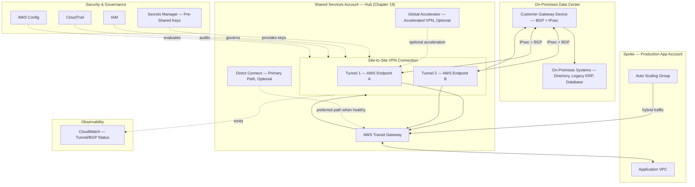

# Part III – Network Architectures

# Chapter 23 – Hybrid VPN

> **How to read this chapter:** This chapter anchors every concept to a concrete reference architecture — an **Enterprise Hybrid VPN Connectivity Platform**: redundant AWS Site-to-Site VPN connections, terminating at Chapter 19's Shared Services VPC hub via Transit Gateway, using BGP dynamic routing over IPsec tunnels to connect the organization's on-premises data centers to every spoke VPC across the AWS estate. This chapter treats VPN as both a **standalone primary hybrid-connectivity solution** for organizations not yet ready for Direct Connect's cost and lead time, and as the **resilient backup path** Chapter 19 assumed but didn't fully detail alongside a primary Direct Connect connection — this chapter is the complete, self-contained reference for both roles.

---

# 1. Executive Summary

## The Business Problem

Very few enterprises are ever purely cloud-native from day one:

- Most organizations migrating to AWS carry forward some on-premises footprint — a legacy ERP system not yet migrated, a data center-hosted directory service, a manufacturing-floor system with physical dependencies precluding cloud migration, or simply a multi-year migration timeline still in progress.
- During this transition period (which, for many organizations, is not truly transitional but a **permanent, steady-state hybrid posture**), AWS-hosted workloads need reliable, secure, and reasonably fast connectivity back to on-premises systems.

The default, naive answer — routing this traffic over the public internet with point-to-point application-layer encryption — has real, structural problems:

- **No network-layer confidentiality or integrity guarantee** beyond whatever the specific application protocol provides, leaving the organization dependent on every single application team correctly implementing and maintaining TLS (or equivalent) for every hybrid connection, with no centralized enforcement.
- **No consistent network path** — public internet routing is best-effort, with no guaranteed latency, bandwidth, or even consistent route, directly affecting time-sensitive hybrid workloads (a real-time inventory sync, a database replication stream with a tight lag tolerance).
- **No private, non-internet-routable addressing** — on-premises systems reachable only via a public IP address are, by definition, more exposed to internet-based reconnaissance and attack than systems reachable only via a private, VPN-mediated path.

A second business problem: **AWS Direct Connect, while providing a genuinely private, dedicated, high-bandwidth connection, has real cost and lead-time barriers that don't fit every organization's timeline or budget.**

- Direct Connect requires physical cross-connect provisioning at a specific AWS Direct Connect location, typically taking weeks to establish, and carries a meaningful fixed monthly port cost regardless of actual utilization.
- For an organization early in its cloud journey, piloting a hybrid connectivity model, or with genuinely modest hybrid-bandwidth needs, this lead time and cost can be entirely disproportionate to the actual, near-term requirement.

The business problem this chapter's architecture solves is: **how does an organization establish encrypted, private, reasonably fast connectivity between AWS and on-premises networks quickly (hours to days, not weeks), at a cost proportional to actual need, with a resilience posture (redundant tunnels, dynamic routing failover) suitable for genuine production dependency — whether as the organization's primary hybrid connectivity mechanism, or as the tested, reliable backup path for a Direct Connect connection that itself can and does occasionally fail.**

## Architecture Objective

This chapter's reference architecture targets a hybrid VPN connectivity platform that:

- Establishes **encrypted (IPsec), redundant Site-to-Site VPN connections** between AWS and on-premises data centers, provisionable within hours, not the weeks Direct Connect physical cross-connects require.
- Uses **BGP dynamic routing** over the VPN tunnels, so route changes (a new on-premises subnet, a Direct Connect failure triggering automatic VPN failover) propagate automatically without manual route-table intervention.
- Provides **tunnel-level redundancy** (each VPN connection provisions two tunnels, terminating at different AWS-side endpoints) and, where the business requirement justifies it, **connection-level redundancy** (multiple VPN connections, potentially to different on-premises devices or locations).
- Integrates cleanly with **Chapter 19's Transit Gateway hub**, making hybrid connectivity available to every spoke VPC without each spoke needing its own independent VPN configuration.
- Serves explicitly in **two distinct roles** depending on the organization's specific situation: as the **primary** hybrid connectivity mechanism for organizations not yet on Direct Connect, or as the **tested, reliable backup** path automatically activated if a primary Direct Connect connection fails.
- Supports **AWS Site-to-Site VPN's accelerated mode** (routing VPN traffic through AWS Global Accelerator's anycast network, per Chapter 21) for organizations needing more consistent, optimized network-path performance than a standard internet-routed VPN tunnel alone provides.

## Why Organizations Adopt This Architecture

Organizations adopt AWS Site-to-Site VPN for a specific, recurring set of reasons:

- They need **hybrid connectivity established quickly** — a VPN connection can be provisioned and functional within hours, compared to Direct Connect's multi-week physical provisioning timeline, making it the natural first step for an organization beginning its hybrid journey.
- They have **genuinely modest hybrid-bandwidth needs** where Direct Connect's minimum port-size cost isn't justified — a VPN connection's cost structure (no fixed port charge, primarily data-transfer-based) fits a lower, more variable bandwidth requirement better.
- They already have **Direct Connect and want a tested, reliable backup path** — this is, in practice, one of the most common reasons a mature enterprise implements this chapter's architecture, directly following the recommendation made (but not detailed) in Chapter 19, Section 12.
- They are running a **pilot or proof-of-concept hybrid workload** and want to validate the hybrid architecture's viability before committing to Direct Connect's longer lead time and larger cost commitment.

## Major Business Benefits

| Benefit | Explanation |
|---|---|
| Fast provisioning | Functional within hours, versus Direct Connect's multi-week physical cross-connect lead time. |
| Strong encryption in transit | IPsec-encrypted tunnels provide network-layer confidentiality and integrity, independent of individual application-layer encryption discipline. |
| Cost proportional to need | No fixed port-size commitment; costs scale primarily with actual VPN connection-hours and data transfer. |
| Redundant, self-healing routing | BGP dynamic routing automatically reroutes around a failed tunnel or entire VPN connection without manual intervention. |
| Reliable Direct Connect backup | Provides a genuinely independent failover path (different physical infrastructure, different failure domain) for organizations whose primary hybrid connectivity is Direct Connect. |
| Centrally shared via Transit Gateway | Every spoke VPC gains hybrid connectivity without independently provisioning its own VPN configuration (Chapter 19's pattern, applied here). |

## Typical Enterprise Scenarios

This architecture pattern fits:

- Organizations early in a cloud migration, needing hybrid connectivity to a legacy on-premises system quickly, without waiting for Direct Connect provisioning.
- Organizations with Direct Connect as their primary hybrid path, implementing VPN specifically as a tested, independent-failure-domain backup — the specific scenario Chapter 19 referenced and this chapter completes.
- Organizations with genuinely modest, variable hybrid-bandwidth needs where Direct Connect's fixed cost isn't justified.
- Organizations piloting a hybrid architecture before committing to a longer-term Direct Connect investment.
- Branch-office or multi-site organizations using AWS VPN CloudHub to interconnect multiple on-premises sites via a shared AWS hub, without requiring direct site-to-site connectivity between the branch locations themselves.

It is a poorer fit for:

- Organizations with sustained, high-bandwidth hybrid data-transfer needs (large-scale data migration, continuous high-volume replication) where Direct Connect's dedicated bandwidth and typically lower per-GB cost at volume become clearly more cost-effective and performant than VPN's internet-routed (even if accelerated) path.
- Organizations with a strict, latency-sensitive hybrid workload requiring the more consistent, predictable latency profile Direct Connect's dedicated connection provides, where standard VPN's internet-path latency variability is unacceptable (accelerated VPN, discussed in this chapter, partially — not fully — addresses this).

---

# 2. Business Requirements

## Business Drivers

- Establish encrypted, private hybrid connectivity quickly, without waiting for Direct Connect's multi-week provisioning.
- Provide a tested, independent-failure-domain backup path for organizations whose primary hybrid connectivity is Direct Connect.
- Keep hybrid connectivity cost proportional to actual, often modest or variable, bandwidth needs.
- Support centralized, Transit-Gateway-mediated hybrid connectivity available to every spoke VPC.

## Functional Requirements

| Requirement | Description |
|---|---|
| Redundant IPsec tunnels | Every VPN connection provisions two tunnels to geographically/infrastructurally distinct AWS endpoints. |
| BGP dynamic routing | Route propagation and failover occur automatically via BGP, not static, manually-maintained routes. |
| Transit Gateway integration | The VPN connection terminates at the Transit Gateway (per Chapter 19), making hybrid connectivity available to every attached spoke VPC. |
| Automatic failover to/from Direct Connect | Where VPN serves as a backup path, BGP route-preference configuration ensures traffic prefers Direct Connect when healthy and fails over to VPN automatically upon Direct Connect failure. |
| Accelerated VPN option | For workloads needing more consistent network-path performance, VPN traffic can route through AWS Global Accelerator's anycast network. |
| Multi-site support (CloudHub) | Multiple on-premises sites can interconnect via a shared AWS-side VPN hub without requiring direct site-to-site tunnels between the branch locations. |

## Non-Functional Requirements

| Category | Target |
|---|---|
| Provisioning time | Functional VPN connectivity established within 1 business day of customer gateway configuration being finalized |
| Tunnel failover time | Sub-second to low-single-digit-second failover between the two tunnels of a single VPN connection, via BGP route withdrawal |
| Connection-level failover time (VPN as backup) | Within the BGP hold-timer configuration, typically under 90 seconds, for traffic to shift from a failed Direct Connect connection to the VPN backup |
| Throughput | Each VPN tunnel supports up to a per-tunnel throughput ceiling (approximately 1.25 Gbps per tunnel as commonly documented); aggregate throughput scales via Equal-Cost Multi-Path (ECMP) routing across multiple tunnels/connections where genuinely higher throughput is required |
| Encryption | IPsec (IKEv2) with AES-256 encryption and SHA-2 integrity, at minimum, for every tunnel |

## Scalability Goals

- The architecture must support adding additional VPN connections (for additional on-premises sites, or additional redundancy) without requiring a redesign of the existing Transit Gateway attachment and route-table structure established in Chapter 19.
- Aggregate throughput must scale via ECMP across multiple tunnels/connections where a single tunnel's throughput ceiling becomes a genuine constraint, discussed further in Section 14.

## Availability Requirements

- 99.95% for the VPN connectivity layer when serving as primary hybrid connectivity; when serving as a backup to Direct Connect, the *combined* primary-plus-backup availability target is meaningfully higher (99.99%+), since the two paths' independent failure domains are specifically what provides this improved combined availability.

## Latency Requirements

- Standard (non-accelerated) VPN latency depends entirely on the actual internet path between the on-premises location and the AWS region — variable and not directly controllable by the organization.
- Accelerated VPN (via Global Accelerator, per Chapter 21) provides a more consistent, often lower-latency path by routing traffic onto AWS's backbone network sooner, at an additional cost — evaluated specifically for workloads where standard VPN's latency variability is a genuine, validated problem, not adopted reflexively.

## Compliance Requirements

- Identical baseline to Chapter 3 (SOC 2, encryption, audit logging).
- A chapter-specific requirement: IPsec tunnel configuration (encryption algorithm, key exchange parameters) must meet or exceed the organization's minimum cryptographic standards, often explicitly referenced in a compliance framework's technical control requirements (e.g., FIPS 140-2/140-3 validated cryptographic modules, where mandated).

## Security Expectations

- Every VPN tunnel uses strong, current-generation IPsec encryption (IKEv2, AES-256, SHA-2) — legacy, weaker cipher suites are explicitly disabled, not merely deprioritized.
- Pre-shared keys (or certificate-based authentication, where supported) are managed with the same Secrets Manager-backed discipline as any other credential in this book.

## Recovery Objectives

### Recovery Point Objective (RPO)

- **RPO = N/A** at the VPN connectivity layer itself (a stateless network path); the actual RPO for any specific hybrid workload traversing this connectivity is governed by that workload's own architecture (e.g., a database replication stream's own RPO characteristics).

### Recovery Time Objective (RTO)

- **RTO ≤ 90 seconds** for BGP-driven failover, whether between a VPN connection's own two tunnels or between a primary Direct Connect path and this chapter's VPN backup path.

## SLAs

- AWS Site-to-Site VPN itself does not carry a distinct AWS service-level SLA the way some other services do (it is built on standard AWS infrastructure with its own general reliability posture) — the organization's own internal SLA should be modeled based on the redundant-tunnel, dynamic-routing design's *demonstrated, tested* failover behavior, not an assumed inherited guarantee.

## Expected Workload

- Hybrid traffic volume varies enormously by organization and specific use case — directory-service authentication traffic, database replication streams, file-transfer/batch-integration jobs, and interactive application traffic to a not-yet-migrated on-premises system are all common traffic classes, each with meaningfully different bandwidth and latency-sensitivity profiles worth explicitly characterizing during initial capacity planning (Section 14).

## Expected Growth

- Growth in this architecture's scope tracks the organization's specific hybrid-dependency trajectory — for an organization actively migrating away from on-premises systems, this architecture's traffic volume may actually *decrease* over time as migration progresses, a notably different growth pattern than most other architectures in this book, worth explicitly planning for rather than assuming perpetual growth.

---

# 3. Architecture Overview

## Overall Design

The reference architecture provisions **one or more AWS Site-to-Site VPN connections**, each comprising two redundant IPsec tunnels, terminating at **Chapter 19's Transit Gateway hub**, with **BGP dynamic routing** exchanging route information between the on-premises customer gateway device and AWS.

- For organizations using VPN as their **primary** hybrid connectivity mechanism, typically two VPN connections are provisioned — either to two different on-premises customer gateway devices (for device-level redundancy) or, at minimum, ensuring the standard two-tunnel-per-connection redundancy is genuinely tested and relied upon.
- For organizations using VPN as a **backup to Direct Connect**, a single VPN connection (with its own standard two-tunnel redundancy) is typically sufficient, since Direct Connect remains the primary path under normal conditions and the VPN backup activates only upon Direct Connect failure.

## Architecture Philosophy

The guiding philosophy is **"redundancy at every layer that can fail independently, with automatic, dynamic-routing-driven failover — never a manually-maintained static route as the sole failover mechanism."**

This breaks down into concrete practices:

- Every VPN connection's two tunnels terminate at genuinely distinct AWS-side endpoints, so a single AWS-side infrastructure event affects at most one tunnel, not the entire connection.
- BGP (not static routing) is used specifically because it enables *automatic* route withdrawal and re-advertisement upon a path's failure — a static-route-based failover design would require manual intervention or a more fragile, custom-scripted health-check-and-route-update mechanism to achieve equivalent behavior.
- Where VPN serves as a Direct Connect backup, BGP path attributes (AS-path prepending, or local-preference adjustment) are deliberately configured so that Direct Connect is genuinely preferred under normal conditions, with VPN activating automatically — and *only* — upon Direct Connect's actual failure, not competing unpredictably for traffic under normal, healthy conditions.

A second guiding principle, directly inherited from Chapter 19: **this VPN connectivity terminates at the shared Transit Gateway hub, not independently in every spoke VPC** — every spoke gains hybrid connectivity through the same centralized mechanism Chapter 19 established, rather than each application team independently provisioning and managing its own VPN connection.

## Core Components

| Layer | Components |
|---|---|
| On-Premises | Customer Gateway device (a physical or virtual router/firewall supporting IPsec and BGP) |
| AWS Connectivity | AWS Site-to-Site VPN connection(s), each with two IPsec tunnels |
| Routing | BGP dynamic routing (Transit Gateway-side and customer-gateway-side ASN configuration) |
| Hub Integration | AWS Transit Gateway (per Chapter 19), VPN attachment |
| Acceleration (optional) | AWS Global Accelerator integration for accelerated VPN mode |
| Security | IPsec encryption (IKEv2, AES-256, SHA-2), pre-shared keys or certificate-based authentication via Secrets Manager/ACM Private CA |
| Observability | CloudWatch (VPN tunnel status, BGP session status), VPN connection logs |

## How Components Interact

- The on-premises customer gateway device establishes two IPsec tunnels to the AWS-side VPN connection's two endpoints.
- BGP sessions are established over each tunnel, with the on-premises customer gateway advertising the on-premises network's routes to AWS, and the Transit Gateway advertising the AWS-side spoke VPC routes to the on-premises customer gateway.
- Under normal conditions, traffic flows over whichever tunnel/path BGP determines is preferred (based on configured path attributes); if a tunnel fails, BGP automatically withdraws the corresponding route, and traffic shifts to the remaining healthy tunnel without manual intervention.
- Traffic reaching the Transit Gateway via the VPN attachment is routed to the appropriate spoke VPC per the Transit Gateway route-table configuration established in Chapter 19, exactly as any other hub-mediated traffic flow.

## High-Level Workflow

1. The on-premises customer gateway device is configured with the AWS-provided tunnel endpoint details, pre-shared keys (or certificates), and BGP ASN information.
2. Both IPsec tunnels establish and BGP sessions come up.
3. Route advertisement begins in both directions, populating the Transit Gateway's route table with on-premises routes and the customer gateway's routing table with AWS-side spoke routes.
4. Traffic flows bidirectionally between AWS spoke VPCs and on-premises networks via the established, encrypted tunnels.
5. Continuous BGP session and tunnel-health monitoring ensures automatic failover if either tunnel (or the entire VPN connection, if serving as a Direct Connect backup) becomes unavailable.

## Request Lifecycle

- An application request originating in an AWS spoke VPC, destined for an on-premises system, routes via the spoke's Transit Gateway attachment (Chapter 19) to the hub, then via the VPN (or Direct Connect, if healthy and preferred) attachment, through the IPsec tunnel, to the on-premises customer gateway, and finally to the destination on-premises system.

## Response Lifecycle

- The response traverses the same path in reverse — this chapter's specific contribution is ensuring that path is encrypted, private, and automatically resilient to a single tunnel or connection failure, without requiring the originating application to have any awareness of the underlying connectivity mechanism.

## Data Lifecycle

- Not directly applicable to this chapter's own architecture — VPN connectivity is a stateless network-transport layer; the data lifecycle of any specific hybrid workload traversing it is governed by that workload's own architecture.

---

# 4. AWS Services Used

## AWS Site-to-Site VPN

- **Purpose:** Provides the managed IPsec VPN connection — the central service this entire chapter is built around — establishing encrypted tunnels between AWS and an on-premises customer gateway device.
- **Why selected:** A fully-managed, redundant-by-default (two tunnels per connection), BGP-capable VPN service requiring no AWS-side VPN appliance for the organization to operate or patch — AWS manages the entirety of the AWS-side VPN infrastructure.
- **Alternatives:** AWS Direct Connect (Chapter 19) — chosen instead (or as the primary path this chapter's VPN backs up) when dedicated bandwidth, more consistent latency, and higher sustained throughput justify its cost and lead time; a self-managed, third-party VPN appliance deployed on EC2 — chosen instead only when a specific feature AWS's native Site-to-Site VPN doesn't support is genuinely required (uncommon for standard hybrid connectivity needs).
- **Limitations:** Per-tunnel throughput ceiling (approximately 1.25 Gbps, as commonly documented) requiring ECMP across multiple tunnels/connections for genuinely higher aggregate throughput needs; latency depends on the underlying internet path unless accelerated mode is used.
- **Pricing considerations:** Priced per VPN connection-hour plus per-GB data processed — a materially different, typically lower and more usage-proportional cost structure than Direct Connect's fixed port-hour charge, particularly favorable for variable or modest bandwidth needs (Section 16).
- **Best practices:** Always configure and genuinely test both tunnels of every VPN connection — a common, costly mistake is configuring only one tunnel (or configuring both but never testing actual failover to the second), discovered only during an actual failure when the assumed redundancy doesn't function as expected.

## AWS Transit Gateway

- **Purpose:** Serves as the termination point for the VPN attachment, making hybrid connectivity available to every spoke VPC via the hub-and-spoke model established in Chapter 19.
- **Why selected:** As detailed exhaustively in Chapter 19 — this chapter's VPN connectivity is a specific *type* of Transit Gateway attachment (a VPN attachment, alongside the VPC attachments Chapter 19 primarily discussed), integrating cleanly into the same route-table segmentation and centralized-hub philosophy.
- **Best practices:** Use a dedicated Transit Gateway route table for hybrid-connectivity-relevant routes, consistent with Chapter 19's segmentation discipline, rather than conflating hybrid routes with the spoke-to-spoke-isolation-focused route tables.

## AWS Global Accelerator (Accelerated VPN)

- **Purpose:** Optionally routes VPN tunnel traffic through Global Accelerator's anycast network (Chapter 21), providing a more consistent, often lower-latency network path than a standard, purely internet-routed VPN tunnel.
- **Why selected:** For hybrid workloads where standard VPN's internet-path latency variability is a genuine, validated problem (per Chapter 21's emphasis on empirical validation, not assumption), accelerated VPN provides a meaningful, AWS-native improvement without requiring a full migration to Direct Connect.
- **Limitations:** Adds Global Accelerator's own incremental cost (Chapter 21, Section 16) on top of standard VPN charges; the latency improvement, as with any Global Accelerator use case, should be empirically validated for the specific on-premises location's actual network path, not assumed.

## AWS Certificate Manager Private Certificate Authority (ACM Private CA)

- **Purpose:** Provides certificate-based authentication for VPN tunnels, as an alternative to static pre-shared keys, for organizations with a certificate-management infrastructure preference or requirement.
- **Why selected:** Certificate-based authentication offers stronger, more easily-rotatable authentication than long-lived pre-shared keys, at the cost of additional PKI management complexity.
- **Alternatives:** Pre-shared keys (the simpler, more common default) — appropriate for the majority of straightforward VPN deployments; certificate-based authentication — reserved for organizations with specific compliance requirements or existing PKI infrastructure investment justifying the added complexity.

## AWS Secrets Manager

- **Purpose:** Stores VPN pre-shared keys securely, retrieved by automation (e.g., a Terraform provider reading from Secrets Manager, or an on-premises configuration-management tool) rather than embedded in plaintext configuration files or Terraform variable files.
- **Why selected:** Consistent with this book's established discipline (Chapters 3, 8, 11) — no secret, including a VPN pre-shared key, should ever be stored in plaintext, version-controlled configuration.
- **Best practices:** Rotate pre-shared keys on a defined schedule, coordinated carefully between the AWS-side and on-premises-side configuration updates to avoid an accidental, mid-rotation connectivity disruption (Section 23).

## AWS IAM

- **Purpose:** Scopes access to VPN connection configuration (tunnel options, route propagation settings) within the hub account, following the same elevated-sensitivity treatment given to Chapter 19's Transit Gateway configuration and Chapter 21's traffic-dial configuration.
- **Why selected:** As throughout this book — foundational least-privilege access control, with particular emphasis here given a VPN misconfiguration's potential to disrupt genuine, production hybrid dependencies.

## Amazon CloudWatch

- **Purpose:** Provides VPN-specific metrics — per-tunnel state (UP/DOWN), tunnel data-transfer volume, and BGP session status — essential for validating both the redundancy design's actual, ongoing health and for triggering alerts on a tunnel failure before it potentially cascades into a full-connection failure.
- **Why selected:** Native integration consistent with every prior chapter; a chapter-specific emphasis is monitoring *both* tunnels of every connection continuously, not merely the currently-active one, since a silently-failed standby tunnel provides no actual redundancy benefit when eventually needed.

## Amazon CloudTrail / AWS Config / Amazon GuardDuty

- **Purpose:** As described in Chapter 3 — organization-wide audit, compliance, and threat-detection baseline, applied to the hub account hosting this chapter's VPN configuration.
- **Chapter-specific addition:** CloudTrail captures every VPN connection and Transit Gateway VPN-attachment configuration change — directly relevant audit evidence for both operational incident review and the compliance-relevant cryptographic-configuration requirements noted in Section 2.

---

# 5. Complete Architecture Diagram



---

# 6. Component-by-Component Explanation

## Customer Gateway (On-Premises)

- **Purpose:** The on-premises router/firewall device terminating the IPsec tunnels and participating in BGP route exchange with AWS.
- **Responsibilities:** Establish and maintain both IPsec tunnels; run a BGP session over each tunnel; advertise on-premises routes and accept AWS-side routes.
- **Inputs:** AWS-provided tunnel configuration (endpoint IPs, pre-shared keys or certificates, BGP ASN).
- **Outputs:** Encrypted traffic to AWS; BGP route advertisements.
- **Scaling:** A single customer gateway device typically handles the organization's VPN connection(s); for very high-throughput or high-availability requirements, redundant customer gateway devices (in an active-active or active-standby on-premises configuration) may be deployed, corresponding to multiple AWS-side VPN connections.
- **High availability:** Device-level redundancy is the organization's own on-premises responsibility — a single customer gateway device is itself a single point of failure at the on-premises end, regardless of how many AWS-side tunnels are configured; genuinely high-availability hybrid connectivity requires redundant on-premises devices, not merely redundant AWS-side tunnels.
- **Failure handling:** A customer gateway device failure (as opposed to a single tunnel's failure) takes down the entire VPN connection; this is why organizations with a strict availability requirement provision multiple VPN connections to physically/logically distinct customer gateway devices, not merely relying on a single device's two AWS-side tunnels.
- **Dependencies:** The on-premises network's own internet connectivity (for standard, non-Direct-Connect-routed VPN) or the Direct Connect circuit itself (if VPN is layered over a private Direct Connect connection, a less common but supported configuration).
- **Security:** IPsec configuration (encryption/authentication algorithms) must be compatible with and at least as strong as AWS's configured requirements; the device's own firmware/OS patch currency is the organization's responsibility.
- **Monitoring:** On-premises-side VPN/BGP monitoring, ideally correlated with AWS-side CloudWatch metrics for a complete, end-to-end view of tunnel health.

## AWS Site-to-Site VPN Connection

- **Purpose:** Provides the AWS-managed half of the IPsec tunnel pair and BGP session, terminating at the Transit Gateway.
- **Responsibilities:** Maintain two independent tunnel endpoints; process IPsec encryption/decryption; run BGP sessions exchanging routes with the customer gateway.
- **Scaling:** Each connection provides two tunnels with their own throughput ceiling; additional connections (and correspondingly, ECMP routing) are used to scale aggregate throughput beyond a single connection's capacity.
- **High availability:** The two tunnels of a single connection terminate at genuinely distinct AWS-side endpoints by design, ensuring an AWS-side infrastructure event affects at most one tunnel.
- **Failure handling:** BGP automatically withdraws the route associated with a failed tunnel, shifting traffic to the remaining healthy tunnel without manual intervention, assuming the customer gateway device correctly participates in this same BGP failover behavior.
- **Dependencies:** A correctly-configured, BGP-capable customer gateway device; the Transit Gateway attachment.
- **Security:** IPsec encryption parameters (IKEv2, AES-256, SHA-2 at minimum) configured per the organization's cryptographic standards; pre-shared keys stored in Secrets Manager, never in plaintext configuration.
- **Monitoring:** CloudWatch `TunnelState` (UP/DOWN) per tunnel, `TunnelDataIn`/`TunnelDataOut`, and BGP session status.

## BGP Dynamic Routing

- **Purpose:** Automates route exchange and failover between AWS and on-premises, eliminating the need for manually-maintained static routes.
- **Responsibilities:** Advertise routes in both directions; withdraw routes automatically upon a path's failure; apply configured path-preference attributes (e.g., preferring Direct Connect over VPN under normal conditions).
- **Chapter-specific note on VPN-as-backup configuration:** When VPN backs up Direct Connect, BGP path attributes (typically AS-path prepending on the VPN-side advertisement, making the VPN path appear "longer" and therefore less preferred) ensure traffic prefers the healthy Direct Connect path under normal conditions, with automatic failover to VPN only upon Direct Connect's actual route withdrawal.
- **Failure handling:** This *is* the failure-handling mechanism for this chapter's entire architecture — a correctly-configured BGP session is what makes automatic, sub-90-second failover possible, as opposed to a static-routing design requiring manual or custom-scripted intervention.
- **Dependencies:** Consistent, correctly-configured ASN values on both the AWS side (via the Transit Gateway's or VPN connection's configured Amazon-side ASN) and the on-premises customer gateway device.
- **Monitoring:** BGP session state (established/idle/active) is a critical, distinct signal from tunnel state alone — a tunnel can be technically "up" at the IPsec layer while its BGP session has failed to establish, a specific failure mode discussed in Section 24.

## Accelerated VPN (Global Accelerator Integration)

- **Purpose:** Routes VPN tunnel traffic through Global Accelerator's anycast network for a more consistent, often improved network path, per Chapter 21's architecture applied specifically to VPN traffic.
- **When to use:** Specifically for hybrid workloads where standard VPN's internet-path latency variability has been empirically validated (per Chapter 21's discipline) as a genuine, business-relevant problem — not adopted by default for every VPN connection.
- **When NOT to use:** For the common "VPN as Direct Connect backup" role specifically, where the VPN path is expected to be used rarely (only during a Direct Connect failure) and its baseline, non-accelerated performance is generally acceptable for a temporary failover condition — the added cost of acceleration is harder to justify for a path used only during exceptional circumstances.

---

# 7. End-to-End Request Flow

**Scenario: An application in an AWS spoke VPC (per Chapter 19's architecture) needs to query an on-premises-hosted legacy database, with VPN serving as the backup path to a primary Direct Connect connection.**

1. **Application initiates a database query**: The application, running in a Chapter 8 Auto Scaling Group instance within a spoke VPC, initiates a connection to the on-premises database's hostname (resolved via Chapter 19's Route 53 Resolver-mediated on-premises DNS resolution).
2. **Routing to the Transit Gateway**: The spoke's route table sends the on-premises-destined traffic to the Transit Gateway attachment.
3. **Transit Gateway path selection — normal conditions**: Under normal conditions, the Transit Gateway's route table (populated via BGP from both the Direct Connect and VPN attachments) prefers the Direct Connect path, per its configured, more-preferred BGP path attributes.
4. **Traffic traverses Direct Connect**: The query traverses the dedicated Direct Connect circuit to the on-premises network.
5. **On-premises processing**: The on-premises database processes the query and returns the response via the same preferred path.
6. **Direct Connect failure (alternate path begins)**: The organization's Direct Connect circuit experiences a failure — a fiber cut, a hardware failure at the Direct Connect location, or a planned maintenance event.
7. **BGP route withdrawal**: The Direct Connect-associated BGP session goes down, and the corresponding routes are automatically withdrawn from the Transit Gateway's route table.
8. **Automatic failover to VPN**: With the Direct Connect route withdrawn, the Transit Gateway's route table now reflects the VPN connection's routes as the next-best (and now only) available path.
9. **Traffic reroutes via VPN**: Subsequent application traffic, including the next database query attempt, routes via the Transit Gateway's VPN attachment instead.
10. **IPsec tunnel processing**: The traffic is encrypted and transits one of the VPN connection's two IPsec tunnels to the on-premises customer gateway device.
11. **On-premises processing continues**: The on-premises database (or, if the customer gateway device is genuinely distinct infrastructure from the Direct Connect termination point, potentially requiring its own on-premises-side routing adjustment) receives and processes the query via this new path.
12. **Application-level impact during failover**: Depending on the specific application's connection-handling behavior, an in-flight database connection at the moment of failover may be disrupted, requiring the application's own connection-retry logic (following the same principle established in Chapter 8, Section 12 for database failover) to reconnect gracefully via the now-active VPN path.
13. **Direct Connect restoration (alternate path)**: Once the Direct Connect circuit is restored and its BGP session re-establishes, the Transit Gateway's route table automatically prefers it again (per the configured path attributes), and traffic reverts to the Direct Connect path without further manual intervention.
14. **Logging throughout**: VPN tunnel state changes, BGP session state changes, and the underlying Transit Gateway route-table changes are all captured in CloudWatch metrics and, for the BGP/routing-configuration-relevant changes, CloudTrail.
15. **Monitoring throughout**: An alert fires upon the Direct Connect failure (tunnel/BGP state change), notifying the platform networking team of the automatic failover event even though, from the application's perspective, the failover itself required no manual intervention to complete.
16. **Error handling — VPN also unavailable (rare, alternate path)**: If both Direct Connect and the VPN backup are simultaneously unavailable (a genuinely rare, correlated failure, perhaps due to a shared on-premises network dependency), no automated path exists, and the organization's broader incident-response process addresses the resulting hybrid-connectivity outage directly.

---

# 8. Deployment Flow

## Infrastructure Provisioning

- The VPN connection, its associated Transit Gateway attachment, and BGP/route-table configuration are defined in Terraform, in the same repository/module structure established for Chapter 19's Shared Services network infrastructure, owned by the same platform networking team.

## Terraform Workflow

- Identical review-and-apply discipline to every prior chapter, with a chapter-specific emphasis: any change to BGP path-preference configuration (particularly the AS-path-prepending or local-preference settings governing VPN-versus-Direct-Connect preference) requires mandatory platform-networking-team review, given its direct effect on which path genuinely serves as primary under normal conditions.

## CI/CD Deployment

- VPN connection provisioning is a relatively infrequent event (compared to, say, application deployments) — typically triggered by a new on-premises site's onboarding or a deliberate architecture change, rather than a routine, frequent pipeline execution.

## Blue-Green Deployment

- Not directly applicable in the traditional sense; the closest analog is validating a new or modified VPN connection's configuration in a non-production Transit Gateway route-table context (or a dedicated test VPN connection) before applying the equivalent change to the production hybrid-connectivity path.

## Rollback

- Reverting a VPN connection's Terraform-managed configuration to a previous known-good state, following this book's established IaC rollback discipline; a chapter-specific consideration is that a genuinely mid-incident emergency change (e.g., manually adjusting BGP preference during an active Direct Connect outage) should be reconciled back into Terraform promptly afterward, consistent with Chapter 19 and 21's established "no lasting manual drift" discipline.

## Secrets

- VPN pre-shared keys are generated (or provided by the on-premises networking team) and stored in Secrets Manager, retrieved by the Terraform provider (or a coordinated manual process, for the on-premises-side configuration) rather than ever appearing in plaintext in version control.

## Configuration

- Tunnel options (encryption algorithms, DPD — Dead Peer Detection — timers, BGP timers) are Terraform-managed, version-controlled, and reviewed, following this book's "no manual console changes" discipline.

## Validation

- Post-deployment validation for any new or modified VPN connection includes: confirming both tunnels establish and reach the `UP` state, confirming BGP sessions establish and routes are correctly exchanged in both directions, and — critically — **deliberately testing failover** by intentionally disabling one tunnel (or, for a Direct Connect backup configuration, simulating a Direct Connect failure in a controlled way) to confirm the automatic failover behavior actually functions as designed, not merely assumed to work based on configuration review alone.

---

# 9. Network Topology

## VPC

- This chapter's VPN connectivity terminates at Chapter 19's hub Transit Gateway, not within any individual VPC directly — Site-to-Site VPN, when attached to a Transit Gateway (as opposed to attaching directly to a single VPC's Virtual Private Gateway, an older, less flexible pattern), has no VPC-resident footprint of its own.

## CIDR

- The on-premises network's CIDR range(s) must be explicitly known and non-overlapping with any AWS-side VPC CIDR, following the same centralized CIDR-registry discipline established in Chapter 19 — this is arguably even more consequential here, since a CIDR overlap with an on-premises network is often harder to detect and remediate than an AWS-side-only overlap, given the on-premises network's typically longer-established, harder-to-renumber addressing scheme.

## Public Subnets

- Not directly applicable — Site-to-Site VPN, when Transit-Gateway-attached, does not require a dedicated public subnet the way a self-managed VPN appliance on EC2 would.

## Private Subnets

- Not directly applicable to the VPN connection itself; the Transit Gateway attachment operates independently of any specific subnet.

## NAT Gateway

- Not directly relevant to VPN traffic itself, which routes via the Transit Gateway/VPN attachment path, not through NAT Gateway egress — worth explicitly clarifying in an architecture review, since it's a common point of confusion for engineers newer to hybrid networking.

## Internet Gateway

- Standard (non-Direct-Connect-routed) Site-to-Site VPN traffic transits the public internet between the on-premises customer gateway and AWS's VPN endpoints — this is IPsec-encrypted, providing strong confidentiality and integrity, but it's worth being precise in architecture documentation that "encrypted" does not mean "not traversing the public internet" for standard VPN; this distinction matters for certain compliance/data-residency conversations.

## Transit Gateway

- The core integration point for this chapter's architecture, as established in Chapter 19 — the VPN connection attaches to the Transit Gateway as a distinct attachment type (alongside the VPC attachments Chapter 19 primarily discussed), participating in the same route-table segmentation model.

## Route Tables

- A dedicated Transit Gateway route table (or a clearly-segmented portion of an existing one) specifically handles hybrid-connectivity routes, with BGP-learned on-premises routes propagated to the spoke route tables that legitimately need on-premises access — not propagated blanket-wide to every spoke regardless of actual need, following the same least-necessary-connectivity philosophy established in Chapter 19.

## Network ACLs / Security Groups

- Security groups at the spoke-VPC application layer should explicitly permit traffic to/from the specific on-premises CIDR ranges the application legitimately needs to reach — not a broad "allow all VPC-internal and Transit-Gateway-routed traffic" rule that would inadvertently also permit traffic to on-premises ranges the application has no legitimate reason to reach.

## PrivateLink

- Not directly applicable to VPN connectivity itself; PrivateLink continues serving its established role (Chapters 3, 19) for private connectivity to AWS services, entirely orthogonal to this chapter's hybrid on-premises connectivity.

## Hybrid Connectivity (This Chapter's Core Subject)

- Detailed exhaustively throughout this chapter; the specific topology decision — VPN as primary versus VPN as Direct Connect backup versus VPN CloudHub for multi-site interconnection — is the central architectural choice this chapter's Sections 3, 12, and 28 address in depth.

---

# 10. Identity and Access

## IAM Roles

- A dedicated role for VPN connection and Transit Gateway VPN-attachment configuration management, following the same elevated-sensitivity treatment as Chapter 19's Transit Gateway route-table administration role.

## IAM Policies

```json

{
  "Version": "2012-10-17",
  "Statement": [
    {
      "Sid": "AllowVPNConnectionManagement",
      "Effect": "Allow",
      "Action": [
        "ec2:CreateVpnConnection",
        "ec2:DescribeVpnConnections",
        "ec2:ModifyVpnConnectionOptions",
        "ec2:ModifyVpnTunnelOptions"
      ],
      "Resource": "*",
      "Condition": {
        "StringEquals": { "aws:RequestedRegion": "us-east-1" }
      }
    },
    {
      "Sid": "AllowReadSecretsForPreSharedKeys",
      "Effect": "Allow",
      "Action": ["secretsmanager:GetSecretValue"],
      "Resource": "arn:aws:secretsmanager:us-east-1:222233334444:secret:hybrid-vpn/psk-??????"
    },
    {
      "Sid": "DenyVPNConnectionDeletion",
      "Effect": "Deny",
      "Action": ["ec2:DeleteVpnConnection"],
      "Resource": "*"
    }
  ]
}

```

## Resource Policies

- VPN connections do not use resource-based policies in the same way S3 or KMS do; access control is managed entirely through IAM identity policies scoped to the specific hub account and VPN connection resources.

## STS

- As throughout this book — every role assumption uses short-lived STS credentials.

## Cross-Account Access

- If the hub account (hosting the Transit Gateway and VPN connections) is distinct from any account needing visibility into VPN health for its own operational purposes (e.g., a specific spoke team wanting to monitor their own hybrid-dependency path), read-only cross-account access to the relevant CloudWatch metrics can be granted via a scoped, read-only cross-account role — write/configuration access remains restricted to the platform networking team exclusively.

## Least Privilege

- VPN connection deletion is explicitly denied even to the management role handling routine configuration changes (tunnel options, route propagation), requiring a distinct, more deliberate, separately-authorized action for connection removal — a specific, practical safeguard against an accidental deletion of genuinely production hybrid connectivity.

## Service Roles

- Not typically applicable in the same way as some other AWS services — Site-to-Site VPN doesn't require a customer-managed service-linked role for its own basic operation, though Transit Gateway's own service-linked role (Chapter 19) continues to apply for the underlying attachment mechanism.

## Permission Boundaries

- Applied to the CI/CD deployment role managing this chapter's Terraform-defined VPN configuration, capping its maximum grantable permissions.

---

# 11. Security Architecture

## Encryption

- IPsec (IKEv2) with AES-256 encryption and SHA-2-family integrity checking, at minimum, for every tunnel — legacy IKEv1 and weaker cipher suites (AES-128, SHA-1) are explicitly disabled in the tunnel-options configuration, not merely left as a lower-priority negotiation option.

## KMS

- Not directly applicable to the VPN tunnel's own IPsec encryption (which uses its own negotiated session keys, not a customer-managed KMS CMK); KMS continues to encrypt any related, at-rest configuration data (e.g., Secrets Manager's own storage of the pre-shared key) per this book's established pattern.

## TLS

- Application-layer TLS, where used by the specific hybrid workload traversing the VPN, remains the application's own responsibility and a genuinely valuable defense-in-depth layer on top of the VPN's own IPsec encryption — the two are complementary, not redundant, since VPN encryption protects the network path while TLS protects the application-layer payload with end-to-end guarantees independent of the network path's own security.

## WAF / Shield

- Not directly applicable to VPN connectivity itself, which operates at the network layer for internal, hybrid traffic rather than public-internet-facing application traffic; WAF/Shield continue serving their established roles (Chapter 3) for the organization's actual internet-facing application endpoints.

## Secrets Manager

- Stores VPN pre-shared keys, following this book's established discipline (Section 4); a chapter-specific practice is coordinating key rotation carefully between the AWS-side and on-premises-side configuration to avoid a disruptive, mid-rotation mismatch (Section 23).

## Certificate Manager (ACM Private CA)

- Used specifically for certificate-based VPN authentication, as an alternative to pre-shared keys, per Section 4's discussion.

## GuardDuty

- Enabled for the hub account identically to every other account; VPC Flow Logs and DNS logs relevant to hybrid traffic patterns feed GuardDuty's broader threat-detection analysis, potentially surfacing an anomalous traffic pattern originating from or destined to the on-premises network via the VPN path.

## Inspector

- Not directly applicable to the VPN connection itself (a managed AWS service, not customer-managed compute); if a self-managed VPN appliance alternative is used instead (Section 28), Inspector's standard EC2 scanning would apply to that appliance's own instances.

## Security Hub

- Aggregates the hub account's Config/GuardDuty findings into the organization's unified view, per Chapter 3's established pattern.

## CloudTrail

- Captures every VPN connection and Transit Gateway VPN-attachment configuration API call — a highly sensitive audit trail, given a VPN misconfiguration's potential to disrupt genuine production hybrid dependencies or, in a worst case, misdirect sensitive on-premises-bound traffic.

## AWS Config

- A chapter-specific custom rule flags any VPN tunnel-options configuration specifying a weaker-than-approved encryption or integrity algorithm, directly enforcing the cryptographic-standards requirement from Section 2 as a continuously-monitored compliance control, not merely a point-in-time provisioning check.

## Zero Trust

- VPN connectivity provides network-layer transport security (encryption, integrity, private addressing) but does **not** itself provide authentication or authorization for what happens *over* that connection — an application or service reachable via the VPN path still requires its own, independent authentication/authorization mechanism (Chapter 3's IAM-based or application-level access control), exactly the same zero-trust principle established in Chapter 19 applied here: shared connectivity infrastructure does not imply implicit trust for what travels over it.

## Threat Model

Primary threats specific to this chapter's architecture:

1. Weak or legacy IPsec cipher-suite configuration permitting a cryptographically weaker connection than the organization's standards require.
2. Pre-shared key compromise or leakage, potentially allowing an unauthorized party to establish a rogue VPN connection.
3. A misconfigured BGP route advertisement (either direction) inadvertently exposing an unintended network segment across the hybrid boundary.
4. An on-premises customer gateway device compromise providing an attacker a path into the AWS environment via the trusted VPN connection.

## Attack Vectors and Mitigations

| Attack Vector | Mitigation |
|---|---|
| Weak cipher-suite negotiation | Explicit tunnel-options configuration disabling legacy IKEv1/weak-cipher fallback; Config rule enforcing minimum cryptographic standards |
| Pre-shared key compromise | Secrets-Manager-backed storage; scheduled, coordinated rotation; consideration of certificate-based authentication for elevated-sensitivity connections |
| Misconfigured BGP route advertisement | Mandatory platform-networking-team review for any BGP/route-table configuration change; explicit route-table segmentation limiting which spokes receive which on-premises routes |
| Compromised on-premises customer gateway device | Network Firewall inspection (Chapter 19) applied to hybrid-connectivity traffic, not only internet-egress traffic; GuardDuty monitoring for anomalous traffic patterns originating from the VPN path specifically |

---

# 12. High Availability

## AZ Failures

- The two tunnels of a single VPN connection terminate at AWS-side endpoints designed for independent-failure-domain resilience; a broader AZ-level event affecting the Transit Gateway's own infrastructure is addressed by Transit Gateway's own inherent multi-AZ design (Chapter 19), not a VPN-specific concern.

## Instance Failures

- Not directly applicable to the AWS-managed VPN service itself; on the on-premises side, a customer gateway device failure is addressed via on-premises device redundancy (Section 6), the organization's own responsibility.

## Regional Failures

- A full AWS regional failure affecting the hub (Chapter 19, Section 12) would also affect this chapter's VPN connectivity, addressed by the same DR-region standby hub pattern established in Chapter 19 — a DR-region hub requires its own VPN connection(s) to the same (or an alternate) on-premises location, provisioned and validated as part of the overall DR-region readiness.

## Database Failures

- Not directly applicable to this chapter's own architecture; any specific hybrid workload's database-tier resilience is governed by that workload's own architecture (Chapter 3).

## Load Balancing

- Not directly applicable in the traditional ALB sense; ECMP (Equal-Cost Multi-Path) routing across multiple tunnels/connections serves an analogous throughput-distribution role when aggregate bandwidth needs exceed a single tunnel's capacity (Section 14).

## Health Checks

- BGP session state and tunnel state (both independently tracked) serve as this chapter's primary health-check mechanism, directly analogous in role to Chapter 8's ALB health checks or Chapter 21's Global Accelerator endpoint-group health checks — the specific, chapter-relevant nuance is that *both* signals (tunnel UP/DOWN and BGP session established/not-established) must be monitored, since they can disagree (Section 24).

## Failover

- The core capability this entire chapter's architecture provides: automatic, BGP-driven failover between tunnels (sub-second to low-single-digit seconds) and, where VPN backs up Direct Connect, between the two distinct hybrid-connectivity mechanisms (within the BGP hold-timer window, typically under 90 seconds) — detailed exhaustively throughout Sections 1, 3, 7, and 12.

---

# 13. Disaster Recovery

## Backup Strategy

- This chapter's VPN configuration is Terraform/Git-backed, following this book's established IaC discipline; there is no separate "backup" concept for the VPN connection's own configuration beyond its version-controlled Terraform definition.

## Snapshots

- Not applicable to VPN connectivity directly.

## Cross-Region Replication

- If the organization maintains a DR-region standby hub (Chapter 19, Section 13), that hub requires its own VPN connection(s) — either to the same on-premises location (requiring the on-premises customer gateway device to support connections to multiple AWS regions, a configuration worth validating explicitly) or, less commonly, to an alternate on-premises DR location if the organization's own on-premises infrastructure also has a DR posture.

## Pilot Light / Warm Standby / Multi-Site / Active-Active / Active-Passive

- This chapter's own architecture is itself frequently a specific instance of these broader DR patterns, applied to *hybrid connectivity specifically*:
  - **Active-Passive**: Direct Connect as primary, VPN as passive backup — this chapter's most common configuration.
  - **Active-Active**: Multiple VPN connections (or VPN plus Direct Connect) genuinely sharing traffic load simultaneously via ECMP, used when aggregate throughput needs justify combining multiple paths' capacity rather than treating one purely as a failover backup.
  - **Multi-Site (CloudHub)**: Multiple on-premises locations each with their own VPN connection to the shared hub, enabling any-to-any connectivity between on-premises sites via the AWS-side hub without requiring direct site-to-site tunnels — a genuinely distinct use case from the primary/backup pattern, detailed further in Section 28.

## RPO

- **RPO = N/A** at the connectivity layer itself; governed by the specific hybrid workload's own data architecture.

## RTO

- **RTO ≤ 90 seconds** for BGP-driven failover between paths, consistent with the target established in Section 2.

---

# 14. Scalability

## Horizontal Scaling

- Additional VPN connections (to the same or additional on-premises customer gateway devices) provide both increased redundancy and, via ECMP routing across the additional tunnels, increased aggregate throughput beyond a single connection's per-tunnel throughput ceiling.

## Vertical Scaling

- Not a meaningful concept for AWS Site-to-Site VPN itself, which has no customer-configurable "instance size" — throughput scaling is achieved horizontally (additional connections/tunnels), not vertically.

## Auto Scaling (Comparison)

- Not applicable — VPN connections are provisioned deliberately, not auto-scaled in response to traffic metrics, given their relatively infrequent provisioning cadence and the on-premises-side coordination required for any new connection.

## Serverless Scaling

- Not applicable to this chapter's own architecture.

## ECMP for Throughput Scaling (Chapter-Specific)

- When a single VPN tunnel's throughput ceiling (approximately 1.25 Gbps, as commonly documented) becomes a genuine constraint, Equal-Cost Multi-Path routing across multiple tunnels (either within a single connection's two tunnels, or across multiple connections) distributes traffic across the available paths, provided both the AWS-side and on-premises-side BGP configuration support ECMP correctly — worth explicitly validating during initial design for any workload with a genuinely high aggregate hybrid-bandwidth requirement.

## Database Scaling / Storage Scaling / Queue Scaling

- Not applicable to this chapter's own architecture; governed by each specific hybrid workload's own architecture.

---

# 15. Performance Optimization

## Caching

- Not directly applicable to VPN connectivity itself; application-layer caching strategies (Chapter 3) for any specific hybrid workload operate independently of this chapter's transport-layer architecture.

## Compression

- Not natively provided by AWS Site-to-Site VPN; if compression is genuinely valuable for a specific bandwidth-constrained hybrid workload, it must be implemented at the application layer or via the on-premises customer gateway device's own capabilities, if supported.

## CDN

- Not applicable — CDN serves internet-facing, cacheable content delivery (Chapter 3), an entirely different concern from this chapter's private, hybrid connectivity.

## Database Optimization / Connection Pooling

- Relevant specifically for any hybrid workload involving database connectivity across the VPN path — connection pooling (Chapter 3, Section 15) becomes particularly valuable when the underlying network path (even encrypted, even redundant) has meaningfully higher latency than an intra-AWS-region connection would, making connection-establishment overhead a proportionally larger cost.

## Concurrency

- Not directly applicable to VPN connectivity itself.

## Async Processing

- For hybrid workloads sensitive to the VPN path's latency variability, an asynchronous, queue-mediated integration pattern (Chapter 3's EventBridge/SQS approach, extended across the hybrid boundary) can meaningfully reduce the application-level impact of any transient VPN latency spike or brief failover event, compared to a synchronous, tightly-coupled integration pattern that would directly surface any such variability to the end user.

## Accelerated VPN (Chapter-Specific Performance Lever)

- As detailed in Sections 4 and 6 — the primary AWS-native performance-optimization lever specific to this chapter, evaluated and empirically validated (per Chapter 21's discipline) for workloads genuinely sensitive to standard VPN's internet-path latency variability.

---

# 16. Cost Optimization (FinOps)

## Estimated Monthly Cost — Small Deployment

*(Single VPN connection, primary hybrid connectivity, modest traffic volume)*

| Line Item | Estimated Monthly Cost (USD) |
|---|---|
| VPN connection-hours (1 connection) | $36 |
| Data transfer (modest volume) | $200 |
| CloudWatch | $20 |
| **Estimated Total** | **≈ $256/month** |

## Estimated Monthly Cost — Medium Deployment

*(Two VPN connections, backing up Direct Connect, moderate failover-event traffic volume)*

| Line Item | Estimated Monthly Cost (USD) |
|---|---|
| VPN connection-hours (2 connections) | $72 |
| Data transfer (moderate volume, mostly minimal since Direct Connect is primary) | $150 |
| CloudWatch | $40 |
| **Estimated Total** | **≈ $262/month** |

## Estimated Monthly Cost — Enterprise Deployment

*(Multiple VPN connections across several on-premises sites, CloudHub multi-site interconnection, some accelerated-VPN usage)*

| Line Item | Estimated Monthly Cost (USD) |
|---|---|
| VPN connection-hours (6 connections, multiple sites) | $216 |
| Data transfer (higher aggregate volume) | $1,800 |
| Global Accelerator (accelerated VPN, selective use) | $400 |
| CloudWatch | $150 |
| **Estimated Total** | **≈ $2,566/month** |

> **Note:** Directional planning figures. VPN's cost structure is notably more usage-proportional than Direct Connect's fixed port-hour charge — this is frequently VPN's specific cost advantage for organizations with modest or highly variable hybrid-bandwidth needs, and frequently the *reason* Direct Connect becomes more cost-effective at sustained high volume, worth an explicit, periodic cost-crossover analysis (Section 28) as actual traffic volume evolves.

## Major Cost Drivers

1. Data-transfer volume — the dominant, usage-proportional cost driver, scaling directly with actual hybrid traffic volume.
2. The fixed per-connection-hour charge — modest, predictable, and largely insensitive to actual usage within a given connection.
3. Global Accelerator's incremental cost, if accelerated VPN is used for any specific connection (Chapter 21's cost model applied here).

## Optimization Opportunities

| Opportunity | Typical Savings |
|---|---|
| Use VPN (rather than a second Direct Connect connection) specifically for backup/DR purposes where the path is rarely active | Avoids Direct Connect's fixed port-hour cost for a path used only during exceptional failover events |
| Right-size the number of provisioned VPN connections to actual redundancy/throughput requirements, not maintained "just in case" beyond genuine need | Avoids unnecessary per-connection-hour charges for underutilized redundant paths |
| Apply accelerated VPN selectively, only to connections/workloads with an empirically-validated latency-sensitivity requirement | Avoids Global Accelerator's incremental cost for connections that don't genuinely benefit from it |
| Periodically reassess the VPN-versus-Direct-Connect cost crossover point as actual traffic volume evolves | Ensures the organization migrates to Direct Connect (or scales it) at the point where it becomes genuinely more cost-effective than continued VPN usage at growing volume, not later or earlier than that crossover |

## Reserved Instances / Savings Plans / Spot

- Not applicable to AWS Site-to-Site VPN, which has no RI/Savings-Plan-equivalent commitment-discount model.

## S3 Lifecycle / Storage Classes

- Applies to any VPN-related log storage (if flow logs or connection logs are exported to S3), following Chapter 3's established lifecycle discipline.

## Rightsizing

- Reviewed periodically: actual VPN connection count and their genuine ongoing necessity, actual data-transfer volume trends (informing the Direct Connect cost-crossover analysis), and whether accelerated VPN continues to be justified for any specific connection currently using it.

## Cost Allocation / Tagging / Budgets / Cost Anomaly Detection

- VPN costs are tracked within the same "Shared Network Services" cost center established in Chapter 19, given their shared, hub-account-resident nature; Cost Anomaly Detection specifically monitors for an unexpected, sustained increase in VPN data-transfer volume that might indicate either genuine, expected growth or an unintended, extended failover condition (traffic that should be flowing via a restored Direct Connect connection still routing via the more expensive VPN backup path, worth investigating).

---

# 17. AI-Assisted Operations

## Amazon Q / Bedrock for BGP Configuration Review

- A genuinely valuable, chapter-specific application: Bedrock-assisted review of a proposed BGP path-attribute configuration change can flag an unintended consequence (e.g., "this AS-path-prepending change would cause VPN to be preferred over Direct Connect under normal conditions, not just during failover, contrary to the apparent intent") that requires genuine BGP expertise to catch through manual review alone — valuable given how comparatively rare deep BGP expertise is on most application-focused platform teams.

## AI Troubleshooting

- Useful for correlating a reported hybrid-connectivity issue against the specific tunnel, BGP session, or route-table state most likely responsible, faster than manual, sequential elimination across each possible layer.

## Log Analysis

- Bedrock-assisted analysis of VPN tunnel and BGP session state-change logs can help identify a flapping tunnel (repeatedly transitioning UP/DOWN) that might not be immediately obvious from raw CloudWatch metrics alone.

## Incident Response

- AI-assisted timeline reconstruction during a hybrid-connectivity incident (correlating CloudTrail configuration changes, CloudWatch tunnel/BGP state transitions, and any correlated Direct Connect incident data) accelerates triage for an incident whose root cause may span both AWS-side and on-premises-side infrastructure.

## Cost Optimization

- AI-assisted analysis of VPN-versus-Direct-Connect traffic-volume trends directly supports the cost-crossover analysis discussed in Section 16, potentially surfacing the right timing for a Direct Connect capacity change earlier than a purely manual quarterly review might.

## Capacity Planning

- AI-assisted forecasting of hybrid traffic-volume growth (or, notably for this chapter, *decline*, as migration progresses) directly informs decisions about VPN connection count and Direct Connect port-size adjustments.

## Architecture Review

- An AI-assisted review of a proposed VPN tunnel-options change can flag a specific, known-risky pattern (e.g., "this change permits IKEv1 as a fallback, weakening the connection's minimum guaranteed cryptographic strength") before a human reviewer needs to manually cross-reference the organization's cryptographic standards.

## AI-Generated Terraform / AI-Generated Documentation

- Applied identically to this chapter's own infrastructure and documentation, per this book's established pattern — always human-reviewed before merge, with particular scrutiny for any AI-generated change touching BGP path-preference or tunnel-encryption configuration specifically.

---

# 18. Terraform Implementation

## Repository Structure

```

hybrid-vpn-connectivity/
├── modules/
│   ├── vpn-connection/
│   └── customer-gateway/
├── environments/
│   └── production/
│       ├── main.tf
│       ├── variables.tf
│       └── backend.tf
└── README.md

```

## Providers and Variables

```hcl

# environments/production/providers.tf

terraform {
  required_version = ">= 1.7.0"
  required_providers {
    aws = {
      source  = "hashicorp/aws"
      version = "~> 5.50"
    }
  }
  backend "s3" {
    bucket         = "acme-corp-terraform-state-network"
    key            = "hybrid-vpn/production/terraform.tfstate"
    region         = "us-east-1"
    dynamodb_table = "terraform-state-lock-network"
    encrypt        = true
  }
}

provider "aws" {
  region = "us-east-1"
  default_tags {
    tags = {
      Environment = "production"
      ManagedBy   = "terraform"
      Application = "hybrid-vpn-connectivity"
    }
  }
}

```

## Customer Gateway Module

```hcl

# modules/customer-gateway/main.tf

resource "aws_customer_gateway" "onprem" {
  bgp_asn    = var.on_premises_asn
  ip_address = var.customer_gateway_public_ip
  type       = "ipsec.1"

  tags = { Name = "${var.site_name}-customer-gateway" }
}

```

## VPN Connection Module

```hcl

# modules/vpn-connection/variables.tf

variable "site_name" {
  description = "Human-readable identifier for the on-premises site this connection serves"
  type        = string
}

variable "is_direct_connect_backup" {
  description = "Whether this VPN connection is configured to prefer Direct Connect as primary (true) or serve as the primary path itself (false)"
  type        = bool
  default     = true
}

```

```hcl

# modules/vpn-connection/main.tf

resource "aws_vpn_connection" "hybrid" {
  customer_gateway_id = var.customer_gateway_id
  transit_gateway_id  = var.transit_gateway_id
  type                = "ipsec.1"
  static_routes_only  = false   # BGP dynamic routing, not static routes

  tunnel1_ike_versions                 = ["ikev2"]
  tunnel1_phase1_encryption_algorithms = ["AES256"]
  tunnel1_phase1_integrity_algorithms  = ["SHA2-256"]
  tunnel1_phase2_encryption_algorithms = ["AES256"]
  tunnel1_phase2_integrity_algorithms  = ["SHA2-256"]
  tunnel1_dpd_timeout_action           = "restart"

  tunnel2_ike_versions                 = ["ikev2"]
  tunnel2_phase1_encryption_algorithms = ["AES256"]
  tunnel2_phase1_integrity_algorithms  = ["SHA2-256"]
  tunnel2_phase2_encryption_algorithms = ["AES256"]
  tunnel2_phase2_integrity_algorithms  = ["SHA2-256"]
  tunnel2_dpd_timeout_action           = "restart"

  tags = { Name = "${var.site_name}-vpn-connection" }
}

resource "aws_ec2_transit_gateway_route_table_association" "vpn" {
  transit_gateway_attachment_id  = aws_vpn_connection.hybrid.transit_gateway_attachment_id
  transit_gateway_route_table_id = var.hybrid_route_table_id
}

resource "aws_ec2_transit_gateway_route_table_propagation" "vpn" {
  transit_gateway_attachment_id  = aws_vpn_connection.hybrid.transit_gateway_attachment_id
  transit_gateway_route_table_id = var.hybrid_route_table_id
}

```

## Storing Pre-Shared Keys in Secrets Manager

```hcl

# modules/vpn-connection/secrets.tf

resource "aws_secretsmanager_secret" "psk_tunnel1" {
  name = "hybrid-vpn/${var.site_name}/tunnel1-psk"
}

resource "aws_secretsmanager_secret_version" "psk_tunnel1" {
  secret_id     = aws_secretsmanager_secret.psk_tunnel1.id
  secret_string = aws_vpn_connection.hybrid.tunnel1_preshared_key
}

resource "aws_secretsmanager_secret" "psk_tunnel2" {
  name = "hybrid-vpn/${var.site_name}/tunnel2-psk"
}

resource "aws_secretsmanager_secret_version" "psk_tunnel2" {
  secret_id     = aws_secretsmanager_secret.psk_tunnel2.id
  secret_string = aws_vpn_connection.hybrid.tunnel2_preshared_key
}

```

## Outputs

```hcl

# environments/production/outputs.tf

output "vpn_connection_id" {
  value = module.vpn_connection.connection_id
}

output "tunnel1_address" {
  value = module.vpn_connection.tunnel1_address
}

output "tunnel2_address" {
  value = module.vpn_connection.tunnel2_address
}

```

## Remote State / Best Practices

- Tunnel-options configuration (encryption/integrity algorithms) is explicitly, verbosely specified in Terraform for both tunnels — never left to AWS defaults implicitly, ensuring the organization's specific cryptographic-standards requirement (Section 2) is enforced deterministically, visible directly in version-controlled configuration.
- Pre-shared keys generated by AWS at connection creation are immediately captured into Secrets Manager via Terraform, never manually copy-pasted through an intermediate, potentially-logged channel.
- `static_routes_only = false` is a deliberate, explicit setting enabling BGP dynamic routing — the alternative (static routes) is discussed as an anti-pattern in Section 27 for anything beyond the simplest, most stable hybrid-connectivity scenarios.

---

# 19. AWS CLI Examples

## Deployment

```bash

# Apply Terraform changes for the hybrid VPN connectivity

cd environments/production
terraform init -backend-config=backend.hcl
terraform plan -out=tfplan
terraform apply tfplan

# Manually initiate a VPN tunnel replacement (e.g., after a suspected key compromise)

aws ec2 replace-vpn-tunnel \
  --vpn-connection-id vpn-0abcd1234 \
  --vpn-tunnel-outside-ip-address 203.0.113.10

```

## Validation

```bash

# Check both tunnels' current state for a VPN connection

aws ec2 describe-vpn-connections \
  --vpn-connection-ids vpn-0abcd1234 \
  --query 'VpnConnections[0].VgwTelemetry[].[OutsideIpAddress,Status,StatusMessage]'

# Verify BGP routes being learned from the on-premises side

aws ec2 describe-transit-gateway-route-tables \
  --transit-gateway-route-table-ids tgw-rtb-0abcd1234

# Confirm the customer gateway configuration matches expectations

aws ec2 describe-customer-gateways \
  --customer-gateway-ids cgw-0abcd1234

```

## Monitoring

```bash

# Check tunnel state metric over the last hour

aws cloudwatch get-metric-statistics \
  --namespace AWS/VPN \
  --metric-name TunnelState \
  --dimensions Name=VpnId,Value=vpn-0abcd1234 \
  --start-time $(date -u -d '1 hour ago' +%Y-%m-%dT%H:%M:%S) \
  --end-time $(date -u +%Y-%m-%dT%H:%M:%S) \
  --period 300 --statistics Average

# Check tunnel data-transfer volume

aws cloudwatch get-metric-statistics \
  --namespace AWS/VPN \
  --metric-name TunnelDataOut \
  --dimensions Name=VpnId,Value=vpn-0abcd1234 \
  --start-time $(date -u -d '24 hours ago' +%Y-%m-%dT%H:%M:%S) \
  --end-time $(date -u +%Y-%m-%dT%H:%M:%S) \
  --period 3600 --statistics Sum

```

## Troubleshooting

```bash

# Review recent CloudTrail events for VPN configuration changes

aws cloudtrail lookup-events \
  --lookup-attributes AttributeKey=EventSource,AttributeValue=ec2.amazonaws.com \
  --start-time $(date -d '24 hours ago' --iso-8601=seconds) \
  --query "Events[?contains(EventName, 'VpnConnection') || contains(EventName, 'VpnTunnel')]"

# Confirm the Transit Gateway route table reflects expected VPN-learned routes

aws ec2 search-transit-gateway-routes \
  --transit-gateway-route-table-id tgw-rtb-0abcd1234 \
  --filters "Name=type,Values=propagated"

# Check for a specific tunnel's detailed status message (common cause of DOWN state)

aws ec2 describe-vpn-connections \
  --vpn-connection-ids vpn-0abcd1234 \
  --query 'VpnConnections[0].VgwTelemetry[?Status==`DOWN`].StatusMessage'

```

## Cleanup

```bash

# Decommission a VPN connection no longer needed (after confirming no active route dependency)

aws ec2 delete-vpn-connection \
  --vpn-connection-id vpn-0abcd1234

# Remove the associated customer gateway

aws ec2 delete-customer-gateway \
  --customer-gateway-id cgw-0abcd1234

```

---

# 20. CI/CD Integration

## GitHub Actions (VPN Configuration Pipeline)

```yaml

name: Hybrid VPN - Terraform
on:
  pull_request:
    paths: ['hybrid-vpn-connectivity/**']

permissions:
  id-token: write
  contents: read

jobs:
  plan:
    runs-on: ubuntu-latest
    steps:
      - uses: actions/checkout@v4
      - uses: aws-actions/configure-aws-credentials@v4
        with:
          role-to-assume: arn:aws:iam::222233334444:role/github-actions-vpn-plan
          aws-region: us-east-1
      - uses: hashicorp/setup-terraform@v3
      - run: terraform init
        working-directory: hybrid-vpn-connectivity/environments/production
      - run: terraform validate
        working-directory: hybrid-vpn-connectivity/environments/production
      - name: Validate tunnel cryptographic standards
        run: python3 scripts/validate_crypto_standards.py --min-encryption AES256 --min-integrity SHA2-256
      - run: tfsec hybrid-vpn-connectivity/environments/production
      - run: terraform plan -no-color
        working-directory: hybrid-vpn-connectivity/environments/production

```

## Terraform Pipeline

- Identical structure to every prior chapter: plan on pull request, human review, manual approval gate, `tfsec`/Checkov gating.
- A chapter-specific addition: a custom CI check validates that any tunnel-options configuration meets the organization's minimum cryptographic standards (Section 11), failing the pipeline automatically if a weaker algorithm is specified.

## Validation

- The pipeline's validation stage includes confirming BGP ASN values are consistent and non-conflicting across the entire hybrid-connectivity estate (a genuine, if uncommon, source of configuration error when multiple VPN connections/sites are involved).

## Security Scanning

- `tfsec`/Checkov apply identically to this chapter's Terraform-defined infrastructure; a chapter-specific policy check validates that VPN connection deletion permission remains explicitly restricted, per Section 10's IAM discipline.

## Policy as Code

- A policy check enforces that `static_routes_only` remains `false` (BGP dynamic routing enabled) for any new VPN connection, unless an explicit, documented exception justifies static routing for a specific, genuinely simple and stable connectivity scenario.

## Rollback

- Reverting a VPN connection's Terraform-managed configuration to its previous known-good state, following this book's established IaC rollback discipline; given the potential for a misconfiguration to disrupt genuine production hybrid dependencies, rollback speed and reliability for this specific configuration class deserve particular operational attention.

---

# 21. Monitoring

## CloudWatch

Tracks:

- Per-tunnel state (UP/DOWN) for every VPN connection.
- Per-tunnel data-transfer volume (in/out).
- BGP session state, where exposed via CloudWatch or supplementary monitoring tooling.

## Dashboards

A dedicated hybrid-connectivity dashboard showing:

- Current state of every tunnel across every VPN connection, at a glance.
- Historical tunnel-state-change events, useful for spotting a flapping tunnel pattern.
- Data-transfer volume trends per connection, informing both capacity planning and the Direct Connect cost-crossover analysis (Section 16).

## Metrics / Alarms

| Metric | Alarm Purpose |
|---|---|
| Tunnel state transitions to DOWN | Primary, immediate alerting signal for a tunnel-level failure |
| Both tunnels of a single connection DOWN simultaneously | Escalated-severity alert, indicating a full connection-level failure, not merely reduced redundancy |
| BGP session state transitions to idle/active (not established) | Detects a BGP-layer failure that may not be reflected in tunnel state alone |
| Sustained, unexpected VPN data-transfer volume when VPN should be in backup/idle role | Detects an extended, unnoticed failover condition where Direct Connect should have been restored but traffic remains on the more expensive VPN path |

## Tracing / X-Ray

- Not directly applicable to VPN connectivity itself; X-Ray operates at the application-request level (Chapter 3), above this chapter's network-transport layer.

## SLIs / SLOs / Error Budgets

| SLI | SLO Target |
|---|---|
| Tunnel availability (at least one of two tunnels UP) | ≥ 99.95% monthly, per connection |
| Failover time (tunnel or connection-level) | ≤ 90 seconds, ≥ 99% of triggered failovers |
| BGP session establishment success rate | ≥ 99.9% |

---

# 22. Logging

## Centralized Logging

- VPN-relevant CloudWatch metrics and CloudTrail events are centralized to the organization's log-archive account, following Chapter 3's organization-wide pattern, alongside Chapter 19's broader network-logging pipeline.

## CloudWatch Logs / S3 / Athena

- Tunnel and BGP state-change history, exported and retained for historical analysis, supports both incident post-mortems ("how many times did this connection's tunnels flap over the last quarter") and capacity-planning trend analysis.

## OpenSearch

- Not typically warranted specifically for VPN-connection log volume alone, given its comparatively modest scale relative to, for example, Chapter 19's full VPC Flow Log volume; VPN-specific data is more commonly folded into the broader network-observability pipeline established in that chapter.

## Retention

| Log Type | Retention |
|---|---|
| VPN tunnel/BGP state-change history | 1 year |
| CloudTrail (VPN configuration changes) | 7 years (organization-wide standard) |

## Audit Logging

- CloudTrail captures every VPN connection, customer gateway, and Transit Gateway VPN-attachment configuration change — a highly sensitive audit trail given this chapter's direct hybrid-connectivity and cryptographic-configuration relevance.

---

# 23. Operational Excellence

## Runbooks

Dedicated runbooks for:

- "A VPN tunnel has gone DOWN — diagnostic steps and expected automatic failover behavior."
- "Both tunnels of a connection are DOWN — escalation and on-premises-side coordination procedure."
- "Coordinated pre-shared key rotation — AWS-side and on-premises-side sequencing to avoid disruption."
- "Onboarding a new on-premises site — the standard VPN connection provisioning and validation checklist."

## Automation

- New-site VPN provisioning follows the standardized Terraform module (Section 18); the deliberate failover-testing step (Section 8's validation practice) remains a manual, scheduled exercise given its relative infrequency and the on-premises-side coordination it requires, though larger organizations with many sites may invest in further automating this validation over time.

## Patch Management

- Not directly applicable to AWS's own managed VPN infrastructure; the on-premises customer gateway device's firmware/OS patch currency is the organization's own responsibility, worth including in the organization's broader on-premises patch-management program rather than treating as a separate, forgotten concern outside the cloud team's usual purview.

## Maintenance

- Coordinated pre-shared key rotation (Section 11) and periodic tunnel-options review (confirming continued alignment with the organization's current cryptographic standards, which may tighten over time) are the primary recurring maintenance activities specific to this chapter.

## Incident Response

- A tunnel or connection-level failover event, while often successfully automated, still warrants investigation into the underlying cause — was it a genuine, unavoidable infrastructure failure, or a preventable misconfiguration — following the same "automated success is not the end of the incident-response process" principle established in Chapter 21.

## Change Management

- Every VPN and BGP-configuration change flows through the mandatory-review Terraform/CI process described in Sections 8 and 20 — there is no "quick fix" exception path for this chapter's configuration, given its direct hybrid-connectivity and cryptographic-security relevance.

---

# 24. Failure Scenarios

| # | Scenario | Symptoms | Root Cause | Detection | Resolution | Prevention |
|---|---|---|---|---|---|---|
| 1 | A single tunnel goes DOWN | One of two tunnels shows DOWN status; traffic continues via the remaining tunnel | Transient internet-path issue, AWS-side endpoint maintenance, or an on-premises device issue affecting one tunnel specifically | CloudWatch `TunnelState` alarm | Automatic failover to the remaining tunnel (already occurred by the time this is investigated); confirm the failed tunnel recovers | Redundant, genuinely independent-endpoint tunnel configuration (AWS's default design) |
| 2 | Both tunnels of a connection go DOWN | Complete loss of connectivity via this specific VPN connection | On-premises customer gateway device failure, or a broader on-premises network/internet-connectivity issue | Escalated CloudWatch alarm for simultaneous dual-tunnel failure | Investigate and restore the on-premises device/network; if VPN was serving as Direct Connect backup, confirm Direct Connect remains healthy in the interim | Redundant on-premises customer gateway devices/VPN connections for organizations with a strict availability requirement |
| 3 | Tunnel shows UP but BGP session is not established | Traffic does not flow despite tunnel-level connectivity appearing healthy | BGP ASN mismatch, or a BGP configuration error on either side | BGP session-state monitoring showing idle/active, not established, despite tunnel UP | Correct the BGP ASN or configuration mismatch | Validate BGP configuration consistency as a standard part of initial connection setup and any subsequent configuration change |
| 4 | Traffic continues routing via VPN after Direct Connect is restored | Higher-than-expected VPN data-transfer costs; suboptimal latency for traffic that should be using the faster Direct Connect path | BGP path-preference configuration not correctly causing traffic to revert to the restored Direct Connect path | Cost Anomaly Detection or manual traffic-volume review | Investigate and correct the BGP path-preference (AS-path-prepending or local-preference) configuration | Deliberately test the "Direct Connect restoration" reversion behavior, not only the initial failover, during setup validation |
| 5 | Overly aggressive BGP timers causing unnecessary failover during a brief, transient issue | Frequent, disruptive failover events for issues that would have self-resolved within seconds | BGP hold-timer/keepalive configuration too aggressive relative to the actual network path's normal jitter characteristics | Frequent tunnel/BGP state-change alerts correlating with no genuine, sustained underlying issue | Adjust BGP timer configuration to tolerate brief, transient conditions without triggering a full failover | Empirically tune BGP timers against the specific on-premises network path's actual observed characteristics |
| 6 | Pre-shared key rotation causes a connectivity disruption | Tunnel goes DOWN immediately following a key-rotation change | AWS-side and on-premises-side key updates were not correctly sequenced/coordinated | Correlate the tunnel-DOWN event timing with the recent key-rotation change | Correct the mismatched key on whichever side wasn't properly updated | Follow a documented, tested, carefully-sequenced key-rotation runbook (Section 23) |
| 7 | CIDR overlap between an on-premises subnet and an AWS spoke VPC | Routing behaves unpredictably, or specific traffic fails to route correctly | No centralized CIDR registry check included the on-premises network ranges before a new AWS spoke VPC was provisioned | Discovered via a routing anomaly investigation or, ideally, proactively during CIDR planning review | Requires an on-premises or AWS-side re-CIDR exercise, both potentially disruptive | Extend Chapter 19's centralized CIDR registry to explicitly include all on-premises network ranges, not just AWS-side VPCs |
| 8 | Unintended, overly broad route propagation exposes an unintended on-premises segment to a spoke that shouldn't have access | A security review or an unexpected connectivity discovery flags unintended reachability | Transit Gateway route-table propagation configuration too broad, propagating all on-premises routes to all spokes indiscriminately | Config rule or periodic route-table audit | Correct the route-table propagation scope to the actually-intended, narrower set of spokes | Explicit, reviewed route-table segmentation for hybrid routes, following Chapter 19's least-necessary-connectivity philosophy |
| 9 | Weak cipher-suite fallback exploited or flagged in a security review | A security audit identifies a tunnel configuration permitting a weaker-than-standard cipher suite | Tunnel-options configuration left at an overly permissive default rather than explicitly restricted | Config rule enforcing minimum cryptographic standards; periodic security review | Update tunnel-options configuration to explicitly restrict to approved, strong cipher suites only | Explicit, verbose tunnel-options specification in Terraform (Section 18), never left to implicit defaults |
| 10 | Accelerated VPN adopted without empirical latency validation | No measurable improvement observed despite the additional Global Accelerator cost | The specific on-premises location's actual network path didn't genuinely benefit from acceleration | Post-adoption latency measurement showing no meaningful improvement | Reassess whether accelerated VPN is justified for this specific connection; consider reverting if not | Empirically validate expected benefit (Chapter 21's discipline) before adopting accelerated VPN, not after |
| 11 | On-premises customer gateway device firmware vulnerability | A security assessment flags an outdated, vulnerable firmware version on the customer gateway device | The device fell outside the organization's regular on-premises patch-management cadence | Security assessment or vulnerability-scanning finding | Patch the device firmware per the vendor's guidance | Include VPN customer gateway devices explicitly in the organization's on-premises patch-management program |
| 12 | ECMP misconfiguration causing uneven or failed traffic distribution across multiple tunnels/connections | Aggregate throughput lower than expected despite multiple provisioned tunnels/connections | ECMP not correctly configured/supported on either the AWS side or the on-premises customer gateway device | Traffic-distribution monitoring showing concentration on a single path despite multiple available | Correct the ECMP configuration on the underperforming side | Validate ECMP support and correct configuration explicitly during initial multi-connection design, not assumed |
| 13 | Terraform state drift from an emergency manual console change during an active incident | The next routine `terraform apply` unexpectedly reverts an emergency BGP-preference change | An engineer made an emergency console change during a Direct Connect outage without subsequently reconciling it in Terraform | `terraform plan` showing unexpected drift | Reconcile the drift — update Terraform to reflect the intended end state | A documented emergency-change reconciliation process, following Chapter 19/21's established pattern |
| 14 | DR-region hub's VPN connectivity was never actually provisioned or tested | A regional failover reveals the DR-region hub has no working hybrid connectivity | VPN connection provisioning for the DR-region hub was deferred or forgotten during initial DR-region setup | Discovered only during an actual failover attempt — the worst possible time | Urgently provision and validate VPN connectivity to the DR-region hub during the failover, if at all possible under incident conditions | Include DR-region VPN connectivity provisioning and periodic testing as an explicit, checked item in the organization's DR-readiness validation |
| 15 | VPN CloudHub multi-site configuration causing unintended site-to-site traffic | Two on-premises sites unexpectedly able to reach each other via the shared AWS hub | Route-table propagation configuration for the CloudHub scenario too broad, not correctly isolating each site's routes from the others by default | Security review or unexpected connectivity discovery | Correct the route-table propagation scope to isolate sites unless explicit, intentional site-to-site connectivity is required | Apply the same deny-by-default, explicit-exception connectivity philosophy from Chapter 19 to CloudHub multi-site configurations specifically |

---

# 25. Troubleshooting Guide

| Problem | Symptoms | Likely Cause | Diagnosis | AWS CLI Commands | Resolution |
|---|---|---|---|---|---|
| Tunnel shows DOWN | One or both tunnels report DOWN status | Transient network issue, endpoint maintenance, or configuration mismatch | Check the tunnel's detailed status message | `aws ec2 describe-vpn-connections --query 'VpnConnections[0].VgwTelemetry'` | Investigate the specific status message; correct any configuration mismatch |
| Tunnel UP but no traffic flowing | Connectivity appears established but application traffic fails | BGP session not established despite tunnel-level connectivity | Check BGP session state specifically, not just tunnel state | Vendor-specific on-premises BGP status command, correlated with AWS route-table state | Correct BGP ASN or configuration mismatch |
| Traffic not reverting to Direct Connect after restoration | VPN continues carrying traffic despite Direct Connect being healthy again | BGP path-preference configuration issue | Review AS-path-prepending/local-preference configuration on both paths | `aws ec2 search-transit-gateway-routes` | Correct the path-preference configuration to properly prefer the restored Direct Connect path |
| Unexpectedly high VPN cost | Cost Anomaly Detection alert on VPN data-transfer charges | Extended, unnoticed failover condition, or genuine traffic growth | Compare current traffic volume against historical baseline and correlate with any known Direct Connect incident | `aws cloudwatch get-metric-statistics --metric-name TunnelDataOut` | Investigate and resolve the underlying cause (restore Direct Connect preference, or accept genuine growth) |
| Frequent tunnel flapping | Repeated UP/DOWN transitions | BGP timers too aggressive, or a genuinely unstable underlying network path | Review tunnel/BGP state-change history for frequency and correlation with known network conditions | `aws cloudwatch get-metric-statistics --metric-name TunnelState` | Tune BGP timers, or investigate/resolve the underlying network instability |
| CIDR conflict suspected | Unpredictable routing behavior for specific traffic | An on-premises subnet overlaps with an AWS-side CIDR | Compare on-premises and AWS-side CIDR ranges directly | `aws ec2 describe-vpcs --query 'Vpcs[].CidrBlock'` | Requires a re-CIDR exercise on whichever side is more feasible to renumber |

---

# 26. Best Practices

1. Always configure and genuinely test both tunnels of every VPN connection — never assume redundancy works without deliberately validating it.
2. Use BGP dynamic routing (not static routes) for any hybrid-connectivity scenario beyond the simplest, most stable single-route case.
3. Explicitly, verbosely specify tunnel-options cryptographic configuration in Terraform, never relying on implicit AWS defaults.
4. Disable legacy IKEv1 and weak cipher-suite fallback explicitly, not merely deprioritizing them in negotiation preference.
5. Store pre-shared keys in Secrets Manager, immediately upon connection creation, never manually transcribed through an intermediate channel.
6. Follow a documented, tested, carefully-sequenced runbook for any pre-shared key rotation, coordinating AWS-side and on-premises-side updates precisely.
7. Deliberately test failover behavior — both tunnel-to-tunnel and, where applicable, VPN-to-Direct-Connect and Direct-Connect-restoration reversion — as part of initial setup validation, not merely assumed from configuration review.
8. Extend the organization's centralized CIDR registry (Chapter 19) to explicitly include all on-premises network ranges, not just AWS-side VPCs.
9. Apply explicit, reviewed route-table segmentation for hybrid routes, propagating on-premises routes only to the spokes that genuinely need them.
10. Require mandatory platform-networking-team review for any BGP path-preference or route-table configuration change.
11. Monitor both tunnel state and BGP session state independently — the two can disagree, and both signals matter.
12. Alert with escalated severity specifically on both tunnels of a single connection failing simultaneously, distinct from a single-tunnel failure.
13. Monitor for sustained, unexpected VPN traffic volume when VPN should be in a backup/idle role, indicating a potentially unnoticed extended failover condition.
14. Include on-premises customer gateway devices explicitly in the organization's broader patch-management program, not treated as a separate, forgotten concern.
15. Validate ECMP support and configuration explicitly during any multi-tunnel/multi-connection design intended for throughput scaling, not assumed to work by default.
16. Provision and periodically test VPN connectivity to any DR-region standby hub, as an explicit, checked item in the organization's DR-readiness validation.
17. Apply the same deny-by-default, explicit-exception connectivity philosophy to VPN CloudHub multi-site configurations as Chapter 19 established for spoke-to-spoke connectivity generally.
18. Empirically validate expected latency benefit before adopting accelerated VPN for any specific connection, following Chapter 21's discipline.
19. Reserve accelerated VPN for connections/workloads with a genuine, validated latency-sensitivity requirement, not adopted reflexively for every connection.
20. Track VPN costs within the same shared-network-services cost center established in Chapter 19, with Cost Anomaly Detection monitoring for unexpected, sustained volume changes.
21. Periodically reassess the VPN-versus-Direct-Connect cost-crossover point as actual hybrid traffic volume evolves.
22. Right-size the number of provisioned VPN connections to genuine redundancy/throughput requirements, not maintained indefinitely beyond actual need.
23. Apply the same "no manual console changes" IaC discipline to VPN/BGP configuration as any other production system, with a documented emergency-change reconciliation process.
24. Restrict VPN connection deletion permission explicitly and separately from routine configuration-modification permission.
25. Include a standardized, tested onboarding checklist for any new on-premises site's VPN provisioning.
26. Validate BGP ASN consistency across the entire hybrid-connectivity estate before and after any configuration change, particularly for organizations with multiple sites/connections.
27. Tune BGP timers empirically against the specific on-premises network path's actual observed jitter/stability characteristics, avoiding both overly aggressive (unnecessary failover) and overly lax (slow genuine failover) configurations.
28. Layer application-layer TLS on top of VPN's network-layer IPsec encryption for genuinely sensitive hybrid workloads, treating the two as complementary defense-in-depth, not redundant.
29. Use asynchronous, queue-mediated integration patterns for hybrid workloads sensitive to VPN's inherent latency variability, where feasible for the specific use case.
30. Document the specific hybrid-connectivity role (primary, Direct Connect backup, or multi-site CloudHub) chosen for each VPN connection via an ADR, explicitly reasoning about the trade-offs relative to alternatives.

---

# 27. Anti-Patterns

1. **Configuring only one tunnel, or configuring both but never testing actual failover to the second.** Discovered only during a real failure that the assumed redundancy doesn't function. Correct approach: configure and deliberately test both tunnels as standard practice.
2. **Using static routes instead of BGP dynamic routing for anything beyond the simplest, most stable connectivity scenario.** Requires manual intervention for any failover, undermining the automatic-resilience value this architecture is meant to provide. Correct approach: BGP dynamic routing as the default.
3. **Leaving tunnel-options cryptographic configuration at implicit AWS defaults rather than explicit, verbose specification.** Risks an unintentionally weaker configuration than the organization's actual standards require. Correct approach: explicit, reviewed tunnel-options specification in Terraform.
4. **Permitting legacy IKEv1 or weak cipher-suite fallback "just in case."** A genuine, avoidable cryptographic-weakness exposure. Correct approach: explicitly disable legacy/weak options.
5. **Manually transcribing pre-shared keys through email, chat, or an unencrypted document during initial setup.** Risks credential exposure through an insecure channel. Correct approach: capture keys directly into Secrets Manager via Terraform at connection creation.
6. **Uncoordinated pre-shared key rotation, updating one side without precisely coordinating the other.** Causes an avoidable connectivity disruption. Correct approach: a documented, tested, carefully-sequenced rotation runbook.
7. **No deliberate failover testing, assuming redundancy works based on configuration review alone.** A false sense of security discovered incorrect only during a genuine incident. Correct approach: periodic, deliberate controlled failover exercises.
8. **No centralized CIDR registry inclusion for on-premises network ranges.** Risks a CIDR overlap causing unpredictable routing behavior, often harder to remediate than an AWS-side-only overlap. Correct approach: extend the organization's CIDR registry to explicitly include on-premises ranges.
9. **Overly broad route-table propagation, exposing on-premises segments to spokes that don't need access.** An avoidable, unnecessary security exposure. Correct approach: explicit, reviewed route-table segmentation limiting propagation to genuinely necessary spokes.
10. **No mandatory review for BGP path-preference configuration changes.** Given the direct effect on which hybrid-connectivity path genuinely serves as primary, under-reviewing this change class is disproportionately risky. Correct approach: mandatory platform-networking-team review.
11. **Monitoring only tunnel state, not BGP session state independently.** Misses a specific failure mode where the tunnel is technically UP but no traffic actually flows due to a BGP-layer issue. Correct approach: monitor both signals independently.
12. **No alerting on sustained, unexpected VPN traffic volume when VPN should be in a backup role.** Risks an unnoticed, extended, more-expensive failover condition persisting long after the primary path was restored. Correct approach: explicit monitoring and alerting for this specific pattern.
13. **Treating on-premises customer gateway device patching as outside the cloud team's responsibility, with no explicit ownership.** Risks an unpatched, vulnerable device remaining the organization's hybrid-connectivity foundation indefinitely. Correct approach: explicit inclusion in the organization's broader patch-management program.
14. **Assuming ECMP works correctly across multiple tunnels/connections without explicit validation.** Risks lower-than-expected aggregate throughput despite provisioning sufficient tunnel capacity. Correct approach: explicitly validate ECMP support and configuration on both AWS and on-premises sides.
15. **Deferring or forgetting DR-region VPN connectivity provisioning during initial DR-region hub setup.** Discovered only during an actual regional failover — the worst possible time. Correct approach: explicit, checked inclusion in DR-readiness validation.
16. **Overly broad VPN CloudHub route propagation, allowing unintended site-to-site connectivity.** Contradicts the deny-by-default connectivity philosophy this book establishes elsewhere (Chapter 19). Correct approach: explicit route-table segmentation isolating sites unless intentional connectivity is required.
17. **Adopting accelerated VPN reflexively for every connection without empirical latency validation.** Wastes cost on Global Accelerator's incremental charge without corresponding, validated benefit. Correct approach: empirical validation per Chapter 21's discipline before adoption.
18. **Manual console BGP-preference adjustment during an incident, never reconciled back into Terraform.** Causes confusing state drift on the next routine apply. Correct approach: a documented emergency-change reconciliation process.
19. **No distinction, in monitoring/alerting severity, between a single-tunnel failure (reduced redundancy, but still functional) and a full dual-tunnel connection failure (complete loss of that path).** Risks under-prioritizing a genuinely more severe failure mode. Correct approach: escalated-severity alerting specifically for simultaneous dual-tunnel failure.
20. **No periodic reassessment of the VPN-versus-Direct-Connect cost-crossover point as actual traffic volume evolves.** Risks continuing with a cost-suboptimal connectivity choice well past the point where the alternative became more cost-effective. Correct approach: periodic, deliberate cost-crossover analysis.

---

# 28. Alternatives

## Alternative 1: AWS Direct Connect Only (No VPN Backup)

| Dimension | Assessment |
|---|---|
| Advantages | Dedicated, consistent-latency, higher-throughput connectivity; no internet-path variability |
| Disadvantages | No independent-failure-domain backup path — a Direct Connect circuit failure (fiber cut, hardware failure, carrier issue) causes a complete hybrid-connectivity outage with no automated fallback |
| Cost | Higher fixed cost (port-hour charge), but potentially lower per-GB cost at high sustained volume |
| Operational complexity | Lower (single connectivity mechanism to manage), but with a corresponding, meaningfully higher availability risk given the lack of a backup path |
| Security | Comparable; Direct Connect traffic is not encrypted by default at the network layer (Chapter 19, Section 11's point applies equally here), requiring the same application-layer-TLS or VPN-over-Direct-Connect consideration |
| Performance | Generally superior latency/throughput consistency versus standard VPN alone |

## Alternative 2: VPN Only (No Direct Connect)

| Dimension | Assessment |
|---|---|
| Advantages | Fast provisioning, cost proportional to actual usage, no fixed port-size commitment — this chapter's primary-connectivity use case |
| Disadvantages | Internet-path latency variability; per-tunnel throughput ceiling requiring ECMP for genuinely high aggregate bandwidth needs |
| Cost | Lower fixed cost; can become less cost-effective than Direct Connect at sustained high traffic volume |
| Operational complexity | Comparable to this chapter's primary architecture, since this *is* the primary scenario this chapter addresses when VPN serves as the sole hybrid-connectivity mechanism |
| Security | Strong, IPsec-encrypted by default — arguably a security advantage over unencrypted-by-default Direct Connect for organizations without a separate application-layer-encryption discipline already in place |
| Performance | Adequate for moderate, latency-tolerant hybrid workloads; accelerated VPN (Section 4/6) partially closes the gap for latency-sensitive needs without the full cost/lead-time of Direct Connect |

## Alternative 3: Direct Connect Primary with VPN Backup (This Chapter's Combined Recommendation)

| Dimension | Assessment |
|---|---|
| Advantages | Combines Direct Connect's superior steady-state performance with VPN's independent-failure-domain resilience — the specific pattern this chapter, alongside Chapter 19, most directly recommends for organizations with a genuine, sustained hybrid-connectivity dependency |
| Disadvantages | Highest combined cost and configuration complexity of the AWS-native alternatives, given both mechanisms' respective charges and the BGP path-preference coordination required |
| Cost | Highest among AWS-native options, though the VPN backup's cost is typically modest relative to the primary Direct Connect cost, given its low-utilization backup role |
| Operational complexity | Highest — requires both Direct Connect and VPN expertise, plus the BGP path-preference configuration coordinating them correctly |
| Security | Strongest combined posture — Direct Connect's dedicated path plus VPN's IPsec encryption as an available, tested fallback |
| Performance | Best of both — Direct Connect's superior steady-state performance, with VPN providing a functional, if less performant, fallback during any Direct Connect disruption |

## Alternative 4: AWS Direct Connect with a Second, Redundant Direct Connect Connection (No VPN)

| Dimension | Assessment |
|---|---|
| Advantages | Both paths offer Direct Connect's superior latency/throughput characteristics, unlike a VPN backup's comparatively lower, internet-path-dependent performance |
| Disadvantages | Highest cost of any alternative (two Direct Connect port-hour charges); if both connections terminate at the same physical Direct Connect location or share other infrastructure, the redundancy benefit may be less genuine than it initially appears — careful diversity planning (different Direct Connect locations, different carriers) is essential for this alternative to provide meaningful, independent-failure-domain resilience |
| Cost | Highest of any alternative discussed in this chapter |
| Operational complexity | Comparable to single Direct Connect, plus the coordination of a second circuit |
| Security | Comparable to single Direct Connect; still requires application-layer encryption consideration, since neither Direct Connect path is encrypted by default |
| Performance | Best possible steady-state and failover performance, at the highest cost — appropriate specifically for organizations with both a strict performance requirement *and* a strict availability requirement that a VPN backup's lower performance profile wouldn't adequately satisfy even during failover |

## Alternative 5: Third-Party SD-WAN with Native AWS Integration

| Dimension | Assessment |
|---|---|
| Advantages | Some organizations with existing multi-cloud or hybrid SD-WAN investment prefer extending that same platform's policy model and centralized management into AWS connectivity, rather than managing AWS-native VPN/Direct Connect configuration separately |
| Disadvantages | Introduces a third-party dependency and licensing cost; less deep, native integration with AWS-specific services (Transit Gateway route-table segmentation, native BGP-based failover) than this chapter's AWS-native approach |
| Cost | Additional third-party licensing cost on top of underlying AWS connectivity charges |
| Operational complexity | Comparable or higher, depending on the team's existing familiarity with the specific third-party platform versus AWS-native tooling |
| Security | Comparable, achievable with equivalent rigor; the specific value proposition is centralized, consistent policy management across a genuinely multi-cloud or multi-site hybrid estate, not superior AWS-specific capability |
| Performance | Comparable; some SD-WAN platforms offer additional traffic-engineering sophistication (application-aware routing across multiple underlying paths) beyond AWS-native BGP-based path preference alone |

---

# 29. Real Enterprise Case Study

## Company Profile

**Brightline Manufacturing Corp** (illustrative composite, not a real entity), an industrial manufacturing company with roughly 3,500 employees, operating a multi-year cloud migration while maintaining several manufacturing-floor systems and a legacy ERP platform that remained on-premises for the foreseeable future due to physical equipment-integration dependencies.

## Business Problem

Brightline's initial hybrid connectivity relied entirely on a single AWS Direct Connect connection, established as part of their broader Chapter 19 Shared Services VPC migration. A subsequent Direct Connect circuit outage — caused by a fiber cut affecting the specific carrier facility their circuit traversed — resulted in a complete, roughly five-hour loss of connectivity between AWS-hosted applications and the on-premises ERP system, directly disrupting order-processing operations during the outage window.

## Architecture Decisions

Following the incident, the platform networking team implemented this chapter's Direct-Connect-primary-with-VPN-backup architecture:

- a Site-to-Site VPN connection, terminating at the existing Chapter 19 Transit Gateway hub, configured with BGP path attributes ensuring Direct Connect remained preferred under normal conditions.
- explicit, tested failover validation, including a deliberately-scheduled "fire drill" simulating a Direct Connect failure to confirm automatic VPN failover behavior before relying on it in production.
- a coordinated pre-shared key rotation runbook, developed jointly with the on-premises networking team responsible for the customer gateway device.

## Migration

- The VPN connection itself was provisioned and functional within two business days of the decision to proceed — a meaningfully faster timeline than the original Direct Connect circuit's multi-week provisioning had required, directly illustrating this chapter's "fast provisioning" value proposition even in a backup-path role.
- The team's first deliberate failover test revealed an initial BGP path-preference misconfiguration (VPN was inadvertently equally preferred to Direct Connect under normal conditions, rather than genuinely subordinate), corrected before the architecture was considered production-ready.

## Challenges

- The team's initial BGP configuration attempt, based on documentation review alone without hands-on validation, did not correctly implement AS-path prepending, resulting in the equally-preferred-paths issue discovered during testing — directly reinforcing this chapter's emphasis on deliberate, hands-on failover validation rather than trusting configuration-as-written.
- A second challenge was coordinating the pre-shared key rotation schedule with the on-premises networking team's own change-management calendar, which operated on a different cadence and approval process than the cloud platform team's typical Terraform/CI-driven change process, requiring an explicit, negotiated coordination protocol between the two teams.

## Lessons Learned

- The team's retrospective specifically credited the deliberate, scheduled failover test with catching the BGP path-preference misconfiguration before it could cause a repeat of the original incident — reinforcing this chapter's core emphasis on testing failover behavior explicitly, not merely trusting it based on configuration review.
- The team also found that hybrid connectivity spanning both a cloud platform team's and an on-premises networking team's respective operational domains requires an explicit, negotiated coordination protocol for shared activities (like key rotation) that doesn't fit neatly into either team's existing, independent change-management process.

## Results

- A subsequent, unrelated Direct Connect maintenance event (a planned, carrier-notified maintenance window) provided a genuine, real-world validation of the corrected architecture: traffic automatically failed over to the VPN backup within approximately 40 seconds of Direct Connect's BGP session going down for the maintenance window, and automatically reverted upon the maintenance window's completion, with zero manual intervention and no reported application-level impact beyond a brief, gracefully-handled connection-retry event.
- The organization subsequently adopted this Direct-Connect-primary-with-VPN-backup pattern as its standard, mandatory hybrid-connectivity architecture for every future on-premises-connected AWS account, formalized via the ADR in Section 30.

---

# 30. Architecture Decision Record (ADR)

**ADR-102: Adopt Site-to-Site VPN as a Mandatory Backup Path for Every Direct Connect Connection**

## Context

Following a five-hour, business-disrupting Direct Connect outage with no available backup path (Section 29), the organization needs a standard, mandatory architecture ensuring every Direct-Connect-dependent hybrid connection has a tested, independent-failure-domain backup.

## Decision

Mandate AWS Site-to-Site VPN, terminating at the existing Transit Gateway hub with BGP path-preference configuration ensuring Direct Connect remains primary under normal conditions, as a required backup path for every Direct Connect connection supporting a genuine production hybrid dependency, with mandatory, deliberately-scheduled failover testing before any such architecture is considered production-ready.

## Alternatives Considered

1. **A second, redundant Direct Connect connection instead of VPN** — rejected as the default choice given its substantially higher cost relative to VPN's comparatively modest backup-role cost, though remaining a documented option for the small number of specific workloads with a strict-enough performance requirement to justify it (Alternative 4).
2. **No backup path, relying on improved Direct Connect circuit diversity/monitoring alone** — rejected as insufficient, since even excellent monitoring cannot prevent a circuit-level failure, only detect it faster; detection alone does not restore connectivity without an actual alternate path.
3. **A third-party SD-WAN platform providing centralized multi-path management** — considered but deferred, given the organization's exclusively AWS-hosted cloud footprint and the corresponding lack of a genuine multi-cloud requirement that would justify the additional third-party dependency and cost at this time.

## Consequences

**Positive:** A subsequent, real-world Direct Connect maintenance event validated the architecture's automatic failover behavior with zero manual intervention and no reported business impact (Section 29's results). **Negative:** Every Direct-Connect-dependent hybrid connection now carries additional VPN configuration complexity and a modest additional cost, and requires ongoing coordination between the cloud platform team and the on-premises networking team for activities like key rotation that span both teams' operational domains.

## Risks

The primary residual risk is a genuinely correlated failure affecting both Direct Connect and the VPN backup path simultaneously (for example, a broader on-premises network or internet-connectivity failure affecting the customer gateway device's own connectivity, independent of the AWS-side Direct Connect or VPN infrastructure) — mitigated by, but not entirely eliminated through, the two paths' otherwise-independent AWS-side failure domains.

## Review Date

Scheduled for review 18 months from adoption, specifically reassessing whether the organization's continued Direct Connect traffic-volume growth warrants evaluating a second Direct Connect connection (Alternative 4) for specific, high-criticality workloads beyond what the current VPN-backup architecture adequately serves.

---

# 31. Architecture Review Checklist

## Security

- [ ] Tunnel-options configuration explicitly specifies strong, approved cryptographic algorithms (AES-256, SHA-2 family), with legacy/weak fallback explicitly disabled.
- [ ] Pre-shared keys are stored in Secrets Manager, never in plaintext configuration or transmitted through an unencrypted channel.
- [ ] VPN connection deletion permission is explicitly restricted and separate from routine configuration-modification permission.

## Networking

- [ ] On-premises network CIDR ranges are included in the organization's centralized CIDR registry (Chapter 19).
- [ ] Route-table propagation for hybrid routes is explicitly scoped to the spokes that genuinely need on-premises access.

## Operations

- [ ] Both tunnels of every VPN connection are configured and deliberately tested, not merely assumed functional.
- [ ] A documented, tested runbook exists for coordinated pre-shared key rotation.
- [ ] Failover behavior (tunnel-to-tunnel, and VPN-to/from-Direct-Connect where applicable) is deliberately, periodically tested via a scheduled exercise.
- [ ] On-premises customer gateway devices are explicitly included in the organization's patch-management program.

## Performance

- [ ] ECMP configuration, if used for throughput scaling, is explicitly validated on both AWS and on-premises sides.
- [ ] Accelerated VPN adoption, where used, is backed by empirical latency-benefit validation.

## Scalability

- [ ] The architecture supports adding additional VPN connections/sites without requiring a redesign of the existing Transit Gateway route-table structure.

## Reliability

- [ ] BGP timers are tuned against the specific on-premises network path's actual observed stability characteristics.
- [ ] Monitoring distinguishes single-tunnel failure from full dual-tunnel connection failure, with appropriately escalated alerting for the latter.
- [ ] DR-region VPN connectivity is provisioned and periodically tested, not deferred or forgotten.

## Cost

- [ ] VPN costs are tracked within the organization's shared-network-services cost center, with anomaly detection for unexpected, sustained volume changes.
- [ ] The VPN-versus-Direct-Connect cost-crossover point is periodically reassessed against actual traffic-volume trends.

## Compliance

- [ ] CloudTrail captures every VPN and BGP-relevant configuration change.
- [ ] Tunnel cryptographic configuration meets or exceeds the organization's documented compliance-relevant standards.

---

# 32. Summary

## Business Value

This architecture converts hybrid connectivity from either a slow-to-provision, expensive Direct-Connect-only proposition or a fragile, single-path dependency into fast, cost-proportional, and — critically, when paired with Direct Connect — genuinely resilient connectivity with an independent-failure-domain backup:

- provisioning measured in hours to days, not the multi-week Direct Connect lead time.
- automatic, BGP-driven failover within seconds to under 90 seconds, without manual intervention.
- a demonstrated, concrete result (Section 29's case study) of zero-manual-intervention, no-business-impact failover during a real Direct Connect maintenance event, directly validating the architecture's core value proposition following a prior, costly outage.

## Key Architecture Decisions

The most consequential decisions were:

- using BGP dynamic routing, not static routes, to enable genuinely automatic, sub-90-second failover.
- configuring explicit BGP path-preference (AS-path prepending) ensuring Direct Connect remains genuinely primary under normal conditions, with VPN activating specifically and only upon Direct Connect's actual failure.
- mandating deliberate, scheduled failover testing as a standard practice, not an optional nicety — directly responsible for catching a real configuration error before it could cause a repeat incident.

## Lessons Learned

- Deliberate, hands-on failover testing catches configuration errors that documentation-based review alone misses.
- Hybrid connectivity spanning both a cloud platform team's and an on-premises networking team's operational domains requires an explicit, negotiated coordination protocol for shared activities like key rotation.
- VPN's fast provisioning timeline makes it valuable not only as a standalone primary connectivity mechanism, but specifically as a rapidly-deployable remediation for an organization that has just experienced a single-path-dependency incident.

## When to Use

This architecture is the right investment for organizations needing hybrid connectivity established quickly, organizations with genuinely modest or variable hybrid-bandwidth needs, and — perhaps most commonly in mature enterprises — as the mandatory, tested backup path for any organization whose primary hybrid connectivity is Direct Connect.

## When Not to Use

Organizations with sustained, high-bandwidth hybrid data-transfer needs are better served by Direct Connect as the primary path (with this chapter's VPN as backup, not as the sole mechanism). Organizations with a strict, latency-sensitive hybrid workload requiring Direct Connect's consistent performance profile should not rely on standard (or even accelerated) VPN as their primary, steady-state connectivity mechanism.

---

# 33. Further Reading

- AWS Well-Architected Framework — https://aws.amazon.com/architecture/well-architected/
- AWS Site-to-Site VPN User Guide — official AWS documentation
- AWS Site-to-Site VPN Accelerated mode documentation — official AWS documentation
- AWS VPN CloudHub documentation — official AWS documentation
- AWS Direct Connect + VPN failover documentation — official AWS documentation
- AWS Well-Architected Framework: Reliability Pillar Whitepaper
- AWS Well-Architected Framework: Security Pillar Whitepaper
- RFC 4301 (Security Architecture for the Internet Protocol) — IPsec foundational reference
- Terraform AWS Provider documentation — registry.terraform.io/providers/hashicorp/aws
- Additional titles in this reference architecture series: *The AWS Reference Architecture Handbook* — Chapters on Shared Services VPC, Global Accelerator, and Enterprise Design Principles

---

# 34. Architect's Corner

## Why This Architecture Exists

Experienced architects reach for hybrid VPN — either as primary connectivity or as a Direct Connect backup — after learning one of a small number of specific, hard-earned lessons:

- A Direct Connect circuit, despite being "dedicated" infrastructure, is still physical infrastructure subject to fiber cuts, hardware failures, and carrier-level incidents entirely outside AWS's or the organization's own control.
- An organization early in its cloud journey cannot always afford Direct Connect's multi-week lead time when a hybrid dependency needs connectivity now, not in a month.
- The single most common trigger for adopting this specific architecture, in real enterprise practice, is a prior incident — almost always a Direct Connect outage with no backup path, exactly as described in Section 29's case study.

Simpler designs (Direct Connect alone, or VPN over the public internet with no BGP-driven automation) work fine until the specific failure they don't protect against actually occurs, at which point the failure mode is not subtle — it's a complete, often multi-hour loss of hybrid connectivity with no automated recovery path, precisely the scenario this chapter's architecture exists to prevent.

The enterprise requirement that most directly drives adoption is almost never abstract risk-aversion — it's a **specific, already-experienced outage** that made the cost of the missing backup path concrete and immediate to leadership.

## When You SHOULD Choose This Architecture

- Organizations needing hybrid connectivity established quickly, without waiting for Direct Connect's multi-week lead time.
- Organizations already relying on Direct Connect for genuine production hybrid dependencies, who have not yet implemented a tested backup path.
- Organizations with genuinely modest, variable, or unpredictable hybrid-bandwidth needs where Direct Connect's fixed cost isn't yet justified.
- Organizations with multiple on-premises branch locations needing interconnection via a shared AWS hub (CloudHub) without direct site-to-site tunnels.

## When You Should NOT Choose This Architecture

- Organizations with sustained, high-bandwidth hybrid needs where VPN's per-tunnel throughput ceiling (even with ECMP) cannot practically match Direct Connect's dedicated bandwidth — these organizations need Direct Connect as primary, with VPN specifically in its backup role, not as the sole mechanism.
- Organizations with a strict, latency-sensitive hybrid workload requiring Direct Connect's consistent performance profile as the steady-state path — VPN, even accelerated, remains a fallback, not a full substitute, for this specific requirement.
- Teams not yet ready to invest in the BGP configuration expertise and deliberate failover-testing discipline this architecture depends on for genuinely safe, reliable operation.

## Hidden Trade-offs

- **Operational complexity:** BGP configuration and path-preference tuning require genuine networking expertise that's comparatively rare on application-focused platform teams — a real, non-trivial learning investment.
- **Unexpected costs:** the data-transfer premium, and — less obviously — the cost of an unnoticed extended failover condition (VPN carrying traffic long after Direct Connect was restored) can both surprise teams that haven't set up the specific monitoring this chapter recommends.
- **Troubleshooting difficulty:** a hybrid-connectivity issue now spans both AWS-side and on-premises-side infrastructure, and often both a cloud platform team and a separate on-premises networking team — a genuinely harder coordination problem than debugging a purely AWS-side issue.
- **Deployment complexity:** relatively low for initial VPN provisioning itself, but genuinely higher for the BGP path-preference coordination and the deliberate failover-testing discipline this architecture depends on for real, not assumed, resilience.
- **Vendor lock-in:** minimal — Site-to-Site VPN is a standard, IPsec/BGP-based mechanism with broad customer-gateway-device compatibility, one of the less AWS-proprietary architectures in this book.
- **Learning curve:** genuine and non-trivial for teams without existing BGP/networking-engineering depth — this is not a "read the docs and go" service in the way many other AWS services are.
- **Security implications:** pre-shared key management and coordinated rotation introduce a genuine, ongoing operational security responsibility spanning two teams (cloud and on-premises networking) that don't always share the same change-management cadence.
- **Maintenance burden:** BGP timer tuning, cryptographic-standard alignment, and periodic failover-testing all require ongoing, assigned ownership — an architecture that's configured once and never revisited risks the exact "assumed redundancy that doesn't actually work" failure mode this chapter repeatedly warns against.

## Common Architecture Review Questions

1. Why VPN rather than a second Direct Connect connection for backup purposes?
2. How is BGP path preference configured to ensure Direct Connect remains genuinely primary under normal conditions?
3. What is the actual, measured failover time from a real or deliberately-triggered test, not just the theoretical BGP hold-timer configuration?
4. How are both tunnels of every VPN connection validated as genuinely functional, not merely configured?
5. What cryptographic standards are enforced for tunnel configuration, and how is this validated on an ongoing basis, not just at initial setup?
6. How are pre-shared keys stored, rotated, and coordinated between the AWS side and the on-premises side?
7. What is the process for reconciling an emergency manual BGP-configuration change back into Terraform after an incident?
8. How is the on-premises customer gateway device's own patch currency tracked and maintained?
9. What monitoring exists to detect an extended, unnoticed failover condition where traffic remains on VPN longer than Direct Connect's actual outage window?
10. How does the organization's centralized CIDR registry account for on-premises network ranges, not just AWS-side VPCs?
11. What is the route-table propagation scope for hybrid routes — does every spoke receive on-premises routes, or only those that genuinely need them?
12. How is VPN CloudHub multi-site route propagation scoped, and does it prevent unintended site-to-site connectivity?
13. Has ECMP configuration been explicitly validated on both AWS and on-premises sides, if used for throughput scaling?
14. What is the DR-region hub's own VPN connectivity status, and when was it last tested?
15. Is accelerated VPN in use, and if so, what empirical latency validation justified its adoption?
16. How is the VPN-versus-Direct-Connect cost-crossover point periodically reassessed as traffic volume evolves?
17. What is the coordination protocol between the cloud platform team and the on-premises networking team for shared activities like key rotation?
18. How would the organization detect and respond to a genuinely correlated failure affecting both Direct Connect and the VPN backup simultaneously?
19. What is the escalation and alerting difference between a single-tunnel failure and a full dual-tunnel connection failure?
20. What evidence would this architecture provide during a compliance audit regarding cryptographic configuration and change history?

## Production Pitfalls

1. **Problem:** Only one tunnel configured, or both configured but never tested. **Business impact:** Assumed redundancy fails to materialize during a real incident. **Technical impact:** No actual failover capability despite apparent configuration completeness. **Solution:** Configure and deliberately test both tunnels as standard practice.
2. **Problem:** BGP path preference misconfigured, causing VPN and Direct Connect to be equally preferred. **Business impact:** Unpredictable, inconsistent path selection under normal conditions, and potentially higher VPN cost from unintended traffic share. **Technical impact:** No genuine primary/backup distinction. **Solution:** Explicit AS-path prepending or local-preference configuration, validated via deliberate testing (exactly the issue caught in Section 29's case study).
3. **Problem:** Traffic doesn't revert to Direct Connect after restoration. **Business impact:** Sustained, avoidable higher VPN cost and potentially degraded performance. **Technical impact:** BGP path-preference configuration not correctly causing reversion. **Solution:** Explicitly test the restoration-reversion behavior, not only the initial failover.
4. **Problem:** Weak or legacy cipher-suite fallback left enabled. **Business impact:** A compliance-relevant cryptographic-weakness finding, or a genuine security exposure. **Technical impact:** A weaker-than-intended encrypted connection possible. **Solution:** Explicit, verbose tunnel-options specification disabling legacy/weak fallback.
5. **Problem:** Uncoordinated pre-shared key rotation. **Business impact:** An avoidable connectivity disruption during routine security maintenance. **Technical impact:** Mismatched keys between AWS and on-premises sides. **Solution:** A documented, tested, carefully-sequenced rotation runbook.
6. **Problem:** No monitoring distinguishing single-tunnel from dual-tunnel failure severity. **Business impact:** A genuinely severe, complete-path-loss event treated with the same urgency as a routine, still-functional single-tunnel degradation. **Technical impact:** Under-prioritized incident response for the more severe failure mode. **Solution:** Escalated-severity alerting specifically for simultaneous dual-tunnel failure.
7. **Problem:** No alerting on sustained VPN traffic when it should be in a backup role. **Business impact:** An unnoticed, extended, more expensive failover condition. **Technical impact:** Direct Connect restored but traffic still routing via VPN. **Solution:** Explicit monitoring and alerting for this specific pattern.
8. **Problem:** On-premises customer gateway device patching neglected. **Business impact:** An unpatched, vulnerable device underlying the organization's hybrid-connectivity foundation. **Technical impact:** A genuine security exposure outside the cloud team's usual visibility. **Solution:** Explicit inclusion in the organization's broader patch-management program.
9. **Problem:** CIDR overlap between an on-premises subnet and an AWS spoke VPC. **Business impact:** Unpredictable routing behavior, potentially requiring a disruptive re-CIDR exercise. **Technical impact:** Routing cannot function correctly across overlapping ranges. **Solution:** Extend the centralized CIDR registry to explicitly include on-premises ranges.
10. **Problem:** Overly broad route-table propagation for hybrid routes. **Business impact:** Unintended on-premises-segment exposure to spokes that don't need it. **Technical impact:** A security gap discovered only during a review or an actual incident. **Solution:** Explicit, reviewed route-table segmentation.
11. **Problem:** No deliberate, scheduled failover testing, relying on trust that configuration is correct. **Business impact:** A false sense of security, discovered incorrect only during a genuine incident — exactly the risk this chapter's case study demonstrates. **Technical impact:** An untested, assumed-working safety mechanism. **Solution:** Periodic, deliberate controlled failover exercises.
12. **Problem:** DR-region hub's VPN connectivity never provisioned or tested. **Business impact:** A regional failover reveals no working hybrid connectivity at the worst possible moment. **Technical impact:** An incomplete DR-readiness posture. **Solution:** Explicit, checked inclusion of DR-region VPN connectivity in DR-readiness validation.
13. **Problem:** Accelerated VPN adopted without empirical validation. **Business impact:** Wasted Global Accelerator cost without corresponding, measurable benefit. **Technical impact:** No genuine latency improvement for this specific on-premises location's actual network path. **Solution:** Empirical validation before adoption, per Chapter 21's discipline.
14. **Problem:** Manual console BGP-preference change during an incident never reconciled into Terraform. **Business impact:** Confusing configuration drift on the next routine apply. **Technical impact:** Terraform state no longer reflects actual, intended live configuration. **Solution:** A documented emergency-change reconciliation process.
15. **Problem:** No coordination protocol between the cloud platform team and the on-premises networking team. **Business impact:** Shared activities like key rotation fall through the cracks between two teams' independent change-management processes. **Technical impact:** Avoidable disruptions from miscoordinated changes. **Solution:** An explicit, negotiated coordination protocol for cross-team hybrid-connectivity activities.

## Lessons Learned

- Deliberate, hands-on failover testing catches configuration errors — like Section 29's BGP path-preference misconfiguration — that documentation-based review alone reliably misses; this is the single most important operational practice this chapter emphasizes, and the one most often skipped under time pressure.
- Hybrid connectivity is one of the few architectures in this book that inherently spans two organizationally distinct teams (cloud platform and on-premises networking), each with its own change-management cadence — teams that don't explicitly negotiate a shared coordination protocol for activities like key rotation will eventually experience an avoidable, coordination-failure-driven incident.
- VPN's fast provisioning timeline is valuable not only as a standalone architecture choice, but specifically as a rapid remediation an organization can deploy immediately after experiencing a single-path-dependency incident, without waiting for a slower, more deliberate Direct Connect redundancy project.
- Monitoring for this architecture requires watching two distinct, sometimes-disagreeing signals (tunnel state and BGP session state) — teams that monitor only one gain an incomplete picture of actual connectivity health.
- IAM and change-management discipline for BGP/route-table configuration deserves the same elevated scrutiny given to Chapter 19's Transit Gateway route tables and Chapter 21's traffic dials — teams that treat VPN/BGP configuration as routine, low-stakes networking work under-appreciate its actual blast radius on hybrid-dependent production workloads.

## Cost Surprises

- The data-transfer premium is the most variable, least-predictable cost line, particularly for a VPN connection serving as a Direct Connect backup — costs should be low in steady state but can spike unexpectedly during an extended, unnoticed failover condition.
- An unnoticed extended failover (VPN carrying traffic long after Direct Connect's restoration) is a specific, recurring cost surprise unique to this chapter's backup-role scenario, directly addressable via the monitoring practice recommended throughout this chapter.
- Accelerated VPN's Global Accelerator cost, if adopted without empirical validation, is an avoidable, ongoing cost line providing no corresponding benefit.
- CloudWatch and logging costs for VPN-specific metrics are generally modest but worth including explicitly in the shared-network-services cost tracking established in Chapter 19, rather than treated as negligible and left untracked.

## Security Blind Spots

- Weak or legacy cipher-suite fallback left enabled by relying on implicit AWS defaults, rather than explicit configuration, is the most consequential, chapter-specific blind spot.
- Pre-shared key exposure through an insecure transcription channel during initial setup (email, chat, an unencrypted document) is a common, easily-avoidable gap given how naturally teams reach for a "quick message" to share a key during time-pressured initial provisioning.
- On-premises customer gateway device patch currency is a genuine blind spot specifically because it falls outside most cloud platform teams' usual operational visibility, requiring explicit, deliberate inclusion in a broader patch-management program.
- Overly broad route-table propagation, exposing on-premises segments to spokes without a genuine need, mirrors Chapter 19's spoke-to-spoke isolation concern but applied to the hybrid-connectivity boundary specifically — an easy-to-overlook parallel given how differently VPN/Direct Connect route propagation is typically discussed versus intra-AWS spoke isolation.
- Insufficient monitoring of BGP session state independently from tunnel state can mask a genuine connectivity failure that superficially appears healthy at the tunnel layer alone.

## Scaling Limits

- Per-tunnel throughput ceilings (approximately 1.25 Gbps, as commonly documented) are the most commonly encountered practical limit, addressed via ECMP across multiple tunnels/connections for genuinely high-throughput needs.
- Transit Gateway VPN attachment quotas per Transit Gateway are generally generous and rarely binding for typical enterprise hybrid-connectivity scenarios, though worth reviewing proactively for an organization with many on-premises sites using VPN CloudHub.
- The genuine operational bottleneck at scale is rarely a technical AWS quota — it is the availability of genuine BGP/networking expertise on the platform team, and the coordination overhead of managing pre-shared key rotation and configuration changes across a growing number of on-premises sites and their respective on-premises networking teams.
- Preparing before reaching these limits means validating ECMP configuration and aggregate throughput needs well before a specific workload's bandwidth requirement genuinely approaches a single tunnel's ceiling, and investing in genuine BGP expertise (via training or hiring) before the organization's hybrid-connectivity footprint outgrows what a documentation-only understanding can safely operate.

## Evolution Path

**Startup** — no hybrid connectivity at all, or a simple, single VPN connection for a modest, early-stage on-premises dependency.
**↓**
**Small Production** — a single Direct Connect connection established as the organization's hybrid footprint grows, without yet a tested backup path — this is, in practice, the most common state an organization is in immediately before the kind of incident described in Section 29's case study.
**↓**
**Highly Available** — the full Direct-Connect-primary-with-VPN-backup architecture described in this chapter, with deliberate, tested BGP path preference and failover validation, directly addressing the gap the prior stage's incident revealed.
**↓**
**Microservices** — multiple spoke VPCs and application teams rely on the same shared hybrid-connectivity foundation, with route-table segmentation ensuring each spoke receives only the on-premises routes it genuinely needs.
**↓**
**Multi-Region** — DR-region hub connectivity requires its own, equally-tested VPN (and, where applicable, Direct Connect) provisioning, coordinated as part of the organization's broader multi-region DR readiness.
**↓**
**Global Enterprise** — the organization evaluates whether a centralized SD-WAN platform or a more sophisticated, policy-driven multi-path traffic-engineering approach is warranted as its hybrid-connectivity footprint grows to encompass many sites, regions, and increasingly complex path-preference requirements beyond what standalone BGP configuration can most efficiently express.

## Decision Matrix

| Criteria | This Architecture (VPN, Primary or DX Backup) | Direct Connect Only | Dual Direct Connect | VPN Only (No DX) | Third-Party SD-WAN |
|---|---|---|---|---|---|
| Cost | 4 | 3 | 1 | 5 | 2 |
| Complexity (lower = simpler) | 3 | 4 | 3 | 4 | 2 |
| Performance | 4 | 4 | 5 | 3 | 4 |
| Reliability | 5 | 2 | 4 | 3 | 4 |
| Scalability | 4 | 3 | 3 | 3 | 4 |
| Security | 4 | 3 | 3 | 4 | 4 |
| Operational Effort (lower = less effort) | 3 | 4 | 3 | 4 | 2 |
| Maintainability | 4 | 4 | 3 | 4 | 3 |
| Compliance | 4 | 3 | 3 | 4 | 4 |
| Time to Market | 4 | 2 | 1 | 5 | 2 |
| Developer Experience | 3 | 4 | 3 | 4 | 3 |
| **Overall Recommendation** | **Best for organizations needing resilient, cost-proportional hybrid connectivity** | Best only with an accepted single-path-failure risk | Best for the highest-performance, highest-availability needs regardless of cost | Best for fast, modest-bandwidth primary connectivity | Best for genuine multi-cloud/multi-site centralized management needs |

*(Scale: 1 = weakest, 5 = strongest, scored relative to this chapter's specific business requirements in Section 2 — not a universal ranking.)*

## Final Recommendations from the Architect

- **Biggest success factor:** deliberate, hands-on failover testing before ever relying on this architecture in production — the single practice most directly responsible for catching real configuration errors, as demonstrated concretely in Section 29's case study.
- **Biggest implementation risk:** BGP path-preference misconfiguration causing VPN and Direct Connect to compete unpredictably rather than genuinely operating in a clear primary/backup relationship — test this specific behavior explicitly, not just the basic tunnel-up/tunnel-down failover.
- **First thing to build:** the Terraform module structure for VPN connection and customer gateway configuration, with tunnel-options cryptographic settings explicit and verbose from the very first version, never left to implicit defaults.
- **First thing to automate:** the coordinated pre-shared key rotation process, given how directly an uncoordinated rotation can cause an entirely avoidable, self-inflicted connectivity disruption.
- **First thing to monitor:** both tunnel state and BGP session state independently, plus a specific alert for sustained VPN traffic volume when the path should be in a backup, low-utilization role.
- **First security control to enable:** explicit, verbose tunnel-options configuration disabling legacy IKEv1 and weak cipher-suite fallback, never relying on implicit AWS defaults for this specific, compliance-relevant setting.
- **First FinOps recommendation:** track VPN costs within the same shared-network-services cost center as Chapter 19's broader network infrastructure, with anomaly detection specifically tuned to catch an unnoticed extended failover condition.
- **First disaster recovery test:** a deliberately-scheduled, controlled failover exercise — intentionally disabling one tunnel, then simulating a full Direct Connect failure if applicable — conducted before this architecture is considered production-ready, not after the first real incident tests it.
- **Long-term maintenance advice:** treat BGP timers, cryptographic standards, and the failover-testing cadence as living parameters requiring the same periodic, deliberate review as any other production system in this book — and invest explicitly in the cross-team coordination protocol between cloud platform and on-premises networking teams, since this architecture's ongoing health depends on both teams staying genuinely aligned, not merely on the initial Terraform configuration being correct.
