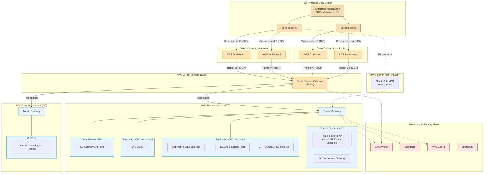

# Part III – Network Architectures

# Chapter 24: Direct Connect Enterprise

---

## 1. Executive Summary

### The Business Problem

Enterprises running hybrid workloads — where a meaningful fraction of servers, mainframes, storage arrays, or SaaS platforms remain on-premises while new workloads move to AWS — eventually run into the physical limits of the public internet.

The internet was never designed to be a predictable, low-jitter, high-throughput transport layer between two specific endpoints. It was designed to be resilient and best-effort. Those are opposite design goals from what a bank's core ledger replication job, a manufacturing plant's real-time SCADA telemetry pipeline, or a hospital's PACS imaging system needs.

Three recurring pain points push enterprises toward AWS Direct Connect:

- **Unpredictable latency and jitter.** Internet-routed VPN traffic hops across multiple ISPs and peering points. Round-trip time can vary by tens or hundreds of milliseconds depending on time of day, congestion, and route flapping. Workloads like SAP HANA replication, financial market data feeds, and VDI (virtual desktop infrastructure) cannot tolerate this variability.
- **Bandwidth cost and ceiling.** Site-to-Site VPN over the internet is capped, in practice, around 1.25 Gbps per tunnel due to IPsec encryption overhead on a single CPU core path. Enterprises moving petabytes for data center exit, backup, or replication need multi-gigabit, sustained throughput that VPN cannot economically deliver.
- **Compliance and risk posture.** Some regulatory frameworks (financial services, government, healthcare) require that certain data flows avoid the public internet entirely, or auditors specifically ask "does this data traverse the internet, encrypted or not?" A private, dedicated network connection changes the answer to "no."

### Architecture Objective

The Direct Connect Enterprise architecture establishes a private, dedicated, high-bandwidth, low-latency network path between an enterprise's on-premises data centers (or colocation facilities) and AWS, engineered for:

- Redundancy at every layer (physical port, device, carrier, and location) so that no single failure — a fiber cut, a router failure, or a colocation facility outage — takes down connectivity.
- Predictable performance characterized by sub-5ms to sub-20ms latency (depending on geographic distance) and guaranteed bandwidth free from internet congestion.
- Centralized, scalable connectivity to multiple AWS accounts and VPCs through Direct Connect Gateway and Transit Gateway, avoiding a sprawl of point-to-point connections as the AWS footprint grows.
- A security model that treats the private connection as an extension of the corporate network — encrypted where required, segmented by VLAN, and governed by the same identity and access principles as any other production network path.

### Why Organizations Adopt This Architecture

Organizations don't reach for Direct Connect as a first step. It's typically the third or fourth stage of hybrid connectivity maturity:

1. **Stage 1 — VPN pilot.** A team stands up a Site-to-Site VPN for a proof of concept or a single application migration.
2. **Stage 2 — Production VPN.** VPN is hardened with redundant tunnels and BGP, serving a handful of production workloads.
3. **Stage 3 — Direct Connect for critical paths.** As bandwidth needs grow past what VPN can economically or technically sustain, and as latency-sensitive or compliance-sensitive workloads emerge, the enterprise provisions its first Direct Connect circuit — usually for a single high-value use case (database replication, backup, or a flagship application migration).
4. **Stage 4 — Direct Connect Enterprise.** The organization standardizes on Direct Connect as the primary hybrid connectivity backbone: multiple circuits, multiple locations, Direct Connect Gateway fan-out to dozens of accounts, and VPN as a documented failover path rather than the primary transport.

This chapter describes Stage 4 — the mature, production-grade design that most Fortune 500 and large mid-market enterprises eventually converge on when their AWS footprint spans dozens of accounts and their on-premises footprint isn't going away in the next five years.

### Major Business Benefits

- **Cost predictability at scale.** Direct Connect data transfer OUT to on-premises is billed at a materially lower per-GB rate than internet egress. For enterprises moving tens or hundreds of terabytes monthly (backup jobs, replication, data lake ingestion from on-prem systems), this difference is not marginal — it is often the single largest line item change in the AWS bill after a Direct Connect migration.
- **Performance that unlocks new workload classes.** Once latency drops from the 40–120ms range typical of internet VPN to single-digit or low-double-digit milliseconds, workload classes that were previously "cloud-incompatible" become viable: synchronous database replication, VDI, real-time ERP integration, video editing over the network, and SAP application-to-database splits across data center and cloud.
- **Simplified network governance.** A hub-and-spoke Direct Connect Gateway/Transit Gateway design turns "how do we connect account #47 to the data center" from a multi-week network change request into a Terraform apply that takes minutes, because the transit infrastructure already exists.
- **Audit and compliance posture.** Traffic on a dedicated cross-connect, further protected with MACsec Layer 2 encryption where required, satisfies auditors who specifically flag "data traverses the public internet" as a finding — even when that traffic was already encrypted in transit via IPsec or TLS.
- **Negotiating leverage and vendor flexibility.** Because Direct Connect is delivered through Direct Connect Partners (carriers and colocation providers) rather than being AWS-proprietary hardware, enterprises retain negotiating leverage on circuit pricing and can multi-source carriers for physical diversity.

### Typical Enterprise Scenarios

- A global manufacturer with 40 factories running MES (Manufacturing Execution Systems) on-premises, moving analytics and forecasting workloads to AWS while keeping shop-floor control systems local, connected via Direct Connect for real-time telemetry ingestion.
- A regional bank undergoing a phased data center exit: mainframe stays on-premises for the next seven years (regulatory and re-platforming risk), but every net-new application is cloud-native, and Direct Connect carries the mainframe-to-cloud API traffic and nightly batch settlement files.
- A healthcare system with an on-premises Epic EHR (Electronic Health Record) deployment integrating with cloud-hosted analytics, population health, and AI/ML inference services, where HIPAA risk assessments specifically call out network transport as a control point.
- A media company with on-premises SAN (Storage Area Network) storage for active production content, using Direct Connect for high-throughput ingest into S3 for archive and for rendering workloads that burst into AWS.
- A multinational retailer with a shared-services on-premises data center hosting Active Directory, DNS, and a central data warehouse, connecting to 200+ AWS accounts (one per business unit and environment) through a centralized Direct Connect Gateway hub.

Across all of these, the common thread is the same: the enterprise is not "all-in on cloud" and has no near-term plan to be. The data center is a permanent or long-lived part of the architecture, and the network connecting it to AWS deserves the same engineering rigor as any other piece of core infrastructure.

---

## 2. Business Requirements

### Business Drivers

| Driver | Description |
|---|---|
| Data center exit / hybrid strategy | Long-term coexistence of on-premises and cloud, not a "lift and shift and disconnect" migration |
| Regulatory data residency | Certain workloads or data classes must remain under direct organizational network control |
| Cost reduction at scale | High-volume data transfer economics favor dedicated circuits over internet egress and VPN |
| Application performance | Latency-sensitive, chatty, or synchronous applications split across data center and cloud |
| M&A integration | Newly acquired entities' data centers need private connectivity into the parent's AWS environment |
| Disaster recovery | On-premises DR site or AWS-as-DR-target requires guaranteed bandwidth for replication |

### Functional Requirements

- Private Layer 2/Layer 3 connectivity between one or more on-premises locations and AWS.
- Support for connecting to multiple AWS accounts and multiple VPCs without provisioning a new physical circuit per account.
- Support for both private (VPC) and public (AWS public service endpoint) traffic over the same physical connection, logically separated.
- BGP-based dynamic routing with defined route filtering and prefix limits.
- A documented, tested failover path (typically Site-to-Site VPN) for when Direct Connect is unavailable.
- Support for at least two geographically or carrier-diverse physical paths into AWS.

### Non-Functional Requirements

| Category | Requirement |
|---|---|
| Scalability | Support growth from 2 VPCs to 200+ VPCs across multiple AWS accounts without re-architecture |
| Availability | No single point of failure in the physical or logical path; target 99.95%+ connectivity availability |
| Latency | Sub-10ms one-way latency for same-region metro connections; sub-50ms for cross-region hybrid paths |
| Compliance | Support for MACsec encryption on connections carrying regulated data classes |
| Security | Traffic segmentation via VLANs and BGP communities; least-privilege routing |
| Observability | Real-time visibility into circuit utilization, BGP session state, and packet loss |

### Scalability Goals

- Circuit bandwidth: start at 1 Gbps or 10 Gbps per connection, with a documented path to 100 Gbps (via multiple aggregated connections or Dx 100G ports where available) as data transfer volume grows.
- Logical scaling: Direct Connect Gateway supports association with up to 20 Transit Gateways or Virtual Private Gateways by default (soft limit, increasable), and a Transit Gateway can have thousands of VPC attachments — this is the mechanism that lets the physical circuit count stay flat while the number of connected VPCs grows into the hundreds.

### Availability Requirements

Enterprise Direct Connect deployments are designed against AWS's own **resiliency models**, which define four tiers:

| Resiliency Model | Description | Typical SLA Target |
|---|---|---|
| Development and test | Single connection, single location | No specific target — acceptable to be down during maintenance |
| High resiliency | Two connections at the same AWS Direct Connect location, different devices | 99.9% |
| Maximum resiliency | Two connections at two different Direct Connect locations, separate devices | 99.95% |
| 4x Maximum resiliency (recommended for production) | Four connections across two locations, each location dual-homed | 99.99% |

This chapter's reference architecture targets **Maximum Resiliency or higher**, because "Direct Connect Enterprise" implies the organization has already decided this is core infrastructure, not an experiment.

### Latency Requirements

- Intra-metro (data center to nearest AWS Direct Connect location in the same metro area): typically 1–5ms one-way.
- Cross-region (data center connecting to a Direct Connect location that is not co-located with the nearest AWS Region, requiring a hosted connection or Direct Connect Gateway to reach a distant region): can range from 10ms to 80ms+ depending on geography.
- Application teams should specify their latency budget per workload class (synchronous DB replication needs sub-5ms; batch ETL can tolerate 50ms+) so the network team can right-size the Direct Connect location selection.

### Compliance Requirements

- PCI-DSS: network segmentation evidence, encryption-in-transit for cardholder data flows.
- HIPAA: transmission security controls (45 CFR §164.312(e)) — MACsec or IPsec-over-Dx satisfies "integrity controls" and "encryption" implementation specifications.
- SOC 2 / ISO 27001: documented network topology, change management for routing changes, access control to the Direct Connect Partner circuit.
- FedRAMP / government: GovCloud-specific Direct Connect locations and encryption requirements (FIPS 140-2/140-3 validated modules where mandated).

### Recovery Objectives

| Metric | Target (Production Tier 1) | Target (Production Tier 2) |
|---|---|---|
| RPO (Recovery Point Objective) | Near-zero (synchronous replication over Dx) | 15 minutes (async replication) |
| RTO (Recovery Time Objective) | Under 5 minutes (automatic BGP failover to redundant Dx path) | Under 30 minutes (failover to VPN) |

### SLAs

AWS publishes a **Direct Connect SLA of 99.9%** for a single connection at a location and up to **99.99%** for resilient, multi-location configurations that meet AWS's documented resiliency criteria. Enterprises should map their internal SLA commitments (to business units, to customers) against the AWS SLA plus the Direct Connect Partner's own circuit SLA (typically 99.9%–99.95% from Tier 1 carriers), because the end-to-end SLA is the weakest link in that chain, not simply AWS's number.

### Expected Workload and Growth

A typical Direct Connect Enterprise adoption curve:

- **Year 1:** 2 connections (1 primary metro, 1 secondary metro), 10 Gbps each, serving 10–20 VPCs across 5–10 accounts. Primary use case: data center exit wave 1 and DR replication.
- **Year 2–3:** Growth to 4 connections (Maximum Resiliency), Direct Connect Gateway fan-out to 50+ accounts via Transit Gateway, addition of a second geographic region for global operations.
- **Year 3+:** Circuit upgrades (10G → 100G aggregated) driven by data transfer volume growth, addition of MACsec for regulated workloads, and potential adoption of AWS Direct Connect SiteLink for direct data-center-to-data-center connectivity that bypasses the home AWS Region entirely.

---

## 3. Architecture Overview

### Overall Design

The Direct Connect Enterprise architecture is fundamentally a **hub-and-spoke hybrid network**, where:

- The "hub" is a pair of Direct Connect Gateways (for redundancy and multi-region reach) attached to one or more Transit Gateways.
- The "spokes" are the individual AWS accounts and VPCs — each attaching to the Transit Gateway rather than each provisioning its own Direct Connect connection.
- On the on-premises side, the "hub" is the enterprise's core network — typically a pair of core routers or a Transit Gateway-equivalent (SD-WAN fabric, MPLS backbone) that aggregates branch and data center traffic before it reaches the Direct Connect cross-connects.

This design deliberately decouples **physical connectivity** (a small, tightly controlled number of cross-connects, colocation relationships, and carrier contracts) from **logical connectivity** (an easily scalable number of VPC attachments, route tables, and account associations).

### Architecture Philosophy

Three principles drive every design decision in this chapter:

1. **Physical diversity is non-negotiable for production.** A single Direct Connect connection, no matter how large, is a single point of failure. Production traffic always crosses at least two physically diverse paths (different Direct Connect locations, different Direct Connect Partners where possible, different on-premises router hardware).
2. **Centralize the hub, delegate the spokes.** Network engineering owns the Direct Connect Gateway, Transit Gateway, and core routing. Application and platform teams own their VPC route tables and security groups within the guardrails the hub provides. This mirrors AWS's own multi-account governance philosophy (see Chapter 99 — Reference Landing Zone) applied to networking specifically.
3. **VPN is not a backup plan you write down and forget.** The failover path from Direct Connect to Site-to-Site VPN must be tested on a defined cadence (quarterly, at minimum) because BGP misconfiguration, route filtering errors, and VPN gateway capacity shortfalls are only discovered when you actually fail over — not when you read the runbook.

### Core Components

| Component | Role |
|---|---|
| Direct Connect connection (physical) | The actual cross-connect — a dedicated 1G/10G/100G port, or hosted connection from a Direct Connect Partner |
| Direct Connect location | The carrier-neutral colocation facility where the AWS Direct Connect router lives and where the customer's or partner's router connects |
| Virtual Interface (VIF) | The logical interface on the connection — Private VIF (to a VPC via VGW/DXGW), Public VIF (to AWS public services), or Transit VIF (to a Transit Gateway via DXGW) |
| Direct Connect Gateway (DXGW) | A global, region-agnostic construct that allows one or more Direct Connect connections to reach VPCs/Transit Gateways in one or more AWS Regions |
| Transit Gateway (TGW) | The AWS-side hub that aggregates VPC attachments and connects them to the DXGW via a Transit VIF |
| BGP | The dynamic routing protocol used on every VIF to exchange routes between on-premises and AWS |
| Site-to-Site VPN | The failover transport, terminated either directly on a VGW/TGW or riding over the Direct Connect Public VIF as "VPN over Dx" for an encrypted-but-still-dedicated-path option |
| On-premises core router / SD-WAN edge | The customer-owned or partner-owned device terminating the physical cross-connect and running BGP toward AWS |

### How Components Interact

At a high level:

1. Physical cross-connects are installed at two (or more) Direct Connect locations, each terminating on a diverse on-premises router.
2. Each physical connection hosts one or more VIFs. For the Transit Gateway model (the standard for Enterprise scale), each connection hosts a **Transit VIF**.
3. Transit VIFs from both connections attach to the **same Direct Connect Gateway**, giving the DXGW two independent physical paths.
4. The Direct Connect Gateway associates with one or more **Transit Gateways**, one per AWS Region that needs hybrid connectivity.
5. Each spoke VPC attaches to the Transit Gateway. The Transit Gateway route table controls which VPCs can reach on-premises, and which on-premises prefixes are advertised into which VPCs — this is the primary segmentation control point.
6. BGP sessions run over every VIF, exchanging on-premises prefixes (advertised to AWS) and VPC/AWS-side prefixes (advertised to on-premises). Route filtering, prefix limits, and BGP communities enforce policy on top of raw reachability.

### High-Level Workflow — Request, Response, and Data Lifecycle

**Request lifecycle (on-premises system calling a cloud-hosted API):**

1. An on-premises application resolves a private DNS name (via Route 53 Resolver inbound/outbound endpoints or on-premises DNS forwarding) to a private IP in an AWS VPC.
2. The packet is routed from the application server to the on-premises core router.
3. The core router's BGP table (learned from AWS via the DXGW) shows the VPC CIDR is reachable via the Direct Connect connection; the packet egresses over the cross-connect.
4. The packet arrives at the AWS Direct Connect router, is forwarded to the associated Transit Gateway, and from there into the destination VPC based on the TGW route table.
5. The destination VPC's route table and security groups govern final delivery to the target EC2 instance, container, or load balancer.

**Response lifecycle:** the mirror image — return traffic follows the VPC route table back to the TGW, back through the DXGW, over the same (or, for asymmetric routing scenarios, the redundant) Direct Connect connection, to the on-premises core router, and to the originating host.

**Data lifecycle (bulk transfer, e.g., nightly batch replication to S3):**

1. Data is staged on-premises (e.g., extracted from a data warehouse).
2. A transfer job (DataSync, custom scripted transfer, or a database-native replication mechanism) pushes data over the private VIF/Transit Gateway path to an S3 VPC endpoint or an RDS/Aurora replica.
3. Data transfer is billed at Direct Connect data transfer OUT rates (materially cheaper than internet egress at volume) and does not consume any public internet bandwidth on either side.
4. On arrival, S3 lifecycle policies, Aurora storage, or the target service takes over from there — this is where Chapter 46 (Data Lake) or Chapter 43 (Relational Database) architecture patterns take over.

---

## 4. AWS Services Used

### AWS Direct Connect

**Purpose:** Provides a dedicated, private network connection from an on-premises location to AWS, bypassing the public internet.

**Why selected:** It is the only AWS-native service purpose-built for dedicated physical connectivity with predictable bandwidth and latency. No other AWS networking service replaces it for this use case.

**Alternatives:**
- Site-to-Site VPN over the internet — lower cost of entry, no physical circuit lead time, but capped throughput per tunnel and variable latency.
- SD-WAN over broadband/MPLS with a cloud on-ramp — viable for smaller branch offices, but doesn't scale to data-center-class throughput as economically.
- Third-party cloud interconnect platforms (e.g., Megaport, Equinix Fabric) — these are effectively Direct Connect Partners; they provide the physical/carrier layer while AWS Direct Connect remains the logical service.

**Limitations:**
- Physical circuit provisioning lead time is typically 4–12 weeks (longer in some geographies), unlike VPN which is provisioned in minutes.
- Requires either physical presence in a Direct Connect location (for dedicated connections) or a relationship with a Direct Connect Partner (for hosted connections).
- Dedicated connections come in fixed port speeds (1G, 10G, 100G, and 400G in select locations); hosted connections offer more granular speeds (50 Mbps up to 10 Gbps) but at partner-negotiated markup.

**Pricing considerations:** Port-hour charges (a fixed hourly fee based on port speed) plus data transfer OUT charges (per-GB, tiered, and location-dependent — DX data transfer OUT to on-premises is billed at a substantially lower per-GB rate than internet egress). Data transfer IN to AWS over Dx is free. There is no charge for the BGP sessions or route advertisements themselves.

**Best practices:** Always provision at least two connections at different Direct Connect locations for production; use Transit VIFs and Direct Connect Gateway rather than one-VIF-per-VPC as soon as more than a handful of VPCs are involved; enable MACsec for regulated data classes where the location supports it.

### Direct Connect Gateway (DXGW)

**Purpose:** A globally-scoped resource that lets one or more Direct Connect connections (via Transit VIFs) reach VPCs or Transit Gateways across multiple AWS Regions, without requiring a separate physical connection per Region.

**Why selected:** Without a DXGW, a Direct Connect connection's Private VIF can only reach VPCs in the same Region as the Direct Connect location's home Region. Enterprises with multi-region AWS footprints need the DXGW to fan a single set of physical circuits out to every Region they operate in.

**Alternatives:** None within AWS — this is a foundational, non-substitutable construct for multi-region Direct Connect designs.

**Limitations:** A DXGW can be associated with up to 20 Transit Gateways/Virtual Private Gateways by default (a soft, increasable quota); each Transit Gateway association has a route limit (default 100, increasable) that governs how many on-premises prefixes can be advertised through it.

**Pricing considerations:** No additional charge for the DXGW construct itself; you pay for the underlying Direct Connect connection and data transfer as usual.

**Best practices:** Use one DXGW to aggregate all Transit VIFs, and associate it with one Transit Gateway per Region — this is the cleanest pattern for global enterprises and is what this chapter's reference architecture implements.

### Transit Gateway (TGW)

**Purpose:** A regional hub that interconnects VPCs, VPN connections, and (via DXGW) on-premises networks through a single, centrally managed set of route tables.

**Why selected:** It replaces a mesh of VPC peering connections and per-VPC Direct Connect VIFs with a hub-and-spoke model that scales to thousands of attachments and gives network teams a single control point for segmentation policy.

**Alternatives:** VPC peering (does not scale past a handful of VPCs — no transitive routing, becomes an unmanageable mesh); Virtual Private Gateway (VGW) attached per-VPC (works for small deployments, but requires either one Direct Connect VIF per VPC or accepting that all VPCs share one routing domain — does not support the segmentation Enterprise designs require).

**Limitations:** Default quota of 5,000 attachments per Transit Gateway (increasable); a per-attachment bandwidth ceiling (50 Gbps burst per VPC attachment) that large single workloads must be aware of; inter-region TGW peering does not support transitive routing through DXGW without careful route table design.

**Pricing considerations:** Hourly charge per attachment, plus a per-GB data processing charge for traffic that crosses the TGW. At high data volumes, TGW processing charges become a meaningful cost line — factor this into the FinOps model (see Section 16).

**Best practices:** Use separate TGW route tables per segmentation domain (e.g., production, non-production, shared services) rather than a single flat route table; enable TGW Network Manager for centralized visibility across accounts and Regions.

### AWS Site-to-Site VPN

**Purpose:** Serves as the encrypted, internet-routed failover path when Direct Connect is unavailable, and can also run "over" a Direct Connect Public VIF for defense-in-depth encryption on top of the private circuit.

**Why selected:** It is the standard, well-understood AWS-native failover mechanism, integrates natively with Transit Gateway (ECMP across multiple tunnels for higher aggregate throughput), and requires no physical provisioning lead time.

**Alternatives:** A second, fully independent Direct Connect path with no VPN failover at all — chosen by organizations with extreme risk tolerance for connectivity loss, which is rare at Enterprise scale and not recommended.

**Limitations:** Per-tunnel throughput ceiling (~1.25 Gbps); requires ECMP-capable on-premises routing to aggregate multiple tunnels for higher throughput failover capacity.

**Pricing considerations:** Hourly per-VPN-connection charge plus data transfer OUT at standard internet egress rates (materially higher than Direct Connect rates) — a reminder that VPN failover, if triggered during a Direct Connect outage, will be more expensive per GB than normal operations, which should be modeled in the DR cost plan.

**Best practices:** Pre-provision VPN connections (don't wait until a Dx outage to create them) and test failover quarterly.

### Amazon VPC

**Purpose:** The isolated network environment within each AWS account where workloads run; the ultimate destination for hybrid traffic.

**Why selected:** Foundational — every workload-hosting account needs one or more VPCs; this chapter assumes familiarity but treats VPC design specifics (subnetting, route tables) as covered fully in Chapter 15 (Enterprise VPC), referencing it rather than repeating it.

**Alternatives:** N/A — VPC is the base networking construct.

**Limitations:** CIDR planning across a large multi-account estate is the single most common source of IP conflict when a large on-premises estate merges with AWS — see Section 9 and the anti-patterns in Section 27.

### Route 53 Resolver (Inbound and Outbound Endpoints)

**Purpose:** Enables DNS resolution to cross the hybrid boundary — on-premises systems resolving AWS-hosted private hostnames, and AWS-hosted systems resolving on-premises hostnames — over the private Direct Connect path.

**Why selected:** Without this, hybrid DNS requires manual /etc/hosts entries or duplicated DNS zones, both of which are operationally unsustainable at Enterprise scale.

**Alternatives:** Self-managed DNS forwarders on EC2 (viable, but Route 53 Resolver endpoints remove the operational burden of patching and scaling forwarder instances).

**Limitations:** Resolver endpoints are Regional and VPC-scoped; multi-region designs need endpoints per Region, coordinated through Resolver rule sharing via AWS RAM (Resource Access Manager).

**Pricing considerations:** Billed per ENI-hour for each endpoint and per DNS query processed — a minor cost relative to the rest of the architecture but worth including in the FinOps model.

### AWS Identity and Access Management (IAM)

**Purpose:** Governs who and what can create, modify, or delete Direct Connect resources, Transit Gateway route tables, and VPC attachments.

**Why selected:** Network configuration changes are among the highest-blast-radius actions in a hybrid architecture — a misconfigured route table change can take down connectivity for every connected VPC. IAM least-privilege is not optional here.

**Best practices:** Separate IAM roles for "network read-only" (broadly granted, for troubleshooting visibility) versus "network admin" (tightly restricted to the network engineering team, ideally requiring a change ticket and peer review via CI/CD rather than console access).

### Amazon CloudWatch

**Purpose:** Collects Direct Connect connection metrics (ConnectionState, ConnectionBpsEgress/Ingress, ConnectionPpsEgress/Ingress, ConnectionCRCErrorCount, ConnectionLightLevel for optical health) and Transit Gateway metrics (BytesIn/Out, PacketDropCount).

**Why selected:** The only AWS-native metrics source for Direct Connect health; essential for both real-time alerting and capacity trend analysis.

**Best practices:** Alarm on ConnectionState transitions (not just utilization) — a connection flapping between up and down is often a bigger problem than one that's simply saturated.

### AWS CloudTrail

**Purpose:** Audit log of every API call that creates, modifies, or deletes Direct Connect, DXGW, or TGW resources.

**Why selected:** Required for compliance evidence and for post-incident forensics ("who changed the TGW route table at 2 AM").

### AWS Config

**Purpose:** Continuously evaluates whether Direct Connect, DXGW, and TGW configurations comply with defined rules (e.g., "every production connection must have a redundant pair," "TGW route tables must not contain a default route to the internet").

**Why selected:** Manual periodic audits do not scale; AWS Config rules provide continuous, automated compliance evidence.

### AWS Key Management Service (KMS) and Secrets Manager

**Purpose:** KMS manages encryption keys for MACsec (Connection Key Names/CKN and Connection Association Key/CAK material handling) and for any data-at-rest encryption on systems reachable over the hybrid path. Secrets Manager stores BGP pre-shared keys for VPN failover tunnels and any credentials used by automation that manages network configuration.

**Why selected:** Storing BGP PSKs or MACsec keys in Terraform state files or plaintext configuration is a recurring audit finding — Secrets Manager with automatic rotation closes that gap.

### AWS Direct Connect SiteLink (mentioned for completeness)

**Purpose:** Allows two Direct Connect locations to exchange traffic directly, without routing through an AWS Region — useful for data-center-to-data-center traffic that happens to transit AWS's global backbone.

**Why selected/when relevant:** Enterprises with multiple data centers connected to AWS at different Direct Connect locations, needing DC-to-DC connectivity, can use SiteLink instead of building a separate DC-to-DC WAN circuit. Not part of the core reference architecture in this chapter, but worth evaluating during the Evolution Path stage (Section 34).

---

## 5. Complete Architecture Diagram



> **Note:** This diagram represents the target-state Maximum Resiliency (or higher) design. Section 12 (High Availability) and Section 24 (Failure Scenarios) explain exactly what happens at each failure point shown here.

---

## 6. Component-by-Component Explanation

### On-Premises Core Routers (Router A / Router B)

- **Purpose:** Terminate the physical cross-connects and run BGP toward AWS; aggregate traffic from the broader enterprise network (branch offices, other data centers, campus networks) toward the Direct Connect edge.
- **Responsibilities:** BGP peering and route filtering (advertise only intended on-premises prefixes; accept only expected AWS/VPC prefixes with sane prefix-count limits to prevent a route table explosion from a AWS-side misconfiguration); traffic engineering (local preference, AS path prepending) to control primary vs. backup path preference.
- **Inputs:** Application traffic destined for AWS-hosted systems; BGP route advertisements from AWS.
- **Outputs:** Filtered BGP advertisements to AWS; forwarded packets over the cross-connect.
- **Scaling:** Vertical (larger router chassis, more BGP capacity) as the number of advertised/received prefixes grows; horizontal (additional router pairs at additional locations) as bandwidth or geographic redundancy needs grow.
- **High availability:** Deployed in redundant pairs, ideally in different physical racks/power domains within the data center, each terminating a cross-connect to a *different* Direct Connect location.
- **Failure handling:** BGP hold-timer-based failure detection (default 90 seconds, commonly tuned to 30 seconds or lower with BFD — Bidirectional Forwarding Detection — for sub-second failure detection) triggers automatic route withdrawal and failover to the surviving path.
- **Dependencies:** Physical cross-connect provisioning by the Direct Connect Partner/colocation provider; correct LOA-CFA (Letter of Authorization – Connecting Facility Assignment) paperwork completed before the cross-connect can be installed.
- **Security:** BGP MD5 authentication (minimum); MACsec where the location and hardware support it; strict prefix filtering (never accept a default route from AWS, never advertise 0.0.0.0/0 to AWS).
- **Monitoring:** SNMP/streaming telemetry from the router platform correlated with CloudWatch Direct Connect metrics for end-to-end visibility.

### Direct Connect Connections (Physical Cross-Connects)

- **Purpose:** The dedicated physical (or partner-hosted) link between the on-premises router and the AWS Direct Connect router at the colocation facility.
- **Responsibilities:** Carry all VIF traffic (Private, Public, and Transit) for that physical port.
- **Scaling:** Port speed selection (1G/10G/100G/400G) driven by projected peak bandwidth plus headroom (see Section 14); Link Aggregation Group (LAG) bundling of multiple connections at the same location for combined bandwidth and additional physical resiliency within that location.
- **High availability:** Never provisioned singly for production — always paired across two Direct Connect locations at minimum.
- **Failure handling:** Optical/physical failure is detected at the BGP layer (session drop) and, ideally, at the physical layer via light-level monitoring alarms before a hard failure occurs.
- **Dependencies:** Direct Connect Partner relationship (for hosted connections) or direct colocation presence (for dedicated connections).

### Direct Connect Gateway (DXGW)

- **Purpose:** Aggregates Transit VIFs from multiple connections/locations and fans them out to Transit Gateways in one or more Regions.
- **Responsibilities:** Global route propagation between on-premises-advertised prefixes and each associated Transit Gateway's route table.
- **Inputs:** BGP routes from Transit VIFs; TGW association requests.
- **Outputs:** Propagated routes into each associated Transit Gateway's route table (subject to TGW route table association/propagation configuration).
- **Scaling:** Supports multiple Transit VIFs from multiple physical connections (for redundancy) and association with multiple TGWs (for multi-region reach), governed by the quotas described in Section 4.
- **High availability:** Inherently redundant when fed by multiple Transit VIFs from diverse physical connections — the DXGW itself is a managed, highly available AWS construct with no customer-managed failover logic required at this layer.
- **Dependencies:** At least one Transit VIF; at least one TGW association to be useful.
- **Security:** Allowed prefixes are explicitly configured per association (you define which CIDR ranges are permitted to propagate) — this is a key segmentation control, not just a connectivity switch.
- **Monitoring:** CloudWatch metrics are limited at this layer; most operational visibility comes from the underlying connection and TGW metrics.

### Transit Gateway (Per Region)

- **Purpose:** The regional routing hub connecting VPCs, VPN attachments, and (via DXGW) the on-premises network.
- **Responsibilities:** Enforce routing segmentation through multiple route tables (e.g., a "production" route table that can reach on-premises and other production VPCs, a "non-production" route table that is isolated from production, a "shared services" route table reachable from everywhere).
- **Inputs:** VPC attachment requests, VPN attachments, DXGW association.
- **Outputs:** Routed packets between all attached networks per route table policy.
- **Scaling:** Attachment count scales into the thousands; per-attachment bandwidth is capped (50 Gbps burst) — very high-throughput single workloads may need to be re-architected (e.g., using multiple ENIs/attachments) rather than assuming unlimited TGW bandwidth per VPC.
- **High availability:** Deployed automatically with AZ-redundant infrastructure by AWS within the Region; no customer-managed HA configuration required, though attachments should span multiple AZs within each VPC to avoid AZ-level blast radius.
- **Failure handling:** TGW itself is a managed service with AWS-side redundancy; customer-facing failure modes are almost always attachment-level (a VPC route table misconfiguration) or upstream (DXGW/connection failure) rather than TGW-internal.
- **Dependencies:** VPCs must be attached with correct subnet selection (one subnet per AZ used for the attachment); route table associations/propagations must be deliberately configured — nothing propagates by default in a segmented, multi-route-table design.
- **Security:** Route table segmentation is the primary security boundary at this layer; security groups and NACLs at the VPC level provide defense-in-depth beneath it.
- **Monitoring:** CloudWatch TGW metrics (BytesIn, BytesOut, PacketDropCountBlackhole, PacketDropCountNoRoute) are essential — a rising PacketDropCountNoRoute often signals an incomplete route table association during an account/VPC onboarding.

### Site-to-Site VPN (Failover Path)

- **Purpose:** Provides connectivity when Direct Connect is unavailable (planned maintenance or unplanned outage).
- **Responsibilities:** Maintain a warm-standby (or, for higher assurance, active-standby with regular traffic) encrypted tunnel over the internet, attached to the same Transit Gateway.
- **High availability:** Each VPN connection provides two tunnels (to two different AWS endpoints) by default; for higher aggregate throughput during failover, ECMP across multiple VPN connections is used.
- **Failure handling:** BGP-based failover — when Direct Connect routes are withdrawn (connection down), the VPN-advertised routes become the best path automatically, assuming correct local preference/AS-path configuration so VPN doesn't accidentally win under normal conditions.
- **Dependencies:** Pre-shared keys stored in Secrets Manager; on-premises VPN-capable device or software (can be the same core router if it supports IPsec, or a dedicated VPN appliance).

### Route 53 Resolver Endpoints

- **Purpose:** Cross-boundary DNS resolution.
- **Responsibilities:** Inbound endpoint accepts DNS queries from on-premises resolvers for AWS-hosted private zones; outbound endpoint forwards AWS-side queries for on-premises domains to on-premises DNS servers, via Resolver rules.
- **Scaling:** Endpoints scale automatically within their configured IP capacity (2–6 ENIs); Resolver rules can be shared to other accounts via AWS RAM for centralized DNS management.
- **High availability:** Deployed across at least two AZs by default.
- **Dependencies:** Correct security group rules permitting DNS (UDP/TCP 53) from on-premises resolver IP ranges.

---

## 7. End-to-End Request Flow

The following walks a concrete example: an on-premises finance application server calling a REST API hosted on an internal ALB in a production VPC in `us-east-1`, secured behind private connectivity only (no public internet exposure).

1. **Client (on-premises app server)** initiates an HTTPS request to `payments-api.internal.enterprise.com`.
2. **DNS resolution:** the on-premises DNS server has a conditional forwarder for `internal.enterprise.com` pointing to the Route 53 Resolver **inbound endpoint** IP addresses in the Shared Services VPC. The query traverses the Direct Connect private path, is resolved by Route 53 against the private hosted zone, and returns the ALB's private IP address.
3. **Routing decision (on-premises):** the application server's default gateway forwards the packet to Core Router A (or B, per local routing policy/ECMP), which has learned the production VPC's CIDR via BGP from the Direct Connect Transit VIF.
4. **Direct Connect transit:** the packet crosses the cross-connect to the AWS Direct Connect router, is forwarded per the Transit VIF's BGP session to the Direct Connect Gateway.
5. **Direct Connect Gateway to Transit Gateway:** the DXGW forwards the packet to the associated `us-east-1` Transit Gateway based on the propagated route for the production VPC's CIDR.
6. **Transit Gateway to VPC:** the TGW route table (specifically the "production" route table, which this on-premises prefix is permitted to reach per the segmentation design) forwards the packet into the Production VPC's attachment subnet.
7. **VPC routing:** the VPC route table directs the packet to the Application Load Balancer's subnet.
8. **Load Balancer:** the ALB terminates TLS (using an ACM-issued certificate), evaluates listener rules, and forwards the request to a healthy target in the EC2 Auto Scaling group (or ECS/EKS target group).
9. **Application processing:** the application server processes the request, and if it needs data, queries the Aurora database in the same VPC over the local VPC network (not traversing the hybrid path again unless the database itself is on-premises).
10. **Caching (if applicable):** a read-through cache (ElastiCache) may serve the request without hitting the database, reducing latency and database load.
11. **Response construction:** the application returns a response payload to the ALB.
12. **Response routing:** the ALB returns the response to the client, following the reverse path: VPC route table → TGW → DXGW → Direct Connect connection → on-premises core router → application server.
13. **Logging:** ALB access logs are written to S3; VPC Flow Logs capture the flow metadata for both directions at the ENI level within the VPC.
14. **Monitoring:** CloudWatch captures ALB target response time, TGW bytes-in/out for the flow's aggregate traffic class, and Direct Connect connection-level utilization metrics — none of these are per-flow, but aggregate anomalies (e.g., a spike in TGW PacketDropCountNoRoute) would surface a routing problem affecting this flow.
15. **Error handling:** if the ALB target is unhealthy, the request is routed to another healthy target within the same Auto Scaling group; if the entire Region's production VPC becomes unreachable (a DR scenario), the on-premises DNS/routing does **not** automatically fail over to the DR Region's Aurora replica endpoint without either a manual runbook action or a pre-built Route 53 health-check-based failover record — this is a deliberate design decision addressed in Section 13 (Disaster Recovery), not an automatic behavior of the network layer alone.

---

## 8. Deployment Flow

### Infrastructure Provisioning Sequence

Direct Connect Enterprise deployments have a strict, real-world dependency order that differs from typical cloud-only infrastructure because **physical processes cannot be automated away**:

1. **Physical circuit ordering** (weeks 1–8, outside of Terraform): submit LOA-CFA requests, order cross-connects through the Direct Connect Partner or colocation provider, coordinate on-premises router installation/configuration if new hardware is required.
2. **Direct Connect connection acceptance in AWS** (once the physical cross-connect is live): the AWS side of the connection is accepted via console or API/Terraform.
3. **Terraform-managed logical layer:** VIFs, DXGW, DXGW associations, TGW, TGW route tables, VPC attachments — all fully automatable and version-controlled from this point forward.
4. **BGP session validation:** confirm sessions establish and expected prefixes are exchanged in both directions.
5. **Route table and segmentation validation:** confirm only intended prefixes propagate to only intended VPCs.
6. **Failover path provisioning and testing:** Site-to-Site VPN connections created and validated as the failover path before the Direct Connect connection is declared production-ready.

### Terraform Workflow

- Network infrastructure lives in a **dedicated network account/repository**, separate from application infrastructure, reflecting the "centralize the hub" philosophy from Section 3.
- State is stored in a versioned, encrypted S3 backend with DynamoDB state locking, restricted to the network engineering team's CI/CD role.
- Changes to DXGW associations, TGW route tables, and VIFs go through a mandatory plan-review-apply pipeline (never `terraform apply` from a local machine for shared network infrastructure) given the blast radius of an error.
- VPC-level attachment requests from application teams are handled through a **module with a narrow, opinionated interface** (e.g., "give us your VPC ID, subnet IDs, and desired route table association name") so that application teams cannot directly edit shared TGW route tables.

### CI/CD Deployment

- Pull request triggers `terraform plan`, posted as a PR comment for review.
- A second approver (network engineering lead) required for any change touching TGW route tables or DXGW associations, enforced via branch protection rules.
- Apply runs from a CI/CD service role with time-bound, MFA-gated elevated permissions rather than a permanently privileged pipeline identity.

### Blue-Green Deployment (Applied to Network Changes)

Network infrastructure doesn't have a literal blue-green deployment model the way application code does, but the equivalent discipline applies:

- New VIFs or connections are brought up and validated (BGP session state, route counts) **before** any traffic is migrated onto them.
- Route preference (local preference, AS path prepending) is adjusted gradually — shift a small percentage of route advertisement priority, confirm traffic shifts as expected via flow log analysis, then complete the cutover.
- The old path is kept warm (not decommissioned) for a defined bake period (commonly 2–4 weeks) after a cutover, in case rollback is needed.

### Rollback

- Every Terraform change to shared network infrastructure includes a documented rollback plan in the PR description — for TGW route table changes, this is typically the previous route table state, ready to reapply.
- BGP-level rollback (reverting a route filter or local preference change) should be executable within minutes — this is why BGP policy changes are kept as small, isolated Terraform resources rather than being bundled into larger changes.

### Secrets

- BGP MD5 authentication keys and VPN pre-shared keys are generated and stored in Secrets Manager, referenced by Terraform via data sources — never hardcoded in `.tf` files or committed to version control.
- MACsec Connection Association Key (CAK) and Connection Key Name (CKN) material is generated per AWS guidance and stored with the same discipline.

### Configuration

- BGP ASN assignments (on-premises private ASN, AWS side default ASN 64512 or a customer-specified ASN), VIF VLAN IDs, and IP addressing for the /30 or /31 point-to-point links are tracked in a central network IPAM (IP Address Management) system or, at minimum, a version-controlled spreadsheet/database that Terraform variables reference — ad hoc allocation is a leading cause of conflicts at Enterprise scale.

### Validation

- Post-deployment validation checklist (see Section 31) is run after every change: BGP session state, expected route counts on both sides, test traffic (ping, traceroute, and an application-level synthetic transaction) across the new/changed path, and a CloudWatch alarm review to confirm no new alarms fired.

---

## 9. Network Topology

### VPC Design

Each spoke VPC follows the standard multi-tier subnet pattern described fully in Chapter 15 (Enterprise VPC); this chapter focuses on the additions specific to hybrid connectivity:

- A dedicated **Transit Gateway attachment subnet** (one per AZ used) — small (e.g., /28), used only for the elastic network interfaces the TGW attachment creates, not for hosting workloads.
- Route table entries directing on-premises-bound traffic (the enterprise's on-premises CIDR blocks) toward the TGW attachment, alongside the normal local VPC route and any internet/NAT routes.

### CIDR Planning

This is, in practice, the single hardest non-technical problem in hybrid connectivity projects, because it requires coordination between a network team that has been allocating on-premises IP space for 20 years and a cloud team that has been allocating VPC CIDRs for the last 3–5 years, often without previously needing to worry about overlap.

**Mandatory practice:** before the first Transit VIF goes live, produce a single, authoritative CIDR allocation document/IPAM covering:

- All on-premises supernets (by data center, by region).
- All AWS VPC CIDRs (by account, by Region, by environment).
- A reserved, unallocated range for future growth on both sides.

| Zone | Example CIDR Range | Notes |
|---|---|---|
| On-premises Data Center A | 10.0.0.0/12 | Legacy allocation, predates cloud program |
| On-premises Data Center B | 10.16.0.0/12 | |
| AWS us-east-1 Production | 10.100.0.0/14 | Allocated in /20 blocks per VPC |
| AWS us-east-1 Non-Production | 10.104.0.0/14 | |
| AWS us-west-2 (DR) | 10.108.0.0/14 | |
| Reserved for growth | 10.112.0.0/12 | Do not allocate without IPAM review |

> **Warning:** Overlapping CIDRs between on-premises and AWS are not merely inconvenient — they are a hard architectural blocker. Traffic to an overlapping range is ambiguous and cannot be reliably routed. Discovering an overlap after Direct Connect is live typically requires re-IP'ing one side, which is one of the most disruptive and expensive remediation projects an enterprise network team can face. Validate CIDR non-overlap *before* ordering physical circuits, not after.

### Public and Private Subnets

Standard pattern applies (public subnets for internet-facing NAT Gateways/ALBs, private subnets for workloads) — see Chapter 15. The hybrid-specific addition is that **private subnets gain a second reachability path** (to on-premises via TGW) in addition to internet reachability via NAT Gateway, and route table design must ensure these two paths don't conflict (e.g., a misconfigured route accidentally sending on-premises-bound traffic to the NAT Gateway, which would simply fail since the NAT Gateway isn't a valid path to a non-internet-routable destination).

### NAT Gateway and Internet Gateway

Unchanged from standard VPC design — used for outbound internet access for private subnet resources (e.g., patching, calling external SaaS APIs) and are architecturally independent of the Direct Connect path, though cost analysis (Section 16) should account for the fact that Direct Connect reduces reliance on NAT Gateway/IGW for *on-premises-bound* traffic specifically, not internet-bound traffic generally.

### Transit Gateway (Central to This Chapter)

Already described in depth in Sections 3, 4, and 6. The topology-specific point to emphasize here: **route table segmentation is the actual security boundary**, more so than the physical connectivity itself. A common design:

| TGW Route Table | Associated Attachments | Propagated Routes |
|---|---|---|
| `rtb-production` | Production VPCs, DXGW (on-prem prod prefixes only) | On-prem production CIDRs, shared services CIDR |
| `rtb-nonprod` | Dev/test/staging VPCs, DXGW (on-prem nonprod prefixes only) | On-prem non-production CIDRs only, shared services CIDR |
| `rtb-shared-services` | Shared Services VPC, DXGW (all on-prem prefixes) | All VPC CIDRs, all on-prem CIDRs |
| `rtb-dxgw` | DXGW association | Selectively propagated based on the above |

### Route Tables

Both VPC-level route tables and TGW route tables need explicit review. A common failure mode (see Section 24) is an application team correctly configuring their VPC route table but the network team not yet propagating the corresponding route into the TGW route table (or vice versa) — connectivity fails asymmetrically or entirely, and this is one of the most common Day 2 support tickets in a mature Direct Connect Enterprise environment.

### Network ACLs and Security Groups

- Security groups remain the primary, stateful, resource-level control (e.g., "only allow port 443 from the on-premises finance subnet CIDR to this ALB's security group").
- NACLs provide a secondary, stateless, subnet-level control — commonly used at Enterprise scale to enforce a coarse "block known-bad on-premises subnets" or "block all except explicitly required protocols between environments" policy independent of individual security group hygiene.

### PrivateLink

Where an on-premises system needs to reach a *specific AWS service or a specific partner/vendor SaaS service* hosted in another AWS account, without full network-level VPC-to-VPC connectivity, AWS PrivateLink (via VPC Endpoint Services) is layered on top of this architecture rather than replacing it — see Chapter 20 (PrivateLink Architecture) for the dedicated pattern. In this chapter's context, PrivateLink is most commonly used for reaching AWS service endpoints (S3, DynamoDB via Gateway Endpoints; other services via Interface Endpoints) from on-premises over the Direct Connect path without traversing the public internet at all, even for AWS-to-AWS API calls.

### Hybrid Connectivity Summary

This entire section *is* the hybrid connectivity design — Direct Connect Enterprise is fundamentally a network topology chapter more than a compute or application chapter, which is why Sections 3, 6, and 9 necessarily overlap and reinforce the same core concepts from different angles (design philosophy, component responsibility, and topology mechanics respectively).

---

## 10. Identity and Access

### IAM Roles

| Role | Purpose | Typical Permissions Scope |
|---|---|---|
| `NetworkAdmin` | Full lifecycle management of Direct Connect, DXGW, TGW resources | `directconnect:*`, `ec2:*TransitGateway*`, restricted to the network account |
| `NetworkReadOnly` | Troubleshooting visibility for platform/app teams | `directconnect:Describe*`, `ec2:Describe*TransitGateway*` |
| `NetworkCICD` | Automation identity used by the Terraform pipeline | Scoped to exactly the actions the pipeline needs, time-bound via STS where possible |
| `VPCOwnerAppTeam` | Application team's role within their own account/VPC | Full control of their VPC's internal resources; explicitly denied any TGW/DXGW modification actions |

### IAM Policies

Least-privilege policies for network infrastructure should be **resource-scoped**, not just action-scoped — e.g., a policy permitting `ec2:CreateTransitGatewayVpcAttachment` should, where supported, be constrained to attachments targeting a specific TGW ID via condition keys, preventing an application team's automation from accidentally (or maliciously) attaching to the wrong Transit Gateway.

### Resource Policies

Direct Connect Gateway supports **cross-account association** via resource-level proposals — an AWS account that owns a Transit Gateway can accept an association proposal from the account that owns the DXGW (commonly the network/shared-services account), formalizing the "hub owned centrally, spokes owned by app teams" model without requiring all TGWs to live in a single account.

### STS and Cross-Account Access

- Network engineers assume a scoped role into the network account via AWS IAM Identity Center (formerly AWS SSO) rather than holding long-lived credentials in that account.
- Automation pipelines assume roles via OIDC federation from the CI/CD platform (e.g., GitHub Actions OIDC) rather than static access keys.

### Cross-Account Access Patterns

The DXGW-to-TGW association proposal/acceptance workflow described above is the primary cross-account mechanism specific to this architecture. This is distinct from, but complementary to, the broader multi-account landing zone identity patterns covered in Chapter 89 (IAM Identity Center) and Chapter 88 (Multi-Account Security).

### Least Privilege

- No individual or automation identity should hold standing `directconnect:*` or `ec2:*TransitGateway*` permissions in production without a time-bound elevation mechanism and an audit trail.
- Break-glass access for emergency network changes (e.g., a live outage requiring an urgent route table change outside the normal CI/CD window) should be a documented, monitored, alarm-generating process — not a permanently available shortcut.

### Service Roles

- The Terraform CI/CD execution role is the primary service role in this architecture; it should be distinct per environment (network account vs. any per-account attachment automation) to prevent a single compromised pipeline identity from having blast radius across the entire hybrid network.

### Permission Boundaries

- Apply a permission boundary to any role capable of creating IAM roles or policies within the network account, preventing privilege escalation even if that role's other permissions are broad (a standard AWS guardrail pattern, referenced further in Chapter 88).

---

## 11. Security Architecture

### Encryption

| Layer | Mechanism | When Required |
|---|---|---|
| Physical (Layer 2) | MACsec (802.1AE) | Regulated data classes, locations/hardware that support it |
| Network (Layer 3) | IPsec (VPN over Dx Public VIF, or VPN failover path) | Defense-in-depth requirement beyond physical circuit privacy, or as the failover path itself |
| Application (Layer 7) | TLS 1.2+ | Always, regardless of underlying transport — Direct Connect provides privacy and dedicated bandwidth, not encryption, and should never be treated as a substitute for TLS |

> **Common Misconception:** "Direct Connect is a private line, so we don't need to encrypt the traffic on it." This is incorrect for two reasons: (1) a dedicated circuit is not inherently encrypted — MACsec must be explicitly enabled — and (2) most compliance frameworks require encryption of sensitive data in transit *regardless* of the network's privacy characteristics. Treat Direct Connect as "private and dedicated," not as "encrypted."

### KMS

Used for MACsec key material generation/storage guidance, and broadly for any data-at-rest encryption on systems reachable via this architecture (RDS/Aurora encryption, EBS encryption, S3 SSE-KMS) — the network architecture and the data-at-rest encryption architecture are complementary, not substitutes for each other.

### TLS / AWS Certificate Manager (ACM)

Internal ALBs serving hybrid traffic should still terminate TLS using ACM-issued (or ACM Private CA-issued, for fully internal/private certificate chains that don't require public CA trust) certificates — public internet exposure is not a prerequisite for requiring encrypted application traffic.

### WAF and Shield

Generally **not applicable** to pure on-premises-to-AWS-private traffic over Direct Connect, since WAF/Shield protect internet-facing endpoints. If the same ALB also serves internet traffic (a hybrid-access application), WAF/Shield apply to that internet-facing listener specifically — see Chapter 22 (CloudFront Edge Architecture) for that pattern.

### Secrets Manager

Stores BGP authentication keys, VPN pre-shared keys, and any application credentials used by systems communicating across the hybrid boundary, with automatic rotation configured where the credential type supports it.

### GuardDuty

Monitors for anomalous network behavior at the VPC/account level (including unusual traffic patterns that could indicate compromised credentials being used to pivot from an on-premises-compromised host into AWS via the trusted hybrid path) — this is an important consideration specific to hybrid architectures: **the trust extended to on-premises-originated traffic must not be unconditional**, since a compromise on the on-premises side can otherwise become a direct pivot point into the cloud environment.

### Inspector

Not directly applicable to the network layer itself, but relevant for vulnerability scanning of the EC2/container workloads reachable through this architecture.

### Security Hub

Aggregates findings from GuardDuty, Config, and Inspector across all accounts in the hybrid estate into a single pane, essential once the account count grows past a handful.

### CloudTrail and AWS Config

Already described in Section 4 — both are core to demonstrating change control and configuration compliance for audit purposes specific to network infrastructure.

### Zero Trust Considerations

A mature Direct Connect Enterprise design increasingly adopts Zero Trust principles even over the "private" hybrid path:

- Do not implicitly trust traffic based solely on its source being "on-premises" — apply the same identity-aware access controls (e.g., verified service identity, mTLS between services) that would be applied to internet-originated traffic where the data sensitivity warrants it.
- Segment aggressively (the TGW route table design in Section 9 is a Zero-Trust-aligned control) rather than building one flat routing domain that grants broad on-premises-to-cloud reachability by default.

### Threat Model

| Threat | Attack Vector | Mitigation |
|---|---|---|
| Physical tap/interception at the colocation facility | Malicious insider at the colo, or compromised cross-connect infrastructure | MACsec Layer 2 encryption; physical security controls at the colocation facility (out of AWS's control, but within the enterprise's vendor due-diligence scope) |
| BGP route hijacking/injection | Misconfigured or compromised on-premises router advertising unauthorized prefixes | Strict prefix filtering and maximum-prefix limits on both the AWS and on-premises sides |
| Lateral movement from compromised on-premises host | An attacker who has compromised an on-premises system uses the trusted hybrid path to reach AWS-hosted systems | TGW route table segmentation limiting which on-premises prefixes can reach which VPCs; security groups scoped to specific on-premises subnets, not broad "allow all internal" rules; GuardDuty and VPC Flow Log anomaly detection |
| Credential/secret leakage | BGP PSKs, VPN PSKs, or MACsec keys stored insecurely | Secrets Manager with rotation; no plaintext secrets in Terraform code or state files viewable by broad audiences |
| Insider misconfiguration | An engineer accidentally advertises a default route or an overly broad prefix, exposing more of the network than intended | Prefix filtering, AWS Config rules, mandatory peer review on network changes |
| DDoS against colocation infrastructure | Attack against the shared colocation facility's other tenants or infrastructure, causing collateral disruption | Diversity across Direct Connect locations reduces single-facility blast radius; not a direct Shield-mitigated vector since Direct Connect traffic doesn't traverse the public internet path Shield protects |

---

## 12. High Availability

### AZ Failures

- Transit Gateway attachments should span multiple AZs within each VPC — the TGW automatically load-balances across the AZ-local attachment ENIs, and a single AZ failure does not take down the VPC's hybrid connectivity as long as at least one attachment AZ remains healthy.

### Instance Failures

- Not directly a Direct Connect concern — handled at the application tier via Auto Scaling groups, ALB health checks, and multi-AZ database deployments (see Chapter 6, Highly Available Multi-AZ Web Application, for the full pattern), which this architecture's hybrid connectivity simply provides the transport for.

### Regional Failures

- A full Region failure requires the DR architecture described in Section 13 — the Direct Connect Gateway's ability to associate with Transit Gateways in multiple Regions is what makes a "connect once, reach any Region" DR posture possible without provisioning entirely separate physical circuits per Region.

### Database Failures

- Addressed by the database tier's own HA/DR mechanisms (Aurora Multi-AZ, cross-region read replicas) — see Chapter 43/44 — with this chapter's architecture ensuring the replication traffic itself (often the single largest sustained bandwidth consumer in a hybrid design) has guaranteed capacity on the Direct Connect path.

### Load Balancing (of the Network Path Itself)

- **ECMP (Equal-Cost Multi-Path)** across multiple Direct Connect connections at the BGP layer allows traffic to be distributed across both active connections simultaneously (not simply active/standby), maximizing utilization of provisioned bandwidth under normal conditions while retaining automatic failover capacity if one path fails.

### Health Checks

- BGP itself, tuned with BFD, is the primary health check mechanism at the network layer — detecting a failed path within milliseconds to a few seconds rather than relying on the BGP hold-timer default (90–180 seconds), which is far too slow for production failover expectations.
- Route 53 health checks, where relevant, handle application/DNS-layer failover for scenarios where the network path is healthy but the application endpoint itself is not.

### Failover Sequence (Direct Connect Primary Path Fails)

1. BFD detects loss of the primary Direct Connect connection's BGP session (sub-second to a few seconds, depending on BFD interval tuning).
2. The on-premises router withdraws the affected route advertisements and recalculates its routing table, preferring the secondary Direct Connect connection (if diverse-location redundancy exists) or the VPN failover path (if both Direct Connect paths are affected, e.g., a DXGW-level issue).
3. Return traffic from AWS follows the same logic in reverse, based on which path AWS last received a valid BGP advertisement from.
4. Application-layer sessions (TCP connections in flight) are typically disrupted during the failover window and must be retried by the application or client — this is why the failover *time* target (sub-5-minutes for Tier 1, per Section 2) matters: it bounds the length of the application-visible disruption, not just the network-layer disruption.

---

## 13. Disaster Recovery

### Backup Strategy

- Network configuration itself (Terraform state, BGP configuration, VLAN assignments) is backed up implicitly through version control — the "backup" of the network *design* is the Git repository, not a snapshot mechanism.
- Data backups (databases, file systems) that traverse this network follow the patterns in Chapter 95 (Disaster Recovery) — this chapter's role is ensuring the network has sufficient bandwidth and redundancy to execute those backup/replication jobs within their required windows.

### Snapshots and Cross-Region Replication

- Aurora/RDS cross-region read replicas, S3 Cross-Region Replication, and DataSync-based file transfer jobs all consume Direct Connect (or, for AWS-to-AWS Region traffic, the AWS backbone, not Direct Connect at all — inter-region AWS traffic does not need to route through on-premises) bandwidth when the *source* of the data is on-premises.

### DR Models Applicable to the Network Layer

| DR Model | Description | Direct Connect Implication |
|---|---|---|
| Pilot Light | Minimal DR infrastructure kept running, scaled up on failover | DR Region's TGW/DXGW association is pre-provisioned but carries minimal steady-state traffic |
| Warm Standby | Scaled-down but fully functional DR environment | DR Region's TGW carries ongoing replication traffic continuously — bandwidth must be sized for this steady load |
| Multi-Site Active-Active | Both Regions actively serving production traffic | Requires DXGW associations to both Regions carrying full production-level traffic simultaneously, and on-premises routing must support directing traffic to whichever Region is authoritative for a given request (often via global traffic management outside the scope of Direct Connect itself) |

### RPO/RTO Mapping to Network Design

- **Near-zero RPO** (synchronous replication) requires low, consistent latency — only achievable with Direct Connect (not VPN) as the primary path, and requires the DR Region's Transit Gateway/DXGW association to be live and tested continuously, not provisioned reactively during an actual disaster.
- **RTO** for network failover specifically (as distinct from application/database failover) is bounded by the BGP convergence time described in Section 12 — typically seconds to low minutes for a well-tuned design, which is almost always faster than the application and database failover steps that follow it. In practice, network failover is rarely the bottleneck in overall DR RTO; database promotion and application cutover usually dominate the timeline.

> **Tip:** Test the *network* failover path independently from a full DR drill. Many organizations only discover their BGP failover doesn't work as designed during a full-scale DR test that's already stressful and high-stakes — a quarterly, network-only failover test (deliberately disabling the primary Dx connection during a maintenance window and confirming automatic failover) catches these issues in a lower-stakes setting.

---

## 14. Scalability

### Horizontal Scaling (Additional Connections)

- Add additional Direct Connect connections at existing or new locations as aggregate bandwidth needs grow beyond current provisioned capacity — the hub-and-spoke DXGW/TGW model means this is purely a physical/BGP-layer change, with no impact on the hundreds of downstream VPC attachments.

### Vertical Scaling (Port Speed Upgrades)

- Upgrade from 1G to 10G to 100G dedicated connections as sustained utilization approaches provisioned capacity (a common trigger threshold is sustained utilization above 70–80% during peak periods, prompting a capacity planning review before saturation causes application-visible congestion).

### Auto Scaling (Application Tier)

- Not a network-layer concern directly, but the network must be sized to handle the *peak* traffic an auto-scaled application tier can generate — a common oversight is scaling application compute capacity for a traffic spike without validating that the Direct Connect connection and TGW attachment bandwidth can actually carry that spike's traffic if a meaningful fraction of it is hybrid (e.g., calling an on-premises mainframe API for every transaction).

### Database Scaling

- Read replica fan-out, whether within a Region or cross-region, adds incremental replication traffic that must be accounted for in Direct Connect capacity planning, particularly for architectures where the primary database remains on-premises during a multi-year migration.

### Storage Scaling

- Bulk data movement (initial data lake seeding, ongoing incremental sync) from on-premises storage systems into S3 is often the largest single sustained bandwidth consumer in year one of a Direct Connect Enterprise deployment — size the initial connection with this one-time (or recurring, for ongoing sync architectures) load explicitly in mind, not just steady-state application traffic.

### Queue Scaling

- SQS/EventBridge-based integrations between on-premises systems and AWS (e.g., an on-premises order management system publishing events consumed by cloud-native services) are typically low-bandwidth but latency- and reliability-sensitive — these benefit more from Direct Connect's *consistency* than its raw bandwidth, and are a good early workload to validate a new Direct Connect deployment with before cutting over higher-stakes, higher-bandwidth traffic.

---

## 15. Performance Optimization

### Caching

- Where on-premises systems are queried repeatedly for relatively static reference data (e.g., a product catalog or customer master data system), caching that data in ElastiCache or DynamoDB within AWS reduces the number of round-trips across the hybrid path, directly reducing both latency exposure and Direct Connect bandwidth consumption.

### Compression

- Application-level compression (and, where supported, WAN optimization appliances on the on-premises router) reduces the effective bandwidth consumption of bulk transfer jobs — particularly valuable for the initial "lift" of large on-premises datasets into S3 during a migration.

### CDN

- Not directly relevant to on-premises-to-AWS-private traffic, but relevant to the broader application if it also serves internet users — see Chapter 22.

### Database Optimization

- For split architectures (application in AWS, database still on-premises, or vice versa), minimizing "chatty" query patterns (many small round-trips) matters more over a hybrid link than it does within a single VPC's sub-millisecond internal latency — this is a common performance surprise during lift-and-shift migrations that split a previously co-located application and database across the hybrid boundary without re-examining query patterns first.

### Connection Pooling

- Persistent connection pools (rather than per-request TCP/TLS handshakes) meaningfully reduce the latency impact of the hybrid path's inherent round-trip time, since the handshake overhead — not the data transfer itself — is often the dominant cost for smaller, frequent requests.

### Concurrency and Async Processing

- Where synchronous, blocking calls across the hybrid boundary are unavoidable in the near term (common during phased migrations), bulkheading those calls (see Chapter 82, Bulkhead pattern) prevents on-premises-side latency or transient failures from cascading into full application-tier resource exhaustion in AWS.

---

## 16. Cost Optimization (FinOps)

### Estimated Costs by Deployment Size

> **Note:** The following are illustrative, order-of-magnitude estimates based on typical list pricing structures as of this writing. Actual pricing varies by Region, Direct Connect location, and negotiated Partner/carrier rates — always validate against the AWS Pricing Calculator and current Direct Connect Partner quotes before presenting figures to stakeholders.

| Deployment Size | Connections | Port Speed | Monthly Data Transfer OUT | Estimated Monthly AWS Direct Connect Cost (Port + Data) |
|---|---|---|---|---|
| Small | 1 connection (Dev/Test tier — not production-recommended) | 1 Gbps | 5 TB | Low hundreds of USD |
| Medium | 2 connections, 2 locations (High Resiliency) | 10 Gbps each | 50 TB | Low-to-mid thousands of USD |
| Enterprise | 4 connections, 2 locations (Maximum/4x Resiliency) | 10–100 Gbps each | 500 TB+ | Tens of thousands of USD |

This table intentionally excludes the on-premises-side costs (cross-connect fees from the colocation provider, Direct Connect Partner circuit fees, on-premises router hardware) which, at Enterprise scale, are frequently comparable to or larger than the AWS-side charges themselves — a complete FinOps model must include both sides of the connection, not just the AWS bill.

### Major Cost Drivers

1. **Port-hour charges** — fixed regardless of utilization; right-sizing port speed to actual (not aspirational) bandwidth needs avoids paying for unused capacity, but under-provisioning risks a costlier emergency upgrade later.
2. **Data transfer OUT to on-premises** — the primary variable cost; large one-time migrations (initial data lake seed) can create a cost spike that should be planned for and communicated to finance stakeholders in advance, not discovered on the monthly bill.
3. **Transit Gateway data processing charges** — often underestimated; at very high data volumes, TGW per-GB processing fees become material and should be modeled alongside Direct Connect data transfer costs, not treated as negligible.
4. **On-premises Partner/carrier circuit fees** — recurring, contractually locked-in costs that should be reviewed at renewal for competitive repricing, especially as circuit needs grow (larger circuits often have better effective per-Mbps pricing).

### Optimization Opportunities

- **Data transfer route optimization:** ensure application architectures actually route data over Direct Connect rather than accidentally over the public internet (a misconfigured route table sending "private" traffic out through a NAT Gateway to reach an on-premises system via its public IP is a surprisingly common and expensive misconfiguration — see Section 27, Anti-Patterns).
- **S3 lifecycle policies:** for data landing in S3 via Direct Connect (e.g., backup or archive use cases), transitioning to S3 Glacier/Glacier Deep Archive storage classes on a defined schedule significantly reduces storage costs downstream of the transfer itself.
- **Rightsizing port speed:** a quarterly utilization review (using the CloudWatch connection metrics from Section 4) should validate that provisioned port speed still matches actual peak utilization, adjusting (up or down) as workload patterns evolve.
- **Reserved Instances / Savings Plans:** not directly applicable to Direct Connect itself (which has no RI/Savings Plan equivalent), but the compute and database resources this network serves are appropriate RI/Savings Plan candidates once utilization patterns stabilize post-migration.

### Cost Allocation and Tagging

- Direct Connect connections, DXGW, and TGW resources support tagging; a consistent tagging taxonomy (cost center, business unit, environment) applied to TGW attachments in particular allows the shared hub infrastructure's TGW data processing costs to be reasonably allocated back to the consuming business units via a chargeback/showback model, even though the underlying physical circuit cost itself is typically treated as shared infrastructure overhead.

### Budgets and Cost Anomaly Detection

- AWS Budgets alerts on Direct Connect and Transit Gateway cost categories specifically (not just overall account spend) catch a runaway data transfer job or a misconfigured route sending unexpectedly large volumes of traffic across the hybrid path before it becomes a quarter-end surprise.
- AWS Cost Anomaly Detection, applied to the network service category, is particularly valuable here because network cost anomalies (a sudden data transfer spike) often indicate an underlying technical problem (a retry loop, a misconfigured backup job re-transferring a full dataset instead of an incremental one) worth investigating on its own merits, independent of the cost impact.

---

## 17. AI-Assisted Operations

### Amazon Q

- **Amazon Q Developer** can assist network engineers in drafting and reviewing Terraform for DXGW/TGW resources, flagging common misconfigurations (missing route propagation, overly broad CIDR associations) during the code review process, though it should augment — not replace — the mandatory human peer review described in Section 8 for changes with this level of blast radius.
- **Amazon Q in CloudWatch/Q Network Troubleshooter-style workflows** (validate current availability and exact feature naming against AWS documentation, as these AI-operations features evolve quickly) can accelerate root-cause analysis for connectivity issues by correlating Flow Logs, CloudTrail events, and CloudWatch metrics into a narrative summary faster than a manual multi-console investigation.

### Bedrock for Custom AI Troubleshooting

- Enterprises with a large volume of historical network incident data can build a Bedrock-based retrieval-augmented (RAG) assistant trained on their own runbooks and past incident postmortems, giving on-call network engineers a first-pass triage assistant ("this BGP flapping pattern matches incident INC-4471 from March, which was caused by a fiber maintenance window at Direct Connect Location B").

### AI for Log Analysis

- VPC Flow Logs and Direct Connect connection metrics, at Enterprise scale, generate volumes that are impractical to review manually; ML-based anomaly detection (whether via a Bedrock-based custom pipeline or a third-party network observability platform with AWS integration) surfaces genuinely anomalous patterns (an unexpected new talker on the network, a gradual latency creep) that simple static-threshold CloudWatch alarms miss.

### Incident Response

- AI-assisted incident summarization (drafting the initial incident timeline and probable-cause hypothesis from raw CloudWatch/CloudTrail/Flow Log data) can reduce the time-to-first-hypothesis during an active outage, though final root-cause determination and remediation decisions should remain with human engineers given the production blast radius involved.

### Cost Optimization and Capacity Planning

- AI-assisted forecasting (time-series modeling of historical Direct Connect utilization trends) supports more accurate proactive capacity planning than manual trend-eyeballing, particularly for organizations with seasonal or growth-driven traffic patterns (e.g., a retailer whose data transfer volume triples during peak season).

### Architecture Review

- AI-assisted review of proposed Terraform changes against the organization's own documented architecture standards (e.g., "every production TGW route table change must maintain the segmentation boundary between production and non-production") can serve as an automated first-pass reviewer ahead of human approval, reducing reviewer fatigue on routine, compliant changes so human attention concentrates on genuinely novel or risky changes.

### AI-Generated Terraform and Documentation

- Useful for scaffolding new, standardized VPC-to-TGW attachment modules for onboarding new accounts, and for keeping network topology documentation (which chronically lags behind the actual infrastructure state in most organizations) synchronized by generating draft documentation updates directly from the current Terraform state — always reviewed by a human network engineer before publishing, since an AI-generated diagram or document presented as authoritative but subtly wrong is worse than no diagram at all.

---

## 18. Terraform Implementation

The following provides a production-oriented, modular Terraform structure for the core hub components: Direct Connect Gateway, Transit VIF association, Transit Gateway, and a reusable VPC attachment module. This is illustrative of production patterns — actual VLAN IDs, ASNs, and BGP keys must be replaced with organization-specific values sourced from Secrets Manager and the organization's IPAM, never hardcoded as shown here for illustration.

### Providers and Backend

```hcl

# versions.tf

terraform {
  required_version = ">= 1.7.0"

  required_providers {
    aws = {
      source  = "hashicorp/aws"
      version = "~> 5.0"
    }
  }

  backend "s3" {
    bucket         = "enterprise-network-tfstate"
    key            = "direct-connect/hub/terraform.tfstate"
    region         = "us-east-1"
    dynamodb_table = "network-tfstate-lock"
    encrypt        = true
  }
}

provider "aws" {
  region = var.primary_region

  default_tags {
    tags = {
      ManagedBy   = "Terraform"
      Team        = "NetworkEngineering"
      Environment = "shared-network"
    }
  }
}

provider "aws" {
  alias  = "dr_region"
  region = var.dr_region
}

```

### Variables

```hcl

# variables.tf

variable "primary_region" {
  description = "Primary AWS Region for the production Transit Gateway"
  type        = string
  default     = "us-east-1"
}

variable "dr_region" {
  description = "Disaster recovery AWS Region for the secondary Transit Gateway"
  type        = string
  default     = "us-west-2"
}

variable "dx_connection_ids" {
  description = "Map of existing (console-accepted) Direct Connect connection IDs, keyed by location"
  type        = map(string)

  # Example:

  # {

  #   "location_a_conn_1" = "dxcon-xxxxxxxx"

  #   "location_a_conn_2" = "dxcon-yyyyyyyy"

  #   "location_b_conn_1" = "dxcon-zzzzzzzz"

  #   "location_b_conn_2" = "dxcon-wwwwwwww"

  # }

  sensitive = false
}

variable "customer_asn" {
  description = "On-premises BGP ASN (private ASN range 64512-65534 recommended unless a public ASN is owned)"
  type        = number
  default     = 65000
}

variable "amazon_side_asn" {
  description = "ASN to assign to the AWS side of the Direct Connect Gateway"
  type        = number
  default     = 64512
}

variable "on_premises_prefixes" {
  description = "List of on-premises CIDR blocks permitted to be advertised through the DXGW"
  type        = list(string)
}

variable "tgw_amazon_side_asn_primary" {
  type    = number
  default = 64513
}

variable "tgw_amazon_side_asn_dr" {
  type    = number
  default = 64514
}

```

### Direct Connect Gateway and Transit VIFs

```hcl

# direct_connect.tf

resource "aws_dx_gateway" "enterprise_hub" {
  name            = "enterprise-dxgw-hub"
  amazon_side_asn = var.amazon_side_asn
}

# Transit VIF for each redundant physical connection.

# NOTE: bgp_auth_key should reference a Secrets Manager secret, not a literal value.

resource "aws_dx_transit_virtual_interface" "vif" {
  for_each = var.dx_connection_ids

  connection_id    = each.value
  name             = "tvif-${each.key}"
  vlan             = 100 + index(keys(var.dx_connection_ids), each.key)
  address_family   = "ipv4"
  bgp_asn          = var.customer_asn
  dx_gateway_id    = aws_dx_gateway.enterprise_hub.id

  # BGP MD5 auth key sourced securely — never hardcode in source control.

  bgp_auth_key = data.aws_secretsmanager_secret_version.bgp_auth_key.secret_string
}

data "aws_secretsmanager_secret_version" "bgp_auth_key" {
  secret_id = "network/direct-connect/bgp-auth-key"
}

```

### Transit Gateways (Primary and DR Region)

```hcl

# transit_gateway.tf

resource "aws_ec2_transit_gateway" "primary" {
  description                    = "Enterprise hub TGW - us-east-1"
  amazon_side_asn                = var.tgw_amazon_side_asn_primary
  auto_accept_shared_attachments = "disable"
  default_route_table_association = "disable"
  default_route_table_propagation = "disable"
  dns_support                    = "enable"

  tags = {
    Name = "tgw-enterprise-primary"
  }
}

resource "aws_ec2_transit_gateway" "dr" {
  provider                        = aws.dr_region
  description                     = "Enterprise hub TGW - us-west-2 (DR)"
  amazon_side_asn                 = var.tgw_amazon_side_asn_dr
  auto_accept_shared_attachments  = "disable"
  default_route_table_association = "disable"
  default_route_table_propagation = "disable"
  dns_support                     = "enable"

  tags = {
    Name = "tgw-enterprise-dr"
  }
}

# Segmented route tables - production and non-production isolation

resource "aws_ec2_transit_gateway_route_table" "production" {
  transit_gateway_id = aws_ec2_transit_gateway.primary.id
  tags = { Name = "rtb-production" }
}

resource "aws_ec2_transit_gateway_route_table" "nonproduction" {
  transit_gateway_id = aws_ec2_transit_gateway.primary.id
  tags = { Name = "rtb-nonproduction" }
}

resource "aws_ec2_transit_gateway_route_table" "shared_services" {
  transit_gateway_id = aws_ec2_transit_gateway.primary.id
  tags = { Name = "rtb-shared-services" }
}

# Associate DXGW with both Regional Transit Gateways

resource "aws_dx_gateway_association" "primary" {
  dx_gateway_id         = aws_dx_gateway.enterprise_hub.id
  associated_gateway_id = aws_ec2_transit_gateway.primary.id

  allowed_prefixes = var.on_premises_prefixes
}

resource "aws_dx_gateway_association" "dr" {
  dx_gateway_id         = aws_dx_gateway.enterprise_hub.id
  associated_gateway_id = aws_ec2_transit_gateway.dr.id

  allowed_prefixes = var.on_premises_prefixes
}

```

### Reusable VPC Attachment Module

```hcl

# modules/tgw-vpc-attachment/main.tf

# A narrow, opinionated module exposed to application teams so they cannot

# directly modify shared TGW route tables — they supply inputs, the module

# enforces the segmentation policy.

variable "vpc_id" {
  type = string
}

variable "subnet_ids" {
  description = "One subnet ID per AZ, dedicated to the TGW attachment"
  type        = list(string)
}

variable "transit_gateway_id" {
  type = string
}

variable "route_table_id" {
  description = "The TGW route table this attachment should associate/propagate to (e.g., production, nonproduction)"
  type        = string
}

variable "environment_tag" {
  type = string
}

resource "aws_ec2_transit_gateway_vpc_attachment" "this" {
  subnet_ids         = var.subnet_ids
  transit_gateway_id = var.transit_gateway_id
  vpc_id             = var.vpc_id

  transit_gateway_default_route_table_association = false
  transit_gateway_default_route_table_propagation = false

  tags = {
    Name        = "tgw-attach-${var.vpc_id}"
    Environment = var.environment_tag
  }
}

resource "aws_ec2_transit_gateway_route_table_association" "this" {
  transit_gateway_attachment_id = aws_ec2_transit_gateway_vpc_attachment.this.id
  transit_gateway_route_table_id = var.route_table_id
}

resource "aws_ec2_transit_gateway_route_table_propagation" "this" {
  transit_gateway_attachment_id  = aws_ec2_transit_gateway_vpc_attachment.this.id
  transit_gateway_route_table_id = var.route_table_id
}

output "attachment_id" {
  value = aws_ec2_transit_gateway_vpc_attachment.this.id
}

```

### Example Consumer of the Module (Application Team's Repository)

```hcl

# Application team's repo - production VPC attachment

module "prod_vpc_tgw_attachment" {
  source = "git::https://github.com/enterprise/network-modules.git//tgw-vpc-attachment?ref=v1.4.0"

  vpc_id              = aws_vpc.production.id
  subnet_ids          = [aws_subnet.tgw_attach_az1.id, aws_subnet.tgw_attach_az2.id]
  transit_gateway_id  = data.aws_ssm_parameter.tgw_primary_id.value
  route_table_id      = data.aws_ssm_parameter.tgw_rtb_production_id.value
  environment_tag     = "production"
}

# Shared, centrally-published TGW identifiers via SSM Parameter Store

data "aws_ssm_parameter" "tgw_primary_id" {
  name = "/network/shared/tgw-primary-id"
}

data "aws_ssm_parameter" "tgw_rtb_production_id" {
  name = "/network/shared/tgw-rtb-production-id"
}

```

### Outputs

```hcl

# outputs.tf

output "dx_gateway_id" {
  value = aws_dx_gateway.enterprise_hub.id
}

output "tgw_primary_id" {
  value = aws_ec2_transit_gateway.primary.id
}

output "tgw_dr_id" {
  value = aws_ec2_transit_gateway.dr.id
}

output "tgw_route_table_production_id" {
  value = aws_ec2_transit_gateway_route_table.production.id
}

```

> **Best Practice:** Publish the hub's key resource IDs (TGW IDs, route table IDs) to SSM Parameter Store or via Terraform remote state data sources, and have spoke-account modules consume them that way — this avoids hardcoding IDs across dozens of application repositories and centralizes the "source of truth" for hub topology.

---

## 19. AWS CLI Examples

### Deployment and Validation

```bash

# Describe all Direct Connect connections and their state

aws directconnect describe-connections \
  --query "connections[*].{ID:connectionId,Name:connectionName,State:connectionState,Bandwidth:bandwidth,Location:location}" \
  --output table

# Describe virtual interfaces on a specific connection

aws directconnect describe-virtual-interfaces \
  --connection-id dxcon-xxxxxxxx \
  --output table

# Check Direct Connect Gateway associations

aws directconnect describe-direct-connect-gateway-associations \
  --direct-connect-gateway-id dxgw-xxxxxxxx \
  --output table

# Verify Transit Gateway attachment state for a VPC

aws ec2 describe-transit-gateway-vpc-attachments \
  --filters "Name=vpc-id,Values=vpc-xxxxxxxx" \
  --query "TransitGatewayVpcAttachments[*].{ID:TransitGatewayAttachmentId,State:State,VpcId:VpcId}" \
  --output table

# Inspect a Transit Gateway route table's routes

aws ec2 search-transit-gateway-routes \
  --transit-gateway-route-table-id tgw-rtb-xxxxxxxx \
  --filters "Name=state,Values=active" \
  --output table

```

### Monitoring

```bash

# Pull Direct Connect connection bandwidth utilization (ingress) for the last hour

aws cloudwatch get-metric-statistics \
  --namespace "AWS/DX" \
  --metric-name "ConnectionBpsIngress" \
  --dimensions Name=ConnectionId,Value=dxcon-xxxxxxxx \
  --start-time "$(date -u -d '1 hour ago' +%Y-%m-%dT%H:%M:%S)" \
  --end-time "$(date -u +%Y-%m-%dT%H:%M:%S)" \
  --period 300 \
  --statistics Average Maximum \
  --output table

# Check for CRC errors, which often indicate a physical layer issue

aws cloudwatch get-metric-statistics \
  --namespace "AWS/DX" \
  --metric-name "ConnectionCRCErrorCount" \
  --dimensions Name=ConnectionId,Value=dxcon-xxxxxxxx \
  --start-time "$(date -u -d '24 hours ago' +%Y-%m-%dT%H:%M:%S)" \
  --end-time "$(date -u +%Y-%m-%dT%H:%M:%S)" \
  --period 3600 \
  --statistics Sum \
  --output table

# Check Transit Gateway packet drop counts (no-route drops often indicate a missing route propagation)

aws cloudwatch get-metric-statistics \
  --namespace "AWS/TransitGateway" \
  --metric-name "PacketDropCountNoRoute" \
  --dimensions Name=TransitGateway,Value=tgw-xxxxxxxx \
  --start-time "$(date -u -d '1 hour ago' +%Y-%m-%dT%H:%M:%S)" \
  --end-time "$(date -u +%Y-%m-%dT%H:%M:%S)" \
  --period 300 \
  --statistics Sum \
  --output table

```

### Troubleshooting

```bash

# List BGP peer state for a virtual interface (look for "up" vs "down")

aws directconnect describe-virtual-interfaces \
  --virtual-interface-id dxvif-xxxxxxxx \
  --query "virtualInterfaces[0].bgpPeers[*].{Addr:asn,State:bgpStatus}" \
  --output table

# Confirm which prefixes are being advertised from on-premises via the DXGW

aws directconnect describe-direct-connect-gateway-association-proposals \
  --direct-connect-gateway-id dxgw-xxxxxxxx \
  --output table

# Check VPC Flow Logs for drops on a specific ENI (requires Flow Logs enabled to CloudWatch Logs)

aws logs filter-log-events \
  --log-group-name "/vpc/flow-logs/production" \
  --filter-pattern "REJECT" \
  --start-time "$(date -u -d '1 hour ago' +%s)000" \
  --output table

```

### Cleanup (Decommissioning a Connection)

```bash

# Always delete VIFs before deleting/disassociating the underlying connection

aws directconnect delete-virtual-interface --virtual-interface-id dxvif-xxxxxxxx

# Disassociate DXGW from a Transit Gateway (only after confirming no production traffic depends on this path)

aws directconnect delete-direct-connect-gateway-association \
  --direct-connect-gateway-id dxgw-xxxxxxxx \
  --gateway-id tgw-xxxxxxxx

```

> **Warning:** Never run cleanup commands against a production Direct Connect Gateway or Transit Gateway association without first confirming, via the route table and traffic metrics, that no active workload depends on the path being removed. Decommissioning is an area where the "measure twice, cut once" principle is not a cliché — it is the difference between a clean deprovisioning and an unplanned enterprise-wide outage.

---

## 20. CI/CD Integration

### GitHub Actions

```yaml

name: network-terraform-plan-apply

on:
  pull_request:
    paths:
      - 'direct-connect/**'
  push:
    branches: [main]
    paths:
      - 'direct-connect/**'

permissions:
  id-token: write
  contents: read
  pull-requests: write

jobs:
  plan:
    runs-on: ubuntu-latest
    steps:
      - uses: actions/checkout@v4

      - name: Configure AWS Credentials (OIDC)
        uses: aws-actions/configure-aws-credentials@v4
        with:
          role-to-assume: arn:aws:iam::111111111111:role/network-cicd-plan
          aws-region: us-east-1

      - uses: hashicorp/setup-terraform@v3
        with:
          terraform_version: 1.7.5

      - name: Terraform Init
        run: terraform init
        working-directory: direct-connect/hub

      - name: Terraform Validate
        run: terraform validate
        working-directory: direct-connect/hub

      - name: tfsec Security Scan
        uses: aquasecurity/tfsec-action@v1.0.3
        with:
          working_directory: direct-connect/hub

      - name: Terraform Plan
        id: plan
        run: terraform plan -no-color -out=tfplan
        working-directory: direct-connect/hub

      - name: Post Plan to PR
        uses: actions/github-script@v7
        with:
          script: |
            github.rest.issues.createComment({
              issue_number: context.issue.number,
              owner: context.repo.owner,
              repo: context.repo.repo,
              body: 'Terraform plan completed — review required from @network-engineering before merge.'
            })

  apply:
    needs: plan
    if: github.ref == 'refs/heads/main'
    runs-on: ubuntu-latest
    environment: network-production  # Requires manual approval gate configured in repo settings
    steps:
      - uses: actions/checkout@v4

      - name: Configure AWS Credentials (OIDC)
        uses: aws-actions/configure-aws-credentials@v4
        with:
          role-to-assume: arn:aws:iam::111111111111:role/network-cicd-apply
          aws-region: us-east-1

      - uses: hashicorp/setup-terraform@v3
        with:
          terraform_version: 1.7.5

      - name: Terraform Init
        run: terraform init
        working-directory: direct-connect/hub

      - name: Terraform Apply
        run: terraform apply -auto-approve
        working-directory: direct-connect/hub

```

### Policy as Code (Open Policy Agent / Sentinel-style guardrails)

- Automated checks reject any plan that: removes a TGW route propagation for a production route table without an explicit `override-approved: true` tag on the PR; adds a `0.0.0.0/0` route to a TGW route table (a strong signal of an accidental default-route misconfiguration); modifies the DXGW's `allowed_prefixes` to include a supernet broader than the documented IPAM allocation.

### Validation Stage (Post-Apply)

- A post-apply pipeline stage runs the validation checklist from Section 31 as automated smoke tests (BGP session state check via API, expected route count check) and posts results back to the PR/deployment record, creating an auditable trail that the change was validated, not just applied.

### Rollback in CI/CD

- The pipeline retains the previous Terraform plan/state as a rollback artifact; a documented "network emergency rollback" pipeline (requiring the same peer-approval gate, but expedited) reapplies the last known-good state rather than requiring an engineer to manually reconstruct it during an incident.

---

## 21. Monitoring

### CloudWatch Dashboards

A production Direct Connect Enterprise environment warrants a dedicated network operations dashboard, distinct from application dashboards, covering:

- Per-connection utilization (ingress/egress bps) against provisioned capacity, with visual threshold bands (green/yellow/red at 50%/70%/90% of port speed).
- BGP session state per VIF (a simple up/down indicator, ideally alerting the moment any session transitions to down).
- Optical light-level trending per connection (early warning for physical-layer degradation before a hard failure).
- Transit Gateway packet drop counts (blackhole and no-route), segmented by route table.

### Metrics

| Metric | Namespace | Why It Matters |
|---|---|---|
| `ConnectionState` | AWS/DX | Binary up/down — the most fundamental health signal |
| `ConnectionBpsIngress` / `ConnectionBpsEgress` | AWS/DX | Capacity planning and saturation alerting |
| `ConnectionCRCErrorCount` | AWS/DX | Physical layer health — rising errors often precede a hard failure |
| `ConnectionLightLevelTx` / `ConnectionLightLevelRx` | AWS/DX | Optical signal strength — degrading light levels are an early warning sign |
| `BytesIn` / `BytesOut` | AWS/TransitGateway | Aggregate traffic volume for cost and capacity trending |
| `PacketDropCountNoRoute` | AWS/TransitGateway | Indicates missing route propagation — often a Day 2 onboarding error |
| `PacketDropCountBlackhole` | AWS/TransitGateway | Indicates a deliberate blackhole route (intentional segmentation) or a misconfiguration — requires investigation either way |

### Logs

- VPC Flow Logs, enabled on every attachment subnet involved in hybrid traffic paths, provide the flow-level detail (source, destination, port, accept/reject) needed for both security investigation and traffic pattern analysis that aggregate CloudWatch metrics cannot provide alone.

### Tracing (X-Ray)

- Application-level distributed tracing (X-Ray) is valuable for understanding *where* latency is introduced in a hybrid request path (on-premises processing time vs. network transit time vs. AWS-side processing time) — instrumenting the application layer, not the network layer itself, but essential for diagnosing "why is this hybrid call slow" questions that pure network metrics can't fully answer.

### Alarms and Notifications

| Alarm | Threshold (Illustrative) | Notification Priority |
|---|---|---|
| Connection state down | Any transition to "down" | Critical — page on-call immediately |
| Connection utilization | Sustained > 80% for 15 minutes | Warning — capacity planning review |
| CRC error rate | > 0 sustained over 10 minutes | Warning — physical layer investigation |
| BGP session down | Any transition to "down" | Critical — page on-call immediately |
| TGW PacketDropCountNoRoute | Sustained non-zero for 5 minutes on a production route table | Warning — likely a route propagation gap |

### SLIs, SLOs, and Error Budgets

- **SLI example:** percentage of 1-minute intervals in which both redundant Direct Connect connections report `ConnectionState = up`.
- **SLO example:** 99.95% of 1-minute intervals per month meet the above SLI.
- **Error budget:** roughly 21 minutes of allowed "not fully redundant" time per month at a 99.95% SLO — tracked explicitly so the network team has a data-driven basis for prioritizing reliability work versus new capacity/feature work, the same error-budget discipline applied to application SRE practice.

---

## 22. Logging

### Centralized Logging

- All network-layer logs (VPC Flow Logs, CloudTrail for network API calls, Direct Connect/TGW CloudWatch Logs where applicable) are aggregated into a centralized logging account, consistent with the broader multi-account landing zone logging strategy (Chapter 99) rather than being scattered per-account.

### CloudWatch Logs

- Used as the initial destination for VPC Flow Logs where near-real-time querying (via Logs Insights) is the primary use case — e.g., an active incident investigation.

### S3 and Athena

- Long-term Flow Log retention is more cost-effectively handled by delivering logs to S3 (rather than indefinite CloudWatch Logs retention) with Athena used for ad hoc historical querying — a common pattern is 30 days in CloudWatch Logs for operational querying, with S3 as the system of record for compliance-driven retention periods (often 1–7 years depending on the regulatory framework).

### OpenSearch

- For organizations running a broader security/network observability platform, Flow Logs and Direct Connect metrics can be shipped into OpenSearch for correlation with other security telemetry (GuardDuty findings, on-premises firewall logs ingested via a log shipper) — valuable at Enterprise scale where a unified security operations view spanning both on-premises and cloud is a stated requirement.

### Retention

| Log Type | Operational Retention (CloudWatch Logs) | Compliance Retention (S3) |
|---|---|---|
| VPC Flow Logs | 30–90 days | 1–7 years per regulatory requirement |
| CloudTrail (network API calls) | 90 days | 7 years (common for financial services/audit requirements) |
| Direct Connect/TGW CloudWatch metrics | 15 months (CloudWatch default retention) | N/A — metrics are not typically archived beyond CloudWatch's native retention; export to S3 if longer trend analysis is required |

### Audit Logging

- Every change to DXGW associations, TGW route tables, and VIF configuration is captured in CloudTrail by default (management events) — the critical operational practice is ensuring these events feed into an alerting pipeline (e.g., an EventBridge rule matching specific network API calls, notifying the network team's Slack/Teams channel in near-real-time) rather than only being available for after-the-fact forensic review.

---

## 23. Operational Excellence

### Runbooks

Minimum required runbooks for a production Direct Connect Enterprise environment:

- New account/VPC onboarding to the shared TGW.
- Direct Connect connection failover validation (planned, quarterly).
- Direct Connect connection failure response (unplanned).
- BGP flapping investigation and remediation.
- Capacity upgrade procedure (requesting and cutting over to a higher port speed).
- Emergency route table rollback.

### Automation

- Onboarding automation (the Terraform module pattern from Section 18) reduces new VPC attachment turnaround from a multi-day manual network change request to a same-day, self-service (with approval gate) pull request.
- Automated compliance checking (AWS Config rules, Section 4) replaces periodic manual audits for baseline configuration drift detection.

### Patch Management

- On-premises router firmware/OS patching follows the enterprise's standard change management process, coordinated to avoid overlapping maintenance windows across redundant devices (never patch both redundant on-premises routers in the same maintenance window).

### Maintenance

- AWS publishes planned maintenance notifications for Direct Connect locations/connections via the Personal Health Dashboard — these should feed into the same change calendar the network team uses for on-premises-side maintenance, avoiding a scenario where AWS-side and on-premises-side maintenance windows for redundant paths accidentally overlap.

### Incident Response

- A defined incident severity matrix specific to network incidents (e.g., "Sev1: both redundant Direct Connect paths down simultaneously" vs. "Sev3: one path down, redundant path healthy, no customer impact") ensures paging and escalation are proportionate to actual business impact rather than triggering full incident response for every single-path degradation event.

### Change Management

- All production network changes (Terraform-managed or, for emergency scenarios, direct console/CLI changes) are logged against a change ticket, cross-referenced with the CloudTrail event that executed the change, closing the loop between "what was approved" and "what actually happened" — a common audit finding is a gap between these two records.

---

## 24. Failure Scenarios

| # | Scenario | Symptoms | Root Cause | Detection | Resolution | Prevention |
|---|---|---|---|---|---|---|
| 1 | Single Direct Connect connection physical failure (fiber cut) | Connection state down, BGP session down on affected VIF | Physical fiber damage at the colocation facility or in the carrier's path | CloudWatch ConnectionState alarm; BFD triggers within seconds | Automatic failover to redundant connection; open a ticket with the carrier for physical repair | Physical path diversity (different conduits/routes) between redundant connections, verified with the carrier at provisioning time |
| 2 | Both redundant Direct Connect connections down simultaneously | Complete Dx path loss; VPN failover engaged | Shared upstream dependency not accounted for (e.g., both connections route through the same carrier's regional aggregation point despite being "diverse" at the local level) | ConnectionState alarms on both connections; application-layer latency spike as VPN failover engages | VPN failover carries traffic at reduced bandwidth/higher latency until Dx is restored | Rigorous physical path diversity validation at design time — request carrier diversity documentation, not just "two connections," and periodically re-verify it hasn't changed |
| 3 | BGP session flapping | Intermittent connectivity, repeated up/down transitions in CloudWatch | Often a hardware issue (failing transceiver), a misconfigured BGP timer mismatch, or an MTU mismatch causing intermittent packet loss on BGP keepalives | ConnectionState alarm noise (repeated transitions); CRC error count rising | Identify and replace failing hardware; align BGP timers between AWS and on-premises; verify MTU consistency | Standardized BGP timer and MTU configuration templates applied consistently across all connections |
| 4 | TGW route table missing propagation for a newly onboarded VPC | New VPC cannot reach on-premises (or vice versa); existing VPCs unaffected | Onboarding automation error, or a manual step skipped in a non-automated onboarding | Application team reports connectivity failure; TGW PacketDropCountNoRoute rises for the specific attachment | Add the missing route propagation | Fully automate onboarding via the Terraform module pattern (Section 18), removing manual steps entirely |
| 5 | CIDR overlap discovered post-deployment | Intermittent or completely broken connectivity to a specific subset of addresses; behavior may differ by source (some hosts affected, others not, depending on local routing table state) | Inadequate CIDR planning/IPAM discipline before onboarding a newly acquired entity's data center | Application-level reports of unreachable or seemingly random misrouted traffic; difficult to detect via standard network metrics alone | Requires re-IP addressing of one of the overlapping ranges — a significant remediation project | Mandatory CIDR non-overlap validation against a central IPAM before any new location or acquired entity is onboarded |
| 6 | MACsec key rotation failure | MACsec session drops, connection effectively down despite physical layer being healthy | Expired or improperly rotated CAK/CKN key material | ConnectionState down despite no CRC errors or light-level degradation | Coordinate synchronized key rotation between AWS and on-premises router configuration | Automated, monitored key rotation process with pre-expiry alerting well ahead of the rotation deadline |
| 7 | Direct Connect location power/facility outage | All connections terminating at that specific location go down simultaneously | Colocation facility-wide power or cooling failure | Simultaneous ConnectionState alarms for all connections at that location | Failover to the redundant location's connections | Ensuring redundant connections are genuinely at different physical locations/facilities, not different rooms of the same facility |
| 8 | Application team misconfigures a security group, blocking legitimate hybrid traffic | Specific application reports connectivity failure while network-layer metrics show no anomaly | Overly restrictive or incorrectly scoped security group change by the application team | Application-level error reports; VPC Flow Logs show REJECT entries for the affected flow | Correct the security group rule | Security group change review process for rules affecting on-premises CIDR ranges; VPC Flow Log-based automated drift detection |
| 9 | On-premises router BGP maximum-prefix limit exceeded | BGP session forcibly torn down by the on-premises router after AWS advertises more prefixes than the configured limit | AWS-side route table growth (e.g., many new VPCs onboarded) not communicated to the on-premises network team, whose router still has an outdated maximum-prefix configuration | BGP session down error explicitly citing max-prefix exceeded in router logs | Increase the on-premises router's max-prefix limit | Establish a change management trigger: any TGW route table growth beyond an agreed threshold notifies the on-premises network team proactively |
| 10 | Asymmetric routing causing stateful firewall drops | Intermittent connectivity for specific flows, especially those involving stateful on-premises firewalls | Outbound and inbound traffic for the same flow traverse different physical Direct Connect connections due to ECMP hashing, and an on-premises stateful firewall drops the "unrecognized" return path packet | Difficult to detect via AWS-side metrics alone; on-premises firewall logs show session state mismatches | Adjust ECMP hashing policy or firewall statefulness configuration to tolerate (or avoid) asymmetric paths | Design review to explicitly decide whether ECMP symmetric-routing enforcement or stateless on-premises inspection is required before enabling ECMP across diverse locations |
| 11 | VPN failover tunnel not tested, fails to establish during an actual Dx outage | During a genuine Direct Connect outage, the expected VPN failover does not restore connectivity | Configuration drift on the VPN failover path (expired PSK, changed on-premises IP, unpatched software on the on-premises VPN endpoint) that went undetected because the path is rarely exercised | Complete connectivity loss during what should have been a successful failover | Emergency remediation of the VPN configuration under incident pressure | Mandatory quarterly failover testing (Section 13) that would have caught this drift in a controlled setting |
| 12 | Direct Connect Gateway allowed_prefixes misconfigured too narrowly | A subset of on-premises prefixes cannot reach AWS despite BGP sessions being healthy and the on-premises router advertising them correctly | The DXGW association's `allowed_prefixes` configuration was not updated when a new on-premises supernet was added | BGP shows the prefix as advertised on-premises but it does not appear in the TGW route table | Update the `allowed_prefixes` list on the DXGW association | Terraform-managed `allowed_prefixes` sourced from the same central IPAM used for CIDR planning, avoiding manual, easy-to-forget updates |
| 13 | Sudden data transfer cost spike | Finance flags an unexpected AWS bill increase in the Direct Connect data transfer line item | A misconfigured or looping backup/replication job re-transferring full datasets repeatedly instead of incremental deltas | AWS Budgets/Cost Anomaly Detection alert | Identify and fix the misbehaving job | Cost Anomaly Detection specifically scoped to the network service category (Section 16), catching this within a day rather than at month-end billing review |
| 14 | LAG (Link Aggregation Group) member failure reduces available bandwidth without a hard outage | Application-level performance degradation under peak load, no explicit "down" state (the LAG remains technically operational, just at reduced capacity) | One physical connection within a LAG bundle fails, but the remaining member(s) keep the LAG up | Requires per-member connection state monitoring within the LAG, not just LAG-aggregate state, to detect | Repair or replace the failed LAG member | Alarm on individual connection state within a LAG, not solely on aggregate LAG operational status |
| 15 | Regional AWS service disruption affecting the Transit Gateway's Region | All hybrid traffic to VPCs in the affected Region degraded or unavailable, even though the Direct Connect connections themselves report healthy | A broader AWS Regional service event (rare, but within the realistic threat model for any Region-scoped service) | AWS Service Health Dashboard; widespread, multi-service impact within the Region, not isolated to Direct Connect metrics | Execute the DR failover plan (Section 13) to the secondary Region's Transit Gateway/DXGW association | Multi-region DXGW association (already part of this chapter's reference design) specifically to provide this failover capability |

---

## 25. Troubleshooting Guide

| Problem | Symptoms | Likely Cause | Diagnosis | AWS CLI Commands | Resolution |
|---|---|---|---|---|---|
| No connectivity from on-prem to a specific VPC | Timeouts, no route to host | Missing TGW route propagation | Check TGW route table for the destination VPC's CIDR | `aws ec2 search-transit-gateway-routes --transit-gateway-route-table-id <id>` | Add missing route propagation via Terraform module |
| Connectivity works intermittently | Sporadic timeouts, especially under load | BGP flapping or asymmetric routing | Check BGP session state history; check for ECMP path asymmetry | `aws directconnect describe-virtual-interfaces` | Investigate hardware/MTU (flapping) or firewall statefulness (asymmetry) |
| High latency on hybrid path | Application timeouts or slow responses specifically for hybrid calls | Traffic unexpectedly routing over VPN failover instead of Direct Connect | Confirm which path is currently active via BGP route inspection | `aws directconnect describe-virtual-interfaces`, on-premises router `show ip bgp` | Investigate why Direct Connect path was deprioritized (session down? local preference misconfigured?) |
| New VPC can't be onboarded | Terraform apply fails or attachment stuck in "pending" | TGW attachment subnet misconfiguration, or insufficient TGW attachment quota | Check attachment state and quota usage | `aws ec2 describe-transit-gateway-vpc-attachments` | Correct subnet configuration; request quota increase if applicable |
| Sudden spike in TGW packet drops | Rising PacketDropCountNoRoute or Blackhole metric | Recent route table change removed or blackholed a previously valid route | Correlate metric spike timestamp with CloudTrail route table modification events | `aws cloudwatch get-metric-statistics`, `aws cloudtrail lookup-events` | Roll back the offending route table change |
| MACsec session won't establish | Physical connection up, but MACsec-protected traffic not flowing | CAK/CKN mismatch between AWS and on-premises configuration | Review MACsec configuration on both sides for key material and cipher suite match | `aws directconnect describe-connections` (MACsec status field) | Re-synchronize key material between AWS and on-premises router |
| Cost anomaly in Direct Connect data transfer | Unexpected bill increase | Misconfigured recurring job re-transferring full data instead of incremental | Review CloudWatch ConnectionBpsEgress trend for anomalous sustained spikes | `aws cloudwatch get-metric-statistics --metric-name ConnectionBpsEgress` | Fix the underlying job logic |
| DNS resolution fails across the hybrid boundary | On-premises systems can't resolve AWS private hostnames or vice versa | Route 53 Resolver endpoint or forwarding rule misconfigured | Test DNS resolution directly against the Resolver endpoint IPs | `aws route53resolver list-resolver-rules` | Correct forwarding rule target or associated VPC configuration |

---

## 26. Best Practices

1. Never deploy a single Direct Connect connection for production — Maximum Resiliency (two locations, two connections minimum) is the production baseline.
2. Validate physical path diversity with the carrier/partner explicitly — "two connections" is not automatically "two independent paths."
3. Use Direct Connect Gateway and Transit Gateway together for any deployment beyond a handful of VPCs — avoid one-VIF-per-VPC sprawl.
4. Centralize network infrastructure Terraform in a dedicated repository/account, owned by network engineering, with a narrow self-service module for application teams.
5. Enforce mandatory peer review for any change touching shared TGW route tables or DXGW associations.
6. Establish and maintain a single, authoritative CIDR/IPAM source of truth before onboarding any new on-premises location.
7. Never treat Direct Connect's privacy as a substitute for encryption — always enforce TLS at the application layer regardless of network path.
8. Use MACsec for any connection carrying regulated data classes where the location/hardware supports it.
9. Store all BGP authentication keys, VPN pre-shared keys, and MACsec key material in Secrets Manager, never in source control.
10. Segment TGW route tables by trust/environment boundary (production, non-production, shared services) rather than using a single flat route table.
11. Tune BGP with BFD for sub-second failure detection rather than relying on default BGP hold timers.
12. Pre-provision and regularly test the VPN failover path — do not treat it as "set and forget."
13. Alarm on BGP session state transitions, not just aggregate utilization thresholds.
14. Monitor optical light levels as an early-warning signal for physical layer degradation.
15. Apply consistent tagging to TGW attachments to support accurate cost allocation/chargeback.
16. Set up AWS Budgets and Cost Anomaly Detection specifically scoped to network service categories.
17. Right-size Direct Connect port speed based on actual peak utilization trends, reviewed quarterly.
18. Route large one-time data migrations over Direct Connect explicitly, not accidentally over the internet via a misconfigured path.
19. Document and rehearse the emergency route table rollback procedure before it's needed under incident pressure.
20. Require max-prefix BGP limits on both AWS and on-premises sides to prevent route table explosion from cascading into a session-ending failure.
21. Use AWS Config rules to continuously validate compliance with documented network design standards (e.g., no default route in production TGW route tables).
22. Maintain up-to-date network topology documentation, ideally generated or validated against actual Terraform state rather than manually maintained diagrams that drift from reality.
23. Apply least-privilege IAM specifically for Direct Connect, DXGW, and TGW actions — treat these as high-blast-radius permissions distinct from general EC2 permissions.
24. Use permission boundaries on any role capable of creating IAM roles/policies within the network account.
25. Design for multi-region DXGW association from the start if any DR requirement exists, even if only one Region is initially in active use.
26. Validate CIDR non-overlap as a hard gate before any new location, acquisition, or account is connected — not as an afterthought.
27. Use ECMP across redundant Direct Connect connections to maximize normal-condition bandwidth utilization, not just as passive standby capacity.
28. Establish a defined severity matrix for network incidents so paging/escalation matches actual business impact.
29. Correlate Direct Connect/TGW CloudWatch metrics with VPC Flow Logs and CloudTrail for complete incident investigation context, not any single source alone.
30. Treat on-premises-originated traffic with Zero Trust principles — segmentation and identity-aware controls, not implicit trust based on network origin alone.
31. Publish shared hub resource identifiers (TGW ID, route table IDs) via SSM Parameter Store or remote state outputs for consistent consumption by spoke-account automation.
32. Review Direct Connect Partner/carrier contracts at renewal for competitive repricing as circuit sizes and needs grow.

---

## 27. Anti-Patterns

1. **Single Direct Connect connection in production.** No redundancy — a single fiber cut or device failure causes a full outage. Correct approach: minimum two connections across two locations.
2. **"Diverse" connections that share an upstream carrier aggregation point.** Looks redundant on paper, fails together in practice. Correct approach: explicitly validate physical diversity documentation with the carrier.
3. **One VIF per VPC at scale.** Becomes operationally unmanageable past a handful of VPCs and doesn't scale. Correct approach: Direct Connect Gateway + Transit Gateway hub-and-spoke model.
4. **Flat TGW route table with no segmentation.** Every VPC can reach every on-premises prefix and every other VPC — a security and blast-radius nightmare. Correct approach: segmented route tables by trust boundary.
5. **Hardcoded BGP/VPN secrets in Terraform code.** Committed to version control, visible to anyone with repo read access, and impossible to rotate cleanly. Correct approach: Secrets Manager references.
6. **Treating Direct Connect as encryption.** A private circuit is not an encrypted circuit — assuming otherwise leaves sensitive data unencrypted in transit. Correct approach: TLS/MACsec explicitly enabled where required.
7. **Never testing VPN failover.** The failover path silently drifts out of working order and fails exactly when needed. Correct approach: quarterly failover testing.
8. **No CIDR planning before onboarding a new location or acquisition.** Leads to overlapping ranges discovered only after connectivity is live, requiring disruptive re-IP remediation. Correct approach: mandatory IPAM validation gate.
9. **Application teams given direct write access to shared TGW route tables.** A single mistake by one application team can break connectivity for every other connected VPC. Correct approach: narrow, opinionated self-service module.
10. **No mandatory peer review on network infrastructure changes.** Given the blast radius, a single-engineer `terraform apply` to shared hub infrastructure is a governance gap, not just a style preference. Correct approach: mandatory two-person review for high-blast-radius resources.
11. **Ignoring TGW data processing charges in cost modeling.** Leads to budget surprises once data volumes scale. Correct approach: include TGW per-GB costs explicitly in FinOps projections.
12. **Provisioning port speed based on "what we might need someday" rather than actual measured need plus reasonable headroom.** Overpaying for years of unused capacity, or conversely under-provisioning and hitting a costly emergency upgrade. Correct approach: data-driven capacity planning reviewed quarterly.
13. **Relying solely on default BGP hold timers for failure detection.** 90–180 second failure detection is far too slow for production RTO expectations. Correct approach: BFD tuning for sub-second detection.
14. **No monitoring on individual LAG member connection state.** A LAG can silently operate at reduced capacity for an extended period without triggering any alarm, because the aggregate LAG state remains "up." Correct approach: per-member connection state alarming.
15. **Manual, undocumented onboarding process for new accounts/VPCs.** Slow, inconsistent, and error-prone (see Failure Scenario #4). Correct approach: fully automated, Terraform-module-driven onboarding.
16. **Assuming network-layer failover fully solves DR.** Network failover is typically the fastest part of a DR event — database promotion and application cutover usually dominate actual RTO, and treating network redundancy alone as "our DR strategy" is incomplete. Correct approach: coordinated, tested, end-to-end DR runbook spanning network, data, and application layers.
17. **Allowing a default route (0.0.0.0/0) into a production TGW route table without explicit justification.** Frequently a sign of an accidental over-broad route rather than a deliberate design decision, and a significant segmentation/security risk. Correct approach: AWS Config rule explicitly flagging any default route in production route tables.
18. **No max-prefix BGP limits configured.** A route table explosion (accidental or malicious) on either side can silently propagate until it exceeds hardware capacity and tears down the BGP session entirely. Correct approach: conservative, monitored max-prefix limits on all BGP sessions.
19. **Building the entire hybrid architecture around a single Region with no DR association.** Leaves the organization with no viable network-layer failover if that Region experiences a broad service disruption. Correct approach: multi-region DXGW association even if only one Region is initially active.
20. **Treating documentation as a one-time deliverable rather than a living artifact tied to actual Terraform state.** Diagrams and runbooks drift from reality within months, becoming actively misleading during an incident rather than helpful. Correct approach: documentation generation/validation tied to the actual deployed state, reviewed on a defined cadence.

---

## 28. Alternatives

| Alternative | Advantages | Disadvantages | Relative Cost | Operational Complexity | Security | Performance |
|---|---|---|---|---|---|---|
| **Site-to-Site VPN only (no Direct Connect)** | No physical provisioning lead time; low cost of entry; fully software-defined | Bandwidth ceiling per tunnel (~1.25 Gbps); variable internet-routed latency; higher per-GB data transfer cost at volume | Low upfront, higher at scale | Low | Encrypted by default (IPsec), but subject to internet-path variability | Moderate — sufficient for many workloads, insufficient for latency- or bandwidth-critical ones |
| **SD-WAN with cloud on-ramp** | Centralized policy management across many sites; works well for branch office connectivity; often bundles broadband + MPLS + internet paths intelligently | Not typically economical or purpose-built for data-center-class sustained multi-gigabit throughput to a single cloud provider | Moderate | Moderate | Depends on SD-WAN vendor's encryption/segmentation capabilities | Good for distributed branch connectivity; not a direct substitute for data center Direct Connect |
| **Third-party cloud interconnect platform (e.g., Megaport, Equinix Fabric) as the carrier layer, still using AWS Direct Connect as the logical service** | Faster provisioning than traditional carrier circuits in many cases; flexible, software-defined cross-connects; easier multi-cloud connectivity if a multi-cloud strategy exists | Adds a vendor/billing relationship layer; still ultimately relies on AWS Direct Connect Gateway/TGW for the AWS-side logical architecture described in this chapter | Comparable to traditional Direct Connect Partner circuits | Comparable | Comparable — still riding on Direct Connect's security model | Comparable to traditional dedicated connections |
| **Fully internet-facing architecture with no private hybrid connectivity at all** | Simplest possible design; no hybrid networking complexity; fastest to stand up | Not viable for compliance frameworks requiring private transport; higher data transfer costs at volume; not suitable for latency-sensitive synchronous workloads | Low network cost, but high internet egress cost at volume | Lowest | Weakest — relies entirely on TLS for protection, and doesn't satisfy "avoid public internet" compliance requirements | Weakest — full exposure to internet latency/jitter variability |
| **AWS Outposts / Local Zones (bringing AWS infrastructure on-premises instead of connecting to it)** | Eliminates the network transit problem for the specific workloads placed on Outposts; consistent AWS APIs/tooling on-premises | Solves a different problem — appropriate for workloads that must physically remain on-premises for latency or data residency reasons, not a substitute for connecting an existing, unrelated on-premises estate to standard AWS Regions | High (dedicated hardware, ongoing subscription) | High (additional infrastructure to manage on-premises) | Comparable to standard AWS security model, extended on-premises | Excellent for the specific co-located workload, irrelevant to general hybrid connectivity needs |

**When Direct Connect Enterprise is the right choice over these alternatives:** the organization has sustained, multi-gigabit, latency- or compliance-sensitive traffic between a genuinely long-lived on-premises footprint and a growing multi-account AWS estate, and has the organizational maturity (dedicated network engineering function, established change management, willingness to invest in physical infrastructure with multi-week lead times) to operate it well.

**When it is not:** early-stage cloud adoption with modest, non-critical hybrid traffic; organizations planning a genuine, near-term full data center exit where investing in dedicated physical infrastructure doesn't pay back before the on-premises footprint disappears entirely; or workloads where a well-architected VPN solution already meets bandwidth, latency, and compliance requirements without the additional cost and lead time of physical circuits.

---

## 29. Real Enterprise Case Study

### Company Profile

**Meridian Financial Group** (illustrative composite, not a real entity) is a regional multi-line insurance and financial services company with approximately 8,000 employees, headquartered in the U.S. Midwest, operating two primary data centers (a production site and a DR site roughly 400 miles apart) hosting a mix of a 25-year-old policy administration mainframe system, a mid-tier claims processing platform, and a growing set of modern, cloud-native customer-facing applications.

### Business Problem

Meridian's cloud program had grown organically over four years to roughly 60 AWS accounts (business unit and environment-scoped, per their landing zone design), each initially connected to the data center via individual Site-to-Site VPN connections configured ad hoc by whichever team needed connectivity first. By year four:

- VPN aggregate bandwidth was saturating during nightly batch settlement windows, causing batch jobs to miss their completion SLA and delaying next-day claims processing.
- The internal audit function flagged, as a recurring finding, that policyholder PII flowed over internet-routed VPN tunnels between the data center and several AWS accounts, and asked for a remediation plan avoiding public internet transit for this data class.
- The network team was spending a disproportionate amount of time troubleshooting VPN tunnel instability, correlated with general internet congestion patterns rather than any AWS or on-premises-side fault.

### Architecture Decisions

Meridian's network and cloud architecture teams jointly decided to:

- Adopt a Maximum Resiliency Direct Connect design: four 10 Gbps connections across two Direct Connect locations in a nearby major metro (chosen for proximity to their primary data center to minimize latency and because it offered two independent Direct Connect Partner relationships for genuine physical diversity).
- Consolidate the 60 individual VPN connections into a single Direct Connect Gateway / Transit Gateway hub, with three segmented TGW route tables: production, non-production, and shared services (housing centralized Active Directory and DNS).
- Enable MACsec on the connections carrying policyholder PII traffic specifically, directly addressing the audit finding.
- Retain Site-to-Site VPN as the documented, tested failover path rather than eliminating it entirely.
- Build a standardized Terraform module (closely resembling the pattern in Section 18) for new account onboarding, replacing the previous ad hoc, per-team VPN setup process.

### Migration

The migration was executed in three waves over approximately five months:

- **Wave 1 (weeks 1–8):** Physical circuit provisioning and BGP validation, run entirely in parallel with existing VPN connections still carrying production traffic — no cutover risk during this phase.
- **Wave 2 (weeks 9–14):** Non-production accounts migrated first, validating the Terraform onboarding module and the TGW segmentation design against lower-stakes workloads.
- **Wave 3 (weeks 15–20):** Production accounts migrated in priority order, starting with the highest-bandwidth batch settlement workload (the original pain point) and ending with the lowest-risk, lowest-traffic accounts. Each account's cutover followed the gradual BGP local-preference shift pattern described in Section 8, with old VPN connections kept warm for two weeks post-cutover before decommissioning.

### Challenges

- Discovering, during CIDR validation ahead of Wave 1, that two recently onboarded AWS accounts had been allocated VPC CIDRs that overlapped with a subnet range used by a smaller, recently acquired subsidiary's on-premises network — caught and remediated *before* physical circuit ordering, avoiding a much costlier post-deployment fix.
- An early BGP max-prefix miscalculation during Wave 2 — the on-premises router's max-prefix limit had been set based on the original, much smaller VPN-based route count and needed to be increased before Wave 3's larger production route set could be advertised without tripping the limit.
- Underestimating, in the initial cost model, the Transit Gateway data processing charges at the batch settlement workload's actual data volume — requiring a mid-project budget revision after the first month of production traffic data was available.

### Lessons Learned

- CIDR validation should be the very first step of any hybrid connectivity project, not a Wave 1 activity discovered mid-stream — Meridian's network team now runs this validation as a standing quarterly review independent of any specific project.
- The gradual, BGP-local-preference-based cutover pattern (rather than a hard cutover) meaningfully reduced production risk and gave the team confidence to accelerate the later waves once the pattern was proven in Wave 2.
- Real production data transfer volume is the only reliable input for TGW cost modeling — initial estimates based on VPN-era traffic patterns underestimated actual volume once the bandwidth ceiling that had been artificially constraining VPN-era traffic was removed.

### Results

- Nightly batch settlement completion time improved by roughly 60%, restoring the SLA buffer that had been eroding for over a year.
- The audit finding regarding PII traversing the internet was closed, with MACsec-protected Direct Connect cited as the remediation control.
- New account onboarding time dropped from an average of three weeks (manual VPN request and configuration process) to under two days (Terraform module pull request plus standard review cycle).
- Total network-related AWS spend increased modestly in absolute terms (reflecting genuinely higher, previously-suppressed data transfer volume) but decreased significantly on a per-GB basis compared to the prior VPN-based internet egress model.

---

## 30. Architecture Decision Record (ADR)

**ADR-024: Adopt Direct Connect Gateway + Transit Gateway Hub-and-Spoke Model for Enterprise Hybrid Connectivity**

**Status:** Accepted

**Context**

The organization's AWS footprint has grown to a scale (multiple accounts, multiple VPCs, sustained multi-gigabit hybrid traffic) where the existing ad hoc Site-to-Site VPN connectivity model no longer meets bandwidth, latency, compliance, or operational manageability requirements. A decision is required on the target-state hybrid connectivity architecture.

**Decision**

Adopt a Direct Connect Gateway and Transit Gateway hub-and-spoke architecture, with:

- Minimum Maximum Resiliency physical redundancy (two Direct Connect locations, minimum two connections).
- Segmented Transit Gateway route tables by trust boundary (production, non-production, shared services).
- Site-to-Site VPN retained as a tested, documented failover path, not eliminated.
- MACsec enabled for connections carrying regulated data classes.
- A standardized, self-service Terraform module for VPC-to-TGW onboarding, replacing manual, ad hoc network change requests.

**Alternatives Considered**

- Continue scaling the existing per-VPC VPN model — rejected due to bandwidth ceiling, cost-at-scale, and operational unmanageability at the current and projected account count.
- Single Direct Connect connection per location without Transit Gateway (VGW-per-VPC model) — rejected as it does not scale past a modest VPC count and does not support the required route table segmentation.
- Third-party SD-WAN cloud on-ramp as the primary hybrid path — rejected as not purpose-built for the sustained data-center-class bandwidth required by the primary driving workloads (batch replication, database synchronization).

**Consequences**

- Positive: materially reduced data transfer cost at volume; predictable, low-latency performance unlocking previously infeasible workload classes; simplified, scalable account onboarding; closes existing compliance/audit findings related to internet-routed sensitive data transport.
- Negative: introduces physical infrastructure with multi-week provisioning lead times and ongoing carrier contract management; requires new operational competency (BGP, physical layer troubleshooting) within the network engineering team; increases the blast radius of network configuration errors, requiring more rigorous change management than the previous per-VPN model.

**Risks**

- Physical path diversity may be inadvertently compromised if carrier infrastructure changes after initial provisioning without the organization's visibility — mitigated by periodic re-validation with the Direct Connect Partner.
- CIDR overlap risk during future acquisitions or new location onboarding — mitigated by the mandatory IPAM validation gate established as a standing process.
- Underestimated Transit Gateway data processing costs at scale — mitigated by ongoing cost monitoring and Cost Anomaly Detection scoped to network services.

**Review Date**

This ADR should be reviewed 12 months from acceptance, or immediately upon any of the following triggers: a Direct Connect location or Partner relationship change, a major shift in projected data transfer volume (greater than 2x current baseline), or a new regulatory requirement affecting network transport controls.

---

## 31. Architecture Review Checklist

### Security

- [ ] Are all connections carrying regulated data classes protected with MACsec where the location/hardware supports it?
- [ ] Is TLS enforced at the application layer independent of the network path's privacy characteristics?
- [ ] Are BGP sessions authenticated (MD5 minimum)?
- [ ] Are all BGP/VPN/MACsec secrets stored in Secrets Manager with no plaintext exposure in code or state files?
- [ ] Is IAM access to Direct Connect, DXGW, and TGW resources scoped to least privilege, with a distinct read-only role for troubleshooting visibility?
- [ ] Are permission boundaries applied to any role capable of creating IAM roles/policies in the network account?

### Networking

- [ ] Is there a minimum of Maximum Resiliency physical redundancy (two locations, redundant connections)?
- [ ] Has physical path diversity been explicitly validated with the carrier/partner, not assumed?
- [ ] Is BFD enabled and tuned for sub-second failure detection?
- [ ] Is the on-premises router's BGP max-prefix limit set appropriately and reviewed as route counts grow?
- [ ] Has CIDR non-overlap been validated against the central IPAM before onboarding any new location?
- [ ] Are TGW route tables segmented by trust boundary rather than flat/shared?

### Operations

- [ ] Are all required runbooks (Section 23) documented and accessible to the on-call team?
- [ ] Is onboarding of new VPCs/accounts fully automated via a self-service Terraform module?
- [ ] Is there a documented, tested emergency rollback procedure for TGW route table changes?
- [ ] Is the VPN failover path tested on at least a quarterly cadence?

### Performance

- [ ] Has each connection's port speed been sized against actual measured peak utilization, with appropriate headroom?
- [ ] Is ECMP enabled across redundant connections to maximize normal-condition bandwidth utilization?
- [ ] Have latency-sensitive workloads had their specific latency budget validated against the chosen Direct Connect location's actual measured latency?

### Scalability

- [ ] Does the current DXGW-to-TGW association count and TGW attachment count have documented headroom against known AWS quotas, with an increase request process defined for when headroom runs low?
- [ ] Is there a documented capacity upgrade path (port speed increase, additional connections) triggered by defined utilization thresholds?

### Reliability

- [ ] Is a multi-region DXGW association in place (or explicitly deferred with documented rationale) to support DR failover?
- [ ] Are alarms configured for connection state, BGP session state, and TGW packet drop metrics, with appropriate paging severity?
- [ ] Has the organization defined and is it tracking an explicit SLO/error budget for hybrid connectivity availability?

### Cost

- [ ] Does the FinOps model include both AWS-side (port, data transfer, TGW processing) and on-premises-side (carrier circuit, colocation) costs?
- [ ] Are AWS Budgets and Cost Anomaly Detection configured specifically for network service cost categories?
- [ ] Is TGW attachment tagging consistent enough to support cost allocation/chargeback to consuming business units?

### Compliance

- [ ] Does the architecture satisfy the specific regulatory requirements driving its adoption (e.g., PCI-DSS network segmentation evidence, HIPAA transmission security)?
- [ ] Is CloudTrail logging enabled and retained per the compliance-driven retention schedule for all network configuration API activity?
- [ ] Are AWS Config rules in place to continuously validate compliance with documented network design standards?

---

## 32. Summary

### Business Value

Direct Connect Enterprise converts hybrid connectivity from a collection of ad hoc, per-workload VPN connections into deliberately engineered core infrastructure — delivering predictable performance, materially better data transfer economics at volume, and a compliance posture that satisfies auditors specifically concerned with public internet transit of sensitive data.

### Key Architecture Decisions

- Physical redundancy (Maximum Resiliency or better) is the non-negotiable production baseline.
- Direct Connect Gateway plus Transit Gateway decouples physical circuit count from logical VPC/account scaling, which is the single design choice that makes this architecture operationally sustainable as an AWS footprint grows into the hundreds of accounts.
- Route table segmentation by trust boundary is the primary security control layered on top of physical connectivity.
- VPN remains the tested, documented failover path — never removed, never neglected.

### Lessons Learned (Chapter-Level Synthesis)

- CIDR planning discipline, established before the first physical circuit is ordered, prevents the single most disruptive and expensive class of remediation this architecture can produce.
- Network failover, while typically the fastest-recovering layer in a broader DR event, is not sufficient on its own — it must be coordinated with database and application-layer failover to deliver a genuine end-to-end RTO/RPO outcome.
- The gap between "AWS-side configuration is correct" and "on-premises-side configuration is correct" is where most production incidents in this architecture actually originate — investment in shared visibility (correlated dashboards, joint runbooks) across both sides pays for itself repeatedly.

### When to Use This Architecture

Sustained, multi-gigabit hybrid traffic; latency- or compliance-sensitive workloads splitting components between on-premises and AWS; an AWS footprint spanning enough accounts/VPCs that hub-and-spoke scaling economics matter; organizational maturity to operate physical network infrastructure with appropriate rigor.

### When Not to Use This Architecture

Early-stage or modest hybrid traffic needs well served by a properly redundant VPN design; near-term, genuine full data center exit where the payback period for physical infrastructure investment doesn't materialize; organizations without the network engineering capability (or willingness to build it) to operate BGP, physical circuits, and carrier relationships to a production standard.

---

## 33. Further Reading

- AWS Direct Connect User Guide — AWS Documentation (docs.aws.amazon.com/directconnect)
- AWS Direct Connect Resiliency Recommendations — AWS Documentation
- Amazon Transit Gateway documentation and quotas reference — AWS Documentation
- AWS Well-Architected Framework — Reliability Pillar and Networking guidance — AWS Whitepapers
- AWS Well-Architected Framework — Cost Optimization Pillar — AWS Whitepapers
- RFC 4271 — A Border Gateway Protocol 4 (BGP-4)
- RFC 5880 — Bidirectional Forwarding Detection (BFD)
- IEEE 802.1AE — MAC Security (MACsec) standard
- Terraform AWS Provider documentation — registry.terraform.io/providers/hashicorp/aws
- AWS Direct Connect Partner Program directory — for evaluating carrier/colocation partners
- This series: Chapter 15 (Enterprise VPC), Chapter 16 (Hub and Spoke Networking), Chapter 17 (Transit Gateway), Chapter 20 (PrivateLink Architecture), Chapter 23 (Hybrid VPN), Chapter 88 (Multi-Account Security), Chapter 95 (Disaster Recovery), Chapter 99 (Reference Landing Zone)

---

# 34. Architect's Corner

## Why This Architecture Exists

Experienced architects don't reach for Direct Connect Enterprise because it's the "advanced" option to show off. They reach for it because they've watched simpler designs fail in specific, predictable ways:

- They've watched a VPN-based hybrid architecture hit its bandwidth ceiling during a business-critical batch window, at 2 AM, with no easy lever to pull except "buy more tunnels and hope ECMP hashes evenly" — which is a Band-Aid, not a fix.
- They've sat in an audit remediation meeting explaining, again, why sensitive data is "encrypted, but still technically traverses the public internet," watching that explanation fail to satisfy an auditor who has a checkbox that says "private network transport."
- They've inherited a network with 40 individually configured VPN connections, each slightly different, each undocumented, each a landmine for the next engineer who has to change something.

This architecture exists because **hybrid connectivity, past a certain scale and criticality, is core infrastructure** — and core infrastructure deserves the same engineering discipline (redundancy, segmentation, automation, tested failure modes) that a Principal Architect would insist on for a production database or a payment processing system. Simpler designs don't fail because they were wrong at the time — they fail because they were right-sized for a scale and risk profile the organization has since outgrown.

## When You SHOULD Choose This Architecture

- **Organization size:** Typically 500+ employees with a dedicated network engineering function, or a smaller organization in a highly regulated industry (financial services, healthcare) where compliance requirements drive early adoption regardless of headcount.
- **Traffic profile:** Sustained data transfer in the hundreds of GB to multiple TB per day between on-premises and AWS, or latency-sensitive synchronous workloads that measurably degrade over internet-routed VPN.
- **Engineering maturity:** A team with (or actively building) BGP and physical network troubleshooting competency, and an established Terraform/IaC discipline for infrastructure changes.
- **Compliance requirements:** Any explicit regulatory or audit requirement to avoid public internet transit for specific data classes.
- **Budget considerations:** Willingness to commit to a multi-year infrastructure investment (physical circuits are not a month-to-month decision the way most cloud resources are) in exchange for materially better unit economics at volume.
- **Growth expectations:** A cloud footprint expected to grow past 10–20 AWS accounts within 1–2 years, where the hub-and-spoke scaling model pays for its upfront complexity.

## When You Should NOT Choose This Architecture

- A cloud footprint of fewer than 5 accounts with modest, non-critical hybrid traffic — the operational overhead of physical circuits is not justified yet; a well-built VPN design serves this stage better.
- An organization actively executing a full data center exit within 12–18 months, where the physical circuit provisioning lead time and multi-year carrier contract commitments don't align with the shrinking on-premises footprint's remaining lifespan.
- A team without network engineering capability and no near-term plan or budget to build it — Direct Connect introduces genuine new operational surface area (BGP, physical layer troubleshooting, carrier relationship management) that a pure application/DevOps team is not typically equipped to operate safely.
- Budget-constrained environments where the port-hour and (especially) the on-premises-side circuit costs cannot be justified against the actual data transfer volume — run the numbers honestly; at low volume, VPN's higher per-GB rate on a small total volume can still be cheaper in absolute terms than a dedicated circuit's fixed costs.

## Hidden Trade-offs

- **Operational complexity** is not just "BGP is hard" — it's the ongoing coordination burden between network engineering, cloud platform engineering, and (often) a third-party carrier's own support organization, each with different change windows, escalation paths, and vocabulary.
- **Unexpected cloud costs** most often show up in Transit Gateway data processing charges, which are easy to overlook in initial cost modeling because they scale with a metric (data volume) that's genuinely hard to predict accurately before production traffic exists.
- **Troubleshooting difficulty** increases because failures can originate at the physical layer, the BGP layer, the AWS logical layer (DXGW/TGW route tables), or the application layer — and definitively isolating which layer is responsible often requires coordinated, simultaneous investigation across teams that don't normally work together day-to-day.
- **Deployment complexity** is dominated by the physical provisioning timeline, which is outside Terraform's control entirely and outside most cloud teams' usual planning horizon (weeks, not minutes).
- **Vendor lock-in** exists at the carrier/colocation layer, not just the cloud layer — switching Direct Connect Partners or colocation facilities is a non-trivial undertaking once physical infrastructure and contracts are in place.
- **Learning curve** for cloud-native engineers who have never had to reason about BGP, ASNs, or physical circuit provisioning is real and should be budgeted for explicitly in project timelines, not treated as a footnote.
- **Security implications** cut both ways: this architecture closes some risks (internet transit) while opening others (a compromised on-premises host now has a trusted, high-bandwidth path directly into the AWS estate) that must be actively managed, not assumed away by the word "private."
- **Maintenance burden** includes carrier relationship management, MACsec key rotation, BGP configuration hygiene, and physical hardware lifecycle management on the on-premises side — ongoing work that doesn't show up on an AWS bill but absolutely shows up in headcount allocation.

## Common Architecture Review Questions

1. Why Direct Connect instead of scaling the existing VPN design further?
2. What specifically is the physical path diversity between our redundant connections, and how was that verified?
3. How is BGP route filtering configured to prevent an on-premises misconfiguration from advertising unintended prefixes into AWS?
4. What is the maximum-prefix limit on each BGP session, and how was that number chosen?
5. How is the VPN failover path tested, and when was it last tested successfully?
6. How are BGP authentication keys and MACsec key material stored and rotated?
7. Why segment the Transit Gateway route tables the way we have, and what specifically would cross a segmentation boundary if misconfigured?
8. How is CIDR non-overlap validated before a new location or acquired entity is onboarded?
9. What is our actual measured RTO for a full Direct Connect path failure, based on the last test, not the theoretical design target?
10. How is this architecture's cost modeled, including the on-premises-side carrier and colocation costs, not just the AWS bill?
11. What happens if both redundant Direct Connect connections fail simultaneously — walk through the actual failover mechanics, not just "VPN kicks in."
12. How is access to modify DXGW associations and TGW route tables controlled and audited?
13. Is MACsec enabled for data classes that require it, and how was that determination made?
14. How does an application team onboard a new VPC to this shared hub, and what guardrails prevent them from misconfiguring shared infrastructure?
15. What AWS Config rules or automated checks continuously validate this architecture's compliance with our documented standards?
16. How does this design support (or not support) our multi-region DR strategy?
17. What is the current utilization trend on each connection, and at what threshold does a capacity upgrade get triggered?
18. How do we detect and respond to BGP flapping, and what's the historical incident rate?
19. What's our exposure if our primary Direct Connect Partner has a broader business disruption (not just a single circuit failure)?
20. How is this architecture's documentation kept synchronized with its actual deployed state?

## Production Pitfalls

1. **Problem:** Redundant connections that share an undisclosed upstream carrier dependency. **Business impact:** Simultaneous outage of "redundant" paths during a single carrier incident. **Technical impact:** Complete connectivity loss despite apparent redundancy. **Solution:** Contractually require and periodically re-verify physical path diversity documentation.
2. **Problem:** BGP max-prefix limits set once and never revisited. **Business impact:** Unexpected, hard-to-diagnose outage as route counts grow with new account onboarding. **Technical impact:** BGP session forcibly torn down. **Solution:** Tie max-prefix limit reviews to the account/VPC onboarding process.
3. **Problem:** No CIDR governance process. **Business impact:** Multi-week remediation project and business disruption when an overlap is discovered post-deployment. **Technical impact:** Ambiguous, unreliable routing to overlapping ranges. **Solution:** Mandatory IPAM validation gate before any new connectivity is provisioned.
4. **Problem:** Application teams with direct write access to shared TGW route tables. **Business impact:** A single team's mistake causes an organization-wide outage. **Technical impact:** Broken routing for all connected VPCs. **Solution:** Narrow, opinionated self-service Terraform module; no direct console access to shared resources.
5. **Problem:** VPN failover path never tested. **Business impact:** Extended, unplanned outage during an actual Direct Connect failure, when the "safety net" turns out not to work. **Technical impact:** Configuration drift (expired keys, stale IPs) undetected until it matters most. **Solution:** Mandatory quarterly failover testing.
6. **Problem:** Assuming Direct Connect equals encryption. **Business impact:** Compliance finding, potential regulatory exposure. **Technical impact:** Sensitive data unencrypted in transit. **Solution:** Explicit TLS/MACsec policy, independent of network path privacy.
7. **Problem:** Underestimating Transit Gateway data processing costs in initial budgeting. **Business impact:** Mid-project or post-launch budget surprises, credibility damage with finance stakeholders. **Technical impact:** None directly, but drives reactive cost-cutting pressure that can compromise the architecture. **Solution:** Model TGW per-GB costs explicitly using realistic (not VPN-era-suppressed) traffic estimates.
8. **Problem:** No monitoring on individual LAG member state. **Business impact:** Performance degradation under peak load with no alerting, mistaken for an application-layer problem. **Technical impact:** Reduced effective bandwidth silently. **Solution:** Per-member LAG connection state alarming.
9. **Problem:** Secrets (BGP keys, PSKs) stored in Terraform variable files committed to version control. **Business impact:** Audit finding, potential credential compromise. **Technical impact:** Anyone with repo read access can access production network credentials. **Solution:** Secrets Manager references exclusively.
10. **Problem:** No defined incident severity matrix specific to network events. **Business impact:** Either alert fatigue (every minor event pages on-call) or under-response (a genuinely critical dual-path failure not escalated urgently enough). **Technical impact:** Inconsistent incident response quality. **Solution:** Documented severity matrix tied to actual redundancy state, not just raw metric thresholds.
11. **Problem:** Documentation/diagrams maintained manually, disconnected from actual Terraform state. **Business impact:** Incident response slowed by inaccurate reference material during a high-stakes outage. **Technical impact:** Engineers troubleshoot against a topology that no longer matches reality. **Solution:** Documentation generation/validation tied to deployed state.
12. **Problem:** Asymmetric routing across ECMP paths breaking stateful on-premises firewall inspection. **Business impact:** Intermittent, hard-to-reproduce application failures that consume disproportionate troubleshooting time. **Technical impact:** Return traffic dropped by firewalls expecting symmetric flows. **Solution:** Explicit design decision on ECMP symmetric routing enforcement versus firewall statefulness tolerance, made before enabling ECMP across diverse paths.
13. **Problem:** No automated compliance checking (AWS Config) for network design standards. **Business impact:** Configuration drift accumulates undetected until an audit or incident surfaces it. **Technical impact:** Segmentation boundaries or other design guarantees silently eroded over time. **Solution:** AWS Config rules enforcing documented standards continuously.
14. **Problem:** Underestimating the BGP/physical-layer learning curve for a cloud-native team. **Business impact:** Project timeline slippage, or worse, a poorly understood production deployment. **Technical impact:** Misconfiguration risk from a team operating outside its core competency without adequate ramp-up time. **Solution:** Explicit training/ramp-up budget and, where feasible, initial partnership with experienced network engineering staff or a qualified consulting partner.
15. **Problem:** Treating network-layer failover as equivalent to full DR readiness. **Business impact:** A false sense of DR confidence that fails during an actual regional event, when database and application failover — not network failover — turn out to be the actual bottleneck. **Technical impact:** Extended RTO despite "successful" network failover. **Solution:** End-to-end DR testing spanning network, data, and application layers together, not network failover tested in isolation.

## Lessons Learned

- **What usually causes delays:** physical circuit provisioning lead times, consistently underestimated by teams used to cloud-native provisioning timescales measured in minutes, not weeks.
- **Why migrations fail:** most commonly, inadequate CIDR planning discovered mid-project, or a hard cutover attempted without the gradual, tested, BGP-preference-based approach described in Section 8.
- **Why monitoring is often insufficient:** teams instrument application-layer and compute-layer metrics thoroughly but treat network-layer metrics (BGP session state, optical light levels, TGW packet drops) as an afterthought, missing the early-warning signals that would have caught a developing problem before it became an outage.
- **Why teams underestimate networking:** cloud-native engineering culture, reasonably, treats most infrastructure as software-defined and instantly provisionable — Direct Connect is one of the few remaining pieces of AWS architecture where physical reality (fiber, routers, colocation facilities) reasserts itself, and teams without prior networking background consistently underestimate how much that changes planning and operations.
- **How IAM becomes overly complex:** ad hoc, per-request permission grants accumulate over years into an unmanageable policy sprawl — the fix is establishing the role-based model in Section 10 early, before sprawl accumulates, rather than attempting a large-scale cleanup later.
- **How Terraform modules become difficult to maintain:** the self-service onboarding module (Section 18) tends to accumulate special-case parameters over time as edge cases arise — disciplined module versioning and a genuine willingness to say "that's a special case requiring a manually reviewed exception, not a new module parameter" keeps the module maintainable long-term.

## Cost Surprises

- **Data transfer costs:** the single most common surprise is a large, unplanned one-time data migration (an initial data lake seed, a database migration dump) generating a cost spike that wasn't modeled because the team was thinking in steady-state terms.
- **CloudFront costs:** not typically relevant to pure hybrid Direct Connect traffic, but worth flagging when the same application also serves internet users — don't conflate the two cost models.
- **NAT Gateway costs:** teams sometimes discover that traffic intended for the on-premises hybrid path is actually routing through a NAT Gateway due to a route table misconfiguration, incurring both NAT Gateway processing charges and internet egress charges for traffic that should have been free-or-cheap Direct Connect traffic.
- **Logging costs:** VPC Flow Logs and CloudWatch Logs at Enterprise data volumes accumulate meaningful cost — right-size retention periods (Section 22) rather than defaulting to indefinite retention "just in case."
- **Cross-AZ charges:** relevant within the AWS side of the architecture (e.g., a TGW attachment's traffic crossing AZ boundaries) — a secondary cost consideration behind the primary Direct Connect/TGW costs, but worth including in a complete model.
- **Idle resources:** over-provisioned port speed purchased for anticipated growth that hasn't yet materialized — right-size and grow deliberately rather than provisioning years ahead of actual need.
- **Storage growth:** downstream of data landing via Direct Connect (e.g., in S3) — apply lifecycle policies proactively rather than letting storage costs compound silently.
- **Monitoring costs:** a comprehensive CloudWatch/Flow Logs/third-party observability stack has its own real cost — factor this into the total cost of ownership, not just the "network" line item.
- **Third-party licensing:** on-premises router/firewall software licensing costs (sometimes bandwidth-tiered) can increase when a Direct Connect upgrade increases effective throughput — check licensing terms before assuming a bandwidth upgrade is purely an AWS-side cost change.

## Security Blind Spots

- **IAM misconfigurations:** overly broad `directconnect:*` or `ec2:*TransitGateway*` grants issued during initial setup and never subsequently tightened.
- **Overly permissive roles:** a single shared "network admin" role used by an entire team rather than individually attributable, appropriately scoped roles.
- **Encryption gaps:** MACsec enabled on some connections but not consistently applied across all connections carrying the same data classification.
- **Secret leakage:** BGP/VPN credentials found in Terraform state files stored without encryption, or in CI/CD logs that weren't configured to mask sensitive output.
- **Insufficient logging:** VPC Flow Logs not enabled on every subnet involved in hybrid traffic paths, leaving gaps in incident investigation capability.
- **Insufficient auditing:** CloudTrail events not actively monitored/alerted on for high-risk network configuration API calls, relying instead on periodic manual review that's too slow to catch an in-progress issue.
- **Network exposure:** TGW route tables inadvertently propagating broader reachability than intended, discovered only during a security review rather than caught by continuous automated compliance checking.
- **Supply chain risks:** Direct Connect Partner or colocation provider's own security posture is outside AWS's control and often under-scrutinized during vendor selection relative to the scrutiny applied to AWS itself.
- **Container security:** not directly a network-layer concern, but workloads reachable through this architecture (e.g., an EKS cluster per Chapter 36) carry their own security surface that shouldn't be assumed "covered" simply because the network transport is private.
- **API security:** internal APIs exposed over the hybrid path sometimes receive less rigorous authentication/authorization scrutiny than internet-facing APIs, under the mistaken assumption that "internal" traffic is inherently trustworthy — a Zero Trust posture (Section 11) explicitly pushes back on this assumption.

## Scaling Limits

| Quota/Limit | Type | Typical Value | Preparation Guidance |
|---|---|---|---|
| DXGW-to-TGW/VGW associations | Soft (increasable) | 20 | Request an increase proactively once approaching 15 associations, not reactively at the limit |
| TGW route table routes per attachment | Soft (increasable) | 100 (default) | Monitor route count growth per onboarding wave; request increases ahead of major onboarding pushes |
| TGW attachments per Transit Gateway | Soft (increasable) | 5,000 | Rarely a near-term constraint, but track for very large multi-thousand-VPC estates |
| TGW per-attachment bandwidth | Hard | 50 Gbps burst | Single very-high-throughput workloads may need multiple attachments/ENIs rather than assuming unlimited per-VPC bandwidth |
| BGP max-prefix per session | Customer-configured | Varies by router | Set conservatively but revisit at each major onboarding wave — this is a self-imposed limit, not an AWS quota, and is a common self-inflicted outage cause |
| Direct Connect port speed | Physical | 1G/10G/100G/400G (location-dependent) | Plan upgrade lead time (weeks) well ahead of projected saturation, not at the point of saturation |

## Evolution Path

**Startup** → Single Site-to-Site VPN, no redundancy, acceptable risk for non-critical, low-volume hybrid needs.

↓

**Small Production** → Redundant VPN (dual tunnels, BGP), still internet-routed, serving early production hybrid workloads with modest bandwidth needs.

↓

**Highly Available** → First Direct Connect connection(s) introduced for the highest-value/highest-bandwidth use case specifically, VPN retained for everything else and as failover.

↓

**Direct Connect Enterprise (this chapter)** → Full hub-and-spoke DXGW/TGW model, Maximum Resiliency redundancy, segmented route tables, standardized onboarding, this architecture's target state.

↓

**Multi-Region** → DXGW association extended to a second (and potentially third) Region, supporting DR and/or genuine multi-region active workload distribution.

↓

**Global Enterprise** → Multiple Direct Connect locations across multiple continents/metro areas, potentially incorporating AWS Direct Connect SiteLink for direct data-center-to-data-center connectivity, fully integrated with a global network management platform (e.g., Transit Gateway Network Manager) for unified visibility.

Each stage requires genuinely new capability, not just "more of the same" — the jump from Small Production to Highly Available requires the organization's first real physical infrastructure investment and BGP competency; the jump to Direct Connect Enterprise requires the segmentation and automation discipline described throughout this chapter; the jump to Global Enterprise requires network engineering capability comparable to a telecom operator's, which most enterprises reasonably choose to partially outsource to specialized partners rather than building entirely in-house.

## Decision Matrix

| Criteria | VPN Only | SD-WAN Cloud On-Ramp | Direct Connect Enterprise (This Chapter) | AWS Outposts |
|---|---|---|---|---|
| Cost (at low volume) | Best | Good | Fair | Poor |
| Cost (at high volume) | Poor | Fair | Best | Fair (workload-dependent) |
| Complexity | Low | Moderate | High | High |
| Performance | Fair | Good | Best | Best (for co-located workloads) |
| Reliability | Fair | Good | Best (when properly redundant) | Good |
| Scalability | Poor (past a handful of VPCs) | Good | Best | Fair (hardware-bound) |
| Security | Fair (internet-routed) | Good | Best | Best |
| Operational Effort | Low | Moderate | High | High |
| Maintainability | Fair | Good | Good (with automation) | Fair |
| Compliance Fit | Fair | Good | Best | Best |
| Time to Market | Fastest | Fast | Slowest (physical lead time) | Slowest |
| Developer Experience | Good | Good | Good (once onboarding is automated) | Fair |
| **Overall Recommendation** | Early-stage / low-volume hybrid needs | Distributed branch connectivity | **Sustained, multi-gigabit, compliance-sensitive Enterprise hybrid connectivity** | Workloads requiring physical on-premises AWS infrastructure specifically |

## Final Recommendations from the Architect

- **Biggest success factor:** organizational commitment to CIDR governance and change management discipline *before* the first physical circuit is ordered — every other technical decision in this chapter is recoverable; a CIDR overlap discovered post-deployment is the closest thing to an unrecoverable mistake in this architecture.
- **Biggest implementation risk:** underestimating physical provisioning lead times and building a project timeline that doesn't account for multi-week (sometimes multi-month) circuit installation, causing downstream schedule pressure that tempts teams to skip validation steps.
- **First thing to build:** the segmented Transit Gateway route table structure and the standardized VPC onboarding Terraform module — get the logical architecture right before the account count grows, because retrofitting segmentation onto an already-sprawling flat route table is significantly harder than designing it in from the start.
- **First thing to automate:** VPC-to-TGW onboarding — this is the highest-frequency operation in the architecture's steady-state life and the one most worth removing manual toil from early.
- **First thing to monitor:** BGP session state and connection state, alarmed with paging severity from day one — these are the leading indicators for almost every failure scenario in Section 24.
- **First security control to enable:** BGP prefix filtering and max-prefix limits on both sides — a low-effort control that prevents an entire class of route-table-explosion failure modes.
- **First FinOps recommendation:** stand up Cost Anomaly Detection scoped to network services before go-live, not after the first surprising bill — the cost of a monitoring gap here is measured in real dollars, quickly.
- **First disaster recovery test:** an isolated, deliberate primary-connection failure during a planned maintenance window, confirming automatic BGP failover to the redundant path works exactly as designed, before ever relying on it during an unplanned event.
- **Long-term maintenance advice:** treat this architecture the way a telecom operator treats its core network — recurring physical and logical audits, quarterly failover testing as a standing calendar item rather than a one-time project milestone, and documentation that's validated against actual deployed state, not maintained as a static diagram that quietly drifts out of date the day after the project ends.
