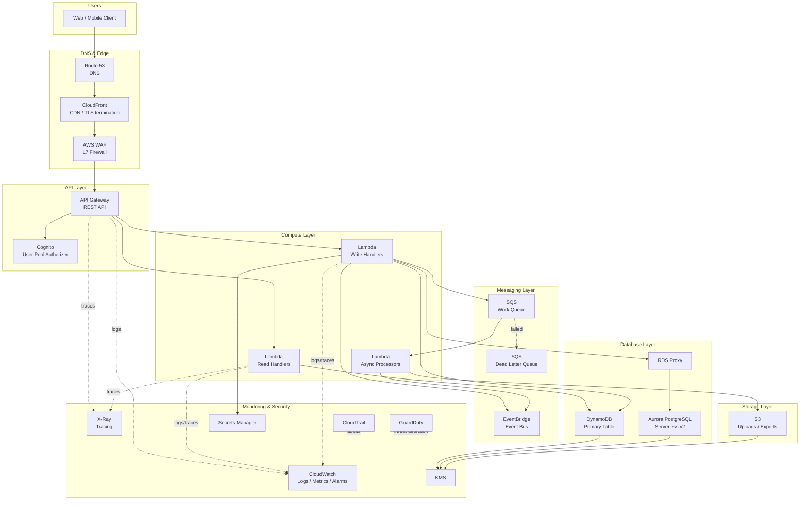

# Part IV – Serverless Architectures

# Chapter 25: REST APIs

*A production reference architecture for building enterprise-grade REST APIs on AWS using API Gateway, Lambda, and managed data services.*

---

## 1. Executive Summary

### 1.1 The Business Problem

Enterprises building customer-facing and internal APIs face a recurring set of problems that have nothing to do with business logic and everything to do with infrastructure:

- Traditional server fleets (EC2, on-premises application servers) require capacity planning for peak load, even though most APIs see highly variable traffic throughout the day.
- Idle compute costs money 24/7, whether or not a single request arrives.
- Patching, scaling, and securing a fleet of servers consumes engineering time that could be spent on product features.
- Traffic spikes — marketing campaigns, seasonal retail events, mobile app launches — routinely overwhelm capacity that was sized for "normal" load.
- Multi-team organizations need a way to expose many independently deployable API endpoints without each team owning a full server fleet.

A **serverless REST API architecture** built on Amazon API Gateway and AWS Lambda addresses these problems directly. Instead of provisioning servers, teams define API routes, attach Lambda functions to handle requests, and let AWS manage the underlying compute capacity, scaling, and patching.

This is not a theoretical improvement. It is the architecture pattern most large AWS customers converge on for APIs that have unpredictable, spiky, or long-tail traffic patterns, and it is increasingly the *default* starting point for new API development inside cloud-native organizations.

### 1.2 Architecture Objective

The objective of this chapter's reference architecture is to define a **production-ready, secure, observable, and cost-efficient REST API** that:

- Scales automatically from zero to thousands of requests per second without manual intervention.
- Enforces authentication and authorization at the edge, before requests reach business logic.
- Separates public-facing routing (API Gateway) from business logic (Lambda) from data persistence (DynamoDB, Aurora, or RDS depending on access pattern).
- Is deployable entirely through Infrastructure as Code (Terraform) and CI/CD pipelines, with no manual console changes in production.
- Meets enterprise requirements for encryption, auditability, disaster recovery, and cost governance.

This is deliberately **not** a "hello world" API Gateway tutorial. Every design decision in this chapter is made the way it would be made in a Fortune 500 architecture review: with trade-offs stated explicitly, alternatives considered, and failure modes documented.

### 1.3 Why Organizations Adopt This Architecture

Organizations converge on serverless REST APIs for a combination of financial, operational, and organizational reasons.

**Financial drivers:**

- Pay-per-request pricing aligns cost directly with usage. There is no cost for idle capacity.
- Elimination of over-provisioned EC2 fleets sized for peak load that sits unused 90% of the time.
- Reduced operational headcount needed for patching, OS-level security, and capacity management.

**Operational drivers:**

- No servers to patch, no AMIs to maintain, no OS-level CVEs to track.
- Automatic scaling removes the need for Auto Scaling Group tuning, warm pools, and scaling policy maintenance.
- Deployments are function-level and independent, reducing blast radius compared to monolithic server deployments.

**Organizational drivers:**

- Small teams can own and deploy individual API routes independently (a natural fit for microservices and "two-pizza team" models).
- Faster time-to-market: a new endpoint can go from code to production in hours rather than requiring new server provisioning.
- Clear separation of concerns between platform teams (networking, IAM, security guardrails) and application teams (business logic in Lambda).

### 1.4 Major Business Benefits

| Benefit | Description |
|---|---|
| Reduced total cost of ownership | No idle compute cost; pay only for invocations and duration. |
| Faster feature velocity | Independent Lambda deployments reduce cross-team coordination. |
| Built-in high availability | API Gateway and Lambda are inherently multi-AZ within a region. |
| Reduced operational burden | No OS patching, no server fleet management. |
| Elastic scalability | Scales from a handful of requests to tens of thousands of requests per second without capacity planning. |
| Strong security posture | IAM-based execution roles enforce least privilege per function. |
| Simplified compliance | Fewer long-lived credentials, fewer persistent servers to audit. |

### 1.5 Typical Enterprise Scenarios

This architecture pattern recurs across industries in a consistent set of scenarios:

1. **Mobile and single-page application backends** — traffic is bursty, tied to user activity patterns (morning commute, lunch break, evening peak), and difficult to predict with fixed capacity.
2. **Partner and B2B integration APIs** — external partners consume APIs at irregular intervals; provisioning dedicated servers for each partner is wasteful.
3. **Internal microservices** — large enterprises decomposing monoliths into services often start new services as Lambda-backed APIs because the operational overhead of a new EC2 fleet per microservice is prohibitive.
4. **Event-driven order processing and fulfillment APIs** — retail and logistics companies with strong seasonal spikes (Black Friday, holiday shopping) benefit enormously from architectures that scale automatically rather than requiring pre-provisioned capacity for a two-week peak.
5. **SaaS multi-tenant control-plane APIs** — provisioning, billing, and account management APIs that see low, steady traffic punctuated by occasional bursts (e.g., mass onboarding events).
6. **Regulated industry APIs (financial services, healthcare)** — where audit trails, encryption, and least-privilege IAM are mandatory, and the reduced attack surface of a serverless architecture (no long-lived servers, no SSH access) simplifies compliance posture.

> **Note:** Serverless REST architectures are not universally superior to container- or EC2-based APIs. Section 34 ("Architect's Corner") and Section 28 ("Alternatives") examine in detail the scenarios where this pattern is the *wrong* choice — for example, APIs requiring sustained high throughput with predictable load, APIs with strict sub-10ms latency requirements, or APIs requiring long-running (multi-minute) synchronous request processing.

---

## 2. Business Requirements

A production REST API architecture must be derived from explicit business and technical requirements, not from technology preference. The following requirements are representative of what an enterprise architecture review board would document before approving this design.

### 2.1 Business Drivers

- Reduce time-to-market for new API endpoints from weeks to days.
- Reduce infrastructure cost for APIs with variable, unpredictable traffic.
- Support independent deployment by multiple engineering teams without shared server contention.
- Provide a consistent, governed platform for exposing both internal and external APIs.
- Enable rapid experimentation (canary releases, feature flags) without infrastructure risk.

### 2.2 Functional Requirements

| ID | Requirement |
|---|---|
| FR-1 | The system must expose versioned RESTful HTTP endpoints (JSON request/response). |
| FR-2 | The system must support CRUD operations against a primary data store. |
| FR-3 | The system must authenticate requests using OAuth2 / OIDC bearer tokens (Amazon Cognito or a third-party IdP). |
| FR-4 | The system must authorize requests at both the API Gateway layer (coarse-grained) and Lambda layer (fine-grained, resource-level). |
| FR-5 | The system must support request validation (schema validation) before invoking business logic. |
| FR-6 | The system must support asynchronous processing for long-running operations via a queue-based offload pattern. |
| FR-7 | The system must return structured error responses conforming to a documented error schema (e.g., RFC 7807 Problem Details). |
| FR-8 | The system must support pagination for list endpoints. |
| FR-9 | The system must support idempotent write operations using idempotency keys. |
| FR-10 | The system must expose OpenAPI 3.0 documentation for all public routes. |

### 2.3 Non-Functional Requirements

| Category | Requirement |
|---|---|
| Scalability | Support burst traffic up to 10,000 requests per second per region without manual intervention. |
| Availability | 99.95% monthly availability for the API tier. |
| Latency | P50 < 100 ms, P99 < 500 ms for synchronous read endpoints (excluding cold start outliers). |
| Compliance | SOC 2 Type II, PCI-DSS (if handling payment data), GDPR (if handling EU personal data). |
| Security | All data encrypted at rest and in transit; least-privilege IAM; no long-lived credentials in code. |
| Auditability | All API calls logged with request ID, identity, and outcome; retained for a minimum of 400 days. |
| Recovery | RPO ≤ 5 minutes for transactional data; RTO ≤ 30 minutes for full regional failover (if multi-region is in scope). |

### 2.4 Scalability Goals

- Linear cost scaling with request volume — no step-function cost increases from manual capacity additions.
- Ability to absorb a 20x traffic spike within seconds without pre-warming (subject to Lambda concurrency limits, discussed in Section 14).
- Database layer must scale independently from the compute layer (favoring DynamoDB on-demand or Aurora Serverless v2 over fixed-capacity RDS instances for unpredictable workloads).

### 2.5 Availability Requirements

- No single Availability Zone failure should cause an outage. API Gateway and Lambda are inherently regional, multi-AZ services; the database layer must be explicitly configured for Multi-AZ (RDS/Aurora) or is inherently multi-AZ (DynamoDB).
- Health checks and automated failover for any component that is not natively multi-AZ.

### 2.6 Latency Requirements

- Edge caching (CloudFront, API Gateway caching) for cacheable GET endpoints to reduce P50 latency and backend load.
- Lambda cold starts must be actively managed for latency-sensitive endpoints (Provisioned Concurrency, SnapStart for Java, minimizing deployment package size).

### 2.7 Compliance Requirements

Typical enterprise compliance frameworks that shape this architecture:

- **SOC 2 Type II** — requires documented access controls, change management, and monitoring.
- **PCI-DSS** — if any payment card data flows through the API, network segmentation and encryption requirements apply (see Section 11).
- **HIPAA** — if handling protected health information, additional encryption, audit logging, and Business Associate Agreement (BAA)-eligible services must be used.
- **GDPR / data residency** — may require regional data isolation, which influences whether a single-region or multi-region design is required.

### 2.8 Security Expectations

- All API traffic over TLS 1.2 or higher.
- WAF in front of the API to mitigate common web exploits (SQL injection, XSS, bad bots).
- Secrets (database credentials, third-party API keys) stored in AWS Secrets Manager, never in environment variables in plaintext or in source control.
- IAM execution roles scoped per-function with least privilege — no shared "LambdaFullAccess" roles.

### 2.9 Recovery Objectives

| Metric | Target | Rationale |
|---|---|---|
| RPO (Recovery Point Objective) | ≤ 5 minutes | Aligns with DynamoDB point-in-time recovery / Aurora continuous backup granularity. |
| RTO (Recovery Time Objective) | ≤ 30 minutes (single region), ≤ 4 hours (cross-region DR) | Balances DR investment against business impact of downtime. |

### 2.10 SLAs

A typical enterprise SLA commitment layered on top of this architecture:

- 99.95% monthly uptime commitment to internal/external API consumers.
- P99 latency SLA published per endpoint category (read vs. write).
- Incident communication SLA: customer notification within 15 minutes of a Sev-1 detection.

### 2.11 Expected Workload and Growth

- Baseline: 200 requests/second average, 2,000 requests/second peak (10x baseline during business hours).
- Growth projection: 3x traffic growth over 18 months as additional client applications onboard.
- Data growth: primary table expected to grow from 50 GB to 500 GB over the same period, favoring DynamoDB's storage-transparent scaling or Aurora's auto-scaling storage over manually provisioned RDS storage volumes.

---

## 3. Architecture Overview

### 3.1 Overall Design

This reference architecture follows a **layered, event-driven serverless design**:

1. **Edge layer** — Amazon Route 53 (DNS), Amazon CloudFront (CDN/edge caching), AWS WAF (edge security).
2. **API layer** — Amazon API Gateway (REST API type), providing request routing, throttling, request validation, and authentication integration.
3. **Compute layer** — AWS Lambda functions implementing business logic, one function (or function group) per logical resource/route.
4. **Messaging layer** — Amazon SQS and Amazon EventBridge for asynchronous processing, decoupling, and event fan-out.
5. **Data layer** — Amazon DynamoDB for high-throughput key-value/document access patterns, and/or Amazon Aurora (PostgreSQL/MySQL compatible) for relational workloads requiring complex queries and transactions.
6. **Storage layer** — Amazon S3 for object storage (file uploads, exports, static assets).
7. **Observability layer** — Amazon CloudWatch (metrics, logs, alarms), AWS X-Ray (distributed tracing).
8. **Security layer** — AWS IAM, AWS KMS, AWS Secrets Manager, AWS CloudTrail, Amazon GuardDuty, AWS Config.

### 3.2 Architecture Philosophy

The design follows four core principles:

1. **No idle compute.** Every compute resource (Lambda) only incurs cost when actively processing a request. There is no "always-on" application server tier.
2. **Managed over self-hosted.** Every component in the critical path is a managed AWS service (API Gateway, Lambda, DynamoDB/Aurora) rather than self-managed software on EC2, minimizing operational burden.
3. **Defense in depth.** Security is enforced at multiple layers — edge (WAF), API (Cognito authorizer, resource policies), compute (IAM execution roles), and data (encryption at rest, fine-grained IAM conditions).
4. **Everything as code.** Infrastructure, API definitions (OpenAPI), and IAM policies are all version-controlled and deployed through CI/CD — never modified manually in the console in production environments.

### 3.3 Core Components

| Component | Role |
|---|---|
| Route 53 | Authoritative DNS, health-check-based failover routing. |
| CloudFront | Edge caching, TLS termination, geographic distribution. |
| AWS WAF | Layer 7 firewall — rate limiting, managed rule groups, IP reputation. |
| API Gateway (REST API) | Request routing, throttling, authorizer integration, request/response transformation. |
| Cognito User Pool | Identity provider issuing JWT access tokens for API consumers. |
| Lambda | Stateless business logic execution per route. |
| DynamoDB | Primary transactional data store for key-value access patterns. |
| Aurora PostgreSQL (optional) | Relational data store for complex query/reporting workloads. |
| SQS | Durable queue for asynchronous/long-running operations. |
| EventBridge | Event bus for decoupled, event-driven integration between services. |
| S3 | Object storage for uploads, exports, and static content. |
| CloudWatch | Metrics, logs, dashboards, alarms. |
| X-Ray | Distributed tracing across API Gateway → Lambda → downstream services. |
| KMS | Encryption key management for data at rest. |
| Secrets Manager | Secure storage and rotation of database credentials and third-party API keys. |

### 3.4 How Components Interact

The request path is intentionally linear and stateless: **Client → DNS → Edge → API Gateway → Authorizer → Lambda → Data Store → Response**, with asynchronous fan-out to SQS/EventBridge for non-blocking side effects (notifications, analytics events, downstream processing).

No component in the synchronous request path maintains session state. All state lives in DynamoDB/Aurora or S3, which allows any Lambda invocation to be handled by any available execution environment, in any Availability Zone, without session affinity.

### 3.5 High-Level Workflow

1. Client resolves the API domain via Route 53.
2. Request is routed to the nearest CloudFront edge location.
3. AWS WAF evaluates the request against configured rules.
4. CloudFront forwards the request to API Gateway (regional endpoint).
5. API Gateway validates the request schema and invokes the configured authorizer (Cognito or Lambda authorizer).
6. On successful authorization, API Gateway invokes the target Lambda function synchronously.
7. Lambda executes business logic, reading/writing to DynamoDB or Aurora as needed.
8. For operations requiring asynchronous processing, Lambda publishes a message to SQS or an event to EventBridge and returns a 202 Accepted response immediately.
9. API Gateway returns the Lambda response to the client via CloudFront.
10. All requests, invocations, and downstream calls are logged to CloudWatch and traced via X-Ray.

### 3.6 Request Lifecycle

A request lifecycle spans **edge termination → authentication → validation → business logic → persistence → response serialization**. Each stage is independently scalable and independently observable — a critical property for enterprise-scale debugging, since a P99 latency regression can be isolated to a specific stage using X-Ray trace segments rather than requiring end-to-end log correlation by hand.

### 3.7 Response Lifecycle

Responses are constructed by Lambda, returned through API Gateway's integration response mapping (which can transform, filter, or enrich headers), and optionally cached at the API Gateway or CloudFront layer for cacheable GET requests. Error responses follow a consistent schema (Section 2.2, FR-7) so that client applications can implement uniform error handling regardless of which route failed.

### 3.8 Data Lifecycle

Data written through this architecture typically has the following lifecycle:

1. **Ingest** — written to DynamoDB or Aurora as the transactional system of record.
2. **Change propagation** — DynamoDB Streams or Aurora's CDC capability publish changes to EventBridge for downstream consumers (analytics, search indexing, cache invalidation).
3. **Archival** — data past its active lifecycle is exported to S3 (via DynamoDB export-to-S3 or Aurora snapshots) for long-term retention at lower cost.
4. **Deletion** — TTL attributes (DynamoDB) or scheduled jobs enforce data retention policy compliance (e.g., GDPR right-to-erasure workflows).

---

## 4. AWS Services Used

Each service below is scoped to its role in this specific architecture. Only services relevant to a serverless REST API are included; container orchestration, VPN, and hybrid-connectivity services are intentionally omitted (see Section 28 for when they *would* be relevant).

### 4.1 Amazon API Gateway

**Purpose:** Amazon API Gateway is a fully managed service for creating, publishing, and securing REST, HTTP, and WebSocket APIs at any scale. In this architecture it is the single entry point for all client requests, handling routing, throttling, request validation, and authorizer integration before a request ever reaches application code.

**Why selected:** API Gateway removes the need to write and maintain routing, rate-limiting, and API-key management logic inside application code. It integrates natively with Lambda (proxy integration), Cognito, IAM, and CloudWatch, and it scales automatically with no configuration.

**Alternatives:** Application Load Balancer (ALB) with Lambda target groups (cheaper, but lacks request validation, usage plans, and native OpenAPI import); a self-hosted API gateway such as Kong or Envoy on ECS/EKS (more flexible, far more operational overhead).

**Limitations:** REST API type has a default payload limit of 10 MB; execution timeout capped at 29 seconds (a hard constraint that shapes the async offload pattern in Section 3.5); regional throttling limits (10,000 requests/second burst, 5,000 requests/second steady-state by default, both raisable via support ticket).

**Pricing considerations:** Charged per million API calls plus data transfer; REST API type is more expensive per call than the newer HTTP API type, but REST API provides request validation, WAF integration, usage plans, and API keys that HTTP API lacks (as of this writing HTTP API has closed much of that gap — re-verify current feature parity before committing).

**Best practices:** Use regional endpoints (not edge-optimized) when CloudFront is already in front of the API, to avoid double caching/latency hops. Enable access logging and execution logging separately — execution logs are verbose and expensive at scale. Use request validators to reject malformed payloads before Lambda invocation, saving invocation cost.

### 4.2 AWS Lambda

**Purpose:** Serverless compute service that runs code in response to events without provisioning or managing servers. In this architecture, Lambda functions implement all business logic behind API Gateway routes.

**Why selected:** Automatic scaling, per-millisecond billing, and no server management align directly with the business drivers in Section 2.1. Native integration with API Gateway (proxy integration) is the simplest path to a fully serverless API.

**Alternatives:** Containers on AWS Fargate (better for long-running or CPU-intensive workloads, sustained high throughput, or workloads with heavy startup dependencies); EC2 with Auto Scaling (better for extremely high, sustained, predictable throughput where per-invocation Lambda pricing exceeds reserved EC2 pricing).

**Limitations:** 15-minute maximum execution duration; cold start latency (particularly for languages with heavier runtime initialization, such as Java and .NET, and functions inside a VPC); concurrent execution limits per account/region (default 1,000, raisable).

**Pricing considerations:** Billed per GB-second of memory allocated multiplied by execution duration, plus a per-request charge. Over-allocating memory increases cost; under-allocating memory increases duration (and therefore cost) due to proportionally reduced CPU. Right-sizing memory (Section 15) is a direct cost lever.

**Best practices:** Keep deployment packages small (avoid bundling entire SDKs unnecessarily); reuse SQL/HTTP connections across invocations using execution context reuse; avoid VPC attachment unless the function must reach a VPC-only resource (each additional ENI attachment historically added cold start latency — verify current behavior with Hyperplane ENIs, which reduced but did not eliminate this cost).

### 4.3 Amazon DynamoDB

**Purpose:** Fully managed, serverless NoSQL key-value and document database with single-digit-millisecond latency at any scale. Used as the primary transactional data store for access patterns known in advance (get-by-id, query-by-partition-key).

**Why selected:** On-demand capacity mode scales automatically with request volume, matching the "no idle capacity" philosophy of the rest of the architecture. Built-in multi-AZ replication provides high availability with no configuration.

**Alternatives:** Amazon Aurora (better for complex relational queries, joins, ad hoc reporting); Amazon RDS (simpler relational needs without Aurora's scaling); MongoDB Atlas or self-hosted document database (only justified by specific feature requirements not met by DynamoDB, e.g., complex geospatial queries).

**Limitations:** 400 KB maximum item size; no native support for complex multi-table joins or ad hoc queries — access patterns must be designed up front (single-table design); eventual consistency by default (strong consistency is available per-request at roughly double the read cost).

**Pricing considerations:** On-demand mode charges per read/write request unit consumed — ideal for unpredictable traffic. Provisioned mode with auto scaling is cheaper for steady, predictable traffic but requires capacity planning. Storage is billed separately and is comparatively inexpensive.

**Best practices:** Design tables around access patterns, not entity-relationship diagrams (single-table design). Use sparse Global Secondary Indexes to support secondary query patterns without duplicating base-table cost. Enable point-in-time recovery (PITR) for all production tables.

### 4.4 Amazon Aurora (PostgreSQL-Compatible)

**Purpose:** Managed relational database offering MySQL/PostgreSQL compatibility with cloud-native storage, up to 15 read replicas, and (via Aurora Serverless v2) automatic capacity scaling. Used when the API requires complex relational queries, multi-table transactions, or reporting joins that do not fit DynamoDB's access-pattern-first model.

**Why selected:** Aurora Serverless v2 scales compute capacity in fine-grained increments in response to load, avoiding the fixed-capacity waste of traditional RDS instances while retaining full relational query capability.

**Alternatives:** Amazon RDS for PostgreSQL/MySQL (simpler, cheaper at small scale, but fixed instance sizing and manual scaling); DynamoDB (if access patterns can be redesigned to fit key-value semantics, avoiding relational overhead entirely).

**Limitations:** Aurora Serverless v2 has a minimum billed capacity (0.5 ACU minimum as of this writing — verify current minimums) so it is not truly "scale to zero" like Lambda/DynamoDB on-demand; cross-region replication (Aurora Global Database) adds cost and operational complexity.

**Pricing considerations:** Billed per Aurora Capacity Unit (ACU) consumed for Serverless v2, plus storage and I/O. For workloads with long idle periods, this remains cheaper than a fixed-size provisioned instance sized for peak; for workloads with sustained near-peak utilization, provisioned Aurora instances are cheaper.

**Best practices:** Use RDS Proxy in front of Aurora when accessed from Lambda to pool connections and avoid connection exhaustion under high concurrency (Section 15.5). Enable encryption at rest via KMS. Use read replicas for reporting/analytics queries to isolate load from the transactional write path.

### 4.5 Amazon SQS

**Purpose:** Fully managed message queuing service. Used to decouple synchronous API responses from long-running or resource-intensive backend processing, and to buffer bursts of write traffic against downstream systems with lower throughput tolerance.

**Why selected:** Native Lambda integration (event source mapping) allows queue consumers to scale automatically with queue depth. Standard queues provide at-least-once delivery with virtually unlimited throughput; FIFO queues provide strict ordering and exactly-once processing where required.

**Alternatives:** Amazon Kinesis Data Streams (better for high-throughput, ordered, replayable event streams consumed by multiple independent consumers); EventBridge (better for routing/fan-out based on event content rather than simple work-queue semantics).

**Limitations:** Standard queues do not guarantee ordering; FIFO queues cap throughput at 3,000 messages/second with batching (300/second without); maximum message size 256 KB (larger payloads require the S3 extended client pattern).

**Pricing considerations:** Charged per request (each API call, including polling); Lambda's event source mapping uses long polling to minimize empty-receive costs. Extremely low cost relative to the reliability and decoupling it provides.

**Best practices:** Always configure a dead-letter queue (DLQ) for failed message processing. Set visibility timeout to at least 6x the consumer Lambda's timeout to avoid duplicate processing from premature redelivery.

### 4.6 Amazon EventBridge

**Purpose:** Serverless event bus for building event-driven architectures, routing events between AWS services, SaaS applications, and custom applications based on content-based rules.

**Why selected:** Enables decoupled fan-out — a single "OrderCreated" event can trigger notification, analytics, and fulfillment Lambda functions independently, without the publisher knowing about consumers, supporting the organizational goal of independent team ownership.

**Alternatives:** SNS (simpler pub/sub, no content-based routing rules, lower cost at very high volume); direct Lambda-to-Lambda invocation (tighter coupling, discouraged for production architectures).

**Limitations:** At-least-once delivery (consumers must be idempotent); event size limit of 256 KB; rule evaluation adds a small amount of latency versus direct invocation, generally immaterial for asynchronous flows.

**Pricing considerations:** Charged per million events published; custom bus events and third-party SaaS integration events are priced separately from the default AWS event bus.

**Best practices:** Use schema registry to enforce and document event contracts between producer and consumer teams. Use a dedicated custom event bus per domain rather than the default bus, to isolate blast radius and simplify access control.

### 4.7 Amazon S3

**Purpose:** Object storage for file uploads (e.g., document/image attachments submitted via the API), data exports, and static assets referenced by the API.

**Why selected:** Effectively unlimited scalability, 11 nines of durability, native integration with Lambda (event notifications), and lifecycle policies for automatic tiering/expiration.

**Alternatives:** Amazon EFS (only relevant if POSIX file-system semantics are required, e.g., shared mutable file access — rare for REST API workloads); EBS (not applicable to serverless compute).

**Limitations:** Not a database — no query capability beyond S3 Select for structured formats; eventual consistency historically applied to overwrite operations (S3 has since moved to strong read-after-write consistency for all operations, but architecture reviews should still verify current guarantees for the specific operation in question).

**Pricing considerations:** Storage billed per GB/month by storage class, plus request charges and data transfer out. Lifecycle policies moving infrequently accessed data to Glacier tiers materially reduce long-term storage cost (Section 16).

**Best practices:** Use presigned URLs to allow clients to upload/download directly to/from S3, bypassing Lambda/API Gateway payload limits entirely for large files. Enable default bucket encryption (SSE-KMS) and block all public access at the account level unless a specific bucket is intentionally public (e.g., static website hosting).

### 4.8 Amazon Cognito

**Purpose:** Managed identity provider issuing OAuth2/OIDC-compliant JWT tokens for API authentication, and (via Identity Pools) temporary AWS credentials for direct-to-AWS-service access patterns.

**Why selected:** Removes the need to build and operate custom authentication infrastructure; integrates natively with API Gateway as a built-in authorizer type (COGNITO_USER_POOLS), validating JWTs without custom authorizer Lambda code for the common case.

**Alternatives:** Third-party IdP (Okta, Auth0, Azure AD) via a Lambda authorizer validating externally issued JWTs — preferred when the enterprise already has an established IdP and wants a single source of identity truth; IAM-based SigV4 authentication — preferred for service-to-service (machine) API consumers already operating inside AWS.

**Limitations:** User Pool customization (hosted UI branding, MFA options) is more limited than dedicated CIAM platforms; cross-region user pool replication is not natively supported (a multi-region identity strategy requires additional design, Section 13).

**Pricing considerations:** Free tier covers a meaningful number of monthly active users; beyond that, billed per MAU, with different pricing tiers for standard vs. advanced security features (adaptive authentication, compromised credential detection).

**Best practices:** Enforce MFA for any user pool used by internal/administrative consumers. Use short-lived access tokens (15–60 minutes) with refresh token rotation. Scope custom OAuth scopes tightly to the specific API actions they authorize.

### 4.9 AWS IAM

**Purpose:** Identity and access management — defines who (or what) can call which AWS APIs. In this architecture, IAM execution roles scope exactly what each Lambda function can access (specific DynamoDB tables, specific SQS queues, specific Secrets Manager secrets).

**Why selected:** IAM is the foundational least-privilege enforcement mechanism for every other service in this architecture; there is no alternative for AWS-native authorization of service-to-service calls.

**Limitations:** Policy size limits (2,048 characters for inline policies on some entities, larger for managed policies with account-level aggregate limits); IAM is eventually consistent globally, which can cause brief propagation delays after policy changes.

**Best practices:** One execution role per Lambda function (not shared roles across functions); use permission boundaries for any role created by automated pipelines to cap maximum possible privilege; use IAM Access Analyzer to continuously detect overly permissive policies.

### 4.10 Amazon VPC

**Purpose:** Provides network isolation for any component in this architecture requiring private networking — most commonly Aurora/RDS, and Lambda functions when they must reach VPC-only resources (Aurora, ElastiCache, on-premises via VPN/Direct Connect).

**Why selected:** Required whenever the data layer is Aurora/RDS, since these services do not expose public endpoints in a well-architected deployment.

**Limitations:** Lambda functions attached to a VPC incur an ENI-management dependency (mitigated significantly by Hyperplane networking, but VPC attachment is still not "free" and should only be used when required); NAT Gateway is required for VPC-attached Lambda to reach the public internet (e.g., third-party APIs), adding cost and a potential bottleneck.

**Best practices:** Only attach Lambda to a VPC if it must reach a VPC-only resource. Use VPC endpoints (Gateway endpoints for S3/DynamoDB, Interface endpoints for other services) to avoid routing AWS-internal traffic through a NAT Gateway.

### 4.11 Amazon Route 53

**Purpose:** DNS resolution for the API's public domain name, with support for health-check-based failover routing in multi-region designs.

**Why selected:** Native integration with ACM certificates, CloudFront, and API Gateway custom domains; supports latency-based and failover routing policies required for DR (Section 13).

**Best practices:** Use alias records (not CNAME) for AWS targets to avoid an extra DNS lookup and to support zone apex records. Configure health checks against a dedicated `/health` endpoint, not the root API path.

### 4.12 Amazon CloudFront

**Purpose:** Global CDN providing edge caching for cacheable responses, TLS termination close to the client, and a stable integration point for AWS WAF.

**Why selected:** Reduces latency for geographically distributed clients and offloads cacheable GET traffic from API Gateway/Lambda, directly reducing both latency and cost.

**Limitations:** Adds a cache-invalidation dimension to operational complexity; misconfigured caching of authenticated/personalized responses is a common and serious security defect (Section 27).

**Best practices:** Cache only clearly cacheable, non-personalized GET responses; use `Cache-Control` headers set explicitly by Lambda rather than relying on CloudFront defaults; forward the `Authorization` header only to routes that require it, and never cache responses that vary by that header without including it in the cache key.

### 4.13 AWS WAF

**Purpose:** Layer 7 web application firewall protecting the API from common exploits (SQL injection, XSS), bad bots, and volumetric abuse, attached to CloudFront or directly to API Gateway.

**Best practices:** Start with AWS Managed Rule groups (Core Rule Set, Known Bad Inputs) in count mode, review false positives, then switch to block mode. Add rate-based rules to blunt credential-stuffing and scraping attempts.

### 4.14 AWS Shield

**Purpose:** DDoS protection. Shield Standard is automatically enabled at no cost for all CloudFront/Route 53 resources; Shield Advanced adds enhanced detection, cost protection during DDoS events, and access to the AWS DDoS Response Team, at additional cost, justified for internet-facing APIs with material business risk from availability attacks.

### 4.15 AWS KMS

**Purpose:** Managed key generation and encryption operations, used for encryption at rest across DynamoDB, Aurora, S3, SQS, Secrets Manager, and CloudWatch Logs.

**Best practices:** Use customer-managed keys (CMKs) rather than AWS-managed keys when the organization requires key rotation control, granular key policies, or cross-account access via key policy grants. Rotate CMKs annually (automatic rotation is a one-line configuration).

### 4.16 AWS Secrets Manager

**Purpose:** Secure storage, retrieval, and automatic rotation of database credentials, API keys, and other secrets consumed by Lambda functions.

**Why selected over Systems Manager Parameter Store:** Native automatic rotation for RDS/Aurora credentials via a built-in Lambda rotation function; Parameter Store (SecureString) is a lower-cost alternative for secrets that do not require automatic rotation.

**Best practices:** Never inject secrets as Lambda environment variables in plaintext; retrieve at runtime via the Secrets Manager API (with client-side caching to avoid per-invocation API cost/latency) or via a Lambda extension that caches secrets locally.

### 4.17 AWS Systems Manager

**Purpose:** Parameter Store (non-secret configuration values), Session Manager (for any bastion/administrative access if EC2 is present elsewhere in the account), and Automation documents for operational runbooks.

### 4.18 Amazon CloudWatch

**Purpose:** Central metrics, logs, dashboards, and alarms for every component in the architecture — API Gateway execution/access logs, Lambda invocation logs and metrics, DynamoDB/Aurora performance metrics, custom business metrics.

**Best practices:** Use structured (JSON) logging from Lambda for queryability via CloudWatch Logs Insights. Set log retention explicitly (default is "never expire," which silently accumulates cost, Section 16).

### 4.19 AWS X-Ray

**Purpose:** Distributed tracing across API Gateway, Lambda, and downstream AWS SDK calls, enabling latency breakdown by segment for debugging and performance optimization.

**Best practices:** Enable active tracing on both API Gateway and Lambda; annotate custom segments for significant business logic sections (e.g., "validate," "persist," "publish-event") to make traces actionable rather than just showing SDK call latency.

### 4.20 AWS CloudTrail

**Purpose:** Audit log of all AWS API calls made within the account — who changed what IAM policy, who modified a Lambda function's code, who accessed a Secrets Manager secret. Required for SOC 2/PCI-DSS compliance evidence.

**Best practices:** Enable an organization-wide trail logging to a centralized, access-restricted S3 bucket in a dedicated logging account; enable log file integrity validation.

### 4.21 AWS Config

**Purpose:** Continuous configuration compliance monitoring — detects and alerts when resources drift from approved configuration (e.g., an S3 bucket becomes public, a security group opens 0.0.0.0/0 on an unexpected port).

**Best practices:** Enable AWS Config Conformance Packs aligned to the organization's compliance framework (PCI-DSS, CIS AWS Foundations Benchmark) rather than authoring all rules manually.

### 4.22 Amazon GuardDuty

**Purpose:** Managed threat detection service analyzing CloudTrail, VPC Flow Logs, and DNS logs for indicators of compromise — compromised credentials, cryptomining, unusual API call patterns.

**Best practices:** Enable at the AWS Organizations level with a delegated administrator account; route findings to Security Hub for centralized triage rather than monitoring each account independently.

---

## 5. Complete Architecture Diagram



> **Diagram Note:** Solid arrows represent synchronous request/response paths. Dashed arrows represent asynchronous, logging, or monitoring data flows. The messaging layer (SQS/EventBridge) is what allows the synchronous request path to stay within API Gateway's 29-second timeout even when downstream processing takes longer.

---

## 6. Component-by-Component Explanation

### 6.1 API Gateway

- **Purpose:** Single entry point enforcing request validation, throttling, and authorization before business logic executes.
- **Responsibilities:** Route matching, request schema validation, authorizer invocation, request/response transformation, usage-plan-based throttling, caching (optional).
- **Inputs:** HTTPS requests from CloudFront (or directly from clients if CloudFront is not used).
- **Outputs:** Invocation events to Lambda (proxy integration passes the full HTTP request as a structured event).
- **Scaling:** Fully managed and automatic; account-level throttling limits are the only scaling constraint (raisable via support ticket).
- **High availability:** Inherently multi-AZ within the region; no configuration required.
- **Failure handling:** Returns 5xx to the client on integration failure; configure custom gateway responses for consistent error formatting even when Lambda is unreachable.
- **Dependencies:** Cognito (or Lambda authorizer) for auth; Lambda for business logic; CloudWatch for logging.
- **Security:** Resource policies can restrict which AWS accounts/VPCs may invoke the API; WAF web ACL association for L7 protection.
- **Monitoring:** `4XXError`, `5XXError`, `Latency`, `IntegrationLatency`, `Count` metrics per stage/method.

### 6.2 Lambda Functions

- **Purpose:** Execute business logic for each route.
- **Responsibilities:** Input validation (defense in depth beyond API Gateway's schema validation), business rule enforcement, data access, event publication.
- **Inputs:** API Gateway proxy event (headers, path parameters, query string, body, requestContext with authorizer claims).
- **Outputs:** Structured HTTP response object (statusCode, headers, body); optionally SQS/EventBridge messages.
- **Scaling:** Automatic, one execution environment per concurrent request, up to the account/reserved concurrency limit.
- **High availability:** Automatically distributed across AZs within the region by the Lambda service.
- **Failure handling:** Synchronous invocations return errors directly to API Gateway; unhandled exceptions should be caught and mapped to structured error responses, not allowed to propagate as raw stack traces.
- **Dependencies:** IAM execution role, DynamoDB/Aurora, Secrets Manager, SQS/EventBridge as applicable.
- **Security:** Function-specific execution role; no function should share a role with another function performing a different task.
- **Monitoring:** `Duration`, `Errors`, `Throttles`, `ConcurrentExecutions`, custom business metrics via CloudWatch Embedded Metric Format (EMF).

### 6.3 DynamoDB

- **Purpose:** System of record for key-value/document access patterns.
- **Responsibilities:** Durable, low-latency storage; automatic replication across 3 AZs.
- **Inputs:** GetItem/PutItem/Query/UpdateItem calls from Lambda via the AWS SDK.
- **Outputs:** Item data; DynamoDB Streams change records for downstream consumers.
- **Scaling:** On-demand mode scales automatically with traffic; provisioned mode scales via Application Auto Scaling policies.
- **High availability:** Multi-AZ by default; Global Tables for multi-region active-active.
- **Failure handling:** SDK-level automatic retries with exponential backoff for throttling; application-level handling for `ConditionalCheckFailedException` on optimistic concurrency control.
- **Security:** IAM condition keys can restrict access to specific item key prefixes (fine-grained, per-tenant access control); encryption at rest via KMS.
- **Monitoring:** `ConsumedReadCapacityUnits`, `ConsumedWriteCapacityUnits`, `ThrottledRequests`, `SystemErrors`.

### 6.4 Aurora / RDS Proxy

- **Purpose:** Relational data store for complex query and transactional needs; RDS Proxy pools and multiplexes connections from bursty Lambda concurrency.
- **Responsibilities:** ACID transactions, complex joins, referential integrity.
- **Scaling:** Aurora Serverless v2 scales compute in fine increments; read replicas scale read throughput independently.
- **High availability:** Multi-AZ cluster with automatic failover (typically under 30 seconds).
- **Failure handling:** RDS Proxy transparently retries and re-routes connections during failover, hiding most failover events from application code.
- **Security:** IAM database authentication (avoiding long-lived database passwords) is supported and recommended for Lambda-based access.
- **Monitoring:** `CPUUtilization`, `DatabaseConnections`, `ReadLatency`, `WriteLatency`, RDS Proxy `DatabaseConnectionsCurrentlyInUse`.

### 6.5 SQS / EventBridge

- **Purpose:** Asynchronous decoupling and event-driven fan-out.
- **Responsibilities:** Durable buffering (SQS); content-based routing to multiple independent consumers (EventBridge).
- **Scaling:** Both scale automatically and transparently; SQS consumer Lambda concurrency scales with queue depth via event source mapping batch size and scaling configuration.
- **Failure handling:** Dead-letter queues capture messages that fail processing after a configured number of retries, enabling manual inspection and reprocessing without data loss.
- **Monitoring:** `ApproximateNumberOfMessagesVisible`, `ApproximateAgeOfOldestMessage` (a critical leading indicator of consumer-side processing lag).

### 6.6 S3

- **Purpose:** Object storage for uploads, exports, and generated artifacts.
- **Failure handling:** Cross-region replication (if configured) for DR; versioning to protect against accidental overwrite/delete.
- **Monitoring:** Request metrics, `4xxErrors`/`5xxErrors`, replication latency (if CRR enabled).

---

## 7. End-to-End Request Flow

The following describes a synchronous **write** request (e.g., `POST /orders`) end to end, including error handling at each stage.

1. **Client** constructs an HTTPS request with a bearer access token in the `Authorization` header and a JSON body, and sends it to `api.example.com`.
2. **Route 53** resolves `api.example.com` to the CloudFront distribution via an alias record.
3. **CloudFront** terminates TLS at the nearest edge location and forwards the request toward the origin (API Gateway regional endpoint), passing the `Authorization` header through (explicitly configured, since CloudFront does not forward custom headers by default).
4. **AWS WAF**, associated with the CloudFront distribution, evaluates the request against managed and custom rules (rate-based rules, SQL injection rule group). A request that violates a rule is blocked with a 403 response at the edge — it never reaches API Gateway.
5. **API Gateway** receives the request, matches it to the `POST /orders` resource, and runs the configured **request validator** against the JSON schema defined for that route. A malformed body is rejected with a 400 response immediately — no Lambda invocation occurs, saving cost and reducing attack surface.
6. API Gateway invokes the **Cognito authorizer**, which validates the JWT signature, expiration, and issuer against the configured User Pool. An invalid or expired token results in a 401 response.
7. On success, API Gateway invokes the target **Lambda function** synchronously via proxy integration, passing the full request context including the decoded JWT claims (`requestContext.authorizer.claims`).
8. The Lambda function performs **application-level authorization** — for example, verifying the authenticated user's tenant ID matches the tenant ID implied by the request path, which API Gateway/Cognito cannot verify on their own.
9. The Lambda function validates business rules (e.g., inventory availability) and, if valid, writes the order record to **DynamoDB** using a conditional write to prevent duplicate order creation (idempotency key check).
10. The Lambda function publishes an **`OrderCreated` event to EventBridge**, which asynchronously triggers downstream consumers (inventory reservation, notification, analytics) without blocking the client response.
11. The Lambda function returns a structured `201 Created` response with the new resource's location header.
12. **API Gateway** returns the response through **CloudFront** back to the client.
13. Throughout the request, **CloudWatch** records execution logs, and **X-Ray** captures a trace segment for each hop (API Gateway → authorizer → Lambda → DynamoDB → EventBridge), enabling latency breakdown by stage.
14. If any stage fails after the authorizer succeeds (e.g., a DynamoDB throttling exception), the Lambda function catches the exception, logs a structured error event, and returns a `503 Service Unavailable` with a `Retry-After` header rather than allowing an unhandled exception (which API Gateway would surface as a generic `502 Bad Gateway`, unhelpful to the client).

> **Tip:** Always distinguish, in both logging and client-facing error codes, between *client errors* (4xx — bad input, unauthorized) and *server errors* (5xx — infrastructure/dependency failure). Conflating the two makes on-call triage significantly harder at 3 AM.

---

## 8. Deployment Flow

### 8.1 Infrastructure Provisioning

All infrastructure — API Gateway, Lambda functions, DynamoDB tables, IAM roles, CloudWatch alarms — is defined in Terraform modules and provisioned exclusively through CI/CD. No production resource is created or modified via the AWS Console.

### 8.2 Terraform Workflow

1. Developer opens a pull request modifying Terraform configuration (or, more commonly, application code that triggers a Lambda package rebuild).
2. CI pipeline runs `terraform fmt -check`, `terraform validate`, and a static analysis tool (`tfsec` or `checkov`) to catch security misconfigurations before merge.
3. CI pipeline runs `terraform plan` against a non-production workspace and posts the plan output as a PR comment for human review.
4. On merge to the main branch, the pipeline runs `terraform plan` against the target environment (dev → staging → production, promoted sequentially) and requires manual approval before `terraform apply` in production.
5. Terraform state is stored remotely in an S3 backend with DynamoDB-based state locking, never on a developer's local machine.

### 8.3 CI/CD Deployment (Application Code)

1. Lambda function code is built and packaged (zip or container image) in the CI pipeline.
2. Unit tests and integration tests run against the packaged artifact.
3. The artifact is published to a versioned location (S3 bucket or ECR repository) and referenced by an immutable version identifier — never `:latest`.
4. Terraform (or a dedicated deployment tool such as AWS CodeDeploy for Lambda) updates the Lambda function to point at the new version.

### 8.4 Blue-Green / Canary Deployment

Lambda supports weighted alias-based traffic shifting natively:

1. Deploy the new function version alongside the existing one (Lambda versions are immutable).
2. Shift a small percentage of traffic (e.g., 5%) to the new version using a weighted alias.
3. Monitor error rate and latency via CloudWatch alarms tied to the new version's metrics for a defined bake time (e.g., 10 minutes).
4. If metrics remain healthy, progressively shift 100% of traffic to the new version. If an alarm fires, automatically roll back to the previous version (AWS CodeDeploy supports this natively for Lambda deployments).

### 8.5 Rollback

- Lambda: revert the alias to the previous version — effectively instantaneous, since the previous version's code is still deployed and warm.
- API Gateway: redeploy the previous stage deployment (API Gateway stages retain deployment history).
- Terraform-managed infrastructure: revert the merge commit and re-apply; because state is declarative, this restores the previous configuration exactly.

### 8.6 Secrets and Configuration

- Secrets (database credentials, third-party API keys) are provisioned in Secrets Manager via Terraform but their *values* are injected out-of-band (via a secure pipeline step or manual break-glass process) — secret values are never committed to source control, even in Terraform variable files.
- Non-secret configuration (feature flags, timeout values) is managed via Lambda environment variables set by Terraform, or via Parameter Store for values shared across multiple functions.

### 8.7 Validation

- Post-deployment smoke tests run automatically against the newly deployed stage (a small suite of synthetic requests covering critical paths) before the deployment pipeline reports success.
- CloudWatch Synthetics canaries continuously validate critical endpoints in production on a schedule, independent of deployment events, to catch regressions caused by anything other than a code deployment (e.g., an expired TLS certificate, an IAM policy change).

---

## 9. Network Topology

Even though the compute layer is serverless, this architecture still requires a VPC whenever Aurora/RDS is present, since these services do not securely expose public endpoints in a well-architected deployment.

### 9.1 VPC and CIDR Design

| Attribute | Value | Rationale |
|---|---|---|
| VPC CIDR | `10.20.0.0/16` | Provides 65,536 addresses, ample headroom for subnet growth, chosen to avoid overlap with other VPCs connected via Transit Gateway. |
| Public subnets | `10.20.0.0/24`, `10.20.1.0/24`, `10.20.2.0/24` (one per AZ) | Host NAT Gateways only; no compute resources are placed here. |
| Private subnets (app) | `10.20.10.0/23`, `10.20.12.0/23`, `10.20.14.0/23` | Host VPC-attached Lambda ENIs. |
| Private subnets (data) | `10.20.20.0/24`, `10.20.21.0/24`, `10.20.22.0/24` | Host Aurora cluster instances and RDS Proxy, isolated from the app subnets by security group rules. |

### 9.2 Public vs. Private Subnets

- **Public subnets** contain only NAT Gateways and, if applicable, an internet-facing ALB (not required in the pure API Gateway design, but relevant if a hybrid ALB+Lambda pattern is used for cost reasons — see Section 28).
- **Private subnets** contain all compute (VPC-attached Lambda ENIs) and data (Aurora, RDS Proxy) resources. Nothing in a private subnet has a public IP or a route to the internet except through a NAT Gateway.

### 9.3 NAT Gateway

- One NAT Gateway per AZ (three total) to avoid a cross-AZ single point of failure and to avoid cross-AZ data transfer charges for NAT traffic.
- Used only by VPC-attached Lambda functions that must reach the public internet (e.g., calling a third-party payment API) — Lambda functions that only access AWS services should use VPC endpoints instead, avoiding NAT Gateway entirely for that traffic.

### 9.4 Internet Gateway

- Attached to the VPC to provide the public subnets' NAT Gateways with internet connectivity; no compute resource routes directly through the Internet Gateway.

### 9.5 Transit Gateway

- Used only if this API's VPC must communicate with other VPCs in the organization (e.g., a shared services VPC hosting a corporate directory, or on-premises connectivity via Direct Connect). For a single, self-contained API workload, Transit Gateway is not required and should not be added speculatively (Section 27, Anti-Patterns).

### 9.6 Route Tables

| Subnet Type | Route | Target |
|---|---|---|
| Public | `0.0.0.0/0` | Internet Gateway |
| Private (app) | `0.0.0.0/0` | NAT Gateway (same AZ) |
| Private (app) | S3/DynamoDB prefix list | Gateway VPC Endpoint |
| Private (data) | No default route | Isolated — no internet access required or permitted |

### 9.7 Network ACLs

Network ACLs are used as a coarse, stateless defense-in-depth layer, not as the primary access control mechanism (security groups serve that role). A typical rule set denies traffic to/from known-bad CIDR ranges and enforces subnet-tier boundaries as a backstop against security group misconfiguration.

### 9.8 Security Groups

| Security Group | Inbound | Outbound |
|---|---|---|
| `sg-lambda-app` | None (Lambda does not accept inbound connections) | 443 to VPC endpoints, 5432 to `sg-aurora`, 443 to NAT (0.0.0.0/0) |
| `sg-rds-proxy` | 5432 from `sg-lambda-app` | 5432 to `sg-aurora` |
| `sg-aurora` | 5432 from `sg-rds-proxy` only | None required |

> **Warning:** A common production incident stems from allowing Lambda's security group to reach Aurora directly, bypassing RDS Proxy. Under a traffic spike, this exhausts Aurora's native connection limit far faster than RDS Proxy's connection multiplexing would allow. Always route Lambda → Aurora traffic through RDS Proxy in production.

### 9.9 VPC Endpoints (PrivateLink)

| Endpoint Type | Service | Purpose |
|---|---|---|
| Gateway | S3 | Avoids NAT Gateway cost/bottleneck for S3 access from VPC-attached Lambda. |
| Gateway | DynamoDB | Same rationale as S3. |
| Interface | Secrets Manager | Keeps secret retrieval traffic off the public internet path entirely. |
| Interface | KMS | Required if Secrets Manager or encryption calls must avoid NAT Gateway. |
| Interface | CloudWatch Logs / Monitoring | Reduces NAT Gateway data processing charges for high-volume logging. |

### 9.10 Hybrid Connectivity

If this API must be reachable from, or must reach, an on-premises data center (common in enterprises mid-way through cloud migration), connectivity is established via AWS Direct Connect (preferred for production, predictable latency/bandwidth) or Site-to-Site VPN (acceptable for lower-throughput or backup connectivity), terminating into a Transit Gateway shared across the organization's VPCs.

---

## 10. Identity and Access

### 10.1 IAM Roles

Every Lambda function is assigned a **unique, function-specific execution role** — never a shared role across multiple functions. This is the single most important IAM control in this architecture: it guarantees that a vulnerability or bug in one function cannot be leveraged to access resources that function has no legitimate need to touch.

### 10.2 IAM Policies (Least Privilege Example)

```json

{
  "Version": "2012-10-17",
  "Statement": [
    {
      "Sid": "AllowOrderTableAccess",
      "Effect": "Allow",
      "Action": [
        "dynamodb:GetItem",
        "dynamodb:PutItem",
        "dynamodb:UpdateItem",
        "dynamodb:Query"
      ],
      "Resource": [
        "arn:aws:dynamodb:us-east-1:111122223333:table/orders",
        "arn:aws:dynamodb:us-east-1:111122223333:table/orders/index/*"
      ]
    },
    {
      "Sid": "AllowEventBridgePublish",
      "Effect": "Allow",
      "Action": "events:PutEvents",
      "Resource": "arn:aws:events:us-east-1:111122223333:event-bus/orders-domain-bus"
    },
    {
      "Sid": "AllowSecretRetrieval",
      "Effect": "Allow",
      "Action": "secretsmanager:GetSecretValue",
      "Resource": "arn:aws:secretsmanager:us-east-1:111122223333:secret:orders/db-credentials-??????"
    },
    {
      "Sid": "AllowLogging",
      "Effect": "Allow",
      "Action": [
        "logs:CreateLogGroup",
        "logs:CreateLogStream",
        "logs:PutLogEvents"
      ],
      "Resource": "arn:aws:logs:us-east-1:111122223333:log-group:/aws/lambda/create-order:*"
    }
  ]
}

```

Note this policy grants access to exactly one DynamoDB table, one event bus, one secret, and one log group — nothing else. There is no `dynamodb:*` or `Resource: "*"` statement.

### 10.3 Resource Policies

API Gateway resource policies restrict *which callers* may invoke the API at the gateway level, independent of the authorizer — for example, restricting an internal-only API to requests originating from within the organization's VPC via an interface endpoint, using a `aws:SourceVpce` condition.

### 10.4 STS and Cross-Account Access

For architectures spanning multiple AWS accounts (e.g., a shared platform account hosting API Gateway, with individual Lambda functions deployed in team-owned accounts), cross-account access is granted via STS `AssumeRole`, never via shared long-lived IAM user credentials. Each cross-account trust relationship is scoped to a specific role with a specific, documented purpose.

### 10.5 Least Privilege in Practice

- Start every new Lambda function's IAM policy with **zero permissions** and add only what is proven necessary by the function's actual code paths (informed by IAM Access Analyzer's policy generation feature, which can derive a minimal policy from CloudTrail activity during a testing period).
- Review and prune unused permissions quarterly using IAM Access Analyzer's "unused access" findings.

### 10.6 Service Roles

Distinguish between **execution roles** (what a Lambda function can do when it runs) and **service-linked roles** (permissions AWS services need to manage resources on your behalf, e.g., the Application Auto Scaling service-linked role for DynamoDB). Service-linked roles are created and managed by AWS and should not be manually edited.

### 10.7 Permission Boundaries

Any IAM role created by an automated pipeline (e.g., a Terraform module invoked by a self-service developer portal) should have a **permission boundary** attached, capping the maximum permissions that role can ever be granted — even if a future policy change attempts to over-grant it. This is a critical control in organizations where many teams provision their own Lambda functions.

---

## 11. Security Architecture

### 11.1 Encryption

- **At rest:** DynamoDB (KMS, enabled by default with AWS-owned or customer-managed key), Aurora (KMS-encrypted storage volumes), S3 (SSE-KMS, bucket default encryption enforced), SQS (KMS-encrypted queues for any message containing sensitive data), CloudWatch Logs (KMS-encrypted log groups).
- **In transit:** TLS 1.2+ enforced at CloudFront, API Gateway, and for all AWS SDK calls (enabled by default). Database connections use TLS-enforced connection strings.

### 11.2 KMS Key Strategy

Use separate customer-managed KMS keys per data classification tier (e.g., one key for PII-bearing tables, a separate key for non-sensitive operational data) so that key policies, rotation schedules, and access audit trails can be managed independently, and so that a key compromise or required key deletion in one domain does not affect unrelated data.

### 11.3 TLS / Certificate Manager

TLS certificates for the custom domain are provisioned and auto-renewed via AWS Certificate Manager (ACM), attached to the CloudFront distribution (ACM certificates for CloudFront must be requested in `us-east-1` regardless of the API's actual region — a frequently missed detail).

### 11.4 WAF and Shield

Covered in Section 4.13–4.14. In the request flow, WAF sits in front of CloudFront and evaluates every request before it reaches API Gateway, providing the earliest possible rejection point for malicious traffic.

### 11.5 Secrets Manager

Covered in Section 4.16. All database credentials and third-party API keys are retrieved at Lambda runtime, never baked into deployment artifacts.

### 11.6 GuardDuty, Inspector, Security Hub

- **GuardDuty** continuously analyzes CloudTrail, VPC Flow Logs, and DNS query logs for threat indicators.
- **Inspector** scans Lambda function code and dependencies for known vulnerabilities (CVEs) — increasingly important as supply-chain attacks via compromised npm/PyPI packages have become a leading incident category.
- **Security Hub** aggregates findings from GuardDuty, Inspector, Config, and third-party tools into a single dashboard with a compliance score against frameworks like CIS AWS Foundations Benchmark.

### 11.7 CloudTrail and Config

Covered in Sections 4.20–4.21. Together they provide the "who did what, when" audit trail (CloudTrail) and the "is the environment still configured correctly" continuous check (Config) that compliance frameworks require as paired controls.

### 11.8 Zero Trust Principles Applied

- No implicit trust based on network location — every request is authenticated and authorized regardless of whether it originates from the public internet or from within the VPC.
- Service-to-service calls (Lambda → DynamoDB, Lambda → Aurora) are authenticated via IAM/database IAM auth, not network-perimeter trust alone.
- Every component logs its own access decisions independently, so no single log source is a single point of audit failure.

### 11.9 Threat Model

| Threat | Attack Vector | Mitigation |
|---|---|---|
| Credential stuffing / brute force | Repeated login attempts against Cognito | Cognito advanced security features (adaptive auth), WAF rate-based rules |
| SQL/NoSQL injection | Malicious input in request body/path parameters | API Gateway request validation, parameterized queries, DynamoDB's non-string-concatenation query model |
| Token theft / replay | Stolen JWT reused by an attacker | Short-lived access tokens, TLS everywhere, optional token binding |
| Over-permissioned Lambda | Compromised dependency exploiting broad IAM permissions | Per-function least-privilege roles (Section 10) |
| Data exfiltration via public S3 bucket | Misconfigured bucket policy | Account-level S3 Block Public Access, Config rules detecting public buckets |
| DDoS / volumetric abuse | Flood of requests exhausting throttling limits | Shield Standard/Advanced, CloudFront caching, WAF rate limiting |
| Supply chain compromise | Malicious npm/PyPI package in Lambda deployment package | Inspector dependency scanning, SBOM generation in CI, dependency pinning |
| Insider threat / excessive console access | Legitimate credentials misused | CloudTrail + GuardDuty anomaly detection, least-privilege IAM, MFA enforcement |

---

## 12. High Availability

### 12.1 Availability Zone Failures

API Gateway and Lambda are regional services that automatically operate across multiple AZs; no customer configuration is required for AZ-level resilience at the compute layer. DynamoDB replicates synchronously across three AZs by default. Aurora clusters should be explicitly configured with instances in at least two AZs, with automatic failover to a replica in a healthy AZ (typically under 30 seconds, further reduced by RDS Proxy masking the failover from application connections).

### 12.2 Instance Failures

There are no "instances" to fail in the Lambda/API Gateway/DynamoDB portion of this architecture — this is one of the primary availability advantages of the serverless model. For Aurora, instance failure triggers automatic failover to a healthy replica per the mechanism above.

### 12.3 Regional Failures

A full regional failure requires a multi-region DR strategy (Section 13). Single-region deployments accept regional failure as an outage scenario within their documented RTO/RPO, which must be explicitly approved by the business as an acceptable risk if multi-region is out of scope.

### 12.4 Load Balancing

API Gateway and Lambda perform load distribution internally and automatically; there is no customer-managed load balancer in the pure serverless path. If an ALB is introduced (hybrid pattern, Section 28), cross-zone load balancing must be explicitly enabled.

### 12.5 Health Checks

Route 53 health checks against a dedicated `/health` endpoint (validating downstream dependency health, not just "the Lambda function returned 200") drive failover routing decisions in a multi-region configuration.

### 12.6 Failover

For DynamoDB Global Tables (multi-region active-active), failover is effectively instantaneous from the client's perspective, subject to Route 53 health-check-based DNS failover propagation time (typically 60–180 seconds depending on TTL and health check interval configuration).

---

## 13. Disaster Recovery

### 13.1 Backup Strategy

| Data Store | Backup Mechanism | Frequency |
|---|---|---|
| DynamoDB | Point-in-Time Recovery (continuous, 35-day window) + on-demand backups before major schema changes | Continuous |
| Aurora | Automated continuous backup to S3 (35-day retention configurable) + manual snapshots before major changes | Continuous |
| S3 | Versioning enabled; Cross-Region Replication for critical buckets | Continuous |
| Lambda code | Immutable versions retained indefinitely; deployment artifacts in versioned S3/ECR | Per deployment |
| Terraform state | Versioned S3 backend | Per apply |

### 13.2 Cross-Region Replication

For workloads requiring regional DR, DynamoDB Global Tables replicate data to a secondary region with typical replication latency in the low seconds. Aurora Global Database provides cross-region replication with typical lag under one second and a documented RTO of under one minute for managed failover.

### 13.3 DR Strategy Options

| Strategy | RTO | RPO | Cost | Description |
|---|---|---|---|---|
| Backup & Restore | Hours | Up to 24h (or PITR window) | Lowest | Restore from backups into a newly provisioned secondary region only when disaster occurs. |
| Pilot Light | 10s of minutes | Minutes | Low-Medium | Core data replicated continuously (DynamoDB Global Tables / Aurora Global DB); compute (API Gateway, Lambda) deployed but idle/unconfigured until activated. |
| Warm Standby | Minutes | Seconds | Medium-High | Full stack deployed and running at reduced capacity in the secondary region, scaled up on failover. |
| Multi-Site Active-Active | Near zero | Near zero | Highest | Full stack actively serving production traffic in multiple regions simultaneously, with Route 53 latency-based routing. |

For this architecture's typical enterprise profile (Section 2), **Pilot Light** is the recommended default — DynamoDB Global Tables and Aurora Global Database provide continuously replicated data at manageable cost, while compute infrastructure (Terraform-defined API Gateway/Lambda) is deployed to the secondary region but only receives traffic after a deliberate (and ideally automated) failover decision.

### 13.4 RPO / RTO Achieved

| Component | RPO | RTO |
|---|---|---|
| DynamoDB (Global Tables) | < 1 second typical replication lag | Minutes (DNS failover propagation) |
| Aurora (Global Database) | < 1 second typical replication lag | < 1 minute (managed planned failover), minutes (unplanned) |
| S3 (CRR) | Minutes (asynchronous replication) | Immediate (replica bucket already exists) |

> **Note:** DR is only as good as its last successful test. Section 34 discusses how frequently enterprise DR plans fail their first real test, and what to do about it.

---

## 14. Scalability

### 14.1 Horizontal Scaling

Lambda scales horizontally by creating additional execution environments as concurrent request volume increases — this is the default and only scaling model for Lambda; there is no vertical "bigger instance" scaling concept for concurrency (only memory/CPU allocation per invocation, which is a separate performance lever, Section 15).

### 14.2 Vertical Scaling

The only vertical scaling knob in this architecture is Lambda's memory allocation (128 MB–10,240 MB), which proportionally scales allocated CPU. Increasing memory can *reduce* cost for CPU-bound functions by shortening duration enough to offset the higher per-millisecond rate — this must be measured empirically per function (AWS Lambda Power Tuning tool), not assumed.

### 14.3 Auto Scaling (Concurrency Management)

| Mechanism | Purpose |
|---|---|
| Reserved Concurrency | Caps a function's maximum concurrent executions, protecting downstream systems (e.g., Aurora) from being overwhelmed, and guaranteeing capacity is not starved by other functions competing for account-level concurrency. |
| Provisioned Concurrency | Pre-initializes a specified number of execution environments to eliminate cold starts for latency-sensitive routes, at a fixed hourly cost regardless of invocation volume. |
| Account Concurrency Limit | Default 1,000 concurrent executions per region per account (soft limit, raisable); must be planned for against the sum of all functions' peak concurrency, not just this API's functions. |

### 14.4 Serverless Scaling Characteristics

Lambda's burst scaling has an initial burst capacity (historically 500–3,000 concurrent executions depending on region, increasing at a defined rate per minute thereafter) before hitting the account concurrency limit — a detail that matters for architectures expecting instantaneous 10x+ traffic spikes and is a common source of unexpected 429 throttling during flash-sale-style events unless reserved/provisioned concurrency and account limit increases are planned in advance.

### 14.5 Database Scaling

- **DynamoDB on-demand:** scales automatically to handle up to double the previous peak traffic instantly; sustained growth beyond that is handled within minutes as DynamoDB's internal partition management adapts.
- **Aurora Serverless v2:** scales compute capacity (ACUs) in fine-grained increments within seconds in response to load; storage scales automatically and transparently up to 128 TB.

### 14.6 Storage Scaling

S3 scales storage capacity transparently with no configuration; request-rate scaling (S3 automatically partitions prefixes under sustained high request rates) benefits from key-naming strategies that avoid sequential prefixes for extremely high-throughput workloads.

### 14.7 Queue Scaling

SQS scales to virtually unlimited throughput for standard queues with no configuration. Lambda's event source mapping automatically increases the number of concurrent pollers as queue depth grows, subject to the consuming function's reserved concurrency limit — a deliberate control point to avoid a queue backlog overwhelming a downstream dependency.

---

## 15. Performance Optimization

### 15.1 Caching

- **CloudFront** caches cacheable GET responses at edge locations, reducing both latency and origin load.
- **API Gateway caching** (per-stage, TTL-configurable) caches responses closer to the backend, useful when CloudFront is not in front of the API or when cache keys need to vary by API Gateway-specific context.
- **Application-level caching** (e.g., ElastiCache for Redis) is appropriate when Lambda functions need to cache expensive computed results or frequently accessed reference data across invocations — note that Lambda's own execution context reuse (Section 15.6) provides a simpler, no-additional-infrastructure caching mechanism for many use cases.

### 15.2 Compression

Enable response compression (gzip/brotli) at API Gateway and CloudFront for text-based payloads (JSON) above a minimum size threshold, reducing transfer time and cost for larger response bodies.

### 15.3 CDN

Covered in Section 4.12. CloudFront's primary performance contribution in this architecture is reducing the latency of the TLS handshake (terminated at the nearest edge location) and caching cacheable content, not just static asset delivery.

### 15.4 Database Optimization

- **DynamoDB:** design access patterns to use `Query` (not `Scan`) for all production request paths; `Scan` operations should never appear in a synchronous API request path. Use sparse indexes and projection expressions to minimize read capacity consumption.
- **Aurora:** index columns used in `WHERE`/`JOIN` clauses; use `EXPLAIN ANALYZE` during load testing to catch sequential scans before they reach production; use read replicas for read-heavy reporting queries to isolate load from transactional writes.

### 15.5 Connection Pooling

Lambda functions connecting to Aurora must use RDS Proxy (Section 6.4) rather than opening a direct database connection per invocation. Without RDS Proxy, a traffic spike can open thousands of concurrent database connections in seconds, exceeding Aurora's native connection limit and causing cascading failures across every function sharing that database — a well-documented and frequently repeated production incident pattern.

### 15.6 Concurrency and Execution Context Reuse

Lambda reuses the execution environment (and any variables initialized outside the handler function) across sequential invocations on the same environment. Database connections, SDK clients, and configuration should be initialized once at module load time (outside the handler), not on every invocation — this alone can reduce average duration by tens to hundreds of milliseconds per invocation for functions with SDK client initialization overhead.

### 15.7 Async Processing

Any operation that does not need to complete before the client receives a response — sending a confirmation email, updating an analytics system, generating a PDF receipt — should be offloaded to SQS/EventBridge rather than performed synchronously within the API request path. This keeps P99 API latency low and avoids the risk of exceeding API Gateway's 29-second integration timeout.

---

## 16. Cost Optimization (FinOps)

### 16.1 Estimated Monthly Cost by Deployment Size

*Estimates below are illustrative, based on typical us-east-1 pricing at time of writing. Actual costs must be validated with the AWS Pricing Calculator for the specific account and current pricing, as these figures will drift over time.*

| Deployment Size | Monthly Requests | API Gateway | Lambda | DynamoDB (on-demand) | Aurora Serverless v2 | Data Transfer / CloudFront | Est. Monthly Total |
|---|---|---|---|---|---|---|---|
| Small (startup) | 5M | ~$18 | ~$25 | ~$15 | ~$45 (min ACU) | ~$20 | **~$120–150** |
| Medium (growth-stage) | 100M | ~$350 | ~$450 | ~$200 | ~$300 | ~$250 | **~$1,500–1,800** |
| Enterprise | 2B | ~$7,000 | ~$9,000 | ~$4,000 | ~$3,500 (provisioned + replicas) | ~$4,000 | **~$27,000–30,000** |

### 16.2 Major Cost Drivers

1. Lambda invocation count × duration × memory allocation.
2. API Gateway per-request charges (REST API type is materially more expensive per call than HTTP API type — a common enterprise cost-optimization opportunity is migrating latency-insensitive, simple-integration routes to HTTP API).
3. Data transfer out to the internet (mitigated significantly by CloudFront caching).
4. NAT Gateway hourly charge plus per-GB data processing charge for any VPC-attached Lambda reaching the internet without a VPC endpoint.
5. CloudWatch Logs ingestion and storage at high log volume with no retention policy set.
6. Aurora Serverless v2's non-zero minimum ACU floor for workloads with long idle periods.

### 16.3 Optimization Opportunities

| Lever | Impact |
|---|---|
| Right-size Lambda memory using AWS Lambda Power Tuning | 10–40% compute cost reduction typical |
| Migrate simple routes from REST API to HTTP API type | Up to ~70% lower per-request API Gateway cost for eligible routes |
| Set explicit CloudWatch Logs retention (e.g., 30/90 days) | Eliminates unbounded log storage cost growth |
| Use S3 Intelligent-Tiering / lifecycle policies for exports | 40–60% storage cost reduction for infrequently accessed objects |
| Use VPC Gateway Endpoints for S3/DynamoDB instead of NAT | Eliminates NAT Gateway data processing charges for that traffic |
| Cache aggressively at CloudFront for cacheable GETs | Reduces both Lambda invocation count and API Gateway request count |
| Use DynamoDB reserved capacity or provisioned+auto-scaling for steady baseline traffic | Meaningful discount vs. pure on-demand for predictable baseline load |

### 16.4 Reserved Instances, Savings Plans, Spot

This architecture has no EC2 instances, so traditional Reserved Instances do not apply directly. **Compute Savings Plans** apply to Lambda usage (in addition to EC2/Fargate) and can reduce Lambda compute cost by 12–17% for committed, predictable baseline usage — a relevant lever once traffic patterns stabilize enough to commit to a 1- or 3-year baseline. Spot is not applicable to this serverless architecture.

### 16.5 S3 Lifecycle and Storage Classes

| Storage Class | Use Case in This Architecture |
|---|---|
| S3 Standard | Recently uploaded, actively accessed files |
| S3 Intelligent-Tiering | Uploads with unpredictable access patterns (recommended default) |
| S3 Standard-IA / One Zone-IA | Exports and reports accessed infrequently after 30–90 days |
| S3 Glacier Deep Archive | Long-term compliance retention (e.g., 7-year audit log archives) |

### 16.6 Rightsizing

Rightsizing in this architecture is primarily a Lambda memory/duration exercise (Section 15.2) and an Aurora ACU min/max boundary exercise — Aurora Serverless v2's minimum ACU should be set as low as workload tolerance allows during off-peak hours, and reviewed quarterly against actual utilization metrics.

### 16.7 Cost Allocation and Tagging

Every resource is tagged with a mandatory tag set enforced via AWS Config (`cost-center`, `environment`, `owning-team`, `application`), enabling cost allocation reports broken down by team/feature for chargeback and showback processes.

### 16.8 Budgets and Cost Anomaly Detection

- AWS Budgets configured per environment/team with alert thresholds at 80% and 100% of forecasted monthly spend.
- AWS Cost Anomaly Detection monitors for statistically significant deviations from historical spend patterns (e.g., a runaway recursive Lambda invocation loop, or an accidentally public S3 bucket generating unexpected request charges) and alerts before month-end billing surprise.

---

## 17. AI-Assisted Operations

### 17.1 Amazon Q

Amazon Q Developer can assist with generating and reviewing Terraform modules, explaining unfamiliar CloudFormation/Terraform error messages, and suggesting IAM policy least-privilege refinements based on CloudTrail activity — reducing the time architects and engineers spend on boilerplate infrastructure code so more time is spent on architecture decisions.

### 17.2 Amazon Bedrock

For this architecture specifically (not the general AWS account), Bedrock is relevant in two ways: (1) as a downstream consumer if the API itself needs to expose AI-powered endpoints (e.g., a `/summarize` route backed by a foundation model), and (2) as an operational tool — a Bedrock-powered internal chatbot can be given read access to CloudWatch Logs Insights and X-Ray trace data to help on-call engineers triage incidents faster by summarizing anomalous log patterns in natural language.

### 17.3 AI-Assisted Troubleshooting

- Feeding a CloudWatch Logs Insights query result set and an X-Ray trace summary into an LLM-based assistant can surface likely root causes (e.g., "P99 latency spike correlates with RDS Proxy connection pool exhaustion at 14:32 UTC") faster than manual log correlation, particularly for on-call engineers unfamiliar with a specific service's code.
- This is an *assistive* capability, not a replacement for a documented runbook (Section 23) — AI-suggested root causes should always be verified against actual metrics before action is taken, especially for production remediation steps.

### 17.4 Log Analysis

LLM-based log summarization is most valuable for surfacing *patterns* across large volumes of unstructured log output (e.g., "87% of 5xx errors in the last hour share the same DynamoDB throttling error code") rather than for definitive root-cause determination, which still requires engineering judgment.

### 17.5 Incident Response

AI assistants can draft an initial incident timeline and customer-facing status update draft from raw CloudWatch/PagerDuty timestamps, reducing the administrative burden on the incident commander during a live incident — but the incident commander must always review and approve any customer-facing communication before it is sent.

### 17.6 Cost Optimization

AI-assisted analysis of AWS Cost and Usage Reports can identify underutilized resources (e.g., a Lambda function consistently allocated far more memory than it uses) and draft rightsizing recommendations faster than manual Cost Explorer review, particularly across accounts with hundreds of functions.

### 17.7 Capacity Planning

Historical CloudWatch metrics fed into a forecasting-capable AI tool can project future concurrency and throughput needs, informing decisions about reserved concurrency and Savings Plan commitments ahead of anticipated growth or seasonal events.

### 17.8 Architecture Review

Amazon Q can review a proposed Terraform plan against AWS Well-Architected Framework best practices as an automated first pass before human architecture review — catching obvious gaps (missing encryption, missing multi-AZ configuration) so the human review board can focus on business-context trade-offs rather than checklist compliance.

### 17.9 AI-Generated Terraform

AI-generated Terraform is a productivity accelerator for boilerplate (provider blocks, standard resource scaffolding) but must always be run through the same `terraform plan` review, `tfsec`/`checkov` scanning, and human approval gates as human-written Terraform — AI-generated infrastructure code carries the same risk profile as any other unreviewed code and should never bypass the standard change management pipeline.

### 17.10 AI-Generated Documentation

OpenAPI specifications, README files, and runbook drafts can be AI-generated from the actual Terraform/Lambda source code as a first draft, then reviewed and corrected by the engineering team — this measurably reduces the perpetual "documentation is out of date" problem when integrated into the CI pipeline (regenerating a documentation draft on every merge) rather than treated as a one-time manual exercise.

---

## 18. Terraform Implementation

The following is a representative, modular Terraform implementation. In a real repository this would be split across multiple files/modules (`network/`, `api/`, `compute/`, `data/`, `security/`); it is presented sequentially here for readability.

### 18.1 Providers and Backend

```hcl

# versions.tf

terraform {
  required_version = ">= 1.7.0"

  required_providers {
    aws = {
      source  = "hashicorp/aws"
      version = "~> 5.50"
    }
  }

  backend "s3" {
    bucket         = "acme-terraform-state-prod"
    key            = "rest-api/orders-service/terraform.tfstate"
    region         = "us-east-1"
    dynamodb_table = "terraform-state-lock"
    encrypt        = true
  }
}

provider "aws" {
  region = var.aws_region

  default_tags {
    tags = {
      Application = "orders-api"
      Environment = var.environment
      ManagedBy   = "terraform"
      CostCenter  = var.cost_center
    }
  }
}

```

### 18.2 Variables

```hcl

# variables.tf

variable "aws_region" {
  description = "AWS region for deployment"
  type        = string
  default     = "us-east-1"
}

variable "environment" {
  description = "Deployment environment (dev, staging, prod)"
  type        = string
  validation {
    condition     = contains(["dev", "staging", "prod"], var.environment)
    error_message = "environment must be one of: dev, staging, prod."
  }
}

variable "cost_center" {
  description = "Cost allocation tag value"
  type        = string
}

variable "lambda_memory_mb" {
  description = "Memory allocated to API Lambda functions"
  type        = number
  default     = 512
}

variable "dynamodb_billing_mode" {
  description = "DynamoDB billing mode"
  type        = string
  default     = "PAY_PER_REQUEST"
}

variable "log_retention_days" {
  description = "CloudWatch Logs retention in days"
  type        = number
  default     = 90
}

```

### 18.3 Networking Module (Excerpt)

```hcl

# modules/network/main.tf

resource "aws_vpc" "this" {
  cidr_block           = "10.20.0.0/16"
  enable_dns_support   = true
  enable_dns_hostnames = true

  tags = { Name = "orders-api-${var.environment}-vpc" }
}

resource "aws_subnet" "private_app" {
  for_each = var.private_app_subnets

  vpc_id            = aws_vpc.this.id
  cidr_block        = each.value.cidr
  availability_zone = each.value.az

  tags = { Name = "orders-api-${var.environment}-app-${each.key}" }
}

resource "aws_subnet" "private_data" {
  for_each = var.private_data_subnets

  vpc_id            = aws_vpc.this.id
  cidr_block        = each.value.cidr
  availability_zone = each.value.az

  tags = { Name = "orders-api-${var.environment}-data-${each.key}" }
}

resource "aws_vpc_endpoint" "dynamodb" {
  vpc_id            = aws_vpc.this.id
  service_name      = "com.amazonaws.${var.aws_region}.dynamodb"
  vpc_endpoint_type = "Gateway"
  route_table_ids   = [aws_route_table.private_app.id]
}

resource "aws_vpc_endpoint" "secretsmanager" {
  vpc_id              = aws_vpc.this.id
  service_name        = "com.amazonaws.${var.aws_region}.secretsmanager"
  vpc_endpoint_type   = "Interface"
  subnet_ids          = [for s in aws_subnet.private_app : s.id]
  security_group_ids  = [aws_security_group.vpce.id]
  private_dns_enabled = true
}

```

### 18.4 DynamoDB Table

```hcl

# modules/data/dynamodb.tf

resource "aws_dynamodb_table" "orders" {
  name         = "orders-${var.environment}"
  billing_mode = var.dynamodb_billing_mode
  hash_key     = "pk"
  range_key    = "sk"

  attribute {
    name = "pk"
    type = "S"
  }

  attribute {
    name = "sk"
    type = "S"
  }

  attribute {
    name = "gsi1pk"
    type = "S"
  }

  attribute {
    name = "gsi1sk"
    type = "S"
  }

  global_secondary_index {
    name            = "gsi1-customer-orders"
    hash_key        = "gsi1pk"
    range_key       = "gsi1sk"
    projection_type = "ALL"
  }

  point_in_time_recovery {
    enabled = true
  }

  server_side_encryption {
    enabled     = true
    kms_key_arn = aws_kms_key.data.arn
  }

  ttl {
    attribute_name = "expires_at"
    enabled        = true
  }

  tags = { Component = "data-layer" }
}

```

### 18.5 Lambda Function and IAM Role

```hcl

# modules/compute/lambda_create_order.tf

data "aws_iam_policy_document" "create_order_assume" {
  statement {
    actions = ["sts:AssumeRole"]
    principals {
      type        = "Service"
      identifiers = ["lambda.amazonaws.com"]
    }
  }
}

resource "aws_iam_role" "create_order" {
  name               = "orders-api-${var.environment}-create-order"
  assume_role_policy = data.aws_iam_policy_document.create_order_assume.json
}

data "aws_iam_policy_document" "create_order_permissions" {
  statement {
    sid = "DynamoDbAccess"
    actions = [
      "dynamodb:PutItem",
      "dynamodb:GetItem",
    ]
    resources = [
      aws_dynamodb_table.orders.arn,
      "${aws_dynamodb_table.orders.arn}/index/*",
    ]
  }

  statement {
    sid       = "EventBridgePublish"
    actions   = ["events:PutEvents"]
    resources = [aws_cloudwatch_event_bus.orders_domain.arn]
  }

  statement {
    sid       = "SecretsAccess"
    actions   = ["secretsmanager:GetSecretValue"]
    resources = [aws_secretsmanager_secret.db_credentials.arn]
  }

  statement {
    sid = "Logging"
    actions = [
      "logs:CreateLogGroup",
      "logs:CreateLogStream",
      "logs:PutLogEvents",
    ]
    resources = ["${aws_cloudwatch_log_group.create_order.arn}:*"]
  }
}

resource "aws_iam_role_policy" "create_order" {
  name   = "create-order-least-privilege"
  role   = aws_iam_role.create_order.id
  policy = data.aws_iam_policy_document.create_order_permissions.json
}

resource "aws_cloudwatch_log_group" "create_order" {
  name              = "/aws/lambda/orders-api-${var.environment}-create-order"
  retention_in_days = var.log_retention_days
  kms_key_id        = aws_kms_key.logs.arn
}

resource "aws_lambda_function" "create_order" {
  function_name = "orders-api-${var.environment}-create-order"
  role          = aws_iam_role.create_order.arn
  handler       = "index.handler"
  runtime       = "nodejs20.x"
  memory_size   = var.lambda_memory_mb
  timeout       = 10

  s3_bucket = var.lambda_artifact_bucket
  s3_key    = "create-order/${var.lambda_artifact_version}.zip"

  environment {
    variables = {
      TABLE_NAME     = aws_dynamodb_table.orders.name
      EVENT_BUS_NAME = aws_cloudwatch_event_bus.orders_domain.name
      SECRET_ARN     = aws_secretsmanager_secret.db_credentials.arn
      LOG_LEVEL      = var.environment == "prod" ? "INFO" : "DEBUG"
    }
  }

  tracing_config {
    mode = "Active"
  }

  reserved_concurrent_executions = var.environment == "prod" ? 200 : 20

  depends_on = [aws_cloudwatch_log_group.create_order]
}

```

### 18.6 API Gateway

```hcl

# modules/api/main.tf

resource "aws_api_gateway_rest_api" "orders" {
  name = "orders-api-${var.environment}"

  endpoint_configuration {
    types = ["REGIONAL"]
  }
}

resource "aws_api_gateway_authorizer" "cognito" {
  name          = "cognito-authorizer"
  rest_api_id   = aws_api_gateway_rest_api.orders.id
  type          = "COGNITO_USER_POOLS"
  provider_arns = [aws_cognito_user_pool.orders.arn]
}

resource "aws_api_gateway_resource" "orders" {
  rest_api_id = aws_api_gateway_rest_api.orders.id
  parent_id   = aws_api_gateway_rest_api.orders.root_resource_id
  path_part   = "orders"
}

resource "aws_api_gateway_model" "create_order_request" {
  rest_api_id  = aws_api_gateway_rest_api.orders.id
  name         = "CreateOrderRequest"
  content_type = "application/json"

  schema = jsonencode({
    "$schema" = "http://json-schema.org/draft-04/schema#"
    type      = "object"
    required  = ["customerId", "items"]
    properties = {
      customerId = { type = "string" }
      items = {
        type     = "array"
        minItems = 1
        items = {
          type       = "object"
          required   = ["sku", "quantity"]
          properties = {
            sku      = { type = "string" }
            quantity = { type = "integer", minimum = 1 }
          }
        }
      }
    }
  })
}

resource "aws_api_gateway_request_validator" "body_validator" {
  rest_api_id           = aws_api_gateway_rest_api.orders.id
  name                  = "validate-body"
  validate_request_body = true
}

resource "aws_api_gateway_method" "create_order" {
  rest_api_id          = aws_api_gateway_rest_api.orders.id
  resource_id          = aws_api_gateway_resource.orders.id
  http_method          = "POST"
  authorization        = "COGNITO_USER_POOLS"
  authorizer_id         = aws_api_gateway_authorizer.cognito.id
  request_validator_id  = aws_api_gateway_request_validator.body_validator.id

  request_models = {
    "application/json" = aws_api_gateway_model.create_order_request.name
  }
}

resource "aws_api_gateway_integration" "create_order" {
  rest_api_id             = aws_api_gateway_rest_api.orders.id
  resource_id             = aws_api_gateway_resource.orders.id
  http_method             = aws_api_gateway_method.create_order.http_method
  integration_http_method = "POST"
  type                    = "AWS_PROXY"
  uri                     = aws_lambda_function.create_order.invoke_arn
}

resource "aws_lambda_permission" "apigw_create_order" {
  statement_id  = "AllowAPIGatewayInvoke"
  action        = "lambda:InvokeFunction"
  function_name = aws_lambda_function.create_order.function_name
  principal     = "apigateway.amazonaws.com"
  source_arn    = "${aws_api_gateway_rest_api.orders.execution_arn}/*/POST/orders"
}

resource "aws_api_gateway_stage" "this" {
  rest_api_id           = aws_api_gateway_rest_api.orders.id
  deployment_id         = aws_api_gateway_deployment.this.id
  stage_name            = var.environment
  xray_tracing_enabled  = true

  access_log_settings {
    destination_arn = aws_cloudwatch_log_group.api_access.arn
    format = jsonencode({
      requestId      = "$context.requestId"
      ip              = "$context.identity.sourceIp"
      caller          = "$context.identity.caller"
      httpMethod      = "$context.httpMethod"
      resourcePath    = "$context.resourcePath"
      status          = "$context.status"
      responseLength  = "$context.responseLength"
      integrationErr  = "$context.integration.error"
    })
  }
}

resource "aws_api_gateway_method_settings" "this" {
  rest_api_id = aws_api_gateway_rest_api.orders.id
  stage_name  = aws_api_gateway_stage.this.stage_name
  method_path = "*/*"

  settings {
    throttling_burst_limit = 2000
    throttling_rate_limit  = 1000
    logging_level          = "INFO"
    metrics_enabled        = true
  }
}

```

### 18.7 Outputs

```hcl

# outputs.tf

output "api_invoke_url" {
  description = "Base invoke URL for the deployed API stage"
  value       = aws_api_gateway_stage.this.invoke_url
}

output "dynamodb_table_arn" {
  value = aws_dynamodb_table.orders.arn
}

output "create_order_function_arn" {
  value = aws_lambda_function.create_order.arn
}

```

### 18.8 Terraform Best Practices Applied

- Remote state with locking (`S3` + `DynamoDB`) prevents concurrent-apply state corruption.
- One IAM role per Lambda function, generated from a `data "aws_iam_policy_document"` block rather than hand-written JSON, reducing syntax errors and enabling policy composition.
- Explicit `aws_cloudwatch_log_group` resources (rather than relying on Lambda's implicit log group creation) so retention and KMS encryption are enforced from first deployment, avoiding the default "never expire" retention setting.
- `reserved_concurrent_executions` explicitly set per environment to prevent one function from starving account-wide concurrency.
- Variable validation blocks catch invalid environment names at plan time rather than producing a confusing downstream error.

---

## 19. AWS CLI Examples

### 19.1 Deployment

```bash

# Package and update Lambda function code

zip -r create-order.zip index.js node_modules/
aws lambda update-function-code \
  --function-name orders-api-prod-create-order \
  --zip-file fileb://create-order.zip

# Publish an immutable version and point the "live" alias at it

VERSION=$(aws lambda publish-version \
  --function-name orders-api-prod-create-order \
  --query 'Version' --output text)

aws lambda update-alias \
  --function-name orders-api-prod-create-order \
  --name live \
  --function-version "$VERSION"

# Deploy a new API Gateway stage from the latest deployment

aws apigateway create-deployment \
  --rest-api-id abc123xyz \
  --stage-name prod \
  --description "Deploy $(git rev-parse --short HEAD)"

```

### 19.2 Validation

```bash

# Smoke-test the deployed endpoint

curl -s -o /dev/null -w "%{http_code}\n" \
  -X POST https://api.example.com/orders \
  -H "Authorization: Bearer $TEST_TOKEN" \
  -H "Content-Type: application/json" \
  -d '{"customerId":"cust_123","items":[{"sku":"ABC","quantity":1}]}'

# Validate the deployed Lambda's configuration matches expectations

aws lambda get-function-configuration \
  --function-name orders-api-prod-create-order \
  --query '{Memory:MemorySize,Timeout:Timeout,Runtime:Runtime}'

```

### 19.3 Monitoring

```bash

# Tail Lambda logs in real time

aws logs tail /aws/lambda/orders-api-prod-create-order --follow

# Query recent errors via CloudWatch Logs Insights

aws logs start-query \
  --log-group-name /aws/lambda/orders-api-prod-create-order \
  --start-time "$(date -d '1 hour ago' +%s)" \
  --end-time "$(date +%s)" \
  --query-string 'fields @timestamp, @message | filter level = "ERROR" | sort @timestamp desc | limit 50'

# Check current concurrent execution usage against account limit

aws lambda get-account-settings \
  --query 'AccountLimit.{Total:ConcurrentExecutions,Unreserved:UnreservedConcurrentExecutions}'

```

### 19.4 Troubleshooting

```bash

# Inspect the most recent X-Ray trace summaries for elevated latency

aws xray get-trace-summaries \
  --start-time "$(date -d '30 minutes ago' +%s)" \
  --end-time "$(date +%s)" \
  --filter-expression 'responsetime > 1'

# Check DynamoDB throttling events

aws cloudwatch get-metric-statistics \
  --namespace AWS/DynamoDB \
  --metric-name ThrottledRequests \
  --dimensions Name=TableName,Value=orders-prod \
  --start-time "$(date -u -d '1 hour ago' +%Y-%m-%dT%H:%M:%S)" \
  --end-time "$(date -u +%Y-%m-%dT%H:%M:%S)" \
  --period 300 --statistics Sum

# Inspect messages stuck in a dead-letter queue

aws sqs receive-message \
  --queue-url https://sqs.us-east-1.amazonaws.com/111122223333/orders-dlq \
  --max-number-of-messages 10

```

### 19.5 Cleanup

```bash

# Remove old, unused Lambda versions (retain the last 5)

aws lambda list-versions-by-function \
  --function-name orders-api-prod-create-order \
  --query 'Versions[:-5].Version' --output text | \
  xargs -n1 -I{} aws lambda delete-function \
    --function-name orders-api-prod-create-order --qualifier {}

# Purge a test/dev environment stack

terraform destroy -var-file=envs/dev.tfvars

```

---

## 20. CI/CD Integration

### 20.1 GitHub Actions Example

```yaml

name: deploy-orders-api

on:
  push:
    branches: [main]

jobs:
  plan:
    runs-on: ubuntu-latest
    steps:
      - uses: actions/checkout@v4
      - uses: hashicorp/setup-terraform@v3
      - run: terraform init
      - run: terraform fmt -check
      - run: terraform validate
      - name: Security scan
        run: |
          curl -s https://raw.githubusercontent.com/aquasecurity/tfsec/master/scripts/install_linux.sh | bash
          tfsec .
      - run: terraform plan -var-file=envs/prod.tfvars -out=tfplan
      - uses: actions/upload-artifact@v4
        with:
          name: tfplan
          path: tfplan

  apply:
    needs: plan
    runs-on: ubuntu-latest
    environment: production   # requires manual approval via GitHub Environments
    steps:
      - uses: actions/checkout@v4
      - uses: hashicorp/setup-terraform@v3
      - uses: actions/download-artifact@v4
        with:
          name: tfplan
      - run: terraform init
      - run: terraform apply tfplan
      - name: Post-deploy smoke test
        run: ./scripts/smoke-test.sh https://api.example.com

```

### 20.2 GitLab CI (Excerpt)

```yaml

stages: [validate, plan, apply, smoke-test]

validate:
  stage: validate
  script:
    - terraform fmt -check
    - terraform validate
    - checkov -d .

plan:
  stage: plan
  script:
    - terraform plan -var-file=envs/${CI_ENVIRONMENT_NAME}.tfvars -out=tfplan
  artifacts:
    paths: [tfplan]

apply:
  stage: apply
  when: manual
  script:
    - terraform apply tfplan

```

### 20.3 Jenkins (Conceptual Pipeline Stages)

1. Checkout → 2. `terraform fmt`/`validate` → 3. Security scan (`tfsec`/`checkov`) → 4. `terraform plan` (artifact archived) → 5. Manual approval gate → 6. `terraform apply` → 7. Automated smoke tests → 8. Slack/Teams notification.

### 20.4 AWS CodePipeline

For organizations standardized on native AWS tooling: CodeCommit/GitHub source stage → CodeBuild (`terraform plan`) → manual approval action → CodeBuild (`terraform apply`) → CodeDeploy (Lambda traffic shifting per Section 8.4). CodePipeline's native integration with CodeDeploy's Lambda canary/linear deployment configurations removes the need for custom traffic-shifting scripting.

### 20.5 Policy as Code

Sentinel (Terraform Cloud/Enterprise) or Open Policy Agent (OPA) policies enforce organizational guardrails at plan time — for example, rejecting any plan that creates an IAM policy containing `"Resource": "*"`, or a DynamoDB table without point-in-time recovery enabled — as an automated, non-bypassable complement to human code review.

### 20.6 Rollback in CI/CD

Rollback is a `git revert` of the offending commit followed by the standard pipeline (plan → approve → apply) — never a manual out-of-band change. This preserves the property that the Git history and the deployed state are always reconcilable, which is essential for audit and incident postmortems.

---

## 21. Monitoring

### 21.1 CloudWatch Dashboards

A production dashboard for this architecture typically groups widgets by request-flow stage: edge (WAF blocked requests, CloudFront cache hit ratio), API (4xx/5xx rate, latency percentiles), compute (Lambda errors, throttles, duration), data (DynamoDB throttled requests, Aurora CPU/connections), and queue health (SQS `ApproximateAgeOfOldestMessage`).

### 21.2 Key Metrics

| Layer | Metric | Why It Matters |
|---|---|---|
| API Gateway | `5XXError` rate | Primary signal of backend/integration failure |
| API Gateway | `Latency` p99 | Client-experienced end-to-end latency |
| Lambda | `Throttles` | Indicates concurrency limit is being hit — direct capacity signal |
| Lambda | `Duration` p99 | Detects performance regressions per deployment |
| DynamoDB | `ThrottledRequests` | Indicates under-provisioned capacity or hot partition |
| Aurora | `DatabaseConnections` | Leading indicator of connection exhaustion risk |
| SQS | `ApproximateAgeOfOldestMessage` | Leading indicator of consumer processing lag/backlog |

### 21.3 Alarms and Notifications

```hcl

resource "aws_cloudwatch_metric_alarm" "api_5xx_rate" {
  alarm_name          = "orders-api-${var.environment}-5xx-rate"
  comparison_operator = "GreaterThanThreshold"
  evaluation_periods  = 3
  metric_name         = "5XXError"
  namespace           = "AWS/ApiGateway"
  period              = 60
  statistic           = "Sum"
  threshold           = 10
  alarm_actions       = [aws_sns_topic.pagerduty.arn]
  dimensions = {
    ApiName = aws_api_gateway_rest_api.orders.name
    Stage   = var.environment
  }
}

```

### 21.4 Tracing (X-Ray)

Active tracing is enabled on both API Gateway and every Lambda function in the request path (Section 18.5, `tracing_config`). X-Ray service maps visually surface the highest-latency hop in a request chain, dramatically reducing mean-time-to-diagnosis for cross-service latency regressions compared to manually correlating separate log streams.

### 21.5 SLIs, SLOs, and Error Budgets

| SLI | SLO | Error Budget (30-day) |
|---|---|---|
| Availability (successful responses / total) | 99.95% | 21.6 minutes of allowed downtime-equivalent errors |
| P99 latency (read endpoints) | < 500 ms | Alert when > 1% of requests exceed 500 ms for 15 consecutive minutes |
| P99 latency (write endpoints) | < 800 ms | Alert when > 1% of requests exceed 800 ms for 15 consecutive minutes |

Error budget consumption is tracked on the production dashboard; a budget burn rate alarm (fast-burn: budget exhausted in <2 hours at current rate) pages on-call immediately, while a slow-burn alarm (budget exhausted in <3 days) creates a ticket for the next business day.

---

## 22. Logging

### 22.1 Centralized Logging

All Lambda functions emit structured JSON logs to CloudWatch Logs; API Gateway access logs (Section 18.6) and execution logs are similarly centralized. In multi-account organizations, log groups are subscribed to a centralized logging account via CloudWatch Logs subscription filters or Kinesis Data Firehose, so security and platform teams have a single query surface without requiring cross-account console access.

### 22.2 CloudWatch Logs

Structured logging example (Node.js):

```javascript

function log(level, message, context = {}) {
  console.log(JSON.stringify({
    timestamp: new Date().toISOString(),
    level,
    message,
    requestId: context.awsRequestId,
    ...context
  }));
}

```

Structured logs are directly queryable via CloudWatch Logs Insights without regex parsing, which materially speeds up incident triage compared to unstructured free-text logging.

### 22.3 S3 and Athena for Long-Term Log Analysis

Logs older than the CloudWatch Logs retention window (Section 4.18) but still required for compliance are exported to S3 (via subscription filter → Kinesis Data Firehose → S3), queryable through Amazon Athena for ad hoc historical analysis at a fraction of CloudWatch Logs Insights' cost for infrequent queries against large historical volumes.

### 22.4 OpenSearch for Operational Search

For organizations requiring full-text search across logs with a low-latency interactive UI (e.g., Kibana-style dashboards), CloudWatch Logs are streamed to Amazon OpenSearch Service. This adds operational cost and complexity and is justified primarily for security operations centers requiring sub-second full-text search across very high log volumes — not a default requirement for most API workloads.

### 22.5 Retention

| Log Type | Retention | Rationale |
|---|---|---|
| Lambda application logs | 90 days (CloudWatch), archived to S3 for 1 year | Balances debugging need against cost |
| API Gateway access logs | 90 days (CloudWatch), archived to S3 for 1 year | Supports incident investigation window |
| CloudTrail | Indefinite (S3, Glacier after 1 year) | Compliance/audit requirement |
| VPC Flow Logs | 30 days (CloudWatch), archived to S3 for 1 year | Security investigation window |

### 22.6 Audit Logging

Application-level audit events (who created/modified/deleted a business record, not just infrastructure API calls captured by CloudTrail) are written as a distinct, immutable log stream — typically DynamoDB Streams events forwarded to a dedicated audit S3 bucket with object lock enabled, satisfying compliance requirements for tamper-evident audit trails independent of infrastructure-level CloudTrail logs.

---

## 23. Operational Excellence

### 23.1 Runbooks

Every alarm defined in Section 21.3 links to a corresponding runbook documenting: what the alarm means, likely causes ranked by frequency, diagnostic steps (with the exact CloudWatch Logs Insights query or CLI command to run), and remediation steps. Runbooks are stored as version-controlled Markdown alongside the Terraform module they relate to, not in a disconnected wiki that drifts out of sync with the actual infrastructure.

### 23.2 Automation

- Automated rollback on failed canary metrics (Section 8.4).
- Automated Lambda version cleanup (Section 19.5) via a scheduled EventBridge rule invoking a housekeeping Lambda function.
- Automated Aurora minor version patching during defined maintenance windows, with automated pre-patch snapshot creation.

### 23.3 Patch Management

Lambda's managed runtime eliminates OS-level patching entirely — a major operational-excellence advantage of this architecture over EC2-based designs. Remaining patch surface is limited to: (1) application dependencies (npm/pip packages), scanned by Inspector and updated via routine dependency-update pull requests (e.g., Dependabot/Renovate), and (2) Aurora engine minor versions, patched during scheduled maintenance windows with `auto_minor_version_upgrade` enabled in non-production and manually scheduled in production.

### 23.4 Maintenance

Aurora maintenance windows are scheduled during documented low-traffic periods (informed by the CloudWatch traffic dashboard, Section 21.1) and communicated to stakeholders in advance for any maintenance event expected to cause a failover (typically sub-30-second, but still worth flagging for latency-sensitive downstream consumers).

### 23.5 Incident Response

A documented incident severity matrix (Sev-1: full outage, Sev-2: degraded/partial outage, Sev-3: minor/non-customer-facing) drives escalation paths, communication cadence, and post-incident review requirements. Every Sev-1/Sev-2 incident produces a blameless postmortem within 5 business days, with action items tracked to closure — not just documented and forgotten.

### 23.6 Change Management

All production changes flow through the CI/CD pipeline defined in Sections 8 and 20; there is no "emergency console change" path in the standard process. A documented break-glass procedure exists for genuine emergencies, requiring post-hoc Terraform reconciliation within 24 hours to bring the codified state back in sync with any manual emergency change, and a mandatory review of why the standard pipeline was deemed too slow for that specific incident.

---

## 24. Failure Scenarios

### 24.1 Lambda Cold Start Latency Spike

- **Symptoms:** Intermittent P99 latency spikes (500 ms–2 s) with no corresponding increase in traffic.
- **Root cause:** Insufficient warm execution environments after a scaling event, deployment, or idle period; exacerbated by VPC attachment or heavy runtime initialization (large dependency trees, Java/.NET JIT warm-up).
- **Detection:** X-Ray trace segments show high `Init Duration`; CloudWatch Lambda Insights shows elevated cold-start percentage.
- **Resolution:** Enable Provisioned Concurrency for the affected function; reduce deployment package size; move heavy imports out of the hot path.
- **Prevention:** Provisioned Concurrency with scheduled scaling ahead of known traffic patterns; regular deployment package size audits.

### 24.2 DynamoDB Hot Partition Throttling

- **Symptoms:** `ThrottledRequests` spike on a specific table while overall consumed capacity appears well within provisioned/on-demand limits.
- **Root cause:** Poor partition key design causing disproportionate traffic to a single partition key value (e.g., all "today's orders" written under one date-based key).
- **Detection:** CloudWatch per-partition metrics (via Contributor Insights for DynamoDB) show one key value dominating request volume.
- **Resolution:** Redesign the partition key to add higher-cardinality sharding (e.g., append a random suffix or use write-sharding pattern); enable DynamoDB Contributor Insights proactively.
- **Prevention:** Access-pattern-first table design reviewed before launch (Section 4.3 best practices); load testing with realistic key distribution, not uniform synthetic keys.

### 24.3 RDS Proxy / Aurora Connection Exhaustion

- **Symptoms:** Sudden spike in `5xx` errors from write-path Lambda functions during a traffic burst; Aurora `DatabaseConnections` at or near max.
- **Root cause:** Lambda functions bypassing RDS Proxy and connecting directly to Aurora, or RDS Proxy's own connection pool undersized for the burst.
- **Detection:** RDS Proxy CloudWatch metrics (`DatabaseConnectionsCurrentlyInUse` vs. `MaxConnectionsPercent`).
- **Resolution:** Ensure all Lambda functions route through RDS Proxy; increase Proxy's `MaxConnectionsPercent` setting; add reserved concurrency caps on write-path Lambdas to bound peak connection demand.
- **Prevention:** Architecture review gate requiring RDS Proxy for any Lambda-to-Aurora integration (Section 9.8 warning).

### 24.4 API Gateway Throttling During Flash Traffic

- **Symptoms:** Legitimate client requests receive `429 Too Many Requests` during a marketing campaign or product launch.
- **Root cause:** Account/stage-level throttling limits set below actual peak demand.
- **Detection:** API Gateway `Count` vs. `4XXError` correlated with a scheduled marketing event; CloudWatch throttling metric.
- **Resolution:** Request a service quota increase in advance of known high-traffic events; configure usage plans with appropriate burst/rate limits per client tier.
- **Prevention:** Capacity planning review ahead of any known marketing/launch event (a recurring calendar item for the platform team).

### 24.5 IAM Policy Drift Breaking a Deployment

- **Symptoms:** A previously working Lambda function suddenly returns `AccessDenied` errors after an unrelated deployment.
- **Root cause:** A shared IAM policy or permission boundary was modified by a different team's Terraform module, unintentionally revoking access.
- **Detection:** CloudTrail event history showing the specific `PutRolePolicy`/`AttachRolePolicy` change and its source.
- **Resolution:** Revert the offending policy change; if intentional, update the affected function's expected permission set.
- **Prevention:** One role per function (Section 10.1) eliminates shared-role blast radius; IAM policy changes reviewed via the same PR process as any other Terraform change.

### 24.6 CloudFront Caching Personalized Responses

- **Symptoms:** User A sees User B's data in the browser.
- **Root cause:** A cacheable response varying by `Authorization` header was cached at CloudFront without including that header in the cache key.
- **Detection:** Customer-reported data leakage; CloudFront cache-hit logs correlated with distinct client IPs receiving identical cached responses for a personalized route.
- **Resolution:** Immediately invalidate the affected CloudFront cache; correct the cache policy to include `Authorization` in the cache key or disable caching for that route entirely.
- **Severity:** This is a **critical security incident**, not merely a performance bug, and must trigger the organization's data-breach assessment process.
- **Prevention:** Explicit `Cache-Control: private, no-store` on all personalized responses; CloudFront cache policy review as a mandatory step before enabling caching on any new route.

### 24.7 SQS Message Processing Poison Pill Loop

- **Symptoms:** A single malformed message repeatedly fails processing, consuming Lambda invocations without making progress, and eventually the queue backs up.
- **Root cause:** No dead-letter queue configured, or `maxReceiveCount` set too high, allowing indefinite redelivery.
- **Detection:** `ApproximateAgeOfOldestMessage` climbing steadily; Lambda `Errors` metric elevated with the same message ID recurring in logs.
- **Resolution:** Configure a DLQ with a reasonable `maxReceiveCount` (typically 3–5); manually inspect and either fix or discard the poison message from the DLQ.
- **Prevention:** DLQ is a mandatory configuration item in the architecture review checklist (Section 31), never optional.

### 24.8 Secrets Manager Rotation Breaking Live Connections

- **Symptoms:** Brief spike in database authentication failures immediately following a scheduled secret rotation.
- **Root cause:** RDS Proxy or application code caching the old credential beyond the rotation's grace period, or a rotation Lambda failure leaving credentials in an inconsistent state.
- **Detection:** CloudWatch alarm on Aurora authentication failure count; RDS Proxy automatically handles most rotation scenarios transparently — direct-connection functions (an anti-pattern per 24.3) are most exposed.
- **Resolution:** Verify RDS Proxy is in use (its native secret rotation integration handles this automatically); for direct-connection edge cases, implement credential cache TTL shorter than the rotation window.
- **Prevention:** Standardize on RDS Proxy for all Aurora access; test rotation in staging before enabling in production.

### 24.9 Regional Service Degradation (Partial AWS Outage)

- **Symptoms:** Elevated error rates or latency across multiple unrelated services simultaneously, not isolated to this application's code changes.
- **Root cause:** An underlying AWS service (e.g., a specific DynamoDB partition group, or an AZ-level networking issue) experiencing degraded performance.
- **Detection:** AWS Health Dashboard / Personal Health Dashboard notification; correlated error spikes across multiple, unrelated CloudWatch namespaces.
- **Resolution:** For single-AZ-scoped issues, no action needed (multi-AZ services self-heal); for broader regional issues, execute the documented DR failover runbook if the outage exceeds the organization's RTO tolerance (Section 13).
- **Prevention:** Multi-AZ by design (already inherent to this architecture); multi-region DR posture appropriate to business risk tolerance.

### 24.10 Terraform State Lock Contention

- **Symptoms:** CI/CD pipeline deployment fails with a state lock error.
- **Root cause:** A previous pipeline run crashed or was manually interrupted without releasing the DynamoDB state lock.
- **Detection:** Explicit Terraform error message identifying the lock ID and holder.
- **Resolution:** Verify no other apply is genuinely in progress, then `terraform force-unlock <lock-id>` — always verified by a human, never automated, to avoid corrupting concurrently-modified state.
- **Prevention:** Pipeline timeouts that fail cleanly rather than hanging indefinitely; single-writer enforcement (only the CI/CD service account runs `apply` against a given state file).

### 24.11 Lambda Runtime Deprecation

- **Symptoms:** AWS notification that a Lambda runtime (e.g., an older Node.js or Python version) is scheduled for deprecation, after which new function creation/updates using that runtime are blocked.
- **Root cause:** Deferred maintenance — the function was deployed years earlier and never revisited.
- **Detection:** AWS Health Dashboard notifications; Lambda console runtime deprecation warnings.
- **Resolution:** Upgrade the function's runtime and dependencies, test thoroughly (runtime upgrades can introduce subtle behavioral differences), and redeploy.
- **Prevention:** A scheduled quarterly review of all Lambda runtime versions across the account, tracked as a recurring operational task, not left to reactive AWS notifications.

### 24.12 Over-Aggressive WAF Rule Blocking Legitimate Traffic

- **Symptoms:** A subset of legitimate customer requests return `403 Forbidden` immediately at the edge, never reaching API Gateway logs.
- **Root cause:** A newly enabled WAF managed rule group in block mode (rather than count mode first) flags legitimate request patterns as malicious (a common false-positive category: requests containing JSON with SQL-like keywords in free-text fields).
- **Detection:** WAF sampled request logs show blocked requests with a rule match; customer support tickets reporting unexplained failures correlating with the WAF rule deployment time.
- **Resolution:** Add a rule exclusion/exception for the specific false-positive pattern, or temporarily revert the rule to count mode.
- **Prevention:** Always deploy new WAF managed rules in count mode first, review sampled matches for false positives over a representative traffic period (Section 4.13 best practice), then switch to block mode.

### 24.13 EventBridge Rule Misconfiguration Causing Silent Event Loss

- **Symptoms:** A downstream consumer (e.g., the notification service) stops receiving events, with no errors visible in the publisher's logs.
- **Root cause:** An EventBridge rule's pattern was modified (e.g., during a schema change) and no longer matches the events actually being published; because publishing succeeded (`PutEvents` returned success), the publisher has no visibility into the fact that no rule matched.
- **Detection:** EventBridge's `Invocations` metric on the affected rule drops to zero while the publisher's `PutEvents` count remains steady; requires proactively monitoring rule-level invocation metrics, not just publish success.
- **Resolution:** Correct the rule pattern to match the current event schema; replay missed events from an event archive if EventBridge archive/replay was enabled.
- **Prevention:** Enable EventBridge schema registry and archive/replay for critical domain events; alert on rule-level `Invocations` dropping to zero, not just publisher-side success metrics.

### 24.14 Idempotency Key Collision Under Retry Storms

- **Symptoms:** Duplicate order records appear during a client-side retry storm (e.g., a mobile client aggressively retrying on timeout).
- **Root cause:** Idempotency key check implemented as a read-then-write (check-then-act) rather than an atomic conditional write, allowing a race condition under concurrent retries of the same logical request.
- **Detection:** Duplicate records sharing the same client-supplied idempotency key in the audit log.
- **Resolution:** Replace the check-then-act pattern with a DynamoDB conditional write (`ConditionExpression: attribute_not_exists(pk)`) that atomically enforces uniqueness.
- **Prevention:** Idempotency implementation pattern standardized and code-reviewed as a shared library/utility across all write-path Lambda functions, rather than reimplemented ad hoc per function.

### 24.15 Unbounded CloudWatch Logs Cost Growth

- **Symptoms:** A gradual, unexplained increase in monthly AWS bill attributable to CloudWatch, with no corresponding traffic growth.
- **Root cause:** Log groups created without an explicit retention policy default to "Never Expire," and a verbose `DEBUG`-level logging statement was accidentally left enabled in production.
- **Detection:** Cost Anomaly Detection alert (Section 16.8); Cost Explorer breakdown by service showing CloudWatch Logs as an outsized and growing line item.
- **Resolution:** Set explicit retention on all log groups (Section 18.5 pattern); reduce production log level; delete or archive-then-delete historical logs beyond the retention requirement.
- **Prevention:** AWS Config rule enforcing that every CloudWatch Logs group has a finite retention period set; log-level configuration reviewed as part of the standard production readiness checklist.

---

## 25. Troubleshooting Guide

| Problem | Symptoms | Likely Cause | Diagnosis | AWS CLI Command | Resolution |
|---|---|---|---|---|---|
| High P99 latency | Slow responses under load | Cold starts, undersized memory, downstream DB latency | Check X-Ray trace segment breakdown | `aws xray get-trace-summaries ...` | Provisioned Concurrency, memory tuning, RDS Proxy |
| Elevated 5xx rate | Client-visible errors | Unhandled Lambda exception, downstream timeout | Query error logs via Logs Insights | `aws logs start-query ...` | Fix exception handling, add retries/circuit breaker |
| 429 Too Many Requests | Rejected requests during peak | API Gateway/Lambda throttling limits reached | Check throttle metrics | `aws cloudwatch get-metric-statistics --metric-name Throttles ...` | Request quota increase, reserved concurrency |
| DynamoDB throttling | Elevated latency, `ThrottledRequests` | Hot partition or undersized provisioned capacity | Contributor Insights | `aws dynamodb describe-contributor-insights ...` | Redesign key schema, switch to on-demand |
| Database connection errors | `5xx` on write endpoints | Direct-to-Aurora connections bypassing RDS Proxy | Check `DatabaseConnections` metric | `aws rds describe-db-proxy-targets ...` | Route through RDS Proxy |
| Stuck SQS messages | Growing queue depth | No DLQ, poison message, downstream failure | Check queue age metric | `aws sqs get-queue-attributes --attribute-names All ...` | Configure DLQ, fix/discard poison message |
| Missing downstream events | Consumer receives nothing | EventBridge rule pattern mismatch | Check rule invocation metric | `aws events test-event-pattern ...` | Correct rule pattern, replay from archive |
| Unexpected 403 at edge | Requests blocked before reaching API | Overly aggressive WAF rule | Review WAF sampled requests | `aws wafv2 get-sampled-requests ...` | Add exclusion, revert to count mode |
| Deployment fails with lock error | Pipeline halts | Stale Terraform state lock | Review lock holder details | `aws dynamodb get-item --table-name terraform-state-lock ...` | Verify no concurrent apply, force-unlock |
| Runaway CloudWatch cost | Unexpected bill increase | Missing log retention policy | Review Cost Explorer breakdown | `aws logs describe-log-groups --query 'logGroups[?retentionInDays==null]'` | Set retention, reduce log verbosity |
| Duplicate records on retry | Duplicate business entities | Non-atomic idempotency check | Review audit log for duplicate keys | `aws dynamodb query ...` | Implement conditional write idempotency |
| Auth failures after rotation | Spike in DB auth errors | Cached credentials post-rotation | Check Aurora auth failure metric | `aws rds describe-events --source-type db-instance ...` | Confirm RDS Proxy usage, shorten cache TTL |

---

## 26. Best Practices

1. Assign one IAM execution role per Lambda function — never share roles across functions.
2. Never use `Resource: "*"` in a production IAM policy without an explicit, documented justification.
3. Enable point-in-time recovery on every production DynamoDB table.
4. Always configure a dead-letter queue for every SQS queue and Lambda event source mapping.
5. Design DynamoDB tables around access patterns, not entity-relationship models.
6. Route all Lambda-to-Aurora traffic through RDS Proxy.
7. Set explicit, finite CloudWatch Logs retention on every log group.
8. Enable encryption at rest (KMS) on every data store by default, not as an opt-in.
9. Never cache personalized or authenticated responses at CloudFront without including the relevant header in the cache key.
10. Use API Gateway request validators to reject malformed requests before Lambda invocation.
11. Enable X-Ray active tracing on both API Gateway and Lambda.
12. Use structured (JSON) logging for all application logs.
13. Deploy new WAF managed rules in count mode before switching to block mode.
14. Use immutable Lambda versions and aliases for all production traffic, never point directly at `$LATEST`.
15. Implement idempotency for all write endpoints using atomic conditional writes.
16. Use Provisioned Concurrency for latency-sensitive, customer-facing routes.
17. Right-size Lambda memory allocation using empirical power-tuning data, not guesswork.
18. Never store secrets as plaintext Lambda environment variables.
19. Use VPC Gateway Endpoints for S3/DynamoDB access from VPC-attached Lambda to avoid unnecessary NAT Gateway cost.
20. Tag every resource with a mandatory cost-allocation tag set enforced by policy.
21. Set explicit reserved concurrency limits on functions that call rate-sensitive downstream systems.
22. Use OpenAPI specifications as the source of truth for API contracts, generating API Gateway configuration from them where feasible.
23. Require manual approval gates before `terraform apply` in production environments.
24. Run `tfsec`/`checkov` static analysis in CI before every Terraform apply.
25. Never modify production infrastructure manually via the AWS Console.
26. Implement a documented, tested disaster recovery runbook — and actually test it on a schedule.
27. Use AWS Config conformance packs to continuously monitor compliance posture rather than relying on point-in-time audits.
28. Separate KMS keys by data classification tier rather than using a single account-wide key for everything.
29. Enforce MFA for all human IAM access; use short-lived STS credentials for automation.
30. Implement blameless postmortems with tracked action items for every Sev-1/Sev-2 incident.
31. Monitor error budgets (Section 21.5), not just raw uptime, to make data-driven reliability investment decisions.
32. Use canary/linear traffic shifting with automated rollback for every production Lambda deployment.
33. Review and prune unused IAM permissions quarterly using IAM Access Analyzer.
34. Set Route 53 health checks against a dedicated health endpoint that validates downstream dependency health, not just process liveness.

---

## 27. Anti-Patterns

1. **Shared IAM role across multiple Lambda functions.** *Why dangerous:* one compromised or buggy function inherits the blast radius of every other function's permissions. *Correct approach:* one role per function, scoped to exactly what that function needs.
2. **Using `Scan` operations in a synchronous DynamoDB request path.** *Why dangerous:* `Scan` reads the entire table and does not scale; latency grows unpredictably with table size. *Correct approach:* design a `Query`-compatible access pattern, using GSIs as needed.
3. **Direct Lambda-to-Aurora connections without RDS Proxy.** *Why dangerous:* connection exhaustion under concurrency spikes causes cascading failures. *Correct approach:* always route through RDS Proxy.
4. **No dead-letter queue on SQS/event source mappings.** *Why dangerous:* poison messages loop indefinitely, consuming compute and delaying legitimate message processing. *Correct approach:* configure a DLQ with a bounded `maxReceiveCount` on every queue.
5. **Caching personalized responses at the CDN layer without including auth context in the cache key.** *Why dangerous:* this is a data-leakage vulnerability — one user can be served another user's cached response. *Correct approach:* mark personalized responses non-cacheable, or include the relevant identity claim in the cache key.
6. **Logging secrets or full request bodies containing PII in plaintext.** *Why dangerous:* CloudWatch Logs become a compliance liability and a high-value attack target. *Correct approach:* redact/mask sensitive fields before logging; treat logs as a regulated data store.
7. **No explicit CloudWatch Logs retention policy.** *Why dangerous:* unbounded, silently growing storage cost. *Correct approach:* set retention explicitly on every log group at creation time.
8. **Manual console changes to production infrastructure.** *Why dangerous:* creates drift between actual infrastructure and Terraform state, breaking the reproducibility and auditability of the deployment pipeline. *Correct approach:* all changes flow through code review and CI/CD.
9. **Treating Lambda cold starts as unsolvable and ignoring them.** *Why dangerous:* silently degrades customer-facing latency SLAs, especially after deployments or scale-up events. *Correct approach:* Provisioned Concurrency for latency-sensitive routes; measure and track cold-start percentage.
10. **Using `$LATEST` directly in production traffic routing.** *Why dangerous:* removes the ability to do controlled canary rollout or instant rollback. *Correct approach:* use published versions and aliases with weighted traffic shifting.
11. **Overusing synchronous Lambda chains (Lambda invoking Lambda invoking Lambda) instead of async messaging.** *Why dangerous:* tightly couples services, multiplies latency, and risks hitting API Gateway's 29-second timeout; failure in a downstream function directly fails the upstream caller. *Correct approach:* use SQS/EventBridge for anything that does not need to block the client response.
12. **Attaching every Lambda function to a VPC "just in case."** *Why dangerous:* unnecessary NAT Gateway cost and added architectural complexity for functions that never need to reach VPC-only resources. *Correct approach:* only attach to a VPC when a specific VPC-only dependency requires it.
13. **No idempotency handling on write endpoints.** *Why dangerous:* client retries (common under network instability, especially mobile) create duplicate business records. *Correct approach:* atomic conditional writes keyed on a client-supplied idempotency key.
14. **Ignoring DynamoDB partition key cardinality during design.** *Why dangerous:* leads to hot-partition throttling that is difficult to fix after the fact without a data migration. *Correct approach:* model access patterns and expected key distribution before finalizing the table schema.
15. **Treating disaster recovery as "we have backups" without ever testing restoration.** *Why dangerous:* the first real test of a DR plan is frequently a live incident, where untested assumptions fail at the worst possible time. *Correct approach:* scheduled DR game days that actually exercise failover, not just backup existence checks.
16. **Granting broad `dynamodb:*` or `s3:*` permissions "to save time" during development, intending to tighten later.** *Why dangerous:* "later" rarely happens under delivery pressure, and the broad grant ships to production. *Correct approach:* start from zero permissions and add only what is proven necessary.
17. **Deploying new WAF rules directly in block mode.** *Why dangerous:* false positives can block legitimate customer traffic with no warning. *Correct approach:* count mode first, review, then block.
18. **Single-region deployment with an undocumented, unapproved DR posture.** *Why dangerous:* the business believes a disaster recovery capability exists that was never actually designed or approved as a risk. *Correct approach:* explicitly document and get business sign-off on the accepted RTO/RPO, whether single-region or multi-region.
19. **No structured logging — free-text log messages only.** *Why dangerous:* makes automated log analysis, alerting, and Logs Insights queries dramatically harder, slowing incident response. *Correct approach:* structured JSON logs with consistent fields (requestId, level, context) from day one.
20. **Ignoring account-level Lambda concurrency limits when adding new functions to a shared account.** *Why dangerous:* a new, unrelated function's traffic spike can starve concurrency for this API's functions, causing throttling with no code change on this team's side. *Correct approach:* reserved concurrency on critical functions, and account-level concurrency capacity planning coordinated across teams sharing an account.

---

## 28. Alternatives

### 28.1 Comparison Overview

| Alternative | Advantages | Disadvantages | Cost | Operational Complexity | Security | Performance |
|---|---|---|---|---|---|---|
| **This architecture** (API Gateway + Lambda + DynamoDB/Aurora) | No idle cost, automatic scaling, minimal ops burden | Cold starts, 29s integration timeout, per-request pricing can exceed EC2 at extreme sustained scale | Low at variable load; can exceed containers at very high sustained load | Low | Strong (managed, least-privilege IAM) | Excellent for bursty; cold-start sensitive for ultra-low-latency needs |
| ECS/Fargate + ALB | No cold starts once running, no 29s timeout, better for sustained high throughput | Idle cost for baseline capacity, more infrastructure to manage than pure Lambda | Medium — pay for running tasks regardless of traffic | Medium | Strong, but requires container image security scanning | Consistent low latency, no invocation-based cold starts |
| EKS (Kubernetes) + ALB | Maximum flexibility, portable across clouds, rich ecosystem | Significant operational overhead, requires dedicated platform team expertise | Medium-High (cluster control plane + node costs) | High | Strong but requires more manual hardening (network policies, RBAC) | Excellent, fully tunable |
| EC2 Auto Scaling + ALB | Full control over runtime, predictable performance, no cold starts | Requires OS patching, AMI management, capacity planning | Medium — reserved/savings plans reduce cost at steady scale | High | Requires more manual hardening (OS-level patching, SSH access management) | Excellent for steady, high-throughput workloads |
| AppSync (GraphQL) instead of REST | Client-driven queries reduce over-fetching, built-in resolver-level caching | Not RESTful — requires client rewrite; less familiar to teams standardized on REST tooling | Similar to API Gateway + Lambda | Low-Medium | Strong, similar IAM/Cognito integration | Excellent for read-heavy, flexible-query use cases |
| HTTP API (API Gateway) instead of REST API | ~70% lower per-request cost, lower latency | Lacks request validation, usage plans, resource policies, and some WAF integration nuances present in REST API (verify current parity) | Lower | Low | Slightly reduced built-in controls — must compensate at the Lambda layer | Marginally faster (fewer processing hops) |

### 28.2 When Each Alternative Wins

- **ECS/Fargate** wins when request volume is sustained and high (justifying always-on capacity), when execution time regularly exceeds Lambda's 15-minute hard limit, or when workloads have heavy, slow-to-initialize dependencies that make cold starts unacceptable even with Provisioned Concurrency.
- **EKS** wins when the organization already operates significant Kubernetes infrastructure elsewhere and wants a single operational model across all workloads, or when multi-cloud portability is a hard business requirement.
- **EC2 Auto Scaling** wins for extremely high, highly predictable, sustained throughput where reserved/savings-plan-discounted EC2 pricing undercuts Lambda's per-invocation pricing — a real crossover point that should be calculated with actual traffic data, not assumed.
- **AppSync/GraphQL** wins when client applications have highly variable data requirements per screen/view and REST's fixed response shapes cause chronic over-fetching or require excessive endpoint proliferation.
- **HTTP API** wins for the majority of new routes that do not require REST API's request validation, usage plans, or resource-policy-based access control — a very common enterprise cost-optimization migration once a team's Cognito/Lambda authorizer patterns are established.

---

## 29. Real Enterprise Case Study

### 29.1 Company Profile

*Northbridge Retail Group* (illustrative composite, representative of common enterprise migration patterns) is a mid-market retailer with $800M in annual revenue, operating an e-commerce platform alongside 150 physical stores. Prior to this project, order management ran on a monolithic Java application deployed on a fixed fleet of 40 EC2 instances behind an ALB, sized for Black Friday peak load year-round.

### 29.2 Business Problem

- The order management API's EC2 fleet ran at roughly 8% average CPU utilization outside of the November–December peak season, representing significant year-round waste against a capacity footprint sized for six weeks of the year.
- Deployments required coordinating a maintenance window across the entire monolith, limiting release cadence to once every two weeks.
- A single team owned the entire monolith, creating a deployment bottleneck as the engineering organization grew from 15 to 60 engineers.

### 29.3 Architecture Decisions

- Order creation, order lookup, and order status update endpoints were extracted into a dedicated **orders-api** service built on this chapter's reference architecture (API Gateway + Lambda + DynamoDB), decoupled from the remaining monolith via EventBridge.
- DynamoDB was chosen over Aurora for the primary order store because the dominant access patterns (get-by-order-id, query-by-customer, query-by-status-and-date-range) mapped cleanly to a single-table design with two GSIs, and the seasonal 12x traffic swing made DynamoDB on-demand's automatic scaling materially more attractive than managing Aurora capacity through the same swing.
- Reporting and financial reconciliation queries (which required complex joins across orders, payments, and inventory) remained on a separate Aurora PostgreSQL reporting replica, populated asynchronously via DynamoDB Streams — an explicit acknowledgment that DynamoDB was the wrong tool for that specific access pattern (Section 4.3 limitations).

### 29.4 Migration

The migration was executed as a strangler-fig pattern over four months: new order creation traffic was routed to the new serverless API behind a feature flag, starting at 1% of traffic and increasing weekly as confidence grew, while the legacy monolith continued serving order lookup/update traffic until data backfill and dual-write validation confirmed consistency.

### 29.5 Challenges

- Initial DynamoDB table design underestimated query flexibility needs for the customer service team's ad hoc lookup tool, requiring a GSI addition mid-migration — reinforcing the importance of exhaustively cataloging *all* access patterns (including internal tooling, not just the primary customer-facing flow) before finalizing a single-table design.
- The first attempt at RDS Proxy sizing for the reporting Aurora replica underestimated connection needs during month-end financial close, causing a brief connection-exhaustion incident (Section 24.3) that was resolved by increasing the Proxy's connection pool configuration.
- Cold-start latency on the order-lookup Lambda was initially unacceptable for the customer service team's real-time support tooling until Provisioned Concurrency was enabled during business hours.

### 29.6 Lessons Learned

- Seasonal traffic businesses see the most dramatic cost benefit from this architecture, since the "pay only for what you use" model directly eliminates the single largest source of waste in the previous fixed-capacity design.
- Strangler-fig migration with gradual traffic shifting and feature flags materially reduced migration risk compared to a cutover approach, at the cost of a longer overall migration timeline (four months vs. an originally proposed six-week "big bang" cutover that was rejected during architecture review as too risky).

### 29.7 Results

| Metric | Before | After |
|---|---|---|
| Year-round infrastructure cost (order management) | Fixed EC2 fleet, ~$42,000/month | Variable, ~$9,000/month average, ~$38,000/month during peak season |
| Deployment frequency | Bi-weekly (whole monolith) | Multiple times per day (per-function) |
| Black Friday incident count | 3 Sev-1 incidents (prior year) | 0 Sev-1 incidents |
| Order-lookup P99 latency | 340 ms | 180 ms (post Provisioned Concurrency tuning) |

---

## 30. Architecture Decision Record (ADR)

**ADR-025: Adopt Serverless REST API Architecture (API Gateway + Lambda + DynamoDB) for Order Management Domain**

| Field | Value |
|---|---|
| Status | Accepted |
| Date | 2026-07-27 |
| Review Date | 2027-07-27 (annual review) |

**Context**

The existing order management capability is deployed as part of a monolithic Java application on a fixed EC2 fleet, sized for a seasonal peak that occurs six weeks per year. This results in significant year-round infrastructure waste, constrains deployment cadence to a shared bi-weekly window, and blocks independent ownership by the growing engineering organization.

**Decision**

We will extract order creation, lookup, and status-update capabilities into a dedicated service built on Amazon API Gateway, AWS Lambda, and Amazon DynamoDB, following the reference architecture documented in this chapter. Reporting and financial reconciliation queries requiring complex relational joins will remain on a separate Aurora PostgreSQL read replica, populated asynchronously via DynamoDB Streams.

**Alternatives Considered**

1. **Re-platform the monolith onto ECS/Fargate without decomposition** — rejected because it would preserve the shared-deployment-window bottleneck and would not eliminate baseline idle-capacity cost as effectively as a serverless model for this specific traffic profile.
2. **Full relational (Aurora only) design** — rejected as the primary store because the dominant access patterns are key-value/query-based and the seasonal traffic swing favors DynamoDB's on-demand scaling model over Aurora capacity management, though Aurora remains in use for the reporting access pattern where it is the better-fit tool.
3. **Do nothing (status quo)** — rejected due to unsustainable year-round infrastructure cost and demonstrated reliability risk during peak season (three Sev-1 incidents in the prior peak season, Section 29.7).

**Consequences**

*Positive:* Elimination of most year-round idle infrastructure cost; independent per-function deployment cadence; inherent multi-AZ high availability with no additional configuration; reduced operational burden (no OS patching for the extracted service).

*Negative:* Introduces cold-start latency management as an ongoing operational concern; requires the team to develop new expertise in single-table DynamoDB design, a meaningfully different discipline from relational schema design; introduces a second data store (DynamoDB + Aurora reporting replica) requiring eventual-consistency handling between them.

**Risks**

- DynamoDB access pattern misdesign discovered late in migration, requiring schema rework (partially materialized during migration, Section 29.5, and mitigated through GSI addition).
- Team unfamiliarity with serverless operational patterns (Provisioned Concurrency tuning, IAM least-privilege per function) increasing initial incident rate during the ramp-up period — mitigated through a dedicated two-week platform-team-led onboarding and pairing period.

---

## 31. Architecture Review Checklist

### Security

- [ ] Every Lambda function has a unique, least-privilege IAM execution role.
- [ ] No IAM policy contains an unscoped `Resource: "*"` without documented justification.
- [ ] All data stores encrypted at rest via KMS (customer-managed keys where compliance requires).
- [ ] TLS 1.2+ enforced at every network hop.
- [ ] WAF attached and validated in count mode before block mode for any new rule.
- [ ] Secrets retrieved from Secrets Manager at runtime; none in plaintext environment variables.
- [ ] MFA enforced for all human IAM access; no long-lived access keys for automation.

### Networking

- [ ] VPC-attached Lambda functions justified by an actual VPC-only dependency.
- [ ] Gateway VPC Endpoints configured for S3/DynamoDB to avoid unnecessary NAT traffic.
- [ ] Security groups follow least-privilege, tier-scoped rules (Section 9.8).
- [ ] Aurora/RDS has no public accessibility.

### Operations

- [ ] Runbook exists and is linked for every production alarm.
- [ ] CI/CD pipeline enforces `plan → security scan → manual approval → apply`.
- [ ] No manual console changes permitted in production without a documented break-glass exception process.
- [ ] Lambda versions/aliases used for all production traffic — never `$LATEST`.

### Performance

- [ ] Lambda memory allocation validated via empirical power-tuning, not default/guessed values.
- [ ] Provisioned Concurrency evaluated for latency-sensitive routes.
- [ ] Caching strategy (CloudFront/API Gateway) reviewed for correctness against personalized-response risk (Section 24.6).
- [ ] RDS Proxy in place for any Lambda-to-Aurora connectivity.

### Scalability

- [ ] Account-level Lambda concurrency capacity planned across all functions sharing the account, not just this service.
- [ ] DynamoDB partition key design reviewed against expected access pattern cardinality.
- [ ] API Gateway throttling limits validated against realistic peak-traffic projections, with quota increases requested in advance of known events.

### Reliability

- [ ] Dead-letter queues configured on every SQS queue and Lambda event source mapping.
- [ ] Multi-AZ verified for every stateful component (Aurora, if used).
- [ ] Disaster recovery strategy documented, approved by business stakeholders, and tested within the last 12 months.
- [ ] RPO/RTO targets explicitly defined and validated against the chosen DR strategy (Section 13).

### Cost

- [ ] Mandatory cost-allocation tags applied to every resource.
- [ ] CloudWatch Logs retention explicitly set on every log group.
- [ ] AWS Budgets and Cost Anomaly Detection configured for this workload.
- [ ] REST API vs. HTTP API type decision revisited for cost-sensitive, high-volume routes.

### Compliance

- [ ] CloudTrail enabled and routed to a centralized, access-restricted logging account.
- [ ] AWS Config conformance packs aligned to the applicable compliance framework enabled.
- [ ] Audit logging for business-level events (not just infrastructure API calls) implemented and immutable.
- [ ] Data residency requirements validated against the deployed region(s).

---

## 32. Summary

### 32.1 Business Value

This architecture directly converts unpredictable, bursty API traffic from a fixed infrastructure cost into a variable cost proportional to actual usage, while simultaneously reducing the operational burden of server patching, capacity planning, and fleet management. For organizations with seasonal, spiky, or hard-to-predict traffic — a very common profile in retail, mobile, and B2B integration scenarios — the combination of automatic scaling and pay-per-use pricing produces measurable cost and reliability improvements, as demonstrated in the case study (Section 29).

### 32.2 Key Architecture Decisions

- API Gateway as the single, governed entry point for authentication, validation, and throttling before business logic executes.
- Lambda functions scoped to individual routes with dedicated, least-privilege IAM roles.
- DynamoDB as the primary store for access-pattern-known workloads, with Aurora reserved for genuinely relational/complex-query needs.
- Asynchronous offload (SQS/EventBridge) for any work that does not need to block the client response, keeping the synchronous path fast and within API Gateway's timeout constraints.
- Infrastructure and application deployment entirely through Terraform and CI/CD, with no manual production changes.

### 32.3 Lessons Learned

- Access-pattern-first data modeling (DynamoDB) requires more upfront rigor than relational schema design, and mistakes are more costly to fix after data has accumulated — invest the time before launch, not after.
- RDS Proxy is not optional when Lambda connects to Aurora; skipping it is one of the most common and most damaging production incidents in this architecture pattern.
- Cold starts and CloudFront cache-key correctness are the two areas most likely to cause subtle, hard-to-diagnose production issues, and both deserve explicit review gates before launch.

### 32.4 When to Use This Architecture

- Traffic is variable, bursty, seasonal, or difficult to forecast with confidence.
- The organization wants independent, per-team deployment ownership of individual API routes.
- Operational headcount for server fleet management is constrained.
- Request processing fits within Lambda's execution model (stateless, sub-15-minute synchronous work, with longer work offloaded asynchronously).

### 32.5 When Not to Use This Architecture

- Sustained, high, predictable throughput where reserved-capacity container/EC2 pricing is demonstrably cheaper than aggregate Lambda invocation cost.
- Ultra-low, consistent sub-10ms latency requirements that cannot tolerate any cold-start variance, even with Provisioned Concurrency.
- Long-running synchronous processing (multi-minute) that cannot be redesigned into an asynchronous pattern.
- Organizations without CI/CD maturity, where the operational discipline required for safe, code-driven serverless deployment is not yet in place (see Section 34 for a deeper discussion).

---

## 33. Further Reading

- AWS Well-Architected Framework — Serverless Applications Lens (AWS Documentation)
- AWS Whitepaper: "Serverless Architectures with AWS Lambda"
- Amazon API Gateway Developer Guide (AWS Documentation)
- AWS Lambda Developer Guide, particularly the sections on execution environment lifecycle and Provisioned Concurrency
- Amazon DynamoDB Developer Guide — "NoSQL Design for DynamoDB" (single-table design methodology)
- AWS Well-Architected Framework — Security, Reliability, Performance Efficiency, Cost Optimization, and Operational Excellence pillars (whitepapers)
- RFC 7807 — "Problem Details for HTTP APIs" (structured error response schema)
- Terraform AWS Provider Documentation (registry.terraform.io/providers/hashicorp/aws)
- HashiCorp Terraform documentation on remote state and state locking
- AWS re:Invent sessions on serverless architecture patterns and DynamoDB single-table design (search AWS Events content library for current-year sessions)
- Open-source: `tfsec` and `checkov` (Terraform static analysis), AWS Lambda Power Tuning (open-source memory/cost optimization tool on GitHub, `alexcasalboni/aws-lambda-power-tuning`)
- Other volumes in this series: Part IV chapters on Event-Driven Architectures, GraphQL APIs, and Multi-Region Serverless Design, where applicable to further reading on related patterns referenced in this chapter.

---

## 34. Architect's Corner

*The following section reflects the kind of guidance typically shared only in hallway conversations after an architecture review, not in official documentation.*

### 34.1 Why This Architecture Exists

- Experienced architects converge on serverless REST designs because the alternative — fixed-capacity server fleets — fails predictably at exactly the moments when reliability matters most: traffic spikes.
- Simpler designs (a single EC2 instance, or a small fixed Auto Scaling Group) work fine until the first real traffic spike, at which point they either fall over or require an emergency scaling event under pressure — a bad time to discover your scaling policy has a five-minute warm-up lag.
- This architecture evolved specifically to solve the "provision for peak, pay for peak, all year" problem that dominates seasonal and bursty businesses, and the "one team, one deployment window" bottleneck that emerges as engineering organizations grow past roughly 20–30 engineers on a shared codebase.
- The enterprise requirements that most strongly drove this evolution: variable traffic economics, the need for independent team deployment cadence, and a genuine (not aspirational) reduction in operational headcount for infrastructure management.

### 34.2 When You SHOULD Choose This Architecture

- **Organizations:** Mid-size to large enterprises with multiple engineering teams needing independent deployment ownership; startups that want to avoid early infrastructure headcount investment.
- **Company size:** Effective from single-team startups through Fortune 500 divisions; the pattern scales down as well as up, unlike some enterprise patterns that only make sense at scale.
- **Traffic profile:** Bursty, seasonal, unpredictable, or with a low baseline and occasional high peaks. The wider the ratio between peak and average traffic, the stronger the economic case.
- **Engineering maturity:** Teams comfortable with CI/CD, Infrastructure as Code, and distributed-systems debugging (structured logging, distributed tracing) get the most value; teams new to these disciplines will need investment in tooling and training alongside the migration.
- **Compliance requirements:** Works well even in regulated industries, since the reduced attack surface (no long-lived servers, no SSH) and strong native audit trail (CloudTrail, IAM) often *simplify* compliance relative to self-managed server fleets.
- **Budget considerations:** Strongest ROI when the current baseline is a fixed-capacity fleet running at low average utilization; weakest ROI for workloads already running near-constant high utilization.
- **Growth expectations:** Particularly valuable for organizations expecting 3–10x growth over 1–2 years, since scaling is automatic rather than requiring a capacity re-planning exercise at each growth milestone.

### 34.3 When You Should NOT Choose This Architecture

- **Unnecessary complexity:** A single internal tool used by 5 people with entirely predictable, low traffic gains little from this architecture's scaling sophistication — a small always-on container is simpler to reason about and debug.
- **Budget limitations:** Very early-stage startups with near-zero traffic sometimes find the *combination* of services (API Gateway + Lambda + DynamoDB + CloudWatch + X-Ray, etc.) has more moving pieces — and more individually-billed line items — to understand than a single small EC2 instance, even though the absolute dollar cost is lower.
- **Operational overhead:** Teams that need deep, fine-grained control over the runtime environment (custom kernel modules, specific OS-level tuning, GPU access) are fighting the platform rather than being served by it.
- **Team maturity limitations:** Teams without CI/CD discipline or Infrastructure-as-Code experience will struggle more with this architecture's "everything as code, nothing manual" philosophy than with a more forgiving, console-manageable server-based setup — though this is an argument for investing in that maturity, not necessarily for avoiding serverless indefinitely.
- **Lower-cost alternatives:** For extremely simple, low-traffic static or near-static APIs, a single small container behind an ALB, or even S3 + CloudFront for a fully static response, may be simpler and just as cost-effective.

### 34.4 Hidden Trade-offs

- **Operational complexity:** "No servers to manage" does not mean "no operational complexity" — it shifts complexity from OS/server management into distributed-systems debugging (tracing across API Gateway → Lambda → DynamoDB → EventBridge), which many teams underestimate during initial planning.
- **Unexpected cloud costs:** Multiplying small per-request/per-GB charges across many services can add up in ways a single EC2 instance bill never does; teams accustomed to "one line item" billing are often surprised by the first itemized serverless bill.
- **Troubleshooting difficulty:** A request that fails somewhere in a six-hop chain (CloudFront → WAF → API Gateway → Lambda → DynamoDB → EventBridge) requires correlation across multiple log sources unless X-Ray tracing and structured logging are properly implemented from day one — retrofitting observability after a painful incident is a common, avoidable pattern.
- **Deployment complexity:** Version/alias management, canary traffic shifting, and per-function IAM roles multiply the number of moving parts in a deployment compared to "push new code to the same server."
- **Vendor lock-in:** This is a deeply AWS-native architecture; porting it to another cloud provider is a substantial rewrite, not a configuration change. Teams should make this trade-off consciously, not accidentally.
- **Learning curve:** Single-table DynamoDB design in particular has a steep learning curve for teams with a relational-database background, and mistakes made early are expensive to unwind later.
- **Security implications:** The number of IAM roles/policies grows linearly with the number of functions, and without disciplined automation (Access Analyzer, permission boundaries) IAM sprawl becomes its own governance burden.
- **Maintenance burden:** Ongoing Lambda runtime version upgrades, dependency patching, and periodic architecture review are real, recurring maintenance work — "serverless" does not mean "maintenance-free."

### 34.5 Common Architecture Review Questions

1. Why DynamoDB instead of a relational database for this workload?
2. Why not deploy this on Kubernetes, given our existing EKS investment elsewhere in the organization?
3. Why REST API type instead of the lower-cost HTTP API type for these routes?
4. How are Lambda cold starts being managed for latency-sensitive endpoints?
5. How are secrets managed, and how frequently are they rotated?
6. How is least privilege enforced and verified across dozens (or hundreds) of Lambda execution roles?
7. Why multiple Availability Zones, and what specifically fails over automatically versus what requires manual intervention?
8. What is the actual, tested RTO/RPO for this service, and when was disaster recovery last tested end-to-end?
9. How is compliance (SOC 2 / PCI-DSS / HIPAA, as applicable) demonstrated for this specific service, not just the AWS account as a whole?
10. How is cost monitored and attributed to this service specifically, and who is accountable for cost anomalies?
11. What happens to in-flight requests during a deployment — is there any customer-visible impact?
12. How is idempotency guaranteed for write operations under client retry conditions?
13. What is the account-level Lambda concurrency budget, and how is it allocated across this and other services sharing the account?
14. How is a hot-partition scenario in DynamoDB detected and mitigated?
15. What is the process for rolling back a bad deployment, and how quickly can it execute?
16. How is CloudFront cache-key correctness verified to prevent personalized-response leakage?
17. What third-party dependencies does this service have, and how are they scanned for vulnerabilities?
18. How does this service handle a downstream dependency (e.g., a third-party payment API) becoming slow or unavailable?
19. What is the data retention and deletion policy, and how is it enforced (e.g., GDPR right-to-erasure)?
20. Who has production access, how is that access granted/revoked, and how is it audited?

### 34.6 Production Pitfalls

1. **Problem:** Shared IAM role across many Lambda functions. **Business impact:** A single compromised function creates enterprise-wide breach risk. **Technical impact:** Impossible to reason about a specific function's actual blast radius. **Solution:** Enforce one-role-per-function via a Terraform module/policy-as-code gate, not manual review alone.
2. **Problem:** No dead-letter queue on SQS. **Business impact:** Lost or endlessly-retried customer transactions. **Technical impact:** Silent message loss or infinite reprocessing loops. **Solution:** Mandatory DLQ configuration enforced by Config rule.
3. **Problem:** Direct Lambda-to-Aurora connections. **Business impact:** Full outage during traffic spikes. **Technical impact:** Connection pool exhaustion cascading across all functions sharing the database. **Solution:** Mandatory RDS Proxy for all Aurora access.
4. **Problem:** CloudWatch Logs with no retention policy. **Business impact:** Unbudgeted, silently growing cost. **Technical impact:** None directly, but obscures genuine cost signals. **Solution:** Config rule requiring finite retention on every log group.
5. **Problem:** Personalized responses cached at CloudFront without correct cache-key configuration. **Business impact:** Data breach, regulatory exposure, customer trust damage. **Technical impact:** Cross-user data leakage. **Solution:** Mandatory cache-policy review gate before enabling caching on any new route.
6. **Problem:** Overly broad WAF rules deployed directly in block mode. **Business impact:** Legitimate customers blocked, lost revenue, support burden. **Technical impact:** False-positive request rejection. **Solution:** Count mode first, always.
7. **Problem:** DynamoDB hot partitions from poor key design. **Business impact:** Degraded customer experience during peak, the exact moment reliability matters most. **Technical impact:** Throttling that provisioned/on-demand capacity increases cannot fix. **Solution:** Access-pattern review before schema finalization, not after.
8. **Problem:** No idempotency handling on write endpoints. **Business impact:** Duplicate orders, duplicate charges, reconciliation nightmares. **Technical impact:** Data integrity violations under retry conditions. **Solution:** Standardized, shared idempotency utility library used by every write-path function.
9. **Problem:** Untested disaster recovery plan. **Business impact:** Extended outage during an actual regional event, contradicting stated RTO/RPO commitments to the business. **Technical impact:** Discovering DR gaps live, under incident pressure. **Solution:** Scheduled DR game days with real failover execution.
10. **Problem:** Lambda functions attached to a VPC without genuine need. **Business impact:** Unnecessary NAT Gateway cost accumulating indefinitely. **Technical impact:** Added complexity and marginal cold-start overhead for no benefit. **Solution:** VPC attachment requires documented justification in architecture review.
11. **Problem:** Manual console changes to production infrastructure. **Business impact:** Untraceable changes complicate incident postmortems and audits. **Technical impact:** Terraform state drift, unpredictable future `apply` behavior. **Solution:** Hard organizational policy — all production changes via pipeline, with a narrowly scoped, logged break-glass exception process.
12. **Problem:** IAM permissions granted broadly "temporarily" during a crunch, never revisited. **Business impact:** Growing compliance and breach-risk exposure over time. **Technical impact:** IAM sprawl makes least-privilege audits increasingly expensive. **Solution:** Quarterly IAM Access Analyzer review as a standing calendar item, not an ad hoc exercise.
13. **Problem:** No structured logging, free-text messages only. **Business impact:** Slower incident resolution, longer customer-facing outages. **Technical impact:** Logs Insights queries become fragile regex exercises. **Solution:** Structured JSON logging standard enforced via a shared logging utility/linter.
14. **Problem:** Lambda runtime versions left unpatched for years. **Business impact:** Forced, rushed migration when AWS enforces deprecation, under time pressure not of the team's choosing. **Technical impact:** Accumulated technical debt across dependencies, not just the runtime itself. **Solution:** Quarterly runtime-version review across the account.
15. **Problem:** No cost allocation tagging, making per-team/per-feature cost invisible. **Business impact:** No accountability for cost growth, disputes during budget reviews. **Technical impact:** Cost anomalies harder to attribute and resolve quickly. **Solution:** Config-enforced mandatory tag set on all resources.

### 34.7 Lessons Learned

- **What usually causes delays:** Underestimating the time required to correctly design DynamoDB access patterns up front; teams that treat this as "just pick a partition key and move on" pay for it later with painful migrations.
- **Why migrations fail:** Most commonly, a "big bang" cutover attempted without a gradual traffic-shifting/feature-flag strategy, removing the ability to catch and correct issues incrementally.
- **Why monitoring is often insufficient:** Teams instrument the "happy path" thoroughly but under-instrument failure modes — dead-letter queue depth, EventBridge rule invocation counts, and IAM `AccessDenied` rates are frequently missing from initial dashboards and only added after an incident reveals the gap.
- **Why teams underestimate networking:** VPC design, NAT Gateway costs, and endpoint configuration are treated as an afterthought because "it's serverless, there's no networking" — a misconception that leads directly to the cost surprises in Section 34.8 and the connection-exhaustion incidents in Section 24.3.
- **How IAM becomes overly complex:** Organic growth without a standard role-generation pattern (e.g., a shared Terraform module) leads to hundreds of hand-written, inconsistent policies that are individually reasonable but collectively impossible to audit efficiently.
- **How Terraform modules become difficult to maintain:** Modules that accept too many optional variables to "handle every case" become harder to reason about than several smaller, more opinionated modules — a lesson usually learned only after the third or fourth unrelated team requests a change that breaks an assumption baked into an overly generic shared module.

### 34.8 Cost Surprises

- **Data transfer costs:** Cross-AZ data transfer between VPC-attached Lambda and Aurora replicas in a different AZ is a frequently overlooked line item that grows silently with traffic.
- **CloudFront costs:** Data transfer out through CloudFront to the internet, at scale, becomes a materially larger line item than most teams expect when first estimating cost — particularly for APIs returning large JSON payloads without compression enabled.
- **NAT Gateway costs:** The combination of an hourly charge *and* a per-GB data processing charge for every byte routed through NAT surprises teams who assumed "serverless means no networking infrastructure cost."
- **Logging costs:** CloudWatch Logs ingestion and storage, especially at `DEBUG` log level left enabled in production, is one of the most common "why did our bill jump" investigations.
- **Cross-AZ charges:** Any service communicating across AZs (RDS Proxy to Aurora instances in a different AZ, VPC endpoints) incurs small per-GB charges that are individually trivial but add up at scale.
- **Idle resources:** Aurora Serverless v2's non-zero minimum ACU floor means "serverless" Aurora is never truly free even during zero-traffic periods — a detail that surprises teams expecting Lambda-like scale-to-zero economics from every "serverless" label.
- **Storage growth:** DynamoDB and S3 storage costs, while individually low per GB, compound over time as retention policies are left unbounded (the same anti-pattern as unbounded log retention, applied to primary data).
- **Monitoring costs:** X-Ray tracing and CloudWatch custom metrics both have their own per-unit costs that scale with traffic volume, easy to overlook when estimating cost from compute/database line items alone.
- **Third-party licensing:** If any component of the stack incorporates licensed software (e.g., a commercial API gateway plugin, a licensed WAF rule set beyond AWS Managed Rules), that licensing cost is frequently omitted from initial cloud cost estimates entirely.

### 34.9 Security Blind Spots

- **IAM misconfigurations:** Overly permissive roles granted "temporarily" during development and never tightened remain the single most common finding in real-world IAM audits of this architecture pattern.
- **Overly permissive roles:** Wildcard resource ARNs (`Resource: "*"`) used out of convenience during initial development, especially for DynamoDB and S3 access.
- **Encryption gaps:** SQS queues and SNS topics are sometimes left without KMS encryption because teams associate encryption requirements primarily with "the database," overlooking messaging infrastructure that may carry sensitive payloads.
- **Secret leakage:** Secrets accidentally committed to source control in a `.env` file used for local development, then never rotated after the leak is discovered — rotation, not just removal from the repository, is the required remediation.
- **Insufficient logging:** Business-level audit events (who changed what business data) conflated with or entirely substituted by infrastructure-level CloudTrail logs, leaving a compliance gap when auditors ask "who modified this specific customer record."
- **Insufficient auditing:** Lack of a scheduled, recurring access review process — access reviews happen reactively after an incident rather than proactively on a quarterly cadence.
- **Network exposure:** A forgotten public S3 bucket or an Aurora instance accidentally left with `publicly_accessible = true` during a rushed troubleshooting session and never reverted.
- **Supply chain risks:** Third-party npm/PyPI dependencies bundled into Lambda deployment packages without ongoing vulnerability scanning (Inspector), especially for smaller, less frequently updated utility functions that are "done" and rarely revisited.
- **Container security:** For any hybrid pattern introducing containers (Fargate) alongside Lambda, image scanning and base-image patching discipline is often weaker than the discipline applied to the serverless portion of the stack, since it is the less-familiar component to a team that started serverless-first.
- **API security:** Insufficient validation of business-logic-level authorization (e.g., verifying the authenticated user actually owns the resource ID in the request path) — API Gateway/Cognito authentication succeeding is necessary but not sufficient; this application-level authorization check (Section 7, step 8) is a common gap.

### 34.10 Scaling Limits

| Quota | Typical Default | Notes |
|---|---|---|
| Lambda concurrent executions (per region/account) | 1,000 (soft limit) | Shared across every function in the account/region — plan capacity across teams, not just per-service. |
| Lambda burst concurrency scaling rate | Initial burst then +500/min (varies by region) | Can throttle extremely sudden (sub-minute) 10x+ spikes even below the account limit. |
| API Gateway account-level throttle | 10,000 req/s burst, 5,000 req/s steady (soft limits) | Request increases well ahead of known high-traffic events. |
| DynamoDB item size | 400 KB hard limit | Not raisable — requires application-level design (e.g., storing large payloads in S3 with a reference). |
| SQS message size | 256 KB hard limit | Use the S3 extended client pattern for larger payloads. |
| Lambda execution duration | 15 minutes hard limit | Not raisable — requires redesigning long operations into an async, checkpointed pattern (e.g., Step Functions). |
| Lambda deployment package size | 250 MB unzipped (function code + layers), 10 GB for container images | Drives the "keep dependencies lean" best practice (Section 4.2). |
| IAM policy size | 6,144 characters for managed policies (varies by entity type) | Rarely hit with well-scoped, function-specific policies; a symptom of policies that are too broad or too consolidated. |

**Preparing before reaching limits:** request known-quota increases proactively ahead of forecasted growth or major events (Section 16.8 anomaly detection catches unexpected growth, but planned growth should trigger proactive quota requests); include current-quota-versus-usage as a standing item on quarterly capacity review.

### 34.11 Evolution Path

```

Startup (single Lambda + DynamoDB table, no VPC, minimal IaC)
    ↓  (traffic grows, first production incident occurs)
Small Production (API Gateway + Lambda + DynamoDB, Terraform-managed,
                   basic CloudWatch alarms, single region)
    ↓  (availability requirements formalize, first SLA signed)
Highly Available (Multi-AZ Aurora if relational needs emerge, RDS Proxy,
                   X-Ray tracing, dead-letter queues, canary deployments)
    ↓  (organization grows, multiple teams need independent ownership)
Microservices (domain-decomposed services, EventBridge-based integration,
               per-team IAM/Terraform module ownership, service-level SLOs)
    ↓  (business expands to new geographies, compliance/latency drives regionality)
Multi-Region (DynamoDB Global Tables / Aurora Global Database, Route 53
              latency-based routing, region-aware DR runbooks)
    ↓  (enterprise scale, formal governance required)
Global Enterprise (centralized platform team providing governed self-service
                    Terraform modules, org-wide Security Hub/Config aggregation,
                    formal architecture review board, FinOps chargeback)

```

Each stage requires deliberate architectural investment — organizations that skip a stage (e.g., jumping straight to multi-region before establishing solid single-region observability and IAM discipline) generally end up retrofitting the skipped stage's foundations under pressure later, at higher cost than if it had been built in sequence.

### 34.12 Decision Matrix

| Criteria | This Architecture (API GW + Lambda + DynamoDB) | ECS/Fargate + ALB | EKS | EC2 Auto Scaling | AppSync (GraphQL) |
|---|---|---|---|---|---|
| Cost (variable/bursty traffic) | 9/10 | 6/10 | 5/10 | 4/10 | 8/10 |
| Cost (sustained high traffic) | 5/10 | 8/10 | 7/10 | 9/10 | 6/10 |
| Complexity (lower is better, scored inverted here — higher = simpler) | 8/10 | 6/10 | 3/10 | 5/10 | 7/10 |
| Performance (latency consistency) | 6/10 | 8/10 | 9/10 | 9/10 | 7/10 |
| Reliability | 9/10 | 8/10 | 8/10 | 7/10 | 9/10 |
| Scalability | 10/10 | 8/10 | 8/10 | 6/10 | 9/10 |
| Security (built-in controls) | 9/10 | 7/10 | 6/10 | 6/10 | 8/10 |
| Operational effort (lower is better, scored inverted — higher = less effort) | 9/10 | 6/10 | 3/10 | 4/10 | 8/10 |
| Maintainability | 8/10 | 7/10 | 6/10 | 6/10 | 7/10 |
| Compliance readiness | 8/10 | 7/10 | 7/10 | 7/10 | 8/10 |
| Time to market | 9/10 | 7/10 | 5/10 | 6/10 | 8/10 |
| Developer experience | 8/10 | 7/10 | 6/10 | 6/10 | 7/10 |
| **Overall recommendation** | **Best for bursty/variable enterprise REST APIs** | Best for sustained high-throughput, latency-sensitive services | Best for organizations with existing multi-cloud/Kubernetes investment | Best for extremely high, predictable, steady-state throughput | Best for client-driven, flexible-query use cases |

*Scores are illustrative, directional judgments intended to support architecture discussion — not a precision-calibrated instrument. Always validate against the specific workload's measured traffic profile before committing.*

### 34.13 Final Recommendations from the Architect

- **Biggest success factor:** Getting DynamoDB access-pattern design right *before* writing a single line of Lambda code — this is the decision with the highest cost to reverse after the fact.
- **Biggest implementation risk:** Underestimating the observability investment required to debug a multi-hop, asynchronous, distributed system — build structured logging and X-Ray tracing in from the first deployment, not after the first painful incident.
- **First thing to build:** The IAM role-generation pattern (a shared Terraform module or convention) — get this right once, and every subsequent function inherits good least-privilege hygiene automatically.
- **First thing to automate:** The CI/CD pipeline with `plan → security scan → manual approval → apply`, before any production traffic flows through the system — retrofitting pipeline discipline onto a system with existing manual-change habits is far harder than starting with it.
- **First thing to monitor:** Dead-letter queue depth and `ApproximateAgeOfOldestMessage` — these are leading indicators of downstream trouble that surface well before customer-facing symptoms appear elsewhere.
- **First security control to enable:** Per-function least-privilege IAM roles generated from a standard module, and CloudTrail routed to a centralized, access-restricted logging account.
- **First FinOps recommendation:** Mandatory cost-allocation tagging enforced by AWS Config from day one — cost visibility retrofitted after the fact is always incomplete and always contentious during budget reviews.
- **First disaster recovery test:** A tabletop walkthrough of the documented DR runbook within the first month of production launch, followed by a live failover game day within the first quarter — do not wait for a real incident to be the first test.
- **Long-term maintenance advice:** Schedule recurring (quarterly, at minimum) reviews of IAM permissions, Lambda runtime versions, service quota headroom, and cost trends as standing operational rituals, not reactive responses — the architecture's low day-to-day operational burden makes it easy to under-invest in these periodic reviews, which is exactly how technical debt accumulates quietly in serverless systems.

---

*End of Chapter 25.*
