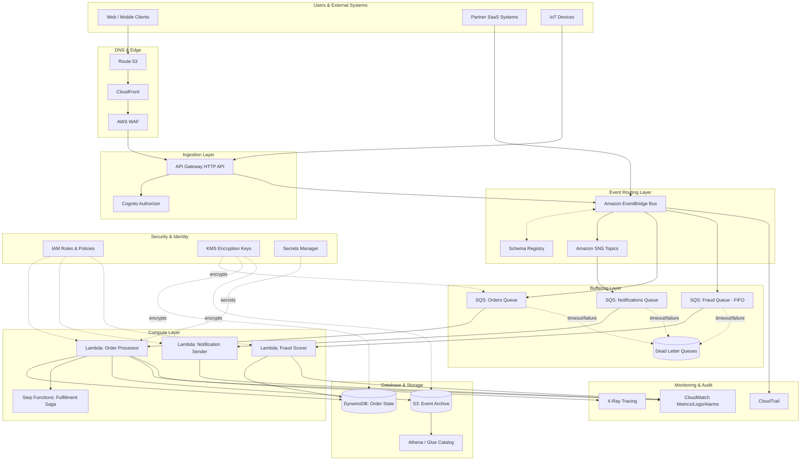

# The AWS Reference Architecture Handbook

### 100 Production-Ready Cloud Architectures with AWS, Terraform, AI, Security, FinOps, and Enterprise Design Patterns

---

# Part IV – Serverless Architectures

# Chapter 26: Event-Driven Systems

---

# 1. Executive Summary

## The Business Problem

Modern enterprises no longer run a handful of monolithic applications talking to a single database. They run hundreds of independent services, integrate with dozens of SaaS platforms, and process millions of business events per day — orders, payments, shipments, sensor readings, clickstreams, fraud signals, and support tickets.

Traditional request/response architectures struggle with this reality for a set of well-understood reasons:

- **Tight coupling.** When Service A calls Service B synchronously, A's availability becomes dependent on B's availability. A single slow downstream dependency can cascade into a full outage.
- **Poor scalability under bursty load.** Point-of-sale systems, flash sales, IoT telemetry ingestion, and marketing campaigns generate spikes that are ten to a hundred times normal traffic. Synchronous architectures scale compute linearly with load, which is expensive and often too slow to react.
- **Difficulty integrating heterogeneous systems.** Enterprises accumulate systems built in different eras, different languages, and different teams. Forcing them to communicate via synchronous APIs creates brittle integration code that breaks with every schema change.
- **Inability to support real-time business processes.** Fraud detection, inventory reservation, personalization, and operational alerting all require reacting to events within seconds, not through nightly batch jobs.

Event-Driven Architecture (EDA) solves this by inverting the communication model. Instead of services calling each other directly, producers publish events describing "something happened" — `OrderPlaced`, `PaymentAuthorized`, `InventoryReserved` — and any number of independent consumers react to those events asynchronously, at their own pace, without the producer knowing or caring who is listening.

## Architecture Objective

This chapter defines a production-grade, AWS-native Event-Driven Architecture built around three complementary primitives:

- **Amazon EventBridge** for business-event routing, schema management, and third-party SaaS integration.
- **Amazon SNS** for high-fanout pub/sub notification patterns.
- **Amazon SQS** for durable, ordered, and retryable work-queue processing.

These are combined with **AWS Lambda** for stateless event processing, **DynamoDB** for low-latency event-sourced state, **S3** for event archival and analytics, and a full operational layer covering observability, security, disaster recovery, and cost governance.

The objective is not simply "use serverless services." The objective is to build a system that:

1. Decouples producers from consumers so each can evolve, scale, deploy, and fail independently.
2. Guarantees at-least-once delivery with idempotent processing, so no business event is silently lost.
3. Provides replayability, so failures and bugs do not result in permanent data loss.
4. Scales elastically from near-zero to tens of thousands of events per second without manual capacity planning.
5. Remains observable, auditable, and cost-predictable at enterprise scale.

## Why Organizations Adopt This Architecture

Enterprises move to event-driven systems for a consistent set of reasons observed repeatedly across industries:

- **Domain decoupling for microservices.** As organizations decompose monoliths, they need an integration backbone that doesn't recreate tight coupling through synchronous REST calls between every service pair.
- **Real-time operational visibility.** Executives and operations teams want dashboards reflecting what is happening now, not what happened in last night's ETL run.
- **Elastic cost model.** Pay-per-invocation compute (Lambda) paired with pay-per-request messaging (SQS, SNS, EventBridge) means idle systems cost near zero, which is attractive for workloads with unpredictable or seasonal traffic.
- **Resilience against partial failures.** Queues absorb bursts and outages. If a downstream service goes offline for an hour, events queue up and are processed once it recovers, rather than being lost or timing out upstream callers.
- **Auditability and compliance.** Every event can be durably archived, providing a complete, replayable record of what happened in the business — valuable for financial services, healthcare, and any regulated industry that must reconstruct system state after the fact.

## Major Business Benefits

| Benefit | Business Impact |
|---|---|
| Faster time-to-market | New consumers subscribe to existing events without modifying producers |
| Reduced blast radius | A failing consumer does not take down the producer or other consumers |
| Elastic scaling | Absorbs 100x traffic spikes without pre-provisioning capacity |
| Lower idle cost | No compute charges when there is no event traffic |
| Improved resilience | Queue-based buffering survives downstream outages |
| Better observability | Centralized event bus provides a single point to monitor business activity |
| Easier third-party integration | EventBridge natively integrates with 40+ SaaS partners (Datadog, Zendesk, Shopify, etc.) |
| Regulatory traceability | Immutable event logs support audit and forensic reconstruction |

## Typical Enterprise Scenarios

This architecture pattern recurs across nearly every industry vertical:

- **E-commerce order processing.** `OrderPlaced` triggers inventory reservation, payment authorization, fraud scoring, fulfillment dispatch, and customer notification, all independently.
- **Financial transaction processing.** Payment events drive ledger updates, fraud detection, regulatory reporting, and customer notifications in parallel, each with independent SLAs.
- **IoT telemetry ingestion.** Millions of sensor readings per hour are ingested, filtered, aggregated, and routed to anomaly-detection pipelines and long-term storage.
- **SaaS multi-tenant platforms.** Tenant-scoped events drive usage metering, billing, and per-tenant customizations without tenant code living in a shared monolith.
- **Enterprise system integration (EAI replacement).** Legacy ERP, CRM, and warehouse systems publish and consume events instead of relying on brittle point-to-point batch integrations.
- **Security and compliance automation.** CloudTrail, GuardDuty, and Config findings are routed through EventBridge to trigger automated remediation Lambda functions.

## Why This Matters at the Executive Level

For a CTO or VP of Engineering, event-driven architecture determines how fast independent teams can ship features without blocking each other, how gracefully the platform degrades under failure, and how directly cloud spend tracks actual business activity rather than a static server fleet.

For a CFO, the pay-per-use nature of this stack converts a historically fixed infrastructure cost into a variable cost proportional to revenue-generating activity. This materially improves gross margin predictability during periods of demand volatility.


---

# 2. Business Requirements

## Business Drivers

- Enable independent teams to ship features without coordinating deployments with every downstream team.
- Support real-time reaction to business events (fraud, inventory, personalization) within single-digit seconds.
- Reduce cost of low-traffic and bursty workloads compared to always-on EC2 fleets.
- Provide an auditable, replayable record of business activity for compliance and analytics.
- Simplify integration with SaaS partners and legacy systems without bespoke point-to-point connectors.

## Functional Requirements

| Requirement | Description |
|---|---|
| Event ingestion | Accept events from internal services, APIs, and SaaS partners |
| Schema governance | Validate and version event schemas centrally |
| Routing | Route events to the correct consumers based on event type, source, and content |
| Fan-out | Deliver a single event to multiple independent consumers |
| Ordered processing | Preserve order for entities that require it (e.g., per-order state transitions) |
| Retry and DLQ | Automatically retry failed processing and quarantine poison messages |
| Replay | Reprocess historical events after a bug fix or new consumer onboarding |
| Idempotency | Guarantee consumers can safely process the same event more than once |

## Non-Functional Requirements

- **Scalability goals:** Support burst throughput of 20,000+ events/second during peak campaigns without manual intervention.
- **Availability requirements:** 99.95% availability for the event ingestion and routing layer.
- **Latency requirements:** P99 end-to-end latency (publish to consumer invocation) under 2 seconds for standard events; sub-500ms for fraud-critical event types using FIFO queues with short visibility timeouts.
- **Compliance requirements:** SOC 2 Type II, PCI-DSS (for payment events), and GDPR data-handling obligations for any event containing personal data.
- **Security expectations:** Encryption at rest and in transit for all event payloads; least-privilege IAM for every producer and consumer; no plaintext secrets in event payloads.

## Recovery Objectives

| Metric | Target | Rationale |
|---|---|---|
| RPO (Recovery Point Objective) | Near zero (< 1 minute) for in-flight events | SQS/EventBridge durability plus cross-region replication of archived events |
| RTO (Recovery Time Objective) | < 15 minutes for full regional failover | Automated Terraform-driven failover to standby region |

## SLAs

- 99.95% monthly uptime for the event bus and queue layer (matches AWS SQS/EventBridge published SLAs when correctly architected across AZs).
- 99.9% successful processing rate for consumer Lambda functions, with automated alerting below this threshold.
- Dead-letter queue depth alerting within 5 minutes of any message landing in a DLQ.

## Expected Workload and Growth

- **Year 1:** ~5 million events/day average, peaking at 2,000 events/second during flash sales.
- **Year 3 (projected):** ~50 million events/day average, peaking at 20,000 events/second.
- Growth is expected to be non-linear, driven by new product launches, geographic expansion, and IoT device fleet growth — reinforcing the need for a serverless, elastically scaling architecture rather than capacity-planned infrastructure.


---

# 3. Architecture Overview

## Overall Design

The architecture separates concerns into five layers:

1. **Ingestion layer** — API Gateway and SDK producers publish events into EventBridge or SNS.
2. **Routing layer** — EventBridge rules and SNS subscriptions determine which consumers receive which events.
3. **Buffering layer** — SQS queues sit between routing and compute to absorb bursts, provide retry semantics, and decouple producer throughput from consumer throughput.
4. **Compute layer** — Lambda functions (and, for sustained high-throughput workloads, ECS Fargate consumers) process events.
5. **Persistence and archival layer** — DynamoDB for transactional state, S3 for long-term event archival, and OpenSearch/Athena for analytics and audit queries.

## Architecture Philosophy

- **Events are facts, not commands.** A producer publishes `OrderPlaced`; it does not tell a specific service what to do. This keeps producers ignorant of consumers, which is the core decoupling property of EDA.
- **Prefer choreography over orchestration for cross-domain workflows**, and reserve orchestration (Step Functions) for workflows with strict sequencing, compensation logic, or human-in-the-loop steps.
- **Every consumer must be idempotent.** At-least-once delivery is a guarantee, not an implementation detail — duplicate delivery *will* happen.
- **Queues in front of compute, always.** Lambda can subscribe directly to SNS, but production systems place an SQS queue between SNS and Lambda so that failures are retried and buffered rather than dropped.
- **Schema-first development.** Every event type is registered in the EventBridge Schema Registry, versioned, and validated before production use.

## Core Components

| Component | Role |
|---|---|
| Amazon API Gateway | Accepts external HTTP producers and authenticates them |
| Amazon EventBridge | Central business event bus, content-based routing, schema registry |
| Amazon SNS | High-fanout pub/sub for notification-style broadcast |
| Amazon SQS (Standard + FIFO) | Durable buffering, retry, and ordered processing |
| AWS Lambda | Stateless event consumers and transformation logic |
| Amazon DynamoDB | Low-latency state store, idempotency tracking, event-sourced aggregates |
| Amazon S3 | Event archival, data lake landing zone |
| AWS Step Functions | Orchestration for multi-step, stateful workflows |
| Amazon CloudWatch / X-Ray | Observability, metrics, tracing |

## How Components Interact

Producers never call consumers directly. A producer publishes an event to EventBridge with a structured `detail` payload. EventBridge rules match on event `source`, `detail-type`, and content filters, then route matching events to one or more targets — typically SQS queues, which in turn trigger Lambda functions via event source mappings.

For simple broadcast-style notifications with fewer routing requirements (for example, "notify every subscriber system that a batch job finished"), SNS is used directly, again fronted by SQS subscriptions for durability.

## High-Level Workflow

1. A business action occurs (e.g., a customer places an order).
2. The originating service publishes an event describing the fact.
3. EventBridge evaluates rules and routes the event to all matching targets.
4. Each target queue buffers the event until a consumer is ready.
5. Lambda consumers process the event, updating state and potentially publishing new downstream events.
6. All events are archived to S3 for replay, audit, and analytics.

## Request, Response, and Data Lifecycle

- **Request lifecycle:** External request → API Gateway → validation/auth → EventBridge `PutEvents` → HTTP 202 Accepted returned immediately (asynchronous acknowledgment, not a synchronous result).
- **Response lifecycle:** Because processing is asynchronous, "responses" take the form of subsequent events (e.g., `OrderConfirmed`) or state changes queryable via a separate read API backed by DynamoDB.
- **Data lifecycle:** Events flow from ingestion → routing → processing → state update → archival. Archived events in S3 are lifecycle-managed: Standard for 30 days, Infrequent Access for 90 days, Glacier Deep Archive beyond one year, aligned with compliance retention requirements.


---

# 4. AWS Services Used

Each service below is explained the first time it is used in this chapter so the chapter is self-contained.

## Amazon EventBridge

**Purpose:** EventBridge is a serverless event bus that ingests events from AWS services, custom applications, and SaaS partners, then routes them to targets using content-based rules.

**Why selected:** It is the only AWS-native service offering a schema registry, content filtering, and native SaaS integrations (Zendesk, Datadog, Shopify, PagerDuty, and 40+ others) out of the box. This eliminates large amounts of custom integration code.

**Alternatives:** Apache Kafka (self-managed or Amazon MSK), Amazon SNS alone, or a third-party iPaaS (MuleSoft, Segment).

**Limitations:** No native ordering guarantee across an entire bus (ordering must be handled downstream via FIFO SQS); a soft quota on rules per event bus; event payload size limited to 256 KB.

**Pricing considerations:** Billed per published event (custom events) and per rule invocation; archive and replay incur additional charges; free tier applies to AWS-service-generated events.

**Best practices:** One event bus per bounded context/domain; strict schema versioning; avoid overly broad rules that create unnecessary fan-out.

## Amazon SNS

**Purpose:** A fully managed pub/sub messaging service for high-fanout broadcast to many subscribers (SQS, Lambda, HTTP endpoints, email, SMS).

**Why selected:** Best fit when a single event must reach many heterogeneous subscriber types simultaneously, including non-AWS HTTP endpoints and human notification channels.

**Alternatives:** EventBridge (for content-based routing), Kinesis Data Streams (for ordered, replayable streaming).

**Limitations:** No content-based filtering as rich as EventBridge (though basic message filtering policies exist); no built-in schema registry.

**Pricing considerations:** Billed per published message and per delivery; SMS/email deliveries have higher per-unit costs than SQS/Lambda deliveries.

**Best practices:** Always front Lambda/HTTP subscribers with an SQS queue for retry durability; use message filtering to avoid unnecessary invocations.

## Amazon SQS

**Purpose:** A fully managed message queue providing durable buffering, at-least-once delivery, visibility timeouts, and dead-letter queue support.

**Why selected:** SQS is the standard buffering layer between event routing and compute, absorbing bursts and providing automatic retry with configurable backoff via redrive policies.

**Alternatives:** Kinesis Data Streams (ordered, replayable, higher operational complexity), self-managed RabbitMQ/ActiveMQ (more control, more operational burden).

**Limitations:** Standard queues do not guarantee strict ordering or exactly-once delivery; FIFO queues cap throughput at 3,000 messages/second per API action (300 without batching, higher with batching), and 70,000 with high-throughput mode.

**Pricing considerations:** Billed per request (each API call, including polling); long polling reduces empty-receive costs significantly versus short polling.

**Best practices:** Always configure a dead-letter queue with a maxReceiveCount; use FIFO queues only where ordering is a genuine business requirement, since they add latency and throughput constraints.

## AWS Lambda

**Purpose:** Serverless compute that executes code in response to events without managing servers.

**Why selected:** Scales automatically from zero to thousands of concurrent executions, billed per millisecond of execution, and integrates natively as an SQS/SNS/EventBridge target.

**Alternatives:** ECS Fargate (for long-running or high-sustained-throughput consumers), EC2 Auto Scaling Groups (for specialized runtime requirements).

**Limitations:** 15-minute maximum execution duration; cold starts add latency for infrequently invoked functions; concurrency limits (default 1,000 per region, adjustable) can throttle bursts if not managed with reserved/provisioned concurrency.

**Pricing considerations:** Billed per request and per GB-second of memory/duration; over-provisioned memory is a common cost leak.

**Best practices:** Right-size memory (which also scales CPU); use reserved concurrency to protect downstream systems from overload; keep functions small and single-purpose.

## Amazon DynamoDB

**Purpose:** A fully managed, serverless NoSQL database offering single-digit-millisecond latency at any scale.

**Why selected:** Natural fit for event-sourced state, idempotency tracking (storing processed event IDs), and high-throughput key-value access patterns typical of event consumers.

**Alternatives:** Amazon Aurora (for complex relational queries and joins), ElastiCache (for pure caching, non-durable).

**Limitations:** Limited support for complex multi-table joins and ad hoc analytical queries; item size capped at 400 KB; requires careful key design to avoid hot partitions.

**Pricing considerations:** On-demand mode charges per request, ideal for unpredictable event-driven workloads; provisioned mode with auto-scaling is cheaper for stable, predictable throughput.

**Best practices:** Use TTL to automatically expire idempotency records; use DynamoDB Streams to trigger downstream event publication on state changes; enable point-in-time recovery.

## Amazon S3

**Purpose:** Object storage used here as the durable archive for all published events, supporting replay, audit, and analytics.

**Why selected:** Lowest-cost durable storage (11 nines durability), native lifecycle policies, and direct integration with Athena/Glue for ad hoc analytics on archived events.

**Alternatives:** Amazon Kinesis Data Firehose delivery to S3 (adds batching/transformation), a dedicated data lake platform.

**Limitations:** Not suitable for low-latency transactional access; eventual consistency considerations for some cross-region replication scenarios (though S3 is now strongly consistent within a region).

**Pricing considerations:** Storage class transitions (Standard → IA → Glacier) driven by lifecycle rules significantly reduce long-term archival cost.

**Best practices:** Partition archived events by date and event type for efficient Athena queries; enable S3 Object Lock for compliance-grade immutability where required.

## Amazon API Gateway

**Purpose:** A managed API front door providing authentication, throttling, and request validation for external event producers.

**Why selected:** Provides built-in IAM/Cognito/Lambda authorizer support and request validation before events ever reach EventBridge, protecting the bus from malformed or unauthorized input.

**Alternatives:** Application Load Balancer with Lambda targets (lower-level, more manual wiring), AWS AppSync (for GraphQL-based event ingestion).

**Limitations:** 29-second maximum integration timeout; payload size limits (10 MB).

**Pricing considerations:** Billed per API call and data transfer; REST APIs cost more per call than HTTP APIs for equivalent functionality.

**Best practices:** Use HTTP APIs (not REST APIs) for simple event-ingestion proxies to reduce cost; enable request validation to reject malformed events before they consume downstream resources.

## AWS Step Functions

**Purpose:** A serverless orchestrator for multi-step workflows requiring sequencing, branching, retries, and compensation logic.

**Why selected:** Used selectively for workflows where choreography (pure event chaining) becomes hard to reason about — for example, a saga that must roll back inventory reservation if payment fails.

**Alternatives:** Custom orchestration logic in Lambda (harder to maintain and observe), Apache Airflow (heavier, for batch/data-pipeline orchestration).

**Limitations:** Standard workflows bill per state transition; Express workflows are cheaper for high-volume, short-duration workflows but have reduced execution history retention.

**Pricing considerations:** Express Workflows are typically preferred for event-driven, high-throughput use cases due to lower per-execution cost.

**Best practices:** Use Express Workflows for high-volume synchronous event processing; use Standard Workflows for long-running sagas requiring full execution history and human approval steps.

## Identity, Security, and Operations Services

The following services are used throughout this architecture and are explained in depth in their respective sections later in this chapter: **IAM** (identity and access), **VPC** (network isolation for Lambda functions accessing private resources), **KMS** (encryption key management), **Secrets Manager** (credential storage), **CloudWatch** (metrics, logs, alarms), **CloudTrail** (API audit logging), **AWS Config** (configuration compliance), and **GuardDuty** (threat detection).


---

# 5. Complete Architecture Diagram



---

# 6. Component-by-Component Explanation

## API Gateway (Ingestion)

- **Purpose:** Single authenticated entry point for external producers publishing events into the system.
- **Responsibilities:** Request validation, authentication (Cognito/IAM/Lambda authorizer), rate limiting, and translation of HTTP requests into `PutEvents` calls against EventBridge.
- **Inputs:** HTTPS JSON requests from clients and partner systems.
- **Outputs:** EventBridge `PutEvents` API calls.
- **Scaling:** Fully managed, scales automatically; throttling limits are configurable per API key/usage plan.
- **High availability:** Regional service spanning all AZs in the region by default.
- **Failure handling:** Returns 4xx/5xx to caller; does not buffer — callers must implement client-side retry with backoff.
- **Dependencies:** Cognito or IAM for auth; EventBridge as the downstream target.
- **Security:** WAF in front for common web exploits; request validation schemas reject malformed payloads before they reach the bus.
- **Monitoring:** CloudWatch metrics for 4xx/5xx rates, integration latency, and throttled request counts.

## EventBridge (Routing)

- **Purpose:** Central nervous system of the architecture — receives, validates against schema, and routes events based on declarative rules.
- **Responsibilities:** Content-based routing, schema discovery/versioning, event archival configuration, and replay orchestration.
- **Inputs:** Events from API Gateway, internal services (via SDK), AWS service integrations, and SaaS partners.
- **Outputs:** Invocations of downstream targets (SQS, SNS, Lambda, Step Functions).
- **Scaling:** Serverless, scales automatically to sustained throughput; soft quota increases available via support request for extreme scale.
- **High availability:** Multi-AZ by default as an AWS regional service.
- **Failure handling:** Failed target delivery is retried per target-specific retry policy; persistent failures land in a configured DLQ per rule.
- **Dependencies:** IAM resource policies authorizing cross-account/cross-service publish and target invocation.
- **Security:** Resource-based policies restrict which accounts/principals may publish; encryption in transit via TLS.
- **Monitoring:** `FailedInvocations`, `ThrottledRules`, and `MatchedEvents` CloudWatch metrics per rule.

## SQS Queues (Buffering)

- **Purpose:** Durable buffer decoupling event routing from compute processing rate.
- **Responsibilities:** Store messages until consumed, manage visibility timeouts during processing, and redirect poison messages to DLQs.
- **Inputs:** Messages from EventBridge targets or SNS subscriptions.
- **Outputs:** Batched messages delivered to Lambda via event source mapping.
- **Scaling:** Virtually unlimited for Standard queues; FIFO queues scale with throughput mode selection.
- **High availability:** Messages are redundantly stored across multiple AZs.
- **Failure handling:** `maxReceiveCount` redrive policy moves messages to DLQ after repeated processing failures.
- **Dependencies:** KMS for encryption; IAM policies scoping which roles may send/receive.
- **Security:** Server-side encryption with customer-managed KMS keys; VPC endpoint access to avoid public internet exposure.
- **Monitoring:** `ApproximateNumberOfMessagesVisible`, `ApproximateAgeOfOldestMessage`, and DLQ depth alarms.

## Lambda Consumers (Compute)

- **Purpose:** Stateless, event-triggered business logic execution.
- **Responsibilities:** Deserialize and validate event payload, execute idempotent business logic, persist state changes, and optionally publish downstream events.
- **Inputs:** Batches of SQS messages (via event source mapping) or direct EventBridge/SNS invocations.
- **Outputs:** DynamoDB writes, downstream EventBridge/SNS publications, external API calls.
- **Scaling:** Automatic concurrency scaling bounded by reserved/account concurrency limits.
- **High availability:** Executes across multiple AZs transparently.
- **Failure handling:** Partial batch failure reporting (`ReportBatchItemFailures`) ensures only failed items are retried, not the entire batch.
- **Dependencies:** IAM execution role, VPC configuration if accessing private resources, Secrets Manager for credentials.
- **Security:** Least-privilege execution role scoped to specific queue ARNs, table ARNs, and KMS key ARNs.
- **Monitoring:** Duration, errors, throttles, concurrent executions, and custom business metrics via CloudWatch Embedded Metric Format.

## DynamoDB (State Store)

- **Purpose:** Durable, low-latency store for order/entity state and idempotency tracking.
- **Responsibilities:** Persist current state derived from event streams; enforce idempotency via conditional writes keyed on event ID.
- **Inputs:** Writes from Lambda consumers.
- **Outputs:** DynamoDB Streams events triggering downstream processing; query results for read APIs.
- **Scaling:** On-demand capacity mode auto-scales with request volume.
- **High availability:** Synchronously replicated across three AZs; Global Tables for multi-region.
- **Failure handling:** Conditional writes prevent duplicate processing; point-in-time recovery for accidental data loss.
- **Dependencies:** KMS for encryption at rest.
- **Security:** Fine-grained IAM condition keys restricting access to specific partition key prefixes (e.g., tenant isolation).
- **Monitoring:** Consumed capacity, throttled requests, and system errors.

## S3 Event Archive (Storage)

- **Purpose:** Immutable, cost-efficient long-term store of every event published, enabling replay and analytics.
- **Responsibilities:** Receive archived copies of all bus events (via EventBridge Archive or Firehose), apply lifecycle transitions, and serve as the Glue/Athena data source.
- **Inputs:** EventBridge Archive stream or Kinesis Firehose batches.
- **Outputs:** Objects queryable via Athena; replay source for EventBridge Replay.
- **Scaling:** Effectively unlimited.
- **High availability:** 99.99% availability SLA, 11 nines durability, multi-AZ by default.
- **Failure handling:** Versioning protects against accidental overwrite/delete; Object Lock for compliance retention.
- **Dependencies:** KMS for SSE-KMS encryption; Glue Catalog for schema-on-read.
- **Security:** Bucket policies deny non-TLS access and enforce encryption; access logging enabled.
- **Monitoring:** Storage metrics, replication lag (if cross-region replicated), and lifecycle transition metrics.


---

# 7. End-to-End Request Flow

The following walks through a concrete example: a customer places an order on the e-commerce platform.

1. **Client submits order.** The web client sends `POST /orders` over HTTPS to CloudFront.
2. **DNS resolution.** Route 53 resolves the API custom domain to the CloudFront distribution.
3. **Edge security.** CloudFront forwards the request through AWS WAF, which inspects for SQL injection, rate-limit abuse, and known bad actor IP ranges.
4. **API Gateway authentication.** API Gateway validates the Cognito-issued JWT and checks the usage plan throttle limits.
5. **Request validation.** API Gateway validates the JSON payload against the configured request model; malformed requests are rejected with `400 Bad Request` before touching downstream systems.
6. **Event publication.** A lightweight Lambda integration (or direct API Gateway-to-EventBridge integration) calls `PutEvents` with `detail-type: OrderPlaced`.
7. **Immediate acknowledgment.** API Gateway returns `202 Accepted` with an order tracking ID; the client does not wait for full processing.
8. **Rule evaluation.** EventBridge evaluates all rules on the `orders` event bus; the `OrderPlaced` event matches rules for inventory, fraud scoring, and notification.
9. **Fan-out to queues.** EventBridge delivers the event to the Inventory SQS queue, Fraud FIFO SQS queue, and publishes to the Notifications SNS topic.
10. **Buffering.** Each SQS queue holds the message until a Lambda consumer is available, applying a 30-second visibility timeout matched to the average consumer processing time.
11. **Lambda invocation.** The SQS event source mapping invokes the Order Processor Lambda in batches of up to 10 messages.
12. **Idempotency check.** The Lambda function performs a conditional `PutItem` against DynamoDB keyed on `eventId`; if the item already exists, the message is treated as already processed and acknowledged without side effects.
13. **Business logic execution.** Inventory is reserved via a conditional DynamoDB update that decrements available stock only if sufficient stock exists.
14. **Downstream event publication.** On success, the function publishes `InventoryReserved`; on insufficient stock, it publishes `InventoryReservationFailed`.
15. **Caching layer (read path).** Order status queries from the client hit a read API backed by DynamoDB with an optional DAX caching layer for hot order lookups.
16. **Archival.** In parallel, EventBridge Archive persists a copy of every event to S3 for replay and audit.
17. **Logging.** Every Lambda invocation emits structured JSON logs to CloudWatch Logs, correlated by a trace ID propagated from the original API Gateway request.
18. **Distributed tracing.** AWS X-Ray stitches together the API Gateway → EventBridge → SQS → Lambda → DynamoDB call chain into a single trace for latency analysis.
19. **Error handling.** If the Order Processor Lambda throws an unhandled exception, the message becomes visible again after the visibility timeout expires and is retried, up to `maxReceiveCount`, after which it is moved to the DLQ and triggers a CloudWatch alarm.
20. **Customer notification.** The Notification Sender Lambda, triggered independently from the Notifications SQS queue, sends an order-confirmation email/push notification via Amazon SES/SNS mobile push — entirely decoupled from the inventory and fraud processing paths.


---

# 8. Deployment Flow

## Infrastructure Provisioning

All infrastructure is provisioned through Terraform with remote state stored in S3 and state locking via DynamoDB. No console-driven changes are permitted in production accounts; drift is detected via scheduled `terraform plan` runs in CI.

## Terraform Workflow

1. Developer opens a feature branch and modifies a Terraform module (e.g., adds a new EventBridge rule).
2. `terraform fmt` and `terraform validate` run as pre-commit hooks.
3. Pull request triggers CI: `terraform plan` output is posted as a PR comment for human review.
4. Static analysis (`tfsec`, `checkov`) scans for security misconfigurations — e.g., unencrypted SQS queues, overly permissive IAM policies.
5. On merge to `main`, CI runs `terraform apply` against the shared/staging environment automatically.
6. Production apply requires manual approval gate in the pipeline.

## CI/CD Deployment (Application Code)

- Lambda function code is packaged and deployed via AWS SAM or the Serverless Framework, both of which wrap CloudFormation/CDK under the hood for Lambda-specific deployment orchestration, while Terraform manages the surrounding infrastructure (queues, buses, IAM).
- Container-based consumers (Fargate) are built and pushed to ECR, then deployed via ECS service updates.

## Blue-Green Deployment

- Lambda supports weighted alias traffic shifting: a new version is deployed alongside the current stable version, and traffic is shifted gradually (e.g., 10% → 50% → 100%) using CodeDeploy's Lambda deployment provider.
- CloudWatch alarms on error rate and duration are attached to the deployment; CodeDeploy automatically rolls back if thresholds are breached during the shift.

## Rollback

- Automated rollback triggers on alarm breach during a canary/linear deployment.
- Manual rollback is a single CLI command re-pointing the Lambda alias to the previous version — typically completing in under 60 seconds since no infrastructure re-provisioning is required.

## Secrets and Configuration

- Runtime secrets (API keys, database credentials) are stored in Secrets Manager and retrieved at cold start, cached in memory for the life of the execution environment.
- Non-secret configuration (queue URLs, table names, feature flags) is injected via Lambda environment variables, populated by Terraform outputs to avoid hardcoding.

## Validation

- Post-deployment smoke tests publish synthetic test events through a dedicated `test` source namespace, verifying end-to-end delivery without polluting production business data.
- Contract tests validate that published event payloads conform to the registered EventBridge schema before deployment is marked successful.

---

# 9. Network Topology

## VPC Design

Most components in this architecture (EventBridge, SQS, SNS, Lambda without VPC configuration) are fully managed AWS services that do not require VPC placement. However, Lambda functions accessing private resources (RDS/Aurora, internal APIs) or requiring outbound traffic control are deployed into a VPC.

| Element | Configuration |
|---|---|
| VPC CIDR | 10.20.0.0/16 |
| Public subnets | 10.20.0.0/22, 10.20.4.0/22 (2 AZs) — NAT Gateways only |
| Private subnets | 10.20.16.0/20, 10.20.32.0/20 (2 AZs) — Lambda ENIs, RDS/Aurora |
| Isolated subnets | 10.20.48.0/20 — no route to internet, used for data-tier only |

## NAT Gateway and Internet Gateway

- One NAT Gateway per AZ (not a single shared NAT Gateway) to avoid cross-AZ data transfer charges and single-AZ failure risk.
- Internet Gateway attached to the VPC for public subnet egress (NAT Gateways themselves) and any public-facing ALB.

## Transit Gateway

- Used when this event-driven platform must connect to other VPCs (shared services VPC, legacy data center via Direct Connect) in a hub-and-spoke topology, avoiding the operational overhead of full-mesh VPC peering.

## Route Tables

- Public subnet route table: `0.0.0.0/0` → Internet Gateway.
- Private subnet route table: `0.0.0.0/0` → NAT Gateway (same AZ).
- Isolated subnet route table: no default route; only VPC-local routes.

## Network ACLs and Security Groups

- Security Groups are the primary control: Lambda ENI security group allows outbound 443 to VPC endpoints and outbound to RDS security group on 5432/3306 only.
- Network ACLs are used as a coarse secondary control at the subnet boundary, primarily to explicitly deny known-bad CIDR ranges.

## VPC Endpoints (PrivateLink)

Interface VPC endpoints are provisioned for SQS, SNS, EventBridge, Secrets Manager, and KMS so that Lambda functions inside the VPC never traverse the public internet (or even the NAT Gateway) to reach these AWS services. This reduces NAT Gateway data-processing cost and removes a class of network-exposure risk entirely.

## Hybrid Connectivity

For enterprises integrating on-premises systems as event producers/consumers, AWS Direct Connect (with a Site-to-Site VPN as failover) terminates into the Transit Gateway, allowing on-premises ERP/MES systems to publish events directly to EventBridge over private connectivity.


---

# 10. Identity and Access

## IAM Roles

Every Lambda function, Step Functions state machine, and EventBridge rule target has its own dedicated IAM execution role — never a shared "god role" across functions. This ensures a compromised or buggy function cannot access resources belonging to unrelated domains.

## IAM Policies

Policies are written to reference specific resource ARNs, not wildcards:

```json

{
  "Version": "2012-10-17",
  "Statement": [
    {
      "Sid": "AllowConsumeOrdersQueue",
      "Effect": "Allow",
      "Action": [
        "sqs:ReceiveMessage",
        "sqs:DeleteMessage",
        "sqs:GetQueueAttributes"
      ],
      "Resource": "arn:aws:sqs:us-east-1:111122223333:orders-queue-prod"
    },
    {
      "Sid": "AllowWriteOrderState",
      "Effect": "Allow",
      "Action": [
        "dynamodb:PutItem",
        "dynamodb:UpdateItem",
        "dynamodb:ConditionCheckItem"
      ],
      "Resource": "arn:aws:dynamodb:us-east-1:111122223333:table/orders-prod"
    },
    {
      "Sid": "AllowPublishDownstreamEvents",
      "Effect": "Allow",
      "Action": "events:PutEvents",
      "Resource": "arn:aws:events:us-east-1:111122223333:event-bus/orders-bus-prod"
    }
  ]
}

```

## Resource Policies

SQS queue policies and EventBridge event bus policies explicitly allow only the specific producer accounts/services permitted to send messages or publish events, preventing unauthorized cross-account publication even if IAM identity policies were misconfigured elsewhere (defense in depth).

## STS and Cross-Account Access

For multi-account organizations (a common enterprise pattern with separate accounts per environment or business unit), cross-account event delivery uses resource-based policies on the destination event bus combined with an IAM role assumed via STS `AssumeRole`, scoped to a narrow external ID condition to prevent confused-deputy attacks.

## Least Privilege

- Each consumer's execution role is scoped to exactly the queue(s), table(s), and KMS key(s) it needs — nothing broader.
- IAM Access Analyzer runs continuously to flag unused permissions granted more than 90 days ago, feeding a quarterly permission-pruning review.

## Service Roles

- EventBridge rule targets that require cross-service invocation (e.g., invoking a Step Functions state machine) use a dedicated EventBridge-to-target IAM role, distinct from any Lambda execution role.

## Permission Boundaries

All developer-creatable IAM roles are constrained by a permission boundary policy that caps the maximum achievable privilege, preventing privilege escalation even if a developer accidentally attaches an overly broad policy to a role they create via Terraform.

---

# 11. Security Architecture

## Encryption

- **At rest:** SQS, SNS, DynamoDB, and S3 all use SSE-KMS with customer-managed keys (CMKs), not AWS-managed keys, so that key usage is independently auditable and key rotation policy is explicitly controlled.
- **In transit:** All service-to-service communication uses TLS 1.2+; S3 bucket policies deny any request not using `aws:SecureTransport`.

## KMS

A dedicated CMK per data domain (orders, payments, notifications) limits blast radius if a key is ever compromised and simplifies key-usage auditing via CloudTrail. Automatic annual key rotation is enabled.

## TLS and Certificate Manager

Public-facing endpoints (CloudFront, API Gateway custom domains) use ACM-issued and auto-renewed certificates, eliminating manual certificate rotation as an operational burden and a common source of outages.

## WAF and Shield

AWS WAF is attached to CloudFront and API Gateway with managed rule groups (Core Rule Set, Known Bad Inputs, SQL Injection) plus custom rate-based rules limiting any single IP to a defined request threshold per 5-minute window. AWS Shield Standard provides baseline DDoS protection at no additional cost; Shield Advanced is added for the ingestion layer if the workload is a high-profile public target (e.g., major e-commerce brand).

## Secrets Manager

Third-party API keys (payment gateway, fraud-scoring vendor) are stored in Secrets Manager with automatic rotation configured where the vendor supports a rotation Lambda. No secret is ever stored in Lambda environment variables in plaintext or committed to source control.

## GuardDuty, Inspector, Security Hub

- **GuardDuty** continuously analyzes CloudTrail, VPC Flow Logs, and DNS logs for anomalous behavior (e.g., a Lambda execution role suddenly calling APIs from an unfamiliar region).
- **Inspector** scans container images (for Fargate consumers) and Lambda function dependencies for known CVEs.
- **Security Hub** aggregates findings from GuardDuty, Inspector, Config, and third-party tools into a single prioritized view, mapped to CIS AWS Foundations and AWS Foundational Security Best Practices standards.

## CloudTrail and AWS Config

- CloudTrail logs every API call across all regions to a centralized, immutable, cross-account log archive bucket with Object Lock enabled.
- AWS Config continuously evaluates resources against rules (e.g., "SQS queues must be encrypted," "S3 buckets must not be public") and triggers automated remediation via Systems Manager Automation documents for common drift.

## Zero Trust Principles Applied

- No implicit trust between services based on network location alone; every service-to-service call is authenticated and authorized via IAM, even within the VPC.
- VPC endpoints with endpoint policies restrict which API actions can be performed even over the private network path.

## Threat Model and Mitigations

| Attack Vector | Mitigation |
|---|---|
| Unauthorized event injection | Resource policies on event bus + API Gateway authentication |
| Message tampering in transit | TLS enforced everywhere; SigV4 request signing |
| Poison message / DoS via malformed payload | Request validation at API Gateway; schema validation at EventBridge |
| Privilege escalation via over-permissioned Lambda role | Least-privilege roles + permission boundaries + Access Analyzer |
| Data exfiltration via compromised function | Egress restricted via VPC endpoints and security groups; no broad internet egress |
| Replay attack (resubmitting a captured request) | Idempotency keys + short-lived auth tokens |
| Secrets leakage in logs | Structured logging with automatic PII/secret redaction |

---

# 12. High Availability

## Availability Zone Failures

Every managed service in this architecture (EventBridge, SQS, SNS, Lambda, DynamoDB) is inherently multi-AZ with no configuration required. For VPC-attached Lambda functions, subnets are provisioned in at least two AZs so ENI creation continues even if one AZ is impaired.

## Instance Failures

Not applicable to the serverless compute layer (Lambda) in the normal case. For the optional Fargate-based high-throughput consumers, tasks are distributed across multiple AZs via the ECS service's placement strategy, and unhealthy tasks are automatically replaced.

## Regional Failures

Regional failure is addressed via the disaster recovery strategy detailed in Section 13, since none of the core services offer automatic cross-region failover — this must be architected explicitly.

## Database Failures

DynamoDB synchronously replicates writes across three AZs before acknowledging a write, so a single-AZ failure does not cause data loss or an availability gap for the table.

## Load Balancing and Health Checks

API Gateway and CloudFront perform this role at the edge; there is no traditional load balancer in front of the event bus itself, since EventBridge/SQS/SNS scale as managed multi-tenant services without customer-visible instances to balance across.

## Failover

For the ingestion tier, Route 53 health checks against API Gateway can fail over to a secondary regional API Gateway deployment in an active-passive DR configuration, described further below.

---

# 13. Disaster Recovery

## Backup Strategy

- DynamoDB: Point-in-time recovery (PITR) enabled, providing continuous backups with restore to any second in the last 35 days; on-demand backups taken before major schema migrations.
- S3 event archive: Versioning enabled; cross-region replication (CRR) to a DR region bucket.

## Snapshots and Cross-Region Replication

- DynamoDB Global Tables replicate order-state tables to the DR region in near real time (typically sub-second), enabling active-active or active-passive multi-region reads and writes.
- S3 CRR asynchronously replicates archived events to the DR region bucket for replay in a regional failover scenario.

## DR Strategy Selection

| Strategy | RTO | RPO | Cost | Used For |
|---|---|---|---|---|
| Backup and Restore | Hours | Hours | $ | Non-critical batch/reporting components |
| Pilot Light | 10–30 min | Minutes | $$ | Standard consumer Lambda functions, EventBridge rules pre-deployed but idle in DR region |
| Warm Standby | < 10 min | Seconds | $$$ | Order processing path — this architecture's primary approach |
| Multi-Site Active-Active | Near zero | Near zero | $$$$ | Payment/fraud path for tier-0 revenue-critical workloads only |

This architecture uses **Warm Standby** for the core order-processing path: infrastructure (EventBridge buses, SQS queues, Lambda functions, DynamoDB Global Table replica) is fully deployed and running at reduced scale in the DR region, ready to absorb full traffic within minutes of a Route 53 failover.

## RPO / RTO Targets Restated

- RPO: Under 1 minute, achieved via DynamoDB Global Tables' typical replication lag and S3 CRR for archived events.
- RTO: Under 15 minutes, achieved via automated Route 53 failover combined with pre-warmed DR-region Lambda concurrency.

## DR Testing

Game days are run quarterly: production traffic is intentionally shifted (via weighted Route 53 records) to the DR region during a low-traffic maintenance window to validate the failover path actually works, not just that it exists on paper.

---

# 14. Scalability

## Horizontal Scaling

The entire architecture is horizontally scaling by default: EventBridge, SQS, SNS, and Lambda all add capacity transparently as event volume increases, with no server fleet to resize.

## Vertical Scaling

Applies narrowly to Lambda memory allocation (which proportionally scales CPU and network bandwidth) and to DynamoDB item-level design — vertical scaling here means "right-sizing" rather than the traditional EC2 instance-class upgrade.

## Auto Scaling (Lambda Concurrency)

- Default Lambda burst concurrency scales by 500–3,000 concurrent executions per minute (region-dependent) before additional throttling; reserved concurrency is set on critical functions to guarantee capacity is never starved by noisy-neighbor functions in the same account.
- Provisioned Concurrency is applied to latency-sensitive consumers (fraud scoring) to eliminate cold-start latency entirely.

## Database Scaling

DynamoDB on-demand mode automatically scales read/write capacity with traffic; for extremely predictable steady-state workloads, provisioned capacity with auto-scaling targets (e.g., 70% utilization) is more cost-effective.

## Storage Scaling

S3 scales storage capacity with no practical limit; request-rate partitioning is automatic in modern S3, removing the historical need for key-prefix randomization at this event volume.

## Queue Scaling

- Standard SQS queues scale to effectively unlimited throughput.
- FIFO queues without high-throughput mode cap at 3,000 messages/second (with batching); with high-throughput mode enabled, up to 70,000 messages/second per queue — sized appropriately for the fraud-scoring path's ordering requirements.

---

# 15. Performance Optimization

## Caching

- CloudFront caches static assets and cacheable API responses at edge locations, reducing origin load and latency for global users.
- DynamoDB Accelerator (DAX) provides microsecond read latency for hot order-status lookups on the read API path.

## Compression

CloudFront and API Gateway both support gzip/Brotli compression for response payloads, reducing transfer time for larger JSON responses.

## CDN

CloudFront terminates TLS close to the user and maintains persistent connections back to API Gateway, reducing connection-setup latency versus direct-to-origin requests from global clients.

## Database Optimization

- Single-table design in DynamoDB minimizes the number of round trips needed to assemble an order's full state.
- Sparse GSIs (Global Secondary Indexes) are used only for genuinely required access patterns to avoid unnecessary write amplification and cost.

## Connection Pooling

For Lambda functions that connect to RDS/Aurora (rare in this architecture, used only for legacy integration paths), RDS Proxy is placed in front of the database to pool connections across concurrent Lambda executions, preventing connection exhaustion during traffic spikes.

## Concurrency

SQS-to-Lambda batch size and `maximumConcurrency` on the event source mapping are tuned so consumer throughput matches downstream capacity (e.g., not overwhelming a rate-limited third-party fraud API).

## Async Processing

The entire architecture is fundamentally asynchronous by design; where a synchronous response is genuinely required (e.g., real-time fraud decision within checkout flow), a narrow synchronous Lambda-backed API path is used in parallel to the broader asynchronous event flow, rather than forcing the entire system into synchronous request/response.


---

# 16. Cost Optimization (FinOps)

## Deployment Size Cost Estimates

The following are directional monthly estimates (US East, list pricing, excluding support plans and data transfer to internet beyond free tier) intended for budgeting conversations, not a substitute for AWS Pricing Calculator modeling of your actual traffic shape.

| Component | Small (1M events/day) | Medium (15M events/day) | Enterprise (100M+ events/day) |
|---|---|---|---|
| EventBridge (custom events) | ~$30 | ~$450 | ~$3,000 |
| SQS requests | ~$15 | ~$220 | ~$1,500 |
| Lambda (compute) | ~$50 | ~$700 | ~$4,500 |
| DynamoDB (on-demand) | ~$40 | ~$600 | ~$4,000 |
| S3 storage + requests | ~$10 | ~$150 | ~$1,200 |
| CloudWatch (logs/metrics) | ~$25 | ~$350 | ~$2,500 |
| NAT Gateway (if VPC Lambdas used) | ~$65 | ~$130 | ~$400 |
| **Approximate Total** | **~$235/mo** | **~$2,600/mo** | **~$17,000/mo** |

## Major Cost Drivers

- **CloudWatch Logs ingestion and storage** is consistently underestimated — verbose debug logging left enabled in production is one of the single largest avoidable costs in serverless architectures.
- **Lambda over-provisioned memory** — allocating 1024 MB when 256 MB would suffice both wastes money and, counterintuitively, can increase cost per invocation if duration doesn't scale down proportionally.
- **NAT Gateway data processing charges** for VPC-attached Lambda functions calling AWS APIs — largely eliminated by using VPC endpoints instead of routing AWS API calls through NAT.
- **DynamoDB on-demand at very high steady-state volume** — beyond a certain predictable throughput threshold, provisioned capacity with auto-scaling becomes cheaper than on-demand.

## Optimization Opportunities

- **Reserved Instances / Savings Plans:** Not directly applicable to Lambda/SQS/EventBridge (no reservation model), but Compute Savings Plans apply if the architecture includes any steady-state Fargate consumers.
- **Spot:** Applicable only to the optional Fargate high-throughput consumer tier for non-latency-critical batch-style event processing; not applicable to Lambda.
- **S3 lifecycle and storage classes:** Transition archived events from Standard → Standard-IA (30 days) → Glacier Instant Retrieval (90 days) → Glacier Deep Archive (1 year), typically cutting archival storage cost by 70–85% versus leaving everything in Standard.
- **Rightsizing Lambda memory:** Use AWS Lambda Power Tuning (open-source tool) to empirically determine the memory setting that minimizes cost for each function's actual workload, rather than guessing.
- **Log retention policies:** Set explicit CloudWatch Logs retention (e.g., 30 days for debug logs, 1 year for audit-relevant logs) instead of the default "never expire," which silently accumulates cost indefinitely.

## Cost Allocation and Tagging

Every resource is tagged with `CostCenter`, `Environment`, `Domain` (orders/payments/notifications), and `Owner`, enabling Cost Explorer and Cost and Usage Reports to attribute spend precisely to business units — essential once the platform serves multiple teams sharing the same AWS account or organization.

## Budgets and Cost Anomaly Detection

- AWS Budgets alerts are configured per domain tag at 80% and 100% of monthly forecast.
- AWS Cost Anomaly Detection monitors EventBridge, Lambda, and DynamoDB spend independently, catching runaway costs (e.g., an infinite retry loop from a misconfigured DLQ redrive policy) within hours rather than at month-end invoice review.

---

# 17. AI-Assisted Operations

## Amazon Q

Amazon Q Developer is used inside the IDE and CI pipeline to review Terraform and Lambda code changes for security misconfigurations, suggest IAM policy tightening, and generate unit test scaffolding for event handler functions before merge.

## Amazon Bedrock

Bedrock-hosted foundation models power two operational capabilities in this architecture:

- **Log analysis and triage:** A Bedrock-backed Lambda function summarizes CloudWatch Logs Insights query results during an incident, surfacing the most likely root cause pattern (e.g., "80% of failures correlate with a specific downstream API 429 response") to reduce mean-time-to-diagnosis.
- **Anomalous event detection:** Bedrock models augment traditional CloudWatch anomaly detection by classifying unusual event payload patterns that rule-based alarms would miss, flagging them for human review rather than auto-blocking.

## AI Troubleshooting Workflow

1. An alarm fires (e.g., DLQ depth threshold breached).
2. An automated runbook Lambda queries recent CloudWatch Logs Insights results and relevant X-Ray traces.
3. The Bedrock model is prompted with the structured diagnostic data (never raw customer PII) to produce a plain-language incident summary and suggested next diagnostic step.
4. The summary is posted to the incident's Slack/PagerDuty channel to accelerate the on-call engineer's initial triage — the model assists, it does not autonomously remediate production systems.

## Incident Response and Capacity Planning

AI-assisted capacity planning reviews CloudWatch metrics trends monthly and flags services trending toward a known AWS service quota (e.g., Lambda concurrent executions, EventBridge rule count) well before the quota is reached, feeding the proactive quota-increase process described in Section "Scaling Limits."

## AI-Generated Terraform and Documentation

- Amazon Q can scaffold new Terraform modules (e.g., "add a new FIFO queue with a DLQ and matching IAM policy") following the existing module conventions, which a human architect then reviews and refines rather than authors from scratch.
- Architecture Decision Records and runbook documentation drafts are AI-generated from PR descriptions and incident postmortem notes, then edited by the responsible engineer for accuracy before publication — AI accelerates documentation, it does not replace the human review step.


---

# 18. Terraform Implementation

The following modules represent a production-quality, modular Terraform layout. Directory structure:

```

infra/
├── environments/
│   ├── prod/
│   │   ├── main.tf
│   │   ├── backend.tf
│   │   └── terraform.tfvars
│   └── staging/
├── modules/
│   ├── event_bus/
│   ├── sqs_queue/
│   ├── lambda_consumer/
│   └── dynamodb_table/

```

## Backend and Providers

```hcl

# environments/prod/backend.tf

terraform {
  required_version = ">= 1.7.0"

  backend "s3" {
    bucket         = "acme-terraform-state-prod"
    key            = "event-driven-platform/prod/terraform.tfstate"
    region         = "us-east-1"
    dynamodb_table = "terraform-state-locks"
    encrypt        = true
  }

  required_providers {
    aws = {
      source  = "hashicorp/aws"
      version = "~> 5.0"
    }
  }
}

provider "aws" {
  region = var.aws_region

  default_tags {
    tags = {
      Project     = "event-driven-platform"
      Environment = var.environment
      ManagedBy   = "terraform"
    }
  }
}

```

## Variables

```hcl

# environments/prod/variables.tf

variable "aws_region" {
  description = "Primary AWS region for deployment"
  type        = string
  default     = "us-east-1"
}

variable "environment" {
  description = "Deployment environment name"
  type        = string
}

variable "dlq_max_receive_count" {
  description = "Number of processing attempts before a message moves to the DLQ"
  type        = number
  default     = 5
}

variable "kms_key_arn" {
  description = "ARN of the customer-managed KMS key for domain encryption"
  type        = string
}

```

## Module: Event Bus

```hcl

# modules/event_bus/main.tf

resource "aws_cloudwatch_event_bus" "this" {
  name = "${var.name_prefix}-bus-${var.environment}"
}

resource "aws_cloudwatch_event_bus_policy" "allow_producers" {
  event_bus_name = aws_cloudwatch_event_bus.this.name

  policy = jsonencode({
    Version = "2012-10-17"
    Statement = [
      {
        Sid       = "AllowAccountProducers"
        Effect    = "Allow"
        Principal = { AWS = var.allowed_producer_account_ids }
        Action    = "events:PutEvents"
        Resource  = aws_cloudwatch_event_bus.this.arn
      }
    ]
  })
}

resource "aws_cloudwatch_event_archive" "this" {
  name             = "${var.name_prefix}-archive-${var.environment}"
  event_source_arn = aws_cloudwatch_event_bus.this.arn
  retention_days   = var.archive_retention_days
}

resource "aws_cloudwatch_event_rule" "order_placed" {
  name           = "${var.name_prefix}-order-placed-${var.environment}"
  event_bus_name = aws_cloudwatch_event_bus.this.name

  event_pattern = jsonencode({
    source      = ["com.acme.orders"]
    detail-type = ["OrderPlaced"]
  })
}

resource "aws_cloudwatch_event_target" "order_placed_to_sqs" {
  rule           = aws_cloudwatch_event_rule.order_placed.name
  event_bus_name = aws_cloudwatch_event_bus.this.name
  arn            = var.orders_queue_arn

  dead_letter_config {
    arn = var.rule_dlq_arn
  }

  retry_policy {
    maximum_event_age_in_seconds = 3600
    maximum_retry_attempts       = 5
  }
}

```

```hcl

# modules/event_bus/variables.tf

variable "name_prefix" {
  type = string
}

variable "environment" {
  type = string
}

variable "allowed_producer_account_ids" {
  type = list(string)
}

variable "archive_retention_days" {
  type    = number
  default = 90
}

variable "orders_queue_arn" {
  type = string
}

variable "rule_dlq_arn" {
  type = string
}

```

## Module: SQS Queue with DLQ

```hcl

# modules/sqs_queue/main.tf

resource "aws_sqs_queue" "dlq" {
  name                      = "${var.queue_name}-dlq"
  message_retention_seconds = 1209600 # 14 days
  kms_master_key_id         = var.kms_key_arn
  sqs_managed_sse_enabled   = false
}

resource "aws_sqs_queue" "this" {
  name                       = var.queue_name
  visibility_timeout_seconds = var.visibility_timeout_seconds
  message_retention_seconds  = 345600 # 4 days
  receive_wait_time_seconds  = 20     # long polling
  kms_master_key_id          = var.kms_key_arn

  fifo_queue                  = var.fifo
  content_based_deduplication = var.fifo ? true : null

  redrive_policy = jsonencode({
    deadLetterTargetArn = aws_sqs_queue.dlq.arn
    maxReceiveCount     = var.max_receive_count
  })
}

resource "aws_sqs_queue_policy" "allow_eventbridge" {
  queue_url = aws_sqs_queue.this.id

  policy = jsonencode({
    Version = "2012-10-17"
    Statement = [
      {
        Sid       = "AllowEventBridgeSend"
        Effect    = "Allow"
        Principal = { Service = "events.amazonaws.com" }
        Action    = "sqs:SendMessage"
        Resource  = aws_sqs_queue.this.arn
        Condition = {
          ArnEquals = { "aws:SourceArn" = var.event_rule_arn }
        }
      }
    ]
  })
}

resource "aws_cloudwatch_metric_alarm" "dlq_not_empty" {
  alarm_name          = "${var.queue_name}-dlq-messages-visible"
  namespace           = "AWS/SQS"
  metric_name         = "ApproximateNumberOfMessagesVisible"
  dimensions          = { QueueName = aws_sqs_queue.dlq.name }
  statistic           = "Maximum"
  period              = 300
  evaluation_periods  = 1
  threshold           = 0
  comparison_operator = "GreaterThanThreshold"
  alarm_actions       = [var.alarm_sns_topic_arn]
  treat_missing_data  = "notBreaching"
}

```

## Module: Lambda Consumer

```hcl

# modules/lambda_consumer/main.tf

resource "aws_iam_role" "lambda_exec" {
  name = "${var.function_name}-exec-role"

  assume_role_policy = jsonencode({
    Version = "2012-10-17"
    Statement = [{
      Effect    = "Allow"
      Principal = { Service = "lambda.amazonaws.com" }
      Action    = "sts:AssumeRole"
    }]
  })
}

resource "aws_iam_role_policy" "least_privilege" {
  name = "${var.function_name}-policy"
  role = aws_iam_role.lambda_exec.id

  policy = jsonencode({
    Version = "2012-10-17"
    Statement = [
      {
        Sid    = "ConsumeQueue"
        Effect = "Allow"
        Action = [
          "sqs:ReceiveMessage",
          "sqs:DeleteMessage",
          "sqs:GetQueueAttributes"
        ]
        Resource = var.source_queue_arn
      },
      {
        Sid      = "WriteState"
        Effect   = "Allow"
        Action   = ["dynamodb:PutItem", "dynamodb:UpdateItem", "dynamodb:ConditionCheckItem"]
        Resource = var.dynamodb_table_arn
      },
      {
        Sid      = "PublishDownstream"
        Effect   = "Allow"
        Action   = "events:PutEvents"
        Resource = var.event_bus_arn
      },
      {
        Sid      = "Decrypt"
        Effect   = "Allow"
        Action   = ["kms:Decrypt", "kms:GenerateDataKey"]
        Resource = var.kms_key_arn
      },
      {
        Sid      = "Logs"
        Effect   = "Allow"
        Action   = ["logs:CreateLogGroup", "logs:CreateLogStream", "logs:PutLogEvents"]
        Resource = "arn:aws:logs:*:*:*"
      }
    ]
  })
}

resource "aws_lambda_function" "this" {
  function_name = var.function_name
  role          = aws_iam_role.lambda_exec.arn
  runtime       = var.runtime
  handler       = var.handler
  filename      = var.package_path
  memory_size   = var.memory_size
  timeout       = var.timeout
  reserved_concurrent_executions = var.reserved_concurrency

  environment {
    variables = {
      TABLE_NAME    = var.dynamodb_table_name
      EVENT_BUS_ARN = var.event_bus_arn
      LOG_LEVEL     = var.log_level
    }
  }

  tracing_config {
    mode = "Active"
  }
}

resource "aws_lambda_event_source_mapping" "sqs_trigger" {
  event_source_arn                  = var.source_queue_arn
  function_name                     = aws_lambda_function.this.arn
  batch_size                        = var.batch_size
  maximum_batching_window_in_seconds = var.batching_window_seconds
  function_response_types           = ["ReportBatchItemFailures"]
}

```

## Outputs

```hcl

# environments/prod/outputs.tf

output "orders_event_bus_arn" {
  value = module.event_bus.bus_arn
}

output "orders_queue_url" {
  value = module.orders_queue.queue_url
}

output "order_processor_function_name" {
  value = module.order_processor_lambda.function_name
}

```

## Terraform Best Practices Applied

- Remote state with locking (S3 + DynamoDB) prevents concurrent apply corruption.
- Every module accepts a `kms_key_arn` rather than creating its own key, enforcing centralized key governance.
- No wildcard IAM resources; every policy statement is scoped to a specific ARN passed as a module variable.
- `reserved_concurrent_executions` is explicit for every consumer, preventing one function from starving account-wide concurrency.
- DLQ and CloudWatch alarm are created alongside every queue by default, not as an afterthought.


---

# 19. AWS CLI Examples

## Deployment and Publishing

```bash

# Publish a test event to the orders bus

aws events put-events --entries '[
  {
    "Source": "com.acme.orders",
    "DetailType": "OrderPlaced",
    "EventBusName": "orders-bus-prod",
    "Detail": "{\"orderId\":\"ord-123\",\"customerId\":\"cust-456\",\"amount\":89.99}"
  }
]'

# Deploy a new Lambda version and shift traffic gradually via alias

aws lambda publish-version --function-name order-processor-prod
aws lambda update-alias --function-name order-processor-prod \
  --name live --function-version 12 \
  --routing-config AdditionalVersionWeights={"11"=0.10}

```

## Validation

```bash

# Validate an event against its registered schema

aws schemas describe-schema \
  --registry-name discovered-schemas \
  --schema-name com.acme.orders@OrderPlaced

# Confirm the event bus rule is correctly matching events

aws events test-event-pattern \
  --event-pattern '{"source":["com.acme.orders"],"detail-type":["OrderPlaced"]}' \
  --event '{"source":"com.acme.orders","detail-type":"OrderPlaced","detail":{}}'

```

## Monitoring

```bash

# Check queue depth and oldest message age

aws sqs get-queue-attributes \
  --queue-url https://sqs.us-east-1.amazonaws.com/111122223333/orders-queue-prod \
  --attribute-names ApproximateNumberOfMessagesVisible ApproximateAgeOfOldestMessage

# Tail Lambda logs in real time during an incident

aws logs tail /aws/lambda/order-processor-prod --follow --since 10m

# Query recent errors using CloudWatch Logs Insights

aws logs start-query \
  --log-group-name /aws/lambda/order-processor-prod \
  --start-time $(date -d '-1 hour' +%s) --end-time $(date +%s) \
  --query-string 'fields @timestamp, @message | filter @message like /ERROR/ | sort @timestamp desc | limit 50'

```

## Troubleshooting

```bash

# Inspect messages currently sitting in the dead-letter queue

aws sqs receive-message \
  --queue-url https://sqs.us-east-1.amazonaws.com/111122223333/orders-queue-prod-dlq \
  --max-number-of-messages 10 --visibility-timeout 0

# Redrive DLQ messages back to the source queue after a fix is deployed

aws sqs start-message-move-task \
  --source-arn arn:aws:sqs:us-east-1:111122223333:orders-queue-prod-dlq

# Replay archived events from EventBridge for a specific time window

aws events start-replay \
  --replay-name replay-order-bug-fix-2026-07 \
  --event-source-arn arn:aws:events:us-east-1:111122223333:event-bus/orders-bus-prod \
  --event-start-time 2026-07-20T00:00:00Z \
  --event-end-time 2026-07-21T00:00:00Z \
  --destination '{"Arn":"arn:aws:events:us-east-1:111122223333:event-bus/orders-bus-prod"}'

```

## Cleanup

```bash

# Purge a queue during controlled test-environment teardown (never run in prod)

aws sqs purge-queue --queue-url https://sqs.us-east-1.amazonaws.com/111122223333/orders-queue-staging

# Remove an unused EventBridge rule and its targets

aws events remove-targets --rule old-order-rule --event-bus-name orders-bus-prod --ids "1"
aws events delete-rule --name old-order-rule --event-bus-name orders-bus-prod

```

---

# 20. CI/CD Integration

## GitHub Actions Pipeline

```yaml

name: deploy-event-platform
on:
  push:
    branches: [main]

jobs:
  terraform:
    runs-on: ubuntu-latest
    steps:
      - uses: actions/checkout@v4
      - uses: hashicorp/setup-terraform@v3
      - run: terraform -chdir=infra/environments/prod init
      - run: terraform -chdir=infra/environments/prod validate
      - name: Security scan
        run: |
          tfsec infra/ --minimum-severity HIGH
          checkov -d infra/ --compact
      - run: terraform -chdir=infra/environments/prod plan -out=tfplan
      - name: Manual approval gate
        uses: trstringer/manual-approval@v1
        with:
          approvers: platform-team-leads
      - run: terraform -chdir=infra/environments/prod apply -auto-approve tfplan

```

## Alternative CI Platforms

- **GitLab CI:** Uses the same `terraform plan`/`apply` pattern with GitLab's built-in Terraform state backend integration and merge-request-embedded plan output for review.
- **Jenkins:** Declarative pipeline stages mirror the GitHub Actions steps above, using the HashiCorp Terraform Jenkins plugin for state locking visibility.
- **AWS CodePipeline:** Native AWS option using CodeBuild for `terraform plan`/`apply` stages and a manual approval action before the production stage — preferred when the organization wants to avoid a third-party CI dependency entirely.

## Validation and Security Scanning

- `tfsec` and `checkov` run on every PR, failing the build on high/critical findings (e.g., unencrypted queue, public S3 bucket).
- `cfn-lint`/`sam validate` equivalent checks run against any SAM-packaged Lambda deployment templates.

## Policy as Code

Open Policy Agent (OPA) or AWS Config custom rules enforce organization-wide policies as code — for example, "every SQS queue must have a DLQ configured" — blocking non-compliant Terraform plans from being applied, not merely flagging them after the fact.

## Rollback in CI/CD

- Infrastructure rollback: `terraform apply` of the previous known-good state (tracked via Git revision), never manual console changes.
- Application rollback: CodeDeploy automatic rollback on CloudWatch alarm breach during the Lambda alias traffic shift, as described in Section 8.

---

# 21. Monitoring

## CloudWatch Dashboards

A single operational dashboard surfaces, per domain (orders/payments/notifications): event publish rate, rule match rate, queue depth, DLQ depth, Lambda error rate, Lambda duration P50/P99, and DynamoDB throttle count — giving on-call engineers one screen to assess system health during an incident.

## Metrics

| Metric | Source | Why It Matters |
|---|---|---|
| `FailedInvocations` | EventBridge | Indicates targets are rejecting events |
| `ApproximateAgeOfOldestMessage` | SQS | Leading indicator of consumer falling behind |
| `Errors` / `Throttles` | Lambda | Direct signal of processing failure or concurrency limits |
| `ConsumedWriteCapacityUnits` | DynamoDB | Capacity planning and cost signal |
| `UserErrors` / `SystemErrors` | DynamoDB | Client-side vs. AWS-side failure differentiation |

## Logs

All Lambda functions emit structured JSON logs (not free-text) including a correlation ID, event ID, and event type on every log line, enabling precise CloudWatch Logs Insights queries during incident triage.

## Tracing (X-Ray)

Active tracing is enabled on every Lambda function and on API Gateway, producing a single service map spanning the entire request path, which is invaluable for identifying which specific hop in a 6-service event chain is contributing the most latency.

## Alarms and Notifications

- Alarms route to a dedicated SNS topic subscribed by PagerDuty for tier-1 (customer-impacting) alarms and to a Slack-integrated SNS topic for tier-2 (informational) alarms, avoiding alert fatigue from routing everything to the same paging channel.
- Composite alarms combine related signals (e.g., high DLQ depth AND elevated Lambda error rate) to reduce noisy, low-signal individual alarms.

## SLIs, SLOs, and Error Budgets

| SLI | SLO | Error Budget (30-day) |
|---|---|---|
| Event processing success rate | 99.9% | 43 minutes of degraded processing |
| P99 publish-to-process latency | < 2 seconds | 0.1% of events may exceed |
| DLQ message rate | < 0.05% of total volume | Triggers postmortem if exceeded twice in a quarter |

Error budget burn-rate alerts (fast burn over 1 hour, slow burn over 6 hours) follow the Google SRE-popularized multi-window approach, giving the team early warning before an SLO is actually breached.


---

# 22. Logging

## Centralized Logging

All CloudWatch Logs across every account in the AWS Organization are subscribed to a centralized logging account via CloudWatch Logs subscription filters streaming into Kinesis Data Firehose, which lands normalized log data into a central S3 bucket for long-term retention and cross-account querying.

## CloudWatch Logs

- Per-function log groups with explicit retention: 30 days for standard application logs, 1 year for audit-relevant logs (e.g., authorization decisions), aligned to compliance requirements rather than left at the "never expire" default.
- Log group encryption uses the domain-specific KMS CMK, consistent with the encryption strategy in Section 11.

## S3 and Athena

Archived logs and archived events both land in S3 in Parquet format (converted via Firehose), partitioned by year/month/day/hour, enabling cost-efficient Athena queries that scan only the relevant partitions rather than the entire archive.

## OpenSearch

For teams requiring interactive, near-real-time log search and dashboarding (as opposed to ad hoc Athena queries), a subset of high-value logs is additionally streamed to Amazon OpenSearch Service, sized to retain approximately 14 days of hot data with older data available via the S3/Athena cold path.

## Retention

| Data Type | Hot Retention | Cold Archive Retention |
|---|---|---|
| Application debug logs | 30 days (CloudWatch) | Not archived |
| Audit/security logs | 90 days (CloudWatch/OpenSearch) | 7 years (S3 Glacier) |
| Business events | 14 days (EventBridge Archive, replay-ready) | 7 years (S3, compliance-driven) |

## Audit Logging

Every state-changing API call across the platform (Terraform-applied infrastructure changes and application-level administrative actions) is captured by CloudTrail and retained immutably, satisfying both internal audit and external regulatory examination requirements.

---

# 23. Operational Excellence

## Runbooks

Every alarm has a linked runbook (stored as versioned Markdown alongside the Terraform module that provisions the alarm) describing: what the alarm means, likely causes, immediate diagnostic steps, and escalation path — eliminating the "tribal knowledge" failure mode where only one engineer knows how to respond to a given alert.

## Automation

- Systems Manager Automation documents perform common low-risk remediations automatically (e.g., redriving a DLQ after a known transient downstream outage clears), reducing manual toil for repetitive operational tasks.
- Self-healing is deliberately bounded: automation handles known, well-understood failure patterns; anything novel pages a human rather than attempting speculative automated remediation.

## Patch Management

Since the architecture is predominantly serverless, traditional OS patching is largely eliminated. Patch management focus shifts to: Lambda runtime deprecation tracking (AWS deprecates runtimes on a published schedule), and dependency vulnerability patching via Dependabot/Renovate plus Inspector scanning of Lambda layers and container images.

## Maintenance

Scheduled maintenance windows are rare given the managed-service nature of the stack; when required (e.g., a DynamoDB table redesign requiring a migration), maintenance is performed via a dual-write/backfill/cutover pattern rather than a traditional downtime window, preserving the platform's availability SLA.

## Incident Response

- A documented incident severity matrix (SEV1–SEV4) maps alarm types to response time expectations and stakeholder communication requirements.
- Blameless postmortems are mandatory for every SEV1/SEV2 incident, published within 5 business days, with tracked action items reviewed in the following sprint planning cycle.

## Change Management

All production changes flow through the CI/CD pipeline described in Section 20 — there is no "break-glass" console access path for routine changes. A genuine emergency break-glass procedure exists but requires two-person authorization and is automatically logged and reviewed the next business day.


---

# 24. Failure Scenarios

## 1. Downstream Consumer Outage

- **Symptoms:** Rapidly growing SQS queue depth; `ApproximateAgeOfOldestMessage` climbing steadily.
- **Root cause:** A consumer Lambda's downstream dependency (e.g., a third-party payment API) is unavailable, causing every invocation to fail and retry.
- **Detection:** CloudWatch alarm on queue age exceeding a threshold (e.g., 5 minutes).
- **Resolution:** Queue naturally buffers the backlog; once the downstream recovers, consumers drain the backlog automatically. If the outage is prolonged, throttle consumer concurrency to avoid a "thundering herd" against the recovering downstream.
- **Prevention:** Circuit breaker pattern in consumer code to fail fast and avoid wasting invocations against a known-down dependency.

## 2. Poison Message Loop

- **Symptoms:** A specific message is retried repeatedly without success, consuming concurrency capacity.
- **Root cause:** Malformed event payload that consistently throws an unhandled exception in the consumer.
- **Detection:** DLQ depth alarm fires once `maxReceiveCount` is exceeded.
- **Resolution:** Inspect the DLQ message, fix the underlying deserialization/validation bug, redrive the corrected logic's deployment, then move the message back to the source queue (or discard if genuinely invalid).
- **Prevention:** Strict schema validation at the EventBridge/API Gateway layer to reject malformed events before they ever reach a queue.

## 3. Lambda Concurrency Exhaustion

- **Symptoms:** Sudden spike in `Throttles` metric across multiple functions in the same account.
- **Root cause:** One function's traffic burst consumes the account-wide concurrency pool, starving unrelated functions.
- **Detection:** CloudWatch alarm on account-level `ConcurrentExecutions` approaching the account limit.
- **Resolution:** Apply reserved concurrency to critical functions immediately; request a service quota increase.
- **Prevention:** Proactive reserved concurrency configuration on every production function, established during initial deployment, not after an incident.

## 4. EventBridge Rule Misconfiguration

- **Symptoms:** Events are published successfully but never reach the expected consumer.
- **Root cause:** An event pattern typo (e.g., wrong `detail-type` string) causes the rule to silently never match.
- **Detection:** `MatchedEvents` metric for the rule remains at zero despite confirmed `PutEvents` calls.
- **Resolution:** Use `test-event-pattern` CLI command to validate the rule pattern against a sample event; correct and redeploy via Terraform.
- **Prevention:** Contract tests in CI that publish a synthetic event and assert the expected target receives it before merging rule changes.

## 5. DynamoDB Hot Partition

- **Symptoms:** Elevated `ThrottledRequests` on a specific table despite overall table capacity appearing sufficient.
- **Root cause:** Poor partition key design causing disproportionate traffic to a small number of partition key values (e.g., using a low-cardinality `status` field as the partition key).
- **Detection:** CloudWatch Contributor Insights identifies the specific hot keys.
- **Resolution:** Introduce a write-sharding suffix on the hot partition key, or redesign the access pattern with a more granular key.
- **Prevention:** Access-pattern-driven key design review during initial data modeling, before production launch.

## 6. Cross-Region Replication Lag

- **Symptoms:** DR region DynamoDB Global Table reads return stale data during a failover drill.
- **Root cause:** Replication lag spike caused by a large batch write burst in the primary region.
- **Detection:** `ReplicationLatency` CloudWatch metric on the Global Table.
- **Resolution:** Delay failover cutover until replication lag returns to baseline, or accept the documented RPO trade-off for the specific incident.
- **Prevention:** Rate-limit large batch operations; monitor replication lag continuously, not only during DR tests.

## 7. Schema Drift Between Producer and Consumer

- **Symptoms:** Consumer Lambda throws deserialization errors after a producer team ships an unannounced field rename.
- **Root cause:** No enforced schema contract between independently deployed teams.
- **Detection:** Spike in consumer error rate correlated in time with a producer deployment.
- **Resolution:** Roll back the producer's breaking change; add the missing field mapping with backward-compatible handling.
- **Prevention:** EventBridge Schema Registry with versioned schemas and CI contract tests that fail a producer's build if it breaks a registered consumer contract.

## 8. Secrets Manager Rotation Failure

- **Symptoms:** Consumer Lambda functions begin failing authentication against a third-party API simultaneously.
- **Root cause:** An automated secret rotation Lambda failed partway, leaving the secret in an inconsistent state between Secrets Manager and the third-party system.
- **Detection:** Correlated spike in `AccessDenied`/`401` errors across all functions using that secret.
- **Resolution:** Manually complete or roll back the rotation using the secret's version stages (`AWSCURRENT`/`AWSPREVIOUS`).
- **Prevention:** Rotation Lambda testing in staging before enabling automatic rotation in production; alerting on rotation Lambda failures specifically.

## 9. Cost Runaway from Retry Storm

- **Symptoms:** Unexpected mid-month Cost Anomaly Detection alert on Lambda and SQS spend.
- **Root cause:** A bug causes a consumer to always fail and a misconfigured DLQ redrive policy to immediately requeue failed messages, creating an infinite retry loop.
- **Detection:** Cost Anomaly Detection combined with abnormal invocation-count metrics.
- **Resolution:** Disable the event source mapping immediately to stop the loop; fix the underlying bug; re-enable with a corrected, bounded redrive policy.
- **Prevention:** Always cap `maxReceiveCount`; never configure automatic immediate redrive without a delay/backoff.

## 10. VPC ENI Exhaustion

- **Symptoms:** VPC-attached Lambda functions begin failing to scale with `EFAULT`/ENI-related errors during a traffic spike.
- **Root cause:** Subnet IP address space too small for the burst concurrency required, exhausting available ENIs.
- **Detection:** CloudWatch Lambda `SubnetIPAddressLimitReached` and related VPC metrics.
- **Resolution:** Add additional CIDR space to the affected subnets (requires care since existing subnets can't be resized in place — often requires new subnets and ENI reassignment).
- **Prevention:** Size subnets generously up front (e.g., /20 rather than /24) accounting for peak Lambda concurrency, and prefer VPC endpoints to avoid needing VPC attachment for functions that only call AWS APIs.

## 11. IAM Policy Over-Permissioning Discovered in Audit

- **Symptoms:** Security review flags a Lambda execution role with `dynamodb:*` on `Resource: "*"`.
- **Root cause:** Developer used a broad policy during initial development and it was never tightened before production launch.
- **Detection:** IAM Access Analyzer or quarterly manual security review.
- **Resolution:** Replace with least-privilege policy scoped to specific table ARNs and required actions only; test thoroughly in staging first.
- **Prevention:** Permission boundaries capping maximum achievable privilege, plus mandatory security review as a merge gate for new IAM policies.

## 12. Duplicate Event Processing (Non-Idempotent Consumer)

- **Symptoms:** Customers report duplicate order-confirmation emails or, worse, duplicate charges.
- **Root cause:** A consumer was not implemented idempotently, and SQS's at-least-once delivery guarantee delivered the same message twice (a normal, expected occurrence, not an AWS malfunction).
- **Detection:** Customer complaints or automated duplicate-detection monitoring comparing event IDs against processed-event logs.
- **Resolution:** Add an idempotency check (conditional DynamoDB write keyed on event ID) before any side-effecting operation; backfill/reconcile any affected records.
- **Prevention:** Idempotency is a mandatory code-review checklist item for every new consumer, not an optional enhancement.

## 13. EventBridge Archive/Replay Misuse During Incident

- **Symptoms:** A well-intentioned replay to fix a data gap instead re-triggers side effects (duplicate emails, duplicate charges) for unrelated, already-processed events.
- **Root cause:** Replay was scoped to too broad a time window, capturing events that were already successfully processed.
- **Detection:** Post-replay spike in downstream side-effect volume (emails sent, payments attempted).
- **Resolution:** Immediately pause affected consumers; rely on idempotency checks to naturally suppress reprocessing side effects (this is exactly why idempotency matters even during replay).
- **Prevention:** Replay runbook requires precise time-window scoping and, where possible, replaying into an isolated bus for validation before replaying into production.

## 14. Third-Party SaaS Partner Event Source Outage

- **Symptoms:** A specific EventBridge partner event source (e.g., a SaaS billing platform) stops delivering events.
- **Root cause:** Outage or API change on the partner's side, entirely outside AWS's or the organization's control.
- **Detection:** `MatchedEvents` for rules sourced from that partner drop to zero.
- **Resolution:** Engage the partner's support channel; if the outage is prolonged, temporarily switch to the partner's polling-based API as a fallback ingestion path.
- **Prevention:** Avoid architecting single-point business-critical dependencies on any single SaaS partner's event delivery without a fallback path.

## 15. Terraform State Drift from Manual Console Change

- **Symptoms:** `terraform plan` shows unexpected changes to a resource nobody modified via Terraform.
- **Root cause:** An engineer made an emergency manual change directly in the console during an incident and never reconciled it back into Terraform.
- **Detection:** Scheduled drift-detection `terraform plan` runs in CI catch the discrepancy.
- **Resolution:** Either codify the manual change into Terraform (`terraform import`/update the module) or revert it, depending on whether the manual change was correct.
- **Prevention:** Break-glass emergency access is logged and triggers a mandatory same-week Terraform reconciliation task.


---

# 25. Troubleshooting Guide

| Problem | Symptoms | Likely Cause | Diagnosis | AWS CLI Commands | Resolution |
|---|---|---|---|---|---|
| Events not reaching consumer | Zero invocations despite confirmed publish | Rule pattern mismatch | Test pattern against sample event | `aws events test-event-pattern` | Fix `detail-type`/`source` pattern, redeploy rule |
| Growing queue backlog | `ApproximateAgeOfOldestMessage` rising | Consumer error or downstream outage | Check Lambda error rate and logs | `aws logs tail /aws/lambda/<fn> --follow` | Fix bug or wait for downstream recovery |
| Messages in DLQ | DLQ depth alarm firing | Repeated processing failure | Inspect DLQ message content | `aws sqs receive-message --queue-url <dlq>` | Fix root cause, redrive via `start-message-move-task` |
| High Lambda duration | P99 latency SLO breach | Cold starts or inefficient code | X-Ray trace segment analysis | `aws xray get-trace-summaries` | Add provisioned concurrency; optimize code path |
| Lambda throttling | `Throttles` metric > 0 | Concurrency limit reached | Check account concurrency usage | `aws lambda get-account-settings` | Increase reserved concurrency or request quota increase |
| DynamoDB throttling | `ThrottledRequests` > 0 | Hot partition or insufficient capacity | Contributor Insights hot key report | `aws dynamodb describe-table` | Redesign partition key or increase provisioned capacity |
| Duplicate side effects | Customer reports duplicate emails/charges | Non-idempotent consumer | Correlate duplicate event IDs in logs | Logs Insights query on `eventId` | Add idempotency check; backfill affected records |
| Unexpected cost spike | Cost Anomaly Detection alert | Retry storm or verbose logging | Compare invocation count trend | `aws ce get-cost-and-usage` | Disable event source mapping; fix bug; adjust retention |
| Cross-region DR failover fails | RTO exceeded during test | Replication lag or missing DR resources | Check Global Table replication metrics | `aws dynamodb describe-table --table-name <t>` | Address replication lag; validate DR runbook |
| IAM access denied | `AccessDeniedException` in logs | Missing or overly narrow IAM permission | Check CloudTrail event for denied action | `aws cloudtrail lookup-events` | Add specific least-privilege permission, redeploy |
| Terraform apply fails | State lock error or resource conflict | Concurrent apply or manual drift | Check DynamoDB lock table | `aws dynamodb get-item --table-name terraform-state-locks` | Release stale lock; reconcile drift |
| Schema validation failure | Consumer deserialization errors | Producer shipped breaking schema change | Compare payload to registered schema | `aws schemas describe-schema` | Roll back producer or add compatibility mapping |

---

# 26. Best Practices

1. Design every consumer to be idempotent — at-least-once delivery is guaranteed, not optional to handle.
2. Always place an SQS queue between SNS/EventBridge and Lambda for retry durability.
3. Always configure a dead-letter queue with a bounded `maxReceiveCount` on every queue.
4. Use FIFO queues only where strict ordering is a genuine business requirement; they add latency and throughput constraints.
5. Register every event schema in the EventBridge Schema Registry and version it explicitly.
6. Use content-based routing at EventBridge rather than filtering logic inside Lambda functions.
7. Scope every IAM policy to specific resource ARNs — never use wildcard resources in production.
8. Enable server-side encryption with customer-managed KMS keys on every queue, topic, table, and bucket.
9. Set explicit CloudWatch Logs retention on every log group; never leave it at "never expire."
10. Use structured JSON logging with a correlation ID propagated across the full event chain.
11. Enable X-Ray active tracing on every Lambda function and API Gateway stage.
12. Right-size Lambda memory using empirical tuning tools rather than guessing.
13. Set reserved concurrency on every production-critical Lambda function.
14. Use provisioned concurrency only for genuinely latency-sensitive consumers, not by default everywhere.
15. Prefer VPC endpoints over NAT Gateway routing for Lambda-to-AWS-service traffic.
16. Tag every resource with cost center, environment, and domain for accurate cost attribution.
17. Configure AWS Budgets and Cost Anomaly Detection per domain, not only account-wide.
18. Use S3 lifecycle policies to transition archived events to cheaper storage classes automatically.
19. Enable EventBridge Archive for replay capability from day one, not retrofitted after an incident.
20. Test disaster recovery failover quarterly with real traffic shifting, not tabletop exercises alone.
21. Use DynamoDB on-demand capacity for unpredictable workloads and provisioned auto-scaling for stable, predictable ones.
22. Avoid hot partitions by designing DynamoDB keys around actual access patterns, not convenience.
23. Enforce schema contract testing in CI to prevent producers from breaking existing consumers.
24. Use permission boundaries to cap the maximum privilege any developer-created IAM role can reach.
25. Run IAM Access Analyzer continuously and review unused permissions quarterly.
26. Store all secrets in Secrets Manager; never in Lambda environment variables in plaintext.
27. Use blue-green/canary Lambda alias deployments with automated rollback on alarm breach.
28. Keep Terraform modules small, composable, and reused across environments rather than duplicated.
29. Require manual approval gates for production Terraform applies, even with a fully automated pipeline.
30. Run drift-detection `terraform plan` on a schedule to catch manual console changes early.
31. Document a runbook for every alarm before that alarm goes live in production.
32. Define SLOs and error budgets explicitly, and alert on burn rate, not only raw thresholds.
33. Use composite alarms to reduce noise from correlated individual metric alarms.
34. Separate paging-worthy (tier-1) alerts from informational (tier-2) alerts into different notification channels.
35. Conduct blameless postmortems for every SEV1/SEV2 incident with tracked action items.

---

# 27. Anti-Patterns

1. **Synchronous chains disguised as events.** Publishing an event and then blocking until a specific consumer responds defeats the purpose of decoupling and reintroduces tight coupling; use a genuine synchronous API for that path instead.
2. **Shared "god" IAM roles across all Lambda functions.** Removes the security isolation between unrelated domains; a bug or compromise in one function can access everything.
3. **No dead-letter queue configured.** Failed messages are retried forever or silently dropped after retention expiry, with no visibility into what was lost.
4. **Unbounded automatic redrive from DLQ back to source queue.** Creates infinite retry loops that both hide real bugs and generate runaway cost.
5. **Non-idempotent consumers.** Guarantees duplicate side effects under normal, expected at-least-once delivery — not a rare edge case.
6. **Using FIFO queues everywhere "to be safe."** Unnecessarily caps throughput and adds latency for the majority of events that don't require strict ordering.
7. **No schema validation at ingestion.** Malformed events reach the bus and downstream consumers, causing cascading deserialization failures.
8. **Treating EventBridge rules as untested configuration.** Rule pattern typos silently drop events with no error, since a non-matching rule simply never fires — always contract-test rules in CI.
9. **Leaving CloudWatch Logs retention at "never expire."** Silently accumulates unbounded storage cost over years.
10. **Over-provisioning Lambda memory "just in case."** Wastes cost without a corresponding performance benefit once duration no longer scales down.
11. **Ignoring cold starts on latency-critical paths.** Results in inconsistent customer-facing latency; provisioned concurrency exists specifically for this.
12. **Manual console changes in production "just this once."** Creates Terraform state drift and undocumented configuration that the next engineer won't understand.
13. **No idempotency handling during event replay.** Replaying archived events to fix a data gap re-triggers side effects for already-processed events.
14. **Single-region architecture with no DR plan.** A regional AWS service disruption becomes a full business outage with no defined recovery path.
15. **Broad wildcard IAM resource permissions "to move fast."** Passes security review temporarily but becomes a persistent, rarely-revisited risk.
16. **No cost tagging strategy from day one.** Makes it nearly impossible to retroactively attribute spend once the platform has dozens of Lambda functions across multiple teams.
17. **Treating Step Functions as the default orchestrator for everything.** Adds unnecessary state-transition cost and complexity for workflows that are naturally simple choreography.
18. **No distinction between tier-1 and tier-2 alerts.** Pages on-call engineers for informational events, causing alert fatigue and desensitization to genuinely critical pages.
19. **Skipping DR game days because "the architecture should just work."** DR plans that have never been tested under real conditions frequently fail in ways the design review didn't anticipate.
20. **Building custom retry/backoff logic instead of using SQS/Lambda's native redrive and event source mapping capabilities.** Reimplements what AWS already provides reliably, introducing new bugs in the process.


---

# 28. Alternatives

## Alternative 1: Self-Managed Apache Kafka (EC2/Amazon MSK)

- **Advantages:** True log-based streaming with strict per-partition ordering, long retention windows for replay, mature ecosystem (Kafka Streams, ksqlDB), and portability across cloud providers.
- **Disadvantages:** Significant operational complexity (broker management, partition rebalancing, even with MSK removing infrastructure management); steeper learning curve for teams unfamiliar with Kafka operations.
- **Cost:** Higher baseline cost due to always-on broker capacity, even with MSK Serverless narrowing this gap.
- **Operational complexity:** High for self-managed; moderate for MSK.
- **Security:** Comparable once properly configured (SASL/SCRAM, TLS, IAM auth for MSK), but requires more manual configuration than fully managed EventBridge/SQS.
- **Performance:** Superior for extremely high-throughput, strictly-ordered streaming use cases (millions of events/second with strict per-key ordering).
- **When to choose instead:** Organizations with existing deep Kafka expertise, multi-cloud portability requirements, or use cases requiring long-term (weeks/months) replay windows with strict ordering across very high volume.

## Alternative 2: Amazon Kinesis Data Streams

- **Advantages:** Native AWS streaming service with ordered, replayable shards; strong integration with Kinesis Data Analytics and Firehose for real-time analytics pipelines.
- **Disadvantages:** Shard management requires capacity planning (or on-demand mode at a cost premium); less rich content-based routing than EventBridge.
- **Cost:** Comparable to SQS/EventBridge at moderate scale; on-demand mode simplifies capacity planning at a higher per-unit cost.
- **Operational complexity:** Moderate — shard scaling decisions still require some capacity awareness even in on-demand mode.
- **Security:** Comparable encryption and IAM integration to the rest of the AWS event stack.
- **Performance:** Better suited to high-throughput ordered streaming and real-time analytics than to complex business-event routing.
- **When to choose instead:** Real-time analytics/clickstream processing use cases where downstream consumers need to replay and reprocess an ordered stream repeatedly (e.g., multiple independent analytics consumers reading the same stream at different offsets).

## Alternative 3: Synchronous Microservices with REST/gRPC

- **Advantages:** Simpler mental model for small teams; immediate consistency; easier debugging for simple call chains; lower latency for genuinely simple, single-hop interactions.
- **Disadvantages:** Tight coupling between services; cascading failures under partial outages; poor fit for one-to-many fan-out; harder to scale independently under bursty load.
- **Cost:** Often lower at very small scale (fewer moving parts); can become more expensive at scale due to always-on compute for synchronous availability.
- **Operational complexity:** Lower initially, but grows significantly as the service count increases (the classic "distributed monolith" trap).
- **Security:** Comparable, though synchronous chains create a larger blast radius for cascading auth/availability failures.
- **Performance:** Better for low-latency, single-hop request/response; worse for fan-out and burst absorption.
- **When to choose instead:** Small systems (under ~10 services), workflows that are genuinely synchronous by nature (e.g., real-time payment authorization requiring an immediate approve/decline), or early-stage products prioritizing development speed over long-term decoupling.

## Alternative 4: Third-Party iPaaS (MuleSoft, Segment, Zapier-class Tools)

- **Advantages:** Fast time-to-integration for SaaS-to-SaaS connections; lower initial engineering investment; vendor-managed connector maintenance.
- **Disadvantages:** Vendor lock-in; per-connector/per-event licensing costs that scale poorly at enterprise volume; less control over latency, security posture, and data residency.
- **Cost:** Often cheaper at low volume, substantially more expensive at high volume compared to AWS-native pay-per-use pricing.
- **Operational complexity:** Lower for the integrating team, but shifts risk to a third-party vendor's reliability and roadmap.
- **Security:** Data leaves AWS's security boundary, requiring additional vendor risk assessment and data processing agreements.
- **Performance:** Generally higher latency than AWS-native routing due to the additional network hop through the vendor's platform.
- **When to choose instead:** Organizations with limited engineering capacity whose primary need is connecting SaaS tools together (e.g., marketing/sales ops integrations) rather than building a core business-event backbone.

## Alternative 5: Batch/ETL-Based Integration (Nightly Jobs)

- **Advantages:** Simple to reason about; well-understood tooling (Glue, Airflow, traditional ETL); lower real-time infrastructure complexity.
- **Disadvantages:** Inherently unsuitable for real-time business processes (fraud detection, inventory reservation); introduces data staleness measured in hours.
- **Cost:** Can be very cheap for low-frequency, non-time-sensitive data movement.
- **Operational complexity:** Lower for simple pipelines; batch job failure recovery can be more complex to reason about than event-level retry.
- **Security:** Comparable, though batch extracts often involve broader data access grants than narrowly-scoped event payloads.
- **Performance:** Fundamentally not real-time; unsuitable for this chapter's stated latency requirements.
- **When to choose instead:** Reporting and analytics use cases genuinely tolerant of hours of staleness, where real-time processing offers no business value proportional to its added complexity.


---

# 29. Real Enterprise Case Study

## Company Profile

**Meridian Retail Group** is a mid-market omnichannel retailer operating 340 physical stores and a growing e-commerce platform, with approximately $1.2 billion in annual revenue. Prior to this project, Meridian's order-processing platform was a monolithic .NET application running on a fixed fleet of EC2 instances, integrated with inventory, payment, and fulfillment systems via synchronous REST calls and nightly batch jobs.

## Business Problem

- Black Friday and holiday campaign traffic spikes (10–15x normal volume) repeatedly caused checkout timeouts and lost sales, as the fixed EC2 fleet could not scale fast enough despite aggressive pre-provisioning.
- Adding new fulfillment partners required modifying the core order-processing monolith directly, creating deployment risk and slowing partner onboarding to months rather than weeks.
- Inventory data was up to 12 hours stale between store systems and the e-commerce platform, causing overselling of limited-stock items.
- The finance team could not get real-time visibility into order and payment status without querying production databases directly, creating operational risk.

## Architecture Decisions

- Adopted the event-driven architecture described in this chapter, with EventBridge as the central order/inventory event bus.
- Migrated order processing from synchronous monolith calls to EventBridge-published domain events (`OrderPlaced`, `InventoryReserved`, `PaymentAuthorized`, `OrderShipped`).
- Used DynamoDB Global Tables across two regions (us-east-1 primary, us-west-2 DR) for the order-state store, targeting the Warm Standby DR strategy from Section 13.
- Retained the existing payment processor integration but wrapped it behind an idempotent Lambda consumer rather than direct synchronous calls from the monolith.
- Introduced the EventBridge Schema Registry from day one to prevent the schema drift issues the team anticipated given multiple independent teams would own different consumers.

## Migration Approach

1. **Strangler fig pattern:** New event-driven order paths were built alongside the existing monolith, with a feature flag routing an increasing percentage of order traffic to the new path over six months.
2. **Dual-write validation:** During migration, both the old and new systems processed orders in parallel (shadow mode) with automated reconciliation checks comparing outcomes before fully cutting over.
3. **Phased cutover:** Traffic was shifted 5% → 25% → 50% → 100% over successive two-week windows, with rollback criteria defined in advance for each phase.

## Challenges

- **Underestimated schema governance effort:** Early consumer teams built against undocumented event shapes before the Schema Registry was fully enforced, requiring a mid-project cleanup sprint.
- **Idempotency gaps discovered late:** A notification consumer built before the idempotency standard was formalized caused a batch of duplicate promotional emails during a load test, caught before production impact but requiring a code review process change.
- **NAT Gateway cost surprise:** Initial VPC-attached Lambda design routed all AWS API calls through NAT Gateways before VPC endpoints were added, contributing an unplanned ~$4,000/month until corrected.
- **Team ramp-up on asynchronous debugging:** Engineers experienced with synchronous stack traces needed training and tooling (X-Ray, correlation IDs) to debug across an asynchronous event chain effectively.

## Lessons Learned

- Enforcing schema contracts from the very first consumer, not retroactively, would have avoided the mid-project cleanup effort.
- Idempotency should be a mandatory code-review gate, not a best-practice suggestion, from the first consumer onward.
- VPC endpoint provisioning should be part of the initial network Terraform module, not an optimization added after the first cost review.
- Shadow-mode dual-write validation was the single highest-value risk-reduction technique in the entire migration, catching multiple discrepancies before they affected real customers.

## Results

| Metric | Before | After |
|---|---|---|
| Peak Black Friday checkout success rate | 91.2% | 99.7% |
| Inventory staleness | Up to 12 hours | Under 5 seconds |
| New fulfillment partner onboarding time | 8–10 weeks | 2 weeks |
| Infrastructure cost during off-peak months | Fixed (~$38,000/mo) | Variable (~$9,000/mo) |
| Infrastructure cost during peak campaign weeks | Fixed (~$38,000/mo, still undersized) | Variable (~$41,000/mo, fully absorbed peak) |

---

# 30. Architecture Decision Record (ADR)

## ADR-026: Adopt Event-Driven Architecture for Order Processing

**Status:** Accepted

**Date:** 2026-03-14

**Context:**

Meridian's order-processing monolith could not absorb holiday-season traffic spikes without significant manual pre-provisioning, and tight coupling between the monolith and downstream integrations slowed partner onboarding and increased deployment risk. The platform team evaluated event-driven architecture using AWS-native services against remaining synchronous with a heavier auto-scaling investment, and against a Kafka-based streaming platform.

**Decision:**

Adopt an AWS-native event-driven architecture centered on Amazon EventBridge for business event routing, Amazon SQS for buffering and retry, and AWS Lambda for stateless event processing, as detailed in this chapter.

**Alternatives Considered:**

1. Remain synchronous with a substantially larger, more aggressively auto-scaled EC2/ECS fleet — rejected due to cost inefficiency during off-peak periods and continued tight coupling risk.
2. Self-managed Kafka on EC2 — rejected due to operational overhead disproportionate to the team's current scale and Kafka expertise.
3. Amazon MSK — considered viable but ultimately deferred in favor of EventBridge/SQS given the team's existing serverless expertise and the workload's fit with content-based routing over strict ordered streaming.

**Consequences:**

- Positive: Elastic scaling eliminates the pre-provisioning burden for seasonal spikes; decoupled consumers enable independent team deployment cadence; pay-per-use pricing reduces off-peak infrastructure cost by approximately 76%.
- Negative: Requires organization-wide investment in asynchronous debugging tooling and engineer training; introduces eventual-consistency considerations that some downstream teams (particularly finance reporting) needed to explicitly design around.
- Neutral: Introduces a new operational surface (EventBridge rules, schema registry) requiring governance processes that did not previously exist.

**Risks:**

- Schema governance discipline must be actively maintained as consumer count grows; mitigated via CI contract testing.
- Idempotency must be correctly implemented in every consumer; mitigated via mandatory code review checklist and shared idempotency utility library.

**Review Date:** 2027-03-14 (annual architecture review cycle)


---

# 31. Architecture Review Checklist

## Security

- [ ] All queues, topics, tables, and buckets encrypted with customer-managed KMS keys.
- [ ] No IAM policy uses wildcard resources in production.
- [ ] WAF attached to all public-facing endpoints with managed and custom rule groups.
- [ ] Secrets stored exclusively in Secrets Manager with rotation configured where supported.
- [ ] GuardDuty, Security Hub, and Config enabled across all accounts.

## Networking

- [ ] VPC endpoints provisioned for all AWS services called from VPC-attached Lambda functions.
- [ ] NAT Gateway deployed per AZ, not a single shared NAT Gateway.
- [ ] Subnets sized with sufficient headroom for peak Lambda ENI/concurrency requirements.
- [ ] Security groups scoped to specific ports and source security groups, not open CIDR ranges.

## Operations

- [ ] Every alarm has a linked, up-to-date runbook.
- [ ] DLQ configured with bounded `maxReceiveCount` on every queue.
- [ ] CloudWatch Logs retention explicitly set on every log group.
- [ ] Terraform drift detection scheduled and monitored.
- [ ] Break-glass emergency access procedure documented and logged.

## Performance

- [ ] Lambda memory right-sized via empirical tuning, not default assumptions.
- [ ] Provisioned concurrency applied only to genuinely latency-sensitive consumers.
- [ ] X-Ray active tracing enabled end-to-end.
- [ ] Caching (CloudFront/DAX) applied to appropriate hot read paths.

## Scalability

- [ ] Reserved concurrency configured for every production-critical Lambda function.
- [ ] DynamoDB capacity mode (on-demand vs. provisioned) matches actual traffic predictability.
- [ ] FIFO queue throughput mode selected appropriately for expected volume.
- [ ] Service quota headroom reviewed against projected 12-month growth.

## Reliability

- [ ] Every consumer verified idempotent via code review checklist.
- [ ] DR strategy tier (Pilot Light/Warm Standby/Active-Active) matches the workload's actual RTO/RPO requirements.
- [ ] DR failover tested via game day within the last quarter.
- [ ] EventBridge Archive enabled with retention matching replay requirements.

## Cost

- [ ] All resources tagged with cost center, environment, and domain.
- [ ] AWS Budgets and Cost Anomaly Detection configured per domain.
- [ ] S3 lifecycle policies configured for archived event data.
- [ ] Log retention and verbosity reviewed for cost efficiency.

## Compliance

- [ ] CloudTrail enabled across all regions with immutable centralized log storage.
- [ ] Data retention periods aligned to applicable regulatory requirements (PCI-DSS, GDPR, SOC 2).
- [ ] Audit logs retained for the required regulatory period, separate from operational debug log retention.
- [ ] Schema registry enforces no unapproved PII fields in event payloads without explicit data classification review.

---

# 32. Summary

## Business Value

This event-driven architecture converts Meridian-scale enterprises from a fixed-cost, tightly coupled infrastructure model into an elastic, decoupled platform that scales with actual business activity rather than worst-case capacity planning. The case study in Section 29 demonstrates the pattern's real-world impact: a 76% off-peak cost reduction, a checkout success rate improvement from 91.2% to 99.7% during peak traffic, and partner onboarding time cut from months to weeks.

## Key Architecture Decisions

- EventBridge as the central, schema-governed business event bus, chosen over Kafka/MSK for its native content-based routing and lower operational overhead at this scale.
- SQS as a mandatory buffering layer between routing and compute, providing retry durability that direct SNS-to-Lambda subscriptions do not.
- Idempotency as a non-negotiable design requirement for every consumer, given the inherent at-least-once delivery guarantee of the underlying services.
- Warm Standby disaster recovery for the core order-processing path, balancing recovery speed against cost relative to full Active-Active replication.

## Lessons Learned

- Schema governance and idempotency standards must be established before the first consumer ships, not retrofitted after multiple teams have built against undocumented assumptions.
- VPC networking decisions (endpoints vs. NAT Gateway routing) have outsized cost impact and should be resolved during initial infrastructure design.
- Shadow-mode validation during migration is disproportionately valuable relative to its implementation cost.

## When to Use This Architecture

- Organizations decomposing a monolith into independently deployable services.
- Workloads with bursty, unpredictable, or seasonal traffic patterns.
- Businesses requiring real-time reaction to operational events (fraud, inventory, personalization).
- Platforms integrating multiple internal teams or external SaaS partners around shared business events.

## When Not to Use This Architecture

- Small systems with fewer than roughly 5–10 services and a small engineering team, where the operational overhead of a distributed event bus outweighs its benefits.
- Workflows that are genuinely synchronous by nature and where eventual consistency is unacceptable to the business (e.g., real-time inventory locking at a physical point-of-sale terminal with sub-100ms hard requirements).
- Teams without the operational maturity to support asynchronous debugging, distributed tracing, and idempotent system design — introducing this architecture prematurely often produces more incidents than it prevents.

---

# 33. Further Reading

- **AWS Documentation:** Amazon EventBridge User Guide, Amazon SQS Developer Guide, AWS Lambda Developer Guide, Amazon DynamoDB Developer Guide.
- **AWS Whitepapers:** "Event-Driven Architecture" whitepaper; "Serverless Application Lens" for the AWS Well-Architected Framework.
- **AWS Well-Architected Framework:** All six pillars — Operational Excellence, Security, Reliability, Performance Efficiency, Cost Optimization, and Sustainability — with particular attention to the Serverless Application Lens.
- **Terraform Documentation:** HashiCorp AWS Provider documentation for `aws_cloudwatch_event_bus`, `aws_sqs_queue`, and `aws_lambda_function` resources.
- **GitHub Repositories:** AWS Samples organization repositories for EventBridge and serverless event-driven reference implementations.
- **Open-Source Tools:** AWS Lambda Power Tuning (memory optimization), `tfsec` and `checkov` (Terraform security scanning), AWS SAM CLI.
- **Additional Books in This Series:** Part IV, Chapter 25 (Serverless API Backends) for the synchronous counterpart to this chapter's asynchronous patterns; Part IV, Chapter 27 (Data Lake and Analytics Architectures) for how archived events feed downstream analytics platforms.


---

# 34. Architect's Corner

## Why This Architecture Exists

Experienced architects don't reach for event-driven architecture because it's fashionable. They reach for it after living through the failure modes of tightly coupled systems firsthand:

- A single downstream dependency taking down an entire checkout flow during the highest-revenue hours of the year.
- Months-long lead times to onboard a new fulfillment partner because every integration required modifying and redeploying a shared monolith.
- Capacity planning meetings every October that amount to guessing how much EC2 to pre-provision for a traffic spike that might be 8x or might be 15x normal volume.

Simpler synchronous designs work well until an organization crosses a threshold — usually somewhere around a dozen interdependent services, or a traffic profile with genuine 10x+ bursts — at which point the coordination cost of synchronous coupling starts exceeding the operational cost of an asynchronous event backbone.

The specific enterprise requirements that drove this architecture's evolution are consistent across industries: the need for independent team deployment cadence, the need to absorb burst traffic without manual intervention, the need for an auditable record of business activity for compliance, and the need to integrate a growing number of internal and external systems without an ever-growing web of point-to-point synchronous calls.

## When You SHOULD Choose This Architecture

| Factor | Indicator |
|---|---|
| Organization size | 50+ engineers across multiple teams, or a smaller team anticipating that growth within 12–18 months |
| Traffic profile | Bursty or seasonal, with peak-to-trough ratios of 5x or higher |
| Engineering maturity | Comfortable with distributed systems debugging, or willing to invest in the tooling and training to become so |
| Compliance requirements | Needs auditable, replayable records of business events (financial services, healthcare, regulated retail) |
| Budget considerations | Wants infrastructure cost to track actual usage rather than pre-provisioned peak capacity |
| Growth expectations | Anticipates adding new consumers, partners, or business domains over the next 1–3 years |

## When You Should NOT Choose This Architecture

- **Small, stable-traffic systems.** A team of five engineers running a low-traffic internal tool gains little from EventBridge/SQS/Lambda decoupling and pays a real complexity tax in debugging, tooling, and onboarding time.
- **Budget-constrained early-stage startups pre-product-market-fit.** The operational investment in schema governance, idempotency discipline, and distributed tracing is better spent on product iteration speed until the business model is validated.
- **Teams without distributed-systems debugging experience and no near-term plan to build it.** Asynchronous systems fail in ways that are genuinely harder to reason about than a stack trace; introducing this architecture without the corresponding operational maturity investment tends to produce more incidents, not fewer.
- **Genuinely simple, low-cost alternatives exist.** If a workload is a single request/response API with no fan-out requirement and modest traffic, a straightforward Lambda-behind-API-Gateway or even a simple EC2/ECS service is cheaper to build, operate, and debug.

## Hidden Trade-offs

- **Operational complexity is real, not theoretical.** Debugging a failure that spans EventBridge → SQS → Lambda → DynamoDB → a second Lambda requires distributed tracing discipline that a synchronous stack trace never demanded.
- **Unexpected cloud costs accumulate in unglamorous places** — CloudWatch Logs, NAT Gateway data processing, and DynamoDB on-demand at high steady-state volume are the three most common surprises, as detailed in the Cost Surprises section below.
- **Troubleshooting difficulty increases** with every additional hop in the event chain; a five-consumer fan-out from a single event means five independent failure surfaces to reason about during an incident.
- **Deployment complexity increases** because there is no single deployable unit — a "release" now means coordinating schema compatibility across independently deployed producer and consumer teams.
- **Vendor lock-in is meaningful.** EventBridge, SQS, and Lambda's specific retry semantics, event source mapping behavior, and IAM integration model are AWS-specific; migrating to another cloud is a genuine re-architecture, not a configuration change.
- **The learning curve is steep** for engineers coming from synchronous, monolithic backgrounds — idempotency, eventual consistency, and distributed tracing are not intuitive concepts to teams encountering them for the first time.
- **Security implications multiply** with the number of independently deployed consumers, each requiring its own least-privilege IAM review rather than a single application's permission set.
- **Maintenance burden shifts** from "patch the server" to "maintain schema compatibility, review IAM permissions quarterly, and keep runbooks current across a growing number of independently owned consumers."


## Common Architecture Review Questions

An Enterprise Architecture Review Board will typically ask the following before approving this architecture for production:

1. Why EventBridge over a self-managed Kafka cluster, given Kafka's stronger ordering guarantees?
2. Why not build this on Kubernetes with a service mesh instead of AWS-managed serverless services?
3. How is idempotency enforced across every consumer, and how is that verified during code review?
4. How are secrets managed, and is automatic rotation configured for every third-party credential?
5. How is disaster recovery tested, and when was the most recent successful failover drill?
6. How is regulatory compliance demonstrated for events containing personal or financial data?
7. How is cost monitored and attributed across teams sharing the same AWS account or organization?
8. Why multiple Availability Zones, and what specifically fails if an AZ becomes unavailable?
9. What is the maximum acceptable event processing latency, and how is that SLO measured and alerted on?
10. How is schema compatibility enforced between independently deployed producer and consumer teams?
11. What happens to a message that fails processing five times — where does it go, and who is paged?
12. How is cross-account access to the event bus authorized and audited?
13. What is the blast radius if a single Lambda function's execution role is compromised?
14. How is PII identified and handled within event payloads, and who approves new fields containing personal data?
15. What is the plan if AWS deprecates the Lambda runtime this platform depends on?
16. How does the team distinguish between a genuine business event failure and a transient AWS service degradation?
17. What is the process for replaying archived events without triggering duplicate side effects?
18. How is the platform's capacity validated against projected 12-month growth, not just current traffic?
19. What is the rollback procedure if a new consumer deployment introduces a processing regression?
20. Who owns the on-call responsibility for each domain's event processing, and how is escalation defined?

## Production Pitfalls

1. **Problem:** Consumers deployed without idempotency handling. **Business impact:** Duplicate charges or communications erode customer trust. **Technical impact:** Data integrity issues requiring manual reconciliation. **Solution:** Mandatory idempotency code-review checklist item and a shared utility library.
2. **Problem:** DLQ configured without an alarm. **Business impact:** Silent data loss goes unnoticed for days or weeks. **Technical impact:** Backlog grows undetected until retention expires and messages are permanently lost. **Solution:** Every DLQ provisioning template includes a paired CloudWatch alarm by default.
3. **Problem:** Overly broad EventBridge rule patterns causing unintended fan-out. **Business impact:** Unrelated consumers process events they were never meant to see, sometimes triggering unintended side effects. **Technical impact:** Wasted compute and harder-to-reason-about system behavior. **Solution:** Narrow, explicitly scoped event patterns reviewed in PR.
4. **Problem:** No schema registry enforcement in early sprints. **Business impact:** Downstream teams build against undocumented, unstable event shapes. **Technical impact:** Breaking changes cause cascading consumer failures. **Solution:** Enforce the Schema Registry and CI contract tests from the very first consumer.
5. **Problem:** Lambda functions deployed with default memory settings across the board. **Business impact:** Higher-than-necessary cloud spend. **Technical impact:** Suboptimal duration/cost trade-off. **Solution:** Empirical memory tuning as part of the standard deployment checklist.
6. **Problem:** VPC-attached Lambdas routing AWS API calls through NAT Gateway. **Business impact:** Unplanned, recurring cost. **Technical impact:** Unnecessary latency and a NAT Gateway as an added failure point. **Solution:** VPC endpoints provisioned as part of the base network module.
7. **Problem:** No reserved concurrency on critical functions. **Business impact:** A traffic spike on a low-priority function starves a revenue-critical function of concurrency. **Technical impact:** Cascading throttling across unrelated business domains. **Solution:** Reserved concurrency configured for every production-critical function at deployment time.
8. **Problem:** CloudWatch Logs retention left at "never expire." **Business impact:** Slowly accumulating, easily overlooked cost. **Technical impact:** None directly, but reflects a broader pattern of unmanaged configuration defaults. **Solution:** Explicit retention set in the Terraform module for every log group.
9. **Problem:** DR plan exists on paper but has never been tested with real traffic. **Business impact:** A real regional failure reveals the DR plan doesn't actually meet its stated RTO. **Technical impact:** Extended outage during exactly the moment resilience matters most. **Solution:** Quarterly DR game days with real (though controlled) traffic shifting.
10. **Problem:** IAM roles created with broad permissions "temporarily" during initial development and never tightened. **Business impact:** Failed security audit, increased breach blast radius. **Technical impact:** Violates least-privilege posture across the platform. **Solution:** Permission boundaries and a mandatory pre-production security review gate.
11. **Problem:** No distinction between paging and informational alerts. **Business impact:** On-call engineer burnout and desensitization to genuine incidents. **Technical impact:** Slower response to real SEV1 incidents buried in alert noise. **Solution:** Explicit tiered alert routing established from day one.
12. **Problem:** Replay used without considering idempotency implications. **Business impact:** Duplicate customer-facing side effects (emails, charges) triggered by a well-intentioned fix. **Technical impact:** Requires manual reconciliation after the fact. **Solution:** Replay runbook with precise scoping guidance and mandatory idempotency verification beforehand.
13. **Problem:** Terraform state drift from emergency manual console changes. **Business impact:** Undocumented production configuration creates audit and compliance gaps. **Technical impact:** Future Terraform applies produce unexpected diffs, risking accidental reverts of the manual fix. **Solution:** Mandatory same-week reconciliation process tied to break-glass access logging.
14. **Problem:** Single-region architecture presented as "good enough" without an explicit DR cost-benefit conversation with business stakeholders. **Business impact:** Business leadership is caught off guard by the actual regional-failure exposure they've implicitly accepted. **Technical impact:** No architecture to fall back on if AWS experiences a regional event. **Solution:** Explicit DR tier selection (Section 13) documented and signed off by business stakeholders, not just engineering.
15. **Problem:** Cost tagging treated as an afterthought. **Business impact:** Finance cannot attribute cloud spend to the correct business unit, undermining chargeback/showback models. **Technical impact:** Cost Anomaly Detection and Budgets become far less actionable without domain-level granularity. **Solution:** Tagging enforced via Terraform module defaults and AWS Config compliance rules, not developer discretion.


## Lessons Learned

- **What usually causes delays:** Underestimating the time required to establish schema governance and idempotency standards before the first consumer ships — teams that skip this step almost always pay for it later with a disruptive mid-project cleanup sprint.
- **Why migrations fail:** Most failed migrations attempt a "big bang" cutover instead of a strangler-fig approach with shadow-mode validation; the incremental approach used in Section 29's case study caught discrepancies before they reached customers.
- **Why monitoring is often insufficient:** Teams instrument individual services well but neglect the end-to-end trace across the full event chain, leaving a blind spot exactly where asynchronous systems are hardest to debug.
- **Why teams underestimate networking:** VPC subnet sizing and VPC endpoint provisioning are treated as low-priority details during initial design, then become expensive retrofits once traffic grows and NAT Gateway costs or ENI exhaustion surface in production.
- **How IAM becomes overly complex:** Permissions accumulate incrementally, function by function, without a periodic pruning process — by the time a security audit happens, dozens of roles carry unused, overly broad grants nobody remembers the original justification for.
- **How Terraform modules become difficult to maintain:** Modules that start generic and reusable gradually accrue special-case conditional logic for one-off requirements; the fix is disciplined module boundaries and resisting the urge to add a new input variable for every edge case rather than composing smaller modules.

## Cost Surprises

- **CloudWatch Logs** is consistently the least-anticipated cost line item — verbose debug-level logging left enabled in production, combined with "never expire" retention, silently becomes one of the largest recurring charges in a serverless architecture.
- **NAT Gateway data processing charges** catch teams off guard when VPC-attached Lambda functions route AWS API traffic through NAT instead of VPC endpoints — often a 4-figure monthly surprise before correction.
- **CloudFront costs** scale with both request count and data transfer; teams underestimate the cost of frequently-changing dynamic content that shouldn't be cached but still transits the CDN.
- **Cross-AZ data transfer charges** appear when compute and data resources are inadvertently spread across AZs in a way that generates constant inter-AZ traffic, a subtle cost that rarely shows up until someone examines the Cost and Usage Report line by line.
- **Idle provisioned concurrency** left enabled on a Lambda function after a traffic pattern changes (e.g., a seasonal campaign function no longer needs standing capacity) continues billing at a flat rate regardless of actual invocation volume.
- **Storage growth** in the S3 event archive without lifecycle policies means archived data silently stays in the Standard storage class indefinitely, at several times the cost of the appropriate cold-storage tier for data older than 90 days.
- **DynamoDB on-demand mode at very high, predictable steady-state volume** eventually becomes more expensive than provisioned capacity with auto-scaling — a threshold worth revisiting as traffic patterns mature and stabilize.
- **Third-party licensing** for SaaS integrations consumed via EventBridge partner event sources sometimes carries per-event pricing on the vendor's side that scales independently of AWS costs and is easy to overlook during initial budgeting.

## Security Blind Spots

- **IAM misconfigurations** accumulate silently; the most common blind spot is a role granted broad permissions during initial development that is never tightened before or after production launch.
- **Overly permissive roles** often result from copying an existing role as a starting point rather than defining permissions from the actual access pattern required.
- **Encryption gaps** appear when a new resource type is added to the architecture (e.g., a new SQS queue for a new consumer) without the encryption configuration being part of the standard module template.
- **Secret leakage** most commonly happens through verbose debug logging that inadvertently includes full event payloads or API request/response bodies containing credentials.
- **Insufficient logging** on cross-account or cross-service IAM role assumptions makes it difficult to reconstruct exactly what happened during a security incident after the fact.
- **Insufficient auditing** of EventBridge resource policies can allow an unintended AWS account to publish events onto a shared bus if the policy is scoped too broadly during initial setup.
- **Network exposure** risk increases when VPC endpoint policies are left at their permissive default rather than scoped to the specific API actions actually required.
- **Supply chain risks** arise from third-party Lambda layers and dependencies that aren't regularly scanned for known vulnerabilities via Inspector.
- **Container security**, for the optional Fargate-based high-throughput consumer tier, requires the same image-scanning discipline as any containerized workload — a gap when teams treat Fargate consumers as an afterthought to the primarily-Lambda architecture.
- **API security** at the ingestion layer is sometimes weakened by disabling strict request validation "temporarily" during a launch deadline crunch, a temporary exception that tends to become permanent.

## Scaling Limits

| Service | Common Quota Encountered | Type | Preparation |
|---|---|---|---|
| Lambda | Concurrent executions (default 1,000/region) | Soft | Request increase proactively before traffic doubles, not reactively during an incident |
| SQS FIFO | 3,000 msg/sec (standard) / 70,000 msg/sec (high-throughput mode) | Soft/Hard | Enable high-throughput mode ahead of projected FIFO volume growth |
| EventBridge | Rules per event bus | Soft | Consolidate related rules with content filtering rather than proliferating narrow rules |
| DynamoDB | Item size (400 KB) | Hard | Design payloads to reference large objects in S3 rather than embedding them |
| API Gateway | Payload size (10 MB), integration timeout (29 sec) | Hard | Route large payloads through S3 pre-signed uploads instead of direct API Gateway ingestion |
| VPC | ENIs per subnet (tied to available IP addresses) | Hard (subnet-bound) | Size subnets generously up front; prefer VPC endpoints over VPC attachment where possible |

Performance bottlenecks tend to surface first at the DynamoDB partition-key design level (hot partitions) and at the Lambda concurrency ceiling; operational bottlenecks tend to surface first in on-call team bandwidth once the number of independently deployed consumers grows faster than the operational tooling and runbook discipline supporting them.

## Evolution Path

**Startup** → A single Lambda function polling a queue, minimal IAM segmentation, no formal DR plan — appropriate for validating product-market fit with minimal operational investment.

**Small Production** → Introduction of EventBridge for basic routing, per-function IAM roles, CloudWatch alarms on the critical path, single-region deployment with backup/restore DR.

**Highly Available** → Multi-AZ by default (inherent to the managed services used), DLQs and redrive policies on every queue, SLOs defined and monitored, Pilot Light DR introduced.

**Microservices** → Domain-scoped event buses per bounded context, Schema Registry enforcement, independently deployed consumer teams, Warm Standby DR for critical paths — the architecture described in the bulk of this chapter.

**Multi-Region** → DynamoDB Global Tables, cross-region S3 replication, Route 53-based failover, DR testing via regular game days, the case study's target state.

**Global Enterprise** → Active-Active multi-region for tier-0 workloads, per-region data residency compliance handling, a dedicated platform team owning the event backbone as an internal product with its own SLAs to consuming teams, and formal architecture governance (the Review Board questions in this section) applied to every new consumer onboarding.

## Decision Matrix

| Criteria | EventBridge/SQS/Lambda (This Architecture) | Self-Managed Kafka | Kinesis Data Streams | Synchronous Microservices | iPaaS (MuleSoft-class) |
|---|---|---|---|---|---|
| Cost | High (pay-per-use, low idle) | Medium (always-on brokers) | Medium | Medium-Low at small scale | Low initially, High at scale |
| Complexity | Medium | High | Medium | Low initially, High at scale | Low |
| Performance | High for business events | Highest for ordered streaming | High for streaming analytics | High for single-hop calls | Medium (added network hop) |
| Reliability | High | High (with operational investment) | High | Medium (cascading failure risk) | Medium (vendor-dependent) |
| Scalability | High (automatic) | High (manual capacity planning) | High (shard management) | Low-Medium | Medium |
| Security | High (AWS-native controls) | Medium-High (manual configuration) | High | Medium | Medium (data leaves AWS boundary) |
| Operational Effort | Medium | High | Medium | Low initially, rising over time | Low |
| Maintainability | High (managed services) | Medium | High | Low at scale | Medium (vendor roadmap dependent) |
| Compliance | High (native AWS audit tooling) | Medium (manual setup) | High | Medium | Medium (data residency concerns) |
| Time to Market | Medium | Slow | Medium | Fast initially | Fastest |
| Developer Experience | Medium (async learning curve) | Medium-Low | Medium | High (familiar synchronous model) | High (low-code) |
| **Overall Recommendation** | **Best fit for decoupled, bursty, multi-team enterprise platforms** | Best for extreme-scale ordered streaming with existing Kafka expertise | Best for real-time analytics pipelines | Best for small systems or genuinely synchronous workflows | Best for SaaS-to-SaaS integration at modest volume |

## Final Recommendations from the Architect

- **Biggest success factor:** Establishing schema governance and idempotency discipline before the first consumer ships — every successful implementation I've reviewed got this right from day one, and every troubled one retrofitted it under pressure.
- **Biggest implementation risk:** Underestimating the organizational change management required to shift engineers from synchronous to asynchronous debugging habits; the technology is the easier half of this migration.
- **First thing to build:** The event schema registry and a single, fully idempotent reference consumer that every subsequent team can pattern-match against.
- **First thing to automate:** DLQ alarming and the redrive runbook — this is the single highest-leverage automation for preventing silent data loss.
- **First thing to monitor:** Queue age (`ApproximateAgeOfOldestMessage`) across every queue — it is the earliest, most reliable leading indicator that something downstream is degrading.
- **First security control to enable:** Least-privilege IAM roles scoped per consumer from the very first deployment, since retrofitting this later requires touching every function in the system.
- **First FinOps recommendation:** Explicit CloudWatch Logs retention and S3 lifecycle policies configured in the base Terraform modules before the first production deployment, not after the first surprising invoice.
- **First disaster recovery test:** A controlled, low-traffic-window failover of the order-processing path within the first 90 days of production launch — don't wait for the annual DR audit to discover the plan doesn't work.
- **Long-term maintenance advice:** Treat the event backbone as an internal product with its own roadmap, on-call rotation, and quarterly permission/cost review — not as a one-time infrastructure project that's "done" once it ships.
