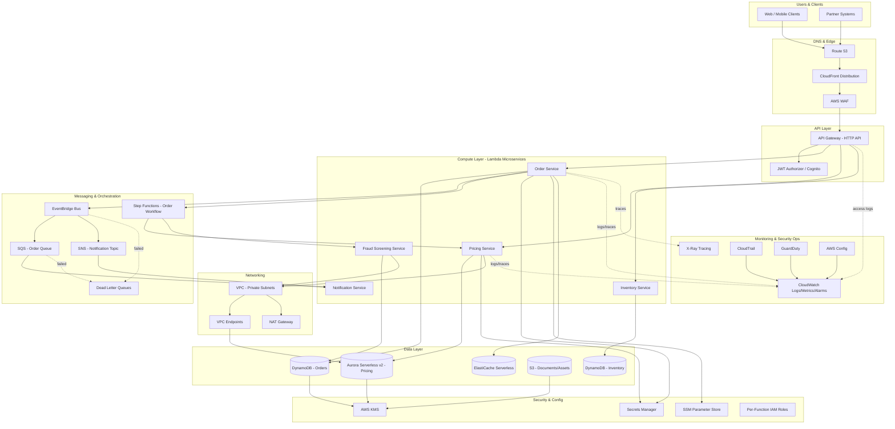

# Part IV – Serverless Architectures

# Chapter 27: Lambda Microservices

---

## 1. Executive Summary

Enterprise engineering organizations are under constant pressure to ship features faster, operate leaner platform teams, and pay only for the compute capacity they actually consume. Traditional microservices built on EC2 fleets or container orchestration platforms deliver flexibility, but they also demand continuous investment in capacity planning, patching, cluster upgrades, and idle-capacity cost absorption. The Lambda Microservices architecture addresses this tension directly: it decomposes business capabilities into independently deployable, independently scalable AWS Lambda functions, fronted by Amazon API Gateway, and wired together with event-driven integration patterns such as Amazon EventBridge, Amazon SQS, and Amazon SNS.

This chapter presents a complete, production-grade reference architecture for building and operating microservices on AWS Lambda at enterprise scale. It is written for teams who have already validated that a workload is a good functional fit for serverless compute — predominantly short-lived, stateless, event-triggered, or request/response workloads — and who now need a rigorous blueprint for security, networking, observability, cost control, and operational excellence.

**Business problem.** Enterprises frequently operate dozens to hundreds of narrowly scoped services: order validation, pricing calculation, notification dispatch, document generation, fraud scoring, image processing, and so on. Running each of these as a dedicated EC2 Auto Scaling Group or a dedicated ECS/EKS service creates enormous operational surface area. Each service needs its own AMI or container image pipeline, its own capacity plan, its own patching cadence, and its own idle-cost floor. For services with bursty, intermittent, or unpredictable traffic — which describes the majority of internal enterprise services — this operational tax is disproportionate to the actual business value delivered.

**Architecture objective.** The objective of the Lambda Microservices pattern is to eliminate undifferentiated infrastructure management for a specific and very common class of workload: request-driven or event-driven business logic that completes within minutes, does not require persistent in-memory state between invocations, and benefits from automatic, near-instantaneous scaling. The architecture achieves this by mapping each microservice boundary to one or more Lambda functions, using managed AWS services for every supporting concern (routing, authentication, messaging, storage, secrets, and observability) so that the engineering team writes business logic and infrastructure-as-code, not servers.

**Why organizations adopt this architecture.**

- Engineering teams want to ship a new microservice in days, not weeks, without waiting for a platform team to provision a new ECS service, load balancer, and Auto Scaling Group.
- Finance and FinOps teams want compute spend to track actual request volume rather than paying for reserved or provisioned capacity that sits idle during off-peak hours.
- Security teams want a smaller blast radius per service, with IAM execution roles scoped to individual functions rather than shared EC2 instance roles used by dozens of services.
- Platform teams want to reduce the operational burden of OS patching, AMI baking, and container base-image vulnerability management, since AWS Lambda manages the underlying execution environment.
- Product teams operating in unpredictable-demand domains (retail promotions, marketing campaigns, seasonal spikes, viral growth) want compute that scales from zero to thousands of concurrent invocations without a capacity-planning exercise.

**Major business benefits.**

- **Reduced time-to-market.** New microservices can be deployed through a standardized Terraform module and CI/CD pipeline in hours, not sprints.
- **Cost aligned to usage.** Lambda's per-millisecond, per-invocation billing model means idle services cost nothing, which matters enormously for the long tail of low-traffic internal services that make up most enterprise service catalogs.
- **Reduced operational headcount pressure.** No servers, no clusters, no patch Tuesday. The platform team manages shared infrastructure (networking, CI/CD, observability, guardrails) rather than per-service infrastructure.
- **Improved resilience posture by default.** Lambda functions are deployed transparently across multiple Availability Zones in a Region with no additional configuration, which removes an entire category of architectural mistakes that plague self-managed compute.
- **Faster incident recovery.** Because deployments are immutable function versions with weighted aliases, rollback is a configuration change, not a redeploy-and-wait cycle.
- **Natural fit for event-driven business processes.** Order fulfillment, document workflows, and asynchronous notification systems map cleanly onto Lambda's native integrations with SQS, SNS, EventBridge, DynamoDB Streams, and S3 events.

**Typical enterprise scenarios.**

- A retail company decomposing a monolithic order-management system into discrete services: inventory check, price calculation, tax calculation, fraud screening, order confirmation, and notification dispatch — each independently deployable and independently scaled.
- A financial services firm building a document-processing pipeline: intake, OCR extraction, validation, enrichment, and archival, triggered by S3 object creation events and orchestrated with Step Functions.
- A SaaS platform building a public API product where usage is metered per customer, and Lambda's per-invocation billing model maps naturally onto usage-based customer pricing.
- A healthcare technology company building HIPAA-eligible microservices for eligibility verification and claims pre-processing, where Lambda's reduced infrastructure footprint simplifies the compliance boundary.
- A media company building an image and video transformation pipeline triggered by uploads, where traffic is extremely bursty (large campaigns, live events) and where paying for idle EC2 capacity between events would be economically unjustifiable.
- An enterprise IT organization building internal automation microservices — approval workflows, ticket routing, compliance checks — where request volume is low and unpredictable, making Lambda's zero-idle-cost model a natural fit compared to running a permanently-on service for occasional traffic.

This chapter assumes the reader has already made the decision that Lambda is architecturally appropriate for the workload under consideration, and focuses on how to design, secure, deploy, and operate a Lambda-based microservices platform that will hold up under real enterprise load, audit scrutiny, and multi-year maintenance.

---

## 2. Business Requirements

### 2.1 Business Drivers

- Reduce infrastructure operations overhead for a growing catalog of narrowly scoped services.
- Enable independent, frequent deployment of individual microservices without coordinated release trains.
- Support unpredictable and highly variable traffic patterns without manual capacity planning.
- Provide a consistent, auditable, self-service pattern that development teams can adopt without deep infrastructure expertise.
- Align compute spend directly with business transaction volume.

### 2.2 Functional Requirements

| Requirement | Description |
|---|---|
| Synchronous API access | Expose microservices via HTTPS REST and/or GraphQL endpoints with sub-second response times for interactive use cases. |
| Asynchronous event processing | Support event-driven invocation from SQS, SNS, EventBridge, DynamoDB Streams, and S3 events. |
| Multi-tenant routing | Route requests to the correct microservice version based on path, header, or custom domain. |
| Authentication and authorization | Support OAuth2/OIDC bearer tokens, API keys, and IAM-based service-to-service authentication. |
| Independent deployability | Each microservice must be deployable without requiring a coordinated deployment of other services. |
| Schema and contract validation | Requests and events must be validated against a defined schema before business logic executes. |
| Idempotency | Asynchronous handlers must safely process duplicate deliveries without side effects. |

### 2.3 Non-Functional Requirements

**Scalability goals**

- Individual functions must scale from zero to at least 1,000 concurrent executions within seconds without manual intervention.
- The platform must support at least 200 independently deployed microservices within a single AWS account structure without hitting default service quotas.

**Availability requirements**

- Target availability: 99.95% for customer-facing synchronous APIs, 99.9% for internal asynchronous processing pipelines.
- No single Availability Zone failure should cause a customer-visible outage.

**Latency requirements**

| Workload class | P50 target | P99 target |
|---|---|---|
| Interactive customer-facing API | 100 ms | 400 ms |
| Internal service-to-service API | 50 ms | 250 ms |
| Asynchronous event processing (queue-based) | 2 s end-to-end | 30 s end-to-end |
| Batch/document processing | 5 s | 60 s |

**Compliance requirements**

- Data at rest and in transit must be encrypted using AWS KMS-managed keys.
- Audit logging (CloudTrail, access logs) must be retained for a minimum of one year, with seven years for regulated workloads (financial services, healthcare).
- PII-handling functions must run inside a VPC with no direct internet egress, using VPC endpoints for AWS service access.

**Security expectations**

- Every Lambda function has its own least-privilege IAM execution role — no shared "God roles" across functions.
- Secrets are never stored in environment variables in plaintext; they are retrieved at runtime from AWS Secrets Manager or SSM Parameter Store with caching.
- All API Gateway endpoints are protected by AWS WAF with managed rule groups.

**Recovery objectives**

| Metric | Target |
|---|---|
| RPO (event-driven pipelines) | Near zero — SQS/EventBridge retain undelivered messages; DLQ captures failures |
| RPO (stateful data stores, e.g., DynamoDB) | Point-in-time recovery to any second within the last 35 days |
| RTO (single function failure) | Under 5 minutes via automated alias rollback |
| RTO (regional failure, tier-1 services) | Under 30 minutes via multi-region failover |

**SLAs**

- Internal platform SLA: 99.95% monthly uptime for the API Gateway + Lambda execution path, excluding scheduled maintenance windows.
- Error budget: 0.05% of monthly requests may fail before triggering an SLA-burn incident review.

**Expected workload**

- Baseline: 500 requests/second sustained across the microservice fleet.
- Peak: 5,000 requests/second during promotional or seasonal events, sustained for up to 4 hours.
- Asynchronous throughput: up to 50,000 events/minute during batch ingestion windows.

**Expected growth**

- 3x growth in request volume over 24 months based on business forecasts.
- Microservice catalog expected to grow from an initial 40 services to 150+ services within 18 months as teams migrate off a legacy monolith.

---

## 3. Architecture Overview

### 3.1 Overall Design

The Lambda Microservices architecture is organized around three layers:

1. **Edge and routing layer.** Amazon Route 53 for DNS, Amazon CloudFront for global edge caching and TLS termination on custom domains, AWS WAF for request filtering, and Amazon API Gateway (HTTP APIs preferred over REST APIs for cost and latency) as the synchronous entry point into the microservice fleet.
2. **Compute and integration layer.** Individual AWS Lambda functions, one or more per microservice, each with its own IAM execution role, VPC configuration (where required), and environment isolation. Asynchronous integration is handled through Amazon SQS, Amazon SNS, and Amazon EventBridge, with AWS Step Functions used for multi-step orchestration where a business process spans several Lambda functions.
3. **Data and supporting services layer.** Amazon DynamoDB as the primary low-latency data store for microservice-owned data (following a database-per-service pattern), Amazon S3 for object storage and event triggers, Amazon Aurora Serverless v2 for services that require relational semantics, AWS Secrets Manager and SSM Parameter Store for configuration and secrets, and Amazon ElastiCache (Serverless or Redis) for shared caching where cross-function state sharing is required.

### 3.2 Architecture Philosophy

- **Database-per-service.** Each microservice owns its data store; no microservice reaches directly into another microservice's table. Cross-service data needs are satisfied through synchronous API calls or asynchronous events, never shared database access.
- **Function granularity mapped to business capability, not to HTTP verb.** A microservice such as "pricing-service" may expose several Lambda functions (calculate-price, apply-discount, validate-promotion) sharing a common deployment package and IAM boundary, rather than one giant Lambda function handling every route.
- **Event-first integration.** Where a synchronous response is not required by the business process, services communicate through EventBridge or SQS rather than direct synchronous invocation, which decouples availability and reduces cascading failure risk.
- **Infrastructure as code as the only path to production.** No manual console changes. Every function, IAM role, API Gateway route, and supporting resource is defined in Terraform and deployed through a standardized CI/CD pipeline.
- **Immutable deployments with progressive delivery.** Every deployment publishes a new Lambda version; traffic shifts from the previous version to the new version using weighted aliases, enabling canary releases and instant rollback.

### 3.3 Core Components

| Component | Role |
|---|---|
| Amazon Route 53 | DNS resolution for custom API domains |
| Amazon CloudFront | Edge termination, caching, and DDoS-absorbing edge layer |
| AWS WAF | Layer 7 filtering (SQLi, XSS, rate-based rules, bot control) |
| Amazon API Gateway (HTTP API) | Synchronous request routing, authorization, throttling |
| AWS Lambda | Business logic execution, per-microservice functions |
| Amazon EventBridge | Asynchronous event bus for cross-service integration |
| Amazon SQS | Point-to-point asynchronous work queues with DLQ support |
| Amazon SNS | Fan-out notification distribution |
| AWS Step Functions | Multi-step business process orchestration |
| Amazon DynamoDB | Primary low-latency microservice data store |
| Amazon Aurora Serverless v2 | Relational data store for services requiring SQL semantics |
| Amazon S3 | Object storage, static assets, event source for processing pipelines |
| AWS Secrets Manager | Centralized secrets storage with automatic rotation |
| AWS Systems Manager Parameter Store | Non-secret configuration values |
| Amazon CloudWatch | Metrics, logs, alarms, dashboards |
| AWS X-Ray | Distributed tracing across the microservice fleet |
| AWS KMS | Encryption key management for data at rest |
| AWS IAM | Per-function least-privilege execution roles |

### 3.4 How Components Interact

Synchronous request flow: a client resolves the API domain through Route 53, connects through CloudFront (which terminates TLS and applies WAF rules), and reaches API Gateway, which authenticates the caller, applies throttling, and invokes the target Lambda function synchronously. The function executes business logic, reads or writes to DynamoDB or Aurora Serverless v2, optionally calls other internal microservices, and returns a response that flows back through the same path.

Asynchronous flow: an upstream event — an S3 object creation, a DynamoDB stream record, an EventBridge rule match, or a message published to SNS — triggers a Lambda function directly or through an SQS queue acting as a buffer. The function processes the event, persists results, and optionally emits a new event to EventBridge to continue a business process, forming an event-driven chain across multiple microservices without any service needing direct knowledge of the others.

### 3.5 High-Level Workflow

1. A client or upstream system initiates a request or event.
2. The edge and routing layer authenticates, filters, and routes the request.
3. The appropriate Lambda function executes with a scoped IAM identity.
4. The function interacts with its owned data store and any required downstream microservices.
5. The function returns a synchronous response or emits an asynchronous event.
6. Observability data (logs, metrics, traces) is emitted continuously to CloudWatch and X-Ray.

### 3.6 Request Lifecycle

DNS resolution → CloudFront edge processing → WAF evaluation → API Gateway authorization and throttling → Lambda cold-start or warm invocation → business logic execution → data store interaction → response serialization → response returned through the same path, with CloudWatch Logs and X-Ray trace segments emitted at every hop.

### 3.7 Response Lifecycle

Lambda constructs a structured response (status code, headers, body), API Gateway maps this into the appropriate HTTP response format, CloudFront optionally caches cacheable responses at the edge, and the response is returned to the client with standard security headers (HSTS, CSP, X-Content-Type-Options) injected by a Lambda@Edge or CloudFront Functions layer if required.

### 3.8 Data Lifecycle

Data written by a microservice is scoped to that microservice's own DynamoDB table or Aurora Serverless v2 schema. Cross-service data propagation happens through DynamoDB Streams feeding EventBridge, or through explicit event publication after a successful write, so downstream services maintain their own eventually-consistent read models rather than querying another service's store directly.

---

## 4. AWS Services Used

### 4.1 AWS Lambda

**Purpose.** Executes microservice business logic without provisioned servers, scaling automatically per invocation.

**Why selected.** Lambda provides millisecond-granularity billing, automatic multi-AZ execution, and native event source integration with the majority of AWS services the architecture already depends on, making it the natural compute layer for a microservices fleet with variable and often low traffic per service.

**Alternatives.** Amazon ECS on Fargate (better for long-running or high-sustained-throughput services); Amazon EKS (better for teams standardizing on Kubernetes across hybrid environments); EC2 Auto Scaling Groups (better for workloads needing specialized hardware, GPUs, or long-lived in-memory caches).

**Limitations.** Maximum execution duration of 15 minutes; deployment package size limits (250 MB unzipped for the function plus layers, 10 GB for container-image-packaged functions); cold-start latency for infrequently invoked functions, especially those attached to a VPC or using larger runtimes; ephemeral storage limited to a configurable 512 MB–10,240 MB via `/tmp`.

**Pricing considerations.** Billed per request and per GB-second of memory allocated multiplied by execution duration; over-provisioning memory silently inflates cost, under-provisioning memory increases duration (and sometimes cost, since CPU scales with memory). Provisioned Concurrency incurs a continuous hourly charge independent of invocations and should be reserved for functions with strict latency SLAs.

**Best practices.** Right-size memory using AWS Lambda Power Tuning; keep deployment packages small; avoid unnecessary VPC attachment; use ARM64 (Graviton2) architecture where the runtime supports it for a typical 20% price-performance improvement; initialize SDK clients and heavy dependencies outside the handler function to benefit from execution environment reuse.

### 4.2 Amazon API Gateway

**Purpose.** Provides the managed, synchronous HTTPS entry point into the microservice fleet, handling authentication, throttling, and request routing.

**Why selected.** HTTP APIs (API Gateway v2) offer up to 60–70% lower cost and lower latency than REST APIs (API Gateway v1) for the common case of Lambda proxy integration, while still supporting JWT authorizers, custom domains, and CORS.

**Alternatives.** Application Load Balancer with Lambda targets (lower cost at very high sustained throughput, but fewer built-in API management features); AWS AppSync (preferred when the API surface is GraphQL-native); a self-managed API gateway on ECS/EKS (only justified when advanced traffic-shaping requirements exceed what API Gateway offers).

**Limitations.** HTTP APIs have a narrower feature set than REST APIs (no built-in request/response transformation templates, no usage plans/API keys without workarounds); default throttle limits require quota increases at high scale; maximum 29-second integration timeout.

**Pricing considerations.** Charged per million requests plus data transfer; HTTP APIs are meaningfully cheaper than REST APIs for equivalent traffic and should be the default choice unless a REST-API-only feature is required.

**Best practices.** Use JWT authorizers backed by Amazon Cognito or a third-party OIDC provider rather than custom Lambda authorizers where possible, since JWT authorizers avoid an extra Lambda invocation per request; enable access logging to CloudWatch in JSON format for structured querying; apply route-level throttling for noisy-neighbor protection between microservices sharing an API.

### 4.3 Amazon DynamoDB

**Purpose.** Serves as the primary, low-latency, horizontally scalable data store for individual microservices under the database-per-service pattern.

**Why selected.** Single-digit-millisecond latency at any scale, on-demand capacity mode that matches Lambda's pay-per-use model, native integration with DynamoDB Streams for event-driven propagation, and no server or cluster management.

**Alternatives.** Amazon Aurora Serverless v2 (preferred when the service genuinely requires relational joins, multi-row transactions, or complex query patterns); Amazon RDS (only when a specific engine feature is required and provisioned capacity is acceptable); Amazon ElastiCache (for pure caching, not durable storage).

**Limitations.** No native joins or ad hoc query flexibility; item size limited to 400 KB; requires disciplined access-pattern-first schema design (single-table design), which has a real learning curve for teams coming from relational backgrounds.

**Pricing considerations.** On-demand mode is well suited to variable-traffic microservices; provisioned mode with auto-scaling is more economical for services with stable, predictable throughput; DynamoDB Streams and Global Tables add incremental cost that should be modeled explicitly.

**Best practices.** Design tables around access patterns, not entities; use single-table design where access patterns justify it; enable point-in-time recovery; use DynamoDB Streams plus EventBridge Pipes for reliable cross-service event propagation rather than dual-writing from application code.

### 4.4 Amazon EventBridge

**Purpose.** Acts as the central, schema-aware event bus that decouples microservices from one another.

**Why selected.** Native content-based routing, schema registry and discovery, built-in integration with over 200 AWS services as event sources, and support for cross-account and cross-region event buses, making it the natural backbone for event-driven microservice communication at enterprise scale.

**Alternatives.** Amazon SNS (simpler fan-out, but no content-based filtering or schema registry); Apache Kafka via Amazon MSK (preferred for extremely high-throughput streaming with strict ordering and replay requirements beyond EventBridge's design center); direct Lambda-to-Lambda invocation (creates tight coupling and should be avoided for cross-microservice communication).

**Limitations.** At-least-once delivery (consumers must be idempotent); event size limited to 256 KB; no strict ordering guarantee across a bus (use SQS FIFO for strict ordering needs).

**Pricing considerations.** Charged per published event; archive and replay features incur additional storage cost; generally very cost-effective relative to running and operating a self-managed message broker.

**Best practices.** Version event schemas explicitly and register them in the EventBridge Schema Registry; use a dedicated custom event bus per business domain rather than the default bus, for both blast-radius isolation and clearer IAM boundaries; attach a dead-letter queue to every rule target.

### 4.5 Amazon SQS

**Purpose.** Buffers asynchronous work between producers and Lambda consumers, providing durability and back-pressure control.

**Why selected.** Native Lambda event source mapping with configurable batch size and concurrency, built-in dead-letter queue support, and FIFO queues for ordering-sensitive workloads.

**Alternatives.** Amazon Kinesis Data Streams (preferred when multiple independent consumers need to replay the same stream, or when strict ordering at very high throughput with shard-level parallelism is required); EventBridge (preferred for content-based routing rather than simple point-to-point buffering).

**Limitations.** Standard queues offer at-least-once delivery without strict ordering; FIFO queues cap throughput at 3,000 messages/second with batching (300/second without); maximum message size of 256 KB (extendable via the S3 payload offloading pattern).

**Pricing considerations.** Charged per request (a batch counts as multiple requests depending on message count); inexpensive relative to the operational cost of a self-managed queue.

**Best practices.** Always configure a dead-letter queue with a `maxReceiveCount`; set the Lambda event source mapping batch window to balance latency versus cost; use FIFO queues with message group IDs scoped to the entity requiring ordering (for example, per-order-ID) rather than a single group ID that serializes all processing.

### 4.6 Amazon S3

**Purpose.** Provides durable object storage and acts as an event source for document- and media-processing microservices.

**Why selected.** 11 nines of durability, native event notifications to Lambda/SQS/SNS/EventBridge, and lifecycle policies for automated storage-class transitions.

**Alternatives.** Amazon EFS (only when a function needs a shared, POSIX-compliant filesystem, typically for large ML model loading or shared temp state across concurrent invocations).

**Limitations.** Eventually consistent for certain multi-region replication scenarios; S3 event notifications can duplicate under specific failure conditions, requiring idempotent handlers.

**Pricing considerations.** Storage-class selection (Standard, Intelligent-Tiering, Glacier) has a large impact on long-term cost; request pricing matters for high-frequency small-object workloads.

**Best practices.** Use S3 Event Notifications routed through EventBridge (rather than direct S3-to-Lambda) when multiple consumers need the same event, since EventBridge allows fan-out without modifying the bucket's notification configuration for every new consumer.

### 4.7 AWS Step Functions

**Purpose.** Orchestrates multi-step business processes that span several Lambda functions, with built-in retry, error handling, and state visualization.

**Why selected.** Removes the need to hand-roll orchestration logic (retries, timeouts, parallel branches) inside Lambda code, and provides a visual audit trail of every execution, which is valuable for both debugging and compliance evidence.

**Alternatives.** Direct Lambda-to-Lambda chaining (acceptable for two-step processes, but becomes unmaintainable and opaque beyond that); a self-managed workflow engine (rarely justified given Step Functions' maturity).

**Limitations.** Standard workflows have a 25,000-event execution history limit and higher per-state cost than Express workflows; Express workflows are optimized for high-volume, short-duration workflows but have a 5-minute maximum duration and reduced execution history retention.

**Pricing considerations.** Standard workflows are billed per state transition; Express workflows are billed per execution duration and memory, similar to Lambda — choose based on both duration and volume profile.

**Best practices.** Use Express workflows for high-volume, sub-5-minute event processing pipelines; use Standard workflows for long-running, human-in-the-loop, or infrequent business processes where auditability matters more than cost-per-execution.

### 4.8 AWS Secrets Manager and SSM Parameter Store

**Purpose.** Centralizes secrets and configuration outside of function code and environment variables.

**Why selected.** Automatic rotation for database credentials, fine-grained IAM-based access control per secret, and native caching extensions (Lambda Extensions layer) that avoid a network call on every invocation.

**Alternatives.** SSM Parameter Store (SecureString) is a lower-cost alternative for secrets that do not require automatic rotation; Parameter Store Standard tier is free and appropriate for non-sensitive configuration.

**Limitations.** Secrets Manager has a per-secret monthly cost plus API call cost, which can add up across hundreds of microservices if not paired with the caching extension.

**Pricing considerations.** Use the AWS Parameters and Secrets Lambda Extension to cache values in the execution environment, dramatically reducing per-invocation API calls and cost.

**Best practices.** Never place raw secrets in Lambda environment variables; reference Secrets Manager ARNs and resolve at runtime through the caching extension; scope IAM policies to specific secret ARNs, never `secretsmanager:GetSecretValue` on `*`.

### 4.9 IAM, VPC, KMS, CloudWatch, X-Ray, CloudTrail, Config, GuardDuty

These supporting services are covered in depth in Sections 9, 10, 11, and 21–22, and are summarized here for completeness: **IAM** provides per-function least-privilege execution roles; **VPC** provides network isolation for functions that must reach private resources such as Aurora or on-premises systems; **KMS** provides envelope encryption for data at rest across DynamoDB, S3, Secrets Manager, and CloudWatch Logs; **CloudWatch** provides metrics, logs, dashboards, and alarms; **X-Ray** provides distributed tracing across the API Gateway → Lambda → downstream-service call graph; **CloudTrail** provides an immutable audit trail of every control-plane API call; **AWS Config** provides continuous configuration compliance evaluation; **GuardDuty** provides threat detection, including a dedicated Lambda protection feature that inspects network traffic and runtime behavior for anomalies.

---

## 5. Complete Architecture Diagram



**Diagram notes.**

- Each Lambda microservice owns its own data store — Order Service owns DynamoDB Orders, Pricing Service owns Aurora Serverless v2 — enforcing the database-per-service boundary.
- Only functions that require access to VPC-only resources (Aurora Serverless v2, private on-premises systems) are attached to the VPC; the majority of functions remain outside the VPC to avoid unnecessary ENI attachment overhead and cold-start impact.
- EventBridge is the primary cross-service integration path; direct synchronous Lambda-to-Lambda invocation is intentionally avoided except within a Step Functions-orchestrated workflow.
- Every asynchronous integration point (SQS, EventBridge rule targets) has an associated dead-letter queue to prevent silent message loss.

---

## 6. Component-by-Component Explanation

### 6.1 Amazon API Gateway (HTTP API)

- **Purpose.** Single, managed synchronous entry point for all client-facing microservice traffic.
- **Responsibilities.** TLS termination for the API domain (or delegation to CloudFront), request authentication via JWT authorizer, request throttling per route and per client, request/response logging, CORS enforcement.
- **Inputs.** HTTPS requests from CloudFront or directly from internal clients.
- **Outputs.** Lambda proxy invocations; structured access logs to CloudWatch.
- **Scaling.** Fully managed; scales automatically to tens of thousands of requests per second per account without configuration, subject to account-level quota increases.
- **High availability.** Deployed automatically across all AZs in the Region; no customer configuration required.
- **Failure handling.** Returns standardized 4xx/5xx responses on authorizer failure, throttling, or integration timeout; integration timeouts should be tuned below the Lambda function's own timeout to avoid ambiguous partial-execution states.
- **Dependencies.** JWT authorizer (Cognito or third-party OIDC issuer), downstream Lambda functions, CloudWatch for logging.
- **Security.** WAF association, resource policies restricting access by source VPC or IP range for internal-only APIs, mutual TLS for partner integrations where required.
- **Monitoring.** `4xxError`, `5xxError`, `Latency`, `IntegrationLatency`, and `Count` CloudWatch metrics per route.

### 6.2 AWS Lambda Function (per microservice)

- **Purpose.** Executes a single, narrowly scoped unit of business logic.
- **Responsibilities.** Input validation, business rule execution, data store interaction, downstream service calls, structured logging, and error classification (retryable versus terminal).
- **Inputs.** API Gateway proxy event, SQS batch event, EventBridge event, S3 event notification, or Step Functions task input, depending on trigger type.
- **Outputs.** HTTP response (synchronous), or state mutation plus optional emitted event (asynchronous).
- **Scaling.** Automatic, per-invocation, up to the account/region concurrency limit; reserved concurrency and provisioned concurrency configured per function based on criticality and latency sensitivity.
- **High availability.** Automatically distributed across AZs within the Region by the Lambda service.
- **Failure handling.** Synchronous invocations return errors directly to the caller; asynchronous invocations retry automatically (default twice) before routing to a configured DLQ or on-failure destination.
- **Dependencies.** IAM execution role, any attached Lambda layers, VPC configuration (if applicable), downstream AWS services.
- **Security.** Function-specific IAM execution role scoped to only the resources it needs; environment variables encrypted with a customer-managed KMS key for sensitive configuration.
- **Monitoring.** `Invocations`, `Errors`, `Duration`, `Throttles`, `ConcurrentExecutions`, and custom business metrics via Embedded Metric Format (EMF).

### 6.3 Amazon EventBridge Custom Bus

- **Purpose.** Decouples event producers from event consumers across the microservice fleet.
- **Responsibilities.** Content-based event routing via rules, schema validation and discovery, cross-account/cross-region event replication where configured.
- **Inputs.** `PutEvents` calls from producing Lambda functions or native AWS service integrations.
- **Outputs.** Matched events delivered to rule targets (Lambda, SQS, SNS, Step Functions, Kinesis).
- **Scaling.** Fully managed, scales automatically; default account quota can be raised via support request for very high-throughput domains.
- **High availability.** Multi-AZ by default within the Region.
- **Failure handling.** Failed rule target deliveries retry with exponential backoff before landing in the configured DLQ.
- **Dependencies.** IAM resource policies controlling which accounts/roles may publish or subscribe.
- **Security.** Resource-based policy restricting `PutEvents` to authorized producer roles; encryption at rest for archived events.
- **Monitoring.** `MatchedEvents`, `FailedInvocations`, `ThrottledRules`, and per-rule custom CloudWatch alarms.

### 6.4 Amazon DynamoDB Table (per microservice)

- **Purpose.** Owned, isolated, low-latency data store for a single microservice's state.
- **Responsibilities.** Durable storage, single-digit-millisecond read/write access, change-data-capture via DynamoDB Streams.
- **Inputs.** Read/write API calls from the owning Lambda function's execution role only.
- **Outputs.** Query/GetItem results; stream records for downstream event propagation.
- **Scaling.** On-demand capacity mode scales automatically with traffic; provisioned mode with auto-scaling for predictable workloads.
- **High availability.** Synchronously replicated across three AZs by default; Global Tables for multi-region active-active requirements.
- **Failure handling.** Automatic retries built into the AWS SDK; conditional writes used to prevent lost-update race conditions.
- **Dependencies.** KMS key for encryption at rest, IAM policy scoping access to the owning service's role(s) only.
- **Security.** Table-level IAM policy plus, where required, fine-grained access control via IAM condition keys on partition key prefixes for multi-tenant tables.
- **Monitoring.** `ConsumedReadCapacityUnits`, `ConsumedWriteCapacityUnits`, `ThrottledRequests`, `SystemErrors`.

### 6.5 AWS Step Functions State Machine

- **Purpose.** Orchestrates multi-step business processes spanning several Lambda functions with built-in retry and error-handling semantics.
- **Responsibilities.** Sequencing, parallel branch execution, conditional branching, human-approval wait states, and execution-history audit trail.
- **Inputs.** Execution start input from an API Gateway route, EventBridge rule, or another Step Functions execution.
- **Outputs.** Final execution result; intermediate state transitions logged for audit and debugging.
- **Scaling.** Express workflows scale to very high execution volume; Standard workflows are optimized for lower-volume, longer-running, higher-value processes.
- **High availability.** Fully managed, multi-AZ by default.
- **Failure handling.** Per-state `Retry` and `Catch` blocks define exponential backoff and fallback paths without custom code.
- **Dependencies.** IAM role granting the state machine permission to invoke its target Lambda functions and services.
- **Security.** Scoped IAM role limited to the specific functions and services the workflow orchestrates.
- **Monitoring.** `ExecutionsFailed`, `ExecutionsTimedOut`, `ExecutionThrottled`, and Step Functions execution history in the console for visual debugging.

---

## 7. End-to-End Request Flow

**Synchronous request flow (e.g., "create order" API call):**

1. Client resolves `api.example.com` through Route 53, which returns the CloudFront distribution's alias.
2. Request reaches the nearest CloudFront edge location; TLS is terminated using an AWS Certificate Manager certificate.
3. CloudFront forwards the request to AWS WAF for evaluation against managed rule groups (SQLi, XSS, rate-based rules) and any custom rules.
4. WAF allows the request; CloudFront forwards it to the regional API Gateway HTTP API endpoint.
5. API Gateway invokes the configured JWT authorizer, validating the bearer token's signature, issuer, audience, and expiry against the Cognito user pool or third-party OIDC provider.
6. On successful authorization, API Gateway applies route-level throttling checks and invokes the target Lambda function (`order-service-create`) using the Lambda proxy integration.
7. The Lambda execution environment is either reused (warm start) or initialized (cold start), running function initialization code (SDK client construction, configuration retrieval) outside the handler if this is a cold start.
8. The handler validates the incoming request body against a JSON Schema.
9. The handler calls the Pricing Service synchronously (through an internal, IAM-authenticated API Gateway route) to calculate the order total.
10. The handler writes the new order record to the Orders DynamoDB table using a conditional `PutItem` to prevent duplicate order creation.
11. The handler publishes an `OrderCreated` event to the EventBridge custom bus.
12. The handler returns a structured 201 response with the created order resource.
13. API Gateway maps the Lambda response into the HTTP response and returns it through CloudFront to the client.
14. Structured logs, custom EMF metrics, and an X-Ray trace segment covering the full call graph (API Gateway → Lambda → Pricing Service → DynamoDB → EventBridge) are emitted to CloudWatch throughout steps 6–12.
15. If any step fails, the handler returns an appropriate error status code with a correlation ID; CloudWatch Alarms evaluate the resulting error-rate metric against its configured threshold.

**Asynchronous processing flow (e.g., "send order confirmation notification"):**

1. The `OrderCreated` event published in step 11 above is evaluated against EventBridge rules on the custom bus.
2. A matching rule routes the event to an SQS queue (`notification-queue`) as its target.
3. The Lambda event source mapping polls the SQS queue and delivers a batch of messages to the `notification-service-send` function.
4. The function processes each message, checking an idempotency table (DynamoDB) keyed on the event's unique ID to avoid duplicate notification delivery.
5. On success, the function calls Amazon SES (or a third-party notification provider) to send the confirmation email or push notification.
6. On success, the SQS message is deleted from the queue by the Lambda service automatically.
7. On failure, the message becomes visible again after the visibility timeout and is retried, up to `maxReceiveCount`, after which it is routed to the dead-letter queue.
8. A CloudWatch Alarm on `ApproximateNumberOfMessagesVisible` in the DLQ triggers an SNS notification to the on-call engineering channel if any messages land there.

---

## 8. Deployment Flow

### 8.1 Infrastructure Provisioning

All infrastructure — Lambda functions, IAM roles, API Gateway routes, EventBridge rules, DynamoDB tables — is provisioned through modular Terraform, organized per microservice with shared modules for common patterns (function + role + log group + alarms as a single reusable module).

### 8.2 Terraform Workflow

1. Developer creates or modifies a microservice's Terraform configuration in a feature branch.
2. A pull request triggers `terraform plan` in CI, posting the plan output as a PR comment for review.
3. A second reviewer approves the pull request after reviewing both the code change and the infrastructure diff.
4. Merge to the main branch triggers `terraform apply` against a staging environment automatically.
5. Automated integration tests run against staging.
6. A manual approval gate (or automated promotion based on staging test results and canary metrics) triggers `terraform apply` against production.

### 8.3 CI/CD Deployment

- Build stage: install dependencies, run unit tests, run static analysis (linting, IAM policy validation with a tool such as `cfn-nag`, `checkov`, or `tfsec`), package the Lambda deployment artifact (zip or container image).
- Publish stage: push the artifact to Amazon S3 (zip) or Amazon ECR (container image); Terraform references the artifact's checksum or image digest, never a mutable `:latest` tag.
- Deploy stage: `terraform apply` updates the Lambda function code, publishing a new immutable version.

### 8.4 Blue-Green Deployment (Lambda Alias Traffic Shifting)

Lambda's native alias-based weighted routing provides a built-in blue-green (and canary) deployment mechanism without requiring a separate load balancer:

1. New code is published as a new Lambda version (e.g., version 42).
2. The `live` alias, previously pointing 100% to version 41, is updated to route 90% of traffic to version 41 and 10% to version 42.
3. CloudWatch Alarms monitoring the new version's error rate and latency are evaluated over a defined bake period (commonly using AWS CodeDeploy's Lambda deployment hooks, or an equivalent Terraform-managed process).
4. If alarms remain healthy, traffic shifts incrementally (10% → 30% → 60% → 100%) until version 42 receives all traffic.
5. If any alarm fires during the bake period, traffic automatically shifts back to version 41, and the deployment pipeline halts with a failure notification.

> **Tip.** AWS CodeDeploy natively supports canary and linear deployment configurations for Lambda (`Canary10Percent5Minutes`, `Linear10PercentEvery1Minute`, and similar presets), removing the need to hand-roll the traffic-shifting logic in Terraform or CI scripts.

### 8.5 Rollback

Because every deployment is an immutable, addressable Lambda version, rollback is simply repointing the alias to the previous known-good version — a sub-second control-plane operation with no redeployment, rebuild, or reprovisioning required.

### 8.6 Secrets and Configuration

- Non-sensitive configuration (feature flags, timeout values, downstream endpoint URLs) is stored in SSM Parameter Store and referenced by parameter name in the function's environment variables, resolved at cold-start via the Parameters and Secrets Lambda Extension.
- Sensitive configuration (database credentials, third-party API keys) is stored in Secrets Manager with automatic rotation enabled where the target system supports it (e.g., Aurora credential rotation via the built-in rotation Lambda template).

### 8.7 Validation

- Post-deployment smoke tests invoke each newly deployed function's `live` alias directly (bypassing API Gateway) to validate a basic health-check path before traffic shifting begins.
- Contract tests validate that the deployed function's request/response schema has not broken any registered consumer contract (using a tool such as Pact or a custom schema-diff check against the EventBridge Schema Registry for asynchronous consumers).

---

## 9. Network Topology

### 9.1 VPC Design Principle

The majority of Lambda functions in this architecture do **not** run inside a VPC, since they only need access to AWS-managed services reachable over the public AWS network (DynamoDB, S3, EventBridge, Secrets Manager) and VPC attachment adds ENI provisioning latency and unnecessary operational complexity. Functions are placed inside a VPC only when they must reach a VPC-only resource: Aurora Serverless v2, ElastiCache, an internal Application Load Balancer, or an on-premises network over Direct Connect/VPN.

### 9.2 VPC and Subnet Layout

| Element | Configuration |
|---|---|
| VPC CIDR | 10.40.0.0/16 |
| Private subnet AZ-A | 10.40.0.0/20 |
| Private subnet AZ-B | 10.40.16.0/20 |
| Private subnet AZ-C | 10.40.32.0/20 |
| Public subnet AZ-A (NAT only) | 10.40.48.0/24 |
| Public subnet AZ-B (NAT only) | 10.40.49.0/24 |
| Public subnet AZ-C (NAT only) | 10.40.50.0/24 |

- **Private subnets** host the ENIs for VPC-attached Lambda functions and the Aurora Serverless v2 cluster.
- **Public subnets** host NAT Gateways only (one per AZ for high availability); no compute resources are placed in public subnets.
- **NAT Gateway.** Provides outbound internet access for VPC-attached Lambda functions that need to reach third-party APIs not reachable via a VPC endpoint. One NAT Gateway per AZ avoids cross-AZ data transfer charges and single-AZ failure exposure.
- **Internet Gateway.** Attached to the VPC to support the NAT Gateways' outbound path; no resource other than NAT Gateways has a route to the Internet Gateway.
- **Transit Gateway.** Used when the microservices VPC must reach shared services VPCs (a centralized observability VPC, a shared CI/CD VPC) or on-premises networks in a hub-and-spoke enterprise network topology.
- **Route tables.** Private subnet route tables send `0.0.0.0/0` to the local NAT Gateway; AWS service traffic (DynamoDB, S3, Secrets Manager) is routed through VPC endpoints and never traverses the NAT Gateway, reducing both cost and latency.
- **Network ACLs.** Stateless subnet-level ACLs provide a coarse-grained defense-in-depth layer, denying known-bad CIDR ranges and restricting private subnet ingress to expected VPC CIDR ranges only.
- **Security groups.** Each VPC-attached Lambda function is assigned a dedicated security group permitting only the specific egress it requires (e.g., port 5432 to the Aurora security group), following least-privilege network access.
- **PrivateLink / VPC endpoints.** Gateway endpoints are configured for S3 and DynamoDB (no cost, route-table-based); interface endpoints are configured for Secrets Manager, SSM, KMS, and CloudWatch Logs so that VPC-attached functions never need NAT Gateway egress for AWS API calls.
- **Hybrid connectivity.** For enterprises with on-premises systems (e.g., a legacy ERP), AWS Direct Connect or Site-to-Site VPN terminates on the Transit Gateway, with routes propagated into the microservices VPC's private subnet route tables.

---

## 10. Identity and Access

### 10.1 IAM Roles

Every Lambda function is assigned its own dedicated IAM execution role — never a shared role across multiple functions or microservices. This is the single most important IAM decision in the architecture: it bounds the blast radius of a compromised or misconfigured function to exactly the resources that function legitimately needs.

### 10.2 IAM Policies

Policies are written using resource-level ARN scoping wherever the AWS service supports it, avoiding wildcard resources. A representative policy for the Order Service function:

```json

{
  "Version": "2012-10-17",
  "Statement": [
    {
      "Sid": "DynamoDBTableAccess",
      "Effect": "Allow",
      "Action": [
        "dynamodb:PutItem",
        "dynamodb:GetItem",
        "dynamodb:UpdateItem",
        "dynamodb:Query"
      ],
      "Resource": "arn:aws:dynamodb:us-east-1:111122223333:table/orders-service-orders"
    },
    {
      "Sid": "EventBridgePublish",
      "Effect": "Allow",
      "Action": "events:PutEvents",
      "Resource": "arn:aws:events:us-east-1:111122223333:event-bus/orders-domain-bus"
    },
    {
      "Sid": "SecretsManagerRead",
      "Effect": "Allow",
      "Action": "secretsmanager:GetSecretValue",
      "Resource": "arn:aws:secretsmanager:us-east-1:111122223333:secret:orders-service/*"
    },
    {
      "Sid": "KMSDecrypt",
      "Effect": "Allow",
      "Action": ["kms:Decrypt", "kms:GenerateDataKey"],
      "Resource": "arn:aws:kms:us-east-1:111122223333:key/orders-service-key"
    }
  ]
}

```

### 10.3 Resource Policies

Resource-based policies complement identity-based policies for services that support them. The Orders DynamoDB table, EventBridge bus, and SQS queues each carry resource policies restricting access to explicitly named principal ARNs, providing a second, independent enforcement point beyond the calling function's own IAM policy.

### 10.4 STS and Cross-Account Access

For enterprises operating a multi-account structure (a dedicated account per environment, or per business unit), cross-account access uses AWS STS `AssumeRole` with short-lived credentials rather than long-lived IAM user access keys. A function in a shared-services account that must read from a business-unit account's DynamoDB table assumes a narrowly scoped role in that account, with a trust policy restricting `sts:AssumeRole` to the specific calling role ARN and an external ID condition where third parties are involved.

### 10.5 Least Privilege

- IAM policies are generated from actual observed access patterns using AWS IAM Access Analyzer's policy generation feature, then manually reviewed and tightened before deployment — never hand-written wildcard policies "to be safe."
- Permissions are re-evaluated on every Terraform plan via a policy-as-code check (Open Policy Agent or AWS IAM Access Analyzer custom policy checks) that fails the pipeline if a new wildcard resource or action is introduced.

### 10.6 Service Roles

Supporting AWS services that act on the account's behalf — CodePipeline, CodeBuild, Step Functions, EventBridge Pipes — each have their own dedicated service role scoped only to the specific resources they orchestrate, following the same least-privilege principle applied to Lambda execution roles.

### 10.7 Permission Boundaries

A permission boundary is attached to every Lambda execution role created through the standardized Terraform module, capping the maximum permissions any function-level IAM policy can grant regardless of what an individual developer's pull request requests. This prevents privilege escalation through an overly permissive policy slipping through code review, since IAM will deny any action outside the boundary even if the identity policy would otherwise allow it.

---

## 11. Security Architecture

### 11.1 Encryption

- **At rest.** DynamoDB tables, S3 buckets, Aurora Serverless v2 storage, and CloudWatch Log groups are encrypted using customer-managed AWS KMS keys, one key per business domain (not one key per resource, to keep key management tractable, and not a single account-wide key, to preserve blast-radius isolation).
- **In transit.** TLS 1.2 minimum is enforced at every hop: client to CloudFront, CloudFront to API Gateway, and Lambda to every AWS service endpoint (enforced by default by the AWS SDK).

### 11.2 AWS KMS

Each business domain (Orders, Pricing, Inventory) has a dedicated KMS key with a key policy restricting `kms:Decrypt` to the specific IAM roles of functions within that domain. Key rotation is enabled (automatic annual rotation for AWS-managed key material).

### 11.3 TLS and AWS Certificate Manager

Public-facing custom domains use ACM-issued certificates attached to the CloudFront distribution, with automatic renewal. Internal service-to-service calls over API Gateway private endpoints use ACM Private CA-issued certificates where mutual TLS is required.

### 11.4 AWS WAF

A Web ACL attached to the CloudFront distribution includes the AWS Managed Rules Core Rule Set, the Known Bad Inputs rule group, a SQL injection rule group, and a rate-based rule limiting any single IP to a configurable request threshold per five-minute window. Custom rules block known-bad ASNs and enforce geographic restrictions where required by data-residency policy.

### 11.5 AWS Shield

AWS Shield Standard provides baseline DDoS protection automatically for CloudFront and Route 53 at no additional cost; AWS Shield Advanced is enabled for tier-1 customer-facing APIs where guaranteed SLA-backed DDoS response and cost protection against scaling-driven billing spikes during an attack are business requirements.

### 11.6 Secrets Manager and Certificate Manager

Covered in Sections 4.8 and 11.3 respectively; both are treated as mandatory dependencies for any function touching credentials or TLS material — plaintext secrets in source code or environment variables are treated as a release-blocking finding in code review and CI security scanning.

### 11.7 GuardDuty

Amazon GuardDuty's Lambda Protection feature analyzes VPC Flow Logs and Lambda network activity for indicators of compromise (communication with known command-and-control infrastructure, cryptocurrency-mining domains, or anomalous data exfiltration patterns), issuing findings that route to Security Hub and trigger an automated response workflow (execution role permission revocation, function version rollback) for high-severity findings.

### 11.8 Inspector

Amazon Inspector performs continuous vulnerability scanning of Lambda function code and layers for known CVEs in third-party dependencies, integrated into the CI/CD pipeline as a release gate for critical and high-severity findings.

### 11.9 Security Hub

Aggregates findings from GuardDuty, Inspector, AWS Config, and IAM Access Analyzer into a single dashboard with a normalized severity score, providing the enterprise security team a unified view across the entire microservices fleet rather than per-service tooling silos.

### 11.10 CloudTrail

Every control-plane API call — Lambda function creation or update, IAM policy changes, Secrets Manager access — is logged to an organization-wide CloudTrail trail delivered to a centralized, access-restricted S3 bucket in a dedicated logging account, with CloudTrail log file integrity validation enabled to detect tampering.

### 11.11 AWS Config

Config rules continuously evaluate that every Lambda function has encryption enabled, is not granted overly permissive resource-based policies, and is not configured with deprecated runtimes; non-compliant resources trigger a Security Hub finding and, for select high-risk rules, an automated remediation Lambda function.

### 11.12 Zero Trust Principles Applied

- No implicit trust between microservices based on network location alone; internal service-to-service calls are authenticated using IAM SigV4 signing or short-lived JWTs, not "it's inside the VPC, so it's trusted."
- Every request, whether from an external client or an internal microservice, is authenticated and authorized independently at the point of entry.

### 11.13 Threat Model

| Attack vector | Mitigation |
|---|---|
| Injection attacks (SQLi, NoSQLi, command injection) via API input | Input validation against JSON Schema at the API Gateway/Lambda boundary; parameterized queries for Aurora; WAF managed rule groups |
| Broken authentication / token replay | Short-lived JWTs, token audience/issuer validation, mTLS for partner integrations |
| Excessive IAM privilege leading to lateral movement | Per-function least-privilege roles, permission boundaries, IAM Access Analyzer continuous review |
| Secrets exposure in code, logs, or environment variables | Secrets Manager with runtime resolution, log scrubbing for sensitive fields, CI secret-scanning (e.g., gitleaks) |
| Dependency supply-chain compromise | Inspector continuous scanning, dependency pinning, SBOM generation per deployment artifact |
| Denial of service / cost-based denial of wallet | WAF rate-based rules, API Gateway throttling, Lambda reserved concurrency caps preventing runaway account-wide concurrency consumption, AWS Budgets anomaly alerts |
| Event injection via a compromised producer publishing forged EventBridge events | EventBridge resource policies restricting `PutEvents` to authorized roles, schema validation on consumption |
| Data exfiltration via a compromised function's outbound network access | VPC-attached functions restricted to explicit security-group egress rules; non-VPC functions restricted via IAM to only the AWS APIs they require |

---

## 12. High Availability

### 12.1 AZ Failures

Lambda, API Gateway, DynamoDB, EventBridge, SQS, and SNS are all natively multi-AZ services with no customer configuration required to survive a single AZ failure. The only components requiring explicit multi-AZ configuration are VPC-attached resources: NAT Gateways (one per AZ), Aurora Serverless v2 (Multi-AZ writer/reader configuration), and ElastiCache (Multi-AZ replication group).

### 12.2 Instance Failures

There are no customer-managed instances in this architecture's compute layer; the Lambda service transparently replaces failed execution environments. For Aurora Serverless v2, automatic failover to a reader replica in another AZ occurs within typically under 30 seconds of a writer instance failure.

### 12.3 Regional Failures

Tier-1 services are deployed to a secondary Region using an active-passive or active-active pattern (see Section 13, Disaster Recovery) with Route 53 health-check-based DNS failover directing traffic away from an impaired Region.

### 12.4 Database Failures

- DynamoDB: no customer-facing failover process required — the service handles replica failures transparently.
- Aurora Serverless v2: automatic failover to a standby reader; application code uses the cluster's writer endpoint, which is automatically repointed by Aurora during failover, combined with retry logic in the Lambda data access layer.

### 12.5 Load Balancing

API Gateway and CloudFront perform request distribution natively; there is no customer-managed load balancer in the primary request path unless an internal Application Load Balancer is used to front VPC-only internal services.

### 12.6 Health Checks

Route 53 health checks monitor a dedicated `/health` endpoint on each Region's API Gateway, evaluating downstream dependency health (DynamoDB table status, Aurora cluster status) rather than a trivial "process is running" check, so that a health check accurately reflects whether the Region can serve real traffic.

### 12.7 Failover

For active-passive multi-region deployments, Route 53 failover routing policy automatically shifts DNS resolution to the secondary Region's API Gateway endpoint when the primary Region's health check fails for a configured number of consecutive intervals, typically achieving failover within 1–3 minutes.

---

## 13. Disaster Recovery

### 13.1 Backup Strategy

| Data store | Backup mechanism | Retention |
|---|---|---|
| DynamoDB | Point-in-time recovery (continuous) + on-demand backups before major schema changes | 35 days continuous, on-demand backups retained indefinitely per policy |
| Aurora Serverless v2 | Automated snapshots + continuous backup via Aurora Backtrack | 35 days |
| S3 | Versioning enabled, cross-region replication for tier-1 buckets | Per lifecycle policy, typically 1–7 years |
| Secrets Manager | Automatic versioning of secret values | Previous version retained until next rotation cycle |

### 13.2 Snapshots

Aurora Serverless v2 automated daily snapshots are copied to a secondary Region nightly using AWS Backup cross-region copy, providing a restorable point even in the event of a full primary-Region data-plane loss.

### 13.3 Cross-Region Replication

DynamoDB Global Tables provide near-real-time, multi-active replication for tables backing tier-1 services, so the secondary Region has current data without a restore step. S3 Cross-Region Replication is enabled for buckets backing document-processing pipelines classified as business-critical.

### 13.4 Pilot Light

For tier-2 services, the DR strategy is pilot light: infrastructure-as-code for the full stack exists and is validated in the secondary Region, but Lambda functions and API Gateway are not actively receiving traffic; DynamoDB Global Tables keep data current. Recovery involves a Terraform apply to activate the secondary Region's routing and a Route 53 DNS cutover.

### 13.5 Warm Standby

For tier-1 services, the DR strategy is warm standby: the secondary Region runs the full stack at reduced provisioned concurrency, continuously validated by synthetic canary traffic, ready to absorb full production load within minutes of a Route 53 failover.

### 13.6 Multi-Site / Active-Active

For the small set of globally distributed, extremely latency-sensitive services (for example, a global session-validation service), an active-active pattern is used: both Regions serve production traffic simultaneously behind Route 53 latency-based routing, with DynamoDB Global Tables resolving concurrent write conflicts using last-writer-wins semantics, which is acceptable only for data models where that conflict resolution strategy is business-safe.

### 13.7 RPO and RTO by Tier

| Service tier | Strategy | RPO | RTO |
|---|---|---|---|
| Tier 1 (customer-facing revenue-critical) | Warm standby / active-active | Near zero (Global Tables) | Under 15 minutes |
| Tier 2 (internal business-critical) | Pilot light | Under 15 minutes | Under 2 hours |
| Tier 3 (internal, non-critical) | Backup and restore | Under 24 hours | Under 24 hours |

---

## 14. Scalability

### 14.1 Horizontal Scaling

Lambda scales horizontally by creating new execution environments per concurrent invocation, up to the account/Region concurrency limit (default 1,000, commonly raised to 3,000–10,000+ for enterprise accounts via a support-case-based quota increase). Reserved concurrency is set on critical functions to guarantee available capacity; a shared, unreserved concurrency pool serves lower-priority functions.

### 14.2 Vertical Scaling

Lambda "vertical scaling" is achieved by increasing the configured memory allocation, which proportionally increases the allocated vCPU share — this is the primary lever for reducing per-invocation duration for CPU-bound functions and should be tuned with a tool such as AWS Lambda Power Tuning rather than guessed.

### 14.3 Auto Scaling (Supporting Services)

- Aurora Serverless v2 scales ACUs (Aurora Capacity Units) automatically between a configured minimum and maximum based on load, typically within seconds.
- DynamoDB on-demand mode scales read/write capacity automatically; provisioned mode uses DynamoDB Application Auto Scaling to adjust capacity based on a target utilization metric.

### 14.4 Serverless Scaling Characteristics

- Lambda's scale-up is near-instantaneous for the first several hundred concurrent executions (a burst quota, currently 500–3,000 depending on Region, applies before linear scaling of 500 additional concurrent executions per minute applies).
- This burst-then-linear scaling curve must be accounted for when modeling extreme, near-instantaneous traffic spikes (a flash-sale scenario) — Provisioned Concurrency should be pre-warmed ahead of a known spike rather than relying purely on on-demand scaling.

### 14.5 Database Scaling

DynamoDB scales essentially without limit for well-designed partition-key distributions; "hot partition" throttling, not raw throughput, is the practical scaling ceiling and is addressed through write-sharding key design, not through requesting a capacity increase.

### 14.6 Storage Scaling

S3 scales automatically with no customer action required; request-rate partitioning is automatic in modern S3, removing the historical need for key-prefix randomization for very high request-rate buckets.

### 14.7 Queue Scaling

SQS standard queues scale to near-unlimited throughput automatically; the practical scaling constraint is the Lambda event source mapping's maximum concurrency setting, which should be tuned to avoid overwhelming a downstream dependency (such as Aurora Serverless v2's connection limit) even when the queue itself could sustain a much higher processing rate.

---

## 15. Performance Optimization

### 15.1 Caching

- **CloudFront** caches cacheable GET responses at the edge, reducing both latency and origin (API Gateway/Lambda) load for read-heavy endpoints.
- **ElastiCache Serverless (Redis)** provides a shared cache for cross-invocation, cross-function data such as computed pricing tables or session data, avoiding redundant DynamoDB/Aurora reads.
- **In-memory execution environment caching.** Data fetched during a cold start (configuration, database connections) is cached in module-level variables so warm invocations reuse it without a repeated network round trip.

### 15.2 Compression

API Gateway automatically compresses responses above a configurable size threshold when the client sends an appropriate `Accept-Encoding` header, reducing response transfer time for larger JSON payloads.

### 15.3 CDN

CloudFront serves as both a security boundary (Section 11.4) and a performance layer, terminating TLS close to the client and maintaining persistent, HTTP-keep-alive connections back to the API Gateway origin, which reduces connection-setup latency compared to clients connecting directly to API Gateway's regional endpoint.

### 15.4 Database Optimization

- DynamoDB access patterns are designed single-table-first, avoiding N+1 query patterns common in relational migrations.
- Aurora Serverless v2 queries are reviewed for missing indexes using the Performance Insights dashboard, with slow-query alarms configured on `DatabaseConnections` and query latency percentiles.

### 15.5 Connection Pooling

Aurora Serverless v2 connections from Lambda are pooled using Amazon RDS Proxy rather than opening a new database connection per invocation, which both improves latency and protects the database from connection exhaustion during traffic bursts, since Lambda's concurrent-execution scaling model can otherwise open far more simultaneous connections than a relational database can sustain.

### 15.6 Concurrency

Provisioned Concurrency is configured for latency-sensitive, customer-facing functions to eliminate cold starts entirely for a baseline traffic level, with on-demand scaling absorbing traffic above that baseline.

### 15.7 Async Processing

Work that does not require an immediate synchronous response (report generation, bulk notification, non-blocking downstream integrations) is moved off the synchronous request path entirely and processed through SQS/EventBridge, keeping the customer-facing P99 latency low and predictable.

---

## 16. Cost Optimization (FinOps)

### 16.1 Estimated Monthly Costs by Deployment Size

> **Note.** Figures are directional estimates for planning purposes based on typical us-east-1 pricing at the time of writing; actual costs must be validated with AWS Pricing Calculator and Cost Explorer against real workload telemetry.

| Deployment size | Requests/month | Lambda compute | API Gateway | DynamoDB | EventBridge/SQS | Total estimate |
|---|---|---|---|---|---|---|
| Small (10 services) | 10M | $150 | $35 | $60 | $10 | ~$300/month |
| Medium (50 services) | 150M | $1,800 | $525 | $700 | $150 | ~$3,500/month |
| Enterprise (150+ services) | 1.5B | $16,000 | $5,250 | $6,500 | $1,800 | ~$35,000–$45,000/month |

### 16.2 Major Cost Drivers

- Lambda GB-seconds (memory allocation × duration × invocation count) — typically the single largest line item at scale.
- API Gateway request volume — HTTP APIs are materially cheaper than REST APIs and should be the default.
- DynamoDB on-demand read/write request units, particularly for services with inefficient access patterns causing excess reads.
- CloudWatch Logs ingestion and storage — an easily overlooked cost driver when verbose debug-level logging is left enabled in production.
- NAT Gateway hourly and data-processing charges for VPC-attached functions with high outbound data volume.
- Provisioned Concurrency's continuous hourly charge, which applies regardless of actual invocation volume.

### 16.3 Optimization Opportunities

- **Right-size Lambda memory** using AWS Lambda Power Tuning to find the cost/performance optimum rather than defaulting to a round number like 512 MB or 1024 MB for every function.
- **Move to ARM64/Graviton2** for all functions whose runtime and dependencies support it, for a typical 20% price-performance improvement with no code changes for most workloads.
- **Adopt HTTP APIs over REST APIs** wherever the REST-API-only feature set is not required.
- **Use on-demand DynamoDB for variable-traffic services and provisioned-with-auto-scaling for stable, predictable-traffic services**, since provisioned mode is materially cheaper per request at sustained, predictable volume.
- **Set CloudWatch Logs retention** explicitly on every log group (never leave it at "Never Expire") and route logs destined for long-term retention to cheaper S3 storage via a subscription filter rather than paying CloudWatch Logs storage rates indefinitely.
- **Reserve Provisioned Concurrency only where a measured cold-start SLA violation actually occurred**, not preemptively for every function.

### 16.4 Reserved Instances, Savings Plans, and Spot

Lambda itself has no Reserved Instance equivalent, but **Compute Savings Plans** apply to Lambda compute (GB-seconds and per-request charges for Provisioned Concurrency) alongside EC2 and Fargate usage, and should be purchased once a stable baseline of Provisioned Concurrency spend is established — typically after 2–3 months of production telemetry, not on day one.

### 16.5 S3 Lifecycle and Storage Classes

Document and media assets processed by the architecture's S3-triggered pipelines transition automatically: Standard for the first 30 days (active access), Standard-IA at 30 days, Glacier Instant Retrieval at 90 days, and Glacier Deep Archive at 365 days for compliance-retained records, configured via S3 Lifecycle rules rather than custom cleanup Lambda functions.

### 16.6 Rightsizing

A quarterly FinOps review uses AWS Compute Optimizer's Lambda recommendations (available for functions with sufficient invocation history) to identify over-provisioned memory allocations and Provisioned Concurrency settings that no longer match observed traffic patterns.

### 16.7 Cost Allocation and Tagging

Every resource created by the standardized Terraform module is tagged with `service`, `team`, `environment`, `cost-center`, and `data-classification` tags, enabling Cost Explorer and Cost and Usage Reports to attribute spend to the owning team down to the individual microservice level — essential given the architecture's design intent of dozens to hundreds of independently owned services.

### 16.8 Budgets and Cost Anomaly Detection

AWS Budgets alerts are configured per cost-center at 80% and 100% of the monthly forecast; AWS Cost Anomaly Detection is configured at the linked-account level to catch the specific failure mode this architecture is most exposed to — a misconfigured retry loop or an infinite recursive event chain (a Lambda function that republishes an event matching its own trigger rule) causing a rapid, unbounded cost spike.

> **Warning.** Recursive invocation loops are a well-documented Lambda cost incident pattern: a function that writes to a DynamoDB table with streams enabled, where that stream triggers a second function that writes back to the same table, can spiral into millions of invocations within minutes. AWS Lambda now provides recursive loop detection that pauses affected functions automatically, but this should not be relied upon as the sole safeguard — it is deliberately not a substitute for a reserved-concurrency ceiling.

---

## 17. AI-Assisted Operations

### 17.1 Amazon Q Developer

Amazon Q Developer is integrated into the IDE and CI pipeline to assist with Terraform module authoring, IAM policy least-privilege suggestions, and inline code review comments flagging common Lambda anti-patterns (SDK client instantiation inside the handler, missing idempotency keys, hardcoded ARNs) before a pull request reaches a human reviewer.

### 17.2 Amazon Bedrock

Amazon Bedrock-backed internal tooling is used for two operational use cases in this architecture: summarizing CloudWatch Logs Insights query results into a human-readable incident timeline during an active incident, and generating draft runbook documentation from a state machine's Step Functions definition, which a human engineer then reviews and finalizes.

### 17.3 AI Troubleshooting

During an incident, an AI-assisted CloudWatch Logs Insights workflow correlates error spikes across the fleet of Lambda functions sharing a trace ID, surfacing the likely root-cause function faster than a human manually scanning dozens of log groups — particularly valuable in this architecture given the sheer number of independently deployed functions involved in any single business transaction.

### 17.4 Log Analysis

Bedrock-backed anomaly summarization is applied to structured EMF metrics and CloudWatch Logs to flag unusual patterns (a sudden shift in the error-type distribution, a new unhandled exception class appearing) that a static threshold-based alarm would not catch.

### 17.5 Incident Response

AI-generated incident summaries are used to accelerate the first 10 minutes of an incident — surfacing the likely blast radius (which microservices, which customers) — but final root-cause determination and remediation actions remain a human decision, consistent with the enterprise's change-management and incident-command policies.

### 17.6 Cost Optimization

Amazon Q's cost-optimization recommendations, cross-referenced with Compute Optimizer Lambda recommendations, are reviewed monthly by the FinOps function as an input to the rightsizing process in Section 16.6, not applied automatically.

### 17.7 Capacity Planning

Historical invocation and concurrency trend data is summarized by Bedrock-backed tooling ahead of known high-traffic events (product launches, marketing campaigns) to recommend Provisioned Concurrency pre-warming schedules, which are then reviewed and approved by the platform team before being applied via a scheduled Terraform-managed change.

### 17.8 Architecture Review

New microservice Terraform submissions are evaluated by an Amazon Q-backed architecture-review assistant that checks conformance to this chapter's standards (per-function IAM roles, DLQ configuration, encryption settings, tagging) before a human architect performs the final review, reducing the manual review burden for well-formed, standards-compliant submissions.

### 17.9 AI-Generated Terraform

AI-assisted Terraform generation is used to scaffold new microservices from the standardized module template, with every generated configuration passing through the same `tfsec`/`checkov` policy-as-code gate and human review as hand-written Terraform — AI assistance accelerates first-draft authoring, it does not bypass any governance control in Section 8 or 10.

### 17.10 AI-Generated Documentation

Runbooks, architecture decision records, and API documentation are drafted with AI assistance from the underlying Terraform, OpenAPI specifications, and Step Functions definitions, then reviewed and approved by the owning engineering team before publication to the internal documentation portal.

---

## 18. Terraform Implementation

### 18.1 Providers and Backend

```hcl

# versions.tf

terraform {
  required_version = ">= 1.7.0"

  required_providers {
    aws = {
      source  = "hashicorp/aws"
      version = "~> 5.50"
    }
    archive = {
      source  = "hashicorp/archive"
      version = "~> 2.4"
    }
  }

  backend "s3" {
    bucket         = "example-corp-terraform-state"
    key            = "lambda-microservices/orders-service/terraform.tfstate"
    region         = "us-east-1"
    dynamodb_table = "terraform-state-lock"
    encrypt        = true
  }
}

provider "aws" {
  region = var.aws_region

  default_tags {
    tags = {
      ManagedBy   = "terraform"
      Service     = var.service_name
      Environment = var.environment
      CostCenter  = var.cost_center
    }
  }
}

```

### 18.2 Variables

```hcl

# variables.tf

variable "service_name" {
  description = "Logical name of the microservice, used for resource naming"
  type        = string
}

variable "environment" {
  description = "Deployment environment (dev, staging, prod)"
  type        = string
}

variable "aws_region" {
  description = "AWS region for deployment"
  type        = string
  default     = "us-east-1"
}

variable "cost_center" {
  description = "Cost center tag for FinOps chargeback"
  type        = string
}

variable "lambda_memory_mb" {
  description = "Memory allocation for the Lambda function, in MB"
  type        = number
  default     = 512
}

variable "lambda_timeout_seconds" {
  description = "Maximum execution duration for the Lambda function"
  type        = number
  default     = 10
}

variable "reserved_concurrency" {
  description = "Reserved concurrency for the function; -1 disables reservation"
  type        = number
  default     = -1
}

variable "provisioned_concurrency" {
  description = "Provisioned concurrency count; 0 disables provisioned concurrency"
  type        = number
  default     = 0
}

variable "vpc_config" {
  description = "Optional VPC configuration for the function"
  type = object({
    subnet_ids         = list(string)
    security_group_ids = list(string)
  })
  default = null
}

```

### 18.3 Reusable Lambda Microservice Module

```hcl

# modules/lambda-microservice/main.tf

data "aws_caller_identity" "current" {}

# ---------------------------------------------------------------------------

# KMS key for this service's environment variable and log encryption

# ---------------------------------------------------------------------------

resource "aws_kms_key" "service_key" {
  description             = "Encryption key for ${var.service_name} (${var.environment})"
  deletion_window_in_days = 30
  enable_key_rotation     = true
}

resource "aws_kms_alias" "service_key_alias" {
  name          = "alias/${var.service_name}-${var.environment}"
  target_key_id = aws_kms_key.service_key.key_id
}

# ---------------------------------------------------------------------------

# CloudWatch Log Group (created explicitly to control retention and encryption)

# ---------------------------------------------------------------------------

resource "aws_cloudwatch_log_group" "lambda_logs" {
  name              = "/aws/lambda/${var.service_name}-${var.environment}"
  retention_in_days = var.environment == "prod" ? 365 : 30
  kms_key_id        = aws_kms_key.service_key.arn
}

# ---------------------------------------------------------------------------

# IAM Execution Role — least privilege, per-function, with permission boundary

# ---------------------------------------------------------------------------

data "aws_iam_policy_document" "assume_role" {
  statement {
    actions = ["sts:AssumeRole"]
    principals {
      type        = "Service"
      identifiers = ["lambda.amazonaws.com"]
    }
  }
}

resource "aws_iam_role" "lambda_exec_role" {
  name                 = "${var.service_name}-${var.environment}-exec-role"
  assume_role_policy   = data.aws_iam_policy_document.assume_role.json
  permissions_boundary = "arn:aws:iam::${data.aws_caller_identity.current.account_id}:policy/LambdaMicroservicePermissionBoundary"
}

resource "aws_iam_role_policy_attachment" "basic_execution" {
  role       = aws_iam_role.lambda_exec_role.name
  policy_arn = "arn:aws:iam::aws:policy/service-role/AWSLambdaBasicExecutionRole"
}

resource "aws_iam_role_policy_attachment" "vpc_execution" {
  count      = var.vpc_config != null ? 1 : 0
  role       = aws_iam_role.lambda_exec_role.name
  policy_arn = "arn:aws:iam::aws:policy/service-role/AWSLambdaVPCAccessExecutionRole"
}

data "aws_iam_policy_document" "function_scoped_policy" {
  statement {
    sid       = "KMSDecrypt"
    effect    = "Allow"
    actions   = ["kms:Decrypt", "kms:GenerateDataKey"]
    resources = [aws_kms_key.service_key.arn]
  }

  statement {
    sid       = "XRayTracing"
    effect    = "Allow"
    actions   = ["xray:PutTraceSegments", "xray:PutTelemetryRecords"]
    resources = ["*"]
  }
}

resource "aws_iam_role_policy" "function_scoped_policy" {
  name   = "${var.service_name}-${var.environment}-scoped-policy"
  role   = aws_iam_role.lambda_exec_role.id
  policy = data.aws_iam_policy_document.function_scoped_policy.json
}

# ---------------------------------------------------------------------------

# Lambda Function

# ---------------------------------------------------------------------------

resource "aws_lambda_function" "this" {
  function_name = "${var.service_name}-${var.environment}"
  role          = aws_iam_role.lambda_exec_role.arn
  handler       = "index.handler"
  runtime       = "nodejs20.x"
  architectures = ["arm64"]

  filename         = var.deployment_package_path
  source_code_hash = filebase64sha256(var.deployment_package_path)

  memory_size = var.lambda_memory_mb
  timeout     = var.lambda_timeout_seconds

  reserved_concurrent_executions = var.reserved_concurrency

  kms_key_arn = aws_kms_key.service_key.arn

  tracing_config {
    mode = "Active"
  }

  environment {
    variables = {
      ENVIRONMENT       = var.environment
      SERVICE_NAME      = var.service_name
      LOG_LEVEL         = var.environment == "prod" ? "INFO" : "DEBUG"
      POWERTOOLS_SERVICE_NAME = var.service_name
    }
  }

  dynamic "vpc_config" {
    for_each = var.vpc_config != null ? [var.vpc_config] : []
    content {
      subnet_ids         = vpc_config.value.subnet_ids
      security_group_ids = vpc_config.value.security_group_ids
    }
  }

  depends_on = [
    aws_cloudwatch_log_group.lambda_logs,
    aws_iam_role_policy_attachment.basic_execution,
  ]
}

resource "aws_lambda_alias" "live" {
  name             = "live"
  function_name    = aws_lambda_function.this.function_name
  function_version = aws_lambda_function.this.version
}

resource "aws_lambda_provisioned_concurrency_config" "this" {
  count                             = var.provisioned_concurrency > 0 ? 1 : 0
  function_name                     = aws_lambda_function.this.function_name
  qualifier                         = aws_lambda_alias.live.name
  provisioned_concurrent_executions = var.provisioned_concurrency
}

# ---------------------------------------------------------------------------

# CloudWatch Alarms — error rate and duration

# ---------------------------------------------------------------------------

resource "aws_cloudwatch_metric_alarm" "error_rate" {
  alarm_name          = "${var.service_name}-${var.environment}-error-rate"
  comparison_operator = "GreaterThanThreshold"
  evaluation_periods   = 3
  metric_name         = "Errors"
  namespace           = "AWS/Lambda"
  period              = 60
  statistic           = "Sum"
  threshold           = 5
  alarm_description   = "Triggers when ${var.service_name} exceeds 5 errors in 3 consecutive 1-minute periods"
  dimensions = {
    FunctionName = aws_lambda_function.this.function_name
  }
  alarm_actions = [var.alarm_sns_topic_arn]
  ok_actions    = [var.alarm_sns_topic_arn]
}

resource "aws_cloudwatch_metric_alarm" "throttles" {
  alarm_name          = "${var.service_name}-${var.environment}-throttles"
  comparison_operator = "GreaterThanThreshold"
  evaluation_periods   = 2
  metric_name         = "Throttles"
  namespace           = "AWS/Lambda"
  period              = 60
  statistic           = "Sum"
  threshold           = 0
  alarm_description   = "Triggers on any throttled invocation for ${var.service_name}"
  dimensions = {
    FunctionName = aws_lambda_function.this.function_name
  }
  alarm_actions = [var.alarm_sns_topic_arn]
}

```

### 18.4 API Gateway HTTP API Integration

```hcl

# modules/lambda-microservice/api_gateway.tf

resource "aws_apigatewayv2_api" "this" {
  name          = "${var.service_name}-${var.environment}"
  protocol_type = "HTTP"

  cors_configuration {
    allow_origins = var.allowed_origins
    allow_methods = ["GET", "POST", "PUT", "DELETE"]
    allow_headers = ["authorization", "content-type"]
    max_age       = 300
  }
}

resource "aws_apigatewayv2_authorizer" "jwt" {
  api_id           = aws_apigatewayv2_api.this.id
  authorizer_type  = "JWT"
  identity_sources = ["$request.header.Authorization"]
  name             = "${var.service_name}-jwt-authorizer"

  jwt_configuration {
    audience = [var.jwt_audience]
    issuer   = var.jwt_issuer
  }
}

resource "aws_apigatewayv2_integration" "lambda" {
  api_id                 = aws_apigatewayv2_api.this.id
  integration_type       = "AWS_PROXY"
  integration_uri        = aws_lambda_alias.live.invoke_arn
  payload_format_version = "2.0"
  timeout_milliseconds   = 10000
}

resource "aws_apigatewayv2_route" "create_order" {
  api_id             = aws_apigatewayv2_api.this.id
  route_key          = "POST /orders"
  target             = "integrations/${aws_apigatewayv2_integration.lambda.id}"
  authorization_type = "JWT"
  authorizer_id      = aws_apigatewayv2_authorizer.jwt.id
}

resource "aws_apigatewayv2_stage" "this" {
  api_id      = aws_apigatewayv2_api.this.id
  name        = var.environment
  auto_deploy = true

  default_route_settings {
    throttling_burst_limit = 200
    throttling_rate_limit  = 100
  }

  access_log_settings {
    destination_arn = aws_cloudwatch_log_group.api_access_logs.arn
    format = jsonencode({
      requestId      = "$context.requestId"
      routeKey       = "$context.routeKey"
      status         = "$context.status"
      integrationLatency = "$context.integrationLatency"
      responseLatency     = "$context.responseLatency"
    })
  }
}

resource "aws_cloudwatch_log_group" "api_access_logs" {
  name              = "/aws/apigateway/${var.service_name}-${var.environment}"
  retention_in_days = 90
}

resource "aws_lambda_permission" "apigw_invoke" {
  statement_id  = "AllowAPIGatewayInvoke"
  action        = "lambda:InvokeFunction"
  function_name = aws_lambda_alias.live.function_name
  qualifier     = aws_lambda_alias.live.name
  principal     = "apigateway.amazonaws.com"
  source_arn    = "${aws_apigatewayv2_api.this.execution_arn}/*/*"
}

```

### 18.5 EventBridge and SQS Async Integration

```hcl

# modules/lambda-microservice/async_integration.tf

resource "aws_sqs_queue" "dlq" {
  name                      = "${var.service_name}-${var.environment}-dlq"
  message_retention_seconds = 1209600 # 14 days
  kms_master_key_id         = aws_kms_key.service_key.id
}

resource "aws_sqs_queue" "work_queue" {
  name                       = "${var.service_name}-${var.environment}-queue"
  visibility_timeout_seconds = var.lambda_timeout_seconds * 6
  kms_master_key_id          = aws_kms_key.service_key.id

  redrive_policy = jsonencode({
    deadLetterTargetArn = aws_sqs_queue.dlq.arn
    maxReceiveCount      = 5
  })
}

resource "aws_lambda_event_source_mapping" "sqs_trigger" {
  event_source_arn = aws_sqs_queue.work_queue.arn
  function_name    = aws_lambda_alias.live.arn
  batch_size       = 10
  maximum_batching_window_in_seconds = 5

  scaling_config {
    maximum_concurrency = 20
  }
}

resource "aws_cloudwatch_event_rule" "trigger_rule" {
  name           = "${var.service_name}-${var.environment}-rule"
  event_bus_name = var.event_bus_name

  event_pattern = jsonencode({
    source      = ["orders.service"]
    detail-type = ["OrderCreated"]
  })
}

resource "aws_cloudwatch_event_target" "to_queue" {
  rule           = aws_cloudwatch_event_rule.trigger_rule.name
  event_bus_name = var.event_bus_name
  arn            = aws_sqs_queue.work_queue.arn

  dead_letter_config {
    arn = aws_sqs_queue.dlq.arn
  }

  retry_policy {
    maximum_retry_attempts       = 3
    maximum_event_age_in_seconds = 3600
  }
}

resource "aws_cloudwatch_metric_alarm" "dlq_not_empty" {
  alarm_name          = "${var.service_name}-${var.environment}-dlq-messages"
  comparison_operator = "GreaterThanThreshold"
  evaluation_periods   = 1
  metric_name         = "ApproximateNumberOfMessagesVisible"
  namespace           = "AWS/SQS"
  period              = 300
  statistic           = "Maximum"
  threshold           = 0
  alarm_description   = "Any message in ${var.service_name} DLQ requires immediate investigation"
  dimensions = {
    QueueName = aws_sqs_queue.dlq.name
  }
  alarm_actions = [var.alarm_sns_topic_arn]
}

```

### 18.6 Outputs

```hcl

# modules/lambda-microservice/outputs.tf

output "function_arn" {
  description = "ARN of the Lambda function"
  value       = aws_lambda_function.this.arn
}

output "live_alias_arn" {
  description = "ARN of the live traffic alias"
  value       = aws_lambda_alias.live.arn
}

output "api_endpoint" {
  description = "Invoke URL for the API Gateway stage"
  value       = aws_apigatewayv2_stage.this.invoke_url
}

output "work_queue_arn" {
  description = "ARN of the SQS work queue"
  value       = aws_sqs_queue.work_queue.arn
}

output "dlq_arn" {
  description = "ARN of the dead-letter queue"
  value       = aws_sqs_queue.dlq.arn
}

```

### 18.7 Remote State and Module Best Practices

- Remote state is stored in a dedicated, access-restricted S3 bucket per environment, with a DynamoDB table providing state-locking to prevent concurrent-apply corruption.
- Each microservice has its own state file (as shown in the backend configuration in Section 18.1), preventing a Terraform apply for one service from being blocked by, or accidentally affecting, another service's resources — a critical property at a scale of 100+ independently owned microservices.
- Shared, cross-cutting resources (the EventBridge custom bus, the VPC, the permission boundary policy) live in a separate, platform-team-owned Terraform root module and are referenced by microservice modules via remote state data sources or SSM Parameter Store-published values, never by hardcoded ARNs.

---

## 19. AWS CLI Examples

### 19.1 Deployment and Version Management

```bash

# Publish a new immutable version after code update

aws lambda publish-version \
  --function-name orders-service-prod \
  --description "Release $(git rev-parse --short HEAD)"

# Shift 10% of traffic to the new version via the live alias

aws lambda update-alias \
  --function-name orders-service-prod \
  --name live \
  --function-version 42 \
  --routing-config AdditionalVersionWeights={"41"=0.9}

# Roll back instantly to the previous known-good version

aws lambda update-alias \
  --function-name orders-service-prod \
  --name live \
  --function-version 41

```

### 19.2 Validation

```bash

# Invoke the live alias directly, bypassing API Gateway, for a smoke test

aws lambda invoke \
  --function-name orders-service-prod:live \
  --payload '{"httpMethod":"GET","path":"/health"}' \
  --cli-binary-format raw-in-base64-out \
  response.json && cat response.json

# Validate the function's current configuration matches expectations

aws lambda get-function-configuration \
  --function-name orders-service-prod:live \
  --query '{Memory:MemorySize,Timeout:Timeout,Runtime:Runtime,Arch:Architectures}'

```

### 19.3 Monitoring

```bash

# Tail live invocation logs during a deployment bake period

aws logs tail /aws/lambda/orders-service-prod --follow --since 5m

# Query recent error-level log entries with CloudWatch Logs Insights

aws logs start-query \
  --log-group-name /aws/lambda/orders-service-prod \
  --start-time $(date -d '30 minutes ago' +%s) \
  --end-time $(date +%s) \
  --query-string 'fields @timestamp, @message | filter level = "ERROR" | sort @timestamp desc | limit 50'

# Check current concurrency utilization against the account limit

aws lambda get-account-settings \
  --query 'AccountUsage.{Concurrent:FunctionCount,Unreserved:UnreservedConcurrentExecutions}'

```

### 19.4 Troubleshooting

```bash

# Inspect the dead-letter queue for failed asynchronous events

aws sqs receive-message \
  --queue-url https://sqs.us-east-1.amazonaws.com/111122223333/orders-service-prod-dlq \
  --max-number-of-messages 10 \
  --attribute-names All

# Retrieve the most recent X-Ray trace summaries for a service

aws xray get-trace-summaries \
  --start-time $(date -d '15 minutes ago' +%s) \
  --end-time $(date +%s) \
  --filter-expression 'service("orders-service-prod") { fault = true }'

# Check for recent throttling events

aws cloudwatch get-metric-statistics \
  --namespace AWS/Lambda \
  --metric-name Throttles \
  --dimensions Name=FunctionName,Value=orders-service-prod \
  --start-time $(date -u -d '1 hour ago' +%Y-%m-%dT%H:%M:%S) \
  --end-time $(date -u +%Y-%m-%dT%H:%M:%S) \
  --period 60 \
  --statistics Sum

```

### 19.5 Cleanup

```bash

# Remove function versions older than the last 5, excluding the live alias target

aws lambda list-versions-by-function \
  --function-name orders-service-prod \
  --query 'Versions[?Version!=`$LATEST`].Version' --output text | \
  tr '\t' '\n' | sort -n | head -n -5 | \
  xargs -I{} aws lambda delete-function \
    --function-name orders-service-prod --qualifier {}

# Purge a queue after confirming DLQ messages have been triaged and reprocessed

aws sqs purge-queue \
  --queue-url https://sqs.us-east-1.amazonaws.com/111122223333/orders-service-prod-dlq

```

---

## 20. CI/CD Integration

### 20.1 GitHub Actions

```yaml

name: deploy-microservice

on:
  push:
    branches: [main]
    paths:
      - 'services/orders-service/**'

jobs:
  build-test-deploy:
    runs-on: ubuntu-latest
    permissions:
      id-token: write
      contents: read
    steps:
      - uses: actions/checkout@v4

      - uses: actions/setup-node@v4
        with:
          node-version: '20'

      - name: Install and test
        run: |
          cd services/orders-service
          npm ci
          npm test

      - name: Static analysis - IaC security scan
        run: |
          cd services/orders-service/terraform
          docker run --rm -v "$(pwd):/src" aquasec/tfsec /src

      - name: Configure AWS credentials via OIDC
        uses: aws-actions/configure-aws-credentials@v4
        with:
          role-to-assume: arn:aws:iam::111122223333:role/github-actions-deploy
          aws-region: us-east-1

      - name: Package Lambda artifact
        run: |
          cd services/orders-service
          zip -r ../../build/orders-service.zip . -x "*.test.js"

      - name: Terraform plan
        run: |
          cd services/orders-service/terraform
          terraform init
          terraform plan -out=tfplan

      - name: Terraform apply (staging)
        if: github.ref == 'refs/heads/main'
        run: |
          cd services/orders-service/terraform
          terraform apply -auto-approve tfplan

      - name: Run integration tests against staging
        run: npm run test:integration -- --env=staging

      - name: Promote to production
        if: success()
        run: |
          cd services/orders-service/terraform
          terraform workspace select prod
          terraform apply -auto-approve -var="environment=prod"

```

### 20.2 GitLab CI

```yaml

stages: [test, scan, plan, deploy]

test:
  stage: test
  script:
    - npm ci && npm test

security-scan:
  stage: scan
  script:
    - checkov -d terraform/ --framework terraform
    - gitleaks detect --source . --no-git

terraform-plan:
  stage: plan
  script:
    - terraform init
    - terraform plan -out=tfplan
  artifacts:
    paths: [tfplan]

deploy-prod:
  stage: deploy
  when: manual
  script:
    - terraform apply -auto-approve tfplan
  environment:
    name: production

```

### 20.3 AWS CodePipeline (Native Alternative)

For enterprises standardizing on native AWS tooling, AWS CodePipeline with CodeBuild and native CodeDeploy Lambda deployment configurations provides the equivalent workflow without leaving the AWS ecosystem, and integrates directly with CodeDeploy's built-in canary and linear traffic-shifting presets described in Section 8.4, removing the need to hand-roll alias-weighting logic.

### 20.4 Terraform Pipeline Validation Gates

| Gate | Tool | Failure action |
|---|---|---|
| Syntax and formatting | `terraform fmt -check`, `terraform validate` | Block merge |
| Security misconfiguration | `tfsec`, `checkov` | Block merge on critical/high findings |
| IAM least-privilege | IAM Access Analyzer policy validation | Block merge on wildcard resource/action findings |
| Cost impact | `infracost` diff posted to PR | Warn only, requires FinOps acknowledgment above threshold |
| Drift detection | Scheduled `terraform plan` against production | Alert platform team on unexpected drift |

### 20.5 Policy as Code

Open Policy Agent (OPA) or AWS's native IAM Access Analyzer custom policy checks are run against every Terraform plan's JSON output in CI, enforcing organization-wide rules — every Lambda function must have a DLQ or on-failure destination configured for async invocations, every table must be encrypted with a customer-managed key, no security group may allow ingress from `0.0.0.0/0` — before a plan is eligible for apply.

### 20.6 Rollback in CI/CD

If post-deployment synthetic monitoring or CloudWatch Alarms fire during the bake period described in Section 8.4, the pipeline automatically triggers a rollback job that reverts the `live` alias to the prior version and opens an incident ticket, without waiting for human intervention to stop the bleeding.

---

## 21. Monitoring

### 21.1 CloudWatch

Every Lambda function, API Gateway stage, SQS queue, and EventBridge rule emits metrics to CloudWatch automatically; this architecture augments the default metrics with custom business metrics (orders created per minute, average order value, fraud-screening rejection rate) emitted via the Embedded Metric Format directly from function logs, avoiding the latency and cost of a separate `PutMetricData` API call per invocation.

### 21.2 Dashboards

A standardized CloudWatch dashboard template, provisioned via Terraform alongside every microservice module, includes: invocation count, error rate, P50/P95/P99 duration, concurrent executions versus reserved concurrency, throttle count, DLQ depth, and API Gateway 4xx/5xx rates — giving every team a consistent operational view without hand-building dashboards per service.

### 21.3 Metrics

| Metric | Source | Alarm threshold guidance |
|---|---|---|
| `Errors` | Lambda | > 1% of invocations over 5 minutes |
| `Throttles` | Lambda | Any throttle in a tier-1 service |
| `Duration` (p99) | Lambda | > 80% of configured timeout |
| `ConcurrentExecutions` | Lambda | > 80% of reserved concurrency |
| `4xxError` / `5xxError` | API Gateway | 5xx > 1% of requests over 5 minutes |
| `ApproximateAgeOfOldestMessage` | SQS | > expected processing SLA |
| `ApproximateNumberOfMessagesVisible` | DLQ | > 0 |

### 21.4 Logs

Structured JSON logging (using a library such as AWS Lambda Powertools) is mandatory for every function, with a consistent schema including `correlation_id`, `service_name`, `level`, and `message` fields, enabling cross-service correlation in CloudWatch Logs Insights during an incident that spans multiple microservices.

### 21.5 Tracing

AWS X-Ray active tracing is enabled on every function and every API Gateway stage, propagating trace context automatically across service boundaries (including into EventBridge and SQS message attributes) so that a single customer request's full call graph — spanning several independently deployed Lambda functions — is visible as one trace in the X-Ray service map.

### 21.6 X-Ray

The X-Ray service map is used both for performance debugging (identifying which downstream call in a chain is contributing the most latency) and for architecture documentation, since it provides an automatically generated, always-current visualization of actual service dependencies, catching undocumented or unintended coupling between microservices.

### 21.7 Alarms and Notifications

CloudWatch Alarms route to a tiered notification system: tier-1 service alarms page the on-call engineer via an SNS topic integrated with the incident management platform (PagerDuty or Opsgenie); tier-2 and tier-3 alarms post to a team Slack channel via SNS-to-Lambda-to-Slack-webhook integration, avoiding alert fatigue for lower-criticality services.

### 21.8 SLIs, SLOs, and Error Budgets

| SLI | SLO | Error budget (monthly) |
|---|---|---|
| Successful request rate (tier-1 API) | 99.95% | 21.9 minutes of budget |
| P99 latency under 400ms | 99% of requests | 1% of requests may exceed |
| Async event processing success rate | 99.9% | 0.1% may land in DLQ |

Error budget burn is tracked on a rolling 30-day window; a service that exhausts its error budget triggers a mandatory reliability-focused sprint before new feature work resumes, following standard SRE error-budget policy.

---

## 22. Logging

### 22.1 Centralized Logging

All CloudWatch Logs across every account in the AWS Organization are subscribed to a centralized logging pipeline: a subscription filter streams logs to Amazon Kinesis Data Firehose, which delivers them to a centralized S3 bucket in a dedicated logging account, partitioned by service and date for efficient querying.

### 22.2 CloudWatch Logs

Live, recent logs (last 30–90 days depending on environment) remain queryable directly in CloudWatch Logs Insights for fast incident response; this tier is optimized for query speed, not long-term cost efficiency.

### 22.3 S3 and Athena

Logs older than the CloudWatch retention window, or requiring long-term compliance retention, are queried via Amazon Athena against the partitioned S3 log archive, using a Glue Data Catalog table definition maintained by the platform team, giving compliance and security teams SQL-based access to years of historical log data at S3 storage cost rather than CloudWatch Logs storage cost.

### 22.4 OpenSearch

For services requiring near-real-time full-text log search and operational dashboards beyond what CloudWatch Logs Insights provides, logs are additionally streamed to an Amazon OpenSearch Service domain, typically reserved for tier-1 services where the additional operational and cost overhead of OpenSearch is justified by the search and dashboarding requirements.

### 22.5 Retention

| Log category | CloudWatch retention | Long-term archive retention |
|---|---|---|
| Application logs (non-prod) | 30 days | Not archived |
| Application logs (prod) | 90 days | 1 year in S3 |
| API Gateway access logs | 90 days | 3 years in S3 |
| Audit-relevant logs (regulated workloads) | 90 days | 7 years in S3 Glacier |

### 22.6 Audit Logging

CloudTrail management-event and data-event logs (S3 object-level, DynamoDB item-level where enabled) are treated as a distinct, immutable logging stream from application logs, stored in a separate, tightly access-controlled S3 bucket with MFA-delete and Object Lock enabled to satisfy audit-integrity requirements independent of the application observability pipeline described above.

---

## 23. Operational Excellence

### 23.1 Runbooks

Every microservice ships with a standardized runbook template covering: how to identify the on-call owner, how to check DLQ status, how to perform an alias rollback, how to escalate a database-layer incident, and how to request a temporary concurrency increase — stored alongside the service's Terraform code so it stays version-controlled and reviewed like any other artifact.

### 23.2 Automation

Routine operational tasks — DLQ triage and reprocessing, stale Lambda version cleanup, unused API Gateway stage identification, orphaned CloudWatch Log group cleanup — are automated via scheduled Lambda functions ("operational microservices" that manage the platform itself) rather than left as manual quarterly chores.

### 23.3 Patch Management

Because Lambda manages the underlying execution environment and OS patching, the team's patch-management burden is narrowed to two areas: runtime version deprecation (AWS periodically deprecates old language runtime versions, requiring a migration within a defined window) and third-party dependency vulnerabilities surfaced by Inspector, both tracked on a rolling patch calendar with SLA-based remediation timelines by severity.

### 23.4 Maintenance

Maintenance activities specific to this architecture include: periodic review and pruning of unused IAM permissions via Access Analyzer's unused-access findings, DynamoDB table access-pattern review as new features change query shapes, and EventBridge schema registry hygiene to prevent schema drift between event producers and consumers.

### 23.5 Incident Response

Incident response follows a standard severity-tiered process, with this architecture's specific contribution being fast, low-risk mitigation options unavailable to server-based architectures: an alias rollback (Section 8.5) resolves a bad-deployment incident in seconds, and a reserved-concurrency reduction can throttle a runaway or misbehaving function without a full function disable, preserving partial service availability during triage.

### 23.6 Change Management

Every production change flows through the CI/CD pipeline described in Section 20 — there is no path to production that bypasses pull-request review, automated testing, and policy-as-code validation, which is both an operational excellence practice and, for regulated workloads, a compliance requirement for demonstrating change control to auditors.

---

## 24. Failure Scenarios

| # | Scenario | Symptoms | Root cause | Detection | Resolution | Prevention |
|---|---|---|---|---|---|---|
| 1 | Cold-start latency spike | P99 latency exceeds SLA after a traffic lull | Execution environments recycled after idle period, VPC ENI attachment delay | CloudWatch Duration metric, X-Ray init subsegment | Enable Provisioned Concurrency for the affected function | Pre-warm before known low-traffic-then-spike patterns; avoid unnecessary VPC attachment |
| 2 | Recursive invocation loop | Sudden, exponential invocation count and cost spike | DynamoDB Stream-triggered function writes back to the same table, re-triggering itself | Cost Anomaly Detection alert, invocation count graph | Disable the event source mapping immediately, roll back the offending code | Recursive-loop detection enabled; code review checklist item; reserved concurrency caps blast radius |
| 3 | Account-level concurrency exhaustion | Unrelated services begin throttling simultaneously | One noisy function consumes the shared unreserved concurrency pool | Throttles metric across multiple unrelated functions | Apply reserved concurrency to the offending function to cap its consumption | Reserved concurrency ceilings on all functions from day one; concurrency capacity planning per Section 14.1 |
| 4 | DynamoDB hot partition throttling | Elevated latency and `ThrottledRequests` on a single table | Skewed partition key distribution (e.g., a single high-traffic tenant ID) | DynamoDB `ThrottledRequests` metric, CloudWatch Contributor Insights | Redesign partition key with a sharding suffix; switch to on-demand mode temporarily | Access-pattern-first schema design; load testing with realistic key distributions |
| 5 | Aurora Serverless v2 connection exhaustion | `TooManyConnections` errors under load | Lambda concurrency scaling far exceeds Aurora's max_connections | RDS Proxy connection metrics, Aurora `DatabaseConnections` | Introduce or scale RDS Proxy; reduce event source mapping max concurrency | RDS Proxy from initial design; connection pooling as a mandatory pattern for any VPC-attached, database-backed function |
| 6 | DLQ silently accumulating messages | Customers report missing notifications days later | Alarm on DLQ depth not configured or misconfigured threshold | Manual discovery during unrelated investigation (a preventable gap) | Reprocess DLQ messages after root-causing the original failure | Mandatory DLQ alarm as part of the standardized Terraform module (Section 18.5) |
| 7 | EventBridge rule pattern mismatch after a schema change | Downstream service stops receiving events, no error surfaced | Producer changed event `detail` schema without updating consumer's rule pattern | Schema Registry drift detection, sudden drop in `MatchedEvents` | Update or version the event pattern; coordinate schema change across producer/consumer teams | Schema Registry governance; contract testing against registered schemas in CI |
| 8 | API Gateway JWT authorizer outage (upstream IdP) | All authenticated requests fail with 401 | Third-party OIDC provider experiencing an outage | Spike in 401 responses correlated with IdP status page | Communicate to customers; no bypass available by design (correctly fails closed) | Multi-region IdP redundancy for tier-1 customer-facing APIs where budget justifies it |
| 9 | Deployment introduces a breaking event schema change | Consumer functions begin throwing deserialization errors | Producer team did not run consumer contract tests before deploying | CloudWatch error spike in multiple consumer functions simultaneously | Roll back producer's alias to the previous version | Mandatory contract testing gate in CI (Section 8.7) |
| 10 | NAT Gateway single-AZ failure | VPC-attached functions in one AZ lose internet egress | Only one NAT Gateway deployed instead of one per AZ | VPC Flow Logs, function timeout errors concentrated in one AZ | Deploy NAT Gateway per AZ per the architecture standard | Enforce one-NAT-Gateway-per-AZ as a mandatory Terraform module default |
| 11 | Lambda layer version drift | Function behaves inconsistently across environments | A shared Lambda layer was updated in one environment but not pinned by version in Terraform | Environment-specific bug reports, config diff review | Pin the exact layer version ARN in every environment's Terraform configuration | Never reference a layer without an explicit version number |
| 12 | Secrets Manager rotation breaks database connectivity | Sudden spike in Aurora authentication failures | Rotation Lambda updated the secret but the connection-pooling layer cached stale credentials | Aurora authentication error logs, correlated with rotation event in CloudTrail | Restart affected connection pools; verify RDS Proxy's native rotation-awareness is enabled | Use RDS Proxy, which natively handles credential rotation without connection-pool cache invalidation issues |
| 13 | Oversized Lambda deployment package causing slow cold starts | Cold-start duration far exceeds expectation | Unnecessary dependencies bundled into the deployment package | X-Ray init subsegment duration, package size review | Tree-shake dependencies, split into layers, remove dev dependencies from the production bundle | Automated package-size check in CI with a defined budget per function |
| 14 | Cross-region DynamoDB Global Table replication lag | Stale reads in the secondary Region during failover | Underlying replication lag exceeded expected bounds during a write-heavy burst | `ReplicationLatency` CloudWatch metric | Wait for replication to catch up before completing failover, or accept documented staleness for the affected window | Monitor replication lag proactively; define acceptable staleness bounds in the DR runbook |
| 15 | Unbounded CloudWatch Logs cost growth | FinOps flags an unexpected CloudWatch Logs cost increase | Debug-level logging accidentally left enabled in production, or a log group created without retention configured | AWS Cost Anomaly Detection, monthly FinOps review | Set correct log level and retention immediately | Enforce log-level and retention settings via the standardized Terraform module; policy-as-code check for "Never Expire" log groups |

---

## 25. Troubleshooting Guide

| Problem | Symptoms | Likely Cause | Diagnosis | AWS CLI Commands | Resolution |
|---|---|---|---|---|---|
| High P99 latency | Slow responses reported by a subset of users | Cold starts on a low-traffic function | Check init-duration in X-Ray traces | `aws xray get-trace-summaries ...` | Enable Provisioned Concurrency or increase memory to reduce init time |
| 429 Too Many Requests | Clients receive throttling errors | API Gateway throttle limit reached, or Lambda reserved concurrency exhausted | Compare `Throttles` metric against configured limits | `aws cloudwatch get-metric-statistics --metric-name Throttles ...` | Raise throttle limits or reserved concurrency after capacity review |
| Intermittent 502 from API Gateway | Sporadic bad-gateway errors | Lambda function returning a malformed proxy response | Inspect function logs for the exact response payload | `aws logs tail /aws/lambda/<function> --follow` | Fix response formatting to match the Lambda proxy integration contract |
| Messages stuck in SQS | Consumer not processing messages | Lambda event source mapping disabled or misconfigured | Check event source mapping state | `aws lambda list-event-source-mappings --function-name <fn>` | Re-enable or reconfigure the event source mapping |
| DynamoDB `ProvisionedThroughputExceededException` | Write/read errors under load | Table in provisioned mode without sufficient capacity or auto-scaling | Review `ConsumedWriteCapacityUnits` vs. provisioned capacity | `aws dynamodb describe-table --table-name <table>` | Switch to on-demand mode or increase provisioned capacity/auto-scaling targets |
| Function times out consistently | `Task timed out` errors in logs | Downstream dependency (database, third-party API) responding slowly, or timeout set too low | Check X-Ray subsegment durations for the slow dependency | `aws lambda get-function-configuration --function-name <fn>` | Increase timeout if justified, or fix/replace the slow dependency |
| VPC-attached function cannot reach the internet | Timeouts calling third-party APIs | Missing NAT Gateway route or missing VPC endpoint for an AWS service call | Review private subnet route table and security group egress rules | `aws ec2 describe-route-tables --route-table-ids <id>` | Add correct NAT Gateway route or VPC endpoint |
| IAM `AccessDenied` on a new integration | Function fails when calling a newly added AWS service | Execution role policy not updated for the new dependency | Compare CloudTrail `AccessDenied` event against current role policy | `aws iam get-role-policy --role-name <role> --policy-name <policy>` | Add the least-privilege statement for the specific new action/resource |
| Deployment stuck in "pending" | Terraform apply hangs on Lambda update | Deployment package exceeds size limits or S3 upload incomplete | Check package size and S3 object status | `aws lambda get-function --function-name <fn> --query Configuration.State` | Reduce package size or verify artifact upload completed successfully |
| Duplicate side effects from async processing | Same notification sent multiple times | Non-idempotent handler combined with at-least-once delivery | Review idempotency-key table for the affected event IDs | `aws dynamodb get-item --table-name idempotency-keys --key ...` | Implement idempotency checks keyed on a unique event/message ID |

---

## 26. Best Practices

1. Assign a dedicated, least-privilege IAM execution role to every individual Lambda function — never share roles across functions.
2. Attach a permission boundary to every execution role to cap maximum possible privilege regardless of the identity policy.
3. Default to HTTP APIs over REST APIs in API Gateway unless a REST-API-exclusive feature is genuinely required.
4. Use JWT authorizers backed by Cognito or an OIDC provider instead of custom Lambda authorizers to avoid an extra invocation per request.
5. Enable AWS X-Ray active tracing on every function and every API Gateway stage from day one, not retrofitted after an incident.
6. Use structured JSON logging with a consistent schema (correlation ID, service name, log level) across every microservice.
7. Configure a dead-letter queue or on-failure destination for every asynchronous Lambda invocation path without exception.
8. Right-size Lambda memory allocation using AWS Lambda Power Tuning rather than guessing round numbers.
9. Default to ARM64 (Graviton2) architecture for all functions whose runtime and dependencies support it.
10. Initialize SDK clients, database connections, and configuration retrieval outside the handler function to benefit from execution environment reuse.
11. Never place unencrypted secrets in Lambda environment variables; resolve them at runtime from Secrets Manager or SSM Parameter Store.
12. Use the AWS Parameters and Secrets Lambda Extension to cache secret values and avoid a network call on every invocation.
13. Design DynamoDB tables around access patterns first, using single-table design where the access patterns justify it.
14. Enforce database-per-service ownership; no microservice should read another microservice's table directly.
15. Use EventBridge for cross-service, content-based-routed integration rather than direct synchronous Lambda-to-Lambda invocation.
16. Version and register event schemas in the EventBridge Schema Registry, and validate against them in CI as a consumer contract test.
17. Deploy every change as a new immutable Lambda version and shift traffic using weighted aliases for canary/blue-green delivery.
18. Automate rollback based on CloudWatch Alarm thresholds during the post-deployment bake period.
19. Set explicit CloudWatch Logs retention on every log group; never leave retention at "Never Expire."
20. Apply reserved concurrency to every production function to prevent one noisy function from starving the account-wide unreserved pool.
21. Use RDS Proxy for any VPC-attached function connecting to Aurora or RDS to avoid connection exhaustion under Lambda's concurrency-scaling model.
22. Keep the majority of functions outside a VPC; attach a VPC only when reaching a VPC-only resource is required.
23. Use one NAT Gateway per Availability Zone for VPC-attached functions to avoid cross-AZ data-transfer charges and single-AZ failure exposure.
24. Route AWS service traffic (S3, DynamoDB, Secrets Manager) through VPC endpoints rather than NAT Gateway egress.
25. Enable point-in-time recovery on every production DynamoDB table.
26. Use DynamoDB Global Tables for tier-1 services requiring near-zero RPO in a multi-region DR strategy.
27. Implement idempotency checks (keyed on a unique event or message ID) in every asynchronous handler to safely tolerate at-least-once delivery.
28. Enforce a maximum deployment package size budget in CI and tree-shake dependencies to reduce cold-start duration.
29. Use AWS WAF managed rule groups plus rate-based rules on every public-facing CloudFront distribution.
30. Tag every resource with `service`, `team`, `environment`, and `cost-center` for FinOps chargeback accuracy.
31. Enable AWS Cost Anomaly Detection at the account level specifically to catch recursive invocation loops early.
32. Enable Lambda's native recursive-loop detection as a defense-in-depth safeguard, not as the sole control.
33. Run policy-as-code checks (tfsec, checkov, OPA) against every Terraform plan before it is eligible for apply.
34. Perform contract testing between event producers and consumers as a mandatory CI gate before deployment.
35. Maintain a standardized, reusable Terraform module for the "Lambda function + role + log group + alarms" pattern to enforce consistency across 100+ services.

---

## 27. Anti-Patterns

1. **Sharing a single IAM execution role across many Lambda functions.** Dangerous because a vulnerability or misconfiguration in one function grants access to every resource the shared role can touch. Correct approach: one role per function, scoped narrowly.
2. **Building a single, giant "God function" that handles every route for a service.** Dangerous because it defeats independent scaling, blurs the IAM boundary, and makes cold starts and deployment risk apply to unrelated code paths simultaneously. Correct approach: split by business capability into multiple smaller functions sharing a deployment pipeline.
3. **Synchronous Lambda-to-Lambda invocation chains across microservices.** Dangerous because it creates tight coupling, cascading latency, and cascading failure — an outage in service C directly breaks service A even though A only called B. Correct approach: use EventBridge/SQS for cross-service integration wherever a synchronous response is not strictly required.
4. **Storing secrets in plaintext environment variables.** Dangerous because environment variables are visible to anyone with `lambda:GetFunctionConfiguration` permission and appear in CloudTrail data events and console views. Correct approach: reference Secrets Manager ARNs and resolve at runtime.
5. **No dead-letter queue on asynchronous invocations.** Dangerous because failed events are silently discarded after Lambda's default two retries, with zero visibility into data loss. Correct approach: mandatory DLQ with an alarm on any message arrival.
6. **Wildcard IAM policies ("Resource": "*") "to move fast."** Dangerous because it removes the primary blast-radius control this entire architecture depends on. Correct approach: resource-scoped ARNs generated from observed access patterns via IAM Access Analyzer.
7. **Cross-service direct database access ("just query the other team's table, it's faster").** Dangerous because it breaks the database-per-service boundary, creates hidden coupling invisible to the API contract, and makes independent schema evolution impossible. Correct approach: expose data through an API or event, never shared table access.
8. **Ignoring cold-start impact by defaulting every function to minimum memory.** Dangerous because minimum memory allocation also caps CPU, often making cold starts and execution duration worse, not cheaper, once total GB-seconds billing is considered. Correct approach: use Power Tuning to find the actual cost/performance optimum.
9. **Leaving CloudWatch Logs retention at "Never Expire" by default.** Dangerous because log storage cost grows unbounded and silently across hundreds of functions. Correct approach: explicit, environment-appropriate retention on every log group.
10. **Deploying directly to the `live` alias with 100% traffic and no bake period.** Dangerous because it removes the primary safety mechanism this architecture provides — instant, low-risk rollback via gradual traffic shifting. Correct approach: canary or linear traffic shifting with automated alarm-based rollback.
11. **Treating EventBridge/SQS delivery as exactly-once.** Dangerous because both provide at-least-once delivery; non-idempotent handlers will eventually double-process an event and cause a customer-visible defect (duplicate charges, duplicate notifications). Correct approach: idempotency keys on every asynchronous handler.
12. **Attaching every Lambda function to a VPC "just in case."** Dangerous because unnecessary VPC attachment adds ENI provisioning cold-start latency and NAT Gateway cost with no corresponding benefit for functions that only call AWS-managed services. Correct approach: attach a VPC only when a VPC-only resource must be reached.
13. **No reserved concurrency on any function.** Dangerous because a single misbehaving or unexpectedly popular function can silently consume the account's entire unreserved concurrency pool, throttling every unrelated service. Correct approach: reserved concurrency ceilings as a mandatory default in the Terraform module.
14. **Manual console changes to "quickly fix" a production Lambda function.** Dangerous because it creates drift between the deployed state and the Terraform-managed state, and bypasses every CI/CD safety gate (testing, policy-as-code, review). Correct approach: all changes flow through the pipeline, even emergency fixes, using an expedited but still-gated hotfix path.
15. **Bundling entire SDKs or unused dependencies into the deployment package.** Dangerous because it inflates cold-start duration and deployment package size unnecessarily. Correct approach: tree-shaking, dependency auditing, and Lambda Layers for genuinely shared, large dependencies.
16. **Using the default AWS-managed KMS key for every resource instead of customer-managed keys.** Dangerous because it removes the ability to scope key-level access policies per business domain and to disable/rotate keys independently during an incident. Correct approach: one customer-managed key per business domain with a scoped key policy.
17. **No contract testing between event producers and consumers.** Dangerous because a producer's schema change silently breaks every downstream consumer with no compile-time or CI-time warning. Correct approach: schema registry-backed contract tests in CI.
18. **Relying solely on Lambda's default two-retry async behavior without understanding `maximumEventAgeInSeconds` and `maximumRetryAttempts` configuration.** Dangerous because default retry behavior may not match the business SLA for how stale a retried event is allowed to be. Correct approach: explicitly configure retry policy per function based on the business requirement.
19. **Treating GuardDuty, Config, and Security Hub findings as "someone else's problem."** Dangerous because unmonitored findings accumulate and the highest-severity ones represent active or imminent security incidents. Correct approach: findings routed to the owning team with an SLA-based remediation process, not a centralized backlog nobody owns.
20. **Skipping load testing because "Lambda scales automatically."** Dangerous because downstream dependencies (Aurora connection limits, third-party API rate limits, DynamoDB partition-key hot-spotting) do not scale automatically, and Lambda's own burst-then-linear scaling curve has real limits under extreme, near-instantaneous spikes. Correct approach: load test the full call graph, not just the Lambda function in isolation.

---

## 28. Alternatives

### 28.1 Comparison Overview

| Alternative | Advantages | Disadvantages | Relative cost | Operational complexity | Security | Performance |
|---|---|---|---|---|---|---|
| **Lambda Microservices (this chapter)** | Zero idle cost, automatic scaling, minimal ops burden, fine-grained IAM boundaries | 15-minute execution limit, cold starts, learning curve for event-driven design | Low at variable/bursty traffic, higher at very high sustained throughput | Low | High (small blast radius per function) | Excellent for short, bursty workloads |
| **Amazon ECS on Fargate** | No execution time limit, more predictable performance, easier for long-running processes | Pay for provisioned/running tasks even during low traffic, slower scale-out than Lambda | Moderate, better at sustained high throughput | Moderate | Good, but broader per-task blast radius than per-function Lambda roles | Strong for sustained, predictable workloads |
| **Amazon EKS (Kubernetes microservices)** | Portability across clouds/on-prem, rich ecosystem, fine-grained control | Significant cluster operational overhead, steep learning curve, requires dedicated platform team | Higher (cluster control-plane and node costs regardless of traffic) | High | Good, but requires disciplined Kubernetes-native security tooling (network policies, Pod Security Standards) | Strong, especially for long-running or GPU workloads |
| **EC2 Auto Scaling Group microservices** | Full control over the runtime environment, no execution-time limits, predictable performance | Full operational burden: patching, AMI management, capacity planning | Higher idle-cost floor, better at very high sustained steady-state throughput | High | Requires disciplined instance-level hardening and patch management | Strong for steady, high-throughput workloads |
| **Monolithic application on EC2/ECS** | Simpler initial operational model, no cross-service network latency, easier local development | Poor fault isolation, difficult independent scaling, slower deployment cycles as the codebase grows | Lower initial cost for small teams, worse at scale | Low initially, grows over time | Weaker blast-radius isolation — one vulnerability can expose the entire application | Can be excellent for CPU-bound, tightly coupled logic; poor for independently-scaling components |
| **AWS AppSync (GraphQL-native serverless)** | Native GraphQL subscriptions, built-in resolver caching, strong fit for client-driven data-fetching patterns | Less suited to complex, multi-step business logic; resolver model adds a learning curve | Comparable to Lambda for equivalent traffic | Low to moderate | High, similar per-resolver IAM scoping | Excellent for read-heavy, client-facing APIs |

### 28.2 When Each Alternative Wins

- **Choose Fargate** when a service has sustained, predictable, high-throughput traffic where the always-on cost is lower than Lambda's per-invocation cost at that volume, or when execution durations regularly exceed 15 minutes.
- **Choose EKS** when the organization already operates Kubernetes at scale, needs multi-cloud portability, or has workloads (custom schedulers, GPU-based ML inference, complex service mesh requirements) that outgrow the serverless execution model.
- **Choose EC2 Auto Scaling Groups** when a workload needs specialized hardware, kernel-level access, or extremely predictable, low-variance latency that Provisioned Concurrency cannot cost-effectively guarantee at the required scale.
- **Choose a monolith** for early-stage products or small teams where the operational overhead of a distributed microservices architecture (even a serverless one) outweighs its benefits — see Section 34 for a detailed discussion of when this architecture is premature.
- **Choose AppSync** when the primary API consumer pattern is GraphQL and the majority of business logic is data-fetching and aggregation rather than complex multi-step transactional workflows.

---

## 29. Real Enterprise Case Study

### 29.1 Company Profile

A mid-market retail enterprise ("the company," a composite representative profile) operating an e-commerce platform with approximately 400 employees in engineering, processing roughly 2 million orders per month across web and mobile channels, with a seasonal peak (Black Friday through Cyber Monday) reaching 8–10x baseline traffic for a 4-day window.

### 29.2 Business Problem

The company's order-management system was a 12-year-old Java monolith running on a fleet of EC2 instances behind an Application Load Balancer. Every deployment required a coordinated release across the entire codebase, deployments took 45 minutes end-to-end, and the fleet was permanently provisioned for peak seasonal capacity, sitting at roughly 15% utilization for 350 days of the year. A single bug in the promotions-calculation code path had previously caused a full-system outage because it shared a process and memory space with order creation, payment processing, and inventory management.

### 29.3 Architecture Decisions

- The monolith was decomposed by business capability into 22 initial Lambda microservices: order creation, pricing, promotions, inventory reservation, payment orchestration, fraud screening, notification dispatch, and others, following the database-per-service and event-first integration principles in this chapter.
- API Gateway HTTP APIs replaced the monolith's internal REST controller layer for synchronous customer-facing calls.
- EventBridge became the backbone for the order-fulfillment event chain (`OrderCreated` → `InventoryReserved` → `PaymentAuthorized` → `OrderConfirmed`), replacing a set of tightly coupled internal method calls.
- DynamoDB replaced the monolith's shared Oracle database for the order and inventory services; the pricing service, which required complex promotional-rule joins, moved to Aurora Serverless v2 rather than DynamoDB, since its query patterns were not well suited to a key-value access model.
- Step Functions orchestrated the multi-step order-fulfillment workflow, replacing a fragile chain of synchronous internal calls with explicit, auditable state transitions and built-in retry/error handling.

### 29.4 Migration

- The migration used the strangler-fig pattern: new order creation traffic was gradually shifted from the monolith to the new Lambda-based order service using a feature flag and a weighted routing rule at the CloudFront layer, starting at 1% of traffic and increasing over 10 weeks.
- The monolith and the new microservices ran in parallel, both writing to a shared reconciliation log during the transition period, allowing the team to validate output parity before fully cutting over.
- Legacy batch jobs (nightly inventory reconciliation) were the last component migrated, converted into a scheduled EventBridge rule triggering a Step Functions workflow.

### 29.5 Challenges

- The team significantly underestimated the effort required to redesign DynamoDB access patterns; the original relational schema did not map cleanly onto single-table design, and the first attempt required a costly redesign three months into the migration.
- Cross-team coordination on event schema versioning was initially informal, leading to two incidents where a producer team changed an event's shape without notifying consumer teams — this directly led to the mandatory Schema Registry governance and contract-testing practices described in Sections 4.4 and 20.5.
- Cold-start latency on the payment-orchestration function initially violated the P99 latency SLA during low-traffic overnight hours; this was resolved with Provisioned Concurrency sized to overnight baseline traffic.

### 29.6 Lessons Learned

- Decomposition boundaries should follow business capability and data ownership, not organizational convenience; two early services were merged after the team realized they always changed together and always needed the same data.
- Event schema governance needs to be a first-class practice from the first event published, not retrofitted after a breaking-change incident.
- Provisioned Concurrency planning should be part of the initial capacity plan for any latency-sensitive function, not a reactive fix after an SLA violation.

### 29.7 Results

| Metric | Before | After |
|---|---|---|
| Deployment frequency | Weekly, coordinated release | Multiple times per day, per service |
| Average deployment duration | 45 minutes | Under 5 minutes |
| Infrastructure cost (annualized) | Baseline | 34% reduction, driven by elimination of permanently-provisioned peak capacity |
| Mean time to recovery (bad deployment) | 40+ minutes (full redeploy) | Under 2 minutes (alias rollback) |
| Peak-season scaling event | Manual capacity pre-provisioning, weeks of planning | Automatic, no manual intervention beyond Provisioned Concurrency pre-warming |

---

## 30. Architecture Decision Record (ADR)

**ADR-027: Adopt Lambda Microservices for Order-Management Domain Decomposition**

| Field | Content |
|---|---|
| Status | Accepted |
| Date | 2026-07-28 |
| Context | The existing monolithic order-management system could not support independent team deployment cadence, created a single fault domain for unrelated business logic, and required permanently-provisioned capacity for a 4-day annual peak, resulting in chronic under-utilization and elevated infrastructure cost. |
| Decision | Decompose the order-management domain into independently deployed AWS Lambda microservices, integrated via Amazon API Gateway (synchronous) and Amazon EventBridge/SQS (asynchronous), following the database-per-service pattern with DynamoDB as the default data store and Aurora Serverless v2 reserved for services requiring relational query semantics. |
| Alternatives considered | (1) Re-platform the monolith onto ECS Fargate as a set of always-on services; (2) adopt Amazon EKS given anticipated future multi-cloud requirements; (3) keep the monolith and scale it more aggressively with better capacity planning. |
| Consequences | Positive: independent deployability, elimination of idle-capacity cost, smaller per-service IAM blast radius, faster incident recovery via alias rollback. Negative: increased architectural complexity (distributed tracing, eventual consistency, event schema governance), a real team learning curve for event-driven design and single-table DynamoDB modeling, and new categories of failure mode (recursive invocation loops, cross-service schema drift) that did not exist in the monolith. |
| Risks | Underestimating DynamoDB access-pattern redesign effort; event schema governance gaps causing cross-team breaking changes; cold-start latency violating SLA for infrequently invoked, latency-sensitive functions. |
| Review date | This ADR will be revisited 12 months after full production cutover, or sooner if a tier-1 SLA is missed due to an architecture-attributable root cause. |

---

## 31. Architecture Review Checklist

**Security**
- [ ] Every Lambda function has its own dedicated, least-privilege IAM execution role.
- [ ] A permission boundary is attached to every execution role.
- [ ] No IAM policy contains a wildcard resource (`"Resource": "*"`) without documented justification.
- [ ] Secrets are resolved at runtime from Secrets Manager/SSM, never stored in plaintext environment variables.
- [ ] All data stores are encrypted at rest with a customer-managed KMS key.
- [ ] AWS WAF is attached to every public-facing CloudFront distribution with managed rule groups enabled.

**Networking**
- [ ] Functions are attached to a VPC only when reaching a VPC-only resource.
- [ ] One NAT Gateway per Availability Zone is deployed for VPC-attached functions.
- [ ] VPC endpoints are configured for S3, DynamoDB, Secrets Manager, SSM, and KMS to avoid unnecessary NAT Gateway traffic.
- [ ] Security groups follow least-privilege egress, not default-allow-all.

**Operations**
- [ ] Every asynchronous invocation path has a configured dead-letter queue with an alarm.
- [ ] Deployments use immutable versions with weighted alias traffic shifting, not direct `live`-alias overwrites.
- [ ] Rollback via alias repointing has been tested, not just theoretically documented.
- [ ] A standardized runbook exists for the service, covering on-call ownership, DLQ triage, and rollback procedure.

**Performance**
- [ ] Lambda memory allocation has been right-sized using Power Tuning, not left at a default value.
- [ ] Provisioned Concurrency is configured for any function with a documented sub-second latency SLA.
- [ ] Cold-start impact has been measured for VPC-attached functions.

**Scalability**
- [ ] Reserved concurrency ceilings are configured to prevent one function from starving the account-wide pool.
- [ ] Downstream dependency scaling limits (Aurora connections, third-party API rate limits) have been validated under expected peak load.
- [ ] DynamoDB partition-key design has been reviewed for hot-partition risk under realistic traffic distributions.

**Reliability**
- [ ] The service's RTO/RPO targets are documented and match its assigned tier (1, 2, or 3).
- [ ] DR strategy (pilot light, warm standby, active-active) matches the service's tier per Section 13.
- [ ] Multi-AZ behavior has been validated, not merely assumed from the underlying AWS service's default posture.

**Cost**
- [ ] Every resource is tagged with `service`, `team`, `environment`, and `cost-center`.
- [ ] CloudWatch Logs retention is explicitly set, not left at "Never Expire."
- [ ] Cost Anomaly Detection is enabled and scoped to catch a recursive-invocation-loop cost spike.

**Compliance**
- [ ] Audit logging (CloudTrail, data events where applicable) is enabled and routed to the centralized logging account.
- [ ] Data classification tags are applied and PII-handling functions run inside a VPC with no direct internet egress.
- [ ] Retention periods for regulated data match the applicable compliance requirement (see Section 2.2).

---

## 32. Summary

The Lambda Microservices architecture gives enterprises a way to decompose business capability into independently deployable, independently scalable units of compute without taking on the permanent operational burden of server or cluster management. Its core value proposition — compute cost that tracks actual usage, near-instant automatic scaling, and a small, well-defined IAM blast radius per service — is strongest for the very common enterprise case of many narrowly scoped services with variable, often low, traffic.

**Business value.** Reduced time-to-market for new services, infrastructure spend aligned to actual transaction volume rather than provisioned peak capacity, and a meaningfully smaller platform-operations team than an equivalent EC2- or container-based microservices fleet would require.

**Key architecture decisions.** Database-per-service ownership with DynamoDB as the default data store; event-first integration through EventBridge and SQS rather than synchronous service chaining; immutable versioned deployments with alias-based traffic shifting for safe, fast rollback; and per-function IAM roles bounded by a shared permission boundary as the primary security control.

**Lessons learned.** Event schema governance and DynamoDB access-pattern design require deliberate upfront investment, not an assumption that they will emerge organically; cold-start and downstream-dependency scaling limits must be load-tested explicitly, since "Lambda scales automatically" does not extend to every component in the call graph.

**When to use.** Request-driven or event-driven business logic with variable or unpredictable traffic, execution durations under 15 minutes, a business need for independent per-service deployability, and a team willing to invest in event-driven design and distributed-systems operational practices.

**When not to use.** Sustained, high-throughput, predictable workloads where always-on compute is more cost-effective than per-invocation billing; workloads requiring execution durations beyond 15 minutes or specialized hardware; early-stage products where the operational overhead of any distributed architecture — serverless or not — outweighs the benefit of decomposition; and teams without the organizational maturity to operate distributed tracing, event schema governance, and multi-service incident response (see Section 34 for a detailed discussion).

---

## 33. Further Reading

- AWS Well-Architected Framework — Serverless Applications Lens (AWS Documentation)
- AWS Whitepaper: "Serverless Architectures with AWS Lambda"
- AWS Lambda Developer Guide — Best Practices for Working with AWS Lambda Functions (AWS Documentation)
- AWS Documentation: Amazon API Gateway HTTP APIs vs. REST APIs
- AWS Documentation: DynamoDB Single-Table Design and Access Pattern Modeling
- AWS Documentation: Amazon EventBridge Schema Registry
- AWS Documentation: AWS Step Functions Express vs. Standard Workflows
- AWS Documentation: AWS Lambda Power Tuning (open-source tool, AWS Labs GitHub)
- Terraform Registry: `terraform-aws-modules/lambda/aws`
- AWS Documentation: AWS CodeDeploy Deployment Configurations for Lambda
- Related chapters in this series: Chapter 22 (CloudFront Edge Architecture), Chapter 20 (PrivateLink Architecture), Chapter 6 (Highly Available Multi-AZ Web Application)

---

## 34. Architect's Corner

### 34.1 Why This Architecture Exists

- Experienced architects reach for Lambda microservices when the organization's real pain point is operational drag, not raw compute performance — dozens of teams waiting on a shared platform team to provision infrastructure for each new service is the pattern that pushes organizations here.
- Simpler designs (a monolith, or a small number of always-on services) fail over time for a specific, predictable reason: as the service catalog grows past roughly 15–20 discrete capabilities, the coordination cost of shared deployments and shared fault domains starts to exceed the cost of learning distributed-systems discipline.
- The enterprise requirements that most directly drove this architecture's evolution are variable/bursty traffic profiles across a long tail of low-volume services, a need for fine-grained cost attribution per team or per feature, and a security posture requiring small, auditable blast radii per unit of compute — none of which a shared EC2 fleet or a single large cluster naturally provides.
- This is not primarily a performance-driven architecture; teams choosing it purely to make things "faster" are usually solving the wrong problem. It is primarily an operational-leverage and cost-alignment architecture.

### 34.2 When You SHOULD Choose This Architecture

- **Typical organizations.** Mid-market to enterprise companies with 10+ engineering teams each owning distinct services, or platform teams supporting a growing internal service catalog.
- **Company size.** Works well from roughly 50-person engineering organizations up through the largest enterprises; the pattern scales down less well below that, where the Terraform module and governance overhead can exceed the benefit for a 3-service catalog.
- **Traffic profile.** Best fit for variable, bursty, or unpredictable request volume, and for the common case where most services individually see low-to-moderate traffic even if the aggregate platform traffic is large.
- **Engineering maturity.** Requires teams comfortable with, or willing to invest in, asynchronous/event-driven design, eventual consistency, and distributed tracing — not a fit for teams early in their cloud-native journey without dedicated platform support.
- **Compliance requirements.** A strong fit for regulated workloads specifically because of the small, auditable IAM blast radius per function and the reduced patch-management surface, though VPC configuration and encryption controls (Section 11) must be applied rigorously.
- **Budget considerations.** Favorable when the current cost baseline includes meaningful idle/underutilized capacity; less favorable if the organization has already achieved high utilization on existing container infrastructure through careful capacity planning.
- **Growth expectations.** Particularly well suited to organizations expecting the number of independently owned services to grow faster than the platform team's headcount, since the architecture's operational leverage compounds with service-catalog size.

### 34.3 When You Should NOT Choose This Architecture

- **Unnecessary complexity scenarios.** A single team building a single product with three or four services and low organizational complexity will likely find a simpler always-on container deployment easier to reason about and debug.
- **Budget limitations.** Extremely high-sustained-throughput services (millions of requests per minute, continuously) are frequently cheaper on Fargate or EC2 than on a per-invocation Lambda billing model — this should be validated with real cost modeling, not assumed either way.
- **Operational overhead.** Teams without existing investment in distributed tracing, centralized logging, and event schema governance will find the operational overhead of debugging a multi-hop event chain across a dozen independently deployed functions genuinely harder than debugging a monolith's stack trace.
- **Team maturity limitations.** Organizations without a platform or DevOps function to own the shared Terraform modules, IAM governance, and CI/CD standardization described in this chapter will struggle — this architecture depends heavily on strong paved-road tooling, and without it, every team reinvents (and likely under-secures) their own version.
- **Lower-cost alternatives.** For a genuinely simple CRUD application with predictable, low-to-moderate traffic and a single small team, a well-built monolith on a couple of right-sized EC2 instances or a single Fargate service is very often the lower total-cost-of-ownership choice, including engineering time.

### 34.4 Hidden Trade-offs

- **Operational complexity.** Distributed tracing, cross-service correlation during incidents, and event schema governance are real, ongoing operational investments — not one-time setup costs. The number of moving parts an on-call engineer must reason about during an incident is materially higher than in a monolith.
- **Unexpected cloud costs.** Recursive invocation loops (Section 16.8), NAT Gateway data-processing charges for VPC-attached functions, and CloudWatch Logs storage growth are the three most common sources of unpleasant cost surprises specific to this architecture.
- **Troubleshooting difficulty.** A single customer-facing bug can now originate in any of a dozen independently deployed functions; without disciplined X-Ray tracing and correlation IDs from day one, root-causing an incident becomes materially slower than in a monolith.
- **Deployment complexity.** While each individual service's deployment is simple, the aggregate number of independent pipelines (100+ at enterprise scale) requires real investment in standardized, reusable CI/CD tooling to avoid each team building an inconsistent, under-governed pipeline.
- **Vendor lock-in.** Heavy reliance on Lambda's event-source-mapping integrations, API Gateway's authorizer model, and EventBridge's routing semantics represents meaningful AWS-specific coupling; a future multi-cloud requirement would require significant re-architecture, not a simple redeploy.
- **Learning curve.** Single-table DynamoDB design, event-driven integration patterns, and IAM least-privilege policy authoring all have real learning curves that take experienced relational-database and monolith engineers months, not days, to internalize.
- **Security implications.** The security model shifts from "secure the perimeter and the network" to "secure every individual IAM policy and every event schema boundary" — a meaningfully different, and in aggregate more labor-intensive, security operating model.
- **Maintenance burden.** A 100+ service catalog means 100+ sets of dependencies to patch, 100+ Terraform states to keep current, and 100+ IAM roles to periodically review for unused permissions — the maintenance burden does not disappear, it is redistributed from infrastructure to application-layer governance.

### 34.5 Common Architecture Review Questions

1. Why was Lambda chosen over ECS Fargate for this specific service's traffic profile?
2. Why not build this on Kubernetes, given the organization's broader container strategy?
3. How is each function's IAM execution role scoped, and can you show the actual deployed policy, not just the intended design?
4. How are secrets managed, and can you confirm none are stored in plaintext environment variables?
5. How is disaster recovery tested for this service, and when was the last documented DR test?
6. How is compliance with [applicable regulation] demonstrated for this data flow, end to end?
7. How is cost monitored and attributed for this specific service, and who owns the monthly cost review?
8. What happens if this function enters a recursive invocation loop — what is the actual blast-radius ceiling?
9. Why are multiple Availability Zones sufficient here, versus requiring multi-region for this service's criticality tier?
10. What is the dead-letter queue strategy, and who is paged when a message lands there?
11. How does this service handle a downstream dependency (Aurora, a third-party API) becoming unavailable?
12. What is the rollback procedure, and has it actually been executed in a game-day exercise, not just documented?
13. How is event schema versioning handled between this service and its consumers?
14. What is the reserved concurrency setting, and how was that number derived?
15. Is this function VPC-attached, and if so, why — what specific resource requires it?
16. How is idempotency guaranteed for the asynchronous handlers in this service?
17. What is the actual measured cold-start latency, and does it meet the documented SLA?
18. Who has access to invoke this function directly, bypassing API Gateway, and is that access audited?
19. What is the data classification of the information this function processes, and does the encryption configuration match?
20. What would the cost impact be if traffic to this service grew 10x unexpectedly, and is there a safeguard against runaway spend?

### 34.6 Production Pitfalls

1. **Problem: sharing IAM roles across functions "to save setup time."** Business impact: a single compromised function can access every resource the shared role touches, turning a contained incident into an organization-wide one. Technical impact: audit and least-privilege review become impossible to reason about. Solution: enforce per-function roles as a non-negotiable Terraform module default.
2. **Problem: no load testing of downstream dependencies before launch.** Business impact: a successful marketing campaign causes a customer-facing outage due to Aurora connection exhaustion, not Lambda scaling. Technical impact: the team wrongly blames Lambda when the actual bottleneck is downstream. Solution: load test the full call graph, including every dependency, before any traffic-driving event.
3. **Problem: event schema changed without notifying consumers.** Business impact: silent data corruption or dropped functionality in a downstream team's service, discovered days later by a customer complaint. Technical impact: no CI signal caught the breaking change. Solution: mandatory schema registry and contract testing.
4. **Problem: CloudWatch Logs left at "Never Expire" across dozens of services.** Business impact: a multi-thousand-dollar unplanned monthly cost increase discovered by finance, not engineering. Technical impact: none functionally, but represents a governance failure. Solution: retention enforced by the standardized module, checked by policy-as-code.
5. **Problem: Provisioned Concurrency configured once and never revisited.** Business impact: continued payment for capacity no longer matching actual traffic, quietly wasting budget for months. Technical impact: none. Solution: quarterly rightsizing review using Compute Optimizer recommendations.
6. **Problem: DLQ alarm not configured, or configured but routed to a channel nobody monitors.** Business impact: customers silently lose functionality (missed notifications, unprocessed orders) with no internal visibility until an external complaint. Technical impact: root cause investigation starts days late, with cold trails. Solution: DLQ alarms as a mandatory module default, routed to an actively monitored on-call channel.
7. **Problem: a single team's Lambda functions consuming the account's entire unreserved concurrency pool during a traffic spike.** Business impact: unrelated services across the company begin throttling simultaneously, an outage caused by a completely different team's traffic. Technical impact: confusing, hard-to-diagnose cross-service throttling. Solution: reserved concurrency ceilings on every production function.
8. **Problem: manual console changes made during an "emergency" that bypass Terraform.** Business impact: the next Terraform apply silently reverts the emergency fix, reintroducing the incident. Technical impact: state drift undermines confidence in infrastructure-as-code across the team. Solution: an expedited but still-gated hotfix pipeline, never a console bypass.
9. **Problem: VPC-attached functions without VPC endpoints, routing all AWS API calls through NAT Gateway.** Business impact: unexpectedly high NAT Gateway data-processing charges. Technical impact: added latency on every AWS SDK call. Solution: VPC endpoints for every AWS service the function calls, as a module default.
10. **Problem: DynamoDB access patterns designed by directly translating the old relational schema.** Business impact: costly, disruptive redesign mid-project once hot-partition throttling appears in production. Technical impact: significant rework and delayed launch. Solution: access-pattern-first design workshops before any table is created.
11. **Problem: no idempotency handling on asynchronous handlers.** Business impact: duplicate customer-facing side effects (double notifications, in worse cases double charges) eroding trust. Technical impact: hard-to-reproduce, intermittent defects. Solution: idempotency keys as a mandatory pattern for every async handler.
12. **Problem: cold-start latency not measured until a customer complaint arrives.** Business impact: SLA violation discovered reactively rather than proactively. Technical impact: emergency Provisioned Concurrency configuration under incident pressure rather than planned capacity work. Solution: cold-start latency included in the standard pre-launch performance review.
13. **Problem: security group and IAM policy reviews treated as a one-time setup task.** Business impact: privilege creep accumulates silently as the service evolves, widening the actual attack surface over time. Technical impact: IAM Access Analyzer findings pile up unaddressed. Solution: scheduled quarterly least-privilege review as a standing operational task, not a one-time exercise.
14. **Problem: assuming Lambda's automatic multi-AZ behavior extends to every dependency.** Business impact: an AZ failure causes a partial outage because a dependency (a single-AZ NAT Gateway, a misconfigured non-Multi-AZ Aurora instance) was not actually resilient. Technical impact: false confidence in resilience posture until tested. Solution: explicit AZ-failure game-day testing rather than assuming inherited resilience.
15. **Problem: treating this chapter's Terraform module as optional guidance rather than a mandatory standard.** Business impact: inconsistent security posture across the service catalog, with some teams under-implementing critical controls (DLQs, permission boundaries, encryption). Technical impact: audits surface inconsistent findings service-by-service rather than a uniform baseline. Solution: the module is enforced via policy-as-code, not left to individual team discretion.

### 34.7 Lessons Learned

- **What usually causes delays.** DynamoDB access-pattern redesign is consistently underestimated; teams coming from relational backgrounds need real time, not a one-day workshop, to internalize single-table design.
- **Why migrations fail.** Migrations most often fail not from a technical flaw in the target architecture, but from insufficient investment in the parallel-run and reconciliation period needed to build confidence before full cutover.
- **Why monitoring is often insufficient.** Teams frequently instrument the "happy path" thoroughly but under-instrument DLQs, retry exhaustion, and cross-service event propagation — precisely the failure modes unique to this architecture.
- **Why teams underestimate networking.** VPC attachment decisions, NAT Gateway placement, and VPC endpoint configuration are often treated as an afterthought, then become a source of unexpected cost and cold-start latency discovered only in production.
- **How IAM becomes overly complex.** Without a strong, enforced module standard, every team writes IAM policies slightly differently, and six months later nobody can confidently audit the aggregate permission surface across a hundred services.
- **How Terraform modules become difficult to maintain.** Modules that accumulate too many optional parameters to accommodate every team's edge case become as complex and fragile as the hand-written configurations they were meant to replace; disciplined module scope management is a continuous governance task, not a one-time design decision.

### 34.8 Cost Surprises

- **Data transfer costs.** Cross-AZ data transfer for VPC-attached functions calling Aurora or ElastiCache in a different AZ than the invoking function's ENI can add up unexpectedly at high invocation volume.
- **CloudFront costs.** Origin-fetch data transfer for poorly-cached, highly dynamic API responses can be higher than teams expect if cache-control headers are not tuned deliberately.
- **NAT Gateway costs.** Both the hourly charge and, more significantly, the per-GB data-processing charge for VPC-attached functions routing AWS API traffic through NAT instead of VPC endpoints.
- **Logging costs.** CloudWatch Logs ingestion cost scales with log volume; verbose debug logging left on in production across dozens of high-traffic functions is a recurring, easily preventable cost surprise.
- **Cross-AZ charges.** Any service topology that does not co-locate a function's ENI, its database connection pool, and its cache within an AZ-aware design incurs avoidable cross-AZ transfer charges at scale.
- **Idle resources.** Provisioned Concurrency configured for a launch event and never scaled back down afterward is one of the most common lingering-cost issues found in FinOps reviews of this architecture.
- **Storage growth.** DynamoDB and S3 storage costs grow quietly and linearly with business growth; without lifecycle policies and periodic archival review, storage becomes a larger cost line than teams initially model.
- **Monitoring costs.** X-Ray tracing, OpenSearch (where used), and CloudWatch dashboard/alarm costs scale with the number of services and are easy to under-budget when the service catalog grows from 20 to 150 services.
- **Third-party licensing.** Any third-party observability, security, or API management tooling layered on top of this architecture typically licenses per-seat or per-transaction, and needs to be re-evaluated as the service catalog and traffic scale.

### 34.9 Security Blind Spots

- **IAM misconfigurations.** The most common blind spot is a policy that was correctly scoped at creation but never revisited as the function's responsibilities grew, silently accumulating unused or overly broad permissions.
- **Overly permissive roles.** Copy-pasting an existing function's IAM policy as a starting point for a new function, without re-scoping resource ARNs, is a frequent source of unintended cross-service access.
- **Encryption gaps.** Teams often encrypt the primary data store correctly but overlook encryption on secondary artifacts — CloudWatch Log groups, SQS queues, SNS topics — that may transiently hold sensitive data.
- **Secret leakage.** Secrets accidentally logged in a debug statement, or committed to a repository before a pre-commit secret scanner was enforced, remain a persistent risk requiring both prevention (gitleaks in CI) and detection (Secrets Manager rotation limiting the exposure window).
- **Insufficient logging.** Functions that catch and swallow exceptions without logging them create dangerous blind spots during incident investigation.
- **Insufficient auditing.** Data-event-level CloudTrail logging (S3 object access, DynamoDB item access) is frequently left disabled due to its additional cost, leaving a genuine audit gap for regulated workloads that require it.
- **Network exposure.** A security group inadvertently left open to `0.0.0.0/0` on a VPC-attached function, often introduced during troubleshooting and never reverted, is a common and dangerous finding in security reviews.
- **Supply chain risks.** Third-party npm/pip dependencies pulled into Lambda deployment packages without SBOM tracking or automated vulnerability scanning represent a growing risk surface as the service catalog grows.
- **Container security.** For functions packaged as container images rather than zip archives, base-image vulnerability scanning is sometimes overlooked because teams assume "serverless" implies no patching responsibility at all — the base image still requires the same scanning discipline as any container.
- **API security.** Internal, service-to-service API routes are sometimes left without the same authorization rigor as customer-facing routes, on the mistaken assumption that "internal" implies "trusted" — a direct violation of the Zero Trust principle in Section 11.12.

### 34.10 Scaling Limits

- **Commonly encountered quotas.** Default account-level concurrent execution limit (1,000, frequently needing an increase), API Gateway default throttle limits (10,000 requests/second burst, 5,000 sustained, per Region), DynamoDB item size (400 KB), SQS message size (256 KB), EventBridge event size (256 KB).
- **Soft limits.** Most Lambda and API Gateway limits are soft and can be raised via a support case; these should be identified and pre-emptively raised well before a known high-traffic event, not discovered during it.
- **Hard limits.** Lambda's 15-minute maximum execution duration and 10 GB maximum memory allocation are hard limits that require an architectural change (splitting work across multiple invocations, or moving to Fargate/EKS) rather than a quota increase.
- **Performance bottlenecks.** Aurora Serverless v2 connection limits and DynamoDB hot-partition throttling are the two most common performance bottlenecks encountered in production at scale, both addressed through the patterns in Sections 15.5 and 14.5 respectively.
- **Scaling bottlenecks.** Lambda's burst concurrency quota (a fixed number of new execution environments available before linear scaling kicks in) can be the binding constraint during an extremely sudden, large traffic spike — this is the scenario Provisioned Concurrency pre-warming exists to address.
- **Operational bottlenecks.** Beyond roughly 100–150 independently managed microservices, the platform team's ability to manually review every Terraform pull request becomes the actual bottleneck, not any AWS service quota — this is the point at which policy-as-code automation (Section 20.5) shifts from "nice to have" to operationally necessary.
- **Preparation.** Establish a quarterly quota review against actual and forecasted growth, request increases proactively ahead of known events, and treat operational/governance scaling (not just AWS service quotas) as an equally real limit requiring its own capacity plan.

### 34.11 Evolution Path

```

Startup
  (single monolith, manual deploys, one environment)
     ↓
Small Production
  (monolith on Fargate/EC2, basic CI/CD, single-AZ acceptable risk)
     ↓
Highly Available
  (multi-AZ deployment, load balancing, automated deploys, basic monitoring)
     ↓
Microservices (this chapter's architecture)
  (domain decomposition, Lambda + API Gateway + EventBridge,
   database-per-service, per-function IAM, standardized CI/CD)
     ↓
Multi-Region
  (DR strategy per tier, Global Tables, Route 53 failover,
   cross-region replication, regional isolation testing)
     ↓
Global Enterprise
  (active-active multi-region for tier-1 services, dedicated
   platform engineering org, policy-as-code governance at scale,
   FinOps chargeback per service, formal architecture review board)

```

At each stage, the primary architectural change is not merely "add more AWS services" but a genuine shift in operating model: from individual developer judgment (Startup) to standardized, enforced platform tooling (Microservices and beyond) to formal governance and multi-region operational readiness (Global Enterprise). Organizations that skip the "Highly Available" stage and attempt to jump directly from a fragile monolith to full microservices decomposition typically underestimate the observability and CI/CD maturity required, and this is the most common root cause of a failed or significantly delayed migration.

### 34.12 Decision Matrix

| Criteria | Lambda Microservices | ECS Fargate | EKS | EC2 ASG | Monolith |
|---|---|---|---|---|---|
| Cost (variable/bursty traffic) | 5 | 3 | 2 | 2 | 3 |
| Cost (sustained high throughput) | 2 | 4 | 4 | 4 | 3 |
| Complexity (lower is better, inverted for scoring) | 3 | 3 | 2 | 3 | 4 |
| Performance (predictable, steady-state) | 3 | 4 | 4 | 4 | 4 |
| Reliability | 4 | 4 | 4 | 3 | 3 |
| Scalability (burst) | 5 | 3 | 3 | 2 | 2 |
| Security (blast-radius isolation) | 5 | 4 | 3 | 3 | 2 |
| Operational effort (lower effort scores higher) | 4 | 3 | 2 | 2 | 3 |
| Maintainability (at 50+ services) | 4 | 3 | 3 | 2 | 1 |
| Compliance | 4 | 4 | 4 | 4 | 3 |
| Time to market | 5 | 3 | 2 | 2 | 4 |
| Developer experience | 4 | 4 | 3 | 3 | 4 |

*Scoring: 1 (weak fit) to 5 (strong fit), scored specifically for the enterprise, many-services, variable-traffic profile this chapter addresses. Scores would shift materially for a sustained-high-throughput, single-service profile.*

**Overall recommendation.** For an enterprise decomposing a growing catalog of business capabilities with genuinely variable or bursty per-service traffic, Lambda Microservices offers the strongest combination of cost alignment, security blast-radius isolation, and time-to-market. For a small number of sustained, high-throughput, predictable services, Fargate or EC2 ASG will frequently show a better total cost of ownership and should be evaluated on real workload numbers rather than defaulted away from.

### 34.13 Final Recommendations from the Architect

- **Biggest success factor.** Investing early in the shared platform layer — the standardized Terraform module, the CI/CD pipeline, the policy-as-code guardrails — before onboarding more than a handful of teams; retrofitting governance after 50 inconsistent services exist is dramatically harder than establishing it at service number five.
- **Biggest implementation risk.** Underestimating the DynamoDB access-pattern redesign effort and the event schema governance discipline required; both are consistently where real production timelines slip.
- **First thing to build.** The reusable Lambda-function-plus-role-plus-log-group-plus-alarms Terraform module (Section 18.3), since every subsequent service depends on it and retrofitting consistency later is expensive.
- **First thing to automate.** The CI/CD pipeline with policy-as-code security gates (Section 20), so that every team's first deployed service already meets the security and operational baseline without manual review.
- **First thing to monitor.** Dead-letter queue depth across every asynchronous integration, since silent data loss in an event-driven architecture is the single most damaging failure mode to discover late.
- **First security control to enable.** Per-function IAM roles with an enforced permission boundary — this is the foundational control that every other security practice in this chapter builds on.
- **First FinOps recommendation.** Enable AWS Cost Anomaly Detection before the first production service goes live, specifically to catch a recursive invocation loop or a misconfigured retry storm before it becomes a five-figure surprise.
- **First disaster recovery test.** A single-AZ failure simulation for the highest-tier service, run as a scheduled game day within the first quarter of production operation, not deferred until "things are more stable."
- **Long-term maintenance advice.** Treat the shared Terraform modules and IAM governance policies as a product with its own roadmap and owning team, not a one-time setup task; the architecture's long-term success depends more on the discipline of the platform team maintaining these standards than on any individual service's implementation quality.

---

*End of Chapter 27.*
