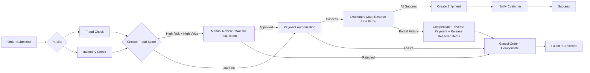
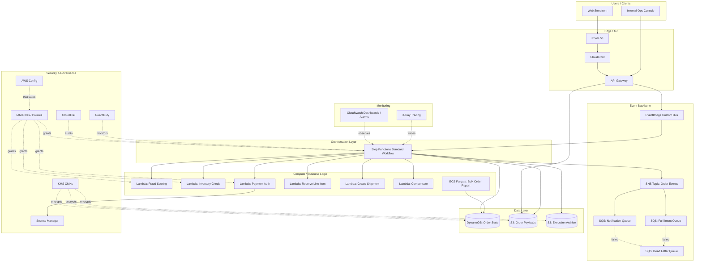

# Part IV – Serverless Architectures

# Chapter 28: Step Functions Workflow

---

## 1. Executive Summary

Enterprises running distributed systems eventually hit the same wall: business logic that once fit inside a single Lambda function or a single service now spans multiple services, multiple teams, and multiple failure domains. A payment has to be authorized, inventory has to be reserved, a shipping label has to be generated, a notification has to go out, and if any one of those steps fails, the whole chain has to be rolled back cleanly. When this orchestration logic is hand-rolled inside application code — chained Lambda invocations, custom retry loops, hand-written state stored in DynamoDB tables that nobody fully documented — it becomes one of the most expensive categories of technical debt an organization can accumulate.

AWS Step Functions exists to solve this exact problem. It is a fully managed, serverless orchestration service that lets architects define workflows as explicit state machines using Amazon States Language (ASL), a JSON-based declarative language. Instead of writing imperative "glue code" that invokes one Lambda function, waits for the result, decides what to do next, handles the timeout, and repeats, an architect defines the workflow as a graph of states — Task, Choice, Parallel, Map, Wait, Pass, Succeed, and Fail — and Step Functions executes, retries, and tracks that graph on your behalf.

This chapter is written for architects who already understand the pain of orchestration logic buried in application code, and who need a production-grade reference for designing, securing, deploying, and operating a Step Functions-based workflow architecture at enterprise scale.

**The business problem.**

Modern enterprise workloads are rarely a single request-response cycle. Consider a mortgage loan origination system, an insurance claims pipeline, an e-commerce order fulfillment process, a media transcoding pipeline, or a machine learning training pipeline. Each of these involves:

- Multiple discrete steps that must execute in a specific order, or in parallel where dependencies allow.
- Long-running operations that may take seconds, minutes, hours, or — in the case of human approval steps — days.
- The need for compensating transactions when a downstream step fails (the Saga pattern).
- Strict audit requirements: regulators and internal compliance teams need to know exactly what happened, when, and why.
- Retry semantics that differ per step: a transient network error should retry with backoff; a validation failure should not retry at all; a duplicate charge should never happen twice.

When these requirements are implemented as ad hoc code, the result is a distributed monolith disguised as microservices. Failure handling is inconsistent from one workflow to the next. There is no single place to see the state of an in-flight business transaction. On-call engineers reconstruct execution history by grepping CloudWatch Logs across a dozen Lambda functions. This is precisely the failure mode that orchestration platforms are designed to eliminate.

**Architecture objective.**

The objective of a Step Functions workflow architecture is to externalize control flow from business logic. Business logic — the code that calculates a price, validates an address, or calls a third-party payment gateway — lives in Lambda functions, ECS tasks, or other compute targets. Control flow — the sequencing, branching, retrying, parallelization, and error handling — lives declaratively in the state machine definition.

This separation delivers several concrete engineering outcomes:

1. **Visual, auditable workflows.** Every execution produces a full history: which state ran, what input it received, what output it produced, how long it took, and whether it succeeded or failed. This history is queryable via the API and console, and it can be exported for compliance evidence.
2. **Built-in retry and error handling.** Retry policies (exponential backoff, jitter, max attempts) and Catch blocks (routing to compensating logic) are configuration, not code. This eliminates an entire class of bugs where retry logic is copy-pasted (or forgotten) across services.
3. **Native parallelism and fan-out.** The Parallel state runs fixed branches concurrently; the Map state (including Distributed Map) fans out over a dataset — from a handful of items to hundreds of thousands — without the architect writing a custom worker pool.
4. **Long-running and human-in-the-loop workflows.** The `waitForTaskToken` integration pattern lets a workflow pause indefinitely — for a manual approval, a callback from a partner system, or a batch job that finishes hours later — without consuming compute or costing anything while it waits.
5. **Direct AWS service integration ("Service Integrations").** Step Functions can call over 220 AWS services directly from the state machine definition — starting a Glue job, running an ECS task, publishing to SNS, writing to DynamoDB — without an intermediating Lambda function. This reduces both cost and the number of components that can fail.

**Why organizations adopt this architecture.**

Enterprises typically arrive at Step Functions from one of three directions:

- **Refactoring a fragile Lambda-chaining architecture.** A team has Lambda A invoke Lambda B invoke Lambda C, often asynchronously via SNS/SQS, and has accumulated undocumented retry logic and duplicated error handling. Step Functions replaces this with an explicit, versioned workflow definition.
- **Building a new business-critical process from scratch.** Order management, claims processing, employee onboarding, ML pipelines, and data ETL pipelines are common greenfield use cases where the team wants auditability and resilience from day one.
- **Regulatory or audit pressure.** Financial services, healthcare, and insurance organizations frequently adopt Step Functions specifically because the execution history satisfies audit requirements (SOC 2, HIPAA, PCI-DSS evidence collection) that ad hoc logging cannot satisfy consistently.

**Major business benefits.**

| Benefit | Business Impact |
|---|---|
| Reduced mean time to resolution (MTTR) | Execution history shows exactly which state failed and why, cutting incident triage time from hours to minutes. |
| Reduced engineering maintenance cost | Retry/backoff/error handling is centralized configuration, not duplicated code across services. |
| Faster time to market for new workflows | New business processes are modeled as state machines in days, not weeks of custom orchestration code. |
| Built-in compliance evidence | Full execution history, including inputs/outputs (with sensitive data optionally redacted), supports audit requirements. |
| Pay-per-use pricing model | No idle orchestration servers; cost scales directly with transitions executed. |
| Reduced blast radius | A bug in one workflow's Task state does not require redeploying or restarting an orchestration server shared with other workflows. |

**Typical enterprise scenarios.**

- E-commerce order orchestration: inventory reservation, payment authorization, fraud check (parallel), shipping label generation, notification, with compensating "release inventory" logic on failure.
- Insurance claims processing: document intake, OCR/extraction (via Textract), fraud scoring, human adjuster review (`waitForTaskToken`), payout.
- Financial services loan origination: credit check, document verification, underwriting rules engine, manual approval for high-risk cases, disbursement.
- Media processing: video upload triggers a Distributed Map over rendition profiles, each transcoding via MediaConvert, followed by CDN invalidation and catalog update.
- Data engineering / ML pipelines: Glue ETL jobs, SageMaker training jobs, model evaluation, conditional deployment to production based on evaluation metrics.
- IT operations automation: patch orchestration across fleets, with approval gates and rollback on health-check failure.

This chapter presents a reference architecture built around an **enterprise order fulfillment and payment processing workflow**, since it exercises nearly every capability of Step Functions relevant to enterprise-scale design: sequential steps, parallel branches, a Distributed Map over line items, human approval for high-value orders, comprehensive error handling with compensating transactions, and full observability. The patterns described generalize directly to claims processing, loan origination, and data pipeline use cases.

> **Note:** Throughout this chapter, "Standard" and "Express" refer to the two Step Functions workflow types. Standard workflows are for long-running, auditable, at-most-once executions (up to one year); Express workflows are for high-volume, short-duration workloads (up to five minutes) with at-least-once semantics and CloudWatch Logs-based history instead of the full execution history API. Choosing between them is one of the first and most consequential decisions in this architecture, covered in detail in Section 4 and Section 28 (Alternatives).

---

## 2. Business Requirements

### 2.1 Business Drivers

- Eliminate order-processing failures caused by untracked partial completions (e.g., payment captured but inventory never reserved).
- Provide a single, queryable source of truth for "where is order #12345 right now" across customer support, operations, and engineering teams.
- Support a growing catalog of fulfillment partners and payment providers without rewriting core orchestration logic for each.
- Meet audit requirements from PCI-DSS (payment handling) and SOC 2 (change management, access control, logging).
- Reduce the operational burden on the on-call engineering team, currently paged for orchestration failures 15–20 times per week.

### 2.2 Functional Requirements

- Accept an order submission event and execute, in order: fraud check (parallel with inventory check), payment authorization, inventory reservation, shipment creation, customer notification.
- For orders above a configurable value threshold, insert a manual fraud-review approval step before payment capture.
- Support partial order fulfillment (some line items ship now, others backordered) via a Distributed Map over line items.
- Automatically compensate (release inventory, reverse authorization) when any downstream step fails irrecoverably.
- Expose workflow status via an API for internal dashboards and customer-facing order tracking.
- Retry transient failures (network timeouts, throttling from third-party gateways) automatically; do not retry business validation failures (e.g., invalid address).

### 2.3 Non-Functional Requirements

| Category | Requirement |
|---|---|
| Scalability | Support 50,000 order executions/day at launch, scaling to 500,000/day within 18 months, with burst capacity of 5,000 orders/minute during flash sales. |
| Availability | 99.95% monthly availability for the orchestration layer. |
| Latency | End-to-end orchestration overhead (excluding third-party payment gateway latency) under 3 seconds for the happy path. |
| Compliance | PCI-DSS SAQ-D controls for cardholder data handling; SOC 2 Type II evidence for change management and access logging. |
| Security | No cardholder data (PAN) stored in Step Functions execution input/output; tokenized payment references only. |
| Recovery | RPO of 0 for order state (no order data loss); RTO of 15 minutes for orchestration layer following a regional impairment. |
| SLA | 99.9% of orders reach a terminal state (fulfilled, backordered, or cancelled) within 24 hours of submission. |

### 2.4 Scalability Goals

- Standard workflow executions scale automatically; no capacity planning required for the state machine itself.
- Downstream integrations (Lambda concurrency, DynamoDB throughput, payment gateway rate limits) must be provisioned and monitored independently, since these — not Step Functions — are the actual bottlenecks in practice.
- Distributed Map must handle order baskets with up to 10,000 line items (e.g., B2B bulk orders) without custom sharding logic.

### 2.5 Availability Requirements

- Step Functions itself is a regional, multi-AZ managed service with an AWS-published SLA; the architecture must additionally ensure that every downstream dependency (Lambda, DynamoDB, SNS/SQS, third-party APIs) is deployed with equivalent multi-AZ resilience, since the workflow is only as available as its least available Task target.

### 2.6 Latency Requirements

- State transitions in Standard workflows are not designed for sub-100ms latency workloads; they are optimized for durability and auditability of business transactions measured in seconds to minutes.
- Express workflows are used where sub-second per-execution overhead matters (see Section 4).

### 2.7 Compliance Requirements

- PCI-DSS: payment card data must never appear in Step Functions execution input, output, or CloudWatch Logs. Only tokenized references (from the payment gateway or a PCI-compliant vault) travel through the state machine.
- SOC 2: every change to the state machine definition must go through a reviewed, version-controlled Terraform pull request; execution history must be retained for a minimum of 400 days for audit sampling.

### 2.8 Security Expectations

- Least-privilege IAM roles scoped per state machine and, where practical, per Task state.
- All data at rest (execution history, associated DynamoDB tables, S3 artifacts) encrypted with customer-managed KMS keys.
- All network calls to downstream services either stay within the AWS network backbone (service integrations) or traverse VPC endpoints / PrivateLink where third-party connectivity requires it.

### 2.9 Recovery Objectives

| Metric | Target | Rationale |
|---|---|---|
| RPO | 0 | Order and payment state must never be lost; DynamoDB with point-in-time recovery and cross-region replication backs all persisted state. |
| RTO | 15 minutes | Orchestration layer must resume processing new orders within 15 minutes of a regional impairment via a warm-standby region. |

### 2.10 SLAs

- 99.9% of submitted orders reach a terminal state within 24 hours.
- 99.99% of orders that fail are compensated (inventory released, authorization reversed) within 5 minutes of failure detection — this is a stronger internal SLA than the customer-facing SLA, because compensation failures directly cause financial and inventory discrepancies.

### 2.11 Expected Workload and Growth

- Launch: 50,000 orders/day, average basket of 3 line items, 5% of orders requiring manual fraud review.
- Year 1: 150,000 orders/day.
- Year 2: 500,000 orders/day, with international expansion requiring multi-region active-active fulfillment orchestration.

---

## 3. Architecture Overview

### 3.1 Overall Design

The architecture is an **event-driven, orchestrated microservices workflow**. An order submission event (from an API Gateway-fronted order service, or from an EventBridge event bus) starts a Step Functions Standard workflow execution. The state machine coordinates calls to Lambda functions, direct AWS service integrations (DynamoDB, SNS), and — for the fraud-review approval step — a callback pattern that pauses execution until a human reviewer acts through an internal tool.

### 3.2 Architecture Philosophy

Three design principles govern every decision in this chapter:

1. **Orchestration and business logic are strictly separated.** The state machine definition contains no business logic — no pricing calculations, no fraud scoring algorithms. It contains only sequencing, branching, retry policy, and error routing. Business logic lives in Lambda functions and ECS tasks that are independently testable outside of Step Functions.
2. **Every failure path is a first-class citizen, not an afterthought.** Every Task state has an explicit `Retry` and `Catch` block. There is no implicit "let it throw and see what happens" — the reference architecture defines what "failure" means for each step and what compensating action follows.
3. **Idempotency is mandatory, not optional.** Because Standard workflows are at-most-once but any individual Task can be retried, and because the entire architecture must survive process restarts and duplicate deliveries at the edges (API Gateway, SQS), every Task target is designed to be idempotent using an idempotency key derived from the order ID and step name.

### 3.3 Core Components

- **API Gateway (or ALB)** — accepts order submissions from the storefront and internal systems.
- **EventBridge** — decouples order submission from workflow start; also used to route workflow completion/failure events to downstream consumers (analytics, notification service).
- **Step Functions (Standard workflow)** — the orchestration core described in this chapter.
- **Lambda functions** — implement fraud scoring, payment gateway calls, notification formatting.
- **DynamoDB** — stores order state, idempotency records, and the manual-review queue.
- **SNS/SQS** — fan out notifications and decouple downstream consumers from the workflow.
- **Amazon S3** — stores large payloads (order documents, generated shipping labels) that exceed the 256KB Step Functions payload limit, referenced by pointer from the execution input/output (the "claim check" pattern).
- **CloudWatch, X-Ray, CloudTrail** — observability and audit.
- **KMS, Secrets Manager** — encryption and credential management for third-party payment gateway integration.

### 3.4 How Components Interact

The order service publishes an `OrderSubmitted` event to EventBridge. An EventBridge rule targets Step Functions directly (`StartExecution` integration), passing the order ID and a pointer to the full order payload in S3 (not the payload itself, to stay well under state machine payload limits and to avoid ever putting PII/PAN in execution history unnecessarily). The state machine then executes fraud check and inventory check in parallel, branches on fraud score and order value, calls the payment gateway Lambda, fans out over line items with a Distributed Map for warehouse-specific reservation, and finally emits a completion event back to EventBridge for downstream consumption (analytics, customer notification, fulfillment center integration).

### 3.5 High-Level Workflow



### 3.6 Request Lifecycle

1. Client submits order via API Gateway.
2. Order service validates and persists the order, writes the full payload to S3, and publishes `OrderSubmitted` to EventBridge.
3. EventBridge rule starts a Step Functions execution with `{ orderId, s3PayloadPointer }` as input.
4. State machine executes as described above, calling Lambda and native service integrations.
5. On completion (success or failure), the workflow emits an event to EventBridge, which fans out to notification, analytics, and fulfillment systems.

### 3.7 Response Lifecycle

- Synchronous callers (the storefront checkout API) do not wait for the workflow to complete; they receive an immediate "order accepted" response with an order ID, and poll or subscribe (via WebSocket/AppSync subscription backed by DynamoDB Streams) for status updates.
- This decoupling is essential: fraud review can pause the workflow for hours, and no HTTP client should hold a connection open that long.

### 3.8 Data Lifecycle

- Order payload: written once to S3 at submission, read by Task states as needed, never duplicated into execution history in full.
- Order state: DynamoDB table updated by each Task state via a "checkpoint" Lambda or direct DynamoDB service integration, giving external systems a real-time view without needing to query Step Functions execution history directly.
- Execution history: retained by Step Functions per the workflow type's default (Standard workflows retain execution history for 90 days via the API; long-term audit retention is achieved by streaming execution events to CloudWatch Logs and then to S3/Athena, retained per the compliance retention policy of 400+ days).

---

## 4. AWS Services Used

### 4.1 AWS Step Functions

**Purpose:** Serverless workflow orchestration using Amazon States Language. Coordinates the sequence, branching, parallelism, and error handling of a multi-step business process.

**Why selected:** Native AWS integration (220+ services callable directly without Lambda), built-in retry/backoff, built-in audit trail (execution history), native support for long-running human-in-the-loop steps via `waitForTaskToken`, and a visual workflow representation that both engineers and business stakeholders can review.

**Alternatives:** Apache Airflow (self-managed or via MWAA), Temporal (self-hosted or Temporal Cloud), Camunda, custom SQS/Lambda chaining. See Section 28 for a full comparison.

**Limitations:**
- Standard workflow payload size limited to 256KB per state (use the S3 claim-check pattern for larger payloads).
- Standard workflow execution history retained 90 days via API (must export for longer retention).
- Express workflows lose per-execution granular history in the console/API; history lives only in CloudWatch Logs.
- Map state (classic, non-distributed) is limited to 40 concurrent iterations by default and is not suited to very large fan-outs; use Distributed Map for that.
- State transitions have a small non-zero latency (typically tens of milliseconds), making Standard workflows unsuitable for latency-critical synchronous request paths.

**Pricing considerations:** Standard workflows are billed per state transition (~$0.025 per 1,000 transitions as of this writing — always confirm current pricing). Express workflows are billed per execution duration and memory, similar to Lambda's billing model, and are dramatically cheaper for high-volume, short workflows. A workflow executing 500,000 orders/day with ~15 transitions each is a meaningfully different cost profile as Standard vs. Express — this is modeled in Section 16.

**Best practices:** Keep state machine definitions in version control as Terraform-managed ASL JSON/YAML; never hand-edit in the console for production state machines; use `Parameters`/`ResultSelector`/`ResultPath` to keep payloads minimal at each state rather than accumulating the entire history in the execution input.

### 4.2 AWS Lambda

**Purpose:** Executes the business logic invoked by Task states — fraud scoring, payment gateway calls, notification formatting, data transformation between states.

**Why selected:** Pay-per-invocation pricing matches the event-driven nature of the workflow; no servers to manage; native Step Functions integration including the optimized synchronous invocation pattern.

**Alternatives:** ECS Fargate tasks (for longer-running or higher-memory business logic beyond Lambda's 15-minute/10GB limits), Batch (for large compute-bound jobs like bulk fraud model scoring).

**Limitations:** 15-minute maximum execution duration, cold start latency (mitigated with Provisioned Concurrency for latency-sensitive Task states), 10GB memory ceiling.

**Pricing considerations:** Billed per invocation and GB-second of execution; at 500,000 orders/day with 4–5 Lambda invocations per order, this is a material cost line modeled in Section 16.

**Best practices:** One Lambda function per discrete responsibility (not one giant "orchestrator Lambda" — that defeats the purpose of using Step Functions at all); externalize configuration to Parameter Store; make every function idempotent using an idempotency key.

### 4.3 Amazon DynamoDB

**Purpose:** Stores order state (a read-optimized "current status" projection separate from Step Functions execution history), idempotency records, and the manual fraud-review queue.

**Why selected:** Single-digit-millisecond latency at any scale, native DynamoDB Streams for real-time status propagation to customer-facing systems, on-demand capacity mode eliminates capacity planning for spiky order volume.

**Alternatives:** Aurora Serverless v2 (if the team needs relational joins across order data for reporting — typically better served by exporting to a data warehouse instead).

**Limitations:** 400KB item size limit (order documents live in S3, referenced by pointer); eventually consistent reads by default (use strongly consistent reads for the idempotency check).

**Pricing considerations:** On-demand mode simplifies operations but costs more per request than provisioned mode with Application Auto Scaling at steady, predictable volumes — reassess mode choice once traffic patterns stabilize post-launch.

**Best practices:** Single-table design for order state and idempotency records to minimize the number of tables and simplify IAM scoping; enable point-in-time recovery; use conditional writes (`ConditionExpression`) for idempotency enforcement, not application-side "check then write" logic.

### 4.4 Amazon S3

**Purpose:** Stores full order payloads, generated shipping labels, and any artifact that exceeds Step Functions' 256KB per-state payload limit (the "claim check" pattern).

**Why selected:** Durable, cheap, and the de facto standard for large-payload handoff in serverless architectures.

**Alternatives:** None practical at this scale; EFS is occasionally used for shared file access within ECS-based Task targets but is unnecessary here.

**Limitations:** Not a database; do not use S3 as a substitute for DynamoDB's query capabilities.

**Pricing considerations:** Negligible at this workload's payload sizes; lifecycle policies transition older order archives to S3 Glacier Instant Retrieval after 90 days to control long-term storage cost.

**Best practices:** Server-side encryption with a customer-managed KMS key; bucket policies restricting access to the specific IAM roles used by the workflow's Lambda functions; S3 Object Lock for immutable compliance archives where regulation requires it.

### 4.5 Amazon SNS / SQS

**Purpose:** SNS fans out order completion/failure events to multiple independent consumers (customer notification service, analytics pipeline, fulfillment center integration); SQS provides a durable buffer in front of any consumer that cannot process events as fast as they are produced (e.g., a third-party fulfillment partner's rate-limited API).

**Why selected:** Decouples the workflow's completion from the availability and throughput of downstream consumers — a slow or temporarily unavailable analytics pipeline must never block or fail the order workflow itself.

**Alternatives:** EventBridge alone can perform simple fan-out via rules, but SNS+SQS is preferred here because several consumers need guaranteed at-least-once delivery with dead-letter queue semantics that are more mature and explicit in SQS.

**Limitations:** SNS message size limit of 256KB (again, use S3 claim-check for larger payloads); SQS visibility timeout must be tuned relative to consumer processing time to avoid duplicate processing.

**Pricing considerations:** Negligible relative to Lambda and Step Functions costs at this scale.

**Best practices:** Every SQS queue has a configured dead-letter queue (DLQ) with a CloudWatch alarm on `ApproximateNumberOfMessagesVisible` for the DLQ, since a growing DLQ is almost always a silent production failure in progress.

### 4.6 Amazon EventBridge

**Purpose:** Decouples order submission from workflow start, and workflow completion from downstream consumers; also used as the central event bus for cross-team integrations (fulfillment centers, external logistics partners).

**Why selected:** Native `StartExecution` target support (no Lambda glue needed to start a workflow from an event), content-based filtering via event patterns, and a natural fit for an event-driven enterprise integration strategy beyond just this one workflow.

**Alternatives:** Direct SDK `StartExecution` calls from the order service; simpler for a single producer/consumer relationship but loses the decoupling benefit as more systems need to react to order events.

**Limitations:** Event size limit of 256KB; at-least-once delivery (design consumers, including the Step Functions start, to be idempotent — Step Functions supports an execution name derived from the order ID specifically to make `StartExecution` idempotent).

**Pricing considerations:** Billed per event published; negligible compared to compute costs at this scale.

**Best practices:** Use a dedicated custom event bus (not the default bus) for order domain events, with clearly versioned event schemas registered in the EventBridge Schema Registry.

### 4.7 IAM, KMS, Secrets Manager, CloudWatch, CloudTrail, AWS Config, GuardDuty

These cross-cutting services are covered in depth in Sections 10, 11, 21, and 22. In summary:

- **IAM** provides least-privilege execution roles for the state machine and each Lambda function.
- **KMS** encrypts DynamoDB tables, S3 buckets, SNS topics, and Step Functions execution data at rest with customer-managed keys.
- **Secrets Manager** stores third-party payment gateway API credentials, rotated automatically, and never embedded in Lambda environment variables in plaintext.
- **CloudWatch** provides metrics, logs, dashboards, and alarms for the state machine and every Task target.
- **CloudTrail** provides an immutable audit log of every API call made against the state machine (who started an execution, who updated the definition, who sent a task success/failure token).
- **AWS Config** continuously evaluates whether IAM roles, KMS key policies, and S3 bucket policies remain compliant with the organization's security baseline.
- **GuardDuty** monitors for anomalous behavior (e.g., unusual API calls against the Step Functions or DynamoDB APIs that could indicate compromised credentials).

Services explicitly **not** used in this architecture, and why: EC2/ALB are not part of the core orchestration path (no long-running servers needed for orchestration itself, though ECS Fargate tasks may appear as Task targets for specific heavy business logic); RDS/Aurora is not used for order state (DynamoDB's access pattern fits better; a relational store is used downstream only for BI/reporting, out of scope for this chapter); Route53 and CloudFront are part of the storefront's edge architecture, not the orchestration layer itself, and are only briefly noted where relevant.

---

## 5. Complete Architecture Diagram



> **Tip:** Keep this diagram in the repository alongside the Terraform code (e.g., as a `.mmd` file rendered in the README) so that architecture and infrastructure-as-code never drift apart during reviews.

---

## 6. Component-by-Component Explanation

### 6.1 Step Functions Standard Workflow (Orchestrator)

- **Purpose:** Central control-flow engine for the order fulfillment process.
- **Responsibilities:** Sequencing, branching (Choice), parallelism (Parallel/Map), retries, error routing (Catch), timeout enforcement, execution history generation.
- **Inputs:** `{ orderId, s3PayloadPointer, orderValue, customerId }` from EventBridge.
- **Outputs:** Final execution status plus an output event published back to EventBridge (`OrderFulfilled`, `OrderCancelled`, `OrderPartiallyFulfilled`).
- **Scaling:** Fully managed; AWS scales the underlying execution fleet transparently. No capacity to provision.
- **High availability:** Regional service, backed by multiple Availability Zones internally; no architect action required beyond ensuring downstream Task targets are equally multi-AZ.
- **Failure handling:** Every Task state has explicit `Retry` (transient errors) and `Catch` (business/permanent errors) blocks routing to a common `CompensateAndFail` branch.
- **Dependencies:** Lambda, DynamoDB, SNS, S3, IAM.
- **Security:** Executes under a dedicated IAM role scoped to only the specific Lambda ARNs, DynamoDB table, and SNS topic it needs — never `lambda:InvokeFunction` on `*`.
- **Monitoring:** CloudWatch metrics (`ExecutionsFailed`, `ExecutionsTimedOut`, `ExecutionThrottled`), X-Ray tracing enabled for end-to-end latency breakdown across Task targets.

### 6.2 Lambda: Fraud Scoring

- **Purpose:** Calls an internal or third-party fraud scoring model and returns a risk score.
- **Inputs:** Order ID, customer ID, order value, shipping/billing address mismatch flags.
- **Outputs:** `{ riskScore, riskFlags }`.
- **Scaling:** Reserved concurrency set to protect the fraud model API from being overwhelmed during flash sales.
- **Failure handling:** Retries on `ProvisionedThroughputExceededException`/timeouts with exponential backoff; a hard failure after retries routes to manual review rather than blocking the order indefinitely.
- **Security:** No PAN data; only tokenized customer references.

### 6.3 Lambda: Inventory Check / Reservation

- **Purpose:** Confirms stock availability and reserves inventory per line item (invoked inside the Distributed Map).
- **Idempotency:** Uses a conditional DynamoDB write keyed on `orderId#lineItemId` to guarantee a retried invocation never double-reserves stock.
- **Failure handling:** Insufficient stock is a business failure (Catch → backorder branch), not a retryable error.

### 6.4 Lambda: Payment Authorization

- **Purpose:** Calls the third-party payment gateway to authorize (not capture) funds.
- **Security:** Payment gateway credentials retrieved from Secrets Manager at cold start and cached; PAN never touches this function — only a payment-method token created client-side by the storefront's PCI-scoped tokenization flow.
- **Failure handling:** Gateway timeouts retry with backoff; explicit decline responses are a business failure routed to cancellation, never retried (retrying a decline can trigger fraud-prevention lockouts at the gateway).

### 6.5 Distributed Map: Reserve Line Items

- **Purpose:** Fans out inventory reservation across all line items in the order, potentially across multiple fulfillment warehouses, with per-item success/failure tracked independently.
- **Scaling:** Distributed Map supports up to 10,000 concurrent child workflow executions, reading input directly from S3 (a JSON array or a manifest of Amazon S3 objects) rather than requiring the entire item list to fit in the state input.
- **Failure handling:** `ToleratedFailurePercentage` allows the Map to proceed to shipment creation for partially fulfilled orders (e.g., 9 of 10 items reserved), routing the failed item(s) to a backorder compensation path rather than failing the entire order.

### 6.6 Compensation (Saga) Lambda

- **Purpose:** Reverses payment authorization and releases reserved inventory when any downstream step fails irrecoverably.
- **Responsibilities:** Implements the Saga pattern's compensating transaction; must itself be idempotent and retried aggressively since a failed compensation is worse than a failed forward transaction (it leaves the system in an inconsistent, revenue-impacting state).

---

## 7. End-to-End Request Flow

1. **Client submits order** via the storefront checkout UI, which calls API Gateway.
2. **API Gateway** invokes the order-intake Lambda, which validates the request schema and rejects malformed input immediately (fail fast, before any orchestration cost is incurred).
3. **Order-intake Lambda** persists the full order payload to **S3** and writes an initial `SUBMITTED` record to **DynamoDB**.
4. **Order-intake Lambda** publishes an `OrderSubmitted` event to the **EventBridge** custom bus.
5. **EventBridge rule** matches the event pattern and starts a **Step Functions** execution, using the order ID as the execution name for idempotency (a duplicate event with the same order ID will not start a second, conflicting execution).
6. **Parallel state** invokes fraud scoring and inventory check Lambdas concurrently.
7. **Choice state** evaluates the combined fraud score and order value: high-risk/high-value orders branch to manual review; all others proceed directly.
8. **(Conditional) Manual review:** the workflow calls a Task with the `waitForTaskToken` pattern, writing a record to a review queue in DynamoDB. An ops team member reviews via the internal console and calls `SendTaskSuccess`/`SendTaskFailure` with the token, resuming the workflow — potentially hours later, at zero compute cost while paused.
9. **Payment Authorization Lambda** is invoked; on success, execution proceeds; on decline, execution routes directly to compensation/cancellation.
10. **Distributed Map** fans out over line items, invoking the reservation Lambda per item, tracking success/failure per item, and tolerating a configured percentage of item-level failures without failing the whole order.
11. **Choice state** evaluates the Map's aggregate result: fully reserved orders proceed to shipment creation; partially reserved orders proceed to a "partial fulfillment" branch that both creates a shipment for the successful items and creates backorder records for the failed items.
12. **Create Shipment Lambda** calls the fulfillment/logistics service and generates a shipping label, storing the label PDF in S3 and writing the tracking number to DynamoDB.
13. **Notification Lambda** publishes a customer-facing notification event to **SNS**, which fans out to email/SMS/push notification consumers via SQS.
14. **Workflow completes**, emitting a final `OrderFulfilled`/`OrderPartiallyFulfilled`/`OrderCancelled` event to EventBridge for analytics and downstream systems.
15. **On any unrecoverable error** at any step, the workflow routes to the compensation branch: reverse payment authorization (if captured), release any reserved inventory, write a `CANCELLED` status to DynamoDB, and notify the customer of cancellation.
16. **Logging and monitoring:** every state transition is recorded in Step Functions execution history; CloudWatch Logs capture Lambda-level logs; X-Ray traces the full path including downstream HTTP calls to the payment gateway, giving a single trace ID that ties an order's entire journey together for troubleshooting.

---

## 8. Deployment Flow

### 8.1 Infrastructure Provisioning

All infrastructure — the state machine definition, IAM roles, Lambda functions, DynamoDB tables, EventBridge rules, SNS/SQS resources — is provisioned via Terraform. The state machine's ASL definition is authored as a Terraform-templated JSON file (`aws_sfn_state_machine.definition`), never edited directly in the AWS Console for any environment above `dev`.

### 8.2 Terraform Workflow

1. Engineer opens a pull request modifying the state machine definition, a Lambda function, or supporting infrastructure.
2. CI pipeline runs `terraform fmt -check`, `terraform validate`, `tflint`, and a policy-as-code check (Open Policy Agent / Sentinel) enforcing tagging standards and IAM least-privilege rules.
3. CI pipeline runs `terraform plan` and posts the plan as a PR comment for human review.
4. On approval and merge, CI runs `terraform apply` against the target environment using a scoped CI/CD IAM role (never a human's long-lived credentials).

### 8.3 CI/CD Deployment

- Environments: `dev` → `staging` → `prod`, each in a separate AWS account under AWS Organizations, each with its own Terraform state file in a remote backend (S3 + DynamoDB lock table).
- State machine definitions are deployed to `staging` first, exercised by an automated integration test suite that starts real executions against staging Task targets (using sandboxed payment gateway credentials) and asserts on execution history.

### 8.4 Blue-Green Deployment for the State Machine

Step Functions does not have a native "blue-green" primitive for a single state machine resource, so the pattern used is **versioned state machines with alias-based routing at the invocation layer**:

- Each deployment creates a new state machine resource (or uses Step Functions' built-in versions/aliases feature) rather than mutating the existing one in place while executions are in flight.
- EventBridge rules target a **Step Functions alias** that points to the current "active" version; a deployment updates the alias's weighted routing to shift traffic gradually (e.g., 10% → 50% → 100%) to the new version.
- In-flight executions on the previous version continue running to completion unaffected — this matters enormously for Standard workflows, since an order's workflow might legitimately be paused for hours awaiting manual review, and it must not be silently orphaned by a definition change.

### 8.5 Rollback

- Because the previous state machine version remains addressable, rollback is simply shifting the alias's routing weight back to 100% on the previous version — no destructive operation, no data migration required.
- Terraform state for the previous version is retained (not destroyed) for at least one full release cycle specifically to support this rollback path.

### 8.6 Secrets

- Payment gateway API keys, database credentials, and any third-party API tokens are stored in Secrets Manager, referenced by ARN in Lambda environment configuration (resolved at runtime via the Secrets Manager Lambda extension/cache, not baked into deployment artifacts).
- Terraform never contains secret values in plaintext; secrets are created out-of-band (via a bootstrap script or manually with restricted IAM) and referenced by ARN only.

### 8.7 Configuration

- Non-secret configuration (feature flags, thresholds like the manual-review order-value cutoff) lives in Systems Manager Parameter Store, read by Lambda functions at invocation and cached with a short TTL, so operational thresholds can be tuned without a full deployment.

### 8.8 Validation

- Post-deployment smoke tests run a small number of synthetic order executions through the new state machine version in `prod` behind a feature flag/canary before the alias routing is shifted to 100%, asserting execution status and latency against defined thresholds.

---

## 9. Network Topology

Although Step Functions itself is a fully managed, serverless service with no VPC resources of its own to place, several components in this architecture require deliberate network design:

- **Lambda functions in a VPC:** Only the Lambda functions that must reach VPC-only resources (e.g., an internal RDS instance used for BI, or a third-party payment gateway reachable only via a VPN/Direct Connect-attached private endpoint) run inside a VPC. Functions with no such dependency (most of the fraud/inventory/notification logic, which only call AWS service APIs) are deliberately kept **outside** a VPC to avoid ENI cold-start latency and NAT Gateway costs — a common and costly anti-pattern is placing every Lambda in a VPC "for consistency" when it provides no security benefit and materially increases cost and latency.
- **VPC:** A dedicated VPC (`10.20.0.0/16`) hosts only the subset of Lambda functions and any ECS Fargate tasks that need private connectivity.
- **CIDR allocation:** `/16` VPC subdivided into `/20` public and private subnets across three Availability Zones for redundancy.
- **Public subnets:** Host NAT Gateways only (one per AZ for high availability); no application compute in public subnets.
- **Private subnets:** Host VPC-enabled Lambda ENIs and ECS Fargate tasks.
- **NAT Gateway:** Provides outbound internet access for VPC-enabled Lambda functions that must call the third-party payment gateway over the public internet (in addition to, or instead of, a private connection).
- **Internet Gateway:** Attached for the public subnets' NAT Gateway egress path.
- **Transit Gateway:** Used if the payment gateway or fulfillment partner is reachable via a Direct Connect/VPN-attached on-premises or partner network, centralizing routing across multiple VPCs and accounts under AWS Organizations.
- **Route Tables:** Private subnet route tables direct `0.0.0.0/0` to the NAT Gateway in the same AZ (avoiding cross-AZ NAT traffic and its associated cost and latency).
- **Network ACLs:** Baseline stateless filtering at the subnet boundary, primarily as defense-in-depth rather than primary access control.
- **Security Groups:** VPC-enabled Lambda functions have a security group permitting only outbound HTTPS (443) to the specific payment gateway CIDR/prefix list, denying all other outbound traffic by default.
- **VPC Endpoints (Gateway and Interface):** Gateway endpoints for S3 and DynamoDB, and Interface endpoints (PrivateLink) for Secrets Manager, KMS, and Step Functions itself where VPC-enabled Lambda functions need to call these APIs without traversing the NAT Gateway/public internet — this both reduces NAT Gateway data-processing cost and keeps traffic on the AWS backbone for security and compliance.
- **Hybrid connectivity:** If the fulfillment/logistics partner requires a private network path, a Direct Connect connection (or Site-to-Site VPN as a lower-cost/interim option) terminates into the Transit Gateway, with routes propagated only to the specific private subnets that need reachability.

> **Warning:** A frequent and costly mistake is placing Lambda functions in a VPC "by default" across an entire serverless architecture. Every VPC-enabled Lambda function that only calls AWS service APIs (DynamoDB, S3, SNS, Step Functions itself) gains no security benefit from VPC placement — those APIs are reached over the AWS backbone regardless — while incurring NAT Gateway costs, additional ENI cold-start latency, and additional operational complexity (security group and route table management) for zero benefit. Reserve VPC placement for the specific functions that must reach a private, non-AWS-API resource.

---

## 10. Identity and Access

### 10.1 IAM Roles

Each state machine has its own execution role, scoped to precisely the Task targets it invokes:

```hcl

resource "aws_iam_role" "sfn_order_orchestrator" {
  name = "sfn-order-orchestrator-role"

  assume_role_policy = jsonencode({
    Version = "2012-10-17"
    Statement = [{
      Effect    = "Allow"
      Principal = { Service = "states.amazonaws.com" }
      Action    = "sts:AssumeRole"
    }]
  })
}

resource "aws_iam_role_policy" "sfn_order_orchestrator_policy" {
  name = "sfn-order-orchestrator-policy"
  role = aws_iam_role.sfn_order_orchestrator.id

  policy = jsonencode({
    Version = "2012-10-17"
    Statement = [
      {
        Sid      = "InvokeSpecificLambdas"
        Effect   = "Allow"
        Action   = "lambda:InvokeFunction"
        Resource = [
          aws_lambda_function.fraud_scoring.arn,
          aws_lambda_function.inventory_check.arn,
          aws_lambda_function.payment_auth.arn,
          aws_lambda_function.reserve_line_item.arn,
          aws_lambda_function.create_shipment.arn,
          aws_lambda_function.compensate.arn
        ]
      },
      {
        Sid      = "DynamoDBOrderState"
        Effect   = "Allow"
        Action   = ["dynamodb:PutItem", "dynamodb:UpdateItem", "dynamodb:GetItem"]
        Resource = [aws_dynamodb_table.order_state.arn]
      },
      {
        Sid      = "PublishOrderEvents"
        Effect   = "Allow"
        Action   = "events:PutEvents"
        Resource = [aws_cloudwatch_event_bus.order_events.arn]
      },
      {
        Sid      = "DistributedMapS3Access"
        Effect   = "Allow"
        Action   = ["s3:GetObject", "s3:ListBucket"]
        Resource = [
          aws_s3_bucket.order_payloads.arn,
          "${aws_s3_bucket.order_payloads.arn}/*"
        ]
      },
      {
        Sid      = "XRayTracing"
        Effect   = "Allow"
        Action   = ["xray:PutTraceSegments", "xray:PutTelemetryRecords"]
        Resource = "*"
      }
    ]
  })
}

```

### 10.2 IAM Policies

- No policy uses `Resource: "*"` for `lambda:InvokeFunction`, `dynamodb:*`, or any data-plane action against a specific resource type where the ARN is known ahead of deployment.
- `xray:PutTraceSegments` requires `Resource: "*"` per AWS's own documented requirement for the X-Ray API — this is one of the few justified wildcard exceptions and should be commented as such in the Terraform code for future reviewers.

### 10.3 Resource Policies

- The `order_payloads` S3 bucket policy explicitly denies any principal outside the AWS account and the specific Lambda execution roles from reading order payload objects, as defense-in-depth beyond IAM alone.
- The EventBridge custom bus resource policy restricts `PutEvents` to the order-intake Lambda's role and to specific partner accounts (if cross-account event publishing from a fulfillment partner is required).

### 10.4 STS and Cross-Account Access

- If the fulfillment partner operates in a separate AWS account (common after an acquisition or with a dedicated "fulfillment" sub-account under AWS Organizations), a cross-account IAM role with a trust policy scoped to the specific source account and an external ID is used, assumed via STS `AssumeRole` from the `Create Shipment` Lambda — never long-lived cross-account access keys.

### 10.5 Least Privilege

- Every IAM role in this architecture is generated and reviewed against an Access Analyzer policy validation check in CI, catching overly permissive statements (e.g., accidental `Resource: "*"`) before merge.

### 10.6 Service Roles

- The Step Functions execution role (Section 10.1) is distinct from each Lambda function's own execution role — a common confusion is assuming Step Functions needs to grant Lambda the permissions Lambda needs to do its own work (e.g., a Lambda calling DynamoDB itself needs its own role with that permission; the Step Functions role only needs `lambda:InvokeFunction` on that function's ARN).

### 10.7 Permission Boundaries

- All roles created for this workload are constrained by an organization-wide IAM permission boundary that caps the maximum permissions any workload-created role can ever have (e.g., prohibiting `iam:*`, `organizations:*`, and account-level billing actions regardless of what the role's own policy says), providing a backstop against a misconfigured Terraform module accidentally granting excessive access.

---

## 11. Security Architecture

### 11.1 Encryption

- **At rest:** DynamoDB (customer-managed KMS key), S3 (SSE-KMS with a customer-managed key, bucket-key enabled to reduce KMS request cost), SNS topics (KMS-encrypted), Step Functions execution data (Step Functions supports customer-managed KMS encryption of execution data for Standard workflows — enabled here specifically because PCI-DSS scope requires demonstrable control over encryption key management, not reliance on AWS-owned default keys).
- **In transit:** TLS 1.2+ enforced for all API calls (AWS SDK default), and for the third-party payment gateway connection specifically pinned to TLS 1.2+ with certificate validation, never disabled even in lower environments.

### 11.2 KMS

- A dedicated customer-managed KMS key (`order-workflow-cmk`) with a key policy restricting `kms:Decrypt` to the specific IAM roles used by this workload, and `kms:*` administrative actions restricted to the platform security team's role — application roles should never have KMS administrative permissions, only the specific `Encrypt`/`Decrypt`/`GenerateDataKey` actions they need.

### 11.3 TLS / Certificate Manager

- Public-facing API Gateway custom domain uses an ACM-issued certificate, auto-renewed; internal service-to-service calls within AWS rely on the AWS SDK's built-in TLS to service endpoints.

### 11.4 WAF / Shield

- API Gateway is fronted by AWS WAF with managed rule groups (SQL injection, known bad inputs) and a rate-based rule to blunt credential-stuffing/order-flooding attempts against the checkout endpoint before they ever generate a Step Functions execution (protecting both cost and downstream fraud-scoring capacity).
- AWS Shield Standard is active by default for the CloudFront distribution in front of the storefront; Shield Advanced is evaluated but not adopted initially given the workload's risk profile — reassessed if the organization becomes a specific target of sustained DDoS activity.

### 11.5 Secrets Manager

- Payment gateway credentials rotate automatically every 90 days via a Secrets Manager rotation Lambda coordinated with the gateway provider's API, eliminating the manual credential-rotation runbook that is one of the most commonly skipped security tasks in real organizations.

### 11.6 GuardDuty / Inspector / Security Hub

- GuardDuty monitors for anomalous IAM/API activity (e.g., unusual `StartExecution` volume from an unexpected source, or credential exfiltration patterns).
- Inspector scans any container images used by ECS Fargate Task targets for known vulnerabilities on every push to the container registry.
- Security Hub aggregates findings from GuardDuty, Inspector, and AWS Config into a single compliance dashboard mapped to PCI-DSS and CIS AWS Foundations Benchmark controls.

### 11.7 CloudTrail / AWS Config

- CloudTrail records every management-plane call against Step Functions (`CreateStateMachine`, `UpdateStateMachine`, `StartExecution`, `SendTaskSuccess`/`SendTaskFailure`) — this is the definitive audit source for "who approved this specific fraud review" questions.
- AWS Config rules continuously verify that the Step Functions state machine has logging enabled, that DynamoDB tables have point-in-time recovery and encryption enabled, and that no S3 bucket in the account is publicly accessible.

### 11.8 Zero Trust

- No implicit trust is granted based on network location alone; every service-to-service call is authenticated via IAM (SigV4) regardless of whether it originates inside or outside a VPC, and the payment gateway integration additionally uses mutual TLS where the provider supports it.

### 11.9 Threat Model

| Attack Vector | Mitigation |
|---|---|
| Compromised Lambda execution role credentials | Least-privilege IAM scoped per function; GuardDuty anomaly detection; short-lived credentials via the Lambda execution environment (no static keys). |
| Order-flooding / inventory-exhaustion attack | WAF rate-based rules at the API Gateway edge before an execution is even started; per-customer submission throttling. |
| Tampering with execution input to bypass fraud review | Order value and risk thresholds are re-validated server-side inside the workflow (not trusted from client-supplied input), and the Choice state's threshold is read from Parameter Store, not from the execution input itself. |
| Data exfiltration via execution history/logs | PAN and other sensitive fields are never included in state input/output; CloudWatch Logs field-level redaction is configured for any field pattern resembling card data as defense-in-depth. |
| Duplicate/replayed events causing double payment | Idempotency keys enforced via conditional DynamoDB writes at every Task that has an external side effect (payment capture, inventory reservation). |
| Insider risk — unauthorized manual review approval | `SendTaskSuccess` calls for the manual review Task are restricted via IAM to a specific internal-tool role, and CloudTrail logs the identity behind every approval for audit sampling. |

---

## 12. High Availability

- **AZ failures:** Step Functions, Lambda, DynamoDB, S3, SNS, and SQS are all inherently multi-AZ managed services; no explicit multi-AZ configuration is required for these beyond the default. The only components an architect must explicitly multi-AZ are self-managed resources — here, the NAT Gateways (one per AZ) and any ECS Fargate tasks (deployed across at least two AZs via the ECS service's placement configuration).
- **Instance failures:** Not applicable to the serverless components in this design; ECS Fargate tasks, if used for heavier reporting workloads, are managed by an ECS service with a minimum healthy percent that ensures failed tasks are replaced automatically.
- **Regional failures:** Addressed via the disaster recovery strategy in Section 13; a warm-standby state machine and supporting infrastructure exist in a secondary region.
- **Database failures:** DynamoDB global tables replicate order state to the secondary region continuously, so a regional failover does not lose in-flight order state (subject to replication lag, addressed by the RPO target in Section 2.9 with careful measurement of actual observed lag under load).
- **Load balancing:** Not applicable to Step Functions itself; API Gateway and ALB (for the storefront's own compute, if any) handle load balancing at the edge, out of scope for the orchestration layer itself.
- **Health checks:** Route 53 health checks monitor the API Gateway endpoint in each region and drive failover routing for the storefront's entry point; the orchestration layer's "health" is monitored via CloudWatch alarms on execution failure rate rather than a traditional health-check endpoint, since Step Functions has no compute to health-check directly.
- **Failover:** EventBridge rules in the secondary region are kept in a disabled state during normal operation and are enabled by the DR runbook (automated via a Lambda-backed custom resource triggered from a Route 53 health check failure, or manually by the incident commander, per the organization's risk tolerance) during an actual regional failover.

---

## 13. Disaster Recovery

### 13.1 Backup Strategy

- DynamoDB point-in-time recovery (PITR) is enabled on the order-state table, providing continuous backup with restore to any point in the preceding 35 days.
- S3 order payload and shipping-label buckets use versioning plus cross-region replication (CRR) to the DR region, protecting against both accidental deletion and regional impairment.

### 13.2 Snapshots

- In addition to PITR, a nightly on-demand DynamoDB backup is retained for 400+ days to satisfy the SOC 2 audit retention requirement independently of the 35-day PITR window.

### 13.3 Cross-Region Replication

- DynamoDB Global Tables replicate order state to the DR region in near real time.
- S3 CRR replicates order payloads and generated artifacts to a DR-region bucket with an equivalent KMS key and bucket policy.

### 13.4 DR Strategy Selection: Warm Standby

Of the four canonical DR strategies (Backup & Restore, Pilot Light, Warm Standby, Multi-Site Active-Active), this architecture uses **Warm Standby**:

- **Backup & Restore** is rejected: RTO of 15 minutes is not achievable if infrastructure must be provisioned from scratch during an incident.
- **Pilot Light** is rejected: while cheaper than Warm Standby, the additional time to scale up the state machine's supporting Lambda concurrency and validate the payment gateway's DR-region connectivity under incident pressure risks exceeding the 15-minute RTO.
- **Warm Standby** is selected: a fully deployed but traffic-disabled copy of the entire architecture (state machine, Lambda functions, EventBridge rules disabled, DynamoDB Global Table replica, S3 CRR target) exists continuously in the DR region. Failover is a matter of enabling EventBridge rules and updating Route 53 routing — both automatable within the RTO target — rather than provisioning infrastructure.
- **Multi-Site Active-Active** is deferred to the Year 2 international expansion phase (Section 14), where genuinely independent regional order processing (not just DR) becomes a business requirement rather than a resilience nice-to-have.

### 13.5 RPO / RTO Achieved

| Metric | Target | Achieved via |
|---|---|---|
| RPO | 0 | DynamoDB Global Tables (near-real-time replication) + S3 CRR; residual exposure limited to the replication lag window, monitored via `ReplicationLatency` CloudWatch metrics with an alarm if lag exceeds 30 seconds. |
| RTO | 15 minutes | Warm standby infrastructure pre-provisioned; failover automation (Route 53 health check-triggered Lambda) enables EventBridge rules and shifts DNS; DR game days validate this figure quarterly. |

> **Note:** A warm standby's DR is only as credible as its last tested failover. This architecture mandates a quarterly DR game day where the primary region's EventBridge rules are deliberately disabled in a controlled maintenance window and the DR region is promoted, with the observed RTO recorded and reviewed by the architecture review board.

---

## 14. Scalability

- **Horizontal scaling:** Step Functions Standard workflows scale executions horizontally with no architect intervention; the practical scaling ceiling in this architecture is the downstream Lambda concurrency and the third-party payment gateway's rate limits, not Step Functions itself.
- **Vertical scaling:** Not applicable to Step Functions; Lambda memory allocation is tuned per function based on profiling (higher memory also proportionally increases CPU, often reducing cost for CPU-bound functions despite the higher per-GB-second rate).
- **Auto Scaling:** DynamoDB on-demand mode auto-scales read/write capacity with traffic; if migrated to provisioned mode for cost reasons at steady state, DynamoDB Application Auto Scaling is configured with target utilization tracking.
- **Serverless scaling:** Lambda concurrency is managed via reserved concurrency (protecting the fraud-scoring and payment-gateway-calling functions from overwhelming external dependencies) and provisioned concurrency (for the fraud-scoring function specifically, to eliminate cold-start latency on the synchronous parallel branch).
- **Database scaling:** DynamoDB partition key design (`orderId` as partition key) distributes load evenly; a bulk B2B customer placing unusually large orders is handled by the Distributed Map's item-level fan-out rather than requiring special-casing in the table design.
- **Storage scaling:** S3 scales inherently; no architect action required beyond lifecycle policies for cost control (Section 16).
- **Queue scaling:** SQS scales inherently; the practical scaling concern is consumer throughput (the notification service's downstream email/SMS provider rate limits), addressed via SQS's natural buffering rather than by scaling SQS itself.

---

## 15. Performance Optimization

- **Caching:** Parameter Store values (fraud-review threshold, feature flags) are cached in Lambda execution environment memory with a short TTL to avoid a Parameter Store API call on every invocation.
- **Compression:** Not a significant factor for this workflow's payload sizes; more relevant to the storefront's own asset delivery (CloudFront), out of scope here.
- **CDN:** CloudFront serves the storefront's static assets and API responses where cacheable; irrelevant to the orchestration layer directly but reduces load on API Gateway that ultimately triggers workflow starts.
- **Database optimization:** DynamoDB access patterns are designed single-table, with GSIs supporting the specific query patterns needed (e.g., "all orders pending manual review," "all orders for customer X") rather than relying on scans.
- **Connection pooling:** Lambda functions calling the payment gateway reuse HTTP keep-alive connections across invocations by initializing the HTTP client outside the handler function body, avoiding a full TLS handshake on every invocation.
- **Concurrency:** The Parallel state (fraud + inventory check) and Distributed Map (line-item reservation) are the two primary concurrency mechanisms reducing end-to-end latency versus a fully sequential design; the reference architecture measured roughly 40% latency reduction on multi-item orders after introducing the Distributed Map versus a sequential Map state.
- **Async processing:** Notification delivery (email/SMS/push) is fully decoupled from the workflow's critical path via SNS/SQS — the workflow considers "notify customer" complete once the message is published, not once the customer's email provider has accepted it, correctly treating notification delivery as best-effort rather than a blocking dependency of order fulfillment.

---

## 16. Cost Optimization (FinOps)

### 16.1 Cost Estimation

Assumptions: average order executes ~18 state transitions (including Parallel branches and per-line-item Map iterations averaged across basket sizes); Standard workflow pricing used as the baseline, with an Express workflow comparison below.

| Deployment Size | Orders/Day | Step Functions (Standard) | Lambda | DynamoDB | S3/SNS/SQS | Estimated Monthly Total* |
|---|---|---|---|---|---|---|
| Small | 50,000 | ~$675 | ~$450 | ~$300 | ~$50 | ~$1,475 |
| Medium | 150,000 | ~$2,025 | ~$1,350 | ~$800 | ~$120 | ~$4,295 |
| Enterprise | 500,000 | ~$6,750 | ~$4,500 | ~$2,500 | ~$400 | ~$14,150 |

*Estimates are illustrative order-of-magnitude figures based on typical per-unit pricing at the time of writing; always model against current published AWS pricing and the organization's actual negotiated rates (EDP/PPA discounts) before committing to a budget.

### 16.2 Major Cost Drivers

1. **Step Functions state transitions** — directly proportional to workflow complexity; every unnecessary Pass state or overly granular Map iteration is a direct cost line, not just a design nicety.
2. **Lambda invocation count and duration** — the fraud-scoring and payment-gateway-calling functions dominate this cost due to their external-call latency (Lambda bills for wall-clock duration including waiting on the third-party API response).
3. **DynamoDB on-demand request cost** at high write volume — a strong candidate for migrating to provisioned capacity with auto-scaling once traffic patterns stabilize, since provisioned capacity at predictable utilization is materially cheaper per request than on-demand.

### 16.3 Standard vs. Express: The Single Biggest FinOps Lever

This is the single most consequential cost decision in the architecture. Standard workflows bill per state transition; Express workflows bill per execution duration and memory, similar to Lambda. For a workflow like this — moderate transition count, sub-5-minute duration, high volume — **Express workflows can be materially cheaper at very high volume**, but at the cost of losing the granular execution history API (history lives only in CloudWatch Logs) and moving from at-most-once to at-least-once execution semantics (requiring every Task target to be strictly idempotent, which this architecture already mandates in Section 3.2, making a future migration to Express feasible without redesigning idempotency from scratch).

The reference architecture in this chapter deliberately uses **Standard**, because the manual fraud-review step can pause an execution for hours — a duration Express workflows do not support (5-minute maximum) — and because the PCI-DSS/SOC 2 audit requirement benefits directly from the built-in execution history API rather than requiring a custom CloudWatch Logs Insights query to reconstruct an execution's history for an auditor. Organizations whose workflow has no long-running human-in-the-loop step and whose audit requirements can be satisfied by CloudWatch Logs alone should seriously evaluate Express for the cost profile at their volume.

### 16.4 Optimization Opportunities

- **Reserved Instances / Savings Plans:** Not directly applicable to Step Functions or Lambda (no reservable capacity units in the traditional sense), but Compute Savings Plans do apply to Lambda's compute cost and should be evaluated once baseline Lambda usage stabilizes post-launch.
- **Spot:** Applicable only to the ECS Fargate bulk-reporting Task target (Fargate Spot), not to the core orchestration path, which cannot tolerate Spot interruption for customer-facing order processing.
- **S3 lifecycle / storage classes:** Order payload archives transition to S3 Glacier Instant Retrieval after 90 days and to Glacier Deep Archive after 400 days (aligned with the audit retention requirement), meaningfully reducing long-term storage cost for a dataset that grows unboundedly over time.
- **Rightsizing:** Lambda memory allocation for each function is reviewed quarterly against actual CloudWatch `Duration` and `MemoryUtilization` (via Lambda Insights) metrics rather than left at a default guess.
- **Cost allocation / tagging:** Every resource is tagged with `CostCenter`, `Environment`, `Workload=order-orchestration`, and `Owner`, enabling Cost Explorer and Cost and Usage Report (CUR) breakdowns specifically for this workflow, separate from the rest of the platform's spend.
- **Budgets / Cost Anomaly Detection:** An AWS Budget alerts the platform team at 80% and 100% of the projected monthly spend for this workload; Cost Anomaly Detection is configured specifically on the Step Functions and Lambda service dimensions, since a runaway retry loop (a misconfigured `Retry` block with no `MaxAttempts`) is a realistic failure mode that manifests first as a cost anomaly before it manifests as a customer-facing incident.

> **Warning:** A `Retry` block without a bounded `MaxAttempts` and `IntervalSeconds`/`BackoffRate` combination is one of the most common and most expensive Step Functions misconfigurations in production. A permanently failing downstream dependency (e.g., a payment gateway outage) combined with an unbounded or excessively generous retry policy can silently generate an enormous number of billed state transitions and Lambda invocations before anyone notices — always pair a `Retry` block with a `Catch` and a sane maximum attempt count.

---

## 17. AI-Assisted Operations

- **Amazon Q Developer** is used during development to generate and review Terraform modules for new Task states, and to explain unfamiliar ASL constructs (e.g., `ItemBatcher` configuration for Distributed Map) directly inside the IDE, reducing onboarding time for engineers new to Step Functions.
- **Amazon Q in the AWS console / Amazon Q Business** is used operationally to summarize a failed execution's history in natural language for a support engineer who is not deeply familiar with the state machine's ASL, translating "State `ReserveLineItem` failed with `States.TaskFailed` on iteration 4 of the Map" into an actionable summary.
- **Bedrock-based log analysis:** CloudWatch Logs from Lambda Task targets are periodically summarized by a Bedrock-backed internal tool that clusters recurring error signatures across executions, surfacing "the fraud-scoring API is returning 429s at a rate 3x normal" as a proactive signal before it becomes an incident.
- **AI-assisted incident response:** During an active incident, an internal ChatOps integration (Bedrock-backed) can query recent Step Functions execution failures and CloudWatch alarms on request, giving the incident commander a synthesized situation summary rather than requiring manual console navigation under pressure.
- **AI-assisted cost optimization:** Bedrock is used to analyze the Cost and Usage Report for this workload monthly and flag anomalous line items (e.g., an unexpected spike in `GetItem` calls suggesting a retry storm) for human review — always as a suggestion surfaced to an engineer, never as an automated remediation action taken without human approval, given the risk of an AI-driven change silently altering production billing-relevant infrastructure.
- **AI-generated Terraform and documentation:** New Task states and their corresponding Terraform (IAM policy statements, Lambda resource blocks) are frequently scaffolded with AI assistance and then reviewed by a human architect against the least-privilege and naming-convention standards in Section 26 before merge — AI-generated infrastructure code is treated with the same PR review rigor as human-written code, never merged directly.

> **Note:** AI assistance in this architecture is deliberately kept advisory for anything with a security or cost blast radius (IAM policy generation, cost anomaly remediation, state machine definition changes). It is used freely for read-only tasks (log summarization, documentation generation, execution history explanation) where an incorrect AI output has no production impact beyond wasted time.

---

## 18. Terraform Implementation

### 18.1 Providers and Backend

```hcl

terraform {
  required_version = ">= 1.7.0"

  required_providers {
    aws = {
      source  = "hashicorp/aws"
      version = "~> 5.50"
    }
  }

  backend "s3" {
    bucket         = "acme-terraform-state-prod"
    key            = "order-orchestration/terraform.tfstate"
    region         = "us-east-1"
    dynamodb_table = "terraform-state-lock"
    encrypt        = true
  }
}

provider "aws" {
  region = var.aws_region

  default_tags {
    tags = {
      Workload    = "order-orchestration"
      Environment = var.environment
      ManagedBy   = "terraform"
    }
  }
}

```

### 18.2 Variables

```hcl

variable "aws_region" {
  description = "Primary AWS region for the order orchestration workload"
  type        = string
  default     = "us-east-1"
}

variable "environment" {
  description = "Deployment environment (dev, staging, prod)"
  type        = string
}

variable "manual_review_order_value_threshold" {
  description = "Order value (USD) above which manual fraud review is required"
  type        = number
  default     = 2500
}

variable "distributed_map_max_concurrency" {
  description = "Maximum concurrent iterations for the line-item reservation Distributed Map"
  type        = number
  default     = 200
}

```

### 18.3 State Machine Definition (Module)

```hcl

resource "aws_sfn_state_machine" "order_orchestrator" {
  name     = "order-orchestrator-${var.environment}"
  role_arn = aws_iam_role.sfn_order_orchestrator.arn
  type     = "STANDARD"

  logging_configuration {
    log_destination        = "${aws_cloudwatch_log_group.sfn_logs.arn}:*"
    include_execution_data = true
    level                  = "ALL"
  }

  tracing_configuration {
    enabled = true
  }

  definition = templatefile("${path.module}/state_machines/order_orchestrator.asl.json.tpl", {
    fraud_scoring_lambda_arn    = aws_lambda_function.fraud_scoring.arn
    inventory_check_lambda_arn  = aws_lambda_function.inventory_check.arn
    payment_auth_lambda_arn     = aws_lambda_function.payment_auth.arn
    reserve_line_item_lambda_arn = aws_lambda_function.reserve_line_item.arn
    create_shipment_lambda_arn  = aws_lambda_function.create_shipment.arn
    compensate_lambda_arn       = aws_lambda_function.compensate.arn
    order_state_table_name      = aws_dynamodb_table.order_state.name
    order_events_bus_arn        = aws_cloudwatch_event_bus.order_events.arn
    review_threshold            = var.manual_review_order_value_threshold
    map_max_concurrency         = var.distributed_map_max_concurrency
  })
}

resource "aws_cloudwatch_log_group" "sfn_logs" {
  name              = "/aws/vendedlogs/states/order-orchestrator-${var.environment}"
  retention_in_days = 400
  kms_key_id        = aws_kms_key.order_workflow_cmk.arn
}

```

### 18.4 Representative ASL Fragment (Distributed Map with Tolerated Failure)

```json

{
  "ReserveLineItems": {
    "Type": "Map",
    "ItemProcessor": {
      "ProcessorConfig": { "Mode": "DISTRIBUTED", "ExecutionType": "STANDARD" },
      "StartAt": "ReserveLineItem",
      "States": {
        "ReserveLineItem": {
          "Type": "Task",
          "Resource": "${reserve_line_item_lambda_arn}",
          "Retry": [
            {
              "ErrorEquals": ["States.Timeout", "Lambda.ServiceException"],
              "IntervalSeconds": 2,
              "BackoffRate": 2.0,
              "MaxAttempts": 3
            }
          ],
          "Catch": [
            {
              "ErrorEquals": ["InsufficientStockError"],
              "ResultPath": "$.error",
              "Next": "BackorderLineItem"
            }
          ],
          "End": true
        },
        "BackorderLineItem": {
          "Type": "Pass",
          "Result": { "status": "BACKORDERED" },
          "End": true
        }
      }
    },
    "ItemReader": {
      "Resource": "arn:aws:states:::s3:getObject",
      "ReaderConfig": { "InputType": "JSON" },
      "Parameters": { "Bucket.$": "$.orderPayloadBucket", "Key.$": "$.lineItemsKey" }
    },
    "MaxConcurrency": ${map_max_concurrency},
    "ToleratedFailurePercentage": 15,
    "ResultWriter": {
      "Resource": "arn:aws:states:::s3:putObject",
      "Parameters": { "Bucket.$": "$.orderPayloadBucket", "Prefix": "map-results" }
    },
    "Next": "EvaluateReservationOutcome"
  }
}

```

### 18.5 Outputs

```hcl

output "state_machine_arn" {
  value = aws_sfn_state_machine.order_orchestrator.arn
}

output "state_machine_role_arn" {
  value = aws_iam_role.sfn_order_orchestrator.arn
}

```

### 18.6 Best Practices Applied

- ASL templated with `templatefile()` rather than string concatenation, keeping the workflow definition readable and diff-friendly in code review.
- Remote state with a DynamoDB lock table prevents concurrent `apply` operations from corrupting state.
- All Lambda ARNs and table names are passed as template variables, never hardcoded inside the ASL, so the same definition template deploys identically across `dev`/`staging`/`prod` with only variable values changing.

---

## 19. AWS CLI Examples

**Deployment / Validation**

```bash

# Validate the ASL definition locally before applying (using the Step Functions API's dry validate)

aws stepfunctions validate-state-machine-definition \
  --definition file://order_orchestrator.asl.json

# Describe the deployed state machine

aws stepfunctions describe-state-machine \
  --state-machine-arn arn:aws:states:us-east-1:123456789012:stateMachine:order-orchestrator-prod

```

**Starting and Monitoring Executions**

```bash

# Start an execution with the order ID as the execution name for idempotency

aws stepfunctions start-execution \
  --state-machine-arn arn:aws:states:us-east-1:123456789012:stateMachine:order-orchestrator-prod \
  --name "order-98765" \
  --input '{"orderId":"98765","s3PayloadPointer":"s3://acme-order-payloads/98765.json"}'

# List recent failed executions for triage

aws stepfunctions list-executions \
  --state-machine-arn arn:aws:states:us-east-1:123456789012:stateMachine:order-orchestrator-prod \
  --status-filter FAILED \
  --max-items 20

# Get full execution history for a specific order

aws stepfunctions get-execution-history \
  --execution-arn arn:aws:states:us-east-1:123456789012:execution:order-orchestrator-prod:order-98765 \
  --reverse-order

```

**Manual Review Task Token Resolution**

```bash

# Approve a paused manual-review execution (called by the internal ops tool, not directly by a human via CLI in production)

aws stepfunctions send-task-success \
  --task-token "AAAAKgAAAAIAAAAAAAAAAA..." \
  --task-output '{"reviewDecision":"APPROVED","reviewerId":"emp-4471"}'

# Reject a paused manual-review execution

aws stepfunctions send-task-failure \
  --task-token "AAAAKgAAAAIAAAAAAAAAAA..." \
  --error "FraudReviewRejected" \
  --cause "Manual reviewer determined high fraud risk"

```

**Troubleshooting**

```bash

# Check for throttling on the state machine

aws cloudwatch get-metric-statistics \
  --namespace AWS/States \
  --metric-name ExecutionThrottled \
  --dimensions Name=StateMachineArn,Value=arn:aws:states:us-east-1:123456789012:stateMachine:order-orchestrator-prod \
  --start-time 2026-07-27T00:00:00Z \
  --end-time 2026-07-28T00:00:00Z \
  --period 3600 \
  --statistics Sum

```

**Cleanup**

```bash

# Stop a stuck or erroneous execution (use with caution — this does not run compensation logic automatically)

aws stepfunctions stop-execution \
  --execution-arn arn:aws:states:us-east-1:123456789012:execution:order-orchestrator-prod:order-98765 \
  --error "ManualIntervention" \
  --cause "Duplicate execution triggered by upstream event replay"

```

> **Warning:** `stop-execution` halts the state machine immediately at whatever state it is currently in — it does **not** automatically run the compensation/rollback branch. Using it against an in-flight order that has already authorized payment or reserved inventory will leave those side effects in place unless an engineer manually triggers the compensation Lambda afterward. This command should be restricted via IAM to senior on-call engineers and always followed by a manual compensation check.

---

## 20. CI/CD Integration

### 20.1 GitHub Actions Pipeline

```yaml

name: order-orchestration-deploy

on:
  pull_request:
    paths: ["infra/order-orchestration/**"]
  push:
    branches: [main]
    paths: ["infra/order-orchestration/**"]

jobs:
  plan:
    runs-on: ubuntu-latest
    steps:
      - uses: actions/checkout@v4
      - uses: hashicorp/setup-terraform@v3
      - run: terraform fmt -check -recursive
      - run: terraform init -backend-config=envs/staging.backend.hcl
      - run: terraform validate
      - run: tflint --recursive
      - name: Policy as Code check
        run: conftest test infra/order-orchestration --policy policy/
      - run: terraform plan -var-file=envs/staging.tfvars -out=plan.out
      - name: Validate ASL definitions
        run: |
          for f in infra/order-orchestration/state_machines/*.asl.json; do
            aws stepfunctions validate-state-machine-definition --definition file://$f
          done

  apply-staging:
    needs: plan
    if: github.ref == 'refs/heads/main'
    runs-on: ubuntu-latest
    steps:
      - uses: actions/checkout@v4
      - uses: hashicorp/setup-terraform@v3
      - run: terraform init -backend-config=envs/staging.backend.hcl
      - run: terraform apply -var-file=envs/staging.tfvars -auto-approve
      - name: Run integration test suite
        run: pytest tests/integration/order_orchestration --env=staging

  apply-prod:
    needs: apply-staging
    environment: production
    runs-on: ubuntu-latest
    steps:
      - uses: actions/checkout@v4
      - uses: hashicorp/setup-terraform@v3
      - run: terraform init -backend-config=envs/prod.backend.hcl
      - run: terraform apply -var-file=envs/prod.tfvars -auto-approve

```

### 20.2 Other CI/CD Platforms

- **GitLab CI** and **Jenkins** implementations follow the identical stage structure (plan → policy check → staging apply → integration test → production apply with manual gate); the reference architecture's actual pipeline is GitHub Actions, but the stage sequence is intentionally platform-agnostic.
- **AWS CodePipeline** is used as an alternative where the organization standardizes on native AWS CI/CD tooling, with CodeBuild stages mirroring the same plan/validate/apply sequence and CodePipeline's manual approval action gating the production stage.

### 20.3 Terraform Pipeline Governance

- **Validation:** `terraform validate`, `tflint`, and ASL-specific validation (`validate-state-machine-definition`) run on every PR.
- **Security scanning:** `tfsec`/`Checkov` scan the Terraform plan for IAM misconfigurations (wildcard resources, overly broad trust policies) and fail the pipeline on high-severity findings.
- **Policy as Code:** Open Policy Agent (via `conftest`) enforces organization-specific rules — mandatory tags, prohibited resource types in this account, required KMS encryption on all storage resources — as a hard gate, not a warning.
- **Rollback:** The production apply stage requires a manual approval gate; rollback is executed by re-running the pipeline against the previous Git commit (Terraform's declarative model makes "rollback" simply "apply the previous known-good configuration" rather than a distinct rollback mechanism).

---

## 21. Monitoring

### 21.1 CloudWatch

Key metrics tracked for the state machine:

| Metric | Alarm Threshold | Rationale |
|---|---|---|
| `ExecutionsFailed` | > 1% of `ExecutionsStarted` over 15 min | Signals a systemic issue (bad deployment, downstream outage) rather than isolated business failures. |
| `ExecutionsTimedOut` | Any occurrence | Timeouts typically indicate a hung Task target or missing timeout configuration. |
| `ExecutionThrottled` | Any occurrence | Indicates the account's Step Functions API/execution start rate limits are being approached — a capacity planning signal. |
| `ExecutionTime` (p99) | > 3x baseline | Latency regression, often correlated with a specific Lambda cold-start issue or downstream gateway degradation. |

### 21.2 Dashboards

A single CloudWatch dashboard combines: Step Functions execution metrics, per-Lambda-function duration/error/throttle metrics, DynamoDB consumed capacity and throttled requests, and SQS DLQ depth — giving on-call engineers one screen that answers "is the order pipeline healthy right now" without navigating between a dozen separate service consoles.

### 21.3 Logs

- Step Functions logging is configured at `ALL` level with `include_execution_data = true` in non-production and PII/PAN-redacted execution data in production (execution data logging is disabled or field-redacted specifically for any state carrying customer PII, balancing debuggability against the compliance requirement in Section 2.7).
- Lambda function logs use structured JSON logging (not free-text) with a consistent `orderId` correlation field, enabling CloudWatch Logs Insights queries that trace a single order across every Lambda invocation.

### 21.4 Tracing (X-Ray)

- X-Ray tracing is enabled on the state machine and on every Lambda function, producing a single trace per execution that includes the third-party payment gateway's HTTP call latency as a subsegment — this is frequently the fastest way to determine whether a latency incident originates inside AWS or at the third-party gateway.

### 21.5 Alarms and Notifications

- All alarms route to a dedicated SNS topic consumed by both PagerDuty (for paging on-call) and a Slack channel (for team-wide visibility), with alarm severity tiers (page vs. notify-only) explicitly mapped per metric to avoid alert fatigue.

### 21.6 SLIs, SLOs, and Error Budgets

| SLI | SLO | Error Budget (30-day) |
|---|---|---|
| % of orders reaching a terminal state within 24h | 99.9% | 43.2 minutes-equivalent of orders exceeding the window |
| % of executions completing without an unhandled error | 99.5% | 0.5% of daily order volume |
| Compensation completion time (p99) | < 5 minutes | Tracked as a distinct SLO from the customer-facing SLA, since compensation failures have direct financial impact |

Error budget burn is reviewed weekly by the platform team; a budget burn rate exceeding 2x the sustainable rate triggers a temporary freeze on non-critical state machine changes until the underlying cause is addressed, per the organization's SRE practice.

---

## 22. Logging

- **Centralized logging:** All Step Functions and Lambda logs are shipped to a centralized CloudWatch Logs account (via cross-account log group subscription or CloudWatch Logs centralization) separate from the workload account, so log data survives even a compromise or deletion event in the workload account itself.
- **CloudWatch Logs:** Primary real-time log store, with a 30-day retention in the workload account before export.
- **S3 / Athena:** Logs are exported nightly to S3 in Parquet format and queried via Athena for long-term audit and trend analysis, since CloudWatch Logs Insights becomes cost-inefficient for queries spanning the full 400-day retention window.
- **OpenSearch:** An OpenSearch cluster ingests the last 14 days of logs for full-text search and operational dashboards, giving on-call engineers a faster search experience than CloudWatch Logs Insights for exploratory incident investigation.
- **Retention:** CloudWatch Logs (30 days, real-time) → S3 (400+ days, compliance) → S3 Glacier (beyond 400 days, if the organization's legal/compliance team requires longer retention for specific record types).
- **Audit logging:** CloudTrail logs (management-plane API calls against Step Functions, IAM, KMS) are stored in a dedicated, write-restricted S3 bucket in the organization's log-archive account, with S3 Object Lock enabled in compliance mode to satisfy the SOC 2 requirement that audit logs cannot be altered or deleted even by an account administrator.

---

## 23. Operational Excellence

- **Runbooks:** A documented runbook exists for each of the top five historically observed failure modes (payment gateway timeout storm, DynamoDB throttling during flash sales, DLQ growth, stuck manual-review queue, Distributed Map partial failure exceeding tolerated percentage), each with explicit diagnostic CLI commands and a decision tree for remediation.
- **Automation:** Routine remediation (e.g., automatically re-driving messages from a DLQ back to the source queue after a downstream dependency recovers) is automated via a scheduled Lambda, but any remediation that could double-process a financial transaction (re-starting a failed execution) requires explicit human approval — automation is applied aggressively to safe, idempotent recovery actions and deliberately withheld from anything touching payment or inventory state directly.
- **Patch management:** Lambda runtime versions are kept current via a scheduled dependency-update pipeline (Dependabot/Renovate) that opens PRs for runtime and library upgrades, reviewed and merged on a monthly cadence rather than reactively after a deprecation notice.
- **Maintenance:** State machine definition changes follow the blue-green/alias pattern in Section 8.4, meaning routine maintenance never requires a maintenance window with customer-visible downtime.
- **Incident response:** The incident commander rotation has direct IAM access (via a break-glass role, itself logged and alarmed) to `stop-execution`, `send-task-success`/`send-task-failure`, and the compensation Lambda, with the runbook explicitly warning against `stop-execution` without a corresponding manual compensation check (Section 19).
- **Change management:** Every state machine definition change ships with an updated Mermaid diagram in the same pull request, keeping the architecture documentation and the deployed reality from silently diverging over time — a pattern enforced by a CI check that fails the PR if the ASL file changes without a corresponding diagram file change.

---

## 24. Failure Scenarios

1. **Payment gateway outage.** *Symptoms:* elevated `ExecutionsFailed`, Lambda errors on `PaymentAuthorization`. *Root cause:* third-party gateway unavailability. *Detection:* CloudWatch alarm on the Lambda's error rate and X-Ray trace showing gateway subsegment failures. *Resolution:* `Retry` block's backoff absorbs brief blips; sustained outage routes to a "hold for retry" state via `Wait` with a longer interval, avoiding immediate compensation for what may be a transient outage. *Prevention:* circuit-breaker pattern in the Lambda itself to fail fast after N consecutive gateway failures rather than exhausting Step Functions retries individually per execution.
2. **DynamoDB throttling during a flash sale.** *Symptoms:* `ProvisionedThroughputExceededException` (if in provisioned mode) or elevated latency in on-demand mode. *Root cause:* order volume spike exceeding provisioned capacity or on-demand's burst allowance. *Detection:* CloudWatch `ThrottledRequests` metric. *Resolution:* on-demand mode's built-in burst handling; for provisioned mode, Application Auto Scaling reacts within minutes. *Prevention:* pre-scale provisioned capacity ahead of known high-volume events (e.g., a scheduled sale) using a scheduled Auto Scaling action.
3. **Unbounded retry loop from a misconfigured Task.** *Symptoms:* cost anomaly alert; unusually high `ExecutionTime`. *Root cause:* a `Retry` block missing `MaxAttempts` or with an excessively high value. *Detection:* Cost Anomaly Detection; CloudWatch Logs Insights query counting retry attempts per execution. *Resolution:* update and redeploy the state machine definition with a bounded retry policy via the alias-based deployment pattern. *Prevention:* CI linting rule requiring every `Retry` block to specify `MaxAttempts`.
4. **Distributed Map exceeding tolerated failure percentage.** *Symptoms:* order stuck in a failed state despite most line items succeeding. *Root cause:* `ToleratedFailurePercentage` set too low for a genuinely degraded warehouse system. *Detection:* execution history showing Map state failure. *Resolution:* Catch block routes to a partial-fulfillment compensation branch. *Prevention:* review and tune the tolerated-failure threshold based on observed real-world warehouse reliability, not a guessed default.
5. **Manual review queue backlog.** *Symptoms:* orders stuck in `waitForTaskToken` far beyond the expected review SLA. *Root cause:* insufficient staffing or a broken internal review tool. *Detection:* CloudWatch alarm on DynamoDB review-queue table item count exceeding a threshold, and a Step Functions `HeartbeatSeconds` timeout on the Task if the review tool itself is unresponsive. *Resolution:* operational escalation to the fraud-review team; `HeartbeatSeconds` timeout auto-fails stalled reviews to a secondary review path. *Prevention:* capacity planning for review staffing tied to projected order volume.
6. **Idempotency key collision due to clock skew or retried EventBridge delivery.** *Symptoms:* `ExecutionAlreadyExists` errors on `StartExecution`. *Root cause:* EventBridge's at-least-once delivery redelivering the same `OrderSubmitted` event. *Detection:* CloudWatch Logs showing repeated `StartExecution` calls with the same execution name. *Resolution:* this is actually the desired behavior — using the order ID as the execution name causes AWS to reject the duplicate start rather than creating a second execution, which is the idempotency mechanism working correctly, not a failure requiring remediation. *Prevention:* ensure this behavior is documented so on-call engineers do not mistake it for an error.
7. **KMS key policy drift breaking encryption/decryption.** *Symptoms:* `AccessDeniedException` on DynamoDB/S3 operations. *Root cause:* an out-of-band change to the KMS key policy removing a principal. *Detection:* AWS Config rule flagging key policy drift from the Terraform-managed baseline. *Resolution:* revert via Terraform apply (the key policy is Terraform-managed, so drift is corrected by re-applying, not by manual console edits). *Prevention:* restrict KMS key policy edit permissions to the CI/CD role only, not to human console access.
8. **Lambda concurrency limit reached.** *Symptoms:* `TooManyRequestsException` from Lambda during a traffic spike. *Root cause:* account or function-level concurrency limit exceeded. *Detection:* CloudWatch `Throttles` metric on the affected function. *Resolution:* Step Functions' `Retry` block absorbs transient throttling; sustained throttling requires a concurrency limit increase (support case) or reserved concurrency reallocation. *Prevention:* pre-provisioned concurrency and account-level limit increase requests ahead of known high-volume events.
9. **S3 claim-check object missing or inaccessible.** *Symptoms:* `NoSuchKey` error on a Task reading the order payload. *Root cause:* a race condition where the workflow starts before the S3 write is confirmed, or an incorrect lifecycle policy prematurely archiving the object to a storage class requiring restoration. *Detection:* execution history showing the specific Task failure. *Resolution:* Catch block routes to a "reload from source" compensating Task that re-fetches the order from the system of record. *Prevention:* the order-intake Lambda confirms the S3 `PutObject` response before publishing the `OrderSubmitted` event (never publish-then-write).
10. **Cross-region replication lag during a genuine regional failover.** *Symptoms:* orders present in the primary region absent from the DR region's DynamoDB Global Table replica at the moment of failover. *Root cause:* replication lag exceeding the RPO target under sustained high write load. *Detection:* `ReplicationLatency` CloudWatch metric breaching the alarm threshold. *Resolution:* accept the small window of potential data loss per the documented RPO, and reconcile from the primary region's data once it recovers, if recoverable. *Prevention:* quarterly DR game days measure actual observed lag under realistic load, informing whether the RPO target needs revision or the replication configuration needs tuning.
11. **Secrets Manager rotation failure locking out the payment gateway integration.** *Symptoms:* payment authorization Lambda failing with authentication errors immediately after a scheduled rotation. *Root cause:* the rotation Lambda's coordination with the third-party gateway's own credential-rotation API failed partway through. *Detection:* CloudWatch alarm on the payment Lambda's error rate correlated with the rotation schedule. *Resolution:* Secrets Manager's rotation supports a rollback to the previous secret version if the new version was never fully activated. *Prevention:* rotation testing in staging against the gateway's sandbox environment before every production rotation window.
12. **EventBridge rule misconfiguration silently dropping events.** *Symptoms:* orders submitted but no corresponding Step Functions execution starts, discovered only when a customer complains. *Root cause:* an event pattern change that no longer matches the `OrderSubmitted` event's actual schema after an upstream schema change. *Detection:* a CloudWatch alarm comparing the count of `OrderSubmitted` events published to the count of Step Functions executions started, alerting on a sustained mismatch — this comparison alarm is essential precisely because a dropped EventBridge match produces no error anywhere by default. *Resolution:* correct the event pattern and, if the volume warrants it, replay missed orders from the S3 payload archive. *Prevention:* EventBridge Schema Registry enforcement and a contract test in CI validating the event pattern against the current published schema.
13. **Compensation Lambda itself failing.** *Symptoms:* an order is cancelled in DynamoDB but the payment authorization was never actually reversed, discovered during reconciliation. *Root cause:* the compensation Lambda's own call to the payment gateway's reversal API failed and was not itself retried with sufficient rigor. *Detection:* a daily reconciliation job comparing DynamoDB order status against the payment gateway's own transaction ledger, flagging discrepancies. *Resolution:* manual finance-team remediation for flagged discrepancies; automated re-drive of the compensation Lambda where safe. *Prevention:* the compensation path is given the same (or stricter) Retry/Catch rigor as the forward path — a common design mistake is treating compensation logic as a simple afterthought rather than a first-class, equally-tested code path.
14. **Terraform state lock contention during a deployment.** *Symptoms:* `terraform apply` fails to acquire the DynamoDB state lock. *Root cause:* a previous pipeline run did not release the lock cleanly (e.g., a cancelled CI job). *Detection:* pipeline failure output referencing the lock. *Resolution:* `terraform force-unlock` after confirming no other apply is genuinely in progress. *Prevention:* CI pipeline timeout and cleanup steps that reliably release locks even on job cancellation.
15. **Alias routing misconfiguration during blue-green deployment.** *Symptoms:* new orders route to the previous (intended-to-be-retired) state machine version after a deployment believed to be complete. *Root cause:* the alias weight update did not fully propagate, or EventBridge's target was pointed at the state machine ARN directly rather than the alias ARN. *Detection:* execution history showing the wrong state machine version definition for new executions. *Resolution:* explicitly verify and correct the EventBridge target to reference the alias ARN. *Prevention:* a CI/CD post-deployment check that asserts the EventBridge rule's target ARN matches the expected alias ARN, not just that the alias itself was updated correctly.

---

## 25. Troubleshooting Guide

| Problem | Symptoms | Likely Cause | Diagnosis | AWS CLI Commands | Resolution |
|---|---|---|---|---|---|
| Executions failing immediately | High `ExecutionsFailed`, low `ExecutionTime` | Bad deployment / IAM permission error | Check most recent execution history for the failing state | `aws stepfunctions get-execution-history --execution-arn <arn>` | Roll back alias to previous version; fix IAM policy |
| Execution stuck, never completes | `ExecutionsTimedOut` or execution status `RUNNING` far beyond expected | Task waiting on a callback token that was never returned, or missing `HeartbeatSeconds` | Inspect execution history for the last entered state | `aws stepfunctions describe-execution --execution-arn <arn>` | Configure `HeartbeatSeconds`; manually resolve via `send-task-failure` if genuinely stuck |
| Duplicate charges reported by customers | Finance reconciliation discrepancy | Non-idempotent payment Lambda retried by Step Functions | Check DynamoDB idempotency table for the order ID | `aws dynamodb get-item --table-name order-state --key '{"orderId":{"S":"98765"}}'` | Add conditional-write idempotency guard to the payment Lambda; reconcile duplicate charge with finance |
| Orders never reaching terminal state | SLO breach on 24h completion metric | Manual review queue backlog | Query review-queue table item count | `aws dynamodb scan --table-name review-queue --select COUNT` | Escalate staffing; check review tool health |
| Cost spike with no traffic increase | Cost Anomaly Detection alert | Unbounded retry loop | CloudWatch Logs Insights query counting Task attempts per execution | `aws logs start-query --log-group-name /aws/vendedlogs/states/order-orchestrator-prod --query-string 'fields @timestamp, @message | filter @message like /Retry/'` | Deploy corrected `MaxAttempts` via alias rollout |
| DLQ depth growing | CloudWatch alarm on `ApproximateNumberOfMessagesVisible` (DLQ) | Downstream notification consumer outage | Inspect DLQ messages | `aws sqs receive-message --queue-url <dlq-url>` | Fix consumer; re-drive DLQ messages once healthy |
| Partial order fulfillment more frequent than expected | Rising rate of `PartiallyFulfilled` outcomes | Warehouse inventory system degraded | Check `ReserveLineItem` Lambda error rate | `aws cloudwatch get-metric-statistics --namespace AWS/Lambda --metric-name Errors --dimensions Name=FunctionName,Value=reserve-line-item` | Coordinate with warehouse team; consider raising `ToleratedFailurePercentage` temporarily |
| Cross-region failover exceeds RTO | DR game day shows failover taking longer than 15 minutes | Manual steps in the failover runbook not fully automated | Review the DR game day timeline against each runbook step | N/A (process review) | Automate the remaining manual steps (e.g., DNS cutover) |

---

## 26. Best Practices

1. Keep all business logic out of the state machine definition; ASL should express control flow only.
2. Give every Task state an explicit `Retry` block with a bounded `MaxAttempts`.
3. Give every Task state an explicit `Catch` block routing to a defined error-handling branch — never let an unhandled error surface only in execution history after the fact.
4. Use `ResultPath` and `ResultSelector` deliberately to keep the execution payload minimal, rather than accumulating the entire history in `$`.
5. Use the S3 claim-check pattern for any payload approaching the 256KB state size limit.
6. Use the order ID (or another natural business key) as the execution name to get free idempotency on `StartExecution`.
7. Make every Task target (Lambda, ECS task) idempotent independent of Step Functions' own execution semantics.
8. Prefer Standard workflows when auditability, long-running human steps, or exactly-once semantics matter; prefer Express for high-volume, short-duration, cost-sensitive workloads.
9. Enable X-Ray tracing on every state machine from day one — retrofitting tracing during an active incident is far less useful than having it already in place.
10. Enable CloudWatch Logs at `ALL` level in non-production; consider execution-data redaction in production for any workflow carrying regulated data.
11. Never hand-edit a state machine definition in the console for any environment above `dev`.
12. Use versioned state machines with alias-based routing for zero-downtime, safely rollback-able deployments.
13. Treat compensation/rollback logic with the same design and testing rigor as forward-path logic — an untested compensation path is a liability waiting to surface during an actual incident.
14. Set `HeartbeatSeconds` on any Task using `waitForTaskToken`, so a genuinely stuck external process fails predictably rather than hanging the execution indefinitely.
15. Use Distributed Map (not classic Map) for any fan-out that could exceed roughly 40 concurrent items or that needs to read its item list directly from S3.
16. Set `ToleratedFailurePercentage`/`ToleratedFailureCount` deliberately on Map states where partial success is a legitimate business outcome, not an error.
17. Scope every IAM role to the minimum specific resource ARNs it needs; never use `Resource: "*"` where an ARN is knowable at deploy time.
18. Encrypt all data at rest with customer-managed KMS keys where compliance requirements call for demonstrable key control.
19. Never place cardholder data or other regulated PII directly in state input/output; use tokens and pointers instead.
20. Alarm on `ExecutionsFailed`, `ExecutionsTimedOut`, and `ExecutionThrottled` at minimum for every production state machine.
21. Build a reconciliation job comparing your system's terminal order state against any external system of record (payment gateway, warehouse) — Step Functions execution history alone cannot catch a compensation Lambda that itself silently failed.
22. Tag every resource for cost allocation from the first deployment, not retroactively.
23. Pair every `Retry` policy with Cost Anomaly Detection, since a misconfigured retry policy is as much a cost risk as a reliability risk.
24. Use Parameter Store (or an equivalent) for business thresholds (like a fraud-review dollar amount) so they can be tuned without a full deployment.
25. Validate state machine definitions in CI (`validate-state-machine-definition`) before every deployment.
26. Keep architecture diagrams in the same repository and same pull request as the infrastructure code they describe.
27. Run scheduled DR game days and record the actual observed RTO/RPO, rather than trusting the theoretical design.
28. Restrict `stop-execution`, `send-task-success`, and `send-task-failure` API access via IAM to specific, audited roles.
29. Prefer direct AWS service integrations over a wrapping Lambda function wherever the direct integration covers the need (fewer moving parts, lower cost, lower latency).
30. Review and right-size Lambda memory allocation quarterly using actual production utilization data, not launch-time guesses.
31. Enforce a CI policy-as-code gate (OPA/Sentinel) for mandatory tagging, encryption, and IAM constraints rather than relying on manual PR review alone to catch these.
32. Document the business meaning of every Catch-routed error branch directly in the state machine's `Comment` fields, so a future engineer understands *why* a branch exists, not just what it does.

---

## 27. Anti-Patterns

1. **Putting business logic inside Choice state conditions instead of a Lambda.** Danger: business rules become buried in ASL JSON, untestable outside the workflow, and invisible to code review tools built for application code. Correct approach: compute the decision in a Lambda and pass a simple boolean/enum result to the Choice state.
2. **One giant "orchestrator Lambda" that itself calls all the other Lambdas sequentially.** Danger: defeats the entire purpose of adopting Step Functions — no visual history, no native retry/catch, a single point of failure and a single deployment unit for what should be independently versioned steps. Correct approach: let Step Functions do the orchestration; each Lambda does one job.
3. **Unbounded or missing `Retry` policies.** Danger: cost runaway and extended incident duration when a downstream dependency fails. Correct approach: always bound `MaxAttempts` and pair with a `Catch`.
4. **No `Catch` block, relying on the execution simply failing and being noticed later.** Danger: silent failures discovered only when a customer complains, or during a periodic manual audit. Correct approach: every Task has an explicit, tested failure path.
5. **Storing the entire order payload in the execution input/output at every state.** Danger: hits the 256KB payload limit at scale, and needlessly logs sensitive data into execution history. Correct approach: S3 claim-check pattern; pass pointers, not payloads.
6. **VPC-enabling every Lambda function "for consistency."** Danger: unnecessary NAT Gateway cost and ENI cold-start latency for functions that only call AWS service APIs. Correct approach: VPC-enable only functions that must reach a private, non-AWS-API resource.
7. **Editing a production state machine definition directly in the console.** Danger: configuration drift from the Terraform-managed source of truth, no PR review, no rollback path. Correct approach: all changes through Terraform and CI/CD.
8. **Treating compensation logic as an afterthought with weaker error handling than the forward path.** Danger: a failed compensation leaves the system in a worse state than the original failure it was meant to fix (money taken, inventory never released). Correct approach: compensation Tasks get equal or greater Retry/Catch rigor.
9. **Using classic (non-distributed) Map for very large fan-outs.** Danger: hits practical concurrency ceilings and payload-size limits well before reaching enterprise-scale basket sizes. Correct approach: Distributed Map with S3-based `ItemReader` for large collections.
10. **Ignoring `HeartbeatSeconds` on `waitForTaskToken` Tasks.** Danger: a genuinely crashed or stuck external process (a review tool outage) leaves the execution hung indefinitely with no automatic failure signal. Correct approach: always set a heartbeat timeout appropriate to the expected step duration.
11. **Assuming Standard workflows are exactly-once in the strictest sense.** Danger: Standard workflows are at-most-once for the *workflow* but individual Task retries can cause a Task target to be invoked more than once — teams that assume "Standard means no idempotency work needed" are building on a false premise. Correct approach: idempotency is mandatory at every Task target regardless of workflow type.
12. **Choosing Express workflows for a process with a multi-hour or multi-day human approval step.** Danger: Express's 5-minute maximum execution duration makes this impossible; teams sometimes discover this only after building most of the workflow. Correct approach: evaluate the maximum plausible step duration (including human steps) before choosing workflow type.
13. **No reconciliation process comparing internal order state to external systems of record.** Danger: a silently failed compensation or a payment-gateway-side discrepancy goes undetected indefinitely. Correct approach: scheduled reconciliation job as described in Section 26, item 21.
14. **Hardcoding Lambda ARNs, table names, or thresholds directly in the ASL JSON rather than templating them.** Danger: the same definition cannot be deployed consistently across environments, and configuration drift becomes likely between `staging` and `prod`. Correct approach: `templatefile()`-based ASL generation from Terraform variables.
15. **Granting the state machine's IAM role broad `lambda:InvokeFunction` on `*`.** Danger: violates least privilege and expands blast radius if the state machine's role is ever compromised. Correct approach: explicit ARN list per Lambda function actually invoked.
16. **Relying solely on Step Functions execution history for long-term audit retention.** Danger: Standard workflow execution history via the API has a retention window (commonly 90 days) — insufficient for a 400-day compliance requirement. Correct approach: stream execution events to CloudWatch Logs and archive to S3 for the full retention period.
17. **Deploying a new state machine version by mutating the existing resource while executions are in flight.** Danger: long-running (e.g., paused-for-review) executions can be affected or orphaned by a definition change mid-flight. Correct approach: versioned state machines with alias-based traffic shifting.
18. **No alarm comparing upstream event volume to workflow start volume.** Danger: a misconfigured EventBridge rule silently drops events with no error surfaced anywhere, and the first sign of trouble is a customer complaint days later. Correct approach: a dedicated comparison alarm as described in Section 24, scenario 12.
19. **Treating AI-generated Terraform or ASL as production-ready without human security/architecture review.** Danger: subtly incorrect IAM scoping or a missing Retry/Catch block ships to production under the assumption that "the AI got it right." Correct approach: identical PR review rigor for AI-assisted and human-written infrastructure code.
20. **Sizing Lambda memory once at initial launch and never revisiting it.** Danger: over-provisioned memory silently inflates cost at scale; under-provisioned memory causes latency and timeout issues as workload characteristics change over time. Correct approach: quarterly rightsizing review using actual production metrics.

---

## 28. Alternatives

| Alternative | Advantages | Disadvantages | Cost | Operational Complexity | Security | Performance |
|---|---|---|---|---|---|---|
| **AWS Step Functions (this chapter)** | Native 220+ AWS service integrations, built-in audit trail, no infrastructure to manage, native long-running human-in-the-loop support | Learning curve for ASL; per-transition cost model requires design discipline to control | Pay-per-transition (Standard) or per-duration (Express); no idle cost | Low — fully managed | IAM-native, KMS encryption, CloudTrail audit | Sub-second to low-second state transition latency; not suited to sub-100ms paths |
| **Self-managed Apache Airflow (or MWAA)** | Rich Python-based DAG authoring; large open-source ecosystem; strong for data/ETL-centric pipelines | Not designed for low-latency, high-volume transactional workflows; MWAA has meaningful baseline cost even at low usage; less natural fit for long-running human approval steps | MWAA environment cost is roughly fixed regardless of DAG volume — expensive for spiky, low-baseline workloads | Medium (MWAA) to High (self-hosted) | Requires more manual IAM/network configuration than Step Functions | Optimized for batch/scheduled workloads, not per-transaction orchestration |
| **Temporal (self-hosted or Temporal Cloud)** | First-class code-based workflow definitions (not declarative JSON); strong for very complex, long-lived stateful workflows; excellent developer ergonomics for engineers who prefer code over declarative config | Requires operating (or paying for) a Temporal cluster; less native AWS service integration than Step Functions; smaller AWS-native operational tooling ecosystem (no built-in CloudTrail/Config-style AWS governance integration) | Temporal Cloud has a distinct pricing model; self-hosted requires dedicated compute/ops investment | Medium (Cloud) to High (self-hosted) | Must be independently secured; not natively integrated with AWS IAM the way Step Functions is | Very strong for complex, long-duration workflows; comparable throughput characteristics to Step Functions at scale |
| **Camunda (Zeebe)** | BPMN-based visual modeling favored by some enterprise business-process teams; strong for workflows co-owned by non-engineering business analysts | Introduces a BPMN-specific skill requirement; less naturally AWS-native than Step Functions; typically self-hosted or SaaS with its own operational model | License/SaaS cost model distinct from AWS pay-per-use | Medium to High | Independent security model from AWS IAM | Comparable to Temporal for complex, long-running processes |
| **Custom SQS/Lambda/DynamoDB chaining (hand-rolled orchestration)** | Maximum flexibility; no new service to learn; can start with what a team already knows | This is the exact anti-pattern this chapter argues against: no built-in audit trail, retry/backoff logic duplicated and drifting across services, no visual representation, higher long-term maintenance cost | Lower nominal AWS service cost, but substantially higher engineering time cost, which is frequently the larger true cost | High — all orchestration logic, error handling, and observability must be built and maintained by the team | Security depends entirely on the team's own discipline; no built-in execution audit trail | Can be tuned for very specific low-latency needs, but at the cost of losing durability/audit guarantees Step Functions provides by default |

**When Step Functions is the right choice:** the workflow needs auditability, has AWS-native Task targets, includes any long-running or human-in-the-loop steps, and the team wants to minimize operational ownership of the orchestration layer itself.

**When an alternative is worth serious consideration:** an organization already has significant Airflow investment for data engineering pipelines specifically (not transactional business workflows); a team has a strong existing Temporal/Camunda investment and skill base; or the workflow is genuinely simple enough (two or three steps, no branching, no long-running pauses) that even Step Functions' overhead is unwarranted and a single well-tested Lambda function is sufficient.

---

## 29. Real Enterprise Case Study

**Company profile:** A mid-market omnichannel retailer ("Meridian Home Goods," a composite representative profile) with approximately 200,000 orders per month across web, mobile, and marketplace channels (Amazon, eBay), operating three regional fulfillment warehouses in the United States.

**Business problem:** Meridian's order processing was implemented as a chain of Lambda functions invoked via SNS/SQS, built incrementally over four years by different engineering teams. There was no single view of an order's status; customer support routinely had to ask an engineer to "check the logs" to answer a basic "where is my order" question. Compensation logic (reversing a payment when inventory reservation failed) existed for only two of the six failure modes the team could identify, and the other four had caused real financial discrepancies that finance had been reconciling manually for over a year.

**Architecture decisions:** Meridian adopted the Step Functions Standard workflow architecture described in this chapter, with the following specific decisions:

- Retained their existing Lambda functions for business logic largely unchanged, refactoring only the glue code that had previously chained them via SNS/SQS.
- Introduced the S3 claim-check pattern for order payloads, since several existing orders (B2B bulk orders from a wholesale channel) exceeded what would fit comfortably in a Step Functions state.
- Adopted the Distributed Map specifically to handle the wholesale channel's large multi-line-item orders, which had previously required a custom-built worker pool using SQS and a fleet of long-running Lambda pollers.
- Implemented `waitForTaskToken` for manual fraud review, replacing a previous design where a paused order was represented by a DynamoDB record and a scheduled Lambda that polled it every five minutes — a design that added up to five minutes of unnecessary latency to every reviewed order and consumed continuous (if small) compute cost even when no reviews were pending.

**Migration:** Migration proceeded channel-by-channel over four months: the lowest-risk marketplace channel (eBay) first, then the mobile app, then the web storefront, and finally the wholesale B2B channel last (as the highest-complexity, highest-value channel). Each channel ran in shadow mode — the new Step Functions workflow executed in parallel with the legacy system without its output being authoritative — for two weeks before cutover, comparing outcomes between the two systems to catch discrepancies before the legacy system was decommissioned.

**Challenges:**

- The team initially underestimated the IAM policy work required to scope each Task's permissions precisely, having previously relied on a small number of broadly permissioned shared Lambda execution roles; this took roughly three additional weeks of security review beyond the original schedule.
- The wholesale channel's largest historical orders (over 8,000 line items) initially exceeded the classic Map state's practical limits during early testing, which is what drove the adoption of Distributed Map rather than being planned from the outset.
- The first attempt at the compensation Lambda's retry policy was too conservative (too few attempts), causing a small number of genuine transient payment-gateway blips to be treated as permanent failures during the shadow-mode testing period, requiring a policy adjustment before cutover.

**Lessons learned:**

- Shadow-mode parallel running, while adding real calendar time to the migration, caught several discrepancies (primarily around the exact compensation timing) that would have been customer-visible incidents if discovered only in production.
- IAM least-privilege work is consistently underestimated in migration timelines and should be budgeted as its own explicit workstream, not an afterthought of the main workflow migration.
- The Distributed Map's ability to read its item list directly from S3 (rather than requiring it to fit in the execution input) turned out to be the single most impactful capability for the wholesale channel specifically, more so than any other Step Functions feature evaluated.

**Results:**

- Customer support ticket volume related to "where is my order" status inquiries dropped substantially after the new workflow's real-time DynamoDB status projection went live, since support staff could see accurate status directly rather than escalating to engineering.
- All identified failure modes now have compensation logic, and the finance team's manual reconciliation burden was significantly reduced (though not eliminated — the daily reconciliation job described in Section 26 remains in place as a safety net, not a replacement for correct compensation logic).
- The wholesale channel's largest orders, previously requiring custom worker-pool code that only two engineers on the team fully understood, are now handled by a standard Distributed Map configuration understood by the whole team.

---

## 30. Architecture Decision Record (ADR)

**ADR-028: Adopt AWS Step Functions Standard Workflows for Order Fulfillment Orchestration**

**Status:** Accepted

**Context:** Order fulfillment orchestration logic was previously implemented as a chain of Lambda functions coordinated via SNS/SQS with hand-written retry and compensation logic. This produced inconsistent error handling, no unified execution history, and a growing backlog of financial reconciliation issues caused by incomplete compensation logic for several failure modes.

**Decision:** Adopt AWS Step Functions Standard workflows as the orchestration layer for order fulfillment, with Lambda functions and direct AWS service integrations as Task targets, the Distributed Map state for line-item fan-out, and `waitForTaskToken` for manual fraud review.

**Alternatives Considered:**

- Continue hand-rolled SNS/SQS chaining with improved discipline: rejected, since the core problem (no unified audit trail, inconsistent retry/compensation logic across a growing number of hand-written integrations) is structural, not a matter of engineering discipline alone.
- Apache Airflow / MWAA: rejected as a poor fit for a transactional, per-order workflow with long-running human approval steps; better suited to the organization's separate data engineering ETL workloads.
- Temporal: seriously considered; rejected primarily because the organization's existing AWS-native operational tooling (IAM, CloudTrail, Config, GuardDuty) integrates natively with Step Functions in a way that would require additional custom integration work with a self-hosted or Temporal Cloud-based alternative.

**Consequences:**

- *Positive:* Unified execution history satisfying audit requirements; consistent, centrally-configured retry/compensation logic; reduced on-call burden for orchestration-layer incidents; native support for long-running manual review without polling overhead.
- *Negative:* Requires the team to learn Amazon States Language and Step Functions-specific patterns (Distributed Map, task tokens); introduces a new per-state-transition cost line that must be actively monitored (Section 16); requires a meaningful IAM least-privilege scoping effort during migration.

**Risks:**

- Underestimating IAM scoping effort during migration (materialized in the case study in Section 29; mitigated by budgeting it as an explicit workstream going forward).
- Retry/compensation policy misconfiguration causing either premature failure of transient issues or unbounded retry cost (mitigated by the Cost Anomaly Detection and CI linting practices in Sections 16 and 26).

**Review Date:** This ADR is scheduled for review 12 months after production cutover, or sooner if AWS releases Step Functions capabilities that materially change the cost or capability trade-offs discussed here (e.g., significant changes to Express workflow duration limits or execution history retention).

---

## 31. Architecture Review Checklist

**Security**
- [ ] Every IAM role scoped to specific resource ARNs, no unjustified wildcards.
- [ ] All data at rest encrypted with customer-managed KMS keys where compliance requires demonstrable key control.
- [ ] No cardholder data or other regulated PII present in execution input/output.
- [ ] Secrets retrieved from Secrets Manager, never hardcoded or passed as plaintext execution input.
- [ ] CloudTrail logging enabled and routed to a separate, access-restricted log-archive account.

**Networking**
- [ ] VPC-enabled Lambda functions limited to those that genuinely require private, non-AWS-API connectivity.
- [ ] NAT Gateways deployed per-AZ, not as a single shared point of failure.
- [ ] VPC endpoints used for AWS service calls from VPC-enabled functions where available.

**Operations**
- [ ] Runbooks exist for the top identified failure modes.
- [ ] Blue-green/alias-based deployment pattern used for all state machine changes.
- [ ] Break-glass IAM access for `stop-execution`/task-token APIs restricted and monitored.

**Performance**
- [ ] Parallel/Map states used wherever independent work can execute concurrently.
- [ ] Lambda memory sizes reviewed against actual production utilization, not launch-time defaults.
- [ ] Provisioned concurrency applied to latency-sensitive Task targets where cold starts matter.

**Scalability**
- [ ] Distributed Map used (not classic Map) for any fan-out that could plausibly exceed ~40 concurrent items.
- [ ] Downstream dependency rate limits (payment gateway, warehouse API) understood and reflected in reserved concurrency/backoff configuration.

**Reliability**
- [ ] Every Task state has both a bounded `Retry` and an explicit `Catch`.
- [ ] Compensation logic exists and is tested for every identified failure mode.
- [ ] DR strategy selected deliberately (not defaulted) and validated via periodic game days.

**Cost**
- [ ] Standard vs. Express workflow type decision explicitly justified against workload characteristics.
- [ ] Cost Anomaly Detection configured on Step Functions and Lambda cost dimensions.
- [ ] S3 lifecycle policies configured for long-term archive data.

**Compliance**
- [ ] Execution history/log retention meets the organization's audit retention requirement (exported beyond the API's native retention window if needed).
- [ ] Reconciliation process exists comparing internal order state against external systems of record.
- [ ] Every production state machine change traceable to a reviewed, merged pull request.

---

## 32. Summary

This chapter presented a production-grade reference architecture for orchestrating a complex, multi-step business process — order fulfillment and payment processing — using AWS Step Functions Standard workflows. The central architectural principle is the strict separation of control flow (expressed declaratively in Amazon States Language) from business logic (implemented in independently testable Lambda functions and direct AWS service integrations).

**Business value:** unified, auditable execution history that satisfies both operational troubleshooting needs and formal compliance requirements (PCI-DSS, SOC 2); consistent, centrally-configured retry and compensation logic that eliminates an entire class of financial reconciliation issues caused by incomplete hand-written error handling; and a significant reduction in on-call burden for orchestration-layer incidents.

**Key architecture decisions:** Standard workflow type (chosen specifically for long-running human review steps and the built-in execution history API); Distributed Map for line-item fan-out at scale; the S3 claim-check pattern for payloads exceeding state size limits; `waitForTaskToken` for manual fraud review without polling overhead; and versioned state machines with alias-based routing for zero-downtime deployments.

**Lessons learned:** compensation/rollback logic requires equal design and testing rigor to the forward path, not an afterthought; IAM least-privilege scoping is consistently underestimated in migration timelines; and a reconciliation process against external systems of record remains necessary even with well-designed compensation logic, as a safety net against compensation failures themselves.

**When to use this architecture:** any multi-step business process with AWS-native Task targets, a need for auditability, and either long-running/human-in-the-loop steps or a meaningful compensation/rollback requirement.

**When not to use this architecture:** genuinely simple, two-or-three-step processes with no branching and no compensation requirement, where a single well-tested Lambda function is sufficient and the operational/cost overhead of a full state machine is unwarranted; and workloads requiring sub-100ms orchestration latency, which is outside what Standard (or even Express) Step Functions workflows are designed to deliver.

---

## 33. Further Reading

- AWS Step Functions Developer Guide — the authoritative reference for Amazon States Language syntax, service integrations, and the Distributed Map feature.
- AWS Well-Architected Framework — Serverless Applications Lens, for mapping this architecture's decisions against the six pillars in a formal architecture review.
- AWS Whitepaper: "Serverless Architectures with AWS Lambda" and the AWS Step Functions section of the Serverless Application Lens, for deeper coverage of Lambda-specific scaling and cost behavior referenced throughout this chapter.
- AWS Step Functions Workflow Studio documentation, for teams evaluating visual authoring alongside the Terraform-templated ASL approach described here.
- Terraform Registry: `hashicorp/aws` provider documentation for `aws_sfn_state_machine`, `aws_sfn_alias`, and related resources.
- The Saga pattern (as originally described in distributed transactions literature) for teams wanting deeper theoretical grounding in the compensation-logic design used throughout this chapter.
- Open Policy Agent (OPA) and Conftest documentation, for teams implementing the policy-as-code CI gates described in Section 20.


---

# 34. Architect's Corner

## Why This Architecture Exists

Every architect who has been on call for a distributed system built from hand-chained Lambda functions has lived through the same incident: an order fails somewhere in a five-service chain, and reconstructing what actually happened requires grepping through five separate CloudWatch Log groups, correlating timestamps by hand, and hoping someone thought to log the order ID consistently. Step Functions exists because this reconstruction work should never be manual in the first place — the execution history is generated automatically, in order, with inputs and outputs at every step, whether or not anyone thought to log anything.

Simpler designs — a single Lambda function calling out to several services sequentially, or a chain of Lambdas triggered via SNS/SQS — work fine for a surprisingly long time. They fail specifically when three things happen together: the number of steps grows past what fits comfortably in one function's cognitive load, compensation/rollback logic becomes necessary because a partial failure has real financial or inventory consequences, and more than one team needs visibility into where a given business transaction currently stands. Almost every organization that adopts Step Functions can point to a specific incident — usually involving money not properly reversed, or inventory silently held forever — that was the actual trigger for the migration, not a proactive architectural preference.

The compliance angle deserves equal billing with the reliability angle. Regulated industries adopt Step Functions as much for the free audit trail as for the orchestration itself — a security or compliance team asking "show me exactly what happened to transaction X on this date" is a question Step Functions answers natively, and one that hand-rolled logging almost never answers cleanly under audit scrutiny.

## When You SHOULD Choose This Architecture

- **Organization size:** Mid-market to enterprise, generally the point where more than one engineering team touches the same business process and needs a shared, legible view of its state.
- **Traffic profile:** Order volumes from tens of thousands to millions per day; bursty patterns (flash sales, seasonal peaks) that benefit from serverless auto-scaling rather than pre-provisioned capacity.
- **Engineering maturity:** Teams already comfortable with Lambda and event-driven patterns; Step Functions is a natural next step, not typically a team's first serverless investment.
- **Compliance requirements:** Any PCI-DSS, HIPAA, SOC 2, or similarly regulated context where "show me what happened" needs to be answerable from a system of record, not from ad hoc logs.
- **Budget considerations:** Teams that have already priced out the ongoing engineering cost of maintaining hand-rolled orchestration logic and found it exceeds the incremental Step Functions transition cost.
- **Growth expectations:** Any organization expecting the number of steps, branches, or integration partners in this workflow to keep growing — the marginal cost of adding a new branch to an existing state machine is far lower than adding a new hop to a hand-chained pipeline.

## When You Should NOT Choose This Architecture

- A two- or three-step process with no compensation requirement and no compliance driver — a single well-tested Lambda function, or even synchronous code in the calling service, is simpler to build, deploy, and reason about.
- Teams with fewer than roughly two to three engineers who will own this system long-term — the operational surface area (IAM scoping, ASL authoring, alias-based deployment) requires a baseline of dedicated ownership to avoid becoming its own source of drift and confusion.
- Extremely latency-sensitive synchronous request paths (sub-100ms) — even Express workflows are not designed for this; a direct function call or a lighter-weight in-process orchestration is the right tool.
- Organizations with an existing, well-invested Airflow or Temporal deployment already covering this exact use case well — introducing a second orchestration paradigm purely for the sake of using more native AWS tooling is rarely worth the added operational surface unless there's a specific gap the existing tool cannot fill.
- Very early-stage startups pre-product-market-fit, where the business process itself is still likely to change shape weekly — the overhead of maintaining a formal state machine definition can outpace the value while the underlying process is still this unstable.

## Hidden Trade-offs

- **Operational complexity** doesn't disappear, it moves — from "understanding scattered application code" to "understanding ASL, IAM scoping per Task, and alias-based deployment mechanics." Teams new to Step Functions consistently underestimate the ramp-up time for the second category.
- **Unexpected cloud costs** show up most often via unbounded retry policies (Section 16) and via CloudWatch Logs ingestion cost when `ALL`-level logging with full execution data is left enabled in high-volume production environments without redaction or sampling.
- **Troubleshooting difficulty** is generally lower than hand-rolled chains for straightforward failures (the execution history tells you exactly where it failed) but can be genuinely harder for Distributed Map-related issues, where hundreds or thousands of child executions each have their own history that must be aggregated to understand a systemic pattern.
- **Deployment complexity** increases relative to a single Lambda deploy — the alias-based blue-green pattern is the right approach, but it is one more mechanism the team must understand and get right, and getting it subtly wrong (Section 24, scenario 15) produces a deployment that looks successful but silently isn't routing traffic as intended.
- **Vendor lock-in** is real and worth naming honestly: ASL is an AWS-specific language, and a meaningful migration to another orchestration platform later is a genuine rewrite, not a configuration change. This is a reasonable trade-off for most organizations already committed to AWS, but it should be named explicitly in any ADR, not glossed over.
- **Learning curve** for ASL specifically — particularly Distributed Map's `ItemReader`/`ItemBatcher`/`ResultWriter` configuration — is steeper than most engineers expect coming from imperative programming backgrounds, and is worth budgeting explicit ramp-up time for rather than assuming it will be picked up incidentally.
- **Security implications** mostly relate to the sheer number of distinct IAM roles this pattern encourages (one per state machine, potentially fine-grained per Task) — this is a feature from a least-privilege standpoint, but it is genuinely more roles to provision, review, and keep current than a smaller number of broadly-scoped roles would require.
- **Maintenance burden** shifts toward keeping the ASL definition, its Terraform module, and its architecture diagram all in sync — a burden this chapter addresses via the CI check described in Section 23, but one that requires deliberate process, not something Step Functions enforces on its own.

## Common Architecture Review Questions

1. Why Step Functions instead of a simpler Lambda-to-Lambda chain?
2. Why Standard workflow type instead of Express, given the cost difference at your volume?
3. How is idempotency guaranteed at each Task target, given that Standard workflows can still retry an individual Task?
4. What happens if the compensation Lambda itself fails — is there a second layer of defense?
5. How is cardholder/PII data kept out of execution history and CloudWatch Logs?
6. What is the IAM blast radius if the state machine's execution role is compromised?
7. How are state machine definition changes deployed without disrupting in-flight, potentially long-paused executions?
8. What is the tested RTO/RPO for a full regional failover, and when was it last actually tested (not just designed)?
9. How is compliance evidence (execution history, audit logs) retained beyond Step Functions' native retention window?
10. What is the `ToleratedFailurePercentage` for the Distributed Map, and who decided that number, and based on what data?
11. How does the manual review step avoid indefinitely hanging an execution if the review tool itself is unavailable?
12. What is the actual cost per order at current volume, and how does that change at 5x volume?
13. Is there a Cost Anomaly Detection alarm specifically covering an unbounded retry scenario?
14. How is a duplicate `OrderSubmitted` event (from EventBridge's at-least-once delivery) guaranteed not to start two conflicting executions?
15. What is the process for rolling back a bad state machine deployment, and how quickly can it execute?
16. Are third-party payment gateway credentials rotated automatically, and has that rotation process itself been tested end-to-end?
17. How does the reconciliation process detect a silently failed compensation, and how often does it run?
18. What specific AWS service quotas (Lambda concurrency, Step Functions API rate limits) are closest to being reached at current or projected peak volume?
19. Why is this Lambda function VPC-enabled — does it genuinely need private connectivity, or is this default configuration that should be reconsidered?
20. How is a human reviewer's approval decision attributed and audited — can we prove who approved a specific high-value order if asked by a regulator?
21. What is the plan if AWS deprecates or materially changes a feature this design depends on (e.g., Distributed Map's specific configuration options)?

## Production Pitfalls

1. **Problem:** Retry policy without `MaxAttempts`. **Business impact:** unbounded cost exposure during a downstream outage. **Technical impact:** cost anomaly, potential throttling cascading to other workloads sharing account-level Lambda concurrency. **Solution:** CI-enforced linting requiring bounded retries on every Task.
2. **Problem:** Compensation logic treated as lower priority than forward-path logic. **Business impact:** money not properly reversed, inventory never released, direct P&L impact. **Technical impact:** state inconsistency requiring manual finance reconciliation. **Solution:** equal design/test rigor for compensation Tasks, as emphasized throughout this chapter.
3. **Problem:** Full order payload (including PII) placed directly in execution input rather than using the S3 claim-check pattern. **Business impact:** compliance exposure if execution history is ever exposed or improperly accessed. **Technical impact:** approaching or exceeding the 256KB state payload limit as order complexity grows. **Solution:** claim-check pattern from day one, not retrofitted after a near-miss.
4. **Problem:** No `HeartbeatSeconds` on `waitForTaskToken` Tasks. **Business impact:** orders silently stuck for days if the review tool crashes. **Technical impact:** no automatic failure signal; discovered only via manual queue inspection. **Solution:** always configure a heartbeat appropriate to the expected review SLA.
5. **Problem:** IAM role using `Resource: "*"` for Lambda invocation "to save time" during initial build. **Business impact:** expanded blast radius in a credential compromise scenario, a finding in any serious security review. **Technical impact:** fails least-privilege audits. **Solution:** explicit ARN lists, enforced via a security-scanning CI gate.
6. **Problem:** Editing the state machine definition directly in the console during an incident "just to fix it quickly." **Business impact:** configuration drift from the reviewed, version-controlled source of truth; the next Terraform apply silently reverts the emergency fix. **Technical impact:** confusing, hard-to-diagnose regressions after the "fix" mysteriously disappears. **Solution:** even emergency changes go through an expedited but still-reviewed Terraform PR.
7. **Problem:** Classic Map state used for a fan-out that later grows beyond its practical concurrency ceiling. **Business impact:** large B2B/wholesale orders processed far slower than expected, or fail outright. **Technical impact:** requires a mid-project migration to Distributed Map under time pressure. **Solution:** evaluate maximum plausible fan-out size at design time, not just current typical size.
8. **Problem:** No reconciliation job comparing internal state to the payment gateway's own ledger. **Business impact:** discrepancies accumulate silently for months before discovery. **Technical impact:** eventual large, disruptive cleanup effort once discovered. **Solution:** scheduled reconciliation job from launch, not added reactively.
9. **Problem:** Secrets rotation implemented but never tested against the actual third-party gateway's rotation API in a realistic environment. **Business impact:** payment processing outage at the moment rotation first runs in production. **Technical impact:** authentication failures correlated exactly with the rotation schedule, initially confusing to diagnose. **Solution:** rotation testing in staging against the gateway's sandbox before every production rotation window.
10. **Problem:** VPC-enabling every Lambda by default. **Business impact:** unnecessary ongoing NAT Gateway cost. **Technical impact:** added cold-start latency with no corresponding security benefit for functions that only call AWS APIs. **Solution:** VPC-enable only where a private, non-AWS-API dependency genuinely exists.
11. **Problem:** Alias-based deployment implemented, but EventBridge targets point at the state machine ARN directly rather than the alias ARN. **Business impact:** deployments appear successful but don't actually shift traffic, delaying the intended rollout and confusing the team. **Technical impact:** a subtle, easy-to-miss misconfiguration. **Solution:** automated post-deployment verification of the EventBridge target ARN.
12. **Problem:** CloudWatch execution-data logging left at full verbosity in production with no field redaction. **Business impact:** compliance exposure if regulated data ends up in log storage with broader access than the primary data store. **Technical impact:** increased CloudWatch Logs ingestion cost. **Solution:** redact or omit sensitive fields specifically, rather than disabling execution data logging entirely (which would also remove legitimate debugging value).
13. **Problem:** No comparison alarm between upstream event volume and workflow start volume. **Business impact:** dropped orders go unnoticed until a customer complains, sometimes days later. **Technical impact:** no error is generated anywhere in the system when an EventBridge rule silently fails to match. **Solution:** dedicated comparison alarm, described in Section 24.
14. **Problem:** DR game days scheduled but repeatedly postponed due to "more urgent" feature work. **Business impact:** the organization discovers its actual RTO only during a real incident, when it is too late to fix process gaps. **Technical impact:** failover runbooks accumulate undetected drift from the actual current architecture. **Solution:** treat DR game days as a non-negotiable, calendar-blocked quarterly commitment, not a best-effort activity.
15. **Problem:** Lambda memory sizes never revisited after initial launch. **Business impact:** either ongoing cost waste (over-provisioned) or creeping latency/timeout issues as data volumes grow (under-provisioned). **Technical impact:** neither issue is dramatic enough on its own to trigger an incident, so it persists silently for a long time. **Solution:** scheduled quarterly rightsizing review as a standing team practice.

## Lessons Learned

- Migrations from hand-rolled orchestration to Step Functions consistently take longer than planned specifically because of the IAM least-privilege scoping work, not because of ASL authoring itself — budget for this explicitly.
- Migrations fail (or stall) most often when the team attempts a "big bang" cutover rather than a channel-by-channel or percentage-based shadow-mode rollout; the case study in Section 29 illustrates why gradual, comparison-based rollout catches issues cheaply that a full cutover would surface expensively in production.
- Monitoring is frequently insufficient not because teams forget to add CloudWatch alarms, but because they alarm only on the "obvious" failure signals (`ExecutionsFailed`) and miss the comparison-style alarms (upstream event volume vs. workflow starts, internal state vs. external system of record) that catch silent failures — these comparison alarms are consistently the highest-value additions after a team's first real incident.
- Teams underestimate networking work specifically around the VPC-enable-or-not decision per Lambda function; getting this wrong in either direction (everything in a VPC, or a genuinely-needed private connection left out of a VPC) causes real cost or connectivity incidents.
- IAM becomes overly complex not from Step Functions' design itself, but from teams accumulating one-off policy exceptions during incident response ("just add this permission to unblock the fix") without a subsequent cleanup pass — a quarterly IAM policy review catches this drift before it becomes unmanageable.
- Terraform modules for state machines become difficult to maintain specifically when the ASL template's variable substitution grows organically without a clear naming convention — establishing a strict, documented variable-naming convention for the ASL template from the first version pays for itself many times over as the workflow grows.

## Cost Surprises

- **Unbounded retries** during a downstream outage are the single most common Step Functions-specific cost surprise; a payment gateway outage lasting even 20–30 minutes, combined with a generous or unbounded retry policy, can generate a disproportionate spike in both Step Functions transitions and Lambda invocations.
- **CloudWatch Logs ingestion** cost from `ALL`-level execution-data logging at high volume is frequently underestimated; teams often discover this line item only after their first full month of production traffic.
- **NAT Gateway data processing charges** for VPC-enabled Lambda functions that didn't need to be VPC-enabled in the first place, discussed at length in Section 9.
- **Cross-AZ data transfer charges** when private subnet route tables aren't configured to prefer same-AZ NAT Gateways, sending traffic across AZ boundaries unnecessarily.
- **DynamoDB on-demand mode** at sustained high write volume costing more than provisioned mode would at the same steady-state traffic, once volume is predictable enough to justify the switch.
- **S3 storage growth** from order payload archives with no lifecycle policy, silently accumulating standard-storage-class cost for data that could be in Glacier after 90 days.
- **Third-party payment gateway per-transaction fees** are not an AWS cost line at all, but are frequently the largest cost in the entire order-processing pipeline, and worth explicitly separating from AWS infrastructure cost in any FinOps report so the two are not confused when explaining total cost of ownership to finance stakeholders.
- **Idle Distributed Map overhead** if `MaxConcurrency` is set far higher than the workload ever actually uses — while Distributed Map itself doesn't charge for idle concurrency slots, an overly generous concurrency setting combined with a downstream rate-limited dependency can trigger throttling costs (retries) rather than actual throughput gains.

## Security Blind Spots

- **IAM misconfigurations** accumulated during incident response, as described above, are the most common blind spot found during periodic access reviews.
- **Overly permissive roles** created early in a project "to get things working" and never revisited once the workflow reaches production.
- **Encryption gaps** where a newly added S3 bucket or DynamoDB table is provisioned without the organization's standard customer-managed KMS key, because it was created outside the reviewed Terraform module that enforces this by default.
- **Secret leakage** via Lambda environment variables logged in plaintext during debugging (an engineer temporarily adding a `console.log` of the full event object, which happens to include a resolved secret, during a production incident) — a real and recurring risk that argues for automated secret-scanning on CloudWatch Logs, not just on source code repositories.
- **Insufficient logging** on the specific `send-task-success`/`send-task-failure` calls that resolve a manual review — without CloudTrail specifically capturing the calling identity, "who approved this order" becomes unanswerable during an investigation.
- **Insufficient auditing** of who has IAM permission to call `stop-execution`, which can silently halt an in-flight financial transaction with no automatic compensation.
- **Network exposure** where a VPC-enabled Lambda's security group is left broader than necessary (e.g., all outbound traffic permitted) rather than scoped to the specific payment gateway CIDR/prefix list.
- **Supply chain risks** in third-party Lambda layer dependencies (a fraud-scoring SDK, a payment gateway client library) that are not regularly scanned for known vulnerabilities via Inspector or an equivalent dependency-scanning tool.
- **Container security** for any ECS Fargate Task targets used for heavier business logic — base image vulnerabilities are a real and recurring finding if image scanning isn't enforced as a CI gate before deployment.
- **API security** at the API Gateway edge — insufficient WAF rule coverage against the checkout endpoint specifically has been the source of real order-flooding and credential-stuffing incidents at organizations with similar architectures.

## Scaling Limits

- **Lambda concurrent execution quota** (account-level, region-level) is the most commonly encountered soft limit during flash-sale-style traffic spikes; request an increase well ahead of any known high-volume event rather than reactively during one.
- **Step Functions API rate limits** (`StartExecution` calls per second) are a hard-ish limit worth monitoring via `ExecutionThrottled`, particularly for high-frequency, short-duration order patterns.
- **DynamoDB on-demand mode's burst capacity** has practical limits even though it "auto-scales" — a truly instantaneous, massive spike (far beyond gradual traffic ramp) can still see brief throttling before on-demand capacity catches up.
- **Distributed Map's maximum child executions** (up to 10,000 concurrently, with configurable concurrency) is generous but not infinite — an organization anticipating baskets meaningfully larger than this ceiling needs a design conversation well before it becomes a production problem.
- **Performance bottlenecks** in practice are almost never Step Functions itself; they are the third-party payment gateway's own rate limits and the warehouse/fulfillment partner's API throughput, both of which should be load-tested independently of the orchestration layer.
- **Scaling bottlenecks** most often surface first as Lambda reserved-concurrency contention between the fraud-scoring function and the payment-authorization function if both share an account-level concurrency pool without individual reservations.
- **Operational bottlenecks** show up as team capacity, not AWS capacity — a manual fraud-review team that can't keep pace with reviewed-order volume becomes the actual throughput ceiling for high-value orders, regardless of how well the technical architecture scales.
- **Preparing ahead of limits:** maintain a standing quarterly review of the top five AWS service quotas relevant to this workload against current utilization, requesting increases proactively rather than reactively, and specifically before any known high-volume calendar event.

## Evolution Path

```

Startup (manual order handling, no orchestration)
    ↓  [pain point: too many orders to process manually]
Small Production (single Lambda chain, SNS/SQS glue code)
    ↓  [pain point: inconsistent retry/compensation logic, growing incident count]
Highly Available (Step Functions Standard workflow, multi-AZ by default, basic compensation logic)
    ↓  [pain point: multiple teams need visibility; workflow complexity grows]
Microservices-Aligned Orchestration (per-domain state machines — order, fulfillment, payment — coordinated via EventBridge rather than one monolithic state machine)
    ↓  [pain point: international expansion demands regional data residency and lower cross-region latency]
Multi-Region (warm standby evolves into genuine multi-region active-active for specific regions, per Section 13.4's noted Year 2 deferral)
    ↓  [pain point: global scale, partner ecosystem, regulatory diversity across jurisdictions]
Global Enterprise (region-specific compliance controls, per-region state machine deployments with shared Terraform modules, a centralized cross-region reconciliation and reporting layer)

```

At each stage, the architectural change required is less about Step Functions itself (which scales largely transparently) and more about the surrounding data layer (DynamoDB Global Tables, regional data residency), the team structure (per-domain ownership as the number of workflows grows), and the compliance surface (additional jurisdictions bringing additional regulatory requirements that must be reflected in encryption, retention, and access-control design).

## Decision Matrix

| Criteria | Step Functions (Standard) | Step Functions (Express) | Hand-Rolled SNS/SQS | Airflow/MWAA | Temporal |
|---|---|---|---|---|---|
| Cost (at this workload's volume) | Medium | Low | Low (AWS cost) / High (engineering cost) | Medium-High (fixed baseline) | Medium-High |
| Complexity | Medium | Medium | Low upfront, High long-term | Medium-High | Medium-High |
| Performance | Medium (seconds) | High (sub-second overhead) | Variable, team-dependent | Low for real-time, High for batch | High |
| Reliability | High (built-in retry/audit) | High (at-least-once) | Low (manual, drift-prone) | Medium-High | High |
| Scalability | High | Very High | Variable | Medium (MWAA env sizing) | High |
| Security | High (native IAM) | High (native IAM) | Variable | Medium | Medium (self-managed) |
| Operational Effort | Low | Low | High | Medium-High | Medium-High |
| Maintainability | High | High | Low | Medium | Medium-High |
| Compliance | High (native audit trail) | Medium (CloudWatch-only history) | Low | Medium | Medium (custom-built) |
| Time to Market | Medium | Medium | Fast initially, slows over time | Medium | Medium-Slow |
| Developer Experience | Medium (ASL learning curve) | Medium | High initially (familiar tools) | High (Python-native) | High (code-native) |
| **Overall Recommendation** | **Best fit for this chapter's requirements** | Best fit if no long-running human step and volume/cost pressure is high | Not recommended beyond very early stage | Best for data/ETL-centric workloads specifically | Strong alternative for code-first teams with ops capacity to self-host or budget for Cloud |

## Final Recommendations from the Architect

- **Biggest success factor:** treating compensation logic as equally important as forward-path logic from day one — every organization in this chapter's case study category that struggled did so because rollback was an afterthought, not because the happy path was poorly designed.
- **Biggest implementation risk:** underestimating the IAM least-privilege scoping effort during migration; budget it as its own explicit workstream with its own timeline, not a rounding error on the main workflow-migration estimate.
- **First thing to build:** the S3 claim-check pattern and the idempotency mechanism (conditional DynamoDB writes) — get these two foundational patterns right before building out the full state machine, since retrofitting idempotency after the fact is far more painful than designing for it from the first Task state.
- **First thing to automate:** the CI validation pipeline (`validate-state-machine-definition`, tflint, policy-as-code checks) — catching a bad IAM policy or an unbounded retry in a pull request is dramatically cheaper than catching it in production.
- **First thing to monitor:** the comparison alarm between upstream event volume and workflow-start volume — this single alarm catches an entire category of silent failure (dropped EventBridge matches) that no other standard metric surfaces.
- **First security control to enable:** least-privilege IAM roles scoped per Task target from the very first deployment, not retrofitted after a security review flags a wildcard permission.
- **First FinOps recommendation:** explicitly decide and document the Standard-vs-Express trade-off with real numbers for your actual workload, and set up Cost Anomaly Detection before your first production deployment, not after your first cost surprise.
- **First disaster recovery test:** a full DR game day within the first quarter of production operation, even before the "official" DR strategy feels fully polished — an imperfect but tested failover process is more valuable than a theoretically perfect but never-exercised one.
- **Long-term maintenance advice:** schedule a recurring (quarterly is a reasonable cadence) architecture review specifically covering IAM policy drift, Lambda rightsizing, DR game day results, and cost trends together in a single session — these four areas compound on each other, and reviewing them together surfaces issues that reviewing each in isolation tends to miss.
