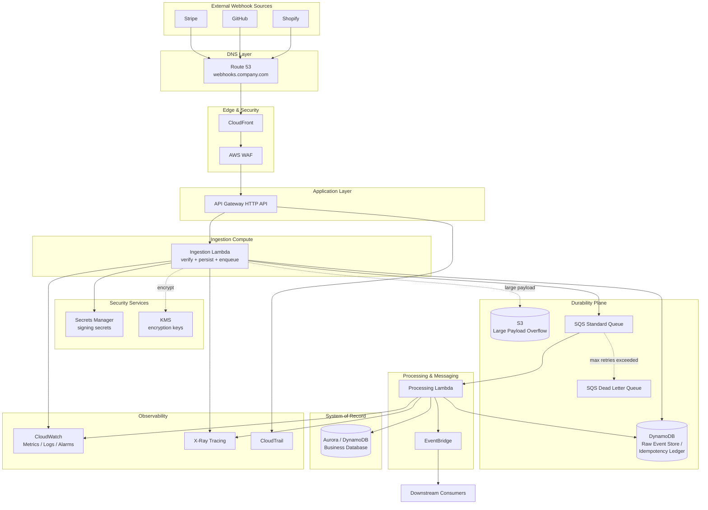

# Part IV – Serverless Architectures

# Chapter 29 — Webhook Processing

---

## 1. Executive Summary

### The Business Problem

Modern enterprises no longer live inside a single system of record.

- Payment processors (Stripe, Adyen, PayPal) push transaction events.
- SaaS platforms (Salesforce, GitHub, Shopify, Workday) push state-change events.
- IoT fleets push telemetry events.
- Internal microservices push domain events to partner systems.

Every one of these integrations depends on the same mechanical pattern: an external system makes an outbound HTTP `POST` call to a URL you expose, and you are expected to receive it, validate it, acknowledge it quickly, and process it — reliably, exactly once (or safely more-than-once), and without ever losing an event.

This sounds simple until it is running in production at scale. The reality enterprises face is:

- Third parties often retry aggressively on any non-2xx response or on any timeout, which means a slow endpoint doesn't just fail once — it gets hammered repeatedly.
- Most webhook providers give you a narrow response-time window (commonly 3–15 seconds) before they consider the delivery failed.
- Business processing logic (fraud checks, database writes, downstream notifications, ledger updates) frequently takes longer than that window.
- Providers rarely guarantee ordering, and many guarantee at-least-once delivery, which means your system must tolerate duplicates.
- A single misbehaving downstream dependency (a slow database, a third-party API outage) must never be allowed to cause webhook deliveries to be rejected or lost.
- Security is non-trivial: anyone on the internet can call your public webhook URL, so signature verification, replay protection, and rate limiting are mandatory, not optional.
- Compliance-sensitive industries (finance, healthcare, insurance) need an auditable, immutable record of every inbound event, independent of whether processing later succeeds or fails.

Naive implementations — a single EC2 instance running a Flask or Express app that synchronously validates, processes, and writes to a database inside the HTTP request — collapse under this reality. A downstream dependency slows down, requests queue up, the provider's timeout fires, the provider retries, load multiplies, and the system enters a retry storm that takes down the very endpoint that was supposed to be receiving events.

### Architecture Objective

The Webhook Processing architecture in this chapter exists to solve one specific engineering problem extremely well:

> **Decouple the acceptance of an inbound event from the processing of that event, while guaranteeing durability, security, idempotency, and horizontal scalability — at a cost profile that scales with actual traffic rather than provisioned capacity.**

The core architectural philosophy is a two-phase design:

1. **Phase 1 — Ingest.** A lightweight, stateless, extremely fast entry point accepts the HTTP request, verifies its authenticity, persists it durably, and returns a `200 OK` in single-digit to double-digit milliseconds. Nothing business-specific happens here.
2. **Phase 2 — Process.** An asynchronous, independently scalable consumer picks up the durably stored event and executes business logic, with retries, dead-lettering, and observability, entirely decoupled from the provider's timeout expectations.

This is the classic **"receive fast, process later"** pattern, implemented on AWS using API Gateway, Lambda, SQS/EventBridge, DynamoDB, and supporting security and observability services.

### Why Organizations Adopt This Architecture

- **Provider timeout compliance.** Webhook providers commonly expect an acknowledgment in under 10 seconds. Decoupling ingestion from processing guarantees this regardless of downstream processing time.
- **Elastic, event-driven scaling.** Traffic from webhook sources is bursty (e.g., a flash sale generating thousands of payment webhooks in minutes). Serverless compute scales with the event rate, not with a pre-provisioned fleet size.
- **Durability guarantees.** Once the event is written to SQS/DynamoDB, it will not be lost even if every downstream consumer is down. This is a materially different reliability guarantee than "handle it before responding."
- **Cost efficiency for spiky, low-average workloads.** Most webhook traffic is not constant; it is bursty around business events (payroll runs, product launches, batch jobs). Pay-per-invocation serverless components avoid paying for idle EC2/ECS capacity.
- **Security-by-design.** A serverless ingestion layer minimizes the attack surface (no long-lived OS to patch, no SSH access, ephemeral compute) and centralizes signature verification and WAF protection at the edge.
- **Auditability and compliance.** Regulatory frameworks (PCI-DSS, HIPAA, SOX) frequently require an immutable, timestamped record of every inbound event. Persisting the raw payload before processing satisfies this requirement independent of processing outcome.

### Major Business Benefits

| Benefit | Description |
|---|---|
| Reliability | No dropped events even during downstream outages, because ingestion and processing are decoupled by a durable queue. |
| Elastic scale | Ingestion and processing scale independently and automatically with Lambda concurrency and SQS throughput. |
| Reduced operational burden | No servers to patch, no capacity planning for baseline load, fewer 3 a.m. pages for "the webhook box is down." |
| Faster time to market | New webhook sources (a new payment provider, a new SaaS integration) can be onboarded by adding a new API Gateway route and a new Lambda consumer, not a new fleet. |
| Lower total cost for bursty workloads | Pay-per-request pricing aligns cost directly with business event volume. |
| Strong security posture | Signature verification, WAF, and least-privilege IAM are enforced centrally at the ingestion boundary. |
| Auditability | Every event is durably captured before processing, satisfying compliance and forensic requirements. |

### Typical Enterprise Scenarios

- **Payments platform** receiving Stripe/Adyen webhooks for charge succeeded, charge failed, dispute created, and refund events, which must update a ledger and trigger customer notifications.
- **E-commerce platform** receiving Shopify/BigCommerce order and inventory webhooks that must synchronize a warehouse management system.
- **HR/Payroll SaaS integrations** receiving Workday/BambooHR employee lifecycle events that must synchronize identity systems (SSO/SCIM provisioning).
- **DevOps platforms** receiving GitHub/GitLab webhooks (push, pull request, deployment status) that trigger CI/CD pipelines or ChatOps notifications.
- **IoT and telemetry ingestion** where device gateways push event batches that must be validated, stored, and routed to analytics pipelines.
- **Insurance and healthcare claims processing** where third-party clearinghouses push claim status updates that must be logged immutably for audit purposes before any adjudication logic runs.

In every one of these scenarios, the underlying architectural shape is identical: **accept, verify, persist, acknowledge, then process asynchronously with retries and dead-lettering.** This chapter builds that architecture in full production detail.

---

## 2. Business Requirements

### Business Drivers

- Guarantee zero webhook event loss, even during downstream outages or deployments.
- Meet strict provider response-time SLAs (typically under 5–10 seconds) to avoid being marked as an unreliable endpoint or triggering unnecessary retries.
- Support multiple webhook sources (payment, SaaS, internal) on a single, consistently secured ingestion platform.
- Provide a complete audit trail of every inbound event for compliance and dispute resolution.
- Minimize operational overhead for a small platform team supporting many integrations.
- Control cost tightly as the number of integrations and event volume grows.

### Functional Requirements

| ID | Requirement |
|---|---|
| FR-1 | Accept HTTPS POST requests from external webhook providers on dedicated, per-provider endpoints. |
| FR-2 | Verify the authenticity of every inbound request using provider-specific signature schemes (HMAC-SHA256, RSA, or mTLS depending on provider). |
| FR-3 | Persist the raw, unmodified payload durably before any business logic executes. |
| FR-4 | Return an HTTP 200 acknowledgment within the provider's timeout window regardless of downstream processing time. |
| FR-5 | Process events asynchronously, applying business logic idempotently. |
| FR-6 | Detect and safely discard duplicate deliveries (at-least-once providers routinely redeliver). |
| FR-7 | Route events to the correct downstream consumer based on event type and source. |
| FR-8 | Retry failed processing attempts with exponential backoff, and move permanently failing events to a dead-letter queue (DLQ) for manual inspection. |
| FR-9 | Expose operational dashboards showing ingestion rate, processing latency, failure rate, and DLQ depth. |
| FR-10 | Support replay of historical events from the durable store for backfills or incident recovery. |

### Non-Functional Requirements

| Category | Requirement |
|---|---|
| Scalability | Support bursts up to 10,000 requests per second per endpoint with no manual intervention. |
| Availability | 99.95% ingestion availability (roughly 4.4 hours of downtime per year). |
| Latency | p99 ingestion response time under 300 ms; p99 end-to-end processing time under 60 seconds for standard events. |
| Durability | 99.999999999% (11 nines) durability for the raw event store, matching S3/DynamoDB guarantees. |
| Security | All inbound traffic over TLS 1.2+; signatures verified before any persistence of "trusted" status; least-privilege IAM throughout. |
| Compliance | PCI-DSS scope minimization (no card data logged in plaintext); SOC 2 auditability; configurable retention per regulatory regime. |
| Recoverability | RPO of 0 for accepted events (once acknowledged, an event must never be lost); RTO under 30 minutes for full processing pipeline restoration. |

### Scalability Goals

- Ingestion layer (API Gateway + Lambda) must scale from near-zero to tens of thousands of requests per second without pre-warming for the common case, and with provisioned concurrency for the small subset of latency-critical providers that enforce very tight timeouts (e.g., sub-3-second).
- Queueing layer (SQS) must absorb bursts of 100x normal traffic without back-pressure on the ingestion layer, since SQS decouples producer and consumer throughput entirely.
- Processing layer (consumer Lambdas) must scale consumer concurrency independently per event type, so that a slow-processing event type (e.g., one requiring a synchronous third-party API call) does not starve the throughput of fast event types.

### Availability Requirements

- The ingestion endpoint must remain available even if the processing layer, downstream database, or a third-party dependency used during processing is degraded or unavailable. This is precisely why the architecture inserts a durable queue between ingestion and processing.
- Multi-AZ deployment is mandatory for all stateful components (SQS is inherently multi-AZ; DynamoDB and Aurora must be explicitly configured for Multi-AZ).

### Latency Requirements

| Stage | Target |
|---|---|
| TLS handshake + API Gateway routing | < 50 ms |
| Signature verification (ingestion Lambda) | < 50 ms |
| Persistence to DynamoDB (raw event store) | < 20 ms |
| Enqueue to SQS | < 20 ms |
| Total ingestion response time (client-perceived) | < 300 ms p99 |
| End-to-end processing (ingestion to business logic completion) | < 60 s p99 for standard events; < 5 s p99 for latency-critical events using EventBridge direct routing |

### Compliance Requirements

- **PCI-DSS** — if payment webhooks are in scope, cardholder data must never be logged in plaintext; tokenized references only; strict network segmentation of the processing Lambdas that touch payment data.
- **SOC 2 / ISO 27001** — full audit trail of access to raw event data, encryption at rest and in transit, documented incident response procedures.
- **HIPAA** (if healthcare webhooks are in scope) — BAA-covered services only (Lambda, DynamoDB, S3, SQS, KMS are all HIPAA-eligible), encryption with customer-managed KMS keys, and audit logging via CloudTrail.
- **GDPR / data residency** — event data for EU-originated events may need to remain in an EU region; this drives regional deployment decisions.

### Security Expectations

- Every inbound request must be authenticated via provider-specific signature verification before it is treated as trusted.
- Replay protection: reject requests with timestamps outside an acceptable window (commonly ±5 minutes) even if the signature is valid, to prevent replay attacks using a captured request.
- WAF in front of the API Gateway endpoint to block generic HTTP-layer attacks, enforce rate limiting per source IP, and block known-bad IP ranges.
- Least-privilege IAM roles per Lambda function — the ingestion Lambda should not have permission to read from the DLQ or write to unrelated tables.
- Secrets (webhook signing secrets) stored in Secrets Manager, never in environment variables in plaintext, never in source control.

### Recovery Objectives

| Metric | Target | Rationale |
|---|---|---|
| RPO (Recovery Point Objective) | 0 | Once an event is acknowledged with HTTP 200, it must be durably persisted; no acceptable data loss window. |
| RTO (Recovery Time Objective) | 30 minutes | Full processing pipeline (consumers, downstream integrations) must be restorable within 30 minutes of a regional or major component failure. |

### SLAs

- 99.95% ingestion availability, measured monthly, excluding scheduled maintenance windows.
- p99 ingestion latency under 300 ms, measured over rolling 5-minute windows.
- 100% of acknowledged events durably persisted and eventually processed or dead-lettered with alerting (no silent loss).

### Expected Workload and Growth

- Initial workload: 50–200 requests per second average, with bursts to 2,000 requests per second during promotional events or provider-side batch redelivery.
- Expected growth: 3–5x over 24 months as additional webhook sources are onboarded (new payment providers, new SaaS integrations, new internal event producers).
- Event size: typically 1 KB–256 KB per payload; architecture must handle occasional large payloads (e.g., batch webhook deliveries up to several MB) via S3 offload rather than inline DynamoDB storage when payloads exceed DynamoDB's 400 KB item limit.

---

## 3. Architecture Overview

### Overall Design

The webhook processing architecture is built around a strict separation of concerns between three functional planes:

1. **Ingestion plane** — Amazon API Gateway (HTTP API) fronted by AWS WAF, invoking a lightweight AWS Lambda function per provider. Its only responsibilities are TLS termination (handled by API Gateway/CloudFront), request authentication (signature verification), raw payload persistence, and enqueueing.
2. **Durability plane** — Amazon DynamoDB (raw event store, idempotency ledger) and Amazon SQS (work queue). This plane exists purely to guarantee that an accepted event survives any downstream failure.
3. **Processing plane** — Consumer Lambda functions triggered by SQS, performing business logic, writing to the system of record (Aurora/DynamoDB), and publishing downstream domain events via EventBridge or SNS for other systems to react to.

### Architecture Philosophy

Three principles drive every design decision in this chapter:

- **Fail fast at the edge, fail safe in the middle.** The ingestion Lambda does the absolute minimum: verify, persist, enqueue. If anything downstream is broken, the event still lands safely in the queue.
- **Idempotency is a first-class citizen, not an afterthought.** Every provider webhook has some form of unique event identifier. That identifier is used as a DynamoDB conditional-write key so a redelivered event is a guaranteed no-op rather than a double-processed transaction.
- **Every event is inspectable after the fact.** Because the raw payload is persisted before processing, any processing bug can be fixed and the event safely replayed — a property naive synchronous designs do not have, because the original request is gone the moment the HTTP connection closes.

### Core Components

| Component | Role |
|---|---|
| Route 53 | DNS resolution for the public webhook domain (e.g., `webhooks.company.com`). |
| CloudFront | Optional edge layer providing DDoS absorption, TLS, and a stable anycast IP in front of API Gateway. |
| AWS WAF | Layer 7 protection: rate limiting, IP reputation lists, and managed rule groups. |
| API Gateway (HTTP API) | Public HTTPS entry point; routes by path to the correct ingestion Lambda per provider. |
| Ingestion Lambda | Verifies signature, checks replay window, writes raw event to DynamoDB, enqueues to SQS, returns 200. |
| DynamoDB (Raw Event Store) | Durable, immutable record of every accepted event; also used as the idempotency ledger via conditional writes. |
| Amazon SQS (Standard or FIFO) | Work queue decoupling ingestion from processing; source of Lambda event-source-mapping triggers for the processing layer. |
| Processing Lambda(s) | Consume from SQS, execute business logic, write to system-of-record datastore, publish domain events. |
| Dead Letter Queue (DLQ) | Captures events that fail processing after the configured retry count, for manual inspection and replay. |
| EventBridge | Publishes normalized domain events to other internal systems after successful processing; also used for scheduled reconciliation jobs. |
| Aurora / DynamoDB (System of Record) | The actual business database updated by processing logic (e.g., orders table, ledger table). |
| Secrets Manager | Stores per-provider webhook signing secrets. |
| KMS | Encrypts data at rest across DynamoDB, SQS, S3, and Secrets Manager. |
| CloudWatch + X-Ray | Metrics, logs, traces, and alarms across the entire pipeline. |

### How Components Interact

The ingestion Lambda and processing Lambda(s) never call each other directly. They communicate exclusively through the durable queue. This is the single most important architectural decision in this chapter: it means the ingestion path has no dependency on the health, latency, or availability of the processing path, and vice versa.

### High-Level Workflow

1. External provider sends an HTTPS POST to `https://webhooks.company.com/{provider}`.
2. WAF evaluates the request against rate-based and managed rules.
3. API Gateway routes the request to the provider-specific ingestion Lambda.
4. The ingestion Lambda verifies the HMAC/RSA signature using the secret from Secrets Manager.
5. The ingestion Lambda checks the request timestamp against a replay window.
6. The ingestion Lambda performs a conditional write to DynamoDB using the provider's event ID as the partition key, which atomically deduplicates redeliveries.
7. If the write succeeds (new event), the Lambda enqueues a lightweight message (event ID + provider + type) to SQS.
8. If the write fails due to a conditional check failure (duplicate), the Lambda still returns 200 — the provider must not be told to retry an event that was already accepted.
9. API Gateway returns `200 OK` to the provider.
10. SQS triggers the processing Lambda in batches via event-source mapping.
11. The processing Lambda reads the full raw payload from DynamoDB, executes business logic, and writes to the system of record.
12. On success, the processing Lambda publishes a domain event to EventBridge and deletes the message from SQS (implicit on successful return).
13. On failure, SQS makes the message visible again after the visibility timeout, up to `maxReceiveCount`, after which it is moved to the DLQ.

### Request Lifecycle

The request lifecycle is intentionally short: DNS → CDN/WAF → API Gateway → Lambda → DynamoDB write → SQS enqueue → HTTP response. Every step in this chain is designed to complete in well under a second, because this is the only part of the system bound by an external timeout.

### Response Lifecycle

The HTTP response returned to the provider carries no business-logic outcome whatsoever — it only confirms "this event has been durably accepted for processing." This is a deliberate and important distinction from a traditional REST API where a 200 response often implies the requested operation is complete.

### Data Lifecycle

1. **Raw** — the exact bytes received, stored immutably in DynamoDB (or S3 for large payloads), tagged with receipt timestamp and source IP.
2. **Queued** — a lightweight pointer message in SQS referencing the raw record.
3. **Processed** — business logic has transformed the raw event into system-of-record updates.
4. **Published** — a normalized domain event describing what changed, published to EventBridge for other systems.
5. **Archived** — after a configurable retention period (commonly 90–365 days depending on compliance regime), raw events are moved to S3 Glacier via DynamoDB TTL + Streams, or expired entirely if not compliance-relevant.

---

## 4. AWS Services Used

Only services actually relevant to this webhook processing architecture are covered below. Each entry explains purpose, why it was selected, alternatives considered, limitations, pricing considerations, and best practices.

### Amazon API Gateway (HTTP API)

**Purpose.** Public HTTPS entry point that terminates client connections, applies request validation, and routes to the ingestion Lambda.

**Why selected.** HTTP APIs (as opposed to REST APIs) are chosen specifically for webhook ingestion because they are up to 70% cheaper and have lower baseline latency, while still supporting JWT authorizers, custom domains, and Lambda proxy integration — all that is needed here. REST API's extra features (request/response transformation templates, usage plans with API keys, WAF at the REST API stage) are not required for this pattern; WAF can be attached to HTTP APIs as well via CloudFront or directly since 2022.

**Alternatives.**
- **Application Load Balancer (ALB) + Lambda target groups** — viable, slightly cheaper at very high sustained volume, but loses native request validation, throttling, and the built-in integration with AWS WAF and usage plans that API Gateway provides out of the box.
- **Function URLs (Lambda's built-in HTTPS endpoint)** — simplest possible option, no API Gateway needed at all. Attractive for a single-provider, low-complexity webhook, but lacks native request throttling controls, custom domain path-based routing for multiple providers, and WAF association requires CloudFront in front.

**Limitations.** HTTP API payload limit is 10 MB; default throttle is 10,000 requests/second burst and 5,000 requests/second steady-state per account (adjustable via quota increase); no built-in request/response body transformation (not needed here since raw payload is passed through).

**Pricing considerations.** Billed per million requests plus data transfer; HTTP API pricing is roughly 70% lower than REST API for equivalent volume. At sustained high volume (>50M requests/month), evaluate ALB as a lower marginal-cost alternative.

**Best practices.** Enable access logging to CloudWatch Logs in JSON format for structured querying; set a conservative payload size limit matching the largest expected provider payload; enable throttling per route to isolate a noisy provider from others sharing the same API.

### AWS Lambda

**Purpose.** Executes both the ingestion logic (signature verification, persistence, enqueue) and the processing logic (business rules, system-of-record writes).

**Why selected.** Lambda's per-invocation billing and automatic concurrency scaling map precisely onto the bursty, unpredictable nature of webhook traffic. There is no capacity to plan for a "normal day" — Lambda scales to whatever arrives, up to account concurrency limits.

**Alternatives.**
- **ECS Fargate** — appropriate when processing logic requires long-running tasks (minutes to hours), large dependencies incompatible with Lambda's deployment package limits, or persistent in-memory state across invocations. Not appropriate for the sub-second ingestion path.
- **EC2 with Auto Scaling** — appropriate only when the team has existing operational tooling built around EC2, needs full OS-level control, or requires specialized hardware (GPU, high-memory instances). Introduces patching and capacity-planning overhead that this pattern is specifically designed to avoid.

**Limitations.** 15-minute maximum execution duration (irrelevant for ingestion, occasionally relevant for complex processing — mitigate by triggering a Step Functions workflow for long-running processing); 10 GB memory ceiling; cold starts of 100–500 ms for the first invocation in a new execution environment (mitigated with provisioned concurrency for latency-sensitive providers).

**Pricing considerations.** Billed per millisecond of execution time and configured memory; over-provisioning memory increases cost without benefit past the point where CPU (which scales with memory) is no longer the bottleneck. Right-size using AWS Lambda Power Tuning.

**Best practices.** Keep the ingestion Lambda's dependency footprint minimal (avoid large SDKs it doesn't need) to minimize cold-start duration; use ARM64 (Graviton2) runtime for roughly 20% better price-performance where compatible; separate ingestion and processing into distinct functions with distinct IAM roles — never share one Lambda for both concerns.

### Amazon DynamoDB (Raw Event Store and Idempotency Ledger)

**Purpose.** Durable, low-latency store for the raw inbound payload and the mechanism used to atomically deduplicate redeliveries via conditional writes.

**Why selected.** DynamoDB's single-digit-millisecond read/write latency and native conditional-write semantics (`ConditionExpression: attribute_not_exists(pk)`) make it the natural fit for an idempotency ledger: the conditional write either succeeds (new event, proceed) or fails (duplicate, safely ignore) atomically, with no separate locking mechanism required.

**Alternatives.**
- **Amazon S3** — appropriate for very large payloads (multi-MB batch deliveries) where DynamoDB's 400 KB item size limit is exceeded; commonly used alongside DynamoDB, storing the raw payload in S3 and a pointer + metadata in DynamoDB.
- **Amazon Aurora (Postgres/MySQL)** — viable if the team already standardizes on relational storage and needs complex relational queries over event history, but at webhook ingestion volumes, connection-pool exhaustion under Lambda concurrency (each cold-start Lambda potentially opening a new connection) becomes a serious operational risk unless RDS Proxy is used, adding cost and complexity for no benefit over DynamoDB.

**Limitations.** 400 KB maximum item size; eventually consistent reads by default (use strongly consistent reads for the idempotency check, since this must be immediately consistent, at roughly double the read cost); provisioned/on-demand billing choice must match traffic predictability.

**Pricing considerations.** On-demand billing mode is recommended for this workload because webhook traffic is spiky and unpredictable; provisioned capacity with auto-scaling can be more cost-effective only once traffic patterns are well understood and stable.

**Best practices.** Use the provider's event ID (or a hash of provider + event ID if the provider's ID is not globally unique) as the partition key; set a TTL attribute for automatic expiration/archival after the compliance-mandated retention period; enable point-in-time recovery (PITR) for accidental deletion protection; enable DynamoDB Streams if downstream systems need to react to raw event arrival directly, independent of the SQS-based processing path.

### Amazon SQS (Standard Queue)

**Purpose.** Durable work queue decoupling ingestion from processing; provides the retry and dead-letter mechanics for processing failures.

**Why selected.** Standard SQS queues provide effectively unlimited throughput, at-least-once delivery, and native Lambda event-source-mapping integration with configurable batch size, batching window, and partial-batch-failure reporting — everything needed for this pattern.

**Alternatives.**
- **SQS FIFO** — required only when strict per-key ordering must be preserved (e.g., ensuring that a "subscription cancelled" event is never processed before an out-of-order "subscription created" event for the same customer arrives first). FIFO caps throughput at 3,000 messages/second per API action with batching (300 without), which is usually unnecessary for webhook processing where idempotent, order-independent processing is achievable with a "last write wins by event timestamp" pattern.
- **Amazon Kinesis Data Streams** — appropriate when consumers need to replay the same event stream multiple times independently (fan-out to multiple consumer applications) or need strict ordering with much higher throughput than FIFO SQS. Adds operational complexity (shard management) that is unwarranted for most webhook use cases.
- **EventBridge Pipes/direct routing** — appropriate for very simple, latency-critical routing without a need for a visible, manually-inspectable queue depth; used in this architecture as a complementary tool downstream of successful processing, not as a replacement for the ingestion queue's durability guarantee.

**Limitations.** Standard queues do not guarantee ordering and may deliver a message more than once — both are explicitly handled by this architecture's idempotency design rather than avoided.

**Pricing considerations.** Charged per request (a batch of up to 10 messages counts as fewer requests than sending individually); negligible cost at typical webhook volumes compared to Lambda invocation cost.

**Best practices.** Set the visibility timeout to at least 6x the processing Lambda's average execution time to avoid premature redelivery while a message is still being processed; configure a redrive policy with `maxReceiveCount` between 3 and 5; always pair every processing queue with a DLQ and a CloudWatch alarm on DLQ depth greater than zero.

### Amazon EventBridge

**Purpose.** Publishes normalized domain events after successful processing, decoupling the webhook-processing service from every downstream consumer of "an order was paid" or "a subscription was cancelled."

**Why selected.** EventBridge's schema registry, content-based filtering rules, and native integrations with dozens of AWS services make it the standard mechanism for fanning out a single processed event to multiple independent downstream targets (a notification Lambda, an analytics pipeline, a partner integration) without the processing Lambda needing to know about any of them.

**Alternatives.**
- **Amazon SNS** — simpler pub/sub without content-based filtering rules or a schema registry; appropriate for simple one-to-few fan-out where filtering is not required. EventBridge is preferred here because different downstream teams often need to filter on different event attributes.

**Limitations.** 256 KB maximum event size; some target integrations have their own throughput limits that must be considered when fanning out to many rules.

**Pricing considerations.** Billed per million events published and per rule match; typically a small fraction of total pipeline cost.

**Best practices.** Define a versioned event schema per domain event type (e.g., `com.company.payments.charge.succeeded.v1`) and register it in the EventBridge Schema Registry so downstream teams can generate strongly-typed consumers.

### Amazon S3

**Purpose.** Overflow storage for payloads exceeding DynamoDB's item size limit, and long-term archival storage for raw events after their active retention period in DynamoDB expires.

**Why selected.** S3's virtually unlimited object size, 11-nines durability, and lifecycle-policy-driven storage class transitions make it the natural home for both large payloads and long-term compliance archives.

**Limitations.** Higher per-request latency than DynamoDB (tens of milliseconds vs. single-digit), so it is used only for the subset of payloads that genuinely require it, not as the default store.

**Pricing considerations.** Use S3 Intelligent-Tiering or explicit lifecycle rules to transition archived events to S3 Glacier Instant Retrieval or Glacier Deep Archive after 90 days, since compliance-driven archives are rarely accessed but must remain retrievable.

**Best practices.** Enable S3 Object Lock in compliance mode for any payload subject to regulatory immutability requirements (common in finance and healthcare).

### IAM

**Purpose.** Enforces least-privilege access for every component: the ingestion Lambda's execution role, the processing Lambda's execution role, and any human or CI/CD access to the pipeline's resources.

**Why selected.** IAM is the only mechanism on AWS for expressing fine-grained, auditable access control across all of these services simultaneously, and it is a non-optional foundation regardless of alternatives.

**Best practices.** One execution role per Lambda function, scoped to exactly the actions and resource ARNs it needs (e.g., the ingestion Lambda gets `dynamodb:PutItem` on the raw event table and `sqs:SendMessage` on its specific queue — nothing else); use permission boundaries for any role that a CI/CD pipeline can create, to prevent privilege escalation.

### Amazon VPC

**Purpose.** Network isolation boundary for any processing Lambda that needs to reach a private resource (Aurora cluster, internal API) not exposed to the public internet.

**Why selected.** VPC attachment is required whenever the processing Lambda must reach a private RDS/Aurora instance or an internal service reachable only via a private subnet.

**Limitations.** VPC-attached Lambdas historically had materially worse cold-start latency; this has been substantially improved since Hyperplane ENIs were introduced, but ingestion Lambdas — which are the most latency-sensitive component in this architecture — should still avoid VPC attachment wherever possible by using DynamoDB (which is reached via AWS's public API endpoints or VPC endpoints, not by attaching the function to a VPC) rather than a VPC-bound database for the raw event store.

**Best practices.** Only VPC-attach the Lambdas that genuinely need to reach VPC-private resources (typically the processing Lambda writing to Aurora); use VPC endpoints (Gateway endpoint for DynamoDB/S3, Interface endpoints for Secrets Manager/KMS/SQS) to avoid routing AWS API traffic over NAT Gateway, which both reduces cost and removes a potential availability dependency.

### Route 53

**Purpose.** DNS resolution for the public webhook domain and health-check-based failover if a secondary region is deployed for disaster recovery.

**Best practices.** Use a dedicated subdomain (`webhooks.company.com`) rather than sharing a domain with customer-facing traffic, to allow independent WAF rules, rate limits, and monitoring.

### AWS WAF

**Purpose.** Layer 7 protection in front of API Gateway: rate-based rules, managed rule groups (AWS Managed Rules – Core Rule Set, Known Bad Inputs), and IP reputation lists.

**Why selected.** Webhook endpoints are, by definition, publicly reachable POST endpoints with no user-facing authentication flow in front of them, which makes them an attractive target for generic HTTP-layer attacks and credential-stuffing-style abuse. WAF is the standard AWS mechanism for filtering this traffic before it reaches Lambda.

**Best practices.** Configure a rate-based rule scoped per source IP with a threshold well above legitimate provider traffic patterns but low enough to blunt an attack; allow-list known provider IP/CIDR ranges where the provider publishes a stable range (many payment providers do), and apply a stricter rate limit to all other sources.

### KMS

**Purpose.** Encrypts data at rest across DynamoDB, SQS, S3, and Secrets Manager, and can be used to encrypt Lambda environment variables containing non-secret configuration.

**Best practices.** Use customer-managed KMS keys (rather than AWS-managed keys) for any data subject to compliance regimes requiring key rotation control and detailed CloudTrail key-usage auditing; grant key usage permissions narrowly to only the roles that need to decrypt.

### Secrets Manager

**Purpose.** Stores per-provider webhook signing secrets, database credentials for the processing Lambda's connection to Aurora, and any third-party API keys used during processing.

**Why selected.** Secrets Manager provides automatic rotation support, fine-grained IAM-based access control, and full CloudTrail auditing of every secret retrieval — materially safer than environment variables or Parameter Store's standard (non-secure) parameters for genuinely sensitive values.

**Alternatives.** **Systems Manager Parameter Store (SecureString)** is a lower-cost alternative for secrets that do not require automatic rotation; many teams use Parameter Store for the webhook signing secret specifically (since it rarely rotates on a schedule) and reserve Secrets Manager for database credentials that do rotate.

**Best practices.** Cache the secret value in Lambda execution-environment memory across warm invocations (with a short TTL) to avoid a Secrets Manager API call on every single invocation, which both reduces latency and cost.

### Systems Manager (Parameter Store, and Session Manager for any bastion-free operational access)

**Purpose.** Stores non-secret configuration (feature flags, provider endpoint allow-lists, retry tuning parameters) and provides operational access to any VPC-attached resource without SSH bastion hosts.

### CloudWatch

**Purpose.** Central store for metrics, logs, and alarms across every component in the pipeline — API Gateway 4xx/5xx rates, Lambda duration/errors/throttles, SQS queue depth and age-of-oldest-message, DynamoDB throttled requests.

**Best practices.** Build a single dashboard combining ingestion health (API Gateway + ingestion Lambda) and processing health (SQS depth/age + processing Lambda errors + DLQ depth) so an on-call engineer can assess the entire pipeline's state in one view.

### CloudTrail

**Purpose.** Immutable audit log of every API call made against the AWS account, required for compliance regimes and for forensic investigation of any suspected unauthorized access to raw event data or signing secrets.

### AWS Config

**Purpose.** Continuously evaluates whether resources (S3 buckets, DynamoDB tables, IAM roles) remain compliant with organizational rules — for example, flagging if encryption is ever disabled on the raw event table or if a Lambda execution role's policy is broadened beyond its documented least-privilege baseline.

### Amazon GuardDuty

**Purpose.** Continuous threat detection across the account, including anomaly detection on Lambda's use of credentials and unusual API call patterns that might indicate a compromised execution role.

*Services intentionally not used in the baseline design: EC2, ALB (used only in the ALB alternative discussed above), RDS/Aurora is used only as the downstream system of record in scenarios that require relational modeling, not as part of the ingestion path itself.*

---

## 5. Complete Architecture Diagram



**Diagram notes**

- Solid arrows represent synchronous request/response calls; dotted arrows represent conditional or asynchronous paths.
- The dead-letter queue is intentionally isolated from the primary processing path — only the SQS redrive policy writes to it automatically.
- CloudFront is optional; smaller deployments route directly from Route 53 to API Gateway with WAF attached to the API Gateway stage.

---

## 6. Component-by-Component Explanation

### Route 53

- **Purpose.** Resolves the public webhook domain to the CloudFront distribution (or directly to API Gateway's regional endpoint).
- **Responsibilities.** DNS resolution, health-check-based failover to a secondary region if configured.
- **Inputs.** DNS queries from provider infrastructure.
- **Outputs.** IP addresses of the active endpoint.
- **Scaling.** Fully managed, effectively unlimited query volume.
- **High availability.** Anycast-based, globally distributed by design.
- **Failure handling.** Health checks can automatically fail over to a secondary region's endpoint.
- **Dependencies.** None upstream.
- **Security.** DNSSEC can be enabled for the hosted zone.
- **Monitoring.** Route 53 health check metrics in CloudWatch.

### CloudFront (optional edge layer)

- **Purpose.** Provides a stable anycast entry point, absorbs volumetric DDoS traffic before it reaches the regional API Gateway, and terminates TLS at the edge.
- **Responsibilities.** Edge TLS termination, request forwarding to API Gateway origin, integration point for WAF.
- **Scaling.** Globally distributed, effectively unlimited.
- **High availability.** Multi-edge-location by default.
- **Failure handling.** Origin failover can be configured to a secondary regional API Gateway.
- **Security.** Works with AWS Shield Standard (automatically included) and Shield Advanced (optional, paid) for large-scale DDoS protection.
- **Monitoring.** CloudFront access logs and CloudWatch metrics (request count, error rate, origin latency).

### AWS WAF

- **Purpose.** Filters malicious or abusive Layer 7 traffic before it reaches API Gateway.
- **Responsibilities.** Rate-based blocking, managed rule group evaluation, IP allow/deny lists.
- **Inputs.** Every HTTP request destined for the webhook endpoint.
- **Outputs.** Allow/block decision, logged to CloudWatch/S3/Kinesis Firehose.
- **Scaling.** Fully managed, scales with traffic automatically.
- **Failure handling.** Fails open by default if misconfigured — this must be actively tested, since a fail-closed misconfiguration could reject legitimate provider traffic entirely.
- **Security.** Central enforcement point for source-IP-based abuse control.
- **Monitoring.** WAF sampled requests and blocked-request metrics in CloudWatch.

### API Gateway (HTTP API)

- **Purpose.** Public HTTPS entry point routing requests to the correct per-provider ingestion Lambda.
- **Responsibilities.** TLS termination (if not already done by CloudFront), path-based routing, request size limit enforcement, throttling.
- **Inputs.** HTTPS POST requests from providers (via WAF/CloudFront).
- **Outputs.** Lambda proxy integration invocation; HTTP response back to the caller.
- **Scaling.** Scales automatically; default account-level throttle limits apply and should be raised via a service quota increase ahead of expected peak traffic.
- **High availability.** Regional service, inherently multi-AZ.
- **Failure handling.** Returns 429 on throttling, 5xx on integration failure — both must be monitored, since a provider seeing repeated 5xx responses will typically escalate retry aggressiveness.
- **Dependencies.** Ingestion Lambda.
- **Security.** WAF association, resource policies restricting invocation source if applicable, TLS 1.2 minimum policy on the custom domain.
- **Monitoring.** Access logs, 4xx/5xx rate, integration latency, per-route throttling metrics.

### Ingestion Lambda

- **Purpose.** The single most important component in the architecture — verifies authenticity, persists the raw event, and enqueues for processing, in that order, entirely synchronously within the Lambda invocation.
- **Responsibilities.** Signature verification, replay-window validation, conditional DynamoDB write for idempotency, SQS enqueue, structured logging.
- **Inputs.** API Gateway proxy event (headers, raw body, source IP).
- **Outputs.** HTTP status code and body (always minimal — providers do not need a rich response body).
- **Scaling.** Scales with concurrent invocations up to the account/reserved concurrency limit; provisioned concurrency recommended for providers with sub-3-second timeout requirements.
- **High availability.** Multi-AZ by default (Lambda runs across multiple AZs within a region transparently).
- **Failure handling.** Any unhandled exception must still result in a deliberate, logged 5xx response — never a silent timeout — so the provider's retry behavior is predictable.
- **Dependencies.** Secrets Manager (signing secret), DynamoDB, SQS.
- **Security.** Least-privilege execution role; no outbound internet access required (should run without a NAT Gateway path if VPC-attached, or preferably not VPC-attached at all).
- **Monitoring.** Invocation count, duration, error rate, throttle count; custom metric for "duplicate detected" rate.

### DynamoDB Raw Event Store

- **Purpose.** Durable persistence of every accepted event and the authoritative idempotency ledger.
- **Responsibilities.** Conditional writes for deduplication, storage of raw payload (or S3 pointer for oversized payloads), TTL-based expiration.
- **Inputs.** PutItem calls from the ingestion Lambda; GetItem calls from the processing Lambda.
- **Outputs.** Stored event records; conditional-check-failure signals for duplicates.
- **Scaling.** On-demand capacity mode recommended to absorb unpredictable bursts without manual capacity planning.
- **High availability.** Natively multi-AZ; global tables available for multi-region active-active designs.
- **Failure handling.** Throttled requests should trigger exponential backoff retries within the Lambda SDK client (built into the AWS SDK by default).
- **Dependencies.** KMS for encryption at rest.
- **Security.** Encryption at rest with customer-managed KMS key; fine-grained IAM condition keys restricting access by partition key prefix if multi-tenant.
- **Monitoring.** Consumed capacity, throttled requests, conditional check failures (a proxy for redelivery rate).

### SQS Work Queue

- **Purpose.** Durable buffer between ingestion and processing, absorbing any mismatch between inbound rate and processing throughput.
- **Responsibilities.** At-least-once message delivery, visibility timeout management, redrive to DLQ after exhausted retries.
- **Scaling.** Effectively unlimited throughput for standard queues.
- **High availability.** Natively redundant across multiple AZs within a region.
- **Failure handling.** Messages exceeding `maxReceiveCount` are automatically redirected to the DLQ.
- **Dependencies.** None (fully managed).
- **Security.** Server-side encryption with KMS; queue policy restricting `SendMessage` to the ingestion Lambda's role and `ReceiveMessage`/`DeleteMessage` to the processing Lambda's role only.
- **Monitoring.** `ApproximateNumberOfMessagesVisible`, `ApproximateAgeOfOldestMessage` (the single most important SQS metric for detecting processing backlog).

### Processing Lambda

- **Purpose.** Executes the actual business logic implied by the event (updating a ledger, synchronizing inventory, provisioning an account).
- **Responsibilities.** Idempotent business logic execution, system-of-record writes, downstream domain event publication.
- **Inputs.** SQS batch of messages (event pointers), full raw payload fetched from DynamoDB/S3.
- **Outputs.** System-of-record writes, EventBridge events, partial-batch-failure response to SQS.
- **Scaling.** Controlled via the SQS event-source-mapping's `maximumConcurrency` setting, tuned per event type to avoid overwhelming downstream dependencies (e.g., a rate-limited third-party API).
- **High availability.** Multi-AZ by default.
- **Failure handling.** Uses SQS's partial-batch-failure reporting (`batchItemFailures`) so only the specific failed messages within a batch are retried, not the entire batch.
- **Dependencies.** DynamoDB (raw event fetch), Aurora/DynamoDB (system of record), EventBridge, Secrets Manager (any third-party API credentials).
- **Security.** Least-privilege role scoped to the specific tables/queues/topics it needs; VPC-attached only if reaching a private Aurora cluster.
- **Monitoring.** Processing duration, error rate, DLQ inflow rate, business-level metrics (e.g., "charges reconciled per minute").

### Dead Letter Queue (DLQ)

- **Purpose.** Captures events that could not be processed successfully after the configured retry count, preventing silent data loss while preventing infinite retry loops from blocking the queue.
- **Responsibilities.** Durable storage of failed messages pending manual investigation or automated replay tooling.
- **Monitoring.** Any message present in the DLQ should trigger an immediate CloudWatch alarm — a non-empty DLQ is always an actionable event, never a background metric to check periodically.

### EventBridge

- **Purpose.** Publishes normalized domain events to any number of downstream consumers without coupling the processing Lambda to their existence.
- **Responsibilities.** Rule-based filtering and routing to targets (Lambda, SNS, Step Functions, third-party API destinations).
- **Monitoring.** `FailedInvocations` per rule, `MatchedEvents` per rule.

### Aurora / DynamoDB (System of Record)

- **Purpose.** The actual business database that the webhook event ultimately updates.
- **High availability.** Aurora Multi-AZ with automatic failover; DynamoDB natively multi-AZ.
- **Security.** Encryption at rest, IAM database authentication where supported, network isolation in private subnets.

---

## 7. End-to-End Request Flow

1. **Client (external provider) sends request.** The provider's webhook dispatcher issues an HTTPS POST to `https://webhooks.company.com/stripe` with a JSON body and a provider-specific signature header (e.g., `Stripe-Signature`).
2. **DNS resolution.** Route 53 resolves the domain to the CloudFront distribution's anycast IP.
3. **CloudFront.** Terminates the TLS connection at the nearest edge location and forwards the request toward the regional origin.
4. **AWS WAF evaluation.** The request is evaluated against rate-based rules and managed rule groups; if it fails, a 403 is returned immediately without reaching API Gateway.
5. **API Gateway routing.** The HTTP API matches the request path (`/stripe`) to the corresponding integration and invokes the ingestion Lambda with a Lambda proxy integration event.
6. **Ingestion Lambda: retrieve signing secret.** The Lambda retrieves the provider's signing secret from Secrets Manager (cached in memory across warm invocations).
7. **Ingestion Lambda: verify signature.** The Lambda recomputes the expected HMAC signature over the raw request body and compares it, using constant-time comparison, to the header value.
8. **Ingestion Lambda: replay check.** The Lambda checks the timestamp embedded in the signature header against the current time; requests outside the acceptable window (commonly ±5 minutes) are rejected with 400.
9. **Ingestion Lambda: idempotency write.** The Lambda performs a conditional `PutItem` to DynamoDB keyed on the provider's event ID; a conditional check failure indicates a duplicate delivery.
10. **Ingestion Lambda: enqueue.** For new events, a lightweight message (event ID, provider, event type, DynamoDB pointer) is sent to SQS.
11. **Ingestion Lambda: respond.** The Lambda returns `200 OK` (for both new events and detected duplicates — the provider should never see anything other than success once the request is authentic).
12. **API Gateway returns the response** to CloudFront, which returns it to the provider, completing the provider-facing transaction in well under one second.
13. **SQS delivers a batch** of messages to the processing Lambda via event-source mapping, typically within milliseconds to a few seconds depending on queue depth.
14. **Processing Lambda: fetch full payload.** The Lambda retrieves the complete raw event from DynamoDB (or S3 for oversized payloads) using the pointer in the SQS message.
15. **Processing Lambda: execute business logic.** For example, updating an `orders` table, calculating fraud risk, or triggering a fulfillment workflow.
16. **Processing Lambda: write to system of record.** The relevant Aurora/DynamoDB tables are updated within a transaction where applicable.
17. **Processing Lambda: publish domain event.** A normalized event (e.g., `com.company.orders.paid.v1`) is published to EventBridge for any downstream consumer.
18. **Caching layer (if applicable).** Any read-heavy downstream service consuming this data via an API benefits from a caching layer (e.g., ElastiCache or DAX) in front of its own read path — not part of the webhook pipeline itself, but frequently adjacent to it.
19. **Logging.** Every step from 6–17 emits structured JSON logs to CloudWatch Logs, correlated by a single trace ID propagated from the original request.
20. **Monitoring.** X-Ray traces the full path from API Gateway through both Lambdas, SQS, DynamoDB, and EventBridge, giving a single trace view of ingestion-to-completion latency.
21. **Error handling.** If step 15 or 16 throws, the Lambda reports that specific message as a batch item failure; SQS makes it visible again after the visibility timeout for a bounded number of retries before redirecting it to the DLQ.

---

## 8. Deployment Flow

### Infrastructure Provisioning

- All infrastructure is defined in Terraform modules (networking, API Gateway, Lambda, DynamoDB, SQS, EventBridge, IAM) stored in a version-controlled repository, never created manually via the console in production accounts.
- A dedicated Terraform remote state backend (S3 + DynamoDB lock table) is used per environment (dev, staging, production), with strict IAM policies preventing cross-environment state access.

### Terraform Workflow

1. Developer opens a pull request modifying a Terraform module.
2. CI pipeline runs `terraform fmt -check`, `terraform validate`, and `tflint`.
3. CI pipeline runs `terraform plan` against the target environment and posts the plan output as a PR comment for human review.
4. A second engineer approves the PR (mandatory two-person review for production-affecting changes).
5. On merge to the main branch, the CI/CD pipeline runs `terraform apply` against staging automatically; production apply requires a manual approval gate.

### CI/CD Deployment (Application Code)

1. Lambda function code (ingestion and processing) is built and packaged (zip or container image) in the CI pipeline.
2. Unit tests and integration tests (using LocalStack or a dedicated AWS test account) run against the packaged artifact.
3. The artifact is published to an S3 bucket (or ECR for container-image Lambdas) with an immutable, versioned key.
4. A new Lambda version is published referencing the new artifact.
5. Traffic is shifted from the previous version to the new version using a weighted alias (see Blue-Green below).

### Blue-Green Deployment

- Lambda's native alias-based traffic shifting is used rather than a full parallel-stack blue-green, since Lambda versions provide this capability natively at low cost.
- A canary deployment pattern shifts 10% of traffic to the new version for 5–10 minutes while CloudWatch alarms (error rate, duration) are monitored automatically via AWS CodeDeploy's Lambda deployment integration.
- If alarms breach their threshold during the canary window, CodeDeploy automatically rolls back to the previous version's alias target with zero manual intervention.

### Rollback

- Rollback is a single Lambda alias repoint to the previous version — sub-second, and requires no data migration since Lambda versions are immutable artifacts.
- Terraform-managed infrastructure rollback is achieved via `git revert` of the offending commit followed by the standard plan/apply pipeline, never via manual console changes.

### Secrets

- Webhook signing secrets and any third-party API credentials are provisioned into Secrets Manager (or Parameter Store SecureString) via Terraform, with the actual secret *value* injected out-of-band by a secure process (e.g., a break-glass procedure or a secrets-rotation Lambda), never committed to the Terraform state or source control in plaintext.

### Configuration

- Non-secret configuration (retry counts, replay-window duration, feature flags) is stored in Parameter Store and read by Lambda at cold start, cached for the lifetime of the execution environment, with a short TTL to allow configuration changes to propagate without a redeploy.

### Validation

- Post-deployment smoke tests send a synthetic, correctly-signed test event through the full pipeline in the staging environment and assert that it reaches the system of record and produces the expected EventBridge event, before production deployment is permitted to proceed.

---

## 9. Network Topology

### VPC

- A single VPC per environment (dev/staging/production) is used, sized generously to avoid future re-addressing (`/16` CIDR is typical for production).
- The ingestion Lambda is **not** VPC-attached in the baseline design, since it only talks to DynamoDB, SQS, and Secrets Manager — all reachable via AWS's public API endpoints or VPC gateway/interface endpoints without requiring VPC attachment, and avoiding VPC attachment removes any possibility of ENI-related cold-start variance on the most latency-sensitive component in the system.
- The processing Lambda **is** VPC-attached only when it must reach a private Aurora cluster or another internal-only service.

### CIDR

- Example allocation: VPC `10.20.0.0/16`, with public subnets `10.20.0.0/20` (x3 AZs) and private subnets `10.20.16.0/20` (x3 AZs), leaving substantial headroom for future subnet additions (database subnets, transit gateway attachment subnets).

### Public Subnets

- Used only for NAT Gateways (if any VPC-attached Lambda needs outbound internet access to reach a third-party API not available via a VPC endpoint) and, if applicable, an ALB alternative ingestion path.

### Private Subnets

- Host the Aurora cluster and any VPC-attached processing Lambda's elastic network interfaces.

### NAT Gateway

- Deployed one per AZ (not a single shared NAT Gateway) to avoid a cross-AZ single point of failure and cross-AZ data transfer charges; used only by the processing Lambda when it needs outbound internet access to a third-party API during business-logic execution.

### Internet Gateway

- Attached to the VPC to provide the public subnets' route to the internet for the NAT Gateways.

### Transit Gateway

- Used only in enterprises with multiple VPCs/accounts that need the processing Lambda's VPC to reach a shared services VPC (e.g., a centralized Aurora cluster shared across multiple product teams); not required for a single-team, single-account deployment.

### Route Tables

- Public subnet route table: default route to the Internet Gateway.
- Private subnet route table: default route to the AZ-local NAT Gateway; explicit routes to VPC endpoints for DynamoDB, S3, Secrets Manager, KMS, and SQS to keep AWS API traffic off the NAT Gateway entirely.

### Network ACLs

- Default-allow NACLs are used at the subnet level, with security groups doing the actual fine-grained enforcement; NACLs are reserved for explicit deny rules against known-bad CIDR ranges when required by security policy.

### Security Groups

- The processing Lambda's security group allows outbound HTTPS (443) to VPC endpoints and outbound 5432/3306 to the Aurora security group only; the Aurora security group allows inbound only from the processing Lambda's security group — no other source.

### PrivateLink

- VPC interface endpoints (PrivateLink) are provisioned for Secrets Manager, KMS, and SQS so that any VPC-attached Lambda reaches these services without traversing the public internet or a NAT Gateway, improving both security posture and latency.

### Hybrid Connectivity

- Not required in the baseline design. If the system of record lives on-premises (a common scenario in regulated enterprises mid-migration), a Direct Connect or Site-to-Site VPN connection from the VPC is required, and the processing Lambda must be VPC-attached to reach it — a materially higher-latency and higher-operational-overhead path that should be minimized in scope wherever possible.

---

## 10. Identity and Access

### IAM Roles

- **Ingestion Lambda execution role** — permissions limited to: `dynamodb:PutItem` on the raw event table only, `sqs:SendMessage` on the ingestion queue only, `secretsmanager:GetSecretValue` on the specific provider secret ARNs only, and standard CloudWatch Logs write permissions.
- **Processing Lambda execution role** — permissions limited to: `dynamodb:GetItem`/`Query` on the raw event table, read/write on the system-of-record table, `sqs:ReceiveMessage`/`DeleteMessage`/`GetQueueAttributes` on the processing queue, `events:PutEvents` on the specific EventBridge event bus, and (if VPC-attached) `ec2:CreateNetworkInterface`/`DescribeNetworkInterfaces`/`DeleteNetworkInterface` scoped via the Lambda VPC execution policy.
- **CI/CD deployment role** — permissions to publish Lambda versions, update aliases, and run Terraform plan/apply against the specific environment's resources, constrained by a permissions boundary that prevents it from ever modifying IAM policies for roles outside this pipeline.

### IAM Policies

Example least-privilege policy for the ingestion Lambda:

```json

{
  "Version": "2012-10-17",
  "Statement": [
    {
      "Sid": "WriteRawEvent",
      "Effect": "Allow",
      "Action": "dynamodb:PutItem",
      "Resource": "arn:aws:dynamodb:us-east-1:111122223333:table/webhook-raw-events"
    },
    {
      "Sid": "EnqueueForProcessing",
      "Effect": "Allow",
      "Action": "sqs:SendMessage",
      "Resource": "arn:aws:sqs:us-east-1:111122223333:webhook-processing-queue"
    },
    {
      "Sid": "ReadSigningSecret",
      "Effect": "Allow",
      "Action": "secretsmanager:GetSecretValue",
      "Resource": "arn:aws:secretsmanager:us-east-1:111122223333:secret:webhooks/stripe-signing-secret-*"
    },
    {
      "Sid": "WriteLogs",
      "Effect": "Allow",
      "Action": [
        "logs:CreateLogGroup",
        "logs:CreateLogStream",
        "logs:PutLogEvents"
      ],
      "Resource": "arn:aws:logs:us-east-1:111122223333:log-group:/aws/lambda/webhook-ingestion-*"
    }
  ]
}

```

### Resource Policies

- The SQS queue policy explicitly restricts `sqs:SendMessage` to the ingestion Lambda's execution role ARN and `sqs:ReceiveMessage`/`DeleteMessage` to the processing Lambda's execution role ARN, providing defense-in-depth even if the Lambda's own IAM policy were ever misconfigured.
- The DynamoDB table has no resource-based policy attached by default (DynamoDB does not support one directly in all configurations); access is controlled purely through IAM identity-based policies plus, optionally, fine-grained access control via IAM condition keys on partition key prefixes for multi-tenant tables.

### STS

- Cross-account access (e.g., a separate security/compliance account needing read-only access to the raw event table for audit purposes) is granted via `sts:AssumeRole` into a narrowly scoped, read-only cross-account role — never via long-lived IAM user credentials.

### Cross-Account Access

- In multi-account AWS Organizations setups (a common enterprise pattern), the webhook pipeline lives in a dedicated "integration" account; the processing Lambda assumes a cross-account role into the "production data" account only for the specific write operations it needs, using a trust policy scoped to the processing Lambda's role ARN and an external ID to mitigate confused-deputy risk.

### Least Privilege

- Every IAM policy above is scoped to specific resource ARNs, not wildcards, and to specific actions, not `dynamodb:*` or `sqs:*`. This is validated automatically in CI using a policy linter (e.g., `cfn-nag`, `checkov`, or AWS IAM Access Analyzer policy validation) that fails the build if a wildcard resource or action is introduced without an explicit, reviewed exception.

### Service Roles

- Lambda's execution role is distinct from any service-linked role used by supporting services (e.g., the service-linked role used internally by Application Auto Scaling for DynamoDB provisioned-capacity scaling, if provisioned mode is used instead of on-demand).

### Permission Boundaries

- All roles created by the CI/CD pipeline (as opposed to hand-authored Terraform roles reviewed by a human) have a permission boundary attached that caps their maximum possible privilege, preventing a compromised or buggy pipeline from ever provisioning a role more powerful than the boundary allows.

---

## 11. Security Architecture

### Encryption

- **At rest.** DynamoDB, SQS, S3, and Secrets Manager are all configured with encryption at rest using a customer-managed KMS key, not the AWS-managed default key, whenever the data is subject to a compliance regime requiring auditable key management.
- **In transit.** TLS 1.2+ enforced at the CloudFront/API Gateway custom domain policy; all internal AWS service-to-service calls (Lambda to DynamoDB, Lambda to SQS) use TLS by default via the AWS SDK.

### KMS

- A dedicated KMS key per environment (not shared between dev/staging/production) with key policies restricting `kms:Decrypt` to the specific Lambda execution roles that need it.
- Automatic annual key rotation enabled for customer-managed keys.

### TLS

- Minimum TLS 1.2 policy enforced on the API Gateway custom domain; TLS 1.3 preferred where the provider's client supports it.

### WAF

- As described in Section 6, WAF sits in front of the ingestion endpoint with managed rule groups and rate-based rules.

### Shield

- AWS Shield Standard is automatically included for any CloudFront distribution or Route 53-fronted endpoint at no additional cost, providing baseline volumetric DDoS protection.
- AWS Shield Advanced is recommended for organizations with strict SLA commitments to their own downstream customers, providing DDoS cost protection and 24/7 access to the AWS DDoS Response Team.

### Secrets Manager

- Covered in Section 4; used for provider signing secrets and any downstream credentials.

### Certificate Manager

- AWS Certificate Manager issues and auto-renews the TLS certificate for the custom domain attached to CloudFront/API Gateway, eliminating manual certificate renewal as an operational task and a common cause of unplanned outages.

### GuardDuty

- Enabled account-wide; specifically valuable here for detecting anomalous Lambda behavior (e.g., an execution role suddenly making API calls to services it has never called before, which could indicate a supply-chain compromise of a Lambda dependency).

### Inspector

- Amazon Inspector's Lambda code scanning feature is enabled to continuously scan the ingestion and processing Lambda's deployed code and dependencies for known vulnerabilities (CVEs), which is particularly important given how many third-party npm/pip packages are typically pulled into webhook signature-verification libraries.

### Security Hub

- Aggregates findings from GuardDuty, Inspector, and AWS Config into a single dashboard, and is used to track the account's compliance posture against the AWS Foundational Security Best Practices standard and, where relevant, PCI-DSS.

### CloudTrail

- Logs every management-plane API call across the account; for this architecture, CloudTrail is specifically monitored for any `secretsmanager:GetSecretValue` call outside the expected Lambda execution role, which would indicate a signing secret has potentially been exfiltrated.

### AWS Config

- Continuously evaluates that the raw event DynamoDB table has encryption enabled, that the SQS queues are not publicly accessible, and that no Lambda execution role has been broadened beyond its documented policy — with automatic remediation Lambda functions attached to the most critical rules.

### Zero Trust

- No component in this architecture implicitly trusts network location. Every internal call (Lambda to DynamoDB, Lambda to SQS) is authenticated via IAM SigV4 signing on every single request, regardless of whether it originates inside or outside a VPC — this is the default behavior of the AWS SDK and is not something that needs to be separately engineered, but it is worth calling out explicitly because it is the reason VPC placement alone is not treated as a security boundary in this design.

### Threat Model

| Threat | Description |
|---|---|
| Forged webhook payloads | An attacker sends a fabricated request claiming to be from a trusted provider. |
| Replay attacks | An attacker captures a legitimately-signed request and resends it later. |
| Denial of service | An attacker floods the public endpoint with high-volume traffic to exhaust compute or downstream capacity. |
| Signing secret compromise | An attacker who obtains the signing secret can forge arbitrarily many valid-looking requests. |
| Lambda dependency compromise | A malicious or compromised third-party library used for signature verification exfiltrates data or credentials. |
| Over-privileged IAM roles | A processing Lambda with excessive permissions is leveraged by an attacker (via a code vulnerability) to access unrelated data. |
| Data exposure in logs | Sensitive fields within the webhook payload (e.g., partial card numbers) are inadvertently logged in plaintext. |

### Attack Vectors and Mitigations

| Attack Vector | Mitigation |
|---|---|
| Forged payloads | Mandatory HMAC/RSA signature verification before any processing; reject with 400 on failure. |
| Replay attacks | Timestamp-window validation combined with the idempotency ledger, which also rejects a captured-and-replayed request if the original event ID was already processed. |
| DoS/volumetric attacks | WAF rate-based rules, Shield Standard/Advanced, API Gateway throttling. |
| Signing secret compromise | Secrets Manager with restricted IAM access, CloudTrail alerting on unusual access patterns, periodic secret rotation coordinated with the provider. |
| Dependency compromise | Amazon Inspector continuous scanning, minimal dependency footprint in the ingestion Lambda, dependency pinning with lockfiles, automated dependency update PRs reviewed before merge. |
| Over-privileged roles | Least-privilege IAM as detailed in Section 10, enforced by automated policy linting in CI. |
| Log data exposure | Structured logging with explicit field redaction/allow-listing rather than logging the entire raw payload verbatim; raw payload is stored encrypted in DynamoDB, not in CloudWatch Logs. |

---

## 12. High Availability

### AZ Failures

- API Gateway, Lambda, SQS, and DynamoDB are all natively multi-AZ services with no customer configuration required to survive a single AZ failure — this is one of the strongest arguments for the serverless approach taken in this chapter versus a self-managed EC2 fleet, which requires explicit multi-AZ Auto Scaling Group configuration to achieve the same property.
- If the processing Lambda is VPC-attached, it must be configured with subnets in at least two (preferably three) AZs so Lambda can schedule execution environments across AZs.

### Instance Failures

- Not directly applicable to Lambda (no long-lived instances to fail); if Aurora is used as the system of record, Aurora's built-in instance-failure detection triggers automatic failover to a reader replica in a different AZ, typically within 30 seconds.

### Regional Failures

- The baseline design is single-region; Section 13 covers the disaster recovery options for regional failure, since achieving true active-active multi-region for a webhook pipeline introduces meaningful additional complexity (primarily around idempotency ledger consistency across regions) that is not warranted for most organizations' actual RTO/RPO requirements.

### Database Failures

- DynamoDB: no customer-managed failover process required; it is a fully managed, multi-AZ service by default.
- Aurora: Multi-AZ cluster with at least one reader replica in a separate AZ, with automated failover configured via the Aurora cluster endpoint (application connects to the cluster endpoint, not directly to an instance endpoint, so failover is transparent to the application layer).

### Load Balancing

- API Gateway performs this function natively for the ingestion path; no separate load balancer is required in the serverless baseline design.

### Health Checks

- Route 53 health checks against a lightweight `/health` endpoint (a separate, unauthenticated Lambda route that simply confirms the ingestion Lambda can reach DynamoDB and SQS) are used to drive automated regional failover if a secondary region is deployed.

### Failover

- Ingestion path: automatic and transparent, handled entirely by the underlying managed services.
- Processing path: SQS's inherent durability means a temporary AZ or even brief regional processing disruption does not lose events — they simply queue until processing resumes, bounded only by the SQS message retention period (configurable up to 14 days).

---

## 13. Disaster Recovery

### Backup Strategy

- DynamoDB point-in-time recovery (PITR) enabled on the raw event table, allowing restoration to any point within the preceding 35 days.
- Aurora automated backups with a retention period aligned to compliance requirements (commonly 7–35 days), plus manual snapshots before any major schema migration.
- S3 archival bucket versioning enabled, with cross-region replication (CRR) configured for compliance-mandated geographic redundancy.

### Snapshots

- Aurora automated daily snapshots, retained per the compliance-driven retention policy; DynamoDB on-demand backups taken before any major application-level migration in addition to continuous PITR coverage.

### Cross-Region Replication

- The S3 archival bucket uses CRR to a secondary region for the raw event archive, satisfying geographic-redundancy requirements common in financial services regulation.
- DynamoDB Global Tables are evaluated for the raw event table specifically when the organization's RTO requires near-instant regional failover of the ingestion path itself — most organizations find that SQS's durability and the ability to redeploy the ingestion stack to a secondary region within the RTO window (rather than running active-active continuously) is sufficient and materially cheaper.

### Pilot Light

- The default disaster recovery pattern recommended for this architecture: infrastructure-as-code (Terraform) for the entire stack is maintained and periodically validated by deploying to a secondary region in a non-production test, but the secondary region is not continuously running production traffic. Route 53 health-check-based failover redirects traffic to the secondary region only upon detecting a sustained primary-region failure.

### Warm Standby

- Organizations with a stricter RTO (under 15 minutes) run a continuously-deployed but zero-traffic secondary-region stack, with DynamoDB Global Tables replicating the raw event store continuously so the secondary region can begin processing immediately upon failover without a cold data-replication step.

### Multi-Site (Active-Active)

- Reserved for organizations with an RTO effectively approaching zero and the engineering maturity to solve cross-region idempotency-ledger consistency (using DynamoDB Global Tables' last-writer-wins conflict resolution combined with strictly monotonic event ordering from the source provider). This is materially more complex and costly than most webhook-processing use cases justify, and is called out explicitly in Section 27 (Anti-Patterns) as frequently over-engineered for this domain.

### Active-Active vs. Active-Passive

| Pattern | RTO | RPO | Relative Cost | Operational Complexity | Recommended For |
|---|---|---|---|---|---|
| Pilot Light | 1–4 hours | Near zero (SQS/DynamoDB durability) | Low | Low | Most enterprise webhook pipelines |
| Warm Standby | 15–30 minutes | Near zero | Medium | Medium | Regulated industries with strict RTO SLAs |
| Active-Active (Multi-Site) | Seconds | Near zero | High | High | Global platforms with continuous, business-critical webhook dependencies (e.g., a payments platform that is itself a system of record for other companies) |

### RPO and RTO Summary

- **RPO: 0** for any acknowledged event, because the durability guarantee is established the instant the DynamoDB conditional write succeeds — regionally redundant within the primary region regardless of which DR pattern is used for full regional failover.
- **RTO: 30 minutes** target for full pipeline restoration in the pilot-light pattern, achieved through automated Terraform redeployment to the secondary region combined with Route 53 health-check failover; validated via quarterly game-day exercises (see Section 23).

---

## 14. Scalability

### Horizontal Scaling

- Lambda scales horizontally by design — each concurrent invocation runs in its own isolated execution environment, and AWS automatically provisions new environments in response to incoming request/message rate, up to account and reserved-concurrency limits.
- This is the primary scaling mechanism for both the ingestion and processing layers; there is no "add more instances" decision to make manually.

### Vertical Scaling

- Applies only to memory/CPU allocation per Lambda invocation (Lambda's CPU allocation scales proportionally with configured memory). Vertical scaling here means tuning the memory setting, not provisioning larger servers.
- Use AWS Lambda Power Tuning (an open-source Step Functions-based tool) to empirically find the memory setting that minimizes cost × duration for each function, since higher memory sometimes reduces duration enough to lower total cost despite the higher per-millisecond rate.

### Auto Scaling

- Not applicable in the traditional EC2 Auto Scaling Group sense; the closest analog is Lambda's concurrency scaling and SQS's essentially unbounded throughput, both of which require no customer-configured scaling policies for the default case.
- Reserved concurrency is used defensively — to cap the ingestion Lambda's maximum concurrency below a level that could overwhelm DynamoDB's on-demand scaling curve during an extreme, unexpected burst — while provisioned concurrency is used offensively, to eliminate cold starts for latency-critical providers.

### Serverless Scaling

- The entire ingestion and processing path is serverless by design specifically because webhook traffic is inherently bursty and unpredictable — the workload characteristic that serverless compute is best suited to.

### Database Scaling

- DynamoDB on-demand mode scales read/write capacity automatically in response to traffic, with no customer-managed scaling policy, at the cost of a higher per-request price than well-utilized provisioned capacity.
- Aurora (if used downstream) scales vertically via instance class changes and horizontally via read replicas; Aurora Serverless v2 is a strong option when the system-of-record's own traffic pattern is similarly bursty.

### Storage Scaling

- DynamoDB and S3 both scale storage automatically with no capacity planning required; S3 in particular has no meaningful upper bound relevant to this use case.

### Queue Scaling

- SQS standard queues scale throughput automatically and require no customer-managed sharding; the only tunable "scaling" lever is the Lambda event-source mapping's batch size and maximum concurrency, which controls how aggressively messages are drained by the processing layer.

---

## 15. Performance Optimization

### Caching

- The ingestion Lambda caches the webhook signing secret in execution-environment memory (module-level variable, outside the handler function) so warm invocations avoid a Secrets Manager API call, reducing both latency and cost.
- Any downstream read-heavy service consuming processed data benefits from ElastiCache (Redis) or DynamoDB Accelerator (DAX) in front of its own read path — this sits outside the webhook pipeline itself but is commonly adjacent to it.

### Compression

- API Gateway automatically supports gzip-compressed request bodies if the provider sends a `Content-Encoding: gzip` header; most major webhook providers do not compress payloads by default since they are typically small, but this matters for high-volume batch-delivery providers.

### CDN

- CloudFront in front of API Gateway primarily provides DDoS absorption and a stable anycast entry point for this use case rather than content caching (webhook POST requests are inherently non-cacheable), but it still meaningfully reduces TLS handshake latency for repeat-connecting provider infrastructure via connection reuse at the edge.

### Database Optimization

- DynamoDB single-table design principles are applied to the raw event store: partition key is the provider-qualified event ID, with a sort key reserved for future use (e.g., storing multiple related sub-events under one logical event), avoiding hot-partition risk by ensuring event IDs are naturally well-distributed (most providers use UUIDs or similarly high-entropy identifiers).

### Connection Pooling

- The processing Lambda, when writing to Aurora, uses RDS Proxy rather than managing its own connection pool, since Lambda's concurrent-execution-environment model makes naive direct connections a well-known source of connection exhaustion under bursty load — RDS Proxy multiplexes many Lambda-originated logical connections onto a smaller pool of physical database connections.

### Concurrency

- The SQS-to-Lambda event source mapping's `maximumConcurrency` setting is explicitly tuned per event type — set lower for event types whose processing calls a rate-limited third-party API, and left higher for event types that only touch DynamoDB/Aurora, preventing one slow event type from consuming all available concurrency at the expense of others.

### Async Processing

- The entire processing plane is fundamentally asynchronous relative to the provider's HTTP request, which is the architectural decision this whole chapter is built around; within the processing Lambda itself, any genuinely long-running sub-tasks (e.g., generating a PDF receipt) are further offloaded to a Step Functions workflow rather than run inline, to avoid Lambda's 15-minute execution ceiling becoming a constraint.

---

## 16. Cost Optimization (FinOps)

### Cost Estimates by Deployment Size

Estimates below use US East (N. Virginia) on-demand pricing as of early 2026 and assume average payload size of 5 KB, 200-byte SQS pointer messages, and typical processing Lambda duration of 300 ms at 512 MB memory. Figures are illustrative order-of-magnitude estimates for architectural planning, not a quotation — always validate with AWS Pricing Calculator against current rates.

| Deployment Size | Monthly Requests | Estimated Monthly Cost | Primary Cost Drivers |
|---|---|---|---|
| Small | 1 million | $50 – $150 | Lambda invocations/duration, API Gateway requests |
| Medium | 50 million | $800 – $2,000 | DynamoDB on-demand writes, Lambda duration, SQS requests |
| Enterprise | 1 billion+ | $15,000 – $40,000 | DynamoDB throughput at scale, data transfer, CloudWatch Logs ingestion/storage |

### Major Cost Drivers

- **Lambda duration × memory** — typically the single largest line item at small-to-medium scale; directly optimizable via memory right-sizing.
- **DynamoDB on-demand write/read units** — grows linearly with event volume; the largest driver at enterprise scale, where provisioned capacity with auto-scaling can become materially cheaper than on-demand once traffic patterns stabilize.
- **CloudWatch Logs ingestion and storage** — frequently underestimated; verbose debug-level logging left enabled in production is one of the most common unplanned cost overruns in serverless architectures.
- **Data transfer** — cross-AZ data transfer for VPC-attached processing Lambdas reaching Aurora, and CloudFront data transfer out to the internet for response bodies (minimal here, since responses are tiny).
- **NAT Gateway hourly + per-GB charges** — only relevant if the processing Lambda is VPC-attached and requires outbound internet access; using VPC endpoints instead of NAT Gateway for AWS service calls avoids this cost entirely for those calls.

### Optimization Opportunities

- **Right-size Lambda memory** using AWS Lambda Power Tuning rather than guessing; a common finding is that increasing memory from 128 MB to 512 MB reduces duration enough to lower total cost, not raise it.
- **Switch DynamoDB from on-demand to provisioned with auto-scaling** once traffic patterns are well-understood (typically 3–6 months into production), which can reduce DynamoDB costs by 40–60% at stable, predictable volume.
- **Reserved Instances / Savings Plans** — not directly applicable to the serverless ingestion/processing path itself, but Compute Savings Plans apply to any Fargate or EC2 usage elsewhere in the broader platform (e.g., the Aurora-adjacent application tier), and Lambda itself has no RI/Savings Plan mechanism as of this writing — cost reduction for Lambda comes from duration/memory optimization, not commitment discounts.
- **Spot** — not applicable to Lambda; relevant only if the organization also runs Fargate-based batch reconciliation jobs adjacent to this pipeline, where Fargate Spot can reduce cost by up to 70% for fault-tolerant batch workloads.
- **S3 lifecycle policies** — transition archived raw events from S3 Standard to Glacier Instant Retrieval after 90 days and Glacier Deep Archive after 1 year, typically reducing archival storage cost by 80%+ relative to leaving everything in S3 Standard.
- **Storage classes** — use DynamoDB Standard-Infrequent Access table class for the raw event table if read/write patterns are heavily skewed toward "written once, rarely read again," which is typical for this workload.
- **Rightsizing** — apply Compute Optimizer recommendations to any Fargate/EC2 components in the broader platform; for the pure Lambda components, memory right-sizing (above) is the equivalent lever.
- **Cost allocation and tagging** — every resource tagged with `Environment`, `Team`, `Provider` (which webhook source it serves), and `CostCenter`, enabling per-integration cost attribution — critical once the platform hosts dozens of provider integrations and finance needs to understand the marginal cost of onboarding a new one.
- **Budgets** — AWS Budgets configured per environment with alerts at 80% and 100% of the expected monthly spend, with a separate, tighter budget on the CloudWatch Logs service specifically, since this is the most common source of cost surprises (see Section 34, Cost Surprises).
- **Cost Anomaly Detection** — enabled account-wide, with a dedicated monitor scoped to this pipeline's cost allocation tags, catching, for example, a misconfigured retry loop that silently multiplies Lambda invocation volume by 100x before it shows up in the monthly bill.

---

## 17. AI-Assisted Operations

### Amazon Q (Developer / Business)

- **Amazon Q Developer** is used within the IDE and CI pipeline to review Terraform changes against AWS Well-Architected best practices before merge, to explain unfamiliar error messages during incident response, and to generate boilerplate for new provider integrations (a new ingestion Lambda handler following the established pattern) from a natural-language description of the new provider's signature scheme.
- **Amazon Q in CloudWatch** — surfaces natural-language explanations of anomalous metric patterns (e.g., "SQS ApproximateAgeOfOldestMessage has increased 400% over the last 30 minutes, correlated with a 60% increase in ProcessingLambda error rate") during an active incident, reducing the diagnostic time an on-call engineer spends correlating multiple dashboards manually.

### Amazon Bedrock

- Used for a specific, narrow operational task in this architecture: classifying and summarizing DLQ contents. A scheduled Lambda periodically invokes a Bedrock model (e.g., Anthropic's Claude via Bedrock) with the raw payloads of messages currently in the DLQ, asking it to group them by likely root cause (schema change, downstream timeout, data validation failure) and produce a human-readable incident summary posted to a Slack channel — meaningfully reducing the manual triage burden when the DLQ has accumulated hundreds of failed events from a single root cause.
- Bedrock is explicitly **not** used inline in the ingestion or processing hot path — introducing a foundation-model API call into a sub-second-latency-budget request path would violate the core latency requirement in Section 2 and introduce an unacceptable, non-deterministic dependency into a path that must remain simple and fast.

### AI Troubleshooting

- During an incident, an on-call engineer queries Amazon Q with the specific CloudWatch Logs Insights query results and X-Ray trace IDs for a spike in processing failures, receiving a natural-language hypothesis (e.g., "the failures correlate with Aurora CPU utilization exceeding 90%, suggesting the RDS Proxy connection pool may be exhausted") that directs the next diagnostic step, without replacing the engineer's own judgment or the need to verify the hypothesis against the actual metrics.

### Log Analysis

- CloudWatch Logs Insights queries, generated or refined with Amazon Q's natural-language-to-query assistance, are used to answer questions like "show me all events from provider X that resulted in a batch item failure in the last hour, grouped by error message" without an engineer needing to hand-write the Logs Insights query syntax from memory.

### Incident Response

- A Bedrock-backed Lambda drafts an initial incident summary (timeline, affected providers, current DLQ depth, suspected root cause) as soon as a Sev-2-or-higher alarm fires, which the on-call engineer reviews, corrects, and uses as the starting point for the incident channel post — reducing time-to-first-communication during an active incident.

### Cost Optimization

- Amazon Q's cost-optimization recommendations (surfaced via Cost Explorer's Q integration) are reviewed monthly by the platform team, alongside the FinOps practices in Section 16, to identify Lambda functions whose memory configuration has drifted from optimal as traffic patterns evolve.

### Capacity Planning

- Historical CloudWatch metrics (SQS depth, Lambda concurrency, DynamoDB consumed capacity) are periodically summarized by Amazon Q into a plain-language capacity trend report used in quarterly planning to decide whether DynamoDB should move from on-demand to provisioned capacity, and whether Lambda reserved-concurrency limits need adjustment ahead of an expected traffic increase (e.g., before a known high-volume sales event).

### Architecture Review

- New provider integrations are reviewed by an internal architecture review board (Section 34) using Amazon Q to pre-screen the proposed Terraform module against the organization's established IAM least-privilege and encryption-at-rest policies, flagging deviations before the human review meeting to make that meeting more efficient.

### AI-Generated Terraform

- Amazon Q Developer is used to scaffold the initial Terraform module for a new provider integration (new API Gateway route, new Lambda function, new Secrets Manager secret) from the established internal module pattern, which is then reviewed and adjusted by an engineer — AI-generated infrastructure code is never applied to production without human review in this organization's process.

### AI-Generated Documentation

- Runbook drafts and this-integration-specific onboarding documentation are drafted with AI assistance from the actual Terraform and Lambda source code, then reviewed and refined by the owning engineer before being published to the internal wiki, ensuring documentation stays close to the actual deployed configuration rather than drifting from it over time.

---

## 18. Terraform Implementation

The following modules represent a production-quality, modular Terraform implementation of the core ingestion and processing path. Directory structure:

```

modules/
  webhook-ingestion/
    main.tf
    variables.tf
    outputs.tf
    iam.tf
  webhook-processing/
    main.tf
    variables.tf
    outputs.tf
    iam.tf
environments/
  production/
    main.tf
    backend.tf
    variables.tf

```

### Remote State Backend

```hcl

# environments/production/backend.tf

terraform {
  backend "s3" {
    bucket         = "company-terraform-state-production"
    key            = "webhook-processing/terraform.tfstate"
    region         = "us-east-1"
    dynamodb_table = "terraform-state-lock-production"
    encrypt        = true
  }
}

```

### Provider Configuration

```hcl

# environments/production/main.tf

terraform {
  required_version = ">= 1.7.0"

  required_providers {
    aws = {
      source  = "hashicorp/aws"
      version = "~> 5.40"
    }
  }
}

provider "aws" {
  region = var.aws_region

  default_tags {
    tags = {
      Environment = "production"
      Project     = "webhook-processing"
      ManagedBy   = "terraform"
    }
  }
}

```

### Variables (Root Module)

```hcl

# environments/production/variables.tf

variable "aws_region" {
  description = "Primary AWS region for the webhook processing pipeline"
  type        = string
  default     = "us-east-1"
}

variable "providers_config" {
  description = "Map of webhook providers to onboard, keyed by provider name"
  type = map(object({
    signature_header = string
    replay_window_seconds = number
  }))
  default = {
    stripe = {
      signature_header       = "Stripe-Signature"
      replay_window_seconds  = 300
    }
    github = {
      signature_header       = "X-Hub-Signature-256"
      replay_window_seconds  = 300
    }
  }
}

variable "dynamodb_billing_mode" {
  description = "DynamoDB billing mode for the raw event store"
  type        = string
  default     = "PAY_PER_REQUEST"
}

```

### Ingestion Module — DynamoDB Raw Event Store

```hcl

# modules/webhook-ingestion/main.tf

resource "aws_dynamodb_table" "raw_events" {
  name         = "webhook-raw-events-${var.environment}"
  billing_mode = var.dynamodb_billing_mode
  hash_key     = "event_id"

  attribute {
    name = "event_id"
    type = "S"
  }

  ttl {
    attribute_name = "expires_at"
    enabled        = true
  }

  point_in_time_recovery {
    enabled = true
  }

  server_side_encryption {
    enabled     = true
    kms_key_arn = var.kms_key_arn
  }

  tags = {
    Component = "webhook-ingestion"
  }
}

resource "aws_sqs_queue" "processing_dlq" {
  name                      = "webhook-processing-dlq-${var.environment}"
  message_retention_seconds = 1209600 # 14 days
  kms_master_key_id         = var.kms_key_arn
}

resource "aws_sqs_queue" "processing_queue" {
  name                       = "webhook-processing-queue-${var.environment}"
  visibility_timeout_seconds = 180
  message_retention_seconds  = 345600 # 4 days
  kms_master_key_id          = var.kms_key_arn

  redrive_policy = jsonencode({
    deadLetterTargetArn = aws_sqs_queue.processing_dlq.arn
    maxReceiveCount      = 5
  })
}

resource "aws_sqs_queue_policy" "processing_queue_policy" {
  queue_url = aws_sqs_queue.processing_queue.id

  policy = jsonencode({
    Version = "2012-10-17"
    Statement = [
      {
        Sid       = "AllowIngestionLambdaSend"
        Effect    = "Allow"
        Principal = { AWS = var.ingestion_lambda_role_arn }
        Action    = "sqs:SendMessage"
        Resource  = aws_sqs_queue.processing_queue.arn
      },
      {
        Sid       = "AllowProcessingLambdaConsume"
        Effect    = "Allow"
        Principal = { AWS = var.processing_lambda_role_arn }
        Action    = ["sqs:ReceiveMessage", "sqs:DeleteMessage", "sqs:GetQueueAttributes"]
        Resource  = aws_sqs_queue.processing_queue.arn
      }
    ]
  })
}

```

### Ingestion Module — API Gateway and Lambda

```hcl

# modules/webhook-ingestion/main.tf (continued)

resource "aws_apigatewayv2_api" "webhook_api" {
  name          = "webhook-ingestion-${var.environment}"
  protocol_type = "HTTP"
}

resource "aws_apigatewayv2_stage" "default" {
  api_id      = aws_apigatewayv2_api.webhook_api.id
  name        = "$default"
  auto_deploy = true

  access_log_settings {
    destination_arn = aws_cloudwatch_log_group.api_access_logs.arn
    format = jsonencode({
      requestId       = "$context.requestId"
      sourceIp        = "$context.identity.sourceIp"
      routeKey        = "$context.routeKey"
      status          = "$context.status"
      integrationLat  = "$context.integrationLatency"
      responseLength  = "$context.responseLength"
    })
  }

  default_route_settings {
    throttling_burst_limit = 2000
    throttling_rate_limit  = 1000
  }
}

resource "aws_cloudwatch_log_group" "api_access_logs" {
  name              = "/aws/apigateway/webhook-ingestion-${var.environment}"
  retention_in_days = 90
}

resource "aws_apigatewayv2_integration" "ingestion_lambda_integration" {
  for_each               = var.providers_config
  api_id                 = aws_apigatewayv2_api.webhook_api.id
  integration_type       = "AWS_PROXY"
  integration_uri        = aws_lambda_function.ingestion[each.key].invoke_arn
  payload_format_version = "2.0"
}

resource "aws_apigatewayv2_route" "provider_route" {
  for_each  = var.providers_config
  api_id    = aws_apigatewayv2_api.webhook_api.id
  route_key = "POST /${each.key}"
  target    = "integrations/${aws_apigatewayv2_integration.ingestion_lambda_integration[each.key].id}"
}

resource "aws_lambda_function" "ingestion" {
  for_each      = var.providers_config
  function_name = "webhook-ingestion-${each.key}-${var.environment}"
  role          = var.ingestion_lambda_role_arn
  runtime       = "nodejs20.x"
  architectures = ["arm64"]
  handler       = "index.handler"
  filename      = var.ingestion_lambda_package_path
  memory_size   = 256
  timeout       = 10

  environment {
    variables = {
      RAW_EVENT_TABLE       = aws_dynamodb_table.raw_events.name
      PROCESSING_QUEUE_URL  = aws_sqs_queue.processing_queue.id
      SIGNATURE_HEADER      = each.value.signature_header
      REPLAY_WINDOW_SECONDS = tostring(each.value.replay_window_seconds)
      PROVIDER_NAME         = each.key
    }
  }

  tracing_config {
    mode = "Active"
  }
}

resource "aws_lambda_permission" "apigw_invoke" {
  for_each      = var.providers_config
  statement_id  = "AllowAPIGatewayInvoke"
  action        = "lambda:InvokeFunction"
  function_name = aws_lambda_function.ingestion[each.key].function_name
  principal     = "apigateway.amazonaws.com"
  source_arn    = "${aws_apigatewayv2_api.webhook_api.execution_arn}/*/*"
}

```

### Processing Module — Lambda with SQS Event Source Mapping

```hcl

# modules/webhook-processing/main.tf

resource "aws_lambda_function" "processing" {
  function_name = "webhook-processing-${var.environment}"
  role          = var.processing_lambda_role_arn
  runtime       = "nodejs20.x"
  architectures = ["arm64"]
  handler       = "index.handler"
  filename      = var.processing_lambda_package_path
  memory_size   = 512
  timeout       = 60

  environment {
    variables = {
      RAW_EVENT_TABLE   = var.raw_event_table_name
      SYSTEM_OF_RECORD  = var.system_of_record_table_name
      EVENT_BUS_NAME    = var.event_bus_name
    }
  }

  tracing_config {
    mode = "Active"
  }

  reserved_concurrent_executions = var.processing_max_concurrency
}

resource "aws_lambda_event_source_mapping" "sqs_trigger" {
  event_source_arn                  = var.processing_queue_arn
  function_name                     = aws_lambda_function.processing.arn
  batch_size                        = 10
  maximum_batching_window_in_seconds = 5
  function_response_types           = ["ReportBatchItemFailures"]

  scaling_config {
    maximum_concurrency = var.processing_max_concurrency
  }
}

resource "aws_cloudwatch_metric_alarm" "dlq_not_empty" {
  alarm_name          = "webhook-dlq-messages-visible-${var.environment}"
  namespace           = "AWS/SQS"
  metric_name         = "ApproximateNumberOfMessagesVisible"
  dimensions          = { QueueName = var.dlq_name }
  statistic           = "Maximum"
  period              = 60
  evaluation_periods  = 1
  threshold           = 0
  comparison_operator = "GreaterThanThreshold"
  alarm_actions       = [var.pagerduty_sns_topic_arn]
}

```

### IAM — Ingestion Lambda Role

```hcl

# modules/webhook-ingestion/iam.tf

resource "aws_iam_role" "ingestion_lambda" {
  name = "webhook-ingestion-lambda-${var.environment}"

  assume_role_policy = jsonencode({
    Version = "2012-10-17"
    Statement = [{
      Effect    = "Allow"
      Principal = { Service = "lambda.amazonaws.com" }
      Action    = "sts:AssumeRole"
    }]
  })

  permissions_boundary = var.lambda_permissions_boundary_arn
}

resource "aws_iam_role_policy" "ingestion_lambda_policy" {
  name = "webhook-ingestion-policy"
  role = aws_iam_role.ingestion_lambda.id

  policy = jsonencode({
    Version = "2012-10-17"
    Statement = [
      {
        Sid      = "WriteRawEvent"
        Effect   = "Allow"
        Action   = "dynamodb:PutItem"
        Resource = aws_dynamodb_table.raw_events.arn
      },
      {
        Sid      = "EnqueueForProcessing"
        Effect   = "Allow"
        Action   = "sqs:SendMessage"
        Resource = aws_sqs_queue.processing_queue.arn
      },
      {
        Sid      = "ReadSigningSecrets"
        Effect   = "Allow"
        Action   = "secretsmanager:GetSecretValue"
        Resource = "arn:aws:secretsmanager:*:*:secret:webhooks/*-signing-secret-*"
      }
    ]
  })
}

resource "aws_iam_role_policy_attachment" "ingestion_basic_execution" {
  role       = aws_iam_role.ingestion_lambda.name
  policy_arn = "arn:aws:iam::aws:policy/service-role/AWSLambdaBasicExecutionRole"
}

```

### Outputs

```hcl

# modules/webhook-ingestion/outputs.tf

output "api_endpoint" {
  description = "Base invoke URL for the webhook ingestion API"
  value       = aws_apigatewayv2_stage.default.invoke_url
}

output "raw_event_table_name" {
  value = aws_dynamodb_table.raw_events.name
}

output "processing_queue_arn" {
  value = aws_sqs_queue.processing_queue.arn
}

output "dlq_name" {
  value = aws_sqs_queue.processing_dlq.name
}

```

> **Best practice.** Every module above accepts IAM role ARNs, KMS key ARNs, and queue ARNs as *inputs* rather than creating them internally where they are shared across modules — this avoids circular module dependencies between the ingestion and processing modules, which both need to reference the same SQS queue.

---

## 19. AWS CLI Examples

### Deployment Validation

```bash

# Validate Terraform syntax and formatting before commit

terraform fmt -check -recursive
terraform validate

# Confirm the deployed API Gateway route exists

aws apigatewayv2 get-routes \
  --api-id "$API_ID" \
  --query "Items[?RouteKey=='POST /stripe']"

# Confirm the ingestion Lambda's current deployed configuration

aws lambda get-function-configuration \
  --function-name webhook-ingestion-stripe-production \
  --query "{Memory:MemorySize,Timeout:Timeout,Runtime:Runtime}"

```

### Sending a Test Event

```bash

# Compute an HMAC-SHA256 signature for a test payload (bash + openssl)

PAYLOAD='{"id":"evt_test_123","type":"charge.succeeded"}'
SECRET="whsec_test_signing_secret"
TIMESTAMP=$(date +%s)
SIGNED_PAYLOAD="${TIMESTAMP}.${PAYLOAD}"
SIGNATURE=$(echo -n "$SIGNED_PAYLOAD" | openssl dgst -sha256 -hmac "$SECRET" | sed 's/^.* //')

curl -X POST "https://webhooks.company.com/stripe" \
  -H "Content-Type: application/json" \
  -H "Stripe-Signature: t=${TIMESTAMP},v1=${SIGNATURE}" \
  -d "$PAYLOAD"

```

### Monitoring

```bash

# Check current SQS queue depth and age of oldest message

aws sqs get-queue-attributes \
  --queue-url "$PROCESSING_QUEUE_URL" \
  --attribute-names ApproximateNumberOfMessagesVisible ApproximateAgeOfOldestMessage

# Tail ingestion Lambda logs in real time

aws logs tail /aws/lambda/webhook-ingestion-stripe-production --follow

# Query recent processing failures via CloudWatch Logs Insights

aws logs start-query \
  --log-group-name /aws/lambda/webhook-processing-production \
  --start-time $(date -d '-1 hour' +%s) \
  --end-time $(date +%s) \
  --query-string 'fields @timestamp, @message | filter @message like /ERROR/ | sort @timestamp desc | limit 50'

```

### Troubleshooting

```bash

# Inspect messages currently sitting in the dead-letter queue without deleting them

aws sqs receive-message \
  --queue-url "$DLQ_URL" \
  --max-number-of-messages 10 \
  --visibility-timeout 0

# Check recent DynamoDB throttling events

aws cloudwatch get-metric-statistics \
  --namespace AWS/DynamoDB \
  --metric-name ThrottledRequests \
  --dimensions Name=TableName,Value=webhook-raw-events-production \
  --start-time "$(date -u -d '-1 hour' +%Y-%m-%dT%H:%M:%S)" \
  --end-time "$(date -u +%Y-%m-%dT%H:%M:%S)" \
  --period 300 \
  --statistics Sum

# Fetch a specific raw event by its event ID for manual inspection

aws dynamodb get-item \
  --table-name webhook-raw-events-production \
  --key '{"event_id": {"S": "evt_test_123"}}'

```

### Replay from the Dead-Letter Queue

```bash

# Move DLQ messages back to the main processing queue for reprocessing

# (after the underlying bug has been fixed and deployed)

aws sqs start-message-move-task \
  --source-arn "$DLQ_ARN" \
  --destination-arn "$PROCESSING_QUEUE_ARN"

```

### Cleanup (Non-Production Environments)

```bash

# Purge all messages from a queue (never run against production)

aws sqs purge-queue --queue-url "$PROCESSING_QUEUE_URL_STAGING"

# Delete a Lambda function no longer in use

aws lambda delete-function --function-name webhook-ingestion-oldprovider-staging

# Empty and delete an S3 archival bucket (staging only)

aws s3 rm s3://webhook-archive-staging --recursive
aws s3api delete-bucket --bucket webhook-archive-staging

```

---

## 20. CI/CD Integration

### GitHub Actions

```yaml

# .github/workflows/terraform-plan.yml

name: Terraform Plan
on:
  pull_request:
    paths:
      - 'modules/**'
      - 'environments/**'

jobs:
  plan:
    runs-on: ubuntu-latest
    permissions:
      id-token: write
      contents: read
      pull-requests: write
    steps:
      - uses: actions/checkout@v4
      - uses: hashicorp/setup-terraform@v3
        with:
          terraform_version: "1.7.5"
      - name: Configure AWS credentials via OIDC
        uses: aws-actions/configure-aws-credentials@v4
        with:
          role-to-assume: arn:aws:iam::111122223333:role/github-actions-terraform-plan
          aws-region: us-east-1
      - name: Terraform fmt check
        run: terraform fmt -check -recursive
      - name: Terraform validate
        working-directory: environments/production
        run: terraform init -backend=false && terraform validate
      - name: tflint
        uses: terraform-linters/setup-tflint@v4
      - run: tflint --recursive
      - name: Checkov security scan
        uses: bridgecrewio/checkov-action@master
        with:
          directory: .
          framework: terraform
      - name: Terraform plan
        working-directory: environments/production
        run: terraform plan -out=tfplan
      - name: Post plan to PR
        uses: actions/github-script@v7
        with:
          script: |
            // post terraform plan output as a PR comment for human review

```

### GitLab CI

```yaml

# .gitlab-ci.yml

stages:
  - validate
  - plan
  - apply

terraform-validate:
  stage: validate
  script:
    - terraform fmt -check -recursive
    - terraform validate

terraform-plan:
  stage: plan
  script:
    - terraform plan -out=tfplan
  artifacts:
    paths:
      - tfplan

terraform-apply-production:
  stage: apply
  script:
    - terraform apply -auto-approve tfplan
  when: manual
  only:
    - main

```

### Jenkins

- A declarative Jenkins pipeline mirrors the same stages (validate → lint → security scan → plan → manual approval gate → apply), typically used in enterprises with existing Jenkins infrastructure investment rather than adopted net-new for this pipeline specifically.

### AWS CodePipeline

- An alternative to GitHub Actions/GitLab CI/Jenkins for organizations standardized on native AWS tooling; CodePipeline + CodeBuild + CodeDeploy provides the same plan/apply/canary-deploy workflow with tighter native integration to CloudWatch and IAM, at the cost of being AWS-specific tooling rather than portable CI configuration.

### Terraform Pipeline

- Every environment (dev, staging, production) has an isolated pipeline with its own approval gates; production `terraform apply` always requires a named human approver distinct from the PR author, enforced via branch protection rules and pipeline manual-approval steps, not merely a policy document.

### Validation

- `terraform validate`, `tflint`, and `checkov` (or `tfsec`) run on every pull request; a failing security scan blocks merge unless an explicit, documented, time-bound exception is approved by the security team.

### Security Scanning

- Checkov/tfsec rules specifically enforced for this pipeline: encryption-at-rest required on all DynamoDB/SQS/S3 resources, no wildcard IAM policy resources or actions, no public S3 bucket policies, Lambda functions must not have `*` in their resource-based policy's principal.

### Policy as Code

- Open Policy Agent (OPA) or AWS's native Terraform Cloud/Enterprise Sentinel policies (for organizations using Terraform Cloud) enforce organization-wide guardrails — for example, a policy that rejects any Terraform plan attempting to disable DynamoDB point-in-time recovery on a table tagged `Compliance: pci-dss`.

### Rollback

- Application-layer rollback: Lambda alias repoint to the previous version, as described in Section 8.
- Infrastructure-layer rollback: `git revert` of the merged commit, followed by the standard plan/apply pipeline against the reverted configuration — Terraform state is never manually edited to force a rollback.

---

## 21. Monitoring

### CloudWatch

- The single source of truth for all metrics across API Gateway, Lambda, SQS, and DynamoDB in this architecture.

### Dashboards

A single CloudWatch dashboard is maintained combining:

| Panel | Metric |
|---|---|
| Ingestion traffic | API Gateway request count, 4xx rate, 5xx rate |
| Ingestion latency | API Gateway integration latency (p50/p90/p99) |
| Ingestion Lambda health | Invocations, errors, throttles, duration |
| Idempotency rate | Custom metric: conditional-check-failure count (duplicate deliveries) |
| Queue health | SQS ApproximateNumberOfMessagesVisible, ApproximateAgeOfOldestMessage |
| Processing Lambda health | Invocations, errors, throttles, duration, batch item failure rate |
| DLQ health | DLQ message count (should be zero; any non-zero value is an alarm-worthy event) |
| Downstream publish health | EventBridge FailedInvocations per rule |

### Metrics

- Custom business metrics are emitted via Embedded Metric Format (EMF) directly from Lambda logs, avoiding the extra API call and cost of `PutMetricData`, for metrics like "events processed per provider per event type" and "average time from ingestion to processing completion."

### Logs

- Structured JSON logging throughout, with a consistent `correlationId` field propagated from the original API Gateway request ID through to the processing Lambda's logs, enabling a single CloudWatch Logs Insights query to reconstruct the full lifecycle of one specific event.

### Tracing

- AWS X-Ray is enabled (`tracing_config { mode = "Active" }`) on both the ingestion and processing Lambdas, producing a single trace per event that spans API Gateway → ingestion Lambda → DynamoDB → SQS → processing Lambda → Aurora/DynamoDB → EventBridge.

### X-Ray

- X-Ray service maps are reviewed during incident response to immediately identify which specific downstream call (DynamoDB, Aurora, a third-party API) is contributing the majority of end-to-end latency during a degradation.

### Alarms

| Alarm | Condition | Severity |
|---|---|---|
| Ingestion 5xx rate | > 1% over 5 minutes | Sev-2 |
| Ingestion p99 latency | > 1 second over 5 minutes | Sev-3 |
| SQS age of oldest message | > 5 minutes | Sev-2 |
| DLQ message count | > 0 | Sev-2 |
| Processing Lambda error rate | > 5% over 5 minutes | Sev-2 |
| DynamoDB throttled requests | > 0 sustained for 5 minutes | Sev-3 |

### Notifications

- Sev-2 and above alarms page the on-call engineer via PagerDuty (SNS → PagerDuty integration); Sev-3 alarms post to a Slack channel for awareness without paging.

### SLIs and SLOs

| SLI | SLO |
|---|---|
| Ingestion availability (successful 2xx responses / total requests) | 99.95% monthly |
| Ingestion p99 latency | < 300 ms |
| End-to-end processing completion within 60 seconds | 99.9% of events |

### Error Budgets

- The 99.95% availability SLO implies an error budget of roughly 21.9 minutes of downtime per month; any incident consuming more than 25% of the monthly error budget in a single event triggers a mandatory post-incident review and a temporary freeze on non-essential deployments to the ingestion path until remediation actions are complete.

---

## 22. Logging

### Centralized Logging

- All Lambda function logs (ingestion and processing), API Gateway access logs, and WAF logs are sent to a centralized CloudWatch Logs destination, with a subscription filter forwarding a copy to a centralized S3 bucket for long-term retention and cross-account security-team access.

### CloudWatch Logs

- Log retention is explicitly set (never left at the default "never expire," which silently accumulates cost) — typically 90 days for CloudWatch Logs, with S3 archival for anything requiring longer retention for compliance.

### S3

- The S3 log archive bucket is configured with a lifecycle policy transitioning logs to Glacier after 90 days and expiring them entirely after the compliance-mandated retention period (commonly 1–7 years depending on regulatory regime).

### Athena

- Amazon Athena queries the S3-archived logs directly (using a Glue Data Catalog table over the log bucket) for historical analysis that would be impractical or costly against live CloudWatch Logs — for example, "how many distinct event types has provider X sent us over the last 12 months."

### OpenSearch

- Amazon OpenSearch Service (with OpenSearch Dashboards) is used by organizations needing real-time, ad-hoc full-text search across logs during active incident investigation, ingesting logs via a Kinesis Data Firehose subscription from CloudWatch Logs; this is an optional addition adopted once log volume and investigative complexity outgrow CloudWatch Logs Insights' query ergonomics, not part of the minimal baseline.

### Retention

| Log Type | CloudWatch Retention | S3 Archive Retention |
|---|---|---|
| Ingestion Lambda logs | 90 days | 1 year |
| Processing Lambda logs | 90 days | 1 year |
| API Gateway access logs | 90 days | 1 year |
| WAF logs | 30 days | 1 year |
| CloudTrail management events | 90 days | 7 years (compliance) |

### Audit Logging

- CloudTrail is configured as an organization-wide trail (not a per-account trail) writing to a centralized, access-restricted S3 bucket in a dedicated log-archive account, with S3 Object Lock enabled in compliance mode to guarantee the audit trail itself cannot be altered or deleted, even by an account administrator, before its retention period expires.

---

## 23. Operational Excellence

### Runbooks

- A dedicated runbook exists for each of the alarm conditions in Section 21, with explicit, tested diagnostic steps and remediation actions — for example, the "SQS age of oldest message" runbook walks through checking processing Lambda error rate, checking downstream Aurora health, and, if necessary, temporarily increasing `maximumConcurrency` on the event source mapping to drain the backlog faster once the root cause is resolved.

### Automation

- Routine operational tasks (rotating the webhook signing secret, replaying DLQ messages after a fix is deployed, generating the monthly cost-attribution report) are automated via scheduled Lambda functions or Step Functions workflows rather than manual runbook steps, reducing the chance of human error during a stressful incident.

### Patch Management

- Not applicable to Lambda's managed runtime itself (AWS patches the underlying execution environment); applies to the Lambda function's own dependencies (npm/pip packages), which are kept current via automated dependency-update pull requests (e.g., Dependabot/Renovate) reviewed on a regular cadence, not left to accumulate.

### Maintenance

- Aurora minor-version upgrades are applied during a defined maintenance window with Multi-AZ failover tested beforehand in staging; DynamoDB and Lambda require no customer-managed maintenance windows.

### Incident Response

- A documented incident-response process defines severity levels (Sev-1 through Sev-4), escalation paths, and communication cadence; every Sev-1/Sev-2 incident concludes with a blameless post-incident review within 5 business days, with action items tracked to completion in the team's issue tracker.

### Change Management

- All production changes flow through the CI/CD pipeline described in Section 20; emergency out-of-band changes (a rare, explicitly-justified break-glass procedure) are still required to be retroactively codified in Terraform within 24 hours to prevent configuration drift between the actual deployed state and the version-controlled source of truth.

### Game Days

- Quarterly game-day exercises simulate specific failure scenarios from Section 24 (e.g., manually throttling the processing Lambda's concurrency to zero to validate the SQS backlog alarm fires and the on-call runbook correctly resolves it) in the staging environment, validating that runbooks remain accurate as the system evolves.

---

## 24. Failure Scenarios

### 1. Provider Sends Malformed JSON

- **Symptoms.** Ingestion Lambda throws a parse exception; API Gateway returns 502/500.
- **Root cause.** Provider-side bug, or a payload truncated by an intermediate proxy.
- **Detection.** Elevated ingestion Lambda error rate alarm; CloudWatch Logs Insights query for parse-exception stack traces.
- **Resolution.** Return a deliberate 400 (not 500) for parse failures so the provider does not treat it as a transient error worth infinite retry; log the raw body (redacted of any sensitive fields) for provider-side debugging collaboration.
- **Prevention.** Defensive parsing with explicit try/catch around JSON deserialization, never assuming well-formed input regardless of provider reputation.

### 2. Signing Secret Rotated Without Coordinating with the Provider

- **Symptoms.** Sudden spike in signature-verification failures (400 responses) immediately after a secret rotation.
- **Root cause.** The signing secret was rotated in Secrets Manager but the provider's dashboard still has the old secret configured, or vice versa.
- **Detection.** Custom metric tracking signature-verification failure rate, alarmed if it exceeds a low baseline threshold.
- **Resolution.** Support dual-secret verification during a rotation window (accept signatures from either the old or new secret for a defined grace period) rather than a hard cutover.
- **Prevention.** A documented, tested secret-rotation runbook that always uses the dual-secret grace-period pattern.

### 3. Duplicate Event Processed Twice Due to Idempotency Bug

- **Symptoms.** A customer reports being charged twice, or an inventory count decremented twice for one order.
- **Root cause.** The idempotency conditional write was implemented incorrectly (e.g., checking existence with a `GetItem` followed by a separate `PutItem`, introducing a race condition, instead of a single atomic conditional `PutItem`).
- **Detection.** Business-level reconciliation alerts (e.g., a nightly job comparing event count to system-of-record transaction count) rather than infrastructure metrics alone.
- **Resolution.** Fix the idempotency check to use a single atomic conditional write; manually reconcile the affected business records.
- **Prevention.** Code review checklist item specifically requiring atomic conditional writes for any new event-type handler; integration tests that explicitly redeliver the same event twice and assert only one system-of-record effect occurs.

### 4. SQS Visibility Timeout Too Short, Causing Duplicate Processing

- **Symptoms.** The same event is processed by two concurrent Lambda invocations, each unaware of the other.
- **Root cause.** The visibility timeout is shorter than the processing Lambda's actual execution duration under load, so SQS makes the message visible again while it is still being processed.
- **Detection.** Elevated conditional-check-failure rate on any downstream idempotency check inside the processing Lambda itself (a defense-in-depth idempotency check at the processing layer, in addition to the ingestion-layer check).
- **Resolution.** Increase the visibility timeout to at least 6x the p99 processing duration.
- **Prevention.** Alarm on processing Lambda duration approaching the configured visibility timeout, well before it becomes a problem.

### 5. Downstream Aurora Cluster Failover Causes a Burst of Processing Errors

- **Symptoms.** Processing Lambda error rate spikes for 15–30 seconds, then recovers on its own.
- **Root cause.** Aurora Multi-AZ failover in progress; connections to the old writer endpoint fail until DNS/connection re-establishment completes.
- **Detection.** Correlated Aurora failover event (visible in RDS events) with the processing Lambda error spike timing.
- **Resolution.** No manual action required if SQS retry naturally reprocesses the failed messages after the failover completes; verify RDS Proxy is in use to minimize the failover-visible window.
- **Prevention.** RDS Proxy in front of Aurora specifically to abstract failover from the application layer.

### 6. Provider Enters an Aggressive Retry Storm After Misreading a Transient 5xx as Permanent

- **Symptoms.** Ingestion request rate for one provider spikes 50–100x above baseline.
- **Root cause.** A brief ingestion-layer outage (e.g., a bad Lambda deployment) caused a burst of 5xx responses; the provider's retry logic interprets this aggressively and floods the endpoint once it recovers.
- **Detection.** Per-provider request-rate anomaly detection (CloudWatch Anomaly Detection on the API Gateway request-count metric, filtered by route).
- **Resolution.** WAF rate-based rule automatically throttles the excess volume; on-call verifies the underlying ingestion issue is fully resolved before manually easing any temporary tighter rate limit applied during the incident.
- **Prevention.** Rigorous canary deployment (Section 8) specifically to prevent bad ingestion Lambda deployments from ever reaching 100% of traffic in the first place.

### 7. DynamoDB On-Demand Table Throttled During an Extreme, Unexpected Burst

- **Symptoms.** Ingestion Lambda begins returning 500s; CloudWatch shows DynamoDB `ThrottledRequests` > 0.
- **Root cause.** On-demand mode's automatic scaling has an upper bound on how quickly it can absorb a sudden, extreme spike (roughly double the previous peak within 30 minutes); a burst well beyond that can still throttle briefly.
- **Detection.** DynamoDB throttled-requests alarm correlated with ingestion 5xx spike.
- **Resolution.** The AWS SDK's built-in exponential backoff typically resolves this within seconds to low minutes as DynamoDB's capacity catches up; if sustained, temporarily switch the table to provisioned mode with a manually set higher capacity as an emergency mitigation.
- **Prevention.** Pre-warm DynamoDB ahead of a known high-volume event (e.g., a scheduled sale) by sending synthetic traffic ahead of time, or proactively switch to provisioned capacity with a generous buffer for the known event window.

### 8. Lambda Concurrency Limit Reached, Causing Throttled Invocations

- **Symptoms.** Ingestion Lambda invocations begin returning `TooManyRequestsException`; API Gateway surfaces this as 429/500 to the provider.
- **Root cause.** Account-level or function-level reserved-concurrency limit reached during an unexpected traffic spike, or another Lambda function in the same account consuming shared unreserved concurrency.
- **Detection.** Lambda `Throttles` metric alarm.
- **Resolution.** Request an emergency service quota increase via AWS Support (Business/Enterprise support tiers provide expedited handling); temporarily reduce reserved concurrency on lower-priority functions in the same account to free up shared pool capacity.
- **Prevention.** Proactively request account concurrency limit increases well ahead of expected growth (Section 26 covers ongoing capacity management); reserve concurrency explicitly for the ingestion Lambda so it is never starved by unrelated functions.

### 9. A New Provider Integration's Payload Exceeds DynamoDB's 400 KB Item Limit

- **Symptoms.** Ingestion Lambda's `PutItem` call fails with a `ValidationException` for item size.
- **Root cause.** A newly onboarded provider sends large batch-delivery payloads that were not anticipated during initial integration design.
- **Detection.** Caught in integration testing if provider documentation is reviewed carefully beforehand; otherwise surfaces as a production error on first large payload received.
- **Resolution.** Implement the S3-overflow pattern (store the raw payload in S3, store a pointer plus metadata in DynamoDB) for this provider's ingestion path.
- **Prevention.** Mandatory integration-design checklist item requiring review of the provider's documented maximum payload size before onboarding.

### 10. WAF Rate-Based Rule Blocks Legitimate Traffic During a Provider-Side Batch Redelivery

- **Symptoms.** A provider performing a bulk redelivery of historical events (e.g., after their own outage) is blocked by the WAF rate-based rule, and legitimate events are lost from that provider's perspective (though the provider will typically retry again later, so this is a delay, not a permanent loss).
- **Root cause.** The WAF rate limit was tuned for steady-state traffic and did not anticipate a legitimate, provider-initiated burst.
- **Detection.** WAF blocked-request metrics spike, correlated with the provider's own status page announcing a redelivery event.
- **Resolution.** Temporarily allow-list the specific provider's known IP/CIDR range at a higher (or no) rate limit for the duration of the redelivery.
- **Prevention.** Establish a per-provider WAF rule (not one global rule) with rate thresholds informed by each specific provider's documented maximum burst behavior.

### 11. Processing Lambda's Third-Party API Dependency Rate-Limits the Function

- **Symptoms.** A subset of events fail processing with a 429 from a third-party API the processing Lambda calls synchronously (e.g., a fraud-scoring API); these events accumulate retries and eventually reach the DLQ.
- **Root cause.** The processing Lambda's `maximumConcurrency` was not tuned below the third-party API's own documented rate limit.
- **Detection.** Processing Lambda error logs showing 429 responses from the specific downstream API; DLQ inflow correlated with that error pattern.
- **Resolution.** Lower `maximumConcurrency` on the event-source mapping for this event type to stay under the third-party rate limit; implement a token-bucket rate limiter within the Lambda itself as a second line of defense.
- **Prevention.** Document every downstream dependency's rate limit during integration design and explicitly size Lambda concurrency against it.

### 12. Terraform State Lock Contention During Concurrent Deployments

- **Symptoms.** A `terraform apply` fails with a state-lock error because another engineer's pipeline run is mid-apply.
- **Root cause.** Two changes merged in close succession, both triggering the production apply pipeline simultaneously.
- **Detection.** Immediately visible in the CI pipeline's failed run output.
- **Resolution.** The second pipeline run automatically retries after a backoff (standard Terraform behavior); no manual state-lock removal should ever be performed without first confirming no apply is genuinely in progress.
- **Prevention.** Serialize the production apply stage in the CI/CD pipeline (a single concurrent-run limit) rather than relying solely on Terraform's own locking.

### 13. Cross-Region Idempotency Ledger Conflict in an Active-Active Deployment

- **Symptoms.** (Only relevant to organizations that adopted the active-active pattern from Section 13.) The same event is processed independently in two regions before DynamoDB Global Tables' replication propagates the conditional-write result, resulting in duplicate processing.
- **Root cause.** DynamoDB Global Tables use last-writer-wins conflict resolution with eventual (not strong) cross-region consistency, so a genuine race condition exists in the window before replication completes (typically sub-second, but non-zero).
- **Detection.** Business-level reconciliation catching a duplicate system-of-record effect for one event ID.
- **Resolution.** Add a secondary, business-logic-level idempotency check at the processing layer keyed on the actual business effect (e.g., "has this charge ID already been recorded in the ledger"), not solely on the ingestion-layer event ID check.
- **Prevention.** This is precisely why Section 13 recommends the pilot-light/warm-standby pattern over active-active for most organizations — the added complexity of solving this class of race condition correctly is rarely justified by the actual RTO requirement.

### 14. CloudWatch Logs Cost Overrun from Verbose Debug Logging Left Enabled in Production

- **Symptoms.** Unexpected month-over-month increase in CloudWatch costs with no corresponding traffic increase.
- **Root cause.** A debug-level logging flag intended only for a specific incident investigation was never turned back off.
- **Detection.** AWS Budgets/Cost Anomaly Detection alert on the CloudWatch Logs service specifically.
- **Resolution.** Revert the log level to the standard production setting; review the specific log group's ingestion volume trend to confirm remediation.
- **Prevention.** Time-bound debug-logging flags (automatically expiring after a configured number of hours) rather than a manually-toggled, easily-forgotten setting.

### 15. A Schema Change on the Provider Side Silently Breaks Processing Logic

- **Symptoms.** DLQ depth grows steadily for one specific event type after a period of normal operation, with no corresponding infrastructure alarm (the ingestion layer is functioning correctly; only business-logic processing of the new schema fails).
- **Root cause.** The provider added, removed, or renamed a field in their webhook payload without advance notice, and the processing Lambda's schema assumptions are now violated.
- **Detection.** DLQ depth alarm (Section 21); Bedrock-assisted DLQ summarization (Section 17) specifically helps triage this quickly by clustering the failed messages and identifying the common schema-related error.
- **Resolution.** Update the processing Lambda's payload parsing/validation logic to handle the new schema, potentially supporting both old and new schema shapes during a transition period if the provider is inconsistent about which shape they send.
- **Prevention.** Subscribe to the provider's API changelog/deprecation notices; add schema validation (e.g., JSON Schema) at the start of the processing Lambda that fails fast with a clear, specific error message rather than a generic exception deep inside business logic, making root-cause diagnosis dramatically faster.

### 16. Reserved Concurrency Misconfiguration Starves the Ingestion Lambda

- **Symptoms.** Ingestion Lambda throttles under moderate load that should be well within capacity.
- **Root cause.** A separate, unrelated Lambda function's reserved concurrency was increased during an unrelated deployment, shrinking the account's shared unreserved concurrency pool below what the ingestion Lambda needs.
- **Detection.** Lambda `Throttles` metric on the ingestion function correlated with a concurrency configuration change event in CloudTrail.
- **Resolution.** Explicitly set reserved concurrency on the ingestion Lambda itself (rather than relying on the shared pool) so it is never subject to other functions' configuration changes.
- **Prevention.** Terraform-enforced reserved concurrency on every latency-critical function, reviewed as part of the standard architecture review checklist (Section 31) for any new Lambda function added to the account.

---

## 25. Troubleshooting Guide

| Problem | Symptoms | Likely Cause | Diagnosis | AWS CLI Commands | Resolution |
|---|---|---|---|---|---|
| Provider reports repeated timeouts | Provider dashboard shows delivery failures/timeouts | Ingestion Lambda cold starts exceeding provider's timeout window | Check Lambda `Duration` and `InitDuration` metrics | `aws lambda get-function-configuration --function-name <fn>` | Enable provisioned concurrency for this provider's ingestion Lambda |
| Signature verification always fails for one provider | 100% of requests from one provider return 400 | Wrong secret in Secrets Manager, or wrong signature header name configured | Compare configured secret ARN/header against provider dashboard settings | `aws secretsmanager get-secret-value --secret-id <arn>` (in a controlled, audited session only) | Correct the Secrets Manager value or Lambda environment variable |
| Growing SQS backlog | `ApproximateAgeOfOldestMessage` climbing steadily | Processing Lambda concurrency capped too low, or downstream dependency degraded | Check processing Lambda concurrent executions vs. `maximumConcurrency` setting | `aws lambda get-function-event-invoke-config --function-name <fn>` | Increase `maximumConcurrency`, or resolve the downstream dependency issue |
| Non-zero DLQ depth | DLQ alarm firing | Recurring processing failure for a specific event type | Inspect DLQ messages without deleting (`--visibility-timeout 0`), check processing Lambda logs for the correlated correlationId | `aws sqs receive-message --queue-url <dlq> --visibility-timeout 0` | Fix the underlying processing bug, redeploy, then move messages back with `start-message-move-task` |
| Duplicate business-level effects | Customer reports double charge/double shipment | Idempotency check race condition or missing secondary check | Query DynamoDB for the event ID, check for multiple system-of-record writes with the same event reference | `aws dynamodb get-item --table-name <table> --key '{"event_id":{"S":"<id>"}}'` | Add/fix atomic conditional write; manually reconcile affected records |
| API Gateway 429s under moderate load | Increased 429 rate visible in access logs | Default account/route throttle limits reached | Check current throttle settings vs. observed request rate | `aws apigatewayv2 get-stage --api-id <id> --stage-name '$default'` | Raise the stage/route throttle limits via Terraform, and request an account-level quota increase if needed |
| DynamoDB throttled requests | Ingestion 5xx spike correlated with DynamoDB metrics | On-demand scaling limit exceeded during an extreme burst | Check `ThrottledRequests` metric | `aws cloudwatch get-metric-statistics --namespace AWS/DynamoDB --metric-name ThrottledRequests ...` | Allow SDK backoff to resolve; consider provisioned capacity with headroom for known high-traffic events |
| Aurora connection exhaustion | Processing Lambda errors mentioning "too many connections" | No connection pooling/proxy in front of Aurora under high Lambda concurrency | Check Aurora `DatabaseConnections` metric vs. max_connections parameter | `aws rds describe-db-clusters --db-cluster-identifier <id>` | Introduce RDS Proxy in front of Aurora |
| Terraform apply fails with state lock error | CI pipeline shows "Error acquiring the state lock" | Concurrent apply attempts | Check DynamoDB lock table for the current lock holder | `aws dynamodb scan --table-name terraform-state-lock-production` | Wait for the in-progress apply to complete; never manually force-unlock without confirming no apply is running |
| Unexpectedly high CloudWatch bill | Cost Anomaly Detection alert on Logs service | Debug logging left enabled | Check log group ingestion volume trend | `aws logs describe-log-groups --log-group-name-prefix /aws/lambda/webhook` | Revert log level; set/verify retention policy on all log groups |

---

## 26. Best Practices

1. Always separate ingestion and processing into distinct Lambda functions with distinct IAM roles — never combine "verify and process" into a single synchronous function.
2. Treat the raw event store as immutable — never update or delete a raw event record except via the compliance-driven TTL/archival process.
3. Use a single atomic conditional write (`PutItem` with `ConditionExpression: attribute_not_exists(pk)`) for idempotency — never a separate read-then-write pattern.
4. Always return `200 OK` for both genuinely new events and detected duplicates, so the provider never sees a reason to retry an already-accepted event.
5. Never return a 5xx for a business-logic failure at the ingestion layer — ingestion should only fail on genuine infrastructure errors or authentication failures; business-logic failures belong entirely to the processing layer.
6. Cache the webhook signing secret in Lambda execution-environment memory across warm invocations to reduce both latency and Secrets Manager API cost.
7. Enforce a replay-window check on the signature timestamp in addition to signature validity, to prevent replay attacks using a captured legitimate request.
8. Set the SQS visibility timeout to at least 6x the processing Lambda's p99 execution duration.
9. Always pair a processing queue with a dead-letter queue and a non-zero-message alarm on that DLQ.
10. Tune `maximumConcurrency` on the SQS event-source mapping per event type, especially for event types calling rate-limited third-party APIs.
11. Use ARM64 (Graviton2) Lambda runtimes wherever the language runtime and dependencies support it, for meaningfully better price-performance.
12. Right-size Lambda memory empirically with AWS Lambda Power Tuning rather than guessing a round number.
13. Avoid VPC-attaching the ingestion Lambda unless absolutely required — it should reach DynamoDB, SQS, and Secrets Manager without VPC attachment.
14. Use RDS Proxy in front of any Aurora cluster written to by a Lambda function, to avoid connection exhaustion under bursty concurrency.
15. Store large payloads (exceeding DynamoDB's 400 KB item limit) in S3 with a pointer record in DynamoDB, never attempt to truncate or compress them into a DynamoDB item.
16. Encrypt all data at rest with customer-managed KMS keys for any workload subject to a compliance regime requiring key-usage auditability.
17. Enforce least-privilege IAM policies scoped to specific resource ARNs and specific actions — automate this check in CI with a policy linter.
18. Attach a resource-based policy on the SQS queue restricting `SendMessage`/`ReceiveMessage` to the specific Lambda execution roles, as defense-in-depth beyond identity-based IAM policies.
19. Enable AWS WAF with both managed rule groups and a per-provider rate-based rule in front of the public ingestion endpoint.
20. Allow-list known, published provider IP/CIDR ranges at a higher rate limit than the general default, where the provider publishes stable ranges.
21. Use canary/weighted-alias deployments (via CodeDeploy's Lambda integration) for every ingestion Lambda deployment, never a hard 100% cutover.
22. Automatically roll back a canary deployment if CloudWatch alarms breach threshold during the canary window.
23. Propagate a single correlation ID from the original API Gateway request through every downstream log line and X-Ray trace segment.
24. Emit business-level custom metrics (events processed per type, average processing latency) via Embedded Metric Format directly from Lambda logs.
25. Set explicit CloudWatch Logs retention on every log group — never leave it at "never expire."
26. Tag every resource with `Environment`, `Team`, `Provider`, and `CostCenter` for accurate per-integration cost attribution.
27. Configure AWS Budgets with alerts at 80% and 100% of expected spend, with a dedicated tighter budget specifically on the CloudWatch Logs service.
28. Validate every new provider integration's maximum documented payload size against DynamoDB's 400 KB item limit before onboarding, not after a production incident.
29. Run quarterly game-day exercises simulating the failure scenarios in Section 24 in a non-production environment to validate runbooks remain accurate.
30. Maintain infrastructure exclusively as Terraform code with mandatory PR review and a manual approval gate for production applies — never make manual console changes to production resources.
31. Use Amazon Inspector's Lambda code scanning to continuously check both ingestion and processing function dependencies for known CVEs.
32. Add a secondary, business-logic-level idempotency check inside the processing Lambda (in addition to the ingestion-layer check) for any organization operating in a multi-region active-active configuration.
33. Subscribe to every onboarded provider's API changelog/deprecation notification channel to catch schema changes before they cause silent processing failures.

---

## 27. Anti-Patterns

1. **Synchronous processing inside the ingestion request.** Executing business logic (database writes, third-party API calls) before returning the HTTP response guarantees the architecture will eventually violate provider timeout expectations under any downstream slowdown. Correct approach: decouple via a durable queue as described throughout this chapter.
2. **No idempotency handling at all.** Assuming a webhook event is delivered exactly once is false for the overwhelming majority of real-world providers. Correct approach: atomic conditional writes keyed on the provider's event ID.
3. **Idempotency check implemented as a separate read-then-write.** This introduces a race condition under concurrent redelivery. Correct approach: single atomic conditional `PutItem`.
4. **Sharing one Lambda function for both ingestion and processing.** This collapses the entire benefit of decoupling and reintroduces the original timeout-coupling problem. Correct approach: two distinct functions with distinct IAM roles and distinct scaling characteristics.
5. **Skipping signature verification "temporarily" during initial integration and forgetting to add it before production launch.** This leaves the endpoint open to forged requests from anyone on the internet. Correct approach: signature verification is a hard gate in the integration checklist before any provider is allowed to go live.
6. **Logging the entire raw payload verbatim to CloudWatch Logs, including sensitive fields.** This creates a compliance and data-exposure risk (e.g., partial card numbers, PII) sitting in a less-access-controlled system than the encrypted raw event store. Correct approach: structured logging with explicit field allow-listing; store the actual raw payload only in the encrypted DynamoDB/S3 store.
7. **Using SQS FIFO everywhere "to be safe" about ordering.** This caps throughput unnecessarily (3,000 msg/sec with batching vs. effectively unlimited for standard queues) for the majority of webhook event types that do not actually require strict ordering. Correct approach: use FIFO only for the specific event types with a genuine, documented ordering dependency.
8. **Treating a non-empty DLQ as a low-priority, "check it during business hours" signal.** Every message in a DLQ represents a permanently lost business event until acted upon. Correct approach: page on any non-zero DLQ depth, not just at some arbitrary threshold.
9. **VPC-attaching the ingestion Lambda for "consistency" with the processing Lambda.** This adds latency variance to the single most latency-sensitive component in the system for no benefit, since the ingestion Lambda does not need to reach anything VPC-private. Correct approach: only VPC-attach functions that genuinely require it.
10. **Using wildcard IAM policies (`Action: "dynamodb:*"`, `Resource: "*"`) "to save time" during initial development and never tightening them before production.** This is a major, commonly-exploited security gap. Correct approach: scope every policy to specific actions and resource ARNs from the start, enforced by automated linting in CI.
11. **Manually creating production infrastructure via the AWS console "just this once."** This creates configuration drift between the actual deployed state and the Terraform-defined state, and is rarely, if ever, retroactively codified. Correct approach: all production changes flow exclusively through the Terraform CI/CD pipeline.
12. **Choosing active-active multi-region for a webhook pipeline before validating the actual business RTO requirement justifies the complexity.** This is one of the most common instances of over-engineering seen in the field — teams reach for the most resilient-sounding pattern without first quantifying the actual cost of a pilot-light pattern's 1–4 hour RTO against the business impact of an outage of that duration. Correct approach: start with pilot light, and only invest in active-active once a quantified business case (not a general sense of "resilience is good") justifies the added complexity.
13. **No replay-window validation on the signature timestamp.** A valid signature alone does not prevent an attacker who has captured a legitimate request from replaying it later. Correct approach: reject requests outside a defined timestamp window even with a valid signature.
14. **Leaving CloudWatch Logs retention at the default "never expire" setting across dozens of log groups.** This is one of the most common sources of silent, compounding cost growth in serverless architectures. Correct approach: explicit, deliberate retention policy on every log group, reviewed as part of the standard architecture checklist.
15. **No dependency pinning/lockfile for the ingestion Lambda's signature-verification library.** An unpinned dependency can silently introduce a breaking change or a supply-chain-compromised version on the next deployment. Correct approach: strict lockfiles, automated dependency-update PRs reviewed by a human, and Inspector-based continuous vulnerability scanning.
16. **Assuming DynamoDB on-demand mode "just handles any scale automatically" without understanding its burst-absorption limits.** On-demand mode has a documented scaling curve (roughly double the previous peak within 30 minutes); an extreme, unprecedented burst beyond that can still throttle. Correct approach: understand the actual scaling behavior and pre-warm or switch to provisioned capacity ahead of a known extreme-traffic event.
17. **Provisioning a single, account-wide NAT Gateway "to save cost" for VPC-attached Lambdas.** This creates both a cross-AZ data transfer cost and a single point of failure. Correct approach: one NAT Gateway per AZ, and prefer VPC endpoints over NAT Gateway for AWS service traffic entirely where possible.
18. **Testing only the "happy path" (well-formed, correctly-signed, first-time-delivered event) and never testing redelivery, malformed payloads, or oversized payloads before production launch.** This leaves the most common real-world failure modes (Section 24) entirely undiscovered until they occur in production. Correct approach: an integration test suite that explicitly covers duplicate delivery, malformed JSON, oversized payloads, and expired-timestamp replay attempts for every new provider.
19. **Hard-coding provider signing secrets or API keys directly in Lambda environment variables in plaintext (rather than referencing Secrets Manager/Parameter Store SecureString).** Environment variables are visible to anyone with `lambda:GetFunctionConfiguration` permission, which is often broader than the set of people who should be able to see a signing secret. Correct approach: reference the secret ARN, retrieve the value at runtime, cache in memory.
20. **No cost allocation tagging strategy until costs have already grown large enough to require finance's attention.** Retrofitting tags across dozens of already-deployed resources and historical cost data is materially harder than establishing the tagging policy from the very first Terraform module. Correct approach: enforce required tags via a Terraform variable validation rule or an OPA/Sentinel policy from day one.

---

## 28. Alternatives

### Alternative 1: Synchronous EC2/ECS-Based Ingestion (No Queue Decoupling)

- **Description.** A traditional web application (behind an ALB) receives, validates, and processes the webhook entirely within the HTTP request, writing directly to the database before responding.
- **Advantages.** Simpler mental model for teams unfamiliar with event-driven/serverless patterns; easier to debug with traditional application-server tooling and local debugging.
- **Disadvantages.** Directly couples provider timeout compliance to downstream processing/database latency; a slow database or third-party API call risks provider-side retry storms; no inherent durability guarantee if the process crashes mid-request.
- **Cost.** Higher baseline cost due to always-on EC2/ECS capacity sized for peak, not average, load.
- **Operational complexity.** Higher — requires OS patching, capacity planning, and Auto Scaling Group tuning.
- **Security.** Larger attack surface (long-lived compute, OS-level vulnerabilities to patch).
- **Performance.** Generally worse tail latency under load, since there is no buffering layer between inbound rate and processing capacity.

### Alternative 2: Kinesis Data Streams Instead of SQS

- **Description.** Replace the SQS work queue with a Kinesis Data Stream, allowing multiple independent consumer applications to process the same event stream and supporting replay of the stream itself (not just the DynamoDB-stored raw events).
- **Advantages.** Native multi-consumer fan-out without needing separate SNS/EventBridge fan-out; strict ordering within a shard; higher raw throughput ceiling than FIFO SQS.
- **Disadvantages.** Requires shard-count capacity planning (or On-Demand mode with its own cost/behavior trade-offs); more operationally complex consumer-side checkpointing logic (via the Kinesis Client Library) compared to SQS's simple receive/delete model.
- **Cost.** Generally higher than SQS for equivalent throughput at small-to-medium scale; can become more cost-effective at very high, sustained throughput with multiple genuine independent consumers.
- **Operational complexity.** Higher — shard management, consumer checkpointing, potential shard-splitting operations as throughput grows.
- **Security.** Comparable to SQS (IAM-based access control, KMS encryption at rest).
- **Performance.** Better suited to genuinely high-throughput, multi-consumer scenarios; unnecessary complexity for the single-consumer-per-event-type pattern typical of webhook processing.

### Alternative 3: Step Functions-Orchestrated Processing Instead of Direct SQS-to-Lambda

- **Description.** Instead of a single processing Lambda triggered directly by SQS, an SQS message triggers a Step Functions state machine that orchestrates multiple steps (validation, fraud check, database write, notification) as distinct states with built-in retry/catch semantics per state.
- **Advantages.** Visual, auditable execution history per event; fine-grained retry/catch configuration per step rather than per whole-function; naturally handles processing steps that individually exceed what would be comfortable inside a single Lambda's 15-minute ceiling.
- **Disadvantages.** Higher per-event cost (Step Functions charges per state transition); added latency from the orchestration overhead for simple, single-step processing logic.
- **Cost.** Meaningfully higher at high volume for simple processing logic; a Standard Step Functions workflow processing millions of events per month can materially exceed the cost of an equivalent single Lambda function.
- **Operational complexity.** Comparable once established, but the initial learning curve for the state-machine definition language (Amazon States Language) is non-trivial for teams unfamiliar with it.
- **Security.** Comparable; IAM roles apply per state machine and per state's resource invocation.
- **Performance.** Higher latency per event than direct Lambda invocation for simple logic; a net positive for genuinely complex, multi-step processing with distinct retry needs per step.

### Alternative 4: Third-Party Webhook Infrastructure Platforms (e.g., Svix, Hookdeck)

- **Description.** Outsource the entire ingestion/retry/dead-lettering concern to a specialized third-party SaaS platform that sits in front of your own processing endpoint, handling signature verification, retries, and delivery guarantees on your behalf.
- **Advantages.** Dramatically reduced build time for teams with limited platform engineering capacity; the vendor handles retry-storm absorption and provider-specific quirks (many have pre-built integrations for common providers) on your behalf.
- **Disadvantages.** Introduces a third-party dependency and potential vendor lock-in for a business-critical data path; data residency and compliance review must extend to the vendor itself; ongoing per-event cost that scales with volume, on top of your own AWS infrastructure cost for the endpoint the vendor ultimately calls.
- **Cost.** Often cost-effective at low-to-medium volume for a team without existing platform engineering investment; can become more expensive than a self-built AWS-native pipeline at high sustained volume.
- **Operational complexity.** Lowest of all alternatives listed — the vendor operates the ingestion/retry infrastructure.
- **Security.** Requires extending the organization's vendor security review and compliance scope to include the third-party platform, which may be a blocker in strictly regulated industries.
- **Performance.** Adds an additional network hop (provider → vendor → your endpoint) versus direct ingestion, though this is typically negligible in absolute terms.

### Alternative 5: Direct-to-EventBridge Ingestion via EventBridge API Destinations (Reversed Direction) or Partner Event Sources

- **Description.** For providers that support it, EventBridge's partner event source integrations (available for a growing but still limited set of major SaaS providers) allow events to be delivered directly into an EventBridge event bus without the customer needing to operate a public HTTPS endpoint at all.
- **Advantages.** Eliminates the ingestion Lambda, API Gateway, and WAF layers entirely for supported providers, since AWS manages the actual delivery relationship with the partner on your behalf; inherently removes the signature-verification burden, since AWS handles authentication of the partner relationship.
- **Disadvantages.** Only available for a limited, specific set of AWS-integrated SaaS partners — not a general solution for arbitrary custom or less-common webhook sources; less control over the exact ingestion behavior (retry timing, payload inspection before acceptance) compared to operating your own endpoint.
- **Cost.** Generally lower than operating the full custom ingestion stack for supported providers, since several components are eliminated entirely.
- **Operational complexity.** Lowest possible for the specific supported providers; not applicable at all for unsupported ones, requiring the full custom architecture in this chapter regardless.
- **Security.** Strong — the customer never operates a public endpoint at all for these specific integrations, eliminating an entire class of attack surface.
- **Performance.** Comparable to or better than a self-built endpoint for supported providers, since AWS's own infrastructure handles the delivery.

### Comparison Matrix

| Alternative | Cost | Complexity | Security | Latency | Ordering Support | Best Fit |
|---|---|---|---|---|---|---|
| This chapter's design (API GW + Lambda + SQS + DynamoDB) | Low–Medium | Medium | High (self-controlled) | Very low | Achievable via FIFO where needed | General-purpose enterprise webhook processing |
| Synchronous EC2/ECS | Medium–High | High | Medium | Variable, often higher | Natural (single-threaded processing) | Teams without serverless experience, low-volume, non-bursty traffic |
| Kinesis-based | Medium–High | High | High | Low | Strong (per-shard) | High-throughput, multi-consumer fan-out scenarios |
| Step Functions orchestration | Medium–High | Medium | High | Higher (orchestration overhead) | N/A (workflow-level) | Complex, multi-step processing logic per event |
| Third-party SaaS (Svix/Hookdeck) | Low (small scale) – Medium (large scale) | Very Low | Depends on vendor review | Low + one extra hop | Vendor-dependent | Teams without platform engineering capacity |
| EventBridge partner event sources | Low | Very Low | Very High | Low | N/A | Limited to supported major SaaS partners |

---

## 29. Real Enterprise Case Study

### Company Profile

Meridian Freight Logistics (a fictional composite representative of a mid-market logistics enterprise) operates a freight brokerage platform connecting shippers with carriers across North America. The company processes roughly 40,000 shipments per month and integrates with six external systems: two payment processors, a fuel-card provider, an ELD (electronic logging device) telemetry platform, a customs-clearance API, and an internal fleet-management system operated by a recently-acquired subsidiary.

### Business Problem

Meridian's original webhook integration was a single Node.js application running on three EC2 instances behind an ALB, handling all six providers' webhooks in one codebase with synchronous processing. As shipment volume grew 3x over 18 months following two acquisitions, the platform began experiencing:

- Recurring incidents where the fuel-card provider's webhook retries (triggered by Meridian's own database slowness during month-end reconciliation batch jobs) overwhelmed the EC2 fleet, causing a cascading outage that also blocked payment-webhook processing running in the same application.
- At least one documented incident of a duplicate carrier payment caused by a race condition in the application's ad-hoc, non-atomic duplicate-detection logic.
- Growing difficulty onboarding the newly-acquired subsidiary's fleet-management webhooks, since every new provider required changes to the same shared, increasingly fragile codebase.
- A failed SOC 2 audit finding specifically citing insufficient access controls and lack of an immutable audit trail for inbound payment-related events.

### Architecture Decisions

Meridian's platform team adopted the architecture described in this chapter with the following organization-specific decisions:

- **Per-provider ingestion Lambdas** rather than a shared codebase, directly addressing the "one provider's problem takes down all providers" failure mode, since each provider's ingestion function now has an entirely independent execution environment, IAM role, and (where needed) reserved concurrency allocation.
- **DynamoDB on-demand mode** for the raw event store, chosen specifically because shipment-related webhook volume is highly seasonal (freight volume spikes ahead of major retail holidays), making provisioned capacity planning error-prone.
- **SQS Standard queues per provider** (six independent queues, not one shared queue), so that the fuel-card provider's redelivery storms — the specific root cause of the original outage — can no longer have any effect on payment-webhook processing throughput.
- **RDS Proxy in front of the existing Aurora PostgreSQL cluster** (the shipment system of record), directly targeting the connection-exhaustion pattern that had previously contributed to cascading failures during high-concurrency processing bursts.
- **A dedicated compliance-account CloudTrail trail with S3 Object Lock**, directly remediating the SOC 2 audit finding regarding immutable audit trails.

### Migration

The migration was executed provider-by-provider over a 14-week period rather than as a single cutover:

1. Weeks 1–3: New architecture built and validated in staging against the two lowest-risk providers (the ELD telemetry platform and the newly-acquired subsidiary's fleet-management system, neither of which touched payment data).
2. Weeks 4–6: Production cutover for those two providers, running in parallel with the legacy system briefly disabled for those specific routes only.
3. Weeks 7–10: Payment-processor and fuel-card provider migration, with the dual-secret signature-verification pattern (Section 24, Scenario 2) used to allow a zero-downtime secret transition.
4. Weeks 11–12: Customs-clearance API migration, the most schema-complex integration, requiring close collaboration with the customs API vendor to validate the new architecture's handling of their occasionally-oversized batch payloads via the S3-overflow pattern.
5. Weeks 13–14: Legacy EC2 fleet decommissioned after a two-week parallel-running validation period with no discrepancies found between old and new system outputs.

### Challenges

- **Idempotency ledger key design for the customs-clearance API**, whose event IDs were found during integration testing to not be guaranteed globally unique across their own system's regional deployments — resolved by hashing the event ID together with a region identifier the provider also included in every payload.
- **RDS Proxy connection limits** required a support-ticket-driven quota increase mid-migration once the processing Lambda's concurrency during the payment-provider cutover exceeded initial capacity planning assumptions.
- **Cross-team coordination** with the newly-acquired subsidiary's engineering team, who were unfamiliar with the parent company's Terraform module conventions and initially proposed a manually-created API Gateway route that was caught and corrected during architecture review (Section 31).

### Lessons Learned

- Migrating provider-by-provider, rather than attempting a single cutover, allowed the team to validate the idempotency and S3-overflow patterns against real-world payload quirks (the non-unique customs event ID) before the highest-risk payment-processor migration.
- The per-provider queue isolation decision, made specifically in response to the original fuel-card retry-storm incident, was validated within the first month post-migration when the fuel-card provider did, in fact, experience another redelivery burst — this time with zero impact on payment-webhook processing.
- The SOC 2 remediation (immutable CloudTrail with Object Lock) was completed as a side effect of the broader migration, rather than as a separate compliance project, which the team noted was a meaningfully more efficient use of engineering time than treating compliance and architecture modernization as separate initiatives.

### Results

| Metric | Before | After |
|---|---|---|
| Ingestion availability | ~99.5% (frequent provider-triggered outages) | 99.97% over the following two quarters |
| Cross-provider incident blast radius | Shared codebase — one provider's issue could affect all | Isolated — no cross-provider incidents observed post-migration |
| Duplicate-payment incidents | 1 documented incident in the prior 12 months | 0 in the following 12 months |
| Monthly infrastructure cost for webhook processing | ~$4,200 (three always-on EC2 instances plus ALB) | ~$1,900 (serverless, pay-per-request) at comparable volume, with headroom for the seasonal 3x peak absorbed automatically |
| SOC 2 audit finding | Open, cited as a material finding | Remediated and closed in the following audit cycle |

---

## 30. Architecture Decision Record (ADR)

### ADR-014: Adopt an Asynchronous, Queue-Decoupled Webhook Processing Architecture

**Status.** Accepted

**Date.** 2026-01-15

**Review Date.** 2027-01-15 (annual review, or sooner if triggered by a major incident or a new compliance requirement)

#### Context

The organization currently operates (or is designing) a synchronous webhook-ingestion approach in which inbound provider requests are validated and processed within a single request lifecycle. This couples provider-imposed timeout requirements directly to downstream processing latency and offers no durability guarantee if the process fails mid-request. Growing integration count, traffic volume, and compliance obligations (SOC 2, and PCI-DSS for payment-related providers) require a more resilient, auditable, and independently scalable approach.

#### Decision

Adopt the two-phase "ingest fast, process later" architecture described in this chapter: API Gateway (HTTP API) + per-provider ingestion Lambda functions, persisting to a DynamoDB raw event store with atomic conditional writes for idempotency, decoupled from business-logic processing via per-provider SQS queues with dead-letter queues, publishing normalized domain events via EventBridge.

#### Alternatives Considered

- **Continue with synchronous EC2/ECS-based processing**, rejected due to the direct coupling of provider timeout compliance to downstream latency and the lack of an inherent durability guarantee.
- **Third-party webhook infrastructure platform (Svix/Hookdeck)**, rejected due to data residency/compliance review requirements for payment-related event data extending to a third-party vendor, and a preference to retain full architectural control given the organization's existing AWS platform engineering capability.
- **Kinesis Data Streams instead of SQS**, rejected as unnecessarily complex for the current single-consumer-per-event-type processing pattern; revisit if a genuine multi-consumer fan-out requirement emerges.

#### Consequences

- **Positive.** Zero webhook event loss guarantee post-acknowledgment; independent scaling and failure isolation per provider; full audit trail satisfying SOC 2 and PCI-DSS requirements; reduced infrastructure cost for bursty traffic patterns; faster onboarding of new provider integrations.
- **Negative.** Increased number of individually-managed AWS resources (one queue, one DLQ, one ingestion Lambda per provider) requiring disciplined Terraform module reuse to avoid configuration drift between providers; engineering team requires ramp-up on event-driven/serverless debugging practices (X-Ray, CloudWatch Logs Insights) if primarily experienced with traditional application-server debugging.
- **Neutral.** End-to-end processing latency for business logic increases from near-zero (synchronous) to a typical few-seconds range (asynchronous via SQS), which is acceptable and expected given the business requirements in Section 2, but should be explicitly communicated to any downstream team assuming synchronous processing semantics.

#### Risks

- **Risk.** Idempotency logic implemented incorrectly at the processing-layer for a new event type could reintroduce duplicate-processing incidents. **Mitigation.** Mandatory code-review checklist item and automated integration tests explicitly covering redelivery for every new event-type handler.
- **Risk.** Team unfamiliarity with event-driven debugging tools could slow incident response during the initial post-migration period. **Mitigation.** Dedicated runbooks (Section 23) and game-day exercises before full production cutover.
- **Risk.** Per-provider resource proliferation (queues, DLQs, Lambdas) could lead to configuration drift if not strictly templated. **Mitigation.** Single, versioned Terraform module (Section 18) instantiated per provider via `for_each`, never hand-copied.

---

## 31. Architecture Review Checklist

### Security

- [ ] Signature verification implemented and tested for every provider before production launch.
- [ ] Replay-window validation implemented on the signature timestamp.
- [ ] All data encrypted at rest with customer-managed KMS keys where required by compliance scope.
- [ ] TLS 1.2+ enforced on the public custom domain.
- [ ] IAM policies scoped to specific resource ARNs and actions; no wildcards without a documented, time-bound exception.
- [ ] Signing secrets stored in Secrets Manager/Parameter Store SecureString, never in plaintext environment variables.
- [ ] AWS WAF attached with managed rule groups and a per-provider rate-based rule.
- [ ] GuardDuty, Security Hub, and AWS Config enabled account-wide.

### Networking

- [ ] Ingestion Lambda not VPC-attached unless a specific, documented requirement exists.
- [ ] Processing Lambda VPC-attached only if reaching a private resource, with subnets across at least two AZs.
- [ ] VPC endpoints provisioned for DynamoDB, S3, Secrets Manager, KMS, and SQS to avoid unnecessary NAT Gateway traffic.
- [ ] NAT Gateway (if required) provisioned one per AZ, not a single shared instance.

### Operations

- [ ] Runbook exists for every alarm condition defined in Section 21.
- [ ] Dead-letter queue alarm configured to page on-call for any non-zero message count.
- [ ] CI/CD pipeline enforces `terraform fmt`, `validate`, security scanning, and a manual production-apply approval gate.
- [ ] Canary/weighted-alias deployment configured for every Lambda function, with automatic rollback on alarm breach.
- [ ] Quarterly game-day exercise scheduled and documented.

### Performance

- [ ] Lambda memory right-sized using AWS Lambda Power Tuning, not a default guess.
- [ ] SQS visibility timeout set to at least 6x processing Lambda's p99 duration.
- [ ] `maximumConcurrency` tuned per event type against known downstream dependency rate limits.
- [ ] RDS Proxy in place if any Lambda writes to Aurora/RDS.

### Scalability

- [ ] Account-level Lambda concurrency limit reviewed and increased ahead of expected growth or known high-traffic events.
- [ ] DynamoDB billing mode (on-demand vs. provisioned) matches actual traffic predictability.
- [ ] Large-payload (S3-overflow) handling validated against every provider's documented maximum payload size.

### Reliability

- [ ] Idempotency implemented via a single atomic conditional write, validated with an explicit redelivery integration test.
- [ ] DLQ and redrive policy configured on every processing queue.
- [ ] DR pattern (pilot light/warm standby/active-active) selected based on a quantified RTO requirement, not a default assumption.
- [ ] Point-in-time recovery enabled on the raw event DynamoDB table.

### Cost

- [ ] Required cost-allocation tags (`Environment`, `Team`, `Provider`, `CostCenter`) enforced via Terraform validation or policy-as-code.
- [ ] AWS Budgets configured with alerts at 80% and 100% of expected spend, including a dedicated CloudWatch Logs budget.
- [ ] CloudWatch Logs retention explicitly set on every log group.
- [ ] S3 lifecycle policy configured for archived raw events.

### Compliance

- [ ] CloudTrail organization-wide trail enabled with S3 Object Lock in a dedicated log-archive account.
- [ ] Data residency requirements (e.g., EU event data) mapped to the correct deployment region.
- [ ] Retention period per data category validated against the applicable regulatory regime (PCI-DSS, HIPAA, SOX, GDPR as applicable).

---

## 32. Summary

### Business Value

This architecture converts webhook processing from a fragile, timeout-coupled liability into a durable, independently scalable, auditable capability. It directly addresses the specific failure mode — provider timeout non-compliance under downstream load — that causes the majority of real-world webhook-related production incidents, while providing the immutable audit trail that compliance-sensitive enterprises increasingly require.

### Key Architecture Decisions

- Strict separation of ingestion and processing into independently deployable, independently scalable Lambda functions.
- Atomic conditional writes as the sole mechanism for idempotency, never a separate read-then-write check.
- Per-provider (or at minimum per-risk-tier) queue isolation to contain the blast radius of any single provider's misbehavior.
- Durability established at the point of DynamoDB write, entirely decoupled from downstream processing success or failure.
- Serverless compute chosen specifically because webhook traffic's bursty, unpredictable nature is the workload characteristic serverless is best suited to address.

### Lessons Learned

- The single most common root cause of webhook-processing production incidents observed across implementations of this pattern is synchronous coupling between ingestion and processing — every other failure mode in Section 24 is secondary to getting this one decision right.
- Idempotency correctness deserves the same rigor as any other correctness-critical financial or business-transaction logic — it is not a minor implementation detail.
- Provider-by-provider migration (as demonstrated in the Meridian Freight case study) meaningfully reduces migration risk compared to a single, all-at-once cutover.

### When to Use

- Any organization receiving webhook events from one or more external systems where event loss is unacceptable, where provider timeout compliance is a hard requirement, and where an auditable record of inbound events is valuable or compliance-mandated.
- Organizations with existing AWS platform engineering capability comfortable operating serverless, event-driven infrastructure.
- Organizations expecting to onboard additional webhook providers over time, where a template-able, per-provider architecture reduces incremental integration cost.

### When Not to Use

- A single, low-volume, non-critical webhook integration where the operational overhead of the full pattern (queues, DLQs, idempotency ledger, per-provider Terraform modules) is disproportionate to the actual business risk — see Section 34 for a fuller discussion of this trade-off.
- Organizations with no existing serverless/event-driven operational experience and no near-term appetite to build it, for whom a simpler synchronous approach or a third-party webhook platform may deliver acceptable risk at lower initial complexity.
- Use cases genuinely requiring synchronous, immediate confirmation of business-logic outcome within the webhook response itself (rare, but occurs in certain real-time authorization flows) — this pattern's entire value proposition depends on decoupling acknowledgment from processing outcome, which is fundamentally incompatible with that requirement.

---

## 33. Further Reading

- AWS Whitepaper: *Implementing Microservices on AWS* — covers the broader event-driven architecture principles this chapter builds on.
- AWS Well-Architected Framework — Serverless Applications Lens, for a deeper treatment of Lambda-specific design trade-offs referenced throughout this chapter.
- AWS Well-Architected Framework — Security Pillar and Reliability Pillar whitepapers, for the underlying principles behind the least-privilege IAM and multi-AZ/DR guidance in Sections 10–13.
- Amazon SQS Developer Guide — visibility timeout, redrive policy, and event-source-mapping configuration reference.
- Amazon DynamoDB Developer Guide — conditional writes, on-demand vs. provisioned capacity, and Global Tables documentation.
- AWS Lambda Developer Guide — event-source-mapping scaling configuration, provisioned concurrency, and Lambda Power Tuning tool repository.
- AWS re:Invent sessions on event-driven architecture and webhook processing patterns, searchable via the AWS Events content library.
- Terraform AWS Provider documentation — resource reference for every resource type used in Section 18.
- The Amazon EventBridge Schema Registry documentation, for teams formalizing versioned domain-event schemas as described in Section 4.
- Other chapters in this series: Part IV, Chapter 27 (Event-Driven Microservices with EventBridge) and Chapter 30 (Serverless API Backends), which share substantial architectural overlap with this chapter's ingestion and processing patterns.

---

## 34. Architect's Corner

### Why This Architecture Exists

Experienced architects converge on this design not because it is fashionable, but because they have personally been paged at 2 a.m. for the alternative.

- The synchronous approach fails in a specific, recurring way: a downstream slowdown causes provider timeouts, the provider retries, load compounds, and the system that was supposed to receive events becomes unavailable to receive events — a self-reinforcing failure loop.
- Simpler designs (a single endpoint, synchronous processing, no idempotency ledger) work fine in a demo and often work fine for the first six months of production. They fail specifically once traffic becomes bursty enough, or once a downstream dependency becomes slow enough, that the timeout-coupling assumption breaks.
- The enterprise requirements that drove this architecture's evolution are rarely "we want to use serverless" — they are almost always one of: a specific incident where a retry storm caused an outage, a compliance audit finding citing lack of an audit trail, or a scaling event (an acquisition, a major sales event) that exposed the synchronous design's capacity ceiling.

### When You SHOULD Choose This Architecture

| Factor | Indicator |
|---|---|
| Company size | Any organization processing webhook volume material enough that a lost event has real business consequences — this is reached surprisingly early, often well before "enterprise" scale. |
| Traffic profile | Bursty, unpredictable, or growing — the more the traffic pattern resembles a flat, entirely predictable baseline, the less this architecture's elasticity advantage matters. |
| Engineering maturity | A team with existing (or willing-to-build) comfort with Terraform, IAM, and asynchronous/event-driven debugging practices. |
| Compliance requirements | Any requirement for an immutable audit trail of inbound events (SOC 2, PCI-DSS, HIPAA) strongly favors this pattern's inherent auditability. |
| Budget considerations | Organizations wanting cost to track actual event volume rather than provisioned capacity. |
| Growth expectations | Organizations expecting to onboard additional webhook providers over time benefit disproportionately from this pattern's templatable, per-provider module structure. |

### When You Should NOT Choose This Architecture

- **A single, low-volume, genuinely non-critical webhook integration** — for example, an internal Slack notification triggered by a single low-traffic SaaS tool where an occasional lost event has no material business impact. The full pattern's per-provider queue, DLQ, idempotency ledger, and Terraform module overhead is disproportionate here; a Lambda Function URL with basic signature verification and no queue at all is often perfectly adequate.
- **Teams with zero serverless/event-driven operational experience and no near-term appetite to build it.** The learning curve (Section on Hidden Trade-offs below) is real, and forcing this architecture onto a team unprepared for it can produce worse outcomes than a simpler, more familiar synchronous design they can actually operate confidently.
- **Extremely tight budget constraints in the earliest stage of a startup**, where engineering time spent building six independently-managed provider integrations is better spent validating product-market fit with a single, simple synchronous endpoint — this can always be evolved into the full pattern once volume and business criticality justify it.
- **Lower-cost alternatives exist and fit the actual requirement** — specifically, a third-party webhook infrastructure platform (Section 28, Alternative 4) is frequently the right choice for a team without dedicated platform engineering capacity, provided the compliance/data-residency review of that vendor is acceptable.

### Hidden Trade-offs

- **Operational complexity.** Six providers means six ingestion Lambdas, six queues, six DLQs, and six sets of provider-specific signature-verification logic to maintain — manageable with disciplined Terraform module reuse, genuinely painful without it.
- **Unexpected cloud costs.** CloudWatch Logs is, in the author's repeated field experience, the single most common source of an unpleasant cost surprise in exactly this kind of architecture — verbose logging left on, or log retention left at "never expire" across dozens of log groups, quietly compounds.
- **Troubleshooting difficulty.** Tracing a single event's journey across API Gateway, two Lambdas, DynamoDB, SQS, and EventBridge requires genuine comfort with X-Ray and CloudWatch Logs Insights; an engineer used to attaching a debugger to a single running process will find the initial transition genuinely uncomfortable.
- **Deployment complexity.** Canary deployments via Lambda aliases and CodeDeploy are more moving parts than a simple "restart the process" deployment model; worth it, but not free.
- **Vendor lock-in.** This architecture is meaningfully AWS-native (API Gateway, Lambda, SQS, DynamoDB, EventBridge specifics) — a multi-cloud strategy would require substantial rework, though this is rarely a practical constraint for organizations that have already standardized on AWS.
- **Learning curve.** IAM least-privilege policy authoring, Terraform module design, and asynchronous debugging are all skills that take real calendar time for a team to build genuine fluency in, not just a training session.
- **Security implications.** A public webhook endpoint is, definitionally, an internet-facing attack surface; the security controls in Section 11 are not optional hardening — they are load-bearing.
- **Maintenance burden.** Provider API changes (new event types, schema changes) require ongoing attention; this architecture makes handling them safer (via the DLQ and idempotency ledger) but does not eliminate the underlying need to track provider changelogs.

### Common Architecture Review Questions

1. Why DynamoDB for the raw event store instead of Aurora/RDS?
2. Why not process everything synchronously within the webhook request for simplicity?
3. Why per-provider queues instead of one shared queue for all providers?
4. Why SQS Standard instead of SQS FIFO?
5. Why not use Kinesis Data Streams instead of SQS?
6. How are duplicate deliveries from the provider detected and handled?
7. How is the webhook signing secret protected, and how is it rotated without downtime?
8. What happens if the processing Lambda's downstream Aurora cluster is completely unavailable for an extended period?
9. How long can messages safely sit in the queue before data becomes stale or the business impact becomes unacceptable?
10. What is the actual, tested RTO for this pipeline, and when was it last validated with a game-day exercise?
11. How is PCI-DSS scope minimized given that payment-provider webhooks flow through this pipeline?
12. Why is the ingestion Lambda not VPC-attached — doesn't that reduce security?
13. What is the blast radius if one provider's signing secret is compromised?
14. How is cost attributed per provider integration, and who owns that cost?
15. What is the process for onboarding a new webhook provider, and how long does it take?
16. How is a schema change on the provider's side detected before it causes silent processing failures?
17. Why not use a third-party webhook infrastructure platform instead of building this in-house?
18. What is the maximum payload size this architecture can handle, and what happens beyond that?
19. How is compliance-mandated data residency (e.g., EU event data) enforced?
20. What is the on-call escalation path if the dead-letter queue begins filling up at 3 a.m.?
21. How is this architecture load-tested before a known high-traffic event (e.g., a major sale)?
22. Why not use Kubernetes/EKS for the processing layer instead of Lambda?

### Production Pitfalls

1. **Problem.** Treating the idempotency ledger as an afterthought added after initial launch. **Business impact.** Duplicate financial transactions requiring manual reconciliation and customer trust repair. **Technical impact.** Race conditions in retrofitted, non-atomic duplicate-detection logic. **Solution.** Design the idempotency ledger as a first-class component from the very first provider integration, not a later addition.
2. **Problem.** Under-provisioning reserved concurrency for a latency-critical provider. **Business impact.** Provider marks the endpoint unreliable, potentially suspending the integration. **Technical impact.** Cold-start latency exceeding the provider's timeout window under load. **Solution.** Identify latency-critical providers during integration design and provision concurrency accordingly, before launch.
3. **Problem.** No secondary business-logic-level idempotency check, relying solely on the ingestion-layer event ID check. **Business impact.** Duplicate processing possible in edge cases (e.g., multi-region active-active configurations, or a bug in the ingestion-layer check itself). **Technical impact.** A single point of failure in the correctness of one check. **Solution.** Defense-in-depth: a second idempotency check inside the processing Lambda keyed on the actual business effect, not just the event ID.
4. **Problem.** Ignoring DLQ alarms for days because "it's probably fine." **Business impact.** Accumulating lost or delayed business events, discovered only when a customer complains. **Technical impact.** Root cause investigation becomes harder the longer it is deferred, since correlated logs may have expired. **Solution.** Page on any non-zero DLQ depth immediately, every time, without exception.
5. **Problem.** Leaving debug-level logging enabled in production after an incident investigation. **Business impact.** Unplanned, recurring cost overrun. **Technical impact.** Bloated log groups slow down CloudWatch Logs Insights queries during future investigations. **Solution.** Time-bound debug logging that automatically reverts.
6. **Problem.** Sharing one IAM role across the ingestion and processing Lambdas "to simplify Terraform." **Business impact.** Broader blast radius if either function is compromised. **Technical impact.** Violates least privilege, complicates audit review. **Solution.** Always separate execution roles, even if it means slightly more Terraform code.
7. **Problem.** No load testing before a known high-traffic event (e.g., Black Friday-equivalent for the business). **Business impact.** Potential outage during the highest-revenue period of the year. **Technical impact.** Unknown behavior at the actual peak concurrency the account will experience. **Solution.** Scheduled load tests against a staging environment sized to mirror production capacity limits, well ahead of any known high-traffic event.
8. **Problem.** Forgetting to update the provider's IP allow-list in WAF after the provider changes their infrastructure. **Business impact.** Legitimate webhook traffic silently blocked. **Technical impact.** WAF blocked-request metrics spike without an obvious internal cause. **Solution.** Subscribe to provider infrastructure-change notifications; prefer signature verification as the primary trust mechanism over IP allow-listing, which should be a supplementary control, not the sole gate.
9. **Problem.** Manually editing Terraform state to "fix" a drifted resource instead of correcting the drift through the normal pipeline. **Business impact.** Risk of an unreviewed, undocumented production change. **Technical impact.** State file corruption risk, loss of the audit trail for why the resource was changed. **Solution.** Always resolve drift through a reviewed Terraform plan/apply, never a manual state edit, except in a documented, rare break-glass procedure.
10. **Problem.** Assuming DynamoDB on-demand mode has no scaling limits at all. **Business impact.** Throttled requests during an extreme, unprecedented burst causing dropped ingestion. **Technical impact.** SDK-level backoff retries consuming Lambda execution time and potentially exceeding the function's timeout under sustained throttling. **Solution.** Understand the actual documented scaling curve and pre-warm or switch to provisioned capacity ahead of a known extreme event.
11. **Problem.** No dependency update process for the ingestion Lambda's signature-verification library. **Business impact.** Delayed patching of a known vulnerability discovered in a widely-used library. **Technical impact.** Growing gap between the deployed dependency version and the current secure version. **Solution.** Automated dependency-update PRs reviewed on a regular cadence, combined with continuous Inspector scanning.
12. **Problem.** Treating compliance requirements as a separate, bolted-on project after the architecture is already built. **Business impact.** Audit findings requiring costly, disruptive retrofitting. **Technical impact.** Encryption, audit-trail, and retention requirements are far more expensive to retrofit than to design in from the start. **Solution.** Involve compliance/security stakeholders during initial architecture design, not after an audit finding.
13. **Problem.** No documented, tested runbook for a specific alarm condition. **Business impact.** Slower incident resolution, inconsistent responses across different on-call engineers. **Technical impact.** Tribal knowledge concentrated in one or two engineers who happened to handle a past incident. **Solution.** A runbook for every alarm, validated during quarterly game-day exercises.
14. **Problem.** Underestimating the complexity of onboarding a provider whose payloads occasionally exceed expected size limits. **Business impact.** Production incident on first large payload received, rather than a caught issue during integration testing. **Technical impact.** DynamoDB item-size validation exception surfacing in production. **Solution.** Mandatory review of provider documentation for maximum payload size before onboarding, with the S3-overflow pattern implemented proactively wherever the provider's documented maximum approaches DynamoDB's limit.
15. **Problem.** Choosing an unnecessarily complex DR pattern (active-active) without a quantified business justification. **Business impact.** Substantially higher ongoing engineering and infrastructure cost for a resilience level the business does not actually require. **Technical impact.** Genuine cross-region idempotency-consistency complexity introduced without a corresponding business need. **Solution.** Quantify the actual RTO requirement first; default to pilot light unless a specific, documented business case justifies more.

### Lessons Learned

- **What usually causes delays.** Underestimating the time required to properly understand each new provider's specific signature scheme, replay-protection mechanism, and payload quirks — this is consistently the long pole in onboarding a new integration, not the AWS infrastructure itself, which is largely templated.
- **Why migrations fail.** Attempting a single, all-at-once cutover across every provider simultaneously, rather than the provider-by-provider approach demonstrated in the Meridian Freight case study, which surfaces integration-specific issues (like non-unique event IDs) in a lower-risk context before the highest-risk provider migrates.
- **Why monitoring is often insufficient.** Teams frequently monitor infrastructure health (Lambda errors, SQS depth) thoroughly but neglect business-level reconciliation monitoring (does the count of "charge succeeded" events match the count of ledger entries created) — the duplicate-payment incident class in Section 24 is often only caught by this second kind of monitoring, not the first.
- **Why teams underestimate networking.** VPC attachment decisions made early (attaching every Lambda to a VPC "for consistency" or "just in case") are rarely revisited, quietly degrading the ingestion path's latency profile for no actual benefit.
- **How IAM becomes overly complex.** Starting with broad, wildcard policies "temporarily" during initial development and never scheduling the follow-up work to tighten them before production launch is the single most common path to IAM complexity and security risk in this pattern.
- **How Terraform modules become difficult to maintain.** Hand-copying a provider's module rather than parameterizing a single module with `for_each` (as shown in Section 18) is the most common root cause of configuration drift once an organization has onboarded more than three or four providers.

### Cost Surprises

- **CloudWatch Logs.** By a wide margin, the most frequently underestimated cost line item — both ingestion volume (from verbose logging) and unbounded retention.
- **Data transfer.** Cross-AZ data transfer for VPC-attached processing Lambdas reaching Aurora across AZs adds up at high invocation volume; minimized by ensuring the Lambda's VPC subnets and the Aurora writer instance share the same AZ where possible, accepting the trade-off against full AZ redundancy for the connection itself (RDS Proxy mitigates most of this concern).
- **CloudFront costs.** Generally minimal for this use case (small response bodies), but worth explicitly modeling if CloudFront is added purely for DDoS absorption rather than genuine content caching.
- **NAT Gateway costs.** Hourly charge plus per-GB processed charge; frequently forgotten in initial cost estimates and then discovered as a surprising line item once a VPC-attached processing Lambda begins making outbound calls to a third-party API.
- **Logging costs (beyond CloudWatch itself).** If OpenSearch is added for advanced log search, its own compute and storage costs are a materially larger line item than CloudWatch Logs alone and should be budgeted as a distinct decision, not an incidental add-on.
- **Cross-AZ charges.** As above, relevant specifically for VPC-attached components; not applicable to the pure-Lambda ingestion path.
- **Idle resources.** Minimal in this architecture by design (serverless), but any NAT Gateway provisioned "just in case" for a VPC-attached function that never actually needs outbound internet access is a pure idle cost that should be identified and removed.
- **Storage growth.** Raw event storage in DynamoDB grows linearly with volume; the TTL-based archival-to-S3 pattern (Section 4) is specifically designed to keep the "hot" DynamoDB table's storage cost bounded to the active retention window, not the full compliance retention period.
- **Monitoring costs.** X-Ray tracing cost scales with trace volume; sampling rules (tracing a representative percentage of requests rather than 100%) are worth considering at very high volume, balanced against the diagnostic value of full tracing during an active incident.
- **Third-party licensing.** Not typically applicable to the AWS-native design in this chapter, but directly relevant if Alternative 4 (a third-party webhook platform) is chosen instead — that vendor's per-event pricing should be modeled explicitly against the AWS-native alternative's cost at the organization's actual and projected volume.

### Security Blind Spots

- **IAM misconfigurations.** The most common blind spot: a Lambda execution role's policy quietly broadened during an unrelated bug fix ("just add `dynamodb:*` to unblock this") and never narrowed back down afterward.
- **Overly permissive roles.** Shared roles across functions that should have distinct, narrower permissions, as discussed in Production Pitfall #6 above.
- **Encryption gaps.** A newly-added resource (e.g., a new SQS queue for a new provider) created without the same KMS encryption configuration as the established pattern, if not enforced via a Terraform module default.
- **Secret leakage.** Signing secrets accidentally logged during debugging (e.g., logging the full request headers, which may include the signature but should never include the underlying secret itself — a good reason the secret itself should never appear in any log line, ever).
- **Insufficient logging.** The opposite failure mode from Cost Surprises above — some teams overcorrect after a cost incident and reduce logging below what is needed for effective incident investigation; the right target is deliberate, structured, field-allow-listed logging, not simply "less logging."
- **Insufficient auditing.** CloudTrail enabled but not actually monitored — an audit trail that exists but is never reviewed or alerted on provides compliance-checkbox value but limited actual security value.
- **Network exposure.** A public webhook endpoint is unavoidably internet-facing; the blind spot is assuming WAF alone is sufficient without also maintaining rigorous signature verification as the actual trust boundary.
- **Supply chain risks.** An unpinned or infrequently-reviewed dependency in the signature-verification library, discussed in Production Pitfall #11.
- **Container security.** Not directly applicable to the pure-Lambda design in this chapter; becomes relevant if a container-image Lambda packaging format is used, in which case the same image-scanning discipline (Inspector) applies as it would to any container workload.
- **API security.** The webhook endpoint itself is the API surface in question throughout this chapter; the blind spot most commonly observed is treating it as "just an internal integration point" and applying less security rigor than a customer-facing API would receive, when in fact it is equally internet-facing and equally deserving of the full security architecture in Section 11.

### Scaling Limits

- **Commonly encountered AWS service quotas.** Lambda concurrent executions (default account-level quota, commonly 1,000 in a new account, requiring an increase request well ahead of expected production traffic); API Gateway account-level throttle quota; SQS has no meaningful throughput ceiling for standard queues but FIFO queues cap at 3,000 messages/second with batching.
- **Soft limits.** Most of the limits above are soft (increasable via a Service Quotas request); the key operational discipline is requesting increases proactively, based on projected growth, rather than reactively during an incident.
- **Hard limits.** DynamoDB's 400 KB item size limit is a hard limit requiring the S3-overflow architectural pattern, not a quota increase; Lambda's 15-minute maximum execution duration is similarly hard, requiring Step Functions orchestration for any genuinely long-running processing step.
- **Performance bottlenecks.** Aurora connection limits under high Lambda concurrency (mitigated by RDS Proxy) are the most commonly encountered performance bottleneck in the processing layer specifically.
- **Scaling bottlenecks.** DynamoDB on-demand mode's burst-absorption ceiling (roughly double the previous peak within a 30-minute window) is the most relevant scaling bottleneck for the ingestion path during a genuinely unprecedented traffic event.
- **Operational bottlenecks.** The number of provider-specific integrations a small platform team can maintain fluency across is itself a real, if less quantifiable, bottleneck — the templated Terraform module approach in Section 18 exists specifically to keep this bottleneck from becoming limiting as provider count grows.
- **Preparing before reaching them.** Request quota increases at least one full traffic-growth cycle ahead of need (not when already approaching the limit); load-test against realistic burst scenarios in staging well before a known high-traffic business event; monitor consumed-vs-quota ratios on every relevant service as a standing dashboard panel, not just as an incident-time investigation.

### Evolution Path

```

Startup (single provider, low volume)

   |  Single Lambda Function URL, no queue, basic signature check
   v
Small Production (2-3 providers, moderate volume)

   |  API Gateway + shared ingestion Lambda + single SQS queue + DynamoDB idempotency check
   v
Highly Available (multiple providers, business-critical)

   |  Per-provider ingestion Lambdas, per-provider queues + DLQs, WAF, full IAM least-privilege, RDS Proxy
   v
Microservices (many providers, multiple internal teams)

   |  EventBridge-based domain-event fan-out, per-team-owned processing consumers, schema registry
   v
Multi-Region (strict RTO/compliance-driven)

   |  Pilot light or warm standby DR, DynamoDB Global Tables (if warranted), Route 53 health-check failover
   v
Global Enterprise (active-active, multiple regions serving live traffic)
      Cross-region idempotency reconciliation, regional data-residency partitioning, dedicated platform team owning the pattern as an internal product

```

At each stage, the architectural change required is driven by a specific, concrete trigger — a retry-storm incident, a compliance audit finding, an acquisition, a new regulatory data-residency requirement — not by proactively jumping stages in anticipation of scale that has not yet materialized.

### Decision Matrix

| Criteria | This Architecture | Synchronous EC2/ECS | Third-Party SaaS Platform |
|---|---|---|---|
| Cost | 8/10 | 5/10 | 7/10 (low scale) / 4/10 (high scale) |
| Complexity | 6/10 (higher is more complex) | 7/10 | 2/10 |
| Performance | 9/10 | 5/10 | 7/10 |
| Reliability | 9/10 | 5/10 | 7/10 |
| Scalability | 9/10 | 4/10 | 7/10 |
| Security | 9/10 (self-controlled) | 6/10 | 6/10 (vendor-dependent) |
| Operational Effort | 6/10 (lower is better; moderate here) | 3/10 | 9/10 |
| Maintainability | 8/10 (with disciplined Terraform modules) | 5/10 | 8/10 |
| Compliance | 9/10 | 6/10 | 5/10 (extends scope to vendor) |
| Time to Market | 6/10 | 5/10 | 9/10 |
| Developer Experience | 7/10 (once ramped up) | 6/10 | 9/10 |
| **Overall Recommendation** | **Best for organizations with platform engineering capacity, multiple/growing providers, and compliance requirements** | Consider only for low-volume, low-risk, single-team contexts | Consider for teams without platform engineering capacity, low compliance sensitivity |

*(Scores are directional, expert-judgment estimates intended to structure a discussion, not a precise or universally applicable ranking.)*

### Final Recommendations from the Architect

- **Biggest success factor.** Getting idempotency right from the very first provider integration — every other piece of this architecture is comparatively forgiving of early mistakes; idempotency correctness is not.
- **Biggest implementation risk.** Underestimating the time required to properly understand each new provider's specific signature and replay-protection scheme; budget more integration time than the AWS infrastructure work itself suggests.
- **First thing to build.** The ingestion Lambda with signature verification and the atomic conditional-write idempotency check, tested explicitly against a deliberate redelivery scenario before anything else.
- **First thing to automate.** The Terraform module parameterized by provider (via `for_each`), so the second and third provider integrations are additions to a variables file, not new hand-written infrastructure.
- **First thing to monitor.** SQS `ApproximateAgeOfOldestMessage` and DLQ message count — these two metrics alone catch the large majority of real-world operational issues in this pattern before a customer ever notices.
- **First security control to enable.** Signature verification with replay-window validation — this is the actual trust boundary of the entire system; everything else (WAF, IAM, encryption) is defense-in-depth around it.
- **First FinOps recommendation.** Set an explicit, deliberate CloudWatch Logs retention policy on every log group from day one, and tag every resource with `Provider` from the very first Terraform module, before cost attribution becomes a retrofitting exercise.
- **First disaster recovery test.** A tabletop or live game-day exercise simulating a complete processing-layer outage (stop all processing Lambda invocations) and confirming the ingestion path continues accepting and durably queuing events without any provider-visible impact — this single test validates the entire architectural thesis of this chapter.
- **Long-term maintenance advice.** Treat this pipeline as an internal platform product with a clear owning team, a documented onboarding process for new providers, and a regular (at minimum annual) architecture review against this chapter's checklist — the pattern degrades gracefully under neglect for a while, which is precisely what makes complacency about its maintenance dangerous in the long run.
