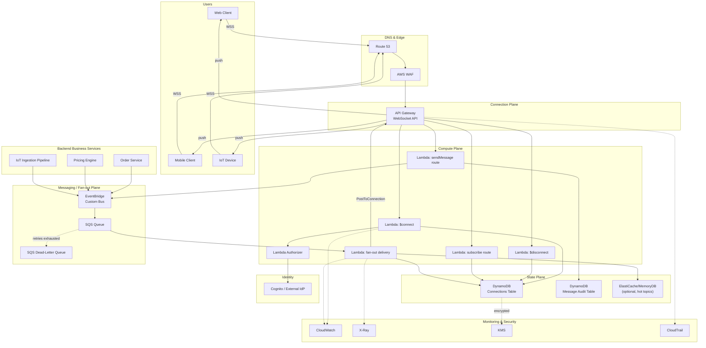

# Chapter 30 — Real-Time APIs

**Part IV – Serverless Architectures**

---

# 1. Executive Summary

## The Business Problem

Modern digital products are no longer judged only on whether they work — they are judged on whether they feel *alive*.

- Users expect dashboards that update without a manual refresh.
- Operations teams expect alerts the second a threshold is breached, not five minutes later.
- Marketplace buyers expect to see a price change, an auction bid, or a "sold out" badge appear instantly.
- Support teams expect chat messages to arrive with no perceptible delay.
- IoT fleets expect telemetry to stream continuously, not in batches.

Traditional request/response HTTP APIs are a poor fit for this class of problem.

- A REST client has to poll repeatedly to detect change, which wastes compute, wastes bandwidth, and still introduces latency equal to the polling interval.
- Polling at a frequency low enough to feel "real time" (sub-second) creates massive, mostly wasted load on backend systems — most polls return "nothing changed."
- Polling does not scale linearly. Ten thousand clients polling every second is ten thousand requests per second, the overwhelming majority of which are empty responses.

Organizations building chat, live dashboards, collaborative editing, trading platforms, multiplayer gaming backplanes, IoT command-and-control, live sports scoring, delivery tracking, or operational alerting all converge on the same underlying requirement: **a persistent, bidirectional, low-latency communication channel between client and server that can push data the instant it becomes available.**

This chapter defines a **Real-Time API architecture** built primarily on **Amazon API Gateway WebSocket APIs**, **AWS Lambda**, **Amazon DynamoDB**, and an event-driven fan-out backbone using **Amazon EventBridge** and **Amazon SQS**, with an optional in-memory layer using **Amazon ElastiCache** or **Amazon MemoryDB for Redis** for extreme fan-out scenarios.

## Architecture Objective

The objective of this architecture is to give enterprises a **serverless, horizontally scalable, pay-per-use real-time communication layer** that:

- Maintains persistent, bidirectional connections with tens of thousands to millions of concurrent clients.
- Delivers server-to-client (push) and client-to-server (send) messages with p99 latency in the tens of milliseconds, excluding wide-area network transit time.
- Requires zero server or container fleet to manage for the connection layer itself.
- Scales connection count and message throughput independently.
- Survives Availability Zone failures without dropping the service, and reconnects clients transparently.
- Integrates cleanly with existing backend systems (databases, queues, event buses) without forcing a rewrite of business logic.
- Keeps the security posture equivalent to, or stronger than, a traditional REST API — every message is authenticated and authorized, not just the initial handshake.

## Why Organizations Adopt This Architecture

- **Elimination of polling waste.** Replacing a 2-second polling interval across 50,000 clients with a push model can reduce backend request volume by more than 95%, with a proportional drop in compute and NAT/data-transfer cost.
- **User experience differentiation.** In competitive consumer markets (trading apps, marketplaces, delivery apps, social platforms), perceived speed is a retention driver. Users compare against the fastest app they have used recently, not against the previous version of your product.
- **Operational necessity.** In domains like fraud detection, industrial monitoring, and infrastructure alerting, a five-minute delay is not a UX inconvenience — it is a missed SLA or a safety issue.
- **Cost model alignment.** A serverless WebSocket layer bills per connection-minute and per message, which aligns spend directly with usage instead of paying for idle EC2/ECS fleets sized for peak concurrent connections.
- **Reduced operational burden.** No connection-handling server fleet means no capacity planning for connection storms, no manual failover runbooks for a stateful TCP-holding tier, and no OS patching for that tier.

## Major Business Benefits

| Benefit | Description |
|---|---|
| Lower infrastructure cost at scale | Pay only for active connections and messages sent, not for idle compute holding sockets open. |
| Faster feature velocity | Teams build features (chat, live tracking, notifications) as Lambda functions instead of maintaining a custom WebSocket server fleet. |
| Elastic scale | Connection capacity scales automatically with API Gateway's managed infrastructure; no pre-provisioning of connection-handling nodes. |
| Reduced blast radius | Each message-type handler is an isolated Lambda function; a bug in one route does not take down the connection layer for all other routes. |
| Built-in multi-AZ resilience | API Gateway and DynamoDB are inherently multi-AZ services; the architecture inherits this without extra design effort. |
| Simplified compliance | Centralized authorization at both connect-time and message-time make audit logging and access control easier to demonstrate to auditors than a bespoke socket server. |

## Typical Enterprise Scenarios

- **Financial services:** live price feeds, order book updates, portfolio valuation streaming, trade execution confirmations.
- **Logistics and delivery:** live shipment/vehicle location tracking, ETA updates, driver-to-dispatcher messaging.
- **SaaS collaboration tools:** presence indicators, live cursors, collaborative document editing signals, notification centers.
- **Customer support platforms:** live chat, agent presence, typing indicators, queue position updates.
- **IoT and industrial monitoring:** device telemetry ingestion, command-and-control channels, real-time alarm propagation.
- **Gaming and media:** live leaderboards, matchmaking status, live score ticker for sports content platforms.
- **Marketplace and auction platforms:** live bid updates, inventory-count changes, dynamic pricing pushes.
- **Internal operations tooling:** live infrastructure dashboards, deployment status streaming, incident command channels.

> **Note:** This chapter treats "real time" as *near-real-time push messaging* over WebSockets — typically sub-second to low-second end-to-end latency. It is not describing hard real-time control systems (microsecond-deterministic), which require specialized on-premises or edge architectures outside the scope of general-purpose cloud APIs.

Across all of these scenarios, the underlying architectural shape is nearly identical: a managed WebSocket edge, a stateless compute layer for business logic, a durable connection registry, and an event-driven fan-out mechanism. What changes between industries is the payload schema, the authorization model, and the downstream systems being integrated — not the core architecture. This is precisely what makes it a *reference* architecture rather than a one-off design.

---

# 2. Business Requirements

## Business Drivers

- Reduce latency between event occurrence and user visibility from minutes/seconds (polling) to sub-second (push).
- Reduce backend load and cost generated by high-frequency polling clients.
- Support a growing mobile and web client base without linear increases in operational headcount.
- Provide a consistent real-time channel that multiple product teams can build on top of (chat, notifications, live data) rather than each team building its own socket server.
- Meet contractual or regulatory SLAs that specify maximum data-staleness windows (e.g., trading platforms, logistics SLAs).

## Functional Requirements

| ID | Requirement |
|---|---|
| FR-1 | Clients can establish a persistent WebSocket connection authenticated against the organization's identity provider. |
| FR-2 | Server can push a message to a specific connection, a specific user (potentially multiple devices), or a broadcast group/topic. |
| FR-3 | Clients can send messages to the server over the same connection (bidirectional). |
| FR-4 | The system tracks which users/entities are subscribed to which topics or channels. |
| FR-5 | Disconnections (clean or abrupt) are detected and connection state is cleaned up within a bounded time window. |
| FR-6 | Messages that cannot be delivered (client temporarily disconnected) are either dropped per business rules or queued for redelivery, depending on the message class. |
| FR-7 | The system supports message routing based on a lightweight action/route field in the payload. |
| FR-8 | Administrators can forcibly disconnect a connection (e.g., token revocation, abuse mitigation). |

## Non-Functional Requirements

| Category | Requirement |
|---|---|
| Scalability | Support at least 100,000 concurrent connections per Region at launch, with a design path to 1,000,000+. |
| Latency | p50 end-to-end push latency under 150 ms; p99 under 500 ms (excluding client-side WAN/RTT). |
| Availability | 99.95% monthly availability for the connection and message-routing layer. |
| Durability | No message loss for "at-least-once" message classes (e.g., trade confirmations); best-effort delivery acceptable for "ephemeral" classes (e.g., live cursor position). |
| Security | All connections authenticated at connect-time; all inbound messages authorized per-route; encryption in transit (TLS 1.2+) and at rest. |
| Compliance | Support data residency, audit logging, and retention policies consistent with the industry vertical (e.g., SOC 2, PCI DSS, HIPAA where applicable). |
| Observability | Every connection lifecycle event and message must be traceable via structured logs and distributed tracing. |

## Scalability Goals

- Connection layer must scale horizontally without manual intervention — API Gateway WebSocket APIs handle this natively.
- Message fan-out layer (Lambda + EventBridge/SQS) must scale independently of connection count, since message volume and connection count do not always correlate linearly (e.g., a broadcast to 500,000 connections from a single event).
- DynamoDB connection table must handle high write throughput during connection storms (e.g., mobile app resumes after a network blip and thousands of clients reconnect within seconds).

## Availability Requirements

- Target: 99.95% for the real-time messaging plane, measured monthly.
- Multi-AZ by default (inherited from API Gateway, Lambda, and DynamoDB service design).
- Multi-Region active-passive as an optional tier for organizations with global SLAs (discussed in Section 13).

## Latency Requirements

| Message Class | Target p99 Latency |
|---|---|
| Trading / financial tick data | < 250 ms |
| Chat message delivery | < 400 ms |
| Live location tracking | < 1 s |
| Dashboard metric updates | < 2 s |
| Notification badges | < 5 s |

## Compliance Requirements

- Encryption in transit (TLS 1.2+) and at rest (AWS KMS) for all connection metadata and message payloads that are persisted.
- Audit trail of connect/disconnect/authorize events retained per regulatory retention schedule (commonly 1–7 years depending on industry).
- PII minimization in message payloads; sensitive fields tokenized or referenced by ID rather than transmitted in plaintext where feasible.
- Regional data residency enforced through Region selection and denial of cross-region replication where prohibited.

## Security Expectations

- No connection is trusted purely because it completed the WebSocket handshake — every subsequent message is authorized against the caller's permissions for that specific route/action.
- Tokens have short expiry; long-lived connections must support a re-authentication or token-refresh mechanism without dropping the socket.
- Rate limiting and abuse protection at the edge (AWS WAF on the associated REST/HTTP surface where applicable, plus Lambda-level throttling and per-connection message-rate limits).

## Recovery Objectives

| Metric | Target |
|---|---|
| RPO (connection state) | Near-zero — connection registry is written synchronously to DynamoDB on connect. |
| RPO (message data, at-least-once classes) | Near-zero — messages persisted to SQS/EventBridge before fan-out begins. |
| RTO (Regional failure, single-Region deployment) | Hours (manual failover / redeploy), acceptable only for non-critical workloads. |
| RTO (Regional failure, multi-Region deployment) | Minutes (automated Route 53 failover + client reconnect). |

## SLAs

- Internal SLA target: 99.95% monthly availability, p99 push latency under target per message class (see table above).
- External customer-facing SLA (if contractually offered): typically set slightly below the internal target (e.g., 99.9%) to leave operational margin.

## Expected Workload

- Baseline: tens of thousands of concurrent connections, low thousands of messages per second.
- Peak (e.g., market open, major sporting event, incident storm): 5–10x baseline within minutes.
- Connection churn: mobile clients reconnect frequently (network handoffs, app backgrounding); design must tolerate high connect/disconnect rates without saturating the connection registry.

## Expected Growth

- Linear growth in connection count as user base grows.
- Potential step-function growth during marketing campaigns, product launches, or seasonal peaks (retail, sports).
- Architecture must support scaling the message fan-out tier (Lambda concurrency, SQS throughput, EventBridge rules) independently from the connection tier, since these grow at different rates.

---

# 3. Architecture Overview

## Overall Design

The architecture is composed of four logical planes:

1. **Edge / Connection Plane** — Amazon API Gateway WebSocket API terminates client connections, handles the WebSocket handshake, and routes inbound frames to Lambda based on a `route selection expression`.
2. **Compute Plane** — AWS Lambda functions implement connect, disconnect, and per-route business logic (e.g., `sendMessage`, `subscribe`, `unsubscribe`, `ping`).
3. **State Plane** — Amazon DynamoDB stores the connection registry (connection ID ↔ user identity ↔ subscribed topics) with millisecond-latency reads/writes and TTL-based cleanup for stale entries.
4. **Fan-out / Messaging Plane** — Amazon EventBridge and Amazon SQS decouple event producers (business services) from the connection layer, enabling many-to-many delivery patterns (one event → many connections) without tight coupling.

An optional fifth plane, the **Acceleration Plane**, introduces Amazon ElastiCache or MemoryDB for Redis when fan-out volume exceeds what DynamoDB-driven lookups can serve cost-effectively (typically above hundreds of thousands of concurrent subscribers to a single hot topic).

## Architecture Philosophy

- **Stateless compute, durable state.** Lambda functions hold no in-memory state between invocations; all connection and subscription state lives in DynamoDB, which is what makes the compute layer horizontally scalable and safely restartable.
- **Decouple ingestion from delivery.** Producers of real-time events (order services, IoT ingestion pipelines, trading engines) never call the WebSocket delivery API directly. They publish to EventBridge or SQS. A dedicated fan-out Lambda resolves "who needs this event" and performs delivery. This means producers do not need to know anything about connections, and the delivery mechanism can evolve independently.
- **Authorize every message, not just the handshake.** A WebSocket connection is long-lived; a JWT is not. Treating the initial handshake authorization as sufficient for the life of the connection is a common and dangerous anti-pattern (see Section 27).
- **Design for reconnect, not for uptime of a single socket.** Mobile networks are unreliable. The client is expected to reconnect frequently; the server-side design goal is fast, cheap reconnection and state resynchronization — not preventing disconnects, which is not fully possible.
- **Idempotent delivery.** Because at-least-once delivery is the achievable guarantee (not exactly-once), message payloads carry an idempotency key so clients can safely de-duplicate.

## Core Components

| Component | Role |
|---|---|
| Amazon API Gateway (WebSocket API) | Terminates client WebSocket connections; routes frames to Lambda; provides `@connections` management API for server-initiated push. |
| AWS Lambda (`$connect`) | Authorizes and registers new connections into DynamoDB. |
| AWS Lambda (`$disconnect`) | Removes connection records from DynamoDB on clean or abrupt disconnect. |
| AWS Lambda (route handlers) | Implements business logic per message type (subscribe, send chat message, request snapshot, etc.). |
| Amazon DynamoDB (Connections table) | Durable registry of connection ID → identity, subscribed topics, last-seen timestamp, TTL. |
| Amazon DynamoDB (optional: Messages/Audit table) | Stores message history for at-least-once classes requiring replay or audit. |
| Amazon EventBridge | Central event bus receiving domain events from business services; routes to fan-out Lambda via rules. |
| Amazon SQS | Buffers and decouples high-volume or bursty event streams before fan-out processing; provides a dead-letter queue for failed deliveries. |
| AWS Lambda (fan-out) | Resolves target connections for an event (via DynamoDB query or Redis lookup) and invokes the API Gateway Management API to push data. |
| Amazon ElastiCache / MemoryDB (optional) | High-throughput pub/sub and topic-membership lookups for very large fan-out topics. |
| Amazon Cognito / external IdP | Issues identity tokens used for connect-time and message-time authorization. |
| Amazon CloudWatch | Metrics, logs, alarms across all planes. |
| AWS X-Ray | Distributed tracing across Lambda invocations and downstream calls. |
| AWS WAF | Protects the associated HTTP surface (REST endpoints used for token issuance, health checks) from common web exploits and abuse. |

## How Components Interact

- Clients never talk to Lambda or DynamoDB directly — every interaction passes through API Gateway, which enforces protocol semantics (handshake, ping/pong, frame routing) and authorization.
- Business services that generate real-time events (e.g., "order shipped," "price changed," "new chat message") publish those events to EventBridge; they have zero awareness of WebSockets, connection IDs, or DynamoDB.
- The fan-out Lambda subscribes to relevant EventBridge rules, resolves the list of connection IDs interested in that event (by querying DynamoDB or Redis for topic subscribers), and calls `PostToConnection` on the API Gateway Management API once per target connection.
- Stale or closed connections produce a `GoneException` from `PostToConnection`, which the fan-out Lambda uses as a signal to delete the corresponding DynamoDB record — this is the primary self-healing mechanism for connection registry hygiene.

## High-Level Workflow

1. Client authenticates against the identity provider and receives a short-lived token.
2. Client opens a WebSocket connection to the API Gateway endpoint, presenting the token as a query parameter or `Sec-WebSocket-Protocol` header (WebSocket handshakes cannot carry custom `Authorization` headers from browsers).
3. The `$connect` route invokes a Lambda authorizer (or inline validation) to verify the token; on success, a connection record is written to DynamoDB.
4. Client sends a `subscribe` message specifying topics of interest (e.g., `order-42`, `chat-room-7`); a route handler Lambda updates the subscription list in DynamoDB.
5. A backend service emits a domain event to EventBridge.
6. The fan-out Lambda receives the event, queries DynamoDB (or Redis) for all connections subscribed to the relevant topic, and pushes the payload to each via `PostToConnection`.
7. Client receives the pushed frame and updates its UI in real time.
8. On disconnect (clean close or network failure detected by API Gateway's idle timeout), the `$disconnect` route removes the connection record.

## Request Lifecycle

- **Connect:** HTTPS upgrade request → API Gateway → `$connect` Lambda → DynamoDB write → 101 Switching Protocols response.
- **Message (client → server):** WebSocket frame → API Gateway route selection → route Lambda → business logic (may write to DynamoDB, publish to EventBridge, or call downstream service).
- **Message (server → client):** Domain event → EventBridge/SQS → fan-out Lambda → DynamoDB/Redis lookup → `PostToConnection` → API Gateway delivers frame to client socket.
- **Disconnect:** TCP close or idle timeout → API Gateway → `$disconnect` Lambda → DynamoDB delete.

## Response Lifecycle

- Route handlers may optionally send a synchronous acknowledgment back over the same connection using `PostToConnection` immediately after processing, distinct from the asynchronous fan-out path used for broadcast-style events.
- Errors are returned as structured JSON frames over the same socket rather than as HTTP status codes, since the WebSocket protocol does not carry per-message HTTP semantics after the handshake.

## Data Lifecycle

- Connection metadata: created at connect, updated on subscribe/unsubscribe, deleted at disconnect or expired via DynamoDB TTL as a safety net for orphaned records (e.g., Lambda `$disconnect` failed to fire).
- Message payloads: transient for ephemeral classes (never persisted beyond the Lambda invocation); persisted to a Messages/Audit table for classes requiring replay, compliance audit, or "catch-up on reconnect" semantics.
- Dead-letter data: undeliverable messages beyond retry policy land in an SQS DLQ for investigation and, where required, manual redelivery.

---

# 4. AWS Services Used

## Amazon API Gateway (WebSocket API)

**Purpose:** Terminates client WebSocket connections at the edge; provides route-based message dispatch to Lambda; exposes the `@connections` Management API used by backend code to push messages to specific connections.

**Why selected:**
- Fully managed — no connection-handling servers to patch, scale, or fail over.
- Native integration with Lambda, IAM, and Lambda authorizers.
- Built-in support for route selection expressions, enabling clean separation of message types without a custom router.
- Automatic multi-AZ resilience within a Region.

**Alternatives:**
- Self-managed WebSocket servers on EC2/ECS (e.g., Socket.IO, ws, Elixir/Phoenix Channels) — more control, more operational burden.
- AWS AppSync (GraphQL subscriptions) — excellent when the data model is naturally GraphQL and simpler pub/sub semantics suffice; less flexible for arbitrary binary or non-GraphQL protocols.
- IoT Core (MQTT) — better suited to device fleets already speaking MQTT; less natural for browser-based web clients.

**Limitations:**
- 10-minute maximum idle timeout and 2-hour maximum connection duration per connection (as of this writing) — clients must reconnect periodically regardless of activity.
- 128 KB maximum frame size.
- Regional service — cross-region connection routing requires additional design (see Section 13).

**Pricing considerations:**
- Billed per million messages and per connection-minute. High connection-count, low-message-rate workloads (e.g., presence-only channels) are economical; very high message-rate workloads should be modeled carefully against a self-managed alternative at extreme scale.

**Best practices:**
- Use a Lambda authorizer on `$connect` rather than validating tokens inside business-route Lambdas.
- Enable access logging to CloudWatch Logs for every connect/disconnect/message event.
- Set CloudWatch alarms on `IntegrationError` and `ClientError` rates per route.

## AWS Lambda

**Purpose:** Executes all business logic — connection authorization, subscription management, message processing, and fan-out delivery.

**Why selected:** Scales automatically with concurrent invocations, requires no server management, and billing is per-millisecond of execution, aligning cost with actual usage.

**Alternatives:** Containers on ECS Fargate for handlers with heavy dependencies or long-running processing; not typically justified for the short, I/O-bound handlers used in this architecture.

**Limitations:** 15-minute maximum execution time (irrelevant here — handlers should complete in milliseconds); cold starts can add latency on the first invocation of a rarely used route.

**Pricing considerations:** Provisioned Concurrency can be applied to the `$connect` and fan-out functions if cold-start latency during traffic spikes is unacceptable for the message-latency SLA.

**Best practices:**
- Keep handler packages small; avoid bundling unnecessary dependencies to reduce cold-start time.
- Separate `$connect`, `$disconnect`, and each route into distinct functions for blast-radius isolation and independent scaling/monitoring.

## Amazon DynamoDB

**Purpose:** Stores the connection registry and, optionally, subscription topic membership and message audit history.

**Why selected:** Single-digit-millisecond reads/writes at any scale, native TTL for automatic cleanup of stale connection records, and on-demand capacity mode that matches the bursty nature of connection storms without capacity planning.

**Alternatives:** Amazon ElastiCache/MemoryDB for Redis (faster for extremely high-throughput topic lookups, but not durable by default and requires more operational design for persistence); Aurora with a connections table (viable but adds connection-pooling complexity in a Lambda-heavy architecture).

**Limitations:** 400 KB item size limit (not a practical constraint for connection metadata); on-demand mode cost can exceed provisioned mode at very high, predictable steady-state throughput.

**Pricing considerations:** On-demand mode recommended at launch for unpredictable connection patterns; migrate hot tables to provisioned with auto scaling once traffic patterns stabilize and cost optimization becomes a priority.

**Best practices:**
- Use a Global Secondary Index (GSI) keyed by `topic` to efficiently query "all connections subscribed to topic X."
- Enable TTL on the connection record as a safety net independent of the `$disconnect` Lambda.
- Enable point-in-time recovery (PITR) on any table storing audit-relevant data.

## Amazon EventBridge

**Purpose:** Central event bus decoupling event producers (order services, pricing engines, IoT pipelines) from the real-time delivery layer.

**Why selected:** Native AWS service integrations, content-based filtering via event patterns, and schema registry support make it well-suited as the backbone for many-producer, many-consumer real-time event flows.

**Alternatives:** Amazon SNS (simpler pub/sub, less rich filtering); Apache Kafka via Amazon MSK (better for extremely high-throughput streaming with consumer-group semantics and replay, at higher operational cost).

**Limitations:** At-least-once delivery (not exactly-once) — downstream consumers must be idempotent; event size limit of 256 KB.

**Pricing considerations:** Billed per million events published; economical at the message volumes typical of this architecture, but very high-throughput streaming workloads (millions of events/sec) may be more cost-effective on Kafka/MSK.

**Best practices:**
- Use a dedicated custom event bus for real-time domain events, separate from default/account-wide buses, to simplify access control and monitoring.
- Define narrow event patterns per rule to avoid unnecessary Lambda invocations.

## Amazon SQS

**Purpose:** Buffers bursty or high-volume event streams ahead of the fan-out Lambda, and provides dead-letter handling for failed deliveries.

**Why selected:** Decouples producer burst rate from consumer (Lambda) processing rate, preventing throttling errors from propagating back to business services; native Lambda event source mapping with configurable batch size and concurrency.

**Alternatives:** Direct EventBridge-to-Lambda invocation (simpler, but less resilient to consumer-side throttling); Kinesis Data Streams (better for ordered, replayable high-throughput streams, at added operational complexity).

**Limitations:** Standard queues do not guarantee strict ordering (FIFO queues do, at lower throughput ceilings); 256 KB max message size.

**Pricing considerations:** Billed per request; inexpensive at the volumes typical of this workload.

**Best practices:**
- Always configure a dead-letter queue (DLQ) with a bounded `maxReceiveCount`.
- Alarm on DLQ depth — a growing DLQ indicates systematic delivery failure, not isolated errors.

## Amazon ElastiCache / MemoryDB for Redis (Optional)

**Purpose:** Provides sub-millisecond topic-membership lookups and native pub/sub for extreme fan-out scenarios (e.g., a single topic with hundreds of thousands of subscribers).

**Why selected:** Redis pub/sub and sorted sets outperform DynamoDB GSI queries at very high read concurrency for hot-topic lookups.

**Alternatives:** DynamoDB alone (sufficient for the majority of workloads; simpler, fully durable, no cluster to manage).

**Limitations:** ElastiCache is not durable across node failure by default (MemoryDB adds durability via a transaction log, at higher cost); adds a stateful cluster to operate.

**Pricing considerations:** Node-hour billing regardless of traffic — only justified once DynamoDB read cost/latency at hot-topic scale becomes a measured bottleneck, not adopted preemptively.

**Best practices:** Introduce this layer only after profiling shows DynamoDB is the bottleneck; do not default to it at launch (see Section 27, Anti-Patterns).

## Amazon Cognito (or External IdP)

**Purpose:** Issues short-lived identity tokens used to authorize both the `$connect` handshake and, where applicable, individual sensitive messages.

**Why selected:** Native integration with API Gateway Lambda authorizers; supports OAuth2/OIDC federation with enterprise IdPs (Okta, Azure AD, Ping).

**Alternatives:** Fully external IdP with a custom Lambda authorizer validating JWTs directly (common in enterprises with an existing IdP standard).

**Best practices:** Keep token TTL short (5–15 minutes) and implement a token-refresh handshake over the WebSocket connection so long-lived sockets do not silently operate on expired authorization.

## IAM

**Purpose:** Grants least-privilege execution roles to each Lambda function (e.g., fan-out Lambda can call `execute-api:ManageConnections` and read the connections GSI, but cannot write to unrelated tables).

**Best practices:** One execution role per function group, scoped to only the actions and resources that function needs; never reuse a broad "Lambda admin" role across functions.

## Amazon CloudWatch

**Purpose:** Central metrics, logs, dashboards, and alarms across API Gateway, Lambda, DynamoDB, EventBridge, and SQS.

**Best practices:** Build a single "Real-Time API Health" dashboard combining connection count, message rate, p99 latency, error rate, and DLQ depth.

## AWS X-Ray

**Purpose:** End-to-end distributed tracing across the connect → subscribe → publish → fan-out → deliver path, essential for diagnosing latency contributors in a multi-hop asynchronous system.

## AWS WAF

**Purpose:** Protects the HTTP-based token issuance endpoints and any REST surfaces associated with the platform (e.g., admin APIs) from common exploits, credential stuffing, and volumetric abuse. WAF does not attach directly to WebSocket frame traffic; abuse control at the message level is implemented in Lambda (see Section 11).

## AWS KMS

**Purpose:** Encrypts data at rest across DynamoDB, SQS, and CloudWatch Logs; can also be used to encrypt sensitive fields within message payloads before persistence.

## AWS Secrets Manager

**Purpose:** Stores third-party IdP client secrets, API keys for downstream integrations, and any credentials the fan-out or route Lambdas require, with automatic rotation support.

## AWS Systems Manager (Parameter Store)

**Purpose:** Stores non-secret configuration (topic naming conventions, feature flags, rate-limit thresholds) referenced by Lambda functions at cold start, avoiding hardcoded configuration in deployment packages.

---

# 5. Complete Architecture Diagram



The diagram intentionally shows the **producer services on the left having zero direct connection to the WebSocket layer** — they only ever speak to EventBridge. This separation is the single most important structural decision in this architecture: it means the number of teams and services that can publish real-time events grows without any of them needing to understand connection management, DynamoDB schemas, or API Gateway semantics.

---

# 6. Component-by-Component Explanation

## API Gateway WebSocket API

- **Purpose:** Single entry point for all client connections; enforces routing and protocol semantics.
- **Responsibilities:** TLS termination, WebSocket handshake, route selection expression evaluation, invoking the correct Lambda per route, exposing the Management API for server-push.
- **Inputs:** Client HTTP upgrade requests; WebSocket frames from connected clients; `PostToConnection` calls from backend Lambdas.
- **Outputs:** Routed Lambda invocations; pushed frames to client sockets.
- **Scaling:** Fully managed, scales automatically with connection count and message rate — no configuration required.
- **High availability:** Multi-AZ by default within the Region.
- **Failure handling:** Individual connection failures do not affect other connections; a `GoneException` on push indicates the target connection no longer exists.
- **Dependencies:** Lambda (compute), Cognito/IdP (auth).
- **Security:** IAM-based access control on the Management API; Lambda authorizer on `$connect`; optional resource policies restricting API access by source VPC/IP for internal-only deployments.
- **Monitoring:** `ConnectCount`, `MessageCount`, `IntegrationLatency`, `ClientError`, `ExecutionError` CloudWatch metrics.

## `$connect` Lambda

- **Purpose:** Authorize and register new connections.
- **Responsibilities:** Validate token (directly or via Lambda authorizer), extract user identity, write initial connection record to DynamoDB.
- **Inputs:** Query string/header token, source IP, connection ID from API Gateway context.
- **Outputs:** DynamoDB `PutItem`; HTTP 200 (accept) or 401/403 (reject) returned to API Gateway.
- **Scaling:** Scales with connection rate; consider Provisioned Concurrency if connection storms are frequent and cold starts would delay handshake completion beyond acceptable UX.
- **High availability:** Stateless; any instance can process any connect event.
- **Failure handling:** On DynamoDB write failure, reject the connection (fail closed) rather than accept an unregistered connection.
- **Dependencies:** DynamoDB, Cognito/IdP.
- **Security:** Executes with least-privilege role limited to `dynamodb:PutItem` on the connections table.
- **Monitoring:** Invocation count, error rate, duration.

## `$disconnect` Lambda

- **Purpose:** Clean up connection state.
- **Responsibilities:** Delete the connection record (and any subscription index entries) from DynamoDB.
- **Inputs:** Connection ID from API Gateway context.
- **Outputs:** DynamoDB `DeleteItem`.
- **Scaling:** Scales with disconnect rate.
- **Failure handling:** If this Lambda fails or is not invoked (e.g., abrupt network loss detected only via API Gateway's internal timeout), DynamoDB TTL provides the safety-net cleanup — this is why every connection item must carry a TTL attribute.
- **Monitoring:** Invocation count, error rate; alarm if error rate is sustained, since it directly causes stale-connection buildup.

## Route Handler Lambdas (`subscribe`, `sendMessage`, etc.)

- **Purpose:** Implement per-message-type business logic.
- **Responsibilities:** Validate the inbound payload against a schema, authorize the specific action against the caller's identity/permissions, perform the business operation (update subscription list, publish an event, write an audit record).
- **Inputs:** WebSocket frame body, connection ID, cached identity context.
- **Outputs:** DynamoDB writes, EventBridge `PutEvents` calls, optional synchronous `PostToConnection` acknowledgment.
- **Scaling:** Independent per route — a spike in `subscribe` traffic does not throttle `sendMessage` traffic, since each is a separate function with its own concurrency pool.
- **Failure handling:** Return a structured error frame to the client; never fail silently.
- **Security:** Per-route authorization check — connection identity must be re-validated against the specific action being requested, not just the original handshake.

## Fan-out Lambda

- **Purpose:** Resolve delivery targets for an inbound domain event and push messages to them.
- **Responsibilities:** Consume from SQS (or be invoked directly by EventBridge for lower-volume rules), query DynamoDB GSI (or Redis) for subscribers of the relevant topic, batch `PostToConnection` calls, handle `GoneException` by deleting stale connection records.
- **Inputs:** SQS message batch containing the domain event.
- **Outputs:** Pushed WebSocket frames; DynamoDB deletes for stale connections; DLQ entries for exhausted retries.
- **Scaling:** Scales with SQS queue depth via the Lambda event source mapping's reserved concurrency setting; this is the primary tunable for controlling fan-out throughput versus downstream API Gateway throttling limits.
- **High availability:** Stateless; SQS visibility timeout ensures at-least-once processing even if an invocation fails partway through a batch.
- **Failure handling:** Partial batch failure reporting (returning only the failed message IDs) prevents successfully delivered messages within a batch from being needlessly retried.
- **Monitoring:** Fan-out duration, per-batch delivery success rate, `GoneException` rate (a leading indicator of connection registry staleness).

## DynamoDB Connections Table

- **Purpose:** Source of truth for "who is connected and what are they subscribed to."
- **Responsibilities:** Store connection ID, user identity, subscribed topics, TTL, last-activity timestamp.
- **Scaling:** On-demand capacity mode absorbs connection storms without pre-provisioning.
- **High availability:** Multi-AZ by default; optionally Global Tables for multi-Region designs.
- **Failure handling:** Conditional writes prevent race conditions between concurrent subscribe/unsubscribe operations on the same connection.
- **Security:** Encrypted at rest with a customer-managed KMS key; access restricted via IAM to only the specific Lambda roles that need it.
- **Monitoring:** Consumed capacity, throttled requests, item count trend.

## EventBridge Custom Bus

- **Purpose:** Ingest domain events from business services without coupling producers to the delivery mechanism.
- **Responsibilities:** Pattern-match incoming events to rules; route matching events to the SQS queue feeding the fan-out Lambda.
- **Scaling:** Fully managed; scales with publish rate.
- **Security:** Resource policy restricting which account principals may publish to the bus.
- **Monitoring:** `MatchedEvents`, `FailedInvocations`, rule-level metrics.

## SQS Queue (and DLQ)

- **Purpose:** Absorb bursts and decouple producer rate from fan-out Lambda processing rate.
- **Responsibilities:** Buffer events; retry failed fan-out attempts up to a configured `maxReceiveCount`; route exhausted messages to the DLQ.
- **Scaling:** Effectively unlimited depth; throughput scales with Lambda consumer concurrency.
- **Monitoring:** `ApproximateNumberOfMessagesVisible`, `ApproximateAgeOfOldestMessage`, DLQ depth (alarm-worthy at any non-zero sustained value).

## ElastiCache / MemoryDB (Optional)

- **Purpose:** Sub-millisecond topic-membership resolution for extreme-scale hot topics.
- **Responsibilities:** Maintain topic-to-connection-ID sets; support native pub/sub for very high fan-out rates.
- **Scaling:** Cluster mode for horizontal scaling across shards.
- **High availability:** Multi-AZ replication groups; MemoryDB adds a durable transaction log across AZs.
- **Failure handling:** Design must tolerate cache misses by falling back to DynamoDB as source of truth — Redis in this architecture is a performance cache, not the system of record, unless MemoryDB is explicitly chosen for its durability guarantees.

## Cognito / External IdP

- **Purpose:** Issue and validate identity tokens.
- **Responsibilities:** Authenticate users, issue short-lived JWTs, support token refresh.
- **High availability:** Managed service with Cognito; external IdP availability is the customer's responsibility to architect (typically already multi-AZ/multi-region for enterprise IdPs).

---

# 7. End-to-End Request Flow

## Flow A — Client Connects and Subscribes

1. Client authenticates against Cognito/IdP and receives a short-lived JWT.
2. Client opens `wss://api.example.com/prod?token=<jwt>`.
3. API Gateway receives the HTTP upgrade request and invokes the Lambda authorizer.
4. Lambda authorizer validates the JWT signature, expiry, and claims; returns an IAM policy document (Allow/Deny) plus a context object containing the user ID.
5. On Allow, API Gateway invokes the `$connect` route Lambda.
6. `$connect` Lambda writes a new item to the DynamoDB connections table: `{connectionId, userId, connectedAt, ttl}`.
7. API Gateway completes the WebSocket handshake (HTTP 101 Switching Protocols).
8. Client sends a `{"action": "subscribe", "topic": "order-42"}` frame.
9. API Gateway evaluates the route selection expression, matches `subscribe`, and invokes the `subscribe` route Lambda.
10. The `subscribe` Lambda validates that the user is authorized to subscribe to `order-42` (e.g., they own that order), then updates the DynamoDB item to add `order-42` to the connection's subscribed-topics list and/or writes an entry to a topic-indexed GSI.
11. The `subscribe` Lambda optionally sends a synchronous acknowledgment frame back to the client via `PostToConnection`.

## Flow B — Server Pushes a Real-Time Update

1. The Order Service updates order status and publishes an `OrderStatusChanged` event to the EventBridge custom bus with detail `{orderId: "42", status: "shipped"}`.
2. An EventBridge rule matching `OrderStatusChanged` events routes the event to the fan-out SQS queue.
3. The fan-out Lambda polls the queue and receives a batch containing this event.
4. The Lambda queries the DynamoDB GSI for all connections subscribed to topic `order-42`.
5. For each matching connection ID, the Lambda calls `PostToConnection` with the update payload.
6. API Gateway delivers the frame to each connected client's socket.
7. If a `PostToConnection` call returns `GoneException` (client disconnected but the record was not yet cleaned up), the Lambda deletes that connection's DynamoDB item inline.
8. The Lambda reports any genuinely failed deliveries (e.g., throttling) back to SQS as partial batch failures, so only those specific messages are retried.
9. Logs and X-Ray trace segments are emitted for the full 42-to-delivery path, enabling latency breakdown per hop.
10. CloudWatch metrics for message count, delivery latency, and error rate are updated.

## Flow C — Client Disconnects

1. Client closes the browser tab, loses network connectivity, or the app is backgrounded past the platform's socket-keepalive limit.
2. API Gateway detects the closed TCP connection or idle timeout.
3. API Gateway invokes the `$disconnect` route Lambda.
4. The Lambda deletes the connection's DynamoDB item (and any topic-index entries).
5. As a safety net, if step 3 fails to fire (rare, but possible during certain failure modes), the DynamoDB TTL attribute ensures the item is automatically purged within the configured TTL window (commonly 2 hours, matching API Gateway's max connection duration).

## Flow D — Error Handling Along the Path

- **Invalid token at connect:** Lambda authorizer returns Deny; API Gateway responds with HTTP 401 during the handshake; client surfaces a re-authentication prompt.
- **Malformed message payload:** Route Lambda returns a structured `{"error": "invalid_payload"}` frame over the same connection; connection remains open.
- **Unauthorized subscribe attempt:** Route Lambda returns `{"error": "forbidden", "topic": "order-99"}`; the subscription is not recorded.
- **Downstream EventBridge publish failure:** Route Lambda retries with exponential backoff (SDK default) up to a bounded attempt count, then surfaces an error frame to the client and logs the failure for alerting.
- **Fan-out delivery failure (throttling):** SQS-based retry with backoff; messages exceeding `maxReceiveCount` land in the DLQ for investigation, never silently dropped.

---

# 8. Deployment Flow

## Infrastructure Provisioning

- All infrastructure (API Gateway, Lambda, DynamoDB, EventBridge, SQS, IAM roles) is defined as code using Terraform (see Section 18) and versioned in a Git repository.
- Environments (dev, staging, prod) are isolated via separate AWS accounts under AWS Organizations, each with its own Terraform state.

## Terraform Workflow

1. Developer opens a pull request with infrastructure changes.
2. CI pipeline runs `terraform fmt -check`, `terraform validate`, and `tflint`.
3. CI runs `terraform plan` against the target environment and posts the plan output as a PR comment for review.
4. On approval and merge, CI runs `terraform apply` against dev automatically; staging and prod applies require a manual approval gate.

## CI/CD Deployment

- Lambda function code is packaged, tested, and deployed independently of infrastructure changes using a separate pipeline stage (see Section 20).
- Each Lambda function is versioned; deployments use versioned aliases (`live`) so traffic shifting is possible without redeploying infrastructure.

## Blue-Green Deployment

- Lambda supports weighted alias routing natively — new versions are shifted from 0% to 100% traffic gradually (e.g., 10% → 50% → 100%) with CloudWatch alarms gating each step.
- API Gateway stage variables can point to different Lambda aliases per environment/deployment wave without redeploying the API definition itself.

## Rollback

- Because Lambda aliases are versioned, rollback is a traffic-weight change back to the previous version — typically completing in under a minute, with no data migration required since DynamoDB schema changes are additive and backward-compatible by convention (see Anti-Patterns, Section 27, for the risk of breaking this convention).

## Secrets

- IdP client secrets and any third-party API keys are stored in Secrets Manager and referenced by ARN in Lambda environment configuration — never embedded in code or Terraform variable files.

## Configuration

- Non-secret configuration (topic naming rules, rate-limit thresholds, feature flags) is stored in Systems Manager Parameter Store and read at Lambda cold start, cached for the life of the execution environment.

## Validation

- Post-deployment smoke tests open a WebSocket connection, subscribe to a test topic, publish a synthetic event, and assert delivery within the latency SLA before marking a deployment successful.

---

# 9. Network Topology

## VPC

- API Gateway (WebSocket API) and the associated Lambda functions can run either outside a VPC (default, lowest latency, sufficient when downstream dependencies are AWS-managed services reachable over public AWS APIs) or attached to a VPC when they must reach private resources (e.g., an RDS instance, an internal service on ECS).

## CIDR

- Example allocation for the VPC hosting VPC-attached Lambdas and any ElastiCache/MemoryDB cluster: `10.20.0.0/16`, subdivided into `/24` subnets per AZ per tier.

## Public Subnets

- Used only for NAT Gateways and, if applicable, an Application Load Balancer fronting any auxiliary REST endpoints (e.g., token issuance helper APIs). The WebSocket API itself is a regional API Gateway endpoint, not deployed inside the VPC's public subnets.

## Private Subnets

- Host VPC-attached Lambda ENIs and the ElastiCache/MemoryDB cluster nodes.

## NAT Gateway

- One per AZ for high availability, allowing VPC-attached Lambdas to reach public AWS service endpoints (or the internet, if required) without exposing them publicly. Use VPC Interface Endpoints (PrivateLink) for DynamoDB, EventBridge, and SQS instead of routing through NAT, reducing both cost and blast radius.

## Internet Gateway

- Attached to the VPC to support the public subnets' NAT Gateway egress path.

## Transit Gateway

- Used when the real-time platform's VPC must reach shared services (identity, logging) hosted in other VPCs/accounts as part of a hub-and-spoke enterprise network design (see Chapter 17).

## Route Tables

- Private subnet route tables direct `0.0.0.0/0` to the NAT Gateway and direct AWS-service-specific prefixes to VPC endpoints instead, where endpoints are configured.

## Network ACLs

- Stateless NACLs at the subnet boundary provide a coarse-grained defense-in-depth layer, typically allowing only the ports/protocols required (e.g., 443 for VPC endpoint traffic, ephemeral ports for return traffic).

## Security Groups

- Lambda ENI security group: egress only to the specific security groups of DynamoDB VPC endpoint, ElastiCache cluster, and any internal services required — no broad `0.0.0.0/0` egress.
- ElastiCache/MemoryDB security group: ingress only from the Lambda security group on the Redis port (6379/TLS).

## PrivateLink

- VPC Interface Endpoints for DynamoDB, EventBridge, SQS, Secrets Manager, and Systems Manager keep all control-plane and data-plane traffic within the AWS network backbone, improving latency and security posture versus routing through NAT/internet.

## Hybrid Connectivity

- For enterprises integrating on-premises event producers (e.g., a legacy order management system) with EventBridge, Direct Connect or Site-to-Site VPN provides the private network path, with an EventBridge custom bus resource policy restricting which on-premises-originated principals may publish events.

---

# 10. Identity and Access

## IAM Roles

- **`connect-lambda-role`:** `dynamodb:PutItem` on the connections table only.
- **`disconnect-lambda-role`:** `dynamodb:DeleteItem` on the connections table only.
- **`route-handler-role`:** `dynamodb:UpdateItem`/`Query` on the connections table (scoped to specific attributes where possible), `events:PutEvents` on the custom bus.
- **`fanout-lambda-role`:** `dynamodb:Query` on the connections GSI, `dynamodb:DeleteItem` for stale-connection cleanup, `execute-api:ManageConnections` scoped to the specific API Gateway ARN, `sqs:ReceiveMessage`/`DeleteMessage`/`ChangeMessageVisibility` on the fan-out queue.

## IAM Policies

- Every policy is scoped to specific resource ARNs, not wildcards, and to the minimum action set each function requires — no function holds `dynamodb:*` or `execute-api:*`.

## Resource Policies

- The EventBridge custom bus carries a resource policy restricting `events:PutEvents` to the specific IAM roles/accounts of authorized producer services, preventing unrelated services or accounts from injecting events into the real-time delivery pipeline.

## STS

- Cross-account producer services (in a multi-account AWS Organizations setup) assume a dedicated `event-publisher-role` via STS `AssumeRole` before calling `PutEvents`, rather than being granted long-lived credentials.

## Cross-Account Access

- In enterprises where business services live in separate AWS accounts from the real-time platform (a common landing-zone pattern), the EventBridge bus resource policy explicitly lists permitted source account IDs, and each producer account's IAM role is scoped to only that specific bus ARN.

## Least Privilege

- Applied consistently: each Lambda function's execution role is generated per-function (not shared) via Terraform modules, so a change to one function's permissions never inadvertently widens another's.

## Service Roles

- API Gateway's CloudWatch Logs role is scoped only to write log groups under the platform's designated log-group prefix.

## Permission Boundaries

- A permission boundary policy is attached to all Lambda execution roles in the platform's account, capping the maximum permissions any role can ever be granted (e.g., explicitly denying `iam:*`, `organizations:*`, and cross-service actions unrelated to the real-time platform) — a defense against future policy drift or a misconfigured Terraform change silently over-granting a role.

---

# 11. Security Architecture

## Encryption

- **In transit:** All client connections use `wss://` (TLS 1.2+), enforced by API Gateway; internal calls between Lambda and DynamoDB/EventBridge/SQS use the AWS SDK's default TLS.
- **At rest:** DynamoDB tables, SQS queues, and CloudWatch Log groups are encrypted with customer-managed KMS keys, not the AWS-managed default, to support key-rotation and access-audit requirements common in regulated industries.

## KMS

- A dedicated CMK per environment (dev/staging/prod) with a key policy restricting `kms:Decrypt` to the specific Lambda execution roles that need it.

## TLS

- Minimum TLS 1.2 enforced at the API Gateway custom domain via a security policy setting; TLS 1.3 preferred where client compatibility allows.

## WAF

- Attached to the custom domain / any REST surface used for token issuance and admin operations; rules include AWS Managed Rules (Core Rule Set, Known Bad Inputs) plus a rate-based rule to blunt connection-request floods at the handshake stage.

## Shield

- AWS Shield Standard is active by default on all AWS edge services; Shield Advanced is recommended for platforms with a contractual DDoS-protection SLA or that are known targets (e.g., public-facing trading platforms).

## Secrets Manager

- Stores IdP client secrets and any third-party credentials, with automatic rotation configured for supported secret types.

## Certificate Manager

- Issues and auto-renews the TLS certificate bound to the API Gateway custom domain.

## GuardDuty

- Enabled account-wide; monitors for anomalous API calls (e.g., unusual `PostToConnection` volume from a compromised credential, unexpected IAM role usage patterns).

## Inspector

- Scans Lambda function dependencies for known vulnerabilities as part of the CI pipeline, blocking deployment of functions with critical unpatched CVEs.

## Security Hub

- Aggregates findings from GuardDuty, Inspector, and Config across the platform's accounts into a single compliance dashboard, mapped against the relevant industry framework (e.g., PCI DSS, NIST 800-53).

## CloudTrail

- Records all management-plane API calls (Terraform applies, manual console changes, IAM role assumptions) for audit; a dedicated organization trail delivers logs to a centralized, access-restricted S3 bucket.

## AWS Config

- Continuously evaluates resource configuration against rules (e.g., "DynamoDB tables must have encryption enabled," "Lambda functions must not have public resource policies") and flags drift.

## Zero Trust

- No implicit trust is granted based on network location or connection longevity. Every message on every route is authorized against the caller's current permissions, not just their state at connect-time — this is the core Zero Trust principle applied to a stateful protocol (see Chapter 87 for the full Zero Trust reference architecture this pattern is derived from).

## Threat Model

| Threat | Description |
|---|---|
| Token theft / replay | An attacker captures a valid JWT and opens a connection impersonating the user. |
| Connection flooding | An attacker opens large numbers of connections to exhaust account-level concurrency limits or drive up cost. |
| Message flooding | A compromised or malicious client sends messages at a high rate to exhaust downstream capacity or degrade service for others. |
| Topic enumeration | An attacker attempts to subscribe to topics they do not own to exfiltrate other users' data. |
| Stale authorization | A connection remains open and continues receiving privileged data after the user's underlying permissions have been revoked. |
| Injection via message payload | Malformed or malicious payloads attempt to exploit downstream processing (e.g., NoSQL injection into DynamoDB queries built from unsanitized input). |

## Attack Vectors and Mitigations

| Attack Vector | Mitigation |
|---|---|
| Stolen JWT reused after expiry | Short token TTL (5–15 min) plus mandatory re-authentication handshake for long-lived connections. |
| Connection-flood DoS | Per-source-IP rate limiting via WAF on the handshake path; API Gateway account-level connection quotas monitored and alarmed. |
| Message-flood abuse from a single connection | Per-connection message-rate limiting enforced in the route Lambda (token bucket keyed by connection ID, backed by DynamoDB or Redis counters). |
| Unauthorized topic subscription | Explicit authorization check in the `subscribe` route Lambda against the resource owner, never trusting client-supplied topic ownership claims. |
| Stale authorization after permission revocation | Short-lived tokens force periodic re-validation; critical permission changes can additionally trigger a forced disconnect via the admin `DeleteConnection` capability. |
| Payload injection | Strict JSON schema validation on every inbound message before any downstream call is constructed; parameterized DynamoDB expressions, never string-concatenated queries. |

---

# 12. High Availability

## AZ Failures

- API Gateway, Lambda, and DynamoDB are inherently multi-AZ services; an AZ failure is transparently absorbed without operator intervention.
- VPC-attached Lambdas require ENIs provisioned across at least two AZs' private subnets; Terraform modules should enforce this by default (see Section 18).

## Instance Failures

- Not applicable to the connection/compute layer (no instances). ElastiCache/MemoryDB nodes, if used, are deployed as Multi-AZ replication groups so a primary node failure triggers automatic failover to a replica.

## Regional Failures

- Single-Region deployments accept a manual, multi-hour RTO for full Regional failure. Multi-Region deployments (Section 13) provide automated failover via Route 53 health checks.

## Database Failures

- DynamoDB's multi-AZ replication makes single-AZ database failure transparent. Global Tables extend this to Regional failure for multi-Region designs.

## Load Balancing

- API Gateway internally load-balances connections across its multi-AZ infrastructure; no customer-managed load balancer is required for the WebSocket layer itself.

## Health Checks

- Route 53 health checks against a lightweight synthetic-connection Lambda (opens a WebSocket connection, subscribes, publishes a test event, verifies delivery) validate true end-to-end health, not just "API Gateway responds to HTTPS."

## Failover

- Client SDKs implement exponential-backoff reconnect logic; on Regional failover, DNS TTL (kept short, e.g., 30–60 seconds) ensures clients reconnect to the healthy Region within a bounded window.

---

# 13. Disaster Recovery

## Backup Strategy

- DynamoDB point-in-time recovery (PITR) enabled on any table storing audit-relevant or non-reconstructible data (e.g., message audit history); the connections table itself is ephemeral/reconstructible state and does not require PITR — a full reconnect storm is an acceptable recovery path.

## Snapshots

- DynamoDB on-demand backups taken before major schema migrations, retained per the organization's change-management policy.

## Cross-Region Replication

- DynamoDB Global Tables replicate the connections and audit tables to a secondary Region for multi-Region deployments.
- EventBridge cross-Region event replication (or a producer-side dual-publish pattern) ensures domain events reach the fan-out pipeline in both Regions.

## Pilot Light

- The minimum viable DR posture: infrastructure defined in Terraform for a secondary Region, deployed but scaled to near-zero (Lambda has no idle cost; DynamoDB Global Tables replicate continuously at low incremental cost). Activation requires promoting the secondary Region's API Gateway custom domain via Route 53 failover.

## Warm Standby

- A step up from Pilot Light: the secondary Region's API Gateway and Lambda functions are actively deployed and periodically exercised with synthetic traffic, reducing failover validation risk at modest additional operational overhead.

## Multi-Site (Active-Active)

- For platforms with a strict global-availability SLA (e.g., a worldwide trading platform), both Regions actively serve production connections, with clients geo-routed via Route 53 latency-based routing and DynamoDB Global Tables providing eventually consistent cross-Region state.
- **Trade-off:** Active-Active introduces eventual-consistency windows for cross-Region subscription state — a subscription made in Region A may take up to the Global Tables replication lag (typically sub-second, but not zero) to be visible in Region B's fan-out queries. Business logic must tolerate this window or implement compensating reconciliation.

## Active-Passive

- The more common enterprise choice: one Region serves all traffic; the second Region is Warm Standby, promoted only on declared disaster. Simpler operationally, avoids the cross-Region consistency trade-offs of Active-Active, at the cost of a non-zero (though bounded) RTO during failover.

## RPO / RTO Summary

| DR Tier | RPO | RTO | Relative Cost |
|---|---|---|---|
| Single-Region, no DR | Hours (manual restore) | Hours–days | Lowest |
| Pilot Light | Near-zero (continuous replication) | 15–60 min | Low |
| Warm Standby | Near-zero | 5–15 min | Medium |
| Active-Active | Near-zero (sub-second lag) | Seconds (client reconnect only) | Highest |

---

# 14. Scalability

## Horizontal Scaling

- The connection layer (API Gateway) scales horizontally by design — there is no fleet size to configure.
- The compute layer (Lambda) scales horizontally per function up to account/Region concurrency limits, which should be tracked and raised proactively (see Section 17, Scaling Limits) ahead of anticipated growth.

## Vertical Scaling

- Not a meaningful lever in this architecture — Lambda memory allocation is tuned for cost/performance (more memory also grants more CPU), not for handling "bigger" connections, since each connection's handling is uniform regardless of overall connection count.

## Auto Scaling

- Implicit and automatic for API Gateway and Lambda. For DynamoDB in provisioned mode (adopted after traffic patterns stabilize), Application Auto Scaling adjusts read/write capacity units based on consumed-capacity CloudWatch metrics.

## Serverless Scaling

- The entire connection and compute plane scales to zero when idle and scales up within seconds of load increasing — this is the primary cost and operational advantage over a self-managed WebSocket server fleet.

## Database Scaling

- DynamoDB on-demand mode scales automatically to match request rate; provisioned mode with auto scaling is a cost-optimization step once steady-state throughput is well understood (see Section 16).
- GSIs used for topic-membership queries scale independently of the base table's primary key access pattern.

## Storage Scaling

- DynamoDB storage grows automatically with item count; TTL-based expiry on connection records keeps steady-state storage bounded to actual concurrent connections rather than growing unbounded with historical churn.

## Queue Scaling

- SQS scales to effectively unlimited depth and throughput; the practical scaling lever is the Lambda event source mapping's batch size and reserved concurrency, tuned to balance fan-out throughput against API Gateway's `PostToConnection` rate limits.

---

# 15. Performance Optimization

## Caching

- Cache topic-membership lookups in ElastiCache/MemoryDB once DynamoDB GSI query latency becomes the dominant contributor to fan-out latency at high subscriber counts per topic.
- Cache IdP public keys (JWKS) in Lambda execution environment memory across warm invocations to avoid a network round-trip on every `$connect` authorization.

## Compression

- Enable payload compression for larger broadcast messages (e.g., initial state snapshots) where client libraries support transparent WebSocket compression, reducing bytes-on-wire for bandwidth-constrained mobile clients.

## CDN

- Not directly applicable to the WebSocket data plane itself (CloudFront does not cache WebSocket frames), but CloudFront is used in front of the token-issuance and any static-asset endpoints associated with the client application.

## Database Optimization

- Design the connections table's GSI with `topic` as partition key and `connectionId` as sort key so a single `Query` retrieves all subscribers to a topic in one round trip, avoiding a `Scan`.
- Keep connection items small (avoid storing large payload history inline) to keep read/write capacity consumption low per operation.

## Connection Pooling

- Not applicable in the traditional sense to Lambda-to-DynamoDB calls (the SDK manages HTTP keep-alive internally), but Lambda execution environment reuse (via warm starts) effectively pools the underlying HTTP connections to AWS service endpoints across invocations.

## Concurrency

- Set reserved concurrency on the fan-out Lambda to a value calibrated against API Gateway's `PostToConnection` per-second limit, preventing the fan-out layer from generating throttling errors faster than it can usefully retry them.

## Async Processing

- The entire server-to-client push path is inherently asynchronous relative to the originating business event (EventBridge → SQS → Lambda), which is what allows the business service that published the event to return immediately without waiting for fan-out completion.

---

# 16. Cost Optimization (FinOps)

## Estimated Monthly Cost — Small Deployment

*(10,000 concurrent connections, ~500 messages/sec average, single Region)*

| Line Item | Estimated Monthly Cost |
|---|---|
| API Gateway WebSocket (connection-minutes + messages) | $250 |
| Lambda (all functions combined) | $80 |
| DynamoDB (on-demand) | $60 |
| EventBridge | $15 |
| SQS | $10 |
| CloudWatch Logs/Metrics | $40 |
| Data transfer | $30 |
| **Total (approx.)** | **~$485/month** |

## Estimated Monthly Cost — Medium Deployment

*(100,000 concurrent connections, ~5,000 messages/sec average, single Region)*

| Line Item | Estimated Monthly Cost |
|---|---|
| API Gateway WebSocket | $2,400 |
| Lambda | $700 |
| DynamoDB (on-demand, transitioning to provisioned) | $500 |
| EventBridge | $120 |
| SQS | $80 |
| ElastiCache (introduced at this scale for hot topics) | $350 |
| CloudWatch | $250 |
| Data transfer | $300 |
| **Total (approx.)** | **~$4,700/month** |

## Estimated Monthly Cost — Enterprise Deployment

*(1,000,000 concurrent connections, ~50,000 messages/sec average, multi-Region Warm Standby)*

| Line Item | Estimated Monthly Cost |
|---|---|
| API Gateway WebSocket (both Regions) | $22,000 |
| Lambda | $6,500 |
| DynamoDB Global Tables | $5,000 |
| EventBridge | $1,100 |
| SQS | $700 |
| MemoryDB (durable hot-topic tier) | $3,200 |
| CloudWatch / X-Ray | $2,000 |
| Data transfer (incl. cross-Region replication) | $3,500 |
| WAF / Shield Advanced | $3,200 |
| **Total (approx.)** | **~$47,000+/month** |

> **Note:** These figures are illustrative planning estimates, not quotes. Always validate against the current AWS Pricing Calculator for the target Region and negotiated enterprise discount rates.

## Major Cost Drivers

- API Gateway connection-minutes at very high concurrent-connection counts with long-lived sessions.
- Message volume (both API Gateway message pricing and downstream Lambda invocation count).
- CloudWatch Logs ingestion and retention if verbose logging is left at default settings in production.
- Cross-AZ and cross-Region data transfer in multi-Region designs.

## Optimization Opportunities

- Move DynamoDB from on-demand to provisioned capacity with auto scaling once steady-state and peak traffic patterns are well understood, typically saving 20–40% on database spend at predictable, high-volume workloads.
- Apply Compute Savings Plans against Lambda's committed baseline usage.
- Right-size CloudWatch Logs retention per log group (e.g., 30 days for debug logs, 1–7 years only for compliance-relevant audit logs) rather than applying a single blanket retention policy.
- Use S3 lifecycle policies to move exported/archived audit logs from CloudWatch Logs to S3 Glacier Deep Archive for long-term regulatory retention at a fraction of CloudWatch Logs' storage cost.

## Reserved Instances / Savings Plans

- Not directly applicable to API Gateway or DynamoDB on-demand, but **Compute Savings Plans** apply to Lambda usage and typically yield double-digit percentage savings for predictable baseline invocation volume.

## Spot

- Not applicable — no EC2/Fargate compute exists in this architecture's core path. (Spot may be relevant only for auxiliary batch-analytics jobs processing exported message logs, outside the real-time path itself.)

## S3 Lifecycle / Storage Classes

- Exported CloudWatch Logs and DynamoDB backups destined for long-term retention should transition: S3 Standard (0–30 days) → S3 Standard-IA (30–90 days) → S3 Glacier Deep Archive (90+ days, compliance retention).

## Rightsizing

- Tune Lambda memory allocation using AWS Lambda Power Tuning to find the price/performance sweet spot per function — over-provisioned memory is a common, easily corrected source of Lambda cost waste.

## Cost Allocation and Tagging

| Tag Key | Example Value | Purpose |
|---|---|---|
| `environment` | `prod` | Environment-level cost breakdown |
| `application` | `realtime-api` | Application-level cost breakdown |
| `team` | `platform-messaging` | Chargeback to owning team |
| `cost-center` | `CC-4821` | Finance chargeback code |

## Budgets and Cost Anomaly Detection

- AWS Budgets configured with alert thresholds at 50%, 80%, and 100% of forecasted monthly spend per environment.
- AWS Cost Anomaly Detection monitors the platform's cost allocation tag group and alerts the platform team directly (via SNS to Slack/email) on statistically significant spend deviations — this frequently catches runaway Lambda retry loops or an unintentionally verbose logging change before it becomes a large bill.

---

# 17. AI-Assisted Operations

## Amazon Q

- Amazon Q Developer assists engineers in writing and reviewing the Lambda handler code for route logic, flagging common WebSocket anti-patterns (e.g., missing `GoneException` handling) during code review.
- Amazon Q in the AWS console can be asked to explain a spike in `IntegrationError` on a specific API Gateway route, surfacing correlated CloudWatch Logs and recent deployment events.

## Bedrock

- Amazon Bedrock (with a foundation model such as Anthropic's Claude) can be integrated into the operational tooling to summarize incident timelines from CloudWatch Logs Insights query results into human-readable postmortem drafts.
- Bedrock-backed classification can triage inbound support tickets referencing "messages not arriving" by correlating ticket text against known open incidents.

## AI Troubleshooting

- A Bedrock-backed runbook assistant can take a CloudWatch alarm payload (e.g., "DLQ depth > 0 for 10 minutes") and propose the most likely root cause based on historical incident patterns stored in a knowledge base, before a human engineer is even paged.

## Log Analysis

- CloudWatch Logs Insights queries, combined with a Bedrock summarization step, turn a 10,000-line trace of a fan-out incident into a three-paragraph human-readable summary of what happened, when, and which connections were affected.

## Incident Response

- AI-assisted first-response can automatically post a structured incident summary to the on-call Slack channel the moment a Sev-2 alarm fires, reducing the mean-time-to-context for the responding engineer.

## Cost Optimization

- Bedrock-driven analysis of AWS Cost and Usage Report data (see Chapter 97) can identify that a specific Lambda function's memory allocation is oversized relative to its actual duration profile and recommend a specific new setting.

## Capacity Planning

- Historical CloudWatch metrics fed into a forecasting model (via Bedrock or a purpose-built time-series model) project when connection-count growth will approach Lambda concurrency or DynamoDB throughput soft limits, giving the platform team lead time to request quota increases.

## Architecture Review

- Amazon Q can review a proposed Terraform change against AWS Well-Architected best practices before it reaches a human reviewer, flagging issues like a DynamoDB table missing encryption or a Lambda role with overly broad permissions.

## AI-Generated Terraform

- Amazon Q Developer can scaffold new Terraform modules (e.g., a new WebSocket route) from a natural-language description, which engineers then review and refine — accelerating initial drafting while human review remains mandatory before merge.

## AI-Generated Documentation

- Bedrock can generate and keep in sync a plain-language description of each EventBridge rule's purpose based on its event pattern definition, reducing the documentation-drift problem common in event-driven architectures where the "why" of a rule is easily lost over time.

> **Note:** AI-assisted operations tooling supplements, but never replaces, human review of production changes and incident decisions in this architecture. Every AI-generated Terraform change and every AI-drafted incident action still requires human approval before execution.

---

# 18. Terraform Implementation

## Providers and Variables

```hcl

# providers.tf

terraform {
  required_version = ">= 1.7.0"

  required_providers {
    aws = {
      source  = "hashicorp/aws"
      version = "~> 5.0"
    }
  }

  backend "s3" {
    bucket         = "acme-realtime-api-tfstate-prod"
    key            = "realtime-api/prod/terraform.tfstate"
    region         = "us-east-1"
    dynamodb_table = "terraform-locks"
    encrypt        = true
  }
}

provider "aws" {
  region = var.aws_region

  default_tags {
    tags = {
      environment = var.environment
      application = "realtime-api"
      team        = "platform-messaging"
      managed-by  = "terraform"
    }
  }
}

```

```hcl

# variables.tf

variable "aws_region" {
  description = "AWS Region for deployment"
  type        = string
  default     = "us-east-1"
}

variable "environment" {
  description = "Deployment environment (dev, staging, prod)"
  type        = string
}

variable "connection_table_name" {
  description = "Name of the DynamoDB connections table"
  type        = string
  default     = "realtime-connections"
}

variable "connection_ttl_seconds" {
  description = "TTL for connection records as a safety net for orphaned entries"
  type        = number
  default     = 7200
}

variable "lambda_runtime" {
  description = "Lambda runtime for all functions"
  type        = string
  default     = "nodejs20.x"
}

variable "fanout_reserved_concurrency" {
  description = "Reserved concurrency for the fan-out Lambda"
  type        = number
  default     = 50
}

```

## Networking (VPC Endpoints for VPC-Attached Functions)

```hcl

# networking.tf

resource "aws_vpc_endpoint" "dynamodb" {
  vpc_id            = aws_vpc.realtime.id
  service_name      = "com.amazonaws.${var.aws_region}.dynamodb"
  vpc_endpoint_type = "Gateway"
  route_table_ids   = aws_route_table.private[*].id
}

resource "aws_vpc_endpoint" "sqs" {
  vpc_id              = aws_vpc.realtime.id
  service_name        = "com.amazonaws.${var.aws_region}.sqs"
  vpc_endpoint_type    = "Interface"
  subnet_ids           = aws_subnet.private[*].id
  security_group_ids   = [aws_security_group.vpc_endpoints.id]
  private_dns_enabled  = true
}

resource "aws_vpc_endpoint" "events" {
  vpc_id               = aws_vpc.realtime.id
  service_name         = "com.amazonaws.${var.aws_region}.events"
  vpc_endpoint_type     = "Interface"
  subnet_ids            = aws_subnet.private[*].id
  security_group_ids    = [aws_security_group.vpc_endpoints.id]
  private_dns_enabled   = true
}

```

## DynamoDB Connections Table

```hcl

# dynamodb.tf

resource "aws_dynamodb_table" "connections" {
  name         = "${var.connection_table_name}-${var.environment}"
  billing_mode = "PAY_PER_REQUEST"
  hash_key     = "connectionId"

  attribute {
    name = "connectionId"
    type = "S"
  }

  attribute {
    name = "topic"
    type = "S"
  }

  global_secondary_index {
    name            = "topic-index"
    hash_key        = "topic"
    projection_type = "ALL"
  }

  ttl {
    attribute_name = "ttl"
    enabled        = true
  }

  point_in_time_recovery {
    enabled = var.environment == "prod" ? true : false
  }

  server_side_encryption {
    enabled     = true
    kms_key_arn = aws_kms_key.realtime.arn
  }

  tags = {
    Name = "${var.connection_table_name}-${var.environment}"
  }
}

```

## API Gateway WebSocket API

```hcl

# apigateway.tf

resource "aws_apigatewayv2_api" "realtime" {
  name                       = "realtime-api-${var.environment}"
  protocol_type              = "WEBSOCKET"
  route_selection_expression = "$request.body.action"
}

resource "aws_apigatewayv2_stage" "prod" {
  api_id      = aws_apigatewayv2_api.realtime.id
  name        = var.environment
  auto_deploy = true

  default_route_settings {
    throttling_burst_limit = 500
    throttling_rate_limit  = 1000
  }

  access_log_settings {
    destination_arn = aws_cloudwatch_log_group.apigw_access.arn
    format = jsonencode({
      requestId       = "$context.requestId"
      connectionId    = "$context.connectionId"
      routeKey        = "$context.routeKey"
      status          = "$context.status"
      integrationError = "$context.integrationErrorMessage"
    })
  }
}

resource "aws_apigatewayv2_route" "connect" {
  api_id             = aws_apigatewayv2_api.realtime.id
  route_key          = "$connect"
  authorization_type = "CUSTOM"
  authorizer_id      = aws_apigatewayv2_authorizer.jwt.id
  target             = "integrations/${aws_apigatewayv2_integration.connect.id}"
}

resource "aws_apigatewayv2_route" "disconnect" {
  api_id    = aws_apigatewayv2_api.realtime.id
  route_key = "$disconnect"
  target    = "integrations/${aws_apigatewayv2_integration.disconnect.id}"
}

resource "aws_apigatewayv2_route" "subscribe" {
  api_id    = aws_apigatewayv2_api.realtime.id
  route_key = "subscribe"
  target    = "integrations/${aws_apigatewayv2_integration.subscribe.id}"
}

resource "aws_apigatewayv2_route" "send_message" {
  api_id    = aws_apigatewayv2_api.realtime.id
  route_key = "sendMessage"
  target    = "integrations/${aws_apigatewayv2_integration.send_message.id}"
}

resource "aws_apigatewayv2_authorizer" "jwt" {
  api_id           = aws_apigatewayv2_api.realtime.id
  authorizer_type  = "REQUEST"
  authorizer_uri   = aws_lambda_function.authorizer.invoke_arn
  identity_sources = ["route.request.querystring.token"]
  name             = "jwt-authorizer"
}

```

## Lambda Functions (Module Pattern)

```hcl

# modules/realtime_lambda/main.tf

resource "aws_lambda_function" "this" {
  function_name = var.function_name
  role          = aws_iam_role.this.arn
  runtime       = var.runtime
  handler       = var.handler
  filename      = var.package_path
  timeout       = 10
  memory_size   = var.memory_size

  environment {
    variables = var.environment_variables
  }

  tracing_config {
    mode = "Active"
  }

  reserved_concurrent_executions = var.reserved_concurrency
}

resource "aws_iam_role" "this" {
  name = "${var.function_name}-role"

  assume_role_policy = jsonencode({
    Version = "2012-10-17"
    Statement = [{
      Effect    = "Allow"
      Principal = { Service = "lambda.amazonaws.com" }
      Action    = "sts:AssumeRole"
    }]
  })

  permissions_boundary = var.permissions_boundary_arn
}

resource "aws_iam_role_policy" "this" {
  name   = "${var.function_name}-policy"
  role   = aws_iam_role.this.id
  policy = var.policy_json
}

resource "aws_iam_role_policy_attachment" "basic_execution" {
  role       = aws_iam_role.this.name
  policy_arn = "arn:aws:iam::aws:policy/service-role/AWSLambdaBasicExecutionRole"
}

```

```hcl

# lambda_fanout.tf — usage of the module for the fan-out function

module "fanout_lambda" {
  source           = "./modules/realtime_lambda"
  function_name    = "realtime-fanout-${var.environment}"
  runtime          = var.lambda_runtime
  handler          = "fanout.handler"
  package_path     = "${path.module}/dist/fanout.zip"
  memory_size      = 256
  reserved_concurrency = var.fanout_reserved_concurrency

  environment_variables = {
    CONNECTIONS_TABLE = aws_dynamodb_table.connections.name
    API_GATEWAY_ENDPOINT = "https://${aws_apigatewayv2_api.realtime.id}.execute-api.${var.aws_region}.amazonaws.com/${var.environment}"
  }

  permissions_boundary_arn = aws_iam_policy.permissions_boundary.arn

  policy_json = jsonencode({
    Version = "2012-10-17"
    Statement = [
      {
        Effect   = "Allow"
        Action   = ["dynamodb:Query", "dynamodb:DeleteItem"]
        Resource = [aws_dynamodb_table.connections.arn, "${aws_dynamodb_table.connections.arn}/index/topic-index"]
      },
      {
        Effect   = "Allow"
        Action   = ["execute-api:ManageConnections"]
        Resource = "arn:aws:execute-api:${var.aws_region}:${data.aws_caller_identity.current.account_id}:${aws_apigatewayv2_api.realtime.id}/*"
      },
      {
        Effect   = "Allow"
        Action   = ["sqs:ReceiveMessage", "sqs:DeleteMessage", "sqs:GetQueueAttributes", "sqs:ChangeMessageVisibility"]
        Resource = aws_sqs_queue.fanout.arn
      }
    ]
  })
}

resource "aws_lambda_event_source_mapping" "fanout_sqs" {
  event_source_arn                  = aws_sqs_queue.fanout.arn
  function_name                     = module.fanout_lambda.function_arn
  batch_size                        = 10
  function_response_types           = ["ReportBatchItemFailures"]
  maximum_batching_window_in_seconds = 1
}

```

## EventBridge and SQS

```hcl

# messaging.tf

resource "aws_cloudwatch_event_bus" "realtime" {
  name = "realtime-events-${var.environment}"
}

resource "aws_sqs_queue" "fanout_dlq" {
  name                      = "realtime-fanout-dlq-${var.environment}"
  message_retention_seconds = 1209600 # 14 days
}

resource "aws_sqs_queue" "fanout" {
  name                       = "realtime-fanout-${var.environment}"
  visibility_timeout_seconds = 30

  redrive_policy = jsonencode({
    deadLetterTargetArn = aws_sqs_queue.fanout_dlq.arn
    maxReceiveCount      = 5
  })
}

resource "aws_cloudwatch_event_rule" "order_status_changed" {
  name           = "order-status-changed-${var.environment}"
  event_bus_name = aws_cloudwatch_event_bus.realtime.name

  event_pattern = jsonencode({
    "source"      = ["orders.service"]
    "detail-type" = ["OrderStatusChanged"]
  })
}

resource "aws_cloudwatch_event_target" "to_fanout_queue" {
  rule           = aws_cloudwatch_event_rule.order_status_changed.name
  event_bus_name = aws_cloudwatch_event_bus.realtime.name
  arn            = aws_sqs_queue.fanout.arn
}

```

## Outputs

```hcl

# outputs.tf

output "websocket_endpoint" {
  description = "The WebSocket connection endpoint clients use"
  value       = "wss://${aws_apigatewayv2_api.realtime.id}.execute-api.${var.aws_region}.amazonaws.com/${var.environment}"
}

output "connections_table_name" {
  value = aws_dynamodb_table.connections.name
}

output "event_bus_arn" {
  value = aws_cloudwatch_event_bus.realtime.arn
}

```

## Remote State

- Terraform state is stored in a dedicated, encrypted S3 bucket per environment with versioning enabled, and state locking is enforced via a DynamoDB lock table (`terraform-locks`), preventing concurrent applies from corrupting state.

## Best Practices Applied Above

- Every Lambda role is created per-function by the shared module, never reused broadly.
- Reserved concurrency on the fan-out function is an explicit, tunable variable rather than a hardcoded value.
- DynamoDB encryption uses a customer-managed KMS key, not the AWS-managed default.
- `ReportBatchItemFailures` is enabled on the SQS event source mapping so only genuinely failed messages within a batch are retried.

---

# 19. AWS CLI Examples

## Deployment

```bash

# Package a Lambda function

zip -r dist/fanout.zip fanout.js node_modules/

# Deploy/update a function directly (outside Terraform, for quick iteration in dev)

aws lambda update-function-code \
  --function-name realtime-fanout-dev \
  --zip-file fileb://dist/fanout.zip

# Publish a new version and shift traffic gradually via alias

aws lambda publish-version --function-name realtime-fanout-prod
aws lambda update-alias \
  --function-name realtime-fanout-prod \
  --name live \
  --function-version 12 \
  --routing-config AdditionalVersionWeights={"11"=0.9,"12"=0.1}

```

## Validation

```bash

# Confirm the WebSocket API and stage exist

aws apigatewayv2 get-apis --query "Items[?Name=='realtime-api-prod']"

# List routes on the API

aws apigatewayv2 get-routes --api-id abc123xyz

# Verify DynamoDB table status and TTL configuration

aws dynamodb describe-table --table-name realtime-connections-prod \
  --query "Table.TableStatus"
aws dynamodb describe-time-to-live --table-name realtime-connections-prod

```

## Monitoring

```bash

# Check current connection count via CloudWatch metric

aws cloudwatch get-metric-statistics \
  --namespace "AWS/ApiGateway" \
  --metric-name ConnectCount \
  --dimensions Name=ApiId,Value=abc123xyz \
  --start-time $(date -u -d '1 hour ago' +%Y-%m-%dT%H:%M:%S) \
  --end-time $(date -u +%Y-%m-%dT%H:%M:%S) \
  --period 300 \
  --statistics Sum

# Inspect SQS dead-letter queue depth

aws sqs get-queue-attributes \
  --queue-url https://sqs.us-east-1.amazonaws.com/123456789012/realtime-fanout-dlq-prod \
  --attribute-names ApproximateNumberOfMessages

# Tail Lambda logs live

aws logs tail /aws/lambda/realtime-fanout-prod --follow

```

## Troubleshooting

```bash

# Find a specific connection's record

aws dynamodb get-item \
  --table-name realtime-connections-prod \
  --key '{"connectionId": {"S": "abcDEF123="}}'

# Query all connections subscribed to a topic

aws dynamodb query \
  --table-name realtime-connections-prod \
  --index-name topic-index \
  --key-condition-expression "topic = :t" \
  --expression-attribute-values '{":t": {"S": "order-42"}}'

# Manually push a test message to a specific connection (requires the API Gateway Management API endpoint)

aws apigatewaymanagementapi post-to-connection \
  --connection-id "abcDEF123=" \
  --data '{"type":"ping"}' \
  --endpoint-url https://abc123xyz.execute-api.us-east-1.amazonaws.com/prod

# Forcibly disconnect a connection (e.g., token revocation, abuse mitigation)

aws apigatewaymanagementapi delete-connection \
  --connection-id "abcDEF123=" \
  --endpoint-url https://abc123xyz.execute-api.us-east-1.amazonaws.com/prod

```

## Cleanup

```bash

# Purge stale connection records older than TTL manually (emergency cleanup path)

aws dynamodb scan \
  --table-name realtime-connections-prod \
  --filter-expression "ttl < :now" \
  --expression-attribute-values '{":now": {"N": "'"$(date +%s)"'"}}' \
  --query "Items[].connectionId.S"

# Tear down a dev environment via Terraform

terraform destroy -var-file=envs/dev.tfvars

```

---

# 20. CI/CD Integration

## GitHub Actions

```yaml

# .github/workflows/deploy.yml

name: Deploy Real-Time API

on:
  push:
    branches: [main]
  pull_request:

jobs:
  validate:
    runs-on: ubuntu-latest
    steps:
      - uses: actions/checkout@v4
      - uses: hashicorp/setup-terraform@v3
      - run: terraform fmt -check
      - run: terraform init -backend=false
      - run: terraform validate
      - name: Security scan (checkov)
        run: pip install checkov && checkov -d . --framework terraform

  plan:
    needs: validate
    runs-on: ubuntu-latest
    steps:
      - uses: actions/checkout@v4
      - uses: hashicorp/setup-terraform@v3
      - run: terraform init
      - run: terraform plan -var-file=envs/staging.tfvars -out=plan.tfplan
      - uses: actions/upload-artifact@v4
        with:
          name: tfplan
          path: plan.tfplan

  apply-staging:
    needs: plan
    if: github.ref == 'refs/heads/main'
    runs-on: ubuntu-latest
    environment: staging
    steps:
      - uses: actions/checkout@v4
      - uses: hashicorp/setup-terraform@v3
      - uses: actions/download-artifact@v4
        with:
          name: tfplan
      - run: terraform init
      - run: terraform apply -auto-approve plan.tfplan

  apply-prod:
    needs: apply-staging
    if: github.ref == 'refs/heads/main'
    runs-on: ubuntu-latest
    environment: production  # requires manual approval gate configured in GitHub environment protection rules
    steps:
      - uses: actions/checkout@v4
      - uses: hashicorp/setup-terraform@v3
      - run: terraform init
      - run: terraform apply -var-file=envs/prod.tfvars -auto-approve

```

## GitLab

```yaml

stages: [validate, plan, deploy]

validate:
  stage: validate
  script:
    - terraform fmt -check
    - terraform init -backend=false
    - terraform validate

plan:
  stage: plan
  script:
    - terraform init
    - terraform plan -var-file=envs/${CI_ENVIRONMENT_NAME}.tfvars -out=plan.tfplan
  artifacts:
    paths: [plan.tfplan]

deploy_prod:
  stage: deploy
  script:
    - terraform apply -auto-approve plan.tfplan
  environment:
    name: production
  when: manual
  only: [main]

```

## Jenkins

```groovy

pipeline {
  agent any
  stages {
    stage('Validate') {
      steps {
        sh 'terraform fmt -check'
        sh 'terraform init -backend=false'
        sh 'terraform validate'
      }
    }
    stage('Plan') {
      steps { sh 'terraform plan -var-file=envs/prod.tfvars -out=plan.tfplan' }
    }
    stage('Approval') {
      steps { input message: 'Apply to production?' }
    }
    stage('Apply') {
      steps { sh 'terraform apply -auto-approve plan.tfplan' }
    }
  }
}

```

## AWS CodePipeline

- For enterprises standardized on native AWS CI/CD tooling, an equivalent pipeline is built with **CodePipeline** (source stage from CodeCommit/GitHub) → **CodeBuild** (`terraform validate`, `checkov`, unit tests) → a manual approval action gating the production stage → **CodeBuild** running `terraform apply`.

## Terraform Pipeline Practices

- Every `terraform plan` output is posted as a PR comment (via `terraform-plan-comment` style GitHub Actions or an equivalent CodeBuild script) so reviewers see the exact infrastructure delta before approving.
- State locking via the DynamoDB lock table prevents two pipeline runs from applying concurrently.

## Validation

- Unit tests for each Lambda handler run in the `validate` stage using the language's native test framework (e.g., Jest for Node.js), mocking the AWS SDK clients.
- Integration tests against a deployed dev/staging environment open a real WebSocket connection and assert end-to-end message delivery before promoting a build.

## Security Scanning

- `checkov` or `tfsec` scans every Terraform plan for misconfigurations (e.g., unencrypted resources, overly permissive IAM) and fails the pipeline on high-severity findings.
- `npm audit` / `pip-audit` (per Lambda runtime) scans dependencies for known CVEs as part of the build stage.

## Policy as Code

- AWS Config rules and/or Open Policy Agent (OPA) policies evaluated against the Terraform plan JSON output enforce organizational guardrails (e.g., "no DynamoDB table without encryption," "no Lambda function without a permissions boundary") before apply is permitted.

## Rollback

- A failed post-deployment smoke test automatically triggers a Lambda alias traffic-weight rollback to the previous version and fails the pipeline, alerting the on-call engineer rather than leaving a partially-rolled-out change in place.

---

# 21. Monitoring

## CloudWatch

- Central hub for all metrics, logs, dashboards, and alarms across every component in the architecture.

## Dashboards

- A single "Real-Time API Health" CloudWatch dashboard combines:
  - Current and peak concurrent connections
  - Message throughput (client→server and server→client)
  - p50/p95/p99 end-to-end delivery latency
  - Error rates per route
  - SQS queue depth and DLQ depth
  - DynamoDB consumed capacity and throttle events

## Metrics

| Metric | Source | Why It Matters |
|---|---|---|
| `ConnectCount` | API Gateway | Tracks concurrent connection trend against account limits. |
| `MessageCount` | API Gateway | Overall throughput trend. |
| `IntegrationLatency` | API Gateway | Time spent in the Lambda integration, a key latency contributor. |
| `Throttles` | Lambda | Indicates concurrency limits are being hit. |
| `ConsumedWriteCapacityUnits` | DynamoDB | Tracks database load trend, informs provisioned-mode migration timing. |
| `ApproximateAgeOfOldestMessage` | SQS | Leading indicator of fan-out processing falling behind. |
| `FailedInvocations` | EventBridge | Indicates a rule target is failing to receive events. |

## Logs

- Structured JSON logging from every Lambda function, including `connectionId`, `route`, `userId` (or a hashed/pseudonymous identifier where PII minimization requires it), and a correlation ID propagated across the connect → subscribe → publish → fan-out → deliver chain.

## Tracing

- AWS X-Ray active tracing enabled on every Lambda function in the path, providing a service map that visually surfaces the highest-latency hop in any given request — frequently the DynamoDB GSI query in the fan-out function at high subscriber counts per topic.

## X-Ray

- Custom subsegments are added around the DynamoDB query and the `PostToConnection` loop specifically, since the default X-Ray Lambda instrumentation groups all downstream calls together unless subsegments are explicitly annotated.

## Alarms

| Alarm | Condition | Severity |
|---|---|---|
| High fan-out latency | p99 delivery latency > SLA target for 5 consecutive minutes | Sev-2 |
| DLQ depth > 0 | Any message present for > 10 minutes | Sev-2 |
| Lambda error rate | Error rate > 5% over 5 minutes on any route | Sev-2 |
| DynamoDB throttling | `ThrottledRequests` > 0 sustained for 5 minutes | Sev-3 (escalate if sustained) |
| Connection count anomaly | Deviation > 3 standard deviations from expected baseline (via CloudWatch Anomaly Detection) | Sev-3 |

## Notifications

- Alarms route to an SNS topic fanned out to PagerDuty (Sev-1/Sev-2) and a Slack channel (all severities), with alarm descriptions written in plain language including a runbook link, not just the raw metric name.

## SLIs / SLOs / Error Budgets

| SLI | SLO Target | Error Budget (Monthly) |
|---|---|---|
| Connection success rate | 99.95% | ~21 minutes of failed connects |
| p99 message delivery latency under target | 99.5% of messages | ~3.6 hours of degraded-latency messages |
| Fan-out delivery success rate | 99.99% | ~4.3 minutes of failed deliveries |

- Error budget consumption is tracked on the same CloudWatch dashboard and reviewed in the platform team's weekly operations review; a budget burn rate that would exhaust the monthly budget in under a week triggers an automatic freeze on non-critical infrastructure changes until root-caused.

---

# 22. Logging

## Centralized Logging

- All Lambda function logs, API Gateway access logs, and DynamoDB Streams-derived audit events converge into a centralized logging account within the AWS Organizations structure, separate from the workload account, to preserve log integrity even if the workload account is compromised.

## CloudWatch Logs

- Each function's log group is scoped with a retention policy appropriate to its purpose: 30 days for general debug logs, 1–7 years for compliance-relevant audit logs (subscription changes, admin disconnect actions).

## S3

- CloudWatch Logs are exported nightly to a centralized S3 bucket (via a scheduled Lambda or CloudWatch Logs subscription filter to Kinesis Firehose) for long-term, cost-efficient storage and for querying with Athena.

## Athena

- Security and platform teams query the S3-archived logs with Athena for ad hoc investigation (e.g., "show all subscribe attempts by user X in the last 90 days") without needing to keep that data hot in CloudWatch Logs indefinitely.

## OpenSearch

- For platforms requiring near-real-time full-text log search and operational dashboards beyond what CloudWatch Logs Insights offers, logs are additionally streamed to Amazon OpenSearch Service via Kinesis Firehose, with a short (7–14 day) hot retention window backed by the longer-term S3/Athena cold tier.

## Retention

| Log Category | Hot Retention (CloudWatch) | Cold Retention (S3) |
|---|---|---|
| Application debug logs | 30 days | Not archived |
| API Gateway access logs | 90 days | 1 year |
| Connection/subscription audit events | 90 days | 7 years (compliance) |
| Admin action logs (forced disconnect, etc.) | 1 year | 7 years |

## Audit Logging

- Every `subscribe`, `unsubscribe`, admin `DeleteConnection`, and authorization-Deny event is written to a dedicated audit log stream distinct from general application debug logs, with immutability enforced via S3 Object Lock on the archival bucket for regulated environments.

---

# 23. Operational Excellence

## Runbooks

- A maintained runbook exists for each alarm defined in Section 21, including: what the alarm means, likely root causes ranked by historical frequency, the specific CLI/console steps to diagnose, and the specific remediation steps, reviewed and updated after every incident that exposed a gap.

## Automation

- Stale-connection cleanup, DLQ redrive (for transient failures), and routine capacity-quota checks are automated via scheduled Lambda functions rather than manual weekly tasks.

## Patch Management

- Lambda runtime versions are tracked against AWS's deprecation schedule; a scheduled check alerts the platform team at least 90 days before a runtime version reaches end-of-support.
- Dependency updates (npm/pip packages) are automated via Dependabot or Renovate, with CI running the full test suite before merge.

## Maintenance

- Planned maintenance windows are unnecessary for the serverless components themselves (no patching downtime), but are still communicated for any ElastiCache/MemoryDB cluster maintenance windows, which do involve brief failover events.

## Incident Response

- A documented incident severity matrix (Sev-1 through Sev-4) maps directly to the alarm severities defined in Section 21, with clear escalation paths and a designated incident commander rotation.

## Change Management

- All production changes flow through the CI/CD pipeline described in Section 20 — no manual console changes to production infrastructure are permitted outside a declared break-glass emergency, which itself is logged and reviewed post-incident.

---

# 24. Failure Scenarios

## 1. Connection Registry Drift (Stale Connections)

- **Symptoms:** Fan-out delivery attempts return `GoneException` at an elevated rate; effective delivery success rate drops even though clients report no issue.
- **Root Cause:** `$disconnect` Lambda failed to fire for a subset of abrupt disconnects (e.g., a network-level failure that API Gateway did not detect promptly).
- **Detection:** `GoneException` rate metric on the fan-out Lambda exceeds baseline.
- **Resolution:** Fan-out Lambda's inline cleanup-on-`GoneException` handles most cases automatically; for a large drift event, run the manual DynamoDB scan-and-purge CLI procedure (Section 19).
- **Prevention:** Rely on DynamoDB TTL as the authoritative safety net, not solely on `$disconnect` firing.

## 2. Fan-out Lambda Concurrency Exhaustion

- **Symptoms:** Growing SQS queue depth; increasing `ApproximateAgeOfOldestMessage`; delivery latency SLA breached.
- **Root Cause:** Reserved concurrency on the fan-out function set too low for a traffic spike (e.g., a viral event driving a large broadcast).
- **Detection:** CloudWatch alarm on queue age combined with Lambda `Throttles` metric.
- **Resolution:** Temporarily raise reserved concurrency (within account limits); investigate whether a single hot topic is responsible and consider the Redis acceleration layer.
- **Prevention:** Load-test against realistic broadcast-to-large-topic scenarios before launch; set proactive scaling alarms well below the hard limit.

## 3. DynamoDB Hot Partition on a Popular Topic

- **Symptoms:** Elevated DynamoDB latency and throttling isolated to the `topic-index` GSI during a specific event (e.g., a single viral chat room or a major market-moving price topic).
- **Root Cause:** A single topic value receiving disproportionate query/write volume creates a hot partition on the GSI.
- **Detection:** DynamoDB CloudWatch per-partition metrics (via Contributor Insights) show a single hot key.
- **Resolution:** Introduce a write-sharding suffix on extremely hot topic keys, or migrate that specific topic's fan-out path to the Redis acceleration layer.
- **Prevention:** Design topic-key cardinality and expected per-topic subscriber counts into the data model up front; enable DynamoDB Contributor Insights proactively on production tables.

## 4. Lambda Cold Start Latency Spike During Connection Storm

- **Symptoms:** p99 connect latency spikes noticeably after a period of low traffic (e.g., overnight) followed by a sudden morning traffic ramp.
- **Root Cause:** Insufficient warm execution environments for the `$connect` function to absorb the initial burst.
- **Detection:** Lambda `Duration` and `InitDuration` metrics correlated with the traffic ramp timestamp.
- **Resolution:** Enable Provisioned Concurrency on `$connect` sized to the expected ramp rate.
- **Prevention:** Model daily/weekly traffic seasonality and pre-warm concurrency ahead of known peak windows (e.g., market open).

## 5. Expired Token on a Long-Lived Connection

- **Symptoms:** A connection that has been open for over the token's TTL continues sending messages that should now be unauthorized, but the connection itself was never re-validated.
- **Root Cause:** Authorization was checked only at `$connect` time and never re-verified for the life of the connection.
- **Detection:** Security review or anomaly detection flags message activity from a connection whose associated token has expired.
- **Resolution:** Implement a mandatory token-refresh handshake message; forcibly disconnect connections that fail to refresh within a grace window.
- **Prevention:** Architectural requirement from day one (see Section 11, Zero Trust) — never treat connect-time authorization as sufficient for the connection's full lifetime.

## 6. EventBridge Rule Misconfiguration Silently Drops Events

- **Symptoms:** A specific event type (e.g., a newly added `PriceAlertTriggered` event) is published by the producer service but never results in client delivery, with no errors visible in the producer's logs.
- **Root Cause:** No EventBridge rule exists matching the new event's pattern, or an existing rule's pattern has a typo that fails to match.
- **Detection:** EventBridge `FailedInvocations`/`Invocations` metric mismatch, or a customer complaint that a specific notification type never arrives.
- **Resolution:** Add or correct the missing rule; backfill affected events if the source system retains them.
- **Prevention:** Contract testing between producer teams and the platform team — new event types require a corresponding rule to be added as part of the same change, enforced via a shared schema registry.

## 7. SQS Visibility Timeout Too Short for Batch Processing Time

- **Symptoms:** Duplicate message deliveries to clients — the same event pushed twice.
- **Root Cause:** The fan-out Lambda's processing time for a large batch (many subscribers to one topic) exceeds the SQS visibility timeout, causing the message to become visible again and be picked up by a second invocation before the first completes.
- **Detection:** Client-reported duplicate messages; correlation ID appears twice in delivery logs for a single event.
- **Resolution:** Increase the visibility timeout to comfortably exceed the p99 processing time for the largest expected batch; ensure client-side idempotency handling using the message's idempotency key as a backstop.
- **Prevention:** Load-test with realistic worst-case topic subscriber counts before setting the visibility timeout.

## 8. IAM Permission Boundary Blocks a Legitimate New Capability

- **Symptoms:** A newly deployed route Lambda fails with an `AccessDenied` error despite its own IAM policy appearing correct.
- **Root Cause:** The account-wide permissions boundary attached to all Lambda roles does not include the newly required action.
- **Detection:** CloudTrail event showing `AccessDenied` with the permissions boundary explicitly named as the blocking policy.
- **Resolution:** Update the permissions boundary policy through the standard change-management process (never as an emergency workaround) and redeploy.
- **Prevention:** Treat permissions boundary changes as a first-class part of any new feature's design review, not an afterthought discovered at deployment time.

## 9. Regional Service Degradation (API Gateway)

- **Symptoms:** Elevated 5xx errors on connection attempts across the board, not isolated to a specific route or function.
- **Root Cause:** An AWS Regional service event affecting API Gateway.
- **Detection:** AWS Health Dashboard notification combined with a broad-based spike in connection failures uncorrelated with any recent deployment.
- **Resolution:** For multi-Region deployments, trigger Route 53 failover to the standby Region; for single-Region deployments, this is an accepted risk communicated to stakeholders per the DR tier chosen (Section 13).
- **Prevention:** Choose the DR tier consciously based on business criticality, not by default; do not discover the RTO gap during an actual incident.

## 10. Message Payload Exceeds Frame Size Limit

- **Symptoms:** Certain broadcast messages (e.g., a large initial-state snapshot) silently fail to deliver to some or all clients.
- **Root Cause:** Payload exceeds API Gateway's 128 KB WebSocket frame size limit.
- **Detection:** `PostToConnection` returns a `PayloadTooLargeException`; caught in fan-out Lambda error logs if error handling is implemented correctly (a common gap if this exception type was not anticipated).
- **Resolution:** Split large payloads into multiple frames, or replace large snapshot payloads with a reference (e.g., an S3 pre-signed URL) that the client fetches separately.
- **Prevention:** Enforce a payload-size validation and warning threshold in the route/fan-out Lambda code, well below the hard limit, during development.

## 11. Abuse: Single Connection Flooding Messages

- **Symptoms:** Disproportionate load and elevated latency for all users sharing a topic with the abusive connection.
- **Root Cause:** No per-connection message-rate limiting was enforced, allowing a single misbehaving or malicious client to monopolize processing capacity.
- **Detection:** Per-connection message-count anomaly detection (via a CloudWatch metric filter or a dedicated rate-tracking mechanism).
- **Resolution:** Forcibly disconnect the offending connection via the admin `DeleteConnection` API; add the associated identity to a temporary block list.
- **Prevention:** Implement per-connection rate limiting (token bucket) in every route handler from day one — see Anti-Patterns, Section 27.

## 12. ElastiCache/MemoryDB Node Failover Causes Brief Topic-Lookup Errors

- **Symptoms:** A short burst of fan-out delivery failures for hot topics coinciding with a Redis primary-node failover.
- **Root Cause:** Client-side Redis connection was not configured to retry against the new primary quickly enough.
- **Detection:** ElastiCache CloudWatch failover event correlated with a fan-out error spike.
- **Resolution:** Ensure the Redis client library used in Lambda has cluster-aware retry/reconnect logic with a short backoff; fall back to the DynamoDB source-of-truth query on Redis failure rather than failing the delivery outright.
- **Prevention:** Never treat the Redis acceleration layer as the sole source of truth — always retain DynamoDB as an authoritative fallback path (see Section 6).

## 13. Schema Drift Between Producer and Fan-out Consumer

- **Symptoms:** Fan-out Lambda throws deserialization errors or delivers malformed data to clients after a producer team changes their event's field structure.
- **Root Cause:** No shared schema contract or versioning enforced between event producers and the fan-out consumer.
- **Detection:** Elevated Lambda error rate immediately following a producer team's deployment, visible in correlated CloudWatch Logs timestamps.
- **Resolution:** Roll back the producer's schema change or deploy a compatibility-handling update to the fan-out Lambda; use the DLQ to preserve affected events for reprocessing once fixed.
- **Prevention:** Adopt the EventBridge Schema Registry and require schema version compatibility checks in producer teams' CI pipelines before they can publish a breaking change.

## 14. Cross-Region Replication Lag Causes Stale Subscription State (Active-Active Only)

- **Symptoms:** A user subscribes in Region A but does not receive updates delivered by an event processed in Region B shortly afterward.
- **Root Cause:** DynamoDB Global Tables replication lag (typically sub-second but non-zero) has not yet propagated the new subscription to Region B at the moment the event was processed there.
- **Detection:** Rare, timing-dependent customer reports; reproduced via synthetic testing with deliberately tight timing between subscribe and publish across Regions.
- **Resolution:** Accept as a known, bounded eventual-consistency window (documented in the SLA), or implement a reconciliation retry within the fan-out Lambda for the specific case of "topic exists but has zero known subscribers," which re-queries after a short delay before giving up.
- **Prevention:** Choose Active-Passive instead of Active-Active unless the business genuinely requires multi-Region write availability — this entire failure class does not exist in Active-Passive.

## 15. CloudWatch Logs Cost Runaway from Verbose Debug Logging Left On in Production

- **Symptoms:** Unexpected month-over-month increase in CloudWatch cost with no corresponding increase in traffic.
- **Root Cause:** A debug-level logging flag intended for a troubleshooting session was never reverted before the next deployment.
- **Detection:** AWS Cost Anomaly Detection alert on the platform's cost-allocation tag group (see Section 16).
- **Resolution:** Revert the logging level via the Systems Manager Parameter Store configuration (no redeploy required if log level is externalized as configuration, per Section 8).
- **Prevention:** Externalize log level as runtime configuration rather than a code constant, and include a CI check that flags debug-level logging configuration being merged into the `prod` config file.

## 16. Authorizer Lambda Cold Start Causes Handshake Timeout

- **Symptoms:** A small but consistent percentage of connection attempts fail with a handshake timeout during low-traffic periods.
- **Root Cause:** The Lambda authorizer's cold start, combined with an external IdP JWKS fetch on cold start, exceeds API Gateway's authorizer timeout.
- **Detection:** Correlate `IntegrationLatency` on the `$connect` route with authorizer `InitDuration`.
- **Resolution:** Cache the IdP's JWKS response in the Lambda execution environment across invocations (module-level, outside the handler) rather than fetching on every cold start.
- **Prevention:** Load-test the authorizer specifically for cold-start latency, not just warm-path latency, since it sits directly in the user-facing handshake critical path.

---

# 25. Troubleshooting Guide

| Problem | Symptoms | Likely Cause | Diagnosis | AWS CLI Commands | Resolution |
|---|---|---|---|---|---|
| Clients can't connect | Handshake fails with 401/403 | Invalid/expired token or authorizer misconfiguration | Check authorizer Lambda logs for the specific Deny reason | `aws logs tail /aws/lambda/realtime-authorizer-prod --follow` | Fix token issuance or authorizer logic; redeploy |
| Clients connect but never receive messages | Subscription succeeds, no push ever arrives | Fan-out Lambda not consuming from queue, or EventBridge rule not matching | Check SQS queue depth; check EventBridge rule match count | `aws sqs get-queue-attributes ...` / `aws cloudwatch get-metric-statistics --namespace AWS/Events` | Fix event pattern or redeploy fan-out consumer |
| Duplicate messages received | Client sees the same message twice | SQS visibility timeout too short relative to batch processing time | Compare Lambda `Duration` to queue visibility timeout | `aws lambda get-function-configuration --function-name realtime-fanout-prod` | Increase visibility timeout; verify client-side idempotency handling |
| High delivery latency | p99 latency exceeds SLA | DynamoDB hot partition or fan-out Lambda concurrency exhaustion | Check DynamoDB Contributor Insights and Lambda throttle metrics | `aws dynamodb describe-contributor-insights ...` | Shard hot topic key or raise reserved concurrency |
| Elevated `GoneException` rate | Fan-out delivery failures | Stale connection records not cleaned up | Check `$disconnect` Lambda error rate | `aws logs tail /aws/lambda/realtime-disconnect-prod` | Confirm TTL is enabled and functioning; manual purge if needed |
| DLQ growing | Messages accumulating undelivered | Systematic downstream failure (bad payload, permissions issue) | Inspect a sample DLQ message | `aws sqs receive-message --queue-url <dlq-url>` | Fix root cause; redrive queue once resolved |
| Connections drop unexpectedly | Clients report frequent reconnects | Idle timeout or max connection duration reached (expected AWS limits) | Check API Gateway `$disconnect` reason in access logs | `aws logs tail /aws/apigateway/access-logs-prod` | Implement client-side keepalive ping within the idle window; educate teams on the 2-hour max duration |
| Unauthorized data received | Client receives data for a topic they shouldn't access | Missing per-message authorization check in a route handler | Code review of the specific route handler; check audit logs for the subscribe event | `aws dynamodb query --table-name realtime-connections-prod ...` | Add explicit ownership/authorization check; deploy hotfix; audit for other affected users |
| Cost spike | Unexpected AWS bill increase | Verbose logging left on, or a retry loop caused by a misconfigured DLQ redrive policy | Cost Anomaly Detection alert; CloudWatch Logs ingestion metric | `aws ce get-anomalies ...` | Revert logging config; fix redrive policy |
| Terraform apply fails | Pipeline blocked | State lock held by a stuck prior run, or a resource drifted outside Terraform | Check DynamoDB lock table for a stale lock entry | `aws dynamodb scan --table-name terraform-locks` | Force-unlock only after confirming no concurrent run is active; reconcile drift with `terraform plan` |

---

# 26. Best Practices

1. Authorize every message individually, not just the `$connect` handshake.
2. Use short-lived tokens (5–15 minutes) with a mandatory in-band refresh mechanism for long-lived connections.
3. Treat `GoneException` from `PostToConnection` as the primary, cheap signal for connection-registry cleanup.
4. Always enable DynamoDB TTL on the connections table as a safety net independent of the `$disconnect` Lambda.
5. Separate `$connect`, `$disconnect`, and each route into distinct Lambda functions for blast-radius isolation.
6. Design the connections table's GSI so a topic-subscriber lookup is a single `Query`, never a `Scan`.
7. Never let business services call the WebSocket delivery API directly — always route through EventBridge/SQS for decoupling.
8. Enable `ReportBatchItemFailures` on every SQS-to-Lambda event source mapping to avoid needlessly retrying already-successful messages in a batch.
9. Always configure a dead-letter queue with a bounded `maxReceiveCount` — never let a queue retry indefinitely.
10. Set SQS visibility timeout comfortably above the p99 processing time for the largest realistic batch.
11. Implement per-connection message-rate limiting in every route handler to prevent single-client abuse.
12. Use IAM permissions boundaries on all Lambda execution roles as a hard ceiling against future policy drift.
13. Scope every IAM policy to specific resource ARNs — never use wildcards for production roles.
14. Encrypt all data at rest with customer-managed KMS keys, not AWS-managed defaults, in regulated environments.
15. Enable X-Ray active tracing on every function in the connect-to-deliver path from day one, not retrofitted after an incident.
16. Externalize configuration (log levels, rate-limit thresholds, feature flags) to Parameter Store rather than hardcoding in Lambda packages.
17. Load-test against realistic worst-case fan-out scenarios (one event, hundreds of thousands of subscribers) before launch, not after.
18. Introduce the Redis/ElastiCache acceleration layer only after DynamoDB is empirically shown to be the bottleneck — do not default to it.
19. Choose DynamoDB on-demand at launch; migrate to provisioned with auto scaling once traffic patterns stabilize.
20. Keep connection items in DynamoDB small — avoid storing message history inline in the connection record.
21. Validate every inbound message against a strict JSON schema before any downstream call is constructed.
22. Use structured JSON logging with a correlation ID propagated across the entire connect-to-deliver chain.
23. Build a single consolidated health dashboard combining connection count, throughput, latency, and error rate.
24. Alarm on DLQ depth at any sustained non-zero value — a growing DLQ is never "fine to ignore."
25. Version and alias Lambda functions to enable gradual traffic shifting and fast rollback.
26. Run post-deployment smoke tests that open a real WebSocket connection and verify true end-to-end delivery, not just infrastructure health.
27. Choose the DR tier (Pilot Light, Warm Standby, Active-Active) deliberately based on business criticality, and document the accepted RTO/RPO for stakeholders.
28. Prefer Active-Passive over Active-Active multi-Region unless the business genuinely requires multi-Region write availability.
29. Use VPC Interface Endpoints (PrivateLink) for DynamoDB, EventBridge, SQS, and Secrets Manager instead of routing through NAT Gateway.
30. Apply cost-allocation tags consistently across every resource and enable Cost Anomaly Detection from day one.
31. Require schema versioning via the EventBridge Schema Registry for any producer team publishing events consumed by the fan-out pipeline.
32. Cache IdP JWKS responses at Lambda module scope (not per-invocation) to avoid adding network latency to every cold start.
33. Treat AI-generated Terraform and AI-drafted incident actions as drafts requiring mandatory human review, never as auto-approved changes.
34. Document and rehearse the DR failover procedure at least twice a year — an untested runbook is not a working runbook.

---

# 27. Anti-Patterns

1. **Trusting the `$connect` handshake for the life of the connection.** A connection can stay open for up to 2 hours; permissions can change in seconds. Correct approach: re-authorize on every sensitive message or force periodic token refresh.
2. **Calling the WebSocket delivery API directly from business services.** This tightly couples every producer to connection-management details. Correct approach: always publish through EventBridge/SQS and let a dedicated fan-out function own delivery.
3. **Using `Scan` instead of a GSI `Query` to find topic subscribers.** This does not scale and produces unpredictable, growing latency as the connections table grows. Correct approach: model a topic-indexed GSI from day one.
4. **Skipping DynamoDB TTL because "the `$disconnect` Lambda handles it."** `$disconnect` is not guaranteed to fire on every disconnect type. Correct approach: TTL is mandatory, not optional, regardless of `$disconnect` reliability.
5. **Sharing one broad IAM role across all Lambda functions.** This eliminates the blast-radius isolation that separate functions are supposed to provide. Correct approach: one least-privilege role per function.
6. **No per-connection rate limiting.** A single abusive or buggy client can degrade service for every other client sharing a topic. Correct approach: token-bucket rate limiting per connection in every route handler.
7. **No dead-letter queue, or an unbounded retry policy.** Failures retry forever, masking a systemic problem and wasting compute. Correct approach: bounded `maxReceiveCount` with a DLQ and an alarm on any DLQ depth.
8. **Defaulting to ElastiCache/Redis at launch "for performance."** This adds a stateful cluster to operate before there is evidence it's needed, and DynamoDB alone comfortably handles the majority of real-world fan-out volumes. Correct approach: measure first, add Redis only when DynamoDB is the proven bottleneck.
9. **Storing large message payloads inline in the connections table.** This bloats item size, increases read/write capacity cost, and slows every query against that item. Correct approach: keep connection items minimal; store message content separately if persistence is needed.
10. **Building custom retry/backoff logic instead of using SQS's native redrive policy.** Custom retry logic is a common source of duplicate-delivery and lost-message bugs. Correct approach: use SQS's built-in `maxReceiveCount` and DLQ mechanism.
11. **Not enabling `ReportBatchItemFailures` on the SQS event source mapping.** Without it, a single failed message in a batch causes the entire batch — including already-successful deliveries — to be retried, producing duplicates. Correct approach: always enable partial batch failure reporting.
12. **Hardcoding configuration (rate limits, feature flags) inside Lambda code.** Every tuning change requires a full redeploy. Correct approach: externalize to Parameter Store/Secrets Manager.
13. **No schema versioning between event producers and the fan-out consumer.** A producer's innocuous-seeming field rename silently breaks delivery. Correct approach: EventBridge Schema Registry with compatibility checks enforced in CI.
14. **Choosing Active-Active multi-Region "for maximum availability" without a genuine business requirement.** This introduces real eventual-consistency bugs (Section 24, Failure #14) for a benefit most businesses do not actually need. Correct approach: default to Active-Passive; justify Active-Active with a specific SLA requirement.
15. **Logging full message payloads, including PII, at debug level in production.** This creates compliance exposure and inflates CloudWatch Logs cost. Correct approach: log structured metadata and correlation IDs; redact or omit PII fields from logs.
16. **No load testing against worst-case fan-out ("hot topic") scenarios before launch.** The architecture performs well under average load and falls over during exactly the high-visibility event it was built for (e.g., a viral broadcast). Correct approach: explicitly load-test the worst-case single-topic subscriber count.
17. **Treating Redis as the system of record instead of a cache.** ElastiCache (non-durable) node failure then causes real data loss, not just a performance blip. Correct approach: DynamoDB remains the source of truth; Redis accelerates reads and can be rebuilt from it.
18. **No permissions boundary on Lambda execution roles.** A future policy change (even a well-intentioned one) can silently over-grant a role with no organizational ceiling to catch it. Correct approach: mandatory permissions boundary on every role in the platform account.
19. **Skipping end-to-end smoke tests post-deployment and relying only on infrastructure health checks.** "API Gateway responds to HTTPS" does not prove a message can actually travel connect → subscribe → publish → deliver. Correct approach: a synthetic test that performs the full round trip.
20. **Manual, undocumented production changes made directly in the console "just this once."** These changes drift from Terraform state and are invisible to the next engineer who reads the codebase. Correct approach: all changes flow through the CI/CD pipeline, including declared, logged break-glass exceptions.
21. **Assuming exactly-once delivery is achievable and building client logic that breaks on a duplicate.** EventBridge, SQS, and the fan-out pattern all provide at-least-once delivery. Correct approach: include an idempotency key in every message and require clients to de-duplicate.

---

# 28. Alternatives

## Alternative 1 — Self-Managed WebSocket Server Fleet (EC2/ECS + Socket.IO or similar)

- **Advantages:** Full control over protocol details, connection-affinity behavior, and library ecosystem; no API Gateway frame-size or duration limits; can be more cost-effective at extremely high, sustained message throughput.
- **Disadvantages:** Requires a stateful server fleet, sticky-session load balancing, capacity planning for connection storms, and OS/runtime patching.
- **Cost:** Lower marginal cost at very high sustained scale; higher baseline cost due to always-on compute.
- **Operational Complexity:** Significantly higher — connection-holding servers are among the harder workloads to operate reliably.
- **Security:** Comparable if implemented correctly, but the burden of implementing connection-level authorization is entirely on the engineering team, with no managed-service guardrails.
- **Performance:** Can achieve lower latency for extremely high-throughput, low-connection-count workloads (e.g., a trading engine with a few hundred institutional clients each sending thousands of messages/sec).

## Alternative 2 — AWS AppSync (GraphQL Subscriptions)

- **Advantages:** Native GraphQL subscription model, built-in resolver-level authorization, tight integration with DynamoDB and Lambda resolvers, managed WebSocket transport under the hood.
- **Disadvantages:** Forces a GraphQL data model onto the whole platform, which is not always a natural fit; less flexible for binary or non-JSON payloads; subscription filtering model is less expressive than a custom topic scheme for some use cases.
- **Cost:** Comparable to or slightly higher than API Gateway WebSocket at moderate scale; billed per request and per real-time minute.
- **Operational Complexity:** Lower than a self-managed fleet; comparable to the API Gateway approach.
- **Security:** Strong — fine-grained field-level authorization via resolver-attached logic.
- **Performance:** Comparable for typical CRUD-plus-subscription workloads; less suited to extremely high-frequency tick-data-style streaming.

## Alternative 3 — AWS IoT Core (MQTT)

- **Advantages:** Purpose-built for device fleets, MQTT QoS semantics, device shadow state management, extremely efficient for constrained/embedded clients.
- **Disadvantages:** MQTT is a less natural fit for browser-based web clients (requires an MQTT-over-WebSocket bridge); topic and permission model is device-fleet-oriented, not user-session-oriented.
- **Cost:** Very competitive for large device fleets; less so for a consumer web/mobile application.
- **Operational Complexity:** Low for its intended use case (device fleets); added complexity if repurposed for a general web real-time API.
- **Security:** Strong device-identity model (X.509 certificates) suited to IoT; less naturally suited to short-lived human user sessions.
- **Performance:** Excellent for telemetry ingestion at massive device scale.

## Alternative 4 — Apache Kafka on Amazon MSK + a Custom WebSocket Gateway

- **Advantages:** Best-in-class throughput and replay capability for extremely high-volume event streams; strong ordering guarantees per partition; suited to organizations already standardized on Kafka for other data platforms.
- **Disadvantages:** Still requires a custom WebSocket gateway layer to bridge Kafka consumers to browser clients — Kafka itself does not speak WebSocket; significantly higher operational complexity (cluster management, partition rebalancing, consumer group tuning).
- **Cost:** Higher baseline cost (always-on brokers) but can be more cost-effective at very high sustained throughput than per-message serverless pricing.
- **Operational Complexity:** High — requires dedicated streaming-platform expertise.
- **Security:** Strong, mature ecosystem (SASL/SCRAM, mTLS, ACLs), but again requires the team to build it correctly.
- **Performance:** Best-in-class for extreme sustained throughput and ordered replay.

## Alternative 5 — Server-Sent Events (SSE) over standard HTTP/2 + REST for client-to-server

- **Advantages:** Simpler protocol than WebSocket for the common case of server-push-only (no client-to-server messages needed on the same channel); works over standard HTTP infrastructure, including some CDNs/load balancers that don't natively support WebSocket upgrade.
- **Disadvantages:** Unidirectional only — a separate REST call is needed for client-to-server messages, which is acceptable for notification-style use cases but awkward for true bidirectional chat/collaboration.
- **Cost:** Can be cheaper at scale since it avoids persistent bidirectional connection billing models in some architectures.
- **Operational Complexity:** Lower than WebSocket in some serverless setups (API Gateway HTTP API + Lambda response streaming).
- **Security:** Comparable; standard HTTP auth (bearer tokens) applies naturally per request.
- **Performance:** Good for one-directional notification/update streams; not appropriate where genuine low-latency bidirectional interaction is required.

## Decision Summary

| Alternative | Best Fit When |
|---|---|
| API Gateway WebSocket (this chapter) | General-purpose bidirectional real-time for web/mobile clients, serverless-first org, moderate-to-high scale |
| Self-managed WebSocket fleet | Extremely high sustained throughput with a small number of high-value connections, or requirements API Gateway's limits cannot satisfy |
| AppSync | GraphQL-native platforms wanting integrated subscriptions with minimal custom plumbing |
| IoT Core (MQTT) | Large device/IoT fleets, not primarily browser-based human users |
| Kafka/MSK + custom gateway | Organizations already running Kafka at scale needing replay and extreme throughput |
| SSE + REST | Notification/update-style unidirectional streams where full bidirectional WebSocket is unnecessary |

---

# 29. Real Enterprise Case Study

## Company Profile

**Northwind Logistics Group** is a mid-to-large freight and last-mile delivery company operating across North America, with approximately 4,200 employees, a fleet of 8,500 delivery vehicles, and a consumer-facing package-tracking application used by roughly 2.5 million households monthly.

## Business Problem

- Northwind's original tracking experience relied on the mobile app polling a REST endpoint every 15 seconds while a shipment was "out for delivery," generating enormous backend load during peak delivery windows (weekday afternoons, and severely during the November–December holiday peak).
- Customer support received a high volume of "where is my package" contacts specifically because the 15-second polling interval, combined with backend processing delays, meant customers frequently saw a stale "out for delivery" status for 1–3 minutes after the driver had actually completed the delivery.
- Dispatch and driver-support teams had no real-time visibility into driver status changes; a driver's "delayed — vehicle issue" flag took up to 5 minutes to appear on dispatcher dashboards.

## Architecture Decisions

- Northwind adopted the architecture described in this chapter, with the following specific decisions:
  - **API Gateway WebSocket API** replaced polling for both the consumer tracking app and the internal dispatcher dashboard.
  - **DynamoDB connections table** partitioned with a topic scheme of `shipment-{trackingId}` for consumer subscriptions and `region-{regionCode}` for dispatcher broadcast channels.
  - **EventBridge custom bus** ingests events from the existing fleet-telemetry pipeline (already publishing GPS pings) and the warehouse management system (delivery-completion scans), with no changes required to those upstream systems beyond adding an EventBridge `PutEvents` call.
  - **ElastiCache for Redis** was added six months after launch specifically for the `region-{regionCode}` dispatcher topics, which had subscriber counts (all dispatchers in a region watching all active shipments) an order of magnitude higher than any individual consumer shipment topic.
  - **Active-Passive DR** across `us-east-1` (primary) and `us-west-2` (standby), Warm Standby tier, given the business-critical but not life-safety nature of the tracking feature.

## Migration

- Migration was phased over 14 weeks:
  - Weeks 1–4: Infrastructure build-out and internal dispatcher dashboard cutover (lower-risk, internal-only audience).
  - Weeks 5–9: Consumer app cutover behind a feature flag, rolled out to 5% → 25% → 100% of users over three weeks, with the legacy polling endpoint kept live in parallel as a fallback.
  - Weeks 10–14: Legacy polling endpoint decommissioned after confirming WebSocket delivery success rate exceeded 99.9% for two consecutive weeks.

## Challenges

- The initial DynamoDB GSI design used a single `topic-index` without accounting for the dispatcher regional-broadcast pattern, causing a hot-partition issue during the first major weather-delay event (Failure Scenario #3, Section 24) — resolved by moving that specific topic pattern to the Redis acceleration layer.
- The mobile app's background/foreground lifecycle on iOS required additional client-side engineering to gracefully reconnect and resubscribe when the app returned to the foreground, since iOS aggressively suspends background network connections.
- Coordinating the EventBridge schema between the warehouse management system team (a separate business unit with its own release cadence) and the platform team required establishing the Schema Registry practice described in Section 27, Anti-Pattern #13, after an early incident where a field rename briefly broke delivery-completion notifications.

## Lessons Learned

- Load-testing against the *actual* worst-case topic (regional dispatcher broadcast, not an individual shipment) before launch would have caught the hot-partition issue pre-production rather than during a live weather event.
- Keeping the legacy polling endpoint live during the phased rollout was essential — it provided a safe, low-risk fallback and made the cutover reversible at every stage.
- Establishing the cross-team schema contract early, rather than after the first incident, would have avoided a Sev-2 customer-facing outage in month three.

## Results

| Metric | Before | After |
|---|---|---|
| Backend request volume (tracking-related) | ~48M requests/day (polling) | ~3M requests/day (connect + subscribe + occasional reconnect) |
| Median time from delivery scan to app status update | 45–90 seconds | Under 2 seconds |
| "Where is my package" support contacts | Baseline | Reduced by 34% within two quarters |
| Dispatcher awareness of driver delay flags | Up to 5 minutes | Under 3 seconds |
| Estimated annual infrastructure cost for the tracking feature | Baseline | Reduced by approximately 40%, driven primarily by the elimination of polling-driven compute load |

---

# 30. Architecture Decision Record (ADR)

## ADR-030: Adopt API Gateway WebSocket API as the Real-Time Communication Layer

**Status:** Accepted

**Context**

- The organization requires a bidirectional, low-latency communication channel to replace REST polling across multiple product surfaces (consumer tracking, internal dispatch dashboards, notification delivery).
- Polling-based architecture generates excessive backend load and unacceptable data-staleness for the target use cases.
- The organization is serverless-first by platform standard and wishes to avoid introducing a new stateful server fleet to operate.

**Decision**

- Adopt Amazon API Gateway WebSocket API, AWS Lambda, Amazon DynamoDB, and an EventBridge/SQS fan-out backbone as the standard reference architecture for real-time API requirements across the organization, as detailed in this chapter.
- Introduce ElastiCache/MemoryDB for Redis only on a per-topic basis where DynamoDB is empirically shown to be the bottleneck, not as a default component.

**Alternatives Considered**

- Self-managed WebSocket server fleet (Alternative 1, Section 28) — rejected due to operational burden inconsistent with the organization's serverless-first standard.
- AWS AppSync (Alternative 2, Section 28) — rejected because the platform's data model is not naturally GraphQL and several consuming teams required non-JSON payload flexibility.
- Kafka/MSK-based streaming gateway (Alternative 4, Section 28) — rejected as disproportionate operational complexity relative to the organization's actual sustained throughput requirements.

**Consequences**

- **Positive:** Significant reduction in backend request volume and infrastructure cost; substantial improvement in perceived application responsiveness; reduced operational burden versus a self-managed connection-handling fleet.
- **Negative:** Introduces a dependency on API Gateway's specific limits (128 KB frame size, 2-hour max connection duration) that all consuming teams must design around; requires disciplined per-message authorization practices that are less obvious to enforce than in a traditional REST API.
- **Neutral:** Requires the organization to adopt EventBridge as the standard event-publishing mechanism for any service wishing to trigger real-time notifications, which is a net-positive architectural standardization but does require onboarding for existing teams unfamiliar with EventBridge.

**Risks**

- Teams may bypass the EventBridge fan-out pattern and call the WebSocket delivery API directly under time pressure, reintroducing tight coupling (Anti-Pattern #2, Section 27) — mitigated via architecture review gates in the CI/CD pipeline.
- Underestimating worst-case single-topic subscriber counts during capacity planning could reproduce the hot-partition failure mode (Section 24, Failure #3) in a new product surface — mitigated by mandating load testing against the worst-case topic pattern as a launch gate.

**Review Date**

- This ADR will be reviewed 12 months from acceptance, or sooner if AWS announces material changes to API Gateway WebSocket API limits or pricing, or if a Sev-1/Sev-2 incident traces back to a limitation of this architecture.

---

# 31. Architecture Review Checklist

## Security

- [ ] Every message route re-validates caller authorization, not just the `$connect` handshake.
- [ ] Tokens are short-lived with a defined refresh mechanism for long-lived connections.
- [ ] All data at rest (DynamoDB, SQS, CloudWatch Logs) is encrypted with a customer-managed KMS key.
- [ ] IAM roles are least-privilege, scoped to specific resource ARNs, with a permissions boundary applied.
- [ ] WAF is attached to any associated HTTP surface (token issuance, admin APIs).
- [ ] Per-connection message-rate limiting is implemented in every route handler.

## Networking

- [ ] VPC Interface Endpoints are used for DynamoDB, EventBridge, SQS, and Secrets Manager where VPC-attached functions are involved.
- [ ] Security groups follow least-privilege ingress/egress rules, not broad `0.0.0.0/0` egress.
- [ ] NAT Gateway is deployed per-AZ for high availability where internet egress is genuinely required.

## Operations

- [ ] Runbooks exist for every defined CloudWatch alarm.
- [ ] Post-deployment smoke tests verify true end-to-end message delivery, not just infrastructure health.
- [ ] All production changes flow through the CI/CD pipeline; break-glass exceptions are logged and reviewed.
- [ ] DR failover procedure has been tested within the last 6 months.

## Performance

- [ ] Load testing has been performed against the realistic worst-case topic (highest expected subscriber count).
- [ ] SQS visibility timeout is calibrated against p99 fan-out batch processing time.
- [ ] DynamoDB GSI design supports single-`Query` topic-subscriber lookups.
- [ ] Provisioned Concurrency is evaluated for any function in the user-facing latency-critical path.

## Scalability

- [ ] Reserved concurrency settings are documented and tied to a specific expected peak load.
- [ ] A clear trigger/threshold exists for introducing the Redis acceleration layer.
- [ ] DynamoDB capacity mode (on-demand vs. provisioned) matches current traffic predictability.

## Reliability

- [ ] Dead-letter queues are configured with bounded `maxReceiveCount` on every SQS queue in the path.
- [ ] DynamoDB TTL is enabled on the connections table independent of `$disconnect` Lambda reliability.
- [ ] `ReportBatchItemFailures` is enabled on all SQS-to-Lambda event source mappings.
- [ ] Multi-AZ resilience is confirmed for every VPC-attached component (ENIs across ≥2 AZs).

## Cost

- [ ] Cost-allocation tags are applied consistently across all resources.
- [ ] AWS Budgets and Cost Anomaly Detection are configured for the platform's cost-allocation tag group.
- [ ] CloudWatch Logs retention is right-sized per log group, not a single blanket policy.
- [ ] A documented trigger exists for migrating DynamoDB from on-demand to provisioned capacity.

## Compliance

- [ ] Audit logging captures every subscribe/unsubscribe and admin action, retained per the applicable regulatory schedule.
- [ ] PII is minimized in message payloads and excluded from debug-level logs.
- [ ] Data residency requirements are satisfied by Region selection and replication configuration.
- [ ] Schema Registry compatibility checks are enforced in CI for any producer team publishing consumed events.

---

# 32. Summary

## Business Value

- Replaces wasteful, high-latency polling with a push-based model, cutting backend request volume by an order of magnitude in typical deployments while delivering updates in under a second.
- Eliminates the need to operate a stateful connection-handling server fleet, reducing both cost and operational burden.
- Provides a reusable platform capability — once built, additional product teams can add real-time features by publishing to EventBridge, without needing to understand WebSocket connection management themselves.

## Key Architecture Decisions

- Separate the connection plane (API Gateway), compute plane (Lambda), state plane (DynamoDB), and fan-out plane (EventBridge/SQS) into distinct, independently scalable layers.
- Decouple event producers entirely from the delivery mechanism via EventBridge, so business services never need WebSocket-specific knowledge.
- Authorize every message individually rather than trusting the initial handshake for the life of a long-lived connection.
- Introduce the Redis/ElastiCache acceleration layer only where empirically justified, not by default.

## Lessons Learned

- Hot-partition and hot-topic scenarios are the most common source of production incidents in this architecture — design and load-test for the worst-case topic, not the average case.
- Cross-team schema discipline (via the EventBridge Schema Registry) is essential once more than one team publishes events into the same real-time pipeline.
- DynamoDB TTL, not `$disconnect` Lambda reliability alone, is the practical foundation of connection-registry hygiene.

## When to Use This Architecture

- Consumer or internal applications requiring sub-second update delivery across a moderate-to-large number of concurrent connections.
- Organizations already standardized on a serverless-first AWS platform, wishing to avoid operating a stateful connection-handling fleet.
- Use cases where at-least-once delivery with client-side idempotency handling is an acceptable guarantee (the overwhelming majority of real-time UX scenarios).

## When Not to Use This Architecture

- Extremely high-throughput, low-connection-count workloads (e.g., a handful of institutional clients each sending tens of thousands of messages per second) where a self-managed or Kafka-based solution may be more cost-effective.
- Hard real-time, deterministic-latency control systems (industrial control, some gaming genres) requiring latency guarantees below what a Regional managed service can offer.
- Organizations not yet ready to adopt the operational discipline (per-message authorization, schema versioning, load testing worst-case topics) this architecture requires to run safely in production.

---

# 33. Further Reading

## AWS Documentation

- Amazon API Gateway Developer Guide — WebSocket APIs
- AWS Lambda Developer Guide — Event source mappings and reserved concurrency
- Amazon DynamoDB Developer Guide — Global Secondary Indexes and Time to Live
- Amazon EventBridge User Guide — Schema Registry and event patterns
- Amazon SQS Developer Guide — Dead-letter queues and visibility timeout

## AWS Whitepapers

- "Serverless Architectures with AWS Lambda"
- "AWS Well-Architected Framework"
- "Building Event-Driven Architectures on AWS"

## AWS Well-Architected Framework

- Serverless Applications Lens — directly applicable to every compute and integration decision in this chapter.

## Terraform Documentation

- Terraform AWS Provider Registry documentation for `aws_apigatewayv2_api`, `aws_dynamodb_table`, `aws_lambda_function`, `aws_cloudwatch_event_bus`, and `aws_sqs_queue`.

## GitHub Repositories

- `aws-samples/simple-websockets-chat-app` — AWS's reference sample for API Gateway WebSocket chat architecture.
- `aws-samples/aws-serverless-airline-booking` — broader serverless event-driven architecture patterns applicable to the fan-out design in this chapter.

## Open-Source Tools

- `checkov` and `tfsec` for Terraform security scanning.
- AWS Lambda Power Tuning for memory/cost optimization.
- Artillery or k6 for WebSocket load testing.

## Additional Books From This Series

- Chapter 27 — Lambda Microservices (compute-layer patterns reused throughout this chapter).
- Chapter 33 — EventBridge Integration (deeper treatment of the fan-out backbone).
- Chapter 87 — Zero Trust (the authorization philosophy this chapter's per-message authorization model is derived from).
- Chapter 96 — Observability Platform (the monitoring stack referenced in Section 21).
- Chapter 97 — FinOps Architecture (the cost-governance practices referenced in Section 16).

---
---

# 34. Architect's Corner

## Why This Architecture Exists

- Experienced architects reach for this pattern because polling doesn't just fail to scale gracefully — it fails in a specific, predictable way: cost grows with the *number of clients checking*, not with the *number of things that actually changed*. That mismatch gets worse every year as mobile and web clients multiply.
- Simpler designs (a single EC2 instance running a WebSocket library) work fine in a proof-of-concept and fail exactly when the business needs them most — during a traffic spike, which is also usually when the business has the least tolerance for an outage.
- The enterprise requirements that push teams toward this specific shape are almost always: (1) unpredictable, bursty connection patterns that don't match a fixed server fleet's capacity; (2) a need to scale connection count and message volume independently, which a monolithic socket server can't do; and (3) a serverless-first operational standard that makes "no fleet to patch" a real organizational priority, not just a nice-to-have.
- This architecture exists specifically at the intersection of "we need push, not pull" and "we don't want to own a stateful server fleet." Take away either condition and a simpler design may well be correct.

## When You SHOULD Choose This Architecture

- **Typical organizations:** Mid-size to large enterprises with an established serverless or cloud-native platform standard, multiple product teams that will each want real-time features over time, and an existing event-driven or event-curious backend (even if not yet using EventBridge).
- **Company size:** From high-growth startups (hundreds of thousands of users) through large enterprises (millions of connections) — the architecture's serverless scaling means it doesn't require a minimum company size to be cost-effective, unlike a self-managed fleet which has a meaningful fixed operational floor.
- **Traffic profile:** Bursty, unpredictable, or growing connection counts; message volume that doesn't map linearly to connection count (broadcast-style events).
- **Engineering maturity:** Teams comfortable with event-driven design, IAM least-privilege practices, and Infrastructure as Code. This is not a beginner-friendly first serverless project — it assumes some organizational fluency with Lambda and DynamoDB already.
- **Compliance requirements:** Works well in regulated environments (financial services, healthcare-adjacent logistics) precisely because every AWS-managed component in the path has mature compliance certifications and audit-logging support out of the box.
- **Budget considerations:** Attractive when budget needs to track usage closely (pay-per-connection-minute, pay-per-message) rather than pre-committing to fixed server capacity.
- **Growth expectations:** Ideal when growth is expected but its exact shape and timing are uncertain — the architecture absorbs 10x growth without a re-architecture, only configuration tuning (reserved concurrency, capacity mode).

## When You Should NOT Choose This Architecture

- **Unnecessary complexity:** A product with a small, fixed number of internal users (say, under a few hundred) checking a dashboard that changes a few times a day does not need this — a simple polling REST endpoint with a 30-second interval is genuinely simpler and cheaper to build and operate.
- **Budget limitations:** Teams without the bandwidth to implement per-message authorization, schema versioning, and load testing correctly will end up with a *less* secure and *less* reliable system than a well-built simple polling API, because the surface area for mistakes is larger.
- **Operational overhead:** If the organization has no existing IAM/Terraform/CI discipline, adopting this architecture as the *first* serverless project is likely to generate more friction than value — build organizational muscle on a simpler serverless project first.
- **Team maturity limitations:** Teams unfamiliar with asynchronous, eventually-consistent systems often build synchronous assumptions into client code (e.g., "the message I just sent will always be the next one delivered") that break in subtle ways under this architecture's at-least-once, loosely-ordered delivery model.
- **Lower-cost alternatives:** For a genuinely simple "show me new data every 60 seconds" requirement, polling with aggressive HTTP caching is often both simpler and cheaper — don't reach for WebSockets because they're the more sophisticated-sounding answer.

## Hidden Trade-offs

- **Operational complexity:** The number of moving parts (API Gateway, multiple Lambda functions, DynamoDB, EventBridge, SQS, optionally Redis) is genuinely higher than a REST API's, even though each individual piece is simpler to operate than a stateful server.
- **Unexpected cloud costs:** Connection-minute billing is easy to underestimate for workloads with many long-lived, low-activity connections (e.g., a dashboard left open in a browser tab all day) — the cost driver is connection duration, not just message volume.
- **Troubleshooting difficulty:** A message that never arrives requires tracing across five to six services (client → API Gateway → route Lambda → EventBridge → SQS → fan-out Lambda → API Gateway → client) — meaningfully harder to debug than "check the server log" for a traditional REST API.
- **Deployment complexity:** Coordinating schema changes across independently deployed producer services and the fan-out consumer requires real process discipline that a single-service REST API never needs.
- **Vendor lock-in:** The specific shape of this architecture — route selection expressions, the `@connections` Management API, EventBridge's event pattern syntax — does not port cleanly to another cloud provider; migrating away is a genuine rewrite, not a redeploy.
- **Learning curve:** Engineers coming from REST-only backgrounds need real ramp-up time to internalize asynchronous, at-least-once, eventually-consistent thinking.
- **Security implications:** The long-lived nature of WebSocket connections means a security model built purely around "authenticate once at the start" (which works fine for REST) is actively wrong here and has to be deliberately redesigned.
- **Maintenance burden:** Every new message type is a new route, a new Lambda, a new IAM policy, and often a new EventBridge rule — the architecture's clean separation of concerns comes with a real per-feature setup cost compared to adding an endpoint to a monolithic REST API.

## Common Architecture Review Questions

1. Why API Gateway WebSocket instead of a self-managed WebSocket server?
2. Why not use AppSync given we already use GraphQL elsewhere in the platform?
3. Why DynamoDB for the connection registry instead of Redis from the start?
4. How is a message authorized after the initial connection has been open for over an hour?
5. What happens if a client's token expires while the connection is still open?
6. How do we prevent one abusive client from degrading service for everyone on the same topic?
7. What is our actual RPO/RTO for a full Regional outage, and has it been tested?
8. Why Active-Passive DR instead of Active-Active — what specific business requirement would change that decision?
9. How is PII handled in message payloads, and is any of it appearing in debug logs?
10. What is the worst-case single-topic subscriber count we've load-tested against, and how does that compare to our largest real topic today?
11. How are secrets (IdP client secrets, API keys) managed and rotated?
12. What is the process when a producer team wants to add a new event type — does it require platform-team involvement?
13. How do we detect and clean up stale/orphaned connection records?
14. What is our dead-letter queue alerting threshold, and who is paged when it fires?
15. How is cost tracked and attributed to this specific platform capability versus the rest of the AWS bill?
16. What's our story for exactly-once delivery, or have we explicitly accepted at-least-once with client-side idempotency?
17. How do we forcibly disconnect a compromised or abusive connection, and how quickly?
18. What Lambda concurrency limits are we operating under, and how close are we to them at peak?
19. How is compliance (audit logging, retention) demonstrated to an external auditor for this specific data flow?
20. What would it take to migrate off this architecture if AWS pricing or limits changed materially — is that a realistic option or effectively a one-way door?

## Production Pitfalls

1. **Problem:** Treating handshake authorization as sufficient for the connection's lifetime. **Business impact:** A user whose access was revoked continues receiving privileged data. **Technical impact:** Silent security gap invisible in normal metrics. **Solution:** Mandatory per-message or periodic re-authorization.
2. **Problem:** No load testing against the worst-case topic before launch. **Business impact:** A high-visibility event (product launch, market event) becomes the incident that reveals a hot-partition bottleneck. **Technical impact:** DynamoDB throttling cascades into fan-out latency SLA breach. **Solution:** Explicit worst-case-topic load testing as a launch gate.
3. **Problem:** Sharing one IAM role across multiple Lambda functions. **Business impact:** A vulnerability in one feature can potentially be leveraged to affect unrelated features. **Technical impact:** Eliminates blast-radius isolation. **Solution:** Per-function least-privilege roles, enforced by the shared Terraform module pattern.
4. **Problem:** No dead-letter queue or unbounded retries. **Business impact:** Messages silently vanish with no trace, generating support tickets with no corresponding system alert. **Technical impact:** Masks systemic delivery failures. **Solution:** Bounded retries plus DLQ plus alarm on any DLQ depth.
5. **Problem:** Debug-level logging left on in production, including payload contents. **Business impact:** Compliance exposure if PII is logged; unexpected CloudWatch cost. **Technical impact:** Log volume growth degrades Logs Insights query performance. **Solution:** Externalized, environment-specific log-level configuration with CI enforcement.
6. **Problem:** No schema versioning between producer teams and the fan-out consumer. **Business impact:** A seemingly unrelated team's deployment breaks a customer-facing notification feature. **Technical impact:** Deserialization failures with unclear root cause. **Solution:** EventBridge Schema Registry with CI-enforced compatibility checks.
7. **Problem:** Defaulting to ElastiCache/Redis "for performance" without evidence of need. **Business impact:** Unjustified recurring infrastructure cost. **Technical impact:** An additional stateful component to operate, monitor, and fail over. **Solution:** Add only after DynamoDB is measured as the bottleneck.
8. **Problem:** SQS visibility timeout shorter than actual p99 batch processing time. **Business impact:** Customers receive duplicate notifications, damaging trust in the feature. **Technical impact:** Double-processing of events. **Solution:** Calibrate visibility timeout against measured processing time; enforce client-side idempotency regardless.
9. **Problem:** No permissions boundary on Lambda roles. **Business impact:** A future, well-intentioned policy change can silently over-grant access with no organizational ceiling. **Technical impact:** Widened blast radius discovered only during a security audit or incident. **Solution:** Mandatory permissions boundary applied to every role in the platform account.
10. **Problem:** Manual console changes made "just this once" during an incident. **Business impact:** Infrastructure drifts from what's documented, confusing the next engineer and risking a bad Terraform apply that reverts the emergency fix. **Technical impact:** State drift. **Solution:** Declared, logged break-glass process with mandatory post-incident reconciliation back into Terraform.
11. **Problem:** No connection-level rate limiting. **Business impact:** A single misbehaving client (buggy retry loop, or malicious actor) degrades the experience for every other user of a shared topic. **Technical impact:** Resource contention masquerading as a general capacity problem. **Solution:** Token-bucket rate limiting per connection in every route handler.
12. **Problem:** Assuming Active-Active multi-Region is strictly "more available" without accounting for consistency trade-offs. **Business impact:** Rare, hard-to-reproduce customer complaints about missed updates near Region boundaries. **Technical impact:** Cross-Region replication lag causes real, if bounded, data-visibility gaps. **Solution:** Default to Active-Passive unless a specific, named business requirement justifies Active-Active.
13. **Problem:** Underestimating iOS/Android background app lifecycle behavior on client reconnect logic. **Business impact:** Users perceive the feature as unreliable ("my notifications stopped working") when the app was simply backgrounded. **Technical impact:** Elevated reconnect storms and subscription-resync load. **Solution:** Client-side engineering investment in graceful foreground reconnect and resubscribe logic, tested against real mobile OS lifecycle behavior, not just a browser tab.
14. **Problem:** No cost-allocation tagging strategy from day one. **Business impact:** Finance cannot attribute real-time platform spend to the correct cost center, delaying budget conversations. **Technical impact:** Harder to detect a cost anomaly's true source. **Solution:** Consistent tagging enforced via Terraform module defaults, not left to individual engineers' discretion.
15. **Problem:** Treating this as a "set it and forget it" platform after initial launch. **Business impact:** Slow, cumulative cost creep and latent security drift go unnoticed. **Technical impact:** Alarms and dashboards become stale as the product evolves and new topics/routes are added without corresponding monitoring updates. **Solution:** Scheduled quarterly architecture review against the checklist in Section 31, not a one-time launch gate.

## Lessons Learned

- **What usually causes delays:** Underestimating the cross-team coordination required for the EventBridge schema contract — this is a process problem disguised as a technical one, and it's almost always where timelines slip.
- **Why migrations fail:** Teams cut over 100% of traffic at once instead of a phased rollout with the legacy system kept live as a fallback; when the phased approach (Section 29's case study) is skipped, a single undiscovered edge case becomes a full outage instead of a contained, reversible incident.
- **Why monitoring is often insufficient:** Teams monitor infrastructure health ("is API Gateway up") but not true end-to-end delivery ("did a message published five seconds ago actually reach a subscribed client") — the two are not the same thing, and only the second one reflects the actual user experience.
- **Why teams underestimate networking:** VPC-attaching Lambda functions "just in case" without actually needing private-resource access adds cold-start latency and NAT Gateway cost for no functional benefit — attach to a VPC only when a specific private-resource dependency requires it.
- **How IAM becomes overly complex:** Starting with narrow, per-function roles and then, under time pressure, granting a broader "temporary" permission that never gets narrowed back down — this is why the permissions boundary exists as a structural check against exactly this drift.
- **How Terraform modules become difficult to maintain:** Copy-pasting a Lambda resource block for each new function instead of using the shared module pattern from Section 18 — within a year, the copies have silently diverged in ways that make bulk policy updates error-prone.

## Cost Surprises

- **Unexpected AWS charges:** Connection-minute billing for long-idle-but-open connections (dashboards left open overnight) is the single most common "why is this bill higher than expected" finding.
- **Data transfer costs:** Cross-AZ data transfer between VPC-attached Lambda functions and an ElastiCache cluster in a different AZ adds up at high message volume — placing Lambda and cache nodes with AZ-affinity awareness reduces this.
- **CloudFront costs:** Minimal for the WebSocket data plane itself, but easy to overlook the cost of the CloudFront distribution fronting the token-issuance/static-asset endpoints if cache-hit ratio is poorly tuned.
- **NAT Gateway costs:** A recurring surprise for teams that VPC-attach Lambda functions unnecessarily (see Lessons Learned above) — NAT Gateway per-GB processing charges accumulate quickly at scale for traffic that could have used a VPC endpoint instead.
- **Logging costs:** CloudWatch Logs ingestion and storage, especially with verbose debug logging accidentally left on (Anti-Pattern #15, Section 27), is a recurring, easily-avoidable cost surprise.
- **Cross-AZ charges:** DynamoDB and Lambda themselves do not incur customer-visible cross-AZ charges, but any custom cross-AZ traffic (e.g., a self-managed Redis client not using AZ-aware routing) can.
- **Idle resources:** ElastiCache/MemoryDB nodes bill by the hour regardless of traffic — a common surprise for teams that added the acceleration layer preemptively and then found actual usage didn't justify the always-on cost.
- **Storage growth:** DynamoDB storage for the audit/message-history table (if implemented) grows unbounded without an explicit TTL or archival policy — plan for this from day one, not as a later cleanup project.
- **Monitoring costs:** X-Ray tracing cost scales with request volume; at very high message rates, consider sampling rules rather than 100% trace capture.
- **Third-party licensing:** If a commercial client SDK (some enterprise chat/notification libraries) is used on the client side, licensing costs are independent of and additional to the AWS infrastructure costs modeled in Section 16 — easy to omit from the initial infrastructure-only cost model presented to stakeholders.

## Security Blind Spots

- **IAM misconfigurations:** The most common finding in reviews of this architecture is a route handler's IAM role retaining broader DynamoDB permissions (e.g., `dynamodb:*` instead of the specific actions needed) left over from initial development and never tightened before production launch.
- **Overly permissive roles:** A fan-out Lambda role scoped to `execute-api:ManageConnections` on `*` instead of the specific API Gateway ARN is a subtle but real over-grant that a careless copy-paste from AWS sample code can introduce.
- **Encryption gaps:** Teams frequently encrypt the DynamoDB connections table but forget to apply the same customer-managed KMS key to the SQS queue and CloudWatch Log groups in the same pipeline.
- **Secret leakage:** Hardcoding an IdP client secret directly in a Lambda environment variable (as plaintext, rather than a Secrets Manager ARN reference) is a recurring finding in fast-moving teams under deadline pressure.
- **Insufficient logging:** Failing to log authorization-Deny events specifically (as opposed to only logging successful actions) removes the audit trail needed to detect a credential-stuffing or token-replay attempt in progress.
- **Insufficient auditing:** Admin actions (forced disconnects, manual DLQ redrives) not written to a distinct, immutable audit stream make it hard to reconstruct "who did what" during a post-incident review.
- **Network exposure:** An API Gateway resource policy accidentally left open (no restriction) when the intent was an internal-only admin API is a realistic and dangerous misconfiguration to specifically check for in review.
- **Supply chain risks:** Third-party npm/pip packages used in Lambda handlers (e.g., a JWT validation library) require the same dependency-scanning discipline as any other production code — a compromised transitive dependency in a widely-used auth library is a realistic, high-impact risk.
- **Container security:** Not directly applicable to the Lambda-based core path, but any auxiliary containerized components (e.g., a load-testing harness, an internal admin tool built on ECS) still require standard container image scanning.
- **API security:** The token-issuance REST endpoint (fronting Cognito/IdP) is a frequently under-protected surface — it needs the same WAF and rate-limiting rigor as the WebSocket handshake path itself, since it's the entry point that produces the tokens the whole system trusts.

## Scaling Limits

- **Commonly encountered AWS service quotas:** Lambda concurrent execution limit (Regional, default 1,000 unless raised); API Gateway WebSocket API default connection and message-rate quotas; DynamoDB on-demand mode's per-table scaling ceiling (which does exist, though high) during extreme, sudden bursts beyond DynamoDB's built-in burst-absorption capacity.
- **Soft limits:** Most of the above are soft limits that can be raised via a Service Quotas increase request — but requests can take time to process, so they must be requested well ahead of a known upcoming peak (e.g., a marketing campaign or holiday season), not discovered as a blocker during the event itself.
- **Hard limits:** API Gateway's 128 KB WebSocket frame size and 2-hour maximum connection duration are hard limits with no increase path — the architecture (client reconnect logic, payload chunking) must be designed around them from the start.
- **Performance bottlenecks:** DynamoDB hot partitions on popular topics (Section 24, Failure #3) are the most common performance bottleneck encountered in production.
- **Scaling bottlenecks:** Fan-out Lambda reserved concurrency, if set conservatively low to control cost, becomes the binding constraint during a large broadcast event before any AWS account-level limit is reached.
- **Operational bottlenecks:** The team's own on-call capacity to investigate a DLQ growth alarm or a latency SLA breach is, in practice, often the real bottleneck during an incident — not any AWS service limit.
- **Preparing before reaching them:** Track Lambda concurrency utilization and DynamoDB consumed-capacity trend against known account quotas on the same dashboard used for general health monitoring (Section 21), and treat "approaching 70% of a quota" as a proactive Service Quotas increase trigger, not a wait-for-the-incident trigger.

## Evolution Path

**Startup**
- Single-Region, on-demand DynamoDB, no Redis, no formal DR tier, minimal reserved concurrency tuning. Focus is on correctness and basic security (per-message authorization from day one — this is not something to defer).

↓

**Small Production**
- Structured logging and dashboards introduced; DLQ and alarming formalized; cost-allocation tagging applied; Pilot Light DR established as a baseline even before it's strictly needed, since it's low-cost to keep warm from the start.

↓

**Highly Available**
- Provisioned Concurrency introduced on latency-critical functions; DynamoDB Contributor Insights enabled proactively; formal runbooks written for every alarm; Warm Standby DR tier adopted.

↓

**Microservices**
- Multiple product teams now publish into the shared EventBridge bus; Schema Registry and cross-team compatibility checks become mandatory, not optional; permissions boundaries and per-team IAM scoping formalized across a growing number of Lambda functions.

↓

**Multi-Region**
- DynamoDB Global Tables introduced; Route 53 health-check-based failover implemented and regularly tested; the Active-Passive-versus-Active-Active decision is revisited explicitly against actual business SLA requirements at this stage, not assumed.

↓

**Global Enterprise**
- Regional data-residency requirements drive per-Region deployment isolation (not just replication) for certain data classes; the Redis acceleration layer is standardized for identified hot-topic patterns across multiple product lines; the platform team formalizes this architecture as an internally published reference pattern (exactly the role this chapter plays), with a dedicated platform team owning its evolution rather than each product team reinventing it.

## Decision Matrix

| Criteria | This Architecture (API GW WebSocket) | Self-Managed Fleet | AppSync | Kafka/MSK + Gateway |
|---|---|---|---|---|
| Cost (moderate scale) | 4/5 | 2/5 | 4/5 | 2/5 |
| Complexity (lower is better) | 3/5 | 2/5 | 4/5 | 1/5 |
| Performance | 4/5 | 5/5 | 4/5 | 5/5 |
| Reliability | 4/5 | 3/5 | 4/5 | 4/5 |
| Scalability | 5/5 | 3/5 | 4/5 | 5/5 |
| Security | 4/5 | 3/5 | 4/5 | 4/5 |
| Operational effort (lower is better) | 4/5 | 2/5 | 4/5 | 2/5 |
| Maintainability | 4/5 | 3/5 | 4/5 | 3/5 |
| Compliance | 4/5 | 3/5 | 4/5 | 4/5 |
| Time to Market | 4/5 | 2/5 | 4/5 | 2/5 |
| Developer Experience | 4/5 | 3/5 | 4/5 | 3/5 |
| **Overall Recommendation** | **Strong default choice** for general-purpose serverless-first real-time needs | Choose only for extreme sustained throughput with few, high-value connections | Choose when platform is already GraphQL-native | Choose only when already running Kafka at scale for other reasons |

*(Scores are illustrative, relative comparisons for a typical mid-to-large enterprise use case — not universal absolutes. Re-score against your organization's actual constraints before treating this as a final decision input.)*

## Final Recommendations from the Architect

- **Biggest success factor:** Getting the per-message authorization model right from day one. Retrofitting it after launch is far harder than building it in from the start, and it is the single most consequential security decision in this entire architecture.
- **Biggest implementation risk:** Underestimating the cross-team coordination cost of the EventBridge schema contract — this is a people-and-process risk more than a technical one, and it deserves explicit project-planning attention, not an assumption that "the API will just work."
- **First thing to build:** The connect/disconnect/subscribe path with DynamoDB TTL enabled, end to end, before writing a single line of fan-out logic — get connection lifecycle correct first, because every other feature depends on it.
- **First thing to automate:** Post-deployment end-to-end smoke tests (real connect, subscribe, publish, verify delivery) — this catches the class of bug that infrastructure health checks structurally cannot.
- **First thing to monitor:** True end-to-end delivery latency (event published to client received), not just API Gateway's own health metrics — this is the metric that actually reflects the user's experience.
- **First security control to enable:** Per-message, per-route authorization checks — before performance tuning, before cost optimization, before anything else on this list.
- **First FinOps recommendation:** Apply cost-allocation tags via the shared Terraform module from the very first resource created, not retrofitted after the first confusing invoice.
- **First disaster recovery test:** A controlled failover of the Pilot Light or Warm Standby Region within the first quarter of production operation — don't let the first real DR test be an actual disaster.
- **Long-term maintenance advice:** Treat this as a living platform capability with a named owning team, a quarterly architecture review against the Section 31 checklist, and a standing budget for the load-testing and chaos-engineering exercises that keep the worst-case assumptions (hot topics, connection storms, Regional failover) honest as the product and its traffic patterns evolve.
