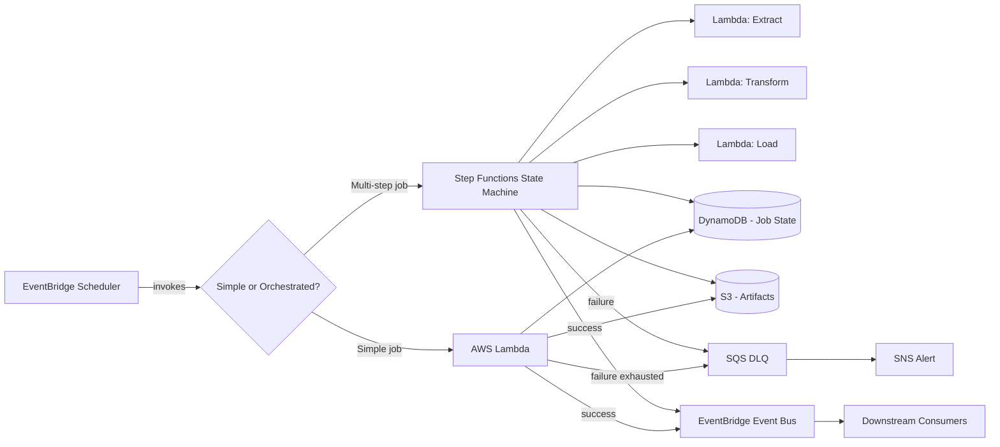
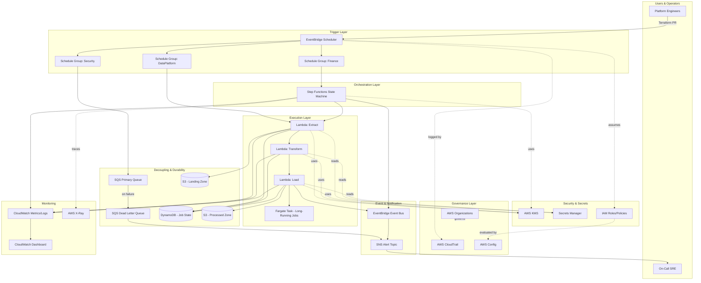
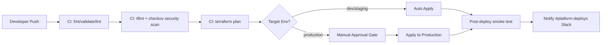

# Chapter 31 — Scheduled Processing

*Part IV — Serverless Architectures*

---

## 1. Executive Summary

Every enterprise, regardless of industry, has work that must happen **on a schedule rather than in response to a user request**. Nightly billing runs, hourly data reconciliation, weekly compliance reports, monthly invoice generation, token refresh jobs, database vacuuming, cache warming, TTL cleanup, ETL triggers, and SLA-driven batch settlements are all examples of scheduled processing.

For decades, this class of workload was handled with `cron` on a long-lived server, or with enterprise schedulers such as Control-M, Autosys, or Windows Task Scheduler. Those tools work, but they carry operational baggage that becomes increasingly expensive as an organization scales: a server that must be patched and kept running 24/7 purely to fire a job that runs for ninety seconds a day, a single point of failure if that server goes down at 2 a.m., and no native visibility into whether the job actually succeeded.

The **AWS Scheduled Processing architecture** replaces that model with a serverless, event-driven design built primarily on **Amazon EventBridge Scheduler**, **AWS Lambda**, **AWS Step Functions**, and supporting services such as **Amazon SQS**, **Amazon DynamoDB**, **Amazon S3**, and **Amazon CloudWatch**. Instead of a server waiting idly for a clock to tick, AWS itself owns the clock. When the scheduled time arrives, AWS invokes your code directly — you pay only for the seconds of compute actually consumed, and there is no server to patch, no OS to maintain, and no single point of failure tied to a specific instance.

### The Business Problem

Enterprises run thousands of scheduled jobs. As organizations grow, three problems consistently emerge:

- **Operational cost of "always-on" schedulers.** A cron server running 24/7/365 to execute a five-minute job every night still incurs a full month of EC2, patching, monitoring, and on-call burden.
- **Poor observability.** Traditional cron logs to a local file on a box nobody looks at until something breaks. There is no built-in alerting, retry policy, or dead-letter mechanism.
- **Fragile coupling.** A single crontab file frequently becomes a monolith of unrelated jobs owned by different teams, with no isolation, no independent scaling, and no audit trail of who changed what.

### The Architecture Objective

The objective of this architecture is to provide:

- A **fully managed, serverless invocation mechanism** for time-based and rate-based triggers.
- **Per-job isolation**, so that one team's job failing does not affect another's.
- **Built-in retry, backoff, and dead-letter handling** without custom code.
- **Native audit trail** (via CloudTrail and EventBridge Scheduler's own history) of every invocation.
- **Fine-grained IAM boundaries**, so each scheduled job runs with only the permissions it needs.
- **Cost that scales to zero** when there is no work to do.

### Why Organizations Adopt This Architecture

- They are paying for idle EC2 instances or on-premises schedulers that exist solely to keep cron alive.
- They need **audit-grade proof** that a compliance job ran on time, every time (SOC 2, PCI-DSS, HIPAA).
- They are consolidating dozens of fragmented, undocumented cron jobs scattered across servers into a single, observable control plane.
- They need schedules that span **multiple AWS accounts and regions** as part of a landing zone strategy.
- They want scheduled jobs to trigger **complex multi-step workflows** (Step Functions) rather than a single monolithic script.

### Major Business Benefits

| Benefit | Description |
|---|---|
| Cost reduction | No idle compute; pay only for actual execution time |
| Reliability | Managed retries, DLQ, and at-least-once delivery guarantees |
| Auditability | Every invocation is logged and traceable via CloudTrail |
| Scalability | Handles one job or 100,000 concurrent schedules without redesign |
| Reduced operational burden | No OS patching, no server capacity planning |
| Faster delivery | Teams self-service their own schedules via Terraform/IaC |
| Multi-account governance | Centralized scheduling across an AWS Organization |

### Typical Enterprise Scenarios

- **Financial services**: end-of-day (EOD) settlement batches, nightly interest accrual calculations, regulatory reporting extracts.
- **Retail/e-commerce**: nightly inventory reconciliation, price recalculation, abandoned-cart email triggers, catalog re-indexing.
- **Healthcare**: nightly HL7/FHIR batch ingestion, claims reconciliation, credential expiration checks.
- **SaaS platforms**: subscription renewal processing, usage-based billing aggregation, trial expiration notifications.
- **Data platforms**: scheduled ETL kickoffs, data quality checks, partition compaction, TTL-based data lifecycle enforcement.
- **Security & compliance**: nightly IAM credential rotation checks, certificate expiration scans, vulnerability scan triggers.

This chapter builds a complete, production-grade Scheduled Processing reference architecture: from business requirements through Terraform implementation, security architecture, disaster recovery, cost modeling, and a full Architect's Corner covering the hard-won lessons that only show up after an architecture has been running in production for years.

---

## 2. Business Requirements

### Business Drivers

- Replace legacy cron/on-prem schedulers with a managed, auditable AWS-native solution.
- Reduce total cost of ownership (TCO) for batch and scheduled workloads.
- Provide self-service scheduling capability to development teams without requiring central ops involvement for every new job.
- Meet regulatory requirements for demonstrable, timestamped execution of compliance-critical jobs.

### Functional Requirements

| ID | Requirement |
|---|---|
| FR-1 | System must support cron-based and rate-based schedules |
| FR-2 | System must support one-time (at a specific timestamp) schedules |
| FR-3 | System must support invoking Lambda functions, Step Functions state machines, SQS queues, and ECS tasks as targets |
| FR-4 | Failed invocations must be retried automatically with exponential backoff |
| FR-5 | Permanently failed invocations must be routed to a dead-letter queue (DLQ) for investigation |
| FR-6 | Each schedule must be independently enabled/disabled without affecting other schedules |
| FR-7 | Schedules must support time zone-aware execution (not just UTC) |
| FR-8 | System must provide a complete history of invocations, including payload, timestamp, and result |
| FR-9 | System must support flexible time windows to smooth invocation bursts (avoid thundering herd) |
| FR-10 | System must support grouping schedules by team/business unit for cost allocation and access control |

### Non-Functional Requirements

| Category | Requirement |
|---|---|
| Scalability | Support 50,000+ concurrent schedules per AWS account without custom sharding |
| Availability | 99.9% scheduler invocation reliability (AWS-managed SLA) |
| Latency | Trigger-to-invocation latency under 60 seconds for standard schedules |
| Compliance | Full audit trail retained for a minimum of 7 years for regulated workloads |
| Security | All targets invoked via least-privilege IAM roles scoped to a single schedule or schedule group |
| Idempotency | All downstream processing must be idempotent to safely tolerate at-least-once delivery |

### Scalability Goals

- Support horizontal growth from 10 schedules at launch to 10,000+ schedules within three years without a re-architecture.
- Support burst execution windows (e.g., 500 schedules firing within the same one-minute window at midnight UTC for EOD batch processing).

### Availability Requirements

- The scheduling control plane (EventBridge Scheduler) is a regional, multi-AZ managed service — no customer-managed HA design is required for the scheduler itself.
- Downstream compute targets (Lambda, Step Functions, ECS) must independently meet a 99.95% availability target within the region.

### Latency Requirements

- Time-critical financial batches (e.g., EOD close) require invocation within ±30 seconds of the scheduled time.
- Non-critical housekeeping jobs (e.g., log cleanup) may tolerate a flexible window of up to 15 minutes, which should be used deliberately to reduce cost and avoid throttling on shared downstream resources.

### Compliance Requirements

- SOC 2 Type II: demonstrable change control over schedule definitions (via Terraform + CI/CD, never manual console edits in production).
- PCI-DSS (where cardholder data processing is scheduled): encryption in transit and at rest, and restricted IAM access to schedule definitions.
- HIPAA (healthcare scheduled batch jobs): audit logging of every invocation touching PHI, with CloudTrail retention aligned to organizational policy.

### Recovery Objectives

| Metric | Target |
|---|---|
| RPO (Recovery Point Objective) | Near-zero for the schedule definitions themselves (stored as versioned IaC); job-level RPO depends on the target workload (typically < 1 hour for batch data) |
| RTO (Recovery Time Objective) | < 15 minutes to redeploy schedule definitions into a DR region via Terraform |

### SLAs

- Internal SLA: 99.9% of scheduled invocations must occur within their configured flexible time window.
- Internal SLA: 100% of failed invocations must generate an alert within 5 minutes of final retry exhaustion.

### Expected Workload

- Initial: ~200 scheduled jobs across 15 teams, ranging from every-minute health checks to monthly billing runs.
- Peak concurrency: ~1,200 simultaneous invocations during the midnight UTC batch window.

### Expected Growth

- 3x growth in schedule count within 18 months as teams migrate off legacy cron servers.
- Expansion to multi-region scheduling as the company opens EU and APAC operations, each requiring regionally-scoped compliance batches.

---

## 3. Architecture Overview

### Overall Design

The Scheduled Processing architecture is organized into four logical layers:

1. **Trigger Layer** — Amazon EventBridge Scheduler defines *when* work happens. It replaces both the classic `cron` daemon and the older EventBridge "scheduled rule" pattern, offering per-schedule state, retry policy, and flexible time windows natively.
2. **Orchestration Layer** — AWS Step Functions coordinates multi-step jobs (e.g., "extract → validate → transform → load → notify"), while simple single-step jobs invoke AWS Lambda directly.
3. **Execution Layer** — AWS Lambda (for short, bursty compute) and, for longer-running or resource-intensive jobs, AWS Fargate (ECS) tasks invoked via Step Functions or EventBridge Scheduler's ECS `RunTask` target.
4. **Decoupling & Durability Layer** — Amazon SQS absorbs bursts and decouples the trigger from execution when many jobs need to be queued rather than invoked synchronously; Amazon DynamoDB stores job state and idempotency keys; Amazon S3 stores input/output artifacts.

### Architecture Philosophy

- **Prefer managed scheduling over self-managed cron.** The scheduler itself should never be something the team operates — it should be something the team *configures declaratively*.
- **Decouple triggering from execution.** The schedule should not need to know how the job is implemented; it only needs to know the target ARN and payload.
- **Design every job to be idempotent.** Because EventBridge Scheduler (like most AWS event services) provides *at-least-once* delivery, duplicate invocations are a normal operating condition, not an edge case.
- **Isolate blast radius per job.** Each schedule gets its own IAM role, its own DLQ, and its own CloudWatch alarm — a failure in one job must never silently affect another.
- **Treat schedule definitions as code.** All schedules are defined in Terraform, reviewed via pull request, and deployed via CI/CD — never created ad hoc in the console.

### Core Components

| Component | Role |
|---|---|
| EventBridge Scheduler | Time-based/rate-based trigger definition and invocation |
| EventBridge Schedule Group | Logical grouping of schedules by team/domain for IAM and cost allocation |
| AWS Lambda | Stateless, short-duration execution of individual job steps |
| AWS Step Functions | Orchestration of multi-step, stateful workflows |
| Amazon SQS (Standard + DLQ) | Buffering, retry isolation, and dead-letter capture |
| Amazon DynamoDB | Idempotency tracking, job state, and execution metadata |
| Amazon S3 | Input/output artifact storage, batch data staging |
| Amazon EventBridge (Event Bus) | Fan-out of job completion/failure events to downstream consumers |
| Amazon CloudWatch | Metrics, alarms, dashboards, and Logs Insights queries |
| AWS CloudTrail | Immutable audit log of every schedule invocation and API call |
| AWS KMS | Encryption of data at rest across S3, DynamoDB, and SQS |
| AWS Secrets Manager | Storage of third-party credentials used by scheduled jobs |
| AWS IAM | Per-schedule least-privilege execution roles |

### How Components Interact

At a high level: EventBridge Scheduler fires at the configured time → it invokes a target (Lambda directly for simple jobs, or Step Functions for orchestrated workflows) → the target performs the business logic, reading/writing S3 and DynamoDB as needed → completion or failure is published to an EventBridge event bus → downstream consumers (SNS for alerting, another Lambda for chaining, or a data pipeline) react to that event.

### High-Level Workflow



### Request Lifecycle

Although this is not a user-facing request/response architecture in the traditional sense, each "invocation lifecycle" follows a consistent pattern:

1. Scheduler evaluates the cron/rate expression and determines it is time to fire.
2. Scheduler checks the configured flexible time window and picks an invocation time within it (to smooth load).
3. Scheduler assumes the schedule's dedicated IAM execution role.
4. Scheduler invokes the target (Lambda `Invoke`, Step Functions `StartExecution`, SQS `SendMessage`, or ECS `RunTask`).
5. Target executes; on failure, EventBridge Scheduler's retry policy governs re-invocation attempts.
6. After retries are exhausted, the failed event is routed to the configured DLQ.

### Response Lifecycle

Scheduled jobs do not return a response to a caller (there is no caller), but they do produce an **execution result** that must be captured:

1. Job writes its outcome (success/failure, record counts, duration) to DynamoDB.
2. Job emits a custom EventBridge event (`job.completed` or `job.failed`) to the central event bus.
3. CloudWatch Logs capture structured JSON logs for every execution.
4. CloudWatch Alarms evaluate error-rate and duration metrics and notify via SNS when thresholds are breached.

### Data Lifecycle

1. **Ingest**: input files land in an S3 "landing" prefix (from an upstream system) or are pulled by the job itself from a source API/database.
2. **Process**: Lambda/Step Functions transform the data, writing intermediate state to DynamoDB and processed output to an S3 "processed" prefix.
3. **Archive**: S3 Lifecycle rules transition processed data to S3 Infrequent Access after 30 days, then Glacier Deep Archive after 180 days.
4. **Purge**: DynamoDB items use TTL to automatically expire job-state records after their retention period (typically 35–90 days), keeping the table small and inexpensive.

---

## 4. AWS Services Used

### AWS Lambda

**Purpose**: Executes the actual business logic of a scheduled job — a single function invocation per schedule fire, or a step within a Step Functions workflow.

**Why selected**: Lambda is the natural execution unit for scheduled work because most scheduled jobs are short-lived (seconds to a few minutes), bursty (idle 23 hours 55 minutes a day, busy for 5), and stateless. Paying only for actual invocation time is a direct cost match to this workload shape.

**Alternatives**: AWS Fargate (ECS/EKS) for jobs exceeding Lambda's 15-minute maximum duration or requiring more than 10 GB of memory; EC2 with Auto Scaling for jobs needing specialized hardware (GPU) or persistent local disk state.

**Limitations**: 15-minute maximum execution duration; 10 GB memory ceiling; ephemeral `/tmp` storage capped at 10 GB; cold starts can add 100ms–2s of latency for jobs using large deployment packages or VPC attachment.

**Pricing considerations**: Billed per millisecond of execution time and configured memory. A job running 30 seconds a day at 512 MB costs a fraction of a cent monthly — orders of magnitude cheaper than a dedicated EC2 cron box.

**Best practices**: Set function-level reserved concurrency for jobs that must not overwhelm downstream systems (e.g., a legacy database with limited connections); always configure a Dead Letter Queue or on-failure destination; keep the function single-purpose and idempotent.

### AWS Step Functions

**Purpose**: Orchestrates multi-step scheduled workflows where steps have dependencies, need conditional branching, or require human/manual approval gates.

**Why selected**: Chaining Lambda invocations with custom retry/error-handling code inside a single "god function" is a common but poor pattern — it hides workflow logic in code, is hard to visualize, and makes partial failure recovery difficult. Step Functions externalizes the workflow definition (as JSON/ASL), giving a visual execution history per run and native error handling per step.

**Alternatives**: A single large Lambda function with internal try/catch chaining (cheaper for very simple two-step jobs, but does not scale in maintainability); Apache Airflow on MWAA for extremely complex DAG-based pipelines with many interdependent tasks and a need for backfills.

**Limitations**: Standard workflows are billed per state transition; Express workflows are cheaper for high-volume, short-duration workflows but have a 5-minute maximum duration and different logging semantics.

**Pricing considerations**: Standard Workflows: ~$0.025 per 1,000 state transitions. For a nightly job with 10 steps run once a day, this is negligible (~$0.0000025/day). For high-frequency (every-second) orchestration, Express Workflows are dramatically cheaper.

**Best practices**: Use Standard Workflows for scheduled batch jobs (durability, up to 1-year execution history); use Express Workflows only for high-volume, sub-5-minute workloads; always define a `Catch` block per state to route failures to a dedicated error-handling branch.

### Amazon EventBridge Scheduler

**Purpose**: The trigger mechanism itself — defines cron/rate/one-time schedules and invokes a target when the schedule fires.

**Why selected**: EventBridge Scheduler (distinct from the older "EventBridge Rules with a schedule expression") was purpose-built for this use case. It supports per-schedule flexible time windows, native retry policies, a 1,000,000+ schedule ceiling per account, time zone-aware cron expressions, and schedule groups for organizational boundaries — none of which the older Rules-based scheduling approach offered natively.

**Alternatives**: EventBridge Rules with `schedule expression` (legacy pattern, still valid for simple cases but capped at 300 rules per event bus and lacking flexible time windows); CloudWatch Events (the pre-2019 predecessor, now essentially EventBridge); a self-managed cron container on Fargate (only justified for extremely complex scheduling logic not expressible in cron/rate syntax).

**Limitations**: Minimum granularity of 1 minute; schedules cannot dynamically compute the "next run time" based on runtime data (that logic must live in the invoked target).

**Pricing considerations**: $1.00 per million invocations — for 200 schedules firing once daily, this is effectively free (~$0.006/month).

**Best practices**: Always group related schedules using Schedule Groups; always set an explicit `FlexibleTimeWindow` for non-time-critical jobs to smooth invocation bursts; always attach a dedicated IAM execution role per schedule (never a shared "scheduler-role-generic").

### Amazon SQS

**Purpose**: Decouples the trigger from execution when multiple consumers need to process the same scheduled event, when execution needs to be buffered against downstream throttling, or as the Dead Letter Queue for capturing permanently failed invocations.

**Why selected**: SQS provides durable, at-least-once buffering with configurable visibility timeouts and native DLQ redrive support — essential for ensuring that a transient downstream outage does not result in silently lost scheduled work.

**Alternatives**: Amazon Kinesis Data Streams (only needed if multiple independent consumers must replay the same event stream, which is atypical for scheduled batch triggers); direct synchronous Lambda invocation without a queue (acceptable only for jobs with no burst risk and no need for replay).

**Limitations**: Standard queues provide at-least-once, not exactly-once, delivery, and do not guarantee strict ordering (FIFO queues solve ordering but cap throughput at 3,000 msg/sec with batching).

**Pricing considerations**: $0.40 per million requests (standard); negligible for typical scheduled workloads.

**Best practices**: Always pair a primary queue with a DLQ using a `maxReceiveCount` of 3–5; set the visibility timeout to at least 6x the target Lambda's timeout to avoid duplicate concurrent processing.

### Amazon DynamoDB

**Purpose**: Stores job execution state, idempotency keys, and lightweight metadata (last successful run timestamp, record counts, watermark values for incremental processing).

**Why selected**: DynamoDB's single-digit-millisecond latency and native TTL support make it ideal for tracking "has this job already run for this time window" idempotency checks — critical given that EventBridge Scheduler and SQS both provide at-least-once delivery semantics.

**Alternatives**: Amazon RDS/Aurora (justified only if the job's state needs complex relational queries or joins against existing transactional data); Amazon S3 with object metadata (viable for very low-frequency jobs, but lacks DynamoDB's conditional-write idempotency guarantees).

**Limitations**: 400 KB item size limit; eventually consistent reads by default (strongly consistent reads available at higher cost); no native SQL joins.

**Pricing considerations**: On-demand capacity mode is recommended for scheduled-job state tables, since traffic is spiky (near-zero most of the day, a burst at execution time) — on-demand avoids paying for provisioned capacity that sits idle.

**Best practices**: Use a conditional `PutItem` with a composite key of `job_name#scheduled_time` to atomically enforce idempotency; enable TTL to auto-expire state records after the compliance retention window.

### Amazon S3

**Purpose**: Durable storage for input files awaiting processing, intermediate artifacts, and final processed output; also stores Terraform state files and Lambda deployment packages.

**Why selected**: 99.999999999% durability, native lifecycle policies, and event notifications (which can themselves trigger downstream Lambda functions) make S3 the default artifact store for any batch-oriented workload.

**Alternatives**: Amazon EFS (only needed if a job requires POSIX file semantics or shared mutable state across concurrent Lambda invocations); Amazon FSx (for Windows-based legacy batch jobs requiring SMB).

**Limitations**: Eventually consistent for some cross-region replication scenarios (same-region operations are now strongly consistent); not a database — no transactional multi-object updates.

**Pricing considerations**: S3 Standard for hot/recent data; Intelligent-Tiering or lifecycle rules to Glacier for compliance archives, which is where most of the cost-optimization opportunity lives for high-volume batch data.

**Best practices**: Use S3 Object Lock (compliance mode) for regulatory data that must be immutable; use S3 Event Notifications to Lambda for jobs that should react to file arrival rather than a fixed clock time.

### Amazon EventBridge (Event Bus)

**Purpose**: Publishes job completion/failure events for consumption by downstream systems — alerting, chained workflows, or cross-team integrations — without tightly coupling the scheduled job to its consumers.

**Why selected**: A custom event bus decouples "what happened" from "who cares," letting new consumers subscribe to job outcomes without modifying the producing job.

**Alternatives**: SNS topics (simpler pub/sub, but lacks EventBridge's content-based filtering and schema registry); direct Lambda-to-Lambda invocation (tight coupling, avoid for anything beyond a single, stable, two-party relationship).

**Limitations**: Event size capped at 256 KB; not designed for high-throughput streaming (use Kinesis for that).

**Pricing considerations**: $1.00 per million events published — negligible at typical scheduled-job volumes.

**Best practices**: Define a versioned event schema (`detail-type: "JobCompleted.v1"`) so consumers can evolve independently; use content-based filtering in EventBridge Rules rather than having every consumer process every event.

### Amazon CloudWatch

**Purpose**: Central observability — metrics (invocation count, error count, duration), Logs (structured execution logs), Alarms (threshold-based alerting), and Dashboards (operational visibility).

**Why selected**: Native, zero-setup integration with every AWS service used in this architecture; no third-party agent required for baseline metrics.

**Alternatives**: Third-party observability platforms (Datadog, New Relic, Grafana Cloud) — often layered on top of CloudWatch as a metrics source rather than a full replacement, chosen when a company already standardizes on one platform across multi-cloud estates.

**Limitations**: Native dashboards are less flexible than dedicated APM tools for complex service maps; Logs Insights query performance degrades on very high log volumes without careful retention/archival design.

**Pricing considerations**: Log ingestion and storage are the dominant cost driver at scale — teams frequently over-log at `DEBUG` level in production and are surprised by the bill (see Section 34, Cost Surprises).

**Best practices**: Set explicit log retention (never leave it at "Never Expire"); use structured JSON logging with a consistent `job_name` and `correlation_id` field to enable fast Logs Insights queries; create composite alarms that reduce noisy single-metric pages.

### AWS CloudTrail

**Purpose**: Immutable audit log of every API call made against the scheduling infrastructure — who created/modified/deleted a schedule, and every `Invoke`/`StartExecution` call the scheduler itself makes.

**Why selected**: Required for SOC 2 / PCI-DSS / HIPAA evidence that scheduled compliance jobs ran as configured, and that schedule definitions were not tampered with outside of the approved CI/CD path.

**Alternatives**: None — CloudTrail is the AWS-native audit mechanism and is effectively mandatory for any regulated workload.

**Limitations**: Management-event trails are free and enabled by default, but data-event trails (e.g., logging every S3 object read) incur additional cost and must be deliberately scoped.

**Pricing considerations**: First management-event trail is free; data events and additional trails are billed per event delivered.

**Best practices**: Enable an organization-wide CloudTrail trail delivering to a centralized, access-restricted S3 bucket in a dedicated log-archive account; enable log file integrity validation.

### AWS KMS

**Purpose**: Encrypts data at rest across S3, DynamoDB, SQS, and Secrets Manager, and can be used to encrypt Lambda environment variables.

**Why selected**: Customer-managed KMS keys (CMKs) provide auditable, revocable, per-workload encryption control that AWS-managed keys do not (you cannot see individual key-usage CloudTrail events or set custom key policies with AWS-managed keys).

**Alternatives**: AWS-managed keys (`aws/s3`, `aws/dynamodb`) — acceptable for non-regulated workloads where the operational simplicity of not managing key policies outweighs the audit granularity of a CMK.

**Limitations**: API request costs ($0.03 per 10,000 requests) can add up for very high-frequency encrypt/decrypt calls; key policies are a common source of "access denied" troubleshooting pain (see Section 25).

**Pricing considerations**: $1/month per CMK plus per-request charges — trivial relative to the compliance value for regulated data.

**Best practices**: Use a single CMK per data classification tier (not one key per resource, which becomes unmanageable), and grant access via IAM policy plus key policy jointly (both must allow the action).

### AWS Secrets Manager

**Purpose**: Stores third-party API credentials, database passwords, and other secrets that scheduled jobs need at runtime (e.g., a nightly job that pulls from a partner's SFTP server).

**Why selected**: Native automatic rotation support and fine-grained IAM-based access control eliminate the anti-pattern of secrets baked into Lambda environment variables or, worse, source code.

**Alternatives**: AWS Systems Manager Parameter Store (SecureString) — a lower-cost alternative for secrets that do not require automatic rotation; acceptable for many internal, non-rotating credentials.

**Limitations**: $0.40 per secret per month adds up quickly if every one of 200 scheduled jobs has its own secret — consider consolidating related credentials.

**Pricing considerations**: For cost-sensitive, non-rotating secrets, Parameter Store SecureString is materially cheaper at scale.

**Best practices**: Never place secrets in Lambda environment variables in plaintext; grant `secretsmanager:GetSecretValue` scoped to the specific secret ARN, never `secretsmanager:*`.

### AWS Systems Manager (SSM)

**Purpose**: Parameter Store for non-secret configuration (feature flags, batch size thresholds, watermark defaults) that scheduled jobs read at runtime without a redeploy.

**Why selected**: Avoids hardcoding configuration values in Lambda code or requiring a full CI/CD redeploy for a simple threshold change.

**Alternatives**: DynamoDB configuration table (preferred when configuration needs to be queried with more complex access patterns or updated very frequently); AppConfig (preferred for gradual, monitored configuration rollouts with automatic rollback).

**Limitations**: Standard parameters are capped at 4 KB; throughput limits on the standard tier can throttle very high-frequency reads (advanced tier or caching mitigates this).

**Pricing considerations**: Standard parameters are free; advanced parameters and higher throughput incur a small monthly cost.

**Best practices**: Use a consistent naming hierarchy (`/prod/team-billing/job-invoice-generation/batch-size`) so IAM policies can scope access by path prefix.

### IAM

**Purpose**: Enforces least-privilege access for every schedule's execution role, every Lambda function's execution role, and every human/CI-CD principal that manages schedule definitions.

**Why selected**: Central to the entire security model — see Section 10 and Section 11 for full detail.

### VPC

**Purpose**: Required only when a scheduled job needs to reach a resource inside a private network (an on-prem database via VPN/Direct Connect, or an RDS instance in a private subnet). Purely S3/DynamoDB/API-based jobs do not require VPC attachment.

**Why selected**: Isolates job execution network access to only the private resources it needs; avoids exposing internal databases to the public internet.

**Limitations**: VPC-attached Lambda functions historically had higher cold-start latency due to ENI provisioning; this has been substantially mitigated by Hyperplane ENIs but is still a factor worth testing for latency-sensitive jobs.

**Best practices**: Only attach a Lambda to a VPC if it truly needs private network access; use VPC endpoints (Gateway for S3/DynamoDB, Interface for other services) so traffic never traverses the public internet or requires a NAT Gateway solely for AWS API calls.


---

## 5. Complete Architecture Diagram



**Diagram notes:**

- Every schedule group maps to a business domain (Finance, DataPlatform, Security) with its own IAM boundary — this is the primary blast-radius containment mechanism.
- Two execution paths exist: direct Lambda invocation for simple jobs, and Step Functions orchestration for multi-step jobs. Both write to the same shared DynamoDB job-state table using a consistent schema.
- The Fargate path exists for the minority of jobs exceeding Lambda's 15-minute limit (large file transforms, legacy batch binaries).

---

## 6. Component-by-Component Explanation

### EventBridge Scheduler

- **Purpose**: Define when a job runs and what it invokes.
- **Responsibilities**: Evaluate cron/rate expressions, honor flexible time windows, assume the schedule's IAM role, invoke the target, apply the configured retry policy.
- **Inputs**: Schedule expression, target ARN, target input payload (JSON), IAM role ARN, retry policy, flexible time window configuration.
- **Outputs**: A target invocation (API call) and a CloudTrail record of that invocation.
- **Scaling**: Fully managed; supports over a million schedules per account without customer action.
- **High availability**: Regional, multi-AZ managed service — no customer HA design required.
- **Failure handling**: Configurable retry attempts (0–185) and maximum event age; after exhaustion, failures route to the configured dead-letter queue if the target itself supports one (Lambda async invocation, SQS).
- **Dependencies**: IAM role with `PassRole`-style trust for the scheduler service principal; target service (Lambda/Step Functions/SQS/ECS).
- **Security**: Each schedule should use a dedicated IAM role scoped to only the single target it invokes.
- **Monitoring**: `InvocationAttemptCount`, `TargetErrorCount`, and `InvocationThrottleCount` CloudWatch metrics per schedule.

### AWS Lambda (Extract/Transform/Load functions)

- **Purpose**: Execute discrete units of business logic.
- **Responsibilities**: Perform the actual data extraction, transformation, or load step; write execution state to DynamoDB; emit structured logs.
- **Inputs**: Event payload from EventBridge Scheduler or the preceding Step Functions state.
- **Outputs**: Processed data written to S3/DynamoDB/downstream API; success/failure result returned to the caller (Step Functions) or destination (on-failure DLQ for async Lambda).
- **Scaling**: Automatic, up to account concurrency limits; reserved concurrency should be set to protect downstream systems with finite connection pools.
- **High availability**: Multi-AZ by default within the region; no customer configuration needed.
- **Failure handling**: Configure `MaximumRetryAttempts` and an on-failure destination (SQS DLQ or another EventBridge event) for asynchronous invocations.
- **Dependencies**: IAM execution role; VPC configuration if reaching private resources; Secrets Manager for credentials.
- **Security**: Function-specific execution role; environment variables encrypted with a CMK if they hold sensitive configuration.
- **Monitoring**: `Errors`, `Duration`, `Throttles`, and `ConcurrentExecutions` metrics; structured JSON logs shipped to CloudWatch Logs.

### AWS Step Functions State Machine

- **Purpose**: Orchestrate ordered, conditional, and parallel steps of a multi-stage scheduled job.
- **Responsibilities**: Maintain execution state across steps, apply per-state retry/catch logic, branch based on data conditions, and fan out parallel work.
- **Inputs**: Initial payload from EventBridge Scheduler (e.g., `{"job_name": "eod-settlement", "business_date": "2026-08-08"}`).
- **Outputs**: Final execution result (SUCCEEDED/FAILED/TIMED_OUT), visible in execution history for up to 90 days (Standard workflows) or per CloudWatch Logs retention (Express workflows).
- **Scaling**: Standard workflows scale to very high execution counts; Express workflows are optimized for high-volume, short-duration invocations.
- **High availability**: Regional, multi-AZ managed service.
- **Failure handling**: Per-state `Retry` (with `IntervalSeconds`, `MaxAttempts`, `BackoffRate`) and `Catch` (routing to a cleanup/notification state) blocks.
- **Dependencies**: IAM role permitting `lambda:InvokeFunction` on only the specific functions it calls.
- **Security**: State machine definitions should never embed secrets directly — pass Secrets Manager ARNs and let the executing Lambda resolve them.
- **Monitoring**: `ExecutionsFailed`, `ExecutionsTimedOut`, and `ExecutionThrottled` metrics; visual execution graph in the console for rapid failure diagnosis.

### Amazon SQS Primary Queue & Dead Letter Queue

- **Purpose**: Buffer and durably retry work; capture permanently failed messages for investigation.
- **Responsibilities**: Hold messages until successfully processed or until `maxReceiveCount` is exceeded, at which point the message moves to the DLQ automatically.
- **Inputs**: Messages from EventBridge Scheduler (direct SQS target) or from a Lambda function that fans out work items.
- **Outputs**: Messages consumed by a Lambda event source mapping.
- **Scaling**: Nearly unlimited throughput for standard queues; FIFO queues are throughput-capped but guarantee ordering.
- **Failure handling**: Redrive policy with `maxReceiveCount` of 3–5 is standard; DLQ messages trigger an SNS alert for manual investigation and redrive.
- **Security**: Server-side encryption with a CMK; queue policy restricting `SendMessage`/`ReceiveMessage` to specific principals.
- **Monitoring**: `ApproximateNumberOfMessagesVisible`, `ApproximateAgeOfOldestMessage` (a critical leading indicator of processing lag).

### Amazon DynamoDB (Job State Table)

- **Purpose**: Idempotency enforcement and execution metadata storage.
- **Responsibilities**: Store a record per job execution keyed on `job_name#scheduled_time`; support conditional writes so a duplicate invocation is detected and skipped rather than reprocessed.
- **Inputs**: Writes from every Lambda/Step Functions execution.
- **Outputs**: Read by the job itself (to check "have I already run for this window") and by dashboards/reporting tools.
- **Scaling**: On-demand capacity mode absorbs the spiky, bursty access pattern typical of scheduled jobs without capacity planning.
- **High availability**: Multi-AZ by default; point-in-time recovery (PITR) enabled for production tables.
- **Security**: Encrypted at rest with a CMK; IAM policies scoped to specific item key prefixes using `dynamodb:LeadingKeys` condition where multi-tenant.
- **Monitoring**: `ConsumedReadCapacityUnits`/`ConsumedWriteCapacityUnits` (informational under on-demand), `ThrottledRequests`, `SystemErrors`.

### Amazon S3 (Landing & Processed Zones)

- **Purpose**: Durable storage for input and output batch artifacts.
- **Responsibilities**: Hold raw files awaiting processing; hold processed output for downstream consumption or archival.
- **Scaling**: Effectively unlimited.
- **Security**: Default encryption with a CMK; bucket policies denying non-TLS (`aws:SecureTransport: false`) requests; S3 Block Public Access enabled account-wide.
- **Monitoring**: S3 Event Notifications for object-arrival-triggered processing; `NumberOfObjects` and `BucketSizeBytes` CloudWatch storage metrics for capacity trending.

### EventBridge Event Bus & SNS

- **Purpose**: Fan out job outcome notifications to alerting and downstream integration consumers.
- **Responsibilities**: Route `job.completed`/`job.failed` events based on content filtering; SNS delivers to email/Slack (via Chatbot)/PagerDuty.
- **Security**: Topic policies restricting `Publish` to the specific producing Lambda/Step Functions role.
- **Monitoring**: `NumberOfNotificationsFailed` on SNS is itself an alarm-worthy metric — a silent alerting failure is worse than no alerting.

---

## 7. End-to-End Request Flow

The following walks through a concrete example: a nightly **"EOD Settlement Batch"** job that reads transaction files from S3, validates and aggregates them, writes results to DynamoDB and S3, and notifies downstream finance systems.

1. **Scheduled trigger fires.** At 23:00 UTC, EventBridge Scheduler evaluates the cron expression `cron(0 23 * * ? *)` for the `eod-settlement-trigger` schedule in the `finance` schedule group.
2. **Flexible time window applied.** The schedule is configured with a 5-minute flexible window, so the actual invocation occurs at a randomized point between 23:00 and 23:05 UTC to avoid colliding with other finance-team jobs firing at the same nominal time.
3. **IAM role assumed.** The scheduler assumes `role-eod-settlement-scheduler-invoke`, which is scoped to `states:StartExecution` on exactly one state machine ARN.
4. **Step Functions execution starts.** The state machine `eod-settlement-workflow` begins execution with input `{"business_date": "2026-08-08"}`.
5. **Idempotency check.** The first state, `CheckAlreadyProcessed` (a Lambda function), performs a conditional read against DynamoDB for `PK=eod-settlement#2026-08-08`. If a `COMPLETED` record already exists, the workflow short-circuits to a `NoOpSuccess` state — protecting against duplicate invocation from a scheduler retry.
6. **Extract step.** The `ExtractTransactions` Lambda lists and downloads the day's transaction files from `s3://landing-zone/transactions/2026-08-08/`.
7. **Validation step.** The `ValidateTransactions` Lambda checks schema, checksums, and record counts against an expected-count file; on validation failure, the workflow transitions to a `Catch` block.
8. **Transform/aggregate step.** The `AggregateSettlement` Lambda computes net settlement positions per counterparty.
9. **Write results.** Results are written to `s3://processed-zone/settlement/2026-08-08/` and a summary record to DynamoDB with status `COMPLETED`.
10. **Caching consideration.** Reference/lookup data (counterparty routing details) is cached in Lambda's execution environment (warm-start memory) with a 15-minute TTL to avoid repeated DynamoDB reads within a single batch run.
11. **Notification.** The workflow's final state publishes a `SettlementCompleted` event to the central EventBridge bus.
12. **Downstream consumption.** A separate, independently-owned Lambda (owned by the Treasury team) is subscribed via an EventBridge rule filtering on `detail-type: "SettlementCompleted"` and triggers their own downstream reconciliation job.
13. **Logging.** Every step emits structured JSON logs (`correlation_id`, `business_date`, `duration_ms`, `record_count`) to CloudWatch Logs under a dedicated log group per Lambda function.
14. **Monitoring.** A CloudWatch composite alarm evaluates `ExecutionsFailed > 0 OR ExecutionsTimedOut > 0` for the state machine over the prior 15 minutes and pages the on-call finance-platform engineer via SNS → PagerDuty if breached.
15. **Error handling — validation failure path.** If step 7 fails validation, the `Catch` block invokes a `QuarantineFile` Lambda that moves the offending file to `s3://quarantine-zone/` and publishes a `SettlementValidationFailed` event, which triggers an immediate page rather than waiting for a downstream absence-of-success detection.
16. **Error handling — exhausted retries.** If any Lambda step fails after its configured `Retry` attempts (3 attempts, exponential backoff, `BackoffRate: 2.0`), Step Functions marks the execution `FAILED`, and a CloudWatch Logs metric filter increments a custom `EODSettlementFailures` metric consumed by the paging alarm.


---

## 8. Deployment Flow

### Infrastructure Provisioning

All infrastructure — schedules, Lambda functions, Step Functions state machines, IAM roles, DynamoDB tables, S3 buckets — is defined as Terraform code, never created manually in the console. This is non-negotiable for a compliance-relevant scheduling system, because CloudTrail's audit value is undermined if schedules can be silently hand-edited outside of a reviewed pipeline.

### Terraform Workflow

1. Developer creates a feature branch and adds/modifies a schedule module.
2. `terraform fmt` and `terraform validate` run locally (and again in CI) to catch syntax issues early.
3. `terraform plan` output is posted as a comment on the pull request (via a CI job) so reviewers see the exact diff before approving.
4. A second engineer reviews and approves the PR — required by branch protection rules.
5. On merge to `main`, CI runs `terraform plan` again against the live state, and applies automatically for non-production, or requires a manual approval gate for production.

### CI/CD Deployment



### Blue-Green Deployment

For Lambda functions invoked by schedules, deployments use **Lambda aliases with weighted traffic shifting** (via CodeDeploy or a Terraform-managed alias) rather than in-place updates:

- The schedule's target ARN always points at a stable alias (e.g., `eod-settlement-extract:live`), never directly at `$LATEST`.
- A new version is published, and traffic is shifted gradually (e.g., 10% → 100% over 15 minutes) with automatic rollback if the `Errors` CloudWatch alarm breaches during the shift.
- Because scheduled jobs are infrequent (often once daily), canary-based traffic shifting is most valuable for the shared, frequently-invoked steps (e.g., a common validation Lambda reused across many jobs) rather than for once-a-day single-invocation functions, where a straightforward all-at-once deploy ahead of the next scheduled run is often more practical.

### Rollback

- Terraform state is versioned in S3 with DynamoDB state locking; a bad apply is rolled back via `terraform apply` of the previous known-good commit, not manual console changes.
- Lambda: rollback is an alias repoint to the previous published version — near-instantaneous.
- Step Functions: state machine definitions are versioned via Terraform; rollback redeploys the prior ASL definition.

### Secrets

- Secrets never live in Terraform variable files or `.tfvars` committed to source control.
- Terraform creates the Secrets Manager *resource* and references a placeholder; the actual secret value is populated out-of-band by a separate, restricted process (or a `terraform_data` resource with `ignore_changes` on the secret value to prevent Terraform from ever seeing or logging the plaintext).

### Configuration

- Non-secret configuration (batch thresholds, feature flags) is managed via SSM Parameter Store, also provisioned by Terraform, so that a config-only change doesn't require redeploying Lambda code.

### Validation

- Post-deploy smoke tests invoke each modified Lambda function synchronously with a known test payload in a non-production account and assert on the response shape before promoting to production.
- A synthetic "canary schedule" (firing every 5 minutes, invoking a lightweight health-check Lambda) validates that the EventBridge Scheduler → IAM → Lambda invocation path itself is healthy, independent of any specific business job.

---

## 9. Network Topology

Most components in this architecture (EventBridge Scheduler, Lambda without VPC attachment, Step Functions, DynamoDB, S3, SQS) communicate over AWS's internal network and do not require a VPC at all. A VPC is introduced specifically for the subset of jobs that must reach private resources — an on-premises database, a private RDS instance, or an internal API behind an internal load balancer.

### VPC

- A dedicated `vpc-scheduled-workloads` VPC (or a shared "workloads" VPC in a hub-and-spoke landing zone) hosts only the Lambda functions/Fargate tasks that require private connectivity.

### CIDR

- `10.40.0.0/20` allocated for the scheduled-processing VPC, sized to accommodate Lambda's per-ENI IP consumption at expected peak concurrency (each concurrent VPC-attached Lambda execution consumes an IP from the subnet pool, so IP exhaustion is a real and common failure mode at scale — see Section 24).

### Public Subnets

- Not required for this architecture, since no component here serves inbound public traffic. If a public subnet exists in the shared VPC for other workloads, scheduled-processing resources are never placed in it.

### Private Subnets

- Three private subnets across three AZs (`10.40.0.0/22`, `10.40.4.0/22`, `10.40.8.0/22`) host VPC-attached Lambda ENIs and any Fargate tasks.

### NAT Gateway

- Required only if a VPC-attached job needs to reach a public internet endpoint (a third-party API) rather than another AWS service reachable via VPC endpoint. One NAT Gateway per AZ for HA, understanding this is a recurring cost driver (see Section 34 Cost Surprises) that should be justified per workload, not deployed reflexively.

### Internet Gateway

- Attached to the VPC only if public subnets exist for other purposes; not required if all scheduled workloads stay within private subnets and VPC endpoints.

### Transit Gateway

- Used when the scheduled-processing VPC needs to reach an on-premises data center (via Direct Connect/VPN) or other VPCs in a multi-account landing zone, routed through a central Transit Gateway rather than a full mesh of VPC peering connections.

### Route Tables

- Private subnet route tables send AWS-service traffic to the relevant Gateway VPC Endpoint (S3, DynamoDB) and only send `0.0.0.0/0` to the NAT Gateway for traffic destined outside AWS.

### Network ACLs

- Baseline stateless NACLs allow only the specific ports required (443 for HTTPS to AWS APIs and any partner API; database ports scoped to the specific private database subnet range).

### Security Groups

- One security group per Lambda function type, allowing only outbound traffic to the specific destination (e.g., `sg-eod-extract` allows outbound 5432 to the RDS security group only, nothing else).

### PrivateLink

- Interface VPC Endpoints (PrivateLink) for Secrets Manager, SSM, KMS, and Step Functions ensure that VPC-attached Lambda functions never traverse the public internet or a NAT Gateway to reach these AWS APIs, which reduces both cost and attack surface.

### Hybrid Connectivity

- For jobs reading from an on-premises mainframe or legacy database, Direct Connect (preferred for consistent, high-throughput nightly batch transfer) or a Site-to-Site VPN (acceptable for lower-volume, less latency-sensitive jobs) connects through the Transit Gateway into the private subnets.

---

## 10. Identity and Access

### IAM Roles

Every distinct actor in this architecture has its own IAM role — there is no shared "automation role" used across multiple schedules:

| Role | Assumed By | Scope |
|---|---|---|
| `role-sched-eod-settlement` | EventBridge Scheduler (this schedule only) | `states:StartExecution` on one state machine ARN |
| `role-sfn-eod-settlement` | Step Functions state machine | `lambda:InvokeFunction` on the 4 Lambdas this workflow calls |
| `role-lambda-eod-extract` | Extract Lambda execution | `s3:GetObject` on `landing-zone/transactions/*`, `dynamodb:PutItem`/`GetItem` on the job-state table with a `job_name` condition |
| `role-lambda-eod-transform` | Transform Lambda execution | `dynamodb:Query` scoped to leading key, no S3 access needed |
| `role-lambda-eod-load` | Load Lambda execution | `s3:PutObject` on `processed-zone/settlement/*`, `events:PutEvents` on the central bus |
| `role-cicd-terraform-deploy` | CI/CD pipeline | Scoped `iam:PassRole` limited to the specific roles this pipeline manages, plus resource-creation permissions for the modules it owns |

### IAM Policies

Example least-privilege policy for the Extract Lambda's execution role:

```json

{
  "Version": "2012-10-17",
  "Statement": [
    {
      "Sid": "ReadLandingZone",
      "Effect": "Allow",
      "Action": ["s3:GetObject", "s3:ListBucket"],
      "Resource": [
        "arn:aws:s3:::landing-zone-prod",
        "arn:aws:s3:::landing-zone-prod/transactions/*"
      ]
    },
    {
      "Sid": "JobStateWrite",
      "Effect": "Allow",
      "Action": ["dynamodb:PutItem", "dynamodb:GetItem"],
      "Resource": "arn:aws:dynamodb:us-east-1:111122223333:table/job-state",
      "Condition": {
        "ForAllValues:StringEquals": {
          "dynamodb:LeadingKeys": ["eod-settlement"]
        }
      }
    },
    {
      "Sid": "WriteOwnLogsOnly",
      "Effect": "Allow",
      "Action": ["logs:CreateLogStream", "logs:PutLogEvents"],
      "Resource": "arn:aws:logs:us-east-1:111122223333:log-group:/aws/lambda/eod-extract:*"
    }
  ]
}

```

### Resource Policies

- The Lambda function's resource-based policy grants `lambda:InvokeFunction` only to `scheduler.amazonaws.com` (or the specific Step Functions role ARN), constrained further with a `SourceArn` condition matching the exact schedule or state machine ARN — preventing any other schedule or account from invoking this function.

### STS

- Cross-account invocations (a central "shared scheduling" account triggering jobs that execute in a workload account) use `sts:AssumeRole` with an external ID and a trust policy scoped to the specific source account and schedule role, never a broad `"Principal": "*"` trust.

### Cross-Account Access

- In a multi-account landing zone, the pattern is: EventBridge Scheduler lives in the workload account that owns the job (not centralized), while a centralized "scheduling governance" account has read-only, cross-account IAM roles for auditing schedule definitions across the organization via AWS Config aggregation — centralizing *visibility*, not *execution*.

### Least Privilege

- No schedule's execution role is ever granted a managed `PowerUserAccess` or wildcard `*` action/resource policy — every permission is enumerated and tied to a specific ARN, validated in CI via a policy-linting tool (e.g., Checkov, cfn-nag equivalent for Terraform, or IAM Access Analyzer's policy validation).

### Service Roles

- The EventBridge Scheduler service role trust policy is scoped narrowly:

```json

{
  "Version": "2012-10-17",
  "Statement": [
    {
      "Effect": "Allow",
      "Principal": { "Service": "scheduler.amazonaws.com" },
      "Action": "sts:AssumeRole",
      "Condition": {
        "StringEquals": { "aws:SourceAccount": "111122223333" },
        "ArnLike": { "aws:SourceArn": "arn:aws:scheduler:us-east-1:111122223333:schedule/finance/eod-settlement-trigger" }
      }
    }
  ]
}

```

### Permission Boundaries

- All schedule-related IAM roles created via the CI/CD pipeline are subject to a permission boundary policy that caps the maximum possible permissions any self-service-created role can have (e.g., explicit deny on `iam:*`, `organizations:*`, and any action outside the approved service list), so that even a misconfigured Terraform module cannot accidentally grant excessive access.


---

## 11. Security Architecture

### Encryption

- **At rest**: S3 buckets, DynamoDB tables, SQS queues, and CloudWatch Logs are all encrypted with customer-managed KMS keys (CMKs), one key per data-classification tier (e.g., `key-finance-restricted`, `key-internal-standard`).
- **In transit**: All API calls between AWS services use TLS 1.2+ by default; bucket policies explicitly deny any request where `aws:SecureTransport` is `false`.

### KMS

- Key policies grant `kms:Decrypt` only to the specific Lambda execution roles that need it, in addition to the IAM policy grant — both the key policy and the IAM policy must allow the action, which is a common source of confusing "access denied" errors during initial setup (see Section 25).

### TLS

- All Secrets Manager and SSM Parameter Store retrievals occur over TLS via VPC endpoints or the public AWS API endpoint, never over an unencrypted channel.

### WAF

- Not typically applicable to this architecture directly, since there is no public-facing HTTP endpoint. If a scheduled job exposes a manual-trigger API Gateway endpoint (for on-demand re-runs by an operator), that endpoint should sit behind AWS WAF with rate-based rules and IP allow-listing.

### Shield

- AWS Shield Standard is automatically active on any public endpoints in the account; Shield Advanced is only justified if this architecture includes a public-facing component with DDoS risk, which is atypical for pure scheduled batch processing.

### Secrets Manager

- Automatic rotation enabled for database credentials used by scheduled jobs (e.g., a 30-day rotation for the RDS credential used by the nightly extract job), with the rotation Lambda itself following the same least-privilege IAM pattern as every other function in this architecture.

### Certificate Manager

- Used if any scheduled job calls an internal service over a private ALB requiring a TLS certificate (AWS Certificate Manager Private CA for internal-only certificates).

### GuardDuty

- Enabled account-wide; specifically valuable here for detecting anomalous behavior such as a Lambda execution role suddenly attempting API calls outside its normal pattern (e.g., an `s3:GetObject` call against a bucket it has never accessed — a strong signal of a compromised function or a misconfigured IAM policy being probed).

### Inspector

- Scans Lambda function code and container images (for Fargate-based jobs) for known vulnerabilities in dependencies; findings gate the CI/CD pipeline before deployment to production.

### Security Hub

- Aggregates findings from GuardDuty, Inspector, Config, and IAM Access Analyzer into a single dashboard, and evaluates this architecture's resources against the AWS Foundational Security Best Practices standard and CIS AWS Foundations Benchmark.

### CloudTrail

- As described in Section 4, provides the immutable record of every schedule creation, modification, deletion, and invocation — the primary evidence artifact for compliance audits of "did this job run when it was supposed to, and was it changed only through the approved process."

### AWS Config

- Config Rules continuously evaluate that every DynamoDB table has PITR enabled, every S3 bucket has encryption and public access block enabled, and every IAM role attached to a schedule has no wildcard `Resource: "*"` statements — auto-remediating where safe (e.g., re-enabling S3 Block Public Access if disabled) and alerting where remediation requires human judgment.

### Zero Trust

- No component in this architecture implicitly trusts another based on network location alone. Every service-to-service call is authenticated via IAM (SigV4) and authorized via an explicit policy statement — VPC placement provides network-layer defense in depth, but is never the sole access control.

### Threat Model

| Threat | Vector | Mitigation |
|---|---|---|
| Unauthorized schedule modification | Compromised console credentials, over-permissioned IAM user | Terraform-only change path; deny direct console `scheduler:UpdateSchedule` for human principals via SCP |
| Data exfiltration via job payload | Malicious insider modifies a Lambda to exfiltrate processed data | Egress-restricted security groups; GuardDuty anomaly detection; code review requirement on all Lambda deployments |
| Credential leakage | Secrets accidentally logged or hardcoded | Automated secret-scanning in CI (e.g., git-secrets/TruffleHog); Secrets Manager only, never environment-variable plaintext |
| Privilege escalation via overly broad execution role | Copy-pasted IAM policy with wildcard resource | Permission boundaries; automated IAM policy linting in CI; IAM Access Analyzer unused-access findings reviewed quarterly |
| DLQ message tampering/inspection by unauthorized party | Overly broad SQS queue policy | Queue policy scoped to specific consumer role ARNs only |
| Denial of wallet via runaway retries | Misconfigured infinite retry loop invoking a costly downstream API | `MaximumRetryAttempts` bounded; CloudWatch billing alarms; SCP-level Lambda concurrency guardrails |

### Attack Vectors and Mitigations

- **Supply chain**: Lambda deployment packages built from a pinned, hash-verified dependency lock file; container images for Fargate jobs scanned by Inspector before push to ECR.
- **Lateral movement**: Even if one job's execution role were compromised, its scoped IAM policy prevents it from reading another team's S3 prefix or DynamoDB partition, containing blast radius.

---

## 12. High Availability

### AZ Failures

- All core services used here (Lambda, Step Functions, DynamoDB, S3, SQS, EventBridge Scheduler) are inherently multi-AZ managed services — an AZ failure does not require customer failover action for these components.
- The one exception is VPC-attached Lambda functions: ensure the function is configured with subnets in **at least two, ideally three** AZs so that an AZ outage does not exhaust available ENI capacity in the remaining subnet.

### Instance Failures

- Not applicable in the traditional EC2 sense — Lambda has no customer-visible "instance" to fail. Fargate tasks (for long-running jobs) should be configured with a minimum task count and, where the workload can be split, spread across multiple AZs.

### Regional Failures

- See Section 13 (Disaster Recovery) for the full regional-failure response — this is architected as a **Warm Standby** pattern for the scheduling infrastructure itself.

### Database Failures

- DynamoDB: multi-AZ by design; no customer action required for a single-AZ failure. Global Tables provide multi-region write availability for the small subset of state that must survive a full regional outage without manual failover.

### Load Balancing

- Not applicable in the traditional sense — EventBridge Scheduler and Lambda's internal invocation infrastructure handle distribution of work without a customer-managed load balancer. If a scheduled job calls an internal ALB-fronted service, standard ALB health-check-based routing applies.

### Health Checks

- The synthetic canary schedule described in Section 8 acts as an active health check of the end-to-end trigger → IAM → invoke path, independent of any single business job, catching infrastructure-level failures (e.g., an accidentally revoked IAM trust policy) before a real business job's failure would surface it.

### Failover

- For jobs with an RTO requiring failover to a secondary region, the Step Functions state machine and Lambda functions are pre-deployed (Warm Standby) in the DR region, with the EventBridge Scheduler schedule itself disabled in DR and only enabled during an active failover, controlled via a Terraform variable flipped during the DR runbook (see Section 13).


---

## 13. Disaster Recovery

### Backup Strategy

- **Schedule definitions**: Stored as Terraform code in Git — the ultimate backup, since the entire infrastructure can be reconstructed from source control in a new account/region.
- **DynamoDB**: Point-in-time recovery (PITR) enabled, allowing restoration to any point within the last 35 days; daily on-demand backups retained for 1 year for compliance-critical job-state tables.
- **S3**: Versioning enabled on all landing/processed buckets; cross-region replication (CRR) to the DR region for compliance data requiring geographic redundancy.

### Snapshots

- DynamoDB on-demand backup snapshots taken before any major schema migration to a job-state table, in addition to continuous PITR.

### Cross-Region Replication

- S3 CRR replicates the processed-zone bucket to the DR region asynchronously (typically within 15 minutes per S3 Replication Time Control, if enabled for time-critical compliance data).
- DynamoDB Global Tables replicate job-state tables to the DR region with typical sub-second replication latency, so a DR failover has a near-real-time view of the last known job states.

### Pilot Light

- For the majority of non-critical scheduled jobs, a **Pilot Light** DR strategy is sufficient: Terraform code for the DR region exists and is tested quarterly, but no live resources run in DR day-to-day — they are stood up on-demand during an actual regional failover, accepting a higher RTO (measured in tens of minutes) in exchange for near-zero ongoing DR cost.

### Warm Standby

- For time-critical, compliance-mandated jobs (e.g., the EOD settlement batch), a **Warm Standby** strategy is used: Lambda functions, Step Functions state machines, and DynamoDB Global Tables are already deployed and kept in sync in the DR region, with EventBridge Scheduler schedules present but disabled. Failover is a matter of enabling the DR schedules and disabling the primary-region schedules — an RTO measured in single-digit minutes.

### Multi-Site / Active-Active

- Not typically justified for scheduled batch processing, since the workload is inherently single-invocation-at-a-time per business date (running the same EOD settlement simultaneously in two regions would itself be a correctness bug, not a resilience feature). Active-Active is reserved for the small number of read-heavy, idempotent lookup services that scheduled jobs might depend on.

### Active-Passive

- This is effectively the pattern used: primary region is active, DR region is passive (Warm Standby) until an explicit, runbook-driven failover decision is made — deliberately not automatic, because auto-failing-over a financial settlement job carries a real risk of duplicate processing if the primary region's failure was partial rather than total.

### RPO / RTO Summary

| Job Tier | RPO | RTO | Strategy |
|---|---|---|---|
| Tier 1 (regulatory/financial, e.g., EOD settlement) | < 5 minutes (DynamoDB Global Tables) | < 15 minutes | Warm Standby |
| Tier 2 (business-important, e.g., billing aggregation) | < 1 hour | < 4 hours | Pilot Light with pre-tested Terraform |
| Tier 3 (housekeeping, e.g., log cleanup) | Best effort | < 24 hours | Redeploy from Git on demand, no pre-provisioned DR resources |

---

## 14. Scalability

### Horizontal Scaling

- Lambda scales horizontally by design — each concurrent invocation runs in its own execution environment, and thousands of scheduled jobs firing in the same minute scale without customer capacity planning, bounded only by account-level concurrency limits (default 1,000, increasable via support request).

### Vertical Scaling

- Lambda memory allocation (128 MB–10,240 MB) is the vertical scaling lever, and since CPU is allocated proportionally to memory, increasing memory often *reduces* duration enough to lower total cost even though the per-millisecond rate increases — always benchmark rather than assume.

### Auto Scaling

- Fargate tasks (for jobs exceeding Lambda's limits) use ECS Service Auto Scaling or, for one-off scheduled tasks, are simply invoked fresh per schedule fire via the `RunTask` API rather than maintaining a running service.

### Serverless Scaling

- The entire trigger and orchestration layer (EventBridge Scheduler, Step Functions, Lambda) scales without any customer-managed scaling policy — this is the core value proposition of the architecture relative to a fixed-capacity cron server.

### Database Scaling

- DynamoDB on-demand mode automatically absorbs the spiky access pattern of scheduled jobs (near-zero traffic most of the day, a burst at execution time) without pre-provisioned capacity planning; teams with highly predictable, steady-state access patterns may switch to provisioned capacity with auto scaling once traffic patterns stabilize, for a lower unit cost.

### Storage Scaling

- S3 scales inherently; the practical scaling concern is **request rate** against a single prefix during a burst (e.g., 1,000 Lambda invocations all listing the same S3 prefix simultaneously) — mitigated by S3's automatic request-rate partitioning, but still worth spreading high-cardinality writes across varied key prefixes for very high-throughput jobs.

### Queue Scaling

- SQS standard queues scale to near-unlimited throughput; the scaling concern shifts to the **consumer** side — Lambda's event source mapping from SQS auto-scales the number of concurrent pollers based on queue depth, but this consumer-side concurrency should be capped (via `ReservedConcurrentExecutions`) if the downstream system (e.g., a legacy database) has a hard connection limit.

---

## 15. Performance Optimization

### Caching

- Reference/lookup data used repeatedly within a single batch run (e.g., a currency exchange-rate table) is cached in Lambda execution-environment memory across warm invocations, avoiding a DynamoDB read on every single record processed.
- For data shared across many concurrent Lambda executions, Amazon ElastiCache (Redis) is introduced only when the cache-miss cost at DynamoDB/RDS becomes a measured bottleneck — not added speculatively, since it introduces a VPC dependency and additional operational surface.

### Compression

- Large batch files in S3 are stored compressed (gzip/Parquet with Snappy) both to reduce storage cost and to reduce Lambda's data-transfer and parsing time, which directly reduces billed duration.

### CDN

- Not applicable — this architecture has no content-delivery component; CloudFront is out of scope for scheduled backend processing.

### Database Optimization

- Batch writes to DynamoDB use `BatchWriteItem` (up to 25 items per call) rather than individual `PutItem` calls, reducing round-trip overhead and billed Lambda duration.
- For RDS-backed jobs, connection pooling (see below) and bulk `COPY`/multi-row `INSERT` statements replace row-by-row inserts.

### Connection Pooling

- VPC-attached Lambda functions connecting to RDS use RDS Proxy to pool and multiplex database connections across concurrent Lambda executions, preventing the classic "burst of scheduled Lambda invocations exhausts the database's max_connections" failure mode.

### Concurrency

- `ReservedConcurrentExecutions` is set explicitly on any Lambda function whose downstream dependency has a hard concurrency ceiling (a legacy API rate limit, a database connection cap), trading Lambda's default "scale as fast as possible" behavior for a safe, bounded concurrency.

### Async Processing

- Where a scheduled job fans out to thousands of independent work items (e.g., "send a renewal reminder to every customer expiring today"), the pattern is: one Lambda enumerates the work items and writes them to SQS, and a separate, independently-scaled Lambda (via SQS event source mapping) processes each item — decoupling enumeration from execution and allowing each side to scale and retry independently.


---

## 16. Cost Optimization (FinOps)

### Estimated Monthly Cost by Deployment Size

> **Note**: Figures below are illustrative, based on typical us-east-1 pricing at time of writing. Always validate against the current AWS Pricing Calculator for your specific region and volume before presenting to finance stakeholders.

| Deployment Size | Schedules | Daily Invocations | Est. Monthly Cost |
|---|---|---|---|
| Small (single team) | 20 | ~500 | $15–$40 |
| Medium (multi-team) | 200 | ~8,000 | $150–$400 |
| Enterprise (org-wide) | 2,000+ | ~150,000 | $2,000–$6,000 |

### Major Cost Drivers

| Driver | Notes |
|---|---|
| Lambda compute (GB-seconds) | Dominant cost for compute-heavy transforms; usually still cheap relative to EC2 equivalent |
| CloudWatch Logs ingestion & storage | Frequently the **largest unexpected line item** — see Cost Surprises below |
| NAT Gateway (if VPC-attached jobs call public APIs) | Hourly charge plus per-GB data processing charge, often exceeds the cost of the Lambda invocations it supports |
| DynamoDB on-demand | Cost-effective at low/spiky volume; re-evaluate provisioned+auto-scaling at sustained high volume |
| S3 storage class mix | Cost grows with retained batch history if lifecycle policies aren't enforced |
| Step Functions state transitions | Negligible for Standard workflows at typical batch frequency; can add up for very high-frequency Express workflow misuse |
| CloudTrail data events | Only if data-event logging is enabled broadly rather than scoped to specific compliance-critical resources |

### Optimization Opportunities

- **Right-size Lambda memory** using AWS Lambda Power Tuning (an open-source, Step Functions-based tool) rather than guessing — the cheapest configuration is often *not* the lowest memory setting, since higher memory can reduce duration enough to lower total GB-seconds billed.
- **Use flexible time windows** to smooth invocation bursts, indirectly reducing the concurrency-driven NAT Gateway and downstream database connection costs during a thundering-herd midnight window.
- **Enforce S3 Lifecycle policies** on every bucket at creation time via Terraform — never leave lifecycle configuration as a "we'll add it later" task.
- **Set explicit CloudWatch Logs retention** (7–90 days depending on compliance tier) on every log group at creation — the default of "Never Expire" is a silent, compounding cost.
- **Consolidate NAT Gateway usage** via VPC endpoints for AWS-service traffic, reserving NAT Gateway spend only for genuine third-party internet calls.

### Reserved Instances / Savings Plans

- Not directly applicable to Lambda/Step Functions/DynamoDB on-demand, which have no RI equivalent in the traditional sense. **Compute Savings Plans** do apply to Lambda (and Fargate) usage and are worth evaluating once monthly Lambda spend is predictable and material (commonly once it exceeds roughly $1,000–$2,000/month), typically yielding a meaningful double-digit percentage discount over on-demand pricing.

### Spot

- Applicable only for the Fargate-based long-running job tier, and only for jobs tolerant of interruption with automatic retry (e.g., a re-runnable nightly batch, not a strictly time-boxed settlement job) — Fargate Spot can reduce compute cost substantially for interruption-tolerant workloads.

### S3 Lifecycle / Storage Classes

| Age | Storage Class | Rationale |
|---|---|---|
| 0–30 days | S3 Standard | Frequently accessed for reprocessing/debugging |
| 30–180 days | S3 Standard-IA | Rarely accessed but must remain quickly retrievable |
| 180 days–7 years | S3 Glacier Deep Archive | Compliance retention only, retrieval measured in hours |

### Rightsizing

- Quarterly review of Lambda `Duration` p50/p90/p99 metrics against configured memory/timeout — functions consistently completing in a fraction of their configured timeout are candidates for a lower timeout (reducing worst-case cost exposure from a runaway execution) without affecting normal operation.

### Cost Allocation and Tagging

- Every schedule, Lambda function, state machine, and supporting resource is tagged with `team`, `cost-center`, `job-tier`, and `environment` — enforced via a Terraform module default and validated by an AWS Config rule (`required-tags`) so that cost allocation reports can be generated per business unit without manual reconciliation.

### Budgets

- AWS Budgets configured per cost-center tag, with alerts at 80% and 100% of the monthly forecast, notifying the owning team's Slack channel directly rather than only a central FinOps inbox.

### Cost Anomaly Detection

- AWS Cost Anomaly Detection monitors the scheduled-processing cost category and alerts when a specific service (most often CloudWatch Logs or NAT Gateway data processing) deviates significantly from its historical baseline — this has repeatedly proven to be the earliest signal of a misconfigured verbose-logging deployment reaching production, days before the monthly bill would otherwise surface it.

---

## 17. AI-Assisted Operations

### Amazon Q

- **Amazon Q Developer** assists engineers writing Terraform modules and Lambda handlers for new scheduled jobs, suggesting IAM policy statements scoped to the specific actions the code actually performs (reducing the very common anti-pattern of copy-pasted, overly broad IAM policies).
- **Amazon Q in CloudWatch** (or QuickSight, where used for cost dashboards) can be prompted in natural language to summarize error trends across a fleet of scheduled jobs — e.g., "which scheduled jobs had the highest error rate in the last 7 days" — without hand-writing a Logs Insights query.

### Bedrock

- For jobs that must classify or summarize unstructured batch input (e.g., a nightly job that triages incoming support-ticket text before routing), Amazon Bedrock provides managed access to foundation models invoked as just another step within the Step Functions workflow, with the same IAM/least-privilege model applied to `bedrock:InvokeModel` as any other action.

### AI Troubleshooting

- Amazon Q can be pointed at a failed Step Functions execution ARN and asked to explain, in plain language, which state failed and why, translating a raw `States.TaskFailed` error and stack trace into an actionable summary — meaningfully reducing mean-time-to-diagnosis for on-call engineers unfamiliar with a specific job's internals.

### Log Analysis

- CloudWatch Logs Insights natural-language-to-query generation (via Amazon Q) lets an on-call engineer ask "show me all EOD settlement failures in the last 24 hours grouped by error type" without knowing the Logs Insights query syntax.

### Incident Response

- AI-assisted runbook generation: given a failed job's CloudTrail and CloudWatch context, Amazon Q can draft a first-pass incident summary for the postmortem document, which a human then reviews and refines — reducing the administrative overhead of postmortem authorship without removing human judgment from root-cause analysis.

### Cost Optimization

- AI-driven Cost Explorer recommendations (Amazon Q in Cost Explorer) surface right-sizing suggestions for Lambda memory and DynamoDB capacity mode based on actual historical utilization patterns.

### Capacity Planning

- Historical invocation trend analysis (via Q or a QuickSight forecast) supports proactive requests for Lambda concurrency limit increases ahead of anticipated growth, rather than discovering a throttling ceiling during a production incident.

### Architecture Review

- Amazon Q can be used during design review to check a proposed Terraform module against AWS Well-Architected Framework best practices, flagging, for example, a Lambda function missing a Dead Letter Queue configuration or a DynamoDB table without PITR enabled.

### AI-Generated Terraform

- AI-assisted first drafts of new schedule/Lambda/IAM Terraform modules accelerate onboarding of new jobs, but every AI-generated module is subject to the same PR review, `tflint`, `checkov`, and IAM policy validation gates as human-authored code — AI assistance changes authorship speed, not the review bar.

### AI-Generated Documentation

- Runbook and README generation for each scheduled job (business purpose, owning team, SLA, escalation path) is AI-assisted from the Terraform module's metadata and tags, keeping documentation from silently drifting out of date as the leading cause of "nobody remembers why this job exists" technical debt.


---

## 18. Terraform Implementation

The following is a production-oriented, modular Terraform layout for a single scheduled job. In practice, this module is reused across every job in the schedule group via a shared module with per-job variables.

### Directory Structure

```

modules/
  scheduled-job/
    main.tf
    variables.tf
    outputs.tf
    iam.tf
  environments/
    prod/
      finance/
        eod-settlement.tf
        backend.tf
        providers.tf

```

### Providers and Backend

```hcl

# environments/prod/finance/providers.tf

terraform {
  required_version = ">= 1.7.0"

  required_providers {
    aws = {
      source  = "hashicorp/aws"
      version = "~> 5.50"
    }
  }

  backend "s3" {
    bucket         = "acme-terraform-state-prod"
    key            = "scheduled-processing/finance/eod-settlement.tfstate"
    region         = "us-east-1"
    dynamodb_table = "terraform-state-lock"
    encrypt        = true
  }
}

provider "aws" {
  region = "us-east-1"

  default_tags {
    tags = {
      ManagedBy   = "terraform"
      Team        = "finance-platform"
      Environment = "prod"
    }
  }
}

```

### Variables

```hcl

# modules/scheduled-job/variables.tf

variable "job_name" {
  description = "Unique, kebab-case job identifier, e.g. eod-settlement"
  type        = string
}

variable "schedule_expression" {
  description = "Cron or rate expression, e.g. cron(0 23 * * ? *)"
  type        = string
}

variable "schedule_group_name" {
  description = "EventBridge Scheduler group, typically the owning team"
  type        = string
}

variable "flexible_time_window_minutes" {
  description = "Window in minutes to smooth invocation bursts. 0 disables flexibility."
  type        = number
  default     = 5
}

variable "state_machine_arn" {
  description = "ARN of the Step Functions state machine this schedule invokes"
  type        = string
}

variable "retry_policy_max_attempts" {
  type    = number
  default = 3
}

variable "dlq_arn" {
  description = "ARN of the SQS dead-letter queue for exhausted retries"
  type        = string
}

variable "cost_center" {
  type = string
}

```

### Core Resource — Schedule Group and Schedule

```hcl

# modules/scheduled-job/main.tf

resource "aws_scheduler_schedule_group" "this" {
  name = var.schedule_group_name

  tags = {
    CostCenter = var.cost_center
  }
}

resource "aws_scheduler_schedule" "this" {
  name       = "${var.job_name}-trigger"
  group_name = aws_scheduler_schedule_group.this.name

  schedule_expression          = var.schedule_expression
  schedule_expression_timezone = "UTC"
  state                        = "ENABLED"

  flexible_time_window {
    mode                      = var.flexible_time_window_minutes > 0 ? "FLEXIBLE" : "OFF"
    maximum_window_in_minutes = var.flexible_time_window_minutes > 0 ? var.flexible_time_window_minutes : null
  }

  target {
    arn      = var.state_machine_arn
    role_arn = aws_iam_role.scheduler_invoke.arn

    input = jsonencode({
      job_name      = var.job_name
      business_date = "$${aws.scheduler.scheduled-time}"
    })

    retry_policy {
      maximum_retry_attempts       = var.retry_policy_max_attempts
      maximum_event_age_in_seconds = 3600
    }

    dead_letter_config {
      arn = var.dlq_arn
    }
  }
}

```

### IAM — Dedicated Per-Schedule Role

```hcl

# modules/scheduled-job/iam.tf

data "aws_iam_policy_document" "scheduler_trust" {
  statement {
    effect  = "Allow"
    actions = ["sts:AssumeRole"]

    principals {
      type        = "Service"
      identifiers = ["scheduler.amazonaws.com"]
    }

    condition {
      test     = "StringEquals"
      variable = "aws:SourceAccount"
      values   = [data.aws_caller_identity.current.account_id]
    }
  }
}

resource "aws_iam_role" "scheduler_invoke" {
  name               = "role-sched-${var.job_name}"
  assume_role_policy = data.aws_iam_policy_document.scheduler_trust.json
}

data "aws_iam_policy_document" "scheduler_invoke_permissions" {
  statement {
    effect    = "Allow"
    actions   = ["states:StartExecution"]
    resources = [var.state_machine_arn]
  }
}

resource "aws_iam_role_policy" "scheduler_invoke" {
  name   = "invoke-permissions"
  role   = aws_iam_role.scheduler_invoke.id
  policy = data.aws_iam_policy_document.scheduler_invoke_permissions.json
}

data "aws_caller_identity" "current" {}

```

### Outputs

```hcl

# modules/scheduled-job/outputs.tf

output "schedule_arn" {
  value = aws_scheduler_schedule.this.arn
}

output "scheduler_role_arn" {
  value = aws_iam_role.scheduler_invoke.arn
}

```

### Consuming the Module

```hcl

# environments/prod/finance/eod-settlement.tf

module "eod_settlement_schedule" {
  source = "../../../modules/scheduled-job"

  job_name                     = "eod-settlement"
  schedule_expression          = "cron(0 23 * * ? *)"
  schedule_group_name          = "finance"
  flexible_time_window_minutes = 5
  state_machine_arn            = module.eod_settlement_workflow.state_machine_arn
  dlq_arn                      = module.eod_settlement_workflow.dlq_arn
  cost_center                  = "CC-4471-FINANCE"
}

```

### Remote State and Locking

- S3 backend with `encrypt = true` and a dedicated DynamoDB table for state locking, as shown above, is mandatory — this prevents concurrent `terraform apply` runs from two engineers (or two CI jobs) from corrupting state, a failure mode that has caused real production incidents industry-wide.

### Best Practices Applied in This Module

- One dedicated IAM role per schedule — no shared roles across jobs.
- All inputs parameterized — no hardcoded ARNs, account IDs, or regions.
- `retry_policy` and `dead_letter_config` are mandatory module inputs, not optional afterthoughts — a schedule cannot be created via this module without a DLQ.
- Tags (`CostCenter`) flow from the calling module down to every created resource for FinOps traceability.

---

## 19. AWS CLI Examples

### Deployment / Creation

```bash

# Create a schedule group (typically done via Terraform, shown here for reference)

aws scheduler create-schedule-group --name finance

# List all schedules in a group

aws scheduler list-schedules --group-name finance

# Get full detail on a specific schedule

aws scheduler get-schedule --group-name finance --name eod-settlement-trigger

```

### Validation

```bash

# Confirm the schedule's next expected invocation window

aws scheduler get-schedule --group-name finance --name eod-settlement-trigger \
  --query '{State:State,Expression:ScheduleExpression,Window:FlexibleTimeWindow}'

# Validate the IAM role trust policy is correctly scoped

aws iam get-role --role-name role-sched-eod-settlement \
  --query 'Role.AssumeRolePolicyDocument'

```

### Monitoring

```bash

# Check recent Step Functions executions and their status

aws stepfunctions list-executions \
  --state-machine-arn arn:aws:states:us-east-1:111122223333:stateMachine:eod-settlement-workflow \
  --status-filter FAILED \
  --max-results 10

# Pull the execution history for a specific failed run

aws stepfunctions get-execution-history \
  --execution-arn arn:aws:states:us-east-1:111122223333:execution:eod-settlement-workflow:abcd1234 \
  --reverse-order

# Query recent Lambda errors via CloudWatch Logs Insights

aws logs start-query \
  --log-group-name /aws/lambda/eod-extract \
  --start-time $(date -u -d '24 hours ago' +%s) \
  --end-time $(date -u +%s) \
  --query-string 'fields @timestamp, @message | filter @message like /ERROR/ | sort @timestamp desc | limit 50'

```

### Troubleshooting

```bash

# Check messages sitting in the dead-letter queue

aws sqs get-queue-attributes \
  --queue-url https://sqs.us-east-1.amazonaws.com/111122223333/eod-settlement-dlq \
  --attribute-names ApproximateNumberOfMessages

# Peek at a DLQ message without deleting it (visibility timeout applies)

aws sqs receive-message \
  --queue-url https://sqs.us-east-1.amazonaws.com/111122223333/eod-settlement-dlq \
  --max-number-of-messages 1

# Manually trigger a Step Functions execution to reproduce an issue outside the schedule

aws stepfunctions start-execution \
  --state-machine-arn arn:aws:states:us-east-1:111122223333:stateMachine:eod-settlement-workflow \
  --input '{"job_name":"eod-settlement","business_date":"2026-08-07"}'

```

### Cleanup

```bash

# Disable (not delete) a schedule pending investigation, preserving the definition

aws scheduler update-schedule \
  --group-name finance --name eod-settlement-trigger \
  --state DISABLED --schedule-expression "cron(0 23 * * ? *)" \
  --flexible-time-window Mode=OFF --target '{"Arn":"...","RoleArn":"..."}'

# Purge a DLQ after confirmed manual redrive and resolution

aws sqs purge-queue \
  --queue-url https://sqs.us-east-1.amazonaws.com/111122223333/eod-settlement-dlq

```

> **Warning**: Never delete or disable a production schedule directly via CLI/console as a standing practice — this bypasses the Terraform-driven audit trail. CLI commands above are for read-only diagnosis and emergency, time-boxed intervention only, with the corresponding Terraform state reconciled immediately afterward.


---

## 20. CI/CD Integration

### GitHub Actions

```yaml

name: deploy-scheduled-job
on:
  pull_request:
    paths: ["environments/**", "modules/**"]
  push:
    branches: [main]
    paths: ["environments/**", "modules/**"]

jobs:
  plan:
    runs-on: ubuntu-latest
    steps:
      - uses: actions/checkout@v4
      - uses: hashicorp/setup-terraform@v3
      - run: terraform -chdir=environments/prod/finance fmt -check
      - run: terraform -chdir=environments/prod/finance init
      - run: terraform -chdir=environments/prod/finance validate
      - name: Security scan
        run: checkov -d environments/prod/finance --compact
      - name: Plan
        run: terraform -chdir=environments/prod/finance plan -out=tfplan
      - name: Post plan to PR
        if: github.event_name == 'pull_request'
        uses: actions/github-script@v7
        with:
          script: |
            // post terraform plan output as a PR comment for reviewer visibility

  apply:
    needs: plan
    if: github.ref == 'refs/heads/main'
    runs-on: ubuntu-latest
    environment: production   # requires manual approval per branch protection
    steps:
      - uses: actions/checkout@v4
      - uses: hashicorp/setup-terraform@v3
      - run: terraform -chdir=environments/prod/finance init
      - run: terraform -chdir=environments/prod/finance apply -auto-approve tfplan
      - name: Smoke test
        run: ./scripts/smoke-test-schedule.sh eod-settlement-trigger
      - name: Notify
        run: ./scripts/notify-slack.sh "#platform-deploys" "eod-settlement schedule deployed"

```

### GitLab

- Equivalent structure using `.gitlab-ci.yml` stages (`validate` → `plan` → `manual-apply`), with the production `apply` job set to `when: manual` to enforce the human approval gate natively in GitLab's pipeline model.

### Jenkins

- A declarative pipeline with a `stage('Approval')` using the `input` step before the production `terraform apply` stage achieves the same manual gate; Jenkins credentials binding is used to scope the AWS credentials available to the pipeline to a role with only the permissions needed for this specific module.

### AWS CodePipeline

- For organizations standardized on native AWS CI/CD: a CodePipeline with a CodeBuild plan stage, a manual approval action (via SNS-notified approval), and a CodeBuild apply stage — with CodePipeline itself defined in Terraform, keeping even the deployment pipeline under the same IaC discipline as the workload it deploys.

### Terraform Pipeline

- Every pipeline enforces the same four gates regardless of the underlying CI tool: `fmt`/`validate` → security scan (`checkov`/`tfsec`) → `plan` review → manual approval for production `apply`.

### Validation

- Policy-as-code (Open Policy Agent / Sentinel, depending on Terraform tier) enforces organization-wide guardrails at plan time — for example, a policy that rejects any `aws_iam_role_policy` resource containing `"Resource": "*"` outright, regardless of reviewer approval, removing reliance on manual review catching every instance.

### Security Scanning

- `checkov` and `tfsec` run on every plan, flagging missing encryption, overly permissive security groups, and IAM policies that violate least privilege before a human reviewer even looks at the diff.

### Policy as Code

- Example OPA/Conftest rule rejecting schedules without a configured DLQ:

```rego

package terraform.scheduler

deny[msg] {
  resource := input.resource_changes[_]
  resource.type == "aws_scheduler_schedule"
  not resource.change.after.target[_].dead_letter_config
  msg := sprintf("Schedule %s is missing a dead_letter_config", [resource.address])
}

```

### Rollback

- Every CI/CD pipeline run publishes the applied Terraform plan artifact; rollback is `terraform apply` of the immediately preceding artifact, executed through the same pipeline (never a manual `terraform apply` from a laptop), preserving the audit trail even during incident response.

---

## 21. Monitoring

### CloudWatch

- Central metrics source for every component: Lambda (`Errors`, `Duration`, `Throttles`), Step Functions (`ExecutionsFailed`, `ExecutionsSucceeded`, `ExecutionsTimedOut`), SQS (`ApproximateAgeOfOldestMessage`), EventBridge Scheduler (`InvocationAttemptCount`, `TargetErrorCount`).

### Dashboards

- A per-schedule-group CloudWatch Dashboard (e.g., "Finance Scheduled Jobs") aggregates the health of every job owned by that team into a single view: last execution status, p50/p99 duration trend, error rate over the last 7 days, and current DLQ depth.

### Metrics

- Custom business metrics are emitted alongside infrastructure metrics — e.g., `RecordsProcessed`, `SettlementAmountTotal` — via `PutMetricData` or, more efficiently at scale, via embedded metric format (EMF) in structured Lambda logs, which CloudWatch parses into metrics without extra API calls.

### Logs

- Every Lambda function and Step Functions execution logs structured JSON with a consistent schema: `{"timestamp", "job_name", "correlation_id", "level", "message", "duration_ms"}` — the `correlation_id` (the Step Functions execution ARN or a generated UUID) ties every log line across every step of a single job run together for fast Logs Insights querying.

### Tracing

### X-Ray

- AWS X-Ray is enabled on the Step Functions state machine and each Lambda function, producing a service map that visually shows where time is spent across a multi-step job — invaluable when diagnosing why a job that normally completes in 90 seconds suddenly takes 8 minutes (commonly revealing a slow downstream API call rather than the Lambda code itself).

### Alarms

```hcl

resource "aws_cloudwatch_metric_alarm" "eod_settlement_failures" {
  alarm_name          = "eod-settlement-execution-failures"
  comparison_operator = "GreaterThanThreshold"
  evaluation_periods   = 1
  metric_name          = "ExecutionsFailed"
  namespace            = "AWS/States"
  period               = 300
  statistic            = "Sum"
  threshold            = 0
  alarm_actions        = [aws_sns_topic.finance_platform_alerts.arn]
  dimensions = {
    StateMachineArn = module.eod_settlement_workflow.state_machine_arn
  }
}

resource "aws_cloudwatch_metric_alarm" "eod_settlement_dlq_depth" {
  alarm_name          = "eod-settlement-dlq-not-empty"
  comparison_operator = "GreaterThanThreshold"
  evaluation_periods   = 1
  metric_name          = "ApproximateNumberOfMessagesVisible"
  namespace            = "AWS/SQS"
  period               = 300
  statistic            = "Maximum"
  threshold            = 0
  alarm_actions        = [aws_sns_topic.finance_platform_alerts.arn]
  dimensions = {
    QueueName = "eod-settlement-dlq"
  }
}

```

### Notifications

- SNS topics fan out alarm notifications to Slack (via AWS Chatbot), email, and PagerDuty for Tier 1 jobs; Tier 3 housekeeping jobs route only to a low-priority Slack channel, not to paging — over-paging on non-critical jobs is a leading cause of alert fatigue and should be deliberately avoided.

### SLIs / SLOs / Error Budgets

| SLI | SLO | Error Budget (monthly) |
|---|---|---|
| % of Tier 1 jobs completing within their flexible time window | 99.9% | ~43 minutes of cumulative lateness |
| % of Tier 1 job executions succeeding without manual intervention | 99.5% | ~3.6 failed executions (at 1/day cadence) |
| % of DLQ messages resolved within 4 business hours | 95% | 5% of failures may take longer, reviewed weekly |

- Error budget burn is reviewed monthly by the finance-platform team; a budget breach triggers a retrospective and a prioritized reliability work item, consistent with standard SRE practice.


---

## 22. Logging

### Centralized Logging

- All CloudWatch Logs from every scheduled job's Lambda functions are subscribed (via a CloudWatch Logs subscription filter) to a centralized log-aggregation pipeline, ultimately landing in S3 for long-term retention and Athena querying, decoupling "hot" recent logs (CloudWatch Logs, 7–14 day retention) from "cold" compliance-retention logs (S3, 7-year retention at far lower cost).

### CloudWatch Logs

- Used as the first-line, real-time destination for all structured logs; retention explicitly set per log group based on job tier (Tier 1: 90 days; Tier 2: 30 days; Tier 3: 14 days) — never left at the default indefinite retention.

### S3 (Log Archive)

- A dedicated, access-restricted `log-archive` account (per AWS multi-account best practice) receives exported logs from every workload account, with S3 Object Lock in compliance mode for regulatory retention periods, ensuring logs cannot be altered or deleted even by an account administrator.

### Athena

- Ad hoc querying of archived logs (e.g., "how many times did the EOD settlement job fail in Q1") is done via Athena against the S3 log archive using a partitioned schema (`year/month/day/job_name`), avoiding the need to keep a year of logs "hot" in CloudWatch Logs purely for occasional historical queries.

### OpenSearch

- For teams needing rich full-text search and near-real-time log dashboards across many scheduled jobs (beyond what CloudWatch Logs Insights comfortably supports), logs are additionally streamed to Amazon OpenSearch Service — introduced only once log volume and query complexity justify the added operational and cost overhead of running a search cluster.

### Retention

| Job Tier | CloudWatch Logs Retention | S3 Archive Retention |
|---|---|---|
| Tier 1 (regulatory) | 90 days | 7 years |
| Tier 2 (business) | 30 days | 2 years |
| Tier 3 (housekeeping) | 14 days | 90 days |

### Audit Logging

- Distinct from application logs: CloudTrail management-event logs (who created/modified/deleted a schedule) are retained separately, in the same log-archive account, for the maximum period required by the strictest applicable regulation across all workloads in the organization (commonly 7 years for financial services).

---

## 23. Operational Excellence

### Runbooks

- Every Tier 1 and Tier 2 scheduled job has a linked runbook (stored alongside its Terraform module, versioned together) covering: business purpose, owning team and escalation contact, expected duration and record-count ranges, common failure modes and their resolutions, and manual re-run procedure.

### Automation

- Routine operational tasks (DLQ redrive after a known transient failure, re-running a job for a specific historical business date for backfill) are themselves implemented as parameterized, self-service automation — a Lambda-backed "redrive DLQ" tool invocable by any on-call engineer without requiring elevated one-off IAM access.

### Patch Management

- There is no OS to patch for Lambda/Step Functions/DynamoDB — this is one of the architecture's core operational-excellence advantages. For the minority of Fargate-based jobs, base container images are rebuilt and redeployed on a scheduled cadence (weekly) via a dedicated CI pipeline that rebuilds from the latest patched base image, independent of application code changes.

### Maintenance

- AWS-side maintenance (Lambda runtime deprecations, DynamoDB feature updates) is tracked via the AWS Health Dashboard and a quarterly "runtime currency" review, ensuring Lambda functions are migrated off deprecated runtimes (e.g., Python 3.9 end-of-support) well ahead of AWS's forced-upgrade deadline.

### Incident Response

- A failed Tier 1 job triggers a structured incident process: automatic PagerDuty page → on-call engineer acknowledges within the SLA → runbook consulted for known failure modes → if unresolved within 30 minutes, the incident is escalated to the owning team's lead → postmortem is mandatory for any Tier 1 job failure regardless of resolution time, to build the organizational failure-mode knowledge base referenced in Section 24.

### Change Management

- All changes flow through the Terraform + PR + CI/CD path described in Section 8 and Section 20. No exceptions are made for "urgent" changes — the CI/CD pipeline's manual-approval gate supports an expedited path (a designated on-call approver) rather than a bypass, preserving the audit trail even under time pressure.

---

## 24. Failure Scenarios

The following 15 realistic failure scenarios are drawn from patterns commonly observed across production AWS scheduled-processing deployments.

### 1. Duplicate Invocation Due to Scheduler Retry

- **Symptoms**: Two identical settlement records appear for the same business date.
- **Root cause**: EventBridge Scheduler's retry policy re-invoked the target after a transient network timeout, but the original invocation had actually succeeded server-side before the response was lost.
- **Detection**: DynamoDB conditional-write failure logged (a second write attempted against an already-`COMPLETED` idempotency key).
- **Resolution**: The idempotency check (Section 7, Step 5) already prevented reprocessing; if it hadn't been in place, manual reconciliation against the DynamoDB job-state table and S3 processed-zone object timestamps would be required.
- **Prevention**: Idempotency checks are mandatory for every scheduled job by architectural standard, not optional per-team discretion.

### 2. VPC ENI Exhaustion

- **Symptoms**: A burst of scheduled jobs firing in the same minute all fail with `EFA` / ENI-related throttling errors.
- **Root cause**: The private subnets hosting VPC-attached Lambda functions had insufficient free IP addresses to provision new ENIs for the invocation burst.
- **Detection**: Lambda `Errors` metric spike correlated with VPC Flow Logs showing ENI creation failures.
- **Resolution**: Expand subnet CIDR ranges; stagger schedules using flexible time windows to reduce simultaneous concurrency.
- **Prevention**: Size subnets for peak expected concurrent VPC-attached Lambda executions with meaningful headroom, not just current-day peak.

### 3. DynamoDB Throttling During Burst

- **Symptoms**: `ProvisionedThroughputExceededException` errors during the midnight batch window.
- **Root cause**: Job-state table was left in provisioned-capacity mode from an earlier low-traffic era and was never reviewed as invocation volume grew.
- **Detection**: DynamoDB `ThrottledRequests` CloudWatch metric.
- **Resolution**: Switch to on-demand capacity mode, or enable auto scaling with sufficiently high provisioned ceilings.
- **Prevention**: Default new job-state tables to on-demand mode; require an explicit, reviewed justification to use provisioned mode.

### 4. Silent Schedule Disablement

- **Symptoms**: A compliance report simply never arrives one Monday morning; no alarm fired because there was nothing to alarm on — the job never ran at all.
- **Root cause**: A schedule was disabled during an unrelated incident-response action months earlier and never re-enabled.
- **Detection**: Absence-of-success is inherently hard to detect via standard error alarms; caught only when a downstream business consumer noticed the missing report.
- **Resolution**: Re-enable the schedule; backfill the missed run.
- **Prevention**: A dedicated "heartbeat" CloudWatch alarm per Tier 1 job checks for the *absence* of a successful execution within the expected window (e.g., "alarm if no `ExecutionsSucceeded` in the last 25 hours"), independent of error-rate alarms.

### 5. Cold Start Latency Breaching SLA

- **Symptoms**: A latency-sensitive job occasionally exceeds its SLA window by several seconds.
- **Root cause**: Infrequent invocation (once daily) meant every invocation was a cold start, compounded by a large deployment package and VPC attachment.
- **Detection**: `Duration` metric with a distinct bimodal distribution (fast warm invocations vs. slow cold-start invocations).
- **Resolution**: Provisioned Concurrency configured to keep one execution environment warm ahead of the scheduled invocation time.
- **Prevention**: For genuinely latency-critical, infrequent jobs, evaluate Provisioned Concurrency cost against the SLA risk at design time, not after an SLA breach.

### 6. Downstream API Rate Limiting

- **Symptoms**: A job that calls a third-party partner API begins failing partway through processing with HTTP 429 responses.
- **Root cause**: Unbounded Lambda concurrency (no `ReservedConcurrentExecutions` set) allowed the fan-out step to call the partner API far faster than the partner's documented rate limit.
- **Detection**: CloudWatch Logs filter on HTTP 429 response codes from the specific downstream call.
- **Resolution**: Cap concurrency; implement client-side exponential backoff with jitter.
- **Prevention**: Document and enforce known downstream rate limits as an explicit `ReservedConcurrentExecutions` setting at the time the integration is built.

### 7. IAM Policy Drift Between Terraform and Console

- **Symptoms**: A schedule's execution role has permissions not reflected in the Terraform module.
- **Root cause**: An engineer made an emergency console change during an incident and never reconciled it back into Terraform.
- **Detection**: `terraform plan` shows an unexpected diff on the next routine apply, or AWS Config's drift-detection rule flags it.
- **Resolution**: Reconcile the actual desired state into Terraform explicitly (either accept and codify the change, or revert it).
- **Prevention**: SCP-level deny on direct IAM policy edits by human principals outside the CI/CD execution role, forcing all changes through the reviewed pipeline.

### 8. Step Functions Execution History Truncation

- **Symptoms**: Unable to view full execution detail for a job that failed more than 90 days ago.
- **Root cause**: Standard Step Functions execution history is retained for 90 days; no external export was configured.
- **Detection**: Discovered during a delayed audit request needing historical execution proof beyond the retention window.
- **Resolution**: Configure Step Functions logging to CloudWatch Logs (full execution history) with a retention period matching compliance requirements, independent of the console's built-in 90-day execution history.
- **Prevention**: Enable `logging_configuration` with `level = "ALL"` on every Standard workflow at creation.

### 9. Cost Spike from Verbose Debug Logging Left in Production

- **Symptoms**: CloudWatch bill for a specific account triples month-over-month with no corresponding traffic increase.
- **Root cause**: A `DEBUG`-level logging flag, intended for a one-time troubleshooting session, was merged to production and never reverted.
- **Detection**: AWS Cost Anomaly Detection alert on the CloudWatch Logs cost category.
- **Resolution**: Revert logging level; apply retroactive log-group retention cleanup for the accumulated volume.
- **Prevention**: Logging level is an environment-scoped configuration value (SSM Parameter), never a hardcoded value requiring a code change/redeploy to adjust — reducing the temptation to "just leave it on."

### 10. Time Zone Miscalculation Across Daylight Saving Transitions

- **Symptoms**: A job intended to run at "9 AM local time" in a US region runs an hour off for several weeks around the DST transition.
- **Root cause**: The schedule was defined with a fixed UTC cron expression rather than a time-zone-aware expression, and nobody adjusted it for DST.
- **Detection**: Business user reports the report arrived "at the wrong time" relative to their expectation.
- **Resolution**: Reconfigure the schedule using EventBridge Scheduler's native time zone support (`schedule_expression_timezone`), which automatically handles DST transitions.
- **Prevention**: Establish an organizational standard: schedules with a genuine "local time" business requirement always use the native time-zone parameter, never a manually-offset UTC cron expression.

### 11. Fan-Out Job Overwhelms Downstream Legacy Database

- **Symptoms**: An on-premises legacy database becomes unresponsive during a nightly batch window, affecting unrelated applications sharing that database.
- **Root cause**: A new scheduled job's fan-out step scaled Lambda concurrency far beyond the database's connection pool capacity, with no RDS Proxy or concurrency cap in place.
- **Detection**: Database-side connection-count alarms (owned by a different team) fired first, before the scheduled-processing team's own metrics showed anything unusual.
- **Resolution**: Immediately reduce `ReservedConcurrentExecutions`; introduce RDS Proxy or an application-level connection pool.
- **Prevention**: Any new scheduled job touching a shared downstream resource requires a capacity review with that resource's owning team before production launch.

### 12. Terraform State Lock Contention During Concurrent Deploys

- **Symptoms**: A CI/CD pipeline run fails with a "state locked" error.
- **Root cause**: Two engineers on different teams both merged schedule changes within the same automated apply window, and the second run correctly failed to acquire the DynamoDB state lock.
- **Detection**: Immediate, explicit Terraform error message.
- **Resolution**: The second pipeline run simply retries after the first completes — this is the lock working as designed, not a failure requiring remediation.
- **Prevention**: Split monolithic state files by team/schedule-group (as shown in the module structure in Section 18) to reduce the blast radius and contention frequency of shared state.

### 13. Missing Dead Letter Queue on a Newly Added Job

- **Symptoms**: A new job's failures simply vanish with no record and no alert.
- **Root cause**: An engineer bypassed the shared Terraform module (Section 18) and hand-wrote a one-off schedule resource without a `dead_letter_config`.
- **Detection**: Discovered only when a business user noticed missing expected output and no corresponding error was found anywhere.
- **Resolution**: Add the missing DLQ configuration; investigate and manually recover the specific missed run.
- **Prevention**: The policy-as-code check shown in Section 20 (rejecting any `aws_scheduler_schedule` without a `dead_letter_config`) turns this from a possible mistake into an impossible one at plan time.

### 14. Secrets Manager Rotation Breaking a Running Job Mid-Execution

- **Symptoms**: A long-running Fargate job fails partway through with a database authentication error.
- **Root cause**: Automatic secret rotation occurred while the job held an open connection using the pre-rotation credential, and the job was not using RDS Proxy (which transparently handles credential rotation for open connections).
- **Detection**: Correlating the failure timestamp with the Secrets Manager rotation CloudTrail event.
- **Resolution**: Retry the job; the new credential works correctly on the next attempt.
- **Prevention**: Use RDS Proxy for any job with execution duration approaching or exceeding the secret rotation window, or schedule rotation windows to avoid known long-running job execution times.

### 15. Region-Wide Service Degradation Affecting Multiple Dependent Services

- **Symptoms**: Multiple unrelated scheduled jobs fail simultaneously across the account.
- **Root cause**: A regional AWS service degradation (e.g., elevated Lambda invocation error rates reported on the AWS Health Dashboard) affects the underlying platform rather than any specific job's code.
- **Detection**: AWS Health Dashboard event correlates with the simultaneous, cross-job failure pattern — a key diagnostic signal distinguishing "our code is broken" from "the platform is degraded."
- **Resolution**: No job-specific fix; monitor the AWS Health Dashboard for resolution, and for Tier 1 jobs with an active DR region, consider invoking the Warm Standby failover runbook if the outage exceeds the job's RTO tolerance.
- **Prevention**: This is precisely the class of failure the Warm Standby DR strategy (Section 13) exists to mitigate for the organization's most time-critical jobs.


---

## 25. Troubleshooting Guide

| Problem | Symptoms | Likely Cause | Diagnosis | AWS CLI Commands | Resolution |
|---|---|---|---|---|---|
| Schedule never fires | No invocation at expected time, no CloudTrail entry | Schedule is `DISABLED`, or `schedule_expression` typo | Check schedule state and expression | `aws scheduler get-schedule --group-name X --name Y` | Enable schedule / correct expression; add heartbeat alarm |
| Invocation fires but target never runs | CloudTrail shows `StartExecution` call but no execution appears | IAM trust policy or resource policy misconfigured, `SourceArn` condition mismatch | Check role trust policy and target resource policy | `aws iam get-role --role-name role-sched-X` | Correct trust policy `SourceArn`/`SourceAccount` conditions |
| Lambda invoked but fails immediately | `Errors` metric spikes, `AccessDeniedException` in logs | Execution role missing a required permission | Read the exact denied action from CloudWatch Logs | `aws logs filter-log-events --log-group-name /aws/lambda/X --filter-pattern "AccessDenied"` | Add the specific missing IAM statement (never wildcard) |
| KMS `AccessDenied` despite correct IAM policy | Decrypt calls fail even though IAM allows `kms:Decrypt` | Key policy does not grant the principal, only IAM policy does | Check key policy `Statement` for the principal ARN | `aws kms get-key-policy --key-id X --policy-name default` | Add principal to key policy; both IAM and key policy must allow |
| Job processes duplicate data | Duplicate DynamoDB items, doubled S3 output | Missing or broken idempotency check | Query job-state table for duplicate `job_name#date` keys | `aws dynamodb query --table-name job-state --key-condition-expression "..."` | Implement/repair conditional-write idempotency check |
| DLQ filling up steadily | `ApproximateNumberOfMessagesVisible` alarm firing | A specific downstream dependency consistently failing | Inspect DLQ message body for the common error pattern | `aws sqs receive-message --queue-url ...` | Fix root cause; redrive DLQ messages after fix confirmed |
| Job duration suddenly increased | `Duration` p99 spike, occasional timeouts | Downstream API/database latency increase, or data volume growth | Use X-Ray service map to isolate the slow segment | `aws xray get-trace-summaries --time-range-type TraceId ...` | Address downstream bottleneck; increase timeout only as a stopgap |
| Terraform apply fails with state lock error | CI/CD pipeline error: "state locked" | Concurrent apply from another pipeline run | Check DynamoDB lock table for the current lock holder | `aws dynamodb get-item --table-name terraform-state-lock --key '{"LockID":{"S":"..."}}'` | Wait for the other apply to complete, or force-unlock only if confirmed abandoned |
| Cost spike for CloudWatch Logs | Unexpected bill increase, no traffic change | Verbose/DEBUG logging left enabled | Check log group ingestion volume trend | `aws logs describe-log-groups --query 'logGroups[*].[logGroupName,storedBytes]'` | Reduce logging level; set explicit retention |
| VPC-attached job throttled during burst | ENI/subnet errors during concurrent invocations | Subnet IP exhaustion | Check subnet available IP count | `aws ec2 describe-subnets --subnet-ids subnet-x --query 'Subnets[0].AvailableIpAddressCount'` | Expand subnet CIDR; stagger invocation via flexible time window |

---

## 26. Best Practices

1. Treat every schedule definition as code — never create or edit schedules manually in the console for production environments.
2. Give every schedule its own dedicated, narrowly-scoped IAM execution role — never share a role across unrelated jobs.
3. Always configure a Dead Letter Queue for every schedule target that supports one; make it a mandatory, enforced module input.
4. Design every scheduled job to be idempotent using a conditional-write idempotency check against a durable store (DynamoDB is the standard pattern).
5. Use EventBridge Scheduler's native time zone support for any job with a genuine local-time business requirement — never hand-calculate a UTC offset.
6. Set an explicit `FlexibleTimeWindow` on non-time-critical jobs to smooth invocation bursts and reduce downstream contention.
7. Enable X-Ray tracing on every multi-step Step Functions workflow to make latency diagnosis tractable.
8. Set explicit CloudWatch Logs retention on every log group at creation time — never leave the default indefinite retention.
9. Use structured JSON logging with a consistent `correlation_id` field across every step of a workflow.
10. Cap Lambda concurrency (`ReservedConcurrentExecutions`) for any job calling a downstream resource with a known, finite capacity limit.
11. Use RDS Proxy for any VPC-attached Lambda function connecting to a relational database, to avoid connection exhaustion during invocation bursts.
12. Implement a "heartbeat" alarm for every Tier 1 job that fires if a successful execution has NOT occurred within the expected window — absence-of-success is invisible to standard error alarms.
13. Version Step Functions state machine definitions in Terraform and enable full (`ALL`-level) execution logging to CloudWatch Logs, since the console's built-in execution history is capped at 90 days.
14. Enforce policy-as-code checks (OPA/Conftest/Sentinel) at plan time to make dangerous patterns (missing DLQ, wildcard IAM resources) structurally impossible rather than relying solely on human review.
15. Tag every resource with `team`, `cost-center`, `job-tier`, and `environment` for FinOps traceability, enforced by an AWS Config required-tags rule.
16. Default new DynamoDB job-state tables to on-demand capacity mode; only switch to provisioned mode after traffic patterns are well understood and stable.
17. Right-size Lambda memory using AWS Lambda Power Tuning rather than guessing — higher memory can lower total cost by reducing duration.
18. Enforce S3 lifecycle policies (Standard → IA → Glacier) on every bucket at creation, not as a follow-up task.
19. Split Terraform state by team/schedule-group to reduce lock contention and blast radius of a single bad apply.
20. Never place secrets in Lambda environment variables in plaintext — always use Secrets Manager or, for non-rotating config, SSM SecureString.
21. Enable automatic secret rotation for all database credentials used by scheduled jobs, and pair it with RDS Proxy for long-running jobs.
22. Grant KMS access via both the IAM policy AND the key policy — remember both are required, a frequent source of confusing access-denied errors.
23. Use a permission boundary on all self-service-created IAM roles to cap maximum possible privilege regardless of the specific policy attached.
24. Deploy a synthetic canary schedule that exercises the full trigger → IAM → invoke path independent of any real business job, to catch infrastructure-level failures early.
25. Classify every job into a tier (1/2/3) at creation time, and let that tier drive DR strategy, alerting severity, and log retention — don't apply one-size-fits-all policy.
26. Use Warm Standby DR only for genuinely time-critical, compliance-mandated jobs; use Pilot Light for everything else to control DR cost.
27. Route Tier 3 (housekeeping) job alerts to a low-priority channel, not a page — over-paging on non-critical failures causes alert fatigue that degrades response to real incidents.
28. Require a mandatory postmortem for every Tier 1 job failure, regardless of how quickly it was resolved, to build institutional failure-mode knowledge.
29. Use VPC endpoints (Gateway for S3/DynamoDB, Interface for Secrets Manager/SSM/KMS) so AWS API traffic from VPC-attached jobs never needs a NAT Gateway.
30. Review IAM Access Analyzer's unused-access findings quarterly to prune permissions granted but never actually exercised by a job's execution role.
31. Use AWS Cost Anomaly Detection on the scheduled-processing cost category to catch verbose-logging or NAT Gateway cost regressions within days, not at month-end billing review.
32. Never bypass the CI/CD pipeline for "urgent" changes — support an expedited approval path instead, preserving the audit trail even under time pressure.

---

## 27. Anti-Patterns

1. **Shared, generic IAM role across all schedules.** *Why dangerous*: a single compromised or misconfigured job can access every other job's resources. *Correct approach*: one dedicated, scoped role per schedule.
2. **No Dead Letter Queue configured.** *Why dangerous*: failures vanish silently with no record and no alert. *Correct approach*: mandatory DLQ enforced via policy-as-code.
3. **Non-idempotent job logic assuming exactly-once delivery.** *Why dangerous*: AWS event services guarantee at-least-once delivery; duplicate processing causes data corruption. *Correct approach*: conditional-write idempotency checks against durable state.
4. **Hardcoded UTC offsets to approximate "local time."** *Why dangerous*: breaks silently across Daylight Saving Time transitions. *Correct approach*: use EventBridge Scheduler's native time-zone parameter.
5. **Secrets in Lambda environment variables, unencrypted.** *Why dangerous*: visible to anyone with `lambda:GetFunctionConfiguration` access; leaks into logs and error messages easily. *Correct approach*: Secrets Manager or SSM SecureString, resolved at runtime.
6. **Manual console edits to production schedules.** *Why dangerous*: bypasses code review, breaks the audit trail, and causes Terraform state drift. *Correct approach*: all changes via Terraform + PR + CI/CD.
7. **Wildcard IAM policies (`"Resource": "*"`, `"Action": "*"`).** *Why dangerous*: violates least privilege; a single compromised function gains excessive account access. *Correct approach*: enumerate specific actions and resource ARNs; enforce via automated policy linting.
8. **Unbounded Lambda concurrency on jobs calling rate-limited downstream systems.** *Why dangerous*: a fan-out job can overwhelm a legacy database or partner API shared by unrelated systems. *Correct approach*: `ReservedConcurrentExecutions` capped to the known safe limit.
9. **"Never Expire" CloudWatch Logs retention as the default.** *Why dangerous*: silently compounding, invisible cost growth over years. *Correct approach*: explicit retention per job tier, set at creation.
10. **Treating absence-of-failure as equivalent to success.** *Why dangerous*: a disabled or silently-broken schedule produces no error at all — nothing to alarm on. *Correct approach*: heartbeat alarms checking for the presence of a recent success.
11. **One monolithic Terraform state file for all scheduled jobs org-wide.** *Why dangerous*: any team's change risks lock contention and blast radius across every other team's jobs. *Correct approach*: state split by team/schedule-group.
12. **Debug-level logging left enabled in production "just in case."** *Why dangerous*: dominant, often-surprising cost driver at scale; also increases risk of secrets/PII leaking into logs. *Correct approach*: environment-configurable logging level via SSM, reviewed and reverted after troubleshooting.
13. **VPC-attaching every Lambda function reflexively.** *Why dangerous*: adds ENI provisioning overhead, cold-start risk, and NAT Gateway cost for functions that never actually need private network access. *Correct approach*: attach to a VPC only when reaching a genuinely private resource.
14. **Using a single large "god function" instead of Step Functions for multi-step logic.** *Why dangerous*: hides workflow logic in imperative code, making partial-failure recovery and visual diagnosis far harder. *Correct approach*: Step Functions with per-state retry/catch for anything beyond a single logical step.
15. **No capacity conversation with the owning team before a new job touches a shared downstream resource.** *Why dangerous*: causes cross-team incidents where an unrelated application's database becomes unresponsive. *Correct approach*: mandatory capacity review for any new integration with a shared resource.
16. **Relying solely on the Step Functions console's 90-day execution history for compliance evidence.** *Why dangerous*: history is truncated; audit requests beyond 90 days cannot be satisfied. *Correct approach*: full CloudWatch Logs export with compliance-aligned retention.
17. **Provisioned-capacity DynamoDB tables sized once at launch and never revisited.** *Why dangerous*: throttling as invocation volume grows organically over time. *Correct approach*: default to on-demand, or review provisioned capacity quarterly against actual utilization.
18. **Granting `iam:PassRole` broadly to the CI/CD pipeline's own execution role.** *Why dangerous*: allows the pipeline to pass any role to any service, a privilege-escalation vector if the pipeline itself is compromised. *Correct approach*: scope `PassRole` to only the specific roles the pipeline is authorized to manage.
19. **Treating every job as equally critical (no tiering).** *Why dangerous*: results in either under-protecting truly critical jobs or over-engineering (and over-spending on) trivial housekeeping jobs. *Correct approach*: explicit tiering driving DR strategy, alerting severity, and retention.
20. **Skipping a smoke test after deployment.** *Why dangerous*: a broken IAM trust policy or misconfigured target ARN is only discovered at the next scheduled fire time, potentially hours or days later. *Correct approach*: automated post-deploy smoke test invoking the actual invocation path.


---

## 28. Alternatives

### Alternative 1: Self-Managed Cron on EC2/On-Premises

| Dimension | Assessment |
|---|---|
| Advantages | Full control over scheduling logic; familiar to teams with existing cron expertise; no dependency on AWS-specific scheduling APIs |
| Disadvantages | Server must run 24/7 purely to keep cron alive; single point of failure; no native retry/DLQ; manual OS patching |
| Cost | Higher — pays for idle compute continuously, plus patching/operational labor |
| Operational complexity | Higher — full server lifecycle management |
| Security | Weaker by default — broader IAM/SSH access surface than a per-schedule Lambda role |
| Performance | Comparable for simple jobs; worse for bursty, high-concurrency fan-out workloads |

### Alternative 2: Amazon Managed Workflows for Apache Airflow (MWAA)

| Dimension | Assessment |
|---|---|
| Advantages | Rich DAG-based scheduling with complex interdependencies, backfills, and a large ecosystem of pre-built operators; strong fit for data-engineering-heavy organizations already using Airflow |
| Disadvantages | Significant fixed baseline cost (environment runs continuously) even for a small number of jobs; steeper learning curve than native AWS services |
| Cost | Higher fixed cost — MWAA environments are billed per hour regardless of job volume, unlike the pay-per-invocation model of EventBridge Scheduler + Lambda |
| Operational complexity | Moderate — managed, but Airflow-specific expertise (DAG authoring, operator maintenance) is still required |
| Security | Comparable, with IAM integration; more complex network/security-group configuration due to the underlying environment |
| Performance | Excellent for complex DAG orchestration; overkill for simple time-based triggers |

### Alternative 3: AWS Batch

| Dimension | Assessment |
|---|---|
| Advantages | Purpose-built for large-scale, compute-intensive batch jobs (HPC-style workloads); native support for GPU and large-memory instance types Lambda cannot address |
| Disadvantages | Higher minimum operational complexity (compute environments, job queues, job definitions) than needed for typical lightweight scheduled tasks |
| Cost | Pay only for the underlying EC2/Fargate resources consumed — comparable to Lambda for equivalent compute, but with more provisioning overhead |
| Operational complexity | Higher — requires managing compute environments and job queue priorities |
| Security | Comparable, IAM-integrated |
| Performance | Superior for genuinely large-scale, resource-intensive batch computation; unnecessary complexity for the sub-15-minute jobs Lambda handles well |

### Alternative 4: Kubernetes CronJobs (on EKS)

| Dimension | Assessment |
|---|---|
| Advantages | Familiar to organizations already standardized on Kubernetes; consistent tooling (kubectl, Helm) across all workload types, not just scheduled jobs |
| Disadvantages | Requires maintaining a running EKS cluster (control plane cost plus worker node cost) purely to support scheduled jobs, if no other workload justifies the cluster; native retry/DLQ semantics are less mature than EventBridge Scheduler + SQS |
| Cost | EKS control plane fixed hourly cost, plus worker node cost, largely independent of actual scheduled-job volume — a poor cost match for infrequent, low-volume jobs |
| Operational complexity | Higher — full Kubernetes cluster lifecycle management, unless the cluster already exists for other workloads |
| Security | Requires Kubernetes-specific RBAC configuration in addition to IAM (via IRSA) — an additional layer of access-control surface to manage correctly |
| Performance | Comparable for containerized workloads; well-suited if the organization's compute is already container-native |

### Alternative 5: Legacy EventBridge Rules (Schedule Expression) + Lambda

| Dimension | Assessment |
|---|---|
| Advantages | Simpler mental model for teams already familiar with EventBridge Rules for event-pattern matching; no new service concept to learn |
| Disadvantages | Capped at 300 rules per event bus (a real ceiling at enterprise scale); no native flexible time window; no per-schedule state/enable-disable history in the same way EventBridge Scheduler provides; no schedule groups for organizational boundaries |
| Cost | Comparable to EventBridge Scheduler for the rule-invocation cost itself |
| Operational complexity | Lower for a handful of jobs; becomes a genuine scaling bottleneck (the 300-rule ceiling) as the organization grows |
| Security | Comparable IAM model |
| Performance | Comparable for simple, low-volume use cases; EventBridge Scheduler is the AWS-recommended path for anything beyond trivial scale as of this writing |

### Summary Recommendation

For the majority of enterprise scheduled-processing needs — time-based or rate-based triggers invoking Lambda or Step Functions, at any scale from a handful of jobs to tens of thousands — **EventBridge Scheduler + Lambda/Step Functions** (the architecture detailed in this chapter) offers the best combination of cost efficiency, operational simplicity, and native AWS integration. MWAA is the right choice when complex DAG interdependencies and backfills are a first-class requirement; AWS Batch is right for genuinely large-scale compute-intensive jobs; Kubernetes CronJobs make sense primarily when the organization already operates EKS for other workloads and wants a single consistent tooling model.

---

## 29. Real Enterprise Case Study

### Company Profile

**Northfield Mutual**, a mid-sized regional insurance carrier (fictional, composite of common patterns observed across the industry) with roughly 3,200 employees, processes property and casualty claims across 14 U.S. states. The company operates a hybrid environment: a legacy on-premises mainframe handling core policy administration, alongside a growing AWS footprint for newer digital products.

### Business Problem

Northfield's nightly batch processing — including claims reconciliation, regulatory reporting extracts for state insurance commissioners, premium billing calculations, and agent commission statements — ran on a single, aging on-premises Windows Task Scheduler server. This server had accumulated over 140 individual scheduled tasks across 6 years, maintained by a rotating cast of engineers, with no centralized documentation of what most of the tasks actually did or which business owner depended on them.

Two incidents in the same quarter forced executive attention: first, the scheduler server experienced a disk failure overnight, silently failing to run the state regulatory reporting extract for three consecutive nights before anyone noticed — triggering a compliance inquiry from a state regulator. Second, an engineer inadvertently deleted a scheduled task while cleaning up what they believed was dead code, disabling agent commission calculations for two pay cycles before the error was caught by an agent complaint.

### Architecture Decisions

The platform engineering team designed a migration to the AWS Scheduled Processing architecture described in this chapter, with the following key decisions:

- **Tiering from day one.** Every migrated job was classified into Tier 1 (regulatory/financial — 22 jobs), Tier 2 (business-important — 61 jobs), and Tier 3 (housekeeping — 57 jobs) before any migration work began, driving differentiated DR strategy and alerting from the outset rather than retrofitting it later.
- **Terraform-first, no exceptions.** Recognizing that undocumented, console-created schedules had caused their original incidents, the team enforced a strict policy: no schedule could exist in production without a corresponding Terraform module and an assigned business owner in the module's metadata.
- **Hybrid connectivity via Direct Connect.** Because the mainframe remained on-premises during the migration's first phase, a subset of Lambda functions were VPC-attached and reached the mainframe via an existing Direct Connect connection, while newer, AWS-native data sources were accessed without VPC attachment.
- **Heartbeat alarms for every Tier 1 job**, directly motivated by the silent-failure incident — this was treated as a non-negotiable launch requirement, not an optional enhancement.

### Migration

The migration proceeded in three waves over eight months:

1. **Wave 1 (Tier 3, housekeeping jobs)**: Lowest risk, used to validate the Terraform module pattern, CI/CD pipeline, and team processes without regulatory exposure.
2. **Wave 2 (Tier 2, business-important jobs)**: Included the commission-calculation job whose earlier deletion had caused a business incident — migrated with an explicit runbook and a documented business owner for the first time in the job's six-year history.
3. **Wave 3 (Tier 1, regulatory/financial jobs)**: Migrated last, with the most rigorous review — including a tabletop DR failover exercise before go-live, and running in parallel (both old scheduler and new AWS architecture producing output, compared for exact match) for two full weeks before decommissioning the legacy scheduler task.

### Challenges

- **Undocumented business logic.** A meaningful fraction of the 140 legacy tasks had no available documentation, and the original authors had since left the company — requiring careful behavioral reverse-engineering (comparing legacy output against newly-built Lambda output line-by-line) before migration could proceed safely.
- **Downstream connection limits.** The first Tier 2 migration wave briefly overwhelmed a shared on-premises database with a burst of concurrent Lambda connections during the midnight batch window (the exact failure scenario described in Section 24, Scenario 11), requiring an emergency `ReservedConcurrentExecutions` cap and a subsequent RDS Proxy-equivalent connection-pooling layer for the hybrid-connectivity jobs.
- **Cultural resistance to code review.** Some engineers accustomed to directly editing a Windows Task Scheduler XML file found the PR-review-plus-CI/CD-approval process for schedule changes to feel bureaucratic at first; this was addressed by demonstrating, using the two prior incidents as concrete examples, exactly what the process would have prevented.

### Lessons Learned

- Absence-of-success detection (heartbeat alarms) should have been the very first capability built, not an afterthought — it directly addressed the incident that triggered the entire migration.
- Reverse-engineering undocumented legacy jobs took roughly 40% of total migration effort — far more than initially estimated — reinforcing that "just lift and shift the cron job" consistently underestimates the discovery phase.
- Running the new and legacy systems in parallel before cutover, though it extended the timeline, caught several subtle discrepancies (a rounding-precision difference in commission calculations) that would otherwise have reached production undetected.

### Results

| Metric | Before | After |
|---|---|---|
| Monthly scheduler infrastructure cost | ~$3,400 (dedicated Windows Server + licensing + patching labor) | ~$480 (AWS pay-per-invocation) |
| Mean time to detect a silently failed job | Days (discovered by downstream business impact) | Under 5 minutes (heartbeat alarm) |
| Schedule changes requiring code review | 0% | 100% |
| Documented business owner per job | ~30% (best estimate) | 100% |
| Regulatory reporting incidents in 12 months post-migration | 1 (the triggering incident) | 0 |

---

## 30. Architecture Decision Record (ADR)

### ADR-031: Adopt EventBridge Scheduler + Step Functions/Lambda for Enterprise Scheduled Processing

**Status**: Accepted

**Date**: 2026-08-08

**Context**

The organization currently operates scheduled batch workloads across a mix of legacy on-premises schedulers and ad hoc AWS cron-style solutions (EC2 crontab, legacy EventBridge Rules). This fragmentation causes inconsistent observability, inconsistent IAM boundaries, and difficulty demonstrating compliance-grade audit trails for regulated batch jobs. A single, standardized architecture is needed for all new scheduled workloads, with a phased migration plan for existing jobs.

**Decision**

Adopt **Amazon EventBridge Scheduler** as the standard trigger mechanism for all new scheduled workloads, invoking **AWS Step Functions** for multi-step orchestrated jobs and **AWS Lambda** directly for single-step jobs, with **Amazon SQS** for dead-letter handling, **Amazon DynamoDB** for idempotency/state tracking, and **Amazon S3** for artifact storage. All schedule and supporting infrastructure definitions are managed exclusively via Terraform, deployed through a reviewed CI/CD pipeline.

**Alternatives Considered**

- Self-managed cron on EC2 (rejected: operational and cost overhead of always-on compute for the pattern's inherently bursty workload).
- Amazon MWAA (rejected as the default: fixed baseline cost not justified for the majority of jobs, which are simple time-based triggers without complex DAG interdependencies; remains available as a case-by-case option for genuinely complex data-engineering pipelines).
- Legacy EventBridge Rules with schedule expressions (rejected as the long-term standard: 300-rule-per-bus ceiling and lack of native flexible time windows do not meet enterprise scale requirements).

**Consequences**

- *Positive*: Reduced infrastructure cost; native audit trail via CloudTrail; consistent, enforceable IAM least-privilege pattern; elimination of a single-point-of-failure scheduler server.
- *Positive*: Standardized Terraform module accelerates onboarding of new scheduled jobs across teams.
- *Negative*: Requires upfront investment in building and socializing the shared Terraform module and CI/CD pipeline before migration can begin at scale.
- *Negative*: Teams accustomed to direct console/cron access face a learning curve and a cultural shift toward code-review-gated changes.
- *Negative*: The 15-minute Lambda execution ceiling requires Fargate as a secondary execution path for a minority of longer-running jobs, adding a second pattern to maintain.

**Risks**

- Migration of undocumented legacy jobs may take materially longer than initially estimated (see Section 29 case study — reverse-engineering consumed ~40% of migration effort).
- Insufficient capacity planning for downstream shared resources (databases, partner APIs) during migration could cause cross-team incidents if not proactively reviewed per job.

**Review Date**

This ADR will be revisited in 18 months, or sooner if AWS releases a materially different scheduling primitive, or if the organization's job count exceeds current EventBridge Scheduler account-level quotas requiring a re-architecture.

---

## 31. Architecture Review Checklist

### Security

- [ ] Every schedule has a dedicated, single-purpose IAM execution role (no shared roles)
- [ ] No IAM policy statement uses `"Resource": "*"` or `"Action": "*"`
- [ ] All data at rest (S3, DynamoDB, SQS) encrypted with a customer-managed KMS key
- [ ] Secrets accessed exclusively via Secrets Manager or SSM SecureString — never plaintext environment variables
- [ ] KMS key policies explicitly grant the specific principals that need access (not relying on IAM policy alone)
- [ ] GuardDuty and Security Hub enabled and actively monitored for this workload's account

### Networking

- [ ] VPC attachment used only for Lambda functions genuinely requiring private network access
- [ ] Subnets sized with sufficient headroom for peak concurrent VPC-attached invocations
- [ ] VPC endpoints (Gateway/Interface) configured for S3, DynamoDB, Secrets Manager, SSM, and KMS to avoid unnecessary NAT Gateway traffic
- [ ] Security groups scoped to the minimum required outbound destinations per function

### Operations

- [ ] Every schedule defined and deployed exclusively via Terraform + reviewed CI/CD pipeline
- [ ] Runbook exists for every Tier 1 and Tier 2 job, linked from the Terraform module
- [ ] Post-deploy smoke test validates the actual invocation path before considering deployment complete
- [ ] DLQ configured and monitored for every schedule target that supports one

### Performance

- [ ] Lambda memory right-sized using empirical benchmarking, not default guesses
- [ ] `ReservedConcurrentExecutions` set for any job calling a rate-limited downstream dependency
- [ ] RDS Proxy in place for any VPC-attached job connecting to a relational database

### Scalability

- [ ] Flexible time windows configured for non-time-critical jobs to smooth invocation bursts
- [ ] DynamoDB job-state table capacity mode reviewed against actual traffic pattern
- [ ] Account-level Lambda concurrency limit validated as sufficient for peak expected simultaneous invocations

### Reliability

- [ ] Idempotency check implemented for every job (conditional write against durable state)
- [ ] Heartbeat alarm configured for every Tier 1 job to detect absence-of-success
- [ ] DR strategy (Warm Standby / Pilot Light) explicitly assigned per job tier, not left undefined
- [ ] X-Ray tracing enabled for multi-step Step Functions workflows

### Cost

- [ ] CloudWatch Logs retention explicitly set per job tier (never "Never Expire")
- [ ] S3 lifecycle policies configured on all buckets at creation
- [ ] Resource tagging (`team`, `cost-center`, `job-tier`, `environment`) enforced and validated
- [ ] AWS Budgets and Cost Anomaly Detection configured for the owning cost center

### Compliance

- [ ] CloudTrail logging enabled and delivering to a centralized, access-restricted log-archive account
- [ ] Log retention meets the strictest applicable regulatory requirement for this job's data classification
- [ ] Business owner and escalation contact documented in the Terraform module metadata for every job

---

## 32. Summary

### Business Value

The AWS Scheduled Processing architecture replaces fragile, always-on cron infrastructure with a serverless, pay-per-invocation model that scales from a handful of jobs to tens of thousands without customer-managed capacity planning. It provides native audit trails, per-job IAM isolation, and built-in retry/DLQ semantics that legacy schedulers simply do not offer out of the box.

### Key Architecture Decisions

- EventBridge Scheduler as the universal trigger mechanism, replacing both self-managed cron and the legacy EventBridge Rules scheduling pattern.
- Step Functions for orchestrated multi-step jobs; direct Lambda invocation for simple single-step jobs.
- Mandatory idempotency, mandatory DLQ, and mandatory per-schedule IAM isolation as non-negotiable architectural standards, enforced via policy-as-code rather than relying solely on human review.
- Job tiering (Tier 1/2/3) driving differentiated DR strategy, alerting severity, and log retention.

### Lessons Learned

- Absence-of-success is the failure mode most commonly missed by teams new to this pattern — a heartbeat alarm is not optional for any business-critical job.
- Reverse-engineering undocumented legacy jobs is consistently underestimated in migration timelines.
- Downstream capacity planning for shared resources (databases, partner APIs) must happen before a new job reaches production, not after an incident reveals the gap.

### When to Use

- Any workload with a time-based or rate-based trigger requirement, from simple housekeeping tasks to complex, multi-step, compliance-critical batch processing.
- Organizations migrating off legacy on-premises or self-managed cron infrastructure.
- Organizations needing demonstrable, audit-grade proof of scheduled job execution for regulatory compliance.

### When NOT to Use

- Extremely complex, interdependent DAG-based pipelines with frequent backfill requirements are often better served by Amazon MWAA.
- Genuinely large-scale, GPU/HPC-class compute batch jobs are better served by AWS Batch.
- Organizations with a single, simple, low-volume scheduling need and an existing, well-managed Kubernetes platform may reasonably choose Kubernetes CronJobs to avoid introducing a new pattern.

---

## 33. Further Reading

- AWS Documentation: *Amazon EventBridge Scheduler User Guide*
- AWS Documentation: *AWS Step Functions Developer Guide*
- AWS Well-Architected Framework — all six pillars, particularly the Reliability and Cost Optimization pillars as applied throughout this chapter
- AWS Whitepaper: *Serverless Architectures with AWS Lambda*
- AWS Whitepaper: *Building a Scalable Notification System*
- Terraform Registry: `hashicorp/aws` provider documentation for `aws_scheduler_schedule`, `aws_sfn_state_machine`, and related resources
- AWS Well-Architected Serverless Applications Lens
- Open Policy Agent (OPA) documentation for Terraform policy-as-code enforcement
- Other chapters in this series: Chapter 27 (Lambda Microservices), Chapter 28 (Step Functions Workflow), Chapter 33 (EventBridge Integration), and Chapter 95 (Disaster Recovery) for deeper treatment of topics referenced but not fully expanded in this chapter


---

## 34. Architect's Corner

### Why This Architecture Exists

Experienced architects gravitate toward this design because scheduled processing is deceptively simple on the surface — "just run this code at 11 PM" — and deceptively dangerous underneath. The failure modes that matter (silent job failure, duplicate processing, an unnoticed permission change breaking a compliance job) are not the ones a simple cron server surfaces well.

- Simpler designs (a single cron server, or a handful of hand-written EventBridge Rules) work fine for the first dozen jobs. They fail as an organization scales past the point where one person can hold the entire schedule inventory in their head.
- The business problems this architecture solves exceptionally well are the *invisible* ones: proving a compliance job ran, catching a job that silently stopped running, and containing the blast radius when one job's logic breaks.
- Enterprise requirements that drove this architecture's evolution: SOC 2/PCI-DSS auditors asking "show me proof this ran, every day, for the last year" — a question a local cron log file simply cannot answer credibly.

### When You SHOULD Choose This Architecture

- **Typical organizations**: any company past roughly 50–100 engineers where scheduled jobs are owned by more than a single team, or any company in a regulated industry (finance, healthcare, insurance) regardless of size.
- **Company size**: from mid-market up through large enterprise; the pattern also works well for smaller, compliance-heavy startups (fintech, healthtech) from day one.
- **Traffic profile**: bursty, infrequent invocation is the ideal fit — the pay-per-invocation cost model directly rewards workloads that are idle most of the time.
- **Engineering maturity**: teams already comfortable with Terraform and PR-based review will onboard quickly; teams without any IaC discipline will need to build that muscle as part of adoption, which is itself often a valuable forcing function.
- **Compliance requirements**: any organization needing to demonstrate execution history to an auditor is a strong fit — this is one of the clearest, highest-leverage use cases for the architecture.
- **Budget considerations**: the pay-per-invocation model is favorable for organizations trying to reduce fixed infrastructure spend, since cost scales down to near-zero during periods of low job volume.
- **Growth expectations**: organizations expecting scheduled-job count to grow materially over 1–3 years benefit most, since the architecture's operational cost per additional job is far lower than the marginal cost of adding jobs to an already-overloaded cron server.

### When You Should NOT Choose This Architecture

- A single small team with fewer than a dozen simple, non-regulated jobs may find the Terraform module, CI/CD pipeline, and per-schedule IAM role overhead genuinely disproportionate to the risk being mitigated — a well-run, monitored cron job on an existing server can be a defensible choice at that scale.
- Teams with no existing IaC discipline and no near-term appetite to build it will struggle to sustain the "everything is Terraform" discipline this architecture depends on; a rushed adoption without that discipline just recreates the undocumented-schedule problem in a new, more expensive form.
- Organizations whose scheduled workloads are dominated by complex, interdependent DAGs with frequent backfills are better served starting directly with MWAA rather than force-fitting Step Functions into a DAG-orchestration role it was not primarily designed for.
- If budget is extremely constrained and the team already has a reliable, monitored on-premises scheduler with spare capacity, the migration cost may not be justified purely for jobs with no compliance or scale pressure.

### Hidden Trade-offs

- **Operational complexity**: shifts from "manage a server" to "manage a fleet of small, individually-scoped IAM roles and Terraform modules" — genuinely less total operational burden at scale, but a different *kind* of complexity that some teams find less intuitive at first (many small pieces vs. one big piece).
- **Unexpected cloud costs**: CloudWatch Logs and NAT Gateway are, in practice, the two line items most likely to surprise a team new to this architecture — see Cost Surprises below.
- **Troubleshooting difficulty**: distributed, multi-service failures (was it the scheduler, the IAM role, the Lambda, or the downstream API?) require X-Ray and structured correlation IDs to diagnose efficiently; without that discipline in place from day one, troubleshooting can actually be *harder* than a single server's local log file for the first few incidents.
- **Deployment complexity**: the Terraform + CI/CD + manual-approval-gate pattern is more process than a direct SSH-and-edit-crontab change, and this friction is a deliberate, worthwhile trade for audit-grade change control — but it is a real trade, not a free lunch.
- **Vendor lock-in**: EventBridge Scheduler, Step Functions, and the specific IAM patterns here are AWS-specific; a multi-cloud strategy would need an equivalent design per cloud, or a cloud-agnostic orchestrator (Airflow/Temporal) at the cost of losing some native AWS integration convenience.
- **Learning curve**: engineers need working familiarity with EventBridge Scheduler's specific semantics (flexible time windows, retry policy shape), Step Functions ASL, and the org's specific Terraform module conventions — a real onboarding investment, typically 1–2 weeks for a new engineer to become fully productive.
- **Security implications**: the fine-grained, per-schedule IAM model is more secure but also means *more* IAM roles to review, audit, and keep current — without automated tooling (IAM Access Analyzer, policy linting), this can become its own maintenance burden.
- **Maintenance burden**: Terraform module versioning and the discipline of keeping every job's module up to date with organizational standards (as those standards evolve) requires ongoing platform-team investment — it is not a "build once, forget forever" system.

### Common Architecture Review Questions

1. Why EventBridge Scheduler instead of the legacy EventBridge Rules scheduling pattern?
2. Why Step Functions instead of a single Lambda function with internal orchestration logic?
3. Why DynamoDB instead of RDS for job-state tracking?
4. Why not run this on Kubernetes, given we already operate EKS for other workloads?
5. How are secrets managed, and how do you prevent them from appearing in logs?
6. How is idempotency guaranteed given AWS's at-least-once delivery model?
7. How is disaster recovery tested, and how often?
8. How is compliance (SOC 2 / PCI-DSS / HIPAA, as applicable) demonstrated to an auditor?
9. How is cost monitored and attributed back to the owning business unit?
10. What happens if a schedule is accidentally disabled — how would we detect that?
11. What is the blast radius if a single job's IAM role is compromised?
12. Why per-schedule IAM roles instead of a smaller number of shared, tiered roles?
13. How do you prevent Terraform state lock contention as the number of teams managing schedules grows?
14. What is the process for an emergency change outside the normal CI/CD cadence?
15. How do you handle a downstream dependency (database, partner API) that cannot tolerate the concurrency a scheduled job might generate?
16. What is the actual RTO/RPO for our most business-critical scheduled job, and has it been tested end-to-end?
17. How do you prevent duplicate invocation from causing financial or data-correctness harm?
18. What is the retention policy for execution logs, and does it meet our longest regulatory requirement?
19. How do new teams onboard a new scheduled job — what is the self-service path, and what still requires central platform-team involvement?
20. What is the cost delta between this architecture and our previous scheduler, and how is that being tracked over time?
21. How do we detect and respond to a region-wide AWS service degradation affecting multiple scheduled jobs simultaneously?

### Production Pitfalls

1. **Problem**: No idempotency check implemented. **Business impact**: duplicate financial transactions or duplicate customer communications. **Technical impact**: data corruption requiring manual reconciliation. **Solution**: mandatory conditional-write idempotency pattern enforced at the module level.
2. **Problem**: Missing DLQ. **Business impact**: silent loss of business-critical processing with no record. **Technical impact**: undiagnosable gaps in execution history. **Solution**: policy-as-code rejecting any schedule definition lacking a DLQ.
3. **Problem**: Shared IAM role across jobs. **Business impact**: a single compromised job can affect unrelated business processes. **Technical impact**: expanded blast radius, harder incident containment. **Solution**: one dedicated role per schedule, enforced by module design.
4. **Problem**: No heartbeat/absence-of-success alarm. **Business impact**: silently missed regulatory deadlines. **Technical impact**: failures discovered only through downstream business complaint. **Solution**: mandatory heartbeat alarm for every Tier 1/Tier 2 job.
5. **Problem**: Verbose debug logging left on in production. **Business impact**: unexpected, unbudgeted cost that erodes the architecture's cost-savings business case. **Technical impact**: log noise obscuring genuinely important error signals. **Solution**: environment-configurable logging level via SSM, reviewed at every deploy.
6. **Problem**: VPC-attaching every function reflexively. **Business impact**: unnecessary NAT Gateway cost undermining projected savings. **Technical impact**: increased cold-start latency and ENI exhaustion risk. **Solution**: VPC attachment only when genuinely required, validated in architecture review.
7. **Problem**: Unbounded concurrency against a legacy shared database. **Business impact**: cross-team outage affecting unrelated applications. **Technical impact**: database connection exhaustion. **Solution**: `ReservedConcurrentExecutions` and RDS Proxy, validated via a required capacity review before launch.
8. **Problem**: No documented business owner per job. **Business impact**: nobody can authoritatively answer "can we delete this?" or "who do we call at 2 AM?" **Technical impact**: knowledge loss on team turnover. **Solution**: mandatory owner metadata in the Terraform module, enforced by review checklist.
9. **Problem**: Console-created schedule bypassing Terraform. **Business impact**: broken audit trail undermining compliance posture. **Technical impact**: Terraform state drift causing confusing subsequent applies. **Solution**: SCP-level deny on direct console schedule creation for human principals in production.
10. **Problem**: Hardcoded UTC offset instead of native time zone support. **Business impact**: reports arriving at the wrong local time around DST transitions, confusing business stakeholders. **Technical impact**: recurring, predictable-but-forgotten bug twice a year. **Solution**: mandatory use of native time-zone scheduling for any local-time requirement.
11. **Problem**: Monolithic Terraform state across all teams' schedules. **Business impact**: one team's deployment can block or risk another team's unrelated change. **Technical impact**: lock contention and larger blast radius per apply. **Solution**: state split by team/schedule-group from the outset.
12. **Problem**: No X-Ray tracing on multi-step workflows. **Business impact**: prolonged incident resolution time directly costs the business during an active failure. **Technical impact**: guesswork-based debugging instead of data-driven root cause analysis. **Solution**: X-Ray enabled by default on every Step Functions state machine.
13. **Problem**: Wildcard IAM policy copy-pasted from an example. **Business impact**: audit findings, potential regulatory exposure. **Technical impact**: excessive access surface if any single function is compromised. **Solution**: automated IAM policy linting gate in CI, blocking merge on wildcard resource/action statements.
14. **Problem**: No DR strategy assigned per job (assumed "someone will figure it out during an outage"). **Business impact**: extended, unplanned downtime for a genuinely critical job during a regional event. **Technical impact**: no pre-tested failover path. **Solution**: explicit tier-driven DR strategy assignment at job creation, validated by periodic tabletop exercises.
15. **Problem**: Secret rotation breaking an in-flight long-running job. **Business impact**: failed batch requiring manual re-run, potentially missing an SLA window. **Technical impact**: authentication failure mid-execution. **Solution**: RDS Proxy for any job with duration approaching the secret rotation interval.

### Lessons Learned

- **What usually causes delays**: underestimating the discovery/reverse-engineering phase when migrating undocumented legacy jobs — budget for this explicitly rather than assuming migration is purely a mechanical lift-and-shift.
- **Why migrations fail**: most commonly not a technical failure of the new architecture, but a failure to secure genuine business-owner sign-off and parallel-run validation before cutover — technical correctness alone does not earn stakeholder trust.
- **Why monitoring is often insufficient**: teams new to this pattern build error-rate alarms readily but consistently forget absence-of-success (heartbeat) alarms — the single most common monitoring gap observed in practice.
- **Why teams underestimate networking**: VPC attachment for Lambda is treated as a trivial checkbox rather than a real architectural decision with ENI/subnet capacity implications at scale, until a burst-driven ENI exhaustion incident teaches the lesson the hard way.
- **How IAM becomes overly complex**: without a strict "one dedicated role per schedule, generated from a single Terraform module" discipline, IAM roles proliferate ad hoc and inconsistently, becoming genuinely harder to audit than a smaller number of well-designed shared roles would have been — the fine-grained model only stays manageable if it stays *consistent*.
- **How Terraform modules become difficult to maintain**: allowing individual teams to fork and customize the shared scheduled-job module "just this once" is the single most common cause of module sprawl — a strict contribution model (propose changes to the shared module, don't fork it) preserves long-term maintainability.

### Cost Surprises

- **CloudWatch Logs**: consistently the single largest unexpected cost driver in practice — both ingestion and storage, especially when DEBUG-level logging intended for temporary troubleshooting is never reverted.
- **NAT Gateway**: the hourly charge plus per-GB data processing charge for VPC-attached jobs calling external APIs frequently exceeds the cost of the Lambda invocations they support — a NAT Gateway provisioned "just in case" for a function that turns out never to need public internet access is pure waste.
- **Cross-AZ data transfer charges**: relevant primarily for VPC-attached workloads communicating heavily with multi-AZ resources (RDS Proxy, ElastiCache) — usually small per-job but can add up at high invocation volume.
- **Idle resources**: Fargate tasks or provisioned-concurrency Lambda configurations left running for a job whose requirements changed (e.g., a job downgraded from Tier 1 to Tier 2 that no longer needs Provisioned Concurrency, but the configuration was never removed).
- **Storage growth**: S3 buckets without lifecycle policies accumulate years of historical batch artifacts at S3 Standard pricing when most of that data is rarely, if ever, re-accessed after 30 days.
- **Monitoring costs**: X-Ray tracing and custom CloudWatch metrics, while individually inexpensive, scale linearly with invocation volume and job count — worth periodic review at very high job counts, though rarely the dominant cost driver relative to Logs and NAT Gateway.
- **Third-party licensing**: relevant primarily for Fargate-based jobs running licensed commercial software (legacy batch binaries) — licensing cost, not AWS infrastructure cost, is often the larger and less visible line item in these cases.

### Security Blind Spots

- **IAM misconfigurations**: the most common blind spot is a role that was correctly scoped at creation but accumulated unused, overly broad permissions over time as the job's requirements changed and nobody removed the now-unnecessary grants — addressed by periodic IAM Access Analyzer unused-access review, not a one-time setup step.
- **Overly permissive roles**: copy-pasting an existing job's IAM policy as a starting point for a new job, without trimming it to the new job's actual needs, is a very common source of accumulated over-permissioning.
- **Encryption gaps**: SQS queues are sometimes overlooked for CMK encryption when a team focuses primarily on S3 and DynamoDB — every data-at-rest component needs explicit review, not just the "obvious" ones.
- **Secret leakage**: structured logging that inadvertently includes a full request/response payload can leak secrets or PII into CloudWatch Logs if the logging code isn't deliberately designed to redact sensitive fields.
- **Insufficient logging**: the inverse problem also occurs — a job tuned down to minimal logging after a cost-optimization pass can leave too little detail for effective incident diagnosis; log level should be tuned deliberately per job tier, not uniformly minimized.
- **Insufficient auditing**: teams sometimes enable CloudTrail management events but never actually build the Athena queries or dashboards to make that audit data usable during an actual investigation — audit logging without a usable retrieval path provides false confidence.
- **Network exposure**: a VPC-attached Lambda function's security group occasionally retains an overly broad outbound rule (`0.0.0.0/0` on all ports) left over from initial development and never tightened before production launch.
- **Supply chain risks**: Lambda deployment packages built without a pinned, hash-verified dependency lock file are vulnerable to a compromised upstream package being silently pulled into a production deployment.
- **Container security**: for the Fargate execution path, base images not rebuilt on a regular cadence accumulate unpatched vulnerabilities even if the application code itself never changes.
- **API security**: any manual-trigger API Gateway endpoint added for operator convenience (to allow on-demand re-runs) is a genuine new attack surface that needs the same WAF/authentication rigor as any other public API — it is easy to treat it as "just an internal convenience" and under-secure it.

### Scaling Limits

| Quota | Type | Typical Prompt to Prepare |
|---|---|---|
| Lambda concurrent executions (default 1,000 per account/region) | Soft | Request an increase proactively ahead of anticipated growth, not during an incident |
| EventBridge Scheduler schedules per account | Soft (very high default ceiling) | Rarely a practical constraint even at enterprise scale |
| Step Functions Standard workflow execution history (90 days in-console) | Hard | Export to CloudWatch Logs for anything needing longer retrieval |
| DynamoDB item size (400 KB) | Hard | Store large payloads in S3 with a reference key in DynamoDB instead |
| SQS message size (256 KB standard) | Hard | Same pattern — S3 reference for large payloads |
| VPC subnet IP address availability | Soft (design-time) | Size subnets for peak concurrent VPC-attached invocations with real headroom |
| EventBridge event size (256 KB) | Hard | Publish a reference/summary event, not the full payload, for large job outputs |

Performance bottlenecks most often show up at the downstream dependency, not within the AWS-native components themselves — a legacy database or partner API's own capacity ceiling is, in practice, reached long before any AWS service-level quota becomes the binding constraint.

### Evolution Path

```

Startup
  (a handful of cron jobs on a single EC2 instance)
        ↓
Small Production
  (EventBridge Scheduler + Lambda introduced for new jobs;
   legacy cron jobs remain, unmigrated, as technical debt)
        ↓
Highly Available
  (Terraform module standardized; DLQ, idempotency, and
   heartbeat alarms become mandatory; job tiering introduced)
        ↓
Microservices-Aligned
  (schedule groups map to team/domain boundaries;
   each team self-services new jobs via the shared module)
        ↓
Multi-Region
  (Warm Standby DR for Tier 1 jobs; DynamoDB Global Tables;
   cross-region Terraform deployment pipeline)
        ↓
Global Enterprise
  (centralized cross-account schedule visibility via
   AWS Config aggregation; org-wide policy-as-code guardrails;
   FinOps chargeback fully automated per cost center)

```

At each stage, the architectural change required is less about the core trigger-and-execute pattern (which remains stable from "Small Production" onward) and more about the *governance* layer wrapped around it — IAM boundaries, DR strategy, and cross-team visibility maturing as the number of teams and jobs grows.

### Decision Matrix

| Criteria | This Architecture (EventBridge Scheduler) | Self-Managed Cron | MWAA | AWS Batch | Kubernetes CronJobs |
|---|---|---|---|---|---|
| Cost | 5 | 2 | 2 | 3 | 3 |
| Complexity (lower is better, scored inverse) | 4 | 5 | 2 | 3 | 3 |
| Performance | 4 | 3 | 4 | 5 | 4 |
| Reliability | 5 | 2 | 4 | 4 | 3 |
| Scalability | 5 | 2 | 4 | 4 | 4 |
| Security | 5 | 2 | 4 | 4 | 3 |
| Operational Effort (lower is better, scored inverse) | 5 | 2 | 3 | 3 | 3 |
| Maintainability | 5 | 2 | 3 | 3 | 3 |
| Compliance | 5 | 2 | 4 | 4 | 3 |
| Time to Market | 4 | 5 | 2 | 3 | 3 |
| Developer Experience | 4 | 3 | 3 | 3 | 4 |

*Scores are 1 (poor) to 5 (excellent), reflecting typical enterprise conditions; individual organizational context can shift these.*

**Overall Recommendation**: EventBridge Scheduler + Lambda/Step Functions is the strongest general-purpose default for enterprise scheduled processing, scoring highest or tied-highest across nearly every dimension except raw time-to-market for a very small, simple deployment (where self-managed cron's near-zero setup time briefly wins) and complex DAG orchestration (where MWAA's purpose-built tooling wins).

### Final Recommendations from the Architect

- **Biggest success factor**: organizational discipline around "everything is Terraform, no exceptions" — the architecture's compliance and reliability value collapses if this discipline erodes even partially.
- **Biggest implementation risk**: underestimating the effort required to reverse-engineer and validate undocumented legacy jobs during migration — build in real time for this, not a rounding error in the project plan.
- **First thing to build**: the shared, reusable Terraform module (Section 18) with mandatory DLQ and idempotency-supporting patterns baked in — every subsequent job benefits from getting this right once.
- **First thing to automate**: the post-deploy smoke test validating the actual trigger → IAM → invoke path — this catches the single most common "silent breakage" class of bug before it reaches a real scheduled fire time.
- **First thing to monitor**: absence-of-success (heartbeat) alarms for every Tier 1 job — build this before you need it, not after the first silent failure teaches you why.
- **First security control to enable**: per-schedule dedicated IAM roles with no wildcard resources, enforced by automated policy linting from the very first job onward — retrofitting this after roles have proliferated is far more painful than starting correctly.
- **First FinOps recommendation**: explicit CloudWatch Logs retention on every log group, set at creation time — this single habit prevents the most common and most avoidable cost surprise in this entire architecture.
- **First disaster recovery test**: a tabletop failover exercise for your single most business-critical Tier 1 job, run before that job goes live in production, not after the first real regional incident forces you to learn the process under pressure.
- **Long-term maintenance advice**: treat the shared Terraform module as a product with its own roadmap and a designated owner — the moment individual teams start forking it for one-off customization is the moment the architecture's consistency, and with it much of its security and auditability value, begins to erode.
