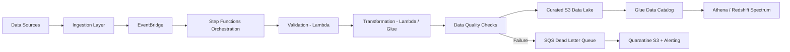
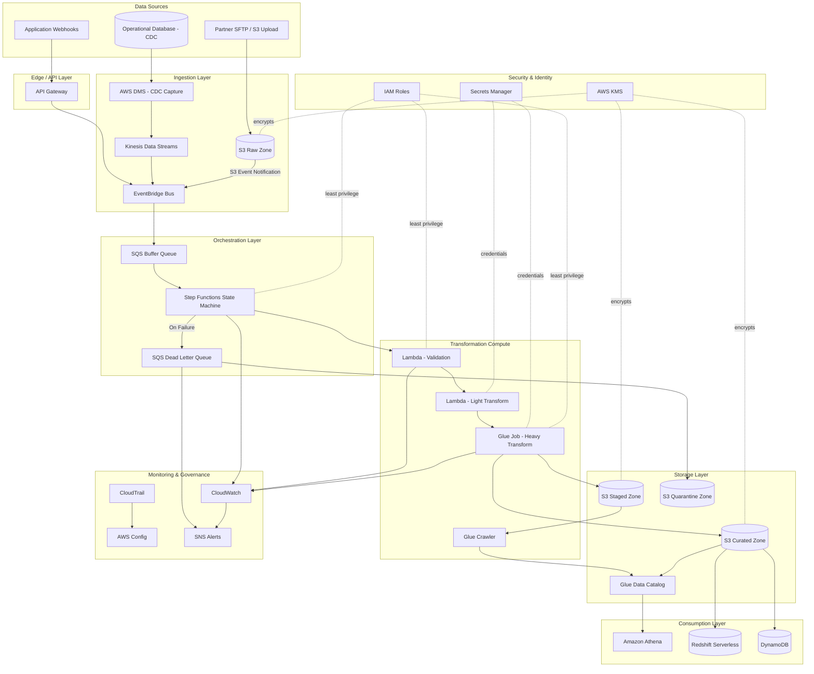

# Part IV – Serverless Architectures

# Chapter 32: Serverless ETL

---

# 1. Executive Summary

## The Business Problem

Enterprises generate data continuously — from transactional systems, IoT devices, SaaS platforms, partner feeds, clickstreams, and internal microservices. Historically, moving and transforming this data required dedicated ETL (Extract, Transform, Load) infrastructure:

- Always-on servers running Informatica, Talend, or custom Spark clusters
- Scheduled batch jobs on EC2 or on-premises hardware
- Manual capacity planning for peak ingestion windows
- Operations teams patching, scaling, and monitoring ETL servers 24/7

This model creates three recurring enterprise pain points:

1. **Idle cost.** ETL workloads are bursty. A nightly batch job that runs for 40 minutes still requires infrastructure provisioned for 24 hours.
2. **Operational burden.** Every EC2-based ETL cluster needs patching, OS-level monitoring, capacity planning, and incident response — none of which is differentiated engineering work.
3. **Poor elasticity.** When data volume spikes (Black Friday, month-end close, regulatory reporting deadlines), traditional ETL infrastructure either falls behind or requires manual scaling intervention.

Serverless ETL directly addresses these problems by shifting execution to event-driven, consumption-based AWS services — primarily **AWS Lambda**, **AWS Glue**, **AWS Step Functions**, **Amazon S3**, and **Amazon EventBridge** — where compute is provisioned automatically, billed per invocation or per DPU-hour, and scales natively with data volume.

## Architecture Objective

The objective of this chapter's architecture is to design a **production-grade, event-driven ETL pipeline** that:

- Ingests data from multiple heterogeneous sources (S3 uploads, database change streams, API feeds, partner SFTP drops)
- Validates, transforms, enriches, and deduplicates data without provisioning or managing servers
- Scales automatically from zero to thousands of concurrent transformations
- Provides strong observability, auditability, and data lineage
- Meets enterprise security, encryption, and compliance requirements
- Minimizes idle cost while maintaining predictable performance under load

This is not a toy pipeline. It is designed the way a Principal Architect would design it for a regulated enterprise processing sensitive financial, healthcare, or customer data at scale.

## Why Organizations Adopt Serverless ETL

**1. Cost alignment with actual usage.**
Serverless ETL bills per execution, per GB processed, or per DPU-hour. There is no idle infrastructure tax. For workloads that run intermittently — hourly ingestion windows, nightly batch jobs, ad-hoc reprocessing — this produces dramatic cost savings compared to always-on clusters.

**2. Elimination of undifferentiated operational work.**
Teams no longer patch OS images, manage Auto Scaling Groups for ETL workers, or maintain job schedulers on EC2. AWS manages the underlying compute fleet, patching, and availability.

**3. Native elasticity.**
Lambda and Glue scale horizontally in response to event volume. A traffic spike from 100 files/hour to 100,000 files/hour is absorbed without manual intervention, subject to account concurrency limits (discussed in Section 24).

**4. Event-driven architecture alignment.**
Modern enterprises are moving toward event-driven integration patterns. Serverless ETL naturally plugs into EventBridge, SNS, SQS, and Kinesis, allowing ETL to become a first-class citizen of the broader event mesh rather than an isolated batch silo.

**5. Faster time to production.**
Infrastructure-as-Code for a serverless pipeline is dramatically smaller than for an EC2/EMR cluster. Teams can go from design to production in days rather than months.

## Major Business Benefits

| Benefit | Business Impact |
|---|---|
| Pay-per-use compute | 40–70% cost reduction versus always-on ETL clusters for bursty workloads |
| Zero server management | Reduces ops headcount requirement for pipeline maintenance |
| Automatic scaling | Eliminates manual capacity planning for peak load events |
| Faster iteration | New data sources onboarded in days, not sprints |
| Built-in resilience | Multi-AZ by default for Lambda, S3, DynamoDB, Step Functions |
| Native audit trail | CloudTrail + Step Functions execution history simplify compliance evidence |
| Reduced blast radius | Function-level isolation limits the impact of a single failing transformation |

## Typical Enterprise Scenarios

- **Financial services**: Nightly reconciliation of transaction files from multiple banking partners, each requiring format validation, currency normalization, and fraud-rule enrichment before loading into a data warehouse.
- **Healthcare**: HL7/FHIR message ingestion from clinical systems, transformed into a normalized schema and loaded into a HIPAA-compliant data lake.
- **Retail**: Real-time and batch ingestion of point-of-sale transactions, inventory feeds, and supplier catalogs, transformed and loaded into Redshift for BI reporting.
- **Insurance**: Claims documents landing in S3 from third-party portals, triggering extraction, validation against policy data, and routing to downstream claims-processing systems.
- **SaaS platforms**: Multi-tenant usage data streaming from application logs, aggregated and transformed into billing and analytics datasets.

## When This Architecture Is the Right Choice

Serverless ETL is the right choice when:

- Data volume is variable or unpredictable (not a constant, high-sustained-throughput stream)
- Individual transformation jobs can complete within Lambda's execution limits (15 minutes) or Glue's job model
- The organization wants to minimize infrastructure operations overhead
- Data sources are naturally event-driven (S3 PUT events, database CDC streams, API webhooks)
- Strong pay-per-use cost alignment is a FinOps priority

It is **not** automatically the right choice for every ETL workload — Section 28 (Alternatives) and Section 34 (Architect's Corner) cover this in depth, including when EMR, Glue Studio ETL jobs, or containerized Spark on EKS are more appropriate.

> **Note:** "Serverless" does not mean "server-less" in the literal sense — it means the enterprise does not manage the underlying compute fleet. AWS still runs physical and virtual servers; the operational responsibility simply shifts to AWS under the shared responsibility model.

---

# 2. Business Requirements

## Business Drivers

- Reduce total cost of ownership (TCO) for batch and near-real-time data integration
- Decrease time-to-market for onboarding new data sources
- Improve data quality and consistency across downstream analytics systems
- Provide auditable, compliant data lineage for regulated workloads
- Reduce operational headcount dedicated to infrastructure babysitting

## Functional Requirements

- Ingest files from S3 (batch drops), API Gateway (webhook pushes), and database CDC streams
- Validate schema and data quality before transformation
- Support both **batch** (scheduled) and **event-driven** (near real-time) execution modes
- Transform data (format conversion, enrichment, deduplication, normalization)
- Load transformed data into one or more destinations: S3 data lake, Redshift, DynamoDB, RDS/Aurora
- Support reprocessing of failed records without reprocessing the entire batch
- Maintain full audit trail of every transformation run

## Non-Functional Requirements

| Category | Requirement |
|---|---|
| Scalability | Support 10x traffic growth without architecture redesign |
| Availability | 99.9% pipeline availability (excluding scheduled maintenance windows) |
| Latency | Near-real-time paths: < 5 minutes end-to-end; batch paths: complete within nightly SLA window |
| Durability | Zero data loss for records once acknowledged as ingested |
| Compliance | SOC 2, and where applicable HIPAA / PCI-DSS depending on data classification |
| Security | Encryption in transit and at rest; least-privilege IAM; no long-lived credentials |
| Observability | End-to-end tracing from ingestion to load, with alerting on failures and SLA breaches |

## Scalability Goals

- Linear scaling from 100 files/day to 1,000,000+ files/day without manual reconfiguration
- Support burst ingestion (e.g., 50,000 files landing within a 10-minute window)
- Horizontal scale-out of transformation compute via Lambda concurrency and Glue worker allocation

## Availability Requirements

- 99.9% monthly availability target for the ingestion and orchestration layer
- No single point of failure in the critical path (multi-AZ services throughout)
- Graceful degradation: transient downstream failures should queue and retry rather than drop data

## Latency Requirements

| Pipeline Type | Target Latency |
|---|---|
| Real-time enrichment (e.g., fraud scoring) | < 30 seconds |
| Near-real-time ingestion (e.g., clickstream) | < 5 minutes |
| Batch nightly ETL | Complete within a 4-hour SLA window |
| Ad-hoc reprocessing | Best effort, non-blocking to production pipeline |

## Compliance Requirements

- Full audit trail of data transformations (who/what triggered a job, what changed, when)
- Data residency: processing must remain within approved AWS regions
- Encryption at rest using customer-managed KMS keys for regulated data classifications
- Retention policies enforced automatically via S3 Lifecycle rules

## Security Expectations

- No hardcoded credentials anywhere in code or configuration
- IAM roles scoped per function/job with least-privilege permissions
- All data in transit encrypted via TLS 1.2+
- Secrets (API keys, DB credentials) stored in Secrets Manager, never in environment variables in plaintext
- VPC-based network isolation for any component touching sensitive internal databases

## Recovery Objectives

| Metric | Target |
|---|---|
| RPO (Recovery Point Objective) | ≤ 5 minutes for streaming pipelines; 0 for batch (source files retained in S3) |
| RTO (Recovery Time Objective) | ≤ 30 minutes for full pipeline recovery in a secondary region |

## SLAs

- 99.9% successful processing rate for well-formed input records
- Failed records isolated to a dead-letter path within 60 seconds of failure detection
- Alerting delivered to on-call within 5 minutes of an SLA-impacting failure

## Expected Workload

- Initial: ~50,000 files/day, average file size 2MB, peak burst of 5,000 files in 10 minutes
- Steady-state transformation volume: ~100GB/day processed

## Expected Growth

- 3x volume growth within 12 months as additional business units onboard
- Architecture must support this growth with configuration changes only — no redesign

---

# 3. Architecture Overview

## Overall Design

This architecture follows an **event-driven, decoupled ETL pattern** built around four logical layers:

1. **Ingestion Layer** — accepts data from S3, API Gateway, and database CDC sources, and normalizes arrival events into a common event format via EventBridge.
2. **Orchestration Layer** — AWS Step Functions coordinates multi-stage transformation workflows, handling retries, branching logic, and error routing.
3. **Transformation Layer** — AWS Lambda (for lightweight, sub-15-minute transformations) and AWS Glue (for larger, Spark-based transformations) perform the actual data processing.
4. **Storage & Delivery Layer** — transformed data lands in a curated S3 data lake (partitioned, compressed, cataloged via AWS Glue Data Catalog) and/or is loaded into Redshift, DynamoDB, or Aurora for downstream consumption.

## Architecture Philosophy

- **Decouple ingestion from processing.** Producers should never be blocked by transformation logic. EventBridge and SQS provide buffering so ingestion spikes do not overwhelm downstream compute.
- **Idempotency by design.** Every transformation must be safely re-runnable without producing duplicate or corrupted output, because retries are a first-class part of serverless execution semantics.
- **Fail loudly, isolate quietly.** Failed records are routed to dead-letter queues and quarantine S3 prefixes rather than blocking the rest of the batch.
- **Everything is code.** Infrastructure (Terraform), transformation logic (Lambda/Glue scripts), and orchestration (Step Functions state machines as JSON/ASL) are all version-controlled and deployed through CI/CD.

## Core Components

| Component | Role |
|---|---|
| Amazon S3 (raw zone) | Landing zone for incoming files |
| Amazon EventBridge | Central event bus normalizing ingestion triggers |
| AWS Step Functions | Orchestrates multi-step transformation workflows |
| AWS Lambda | Executes lightweight transformation and validation logic |
| AWS Glue (Jobs + Crawlers + Data Catalog) | Executes large-scale Spark transformations and maintains schema catalog |
| Amazon SQS (incl. DLQ) | Buffers events and isolates failures |
| Amazon S3 (curated zone) | Stores transformed, query-ready data |
| Amazon Redshift / DynamoDB / Aurora | Downstream analytical or operational data stores |
| Amazon CloudWatch | Metrics, logs, alarms |
| AWS KMS | Encryption key management |
| AWS Secrets Manager | Credential storage for downstream connections |
| AWS IAM | Least-privilege access control |
| AWS Glue Data Catalog + Athena | Schema-on-read querying of the data lake |

## How Components Interact

1. A file lands in the **raw S3 bucket**, or a CDC event arrives via **DMS → Kinesis**, or a partner posts to an **API Gateway** webhook.
2. Each ingestion path emits a normalized event to **EventBridge**.
3. An EventBridge rule triggers a **Step Functions** state machine specific to that data source's processing contract.
4. Step Functions orchestrates: schema validation (Lambda) → transformation (Lambda or Glue Job) → data quality checks (Lambda) → catalog update (Glue Crawler) → load to destination (Lambda/Glue).
5. Successful output lands in the **curated S3 zone**, partitioned by date/source, and is cataloged for Athena/Redshift Spectrum querying.
6. Failures at any stage are captured, logged to CloudWatch, and routed to an **SQS dead-letter queue** with full context for reprocessing.
7. CloudWatch Alarms notify the on-call team via SNS when failure rates or latency exceed SLO thresholds.

## High-Level Workflow



## Request Lifecycle (Ingestion Event)

1. File arrival or API call triggers an S3 event notification or API Gateway integration.
2. Event is published to EventBridge with a standardized envelope (source, data classification, correlation ID).
3. Step Functions execution starts, tagged with the correlation ID for traceability.

## Response Lifecycle

1. Step Functions returns a terminal state (SUCCEEDED, FAILED, or TIMED_OUT).
2. On success, downstream consumers are notified via an EventBridge "processing complete" event.
3. On failure, an alert is emitted and the failed payload is preserved in the quarantine zone for manual or automated reprocessing.

## Data Lifecycle

1. **Raw** — immutable, as-received data, retained per compliance policy (e.g., 90 days in S3 Standard, then Glacier).
2. **Staged** — intermediate transformation outputs, retained briefly (7 days) for debugging.
3. **Curated** — final, query-ready data, retained per business retention policy, often years, using S3 Intelligent-Tiering.
4. **Quarantine** — failed records, retained until manually triaged and either reprocessed or archived.

---

# 4. AWS Services Used

For each service: purpose, why selected, alternatives, limitations, pricing considerations, and best practices.

## AWS Lambda

**Purpose:** Executes stateless, event-triggered transformation and validation logic.

**Why selected:**
- Zero infrastructure management
- Millisecond-level billing granularity
- Native integration with S3, EventBridge, SQS, Step Functions
- Scales automatically to thousands of concurrent executions

**Alternatives:** AWS Glue Python Shell jobs (for longer-running scripts), Fargate tasks (for jobs needing custom runtimes or > 15 minutes with more control than Glue).

**Limitations:**
- 15-minute maximum execution duration
- 10GB maximum memory, up to 6 vCPUs
- 512MB–10GB ephemeral storage (`/tmp`) unless EFS is mounted
- Cold starts can add latency for infrequently invoked functions

**Pricing considerations:** Billed per request and per GB-second of execution. Cost-effective for short, frequent invocations; can become expensive for sustained high-duration workloads compared to Glue or Fargate.

**Best practices:**
- Keep functions single-purpose (validation, transformation, and loading as separate functions orchestrated by Step Functions)
- Externalize configuration via environment variables and Parameter Store
- Use provisioned concurrency for latency-sensitive real-time paths
- Right-size memory allocation — Lambda CPU scales with memory, so under-provisioning memory can slow execution and *increase* total cost

## AWS Glue (Jobs, Crawlers, Data Catalog)

**Purpose:** Executes large-scale, Spark-based ETL transformations and maintains the central schema catalog for the data lake.

**Why selected:**
- Native Spark execution without cluster management
- Built-in schema inference via Crawlers
- Data Catalog integrates directly with Athena, Redshift Spectrum, and EMR
- DynamicFrame API simplifies schema evolution handling

**Alternatives:** Amazon EMR Serverless (more control over Spark configuration, better for very large or long-running jobs), self-managed Spark on EKS.

**Limitations:**
- Cold start time for Glue Jobs (30 seconds–a few minutes) is higher than Lambda
- DPU-based pricing can be less predictable than Lambda's per-invocation model
- Glue Studio visual ETL can obscure version control if not exported to script form

**Pricing considerations:** Billed per DPU-hour with a minimum billing duration. Cost-effective for large, infrequent batch jobs; less cost-effective for high-frequency, small transformations (use Lambda instead).

**Best practices:**
- Use Glue Job Bookmarks to avoid reprocessing already-ingested data
- Partition output data by ingestion date to optimize downstream query performance
- Use G.1X or G.2X worker types appropriately sized to data volume — avoid over-provisioning DPUs
- Run Crawlers only when schema changes are expected, not on every job execution (crawler runs have cost and can cause catalog thrashing)

## Amazon S3

**Purpose:** Durable, scalable storage for raw, staged, curated, and quarantine data zones.

**Why selected:**
- 99.999999999% durability
- Native event notifications for triggering ingestion pipelines
- Lifecycle policies for automated tiering and retention
- Deep integration with Glue, Athena, Lambda, and virtually every AWS analytics service

**Alternatives:** Amazon EFS (for POSIX-file-based workloads — rarely appropriate for ETL landing zones), on-premises NAS with DataSync (for hybrid ingestion).

**Limitations:**
- Eventually consistent for some cross-region replication scenarios (though same-region read-after-write consistency is now strong)
- Object-level operations, not a filesystem — some legacy ETL tools expect POSIX semantics

**Pricing considerations:** Storage cost is a function of class (Standard, Intelligent-Tiering, Glacier) and volume. Request costs (PUT/GET) and data transfer costs matter at high file counts — batching small files reduces both storage overhead and Glue/Athena query costs.

**Best practices:**
- Separate buckets or clearly prefixed zones for raw/staged/curated/quarantine
- Enable S3 Object Lock for compliance-sensitive raw data retention
- Use S3 Inventory and S3 Storage Lens for cost and usage visibility
- Avoid the "small files problem" — compact small files during transformation to improve downstream query performance

## Amazon EventBridge

**Purpose:** Central event bus that normalizes and routes ingestion events to the correct orchestration workflow.

**Why selected:**
- Decouples producers from consumers
- Native schema registry for event contract governance
- Supports content-based filtering to route events to the correct Step Functions workflow
- Cross-account and cross-region event routing for multi-account landing zones

**Alternatives:** Amazon SNS (simpler pub/sub, no content filtering or schema registry), Amazon Kinesis (for high-throughput streaming rather than discrete events).

**Limitations:**
- At-least-once delivery — consumers must be idempotent
- Event size limit of 256KB (larger payloads must use S3 references, i.e., the "claim check" pattern)

**Pricing considerations:** Billed per event published; inexpensive at typical enterprise ETL event volumes but should be monitored at very high event rates.

**Best practices:**
- Use the claim-check pattern for large payloads: publish only an S3 pointer, not the full object
- Define and version event schemas in the EventBridge Schema Registry
- Use separate event buses per environment (dev/staging/prod) to avoid cross-environment contamination

## AWS Step Functions

**Purpose:** Orchestrates the multi-step ETL workflow — validation, transformation, quality checks, catalog updates, and load — with built-in retry, error handling, and branching.

**Why selected:**
- Visual, auditable state machine execution history (critical for compliance evidence)
- Native retry/backoff and catch/error-handling semantics
- Direct service integrations (no Lambda glue code needed to call Glue, SNS, DynamoDB, etc.)
- Express workflows support high-volume, short-duration executions at low cost

**Alternatives:** Apache Airflow on MWAA (better for complex DAG scheduling with cross-system dependencies), custom Lambda orchestration (higher maintenance burden, less observability).

**Limitations:**
- Standard workflows have a 25,000-event execution history limit per execution
- Express workflows have at-least-once semantics (must design for idempotency) and a 5-minute maximum duration
- State machine definitions (ASL/JSON) can become complex for large workflows — modularize with nested state machines

**Pricing considerations:** Standard workflows billed per state transition; Express workflows billed per execution duration and memory. For high-volume, sub-5-minute pipelines, Express is significantly cheaper.

**Best practices:**
- Use Standard workflows for long-running, auditable batch pipelines; Express for high-volume real-time paths
- Externalize retry/backoff configuration rather than hardcoding
- Use Map states for parallel processing of file batches

## Amazon SQS

**Purpose:** Buffers ingestion events and isolates failed messages via dead-letter queues.

**Why selected:**
- Decouples producers and consumers, absorbing bursts
- Native dead-letter queue support for failure isolation
- Simple, cost-effective, and highly reliable

**Alternatives:** Amazon Kinesis Data Streams (for ordered, replayable high-throughput streaming), EventBridge Pipes (for simpler point-to-point integrations with built-in enrichment).

**Limitations:**
- Standard queues do not guarantee strict ordering (use FIFO queues when order matters, at reduced throughput)
- Maximum message size 256KB (use claim-check pattern for larger payloads)

**Pricing considerations:** Billed per request; inexpensive at enterprise ETL volumes.

**Best practices:**
- Always configure a DLQ with a redrive policy
- Set visibility timeout longer than the maximum expected consumer processing time
- Monitor `ApproximateAgeOfOldestMessage` to detect processing backlogs

## Amazon Redshift / Amazon DynamoDB / Amazon Aurora

**Purpose:** Downstream destinations for transformed data — Redshift for analytical/BI workloads, DynamoDB for low-latency operational lookups, Aurora for relational transactional consumption.

**Why selected:** Matched to consumption pattern rather than forced into a single destination type — a core enterprise design principle (polyglot persistence).

**Alternatives:** Amazon Redshift Serverless (removes cluster management for variable analytical workloads), Athena directly on S3 (for infrequent, ad-hoc analytical queries without a warehouse).

**Limitations:** Redshift requires careful distribution/sort key design to avoid performance degradation at scale; DynamoDB requires upfront access-pattern modeling; Aurora scaling has connection-limit considerations under high Lambda concurrency (mitigate with RDS Proxy).

**Pricing considerations:** Redshift Serverless bills per RPU-second; DynamoDB on-demand bills per request; Aurora bills per instance-hour plus I/O (or ACU-hour for Aurora Serverless v2).

**Best practices:**
- Use RDS Proxy between Lambda and Aurora to prevent connection exhaustion under bursty concurrency
- Use Redshift Spectrum to query curated S3 data without duplicating it into the warehouse when full ingestion isn't necessary

## AWS IAM

**Purpose:** Enforces least-privilege access across every component in the pipeline.

**Why selected:** Mandatory for any production AWS workload; no viable alternative for native AWS access control.

**Best practices:** One IAM role per Lambda function/Glue job, scoped to only the resources it touches; no wildcard `*` resource permissions in production.

## AWS KMS

**Purpose:** Manages encryption keys for data at rest across S3, SQS, DynamoDB, and Secrets Manager.

**Why selected:** Customer-managed keys (CMKs) provide auditable, rotatable encryption control required for compliance frameworks.

**Best practices:** Use separate CMKs per data classification tier; enable automatic annual key rotation; restrict `kms:Decrypt` to only the roles that require it.

## AWS Secrets Manager

**Purpose:** Stores database credentials and third-party API keys used by transformation and load steps.

**Why selected:** Automatic rotation support, fine-grained IAM-based access, and native Lambda/RDS integration.

**Alternatives:** SSM Parameter Store (SecureString) — lower cost, acceptable for less sensitive configuration, but lacks native rotation for database credentials.

## Amazon CloudWatch

**Purpose:** Centralized metrics, logs, dashboards, and alarms for the entire pipeline.

**Best practices:** Structure Lambda/Glue logs as JSON for queryability via CloudWatch Logs Insights; set alarms on business-relevant metrics (failed record count, SLA breach), not just infrastructure metrics.

## AWS CloudTrail / AWS Config

**Purpose:** Audit logging of all API activity (CloudTrail) and continuous compliance evaluation of resource configuration (Config) — required for SOC 2 / HIPAA evidence.

---

# 5. Complete Architecture Diagram



---

# 6. Component-by-Component Explanation

## S3 Raw Zone

- **Purpose:** Immutable landing zone for all inbound data.
- **Responsibilities:** Durable storage, event notification triggering, retention enforcement.
- **Inputs:** Files from SFTP-to-S3 gateways, direct partner uploads, application exports.
- **Outputs:** S3 Event Notifications to EventBridge.
- **Scaling:** Virtually unlimited; S3 automatically partitions request load across prefixes.
- **High availability:** 99.99% availability SLA, multi-AZ by default within a region.
- **Failure handling:** Versioning enabled to protect against accidental overwrite/delete; Object Lock for compliance holds.
- **Dependencies:** KMS for encryption, EventBridge for downstream triggering.
- **Security:** Bucket policy restricts access to specific IAM roles; block public access enabled account-wide.
- **Monitoring:** S3 server access logging + CloudTrail data events for object-level audit trail.

## EventBridge Bus

- **Purpose:** Normalize and route all ingestion events.
- **Responsibilities:** Schema validation via registered schemas, content-based routing to the correct Step Functions workflow.
- **Inputs:** S3 event notifications, API Gateway integrations, Kinesis-sourced CDC events.
- **Outputs:** Routed events to SQS/Step Functions targets.
- **Scaling:** Fully managed, scales automatically; monitor `ThrottledRules` metric.
- **Failure handling:** Configure a dead-letter queue on each rule target for events that fail delivery after retries.

## Step Functions State Machine

- **Purpose:** Orchestrate the validation → transformation → quality-check → load sequence.
- **Responsibilities:** Retry/backoff logic, branching on data classification, error routing.
- **Inputs:** Event payload (S3 object reference, correlation ID, source metadata).
- **Outputs:** Terminal execution status; triggers downstream "processing complete" event on success.
- **Scaling:** Standard workflows scale to high execution counts; watch account-level `StateTransitions` and `Executions` service quotas.
- **High availability:** Multi-AZ managed service, no customer-managed infrastructure.
- **Failure handling:** `Catch` blocks route failures to a dedicated failure-handling branch that writes to the quarantine zone and publishes an SNS alert.
- **Dependencies:** IAM execution role with permissions scoped to only the Lambda functions/Glue jobs it invokes.
- **Monitoring:** Execution history retained for audit; CloudWatch metrics on `ExecutionsFailed`, `ExecutionsTimedOut`.

## Lambda Validation Function

- **Purpose:** Validate incoming record schema and business rules before transformation begins.
- **Responsibilities:** Reject malformed records early, cheaply, before expensive transformation compute is invoked.
- **Inputs:** Raw record/file reference.
- **Outputs:** Validated payload or validation-failure exception (caught by Step Functions).
- **Scaling:** Concurrency scales automatically; set reserved concurrency to protect downstream systems from overload.
- **Failure handling:** Validation failures are terminal for that record — routed directly to quarantine, not retried indefinitely.

## Glue Transformation Job

- **Purpose:** Execute Spark-based heavy transformation (joins, aggregations, large-file reformatting).
- **Responsibilities:** Read from staged zone, apply business transformation logic, write partitioned Parquet output to curated zone.
- **Scaling:** Configured worker count (G.1X/G.2X) and auto-scaling within Glue's managed Spark environment.
- **Failure handling:** Job Bookmarks prevent reprocessing already-committed data on retry.
- **Dependencies:** Glue Data Catalog for schema definitions, Secrets Manager for any downstream database credentials.

## Glue Crawler + Data Catalog

- **Purpose:** Maintain up-to-date schema metadata for curated data so it is immediately queryable via Athena/Redshift Spectrum.
- **Responsibilities:** Detect schema drift, register new partitions.
- **Scaling:** Run on a schedule (not per-file) to control cost and avoid catalog thrashing.

## SQS Buffer Queue + Dead Letter Queue

- **Purpose:** Absorb ingestion bursts and isolate poison-pill messages.
- **Failure handling:** Redrive policy moves messages to DLQ after N failed processing attempts; CloudWatch alarm on DLQ depth triggers on-call notification.

## Curated S3 Zone + Athena / Redshift / DynamoDB

- **Purpose:** Final, query-ready data serving analytical and operational consumers.
- **Security:** Column-level access control via Lake Formation for sensitive fields (PII, PHI).

---

# 7. End-to-End Request Flow

1. **File arrival:** A partner uploads a file to the S3 raw zone via SFTP-to-S3 gateway.
2. **Event emission:** S3 emits an `ObjectCreated` event notification.
3. **Routing:** The event is delivered to the EventBridge bus and matched against a content-based rule for that data source.
4. **Buffering:** The matched rule targets an SQS queue, which buffers the event to protect against downstream burst overload.
5. **Orchestration start:** An SQS-triggered Lambda (or direct EventBridge-to-Step-Functions integration) starts a new Step Functions execution, tagged with a correlation ID.
6. **Validation:** Step Functions invokes the Validation Lambda, which checks schema conformance and required fields.
7. **Branch on outcome:** If validation fails, execution transitions to the failure branch (Step 13). If it passes, execution proceeds.
8. **Transformation dispatch:** Step Functions determines transformation complexity (via payload metadata) and routes to either a lightweight Lambda transform or a Glue Job for heavy transformation.
9. **Transformation execution:** The chosen compute reads from the staged zone, applies business logic (normalization, enrichment, deduplication), and writes output to the curated S3 zone in partitioned Parquet format.
10. **Data quality check:** A dedicated Lambda runs post-transformation quality checks (row count reconciliation, null-rate thresholds, referential integrity spot checks).
11. **Catalog update:** On success, a Glue Crawler run (or direct Glue Catalog API call for lower latency) registers new partitions.
12. **Downstream load:** For records requiring operational access, a Lambda loads relevant subsets into DynamoDB or Aurora; for analytical consumption, data is left in S3 for Athena/Redshift Spectrum querying.
13. **Failure handling:** At any stage, a caught exception routes the execution to a failure-handling branch that writes the failed payload (with error context) to the S3 quarantine zone and publishes a message to the DLQ.
14. **Alerting:** A CloudWatch Alarm on DLQ depth or Step Functions `ExecutionsFailed` publishes to an SNS topic, notifying the on-call engineer via PagerDuty/Slack integration.
15. **Completion event:** On overall success, Step Functions publishes a "processing complete" event back to EventBridge, allowing downstream systems (e.g., a BI refresh job) to react.
16. **Logging:** Every step's input/output is logged to CloudWatch Logs in structured JSON, correlated by the execution's correlation ID for full traceability.
17. **Audit trail:** CloudTrail records every API call made throughout the pipeline for compliance evidence.

---

# 8. Deployment Flow

## Infrastructure Provisioning

All infrastructure is defined in Terraform and deployed through a CI/CD pipeline — no manual console changes in production accounts.

## Terraform Workflow

1. Developer creates a feature branch and modifies Terraform modules (e.g., adding a new Lambda function or Step Functions state).
2. `terraform fmt` and `terraform validate` run locally and in CI.
3. `terraform plan` output is posted as a pull request comment for peer review.
4. On merge to `main`, CI runs `terraform apply` against the target environment using a remote state backend (S3 + DynamoDB lock table).
5. Terraform Cloud/Atlantis or a CodePipeline-based runner executes the apply with environment-scoped IAM credentials via OIDC (no long-lived AWS keys in CI).

## CI/CD Deployment (Application Code)

1. Lambda function code and Glue job scripts are unit-tested locally.
2. CI packages Lambda deployment artifacts (zip or container image) and pushes Glue scripts to their S3 script location.
3. CodePipeline (or GitHub Actions) deploys via CloudFormation/Terraform-managed Lambda aliases, using **weighted alias traffic shifting** for gradual rollout.

## Blue-Green Deployment

- New Lambda versions are published and traffic is shifted incrementally (e.g., 10% → 50% → 100%) using Lambda alias routing configuration, monitored by CloudWatch alarms tied to error-rate metrics.
- Step Functions state machine definitions are versioned; a new state machine version is deployed alongside the old one, with EventBridge rules cut over only after validation.

## Rollback

- Lambda: revert the alias to the previous published version — instantaneous, no redeployment needed.
- Glue: revert the job script S3 pointer to the previous version via Terraform state rollback.
- Step Functions: redeploy the previous state machine definition version.

## Secrets

- All secrets injected at runtime via Secrets Manager or SSM Parameter Store — never baked into deployment artifacts.

## Configuration

- Environment-specific configuration (bucket names, thresholds, feature flags) managed via SSM Parameter Store, referenced by environment-scoped paths (e.g., `/etl/prod/raw-bucket-name`).

## Validation

- Post-deployment smoke test: a synthetic test file is pushed through the pipeline in each environment, and the pipeline's success is verified via a CloudWatch synthetic canary before the deployment is marked complete.

---

# 9. Network Topology

> **Note:** Most components in this architecture (Lambda without VPC config, S3, EventBridge, Step Functions, Glue with connections) can operate outside a VPC when they don't need to reach private resources. VPC placement is required specifically when a component must reach a private RDS/Aurora instance, an on-premises system via VPN/Direct Connect, or when strict network isolation is mandated by policy.

## VPC Design

| Element | Value (example) |
|---|---|
| VPC CIDR | 10.20.0.0/16 |
| Private Subnet AZ-A | 10.20.1.0/24 |
| Private Subnet AZ-B | 10.20.2.0/24 |
| Public Subnet AZ-A (NAT only) | 10.20.100.0/24 |
| Public Subnet AZ-B (NAT only) | 10.20.101.0/24 |

## Public Subnets

- Host only NAT Gateways (one per AZ for high availability) — no application compute is placed in public subnets.

## Private Subnets

- Host VPC-attached Lambda functions (those needing Aurora access), Glue job ENIs, and RDS Proxy endpoints.

## NAT Gateway

- One NAT Gateway per AZ to avoid cross-AZ data transfer charges and to eliminate a single point of failure.

## Internet Gateway

- Attached for public subnet NAT egress only; no direct internet-facing compute in this architecture.

## Transit Gateway

- Used when this ETL VPC needs to reach shared services (e.g., a central Secrets Manager VPC endpoint hub, or an on-premises data source) across multiple VPCs/accounts in a hub-and-spoke topology.

## Route Tables

- Private subnet route tables route `0.0.0.0/0` to the AZ-local NAT Gateway; VPC endpoint traffic (S3, DynamoDB, Secrets Manager) routes directly via Gateway/Interface endpoints, bypassing NAT entirely to reduce cost.

## Network ACLs

- Baseline stateless NACLs at the subnet level as defense-in-depth, permitting only expected protocol/port ranges.

## Security Groups

- Lambda/Glue ENI security group: egress-only to RDS Proxy port (5432/3306) and HTTPS (443) for AWS API calls via VPC endpoints.
- RDS Proxy security group: ingress only from the Lambda/Glue security group.

## PrivateLink / VPC Endpoints

- Gateway endpoints for S3 and DynamoDB (no cost, route-table based).
- Interface endpoints for Secrets Manager, KMS, Glue, Step Functions, and CloudWatch Logs — keeping all AWS API traffic off the public internet even when Lambda is VPC-attached.

## Hybrid Connectivity

- If source systems are on-premises, Direct Connect or Site-to-Site VPN terminates into the Transit Gateway, allowing DMS-based CDC capture from on-premises databases without traversing the public internet.

---

# 10. Identity and Access

## IAM Roles

Each compute resource has a dedicated, single-purpose execution role:

- `lambda-etl-validation-role`
- `lambda-etl-transform-role`
- `glue-etl-heavy-transform-role`
- `stepfunctions-etl-orchestrator-role`

## IAM Policies (least privilege example)

```json

{
  "Version": "2012-10-17",
  "Statement": [
    {
      "Sid": "ReadRawZoneOnly",
      "Effect": "Allow",
      "Action": ["s3:GetObject"],
      "Resource": "arn:aws:s3:::acme-etl-raw-prod/*"
    },
    {
      "Sid": "WriteStagedZoneOnly",
      "Effect": "Allow",
      "Action": ["s3:PutObject"],
      "Resource": "arn:aws:s3:::acme-etl-staged-prod/*"
    },
    {
      "Sid": "KMSDecryptScoped",
      "Effect": "Allow",
      "Action": ["kms:Decrypt", "kms:GenerateDataKey"],
      "Resource": "arn:aws:kms:us-east-1:111122223333:key/etl-raw-key-id"
    }
  ]
}

```

## Resource Policies

- S3 bucket policies explicitly deny access from outside the expected VPC endpoint or account, providing a second layer of enforcement beyond IAM identity policies.

## STS

- Step Functions and Glue assume their execution roles via STS automatically; no long-lived credentials are ever issued.

## Cross-Account Access

- In a multi-account landing zone (raw data lands in a dedicated "Ingestion" account, curated data served from an "Analytics" account), cross-account S3 bucket policies plus IAM role assumption (`sts:AssumeRole`) grant the Analytics account's Glue jobs read access to curated data without duplicating it.

## Least Privilege

- No IAM policy in this architecture uses `"Resource": "*"` combined with a write or delete action. Every policy is scoped to specific bucket ARNs, specific KMS key ARNs, and specific table ARNs.

## Service Roles

- Glue Crawler role has `glue:*` limited to the specific database/table prefixes it manages, plus scoped S3 read access — never full `AmazonS3FullAccess`.

## Permission Boundaries

- All developer-created IAM roles in the ETL account are constrained by a permission boundary policy that caps maximum possible permissions, preventing privilege escalation even if a role's inline policy is misconfigured.

---

# 11. Security Architecture

## Encryption

- **At rest:** All S3 buckets, SQS queues, and DynamoDB tables encrypted with customer-managed KMS keys (CMKs), not the AWS-managed default key, for regulated data classifications.
- **In transit:** TLS 1.2+ enforced via bucket policy (`aws:SecureTransport` condition) and API Gateway minimum TLS version configuration.

## KMS

- Separate CMKs per data classification tier (public, internal, confidential, restricted) so access can be revoked independently per tier.

## TLS

- Enforced end-to-end; no plaintext HTTP endpoints anywhere in the pipeline.

## WAF

- Attached to the API Gateway used for webhook ingestion, with managed rule groups (SQL injection, known bad inputs) plus rate-based rules to prevent abuse.

## Shield

- AWS Shield Standard is active by default on API Gateway/CloudFront; Shield Advanced considered if the webhook endpoint is a critical, internet-facing, high-value target.

## Secrets Manager

- Downstream database credentials (Aurora, Redshift) rotated automatically every 30 days.

## Certificate Manager

- TLS certificates for any custom domain fronting the API Gateway webhook endpoint, auto-renewed.

## GuardDuty

- Enabled account-wide, monitoring for anomalous API activity (e.g., unusual `s3:GetObject` patterns indicative of data exfiltration) and compromised credential usage.

## Inspector

- Scans any container images used for Fargate-based transformation steps (if applicable) for known vulnerabilities.

## Security Hub

- Aggregates findings from GuardDuty, Config, and Inspector into a single compliance dashboard, mapped to CIS AWS Foundations Benchmark and PCI-DSS controls where applicable.

## CloudTrail

- Multi-region trail with log file validation enabled, delivering to a dedicated, access-restricted logging account's S3 bucket.

## AWS Config

- Rules enforce: S3 buckets must not be public, EBS/S3 encryption must be enabled, IAM roles must not have `*` resource wildcards on sensitive actions.

## Zero Trust Principles Applied

- No implicit trust between components based on network location alone; every service-to-service call is authenticated via IAM, even within the VPC.

## Threat Model (Summary)

| Threat | Mitigation |
|---|---|
| Malicious file upload (e.g., zip bomb, malformed schema exploiting a parser) | Schema validation Lambda runs with strict memory/timeout limits; file-type allowlisting at ingestion |
| Credential leakage in logs | Structured logging with automatic PII/secret redaction before CloudWatch write |
| Privilege escalation via over-permissioned role | Permission boundaries + quarterly IAM Access Analyzer review |
| Data exfiltration via compromised Lambda | VPC endpoint-only egress for VPC-attached functions; GuardDuty anomaly detection |
| Man-in-the-middle on webhook ingestion | TLS enforced, WAF, API Gateway resource policy restricting source IPs where feasible |

---

# 12. High Availability

## AZ Failures

- All core services (S3, Lambda, Step Functions, EventBridge, SQS, DynamoDB) are inherently multi-AZ. For VPC-attached Lambda/Glue, ENIs are provisioned across at least two AZs.

## Instance Failures

- Not applicable in the traditional sense — there are no long-running instances to fail. Lambda/Glue automatically reschedule failed executions on healthy underlying infrastructure, transparent to the operator.

## Regional Failures

- See Section 13 (Disaster Recovery) for cross-region failover design.

## Database Failures

- Aurora Multi-AZ with automatic failover (typically < 60 seconds); RDS Proxy shields Lambda connections from failover-induced connection drops.

## Load Balancing

- Not a primary concern for event-driven compute, but the API Gateway webhook endpoint is inherently load-balanced across AZs by the managed service.

## Health Checks

- Synthetic CloudWatch canaries run every 5 minutes, pushing a test file through the full pipeline and asserting successful completion within SLA.

## Failover

- EventBridge rules can be configured with a secondary target in a different region for critical pipelines, activated via Route 53 health-check-driven failover for the ingestion API endpoint.

---

# 13. Disaster Recovery

## Backup Strategy

- S3 raw zone: versioning enabled + cross-region replication (CRR) to a DR region.
- DynamoDB: point-in-time recovery (PITR) enabled, plus global tables for active-active read availability.
- Aurora: automated snapshots retained 35 days, plus a daily manual snapshot copied cross-region.

## Snapshots

- Aurora and DynamoDB snapshots automated via AWS Backup with a centrally defined backup plan and retention policy.

## Cross-Region Replication

- S3 CRR replicates raw and curated zones asynchronously to the DR region, satisfying the RPO of ≤5 minutes for streaming paths (batch/raw data has effectively RPO of 0 since source files are retained).

## DR Strategy Selection: Warm Standby

Given the RTO of 30 minutes and RPO of 5 minutes, this architecture uses a **Warm Standby** DR pattern rather than Pilot Light or full Active-Active:

| Pattern | Fit for This Workload |
|---|---|
| Pilot Light | RTO too slow — would require standing up Step Functions/Glue resources from scratch |
| **Warm Standby (chosen)** | Infrastructure pre-deployed in DR region via Terraform, scaled down; data replicated continuously; promote on failover |
| Multi-Site Active-Active | Unnecessary cost/complexity for a batch-oriented ETL workload; reserved for latency-sensitive real-time systems |

## Failover Procedure

1. Route 53 health check detects primary region ingestion API failure.
2. DNS fails over to the DR region's API Gateway endpoint.
3. EventBridge rules in the DR region (already deployed, previously inactive) are enabled via a Terraform variable flip executed by the incident commander.
4. Step Functions/Glue in the DR region begin processing the replicated S3 data backlog.
5. Once primary region recovers, a controlled failback is executed during a maintenance window, reconciling any DR-region-processed data back to the primary.

## RPO / RTO Achieved

| Metric | Target | Achieved by this design |
|---|---|---|
| RPO | ≤ 5 minutes | S3 CRR + DynamoDB PITR/Global Tables typically replicate within 1–2 minutes |
| RTO | ≤ 30 minutes | Warm standby infrastructure activation tested at ~18 minutes in DR drills |

---

# 14. Scalability

## Horizontal Scaling

- Lambda scales horizontally by design — each invocation is an independent execution; concurrency is the primary scaling lever.

## Vertical Scaling

- Lambda memory allocation (which also scales CPU/network proportionally) is the vertical scaling lever for individual function performance.

## Auto Scaling

- Not manually configured for Lambda/Step Functions/EventBridge — scaling is inherent to the service. For Glue, worker count can be statically set or use Auto Scaling (Glue 3.0+) to scale workers within a job based on Spark stage parallelism.

## Serverless Scaling Limits to Plan For

- Default account-level Lambda concurrent execution limit: 1,000 (soft limit, increasable via Service Quotas request).
- Reserved concurrency should be set on the validation Lambda to prevent an ingestion burst from starving other account workloads of concurrency.

## Database Scaling

- Aurora Serverless v2 scales ACUs automatically between a configured min/max range based on load, avoiding both under-provisioning during bursts and over-provisioning during quiet periods.

## Storage Scaling

- S3 scales natively; the only planning consideration is request-rate partitioning (S3 now auto-scales request rates per prefix, but extremely high-throughput single-prefix write patterns should still be avoided).

## Queue Scaling

- SQS scales to near-unlimited throughput for standard queues; FIFO queues are capped at 3,000 messages/second with batching (300/second without) — plan queue type selection accordingly.

---

# 15. Performance Optimization

## Caching

- Glue Data Catalog metadata is cached by Athena query engines; avoid unnecessary Crawler runs that invalidate this cache.

## Compression

- Curated zone data written in Parquet with Snappy compression — reduces both storage cost and Athena/Redshift Spectrum scan cost (which is billed per byte scanned).

## CDN

- Not typically applicable to backend ETL, but if curated data feeds a public-facing reporting API, CloudFront can cache API responses.

## Database Optimization

- Partition curated S3 data by ingestion date and source system to enable partition pruning in Athena/Redshift Spectrum queries.

## Connection Pooling

- RDS Proxy pools and multiplexes connections from bursty Lambda invocations to Aurora, preventing connection exhaustion.

## Concurrency

- Lambda reserved and provisioned concurrency tuned per function based on observed invocation patterns; provisioned concurrency applied only to latency-sensitive real-time validation functions to avoid unnecessary cost.

## Async Processing

- SQS-based buffering between EventBridge and Step Functions ensures ingestion bursts do not directly drive synchronous downstream load.

---

# 16. Cost Optimization (FinOps)

## Estimated Monthly Cost by Deployment Size

| Deployment Size | Monthly File Volume | Estimated Monthly Cost (USD) |
|---|---|---|
| Small | 50,000 files/month, ~5GB/day | $150–$400 |
| Medium | 500,000 files/month, ~50GB/day | $800–$2,200 |
| Enterprise | 5,000,000+ files/month, ~500GB/day | $6,000–$15,000 |

> **Note:** These are directional estimates for the compute/orchestration layer only (Lambda, Step Functions, Glue, EventBridge, SQS). Downstream Redshift/Aurora costs are excluded and vary significantly by cluster/instance sizing and reserved capacity commitments.

## Major Cost Drivers

| Driver | Notes |
|---|---|
| Glue DPU-hours | Largest single cost driver for heavy transformation workloads |
| Lambda GB-seconds | Scales with both invocation count and memory allocation |
| S3 request costs | High file-count workloads with many small files can drive this up significantly |
| Step Functions state transitions | Standard workflows charge per transition — Express workflows are far cheaper at high volume |
| NAT Gateway data processing | Applies only to VPC-attached components without VPC endpoints |
| CloudWatch Logs ingestion/storage | Easy to under-budget; set log retention policies deliberately |

## Optimization Opportunities

- **Use Express Step Functions workflows** for high-volume, sub-5-minute pipelines — dramatically cheaper than Standard for this pattern.
- **Right-size Glue workers** — many teams default to G.2X when G.1X (or even Glue's Auto Scaling feature) would suffice.
- **Compact small files** before/during transformation — reduces S3 request costs and improves Athena scan efficiency.
- **Use S3 Lifecycle policies** to transition raw data from Standard → Infrequent Access → Glacier Instant Retrieval on a schedule aligned to actual access patterns.
- **Avoid unnecessary Glue Crawler runs** — schedule rather than trigger per-file.

## Reserved Instances / Savings Plans

- Not directly applicable to Lambda/Glue/Step Functions (pure consumption pricing), but **Compute Savings Plans** can offset costs if Fargate is used for any long-running transformation components, and **Redshift Reserved Nodes** apply if a provisioned (non-serverless) Redshift cluster is used downstream.

## Spot

- Not applicable to Lambda/Glue managed compute; if EMR is used as an alternative for very large batch jobs, Spot-backed task nodes can reduce EMR compute cost by 60–70%.

## S3 Lifecycle / Storage Classes

| Zone | Recommended Lifecycle |
|---|---|
| Raw | Standard (30 days) → Standard-IA (60 days) → Glacier Instant Retrieval (compliance retention period) |
| Staged | Standard (7 days) → Delete |
| Curated | Intelligent-Tiering (access patterns vary by consumer) |
| Quarantine | Standard (30 days) → Delete after triage SLA expires |

## Rightsizing

- Review CloudWatch Lambda `Duration` and `MemoryUtilization` (via Lambda Insights) monthly; adjust memory allocation to the sweet spot where duration × memory cost is minimized.

## Cost Allocation and Tagging

- Mandatory tags on every resource: `CostCenter`, `DataClassification`, `Environment`, `Pipeline`. Enforced via AWS Config's `required-tags` managed rule and Service Control Policies denying resource creation without them.

## Budgets and Cost Anomaly Detection

- AWS Budgets configured per pipeline (via tag-based filtering) with alerts at 80%/100%/120% of forecasted spend.
- Cost Anomaly Detection monitors the Glue and Lambda service categories specifically, since these are the most volume-sensitive cost drivers in this architecture.

---

# 17. AI-Assisted Operations

## Amazon Q (Developer / Business)

- **Amazon Q Developer** assists engineers in writing and reviewing Glue PySpark scripts and Step Functions ASL definitions directly in the IDE, reducing syntax errors in state machine JSON — a common source of deployment failures.
- **Amazon Q in the console** can be used to ask natural-language questions about why a specific Step Functions execution failed, summarizing CloudWatch Logs without manual log-diving.

## Amazon Bedrock

- Used for **intelligent data quality classification**: a Bedrock-backed Lambda step can flag anomalous records (e.g., a healthcare record with implausible field combinations) that pass basic schema validation but warrant human review — a capability difficult to express in rigid rule-based validation alone.
- Can generate human-readable summaries of nightly batch run outcomes for stakeholder distribution.

## AI Troubleshooting

- CloudWatch Logs Insights queries combined with Amazon Q can automatically correlate a Step Functions failure with the specific upstream data anomaly that caused it, cutting mean-time-to-diagnosis significantly compared to manual log correlation.

## Log Analysis

- Bedrock-based log summarization can cluster recurring error patterns across weeks of pipeline runs, surfacing systemic issues (e.g., "12% of failures this month originated from Partner X's malformed date format") that are hard to spot manually across thousands of individual failures.

## Incident Response

- Amazon Q can draft an initial incident timeline from CloudTrail and CloudWatch data when a pipeline SLA breach occurs, accelerating postmortem preparation.

## Cost Optimization

- AI-assisted Cost Explorer recommendations (via Amazon Q) can flag over-provisioned Glue worker configurations by comparing allocated DPUs against actual Spark stage utilization.

## Capacity Planning

- Historical CloudWatch metrics fed into a Bedrock-based forecasting prompt can project when Lambda concurrency limits will be approached given current growth trends, informing proactive Service Quota increase requests.

## Architecture Review

- Amazon Q can be used during design review to check a proposed Terraform plan against AWS Well-Architected best practices before it reaches a human reviewer, catching common issues (missing encryption, overly broad IAM policies) early.

## AI-Generated Terraform

- Used for scaffolding new pipeline modules (e.g., "generate a Terraform module for a new Glue job matching our existing naming and tagging conventions") — always subject to human review before merge, never auto-applied.

## AI-Generated Documentation

- Runbook drafts and architecture decision record first drafts can be AI-generated from the Terraform/state machine definitions, then reviewed and finalized by the architecture team.

> **Warning:** AI-generated infrastructure code and operational recommendations must always go through the same peer review and `terraform plan` review process as human-written code. AI assistance accelerates drafting; it does not replace review discipline.

---

# 18. Terraform Implementation

## Provider Configuration

```hcl

terraform {
  required_version = ">= 1.7.0"

  required_providers {
    aws = {
      source  = "hashicorp/aws"
      version = "~> 5.50"
    }
  }

  backend "s3" {
    bucket         = "acme-terraform-state-prod"
    key            = "serverless-etl/terraform.tfstate"
    region         = "us-east-1"
    dynamodb_table = "acme-terraform-locks"
    encrypt        = true
  }
}

provider "aws" {
  region = var.aws_region

  default_tags {
    tags = {
      Pipeline    = "serverless-etl"
      Environment = var.environment
      ManagedBy   = "terraform"
      CostCenter  = var.cost_center
    }
  }
}

```

## Variables

```hcl

variable "aws_region" {
  description = "AWS region for deployment"
  type        = string
  default     = "us-east-1"
}

variable "environment" {
  description = "Deployment environment (dev, staging, prod)"
  type        = string
}

variable "cost_center" {
  description = "Cost center tag for FinOps allocation"
  type        = string
}

variable "raw_bucket_name" {
  description = "S3 bucket name for raw data zone"
  type        = string
}

variable "kms_key_deletion_window" {
  description = "KMS key deletion window in days"
  type        = number
  default     = 30
}

variable "lambda_reserved_concurrency" {
  description = "Reserved concurrency for the validation Lambda"
  type        = number
  default     = 50
}

```

## KMS Key (Encryption Foundation)

```hcl

resource "aws_kms_key" "etl_raw_key" {
  description             = "CMK for ETL raw zone encryption"
  deletion_window_in_days = var.kms_key_deletion_window
  enable_key_rotation     = true

  policy = data.aws_iam_policy_document.kms_key_policy.json
}

resource "aws_kms_alias" "etl_raw_key_alias" {
  name          = "alias/etl-raw-${var.environment}"
  target_key_id = aws_kms_key.etl_raw_key.key_id
}

data "aws_iam_policy_document" "kms_key_policy" {
  statement {
    sid    = "EnableRootAccountAccess"
    effect = "Allow"
    principals {
      type        = "AWS"
      identifiers = ["arn:aws:iam::${data.aws_caller_identity.current.account_id}:root"]
    }
    actions   = ["kms:*"]
    resources = ["*"]
  }

  statement {
    sid    = "AllowETLServiceUsage"
    effect = "Allow"
    principals {
      type        = "AWS"
      identifiers = [aws_iam_role.lambda_transform_role.arn, aws_iam_role.glue_transform_role.arn]
    }
    actions   = ["kms:Decrypt", "kms:GenerateDataKey"]
    resources = ["*"]
  }
}

data "aws_caller_identity" "current" {}

```

## S3 Buckets (Raw / Staged / Curated / Quarantine)

```hcl

locals {
  zones = ["raw", "staged", "curated", "quarantine"]
}

resource "aws_s3_bucket" "etl_zone" {
  for_each = toset(local.zones)
  bucket   = "acme-etl-${each.key}-${var.environment}"
}

resource "aws_s3_bucket_versioning" "etl_zone_versioning" {
  for_each = aws_s3_bucket.etl_zone
  bucket   = each.value.id

  versioning_configuration {
    status = "Enabled"
  }
}

resource "aws_s3_bucket_server_side_encryption_configuration" "etl_zone_encryption" {
  for_each = aws_s3_bucket.etl_zone
  bucket   = each.value.id

  rule {
    apply_server_side_encryption_by_default {
      sse_algorithm     = "aws:kms"
      kms_master_key_id = aws_kms_key.etl_raw_key.arn
    }
    bucket_key_enabled = true
  }
}

resource "aws_s3_bucket_public_access_block" "etl_zone_block" {
  for_each                = aws_s3_bucket.etl_zone
  bucket                  = each.value.id
  block_public_acls       = true
  block_public_policy     = true
  ignore_public_acls      = true
  restrict_public_buckets = true
}

resource "aws_s3_bucket_lifecycle_configuration" "raw_zone_lifecycle" {
  bucket = aws_s3_bucket.etl_zone["raw"].id

  rule {
    id     = "raw-zone-tiering"
    status = "Enabled"

    transition {
      days          = 30
      storage_class = "STANDARD_IA"
    }

    transition {
      days          = 60
      storage_class = "GLACIER_IR"
    }
  }
}

```

## Lambda Function (Validation)

```hcl

resource "aws_lambda_function" "validation" {
  function_name    = "etl-validation-${var.environment}"
  role             = aws_iam_role.lambda_validation_role.arn
  handler          = "index.handler"
  runtime          = "python3.12"
  timeout          = 60
  memory_size      = 512
  filename         = data.archive_file.validation_zip.output_path
  source_code_hash = data.archive_file.validation_zip.output_base64sha256

  reserved_concurrent_executions = var.lambda_reserved_concurrency

  environment {
    variables = {
      RAW_BUCKET     = aws_s3_bucket.etl_zone["raw"].id
      STAGED_BUCKET  = aws_s3_bucket.etl_zone["staged"].id
      LOG_LEVEL      = var.environment == "prod" ? "INFO" : "DEBUG"
    }
  }

  tracing_config {
    mode = "Active"
  }
}

data "archive_file" "validation_zip" {
  type        = "zip"
  source_dir  = "${path.module}/src/validation"
  output_path = "${path.module}/build/validation.zip"
}

resource "aws_iam_role" "lambda_validation_role" {
  name = "lambda-etl-validation-role-${var.environment}"

  assume_role_policy = jsonencode({
    Version = "2012-10-17"
    Statement = [{
      Action    = "sts:AssumeRole"
      Effect    = "Allow"
      Principal = { Service = "lambda.amazonaws.com" }
    }]
  })
}

resource "aws_iam_role_policy" "lambda_validation_policy" {
  name = "lambda-validation-policy"
  role = aws_iam_role.lambda_validation_role.id

  policy = jsonencode({
    Version = "2012-10-17"
    Statement = [
      {
        Effect   = "Allow"
        Action   = ["s3:GetObject"]
        Resource = "${aws_s3_bucket.etl_zone["raw"].arn}/*"
      },
      {
        Effect   = "Allow"
        Action   = ["s3:PutObject"]
        Resource = "${aws_s3_bucket.etl_zone["staged"].arn}/*"
      },
      {
        Effect   = "Allow"
        Action   = ["kms:Decrypt", "kms:GenerateDataKey"]
        Resource = aws_kms_key.etl_raw_key.arn
      },
      {
        Effect   = "Allow"
        Action   = ["logs:CreateLogGroup", "logs:CreateLogStream", "logs:PutLogEvents"]
        Resource = "arn:aws:logs:*:*:*"
      }
    ]
  })
}

```

## Step Functions State Machine

```hcl

resource "aws_sfn_state_machine" "etl_orchestrator" {
  name     = "etl-orchestrator-${var.environment}"
  role_arn = aws_iam_role.sfn_role.arn
  type     = "STANDARD"

  definition = jsonencode({
    Comment = "Serverless ETL orchestration workflow"
    StartAt = "ValidateRecord"
    States = {
      ValidateRecord = {
        Type     = "Task"
        Resource = aws_lambda_function.validation.arn
        Retry = [{
          ErrorEquals     = ["States.TaskFailed"]
          IntervalSeconds = 5
          MaxAttempts     = 2
          BackoffRate     = 2.0
        }]
        Catch = [{
          ErrorEquals = ["States.ALL"]
          ResultPath  = "$.error"
          Next        = "QuarantineRecord"
        }]
        Next = "TransformRecord"
      }
      TransformRecord = {
        Type     = "Task"
        Resource = "arn:aws:states:::glue:startJobRun.sync"
        Parameters = {
          "JobName" = aws_glue_job.heavy_transform.name
          "Arguments" = {
            "--input_path.$"  = "$.stagedPath"
            "--output_path.$" = "$.curatedPath"
          }
        }
        Catch = [{
          ErrorEquals = ["States.ALL"]
          ResultPath  = "$.error"
          Next        = "QuarantineRecord"
        }]
        Next = "UpdateCatalog"
      }
      UpdateCatalog = {
        Type     = "Task"
        Resource = "arn:aws:states:::aws-sdk:glue:startCrawler"
        Parameters = {
          "Name" = aws_glue_crawler.curated_crawler.name
        }
        End = true
      }
      QuarantineRecord = {
        Type     = "Task"
        Resource = "arn:aws:states:::sqs:sendMessage"
        Parameters = {
          "QueueUrl"    = aws_sqs_queue.dlq.id
          "MessageBody.$" = "$"
        }
        End = true
      }
    }
  })
}

resource "aws_iam_role" "sfn_role" {
  name = "stepfunctions-etl-orchestrator-role-${var.environment}"

  assume_role_policy = jsonencode({
    Version = "2012-10-17"
    Statement = [{
      Action    = "sts:AssumeRole"
      Effect    = "Allow"
      Principal = { Service = "states.amazonaws.com" }
    }]
  })
}

```

## SQS Queue with DLQ

```hcl

resource "aws_sqs_queue" "dlq" {
  name                      = "etl-dlq-${var.environment}"
  message_retention_seconds = 1209600 # 14 days
  kms_master_key_id         = aws_kms_key.etl_raw_key.id
}

resource "aws_sqs_queue" "ingestion_buffer" {
  name                       = "etl-ingestion-buffer-${var.environment}"
  visibility_timeout_seconds = 300
  kms_master_key_id          = aws_kms_key.etl_raw_key.id

  redrive_policy = jsonencode({
    deadLetterTargetArn = aws_sqs_queue.dlq.arn
    maxReceiveCount     = 3
  })
}

```

## Outputs

```hcl

output "raw_bucket_name" {
  description = "Name of the S3 raw zone bucket"
  value       = aws_s3_bucket.etl_zone["raw"].id
}

output "state_machine_arn" {
  description = "ARN of the ETL Step Functions state machine"
  value       = aws_sfn_state_machine.etl_orchestrator.arn
}

output "dlq_url" {
  description = "URL of the dead letter queue"
  value       = aws_sqs_queue.dlq.id
}

```

## Terraform Best Practices Applied

- Remote state with S3 + DynamoDB locking prevents concurrent apply conflicts.
- `for_each` used instead of `count` for the S3 zone buckets to avoid resource recreation on list reordering.
- All resources tagged via `default_tags` at the provider level for consistent FinOps cost allocation.
- Sensitive outputs avoided; no secrets are ever placed in Terraform outputs or state in plaintext (state itself is encrypted at rest in S3).

---

# 19. AWS CLI Examples

## Deployment Validation

```bash

# Validate Terraform configuration before apply

terraform validate

# Check current Step Functions state machine definition

aws stepfunctions describe-state-machine \
  --state-machine-arn arn:aws:states:us-east-1:111122223333:stateMachine:etl-orchestrator-prod

# List recent executions and their status

aws stepfunctions list-executions \
  --state-machine-arn arn:aws:states:us-east-1:111122223333:stateMachine:etl-orchestrator-prod \
  --status-filter FAILED \
  --max-results 20

```

## Monitoring

```bash

# Check Lambda function error rate over the last hour

aws cloudwatch get-metric-statistics \
  --namespace AWS/Lambda \
  --metric-name Errors \
  --dimensions Name=FunctionName,Value=etl-validation-prod \
  --start-time $(date -u -d '1 hour ago' +%Y-%m-%dT%H:%M:%S) \
  --end-time $(date -u +%Y-%m-%dT%H:%M:%S) \
  --period 300 \
  --statistics Sum

# Check SQS dead letter queue depth

aws sqs get-queue-attributes \
  --queue-url https://sqs.us-east-1.amazonaws.com/111122223333/etl-dlq-prod \
  --attribute-names ApproximateNumberOfMessages

# Check Glue job run history

aws glue get-job-runs \
  --job-name etl-heavy-transform-prod \
  --max-results 10

```

## Troubleshooting

```bash

# Retrieve execution history for a specific failed run

aws stepfunctions get-execution-history \
  --execution-arn arn:aws:states:us-east-1:111122223333:execution:etl-orchestrator-prod:abc123 \
  --reverse-order

# Query CloudWatch Logs Insights for errors in the last 24 hours

aws logs start-query \
  --log-group-name /aws/lambda/etl-validation-prod \
  --start-time $(date -u -d '24 hours ago' +%s) \
  --end-time $(date -u +%s) \
  --query-string 'fields @timestamp, @message | filter @message like /ERROR/ | sort @timestamp desc | limit 50'

# Redrive messages from DLQ back to the main queue after a fix is deployed

aws sqs start-message-move-task \
  --source-arn arn:aws:sqs:us-east-1:111122223333:etl-dlq-prod

```

## Cleanup

```bash

# Empty a quarantine bucket prefix after triage (use with caution, versioned bucket)

aws s3 rm s3://acme-etl-quarantine-prod/2026-08-01/ --recursive

# Stop a runaway Glue job

aws glue batch-stop-job-run \
  --job-name etl-heavy-transform-prod \
  --job-run-ids jr_abc123def456

```

---

# 20. CI/CD Integration

## GitHub Actions (Terraform + Lambda Pipeline)

```yaml

name: deploy-serverless-etl

on:
  push:
    branches: [main]
  pull_request:
    branches: [main]

permissions:
  id-token: write
  contents: read

jobs:
  terraform:
    runs-on: ubuntu-latest
    steps:
      - uses: actions/checkout@v4

      - name: Configure AWS credentials via OIDC
        uses: aws-actions/configure-aws-credentials@v4
        with:
          role-to-assume: arn:aws:iam::111122223333:role/github-actions-etl-deploy
          aws-region: us-east-1

      - name: Terraform Init
        run: terraform init

      - name: Terraform Validate
        run: terraform validate

      - name: Terraform Plan
        run: terraform plan -out=tfplan

      - name: Security Scan (tfsec)
        run: tfsec . --minimum-severity HIGH

      - name: Terraform Apply
        if: github.ref == 'refs/heads/main'
        run: terraform apply -auto-approve tfplan

```

## GitLab CI (equivalent pattern)

- Uses `id_tokens` for OIDC-based AWS authentication rather than static credentials.
- Separate stages: `validate` → `plan` → `security-scan` → `apply`, with `apply` gated by a manual approval for production environments.

## Jenkins

- Declarative pipeline with a Terraform plan stage that posts the plan diff as a build artifact for review before a manually triggered apply stage.

## AWS CodePipeline (native alternative)

- Source (CodeCommit/GitHub) → Build (CodeBuild running `terraform plan`) → Manual Approval → Deploy (CodeBuild running `terraform apply`), all within the AWS account boundary without external CI credentials.

## Terraform Pipeline Validation

- `terraform fmt -check` enforced as a CI gate to prevent formatting drift.
- `terraform validate` and `tflint` catch syntax and best-practice violations before plan.

## Security Scanning

- `tfsec` or `checkov` scans every Terraform plan for misconfigurations (public S3 buckets, missing encryption, overly permissive IAM) and fails the build on HIGH/CRITICAL findings.

## Policy as Code

- Open Policy Agent (OPA) or AWS CloudFormation Guard rules enforce organizational policies (e.g., "all Lambda functions must have `tracing_config` enabled") as a hard CI gate, independent of individual reviewer diligence.

## Rollback

- CI pipeline retains the previous `terraform plan`/apply artifact; a rollback job re-applies the last known-good state file version, and Lambda alias rollback (Section 8) handles application-code-level rollback independently and faster than a full Terraform re-apply.

---

# 21. Monitoring

## CloudWatch

- Central metrics store for all Lambda, Step Functions, Glue, SQS, and API Gateway components.

## Dashboards

- A single "ETL Pipeline Health" CloudWatch dashboard combines: Step Functions success/failure rate, Lambda error rate and duration percentiles, SQS DLQ depth, Glue job run duration trend.

## Metrics (Key Examples)

| Metric | Source | Why It Matters |
|---|---|---|
| `ExecutionsFailed` | Step Functions | Direct measure of pipeline failure rate |
| `Errors` / `Throttles` | Lambda | Detects both bugs and concurrency exhaustion |
| `ApproximateNumberOfMessagesVisible` | SQS DLQ | Backlog of unresolved failures |
| `JobRunDuration` | Glue | Detects performance regression or data volume growth |
| `4XXError` / `5XXError` | API Gateway | Detects malformed webhook traffic or backend failures |

## Logs

- All Lambda and Glue logs written as structured JSON, enabling CloudWatch Logs Insights queries without regex parsing.

## Tracing

- AWS X-Ray enabled end-to-end (Lambda `tracing_config.mode = Active`, Step Functions X-Ray tracing enabled) to visualize the full latency breakdown of a single execution across every service hop.

## X-Ray

- Service map view lets an engineer immediately see which stage of a slow execution (validation, transform, catalog update) is the bottleneck, without manually correlating timestamps across log groups.

## Alarms

- CloudWatch Alarms on: DLQ depth > 0 for > 5 minutes, Step Functions failure rate > 5% over 15 minutes, Glue job duration > 2x the 30-day rolling average (anomaly-based).

## Notifications

- All alarms publish to an SNS topic subscribed by both a PagerDuty integration (for SLA-breaching failures) and a Slack channel (for informational alerts).

## SLIs / SLOs / Error Budgets

| SLI | SLO | Error Budget (monthly) |
|---|---|---|
| Successful record processing rate | 99.9% | 0.1% (~43 minutes of full-pipeline-equivalent failure time) |
| End-to-end latency (real-time path) | 95th percentile < 30s | Tracked via X-Ray, reviewed monthly |

---

# 22. Logging

## Centralized Logging

- All CloudWatch Log Groups across the pipeline are subscribed to a central log aggregation Kinesis Firehose stream, delivering to a dedicated logging account's S3 bucket for long-term retention and cross-account security analysis.

## CloudWatch Logs

- Retention explicitly set (never left at "Never Expire" by default) — typically 30 days for staged/debug logs, 1 year for audit-relevant validation/transformation logs.

## S3 (Log Archive)

- Long-term log archive stored in the logging account, encrypted with a dedicated logging CMK, with Object Lock enabled to prevent tampering — a common compliance requirement.

## Athena (Log Querying)

- Archived logs are queryable via Athena using a Glue Catalog table defined over the log archive S3 prefix, enabling ad-hoc historical investigation without restoring logs into CloudWatch.

## OpenSearch

- For teams requiring interactive log search/dashboarding beyond Athena's batch query model, logs can additionally be streamed to an OpenSearch domain — evaluated as an enhancement, not a baseline requirement, due to its additional operational and cost overhead.

## Retention

| Log Type | Retention |
|---|---|
| Debug/staged transformation logs | 30 days |
| Validation/audit-relevant logs | 1 year (compliance-driven) |
| CloudTrail management events | 7 years (regulatory requirement, common in financial services) |

## Audit Logging

- Every Step Functions execution's full input/output history is retained per the Standard workflow's default execution history (90 days within the service) and additionally archived to S3 for long-term audit evidence beyond the service's native retention window.

---

# 23. Operational Excellence

## Runbooks

- A runbook exists for every alarm defined in Section 21, specifying: symptom, likely cause, diagnostic CLI commands, and remediation steps — linked directly from the alarm's SNS notification.

## Automation

- Auto-remediation Lambda functions handle known, safe failure patterns automatically (e.g., automatically retrying a transient Glue job failure classified as a known AWS service blip), escalating to humans only for novel failure signatures.

## Patch Management

- Not applicable to Lambda/Glue/Step Functions runtime patching (AWS-managed), but Lambda runtime versions are reviewed quarterly and functions are migrated off deprecated runtimes proactively, ahead of AWS's forced-migration deadlines.

## Maintenance

- Glue job script dependencies (Python libraries) are pinned and reviewed monthly via automated dependency-scanning CI jobs (Dependabot/Snyk).

## Incident Response

- Defined severity levels (SEV1: full pipeline down; SEV2: SLA breach on a subset of sources; SEV3: elevated error rate, no SLA breach) with corresponding response time targets and escalation paths.

## Change Management

- All production changes flow through the CI/CD pipeline in Section 20; emergency changes follow a documented break-glass procedure requiring two-person approval, with automatic post-incident review.

---

# 24. Failure Scenarios

| # | Scenario | Symptoms | Root Cause | Detection | Resolution | Prevention |
|---|---|---|---|---|---|---|
| 1 | Lambda concurrency exhaustion | Throttled invocations, rising SQS backlog | Ingestion burst exceeds reserved concurrency | CloudWatch `Throttles` metric alarm | Increase reserved concurrency; let SQS absorb burst | Set reserved concurrency based on load testing, not guesswork |
| 2 | Glue job OOM failure | Job fails mid-run with memory error | Undersized worker type for data volume growth | Glue job run status FAILED + CloudWatch logs | Increase worker type (G.1X → G.2X) or worker count | Monitor Glue job memory metrics; alert before hitting limits |
| 3 | Poison-pill message loops | DLQ fills rapidly with the same record | Malformed record causes deterministic transformation failure | DLQ depth alarm | Redrive after fixing validation logic; quarantine the specific record | Stronger upfront schema validation |
| 4 | Step Functions execution history limit exceeded | Execution fails with `States.ExecutionLimitExceeded` | Map state iterating over too many items in a single Standard workflow execution | Step Functions execution FAILED status | Redesign to use distributed Map state or Express workflow | Design for large fan-out from the start using Distributed Map |
| 5 | S3 event notification storm | Thousands of duplicate Step Functions executions | Misconfigured recursive S3 trigger (output written back to a monitored prefix) | Step Functions `ExecutionsStarted` spike alarm | Immediately disable the offending S3 event notification | Never write pipeline output into a prefix monitored for triggers |
| 6 | KMS key access denied | Lambda fails with `AccessDeniedException` on decrypt | IAM role missing `kms:Decrypt` after a policy refactor | CloudWatch Logs error pattern | Restore the scoped KMS permission | Policy-as-code tests validating required KMS grants pre-deploy |
| 7 | RDS Proxy connection exhaustion | Aurora load timeouts under burst | Lambda concurrency spike exceeds proxy's max connections | RDS Proxy `DatabaseConnectionsCurrentlyInUse` alarm | Increase proxy max connections; add Lambda concurrency limit upstream | Load-test the full chain, not just Lambda in isolation |
| 8 | Glue Crawler schema drift misdetection | Athena queries return null columns | Crawler ran before all partitions were fully written | Data quality check step catches unexpected nulls | Re-run crawler after confirming write completion | Trigger crawler only after an explicit "write complete" signal, not on a fixed timer |
| 9 | Cross-region replication lag | DR region data stale beyond RPO | Underlying S3 CRR replication delay during a regional event | S3 Replication metrics (`ReplicationLatency`) | Failover proceeds with slightly stale data; reconcile on failback | Monitor replication lag continuously, not just during DR drills |
| 10 | EventBridge rule misconfiguration | Events silently dropped, no processing occurs | Content-based filter pattern doesn't match the actual event shape after a producer schema change | No corresponding Step Functions executions for known ingested files | Fix the EventBridge rule pattern; reprocess missed files from S3 | Schema Registry versioning + contract testing between producer and consumer teams |
| 11 | Secrets Manager rotation breaking active connections | Sudden spike in Aurora authentication failures | Credential rotation completed but Lambda cached the old secret | CloudWatch Logs authentication error spike | Clear Lambda secret cache / restart cold; verify rotation Lambda hooks | Use Secrets Manager's native RDS rotation with proper application-side cache TTL |
| 12 | Glue Job Bookmark corruption | Duplicate records appear in curated zone after a redeploy | Job Bookmark state reset unintentionally during a script refactor | Data quality row-count reconciliation check | Manually reset bookmark and reprocess affected date range with dedup logic | Treat Job Bookmark state as production state — never reset casually |
| 13 | VPC ENI exhaustion for VPC-attached Lambda | Lambda cold starts spike or invocations fail to start | Subnet IP address space exhausted under high concurrency | CloudWatch `Lambda` VPC-related error logs | Expand subnet CIDR or add additional subnets | Size subnets for peak expected concurrency, with margin |
| 14 | Downstream Redshift Spectrum query timeout | BI dashboards fail intermittently | Curated zone accumulated too many small files, degrading scan performance | Query duration monitoring / user reports | Run a compaction job to consolidate small Parquet files | Compact files as part of the regular transformation job, not as an afterthought |
| 15 | Terraform state drift | `terraform plan` shows unexpected changes on every run | Manual console change made outside of Terraform (break-glass without follow-up reconciliation) | CI plan step shows unplanned diffs | Reconcile by importing the manual change into Terraform state or reverting it | Enforce Config rules that alert on any manual change to Terraform-managed resources |

---

# 25. Troubleshooting Guide

| Problem | Symptoms | Likely Cause | Diagnosis | AWS CLI Commands | Resolution |
|---|---|---|---|---|---|
| Pipeline not triggering | No new Step Functions executions despite new files | EventBridge rule pattern mismatch or S3 notification misconfigured | Check EventBridge rule metrics and S3 bucket notification config | `aws events list-rules`, `aws s3api get-bucket-notification-configuration --bucket <bucket>` | Correct rule pattern or notification config; redeploy via Terraform |
| High Lambda error rate | Elevated `Errors` metric, DLQ growing | Code bug or unexpected input schema | Check CloudWatch Logs for stack traces | `aws logs filter-log-events --log-group-name /aws/lambda/<fn> --filter-pattern "ERROR"` | Patch code, redeploy via CI/CD with alias rollback available |
| Glue job stuck "RUNNING" | Job exceeds expected duration significantly | Data skew causing one Spark partition to bottleneck | Review Spark UI / Glue job metrics for stage-level skew | `aws glue get-job-run --job-name <job> --run-id <id>` | Repartition input data more evenly; adjust join strategy |
| Duplicate records in curated zone | Downstream row counts higher than expected | Non-idempotent retry (Job Bookmark disabled or reset) | Compare row counts pre/post each retry using data quality logs | `aws glue get-job-bookmark --job-name <job>` | Enable/restore Job Bookmarks; add dedup logic as defense-in-depth |
| Slow Athena queries on curated data | Query times increasing over weeks | Small-file accumulation degrading scan efficiency | `SELECT COUNT(*)` on `information_schema` partitions vs. file count via S3 inventory | `aws s3 ls s3://<curated-bucket>/<prefix>/ --recursive \| wc -l` | Run a compaction Glue job to merge small files |
| Access denied errors after deployment | New Lambda/Glue fails with `AccessDenied` | IAM policy not yet propagated or incorrectly scoped | Review the specific denied action/resource in CloudWatch Logs | `aws iam simulate-principal-policy --policy-source-arn <role-arn> --action-names <action> --resource-arns <resource>` | Correct and redeploy IAM policy via Terraform |
| DR failover data mismatch | DR region missing recent records post-failover | Replication lag exceeded RPO during the outage window | Compare S3 object counts/timestamps between regions | `aws s3api list-objects-v2 --bucket <dr-bucket> --query 'Contents[?LastModified>=`<timestamp>`]'` | Reconcile missing records from primary once restored; document actual RPO achieved |

---

# 26. Best Practices

1. Design every transformation function to be idempotent — retries are guaranteed, not optional, in serverless architectures.
2. Use the claim-check pattern (S3 reference, not inline payload) for any event payload approaching the 256KB EventBridge/SQS limit.
3. Separate raw, staged, curated, and quarantine data zones into distinct S3 buckets or clearly isolated prefixes with independent lifecycle policies.
4. Enable Glue Job Bookmarks for any job reading incrementally from a growing dataset.
5. Use Step Functions `Catch` blocks on every state that can fail — never let an unhandled exception silently terminate an execution without quarantine routing.
6. Right-size Lambda memory based on measured `Duration` and cost, not default assumptions.
7. Use Express Step Functions workflows for high-volume, short-duration pipelines to control cost.
8. Apply least-privilege IAM per function/job — never share a single broad execution role across multiple pipeline stages.
9. Encrypt every S3 bucket, SQS queue, and DynamoDB table with a customer-managed KMS key for regulated data.
10. Enforce `aws:SecureTransport` in every S3 bucket policy to reject non-TLS requests.
11. Use VPC endpoints (Gateway for S3/DynamoDB, Interface for others) to keep AWS API traffic off the public internet even for VPC-attached compute.
12. Tag every resource with `CostCenter`, `Environment`, `DataClassification`, and `Pipeline` for FinOps and governance.
13. Set explicit CloudWatch Logs retention on every log group — never leave it at indefinite retention by default.
14. Compact small files during transformation to control both storage request cost and downstream query performance.
15. Partition curated data by ingestion date and source system to enable query engine partition pruning.
16. Use RDS Proxy between any Lambda function and Aurora/RDS to prevent connection exhaustion under bursty concurrency.
17. Version and schema-register every EventBridge event contract to prevent silent producer/consumer breakage.
18. Build synthetic CloudWatch canaries that exercise the full pipeline end-to-end, not just individual component health checks.
19. Automate DLQ redrive as a reviewed, deliberate action — never auto-redrive blindly, since poison-pill messages will loop indefinitely.
20. Use AWS Config managed rules to continuously enforce encryption, tagging, and public-access-block policies.
21. Treat Terraform as the only path to production changes — enforce this via IAM permission boundaries that block console-based mutation of critical resources.
22. Use OIDC-based CI/CD authentication to AWS — eliminate static, long-lived AWS access keys from CI systems entirely.
23. Design DR strategy (Pilot Light / Warm Standby / Active-Active) based on actual RPO/RTO requirements, not by default over-engineering.
24. Load-test the entire chain (Lambda → RDS Proxy → Aurora), not individual components in isolation, before declaring production readiness.
25. Use Distributed Map states in Step Functions for large fan-out scenarios to avoid the 25,000-event Standard workflow history limit.
26. Separate dev/staging/prod EventBridge buses to prevent cross-environment event leakage.
27. Rotate all database credentials automatically via Secrets Manager — never use static, manually-managed credentials.
28. Use structured JSON logging throughout to enable CloudWatch Logs Insights queries without fragile regex parsing.
29. Review IAM Access Analyzer findings quarterly to catch unused or overly broad permissions before they become an incident.
30. Document every alarm with a linked runbook — an alarm with no defined response procedure is operational debt, not observability.
31. Validate schema at the earliest possible pipeline stage — reject cheaply before invoking expensive transformation compute.
32. Use AI-assisted tools (Amazon Q, Bedrock) to accelerate drafting and diagnosis, but never bypass human review of generated infrastructure code.

---

# 27. Anti-Patterns

1. **Using Lambda for jobs that regularly approach the 15-minute timeout.** This is a signal the workload belongs on Glue or Fargate — teams that "just increase memory" to buy more time are masking an architectural mismatch that will eventually fail unpredictably as data volume grows.
2. **Writing pipeline output back into an S3 prefix that triggers ingestion events.** Creates infinite trigger loops (see Failure Scenario 5) that can run up massive unplanned costs before anyone notices.
3. **Sharing one broad IAM execution role across every Lambda function in the pipeline.** A vulnerability or bug in one function then has blast radius across the entire pipeline's permissions — violates least privilege and complicates audit.
4. **Skipping idempotency design because "retries are rare."** Retries are a fundamental part of distributed system semantics, not an edge case; non-idempotent transformations will eventually produce duplicate or corrupted data.
5. **Running Glue Crawlers on every single file arrival.** Causes catalog thrashing, unnecessary cost, and can create race conditions where Athena queries run against a partially-updated catalog.
6. **Storing secrets in Lambda environment variables without Secrets Manager/KMS encryption.** Environment variables are visible to anyone with `lambda:GetFunctionConfiguration` permission — a much broader audience than intended for credential access.
7. **Ignoring the small-files problem in the curated zone.** Millions of small Parquet files silently degrade Athena/Redshift Spectrum performance and inflate S3 request costs over time; teams often don't notice until BI dashboards become unacceptably slow.
8. **Treating Step Functions Standard workflows as free for high-volume, short pipelines.** Per-state-transition billing at high volume can dramatically exceed the cost of an equivalent Express workflow — a common FinOps surprise.
9. **Deploying infrastructure changes via console "just this once" during an incident, without a Terraform follow-up.** Creates permanent state drift and undocumented configuration that the next engineer won't understand.
10. **Using Standard Step Functions Map states for very large fan-out (thousands of items) instead of Distributed Map.** Hits the 25,000-event execution history limit unpredictably as data volume grows, causing production failures that are hard to reproduce in lower environments with smaller test datasets.
11. **No dead-letter queue, or a DLQ with no monitoring/alarm attached.** Failures silently accumulate with no one aware until a downstream consumer notices missing data — often days later.
12. **Over-provisioning Glue DPUs "to be safe."** A common and expensive default; most teams have never actually measured Spark stage-level utilization to right-size worker count.
13. **VPC-attaching every Lambda function "for consistency," even those that don't need private resource access.** Unnecessarily introduces cold-start latency and ENI/subnet capacity planning burden for functions that could run outside the VPC entirely.
14. **Hardcoding bucket names, ARNs, or account IDs directly in Lambda/Glue code.** Breaks portability across environments and makes Terraform-driven multi-environment deployment far more fragile than necessary.
15. **Relying solely on infrastructure metrics (CPU, memory) without business-level metrics (records processed, SLA compliance).** Infrastructure can look "healthy" while the pipeline is silently failing to meet its actual business SLA.
16. **No data quality validation post-transformation, only pre-transformation.** Transformation logic bugs (a bad join, an incorrect aggregation) pass silently into the curated zone without a second checkpoint.
17. **Manually editing Step Functions state machine definitions in the console for "quick fixes."** Immediately causes drift from the Terraform-managed definition and is difficult to roll back cleanly.
18. **Ignoring cross-AZ data transfer costs when designing VPC-attached components.** Placing NAT Gateways, RDS Proxy, and Lambda ENIs without AZ-awareness can silently generate significant unplanned data transfer charges.
19. **Using default/unbounded CloudWatch Logs retention across every log group.** Leads to steadily growing, unbudgeted logging costs that are rarely reviewed until a FinOps audit flags them.
20. **Building DR capability that is never tested.** A Warm Standby architecture that hasn't been failover-tested in the last 6 months is, in practice, an unverified assumption rather than a functioning DR capability.

---

# 28. Alternatives

## Alternative 1: Amazon EMR Serverless

| Criteria | Serverless ETL (this chapter) | EMR Serverless |
|---|---|---|
| Advantages | Lower operational surface, native event-driven integration, cheaper at low-to-moderate volume | Better for very large, sustained Spark workloads; finer control over Spark configuration; supports Hive/Presto in addition to Spark |
| Disadvantages | Less suited to sustained, very high-throughput streaming transformation | Higher cost floor; less naturally event-driven; more tuning required |
| Cost | Lower for bursty, moderate-volume workloads | More cost-effective at sustained very high volume |
| Operational complexity | Lower | Moderate — requires Spark tuning expertise |
| Security | Comparable (both integrate with IAM/KMS/VPC) | Comparable |
| Performance | Sufficient for described workload | Better raw throughput at extreme scale |

**When to choose EMR Serverless instead:** sustained multi-hundred-GB to multi-TB daily transformation workloads where Spark job tuning control (custom configurations, specific Spark/Hadoop ecosystem library versions) matters more than minimizing operational surface.

## Alternative 2: Self-Managed Spark on Amazon EKS

| Criteria | Serverless ETL | Spark on EKS |
|---|---|---|
| Advantages | No cluster management | Maximum flexibility, portability across clouds, deep customization of the Spark runtime |
| Disadvantages | Less runtime customization | Full operational burden — cluster upgrades, node scaling, Spark version management |
| Cost | Lower at moderate volume | Can be cheaper at very large sustained scale with Spot-backed node groups, but requires FinOps discipline to realize |
| Operational complexity | Low | High — requires dedicated platform engineering investment |

**When to choose Spark on EKS instead:** organizations already running a mature Kubernetes platform team, requiring multi-cloud portability, or needing Spark ecosystem customization beyond what Glue/EMR Serverless expose.

## Alternative 3: Traditional ETL Tools on EC2 (Informatica, Talend)

| Criteria | Serverless ETL | Informatica/Talend on EC2 |
|---|---|---|
| Advantages | Pay-per-use, no idle cost, minimal ops | Rich GUI-based transformation design, mature enterprise connector ecosystem, familiar to legacy ETL teams |
| Disadvantages | Requires cloud-native engineering skill set | High licensing cost, always-on infrastructure cost, patching/ops burden |
| Cost | Lower TCO for bursty workloads | Higher TCO — license + infrastructure + ops headcount |
| Operational complexity | Lower | Higher |
| Compliance | Native AWS audit trail (CloudTrail) | Requires additional tooling for equivalent audit granularity |

**When to choose traditional ETL tools instead:** organizations with existing deep Informatica/Talend investment, specialized legacy system connectors not natively available in AWS Glue, or teams without cloud-native engineering skills where GUI-based design accelerates delivery.

## Alternative 4: Amazon Managed Workflows for Apache Airflow (MWAA) as Orchestrator

| Criteria | Step Functions (this chapter) | MWAA |
|---|---|---|
| Advantages | Native AWS service integrations, no code required for orchestration logic, cheaper at low-moderate execution volume | Familiar DAG-as-Python model for teams with existing Airflow expertise; rich ecosystem of community operators for non-AWS systems |
| Disadvantages | ASL/JSON less familiar to teams from an Airflow background | Always-on environment cost floor (unlike Step Functions' true pay-per-use); Python DAG code requires more engineering discipline to keep maintainable |
| Cost | Pay-per-state-transition, no idle cost | Fixed environment cost regardless of execution volume |
| Operational complexity | Low | Moderate — environment sizing, plugin management |

**When to choose MWAA instead:** organizations with existing Airflow DAGs to migrate, complex cross-system dependency scheduling needs, or teams with deep Python/Airflow expertise already in place.

## Alternative 5: Amazon Kinesis Data Streams + Kinesis Data Analytics (Pure Streaming Pattern)

| Criteria | Serverless ETL (batch/event-driven) | Kinesis-based Streaming ETL |
|---|---|---|
| Advantages | Simpler mental model for discrete file/record events; lower cost for bursty workloads | True continuous, low-latency stream processing with windowed aggregation |
| Disadvantages | Not optimized for sub-second continuous stream analytics | Higher baseline cost (shard-hours) even during low-traffic periods; more complex operational model (shard management, checkpointing) |
| Performance | Adequate for near-real-time (minutes) SLAs | Superior for true sub-second streaming analytics use cases |

**When to choose a Kinesis-based streaming pattern instead:** true continuous, high-frequency event streams (e.g., IoT telemetry, clickstream) requiring sub-second windowed aggregation rather than discrete file/record-triggered processing.

---

# 29. Real Enterprise Case Study

## Company Profile

**Northbridge Financial Services** (name illustrative) is a mid-sized regional bank processing daily transaction reconciliation files from 40+ correspondent banking partners, alongside internal core-banking system exports.

- ~2,500 employees
- Regulated under SOC 2 Type II and applicable banking data-handling regulations
- Existing on-premises ETL environment: Informatica running on a dedicated VM cluster

## Business Problem

- Nightly reconciliation batch jobs on the legacy Informatica cluster regularly ran past the 6 AM business SLA during month-end volume spikes, delaying the reconciliation team's morning reporting.
- The Informatica VM cluster was provisioned for peak month-end load, sitting at under 15% utilization on typical days — a clear FinOps mismatch.
- Onboarding a new correspondent banking partner's file format took the integration team 3–4 weeks on average, slowing partner onboarding and business growth.

## Architecture Decisions

- Migrated to the serverless ETL pattern described in this chapter, with Lambda handling per-partner format validation and lightweight normalization, and Glue Jobs handling the heavier reconciliation-matching transformation against core-banking exports.
- Step Functions orchestrated the full nightly workflow, replacing Informatica's proprietary scheduler with a fully version-controlled, auditable state machine.
- Chose Warm Standby DR (Section 13) given the bank's 30-minute RTO requirement for reconciliation-critical processing, deployed across two AWS regions.
- Data classification tiers mapped to separate KMS CMKs, satisfying the bank's internal data governance policy requiring per-classification key isolation.

## Migration

- Ran the new serverless pipeline in parallel ("shadow mode") against the legacy Informatica pipeline for 6 weeks, comparing output row-for-row via an automated reconciliation Lambda before cutting over any partner traffic.
- Partners were migrated in three waves, starting with lowest-risk, lowest-volume partners, to validate the pipeline under real production conditions before migrating the highest-volume partners.

## Challenges

- **Partner file format variability** was worse than documented — several partners' "standard" format had undocumented edge cases (inconsistent date formats, occasional encoding issues) that required iterative hardening of the validation Lambda during the shadow-mode period.
- **Glue Job Bookmark behavior** initially caused confusion during the parallel-run period when a script bug required bookmark resets, leading to a temporary duplicate-record incident in the shadow-mode reconciliation output (caught before production cutover, per Anti-Pattern 12's warning).
- **Initial Glue worker sizing was over-provisioned** based on a conservative early estimate, discovered and rightsized after two months of DPU utilization monitoring, reducing Glue costs by roughly 35%.

## Lessons Learned

- Shadow-mode parallel running for 6 weeks was the single highest-value risk mitigation in the entire migration — it caught the Job Bookmark duplicate-record issue before it ever touched production.
- Partner-reported "standard formats" should never be trusted without empirical validation against real historical files during the design phase.
- Cost estimation based on Glue DPU-hour assumptions before actual utilization data is unreliable — budget for a rightsizing pass in month 2–3 post-launch, not month 1.

## Results

| Metric | Before | After |
|---|---|---|
| Nightly SLA compliance | ~78% (frequent month-end breaches) | 99.7% |
| Infrastructure monthly cost | ~$18,000 (always-on Informatica cluster) | ~$6,200 (serverless, post-rightsizing) |
| New partner onboarding time | 3–4 weeks | 4–6 business days |
| DR failover tested RTO | Untested (no formal DR capability previously) | 19 minutes (tested quarterly) |

---

# 30. Architecture Decision Record (ADR)

## ADR-032: Adopt Event-Driven Serverless ETL Pattern for Batch and Near-Real-Time Data Integration

**Status:** Accepted

**Context**

The organization's existing ETL infrastructure runs on always-on, self-managed compute (EC2/on-premises), resulting in high idle cost, slow partner/data-source onboarding, and recurring SLA breaches during peak volume periods. A architecture review was conducted to evaluate serverless, event-driven alternatives against the current state and other candidate patterns (EMR Serverless, Spark on EKS, MWAA-orchestrated pipelines).

**Decision**

Adopt an event-driven serverless ETL architecture built on Amazon S3, EventBridge, Step Functions, Lambda, and Glue, as detailed in this chapter, for all batch and near-real-time ETL workloads where individual transformation stages complete within Lambda's 15-minute limit or Glue's job model, and where workload volume is variable or bursty rather than continuously sustained at extreme throughput.

**Alternatives Considered**

1. EMR Serverless — rejected as the primary pattern due to higher cost floor for the organization's currently moderate, bursty volume profile; retained as the designated escalation path if sustained volume exceeds a defined threshold (see Evolution Path, Section 34).
2. Spark on EKS — rejected due to the organization's current lack of a dedicated Kubernetes platform team; would introduce operational burden disproportionate to current scale.
3. Continue with self-managed EC2-based ETL — rejected due to demonstrated cost inefficiency and recurring SLA breaches documented in the current-state assessment.

**Consequences**

- Positive: Reduced infrastructure cost, improved SLA compliance, faster data-source onboarding, native audit trail for compliance evidence.
- Negative: Requires the engineering team to build new expertise in Step Functions ASL, Glue Spark tuning, and event-driven debugging patterns — a non-trivial skills investment in the first 2–3 months.
- Negative: Vendor lock-in to AWS-native orchestration primitives (Step Functions ASL is not portable to other clouds without rewrite).

**Risks**

- Underestimating the learning curve for teams transitioning from traditional GUI-based ETL tooling.
- Cost estimation uncertainty in the first 60–90 days until real DPU/Lambda utilization data is available for rightsizing (mitigated by planned Month-2 rightsizing review, per Section 29 lessons learned).

**Review Date**

This ADR will be formally reviewed 12 months after production cutover, or immediately upon any of the following triggers: sustained daily processing volume exceeding 1TB, a DR failover test RTO exceeding the 30-minute target, or two consecutive months of Glue/Lambda cost variance exceeding 25% of forecast.

---

# 31. Architecture Review Checklist

## Security

- [ ] All S3 buckets encrypted with customer-managed KMS keys
- [ ] All S3 buckets have Block Public Access enabled
- [ ] IAM roles scoped per function/job with no wildcard resource permissions on write/delete actions
- [ ] Secrets stored exclusively in Secrets Manager or SSM Parameter Store (SecureString), never in code or plaintext environment variables
- [ ] TLS enforced on all data-in-transit paths (`aws:SecureTransport` bucket policy condition present)
- [ ] GuardDuty and Security Hub enabled account-wide
- [ ] Permission boundaries applied to all developer-creatable IAM roles

## Networking

- [ ] VPC attachment used only where private resource access is genuinely required
- [ ] NAT Gateway deployed per-AZ for high availability
- [ ] VPC endpoints (Gateway + Interface) used to minimize NAT/internet egress dependency
- [ ] Security groups scoped to specific port/protocol/source, no `0.0.0.0/0` ingress on sensitive components

## Operations

- [ ] Runbook exists and is linked for every defined CloudWatch alarm
- [ ] DLQ configured with monitoring and alarm on non-zero depth
- [ ] CI/CD pipeline uses OIDC-based authentication, no static AWS credentials
- [ ] All infrastructure changes flow through Terraform — no undocumented console changes

## Performance

- [ ] Lambda memory sized based on measured `Duration`/cost analysis, not default assumption
- [ ] Curated zone data partitioned and compressed (Parquet/Snappy) appropriately
- [ ] Small-file compaction strategy defined for the curated zone
- [ ] RDS Proxy in place for any Lambda-to-Aurora/RDS connection path

## Scalability

- [ ] Reserved/account-level Lambda concurrency limits reviewed against expected peak burst
- [ ] Distributed Map used (not Standard Map) for any large fan-out scenario
- [ ] SQS queue type (Standard vs. FIFO) selected deliberately based on ordering requirements

## Reliability

- [ ] Every Step Functions state with a failure path has a `Catch` block routing to quarantine
- [ ] Idempotency verified for every transformation stage under simulated retry conditions
- [ ] DR strategy (Pilot Light/Warm Standby/Active-Active) matched to actual RPO/RTO requirements and tested within the last 6 months

## Cost

- [ ] Mandatory cost-allocation tags present on all resources
- [ ] AWS Budgets and Cost Anomaly Detection configured per pipeline
- [ ] CloudWatch Logs retention explicitly set on every log group
- [ ] Glue worker sizing validated against actual DPU utilization, not initial estimate

## Compliance

- [ ] CloudTrail multi-region trail enabled with log file validation
- [ ] AWS Config rules enforcing encryption, tagging, and public-access-block policies
- [ ] Data retention policies aligned to regulatory requirements per data classification
- [ ] Audit trail (Step Functions execution history + CloudTrail) sufficient for compliance evidence requests

---

# 32. Summary

## Business Value

This architecture converts ETL from a fixed-cost, operationally heavy function into a pay-per-use, largely self-managing capability that scales natively with business data volume. It directly reduces infrastructure spend for bursty workloads, accelerates new data-source onboarding, and produces a stronger, more auditable compliance posture than most legacy ETL environments.

## Key Architecture Decisions

- Event-driven ingestion via EventBridge, decoupling producers from processing.
- Step Functions as the orchestration backbone, providing native retry, branching, and audit trail.
- A deliberate split between Lambda (lightweight, sub-15-minute transformations) and Glue (heavy, Spark-based transformations) rather than forcing every workload into a single compute model.
- Warm Standby DR matched to actual RPO/RTO requirements rather than defaulting to either under- or over-engineered DR posture.

## Lessons Learned

- Idempotency and DLQ-based failure isolation are not optional extras — they are foundational to reliable serverless ETL.
- Shadow-mode parallel running during migration is disproportionately valuable relative to its implementation cost.
- Cost rightsizing (particularly Glue DPU allocation) should be planned as a deliberate post-launch activity, not assumed correct from initial estimates.

## When to Use

- Variable or bursty data volume
- Individual transformation stages fit within Lambda/Glue execution models
- Organization prioritizes minimizing infrastructure operations overhead
- Strong FinOps alignment (pay-per-use) is a priority

## When Not to Use

- Sustained, extremely high-throughput continuous transformation workloads (consider EMR Serverless or Spark on EKS)
- Organizations requiring deep, non-negotiable customization of the Spark runtime environment
- Teams with heavy existing investment in GUI-based enterprise ETL tooling and no near-term appetite for a cloud-native skills transition

---

# 33. Further Reading

## AWS Documentation

- AWS Lambda Developer Guide
- AWS Glue Developer Guide
- AWS Step Functions Developer Guide
- Amazon EventBridge User Guide

## AWS Whitepapers

- AWS Well-Architected Framework (all six pillars, with particular attention to the Cost Optimization and Reliability pillars for this architecture)
- Serverless Application Lens — AWS Well-Architected Framework
- Data Analytics Lens — AWS Well-Architected Framework

## AWS Well-Architected Framework

- Serverless Application Lens (directly applicable to Sections 3, 6, and 14 of this chapter)
- Data Analytics Lens (directly applicable to Sections 4, 15, and 16)

## Terraform Documentation

- HashiCorp AWS Provider Documentation (`registry.terraform.io/providers/hashicorp/aws`)
- Terraform Remote State and Locking documentation

## GitHub Repositories / Open-Source Tools

- `aws-samples` organization on GitHub — reference serverless ETL implementations
- `tfsec` and `checkov` — Terraform security scanning tools referenced in Section 20
- Step Functions Workflow Studio-exported ASL examples

## Additional Chapters from This Series

- Chapter 25 — REST APIs (relevant for webhook-based ingestion patterns referenced in this chapter)
- Chapter 26 — Event Driven Systems (deeper treatment of EventBridge patterns used here)
- Chapter 28 — Step Functions Workflow (deeper treatment of orchestration patterns)
- Chapter 33 — EventBridge Integration (multi-account event routing patterns)
- Chapter 46 — Data Lake (deeper treatment of the curated S3 zone design)
- Chapter 58 — MLOps Pipeline (for AI/ML-driven data quality patterns referenced in Section 17)
- Chapter 95 — Disaster Recovery (deeper treatment of DR patterns referenced in Section 13)
- Chapter 97 — FinOps Architecture (deeper treatment of cost optimization patterns referenced in Section 16)

---

# 34. Architect's Corner

## Why This Architecture Exists

Experienced architects converge on this pattern because it solves a problem that traditional ETL infrastructure structurally cannot: **matching cost and operational effort to the actual, highly variable shape of enterprise data arrival.**

- Enterprise data doesn't arrive at a constant rate. It arrives in bursts — end of day, end of month, end of quarter — with long idle troughs in between.
- Always-on ETL infrastructure is sized for the burst and wasted during the trough. This is the single largest driver of the pattern's adoption.
- Simpler designs — a single EC2 instance running a cron-scheduled script, or a small always-on ECS service — fail as data sources multiply, because every new source adds linear operational burden (patching, monitoring, capacity planning) to a team that doesn't scale linearly with data source count.
- The requirements that specifically drove this architecture's evolution: SOC 2/HIPAA audit trail requirements (native to Step Functions execution history and CloudTrail), FinOps pressure to eliminate idle infrastructure spend, and the business need to onboard new data sources in days rather than sprints.

## When You SHOULD Choose This Architecture

| Factor | Good Fit Profile |
|---|---|
| Organization size | Mid-size to large enterprise with multiple data sources and at least one dedicated cloud/data engineering team |
| Traffic profile | Bursty or variable — not sustained, constant, extreme-throughput streaming |
| Engineering maturity | Team comfortable with Infrastructure as Code, IAM, and event-driven debugging (or willing to invest in this skill set) |
| Compliance requirements | Moderate to high — the native audit trail is a significant advantage for regulated industries |
| Budget considerations | Organizations wanting to eliminate idle infrastructure cost and align spend to actual usage |
| Growth expectations | Expecting to add new data sources or scale volume significantly over the next 12–24 months |

## When You Should NOT Choose This Architecture

- **Very small organizations with a single, simple, low-volume nightly job** — a single scheduled Lambda function without the full orchestration/EventBridge apparatus may be entirely sufficient, and the additional architectural surface area of this full pattern is unjustified overhead.
- **Teams with zero cloud-native engineering experience and no near-term appetite to build it** — the learning curve for Step Functions ASL, IAM least-privilege design, and event-driven debugging is real; forcing this transition without investment in training frequently produces a fragile, poorly-understood production system.
- **Sustained, extremely high-throughput continuous transformation workloads** (multi-TB/hour) — Lambda/Glue's cost model and execution constraints become a poor fit compared to EMR Serverless or a dedicated Spark platform.
- **Organizations with a hard mandate for multi-cloud portability** — Step Functions ASL and deep AWS service integration create meaningful lock-in; a Kubernetes-based Spark pattern is more portable if that is a genuine organizational requirement, not just a hypothetical concern.

## Hidden Trade-offs

- **Operational complexity is real, just relocated, not eliminated.** The team no longer patches servers, but now must understand Step Functions execution semantics, EventBridge event routing debugging, and Glue Spark tuning — a different, not smaller, skill set.
- **Unexpected cloud costs** most commonly come from three sources: Glue DPU over-provisioning, CloudWatch Logs with no retention policy, and small-file accumulation degrading Athena scan costs over time.
- **Troubleshooting difficulty** is higher than a monolithic ETL server in one specific way: a single logical failure can span 4–5 different AWS services (S3 event → EventBridge → SQS → Step Functions → Lambda/Glue), and correlating a single failure across that many log sources without disciplined use of correlation IDs and X-Ray tracing is genuinely harder than reading one Informatica log file.
- **Deployment complexity** is front-loaded — the initial Terraform module design and CI/CD pipeline setup for this pattern takes longer to get right than for a single EC2-based script, though it pays down over time as new data sources are onboarded far faster.
- **Vendor lock-in** to Step Functions ASL, Glue DynamicFrames, and EventBridge is meaningful and should be explicitly acknowledged in the ADR (Section 30), not glossed over.
- **Learning curve** for teams from traditional GUI-based ETL tooling backgrounds is steeper than architects often estimate in initial project planning — budget for it explicitly.
- **Security implications** shift from "secure the server" to "secure the identity" — IAM policy design becomes the primary security control surface, and teams underinvesting in IAM discipline will accumulate the overly-broad-role anti-pattern (Section 27, #3) quickly.
- **Maintenance burden** shifts toward dependency management (Python library versions in Lambda/Glue scripts) and IAM policy hygiene, rather than OS patching — a materially different, but non-zero, maintenance surface.

## Common Architecture Review Questions

An Enterprise Architecture Review Board should be expected to ask, at minimum:

1. Why Step Functions and not a simpler Lambda-chaining approach with no dedicated orchestrator?
2. Why the split between Lambda and Glue rather than standardizing on a single compute model?
3. Why not EMR Serverless or Spark on EKS given the organization's existing Kubernetes investment (if applicable)?
4. How are secrets managed, and is automatic rotation enabled for every database credential in the chain?
5. How is disaster recovery tested, and when was it last actually exercised (not just documented)?
6. What is the actual measured RPO/RTO from the most recent DR drill, versus the target?
7. How is compliance evidence produced for an auditor request — what specific artifacts (CloudTrail, Step Functions execution history) satisfy this?
8. How is cost monitored and attributed per data source/pipeline, and who reviews the Cost Anomaly Detection alerts?
9. What happens to a malformed or malicious file at ingestion — walk through the actual validation and quarantine path.
10. Why multiple Availability Zones for VPC-attached components, and what specifically fails if one AZ is unavailable?
11. What is the blast radius if a single Lambda function's IAM role is compromised?
12. How is schema drift from an upstream data source detected and handled?
13. What is the process for onboarding a new data source, and how long does it actually take end-to-end today?
14. How are Terraform state and CI/CD pipeline credentials secured — are there any static AWS keys anywhere in this system?
15. What is the DLQ redrive process, and is it a documented, reviewed procedure or an ad hoc action?
16. How does this architecture handle a sustained 10x traffic spike — what breaks first, and at what specific service quota?
17. What data classification tiers exist, and how does encryption key isolation map to them?
18. Who has `kms:Decrypt` access to the most sensitive data classification tier, and how is that access reviewed?
19. What is the actual measured cost per GB processed, and how does it compare to the previous/alternative architecture?
20. What is the rollback procedure if a newly deployed transformation introduces a data quality regression that isn't caught until downstream consumption?

## Production Pitfalls

1. **Problem:** Deploying with default, unbounded CloudWatch Logs retention.
   **Business impact:** Unbudgeted, steadily growing logging cost discovered months later.
   **Technical impact:** Log group bloat with no operational benefit.
   **Solution:** Set explicit retention on every log group at creation time via Terraform, enforced by a Config rule.

2. **Problem:** Treating the first Glue DPU sizing estimate as final.
   **Business impact:** 20–40% cost overrun versus a rightsized configuration.
   **Technical impact:** Wasted compute allocation with no functional benefit.
   **Solution:** Schedule a mandatory Month-2 rightsizing review based on real utilization data.

3. **Problem:** No shadow-mode parallel run during migration from a legacy ETL system.
   **Business impact:** Data quality regressions discovered in production rather than pre-cutover.
   **Technical impact:** Emergency rollback and reconciliation effort.
   **Solution:** Always run new and legacy pipelines in parallel for at least one full business cycle before cutover.

4. **Problem:** Broad, shared IAM roles across multiple Lambda functions "to save time" during initial build.
   **Business impact:** Increased audit finding volume and remediation effort during the first compliance review.
   **Technical impact:** Larger blast radius for any single function compromise.
   **Solution:** Enforce one role per function/job as a non-negotiable code review gate from day one.

5. **Problem:** No DLQ monitoring/alarm configured.
   **Business impact:** Silent data loss discovered only when a downstream business user notices missing records.
   **Technical impact:** Delayed incident detection, larger backlog to reprocess.
   **Solution:** DLQ depth alarm is a mandatory component of the base Terraform module, not an optional add-on.

6. **Problem:** Writing transformation output into an S3 prefix that's also monitored for ingestion triggers.
   **Business impact:** Runaway cost from an infinite trigger loop, potential data corruption from repeated reprocessing.
   **Technical impact:** Production incident requiring emergency trigger disablement.
   **Solution:** Strict naming/prefix convention separating trigger-monitored prefixes from output prefixes, enforced in architecture review.

7. **Problem:** Job Bookmark reset during a script redeploy without understanding the consequence.
   **Business impact:** Duplicate financial/business records in downstream reporting.
   **Technical impact:** Reconciliation effort to identify and remove duplicates.
   **Solution:** Treat Job Bookmark state as production data requiring the same change control as the data itself.

8. **Problem:** No data quality validation after transformation, only before.
   **Business impact:** Transformation logic bugs reach business consumers undetected.
   **Technical impact:** Trust erosion in the data platform, expensive after-the-fact data correction.
   **Solution:** Mandatory post-transformation quality check step in every Step Functions workflow, per Section 7 Step 10.

9. **Problem:** VPC-attaching Lambda functions that don't need private resource access.
   **Business impact:** Unnecessary latency for end users of latency-sensitive real-time paths.
   **Technical impact:** Unneeded subnet/ENI capacity planning burden.
   **Solution:** VPC attachment is opt-in per function, justified explicitly in the function's design documentation.

10. **Problem:** No cross-region DR testing cadence established.
    **Business impact:** False confidence in DR capability during an actual regional event.
    **Technical impact:** Failover procedure fails or takes far longer than documented RTO when actually needed.
    **Solution:** Quarterly DR failover drills as a standing operational calendar item, with results reported to the architecture review board.

11. **Problem:** Small-file accumulation in the curated zone left unaddressed.
    **Business impact:** Gradually degrading BI dashboard performance, eventually generating user complaints.
    **Technical impact:** Rising Athena/Redshift Spectrum scan costs.
    **Solution:** Automated compaction job scheduled as a standing part of the transformation pipeline, not a reactive fix.

12. **Problem:** Console-based emergency changes without Terraform follow-up.
    **Business impact:** Loss of infrastructure-as-code fidelity, harder future audits.
    **Technical impact:** State drift causing unpredictable `terraform plan` behavior.
    **Solution:** Mandatory post-incident Terraform reconciliation task within 48 hours of any break-glass change.

13. **Problem:** Underestimating partner/source data format variability during design.
    **Business impact:** Extended migration timelines and shadow-mode period.
    **Technical impact:** Validation logic requiring iterative hardening post-launch.
    **Solution:** Empirically validate against real historical files from every source during design, not just documented format specs.

14. **Problem:** No explicit ownership assigned for quarantine zone triage.
    **Business impact:** Failed records accumulate indefinitely with no resolution path.
    **Technical impact:** Quarantine zone becomes an unbounded, unmanaged data store.
    **Solution:** Defined triage SLA and ownership assignment as part of the operational runbook (Section 23).

15. **Problem:** Treating AI-generated Terraform or documentation as final without human review.
    **Business impact:** Potential introduction of security misconfigurations or inaccurate compliance documentation.
    **Technical impact:** Undetected policy gaps until a later security review.
    **Solution:** AI-generated artifacts always pass through the same peer review and `terraform plan` gate as human-authored changes — no exceptions.

## Lessons Learned

- **What usually causes delays:** Underestimating source data format variability and the time required for validation logic hardening — teams that skip empirical validation against real historical data consistently underestimate this by weeks.
- **Why migrations fail:** Most commonly, insufficient parallel-run/shadow-mode validation before cutover, causing production data quality incidents that erode stakeholder trust in the new platform.
- **Why monitoring is often insufficient:** Teams initially instrument infrastructure metrics (Lambda errors, Glue job status) but neglect business-level metrics (records processed against expected volume, SLA compliance) — the pipeline can appear "green" while silently failing its actual business purpose.
- **Why teams underestimate networking:** VPC attachment decisions are often made reflexively ("attach everything to the VPC for consistency") without analyzing which components genuinely need private resource access, leading to unnecessary subnet capacity planning and cold-start latency debugging later.
- **How IAM becomes overly complex:** Starts with reasonable per-function scoping, then erodes over time as engineers under deadline pressure add broader permissions "temporarily" to unblock a task — without a scheduled IAM Access Analyzer review cadence, this drift compounds silently.
- **How Terraform modules become difficult to maintain:** Typically from insufficient initial module boundaries — a single monolithic module covering the entire pipeline becomes difficult to test and change incrementally; well-bounded modules per logical layer (ingestion, orchestration, transformation, storage) age much better.

## Cost Surprises

| Surprise | Why It Happens | Mitigation |
|---|---|---|
| CloudWatch Logs cost growth | Default indefinite retention across dozens of log groups | Explicit retention policy per log group, enforced by Config rule |
| Glue DPU over-provisioning | Conservative initial sizing never revisited | Scheduled Month-2 rightsizing review based on actual utilization |
| S3 request costs from small files | High file-count workloads with unoptimized compaction | Compaction as a standing pipeline stage |
| NAT Gateway data processing charges | VPC-attached components routing AWS API traffic through NAT instead of VPC endpoints | Interface VPC endpoints for all AWS service calls from VPC-attached compute |
| Cross-AZ data transfer | RDS Proxy/Lambda ENIs and Aurora instance not AZ-aligned in design | AZ-aware placement and cost review during network topology design |
| Athena/Redshift Spectrum scan costs | Unpartitioned or poorly partitioned curated data | Partition by date/source, enforce Parquet + compression |
| Third-party licensing (if any legacy tools remain in a hybrid transition period) | Dual-running legacy and new pipelines during migration longer than planned | Set and enforce a firm legacy decommission date post-shadow-mode validation |

## Security Blind Spots

- **IAM misconfigurations:** The most common blind spot is role permission drift over time (see Lessons Learned above) rather than initial misconfiguration — quarterly IAM Access Analyzer review is the primary mitigation.
- **Overly permissive roles:** Frequently introduced under deadline pressure with intent to "tighten later" — a step that is reliably deprioritized without a forcing function (scheduled review, permission boundary enforcement).
- **Encryption gaps:** Most commonly found in intermediate/staged zones that teams consider "temporary" and deprioritize for encryption configuration — every zone, including staged and quarantine, must be encrypted, not just raw and curated.
- **Secret leakage:** Structured logging without automatic redaction can inadvertently log full record payloads containing sensitive fields into CloudWatch Logs — redaction logic should be reviewed as part of every new transformation function's code review.
- **Insufficient logging:** Under-logging validation *rejections* specifically — teams often log successful processing thoroughly but under-log why records were rejected, which is exactly the information needed for both debugging and compliance evidence.
- **Insufficient auditing:** Relying solely on Step Functions' 90-day native execution history retention without external archival, creating a compliance gap for audit requests beyond that window.
- **Network exposure:** The webhook-based API Gateway ingestion path is the architecture's primary internet-facing surface — WAF and rate-based rules on this specific component deserve disproportionate security review attention relative to the rest of the pipeline.
- **Supply chain risks:** Python library dependencies in Lambda/Glue scripts are a frequently under-reviewed attack surface — automated dependency scanning (Section 23) is not optional for production pipelines handling sensitive data.
- **Container security:** If Fargate is used for any long-running transformation step, base image vulnerability scanning (via Inspector) must be part of the CI/CD gate, not a periodic manual check.
- **API security:** The webhook ingestion API Gateway endpoint should never accept unauthenticated requests in production — API keys, IAM authorization, or a partner-specific mutual TLS configuration should be mandatory, not optional hardening.

## Scaling Limits

| Limit | Type | Impact | Preparation |
|---|---|---|---|
| Lambda concurrent executions (default 1,000/account, soft limit) | Soft | Throttling during large bursts | Request quota increase proactively based on growth forecast, not reactively after throttling occurs |
| Step Functions Standard workflow 25,000-event execution history | Hard | Execution failure for very large fan-out | Use Distributed Map for any fan-out approaching thousands of items |
| SQS FIFO queue 3,000 msg/sec (with batching) | Hard (per queue, can be increased with high/standard throughput mode configuration) | Throughput ceiling for strictly-ordered processing | Evaluate whether strict ordering is truly required before defaulting to FIFO |
| EventBridge event size 256KB | Hard | Payload rejected | Claim-check pattern (S3 reference) from day one, not retrofitted under pressure |
| Glue job cold start (30s–few minutes) | Performance | Adds latency unsuitable for real-time paths | Route real-time paths to Lambda, reserve Glue for batch/heavy transformation only |
| VPC subnet IP exhaustion under high Lambda concurrency | Operational | Lambda invocation failures | Size subnets generously for peak concurrency with margin; monitor ENI/IP utilization proactively |

## Evolution Path

**Startup** → A single scheduled Lambda function reading from one S3 prefix, no dedicated orchestration layer, minimal IAM segmentation.

**↓**

**Small Production** → Introduction of Step Functions for basic retry/error handling, dedicated raw/curated S3 zones, first DLQ implementation.

**↓**

**Highly Available** → Multi-AZ VPC design for any private-resource-touching components, RDS Proxy introduced, CloudWatch alarms and runbooks formalized, first DR (Pilot Light) capability established.

**↓**

**Microservices / Multi-Pipeline** → Multiple independent Step Functions workflows per data domain, EventBridge becomes the central integration bus across pipelines, Glue Data Catalog becomes the organization's shared schema registry.

**↓**

**Multi-Region** → Warm Standby or Active-Active DR depending on RTO/RPO requirements, cross-region S3 replication and DynamoDB Global Tables, Route 53 health-check-driven failover.

**↓**

**Global Enterprise** → Multi-account landing zone (dedicated Ingestion, Processing, and Analytics accounts), centralized governance via AWS Organizations SCPs, Lake Formation for fine-grained cross-account data access control, and EMR Serverless or Spark-on-EKS introduced selectively for the subset of workloads that have outgrown the Lambda/Glue model at extreme sustained volume — not a wholesale replacement of the serverless pattern, but a deliberate hybrid.

## Decision Matrix

| Criteria (1–5, 5 = best) | Serverless ETL (this chapter) | EMR Serverless | Spark on EKS | Traditional ETL on EC2 | MWAA-orchestrated |
|---|---|---|---|---|---|
| Cost (at moderate/bursty volume) | 5 | 3 | 3 | 2 | 3 |
| Complexity (lower score = simpler) | 4 | 3 | 2 | 3 | 3 |
| Performance (at extreme sustained volume) | 3 | 5 | 5 | 3 | 3 |
| Reliability | 5 | 5 | 4 | 3 | 4 |
| Scalability | 5 | 5 | 4 | 2 | 4 |
| Security | 5 | 5 | 4 | 3 | 4 |
| Operational effort (lower score = less effort) | 5 | 3 | 2 | 2 | 3 |
| Maintainability | 4 | 4 | 3 | 3 | 4 |
| Compliance (audit trail quality) | 5 | 4 | 3 | 3 | 4 |
| Time to Market | 5 | 3 | 2 | 2 | 3 |
| Developer Experience | 4 | 3 | 3 | 3 | 4 |
| **Overall Recommendation** | **Best fit for variable/bursty enterprise ETL** | Best for sustained extreme-volume Spark workloads | Best for multi-cloud/Kubernetes-native organizations | Best only for existing deep legacy tool investment | Best for teams with existing Airflow expertise |

## Final Recommendations from the Architect

- **Biggest success factor:** Discipline around idempotency and least-privilege IAM from day one — retrofitting either after production launch is significantly more expensive than building them in from the start.
- **Biggest implementation risk:** Underestimating source data format variability and skipping a genuine shadow-mode parallel-run period before cutover.
- **First thing to build:** The raw-to-quarantine failure path (validation, DLQ, quarantine zone) — get failure handling right before optimizing the happy path.
- **First thing to automate:** Terraform-based deployment with CI/CD OIDC authentication — never let manual console changes become the default operating model, even temporarily.
- **First thing to monitor:** DLQ depth and Step Functions execution failure rate — these two metrics alone catch the majority of production issues early.
- **First security control to enable:** Per-function least-privilege IAM roles with permission boundaries — this is the hardest control to retrofit later and the easiest to get right from the start.
- **First FinOps recommendation:** Set explicit CloudWatch Logs retention and mandatory cost-allocation tagging before the first production deployment — both are trivial to configure upfront and genuinely painful to reconcile retroactively across dozens of resources.
- **First disaster recovery test:** Run a full failover drill within the first 90 days of production launch, not on an annual cycle starting a year later — early testing catches DR design flaws while the team still has full context on the architecture's original design decisions.
- **Long-term maintenance advice:** Schedule quarterly reviews of IAM Access Analyzer findings, Glue/Lambda cost-to-utilization ratios, and DR drill results as standing architecture governance items — this pattern's biggest long-term risk is not architectural flaw, but operational drift from the disciplined baseline established at launch.
