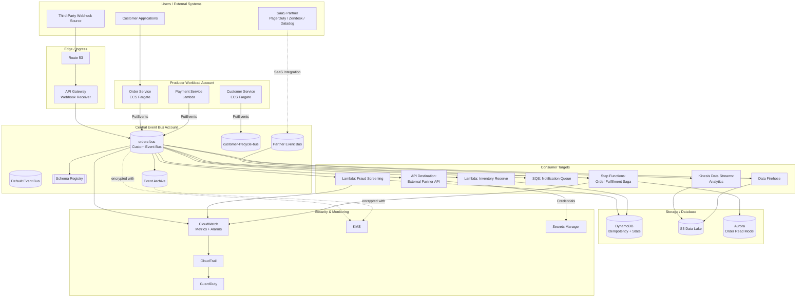
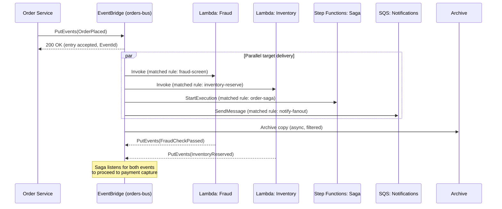

# Part IV – Serverless Architectures

# Chapter 33 — EventBridge Integration

---

## 1. Executive Summary

Modern enterprises rarely operate as a single monolithic application. They operate as a portfolio of services, teams, vendors, and legacy systems that all need to react to the same underlying business events.

- An order is placed.
- A payment succeeds or fails.
- A customer record changes.
- A shipment is delayed.
- A device sends a telemetry reading.
- A third-party SaaS platform fires a webhook.

Every one of these events matters to more than one downstream consumer, but the producing service should never need to know who those consumers are, how many there are, or what they plan to do with the event.

This is the core business problem that an **Amazon EventBridge-centric integration architecture** solves: decoupling producers from consumers of business events at enterprise scale, while preserving governance, discoverability, security, and operational visibility.

**Architecture objective.**

- Provide a single, managed, highly available event bus (or a federated set of buses) that acts as the nervous system of the enterprise.
- Allow any service, SaaS partner, or AWS service to publish events without knowing who consumes them.
- Allow any service to subscribe to events it cares about without coupling to the producer's deployment, scaling, or API.
- Provide schema governance, replay, and audit capabilities that ad-hoc point-to-point integrations cannot offer.

**Why organizations adopt this architecture.**

- Point-to-point integrations (Service A calls Service B directly) grow into an unmanageable mesh as the number of services increases. With `n` services, the number of potential point-to-point connections grows toward `n(n-1)/2`.
- Teams want to add new consumers of an event (a new analytics pipeline, a new fraud-detection service, a new partner integration) **without redeploying or even notifying the producing team**.
- Enterprises increasingly integrate with SaaS platforms (Zendesk, Datadog, Shopify, MongoDB Atlas, PagerDuty, and dozens of others) that publish events into EventBridge partner event buses, and they want a consistent internal pattern for consuming both internal and third-party events.
- Regulated industries need an auditable, replayable record of what business events occurred and who reacted to them, which raw HTTP webhooks and direct Lambda invocations do not provide.

**Major business benefits.**

| Benefit | Description |
|---|---|
| Reduced coupling | Producers and consumers evolve independently; new consumers are added with zero producer changes. |
| Faster time-to-market | New features that react to existing events (e.g., a new loyalty-points service reacting to `OrderCompleted`) ship in days, not sprints coordinated across teams. |
| Operational resilience | Failures in one consumer do not cascade to producers or to other consumers, because delivery is asynchronous and retried independently per target. |
| Governance and discoverability | The EventBridge Schema Registry and schema discovery give architecture teams a live catalog of what events exist and what they look like. |
| Auditability and replay | Event Archive and Replay let teams reprocess historical events after a bug fix, backfill a new consumer, or investigate an incident. |
| Multi-account and multi-partner reach | Cross-account event buses and SaaS partner event sources extend the same pattern across an AWS Organization and external vendors. |

**Typical enterprise scenarios.**

- **E-commerce order orchestration fan-out.** An `OrderPlaced` event triggers inventory reservation, fraud screening, notification delivery, analytics ingestion, and loyalty-point accrual — five independent consumers, one producer, zero producer awareness of the consumers.
- **SaaS-to-AWS operational integration.** PagerDuty incident events, Datadog alerts, or Zendesk ticket events land directly on a partner event bus and trigger AWS-native remediation workflows (Lambda, Step Functions, Systems Manager Automation).
- **Cross-account platform events.** A central "platform" AWS account publishes account-lifecycle, security-finding, or cost-anomaly events that dozens of workload accounts across an AWS Organization subscribe to via a hub-and-spoke event bus topology.
- **Legacy system modernization.** A mainframe or on-premises ERP system's change-data-capture stream is normalized into EventBridge events, letting cloud-native services consume enterprise data changes without touching the legacy system's fragile APIs.
- **Scheduled and time-based automation.** EventBridge Scheduler (the successor to CloudWatch Events cron rules) drives recurring jobs — nightly settlement runs, compliance report generation, cache warm-ups — with per-invocation retry policies and dead-letter queues.

This chapter builds a **production-grade, multi-account EventBridge integration architecture** end to end: custom event buses, schema-governed events, content-based filtering, fan-out to Lambda/Step Functions/SQS/Kinesis, API destinations for outbound SaaS calls, archive and replay for compliance, and the security, cost, and operational practices required to run this reliably for years.

---

## 2. Business Requirements

### Business Drivers

- Eliminate tightly coupled, point-to-point service integrations that slow down feature delivery.
- Provide a single place to observe "what business events happened" for audit and analytics purposes.
- Support rapid onboarding of new internal consumers and external SaaS partners.
- Reduce the blast radius of a single consumer's outage or bug.

### Functional Requirements

- Publish structured, versioned, schema-validated events from multiple producer services.
- Route events to multiple consumer types: Lambda, Step Functions, SQS, Kinesis Data Streams, Firehose, API Gateway, and third-party HTTPS endpoints (API destinations).
- Support content-based filtering so consumers only receive the subset of events relevant to them.
- Support archive and replay of events for a configurable retention window.
- Support cross-account event delivery for a multi-account AWS Organization.
- Support ingestion of SaaS partner events (e.g., from an ISV listed in the AWS Partner Event catalog).

### Non-Functional Requirements

| Category | Requirement |
|---|---|
| Scalability | Sustain bursts of at least 10,000 events/second on the default bus without throttling business-critical publishers. |
| Availability | 99.99% event ingestion availability (EventBridge's own regional SLA), with consumer-side resilience for the remaining risk. |
| Latency | Sub-second delivery from `PutEvents` to rule match and target invocation for standard (non-archived) processing. |
| Durability | Zero event loss for successfully accepted `PutEvents` calls; failed target deliveries must be retried and, on exhaustion, sent to a dead-letter queue (DLQ). |
| Compliance | All events containing regulated data must be encrypted at rest and in transit, with access logged via CloudTrail. |
| Security | Least-privilege IAM for producers (`events:PutEvents` only) and consumers (`events:PutRule`, target-specific invoke permissions only). |
| Recovery | RPO of zero for the event bus itself (AWS-managed, multi-AZ); RTO for a failed consumer target is bounded by DLQ reprocessing time, typically under 1 hour. |
| SLA | Internal SLA: 99.9% successful event processing within 5 minutes of publication, tracked via CloudWatch metrics and alarms. |

### Recovery Objectives

- **RPO (event bus):** Effectively zero — EventBridge event buses are a regional, multi-AZ managed service; AWS does not expose infrastructure to fail over.
- **RPO (consumer state):** Depends on the consumer. A Lambda function writing to DynamoDB should target an RPO of zero via idempotent processing plus DynamoDB point-in-time recovery.
- **RTO (single target failure):** Minutes, via automatic retries with exponential backoff, then DLQ-based reprocessing.
- **RTO (regional failure):** Bounded by the organization's multi-region DR strategy; see Chapter 13 (Disaster Recovery) and Section 13 of this chapter for the EventBridge-specific pattern.

### Expected Workload and Growth

- Initial workload: 200–2,000 events/second sustained, with bursts to 10,000+ events/second during peak sales events.
- Growth expectation: 3–5x event volume within 24 months as additional producer teams onboard.
- Consumer count growth: from an initial 10–15 rules/targets to 100+ rules across dozens of teams within 18 months — this growth rate is the primary architectural driver for schema governance and naming conventions described later in this chapter.

---

## 3. Architecture Overview

### Overall Design

The architecture is built around three tiers of event buses:

1. **Default event bus** — receives events automatically emitted by AWS services (e.g., EC2 state changes, S3 object events, GuardDuty findings). Used sparingly for custom business events; primarily used for AWS-service-native automation.
2. **Custom application event buses** — one or more purpose-built buses (e.g., `ecommerce-orders-bus`, `customer-lifecycle-bus`) that carry the organization's own business events. This is where most producer/consumer traffic flows.
3. **Partner event buses** — buses automatically created when the organization subscribes to a SaaS partner's EventBridge event source (e.g., a PagerDuty or Zendesk partner integration).

### Architecture Philosophy

- **Producers know nothing about consumers.** A producer calls `PutEvents` against a bus and moves on. It never calls a consumer's API directly.
- **Consumers declare interest, not producers declare delivery.** Consumers (or the platform team on their behalf) create rules with event patterns; EventBridge — not the producer — is responsible for matching and delivering.
- **Schema-first, not tribal-knowledge-first.** Every event type is registered in the EventBridge Schema Registry (or a custom registry synced from it) so that consumer teams can discover event shapes without asking the producing team on Slack.
- **Fan-out over fan-in.** Business events fan out to many independent consumers; consumers do not fan in through EventBridge to reach a producer synchronously — EventBridge is not designed for request/response patterns.
- **Idempotent consumers.** Because delivery is at-least-once, every consumer target is designed to be idempotent (safe to process the same event twice).

### Core Components

| Component | Role |
|---|---|
| Custom event bus | Logical namespace and routing domain for a family of business events. |
| Event pattern rule | Content-based filter that matches events to one or more targets. |
| Target | The downstream service invoked when a rule matches (Lambda, Step Functions, SQS, Kinesis, Firehose, API destination, another event bus). |
| Schema Registry | Central catalog of event shapes, versioned, with code-binding generation. |
| Archive | Continuous, filtered capture of events for later replay. |
| Replay | On-demand re-publication of archived events into a bus, respecting original event content but generating new delivery attempts. |
| API destination | An outbound HTTPS integration (with connection-managed authentication) used to call SaaS or partner APIs directly from a rule target. |
| Dead-letter queue (DLQ) | SQS queue that captures events a target failed to process after exhausting retries. |
| Pipes (Amazon EventBridge Pipes) | Point-to-point integration primitive for connecting a source (e.g., DynamoDB Streams, Kinesis, SQS) to a target with optional filtering and enrichment, without writing custom polling code. |
| Scheduler (Amazon EventBridge Scheduler) | Time-based and recurring invocation service, successor to CloudWatch Events cron rules, with per-schedule retry policy and DLQ. |

### High-Level Workflow

1. A producer service publishes one or more events via `PutEvents` to a custom event bus.
2. EventBridge validates the request, assigns an event ID, and durably accepts the event (this is the point of no return for delivery guarantees).
3. EventBridge evaluates all rules attached to that bus against the event's `source`, `detail-type`, and `detail` fields.
4. For every matching rule, EventBridge invokes every configured target, in parallel, independently.
5. Each target's invocation is retried independently on failure, per that target's retry policy, up to a configurable maximum event age and retry count.
6. If retries are exhausted, the failed event is sent to that target's configured DLQ (if any); otherwise, it is dropped, which is why a DLQ is a production requirement, not an optional nicety.
7. If archiving is enabled on the bus, a filtered copy of matching events is durably stored for future replay, independent of and unaffected by target-side success or failure.

### Request / Response / Data Lifecycle

- **Request lifecycle:** Producer → SDK/API call → EventBridge `PutEvents` API → 202-equivalent acceptance response containing per-entry success/failure status. Producers must check this response; a batch `PutEvents` call can partially fail.
- **Response lifecycle:** There is no synchronous response path back to the producer from consumers. If a business process requires a response, model it as a second event (e.g., `InventoryReserved` or `InventoryReservationFailed`) published by the consumer, which the original producer (or a saga orchestrator) subscribes to.
- **Data lifecycle:** Event payload lives transiently in EventBridge for the duration of rule evaluation and target delivery (no long-term storage on the bus itself); durable storage of the event, if required, is the consumer's or archive's responsibility.

---

## 4. AWS Services Used

### Amazon EventBridge

- **Purpose:** Serverless event bus for routing, filtering, and fanning out business events.
- **Why selected:** Native AWS integration, content-based filtering, schema registry, archive/replay, and cross-account bus sharing with no infrastructure to manage.
- **Alternatives:** Amazon SNS (simpler pub/sub, no content-based filtering on structured JSON at the same granularity, no schema registry, no archive/replay), Apache Kafka / Amazon MSK (higher throughput ceiling and consumer-side replay via offsets, but significantly higher operational overhead), a custom webhook broker (full control, full operational burden).
- **Limitations:** Default event size limit of 256 KB per event; per-account/region quota on rules per bus (soft limit, raisable); at-least-once delivery (not exactly-once) requires idempotent consumers; no strict per-key ordering guarantee across a bus (see Section 24 for ordering pitfalls).
- **Pricing considerations:** Charged per published event (custom events; AWS-service-generated events on the default bus are free), plus separate charges for archive storage and replay. Costs are usually dominated by high-cardinality debug/observability event publishing if teams are not disciplined — covered in Section 16.
- **Best practices:** Use custom buses per domain, not one bus for everything; enable archiving selectively (not on every bus) to control storage cost; always attach a DLQ to every target.

### AWS Lambda

- **Purpose:** Primary compute target for event-driven business logic (validation, enrichment, side effects, single-step reactions).
- **Why selected:** Scales automatically with event volume, billed per invocation/duration, native EventBridge target integration with built-in retry and DLQ support.
- **Alternatives:** Fargate task triggered indirectly (higher latency to cold-start a task, more appropriate for long-running work), EC2 with a polling worker (operationally heavier, appropriate only when Lambda's 15-minute execution limit is a blocker).
- **Limitations:** 15-minute maximum execution duration; cold starts on infrequently invoked functions; payload passed to Lambda from EventBridge is capped by Lambda's own invocation payload limits (256 KB for asynchronous invocation).
- **Best practices:** Keep Lambda targets small and single-purpose; use Lambda destinations or DLQs for failure handling; avoid using Lambda as a long-running orchestrator — use Step Functions instead.

### AWS Step Functions

- **Purpose:** Orchestration target for multi-step business processes triggered by an event (e.g., an order-fulfillment saga).
- **Why selected:** Visual, auditable state machine execution with native error handling, retries, and compensation logic; integrates directly as an EventBridge target.
- **Alternatives:** Chained Lambda functions (harder to visualize and audit, easy to end up with implicit orchestration logic buried in code), a custom orchestrator on ECS (unnecessary operational overhead for most workflows).
- **Limitations:** Standard Workflows have a 25,000-day maximum duration but limited execution history size (25,000 events per execution) and per-state payload size limits (256 KB); Express Workflows are cheaper and higher-throughput but lack the same execution-history durability.
- **Best practices:** Use Standard Workflows for auditable, long-running, or human-in-the-loop business processes; use Express Workflows for high-volume, short-duration processing.

### Amazon SQS

- **Purpose:** Durable buffering target that decouples EventBridge delivery bursts from consumer processing rate; also used as the DLQ for other targets.
- **Why selected:** Simple, durable, and cost-effective buffer; natively supported as both an EventBridge target and DLQ destination.
- **Alternatives:** Kinesis Data Streams (needed when consumers require ordered, replayable streams with multiple independent readers at different offsets), direct Lambda invocation (appropriate only when burst absorption is not required).
- **Limitations:** Standard queues do not guarantee strict ordering (FIFO queues do, at lower throughput); 256 KB max message size without using the S3 extended-client pattern.
- **Best practices:** Use a standard SQS queue between EventBridge and a Lambda consumer whenever the downstream processing rate is variable or rate-limited (e.g., calling a rate-limited third-party API); always configure a redrive policy to a DLQ.

### Amazon Kinesis Data Streams

- **Purpose:** High-throughput, ordered, multi-consumer streaming target for events that require strict per-partition-key ordering or multiple independent consumer applications reading the same stream at different offsets.
- **Why selected:** Native EventBridge target; supports many parallel consumer applications (e.g., real-time analytics and fraud detection reading the same event stream independently) without one consumer competing with another for messages.
- **Alternatives:** SQS (simpler, but single logical consumer group semantics, no replay-by-offset), Amazon MSK (more powerful ecosystem, considerably higher operational and cost overhead).
- **Limitations:** Requires shard capacity planning (or on-demand mode, at a cost premium); consumers must implement checkpointing (or use the Kinesis Client Library / Lambda's built-in Kinesis integration).
- **Best practices:** Use on-demand capacity mode for unpredictable event workloads; use provisioned mode with autoscaling only once traffic patterns are well understood.

### Amazon Data Firehose

- **Purpose:** Target for durably landing raw or lightly transformed events into S3, Redshift, or OpenSearch for analytics, without writing custom consumer code.
- **Why selected:** Zero-code delivery from EventBridge into a data lake, with built-in buffering, compression, and format conversion (e.g., to Parquet).
- **Alternatives:** A Lambda consumer that writes to S3 directly (more flexible, more code to maintain), Kinesis Data Streams plus a separate consumer (more moving parts if the only goal is landing data in S3).
- **Limitations:** Buffering introduces delivery latency (typically 60 seconds to a few minutes, configurable); transformation Lambda adds cost and latency if used.
- **Best practices:** Use for the "analytics fan-out" leg of an event architecture; do not use Firehose for time-sensitive business logic — it is a landing pipe, not a low-latency consumer.

### Amazon API Gateway

- **Purpose:** Ingress point for external webhook producers that do not natively integrate with EventBridge, translating inbound HTTPS webhooks into `PutEvents` calls; also used as an EventBridge target for internal REST-triggered workflows in rarer patterns.
- **Why selected:** Managed HTTPS endpoint with authentication, throttling, and request validation, decoupled from backend compute.
- **Alternatives:** Application Load Balancer plus Lambda (lower-level, more manual wiring), direct SaaS-to-EventBridge partner integration where available (preferred when the vendor supports it, avoiding a custom webhook receiver entirely).
- **Limitations:** Adds a hop and a component to operate and secure; webhook signature verification logic must be implemented by the team.
- **Best practices:** Prefer AWS's built-in SaaS partner event source integration over a custom webhook receiver whenever the vendor is a supported EventBridge partner.

### Amazon DynamoDB

- **Purpose:** Consumer-side state store for idempotency tracking (recording processed event IDs), saga state, and materialized read models built from events.
- **Why selected:** Single-digit-millisecond latency, native TTL for expiring idempotency records, seamless integration with Lambda consumers.
- **Alternatives:** ElastiCache/MemoryDB (faster, but not durable by default — a poor fit for idempotency correctness guarantees), RDS/Aurora (appropriate when the read model requires complex relational queries).
- **Limitations:** Item size limit of 400 KB; requires careful key design to avoid hot partitions under bursty event traffic.
- **Best practices:** Use the event ID as the DynamoDB partition key for idempotency tables, with a short TTL matched to the maximum expected redelivery window.

### Amazon SNS

- **Purpose:** Used selectively as an EventBridge target when fan-out to many heterogeneous subscriber types (SMS, email, mobile push, additional SQS queues) is required from a single event, or as a lightweight complement to EventBridge for simple, non-filtered notification fan-out.
- **Why selected:** Broad protocol support (SMS, email, HTTP/S, mobile push) that EventBridge targets do not natively cover.
- **Alternatives:** EventBridge rules directly to each target type where supported; SNS remains necessary for SMS/email/push.
- **Limitations:** No content-based filtering as rich as EventBridge's event pattern language (SNS filter policies are simpler); message size limit of 256 KB.
- **Best practices:** Use EventBridge as the primary routing layer and SNS only at the final fan-out leg where non-AWS-native protocols (SMS, email) are required.

### AWS Identity and Access Management (IAM)

- **Purpose:** Enforces least-privilege access for producers (`PutEvents`), rule/target management (`PutRule`, `PutTargets`), and target invocation (resource-based policies on Lambda, SQS, etc.).
- **Why selected:** Native, fine-grained, auditable authorization model with support for both identity-based and resource-based policies, essential for a shared, multi-team event bus.
- **Limitations:** Resource-based policy size limits can become a constraint on very high-fan-out Lambda functions invoked by many rules; requires deliberate policy design (Section 10) to avoid overly broad grants.
- **Best practices:** Grant `events:PutEvents` scoped to a specific bus ARN, never `"*"`; use resource-based policies on targets, not just identity-based policies on EventBridge's service role.

### Amazon VPC

- **Purpose:** Network isolation for consumer compute (Lambda in VPC mode, ECS/Fargate consumers) that needs to reach private resources (RDS, internal APIs) triggered by events.
- **Why selected:** Required whenever a consumer must reach a resource without a public endpoint.
- **Limitations:** Lambda functions in a VPC incur ENI attachment considerations (mitigated significantly by Hyperplane ENIs in current Lambda networking, but VPC-attached functions still add cold-start and NAT Gateway cost considerations for outbound internet calls).
- **Best practices:** Only attach event-consuming Lambda functions to a VPC when they must reach a private resource; use VPC endpoints for AWS service calls to avoid unnecessary NAT Gateway traffic.

### Amazon Route 53

- **Purpose:** DNS resolution for any HTTP(S) endpoints referenced by API destinations or webhook receivers.
- **Why selected:** Managed, highly available DNS with health-check-based failover for webhook receiver endpoints.
- **Limitations:** Not directly involved in EventBridge's internal routing (EventBridge is not DNS-addressed by consumers), relevant primarily for the webhook ingress and API destination egress paths.

### Amazon CloudWatch

- **Purpose:** Metrics, dashboards, and alarms for event volume, rule match rate, target invocation failures, and DLQ depth.
- **Why selected:** Native EventBridge metric emission (`Invocations`, `FailedInvocations`, `ThrottledRules`, `DeadLetterInvocations`) requires no additional instrumentation.
- **Best practices:** Alarm on `FailedInvocations` and DLQ queue depth per target, not just on aggregate bus-level metrics — aggregate metrics hide single-consumer failures in high-fan-out buses.

### AWS CloudTrail

- **Purpose:** Audit log of `PutEvents`, `PutRule`, `PutTargets`, and other EventBridge management-plane API calls.
- **Why selected:** Required for compliance evidence of who created/modified routing rules and who published events, and (via CloudTrail data events, where configured) for auditing individual `PutEvents` calls.
- **Best practices:** Enable organization-wide CloudTrail with a centralized, immutable log archive (see Chapter 88, Multi-Account Security).

### AWS Config

- **Purpose:** Continuous compliance recording of EventBridge rule and bus configuration drift (e.g., detecting an overly permissive resource policy added outside of Terraform).
- **Best practices:** Use AWS Config rules to detect event buses with public/wildcard resource policies and alert immediately.

### Amazon GuardDuty

- **Purpose:** Threat detection across the account, including anomalous API activity against EventBridge (e.g., unexpected `PutTargets` calls suggesting a compromised credential attempting to redirect event flow to an attacker-controlled endpoint).
- **Best practices:** Ensure GuardDuty findings for IAM anomalies are themselves routed through EventBridge to a security response Lambda — a good example of the architecture consuming its own security telemetry.

### AWS KMS

- **Purpose:** Encryption key management for event bus encryption at rest, archive encryption, and encryption of sensitive fields within event payloads that require field-level protection beyond bus-level encryption.
- **Why selected:** Centralized, auditable key management integrated natively with EventBridge's at-rest encryption feature and with all downstream target services (SQS, Kinesis, S3).
- **Limitations:** Customer-managed KMS keys add a per-request cost and a small latency overhead versus AWS-owned keys; necessary for regulated workloads that require customer control over key rotation and access policy.
- **Best practices:** Use a customer-managed KMS key for buses carrying regulated data; use AWS-owned/managed keys for lower-sensitivity internal telemetry buses to control cost.

### AWS Secrets Manager

- **Purpose:** Stores credentials used by EventBridge API destination connections (API keys, OAuth client secrets) for outbound calls to SaaS/partner APIs.
- **Why selected:** Native integration with EventBridge Connections, automatic secret injection at call time without the secret ever appearing in rule or target configuration.
- **Best practices:** Rotate API destination credentials on a defined schedule and use Secrets Manager rotation Lambda functions where the partner API supports rotation.

### AWS Systems Manager

- **Purpose:** Parameter Store for non-secret configuration (bus names, ARNs, feature flags) referenced by producer/consumer deployment pipelines; Automation documents as EventBridge-triggered remediation targets for operational events.
- **Best practices:** Use Parameter Store, not hardcoded ARNs, in producer/consumer IaC so bus references survive environment promotion (dev → staging → prod) without code changes.

---

## 5. Complete Architecture Diagram



**Sequence diagram — order placement fan-out:**



---

## 6. Component-by-Component Explanation

### Custom Event Bus (`orders-bus`)

- **Purpose:** Dedicated routing domain for all order-lifecycle business events, isolated from unrelated domains (customer, catalog, fulfillment-ops).
- **Responsibilities:** Accept `PutEvents` calls, evaluate rules, invoke matched targets, feed the archive.
- **Inputs:** Structured JSON events with `source`, `detail-type`, and `detail` fields from order, payment, and inventory producers.
- **Outputs:** Target invocations (Lambda, Step Functions, SQS, Kinesis, Firehose, API destinations); archived event copies.
- **Scaling:** Fully managed; scales automatically to the account's PutEvents throughput quota (a soft, raisable limit).
- **High availability:** Multi-AZ by design within the region; no customer-managed infrastructure to configure for HA.
- **Failure handling:** Per-target retry with exponential backoff and configurable maximum retry attempts / maximum event age, followed by DLQ delivery on exhaustion.
- **Dependencies:** IAM for producer/consumer authorization; KMS for encryption at rest; downstream target services.
- **Security:** Resource-based policy restricting which principals may `PutEvents`, `PutRule`, and `PutTargets`; customer-managed KMS key for regulated event content.
- **Monitoring:** CloudWatch metrics per rule and per target (`Invocations`, `FailedInvocations`, `ThrottledRules`, `DeadLetterInvocations`).

### Event Pattern Rules

- **Purpose:** Content-based filters that determine which events reach which targets, without producers needing to know about routing.
- **Responsibilities:** Match on `source`, `detail-type`, and arbitrary nested fields within `detail` using EventBridge's pattern-matching language (exact match, prefix, numeric range, `anything-but`, `exists`).
- **Scaling:** A single bus can host hundreds of rules; each event is evaluated against all rules on the bus in parallel (not sequentially), so rule count does not linearly increase per-event latency in a meaningful way for typical enterprise volumes.
- **Failure handling:** A malformed or overly broad pattern either matches nothing (silent, requires monitoring `Invocations` = 0 as a smell) or matches too much (requires monitoring `FailedInvocations` spikes on unrelated targets).
- **Best practice:** Name rules with a `<domain>-<purpose>-<environment>` convention (e.g., `orders-fraud-screen-prod`) so CloudTrail and CloudWatch entries are self-describing.

### Lambda Targets

- **Purpose:** Execute a single, focused reaction to a matched event.
- **Inputs:** The full EventBridge event envelope (`id`, `source`, `detail-type`, `time`, `region`, `detail`) is passed as the Lambda event payload.
- **Outputs:** Side effects (writes to DynamoDB, calls to other services) and, where the function itself produces a follow-on business event, a subsequent `PutEvents` call.
- **Scaling:** Automatic, governed by the function's reserved/provisioned concurrency settings and account concurrency limits.
- **Failure handling:** Configure the function's EventBridge-invoked asynchronous retry policy (2 retries by default) and an on-failure destination or DLQ; without this, a persistently failing event is silently dropped after retries are exhausted.
- **Security:** Function execution role scoped to only the resources it needs to touch; no wildcard `dynamodb:*` or `s3:*`.

### Step Functions Target (Order Fulfillment Saga)

- **Purpose:** Orchestrate the multi-step order fulfillment process, coordinating fraud screening, inventory reservation, payment capture, and shipment creation with compensating transactions on failure.
- **Inputs:** The triggering event (e.g., `OrderPlaced`) starts an execution; subsequent events (`FraudCheckPassed`, `InventoryReserved`) are correlated to the running execution via a task token or a wait-for-callback pattern.
- **Failure handling:** Native Step Functions retry/catch blocks per state, with defined compensating actions (e.g., release reserved inventory if payment capture fails).
- **Monitoring:** Execution history is inherently auditable in the Step Functions console and exportable to CloudWatch Logs.

### SQS Target (Notification Fan-out Buffer)

- **Purpose:** Absorb bursty notification-worthy events and smooth delivery to a rate-limited downstream notification-composition service.
- **Failure handling:** Redrive policy sends messages that fail processing (visibility timeout expiry after repeated receives) to a DLQ for manual or automated reprocessing.

### Kinesis Data Streams Target (Analytics)

- **Purpose:** Provide an ordered, replayable stream of order events to multiple independent analytics and fraud-model-training consumers.
- **Scaling:** On-demand mode recommended initially; migrate to provisioned mode with defined shard count once traffic is predictable, to optimize cost.

### API Destination (External Partner API)

- **Purpose:** Direct outbound HTTPS call from a matched rule to a partner's REST API (e.g., notifying a third-party logistics partner of a new shipment) without a Lambda in between.
- **Responsibilities:** Managed retry with exponential backoff on the target itself; connection object stores the authentication method (API key, Basic, or OAuth) referencing a Secrets Manager secret.
- **Failure handling:** Configurable invocation rate limiting (protects the partner API from being overwhelmed) plus DLQ on exhausted retries.
- **Security:** Credentials never appear in the rule/target definition; rotated via Secrets Manager.

### Schema Registry

- **Purpose:** Central, versioned catalog of every event `detail-type`'s JSON structure, auto-discoverable from live traffic or explicitly registered by producer teams.
- **Responsibilities:** Generate strongly typed code bindings (Java, Python, TypeScript, Go) for both producers and consumers, reducing integration bugs from payload drift.
- **Best practice:** Require producer teams to register a schema before a new `detail-type` is allowed into production rules — enforced via a CI/CD gate, not tribal knowledge.

### Event Archive

- **Purpose:** Continuous, filtered, durable capture of events for later replay — supporting incident recovery, new-consumer backfill, and compliance retention.
- **Responsibilities:** Independent of target success/failure; archives whatever matches its filter regardless of downstream delivery outcomes.
- **Scaling:** Fully managed; retention configurable per archive (indefinite or time-bounded).
- **Security:** Encrypted with the same or a dedicated KMS key as the source bus; access governed by IAM permissions on `events:StartReplay`.

---

## 7. End-to-End Request Flow

**Scenario: Customer places an order.**

1. **Client** submits an order via the storefront application, which calls the Order Service API (fronted by an internal ALB, not shown in the event flow itself).
2. **Order Service** persists the order to its own database (Aurora) as the system of record, then constructs an `OrderPlaced` event and calls `PutEvents` against `orders-bus`.
3. **EventBridge** durably accepts the event, assigns an event ID, and returns success to the Order Service. This is the producer's last involvement in the fan-out.
4. **Rule evaluation** occurs in parallel against all rules on `orders-bus`. Four rules match: `orders-fraud-screen-prod`, `orders-inventory-reserve-prod`, `orders-saga-start-prod`, `orders-notify-fanout-prod`.
5. **Fraud Lambda** is invoked, checks the order against fraud heuristics, writes a result to DynamoDB, and publishes `FraudCheckPassed` or `FraudCheckFailed` back to `orders-bus`.
6. **Inventory Lambda** is invoked in parallel, attempts to reserve stock, and publishes `InventoryReserved` or `InventoryReservationFailed` back to `orders-bus`.
7. **Step Functions saga** starts execution on `OrderPlaced`, then waits (via a wait-for-callback or a subsequent rule-triggered `SendTaskSuccess`) for both `FraudCheckPassed` and `InventoryReserved` before proceeding to a payment-capture state.
8. **SQS notification queue** receives the raw `OrderPlaced` event for asynchronous processing by the notification-composition service, decoupled from the time-sensitive saga path.
9. **Archive** independently captures a copy of `OrderPlaced` (and, per its filter, the follow-on events) for compliance retention and future replay.
10. **CloudWatch** records `Invocations` and `FailedInvocations` metrics for every rule/target pair in this flow.
11. **Error handling:** If the Fraud Lambda throws an unhandled exception, EventBridge retries per the function's configured retry policy; on exhaustion, the event is delivered to the fraud consumer's DLQ, and a CloudWatch alarm on that DLQ's `ApproximateNumberOfMessagesVisible` metric pages the on-call engineer.
12. **Caching:** Not applicable to the EventBridge hop itself; the Order Service's own read APIs may cache the order status, which is a separate concern from the event fan-out.
13. **Logging:** Every Lambda target emits structured logs to CloudWatch Logs; the Step Functions execution history provides a built-in audit trail of the saga's progress; CloudTrail records the management-plane calls (`PutRule`, `PutTargets`) made during deployment, not the individual business events themselves (those are captured by the Archive, not CloudTrail).

---

## 8. Deployment Flow

### Infrastructure Provisioning

- All event buses, rules, targets, schema registrations, and archives are defined as Terraform modules, never created via console click-ops, to keep the rule/target graph reviewable and reproducible.
- A **platform team** owns the Terraform module that creates each custom event bus and its baseline security policy (resource policy, KMS key, CloudTrail data events).
- **Producer/consumer teams** own the Terraform modules that create their own rules and targets, referencing the platform-owned bus by ARN via a Systems Manager Parameter Store lookup or Terraform remote state data source — this avoids a single central team becoming a bottleneck for every new rule.

### Terraform Workflow

1. Developer opens a pull request adding or modifying a rule/target module.
2. CI runs `terraform validate`, `terraform plan`, and a policy-as-code check (e.g., Open Policy Agent / Conftest) verifying the rule does not grant overly broad `PutEvents` access and that every target has a DLQ configured.
3. A required reviewer from the platform team approves changes to the shared bus's resource policy; rule-only changes within a team's own namespace can be self-approved per the team's own CODEOWNERS entry.
4. Merge triggers `terraform apply` via the CI/CD pipeline against the target environment.

### CI/CD Deployment

- **Blue-green for consumer compute:** Lambda functions use versioned deployments with weighted alias shifting (10% → 50% → 100%) via CodeDeploy, so a bad deployment of a consumer only partially affects event processing before automatic rollback triggers on CloudWatch alarm breach.
- **Rollback:** CodeDeploy automatic rollback on alarm breach (elevated `FailedInvocations` or Lambda error rate) reverts the alias to the previous version within minutes.
- **Rule changes are not blue-green by nature** — a rule is either active or not — so rule changes are deployed behind a feature-flag-style pattern where possible: deploy the new rule matching a narrow test-only event pattern first, verify, then widen the pattern.

### Secrets and Configuration

- API destination credentials are provisioned into Secrets Manager by the platform team's pipeline, referenced by ARN in the connection Terraform resource — never embedded in code or Terraform variable files.
- Bus ARNs, archive names, and schema registry names are published to Systems Manager Parameter Store under a consistent path convention (`/eventbridge/<domain>/<resource-type>`), consumed by downstream Terraform via `aws_ssm_parameter` data sources.

### Validation

- Post-deployment smoke test publishes a synthetic test event (tagged with a `test: true` field in `detail`, matched by a wildcard test rule with no production side effects) and asserts it is archived and matched, confirming the bus and baseline rule evaluation are healthy.

---

## 9. Network Topology

EventBridge itself is a regional AWS service reached via the AWS API endpoint (public or via VPC endpoint); it does not require a VPC for its own operation. Network topology considerations in this architecture center on **producers and consumers** that run within a VPC.

- **VPC and CIDR:** Each workload account's VPC uses a `/16` CIDR block sized for growth (e.g., `10.20.0.0/16`), subdivided into `/20` subnets per AZ per tier.
- **Public subnets:** Host only the ALB/API Gateway VPC link ingress points for the webhook receiver; no compute runs directly in public subnets.
- **Private subnets:** Host ECS Fargate tasks and VPC-attached Lambda functions that call EventBridge's `PutEvents` API and consume from targets requiring private resource access (RDS, internal services).
- **NAT Gateway:** Provides outbound internet access for VPC-attached Lambda functions that need to reach EventBridge's public API endpoint, unless a VPC endpoint (below) is used instead — VPC endpoints are strongly preferred to avoid NAT Gateway data-processing charges on high-volume `PutEvents` traffic.
- **VPC Endpoint (Interface, PrivateLink) for `events` service:** Deployed in each private subnet's AZ so producers and consumers reach EventBridge without traversing the public internet or a NAT Gateway, reducing both cost and attack surface.
- **Internet Gateway:** Attached at the VPC level to support the public subnet ingress tier only.
- **Transit Gateway:** Used in the multi-account topology (Section 13, cross-account) to connect workload account VPCs to shared services (not required for EventBridge's own cross-account event delivery, which uses IAM resource policies rather than network-level routing — an important distinction from, e.g., a Kafka-based alternative).
- **Route Tables:** Private subnet route tables direct `events.<region>.amazonaws.com` prefix-list traffic to the VPC endpoint, not to the NAT Gateway, via a managed prefix list association.
- **Network ACLs:** Default-deny inbound on private subnets except from the VPC CIDR itself; explicit allow rules for VPC endpoint traffic.
- **Security Groups:** Lambda/Fargate security groups allow outbound HTTPS (443) to the VPC endpoint's security group only, not `0.0.0.0/0`, where the VPC endpoint pattern is in use.
- **PrivateLink:** Used both for the `events` VPC endpoint and, where API destinations call internal partner services hosted in another VPC/account, via a partner-exposed PrivateLink endpoint service.

---

## 10. Identity and Access

### IAM Roles

| Role | Purpose |
|---|---|
| `eventbridge-producer-order-service` | Grants the Order Service's task/execution role `events:PutEvents` scoped to `orders-bus` only. |
| `eventbridge-rule-management-platform` | Grants the platform team's CI/CD pipeline `events:PutRule`, `events:PutTargets`, `events:DeleteRule` on buses it owns. |
| `eventbridge-consumer-lambda-fraud` | Lambda execution role for the fraud-screening function; scoped to DynamoDB table access plus `events:PutEvents` for its own follow-on event. |
| `eventbridge-invoke-lambda-fraud` (resource-based) | Attached to the Lambda function itself, granting `events.amazonaws.com` permission to invoke it, scoped via `SourceArn` condition to the specific rule ARN. |

### IAM Policies (Producer Example)

```json

{
  "Version": "2012-10-17",
  "Statement": [
    {
      "Sid": "AllowPutEventsToOrdersBusOnly",
      "Effect": "Allow",
      "Action": "events:PutEvents",
      "Resource": "arn:aws:events:us-east-1:111122223333:event-bus/orders-bus"
    }
  ]
}

```

### Resource Policies (Target Example — Lambda invoke permission scoped to a single rule)

```bash

aws lambda add-permission \
  --function-name fraud-screening-prod \
  --statement-id AllowEventBridgeInvokeFraudRule \
  --action lambda:InvokeFunction \
  --principal events.amazonaws.com \
  --source-arn arn:aws:events:us-east-1:111122223333:rule/orders-bus/orders-fraud-screen-prod

```

> **Warning:** Never grant `lambda:InvokeFunction` to `events.amazonaws.com` without a `--source-arn` condition. Without it, *any* rule in *any* account with knowledge of the function ARN could invoke it, which is a common audit finding in enterprise EventBridge deployments.

### STS and Cross-Account Access

- Cross-account event delivery uses an **event bus resource policy** on the destination bus granting the source account's producer role `events:PutEvents`, combined with a rule on the source bus that forwards matching events to the destination bus as its target.
- No `sts:AssumeRole` call is required for the cross-account `PutEvents`-to-bus pattern itself; STS is used separately for human/CI access to the accounts for deployment purposes, following the organization's existing IAM Identity Center permission sets (see Chapter 89).

### Cross-Account Resource Policy Example (Central Event Bus Account)

```json

{
  "Version": "2012-10-17",
  "Statement": [
    {
      "Sid": "AllowWorkloadAccountsToPutEvents",
      "Effect": "Allow",
      "Principal": {
        "AWS": [
          "arn:aws:iam::222233334444:root",
          "arn:aws:iam::333344445555:root"
        ]
      },
      "Action": "events:PutEvents",
      "Resource": "arn:aws:events:us-east-1:111122223333:event-bus/platform-bus"
    }
  ]
}

```

> **Tip:** Scope cross-account principals to specific roles, not the account root, once the producing teams' roles have stabilized. Account-root grants are acceptable as a starting point during initial rollout but should be tightened within one review cycle.

### Least Privilege

- Producers get `PutEvents` only — never `PutRule`, `PutTargets`, or `DeleteRule`. Producer teams that need a new consumer request it via the platform team's rule-provisioning pipeline (self-service via a scoped CI role, not a shared human credential).
- Consumers' Lambda execution roles are scoped to exactly the downstream resources they touch; a fraud-screening function never has `dynamodb:*` — only `dynamodb:GetItem`, `PutItem`, `UpdateItem` on its specific table ARN.

### Permission Boundaries

- All human and CI/CD roles that can call `iam:CreateRole` or `iam:PutRolePolicy` in workload accounts are constrained by a permission boundary that caps the maximum privilege any role they create can hold, preventing a compromised CI pipeline from self-escalating to full administrative access via a newly created EventBridge-related role.

---

## 11. Security Architecture

### Encryption

- **At rest:** Custom event buses carrying regulated data use a customer-managed KMS key; the Schema Registry and Archive inherit encryption from the same or a dedicated key. Lower-sensitivity internal telemetry buses may use AWS-owned keys to reduce KMS request costs.
- **In transit:** All `PutEvents` calls and target invocations occur over TLS 1.2+ by default; API destinations enforce TLS to the partner endpoint as a connection-level requirement.

### Web Application Firewall (WAF) and Shield

- Applied at the API Gateway webhook-receiver ingress point (Section 5), not directly to EventBridge itself, since EventBridge has no public HTTP listener of its own that accepts arbitrary internet traffic — the attack surface to protect is the webhook ingress, not the bus.
- AWS Shield Standard is automatically active on the API Gateway/CloudFront edge; Shield Advanced is added for internet-facing webhook receivers processing revenue-critical partner events.

### Secrets Manager and Certificate Manager

- API destination connections reference Secrets Manager secrets for partner API credentials; ACM manages the TLS certificate for the webhook receiver's custom domain.

### GuardDuty, Inspector, Security Hub

- GuardDuty findings related to anomalous IAM activity against EventBridge APIs (unexpected `PutTargets`/`DeleteRule` calls from unfamiliar principals or geographies) are aggregated into Security Hub and, notably, **routed back through EventBridge itself** to a security-response Lambda — a self-referential but architecturally clean pattern.
- Inspector scans the container images used by ECS Fargate consumers for known vulnerabilities as part of the CI/CD pipeline, gating deployment.

### CloudTrail and AWS Config

- CloudTrail management events capture every `PutRule`, `PutTargets`, `DeleteRule`, and bus resource-policy change; these are shipped to a centralized, immutable log archive account.
- AWS Config rules continuously evaluate event bus resource policies for overly permissive principals (`"Principal": "*"`) and flag violations for immediate remediation.

### Zero Trust Considerations

- No implicit trust is granted based on network location; every producer and consumer authenticates via IAM, and every target invocation is authorized via an explicit resource-based policy scoped to a specific rule ARN, not a broad service-to-service trust grant.

### Threat Model and Mitigations

| Attack Vector | Mitigation |
|---|---|
| Compromised producer credential publishes malicious/flood events | Scope `PutEvents` IAM policy to a single bus; apply per-producer rate limiting via a wrapping API Gateway usage plan for external-facing producers; monitor `PutEvents` volume anomalies via CloudWatch anomaly detection. |
| Overly broad Lambda resource policy allows cross-rule invocation | Always condition `lambda:InvokeFunction` grants on `SourceArn` matching the specific rule. |
| Sensitive data in event payload exposed to an unauthorized consumer via an overly broad rule pattern | Field-level encryption for regulated attributes within `detail`, decrypted only by authorized consumers holding the relevant KMS grant; strict schema and rule review process. |
| Bus resource policy misconfigured with a wildcard principal | AWS Config rule + Security Hub alert; policy-as-code CI gate blocking `"Principal": "*"` from ever merging. |
| DLQ messages containing sensitive data retained indefinitely | Apply a DLQ retention/lifecycle policy and access controls equivalent to the source event's sensitivity classification. |
| API destination credential leakage | Secrets Manager rotation; least-privilege access to the secret; CloudTrail monitoring of `secretsmanager:GetSecretValue` calls outside expected patterns. |

---

## 12. High Availability

- **AZ failures:** EventBridge's control and data planes are inherently multi-AZ; no customer action is required to tolerate a single AZ failure at the bus level. Consumer compute (Lambda, Fargate) is likewise multi-AZ by default when deployed across private subnets in at least two AZs.
- **Instance failures:** Not applicable to EventBridge itself (serverless); Fargate-based consumers rely on ECS service scheduling to replace failed tasks across AZs.
- **Regional failures:** EventBridge is a regional service; a full regional outage requires the multi-region pattern described in Section 13.
- **Database failures:** Consumer-side databases (Aurora, DynamoDB) follow their own Multi-AZ/global-table HA patterns, independent of but coordinated with the event architecture's idempotency design so that a database failover does not cause duplicate side effects when retried events are reprocessed.
- **Load balancing:** Not directly applicable to EventBridge's internal delivery mechanism; relevant only to the webhook-receiver ALB/API Gateway ingress tier, which uses standard multi-AZ target group health checks.
- **Health checks:** CloudWatch alarms on per-target `FailedInvocations` and DLQ depth serve as the effective "health check" for the event-driven portions of the architecture, since there is no traditional load-balancer health check concept within EventBridge's managed routing layer.
- **Failover:** Consumer-side failover (e.g., a Lambda function's automatic retry to a healthy execution environment) is handled transparently by the underlying compute service; no manual failover action is required for single-AZ-scoped failures.

---

## 13. Disaster Recovery

### Backup Strategy

- The event bus configuration itself (rules, targets, resource policies) is fully defined in Terraform, so its "backup" is the Terraform state and version-controlled source — recoverable by `terraform apply` in a new region within minutes.
- Archived events provide a durable, replayable record independent of any single consumer's own backup strategy.

### Cross-Region Replication

- For workloads requiring multi-region DR, a **secondary event bus** is provisioned in the DR region via the same Terraform modules (parameterized by region), kept in a warm-standby state with no active traffic under normal operations.
- Producers publish to the primary region's bus; a lightweight forwarding Lambda (or, where volumes justify it, cross-region event replication configured via EventBridge's native cross-region event bus target) mirrors a defined subset of critical events to the secondary region's bus and archive, keeping DR-region consumers' state stores warm.

### DR Patterns Applied to This Architecture

| Pattern | Description | RTO | RPO | Cost |
|---|---|---|---|---|
| Pilot Light | DR-region bus and archive exist with minimal/no active consumer compute; consumers scaled up on failover. | 15–60 minutes | Minutes (bounded by cross-region replication lag) | Low |
| Warm Standby | DR-region consumers run at reduced capacity continuously, processing a mirrored event stream. | 5–15 minutes | Near-zero | Medium |
| Multi-Site Active-Active | Both regions process live traffic against regionally partitioned producers, with events mirrored bidirectionally for shared read models. | Near-zero | Near-zero | High |

- Most enterprise EventBridge deployments in this book's target audience land on **Pilot Light or Warm Standby**; full Active-Active event architectures are reserved for the small subset of workloads justifying Chapter 98's multi-region active-active pattern.

### RPO / RTO for This Architecture

- **RPO:** Bounded by cross-region replication lag for mirrored critical events, typically under 5 minutes with a well-tuned forwarding mechanism; non-replicated, lower-criticality event types accept regional-outage data loss by design (an explicit, documented business decision, not an oversight).
- **RTO:** Bounded by the time to redirect producer traffic (via a Route 53 or Parameter Store bus-ARN switch) plus consumer compute warm-up time in the DR region; targeted at under 30 minutes for Pilot Light, under 15 minutes for Warm Standby.

---

## 14. Scalability

### Horizontal Scaling

- EventBridge itself scales horizontally and transparently; no shard or partition management is exposed to the customer for the bus.
- Lambda targets scale horizontally via automatic concurrency scaling, bounded by account/function concurrency limits — a common enterprise bottleneck addressed via reserved concurrency planning per critical consumer.

### Vertical Scaling

- Not applicable to EventBridge; relevant only to any relational database consumers where vertical instance-class scaling may be used for read-model stores under sustained write load.

### Auto Scaling

- ECS Fargate consumers (e.g., a long-running order-processing worker pulling from an SQS target) use Service Auto Scaling on queue depth (`ApproximateNumberOfMessagesVisible`) as the scaling metric, not CPU alone, since event-driven workloads are I/O- and queue-depth-bound rather than CPU-bound.

### Serverless Scaling

- Lambda concurrency scales automatically; production guardrails include reserved concurrency floors for critical consumers (guaranteeing capacity is not starved by a noisy-neighbor function in the same account) and concurrency ceilings for less-critical consumers (protecting downstream systems, like a rate-limited partner API, from being overwhelmed by a traffic burst).

### Database Scaling

- DynamoDB idempotency and state tables use on-demand capacity mode by default, given the inherently bursty nature of event-driven write patterns, migrating to provisioned capacity with auto-scaling only once traffic is well characterized and predictable enough to make the cost trade-off favorable.

### Storage Scaling

- S3 data-lake targets (via Firehose or Kinesis) scale storage transparently; the scaling concern shifts to **partition design** (e.g., partitioning by event date and `detail-type`) to keep downstream Athena/Redshift query performance acceptable as volume grows.

### Queue Scaling

- SQS scales transparently to essentially unbounded throughput for standard queues; FIFO queues (used only where strict ordering is required) are bounded by the per-message-group-ID throughput limit, which must be factored into the choice of partition/message-group key.

---

## 15. Performance Optimization

- **Caching:** Not directly applicable to EventBridge's routing layer; relevant to consumer-side reference-data lookups (e.g., caching a product catalog lookup in ElastiCache within a Lambda consumer to avoid a database round-trip per event).
- **Compression:** Firehose and Kinesis targets apply compression (gzip/Parquet conversion) before landing data in S3, reducing storage cost and downstream query scan cost.
- **CDN:** Relevant only to the webhook-receiver ingress path if it serves any static content; not applicable to the event bus itself.
- **Database optimization:** Idempotency-check reads against DynamoDB use eventually-consistent reads by default (cheaper, sufficient given the idempotency table's own TTL-based cleanup and at-least-once semantics), reserving strongly consistent reads for the narrow set of consumers where a race condition would cause a materially incorrect business outcome.
- **Connection pooling:** Lambda consumers writing to RDS/Aurora use RDS Proxy to pool connections across concurrent invocations, avoiding connection exhaustion during event bursts — a very common production issue when a burst of events triggers hundreds of simultaneous Lambda executions each opening a direct database connection.
- **Concurrency:** Rule-level and target-level concurrency is tuned independently; a fraud-screening Lambda might be capped at 50 concurrent executions (protecting a downstream fraud-scoring API's rate limit) while an inventory-reservation Lambda is allowed to scale to 500 concurrent executions.
- **Async processing:** The entire architecture is asynchronous by design; the one place synchronous processing sneaks in is API destinations calling a partner API that itself has a slow response time — mitigated by the API destination's own timeout and retry configuration, decoupled from the original event's processing latency.

---

## 16. Cost Optimization (FinOps)

### Cost Estimation

| Deployment Size | Monthly Custom Events | Approx. EventBridge Cost | Approx. Total Architecture Cost (incl. Lambda, SQS, Kinesis, storage) |
|---|---|---|---|
| Small | 50 million | ~$50 | ~$400–800 |
| Medium | 1 billion | ~$1,000 | ~$5,000–9,000 |
| Enterprise | 20+ billion | ~$20,000+ | ~$60,000–120,000+ |

> **Note:** EventBridge pricing is charged per published custom event (in increments), with no charge for AWS-service-generated events on the default bus and no charge for rule matching or target invocation itself (though the *target* service's own pricing, e.g., Lambda invocation/duration or Kinesis shard-hours, applies).

### Major Cost Drivers

- **Custom event publishing volume** — the dominant EventBridge-specific cost line; teams that publish high-cardinality debug or trace-level events onto a production business bus (instead of a dedicated low-cost logging pipeline) are the most common source of unexpected cost growth.
- **Archive storage** — grows unbounded on indefinite-retention archives; needs an explicit retention policy tied to actual compliance requirements, not "keep everything forever by default."
- **Lambda invocation and duration** across dozens of consumer targets, often the largest line item in the *overall* architecture cost even though it's not an EventBridge charge per se.
- **Kinesis/Firehose shard-hours and data-processing** for analytics fan-out legs.
- **NAT Gateway data processing** for VPC-attached consumers that are not using the `events` VPC endpoint.
- **KMS request costs** on customer-managed keys under high `PutEvents`/target-invocation volume.

### Optimization Opportunities

| Technique | Applicability |
|---|---|
| Reserved Instances / Savings Plans | Apply to any steady-state EC2/Fargate consumer compute, not to EventBridge itself (which has no reservable capacity). Compute Savings Plans covering Lambda and Fargate usage are the most relevant lever here. |
| Spot | Applicable to batch-style Fargate consumers processing non-time-critical archived-event replays; not applicable to latency-sensitive real-time consumers. |
| S3 lifecycle / storage classes | Transition archived-event S3 exports and Firehose-landed data to Infrequent Access / Glacier tiers on a defined age threshold. |
| Rightsizing | Regularly review Lambda memory allocation (which also governs CPU) against actual utilization via CloudWatch Lambda Insights; over-provisioned memory is a frequent, easily fixed cost leak. |
| Cost allocation and tagging | Tag every bus, rule, and target with `domain`, `team`, `environment`, and `cost-center`; without this, per-team chargeback for a shared multi-tenant bus is impossible. |
| Budgets and Cost Anomaly Detection | Set an AWS Budget per event-bus-owning team; enable Cost Anomaly Detection scoped to the EventBridge service to catch runaway publishing before month-end. |

> **Tip:** The single highest-leverage FinOps action for an EventBridge architecture is separating **business events** (low-to-medium volume, high business value, published to the governed custom bus) from **operational/debug telemetry** (high volume, low unit value, published to CloudWatch Logs or a dedicated low-cost pipeline instead). Conflating the two is the most common root cause of EventBridge cost surprises in production.

---

## 17. AI-Assisted Operations

### Amazon Q

- Amazon Q Developer assists engineers in writing correct EventBridge event patterns (a frequent source of subtle bugs, e.g., forgetting that pattern matching on `detail` is exact-match by default and requires explicit numeric/prefix operators for ranges).
- Amazon Q in the console assists operators during an incident by summarizing recent `FailedInvocations` spikes and correlating them with recent rule/target deployments.

### Amazon Bedrock

- A Bedrock-backed Lambda consumer can be used as an **intelligent triage target**: for example, classifying an ambiguous inbound support-ticket event's urgency before routing it to the correct downstream queue, augmenting (not replacing) deterministic rule-based routing for the subset of events that require semantic judgment.
- Bedrock is also used to generate human-readable incident summaries from a batch of correlated `FailedInvocations` and DLQ events during an operational review.

### AI Troubleshooting and Log Analysis

- Natural-language querying of CloudWatch Logs Insights (via Amazon Q) accelerates root-cause analysis of "why did this event never reach its target" investigations, which historically required manually cross-referencing rule patterns against event payloads.

### Incident Response

- Bedrock-generated runbook suggestions, grounded in the organization's own historical incident postmortems (via a Bedrock Knowledge Base), are surfaced to on-call engineers when a DLQ-depth alarm fires.

### Capacity Planning and Cost Optimization

- Amazon Q Developer's cost-analysis capabilities, combined with Cost Explorer data, help forecast EventBridge and downstream target cost trajectories as new producer teams onboard, feeding into the FinOps budget-setting process described in Section 16.

### Architecture Review

- Bedrock-assisted review of proposed new event patterns and rule configurations against the organization's documented EventBridge conventions (naming, DLQ requirements, schema registration) as a pre-merge CI check, reducing the platform team's manual review burden.

### AI-Generated Terraform and Documentation

- AI-assisted generation of the boilerplate-heavy but error-prone Terraform for rule/target/DLQ triads (Section 18) accelerates onboarding of new consumer teams while a human reviewer validates the least-privilege scoping before merge.
- Schema Registry documentation and consumer onboarding guides are drafted with AI assistance from the registered schema, then reviewed by the producing team for accuracy.

---

## 18. Terraform Implementation

### Providers and Backend

```hcl

terraform {
  required_version = ">= 1.7.0"

  required_providers {
    aws = {
      source  = "hashicorp/aws"
      version = "~> 5.50"
    }
  }

  backend "s3" {
    bucket         = "acme-terraform-state-prod"
    key            = "eventbridge/orders-bus/terraform.tfstate"
    region         = "us-east-1"
    dynamodb_table = "terraform-state-lock"
    encrypt        = true
  }
}

provider "aws" {
  region = var.aws_region

  default_tags {
    tags = {
      Domain      = "orders"
      ManagedBy   = "terraform"
      Environment = var.environment
    }
  }
}

```

### Variables

```hcl

variable "aws_region" {
  description = "AWS region for the event bus deployment"
  type        = string
  default     = "us-east-1"
}

variable "environment" {
  description = "Deployment environment (dev, staging, prod)"
  type        = string
}

variable "bus_name" {
  description = "Name of the custom EventBridge bus"
  type        = string
  default     = "orders-bus"
}

variable "kms_key_arn" {
  description = "Customer-managed KMS key ARN for bus encryption"
  type        = string
}

variable "cross_account_producer_principals" {
  description = "List of AWS account/role ARNs permitted to PutEvents cross-account"
  type        = list(string)
  default     = []
}

```

### Custom Event Bus Module

```hcl

resource "aws_cloudwatch_event_bus" "orders" {
  name              = "${var.bus_name}-${var.environment}"
  kms_key_identifier = var.kms_key_arn

  tags = {
    Name = "${var.bus_name}-${var.environment}"
  }
}

resource "aws_cloudwatch_event_bus_policy" "orders_policy" {
  event_bus_name = aws_cloudwatch_event_bus.orders.name

  policy = jsonencode({
    Version = "2012-10-17"
    Statement = [
      {
        Sid       = "AllowCrossAccountPutEvents"
        Effect    = "Allow"
        Principal = { AWS = var.cross_account_producer_principals }
        Action    = "events:PutEvents"
        Resource  = aws_cloudwatch_event_bus.orders.arn
      }
    ]
  })
}

resource "aws_cloudwatch_event_archive" "orders_archive" {
  name             = "${var.bus_name}-${var.environment}-archive"
  event_source_arn = aws_cloudwatch_event_bus.orders.arn
  retention_days   = 90

  event_pattern = jsonencode({
    source = ["com.acme.orders"]
  })
}

```

### Rule and Target Module (Fraud Screening Consumer, with DLQ)

```hcl

resource "aws_cloudwatch_event_rule" "fraud_screen" {
  name           = "orders-fraud-screen-${var.environment}"
  event_bus_name = aws_cloudwatch_event_bus.orders.name
  description    = "Routes OrderPlaced events to fraud screening"

  event_pattern = jsonencode({
    source      = ["com.acme.orders"]
    detail-type = ["OrderPlaced"]
    detail = {
      orderTotal = [{ numeric = [">", 0] }]
    }
  })
}

resource "aws_sqs_queue" "fraud_screen_dlq" {
  name                      = "orders-fraud-screen-dlq-${var.environment}"
  message_retention_seconds = 1209600 # 14 days
  kms_master_key_id         = var.kms_key_arn
}

resource "aws_cloudwatch_event_target" "fraud_screen_lambda" {
  rule           = aws_cloudwatch_event_rule.fraud_screen.name
  event_bus_name = aws_cloudwatch_event_bus.orders.name
  arn            = aws_lambda_function.fraud_screen.arn

  dead_letter_config {
    arn = aws_sqs_queue.fraud_screen_dlq.arn
  }

  retry_policy {
    maximum_event_age_in_seconds = 3600
    maximum_retry_attempts       = 3
  }
}

resource "aws_lambda_permission" "allow_eventbridge_fraud" {
  statement_id  = "AllowEventBridgeInvokeFraudRule"
  action        = "lambda:InvokeFunction"
  function_name = aws_lambda_function.fraud_screen.function_name
  principal     = "events.amazonaws.com"
  source_arn    = aws_cloudwatch_event_rule.fraud_screen.arn
}

```

### API Destination Module (Outbound Partner Call)

```hcl

resource "aws_cloudwatch_event_connection" "logistics_partner" {
  name               = "logistics-partner-connection-${var.environment}"
  authorization_type = "API_KEY"

  auth_parameters {
    api_key {
      key   = "x-api-key"
      value = data.aws_secretsmanager_secret_version.logistics_api_key.secret_string
    }
  }
}

resource "aws_cloudwatch_event_api_destination" "logistics_partner" {
  name                             = "logistics-partner-dest-${var.environment}"
  invocation_endpoint               = "https://api.logisticspartner.example.com/v1/shipments"
  http_method                       = "POST"
  invocation_rate_limit_per_second  = 20
  connection_arn                    = aws_cloudwatch_event_connection.logistics_partner.arn
}

```

### Outputs

```hcl

output "orders_bus_arn" {
  description = "ARN of the orders custom event bus"
  value       = aws_cloudwatch_event_bus.orders.arn
}

output "orders_bus_name" {
  value = aws_cloudwatch_event_bus.orders.name
}

output "fraud_screen_dlq_url" {
  value = aws_sqs_queue.fraud_screen_dlq.url
}

```

> **Best Practice:** Publish `orders_bus_arn` to Systems Manager Parameter Store as a final step in the module (via `aws_ssm_parameter`) so consumer teams' Terraform never needs to hardcode or manually look up the bus ARN.

---

## 19. AWS CLI Examples

**Publish a test event:**

```bash

aws events put-events --entries '[
  {
    "Source": "com.acme.orders",
    "DetailType": "OrderPlaced",
    "EventBusName": "orders-bus-prod",
    "Detail": "{\"orderId\":\"ORD-10293\",\"orderTotal\":149.99,\"customerId\":\"CUST-5521\"}"
  }
]'

```

**List rules on a bus:**

```bash

aws events list-rules --event-bus-name orders-bus-prod

```

**Describe a specific rule's pattern:**

```bash

aws events describe-rule \
  --name orders-fraud-screen-prod \
  --event-bus-name orders-bus-prod

```

**List targets for a rule (validate DLQ and retry policy are attached):**

```bash

aws events list-targets-by-rule \
  --rule orders-fraud-screen-prod \
  --event-bus-name orders-bus-prod

```

**Check the DLQ depth for a failing consumer:**

```bash

aws sqs get-queue-attributes \
  --queue-url https://sqs.us-east-1.amazonaws.com/111122223333/orders-fraud-screen-dlq-prod \
  --attribute-names ApproximateNumberOfMessagesVisible

```

**Start a replay from the archive (incident recovery / new-consumer backfill):**

```bash

aws events start-replay \
  --replay-name backfill-fraud-consumer-2026-08 \
  --event-source-arn arn:aws:events:us-east-1:111122223333:archive/orders-bus-prod-archive \
  --event-start-time 2026-08-01T00:00:00Z \
  --event-end-time 2026-08-05T00:00:00Z \
  --destination '{"Arn":"arn:aws:events:us-east-1:111122223333:event-bus/orders-bus-prod","FilterArns":["arn:aws:events:us-east-1:111122223333:rule/orders-bus-prod/orders-fraud-screen-prod"]}'

```

**Check replay status:**

```bash

aws events describe-replay --replay-name backfill-fraud-consumer-2026-08

```

**Validate an event pattern locally before deploying a rule:**

```bash

aws events test-event-pattern \
  --event-pattern '{"source":["com.acme.orders"],"detail-type":["OrderPlaced"]}' \
  --event '{"source":"com.acme.orders","detail-type":"OrderPlaced","detail":{"orderId":"ORD-10293"}}'

```

**Cleanup — remove a decommissioned rule and its targets:**

```bash

aws events remove-targets --rule orders-fraud-screen-prod --event-bus-name orders-bus-prod --ids "1"
aws events delete-rule --name orders-fraud-screen-prod --event-bus-name orders-bus-prod

```

---

## 20. CI/CD Integration

### GitHub Actions Example (Rule/Target Deployment Pipeline)

```yaml

name: deploy-eventbridge-rules

on:
  pull_request:
    paths:
      - "eventbridge/**"
  push:
    branches: [main]
    paths:
      - "eventbridge/**"

jobs:
  validate-and-plan:
    runs-on: ubuntu-latest
    steps:
      - uses: actions/checkout@v4
      - uses: hashicorp/setup-terraform@v3
      - name: Terraform Init
        run: terraform -chdir=eventbridge/orders-bus init
      - name: Terraform Validate
        run: terraform -chdir=eventbridge/orders-bus validate
      - name: Policy-as-Code Check (DLQ + least-privilege gate)
        run: conftest test eventbridge/orders-bus/*.tf -p policy/
      - name: Terraform Plan
        run: terraform -chdir=eventbridge/orders-bus plan -out=tfplan

  apply:
    needs: validate-and-plan
    if: github.ref == 'refs/heads/main'
    runs-on: ubuntu-latest
    environment: production
    steps:
      - uses: actions/checkout@v4
      - uses: hashicorp/setup-terraform@v3
      - name: Terraform Apply
        run: terraform -chdir=eventbridge/orders-bus apply -auto-approve tfplan
      - name: Smoke Test - Publish Synthetic Event
        run: |
          aws events put-events --entries '[{"Source":"com.acme.orders","DetailType":"OrderPlaced","EventBusName":"orders-bus-prod","Detail":"{\"test\":true}"}]'

```

### Policy-as-Code Gate (Conftest / OPA example)

```rego

package eventbridge

deny[msg] {
  input.resource_type == "aws_cloudwatch_event_target"
  not input.dead_letter_config
  msg := "Every EventBridge target must configure a dead_letter_config"
}

deny[msg] {
  input.resource_type == "aws_cloudwatch_event_bus_policy"
  input.principal == "*"
  msg := "Event bus resource policy must not use a wildcard principal"
}

```

### GitLab / Jenkins / AWS CodePipeline

- **GitLab CI:** Equivalent stage structure (`validate`, `plan`, `policy-check`, `apply`) using GitLab's native Terraform integration and protected-branch approval gates for the `apply` stage against production.
- **Jenkins:** A declarative pipeline with the same stages, using the Jenkins Terraform plugin and a manual approval step (`input` directive) before the production `apply` stage.
- **AWS CodePipeline:** Source (CodeCommit/GitHub) → Build (CodeBuild running `terraform plan`) → Manual Approval → Deploy (CodeBuild running `terraform apply`), with CodeBuild's IAM role scoped to exactly the EventBridge, Lambda, IAM, and SQS actions required for the module — no broader.

### Rollback

- Terraform-managed rollback: revert the merge commit and re-run the pipeline, restoring the previous rule/target configuration.
- For a bad Lambda consumer deployment (not a rule change), rely on CodeDeploy's alias-based rollback (Section 8) rather than reverting EventBridge configuration itself.

---

## 21. Monitoring

### CloudWatch Metrics

| Metric | Scope | Why It Matters |
|---|---|---|
| `Invocations` | Per rule | Confirms a rule is matching events at all; zero invocations on an expected-active rule is a silent-failure smell. |
| `FailedInvocations` | Per rule/target | Direct signal of a consumer-side processing failure. |
| `ThrottledRules` | Per bus | Indicates the account is approaching a PutEvents or invocation throughput quota. |
| `DeadLetterInvocations` | Per target | Counts events that were successfully delivered to a configured DLQ after retry exhaustion. |
| `IngestionToInvocationStartLatency` | Per rule | Measures end-to-end delivery latency from event acceptance to target invocation start — critical for SLA tracking. |

### Dashboards

- A per-domain CloudWatch dashboard (e.g., "Orders Domain — EventBridge Health") aggregates the above metrics across every rule/target pair in that domain, giving the owning team a single pane of glass without needing account-wide EventBridge visibility.

### Alarms and Notifications

```hcl

resource "aws_cloudwatch_metric_alarm" "fraud_dlq_depth" {
  alarm_name          = "orders-fraud-dlq-depth-high-${var.environment}"
  comparison_operator = "GreaterThanThreshold"
  evaluation_periods  = 1
  metric_name         = "ApproximateNumberOfMessagesVisible"
  namespace           = "AWS/SQS"
  period              = 300
  statistic           = "Maximum"
  threshold           = 5
  dimensions = {
    QueueName = aws_sqs_queue.fraud_screen_dlq.name
  }
  alarm_actions = [aws_sns_topic.oncall_pager.arn]
}

```

### Tracing (AWS X-Ray)

- X-Ray tracing is enabled on Lambda and Step Functions consumers, propagating a correlation ID that originates from the producer's own trace segment (attached as a custom field in `detail`) through every downstream consumer — essential for reconstructing the full fan-out path of a single business event during an incident investigation, since EventBridge itself does not natively stitch traces across independently invoked targets.

### SLIs, SLOs, and Error Budgets

| SLI | SLO | Error Budget Policy |
|---|---|---|
| % of events processed successfully within 5 minutes | 99.9% monthly | Feature freeze on the consuming team's non-reliability work if the budget is exhausted mid-month. |
| % of `PutEvents` calls accepted without throttling | 99.99% monthly | Immediate quota-increase request and producer-side backoff review on budget breach. |

---

## 22. Logging

### Centralized Logging

- Every Lambda consumer logs structured JSON (including the originating event's `id` and `detail-type`) to CloudWatch Logs, forwarded via a subscription filter to a centralized logging account's S3 bucket for long-term retention and cross-team Athena querying.

### CloudWatch Logs, S3, Athena, OpenSearch

- **CloudWatch Logs:** Short-retention (14–30 days), used for active operational troubleshooting.
- **S3:** Long-term (1–7 year, per compliance classification) retention of exported logs and archived events, partitioned by date and domain.
- **Athena:** Ad-hoc SQL querying of S3-resident historical event and log data for incident investigation and analytics.
- **OpenSearch:** Near-real-time full-text search and dashboarding for operational teams who need sub-minute log searchability during an active incident, fed by the same CloudWatch Logs subscription filter as the S3 export.

### Retention

| Data | Retention | Rationale |
|---|---|---|
| CloudWatch Logs (Lambda consumers) | 30 days | Operational troubleshooting window. |
| S3-exported logs | 1–7 years (by compliance classification) | Audit and compliance retention. |
| Event Archive | 90 days (business events) to 7 years (regulated events) | Balances replay utility against storage cost; regulated-event retention is compliance-driven. |

### Audit Logging

- CloudTrail data events for `PutEvents` (optional, higher-cost, enabled selectively for buses carrying regulated financial or healthcare data) provide an immutable, per-call audit trail beyond what the Archive alone offers, since the Archive can theoretically be reconfigured or its filter narrowed, whereas CloudTrail data events are captured independently of Archive configuration.

---

## 23. Operational Excellence

### Runbooks

- A standard runbook exists for every "top 15" failure scenario in Section 24, linked directly from the corresponding CloudWatch alarm's description field so the on-call engineer reaches the runbook in one click from the page notification.

### Automation

- Automated DLQ reprocessing: a scheduled Lambda (triggered by EventBridge Scheduler) periodically inspects DLQs below a safe-to-auto-retry threshold and re-publishes those messages back to the original bus, reserving human intervention for DLQs exceeding that threshold (likely indicating a systemic, not transient, failure).

### Patch Management and Maintenance

- Lambda runtime deprecation tracking is automated via AWS Config's Lambda runtime-deprecation managed rule, feeding a ticket into the owning team's backlog before a runtime reaches end-of-support.

### Incident Response

- The security-response and operational-response Lambda targets described earlier (Sections 11, 17) form the backbone of an event-driven incident-response capability, where GuardDuty findings and CloudWatch alarms are themselves routed through EventBridge to trigger automated containment actions (e.g., revoking a suspicious IAM session via Step Functions) alongside human paging.

### Change Management

- Every rule/target change goes through the CI/CD pipeline described in Section 20; emergency out-of-band changes (rare, break-glass only) require a post-hoc Terraform reconciliation within 24 hours to prevent configuration drift between the live bus and the version-controlled source of truth.

---

## 24. Failure Scenarios

| # | Scenario | Symptoms | Root Cause | Detection | Resolution | Prevention |
|---|---|---|---|---|---|---|
| 1 | Rule pattern silently matches zero events | Downstream consumer receives no traffic despite producer publishing | Typo in `detail-type` or overly narrow numeric/prefix matcher | `Invocations` metric = 0 on an expected-active rule | Correct the pattern; redeploy via CI/CD | `test-event-pattern` CLI check in CI before merge |
| 2 | Consumer Lambda throttled under burst | Elevated `FailedInvocations`, Lambda `Throttles` metric spikes | Reserved concurrency set too low for burst volume | CloudWatch alarm on Lambda `Throttles` | Raise reserved concurrency; add an SQS buffer target upstream of the Lambda | Load-test consumers against expected peak burst before go-live |
| 3 | DLQ fills silently, no alarm configured | Events permanently lost with no visibility | Missing DLQ-depth alarm at deployment time | Discovered only during incident postmortem | Add DLQ-depth alarm retroactively; reprocess DLQ if still within retention | Policy-as-code CI gate requiring a DLQ alarm alongside every DLQ resource |
| 4 | Duplicate side effects from at-least-once delivery | Customer charged twice, duplicate inventory reservation | Consumer not idempotent; retried event reprocessed as new | Business/customer complaint, or duplicate-detection monitoring | Add idempotency check keyed on event ID before deployment fix | Idempotency-by-design requirement in the architecture review checklist |
| 5 | Cross-account PutEvents denied | Producer receives `AccessDeniedException` | Destination bus resource policy missing the new producer account | CloudTrail `PutEvents` error rate, producer-side error logs | Add the producer account/role to the bus resource policy | Automated onboarding pipeline that provisions the resource-policy statement as part of new-producer onboarding |
| 6 | Archive replay overwhelms downstream consumer | Consumer throttled or errors spike during a replay | Replay re-delivers events at a rate the consumer wasn't provisioned for | Consumer error-rate spike correlated with an active replay | Throttle or pause the replay; scale consumer concurrency temporarily | Document and enforce a maximum safe replay rate per consumer type |
| 7 | Schema drift breaks a consumer | Consumer deserialization errors after a producer deploy | Producer changed event shape without a version bump or registry update | Consumer error logs referencing missing/renamed fields | Roll back producer change or fast-follow consumer fix; use schema registry diff to confirm scope | Enforce backward-compatible schema evolution policy, gated by registry validation in CI |
| 8 | Event bus KMS key access revoked | All target invocations for the bus begin failing | KMS key policy modified, removing EventBridge's grant | `FailedInvocations` spikes bus-wide, CloudTrail KMS `AccessDenied` events | Restore the KMS key policy grant for the EventBridge service principal | AWS Config rule monitoring KMS key policy drift on event-bus-associated keys |
| 9 | API destination rate-limited by partner | 429 responses from the partner, growing DLQ on the API destination target | `invocation_rate_limit_per_second` set higher than the partner's actual tolerance | Partner-reported incident, or DLQ growth on the API destination | Lower the configured invocation rate limit; negotiate a higher partner-side limit if sustained | Confirm partner rate limits during integration testing, not in production |
| 10 | Rule count approaches soft quota limit | New rule deployment fails with a quota-exceeded error | Organic growth in consumer count on a single bus without capacity planning | CI/CD deployment failure | File a quota-increase request; consider splitting into an additional domain bus | Track rule count against quota on the platform dashboard; alert at 80% of quota |
| 11 | Lambda cold starts cause SLA breach on latency-sensitive consumer | `IngestionToInvocationStartLatency` acceptable, but consumer's own processing latency spikes intermittently | Infrequently invoked Lambda experiencing cold starts | Latency percentile (p99) monitoring on the consumer | Enable provisioned concurrency for the latency-sensitive function | Identify latency-sensitive consumers at design time and provision accordingly |
| 12 | Event payload exceeds size limit | `PutEvents` entry rejected | Producer embedded a large object (e.g., a full document) directly in `detail` | Producer-side error logs on `PutEvents` response | Refactor to a claim-check pattern: store the large payload in S3, publish only a reference in the event | Enforce a maximum event size lint check in the producer's schema validation |
| 13 | Ordering assumption violated | Consumer processes a "cancellation" event before the corresponding "creation" event | EventBridge does not guarantee cross-event ordering on a standard bus | Business logic error surfaced by inconsistent state | Redesign consumer to be order-independent (check current state before acting) or move the ordering-sensitive flow to a FIFO SQS target | Document and design against EventBridge's lack of strict ordering guarantees from the outset |
| 14 | Secrets Manager rotation breaks an API destination | API destination begins failing with 401/403 | Rotated secret not reflected in the EventBridge connection due to a rotation Lambda misconfiguration | API destination `FailedInvocations` spike, DLQ growth | Fix the rotation Lambda's update to the EventBridge connection auth parameters | Test the full rotation cycle against a non-production API destination before enabling automatic rotation in production |
| 15 | Terraform state drift after a manual console change | Subsequent `terraform plan` shows unexpected diffs, or a manual change is silently reverted on next apply | An engineer made an emergency out-of-band change via the console during an incident | `terraform plan` diff review, or unexpected behavior post-apply | Reconcile the manual change back into Terraform source within the 24-hour break-glass SLA | Enforce console change restrictions via SCP/permission boundary for production EventBridge resources outside break-glass roles |

---

## 25. Troubleshooting Guide

| Problem | Symptoms | Likely Cause | Diagnosis | AWS CLI Commands | Resolution |
|---|---|---|---|---|---|
| Consumer not receiving events | Zero invocations on the target | Rule pattern mismatch | Test the pattern against a sample event | `aws events test-event-pattern --event-pattern ... --event ...` | Correct and redeploy the rule pattern |
| PutEvents calls failing | Producer sees `AccessDeniedException` | IAM policy or bus resource policy missing the producer principal | Check producer IAM policy and bus resource policy | `aws iam get-role-policy`, `aws events describe-event-bus` | Add the missing grant |
| Events matched but target not invoked | `Invocations` > 0 but consumer logs show nothing | Missing or incorrect resource-based invoke permission on the target | Check target's resource policy | `aws lambda get-policy --function-name <name>` | Add `lambda:InvokeFunction` permission scoped to the rule ARN |
| High `FailedInvocations` | Consumer errors, growing DLQ | Bug in consumer logic or downstream dependency outage | Review consumer CloudWatch Logs for the failing event's ID | `aws logs filter-log-events --log-group-name ... --filter-pattern <eventId>` | Fix consumer bug or restore the dependency; reprocess DLQ once resolved |
| Replay not delivering events | `describe-replay` shows `COMPLETED` but consumer sees no new events | Replay's `FilterArns` didn't include the intended rule | Review the replay's destination filter configuration | `aws events describe-replay --replay-name <name>` | Re-run the replay with corrected `FilterArns` |
| Archive storage cost higher than expected | Rising S3/archive cost line item | Archive filter too broad, capturing high-volume, low-value events | Review the archive's `event_pattern` | `aws events describe-archive --archive-name <name>` | Narrow the archive filter to only business-critical event types |
| Cross-account delivery intermittently failing | Some events delivered, others rejected | Multiple producer accounts, only some included in the resource policy | Diff the bus resource policy against the current producer account list | `aws events describe-event-bus --name <bus>` | Update the resource policy to include all current producer accounts |
| Duplicate processing observed | Same business action executed twice for one logical event | Consumer lacks idempotency handling for at-least-once redelivery | Correlate duplicate side effects back to a single event ID via logs | `aws logs filter-log-events ...` | Implement idempotency table keyed on event ID with a TTL |

---

## 26. Best Practices

1. Use dedicated custom event buses per business domain rather than a single shared bus for the entire organization.
2. Never publish high-cardinality debug/trace events onto a production business event bus.
3. Always attach a DLQ to every rule target, with no exceptions, enforced via policy-as-code.
4. Always configure a `retry_policy` (`maximum_event_age_in_seconds`, `maximum_retry_attempts`) explicitly rather than relying on defaults.
5. Scope every producer's IAM policy to `events:PutEvents` on a specific bus ARN — never a wildcard resource.
6. Scope every target's resource-based invoke permission to the specific rule ARN via `SourceArn`.
7. Register every new `detail-type` in the Schema Registry before it is allowed into production rules.
8. Enforce backward-compatible schema evolution; never remove or repurpose an existing field without a new versioned `detail-type`.
9. Design every consumer to be idempotent, keyed on the event's unique `id`.
10. Never assume cross-event ordering on a standard event bus; redesign order-sensitive flows around this constraint.
11. Use the claim-check pattern (store large payloads in S3, reference by key in the event) for anything approaching the event size limit.
12. Use a customer-managed KMS key for any bus carrying regulated or sensitive data.
13. Enable Event Archive selectively, scoped by filter, not indiscriminately on every bus.
14. Set an explicit, compliance-driven retention period on every archive — never "forever" by default.
15. Use the `events` VPC endpoint for VPC-attached producers and consumers to avoid unnecessary NAT Gateway cost and public-internet exposure.
16. Tag every bus, rule, and target with `domain`, `team`, `environment`, and `cost-center` for chargeback and cost visibility.
17. Name rules with a consistent `<domain>-<purpose>-<environment>` convention.
18. Deploy all EventBridge resources via Terraform; prohibit console click-ops changes to production buses outside break-glass procedures.
19. Require a policy-as-code CI gate blocking wildcard resource-policy principals and missing DLQs before merge.
20. Alarm on per-target `FailedInvocations` and DLQ depth, not just aggregate bus-level metrics.
21. Propagate a correlation ID through every event's `detail` to enable cross-consumer trace stitching during incident investigation.
22. Use API destinations (not a custom Lambda-to-HTTP wrapper) for simple outbound SaaS/partner calls whenever the built-in retry and rate-limiting behavior is sufficient.
23. Store API destination credentials exclusively in Secrets Manager, referenced by ARN, never inline.
24. Use SQS as a buffering target ahead of any consumer with rate-limited or variable-capacity downstream dependencies.
25. Use Kinesis Data Streams, not SQS, when multiple independent consumer applications need to read the same event stream at their own pace.
26. Use Step Functions, not chained Lambda functions, for any multi-step business process with compensation/rollback requirements.
27. Provision reserved Lambda concurrency floors for business-critical consumers to prevent noisy-neighbor starvation.
28. Provision concurrency ceilings for consumers calling rate-limited downstream dependencies.
29. Use RDS Proxy for any Lambda consumer writing to RDS/Aurora to avoid connection exhaustion during event bursts.
30. Test event patterns with `test-event-pattern` in CI before every rule deployment.
31. Run a synthetic smoke-test event through the pipeline immediately after every deployment.
32. Maintain a runbook for every alarm, linked directly from the alarm's description field.
33. Automate low-risk DLQ reprocessing; reserve human intervention for DLQs exceeding a defined safe-retry threshold.
34. Review rule count against account quotas proactively; alert at 80% of the soft limit, not after a deployment failure.

---

## 27. Anti-Patterns

1. **Single shared bus for everything, no domain separation.** Dangerous because it creates an unmanageable, undocumented tangle of cross-domain rules with no clear ownership. Correct approach: domain-scoped custom buses with a platform team owning cross-cutting concerns.
2. **No DLQ on a target "because the consumer rarely fails."** Dangerous because "rarely" eventually happens, and without a DLQ the event is silently and permanently lost. Correct approach: DLQ on every target, unconditionally.
3. **Wildcard `PutEvents` IAM policy (`"Resource": "*"`).** Dangerous because a compromised producer credential can publish to any bus in the account, including sensitive security or platform buses. Correct approach: scope to specific bus ARNs.
4. **Treating EventBridge as a strictly ordered queue.** Dangerous because consumers built assuming ordering will silently misprocess out-of-order events. Correct approach: design for order-independence or route order-sensitive flows through a FIFO SQS target instead.
5. **Embedding large payloads directly in `detail`.** Dangerous because it risks hitting the event size limit and bloats archive/replay storage unnecessarily. Correct approach: claim-check pattern via S3.
6. **No schema registration for new event types.** Dangerous because consumer teams integrate against undocumented, tribal-knowledge payload shapes that silently break on producer changes. Correct approach: mandatory schema registration gate.
7. **Synchronous request/response modeled through EventBridge.** Dangerous because EventBridge has no built-in response channel; forcing synchronous patterns leads to fragile polling workarounds. Correct approach: model the response as a second event, or use a synchronous API call (API Gateway/ALB) instead of EventBridge for that specific interaction.
8. **Ignoring idempotency because "delivery usually only happens once."** Dangerous because at-least-once delivery guarantees eventual duplicates under retry or replay scenarios. Correct approach: idempotency-by-design on every consumer.
9. **Overly broad event patterns that match unintended event types.** Dangerous because it causes unrelated consumers to be invoked, wasting cost and risking incorrect processing. Correct approach: precise, tested patterns with `test-event-pattern` validation.
10. **Console-managed rules in production.** Dangerous because it causes configuration drift from the Terraform source of truth and leaves no reviewable change history. Correct approach: Terraform-only production changes, break-glass exceptions reconciled within 24 hours.
11. **No monitoring on rule-level `Invocations` (only bus-level aggregate metrics).** Dangerous because a single silently-broken rule is invisible in aggregate metrics on a high-fan-out bus. Correct approach: per-rule and per-target alarms.
12. **Using EventBridge as a general-purpose logging pipeline.** Dangerous because high-cardinality log events dramatically inflate cost and pollute the business-event archive. Correct approach: send logs to CloudWatch Logs / a dedicated logging pipeline, not the business event bus.
13. **Granting `events:PutTargets`/`DeleteRule` broadly to application developers.** Dangerous because it allows uncoordinated, undocumented routing changes outside the CI/CD review process. Correct approach: restrict rule/target management to the platform team's scoped CI role.
14. **No archive retention policy (indefinite by default, unreviewed).** Dangerous because storage cost grows unbounded and creates unnecessary compliance/data-retention exposure. Correct approach: explicit, compliance-mapped retention per archive.
15. **API destination without a configured rate limit.** Dangerous because a traffic burst can overwhelm and potentially get the organization's IP blocked by the partner API. Correct approach: always configure `invocation_rate_limit_per_second` conservatively, validated against the partner's documented limits.
16. **Lambda consumers with wildcard IAM permissions (`dynamodb:*`, `s3:*`).** Dangerous because a compromised or buggy consumer can affect far more than its intended blast radius. Correct approach: least-privilege, resource-scoped policies per consumer.
17. **No correlation ID propagation across the event chain.** Dangerous because incident investigation across a multi-consumer fan-out becomes a manual, error-prone log-correlation exercise. Correct approach: propagate a trace/correlation ID in every event's `detail` from the originating producer onward.
18. **Testing only the happy path before production rollout.** Dangerous because failure-mode behavior (throttling, DLQ delivery, retry exhaustion) is exactly what causes production incidents, and it's rarely exercised pre-launch. Correct approach: explicitly test throttling, forced consumer failure, and DLQ delivery in a pre-production environment.
19. **Assuming EventBridge guarantees exactly-once delivery.** Dangerous because designs built on this false assumption produce duplicate side effects in production. Correct approach: design and test explicitly for at-least-once semantics.
20. **No cost visibility per team on a shared multi-tenant bus.** Dangerous because runaway publishing by one team is invisible until the aggregate account bill spikes. Correct approach: mandatory tagging plus per-team budget alerts.

---

## 28. Alternatives

| Alternative | Advantages | Disadvantages | Cost | Operational Complexity | Security | Performance |
|---|---|---|---|---|---|---|
| **Amazon SNS + SQS fan-out** | Simpler mental model; lower cost per message at very high volumes; mature, widely understood pattern. | No content-based filtering as expressive as EventBridge's pattern language; no schema registry; no native archive/replay. | Lower | Lower | Comparable (IAM-based) | Comparable low-latency delivery |
| **Apache Kafka on Amazon MSK** | Extremely high throughput ceiling; consumer-controlled offset-based replay; strong ordering guarantees per partition. | Significant operational overhead (cluster sizing, broker management, even with MSK Serverless some tuning remains); steeper learning curve. | Higher (especially self-managed brokers) | Higher | Requires more manual configuration (ACLs, TLS) | Higher raw throughput ceiling |
| **Custom webhook broker (self-built)** | Full control over every behavior; no AWS service quotas to navigate. | Full operational burden — HA, retries, DLQ, schema governance all custom-built and maintained; reinvents a well-solved problem. | Variable, often higher total cost of ownership | Highest | Entirely the team's responsibility | Depends entirely on implementation quality |
| **Google Cloud Pub/Sub or Azure Event Grid (multi-cloud)** | Comparable managed pub/sub capabilities if already multi-cloud. | Introduces cross-cloud networking and IAM complexity; loses native AWS service integration (Lambda, Step Functions targets). | Comparable | Higher (cross-cloud) | Requires cross-cloud trust configuration | Comparable, with added cross-cloud latency |
| **Direct point-to-point service-to-service HTTP calls** | Simplest for a very small number of services (2–3); no additional infrastructure. | Does not scale past a handful of services without becoming an unmanageable mesh; tight coupling; no async buffering or replay. | Lowest at small scale | Lowest at small scale, grows unbounded with service count | Requires per-integration auth management | Synchronous, so latency is additive across chained calls |

**When EventBridge remains the preferred choice:** Organizations with more than a handful of services needing decoupled, content-filtered, auditable event routing, already invested in the AWS ecosystem, and needing native SaaS partner integration without custom webhook infrastructure.

**When to reconsider:** Extremely high-throughput, strictly-ordered, offset-replay-centric use cases (e.g., financial market data feeds) are often better served by Kafka/MSK; very small, stable service counts may not yet justify the governance overhead of a full EventBridge platform.

---

## 29. Real Enterprise Case Study

### Company Profile

**Meridian Retail Group** — a mid-to-large multi-brand e-commerce retailer operating five distinct storefront brands on a shared backend platform, processing approximately 40,000 orders per day across all brands combined, with seasonal peaks reaching 6x baseline volume.

### Business Problem

- Each of the five brand storefronts had evolved its own order-processing service, independently calling inventory, fraud, and notification services via direct point-to-point HTTP integrations.
- Onboarding a new downstream consumer (e.g., a new loyalty-points feature) required coordinated code changes and deployments across every brand's order service — a multi-week cross-team effort for what should have been a single new team's independent feature.
- During the previous peak holiday season, a fraud-service outage caused cascading timeouts back through the point-to-point call chain into the order services themselves, contributing to a checkout outage.

### Architecture Decisions

- Consolidated onto a single **central `orders-bus`** shared across all five brands, with brand identity carried as a field within each event's `detail` rather than via separate per-brand buses, since the domain (orders) was shared even though the brands were distinct.
- Migrated fraud screening, inventory reservation, and notification delivery from direct HTTP calls to EventBridge rule/target fan-out, per the pattern described in Sections 5–7 of this chapter.
- Introduced a Step Functions saga (Section 6) to replace what had been implicit, code-embedded orchestration logic scattered across each brand's order service.
- Adopted the Schema Registry as the mandatory integration contract between brand teams and the shared platform team, eliminating a recurring class of "the payload changed and broke my consumer" incidents.

### Migration

- Migration proceeded brand-by-brand over a single quarter, using the strangler-fig pattern (Chapter 84): each brand's order service was modified to *additionally* publish to `orders-bus` while its existing point-to-point calls remained active, allowing the new EventBridge-based consumers to be validated against real production traffic before the old point-to-point calls were removed.
- The fraud and inventory services were migrated to EventBridge targets first (as Lambda consumers of the new bus), validated in parallel with their existing HTTP endpoints, then cut over brand by brand once parity was confirmed.

### Challenges

- Initial rule patterns were too broad during the first two weeks, causing the notification consumer to receive events from brands it wasn't yet configured to handle, generating a burst of malformed notification errors — resolved by tightening patterns to explicitly enumerate brand values rather than matching all events on the shared bus.
- The team underestimated Lambda concurrency requirements for the fraud-screening consumer during the migration's first peak traffic test, causing throttling; reserved concurrency was subsequently right-sized based on load-test results.
- Schema registration discipline required a cultural shift; the platform team initially had to manually chase brand teams to register new event types until it was made a hard CI gate.

### Lessons Learned

- Strangler-fig migration (publish to both old and new paths before cutover) significantly de-risked the transition and should have been the default assumption from day one rather than a mid-project correction.
- Rule-pattern precision matters more at multi-tenant scale than initially assumed; "it'll match roughly what we want" is not sufficient at enterprise fan-out scale.
- Making schema registration a CI gate (not a guideline) was the single highest-leverage governance decision of the project.

### Results

- New consumer onboarding time dropped from multi-week cross-team coordination to typically 2–3 days for a single team acting independently.
- The subsequent peak holiday season saw the fraud-screening service experience a partial outage without any cascading impact on checkout availability, since order placement no longer synchronously depended on fraud-service response time — the exact resilience property the architecture was designed to deliver.
- Cross-brand notification consolidation (previously five separate, redundantly-built notification systems) was completed as a natural byproduct of the shared-bus migration, reducing that subsystem's total operational footprint.

---

## 30. Architecture Decision Record (ADR)

**ADR-033: Adopt Amazon EventBridge as the Central Business Event Bus for Order-Domain Integration**

**Status:** Accepted

**Context**

- Order-domain services across multiple brand storefronts currently integrate via direct, point-to-point HTTP calls, creating tight coupling, cascading-failure risk, and multi-week onboarding time for new consumers.
- The organization requires an auditable, replayable, schema-governed integration layer that scales with the addition of new producer and consumer teams without central-team bottlenecks.

**Decision**

- Adopt a domain-scoped Amazon EventBridge custom event bus (`orders-bus`) as the sole integration path for order-lifecycle business events across all brand storefronts, with a mandatory Schema Registry contract, DLQ-per-target requirement, and Terraform-managed, CI/CD-gated rule/target provisioning.

**Alternatives Considered**

- **Continue with point-to-point HTTP integration:** Rejected due to unbounded coupling growth and demonstrated cascading-failure risk.
- **Apache Kafka on Amazon MSK:** Rejected for this domain's current throughput and ordering requirements as introducing disproportionate operational overhead relative to EventBridge's native AWS integration and lower operational burden.
- **Amazon SNS/SQS fan-out:** Rejected due to the lack of a native schema registry and archive/replay capability, both identified as hard requirements for audit and incident-recovery purposes.

**Consequences**

- **Positive:** Decoupled producer/consumer evolution; reduced cascading-failure blast radius; auditable and replayable event history; faster new-consumer onboarding.
- **Negative:** Introduces at-least-once delivery semantics requiring idempotent consumer design across every team, a new discipline that must be actively enforced; introduces a new shared-platform dependency (the central bus and its governing team) that did not previously exist.

**Risks**

- Risk of rule-pattern misconfiguration causing unintended cross-brand event delivery, mitigated by mandatory `test-event-pattern` CI validation.
- Risk of schema-governance discipline eroding over time without enforcement, mitigated by a hard CI gate rather than a guideline.

**Review Date:** 12 months from adoption, or upon any single-bus rule count exceeding 80% of the current account quota, whichever comes first.

---

## 31. Architecture Review Checklist

**Security**

- [ ] Every producer's IAM policy scopes `events:PutEvents` to a specific bus ARN, not a wildcard.
- [ ] Every target's resource-based invoke permission is scoped via `SourceArn` to the specific rule.
- [ ] Bus resource policies contain no wildcard principals.
- [ ] Regulated-data buses use a customer-managed KMS key.
- [ ] API destination credentials are stored exclusively in Secrets Manager.

**Networking**

- [ ] VPC-attached producers/consumers use the `events` VPC endpoint rather than routing through a NAT Gateway or the public internet.
- [ ] Security groups restrict outbound EventBridge-bound traffic to the VPC endpoint's security group where the endpoint pattern is in use.

**Operations**

- [ ] Every target has a configured DLQ.
- [ ] Every target has an explicit retry policy (`maximum_event_age_in_seconds`, `maximum_retry_attempts`).
- [ ] A runbook exists and is linked from every production alarm.
- [ ] All rules and targets are deployed via Terraform through the CI/CD pipeline, with no console click-ops in production.

**Performance**

- [ ] Latency-sensitive consumers have provisioned concurrency configured where cold starts are a risk to SLA.
- [ ] Rate-limited downstream dependencies are protected by an SQS buffer or an appropriately configured concurrency ceiling.

**Scalability**

- [ ] Current rule count is tracked against the account's soft quota, with alerting at 80% utilization.
- [ ] Reserved concurrency floors are configured for business-critical consumers.

**Reliability**

- [ ] Every consumer has been validated as idempotent, keyed on event ID.
- [ ] The architecture has been explicitly designed and tested against at-least-once (not exactly-once) delivery semantics.
- [ ] Order-sensitive flows do not assume cross-event ordering on a standard bus.

**Cost**

- [ ] Every bus, rule, and target is tagged with `domain`, `team`, `environment`, and `cost-center`.
- [ ] Archive retention periods are explicitly set and mapped to actual compliance requirements, not left at an unreviewed default.
- [ ] A Cost Anomaly Detection monitor is scoped to the EventBridge service.

**Compliance**

- [ ] CloudTrail data events are enabled for `PutEvents` on any bus carrying regulated data.
- [ ] Schema Registry entries exist for every production `detail-type`.
- [ ] Sensitive fields within event payloads are encrypted at the field level where required by data classification policy.

---

## 32. Summary

**Business value.** This architecture replaces an unmanageable mesh of point-to-point service integrations with a governed, auditable, and independently scalable event fan-out model, reducing new-consumer onboarding from weeks of cross-team coordination to days of independent team effort, while eliminating cascading-failure risk between producers and consumers.

**Key architecture decisions.**

- Domain-scoped custom event buses, not a single organization-wide bus and not per-service buses.
- Mandatory DLQ, retry policy, and least-privilege IAM on every target, enforced via policy-as-code.
- Mandatory Schema Registry governance as the integration contract between producer and consumer teams.
- Archive and replay treated as first-class capabilities for compliance and incident recovery, not an afterthought.

**Lessons learned.**

- Strangler-fig migration from existing point-to-point integrations meaningfully de-risks the transition.
- Rule-pattern precision and schema governance require active, CI-enforced discipline — they do not sustain themselves as informal guidelines at enterprise scale.
- Idempotent consumer design is not optional; at-least-once delivery is a fundamental property of the platform, not an edge case.

**When to use this architecture.** Organizations with multiple services or teams needing decoupled, auditable, content-filtered event routing, already operating within or adopting the AWS ecosystem, and requiring native SaaS partner integration.

**When not to use this architecture.** Very small service counts (2–3 services) where point-to-point integration remains manageable; extremely high-throughput, strictly-ordered, offset-replay-centric workloads better suited to Kafka/MSK; organizations without the engineering maturity to commit to idempotent consumer design and schema governance discipline, for whom a simpler SNS/SQS pattern may be a more appropriate starting point.

---

## 33. Further Reading

- AWS Documentation: *Amazon EventBridge User Guide* — event buses, rules, targets, archive and replay, and API destinations.
- AWS Documentation: *Amazon EventBridge Schema Registry* — schema discovery, versioning, and code-binding generation.
- AWS Whitepaper: *AWS Well-Architected Framework* — Reliability, Security, Cost Optimization, and Operational Excellence pillars.
- AWS Whitepaper: *Event-Driven Architecture* — general patterns for event-driven system design on AWS.
- AWS Documentation: *Amazon EventBridge Pipes* — point-to-point source-to-target integration with filtering and enrichment.
- AWS Documentation: *Amazon EventBridge Scheduler* — recurring and one-time scheduled invocation patterns.
- Terraform Registry: `hashicorp/aws` provider documentation for `aws_cloudwatch_event_bus`, `aws_cloudwatch_event_rule`, `aws_cloudwatch_event_target`, `aws_cloudwatch_event_archive`, and `aws_cloudwatch_event_api_destination` resources.
- Open Policy Agent / Conftest documentation, for implementing the policy-as-code gates described in Section 20.
- This series: Chapter 26 (Event Driven Systems), Chapter 80 (Saga Pattern), Chapter 84 (Strangler Fig), Chapter 88 (Multi-Account Security), Chapter 95 (Disaster Recovery), and Chapter 98 (Multi-Region Active-Active) for adjacent and extending patterns referenced throughout this chapter.

---

# 34. Architect's Corner

## Why This Architecture Exists

- Experienced architects reach for EventBridge because the alternative — point-to-point integration — has a well-known failure curve: it works fine at 2–3 services, gets uncomfortable at 5–8, and becomes an operational liability past 10, precisely because the number of possible connections grows combinatorially while the number of engineers reviewing them does not.
- The specific business problems this architecture solves exceptionally well are **fan-out** (one event, many independent reactions) and **decoupled evolution** (a new consumer ships without touching the producer). Neither is solved well by direct API calls, which fundamentally couple caller and callee at deploy time and at runtime.
- Simpler designs (direct HTTP calls, or a shared database that multiple services poll) fail specifically because they either create synchronous coupling (an outage in one service cascades into every caller) or create implicit, undocumented coupling (multiple services reading and reacting to the same database rows with no shared contract).
- The enterprise requirements that specifically drove this architecture's adoption at scale are: audit and replay for compliance, schema governance to prevent silent integration breakage, and the need to onboard new consumer teams without central-team involvement in every change.

## When You SHOULD Choose This Architecture

- **Typical organizations:** Mid-size to large enterprises with 5 or more independently deployed services or teams that need to react to shared business events.
- **Company size:** Meaningful benefit starts appearing around 3–5 services/teams; the value compounds as team count grows.
- **Traffic profile:** Bursty, business-event-driven workloads (orders, customer lifecycle events, operational alerts) rather than ultra-high-throughput, strictly-ordered data streams.
- **Engineering maturity:** Teams capable of designing idempotent consumers and committing to schema-governance discipline; this is a genuine maturity bar, not a checkbox.
- **Compliance requirements:** Any requirement for an auditable record of "what business events occurred and who reacted to them" strongly favors this architecture over ad-hoc integration.
- **Budget considerations:** The architecture is cost-effective at moderate-to-high event volumes; very low-volume workloads may not justify the governance overhead relative to a simpler pattern.
- **Growth expectations:** Organizations expecting to add new consumer teams over time (not a static, fixed set of 2 services forever) benefit most, since the architecture's core value proposition is decoupled growth.

## When You Should NOT Choose This Architecture

- **Unnecessary complexity scenarios:** A genuinely small, stable set of 2–3 services with no expectation of growth rarely benefits from the governance overhead of buses, schema registries, and DLQ policy enforcement — direct API calls remain simpler and more debuggable at that scale.
- **Budget limitations:** Teams without the capacity to build and maintain the CI/CD, policy-as-code, and monitoring tooling described in this chapter will find an under-governed EventBridge deployment worse than a well-governed point-to-point integration, because the failure modes (silent rule mismatches, missing DLQs) are less visible without that tooling.
- **Operational overhead concerns:** Organizations without a platform team or equivalent ownership model for the shared bus will struggle with rule sprawl and inconsistent conventions.
- **Team maturity limitations:** Teams unfamiliar with asynchronous, eventually-consistent system design will initially build incorrect (non-idempotent, order-dependent) consumers; this architecture assumes and requires that competency.
- **Lower-cost alternatives:** For a small number of stable integrations, direct HTTP calls with standard retry/circuit-breaker libraries, or SNS/SQS for simple fan-out, are lower-overhead starting points.

## Hidden Trade-offs

- **Operational complexity:** The architecture trades synchronous, easy-to-trace call stacks for asynchronous, fan-out delivery that requires purpose-built tracing (correlation IDs) to reconstruct during an incident — a real cost that teams new to event-driven systems consistently underestimate.
- **Unexpected cloud costs:** High-cardinality event publishing (Section 16) is the most common source of budget surprises; it is easy to accidentally use the business event bus as a logging pipe.
- **Troubleshooting difficulty:** "Why didn't my consumer receive this event" investigations require checking rule patterns, resource policies, and target configuration across potentially several independently owned Terraform modules — genuinely harder to debug than a stack trace from a direct API call.
- **Deployment complexity:** Coordinating schema changes across producer and consumer teams, even with registry tooling, requires organizational discipline that pure technology cannot substitute for.
- **Vendor lock-in:** The event pattern language, Schema Registry format, and archive/replay mechanics are AWS-specific; a future multi-cloud requirement would require a non-trivial abstraction layer or migration.
- **Learning curve:** Engineers accustomed to synchronous request/response systems need real ramp-up time to internalize at-least-once semantics, lack of ordering guarantees, and idempotent design — this is a genuine, non-trivial training investment.
- **Security implications:** A shared, multi-tenant bus requires more careful IAM and resource-policy design than a single-team service, since the blast radius of a misconfiguration is organization-wide rather than team-local.
- **Maintenance burden:** The platform team's ongoing ownership of bus-level policy, quota monitoring, and governance tooling is a permanent, not one-time, operational commitment.

## Common Architecture Review Questions

1. Why EventBridge instead of a simpler SNS/SQS pattern for this specific integration?
2. Why not Kafka/MSK, given the organization's other high-throughput streaming needs?
3. Why a domain-scoped bus rather than one bus per service or one bus for the whole company?
4. How is idempotency enforced across all consumers of this bus?
5. How is ordering handled, given EventBridge's lack of a cross-event ordering guarantee?
6. How are secrets for API destinations managed and rotated?
7. How is cross-account access to this bus governed and audited?
8. What is the DLQ strategy, and who is responsible for monitoring and reprocessing it?
9. How is schema evolution handled without breaking existing consumers?
10. What is the archive retention policy, and how was it mapped to compliance requirements?
11. How is replay tested to ensure it doesn't overwhelm downstream consumers?
12. What is the blast radius of a misconfigured rule pattern on this shared bus?
13. How is cost attributed per team on a multi-tenant bus?
14. What is the disaster recovery plan if this region's event bus becomes unavailable?
15. How are KMS key policies for this bus's encryption managed and audited?
16. What quota limits exist on this bus, and how close is current usage to those limits?
17. How is this architecture tested for failure modes (throttling, retry exhaustion, DLQ delivery) before production rollout?
18. Who has permission to modify rules and targets on this bus, and how is that access reviewed?
19. How does this architecture integrate with the organization's existing incident-response tooling?
20. What is the rollback plan if a newly deployed rule causes unintended downstream behavior?

## Production Pitfalls

1. **Missing DLQ discovered only after an incident.** Business impact: permanent, unrecoverable data loss for affected events. Technical impact: no reprocessing path exists. Solution: policy-as-code gate requiring a DLQ on every target before merge.
2. **Overly broad rule pattern matching unintended events.** Business impact: incorrect business logic executed (e.g., notifications sent to the wrong brand's customers). Technical impact: elevated `FailedInvocations` and consumer error rates. Solution: precise, CI-tested patterns.
3. **Non-idempotent consumers duplicating side effects.** Business impact: customers double-charged or double-shipped. Technical impact: data integrity issues in downstream systems. Solution: idempotency table keyed on event ID.
4. **Uncontrolled schema drift.** Business impact: silent feature breakage discovered by customers before engineers. Technical impact: consumer deserialization failures. Solution: mandatory schema registry gate.
5. **High-cardinality debug events published to the business bus.** Business impact: unexpected cost overruns eating into other initiatives' budget. Technical impact: archive storage bloat, noisy dashboards. Solution: separate logging pipeline from the business event bus.
6. **Console-managed rule changes during an incident, never reconciled.** Business impact: configuration drift causing future deployments to behave unexpectedly. Technical impact: Terraform state no longer matches reality. Solution: enforced 24-hour break-glass reconciliation SLA.
7. **Wildcard IAM permissions on consumer Lambda roles.** Business impact: increased blast radius of a security incident. Technical impact: audit findings, compliance failures. Solution: least-privilege, resource-scoped policies.
8. **No correlation ID propagation.** Business impact: extended incident resolution time, direct customer impact during prolonged outages. Technical impact: manual, error-prone cross-consumer log correlation. Solution: mandatory correlation ID field in every event's `detail`.
9. **Reserved concurrency not sized for peak burst.** Business impact: dropped or delayed processing during exactly the highest-value traffic periods (e.g., holiday sales). Technical impact: Lambda throttling. Solution: load-test against realistic peak burst before go-live.
10. **API destination rate limit misconfigured too high.** Business impact: partner relationship damage, potential IP blocking. Technical impact: cascading 429 errors and DLQ growth. Solution: validate against partner-documented limits during integration testing.
11. **No monitoring on individual rules, only bus aggregate.** Business impact: silent single-consumer failures go undetected for extended periods. Technical impact: delayed incident detection. Solution: per-rule and per-target alarms.
12. **Assuming exactly-once delivery in consumer design.** Business impact: data integrity issues surfacing unpredictably in production. Technical impact: hard-to-reproduce bugs. Solution: explicit at-least-once design and testing.
13. **Archive filter too broad, capturing everything indefinitely.** Business impact: unnecessary compliance/data-retention exposure and cost. Technical impact: storage growth with no offsetting business value. Solution: filtered, retention-bounded archiving.
14. **Cross-account resource policy not updated when a new producer account is added.** Business impact: delayed feature launches while the access issue is diagnosed. Technical impact: `AccessDeniedException` errors blocking a new team's launch. Solution: automated onboarding pipeline provisioning resource-policy statements.
15. **RDS connection exhaustion during event bursts.** Business impact: broader application outage beyond just the event-driven consumer. Technical impact: database connection pool exhaustion cascading to unrelated application components sharing the same database. Solution: RDS Proxy for all Lambda consumers writing to relational databases.

## Lessons Learned

- **What usually causes delays:** Underestimating the schema-governance and cross-team coordination effort, not the EventBridge infrastructure itself — the technology is straightforward; the organizational discipline is the hard part.
- **Why migrations fail:** Attempting a hard cutover from point-to-point integration instead of the strangler-fig, dual-publish approach described in Section 29's case study; hard cutovers remove the safety net of validating the new path against real traffic before removing the old one.
- **Why monitoring is often insufficient:** Teams instrument bus-level aggregate metrics and stop there, missing the per-rule and per-target granularity needed to detect a single silently broken consumer on a high-fan-out bus.
- **Why teams underestimate networking:** VPC endpoint configuration for `events` is often an afterthought, discovered only when NAT Gateway costs spike or when a security review flags unnecessary public-internet egress.
- **How IAM becomes overly complex:** Ad-hoc, incident-driven permission grants ("just add `dynamodb:*` to unblock this") accumulate without cleanup; a periodic least-privilege review cadence is necessary, not optional.
- **How Terraform modules become difficult to maintain:** Rule/target modules copy-pasted per consumer without a shared, parameterized base module accumulate inconsistency (some have DLQs, some don't; some have retry policies, some rely on defaults) — a shared module template enforced from the start avoids this drift.

## Cost Surprises

- **Unexpected AWS charges:** Almost always traced back to high-cardinality event publishing onto the business bus, as noted repeatedly throughout this chapter because it is genuinely the most common and most avoidable cost surprise.
- **Data transfer costs:** Cross-region event forwarding for DR (Section 13) introduces inter-region data transfer charges that are easy to omit from initial cost estimates.
- **CloudFront costs:** Relevant only at the webhook-receiver ingress tier, if CloudFront fronts that endpoint; not a direct EventBridge cost but frequently bundled into the same budget line by finance teams.
- **NAT Gateway costs:** A recurring surprise for teams that deploy VPC-attached Lambda consumers without the `events` VPC endpoint, paying NAT Gateway data-processing charges for traffic that could have stayed on AWS's private network.
- **Logging costs:** CloudWatch Logs ingestion and storage for verbose consumer logging, particularly when debug-level logging is left enabled in production.
- **Cross-AZ charges:** Minimal for EventBridge itself (fully managed, no customer-visible cross-AZ data transfer); more relevant to Lambda-to-RDS traffic patterns within the consumer tier.
- **Idle resources:** Provisioned Kinesis shard capacity sized for peak but left provisioned during off-peak periods, when on-demand mode would have been more cost-effective for genuinely bursty workloads.
- **Storage growth:** Unbounded archive retention (Section 27, anti-pattern #14) is the most common storage-cost surprise.
- **Monitoring costs:** Custom CloudWatch metrics and detailed dashboards across dozens of rules/targets accumulate meaningful cost at scale; consolidate where granularity isn't operationally necessary.
- **Third-party licensing:** Not typically applicable to this architecture, since EventBridge itself has no third-party licensing dependency; relevant only if a partner's API destination integration carries its own usage-based licensing fees.

## Security Blind Spots

- **IAM misconfigurations:** The single most common blind spot is a Lambda resource-based policy granting `events.amazonaws.com` invoke permission without a `SourceArn` condition, effectively allowing any rule in any account with knowledge of the function ARN to invoke it.
- **Overly permissive roles:** Producer roles granted `events:PutEvents` with a wildcard resource, allowing publication to buses far beyond the producer's intended scope.
- **Encryption gaps:** Buses created with default AWS-owned encryption when the data classification actually required a customer-managed key, discovered only during a compliance audit.
- **Secret leakage:** API destination credentials accidentally committed to a Terraform variables file instead of referenced via Secrets Manager.
- **Insufficient logging:** CloudTrail data events for `PutEvents` not enabled on regulated-data buses, leaving a gap in the audit trail beyond what the Archive alone can demonstrate.
- **Insufficient auditing:** No periodic review process for bus resource policies, allowing stale cross-account grants (from decommissioned producer accounts) to persist indefinitely.
- **Network exposure:** Webhook-receiver API Gateway endpoints left without WAF protection, exposed to unauthenticated internet traffic beyond the intended SaaS partner source IPs.
- **Supply chain risks:** Third-party Lambda layer dependencies used by consumer functions not scanned for known vulnerabilities as part of the CI/CD pipeline.
- **Container security:** Fargate-based consumers pulling base images without Inspector vulnerability scanning integrated into the build pipeline.
- **API security:** API destinations calling partner APIs over connections that don't enforce TLS certificate validation correctly, or partner APIs whose authentication method (e.g., long-lived static API keys never rotated) represents a weaker security posture than the AWS side of the integration.

## Scaling Limits

- **Commonly encountered service quotas:** Rules-per-bus (soft, raisable), `PutEvents` transactions-per-second per account/region (soft, raisable), targets-per-rule (currently 5, hard in most regions — requiring a fan-out Lambda or SNS topic as an intermediate target once a single rule needs to reach more than 5 downstream systems).
- **Soft limits:** Most throughput-related quotas are soft and raisable via a support case; teams should request increases proactively ahead of anticipated peak events (e.g., a Black Friday sales event), not reactively during the event itself.
- **Hard limits:** The 256 KB event size limit and the 5-targets-per-rule limit are effectively hard constraints that require architectural patterns (claim-check for size, intermediate fan-out target for target count) rather than a quota-increase request.
- **Performance bottlenecks:** Downstream consumer concurrency (Lambda reserved concurrency, database connection pools) is far more often the actual bottleneck than EventBridge's own routing layer, which scales transparently.
- **Scaling bottlenecks:** Rule count growth on a single bus, as described throughout this chapter, is the most common organizational scaling bottleneck, addressed by domain-based bus splitting before it becomes a hard quota blocker.
- **Operational bottlenecks:** A platform team that insists on reviewing every single rule change becomes the bottleneck once consumer team count grows past roughly 10–15 teams; self-service, policy-as-code-gated deployment (Section 20) is the mitigation.
- **Preparing before reaching limits:** Track rule count, `PutEvents` TPS, and target-per-rule counts on an ongoing dashboard, with alerting at 80% of the relevant quota, well before a limit is actually hit in production.

## Evolution Path

**Startup** — A single service publishes events to SNS or directly calls two or three known consumers; no formal event bus exists yet.

↓

**Small production** — A single EventBridge custom bus is introduced as the team recognizes the value of decoupling; a handful of rules and targets, minimal governance tooling, DLQs added reactively.

↓

**Highly available** — DLQs, retry policies, and per-target alarms become standard practice; Terraform-managed deployment replaces console configuration; a basic schema registry practice begins.

↓

**Microservices** — Multiple teams publish to domain-scoped buses; a platform team forms to own shared bus infrastructure, resource policies, and governance tooling; policy-as-code CI gates are introduced.

↓

**Multi-region** — Cross-region replication for DR-critical event types is introduced (Section 13); the organization begins distinguishing business-critical from best-effort event types explicitly.

↓

**Global enterprise** — Multi-account, cross-organization event bus topology (hub-and-spoke, Section 4) with automated producer/consumer onboarding pipelines, mature FinOps chargeback per team, and full integration with the organization's centralized security and compliance tooling (Security Hub, centralized CloudTrail, AWS Config aggregators).

Each stage's architectural change is driven by a concrete pain point experienced at the previous stage — rule-pattern collisions, cost surprises, or coordination bottlenecks — rather than adopted speculatively ahead of need.

## Decision Matrix

| Criteria | EventBridge (this architecture) | SNS/SQS | Kafka/MSK | Point-to-Point HTTP |
|---|---|---|---|---|
| Cost | Medium | Low | High | Low (at small scale) |
| Complexity | Medium | Low | High | Low (at small scale), grows unbounded |
| Performance | High (sub-second) | High | Very High (throughput ceiling) | High (synchronous, but additive latency) |
| Reliability | High (at-least-once, DLQ) | High | Very High (ordered, replayable) | Low (cascading-failure risk) |
| Scalability | High (managed, transparent) | High | Very High | Low (mesh growth) |
| Security | High (fine-grained IAM) | High | Medium (more manual config) | Medium (per-integration auth) |
| Operational Effort | Medium | Low | High | Low (small scale) / High (large scale) |
| Maintainability | High (with governance) | Medium | Medium | Low (at scale) |
| Compliance | High (archive/replay, schema registry) | Medium | High (offset-based audit) | Low |
| Time to Market | Fast (new consumers) | Fast | Slower (cluster setup) | Fast initially, slows with scale |
| Developer Experience | High (with tooling) | Medium | Medium (steeper learning curve) | High (simple, familiar) initially |
| **Overall Recommendation** | **Best fit for decoupled, multi-team, multi-domain business event routing at enterprise scale** | Best fit for simple, low-governance fan-out needs | Best fit for extremely high-throughput, strictly-ordered streaming | Best fit only for a small, stable number of integrations |

## Final Recommendations from the Architect

- **Biggest success factor:** Organizational commitment to schema governance and idempotent consumer design — the technology will not save a team that skips this discipline.
- **Biggest implementation risk:** Under-scoped IAM and resource policies discovered only during a security review or, worse, an incident, rather than caught by CI gates from day one.
- **First thing to build:** The domain-scoped custom bus itself, with its resource policy, KMS key, and baseline archive — the platform-owned foundation everything else builds on.
- **First thing to automate:** The rule/target/DLQ Terraform module template with policy-as-code enforcement, so every subsequent consumer onboarding inherits the guardrails automatically rather than depending on manual review catching every gap.
- **First thing to monitor:** Per-target `FailedInvocations` and DLQ depth — this is the single pair of metrics that catches the largest share of real production incidents in this architecture.
- **First security control to enable:** `SourceArn`-scoped resource-based invoke permissions on every target, checked via a policy-as-code gate before the first production rule ever deploys.
- **First FinOps recommendation:** Tag every bus, rule, and target from the very first deployment — retrofitting tagging after cost visibility becomes a problem is far more painful than establishing the convention up front.
- **First disaster recovery test:** A controlled archive replay into a non-production bus, validated end-to-end, before the organization ever needs replay during a real incident.
- **Long-term maintenance advice:** Revisit the architecture review checklist (Section 31) on a fixed cadence, not only when something breaks — the highest-value production incidents this architecture prevents are the ones that never happen because a stale resource policy or missing DLQ was caught in a routine review instead of in production.
