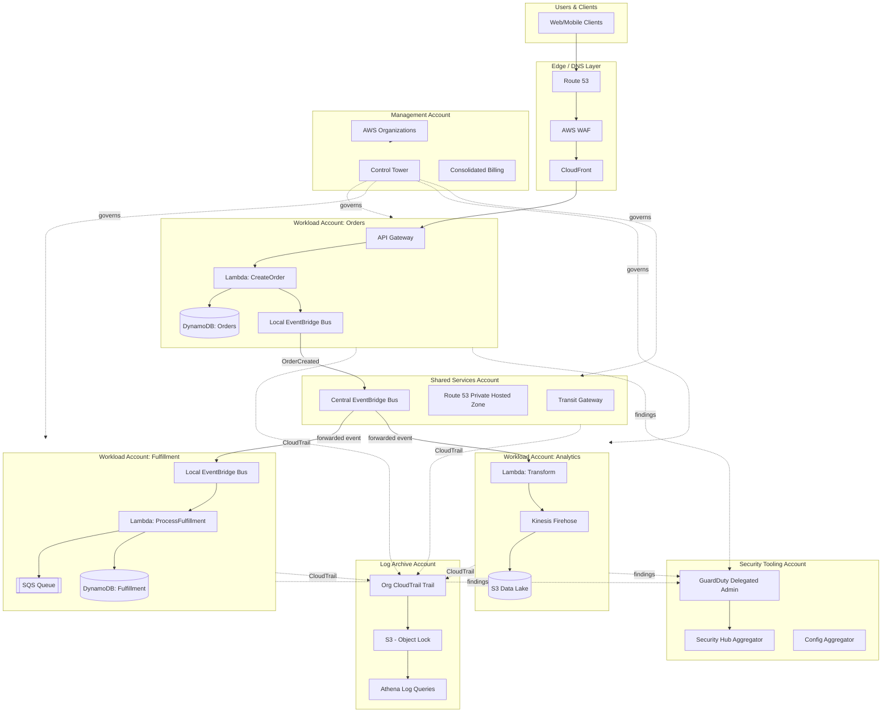

# Part IV – Serverless Architectures

# Chapter 34: Multi-Account Serverless

---

## 1. Executive Summary

Serverless computing solved a real problem: teams no longer had to provision, patch, and scale servers for every workload. Lambda, API Gateway, DynamoDB, EventBridge, and Step Functions removed most of the undifferentiated heavy lifting that used to consume half of an infrastructure team's time.

But serverless created a second, quieter problem that only shows up once an organization scales past a handful of teams: **blast radius**.

- A single AWS account holding every serverless workload means every team shares the same IAM boundary, the same service quotas, the same CloudTrail log stream, and the same billing line item.
- A misconfigured IAM policy in one team's Lambda function can, in a single-account model, reach into another team's DynamoDB tables.
- A runaway Step Functions execution from a "Team A" workload can exhaust concurrent Lambda execution quotas that "Team B" depends on for a customer-facing checkout flow.
- Auditors reviewing SOC 2 or PCI-DSS evidence cannot cleanly separate "in-scope" and "out-of-scope" resources when everything lives in one account.

Multi-Account Serverless is the architectural response to this problem. It applies AWS's long-standing multi-account strategy — previously reserved for large EC2/VPC estates — to serverless-native workloads.

### Business Problem

Enterprises adopting serverless at scale hit a wall around the time they have:

- More than 5–8 engineering teams building on Lambda/API Gateway/DynamoDB independently.
- Regulatory or contractual requirements to isolate customer data, financial data, or PII processing.
- A need to give each team full deployment autonomy without central bottlenecks.
- A need for predictable, attributable cloud spend per team, product, or business unit.
- Incident response requirements that demand the ability to answer "what changed, where, and who did it" within minutes, not hours.

A single shared account cannot satisfy these requirements simultaneously. IAM policies become an unmanageable tangle of conditions trying to simulate account-level isolation that AWS already provides natively at the account boundary.

### Architecture Objective

The objective of Multi-Account Serverless is to give every team (or every workload class — dev, staging, production, sandbox) its own AWS account, while still operating as a single coherent organization from a networking, security, billing, and operational standpoint.

Concretely, the architecture must deliver:

1. **Hard isolation** — IAM, quotas, CloudTrail, and blast radius stop at the account boundary, not at a resource policy.
2. **Centralized governance** — Service Control Policies (SCPs), centralized logging, centralized security tooling (GuardDuty, Security Hub, Config) applied consistently across every account without each team having to configure it.
3. **Self-service deployment** — Teams deploy serverless workloads into their own accounts through CI/CD pipelines without waiting on a central platform team for every change.
4. **Centralized cost visibility** — Consolidated billing with per-account, per-tag cost attribution.
5. **Cross-account integration** — Workloads in one account routinely need to call APIs, publish events, or read data owned by another account, so the architecture must support secure, well-governed cross-account communication (EventBridge bus policies, cross-account IAM roles, resource policies on SQS/SNS/API Gateway).

### Why Organizations Adopt This Architecture

- **Blast radius containment.** An incident (leaked credentials, a compromised CI/CD pipeline, a bad IAM policy) is contained to a single account instead of propagating org-wide.
- **Compliance boundary alignment.** PCI-DSS, HIPAA, and FedRAMP assessments become dramatically simpler when "in-scope" resources live in dedicated accounts, rather than being scattered across a shared account and identified by tags (tags are not a trust boundary; accounts are).
- **Quota isolation.** Lambda concurrency limits, API Gateway throttling limits, and DynamoDB table limits are account-scoped. Isolating workloads by account means one team's traffic spike cannot silently throttle another team's production workload.
- **Cost attribution without tagging discipline.** Account ID is a mandatory, unforgeable dimension in Cost Explorer and CUR (Cost and Usage Report). Tags are optional and frequently missing; accounts are not.
- **Team autonomy at scale.** Each team gets full ownership of their account (subject to SCP guardrails), removing the central platform team as a bottleneck for every deployment.
- **Clean environment separation.** Dev, staging, and production for the same workload live in physically separate accounts, eliminating the entire class of incidents caused by a developer accidentally pointing a script at a production table because "it was in the same account."

### Major Business Benefits

| Benefit | Description |
|---|---|
| Reduced blast radius | Security incidents and operational failures are contained within account boundaries |
| Simplified compliance | Regulatory scope maps cleanly to account boundaries instead of tag-based logical boundaries |
| Predictable cost attribution | AWS Organizations consolidated billing gives per-account cost data natively, with no tagging dependency |
| Team autonomy | Teams deploy independently without a central bottleneck, increasing delivery velocity |
| Quota isolation | Lambda, API Gateway, and DynamoDB service quotas do not compete across teams |
| Centralized security posture | GuardDuty, Security Hub, Config, and CloudTrail apply uniformly via Control Tower / Organizations, regardless of team maturity |
| Faster incident response | Account-level CloudTrail and GuardDuty findings make root-cause identification faster |
| Cleaner audit evidence | Auditors can review IAM policies and resource inventories per account instead of filtering a shared account by tags |

### Typical Enterprise Scenarios

- A fintech company running 40+ microservices across 12 product teams, each requiring PCI-DSS scope isolation for payment-processing Lambda functions.
- A healthcare SaaS vendor isolating HIPAA-regulated patient-data-processing workloads into dedicated accounts distinct from marketing-site and internal-tooling accounts.
- A retail enterprise running seasonal, highly bursty serverless order-processing workloads that must not compete for Lambda concurrency with a separate internal analytics platform.
- A platform engineering team standing up "vending machine" style account provisioning so that every new product team receives a pre-hardened AWS account with serverless guardrails already applied, in minutes rather than weeks.

### Why This Chapter Matters

Multi-Account Serverless is not a single AWS service — it is an organizational pattern that combines AWS Organizations, Control Tower, IAM, EventBridge, and serverless compute into a cohesive operating model. Getting it right requires understanding not just the individual AWS services, but the *interactions* between them: how a Step Functions workflow in Account A safely invokes a Lambda function in Account B, how a centralized logging account aggregates CloudTrail from 50 member accounts without becoming a cost or operational liability, and how SCPs prevent a well-meaning developer from disabling GuardDuty in their own account.

This chapter provides a complete, production-ready reference for designing, deploying, securing, operating, and evolving a Multi-Account Serverless architecture — from a 3-account starting point to a 200+ account enterprise landing zone.

---

## 2. Business Requirements

### Business Drivers

- Need to isolate regulated workloads (PCI, HIPAA, SOC 2, FedRAMP) from general-purpose workloads.
- Need to scale engineering organization from a handful of teams to dozens without a central platform team becoming a bottleneck.
- Need for accurate, unforgeable cost attribution per team/product for internal chargeback or showback.
- Need to reduce the blast radius of security incidents.
- Need to support M&A activity where acquired companies' AWS environments must be onboarded into a common governance model without a disruptive "big bang" migration.

### Functional Requirements

- Every team can create, deploy, and operate serverless workloads (Lambda, API Gateway, Step Functions, EventBridge, DynamoDB, SQS, SNS) inside their own AWS account.
- Cross-account event publishing and consumption via EventBridge.
- Cross-account API invocation via API Gateway with IAM authorization or a shared API Gateway custom authorizer pattern.
- Centralized identity via IAM Identity Center (successor to AWS SSO) for human access; no long-lived IAM users in member accounts.
- Centralized logging account that aggregates CloudTrail, VPC Flow Logs (where applicable), and application logs.
- Centralized security tooling account running GuardDuty, Security Hub, and Config aggregators.
- Self-service account vending via Control Tower Account Factory or a custom Account Factory for Terraform (AFT) pipeline.

### Non-Functional Requirements

| Category | Requirement |
|---|---|
| Scalability | Support growth from 3 accounts to 200+ accounts without re-architecture |
| Availability | Serverless workloads target 99.95%+ availability per workload; platform-level services (logging, security aggregation) target 99.9%+ |
| Latency | Cross-account EventBridge delivery p99 under 2 seconds; cross-account API Gateway invocation adds under 50ms overhead versus same-account |
| Compliance | Support PCI-DSS, HIPAA, SOC 2 Type II evidence collection at the account boundary |
| Security | Zero standing long-lived IAM user credentials in member accounts; all human access via federated SSO with time-limited sessions |
| Recovery | RPO of 15 minutes or less for stateful serverless data stores (DynamoDB, Aurora Serverless); RTO of 1 hour or less for individual workload restoration |
| Auditability | 100% of API calls across all accounts logged centrally with 400-day minimum retention for compliance workloads |
| Cost Governance | Per-account budget alerts, org-wide Cost Anomaly Detection, monthly per-account cost reports |

### Scalability Goals

- Support 500+ Lambda functions per account without hitting default concurrency ceilings (requires proactive quota management, covered in Section 14).
- Support onboarding a new team/account in under 1 business day via automated account vending.
- Support cross-account event throughput of 10,000+ events/second on the central EventBridge bus during peak (e.g., Black Friday for a retail workload).

### Availability Requirements

- Individual workload SLA: typically 99.9%–99.99% depending on tier (defined per workload, not per platform).
- Platform services (Organizations, Control Tower, IAM Identity Center) inherit AWS's own SLA for these managed services; the architecture should not introduce additional single points of failure on top of them.

### Latency Requirements

- Customer-facing APIs: p99 under 300ms end-to-end (API Gateway + Lambda + downstream data store).
- Internal cross-account event-driven workflows: p99 under 5 seconds from publish to consumption acknowledgment.

### Compliance Requirements

- PCI-DSS: Cardholder Data Environment (CDE) isolated into dedicated accounts, with SCPs preventing resource creation outside approved regions and services.
- HIPAA: PHI-processing workloads run only in accounts covered under AWS's Business Associate Addendum (BAA), with encryption at rest and in transit enforced via SCP.
- SOC 2 Type II: Centralized logging, immutable audit trails (CloudTrail with S3 Object Lock), and documented access reviews.

### Security Expectations

- No IAM users with long-lived access keys in any member account (enforced via SCP).
- MFA required for all human console access via IAM Identity Center.
- All cross-account access via assumed IAM roles with narrowly scoped trust policies, never via shared credentials.
- Secrets stored in Secrets Manager or Parameter Store (SecureString), never in Lambda environment variables in plaintext, never in source control.

### Recovery Objectives

| Data Store | RPO | RTO |
|---|---|---|
| DynamoDB (with Point-in-Time Recovery) | ~5 minutes (continuous backups) | 30–60 minutes for table restore |
| Aurora Serverless v2 | 5 minutes (automated backups) | 1–2 hours for full restore |
| S3 (versioned + cross-region replication) | Near-zero for replicated objects | Minutes (read from replica region) |
| EventBridge / SQS in-flight messages | N/A (transient) | Redrive from DLQ, typically under 15 minutes |

### SLAs

- Define per-workload SLAs in a service catalog; the platform itself commits to account-vending SLA (e.g., new account ready within 4 business hours) and security-guardrail-application SLA (e.g., GuardDuty active within 15 minutes of account creation).

### Expected Workload and Growth

- Initial state: 3–5 accounts (Management, Log Archive, Security Tooling, one or two workload accounts).
- Year 1: 15–30 accounts as teams onboard.
- Year 3: 100–200+ accounts is common for large enterprises; some F500 organizations run 1,000+ accounts.
- Design decisions in this chapter are made assuming this trajectory — a design that only works at 5 accounts and breaks at 50 is not production-ready.

---

## 3. Architecture Overview

### Overall Design Philosophy

Multi-Account Serverless rests on three pillars:

1. **AWS Organizations + Control Tower** provide the account structure, guardrails (SCPs), and centralized governance.
2. **Serverless compute (Lambda, API Gateway, Step Functions, EventBridge, DynamoDB, SQS, SNS)** provides the workload runtime inside each member account.
3. **Cross-account integration patterns** (EventBridge bus policies, cross-account IAM roles, resource-based policies) connect workloads across account boundaries without collapsing the isolation the accounts were created to provide.

A useful mental model: **each AWS account is a security and operational boundary, not merely a billing construct.** Everything in this architecture is designed around that principle. Resources are placed in accounts based on *who owns them and what they need to be isolated from*, not based on convenience.

### Core Components

- **Management Account** — root of the AWS Organization; hosts Organizations, Control Tower, and consolidated billing. No workloads are ever deployed here.
- **Log Archive Account** — receives CloudTrail, Config, and VPC Flow Log data from every member account via S3 with Object Lock (WORM) for immutability.
- **Security Tooling Account** — hosts the GuardDuty delegated administrator, Security Hub aggregator, and Firewall Manager (if applicable).
- **Shared Services / Network Account** — hosts Transit Gateway (if VPC-connected Lambda functions are used), Route 53 private hosted zones, and shared CI/CD tooling if not fully decentralized.
- **Workload Accounts** — one or more per team/product, each containing that team's Lambda functions, API Gateway APIs, Step Functions state machines, DynamoDB tables, SQS queues, SNS topics, and EventBridge custom event buses.
- **Central Event Bus (optional pattern)** — a dedicated account (or the Shared Services account) hosting an org-wide EventBridge bus that workload accounts publish domain events to and subscribe from, enabling loosely coupled cross-team integration.

### How Components Interact

- Human users authenticate once via IAM Identity Center and assume role into whichever workload account they need, with permissions scoped by permission sets.
- CI/CD pipelines (GitHub Actions, GitLab, CodePipeline) assume a deployment role in the target workload account via OIDC federation — no long-lived AWS credentials stored in the CI/CD system.
- Workload accounts publish domain events to their own local EventBridge bus and/or forward selected events to the central cross-account event bus for consumption by other teams.
- CloudTrail in every account (management + member) delivers logs to the centralized S3 bucket in the Log Archive account; this is enabled by default in a Control Tower landing zone.
- GuardDuty findings from every account roll up to the Security Tooling account for centralized triage.

### High-Level Workflow (Request Lifecycle Example)

1. A customer request hits Route 53, resolves to CloudFront, which routes to a regional API Gateway in the relevant workload account (e.g., "Orders" account).
2. API Gateway invokes a Lambda function using an IAM execution role scoped to that account.
3. The Lambda function reads/writes to a DynamoDB table in the same account.
4. On successful order creation, the Lambda function publishes an `OrderCreated` event to the account's local EventBridge bus.
5. An EventBridge rule forwards the event to the central cross-account bus.
6. The "Fulfillment" account's EventBridge rule matches the event and triggers its own Lambda function to begin fulfillment — entirely within the Fulfillment account's own IAM boundary.
7. All API calls across every account in this flow are logged to CloudTrail in the Log Archive account.

### Data Lifecycle

- Data is owned and stored within the account of the team responsible for it (a core tenet of domain-driven, multi-account design — no shared "god" database account).
- Cross-account data access happens through APIs or events, not through direct cross-account database access, preserving the isolation boundary.
- Backups (DynamoDB PITR, S3 versioning) live within the owning account by default; for disaster recovery, critical data is additionally replicated to a separate DR account/region.

---

## 4. AWS Services Used

### Lambda

**Purpose:** Core compute primitive for the architecture — stateless, event-driven function execution with no server management.

**Why selected:** Scales automatically per-account, billed per-invocation/duration, integrates natively with virtually every other service used in this architecture (API Gateway, EventBridge, SQS, SNS, Step Functions, DynamoDB Streams).

**Alternatives:** ECS Fargate (for longer-running or non-event-driven workloads), EC2 (rarely justified for this workload class).

**Limitations:** 15-minute maximum execution time, account-level concurrency quotas (default 1,000 concurrent executions, increasable via Service Quotas), cold-start latency for infrequently invoked functions using certain runtimes.

**Pricing considerations:** Pay per request and per GB-second of compute; over-provisioned memory is a common cost leak (see Section 16).

**Best practices:** Right-size memory allocation using AWS Lambda Power Tuning; use Provisioned Concurrency only for latency-sensitive, predictable-traffic functions; keep deployment packages small to reduce cold-start time.

### API Gateway

**Purpose:** Managed entry point for HTTP/REST and WebSocket APIs, fronting Lambda functions.

**Why selected:** Native IAM authorization support (critical for cross-account API invocation patterns), built-in throttling, request validation, and usage plans.

**Alternatives:** Application Load Balancer with Lambda target (cheaper at very high, steady request volumes, but loses native request validation and usage plans); AppSync for GraphQL-first APIs.

**Limitations:** Default throttle of 10,000 requests/second account-wide (increasable); 29-second maximum integration timeout for REST APIs.

**Pricing considerations:** HTTP APIs are ~70% cheaper than REST APIs for equivalent traffic; use HTTP APIs unless you specifically need REST API features (request validation models, API keys/usage plans, private endpoints via VPC endpoint policies).

**Best practices:** Use HTTP APIs by default; enable access logging to CloudWatch Logs; apply resource policies for account-level allow-listing on cross-account API access.

### S3

**Purpose:** Object storage for deployment artifacts, centralized log archival, static assets, and data lake landing zones.

**Why selected:** 11 nines durability, native Object Lock for compliance-grade immutability, native cross-account bucket policies for the Log Archive pattern.

**Alternatives:** EFS (for shared POSIX filesystem needs, rare in serverless), none realistic for object storage at this scale.

**Limitations:** Eventually consistent for some legacy operations (largely resolved — S3 is now strongly consistent for all operations since December 2020).

**Pricing considerations:** Lifecycle policies to transition CloudTrail/access logs to S3 Glacier Deep Archive after 90 days materially reduce long-term log storage cost.

**Best practices:** Enable Object Lock in compliance mode on the Log Archive bucket; enforce bucket policies denying non-TLS access; enable S3 Block Public Access at the account and bucket level via SCP.

### DynamoDB

**Purpose:** Primary transactional data store for serverless workloads requiring single-digit-millisecond latency at scale.

**Why selected:** Fully serverless (on-demand capacity mode scales automatically, no server or cluster to manage), native integration with Lambda via DynamoDB Streams for event-driven downstream processing.

**Alternatives:** Aurora Serverless v2 (when relational modeling, joins, or complex transactions are required); ElastiCache (for pure caching, not primary storage).

**Limitations:** No native joins; 400KB item size limit; requires careful access-pattern-driven table design (single-table design is common but adds modeling complexity).

**Pricing considerations:** On-demand mode is simplest and safest for unpredictable serverless traffic; provisioned mode with auto-scaling is cheaper for steady, predictable workloads at scale.

**Best practices:** Enable Point-in-Time Recovery on every production table; use on-demand capacity mode until traffic patterns are well understood; enable DynamoDB Streams only when a downstream consumer actually needs them (streams have a real, if small, cost and operational surface).

### SNS

**Purpose:** Pub/sub fan-out messaging, typically used for simple one-to-many notification patterns and as a decoupling layer in front of SQS queues (fan-out pattern).

**Why selected:** Simple, fully managed, integrates with SQS, Lambda, HTTP(S) endpoints, and email/SMS.

**Alternatives:** EventBridge (preferred for structured domain events with content-based routing — see below); direct Lambda-to-Lambda invocation (avoided; creates tight coupling).

**Limitations:** No built-in message replay; no content-based filtering as rich as EventBridge's pattern matching (SNS filter policies are simpler).

**Pricing considerations:** Very low cost per million requests; the SNS+SQS fan-out pattern is a well-established, cost-effective way to deliver the same message to multiple independent consumers reliably.

**Best practices:** Use SNS+SQS fan-out (not direct SNS-to-Lambda) for any consumer requiring at-least-once processing guarantees with retry/DLQ semantics.

### SQS

**Purpose:** Durable, decoupling message queue between producers and consumers; buffers load spikes and provides at-least-once delivery.

**Why selected:** Fully managed, integrates natively as a Lambda event source, provides Dead Letter Queue (DLQ) support for poison-message handling.

**Alternatives:** Kinesis Data Streams (when ordered, replayable, multi-consumer streaming is required instead of simple queueing); EventBridge Pipes (for newer point-to-point integrations with built-in filtering/enrichment).

**Limitations:** Standard queues do not guarantee strict ordering (use FIFO queues when ordering matters, at a throughput cost); 256KB max message size (use the S3 extended client pattern for larger payloads).

**Pricing considerations:** Inexpensive; the main cost driver is often over-polling from a Lambda consumer that is misconfigured with too-short batch windows.

**Best practices:** Always configure a DLQ; set `maxReceiveCount` deliberately (3–5 is typical); use FIFO queues only when strictly necessary since they cap throughput at 3,000 msg/sec per API action (with batching) versus nearly unlimited for standard queues.

### EventBridge

**Purpose:** The central nervous system of this architecture — a serverless event bus supporting content-based routing, schema registry, and native cross-account event delivery via resource policies.

**Why selected:** Purpose-built for the exact cross-account, cross-team event distribution pattern this architecture depends on; supports hundreds of SaaS partner event sources and AWS service integrations out of the box.

**Alternatives:** SNS/SQS (simpler, but weaker native cross-account routing and content-based filtering); Kafka/MSK (justified only when very high throughput, strict ordering per partition, and long retention/replay are simultaneously required).

**Limitations:** At-least-once delivery (consumers must be idempotent); event size limit of 256KB; some latency variability under very high burst rates.

**Pricing considerations:** Billed per event published (custom bus events); using a central cross-account bus is inexpensive relative to the architectural value it delivers.

**Best practices:** Use one custom event bus per account for domain events; forward only intentionally "public" events to the central cross-account bus (avoid leaking internal implementation events across account boundaries); define and enforce an event schema registry.

### IAM

**Purpose:** Identity and access control — the mechanism through which every cross-account interaction in this architecture is authorized.

**Why selected:** No alternative; IAM is the foundational AWS access control service.

**Limitations:** Policy size limits (2KB for inline user/group/role policies is a soft historical concern; managed policies allow up to 6,144 characters); complexity grows quickly without disciplined permission boundary usage.

**Best practices:** Prefer roles over users everywhere; use permission boundaries on any role that can create other IAM roles (privilege escalation prevention); use IAM Access Analyzer to detect unintended cross-account access.

### VPC

**Purpose:** Network isolation boundary — used selectively in this architecture, only when Lambda functions must reach private resources (RDS/Aurora, internal APIs, on-prem via Direct Connect/VPN).

**Why selected:** Required whenever a Lambda function needs private network connectivity; not required for Lambda functions that only talk to AWS service APIs (DynamoDB, S3, EventBridge) since those are reachable via AWS's public/managed network paths or VPC endpoints.

**Limitations:** VPC-attached Lambda functions have historically had higher cold-start latency (largely mitigated since Hyperplane ENI improvements in 2019, but still non-zero); adds ENI management overhead.

**Best practices:** Avoid attaching Lambda to a VPC unless there's a genuine need; when needed, use VPC endpoints (Gateway for S3/DynamoDB, Interface for other services) to avoid routing traffic through a NAT Gateway (cost and latency).

### Route 53

**Purpose:** DNS resolution for public API endpoints and private hosted zones for internal service discovery across accounts (via Route 53 Private Hosted Zone association).

**Best practices:** Use a centralized Route 53 account (often the Shared Services account) for the org's apex domains; delegate subdomains to workload accounts as needed.

### CloudWatch

**Purpose:** Metrics, logs, dashboards, and alarms for every serverless component in every account.

**Best practices:** Centralize critical alarms via CloudWatch cross-account observability (Amazon CloudWatch cross-account observability, GA since late 2022) so a central operations account can see metrics/logs/traces from all linked source accounts without needing to assume a role into each one individually.

### CloudTrail

**Purpose:** Immutable audit log of every API call made in every account — the backbone of the security and compliance model.

**Best practices:** Enable an organization-wide CloudTrail trail from the Management account (a single trail covering all member accounts, delivered to the centralized Log Archive S3 bucket with Object Lock enabled).

### AWS Config

**Purpose:** Continuous configuration compliance monitoring — detects and (optionally) auto-remediates drift from approved configurations (e.g., an S3 bucket becoming public).

**Best practices:** Use an Organization-wide Config aggregator in the Security Tooling account; deploy Conformance Packs mapped to your compliance framework (PCI-DSS, HIPAA, NIST 800-53).

### GuardDuty

**Purpose:** Managed threat detection using ML and threat intelligence feeds across CloudTrail, VPC Flow Logs, DNS logs, EKS audit logs, and Lambda network activity (Runtime Monitoring for Lambda, GA 2023).

**Best practices:** Enable GuardDuty organization-wide with a delegated administrator account (Security Tooling account); auto-enable for all new accounts via Organizations integration.

### KMS

**Purpose:** Encryption key management for data at rest across DynamoDB, S3, SQS, SNS, Secrets Manager, and Lambda environment variables.

**Best practices:** Use customer-managed keys (CMKs) — not the AWS-managed default keys — for any data subject to compliance requirements, since CMKs provide auditable key policies and support cross-account key sharing with tightly scoped grants.

### Secrets Manager

**Purpose:** Secure storage and automatic rotation of database credentials, API keys, and other secrets consumed by Lambda functions.

**Alternatives:** Systems Manager Parameter Store (SecureString) — cheaper, no native rotation, adequate for secrets that don't require automatic rotation.

**Best practices:** Never put secrets in Lambda environment variables in plaintext; use Secrets Manager with automatic rotation for database credentials; cache secret retrieval in the Lambda execution environment (outside the handler) to avoid a Secrets Manager API call on every invocation.

### Systems Manager

**Purpose:** Parameter Store for non-secret configuration; also used for centralized patch management on any EC2 instances that remain in the estate (e.g., bastion-less access via Session Manager for the Shared Services account).

---

## 5. Complete Architecture Diagram



> **Note:** Every workload account in this diagram is structurally identical in terms of guardrails (SCPs, CloudTrail delivery, GuardDuty enrollment) — only the workload-specific serverless resources differ. This uniformity is what makes the architecture scale to hundreds of accounts without linear growth in governance effort.

---

## 6. Component-by-Component Explanation

### Management Account

- **Purpose:** Root of the AWS Organization; owns consolidated billing and Organizations-level policies (SCPs).
- **Responsibilities:** Account creation/closure (via Control Tower Account Factory), org-wide SCP management, org-wide CloudTrail trail definition.
- **Inputs:** Account creation requests (via Account Factory for Terraform or Control Tower console/API).
- **Outputs:** New member accounts pre-configured with baseline guardrails.
- **Scaling:** Effectively unlimited (AWS Organizations supports thousands of accounts); the practical constraint is SCP evaluation complexity, not a hard AWS limit.
- **High availability:** Fully managed by AWS; no customer-managed infrastructure to fail over.
- **Failure handling:** N/A for the managed service itself; failure mode to guard against is human error in SCP authoring (test SCPs in a sandbox OU before applying org-wide).
- **Dependencies:** None (root of the hierarchy).
- **Security:** Root user credentials should be secured with hardware MFA and never used for day-to-day operations; access to the Management account itself should be as restricted as possible — ideally only a handful of platform administrators.
- **Monitoring:** CloudTrail in the Management account itself, monitored for any root user activity (should be zero in steady state — alert immediately if detected).

### Log Archive Account

- **Purpose:** Immutable, centralized destination for all audit logs across the organization.
- **Responsibilities:** Receive CloudTrail, Config, and (where applicable) VPC Flow Logs from every account; enforce retention and immutability via S3 Object Lock.
- **Inputs:** Log delivery streams from every account in the organization.
- **Outputs:** Queryable log data (via Athena) for security investigations and audit evidence requests.
- **Scaling:** S3 scales natively; the operational concern is cost management via lifecycle policies, not throughput.
- **High availability:** S3 standard durability (11 nines); enable Cross-Region Replication for the log bucket if regulatory requirements mandate geographic redundancy.
- **Failure handling:** CloudTrail delivery has built-in retry; monitor for delivery failures via CloudWatch metrics on the trail.
- **Dependencies:** Every account in the organization (as a log source).
- **Security:** Bucket policy denies delete/modify even for account administrators (Object Lock compliance mode); access restricted to a small security/audit group.
- **Monitoring:** Alarm on any `PutBucketPolicy`, `PutBucketAcl`, or attempted Object Lock configuration change on the log bucket itself.

### Security Tooling Account

- **Purpose:** Centralized security findings aggregation and response coordination.
- **Responsibilities:** GuardDuty delegated administration, Security Hub finding aggregation, Config rule aggregation, (optionally) Detective for investigation graphing.
- **Inputs:** Findings and configuration snapshots streamed from every member account.
- **Outputs:** Prioritized security findings, compliance dashards, automated remediation triggers (via EventBridge rules reacting to Security Hub findings).
- **Scaling:** GuardDuty and Security Hub scale automatically with account count; cost scales with data volume analyzed (CloudTrail events, VPC Flow Logs, DNS logs, Lambda network activity).
- **High availability:** Fully managed AWS services.
- **Dependencies:** Every account (as a finding source), Log Archive account (for supporting log data during investigations).
- **Security:** Access restricted to security operations team; no workload resources are ever deployed in this account.
- **Monitoring:** Security Hub composite score tracked over time; EventBridge rule triggers Slack/PagerDuty notification for any CRITICAL or HIGH severity finding.

### Shared Services Account

- **Purpose:** Hosts genuinely shared infrastructure that does not belong to any single workload team — Transit Gateway, centralized Route 53 zones, and (in this architecture) the central cross-account EventBridge bus.
- **Responsibilities:** Network transit (if VPC-connected Lambda functions exist across accounts), DNS, cross-team event bus hosting.
- **Scaling:** Transit Gateway scales to thousands of VPC attachments; EventBridge central bus scales automatically.
- **Security:** Bus policy on the central EventBridge bus explicitly allow-lists which member accounts may `PutEvents`; this is the single most important resource policy in the entire architecture, since a misconfiguration here could allow any account to inject events impersonating another team.
- **Monitoring:** CloudWatch metrics on `PutEvents` failed invocations, throttled rules, and dead-letter queue depth for any failed rule targets.

### Workload Accounts (e.g., Orders, Fulfillment, Analytics)

- **Purpose:** Isolated home for a single team/product's serverless workload.
- **Responsibilities:** Own their Lambda functions, API Gateway APIs, Step Functions workflows, DynamoDB tables, and local EventBridge bus; publish domain events intended for other teams to the central bus; consume events relevant to them from the central bus.
- **Inputs:** End-user requests (if customer-facing), events from the central bus.
- **Outputs:** API responses, published domain events, data persisted to owned data stores.
- **Scaling:** Independent per account — Lambda concurrency, API Gateway throughput, and DynamoDB capacity in the Orders account do not affect the Fulfillment account.
- **High availability:** Multi-AZ by default for all serverless services used (Lambda, API Gateway, DynamoDB, EventBridge, SQS, SNS are inherently multi-AZ within a region with no customer configuration required).
- **Failure handling:** DLQs on SQS and Lambda event source mappings; Step Functions retry/catch blocks for orchestrated workflows; circuit breaker pattern for calls to other accounts' APIs.
- **Dependencies:** Central EventBridge bus (Shared Services account) for cross-team events; Log Archive and Security Tooling accounts receive telemetry passively (the workload account has no runtime dependency on them).
- **Security:** SCPs from the Management account apply automatically; team has full administrative control within the account subject to those guardrails; deployment role is the only entity permitted to create/modify resources in production (developers do not have direct production write access — enforced via permission sets).
- **Monitoring:** Team-owned CloudWatch dashboards and alarms; critical alarms also surfaced to a central operations account via CloudWatch cross-account observability.

---

## 7. End-to-End Request Flow

The following trace follows a customer placing an order, through cross-account fulfillment, to analytics ingestion.

1. **Client** sends `POST /orders` to `api.example.com`.
2. **Route 53** resolves `api.example.com` to the CloudFront distribution.
3. **AWS WAF**, attached to CloudFront, evaluates the request against managed rule groups (SQL injection, known bad inputs, rate-based rules); if it fails, a 403 is returned immediately and the flow stops here.
4. **CloudFront** forwards the request to the regional API Gateway endpoint in the **Orders account**.
5. **API Gateway** validates the request against its configured request model (rejects malformed payloads with a 400 before invoking any compute).
6. **API Gateway** invokes the `CreateOrder` **Lambda function** using the API Gateway's Lambda invocation role, scoped only to that specific function's ARN.
7. The **Lambda function** writes the new order to the **Orders DynamoDB table** using a conditional write (idempotency check via an `orderId` client token to prevent duplicate orders from retries).
8. On success, the Lambda function publishes an `OrderCreated` event to the **Orders account's local EventBridge bus**.
9. A local EventBridge rule matches `OrderCreated` events tagged for cross-account distribution and forwards them to the **central EventBridge bus** in the Shared Services account, using a dedicated cross-account "event forwarder" IAM role.
10. The central bus's resource policy verifies the Orders account is authorized to `PutEvents`; if authorized, the event lands on the bus.
11. A rule on the central bus matches `OrderCreated` and has two targets: the **Fulfillment account's** local bus and the **Analytics account's** Kinesis Firehose delivery stream (via an EventBridge-to-Firehose target).
12. In the **Fulfillment account**, a local EventBridge rule triggers the `ProcessFulfillment` Lambda function, which enqueues a fulfillment task onto an **SQS queue** for a downstream worker Lambda to process at its own pace (decoupling burst order volume from fulfillment processing capacity).
13. In the **Analytics account**, the raw event lands in **S3** via Firehose, later transformed by a scheduled **Lambda function** (or Glue job) for downstream BI consumption.
14. Throughout this flow, every API call (the DynamoDB write, the `PutEvents` calls, the SQS `SendMessage`, the S3 `PutObject`) is captured by **CloudTrail** in each respective account and delivered to the **Log Archive account**.
15. **CloudWatch** captures Lambda duration, error rate, and throttle metrics in every account; an alarm on the `CreateOrder` function's error rate would page the Orders team directly.
16. If the `CreateOrder` Lambda function fails after all retries, API Gateway returns a 500 to the client, and CloudFront/WAF logs capture the failed request for later analysis.
17. If the cross-account `PutEvents` call to the central bus fails (e.g., throttling), the local EventBridge rule's retry policy re-attempts delivery; after exhausting retries, the failed event is sent to a **DLQ** configured on the rule, where a scheduled Lambda function periodically reprocesses DLQ contents.

---

## 8. Deployment Flow

### Infrastructure Provisioning

Multi-Account Serverless requires two distinct provisioning layers that must not be conflated:

1. **Account-level provisioning** — creating the AWS account itself, applying baseline guardrails (SCPs, CloudTrail enrollment, GuardDuty enrollment). This is a platform-team-owned, infrequent operation (once per new account), typically executed through **Control Tower Account Factory for Terraform (AFT)**.
2. **Workload-level provisioning** — deploying Lambda functions, API Gateway APIs, DynamoDB tables, etc., inside an already-provisioned account. This is a team-owned, frequent operation (many times per day), executed through each team's own CI/CD pipeline.

Conflating these two layers is a common and costly mistake — it either forces every workload deployment through a central platform-team bottleneck, or gives workload deployment pipelines dangerous account-creation privileges they don't need.

### Terraform Workflow (Account-Level, via AFT)

```

1. Platform engineer submits a pull request to the account-request repository,
   adding a new account definition (name, email, OU, baseline customizations).
2. AFT pipeline validates the request (naming conventions, OU placement).
3. AFT invokes Control Tower Account Factory to provision the account.
4. AFT applies account-level Terraform customizations (SCP attachment confirmation,
   baseline IAM roles for the workload team, deployment role for CI/CD OIDC federation).
5. Account is registered in the internal service catalog and handed off to the team.

```

### Terraform Workflow (Workload-Level, per team)

```

1. Developer opens a pull request in the team's own repository.
2. CI pipeline runs `terraform plan` using a read-only role assumed via GitHub OIDC.
3. Plan output posted to the PR for review.
4. On merge to main, CI pipeline assumes a deployment role (broader, but still scoped
   to that team's account only) via OIDC and runs `terraform apply`.
5. Post-apply smoke tests run against the newly deployed API Gateway endpoint.
6. On failure, automatic rollback via `terraform apply` of the previous state,
   or manual rollback if the failure is caught after smoke tests.

```

### CI/CD Deployment (GitHub Actions Example)

```yaml

name: Deploy Serverless Workload

on:
  push:
    branches: [main]

permissions:
  id-token: write   # required for OIDC
  contents: read

jobs:
  deploy:
    runs-on: ubuntu-latest
    steps:
      - uses: actions/checkout@v4

      - name: Configure AWS credentials via OIDC
        uses: aws-actions/configure-aws-credentials@v4
        with:
          role-to-assume: arn:aws:iam::222233334444:role/github-actions-deploy-orders
          aws-region: us-east-1

      - name: Terraform Init
        run: terraform init -backend-config=backend.hcl

      - name: Terraform Plan
        run: terraform plan -out=tfplan

      - name: Terraform Apply
        run: terraform apply -auto-approve tfplan

      - name: Smoke Test
        run: ./scripts/smoke-test.sh https://api.example.com/health

```

> **Tip:** No AWS access keys ever touch GitHub secrets in this pattern. The OIDC trust relationship on `github-actions-deploy-orders` is scoped to the specific GitHub repository and branch, eliminating an entire class of credential-leakage incidents.

### Blue-Green Deployment

- Lambda supports native traffic shifting via **weighted aliases** (e.g., shift 10% of traffic to the new version, monitor error rates, then shift to 100%).
- API Gateway supports **canary release deployments** at the stage level, independent of Lambda aliasing, for finer-grained control over API-level rollout.
- CodeDeploy's Lambda deployment type automates this with configurable shift patterns (`Linear10PercentEvery1Minute`, `Canary10Percent5Minutes`, `AllAtOnce`).

### Rollback

- Automatic rollback triggered by CloudWatch alarms tied to the CodeDeploy deployment group (e.g., Lambda error rate exceeding a threshold during the canary window automatically reverts to the prior version).
- Terraform state rollback for infrastructure-level changes (revert the PR, re-apply).

### Secrets and Configuration

- Secrets Manager for database credentials and third-party API keys, referenced by ARN in Terraform, retrieved at runtime by the Lambda function (never baked into deployment artifacts).
- Parameter Store for non-secret environment-specific configuration (feature flags, non-sensitive endpoint URLs).

### Validation

- `terraform plan` output reviewed in every PR.
- `checkov` or `tfsec` static analysis run in CI to catch insecure IAM policies, unencrypted resources, and public S3 buckets before merge.
- Post-deployment smoke tests against a health-check endpoint before considering the deployment successful.

---

## 9. Network Topology

Serverless-first architectures minimize VPC dependency by design, but most enterprises still require VPC connectivity for at least some workloads (private RDS/Aurora access, on-prem connectivity, or strict network-level isolation requirements from a compliance framework).

### VPC Design (Where Applicable)

| Element | Design Decision |
|---|---|
| CIDR allocation | Each workload account's VPC is allocated a non-overlapping /20 (4,096 addresses) from a centrally managed IPAM pool in the Shared Services/Network account |
| Public subnets | Used only for NAT Gateways and any ALB fronting non-serverless components; Lambda functions are never placed in public subnets |
| Private subnets | Host VPC-attached Lambda ENIs, RDS/Aurora instances, and any internal-only compute |
| NAT Gateway | One per AZ in accounts that need outbound internet access from private subnets (e.g., a Lambda function calling a third-party SaaS API from within a VPC) |
| Internet Gateway | Attached only where public subnets exist |
| Transit Gateway | Hosted in the Shared Services account; workload account VPCs attach to it for any required cross-account private connectivity (e.g., a Lambda function reaching a shared internal API) |
| Route Tables | Private subnet route tables send RFC1918 cross-VPC traffic to the Transit Gateway attachment; 0.0.0.0/0 to the NAT Gateway |
| Network ACLs | Used sparingly, as a defense-in-depth layer, not as the primary access control (Security Groups are primary) |
| Security Groups | Scoped per-function/per-service; Lambda security groups typically allow only outbound to specific destination ports (e.g., 5432 to the Aurora security group) |
| VPC Endpoints | Gateway endpoints for S3 and DynamoDB (free, avoid NAT Gateway data processing charges); Interface endpoints for Secrets Manager, KMS, and other AWS APIs when the function is VPC-attached, to avoid routing through NAT |

### PrivateLink

- Used when a workload account needs to expose an internal API to other accounts without traversing the public internet or a shared VPC peering mesh.
- A team can expose an API Gateway private endpoint via a VPC endpoint service, and other accounts create interface endpoints to consume it — cleaner than VPC peering at scale, and does not require CIDR non-overlap coordination beyond the consuming VPC itself.

### Hybrid Connectivity

- Direct Connect or Site-to-Site VPN terminates in the Shared Services/Network account, attached to the Transit Gateway, making on-premises connectivity available to any workload account's VPC-attached Lambda functions without each account needing its own VPN connection.

> **Warning:** Attaching Lambda functions to a VPC purely out of habit (rather than genuine need) is one of the most common unnecessary-cost and unnecessary-complexity mistakes in serverless architectures. If a function only talks to DynamoDB, S3, EventBridge, SQS, or other public AWS service endpoints, it does not need a VPC attachment at all.

---

## 10. Identity and Access

### IAM Roles

- Every human and machine identity accesses AWS exclusively through **roles**, never through IAM users with long-lived credentials (enforced via SCP denying `iam:CreateAccessKey` except for a small, explicitly approved break-glass exception list).
- Distinct roles exist for: human read-only access, human deployment access (used interactively, rare), CI/CD deployment access (assumed via OIDC, the primary path for production changes), and Lambda execution roles (one per function, following least privilege).

### IAM Policies

- Lambda execution role policies are scoped to the specific resources the function needs (e.g., `dynamodb:PutItem` on the exact table ARN, not `dynamodb:*` on `*`).
- Policies are generated and reviewed via IaC (Terraform), never hand-edited in the console for production accounts.

### Resource Policies

- API Gateway resource policies restrict which accounts/roles may invoke a private API.
- EventBridge bus policies restrict which accounts may `PutEvents` onto the central bus.
- S3 bucket policies (Log Archive account) restrict write access to the CloudTrail service principal only, and restrict all delete operations regardless of principal via Object Lock.
- KMS key policies explicitly grant cross-account `kms:Decrypt` to specific consuming account roles when encrypted data must be shared across accounts.

### STS and Cross-Account Access

- Cross-account access uses `sts:AssumeRole` with a trust policy scoped to the specific source account and, where possible, a specific source role ARN (not `"AWS": "arn:aws:iam::111122223333:root"`, which grants any principal in that account the ability to request the assumption, subject only to the target role's own permission policy).
- External ID is used on any cross-account trust relationship involving a third party (not typically needed for wholly-owned member accounts, but relevant if a vendor account needs access).

### Least Privilege

- Enforced through IAM Access Analyzer, which continuously scans for resource policies granting access to external principals and IAM policies granting more permissions than have been used (via Access Analyzer's policy generation from CloudTrail activity).

### Service Roles

- Each AWS service that needs to act on the customer's behalf (API Gateway invoking Lambda, EventBridge invoking a target, Lambda assuming its execution role) uses a dedicated service role with a trust policy scoped to that specific service principal.

### Permission Boundaries

- Any IAM role capable of creating other IAM roles or policies (e.g., a platform team's automation role) has a **permission boundary** attached, capping the maximum permissions any role it creates can have — this is the primary defense against privilege escalation via automation.

```json

{
  "Version": "2012-10-17",
  "Statement": [
    {
      "Sid": "AllowServiceRoleCreationWithBoundary",
      "Effect": "Allow",
      "Action": ["iam:CreateRole", "iam:PutRolePolicy"],
      "Resource": "arn:aws:iam::*:role/workload/*",
      "Condition": {
        "StringEquals": {
          "iam:PermissionsBoundary": "arn:aws:iam::222233334444:policy/WorkloadMaxPermissionsBoundary"
        }
      }
    }
  ]
}

```

---

## 11. Security Architecture

### Encryption

- **At rest:** DynamoDB (KMS CMK), S3 (SSE-KMS with CMK for compliance workloads), SQS/SNS (KMS-encrypted), Secrets Manager (KMS-encrypted by default), Lambda environment variables (KMS-encrypted).
- **In transit:** TLS 1.2+ enforced on every API Gateway endpoint (via a security policy setting) and every S3 bucket policy (deny non-TLS `aws:SecureTransport = false`).

### KMS

- Customer-managed keys, one per account per data classification tier (e.g., a distinct CMK for PII-containing tables versus general operational data), with key policies limiting `kms:Decrypt` to the specific roles that legitimately need it.

### WAF

- Attached to CloudFront (and/or regional API Gateway) with AWS Managed Rule Groups (Core Rule Set, Known Bad Inputs, SQL Injection) plus custom rate-based rules to mitigate application-layer DDoS and credential-stuffing attempts.

### Shield

- Shield Standard is automatically active on CloudFront and Route 53 at no additional cost; Shield Advanced is added for workloads with specific DDoS SLA and cost-protection requirements (rare for typical serverless workloads, more relevant for high-profile public-facing applications).

### Secrets Manager / Certificate Manager

- ACM issues and auto-renews TLS certificates for CloudFront and regional API Gateway custom domains; Secrets Manager handles credential rotation as described in Section 4.

### GuardDuty / Inspector / Security Hub

- GuardDuty (including Lambda Runtime Monitoring) detects anomalous behavior at the account and workload level.
- Inspector is less relevant for pure Lambda workloads (it scans EC2, ECR images, and Lambda function code for known vulnerabilities in dependencies) but is valuable if any container-based Lambda functions or ECS Fargate tasks exist in the estate.
- Security Hub aggregates findings from GuardDuty, Inspector, Config, and Access Analyzer into a single prioritized view per account and org-wide.

### CloudTrail / Config

- Covered in Sections 4 and 6; the org-wide trail and Config aggregator are the backbone of the audit and compliance story.

### Zero Trust

- No implicit trust is granted based on network location (VPC membership) or account membership alone; every cross-account and cross-service call is authenticated (IAM/STS) and authorized (resource policy or IAM policy) independently, consistent with zero trust principles applied to a serverless, largely network-perimeter-less architecture.

### Threat Model

| Threat | Attack Vector | Mitigation |
|---|---|---|
| Compromised CI/CD pipeline | Attacker gains write access to a deployment repository, pushes malicious IaC | OIDC-scoped deployment roles limited to specific repo/branch; mandatory PR review; `tfsec`/`checkov` static analysis in CI |
| Over-permissive Lambda execution role | Function compromised (e.g., via a vulnerable dependency), attacker pivots to other resources | Least-privilege execution roles scoped to exact resource ARNs; IAM Access Analyzer unused-permission detection |
| Cross-account event spoofing | Malicious/compromised account attempts to publish forged events to the central bus | EventBridge bus resource policy allow-lists specific source accounts and enforces source detail schema validation |
| Data exfiltration via public S3 bucket | Misconfigured bucket policy | SCP enforcing S3 Block Public Access at the account level, org-wide |
| Credential leakage in source control | Developer accidentally commits an access key | SCP denying `iam:CreateAccessKey` except for break-glass roles; git-secrets/pre-commit scanning; no long-lived credentials exist to leak in the OIDC-based model |
| Lambda dependency supply-chain attack | Malicious package in `node_modules`/`site-packages` | Dependency scanning (e.g., `npm audit`, `pip-audit`, Snyk) in CI; Lambda layers pinned to specific hashes |
| Insider threat / privilege misuse | Authorized user takes unauthorized action | CloudTrail + Security Hub + Access Analyzer continuous monitoring; MFA enforced via IAM Identity Center; segregation of duties between deploy and approve roles |

---

## 12. High Availability

### AZ Failures

- Lambda, API Gateway, DynamoDB, EventBridge, SQS, and SNS are all natively multi-AZ within a region — an AZ failure is transparently handled by AWS with no customer configuration, for the serverless services themselves.
- The only component requiring explicit multi-AZ configuration is any VPC-attached resource (e.g., an RDS/Aurora instance) — deploy Aurora with Multi-AZ enabled and Lambda ENIs spread across at least two subnets in different AZs.

### Instance Failures

- Not directly applicable to Lambda (no customer-managed instances); if ECS Fargate is used for any longer-running component, deploy tasks across multiple AZs with a minimum of 2 tasks per service.

### Regional Failures

- Addressed via the Disaster Recovery strategies in Section 13; a full region failure requires an explicit multi-region design decision (most serverless workloads in a Multi-Account Serverless architecture use a Pilot Light or Warm Standby pattern rather than full Active-Active, given the added complexity, unless business requirements specifically justify Active-Active).

### Database Failures

- DynamoDB: no customer-managed failover — AWS handles this transparently within a region; use Global Tables for cross-region resilience.
- Aurora Serverless v2: Multi-AZ deployment with automatic failover to a standby replica within 30–60 seconds.

### Load Balancing

- API Gateway and CloudFront handle load distribution natively; no customer-managed load balancer is typically required for pure serverless APIs (an ALB is only introduced if fronting non-Lambda compute, e.g., ECS Fargate, in the same architecture).

### Health Checks

- Route 53 health checks against a `/health` endpoint on each region's API Gateway, used to drive failover routing policies in multi-region designs.

### Failover

- For DynamoDB Global Tables, failover is application-driven (the client/API layer redirects to the healthy region); for Aurora Global Database, a managed planned/unplanned failover promotes a secondary region's cluster to primary.

---

## 13. Disaster Recovery

### Backup Strategy

| Data Store | Backup Method | Frequency |
|---|---|---|
| DynamoDB | Point-in-Time Recovery (continuous) + on-demand backups before major migrations | Continuous |
| Aurora Serverless v2 | Automated snapshots | Daily, 5-minute RPO via continuous backup |
| S3 | Versioning + Cross-Region Replication for critical buckets | Continuous |
| Lambda code | Stored in source control + deployment artifact S3 bucket, versioned | Every deployment |

### Cross-Region Replication

- Critical S3 buckets (deployment artifacts, data lake landing zones for regulated data) replicate to a DR region using S3 CRR with a dedicated replication IAM role.
- DynamoDB Global Tables replicate table data to a second region with typical replication latency under 1 second, providing both DR and multi-region read locality.

### DR Patterns Applicable to This Architecture

| Pattern | Description | RTO | RPO | Cost |
|---|---|---|---|---|
| Pilot Light | Core account structure (accounts, SCPs, IAM roles) pre-provisioned in DR region; DynamoDB Global Tables replicating; Lambda/API Gateway deployed on-demand during failover via IaC | 1–4 hours | Minutes | Low |
| Warm Standby | Full serverless stack deployed and idle in DR region, receiving replicated data continuously, traffic not routed there in steady state | 15–30 minutes | Minutes | Medium |
| Multi-Site Active-Active | Full stack live and serving traffic in both regions simultaneously, with Route 53 latency/weighted routing | Near-zero | Near-zero | High |

- Most Multi-Account Serverless implementations use **Warm Standby** for tier-1 customer-facing workloads and **Pilot Light** for internal/lower-tier workloads — Active-Active is reserved for workloads with an explicit, budget-approved business case (typically global consumer-facing platforms with strict regional latency and availability SLAs).

### RPO / RTO Summary

- Tier 1 (customer-facing, revenue-impacting): RPO 5 minutes, RTO 30 minutes — Warm Standby.
- Tier 2 (internal, business-critical): RPO 15 minutes, RTO 2 hours — Pilot Light.
- Tier 3 (non-critical, batch/analytics): RPO 24 hours, RTO next-business-day — backup/restore only, no standby region.

---

## 14. Scalability

### Horizontal Scaling

- Lambda scales horizontally by design — each concurrent invocation runs in its own execution environment; the practical scaling ceiling is the account's **concurrent execution quota** (default 1,000, commonly increased to 10,000+ for production accounts via a Service Quotas increase request).

### Vertical Scaling

- Lambda memory allocation (128MB–10,240MB) is the vertical scaling lever; CPU is allocated proportionally to memory, so increasing memory can, for CPU-bound functions, *reduce* total cost even though the per-GB-second rate is higher, because duration drops proportionally more.

### Auto Scaling

- DynamoDB on-demand mode auto-scales without configuration; provisioned mode uses DynamoDB Auto Scaling (target-tracking on consumed capacity) for steady, predictable workloads at lower cost than on-demand.

### Serverless Scaling Considerations Specific to Multi-Account Design

- **Per-account quota isolation is the primary scaling benefit of this architecture** — a traffic spike in the Orders account cannot exhaust the Lambda concurrency pool that the Fulfillment account depends on, because they are separate, independently-quota'd accounts.
- Reserved concurrency should be configured on critical functions *within* an account to prevent one noisy function from starving other functions in the same account (e.g., a batch-processing function should not be allowed to consume all 1,000 concurrent executions and starve the customer-facing API's Lambda function).

### Database Scaling

- DynamoDB partitions automatically based on partition key cardinality and throughput; poor partition key design (e.g., a low-cardinality key causing "hot partitions") is the most common DynamoDB scaling failure — not a service quota limitation.

### Storage Scaling

- S3 scales natively with no practical limit relevant to this architecture.

### Queue Scaling

- SQS standard queues scale to nearly unlimited throughput; FIFO queues cap at 3,000 messages/second with batching (300/second without) per message group — use multiple message group IDs to parallelize FIFO throughput when ordering is only required within a narrower scope (e.g., per-customer, not global).

---

## 15. Performance Optimization

### Caching

- API Gateway caching (per-stage, TTL-configurable) reduces Lambda invocations for frequently-requested, slow-changing data.
- DynamoDB Accelerator (DAX) for microsecond-latency read-heavy workloads where API Gateway caching is insufficiently granular.
- CloudFront caching at the edge for any cacheable API responses (with appropriate `Cache-Control` headers set by the Lambda function).

### Compression

- Enable API Gateway response compression (`minimumCompressionSize`) for payloads over ~1KB to reduce transfer time and CloudFront/data-transfer cost.

### CDN

- CloudFront in front of API Gateway is standard practice even for APIs, not just static assets — it terminates TLS closer to the user, provides DDoS absorption via Shield Standard, and enables WAF at the edge.

### Database Optimization

- Single-table DynamoDB design to minimize the number of round-trips per request (at the cost of modeling complexity — evaluate this trade-off against team DynamoDB expertise before committing to it).
- Batch operations (`BatchGetItem`, `BatchWriteItem`) instead of looped single-item calls wherever the access pattern allows.

### Connection Pooling

- For any Lambda function connecting to Aurora/RDS, use **RDS Proxy** to pool connections across concurrent Lambda invocations — without it, high-concurrency Lambda traffic can exhaust the database's max connection limit within seconds.

### Concurrency

- Provisioned Concurrency for latency-sensitive functions with predictable traffic patterns (eliminates cold starts for the provisioned portion of capacity); combine with Application Auto Scaling to adjust provisioned concurrency on a schedule (e.g., scale up before a known daily traffic peak).

### Async Processing

- Favor asynchronous, event-driven patterns (SQS/EventBridge) over synchronous Lambda-to-Lambda invocation for any operation that does not require an immediate response — this improves resilience (the caller isn't blocked on the callee's availability) and enables independent scaling.

---

## 16. Cost Optimization (FinOps)

### Estimated Monthly Costs by Deployment Size

*(Illustrative estimates for the serverless workload layer only — excludes AWS Organizations/Control Tower, which carry no direct service charge beyond the resources they provision.)*

| Component | Small (Startup, 1 workload account) | Medium (Growth, 15 accounts) | Enterprise (100+ accounts) |
|---|---|---|---|
| Lambda (compute) | $50–$150 | $2,000–$6,000 | $30,000–$80,000+ |
| API Gateway | $20–$80 | $800–$2,500 | $15,000–$40,000 |
| DynamoDB | $30–$100 | $1,500–$5,000 | $25,000–$70,000 |
| EventBridge | $5–$20 | $200–$600 | $3,000–$10,000 |
| SQS/SNS | $5–$15 | $150–$400 | $2,000–$6,000 |
| CloudTrail/Config/GuardDuty (centralized) | $50–$100 | $1,000–$3,000 | $15,000–$40,000 |
| S3 (logs + data) | $20–$60 | $500–$1,500 | $10,000–$30,000 |
| Data transfer (CloudFront/NAT/cross-AZ) | $30–$100 | $1,000–$4,000 | $20,000–$60,000 |
| **Estimated Total** | **$210–$625/mo** | **$7,150–$23,000/mo** | **$120,000–$336,000/mo** |

> **Note:** These figures are illustrative order-of-magnitude estimates for planning conversations, not quotes. Actual cost is driven overwhelmingly by request volume, Lambda memory/duration configuration, and data transfer patterns — always validate with the AWS Pricing Calculator and, ideally, a Cost Explorer analysis of an existing comparable workload.

### Major Cost Drivers

1. **Lambda over-provisioned memory** — allocating 1024MB when 256MB would suffice, "just to be safe," silently multiplies compute cost.
2. **Cross-AZ and cross-region data transfer** — often the most underestimated line item; every cross-AZ call (e.g., a VPC-attached Lambda calling an RDS instance in a different AZ) and every cross-region replication byte is billed.
3. **NAT Gateway data processing charges** — $0.045/GB processed (in addition to hourly charges) adds up quickly for VPC-attached Lambda functions making frequent outbound calls without a VPC endpoint alternative.
4. **CloudWatch Logs retention and volume** — verbose logging with no retention policy set (defaults to "Never Expire") silently accumulates storage cost for years.
5. **Centralized security tooling data ingestion** — GuardDuty and Config costs scale with the volume of CloudTrail events and configuration items across every account; 100+ accounts generate meaningfully more billable data than a single account, and this is frequently underestimated when budgeting the "platform tax" of multi-account design.
6. **DynamoDB on-demand mode at very high, steady volume** — on-demand is safer for unpredictable traffic but more expensive than well-tuned provisioned capacity with auto-scaling for consistently high-throughput tables.

### Optimization Opportunities

- **Reserved Instances / Savings Plans:** Not directly applicable to Lambda (there is no RI equivalent), but **Compute Savings Plans** do NOT cover Lambda either — Lambda has its own **Compute Savings Plans is EC2/Fargate only; use committed-use discounts via consistent Provisioned Concurrency contracts** where genuinely needed, and otherwise rely on right-sizing rather than commitment-based discounts.
- **Spot:** Not applicable to Lambda; relevant only if Fargate or EC2 components exist elsewhere in the estate.
- **S3 lifecycle policies:** Transition CloudTrail logs to S3-IA after 30 days, Glacier Deep Archive after 90–180 days, per compliance retention requirements.
- **Storage classes:** Use S3 Intelligent-Tiering for data lake buckets with unpredictable access patterns.
- **Rightsizing:** Use AWS Lambda Power Tuning (open-source, AWS Labs) to empirically determine the cost/performance-optimal memory setting per function — this alone frequently reduces Lambda spend by 20–40% with zero functional change.
- **Cost allocation and tagging:** Even though account ID already provides free attribution, tag resources within each account by `team`, `environment`, and `cost-center` to enable sub-account cost breakdowns (useful when an account hosts multiple related services).
- **Budgets:** AWS Budgets configured per account with alerts at 50%/80%/100% of forecast, and a hard SCP-enforced deny on new resource creation past a defined "hard stop" threshold for non-production accounts (sandbox/dev), preventing runaway cost from an accidental infinite-loop Lambda function.
- **Cost Anomaly Detection:** Enabled org-wide from the Management account (or a delegated Billing account), configured with per-account and per-service monitors, alerting the relevant team's Slack channel directly rather than routing every anomaly through a central FinOps team.

---

## 17. AI-Assisted Operations

### Amazon Q

- **Amazon Q Developer** assists engineers writing Terraform for new workload accounts, generating IAM policy drafts (always reviewed by a human before merge — treat AI-generated IAM policies as a first draft, never as final), and explaining unfamiliar CloudFormation/Terraform errors during CI failures.
- **Amazon Q in the console** (formerly available in Security Hub/CloudWatch contexts) can accelerate triage of a GuardDuty finding by summarizing the finding and suggesting likely remediation steps for the on-call engineer.

### Bedrock

- Used for building internal tooling — e.g., a Bedrock-powered Slack bot that lets engineers ask "why is my Lambda function in the Orders account throttling?" and get a synthesized answer pulling from CloudWatch metrics, recent deployments, and known service quota values, reducing the cognitive load of navigating dozens of accounts during an incident.
- Bedrock Agents can be granted narrowly-scoped, read-only cross-account roles to query CloudWatch/X-Ray data across the estate for automated root-cause-analysis drafts — **never** grant a Bedrock agent write/deploy permissions into production accounts without a human approval step in the loop.

### AI Troubleshooting / Log Analysis

- Natural-language querying of centralized CloudTrail/CloudWatch Logs data (via Amazon Q or a Bedrock-backed internal tool querying Athena over the Log Archive account's S3 data) significantly reduces the time to answer "which account, which role, made this API call" during an incident spanning many accounts — a query that used to require manually checking CloudTrail in several accounts.

### Incident Response

- AI-assisted summarization of a Security Hub finding cluster (e.g., correlating a GuardDuty finding with a Config drift event and a recent CloudTrail `AssumeRole` event) to accelerate the human analyst's initial triage — the AI drafts a hypothesis, the analyst verifies it.

### Cost Optimization / Capacity Planning

- AI-assisted analysis of Cost Explorer/CUR data to identify under-utilized reserved capacity or unusually high month-over-month growth in a specific account, surfaced proactively rather than waiting for a human to notice during a monthly review.

### Architecture Review

- Amazon Q can review a proposed Terraform plan against the organization's documented architecture standards (if fed the standards as context) and flag deviations — e.g., "this IAM policy grants `dynamodb:*` instead of specific actions" — as an additional automated check layered on top of `tfsec`/`checkov`, not a replacement for them.

### AI-Generated Terraform / Documentation

- AI-assisted generation of the initial Terraform module skeleton for a new workload account's baseline resources (IAM roles, EventBridge bus, DynamoDB table with sensible defaults) accelerates account onboarding, but **every AI-generated IAM policy and resource configuration must go through the same PR review, `tfsec`/`checkov` scanning, and human approval as human-authored code** — AI assistance changes authorship speed, not the review bar.

---

## 18. Terraform Implementation

### Provider Configuration (Multi-Account, Assume-Role Pattern)

```hcl

terraform {
  required_version = ">= 1.7.0"

  required_providers {
    aws = {
      source  = "hashicorp/aws"
      version = "~> 5.0"
    }
  }

  backend "s3" {
    bucket         = "example-org-terraform-state"
    key            = "orders-account/serverless-stack.tfstate"
    region         = "us-east-1"
    dynamodb_table = "terraform-locks"
    encrypt        = true
  }
}

provider "aws" {
  region = var.aws_region

  assume_role {
    role_arn = "arn:aws:iam::${var.workload_account_id}:role/terraform-deployment-role"
  }

  default_tags {
    tags = {
      ManagedBy   = "Terraform"
      Team        = var.team_name
      Environment = var.environment
    }
  }
}

```

### Variables

```hcl

variable "aws_region" {
  description = "Primary deployment region"
  type        = string
  default     = "us-east-1"
}

variable "workload_account_id" {
  description = "Target AWS account ID for this workload"
  type        = string
}

variable "team_name" {
  description = "Owning team, used for tagging and cost attribution"
  type        = string
}

variable "environment" {
  description = "Deployment environment (dev, staging, production)"
  type        = string

  validation {
    condition     = contains(["dev", "staging", "production"], var.environment)
    error_message = "Environment must be one of: dev, staging, production."
  }
}

variable "central_event_bus_arn" {
  description = "ARN of the org-wide central EventBridge bus in the Shared Services account"
  type        = string
}

```

### Networking (Local EventBridge Bus + Cross-Account Forwarding Rule)

```hcl

resource "aws_cloudwatch_event_bus" "local_bus" {
  name = "${var.team_name}-${var.environment}-bus"
}

resource "aws_cloudwatch_event_rule" "forward_public_events" {
  name           = "forward-public-events-to-central-bus"
  event_bus_name = aws_cloudwatch_event_bus.local_bus.name

  event_pattern = jsonencode({
    detail-type = [{ "prefix" : "public." }]
  })
}

resource "aws_cloudwatch_event_target" "central_bus_target" {
  rule           = aws_cloudwatch_event_rule.forward_public_events.name
  event_bus_name = aws_cloudwatch_event_bus.local_bus.name
  arn            = var.central_event_bus_arn
  role_arn       = aws_iam_role.event_forwarder_role.arn

  dead_letter_config {
    arn = aws_sqs_queue.forward_dlq.arn
  }

  retry_policy {
    maximum_event_age_in_seconds = 3600
    maximum_retry_attempts       = 5
  }
}

resource "aws_sqs_queue" "forward_dlq" {
  name                      = "${var.team_name}-event-forward-dlq"
  message_retention_seconds = 1209600 # 14 days
}

```

### Compute (Lambda Function)

```hcl

resource "aws_lambda_function" "create_order" {
  function_name = "${var.team_name}-create-order"
  role          = aws_iam_role.create_order_execution_role.arn
  handler       = "index.handler"
  runtime       = "nodejs20.x"
  memory_size   = 256
  timeout       = 10

  filename         = data.archive_file.create_order_zip.output_path
  source_code_hash = data.archive_file.create_order_zip.output_base64sha256

  environment {
    variables = {
      TABLE_NAME   = aws_dynamodb_table.orders.name
      EVENT_BUS    = aws_cloudwatch_event_bus.local_bus.name
      LOG_LEVEL    = var.environment == "production" ? "INFO" : "DEBUG"
    }
  }

  tracing_config {
    mode = "Active" # X-Ray tracing enabled
  }

  reserved_concurrent_executions = var.environment == "production" ? 200 : 20
}

data "archive_file" "create_order_zip" {
  type        = "zip"
  source_dir  = "${path.module}/src/create_order"
  output_path = "${path.module}/build/create_order.zip"
}

```

### IAM (Least-Privilege Execution Role)

```hcl

resource "aws_iam_role" "create_order_execution_role" {
  name = "${var.team_name}-create-order-exec-role"

  assume_role_policy = jsonencode({
    Version = "2012-10-17"
    Statement = [{
      Effect    = "Allow"
      Principal = { Service = "lambda.amazonaws.com" }
      Action    = "sts:AssumeRole"
    }]
  })

  permissions_boundary = "arn:aws:iam::${var.workload_account_id}:policy/WorkloadMaxPermissionsBoundary"
}

resource "aws_iam_role_policy" "create_order_permissions" {
  name = "create-order-permissions"
  role = aws_iam_role.create_order_execution_role.id

  policy = jsonencode({
    Version = "2012-10-17"
    Statement = [
      {
        Sid      = "DynamoDBWriteOwnTableOnly"
        Effect   = "Allow"
        Action   = ["dynamodb:PutItem", "dynamodb:GetItem", "dynamodb:UpdateItem"]
        Resource = aws_dynamodb_table.orders.arn
      },
      {
        Sid      = "PublishToLocalBusOnly"
        Effect   = "Allow"
        Action   = "events:PutEvents"
        Resource = aws_cloudwatch_event_bus.local_bus.arn
      },
      {
        Sid      = "WriteOwnLogGroupOnly"
        Effect   = "Allow"
        Action   = ["logs:CreateLogStream", "logs:PutLogEvents"]
        Resource = "${aws_cloudwatch_log_group.create_order.arn}:*"
      }
    ]
  })
}

resource "aws_cloudwatch_log_group" "create_order" {
  name              = "/aws/lambda/${var.team_name}-create-order"
  retention_in_days = var.environment == "production" ? 400 : 30
}

```

### Outputs

```hcl

output "create_order_function_arn" {
  value       = aws_lambda_function.create_order.arn
  description = "ARN of the CreateOrder Lambda function"
}

output "local_event_bus_arn" {
  value       = aws_cloudwatch_event_bus.local_bus.arn
  description = "ARN of this account's local EventBridge bus"
}

```

### Remote State Best Practices

- One S3 backend bucket per organization (in the Shared Services or a dedicated Terraform-state account), with a distinct state key per account/workload — never share a single state file across multiple AWS accounts.
- DynamoDB table for state locking (or S3-native locking if using Terraform 1.10+ with the newer lockfile mechanism) to prevent concurrent-apply corruption.
- State bucket encrypted with a CMK, versioned, and with Object Lock considered for production state files.

---

## 19. AWS CLI Examples

### Deployment / Validation

```bash

# Assume the deployment role in a target workload account

aws sts assume-role \
  --role-arn arn:aws:iam::222233334444:role/terraform-deployment-role \
  --role-session-name deploy-session

# Verify the Lambda function deployed with expected configuration

aws lambda get-function-configuration \
  --function-name orders-create-order \
  --query '{Memory:MemorySize,Timeout:Timeout,Runtime:Runtime}'

# Validate the EventBridge bus policy allow-lists the expected source accounts

aws events describe-event-bus \
  --name central-bus \
  --query 'Policy' --output text | jq .

```

### Monitoring

```bash

# Check recent Lambda errors across a function

aws cloudwatch get-metric-statistics \
  --namespace AWS/Lambda \
  --metric-name Errors \
  --dimensions Name=FunctionName,Value=orders-create-order \
  --start-time $(date -u -d '1 hour ago' +%Y-%m-%dT%H:%M:%S) \
  --end-time $(date -u +%Y-%m-%dT%H:%M:%S) \
  --period 300 \
  --statistics Sum

# Check current Lambda concurrent execution usage against the account quota

aws lambda get-account-settings \
  --query 'AccountUsage.[FunctionCount,UnreservedConcurrentExecutions]'

```

### Troubleshooting

```bash

# Find the most recent CloudTrail events for a specific IAM role, across the org

# (run in the Log Archive account against the centralized Athena table)

aws athena start-query-execution \
  --query-string "SELECT eventtime, eventname, sourceipaddress, errorcode
                   FROM cloudtrail_logs
                   WHERE useridentity.arn LIKE '%create-order-exec-role%'
                   AND eventtime > '2026-08-01'
                   ORDER BY eventtime DESC LIMIT 50" \
  --result-configuration OutputLocation=s3://example-org-athena-results/

# Inspect a Dead Letter Queue for failed cross-account event forwarding

aws sqs receive-message \
  --queue-url https://sqs.us-east-1.amazonaws.com/222233334444/orders-event-forward-dlq \
  --max-number-of-messages 10

# Check GuardDuty findings in the delegated admin account for a specific member account

aws guardduty list-findings \
  --detector-id abc123 \
  --finding-criteria '{"Criterion":{"accountId":{"Eq":["222233334444"]}}}'

```

### Cleanup

```bash

# List all Lambda functions in an account before decommissioning

aws lambda list-functions --query 'Functions[].FunctionName'

# Empty and delete a workload's S3 buckets (only after confirming no retention hold)

aws s3 rm s3://orders-account-deployment-artifacts --recursive
aws s3api delete-bucket --bucket orders-account-deployment-artifacts

# Suspend an account via Control Tower / Organizations (does not delete data immediately)

aws organizations close-account --account-id 222233334444

```

---

## 20. CI/CD Integration

### GitHub Actions

- Preferred pattern for teams already on GitHub: OIDC federation to a per-account deployment role (shown in Section 8), no long-lived secrets, branch-scoped trust policy.

### GitLab

- Equivalent OIDC federation pattern using GitLab's native OIDC JWT support; trust policy condition matches `gitlab.com` (or self-hosted GitLab instance) issuer and the specific project path.

### Jenkins

- For enterprises still on Jenkins, use the AWS IAM Roles Anywhere or a short-lived credential vending mechanism (e.g., HashiCorp Vault's AWS secrets engine) rather than static credentials stored in Jenkins credential store, which is a common audit finding.

### AWS CodePipeline

- A viable alternative for organizations standardized on native AWS tooling; CodePipeline cross-account deployment uses a shared artifact S3 bucket (with a KMS CMK granting cross-account decrypt) and a CodePipeline service role that assumes a deployment role in the target account per stage.

### Terraform Pipeline Stages (Common to All CI Systems)

1. `terraform fmt -check` — style consistency.
2. `terraform validate` — syntax/type validation.
3. `tfsec` / `checkov` — static security analysis.
4. `terraform plan` — output posted to PR.
5. Manual approval gate for production changes (required reviewer).
6. `terraform apply` — executed via the scoped deployment role.
7. Post-deploy smoke test.
8. Automatic rollback on smoke test failure (re-apply prior state) or paged alert for manual intervention.

### Security Scanning / Policy as Code

- **Open Policy Agent (OPA)** or **AWS CloudFormation Guard** (if using CloudFormation/CDK instead of Terraform) enforce organization-wide policy rules at plan-time — e.g., "no IAM policy may contain `Action: *`" — as a hard CI gate, not just a linter warning.

---

## 21. Monitoring

### CloudWatch

- Per-account dashboards for Lambda (invocations, errors, duration, throttles), API Gateway (4xx/5xx rate, latency), DynamoDB (throttled requests, consumed capacity), and SQS (queue depth, age of oldest message).

### Cross-Account Observability

- CloudWatch cross-account observability links every workload account as a "source" account to a central "monitoring" account, allowing platform/SRE teams to query metrics, logs, and traces across the entire estate from one place without needing to assume a role into each individual account — this is the single highest-leverage monitoring investment for a Multi-Account Serverless estate beyond a handful of accounts.

### X-Ray

- Distributed tracing enabled on every Lambda function and API Gateway stage (`tracing_config { mode = "Active" }` as shown in Section 18); combined with cross-account observability, X-Ray traces can follow a single request as it flows from the Orders account through the central EventBridge bus into the Fulfillment account, which is otherwise extremely difficult to debug manually across account boundaries.

### Alarms and Notifications

- CloudWatch Alarms on error rate, duration p99, and throttle count per critical function; routed to SNS, then to PagerDuty/Slack via a subscription — kept local to the owning team's account for ownership clarity, with only CRITICAL-severity alarms also forwarded to a central operations channel.

### SLIs, SLOs, Error Budgets

| Workload Tier | SLI | SLO | Error Budget (30-day) |
|---|---|---|---|
| Tier 1 (customer-facing) | API success rate | 99.9% | ~43 minutes downtime |
| Tier 1 | p99 latency | < 300ms | N/A (latency SLO, not availability) |
| Tier 2 (internal) | API success rate | 99.5% | ~3.6 hours downtime |
| Tier 3 (batch/analytics) | Job completion within SLA window | 99% | ~7.2 hours |

- Error budget burn-rate alerts (fast burn: budget exhausted in <2 hours at current rate; slow burn: exhausted in <3 days) are configured per Tier 1 workload, giving teams an actionable, noise-reduced signal instead of alerting on every individual error.

---

## 22. Logging

### Centralized Logging

- Every account's CloudWatch Logs (Lambda function logs, API Gateway access logs) are optionally subscribed to a centralized logging pipeline (via a CloudWatch Logs subscription filter to Kinesis Data Firehose, delivering to the Log Archive account's S3 bucket) for teams requiring full-text log search across accounts, in addition to the mandatory CloudTrail centralization.

### CloudWatch Logs

- Retention explicitly set per log group (never left at "Never Expire" by default) — 30 days for dev/staging, 400 days (or per compliance requirement) for production and any log group in scope for PCI/HIPAA/SOC2 evidence.

### S3 / Athena

- Long-term CloudTrail and application log storage in S3, queried via Athena with a Glue Data Catalog table partitioned by account ID and date, enabling efficient "find all activity by this role across all accounts in the last 30 days" queries central to incident response.

### OpenSearch

- Used selectively for teams needing real-time, full-text log search/dashboarding (e.g., a customer-facing search or catalog team debugging complex query patterns) rather than org-wide by default, since OpenSearch clusters carry meaningfully higher fixed cost than the S3/Athena pattern for infrequent, ad hoc querying.

### Retention

- Driven by the strictest applicable compliance requirement per account (PCI-DSS typically requires 1 year retention with 3 months immediately available; internal policy may set additional requirements).

### Audit Logging

- CloudTrail (management + data events for S3/DynamoDB in regulated accounts) is the authoritative audit log; application-level audit logs (e.g., "user X viewed record Y") are a distinct concern, typically written by the application to a dedicated, append-only DynamoDB table or S3 log, and are not a substitute for CloudTrail.

---

## 23. Operational Excellence

### Runbooks

- Every Tier 1 workload maintains a runbook covering: how to check current health (dashboard link), how to roll back a bad deployment, how to redrive a DLQ, how to request an emergency Lambda concurrency increase, and current on-call escalation path.

### Automation

- Automated account vending (Section 8), automated SCP/guardrail application on account creation, automated DLQ redrive Lambda functions running on a schedule, automated Security Hub finding-to-ticket creation for anything not auto-remediated.

### Patch Management

- Largely N/A for pure Lambda functions (AWS manages the underlying runtime); relevant for any container-based Lambda functions (rebuild and redeploy on a schedule to pick up base image security patches) and for any EC2 instances remaining in the estate (Systems Manager Patch Manager, centrally orchestrated from the Shared Services account).

### Maintenance

- Regular (quarterly, minimum) review of unused IAM roles/permissions via Access Analyzer, unused Lambda functions (zero invocations in 90 days flagged for review/decommission), and orphaned resources from decommissioned accounts.

### Incident Response

- Documented severity levels (SEV1–SEV4) with clear ownership: the workload-owning team is always the incident commander for issues in their account; the platform team is engaged only when the issue spans the shared infrastructure layer (central event bus, Organizations, Control Tower) itself.

### Change Management

- All infrastructure changes flow through the Terraform PR process (Section 8); emergency changes (break-glass) are permitted but require a documented justification and mandatory post-incident review within 24 hours.

---

## 24. Failure Scenarios

1. **Central EventBridge bus resource policy misconfigured, blocking a legitimate account's `PutEvents` calls.**
   - *Symptoms:* Cross-account events silently stop arriving in downstream accounts; no error surfaced to the publishing Lambda function (PutEvents to a bus you're allowed to reach, but the bus's resource policy blocks it, can manifest as an access-denied response that's easy to miss without alarming).
   - *Root cause:* A Terraform change to the bus policy inadvertently removed an account from the allow-list.
   - *Detection:* CloudWatch alarm on `PutEvents` failed-invocation count; downstream team reports missing events.
   - *Resolution:* Revert the bus policy change; redrive any events captured in the source account's DLQ.
   - *Prevention:* `terraform plan` diff review specifically calls out resource policy changes; automated test verifying all currently-onboarded accounts remain in the allow-list after any change.
2. **Lambda concurrency exhaustion within a single account during a traffic spike.**
   - *Symptoms:* Throttling errors (429) returned to clients; other functions in the same account also start throttling.
   - *Root cause:* No reserved concurrency configured on a batch job function, which consumed the account's entire concurrency pool during a large backfill run.
   - *Detection:* CloudWatch `Throttles` metric spike across multiple functions simultaneously.
   - *Resolution:* Set reserved concurrency limits on the batch function; request an account-level concurrency quota increase if genuinely needed.
   - *Prevention:* Mandate reserved concurrency configuration review as part of the architecture review checklist (Section 31) for any new function expected to run at high volume.
3. **DynamoDB hot partition causing throttled writes.**
   - *Symptoms:* `ProvisionedThroughputExceededException` (provisioned mode) or elevated latency (on-demand mode) concentrated on specific requests.
   - *Root cause:* Partition key with low cardinality (e.g., using `orderDate` as the partition key, causing all of a single day's writes to land on one partition).
   - *Detection:* CloudWatch DynamoDB `ThrottledRequests` metric combined with per-partition CloudWatch Contributor Insights.
   - *Resolution:* Redesign the partition key to include a higher-cardinality attribute (e.g., `customerId` or a write-sharding suffix).
   - *Prevention:* Access-pattern-driven table design review before initial launch, not after a production incident.
4. **CI/CD OIDC trust policy too broad, allowing deployment from an unintended branch.**
   - *Symptoms:* A change from a feature branch unexpectedly deploys to production.
   - *Root cause:* OIDC trust policy condition matched `repo:org/repo:*` instead of `repo:org/repo:ref:refs/heads/main`.
   - *Detection:* Unexpected deployment event in CloudTrail correlated with a non-main-branch commit.
   - *Resolution:* Tighten the trust policy condition; roll back the unintended deployment.
   - *Prevention:* Trust policy conditions reviewed as a mandatory checklist item for every new deployment role.
5. **Secrets Manager rotation Lambda fails silently, leaving stale credentials.**
   - *Symptoms:* Database connection failures begin after the credential's underlying password expires/rotates on the DB side but Secrets Manager still serves the old value.
   - *Root cause:* Rotation Lambda's execution role lost permission to update the secret after an unrelated IAM cleanup.
   - *Detection:* CloudWatch alarm on Secrets Manager rotation failure events (via EventBridge).
   - *Resolution:* Restore the rotation Lambda's IAM permissions; manually trigger rotation.
   - *Prevention:* Alarm specifically on rotation failure, tested quarterly via a deliberate rotation drill.
6. **Cross-account IAM role trust policy accidentally allows `root` of the source account instead of a specific role.**
   - *Symptoms:* IAM Access Analyzer flags unexpectedly broad cross-account access.
   - *Root cause:* Trust policy authored using `"AWS": "arn:aws:iam::111122223333:root"` for convenience during initial setup, never tightened.
   - *Detection:* Access Analyzer external access finding.
   - *Resolution:* Narrow the trust policy to the specific role ARN that legitimately needs access.
   - *Prevention:* `checkov`/`tfsec` rule specifically forbidding `:root` principals in cross-account trust policies.
7. **SQS DLQ silently accumulating messages with no alerting.**
   - *Symptoms:* Data loss or processing delay discovered only when a customer reports a missing order weeks later.
   - *Root cause:* DLQ configured (good practice) but no CloudWatch alarm on `ApproximateNumberOfMessagesVisible` for the DLQ itself.
   - *Detection:* Manual, delayed — this is the failure mode, not the detection.
   - *Resolution:* Redrive DLQ messages after fixing the root processing bug.
   - *Prevention:* Mandatory alarm on every DLQ as part of the standard Terraform module (no DLQ ships without its paired alarm).
8. **Account vending pipeline creates an account without GuardDuty auto-enrolled due to a race condition with Organizations propagation delay.**
   - *Symptoms:* A newly created account has a multi-hour gap with no threat detection coverage.
   - *Root cause:* GuardDuty organization auto-enable relies on Organizations trust delegation that can lag account creation by several minutes to hours in rare cases.
   - *Detection:* Automated post-provisioning validation script checking GuardDuty status for every new account.
   - *Resolution:* Manually enable GuardDuty for the affected account; investigate the propagation delay.
   - *Prevention:* Account vending pipeline includes a post-creation validation gate that does not mark the account "ready" until GuardDuty, Config, and CloudTrail are all confirmed active.
9. **API Gateway private endpoint resource policy blocks legitimate cross-account VPC endpoint traffic.**
   - *Symptoms:* 403 Forbidden from a private API Gateway endpoint despite correct network connectivity.
   - *Root cause:* Resource policy `aws:sourceVpce` condition references the wrong VPC endpoint ID after the consuming account recreated their endpoint.
   - *Detection:* Consuming team reports failures; CloudTrail shows `AccessDenied` at the resource policy evaluation layer.
   - *Resolution:* Update the resource policy with the correct VPC endpoint ID.
   - *Prevention:* Use VPC endpoint ID as a Terraform-managed variable passed between the two accounts' state (via SSM Parameter cross-account read or a shared values file), not a hand-copied value.
10. **Lambda function's KMS decrypt permission missing after a CMK key policy update centralizes key management.**
    - *Symptoms:* Function starts failing with `AccessDeniedException` on Secrets Manager or environment variable decryption.
    - *Root cause:* Key policy update removed a grant that an individual Lambda execution role depended on, in favor of a role-based condition that didn't match the actual role naming pattern.
    - *Detection:* CloudWatch Logs error rate spike immediately following the key policy deployment.
    - *Resolution:* Roll back the key policy change or add the missing grant.
    - *Prevention:* KMS key policy changes require the same PR review and plan-diff scrutiny as any IAM change, with a specific reviewer checklist item for "does this affect existing consumers."
11. **Step Functions state machine execution role missing permission for a newly added Lambda target, causing workflow failures only in production (where the new state was deployed) and not staging.**
    - *Symptoms:* Step Functions execution fails at a specific state with `States.Permissions` error.
    - *Root cause:* IAM policy for the state machine's execution role wasn't updated in the same PR as the new state definition (an easy gap in manual IaC review).
    - *Detection:* CloudWatch alarm on Step Functions `ExecutionsFailed`.
    - *Resolution:* Add the missing `lambda:InvokeFunction` permission for the new target.
    - *Prevention:* Automated Terraform validation that cross-references state machine definitions against their execution role's policy, or generate the IAM policy from the state machine definition programmatically.
12. **Org-wide SCP deployed too broadly, unexpectedly blocking a legitimate action in an unrelated account.**
    - *Symptoms:* Multiple teams simultaneously report `AccessDenied` errors for actions that previously worked, immediately after a new SCP deployment.
    - *Root cause:* SCP applied at too high an OU level (e.g., applied to the root OU instead of a specific "Regulated Workloads" OU).
    - *Detection:* Spike in `AccessDenied` CloudTrail events correlated with the SCP deployment timestamp.
    - *Resolution:* Immediately revert or scope down the SCP to the intended OU.
    - *Prevention:* All SCP changes tested first against a dedicated sandbox OU before applying to any OU containing production workload accounts.
13. **CloudFront distribution caching an authenticated API response, leaking one user's data to another.**
    - *Symptoms:* Users report seeing another user's data.
    - *Root cause:* Cache policy did not vary cache key by the `Authorization` header or a session-identifying cookie.
    - *Detection:* User-reported (worst case) or caught via automated security testing that specifically probes cache-key configuration.
    - *Resolution:* Immediately invalidate the CloudFront cache; fix the cache policy to include the necessary vary-by headers; this is a data breach requiring incident response and likely regulatory notification depending on data sensitivity.
    - *Prevention:* Mandatory security review of any CloudFront cache policy in front of an authenticated API; automated test suite includes a "two different users get different cached responses" check.
14. **DynamoDB Global Table replication lag causes a read-after-write consistency failure in the DR region during a failover drill.**
    - *Symptoms:* Application in the DR region reads stale data immediately after failover.
    - *Root cause:* Global Tables provide eventual consistency across regions (typically sub-second, but not zero) — application code assumed strong consistency across regions.
    - *Detection:* Caught during a scheduled DR drill (this is the intended detection point — catching it in an actual unplanned failover is the failure mode to avoid).
    - *Resolution:* Adjust application logic to tolerate eventual cross-region consistency, or introduce a brief "settling" delay before serving DR-region traffic post-failover.
    - *Prevention:* DR drills conducted quarterly, specifically testing consistency assumptions, not just "does the failover mechanism technically work."
15. **Terraform state drift after a manual console change made during an emergency, not reconciled back into IaC.**
    - *Symptoms:* Next `terraform apply` unexpectedly reverts the emergency change.
    - *Root cause:* Break-glass emergency change made directly in the console, never followed up with the mandatory post-incident IaC reconciliation.
    - *Detection:* `terraform plan` shows an unexpected diff on the next routine deployment.
    - *Resolution:* Reconcile the manual change into Terraform (or consciously decide to revert it) before the next apply.
    - *Prevention:* Break-glass process explicitly requires a follow-up PR reconciling any manual change into IaC within 24 hours, tracked as a mandatory action item, not an optional best practice.

---

## 25. Troubleshooting Guide

| Problem | Symptoms | Likely Cause | Diagnosis | AWS CLI Commands | Resolution |
|---|---|---|---|---|---|
| Cross-account events not arriving | Downstream account sees no events despite upstream publishing | Bus resource policy missing source account | Check bus policy for source account ARN | `aws events describe-event-bus --name central-bus` | Update bus policy to include source account |
| Lambda throttling | 429 errors, elevated `Throttles` metric | Concurrency limit reached (account or function-level) | Check account concurrency usage vs. quota | `aws lambda get-account-settings` | Set reserved concurrency; request quota increase |
| API Gateway 403 on cross-account call | Access denied despite correct IAM policy | Resource policy on API Gateway doesn't allow-list the caller | Inspect API Gateway resource policy | `aws apigateway get-rest-api --rest-api-id <id>` | Add caller account/role to resource policy |
| DynamoDB throttled writes | `ThrottledRequests` metric non-zero | Hot partition key | Enable Contributor Insights, review key distribution | `aws dynamodb describe-contributor-insights --table-name <table>` | Redesign partition key strategy |
| Secrets Manager access denied | Lambda fails to retrieve secret | KMS key policy or Secrets Manager resource policy missing grant | Check KMS key policy and secret resource policy | `aws kms get-key-policy --key-id <id> --policy-name default` | Add missing grant/permission |
| CI/CD pipeline can't assume deployment role | `AccessDenied` during OIDC federation | Trust policy condition mismatch (wrong repo/branch) | Review trust policy `Condition` block | `aws iam get-role --role-name <role>` | Correct the trust policy condition |
| GuardDuty not enabled on new account | No findings ever appear for a known-active account | Organizations auto-enable propagation delay or misconfiguration | Check GuardDuty detector status for the account | `aws guardduty list-detectors` (run in-account) | Manually enable; fix auto-enable config |
| CloudTrail logs missing for an account | Athena query returns no rows for a specific account/date | Org trail not applied to that account, or S3 delivery failure | Check trail status and recent delivery errors | `aws cloudtrail get-trail-status --name org-trail` | Re-verify org trail covers all accounts; check S3 bucket policy |
| SCP unexpectedly blocking action | `AccessDenied` with `explicitDeny` from an SCP, not an IAM policy | SCP scoped too broadly | Use IAM policy simulator / CloudTrail `errorCode` detail | `aws organizations list-policies-for-target --target-id <ou-id>` | Scope SCP to correct OU |
| Step Functions execution failing on new state | `States.Permissions` error | Execution role missing permission for new target | Review state machine execution role policy | `aws stepfunctions describe-state-machine --state-machine-arn <arn>` | Add missing IAM permission |
| High NAT Gateway costs | Unexpected data transfer charges in Cost Explorer | VPC-attached Lambda routing AWS API calls through NAT instead of VPC endpoints | Review VPC route tables and endpoint coverage | `aws ec2 describe-vpc-endpoints` | Add Gateway/Interface endpoints for relevant services |

---

## 26. Best Practices

1. Treat every AWS account as a hard security and blast-radius boundary — never rely on tags alone to simulate isolation within a shared account.
2. Never provision the Management account with any workload resources — it exists only for Organizations/Control Tower/billing.
3. Enforce MFA for all human console access via IAM Identity Center; never allow IAM user console login for day-to-day work.
4. Eliminate long-lived IAM access keys wherever possible; use OIDC federation for CI/CD and role assumption for humans.
5. Apply permission boundaries to any role capable of creating other IAM roles.
6. Use least-privilege Lambda execution roles scoped to exact resource ARNs, never wildcard resources for production functions.
7. Configure a DLQ on every SQS queue and every EventBridge rule target, with a paired CloudWatch alarm — no exceptions.
8. Set explicit CloudWatch Logs retention on every log group; never leave it at "Never Expire" by default.
9. Enable DynamoDB Point-in-Time Recovery on every production table.
10. Use HTTP APIs instead of REST APIs on API Gateway unless a specific REST-only feature is required, for cost efficiency.
11. Avoid VPC-attaching Lambda functions unless there is a genuine private-network connectivity requirement.
12. Use VPC Gateway Endpoints for S3/DynamoDB and Interface Endpoints for other AWS APIs to avoid unnecessary NAT Gateway cost when VPC attachment is required.
13. Right-size Lambda memory allocation using empirical tooling (e.g., Lambda Power Tuning), not guesswork.
14. Use Provisioned Concurrency only for latency-sensitive, predictable-traffic functions — it is a targeted tool, not a default.
15. Enable X-Ray tracing on every Lambda function and API Gateway stage from day one; retrofitting tracing during an incident is far harder than having it already in place.
16. Enable CloudWatch cross-account observability early — waiting until you have 30 accounts to set this up creates a painful backlog.
17. Centralize CloudTrail via a single org-wide trail delivered to a Log Archive account with S3 Object Lock enabled.
18. Enable GuardDuty and Security Hub organization-wide with auto-enrollment for new accounts — never rely on each team to enable it themselves.
19. Use AWS Config Conformance Packs mapped to your actual compliance framework, not a generic default rule set.
20. Scope EventBridge central bus resource policies to an explicit account allow-list, reviewed on every change.
21. Only forward intentionally "public" domain events to the central cross-account bus — do not leak internal implementation events across account boundaries.
22. Design DynamoDB partition keys around actual access patterns and expected cardinality before writing any application code.
23. Use RDS Proxy for any Lambda function connecting to Aurora/RDS to avoid connection exhaustion under concurrency.
24. Separate account-level provisioning pipelines (platform-team-owned) from workload-level deployment pipelines (team-owned) — never conflate the two.
25. Require static security analysis (`tfsec`/`checkov`) as a hard CI gate, not an advisory warning.
26. Test SCP changes in a sandbox OU before applying them to any OU containing production accounts.
27. Configure AWS Budgets and Cost Anomaly Detection per account, routed directly to the owning team, not solely to a central FinOps inbox.
28. Conduct DR failover drills on a fixed schedule (at minimum quarterly for Tier 1 workloads), not only after an incident forces the issue.
29. Require a documented, time-boxed follow-up for any break-glass emergency change to reconcile it back into Terraform.
30. Maintain a service catalog / architecture review checklist (Section 31) that every new workload account must pass before receiving production traffic.
31. Use idempotency tokens on any Lambda function handling financial or state-mutating operations to safely tolerate EventBridge/SQS at-least-once delivery semantics.
32. Prefer asynchronous, event-driven integration (EventBridge/SQS) over synchronous cross-account Lambda invocation wherever the business flow allows it.

---

## 27. Anti-Patterns

1. **Shared "god" database account accessed directly by multiple teams' Lambda functions.** Defeats the entire purpose of account isolation; use APIs or events instead of direct cross-account data store access. Correct approach: each account owns its data exclusively; other accounts access it only via published APIs/events.
2. **Wildcard IAM resource policies (`Resource: "*"`) on Lambda execution roles "to save time" during initial development, never tightened before production.** Creates a large blast radius from a single compromised function. Correct approach: scope resources by exact ARN from the start; use IaC modules that make least-privilege the path of least resistance.
3. **Using the Management account for workloads because "it's already set up."** Violates the foundational principle that the Management account is a governance-only root. Correct approach: always provision a dedicated workload account, even for small internal tools.
4. **Cross-account trust policies using `:root` principal instead of a specific role ARN.** Grants any principal in the trusting account the ability to attempt the assumption. Correct approach: always scope to the specific role or user ARN that legitimately needs access.
5. **No DLQ configured on SQS queues or EventBridge targets.** Silent message loss with no detection mechanism. Correct approach: DLQ + alarm is a mandatory pairing in every module.
6. **Treating tags as a security boundary instead of accounts.** Tags are mutable by anyone with `tag:TagResources` permission and provide no IAM enforcement boundary on their own. Correct approach: use accounts for hard isolation; use tags only for cost allocation and organizational metadata.
7. **VPC-attaching every Lambda function "just in case," regardless of actual connectivity needs.** Adds unnecessary cold-start overhead, NAT Gateway cost, and operational complexity. Correct approach: VPC-attach only functions with a genuine private-network dependency.
8. **Central platform team as the sole approver/executor of every workload deployment.** Recreates the exact bottleneck multi-account architecture is meant to eliminate. Correct approach: workload teams own their own deployment pipelines within platform-defined guardrails.
9. **CloudWatch Logs retention left at "Never Expire" across hundreds of log groups.** Silent, compounding storage cost with no corresponding operational or compliance benefit beyond the required retention period. Correct approach: explicit retention set per log group based on actual compliance/operational need.
10. **EventBridge central bus resource policy allow-listing entire account roots with no schema/detail-type validation on incoming events.** Any function in an allow-listed account can publish arbitrary events, potentially impersonating another team's event source. Correct approach: pair account allow-listing with event schema validation and, where feasible, source-account verification in the consuming Lambda function's business logic.
11. **Manually copying resource ARNs/IDs between accounts for cross-account configuration instead of a managed cross-account parameter-sharing mechanism.** Prone to drift and stale references (see Failure Scenario 9). Correct approach: use SSM Parameter Store cross-account sharing (via Resource Access Manager) or a shared Terraform data source/remote state read.
12. **Deploying identical SCPs to every OU without differentiating by workload sensitivity tier.** Either too permissive for regulated workloads or too restrictive for legitimate experimentation in sandbox accounts. Correct approach: tiered OU structure (Sandbox, Dev/Test, Production, Regulated) with progressively stricter SCPs.
13. **Running DynamoDB in provisioned capacity mode with no auto-scaling configured, "because it was cheaper at launch."** Leads to throttling as traffic grows past the fixed provisioned capacity. Correct approach: on-demand mode by default, or provisioned mode with auto-scaling always enabled.
14. **Treating a single successful DR drill as sufficient validation, never repeating it.** Infrastructure and application code drift over time; a drill from a year ago provides false confidence. Correct approach: scheduled, recurring DR drills with documented pass/fail criteria.
15. **Storing database credentials as plaintext Lambda environment variables.** Credentials are visible to anyone with `lambda:GetFunctionConfiguration` permission and are not rotated automatically. Correct approach: Secrets Manager with automatic rotation, retrieved and cached at runtime.
16. **No idempotency handling on Lambda functions consuming from SQS/EventBridge, assuming exactly-once delivery.** SQS and EventBridge provide at-least-once delivery; duplicate processing causes data corruption (e.g., double-charging a customer). Correct approach: idempotency tokens/conditional writes on every state-mutating handler.
17. **Granting Bedrock/AI agents write or deploy permissions into production accounts without a human approval step.** AI-assisted automation acting autonomously on production infrastructure introduces a novel, poorly-understood risk surface. Correct approach: AI assistance drafts, humans approve and execute (or explicitly approve automated execution with strong guardrails and audit logging).
18. **Single Terraform state file shared across multiple AWS accounts.** Creates blast radius across accounts for state corruption or a bad apply, and complicates access control (whoever can modify the state file effectively has access to every account it spans). Correct approach: one state file (minimum) per account, in a dedicated backend bucket with per-key access control.
19. **No automated validation that a newly vended account actually has GuardDuty/Config/CloudTrail active before being handed to a team.** Creates unmonitored account windows (see Failure Scenario 8). Correct approach: account vending pipeline includes a mandatory post-provisioning validation gate.
20. **Ignoring cross-AZ and cross-region data transfer costs during architecture design, discovering them only in the first monthly bill.** Leads to unpleasant cost surprises and reactive optimization instead of proactive design. Correct approach: model data transfer costs explicitly during the architecture review (Section 31), especially for any multi-region or heavily VPC-attached design.

---

## 28. Alternatives

### Alternative 1: Single-Account Multi-Tenant Serverless (with IAM/tag-based isolation)

- **Advantages:** Simpler initial setup; no account-vending pipeline required; lower platform overhead for small organizations.
- **Disadvantages:** Weak isolation (tags, not accounts); shared service quotas across teams; harder compliance scoping; larger blast radius.
- **Cost:** Lower platform/governance overhead cost, but higher risk-adjusted cost (incident blast radius, compliance audit complexity).
- **Operational complexity:** Lower initially, grows non-linearly worse as team count increases (IAM policy complexity explosion).
- **Security:** Materially weaker than multi-account; acceptable only for very small organizations (under ~5 teams) with low compliance requirements.
- **Performance:** No inherent difference; quota contention is the main performance risk unique to this alternative.

### Alternative 2: Multi-Account, but with a Shared VPC / Shared Database Account (Hybrid Isolation)

- **Advantages:** Reduces networking complexity versus fully independent VPCs per account; can reduce NAT Gateway/Transit Gateway cost.
- **Disadvantages:** Reintroduces a partial blast-radius/coupling risk at the network or data layer even though IAM/account isolation exists elsewhere; complicates the "who owns this data" story.
- **Cost:** Lower networking cost, but higher long-term architectural debt.
- **Operational complexity:** Moderate — simpler networking, but ownership boundaries become blurred over time.
- **Security:** Weaker than fully independent per-account data ownership; acceptable as an interim step during migration, not a target end-state.
- **Performance:** Comparable; shared VPC can reduce cross-account latency for VPC-attached workloads.

### Alternative 3: Kubernetes-Based Multi-Tenant Platform (EKS with namespace isolation) Instead of Serverless

- **Advantages:** More portable across cloud providers; supports workloads unsuited to Lambda's execution model (long-running processes, specific runtime/library requirements); potentially lower cost at very high, sustained, steady-state throughput.
- **Disadvantages:** Namespace-based isolation is weaker than AWS account isolation; requires meaningfully higher operational maturity (cluster management, node patching, network policy authoring); no automatic per-team quota isolation equivalent to Lambda's account-level concurrency limits.
- **Cost:** Can be cheaper at very high steady-state throughput; typically more expensive in engineering/operational overhead for a team without existing Kubernetes expertise.
- **Operational complexity:** Significantly higher.
- **Security:** Namespace isolation plus network policies can approach but does not fully match account-level isolation without substantial additional tooling (e.g., separate clusters per tenant, which erodes the cost/operational advantage).
- **Performance:** Better for sustained high-throughput, latency-sensitive workloads with predictable traffic; worse for highly bursty, unpredictable traffic where Lambda's scale-to-zero model has a distinct advantage.

### Alternative 4: Multi-Region Single-Account Serverless (No Multi-Account Isolation, Multi-Region Instead)

- **Advantages:** Addresses geographic latency and regional-failure resilience directly; simpler governance model (one account structure to manage).
- **Disadvantages:** Does not address the core problems this architecture solves (blast radius, compliance scoping, team autonomy, quota isolation) — it's solving a different problem (geography) rather than an alternative to this one.
- **Cost:** Comparable to single-account serverless plus cross-region replication costs.
- **Operational complexity:** Lower than multi-account, but reintroduces every disadvantage of Alternative 1.
- **Security:** Same weaknesses as Alternative 1, replicated across regions.
- **Performance:** Better geographic latency; no improvement to the isolation/blast-radius problem.

### Alternative 5: Multi-Account Architecture Built on ECS Fargate Instead of Lambda

- **Advantages:** Supports longer-running processes (beyond Lambda's 15-minute limit), more predictable performance for consistently high-throughput services, easier lift-and-shift for containerized workloads already built for other environments.
- **Disadvantages:** No true scale-to-zero (minimum task count always running, even at zero traffic); more infrastructure to manage per service (task definitions, service auto-scaling policies); generally higher operational overhead than Lambda for typical event-driven, bursty workloads.
- **Cost:** More cost-effective than Lambda at very high, sustained, steady request volumes; less cost-effective for spiky or low-traffic workloads due to the lack of scale-to-zero.
- **Operational complexity:** Moderate — still serverless (no EC2 management with Fargate) but with more moving parts than pure Lambda.
- **Security:** Comparable when following equivalent least-privilege IAM and account-isolation practices; container image scanning (via Inspector) becomes a relevant additional control not needed for pure Lambda.
- **Performance:** Better for long-running, CPU/memory-intensive, or connection-pooled workloads (e.g., a persistent WebSocket server); worse for highly bursty, infrequent invocation patterns where Lambda's per-invocation billing and scale-to-zero are advantageous.

### Alternative Comparison Summary

| Criteria | This Architecture (Multi-Account Serverless) | Single-Account Multi-Tenant | Shared VPC/DB Hybrid | EKS Multi-Tenant | Multi-Region Single-Account | Multi-Account Fargate |
|---|---|---|---|---|---|---|
| Isolation strength | Very High | Low | Medium | Medium-High | Low | Very High |
| Operational complexity | Medium-High | Low | Medium | Very High | Low-Medium | Medium-High |
| Cost at low/bursty traffic | Low-Medium | Low | Low-Medium | High | Low | Medium |
| Cost at high steady traffic | Medium | Low-Medium | Medium | Medium-Low | Low-Medium | Low-Medium |
| Compliance scoping ease | Excellent | Poor | Fair | Fair-Good | Poor | Excellent |
| Team autonomy | High | Low-Medium | Medium | Medium | Low-Medium | High |

---

## 29. Real Enterprise Case Study

### Company Profile

**NorthField Retail Group**, a mid-market omnichannel retailer (~$2.1B annual revenue, ~180 engineers across 22 product and platform teams), operating an e-commerce platform, a loyalty/rewards program, an internal supply-chain analytics function, and a recently-acquired subscription-box business (via M&A) that needed to be integrated into the parent company's AWS estate.

### Business Problem

NorthField's e-commerce platform and loyalty program originally shared a single AWS account, built during an earlier, smaller-scale phase of the company. By the time the company reached 22 engineering teams, this account had:

- Over 400 Lambda functions with inconsistent, frequently over-permissive IAM policies.
- A PCI-DSS assessment scope that nominally covered "the whole account" because payment-processing Lambda functions could not be cleanly separated from unrelated marketing and loyalty-program functions, dramatically inflating audit cost and duration.
- Repeated incidents where a loyalty-program batch job's traffic spike throttled Lambda concurrency for the checkout flow during promotional events — a direct, measurable revenue impact.
- A newly acquired subscription-box business running in its own, completely separate AWS account with different security tooling, no centralized visibility, and no consistent governance.

### Architecture Decisions

- Adopted AWS Control Tower to establish a landing zone with a defined OU structure: `Security`, `Infrastructure` (Shared Services, Network), `Sandbox`, `Workloads/Production`, `Workloads/NonProduction`, and a dedicated `Regulated/PCI` OU for payment-processing accounts.
- Split the original monolithic account into five workload accounts: Checkout/Payments (PCI-scoped), Product Catalog, Loyalty Program, Marketing Site, and Order Fulfillment.
- Onboarded the acquired subscription-box business's existing AWS account into the Organization under a dedicated OU, applying baseline SCPs and centralized logging/security tooling without requiring an immediate, disruptive re-platforming of their existing workloads.
- Built a central EventBridge bus in the Shared Services account, migrating cross-team integration off direct Lambda-to-Lambda invocations (a legacy pattern from the single-account era) onto event-driven publish/subscribe.
- Implemented Account Factory for Terraform (AFT) for future account provisioning, reducing new-account lead time from roughly 3 weeks (manual process) to under 1 business day.

### Migration

- Migration was phased over 9 months, starting with the highest-risk component (Checkout/Payments) to realize the PCI compliance benefit earliest.
- Used the strangler-fig pattern at the account level: new Lambda functions were built directly in the new target accounts while legacy functions in the original shared account were migrated incrementally, with EventBridge cross-account forwarding bridging the transition period so that both old and new components could interoperate without a disruptive cutover.
- The acquired subscription-box account was onboarded in parallel, on a separate 4-month track, focused purely on governance/guardrail application rather than workload re-architecture.

### Challenges

- Underestimated the effort required to redesign IAM policies from scratch with genuine least privilege, rather than simply copying the existing (overly broad) policies into the new accounts — this became the single largest source of schedule slippage.
- Cross-account EventBridge event schema inconsistency during the transition period (some events published with inconsistent field names between the legacy and new implementations) caused several downstream processing bugs, resolved by introducing a formal EventBridge schema registry with CI-enforced schema validation partway through the migration.
- Initial NAT Gateway cost in the new account structure was higher than anticipated, traced to VPC-attaching several Lambda functions that did not actually require VPC connectivity — corrected by removing unnecessary VPC attachments, which also improved cold-start latency.

### Lessons Learned

- Starting the account split with the highest-compliance-value component (Payments) delivered the clearest, earliest business justification for the broader migration effort, making it easier to secure continued executive sponsorship for the remaining phases.
- The M&A account onboarding track proved that a "guardrails first, re-architecture later" approach is a viable, lower-risk way to bring an acquired company's AWS environment under centralized governance without forcing an immediate, disruptive replatforming.
- Investing in the EventBridge schema registry earlier would have prevented the downstream processing bugs encountered during the transition period.

### Results

- PCI-DSS assessment scope reduced from "the entire original shared account" to a single, clearly-bounded Checkout/Payments OU, reducing annual assessment duration by approximately 40%.
- Zero recorded incidents of cross-team Lambda concurrency contention in the 12 months following the split, versus multiple such incidents per year previously.
- New account provisioning lead time reduced from ~3 weeks to under 1 business day via AFT.
- Engineering teams reported measurably faster deployment cycles for their own workloads, no longer blocked on a central platform team for routine changes within their own account's guardrails.

---

## 30. Architecture Decision Record (ADR)

**ADR-034: Adopt Multi-Account Serverless Architecture for Cross-Team Workload Isolation**

**Status:** Accepted

**Context:**
The organization's serverless workloads have grown from a small number of teams sharing a single AWS account to 20+ teams, resulting in IAM policy complexity, shared service quota contention, and compliance scoping difficulty for regulated (PCI-DSS) workloads. A shared-account model can no longer satisfy isolation, compliance, and team-autonomy requirements simultaneously.

**Decision:**
Adopt a Multi-Account Serverless architecture using AWS Organizations and Control Tower, with one AWS account per team/workload domain, centralized logging (Log Archive account), centralized security tooling (Security Tooling account with GuardDuty/Security Hub delegated administration), a Shared Services account hosting a central cross-account EventBridge bus, and self-service account vending via Account Factory for Terraform.

**Alternatives Considered:**
- Single-account multi-tenant serverless with tag/IAM-based isolation (rejected: insufficient isolation strength for PCI-DSS scoping requirements).
- Shared VPC/database hybrid isolation (rejected as target state, acceptable only as an interim migration step: reintroduces coupling risk at the data layer).
- EKS-based multi-tenant platform (rejected: operational maturity requirement exceeds current team capability; namespace isolation weaker than account isolation).

**Consequences:**
- *Positive:* Hard blast-radius isolation at the account boundary; simplified PCI-DSS compliance scoping; independent per-team service quotas; team deployment autonomy; unforgeable per-account cost attribution.
- *Negative:* Increased platform/governance overhead (account vending pipeline, centralized security tooling operating cost); increased architectural complexity for cross-account integration patterns (EventBridge bus policies, cross-account IAM); requires meaningfully higher IAM/Terraform expertise across teams than a single-account model.

**Risks:**
- Central EventBridge bus becomes a critical dependency; a misconfiguration or outage affects cross-team integration org-wide (mitigated via DLQs, retry policies, and strict change review on bus policy changes).
- Account sprawl without disciplined lifecycle management (creation, ongoing guardrail compliance, and eventual decommissioning) could increase governance overhead faster than anticipated (mitigated via automated account vending with mandatory post-provisioning validation, and a quarterly account inventory review).

**Review Date:** This ADR will be reviewed 12 months after initial adoption, or immediately upon any material change to compliance requirements (e.g., new regulatory framework in scope) or a doubling of total account count, whichever occurs first.

---

## 31. Architecture Review Checklist

### Security

- [ ] No IAM users with long-lived access keys exist in the account (SCP-enforced).
- [ ] All cross-account trust policies reference specific role ARNs, never `:root`.
- [ ] Every Lambda execution role scoped to exact resource ARNs (no wildcard resources in production).
- [ ] Permission boundaries applied to any role capable of creating other IAM roles.
- [ ] GuardDuty, Security Hub, and Config are active and reporting for this account.
- [ ] KMS CMKs (not default AWS-managed keys) used for any data subject to compliance requirements.
- [ ] Secrets stored in Secrets Manager or Parameter Store SecureString, never in plaintext environment variables.
- [ ] MFA enforced for all human access via IAM Identity Center.

### Networking

- [ ] No Lambda function is VPC-attached unless a genuine private-connectivity requirement exists.
- [ ] VPC Gateway/Interface Endpoints configured for any VPC-attached function calling AWS service APIs.
- [ ] CIDR allocation confirmed non-overlapping with the org's IPAM pool.
- [ ] No public S3 buckets (SCP-enforced Block Public Access).

### Operations

- [ ] DLQ configured on every SQS queue and EventBridge rule target, each paired with a CloudWatch alarm.
- [ ] CloudWatch Logs retention explicitly set (not "Never Expire") on every log group.
- [ ] X-Ray tracing enabled on all Lambda functions and API Gateway stages.
- [ ] Account is registered in CloudWatch cross-account observability as a source account.
- [ ] Runbook exists and is current for any Tier 1 workload in this account.

### Performance

- [ ] Lambda memory allocation validated via Power Tuning (or equivalent) rather than a default guess.
- [ ] Provisioned Concurrency applied only where a genuine latency-sensitivity/predictable-traffic case exists.
- [ ] RDS Proxy in place for any Lambda function connecting to Aurora/RDS.
- [ ] API Gateway/CloudFront caching configured appropriately for cacheable responses, with correct cache-key variation for authenticated endpoints.

### Scalability

- [ ] Reserved concurrency set on any function expected to run at high, potentially disruptive volume.
- [ ] DynamoDB partition key design reviewed against actual access patterns.
- [ ] Account-level service quotas (Lambda concurrency, API Gateway throttle) reviewed against expected peak load, with increase requests submitted proactively.

### Reliability

- [ ] Point-in-Time Recovery enabled on all production DynamoDB tables.
- [ ] DR pattern (Pilot Light/Warm Standby/Active-Active) explicitly chosen and documented per workload tier.
- [ ] DR failover drill scheduled/completed within the last quarter for Tier 1 workloads.
- [ ] Idempotency handling verified for any state-mutating handler consuming from SQS/EventBridge.

### Cost

- [ ] AWS Budgets configured with alert thresholds for this account.
- [ ] Cost Anomaly Detection monitor configured and routed to the owning team.
- [ ] S3 lifecycle policies configured for any long-term storage (logs, data lake).
- [ ] No unused/orphaned resources identified in the most recent quarterly review.

### Compliance

- [ ] Account correctly placed in the appropriate OU (Sandbox/Dev/Production/Regulated) with corresponding SCPs applied.
- [ ] CloudTrail delivery to the centralized Log Archive account confirmed active.
- [ ] Config Conformance Pack mapped to the relevant compliance framework applied and passing.
- [ ] Data classification for all data stores in this account documented and matches the account's OU placement.

---

## 32. Summary

### Business Value

Multi-Account Serverless converts AWS Organizations' native account boundary into the primary security, quota, and compliance isolation mechanism for serverless workloads — replacing the fragile, tag-dependent isolation that a shared-account model relies on. The result is measurably reduced blast radius, simplified compliance scoping (particularly for PCI-DSS and HIPAA workloads), independent per-team service quotas, unforgeable per-account cost attribution, and genuine team deployment autonomy.

### Key Architecture Decisions

- One AWS account per team/workload domain, governed centrally via AWS Organizations and Control Tower.
- Centralized, immutable logging (Log Archive account) and centralized security tooling (Security Tooling account) applied uniformly to every account via automated guardrails.
- Cross-team integration via a central, resource-policy-controlled EventBridge bus rather than direct cross-account resource access or tight Lambda-to-Lambda coupling.
- Clean separation between account-level provisioning (platform-team-owned, infrequent) and workload-level deployment (team-owned, frequent, self-service via CI/CD with OIDC federation).

### Lessons Learned

- Least-privilege IAM policy authoring, done properly, is the single largest and most consistently underestimated effort in any migration to this architecture — budget for it explicitly.
- Cross-account event schema discipline (a formal schema registry, enforced in CI) prevents an entire class of integration bugs that otherwise surface only in production.
- Guardrails-first onboarding (applying centralized governance before attempting workload re-architecture) is a lower-risk path for bringing existing or acquired AWS environments under this model.

### When to Use This Architecture

- Organizations with 8+ engineering teams building on serverless independently.
- Any workload with a regulatory or contractual requirement for isolated compliance scope (PCI-DSS, HIPAA, FedRAMP).
- Organizations experiencing recurring cross-team service-quota contention in a shared account.
- Organizations that need accurate, unforgeable per-team cost attribution for chargeback/showback.

### When Not to Use This Architecture

- Very small organizations (1–3 teams, under ~10 engineers) where the platform/governance overhead of multi-account management exceeds the isolation benefit — a well-governed single account with disciplined IAM and tagging may be sufficient at this scale.
- Organizations without the operational maturity to invest in IaC discipline, centralized security tooling operation, and a functioning account-vending process — adopting this architecture without that foundation trades one set of problems for another.
- Proof-of-concept or short-lived experimental workloads where the setup overhead of a dedicated account is not justified by the workload's expected lifespan.

---

## 33. Further Reading

### AWS Documentation

- AWS Organizations User Guide
- AWS Control Tower User Guide
- Amazon EventBridge User Guide — Cross-account event delivery
- AWS Lambda Developer Guide — Concurrency and scaling
- Amazon CloudWatch User Guide — Cross-account observability

### AWS Whitepapers

- "Organizing Your AWS Environment Using Multiple Accounts" (AWS Whitepaper)
- "Security Pillar" and "Cost Optimization Pillar" — AWS Well-Architected Framework whitepapers

### AWS Well-Architected Framework

- AWS Well-Architected Framework — Security Pillar
- AWS Well-Architected Serverless Applications Lens

### Terraform Documentation

- Terraform AWS Provider — Assume Role Authentication
- Control Tower Account Factory for Terraform (AFT) — GitHub repository and module documentation

### Open-Source Tools

- AWS Lambda Power Tuning (AWS Labs, GitHub)
- `tfsec` and `checkov` — Terraform static security analysis
- Open Policy Agent (OPA) for policy-as-code enforcement

### Additional Chapters in This Series

- Chapter 25 — REST APIs (foundational API Gateway patterns referenced throughout this chapter)
- Chapter 33 — EventBridge Integration (deep dive on event-driven patterns used here for cross-account communication)
- Chapter 88 — Multi-Account Security (extended security architecture for the account structure introduced here)
- Chapter 97 — FinOps Architecture (extended treatment of the cost governance model introduced in Section 16)
- Chapter 99 — Reference Landing Zone (the full Control Tower landing zone design this chapter's account structure builds on)

---

# 34. Architect's Corner

## Why This Architecture Exists

Experienced architects don't reach for Multi-Account Serverless because it's fashionable — they reach for it because they've personally watched a single-account serverless estate become unmanageable, usually around the same predictable inflection point: somewhere between team 6 and team 10, IAM policies stop being reviewable by a human in a reasonable amount of time, and the platform team becomes the bottleneck for every single deployment.

- Simpler designs (single account, tag-based isolation) work fine early on precisely because there's little to isolate *from* — a handful of trusted teams, low blast radius, no regulatory pressure.
- They fail not because the technology breaks, but because the *organizational* assumptions underneath them stop holding: more teams means more people who can make a mistake, more code paths that can leak into each other, more auditors asking "show me exactly what's in scope."
- The specific enterprise requirement that most reliably drives adoption is a compliance assessment (PCI-DSS being the most common trigger in production experience) where an auditor asks for the boundary of the Cardholder Data Environment, and the honest answer in a shared account is "well, it's these 40 out of 400 Lambda functions, identified by this tag" — an answer that materially increases assessment cost and auditor skepticism.

## When You SHOULD Choose This Architecture

- **Company size:** Typically 100+ engineers, 8+ independent engineering teams — below this, the governance overhead usually isn't justified yet.
- **Traffic profile:** Any profile works technically, but the architecture pays for itself fastest when different teams' workloads have genuinely different, potentially conflicting scaling and quota needs.
- **Engineering maturity:** Requires teams comfortable with Infrastructure as Code, and a platform function capable of operating centralized security tooling — this is not a good first AWS architecture for a team still learning Terraform basics.
- **Compliance requirements:** Any PCI-DSS, HIPAA, SOC 2 Type II, or FedRAMP requirement is close to a forcing function on its own.
- **Budget considerations:** Requires ongoing investment in a platform/governance function (even if small — one or two dedicated engineers is common at mid-scale); this is a real, recurring cost that needs an executive sponsor who understands it as an investment, not overhead to be cut.
- **Growth expectations:** Best adopted proactively, before the pain becomes acute — retrofitting this architecture onto an already-massive shared account (as in the NorthField case study) is materially harder than starting with it.

## When You Should NOT Choose This Architecture

- Small teams (under ~10 engineers, 1–3 product areas) where a disciplined single account with proper IAM, tagging, and Config rules provides sufficient isolation for the actual risk profile.
- Organizations without any dedicated platform engineering capacity — someone has to own the account-vending pipeline, the centralized security tooling, and the SCP governance; if that "someone" doesn't exist and won't exist, the guardrails will decay and the architecture will provide theoretical isolation without practical isolation.
- Short-lived proof-of-concept work — the fixed cost of provisioning a properly-guardrailed account exceeds the value for a two-week experiment.
- Budget-constrained early-stage startups where every engineering hour needs to go directly toward product-market fit, not platform investment — this is a legitimate, common, and correct reason to defer this architecture, not a failure of judgment.

## Hidden Trade-offs

- **Operational complexity is real and persistent, not a one-time migration cost.** Every new AWS service or feature the organization wants to adopt (a new EventBridge capability, a new IAM condition key) needs to be evaluated for how it interacts with the multi-account guardrail model, not just for the workload itself.
- **Unexpected cloud costs** most often show up in the "platform tax" — GuardDuty/Config/CloudTrail data ingestion costs scale with account count in a way that's easy to under-budget when only modeling the workload-layer costs (see Section 16's Enterprise column, where centralized tooling is a meaningfully larger line item than in a single-account model).
- **Troubleshooting difficulty increases** for any issue that spans account boundaries — a request that touches three accounts requires either mature cross-account observability tooling (which itself needs to be built and maintained) or manually correlating CloudTrail/CloudWatch data across accounts, which is slow under incident pressure.
- **Deployment complexity increases** — teams need to understand OIDC federation, assume-role patterns, and the distinction between account-level and workload-level IaC, which is a genuine learning curve for engineers coming from a simpler, single-account mental model.
- **Vendor lock-in** is arguably *higher* with this architecture than with a simpler one, because Organizations, Control Tower, and the specific SCP/guardrail model are deeply AWS-specific; a future multi-cloud strategy would need to rebuild significant portions of this governance layer.
- **The learning curve for new engineers** joining any given team is higher than "here's the AWS console, go build" — they need to understand not just their own account, but the cross-account event contract and the guardrails constraining what they can do.

## Common Architecture Review Questions

1. Why is this workload isolated into its own account rather than sharing an existing team's account?
2. Why serverless (Lambda/API Gateway) instead of ECS Fargate or EKS for this specific workload?
3. Why does this Lambda function need VPC attachment — what specifically does it need to reach privately?
4. How are secrets managed for this workload, and is rotation configured?
5. How is cross-account access authorized for this integration — specifically, what does the trust policy Condition block say?
6. Why does the central EventBridge bus resource policy allow this account, and is that allow-list reviewed on a schedule?
7. How is disaster recovery tested for this workload, and when was the last drill?
8. What is this workload's documented RPO/RTO, and does the chosen DR pattern actually deliver it?
9. How is PCI-DSS/HIPAA compliance demonstrated for this specific account, concretely (which Conformance Pack, which evidence)?
10. How is cost monitored and attributed for this account, and who receives the Cost Anomaly Detection alerts?
11. What happens if the central EventBridge bus is unavailable — does this workload degrade gracefully?
12. Is this Lambda function idempotent, given at-least-once delivery from its event source?
13. What is the Lambda concurrency reserved for this function, and was that number derived from actual expected peak load or guessed?
14. Who can deploy to this account's production environment, and how is that access enforced (not just policy — actual technical enforcement)?
15. What is the blast radius if this account's deployment role credentials were compromised?
16. How does this design map to the specific pillars of the Well-Architected Framework — where are the explicit trade-offs?
17. What existing account or OU does this new account's SCP inherit from, and has that SCP been tested against this workload's actual requirements?
18. Is there a runbook for this workload, and has anyone other than the original author successfully used it?
19. What is the actual (not estimated) monthly cost of this workload today, and how does it compare to the original projection?
20. What is the plan for decommissioning this account if the workload is ever retired — is there a documented process, or would it be ad hoc?

## Production Pitfalls

1. **Problem:** Deploying least-privilege IAM policies in name only — broad policies copied from an existing (overly permissive) template.
   **Business impact:** Compliance findings during audit; increased breach blast radius.
   **Technical impact:** Compromised function can access far more than it needs.
   **Solution:** Generate IAM policies from actual observed access patterns via IAM Access Analyzer policy generation, reviewed and tightened before deployment.

2. **Problem:** No DLQ alarm, so failed messages accumulate silently for weeks.
   **Business impact:** Undetected data loss, discovered only via customer complaint.
   **Technical impact:** Delayed incident detection, harder root-cause analysis after the fact.
   **Solution:** Mandatory DLQ + alarm pairing enforced at the Terraform module level, not left to individual developer discipline.

3. **Problem:** CloudWatch Logs retention left at "Never Expire" across hundreds of log groups.
   **Business impact:** Slowly compounding, invisible cost growth that's hard to attribute to a root cause months later.
   **Technical impact:** None directly, but obscures genuine cost signals.
   **Solution:** Explicit retention as a required Terraform variable with no default of "never expire."

4. **Problem:** VPC-attaching Lambda functions without a real connectivity need.
   **Business impact:** Unnecessary NAT Gateway cost, worse cold-start latency, harder debugging.
   **Technical impact:** Added ENI management overhead and a larger network attack surface.
   **Solution:** Require an explicit, documented justification for any Lambda VPC attachment in the architecture review checklist.

5. **Problem:** Treating the central EventBridge bus resource policy as a "set once, forget" artifact.
   **Business impact:** Either blocked legitimate teams (availability incident) or, worse, an overly broad policy allowing unintended accounts to publish events (integrity risk).
   **Technical impact:** Silent event delivery failures or unauthorized event injection.
   **Solution:** Bus policy changes go through the same PR review and automated allow-list verification as any other production change.

6. **Problem:** Underestimating the IAM policy authoring effort during migration planning.
   **Business impact:** Schedule slippage, budget overrun on migration projects.
   **Technical impact:** Pressure to cut corners on least privilege to hit deadlines.
   **Solution:** Budget IAM policy authoring as its own explicit workstream with dedicated time, not an afterthought folded into "infrastructure setup."

7. **Problem:** No idempotency handling on event-driven handlers.
   **Business impact:** Duplicate financial transactions, duplicate customer notifications.
   **Technical impact:** Data corruption requiring manual reconciliation.
   **Solution:** Idempotency token/conditional write pattern mandated for every state-mutating event consumer.

8. **Problem:** Account vending pipeline doesn't validate that guardrails are actually active before handing off the account.
   **Business impact:** Unmonitored account window represents genuine, if brief, compliance and security exposure.
   **Technical impact:** GuardDuty/Config/CloudTrail gaps.
   **Solution:** Post-provisioning validation gate as a hard requirement before an account is marked "ready for use."

9. **Problem:** Teams building direct point-to-point integrations between accounts instead of using the central event bus, because it's "faster for now."
   **Business impact:** Erodes the architectural benefit over time, recreating tight coupling the pattern was meant to avoid.
   **Technical impact:** Harder to reason about the full set of dependencies between accounts; harder to change one team's internals without breaking another.
   **Solution:** Architecture review explicitly checks for and pushes back on new direct point-to-point cross-account integrations outside the established event bus pattern.

10. **Problem:** SCPs deployed at too broad an OU scope, causing unrelated accounts to break.
    **Business impact:** Multi-team production incident from a single governance change.
    **Technical impact:** `AccessDenied` errors across unrelated workloads simultaneously.
    **Solution:** Mandatory sandbox-OU testing before any SCP change reaches an OU containing production accounts.

11. **Problem:** Break-glass emergency console changes never reconciled back into Terraform.
    **Business impact:** Configuration drift that resurfaces unexpectedly (a subsequent `terraform apply` silently reverts the emergency fix).
    **Technical impact:** Recurrence of the original incident, sometimes weeks later, confusing the on-call engineer who doesn't remember the original manual fix.
    **Solution:** Mandatory, tracked 24-hour follow-up reconciliation as part of the break-glass process, not an optional best practice.

12. **Problem:** DR drills performed once, at initial setup, and never repeated.
    **Business impact:** False confidence; the drilled procedure may no longer match current infrastructure.
    **Technical impact:** Actual failover during a real incident behaves differently than the (stale) drilled procedure predicted.
    **Solution:** Recurring, scheduled DR drills (minimum quarterly for Tier 1) with documented pass/fail criteria, treated as a non-negotiable operational requirement.

13. **Problem:** Cost Anomaly Detection alerts routed only to a central FinOps inbox that no one monitors closely.
    **Business impact:** Cost anomalies discovered weeks later, after significant unnecessary spend has already accrued.
    **Technical impact:** None directly — this is a purely organizational/process failure.
    **Solution:** Route anomaly alerts directly to the owning team's Slack channel, with the central FinOps function receiving a rollup, not the primary alert.

14. **Problem:** Lambda functions granted `dynamodb:*` or similarly broad actions "to avoid IAM churn as the schema evolves."
    **Business impact:** Unnecessarily large blast radius if the function is ever compromised.
    **Technical impact:** Makes least-privilege auditing far harder — a broad grant makes it impossible to tell from the policy alone what the function actually does.
    **Solution:** Scope to the specific actions actually used (`GetItem`, `PutItem`, `UpdateItem`, etc.), updated deliberately as the function's real needs evolve, verified periodically via Access Analyzer's unused-permission findings.

15. **Problem:** New engineers deploying their first Lambda function directly to a production account because "it's just a small change," bypassing the CI/CD pipeline and its associated checks.
    **Business impact:** Untested, unreviewed code in production; bypassed security scanning.
    **Technical impact:** State drift between Terraform and actual deployed resources.
    **Solution:** Direct console write access to production accounts removed entirely for developers (enforced via IAM Identity Center permission sets); all production changes flow through the pipeline, no exceptions without a documented break-glass justification.

## Lessons Learned

- **What usually causes delays:** Underestimating least-privilege IAM policy authoring time, almost universally — teams that budget "a day or two" for this per workload consistently take significantly longer, and teams that skip the estimate entirely are the ones most likely to ship overly-broad policies under deadline pressure.
- **Why migrations fail:** Attempting a "big bang" cutover instead of a phased, strangler-fig-style migration with a working bridge (like the cross-account EventBridge forwarding used in the NorthField case study) between old and new architectures during the transition.
- **Why monitoring is often insufficient:** Teams set up per-account CloudWatch dashboards early, then never invest in cross-account observability until an incident that spans multiple accounts makes the gap painfully obvious — this investment pays for itself the first time it's needed and is chronically under-prioritized before that.
- **Why teams underestimate networking:** VPC attachment decisions are frequently made by default/habit from prior EC2-centric architectures, rather than a deliberate evaluation of whether the specific Lambda function needs private connectivity at all.
- **How IAM becomes overly complex:** Incremental, ad hoc policy additions over time (a developer adds one more permission to unblock themselves, repeated across dozens of functions over months) without a periodic pruning process — Access Analyzer's unused-permission detection, run quarterly, is the single most effective countermeasure observed in practice.
- **How Terraform modules become difficult to maintain:** Teams initially copy-paste a working module between accounts instead of investing in a genuinely reusable, parameterized module early — the copy-paste approach feels faster for the first two or three accounts and becomes a significant maintenance burden by the tenth.

## Cost Surprises

- **Data transfer costs** between AZs and regions are consistently the most underestimated cost category during initial architecture planning — teams model compute and storage carefully but treat data transfer as an afterthought.
- **CloudFront costs** scale with both request count and data transferred; teams serving large payloads (uncompressed API responses, unoptimized images) discover this scales faster than expected under real traffic.
- **NAT Gateway costs** (hourly charge plus per-GB data processing charge) are a recurring surprise specifically for VPC-attached Lambda functions making frequent calls to AWS service APIs without VPC endpoints configured — this is one of the most common, most avoidable cost surprises in the entire architecture.
- **Logging costs** compound quietly: CloudWatch Logs ingestion and storage, combined with the centralized security tooling's data ingestion costs (GuardDuty/Config processing CloudTrail volume across every account), scale with account count in a way that's easy to under-budget at initial planning time.
- **Cross-AZ charges** for any VPC-attached resources (e.g., a Lambda function in one AZ calling an RDS instance in another) are small per-call but accumulate meaningfully at high request volume.
- **Idle resources** — Provisioned Concurrency configured for a function whose traffic pattern changed (or was over-estimated from the start) continues to bill for idle capacity until someone notices and adjusts it.
- **Storage growth** in S3 (deployment artifacts, data lake landing zones, log archives) without lifecycle policies accumulates cost linearly and silently over time.
- **Monitoring costs** — X-Ray tracing and detailed CloudWatch metrics have real, if individually small, per-unit costs that scale with request volume and account count; rarely a dominant cost driver, but worth including in cost models rather than assuming as "free."
- **Third-party licensing** — any third-party observability or security tooling layered on top of the native AWS services (common in larger enterprises) typically has its own per-account or per-data-volume pricing model that compounds with account count in the same way native AWS centralized tooling costs do.

## Security Blind Spots

- **IAM misconfigurations:** The most common blind spot is a cross-account trust policy that's technically scoped to a specific role but where that role itself has overly broad permissions — reviewers focus on the trust policy and miss that the assumed role's permission policy is the actual control that matters.
- **Overly permissive roles:** Roles created early in a project's life, under time pressure, that are never revisited once the "temporary" broad grant becomes permanent by default (nobody's job to go back and tighten it).
- **Encryption gaps:** Default AWS-managed KMS keys used instead of customer-managed keys for compliance-relevant data — functionally encrypted, but without the auditable key policy and access control a CMK provides, which specifically matters for demonstrating compliance control ownership.
- **Secret leakage:** Secrets accidentally logged by application code (e.g., a debug log statement that includes a full request payload containing a credential) — a blind spot that IAM and Secrets Manager configuration alone cannot prevent; requires code review and log-scrubbing discipline.
- **Insufficient logging:** Data-plane events (e.g., S3 object-level access, DynamoDB item-level access) are not captured by default CloudTrail management-event logging — teams assume "CloudTrail is on" means full coverage, when data events require explicit, additional configuration (and additional cost) to enable.
- **Insufficient auditing:** Access Analyzer findings that are generated but never triaged — enabling a detection control without a corresponding operational process to act on its output provides false assurance.
- **Network exposure:** A resource policy or security group opened broadly "temporarily" during initial debugging, never tightened afterward.
- **Supply chain risks:** Lambda function dependencies (npm/pip packages) pulled from public registries without a vulnerability scanning gate in CI, or without pinning to specific, verified versions.
- **Container security:** For any container-based Lambda functions in the estate, base image vulnerabilities that accumulate over time without a scheduled rebuild-and-redeploy cadence.
- **API security:** API Gateway endpoints deployed without request validation models, relying entirely on the Lambda function's own input validation — a defense-in-depth gap that becomes relevant the moment the Lambda-layer validation has a bug.

## Scaling Limits

| Service | Common Limit Encountered | Type | Preparation |
|---|---|---|---|
| Lambda | Concurrent executions (default 1,000/account) | Soft (Service Quotas increasable) | Request increase proactively before a known traffic event; use reserved concurrency to protect critical functions |
| API Gateway | 10,000 requests/second (account-wide, REST/HTTP APIs) | Soft | Request increase; consider multiple API Gateway APIs/accounts for very high-volume workloads |
| DynamoDB | Partition throughput (3,000 RCU / 1,000 WCU per partition) | Hard (architectural, not quota) | Partition key design must distribute load; cannot be "requested" away |
| EventBridge | PutEvents throughput per account/region | Soft | Request increase; batch PutEvents calls where possible |
| SQS FIFO | 3,000 msg/sec with batching per message group | Hard (per message group) | Use multiple message group IDs to parallelize where ordering scope allows |
| IAM | Managed policy size (6,144 characters) | Hard | Split large policies into multiple managed policies attached to the same role |
| Organizations | SCP size (5,120 characters per policy) | Hard | Split large SCPs; use policy inheritance across OU levels rather than one large policy |
| CloudWatch Logs | PutLogEvents throughput per log stream | Soft | Distribute high-volume logging across multiple log streams where applicable |

- **How to prepare before reaching them:** Treat service quota review as a standing item in the architecture review checklist (Section 31) for any workload expecting significant growth, and request increases proactively ahead of known traffic events (e.g., a retail Black Friday) rather than reactively during an incident — AWS Service Quotas increase requests can take hours to days to process, which is far too slow to be a real-time incident response tool.

## Evolution Path

```

Startup (1 account, single team)
   ↓  [Team count grows past ~5-8; first compliance requirement appears]
Small Production (2-3 accounts: workload + basic separation)
   ↓  [Availability requirements formalize; first real incident from shared blast radius]
Highly Available (Multi-AZ patterns formalized; DR patterns introduced)
   ↓  [Teams multiply past ~10; quota contention becomes a recurring incident]
Multi-Account Serverless (this chapter's architecture: per-team accounts,
   centralized governance, central event bus)
   ↓  [Domain complexity grows; teams need independent deployment of
       sub-components within their own domain]
Microservices within Multi-Account Structure (finer-grained service
   boundaries within each account, still respecting the account-level
   isolation model)
   ↓  [Geographic latency/resilience requirements emerge; global customer base]
Multi-Region Multi-Account (DR patterns upgraded to Warm Standby/Active-Active
   for Tier 1 workloads; account structure replicated or extended across regions)
   ↓  [Global scale; potentially multiple business units, M&A activity]
Global Enterprise Landing Zone (Chapter 99: full landing zone with
   hundreds of accounts, multiple OUs per business unit, mature FinOps
   and security operations functions)

```

- Each stage's architectural change is driven by a specific, observable pain point — not adopted speculatively "because a bigger company does it this way." The organizations that adopt each stage's complexity before the corresponding pain point actually exists tend to pay the operational overhead without yet realizing the corresponding benefit.

## Decision Matrix

| Criteria | Multi-Account Serverless | Single-Account Multi-Tenant | Shared VPC/DB Hybrid | EKS Multi-Tenant | Multi-Account Fargate |
|---|---|---|---|---|---|
| Cost (lower is better) | 3/5 | 5/5 | 4/5 | 2/5 | 3/5 |
| Complexity (lower is better) | 2/5 | 5/5 | 3/5 | 1/5 | 2/5 |
| Performance | 4/5 | 4/5 | 4/5 | 4/5 | 4/5 |
| Reliability | 5/5 | 3/5 | 3/5 | 4/5 | 5/5 |
| Scalability | 5/5 | 2/5 | 3/5 | 4/5 | 4/5 |
| Security | 5/5 | 2/5 | 3/5 | 3/5 | 5/5 |
| Operational Effort (lower is better) | 3/5 | 5/5 | 3/5 | 1/5 | 3/5 |
| Maintainability | 4/5 | 2/5 | 3/5 | 3/5 | 4/5 |
| Compliance | 5/5 | 2/5 | 3/5 | 3/5 | 5/5 |
| Time to Market | 3/5 | 5/5 | 4/5 | 2/5 | 3/5 |
| Developer Experience | 4/5 | 3/5 | 3/5 | 2/5 | 4/5 |

*(Scores are directional, relative comparisons intended to support a discussion, not precise measurements — always validate against your organization's specific constraints.)*

**Overall Recommendation:** For organizations with 8+ independent engineering teams and any genuine compliance isolation requirement, Multi-Account Serverless offers the best balance of security, scalability, and compliance posture, at a real but manageable operational cost premium over a single-account model. Organizations below that team-count threshold, or without dedicated platform engineering capacity, should defer adoption until the organizational pain that justifies the overhead is actually present.

## Final Recommendations from the Architect

- **Biggest success factor:** Genuine, sustained executive sponsorship for the platform/governance function — this architecture fails quietly when treated as a one-time project rather than an ongoing operational commitment.
- **Biggest implementation risk:** Underestimating least-privilege IAM policy authoring effort — budget it as its own explicit workstream, not a rounding error in the migration timeline.
- **First thing to build:** The account vending pipeline with its mandatory post-provisioning guardrail validation gate — everything else depends on accounts actually being properly configured from the moment they're created.
- **First thing to automate:** CI/CD deployment via OIDC federation — removing long-lived credentials from the deployment path closes one of the highest-value security gaps immediately.
- **First thing to monitor:** Cross-account observability (CloudWatch cross-account linking) — set this up before you have an incident that spans accounts, not after.
- **First security control to enable:** Organization-wide GuardDuty with auto-enrollment for new accounts — the highest-leverage, lowest-effort detective control available.
- **First FinOps recommendation:** Per-account AWS Budgets with alert thresholds, routed directly to owning teams — establish the cost-visibility habit before spend grows large enough to become painful to unwind.
- **First disaster recovery test:** Pick your single highest-revenue-impact Tier 1 workload and run one real, full failover drill within the first 90 days of that workload going live on this architecture — don't wait for a "quieter quarter" that never actually arrives.
- **Long-term maintenance advice:** Treat the guardrails (SCPs, Conformance Packs, IAM permission boundaries) as living artifacts requiring the same quarterly review discipline as the workloads they govern — a guardrail that was correct at initial setup and never revisited is a guardrail slowly drifting out of alignment with the organization's actual current risk profile.
