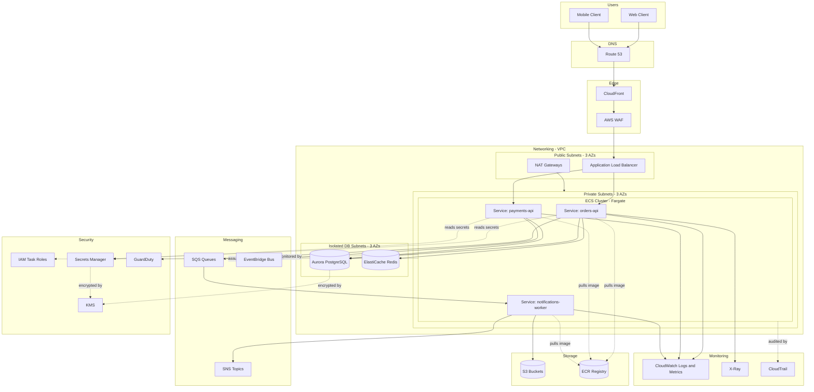

# Part V – Container & Kubernetes Architectures

# Chapter 35 — ECS Fargate

---

# 1. Executive Summary

## The Business Problem

Enterprises running containerized workloads face a recurring operational dilemma:

- Running containers on self-managed EC2 clusters requires patching, scaling, and securing the underlying host OS.
- Running full Kubernetes (self-managed or EKS) delivers flexibility, but demands a dedicated platform engineering team to operate control planes, node groups, CNI plugins, and upgrade cycles.
- Many organizations do not have the engineering headcount to justify that operational overhead, yet they still need production-grade container orchestration: rolling deployments, service discovery, health-based routing, auto scaling, and strong isolation between workloads.

Amazon ECS on AWS Fargate exists to close this gap. It provides container orchestration with the operational simplicity of a managed compute layer — there is no EC2 host to patch, no cluster autoscaler to tune, no AMI pipeline to maintain, and no node draining logic to write.

## Architecture Objective

The objective of this chapter's reference architecture is to design a production-grade, internet-facing (and optionally internal) containerized application platform that:

- Runs stateless and semi-stateless application services as ECS tasks on Fargate.
- Achieves multi-AZ high availability without any EC2 instance management.
- Integrates with Application Load Balancer (ALB) for Layer 7 routing, health checks, and TLS termination.
- Uses Fargate's per-task network isolation (`awsvpc` mode) to enforce security-group-level segmentation between services.
- Scales horizontally based on CPU, memory, request count, or custom CloudWatch metrics.
- Integrates natively with CI/CD pipelines for zero-downtime rolling and blue/green deployments.
- Supports enterprise security, observability, and FinOps requirements out of the box.

## Why Organizations Adopt This Architecture

Organizations converge on ECS Fargate for a combination of reasons that show up repeatedly across production environments:

- **No infrastructure management overhead.** There is no EC2 fleet to patch, scale, or replace. AWS manages the underlying compute capacity.
- **Faster time-to-production** compared to standing up and hardening an EKS cluster, especially for teams without prior Kubernetes experience.
- **Native AWS integration.** ECS integrates directly with IAM (task roles), ALB, Cloud Map (service discovery), Secrets Manager, CloudWatch, and X-Ray without needing third-party controllers or operators.
- **Per-task security boundary.** Each Fargate task runs in its own micro-VM (Firecracker) with its own elastic network interface (ENI), meaning tasks are isolated at the kernel/hypervisor level, not just at the container namespace level like on shared EC2 hosts.
- **Predictable, granular billing.** You pay per vCPU-second and GB-second consumed by each task, not for idle EC2 capacity.
- **Lower operational learning curve.** Application teams already familiar with Docker can deploy to ECS without learning Kubernetes manifests, Helm charts, or CRDs.

## Major Business Benefits

| Benefit | Business Impact |
|---|---|
| No host patching | Reduces security operations burden and eliminates a common source of outages (failed AMI rollouts) |
| Per-task isolation | Reduces blast radius of a compromised container; strengthens multi-tenant security posture |
| Fast onboarding | New engineering teams can ship containers to production in days, not weeks |
| Fine-grained billing | FinOps teams get task-level cost attribution instead of amortized EC2 costs |
| Native AWS integrations | Reduces the need for third-party operators, ingress controllers, or service meshes for basic use cases |
| Simplified compliance | Reduced infrastructure surface area simplifies audits (no OS-level CIS benchmarks to maintain) |

## Typical Enterprise Scenarios

This architecture is commonly selected for:

- Internal and external REST/GraphQL APIs with moderate to high request volume.
- Microservices platforms where teams want independent deployability without operating Kubernetes.
- Backend services supporting web and mobile applications.
- Internal developer platforms where multiple product teams deploy independent services onto a shared ECS cluster (with task-level IAM and security group isolation).
- Replacing legacy EC2 Auto Scaling Group deployments where teams want container-native deployments without a full Kubernetes migration.
- Regulated industries (finance, healthcare, insurance) that need strong workload isolation but cannot justify a dedicated Kubernetes platform team.

## When ECS Fargate Is the Right Starting Point

Architects generally recommend ECS Fargate as the default container platform choice unless:

- The organization has multi-cloud or hybrid-cloud portability requirements (Kubernetes' portability advantage becomes relevant), or
- The workload requires GPU scheduling, DaemonSets, custom CNI/CSI plugins, or advanced scheduling primitives not exposed by ECS, or
- The organization already operates EKS at scale and wants a single control plane for all workloads.

In all other cases, ECS Fargate typically delivers lower total cost of ownership (TCO) for the first 1–3 years of a platform's life, because the absence of cluster-operations engineering work outweighs Kubernetes' flexibility advantages for most CRUD/API-style workloads.


---

# 2. Business Requirements

## Business Drivers

- Reduce infrastructure operations headcount required to run containerized workloads.
- Accelerate time-to-market for new microservices.
- Standardize deployment tooling across multiple product teams.
- Improve cost visibility per service/team (FinOps chargeback).
- Strengthen security posture by reducing shared-host blast radius.

## Functional Requirements

| ID | Requirement |
|---|---|
| FR-01 | Application must be deployable as one or more independently versioned container images |
| FR-02 | Platform must support rolling deployments with zero downtime |
| FR-03 | Platform must support blue/green deployments for high-risk releases |
| FR-04 | Services must be discoverable internally without hardcoded IP addresses |
| FR-05 | Platform must support environment-specific configuration (dev/stage/prod) without image rebuilds |
| FR-06 | Secrets must never be stored in container images or plaintext environment variables |
| FR-07 | Platform must support both internet-facing and internal-only services |
| FR-08 | Platform must support scheduled/batch tasks in addition to long-running services |

## Non-Functional Requirements

| Category | Requirement |
|---|---|
| Scalability | Support scaling from 2 to 200+ concurrent tasks per service without manual intervention |
| Availability | 99.95% monthly uptime SLA for production services |
| Latency | P99 API latency under 300ms for internal services, under 500ms for internet-facing |
| Security | All data encrypted in transit (TLS 1.2+) and at rest (KMS) |
| Compliance | Must support SOC 2, PCI-DSS, and HIPAA-eligible workloads depending on tenant |
| Observability | Centralized logs, metrics, and traces with 15-month retention for audit workloads |
| Cost | Cost per request must be tracked and attributable to individual teams |

## Scalability Goals

- Horizontal auto scaling triggered by CPU utilization, memory utilization, ALB request count per target, and SQS queue depth (for worker services).
- Target scale-out time under 90 seconds from alarm breach to new task passing health checks.
- Support burst traffic of 5x baseline within a 5-minute window (e.g., marketing campaigns, flash sales).

## Availability Requirements

- Minimum of two Availability Zones for all production services; three AZs recommended for tier-0 workloads.
- ALB configured with cross-zone load balancing enabled.
- ECS service deployment configuration must tolerate one full AZ failure without service interruption (minimum healthy percent ≥ 50%, maximum percent ≥ 150–200%).

## Latency Requirements

- Edge-to-origin latency budget allocated as: DNS resolution (cached, near-zero) → CloudFront (5–20ms) → ALB (1–5ms) → ECS task (application-dependent) → database (application-dependent).
- Connection reuse (keep-alive) enforced between ALB and ECS tasks to avoid TCP/TLS handshake overhead on every request.

## Compliance Requirements

- Audit logging of every control-plane change via CloudTrail, retained for a minimum of 400 days (commonly extended to 7 years for regulated tenants via S3 lifecycle to Glacier).
- Data residency: workloads processing EU personal data must run in `eu-west-1` or `eu-central-1` with no cross-region replication of PII outside the region unless explicitly approved.
- Immutable infrastructure: no SSH/interactive shell access to production task runtime except via `ecs exec` with full session logging to CloudWatch/S3.

## Security Expectations

- Least-privilege IAM task roles — each service gets its own task role scoped to only the AWS resources it needs.
- No task should share a task role with another unrelated service.
- Network segmentation via security groups: each service's security group only allows ingress from the specific ALB target group and denies all other traffic by default.
- All container images scanned for CVEs before deployment (Amazon ECR image scanning or Inspector).

## Recovery Objectives

| Metric | Target |
|---|---|
| RPO (Recovery Point Objective) | 5 minutes for transactional data (database-dependent, not ECS-dependent since tasks are stateless) |
| RTO (Recovery Time Objective) | 15 minutes for full regional failover of stateless compute tier; 60 minutes including database promotion |

Because ECS Fargate tasks are stateless and defined declaratively (task definitions, service definitions), RTO for the compute tier itself is primarily bound by how quickly new tasks can be launched in a secondary region or AZ — typically under 5 minutes given pre-staged task definitions and container images in a replicated ECR repository.

## SLAs

- Internal SLA: 99.95% monthly availability for production API tier (equivalent to ~21.9 minutes of downtime per month).
- AWS SLA basis: ECS itself carries no separate SLA; availability is derived from the underlying ALB (99.99%), Fargate capacity (region-level), and multi-AZ task placement.

## Expected Workload

- Baseline: 500–2,000 requests/second across all services during business hours.
- Peak: up to 10,000 requests/second during promotional events.
- Task count: 20–150 concurrently running tasks across ~15–40 microservices.

## Expected Growth

- 3x traffic growth projected over 24 months.
- Service count expected to double as teams decompose a monolith into domain-oriented microservices.
- Architecture must accommodate this growth without a platform redesign — only capacity and quota adjustments.


---

# 3. Architecture Overview

## Overall Design

The architecture follows a layered, defense-in-depth design:

1. **Edge layer** — Route 53 for DNS, optional CloudFront for caching/WAF/DDoS absorption.
2. **Load balancing layer** — Application Load Balancer in public subnets, terminating TLS and routing to target groups by path/host.
3. **Compute layer** — ECS Fargate tasks running in private subnets, one ENI per task (`awsvpc` networking mode), organized into ECS Services per microservice.
4. **Service discovery layer** — AWS Cloud Map (or ALB path-based routing) for service-to-service communication.
5. **Data layer** — RDS/Aurora, DynamoDB, and ElastiCache in private/isolated subnets, reachable only from application security groups.
6. **Messaging layer** — SQS/SNS/EventBridge for asynchronous decoupling between services.
7. **Security layer** — IAM task roles, Secrets Manager, KMS, Security Groups, WAF, GuardDuty.
8. **Observability layer** — CloudWatch Logs/Metrics/Alarms, X-Ray tracing, centralized log aggregation.

## Architecture Philosophy

- **Immutable deployments.** Every deployment creates a new task definition revision; nothing is patched in place.
- **Stateless compute.** Application state lives in managed data services, never on the Fargate task's ephemeral storage (beyond request-scoped temp files).
- **Least privilege by default.** Every service gets its own task role, its own security group, and its own log group.
- **Everything as code.** VPC, ECS clusters, services, task definitions, and IAM policies are all defined in Terraform — no manual console changes in production.
- **Fail fast, recover automatically.** ALB health checks and ECS service scheduler automatically replace unhealthy tasks; no manual intervention required for routine failures.

## Core Components

| Component | Role |
|---|---|
| Route 53 | Authoritative DNS, health-check-based failover routing |
| CloudFront (optional) | Edge caching, WAF integration, DDoS absorption |
| Application Load Balancer | L7 routing, TLS termination, health checking |
| ECS Cluster | Logical grouping of services; Fargate provides the compute |
| ECS Service | Maintains desired task count, integrates with ALB target groups and Auto Scaling |
| ECS Task Definition | Immutable blueprint: container image, CPU/memory, IAM role, networking, logging |
| AWS Cloud Map | Internal DNS-based service discovery |
| RDS/Aurora | Relational data store |
| DynamoDB | Key-value / high-throughput data store |
| ElastiCache (Redis) | Caching and session store |
| SQS/SNS/EventBridge | Asynchronous messaging and event routing |
| Secrets Manager | Runtime secret injection into tasks |
| ECR | Private container registry with image scanning |
| CloudWatch | Metrics, logs, alarms, dashboards |
| X-Ray | Distributed tracing across services |

## How Components Interact

- Client requests resolve via Route 53 to either CloudFront or directly to the ALB.
- The ALB evaluates listener rules (host/path-based) and forwards traffic to the appropriate target group.
- Each target group is bound to one ECS Service; the ALB performs health checks against the container's health endpoint.
- ECS Service scheduler ensures the desired number of healthy tasks are running across multiple AZs, replacing any task that fails health checks.
- Tasks needing to call other internal services resolve them via Cloud Map private DNS namespaces (e.g., `orders.internal.svc`) or via a shared internal ALB.
- Tasks read secrets and configuration at startup from Secrets Manager / SSM Parameter Store using their task role — never hardcoded.
- Application logs stream to CloudWatch Logs via the `awslogs` driver; traces stream to X-Ray via the X-Ray daemon sidecar or OpenTelemetry collector.

## High-Level Workflow

**Request lifecycle:**

1. Client issues HTTPS request.
2. DNS resolves to CloudFront (if used) or ALB.
3. TLS terminates at CloudFront or ALB.
4. ALB routes to target group based on path/host rule.
5. Target group forwards to a healthy ECS task's ENI on the container port.
6. Task processes request, calling downstream services/databases as needed.
7. Response returns back through the same path.

**Response lifecycle:**

- Response headers and status codes are logged by the ALB access logs (if enabled) and by the application's structured logs.
- 5xx errors trigger CloudWatch alarms; 4xx spikes may indicate client-side or upstream integration issues and are tracked separately.

**Data lifecycle:**

- Transactional data is written synchronously to RDS/Aurora or DynamoDB.
- Non-critical, asynchronous side effects (emails, analytics events, notifications) are published to SNS/SQS/EventBridge and processed by dedicated worker ECS services, decoupling the request path from slower downstream operations.


---

# 4. AWS Services Used

> **Note:** Only services relevant to this ECS Fargate architecture are detailed below. Services listed in the chapter template but not architecturally relevant (e.g., Lambda as primary compute, DynamoDB as primary store) are mentioned only where they play a supporting role.

## Amazon ECS (Elastic Container Service) on Fargate

**Purpose:** Container orchestration — scheduling, scaling, and networking for containerized services without managing servers.

**Why selected:** Native AWS integration, no cluster control-plane management, per-task isolation, and significantly lower operational overhead than self-managed Kubernetes for teams without dedicated platform engineers.

**Alternatives:** Amazon EKS (Kubernetes), ECS on EC2 (self-managed capacity), AWS App Runner (simpler but less configurable), self-managed Docker Swarm (not recommended for production).

**Limitations:**
- No DaemonSets, no custom CNI/CSI plugins.
- No GPU support on Fargate (must use ECS-on-EC2 or EKS for GPU workloads).
- Task ephemeral storage capped (20 GiB default, up to 200 GiB configurable) — not suited for large local dataset processing.
- Cold-start latency for new tasks (typically 30–90 seconds) is higher than reusing warm EC2 capacity.

**Pricing considerations:** Billed per vCPU-second and GB-second of memory reserved by each task, rounded to the nearest second (1-minute minimum). Fargate Spot offers up to 70% discount for interruption-tolerant workloads.

**Best practices:** Right-size CPU/memory per task definition; use Fargate Spot for non-critical/batch workloads; set `minimumHealthyPercent`/`maximumPercent` to tolerate AZ failure during deployments.

## Application Load Balancer (ALB)

**Purpose:** Layer 7 load balancing, TLS termination, path/host-based routing, and health checking for ECS services.

**Why selected:** Native integration with ECS target groups (dynamic port mapping), supports WebSockets, HTTP/2, and gRPC — required for modern microservice traffic patterns.

**Alternatives:** Network Load Balancer (L4, for extreme throughput or non-HTTP protocols), API Gateway (for serverless-first APIs), CloudFront + Lambda@Edge (edge-only routing).

**Limitations:** No support for non-HTTP(S) protocols; per-rule and per-target-group service quotas require planning for large multi-service clusters.

**Pricing considerations:** Billed on Load Balancer Capacity Units (LCUs) — driven by new connections, active connections, processed bytes, and rule evaluations. Consolidating multiple services behind one ALB using path-based routing reduces the number of ALBs (and their fixed hourly cost) needed.

**Best practices:** Enable access logs to S3, enable deletion protection in production, use one shared ALB per environment with path/host routing rather than one ALB per microservice unless isolation requirements dictate otherwise.

## Amazon ECR (Elastic Container Registry)

**Purpose:** Private, IAM-authenticated Docker image registry integrated with ECS task definitions.

**Why selected:** Native IAM auth (no separate registry credentials to manage), built-in vulnerability scanning, and replication support for multi-region deployments.

**Alternatives:** Docker Hub (public, less secure for enterprise), GitHub Container Registry, self-hosted Harbor.

**Limitations:** Regional service — cross-region replication must be explicitly configured for DR.

**Pricing considerations:** Storage billed per GB-month; data transfer within the same region to ECS is free.

**Best practices:** Enable scan-on-push, apply lifecycle policies to expire untagged/old images, use immutable image tags.

## AWS Cloud Map

**Purpose:** Service discovery — maps logical service names to dynamic IP addresses of ECS tasks.

**Why selected:** Native ECS integration (`serviceConnect`/`serviceDiscovery` block in service definition); avoids hardcoding IPs or relying on a third-party service mesh for basic service-to-service discovery.

**Alternatives:** Internal ALB with path routing, App Mesh / Istio for advanced traffic management (mTLS, retries, circuit breaking).

**Limitations:** DNS-based discovery has propagation delay on rapid task churn; does not provide traffic-shaping features like a full service mesh.

## Amazon RDS / Aurora

**Purpose:** Managed relational database for transactional application data.

**Why selected:** Automated backups, Multi-AZ failover, and (for Aurora) storage auto-scaling and read replica fan-out without manual replication management.

**Alternatives:** DynamoDB (for key-value/high-throughput access patterns), self-managed PostgreSQL on EC2 (rarely justified today).

**Limitations:** Vertical scaling has ceilings; connection limits require pooling (RDS Proxy) at high task concurrency.

**Pricing considerations:** Instance-hours plus storage plus I/O (for Aurora); Reserved Instances or Aurora Reserved Capacity reduce steady-state cost significantly.

## Amazon ElastiCache (Redis)

**Purpose:** In-memory caching and session storage to reduce database load and latency.

**Why selected:** Sub-millisecond read latency for frequently accessed data; supports pub/sub for lightweight real-time features.

**Alternatives:** DynamoDB Accelerator (DAX) for DynamoDB-specific caching, in-process caching (less effective across multiple task replicas).

## Amazon SQS / SNS / EventBridge

**Purpose:** Asynchronous decoupling between services; SQS for point-to-point work queues, SNS for fan-out pub/sub, EventBridge for event-bus-based routing with content filtering.

**Why selected:** Removes tight coupling between request-path and slow/non-critical downstream operations; enables independent scaling of producer and consumer services.

**Limitations:** SQS standard queues offer at-least-once delivery (potential duplicates) — consumers must be idempotent; FIFO queues trade throughput for strict ordering.

## AWS IAM

**Purpose:** Identity and access control for both the control plane (who can deploy/modify ECS resources) and the data plane (what AWS resources each task can access via its task role).

**Why selected:** Fine-grained, auditable, native to every AWS API call; ECS task roles allow per-service least privilege without shared credentials.

## Amazon VPC

**Purpose:** Network isolation boundary for the entire platform; subnets separate public (ALB), private (ECS tasks), and isolated (databases) tiers.

## Amazon Route 53

**Purpose:** DNS resolution, health-check-based failover, and (optionally) latency-based routing for multi-region deployments.

## Amazon CloudFront (optional, recommended for internet-facing workloads)

**Purpose:** Edge caching for static/cacheable responses, integrated AWS WAF for L7 protection, and absorption of volumetric DDoS traffic before it reaches the ALB.

## Amazon CloudWatch

**Purpose:** Metrics (CPU/memory/ALB target metrics), Logs (application and access logs), Alarms (auto scaling triggers, incident alerting), and Dashboards (operational visibility).

## AWS CloudTrail

**Purpose:** Immutable audit log of every AWS API call — required for compliance (who deployed what, when, and from where).

## AWS Config

**Purpose:** Continuous configuration compliance — detects drift such as an ECS task definition running with a privileged container or a security group with an open ingress rule.

## Amazon GuardDuty

**Purpose:** Threat detection across VPC Flow Logs, DNS logs, and (with the ECS Runtime Monitoring feature) container-level runtime threat detection — detects cryptomining, C2 communication, and anomalous API activity.

## AWS KMS

**Purpose:** Encryption key management for data at rest — RDS storage, S3 buckets, Secrets Manager secrets, and CloudWatch Logs encryption.

## AWS Secrets Manager

**Purpose:** Secure storage and automatic rotation of database credentials, API keys, and other sensitive configuration, injected into ECS tasks at launch time via the task definition's `secrets` block — never baked into the image.

## AWS Systems Manager (SSM)

**Purpose:** Parameter Store for non-secret configuration; `ecs exec` (built on SSM Session Manager) for interactive debugging into running Fargate tasks without SSH or bastion hosts.


---

# 5. Complete Architecture Diagram



**Diagram notes:**

- Each ECS Service (`SVC1`, `SVC2`, `SVC3`) runs across all three private subnets/AZs for high availability.
- The ALB lives in public subnets; ECS tasks live in private subnets and reach the internet (for image pulls, third-party API calls) only via NAT Gateways.
- Databases and Redis live in isolated subnets with no route to the internet at all — only reachable from application security groups.
- Every arrow into "Security" and "Monitoring" subgraphs represents a control that applies to *every* service, not just the one drawn — simplified here for readability.


---

# 6. Component-by-Component Explanation

## Application Load Balancer

- **Purpose:** Single entry point that terminates TLS and routes HTTP(S) traffic to the correct ECS service based on host/path rules.
- **Responsibilities:** TLS termination, health checking, connection draining during deployments, WebSocket/HTTP2 support.
- **Inputs:** Client HTTPS requests, ACM certificate, listener rules.
- **Outputs:** Forwards traffic to registered targets (ECS task ENIs) in the matching target group.
- **Scaling:** Scales automatically and transparently — no capacity planning required, though LCU-based cost should be monitored.
- **High availability:** Deployed across a minimum of two AZs; AWS manages redundancy of the ALB nodes themselves.
- **Failure handling:** Automatically stops routing to unhealthy targets based on configurable health check thresholds (interval, timeout, healthy/unhealthy count).
- **Dependencies:** ACM certificate, target groups, security groups permitting inbound 443.
- **Security:** Security group restricts inbound to 443/80 only; WAF (if attached) filters malicious payloads before reaching the ALB listener.
- **Monitoring:** `TargetResponseTime`, `HTTPCode_Target_5XX_Count`, `UnHealthyHostCount`, `RequestCount` CloudWatch metrics.

## ECS Cluster

- **Purpose:** Logical namespace grouping related services; with Fargate, the cluster has no underlying EC2 capacity to manage.
- **Responsibilities:** Provides cluster-level CloudWatch Container Insights aggregation and IAM/resource boundary for contained services.
- **Scaling:** N/A at the cluster level (Fargate handles capacity per task); relevant scaling happens at the ECS Service level.
- **Dependencies:** VPC, subnets, security groups referenced by tasks launched into the cluster.

## ECS Service

- **Purpose:** Maintains the desired count of healthy running tasks for one microservice, and manages rolling deployments.
- **Responsibilities:** Task placement across AZs, integration with ALB target group registration/deregistration, deployment circuit breaker (automatic rollback on failure).
- **Inputs:** Task definition ARN, desired count, deployment configuration, network configuration (subnets, security groups).
- **Outputs:** Running tasks registered with the target group; CloudWatch service-level metrics.
- **Scaling:** Integrates with Application Auto Scaling — scales `desiredCount` based on target tracking policies (CPU, memory, ALB request count per target).
- **High availability:** Spreads tasks across AZs using the default `spread` placement strategy on `attribute:ecs.availability-zone`.
- **Failure handling:** Deployment circuit breaker automatically rolls back to the previous task definition revision if new tasks fail to stabilize.
- **Dependencies:** Task definition, target group, subnets, security groups, IAM roles.
- **Security:** Inherits task role and execution role defined in the task definition; service-level security group controls network reachability.
- **Monitoring:** `RunningTaskCount`, `PendingTaskCount`, deployment events, service-level CPU/memory utilization.

## ECS Task Definition

- **Purpose:** Immutable, versioned blueprint describing exactly how a container (or set of containers) should run.
- **Responsibilities:** Declares container image, CPU/memory reservation, port mappings, environment variables, secrets, log configuration, IAM task role, and (optionally) sidecar containers (X-Ray daemon, OpenTelemetry collector, Envoy for App Mesh).
- **Inputs:** ECR image URI, resource requirements, IAM role ARNs.
- **Outputs:** A new task definition revision, referenced by the ECS service for the next deployment.
- **Security:** Separates `executionRoleArn` (used by the ECS agent to pull images and fetch secrets) from `taskRoleArn` (used by the application code at runtime) — this separation is a critical least-privilege control that is frequently misunderstood.

## AWS Cloud Map / Service Connect

- **Purpose:** Enables one ECS service to discover and call another by logical DNS name instead of hardcoded IPs.
- **Responsibilities:** Registers/deregisters task IPs as they start/stop; ECS Service Connect additionally provides client-side load balancing and per-request metrics without a full service mesh.
- **Failure handling:** DNS TTLs are kept low to reduce the window where a deregistered task might still receive traffic; Service Connect actively removes unhealthy endpoints faster than plain Cloud Map DNS.

## Aurora PostgreSQL (Data Tier)

- **Purpose:** System of record for transactional data.
- **Scaling:** Vertical (instance class) for writer; horizontal read scaling via up to 15 read replicas; Aurora Serverless v2 for variable workloads.
- **High availability:** Multi-AZ writer/reader topology with automatic failover typically under 30 seconds.
- **Security:** Deployed in isolated subnets, encrypted at rest via KMS, encrypted in transit via enforced TLS, access restricted to application security groups only.

## ElastiCache Redis

- **Purpose:** Reduces read latency and database load for frequently accessed, cacheable data; also used for distributed rate limiting and session storage.
- **High availability:** Multi-AZ with automatic failover when cluster mode / replication group is enabled.

## SQS / SNS / EventBridge (Messaging Layer)

- **Purpose:** Decouples request-path latency from slower or non-critical operations (e.g., sending confirmation emails, updating analytics, triggering downstream workflows).
- **Failure handling:** Dead-letter queues (DLQs) capture messages that fail processing after a configured number of retries, preventing silent data loss.


---

# 7. End-to-End Request Flow

1. **Client initiates request.** A browser or mobile app sends an HTTPS request to `api.example.com`.
2. **DNS resolution.** Route 53 resolves the hostname to either a CloudFront distribution (alias record) or directly to the ALB.
3. **CloudFront edge processing (if used).** CloudFront checks its cache. If the response is cacheable and present, it is returned immediately from the edge location — the request never reaches AWS's origin infrastructure.
4. **WAF evaluation.** If the request is not served from cache, AWS WAF (attached to CloudFront or the ALB) evaluates the request against configured rule groups (SQLi, XSS, rate-based rules, geo-blocking).
5. **Origin forwarding.** CloudFront forwards the request to the ALB origin over a persistent, encrypted connection.
6. **ALB listener rule evaluation.** The ALB's HTTPS listener (port 443, using an ACM certificate) evaluates rules in priority order — path-based (`/orders/*`) or host-based (`orders.api.example.com`) — to select the target group.
7. **Target selection.** The ALB selects a healthy target (an ECS task ENI) from the target group using round-robin or least-outstanding-requests algorithm.
8. **Task processing.** The selected ECS Fargate task receives the request on its container port, processes it, and — if needed — queries Aurora, checks ElastiCache, or calls another internal service via Cloud Map/Service Connect.
9. **Downstream call (example).** The `orders-api` task calls the `payments-api` task via its internal DNS name (`payments.internal.svc`) to authorize a charge.
10. **Database interaction.** The task writes the order record to Aurora inside a transaction; connection is drawn from a connection pool (e.g., RDS Proxy or an application-level pool) to avoid exhausting database connections under concurrency.
11. **Asynchronous side effects.** After committing the transaction, the task publishes an `OrderCreated` event to EventBridge; this triggers the `notifications-worker` service (via SQS) to send a confirmation email, independent of the request path.
12. **Response construction.** The task returns a JSON response with the appropriate status code.
13. **Logging.** The task's structured log line (including a correlation/trace ID) streams to CloudWatch Logs via the `awslogs` driver.
14. **Tracing.** The X-Ray SDK (or OpenTelemetry) records the full trace span — client → CloudFront → ALB → orders-api → payments-api → Aurora — visible as a single trace in the X-Ray console.
15. **Response returns to ALB, then CloudFront, then client**, over the same encrypted path.
16. **Error handling.** If the task fails to respond within the configured health-check-independent request timeout, the ALB returns a 504; if the task itself returns a 5xx, the application's error-handling middleware logs the exception with full context before returning a sanitized error body to the client (never a stack trace).
17. **Monitoring feedback loop.** ALB `HTTPCode_Target_5XX_Count` and application error-rate metrics feed CloudWatch Alarms; sustained breaches page the on-call engineer via SNS → PagerDuty/Opsgenie integration.


---

# 8. Deployment Flow

## Infrastructure Provisioning

- All infrastructure (VPC, ECS cluster, ALB, IAM roles, security groups) is provisioned via Terraform, stored in a version-controlled repository, and applied through a CI/CD pipeline — never manually through the console in production accounts.
- Environments (dev, staging, production) use separate Terraform workspaces or separate state files per environment/account, following an account-per-environment strategy for blast-radius isolation.

## Terraform Workflow

1. Engineer opens a pull request modifying Terraform code (e.g., adding a new ECS service module invocation).
2. CI pipeline runs `terraform fmt -check`, `terraform validate`, and `tflint`/`checkov` for policy-as-code security scanning.
3. `terraform plan` output is posted as a PR comment for human review.
4. On merge to `main`, the pipeline runs `terraform apply` against a locked remote state (S3 backend + DynamoDB lock table).

## CI/CD Deployment (Application Code)

1. Developer merges code to the main branch.
2. CI builds a Docker image, tags it with the Git commit SHA, and pushes it to ECR (scan-on-push runs automatically).
3. CI registers a new ECS task definition revision referencing the new image tag.
4. CI updates the ECS service to use the new task definition revision (`aws ecs update-service --force-new-deployment`) or triggers a CodeDeploy blue/green deployment.
5. ECS deployment circuit breaker monitors task health during rollout; automatic rollback occurs if new tasks fail to stabilize.

## Blue-Green Deployment

- Implemented via AWS CodeDeploy's ECS integration: a second (green) target group is created, new tasks are deployed and health-checked against it while production traffic still flows to the original (blue) target group.
- Traffic is shifted (all-at-once, linear, or canary) from blue to green based on the CodeDeploy deployment configuration.
- CloudWatch alarms are attached to the deployment; if error rates spike during the shift, CodeDeploy automatically rolls back traffic to the blue target group.

## Rollback

- **Task-definition-level rollback:** revert the ECS service to the previous task definition revision — nearly instantaneous since it is just a new deployment of an already-built, already-scanned image.
- **Blue/green rollback:** CodeDeploy shifts traffic back to the blue target group; because blue tasks were never stopped during the shift window, rollback is near-instant.
- **Database migration rollback:** requires more care — schema migrations should be backward-compatible (expand/contract pattern) so that rolling back application code never leaves the database in an incompatible state.

## Secrets

- Secrets are never included in the Docker image or Terraform variable files in plaintext.
- Task definitions reference secrets by ARN in the `secrets` block; the ECS agent (using the execution role) resolves them from Secrets Manager/SSM Parameter Store at task launch and injects them as environment variables inside the container's isolated environment — never written to disk.

## Configuration

- Non-secret configuration (feature flags, service endpoints) is supplied via SSM Parameter Store or task definition environment variables, allowing the same container image to be promoted unchanged across dev → staging → production.

## Validation

- Post-deployment smoke tests run automatically against a health/readiness endpoint before the pipeline marks the deployment successful.
- Synthetic canaries (CloudWatch Synthetics) continuously validate critical user journeys in production.


---

# 9. Network Topology

## VPC and CIDR Design

| Item | Value | Notes |
|---|---|---|
| VPC CIDR | `10.20.0.0/16` | 65,536 addresses; sized for years of growth |
| Public subnets | `10.20.0.0/22`, `10.20.4.0/22`, `10.20.8.0/22` | One per AZ; hosts ALB and NAT Gateways |
| Private (application) subnets | `10.20.32.0/20`, `10.20.48.0/20`, `10.20.64.0/20` | One per AZ; hosts ECS Fargate tasks |
| Isolated (data) subnets | `10.20.128.0/22`, `10.20.132.0/22`, `10.20.136.0/22` | One per AZ; hosts RDS/Aurora/ElastiCache, no internet route |

> **Tip:** Fargate's `awsvpc` networking mode assigns one ENI (and therefore one private IP) per task. Undersized application subnets are one of the most common production incidents in ECS Fargate environments — plan CIDR blocks assuming peak concurrent task count times a safety factor of at least 3x.

## Public Subnets

- Host the ALB's nodes and NAT Gateways (one NAT Gateway per AZ for high availability, avoiding a single point of failure and cross-AZ data transfer charges).
- Route table default route (`0.0.0.0/0`) points to the Internet Gateway.

## Private Subnets

- Host all ECS Fargate tasks.
- Route table default route points to the NAT Gateway in the same AZ (never to a NAT Gateway in a different AZ, to avoid unnecessary cross-AZ data transfer cost).
- No direct route to the Internet Gateway.

## Isolated Subnets

- Host Aurora, RDS, and ElastiCache.
- No route to NAT Gateway or Internet Gateway at all — these resources cannot initiate or receive any internet traffic under any circumstance.

## NAT Gateway

- Required so that private-subnet ECS tasks can reach the internet for external API calls, ECR image pulls (unless VPC endpoints are used — recommended, see below), and OS package updates inside the container build process.
- **Cost note:** NAT Gateway data processing charges are one of the most common sources of unexpected AWS bills in containerized architectures (see Section 34, Cost Surprises).

## Internet Gateway

- Attached to the VPC; provides the path for public subnet resources (ALB) to be reachable from and reach the internet.

## Transit Gateway (if multi-VPC/multi-account)

- Used when this VPC needs to communicate with shared services VPCs (e.g., a central logging or CI/CD VPC) or with other business unit VPCs, avoiding a full mesh of VPC peering connections.
- Recommended once an organization exceeds ~4–5 VPCs that need to communicate with each other.

## Route Tables

- Distinct route tables per subnet tier (public, private, isolated) — never a single shared route table across tiers, since that removes the ability to enforce "isolated subnets have no internet route" at the network layer.

## Network ACLs

- Used as a coarse, stateless secondary control at the subnet boundary (e.g., explicitly denying known-bad CIDR ranges); primary access control is enforced via security groups, which are stateful and resource-level.

## Security Groups

- **ALB security group:** allows inbound 443/80 from `0.0.0.0/0` (or CloudFront's managed prefix list, if CloudFront-only access is enforced); allows outbound only to the ECS task security groups on the container port.
- **ECS task security groups (one per service):** allows inbound only from the ALB security group (or from specific peer service security groups for internal-only services) on the container port; denies all else by default.
- **Database security group:** allows inbound only from the specific application security groups that need database access, on the database port (5432/3306) — never from `0.0.0.0/0` or from the entire VPC CIDR.

## VPC Endpoints (PrivateLink)

- Interface endpoints for ECR (`ecr.api`, `ecr.dkr`), Secrets Manager, CloudWatch Logs, and S3 (gateway endpoint) allow ECS tasks in private subnets to reach these AWS services without traversing the NAT Gateway — reducing both cost and internet exposure.
- This is a frequently missed optimization: without VPC endpoints, every image pull and every secret fetch traverses the NAT Gateway, incurring per-GB data processing charges unnecessarily.

## Hybrid Connectivity

- For enterprises with on-premises systems (e.g., a legacy mainframe or on-prem Active Directory), Direct Connect or Site-to-Site VPN terminates into the Transit Gateway, extending private connectivity to the ECS application subnets without traversing the public internet.


---

# 10. Identity and Access

## IAM Roles: Execution Role vs. Task Role

This distinction is one of the most consistently misunderstood aspects of ECS security, so it deserves explicit treatment:

| Role | Used by | Purpose | Example permissions |
|---|---|---|---|
| **Execution Role** | ECS agent (infrastructure) | Pull image from ECR, fetch secrets/parameters, write logs to CloudWatch | `ecr:GetAuthorizationToken`, `secretsmanager:GetSecretValue`, `logs:CreateLogStream` |
| **Task Role** | Application code (runtime) | Whatever AWS APIs the application itself needs to call | `dynamodb:PutItem` (only on its own table), `s3:GetObject` (only on its own bucket prefix) |

> **Warning:** A common anti-pattern is granting the execution role broad application-level permissions, or reusing one task role across multiple unrelated services "to save time." Both defeat the purpose of task-level IAM isolation and should be flagged in every architecture review.

## IAM Policies

- Task role policies are scoped to specific resource ARNs, never `Resource: "*"`, except for actions that are inherently account-wide read-only (e.g., `ec2:DescribeSubnets` for certain SDKs) and even then reviewed case by case.
- Policies use condition keys (`aws:SourceArn`, `aws:PrincipalTag`) where applicable to further restrict cross-service calls.

## Resource Policies

- Secrets Manager secrets and KMS keys use resource-based policies to explicitly allow only the specific task role ARNs that should be able to decrypt/retrieve them, providing a second layer of control beyond the task role's own IAM policy (defense in depth — both sides of the trust relationship must agree).

## STS and Temporary Credentials

- ECS tasks never use long-lived IAM access keys. The ECS agent automatically injects temporary, auto-rotating credentials via the task metadata endpoint, retrieved using STS `AssumeRole` under the hood — this is a foundational security control, not an optional enhancement.

## Cross-Account Access

- In multi-account setups (e.g., a shared ECR repository in a central "artifacts" account), cross-account resource policies on the ECR repository explicitly trust the execution role ARNs of the workload accounts, avoiding the need to duplicate images per account.

## Least Privilege

- Every new service's task role starts from an empty policy and permissions are added only as concrete API calls are identified during development/testing — never copied wholesale from another service's "close enough" policy.

## Service Roles

- The **ECS service-linked role** (`AWSServiceRoleForECS`) is an AWS-managed role that allows the ECS control plane to make calls on your behalf (e.g., register/deregister targets with the ALB). It should not be modified.

## Permission Boundaries

- For platform teams offering ECS as a shared internal service to multiple product teams, a permission boundary is attached to any IAM role that product teams can create/modify, capping the maximum permissions they can grant themselves even if they misconfigure a policy — an important guardrail in multi-tenant internal platforms.


---

# 11. Security Architecture

## Encryption

- **At rest:** Aurora storage, ElastiCache (if configured), S3 buckets, CloudWatch Logs, and Secrets Manager secrets are all encrypted using customer-managed KMS keys (CMKs) rather than AWS-managed keys, giving the security team full control over key rotation policy and access auditing.
- **In transit:** TLS 1.2+ enforced from client to CloudFront, CloudFront to ALB, and ALB to ECS tasks (using self-signed or ACM Private CA certificates on the backend listener for full end-to-end encryption in regulated environments).

## KMS

- Separate CMKs per data classification tier (e.g., one key for PII data, a different key for general application data) so that key-level access policies and audit trails align with data sensitivity — not one shared key across everything.

## TLS / Certificate Manager

- Public-facing certificates issued and auto-renewed via AWS Certificate Manager (ACM), attached directly to the ALB's HTTPS listener — eliminating manual certificate renewal, historically a common cause of outages.

## AWS WAF

- Attached to CloudFront (preferred, blocks malicious traffic at the edge before it consumes ALB/compute capacity) or directly to the ALB.
- Managed rule groups: `AWSManagedRulesCommonRuleSet`, `AWSManagedRulesSQLiRuleSet`, `AWSManagedRulesKnownBadInputsRuleSet`, plus custom rate-based rules to mitigate credential-stuffing and scraping.

## AWS Shield

- Shield Standard is automatically active on CloudFront and ALB at no additional cost, covering common network/transport-layer DDoS attacks.
- Shield Advanced is added for internet-facing production workloads with strict availability SLAs, providing DDoS cost protection and access to the AWS DDoS Response Team (DRT).

## Secrets Manager

- All database credentials, third-party API keys, and signing secrets are stored here with automatic rotation configured (e.g., 30-day rotation for database credentials using the built-in RDS rotation Lambda).

## GuardDuty

- **ECS Runtime Monitoring** deploys a lightweight security agent as a sidecar/daemon that inspects process activity, file access, and network connections within running Fargate tasks — detecting cryptomining, reverse shells, and container escape attempts at runtime, not just at the image-scanning stage.

## Amazon Inspector

- Continuously scans ECR images for known CVEs (not just at push time) and re-evaluates existing images as new vulnerabilities are published, alerting teams to previously "clean" images that have since become vulnerable.

## Security Hub

- Aggregates findings from GuardDuty, Inspector, Config, and Access Analyzer into a single dashboard, mapped against CIS AWS Foundations Benchmark and AWS Foundational Security Best Practices — used as the primary compliance posture view for audits.

## CloudTrail

- Every ECS API call (`CreateService`, `UpdateService`, `RegisterTaskDefinition`, `RunTask`) is logged with the calling principal, source IP, and timestamp — a required control for demonstrating change-control compliance (SOC 2, PCI-DSS).

## AWS Config

- Config Rules continuously check for drift: e.g., a security group with `0.0.0.0/0` ingress on a non-443/80 port, an ECS task definition running as `privileged: true`, or an S3 bucket without encryption — auto-remediated via SSM Automation documents where safe to do so.

## Zero Trust Principles Applied

- No implicit trust between services based on network location alone — every service-to-service call is scoped to a specific security group rule, not "anything in this VPC can talk to anything else."
- Task roles enforce the principle that identity, not network position, is the basis for authorization to AWS resources.

## Threat Model (Summary)

| Attack Vector | Mitigation |
|---|---|
| Public internet DDoS | CloudFront + Shield Standard/Advanced |
| Application-layer injection (SQLi, XSS) | AWS WAF managed rule groups |
| Compromised container attempting lateral movement | Per-task security groups deny east-west traffic by default; GuardDuty Runtime Monitoring detects anomalous behavior |
| Leaked container image credentials | No long-lived credentials in images; STS-issued temporary credentials only |
| Vulnerable base image / dependency | ECR scan-on-push + continuous Inspector rescanning; CI pipeline blocks deploys above a CVE severity threshold |
| Insider misconfiguration (open security group) | AWS Config rules + auto-remediation; Terraform code review with `checkov`/`tfsec` policy-as-code gates |
| Secret exposure in logs/env dumps | Secrets injected at runtime via Secrets Manager, never logged; log scrubbing middleware redacts known secret patterns |
| Supply-chain compromise (malicious dependency) | Software Bill of Materials (SBOM) generation in CI, dependency pinning, Inspector SBOM-based vulnerability matching |

---

# 12. High Availability

## AZ Failures

- ECS services are deployed with tasks spread evenly across a minimum of three AZs using the default `spread` placement strategy.
- Deployment configuration sets `minimumHealthyPercent: 100` and `maximumPercent: 200` for production services, ensuring that even during a rolling deployment, the loss of one AZ does not drop below the minimum required capacity.
- The ALB automatically stops routing to targets in an unhealthy/unreachable AZ within the configured health check interval (typically 15–30 seconds to detect, plus the unhealthy threshold count).

## Instance (Task) Failures

- Because Fargate abstracts away the underlying instance, there is no "instance failure" concept to handle directly — AWS replaces the underlying compute transparently.
- Individual task failures (application crash, OOM kill, failed health check) are detected by the ECS service scheduler, which automatically stops the failed task and launches a replacement to maintain desired count.

## Regional Failures

- For tier-0 workloads, a secondary region is kept warm (see Section 13, Disaster Recovery) with Aurora Global Database providing cross-region replication with typical replication lag under 1 second.
- Route 53 health checks monitor the primary region's ALB; on sustained failure, a failover routing policy shifts DNS to the secondary region's ALB.

## Database Failures

- Aurora Multi-AZ automatically promotes a replica to writer on primary instance failure, typically completing failover in under 30 seconds; application connection strings use the Aurora cluster endpoint (not the instance endpoint) so failover is transparent to the application after a brief reconnection.
- RDS Proxy is used in front of Aurora to pool connections and reduce failover-induced connection storms from dozens/hundreds of concurrently scaling ECS tasks.

## Load Balancing and Health Checks

| Health Check Type | Where Configured | Purpose |
|---|---|---|
| ALB target group health check | HTTP GET to `/health` | Determines whether ALB routes traffic to a task |
| ECS container health check | `HEALTHCHECK` in task definition | Determines whether ECS considers the container itself healthy, independent of ALB |
| Route 53 health check | HTTPS to regional endpoint | Determines whether DNS should fail over to secondary region |

> **Tip:** Configure the ECS container health check with a shorter interval than the ALB health check so that ECS can replace a genuinely broken task before the ALB even has a chance to mark it unhealthy — this reduces user-visible error rates during partial failures.

## Failover Behavior Summary

- Task-level failure: detected and replaced within ~30–60 seconds, invisible to users due to ALB routing around it.
- AZ-level failure: detected within health check thresholds; remaining AZs absorb traffic with headroom already provisioned via auto scaling policies.
- Regional failure: detected within Route 53 health check interval (typically 30 seconds) plus DNS TTL propagation (kept low, 60 seconds, for failover records); full application recovery in secondary region within the 15-minute RTO target.


---

# 13. Disaster Recovery

## Backup Strategy

- Aurora automated backups with a 35-day retention window, plus manual snapshots before major schema migrations.
- ECS infrastructure itself requires no backup — it is fully defined in Terraform and can be recreated from code in a new region within minutes.
- ECR repositories are replicated cross-region so container images are available in the DR region without re-building from source.

## Snapshots

- Aurora snapshots are copied cross-region on a scheduled basis (via AWS Backup) to support the pilot-light/warm-standby recovery pattern described below.

## Cross-Region Replication

- Aurora Global Database replicates the primary cluster to a secondary region with typical lag under 1 second, supporting fast promotion of the secondary to a standalone writable cluster during a regional failover.
- S3 buckets holding user-uploaded content use Cross-Region Replication (CRR) to a bucket in the DR region.

## DR Strategy Selection

| Strategy | RTO | RPO | Cost | When to Use |
|---|---|---|---|---|
| Backup & Restore | Hours | Hours | Lowest | Non-critical internal tools |
| **Pilot Light** | 10–30 min | < 1 min | Low-Medium | **This architecture's default for most services** |
| Warm Standby | < 10 min | < 1 min | Medium-High | Tier-0 revenue-critical services |
| Multi-Site Active-Active | Near-zero | Near-zero | Highest | Global platforms with regional user bases |

- This chapter's reference architecture defaults to **Pilot Light**: Terraform-defined infrastructure exists in the DR region but is scaled to zero/minimal (ECS services at `desiredCount: 0`, Aurora Global Database secondary already replicating). A DR activation runbook scales ECS services up and promotes the Aurora secondary — executed via a single automated pipeline, not manual console clicks.
- Tier-0 services (payments, authentication) are upgraded to **Warm Standby**, running a small baseline `desiredCount` in the secondary region continuously so failover is a traffic-shift, not a cold-start.

## Active-Active Considerations

- Full active-active (Section 98 of this book covers this pattern in depth) requires solving data write-conflict resolution (e.g., DynamoDB Global Tables' last-writer-wins, or application-level conflict resolution) — most enterprises adopting ECS Fargate do not need this complexity and should default to pilot light or warm standby.

## RPO / RTO Validation

- DR failover is tested quarterly via a scheduled game-day exercise: traffic is intentionally shifted to the secondary region for a defined window, with real production read traffic (and synthetic write traffic against a shadow dataset) to validate that RTO/RPO targets are actually achievable, not just theoretical.


---

# 14. Scalability

## Horizontal Scaling (ECS Services)

- Application Auto Scaling manages `desiredCount` for each ECS service using target tracking policies:
  - CPU utilization target (e.g., 60%)
  - Memory utilization target (e.g., 65%)
  - ALB `ALBRequestCountPerTarget` target (e.g., 1000 requests/target)
- Step scaling policies supplement target tracking for services with spiky, unpredictable load (e.g., scale out aggressively when queue depth crosses a threshold, rather than waiting for the smoother target-tracking response curve).

## Vertical Scaling (Task Sizing)

- Fargate task CPU/memory combinations are fixed tiers (e.g., 0.25 vCPU/0.5GB up to 16 vCPU/120GB). Right-sizing is done empirically using CloudWatch Container Insights data — over-provisioned tasks waste money; under-provisioned tasks throttle CPU or get OOM-killed.
- Vertical scaling requires a new task definition revision and a rolling deployment — it is not dynamic like horizontal scaling.

## Auto Scaling Configuration Example (conceptual)

- Minimum tasks: 3 (one per AZ minimum, for baseline availability)
- Maximum tasks: 60 (bounded by expected peak load plus headroom, and by downstream database connection limits)
- Scale-out cooldown: 60 seconds; scale-in cooldown: 300 seconds (asymmetric — scale out fast, scale in conservatively to avoid flapping)

## Serverless Scaling Characteristics

- Fargate itself has no capacity ceiling to manage (unlike ECS-on-EC2, where the underlying Auto Scaling Group must also scale) — the scaling bottleneck shifts entirely to account-level Fargate quotas and downstream dependency capacity (database connections, third-party API rate limits).

## Database Scaling

- Aurora read replicas (up to 15) absorb read-heavy traffic growth; Aurora Serverless v2 auto-scales ACUs (Aurora Capacity Units) within a configured min/max range for workloads with unpredictable or highly variable load.
- Connection scaling is managed via RDS Proxy, which pools and multiplexes connections from potentially hundreds of concurrently scaled ECS tasks down to a manageable number of actual database connections.

## Storage Scaling

- Aurora storage auto-scales up to 128TB with no manual intervention.
- S3 is inherently unbounded in scale for object storage needs (uploaded files, generated reports, static assets).

## Queue Scaling

- SQS scales transparently to any throughput without pre-provisioning; worker ECS services scale their `desiredCount` based on `ApproximateNumberOfMessagesVisible`, ensuring queue backlogs are worked down proportionally to load.


---

# 15. Performance Optimization

## Caching

- CloudFront caches cacheable GET responses at the edge, removing load from the ALB/ECS tier entirely for repeat requests.
- ElastiCache Redis caches expensive database query results and computed values with explicit TTLs; cache-aside pattern is used (application checks cache, falls back to database on miss, then populates cache).

## Compression

- ALB/CloudFront support gzip/Brotli compression for text-based responses (JSON, HTML, CSS, JS), reducing payload size and improving perceived latency, particularly for mobile clients on constrained networks.

## CDN

- Static assets (images, JS bundles, downloadable files) are served from S3 via CloudFront rather than from the ECS application tier, freeing compute capacity for dynamic request handling.

## Database Optimization

- Read-heavy queries are directed to Aurora read replicas via a read/write-split connection strategy at the application or proxy layer.
- Slow query logs and Performance Insights are reviewed weekly; missing indexes are the single most common root cause of P99 latency regressions in production incident reviews.

## Connection Pooling

- RDS Proxy (or an application-level pool such as PgBouncer sidecar) prevents the classic Fargate scaling failure mode: N tasks scaling out rapidly, each opening dozens of raw database connections, exhausting the database's `max_connections` limit and causing a cascading outage.

## Concurrency

- Application containers are tuned for the correct worker/thread-per-task model matching the runtime (e.g., Node.js event loop vs. a Python/Gunicorn multi-worker model) and the task's allocated vCPU — under-provisioned concurrency wastes allocated CPU; over-provisioned concurrency causes context-switching overhead and unpredictable latency.

## Asynchronous Processing

- Any operation not required for the synchronous response (email sending, PDF generation, analytics event publishing) is pushed to SQS/EventBridge and handled by dedicated worker services, keeping the request-path P99 latency low and predictable.


---

# 16. Cost Optimization (FinOps)

## Estimated Monthly Costs by Deployment Size

> Figures are directional estimates (US East region, on-demand pricing) intended for architectural planning, not a substitute for AWS Pricing Calculator or Cost Explorer analysis of actual workload data.

| Component | Small (dev/low-traffic) | Medium (production, moderate traffic) | Enterprise (high scale) |
|---|---|---|---|
| ECS Fargate compute | $150–$400 | $2,000–$6,000 | $15,000–$40,000+ |
| Application Load Balancer | $20–$30 | $60–$150 | $300–$800 |
| NAT Gateway (3 AZ) | $100–$130 | $130–$300 (+ data processing) | $400–$1,500+ |
| Aurora (writer + replicas) | $150–$300 | $1,000–$3,000 | $6,000–$20,000+ |
| ElastiCache | $50–$100 | $300–$800 | $1,500–$5,000 |
| CloudWatch (logs + metrics) | $30–$80 | $300–$900 | $2,000–$6,000+ |
| Data transfer (cross-AZ, egress) | $20–$50 | $300–$1,000 | $2,000–$10,000+ |
| **Estimated total** | **~$500–$1,100/mo** | **~$4,000–$12,000/mo** | **~$27,000–$83,000+/mo** |

## Major Cost Drivers

1. **Fargate vCPU/GB-hour consumption** — driven directly by task sizing and task count; the single largest line item at scale.
2. **NAT Gateway data processing** — every byte an ECS task sends to the internet (or to AWS services without a VPC endpoint) through the NAT Gateway is billed per GB, in addition to the flat hourly charge.
3. **Cross-AZ data transfer** — traffic between an ECS task in AZ-a and a database/cache endpoint in AZ-b is billed per GB in each direction; this is frequently invisible until the bill arrives.
4. **CloudWatch Logs ingestion and storage** — verbose debug-level logging left enabled in production is one of the most common avoidable cost overruns.
5. **Idle/over-provisioned tasks** — services sized for peak load but running at peak `desiredCount` around the clock instead of scaling in during off-peak hours.

## Optimization Opportunities

- **Fargate Savings Plans** (Compute Savings Plans) — commit to a consistent hourly compute spend for 1 or 3 years, achieving 20–50% discount versus on-demand for steady-state baseline capacity.
- **Fargate Spot** — for interruption-tolerant workloads (batch jobs, non-critical worker services), Fargate Spot offers up to 70% discount versus on-demand; combine with on-demand baseline via capacity provider strategies (e.g., 30% on-demand / 70% Spot) for cost-optimized resilience.
- **Right-sizing** — use CloudWatch Container Insights to identify tasks consistently running well below their reserved CPU/memory and downsize the task definition accordingly.
- **VPC Endpoints** — eliminate NAT Gateway data processing charges for ECR, Secrets Manager, S3, and CloudWatch Logs traffic by routing through PrivateLink interface/gateway endpoints instead.
- **S3 Lifecycle Policies** — transition infrequently accessed logs/artifacts to S3 Standard-IA, then Glacier Deep Archive, on an automated schedule.
- **CloudWatch Logs retention** — set explicit retention periods (e.g., 30 days in CloudWatch, then export to S3/Athena for long-term audit retention) instead of the default "never expire" setting, which silently accumulates cost indefinitely.
- **Auto scaling scale-in aggressiveness** — many organizations tune scale-out policies carefully but leave scale-in conservative "just in case," leaving 2–3x the necessary task count running overnight and on weekends.

## Reserved Instances / Savings Plans / Spot Comparison

| Purchase Option | Discount | Commitment | Best For |
|---|---|---|---|
| On-Demand | 0% (baseline) | None | Unpredictable/new workloads |
| Compute Savings Plan | 20–50% | 1 or 3 year | Predictable baseline Fargate usage |
| Fargate Spot | Up to 70% | None (interruptible) | Batch, worker, non-critical services |

## Cost Allocation and Tagging

- Mandatory tags enforced via AWS Config/SCP: `team`, `service`, `environment`, `cost-center`.
- ECS tasks inherit tags from the service/task definition, enabling per-service cost breakdown in Cost Explorer — critical for FinOps chargeback models in multi-team platforms.

## Budgets and Cost Anomaly Detection

- AWS Budgets configured per team/cost-center with alert thresholds at 80% and 100% of monthly forecast.
- Cost Anomaly Detection monitors for statistically unusual spend patterns (e.g., a misconfigured auto scaling policy that never scales in) and alerts the platform team before month-end, rather than discovering it on the invoice.


---

# 17. AI-Assisted Operations

## Amazon Q Developer

- Used inside the IDE and CLI to generate and review Terraform modules for ECS services, catching common misconfigurations (missing `awsvpc` mode requirements, incorrect execution vs. task role usage) before code review.
- Amazon Q in the AWS Console/Chat can answer operational questions directly against a specific ECS cluster/service (e.g., "why did the last deployment for orders-api roll back?") by correlating CloudTrail events, ECS service events, and CloudWatch alarms.

## Amazon Bedrock

- Used to build internal tooling — e.g., a Slack bot backed by a Bedrock model that summarizes an incident's CloudWatch Logs/traces into a plain-English root-cause hypothesis for the on-call engineer, reducing mean-time-to-diagnosis.

## AI-Assisted Troubleshooting

- Log analysis: Bedrock/Q-assisted summarization of high-volume CloudWatch Logs Insights query results during an incident, surfacing the most statistically anomalous log lines rather than requiring an engineer to manually scan thousands of entries.
- Incident response: AI-generated draft incident timelines assembled from CloudTrail + ECS service events + CloudWatch alarms, which the on-call engineer reviews and corrects rather than writing from scratch under pressure.

## Cost Optimization

- AI-assisted analysis of Cost Explorer data to identify right-sizing candidates (tasks with sustained low utilization) and to draft the corresponding Terraform diff for review — the engineer approves the change, the AI does not apply it autonomously.

## Capacity Planning

- Forecasting future task/traffic growth from historical CloudWatch metrics, used as an input (not a sole source of truth) for quota increase requests and Savings Plan commitment sizing.

## Architecture Review

- AI-assisted first-pass review of proposed Terraform changes against the organization's internal Well-Architected checklist (Section 31) before human architects spend review time — flags obvious gaps (missing encryption, overly broad IAM policy) so the human review can focus on judgment calls.

## AI-Generated Terraform and Documentation

- AI tools accelerate first-draft generation of boilerplate (a new microservice's ECS module invocation following the established pattern) but every generated change still passes through the same PR review, `plan` output review, and policy-as-code scanning as human-written code — AI assistance does not bypass the change-control process described in Section 8.
- Runbook and README generation from the actual Terraform code and task definitions keeps documentation synchronized with reality, reducing the common failure mode where documentation drifts out of date within a few months of being written manually.


---

# 18. Terraform Implementation

## Provider and Backend Configuration

```hcl

# providers.tf

terraform {
  required_version = ">= 1.7.0"

  required_providers {
    aws = {
      source  = "hashicorp/aws"
      version = "~> 5.50"
    }
  }

  backend "s3" {
    bucket         = "acme-terraform-state-prod"
    key            = "ecs-fargate/orders-platform/terraform.tfstate"
    region         = "us-east-1"
    dynamodb_table = "terraform-locks"
    encrypt        = true
  }
}

provider "aws" {
  region = var.aws_region

  default_tags {
    tags = {
      Environment = var.environment
      ManagedBy   = "terraform"
      Team        = var.team_name
    }
  }
}

```

## Variables

```hcl

# variables.tf

variable "aws_region" {
  description = "AWS region for this environment"
  type        = string
  default     = "us-east-1"
}

variable "environment" {
  description = "Deployment environment (dev, staging, production)"
  type        = string
}

variable "team_name" {
  description = "Owning team, used for cost allocation tagging"
  type        = string
}

variable "vpc_cidr" {
  description = "CIDR block for the VPC"
  type        = string
  default     = "10.20.0.0/16"
}

variable "azs" {
  description = "Availability Zones to deploy into"
  type        = list(string)
  default     = ["us-east-1a", "us-east-1b", "us-east-1c"]
}

variable "service_name" {
  description = "Logical name of the ECS service"
  type        = string
}

variable "container_image" {
  description = "Full ECR image URI including tag"
  type        = string
}

variable "container_port" {
  description = "Port the container listens on"
  type        = number
  default     = 8080
}

variable "task_cpu" {
  description = "Fargate task-level vCPU units (256 = 0.25 vCPU)"
  type        = number
  default     = 512
}

variable "task_memory" {
  description = "Fargate task-level memory in MiB"
  type        = number
  default     = 1024
}

variable "desired_count" {
  description = "Baseline desired task count"
  type        = number
  default     = 3
}

variable "min_capacity" {
  type    = number
  default = 3
}

variable "max_capacity" {
  type    = number
  default = 60
}

```

## Networking Module (excerpt)

```hcl

# networking.tf

resource "aws_vpc" "main" {
  cidr_block           = var.vpc_cidr
  enable_dns_support   = true
  enable_dns_hostnames = true

  tags = { Name = "${var.environment}-vpc" }
}

resource "aws_subnet" "private" {
  count             = length(var.azs)
  vpc_id            = aws_vpc.main.id
  cidr_block        = cidrsubnet(var.vpc_cidr, 4, count.index + 2)
  availability_zone = var.azs[count.index]

  tags = {
    Name = "${var.environment}-private-${var.azs[count.index]}"
    Tier = "private"
  }
}

resource "aws_subnet" "public" {
  count                   = length(var.azs)
  vpc_id                  = aws_vpc.main.id
  cidr_block              = cidrsubnet(var.vpc_cidr, 6, count.index)
  availability_zone       = var.azs[count.index]
  map_public_ip_on_launch = true

  tags = {
    Name = "${var.environment}-public-${var.azs[count.index]}"
    Tier = "public"
  }
}

# One NAT Gateway per AZ for high availability and to avoid cross-AZ data charges

resource "aws_eip" "nat" {
  count  = length(var.azs)
  domain = "vpc"
}

resource "aws_nat_gateway" "main" {
  count         = length(var.azs)
  allocation_id = aws_eip.nat[count.index].id
  subnet_id     = aws_subnet.public[count.index].id

  tags = { Name = "${var.environment}-nat-${var.azs[count.index]}" }
}

```

## ECS Cluster

```hcl

# ecs_cluster.tf

resource "aws_ecs_cluster" "main" {
  name = "${var.environment}-cluster"

  setting {
    name  = "containerInsights"
    value = "enabled"
  }
}

resource "aws_ecs_cluster_capacity_providers" "main" {
  cluster_name = aws_ecs_cluster.main.name

  capacity_providers = ["FARGATE", "FARGATE_SPOT"]

  default_capacity_provider_strategy {
    capacity_provider = "FARGATE"
    weight            = 70
    base              = 3
  }

  default_capacity_provider_strategy {
    capacity_provider = "FARGATE_SPOT"
    weight            = 30
  }
}

```

## IAM: Execution Role and Task Role (separated, least privilege)

```hcl

# iam.tf

data "aws_iam_policy_document" "ecs_assume_role" {
  statement {
    actions = ["sts:AssumeRole"]
    principals {
      type        = "Service"
      identifiers = ["ecs-tasks.amazonaws.com"]
    }
  }
}

# Execution role: used by the ECS agent (pull image, fetch secrets, write logs)

resource "aws_iam_role" "execution_role" {
  name               = "${var.service_name}-execution-role"
  assume_role_policy = data.aws_iam_policy_document.ecs_assume_role.json
}

resource "aws_iam_role_policy_attachment" "execution_role_managed" {
  role       = aws_iam_role.execution_role.name
  policy_arn = "arn:aws:iam::aws:policy/service-role/AmazonECSTaskExecutionRolePolicy"
}

resource "aws_iam_role_policy" "execution_role_secrets" {
  name = "${var.service_name}-secrets-access"
  role = aws_iam_role.execution_role.id

  policy = jsonencode({
    Version = "2012-10-17"
    Statement = [{
      Effect   = "Allow"
      Action   = ["secretsmanager:GetSecretValue"]
      Resource = [aws_secretsmanager_secret.db_credentials.arn]
    }]
  })
}

# Task role: used by application code at runtime — least privilege, resource-scoped

resource "aws_iam_role" "task_role" {
  name               = "${var.service_name}-task-role"
  assume_role_policy = data.aws_iam_policy_document.ecs_assume_role.json
}

resource "aws_iam_role_policy" "task_role_permissions" {
  name = "${var.service_name}-app-permissions"
  role = aws_iam_role.task_role.id

  policy = jsonencode({
    Version = "2012-10-17"
    Statement = [
      {
        Sid      = "S3ObjectAccessOwnPrefixOnly"
        Effect   = "Allow"
        Action   = ["s3:GetObject", "s3:PutObject"]
        Resource = ["${aws_s3_bucket.app_data.arn}/${var.service_name}/*"]
      },
      {
        Sid      = "PublishOrderEvents"
        Effect   = "Allow"
        Action   = ["events:PutEvents"]
        Resource = [aws_cloudwatch_event_bus.main.arn]
      }
    ]
  })
}

```

## Task Definition and Service

```hcl

# ecs_service.tf

resource "aws_ecs_task_definition" "app" {
  family                   = var.service_name
  requires_compatibilities = ["FARGATE"]
  network_mode              = "awsvpc"
  cpu                       = var.task_cpu
  memory                    = var.task_memory
  execution_role_arn        = aws_iam_role.execution_role.arn
  task_role_arn              = aws_iam_role.task_role.arn

  container_definitions = jsonencode([
    {
      name      = var.service_name
      image     = var.container_image
      essential = true
      portMappings = [
        { containerPort = var.container_port, protocol = "tcp" }
      ]
      healthCheck = {
        command     = ["CMD-SHELL", "curl -f http://localhost:${var.container_port}/health || exit 1"]
        interval    = 15
        timeout     = 5
        retries     = 3
        startPeriod = 30
      }
      secrets = [
        {
          name      = "DATABASE_URL"
          valueFrom = aws_secretsmanager_secret.db_credentials.arn
        }
      ]
      environment = [
        { name = "ENVIRONMENT", value = var.environment },
        { name = "SERVICE_NAME", value = var.service_name }
      ]
      logConfiguration = {
        logDriver = "awslogs"
        options = {
          "awslogs-group"         = aws_cloudwatch_log_group.app.name
          "awslogs-region"        = var.aws_region
          "awslogs-stream-prefix" = "ecs"
        }
      }
    }
  ])
}

resource "aws_ecs_service" "app" {
  name            = var.service_name
  cluster         = aws_ecs_cluster.main.id
  task_definition = aws_ecs_task_definition.app.arn
  desired_count   = var.desired_count
  launch_type     = "FARGATE"

  network_configuration {
    subnets          = aws_subnet.private[*].id
    security_groups  = [aws_security_group.task.id]
    assign_public_ip = false
  }

  load_balancer {
    target_group_arn = aws_lb_target_group.app.arn
    container_name    = var.service_name
    container_port    = var.container_port
  }

  deployment_configuration {
    maximum_percent         = 200
    minimum_healthy_percent = 100
  }

  deployment_circuit_breaker {
    enable   = true
    rollback = true
  }

  lifecycle {
    ignore_changes = [desired_count] # managed by Application Auto Scaling
  }

  depends_on = [aws_lb_listener_rule.app]
}

```

## Application Auto Scaling

```hcl

# autoscaling.tf

resource "aws_appautoscaling_target" "ecs_target" {
  max_capacity       = var.max_capacity
  min_capacity       = var.min_capacity
  resource_id        = "service/${aws_ecs_cluster.main.name}/${aws_ecs_service.app.name}"
  scalable_dimension = "ecs:service:DesiredCount"
  service_namespace  = "ecs"
}

resource "aws_appautoscaling_policy" "cpu_target_tracking" {
  name               = "${var.service_name}-cpu-scaling"
  policy_type        = "TargetTrackingScaling"
  resource_id        = aws_appautoscaling_target.ecs_target.resource_id
  scalable_dimension = aws_appautoscaling_target.ecs_target.scalable_dimension
  service_namespace  = aws_appautoscaling_target.ecs_target.service_namespace

  target_tracking_scaling_policy_configuration {
    predefined_metric_specification {
      predefined_metric_type = "ECSServiceAverageCPUUtilization"
    }
    target_value       = 60
    scale_in_cooldown  = 300
    scale_out_cooldown = 60
  }
}

resource "aws_appautoscaling_policy" "request_count_target_tracking" {
  name               = "${var.service_name}-request-count-scaling"
  policy_type        = "TargetTrackingScaling"
  resource_id        = aws_appautoscaling_target.ecs_target.resource_id
  scalable_dimension = aws_appautoscaling_target.ecs_target.scalable_dimension
  service_namespace  = aws_appautoscaling_target.ecs_target.service_namespace

  target_tracking_scaling_policy_configuration {
    predefined_metric_specification {
      predefined_metric_type = "ALBRequestCountPerTarget"
      resource_label         = "${aws_lb.main.arn_suffix}/${aws_lb_target_group.app.arn_suffix}"
    }
    target_value       = 1000
    scale_in_cooldown  = 300
    scale_out_cooldown = 60
  }
}

```

## Outputs

```hcl

# outputs.tf

output "ecs_cluster_name" {
  value = aws_ecs_cluster.main.name
}

output "service_name" {
  value = aws_ecs_service.app.name
}

output "task_role_arn" {
  value = aws_iam_role.task_role.arn
}

output "alb_dns_name" {
  value = aws_lb.main.dns_name
}

```

> **Best practice:** Package the resources above as a reusable Terraform module (`modules/ecs-fargate-service`) so each new microservice is a ~30-line module invocation supplying only the variables that differ (name, image, CPU/memory, IAM permissions) rather than copy-pasted infrastructure code — this is the single highest-leverage practice for keeping a multi-service ECS platform maintainable.


---

# 19. AWS CLI Examples

## Deployment

```bash

# Register a new task definition revision from a JSON file

aws ecs register-task-definition \
  --cli-input-json file://task-definition.json \
  --region us-east-1

# Force a new deployment using the latest ACTIVE task definition revision

aws ecs update-service \
  --cluster production-cluster \
  --service orders-api \
  --force-new-deployment \
  --region us-east-1

# Update desired count manually (rare — normally managed by Application Auto Scaling)

aws ecs update-service \
  --cluster production-cluster \
  --service orders-api \
  --desired-count 6

```

## Validation

```bash

# Check deployment status and rollout progress

aws ecs describe-services \
  --cluster production-cluster \
  --services orders-api \
  --query 'services[0].deployments'

# List running tasks and their health status

aws ecs list-tasks \
  --cluster production-cluster \
  --service-name orders-api

aws ecs describe-tasks \
  --cluster production-cluster \
  --tasks $(aws ecs list-tasks --cluster production-cluster --service-name orders-api --query 'taskArns' --output text) \
  --query 'tasks[].{Task:taskArn,Status:lastStatus,Health:healthStatus}'

```

## Monitoring

```bash

# Tail live logs for a service

aws logs tail /ecs/orders-api --follow --region us-east-1

# Query recent 5xx errors using CloudWatch Logs Insights

aws logs start-query \
  --log-group-name /ecs/orders-api \
  --start-time $(date -d '-1 hour' +%s) \
  --end-time $(date +%s) \
  --query-string 'fields @timestamp, @message | filter @message like /statusCode":5/ | sort @timestamp desc | limit 50'

```

## Troubleshooting

```bash

# Interactive shell into a running Fargate task (requires ECS Exec enabled)

aws ecs execute-command \
  --cluster production-cluster \
  --task <task-id> \
  --container orders-api \
  --interactive \
  --command "/bin/sh"

# Inspect why a task stopped

aws ecs describe-tasks \
  --cluster production-cluster \
  --tasks <task-id> \
  --query 'tasks[0].{StoppedReason:stoppedReason,Containers:containers[].{Name:name,ExitCode:exitCode,Reason:reason}}'

# Check target group health directly

aws elbv2 describe-target-health \
  --target-group-arn <target-group-arn>

```

## Cleanup

```bash

# Scale a service to zero before deletion (avoids abrupt task termination)

aws ecs update-service --cluster production-cluster --service orders-api --desired-count 0

# Wait until all tasks have drained

aws ecs wait services-stable --cluster production-cluster --services orders-api

# Delete the service

aws ecs delete-service --cluster production-cluster --service orders-api --force

# Deregister old task definition revisions (housekeeping)

aws ecs list-task-definitions --family-prefix orders-api --status ACTIVE

```

---

# 20. CI/CD Integration

## GitHub Actions (build, push, deploy)

```yaml

name: deploy-orders-api

on:
  push:
    branches: [main]
    paths: ["services/orders-api/**"]

jobs:
  build-and-deploy:
    runs-on: ubuntu-latest
    permissions:
      id-token: write   # required for OIDC-based AWS auth — no long-lived AWS keys in CI
      contents: read
    steps:
      - uses: actions/checkout@v4

      - name: Configure AWS credentials via OIDC
        uses: aws-actions/configure-aws-credentials@v4
        with:
          role-to-assume: arn:aws:iam::123456789012:role/github-actions-orders-api
          aws-region: us-east-1

      - name: Login to ECR
        id: ecr-login
        uses: aws-actions/amazon-ecr-login@v2

      - name: Build and push image
        env:
          ECR_REGISTRY: ${{ steps.ecr-login.outputs.registry }}
          IMAGE_TAG: ${{ github.sha }}
        run: |
          docker build -t $ECR_REGISTRY/orders-api:$IMAGE_TAG services/orders-api
          docker push $ECR_REGISTRY/orders-api:$IMAGE_TAG

      - name: Security scan gate
        run: |
          aws ecr wait image-scan-complete --repository-name orders-api --image-id imageTag=${{ github.sha }}
          CRITICAL=$(aws ecr describe-image-scan-findings --repository-name orders-api \
            --image-id imageTag=${{ github.sha }} \
            --query "imageScanFindings.findingSeverityCounts.CRITICAL" --output text)
          if [ "$CRITICAL" != "None" ] && [ "$CRITICAL" -gt 0 ]; then
            echo "Critical vulnerabilities found — blocking deploy"; exit 1
          fi

      - name: Render new task definition
        run: |
          jq --arg IMAGE "$ECR_REGISTRY/orders-api:${{ github.sha }}" \
            '.containerDefinitions[0].image = $IMAGE' task-definition.json > new-task-definition.json

      - name: Deploy to ECS
        uses: aws-actions/amazon-ecs-deploy-task-definition@v2
        with:
          task-definition: new-task-definition.json
          service: orders-api
          cluster: production-cluster
          wait-for-service-stability: true

```

## Terraform Pipeline (GitLab CI excerpt)

```yaml

stages: [validate, plan, apply]

validate:
  stage: validate
  script:
    - terraform fmt -check -recursive
    - terraform init -backend=false
    - terraform validate
    - checkov -d . --framework terraform

plan:
  stage: plan
  script:
    - terraform init
    - terraform plan -out=tfplan
  artifacts:
    paths: [tfplan]

apply:
  stage: apply
  script:
    - terraform apply -auto-approve tfplan
  rules:
    - if: '$CI_COMMIT_BRANCH == "main"'
  when: manual

```

## Key CI/CD Principles Applied

- **OIDC federation, not static AWS keys** — CI runners assume an IAM role scoped to exactly the actions needed for one service's deployment pipeline.
- **Security scanning as a hard gate** — a deployment cannot proceed past a critical CVE finding without explicit override by a security engineer.
- **Policy-as-code (`checkov`/`tfsec`)** — Terraform changes are scanned for misconfigurations (public S3 buckets, overly permissive security groups) before `plan` is even generated.
- **`wait-for-service-stability: true`** — the pipeline does not report success until ECS confirms the new tasks have passed health checks and the deployment circuit breaker has not triggered a rollback.
- **Rollback is a redeploy, not a `revert` commit wait** — the pipeline supports re-running deployment of the previous task definition revision as a one-click/one-command action for fast incident recovery.


---

# 21. Monitoring

## CloudWatch Container Insights

- Enabled at the cluster level, providing per-service and per-task CPU, memory, network, and storage metrics without requiring a custom agent to be embedded in every task.

## Dashboards

- A standard dashboard per service tracks: request rate, error rate (4xx/5xx), P50/P90/P99 latency, running task count vs. desired count, CPU/memory utilization, and downstream dependency latency (database, cache, third-party API).

## Metrics (Key Signals)

| Metric | Source | Purpose |
|---|---|---|
| `TargetResponseTime` | ALB | End-to-end latency as observed by the load balancer |
| `HTTPCode_Target_5XX_Count` | ALB | Server-side error rate |
| `RunningTaskCount` vs `DesiredCount` | ECS | Detects under-provisioning or repeated task failures |
| `CPUUtilization` / `MemoryUtilization` | ECS (Container Insights) | Drives auto scaling and right-sizing decisions |
| `ApproximateAgeOfOldestMessage` | SQS | Detects worker services falling behind |

## Logs

- All application logs are structured JSON (not plaintext), streamed via the `awslogs` driver to per-service CloudWatch Log Groups, with a correlation ID present on every log line to enable cross-service trace reconstruction.

## Tracing (X-Ray / OpenTelemetry)

- The AWS Distro for OpenTelemetry (ADOT) collector runs as a sidecar container within each task, exporting traces to X-Ray; this provides a single trace spanning ALB → service A → service B → database for every request, critical for diagnosing latency in a multi-service call chain.

## Alarms and Notifications

- CloudWatch Alarms on `HTTPCode_Target_5XX_Count`, `TargetResponseTime` P99, and `RunningTaskCount < DesiredCount` route to an SNS topic subscribed by both an incident-management integration (PagerDuty/Opsgenie) and a Slack channel, with different severity thresholds for page-worthy vs. Slack-only alerts.

## SLIs, SLOs, and Error Budgets

| SLI | SLO | Error Budget (30-day) |
|---|---|---|
| Availability (successful requests / total requests) | 99.9% | ~43 minutes of budget |
| P99 latency ≤ 500ms | 99% of requests | 1% of requests may exceed |

- Error budget burn-rate alerts (fast burn: budget exhausted within hours; slow burn: budget exhausted within days) are configured separately, following the multi-window, multi-burn-rate alerting approach — this avoids paging on-call for isolated blips while still catching genuine degradations early.

---

# 22. Logging

## Centralized Logging

- All ECS task logs, ALB access logs, VPC Flow Logs, and application logs are aggregated into a centralized logging account (in multi-account setups) or a centralized set of log groups, rather than being scattered per-service with inconsistent retention.

## CloudWatch Logs

- Primary destination for real-time log streaming from running tasks; used for live debugging and CloudWatch Logs Insights queries during incidents.

## S3 and Athena (Long-Term / Audit Logs)

- CloudWatch Logs are exported (via subscription filter + Kinesis Firehose) to S3 in Parquet format, partitioned by date/service, queryable via Athena for compliance audits and historical analysis at a fraction of CloudWatch Logs' storage cost.

## OpenSearch (Operational Log Search)

- For teams needing full-text search and rich log visualization (Kibana-style dashboards) across all services, logs are additionally streamed to an OpenSearch domain — typically reserved for organizations with log volumes and query needs that justify the additional operational cost of running OpenSearch.

## Retention

| Log Type | CloudWatch Retention | Long-Term Destination |
|---|---|---|
| Application logs (info/debug) | 30 days | S3 (90 days), then deleted |
| Application logs (error/audit-relevant) | 90 days | S3 → Glacier (7 years, regulated tenants) |
| ALB access logs | N/A (S3 direct) | S3 lifecycle to Glacier after 1 year |
| VPC Flow Logs | 30 days | S3 → Glacier (1 year, security investigations) |

## Audit Logging

- CloudTrail logs (control-plane changes) are delivered to a dedicated, write-once S3 bucket in a separate logging account with MFA-delete and Object Lock enabled, ensuring audit logs cannot be altered or deleted even by an administrator of the workload account — a specific requirement in most compliance frameworks.


---

# 23. Operational Excellence

## Runbooks

- Every recurring operational scenario (deployment rollback, DR failover, database failover, certificate renewal failure, scaling quota breach) has a written, version-controlled runbook stored alongside the Terraform code, tested during game days rather than left untested until a real incident.

## Automation

- Routine operational tasks (scaling policy tuning, log group creation for new services, IAM role provisioning) are automated through the Terraform module system described in Section 18 rather than performed as one-off console actions — reducing both toil and configuration drift.

## Patch Management

- Because Fargate eliminates host-OS patching, "patch management" for this architecture reduces to: (1) rebuilding container base images on a schedule (weekly) to pick up OS/library security patches, and (2) redeploying — a significantly lighter operational burden than EC2-based patch management.

## Maintenance

- Scheduled maintenance windows apply primarily to the database tier (Aurora minor version upgrades, parameter group changes) since the compute tier's "maintenance" is simply a standard rolling deployment with no user-visible downtime.

## Incident Response

- A documented incident severity matrix (SEV1–SEV4) defines paging thresholds, communication cadence, and post-incident review requirements; every SEV1/SEV2 incident produces a blameless post-mortem with concrete action items tracked to completion.

## Change Management

- All production changes flow through the CI/CD pipeline described in Section 20 — there is no "break-glass" console access path for routine changes; genuine emergency break-glass access is logged, time-limited, and automatically reviewed the next business day.

---

# 24. Failure Scenarios

| # | Scenario | Symptoms | Root Cause | Detection | Resolution | Prevention |
|---|---|---|---|---|---|---|
| 1 | Task fails health check repeatedly at startup | Deployment stuck in `IN_PROGRESS`, circuit breaker rolls back | New container image has a bug preventing the `/health` endpoint from responding | ECS deployment events, CloudWatch Logs from failed task | Roll back automatically (circuit breaker); fix bug and redeploy | Pre-deployment smoke tests in CI before promoting to ECS |
| 2 | Database connection exhaustion during scale-out | 5xx spike correlated with a scaling event | Each new task opens its own connection pool; `max_connections` exceeded | RDS `DatabaseConnections` metric spike, application connection errors | Deploy RDS Proxy; reduce per-task pool size | Connection pooling by default in service template |
| 3 | NAT Gateway bandwidth saturation | Elevated latency for all outbound calls | Single NAT Gateway undersized for burst egress traffic (e.g., large image pulls) | VPC Flow Logs, NAT Gateway CloudWatch metrics | Add VPC endpoints for ECR/S3 to bypass NAT; add NAT Gateways per AZ if not already present | Capacity planning includes NAT Gateway throughput limits |
| 4 | Task OOM-killed under load | Task restarts repeatedly; brief 5xx spikes | Task memory reservation set too low for actual peak usage | ECS stopped-task reason `OutOfMemoryError`, Container Insights memory graph | Increase task memory allocation; investigate memory leak if growth is unbounded | Load testing before production launch; memory alarms at 80% |
| 5 | Secrets Manager throttling | Tasks fail to start; execution role errors | Rapid scale-out causes many simultaneous `GetSecretValue` calls exceeding API rate limits | CloudTrail throttling errors | Cache secret retrieval; request quota increase | Avoid secret retrieval spikes by pre-warming during planned scale events |
| 6 | ALB returns 503 with no unhealthy targets shown | Intermittent 503s despite all targets "healthy" | ALB request rate exceeded provisioned LCU capacity (rare but occurs during sudden extreme spikes) | ALB `RejectedConnectionCount` metric | Pre-warm ALB via AWS Support request before known large traffic events | Load testing at expected peak + margin before major launches |
| 7 | Deployment circuit breaker false-positive rollback | Deployment rolls back despite the new version being healthy | Health check `startPeriod` too short for a slow-starting application (JVM warm-up) | ECS deployment events show rollback shortly after task start | Increase `startPeriod` in health check configuration | Tune health check timing based on actual application startup profile |
| 8 | Cross-AZ data transfer cost spike | Unexpected bill increase, no functional symptoms | Application not AZ-aware; frequently calling a dependency in a different AZ | Cost Explorer breakdown by usage type | Use AZ-aware service discovery / Route 53 latency records where applicable | Architecture review specifically checks for AZ-awareness in high-traffic paths |
| 9 | Stale DNS causing requests to deregistered task | Sporadic connection resets during deployments | Application/client caches DNS beyond configured TTL | Correlate connection errors with deployment timestamps | Enforce connection-level TTL respect in HTTP clients; use ALB (not raw task IP) for service calls | Never bypass the ALB/Cloud Map layer for direct task IP calls |
| 10 | IAM permission denied after "successful" Terraform apply | New task fails at runtime with `AccessDenied` | IAM policy propagation delay, or policy attached to the wrong role (execution vs. task) | CloudTrail `AccessDenied` events | Verify correct role; wait for propagation; re-deploy | Terraform module tests validate policy attachment to correct role |
| 11 | Fargate capacity error `RESOURCE:FARGATE insufficient capacity` | Tasks stuck in `PROVISIONING` | Regional Fargate capacity constraint during extreme demand spikes (rare) | ECS service events | Retry with backoff; spread across additional AZs; contact AWS Support | Multi-AZ task placement reduces single-AZ capacity risk |
| 12 | Log group cost spike | CloudWatch bill increases sharply | Debug-level logging accidentally left enabled in a production deployment | Cost Explorer, CloudWatch Logs ingestion metric | Redeploy with correct log level; set log group retention | CI pipeline blocks deploys with `LOG_LEVEL=debug` in production environment variables |
| 13 | Certificate expiration causing TLS failures | Clients receive TLS handshake errors | ACM certificate not using DNS-validated auto-renewal, or CNAME validation record removed | ACM console/certificate expiry CloudWatch event | Restore DNS validation record; re-issue certificate | Always use DNS validation with Route 53 auto-managed records |
| 14 | Silent message loss in SQS processing | Missing expected side effects (e.g., emails not sent) | Consumer throws unhandled exception, message deleted before DLQ redrive policy triggers correctly | CloudWatch Logs, DLQ message count | Fix consumer error handling; redrive messages from DLQ | Redrive policy and DLQ configured for every queue from day one |
| 15 | Regional service disruption impacting ECS control plane | Unable to deploy/scale during an active incident, though running tasks continue serving traffic | AWS regional service event affecting the ECS API (rare) | AWS Health Dashboard | Wait for AWS resolution (running tasks are unaffected); consider DR region activation if prolonged | Multi-region DR plan for control-plane-affecting events, not just data-plane events |

---

# 25. Troubleshooting Guide

| Problem | Symptoms | Likely Cause | Diagnosis | AWS CLI Commands | Resolution |
|---|---|---|---|---|---|
| Task won't start | Stuck in `PENDING`/`PROVISIONING` | Insufficient subnet IPs, image pull failure, or IAM permission issue | Check stopped task reason | `aws ecs describe-tasks --cluster X --tasks Y` | Free subnet IPs, fix image URI/tag, correct execution role policy |
| Task starts then immediately stops | Repeated restart loop | Application crash on startup, missing env var/secret | Check container exit code and logs | `aws logs tail /ecs/<service> --follow` | Fix application startup dependency, verify secrets ARNs |
| ALB shows unhealthy targets | 5xx or timeouts from ALB | Health check path misconfigured, app not listening on expected port | Compare target group health check settings vs. app config | `aws elbv2 describe-target-health --target-group-arn X` | Align container port and health check path with application configuration |
| Service stuck mid-deployment | `RunningCount` never reaches `DesiredCount` | New task definition fails health checks | Review deployment events | `aws ecs describe-services --cluster X --services Y` | Roll back task definition; fix underlying application issue |
| High latency, low error rate | P99 latency elevated, few errors | Downstream dependency (DB, cache, third-party API) slow | X-Ray trace analysis, DB Performance Insights | `aws xray get-trace-summaries ...` | Optimize slow query, add caching, add read replica |
| Sudden cost spike | Unexpected billing increase | Runaway scale-out, NAT Gateway data processing, or log volume spike | Cost Explorer breakdown by service/usage type | `aws ce get-cost-and-usage ...` | Cap max auto scaling capacity, add VPC endpoints, adjust log level |
| Cannot connect via ECS Exec | `TargetNotConnectedException` | SSM agent not enabled or missing IAM permissions on task role | Verify `enableExecuteCommand` on service | `aws ecs describe-services --cluster X --services Y --query 'services[0].enableExecuteCommand'` | Enable ECS Exec, attach `ssmmessages:*` permissions to task role |
| Intermittent 502/504 from ALB | Sporadic gateway errors under load | Task overwhelmed (CPU throttling) or abrupt task termination during scale-in | Correlate CPU utilization with error timestamps | `aws cloudwatch get-metric-data ...` | Increase task CPU allocation; enable connection draining with adequate deregistration delay |

---

# 26. Best Practices

1. Always separate the ECS **execution role** from the **task role** — never grant application-level permissions to the execution role.
2. Use `awsvpc` networking mode exclusively on Fargate — it is the only supported mode and provides per-task security groups.
3. Set `minimumHealthyPercent ≥ 100` and `maximumPercent ≥ 150–200` for production services to tolerate an AZ failure during deployment.
4. Enable the ECS deployment circuit breaker with automatic rollback on every production service.
5. Never hardcode secrets in task definitions or container images — always reference Secrets Manager/SSM via the `secrets` block.
6. Use immutable image tags (commit SHA, not `latest`) for every deployment.
7. Enable ECR scan-on-push and block deployment on critical/high CVEs via CI gate.
8. Right-size task CPU/memory using actual Container Insights utilization data, not guesswork.
9. Use target-tracking auto scaling policies as the primary scaling mechanism; supplement with step scaling only for known spiky patterns.
10. Deploy across a minimum of three AZs for production services.
11. Use RDS Proxy (or equivalent pooling) whenever more than a handful of tasks connect to a relational database.
12. Add VPC interface endpoints for ECR, Secrets Manager, and CloudWatch Logs to reduce NAT Gateway cost and internet exposure.
13. Enforce mandatory cost-allocation tags (`team`, `service`, `environment`) via AWS Config/SCP.
14. Set explicit CloudWatch Logs retention on every log group — never leave it at "never expire."
15. Use structured JSON logging with a correlation/trace ID on every request.
16. Instrument every service with distributed tracing (X-Ray/OpenTelemetry) from day one, not retrofitted during an incident.
17. Use one security group per service, allowing ingress only from the specific ALB or peer service that needs it.
18. Never allow a database security group to accept ingress from `0.0.0.0/0` or the full VPC CIDR.
19. Use Fargate Spot for interruption-tolerant batch/worker workloads to reduce cost by up to 70%.
20. Use Compute Savings Plans to cover predictable steady-state baseline Fargate usage.
21. Build a reusable Terraform module for "ECS service" so new services are ~30 lines of configuration, not copy-pasted infrastructure.
22. Run `terraform plan` output through policy-as-code scanning (`checkov`/`tfsec`) before every apply.
23. Use OIDC federation for CI/CD AWS access — never long-lived IAM access keys in CI.
24. Test disaster recovery failover quarterly via a real game-day exercise, not a tabletop discussion only.
25. Keep container base images patched on a weekly rebuild cadence, independent of feature releases.
26. Use `ecs exec` (SSM Session Manager) for interactive debugging — never open SSH or a bastion host to Fargate infrastructure.
27. Define SLOs and error budgets per service and alert on burn rate, not just static thresholds.
28. Separate isolated (database) subnets with no route to the internet at all — not just "private" subnets with a NAT route.
29. Use Aurora Global Database (or equivalent cross-region replication) for any tier-0 service's data layer.
30. Document and test rollback procedures for both application deployments and database schema migrations.
31. Apply the expand/contract pattern for schema migrations so deployments and rollbacks are never blocked by database incompatibility.
32. Review IAM policies quarterly to remove unused permissions accumulated over a service's lifetime.
33. Use dead-letter queues on every SQS queue with an alerting policy on DLQ message count.
34. Treat the AWS Well-Architected Framework review as a recurring practice (annually per workload), not a one-time gate at launch.


---

# 27. Anti-Patterns

1. **Sharing one IAM task role across multiple unrelated services.** Defeats least privilege; a compromise in one service grants access to all resources the shared role can reach. *Correct approach:* one task role per service, scoped to exactly what it needs.
2. **Using `latest` as the image tag in production.** Makes rollback ambiguous and deployments non-reproducible. *Correct approach:* tag images with immutable identifiers (Git SHA).
3. **Putting secrets in plain environment variables inside the task definition.** Secrets become visible to anyone with `ecs:DescribeTaskDefinition` permission. *Correct approach:* use the `secrets` block referencing Secrets Manager/SSM.
4. **Running all services in public subnets "to keep it simple."** Unnecessarily expands the attack surface. *Correct approach:* only the ALB belongs in public subnets; tasks belong in private subnets.
5. **One giant task definition running multiple unrelated containers as "one service."** Prevents independent scaling and deployment of each component. *Correct approach:* one ECS service per independently deployable unit; use sidecars only for genuinely coupled concerns (logging agent, service mesh proxy).
6. **Skipping health checks or using a trivial `/` endpoint that always returns 200.** Prevents ECS/ALB from detecting genuine application-level failures (e.g., database connectivity loss). *Correct approach:* health endpoint verifies critical dependencies are reachable.
7. **Setting auto scaling `minCapacity` to 1.** A single task offers no AZ redundancy and creates a visible gap during any deployment. *Correct approach:* `minCapacity ≥ 3`, spread across AZs.
8. **Ignoring NAT Gateway placement, routing all AZs' egress through one NAT Gateway.** Creates both a single point of failure and unnecessary cross-AZ data transfer cost. *Correct approach:* one NAT Gateway per AZ with same-AZ routing.
9. **Manually clicking changes in the ECS console for "quick fixes" in production.** Creates configuration drift from Terraform state, causing the next `apply` to unexpectedly revert the manual fix. *Correct approach:* all changes go through the IaC pipeline, even urgent ones.
10. **No deployment circuit breaker / no automatic rollback.** A bad deployment can silently degrade production until a human notices and manually intervenes. *Correct approach:* enable circuit breaker with automatic rollback on every service.
11. **Treating CloudWatch Logs as the permanent system of record with no retention policy.** Leads to runaway, unbounded storage cost. *Correct approach:* set retention and export to cheaper long-term storage.
12. **Granting `Resource: "*"` in task role IAM policies "to avoid dealing with ARNs."** Removes the entire benefit of task-level least privilege. *Correct approach:* scope every permission to specific resource ARNs.
13. **Building custom health-check logic that bypasses container `HEALTHCHECK`/ALB health checks entirely (external polling only).** Adds unnecessary complexity and a slower failure-detection path. *Correct approach:* rely on native ECS/ALB health check integration.
14. **Deploying database schema changes and application code changes in the same release without backward compatibility.** Makes rollback impossible without data loss or downtime. *Correct approach:* expand/contract migration pattern.
15. **No dead-letter queue on SQS-based worker services.** Failed messages are silently retried indefinitely or lost. *Correct approach:* DLQ with alerting on every queue.
16. **Running debug-level logging in production "just in case."** Drives up CloudWatch Logs cost significantly with little operational value. *Correct approach:* info-level in production; debug enabled temporarily and scoped during active investigation only.
17. **Using one shared Aurora database instance across many unrelated microservices ("shared database" anti-pattern).** Creates tight coupling and a single point of contention/failure across otherwise independent services. *Correct approach:* database-per-service (or per-bounded-context) ownership.
18. **No load testing before major traffic events.** First real test of auto scaling and downstream capacity limits happens during the actual event. *Correct approach:* scheduled load tests simulating expected peak plus margin.
19. **Treating Fargate as "set and forget" with no right-sizing review.** Over-provisioned tasks silently accumulate cost over months/years. *Correct approach:* quarterly right-sizing review using Container Insights data.
20. **No DR testing beyond documentation.** A DR plan that has never been executed typically fails in its first real activation. *Correct approach:* quarterly game-day DR failover exercises with real traffic.


---

# 28. Alternatives

## Comparison: ECS Fargate vs. Five Alternatives

| Criteria | ECS Fargate | ECS on EC2 | Amazon EKS | AWS App Runner | Self-Managed Kubernetes (EC2) |
|---|---|---|---|---|---|
| Operational overhead | Low — no host management | Medium — manage EC2 fleet | Medium-High — manage control plane add-ons, node groups | Very Low — fully managed, opinionated | Very High — manage everything including control plane |
| Cost (steady-state) | Medium (pay-per-task) | Lower if utilization is high (amortized EC2) | Medium-High (control plane fee + node costs) | Medium-High (simplicity premium) | Lowest raw compute cost, highest labor cost |
| Flexibility / customization | Medium | Medium-High | Very High (CRDs, custom controllers, GPU, DaemonSets) | Low (opinionated, limited configuration) | Very High |
| Portability (multi-cloud) | Low (AWS-specific) | Low (AWS-specific) | High (Kubernetes API is portable) | Low | High |
| Security isolation | High (per-task micro-VM) | Medium (shared host kernel unless hardened) | Medium (namespace-based, requires additional hardening) | High (fully managed) | Depends entirely on team's hardening |
| Time to production | Fast | Medium | Slow (without prior K8s expertise) | Fastest | Slowest |
| Team expertise required | Low-Medium | Medium | High | Low | Very High |
| GPU / DaemonSet support | No | Yes | Yes | No | Yes |
| Best fit | Most stateless microservices/APIs | Cost-sensitive, high-utilization steady workloads | Multi-cloud strategy, advanced scheduling needs, existing K8s expertise | Simple single-service apps, small teams | Rare — only when full control is a hard requirement |

## When Each Alternative Wins

- **ECS on EC2** wins when the organization already operates a well-utilized, reserved EC2 fleet and container density per host drives real cost savings that outweigh the patching/AMI-pipeline overhead.
- **Amazon EKS** wins when the organization needs multi-cloud portability, GPU scheduling, custom operators/CRDs, or already has deep in-house Kubernetes expertise that makes the operational overhead a non-issue.
- **AWS App Runner** wins for simple, single-container services where even ECS's configuration surface (task definitions, services, target groups) is more than the team wants to manage — trades flexibility for maximum simplicity.
- **Self-managed Kubernetes on EC2** almost never wins for a net-new enterprise architecture today; it is included for completeness and is typically only justified by very specific control requirements (e.g., a highly customized scheduler) or existing sunk investment.
- **ECS Fargate** wins as the default choice for the large majority of stateless, API-style, and worker microservices at small-to-large enterprise scale, due to its balance of low operational overhead, strong per-task isolation, and native AWS integration.


---

# 29. Real Enterprise Case Study

## Company Profile

**Northbridge Financial Services** (illustrative composite, representative of common enterprise patterns) — a mid-size financial services company with approximately 1,800 employees, processing loan applications and payment reconciliation for retail banking partners. Prior architecture: a monolithic Java application deployed on a fleet of EC2 instances behind a classic load balancer, managed by a small (6-person) infrastructure team.

## Business Problem

- The monolith's deployment cycle took 3–4 hours and required a maintenance window, limiting releases to once every two weeks.
- The infrastructure team spent an estimated 30% of its time on EC2 patching, AMI rebuilds, and Auto Scaling Group tuning — undifferentiated operational work.
- Compliance auditors flagged the shared EC2 fleet's broad IAM instance profile (used by all application modules) as a finding requiring remediation.
- New product teams wanted to ship independent microservices but lacked a clear platform to deploy onto without duplicating the monolith's entire infrastructure pattern.

## Architecture Decisions

- Adopted ECS Fargate as the standard microservices platform, with the monolith incrementally decomposed using the Strangler Fig pattern (Chapter 84) — new functionality built as Fargate services calling into the monolith via an internal ALB, with legacy functionality migrated over 18 months.
- Standardized a single reusable Terraform module for "ECS service," reducing new-service onboarding from roughly two weeks of infrastructure setup to under one day.
- Replaced the shared broad IAM instance profile with per-service task roles, directly resolving the compliance audit finding.
- Adopted the Pilot Light DR pattern (Section 13) for most services, with Warm Standby specifically for the payment reconciliation service given its revenue-criticality.

## Migration Approach

1. Established the ECS Fargate platform (VPC, cluster, shared ALB, CI/CD pipeline templates) as a foundational, reusable platform before migrating any workload.
2. Migrated the lowest-risk, highest-value service first (a reporting API with no write-path dependencies) to validate the platform end-to-end.
3. Used the Strangler Fig pattern to progressively route specific URL paths from the legacy load balancer to new Fargate-based services, allowing incremental cutover without a single high-risk "big bang" migration.
4. Ran the legacy monolith and new microservices in parallel for 18 months until full decomposition was complete.

## Challenges

- Initial database connection exhaustion during early scale-out events (Failure Scenario #2 in Section 24) required introducing RDS Proxy earlier than originally planned.
- Underestimated NAT Gateway data transfer costs in the first two months post-migration, resolved by adding VPC interface endpoints for ECR and Secrets Manager.
- Cultural resistance from the infrastructure team, whose role shifted from "operating EC2 instances" to "operating a platform" — addressed through deliberate upskilling and redefining team charter around platform reliability rather than server administration.

## Lessons Learned

- Building the reusable Terraform service module *before* onboarding the first product team was the single highest-leverage decision — it prevented the platform from fragmenting into inconsistent, hard-to-maintain per-team infrastructure code.
- Underestimating connection pooling needs at the database tier is a nearly universal early mistake when moving from a fixed-size EC2 fleet to elastically scaling Fargate tasks.
- The compliance/audit benefit (per-service IAM roles, immutable deployments, full CloudTrail audit trail) materialized faster and more clearly than the cost savings, which took roughly 9 months to become clearly positive after right-sizing and Savings Plan adoption.

## Results

| Metric | Before | After (12 months) |
|---|---|---|
| Deployment frequency | Bi-weekly | Multiple times per day |
| Deployment duration | 3–4 hours | Under 10 minutes |
| Infrastructure team time on patching/AMI work | ~30% | Under 5% |
| Compliance IAM finding | Open | Closed |
| Mean time to recovery (MTTR) for service incidents | ~90 minutes | ~15 minutes |

---

# 30. Architecture Decision Record (ADR)

**ADR-035: Adopt ECS Fargate as the Standard Container Orchestration Platform**

| Field | Detail |
|---|---|
| Status | Accepted |
| Date | 2026-08-09 |
| Owners | Cloud Platform Architecture Team |
| Review Date | 2027-08-09 (annual review) |

## Context

The organization needs a standard platform for deploying containerized microservices that balances operational simplicity, security isolation, and native AWS integration, without requiring a dedicated Kubernetes platform engineering team.

## Decision

Adopt Amazon ECS on AWS Fargate as the default container orchestration platform for all new stateless and semi-stateless microservices. Amazon EKS remains available as an approved alternative specifically for workloads requiring GPU scheduling, DaemonSets, or genuine multi-cloud portability requirements, subject to architecture review approval.

## Alternatives Considered

- **Amazon EKS:** rejected as the default due to higher operational overhead and the absence of in-house Kubernetes platform expertise at the time of this decision; remains available for qualifying exceptions.
- **ECS on EC2:** rejected as the default due to the ongoing host-patching burden, which directly conflicts with the goal of reducing undifferentiated operational work; may be reconsidered for specific high-utilization, cost-sensitive workloads.
- **AWS App Runner:** rejected as the platform-wide default due to insufficient configurability for services needing custom networking, sidecar containers, or fine-grained scaling policies; remains an option for simple internal tools.

## Consequences

**Positive:**
- Reduced infrastructure operations headcount required per additional microservice.
- Improved security posture via per-task IAM roles and network isolation.
- Faster onboarding for new product teams via the standardized Terraform module.

**Negative:**
- Introduces AWS-specific coupling; migrating to another cloud provider or on-premises would require re-architecting the compute layer.
- Some workloads (GPU-dependent, highly customized scheduling) will require an EKS exception, introducing a second platform to operate for those specific cases.

## Risks

- Fargate service quotas (concurrent tasks per region) must be monitored and proactively increased ahead of projected growth.
- Team members without prior container orchestration experience require onboarding investment, though significantly less than would be required for Kubernetes.


---

# 31. Architecture Review Checklist

## Security

- [ ] Execution role and task role are separate, each scoped to least privilege.
- [ ] No task role uses `Resource: "*"` for application-level permissions.
- [ ] All secrets are injected via Secrets Manager/SSM `secrets` block, never plaintext.
- [ ] Container images are scanned on push and continuously rescanned (Inspector).
- [ ] TLS enforced end-to-end (client → CloudFront/ALB → task).
- [ ] WAF attached with managed rule groups for internet-facing services.

## Networking

- [ ] Tasks run in private subnets; only ALB is in public subnets.
- [ ] Database/cache tier is in isolated subnets with no internet route.
- [ ] Security groups follow least-privilege ingress rules (no `0.0.0.0/0` on internal services).
- [ ] VPC endpoints configured for ECR, Secrets Manager, CloudWatch Logs, S3.
- [ ] NAT Gateway deployed per AZ (not a single shared NAT Gateway).

## Operations

- [ ] All infrastructure defined in Terraform; no manual console changes in production.
- [ ] CI/CD pipeline includes security scanning gate and automated smoke tests.
- [ ] Deployment circuit breaker with automatic rollback enabled.
- [ ] Runbooks exist and have been tested for common failure scenarios.
- [ ] ECS Exec enabled for debugging; no SSH/bastion access to tasks.

## Performance

- [ ] Task CPU/memory right-sized based on actual utilization data.
- [ ] Connection pooling (RDS Proxy or equivalent) in place for database access.
- [ ] Caching layer (ElastiCache/CloudFront) applied to appropriate read-heavy paths.
- [ ] Load testing performed at expected peak plus margin before production launch.

## Scalability

- [ ] Auto scaling configured with appropriate min/max capacity and target tracking policies.
- [ ] Database scaling strategy (read replicas, Aurora Serverless v2) matches projected growth.
- [ ] Asynchronous processing (SQS/EventBridge) used for non-critical-path operations.

## Reliability

- [ ] Minimum three AZs for production services.
- [ ] Deployment configuration tolerates one AZ failure (`minimumHealthyPercent ≥ 100`).
- [ ] DR strategy defined and tested (pilot light/warm standby as appropriate to tier).
- [ ] SLOs and error budgets defined with burn-rate alerting.

## Cost

- [ ] Mandatory cost-allocation tags applied to all resources.
- [ ] Savings Plans/Fargate Spot evaluated for applicable workloads.
- [ ] CloudWatch Logs retention explicitly set (not left indefinite).
- [ ] Budgets and Cost Anomaly Detection configured per team/service.

## Compliance

- [ ] CloudTrail logging enabled and delivered to a protected, centralized bucket.
- [ ] AWS Config rules active for relevant compliance benchmarks.
- [ ] Data residency requirements validated for the deployment region.
- [ ] Audit log retention meets regulatory requirements (commonly 1–7 years depending on framework).


---

# 32. Summary

## Business Value

- ECS Fargate delivers production-grade container orchestration without the operational burden of managing EC2 hosts or a Kubernetes control plane.
- It shifts engineering effort away from undifferentiated infrastructure toil (patching, capacity management) toward application-level work.
- Per-task IAM roles and network isolation directly strengthen security posture and simplify compliance audits compared to shared-host architectures.

## Key Architecture Decisions

- Fargate launch type over EC2 launch type, prioritizing operational simplicity over marginal compute cost savings.
- `awsvpc` networking mode with per-service security groups for strict network segmentation.
- Separate execution and task IAM roles, enforced as a non-negotiable platform standard.
- ALB-based routing with path/host rules, consolidating multiple services behind a shared load balancer where isolation requirements permit.
- Pilot Light DR as the default, upgraded to Warm Standby for tier-0 services only.

## Lessons Learned

- Connection pooling at the database tier must be planned for from day one — it is the most common early production incident in Fargate migrations.
- NAT Gateway and cross-AZ data transfer costs are easy to overlook during design and become the most common source of unexpected FinOps findings.
- A reusable Terraform service module is the single highest-leverage investment for platform teams supporting many product teams on shared ECS infrastructure.

## When to Use This Architecture

- Stateless or semi-stateless microservices and APIs at small to large enterprise scale.
- Organizations without a dedicated Kubernetes platform engineering team.
- Workloads requiring strong per-service isolation and least-privilege IAM without the complexity of a service mesh.

## When Not to Use This Architecture

- Workloads requiring GPU scheduling, DaemonSets, or custom CNI/CSI plugins.
- Organizations with a hard multi-cloud portability requirement.
- Very simple, single-container internal tools where AWS App Runner's reduced configuration surface is a better fit.

---

# 33. Further Reading

- AWS Documentation: *Amazon ECS Developer Guide* — https://docs.aws.amazon.com/AmazonECS/latest/developerguide/
- AWS Documentation: *AWS Fargate* — https://docs.aws.amazon.com/AmazonECS/latest/developerguide/AWS_Fargate.html
- AWS Whitepaper: *AWS Well-Architected Framework*
- AWS Whitepaper: *Container Security on AWS*
- AWS Well-Architected: *Container Build Lens*
- Terraform Documentation: *AWS Provider — ECS Resources* — registry.terraform.io/providers/hashicorp/aws
- GitHub: `aws-samples/aws-containers-task-definitions-samples`
- GitHub: `aws-ia/terraform-aws-ecs-blueprints`
- Open-source: AWS Distro for OpenTelemetry (ADOT)
- Related chapters in this book: Chapter 36 (Amazon EKS), Chapter 37 (Service Mesh), Chapter 84 (Strangler Fig Pattern), Chapter 95 (Disaster Recovery), Chapter 97 (FinOps Architecture), Chapter 98 (Multi-Region Active-Active)


---

# 34. Architect's Corner

## Why This Architecture Exists

- Experienced architects gravitate to ECS Fargate because it removes an entire category of failure mode from production: the failed AMI rollout, the unpatched CVE on a forgotten EC2 instance, the Auto Scaling Group that silently stopped scaling because someone changed a launch template incorrectly.
- Simpler designs — a single EC2 instance, or a small fixed-size Auto Scaling Group running Docker Compose — work fine for the first year of a product's life. They fail as the organization grows, because they don't provide per-service isolation, they concentrate operational risk in a small number of generalist engineers, and they make independent team ownership of services structurally difficult.
- The enterprise requirements that drove ECS Fargate's evolution: teams needed container-native deployments (matching how developers already build and test locally), but without the staffing cost of a Kubernetes platform team. AWS built Fargate specifically to serve that gap between "raw EC2" and "full Kubernetes."

## When You SHOULD Choose This Architecture

- **Organization size:** Typically 20+ engineers across multiple product teams, where a shared platform reduces duplicated infrastructure work.
- **Traffic profile:** Moderate to high HTTP/API traffic with variable load patterns that benefit from elastic scaling — not extremely GPU-bound or batch-heavy workloads.
- **Engineering maturity:** Teams comfortable with Docker and CI/CD, but without deep Kubernetes operational experience.
- **Compliance requirements:** Regulated industries (finance, healthcare, insurance) that need demonstrable per-service isolation and audit trails without operating a full Kubernetes security hardening program.
- **Budget:** Willing to accept a moderate per-task compute premium over raw EC2 in exchange for eliminated operational labor cost — this trade nearly always favors Fargate once engineer time is properly costed.
- **Growth expectations:** Organizations expecting to add services and teams over time, where a standardized, self-service platform compounds in value.

## When You Should NOT Choose This Architecture

- A single small internal tool with one engineer maintaining it — the platform overhead (VPC, ALB, IAM roles, Terraform module) is disproportionate; a simpler App Runner deployment or even a single EC2 instance may be more appropriate.
- Organizations with a firm, funded multi-cloud or on-premises portability mandate — Kubernetes (self-managed or EKS) is the better long-term investment despite higher initial operational cost.
- Teams already running a mature, well-operated EKS platform — introducing ECS Fargate as a second orchestration system fragments operational knowledge and tooling without a compelling offsetting benefit.
- GPU-bound machine learning training/inference workloads — Fargate does not support GPU allocation; EKS or EC2 is required.
- Extremely cost-sensitive, high-utilization batch workloads where the EC2 launch type's amortized compute cost genuinely outweighs Fargate's operational savings at very large scale (a real trade-off only once compute spend reaches a scale where a dedicated capacity-management function is cost-justified).

## Hidden Trade-offs

- **Operational complexity is reduced, not eliminated.** Teams still need to build genuine platform engineering discipline around Terraform modules, CI/CD pipelines, and IAM governance — Fargate removes host management, not architecture discipline.
- **Unexpected cloud costs** commonly appear in NAT Gateway data processing and cross-AZ transfer, not in the Fargate compute line item itself, which tends to get all the initial cost-optimization attention.
- **Troubleshooting difficulty** increases slightly compared to SSH-accessible EC2 instances — engineers must learn `ecs exec`, CloudWatch Logs Insights, and X-Ray rather than falling back to familiar shell-based debugging, which requires a deliberate training investment.
- **Deployment complexity** is genuinely lower than Kubernetes but is not zero — task definitions, target groups, and deployment configurations still require real understanding; teams that treat ECS as "just run `docker run` in the cloud" under-invest in this learning curve and pay for it during their first production incident.
- **Vendor lock-in** is real and should be named explicitly in any ADR — task definitions, IAM task roles, and Cloud Map service discovery have no direct equivalent outside AWS.
- **Learning curve** is lower than Kubernetes but not trivial — the execution-role/task-role distinction alone is a common source of early confusion and misconfiguration.
- **Security implications** shift rather than disappear: host-level patching risk goes away, but IAM policy sprawl across dozens of task roles becomes the new governance surface that must be actively managed.
- **Maintenance burden** shifts from "patch servers" to "maintain Terraform modules and CI/CD pipelines" — real work, just different work, and it should be resourced as such rather than assumed to be free.

## Common Architecture Review Questions

1. Why ECS Fargate instead of ECS on EC2, given the potential cost savings at scale?
2. Why not Kubernetes/EKS, given its broader ecosystem and portability?
3. Why not fully serverless (Lambda) for this workload instead of containers?
4. How are secrets managed, and can you demonstrate no secret ever appears in a container image or log?
5. How is the execution role scoped, and can you prove it cannot be used to access application data directly?
6. How is the task role scoped for each service, and who reviews these policies?
7. Why multiple Availability Zones, and what is the tested behavior when one AZ fails?
8. What is the actual (not theoretical) RTO/RPO for this service, and when was it last tested?
9. How is database connection exhaustion prevented as this service scales out?
10. What happens to in-flight requests during a deployment or scale-in event?
11. How is compliance (SOC 2 / PCI-DSS / HIPAA, as applicable) demonstrated for this specific workload?
12. How is cost monitored and attributed to this team, and what budget alerts exist?
13. What is the blast radius if this service's task role credentials were somehow leaked?
14. How are container images scanned, and what is the policy on unresolved critical CVEs?
15. What is the process for rotating database credentials, and is it automated?
16. How does this service handle a downstream dependency (e.g., a third-party API) becoming slow or unavailable?
17. Is there a dead-letter queue and alerting for every asynchronous processing path?
18. What is the actual data residency guarantee for this workload, and is it enforced technically or only by policy?
19. How is this service's auto scaling behavior validated under realistic peak load, not just steady state?
20. What manual/console access exists to this production environment, and how is it audited?

## Production Pitfalls

1. **Problem:** Sharing IAM task roles across services. **Business impact:** Compliance finding, expanded breach blast radius. **Technical impact:** Cannot audit which service actually used a given permission. **Solution:** One task role per service, enforced via Terraform module design.
2. **Problem:** No connection pooling at the database tier. **Business impact:** Production outage during traffic spikes. **Technical impact:** Database `max_connections` exhaustion cascading into application-wide 5xx errors. **Solution:** RDS Proxy or application-level pooling from initial launch.
3. **Problem:** Debug logging left enabled in production. **Business impact:** Unexpected CloudWatch cost, potential sensitive data exposure in logs. **Technical impact:** Log volume drowns out signal during incident investigation. **Solution:** Enforce log-level policy via CI gate.
4. **Problem:** Single NAT Gateway for all AZs. **Business impact:** Single point of failure for all outbound traffic; unnecessary cross-AZ cost. **Technical impact:** Full-region egress outage if that AZ fails. **Solution:** One NAT Gateway per AZ, same-AZ routing.
5. **Problem:** No deployment circuit breaker configured. **Business impact:** Bad deployments degrade production until manually caught. **Technical impact:** Extended MTTR. **Solution:** Enable circuit breaker with automatic rollback as a platform-wide standard, not opt-in.
6. **Problem:** Task health checks that don't verify real dependencies. **Business impact:** Customers experience errors ECS believes are healthy. **Technical impact:** ALB routes traffic to functionally broken tasks. **Solution:** Health endpoint checks database/cache connectivity, not just process liveness.
7. **Problem:** No DR testing beyond documentation. **Business impact:** DR plan fails when actually needed, during a real regional incident. **Technical impact:** RTO/RPO targets prove unachievable under real conditions. **Solution:** Quarterly game-day exercises with real traffic shifting.
8. **Problem:** Manual console changes to "quickly fix" production. **Business impact:** Configuration drift causes unpredictable future deployments. **Technical impact:** Next `terraform apply` silently reverts the manual fix, sometimes during a maintenance window with no one watching. **Solution:** All changes through the IaC pipeline, including urgent ones — with a fast-path emergency change process if needed.
9. **Problem:** Ignoring Fargate service quotas until they're hit during a growth event. **Business impact:** Failed deployment or blocked scale-out during a critical business moment (e.g., product launch). **Technical impact:** `RESOURCE:FARGATE` capacity/quota errors. **Solution:** Proactive quota monitoring and increase requests ahead of projected growth.
10. **Problem:** Treating all services as equally critical for DR purposes. **Business impact:** Overspending on Warm Standby for non-critical services, or under-protecting genuinely critical ones. **Technical impact:** Misallocated DR investment. **Solution:** Explicit service tiering (tier-0/1/2) driving differentiated DR strategy.
11. **Problem:** No SBOM or dependency scanning beyond the base image. **Business impact:** Supply-chain vulnerability exposure. **Technical impact:** Vulnerable third-party libraries go undetected. **Solution:** SBOM generation in CI, continuous Inspector rescanning.
12. **Problem:** Overly broad WAF bypass rules added hastily during an incident and never removed. **Business impact:** Reintroduced security exposure. **Technical impact:** WAF rule silently permits traffic patterns it was designed to block. **Solution:** Time-boxed WAF rule exceptions with automatic expiry and mandatory review.
13. **Problem:** No correlation ID propagated across service calls. **Business impact:** Extended incident diagnosis time, longer customer-facing outages. **Technical impact:** Cannot reconstruct a request's full path across services during an incident. **Solution:** Mandatory correlation ID middleware in every service's base template.
14. **Problem:** Underestimating task startup time in auto scaling configuration. **Business impact:** Customer-facing errors during rapid traffic spikes despite auto scaling being "configured correctly." **Technical impact:** New tasks take 60–90 seconds to become healthy; scale-out cooldown too aggressive relative to this reality. **Solution:** Pre-scale ahead of known traffic events; tune cooldowns to actual task startup profile.
15. **Problem:** No ownership boundary between platform team and product teams' Terraform code. **Business impact:** Slower delivery as every change requires central platform team involvement, or conversely, uncontrolled drift as product teams bypass the module. **Technical impact:** Module version sprawl. **Solution:** Clear module versioning and self-service adoption model with platform team owning the module, product teams owning invocation parameters.

## Lessons Learned

- **What usually causes delays:** underestimating the time needed to build the *first* production-grade Terraform module — teams that rush this step end up with inconsistent per-service infrastructure that costs far more time to reconcile later.
- **Why migrations fail:** attempting a "big bang" cutover from a monolith instead of an incremental Strangler Fig approach; also, migrating before connection pooling and observability are in place, so the first real production issue on the new platform has no diagnostic tooling to support it.
- **Why monitoring is often insufficient:** teams enable CloudWatch's default metrics and consider observability "done," without adding distributed tracing or structured logging — this works fine until a multi-service latency issue requires reconstructing a request's path across services, which default metrics cannot do.
- **Why teams underestimate networking:** subnet CIDR sizing is usually done for "current scale plus a little headroom" rather than for the number of concurrent tasks expected at 2–3 years of growth, since every Fargate task consumes one IP address — this becomes a genuinely disruptive re-architecture if discovered too late.
- **How IAM becomes overly complex:** without a clear ownership and review cadence, task role policies accumulate permissions added ad hoc during debugging sessions ("just add S3 full access to unblock this") that are never removed — quarterly policy review is not optional busywork, it is the mechanism that prevents this drift.
- **How Terraform modules become difficult to maintain:** platform teams add too many conditional branches to a single "one module fits all services" design, rather than accepting that a small number of well-defined variants (web service, worker service, scheduled task) each with their own focused module is easier to maintain than one deeply parameterized module trying to serve every case.

## Cost Surprises

- **Data transfer costs:** cross-AZ traffic between application tasks and databases/caches is the most consistently underestimated cost line, especially before teams adopt AZ-aware routing.
- **CloudFront costs:** generally cost-effective, but teams sometimes over-invalidate cache or serve large, uncompressed payloads through CloudFront, inflating both cost and latency.
- **NAT Gateway costs:** the combination of the flat hourly charge plus per-GB data processing catches teams off guard when they haven't yet added VPC endpoints for ECR/Secrets Manager/S3 traffic.
- **Logging costs:** verbose logging left on by default, combined with indefinite CloudWatch Logs retention, is one of the most common and most easily avoidable line-item surprises.
- **Cross-AZ charges:** beyond database traffic, service-to-service calls that aren't AZ-aware silently accumulate cross-AZ data transfer charges as service count grows.
- **Idle resources:** auto scaling policies tuned for aggressive scale-out but conservative (or missing) scale-in leave excess task capacity running overnight and on weekends.
- **Storage growth:** Aurora storage auto-scales without a hard ceiling by default — unbounded log-table or audit-table growth inside the application database can silently drive up storage cost for months before anyone notices.
- **Monitoring costs:** X-Ray and Container Insights are genuinely valuable but not free — sampling rates and retention settings should be deliberately tuned, not left at defaults across every environment including dev/staging.
- **Third-party licensing:** any commercial APM/observability tool licensed per-host or per-container needs explicit review under Fargate's elastic task model, since license costs can scale unexpectedly with auto scaling activity.

## Security Blind Spots

- **IAM misconfigurations:** the execution-role/task-role confusion described earlier in this chapter remains the single most common ECS-specific IAM mistake found in production audits.
- **Overly permissive roles:** wildcard resource ARNs added "temporarily" during initial development that are never tightened before go-live.
- **Encryption gaps:** ElastiCache and intra-VPC traffic encryption are sometimes skipped because they don't block functionality — but they are frequently in scope for compliance frameworks and should not be treated as optional.
- **Secret leakage:** secrets accidentally logged by verbose application logging (e.g., logging the full request object including an `Authorization` header) is a recurring, subtle finding in security reviews.
- **Insufficient logging:** services that log only errors, not successful requests, make it impossible to establish a normal-behavior baseline needed for anomaly detection.
- **Insufficient auditing:** CloudTrail enabled at the account level but not centrally aggregated and protected (Object Lock, separate logging account) leaves audit trails tamperable by anyone with sufficient account access.
- **Network exposure:** security groups that reference the entire VPC CIDR "to make service-to-service communication easier" instead of specific peer security groups, silently permitting any compromised service in the VPC to reach any other.
- **Supply chain risks:** base images pulled from public registries without a vetted internal mirror, and without SBOM-based continuous vulnerability tracking.
- **Container security:** running containers as root inside the task (no `USER` directive in the Dockerfile) is still common and unnecessarily increases the impact of a container-level compromise.
- **API security:** internal service-to-service APIs sometimes skip authentication entirely "because they're internal," relying solely on network-level security group restrictions — a single misconfigured security group then becomes a full authentication bypass.

## Scaling Limits

- **Fargate tasks per service / per cluster:** default account-level quotas are generous but finite; organizations approaching several hundred concurrent tasks per region should request quota increases proactively, well before a growth event, not reactively during one.
- **ENIs per subnet:** because every Fargate task consumes one ENI/IP in `awsvpc` mode, subnet IP exhaustion is a hard, physical scaling limit that requires advance CIDR planning — this is the most common "hit a wall" scaling limit in real ECS Fargate deployments.
- **ALB rules and target groups per load balancer:** large multi-service platforms sharing one ALB can approach the per-ALB listener rule quota; plan for either quota increases or splitting services across multiple ALBs by domain.
- **Database connection limits:** the true bottleneck is almost never Fargate's own scaling — it is the downstream relational database's `max_connections`, which is why connection pooling is treated as a first-class architectural concern, not an afterthought, throughout this chapter.
- **Secrets Manager API rate limits:** very rapid, simultaneous scale-out events (e.g., predictive pre-scaling ahead of a known traffic spike) can transiently hit `GetSecretValue` throttling if not staggered.
- **Preparing before reaching limits:** the practical discipline is a recurring (quarterly) quota review against actual and projected usage, treated with the same seriousness as a capacity-planning exercise for physical infrastructure.

## Evolution Path

```

Startup (single EC2 instance or App Runner)
    ↓  [traffic and team grow; need independent deploys]
Small Production (ECS Fargate, single service, single ALB, single AZ pair)
    ↓  [availability requirements increase]
Highly Available (multi-AZ ECS Fargate, auto scaling, Aurora Multi-AZ)
    ↓  [monolith decomposed; multiple teams shipping independently]
Microservices (multiple ECS services, shared ALB with path routing, Cloud Map/Service Connect, per-service databases)
    ↓  [global customer base; regional latency/regulatory requirements]
Multi-Region (Aurora Global Database, Route 53 latency/failover routing, regional ECS clusters, Pilot Light or Warm Standby DR)
    ↓  [enterprise-wide platform scale]
Global Enterprise (multi-account landing zone, centralized platform team, self-service Terraform modules across dozens of product teams, full FinOps/security automation)

```

- **Startup → Small Production:** introduce Terraform IaC and a real CI/CD pipeline; move off manual deployment.
- **Small Production → Highly Available:** add multi-AZ task placement, auto scaling, and Aurora Multi-AZ; this is typically the first true architecture review milestone.
- **Highly Available → Microservices:** introduce service discovery (Cloud Map/Service Connect), per-service IAM roles and databases, and a reusable service module — this stage is where most of this chapter's best practices become non-negotiable rather than aspirational.
- **Microservices → Multi-Region:** introduce cross-region data replication and DR tiering; this stage requires genuine architecture review board involvement given its cost and complexity.
- **Multi-Region → Global Enterprise:** the platform itself becomes a product with its own roadmap, self-service onboarding, and dedicated platform engineering ownership.

## Decision Matrix

| Criteria | ECS Fargate | ECS on EC2 | EKS | App Runner |
|---|---|---|---|---|
| Cost | 3/5 | 4/5 | 3/5 | 2/5 |
| Complexity (lower is better, scored inverted here as ease) | 4/5 | 3/5 | 2/5 | 5/5 |
| Performance | 4/5 | 4/5 | 4/5 | 3/5 |
| Reliability | 5/5 | 4/5 | 5/5 | 4/5 |
| Scalability | 5/5 | 4/5 | 5/5 | 3/5 |
| Security | 5/5 | 3/5 | 4/5 | 4/5 |
| Operational effort (lower effort scored higher) | 4/5 | 3/5 | 2/5 | 5/5 |
| Maintainability | 4/5 | 3/5 | 3/5 | 4/5 |
| Compliance | 5/5 | 4/5 | 4/5 | 3/5 |
| Time to Market | 4/5 | 3/5 | 2/5 | 5/5 |
| Developer Experience | 4/5 | 3/5 | 3/5 | 5/5 |
| **Overall Recommendation** | **Strong default for most enterprise microservices** | Consider for cost-optimized, high-utilization steady workloads | Consider for multi-cloud/GPU/advanced scheduling needs | Consider for simple single-service internal tools |

## Final Recommendations from the Architect

- **Biggest success factor:** investing in a genuinely reusable, well-tested Terraform service module before onboarding the first product team — everything else in this chapter compounds in value once that foundation exists.
- **Biggest implementation risk:** underestimating database connection behavior under elastic scaling; this is the failure mode most likely to cause a visible production incident in a team's first few months on the platform.
- **First thing to build:** the shared VPC, ECS cluster, and ALB foundation — get this right once, centrally, rather than letting each team build their own variant.
- **First thing to automate:** the CI/CD pipeline from commit to deployed, health-checked service, including the security scanning gate — manual deployment steps are where drift and mistakes enter the system.
- **First thing to monitor:** ALB 5xx rate and target health, paired with ECS running-vs-desired task count — this pair of signals catches the large majority of real production incidents fastest.
- **First security control to enable:** the execution-role/task-role separation with least-privilege policies, enforced structurally through the Terraform module rather than left to individual engineer discipline.
- **First FinOps recommendation:** add VPC interface endpoints for ECR, Secrets Manager, and CloudWatch Logs before the first cost review — it is a small, one-time change that measurably reduces the most commonly surprising cost line item.
- **First disaster recovery test:** a scoped, single-service failover game day for the platform's least risky service, run within the first quarter of production operation — waiting until a tier-0 service to run the first-ever DR test is a mistake seen repeatedly across enterprise environments.
- **Long-term maintenance advice:** treat the platform itself — the Terraform modules, CI/CD templates, and IAM governance model — as a product with an owning team and a roadmap, not as a one-time setup project that is considered "done" after the first few services launch.
