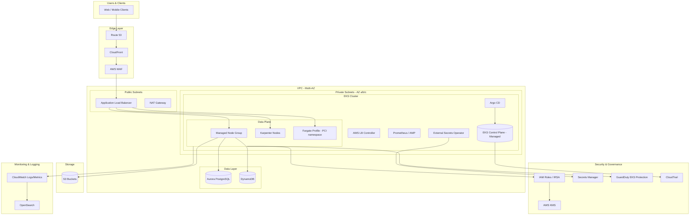

# Part V – Container & Kubernetes Architectures

# Chapter 36: Amazon EKS

---

## 1. Executive Summary

### Business Problem

Enterprises running containerized workloads eventually hit a ceiling with simpler orchestration options.

- ECS is excellent for AWS-native teams but ties workload definitions tightly to the AWS control plane and its API model.
- Self-managed Kubernetes on EC2 gives full control but forces the platform team to operate etcd, the API server, controller manager, and scheduler — a 24/7 operational burden most enterprises cannot justify.
- Many enterprises already run Kubernetes on-premises or on another cloud, and need workload portability, a consistent operator experience, and access to the enormous Kubernetes ecosystem (Helm, Argo, Istio, Crossplane, Kustomize, Prometheus Operator, etc.).

Amazon EKS (Elastic Kubernetes Service) solves this by giving organizations a managed, upstream-conformant Kubernetes control plane, while still letting them run workloads on EC2, Fargate, or Bottlerocket-based node groups.

### Architecture Objective

The objective of an EKS reference architecture is to provide:

- A highly available, AWS-managed Kubernetes control plane spanning multiple Availability Zones.
- A secure, least-privilege identity model connecting Kubernetes RBAC to IAM (via IRSA or EKS Pod Identity).
- A production-grade networking layer using the Amazon VPC CNI, with support for private clusters and hybrid connectivity.
- A scalable data plane using a mix of Managed Node Groups, self-managed node groups, and Fargate profiles.
- Built-in observability, security scanning, GitOps-based deployment, and cost governance.

### Why Organizations Adopt This Architecture

- **Portability** — Kubernetes manifests and Helm charts are portable across clouds and on-prem, reducing lock-in risk compared to ECS task definitions.
- **Ecosystem gravity** — The CNCF ecosystem (service mesh, GitOps, policy engines, autoscalers) is overwhelmingly Kubernetes-first.
- **Platform team leverage** — A well-built EKS platform lets a small platform engineering team serve dozens of application teams through self-service namespaces, quotas, and golden-path pipelines.
- **Multi-workload consolidation** — Batch jobs, long-running services, ML inference, and event-driven workloads can all run on a single cluster with proper isolation.
- **Talent availability** — Kubernetes skills are widely available in the market compared to niche orchestration systems.

### Major Business Benefits

| Benefit | Description |
|---|---|
| Reduced operational burden | AWS operates and patches the control plane, etcd, and API server availability |
| Faster developer velocity | Standardized deployment pipelines and self-service namespaces reduce lead time |
| Workload portability | Same manifests can run on EKS, on-prem Kubernetes, or another cloud with modest changes |
| Fine-grained cost control | Node autoscaling, Spot integration, and Karpenter enable aggressive rightsizing |
| Strong compliance posture | Integrates with IAM, KMS, GuardDuty, Security Hub, and audit logging natively |

### Typical Enterprise Scenarios

- A digital bank migrating from a monolith to microservices, needing strict tenant isolation between payment and non-payment workloads.
- A retailer running seasonal, highly bursty workloads that need aggressive horizontal and node-level autoscaling.
- A SaaS company operating a single EKS cluster with per-customer namespaces to reduce per-tenant infrastructure cost.
- A media company running GPU-backed inference workloads for content recommendation alongside stateless web services.
- An enterprise standardizing on Kubernetes across multiple clouds and needing a consistent AWS-native onramp.

> **Note:** EKS is not "Kubernetes lite." Every core Kubernetes concept — RBAC, admission control, network policy, CRDs — is fully available. The managed aspects are the control plane's availability, patching, and upgrade orchestration, not a reduction in Kubernetes surface area.

---

## 2. Business Requirements

### Business Drivers

- Reduce time-to-market for new microservices from weeks to days.
- Standardize deployment patterns across dozens of independent engineering teams.
- Achieve infrastructure cost predictability while supporting unpredictable traffic.
- Meet regulatory requirements for network segmentation and audit trails (PCI-DSS, HIPAA, SOC 2).
- Enable a platform engineering model where application teams self-serve without filing infrastructure tickets.

### Functional Requirements

- Support hundreds of independently deployable services across multiple teams.
- Support both long-running services and short-lived batch/cron workloads.
- Support blue-green and canary deployments per service.
- Provide per-team namespace isolation with resource quotas.
- Integrate with existing CI/CD tooling (GitHub Actions, GitLab CI, Jenkins).

### Non-Functional Requirements

| Category | Requirement |
|---|---|
| Scalability | Cluster must scale from 20 to 2,000+ pods without redesign |
| Availability | 99.95% control plane availability, multi-AZ data plane |
| Latency | P99 intra-cluster service-to-service latency under 15ms |
| Compliance | PCI-DSS Level 1 segmentation between cardholder-data workloads and general workloads |
| Security | Least-privilege IAM, encrypted secrets, network policy enforcement |
| Recovery | RPO of 15 minutes for stateful workloads, RTO of 1 hour for full cluster rebuild |

### Scalability Goals

- Data plane: horizontal node scaling from 10 to 500+ nodes using Karpenter or Cluster Autoscaler.
- Pod-level: Horizontal Pod Autoscaler (HPA) and Vertical Pod Autoscaler (VPA) for individual workloads.
- Control plane: fully AWS-managed, scales automatically with cluster size (no customer action required).

### Availability Requirements

- Control plane: Multi-AZ by default (AWS SLA: 99.95% for clusters using multiple AZs).
- Data plane: Node groups spread across a minimum of 3 AZs.
- Application layer: Minimum 2 replicas per Deployment, with Pod Disruption Budgets (PDBs) enforced.

### Latency Requirements

- Intra-cluster service mesh latency target: under 10ms P99 for mesh-enabled services.
- External API latency target: under 200ms P99 including ALB/Ingress hop.

### Compliance Requirements

- Full audit trail of every `kubectl` and API server action via CloudTrail and Kubernetes audit logs.
- Encryption at rest for etcd secrets using AWS KMS envelope encryption.
- Network segmentation validated through VPC Flow Logs and Kubernetes NetworkPolicies.

### Recovery Objectives

| Metric | Target | Applies To |
|---|---|---|
| RPO | 15 minutes | Stateful workloads using EBS/EFS-backed PVCs |
| RPO | 0 (stateless) | Stateless services (redeploy from Git) |
| RTO | 1 hour | Full cluster rebuild via IaC in a new AZ/region |
| RTO | 5 minutes | Single-node or single-pod failure |

### SLAs

- Internal platform SLA: 99.9% uptime for the shared EKS platform.
- Per-application SLA: owned by application teams, typically 99.5–99.99% depending on tier.

### Expected Workload and Growth

- Initial: 30 microservices, ~150 pods, 15 nodes.
- Year 1 target: 120 microservices, ~800 pods, 80 nodes across 3 AZs.
- Year 2 target: multi-cluster expansion (see Chapter 39) once a single cluster approaches control-plane and etcd object-count practical limits.

---

## 3. Architecture Overview

### Overall Design Philosophy

The reference architecture treats the EKS cluster as **shared platform infrastructure**, not as a single application's deployment target.

Key philosophy points:

- **Platform team owns the cluster.** Application teams own namespaces, workloads, and Helm values — never cluster-scoped resources.
- **GitOps as the only production deployment path.** No direct `kubectl apply` in production; all changes flow through Git and a reconciler (Argo CD or Flux).
- **Node group diversity over one-size-fits-all.** General-purpose workloads run on Managed Node Groups with Spot/On-Demand mix; bursty or spiky workloads run on Karpenter-provisioned nodes; sensitive or untrusted workloads run on Fargate for stronger isolation.
- **Identity is Kubernetes-native but AWS-backed.** Pod-level AWS permissions use IAM Roles for Service Accounts (IRSA) or EKS Pod Identity rather than shared node instance roles.

### Core Components

- **EKS Control Plane** — managed API server, etcd, scheduler, controller manager across 3 AZs.
- **Data Plane** — Managed Node Groups (EC2), Karpenter-provisioned nodes, and Fargate profiles.
- **Amazon VPC CNI** — assigns VPC-routable IP addresses directly to pods.
- **AWS Load Balancer Controller** — provisions ALB/NLB resources from Kubernetes Ingress/Service objects.
- **Argo CD** — GitOps continuous delivery engine reconciling cluster state from Git.
- **Cluster Autoscaler / Karpenter** — node-level autoscaling.
- **IRSA / EKS Pod Identity** — pod-to-AWS-service authentication.
- **Prometheus + Amazon Managed Service for Prometheus (AMP) + Grafana** — metrics and dashboards.
- **Fluent Bit + CloudWatch Logs / OpenSearch** — centralized logging.
- **External Secrets Operator + AWS Secrets Manager** — secret synchronization into Kubernetes.

### How Components Interact — High-Level Workflow

1. Developer merges a change to a Helm chart's values file in Git.
2. Argo CD detects drift and reconciles the target namespace.
3. Kubernetes scheduler places new pods based on resource requests, taints/tolerations, and topology spread constraints.
4. If insufficient capacity exists, Karpenter provisions a new EC2 node matching the pod's requirements within seconds.
5. The AWS Load Balancer Controller updates target groups behind the ALB/NLB as pods become ready.
6. Amazon VPC CNI assigns each pod a routable IP from the VPC subnet CIDR.
7. Metrics flow to AMP/Prometheus; logs flow to CloudWatch/OpenSearch via Fluent Bit.

### Request Lifecycle

External request → Route 53 → CloudFront (optional) → ALB (via AWS Load Balancer Controller) → Kubernetes Service (ClusterIP) → Pod → downstream dependency (RDS, DynamoDB, S3) → response returned along the same path.

### Data Lifecycle

- Application state persisted to RDS/Aurora/DynamoDB (never local pod disk for durability).
- Ephemeral pod-local state discarded on pod termination — never relied upon for correctness.
- Persistent volumes (EBS/EFS) used only for workloads explicitly requiring block or shared file storage (e.g., stateful sets, ML checkpoints).

---

## 4. AWS Services Used

### Amazon EKS (Control Plane)

- **Purpose:** Fully managed Kubernetes API server, etcd, and control plane components.
- **Why selected:** Removes the operational burden of running etcd and the API server at high availability; upstream-conformant so standard `kubectl` and CNCF tooling works unmodified.
- **Alternatives:** Self-managed Kubernetes (kOps, kubeadm on EC2), Amazon ECS, Red Hat OpenShift on AWS (ROSA).
- **Limitations:** Control plane version support window is limited (typically the last 4 minor versions); customers must actively manage upgrades.
- **Pricing:** Flat hourly charge per cluster (control plane), separate from data plane compute costs.
- **Best practices:** Enable control plane logging (audit, API, authenticator) to CloudWatch; keep cluster version within 1 minor version of latest supported.

### Amazon EC2 (Node Groups)

- **Purpose:** Compute capacity for the data plane (worker nodes).
- **Why selected:** Wide instance type selection, Spot Instance integration, and full control over AMI/bootstrap.
- **Alternatives:** AWS Fargate (serverless pods), Bottlerocket-based node groups for a minimal, container-optimized OS.
- **Limitations:** Requires patch management, AMI lifecycle management, and capacity planning.
- **Best practices:** Use Managed Node Groups for baseline capacity; use Karpenter for bursty/heterogeneous workloads; prefer Bottlerocket AMIs for reduced attack surface.

### AWS Fargate (for EKS)

- **Purpose:** Serverless compute for individual pods, no node management required.
- **Why selected:** Strong workload isolation (each pod runs in its own micro-VM); ideal for untrusted or highly regulated workloads.
- **Alternatives:** EC2-backed node groups.
- **Limitations:** No DaemonSets, no privileged containers, limited to specific instance-equivalent CPU/memory combinations, higher per-vCPU cost than EC2 at scale.
- **Best practices:** Use Fargate profiles scoped to specific namespaces (e.g., a `pci-workloads` namespace) rather than the entire cluster.

### Elastic Load Balancing (ALB / NLB)

- **Purpose:** L7 (ALB) and L4 (NLB) load balancing for cluster ingress/egress traffic.
- **Why selected:** Native integration via the AWS Load Balancer Controller; supports WAF attachment, TLS termination, and target-type IP mode (direct pod routing).
- **Alternatives:** NGINX Ingress Controller with self-managed load balancers, Istio Gateway.
- **Limitations:** ALB/NLB provisioning adds ~1-2 minutes of latency on first creation; per-listener/rule cost.
- **Best practices:** Use IP target mode for direct pod routing bypassing kube-proxy; attach AWS WAF for internet-facing ALBs.

### Amazon VPC and VPC CNI

- **Purpose:** Underlying network fabric; VPC CNI assigns pods real VPC IP addresses.
- **Why selected:** Enables direct integration with security groups, VPC Flow Logs, and PrivateLink without an overlay network.
- **Alternatives:** Cilium or Calico as CNI (overlay or eBPF-based), used when IP exhaustion is a concern.
- **Limitations:** IP address exhaustion risk in large clusters; mitigated via prefix delegation or secondary CIDR ranges.
- **Best practices:** Enable prefix delegation (`ENABLE_PREFIX_DELEGATION=true`) to increase pod density per node.

### Route 53

- **Purpose:** DNS resolution for cluster ingress endpoints and service discovery integration via ExternalDNS.
- **Why selected:** Native AWS integration; supports latency-based and failover routing for multi-region EKS setups.
- **Alternatives:** Third-party DNS providers (less common in AWS-native shops).

### Amazon RDS / Aurora

- **Purpose:** Managed relational database backing stateful application services.
- **Why selected:** Removes database operational burden; Aurora offers strong HA and read scaling.
- **Alternatives:** Self-managed PostgreSQL/MySQL on EC2, DynamoDB for NoSQL access patterns.
- **Best practices:** Never run production databases as StatefulSets inside the cluster; keep data tier outside Kubernetes lifecycle.

### Amazon DynamoDB

- **Purpose:** Serverless NoSQL store for high-throughput, low-latency access patterns (session state, feature flags, event metadata).
- **Why selected:** No capacity planning required with on-demand mode; integrates natively with IRSA-scoped IAM policies.

### Amazon S3

- **Purpose:** Object storage for artifacts, logs, ML model files, and static assets.
- **Why selected:** Durable, cost-effective, integrates with lifecycle policies for cost control.

### IAM (Identity and Access Management)

- **Purpose:** Controls both human and workload access to AWS APIs; underpins IRSA/EKS Pod Identity.
- **Why selected:** Only mechanism for enforcing least-privilege access from pods to AWS services.
- **Best practices:** One IAM role per service account per namespace; never attach broad policies to the node instance role.

### AWS KMS

- **Purpose:** Encryption key management for EKS secrets envelope encryption, EBS volumes, and S3 buckets.
- **Why selected:** Required for compliance frameworks demanding customer-managed encryption keys (CMKs) with audit trails.

### AWS Secrets Manager

- **Purpose:** Centralized secret storage, synced into Kubernetes via External Secrets Operator.
- **Why selected:** Avoids storing plaintext secrets in Kubernetes Secrets objects (which are only base64-encoded, not encrypted, without envelope encryption enabled).

### CloudWatch, CloudTrail, AWS Config, GuardDuty

- **Purpose:** Observability (CloudWatch), API audit trail (CloudTrail), configuration compliance (Config), and threat detection (GuardDuty, including GuardDuty EKS Protection for runtime threat detection).
- **Why selected:** Native, low-operational-overhead observability and security stack that integrates directly with EKS audit logs and VPC Flow Logs.

---

## 5. Complete Architecture Diagram



---

## 6. Component-by-Component Explanation

### EKS Control Plane

- **Purpose:** Hosts the Kubernetes API server, etcd, scheduler, and controller manager.
- **Responsibilities:** Accepts API requests, persists cluster state, schedules pods to nodes, reconciles desired vs. actual state.
- **Inputs:** `kubectl`/API calls from users, CI/CD pipelines, and controllers.
- **Outputs:** Scheduling decisions, object state changes, audit log events.
- **Scaling:** Fully automatic; AWS scales API server and etcd capacity based on cluster size.
- **High availability:** Spans a minimum of 3 AZs by default; AWS SLA of 99.95% for multi-AZ clusters.
- **Failure handling:** AWS automatically replaces unhealthy control plane components; customers cannot directly access or SSH into control plane nodes.
- **Dependencies:** VPC subnets (for control plane ENIs), IAM (cluster role), KMS (secrets encryption).
- **Security:** Private API endpoint recommended for production; public endpoint restricted via CIDR allow-list if enabled.
- **Monitoring:** Control plane logging (API, audit, authenticator, controllerManager, scheduler) shipped to CloudWatch Logs.

### Managed Node Groups

- **Purpose:** Baseline, predictable EC2 capacity for the data plane.
- **Responsibilities:** Run the kubelet, container runtime, and VPC CNI plugin; host application pods.
- **Scaling:** Cluster Autoscaler or Karpenter adjusts desired capacity based on pending pod demand.
- **High availability:** Node groups spread across 3 AZs using an Auto Scaling Group per AZ or a single ASG with balanced subnets.
- **Failure handling:** Unhealthy nodes are automatically drained and replaced by the ASG health check + Node Problem Detector.
- **Security:** IMDSv2 enforced; node instance role scoped to only what the kubelet/CNI require (no application-level permissions).

### Karpenter

- **Purpose:** Just-in-time node provisioning based on actual pod scheduling requirements rather than pre-defined instance types.
- **Responsibilities:** Watches for unschedulable pods, selects optimal instance type/size/AZ, and provisions nodes within seconds.
- **Scaling:** Scales both up (new nodes) and down (consolidation of underutilized nodes) automatically.
- **Failure handling:** Node drift detection can automatically replace nodes running outdated AMIs.

### AWS Load Balancer Controller

- **Purpose:** Watches Kubernetes Ingress/Service objects and provisions corresponding ALB/NLB resources.
- **Responsibilities:** Manages target group registration, health checks, and TLS certificate attachment (via ACM).
- **Dependencies:** IAM role (IRSA) with permissions to manage ELBv2 resources.
- **Security:** Supports attaching AWS WAF ACLs directly to provisioned ALBs.

### Argo CD (GitOps Controller)

- **Purpose:** Continuously reconciles cluster state to match the desired state defined in a Git repository.
- **Responsibilities:** Detects drift, applies manifests, provides rollback via Git history.
- **High availability:** Deployed with multiple replicas across AZs; backed by a dedicated PostgreSQL or Redis-backed HA configuration for larger installations.
- **Security:** RBAC scoped so application teams can only sync their own `Application` resources/namespaces.

### External Secrets Operator

- **Purpose:** Synchronizes secrets from AWS Secrets Manager (or Parameter Store) into native Kubernetes Secret objects.
- **Security:** Uses IRSA to scope which secrets each namespace's service account can read — no cluster-wide secret access.

---

## 7. End-to-End Request Flow

1. **Client** issues an HTTPS request to `app.example.com`.
2. **Route 53** resolves the domain to the CloudFront distribution (or directly to the ALB in non-CDN setups).
3. **CloudFront** (if used) serves cached static content or forwards dynamic requests to the origin ALB.
4. **AWS WAF**, attached to the ALB or CloudFront, evaluates the request against managed and custom rule groups.
5. **Application Load Balancer** terminates TLS (using an ACM certificate) and routes the request based on host/path rules to the target Kubernetes Service.
6. Because the ALB uses **IP target mode**, traffic is routed directly to a pod IP — bypassing `kube-proxy` and `iptables` NAT for lower latency.
7. The **Kubernetes Service** load-balances across healthy pod endpoints (managed by `EndpointSlices`).
8. The **application pod** processes the request, potentially calling downstream services via internal ClusterIP Services or a service mesh sidecar.
9. Database calls go to **Aurora** or **DynamoDB**; the pod authenticates using an IRSA-scoped IAM role.
10. Object storage calls go to **S3** through the same IRSA-scoped credentials.
11. **Fluent Bit**, running as a DaemonSet, tails container stdout/stderr and ships logs to CloudWatch Logs / OpenSearch.
12. **Prometheus** (via AMP) scrapes application `/metrics` endpoints on a defined interval.
13. On error, the pod returns a structured error response; if the error rate crosses the alerting threshold, a **CloudWatch Alarm** fires and notifies the on-call team via SNS/PagerDuty.
14. The response traverses back through the ALB, WAF, and CloudFront to the client.

---

## 8. Deployment Flow

### Infrastructure Provisioning

- Terraform provisions the VPC, EKS cluster, node groups/Karpenter IAM roles, and add-ons (VPC CNI, CoreDNS, kube-proxy) as EKS managed add-ons.
- A separate Terraform state/workspace is typically used for cluster infrastructure versus application-level Kubernetes resources (which live in Argo CD-managed Git repos, not Terraform).

### Terraform Workflow

1. `terraform plan` executed in CI on every pull request against the infrastructure repo.
2. Policy-as-code (OPA/Conftest or Checkov) scans the plan for violations (e.g., public API endpoint, missing encryption).
3. Manual approval gate for `terraform apply` in production environments.
4. State stored remotely in S3 with DynamoDB state locking.

### CI/CD Deployment (Application Layer)

1. Developer pushes code; CI builds a container image, scans it (Trivy/ECR scanning), and pushes to Amazon ECR.
2. CI updates the image tag in a Helm `values.yaml` file in the GitOps repository (via automated PR or image updater).
3. Argo CD detects the Git change and syncs the target namespace.
4. Argo CD performs a health check against the new ReplicaSet before marking the sync as successful.

### Blue-Green Deployment

- Implemented via two parallel Deployments (`app-blue`, `app-green`) and a Service selector switch, or via Argo Rollouts for automated traffic shifting.
- Traffic is shifted at the Service/Ingress level once the green environment passes automated smoke tests.

### Rollback

- Argo CD: one-click rollback to any previous Git commit/sync state.
- Argo Rollouts: automated rollback triggered by failed analysis metrics (error rate, latency) during a canary step.

### Secrets and Configuration

- Secrets: sourced from Secrets Manager via External Secrets Operator — never committed to Git.
- Configuration: non-sensitive config stored in ConfigMaps, templated via Helm values per environment.

### Validation

- Pre-deployment: `helm template` + `kubeconform` schema validation in CI.
- Post-deployment: automated smoke tests and synthetic canary checks before Argo Rollouts promotes full traffic.

---

## 9. Network Topology

### VPC and CIDR

- A dedicated VPC per environment (dev/staging/prod), e.g., `10.20.0.0/16` for production.
- Secondary CIDR block (e.g., `100.64.0.0/16`, part of the CGNAT range) added specifically for pod IPs when using VPC CNI custom networking, to avoid exhausting routable primary CIDR space.

### Public Subnets

- Host only NAT Gateways and internet-facing ALBs/NLBs.
- No worker nodes or pods are placed in public subnets.

### Private Subnets

- Host all EKS worker nodes, Fargate ENIs, and internal load balancers.
- Spread across 3 AZs for the data plane and, where the region supports it, the control plane ENIs.

### NAT Gateway

- One NAT Gateway per AZ (not a single shared NAT) to avoid a cross-AZ single point of failure and to eliminate cross-AZ data transfer charges for egress traffic.

### Internet Gateway

- Attached to the VPC to provide the route for public subnet resources (ALB, NAT Gateway) to reach the internet.

### Transit Gateway

- Used when the EKS VPC needs connectivity to other VPCs (shared services, hybrid on-prem) — see Chapter 17 for full Transit Gateway architecture.

### Route Tables

- Private subnet route tables point `0.0.0.0/0` to the AZ-local NAT Gateway.
- Public subnet route tables point `0.0.0.0/0` to the Internet Gateway.

### Network ACLs

- Used as a coarse, stateless defense-in-depth layer (e.g., explicit deny of known-bad CIDR ranges); primary segmentation is handled by Security Groups and Kubernetes NetworkPolicies.

### Security Groups

- **Cluster security group:** allows control-plane-to-node and node-to-node communication.
- **Node security group:** scoped to allow only required ports from the ALB security group and from other nodes.
- Security Groups for Pods (via the VPC CNI's `SecurityGroupPolicy` CRD) can be used to apply distinct security groups to specific sensitive workloads (e.g., PCI pods) at the ENI level.

### PrivateLink

- Used for pods to reach AWS services (S3, ECR, Secrets Manager, STS) without traversing the NAT Gateway/internet, reducing both cost and exposure. Interface VPC Endpoints are provisioned for each service the cluster depends on.

### Hybrid Connectivity

- For enterprises with on-prem workloads, Direct Connect or Site-to-Site VPN terminates into the Transit Gateway, giving on-prem systems private access to internal EKS-hosted APIs.

---

## 10. Identity and Access

### IAM Roles

- **Cluster IAM role:** grants the EKS service permission to manage AWS resources on the cluster's behalf (ENIs, load balancers).
- **Node IAM role:** minimal permissions required for kubelet operation (ECR pull, CNI, CloudWatch Logs agent) — never granted application-level permissions.
- **Pod-level IAM roles:** one dedicated IAM role per Kubernetes ServiceAccount, following least privilege.

### IAM Policies

- Scoped narrowly per workload — e.g., an order-processing service's role permits `dynamodb:GetItem`/`PutItem` on a single table ARN, not `dynamodb:*` on `*`.

### Resource Policies

- S3 bucket policies and KMS key policies restrict access to specific IAM role ARNs rather than broad account-wide access.

### STS (Security Token Service)

- IRSA and EKS Pod Identity both rely on STS `AssumeRoleWithWebIdentity` (IRSA) or the Pod Identity Agent's session-credential exchange to issue short-lived credentials to pods — no long-lived access keys are ever stored in the cluster.

### Cross-Account Access

- Multi-account setups (e.g., separate AWS accounts per environment) use IAM role assumption with external ID conditions for CI/CD pipelines deploying across accounts.

### Least Privilege

- Enforced at three layers: node instance role (infra-only), pod IAM role (workload-specific), and Kubernetes RBAC (namespace-scoped).

### Service Roles

- Distinct IAM roles exist for: AWS Load Balancer Controller, External DNS, Cluster Autoscaler/Karpenter, External Secrets Operator, and Fluent Bit — each scoped to only the AWS API calls that controller requires.

### Permission Boundaries

- Applied to any IAM role created dynamically by automation (e.g., a self-service namespace provisioning pipeline) to cap the maximum permissions that role can ever be granted, regardless of the attached policy.

> **Warning:** A common and dangerous anti-pattern is attaching broad AWS-managed policies (e.g., `AdministratorAccess` or `AmazonS3FullAccess`) to the **node instance role**. Because all pods on a node share that role by default (absent IRSA/Pod Identity), this effectively grants every pod on the node those permissions.

## 11. Security Architecture

### Encryption

- **At rest:** EKS secrets envelope encryption via KMS (enabled at cluster creation, cannot be added retroactively without recreating secrets); EBS volumes encrypted by default using a customer-managed KMS key; S3 buckets use SSE-KMS.
- **In transit:** TLS terminated at the ALB using ACM certificates; service-to-service traffic encrypted via mTLS when a service mesh (App Mesh or Istio) is deployed.

### KMS

- A dedicated CMK per environment (dev/staging/prod) for EKS secrets encryption, with key rotation enabled and access restricted to the cluster's IAM role and designated break-glass roles.

### TLS / Certificate Manager

- ACM issues and auto-renews public and private certificates; attached directly to ALB listeners via annotations on the Kubernetes Ingress resource.

### WAF and Shield

- AWS WAF attached to internet-facing ALBs with managed rule groups (SQLi, XSS, known bad inputs) plus custom rate-based rules.
- AWS Shield Standard is automatically active; Shield Advanced is added for internet-facing production workloads requiring DDoS cost protection and 24/7 DRT (DDoS Response Team) access.

### Secrets Manager

- All application secrets (DB credentials, API keys, third-party tokens) are stored exclusively in Secrets Manager and synced into the cluster via External Secrets Operator — raw Kubernetes `Secret` objects are never manually created with plaintext values.

### GuardDuty (EKS Protection)

- GuardDuty EKS Protection analyzes Kubernetes audit logs for anomalous API calls (e.g., privilege escalation attempts, unusual `exec` into pods) and correlates VPC Flow Logs and DNS logs for runtime threat detection at the node/container level.

### Inspector

- Amazon Inspector continuously scans container images in ECR and running EKS workloads for known CVEs, feeding findings into Security Hub.

### Security Hub

- Aggregates findings from GuardDuty, Inspector, Config, and third-party tools into a single compliance dashboard, mapped against CIS AWS Foundations and PCI-DSS standards.

### CloudTrail

- Captures all EKS control plane API calls made through the AWS API (cluster creation, node group changes, IAM role assumption) — distinct from the Kubernetes audit log, which captures `kubectl`/API server-level actions.

### AWS Config

- Continuously evaluates EKS-related resources (security groups, IAM roles, KMS key policies) against custom and managed Config Rules, flagging drift such as a security group opening port 22 to `0.0.0.0/0`.

### Zero Trust Principles Applied

- No implicit trust between pods on the same node — enforced via Kubernetes NetworkPolicies (default-deny ingress/egress per namespace).
- No long-lived credentials on nodes or in pods — IRSA/Pod Identity issue short-lived STS tokens.
- Every request authenticated and authorized independently, regardless of network origin.

### Threat Model and Attack Vectors

| Attack Vector | Mitigation |
|---|---|
| Compromised container image | Image scanning (Inspector/Trivy) in CI, admission control blocking unscanned images |
| Container escape to host | Bottlerocket minimal OS, non-root containers, seccomp/AppArmor profiles, Fargate for high-risk workloads |
| Over-privileged pod IAM role | IRSA scoped per service account, permission boundaries, periodic access review |
| Lateral movement between namespaces | Default-deny NetworkPolicies, per-namespace security groups for pods |
| Exposed Kubernetes API server | Private endpoint, CIDR allow-listing for any public access, MFA-backed IAM for `kubectl` access |
| Secrets exposure in Git | External Secrets Operator, git-secrets pre-commit scanning, no plaintext secrets in manifests |
| Supply chain compromise (malicious Helm chart/dependency) | Chart signing/verification, private Helm/OCI registries, SBOM generation |

---

## 12. High Availability

### AZ Failures

- Node groups and Karpenter provisioning span a minimum of 3 AZs; Pod Topology Spread Constraints ensure replicas of a Deployment are not concentrated in a single AZ.
- ALB automatically routes around an unhealthy AZ's targets based on health checks.

### Instance Failures

- ASG health checks (EC2 + ELB) detect and replace failed nodes automatically.
- Kubernetes reschedules evicted pods onto healthy nodes within seconds, assuming sufficient spare capacity or Karpenter's ability to provision new capacity quickly.

### Regional Failures

- Out of scope for a single-cluster EKS reference architecture (see Chapter 98, Multi-Region Active-Active, for cross-region failover patterns). Mitigated at the DR level via cross-region backups and a documented cluster-rebuild runbook.

### Database Failures

- Aurora Multi-AZ with automatic failover (typically under 30 seconds); read replicas absorb read traffic during primary failover.

### Load Balancing and Health Checks

- ALB target group health checks configured against a dedicated `/healthz` endpoint distinct from liveness/readiness probes used by Kubernetes itself.
- Kubernetes readiness probes gate whether a pod receives traffic; liveness probes trigger container restarts on deadlock/hang.

### Failover

- Pod Disruption Budgets (PDBs) ensure a minimum number of healthy replicas remain available during voluntary disruptions (node drains, cluster upgrades).

---

## 13. Disaster Recovery

### Backup Strategy

- **Cluster configuration:** fully defined in Terraform and Git (GitOps) — the cluster itself is treated as disposable/rebuildable infrastructure, not a backup target.
- **Persistent data:** Aurora automated snapshots (daily + continuous backup via transaction logs) and EBS snapshot policies for any StatefulSet-backed volumes via AWS Backup.
- **etcd:** fully managed by AWS; customers do not back up etcd directly, but the Kubernetes object state is reproducible from the GitOps repository.

### Cross-Region Replication

- Aurora Global Database provides a read replica in a secondary region with typically sub-second replication lag, promotable during a regional failure.
- S3 Cross-Region Replication (CRR) for artifact and log buckets requiring geographic redundancy.

### DR Strategies by Tier

| Strategy | RTO | RPO | Cost | Use Case |
|---|---|---|---|---|
| Backup and Restore | Hours | Hours | Lowest | Non-critical internal tools |
| Pilot Light | 30-60 min | 15 min | Low-Medium | Standard production services |
| Warm Standby | 5-15 min | Near-zero | Medium-High | Revenue-critical services |
| Multi-Site Active-Active | Near-zero | Near-zero | Highest | Tier-0 global services |

### Recommended Approach for This Architecture

- **Pilot Light** is the default for most enterprise EKS workloads: infrastructure-as-code allows a second-region EKS cluster to be stood up on demand, with Aurora Global Database and S3 CRR keeping data warm in the standby region.
- Full **Active-Active** is reserved for Tier-0 workloads given the added operational complexity of bidirectional data replication and traffic steering (see Chapter 98).

---

## 14. Scalability

### Horizontal Scaling (Pods)

- Horizontal Pod Autoscaler (HPA) scales replica count based on CPU/memory or custom metrics (e.g., queue depth via KEDA for event-driven workloads).

### Vertical Scaling (Pods)

- Vertical Pod Autoscaler (VPA) recommends or automatically adjusts CPU/memory requests based on observed usage — typically run in "recommendation-only" mode in production to avoid disruptive pod restarts.

### Node-Level Auto Scaling

- **Karpenter** (recommended): provisions right-sized nodes per pending pod requirements in seconds, consolidates underutilized nodes, and supports Spot with automatic on-demand fallback.
- **Cluster Autoscaler** (legacy/alternative): scales predefined node group ASGs up/down based on pending pod count; simpler but less efficient bin-packing than Karpenter.

### Serverless Scaling

- Fargate profiles scale per-pod with no node management, ideal for spiky or unpredictable namespaces where node-level capacity planning is undesirable.

### Database Scaling

- Aurora: read replicas for read scaling (up to 15), Aurora Serverless v2 for variable/unpredictable workloads.
- DynamoDB: on-demand capacity mode scales automatically with traffic; provisioned mode with auto scaling for predictable, cost-sensitive workloads.

### Storage Scaling

- EBS volumes support online resizing (`gp3` with independently scalable IOPS/throughput); EFS scales automatically with no pre-provisioning.

### Queue Scaling

- SQS-backed workloads use KEDA's SQS scaler to scale consumer pod replicas directly proportional to queue depth, rather than CPU utilization alone.

---

## 15. Performance Optimization

### Caching

- Application-layer caching via Amazon ElastiCache (Redis/Valkey) deployed outside the cluster for shared cache state across pod restarts.
- CDN-layer caching via CloudFront for static assets and cacheable API responses.

### Compression

- ALB and application-level gzip/Brotli compression for text-based responses to reduce transfer time and CloudFront/data-transfer costs.

### CDN

- CloudFront in front of the ALB for latency reduction on globally distributed user bases and to absorb traffic spikes before they reach the cluster.

### Database Optimization

- Connection pooling via RDS Proxy (or PgBouncer sidecar) to prevent connection exhaustion when hundreds of pods scale up simultaneously.
- Read/write splitting: writes to the Aurora primary, reads distributed across replicas.

### Connection Pooling

- Essential in Kubernetes because pod scale-out multiplies the number of concurrent database connections far faster than a traditional fixed-fleet deployment — RDS Proxy is strongly recommended over relying on application-level pooling alone.

### Concurrency and Async Processing

- CPU-bound synchronous work isolated into dedicated worker Deployments consuming from SQS, decoupled from latency-sensitive request-handling pods.
- Async processing via Step Functions or SQS/Lambda for long-running tasks that shouldn't block request threads.

---

## 16. Cost Optimization (FinOps)

### Estimated Monthly Cost by Deployment Size

| Component | Small (Dev) | Medium (Prod, moderate) | Enterprise (Prod, large) |
|---|---|---|---|
| EKS Control Plane | $73 | $73 | $73 (x N clusters) |
| EC2 Node Groups (On-Demand + Spot mix) | $300 | $4,500 | $35,000+ |
| NAT Gateway (3x, per-AZ) | $100 | $150 | $250 |
| ALB | $25 | $150 | $600 |
| Aurora (Multi-AZ) | $200 | $1,800 | $12,000+ |
| CloudWatch Logs/Metrics | $30 | $400 | $3,500 |
| Data Transfer | $20 | $500 | $6,000+ |
| **Estimated Total** | **~$750/mo** | **~$7,500/mo** | **~$57,000+/mo** |

> **Note:** These figures are illustrative planning estimates, not quotes. Always validate with the AWS Pricing Calculator and current regional pricing.

### Major Cost Drivers

- Compute (EC2/Fargate) typically represents 50-70% of total EKS spend.
- Data transfer — especially cross-AZ and NAT Gateway egress — is the most frequently underestimated cost driver.
- Observability (CloudWatch Logs ingestion + retention) scales linearly with pod count and log verbosity.

### Optimization Opportunities

- **Reserved Instances / Savings Plans:** Apply Compute Savings Plans to baseline, predictable node capacity (typically 60-70% of total capacity), leaving burst capacity on Spot/On-Demand.
- **Spot Instances:** Ideal for stateless, interruption-tolerant workloads; Karpenter automatically diversifies across instance types/AZs to reduce interruption risk. Target 30-50% of non-critical workload capacity on Spot.
- **S3 Lifecycle Policies:** Transition log/artifact buckets to Infrequent Access after 30 days, Glacier after 90 days.
- **Storage Classes:** Use `gp3` over `gp2` for EBS (lower cost, independently tunable IOPS).
- **Rightsizing:** VPA recommendation mode combined with regular resource-request audits prevents chronic over-provisioning (a very common finding: requests set 3-5x actual usage "just to be safe").
- **Cost Allocation and Tagging:** Enforce namespace-to-cost-center tag propagation using Kubernetes labels mapped to AWS cost allocation tags via tools like Kubecost.
- **Budgets and Cost Anomaly Detection:** AWS Budgets alerts per environment; Cost Anomaly Detection flags unexpected spend spikes (e.g., a runaway Karpenter provisioning loop).

> **Tip:** Deploy Kubecost or OpenCost early. Without per-namespace/per-team cost visibility, FinOps conversations in a shared multi-tenant cluster become political rather than data-driven.

---

## 17. AI-Assisted Operations

### Amazon Q (Developer / Business)

- Amazon Q Developer assists with Terraform and Kubernetes manifest authoring, explains error messages from `kubectl describe`/CloudWatch, and can suggest IAM policy least-privilege refinements based on CloudTrail access patterns.

### Amazon Bedrock

- Used to build internal chatbots that query cluster state, cost data, and runbooks in natural language for on-call engineers — typically via a retrieval-augmented generation (RAG) pattern over the platform team's internal documentation (see Chapter 52).

### AI-Assisted Troubleshooting

- Feeding CloudWatch Logs Insights query results or `kubectl describe pod` output into an LLM to accelerate root-cause hypothesis generation — always validated by a human engineer before action, never auto-remediated without review in production.

### AI-Assisted Log Analysis

- Anomaly detection on log volume/pattern shifts (e.g., a sudden surge of `CrashLoopBackOff` events) surfaced via CloudWatch Logs Insights combined with Bedrock-based summarization for on-call handoff notes.

### AI-Assisted Capacity Planning

- Historical Karpenter provisioning and HPA scaling data fed into forecasting models to predict node-group and Reserved Instance/Savings Plan purchasing needs ahead of known seasonal peaks.

### AI-Generated Terraform and Documentation

- AI-assisted generation of first-draft Terraform modules and architecture documentation significantly accelerates initial scaffolding — but every generated module must pass the same policy-as-code and peer-review gates as human-written code before merging.

> **Warning:** AI-assisted operations should never have standing write access to production Kubernetes or AWS APIs. Treat AI output as a draft requiring human review, identical to a junior engineer's pull request.

---

## 18. Terraform Implementation

### Provider and Backend Configuration

```hcl

terraform {
  required_version = ">= 1.7.0"

  required_providers {
    aws = {
      source  = "hashicorp/aws"
      version = "~> 5.50"
    }
    kubernetes = {
      source  = "hashicorp/kubernetes"
      version = "~> 2.30"
    }
    helm = {
      source  = "hashicorp/helm"
      version = "~> 2.13"
    }
  }

  backend "s3" {
    bucket         = "acme-terraform-state-prod"
    key            = "eks/production/terraform.tfstate"
    region         = "us-east-1"
    dynamodb_table = "acme-terraform-locks"
    encrypt        = true
  }
}

provider "aws" {
  region = var.aws_region
}

```

### Variables

```hcl

variable "aws_region" {
  description = "AWS region for the EKS cluster"
  type        = string
  default     = "us-east-1"
}

variable "cluster_name" {
  description = "Name of the EKS cluster"
  type        = string
  default     = "acme-prod-eks"
}

variable "cluster_version" {
  description = "Kubernetes control plane version"
  type        = string
  default     = "1.30"
}

variable "vpc_cidr" {
  description = "Primary CIDR block for the EKS VPC"
  type        = string
  default     = "10.20.0.0/16"
}

variable "node_instance_types" {
  description = "Instance types for the baseline managed node group"
  type        = list(string)
  default     = ["m6i.large", "m6a.large"]
}

variable "environment" {
  description = "Deployment environment"
  type        = string
  default     = "production"
}

```

### Networking Module (excerpt)

```hcl

module "vpc" {
  source  = "terraform-aws-modules/vpc/aws"
  version = "~> 5.8"

  name = "${var.cluster_name}-vpc"
  cidr = var.vpc_cidr

  azs             = ["${var.aws_region}a", "${var.aws_region}b", "${var.aws_region}c"]
  private_subnets = ["10.20.0.0/19", "10.20.32.0/19", "10.20.64.0/19"]
  public_subnets  = ["10.20.96.0/20", "10.20.112.0/20", "10.20.128.0/20"]

  enable_nat_gateway     = true
  one_nat_gateway_per_az = true
  enable_dns_hostnames   = true

  public_subnet_tags = {
    "kubernetes.io/role/elb"                     = "1"
    "kubernetes.io/cluster/${var.cluster_name}"  = "shared"
  }

  private_subnet_tags = {
    "kubernetes.io/role/internal-elb"            = "1"
    "kubernetes.io/cluster/${var.cluster_name}"  = "shared"
  }

  tags = {
    Environment = var.environment
    ManagedBy   = "terraform"
  }
}

```

### EKS Cluster Module (excerpt)

```hcl

module "eks" {
  source  = "terraform-aws-modules/eks/aws"
  version = "~> 20.8"

  cluster_name    = var.cluster_name
  cluster_version = var.cluster_version

  vpc_id     = module.vpc.vpc_id
  subnet_ids = module.vpc.private_subnets

  cluster_endpoint_public_access       = false
  cluster_endpoint_private_access      = true
  cluster_endpoint_public_access_cidrs = []

  cluster_enabled_log_types = [
    "api", "audit", "authenticator", "controllerManager", "scheduler"
  ]

  cluster_encryption_config = {
    provider_key_arn = aws_kms_key.eks_secrets.arn
    resources        = ["secrets"]
  }

  eks_managed_node_groups = {
    baseline = {
      min_size       = 3
      max_size       = 10
      desired_size   = 3
      instance_types = var.node_instance_types
      capacity_type  = "ON_DEMAND"

      labels = {
        role = "baseline"
      }
    }
  }

  enable_irsa = true

  tags = {
    Environment = var.environment
    ManagedBy   = "terraform"
  }
}

resource "aws_kms_key" "eks_secrets" {
  description             = "KMS key for EKS secrets envelope encryption"
  deletion_window_in_days = 30
  enable_key_rotation     = true
}

```

### IAM for IRSA (Example: External Secrets Operator)

```hcl

data "aws_iam_policy_document" "eso_assume_role" {
  statement {
    effect  = "Allow"
    actions = ["sts:AssumeRoleWithWebIdentity"]

    principals {
      type        = "Federated"
      identifiers = [module.eks.oidc_provider_arn]
    }

    condition {
      test     = "StringEquals"
      variable = "${module.eks.oidc_provider}:sub"
      values   = ["system:serviceaccount:external-secrets:external-secrets-sa"]
    }
  }
}

resource "aws_iam_role" "eso_role" {
  name               = "${var.cluster_name}-external-secrets"
  assume_role_policy = data.aws_iam_policy_document.eso_assume_role.json
}

resource "aws_iam_role_policy" "eso_secrets_access" {
  name = "eso-secrets-read"
  role = aws_iam_role.eso_role.id

  policy = jsonencode({
    Version = "2012-10-17"
    Statement = [{
      Effect   = "Allow"
      Action   = ["secretsmanager:GetSecretValue", "secretsmanager:DescribeSecret"]
      Resource = "arn:aws:secretsmanager:${var.aws_region}:*:secret:acme/prod/*"
    }]
  })
}

```

### Outputs

```hcl

output "cluster_endpoint" {
  description = "EKS control plane endpoint"
  value       = module.eks.cluster_endpoint
}

output "cluster_oidc_issuer_url" {
  description = "OIDC issuer URL for IRSA configuration"
  value       = module.eks.cluster_oidc_issuer_url
}

output "node_security_group_id" {
  description = "Security group ID attached to worker nodes"
  value       = module.eks.node_security_group_id
}

```

### Terraform Best Practices Applied

- Remote state in S3 with DynamoDB locking prevents concurrent, conflicting applies.
- Modular structure (`vpc`, `eks`, `iam`, `addons`) allows independent review and blast-radius containment.
- Every resource tagged with `Environment` and `ManagedBy` for cost allocation and drift detection.
- Cluster endpoint kept private in production; public access disabled entirely.

---

## 19. AWS CLI Examples

### Cluster Deployment and Validation

```bash

# Update local kubeconfig to point at the cluster

aws eks update-kubeconfig --name acme-prod-eks --region us-east-1

# Verify cluster status

aws eks describe-cluster --name acme-prod-eks --query "cluster.status"

# List node groups

aws eks list-nodegroups --cluster-name acme-prod-eks

# Describe a specific node group's health

aws eks describe-nodegroup --cluster-name acme-prod-eks --nodegroup-name baseline

```

### Monitoring

```bash

# Tail control plane audit logs

aws logs tail /aws/eks/acme-prod-eks/cluster --since 1h --filter-pattern "audit"

# Check current Karpenter-provisioned node count

kubectl get nodes -l karpenter.sh/registered=true --no-headers | wc -l

```

### Troubleshooting

```bash

# Identify pods stuck in Pending due to insufficient capacity

kubectl get pods --all-namespaces --field-selector=status.phase=Pending

# Describe a pending pod to view scheduling failure events

kubectl describe pod <pod-name> -n <namespace>

# Check IRSA token projection is mounted correctly

kubectl exec -it <pod-name> -n <namespace> -- env | grep AWS_WEB_IDENTITY_TOKEN_FILE

# Validate node group IAM role has required ECR pull permissions

aws iam list-attached-role-policies --role-name acme-prod-eks-node-role

```

### Cleanup

```bash

# Scale a node group to zero before teardown

aws eks update-nodegroup-config \
  --cluster-name acme-prod-eks \
  --nodegroup-name baseline \
  --scaling-config minSize=0,maxSize=0,desiredSize=0

# Delete the cluster (after node groups/Fargate profiles are removed)

aws eks delete-cluster --name acme-prod-eks

```

## 20. CI/CD Integration

### GitHub Actions

- Used for building/scanning container images and updating GitOps manifests. Cluster credentials are never stored as long-lived secrets in GitHub — CI assumes an IAM role via OIDC federation (`aws-actions/configure-aws-credentials`) for any direct AWS calls (e.g., ECR push), scoped to a short-lived session.

```yaml

name: build-and-publish
on:
  push:
    branches: [main]

permissions:
  id-token: write
  contents: read

jobs:
  build:
    runs-on: ubuntu-latest
    steps:
      - uses: actions/checkout@v4

      - name: Configure AWS credentials via OIDC
        uses: aws-actions/configure-aws-credentials@v4
        with:
          role-to-assume: arn:aws:iam::123456789012:role/github-actions-ecr-push
          aws-region: us-east-1

      - name: Login to ECR
        run: aws ecr get-login-password | docker login --username AWS --password-stdin 123456789012.dkr.ecr.us-east-1.amazonaws.com

      - name: Build and scan image
        run: |
          docker build -t app:${{ github.sha }} .
          trivy image --exit-code 1 --severity CRITICAL,HIGH app:${{ github.sha }}

      - name: Push image
        run: |
          docker tag app:${{ github.sha }} 123456789012.dkr.ecr.us-east-1.amazonaws.com/app:${{ github.sha }}
          docker push 123456789012.dkr.ecr.us-east-1.amazonaws.com/app:${{ github.sha }}

      - name: Update GitOps manifest
        run: |
          yq -i '.image.tag = "${{ github.sha }}"' charts/app/values-prod.yaml
          git commit -am "chore: bump app image to ${{ github.sha }}"
          git push

```

### GitLab

- Equivalent pattern using GitLab CI/CD with OIDC-based AWS role assumption via GitLab's native OIDC identity provider integration; pipeline stages mirror build → scan → push → update-manifest.

### Jenkins

- Used in enterprises with existing Jenkins investment; typically runs on EKS itself (Jenkins agents as Kubernetes pods via the Kubernetes plugin), authenticating to AWS through IRSA rather than static credentials.

### AWS CodePipeline

- An AWS-native alternative combining CodeBuild (build/scan) and a custom Lambda or CodeBuild step to update the GitOps repository; preferred by organizations standardizing entirely on AWS-native tooling to reduce third-party CI/CD dependencies.

### Terraform Pipeline

- Separate pipeline from application CI/CD; runs `terraform plan` on PR, `terraform apply` on merge to main with manual approval gate for production workspaces.

### Validation in Pipeline

- `helm lint` and `kubeconform` validate manifest syntax and schema conformance before merge.
- `conftest`/OPA validates manifests against organizational policies (e.g., "no privileged containers", "must define resource requests/limits", "must define a PodDisruptionBudget for Deployments with 2+ replicas").

### Security Scanning

- Trivy or Grype scans container images for CVEs; `checkov` or `tfsec` scans Terraform for misconfigurations; all findings gate the pipeline for Critical/High severity issues.

### Policy as Code

- OPA Gatekeeper (or Kyverno) enforces policies at admission time in the cluster itself as a defense-in-depth layer, in addition to pre-merge CI checks — catching any manifest applied outside the standard pipeline.

### Rollback

- Application layer: `argocd app rollback <app-name> <revision>` or Git revert triggering automatic re-sync.
- Infrastructure layer: `terraform apply` of the previous known-good state, or `git revert` of the infrastructure PR.

---

## 21. Monitoring

### CloudWatch

- Container Insights for EKS provides cluster, node, and pod-level CPU/memory/network metrics without requiring a custom exporter.
- Custom application metrics published via the CloudWatch agent or, more commonly in Kubernetes-native shops, scraped by Prometheus.

### Dashboards

- Grafana dashboards (backed by Amazon Managed Grafana + AMP) provide unified views: cluster capacity, per-namespace resource consumption, Karpenter provisioning activity, and per-service SLO burn rate.

### Metrics

- Golden signals tracked per service: request rate, error rate, latency (P50/P90/P99), and saturation (CPU/memory against requests/limits).

### Logs

- Structured JSON logs from all application pods, shipped by Fluent Bit to CloudWatch Logs (short-term, operational) and OpenSearch or S3 (long-term, audit/compliance).

### Tracing (X-Ray)

- AWS Distro for OpenTelemetry (ADOT) Collector deployed as a DaemonSet or sidecar, exporting traces to X-Ray for distributed request tracing across microservice boundaries.

### Alarms and Notifications

- CloudWatch Alarms on key SLIs route to SNS → PagerDuty/Opsgenie for on-call paging; lower-severity alerts route to Slack.

### SLIs, SLOs, and Error Budgets

| Service Tier | SLO Target | Error Budget (30-day) | Alerting Threshold |
|---|---|---|---|
| Tier 0 (payments) | 99.99% | 4.3 minutes | Burn rate > 2% of budget/hour |
| Tier 1 (checkout) | 99.95% | 21.6 minutes | Burn rate > 5% of budget/hour |
| Tier 2 (internal tools) | 99.5% | 3.6 hours | Daily digest, no paging |

---

## 22. Logging

### Centralized Logging Architecture

- Fluent Bit (DaemonSet, one per node) tails `/var/log/containers/*.log`, enriches with Kubernetes metadata (namespace, pod, labels), and ships to two destinations: CloudWatch Logs (hot, 30-day retention) and S3 (cold, long-term via Firehose or direct Fluent Bit S3 output).

### CloudWatch Logs

- Used for real-time troubleshooting and Logs Insights queries during incidents; retention typically set to 30-90 days per log group depending on compliance tier.

### S3 (Long-Term Archive)

- All logs archived to S3 with lifecycle policies transitioning to Glacier after 90 days, satisfying multi-year compliance retention requirements at low cost.

### Athena

- Used to run ad-hoc SQL queries directly against S3-archived logs for historical investigations without needing to keep data hot in OpenSearch/CloudWatch indefinitely.

### OpenSearch

- Used when full-text search, complex log correlation, and long-lived interactive dashboards are required beyond what CloudWatch Logs Insights comfortably supports — typically the choice for security/SOC teams.

### Retention

| Log Type | Hot Storage | Cold Storage | Total Retention |
|---|---|---|---|
| Application logs | CloudWatch, 30 days | S3/Glacier | 1 year |
| Kubernetes audit logs | CloudWatch, 90 days | S3/Glacier | 7 years (compliance) |
| VPC Flow Logs | CloudWatch, 30 days | S3/Glacier | 1 year |
| ALB access logs | S3 only | S3/Glacier | 1 year |

### Audit Logging

- Kubernetes audit log level set to capture at minimum `Metadata` for all requests and `RequestResponse` for sensitive resources (Secrets, RBAC bindings), forwarded to a write-once S3 bucket with Object Lock enabled for tamper-evidence.

---

## 23. Operational Excellence

### Runbooks

- Documented, version-controlled runbooks (stored alongside the GitOps repo) for: node group scaling incidents, Argo CD sync failures, certificate expiry, and IRSA/OIDC misconfiguration — each with explicit diagnostic commands and escalation paths.

### Automation

- Routine operations (node AMI rotation, add-on version bumps, certificate renewal) automated via scheduled CI jobs rather than manual intervention.

### Patch Management

- Managed Node Groups: AMI updates rolled out via managed node group version bumps with configurable surge settings for zero-downtime rolling replacement.
- EKS add-ons (VPC CNI, CoreDNS, kube-proxy, EBS CSI driver): updated via `aws eks update-addon`, tracked in Terraform, tested in staging before production rollout.

### Maintenance Windows

- Control plane version upgrades and add-on updates scheduled during low-traffic windows, communicated to application teams at least one week in advance via the platform team's change calendar.

### Incident Response

- PagerDuty/Opsgenie integration with CloudWatch Alarms; incident commander rotation; post-incident reviews (blameless) documented and tracked to completion for corrective actions.

### Change Management

- All cluster and infrastructure changes flow through pull requests with required reviewers; emergency changes follow a documented break-glass process requiring post-hoc review within 24 hours.

---

## 24. Failure Scenarios

| # | Scenario | Symptoms | Root Cause | Detection | Resolution | Prevention |
|---|---|---|---|---|---|---|
| 1 | Node runs out of IP addresses | New pods stuck `Pending`, CNI errors in events | ENI/IP exhaustion on VPC CNI | `kubectl describe pod` shows `FailedCreatePodSandBox` | Enable prefix delegation, resize subnet | Capacity planning for pod density per node |
| 2 | Karpenter provisioning loop | Continuous node churn, high EC2 spend | Misconfigured consolidation policy | CloudWatch cost anomaly alert | Adjust Karpenter `consolidationPolicy` and `disruption` budgets | Load-test autoscaling config in staging |
| 3 | etcd/API server latency spike | Slow `kubectl` responses, deployment delays | Large number of Kubernetes objects (e.g., excessive ConfigMaps/Secrets) | Control plane CloudWatch metrics | Reduce object count, use external secret store instead of in-cluster Secrets | Object count governance, admission policy limits |
| 4 | Pod stuck `CrashLoopBackOff` | Repeated restarts, service degraded | Misconfigured environment variable / missing secret | `kubectl logs --previous` | Fix config, redeploy via GitOps revert | Pre-deployment smoke tests |
| 5 | IRSA token not mounted | Pod cannot authenticate to AWS API | ServiceAccount missing `eks.amazonaws.com/role-arn` annotation | `AccessDenied` errors in application logs | Correct ServiceAccount annotation, restart pod | Policy-as-code check requiring annotation on all ServiceAccounts |
| 6 | ALB not provisioning | Ingress stuck without an address | AWS Load Balancer Controller lacking IAM permission | Controller pod logs show `AccessDenied` | Fix IRSA policy for controller | Automated IAM policy drift detection |
| 7 | NAT Gateway bandwidth exhaustion | Elevated latency, connection timeouts on egress | Traffic burst exceeding NAT Gateway throughput | VPC Flow Logs, NAT Gateway CloudWatch metrics | Add PrivateLink endpoints to bypass NAT for AWS service calls | Pre-provision VPC endpoints for high-traffic AWS services |
| 8 | Cluster upgrade breaks a workload | Pods fail post-upgrade | Deprecated API version removed in new Kubernetes minor version | Argo CD sync failure, `kubectl apply` errors | Roll back cluster version if possible, or fix manifests to current API version | `pluto`/`kubent` deprecated API scanning pre-upgrade |
| 9 | Secret rotation breaks running pods | Application authentication failures after rotation | Pods caching old DB credentials with no reload mechanism | Application error logs, DB connection failures | Restart pods to pick up new secret via External Secrets Operator refresh | Implement credential hot-reload or scheduled rolling restarts on rotation |
| 10 | Noisy-neighbor resource contention | Unrelated service latency spike | Missing resource limits on a bursty workload | CloudWatch Container Insights CPU throttling metric | Set appropriate resource requests/limits, consider dedicated node group | Enforce resource request/limit admission policy |
| 11 | DNS resolution failures cluster-wide | Widespread service errors | CoreDNS pods under-provisioned or crashed | CoreDNS pod restarts in `kube-system` | Scale CoreDNS replicas, enable NodeLocal DNSCache | Autoscale CoreDNS based on cluster node count |
| 12 | Persistent volume fails to attach | StatefulSet pod stuck `ContainerCreating` | EBS volume stuck in a different AZ than the scheduled node | `kubectl describe pod` shows volume attach error | Delete and reschedule pod with correct topology awareness | Use topology-aware provisioning (`WaitForFirstConsumer` binding mode) |
| 13 | Spot Instance mass interruption | Sudden capacity loss, pods rescheduling | AWS reclaiming Spot capacity during a demand spike | Spot interruption notices via EventBridge | Karpenter/ASG automatically provisions replacement capacity | Diversify instance types/AZs, maintain On-Demand baseline fallback |
| 14 | Argo CD out-of-sync drift | Cluster state diverges from Git | Manual `kubectl edit` performed directly against cluster | Argo CD UI shows `OutOfSync` | Revert manual change, re-sync from Git | Restrict direct cluster write access via RBAC |
| 15 | Cross-AZ data transfer cost spike | Unexpected AWS bill increase | Pods calling dependencies in a different AZ without topology awareness | Cost Explorer anomaly, CUR analysis | Enable topology-aware routing/service internal traffic policy | Enable `internalTrafficPolicy: Local` or topology-aware hints where applicable |

---

## 25. Troubleshooting Guide

| Problem | Symptoms | Likely Cause | Diagnosis | AWS CLI / kubectl Commands | Resolution |
|---|---|---|---|---|---|
| Pods stuck Pending | No node assigned | Insufficient capacity or unschedulable constraints | Check events | `kubectl describe pod <pod>` | Scale node group / fix taints-tolerations |
| ImagePullBackOff | Pod cannot start | Image not found or ECR auth failure | Check pod events | `kubectl describe pod <pod>` | Verify ECR repo, IRSA/node role ECR permissions |
| High P99 latency | Slow user-facing responses | Under-provisioned replicas or DB bottleneck | Check HPA status, RDS Performance Insights | `kubectl get hpa` / `aws rds describe-db-instances` | Scale replicas, optimize queries, add read replica |
| Node NotReady | Node marked unhealthy | Kubelet/container runtime failure | Check node conditions | `kubectl describe node <node>` | Node auto-replaced by ASG; investigate root cause if recurring |
| Ingress 502/504 errors | Gateway errors at ALB | Unhealthy targets or app startup slowness | Check ALB target health | `aws elbv2 describe-target-health --target-group-arn <arn>` | Fix readiness probe timing, investigate app startup |
| Unauthorized AWS API calls from pod | `AccessDenied` errors | Missing/incorrect IRSA role annotation | Check ServiceAccount and pod env | `kubectl get sa <sa> -o yaml` | Correct `role-arn` annotation, verify trust policy `sub` condition |
| Cluster autoscaling not triggering | Pending pods, no new nodes | Karpenter/CAS IAM permissions or NodePool misconfiguration | Check controller logs | `kubectl logs -n kube-system deploy/karpenter` | Fix NodePool/Provisioner spec, verify IAM permissions |
| Argo CD sync stuck | Application shows `Progressing` indefinitely | Failed health check on new revision | Check application resource events | `argocd app get <app> --hard-refresh` | Fix underlying manifest/health check misconfiguration |
| Certificate expired | TLS handshake failures | ACM certificate not renewed or DNS validation broken | Check ACM console/CLI | `aws acm describe-certificate --certificate-arn <arn>` | Fix DNS validation record, request renewal |
| Excessive CloudWatch Logs cost | Unexpected billing spike | Verbose/debug logging left enabled in production | Review log group ingestion metrics | `aws logs describe-log-groups --query "..."` | Adjust log level, add log filtering at Fluent Bit layer |

---

## 26. Best Practices

1. Always run the EKS API endpoint as private-only in production; use a bastion, VPN, or Session Manager for administrative access.
2. Enable control plane logging (all five log types) from day one — retrofitting audit trails after an incident is too late.
3. Never attach broad IAM policies to the node instance role; use IRSA or EKS Pod Identity for every workload requiring AWS access.
4. Enforce non-root containers and read-only root filesystems via Pod Security Standards (`restricted` profile) or OPA Gatekeeper/Kyverno.
5. Set explicit CPU/memory requests and limits on every container — unconstrained pods are the single most common cause of noisy-neighbor incidents.
6. Use Pod Disruption Budgets on every production Deployment with more than one replica.
7. Spread replicas across AZs using topology spread constraints, not just anti-affinity rules.
8. Prefer Karpenter over Cluster Autoscaler for new clusters — better bin-packing and faster provisioning.
9. Use Bottlerocket AMIs for worker nodes where compatible — smaller attack surface, immutable OS, automatic patching.
10. Enable IMDSv2 exclusively (`HttpTokens: required`) on all node launch templates.
11. Never store production secrets as plain Kubernetes `Secret` objects created manually — always sync from Secrets Manager.
12. Enable envelope encryption for Kubernetes Secrets using a customer-managed KMS key at cluster creation time.
13. Adopt GitOps (Argo CD or Flux) as the sole path to production — disable direct write access to the cluster for humans.
14. Version-pin all Helm charts and container images — never deploy `:latest` to production.
15. Run `pluto`/`kubent` before every control plane version upgrade to catch deprecated API usage.
16. Stay within one minor version of the latest supported EKS release to avoid a forced multi-version upgrade.
17. Use dedicated node groups (or Fargate) for regulated workloads requiring stronger isolation (e.g., PCI-scoped services).
18. Apply default-deny NetworkPolicies per namespace, explicitly allowing only required traffic.
19. Use Security Groups for Pods for workloads needing AWS-native network-level isolation beyond NetworkPolicy.
20. Enable GuardDuty EKS Protection and Runtime Monitoring in every account running EKS.
21. Scan every container image for CVEs in CI before it reaches ECR; block Critical/High severity findings.
22. Use immutable image tags (git SHA-based), never mutable tags like `latest` or `stable`.
23. Deploy CoreDNS with autoscaling (`cluster-proportional-autoscaler`) to prevent DNS bottlenecks at scale.
24. Enable NodeLocal DNSCache for large clusters to reduce CoreDNS load and improve DNS latency.
25. Use RDS Proxy (or equivalent pooling) for any database accessed by horizontally-scaled pod fleets.
26. Tag every AWS resource with `Environment`, `Team`, and `CostCenter` for FinOps visibility.
27. Deploy Kubecost/OpenCost to provide per-namespace cost attribution from day one.
28. Right-size resource requests quarterly using VPA recommendation-mode data, not guesswork.
29. Test disaster recovery (cluster rebuild from IaC + data restore) at least twice a year, not just on paper.
30. Maintain a documented, tested Kubernetes version upgrade runbook — practice it in staging before every production upgrade.
31. Require peer review and policy-as-code validation on every Terraform and Kubernetes manifest change.
32. Separate platform-team-owned cluster-scoped resources from application-team-owned namespace-scoped resources via RBAC.

---

## 27. Anti-Patterns

1. **Running production databases as StatefulSets inside the cluster.** Couples database lifecycle to cluster lifecycle and complicates backup/restore; use RDS/Aurora/DynamoDB instead.
2. **Granting the node IAM role broad permissions "to save time."** Every pod on that node inherits those permissions — a single compromised container becomes an account-wide breach.
3. **Using `:latest` image tags in production.** Makes rollbacks non-deterministic and breaks reproducibility; always pin to an immutable digest or SHA-based tag.
4. **Skipping resource requests/limits.** Leads to node-level resource contention and unpredictable evictions under load.
5. **One giant cluster-admin ClusterRoleBinding for all developers.** Removes any meaningful RBAC boundary; scope access per namespace and per team.
6. **Manually editing cluster state with `kubectl apply` in production.** Breaks GitOps as the source of truth and causes silent drift.
7. **Ignoring Pod Disruption Budgets.** A routine node drain during a cluster upgrade can take an entire service offline if no PDB exists.
8. **Running the public API endpoint open to `0.0.0.0/0`.** Unnecessarily exposes the control plane to internet-based credential-stuffing and exploit attempts.
9. **Storing secrets directly in Helm `values.yaml` files committed to Git.** Even in "private" repos, this is a durable, hard-to-rotate exposure.
10. **Single NAT Gateway shared across all AZs.** Creates a single point of failure and incurs unnecessary cross-AZ data transfer charges.
11. **Not setting a PriorityClass for critical system add-ons (CoreDNS, CNI, Load Balancer Controller).** Under node pressure, these can be evicted before low-priority application pods, causing cascading failures.
12. **Treating Karpenter's default NodePool as a "set and forget" config.** Without disruption budgets and consolidation tuning, it can cause excessive node churn and cost.
13. **Deploying without a container image vulnerability scanning gate.** Ships known CVEs directly into production.
14. **Overusing `hostNetwork`/`hostPID`/privileged containers "just to make it work."** Massively expands the container escape attack surface; almost always avoidable with proper configuration.
15. **No NetworkPolicy at all ("we'll add it later").** Later rarely comes, and the default is full east-west trust between all pods in the cluster.
16. **Sizing the cluster for peak load year-round instead of using autoscaling.** Wastes significant spend on idle capacity outside of peak windows.
17. **Ignoring Kubernetes deprecated API warnings until an upgrade breaks production.** Deprecation warnings should trigger a tracked remediation ticket immediately.
18. **Using self-managed node groups when Managed Node Groups or Karpenter would suffice.** Adds unnecessary operational burden (manual ASG lifecycle hooks, manual AMI updates) without added benefit for most workloads.
19. **No dedicated namespace-level ResourceQuotas.** A single misbehaving team can exhaust cluster-wide capacity, starving every other tenant.
20. **Treating the EKS cluster as a pet, not cattle.** Manually configured, undocumented clusters that can't be reliably rebuilt from IaC are a major operational and DR risk.

---

## 28. Alternatives

### Comparison: EKS vs. Alternatives

| Alternative | Advantages | Disadvantages | Cost | Operational Complexity | Security | Performance |
|---|---|---|---|---|---|---|
| **Amazon ECS (Fargate/EC2)** | Simpler mental model, tighter AWS integration, no control plane to manage at all | Not portable outside AWS, smaller ecosystem than Kubernetes | Lower at small scale | Low | Strong (AWS-native IAM per task) | Excellent for AWS-native workloads |
| **Self-managed Kubernetes (kOps/kubeadm on EC2)** | Full control over every control plane component and version | Customer fully owns etcd/API server HA, patching, upgrades | Similar compute cost, but higher engineering-hours cost | Very High | Depends entirely on customer implementation | Comparable to EKS if well-operated |
| **Red Hat OpenShift on AWS (ROSA)** | Enterprise support, built-in developer platform features, strong RBAC/policy tooling out of the box | Higher licensing cost, more opinionated platform | Higher | Medium (jointly managed) | Strong, enterprise-hardened defaults | Comparable to EKS |
| **Google GKE / Azure AKS (multi-cloud)** | Chosen when workloads must run outside AWS for strategic/multi-cloud reasons | Loses deep AWS-native integration (IRSA equivalent varies), adds cross-cloud networking complexity | Comparable | Medium-High (cross-cloud ops) | Comparable, provider-specific nuances | Comparable |
| **AWS Lambda (serverless-first)** | No cluster to manage at all, pay-per-invocation, fastest time-to-market for event-driven workloads | Not suited for long-running processes, WebSocket-heavy, or workloads needing fine-grained runtime control | Lowest at low/spiky traffic, can exceed EKS at sustained high throughput | Lowest | Strong, smallest attack surface | Excellent for short-lived, event-driven work; not ideal for latency-sensitive persistent connections |

### When EKS Wins

- Multi-team, multi-workload consolidation where the CNCF ecosystem (service mesh, GitOps, policy engines) is a hard requirement.
- Organizations with existing Kubernetes expertise or a multi-cloud/hybrid strategy where portability matters.
- Workloads with diverse runtime requirements (batch, long-running, GPU, stateful) best served by a single, flexible orchestration layer.

### When EKS Loses

- Small teams (under ~10 engineers) with a handful of services — ECS Fargate or Lambda typically deliver equivalent outcomes with dramatically less operational overhead.
- Pure event-driven, bursty workloads with no need for persistent connections or complex service-to-service topology — Lambda is usually cheaper and simpler.
- Teams with zero existing Kubernetes expertise and no strategic reason to acquire it — the learning curve cost frequently exceeds the architectural benefit in the first 12-18 months.

---

## 29. Real Enterprise Case Study

### Company Profile

**Northbridge Financial** — a mid-size digital bank (fictional, composite of common enterprise patterns) with approximately 450 engineers across 60 product teams, serving 2.3 million retail banking customers.

### Business Problem

- Legacy monolith deployed on EC2 Auto Scaling Groups; deployments took 45+ minutes and required a change-freeze window.
- Compliance team could not produce a reliable audit trail of "who deployed what, when" across the organization.
- Engineering teams were blocked on a central infrastructure team for every new service, creating a multi-week lead time for new microservices.

### Architecture Decisions

- Adopted a shared, multi-tenant EKS platform with per-team namespaces, ResourceQuotas, and NetworkPolicies as the primary isolation boundary.
- Separated PCI-DSS-scoped payment workloads into dedicated Fargate profiles with distinct security groups and a stricter admission policy (no privileged containers, mandatory `restricted` Pod Security Standard).
- Standardized on Argo CD as the sole deployment path; direct `kubectl apply` access to production revoked for all engineers, including the platform team.
- Adopted Karpenter for node autoscaling after Cluster Autoscaler proved too slow to react to Monday-morning traffic ramp.

### Migration Approach

- Strangler fig pattern (see Chapter 84): new services built directly on EKS; monolith functionality incrementally extracted service-by-service over 14 months.
- Dual-write period for critical financial transactions during the transition, with reconciliation jobs validating consistency between old and new systems.

### Challenges

- Initial underestimation of NAT Gateway and cross-AZ data transfer costs — resolved by adding VPC endpoints for S3, DynamoDB, ECR, and Secrets Manager, cutting NAT-related spend by roughly 40%.
- Early namespace sprawl (one namespace per microservice per environment, no standardized quota) led to noisy-neighbor incidents during a product launch — resolved by introducing team-level namespace grouping with enforced ResourceQuotas.
- Compliance push-back on the shared cluster model for PCI workloads — resolved by demonstrating Fargate-based network and compute isolation combined with dedicated security groups satisfied the assessor's segmentation requirements.

### Lessons Learned

- Cost visibility (Kubecost) should have been deployed on day one, not month nine — retroactively attributing 8 months of shared-cluster spend to individual teams was a significant, avoidable effort.
- GitOps enforcement was the single highest-leverage decision — it directly resolved the audit trail requirement Compliance had been asking for since the migration started.
- Karpenter's faster provisioning materially reduced Monday-morning latency incidents compared to the initial Cluster Autoscaler setup.

### Results

| Metric | Before | After |
|---|---|---|
| Deployment lead time | 2-3 weeks | Same-day |
| Deployment duration | 45+ minutes | Under 5 minutes |
| Audit trail completeness | Manual, incomplete | 100% via Git + Argo CD history |
| Infrastructure cost per transaction | Baseline | 22% reduction (Spot + rightsizing) |
| New service provisioning time | 2+ weeks (central team ticket) | Same-day (self-service namespace) |

---

## 30. Architecture Decision Record (ADR)

**ADR-036: Adopt Amazon EKS as the Shared Container Platform**

| Field | Detail |
|---|---|
| **Status** | Accepted |
| **Date** | 2026-01-15 |
| **Deciders** | Principal Architect, VP Engineering, Head of Security, FinOps Lead |

**Context**

The organization operates 60+ independently deployable services across multiple product teams, currently split between a legacy EC2-based monolith and a growing number of ad-hoc ECS services with inconsistent deployment tooling. The platform team needs a single, standardized container orchestration platform supporting multi-team self-service, strong tenant isolation, and a full audit trail for compliance.

**Decision**

Adopt Amazon EKS as the organization's standard container orchestration platform for all new microservices, with GitOps (Argo CD) as the sole production deployment mechanism, Karpenter for node autoscaling, and IRSA/EKS Pod Identity as the exclusive mechanism for workload-to-AWS-service authentication.

**Alternatives Considered**

- **AWS ECS (Fargate):** Rejected as the org-wide standard due to the strategic requirement for CNCF ecosystem tooling (Argo, service mesh) and existing Kubernetes expertise on the platform team, though ECS remains acceptable for teams with simple, single-service needs.
- **Self-managed Kubernetes on EC2:** Rejected due to the operational burden of running etcd/API server HA with the current platform team headcount.
- **Red Hat OpenShift (ROSA):** Rejected primarily on cost grounds given the organization's existing AWS-native tooling investment and in-house Kubernetes expertise.

**Consequences**

- **Positive:** Standardized deployment pipeline, complete audit trail via Git history, strong tenant isolation via namespaces/Fargate/NetworkPolicies, access to the full CNCF ecosystem.
- **Negative:** Requires sustained platform engineering investment (minimum 4 dedicated engineers); introduces a Kubernetes learning curve for application teams previously deploying directly to EC2.

**Risks**

- Risk of namespace/resource sprawl without strong platform governance — mitigated via mandatory ResourceQuotas and a namespace provisioning pipeline.
- Risk of control plane version upgrade breaking workloads using deprecated APIs — mitigated via mandatory `pluto`/`kubent` scanning before every upgrade.

**Review Date**

2027-01-15 (annual review, or immediately upon any major EKS pricing or architecture change from AWS).

---

## 31. Architecture Review Checklist

### Security

- [ ] EKS API endpoint is private, or public access is restricted to specific CIDR ranges
- [ ] Kubernetes Secrets envelope encryption enabled with a customer-managed KMS key
- [ ] No workload uses the node instance role for AWS API access (IRSA/Pod Identity used exclusively)
- [ ] Default-deny NetworkPolicy applied to every namespace
- [ ] Pod Security Standards enforced at `restricted` level for all non-privileged workloads
- [ ] GuardDuty EKS Protection and Runtime Monitoring enabled
- [ ] All container images scanned for CVEs before deployment; Critical/High findings block release

### Networking

- [ ] Worker nodes and pods run exclusively in private subnets
- [ ] NAT Gateway deployed per-AZ (no single shared NAT Gateway)
- [ ] VPC endpoints provisioned for S3, ECR, Secrets Manager, STS, and other high-traffic AWS services
- [ ] Prefix delegation enabled if pod density per node is high
- [ ] Security Groups for Pods used for any workload requiring network-level isolation beyond NetworkPolicy

### Operations

- [ ] GitOps (Argo CD/Flux) is the sole path to production; direct cluster write access is restricted
- [ ] Runbooks exist and are tested for: node group scaling failure, Argo CD sync failure, certificate expiry
- [ ] Control plane logging enabled for all five log types
- [ ] Cluster version within one minor version of the latest EKS-supported release

### Performance

- [ ] HPA configured for all latency-sensitive Deployments
- [ ] RDS Proxy (or equivalent) in place for any database accessed by horizontally-scaled pods
- [ ] Topology-aware routing/spread constraints configured for multi-AZ latency optimization

### Scalability

- [ ] Karpenter (or Cluster Autoscaler) configured with tested scale-up and consolidation behavior
- [ ] ResourceQuotas defined per namespace to prevent noisy-neighbor resource exhaustion
- [ ] Load-tested to at least 2x expected peak traffic

### Reliability

- [ ] PodDisruptionBudgets defined for all production Deployments with 2+ replicas
- [ ] Minimum 3-AZ spread for node groups and critical add-ons (CoreDNS, Load Balancer Controller)
- [ ] Disaster recovery runbook tested within the last 6 months

### Cost

- [ ] Kubecost/OpenCost (or equivalent) deployed for per-namespace cost attribution
- [ ] Savings Plans/Reserved capacity applied to baseline node capacity
- [ ] Spot Instances used for interruption-tolerant workloads where appropriate
- [ ] AWS Budgets and Cost Anomaly Detection configured per environment

### Compliance

- [ ] Kubernetes audit logs retained per the organization's compliance-mandated retention period
- [ ] Regulated workloads isolated via dedicated namespaces/Fargate profiles and security groups
- [ ] IAM least-privilege reviewed on a defined cadence (e.g., quarterly)

---

## 32. Summary

### Business Value

- EKS converts container orchestration from a bespoke, team-by-team operational burden into standardized, self-service shared infrastructure — directly reducing time-to-market and increasing deployment audit-ability.
- The managed control plane removes the single highest-operational-cost component of running Kubernetes (etcd/API server HA) while preserving full upstream Kubernetes compatibility and ecosystem access.

### Key Architecture Decisions

- GitOps as the exclusive production deployment mechanism, eliminating configuration drift and providing a complete audit trail.
- IRSA/EKS Pod Identity as the exclusive workload-to-AWS authentication mechanism, eliminating shared node-level credentials.
- A mixed data plane (Managed Node Groups + Karpenter + Fargate) matched to workload sensitivity and burstiness rather than a one-size-fits-all node strategy.

### Lessons Learned

- Cost visibility tooling (Kubecost/OpenCost) must be deployed from day one in any multi-tenant cluster — retrofitting cost attribution is significantly more expensive than building it in from the start.
- Namespace and resource governance (quotas, admission policy) must be established before onboarding the second team, not after the tenth.

### When to Use

- Multi-team, multi-workload organizations needing standardized, self-service container infrastructure with strong ecosystem/tooling requirements.
- Organizations with an existing or strategic Kubernetes investment (multi-cloud, hybrid, portability requirements).

### When Not to Use

- Small teams with a handful of services and no strategic Kubernetes requirement — ECS Fargate or Lambda will deliver equivalent business outcomes with substantially less operational overhead.
- Organizations unwilling to invest in a dedicated platform engineering function — an unmanaged, ungoverned EKS cluster is a significant operational and security liability.

---

## 33. Further Reading

- AWS EKS Best Practices Guide — official AWS documentation covering security, networking, and scalability guidance
- AWS Well-Architected Framework — Containers Lens
- Kubernetes documentation — kubernetes.io (upstream, version-specific)
- Karpenter documentation — karpenter.sh
- Argo CD documentation — argo-cd.readthedocs.io
- CNCF Cloud Native Landscape — for evaluating ecosystem tooling choices
- Terraform AWS EKS module documentation — registry.terraform.io/modules/terraform-aws-modules/eks/aws
- AWS Whitepaper: "Container Security on AWS"
- Related chapters in this handbook: Chapter 35 (ECS Fargate), Chapter 37 (Service Mesh), Chapter 38 (GitOps Platform), Chapter 39 (Multi-Cluster Kubernetes), Chapter 88 (Multi-Account Security), Chapter 98 (Multi-Region Active-Active)

---

## 34. Architect's Corner

### Why This Architecture Exists

- Experienced architects reach for EKS when the organization has crossed a threshold: too many independently deployable services for a central infrastructure team to hand-manage, but not so few that a heavier platform becomes unjustifiable overhead.
- Simpler designs — a shared EC2 fleet, a handful of ECS services managed by one team — work well until the number of teams and services grows past roughly a dozen. At that point, inconsistent deployment tooling, inconsistent security posture, and inconsistent on-call practices across teams become the dominant source of incidents, not the application code itself.
- The business problems EKS solves exceptionally well are **standardization at scale** and **self-service without loss of governance** — giving application teams autonomy over their namespace while the platform team retains control over the cluster-wide security and compliance boundary.
- Enterprise requirements that drove this architecture's evolution: the need for a single audit trail across dozens of teams (GitOps), the need for workload portability as multi-cloud and hybrid strategies became board-level conversations, and the need for fine-grained cost attribution as container density increased and per-VM cost accounting stopped being meaningful.

### When You SHOULD Choose This Architecture

- **Organization size:** Typically 50+ engineers across 8 or more independent teams — below this, the platform engineering investment rarely pays for itself within 12-18 months.
- **Traffic profile:** Variable or bursty traffic across many services, where shared infrastructure and autoscaling deliver meaningfully better utilization than dozens of independently-sized EC2 fleets.
- **Engineering maturity:** Teams comfortable with containers and CI/CD; a platform team capable of operating Kubernetes-adjacent tooling (Helm, GitOps controllers, CNI).
- **Compliance requirements:** Organizations needing a strong, demonstrable audit trail and workload isolation — GitOps and namespace/Fargate-based segmentation map cleanly onto PCI-DSS, HIPAA, and SOC 2 control requirements.
- **Budget:** Willingness to fund a dedicated platform engineering function (typically 3-6 engineers at enterprise scale) — this is a recurring operational cost, not a one-time infrastructure spend.
- **Growth expectations:** Organizations expecting to double or triple their service count within 2 years benefit most, since the standardization pays down technical debt before it accumulates.

### When You Should NOT Choose This Architecture

- **Fewer than 10 services, single small team.** The Kubernetes learning curve and platform overhead will consume more engineering time than it saves; ECS Fargate or even a simple EC2 Auto Scaling Group will outperform on total cost of ownership.
- **No dedicated platform engineering budget.** An EKS cluster without a team actively owning upgrades, security patching, and governance degrades into an unmanaged liability within 6-12 months — this is one of the most common enterprise failure patterns.
- **Team has zero Kubernetes experience and no strategic reason to acquire it.** If there's no multi-cloud, portability, or ecosystem requirement, the learning curve cost is pure overhead.
- **Purely event-driven, short-lived workloads.** If the workload profile is dominated by request/response functions with no persistent connections, Lambda is very likely cheaper and operationally simpler.
- **Lower-cost alternatives that fit better:** ECS Fargate for AWS-native teams wanting container orchestration without the Kubernetes API surface; Lambda for event-driven and scheduled workloads; App Runner for simple, single-container web services.

### Hidden Trade-offs

- **Operational complexity:** Kubernetes has a famously large surface area — RBAC, admission control, CNI, CSI, CRDs. Every one of these is a place a misconfiguration can silently degrade production reliability or security.
- **Unexpected cloud costs:** NAT Gateway data processing charges, cross-AZ transfer, and CloudWatch Logs ingestion routinely surprise teams migrating from a simpler EC2/ECS setup where these costs were less visible.
- **Troubleshooting difficulty:** A request failure can originate at the CNI layer, the kube-proxy/iptables layer, the Service/Endpoint layer, the Ingress controller, or the application itself — debugging requires familiarity with the entire stack, not just application code.
- **Deployment complexity:** GitOps is powerful but introduces its own failure modes (stuck syncs, drift, reconciliation loops) that engineers unfamiliar with the tooling can find opaque during an incident.
- **Vendor lock-in (partial):** While Kubernetes itself is portable, deep integration with IRSA, the AWS Load Balancer Controller, and EKS-managed add-ons creates AWS-specific coupling that must be deliberately re-abstracted if true multi-cloud portability is a hard requirement.
- **Learning curve:** Expect 3-6 months for an application team with no prior Kubernetes experience to become fully productive and self-sufficient on the platform.
- **Security implications:** The expanded surface area (RBAC, CRDs, admission webhooks, CNI) means a broader set of misconfiguration classes than a simpler compute model.
- **Maintenance burden:** Kubernetes minor versions are supported by AWS for a limited window; version upgrades are a recurring, non-optional operational task, not a one-time setup cost.

### Common Architecture Review Questions

1. Why EKS instead of ECS, given both run on the same underlying EC2/Fargate compute?
2. Why not a fully serverless (Lambda-only) architecture for these workloads?
3. Why does the cluster span three Availability Zones instead of two?
4. Why Kubernetes instead of a simpler, homegrown orchestration layer?
5. How are secrets managed, and can you prove no plaintext secret ever exists in Git?
6. How is disaster recovery tested, and when was it last tested end-to-end?
7. How is compliance (PCI-DSS/HIPAA/SOC 2) demonstrated for workloads sharing a cluster?
8. How is cost monitored and attributed per team/namespace?
9. What prevents one team's workload from starving another team's workload of cluster resources?
10. What is the blast radius of a compromised pod, and how is lateral movement contained?
11. Who has `cluster-admin` access, and how is that access reviewed/revoked?
12. How are Kubernetes and node-level CVEs identified and patched, and within what SLA?
13. What happens if the EKS control plane becomes unavailable in one AZ?
14. How is the Kubernetes version upgrade path tested before hitting production?
15. What is the process for onboarding a new team/namespace, and what guardrails are automatically applied?
16. How is drift between the GitOps repository and actual cluster state detected and remediated?
17. What is the recovery time if the entire cluster needs to be rebuilt from scratch?
18. How are third-party Helm charts and container images vetted before use?
19. What is the cost delta between the current architecture and the ECS/Lambda alternatives evaluated?
20. How does this architecture map to each pillar of the AWS Well-Architected Framework?

### Production Pitfalls

1. **Problem:** No resource limits set on pods. **Business impact:** Cascading outages during traffic spikes. **Technical impact:** Node-level OOM kills affect unrelated workloads. **Solution:** Enforce resource requests/limits via admission policy.
2. **Problem:** Node instance role over-permissioned. **Business impact:** Regulatory/audit failure risk. **Technical impact:** Any compromised pod inherits broad AWS access. **Solution:** Migrate all workloads to IRSA/Pod Identity; strip node role to minimum.
3. **Problem:** No PodDisruptionBudgets. **Business impact:** Customer-visible outages during routine maintenance. **Technical impact:** Node drains can take an entire service to zero replicas simultaneously. **Solution:** Mandate PDBs via policy-as-code for all multi-replica Deployments.
4. **Problem:** Manual `kubectl apply` bypassing GitOps. **Business impact:** Loss of audit trail, compliance risk. **Technical impact:** Configuration drift, unpredictable rollback behavior. **Solution:** Revoke direct write access; enforce GitOps-only changes via RBAC.
5. **Problem:** Single NAT Gateway for the whole VPC. **Business impact:** Unnecessary AZ-correlated outage risk and elevated data transfer bills. **Technical impact:** Cross-AZ traffic and a single point of egress failure. **Solution:** One NAT Gateway per AZ.
6. **Problem:** No image vulnerability scanning gate. **Business impact:** Known CVEs shipped to production, audit findings. **Technical impact:** Exploitable containers running in the cluster. **Solution:** Mandatory scanning in CI with a Critical/High severity block.
7. **Problem:** Cluster version allowed to lag multiple minors behind supported versions. **Business impact:** Forced, high-risk "catch-up" upgrade under time pressure when AWS deprecates the version. **Technical impact:** Multiple breaking API changes must be handled simultaneously. **Solution:** Scheduled quarterly upgrade cadence, never more than one minor version behind.
8. **Problem:** No default-deny NetworkPolicy. **Business impact:** Increased blast radius during a security incident, compliance gaps. **Technical impact:** Full east-west trust between all pods by default. **Solution:** Default-deny per namespace, explicit allow rules only.
9. **Problem:** Secrets committed to Git "temporarily" during a hotfix. **Business impact:** Durable credential exposure, incident response overhead to rotate everything touched. **Technical impact:** Secret persists in Git history even after removal from HEAD. **Solution:** Pre-commit secret scanning, mandatory External Secrets Operator usage.
10. **Problem:** Cost attribution added only after a budget overrun. **Business impact:** Loss of FinOps credibility, difficult retroactive cost allocation conversations. **Technical impact:** No per-namespace cost data for the affected period. **Solution:** Deploy Kubecost/OpenCost during initial cluster build-out.
11. **Problem:** DNS (CoreDNS) not scaled with cluster growth. **Business impact:** Intermittent, hard-to-diagnose service failures across the whole cluster. **Technical impact:** DNS query timeouts under load. **Solution:** Autoscale CoreDNS proportional to node count; enable NodeLocal DNSCache at scale.
12. **Problem:** Karpenter/Cluster Autoscaler deployed with default settings, untested. **Business impact:** Unexpected cost spikes or failure to scale during real traffic events. **Technical impact:** Provisioning loops or insufficient headroom during bursts. **Solution:** Load-test autoscaling behavior in staging before go-live.
13. **Problem:** No topology spread constraints. **Business impact:** AZ failure takes down a disproportionate share of a service's replicas. **Technical impact:** Uneven pod distribution across AZs. **Solution:** Enforce topology spread constraints on all multi-replica Deployments.
14. **Problem:** Database connections not pooled at the proxy layer. **Business impact:** Outages during scale-out events. **Technical impact:** Connection exhaustion on the database as pod count increases. **Solution:** RDS Proxy or PgBouncer in front of all horizontally-scaled workloads.
15. **Problem:** No documented, tested disaster recovery runbook. **Business impact:** Extended outage during an actual regional/cluster failure, reputational and possibly regulatory consequences. **Technical impact:** Ad-hoc, error-prone recovery under pressure. **Solution:** Documented, version-controlled runbook tested at minimum twice yearly.

### Lessons Learned

- **What usually causes delays:** Underestimating the platform engineering ramp-up time — organizations frequently plan for a 2-3 month EKS rollout that realistically takes 6-9 months to reach a governed, self-service state.
- **Why migrations fail:** Migrating application teams onto the platform before governance guardrails (quotas, network policy, admission control) are in place, leading to early incidents that damage trust in the platform and slow subsequent adoption.
- **Why monitoring is often insufficient:** Teams instrument infrastructure metrics (CPU, memory) thoroughly but neglect application-level SLIs (latency, error rate) and cost metrics until an incident or budget overrun forces the gap into visibility.
- **Why teams underestimate networking:** VPC CIDR planning, IP exhaustion at scale, and NAT Gateway cost are consistently under-scoped in initial design because they're invisible until the cluster reaches meaningful scale.
- **How IAM becomes overly complex:** Without a standardized IRSA role-per-service-account template, teams create ad-hoc, inconsistent IAM policies that become very difficult to audit at scale — a templated, policy-as-code approach from day one avoids this.
- **How Terraform modules become difficult to maintain:** Organic growth without module versioning discipline leads to "snowflake" cluster configurations across environments that are difficult to reconcile — pin module versions and treat environment differences as variables, not forked code.

### Cost Surprises

- **Data transfer:** Cross-AZ traffic between pods and their dependencies is the most consistently underestimated cost line item; enabling topology-aware routing and co-locating chatty services materially reduces this.
- **CloudFront costs:** Can spike unexpectedly with cache-miss-heavy traffic patterns (e.g., highly dynamic or personalized content) — review cache hit ratio regularly.
- **NAT Gateway costs:** Both the hourly charge and, more significantly, the per-GB data processing charge accumulate quickly once VPC endpoints aren't used for high-traffic AWS service calls (S3, ECR, Secrets Manager).
- **Logging costs:** CloudWatch Logs ingestion and storage scale directly with pod count and log verbosity — debug-level logging accidentally left enabled in production is a recurring, avoidable cost driver.
- **Cross-AZ charges:** Beyond NAT, inter-AZ traffic between application pods and RDS/ElastiCache instances in a different AZ adds up quickly at scale.
- **Idle resources:** Over-provisioned node groups sized for peak load year-round, rather than autoscaled, are a very common source of wasted spend discovered during FinOps reviews.
- **Storage growth:** EBS volumes attached to StatefulSets that are never cleaned up after workload decommissioning accumulate as "silent" cost over time.
- **Monitoring costs:** Amazon Managed Prometheus and OpenSearch costs scale with metric/log cardinality — unbounded custom metric labels (e.g., including a unique request ID as a label) can cause runaway cardinality costs.
- **Third-party licensing:** Commercial Kubernetes tooling (service mesh add-ons, security platforms) often licenses per-node or per-vCPU — factor this into node-count-driven autoscaling decisions.

### Security Blind Spots

- **IAM misconfigurations:** Wildcard resource ARNs (`Resource: "*"`) in pod IAM policies are extremely common and routinely missed in manual reviews — automate policy linting.
- **Overly permissive roles:** IRSA roles created once and never revisited as the workload's actual AWS API usage narrows over time.
- **Encryption gaps:** EKS secrets envelope encryption not enabled at cluster creation (it cannot be enabled retroactively without a cluster rebuild or re-encryption migration).
- **Secret leakage:** Secrets exposed via pod environment variables visible to anyone with `kubectl describe pod` access, rather than mounted as files with tighter RBAC scoping.
- **Insufficient logging:** Kubernetes audit log level set too low (`None` or `Metadata` only) to reconstruct a security incident involving Secrets or RBAC changes.
- **Insufficient auditing:** No periodic review of who holds `cluster-admin` or namespace-`admin` RBAC bindings.
- **Network exposure:** Debug/admin tooling (dashboards, internal APIs) accidentally exposed via a public-facing ALB due to an Ingress misconfiguration.
- **Supply chain risks:** Unpinned, unverified third-party Helm charts pulled directly from public repositories without SBOM review or chart signing verification.
- **Container security:** Privileged containers or `hostPath` mounts used for convenience during development and never removed before production deployment.
- **API security:** Internal service-to-service APIs left unauthenticated because "they're inside the cluster," ignoring the lateral-movement risk from a single compromised pod.

### Scaling Limits

- **Kubernetes objects per cluster:** etcd performance degrades with very high object counts (particularly excessive Secrets/ConfigMaps); AWS documents practical guidance around pod/node/service count ceilings per cluster version — plan for a multi-cluster strategy (Chapter 39) well before reaching documented soft limits.
- **IP address exhaustion:** VPC CNI's default behavior (one ENI IP per pod) exhausts subnet CIDR space quickly at high pod density; prefix delegation and/or a dedicated secondary CIDR mitigate this but require early planning.
- **EKS API rate limits:** High-frequency reconciliation loops (many GitOps `Application` resources, aggressive controllers) can hit API server request rate soft limits — monitor API server latency metrics as an early warning signal.
- **Load balancer limits:** Default ALB/NLB per-account and per-VPC quotas can be reached in large multi-service clusters with one Ingress per service — consolidate via shared ALBs with path-based routing where appropriate.
- **Performance bottlenecks:** CoreDNS is the most common cluster-wide bottleneck at scale; under-provisioned CoreDNS causes intermittent, hard-to-diagnose failures across unrelated services.
- **Operational bottlenecks:** A single, undersized platform team becomes the bottleneck for cluster upgrades and governance as the number of onboarded teams grows — headcount planning must track service/team growth, not just infrastructure metrics.
- **Preparation before reaching limits:** Establish cluster-scaling checkpoints (e.g., at 500 and 1,000 nodes) that trigger a proactive multi-cluster evaluation rather than reacting after a control-plane performance incident.

### Evolution Path

```

Startup (single EC2/ECS service)
        ↓  [Add: containerization, basic CI/CD]
Small Production (single EKS cluster, one node group, one team)
        ↓  [Add: Multi-AZ, HPA, PDBs, basic monitoring]
Highly Available (multi-AZ node groups, RDS Multi-AZ, GitOps introduced)
        ↓  [Add: namespace isolation, IRSA, NetworkPolicy, Karpenter]
Microservices (multi-team shared cluster, self-service namespaces, service mesh evaluation)
        ↓  [Add: multi-cluster strategy, cross-region DR, cost attribution tooling]
Multi-Region (active-passive or active-active EKS across regions, Aurora Global Database)
        ↓  [Add: global traffic management, multi-cluster GitOps, federated identity]
Global Enterprise (multi-cluster, multi-region, multi-account landing zone, full platform engineering function)

```

- **Startup → Small Production:** Introduce containerization discipline and a single EKS cluster; resist the urge to over-engineer multi-cluster or multi-region at this stage.
- **Small Production → Highly Available:** The critical shift is treating the cluster as production infrastructure — multi-AZ everything, PDBs, and a tested backup/restore process.
- **Highly Available → Microservices:** This is where platform governance (quotas, RBAC, admission policy) must be formalized before onboarding additional teams, not after.
- **Microservices → Multi-Region:** Triggered by either a regulatory data-residency requirement or a genuine global-latency business need — not undertaken speculatively given its substantial added complexity.
- **Multi-Region → Global Enterprise:** Requires a dedicated platform engineering organization, multi-account landing zone (Chapter 99), and mature FinOps practice to sustain.

### Decision Matrix

| Criteria | EKS | ECS Fargate | Self-Managed K8s | Lambda |
|---|---|---|---|---|
| Cost (at scale) | Medium | Medium | Medium-High (labor) | Low-Medium |
| Complexity | High | Low-Medium | Very High | Low |
| Performance | High | High | High | High (short-lived) |
| Reliability | High (managed control plane) | High | Depends on operator | High |
| Scalability | Very High | High | Very High | Very High |
| Security | High (with proper config) | High (smaller surface) | Depends on operator | High (smallest surface) |
| Operational Effort | Medium-High | Low | Very High | Lowest |
| Maintainability | Medium (with GitOps) | High | Low-Medium | High |
| Compliance Fit | Strong | Strong | Strong (if well-operated) | Strong |
| Time to Market | Medium | Fast | Slow | Fastest |
| Developer Experience | Good (with platform investment) | Good | Variable | Excellent |
| **Overall Recommendation** | **Best for multi-team, ecosystem-dependent orgs** | **Best for AWS-native teams wanting simplicity** | **Only when full control is a hard requirement** | **Best for event-driven, low-ops workloads** |

### Final Recommendations from the Architect

- **Biggest success factor:** Treating the platform team's roadmap — governance, self-service tooling, cost visibility — as seriously as any customer-facing product roadmap. Platforms that are "built and forgotten" degrade quickly.
- **Biggest implementation risk:** Onboarding application teams before namespace governance (quotas, NetworkPolicy, admission control) is in place — this single sequencing mistake causes the majority of early-stage incidents and trust erosion.
- **First thing to build:** The GitOps pipeline and namespace provisioning template — every team's onboarding experience should be identical and self-service from day one.
- **First thing to automate:** Container image vulnerability scanning in CI — it's cheap to implement and prevents the highest-frequency class of production security findings.
- **First thing to monitor:** Per-namespace resource consumption and cost — this single dashboard prevents the most common early conflict between teams sharing a cluster.
- **First security control to enable:** IRSA/EKS Pod Identity, enforced from the very first workload — retrofitting this after dozens of services already rely on the node role is dramatically more painful than starting correctly.
- **First FinOps recommendation:** Deploy Kubecost or OpenCost before onboarding the second team, not after the first budget surprise.
- **First disaster recovery test:** A full cluster rebuild from Terraform/GitOps in a scratch AWS account, validating that no manual, undocumented configuration exists anywhere in the production cluster.
- **Long-term maintenance advice:** Budget for Kubernetes version upgrades as a recurring quarterly operational cost, not a one-time project — organizations that treat upgrades as ongoing maintenance never face a forced, high-risk multi-version catch-up upgrade.

---

*End of Chapter 36.*
