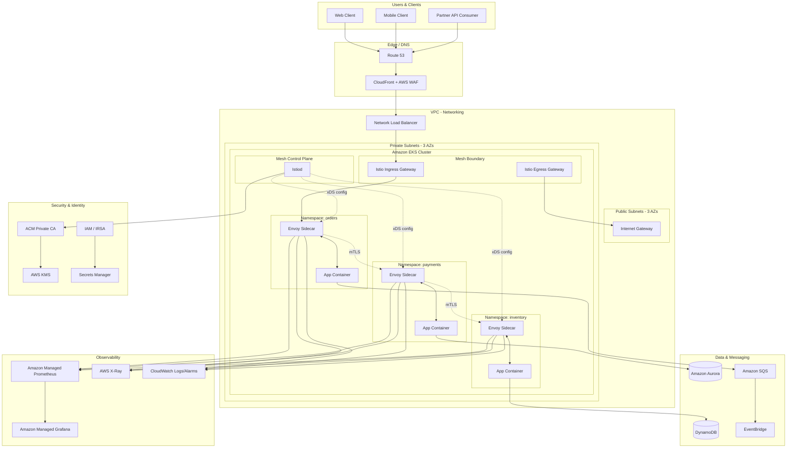

# Part V – Container & Kubernetes Architectures

# Chapter 37: Service Mesh

---

## 1. Executive Summary

Every organization that moves beyond a handful of microservices eventually hits the same wall. It doesn't happen at ten services. It happens somewhere between thirty and two hundred, when the number of point-to-point connections between services grows faster than any team can reason about, when "which version of the payments service is live in us-east-1" becomes a Slack thread instead of a dashboard, and when a single misbehaving downstream dependency starts cascading into an outage that nobody can diagnose because there is no consistent way to see traffic flowing between services.

A service mesh exists to solve this specific class of problem. It is not a replacement for API gateways, not a substitute for good application design, and not free. It is an infrastructure layer — typically implemented as a fleet of lightweight proxies deployed alongside every service instance — that takes over the mechanics of service-to-service communication: encryption, retries, timeouts, load balancing, traffic shaping, and observability. It does this without requiring application code changes, because the logic lives in the proxy (the "data plane"), not in the application itself.

**The business problem.** As organizations decompose monoliths into microservices — whether for independent deployability, team autonomy, or technology diversity — they inherit a distributed systems problem that the monolith never had. In a monolith, a function call between two modules is reliable, synchronous, and observable through a stack trace. In a microservices architecture, that same call becomes a network request over an unreliable network, subject to latency, partial failure, version skew, and security exposure. Every one of those network calls needs:

- Encryption in transit (mutual TLS between every service pair)
- Consistent authentication and authorization independent of application code
- Retry and timeout policies that don't vary randomly by team
- Traffic control for canary releases, blue-green deployments, and A/B testing
- Uniform telemetry — latency, error rate, and request volume — across every service, regardless of the language it's written in

Without a shared layer for these concerns, every team reinvents them, usually inconsistently, usually incompletely, and usually only after a production incident forces the issue.

**The architecture objective.** A service mesh architecture standardizes the network layer for service-to-service traffic by injecting a sidecar proxy (commonly Envoy) next to every workload. All inbound and outbound traffic for a service flows through its local proxy. A control plane (Istio, AWS App Mesh, Linkerd, or Consul Connect) configures every proxy centrally, so policy changes — a new retry budget, a new mTLS requirement, a new canary weight — propagate to the entire fleet without redeploying application code.

On AWS, this pattern is most commonly implemented on Amazon EKS (Elastic Kubernetes Service) or Amazon ECS, using either a self-managed control plane like Istio or Linkerd, or AWS's own App Mesh service (noting that AWS announced App Mesh's end-of-support trajectory in 2023, which we address directly in Section 28 and Section 34 — this is a critical architecture decision point covered later in the chapter).

**Why organizations adopt this architecture.** In practice, the trigger is rarely "we want a service mesh." It's almost always one of these:

1. **Compliance mandates mTLS everywhere.** PCI-DSS, HIPAA, FedRAMP, or an internal security policy requires encryption between every internal service, and retrofitting TLS certificate management into forty codebases individually is untenable.
2. **A cascading failure took down an unrelated service.** One team's slow database causes their service to back up, which causes callers to pile up connections, which exhausts thread pools in services three hops away. Nobody had circuit breakers, because circuit breakers were "a networking thing," not application logic.
3. **Canary deployments are manual and risky.** Rolling out a new version to 5% of traffic requires either a second Kubernetes Service and manual DNS trickery, or an in-application feature flag system that only some teams have adopted.
4. **Observability is inconsistent across languages.** The Java services emit one set of metrics, the Go services emit another, and the Python services emit almost nothing. Nobody can build a single request-latency dashboard across the whole platform.
5. **Multiple teams need consistent authorization without owning each other's code.** Platform engineering wants to enforce "service A cannot call service B" as policy, not as a code review checklist.

**Major business benefits.**

| Benefit | Mechanism | Business Outcome |
|---|---|---|
| Reduced mean time to resolution (MTTR) | Uniform golden-signal telemetry (latency, traffic, errors, saturation) per service pair | Incidents diagnosed in minutes, not hours |
| Lower security audit cost | mTLS and authorization enforced at the infrastructure layer, not per-application | Faster compliance certification, fewer findings |
| Safer releases | Native traffic shifting, canary analysis, mirroring | Fewer production incidents from bad deploys |
| Developer velocity | Retries, timeouts, and circuit breaking handled outside application code | Application teams focus on business logic |
| Consistent governance | Centralized policy for traffic, security, and quotas | Platform team can enforce standards without blocking teams |

**Typical enterprise scenarios.** This architecture shows up in: a fintech platform with forty to sixty microservices where PCI-DSS requires mutual TLS between every internal service; a retail company running canary deployments for their checkout service during peak shopping events; a healthcare platform where HIPAA audit requirements mandate detailed access logs for every service-to-service call touching PHI; and platform engineering teams at any company past roughly 150 engineers who need to enforce network policy as code rather than as a wiki page.

**When this is the wrong architecture** (previewed here, expanded in Section 34): a five-service startup, a team without dedicated platform engineering capacity, or any organization that hasn't yet felt the pain described above. A service mesh adds real operational complexity — sidecar proxies, a control plane, certificate rotation, and a genuinely non-trivial learning curve — and that complexity needs to be justified by an actual problem, not adopted because it appears on an architecture diagram at a conference talk.

---

## 2. Business Requirements

### Business Drivers

- Enforce zero-trust networking between internal services without per-team implementation effort
- Reduce incident resolution time by standardizing telemetry across a polyglot service fleet
- Enable progressive delivery (canary, blue-green, traffic mirroring) as a platform capability
- Meet compliance obligations (PCI-DSS, HIPAA, SOC 2) for encryption-in-transit and access auditing
- Decouple networking and security policy from application release cycles

### Functional Requirements

| Requirement | Description |
|---|---|
| Mutual TLS | Every service-to-service call is encrypted and mutually authenticated by default |
| Traffic routing | Support weighted routing, header-based routing, and traffic mirroring for canary and A/B testing |
| Retry and timeout policy | Centrally configurable per-route retry budgets, timeouts, and circuit breakers |
| Authorization | Fine-grained service-to-service and identity-to-service access policy |
| Observability | Automatic golden-signal metrics, distributed tracing, and access logs for every proxied call |
| Multi-cluster support | Traffic routing and service discovery across multiple EKS clusters and, where applicable, multiple AWS accounts/regions |
| Ingress/egress control | Managed entry and exit points for traffic crossing the mesh boundary |

### Non-Functional Requirements

**Scalability goals**

- Support 50–500+ services and 500–10,000+ pods across the mesh without control-plane bottlenecks
- Sidecar proxy overhead should add no more than 2–5ms p99 latency per hop under normal load
- Control plane must handle configuration propagation to thousands of proxies within seconds of a policy change

**Availability requirements**

- Data plane (sidecar proxies) must continue serving traffic even during control-plane unavailability
- Target 99.95%–99.99% availability for mesh-dependent services, consistent with typical enterprise SLAs
- No single point of failure in the control plane; control plane itself must run Multi-AZ

**Latency requirements**

- p50 added latency per proxy hop: under 1ms
- p99 added latency per proxy hop: under 5ms
- End-to-end request budgets must account for cumulative hop latency in deep call chains (a request touching 6 services adds up quickly — this is a real trade-off addressed in Section 34)

**Compliance requirements**

- PCI-DSS 4.0: encryption of cardholder data in transit (Requirement 4), strong access control (Requirement 7)
- HIPAA: audit controls and transmission security for ePHI
- SOC 2 Type II: logical access controls and change management evidence

**Security expectations**

- Default-deny network policy; explicit allow-listing of service-to-service communication
- Automatic certificate issuance and rotation (typically 24-hour or shorter certificate lifetimes for mesh mTLS)
- No plaintext service-to-service traffic permitted inside the mesh boundary

**Recovery objectives**

| Metric | Target | Notes |
|---|---|---|
| RPO (control plane config) | Near-zero | Configuration stored in Git, reapplied via GitOps |
| RTO (control plane failure) | Under 15 minutes | Data plane continues operating with last-known config during recovery |
| RTO (data plane node failure) | Under 2 minutes | Kubernetes reschedules pods; new sidecars register automatically |

**SLAs**

- Internal platform SLA: mesh control plane 99.9% monthly availability
- Downstream service SLAs unaffected by mesh outages (data plane fail-open/fail-closed behavior must be explicitly decided per service — see Section 24)

**Expected workload and growth**

- Baseline: 40 services, 300 pods, 2,000 requests/second aggregate
- 12-month growth target: 80 services, 1,200 pods, 12,000 requests/second aggregate
- Multi-cluster expansion anticipated within 18 months (multi-region active-active, covered in Chapter 98)

---

## 3. Architecture Overview

### Overall Design

The service mesh architecture separates two concerns that are traditionally tangled together inside application code: **business logic** and **network behavior**. It does this with two planes:

- **Data plane** — a sidecar proxy (Envoy, in the case of Istio and AWS App Mesh) deployed as an additional container in every pod. All traffic in and out of the application container is transparently intercepted and routed through this proxy via `iptables` rules injected at pod startup.
- **Control plane** — a set of components (Istiod for Istio; App Mesh's managed control plane for AWS App Mesh) that watches the desired state (defined as Kubernetes Custom Resources or App Mesh API objects), computes the proxy configuration for every sidecar, and pushes it down via a standardized configuration protocol (xDS — the Envoy discovery service API).

### Architecture Philosophy

The mesh follows three principles that should guide every design decision made later in this chapter:

1. **Transparency to application code.** A service should not need to know it's inside a mesh. It makes a normal HTTP or gRPC call to `payments-service.default.svc.cluster.local`, and the sidecar handles TLS, retries, and routing invisibly.
2. **Policy as configuration, not code.** Retry budgets, mTLS requirements, and authorization rules are Kubernetes-native objects, version-controlled in Git, and deployed through the same GitOps pipeline as everything else in the platform.
3. **Fail predictably, not silently.** Every mesh has a documented behavior for what happens when the control plane is unreachable, when a sidecar crashes, or when mTLS handshake fails. This must be an explicit decision, not a default nobody reviewed.

### Core Components

| Component | Role |
|---|---|
| Envoy sidecar proxy | Intercepts and manages all pod-level network traffic |
| Control plane (Istiod / App Mesh) | Computes and distributes proxy configuration |
| Certificate authority | Issues short-lived mTLS certificates to every proxy (Istio's built-in CA, or AWS Certificate Manager Private CA) |
| Ingress gateway | Dedicated Envoy proxies at the mesh boundary handling north-south traffic |
| Egress gateway | Controls and audits traffic leaving the mesh to external services |
| Sidecar injector | Kubernetes admission webhook that automatically adds the sidecar container to new pods |
| Telemetry pipeline | Collects metrics (Prometheus), traces (X-Ray or Jaeger/OpenTelemetry), and access logs from every proxy |

### How Components Interact — High-Level Workflow

1. A developer applies a Kubernetes manifest for a new service.
2. The mesh's mutating admission webhook intercepts pod creation and injects the sidecar container.
3. On pod startup, an init container configures `iptables` rules to redirect all traffic through the sidecar's listener ports.
4. The sidecar registers with the control plane and receives its initial configuration (routing rules, TLS certificates, authorization policy) via xDS.
5. When the application makes an outbound call, the kernel redirects it to the local sidecar, which performs service discovery, TLS origination, load balancing across healthy endpoints, and emits telemetry — all before the request leaves the pod's network namespace.
6. The receiving pod's sidecar terminates TLS, validates the peer certificate against mesh policy, applies authorization rules, and forwards the request to the local application container.

### Request Lifecycle

```

Client → Ingress Gateway (mTLS terminate, authN) 
       → Sidecar A (outbound: LB, retry policy, circuit breaker) 
       → Sidecar B (inbound: mTLS verify, authZ, rate limit) 
       → Application Container B
       → (response reverses the same path, telemetry emitted at every hop)

```

### Response Lifecycle

Responses traverse the same proxy chain in reverse. Each sidecar records latency, status code, and response size for its hop, which is how the mesh produces per-service-pair golden signals without any application-level instrumentation.

### Data Lifecycle

Mesh telemetry (metrics, traces, access logs) is not application data — it's operational metadata. It flows from each sidecar to a Prometheus-compatible metrics backend (typically Amazon Managed Service for Prometheus) and a tracing backend (AWS X-Ray or a self-hosted Jaeger/Tempo stack fed via OpenTelemetry Collector), with access logs shipped to CloudWatch Logs or an S3-based log lake for long-term audit retention — a requirement in most regulated environments.

---

## 4. AWS Services Used

> **Note on control plane choice.** This chapter presents the architecture using **Amazon EKS with Istio** as the primary reference implementation, because it is the dominant production choice as of this writing, with the broadest community support and feature set. Where AWS App Mesh is materially different, it is called out explicitly, along with the migration guidance organizations currently running App Mesh need (see Section 28).

### Amazon EKS (Elastic Kubernetes Service)

**Purpose:** Managed Kubernetes control plane hosting the mesh's data plane workloads and, optionally, the mesh control plane itself.

**Why selected:** EKS removes the operational burden of running etcd, the Kubernetes API server, and control plane upgrades, while remaining fully compatible with upstream Kubernetes — critical because Istio, Linkerd, and most mesh tooling assume vanilla Kubernetes APIs.

**Alternatives:** Self-managed Kubernetes on EC2 (more control, significantly more operational overhead); Amazon ECS with App Mesh (simpler, but a materially different and less feature-rich mesh model — no CRD-based traffic management); Fargate for EKS (removes node management, but has restrictions on DaemonSets and sidecar resource control that complicate mesh deployment).

**Limitations:** EKS control plane is regional; multi-region requires multiple clusters and explicit multi-cluster mesh federation (see Section 9 and Chapter 98). Node-level `iptables` sidecar injection is incompatible with Fargate's isolated pod networking model in older EKS versions — this has improved with EKS Fargate's support for Istio's ambient mesh mode, but it should be validated against the current AWS documentation before committing to a Fargate-only node strategy.

**Pricing considerations:** EKS control plane charges a flat hourly fee per cluster; the majority of cost is in the underlying EC2/Fargate compute for nodes, which increases with the mesh because every pod now runs an additional sidecar container consuming CPU and memory (typically 0.1–0.5 vCPU and 64–128Mi baseline per sidecar — this adds up materially at scale and is a real, frequently underestimated cost driver, covered in Section 16).

**Best practices:** Use managed node groups with Bottlerocket AMIs for a minimal, security-hardened OS; enable EKS control plane logging (audit, API, authenticator) to CloudWatch; run multiple node groups across at least three Availability Zones.

### AWS App Mesh (where used, or as a migration source)

**Purpose:** AWS-native service mesh control plane, integrating with ECS, EKS, and EC2 workloads.

**Why selected (historically):** Deep integration with AWS-native services (Cloud Map for service discovery, ACM for certificates, X-Ray for tracing) without requiring a separate control plane to operate.

**Current status — read before adopting:** AWS has signaled App Mesh is not receiving continued feature investment relative to the CNCF ecosystem's Istio and Linkerd projects. New production deployments should default to Istio or Linkerd on EKS unless there is a specific reason (existing App Mesh investment, ECS-only environment where Istio has weaker support) to choose otherwise. Section 28 covers this decision in full with a comparison matrix.

### Elastic Load Balancing — Network Load Balancer (NLB) and Application Load Balancer (ALB)

**Purpose:** NLB fronts the mesh's ingress gateway for TCP/TLS passthrough at the network edge; ALB is used where AWS-native HTTP routing (host/path-based) is needed ahead of the mesh, such as for the AWS Load Balancer Controller integration.

**Why selected:** NLB provides the low-latency, high-throughput Layer 4 entry point that preserves client IPs and TLS passthrough required for the mesh's own mTLS termination at the ingress gateway, rather than double-terminating TLS at the AWS load balancer.

**Alternatives:** Terminating TLS at ALB and re-encrypting into the mesh (simpler certificate management, but breaks true end-to-end mTLS and adds a second TLS handshake).

**Limitations:** NLB does not support Layer 7 routing — all HTTP-level routing decisions happen in the mesh's Envoy ingress gateway, not the AWS load balancer.

**Pricing considerations:** NLB billed per-hour plus per-GB processed (Network Load Balancer Capacity Units); typically cheaper than ALB at high throughput but lacks WAF integration, which must instead be handled via AWS WAF on CloudFront in front of the NLB, or via a Layer 7 ALB tier ahead of the mesh boundary for public-facing services.

### Amazon Certificate Manager Private Certificate Authority (ACM Private CA)

**Purpose:** Root and intermediate certificate authority for issuing the short-lived mTLS certificates the mesh uses for workload identity.

**Why selected:** Removes the operational burden of running a self-hosted CA; integrates with Istio via a cert-manager `Issuer` for automated certificate issuance and rotation, satisfying compliance requirements for CA key protection (HSM-backed).

**Alternatives:** Istio's built-in `istiod` CA (simpler, no additional cost, but the root key is stored inside the cluster — an unacceptable risk profile for many regulated environments); HashiCorp Vault PKI (more flexible, but adds another system to operate).

**Limitations:** ACM Private CA has a non-trivial monthly cost per CA plus per-certificate issuance cost, which needs to be modeled against certificate rotation frequency (mesh certificates commonly rotate every 24 hours, generating meaningfully more issuance volume than typical TLS certificates).

**Best practices:** Use a dedicated subordinate CA for the mesh, chained to an offline or tightly restricted root CA; enable CloudTrail logging for all CA operations.

### Amazon Managed Service for Prometheus (AMP) and Amazon Managed Grafana (AMG)

**Purpose:** Collects and stores the golden-signal metrics (request rate, error rate, duration, saturation) that every mesh sidecar emits, and visualizes them.

**Why selected:** Removes the operational burden of running and scaling a self-hosted Prometheus/Thanos stack, which becomes non-trivial at mesh scale (every sidecar exposes a `/stats/prometheus` endpoint scraped at 15–30 second intervals).

**Alternatives:** Self-hosted Prometheus with Thanos or Cortex for long-term storage (full control, meaningfully more operational burden); CloudWatch Container Insights (less granular, weaker query language for service-mesh-specific dashboards).

**Limitations:** AMP is remote-write compatible but requires a scraper (typically the AWS Distro for OpenTelemetry Collector) running in-cluster to forward metrics — it does not scrape directly.

**Pricing considerations:** Billed per metric sample ingested; mesh telemetry at scale (hundreds of services, many metric dimensions per service pair) can produce meaningfully more samples than typical application-only metrics — cardinality management (Section 16) is essential to avoid surprise bills.

### AWS X-Ray

**Purpose:** Distributed tracing backend correlating a single request's path across every service it touches in the mesh.

**Why selected:** Native AWS integration, no additional infrastructure to run, integrates with Envoy's tracing headers with minimal configuration.

**Alternatives:** Self-hosted Jaeger or Grafana Tempo via OpenTelemetry Collector (richer UI and query capability for very high-cardinality tracing needs, more operational overhead).

**Limitations:** X-Ray sampling defaults can miss low-frequency but high-value traces (e.g., errors) unless sampling rules are explicitly tuned; X-Ray's trace retention (30 days) is shorter than what some compliance regimes require for audit purposes, requiring export to S3 for long-term retention.

### Amazon CloudWatch (Logs, Metrics, Alarms, Container Insights)

**Purpose:** Centralized collection of Envoy access logs, EKS control plane logs, and node/pod-level metrics; alarm evaluation and notification.

**Why selected:** Single pane of glass consistent with the rest of the AWS estate; native integration with SNS for alerting.

**Alternatives:** OpenSearch for full-text log search at scale with more powerful querying (commonly used alongside CloudWatch for high-volume access log analysis — see Section 22).

**Limitations:** CloudWatch Logs Insights query performance and cost degrade at very high log volumes; Envoy access logs at full verbosity across hundreds of services generate substantial volume — sampling and log level tuning is a real operational task, not a one-time setting.

### AWS Identity and Access Management (IAM) and IAM Roles for Service Accounts (IRSA)

**Purpose:** Grants Kubernetes service accounts (and therefore individual mesh workloads) narrowly scoped AWS API permissions without static credentials.

**Why selected:** IRSA is the standard, least-privilege mechanism for AWS API access from EKS pods; used by mesh control plane components needing to call ACM Private CA, and by mesh telemetry collectors writing to AMP/CloudWatch.

**Best practices:** One IAM role per service account, scoped to only the AWS APIs that specific component needs; never share a single broad IAM role across the whole mesh control plane.

### Amazon VPC, Route 53, AWS Key Management Service (KMS), AWS Secrets Manager

Covered in depth in Sections 9, 10, and 11. In summary: VPC provides the network isolation boundary the mesh operates within; Route 53 handles DNS for services exposed outside the cluster and for multi-cluster mesh federation; KMS encrypts EBS volumes backing node storage and Secrets Manager objects; Secrets Manager stores any credentials the mesh control plane itself needs (e.g., external CA integration credentials), synced into Kubernetes via the AWS Secrets and Configuration Provider (ASCP) for the Secrets Store CSI Driver rather than stored as native Kubernetes Secrets.

---

## 5. Complete Architecture Diagram



---

## 6. Component-by-Component Explanation

### Envoy Sidecar Proxy

**Purpose:** Intercepts every network call to and from its co-located application container, applying mTLS, routing, retries, and telemetry.

**Responsibilities:** TLS origination and termination; load balancing across healthy endpoints; retry and timeout enforcement; circuit breaking; access logging; metrics emission.

**Inputs:** Application traffic (redirected via `iptables`); configuration pushed from the control plane via xDS.

**Outputs:** Proxied requests to destination sidecars; metrics to Prometheus; traces to X-Ray/OTel; access logs to stdout (collected by Fluent Bit into CloudWatch).

**Scaling:** Scales implicitly with the application — one sidecar per pod. Resource requests/limits must be set explicitly (a very commonly missed step, see Section 27) or the scheduler will under-provision for sidecar overhead.

**High availability:** Not independently made HA — its availability is tied to the pod. If the sidecar crashes, Kubernetes restarts the whole pod (sidecar and app together, when configured as native sidecars in Kubernetes 1.28+, or via `preStop`/`postStart` hook ordering on older versions).

**Failure handling:** Configurable per-route outlier detection ejects unhealthy endpoints from the load balancing pool; circuit breakers prevent cascading overload.

**Dependencies:** Control plane for configuration; local certificate for mTLS identity.

**Security:** Enforces mTLS and `AuthorizationPolicy` objects at the network edge of every pod — this is the actual enforcement point for zero-trust networking.

**Monitoring:** Exposes `/stats/prometheus` for scraping; emits structured access logs per request.

### Control Plane (Istiod)

**Purpose:** Single source of truth for mesh configuration; watches Kubernetes CRDs (`VirtualService`, `DestinationRule`, `AuthorizationPolicy`, `PeerAuthentication`) and computes the corresponding Envoy configuration for every proxy.

**Responsibilities:** Configuration distribution (xDS server); certificate issuance (or delegation to ACM Private CA via a `cert-manager` integration); service discovery aggregation from the Kubernetes API.

**Scaling:** Runs as a Deployment with multiple replicas; scales horizontally based on the number of connected sidecars and configuration change frequency, typically 2–3 replicas sufficient up to several thousand proxies, more beyond that.

**High availability:** Deploy at least 2 replicas spread across Availability Zones using pod anti-affinity; the data plane continues serving traffic using last-known-good configuration if all `istiod` replicas become unavailable, which bounds the blast radius of a control plane outage.

**Failure handling:** If `istiod` is unreachable, sidecars retain their last pushed configuration — new pods cannot start (no config to receive), but existing traffic continues flowing. This fail-static behavior is a deliberate and important design property.

**Dependencies:** Kubernetes API server; ACM Private CA (or internal CA) for certificate signing.

**Security:** Runs with a narrowly scoped Kubernetes RBAC ClusterRole; its own mTLS identity is protected the same as any workload identity.

### Ingress Gateway

**Purpose:** The single, explicit entry point for traffic entering the mesh from outside the cluster.

**Responsibilities:** TLS termination (or passthrough) for external traffic; initial routing to the correct internal service; the first point where AWS WAF, rate limiting, and authentication for external clients can be enforced before traffic enters the mesh's internal trust boundary.

**Scaling:** Runs as a standard Kubernetes Deployment behind a Horizontal Pod Autoscaler (HPA), fronted by an NLB.

**High availability:** Minimum 3 replicas across 3 AZs; NLB health checks remove unhealthy gateway pods from rotation.

**Dependencies:** Same control plane as every other sidecar — the gateway is itself an Envoy proxy, just deployed as a standalone Deployment rather than injected into an application pod.

### Egress Gateway

**Purpose:** Centralizes and audits all traffic leaving the mesh to external destinations (third-party APIs, SaaS integrations).

**Responsibilities:** Enforces an explicit allow-list of external destinations (default-deny for egress is a strong security posture many organizations under-adopt — see Section 27); provides a single point for TLS origination to external services and for centralized egress logging required by many compliance frameworks.

### Certificate Authority (ACM Private CA integration)

**Purpose:** Root of trust for every workload identity certificate in the mesh.

**Responsibilities:** Issues short-lived (typically 24-hour) X.509 certificates to every sidecar, encoding the workload's Kubernetes service account as its SPIFFE identity.

**Security:** Root and intermediate CA private keys are HSM-backed and never leave ACM Private CA; certificate rotation is fully automated, eliminating a historically common source of production outages (expired manually-managed certificates).

---

## 7. End-to-End Request Flow

The following describes a request from an external mobile client calling the `orders` service, which in turn calls `payments` and `inventory` synchronously.

1. **Client** issues an HTTPS request to `api.example.com/orders`.
2. **Route 53** resolves the domain to the CloudFront distribution.
3. **CloudFront + AWS WAF** evaluates the request against managed and custom WAF rules (SQL injection, rate-based rules), then forwards to the origin — the Network Load Balancer.
4. **Network Load Balancer** performs Layer 4 TCP passthrough to healthy Istio Ingress Gateway pods across 3 AZs.
5. **Istio Ingress Gateway** terminates client TLS, validates the JWT bearer token (via `RequestAuthentication`) if the API requires end-user authentication, and applies the `VirtualService` routing rule matching `/orders` to the `orders` service.
6. **Orders sidecar (inbound)** receives the forwarded request, verifies the ingress gateway's mTLS identity, and passes the request to the `orders` application container.
7. **Orders application** processes the request and makes an outbound call to `payments-service`.
8. **Orders sidecar (outbound)** intercepts this call via `iptables`, performs service discovery for `payments-service`, selects a healthy endpoint via the configured load balancing policy (default: least-request), originates mTLS, and applies the configured retry policy (e.g., 2 retries on 503, with a 150ms per-try timeout).
9. **Payments sidecar (inbound)** verifies the peer certificate matches the `orders` service account identity, evaluates the `AuthorizationPolicy` (does `orders` have permission to call `payments`?), and — if approved — forwards to the `payments` application container.
10. **Payments application** queries **Amazon Aurora** for account balance and transaction validation, applying its own connection pooling.
11. **Payments application** returns a response; the reverse path through both sidecars records latency and status code for telemetry.
12. **Orders application**, having received the payments response, calls **inventory-service** to reserve stock, following the same sidecar-mediated mTLS and authorization flow (steps 8–9 repeated for the `inventory` destination).
13. **Inventory application** queries **DynamoDB** for stock levels and reserves the requested quantity.
14. **Orders application** publishes an `OrderCreated` event to **Amazon SQS** (or EventBridge) for asynchronous downstream processing (notifications, analytics) — this call also passes through the sidecar for mTLS to the SQS VPC endpoint where applicable.
15. **Orders application** returns the final response to its own sidecar.
16. **Orders sidecar (outbound to ingress)** relays the response back through the ingress gateway.
17. **Ingress Gateway** returns the response over the established client TLS session, back through CloudFront to the client.
18. **Error handling (any step 6–14):** if a downstream sidecar reports a connection failure or a 503, the calling sidecar's configured retry and circuit-breaker policy activates automatically — the application code never sees or handles this unless retries are exhausted, in which case a standard error propagates up.
19. **Logging:** every sidecar hop emits a structured access log line (timestamp, source/destination identity, latency, response code, trace ID) to CloudWatch Logs.
20. **Monitoring:** every sidecar hop emits Prometheus metrics scraped by the OpenTelemetry Collector into Amazon Managed Prometheus, and a trace span into AWS X-Ray correlated by trace ID across all 3 services touched by this single client request.

---

## 8. Deployment Flow

### Infrastructure Provisioning

The EKS cluster, VPC, node groups, and IAM roles are provisioned via Terraform (Section 18) as the foundation layer. The mesh control plane itself is installed on top of the provisioned cluster, typically via the `istioctl` CLI or the Istio Helm charts, orchestrated through the same CI/CD pipeline as application deployments — not as a manual, one-time install, because mesh version upgrades are a recurring operational task.

### Terraform Workflow

1. `terraform plan` against the networking module (VPC, subnets, NAT gateways) — reviewed and approved.
2. `terraform apply` provisions networking.
3. `terraform plan`/`apply` against the EKS module (cluster, managed node groups, IRSA roles for mesh components).
4. Mesh installation (Helm-based `istio-base`, `istiod`, and gateway charts) applied via a GitOps controller (Argo CD or Flux) watching a dedicated `platform` Git repository — not applied manually, so cluster state always matches Git.

### CI/CD Deployment

Application teams deploy through their own pipelines, but every deployment passes through a shared admission control layer that verifies:

- The deployment's namespace has sidecar injection enabled (`istio-injection: enabled` label)
- Resource requests/limits are set for both the app container and (validated post-injection) the sidecar
- No `NetworkPolicy` or `AuthorizationPolicy` is bypassed by the new workload

### Blue-Green Deployment

The mesh's `VirtualService` and `DestinationRule` objects implement blue-green natively: two `Deployment` objects (`orders-v1`, `orders-v2`) are labeled distinctly, a `DestinationRule` defines both as subsets, and a `VirtualService` initially routes 100% of traffic to `v1`. Cutover is a single manifest change shifting the weight to `v2` — no DNS changes, no load balancer reconfiguration, and instant rollback by reverting the weight.

```yaml

apiVersion: networking.istio.io/v1beta1
kind: VirtualService
metadata:
  name: orders
spec:
  hosts:
    - orders
  http:
    - route:
        - destination:
            host: orders
            subset: v1
          weight: 90
        - destination:
            host: orders
            subset: v2
          weight: 10

```

### Rollback

Because routing state lives in a version-controlled `VirtualService` object, rollback is a `kubectl apply` of the previous Git-committed manifest (or an Argo CD sync to the prior revision) — typically completing propagation to all relevant sidecars within seconds, materially faster than a traditional load-balancer-and-DNS-based rollback.

### Secrets

Mesh mTLS certificates are never handled as Kubernetes Secrets requiring manual rotation — they are issued automatically by the CA integration. Application-level secrets (database credentials, API keys) remain managed via AWS Secrets Manager and the Secrets Store CSI Driver, entirely orthogonal to the mesh.

### Configuration

All mesh policy objects (`VirtualService`, `DestinationRule`, `AuthorizationPolicy`, `PeerAuthentication`) are stored in Git alongside application manifests, reviewed via pull request, and applied via GitOps — never applied ad hoc via `kubectl apply` in production.

### Validation

Every mesh configuration change is validated pre-merge using `istioctl analyze` in CI, which catches common misconfigurations (conflicting `VirtualService` hosts, orphaned `DestinationRule` subsets, missing `PeerAuthentication` coverage) before they reach the cluster.

---

## 9. Network Topology

### VPC and CIDR

A dedicated VPC per environment (dev, staging, prod) with a `/16` CIDR block (e.g., `10.20.0.0/16`), sized to accommodate EKS's per-pod IP allocation via the Amazon VPC CNI, which is materially more IP-address-hungry than typical EC2 workloads because every pod (application container plus sidecar share one pod IP, but the pod itself consumes a full VPC IP address).

| Subnet Tier | CIDR Example | Purpose |
|---|---|---|
| Public (×3 AZ) | 10.20.0.0/24, 10.20.1.0/24, 10.20.2.0/24 | NLB, NAT Gateways, Internet Gateway attachment |
| Private – nodes (×3 AZ) | 10.20.10.0/22, 10.20.14.0/22, 10.20.18.0/22 | EKS worker nodes and pods |
| Private – data (×3 AZ) | 10.20.30.0/24, 10.20.31.0/24, 10.20.32.0/24 | Aurora, DynamoDB VPC endpoints, ElastiCache |

### NAT Gateway and Internet Gateway

One NAT Gateway per AZ (not a single shared NAT Gateway) to avoid a cross-AZ single point of failure and to avoid inter-AZ data transfer charges on egress traffic — a genuinely material cost difference at mesh egress volumes (Section 16). Internet Gateway attached to the VPC for public subnet resources (NLB, bastion/SSM access) only.

### Transit Gateway

For multi-cluster mesh federation across environments or regions (a common evolution path — Section 34), AWS Transit Gateway connects multiple VPCs, allowing cross-cluster pod-to-pod routing required for Istio's multi-primary or primary-remote multi-cluster topologies. This is not needed for a single-cluster mesh and should not be provisioned until multi-cluster is an actual, scheduled requirement.

### Route Tables

Private node subnets route `0.0.0.0/0` to the AZ-local NAT Gateway; data subnets have no default route to the internet at all — access to Aurora and DynamoDB happens exclusively via VPC endpoints (Gateway endpoint for DynamoDB, Interface endpoint for other AWS services), keeping all data-plane-to-database traffic off the public internet entirely.

### Network ACLs and Security Groups

Security Groups do the primary enforcement work at the AWS network layer (stateful, per-instance/per-ENI); Network ACLs are used as a coarse, stateless secondary control at the subnet boundary (e.g., explicitly denying known-bad CIDR ranges). Critically: **Security Groups control which pods can reach which AWS resources; they do not replace the mesh's own `AuthorizationPolicy` objects**, which control which services can call which other services within the mesh. These are complementary layers, not substitutes for each other — a common point of confusion (Section 27).

### PrivateLink

Where third-party SaaS integrations (payment processors, identity providers) offer AWS PrivateLink endpoints, they are preferred over public internet egress, keeping sensitive traffic off the public internet and routing it through the mesh's egress gateway to a PrivateLink VPC endpoint.

### Hybrid Connectivity

If the organization has on-premises systems the mesh needs to reach (a common state during microservices migration — see Chapter 84, Strangler Fig), AWS Direct Connect or Site-to-Site VPN terminates into the VPC, and the mesh's egress gateway is configured with explicit routes to the on-premises CIDR ranges, still subject to the same authorization and TLS policy as any other egress traffic.

---

## 10. Identity and Access

### IAM Roles for Service Accounts (IRSA)

Every mesh control plane component that needs AWS API access (the cert-manager integration calling ACM Private CA; the OpenTelemetry Collector writing to Amazon Managed Prometheus) runs under its own Kubernetes ServiceAccount, annotated with an IAM role ARN. This is the standard mechanism replacing node-level IAM roles for pod-level AWS access, and it is essential for mesh components specifically because the mesh control plane should never share the broad permissions typically granted to node IAM roles.

```hcl

resource "aws_iam_role" "cert_manager_acm_pca" {
  name = "eks-cert-manager-acm-pca"

  assume_role_policy = jsonencode({
    Version = "2012-10-17"
    Statement = [{
      Effect = "Allow"
      Principal = {
        Federated = aws_iam_openid_connect_provider.eks.arn
      }
      Action = "sts:AssumeRoleWithWebIdentity"
      Condition = {
        StringEquals = {
          "${replace(aws_iam_openid_connect_provider.eks.url, "https://", "")}:sub" = "system:serviceaccount:cert-manager:cert-manager"
        }
      }
    }]
  })
}

```

### IAM Policies — Least Privilege

The IAM policy attached to the above role grants only `acm-pca:IssueCertificate`, `acm-pca:GetCertificate`, and `acm-pca:DescribeCertificateAuthority` scoped to the single mesh CA ARN — never `acm-pca:*`, and never scoped to `Resource: "*"`.

### Resource Policies

The ACM Private CA resource policy restricts which IAM principals may request certificate issuance, adding a second enforcement layer beyond the IAM policy attached to the requesting role — defense in depth against a misconfigured IAM policy elsewhere in the account.

### STS and Cross-Account Access

In multi-account setups (a separate AWS account per environment, per the AWS Well-Architected Framework's recommended account structure), the mesh's telemetry pipeline in each workload account assumes a cross-account role via STS to write into a centralized observability account's Amazon Managed Prometheus workspace, avoiding the anti-pattern of granting workload accounts standing write access to shared observability infrastructure.

### Least Privilege in Practice for the Mesh

- `istiod`'s Kubernetes RBAC ClusterRole grants read access to `Endpoints`, `Services`, and mesh CRDs — never write access to arbitrary cluster resources.
- Application teams are granted namespace-scoped RBAC to manage their own `VirtualService` and `DestinationRule` objects but explicitly denied write access to `PeerAuthentication` (mTLS enforcement) and `AuthorizationPolicy` objects at the mesh-wide (`istio-system`) scope — these remain platform-team-owned to prevent an application team from accidentally (or maliciously) weakening mesh-wide security posture.

### Permission Boundaries

An IAM permission boundary is attached to every IRSA role created for mesh components, capping the maximum permissions any future policy change could grant, regardless of what a well-intentioned but overly broad policy update might otherwise allow — a defense against permission creep over the mesh's operational lifetime.

---

## 11. Security Architecture

### Encryption

**In transit:** mTLS is enforced mesh-wide via a `PeerAuthentication` object set to `STRICT` mode in the `istio-system` namespace, meaning plaintext traffic between mesh-injected pods is rejected outright, not merely discouraged.

```yaml

apiVersion: security.istio.io/v1beta1
kind: PeerAuthentication
metadata:
  name: default
  namespace: istio-system
spec:
  mtls:
    mode: STRICT

```

**At rest:** EBS volumes backing EKS nodes are encrypted with a customer-managed KMS key; Aurora storage encryption and DynamoDB encryption at rest also use customer-managed KMS keys rather than AWS-managed defaults, satisfying most compliance frameworks' requirement for demonstrable key control.

### KMS

A dedicated KMS key per environment (not shared across dev/staging/prod) with a key policy restricting `kms:Decrypt` to the specific IAM roles that legitimately need it — the EKS node role for EBS, the Aurora service-linked role for database encryption, and nothing else.

### TLS and Certificate Manager

Public-facing TLS (CloudFront, the public ALB if used) uses AWS Certificate Manager's public certificates, auto-renewed by AWS. Internal mesh mTLS uses the separate ACM Private CA hierarchy described in Section 6 — these are two distinct trust chains and should never be conflated.

### AWS WAF and Shield

AWS WAF is attached to the CloudFront distribution (or the public ALB), applying AWS Managed Rule Groups (Core Rule Set, Known Bad Inputs, SQL Injection) plus custom rate-based rules. AWS Shield Standard is automatically active; Shield Advanced is added for internet-facing production workloads with material DDoS exposure (e.g., public e-commerce checkout flows) given its cost is only justified at that risk profile.

### Secrets Manager

Application secrets — database credentials, third-party API keys — are stored in Secrets Manager, never in Kubernetes Secrets or ConfigMaps in plaintext, and synced into pods at runtime via the Secrets Store CSI Driver, meaning secrets never persist to etcd.

### GuardDuty, Inspector, Security Hub

GuardDuty's EKS Protection and Runtime Monitoring features are enabled account-wide, detecting anomalous API calls and in-container runtime threats (e.g., a compromised sidecar attempting privilege escalation). Inspector continuously scans container images in ECR for known CVEs, gating the CI/CD pipeline from deploying images above an agreed severity threshold. Security Hub aggregates findings from GuardDuty, Inspector, and Config into a single compliance dashboard mapped to the specific compliance standards in scope (PCI-DSS, CIS AWS Foundations).

### CloudTrail and AWS Config

CloudTrail logs every API call across the account, including ACM Private CA certificate issuance events — essential audit evidence for demonstrating mTLS certificate lifecycle control. AWS Config continuously evaluates resource configuration against managed and custom rules (e.g., "EKS clusters must have private endpoint access only," "Security Groups must not allow unrestricted ingress on port 22").

### Zero Trust Model

The mesh is a foundational building block of a zero-trust architecture, but is not zero trust by itself. The full model requires:

1. **Workload identity, not network location** — the `AuthorizationPolicy` grants access based on the calling service's SPIFFE identity (its mTLS certificate), not its source IP or subnet.
2. **Default deny** — no service can call another unless an explicit `AuthorizationPolicy` allows it.
3. **Least privilege at every layer** — IAM, Kubernetes RBAC, and mesh `AuthorizationPolicy` all independently enforce least privilege; a failure in one layer doesn't collapse the whole model.

### Threat Model and Attack Vectors

| Attack Vector | Mitigation |
|---|---|
| Compromised pod attempting lateral movement | Default-deny `AuthorizationPolicy`; mTLS identity verification prevents impersonation |
| Man-in-the-middle on internal traffic | Mesh-wide `STRICT` mTLS makes plaintext interception impossible |
| Malicious or compromised sidecar image | Image scanning via Inspector; signed images verified at admission via a policy engine (e.g., Kyverno or OPA Gatekeeper) |
| Control plane compromise | RBAC-scoped `istiod` permissions; audit logging of all control plane API access |
| Certificate theft/replay | Short certificate lifetimes (24 hours) drastically limit the window of usefulness for a stolen certificate |
| Egress data exfiltration | Egress gateway enforces an explicit destination allow-list; default-deny egress `NetworkPolicy` at the Kubernetes layer as a second control |
| Supply chain compromise (malicious dependency) | Image scanning, SBOM generation in CI, admission control rejecting unsigned images |

---

## 12. High Availability

### AZ Failures

Node groups span 3 AZs with pod anti-affinity rules ensuring the mesh control plane, ingress gateways, and any given application's replicas are spread across AZs, not concentrated in one. Loss of an entire AZ removes roughly one-third of capacity, which remaining AZs must absorb — capacity planning (Section 14) must account for N+1 AZ headroom, not just N-AZ steady-state sizing.

### Instance/Node Failures

Kubernetes' native pod rescheduling handles individual node failures automatically; the mesh sidecar injector ensures any rescheduled pod receives its sidecar and control-plane configuration without manual intervention.

### Regional Failures

A single-region mesh deployment has no automatic regional failover — this requires the multi-region active-active pattern covered in Chapter 98, which extends this architecture with multi-cluster mesh federation across regions. This chapter's baseline architecture is single-region, Multi-AZ, and that scope should be explicit in any RFC or design doc referencing it.

### Database Failures

Aurora Multi-AZ with automated failover (typically under 60 seconds) handles primary instance failure; DynamoDB's multi-AZ replication is inherent to the service. The mesh's retry and circuit-breaker policies on the calling services must be tuned to tolerate this failover window without cascading — a database failover that takes 45 seconds but has a mesh retry timeout of 200ms will still produce visible errors upstream unless the application layer has its own failover-aware retry logic.

### Load Balancing and Health Checks

The NLB performs TCP-level health checks against the ingress gateway pods; the ingress gateway itself performs Envoy-native active health checking against upstream service endpoints, ejecting unhealthy pods from the routing pool within the configured `outlierDetection` window (commonly 3 consecutive 5xx responses within 30 seconds triggers ejection).

### Failover

Mesh-level failover between service versions or between regions (in the multi-cluster case) is handled via `VirtualService` traffic weighting, allowing a controlled, observable shift of traffic away from a failing endpoint pool — meaningfully faster and safer than DNS-based failover, which is subject to client-side DNS caching delays.

---

## 13. Disaster Recovery

### Backup Strategy

- **Aurora:** automated daily snapshots plus continuous backup via transaction logs (point-in-time recovery), cross-region snapshot copy to the DR region.
- **DynamoDB:** point-in-time recovery enabled; on-demand backups before major schema or capacity changes.
- **Mesh configuration:** stored entirely in Git — the actual "backup" of mesh policy state is the Git repository itself, which should have its own redundancy (GitHub/GitLab enterprise backup policies) independent of AWS.

### Cross-Region Replication

Aurora Global Database (Chapter 44) provides sub-second cross-region replication for the DR region's read replica, promotable to a writer during a regional failover. DynamoDB Global Tables similarly replicate across regions for services using DynamoDB as primary storage.

### DR Strategy Selection

| Strategy | RTO | RPO | Cost | When to Use |
|---|---|---|---|---|
| Backup & Restore | Hours | Up to 24h | Lowest | Non-critical internal services |
| Pilot Light | 10–30 min | Minutes | Low-Medium | Standard production services |
| Warm Standby | Minutes | Seconds | Medium-High | Customer-facing critical paths (e.g., checkout) |
| Multi-Site Active-Active | Near-zero | Near-zero | Highest | Regulatory-mandated continuous availability |

For the architecture as scoped in this chapter (single-region, Multi-AZ), the recommended baseline DR posture is **Pilot Light**: a minimal-scale EKS cluster with the mesh control plane pre-installed sits idle in the DR region, Aurora Global Database keeps data current, and a documented, tested runbook scales the DR cluster's node groups and shifts Route 53 traffic during an actual regional event. Multi-Site Active-Active is the natural evolution path (Chapter 98) once business requirements justify its materially higher cost and complexity.

### RPO/RTO Targets for This Architecture

| Scenario | RPO Target | RTO Target |
|---|---|---|
| Single pod/node failure | Zero | Under 2 minutes (automatic) |
| Single AZ failure | Zero | Under 5 minutes (automatic) |
| Control plane failure | Zero (Git is source of truth) | Under 15 minutes |
| Regional failure (Pilot Light) | Seconds (Aurora Global DB) | 15–30 minutes (manual/scripted activation) |

---

## 14. Scalability

### Horizontal Scaling

Application `Deployment` objects scale via Horizontal Pod Autoscaler (HPA) based on CPU, memory, or custom metrics (request rate, exposed by the mesh's own Prometheus metrics — a genuinely useful side benefit, since the mesh gives HPA a source of request-rate data without any application-side instrumentation). Node-level scaling uses Cluster Autoscaler or Karpenter, with Karpenter increasingly the preferred choice for its faster provisioning and more efficient bin-packing given mesh sidecars' additional per-pod resource footprint.

### Vertical Scaling

Sidecar proxy resource requests should be right-sized based on observed traffic per service — a low-traffic internal service needs far less sidecar CPU/memory than a high-throughput ingress-facing service; Istio supports per-workload sidecar resource overrides via annotation rather than a single mesh-wide default, which is important because a single default is almost always wrong for either the highest or lowest traffic services in the mesh.

### Auto Scaling Considerations Specific to the Mesh

- New pods must register with the control plane and receive initial configuration before they can serve mesh traffic correctly — this adds a small (typically sub-second, but non-zero) startup latency beyond normal container start time, which must be accounted for in aggressive scale-out scenarios (e.g., Kubernetes readiness probes should not mark a pod ready before its sidecar has successfully connected to the control plane).
- Scaling the control plane itself: `istiod` replica count should scale with the total number of connected sidecars and the rate of configuration churn (deployments, canary weight changes), not simply with cluster size.

### Database Scaling

Aurora scales read capacity via read replicas (up to 15) and, for very high-throughput workloads, Aurora Serverless v2 for automatic capacity adjustment without manual instance resizing. DynamoDB scales via on-demand capacity mode or auto-scaled provisioned capacity, both transparent to the mesh layer.

### Storage Scaling

EBS volumes for node storage (container image cache, ephemeral storage for logs before shipping) should be sized generously — mesh sidecars add meaningfully to the ephemeral storage footprint via access logs, and running out of node disk space is a surprisingly common, entirely preventable incident.

### Queue Scaling

SQS scales inherently without configuration; EventBridge similarly. The mesh's role here is limited to securing and observing the initial publish call from the application to the AWS API (via the sidecar, if the call is proxied) — SQS/EventBridge themselves sit outside the mesh's data plane once the message is published.

---

## 15. Performance Optimization

### Caching

Application-level response caching (Redis via Amazon ElastiCache) sits outside the mesh's direct concern, but mesh-aware teams should ensure cache lookups are also mTLS-protected if ElastiCache is placed inside the mesh's trust boundary, or explicitly excluded from mesh interception (via `traffic.sidecar.istio.io/excludeOutboundPorts`) if using ElastiCache's native in-transit encryption instead — a decision that should be explicit, not accidental.

### Compression

Envoy supports gzip/brotli response compression at the ingress gateway; internal service-to-service traffic is typically left uncompressed, since compression CPU overhead usually outweighs bandwidth savings on low-latency internal links, and compressed payloads complicate access log-based debugging.

### CDN

CloudFront caches static and cacheable API responses at the edge, reducing load that ever reaches the mesh at all — the best-performing request is the one that never reaches the origin.

### Database Optimization

Connection pooling (RDS Proxy for Aurora) is essential in a mesh architecture specifically because sidecar-mediated connections add per-connection overhead; excessive short-lived database connections multiply that overhead across every request. RDS Proxy also smooths connection spikes during Kubernetes pod scale-out events, when many new pods might otherwise open fresh connection pools simultaneously.

### Connection Pooling in the Mesh Itself

Istio's `DestinationRule` `connectionPool` settings (max connections, max pending requests, max requests per connection) should be tuned per destination service based on observed capacity — leaving these at default values is a common source of unexpected 503s under load, because the defaults are conservative and not tailored to any specific service's actual capacity.

```yaml

apiVersion: networking.istio.io/v1beta1
kind: DestinationRule
metadata:
  name: payments
spec:
  host: payments
  trafficPolicy:
    connectionPool:
      tcp:
        maxConnections: 200
      http:
        http1MaxPendingRequests: 100
        maxRequestsPerConnection: 10
    outlierDetection:
      consecutive5xxErrors: 3
      interval: 30s
      baseEjectionTime: 30s

```

### Concurrency and Async Processing

Latency-sensitive synchronous call chains (Section 7's orders → payments → inventory flow) should be minimized in depth; where business logic allows, converting synchronous calls to asynchronous event-driven flows (via SQS/EventBridge) both improves resilience and removes a hop's added mesh latency from the critical path entirely — an architectural decision that matters more for overall performance than any mesh-level tuning.

---

## 16. Cost Optimization (FinOps)

### Deployment Size Cost Estimates

> Figures are directional estimates for the primary region's compute and mesh-related costs; actual costs vary by usage pattern, Reserved/Savings Plan coverage, and data transfer volume. Always validate with the AWS Pricing Calculator for a specific account's pricing.

| Deployment Size | Services | Pods | EKS + EC2 Compute | Mesh-attributable overhead | Observability (AMP/AMG/X-Ray) | Est. Monthly Total |
|---|---|---|---|---|---|---|
| Small | 15 | 100 | ~$2,500 | ~$400 (sidecar CPU/mem) | ~$300 | ~$3,200–4,000 |
| Medium | 40 | 500 | ~$9,000 | ~$1,800 | ~$1,200 | ~$12,000–15,000 |
| Enterprise | 100+ | 2,500+ | ~$40,000+ | ~$8,000+ | ~$6,000+ | ~$55,000–70,000+ |

### Major Cost Drivers

1. **Sidecar resource overhead.** Every pod carries an additional container consuming CPU and memory — at 500 pods with a conservative 0.1 vCPU / 100Mi sidecar footprint, that's 50 vCPUs and 50GB of memory purely for proxy overhead, before any application workload is counted.
2. **NAT Gateway data processing.** Mesh egress traffic (calls to third-party APIs, calls to AWS services not accessed via VPC endpoint) is charged per-GB through NAT Gateway — a frequently underestimated line item.
3. **Cross-AZ data transfer.** Mesh load balancing that ignores AZ locality (routing a request from an AZ-A pod to an AZ-B pod when an AZ-A healthy endpoint was available) incurs cross-AZ transfer charges at scale — Istio's locality-aware load balancing (`outlierDetection` combined with `localityLbSetting`) mitigates this and should be enabled explicitly, not left as an afterthought.
4. **Observability data volume.** Metrics cardinality (a metric series per source-service × destination-service × response-code combination) grows combinatorially with service count — a 100-service mesh can produce an enormous number of unique time series if labels aren't managed carefully.
5. **Certificate issuance volume.** ACM Private CA charges per certificate issued; 24-hour certificate rotation across thousands of pods generates meaningfully more issuance events than a traditional annual-certificate model.

### Optimization Opportunities

| Opportunity | Mechanism | Typical Savings |
|---|---|---|
| Right-size sidecar resources | Per-workload resource overrides instead of a single mesh-wide default | 20–40% of sidecar overhead |
| Locality-aware load balancing | Prefer same-AZ endpoints before failing over cross-AZ | Meaningful reduction in cross-AZ transfer charges |
| VPC endpoints for AWS services | Avoid NAT Gateway processing charges for AWS-internal calls (S3, DynamoDB, ECR) | Material reduction in NAT data processing costs |
| Metric cardinality control | Drop or aggregate high-cardinality labels before ingestion into AMP | 30–60% reduction in metrics ingestion cost |
| Reserved Instances / Savings Plans | Commit to baseline steady-state compute (including sidecar overhead, which is steady and predictable) | 30–50% off On-Demand compute pricing |
| Spot for non-critical workloads | Batch/dev/test node groups on Spot | 60–70% off On-Demand |
| S3 lifecycle for log archives | Transition access logs from S3 Standard to Glacier after the active audit window | 60–80% off storage cost for cold logs |

### Reserved Instances, Savings Plans, and Spot

Sidecar CPU/memory overhead is steady-state and highly predictable (it scales linearly with pod count, not with traffic spikes), making it an excellent candidate for Compute Savings Plans covering baseline node group capacity — this is a genuinely mesh-specific FinOps insight, since the "extra" compute the mesh introduces is some of the most reliably-forecastable capacity in the whole platform. Spot Instances are appropriate for stateless application node groups but should be avoided for the mesh control plane itself, where `istiod` availability directly affects new-pod scheduling ability platform-wide.

### S3 Lifecycle and Storage Classes

Envoy access logs required for compliance audit retention (commonly 1–7 years depending on regulatory framework) should be shipped from CloudWatch Logs to S3 via a subscription filter, with an S3 Lifecycle policy transitioning objects to S3 Glacier Instant Retrieval after 90 days and Glacier Deep Archive after 1 year — full CloudWatch Logs retention at Standard pricing for multi-year audit windows is a significant, avoidable cost.

### Rightsizing

Regular (quarterly, minimum) review of actual sidecar CPU/memory utilization against configured requests/limits, using AMP data — most organizations set sidecar resource requests once at initial mesh rollout and never revisit them, leaving significant reclaimable capacity on the table as traffic patterns evolve.

### Cost Allocation and Tagging

Every EKS node group, and ideally every namespace (via Kubernetes labels propagated to Cost and Usage Report via the CUR's Kubernetes cost allocation integration, or a tool like Kubecost), is tagged with `CostCenter`, `Environment`, and `Team` — critical for a mesh specifically because the shared control plane and observability costs need a fair allocation methodology across the teams whose services generate that load, rather than landing entirely on the platform team's budget.

### Budgets and Cost Anomaly Detection

AWS Budgets alerts on the platform/observability cost center specifically, separate from application compute budgets, since mesh and observability costs grow with service count and traffic in ways that can surprise a platform team if not tracked independently. AWS Cost Anomaly Detection is configured against the EKS and Managed Prometheus service categories, since a metrics cardinality explosion (a genuinely common incident — see Section 24) produces a very fast-onset cost spike that Anomaly Detection is well-suited to catch before it appears on a monthly bill.

---

## 17. AI-Assisted Operations

### Amazon Q Developer

Amazon Q Developer integrates into the CI/CD pipeline and IDE to assist with writing and reviewing mesh configuration YAML (`VirtualService`, `AuthorizationPolicy`), catching common mistakes — a `VirtualService` with conflicting host matches, an `AuthorizationPolicy` that inadvertently denies legitimate traffic — before they reach code review. It is also useful for generating first-draft Terraform for new mesh-related infrastructure (a new IRSA role, a new ACM Private CA subordinate), which a human architect then reviews and refines rather than accepting verbatim.

### Amazon Bedrock for Log and Trace Analysis

A common production pattern: a Bedrock-backed internal tool ingests a batch of Envoy access logs or an X-Ray trace during an incident and produces a natural-language summary of anomalous patterns (a spike in 503s from a specific service pair, a latency regression correlated with a specific deployment timestamp) — this accelerates triage but does not replace an engineer's judgment on root cause, and should be positioned to on-call engineers explicitly as a triage accelerant, not an oracle.

### AI-Assisted Troubleshooting Workflow

1. Alert fires (elevated error rate on `payments` service).
2. On-call engineer queries a Bedrock-backed assistant with the affected service name and time window.
3. The assistant retrieves relevant Prometheus metrics, X-Ray traces, and Envoy access logs for that window (via tool use / function calling against the observability APIs) and produces a structured hypothesis: "Error rate correlates with a deployment of `payments-v2` at 14:32 UTC; 503s originate from `inventory` calls timing out at the configured 150ms threshold, up from a typical 40ms p99 — recommend checking `inventory` service health during this window."
4. The engineer validates this hypothesis against the actual dashboards — the AI narrows the search space, it does not replace the verification step.

### AI in Incident Response

Runbook automation (Section 23) is increasingly paired with an AI layer that suggests which runbook applies to a given alert signature, reducing the time an on-call engineer spends searching a runbook wiki during an active incident — a genuinely valuable, low-risk application, since the human still executes and approves any remediation action.

### AI for Capacity Planning

Bedrock or SageMaker-based forecasting models, trained on historical AMP metrics (request rate, pod count, sidecar resource utilization trends), assist capacity planning conversations ahead of known-traffic events (e.g., a retail Black Friday) — again as an input to a human decision, not an autonomous scaling trigger, given the real financial and reliability consequences of getting this wrong.

### AI-Generated Terraform and Documentation

AI-assisted generation of Terraform modules and architecture documentation accelerates first drafts significantly, but every generated artifact in a production mesh context — especially IAM policies, `AuthorizationPolicy` objects, and network configuration — requires human security review before merge. The risk of an AI-generated IAM policy being subtly over-permissive, or an AI-generated `AuthorizationPolicy` accidentally allowing traffic it shouldn't, is real and has been the root cause of actual production incidents at organizations that skipped this review step.

---

## 18. Terraform Implementation

### Providers and Backend

```hcl

terraform {
  required_version = ">= 1.7.0"

  required_providers {
    aws = {
      source  = "hashicorp/aws"
      version = "~> 5.50"
    }
    kubernetes = {
      source  = "hashicorp/kubernetes"
      version = "~> 2.30"
    }
    helm = {
      source  = "hashicorp/helm"
      version = "~> 2.13"
    }
  }

  backend "s3" {
    bucket         = "acme-platform-tfstate-prod"
    key            = "service-mesh/eks/terraform.tfstate"
    region         = "us-east-1"
    dynamodb_table = "acme-platform-tfstate-lock"
    encrypt        = true
  }
}

provider "aws" {
  region = var.aws_region
}

```

### Variables

```hcl

variable "aws_region" {
  description = "Primary AWS region for the mesh deployment"
  type        = string
  default     = "us-east-1"
}

variable "environment" {
  description = "Environment name (dev, staging, prod)"
  type        = string
}

variable "cluster_name" {
  description = "Name of the EKS cluster hosting the mesh"
  type        = string
}

variable "vpc_cidr" {
  description = "CIDR block for the mesh VPC"
  type        = string
  default     = "10.20.0.0/16"
}

variable "node_instance_types" {
  description = "EC2 instance types for the primary mesh node group"
  type        = list(string)
  default     = ["m6i.xlarge", "m6a.xlarge"]
}

variable "min_nodes" {
  type    = number
  default = 3
}

variable "max_nodes" {
  type    = number
  default = 20
}

```

### Networking Module (excerpt)

```hcl

module "vpc" {
  source  = "terraform-aws-modules/vpc/aws"
  version = "~> 5.8"

  name = "${var.cluster_name}-vpc"
  cidr = var.vpc_cidr

  azs             = ["${var.aws_region}a", "${var.aws_region}b", "${var.aws_region}c"]
  private_subnets = ["10.20.10.0/22", "10.20.14.0/22", "10.20.18.0/22"]
  public_subnets  = ["10.20.0.0/24", "10.20.1.0/24", "10.20.2.0/24"]

  enable_nat_gateway     = true
  one_nat_gateway_per_az = true
  single_nat_gateway     = false

  enable_dns_hostnames = true
  enable_dns_support   = true

  private_subnet_tags = {
    "kubernetes.io/role/internal-elb"       = "1"
    "kubernetes.io/cluster/${var.cluster_name}" = "shared"
  }

  public_subnet_tags = {
    "kubernetes.io/role/elb"                = "1"
    "kubernetes.io/cluster/${var.cluster_name}" = "shared"
  }
}

```

### EKS Cluster Module (excerpt)

```hcl

module "eks" {
  source  = "terraform-aws-modules/eks/aws"
  version = "~> 20.8"

  cluster_name    = var.cluster_name
  cluster_version = "1.30"

  vpc_id                         = module.vpc.vpc_id
  subnet_ids                     = module.vpc.private_subnets
  cluster_endpoint_public_access = false
  cluster_endpoint_private_access = true

  cluster_enabled_log_types = [
    "api", "audit", "authenticator", "controllerManager", "scheduler"
  ]

  eks_managed_node_groups = {
    mesh_primary = {
      instance_types = var.node_instance_types
      min_size       = var.min_nodes
      max_size       = var.max_nodes
      desired_size   = var.min_nodes

      ami_type       = "BOTTLEROCKET_x86_64"
      capacity_type  = "ON_DEMAND"

      labels = {
        "workload-type" = "mesh-primary"
      }

      tags = {
        Environment = var.environment
        CostCenter  = "platform-engineering"
      }
    }
  }

  enable_irsa = true

  tags = {
    Environment = var.environment
    ManagedBy   = "terraform"
  }
}

```

### IAM / IRSA for cert-manager (ACM Private CA integration)

```hcl

module "cert_manager_irsa" {
  source  = "terraform-aws-modules/iam/aws//modules/iam-role-for-service-accounts-eks"
  version = "~> 5.39"

  role_name = "${var.cluster_name}-cert-manager"

  oidc_providers = {
    main = {
      provider_arn               = module.eks.oidc_provider_arn
      namespace_service_accounts = ["cert-manager:cert-manager"]
    }
  }
}

resource "aws_iam_policy" "cert_manager_acm_pca" {
  name = "${var.cluster_name}-cert-manager-acm-pca"

  policy = jsonencode({
    Version = "2012-10-17"
    Statement = [{
      Effect = "Allow"
      Action = [
        "acm-pca:IssueCertificate",
        "acm-pca:GetCertificate",
        "acm-pca:DescribeCertificateAuthority"
      ]
      Resource = aws_acmpca_certificate_authority.mesh_ca.arn
    }]
  })
}

resource "aws_iam_role_policy_attachment" "cert_manager" {
  role       = module.cert_manager_irsa.iam_role_name
  policy_arn = aws_iam_policy.cert_manager_acm_pca.arn
}

```

### ACM Private CA

```hcl

resource "aws_acmpca_certificate_authority" "mesh_ca" {
  type = "SUBORDINATE"

  certificate_authority_configuration {
    key_algorithm     = "RSA_2048"
    signing_algorithm = "SHA256WITHRSA"

    subject {
      common_name  = "${var.cluster_name}-mesh-ca"
      organization = "Acme Corp Platform Engineering"
    }
  }

  permanent_deletion_time_in_days = 30

  tags = {
    Environment = var.environment
    Purpose     = "service-mesh-mtls"
  }
}

```

### Istio Installation via Helm Provider

```hcl

resource "helm_release" "istio_base" {
  name             = "istio-base"
  repository       = "https://istio-release.storage.googleapis.com/charts"
  chart            = "base"
  namespace        = "istio-system"
  create_namespace = true
  version          = "1.22.0"
}

resource "helm_release" "istiod" {
  name       = "istiod"
  repository = "https://istio-release.storage.googleapis.com/charts"
  chart      = "istiod"
  namespace  = "istio-system"
  version    = "1.22.0"

  set {
    name  = "pilot.resources.requests.cpu"
    value = "500m"
  }
  set {
    name  = "pilot.resources.requests.memory"
    value = "2Gi"
  }
  set {
    name  = "pilot.autoscaleMin"
    value = "2"
  }

  depends_on = [helm_release.istio_base]
}

```

### Outputs

```hcl

output "cluster_endpoint" {
  value = module.eks.cluster_endpoint
}

output "mesh_ca_arn" {
  value = aws_acmpca_certificate_authority.mesh_ca.arn
}

output "cluster_oidc_issuer_url" {
  value = module.eks.cluster_oidc_issuer_url
}

```

### Remote State and Best Practices

- S3 backend with DynamoDB state locking (or S3-native locking on newer Terraform versions) prevents concurrent modification.
- State bucket has versioning and encryption enabled; access restricted via bucket policy to the platform team's CI/CD role only.
- Networking, EKS cluster, and mesh installation are separate Terraform state files (not one monolithic state) so a mesh version upgrade never risks accidentally touching VPC or cluster infrastructure.
- All modules pinned to specific versions (`~>` constraints, never unpinned `latest`) to prevent unreviewed upstream module changes from silently altering production infrastructure.

---

## 19. AWS CLI Examples

### Cluster and Node Validation

```bash

# Verify cluster status and version

aws eks describe-cluster --name acme-mesh-prod --query 'cluster.{status:status,version:version,endpoint:endpoint}'

# List managed node groups and their scaling config

aws eks list-nodegroups --cluster-name acme-mesh-prod

aws eks describe-nodegroup --cluster-name acme-mesh-prod \
  --nodegroup-name mesh-primary \
  --query 'nodegroup.{status:status,desired:scalingConfig.desiredSize,min:scalingConfig.minSize,max:scalingConfig.maxSize}'

```

### Certificate Authority Validation

```bash

# Confirm the mesh CA is active

aws acm-pca describe-certificate-authority \
  --certificate-authority-arn arn:aws:acm-pca:us-east-1:111122223333:certificate-authority/abcd1234 \
  --query 'CertificateAuthority.Status'

# Review recent certificate issuance (audit check)

aws acm-pca list-certificate-authorities

```

### Deployment Validation

```bash

# Verify EKS access entries (IAM to Kubernetes RBAC mapping)

aws eks list-access-entries --cluster-name acme-mesh-prod

# Update local kubeconfig

aws eks update-kubeconfig --name acme-mesh-prod --region us-east-1

# Verify sidecar injection webhook is registered

kubectl get mutatingwebhookconfigurations istio-sidecar-injector

```

### Monitoring and Troubleshooting

```bash

# Tail EKS control plane audit logs for a specific time window

aws logs filter-log-events \
  --log-group-name /aws/eks/acme-mesh-prod/cluster \
  --log-stream-name-prefix kube-apiserver-audit \
  --start-time $(date -d '15 minutes ago' +%s000)

# Query CloudWatch Logs Insights for elevated 5xx rates from Envoy access logs

aws logs start-query \
  --log-group-name /mesh/envoy-access-logs \
  --start-time $(date -d '1 hour ago' +%s) \
  --end-time $(date +%s) \
  --query-string 'fields @timestamp, response_code, upstream_cluster | filter response_code >= 500 | stats count() by upstream_cluster'

# Check AWS X-Ray for recent traces above a latency threshold

aws xray get-trace-summaries \
  --start-time $(date -d '30 minutes ago' +%s) \
  --end-time $(date +%s) \
  --filter-expression 'duration > 1'

```

### Cost Validation

```bash

# Cost and Usage for EKS and related mesh services this month

aws ce get-cost-and-usage \
  --time-period Start=$(date +%Y-%m-01),End=$(date +%Y-%m-%d) \
  --granularity DAILY \
  --metrics "UnblendedCost" \
  --group-by Type=DIMENSION,Key=SERVICE \
  --filter '{"Dimensions":{"Key":"SERVICE","Values":["Amazon Elastic Kubernetes Service","Amazon Managed Service for Prometheus"]}}'

```

### Cleanup

```bash

# Scale down a node group before decommissioning (drain first via kubectl)

aws eks update-nodegroup-config --cluster-name acme-mesh-prod \
  --nodegroup-name mesh-legacy \
  --scaling-config minSize=0,maxSize=0,desiredSize=0

# Delete a deprecated ACM Private CA (after the permanent deletion window review)

aws acm-pca delete-certificate-authority \
  --certificate-authority-arn arn:aws:acm-pca:us-east-1:111122223333:certificate-authority/abcd1234 \
  --permanent-deletion-time-in-days 30

```

---

## 20. CI/CD Integration

### GitHub Actions — Mesh Configuration Validation

```yaml

name: Validate Mesh Configuration

on:
  pull_request:
    paths:
      - 'mesh-config/**'

jobs:
  validate:
    runs-on: ubuntu-latest
    steps:
      - uses: actions/checkout@v4

      - name: Install istioctl
        run: |
          curl -L https://istio.io/downloadIstio | ISTIO_VERSION=1.22.0 sh -
          echo "$PWD/istio-1.22.0/bin" >> $GITHUB_PATH

      - name: Analyze mesh configuration
        run: istioctl analyze --recursive mesh-config/

      - name: Validate against Kubernetes schema
        run: |
          kubeconform -strict -summary \
            -schema-location default \
            -schema-location 'https://raw.githubusercontent.com/istio/istio/release-1.22/manifests/charts/base/crds/{{.ResourceKind}}.json' \
            mesh-config/**/*.yaml

      - name: Security policy scan (OPA/Conftest)
        run: conftest test mesh-config/ --policy policy/

```

### Terraform Pipeline (GitLab CI excerpt)

```yaml

stages:
  - validate
  - plan
  - apply

terraform-validate:
  stage: validate
  script:
    - terraform init -backend=false
    - terraform validate
    - terraform fmt -check -recursive

terraform-plan:
  stage: plan
  script:
    - terraform init
    - terraform plan -out=tfplan
  artifacts:
    paths:
      - tfplan
  rules:
    - if: '$CI_PIPELINE_SOURCE == "merge_request_event"'

terraform-apply:
  stage: apply
  script:
    - terraform init
    - terraform apply -auto-approve tfplan
  rules:
    - if: '$CI_COMMIT_BRANCH == "main"'
  when: manual

```

### AWS CodePipeline for Application Deployment

A CodePipeline stages application container builds through: source (CodeCommit/GitHub) → build (CodeBuild, including image scanning via Inspector before push to ECR) → deploy (Argo CD sync triggered via a CodeBuild step calling the Argo CD API) — with the GitOps controller, not CodePipeline itself, performing the actual cluster-side apply, keeping a single source of truth for what's running in the cluster.

### Policy as Code

Every mesh-related manifest passes through Conftest (Open Policy Agent) rules in CI, enforcing organizational standards before merge: no `AuthorizationPolicy` may default to allow-all, every `Deployment` must specify sidecar resource requests, every `VirtualService` must reference a `DestinationRule` with configured `outlierDetection`. These are non-negotiable gates, not warnings, precisely because mesh misconfiguration failures tend to be silent until a production incident surfaces them.

### Rollback in CI/CD

Argo CD's automated rollback (via `syncPolicy` combined with a post-deployment health check hook querying the mesh's own error-rate metrics from AMP) triggers an automatic revert if a newly deployed version's error rate exceeds a defined threshold within the first N minutes after a canary weight increase — closing the loop between deployment and the mesh's own telemetry without requiring manual intervention for the most common "bad deploy" scenario.

### Security Scanning in the Pipeline

Container images are scanned by Amazon Inspector (or Trivy in CI as a faster pre-push gate) for CVEs; Terraform plans are scanned by Checkov or tfsec for misconfigurations (public S3 buckets, overly permissive security groups) before any `apply` stage runs.

---

## 21. Monitoring

### CloudWatch and Amazon Managed Prometheus — Division of Labor

CloudWatch handles AWS infrastructure-level metrics (EC2, EBS, NLB, Aurora) and log aggregation; Amazon Managed Prometheus handles the high-cardinality, mesh-native golden-signal metrics emitted by every Envoy sidecar — these are complementary systems, not redundant, and dashboards should be built to correlate both.

### Dashboards

A standard mesh observability dashboard set (built in Amazon Managed Grafana) includes:

1. **Mesh-wide overview:** aggregate request rate, error rate, and p50/p95/p99 latency across all services.
2. **Per-service golden signals:** the same four metrics scoped to a single service, with drill-down by source service.
3. **Service dependency graph:** a live topology view (Kiali, integrated with Istio, is the standard tool here) showing which services call which, current health status per edge, and traffic volume per edge.
4. **Control plane health:** `istiod` resource utilization, xDS push latency, and configuration propagation lag — this dashboard is frequently missing in initial mesh rollouts and becomes essential the first time a control plane performance issue causes downstream confusion.

### Metrics

Standard mesh metrics to track per service pair (source, destination):

- `istio_requests_total` (counter, labeled by response code)
- `istio_request_duration_milliseconds` (histogram)
- `istio_tcp_connections_opened_total`
- Sidecar resource utilization (`container_cpu_usage_seconds_total`, `container_memory_working_set_bytes` filtered to the `istio-proxy` container)

### Logs

Envoy access logs, structured as JSON, are shipped via Fluent Bit DaemonSet to CloudWatch Logs (short-term, queryable) and to S3 (long-term audit retention, queried via Athena — Section 22).

### Tracing — X-Ray

Distributed traces correlate a single client request across every service hop via a shared trace ID propagated automatically by the Envoy sidecars (the application only needs to forward the relevant tracing headers on any outbound calls it makes itself, a small but real application-code responsibility that's frequently missed and breaks trace continuity).

### Alarms and Notifications

CloudWatch Alarms (fed by AMP via the CloudWatch-Prometheus integration, or directly from Prometheus Alertmanager) trigger SNS notifications routed to PagerDuty/Opsgenie for:

- Mesh-wide error rate exceeding 1% for 5 consecutive minutes
- `istiod` control plane pod restarts
- Certificate issuance failures (a leading indicator of an impending mTLS outage)
- Sidecar injection failures on new pod creation

### SLIs, SLOs, and Error Budgets

| Service Tier | SLI | SLO Target | Error Budget (30-day) |
|---|---|---|---|
| Tier 1 (checkout, payments) | Request success rate | 99.95% | ~21.6 minutes |
| Tier 2 (internal APIs) | Request success rate | 99.9% | ~43.2 minutes |
| Tier 3 (batch/internal tooling) | Request success rate | 99.5% | ~3.6 hours |

The mesh's own telemetry is the direct source of the SLI measurement for every tier — this is one of the more concrete, immediate returns on mesh adoption for platform teams building out a formal SLO practice, since SLI instrumentation would otherwise need to be built individually per service.

---

## 22. Logging

### Centralized Logging Architecture

Every Envoy sidecar's access log is a single source of truth for "what called what, when, with what result" across the entire platform — this is a materially more complete picture than application-level logging alone, since it captures every network interaction regardless of whether the calling or receiving application chose to log it.

### CloudWatch Logs

Short-to-medium-term (30–90 day) retention for active troubleshooting via Logs Insights; log groups organized per-namespace to keep query scope manageable and to support namespace-scoped IAM access for application teams needing to view only their own service's logs.

### S3 and Athena for Long-Term Audit

Logs older than the CloudWatch retention window are exported (via subscription filter to Kinesis Data Firehose, or scheduled export) to S3 in Parquet format, partitioned by date and service, queryable via Athena — this is materially cheaper at scale than extending CloudWatch retention directly, and satisfies multi-year compliance retention requirements without the ongoing CloudWatch Logs storage cost.

### OpenSearch for Full-Text Search

For organizations needing full-text search across access logs (e.g., searching for a specific request ID or a specific header value across millions of log lines), an OpenSearch cluster fed by the same Fluent Bit pipeline provides materially better search UX than CloudWatch Logs Insights at high volume — a common addition once the mesh log volume grows past what Logs Insights handles comfortably.

### Retention Policy

| Log Type | CloudWatch Retention | S3 Archive Retention |
|---|---|---|
| Envoy access logs (general) | 30 days | 1 year (Glacier after 90 days) |
| Envoy access logs (Tier 1 services, compliance-scoped) | 90 days | 7 years (Glacier Deep Archive after 1 year) |
| Control plane audit logs | 90 days | 7 years |
| Application logs | 30 days | Per application team policy |

### Audit Logging

For PCI-DSS and HIPAA-scoped services specifically, access logs must capture: source identity, destination identity, timestamp, request outcome, and (where feasible without logging sensitive payload data) the specific resource accessed — Envoy access log format is customized per-namespace to include these fields for compliance-scoped namespaces, while general namespaces use a lighter-weight default format to control log volume and cost.

---

## 23. Operational Excellence

### Runbooks

Every mesh-related alert (Section 21) has a corresponding runbook stored in the platform team's runbook repository, covering: symptom description, first diagnostic steps (which dashboard, which log query), common root causes ranked by frequency, and escalation path if the standard diagnostic steps don't resolve it within a defined time window.

### Automation

- Certificate rotation: fully automated via the ACM Private CA / cert-manager integration — zero manual steps.
- Node patching: managed node groups with automated AMI updates via a scheduled pipeline that cordons, drains, and replaces nodes on a rolling basis during a defined maintenance window.
- Mesh version upgrades: a documented, tested canary upgrade process (upgrade `istiod` control plane first, validate, then progressively re-inject sidecars namespace-by-namespace via the `istio.io/rev` revision label mechanism, rather than a big-bang cluster-wide sidecar restart).

### Patch Management

Kubernetes cluster version upgrades and mesh control plane version upgrades are decoupled but coordinated — each is tested independently in a staging environment before production, since a mesh version incompatibility with a specific Kubernetes API version is a real, documented category of upgrade failure.

### Maintenance Windows

Node group rolling replacements and mesh control plane upgrades are scheduled during defined low-traffic windows, communicated to application teams in advance, even though the architecture is designed to make both operations zero-downtime for well-behaved (properly health-checked, properly resourced) application workloads — the maintenance window exists as a safety margin, not because the operation is expected to cause an outage.

### Incident Response

The mesh's own dependency graph (via Kiali) is a standard first artifact pulled up during any cross-service incident, since it immediately answers "what does this failing service depend on, and what depends on it" — a question that otherwise requires tribal knowledge or manually maintained documentation that's frequently out of date.

### Change Management

Every mesh policy change (a new `AuthorizationPolicy`, a canary weight adjustment, a `PeerAuthentication` mode change) goes through the same pull-request review and GitOps deployment process as application code — there is no "just apply it directly to fix it quickly" exception in production, because mesh misconfigurations have a track record of being deceptively easy to get subtly wrong under time pressure.

---

## 24. Failure Scenarios

### 1. Control Plane (istiod) Total Unavailability

**Symptoms:** New pods stuck in a non-ready state; existing traffic continues normally.
**Root cause:** `istiod` deployment scaled to zero, crash-looping, or Kubernetes API server connectivity lost.
**Detection:** `istiod` pod restart count alarm; xDS push latency metric absent.
**Resolution:** Investigate `istiod` pod logs and events; check API server health; scale up or restart `istiod` replicas.
**Prevention:** Minimum 2 replicas with pod anti-affinity across AZs; resource requests sized to avoid OOM-kill under configuration churn load.

### 2. Certificate Issuance Failure

**Symptoms:** New pods fail mTLS handshake; existing pods continue working until their current certificate expires (typically within 24 hours).
**Root cause:** ACM Private CA IAM permission misconfiguration, CA suspended, or cert-manager component failure.
**Detection:** Certificate issuance failure alarm from cert-manager metrics; CloudTrail events showing `AccessDenied` on `acm-pca:IssueCertificate`.
**Resolution:** Restore IAM permissions or CA status; manually trigger certificate reissuance for affected workloads.
**Prevention:** Alert on certificates approaching expiry without a corresponding successful renewal event, well before the 24-hour window closes.

### 3. Sidecar Resource Exhaustion (OOMKill)

**Symptoms:** Intermittent connection resets between specific service pairs; pod restarts visible in Kubernetes events.
**Root cause:** Sidecar memory limit set too low for actual traffic volume/connection count on that service.
**Detection:** `OOMKilled` reason in pod events; sidecar memory utilization approaching limit in AMP.
**Resolution:** Increase sidecar memory limit via per-workload annotation override; investigate whether traffic volume genuinely grew or whether a connection leak is present.
**Prevention:** Quarterly resource rightsizing review (Section 16); alerting at 80% of configured memory limit, not just at OOMKill.

### 4. Cascading Retry Storm

**Symptoms:** A downstream service degradation amplifies into significantly higher load on that service, worsening the original problem.
**Root cause:** Aggressive retry policy (e.g., 3 retries with no backoff) on a service already at capacity, multiplying effective request volume during the exact moment it can least tolerate it.
**Detection:** Request volume to the struggling service spikes disproportionately to actual client-initiated volume.
**Resolution:** Temporarily reduce or disable retries via `VirtualService` update; allow the downstream service to recover.
**Prevention:** Retry budgets with exponential backoff and jitter, not fixed-interval retries; circuit breakers configured to stop sending traffic to a service already returning high error rates rather than retrying into it.

### 5. Authorization Policy Misconfiguration (Overly Restrictive)

**Symptoms:** A specific service-to-service call fails with 403, despite both services being healthy.
**Root cause:** A new `AuthorizationPolicy` deployed for one service's namespace didn't account for an existing legitimate caller.
**Detection:** 403 response codes in Envoy access logs correlated with the timestamp of the most recent `AuthorizationPolicy` change.
**Resolution:** Roll back the `AuthorizationPolicy` change via Git revert and GitOps sync.
**Prevention:** `istioctl analyze` and a dry-run/audit mode (`AuthorizationPolicy` with `action: AUDIT` before switching to `DENY`) tested in staging before any production authorization policy tightening.

### 6. Authorization Policy Misconfiguration (Overly Permissive)

**Symptoms:** No visible symptom until a security audit or penetration test discovers unauthorized service access.
**Root cause:** A default-allow policy or a wildcard principal match left in place after initial mesh rollout.
**Detection:** Periodic policy audit (automated via `istioctl analyze` and a custom OPA policy checking for wildcard `AuthorizationPolicy` principals) rather than incident-triggered detection — this class of failure is silent by nature.
**Resolution:** Tighten the policy to explicit service account principals.
**Prevention:** CI-gate (Section 20) rejecting any `AuthorizationPolicy` with a wildcard `source.principals` match.

### 7. DNS Resolution Failure Inside the Mesh

**Symptoms:** Intermittent service discovery failures; "no healthy upstream" errors.
**Root cause:** CoreDNS pod resource exhaustion or a misconfigured `ServiceEntry` for an external destination.
**Detection:** CoreDNS pod restart/error metrics; Envoy `DNS resolution failure` log entries.
**Resolution:** Scale CoreDNS replicas; fix the `ServiceEntry` configuration.
**Prevention:** CoreDNS Horizontal Pod Autoscaler; `NodeLocal DNSCache` to reduce load on central CoreDNS pods at scale.

### 8. NLB Health Check Misalignment

**Symptoms:** NLB routes traffic to ingress gateway pods that are not actually ready to serve (or removes healthy pods incorrectly).
**Root cause:** NLB health check path/port doesn't match the ingress gateway's actual readiness endpoint.
**Detection:** Elevated 5xx at the edge despite healthy-looking mesh-internal metrics.
**Resolution:** Align NLB target group health check configuration with the ingress gateway's `/healthz/ready` endpoint.
**Prevention:** Health check configuration codified in Terraform, reviewed alongside any ingress gateway Helm chart changes.

### 9. Mesh Upgrade Compatibility Break

**Symptoms:** Post-upgrade, specific `VirtualService` or `DestinationRule` behavior changes unexpectedly (a deprecated API field silently ignored).
**Root cause:** Mesh version upgrade introduced a breaking or deprecated CRD field change not caught before production rollout.
**Detection:** `istioctl analyze` warnings on deprecated fields; staging environment validation before production upgrade.
**Resolution:** Roll back the mesh version (documented, tested rollback procedure); update affected manifests to the current API version.
**Prevention:** Mandatory staging soak period for every mesh version upgrade; subscribing to the mesh project's release notes and deprecation notices as a standing platform team responsibility.

### 10. Metrics Cardinality Explosion

**Symptoms:** Sudden, large increase in Amazon Managed Prometheus ingestion cost; dashboard query performance degrades.
**Root cause:** A new high-cardinality label (e.g., a unique request ID mistakenly included as a metric label rather than a log field) introduced by a recent workload or mesh telemetry config change.
**Detection:** AWS Cost Anomaly Detection alert on the AMP service category; active series count metric spike.
**Resolution:** Identify and remove the offending label via a metric relabeling rule in the OpenTelemetry Collector configuration.
**Prevention:** CI validation of telemetry configuration changes; a documented, enforced list of approved metric labels.

### 11. Egress Gateway Bypass

**Symptoms:** Traffic reaching an external destination that should have been blocked by the egress allow-list.
**Root cause:** A workload's outbound traffic was excluded from mesh interception (via a pod annotation or a misconfigured `Sidecar` resource), allowing it to bypass the egress gateway entirely.
**Detection:** VPC Flow Logs or GuardDuty finding showing traffic to an unexpected external IP not matching any known `ServiceEntry`.
**Resolution:** Remove the traffic exclusion; ensure the workload is properly mesh-injected and subject to egress policy.
**Prevention:** Default-deny Kubernetes `NetworkPolicy` as a second, independent enforcement layer beyond the mesh's own egress control — a workload bypassing the mesh should still be blocked at the CNI layer.

### 12. Cross-AZ Cost Spike from Non-Locality-Aware Load Balancing

**Symptoms:** Unexpected increase in data transfer cost line item without a corresponding traffic volume increase.
**Root cause:** `DestinationRule` locality load balancing not configured; requests routinely crossing AZs unnecessarily.
**Detection:** Cost Anomaly Detection on data transfer; VPC Flow Logs cross-AZ traffic volume analysis.
**Resolution:** Enable and tune `localityLbSetting` on the relevant `DestinationRule` objects.
**Prevention:** Locality-aware load balancing included as a standard field in the platform team's `DestinationRule` template, not an opt-in.

### 13. Readiness Probe Racing Sidecar Startup

**Symptoms:** New pods briefly serve traffic with 503s immediately after scale-out, before settling.
**Root cause:** Application container's readiness probe passes before the co-located sidecar has established its mTLS connection to the control plane and downstream services.
**Detection:** Correlate elevated error rate windows with pod creation timestamps during scale-out events.
**Resolution:** Configure `holdApplicationUntilProxyStarts` (Istio) so the application container doesn't start accepting traffic until the sidecar is ready.
**Prevention:** This setting should be a mesh-wide default, validated in the initial rollout, not discovered during an actual scale-out incident.

### 14. Aurora Failover Exceeding Mesh Retry Timeout

**Symptoms:** A brief but visible spike in errors from services calling Aurora-backed services during a database failover event.
**Root cause:** Mesh-level retry/timeout configuration on the calling service is shorter than Aurora's actual failover duration, so retries are exhausted before the database becomes available again.
**Detection:** Error spike timing correlates exactly with an Aurora failover event in RDS event logs.
**Resolution:** Tune retry budget and backoff to accommodate the documented Aurora failover window, or implement application-level failover-aware connection handling via RDS Proxy.
**Prevention:** RDS Proxy in front of Aurora specifically to smooth failover transitions for mesh-fronted services; failover behavior explicitly tested (Section 34, Evolution Path) rather than assumed.

### 15. Sidecar Injection Skipped on a Namespace

**Symptoms:** A service's traffic appears entirely absent from mesh dashboards, and it has no mTLS protection.
**Root cause:** The `istio-injection: enabled` label missing on the namespace, or explicitly overridden by a pod-level annotation.
**Detection:** Periodic automated audit comparing the list of all namespaces/deployments against those actually reporting mesh telemetry.
**Resolution:** Apply the injection label and restart the affected deployment's pods.
**Prevention:** Admission policy (via OPA Gatekeeper or Kyverno) rejecting any new namespace or workload deployment in a "should be meshed" environment that lacks the injection label — turning a silent gap into a blocked deployment instead.

---

## 25. Troubleshooting Guide

| Problem | Symptoms | Likely Cause | Diagnosis | AWS CLI / kubectl Commands | Resolution |
|---|---|---|---|---|---|
| 503 errors between two services | Upstream connect error in Envoy logs | Circuit breaker tripped, or destination pod unhealthy | Check `DestinationRule` outlier detection status | `kubectl exec <pod> -c istio-proxy -- pilot-agent request GET clusters` | Investigate destination health; adjust circuit breaker thresholds if too aggressive |
| mTLS handshake failure | `TLS error: 268435703` in logs | Certificate expired or CA mismatch | Check certificate expiry and CA chain | `istioctl proxy-config secret <pod>` | Restart affected pod to trigger cert refresh; check cert-manager health |
| New pod stuck in NotReady | Readiness probe failing | Sidecar not yet connected to control plane | Check sidecar container logs | `kubectl logs <pod> -c istio-proxy` | Verify `istiod` connectivity; check network policy allows control plane access |
| Requests not respecting canary weight | All traffic to v1 despite VirtualService weight | Conflicting or duplicate VirtualService for the same host | List all VirtualServices for the host | `istioctl analyze -n <namespace>` | Remove or merge conflicting VirtualService objects |
| High latency on a specific route | p99 latency spike, no error rate increase | Missing connection pool tuning, causing queuing | Check DestinationRule connection pool settings vs actual concurrency | `kubectl get destinationrule <name> -o yaml` | Increase `maxConnections`/`http1MaxPendingRequests` |
| Unexpected 403 Forbidden | AuthorizationPolicy denying legitimate traffic | Policy too restrictive after a recent change | Review AuthorizationPolicy history and audit mode logs | `istioctl analyze`, check RBAC audit logs | Correct principal/namespace match in policy |
| Sidecar high memory usage | OOMKilled events | Resource limits too low for traffic volume | Compare AMP memory metrics to configured limits | `kubectl top pod <pod> --containers` | Increase sidecar memory limit via annotation |
| Metrics missing for a service | No data in Grafana dashboard for a service | Prometheus scrape config missing the namespace, or sidecar not injected | Check ServiceMonitor/PodMonitor coverage | `kubectl get pods -n <namespace> -o jsonpath='{.items[*].spec.containers[*].name}'` | Add missing scrape target or fix injection label |
| Egress calls failing to external API | Connection refused/timeout to external host | No ServiceEntry defined for the external destination | Check for a matching ServiceEntry | `kubectl get serviceentry -A` | Create a ServiceEntry for the external host |
| Control plane pods CrashLoopBackOff | istiod repeatedly restarting | Resource limits too low, or API server connectivity issue | Check istiod logs and events | `kubectl logs -n istio-system deploy/istiod --previous` | Increase resources; verify API server health |
| Cost spike in observability spend | AMP ingestion cost anomaly alert | Metric cardinality explosion | Query active series count by label | AMP query: `count by (__name__) (group by (__name__) ({__name__=~".+"})` | Add relabeling rule to drop high-cardinality label |
| Cross-AZ data transfer cost increase | Unexpected NLB/EC2 data transfer line item | Locality load balancing not enabled | Review VPC Flow Logs for cross-AZ traffic patterns | `aws ec2 describe-flow-logs` | Enable `localityLbSetting` on relevant DestinationRules |

---

## 26. Best Practices

1. Enforce mesh-wide `STRICT` mTLS from day one — retrofitting it later requires a careful, service-by-service migration.
2. Treat every mesh policy object (`VirtualService`, `AuthorizationPolicy`, `DestinationRule`) as code: version-controlled, peer-reviewed, deployed via GitOps.
3. Set explicit resource requests and limits for every sidecar — never rely on cluster-wide defaults alone.
4. Enable locality-aware load balancing to reduce both latency and cross-AZ cost.
5. Use `AUDIT` mode for new `AuthorizationPolicy` changes in production before switching to `DENY`.
6. Run the mesh control plane with a minimum of 2 replicas across separate AZs.
7. Configure `holdApplicationUntilProxyStarts` to prevent traffic racing sidecar startup.
8. Default-deny egress traffic; explicitly allow-list required external destinations via `ServiceEntry`.
9. Layer Kubernetes `NetworkPolicy` alongside mesh `AuthorizationPolicy` — don't rely on the mesh as the only enforcement point.
10. Tune connection pool and outlier detection settings per service based on actual observed traffic, not defaults.
11. Implement circuit breakers with exponential backoff and jitter, never fixed-interval retries.
12. Separate mesh CA hierarchy from public TLS certificate hierarchy — never conflate the two trust chains.
13. Automate certificate rotation entirely; alert on rotation failures well before certificate expiry.
14. Right-size sidecar resources quarterly based on actual AMP utilization data.
15. Use `istioctl analyze` as a mandatory CI gate on every mesh configuration change.
16. Keep networking, cluster, and mesh installation in separate Terraform state files.
17. Pin every Helm chart and Terraform module to a specific version — never `latest`.
18. Test mesh version upgrades in staging with a soak period before any production rollout.
19. Use the canary revision label mechanism (`istio.io/rev`) for zero-downtime mesh control plane upgrades.
20. Build a dependency graph dashboard (Kiali or equivalent) as a first-class operational tool, not an afterthought.
21. Instrument SLIs directly from mesh telemetry rather than building duplicate application-level instrumentation.
22. Ship access logs to both a short-term queryable store (CloudWatch) and a long-term audit archive (S3/Athena).
23. Apply metric relabeling rules to control cardinality before ingestion into Amazon Managed Prometheus.
24. Tag all mesh-related infrastructure for cost allocation by team/namespace, not just by environment.
25. Model sidecar overhead explicitly in capacity planning — it is not a rounding error at scale.
26. Use RDS Proxy in front of Aurora for mesh-fronted services to smooth failover transitions.
27. Keep platform-team-only write access to mesh-wide `PeerAuthentication` and cluster-scoped `AuthorizationPolicy` objects.
28. Require signed container images and admission-time signature verification for anything running inside the mesh trust boundary.
29. Document and test the specific fail-open vs. fail-closed behavior for every Tier 1 service during a control plane outage.
30. Include a control-plane health dashboard as a standard part of every incident's initial triage checklist.
31. Run chaos engineering exercises (pod kills, AZ failure simulation, control plane restarts) against the mesh regularly, not only during initial rollout validation.
32. Review and prune unused `ServiceEntry` and `AuthorizationPolicy` objects on a scheduled cadence — stale policy accumulates and becomes a genuine audit liability.

---

## 27. Anti-Patterns

1. **Deploying the mesh mesh-wide on day one without a pilot.** Rolling every namespace into the mesh simultaneously, rather than starting with a small set of services, means every early misconfiguration has platform-wide blast radius. *Correct approach:* pilot with 2–3 non-critical services first.
2. **Leaving mTLS in `PERMISSIVE` mode indefinitely.** `PERMISSIVE` mode (accepting both plaintext and mTLS) is meant as a migration stepping stone, not a permanent state — it silently defeats the entire security rationale for the mesh. *Correct approach:* set a hard deadline to move to `STRICT`.
3. **Treating sidecar resource limits as an afterthought.** Using Kubernetes cluster-wide default limits for sidecars regardless of actual per-service traffic leads to either wasted spend or OOMKills. *Correct approach:* per-workload resource tuning based on measured data.
4. **Confusing Security Groups with mesh AuthorizationPolicy.** Assuming AWS-level network controls are sufficient and skipping mesh-level authorization policy, or vice versa. *Correct approach:* both layers, independently enforced.
5. **Applying mesh configuration changes directly via `kubectl apply` in production "to fix it quickly."** Bypassing GitOps for an urgent fix leaves cluster state diverged from Git, and the next GitOps sync silently reverts the "fix." *Correct approach:* even urgent changes go through the same pipeline, expedited but not skipped.
6. **Retrying aggressively without backoff.** Fixed-interval retries with no jitter amplify load on an already-struggling downstream service. *Correct approach:* exponential backoff with jitter, bounded retry budgets.
7. **Granting the mesh control plane's IAM role broad, unscoped permissions "to avoid friction."** This turns a control plane compromise into an account-wide incident. *Correct approach:* least-privilege IRSA roles scoped to exactly the required actions and resources.
8. **Ignoring cross-AZ cost implications of load balancing.** Deploying the mesh without locality-aware routing and being surprised by the resulting data transfer bill. *Correct approach:* locality-aware load balancing as a standard configuration, not an opt-in tuning exercise discovered after the first invoice.
9. **Wildcard principals in AuthorizationPolicy "to unblock a deploy."** A temporary wildcard allow rule that's never cleaned up becomes a permanent, unnoticed security gap. *Correct approach:* explicit service account principals from the start, even if it takes longer to configure correctly.
10. **Running the mesh control plane as a single replica.** A single `istiod` pod is a single point of failure for all new pod scheduling platform-wide. *Correct approach:* minimum 2 replicas across AZs, always.
11. **Skipping `istioctl analyze` in CI because "it's slow."** Configuration errors that would have been caught in seconds in CI instead surface as production incidents. *Correct approach:* make it a mandatory, fast-failing CI gate.
12. **Assuming the mesh replaces the need for application-level resilience patterns entirely.** The mesh handles network-layer retries and timeouts, but application-level idempotency, data consistency, and business-logic error handling remain the application's responsibility. *Correct approach:* clear ownership boundary documented and understood by application teams.
13. **Over-instrumenting metrics with high-cardinality labels.** Adding request IDs, user IDs, or other unbounded-cardinality values as metric labels rather than log fields. *Correct approach:* strict, reviewed label allow-lists.
14. **Not testing mesh version upgrades in staging.** Assuming minor version upgrades are always safe and applying them directly to production. *Correct approach:* every upgrade, including patch versions, gets a staging soak period.
15. **Building a mesh dependency graph manually in documentation instead of using live tooling.** Manually maintained service dependency diagrams are wrong within weeks. *Correct approach:* Kiali or equivalent, generated live from actual mesh traffic.
16. **Sharing one IAM role across every mesh control plane component.** Removes any meaningful blast-radius containment if one component is compromised. *Correct approach:* one IRSA role per component, scoped narrowly.
17. **Assuming Fargate and full Istio sidecar injection work identically to EC2-backed nodes without validation.** Networking model differences can silently break traffic interception. *Correct approach:* explicitly validate the chosen compute model against the specific mesh version's documented support before committing.
18. **Not accounting for sidecar startup latency in aggressive autoscaling policies.** Extremely fast scale-out targets that don't account for the sidecar's control-plane registration time produce a wave of early 503s. *Correct approach:* readiness gating tied to actual sidecar readiness, not just container start.
19. **Treating observability cost as unbounded and un-monitored.** Standing up full mesh telemetry without budget alerts, then discovering the cost months later. *Correct approach:* Cost Anomaly Detection scoped specifically to observability services from day one.
20. **Adopting a service mesh because it's an industry trend, not because of a specific, articulated problem.** This is the most consequential anti-pattern in the whole chapter, and it's addressed at length in Section 34.

---

## 28. Alternatives

### Alternative 1: No Mesh — Application-Level Libraries (e.g., Resilience4j, gRPC built-in retry/LB)

**Advantages:** No sidecar overhead; no additional infrastructure to operate; simpler mental model for a small team.
**Disadvantages:** Inconsistent implementation across languages/teams; every team owns its own retry/timeout/mTLS logic; upgrading resilience behavior requires redeploying every application.
**Cost:** Lowest infrastructure cost, but higher aggregate engineering cost across many teams reimplementing the same concerns.
**Operational complexity:** Lower infrastructure complexity, higher governance complexity (enforcing consistency across teams).
**Security:** Weaker — mTLS becomes each team's individual responsibility, historically inconsistent in practice.
**Performance:** No proxy hop overhead — marginally lower latency per call.
**When to choose:** Small service counts (under ~15), a single dominant language/framework, no strict compliance mandate for uniform mTLS.

### Alternative 2: API Gateway Only (Amazon API Gateway), No Service Mesh

**Advantages:** Handles north-south (client-to-service) traffic well; simpler than a full mesh; strong AWS-native integration.
**Disadvantages:** Does not address east-west (service-to-service) traffic at all — the exact problem the mesh solves.
**Cost:** Lower than a mesh for north-south-only concerns.
**Operational complexity:** Lower, but leaves the internal service-to-service problem entirely unaddressed.
**Security:** No internal mTLS or internal authorization control.
**Performance:** Not comparable — solves a different problem.
**When to choose:** When the actual pain point is external API management (rate limiting, API keys, developer portal), not internal service communication — often used *alongside* a mesh, not instead of one, for different traffic patterns.

### Alternative 3: AWS App Mesh

**Advantages:** AWS-native, integrates directly with ECS/EKS/EC2, Cloud Map, and X-Ray without a separate control plane to operate.
**Disadvantages:** Reduced ongoing feature investment relative to Istio/Linkerd in the CNCF ecosystem; smaller community; fewer available integrations and third-party tooling.
**Cost:** No separate control plane licensing cost (it's a managed AWS service), but the underlying Envoy sidecar cost profile is similar to Istio.
**Operational complexity:** Lower initial setup complexity than self-managed Istio; but a materially smaller feature set for advanced traffic management.
**Security:** Comparable mTLS capability via AWS Certificate Manager integration.
**When to choose:** Existing App Mesh investment with no urgent driver to migrate; simple ECS-based environments where Istio's Kubernetes-native tooling doesn't apply cleanly. **Not recommended for new, large-scale, long-horizon production deployments given the current investment trajectory** — new adopters should default to Istio or Linkerd on EKS.

### Alternative 4: Linkerd

**Advantages:** Materially simpler architecture and lower resource overhead than Istio (a Rust-based micro-proxy rather than Envoy); faster to operate for teams without deep networking expertise; strong security defaults out of the box.
**Disadvantages:** Smaller feature set for advanced traffic management (fewer routing primitives than Istio's `VirtualService`/`DestinationRule` model); smaller AWS-specific integration ecosystem.
**Cost:** Lower sidecar resource overhead generally translates to lower compute cost at scale.
**Operational complexity:** Meaningfully lower learning curve than Istio.
**Security:** Excellent — mTLS on by default with minimal configuration.
**Performance:** Generally lower per-hop latency overhead than Envoy-based meshes due to its lighter-weight proxy.
**When to choose:** Organizations prioritizing operational simplicity and security defaults over advanced traffic-shaping features; teams without dedicated platform engineering capacity for Istio's steeper learning curve.

### Alternative 5: eBPF-Based "Sidecar-less" Mesh (Cilium Service Mesh, Istio Ambient Mode)

**Advantages:** Removes the per-pod sidecar resource overhead entirely (or moves mTLS/L4 enforcement to a shared per-node component), meaningfully reducing the cost driver described in Section 16; simpler pod networking model.
**Disadvantages:** Newer technology with a shorter production track record than sidecar-based meshes; some advanced L7 traffic management features may have different (or currently less mature) implementations depending on the specific project and version.
**Cost:** Materially lower compute overhead than per-pod sidecars at scale — a genuinely compelling cost argument.
**Operational complexity:** Different operational model (node-level eBPF programs and a separate L7 proxy tier only where needed) that requires new operational expertise, even though it removes some prior complexity.
**Security:** Comparable mTLS and policy enforcement capability, implemented differently at the kernel/eBPF layer.
**When to choose:** Organizations at meaningful scale (hundreds of services, thousands of pods) where sidecar resource overhead has become a material, measured cost concern, and who have appetite for adopting a comparatively newer architecture pattern. This is the direction the ecosystem is moving; it should be actively evaluated for any new large-scale mesh deployment as of this writing, not dismissed as purely experimental.

### Summary Comparison

| Alternative | Cost | Complexity | Security | Best For |
|---|---|---|---|---|
| No mesh (app libraries) | Lowest | Governance-heavy | Inconsistent | Under 15 services, single language |
| API Gateway only | Low | Low | North-south only | External API management, not internal traffic |
| AWS App Mesh | Medium | Low-Medium | Good | Existing investment, simple ECS environments |
| Linkerd | Medium | Low | Excellent | Teams prioritizing simplicity and security defaults |
| Istio (this chapter's baseline) | Medium-High | High | Excellent | Complex traffic management needs, large service counts |
| eBPF/Ambient mesh | Medium | Medium (different) | Excellent | Large scale, sidecar cost is a measured concern |

---

## 29. Real Enterprise Case Study

### Company Profile

**Meridian Health Systems** (a composite, illustrative case study representative of common patterns in this space) is a mid-size healthcare technology company operating a patient engagement platform serving approximately 40 regional hospital networks. The engineering organization comprises roughly 220 engineers across 28 product teams, running a Kubernetes-based microservices platform on Amazon EKS with 65 distinct services handling appointment scheduling, patient messaging, billing integration, and clinical data exchange (HL7/FHIR) with hospital electronic health record systems.

### Business Problem

Meridian's platform grew from 8 services to 65 over three years as the company expanded into new hospital networks, each requiring custom integration logic. Three converging pressures forced a service mesh evaluation:

1. **HIPAA audit findings.** An external compliance audit flagged inconsistent encryption-in-transit practices — some internal services used TLS, others didn't, and there was no centralized way to demonstrate or enforce a consistent policy across all 65 services to the auditor.
2. **A major production incident.** A slow database query in the billing-integration service caused connection pool exhaustion that cascaded through four downstream services over 45 minutes, ultimately affecting patient appointment scheduling platform-wide during business hours. Post-incident review found that only 12 of 65 services had any circuit-breaking logic, and it was implemented differently in each.
3. **Canary deployment risk for clinical data services.** The FHIR integration team needed a safer way to roll out changes to hospital data exchange logic, where a bad deploy risked incorrect clinical data reaching a hospital's EHR system — an unacceptable risk with their existing all-or-nothing deployment model.

### Architecture Decisions

The platform engineering team (6 engineers, reporting to a VP of Infrastructure) selected Istio on EKS over AWS App Mesh, citing the broader feature set for the fine-grained authorization policy their HIPAA compliance requirements demanded, and over Linkerd, citing the need for header-based routing capabilities specific to their multi-tenant hospital integration model (routing based on a hospital-network-identifying header to tenant-specific service versions during phased integration rollouts).

Key decisions:
- **Phased rollout**, starting with the billing-integration service and its three direct dependencies — the exact service pair implicated in the earlier cascading failure — rather than a mesh-wide rollout.
- **STRICT mTLS from the start** for the pilot namespace, with a documented 90-day plan to expand to the full platform.
- **ACM Private CA**, not Istio's built-in CA, specifically because the HIPAA compliance team required demonstrable HSM-backed key protection for the certificate authority as audit evidence.
- **Canary deployments via VirtualService weighting** for the FHIR integration team specifically, with an automated rollback tied to a custom error-rate SLO for clinical data validation failures.

### Migration

The migration proceeded over 14 months:

- **Months 1–2:** Pilot with billing-integration and 3 dependencies; established baseline dashboards and runbooks.
- **Months 3–6:** Expanded to 20 services, prioritized by which teams had experienced production incidents traceable to inconsistent resilience patterns.
- **Months 7–10:** Full platform rollout to all 65 services, namespace by namespace, with each team's onboarding gated on passing a platform-team-run readiness checklist (resource limits set, health checks configured correctly, `istioctl analyze` clean).
- **Months 11–14:** Retired legacy application-level TLS and retry logic that the mesh had superseded; completed the HIPAA compliance re-audit with the mesh's centralized mTLS and access logging as primary evidence.

### Challenges

- **Sidecar resource overhead was underestimated initially** — the platform team's first capacity plan didn't account for sidecar CPU/memory at the scale of 65 services, requiring an unplanned 15% increase in node group capacity mid-rollout.
- **Two application teams initially bypassed mesh injection** on a new service by explicitly setting the exclusion annotation to "get around a networking issue they didn't understand," which went undetected for six weeks until the platform team's namespace audit (now a standing monthly process) caught it.
- **The FHIR team's canary automation initially rolled back too aggressively**, triggering false-positive rollbacks during normal traffic variance until the error-rate threshold and evaluation window were tuned based on two months of real production data.

### Lessons Learned

- Starting with the service pair from a real past incident built organizational trust in the mesh faster than starting with a low-stakes, low-visibility service would have.
- The platform team significantly underestimated the ongoing governance work (policy audits, onboarding readiness checks) relative to the initial installation work — the mesh required a permanent, not temporary, platform team function.
- Canary automation tied to business-specific error signals (clinical data validation failures, not generic HTTP 5xx) proved far more valuable than generic health-based automation for this specific compliance-sensitive workload.

### Results

- HIPAA re-audit passed with the mesh's centralized mTLS enforcement and access logging cited as a specific compliance strength, versus a finding in the previous audit cycle.
- No repeat of the cascading billing-integration incident in the 18 months following full rollout, attributed directly to mesh-enforced circuit breaking and outlier detection.
- FHIR integration deployment incident rate (deployments causing a rollback or hotfix) dropped by roughly two-thirds after canary automation was tuned, compared to the prior all-or-nothing deployment model.
- Mean time to resolution for cross-service incidents dropped meaningfully, attributed to the consistent, mesh-wide golden-signal dashboards replacing the prior per-team, inconsistent observability practices.

---

## 30. Architecture Decision Record (ADR)

**ADR-037: Adopt Istio Service Mesh on Amazon EKS for Internal Service-to-Service Communication**

**Status:** Accepted

**Context**

The platform has grown to a scale (40+ services, projected 80+ within 12 months) where inconsistent service-to-service encryption, authorization, and resilience patterns have caused a measurable compliance finding and at least one significant production incident. Application teams have independently implemented retry, timeout, and (in some cases) TLS logic, resulting in inconsistent behavior and duplicated effort across the platform. A centralized, infrastructure-layer solution is required to standardize these concerns without requiring every application team to individually re-implement them.

**Decision**

Adopt Istio as the service mesh control plane, deployed on Amazon EKS, with Envoy sidecar proxies injected into all production namespaces on a phased, namespace-by-namespace basis. Mesh-wide mTLS will be enforced in `STRICT` mode. Certificate issuance will use ACM Private CA rather than Istio's built-in CA. Mesh configuration will be managed as code via GitOps, with `istioctl analyze` as a mandatory CI gate.

**Alternatives Considered**

- **AWS App Mesh** — rejected due to reduced ongoing feature investment and a feature set insufficient for the header-based multi-tenant routing requirement.
- **Linkerd** — seriously considered for its operational simplicity; ultimately not selected due to the need for Istio's more expressive `VirtualService` routing capabilities for the multi-tenant hospital integration use case.
- **No mesh, application-level libraries** — rejected as it does not address the core problem: inconsistent implementation across 28 independent product teams.
- **eBPF-based sidecar-less mesh** — considered but deferred; assessed as not yet sufficiently mature in production track record at the time of this decision for a HIPAA-regulated clinical data workload; to be re-evaluated at the next architecture review.

**Consequences**

*Positive:* Consistent, centrally enforced mTLS and authorization across all services; standardized golden-signal observability without per-team instrumentation effort; safer, automatable canary deployments; stronger compliance audit evidence.

*Negative:* Meaningful new operational complexity requiring a permanent platform team function, not a one-time project; additional compute cost from sidecar overhead (estimated 15–20% increase in baseline compute cost); a genuine learning curve for application teams debugging mesh-related network behavior; a new class of potential failure modes (Section 24) that did not exist before mesh adoption.

**Risks**

- Platform team capacity to sustain ongoing mesh governance (policy review, version upgrades, onboarding support) as the service count continues to grow.
- Risk of misconfigured `AuthorizationPolicy` objects causing either security gaps (overly permissive) or availability incidents (overly restrictive) — mitigated by the CI validation and audit-mode rollout process, but not eliminated.
- Dependency on Istio project's continued health and release cadence as an open-source project (mitigated by broad community adoption and multi-vendor commercial support availability).

**Review Date**

This ADR will be formally reviewed 12 months after full platform rollout completion, and again at any point a major Istio version upgrade (e.g., a change to the default proxy architecture) is being evaluated, or if service count growth significantly exceeds the current 12-month projection.

---

## 31. Architecture Review Checklist

### Security

- [ ] Mesh-wide `PeerAuthentication` set to `STRICT` mode, with no long-term `PERMISSIVE` exceptions
- [ ] Certificate authority is HSM-backed (ACM Private CA), not the mesh's built-in CA, for regulated workloads
- [ ] No `AuthorizationPolicy` contains a wildcard principal match
- [ ] Default-deny Kubernetes `NetworkPolicy` layered alongside mesh authorization policy
- [ ] Egress traffic explicitly allow-listed via `ServiceEntry`; egress gateway enforces the boundary
- [ ] Container images scanned (Inspector/Trivy) and signed; admission control verifies signatures
- [ ] Platform-team-only write access to mesh-wide security policy objects, enforced via RBAC

### Networking

- [ ] Node subnets span a minimum of 3 Availability Zones
- [ ] NAT Gateway deployed per-AZ, not a single shared instance
- [ ] Locality-aware load balancing configured on relevant `DestinationRule` objects
- [ ] VPC endpoints used for AWS service access to minimize NAT Gateway data processing cost
- [ ] Ingress traffic routed through NLB with TLS passthrough to the mesh ingress gateway

### Operations

- [ ] Control plane runs a minimum of 2 replicas across separate AZs
- [ ] `istioctl analyze` is a mandatory, blocking CI gate on every mesh configuration change
- [ ] Mesh configuration is deployed exclusively via GitOps — no direct `kubectl apply` in production
- [ ] Documented, tested rollback procedure exists for both mesh version upgrades and configuration changes
- [ ] `holdApplicationUntilProxyStarts` configured to prevent startup traffic races

### Performance

- [ ] Sidecar resource requests/limits are right-sized per workload, not left at cluster-wide defaults
- [ ] Connection pool and outlier detection settings tuned per service based on actual traffic
- [ ] Retry policies use exponential backoff with jitter, not fixed-interval retries
- [ ] RDS Proxy (or equivalent) deployed in front of Aurora for mesh-fronted database-dependent services

### Scalability

- [ ] Horizontal Pod Autoscaler configured using mesh-derived request-rate metrics where appropriate
- [ ] Control plane resource allocation scales with projected sidecar count, not just current count
- [ ] Node autoscaling (Karpenter or Cluster Autoscaler) accounts for sidecar overhead in bin-packing decisions

### Reliability

- [ ] Circuit breakers and outlier detection configured on every production `DestinationRule`
- [ ] Documented fail-open vs. fail-closed behavior for every Tier 1 service during a control plane outage
- [ ] Chaos engineering exercises (pod kill, AZ failure, control plane restart) performed and documented
- [ ] DR runbook exists and has been tested for the selected DR strategy (Pilot Light, Warm Standby, etc.)

### Cost

- [ ] Sidecar overhead explicitly modeled in capacity planning and cost forecasts
- [ ] Metric cardinality reviewed and controlled before ingestion into Amazon Managed Prometheus
- [ ] Cost Anomaly Detection configured specifically for EKS and observability service categories
- [ ] Resource tagging supports cost allocation by team/namespace, not just environment

### Compliance

- [ ] Access logs capture the fields required by the applicable compliance framework (source/destination identity, timestamp, outcome)
- [ ] Log retention meets the compliance-mandated minimum (e.g., 7 years for certain HIPAA/financial contexts)
- [ ] CloudTrail logging enabled for all ACM Private CA operations as audit evidence
- [ ] Periodic automated policy audit confirms no overly permissive `AuthorizationPolicy` objects exist

---

## 32. Summary

A service mesh moves the mechanics of service-to-service communication — encryption, authentication, retries, timeouts, circuit breaking, traffic shaping, and telemetry — out of individual application codebases and into a centrally governed infrastructure layer. On AWS, the production-proven implementation pattern is Istio (or, for teams prioritizing operational simplicity, Linkerd) running on Amazon EKS, with Envoy sidecars handling the data plane and a control plane distributing policy as Kubernetes-native, GitOps-managed configuration.

**Business value** shows up in three concrete places: faster incident resolution from consistent, mesh-wide observability; stronger, auditable compliance posture from centrally enforced mTLS and access logging; and safer software delivery from native canary and traffic-shifting capabilities that don't require each team to build their own.

**Key architecture decisions** covered in this chapter — choosing Istio over AWS App Mesh given the latter's reduced investment trajectory, using ACM Private CA rather than the mesh's built-in CA for regulated workloads, enforcing `STRICT` mTLS mesh-wide, and adopting a phased namespace-by-namespace rollout rather than a big-bang deployment — reflect patterns validated across real production environments, not theoretical best practice.

**Lessons learned**, consistently, across organizations adopting this pattern: sidecar resource overhead is real and needs to be modeled explicitly, not discovered after rollout; the platform team's mesh-related work is a permanent operational function, not a one-time project; and the single highest-leverage practice is starting with a real, previously painful service pair rather than a low-stakes pilot that doesn't build organizational trust.

**When to use this architecture:** organizations with 30+ microservices, a genuine compliance requirement for uniform internal encryption, a demonstrated pain point around cascading failures or inconsistent resilience patterns, and — critically — dedicated platform engineering capacity to operate the mesh as an ongoing function.

**When not to use this architecture:** small service counts, teams without platform engineering capacity, or organizations that haven't yet experienced the specific problems this pattern solves. Section 34 expands on this distinction in detail, because it is the single most consequential decision in this entire chapter.

---

## 33. Further Reading

**AWS Documentation**
- Amazon EKS Best Practices Guide — Networking and Service Mesh chapters
- AWS Prescriptive Guidance: "Service mesh on Amazon EKS"
- AWS Certificate Manager Private CA User Guide
- Amazon Managed Service for Prometheus Developer Guide

**AWS Whitepapers**
- "Building a Scalable and Secure Multi-VPC AWS Network Infrastructure"
- AWS Well-Architected Framework — Security, Reliability, and Cost Optimization pillars

**AWS Well-Architected Framework**
- Well-Architected Lens: Container Build Lens (covers EKS-specific reliability and security guidance directly relevant to mesh deployments)

**Relevant RFCs / Standards**
- RFC 8446 (TLS 1.3)
- SPIFFE/SPIRE specification (the workload identity standard underlying Istio's mTLS identity model)

**Terraform Documentation**
- `terraform-aws-modules/eks/aws` official module documentation
- `terraform-aws-modules/vpc/aws` official module documentation
- HashiCorp Helm Provider documentation

**GitHub Repositories / Open-Source Tools**
- `istio/istio` — the Istio project itself
- `linkerd/linkerd2` — Linkerd
- `kiali/kiali` — mesh dependency visualization and health
- `open-policy-agent/conftest` — policy-as-code CI validation
- `cilium/cilium` — eBPF-based networking and service mesh (Alternative 5, Section 28)

**Additional Chapters in This Series**
- Chapter 36 — Amazon EKS (foundational cluster architecture this chapter builds on)
- Chapter 38 — GitOps Platform (the deployment mechanism referenced throughout this chapter)
- Chapter 87 — Zero Trust (the broader security model this chapter's mTLS enforcement is one component of)
- Chapter 96 — Observability Platform (the full telemetry stack referenced in Sections 15, 17, and 21)
- Chapter 98 — Multi-Region Active-Active (the natural evolution path referenced in Section 12 and Section 13)

---

# 34. Architect's Corner

## Why This Architecture Exists

Every experienced architect has watched the same story play out. A company starts with a monolith or a handful of services. It works fine. Then the company grows, teams multiply, services multiply, and one day someone asks a question nobody can answer cleanly: "which services can talk to which, and how do we know that's actually enforced, not just documented?"

That question is the real reason service meshes exist. Not because Kubernetes needs one, not because it's architecturally elegant — because at a certain scale, the alternative to a mesh is either (a) forty teams independently reimplementing TLS, retries, and circuit breaking with predictably inconsistent quality, or (b) nobody implementing it at all until an incident or an audit forces the issue.

Simpler designs — application-level libraries, a shared internal SDK, "just document the conventions in the wiki" — fail for a specific, recurring reason: they rely on every team consistently doing the right thing, forever, without central enforcement. That works for a while. It stops working exactly when it matters most — under incident pressure, with a new hire who didn't read the wiki, or three years after the original architect who set the convention has left the company.

The specific enterprise requirements that drive organizations toward a mesh are almost always one of: a compliance mandate for uniform encryption that can be audited centrally rather than trusted per-team; a production incident that revealed inconsistent or absent resilience patterns; or a platform team that needs to enforce governance (traffic policy, security policy) as code rather than as a request they hope application teams honor.

## When You SHOULD Choose This Architecture

- **Organization size:** Typically 100+ engineers, 30+ microservices — below this, the coordination overhead the mesh solves usually isn't yet a real, felt problem.
- **Traffic profile:** Meaningful internal service-to-service call volume, particularly deep synchronous call chains where cascading failure risk is real.
- **Engineering maturity:** A dedicated platform engineering function exists or is being built — a mesh without a team to operate it becomes unmaintained, and unmaintained mesh configuration is worse than no mesh at all.
- **Compliance requirements:** PCI-DSS, HIPAA, SOC 2, or similar frameworks requiring demonstrable internal encryption and access control — the mesh's centralized audit evidence is a genuinely strong fit here.
- **Budget:** Sufficient to absorb a 15–25% increase in baseline compute cost from sidecar overhead, plus meaningful platform-team engineering time — this is not free, and shouldn't be sold internally as free.
- **Growth expectations:** Anticipated continued service count growth where the coordination cost of the "no mesh" alternative will only get worse, not better, over the next 12–24 months.

## When You Should NOT Choose This Architecture

- **Under roughly 15–20 services.** The coordination problem the mesh solves usually isn't acute yet, and the operational overhead isn't justified by the actual pain being experienced.
- **No dedicated platform engineering capacity.** A mesh that nobody owns operationally will accumulate configuration drift, stale policy, and eventually become either a security liability (nobody's reviewing `AuthorizationPolicy` sprawl) or an availability liability (nobody's watching control plane health).
- **Budget-constrained environments where the 15–25% compute overhead is genuinely material.** For a cost-sensitive early-stage company, that overhead might be better spent elsewhere until the organization is larger.
- **Team maturity limitations.** A team without existing Kubernetes operational experience will struggle disproportionately with a mesh's added complexity — get comfortable with plain Kubernetes and EKS operations first (Chapter 36).
- **Lower-cost alternatives haven't been tried yet.** If the actual problem is "our services don't have circuit breakers," a shared internal library might solve 80% of the pain at a fraction of the operational cost — try that first, and adopt the mesh when its limits become apparent, not preemptively.

## Hidden Trade-offs

- **Operational complexity is genuinely underestimated at adoption time**, almost universally. Teams budget for the installation project; they rarely budget adequately for the ongoing governance function described throughout this chapter.
- **Unexpected cloud costs** show up specifically in sidecar overhead at scale, cross-AZ data transfer if locality-aware routing isn't configured, and observability ingestion cost if cardinality isn't controlled — all three are addressed in Section 16, and all three are commonly discovered after the first unexpectedly large invoice, not before.
- **Troubleshooting difficulty increases**, not decreases, for engineers unfamiliar with the mesh — a network-layer problem that used to be "check the application logs" now potentially involves checking sidecar logs, control plane state, and mesh policy objects, which is a real debugging skill the whole engineering organization needs to build, not just the platform team.
- **Deployment complexity increases** for the platform team specifically — mesh version upgrades are a genuinely more delicate operation than a typical application deployment, given the blast radius of getting it wrong.
- **Vendor/ecosystem lock-in** is real, though less severe than it might appear — Istio's CRD model is reasonably portable across Kubernetes distributions and clouds, but the AWS-specific integrations (ACM Private CA, IRSA, Amazon Managed Prometheus) do create a degree of AWS-specific operational tooling that would need rework in a multi-cloud or cloud-migration scenario.
- **The learning curve is steep** for application teams, not just the platform team — debugging a mesh-related issue requires a mental model most application engineers don't have on day one, and this has a real, if temporary, productivity cost during rollout.
- **Security implications cut both ways** — a well-run mesh is a genuine security improvement, but a poorly governed one (Section 27's anti-patterns around wildcard policies and unreviewed exceptions) can create a false sense of security that's arguably worse than knowing you have no mesh-level protection at all.
- **Maintenance burden is permanent**, not a one-time project cost — this is the single most important expectation to set correctly with leadership before starting.

## Common Architecture Review Questions

1. Why does this workload need a service mesh rather than application-level resilience libraries?
2. What specific compliance requirement or past incident justifies the added operational complexity?
3. Why Istio rather than AWS App Mesh, given AWS's own service is theoretically simpler to operate?
4. Why Istio rather than Linkerd, given Linkerd's materially lower resource overhead and simpler operational model?
5. How is the mesh's certificate authority protected, and why ACM Private CA rather than the mesh's built-in CA?
6. What happens to existing traffic if the control plane becomes completely unavailable?
7. How is `AuthorizationPolicy` sprawl prevented and audited over time?
8. What is the actual, measured sidecar resource overhead, and how was it modeled into the capacity plan?
9. How is cross-AZ data transfer cost controlled, and is locality-aware load balancing actually enabled?
10. Who owns the ongoing operational function — is there a dedicated platform team, or is this an unfunded mandate?
11. How are mesh version upgrades tested and rolled back if something goes wrong?
12. What is the documented fail-open vs. fail-closed behavior for Tier 1 services during a control plane outage, and has it been tested?
13. How does the retry and circuit-breaking configuration avoid amplifying a downstream failure rather than containing it?
14. How is metric cardinality controlled to prevent an observability cost surprise?
15. What is the plan for multi-region expansion, and does the current single-cluster design block or enable that path?
16. How does egress traffic get audited and controlled, and is there a default-deny posture?
17. What's the actual measured latency overhead per hop in the deepest production call chain, and is that acceptable against the end-to-end latency SLO?
18. How is this different from, and how does it complement, the API Gateway layer already handling north-south traffic?
19. What's the rollback plan if the mesh rollout itself needs to be reverted for an underperforming service?
20. How is developer experience being protected — what's the onboarding path for a new engineer who's never worked with a mesh before?
21. What automated testing (chaos engineering, failure injection) validates the resilience claims this architecture is built on, rather than assuming they're true?

## Production Pitfalls

1. **Problem:** Sidecar resource limits copied from a generic example without tuning. **Business impact:** Either wasted cloud spend at scale, or OOMKill-driven outages under real traffic. **Technical impact:** Unpredictable pod restarts. **Solution:** Per-workload resource tuning based on measured AMP data, reviewed quarterly.
2. **Problem:** `PERMISSIVE` mTLS mode left in place indefinitely "to avoid breaking anything." **Business impact:** Compliance audit finding — the encryption requirement isn't actually enforced. **Technical impact:** Plaintext traffic remains possible. **Solution:** Hard deadline to `STRICT` mode, tracked as a platform team OKR.
3. **Problem:** No staging soak period before a mesh version upgrade. **Business impact:** Production incident from an unexpected breaking change. **Technical impact:** Deprecated CRD fields silently ignored. **Solution:** Mandatory staging validation window for every upgrade, no exceptions for "minor" version bumps.
4. **Problem:** Single-replica control plane. **Business impact:** A single pod failure blocks all new deployments platform-wide. **Technical impact:** No new pod scheduling during the outage window. **Solution:** Minimum 2 replicas, AZ-spread, always.
5. **Problem:** Wildcard `AuthorizationPolicy` principals added under deployment pressure and never cleaned up. **Business impact:** Undetected security gap discovered only during an external audit or penetration test. **Technical impact:** Effective bypass of the mesh's authorization model. **Solution:** CI gate rejecting wildcard principals; scheduled policy audits.
6. **Problem:** No locality-aware load balancing configured. **Business impact:** Unexpectedly high cross-AZ data transfer costs. **Technical impact:** Higher average latency than necessary. **Solution:** Standard `localityLbSetting` template applied to every `DestinationRule` by default.
7. **Problem:** Retry policies with fixed intervals and no backoff. **Business impact:** A downstream degradation becomes a platform-wide outage. **Technical impact:** Retry storm amplifying load on an already-struggling service. **Solution:** Exponential backoff with jitter as the mesh-wide default retry template.
8. **Problem:** Application teams bypass sidecar injection via exclusion annotations to "solve" a networking issue they don't understand. **Business impact:** Silent gap in the security and observability posture. **Technical impact:** That service is entirely unprotected by mesh mTLS. **Solution:** Admission policy blocking new deployments without proper injection; scheduled namespace audits.
9. **Problem:** No metric cardinality controls on custom labels. **Business impact:** Unexpected, large observability cost spike. **Technical impact:** Dashboard query performance degradation. **Solution:** Reviewed, enforced metric label allow-list; relabeling rules in the collector pipeline.
10. **Problem:** Readiness probes pass before the sidecar is actually ready to serve mesh traffic. **Business impact:** Brief but real error rate spikes during every scale-out event. **Technical impact:** New pods receive traffic before their proxy is functional. **Solution:** `holdApplicationUntilProxyStarts` configured mesh-wide.
11. **Problem:** Mesh configuration applied directly via `kubectl` during an incident, bypassing GitOps. **Business impact:** Configuration drift; the "fix" silently reverts on the next GitOps sync, causing a repeat incident. **Technical impact:** Loss of a single source of truth for cluster state. **Solution:** Expedited-but-not-bypassed change process, even under incident pressure.
12. **Problem:** RDS Proxy not deployed in front of Aurora for mesh-fronted services. **Business impact:** Visible error spikes during every database failover event. **Technical impact:** Mesh retry timeouts exhausted before Aurora failover completes. **Solution:** RDS Proxy as a standard component for any Tier 1 service with an Aurora dependency.
13. **Problem:** No chaos engineering validation of the architecture's resilience claims. **Business impact:** The organization discovers during an actual incident, not a planned exercise, that a documented failure-handling behavior doesn't actually work as designed. **Technical impact:** Unvalidated assumptions about circuit breaker and failover behavior. **Solution:** Scheduled chaos exercises as a standing platform team practice.
14. **Problem:** Mesh CA and public TLS CA hierarchies conflated or confused during initial setup. **Business impact:** Compliance evidence gaps; potential trust boundary confusion. **Technical impact:** Certificate chain validation errors. **Solution:** Explicit, documented separation of the two trust chains from day one.
15. **Problem:** No dedicated platform team ownership post-rollout — the mesh was a "project," not an ongoing function. **Business impact:** Policy sprawl, stale configuration, and eventual security or availability degradation over 12–24 months. **Technical impact:** Nobody is watching control plane health, certificate rotation success, or policy audit findings. **Solution:** Explicit, funded, permanent platform team ownership established before the rollout project even begins.

## Lessons Learned

- **What usually causes delays:** underestimating the sidecar resource overhead in initial capacity planning, and underestimating the time needed for application teams to build the mental model for debugging mesh-related issues.
- **Why migrations fail:** attempting a big-bang, mesh-wide rollout instead of a phased, trust-building rollout starting with a real (ideally previously painful) service pair.
- **Why monitoring is often insufficient:** teams stand up the mesh's metrics pipeline but skip building the control-plane health dashboard, then are blind during the exact incident type (control plane degradation) that dashboard exists to catch.
- **Why teams underestimate networking:** cross-AZ cost and locality-aware load balancing are almost never in the initial design doc — they're discovered after the first surprising invoice.
- **How IAM becomes overly complex:** starting with broad, shared IAM roles "to move fast" during initial mesh setup, then never revisiting them once the mesh is in production and the urgency to fix it has faded.
- **How Terraform modules become difficult to maintain:** mixing networking, cluster, and mesh installation into a single Terraform state file early on, which becomes increasingly risky to modify as the platform grows and any change requires touching the same monolithic state.

## Cost Surprises

- **Sidecar CPU/memory overhead at scale** is the most consistently underestimated cost line item — it should be modeled explicitly as a percentage of total compute, not treated as a rounding error.
- **NAT Gateway data processing charges** for mesh egress traffic not routed through VPC endpoints where available.
- **Cross-AZ data transfer** from load balancing that doesn't account for locality — a genuinely avoidable cost with a known, documented fix (Section 15, Section 16).
- **CloudFront and WAF costs** scale with edge request volume and rule complexity — usually well understood, but worth validating against actual traffic patterns rather than initial estimates.
- **Logging costs** from full-verbosity Envoy access logs across every service — sampling and log-level tuning materially affect this, and it's rarely tuned at initial rollout.
- **Amazon Managed Prometheus ingestion costs** driven by metric cardinality — the single most common "wait, why is this bill so much higher than we expected" moment in mesh operations.
- **Idle resources** — over-provisioned node groups sized for a peak traffic estimate that hasn't yet materialized, left unadjusted for months.
- **Storage growth** from access logs and trace data accumulating without a lifecycle policy transitioning older data to cheaper storage tiers.
- **Third-party licensing** — if a commercial Istio distribution or support contract is used rather than pure open source, this is a real, recurring cost that should be modeled explicitly against the value of vendor support.

## Security Blind Spots

- **IAM misconfigurations:** overly broad IRSA roles for mesh control plane components, granted during initial setup and never subsequently tightened.
- **Overly permissive AuthorizationPolicy roles:** wildcard principals left in place past their intended temporary use.
- **Encryption gaps:** `PERMISSIVE` mTLS mode treated as a permanent state rather than a migration step.
- **Secret leakage:** application teams occasionally still hardcode credentials despite Secrets Manager availability — the mesh doesn't solve this, and it's a common false assumption that adopting a mesh somehow addresses application-level secret hygiene.
- **Insufficient logging:** access log verbosity tuned down for cost reasons without considering the specific compliance-scoped services that need full detail regardless of cost.
- **Insufficient auditing:** no scheduled review process for `AuthorizationPolicy` sprawl, relying entirely on incident-triggered discovery.
- **Network exposure:** exclusion annotations bypassing mesh injection, discovered only through periodic audit rather than continuous enforcement.
- **Supply chain risks:** unsigned or unscanned container images admitted into the mesh trust boundary without verification.
- **Container security:** sidecar and application containers running with unnecessarily broad Linux capabilities or privileged access, unrelated to the mesh itself but a common co-occurring gap in mesh-adopting environments that are otherwise focused on network-layer security.
- **API security:** assuming mesh-level authorization is sufficient and neglecting application-level authorization logic for fine-grained, business-specific access control the mesh has no visibility into (e.g., "can this specific user access this specific patient record" — a business-logic concern the mesh cannot and should not attempt to solve).

## Scaling Limits

- **EKS control plane API request rate limits** can be encountered at very high mesh configuration churn rates (frequent canary weight changes across many services) — monitor API server request latency as an early warning signal.
- **istiod configuration push performance** degrades as connected sidecar count grows into the thousands — control plane resource allocation and replica count must scale ahead of this, not reactively.
- **ACM Private CA issuance rate limits** can be encountered at very large scale with short certificate lifetimes — this should be explicitly checked against current AWS service quotas before scaling past a few thousand pods with 24-hour rotation.
- **VPC IP address exhaustion** is a common and entirely avoidable bottleneck given Kubernetes pods' IP consumption via the VPC CNI — plan CIDR sizing generously from the start; resizing a live VPC's subnet allocation is painful.
- **Prometheus/AMP active series limits** — metric cardinality growth with service count can approach practical query performance limits well before any hard AWS service quota is hit.
- **NAT Gateway bandwidth limits** per gateway can become a bottleneck for high-egress-volume workloads — monitor and plan for multiple NAT Gateways or VPC endpoint migration ahead of hitting this ceiling.
- **How to prepare:** treat every one of these as a capacity planning input reviewed at each quarterly growth review, not a limit discovered reactively during an incident.

## Evolution Path

**Startup → Small Production**
A handful of services, no mesh, application-level HTTP clients with basic timeout configuration. This is the correct state for this stage — a mesh here would be premature complexity.

**Small Production → Highly Available**
Multi-AZ EKS, managed node groups, basic health checks and load balancing. Still likely no mesh, but the operational discipline (Terraform-managed infrastructure, GitOps deployment) that makes a future mesh adoption smooth should be established now.

**Highly Available → Microservices (this chapter's baseline)**
Service count crosses the threshold where inconsistent per-team resilience and security implementation becomes a measured problem. Mesh adoption begins here, phased and pilot-driven, with dedicated platform team ownership established from the start.

**Microservices → Multi-Region**
Single-cluster mesh federation expands to multi-cluster (Chapter 98), requiring Transit Gateway connectivity, cross-cluster service discovery, and a more sophisticated DR strategy moving from Pilot Light toward Warm Standby or Active-Active as business requirements justify the additional cost.

**Multi-Region → Global Enterprise**
Multiple mesh control planes federated across regions and potentially across business units or acquired companies' separate Kubernetes estates, with centralized governance (policy-as-code enforced across all clusters) becoming a distinct, senior platform engineering function in its own right — often evolving into a full internal platform engineering product (Chapter 40) rather than a single infrastructure component.

Each stage's architectural change should be driven by a demonstrated requirement at that stage, not adopted preemptively based on where the organization expects to be in three years — premature adoption of any stage's complexity is as real a risk as delayed adoption.

## Decision Matrix

| Criteria | No Mesh | AWS App Mesh | Linkerd | Istio (this chapter) | eBPF/Ambient |
|---|---|---|---|---|---|
| Cost | 5/5 | 3/5 | 4/5 | 3/5 | 4/5 |
| Complexity (lower is better, scored inverted) | 5/5 | 3/5 | 4/5 | 2/5 | 3/5 |
| Performance | 4/5 | 3/5 | 4/5 | 3/5 | 4/5 |
| Reliability | 2/5 | 3/5 | 4/5 | 4/5 | 4/5 |
| Scalability | 2/5 | 3/5 | 4/5 | 5/5 | 5/5 |
| Security | 2/5 | 4/5 | 5/5 | 5/5 | 5/5 |
| Operational Effort (lower burden is better, scored inverted) | 4/5 | 3/5 | 4/5 | 2/5 | 3/5 |
| Maintainability | 3/5 | 3/5 | 4/5 | 3/5 | 3/5 |
| Compliance Fit | 2/5 | 3/5 | 4/5 | 5/5 | 4/5 |
| Time to Market | 5/5 | 3/5 | 4/5 | 2/5 | 2/5 |
| Developer Experience | 3/5 | 3/5 | 4/5 | 3/5 | 3/5 |
| **Overall Recommendation** | Under 15 services | Existing AWS-native investment | Simplicity-first teams | Complex, large-scale, compliance-driven needs | Large scale, cost-conscious, forward-looking |

## Final Recommendations from the Architect

**Biggest success factor:** starting with a phased rollout anchored to a real, previously felt problem — not a mesh-wide big-bang deployment, and not an abstract "best practice" adoption disconnected from an actual pain point the organization has experienced.

**Biggest implementation risk:** underestimating the ongoing operational ownership required — treating this as a one-time infrastructure project rather than a permanent platform engineering function with dedicated headcount.

**First thing to build:** the control-plane health dashboard and the per-service golden-signal dashboard, before onboarding a single production namespace — you need to be able to see the mesh working (or failing) before you depend on it.

**First thing to automate:** certificate issuance and rotation — this is the highest-consequence, most mechanical, and most safely automatable piece of the entire architecture, and it should never be a manual process even during initial rollout.

**First thing to monitor:** control plane health and configuration push latency — this is the leading indicator for the failure mode (Section 24, Scenario 1) with the widest blast radius.

**First security control to enable:** mesh-wide `STRICT` mTLS, with an explicit, tracked deadline — don't let `PERMISSIVE` mode become the permanent state by default through inertia.

**First FinOps recommendation:** model sidecar resource overhead explicitly into the capacity plan before rollout begins, and set up Cost Anomaly Detection scoped to EKS and observability services on day one, not after the first surprising bill.

**First disaster recovery test:** a deliberate control plane outage simulation (scale `istiod` to zero in staging) to validate that existing traffic genuinely continues flowing as designed — verify the fail-static behavior actually works before you're depending on it during a real incident.

**Long-term maintenance advice:** schedule a recurring (quarterly, minimum) mesh configuration audit — reviewing `AuthorizationPolicy` for wildcard principals, reviewing sidecar resource utilization against configured limits, reviewing certificate rotation success rates, and reviewing metric cardinality growth. None of these failure modes are dramatic individually. All of them compound silently if nobody owns the recurring review, and by the time they become visible, they've usually become an incident rather than a routine finding.
