# Part V – Container & Kubernetes Architectures

# Chapter 38: GitOps Platform

---

# 1. Executive Summary

## The Business Problem

Enterprise Kubernetes platforms fail for a predictable reason: not because the container orchestrator is unreliable, but because the *process* of getting changes into the cluster is unreliable.

Consider the typical evolution of a Kubernetes platform inside a mid-size enterprise:

- Engineers start by running `kubectl apply` from their laptops.
- A few weeks later, someone adds a Jenkins job that runs `kubectl apply` from a CI server instead.
- Six months later, there are four clusters (dev, staging, prod-us, prod-eu), and nobody can say with confidence what is actually running in each one.
- Drift accumulates. Someone patches a Deployment directly in production to fix an incident, and the change is never backported into version control.
- An audit asks: "Who deployed this change, when, and why?" Nobody has a clean answer.
- A cluster is lost — accidentally deleted, corrupted, or needs disaster recovery — and rebuilding it from scratch takes days, because the actual desired state only ever existed as a sequence of imperative `kubectl` commands run by different people over time.

This is not a hypothetical. It is the default trajectory for any organization that treats Kubernetes as "a place we push commands to" rather than "a system whose state is declared, versioned, and reconciled."

GitOps exists to close this gap.

## Architecture Objective

The GitOps Platform architecture defined in this chapter treats **Git as the single source of truth** for the desired state of every Kubernetes cluster in the fleet.

Core objectives:

- Every change to cluster state — application manifests, Helm values, cluster add-ons, RBAC policy, network policy — is expressed as a Git commit.
- No human or CI pipeline runs `kubectl apply` directly against a cluster to change desired state. Instead, an in-cluster controller (ArgoCD in this reference architecture) continuously reconciles the live cluster state against the state declared in Git.
- Cluster state can be reconstructed at any time, from any point in Git history, without depending on tribal knowledge.
- Every production change has a Git commit, a pull request, an approver, and — where required — a signed commit, giving auditors a complete and immutable change trail.
- Rollback is a `git revert`, not a manual incident-response scramble.

## Why Organizations Adopt This Architecture

Organizations do not adopt GitOps because it is fashionable. They adopt it because the alternative — push-based, imperative deployment — breaks down predictably at scale.

Reasons enterprises move to GitOps:

- **Multi-cluster sprawl.** Once an organization operates more than two or three clusters (dev, staging, prod, DR, multiple regions), manually tracking what is deployed where becomes untenable.
- **Compliance pressure.** Regulated industries (finance, healthcare, insurance) need a verifiable, immutable audit trail of every production change. Git history plus signed commits plus PR approvals satisfies this far more cleanly than CI pipeline logs scattered across tools.
- **Incident recovery speed.** When a bad deployment causes an outage, GitOps reduces mean time to recovery (MTTR) because rollback is a revert of a Git commit, automatically reconciled back into the cluster — not a manual `kubectl rollout undo` performed under pressure by whoever is on call.
- **Credential security.** Push-based CI/CD requires CI runners to hold long-lived, highly privileged `kubeconfig` credentials capable of writing to production clusters. This is a significant lateral-movement risk: compromise the CI system, compromise every cluster it can reach. GitOps inverts this: the cluster pulls from Git, and CI/CD systems never need direct network access or credentials to the cluster at all.
- **Consistency across environments.** GitOps enables genuinely identical promotion pipelines (dev → staging → prod) using the same manifests with environment-specific overlays, rather than environment-specific scripts that drift apart over time.
- **Self-service developer platforms.** GitOps is the reconciliation engine underneath most modern internal developer platforms (IDPs) — teams like Backstage-based platform engineering groups sit application scaffolding and self-service tooling on top of a GitOps control plane.

## Major Business Benefits

| Benefit | Description |
|---|---|
| Faster recovery | Rollback is a Git revert; reconciliation is automatic. Typical MTTR drops significantly versus manual rollback procedures. |
| Reduced blast radius | CI/CD systems never hold cluster-admin credentials. A compromised pipeline cannot directly mutate cluster state. |
| Full auditability | Every change has a commit hash, author, timestamp, PR review trail, and (optionally) a cryptographic signature. |
| Environment consistency | The same base manifests are promoted through environments via overlays, eliminating "it worked in staging" drift. |
| Disaster recovery | A cluster can be rebuilt from Git in minutes to hours rather than days, because desired state is fully declared. |
| Developer velocity | Developers merge a PR; they do not need direct cluster credentials or `kubectl` access to ship changes. |
| Drift detection | Continuous reconciliation surfaces and can automatically correct configuration drift caused by manual out-of-band changes. |

## Typical Enterprise Scenarios

This architecture is commonly deployed in these situations:

- A platform engineering team standardizing deployment across 5–50+ application teams sharing a common set of EKS clusters.
- A regulated enterprise (bank, insurer, healthcare provider) that must demonstrate to auditors exactly what changed, who approved it, and when, for every production deployment.
- An organization operating multi-region or multi-account EKS fleets that needs a single control plane to manage desired state across all of them consistently.
- A company migrating off a legacy CI/CD push model (Jenkins running `kubectl apply` or `helm upgrade` directly) after repeated incidents caused by drift, credential leakage, or partial/failed rollouts.
- A platform team building a self-service internal developer platform, where GitOps is the reconciliation layer beneath a higher-level abstraction (e.g., a "create-service" template that generates a Git repo and manifests automatically).

> **Note**

> GitOps is a *pattern*, not a single product. This chapter uses ArgoCD as the primary reference implementation because it is currently the most widely adopted GitOps controller in enterprise environments, with Flux CD presented as the primary alternative throughout. The architectural principles — Git as source of truth, pull-based reconciliation, declarative state — apply regardless of which controller is chosen.

## What This Chapter Does Not Cover

To keep scope realistic:

- This chapter assumes the reader already understands core Kubernetes concepts (Pods, Deployments, Services, Namespaces, RBAC). Chapter 36 (Amazon EKS) should be read first if these are unfamiliar.
- This chapter focuses on the **GitOps control plane** (ArgoCD/Flux, Git repository structure, reconciliation, promotion workflows) rather than re-deriving general EKS cluster design, which Chapter 36 already covers in depth.
- Service mesh integration is referenced but not re-explained in full; see Chapter 37 (Service Mesh).

---

# 2. Business Requirements

## Business Drivers

- Reduce the mean time to recover from a bad production deployment from hours to single-digit minutes.
- Provide auditors with a complete, tamper-evident change history for every production Kubernetes deployment within 12 months.
- Eliminate standing cluster-admin credentials from CI/CD systems within two release cycles.
- Support at least 40 independent application teams deploying to shared clusters without granting them direct `kubectl` access to production.
- Enable a consistent promotion workflow (dev → staging → prod) across all application teams, replacing bespoke per-team deployment scripts.

## Functional Requirements

| Requirement | Description |
|---|---|
| Declarative state | All Kubernetes manifests, Helm charts, and Kustomize overlays for every environment are stored in Git. |
| Automated reconciliation | An in-cluster controller continuously compares live state to Git state and reconciles differences, by default every 3 minutes, with webhook-triggered immediate sync. |
| Multi-cluster management | A single GitOps control plane can manage application deployment across multiple EKS clusters and AWS accounts. |
| Progressive delivery | Support for canary and blue-green rollouts integrated with the GitOps reconciliation loop. |
| Self-service onboarding | Application teams can onboard a new service by opening a PR against a templated repository structure, without platform team intervention for routine changes. |
| Drift detection and remediation | Manual out-of-band changes (`kubectl edit`, `kubectl patch`) are detected and, depending on policy, automatically reverted or flagged for review. |
| Secrets management | Application secrets are never stored in plaintext in Git; a secrets-injection mechanism (External Secrets Operator backed by AWS Secrets Manager) is required. |
| Multi-tenancy | Namespace-level isolation with per-team RBAC scoped through the GitOps controller's project/tenant model. |

## Non-Functional Requirements

### Scalability Goals

- Support 500+ Application/Kustomization resources reconciling concurrently across the fleet.
- Support at least 25 EKS clusters registered against a single GitOps control plane without reconciliation latency exceeding target sync intervals.
- Horizontal scaling of the GitOps controller's application controller and repo-server components as the number of managed applications grows.

### Availability Requirements

- GitOps control plane: 99.9% availability (approximately 43 minutes of monthly downtime budget).
- Managed application clusters must continue running unaffected even if the GitOps control plane itself is temporarily unavailable — pull-based reconciliation means workloads keep running; only *new* reconciliation pauses.

### Latency Requirements

- Standard reconciliation interval: 3 minutes (configurable, balances API server load against responsiveness).
- Webhook-triggered sync (on Git push): reconciliation begins within 10 seconds of receiving the webhook.
- Emergency rollback (Git revert to sync): fully reconciled within 2 minutes of merge for standard-sized applications.

### Compliance Requirements

- SOC 2 Type II: change management control requires evidence that every production change was reviewed and approved before deployment.
- PCI-DSS (where cardholld data environments intersect with the platform): requires separation of duties between the person who authored a change and the person who approved it, and requires quarterly access reviews.
- Internal policy: no direct `kubectl` write access to production namespaces for any human identity; all changes flow through Git and PR review.

### Security Expectations

- No long-lived, broadly-scoped Kubernetes credentials stored in any CI/CD system.
- Git repository access itself becomes the primary attack surface and must be protected with branch protection, mandatory PR review, and (for production-tier repos) commit signing.
- Secrets are never committed to Git in plaintext, encrypted-at-rest-only form, or any form that would be exposed if the repository were cloned by an unauthorized party.

### Recovery Objectives

| Metric | Target | Scope |
|---|---|---|
| RPO (Recovery Point Objective) | 0 (Git is the durable source of truth; no data loss on cluster loss) | Desired state |
| RTO (Recovery Time Objective) | 30–90 minutes | Full cluster rebuild + reconciliation for a mid-sized cluster (150 Applications) |
| Rollback RTO | 2–5 minutes | Single application rollback via Git revert |

### SLAs

- Internal platform SLA to application teams: 99.9% GitOps control plane availability, sync latency under 3 minutes for 95% of reconciliation cycles.
- Change failure rate target: under 15% (DORA "Elite" performer benchmark range for change failure rate).
- Deployment frequency target: multiple deployments per day per team, unconstrained by the platform.

## Expected Workload

- 40 application teams, average of 8 microservices per team → approximately 320 managed Applications at initial rollout, growing toward 600+ within 18 months.
- Average of 15 Git commits per application per week across all environments.
- Peak reconciliation load during business-hours deployment windows: 50–80 concurrent syncs.

## Expected Growth

- Cluster count expected to grow from 6 (2 per environment × 3 environments) to 15+ as the organization adds regional clusters for data residency and expands to a second AWS region for disaster recovery.
- Application count expected to grow roughly linearly with engineering headcount, projected at 25–30% year-over-year for the next three years.

---

# 3. Architecture Overview

## Overall Design

The GitOps Platform architecture separates two concerns that are frequently and mistakenly conflated in weaker designs: **integration** (CI) and **delivery** (CD).

- **Continuous Integration (CI)** remains push-based and event-driven. Code is committed, tests run, container images are built, scanned, and pushed to Amazon ECR. This is the traditional, familiar CI/CD-pipeline model, and it stays that way — there is no benefit to making image building "pull-based."
- **Continuous Delivery (CD)** becomes pull-based. CI pipelines do not deploy anything directly. Instead, CI's final responsibility is to update a manifest (typically a container image tag) in a **separate, dedicated GitOps configuration repository**. A controller running inside each target cluster detects that change and pulls it in.

This separation is the single most important architectural decision in this chapter, and it is explained in depth in Section 8 (Deployment Flow).

## Architecture Philosophy

Four principles underpin every design decision in this architecture:

1. **Declarative, not imperative.** The desired state of the system is described completely — not as a sequence of commands to reach that state, but as the state itself. Kubernetes' own reconciliation model (a declarative system) makes it a natural fit for this philosophy; GitOps simply extends that same principle one layer up, to the deployment process itself.
2. **Versioned and immutable.** Git provides the versioning substrate. Every desired-state change is a commit with a hash, an author, a timestamp, and (through the PR process) a review record. Nothing is mutable after the fact — corrections happen via new commits, never by editing history.
3. **Pulled automatically, not pushed manually.** Software agents inside the cluster pull the desired state and reconcile it continuously, rather than external systems pushing changes into the cluster. This inversion is what eliminates the need for external systems to hold cluster-write credentials.
4. **Continuously reconciled.** The live state is continuously compared to the declared state, and divergence is corrected automatically (or at minimum flagged), rather than assumed to remain correct after a single successful deployment.

## Core Components

| Component | Role |
|---|---|
| Application source repositories | Per-service Git repos containing application code and Dockerfiles. Owned by application teams. |
| GitOps configuration repositories | Git repos containing Kubernetes manifests, Helm charts/values, or Kustomize overlays that declare desired cluster state. Structured per environment. |
| CI pipeline (GitHub Actions / CodePipeline) | Builds, tests, and scans application code; publishes container images to ECR; updates image tags in the GitOps config repo. |
| Amazon ECR | Private container registry storing scanned, immutable image artifacts. |
| ArgoCD (GitOps controller) | Runs inside a management cluster (or each target cluster); continuously reconciles live cluster state against the GitOps config repositories. |
| Amazon EKS clusters | Target clusters (dev, staging, prod × regions) whose state is managed by ArgoCD. |
| External Secrets Operator + AWS Secrets Manager | Injects secrets into the cluster at runtime; secrets are referenced in Git by name/ARN only, never by value. |
| Argo Rollouts | Progressive delivery controller providing canary and blue-green deployment strategies, integrated with the reconciliation loop and with metric-based automated analysis. |
| AWS Load Balancer Controller | Provisions ALBs/NLBs from Kubernetes Ingress/Service objects, itself deployed and managed via GitOps like any other cluster add-on. |
| Amazon CloudWatch / Managed Prometheus & Grafana | Observability for both the platform (ArgoCD health, sync status) and the workloads it manages. |
| AWS KMS | Encrypts EKS secrets at rest (envelope encryption) and Secrets Manager entries. |
| IAM Roles for Service Accounts (IRSA) / EKS Pod Identity | Grants fine-grained AWS permissions to in-cluster controllers (ArgoCD, External Secrets Operator, Load Balancer Controller) without static credentials. |

## How Components Interact

At a high level, two loops run continuously and independently:

**Loop 1 — Build (push-based, traditional CI):**
Developer commits application code → CI builds and tests → container image pushed to ECR → CI updates the image tag reference in the GitOps config repo (via an automated commit or PR) → Loop 1 ends.

**Loop 2 — Deliver (pull-based, GitOps):**
ArgoCD polls (or receives a webhook from) the GitOps config repo → detects the new commit → renders the manifests (via Helm/Kustomize) → computes a diff against live cluster state → applies the diff to the target cluster → updates sync status → Loop 2 repeats every reconciliation interval, indefinitely.

These two loops are deliberately decoupled. CI has no knowledge of, or credentials for, any Kubernetes cluster. CD has no knowledge of how the image was built — it only knows the image reference declared in Git.

## High-Level Workflow

1. Developer opens a PR against an application source repository.
2. CI runs unit tests, builds a container image, runs vulnerability scanning (Amazon ECR scan-on-push, or Trivy/Grype in CI), and pushes the image to ECR on merge to `main`.
3. CI opens an automated PR against the GitOps config repository, updating the image tag for the `dev` environment overlay.
4. A human (or, for `dev`, an automated policy) approves and merges the config PR.
5. ArgoCD, watching the `dev` overlay path, detects the new commit and syncs the `dev` cluster.
6. Once validated in `dev`, a promotion PR (again typically automated, sometimes requiring manual approval per environment policy) bumps the same image tag in the `staging` overlay.
7. The same reconciliation happens against the `staging` cluster.
8. A production promotion PR requires mandatory review from a designated approver group (enforced via GitHub CODEOWNERS and branch protection) before merge.
9. ArgoCD reconciles production using a progressive delivery strategy (canary via Argo Rollouts), with automated analysis (error rate, latency) gating full rollout.
10. If analysis fails, Argo Rollouts automatically aborts and rolls back; if a defect is discovered after full rollout, an operator reverts the Git commit and ArgoCD reconciles the previous state automatically.

## Request Lifecycle

Once an application is running, ordinary end-user requests follow the standard path described in detail in Section 7 (End-to-End Request Flow): client → Route 53 → CloudFront (where applicable) → ALB (provisioned by the AWS Load Balancer Controller) → Kubernetes Service → Pod.

The GitOps control plane is not in this path at runtime — this is an important distinction. ArgoCD's health has zero impact on already-running application traffic; it only affects the *rate of future changes*, not currently served requests.

## Response Lifecycle

Response lifecycle mirrors the request lifecycle in reverse, with observability data (traces, metrics, logs) emitted at each hop into CloudWatch and/or Amazon Managed Prometheus, independent of the GitOps loop.

## Data Lifecycle

- **Desired-state data** (manifests, Helm values, Kustomize overlays) lives in Git permanently, with full version history.
- **Runtime data** (application state, databases) lives in the appropriate data stores described in Part VI of this handbook and is entirely outside the scope of the GitOps controller — ArgoCD manages Kubernetes resources, not application data.
- **Secrets data** is never persisted in Git in any form; it is stored in AWS Secrets Manager (or AWS Systems Manager Parameter Store for lower-sensitivity configuration) and synchronized into Kubernetes Secret objects at runtime by External Secrets Operator, which itself authenticates via IRSA.

---

# 4. AWS Services Used

> Only services directly relevant to this architecture are covered. Each entry explains purpose, why it was selected, alternatives considered, limitations, pricing considerations, and best practices.

## Amazon EKS

**Purpose:** Managed Kubernetes control plane hosting the target clusters that ArgoCD reconciles against.

**Why selected:**

- Removes the operational burden of running and patching the Kubernetes control plane (etcd, API server, scheduler, controller-manager).
- Native integration with IAM (IRSA / EKS Pod Identity), VPC networking (VPC CNI), and AWS load balancing.
- Supports the managed node group, self-managed node group, and Fargate compute models side by side within a single cluster.

**Alternatives:**

- Self-managed Kubernetes on EC2 (`kops`, `kubeadm`) — rejected for this architecture due to significantly higher operational overhead maintaining control-plane HA and upgrades.
- Amazon ECS — rejected where the organization has existing Kubernetes tooling/skills investment or requires Kubernetes-native APIs (CRDs, operators) that ECS does not support.

**Limitations:**

- EKS control plane version support window is roughly 14 months per version; clusters must be upgraded on a cadence or lose support.
- Cross-account and cross-region cluster management requires deliberate IAM and networking design (see Section 9 and Section 10).

**Pricing considerations:**

- $0.10/hour per cluster control plane (~$73/month), independent of node count.
- Node compute (EC2 or Fargate) is the dominant cost driver, not the control plane fee itself.

**Best practices:**

- Run at least two managed node groups per cluster spread across a minimum of three Availability Zones.
- Use IRSA or EKS Pod Identity for every in-cluster controller; never mount static AWS credentials as Kubernetes Secrets.
- Enable EKS control plane logging (API, audit, authenticator) to CloudWatch Logs for security investigation and compliance evidence.

## Amazon ECR

**Purpose:** Private, IAM-authenticated container registry storing every image referenced by the GitOps config repositories.

**Why selected:**

- Native IAM integration means IRSA-scoped pull permissions can be granted per-cluster without static registry credentials.
- Built-in vulnerability scanning (scan-on-push and continuous scanning) integrates directly into the CI gating process described in Section 8.
- Cross-region and cross-account replication support multi-region and multi-account cluster fleets without a separate registry product.

**Alternatives:**

- Docker Hub — rejected for production due to rate limiting on pulls and weaker IAM-native access control.
- Self-hosted Harbor — considered by organizations wanting a single registry across multi-cloud estates, at the cost of operating another stateful service.

**Limitations:**

- Image scanning depth (especially for OS-level and language-dependency CVEs) is generally weaker than dedicated third-party scanners (Snyk, Prisma Cloud); many enterprises layer a third-party scanner into CI in addition to ECR's native scan.

**Pricing considerations:**

- Storage billed per GB-month; typical enterprise repositories with aggressive lifecycle policies (see Section 16) keep this cost modest.
- Data transfer *within* the same region to EKS nodes is free; cross-region replication incurs standard inter-region transfer charges.

**Best practices:**

- Enforce immutable image tags (`imageTagMutability: IMMUTABLE`) so a tag referenced in Git can never silently change underneath the GitOps controller.
- Apply lifecycle policies to expire untagged and old pre-release images automatically.
- Require successful vulnerability scan (no Critical/High findings) as a CI gate before an image tag is permitted to be referenced in any GitOps config repo.

## Amazon VPC

**Purpose:** Provides isolated networking for each EKS cluster, matching the design detailed in Chapter 15 (Enterprise VPC) and Chapter 17 (Transit Gateway) where the fleet spans multiple accounts.

**Why selected:** Standard AWS networking foundation; no viable alternative within AWS. Multi-account topologies typically use Transit Gateway (Chapter 17) to connect cluster VPCs to shared services (CI runners, internal DNS, Git-hosting infrastructure if self-hosted).

**Limitations:** IP address planning across dozens of EKS clusters is a common source of later pain if CIDR ranges are not planned with room for pod IP exhaustion (VPC CNI assigns pod IPs from the VPC CIDR by default); see Section 9.

## AWS Identity and Access Management (IAM)

**Purpose:** Grants scoped AWS permissions to in-cluster controllers (ArgoCD's ECR-pulling service account, External Secrets Operator, AWS Load Balancer Controller, Argo Rollouts' Route 53/ALB integrations) without static credentials, via IRSA or EKS Pod Identity.

**Why selected:** The only IAM-native mechanism for pod-level least-privilege AWS access; eliminates the need to store AWS access keys as Kubernetes Secrets, which is a widely recognized anti-pattern (see Section 27, Anti-Patterns).

**Best practices:** Scope every controller's IAM role to the minimum permission set it requires; never reuse a single broad IAM role across multiple in-cluster controllers.

## AWS Secrets Manager

**Purpose:** Durable, encrypted, audited store for application secrets (database credentials, API keys, third-party tokens) referenced — never stored by value — in GitOps config repositories.

**Why selected:**

- Native rotation support for supported credential types (RDS, Redshift, DocumentDB).
- Fine-grained IAM resource policies allow per-namespace or per-team scoping of which External Secrets Operator instance may read which secret.
- Full CloudTrail audit trail of every secret access.

**Alternatives:**

- AWS Systems Manager Parameter Store (SecureString) — lower cost, acceptable for lower-sensitivity configuration values that don't need automatic rotation; commonly used alongside Secrets Manager, not instead of it, for cost optimization (see Section 16).
- HashiCorp Vault — considered by organizations with existing multi-cloud Vault investment; adds another stateful, highly-available service to operate.

**Limitations:** Per-secret and per-API-call pricing means a very large number of low-value configuration parameters is better placed in Parameter Store.

**Pricing considerations:** $0.40 per secret per month plus $0.05 per 10,000 API calls; at scale, tune External Secrets Operator's refresh interval to avoid excessive API call volume.

**Best practices:** Use External Secrets Operator's `ClusterSecretStore`/`SecretStore` CRDs scoped per-namespace with IRSA, so one compromised namespace cannot read another team's secrets.

## AWS Systems Manager (Parameter Store, Session Manager)

**Purpose:** Parameter Store holds lower-sensitivity configuration values referenced by GitOps manifests; Session Manager provides break-glass shell access to worker nodes without SSH keys or bastion hosts (see Chapter 10).

**Best practices:** Reserve Secrets Manager for true secrets; use Parameter Store for non-secret, environment-specific configuration to reduce cost.

## AWS Key Management Service (KMS)

**Purpose:** Provides envelope encryption for EKS Secrets at rest (via the EKS "encryption config" feature, encrypting Kubernetes Secret objects in etcd with a customer-managed KMS key) and encrypts Secrets Manager entries.

**Best practices:** Use a dedicated customer-managed key (CMK) per cluster (or per environment tier) rather than the AWS-managed default key, so key policies and CloudTrail logs can be scoped and rotated independently per environment.

## Amazon CloudWatch

**Purpose:** Central destination for EKS control plane logs, ArgoCD application logs, and platform metrics/dashboards/alarms (see Section 21).

**Alternatives:** Amazon Managed Service for Prometheus and Amazon Managed Grafana are used alongside CloudWatch specifically for Kubernetes-native and application-level metrics, since Prometheus's dimensional metric model and PromQL are the de facto standard for Kubernetes observability; CloudWatch remains the destination for control-plane and infrastructure logs.

## AWS CloudTrail

**Purpose:** Immutable audit log of every AWS API call made by IAM principals in the environment, including calls made by IRSA-scoped in-cluster controllers. This is the AWS-side complement to Git's audit trail — Git proves what was *declared*; CloudTrail proves what AWS API calls actually *executed* as a result.

**Best practices:** Route CloudTrail to a dedicated, access-restricted logging account (multi-account landing zone pattern) with S3 Object Lock to satisfy compliance retention requirements.

## AWS Config

**Purpose:** Continuously evaluates AWS resource configuration (e.g., EKS cluster encryption settings, security group rules for cluster-adjacent resources) against defined rules, complementing in-cluster policy engines (see Section 11).

## Amazon GuardDuty (including EKS Protection)

**Purpose:** Threat detection covering both AWS account activity and EKS-specific threats — GuardDuty's EKS Protection feature analyzes Kubernetes audit logs for suspicious activity (e.g., anomalous `exec` into a pod, privilege escalation attempts) without requiring a separate agent.

**Best practices:** Enable EKS Protection at the Organization level so every account in the multi-account fleet is covered automatically as new clusters are created.

## AWS Route 53

**Purpose:** DNS for application ingress hostnames; also used for weighted or latency-based routing in multi-region active-active configurations layered on top of this architecture (see Chapter 98).

## AWS Certificate Manager (ACM)

**Purpose:** Issues and auto-renews TLS certificates consumed by ALBs/NLBs provisioned via the AWS Load Balancer Controller, itself deployed and managed through the same GitOps loop as every other cluster add-on.

> **Note**

> Several services listed in the master chapter template — Lambda, RDS, Aurora, DynamoDB, SNS, SQS, EventBridge — are not core to the GitOps control plane itself and are omitted here for relevance, other than as they appear incidentally (e.g., an application team's own service using DynamoDB is entirely orthogonal to how that service is *deployed*). Where CI pipelines use EventBridge or SNS/SQS for pipeline-stage notifications, this is noted in Section 20 (CI/CD Integration).

---

# 5. Complete Architecture Diagram

```mermaid

flowchart TB
    subgraph Users["Users & Developers"]
        DEV["Developer"]
        OPS["Platform / SRE Team"]
        CLIENT["End User"]
    end

    subgraph GitLayer["Git Layer (Source of Truth)"]
        APPREPO["Application Source Repos\n(code + Dockerfile)"]
        CONFIGREPO["GitOps Config Repos\n(manifests / Helm / Kustomize\nper environment)"]
    end

    subgraph CILayer["CI Layer (Push-Based)"]
        CI["GitHub Actions / CodePipeline\nBuild, Test, Scan"]
        ECR["Amazon ECR\nImmutable Image Registry"]
    end

    subgraph MgmtAccount["Management / Platform AWS Account"]
        ARGOCD["ArgoCD Control Plane\n(Application Controller,\nRepo Server, API Server)"]
        ARGOROLLOUTS["Argo Rollouts\nProgressive Delivery"]
    end

    subgraph DevAccount["Dev/Staging AWS Account"]
        EKSDEV["EKS Cluster - dev"]
        EKSSTG["EKS Cluster - staging"]
    end

    subgraph ProdAccount["Production AWS Account"]
        EKSPRODA["EKS Cluster - prod (us-east-1)"]
        EKSPRODB["EKS Cluster - prod (eu-west-1)"]
    end

    subgraph SharedServices["Shared Platform Services"]
        SECRETSMGR["AWS Secrets Manager"]
        ESO["External Secrets Operator"]
        KMS["AWS KMS"]
        ALBCTRL["AWS Load Balancer Controller"]
        R53["Route 53"]
        ACM["ACM"]
        CW["CloudWatch"]
        AMP["Amazon Managed Prometheus + Grafana"]
        CT["CloudTrail"]
        GD["GuardDuty (EKS Protection)"]
    end

    DEV -->|"commit code"| APPREPO
    APPREPO -->|"webhook / push"| CI
    CI -->|"push image"| ECR
    CI -->|"open PR: bump image tag"| CONFIGREPO
    OPS -->|"review & approve prod PRs"| CONFIGREPO

    ARGOCD -->|"pull / watch"| CONFIGREPO
    ARGOCD -->|"pull image"| ECR
    ARGOCD -->|"reconcile (kube API)"| EKSDEV
    ARGOCD -->|"reconcile (kube API)"| EKSSTG
    ARGOCD -->|"reconcile (kube API)"| EKSPRODA
    ARGOCD -->|"reconcile (kube API)"| EKSPRODB
    ARGOROLLOUTS -.->|"canary analysis"| EKSPRODA
    ARGOROLLOUTS -.->|"canary analysis"| EKSPRODB

    ESO -->|"fetch secrets (IRSA)"| SECRETSMGR
    SECRETSMGR -->|"encrypted by"| KMS
    ESO -.->|"runs in"| EKSDEV
    ESO -.->|"runs in"| EKSPRODA

    ALBCTRL -->|"provision ALB"| EKSPRODA
    ALBCTRL -->|"provision ALB"| EKSPRODB
    R53 --> CLIENT
    CLIENT -->|"HTTPS"| ALBCTRL
    ACM -->|"TLS cert"| ALBCTRL

    EKSPRODA -->|"control plane / audit logs"| CW
    EKSPRODA -->|"metrics"| AMP
    ARGOCD -->|"AWS API calls"| CT
    EKSPRODA -.->|"threat detection"| GD

    style GitLayer fill:#e8f4fd,stroke:#1a73e8
    style CILayer fill:#fef7e0,stroke:#f9ab00
    style MgmtAccount fill:#e6f4ea,stroke:#188038
    style ProdAccount fill:#fce8e6,stroke:#d93025

```



**Diagram notes:**

- Solid arrows from ArgoCD to clusters represent the **pull-based reconciliation** loop — ArgoCD's application controller watches the Git repo and Kubernetes API concurrently, computing and applying diffs.
- The CI layer never has an arrow pointing directly into any EKS cluster — this absence is deliberate and is the core security property of the architecture.
- Argo Rollouts operates *inside* each target cluster (not shown as a separate box per cluster for diagram clarity) and is itself deployed via the same GitOps mechanism as any other workload.

---

# 6. Component-by-Component Explanation

## ArgoCD Application Controller

**Purpose:** The reconciliation engine. Continuously compares the desired state (rendered from Git) against the live state (queried from the Kubernetes API) for every registered Application resource.

**Responsibilities:**

- Poll Git repositories (default every 3 minutes) or receive webhook-triggered refresh.
- Render manifests via the appropriate tool (raw YAML, Helm, Kustomize, or a custom config management plugin).
- Compute a diff (using Kubernetes' own server-side apply / dry-run semantics) between desired and live state.
- Apply the diff if the Application's sync policy is `automated`, or surface it for manual sync approval otherwise.
- Update the Application's status (`Synced`/`OutOfSync`, `Healthy`/`Degraded`/`Progressing`) visible in the ArgoCD UI/API.

**Inputs:** Git repository state, Kubernetes cluster live state, Application CRD definitions (which repo/path/cluster/namespace each Application maps to).

**Outputs:** Applied Kubernetes resources in target clusters; sync/health status; Kubernetes events; Prometheus metrics.

**Scaling:** Horizontally shardable — multiple application controller replicas can each own a shard of the total Application set, distributing reconciliation load. CPU/memory scale with the number of concurrently-reconciling Applications and the size of rendered manifests.

**High availability:** Run at least 2 replicas of every ArgoCD control-plane component (application controller, repo-server, API server, Redis) across separate Availability Zones. Redis (used for caching rendered manifests) should run in HA mode (Redis Sentinel or ElastiCache) in production-tier installations.

**Failure handling:** If the application controller crashes mid-reconciliation, Kubernetes' own controller pattern (level-triggered, not edge-triggered) means the next reconciliation loop simply re-evaluates full desired-vs-live state; there is no partial-transaction corruption risk analogous to a crashed imperative deployment script.

**Dependencies:** Kubernetes API server access to every managed cluster (via a `ServiceAccount` token or an IAM-based auth mechanism for cross-account EKS access — see Section 10), Git repository read access, Redis for caching.

**Security:** The application controller effectively holds broad write access to every managed cluster's Kubernetes API — this makes the ArgoCD control plane itself one of the highest-value targets in the entire platform, and its own security posture (RBAC, network exposure, supply chain of its own container image) must be treated with production-database-level rigor. See Section 11 and Section 27.

**Monitoring:** `argocd_app_sync_total`, `argocd_app_health_status`, `argocd_app_reconcile_bucket` (Prometheus metrics exposed natively) feed Grafana dashboards and PagerDuty/Slack alerting on sync failures or prolonged `OutOfSync` state.

## ArgoCD Repo Server

**Purpose:** Clones Git repositories and renders manifests (running Helm template, Kustomize build, or plugin logic) so that the application controller receives plain Kubernetes YAML to diff and apply.

**Responsibilities:** Git clone/fetch, manifest templating, caching rendered output (via Redis) to avoid re-rendering unchanged commits repeatedly.

**Scaling:** CPU-intensive under large Helm charts or many concurrent renders; horizontally scaled with multiple replicas behind the application controller's requests.

**Security:** Executes third-party Helm chart templating logic and Kustomize plugins — a supply-chain risk if charts are pulled from untrusted sources; restrict allowed chart repositories via ArgoCD's repository allow-list.

## ArgoCD API Server / UI

**Purpose:** Exposes the gRPC/REST API and web UI used by both humans (viewing sync status, triggering manual syncs) and automation (CI pipelines querying Application health as a promotion gate).

**Security:** Should sit behind SSO (OIDC integration with the organization's identity provider, e.g., via IAM Identity Center federation — see Chapter 89) rather than local ArgoCD accounts; RBAC policy (`argocd-rbac-cm`) scopes which teams can view/sync/delete which Applications, enforcing the multi-tenancy boundary described in Section 10.

## Argo Rollouts Controller

**Purpose:** Replaces the standard Kubernetes Deployment controller for workloads that require progressive delivery (canary, blue-green) rather than the default rolling update strategy.

**Responsibilities:** Manage traffic-shifted rollout steps, query metric providers (Prometheus, CloudWatch) for automated analysis at each step, promote or abort based on analysis results.

**Failure handling:** On a failed analysis run (e.g., error rate exceeds threshold during a canary step), Argo Rollouts automatically aborts the rollout and shifts traffic back to the stable ReplicaSet — this is a critical automated safety net that is not present in a naive GitOps setup using plain Deployments.

**Dependencies:** A metrics backend (Amazon Managed Prometheus is the reference choice), and — for traffic shifting — either a service mesh (Chapter 37) or an Ingress controller that supports weighted routing (AWS Load Balancer Controller supports weighted target groups for this purpose).

## External Secrets Operator (ESO)

**Purpose:** Bridges AWS Secrets Manager / Parameter Store into native Kubernetes Secret objects, so application Pods consume standard `Secret` volume mounts or environment variables while the actual secret value never touches Git.

**Responsibilities:** Watch `ExternalSecret` CRDs (which reference an AWS secret by name/ARN, not by value), fetch the current value via IRSA-scoped IAM permissions, create/update the corresponding native `Secret` object, and refresh on a configurable interval to pick up rotations.

**Scaling and HA:** Run at least 2 replicas; ESO is stateless and safe to scale horizontally.

**Security:** IRSA role scoping is the critical control here — each namespace's `SecretStore` should be bound to an IAM role permitted to read only that team's secrets (via a resource policy or ARN path convention such as `team-a/*`), preventing lateral secret access across tenants.

## AWS Load Balancer Controller

**Purpose:** Watches Kubernetes `Ingress` and `Service` (type `LoadBalancer`) objects and provisions/updates the corresponding ALB or NLB and target groups via the AWS API.

**Responsibilities:** Target group binding (via IP-mode target registration, which is the recommended mode for EKS with VPC CNI), health check configuration, weighted target group management for Argo Rollouts traffic shifting, TLS termination via ACM-issued certificates referenced through Ingress annotations.

**Dependencies:** IRSA-scoped IAM permissions to manage ELB, EC2 (security groups/subnets), and ACM resources; VPC subnets tagged appropriately (`kubernetes.io/role/elb` / `internal-elb`) for auto-discovery.

## EKS Managed Node Groups (per cluster)

**Purpose:** Provide the EC2 compute capacity on which workloads (including ArgoCD itself, if co-located, and all application Pods) actually run.

**Scaling:** Cluster Autoscaler or Karpenter (Karpenter increasingly preferred for its faster, more flexible bin-packing and native Spot support) scales node capacity based on unschedulable Pod pressure.

**High availability:** Node groups spread across a minimum of three Availability Zones; Pod anti-affinity rules ensure ArgoCD's own control-plane replicas do not co-locate on a single node or AZ.

---

# 7. End-to-End Request Flow

This section describes the runtime request path for an end user hitting an application deployed via this GitOps platform — **not** the deployment/reconciliation flow, which is covered separately in Section 8.

1. **Client initiates request.** A browser or API client resolves `api.example.com`.
2. **DNS resolution.** Amazon Route 53 resolves the hostname to either a CloudFront distribution (if CDN/edge caching is in front of the API — common for public-facing APIs) or directly to the ALB's DNS name via an alias record.
3. **CloudFront (optional, edge-facing workloads only).** If present, CloudFront terminates the client TLS connection at the edge, applies AWS WAF rules (see Section 11), and forwards the request to the origin ALB over the AWS backbone. See Chapter 22 for full CloudFront architecture detail.
4. **Load Balancer.** The Application Load Balancer, provisioned and continuously reconciled by the AWS Load Balancer Controller from the Kubernetes `Ingress` object, terminates TLS (using an ACM certificate) if CloudFront is not present, or re-encrypts/passes through if it is.
5. **Target group routing.** The ALB routes the request to a healthy target — in IP mode, directly to a Pod IP registered in the target group, bypassing an extra hop through `kube-proxy`/`iptables` that Instance-mode targeting would require.
6. **(If Argo Rollouts canary is active)** the ALB's weighted target groups split traffic between the "stable" and "canary" ReplicaSet target groups according to the current rollout step's declared weight (e.g., 90/10).
7. **Pod receives request.** The application container processes the request. If a service mesh (Chapter 37) is present, an Envoy sidecar intercepts inbound traffic first, applying mTLS termination, request-level authorization policy, and emitting distributed trace spans.
8. **Application logic executes,** potentially calling downstream services (other in-cluster Services) or external dependencies (RDS, DynamoDB, third-party APIs) as covered in the relevant Part VI/VII/VIII chapters for those specific workload types.
9. **Database/storage layer** — entirely orthogonal to the GitOps platform; whatever data architecture the application team has chosen (see Part VI) handles this.
10. **Caching layer (if present)** — ElastiCache/Redis or in-memory caching reduces downstream load; again orthogonal to GitOps.
11. **Response returned** back through the Pod → target group → ALB → (CloudFront) → client path.
12. **Logging.** Access logs (ALB access logs to S3, and CloudFront logs if applicable) and application logs (via Fluent Bit DaemonSet forwarding to CloudWatch Logs or an OpenSearch-based centralized log store) are emitted asynchronously, off the request's critical path.
13. **Monitoring.** Request latency, status code distribution, and error rate metrics are scraped by the Amazon Managed Prometheus agent (or emitted directly via an OpenTelemetry Collector DaemonSet) and become available to Argo Rollouts' analysis templates for future canary decisions, and to Grafana dashboards for human observability.
14. **Error handling.** A 5xx response triggers the ALB target group's health check failure counter; sustained failures at the target level pull that target out of rotation. At the application level, if the failure originated from a canary rollout, Argo Rollouts' analysis (Step 6 loop, evaluated independently on its own interval) will detect the elevated error rate and abort the rollout automatically, without needing a human to notice first.

> **Tip**

> Notice that **none** of the 14 steps above involve ArgoCD, the GitOps config repository, or the CI pipeline. This confirms an important property claimed in Section 1: the GitOps control plane's availability has zero bearing on already-deployed, already-running application traffic.

---

# 8. Deployment Flow

This is the flow that differentiates a GitOps platform from a conventional push-based CI/CD platform, and it deserves the most careful treatment in the chapter.

## Infrastructure Provisioning

The EKS clusters, VPCs, IAM roles, ECR repositories, and Secrets Manager resources that this platform depends on are themselves provisioned via Terraform (Section 18), applied through a separate, traditional Terraform CI/CD pipeline (Section 20) — **not** through the application GitOps loop. This is a deliberate architectural boundary:

- **Application GitOps** (ArgoCD) manages things that live *inside* a Kubernetes cluster: Deployments, Services, ConfigMaps, Secrets (via ESO), Ingress, and cluster add-ons themselves (ArgoCD famously manages its own upgrades via a "app-of-apps" pattern, and can manage the Load Balancer Controller, ESO, and other add-ons the same way).
- **Infrastructure-as-Code** (Terraform) manages things that exist *outside* or *beneath* Kubernetes: the EKS cluster resource itself, VPCs, IAM roles, RDS instances, Secrets Manager secrets (the secret resource and its rotation configuration — not the secret's runtime consumption, which ESO handles).

Some organizations blur this line by using ArgoCD with a Terraform-provider-based tool (e.g., Crossplane, or ArgoCD combined with a Terraform Config Controller) to manage infrastructure declaratively through the same GitOps loop as applications. This is a valid evolution (see Section 17, Evolution Path) but is treated as an advanced/optional pattern in this reference architecture, not the baseline.

## Terraform Workflow

Standard flow, detailed further in Section 18:

1. Platform engineer opens a PR against the infrastructure Terraform repository.
2. CI runs `terraform plan`, posting the plan output as a PR comment for review.
3. On merge to `main`, CI runs `terraform apply` (or, in stricter environments, requires a separate manual approval gate before apply).
4. State is stored remotely in S3 with DynamoDB-based state locking (or Terraform Cloud/Enterprise, where licensed).

## CI/CD Deployment (Application Layer)

This is the two-loop flow introduced in Section 3, expanded here step by step:

**Build stage (CI, push-based):**

1. Developer merges a PR into an application source repository.
2. CI (GitHub Actions or CodePipeline) triggers on the merge.
3. Unit tests and static analysis run.
4. Container image builds, tagged with the Git commit SHA (never `latest` — immutable, traceable tags only).
5. Image is pushed to Amazon ECR.
6. ECR scan-on-push runs; CI polls scan results and fails the pipeline if Critical/High CVEs are found (configurable policy).
7. On success, CI's final action is a commit (or automated PR, depending on environment policy — see below) against the GitOps config repository, updating the image tag reference for the target environment's Kustomize overlay or Helm values file.

**Deliver stage (ArgoCD, pull-based):**

8. ArgoCD's application controller, watching the config repo, detects the new commit (via polling or an incoming Git webhook that triggers an immediate refresh).
9. The repo server renders the manifests for that environment's overlay.
10. The application controller diffs rendered manifests against live cluster state.
11. If the Application's sync policy is `automated` (typical for `dev`), the diff is applied immediately. If `manual` (typical for `prod`), the diff is surfaced in the ArgoCD UI/API awaiting explicit sync approval — though in most mature setups, "manual sync" for prod is really "automated sync gated by the PR merge itself," since the PR approval *is* the human approval step, and ArgoCD auto-syncs immediately after merge.
12. If the workload uses Argo Rollouts, a new image tag triggers a progressive rollout (canary steps with automated analysis) rather than an immediate full rolling update.

## Promotion Between Environments

A critical design question: **does promotion happen via automated PR bump, branch-based overlays, or a separate promotion tool?** This reference architecture uses **automated PR-based promotion with progressively stricter approval gates**:

| Environment | Trigger | Approval | Sync Policy |
|---|---|---|---|
| `dev` | Automatic PR on every merge to `main` in app repo | Auto-approved by a bot (no human gate) | ArgoCD `automated`, self-heal enabled |
| `staging` | Automatic PR after `dev` deployment passes smoke tests | Single reviewer (any platform team member) | ArgoCD `automated`, self-heal enabled |
| `prod` | Manual PR opened by release engineer, or automatic PR requiring mandatory review | Mandatory review from CODEOWNERS (2 approvers for regulated workloads) | ArgoCD `automated` post-merge, with Argo Rollouts canary gating |

## Blue-Green Deployment

For workloads that require zero-downtime, instant-cutover deployment (rather than gradual canary traffic shifting), Argo Rollouts' `BlueGreen` strategy is used instead of `Canary`:

- A full "preview" ReplicaSet is deployed alongside the active "stable" ReplicaSet.
- A preview Service allows internal smoke testing against the new version before it receives production traffic.
- Cutover is a single atomic Service selector change, redirecting 100% of traffic from stable to preview.
- The prior "stable" ReplicaSet is retained (configurable scale-down delay) to allow instant rollback via a second Service selector flip, without needing to re-schedule Pods.

## Rollback

Two rollback mechanisms exist at different layers, and it is important to understand both:

1. **Argo Rollouts automated rollback** — during a canary/blue-green rollout, if analysis fails, Argo Rollouts itself aborts and reverts traffic automatically, within the rollout's own step timing, with no Git operation required. This handles the vast majority of "bad deployment caught during rollout" scenarios.
2. **Git revert rollback** — for a defect discovered *after* a rollout has fully completed (e.g., a memory leak that only manifests after 6 hours), the correct rollback procedure is `git revert` on the GitOps config repository commit that changed the image tag, merged through the same PR process as any other change. ArgoCD detects and reconciles the reverted state automatically. This preserves the audit trail (the rollback itself is a reviewed, logged Git event) rather than requiring an out-of-band emergency `kubectl` command.

> **Warning**

> Never perform an emergency rollback via direct `kubectl rollout undo` or `kubectl apply` against a GitOps-managed resource. Doing so creates immediate drift between Git and the live cluster; ArgoCD's next reconciliation cycle (or an operator manually clicking "Sync" in the UI) will silently revert your emergency fix back to the broken state, unless the Application's sync policy has self-heal explicitly disabled — which itself is a footgun during incidents (see Section 24 and Section 27).

## Secrets (Deployment-Time)

Secrets never flow through the deployment pipeline described above. `ExternalSecret` CRDs (which reference a Secrets Manager ARN, not a value) are themselves stored in the GitOps config repo and reconciled by ArgoCD like any other manifest — but the *secret value* is fetched directly from AWS by the in-cluster External Secrets Operator, out-of-band from both CI and ArgoCD's Git-reading path.

## Configuration

Non-secret configuration is managed via Kustomize overlays (or Helm values files) per environment, layered on a common base — see Section 18 for the concrete repository structure and Terraform/Kustomize examples.

## Validation

- **Pre-merge (CI, on the GitOps config repo itself):** `kubeconform`/`kubeval` schema validation, `kustomize build` dry-run, and policy-as-code checks (OPA/Conftest or Kyverno's CLI mode) run against every PR to the config repo — catching malformed YAML or policy violations *before* merge, not after ArgoCD attempts to apply them.
- **Post-sync (in-cluster):** Kyverno or OPA Gatekeeper admission controllers provide a second, authoritative enforcement layer at the Kubernetes API server itself, rejecting any non-compliant resource regardless of how it was submitted (closing the gap for anything that bypassed the PR-time check, including genuine emergency `kubectl` use during a P1 incident).

---

# 9. Network Topology

## VPC

Each EKS cluster environment tier (dev/staging in one account, prod-region-A and prod-region-B in separate accounts) has its own dedicated VPC, following the multi-account landing zone pattern detailed in Chapter 15 and Chapter 88.

## CIDR

| Environment | VPC CIDR | Notes |
|---|---|---|
| Management (ArgoCD host cluster) | 10.0.0.0/20 | Smaller — hosts platform control plane, not application workloads |
| Dev | 10.10.0.0/16 | Sized generously for pod IP consumption under VPC CNI |
| Staging | 10.20.0.0/16 | Mirrors dev sizing |
| Prod (us-east-1) | 10.30.0.0/16 | |
| Prod (eu-west-1) | 10.40.0.0/16 | Non-overlapping with us-east-1 to support future Transit Gateway peering |

> **Note**

> Under the default AWS VPC CNI configuration, every Pod consumes an IP address from the VPC's subnet CIDR — this is a frequently underestimated capacity-planning factor. A cluster running 3,000 Pods at steady state (common for a platform hosting hundreds of microservices with multiple replicas each) needs subnet CIDRs sized well beyond what "number of EC2 instances" intuition would suggest. Prefix delegation (assigning /28 prefixes to ENIs) or the alternative "custom networking" mode (routing Pod IPs from a secondary, non-routable CIDR) are the two standard mitigations — see Section 14 (Scalability) and Section 24 (Failure Scenarios) for the specific IP-exhaustion failure mode this addresses.

## Public Subnets

Host only the ALB/NLB ENIs (in the "internet-facing" scheme) and NAT Gateways. No EKS worker nodes are placed in public subnets in this architecture.

## Private Subnets

Host all EKS worker nodes (and, in IP-target mode, Pod ENIs) and internal ("internal" scheme) ALBs for service-to-service traffic that should never traverse the public internet.

## NAT Gateway

One NAT Gateway per Availability Zone (not a single shared NAT Gateway) to avoid a cross-AZ single point of failure and to avoid inter-AZ data transfer charges on egress traffic — see Section 16 for the cost implication of getting this wrong.

## Internet Gateway

Standard single Internet Gateway per VPC, associated with public subnet route tables only.

## Transit Gateway

Used in the multi-account topology to connect: (a) each environment VPC to a shared-services VPC hosting things like self-hosted Git infrastructure (if not using SaaS GitHub/GitLab) or a shared CI runner fleet, and (b) the management account's ArgoCD host cluster VPC to every target-cluster VPC it needs Kubernetes API access to, when ArgoCD is *not* co-located inside each target cluster (the "hub" topology — see Section 10 for the trade-off against a "spoke" topology where each cluster runs its own ArgoCD instance).

## Route Tables

Private subnet route tables route 0.0.0.0/0 to the AZ-local NAT Gateway; cross-VPC/cross-account traffic (management-to-target-cluster API calls) routes via the Transit Gateway attachment.

## Network ACLs

Used sparingly, as a coarse-grained defense-in-depth layer (e.g., explicitly denying known-bad CIDR ranges at the subnet boundary); day-to-day segmentation is handled by Security Groups and, at the pod level, Kubernetes NetworkPolicy / service mesh authorization policy (Chapter 37), which offer far more granular, application-aware control than NACLs can express.

## Security Groups

- EKS cluster security group: allows control-plane-to-node communication on the required ports.
- Node security group: allows intra-cluster Pod-to-Pod traffic and node-to-control-plane traffic; denies unsolicited inbound from outside the VPC.
- ALB security group: allows inbound 443 from 0.0.0.0/0 (public-facing) or from the corporate CIDR/VPN range (internal-facing), and allows outbound only to the node security group on the target group's port.

## PrivateLink

Where the GitOps config repository or CI runners live outside the AWS network (e.g., SaaS GitHub Actions runners, or a self-hosted GitHub Enterprise Server reachable only via VPN), and where ArgoCD's cross-account API access to target clusters must avoid traversing the public internet even for the EKS API server's public endpoint, this architecture favors:

- EKS clusters configured with **private API server endpoint access** (disabling the public endpoint entirely for production clusters), reached only via Transit Gateway from the management account.
- VPC endpoints (Interface endpoints) for ECR (`ecr.api`, `ecr.dkr`), Secrets Manager, S3 (Gateway endpoint), STS, and CloudWatch Logs, so that in-cluster controllers never need NAT Gateway egress to reach these AWS services — reducing both attack surface and NAT Gateway data-processing cost (see Section 16).

## Hybrid Connectivity

Where the organization has on-premises infrastructure that must interact with the platform (e.g., a self-hosted GitHub Enterprise Server, or on-prem systems consumed by in-cluster applications), Direct Connect (Chapter 24) terminates into the Transit Gateway alongside the VPC attachments described above, giving the GitOps config repository's webhook traffic and CI runner traffic a private path into AWS without traversing the public internet.

---

# 10. Identity and Access

## IAM Roles for Service Accounts (IRSA) / EKS Pod Identity

Every in-cluster controller that needs to call an AWS API is granted access via IRSA (or the newer EKS Pod Identity feature, which simplifies the trust relationship setup) — never via static IAM user access keys mounted as Kubernetes Secrets.

| Controller | IAM Permissions Required |
|---|---|
| ArgoCD (ECR image pulling, cross-account cluster access) | `ecr:GetAuthorizationToken`, `ecr:BatchGetImage`, `ecr:GetDownloadUrlForLayer`; `sts:AssumeRole` into target-cluster access roles for cross-account management |
| External Secrets Operator | `secretsmanager:GetSecretValue`, `secretsmanager:DescribeSecret` scoped to a resource ARN path/prefix per team, `kms:Decrypt` on the relevant CMK |
| AWS Load Balancer Controller | `elasticloadbalancing:*` (scoped), `ec2:DescribeSubnets`/`DescribeSecurityGroups`, `acm:DescribeCertificate`, `wafv2:GetWebACL` (if WAF association is managed) |
| Argo Rollouts (AWS metric provider) | `cloudwatch:GetMetricData` (read-only), plus ELB permissions if managing weighted target groups directly |
| Cluster Autoscaler / Karpenter | `ec2:RunInstances`, `ec2:TerminateInstances`, `ec2:CreateTags`, `iam:PassRole` (scoped to node instance role only) |

## IAM Policies

Each role above is scoped with a dedicated least-privilege policy — not the AWS-managed broad policies (e.g., `AmazonEC2ContainerRegistryFullAccess`) which grant far more than any single controller needs.

## Resource Policies

Secrets Manager resource policies (attached to individual secrets or secret paths) provide a second enforcement layer beyond IAM identity policy, explicitly denying access from any principal outside the expected ESO IRSA role ARNs — defense in depth against an IAM policy misconfiguration accidentally over-granting access.

## STS

Cross-account access (management account's ArgoCD reaching into dev/staging/prod accounts) uses STS `AssumeRole`, with the target-account role's trust policy scoped to the specific ArgoCD IRSA role ARN, and (recommended) an external ID condition for additional protection against confused-deputy scenarios.

## Cross-Account Access

Two topology options exist for how ArgoCD reaches multiple AWS accounts' clusters:

| Topology | Description | Trade-off |
|---|---|---|
| Hub-and-spoke | Single ArgoCD instance in a management account, cross-account STS AssumeRole + EKS API access to every target cluster | Centralized visibility and management overhead reduction; the management account/cluster becomes a very high-value single point of compromise |
| Spoke-per-cluster | Each account/cluster runs its own ArgoCD instance | Reduces blast radius of a single ArgoCD compromise; increases operational overhead (N instances to patch/upgrade/monitor) and fragments visibility |

This reference architecture recommends **hub-and-spoke for dev/staging** (lower risk tolerance, centralized visibility is valuable) and **a dedicated ArgoCD instance per production account/region** for the highest-security-tier workloads, using ArgoCD's own "ApplicationSet" feature to keep the Git-side configuration DRY across both instances (see Section 18).

## Least Privilege

Applied at every layer: IRSA roles scoped per-controller (not shared), Secrets Manager resource policies scoped per-team, Kubernetes RBAC (see below) scoped per-namespace/per-team, and ArgoCD's own RBAC model (projects) scoped per-tenant.

## Service Roles

EKS node instance roles are scoped to only the permissions required to join the cluster and (for Karpenter/Cluster Autoscaler-managed nodes) the minimum EC2 lifecycle permissions — never attaching broad administrative policies to the node role, since any container escape from a compromised Pod inherits the node's instance profile by default unless IRSA/Pod Identity is correctly configured to prevent this (a critical point covered further in Section 11 and Section 27).

## Permission Boundaries

Applied to any IAM role creation delegated to platform team automation (e.g., a self-service "create a new team's IRSA role" pipeline), capping the maximum permissions any dynamically-created role can ever be granted, regardless of the requested policy content.

## ArgoCD Multi-Tenancy: Projects

ArgoCD's `AppProject` CRD is the mechanism for multi-tenant isolation *within* the GitOps control plane itself:

- Each application team is assigned an `AppProject` scoping which Git repositories they may source from, which destination clusters/namespaces they may deploy to, and which Kubernetes resource kinds they are permitted to create (e.g., a team project typically disallows creation of cluster-scoped resources like `ClusterRole` or `Namespace` itself — those remain platform-team-managed).
- Combined with ArgoCD RBAC policy (`argocd-rbac-cm`), this ensures Team A's engineers, authenticated via SSO, can only view/sync Applications within Team A's project — they cannot see or modify Team B's Applications through the ArgoCD UI/API, even though both are reconciled by the same shared control plane.

---

# 11. Security Architecture

## Encryption

- **In transit:** TLS 1.2+ enforced for all external ingress (ALB listener policy); mTLS between services where a service mesh is deployed (Chapter 37); Git operations over HTTPS/SSH with modern cipher suites.
- **At rest:** EKS Secrets encrypted in etcd via KMS envelope encryption (cluster `encryptionConfig`); EBS volumes for any stateful node-local storage encrypted with KMS; Secrets Manager entries encrypted with KMS by default.

## KMS

Dedicated CMK per environment tier, with key policies restricting `kms:Decrypt` to the specific IRSA roles that legitimately need it (ESO, the EKS control plane's Secrets encryption service-linked role) — a compromised, overly broad key policy is functionally equivalent to no encryption at all from an attacker's perspective.

## TLS

ACM-issued and auto-renewed certificates terminate at the ALB (or CloudFront, where present); internal service-to-service TLS is handled by the service mesh's sidecar-managed mTLS (Chapter 37) rather than manually managed per-application certificates, which does not scale operationally past a handful of services.

## WAF

AWS WAF, associated with the CloudFront distribution or ALB, applies managed rule groups (SQLi, XSS, known bad inputs) and rate-based rules; WAF configuration is itself managed as code (Terraform, not GitOps-in-cluster, since WAF is an AWS resource outside Kubernetes) — see Section 18.

## Shield

AWS Shield Standard is enabled by default on all CloudFront/ALB/Route 53 resources at no additional cost; Shield Advanced is layered on for internet-facing production workloads with a demonstrated DDoS risk profile, providing cost protection and dedicated DRT (DDoS Response Team) support.

## Secrets Manager / Certificate Manager

Already covered in Section 4 and Section 8 in depth; the key security property worth restating here is that **the GitOps config repository never contains a plaintext or even encrypted-at-rest secret value** — only a *reference* (ARN/name) to a secret that lives in Secrets Manager. This eliminates an entire category of incident (accidental secret exposure via a leaked or misconfigured Git repository) that plagues push-based pipelines where `.env` files or Helm `values-secret.yaml` files are common (and common mistakes — see Section 27).

## GuardDuty, Inspector, Security Hub

- **GuardDuty (EKS Protection):** Analyzes EKS audit logs for anomalous API activity (e.g., an unexpected `exec` into a Pod, an attempt to create a privileged Pod from an identity that has never done so before).
- **Inspector:** Continuously scans EC2 node AMIs and ECR container images for OS and language-level vulnerabilities, complementing ECR's native scan-on-push with ongoing re-scanning as new CVEs are published against already-deployed images.
- **Security Hub:** Aggregates findings from GuardDuty, Inspector, Config, and third-party tools (e.g., Kyverno policy violations exported via a custom integration) into a single pane of glass with standardized severity scoring, used for the periodic architecture review evidence described in Section 31.

## CloudTrail / AWS Config

Already covered in Section 4; the critical point for this section is that CloudTrail and Git history together provide **two independent, cross-referenceable audit trails**: Git proves *what was declared and by whom it was approved*; CloudTrail proves *what AWS API calls actually executed as a consequence*. Auditors reviewing a production incident can correlate a Git commit hash with the corresponding CloudTrail events emitted by ArgoCD's IRSA identity during that reconciliation cycle.

## Zero Trust

This architecture aligns with the Zero Trust principles detailed fully in Chapter 87:

- No implicit trust granted based on network location — a Pod running inside the "trusted" VPC still authenticates via IRSA/mTLS for every AWS API call and (with a service mesh) every service-to-service call.
- ArgoCD's own access to target clusters is itself scoped and audited, not treated as an implicitly trusted internal system.

## Threat Model

Primary threat actors and vectors considered in this architecture's design:

| Threat | Vector | Mitigation |
|---|---|---|
| Compromised CI runner | Attacker gains code execution in a CI job | CI never holds cluster-write credentials (core GitOps property); IRSA scoped only to `ecr:PutImage` and GitOps-repo-PR-creation permissions, nothing cluster-facing |
| Compromised developer laptop/credentials | Attacker pushes malicious commit | Branch protection + mandatory PR review + (for prod) commit signing prevent a single compromised identity from unilaterally shipping to production |
| Malicious/compromised Helm chart dependency | Supply-chain attack via a third-party chart | Repository allow-list in ArgoCD repo-server config; image and chart provenance verification (Sigstore/cosign) for production-tier Applications |
| Compromised ArgoCD control plane | Attacker gains admin access to ArgoCD itself | SSO-only auth, RBAC least-privilege per-project, network isolation of the ArgoCD UI/API, and — critically — treating ArgoCD's own upgrade/config as a GitOps-managed, PR-reviewed artifact ("who watches the watchmen") |
| Container escape from a compromised Pod | Attacker breaks out of a container to the underlying node | IRSA (not node instance profile) for AWS access, restrictive Pod Security Standards / Kyverno policies denying privileged containers, node-level isolation via Fargate for the highest-sensitivity workloads |
| Insider threat — engineer bypasses review | Direct `kubectl` access to production | No standing human `kubectl` write access to production namespaces (see Section 10); break-glass access via Session Manager/temporary elevated role is logged and alerted |

---

# 12. High Availability

## AZ Failures

Every EKS cluster's node groups span a minimum of 3 Availability Zones; the ALB is inherently multi-AZ; ArgoCD control-plane replicas are spread via Pod anti-affinity across AZs so the loss of a single AZ does not take down the reconciliation loop.

## Instance Failures

Managed node groups (or Karpenter) automatically replace failed EC2 instances; Kubernetes' own scheduler reschedules evicted Pods onto healthy nodes; ALB health checks remove unhealthy targets from rotation within seconds.

## Regional Failures

Handled at the architecture layer above this chapter (Chapter 98, Multi-Region Active-Active) by running independent EKS clusters per region, each with its own ArgoCD-managed reconciliation from the same (or a region-scoped fork of the) GitOps config repository, with Route 53 health-check-based failover or weighted/latency routing between regions.

## Database Failures

Out of scope for the GitOps control plane itself — handled by the specific database architecture in use (Part VI); the GitOps platform's only relevant responsibility is ensuring the application's own health checks (readiness/liveness probes) correctly reflect downstream database connectivity, so Kubernetes and the ALB correctly stop routing traffic to Pods that cannot reach their database.

## Load Balancing

Already detailed in Section 7 and Section 9; the key HA property is that the AWS Load Balancer Controller itself is stateless and its temporary unavailability does not affect already-provisioned ALBs/target groups — only the *reconciliation* of further Ingress changes pauses, mirroring the same "control plane down ≠ workload down" property that applies to ArgoCD itself.

## Health Checks

- **Kubernetes-level:** liveness and readiness probes on every Deployment, referenced from the GitOps-managed manifest.
- **ALB-level:** target group health checks independently verify HTTP 200 responses on a defined path/interval, providing a second layer of failure detection beyond the kubelet's in-cluster probe.
- **Argo Rollouts-level:** analysis templates query Prometheus/CloudWatch for aggregate error-rate and latency health during progressive rollouts, a third, statistically-aware layer beyond simple binary health checks.

## Failover

Automatic at the Pod/node/AZ level (Kubernetes + ALB); semi-automatic at the regional level (Route 53 health checks can trigger DNS failover automatically, though many enterprises require a manual "go/no-go" decision for a full regional failover given the operational weight of that decision — see Chapter 95 for the full disaster recovery treatment).

---

# 13. Disaster Recovery

## Backup Strategy

The single most important DR property of this architecture: **the GitOps config repository is itself the primary backup of cluster desired state.** A cluster with zero additional backup tooling can still be rebuilt from Git alone (application manifests, add-on configuration) — the only additional backup needed is for genuinely stateful data (databases, persistent volumes), which is outside GitOps's scope and covered by the relevant Part VI architecture chapters and by Chapter 95 (Disaster Recovery) more broadly.

## Snapshots

- EBS snapshot policies (via AWS Backup) for any persistent volumes used by stateful in-cluster workloads.
- Git repository backup: while GitHub/GitLab SaaS platforms have their own durability guarantees, enterprises with strict RPO requirements additionally mirror the GitOps config repositories to an S3 bucket (via a scheduled CI job or GitHub's own export feature) as a belt-and-suspenders measure against an unlikely SaaS provider data-loss event.

## Cross-Region Replication

Amazon ECR cross-region replication ensures container images referenced by a DR-region cluster's manifests are already present in that region's registry before they are ever needed, avoiding a first-pull cold-start delay during an actual regional failover event.

## Pilot Light / Warm Standby / Multi-Site / Active-Active / Active-Passive

The GitOps platform pattern supports all five standard DR strategies (detailed generally in Chapter 95) at the *application configuration* level identically — the only difference between them is how much *compute capacity* is kept running in the DR region at steady state:

| Strategy | GitOps Implication |
|---|---|
| Pilot Light | DR-region EKS cluster exists with minimal node capacity; ArgoCD keeps DR-region Applications reconciled (so configuration is always current) but scaled to zero/minimal replicas until failover is triggered, at which point a scale-up PR (or automated scaling policy) brings it to full capacity. |
| Warm Standby | DR-region cluster runs at reduced-but-nonzero capacity, continuously reconciled and continuously serving a small fraction of traffic (validating it actually works, not just that it theoretically would). |
| Multi-Site / Active-Active | Both regions run at full capacity, both continuously reconciled from the same GitOps config repository (with region-specific overlays for things like regional resource ARNs), Route 53 latency/weighted routing splits real traffic across both continuously. |
| Active-Passive | Similar to Warm Standby but with zero traffic to the passive region under normal operation; failover is a Route 53 record change plus (if using Pilot Light-style capacity) a scale-up event. |

In every strategy above, the critical GitOps property is the same: **configuration in the DR region is never stale**, because it is continuously reconciled from the same source of truth as the primary region, rather than being a periodically-refreshed manual copy that risks having drifted.

## RPO / RTO (This Chapter's Scope)

| Scenario | RPO | RTO |
|---|---|---|
| Single cluster lost, rebuilt in same region | 0 (Git is intact) | 30–90 min (cluster provision + full reconciliation) |
| ArgoCD control plane itself lost | 0 (ArgoCD's own config is GitOps-managed) | 10–20 min (redeploy ArgoCD via its own bootstrap manifests) |
| Full regional failure | 0 for configuration; RPO for stateful data per Part VI architecture | Per DR strategy chosen above; see Chapter 95 for full regional RTO modeling |

---

# 14. Scalability

## Horizontal Scaling

- **Application controller:** shard-based horizontal scaling across multiple replicas, each owning a subset of the total managed Applications (`ARGOCD_CONTROLLER_REPLICAS` + shard assignment).
- **Repo server:** horizontally scaled independently of the application controller, since manifest rendering (especially large Helm charts) is often the actual CPU bottleneck at scale, not diffing.
- **Application workloads:** standard Horizontal Pod Autoscaler (HPA) scaling based on CPU/memory or custom Prometheus-backed metrics, itself declared in the GitOps-managed manifest like any other resource.

## Vertical Scaling

Repo-server and application-controller Pods are given generous memory limits in large installations (500+ Applications), since manifest rendering and diffing are memory-intensive; under-provisioning here is a common cause of OOMKilled ArgoCD components at scale (see Section 24).

## Auto Scaling (Node/Cluster Level)

Karpenter (preferred over Cluster Autoscaler in new deployments for its faster provisioning and more efficient bin-packing across diverse instance types) scales EC2 node capacity based on unschedulable Pod pressure, including support for Spot capacity for non-critical/dev workloads at significant cost savings (Section 16).

## Serverless Scaling

For bursty or infrequent workloads, EKS Fargate profiles allow specific namespaces to run entirely without managed EC2 node groups — Pods launch on dedicated, per-Pod Firecracker microVMs, scaling to zero when idle. This is used selectively (e.g., for CI/build-adjacent batch jobs run inside the cluster, or low-traffic internal tools) rather than as the default compute model, since Fargate's per-Pod pricing is generally less cost-efficient than well-bin-packed EC2 node groups at sustained high utilization.

## Database Scaling

Out of scope for the GitOps platform itself — see the relevant Part VI chapter for the specific database technology in use.

## Storage Scaling

Amazon EBS (via the EBS CSI driver, itself GitOps-managed like any other cluster add-on) supports online volume expansion; `StorageClass` definitions with `allowVolumeExpansion: true` are the GitOps-managed configuration enabling this.

## Queue / Reconciliation-Load Scaling

As the number of managed Applications grows past a few hundred, two additional considerations become important:

- **Git repository fan-out:** a single monolithic GitOps config repo containing all 500+ Applications' manifests means every commit — even to one team's overlay — triggers a repository-wide re-clone/re-scan by the repo server unless path-scoped webhooks and ArgoCD's manifest-generate-path caching are correctly configured. Splitting into multiple repositories per major domain (Section 18) mitigates this.
- **API server load:** each reconciliation cycle issues a nontrivial number of Kubernetes API calls per Application; at very high Application counts, this can become a measurable fraction of total EKS API server load, and is one of the inputs into API server request-priority-and-fairness tuning for large clusters.

---

# 15. Performance Optimization

## Caching

- ArgoCD repo-server caches rendered manifests (keyed by commit SHA + path) in Redis, avoiding redundant Helm/Kustomize re-rendering on every reconciliation poll when the underlying commit hasn't changed.
- Application-layer caching (ElastiCache, in-memory) is orthogonal to the GitOps platform and covered by the relevant application architecture.

## Compression

Git operations (clone/fetch) benefit from Git's native delta compression; large monolithic GitOps repositories with deep history should periodically run `git gc`/repository maintenance (handled automatically by GitHub/GitLab SaaS, but relevant for self-hosted Git infrastructure) to keep clone times bounded as history grows.

## CDN

CloudFront (Chapter 22) in front of public-facing application traffic — not relevant to the GitOps control plane itself, only to the applications it deploys.

## Database Optimization

Out of scope; see Part VI.

## Connection Pooling

Relevant at the application layer (e.g., RDS Proxy for database connection pooling), not the GitOps control plane.

## Concurrency

ArgoCD's application controller processes Application reconciliations concurrently up to a configurable parallelism limit (`--app-resync-concurrency-limit` and related flags); tuning this against repo-server and Kubernetes API server capacity is a common performance-tuning exercise at scale (Section 24 covers the failure mode of getting this wrong).

## Async Processing

Webhook-triggered refresh (rather than relying solely on the default 3-minute poll interval) is the primary mechanism for keeping perceived deployment latency low without increasing baseline polling load — Git push events immediately queue a targeted refresh for just the affected Application(s), rather than waiting for the next full poll cycle.

---

# 16. Cost Optimization (FinOps)

## Cost Estimation

| Deployment Size | Clusters | Node Compute (monthly, on-demand baseline) | EKS Control Plane | ECR Storage | Secrets Manager | NAT Gateway | Est. Total (compute-dominated) |
|---|---|---|---|---|---|---|---|
| Small (2 clusters, 20 apps) | 2 | ~$1,500 (6× m5.xlarge equiv.) | $146 | ~$20 | ~$50 | ~$200 | ~$1,900/mo |
| Medium (6 clusters, 150 apps) | 6 | ~$9,000 | $438 | ~$120 | ~$300 | ~$800 | ~$10,700/mo |
| Enterprise (15 clusters, 500+ apps) | 15 | ~$40,000+ (with significant Spot/Savings Plan mix) | $1,095 | ~$500 | ~$1,200 | ~$2,500 | ~$45,000+/mo |

> These figures are illustrative order-of-magnitude estimates for compute-and-platform costs only; actual figures vary significantly with instance family choice, Spot adoption rate, and region. They exclude application-specific data stores (RDS, DynamoDB, etc.), which typically dominate total platform cost at scale and are covered in the relevant Part VI chapters.

## Major Cost Drivers

- EC2 compute for EKS nodes (dominant driver, typically 60–75% of total platform cost).
- NAT Gateway data processing charges — frequently underestimated; every byte processed through a NAT Gateway (not just the hourly charge) is billed, and this adds up quickly for chatty microservice architectures with heavy inter-service or third-party API traffic that egresses through NAT.
- Cross-AZ data transfer — Pod-to-Pod traffic that happens to land on nodes in different AZs incurs inter-AZ transfer charges; this is easy to overlook until it appears as a meaningful line item at scale.
- CloudWatch Logs ingestion and storage, especially with verbose EKS control-plane audit logging enabled across many clusters.

## Optimization Opportunities

- **Reserved Instances / Savings Plans** for baseline, predictable node capacity (e.g., the steady-state floor of a production cluster).
- **Spot Instances** (via Karpenter's native Spot support) for dev/staging environments and for stateless, interruption-tolerant production workloads, at typical 60–90% discounts versus on-demand.
- **S3 lifecycle policies** for CloudTrail logs, ALB access logs, and archived CloudWatch Logs exports, transitioning to S3 Glacier/Deep Archive after the active-investigation window closes.
- **VPC Interface Endpoints** for ECR, Secrets Manager, and STS reduce NAT Gateway data-processing volume (and its associated cost) for the very high-frequency calls these controllers make.
- **Right-sizing node instance types** based on actual Pod bin-packing efficiency (Karpenter consolidation features actively defragment underutilized nodes, unlike the default Cluster Autoscaler behavior).
- **ECR lifecycle policies** aggressively expiring untagged and superseded pre-release images.

## Rightsizing

Regular review (monthly, automated via a scheduled Lambda or a FinOps dashboard per Chapter 97) of actual CPU/memory requests versus utilization across all Deployments, feeding back as PRs against the GitOps config repo adjusting `resources.requests`/`resources.limits` — itself a GitOps-managed change like any other, giving rightsizing recommendations the same review-and-audit-trail treatment as any production change.

## Cost Allocation / Tagging

- Kubernetes-native cost allocation via namespace-to-team mapping, exported to AWS Cost and Usage Reports via the Kubecost or AWS-native "Split Cost Allocation Data" feature for EKS, attributing shared node costs down to the namespace/label level.
- EC2 instance tags propagated automatically by Karpenter/Cluster Autoscaler based on node group/provisioner labels, feeding standard AWS cost allocation tag reporting.

## Budgets / Cost Anomaly Detection

AWS Budgets alerts per environment/account; Cost Anomaly Detection monitors for unexpected spend spikes (e.g., a misconfigured Karpenter provisioner accidentally provisioning an oversized instance type) and routes alerts to the platform team's on-call channel.

---

# 17. AI-Assisted Operations

## Amazon Q (Developer / Q for Business context)

- **AI troubleshooting:** Amazon Q Developer, integrated into the platform team's IDE and CLI workflows, can be queried against ArgoCD's sync error messages and Kubernetes event streams to accelerate root-cause triage for common failure patterns (image pull errors, resource quota violations, admission webhook rejections).
- **Log analysis:** Natural-language querying over CloudWatch Logs Insights queries generated via Amazon Q, reducing the time platform engineers spend hand-writing Logs Insights query syntax during an incident.

## Amazon Bedrock

- **Incident response assistance:** A Bedrock-backed internal chatbot, given read access to recent ArgoCD sync history, CloudWatch alarms, and the relevant runbook documentation (Section 23), can draft an initial incident summary and suggested next diagnostic steps for an on-call engineer, reducing time-to-first-action during a P1.
- **Architecture review:** Bedrock-based tooling can be pointed at a proposed GitOps config repo PR (a new Helm values change, a new Kustomize overlay) and asked to flag likely issues against the organization's documented best practices (Section 26) and anti-patterns (Section 27) before a human reviewer even looks at it — a first-pass automated reviewer, not a replacement for human sign-off on production changes.
- **AI-generated Terraform / manifests:** Bedrock (or Amazon Q Developer) can scaffold new application onboarding manifests (Deployment, Service, Ingress, ExternalSecret skeletons) from a short natural-language description, which a human then reviews and adjusts before opening the PR — significantly reducing the boilerplate burden of onboarding a new team onto the platform (a common friction point noted in Section 34's Lessons Learned).
- **AI-generated documentation:** Runbook and README generation/maintenance for each Application, kept in sync with the actual manifest structure via a scheduled Bedrock-assisted CI job that flags documentation drift.

## Capacity Planning

Time-series forecasting (via Bedrock or a dedicated forecasting service consuming CloudWatch/Prometheus historical metrics) informs Karpenter provisioner sizing and Reserved Instance/Savings Plan purchase recommendations ahead of known seasonal or growth-driven demand increases.

> **Note**

> AI-assisted operations in this architecture are deliberately positioned as **advisory and accelerative**, not autonomous. No AI system is granted direct write access to the GitOps config repository or the ability to bypass the PR review process described in Section 8 — every AI-suggested change still flows through the same human-reviewed Git workflow as any other change, preserving the audit and compliance properties that are core to why this architecture was adopted in the first place (Section 1).

---

# 18. Terraform Implementation

This section provides the infrastructure-as-code layer beneath the GitOps platform — the resources that must exist *before* ArgoCD can reconcile anything into a cluster.

## Providers and Backend

```hcl

# versions.tf

terraform {
  required_version = ">= 1.9.0"

  required_providers {
    aws = {
      source  = "hashicorp/aws"
      version = "~> 5.60"
    }
    kubernetes = {
      source  = "hashicorp/kubernetes"
      version = "~> 2.31"
    }
    helm = {
      source  = "hashicorp/helm"
      version = "~> 2.14"
    }
  }

  backend "s3" {
    bucket         = "acme-platform-terraform-state"
    key            = "gitops-platform/prod-us-east-1/terraform.tfstate"
    region         = "us-east-1"
    dynamodb_table = "acme-platform-terraform-locks"
    encrypt        = true
  }
}

provider "aws" {
  region = var.aws_region

  default_tags {
    tags = {
      Environment = var.environment
      ManagedBy   = "terraform"
      Platform    = "gitops"
    }
  }
}

```

## Variables

```hcl

# variables.tf

variable "environment" {
  description = "Environment tier: dev, staging, prod"
  type        = string
}

variable "aws_region" {
  description = "AWS region for this cluster"
  type        = string
}

variable "cluster_name" {
  description = "EKS cluster name"
  type        = string
}

variable "vpc_cidr" {
  description = "CIDR block for the cluster VPC"
  type        = string
}

variable "cluster_version" {
  description = "Kubernetes control plane version"
  type        = string
  default     = "1.30"
}

variable "node_instance_types" {
  description = "Instance types for the default managed node group"
  type        = list(string)
  default     = ["m6i.xlarge", "m6a.xlarge"]
}

variable "enable_private_endpoint_only" {
  description = "Disable the public EKS API endpoint (recommended for prod)"
  type        = bool
  default     = false
}

```

## Networking Module (excerpt)

```hcl

# modules/networking/main.tf

module "vpc" {
  source  = "terraform-aws-modules/vpc/aws"
  version = "~> 5.9"

  name = "${var.cluster_name}-vpc"
  cidr = var.vpc_cidr

  azs             = slice(data.aws_availability_zones.available.names, 0, 3)
  private_subnets = [for i in range(3) : cidrsubnet(var.vpc_cidr, 4, i)]
  public_subnets  = [for i in range(3) : cidrsubnet(var.vpc_cidr, 4, i + 8)]

  enable_nat_gateway     = true
  one_nat_gateway_per_az = true   # avoid single-NAT cross-AZ bottleneck/cost
  enable_dns_hostnames   = true

  public_subnet_tags = {
    "kubernetes.io/role/elb"                     = "1"
    "kubernetes.io/cluster/${var.cluster_name}"  = "shared"
  }

  private_subnet_tags = {
    "kubernetes.io/role/internal-elb"            = "1"
    "kubernetes.io/cluster/${var.cluster_name}"  = "shared"
  }
}

data "aws_availability_zones" "available" {
  state = "available"
}

```

## EKS Cluster Module (excerpt)

```hcl

# modules/eks/main.tf

module "eks" {
  source  = "terraform-aws-modules/eks/aws"
  version = "~> 20.24"

  cluster_name    = var.cluster_name
  cluster_version = var.cluster_version

  vpc_id     = module.vpc.vpc_id
  subnet_ids = module.vpc.private_subnets

  cluster_endpoint_public_access  = !var.enable_private_endpoint_only
  cluster_endpoint_private_access = true

  cluster_encryption_config = {
    resources        = ["secrets"]
    provider_key_arn = aws_kms_key.eks_secrets.arn
  }

  enable_cluster_creator_admin_permissions = false

  cluster_enabled_log_types = [
    "api", "audit", "authenticator", "controllerManager", "scheduler"
  ]

  eks_managed_node_groups = {
    default = {
      instance_types = var.node_instance_types
      min_size       = 3
      max_size       = 20
      desired_size   = 6
      subnet_ids     = module.vpc.private_subnets

      labels = {
        "node-role" = "general-purpose"
      }
    }
  }

  # IRSA for cluster-critical controllers, associated after cluster creation

  cluster_addons = {
    coredns    = { most_recent = true }
    kube-proxy = { most_recent = true }
    vpc-cni    = { most_recent = true }
    aws-ebs-csi-driver = {
      most_recent              = true
      service_account_role_arn = module.ebs_csi_irsa.iam_role_arn
    }
  }
}

resource "aws_kms_key" "eks_secrets" {
  description             = "EKS secrets envelope encryption - ${var.cluster_name}"
  deletion_window_in_days = 30
  enable_key_rotation     = true
}

```

## IRSA Role Example: External Secrets Operator

```hcl

# modules/irsa/eso.tf

module "eso_irsa" {
  source  = "terraform-aws-modules/iam/aws//modules/iam-role-for-service-accounts-eks"
  version = "~> 5.44"

  role_name = "${var.cluster_name}-external-secrets"

  oidc_providers = {
    main = {
      provider_arn               = module.eks.oidc_provider_arn
      namespace_service_accounts = ["external-secrets:external-secrets"]
    }
  }
}

resource "aws_iam_policy" "eso_secrets_read" {
  name = "${var.cluster_name}-eso-secrets-read"

  policy = jsonencode({
    Version = "2012-10-17"
    Statement = [
      {
        Sid    = "ReadTeamScopedSecrets"
        Effect = "Allow"
        Action = [
          "secretsmanager:GetSecretValue",
          "secretsmanager:DescribeSecret"
        ]
        Resource = "arn:aws:secretsmanager:${var.aws_region}:${data.aws_caller_identity.current.account_id}:secret:${var.cluster_name}/*"
      },
      {
        Sid      = "DecryptWithClusterKey"
        Effect   = "Allow"
        Action   = ["kms:Decrypt"]
        Resource = aws_kms_key.eks_secrets.arn
      }
    ]
  })
}

resource "aws_iam_role_policy_attachment" "eso" {
  role       = module.eso_irsa.iam_role_name
  policy_arn = aws_iam_policy.eso_secrets_read.arn
}

data "aws_caller_identity" "current" {}

```

## Bootstrapping ArgoCD Itself (Helm via Terraform, one-time)

> **Note**

> ArgoCD's *own* installation is typically bootstrapped once via Terraform/Helm, and thereafter manages its *own* upgrades via the "app-of-apps" GitOps pattern (an ArgoCD `Application` whose target is the ArgoCD Helm chart itself, pointed at a values file in the GitOps config repo). This means Terraform is used only for the initial chicken-and-egg bootstrap, not for ongoing ArgoCD version management.

```hcl

# modules/argocd-bootstrap/main.tf

resource "helm_release" "argocd" {
  name             = "argocd"
  namespace        = "argocd"
  create_namespace = true

  repository = "https://argoproj.github.io/argo-helm"
  chart      = "argo-cd"
  version    = "7.6.12"

  values = [file("${path.module}/values/argocd-values.yaml")]

  # After this initial install, ArgoCD manages its own upgrades via

  # an in-repo "app-of-apps" Application - see Section 20.

}

```

## Outputs

```hcl

# outputs.tf

output "cluster_name" {
  value = module.eks.cluster_name
}

output "cluster_endpoint" {
  value = module.eks.cluster_endpoint
}

output "cluster_oidc_provider_arn" {
  value = module.eks.oidc_provider_arn
}

output "vpc_id" {
  value = module.vpc.vpc_id
}

```

## Remote State and Best Practices

- S3 backend with DynamoDB locking (shown above) is mandatory — never use local state for any environment beyond an individual engineer's throwaway sandbox.
- One state file per cluster/environment (not a single monolithic state file for the entire fleet), reducing blast radius of a `terraform apply` and enabling parallel, independent changes across environments.
- `terraform plan` output posted as a PR comment (via CI, Section 20) before any `apply` — mirroring the same review discipline the GitOps config repo enforces at the application layer.
- State files themselves contain sensitive data (e.g., can include the cluster's CA data); the S3 bucket must have default encryption, versioning, and a restrictive bucket policy limiting access to the CI role and platform team only.

---

# 19. AWS CLI Examples

## Deployment / Verification

```bash

# Verify cluster connectivity and current context

aws eks update-kubeconfig --name platform-prod-use1 --region us-east-1
kubectl config current-context

# Confirm EKS add-on health

aws eks describe-addon \
  --cluster-name platform-prod-use1 \
  --addon-name vpc-cni \
  --query 'addon.status'

# List ECR image tags for a service (confirm the tag referenced in Git actually exists)

aws ecr describe-images \
  --repository-name checkout-service \
  --image-ids imageTag=a1b2c3d \
  --query 'imageDetails[0].imageScanStatus'

```

## Validation

```bash

# Check for Critical/High vulnerabilities before allowing a tag to be referenced in GitOps config

aws ecr describe-image-scan-findings \
  --repository-name checkout-service \
  --image-id imageTag=a1b2c3d \
  --query 'imageScanFindings.findingSeverityCounts'

# Confirm a Secrets Manager secret referenced by an ExternalSecret actually exists

aws secretsmanager describe-secret \
  --secret-id platform-prod-use1/checkout-service/db-credentials \
  --query '{Name:Name, LastRotated:LastRotatedDate, RotationEnabled:RotationEnabled}'

```

## Monitoring

```bash

# Tail EKS control plane audit logs for suspicious API activity

aws logs tail /aws/eks/platform-prod-use1/cluster \
  --log-stream-name-prefix kube-apiserver-audit \
  --since 1h \
  --filter-pattern '{ $.verb = "create" && $.objectRef.resource = "pods" && $.user.username != "system:*" }'

# Query GuardDuty findings related to EKS

aws guardduty list-findings \
  --detector-id "$(aws guardduty list-detectors --query 'DetectorIds[0]' --output text)" \
  --finding-criteria '{"Criterion":{"resource.eksClusterDetails.clusterName":{"Eq":["platform-prod-use1"]}}}'

```

## Troubleshooting

```bash

# Identify IRSA misconfiguration for a Pod that cannot reach an AWS API

kubectl get pod external-secrets-7d4c9b-xk2p9 -n external-secrets \
  -o jsonpath='{.spec.serviceAccountName}'

aws iam get-role --role-name platform-prod-use1-external-secrets \
  --query 'Role.AssumeRolePolicyDocument'

# Confirm the OIDC trust relationship matches the running cluster

aws eks describe-cluster --name platform-prod-use1 \
  --query 'cluster.identity.oidc.issuer'

```

## Cleanup

```bash

# Remove untagged images older than 30 days (usually automated via lifecycle policy, shown here manually for troubleshooting)

aws ecr list-images \
  --repository-name checkout-service \
  --filter tagStatus=UNTAGGED \
  --query 'imageIds[*]' \
  --output json > untagged.json

aws ecr batch-delete-image \
  --repository-name checkout-service \
  --image-ids file://untagged.json

```

---

# 20. CI/CD Integration

## GitHub Actions (Reference CI Implementation)

```yaml

# .github/workflows/build-and-promote.yml

name: build-and-promote
on:
  push:
    branches: [main]

permissions:
  id-token: write   # required for OIDC-based AWS auth, no static AWS keys
  contents: read

jobs:
  build:
    runs-on: ubuntu-latest
    steps:
      - uses: actions/checkout@v4

      - name: Configure AWS credentials (OIDC, no static keys)
        uses: aws-actions/configure-aws-credentials@v4
        with:
          role-to-assume: arn:aws:iam::111122223333:role/github-actions-ecr-push
          aws-region: us-east-1

      - name: Login to Amazon ECR
        id: ecr-login
        uses: aws-actions/amazon-ecr-login@v2

      - name: Run unit tests
        run: make test

      - name: Build and push image
        env:
          REGISTRY: ${{ steps.ecr-login.outputs.registry }}
          IMAGE_TAG: ${{ github.sha }}
        run: |
          docker build -t $REGISTRY/checkout-service:$IMAGE_TAG .
          docker push $REGISTRY/checkout-service:$IMAGE_TAG

      - name: Wait for ECR scan and gate on findings
        run: |
          aws ecr wait image-scan-complete \
            --repository-name checkout-service \
            --image-id imageTag=${{ github.sha }}
          CRITICAL=$(aws ecr describe-image-scan-findings \
            --repository-name checkout-service \
            --image-id imageTag=${{ github.sha }} \
            --query 'imageScanFindings.findingSeverityCounts.CRITICAL' --output text)
          if [ "$CRITICAL" != "None" ] && [ "$CRITICAL" -gt 0 ]; then
            echo "::error::Critical vulnerabilities found - blocking promotion"
            exit 1
          fi

  promote-to-dev:
    needs: build
    runs-on: ubuntu-latest
    steps:
      - name: Checkout GitOps config repo
        uses: actions/checkout@v4
        with:
          repository: acme-org/gitops-config
          token: ${{ secrets.GITOPS_BOT_TOKEN }}

      - name: Bump image tag for dev overlay
        run: |
          cd apps/checkout-service/overlays/dev
          kustomize edit set image \
            checkout-service=111122223333.dkr.ecr.us-east-1.amazonaws.com/checkout-service:${{ github.sha }}

      - name: Commit and push
        run: |
          git config user.name "gitops-bot"
          git config user.email "gitops-bot@acme.example.com"
          git commit -am "chore(checkout-service): promote ${{ github.sha }} to dev"
          git push

```

## Security Scanning / Policy as Code (GitOps Config Repo)

```yaml

# .github/workflows/validate-config-pr.yml

name: validate-gitops-config
on:
  pull_request:
    paths: ["apps/**"]

jobs:
  validate:
    runs-on: ubuntu-latest
    steps:
      - uses: actions/checkout@v4

      - name: Build manifests (Kustomize)
        run: |
          find apps -name kustomization.yaml -execdir kustomize build . \; > /dev/null

      - name: Schema validation
        uses: docker://ghcr.io/yannh/kubeconform:latest
        with:
          args: -strict -summary apps/**/*.yaml

      - name: Policy-as-code check (OPA/Conftest)
        run: conftest test --policy policy/ apps/ --all-namespaces

      - name: Diff preview comment
        uses: argoproj-labs/argocd-diff-action@v2
        with:
          argocd-server-url: argocd.platform.acme.example.com
          argocd-token: ${{ secrets.ARGOCD_API_TOKEN }}

```

## GitLab CI (Alternative)

```yaml

build:
  stage: build
  image: docker:24
  script:
    - aws ecr get-login-password | docker login --username AWS --password-stdin $ECR_REGISTRY
    - docker build -t $ECR_REGISTRY/checkout-service:$CI_COMMIT_SHA .
    - docker push $ECR_REGISTRY/checkout-service:$CI_COMMIT_SHA
  rules:
    - if: '$CI_COMMIT_BRANCH == "main"'

```

## AWS CodePipeline (Alternative, for organizations standardized on native AWS CI/CD)

CodePipeline + CodeBuild follow the identical two-loop pattern: CodeBuild's `buildspec.yml` builds/pushes to ECR and, as its final phase, clones the GitOps config repo (via CodeConnections to GitHub/GitLab), bumps the image tag, and pushes a commit — functionally equivalent to the GitHub Actions example above, substituting AWS-native pipeline orchestration.

## Rollback via CI/CD

Deliberately **not automated as a pipeline job** in this architecture — rollback is a `git revert` PR, going through the identical review process as any forward change (Section 8), specifically to preserve the audit trail property that is a primary reason this architecture was adopted (Section 1).

---

# 21. Monitoring

## CloudWatch

- EKS control plane logs (API, audit, authenticator, controller-manager, scheduler) shipped to CloudWatch Logs per cluster, with metric filters extracting security-relevant patterns (e.g., `exec` calls, RBAC denial events) into CloudWatch Alarms.
- Container Insights (or the newer CloudWatch Observability EKS add-on) provides infrastructure-level dashboards (node/pod CPU, memory, network) out of the box.

## Dashboards

Grafana (Amazon Managed Grafana) hosts the primary operational dashboards, sourcing metrics from Amazon Managed Prometheus:

- **Platform health dashboard:** ArgoCD sync success rate, average reconciliation latency, number of `OutOfSync`/`Degraded` Applications, repo-server render latency.
- **Fleet dashboard:** per-cluster node utilization, Pod density, Karpenter provisioning activity.
- **Per-application dashboards:** auto-generated (via dashboard-as-code, itself GitOps-managed) for each onboarded Application, covering request rate, error rate, latency (the "RED" method), and — for Argo Rollouts-managed workloads — live canary analysis metric values.

## Metrics

Key ArgoCD Prometheus metrics used for platform-level alerting:

| Metric | Alert Condition |
|---|---|
| `argocd_app_sync_total{phase="Failed"}` | Rate > 0 sustained for 15 min → Slack alert |
| `argocd_app_health_status{health_status="Degraded"}` | Any Application in this state > 30 min → PagerDuty |
| `argocd_app_reconcile_bucket` (histogram) | P95 reconciliation duration exceeding SLA target (Section 2) → warning alert, investigate repo-server/API server load |
| `argocd_git_request_duration_seconds` | Elevated → potential Git provider outage or network path issue |

## Logs

Centralized via Fluent Bit DaemonSet (GitOps-managed like any other cluster add-on) shipping to CloudWatch Logs and/or an OpenSearch cluster for longer-retention, full-text-searchable application logs (see Section 22).

## Tracing / X-Ray

For workloads instrumented with OpenTelemetry (recommended over direct X-Ray SDK instrumentation for portability), an OpenTelemetry Collector DaemonSet exports traces to AWS X-Ray (or, alternatively, to a self-hosted/managed Grafana Tempo backend if the organization has standardized on the Grafana observability stack end-to-end).

## Alarms / Notifications

CloudWatch Alarms and Prometheus Alertmanager rules route to Slack (routine) and PagerDuty (urgent) via a shared notification pipeline; ArgoCD's own Notifications controller (a first-class ArgoCD component) additionally posts sync-status updates directly to Slack channels scoped per application team, giving each team visibility into their own deployments without needing platform-team dashboard access.

## SLIs / SLOs / Error Budgets

- **Platform SLI:** ArgoCD sync success rate, reconciliation latency P95.
- **Platform SLO:** 99.5% of syncs succeed on first attempt; P95 reconciliation latency under 3 minutes.
- **Error budget policy:** if the platform's monthly error budget is exhausted, new non-critical add-on rollouts to the ArgoCD control plane itself are paused pending root-cause review — the platform team applies the same SRE discipline to its own control plane that it expects application teams to apply to theirs.

---

# 22. Logging

## Centralized Logging

Two-tier retention strategy, balancing cost against investigative usefulness:

| Tier | Destination | Retention | Purpose |
|---|---|---|---|
| Hot | CloudWatch Logs / OpenSearch | 14–30 days | Active troubleshooting, real-time alerting |
| Cold | S3 (via CloudWatch Logs export or Fluent Bit direct-to-S3) | 1–7 years (compliance-dependent) | Audit evidence, historical investigation, queried via Athena |

## CloudWatch Logs

Primary destination for EKS control-plane logs (Section 21) and, optionally, application logs for teams not requiring full-text search sophistication.

## S3 / Athena

Long-term archive for CloudTrail and exported application/audit logs; Athena provides SQL-based querying over the archive for compliance investigations and periodic access reviews (Section 10) without needing to maintain a long-lived, expensive hot-tier search cluster for rarely-accessed historical data.

## OpenSearch

Used for application teams requiring rich full-text log search and Kibana-style dashboards over recent (hot-tier) application logs; provisioned and configured, notably, via the same Terraform + GitOps split described in Section 8 (the OpenSearch domain itself via Terraform; index templates and Fluent Bit output configuration via GitOps).

## Audit Logging

The composite audit trail for this platform spans three independently-durable sources, cross-referenced during any investigation:

1. **Git history** (GitOps config repo) — what was declared, by whom, reviewed by whom.
2. **CloudTrail** — what AWS API calls executed as a result, by which IAM principal.
3. **EKS audit logs** — what Kubernetes API calls executed against the cluster itself, including any out-of-band `kubectl` activity (which should be rare/break-glass-only per Section 10, and therefore highly conspicuous when present).

---

# 23. Operational Excellence

## Runbooks

Maintained as Markdown documents co-located in the GitOps config repository (versioned alongside the manifests they document) covering: onboarding a new application, rotating a compromised secret, performing an emergency rollback, recovering a lost cluster from Git, and responding to an ArgoCD control-plane outage.

## Automation

- New-application onboarding is templated (a `cookiecutter`/`copier`-style scaffolding tool or an internal developer portal, e.g., Backstage) generating the initial GitOps config repo structure (Section 18) from a short questionnaire, reducing onboarding from a multi-day platform-team-assisted process to a self-service PR.
- Automated dependency updates (Renovate/Dependabot) keep Helm chart versions and base container images current across the fleet, opening PRs that flow through the same review pipeline as any other change.

## Patch Management

- EKS control plane version upgrades: Terraform-driven (Section 18), scheduled quarterly, tested first in dev/staging clusters before production, following AWS's supported-version window (Section 4).
- Node AMI patching: automated via Karpenter's node expiration/drift features (or the equivalent Cluster Autoscaler + managed node group AMI rotation), rolling nodes gradually to avoid simultaneous capacity loss.
- Add-on/controller upgrades (ArgoCD itself, ESO, AWS Load Balancer Controller): GitOps-managed via the app-of-apps pattern, version-bumped via PR like any application.

## Maintenance

Scheduled maintenance windows communicated via the platform's status page/Slack channel; non-disruptive maintenance (node rotation, add-on patching within a compatible version range) proceeds without a formal window given the HA design (Section 12); disruptive maintenance (major EKS version upgrades) uses a formal, communicated window.

## Incident Response

See Section 21 (alerting) and Section 24 (specific failure scenarios) for the technical detail; process-wise, incidents follow standard severity-tiered response (P1/P2/P3) with the platform team as primary responders for control-plane-level incidents and application teams as primary responders for their own Application health, with the platform team escalated only when the root cause is suspected to be platform-level.

## Change Management

Every production change **is** a reviewed, approved Git PR by construction (Section 8) — this architecture effectively makes "change management" and "the deployment mechanism" the same system, rather than change management being a separate ticketing process layered awkwardly on top of an unrelated deployment tool (a common and painful pattern in legacy CI/CD setups).

---

# 24. Failure Scenarios

## 1. ArgoCD Application Stuck in `OutOfSync`

- **Symptoms:** Application shows `OutOfSync` indefinitely; UI "Sync" button does not resolve it.
- **Root cause:** Frequently a resource with server-side-generated fields (e.g., a `Job` with an immutable field, or a mutating webhook adding fields ArgoCD doesn't recognize as expected) causing a perpetual diff.
- **Detection:** `argocd_app_health_status` metric sustained in non-`Healthy` state; ArgoCD UI diff view.
- **Resolution:** Add the offending field to the Application's `ignoreDifferences` configuration once confirmed benign, or fix the underlying manifest to match the mutating webhook's expected output.
- **Prevention:** Test new resource types/mutating webhooks in dev first; maintain a documented `ignoreDifferences` pattern library for known-benign server-side mutations.

## 2. Secret Rotation Not Propagating

- **Symptoms:** Database credentials rotated in Secrets Manager, but application Pods still fail auth with old credentials.
- **Root cause:** External Secrets Operator's refresh interval hasn't yet elapsed, or the application itself caches credentials at startup and doesn't hot-reload.
- **Detection:** Application error logs showing auth failures correlated with a known rotation event.
- **Resolution:** Reduce ESO refresh interval for high-sensitivity secrets; ensure applications either watch the mounted Secret file for changes or are configured to restart (via a Reloader-style controller watching Secret checksums) on rotation.
- **Prevention:** Standardize a "secret rotation" pattern (Reloader or equivalent) as a platform-provided default, not something each team reinvents.

## 3. Pod IP Exhaustion

- **Symptoms:** New Pods stuck in `ContainerCreating` with CNI errors; scaling events fail silently.
- **Root cause:** VPC CNI default behavior assigns Pod IPs from the subnet CIDR; a high pod-density cluster exhausts the subnet's available IPs.
- **Detection:** VPC CNI ENI/IP allocation metrics; CloudWatch alarm on available IP count per subnet.
- **Resolution:** Enable prefix delegation or custom networking mode (Section 9); expand subnet CIDR if headroom allows.
- **Prevention:** Capacity-plan subnet CIDR sizing against projected Pod density, not just node count, at initial VPC design time.

## 4. Runaway Reconciliation Loop (Flapping Application)

- **Symptoms:** An Application continuously alternates between `Synced` and `OutOfSync` every reconciliation cycle.
- **Root cause:** Usually a controller outside ArgoCD (e.g., HPA, a mutating admission webhook, or a cloud-provider-managed field like an ALB-assigned annotation) modifying a field ArgoCD also considers authoritative, creating a tug-of-war.
- **Detection:** High `argocd_app_sync_total` rate for a single Application; repeated near-identical diffs in sync history.
- **Resolution:** Add the flapping field to `ignoreDifferences`, or reconfigure the conflicting controller to not manage a field ArgoCD owns.
- **Prevention:** Document field ownership explicitly for any resource managed by multiple controllers.

## 5. Git Provider Outage

- **Symptoms:** ArgoCD sync operations fail with Git fetch errors; new deployments cannot proceed.
- **Root cause:** GitHub/GitLab SaaS outage, or a network path issue (VPC endpoint misconfiguration, Transit Gateway route issue) between the cluster and the Git provider.
- **Detection:** `argocd_git_request_duration_seconds` spike/error; correlate with the Git provider's public status page.
- **Resolution:** No action possible if the outage is provider-side other than waiting; **already-running workloads are unaffected** (Section 7) — this is purely a "new changes are paused" incident, not a production-down incident, and should be communicated to stakeholders as such.
- **Prevention:** None fully eliminates SaaS Git dependency risk; mirrored repository backups (Section 13) provide a manual fallback path in extreme, prolonged outage scenarios.

## 6. ArgoCD Repo-Server OOMKilled Under Large Helm Chart Load

- **Symptoms:** Repo-server Pods repeatedly restart; reconciliation for large-chart Applications times out or never completes.
- **Root cause:** Under-provisioned memory limits for the repo-server given the size/complexity of Helm charts being rendered (large charts with many subcharts are memory-intensive to template).
- **Detection:** Kubernetes `OOMKilled` events on repo-server Pods; correlate timing with specific large-Application syncs.
- **Resolution:** Increase repo-server memory limits; horizontally scale repo-server replica count to distribute rendering load.
- **Prevention:** Load-test the platform's repo-server sizing against the largest realistic Helm chart in the fleet before onboarding it to production.

## 7. Cross-Account IRSA Trust Misconfiguration After Cluster Recreation

- **Symptoms:** A newly-rebuilt cluster's controllers (ESO, Load Balancer Controller) fail to authenticate to AWS immediately after a DR rebuild.
- **Root cause:** EKS's OIDC provider issuer URL/thumbprint is tied to the specific cluster; a rebuilt cluster has a *new* OIDC provider, but the IAM role trust policies still reference the old one.
- **Detection:** IRSA-authenticated Pods receive `AccessDenied`/`InvalidIdentityToken` errors immediately post-rebuild.
- **Resolution:** Re-run the Terraform IRSA module (Section 18) against the new cluster, which correctly re-associates the new OIDC provider ARN in the trust policy.
- **Prevention:** Ensure DR runbooks (Section 13) explicitly include the full Terraform re-apply sequence, not just the ArgoCD bootstrap — this is a commonly missed step in DR drills that only test the GitOps layer and skip the underlying infrastructure re-provisioning.

## 8. Argo Rollouts Canary Stuck (Metric Provider Unreachable)

- **Symptoms:** A canary rollout pauses indefinitely at a step, never promoting or aborting.
- **Root cause:** The AnalysisTemplate's Prometheus/CloudWatch metric provider is unreachable (network policy change, IRSA permission drift) so analysis runs never complete.
- **Detection:** `Progressing` status stuck beyond expected step duration; Argo Rollouts controller logs showing metric query errors.
- **Resolution:** Fix connectivity/permissions to the metric provider; manually promote or abort the stuck rollout once root cause is addressed.
- **Prevention:** Alert specifically on "rollout stuck in Progressing beyond X minutes," distinct from a generic sync failure alert, since this failure mode is otherwise silent (the workload isn't down, it's just stuck mid-rollout).

## 9. Namespace Resource Quota Exhaustion Blocking Legitimate Deployments

- **Symptoms:** A PR merges successfully, ArgoCD attempts to sync, but the sync fails with a `ResourceQuota exceeded` admission error.
- **Root cause:** Team's namespace resource quota (CPU/memory requests, or Pod count) was sized for the team's original footprint and hasn't been revisited as they've grown.
- **Detection:** ArgoCD sync failure with a quota-related admission error message; visible directly in the ArgoCD UI's sync operation detail.
- **Resolution:** Platform team reviews and increases the namespace's ResourceQuota (itself a GitOps-managed change, reviewed like any other).
- **Prevention:** Alert proactively when a namespace's quota utilization crosses 80%, before it becomes a deployment-blocking incident.

## 10. Duplicate/Conflicting Resource Ownership Across Two Applications

- **Symptoms:** Two ArgoCD Applications repeatedly overwrite each other's changes to the same resource.
- **Root cause:** A misconfigured repository structure results in two Applications both declaring the same Kubernetes resource (e.g., a shared ConfigMap referenced by path in two overlays by mistake).
- **Detection:** Both Applications flapping between `Synced`/`OutOfSync`; resource's `resourceVersion` changing at an abnormal rate.
- **Resolution:** Correct the repository structure so each resource has exactly one owning Application; ArgoCD's resource tracking (via the `app.kubernetes.io/instance` label) will otherwise continue this conflict indefinitely.
- **Prevention:** CI-time validation (Section 8) checking for resource-identity collisions across Applications before merge.

## 11. Karpenter Consolidation Evicting Pods Faster Than PodDisruptionBudgets Allow

- **Symptoms:** During node consolidation, application availability briefly dips below expected replica count.
- **Root cause:** Missing or too-permissive PodDisruptionBudget (PDB) for a Deployment, allowing Karpenter to evict more replicas simultaneously than the application can tolerate.
- **Detection:** Brief 5xx spike correlated with Karpenter consolidation events in its controller logs.
- **Resolution:** Add/tighten PodDisruptionBudget for the affected Deployment (a GitOps-managed manifest addition).
- **Prevention:** Mandate a PDB as part of the platform's required-manifest policy (enforced via Kyverno/OPA admission policy, Section 11), rejecting Deployments that lack one above a certain replica-count threshold.

## 12. WAF False-Positive Blocking Legitimate Traffic During a Canary

- **Symptoms:** Canary rollout's error-rate analysis fails, but the "errors" are actually WAF blocks, not application errors.
- **Root cause:** A newly-deployed application version changed a request pattern (e.g., a new query parameter format) that a WAF managed rule now flags as suspicious.
- **Detection:** Correlate the analysis-triggering error codes against WAF logs for the same time window; WAF-blocked requests typically return 403 from the WAF layer, distinguishable from application-origin 5xx errors if logs are properly correlated.
- **Resolution:** Adjust the WAF rule (scoped exception) or the application's request pattern; re-run the canary.
- **Prevention:** Ensure Argo Rollouts' AnalysisTemplate specifically measures *application-origin* error rate (from the target group/application metrics), not raw client-facing status codes that could include WAF-layer blocks, to avoid this class of false positive.

## 13. Expired ACM Certificate Due to Failed DNS Validation Renewal

- **Symptoms:** TLS handshake failures for an Ingress hostname.
- **Root cause:** ACM's automatic DNS-validated renewal failed because the validation CNAME record was manually removed from Route 53 (often during an unrelated DNS cleanup).
- **Detection:** ACM certificate status showing `EXPIRED` or `VALIDATION_TIMED_OUT`; proactive CloudWatch alarm on ACM certificate expiry approaching (should fire weeks before actual expiry).
- **Resolution:** Restore/recreate the DNS validation record; ACM auto-renews shortly after.
- **Prevention:** Manage the ACM certificate and its Route 53 validation record as a single Terraform-managed unit (not manually), so the dependency is explicit and protected from ad-hoc DNS cleanup.

## 14. ArgoCD RBAC Misconfiguration Granting Cross-Tenant Access

- **Symptoms:** Team A's engineers can see/sync Team B's Applications in the ArgoCD UI.
- **Root cause:** An overly broad RBAC policy entry (e.g., a wildcard `*` project scope accidentally applied to a default role) in `argocd-rbac-cm`.
- **Detection:** Should be caught by periodic access reviews (Section 31) rather than incident-driven discovery; also detectable via automated policy testing against the RBAC ConfigMap in CI.
- **Resolution:** Correct the RBAC policy entry; audit whether any unauthorized sync actions occurred via CloudTrail/EKS audit log correlation during the exposure window.
- **Prevention:** Treat `argocd-rbac-cm` changes with the same mandatory-review rigor as production application changes (it should live in the platform's own GitOps-managed config repo, not be edited ad hoc); include automated RBAC policy tests in CI.

## 15. Split-Brain Between Two ArgoCD Instances Managing the Same Cluster

- **Symptoms:** Unexpected resource churn/flapping on a cluster that should only be managed by one ArgoCD instance.
- **Root cause:** During a migration between hub-and-spoke and spoke-per-cluster topologies (Section 10), both the old and new ArgoCD instances were left registered against the same target cluster simultaneously.
- **Detection:** Cross-reference which ArgoCD instances have the cluster registered (`argocd cluster list` against each instance); unexpected resource ownership label conflicts.
- **Resolution:** De-register the cluster from the retiring ArgoCD instance immediately.
- **Prevention:** Topology migrations should follow a documented runbook with an explicit, verified de-registration step, never an implicit "old instance will just stop mattering eventually" assumption.

---

# 25. Troubleshooting Guide

| Problem | Symptoms | Likely Cause | Diagnosis | AWS CLI / kubectl Commands | Resolution |
|---|---|---|---|---|---|
| Application won't sync | Stuck `OutOfSync`, no error shown | Diff on a server-mutated field | Compare live vs. desired diff in ArgoCD UI | `argocd app diff <app>` | Add field to `ignoreDifferences` |
| Image pull failure | Pod `ImagePullBackOff` | Immutable tag mismatch, IRSA permission missing, or wrong region | Check Pod events; check IRSA role policy | `kubectl describe pod`; `aws iam get-role-policy` | Fix tag reference or ECR IAM policy |
| Secret not found in Pod | Pod `CreateContainerConfigError` | ExternalSecret not yet reconciled, or ESO IRSA lacks permission | Check ExternalSecret status | `kubectl get externalsecret -n <ns>`; `kubectl describe externalsecret` | Fix ESO IAM policy / Secrets Manager resource policy |
| ALB not provisioning | Ingress has no address | Load Balancer Controller lacks subnet tags or IAM permission | Check controller logs | `kubectl logs -n kube-system deploy/aws-load-balancer-controller` | Fix subnet tags (Section 9) or IAM policy |
| Canary stuck Progressing | Rollout never promotes | Metric provider unreachable | Check AnalysisRun status | `kubectl argo rollouts get rollout <name>` | Fix metric provider connectivity |
| High reconciliation latency | Syncs take >5 min | Repo-server under-resourced or API server saturated | Check repo-server CPU/mem; API server request latency | `kubectl top pod -n argocd`; CloudWatch API server metrics | Scale repo-server; tune concurrency limits |
| Drift keeps reappearing | Same field reverts every cycle | Two controllers own the same field | Check which controller last modified the field | `kubectl get <resource> -o yaml` (check `managedFields`) | Assign clear field ownership; `ignoreDifferences` |
| Node not joining cluster | New node stuck `NotReady` | Node IAM role missing cluster join permission, or security group misconfigured | Check node bootstrap logs via SSM | `aws ssm start-session --target <instance-id>` | Fix node IAM role / security group |
| Cross-account sync fails | ArgoCD can't reach target cluster API | STS AssumeRole trust policy misconfigured | Test assume-role manually | `aws sts assume-role --role-arn <arn> --role-session-name test` | Fix trust policy / external ID |
| Cert expired | TLS handshake errors | DNS validation record removed | Check ACM status | `aws acm describe-certificate --certificate-arn <arn>` | Restore validation CNAME |

---

# 26. Best Practices

1. Never grant CI/CD systems direct `kubectl` write access to any cluster — CI publishes artifacts and updates Git only.
2. Use immutable image tags (commit SHA), never `latest`, referenced from Git.
3. Enforce branch protection and mandatory PR review on every GitOps config repository, with stricter rules (2+ approvers, commit signing) for production-tier paths.
4. Store secrets by reference (ARN/name) in Git, never by value, using External Secrets Operator or an equivalent bridge.
5. Scope every in-cluster controller's AWS access via IRSA/EKS Pod Identity with a dedicated least-privilege role — never share one broad role across controllers.
6. Run ArgoCD control-plane components with a minimum of 2 replicas across separate Availability Zones.
7. Use ArgoCD's `AppProject` and RBAC features to enforce multi-tenant isolation between application teams sharing a control plane.
8. Enable self-heal on `automated` sync policies so out-of-band drift is corrected automatically, not just detected.
9. Use webhook-triggered refresh in addition to polling to keep perceived deployment latency low.
10. Structure GitOps config repositories with a clear base + environment-overlay pattern (Kustomize) or values-per-environment pattern (Helm) — never duplicate full manifests per environment.
11. Validate manifests (schema + policy-as-code) in CI before merge, and enforce the same policies again at the admission-controller layer in-cluster as defense in depth.
12. Use Argo Rollouts (canary or blue-green) for any production workload where instant full-traffic cutover carries meaningful business risk.
13. Never perform emergency `kubectl` changes against a GitOps-managed resource without immediately backporting the change into Git afterward.
14. Treat the ArgoCD control plane itself as a Tier-0 system requiring the same security rigor (SSO-only auth, network isolation, patching cadence) as a production database.
15. Mandate PodDisruptionBudgets for every production Deployment to protect against over-aggressive node consolidation/eviction.
16. Use private-only EKS API endpoints for production clusters, reached via Transit Gateway, not the public internet.
17. Enable EKS control plane audit logging and route it to a security-monitoring pipeline (GuardDuty EKS Protection at minimum).
18. Apply ECR lifecycle policies to expire untagged and stale pre-release images automatically.
19. Require successful vulnerability scanning (no Critical/High findings) as a hard CI gate before an image tag may be referenced in any GitOps config repo.
20. Use IP-mode target group registration (not Instance mode) with the AWS Load Balancer Controller for lower-latency, more accurate routing under VPC CNI.
21. Size VPC subnet CIDRs against projected Pod density, not EC2 instance count, and consider prefix delegation for high-density clusters.
22. Prefer Karpenter over Cluster Autoscaler for new deployments, for faster provisioning and better bin-packing/consolidation.
23. Separate infrastructure provisioning (Terraform) from application delivery (GitOps/ArgoCD) as distinct layers with distinct tooling and review processes.
24. Mirror GitOps config repositories to a durable backup location (e.g., S3) as a belt-and-suspenders measure against SaaS Git provider data loss.
25. Test full disaster recovery (cluster rebuild from Git) at least twice a year as a scheduled drill, not only when an actual incident forces it.
26. Use dedicated per-environment KMS CMKs for EKS secrets encryption, not the AWS-managed default key, for scoped key policies and audit trails.
27. Tag every AWS resource consistently (environment, team, managed-by) to support accurate cost allocation (Section 16).
28. Route CloudTrail logs to a dedicated, access-restricted logging account with S3 Object Lock for tamper-evident compliance retention.
29. Conduct periodic (quarterly) access reviews of ArgoCD RBAC policy and IAM role trust policies, not only at initial setup.
30. Document field ownership explicitly whenever more than one controller could plausibly modify the same Kubernetes resource field, to prevent flapping/drift conflicts.
31. Use AnalysisTemplates that measure application-origin error rates specifically, avoiding false positives from edge-layer (WAF) blocks during automated canary analysis.
32. Treat AI-assisted operations tooling as advisory only — never grant an AI system direct write access to the GitOps config repository or the ability to bypass PR review.

---

# 27. Anti-Patterns

1. **Running `kubectl apply` from a CI pipeline directly against production.** Defeats the entire purpose of GitOps; reintroduces the credential-sprawl and audit-gap problems this architecture exists to solve. *Correct approach:* CI updates Git only; ArgoCD applies.
2. **Storing plaintext secrets in Helm `values.yaml` files committed to Git.** Even in a private repository, this is a durable, hard-to-fully-remediate exposure (secrets persist in Git history even after a later commit removes them). *Correct approach:* reference secrets by ARN via External Secrets Operator.
3. **Using `latest` or mutable image tags in GitOps manifests.** Makes rollback and audit impossible — the same tag reference can point to different actual content at different times. *Correct approach:* immutable, commit-SHA-based tags.
4. **A single, massive, shared IAM role reused by every in-cluster controller.** One compromised controller inherits every other controller's permissions. *Correct approach:* one dedicated least-privilege IRSA role per controller.
5. **Disabling self-heal "temporarily" during an incident and forgetting to re-enable it.** Leaves the cluster permanently vulnerable to silent drift after the incident is resolved. *Correct approach:* track self-heal-disabled state as an explicit, time-boxed, alerted condition.
6. **Granting every engineer standing `kubectl` write access to production "just in case."** Reintroduces exactly the audit gap and drift risk GitOps eliminates. *Correct approach:* break-glass, time-limited, logged elevated access only.
7. **A single monolithic GitOps config repository with no path-based access control, shared by every team.** Any team can accidentally (or maliciously) modify another team's manifests. *Correct approach:* CODEOWNERS-scoped paths and/or repository-per-domain structure with ArgoCD `AppProject` restrictions.
8. **Treating ArgoCD's own configuration/upgrades as exempt from the review process applied to applications.** The control plane is the highest-value target in the system and deserves the *strictest* review, not an exemption. *Correct approach:* ArgoCD's own manifests live in a GitOps-managed repo with mandatory review like everything else.
9. **No PodDisruptionBudgets, relying on "it probably won't evict too many at once."** Leads to availability dips during routine node consolidation/patching. *Correct approach:* mandate PDBs via admission policy.
10. **Skipping CI-time manifest validation because "ArgoCD will just fail the sync if it's wrong."** Pushes error discovery later than necessary and clutters ArgoCD's sync history with preventable failures. *Correct approach:* schema and policy validation at PR time, before merge.
11. **Manually editing the ArgoCD RBAC ConfigMap via `kubectl edit` during an urgent access request.** Bypasses review and creates undocumented, easily-forgotten permission grants. *Correct approach:* RBAC changes go through the same GitOps PR process.
12. **Using the public EKS API endpoint for production clusters "because it's simpler."** Unnecessarily expands attack surface for a Tier-0 system. *Correct approach:* private-only endpoint reached via Transit Gateway.
13. **Ignoring ECR image scan findings because "we'll fix it later."** Vulnerable images accumulate in production indefinitely. *Correct approach:* hard CI gate on Critical/High findings, no exceptions without a documented, time-boxed risk acceptance.
14. **One shared NAT Gateway for an entire multi-AZ VPC.** Creates a cross-AZ single point of failure and unnecessary inter-AZ data transfer cost. *Correct approach:* one NAT Gateway per AZ.
15. **No PDB, no anti-affinity, and a single-AZ node group for the ArgoCD control plane itself.** Ironic given the platform's job is to keep everything *else* highly available. *Correct approach:* apply the same HA rigor to ArgoCD as to any Tier-0 production system.
16. **Treating a successful canary promotion as proof the deployment is safe forever.** Some defects (memory leaks, slow resource exhaustion) only manifest hours after a rollout completes. *Correct approach:* maintain post-rollout monitoring and alerting, not just rollout-time analysis.
17. **Copy-pasting full manifests per environment instead of using base + overlay patterns.** Environments drift apart silently over time as copies are edited independently. *Correct approach:* Kustomize base/overlay or Helm values-per-environment, never full duplication.
18. **No automated dependency updates for Helm charts and base images.** Fleet-wide version sprawl accumulates, each cluster running a different, undocumented mix of add-on versions. *Correct approach:* Renovate/Dependabot-style automated update PRs.
19. **Allowing any Helm chart repository to be added to ArgoCD without an allow-list.** Opens a supply-chain attack surface via untrusted third-party charts. *Correct approach:* explicit repository allow-list in ArgoCD's configuration.
20. **No DR drill until an actual disaster forces the first real test.** The first attempt to rebuild a cluster from Git under real pressure is the worst possible time to discover a missing step (e.g., the IRSA trust-policy issue in Failure Scenario 7). *Correct approach:* scheduled, regular DR drills.

---

# 28. Alternatives

## Alternative 1: Push-Based CI/CD (Direct `kubectl`/`helm upgrade` from CI)

- **Advantages:** Simpler mental model for teams unfamiliar with GitOps; fewer moving parts initially; faster to stand up for a single-cluster, single-team scenario.
- **Disadvantages:** CI systems require standing cluster-admin credentials (major security liability); no continuous drift detection/correction; audit trail is fragmented across CI logs rather than unified in Git; rollback requires either re-running an old pipeline or manual imperative commands.
- **Cost:** Marginally lower (no GitOps controller to run), but this saving is dwarfed by the operational/security risk at any meaningful scale.
- **Operational complexity:** Lower initially, but rises sharply and non-linearly as cluster/team count grows, since there's no systematic drift detection.
- **Security:** Materially weaker — the core weakness this chapter's architecture exists to address.
- **Performance:** Comparable steady-state application performance; deployment latency can actually be *lower* for a single simple pipeline (no polling/webhook-refresh delay), a genuine trade-off worth acknowledging for very latency-sensitive, single-team use cases.

## Alternative 2: Flux CD (Instead of ArgoCD)

- **Advantages:** Lighter-weight, more Kubernetes-native (built entirely as a set of Kubernetes controllers/CRDs, no separate UI/API server required by default); strong native Helm and OCI-artifact support; often preferred by teams wanting the smallest possible control-plane footprint or tight GitOps Toolkit composability.
- **Disadvantages:** Historically weaker built-in multi-tenancy UI/UX and visual sync-status experience compared to ArgoCD's dashboard (though Weave GitOps and other UIs address this); smaller ecosystem of third-party integrations than ArgoCD in some areas.
- **Cost:** Comparable.
- **Operational complexity:** Comparable to slightly lower (fewer components to run than ArgoCD's UI/API/repo-server/controller split).
- **Security:** Comparable core GitOps security properties (both are pull-based, both support SOPS/External Secrets-style secret patterns).
- **Performance:** Comparable; both scale to large fleets with appropriate tuning.
- **When to choose Flux instead:** Organizations already standardized on the broader "GitOps Toolkit" composability model, or wanting the absolute minimal control-plane footprint, or already invested in Weaveworks/Flux-ecosystem tooling.

## Alternative 3: AWS CodePipeline + CodeDeploy (Fully AWS-Native, Push-Based)

- **Advantages:** Deep native integration with other AWS services; single-vendor support model; no separate GitOps controller to operate.
- **Disadvantages:** Push-based (same credential/audit weaknesses as Alternative 1); CodeDeploy's Kubernetes support (via ECS/EKS blue-green hooks) is less mature and less flexible than Argo Rollouts' analysis-driven progressive delivery; weaker multi-cluster/multi-account fleet management story.
- **Cost:** Pay-per-pipeline-execution pricing can become significant at high deployment frequency across many services, versus GitOps controller's flat compute cost regardless of deployment volume.
- **When to choose instead:** Small AWS-only shops with few clusters, strong existing CodePipeline investment, and lower compliance/audit-trail requirements.

## Alternative 4: Terraform-Only (Applying Kubernetes Manifests via Terraform's Kubernetes Provider)

- **Advantages:** Single tool/state model for both infrastructure and application manifests; appealing to teams wanting to minimize toolchain sprawl.
- **Disadvantages:** Terraform's Kubernetes provider is push-based and lacks continuous reconciliation/drift-correction (a `terraform apply` reconciles at that moment only, not continuously); state-file locking becomes a bottleneck for high-frequency application deployments in a way Git commits are not; conflates the fundamentally different change cadences of infrastructure (weekly/monthly) and application deployments (multiple times daily).
- **When to choose instead:** Very small platforms with infrequent application deployment cadence, where continuous reconciliation isn't a meaningful requirement.

## Alternative 5: Spinnaker

- **Advantages:** Mature, highly flexible multi-cloud deployment orchestration with sophisticated pipeline-as-code capabilities predating the modern GitOps controller category; strong at complex, multi-stage, multi-cloud rollout orchestration.
- **Disadvantages:** Significantly heavier operational footprint (many microservices to run and maintain); steeper learning curve; primarily push-based in its classic architecture (though it can be adapted toward pull-based patterns); has seen slower community/ecosystem momentum in recent years relative to ArgoCD/Flux.
- **When to choose instead:** Organizations with pre-existing large Spinnaker investment and complex non-Kubernetes deployment targets (VMs, multiple cloud providers) unified under one orchestration tool, where a Kubernetes-specific GitOps controller alone would not cover the full deployment surface.

## Summary Comparison Table

| Criteria | This Architecture (ArgoCD GitOps) | Push CI/CD | Flux CD | CodePipeline/CodeDeploy | Terraform-Only | Spinnaker |
|---|---|---|---|---|---|---|
| Security (credential exposure) | Excellent | Poor | Excellent | Poor–Fair | Fair | Fair |
| Audit trail | Excellent | Fair | Excellent | Fair | Fair | Fair |
| Multi-cluster fleet management | Excellent | Poor | Good | Fair | Fair | Good |
| Operational complexity | Moderate | Low | Low–Moderate | Low | Low | High |
| Progressive delivery support | Excellent (Argo Rollouts) | Manual | Good (Flagger) | Fair | None native | Excellent |
| Learning curve | Moderate | Low | Moderate | Low | Low | High |
| Ecosystem maturity | Excellent | N/A | Very Good | Good (AWS-native) | Good | Good |

---

# 29. Real Enterprise Case Study

## Company Profile

**Meridian Retail Group** — a mid-market omnichannel retailer, approximately 3,200 employees, operating e-commerce, in-store point-of-sale, and warehouse management systems across North America and the UK. Engineering organization of roughly 180 engineers across 22 product teams.

## Business Problem

Meridian's platform team inherited a Kubernetes footprint that had grown organically over three years: six EKS clusters, each with its own Jenkins job running `helm upgrade --install` directly against production, using a shared Jenkins service account holding cluster-admin across every cluster. Three incidents in the preceding 12 months had directly resulted from this model:

- A Jenkins credential leak (discovered during a routine security audit) revealed that the shared cluster-admin `kubeconfig` had been embedded, unencrypted, in a Jenkinsfile committed years earlier by a departed contractor, and had never been rotated.
- A failed deployment during Black Friday preparation left production in a partially-applied state (some resources updated, others not) because the Jenkins job failed midway through a multi-resource `helm upgrade`, and the on-call engineer's manual recovery attempt made the inconsistency worse before a senior engineer manually reconstructed the correct state from memory and old Slack messages.
- A PCI-DSS audit finding cited the inability to produce a complete, reliable change history for the payment-processing namespace's deployments over the preceding year — Jenkins build logs existed but were incomplete (some had rotated out of retention) and did not clearly show reviewer/approver identity for each change.

## Architecture Decisions

The platform team adopted the architecture described in this chapter, with these Meridian-specific decisions:

- **ArgoCD topology:** Spoke-per-cluster for the two production clusters (US, UK), hub-and-spoke for dev/staging, matching the risk-tiered recommendation in Section 10.
- **Repository structure:** Split into a `platform-gitops` repo (cluster add-ons, ArgoCD's own app-of-apps) and per-domain `gitops-<domain>` repos (e.g., `gitops-ecommerce`, `gitops-warehouse`) rather than one monolithic repo, directly addressing the audit-clarity requirement by giving PCI-scoped services (in `gitops-ecommerce`) a clearly separated, more tightly access-controlled repository with a dedicated CODEOWNERS file requiring two approvers from the payments team.
- **Progressive delivery:** Argo Rollouts canary adopted for all production payment-processing services, with AnalysisTemplates gating on both error rate and (Meridian-specific) payment-authorization-decline-rate, since a subtle bug affecting only a specific payment method wouldn't necessarily show up as an HTTP error rate spike.
- **Secrets:** Migrated from Jenkins credential store (source of the original leak) entirely to Secrets Manager + External Secrets Operator, with per-namespace `SecretStore` scoping.

## Migration

Executed over 14 weeks in five phases:

1. **Weeks 1–2:** Terraform-based provisioning of the ArgoCD bootstrap in a new management account; IRSA roles for all planned controllers.
2. **Weeks 3–5:** Dev cluster fully migrated first; all 22 teams' dev manifests restructured into the base+overlay pattern and onboarded.
3. **Weeks 6–8:** Staging cluster migration, with the promotion-PR workflow (Section 8) validated end-to-end for the first time.
4. **Weeks 9–12:** Non-payment production services migrated first (lower risk), running old Jenkins and new ArgoCD in parallel briefly with Jenkins jobs disabled but not yet deleted, as a rollback safety net.
5. **Weeks 13–14:** Payment-processing services migrated last, with the two-approver CODEOWNERS policy and canary-with-decline-rate-analysis validated in staging under synthetic load before the production cutover.

## Challenges

- **Helm chart sprawl:** 22 teams had accumulated wildly inconsistent Helm chart structures; standardizing on a common base chart with team-specific values took longer than planned (added roughly 3 weeks to the original estimate).
- **IP exhaustion during migration:** Running old (Jenkins-deployed) and new (ArgoCD-deployed) workloads briefly in parallel during the cutover windows pushed one production cluster's subnet close to Pod IP exhaustion (Failure Scenario 3), requiring an emergency prefix-delegation enablement mid-migration.
- **Cultural resistance:** Several senior engineers, accustomed to direct `kubectl` access for "quick fixes," initially treated the no-standing-access policy as an obstacle; the platform team addressed this by demonstrating rollback speed (Git revert reconciling in under 2 minutes) directly to skeptical teams during a planned fire-drill, which materially shifted sentiment.

## Lessons Learned

- Standardizing the Helm chart/base structure *before* migration, rather than during, would have saved real time — teams should have been given the target repository structure and a migration deadline earlier, in parallel with the platform-side Terraform work, rather than sequentially.
- The IP exhaustion near-miss reinforced that DR/migration capacity planning must explicitly account for temporary dual-running periods, not just steady-state Pod density.
- Demonstrating rollback speed empirically, rather than describing it, was the single most effective lever for overcoming engineer skepticism about losing direct `kubectl` access.

## Results

| Metric | Before | After (6 months post-migration) |
|---|---|---|
| Mean time to recover from bad deployment | ~45 minutes (manual) | ~3 minutes (Git revert + auto-reconcile) |
| Standing cluster-admin credentials outside the cluster | 1 shared Jenkins credential, cluster-admin, all 6 clusters | 0 |
| Change failure rate (DORA) | ~28% | ~11% |
| PCI-DSS audit finding (change history) | Open finding | Closed — full Git + CloudTrail evidence provided |
| Deployment frequency (payments namespace) | ~2/week (fear of manual process) | ~9/week |

---

# 30. Architecture Decision Record (ADR)

**ADR-038: Adopt a Pull-Based GitOps Platform (ArgoCD) for Kubernetes Application Delivery**

**Status:** Accepted

**Context:**

The organization operates multiple EKS clusters across dev, staging, and production environments, with delivery currently handled by CI pipelines executing `kubectl`/`helm` commands directly against clusters using long-lived, broadly-scoped credentials. This model has produced credential-exposure risk, incomplete audit trails, and slow, error-prone manual rollback procedures, as documented in incident reviews and a recent compliance audit finding.

**Decision:**

Adopt a pull-based GitOps architecture using ArgoCD as the reconciliation controller. Git repositories become the sole source of truth for Kubernetes desired state. CI pipelines are restricted to building/testing/publishing artifacts and updating Git; no CI system retains direct write credentials to any Kubernetes cluster. Progressive delivery (canary/blue-green) is implemented via Argo Rollouts for production workloads. Secrets are injected via External Secrets Operator backed by AWS Secrets Manager, never committed to Git.

**Alternatives Considered:**

- Continue push-based CI/CD with improved credential rotation discipline — rejected as insufficient to close the audit-trail and drift-detection gaps.
- Flux CD instead of ArgoCD — viable alternative with comparable core properties; ArgoCD selected primarily for its more mature multi-tenancy UI and broader current team familiarity.
- AWS CodePipeline/CodeDeploy fully-native approach — rejected due to weaker multi-cluster fleet management and progressive delivery capabilities relative to Argo Rollouts.

**Consequences:**

*Positive:*
- Elimination of standing cluster-write credentials in CI systems.
- Complete, reviewable audit trail for every production change via Git + CloudTrail + EKS audit logs.
- Significantly faster rollback (Git revert vs. manual imperative recovery).
- Continuous drift detection and (optionally) automatic correction.

*Negative / Risks:*
- New operational dependency on the ArgoCD control plane's own availability and security posture, requiring Tier-0 treatment (Section 11, Section 12).
- Migration effort across all existing application teams (estimated 10–16 weeks based on comparable case study in Section 29).
- Increased upfront repository-structure design discipline required (base/overlay pattern) versus the more ad hoc structure teams may be accustomed to.
- Learning curve for teams unfamiliar with GitOps concepts and PR-based promotion workflows.

**Review Date:** 12 months from adoption, or immediately upon any Tier-0/Tier-1 incident involving the GitOps control plane.

---

# 31. Architecture Review Checklist

## Security

- [ ] No CI/CD system holds standing, cluster-write Kubernetes credentials.
- [ ] All in-cluster controllers use IRSA/EKS Pod Identity with dedicated least-privilege roles.
- [ ] Secrets are referenced by ARN, never stored by value, in any Git repository.
- [ ] Branch protection and mandatory PR review enforced on every GitOps config repository, with stricter policy on production-tier paths.
- [ ] EKS API endpoint is private-only for production clusters.
- [ ] EKS control-plane audit logging is enabled and monitored (GuardDuty EKS Protection at minimum).
- [ ] Image scanning is a hard CI gate before any tag can be referenced in GitOps config.

## Networking

- [ ] Subnet CIDRs are sized against projected Pod density, not just node count.
- [ ] NAT Gateway deployed per-AZ, not shared across AZs.
- [ ] VPC Interface Endpoints in place for ECR, Secrets Manager, STS to reduce NAT dependency and cost.
- [ ] Cross-account/cross-cluster ArgoCD access routes via Transit Gateway, not the public internet.

## Operations

- [ ] ArgoCD control-plane components run at 2+ replicas across multiple AZs.
- [ ] Runbooks exist and are current for: cluster rebuild from Git, emergency rollback, secret rotation, ArgoCD outage.
- [ ] DR drill (full cluster rebuild from Git) has been performed within the last 6 months.
- [ ] Automated dependency updates (chart/image versions) are in place across the fleet.

## Performance

- [ ] Repo-server sized/tested against the largest realistic Helm chart in the fleet.
- [ ] Webhook-triggered refresh configured in addition to polling.
- [ ] Reconciliation concurrency tuned against Kubernetes API server capacity.

## Scalability

- [ ] Application controller sharding configured for fleets beyond a few hundred Applications.
- [ ] Karpenter (or equivalent) configured for elastic node scaling with consolidation.
- [ ] Repository structure avoids a single monolithic repo that would bottleneck fan-out at scale.

## Reliability

- [ ] PodDisruptionBudgets mandated (via admission policy) for all production Deployments.
- [ ] Argo Rollouts AnalysisTemplates in place for all production-tier workloads with meaningful cutover risk.
- [ ] Health checks (liveness/readiness, ALB target group, rollout analysis) layered at all three levels described in Section 12.

## Cost

- [ ] Cost allocation tagging is consistent and mapped to namespace/team ownership.
- [ ] ECR lifecycle policies are in place to expire stale/untagged images.
- [ ] Spot/Savings Plan mix reviewed quarterly against actual utilization patterns.
- [ ] Rightsizing review process (Section 16) is scheduled and its output flows back as GitOps-managed PRs.

## Compliance

- [ ] CODEOWNERS/approval requirements match the compliance tier of each repository/namespace (e.g., PCI-scoped paths require two approvers).
- [ ] CloudTrail routed to a dedicated, access-restricted logging account with appropriate retention/Object Lock.
- [ ] Quarterly access review process covers both ArgoCD RBAC and IAM role trust policies.
- [ ] Audit trail (Git + CloudTrail + EKS audit logs) has been validated as sufficient evidence in at least one real or simulated compliance review.

---

# 32. Summary

## Business Value

This architecture converts Kubernetes deployment from an ad hoc, credential-heavy, imperative process into a declarative, versioned, continuously-reconciled system with Git as the single source of truth. The direct business outcomes are faster incident recovery, a materially reduced credential-compromise attack surface, and an audit trail that satisfies regulated-industry compliance requirements without bolt-on tooling.

## Key Architecture Decisions

- Separation of push-based CI (build/test/publish) from pull-based CD (reconcile), with no CI system ever holding cluster-write credentials.
- ArgoCD as the reconciliation controller, with Argo Rollouts layered on for progressive delivery on production-tier workloads.
- Secrets referenced, never stored, in Git — bridged into the cluster via External Secrets Operator and AWS Secrets Manager.
- Multi-tenancy enforced via ArgoCD `AppProject`/RBAC, keeping a shared control plane safely usable by many independent application teams.
- Infrastructure provisioning (Terraform) kept deliberately separate from application delivery (GitOps), reflecting their different change cadences and risk profiles.

## Lessons Learned

- The biggest implementation risk is almost never the GitOps controller itself — it is repository structure discipline and cultural adaptation away from direct cluster access, both of which need deliberate, early investment.
- Rollback speed, demonstrated empirically rather than described, is the most persuasive argument for organizational buy-in.
- DR drills must exercise the *full* stack (Terraform re-provisioning, not just GitOps reconciliation) to catch gaps like OIDC/IRSA trust re-association after a cluster rebuild.

## When to Use

- Multiple Kubernetes clusters (3+) requiring consistent, auditable deployment practices.
- Regulated environments needing a demonstrable, immutable change-history for compliance.
- Organizations experiencing recurring incidents from credential sprawl, drift, or manual rollback failures under the current push-based model.
- Platform engineering teams building a self-service internal developer platform on top of Kubernetes.

## When Not to Use

- A single, small, low-change-frequency cluster run by a small team where the operational overhead of standing up a GitOps controller isn't justified by the risk it mitigates (see Section 34 for detailed guidance).
- Teams with no existing Kubernetes/Git-based-workflow familiarity, where the combined learning curve (Kubernetes + GitOps + progressive delivery) would overwhelm a first Kubernetes adoption effort — better to stabilize on Kubernetes fundamentals first.

---

# 33. Further Reading

- AWS Documentation: *Amazon EKS User Guide* — cluster setup, add-ons, and IRSA configuration.
- AWS Documentation: *Deploying applications using GitOps with Amazon EKS* (AWS EKS Best Practices Guide, GitOps chapter).
- AWS Whitepaper: *AWS Well-Architected Framework — Operational Excellence Pillar*.
- AWS Whitepaper: *Container Security on AWS*.
- ArgoCD official documentation: argo-cd.readthedocs.io — Application/AppProject/RBAC reference.
- Argo Rollouts official documentation: argo-rollouts.readthedocs.io — canary/blue-green strategy and AnalysisTemplate reference.
- Flux CD official documentation: fluxcd.io — GitOps Toolkit component reference (for organizations evaluating Flux as an alternative per Section 28).
- External Secrets Operator documentation: external-secrets.io.
- Terraform Registry: `terraform-aws-modules/eks/aws` and `terraform-aws-modules/vpc/aws` module documentation.
- CNCF: *OpenGitOps* principles (opengitops.dev) — the community-maintained, vendor-neutral definition of GitOps principles referenced throughout this chapter.
- This series: Chapter 15 (Enterprise VPC), Chapter 17 (Transit Gateway), Chapter 36 (Amazon EKS), Chapter 37 (Service Mesh), Chapter 87 (Zero Trust), Chapter 88 (Multi-Account Security), Chapter 95 (Disaster Recovery), Chapter 97 (FinOps Architecture), Chapter 98 (Multi-Region Active-Active).

---

# 34. Architect's Corner

## Why This Architecture Exists

Experienced architects don't reach for GitOps because it's the newest pattern — they reach for it because they've personally sat in the incident review meeting where the root cause was "someone ran a command against production and we can't fully reconstruct what happened."

- Push-based deployment models work fine at small scale — one cluster, one team, infrequent deploys. The failure mode isn't immediate; it's *cumulative*. Every additional cluster, every additional team, every additional deploy-per-day compounds the risk of an untracked, unreviewed, or partially-applied change.
- Simpler designs (direct `kubectl`/`helm` from CI) eventually fail specifically because they conflate *authentication* (can this system technically reach the cluster) with *authorization* and *review* (should this specific change, right now, be applied) — a CI pipeline that can technically deploy can deploy anything its trigger conditions allow, with no independent gate.
- The enterprise requirements that specifically drove GitOps's evolution as a pattern were: (1) the audit and compliance demands of regulated industries needing provable change history, (2) the scale of multi-cluster, multi-team platforms where tribal knowledge of "what's actually deployed" stops being tenable, and (3) a growing recognition that credential sprawl across CI systems was a systemic, not incidental, security risk.

## When You SHOULD Choose This Architecture

- **Typical organizations:** Mid-size to large enterprises running 3+ Kubernetes clusters, 10+ application teams, or operating in a regulated industry.
- **Company size:** Generally 200+ engineers, though smaller, high-compliance organizations (e.g., a 40-person fintech) may adopt it earlier due to regulatory pressure rather than scale.
- **Traffic profile:** Any profile — this architecture's value is orthogonal to traffic volume; it's about deployment governance, not runtime scale.
- **Engineering maturity:** Requires baseline Kubernetes competency across application teams (they need to understand Deployments, Services, and how to read a manifest) and Git-based PR workflow fluency.
- **Compliance requirements:** A strong signal on its own — any organization needing to demonstrate change-approval history to an auditor benefits disproportionately from this architecture's audit properties.
- **Budget considerations:** The marginal cost of the GitOps controller itself is low (a few extra Pods); the real cost is the migration effort (Section 29's case study: 14 weeks for a 22-team organization) — budget for people-time, not infrastructure spend.
- **Growth expectations:** Organizations expecting to add clusters, teams, or regulatory scope over the next 1–2 years should adopt early, since the migration cost only grows with fleet size.

## When You Should NOT Choose This Architecture

- **A single cluster, single team, low deployment frequency (a few times a month).** The operational overhead of running and securing an ArgoCD control plane isn't justified; a simple, well-reviewed CI pipeline with restricted, audited credentials is proportionate.
- **Budget-constrained early-stage startups pre-product-market-fit.** Platform investment here competes directly with product velocity at a stage where product velocity should almost always win; revisit post-Series-A or when a second cluster/team appears.
- **Teams with no Kubernetes experience yet.** Layering GitOps concepts on top of a team still learning Kubernetes fundamentals compounds the learning curve unnecessarily — stabilize on Kubernetes basics with a simpler deployment model first.
- **Operational overhead concerns:** if the organization has no dedicated platform team to own the ArgoCD control plane's security and availability, it will end up under-maintained and become a liability rather than a safeguard.
- **Lower-cost alternatives worth considering instead:** for a single small cluster, a well-audited CI pipeline with short-lived, narrowly-scoped OIDC-federated credentials (no static keys) and mandatory PR review on the deployment manifests repository captures a meaningful fraction of GitOps's audit benefit at a fraction of the operational investment.

## Hidden Trade-offs

- **Operational complexity:** ArgoCD itself becomes a system that needs monitoring, patching, upgrading, and securing — it does not eliminate operational burden, it relocates and (done well) reduces it, but the relocation is real and must be staffed.
- **Unexpected cloud costs:** Rarely from ArgoCD/GitOps itself; more often from the EKS fleet growth that tends to accompany platform maturity (more clusters, more environments) — see Section 16's cost surprises below for specifics.
- **Troubleshooting difficulty:** A flapping Application caused by two controllers fighting over the same field (Failure Scenario 4/10) is a genuinely non-obvious failure mode for engineers new to GitOps, requiring a different debugging mental model than "read the error message from a failed `kubectl apply`."
- **Deployment complexity:** The base+overlay/promotion-PR pattern, while more consistent long-term, is a real step up in initial complexity from "run a script" for teams used to simpler deployment models.
- **Vendor lock-in:** Low — ArgoCD and Flux are both open source (CNCF graduated/incubating projects respectively), and the core GitOps pattern is portable across any Kubernetes distribution, including non-AWS. The AWS-specific pieces (IRSA, ALB Controller, ECR) have moderate lock-in but are individually replaceable.
- **Learning curve:** Real and often underestimated — budget explicit training/onboarding time for application teams, not just platform-team ramp-up.
- **Security implications:** Concentrates significant power in the ArgoCD control plane (Section 11); this is a trade-off, not a free win — the platform's overall security posture becomes *more* dependent on this one system's correctness than it was when deployment authority was diffusely spread (and diffusely, invisibly, risky) across many CI pipelines.
- **Maintenance burden:** Ongoing chart/controller version management across the fleet (Section 23) is a continuous, not one-time, cost.

## Common Architecture Review Questions

1. Why ArgoCD specifically, and not Flux?
2. Why is CI never granted direct cluster-write access — what specifically prevents someone from just adding that access back later?
3. How is a compromised ArgoCD control plane itself detected and contained?
4. Why hub-and-spoke for some environments and spoke-per-cluster for others — what's the actual decision criterion?
5. How are secrets rotated, and how quickly does a rotation propagate to running Pods?
6. Why is infrastructure provisioning (Terraform) kept separate from application delivery (GitOps) rather than unified?
7. What happens to already-running production traffic if the GitOps control plane is completely unavailable for six hours?
8. How is multi-tenancy enforced so Team A cannot see or modify Team B's Applications?
9. What is the actual, tested RTO for rebuilding a lost production cluster from scratch?
10. How do you prevent a compromised developer laptop from unilaterally shipping a malicious change to production?
11. Why is progressive delivery (canary) used for some workloads and not others — what's the criterion?
12. How is drift between Git and the live cluster detected, and what is the default remediation behavior?
13. What prevents two controllers (e.g., an HPA and ArgoCD) from fighting over ownership of the same field?
14. How is the vulnerability-scanning gate enforced, and can it be bypassed under deployment pressure?
15. How is compliance evidence (change approval history) actually produced for an auditor, end to end?
16. Why is the EKS API endpoint private-only for production, and how does that affect emergency access?
17. What is the actual cost delta between this architecture and the previous push-based model, fully loaded?
18. How does this architecture behave during a regional AWS outage — what stays up, what doesn't?
19. Who has approved the current ArgoCD RBAC policy, and when was it last reviewed?
20. What is the process for onboarding a new application team, and how long does it take end-to-end?

## Production Pitfalls

1. **Problem:** Treating dev environment sync policy the same as production (both fully automated, no differentiation). **Business impact:** Reduced confidence in the dev environment as a safe testing ground. **Technical impact:** None directly, but erodes the "prod is different/protected" mental model. **Solution:** Explicitly differentiate sync/approval policy tiers per environment (Section 8).
2. **Problem:** Onboarding new teams without providing a templated starting repository structure. **Business impact:** Slower time-to-first-deploy for new teams, inconsistent structures. **Technical impact:** Repository sprawl, harder platform-wide policy enforcement later. **Solution:** Maintain a maintained, tested scaffolding template (Section 23).
3. **Problem:** No PodDisruptionBudget on a critical Deployment. **Business impact:** Brief availability dip during routine node maintenance, potentially customer-visible. **Technical impact:** Karpenter/Cluster Autoscaler evicts more replicas simultaneously than intended. **Solution:** Admission-policy-enforced PDB requirement.
4. **Problem:** Secrets Manager rotation configured, but application doesn't hot-reload credentials. **Business impact:** Authentication outages following routine, "successful" credential rotations. **Technical impact:** Requires application restart or a Reloader-pattern controller. **Solution:** Standardize the Reloader pattern platform-wide.
5. **Problem:** A single massive GitOps config repository with no path-based access boundaries. **Business impact:** Increased blast radius of any single mistake or malicious change. **Technical impact:** Harder to reason about ownership; slower CI validation (more paths changed per commit on average). **Solution:** Domain-scoped repository split (Section 29 case study).
6. **Problem:** ArgoCD notifications not configured per-team, so only the platform team sees sync failures. **Business impact:** Application teams unaware their own deployment failed until a customer notices. **Technical impact:** Slower MTTR. **Solution:** Configure ArgoCD Notifications to post directly to each team's own Slack channel.
7. **Problem:** No automated Helm chart/image dependency updates. **Business impact:** Accumulating technical debt and unpatched CVEs across the fleet. **Technical impact:** A "big bang" catch-up upgrade becomes necessary periodically, itself higher risk than incremental updates. **Solution:** Renovate/Dependabot automation.
8. **Problem:** Argo Rollouts AnalysisTemplate measuring raw HTTP status codes instead of application-origin error rate. **Business impact:** False-positive rollback aborts erode team trust in the canary process, leading teams to disable it. **Technical impact:** As described in Failure Scenario 12. **Solution:** Measure application-origin metrics specifically.
9. **Problem:** DR runbook tested only the ArgoCD/GitOps layer, not full Terraform re-provisioning. **Business impact:** A real disaster recovery takes far longer than the tested/assumed RTO. **Technical impact:** IRSA/OIDC trust misconfiguration (Failure Scenario 7) discovered live, under pressure. **Solution:** Full-stack DR drills.
10. **Problem:** No quarterly access review of ArgoCD RBAC policy. **Business impact:** Stale/overbroad access accumulates invisibly, a compliance and security finding waiting to happen. **Technical impact:** As in Failure Scenario 14. **Solution:** Scheduled quarterly review process.
11. **Problem:** VPC subnet CIDR sized for node count, not Pod density. **Business impact:** New deployments/scaling events fail unpredictably as the platform grows, often first noticed during a peak-traffic scaling event. **Technical impact:** As in Failure Scenario 3. **Solution:** Capacity-plan for Pod density at initial design time.
12. **Problem:** ECR without lifecycle policies, unbounded image accumulation. **Business impact:** Slowly growing, easily overlooked cost line item. **Technical impact:** None functionally, but clutters the registry and complicates vulnerability triage (more images to scan/track). **Solution:** Lifecycle policies from day one.
13. **Problem:** Emergency `kubectl` change during an incident never backported to Git. **Business impact:** The next routine reconciliation silently reverts the emergency fix, potentially reopening the incident. **Technical impact:** As in the Section 8 Warning callout. **Solution:** Mandatory, immediate post-incident backport step in the incident runbook.
14. **Problem:** Single shared IAM role across multiple in-cluster controllers "to save setup time." **Business impact:** Amplified blast radius of any single controller compromise. **Technical impact:** As in Anti-Pattern 4. **Solution:** Dedicated least-privilege IRSA role per controller from the start.
15. **Problem:** No proactive alerting on namespace ResourceQuota utilization approaching its limit. **Business impact:** A legitimate, time-sensitive deployment blocked unexpectedly (often discovered during an incident response deploy, the worst possible time). **Technical impact:** As in Failure Scenario 9. **Solution:** Proactive 80%-utilization alerting.

## Lessons Learned

- **What usually causes delays:** Underestimating the repository-restructuring effort (base+overlay standardization) across existing, inconsistent team practices — almost always the single largest time sink in a migration, larger than standing up ArgoCD itself.
- **Why migrations fail:** Most commonly, insufficient executive/platform-team sponsorship to enforce the "no more direct `kubectl` access" cultural change — technical migration succeeds, but old habits (and old, unrevoked access) persist indefinitely without explicit organizational backing.
- **Why monitoring is often insufficient:** Teams frequently monitor "did the sync succeed" but not "is the resulting application actually healthy" — sync success and application health are different signals (a Deployment can sync successfully and still be crash-looping).
- **Why teams underestimate networking:** Pod-density-driven IP exhaustion (Failure Scenario 3) is the single most common networking surprise, because it's invisible until a cluster crosses a density threshold that wasn't obvious at initial, lower-density design time.
- **How IAM becomes overly complex:** Organic growth of IRSA roles, one per controller per cluster, without a standardized naming/tagging/module convention, eventually becomes its own management burden — invest in a reusable Terraform module (Section 18) early, not after the tenth manually-created role.
- **How Terraform modules become difficult to maintain:** Environment-specific special-casing accumulates inside modules meant to be environment-agnostic; the fix is disciplined use of input variables and environment-specific `.tfvars`, not conditional logic embedded inside the module itself.

## Cost Surprises

- **Unexpected AWS charges:** Almost never from ArgoCD/GitOps components themselves (they're cheap); almost always from the EKS *fleet growth* that platform maturity tends to enable — more clusters get created more easily once the platform makes cluster creation routine, and each one carries a baseline cost regardless of utilization.
- **Data transfer costs:** Cross-AZ Pod-to-Pod chatter in a microservices architecture is a frequent, underestimated line item — visible only after enabling detailed cost allocation (Section 16) and often surprising to teams who assumed "traffic within our VPC is free."
- **CloudFront costs:** Not typically driven by the GitOps platform itself, but by application teams enabling verbose, uncached dynamic content delivery through CloudFront without appropriate cache policies.
- **NAT Gateway costs:** The most common Section-16-relevant surprise — a chatty microservice architecture generating high east-west traffic that happens to route through NAT (e.g., calling an external SaaS API from many Pods) can produce a NAT Gateway data-processing bill significantly larger than the NAT Gateway's own hourly charge.
- **Logging costs:** Verbose EKS audit logging (recommended for security in Section 11) at full fidelity across a large multi-cluster fleet accumulates meaningfully in CloudWatch Logs ingestion charges; tiered retention (Section 22) is the standard mitigation.
- **Cross-AZ charges:** As above; often first discovered as an unexplained cost anomaly rather than anticipated at design time.
- **Idle resources:** Dev/staging clusters running at full production-equivalent capacity around the clock, when scheduled scale-down (nights/weekends) would suffice, is a common, easily-fixed waste source.
- **Storage growth:** ECR image accumulation without lifecycle policies (Production Pitfall 12); EBS volume growth for stateful workloads without periodic review.
- **Monitoring costs:** Amazon Managed Prometheus/Grafana and OpenSearch costs scale with metric/log cardinality; unbounded custom metric label cardinality from application teams is a common, hard-to-attribute cost driver.
- **Third-party licensing:** Not typically relevant to the open-source core of this architecture (ArgoCD, Argo Rollouts, External Secrets Operator are all open source), though organizations layering commercial add-ons (a commercial ArgoCD distribution's enterprise tier, a paid Kubecost license) should budget for those explicitly and separately.

## Security Blind Spots

- **IAM misconfigurations:** Overly broad IRSA role scoping (a role granted `secretsmanager:*` on `*` resources "to save time during setup") is the single most common blind spot found during security reviews of GitOps platforms.
- **Overly permissive roles:** Node instance roles inheriting broad permissions "just in case," which any container-escape from a Pod not using IRSA correctly could then exploit.
- **Encryption gaps:** Teams sometimes assume EKS Secrets are encrypted at rest by default without explicitly configuring the `encryptionConfig`/KMS integration (Section 18) — verify, don't assume.
- **Secret leakage:** Old habits die hard — even with ESO in place, a rushed engineer under incident pressure occasionally still hardcodes a credential directly into a ConfigMap "just this once."
- **Insufficient logging:** EKS audit logging disabled or only partially enabled (e.g., `api` logs but not `audit` logs) significantly weakens the ability to investigate a suspected compromise after the fact.
- **Insufficient auditing:** No periodic access review process (Production Pitfall 10) means access accumulates and is rarely actively revoked.
- **Network exposure:** Public EKS API endpoints left enabled on production clusters well past initial setup convenience.
- **Supply chain risks:** Unrestricted Helm chart repository allow-lists (Anti-Pattern 19); unsigned/unverified container images.
- **Container security:** Missing Pod Security Standards enforcement (privileged containers, host network/PID namespace access permitted by default) is a common gap, especially in clusters that predate the platform team formally adopting Kyverno/OPA Gatekeeper.
- **API security:** Application-layer API authentication/authorization is orthogonal to the GitOps platform itself but frequently assumed (incorrectly) to be "handled by the platform" by application teams new to the system — this expectation gap needs explicit clarification during onboarding.

## Scaling Limits

- **Commonly encountered AWS service quotas:** EKS "Pods per node" (driven by ENI/IP limits per instance type — a soft factor of instance size, not a hard AWS quota, but frequently the practical bottleneck), VPC "IPs per subnet" (Failure Scenario 3), IAM "roles per account" (default 1,000, occasionally relevant at very large IRSA-role-per-controller-per-cluster fleet scale), Secrets Manager API request rate limits (relevant if ESO refresh intervals are set too aggressively across a very large secret count).
- **Soft limits:** Most EKS/VPC-related quotas above are soft limits, raisable via AWS Support — but should be identified and requested proactively during capacity planning, not discovered reactively during an incident.
- **Hard limits:** Kubernetes' own etcd practical size/performance limits become relevant at very high object counts (tens of thousands of resources) per cluster — a factor in the decision to split large platforms across multiple clusters rather than one enormous cluster.
- **Performance bottlenecks:** ArgoCD repo-server rendering large Helm charts (Failure Scenario 6); Kubernetes API server request rate at very high reconciliation concurrency.
- **Scaling bottlenecks:** Single monolithic GitOps repository fan-out (Section 14).
- **Operational bottlenecks:** Platform team headcount not scaling with fleet growth — a purely organizational, not technical, limit that nonetheless manifests as slower onboarding and degraded platform-team responsiveness.
- **How to prepare:** Establish quota-monitoring dashboards and proactive AWS Support quota-increase requests as a standing quarterly process, not a reactive one triggered by a near-miss.

## Evolution Path

```

Startup
  (single cluster, direct kubectl, small team)
        ↓
Small Production
  (single cluster, basic CI push deploy, growing team)
        ↓
Highly Available
  (multi-AZ cluster, GitOps introduced, ArgoCD single-cluster,
   audit trail becomes a real requirement)
        ↓
Microservices / Multi-Team Platform
  (multiple clusters per environment tier, ArgoCD multi-tenancy
   via AppProject, progressive delivery via Argo Rollouts,
   platform team formalized)
        ↓
Multi-Region
  (independent regional clusters, Route 53 latency/failover routing,
   ECR cross-region replication, region-scoped GitOps overlays)
        ↓
Global Enterprise
  (multi-account landing zone per Chapter 88, dedicated ArgoCD
   instances per production region/account, full FinOps and
   compliance tooling per Chapter 97, self-service internal
   developer platform layered on top per Chapter 40)

```

At each stage, the architectural changes required are primarily about **isolation boundaries and review rigor increasing**, not about the core GitOps pattern changing — this is one of the pattern's genuine strengths: the same base pattern from a single-cluster startup scales conceptually, if not operationally trivially, all the way to a global multi-account enterprise.

## Decision Matrix

| Criteria | This Architecture (ArgoCD GitOps) | Push CI/CD | Flux CD | Spinnaker |
|---|---|---|---|---|
| Cost | 7/10 | 8/10 | 8/10 | 5/10 |
| Complexity (lower score = simpler) | 6/10 | 8/10 | 6/10 | 3/10 |
| Performance | 8/10 | 7/10 | 8/10 | 7/10 |
| Reliability | 9/10 | 5/10 | 9/10 | 7/10 |
| Scalability | 9/10 | 4/10 | 8/10 | 7/10 |
| Security | 9/10 | 4/10 | 9/10 | 6/10 |
| Operational Effort | 6/10 | 5/10 | 7/10 | 3/10 |
| Maintainability | 8/10 | 4/10 | 8/10 | 5/10 |
| Compliance | 9/10 | 4/10 | 9/10 | 6/10 |
| Time to Market (initial) | 6/10 | 8/10 | 6/10 | 4/10 |
| Developer Experience | 8/10 | 6/10 | 7/10 | 6/10 |
| **Overall Recommendation** | **Strong fit for multi-cluster, regulated, or scaling platforms** | Fit only for single-cluster, low-frequency, low-compliance scenarios | Strong alternative, comparable fit | Fit for complex multi-cloud, non-Kubernetes-only estates |

(Scores are illustrative, 1–10 scale, reflecting typical mid-to-large enterprise Kubernetes platform priorities; individual organizational weighting will vary.)

## Final Recommendations from the Architect

- **Biggest success factor:** Organizational commitment to eliminating standing direct cluster access — the technology alone doesn't deliver the security/audit benefit if old access patterns are allowed to persist alongside it.
- **Biggest implementation risk:** Underestimating repository-restructuring effort across existing, inconsistent team practices; budget more time here than feels necessary.
- **First thing to build:** The base+overlay repository template and the promotion-PR workflow, validated end-to-end against a single low-risk application before onboarding anyone else.
- **First thing to automate:** New-application onboarding scaffolding — every manual onboarding step is a recurring platform-team tax that compounds as team count grows.
- **First thing to monitor:** ArgoCD sync success rate and Application health status — this is the platform's own vital sign, and needs to be trustworthy before anything built on top of it can be.
- **First security control to enable:** Elimination of standing CI cluster-write credentials — this single change closes the highest-severity gap the architecture exists to address, before any other refinement matters.
- **First FinOps recommendation:** Cost-allocation tagging mapped to namespace/team from day one — retrofitting attribution after the fact is materially harder than establishing it at initial rollout.
- **First disaster recovery test:** A full cluster rebuild from Git in a non-production account, performed deliberately early (within the first quarter), specifically to surface gaps like IRSA/OIDC trust re-association before they're discovered during a real incident.
- **Long-term maintenance advice:** Treat the GitOps control plane with the same operational seriousness as a production database — dedicated ownership, a patching cadence, on-call coverage, and a security review cycle — not as a "set it and forget it" utility. Platforms that are neglected in this way eventually become the very source of the drift and audit gaps they were built to eliminate.

---

*End of Chapter 38. Continue to Chapter 39 — Multi-Cluster Kubernetes.*
