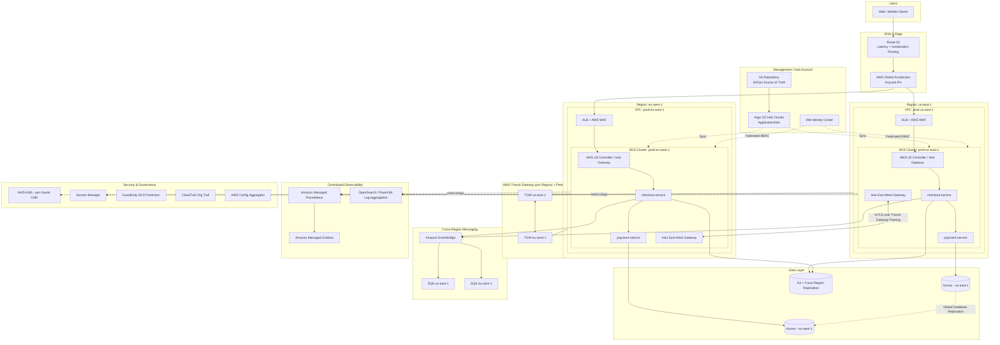

# Part V – Container & Kubernetes Architectures

# Chapter 39 — Multi-Cluster Kubernetes

---

## 1. Executive Summary

### 1.1 The Business Problem

Enterprises rarely stay on a single Kubernetes cluster forever. What begins as one Amazon EKS cluster running a handful of microservices eventually collides with a set of hard operational realities:

- A single cluster becomes a **single blast radius**. A bad `kubectl apply`, a runaway controller, a misconfigured admission webhook, or an etcd corruption event can take down every workload running in that cluster — dev, staging, and sometimes even production namespaces that were never supposed to share infrastructure.
- Kubernetes clusters have **hard and soft scaling ceilings**. AWS documents practical guidance around nodes, pods, and API server load; large enterprises running thousands of microservices across hundreds of teams routinely hit control-plane throughput limits, etcd storage limits, and IP address exhaustion inside a single VPC-backed cluster.
- **Regulatory and data-residency requirements** force workloads to run in specific AWS Regions. A single cluster cannot span two Regions natively (etcd quorum latency makes this operationally infeasible), so any organization with EU, US, and APAC compliance boundaries eventually needs more than one cluster.
- **Team and tenancy isolation** requirements grow over time. Platform teams get pressure from security to isolate workloads by business unit, environment, or compliance tier (PCI-DSS, HIPAA, FedRAMP) — and namespace-level isolation inside one cluster is frequently judged insufficient by auditors.
- **Blue/green and canary upgrade strategies for Kubernetes itself** become difficult on a single cluster. Upgrading the control plane of a cluster running 500 production services is a nerve-wracking, high-risk operation. Running two clusters lets you upgrade one while the other continues serving traffic.

Multi-Cluster Kubernetes is the architectural response to these pressures. Instead of trying to make one cluster do everything, the organization deliberately runs **many** Kubernetes clusters — segmented by Region, environment, business unit, or compliance boundary — and layers a **fleet management, service discovery, and policy control plane** on top so the fleet behaves like a single logical platform from the developer's point of view.

### 1.2 Architecture Objective

The objective of this architecture is to give an enterprise:

- **Blast-radius isolation** — a failure in one cluster cannot cascade into another.
- **Regional and compliance alignment** — workloads run physically where regulation demands.
- **Independent lifecycle management** — each cluster can be upgraded, patched, and scaled without coordinating a single global maintenance window.
- **Centralized governance** — despite being physically separate, all clusters are managed under one policy, identity, observability, and cost model.
- **Elastic capacity across failure domains** — traffic can be shifted between clusters and Regions during failures or scaling events.
- **A consistent developer experience** — teams deploy the same way regardless of which cluster or Region ultimately runs their workload.

This is not simply "run EKS more than once." It is a deliberate architecture involving cluster fleet APIs, cross-cluster service discovery (typically via a service mesh or multi-cluster ingress), centralized GitOps delivery, federated identity, and centralized observability.

### 1.3 Why Organizations Adopt This Architecture

In practice, organizations arrive at multi-cluster Kubernetes for one or more of the following reasons:

1. **Growth beyond single-cluster limits.** Once an organization has more than roughly 200–400 microservices, or more than a few thousand nodes, a single cluster's control plane, etcd, and CNI IP space become the bottleneck.
2. **Multi-region product requirements.** SaaS platforms selling into the EU need EU data residency; platforms selling into US federal need FedRAMP-isolated infrastructure; global consumer platforms need low-latency edges in multiple Regions.
3. **Regulatory segregation.** PCI-DSS cardholder data environments (CDE), HIPAA workloads, and FedRAMP workloads are frequently required to run in separate accounts and separate clusters from the rest of the estate, with documented network segmentation.
4. **Business unit autonomy with central governance.** Large enterprises with multiple business units want each BU to own its cluster lifecycle (upgrade cadence, node sizing, cost) while the central platform team enforces guardrails (network policy, image scanning, RBAC baseline) fleet-wide.
5. **Disaster recovery and high availability beyond a single Region.** A single EKS cluster is inherently Regional. True multi-region active-active or active-passive architectures require at least two clusters in two Regions.
6. **Upgrade risk reduction.** Running N+1 clusters allows rolling Kubernetes version upgrades cluster-by-cluster instead of a single high-stakes in-place upgrade.

### 1.4 Major Business Benefits

| Benefit | Business Impact |
|---|---|
| Reduced blast radius | Fewer full-platform outages; higher customer trust |
| Regulatory alignment | Enables entry into regulated markets (finance, health, government) |
| Independent scaling per Region/BU | Avoids one team's load spike degrading another team's service |
| Faster, safer platform upgrades | Kubernetes version upgrades no longer require enterprise-wide freeze windows |
| Improved negotiating position with AWS | Multi-account, multi-cluster footprints often unlock Enterprise Discount Program (EDP) and Savings Plan flexibility |
| Better disaster recovery posture | Supports RTO/RPO targets that a single-cluster design cannot meet |
| Clear cost attribution | Cluster-per-BU or cluster-per-environment makes chargeback/showback dramatically simpler |

### 1.5 Typical Enterprise Scenarios

- A global fintech runs three production EKS clusters — `us-east-1`, `eu-west-1`, and `ap-southeast-1` — to satisfy data residency for customers in each region, fronted by Route 53 latency-based routing and Global Accelerator.
- A healthcare SaaS vendor runs a dedicated **HIPAA-isolated cluster** in its own AWS account, separate from its general-purpose product clusters, with independent IAM, KMS keys, and audit logging, but still deployed via the same GitOps pipeline and observed through the same centralized Grafana/Prometheus stack.
- A retail enterprise runs **per-business-unit clusters** (Merchandising, E-commerce, Supply Chain) so each BU can choose its own upgrade cadence and node instance mix, while the central platform team enforces a common Open Policy Agent (OPA)/Kyverno policy baseline and a shared internal developer platform (IDP) built on Backstage.
- A media company runs **primary/DR cluster pairs** per Region for active-passive failover, using Velero for backup/restore and Argo CD for GitOps-driven redeployment into the DR cluster during a regional incident.

The remainder of this chapter builds this architecture from first principles: business requirements, AWS services, network topology, identity, security, availability, disaster recovery, scaling, cost, AI-assisted operations, full Terraform, CI/CD, monitoring, logging, failure scenarios, troubleshooting, best practices, anti-patterns, alternatives, a case study, an ADR, a review checklist, and — in the mandatory Architect's Corner — the hard-won lessons that separate a working reference diagram from a production-grade platform.

---

## 2. Business Requirements

### 2.1 Business Drivers

- Support product expansion into the EU and APAC without re-architecting the platform.
- Meet contractual SLAs with enterprise customers (typically 99.95%–99.99% uptime).
- Achieve PCI-DSS and SOC 2 Type II compliance for payment-adjacent workloads.
- Reduce the risk profile of platform-wide Kubernetes upgrades.
- Enable business units to scale and deploy independently while remaining under central governance.

### 2.2 Functional Requirements

- Each cluster must support standard Kubernetes workloads: Deployments, StatefulSets, Jobs, CronJobs, and Custom Resources for platform-provided abstractions (e.g., a `Service` CRD used by an internal developer platform).
- Cross-cluster service discovery must allow Service A in Cluster 1 to call Service B in Cluster 2 without hardcoded IPs, using DNS-based or mesh-based discovery.
- Centralized GitOps delivery must be able to target any cluster in the fleet from a single Git repository structure.
- A single identity provider (IdP) must federate into every cluster's Kubernetes RBAC — no cluster should have locally managed users.
- Centralized logging and metrics must aggregate all clusters into one observability plane without requiring engineers to know which cluster a workload runs on.

### 2.3 Non-Functional Requirements

| Category | Requirement |
|---|---|
| Availability | 99.95% for platform-level services; 99.99% for payment-critical services |
| Latency | P99 < 150ms intra-region service-to-service; P99 < 300ms cross-region |
| Scalability | Support growth from 50 to 2,000+ microservices without cluster redesign |
| Compliance | PCI-DSS Level 1, SOC 2 Type II, HIPAA (for healthcare tenants), GDPR data residency |
| Security | Zero standing human access to cluster API servers; all changes via GitOps or break-glass |
| RPO | 15 minutes for stateful workloads (database-tier RPO governed separately, see Ch. 44/95) |
| RTO | 30 minutes for full cluster loss; 5 minutes for single-node or single-AZ loss |
| SLA | 99.95% platform SLA, with error budget policy tied to release velocity |

> **Note:** RPO/RTO figures above apply to the platform and stateless workload layer. Databases and other stateful backing services carry their own RPO/RTO targets, typically governed by the patterns in Chapter 44 (Aurora Global Database) and Chapter 95 (Disaster Recovery).

### 2.4 Scalability Goals

- Each cluster should comfortably support 500–1,500 nodes and 10,000–30,000 pods before a new cluster is provisioned, in line with published EKS/Kubernetes control-plane guidance.
- The fleet as a whole should scale horizontally by adding clusters rather than vertically by growing any single cluster indefinitely.
- Node groups within a cluster must scale via Karpenter or Cluster Autoscaler in response to unschedulable pod events within 60–90 seconds.

### 2.5 Availability Requirements

- No single AWS Availability Zone failure should remove more than one-third of a cluster's compute capacity.
- No single AWS Region failure should remove more than one geographic segment of the global platform; other Regions must continue serving their local and, where routed, failover traffic.
- Control-plane-managed EKS removes the customer's operational burden for etcd and API server HA, but multi-AZ worker node placement remains the customer's responsibility.

### 2.6 Latency Requirements

- Intra-cluster, intra-AZ calls: P99 < 10ms.
- Intra-cluster, cross-AZ calls: P99 < 25ms.
- Cross-cluster, same-Region calls (via mesh east-west gateway or Transit Gateway): P99 < 50ms.
- Cross-region calls: P99 < 300ms, and architecturally discouraged on the synchronous request path — cross-region communication should favor asynchronous, event-driven integration (EventBridge, SQS) over synchronous service calls wherever possible.

### 2.7 Compliance Requirements

- PCI-DSS: cardholder data environment isolated into a dedicated cluster and dedicated AWS account, with network segmentation validated by an independent Qualified Security Assessor (QSA).
- SOC 2 Type II: audit logging (CloudTrail, EKS control plane logs, Kubernetes audit logs) retained for a minimum of 1 year, with quarterly access reviews.
- GDPR: EU customer data must not leave `eu-west-1`/`eu-central-1` at rest or in processing, enforced via IAM resource policies, S3 bucket policies with Region-restriction conditions, and network policy egress rules.

### 2.8 Security Expectations

- No long-lived static credentials for CI/CD; all deployments use OIDC federation (GitHub Actions OIDC → IAM role, or IRSA for in-cluster workloads).
- Every container image scanned (Amazon Inspector or Trivy) before promotion past the dev cluster.
- Network Policies (Cilium or Calico) enforced fleet-wide with default-deny.
- All secrets sourced from AWS Secrets Manager or Parameter Store via the External Secrets Operator — never stored as raw Kubernetes Secrets in Git.

### 2.9 Recovery Objectives

| Failure Scenario | RPO | RTO |
|---|---|---|
| Single pod/node failure | 0 (self-healing) | < 1 minute |
| Single AZ failure | 0 | < 5 minutes |
| Full cluster failure (control plane or data plane) | 15 minutes (stateful) | 30 minutes |
| Full Region failure | 15 minutes (stateful, via async cross-region replication) | 60 minutes (manual failover) or 5 minutes (active-active) |

### 2.10 SLAs

- Platform SLA to internal engineering teams: 99.95% API server availability during business hours, 99.9% off-hours.
- Amazon EKS's own control-plane SLA is published by AWS and underpins — but does not by itself guarantee — the platform-level SLA above; the difference is made up by multi-AZ worker design, PodDisruptionBudgets, and multi-cluster failover.

### 2.11 Expected Workload and Growth

- Starting point: 3 clusters (2 production Regions + 1 shared services/tooling cluster), ~150 microservices, ~300 nodes total.
- 18-month projection: 6–8 clusters (3 production Regions × prod/DR pairs, plus 1–2 shared/tooling clusters), ~600 microservices, ~1,200 nodes total.
- Growth strategy is explicitly **scale-out by cluster**, not scale-up of any single cluster past its control-plane comfort zone.

---

## 3. Architecture Overview

### 3.1 Overall Design

The Multi-Cluster Kubernetes architecture consists of five logical layers:

1. **Fleet layer** — the set of independent EKS clusters, each a fully self-sufficient Kubernetes control plane and data plane, isolated in its own VPC (or a dedicated set of subnets within a larger shared VPC design — see Section 9).
2. **Connectivity layer** — Transit Gateway (intra-Region) and inter-Region peering/Transit Gateway peering that allow controlled east-west traffic between clusters, plus a service mesh (Istio or Cilium Mesh) providing cross-cluster service discovery, mTLS, and traffic policy.
3. **Delivery layer** — a GitOps control plane (Argo CD in a "hub-and-spoke" ApplicationSet pattern, or Flux with multi-tenancy) that deploys workloads to the correct clusters based on Git repository structure, without any engineer running `kubectl apply` against production.
4. **Governance layer** — centralized identity (IAM Identity Center federating into every cluster's `aws-auth`/EKS access entries), centralized policy (Kyverno or OPA Gatekeeper policies synced fleet-wide via GitOps), and centralized image scanning/admission control.
5. **Observability layer** — a single-pane-of-glass stack (Amazon Managed Prometheus + Amazon Managed Grafana, or a centralized OpenSearch/Loki stack) that aggregates metrics, logs, and traces from every cluster, tagged by cluster, Region, and business unit.

### 3.2 Architecture Philosophy

The guiding principle is: **"many clusters, one platform."** Individual clusters are treated as *disposable, replaceable compute cells* — not pets. Any cluster can, in principle, be destroyed and recreated from Terraform + GitOps state without permanent data loss, because:

- Cluster configuration lives in Terraform (IaC), not in click-ops.
- Workload configuration lives in Git (GitOps), not in ad-hoc `kubectl` commands.
- Stateful data lives in managed AWS services (RDS/Aurora/DynamoDB/S3) *outside* the cluster wherever architecturally possible, so cluster loss does not imply data loss.
- Identity, secrets, and policy are federated from central sources, not locally defined per cluster.

This philosophy is what separates "multi-cluster Kubernetes" as an architecture from simply "we have several EKS clusters because different teams created them independently." The latter is an anti-pattern (see Section 27); the former is a deliberate, governed fleet.

### 3.3 Core Components

| Component | Role |
|---|---|
| Amazon EKS (×N clusters) | Managed Kubernetes control plane per Region/tenant/environment |
| Karpenter | Just-in-time node provisioning and bin-packing per cluster |
| Cilium or AWS VPC CNI + Calico | Pod networking and NetworkPolicy enforcement |
| Istio (or Cilium Cluster Mesh) | Cross-cluster service discovery, mTLS, traffic shifting |
| Argo CD (hub cluster) | GitOps continuous delivery across the fleet |
| AWS Transit Gateway | Inter-VPC, inter-cluster routing within and across Regions |
| Route 53 + AWS Global Accelerator | Global DNS and anycast entry point, latency/failover routing |
| Application Load Balancer / AWS Load Balancer Controller | L7 ingress per cluster |
| Amazon Managed Prometheus & Grafana | Centralized metrics and dashboards |
| OpenSearch / Fluent Bit | Centralized log aggregation |
| AWS Secrets Manager + External Secrets Operator | Centralized secret distribution into every cluster |
| IAM Identity Center + IRSA/EKS Pod Identity | Federated human and workload identity |
| AWS KMS | Encryption for etcd secrets, EBS volumes, and application-layer secrets |
| Velero + S3 | Cluster backup/restore for disaster recovery |

### 3.4 How Components Interact

- Developers commit workload manifests (or Helm chart values) to a Git repository. Argo CD, running in a dedicated **hub/management cluster**, watches this repository and reconciles the desired state into the appropriate **spoke clusters** based on labels/directory structure (e.g., `clusters/prod-us-east-1/`, `clusters/prod-eu-west-1/`).
- Each spoke cluster runs its own Istio (or Cilium) data plane; the mesh control planes are federated so that a service in `prod-us-east-1` can resolve and securely call a service in `prod-eu-west-1` via the mesh's east-west gateway, without the calling service knowing which cluster the callee lives in.
- Ingress traffic from the internet lands on Route 53 (latency-based or geolocation routing) → AWS Global Accelerator (for fast regional failover using static anycast IPs) → Regional ALB → EKS ingress → service mesh sidecar → pod.
- All clusters emit metrics via the Prometheus remote-write protocol into a central Amazon Managed Prometheus workspace, and logs via Fluent Bit into a central OpenSearch domain or S3-based log lake queried through Athena.
- IAM Identity Center issues short-lived credentials that map to Kubernetes RBAC groups identically across every cluster, so a platform engineer with "cluster-admin-readonly" access has the same effective permissions everywhere.

### 3.5 High-Level Workflow

1. Engineer opens a pull request against the GitOps repository, changing a Helm values file for `checkout-service` in the `prod-eu-west-1` overlay.
2. CI pipeline validates the manifest (schema validation, policy-as-code checks via Conftest/OPA, image vulnerability gate).
3. On merge, Argo CD's ApplicationSet controller detects the diff and syncs the change into the `prod-eu-west-1` cluster only.
4. The EKS cluster's Kubernetes API server accepts the change (after passing Kyverno admission policy checks), the Deployment controller rolls out new pods.
5. Istio/Cilium mesh updates its service registry; other clusters' east-west gateways can now route to the new pod endpoints if cross-cluster calls are configured.
6. Metrics and logs from the new pods flow into the centralized observability stack within seconds, and dashboards/alerts update automatically because they are labeled by cluster and service, not hardcoded per environment.

### 3.6 Request Lifecycle

A user request for a checkout transaction (as a running example used throughout this chapter) flows: Client → Route 53 → Global Accelerator → Regional ALB → EKS Ingress Controller → Istio sidecar (mTLS, retries, circuit breaking) → `checkout-service` pod → (if payment is region-specific) synchronous call to `payment-service` in the same cluster, or asynchronous event published to EventBridge for cross-region settlement processing.

### 3.7 Response Lifecycle

Response flows back along the same path; the mesh sidecar records latency and error-rate metrics at every hop, which are the basis for the SLIs discussed in Section 21.

### 3.8 Data Lifecycle

Transactional data is written to Aurora (Regional, with Global Database replication where cross-region DR is required — see Chapter 44). Object data (receipts, invoices) is written to S3 with Cross-Region Replication for DR. No cluster stores durable business data on local node disks or in-cluster databases for production-critical data — this is a deliberate design constraint that keeps clusters disposable (Section 3.2).

---

## 4. AWS Services Used

Each service below is scoped to its role in *this* architecture. Only services actually used in the multi-cluster Kubernetes design are included.

### 4.1 Amazon EKS (Elastic Kubernetes Service)

**Purpose:** Managed Kubernetes control plane — AWS operates the API server, etcd, and control-plane scaling/patching; the customer operates worker nodes and workloads.

**Why selected:** Removes the single hardest operational burden of self-managed Kubernetes (etcd HA, API server scaling, control-plane upgrades) while remaining 100% upstream-compatible Kubernetes, which matters enormously in a multi-cluster fleet where consistency across clusters is the whole point.

**Alternatives:** Self-managed `kubeadm` clusters on EC2 (full control, full operational burden — rarely justified today); Amazon ECS (simpler, but not Kubernetes-API-compatible, which breaks the "one platform, many clusters" abstraction); EKS Anywhere/EKS Hybrid for on-premises members of the fleet.

**Limitations:** Each EKS cluster is bound to a single Region (control plane does not span Regions); default API server request rate limits and etcd storage limits impose a practical ceiling per cluster (this is precisely why the architecture is multi-cluster in the first place).

**Pricing considerations:** Flat hourly charge per cluster control plane, billed independently of node count — meaning that adding more clusters has a fixed floor cost that must be justified against the isolation benefit (see Section 16).

**Best practices:** One cluster per Region × environment × compliance-tier combination that actually needs isolation; never one cluster per team unless team boundaries are also compliance boundaries.

### 4.2 Application Load Balancer (ALB)

**Purpose:** L7 ingress into each cluster, provisioned automatically by the AWS Load Balancer Controller in response to Kubernetes `Ingress` or `Gateway API` resources.

**Why selected:** Native integration with EKS via the Load Balancer Controller, supports path/host-based routing, WAF attachment, and target-type `ip` mode for direct pod routing (bypassing kube-proxy for lower latency).

**Alternatives:** Network Load Balancer (for L4/high-throughput or non-HTTP protocols), Istio Ingress Gateway alone (viable but loses native AWS WAF/Shield integration unless carefully layered).

**Limitations:** One ALB per Ingress resource by default; at fleet scale, this can multiply cost and complexity — mitigated by using a shared ALB via `IngressGroup` annotations or by fronting everything with the mesh's own gateway.

**Pricing considerations:** Hourly + LCU (Load Balancer Capacity Unit) charges; consolidate ingress where traffic patterns allow.

**Best practices:** Use `alb.ingress.kubernetes.io/group.name` to share ALBs across services within a cluster; always attach AWS WAF.

### 4.3 AWS Global Accelerator

**Purpose:** Provides static anycast IP addresses and uses the AWS global network backbone to route users to the nearest healthy Regional endpoint, with fast (sub-30-second) failover between Regions.

**Why selected:** Faster failover than DNS-based Route 53 failover alone (DNS TTL and client caching introduce delay); essential for the active-active/active-passive multi-region patterns this architecture supports.

**Alternatives:** Route 53 latency-based or failover routing alone (simpler, cheaper, but slower failover due to DNS caching); CloudFront (better for cacheable HTTP content, not ideal for dynamic API traffic).

**Limitations:** Additional monthly cost per accelerator plus data transfer premium; adds a component to reason about during troubleshooting.

**Best practices:** Combine with Route 53 health checks against each Regional ALB so Global Accelerator's endpoint groups reflect real application health, not just infrastructure reachability.

### 4.4 Amazon Route 53

**Purpose:** DNS layer for both external customer-facing domains and internal service discovery boundaries between clusters that are not mesh-federated.

**Why selected:** Deep integration with health checks, latency-based routing, and geolocation routing needed for regulatory data-residency routing (e.g., routing EU users only to `eu-west-1`).

**Alternatives:** Third-party DNS with AWS health check webhooks (adds latency and an external dependency); not generally preferred for this architecture.

**Best practices:** Use geolocation routing policies to hard-enforce data residency at the DNS layer as a defense-in-depth control, in addition to application-layer enforcement.

### 4.5 AWS Identity and Access Management (IAM) / IAM Identity Center

**Purpose:** Federated human and workload identity across every AWS account and every EKS cluster in the fleet.

**Why selected:** EKS's native "EKS Access Entries" (and, historically, the `aws-auth` ConfigMap) map IAM principals to Kubernetes RBAC; centralizing this through IAM Identity Center means a single identity system governs access to all clusters, satisfying the "no locally managed users" requirement in Section 2.2.

**Alternatives:** Per-cluster local OIDC providers (breaks central governance); static kubeconfig files with long-lived credentials (a severe anti-pattern — see Section 27).

**Limitations:** Requires disciplined permission-set and group design up front; poorly designed groups become an unmanageable sprawl at fleet scale (see Section 34, Hidden Trade-offs).

**Best practices:** Map Identity Center groups 1:1 to Kubernetes RBAC ClusterRoles using naming conventions like `platform-admins`, `bu-readonly`, `bu-deployers`; never grant `cluster-admin` to a human identity outside a documented break-glass process.

### 4.6 Amazon VPC / AWS Transit Gateway

**Purpose:** Network isolation per cluster (VPC) and controlled east-west connectivity between clusters and Regions (Transit Gateway plus Transit Gateway peering).

**Why selected:** Transit Gateway avoids the O(n²) mesh of VPC peering connections that would otherwise be required to connect every cluster's VPC to every other cluster's VPC, and provides centralized route table control for network segmentation between compliance tiers.

**Alternatives:** Full-mesh VPC Peering (workable for 2–4 clusters, unmanageable beyond that); AWS Cloud WAN (newer, higher-level abstraction over Transit Gateway, worth evaluating for very large fleets — see Chapter 18).

**Limitations:** Transit Gateway has Regional scope; cross-Region connectivity requires Transit Gateway peering, which adds inter-Region data transfer cost and latency.

**Best practices:** Separate route tables per compliance tier so, for example, the PCI cluster's Transit Gateway attachment cannot route to the general-purpose clusters without an explicit, audited route.

### 4.7 AWS Key Management Service (KMS)

**Purpose:** Encryption of EKS secrets at rest (envelope encryption for Kubernetes Secrets stored in etcd), EBS volume encryption for worker nodes, and application-layer secret encryption.

**Why selected:** Native EKS integration (`--encryption-config` at cluster creation) directly addresses the common audit finding that Kubernetes Secrets are only base64-encoded, not encrypted, by default.

**Best practices:** Use a dedicated Customer Managed Key (CMK) per cluster (not a shared account-wide key), enabling clean key rotation and revocation scoped to a single cluster if compromised.

### 4.8 AWS Secrets Manager & AWS Systems Manager Parameter Store

**Purpose:** Centralized secret storage, retrieved into clusters at runtime by the External Secrets Operator rather than stored as static Kubernetes Secrets in Git or applied manually.

**Why selected:** Enables automatic rotation, fine-grained IAM-based access control per secret, and a clean audit trail (CloudTrail) of every secret access — none of which native Kubernetes Secrets provide alone.

**Best practices:** Use IRSA/EKS Pod Identity to scope which service accounts in which clusters/namespaces can read which secret ARNs; never use one broad IAM role for all External Secrets Operator instances fleet-wide.

### 4.9 Amazon CloudWatch

**Purpose:** EKS control-plane logging (API server, audit, authenticator, controller manager, scheduler logs) and infrastructure-level metrics/alarms.

**Why selected:** Native, zero-additional-infrastructure destination for EKS control-plane logs, required for SOC 2 and PCI-DSS audit trails.

**Alternatives:** Third-party SIEM ingestion directly from EKS (viable, often used *in addition to* CloudWatch, not instead of it).

**Best practices:** Enable all five EKS control-plane log types (`api`, `audit`, `authenticator`, `controllerManager`, `scheduler`) fleet-wide via Terraform, not manually per cluster.

### 4.10 AWS CloudTrail

**Purpose:** Audit trail of every AWS API call across every account in the multi-account, multi-cluster fleet, including EKS cluster creation/modification, IAM changes, and KMS key usage.

**Best practices:** Organization-wide CloudTrail trail aggregating to a dedicated log-archive account, with S3 Object Lock enabled for tamper-evidence — a near-universal PCI-DSS/SOC 2 requirement.

### 4.11 AWS Config

**Purpose:** Continuous configuration compliance checking across the fleet — e.g., detecting an EKS cluster created without control-plane logging enabled, or a security group with an open ingress rule.

**Best practices:** Deploy AWS Config Conformance Packs mapped to CIS EKS Benchmark and PCI-DSS controls, aggregated centrally via an AWS Config aggregator in the security/audit account.

### 4.12 Amazon GuardDuty (including GuardDuty EKS Protection)

**Purpose:** Threat detection at the AWS account, VPC/network, and EKS audit-log level — detects anomalous API calls to the Kubernetes API server, crypto-mining patterns in pod behavior, and compromised IAM credentials.

**Best practices:** Enable GuardDuty EKS Protection and Runtime Monitoring fleet-wide via the GuardDuty delegated administrator account, not cluster-by-cluster.

### 4.13 Amazon S3

**Purpose:** Terraform remote state backend, Velero backup target for cluster disaster recovery, and centralized log archive tier for cost-effective long-term retention beyond CloudWatch Logs' typical hot-tier retention window.

**Best practices:** Separate S3 buckets per cluster for Velero backups, with lifecycle policies transitioning to S3 Glacier Instant Retrieval after 30 days and cross-region replication for DR-tier clusters.

### 4.14 Amazon EventBridge / Amazon SQS / Amazon SNS

**Purpose:** Asynchronous, cross-cluster and cross-region integration for workloads that should not depend on synchronous cross-region service calls (Section 2.6).

**Why selected:** Decouples Regional clusters from each other's availability — if `eu-west-1`'s cluster is degraded, `us-east-1` can continue publishing events that are processed once EU capacity recovers, rather than failing synchronous calls.

**Best practices:** Use EventBridge for cross-account/cross-region event routing between clusters' workloads; use SQS within a Region as the durable buffer behind each consuming service.

---

## 5. Complete Architecture Diagram



> **Note:** This diagram represents the two-Region production topology used as the running example. Additional clusters (shared-services/tooling, DR pairs, PCI-isolated cluster) follow the same pattern and are covered in Sections 6, 9, and 13.

---

## 6. Component-by-Component Explanation

### 6.1 EKS Cluster (per Region/tenant)

- **Purpose:** Hosts the Kubernetes control plane and worker nodes for one isolated segment of the fleet.
- **Responsibilities:** Scheduling, service networking, workload lifecycle, admission control for its own workloads only.
- **Inputs:** GitOps manifests from Argo CD; container images from Amazon ECR; secrets from External Secrets Operator.
- **Outputs:** Application traffic responses; metrics/logs to the centralized observability plane.
- **Scaling:** Node groups scale via Karpenter based on unschedulable pod pressure; control plane scaling is managed by AWS.
- **High availability:** Control plane is multi-AZ by default (AWS-managed); worker nodes deployed across a minimum of three AZs with topology spread constraints.
- **Failure handling:** PodDisruptionBudgets and multi-AZ node groups absorb single-AZ failure; full-cluster failure triggers Route 53/Global Accelerator failover to a healthy Region.
- **Dependencies:** VPC/subnets, IAM roles for service accounts, Transit Gateway attachment.
- **Security:** Private API server endpoint (or public with restricted CIDR allow-list), envelope encryption via KMS, EKS Access Entries instead of static `aws-auth` edits.
- **Monitoring:** Control-plane logs to CloudWatch; workload metrics to Amazon Managed Prometheus.

### 6.2 Karpenter

- **Purpose:** Just-in-time, bin-packed node provisioning per cluster, replacing the older Cluster Autoscaler for most new deployments.
- **Responsibilities:** Watches for unschedulable pods, selects optimal EC2 instance types/sizes (including Spot) per `NodePool` constraints, consolidates underutilized nodes.
- **Scaling:** Provisions nodes within roughly 30–60 seconds of a scheduling event; scales to zero for idle NodePools.
- **Failure handling:** If a node fails health checks, Karpenter drains and replaces it automatically.
- **Security:** Runs under a tightly scoped IRSA role limited to EC2 and pricing API actions — never broad EC2 admin permissions.

### 6.3 Istio Service Mesh (multi-cluster / multi-primary or primary-remote)

- **Purpose:** Provides mTLS, retries, circuit breaking, and — critically for this architecture — cross-cluster service discovery via east-west gateways.
- **Responsibilities:** Encrypts all east-west traffic by default; enforces `AuthorizationPolicy` between services regardless of which cluster they run in.
- **Inputs:** `ServiceEntry`/`VirtualService`/`DestinationRule` CRDs delivered via GitOps.
- **Scaling:** Sidecar-based (or, increasingly, sidecar-less with Istio Ambient Mesh / Cilium) data plane scales with pod count; control plane (`istiod`) scales independently per cluster.
- **High availability:** Each cluster runs its own `istiod`; cross-cluster trust is established via a shared root CA (often AWS Private CA) so mTLS certificates are trusted fleet-wide.
- **Failure handling:** If a remote cluster's east-west gateway is unreachable, the mesh's outlier detection ejects it from the load-balancing pool automatically.
- **Security:** This is the primary enforcement point for zero-trust east-west traffic — see Section 11.

### 6.4 Argo CD (Hub Cluster, ApplicationSet pattern)

- **Purpose:** Single GitOps control plane that deploys to every spoke cluster in the fleet.
- **Responsibilities:** Watches Git, computes diffs per target cluster, applies changes, reports sync/health status back to a central dashboard.
- **Inputs:** Git repository structured by cluster/environment (e.g., via Kustomize overlays or Helm value files per cluster).
- **Scaling:** A single hub Argo CD instance can typically manage dozens of spoke clusters; beyond that, organizations often shard into multiple Argo CD instances per region or business domain.
- **High availability:** The hub cluster itself should be a small, highly available EKS cluster (separate from production spokes) with Argo CD running in HA mode (multiple replicas of the repo-server, application-controller sharded by cluster).
- **Failure handling:** If the hub cluster is lost, spoke clusters continue running their last-applied state (Kubernetes doesn't "fall over" without its GitOps controller) — only *new* deployments are blocked until the hub is restored from IaC + Git.
- **Security:** Uses a dedicated IAM role per target cluster (via EKS Access Entries) with least-privilege scoped to the namespaces it manages; the hub cluster is one of the most sensitive components in the entire architecture and must be treated as Tier-0.

### 6.5 AWS Load Balancer Controller

- **Purpose:** Reconciles Kubernetes `Ingress`/`Gateway API` resources into ALB/NLB and target group configuration.
- **Scaling:** Runs as a Deployment inside each cluster; scales with the number of Ingress resources, not workload traffic volume.
- **Security:** IRSA role scoped to ELB/EC2 describe and modify actions only for resources tagged with that cluster's identifier — preventing one cluster's controller from touching another cluster's load balancers.

### 6.6 External Secrets Operator

- **Purpose:** Synchronizes AWS Secrets Manager/Parameter Store secrets into native Kubernetes Secrets at runtime.
- **Responsibilities:** Polls or receives push notifications for secret changes; supports automatic rotation propagation.
- **Security:** Each namespace's `ExternalSecret` resource references an IRSA-scoped `ServiceAccount` that can only read the specific secret ARNs that namespace is authorized for — a critical control against secret sprawl (see Section 34, Security Blind Spots).

### 6.7 Amazon Managed Prometheus / Grafana

- **Purpose:** Fleet-wide metrics aggregation and visualization without operating a self-managed Prometheus HA pair per cluster (or per fleet).
- **Responsibilities:** Each cluster runs a lightweight Prometheus agent (or the OpenTelemetry Collector) in remote-write mode; the managed workspace stores and serves query results centrally.
- **Scaling:** Managed service scales storage and query capacity automatically; the customer's responsibility is cardinality control (label design) at the source.
- **Failure handling:** If the central workspace is briefly unavailable, local agents buffer metrics for a bounded window before dropping — dashboards and alerting during that window rely on local `kubectl top`/node-level fallback tooling.

### 6.8 Velero

- **Purpose:** Backs up Kubernetes object state and, optionally, persistent volume snapshots, to S3, enabling cluster-level disaster recovery and migration.
- **Responsibilities:** Scheduled backups per cluster; restore into a newly provisioned cluster during a DR event.
- **Security:** Backup S3 buckets encrypted with the cluster's own KMS CMK, with bucket policies restricting cross-account access to only the DR runbook's automation role.

---

## 7. End-to-End Request Flow

Using the checkout-transaction example introduced in Section 3.6:

1. **Client** initiates an HTTPS request to `api.example.com/checkout`.
2. **Route 53** resolves the domain using a latency-based routing policy, returning the AWS Global Accelerator anycast IP nearest the client.
3. **AWS Global Accelerator** routes the packet, over the AWS backbone, to the healthiest Regional endpoint group — normally the geographically closest Region, unless health checks have marked it unhealthy, in which case it fails over automatically.
4. **Regional ALB** (fronted by AWS WAF) terminates TLS, evaluates WAF rules (rate limiting, SQLi/XSS managed rule groups), and forwards the request to the EKS ingress target group.
5. **EKS Ingress / Istio Gateway** receives the request inside the cluster and routes it, based on `VirtualService` rules, to the `checkout-service` pod.
6. **Istio sidecar** on the `checkout-service` pod enforces mTLS (already established from the gateway), applies any configured retry/timeout policy, and records request-level metrics (latency, status code).
7. `checkout-service` **business logic** validates the cart and calls `payment-service` synchronously (same cluster, same Region — low latency, no cross-region dependency on the critical path).
8. `payment-service` writes the transaction to **Aurora** (Regional primary) and publishes a `PaymentCompleted` event to **EventBridge**.
9. EventBridge routes the event to an **SQS queue in the paired DR Region**, where an asynchronous settlement-reconciliation service later consumes it — this is intentionally *not* on the synchronous request path (Section 2.6).
10. `checkout-service` returns a response, which flows back through the Istio sidecar (latency/error metrics recorded again), the ALB, Global Accelerator, and Route 53 to the client.
11. **Logging:** Every hop's access logs (ALB access logs to S3, Istio access logs to Fluent Bit) and the Kubernetes audit log entry for any resource change are shipped to the centralized **OpenSearch** log aggregation cluster.
12. **Monitoring:** SLI dashboards in **Amazon Managed Grafana** update in near real time; if P99 latency crosses the burn-rate threshold for the checkout-service error budget, a **CloudWatch Alarm** (fed by Prometheus recording rules via the OpenTelemetry Collector) triggers a PagerDuty/SNS notification.
13. **Error handling:** If `payment-service` is unavailable, the Istio circuit breaker on `checkout-service`'s outbound call trips after the configured consecutive-error threshold, returning a fast-fail `503` rather than a hung request, and the client-facing response includes a retry-safe error code.

---

## 8. Deployment Flow

### 8.1 Infrastructure Provisioning

- All AWS infrastructure (VPCs, EKS clusters, Transit Gateway attachments, IAM roles, KMS keys) is defined in **Terraform**, organized as reusable modules (`modules/eks-cluster`, `modules/vpc`, `modules/transit-gateway-attachment`) instantiated once per cluster/Region via a root module per environment.
- State is stored remotely in **S3 with DynamoDB state locking** (or S3 native locking, current for newer Terraform versions), one state file per cluster to limit blast radius of a `terraform apply` mistake.
- A dedicated CI pipeline runs `terraform plan` on every pull request and requires manual approval (via a protected environment) before `terraform apply` runs against production clusters.

### 8.2 Terraform Workflow

1. Engineer proposes a change (e.g., new NodePool instance types) via pull request to the infrastructure repository.
2. CI runs `terraform fmt -check`, `terraform validate`, `tflint`, and `checkov`/`tfsec` for security policy scanning.
3. `terraform plan` output is posted as a PR comment for human review.
4. On approval and merge, a CD pipeline runs `terraform apply` against a specific cluster's state, gated by an environment-protection rule requiring platform-team sign-off for production.

### 8.3 CI/CD Deployment (Application Layer)

- Application code deployment is decoupled entirely from infrastructure deployment: application teams never run Terraform against shared cluster infrastructure; they only modify their namespace's manifests in the GitOps repository.
- CI builds and pushes container images to **Amazon ECR**, tags with the Git SHA, and scans with **Amazon Inspector** (or Trivy in-pipeline) before the image is eligible for promotion.
- CD is GitOps-driven: a merge to the `prod-us-east-1` overlay directory triggers Argo CD to sync, not a push-based `kubectl apply` from the CI runner — this ensures the cluster's actual state and Git's desired state never diverge silently.

### 8.4 Blue-Green Deployment

- At the **cluster** level: new EKS clusters can be stood up alongside existing ones (e.g., `prod-us-east-1-green` during a major Kubernetes version upgrade), validated with synthetic traffic, and cut over via Global Accelerator endpoint group weighting — this is the primary blue-green pattern this architecture enables that single-cluster designs cannot.
- At the **workload** level: Argo Rollouts (an extension to Argo CD) manages blue-green or canary rollout of individual Deployments within a cluster, integrated with Istio traffic splitting for gradual weight shifting.

### 8.5 Rollback

- **Application rollback:** `git revert` on the GitOps repository — Argo CD automatically reconciles the cluster back to the previous known-good state. This is dramatically safer than imperative rollback commands because the audit trail is a Git history, not a stack of manual interventions.
- **Infrastructure rollback:** Terraform state history plus `terraform plan` against a reverted configuration; for EKS version rollbacks specifically, note that Kubernetes **does not support downgrading** a control plane — rollback of a bad upgrade means failing traffic over to a sibling cluster still on the previous version, not downgrading in place.

### 8.6 Secrets in the Deployment Pipeline

- CI/CD pipelines authenticate to AWS via **OIDC federation** (GitHub Actions OIDC provider → IAM role), never long-lived AWS access keys stored as CI secrets.
- Application secrets are never present in the GitOps repository at all — only `ExternalSecret` *references* (ARNs) are committed; the actual secret values live exclusively in Secrets Manager.

### 8.7 Configuration Management

- Cluster-wide configuration (Kyverno policies, network policies, priority classes) is itself managed as a GitOps "platform" Application, synced to every spoke cluster from a shared base with per-cluster overlays — ensuring the fleet's guardrails don't drift cluster-by-cluster.

### 8.8 Validation

- Post-sync validation hooks in Argo CD run smoke tests (a lightweight synthetic transaction) against each newly deployed service before marking the sync "Healthy," and automatically triggers a rollback (via Argo Rollouts' analysis step) if error rates spike beyond a defined threshold during the rollout window.

---

## 9. Network Topology

### 9.1 VPC Design

- **One VPC per cluster** is the default and recommended pattern for this architecture — it maximizes isolation and keeps blast radius (a VPC-level misconfiguration) contained to a single cluster.
- An alternative — **shared VPC with per-cluster subnets** — is sometimes used for cost/simplicity in smaller fleets, but weakens isolation and is generally discouraged once a compliance boundary (e.g., PCI) is involved.

### 9.2 CIDR Planning

| Cluster | VPC CIDR | Notes |
|---|---|---|
| prod-us-east-1 | 10.10.0.0/16 | ~65k IPs; sized for pod-per-IP VPC CNI mode at scale |
| prod-eu-west-1 | 10.20.0.0/16 | Non-overlapping with us-east-1 for Transit Gateway routing |
| prod-ap-southeast-1 | 10.30.0.0/16 | Non-overlapping |
| shared-services/hub | 10.0.0.0/16 | Hosts Argo CD hub, shared tooling |
| pci-isolated-cluster | 10.99.0.0/16 | Deliberately non-contiguous with the general-purpose block for firewall clarity |

> **Warning:** Overlapping CIDR ranges between clusters is the single most common networking mistake in multi-cluster designs — it is straightforward to avoid at design time and extremely disruptive to fix after Transit Gateway attachments exist. Always allocate CIDR blocks from a centrally managed IPAM (AWS VPC IP Address Manager) before any cluster VPC is created.

### 9.3 Public and Private Subnets

- **Public subnets** (one per AZ, minimum 3 AZs): host only the ALB/NLB ENIs and NAT Gateways — never worker nodes or pods directly.
- **Private subnets** (one per AZ): host EKS worker nodes and, in VPC CNI "prefix delegation" mode, pod IPs drawn from the same private subnet ranges.

### 9.4 NAT Gateway

- One NAT Gateway per AZ (not one shared NAT Gateway per VPC) to avoid a cross-AZ single point of failure and cross-AZ data transfer charges for outbound traffic.
- NAT Gateway cost is a frequently underestimated line item at fleet scale — see Section 16.5 and Section 34 (Cost Surprises).

### 9.5 Internet Gateway

- One per VPC, attached to route tables for public subnets only; private subnet route tables route `0.0.0.0/0` to the AZ-local NAT Gateway, never directly to the Internet Gateway.

### 9.6 Transit Gateway

- One Transit Gateway per Region, with each cluster's VPC attached.
- Separate **route tables per compliance tier** within the Transit Gateway: a `general-purpose` route table (attached to standard production/dev/staging VPCs) and an `isolated` route table (attached only to the PCI cluster's VPC, with explicit, narrowly scoped routes to only the specific resources it must reach — e.g., a payment gateway VPC — never a blanket route to every other cluster).
- Inter-Region connectivity via **Transit Gateway peering**, itself governed by its own route tables to prevent, for example, the EU cluster's Transit Gateway from being able to route into the PCI-isolated cluster's subnets even indirectly.

### 9.7 Route Tables

- Explicit, minimal route tables per subnet tier (public, private-app, private-data) — never a single flat route table shared across all subnet types, which makes network segmentation audits far harder.

### 9.8 Network ACLs

- Used as a coarse, stateless defense-in-depth layer (e.g., explicitly denying known-bad CIDR ranges) — Security Groups remain the primary, stateful enforcement mechanism; NACLs are not relied upon for fine-grained service-to-service control.

### 9.9 Security Groups

- **Cluster security group** (managed by EKS) controls node-to-control-plane communication.
- **Additional security groups** restrict node-to-node and node-to-RDS/Aurora traffic to only required ports, referenced by security group ID rather than CIDR range wherever possible, so rules remain correct even as the fleet's IP ranges evolve.

### 9.10 AWS PrivateLink

- Used for the cluster's access to AWS services (S3, ECR, Secrets Manager, STS, CloudWatch Logs) via **VPC Interface Endpoints**, avoiding NAT Gateway data processing charges for AWS-API traffic and keeping that traffic off the public internet entirely — a meaningful cost optimization at fleet scale (Section 16) as well as a security best practice (traffic never leaves the AWS network).

### 9.11 Hybrid Connectivity

- For enterprises with on-premises data centers (e.g., a legacy mainframe integration required by `payment-service`), **AWS Direct Connect** terminates into the hub Region's Transit Gateway, with routes propagated selectively to only the clusters that require on-premises access — see Chapter 24 for the full Direct Connect pattern.

---

## 10. Identity and Access

### 10.1 IAM Roles and EKS Access Entries

- Every human and machine identity accessing any cluster does so through an **IAM role**, never an IAM user with static credentials.
- EKS **Access Entries** (the modern replacement for manually editing the `aws-auth` ConfigMap) map an IAM principal directly to Kubernetes RBAC, managed declaratively via Terraform — this keeps cluster access auditable and reviewable in the same pull-request workflow as any other infrastructure change.

### 10.2 IAM Policies

- Policies follow least privilege scoped by **resource tags**: for example, the Argo CD hub's IAM role can only assume cluster-access roles for clusters tagged `gitops-managed=true`, preventing accidental (or malicious) targeting of a cluster outside its intended fleet.

### 10.3 Resource Policies

- KMS key policies, S3 bucket policies, and Secrets Manager resource policies explicitly enumerate which IAM roles (by ARN) may use them — cross-account access to a cluster's secrets or backups is denied by default and only granted through an explicit, documented exception.

### 10.4 AWS STS (Security Token Service)

- All workload identity inside clusters uses **IRSA (IAM Roles for Service Accounts)** or the newer **EKS Pod Identity** feature, both of which rely on STS to issue short-lived (typically one-hour) credentials to pods — no pod ever holds a long-lived AWS access key.

### 10.5 Cross-Account Access

- The fleet spans multiple AWS accounts (per the AWS multi-account landing zone pattern — see Chapter 88): a `security-audit` account, a `log-archive` account, a `shared-services/hub` account, and one or more `workload` accounts per business unit/environment.
- Cross-account access (e.g., Argo CD in the hub account deploying into a workload account's cluster) uses **cross-account IAM role assumption** with an external ID and a scoped trust policy — never a shared credential.

### 10.6 Least Privilege

- Kubernetes RBAC ClusterRoles are scoped per persona: `platform-admin` (full cluster admin, restricted to a very small platform team group and subject to just-in-time elevation), `bu-deployer` (namespace-scoped deploy permissions, no cluster-scoped resource access), `bu-readonly` (read-only, namespace-scoped).
- No persona is granted `cluster-admin` as a standing role in any production cluster; break-glass `cluster-admin` access is time-bound (e.g., via AWS IAM Identity Center's temporary elevation workflow) and triggers a mandatory incident ticket.

### 10.7 Service Roles

- The AWS Load Balancer Controller, External Secrets Operator, Karpenter, and Cluster Autoscaler each run under their own dedicated IRSA role, scoped to only the AWS API actions that specific controller needs — never a single shared "platform" role used by multiple controllers, which would make any one controller's compromise a compromise of all of them.

### 10.8 Permission Boundaries

- IAM permission boundaries are attached to any role capable of *creating* other IAM roles (notably, the Terraform CI/CD execution role) to guarantee that even a compromised or misconfigured Terraform pipeline cannot escalate privilege beyond the boundary — a critical control given that this role effectively has the power to provision entire clusters.

---

## 11. Security Architecture

### 11.1 Encryption

- **At rest:** EBS volumes (worker node root and data volumes) encrypted with per-cluster KMS CMKs; EKS secrets envelope-encrypted with KMS; S3 buckets (Terraform state, Velero backups, logs) encrypted with SSE-KMS.
- **In transit:** TLS 1.2+ terminated at the ALB; mTLS for all east-west service-to-service traffic enforced by the Istio mesh (Section 6.3), including cross-cluster traffic over Transit Gateway.

### 11.2 AWS KMS

- Per-cluster Customer Managed Keys, with automatic annual rotation enabled, and key policies restricting `kms:Decrypt` to only the specific IAM roles (node role, specific IRSA roles) that legitimately need it.

### 11.3 AWS Certificate Manager (ACM)

- Public-facing TLS certificates for ALBs provisioned and auto-renewed via ACM; internal mesh mTLS certificates issued by the mesh's own CA (often backed by AWS Private CA for a fleet-wide trust root) rather than ACM, since ACM certificates cannot be exported for use as a mesh trust anchor.

### 11.4 AWS WAF

- Attached to every public ALB, using AWS Managed Rule Groups (Core Rule Set, Known Bad Inputs, SQL Injection) plus custom rate-based rules; WAF logs shipped to the centralized log aggregation pipeline (Section 22) for correlation with application-layer logs.

### 11.5 AWS Shield

- **Shield Standard** is active by default on all Global Accelerator and CloudFront resources at no additional cost; **Shield Advanced** is enabled for the production Global Accelerator and ALBs given the customer-facing, revenue-critical nature of the checkout path, providing DDoS cost protection and dedicated DRT (DDoS Response Team) support.

### 11.6 AWS Secrets Manager

- As described in Section 4.8 and 6.6 — the sole source of truth for application secrets, with automatic rotation configured for database credentials (Aurora-integrated rotation Lambda).

### 11.7 Amazon GuardDuty

- GuardDuty EKS Protection analyzes Kubernetes **audit logs** for suspicious API calls (e.g., a service account listing secrets across all namespaces, or an anomalous `exec` into a pod); GuardDuty Runtime Monitoring additionally analyzes in-node/in-container runtime behavior for indicators like reverse shells or cryptomining.

### 11.8 Amazon Inspector

- Continuously scans container images in ECR and, via the EKS integration, running workloads for known CVEs; findings feed a policy gate that blocks promotion of images with Critical/High severity unpatched vulnerabilities past the dev cluster.

### 11.9 AWS Security Hub

- Aggregates findings from GuardDuty, Inspector, AWS Config conformance packs, and third-party tools into a single, fleet-wide security posture view, mapped to the CIS AWS Foundations Benchmark and CIS Amazon EKS Benchmark.

### 11.10 AWS CloudTrail

- As described in Section 4.10; specifically for this architecture, CloudTrail is the authoritative record of every `eks:*` API call (cluster creation, access-entry modification), which is the AWS-control-plane-level complement to the Kubernetes-level audit log.

### 11.11 AWS Config

- Continuous compliance evaluation, e.g., a custom Config rule verifying every EKS cluster has control-plane logging enabled and public API endpoint access restricted, alerting the platform team the moment any cluster (including one created outside the standard Terraform pipeline) drifts from the fleet baseline.

### 11.12 Zero Trust Model

This architecture applies zero trust at three layers:

1. **Network layer:** Default-deny NetworkPolicies (Cilium) fleet-wide; a pod can only communicate with the specific pods/ports its NetworkPolicy explicitly allows.
2. **Identity layer:** mTLS with SPIFFE/SPIRE-style workload identities (provided by Istio) means every service-to-service call is cryptographically authenticated — a compromised network position alone (e.g., a rogue pod on the same node) is insufficient to intercept or impersonate traffic.
3. **Human layer:** No standing access to any cluster API server; all human interaction is either through GitOps (no direct `kubectl`) or time-bound, logged break-glass access.

### 11.13 Threat Model and Attack Vectors

| Attack Vector | Mitigation |
|---|---|
| Compromised CI/CD pipeline pushes malicious image | Image signing (Sigstore/Cosign) + admission policy (Kyverno) verifying signatures before scheduling |
| Over-privileged service account exfiltrates secrets | IRSA scoped per-namespace secret access; GuardDuty EKS Protection anomaly detection |
| Lateral movement between namespaces/clusters | Default-deny NetworkPolicy; mesh AuthorizationPolicy; separate Transit Gateway route tables per compliance tier |
| Public API server brute force / exploitation | Private API endpoint or CIDR-restricted public endpoint; GuardDuty API-call anomaly detection |
| Supply-chain compromise of a base container image | Amazon Inspector continuous scanning; SBOM generation in CI; admission-time CVE severity gate |
| Insider threat with break-glass access | Time-bound elevation, mandatory incident ticket, full session recording via Systems Manager |
| DDoS against public ingress | Shield Advanced + WAF rate-based rules + Global Accelerator's built-in edge absorption |
| Node-level container escape | Bottlerocket OS (minimal attack surface) for worker nodes; seccomp/AppArmor profiles; runtime monitoring |

---

## 12. High Availability

### 12.1 AZ Failures

- Worker nodes distributed across a minimum of 3 AZs per cluster via topology spread constraints (`topologySpreadConstraints`) and Karpenter `NodePool` zone requirements; PodDisruptionBudgets ensure that voluntary disruptions (node drains) never take more than a defined percentage of a Deployment's replicas offline simultaneously.
- Aurora Multi-AZ deployments (Section 4, Chapter 44) mean a single-AZ database failure does not require any cross-region failover.

### 12.2 Instance Failures

- Karpenter's node health-check integration replaces unhealthy EC2 instances automatically; Kubernetes' own node controller marks a node `NotReady` and reschedules pods after the configured grace period (typically 40 seconds, tuned per workload criticality).

### 12.3 Regional Failures

- This is the primary scenario multi-cluster architecture exists to address: a full Region failure is handled by Route 53/Global Accelerator health-check-driven failover to a sibling Region's cluster, with asynchronous data replication (Aurora Global Database, S3 CRR) ensuring the failover target has recent, though not perfectly synchronous, data.

### 12.4 Database Failures

- Handled primarily at the data layer (Chapter 44), but the application layer in this architecture is designed to **fail closed with graceful degradation**: `checkout-service` returns a clear, retry-safe error rather than hanging indefinitely, using Istio-configured timeouts and circuit breakers as the first line of defense before the failure ever reaches the database layer's own HA mechanisms.

### 12.5 Load Balancing and Health Checks

- ALB target group health checks operate at the pod level (HTTP health endpoint); Global Accelerator health checks operate at the Regional-endpoint level (aggregating ALB health); Route 53 health checks provide a third, independent layer — deliberately redundant so that no single health-check mechanism's blind spot becomes the platform's blind spot.

### 12.6 Failover

- Failover is **tested quarterly** via GameDay exercises (Section 13.7) that intentionally fail a Region's Global Accelerator endpoint group and verify traffic shifts within the target RTO — untested failover is, in practice, unreliable failover (see Section 34, Lessons Learned).

---

## 13. Disaster Recovery

### 13.1 Backup Strategy

- **Cluster-level:** Velero scheduled backups (every 4 hours) of all Kubernetes object manifests and, for the small set of workloads with local persistent volumes, EBS snapshots via the Velero CSI plugin.
- **Data-level:** Aurora automated backups plus Aurora Global Database for cross-region replication (Chapter 44); S3 versioning plus Cross-Region Replication for object data.
- **Infrastructure-level:** Terraform state itself is the backup for cluster *configuration* — a destroyed cluster can be recreated from Terraform + Velero restore + Argo CD re-sync without manual reconstruction.

### 13.2 Snapshots

- EBS snapshots for any stateful workload still running local storage (increasingly rare in this architecture given the "state lives outside the cluster" philosophy — Section 3.2) are automated via AWS Backup with a defined retention policy (daily for 7 days, weekly for 4 weeks, monthly for 12 months).

### 13.3 Cross-Region Replication

- Aurora Global Database provides sub-second-to-low-second replication lag for the primary transactional data store; S3 CRR for object data typically completes within 15 minutes (matching the platform's stated RPO in Section 2.9).

### 13.4 DR Patterns Available in This Architecture

| Pattern | Description | RTO | Cost |
|---|---|---|---|
| **Pilot Light** | DR-Region cluster exists with minimal/zero running capacity; scaled up on failover | 30–60 min | Low |
| **Warm Standby** | DR-Region cluster runs at reduced capacity continuously, scales up on failover | 10–20 min | Medium |
| **Multi-Site Active-Passive** | DR-Region cluster runs full production capacity but receives no live traffic until failover | 5–10 min | High |
| **Multi-Region Active-Active** | Both/all Regions serve live production traffic simultaneously; failover is simply reweighting Global Accelerator | < 5 min | Highest |

This chapter's running example (Section 3, 5, 7) assumes **Active-Active**, which is the pattern most large enterprises with global user bases eventually adopt for their tier-1 services, while lower-tier internal services often remain on Warm Standby or Pilot Light to manage cost (see Section 16).

### 13.5 RPO / RTO Recap

Restated from Section 2.9 with DR-specific context: the 15-minute RPO is bounded by Aurora Global Database replication lag (typically much lower, but the SLA target is conservative) and S3 CRR completion time; the RTO figures assume automated Global Accelerator failover (5 minutes) for active-active tier-1 services and manual runbook execution (30–60 minutes) for pilot-light/warm-standby tier-2 and tier-3 services.

### 13.6 Failover Automation

- Active-active failover requires **no manual action** — Global Accelerator's health-check-driven endpoint weighting handles it automatically within its configured health-check interval.
- Warm-standby/pilot-light failover is triggered by a documented runbook, increasingly automated via AWS Systems Manager Automation documents that scale up the DR cluster's node groups, promote the Aurora Global Database secondary to a standalone writer, and update Route 53/Global Accelerator weights — reducing human-in-the-loop time during an actual incident.

### 13.7 DR Testing

> **Tip:** A disaster recovery plan that has never been executed is a hypothesis, not a capability. This architecture mandates quarterly GameDay exercises that perform a *real* failover (not a tabletop walkthrough) against a designated non-peak traffic window, with results (actual RTO achieved) reported to the architecture review board.

---

## 14. Scalability

### 14.1 Horizontal Scaling

- The fleet's primary scaling dimension is **adding clusters**, not growing individual clusters indefinitely (Section 2.4). Within a cluster, workloads scale horizontally via the Horizontal Pod Autoscaler (HPA), typically driven by custom Prometheus metrics (request rate, queue depth) rather than CPU alone for latency-sensitive services like `checkout-service`.

### 14.2 Vertical Scaling

- Used sparingly, mainly for stateful workloads that don't horizontally scale well (e.g., a caching layer); Karpenter's consolidation feature effectively provides vertical *node* right-sizing automatically by replacing over-provisioned nodes with better-fit instance types.

### 14.3 Auto Scaling (Cluster/Node Level)

- Karpenter is preferred over the traditional Cluster Autoscaler for new clusters in this architecture because it provisions at the pod level (matching instance shape to actual pending pod requirements) rather than scaling predefined, fixed-shape node groups — this typically improves bin-packing efficiency by 20–30% in production fleets.

### 14.4 Serverless Scaling

- Selected workloads (event-driven, spiky, low-baseline-traffic services such as a batch report generator) run on **EKS Fargate profiles** or, in some fleets, are deliberately moved off Kubernetes entirely onto Lambda (Chapter 27) — not every workload benefits from living inside the Kubernetes fleet, and forcing them in adds unnecessary operational overhead.

### 14.5 Database Scaling

- Aurora read replicas absorb read-heavy scaling within a Region; Aurora Global Database extends read scaling across Regions; DynamoDB (used for select high-throughput, simple-access-pattern workloads) scales via on-demand capacity mode to avoid manual provisioning entirely — see Chapters 44 and 45 for depth.

### 14.6 Storage Scaling

- S3 scales natively without customer action; EBS volumes attached to worker nodes are sized per Karpenter `NodePool` templates and are largely ephemeral/transient given the "state lives outside the cluster" design constraint.

### 14.7 Queue Scaling

- SQS scales natively; consumer-side scaling (the Kubernetes Deployments consuming from SQS) uses KEDA (Kubernetes Event-Driven Autoscaling) to scale pod replica count directly off SQS queue depth, rather than a CPU-based HPA proxy metric.

---

## 15. Performance Optimization

### 15.1 Caching

- Application-layer caching via Amazon ElastiCache (Redis) for session state and frequently read, infrequently changed data (e.g., product catalog), deployed as a Regional resource shared across the cluster's namespaces via a dedicated `ElastiCache` Terraform module — never as an in-cluster stateful Redis pod for production-tier data, to preserve the disposability principle from Section 3.2.

### 15.2 Compression

- gzip/Brotli compression enabled at the ALB and enforced at the Istio Gateway for API responses; this materially reduces cross-region data-transfer cost as well as improving client-perceived latency.

### 15.3 CDN

- Amazon CloudFront fronts all static assets and cacheable API responses, offloading traffic that would otherwise hit the Regional EKS clusters directly — see Chapter 22 for a full CloudFront edge architecture pattern that pairs naturally with this multi-cluster design.

### 15.4 Database Optimization

- Connection pooling via RDS Proxy (Aurora) prevents connection exhaustion from Kubernetes' inherently elastic pod count — without RDS Proxy, an HPA scale-out event can itself trigger a database outage by opening far more connections than the database's `max_connections` allows, a failure mode covered in depth in Section 24.

### 15.5 Concurrency and Async Processing

- Latency-critical synchronous paths (checkout) are kept minimal; anything that can be deferred (email receipts, analytics events, fraud-scoring enrichment) is pushed onto SQS/EventBridge and processed asynchronously by separately scaled worker Deployments — this keeps the P99 latency budget in Section 2.6 achievable without over-provisioning the synchronous path.

---

## 16. Cost Optimization (FinOps)

### 16.1 Estimated Monthly Cost by Deployment Size

| Deployment Size | Clusters | Nodes (total) | Approx. Monthly Cost (compute+control plane+networking) |
|---|---|---|---|
| Small (single BU, 2 Regions) | 3 (2 prod + 1 hub) | ~30–60 | $18,000–$35,000 |
| Medium (multi-BU, 2 Regions, PCI-isolated) | 6 | ~150–300 | $70,000–$140,000 |
| Enterprise (3+ Regions, full compliance segmentation, DR pairs) | 10+ | ~600–1,200 | $300,000–$650,000+ |

> **Note:** These are illustrative planning figures based on typical on-demand/Savings Plan blended EC2 pricing, EKS control-plane hourly charges, NAT Gateway/Transit Gateway data processing, and Managed Prometheus/Grafana ingestion. Actual costs depend heavily on instance family choice, Region, Spot adoption rate, and observability cardinality — always validate with the AWS Pricing Calculator and Cost Explorer against real workload telemetry before committing to a budget.

### 16.2 Major Cost Drivers

1. EKS control-plane hourly charge × number of clusters (a direct, linear cost of the "many clusters" decision).
2. EC2 compute for worker nodes (by far the largest line item, typically 60–75% of total).
3. Data transfer: cross-AZ, cross-region (Transit Gateway peering), and NAT Gateway processing charges.
4. Observability ingestion: Amazon Managed Prometheus sample ingestion and OpenSearch log storage scale with cluster count and cardinality.
5. Load balancer hourly + LCU charges, multiplied across every cluster's ingress.

### 16.3 Optimization Opportunities

- **Savings Plans** (Compute Savings Plans, not EC2 Instance Savings Plans, to retain flexibility across instance families as Karpenter changes shapes) covering the stable baseline capacity of each cluster.
- **Spot Instances** via Karpenter for stateless, interruption-tolerant workloads (batch jobs, CI runners, non-critical background services) — often 40–60% of a cluster's node fleet in mature deployments.
- **Rightsizing** driven by Karpenter consolidation plus periodic Compute Optimizer review of historical utilization.
- **S3 Lifecycle policies** transitioning Velero backups and log archives to cheaper storage classes (Glacier Instant Retrieval, Glacier Deep Archive) after their hot-access window closes.
- **VPC Interface Endpoints** (Section 9.10) to avoid NAT Gateway data-processing charges for AWS API traffic.
- **Consolidating ALBs** via IngressGroup annotations to avoid one-load-balancer-per-microservice sprawl.

### 16.4 Reserved Instances vs. Savings Plans vs. Spot

| Purchase Option | Best For in This Architecture | Flexibility |
|---|---|---|
| Compute Savings Plans | Baseline steady-state node capacity across all clusters | High (any instance family/Region within commitment) |
| Reserved Instances | Rarely used here — Savings Plans preferred due to Karpenter's dynamic instance selection | Low |
| Spot | Batch, CI, dev/staging clusters, interruption-tolerant production workloads | N/A (interruption risk) |

### 16.5 Cost Allocation, Tagging, and Budgets

- Every cluster, node group, and workload namespace is tagged with `business-unit`, `environment`, `compliance-tier`, and `cost-center`, propagated automatically to underlying EC2/EBS resources via Karpenter's tag propagation and to Kubernetes-level cost visibility via a tool such as Kubecost or OpenCost, fed by the same Amazon Managed Prometheus data used for operational monitoring.
- **AWS Budgets** with alert thresholds per business unit's allocated cluster spend, and **Cost Anomaly Detection** configured per linked account to catch runaway costs (e.g., a misconfigured Karpenter `NodePool` with no instance-type or count ceiling) within hours rather than at month-end billing review.

> **Warning:** The single most common FinOps failure in multi-cluster fleets is under-tagging. Without consistent tagging enforced at admission time (a Kyverno policy rejecting any Pod/Namespace without required cost-allocation labels), chargeback to business units becomes a monthly manual reconciliation exercise that erodes trust in the numbers and, eventually, in the platform team.

---

## 17. AI-Assisted Operations

### 17.1 Amazon Q (Developer / Business)

- **Amazon Q Developer** assists engineers writing Kubernetes manifests, Terraform modules, and Istio policy CRDs directly in the IDE, and can review pull requests against the fleet's established patterns (e.g., flagging a manifest missing required cost-allocation labels before it reaches the Kyverno admission gate).
- Amazon Q can also answer natural-language questions against AWS Cost Explorer and CloudWatch data (e.g., "why did NAT Gateway costs spike in eu-west-1 last week"), meaningfully shortening the FinOps investigation loop described in Section 16.5.

### 17.2 Amazon Bedrock

- Used to build an internal **"ask the platform"** chat assistant, grounded (via Retrieval-Augmented Generation, see Chapter 52) on the platform team's runbooks, architecture decision records, and troubleshooting guides (Section 25), so that on-call engineers get first-line triage suggestions before escalating.
- Bedrock-backed log-summarization: given a burst of related error log lines from OpenSearch during an incident, a Bedrock-powered Lambda function produces a plain-language incident summary attached automatically to the PagerDuty ticket, reducing time-to-context for the responding engineer.

### 17.3 AI-Assisted Troubleshooting and Log Analysis

- Anomaly detection on Prometheus metrics (e.g., CloudWatch's built-in anomaly detection on key SLIs, or a Bedrock-based model trained on historical incident patterns) flags deviations before they breach hard alert thresholds — often surfacing a slow-burning issue (a memory leak, a gradually degrading cache hit rate) well before a customer-facing SLA breach.

### 17.4 Incident Response

- AI-assisted runbook suggestion: when an alert fires, an internal tool (Bedrock-backed) matches the alert signature against past incidents in the team's incident-management system and surfaces the runbook and past resolution notes that most closely match — this does not replace human judgment but materially reduces mean-time-to-diagnosis for recurring failure classes (Section 24).

### 17.5 Cost Optimization and Capacity Planning

- Bedrock/Amazon Q-assisted analysis of Cost Explorer data to recommend Savings Plan commitment sizing and to forecast node-group growth against historical Karpenter provisioning trends, feeding the capacity planning inputs for Section 34 (Evolution Path).

### 17.6 Architecture Review Assistance

- AI tools are used to pre-screen Terraform/Kubernetes pull requests against the fleet's policy-as-code rules and to draft first-pass ADRs (Section 30) for architecture review board submissions — again, always subject to human review; AI-assisted output is a starting point, not an approval.

### 17.7 AI-Generated Terraform and Documentation

- Amazon Q Developer can scaffold new Terraform modules following the fleet's established module structure (Section 18) and generate first-draft runbook documentation from a service's Kubernetes manifests and Istio policies — again reviewed and refined by the platform team before merge, never auto-merged without human sign-off given the production sensitivity of this infrastructure.

> **Tip:** Treat AI-assisted operations as an accelerant for experienced engineers, not a substitute for the judgment calls this chapter's Architect's Corner (Section 34) discusses — the highest-value AI use cases in this architecture are narrowing the search space (which log lines matter, which past incident is this) rather than making the final call on a production change.

---

## 18. Terraform Implementation

### 18.1 Repository Structure

```

infra/
├── modules/
│   ├── vpc/
│   ├── eks-cluster/
│   ├── karpenter/
│   ├── transit-gateway-attachment/
│   └── irsa-role/
├── environments/
│   ├── prod-us-east-1/
│   │   ├── main.tf
│   │   ├── backend.tf
│   │   └── terraform.tfvars
│   ├── prod-eu-west-1/
│   └── hub/
└── global/
    ├── organizations/
    └── transit-gateway/

```

### 18.2 Providers

```hcl

# environments/prod-eu-west-1/providers.tf

terraform {
  required_version = ">= 1.9.0"

  required_providers {
    aws = {
      source  = "hashicorp/aws"
      version = "~> 5.60"
    }
    kubernetes = {
      source  = "hashicorp/kubernetes"
      version = "~> 2.31"
    }
    helm = {
      source  = "hashicorp/helm"
      version = "~> 2.14"
    }
  }
}

provider "aws" {
  region = "eu-west-1"

  default_tags {
    tags = {
      ManagedBy       = "terraform"
      BusinessUnit    = var.business_unit
      Environment     = var.environment
      ComplianceTier  = var.compliance_tier
      CostCenter      = var.cost_center
    }
  }
}

provider "kubernetes" {
  host                   = module.eks.cluster_endpoint
  cluster_ca_certificate  = base64decode(module.eks.cluster_certificate_authority_data)

  exec {
    api_version = "client.authentication.k8s.io/v1beta1"
    command     = "aws"
    args        = ["eks", "get-token", "--cluster-name", module.eks.cluster_name, "--region", "eu-west-1"]
  }
}

```

### 18.3 Remote State Backend

```hcl

# environments/prod-eu-west-1/backend.tf

terraform {
  backend "s3" {
    bucket         = "acme-platform-tfstate-eu-west-1"
    key            = "clusters/prod-eu-west-1/terraform.tfstate"
    region         = "eu-west-1"
    dynamodb_table = "acme-platform-tfstate-lock"
    encrypt        = true
    kms_key_id     = "arn:aws:kms:eu-west-1:111122223333:key/state-encryption-key"
  }
}

```

> **Note:** One state file per cluster (Section 8.1) — never a single monolithic state file for the whole fleet. This is the single highest-leverage decision for limiting the blast radius of a bad `terraform apply` or a corrupted state file.

### 18.4 Variables

```hcl

# modules/eks-cluster/variables.tf

variable "cluster_name" {
  description = "Name of the EKS cluster, e.g. prod-eu-west-1"
  type        = string
}

variable "kubernetes_version" {
  description = "Kubernetes minor version, e.g. 1.31"
  type        = string
}

variable "vpc_id" {
  description = "VPC ID this cluster's control plane ENIs and nodes live in"
  type        = string
}

variable "private_subnet_ids" {
  description = "Private subnet IDs across at least 3 AZs for worker nodes"
  type        = list(string)

  validation {
    condition     = length(var.private_subnet_ids) >= 3
    error_message = "At least 3 private subnets (one per AZ) are required for HA."
  }
}

variable "endpoint_public_access_cidrs" {
  description = "CIDR blocks permitted to reach the public API endpoint, if enabled"
  type        = list(string)
  default     = []
}

variable "enable_public_endpoint" {
  description = "Whether the EKS API server has any public endpoint exposure"
  type        = bool
  default     = false
}

variable "compliance_tier" {
  description = "One of: general, pci, hipaa"
  type        = string

  validation {
    condition     = contains(["general", "pci", "hipaa"], var.compliance_tier)
    error_message = "compliance_tier must be one of: general, pci, hipaa."
  }
}

```

### 18.5 Networking Module (Excerpt)

```hcl

# modules/vpc/main.tf

resource "aws_vpc" "this" {
  cidr_block           = var.vpc_cidr
  enable_dns_support    = true
  enable_dns_hostnames  = true

  tags = {
    Name = "vpc-${var.cluster_name}"
  }
}

resource "aws_subnet" "private" {
  for_each = var.private_subnet_cidrs

  vpc_id            = aws_vpc.this.id
  cidr_block        = each.value
  availability_zone = each.key

  tags = {
    Name                                        = "private-${var.cluster_name}-${each.key}"
    "kubernetes.io/role/internal-elb"           = "1"
    "kubernetes.io/cluster/${var.cluster_name}" = "shared"
  }
}

resource "aws_subnet" "public" {
  for_each = var.public_subnet_cidrs

  vpc_id                  = aws_vpc.this.id
  cidr_block              = each.value
  availability_zone       = each.key
  map_public_ip_on_launch = false

  tags = {
    Name                                        = "public-${var.cluster_name}-${each.key}"
    "kubernetes.io/role/elb"                    = "1"
    "kubernetes.io/cluster/${var.cluster_name}" = "shared"
  }
}

resource "aws_nat_gateway" "this" {
  for_each = aws_subnet.public

  allocation_id = aws_eip.nat[each.key].id
  subnet_id     = each.value.id

  tags = { Name = "nat-${var.cluster_name}-${each.key}" }
}

```

### 18.6 EKS Cluster Module (Excerpt)

```hcl

# modules/eks-cluster/main.tf

resource "aws_kms_key" "eks" {
  description             = "EKS secrets encryption key for ${var.cluster_name}"
  deletion_window_in_days = 30
  enable_key_rotation     = true
}

resource "aws_eks_cluster" "this" {
  name     = var.cluster_name
  role_arn = aws_iam_role.cluster.arn
  version  = var.kubernetes_version

  vpc_config {
    subnet_ids              = var.private_subnet_ids
    endpoint_private_access  = true
    endpoint_public_access   = var.enable_public_endpoint
    public_access_cidrs      = var.endpoint_public_access_cidrs
  }

  encryption_config {
    provider {
      key_arn = aws_kms_key.eks.arn
    }
    resources = ["secrets"]
  }

  enabled_cluster_log_types = [
    "api", "audit", "authenticator", "controllerManager", "scheduler"
  ]

  tags = {
    Name           = var.cluster_name
    ComplianceTier = var.compliance_tier
  }
}

resource "aws_cloudwatch_log_group" "eks" {
  name              = "/aws/eks/${var.cluster_name}/cluster"
  retention_in_days = var.compliance_tier == "pci" ? 400 : 90
  kms_key_id        = aws_kms_key.eks.arn
}

resource "aws_eks_access_entry" "platform_admins" {
  cluster_name  = aws_eks_cluster.this.name
  principal_arn = var.platform_admin_role_arn
  type          = "STANDARD"
}

resource "aws_eks_access_policy_association" "platform_admins" {
  cluster_name  = aws_eks_cluster.this.name
  principal_arn = var.platform_admin_role_arn
  policy_arn    = "arn:aws:eks::aws:cluster-access-policy/AmazonEKSClusterAdminPolicy"

  access_scope {
    type = "cluster"
  }
}

```

### 18.7 IRSA Module (Excerpt)

```hcl

# modules/irsa-role/main.tf

data "aws_iam_policy_document" "trust" {
  statement {
    actions = ["sts:AssumeRoleWithWebIdentity"]
    effect  = "Allow"

    principals {
      type        = "Federated"
      identifiers = [var.oidc_provider_arn]
    }

    condition {
      test     = "StringEquals"
      variable = "${var.oidc_provider_url}:sub"
      values   = ["system:serviceaccount:${var.namespace}:${var.service_account_name}"]
    }

    condition {
      test     = "StringEquals"
      variable = "${var.oidc_provider_url}:aud"
      values   = ["sts.amazonaws.com"]
    }
  }
}

resource "aws_iam_role" "this" {
  name               = "irsa-${var.cluster_name}-${var.service_account_name}"
  assume_role_policy = data.aws_iam_policy_document.trust.json
}

resource "aws_iam_role_policy_attachment" "this" {
  for_each   = toset(var.policy_arns)
  role       = aws_iam_role.this.name
  policy_arn = each.value
}

```

### 18.8 Transit Gateway Attachment Module (Excerpt)

```hcl

# modules/transit-gateway-attachment/main.tf

resource "aws_ec2_transit_gateway_vpc_attachment" "this" {
  transit_gateway_id = var.transit_gateway_id
  vpc_id              = var.vpc_id
  subnet_ids          = var.attachment_subnet_ids

  tags = { Name = "tgw-attach-${var.cluster_name}" }
}

resource "aws_ec2_transit_gateway_route_table_association" "this" {
  transit_gateway_attachment_id = aws_ec2_transit_gateway_vpc_attachment.this.id
  transit_gateway_route_table_id = var.route_table_id
}

resource "aws_ec2_transit_gateway_route_table_propagation" "this" {
  transit_gateway_attachment_id = aws_ec2_transit_gateway_vpc_attachment.this.id
  transit_gateway_route_table_id = var.route_table_id
}

```

### 18.9 Root Module — Environment Composition

```hcl

# environments/prod-eu-west-1/main.tf

module "vpc" {
  source       = "../../modules/vpc"
  cluster_name = "prod-eu-west-1"
  vpc_cidr     = "10.20.0.0/16"

  private_subnet_cidrs = {
    "eu-west-1a" = "10.20.0.0/20"
    "eu-west-1b" = "10.20.16.0/20"
    "eu-west-1c" = "10.20.32.0/20"
  }
  public_subnet_cidrs = {
    "eu-west-1a" = "10.20.48.0/24"
    "eu-west-1b" = "10.20.49.0/24"
    "eu-west-1c" = "10.20.50.0/24"
  }
}

module "eks" {
  source                = "../../modules/eks-cluster"
  cluster_name           = "prod-eu-west-1"
  kubernetes_version     = "1.31"
  vpc_id                 = module.vpc.vpc_id
  private_subnet_ids     = module.vpc.private_subnet_ids
  enable_public_endpoint = false
  compliance_tier        = "general"
  platform_admin_role_arn = data.aws_iam_role.platform_admins.arn
}

module "tgw_attachment" {
  source                 = "../../modules/transit-gateway-attachment"
  cluster_name            = "prod-eu-west-1"
  transit_gateway_id      = data.terraform_remote_state.global.outputs.tgw_eu_west_1_id
  vpc_id                  = module.vpc.vpc_id
  attachment_subnet_ids   = module.vpc.private_subnet_ids
  route_table_id          = data.terraform_remote_state.global.outputs.tgw_route_table_general_id
}

module "karpenter" {
  source        = "../../modules/karpenter"
  cluster_name  = module.eks.cluster_name
  oidc_provider_arn = module.eks.oidc_provider_arn
}

```

### 18.10 Outputs

```hcl

# modules/eks-cluster/outputs.tf

output "cluster_name" {
  value = aws_eks_cluster.this.name
}

output "cluster_endpoint" {
  value = aws_eks_cluster.this.endpoint
}

output "cluster_certificate_authority_data" {
  value = aws_eks_cluster.this.certificate_authority[0].data
}

output "oidc_provider_arn" {
  value = aws_iam_openid_connect_provider.this.arn
}

output "kms_key_arn" {
  value = aws_kms_key.eks.arn
}

```

### 18.11 Terraform Best Practices Applied

- One state file per cluster (Section 18.3) with a dedicated DynamoDB lock table per fleet-wide state backend account.
- All modules pinned to specific provider versions with `~>` constraints; no floating `latest` provider versions in production environments.
- `validation` blocks on critical variables (Section 18.4) to fail fast on invalid input rather than deep into `apply`.
- `default_tags` at the provider level (Section 18.2) so cost-allocation tags (Section 16.5) are never forgotten on a new resource type.
- No hardcoded account IDs or ARNs in modules — always passed as variables or resolved via `data` sources, so the same module works identically across every AWS account in the multi-account landing zone.

---

## 19. AWS CLI Examples

### 19.1 Cluster Deployment and Validation

```bash

# Update local kubeconfig for a specific cluster in the fleet

aws eks update-kubeconfig \
  --name prod-eu-west-1 \
  --region eu-west-1 \
  --alias prod-eu-west-1

# Verify control-plane logging is enabled (audit requirement, Section 11.10)

aws eks describe-cluster \
  --name prod-eu-west-1 \
  --query 'cluster.logging.clusterLogging[?enabled==`true`].types' \
  --output table

# List all EKS access entries for a cluster (identity audit, Section 10.1)

aws eks list-access-entries --cluster-name prod-eu-west-1

# Confirm encryption-at-rest configuration

aws eks describe-cluster \
  --name prod-eu-west-1 \
  --query 'cluster.encryptionConfig'

```

### 19.2 Fleet-Wide Inventory

```bash

# List every EKS cluster across all Regions the platform team operates in

for region in us-east-1 eu-west-1 ap-southeast-1; do
  echo "Region: $region"
  aws eks list-clusters --region "$region" --output table
done

# Check Kubernetes version skew across the fleet (upgrade planning, Section 8.4)

for region in us-east-1 eu-west-1 ap-southeast-1; do
  for cluster in $(aws eks list-clusters --region "$region" --query 'clusters[]' --output text); do
    version=$(aws eks describe-cluster --name "$cluster" --region "$region" --query 'cluster.version' --output text)
    echo "$region / $cluster -> $version"
  done
done

```

### 19.3 Monitoring and Troubleshooting

```bash

# Tail EKS control-plane audit logs for a suspicious time window

aws logs filter-log-events \
  --log-group-name /aws/eks/prod-eu-west-1/cluster \
  --log-stream-name-prefix kube-apiserver-audit \
  --start-time $(date -d '2 hours ago' +%s000) \
  --filter-pattern '{ $.verb = "delete" }'

# Check Transit Gateway attachment state (cross-cluster connectivity troubleshooting, Section 24)

aws ec2 describe-transit-gateway-vpc-attachments \
  --filters "Name=vpc-id,Values=vpc-0abc123def456" \
  --query 'TransitGatewayVpcAttachments[].[TransitGatewayAttachmentId,State]' \
  --output table

# Check GuardDuty findings related to EKS across the fleet's delegated admin account

aws guardduty list-findings \
  --detector-id "$DETECTOR_ID" \
  --finding-criteria '{"Criterion":{"resource.eksClusterDetails.clusterName":{"Eq":["prod-eu-west-1"]}}}'

```

### 19.4 Cost Visibility

```bash

# Cost by cluster-tag over the last 30 days (FinOps, Section 16.5)

aws ce get-cost-and-usage \
  --time-period Start=$(date -d '30 days ago' +%Y-%m-%d),End=$(date +%Y-%m-%d) \
  --granularity DAILY \
  --metrics "UnblendedCost" \
  --group-by Type=TAG,Key=cluster-name

```

### 19.5 Cleanup / Decommissioning a Cluster

```bash

# Drain and cordon nodes gracefully before Terraform destroy (never destroy live nodes directly)

kubectl get nodes -o name | xargs -I{} kubectl cordon {}
kubectl get nodes -o name | xargs -I{} kubectl drain {} --ignore-daemonsets --delete-emptydir-data --timeout=300s

# Remove EKS access entries before cluster teardown to avoid orphaned IAM trust relationships

aws eks list-access-entries --cluster-name legacy-cluster \

  | jq -r '.accessEntries[]' \

  | xargs -I{} aws eks delete-access-entry --cluster-name legacy-cluster --principal-arn {}

# Final teardown is done via Terraform, never manual console deletion:

# terraform destroy -target=module.eks -target=module.vpc  (in the specific environment's directory)

```

---

## 20. CI/CD Integration

### 20.1 GitHub Actions (Infrastructure Pipeline)

```yaml

# .github/workflows/terraform-plan.yml

name: terraform-plan
on:
  pull_request:
    paths: ["infra/environments/**"]

permissions:
  id-token: write   # required for OIDC federation, no static AWS keys
  contents: read
  pull-requests: write

jobs:
  plan:
    runs-on: ubuntu-latest
    strategy:
      matrix:
        environment: [prod-us-east-1, prod-eu-west-1, hub]
    steps:
      - uses: actions/checkout@v4

      - uses: aws-actions/configure-aws-credentials@v4
        with:
          role-to-assume: arn:aws:iam::111122223333:role/gha-terraform-plan
          aws-region: us-east-1

      - uses: hashicorp/setup-terraform@v3
        with:
          terraform_version: "1.9.5"

      - name: Terraform Init
        working-directory: infra/environments/${{ matrix.environment }}
        run: terraform init

      - name: Terraform Validate
        working-directory: infra/environments/${{ matrix.environment }}
        run: terraform validate

      - name: tfsec policy scan
        uses: aquasecurity/tfsec-action@v1.0.3
        with:
          working_directory: infra/environments/${{ matrix.environment }}

      - name: Terraform Plan
        working-directory: infra/environments/${{ matrix.environment }}
        run: terraform plan -no-color -out=tfplan | tee plan_output.txt

      - name: Post Plan to PR
        uses: actions/github-script@v7
        with:
          script: |
            const fs = require('fs');
            const plan = fs.readFileSync('infra/environments/${{ matrix.environment }}/plan_output.txt', 'utf8');
            github.rest.issues.createComment({
              issue_number: context.issue.number,
              owner: context.repo.owner,
              repo: context.repo.repo,
              body: `### Terraform Plan — ${{ matrix.environment }}\n\`\`\`\n${plan.slice(0, 60000)}\n\`\`\``
            });

```

### 20.2 GitHub Actions (Application Image Build + Scan)

```yaml

# .github/workflows/build-and-scan.yml

name: build-and-scan
on:
  push:
    branches: [main]

permissions:
  id-token: write
  contents: read

jobs:
  build:
    runs-on: ubuntu-latest
    steps:
      - uses: actions/checkout@v4

      - uses: aws-actions/configure-aws-credentials@v4
        with:
          role-to-assume: arn:aws:iam::444455556666:role/gha-ecr-push
          aws-region: us-east-1

      - uses: aws-actions/amazon-ecr-login@v2
        id: ecr

      - name: Build and Push
        run: |
          IMAGE="${{ steps.ecr.outputs.registry }}/checkout-service:${{ github.sha }}"
          docker build -t "$IMAGE" .
          docker push "$IMAGE"
          echo "image=$IMAGE" >> "$GITHUB_OUTPUT"
        id: build

      - name: Trivy Vulnerability Scan (gate)
        uses: aquasecurity/trivy-action@0.24.0
        with:
          image-ref: ${{ steps.build.outputs.image }}
          severity: "CRITICAL,HIGH"
          exit-code: "1"

      - name: Sign image with Cosign
        run: cosign sign --key awskms:///alias/cosign-signing-key ${{ steps.build.outputs.image }}

      - name: Update GitOps repo (bump image tag in overlay)
        run: |
          git clone https://github.com/acme/gitops-fleet.git
          cd gitops-fleet
          yq -i '.image.tag = "${{ github.sha }}"' overlays/prod-us-east-1/checkout-service/values.yaml
          git commit -am "checkout-service: bump image to ${{ github.sha }}"
          git push

```

> **Note:** The final step above updates the GitOps repository — it never runs `kubectl apply` directly against a cluster. Argo CD (Section 6.4) is the only actor that ever mutates cluster state, preserving a single, auditable path to production.

### 20.3 Argo CD ApplicationSet (Fleet-Wide Deployment)

```yaml

apiVersion: argoproj.io/v1alpha1
kind: ApplicationSet
metadata:
  name: checkout-service
  namespace: argocd
spec:
  generators:
    - clusters:
        selector:
          matchLabels:
            fleet-role: production
  template:
    metadata:
      name: 'checkout-service-{{name}}'
    spec:
      project: default
      source:
        repoURL: https://github.com/acme/gitops-fleet.git
        targetRevision: main
        path: 'overlays/{{name}}/checkout-service'
      destination:
        server: '{{server}}'
        namespace: checkout
      syncPolicy:
        automated:
          prune: true
          selfHeal: true
        syncOptions:
          - CreateNamespace=false

```

### 20.4 Policy as Code (Admission-Time Gate)

```yaml

# Kyverno ClusterPolicy — require cost-allocation labels fleet-wide (Section 16.5)

apiVersion: kyverno.io/v1
kind: ClusterPolicy
metadata:
  name: require-cost-labels
spec:
  validationFailureAction: Enforce
  rules:
    - name: check-cost-labels
      match:
        any:
          - resources:
              kinds: ["Deployment", "StatefulSet"]
      validate:
        message: "Workloads must carry business-unit and cost-center labels."
        pattern:
          metadata:
            labels:
              business-unit: "?*"
              cost-center: "?*"

```

### 20.5 Rollback in the Pipeline

- Rollback is a `git revert` against the GitOps repository, which Argo CD's `selfHeal: true` setting picks up and reconciles automatically — no separate "rollback pipeline" is needed, which is one of GitOps' core operational advantages over push-based deployment.

### 20.6 GitLab CI and Jenkins Equivalents

- Organizations standardized on GitLab CI implement the identical pattern using GitLab's OIDC identity federation to AWS IAM roles and GitLab environments for approval gates; Jenkins-based pipelines use the `aws-sdk`/Jenkins AWS Steps plugin with the same OIDC-first, no-static-key principle. The specific tool is secondary — the invariant this architecture requires is: **OIDC federation, no static credentials, and GitOps as the only path to cluster mutation.**

### 20.7 AWS CodePipeline Alternative

- For organizations standardized on native AWS tooling, AWS CodePipeline + CodeBuild can perform the identical build/scan/sign stages, triggering an update to the GitOps repository via a CodeBuild step with a scoped `codecommit`/`github` write credential sourced from Secrets Manager — functionally equivalent to Section 20.2, substituting AWS-native CI infrastructure.

---

## 21. Monitoring

### 21.1 Amazon CloudWatch

- Captures EKS control-plane logs (Section 11.10) and infrastructure-level metrics (node CPU/memory, ALB request counts/latency, NAT Gateway bytes processed) that are not naturally exposed via Prometheus scraping.

### 21.2 Dashboards

- **Amazon Managed Grafana** hosts the fleet's primary dashboards, organized in three tiers: (1) **Fleet Overview** — cluster health, node counts, and cost-per-cluster across the entire fleet on one screen; (2) **Cluster Detail** — per-cluster resource utilization, pod restart rates, control-plane latency; (3) **Service Detail** — per-service SLIs (latency, error rate, saturation) filterable by cluster and Region.

### 21.3 Metrics

- The **RED method** (Rate, Errors, Duration) is the standard for every service-level dashboard; the **USE method** (Utilization, Saturation, Errors) is standard for every node/infrastructure-level dashboard — a deliberate, fleet-wide convention so any engineer can read any cluster's dashboards without relearning a bespoke layout.

### 21.4 Logs

- Covered in depth in Section 22; surfaced in Grafana via a Loki or OpenSearch data source alongside metrics for correlated "metrics-to-logs" drill-down during incident response.

### 21.5 Tracing / AWS X-Ray

- Distributed tracing is implemented via the **OpenTelemetry Collector** (deployed as a DaemonSet per cluster) exporting to **AWS X-Ray** (or a self-hosted Tempo/Jaeger backend for organizations wanting a single OSS-based trace store across a hybrid multi-cloud estate). Given this architecture's cross-cluster, cross-region service calls, distributed tracing is not optional — without it, diagnosing a latency regression that spans `checkout-service` in `us-east-1` calling into an async settlement path in `eu-west-1` is extremely difficult from logs and metrics alone.

### 21.6 Alarms and Notifications

- CloudWatch Alarms (backed by Prometheus recording rules pushed via remote-write) route to **Amazon SNS**, which fans out to PagerDuty (primary on-call) and a Slack channel (situational awareness) — every alarm links directly to the relevant Grafana dashboard and the matching runbook (Section 23.1).

### 21.7 SLIs, SLOs, and Error Budgets

| Service Tier | SLI | SLO | Error Budget (30-day) |
|---|---|---|---|
| Tier 1 (checkout, payment) | Availability (successful requests / total) | 99.95% | 21.6 minutes |
| Tier 1 | P99 Latency | < 300ms | N/A (burn-rate alerted separately) |
| Tier 2 (catalog, search) | Availability | 99.9% | 43.2 minutes |
| Tier 3 (internal tooling) | Availability | 99.5% | 3.6 hours |

- **Error budget policy:** when a Tier 1 service's 30-day error budget burn rate exceeds a fast-burn threshold (e.g., consuming the entire monthly budget within 6 hours at current rate), automated policy freezes non-critical deployments to that service until the on-call team acknowledges and the burn rate normalizes — a direct, automated link between reliability engineering and release management.

---

## 22. Logging

### 22.1 Centralized Logging Architecture

- Every cluster runs **Fluent Bit** as a DaemonSet, collecting container stdout/stderr, Kubernetes audit logs, and node system logs, forwarding to a **central OpenSearch domain** (or, for cost-sensitive fleets, an S3-based log lake queried via Athena — Section 22.4) in the log-archive AWS account.

### 22.2 CloudWatch Logs

- Used specifically for EKS control-plane logs (Section 11.10), which AWS emits natively to CloudWatch — these are additionally forwarded (via a CloudWatch Logs subscription filter → Kinesis Data Firehose → OpenSearch) into the same centralized store so control-plane and workload logs are queryable together during an incident.

### 22.3 Amazon OpenSearch Service

- Hosts the primary "hot tier" of searchable logs (typically 14–30 days), indexed with cluster name, namespace, service name, and trace ID as first-class fields to support the metrics-to-logs-to-traces correlation workflow from Section 21.5.

### 22.4 S3 + Athena (Cold Tier)

- Logs older than the OpenSearch hot-tier retention window are archived to S3 in Parquet format (via Firehose format conversion) and queried ad hoc via Athena for compliance investigations or long-tail debugging — dramatically cheaper than extending OpenSearch's hot-tier retention for rarely accessed data.

### 22.5 Retention

| Log Type | Hot Tier (OpenSearch) | Cold Tier (S3/Athena) | Compliance Driver |
|---|---|---|---|
| Application logs | 14 days | 13 months | SOC 2 |
| Kubernetes audit logs | 30 days | 13 months (PCI cluster: 7 years) | PCI-DSS / SOC 2 |
| EKS control-plane logs | 30 days | 13 months | SOC 2 |
| ALB/WAF access logs | 14 days | 13 months | Security investigations |

### 22.6 Audit Logging

- Kubernetes audit log policy is configured fleet-wide (via a GitOps-managed `AuditPolicy` applied at cluster creation through Terraform) to capture `RequestResponse` level detail for `secrets`, `configmaps`, and RBAC-related resources, and `Metadata` level for everything else — balancing forensic completeness for sensitive resources against audit log volume/cost for high-frequency, low-sensitivity API calls.

---

## 23. Operational Excellence

### 23.1 Runbooks

- Every alert defined in Section 21.6 links to a corresponding runbook stored in the platform team's documentation repository (and indexed into the Bedrock-backed assistant from Section 17.2), covering: symptom description, likely causes ranked by frequency, diagnostic commands, and resolution steps — runbooks are treated as code, reviewed via pull request, and tested during GameDay exercises (Section 13.7).

### 23.2 Automation

- Routine operational tasks (node AMI rotation, certificate renewal verification, orphaned resource cleanup) run as scheduled AWS Systems Manager Automation documents or Kubernetes CronJobs, not manual engineer checklists — manual, undocumented toil is treated as a backlog item to eliminate, not an accepted steady state.

### 23.3 Patch Management

- Worker node AMIs (Bottlerocket, per Section 11.13) are rebuilt weekly via an automated pipeline (EC2 Image Builder) incorporating the latest security patches; Karpenter's node expiration/drift settings ensure nodes are cycled onto the latest AMI within a bounded window (typically 7–14 days) without manual node-by-node patching.

### 23.4 Maintenance Windows

- EKS control-plane version upgrades and add-on upgrades are scheduled per-cluster, staggered across the fleet (never all clusters simultaneously), starting with the lowest-risk cluster (dev) and progressing to production only after a defined bake period with no regressions.

### 23.5 Incident Response

- Follows a standard severity classification (SEV1–SEV4) with defined response-time SLAs per severity; SEV1/SEV2 incidents trigger an incident commander role, a dedicated Slack war-room channel, and a blameless postmortem within 5 business days, whose action items are tracked to closure — not merely documented and forgotten.

### 23.6 Change Management

- All production changes flow through the GitOps pull-request process (Section 8.3); emergency changes (break-glass) are permitted but require a retroactive pull request within 24 hours documenting what was changed and why, ensuring Git remains the single source of truth even after an emergency intervention.

---

## 20. CI/CD Integration

### 20.1 GitHub Actions (Infrastructure Pipeline)

```yaml

# .github/workflows/terraform-plan.yml

name: terraform-plan
on:
  pull_request:
    paths: ["infra/environments/**"]

permissions:
  id-token: write   # required for OIDC federation, Section 8.6
  contents: read
  pull-requests: write

jobs:
  plan:
    runs-on: ubuntu-latest
    strategy:
      matrix:
        environment: [prod-us-east-1, prod-eu-west-1, hub]
    steps:
      - uses: actions/checkout@v4

      - uses: aws-actions/configure-aws-credentials@v4
        with:
          role-to-assume: arn:aws:iam::111122223333:role/gha-terraform-plan
          aws-region: us-east-1

      - uses: hashicorp/setup-terraform@v3
        with:
          terraform_version: 1.9.5

      - name: Terraform Init
        working-directory: infra/environments/${{ matrix.environment }}
        run: terraform init

      - name: Terraform Validate
        working-directory: infra/environments/${{ matrix.environment }}
        run: terraform validate

      - name: tfsec policy scan
        uses: aquasecurity/tfsec-action@v1
        with:
          working_directory: infra/environments/${{ matrix.environment }}

      - name: Terraform Plan
        working-directory: infra/environments/${{ matrix.environment }}
        run: terraform plan -no-color -out=tfplan.binary | tee plan_output.txt

      - name: Post plan as PR comment
        uses: actions/github-script@v7
        with:
          script: |
            const fs = require('fs');
            const plan = fs.readFileSync('infra/environments/${{ matrix.environment }}/plan_output.txt', 'utf8');
            github.rest.issues.createComment({
              issue_number: context.issue.number,
              owner: context.repo.owner,
              repo: context.repo.repo,
              body: `### Terraform Plan: ${{ matrix.environment }}\n\`\`\`\n${plan.slice(0, 60000)}\n\`\`\``
            });

```

```yaml

# .github/workflows/terraform-apply.yml

name: terraform-apply
on:
  push:
    branches: [main]
    paths: ["infra/environments/**"]

permissions:
  id-token: write
  contents: read

jobs:
  apply:
    runs-on: ubuntu-latest
    environment: production   # requires manual approval, Section 8.1
    strategy:
      matrix:
        environment: [prod-us-east-1, prod-eu-west-1, hub]
    steps:
      - uses: actions/checkout@v4
      - uses: aws-actions/configure-aws-credentials@v4
        with:
          role-to-assume: arn:aws:iam::111122223333:role/gha-terraform-apply
          aws-region: us-east-1
      - uses: hashicorp/setup-terraform@v3
        with:
          terraform_version: 1.9.5
      - working-directory: infra/environments/${{ matrix.environment }}
        run: |
          terraform init
          terraform apply -auto-approve

```

### 20.2 Application Pipeline (Build, Scan, Publish)

```yaml

# .github/workflows/app-ci.yml

name: app-ci
on:
  push:
    branches: [main]

permissions:
  id-token: write
  contents: read

jobs:
  build-scan-publish:
    runs-on: ubuntu-latest
    steps:
      - uses: actions/checkout@v4

      - uses: aws-actions/configure-aws-credentials@v4
        with:
          role-to-assume: arn:aws:iam::111122223333:role/gha-ecr-push
          aws-region: us-east-1

      - name: Login to ECR
        run: aws ecr get-login-password | docker login --username AWS --password-stdin 111122223333.dkr.ecr.us-east-1.amazonaws.com

      - name: Build image
        run: docker build -t checkout-service:${{ github.sha }} .

      - name: Scan image (Trivy, pre-push gate)
        uses: aquasecurity/trivy-action@master
        with:
          image-ref: checkout-service:${{ github.sha }}
          severity: CRITICAL,HIGH
          exit-code: 1

      - name: Sign image (Cosign)
        run: cosign sign --key awskms:///alias/image-signing-key checkout-service:${{ github.sha }}

      - name: Push to ECR
        run: |
          docker tag checkout-service:${{ github.sha }} 111122223333.dkr.ecr.us-east-1.amazonaws.com/checkout-service:${{ github.sha }}
          docker push 111122223333.dkr.ecr.us-east-1.amazonaws.com/checkout-service:${{ github.sha }}

      - name: Update GitOps repo overlay
        run: |
          git clone https://github.com/acme/gitops-fleet.git
          cd gitops-fleet
          yq -i '.image.tag = "${{ github.sha }}"' clusters/prod-eu-west-1/checkout-service/values.yaml
          git commit -am "checkout-service: deploy ${{ github.sha }} to prod-eu-west-1"
          git push

```

### 20.3 Argo CD ApplicationSet (Fleet Targeting)

```yaml

apiVersion: argoproj.io/v1alpha1
kind: ApplicationSet
metadata:
  name: checkout-service
  namespace: argocd
spec:
  generators:
    - clusters:
        selector:
          matchLabels:
            gitops-managed: "true"
            workload-tier: "tier-1"
  template:
    metadata:
      name: 'checkout-service-{{name}}'
    spec:
      project: default
      source:
        repoURL: https://github.com/acme/gitops-fleet.git
        targetRevision: main
        path: 'clusters/{{name}}/checkout-service'
      destination:
        server: '{{server}}'
        namespace: checkout
      syncPolicy:
        automated:
          prune: true
          selfHeal: true
        syncOptions:
          - CreateNamespace=false   # namespaces are provisioned via the platform baseline Application, not per-workload

```

### 20.4 Policy as Code (Conftest / Kyverno)

```yaml

# Kyverno ClusterPolicy: enforce required cost-allocation labels (Section 16.5)

apiVersion: kyverno.io/v1
kind: ClusterPolicy
metadata:
  name: require-cost-labels
spec:
  validationFailureAction: Enforce
  rules:
    - name: check-required-labels
      match:
        resources:
          kinds: [Namespace]
      validate:
        message: "Namespaces must carry business-unit, cost-center, and environment labels."
        pattern:
          metadata:
            labels:
              business-unit: "?*"
              cost-center: "?*"
              environment: "?*"

```

### 20.5 Rollback Automation

```yaml

# .github/workflows/rollback.yml

name: gitops-rollback
on:
  workflow_dispatch:
    inputs:
      cluster:
        required: true
      service:
        required: true
      revert_sha:
        required: true

jobs:
  rollback:
    runs-on: ubuntu-latest
    steps:
      - run: |
          git clone https://github.com/acme/gitops-fleet.git
          cd gitops-fleet
          git revert --no-edit ${{ inputs.revert_sha }}
          git push

      # Argo CD detects the revert commit and auto-syncs — no direct kubectl rollback needed (Section 8.5)

```

> **Tip:** Notice that the rollback workflow never calls `kubectl rollout undo` directly against a cluster. Every change — forward or backward — goes through Git, which is what keeps the audit trail (required for SOC 2/PCI-DSS, Section 2.7) complete and unbroken.

---

## 21. Monitoring

### 21.1 Amazon CloudWatch

- Used for AWS infrastructure-level metrics (EC2, NAT Gateway, Transit Gateway, ALB) and EKS control-plane logs (Section 11.10); CloudWatch Alarms feed SNS topics that fan out to PagerDuty for infrastructure-tier incidents.

### 21.2 Dashboards

- **Fleet Overview dashboard** (Amazon Managed Grafana): cluster count, aggregate node count, aggregate pod count, and per-cluster health status in one view — the first screen any platform engineer opens during an incident.
- **Per-Service dashboards**: auto-generated from a standard template (via Grafana's provisioning API, driven by the same GitOps repository) so every one of the 150–600 microservices in the fleet gets a consistent RED-method dashboard (Rate, Errors, Duration) without manual dashboard authoring.

### 21.3 Metrics

- Golden signals (latency, traffic, errors, saturation) collected via the OpenTelemetry Collector running as a DaemonSet in every cluster, remote-written to Amazon Managed Prometheus.
- Cardinality control is enforced via Collector-side relabeling rules — a common failure mode at fleet scale is an unbounded label (e.g., a raw user ID as a metric label) silently exploding Prometheus ingestion cost and query latency fleet-wide (see Section 34, Cost Surprises).

### 21.4 Logs

- Covered in depth in Section 22.

### 21.5 Tracing / AWS X-Ray

- Distributed tracing via the OpenTelemetry Collector exporting to **AWS X-Ray** (or, in mesh-heavy deployments, Istio's native tracing integration with the same backend), critical for diagnosing the cross-cluster call path described in Section 7 — without tracing, correlating a slow checkout request across `checkout-service` (us-east-1) → `payment-service` (us-east-1) → async event processed in eu-west-1 would be effectively impossible from logs alone.

### 21.6 Alarms and Notifications

- Multi-window, multi-burn-rate alerting (the Google SRE-recommended pattern) on error budget consumption, rather than single-threshold alerts, to reduce both false-positive paging and dangerously slow detection of genuine SLO-threatening trends.

### 21.7 SLIs, SLOs, and Error Budgets

| Service Tier | SLI | SLO | Error Budget (30-day) |
|---|---|---|---|
| Tier-1 (checkout, payment) | Successful request rate | 99.95% | 21.9 minutes |
| Tier-2 (catalog, search) | Successful request rate | 99.9% | 43.8 minutes |
| Tier-3 (internal reporting) | Successful request rate | 99.5% | 3.6 hours |

- Error budget policy: when a service's 30-day error budget is exhausted, that service's deployment pipeline automatically requires platform-team approval for any non-rollback change until the budget recovers — a concrete, automated link between reliability and release velocity that the architecture review board (Section 31) evaluates during onboarding of new services.

---

## 22. Logging

### 22.1 Centralized Logging Architecture

- Every cluster runs **Fluent Bit** as a DaemonSet, shipping container stdout/stderr, Kubernetes audit logs, and Istio access logs to a central **Amazon OpenSearch** domain (or, for cost-sensitive tiers, directly to S3 in Parquet format queried via **Amazon Athena**).

### 22.2 CloudWatch Logs

- EKS control-plane logs (Section 11.10) remain in CloudWatch Logs as the AWS-native, tamper-evident source of truth for audit purposes, with a subscription filter forwarding a copy into the centralized OpenSearch pipeline for unified search alongside application logs.

### 22.3 S3 + Athena (Cold Tier)

- Logs older than 14 days age out of OpenSearch's hot tier into S3 (Parquet, partitioned by cluster/date), queryable via Athena for compliance investigations and long-tail debugging without paying for OpenSearch hot-storage indefinitely.

### 22.4 OpenSearch (Hot Tier)

- 14-day hot retention tuned to cover the vast majority of real-world troubleshooting and incident investigation windows; index lifecycle management policies automate the hot-to-cold transition without manual intervention.

### 22.5 Retention

| Log Type | Hot Tier (OpenSearch) | Cold Tier (S3) | Total Retention |
|---|---|---|---|
| Application logs | 14 days | Parquet/Athena | 1 year |
| Kubernetes audit logs | 14 days | Parquet/Athena, Object Lock | 3 years (PCI-DSS/SOC 2) |
| EKS control-plane logs (CloudWatch) | 90 days (400 days for PCI cluster) | Exported to S3 Glacier | 7 years (PCI-isolated cluster) |
| ALB/WAF access logs | N/A (S3 direct) | S3 | 1 year |

### 22.6 Audit Logging

- Kubernetes audit logs are configured at the `RequestResponse` level for `secrets`, `rolebindings`, and `clusterrolebindings` resources specifically (full request/response body, since these are the highest-sensitivity resource types) and at the `Metadata` level for general API traffic, balancing audit completeness against log volume/cost.

---

## 23. Operational Excellence

### 23.1 Runbooks

- Every Tier-1 service has a living runbook (stored alongside its code, reviewed at every on-call handoff) covering: common alert firing conditions, first diagnostic steps, escalation path, and known false-positive patterns.

### 23.2 Automation

- Routine operational tasks — node AMI rotation, certificate renewal validation, unused IAM role detection — run as scheduled AWS Lambda functions or EventBridge Scheduler-triggered Systems Manager Automation documents, not manual weekly checklists.

### 23.3 Patch Management

- Worker node AMIs (Bottlerocket, Section 11.13) are rebuilt on a bi-weekly cadence via an automated image pipeline (EC2 Image Builder), with Karpenter's node expiration/drift settings ensuring nodes are cycled onto the latest AMI within a bounded window without manual node-by-node patching.
- EKS control-plane Kubernetes version upgrades follow a documented quarterly cadence, always tested first against the `dev`/`staging` overlay of every cluster before touching a production cluster, and never more than one minor version behind the latest EKS-supported version to avoid forced, urgent upgrades near end-of-support deadlines.

### 23.4 Maintenance Windows

- Because worker-node-level maintenance (AMI rotation, node replacement) is designed to be **zero-downtime** via PodDisruptionBudgets and multi-AZ scheduling, most maintenance requires no customer-facing maintenance window at all — a deliberate design goal, not an operational afterthought.

### 23.5 Incident Response

- Formal incident severity levels (SEV1–SEV4) mapped to specific response-time SLAs and stakeholder communication requirements; SEV1 (customer-facing, tier-1 service down) triggers automatic PagerDuty escalation to the platform on-call plus the owning service team's on-call simultaneously.

### 23.6 Change Management

- All production changes flow through the GitOps pull-request process (Section 8.3); emergency changes still go through a pull request, but with an expedited, single-approver path clearly distinguished in the audit trail from standard changes — there is no "SSH in and fix it" path in this architecture by design.

---

## 24. Failure Scenarios

### 24.1 EKS Control Plane API Throttling

- **Symptoms:** `kubectl` commands and controller reconciliation loops (Argo CD sync, Karpenter provisioning) begin timing out or returning 429 errors.
- **Root cause:** A single client (often a misbehaving controller with an unbounded watch/list loop) generating excessive API server request volume.
- **Detection:** CloudWatch `apiserver_request_total` and `apiserver_request_duration_seconds` metrics; audit log analysis for the offending `user-agent`.
- **Resolution:** Identify and rate-limit or fix the offending controller; EKS control plane auto-scales but has practical ceilings under sustained abusive load.
- **Prevention:** API Priority and Fairness (APF) configuration reviewed as part of any new controller onboarding; controller resource requests/limits enforced.

### 24.2 Cross-Cluster Service Discovery Failure

- **Symptoms:** Calls from `checkout-service` in `us-east-1` to `payment-service` in `eu-west-1` (in DR/failover scenarios) fail with connection timeouts, despite both clusters showing healthy locally.
- **Root cause:** Istio east-west gateway certificate expiry, or a Transit Gateway peering route table missing the expected propagation (Section 9.6).
- **Detection:** Istio's `istioctl proxy-status` shows the remote cluster's endpoints as stale/unreachable; Transit Gateway flow logs show dropped packets.
- **Resolution:** Rotate/renew the mesh root CA certificate; verify Transit Gateway route table propagation.
- **Prevention:** Automated certificate expiry alerting (30/14/7-day warnings); Transit Gateway route table changes gated through the same Terraform review process as any other infrastructure change.

### 24.3 Connection Pool Exhaustion During Scale-Out

- **Symptoms:** Database connection errors spike immediately after an HPA scale-out event, even though the database itself shows no CPU/memory pressure.
- **Root cause:** Each new pod opens its own connection pool; without RDS Proxy (Section 15.4), pod count × per-pod pool size exceeds Aurora's `max_connections`.
- **Detection:** Aurora Performance Insights showing connection count spikes correlated with HPA scale-out events in the cluster's own metrics.
- **Resolution:** Introduce RDS Proxy between the service and Aurora; reduce per-pod pool size.
- **Prevention:** RDS Proxy mandated as a platform-baseline component for any service connecting to Aurora, enforced by a Kyverno policy checking for the proxy endpoint in connection strings during review (best-effort, backed by architecture review, Section 31).

### 24.4 Karpenter Runaway Node Provisioning

- **Symptoms:** Node count and EC2 spend spike unexpectedly overnight with no corresponding traffic increase.
- **Root cause:** A misconfigured `NodePool` with no `limits.cpu`/`limits.memory` ceiling combined with a CrashLoopBackOff workload continuously generating new unschedulable pod events.
- **Detection:** Cost Anomaly Detection alert (Section 16.5); Karpenter's own provisioning event log.
- **Resolution:** Set explicit `NodePool` resource limits; fix the crash-looping workload; Karpenter's consolidation reclaims excess nodes once the underlying cause is resolved.
- **Prevention:** Mandatory `NodePool` limits enforced by policy at cluster-baseline sync time; PodDisruptionBudget and restart-count alerting on CrashLoopBackOff workloads.

### 24.5 Etcd/API Server Storage Growth (Managed, but Customer-Visible Symptoms)

- **Symptoms:** Gradually increasing API server latency across the whole cluster, not tied to any specific workload.
- **Root cause:** Excessive Custom Resource (CR) churn (e.g., a controller creating thousands of short-lived CRs without cleanup) growing etcd's working set.
- **Detection:** `apiserver_storage_objects` metric trending upward without bound for a specific resource type.
- **Resolution:** Add TTL/garbage collection to the offending controller; in severe cases, AWS Support can assist with etcd compaction (customer cannot directly access etcd in EKS's fully managed model).
- **Prevention:** Resource quota on CR count per namespace; code review standard requiring any new controller to document its CR lifecycle/cleanup strategy.

### 24.6 NAT Gateway Bandwidth Saturation

- **Symptoms:** Intermittent outbound connection failures from pods, worse during traffic peaks.
- **Root cause:** NAT Gateway's per-gateway bandwidth ceiling reached due to unexpectedly high outbound traffic (often a misconfigured logging agent sending raw, uncompressed logs to an external endpoint).
- **Detection:** CloudWatch `BytesOutToDestination`/`ErrorPortAllocation` metrics on the NAT Gateway.
- **Resolution:** Route the offending high-volume traffic through a VPC Interface Endpoint instead of NAT (Section 9.10) if the destination is an AWS service; otherwise scale NAT Gateway count/distribute load.
- **Prevention:** Baseline NAT Gateway bandwidth alerting; architecture review requirement to document any new high-volume external egress dependency.

### 24.7 Argo CD Hub Cluster Outage

- **Symptoms:** New deployments cannot be synced to any spoke cluster; existing workloads continue running normally.
- **Root cause:** Hub cluster's own node group failure, or an Argo CD upgrade gone wrong.
- **Detection:** Argo CD dashboard unreachable; Prometheus `up{job="argocd"}` metric at zero.
- **Resolution:** Hub cluster is itself under Terraform + a (much simpler) GitOps-of-GitOps bootstrap, restorable within the standard cluster-recreation RTO (Section 13); in the interim, emergency changes use the documented break-glass `kubectl apply` process with mandatory post-incident reconciliation against Git.
- **Prevention:** Hub cluster runs Argo CD in HA mode across 3 AZs; hub cluster upgrades are always tested against a staging hub instance first.

### 24.8 Istio Sidecar Injection Failure After Namespace Label Drift

- **Symptoms:** Newly deployed pods in a namespace unexpectedly run without mTLS/mesh membership, silently bypassing zero-trust network policy.
- **Root cause:** The namespace's `istio-injection=enabled` label was removed (often during an unrelated namespace-management automation run) without anyone noticing, since pods still schedule and run "successfully" without a sidecar.
- **Detection:** Kyverno policy specifically validating that namespaces matching the platform's workload-namespace naming convention retain the injection label; without this policy, detection often only happens via a security audit.
- **Resolution:** Re-apply the namespace label, roll the affected Deployments to trigger re-injection.
- **Prevention:** Admission policy blocking any pod creation in a workload namespace lacking mesh membership, rather than relying on the label alone (Section 34, Security Blind Spots discusses this class of "silent policy bypass" failure in depth).

### 24.9 Cross-Region Aurora Global Database Replication Lag Spike

- **Symptoms:** DR-Region reads return stale data beyond the expected replication lag window.
- **Root cause:** A large batch write operation on the primary Region overwhelming replication throughput, or a network degradation on the inter-region link.
- **Detection:** Aurora Global Database's own replication lag CloudWatch metric.
- **Resolution:** Throttle or reschedule the batch operation; if network-related, this typically self-resolves as AWS's backbone reroutes, but should be tracked against the RPO commitment (Section 2.9).
- **Prevention:** Batch write operations scheduled during low-traffic windows with pre-flight lag-impact estimation; RPO alerting if lag exceeds the 15-minute target for a sustained period.

### 24.10 WAF False-Positive Blocking Legitimate Traffic

- **Symptoms:** A subset of legitimate customer requests return 403 errors, often correlated with a specific request pattern (e.g., a JSON payload containing a string that superficially resembles a SQL injection pattern).
- **Root cause:** An overly aggressive AWS Managed Rule Group rule matching legitimate application traffic.
- **Detection:** WAF logs (Section 11.4) show blocked requests; correlate against application-layer error spikes.
- **Resolution:** Add a scoped rule exception (never a blanket rule group disable) for the specific matching condition.
- **Prevention:** WAF deployed in "Count" mode for any new managed rule group for a 2-week observation period before switching to "Block" mode in production.

### 24.11 Node Group AMI Drift Causing Inconsistent Behavior

- **Symptoms:** A subset of pods on older nodes behave differently (e.g., different kernel-level network behavior) than pods on newer nodes.
- **Root cause:** Karpenter node expiration/drift settings not aggressive enough, allowing nodes on stale AMIs to persist far longer than intended.
- **Detection:** Node AMI age distribution dashboard, part of the fleet overview (Section 21.2).
- **Resolution:** Force node replacement via Karpenter drift enforcement or manual cordon/drain.
- **Prevention:** Tighter `NodePool` expiration settings (e.g., max node age of 14 days) balanced against the operational cost of more frequent node churn.

### 24.12 Secret Rotation Breaking a Stateful Connection Mid-Flight

- **Symptoms:** A service begins failing authentication to its database immediately after a scheduled Secrets Manager rotation.
- **Root cause:** External Secrets Operator's sync interval lagging behind the actual rotation, or the application not gracefully handling a mid-connection credential change (holding a stale connection pool).
- **Detection:** Correlated timing between the Secrets Manager rotation event (CloudTrail) and the application's authentication failure spike.
- **Resolution:** Reduce External Secrets Operator's sync interval for high-sensitivity secrets; ensure application connection pools support credential refresh without a full restart, or trigger a rolling restart via a post-rotation Lambda hook.
- **Prevention:** Standard platform library for database connectivity that handles credential refresh natively, adopted fleet-wide rather than left to each service team to solve independently.

### 24.13 Cost Spike from Unbounded Prometheus Metric Cardinality

- **Symptoms:** Amazon Managed Prometheus ingestion cost triples month-over-month with no corresponding infrastructure growth.
- **Root cause:** A new service instrumented with a high-cardinality label (e.g., raw customer ID or full URL path with embedded IDs) on a frequently emitted metric.
- **Detection:** Cost Anomaly Detection; Prometheus's own `prometheus_tsdb_symbol_table_size_bytes`/series-count metrics per job.
- **Resolution:** Relabel or drop the offending label at the OpenTelemetry Collector before remote-write.
- **Prevention:** Metric-naming and cardinality review as a required step in new-service onboarding (Section 31 checklist item).

### 24.14 GitOps Drift Between Cluster State and Git

- **Symptoms:** A production incident is traced to a configuration that doesn't match what's in Git.
- **Root cause:** An emergency break-glass `kubectl apply` (Section 23.6) that was never reconciled back into Git afterward.
- **Detection:** Argo CD's `OutOfSync` status, if `selfHeal` didn't immediately revert the manual change (or, worse, if `selfHeal` silently reverted a well-intentioned emergency fix, causing the incident to recur).
- **Resolution:** Immediately codify the manual change into Git via pull request, or explicitly document why it should NOT be codified and revert it cleanly.
- **Prevention:** Break-glass process mandates a same-day follow-up pull request as a non-negotiable step, tracked as an open item until closed.

### 24.15 Multi-AZ Imbalance After a Partial AZ Degradation

- **Symptoms:** After AWS reports a partial degradation in one AZ (not a full outage), Karpenter has provisioned disproportionately in the remaining healthy AZs, leaving the cluster with an unbalanced topology that increases risk if a second AZ has issues.
- **Root cause:** Karpenter's default behavior favors scheduling into currently-healthy capacity, which is correct in the moment but can leave a lingering imbalance after the degraded AZ recovers.
- **Detection:** Topology-spread dashboard showing node/pod count per AZ deviating significantly from the expected even distribution.
- **Resolution:** Trigger Karpenter consolidation/rebalancing once the AZ fully recovers.
- **Prevention:** Periodic (not just event-driven) topology-balance check as part of routine operational review (Section 23).

---

## 25. Troubleshooting Guide

| Problem | Symptoms | Likely Cause | Diagnosis | AWS CLI Commands | Resolution |
|---|---|---|---|---|---|
| Pods stuck `Pending` | No node picks up the pod | Karpenter NodePool constraints too narrow, or IP exhaustion in subnet | `kubectl describe pod`; check Karpenter provisioning logs | `aws ec2 describe-subnets --subnet-ids <id> --query 'Subnets[].AvailableIpAddressCount'` | Widen NodePool constraints or expand subnet CIDR/add subnets |
| Cross-cluster call fails | 503/timeout calling a service in another cluster | Mesh east-west gateway cert expired or TGW route missing | `istioctl proxy-status`; TGW route table check | `aws ec2 describe-transit-gateway-route-tables --transit-gateway-route-table-id <id>` | Renew mesh cert; fix TGW route propagation |
| Sudden DB connection errors | Errors spike after scale-out | Connection pool exhaustion (Section 24.3) | Aurora Performance Insights connection count | `aws rds describe-db-clusters --db-cluster-identifier <id>` | Introduce RDS Proxy; tune pool size |
| Unexpected high AWS bill | Cost Anomaly Detection alert | Runaway Karpenter provisioning or unbounded metric cardinality | Cost Explorer grouped by tag | `aws ce get-cost-and-usage --group-by Type=TAG,Key=cluster-name ...` | Cap NodePool limits; fix cardinality at Collector |
| GitOps sync stuck `OutOfSync` | Argo CD shows drift | Manual break-glass change never reconciled | `argocd app diff <app>` | N/A (Argo CD CLI) | Reconcile via PR or `argocd app sync` after review |
| API server latency high fleet-wide (one cluster) | `kubectl` slow across the board | API throttling from a misbehaving controller | CloudWatch `apiserver_request_duration_seconds` by user-agent | `aws logs filter-log-events --log-group-name /aws/eks/<cluster>/cluster --filter-pattern '{ $.verb = "list" }'` | Identify and fix/rate-limit offending controller |
| WAF blocking legitimate users | 403 spike correlated with specific input pattern | Overly aggressive managed rule | WAF sampled requests | `aws wafv2 get-sampled-requests --web-acl-arn <arn> --rule-metric-name <name> --time-window ...` | Add scoped exception; re-test in Count mode |
| Node stuck `NotReady` | Node fails health checks repeatedly | Underlying EC2 instance/AMI issue | `kubectl describe node`; EC2 status checks | `aws ec2 describe-instance-status --instance-ids <id>` | Karpenter/ASG replaces automatically; investigate AMI if recurring |
| Secrets not syncing | Pod fails auth, secret value stale | External Secrets Operator sync lag or IRSA permission issue | `kubectl describe externalsecret`; check operator logs | `aws secretsmanager get-secret-value --secret-id <arn>` (as the IRSA role, via `aws sts assume-role` test) | Fix IRSA policy; reduce sync interval |
| Global Accelerator not failing over | Traffic stuck on unhealthy Region | Health check misconfigured or threshold too lenient | Global Accelerator endpoint group health | `aws globalaccelerator describe-endpoint-group --endpoint-group-arn <arn>` | Correct health-check path/threshold |
| Replication lag exceeding RPO | DR reads stale | Large batch write or network degradation (Section 24.9) | Aurora Global Database lag metric | `aws rds describe-global-clusters --global-cluster-identifier <id>` | Throttle batch job; monitor for auto-recovery |
| Certificate expiry causing mTLS failures | Sudden connection resets between services | Mesh root/intermediate CA cert expired | `istioctl proxy-config secret <pod>` | N/A (istioctl) | Rotate CA cert via automated pipeline; alert 30 days prior next time |
| Cluster upgrade stuck | `terraform apply` hangs on EKS version bump | Add-on incompatibility with target Kubernetes version | EKS cluster update status | `aws eks describe-update --name <cluster> --update-id <id>` | Upgrade incompatible add-ons first, then control plane |
| Excessive cross-AZ data transfer cost | Cost Explorer shows high "regional data transfer" | Workloads not using topology-aware routing/service | Check Service `internalTrafficPolicy` settings | N/A (kubectl) | Enable topology-aware hints; set `internalTrafficPolicy: Local` where safe |
| Break-glass access not expiring | User retains elevated access beyond intended window | Time-bound elevation automation failure | Identity Center access review | `aws sso-admin list-account-assignments --instance-arn <arn> --account-id <id> --permission-set-arn <arn>` | Manually revoke; fix automation; audit for misuse |

---

## 26. Best Practices

1. Never allocate overlapping VPC CIDR ranges across clusters — centralize IPAM before any cluster exists (Section 9.2).
2. One Terraform state file per cluster, never a monolithic fleet-wide state file (Section 18.3).
3. Every deployment goes through GitOps — no direct `kubectl apply` against production outside a documented, time-bound break-glass process (Section 8.3, 23.6).
4. Federate identity centrally through IAM Identity Center; never create locally managed Kubernetes users or static kubeconfig credentials (Section 10.1).
5. Use IRSA/EKS Pod Identity for every in-cluster AWS API call — zero long-lived credentials inside any pod (Section 10.4).
6. Default-deny NetworkPolicy fleet-wide, with explicit allow rules per service pair (Section 11.12).
7. Enforce mTLS for all east-west traffic via the service mesh, including cross-cluster traffic (Section 11.1).
8. Keep durable application state outside the cluster (managed databases, S3) so clusters remain disposable and replaceable (Section 3.2).
9. Use RDS Proxy (or equivalent connection pooling) for any service whose pod count scales elastically and connects to a relational database (Section 24.3).
10. Set explicit resource requests/limits and `NodePool` ceilings for every workload and every Karpenter NodePool — unbounded provisioning is a top cost and reliability risk (Section 24.4).
11. Enable all five EKS control-plane log types on every cluster via Terraform default, not manual per-cluster configuration (Section 4.9).
12. Use a dedicated KMS CMK per cluster, not a shared account-wide key, for clean incident-scoped key rotation/revocation (Section 11.2).
13. Scope IAM permission boundaries on any role capable of creating other IAM roles, especially CI/CD execution roles (Section 10.8).
14. Tag every resource with business-unit, environment, compliance-tier, and cost-center at admission time via policy enforcement, not as a best-effort convention (Section 16.5).
15. Test disaster recovery failover quarterly with real traffic shifts, not tabletop exercises alone (Section 13.7).
16. Prefer asynchronous, event-driven integration (EventBridge/SQS) over synchronous cross-region service calls on any user-facing critical path (Section 2.6).
17. Use Bottlerocket (or an equivalently minimal, purpose-built OS) for worker nodes to reduce attack surface (Section 11.13).
18. Sign container images (Cosign/Sigstore) and verify signatures at admission time via policy — don't rely on registry trust alone (Section 11.13, 20.2).
19. Separate Transit Gateway route tables per compliance tier so PCI/HIPAA-isolated clusters cannot route to general-purpose clusters even by accident (Section 9.6).
20. Use multi-window, multi-burn-rate alerting on error budgets rather than single-threshold alarms (Section 21.6).
21. Give the GitOps hub cluster Tier-0 treatment — HA deployment, its own DR plan, and the strictest access controls in the fleet, since it can deploy to everything else (Section 6.4).
22. Use Karpenter over the legacy Cluster Autoscaler for new clusters for better bin-packing and Spot integration (Section 14.3).
23. Never store Kubernetes Secrets with plaintext values committed to Git, even encrypted-at-rest ones — reference Secrets Manager ARNs only (Section 8.6).
24. Rebuild worker node AMIs on a regular, automated cadence rather than patching in place (Section 23.3).
25. Require a documented ADR (Section 30) for any new cluster addition to the fleet — cluster sprawl without governance is an anti-pattern (Section 27).
26. Route AWS-service API traffic through VPC Interface Endpoints, not NAT Gateway, for both cost and security reasons (Section 9.10).
27. Design dashboards and alerts to be per-service and auto-provisioned from a template, not hand-built per team, to keep observability consistent at fleet scale (Section 21.2).
28. Keep control-plane API endpoint access private wherever possible; if public access is required, restrict by CIDR allow-list, never `0.0.0.0/0` (Section 11.13).
29. Validate that Istio sidecar injection labels persist on every workload namespace via policy, not manual inspection (Section 24.8).
30. Establish a documented Kubernetes version support policy (e.g., never more than one minor version behind EKS-supported) and follow a quarterly upgrade cadence, tested in non-production overlays first (Section 23.3).
31. Treat AI-assisted tooling (Amazon Q, Bedrock) as an accelerant for human review, never as an unsupervised approver of production changes (Section 17.7).
32. Build cost visibility (Kubecost/OpenCost) on the same telemetry pipeline as operational monitoring, not as a separate, disconnected FinOps tool (Section 16.5).

---

## 27. Anti-Patterns

1. **Cluster sprawl without governance** — teams independently creating EKS clusters outside the Terraform/ADR process. *Why dangerous:* no consistent security baseline, no cost visibility, no disaster recovery plan. *Correct approach:* every cluster addition requires an ADR and goes through the standard Terraform module (Section 26, item 25).
2. **Shared Kubernetes Secrets across namespaces/teams** for convenience. *Why dangerous:* breaks least-privilege and makes secret rotation blast radius unpredictable. *Correct approach:* per-namespace `ExternalSecret` scoped by IRSA (Section 6.6).
3. **Static, long-lived kubeconfig files distributed via Slack/email.** *Why dangerous:* untrackable, unrevocable-at-scale credential sprawl. *Correct approach:* IAM Identity Center federation with short-lived STS tokens (Section 10.1).
4. **A single monolithic Terraform state for the entire fleet.** *Why dangerous:* one `terraform apply` mistake can affect every cluster simultaneously; state file lock contention blocks all infrastructure teams. *Correct approach:* one state per cluster (Section 18.3).
5. **Using NodePort or hardcoded IPs for cross-cluster service calls instead of the mesh.** *Why dangerous:* brittle, doesn't survive node/pod rescheduling, no mTLS. *Correct approach:* service mesh multi-cluster service discovery (Section 6.3).
6. **Treating clusters as pets with manually tuned, undocumented configuration.** *Why dangerous:* the cluster becomes irreplaceable, defeating the entire "disposable cluster" philosophy (Section 3.2) and making disaster recovery effectively impossible. *Correct approach:* 100% of configuration in Terraform + GitOps.
7. **Running stateful, business-critical databases as in-cluster StatefulSets instead of managed services.** *Why dangerous:* couples data durability to Kubernetes/EBS operational risk, complicates backup/DR, and often under-delivers on the availability a managed service provides out of the box. *Correct approach:* Aurora/RDS/DynamoDB for durable state (Section 3.2, 4).
8. **Granting `cluster-admin` broadly "to unblock the team."** *Why dangerous:* eliminates least-privilege, makes audit findings inevitable, and turns any single compromised credential into a full-cluster compromise. *Correct approach:* scoped RBAC personas plus time-bound break-glass (Section 10.6).
9. **Skipping the "Count mode" observation period for new WAF managed rules.** *Why dangerous:* silently blocks legitimate customer traffic in production before anyone notices (Section 24.10). *Correct approach:* 2-week Count-mode soak before Block mode.
10. **Deploying directly via CI runner `kubectl apply` instead of GitOps.** *Why dangerous:* creates drift between Git and cluster state that nobody can reliably audit (Section 24.14). *Correct approach:* GitOps-only deployment path.
11. **One NAT Gateway shared across all AZs "to save cost."** *Why dangerous:* creates a cross-AZ single point of failure and, ironically, often costs more in cross-AZ data transfer than the saved NAT Gateway hourly charge. *Correct approach:* one NAT Gateway per AZ (Section 9.4).
12. **No cardinality review before instrumenting a new service's metrics.** *Why dangerous:* silent, exponential observability cost growth (Section 24.13). *Correct approach:* cardinality review at onboarding (Section 31 checklist).
13. **Ignoring Kubernetes version skew policy and letting clusters drift multiple minor versions apart.** *Why dangerous:* cross-cluster tooling (mesh, GitOps controllers) increasingly assumes version parity; falling multiple versions behind risks a forced, high-risk emergency upgrade near AWS's EKS extended-support cutoff. *Correct approach:* quarterly upgrade cadence, max one minor version behind (Section 23.3).
14. **Synchronous cross-region service calls on the customer-facing critical path.** *Why dangerous:* couples the availability of one Region's user experience to another Region's health, directly undermining the isolation this whole architecture exists to provide (Section 2.6). *Correct approach:* async, event-driven cross-region integration.
15. **No quarterly DR failover test — DR plan exists only on paper.** *Why dangerous:* untested runbooks reliably fail during real incidents due to stale assumptions (expired credentials, changed resource names). *Correct approach:* real quarterly GameDay failover (Section 13.7).
16. **Using the account-root or a single account-wide IAM role for every controller (Load Balancer Controller, External Secrets, Karpenter).** *Why dangerous:* one controller's compromise or misconfiguration becomes every controller's blast radius. *Correct approach:* dedicated IRSA role per controller (Section 10.7).
17. **Manually editing `aws-auth` ConfigMap instead of using EKS Access Entries.** *Why dangerous:* error-prone YAML editing with no built-in validation, and no clean audit trail comparable to Terraform-managed access entries. *Correct approach:* Terraform-managed EKS Access Entries (Section 18.6).
18. **No PodDisruptionBudget on tier-1 services.** *Why dangerous:* routine node maintenance/AMI rotation can inadvertently take an entire service offline simultaneously. *Correct approach:* PDBs mandated by policy for any Deployment above a minimum replica-count threshold.
19. **Building custom in-house cross-cluster service discovery instead of adopting a proven service mesh.** *Why dangerous:* reinvents a genuinely hard distributed-systems problem (consistent service registry, mTLS certificate rotation, failure detection) that mature open-source tooling already solves well; in-house solutions in this space are a recurring source of subtle, hard-to-debug production incidents. *Correct approach:* Istio or Cilium Cluster Mesh (Section 6.3).
20. **Treating the GitOps hub cluster as "just another cluster" with standard-tier access controls.** *Why dangerous:* the hub cluster can deploy to every spoke in the fleet — a compromise here is a fleet-wide compromise. *Correct approach:* Tier-0 treatment (Section 26, item 21).

---

## 28. Alternatives

### 28.1 Single Large EKS Cluster with Namespace Isolation

- **Advantages:** Simpler to operate initially; single control plane to upgrade/monitor; lower fixed control-plane cost.
- **Disadvantages:** Single blast radius for control-plane issues; hard ceiling on scale (Section 2.4); no true Regional isolation; namespace isolation is frequently judged insufficient by auditors for PCI/HIPAA workloads.
- **Cost:** Lower fixed cost, but risk-adjusted cost (outage impact, audit remediation) is often higher at enterprise scale.
- **Operational complexity:** Lower initially, rises sharply as the organization grows past a few hundred services.
- **Security:** Weaker isolation boundary than separate clusters/VPCs/accounts.
- **Performance:** Can suffer from "noisy neighbor" effects across teams sharing one control plane.
- **When it's the better choice:** Startups and mid-size single-Region products without regulatory segregation requirements — see Chapter 36 (Amazon EKS) for the single-cluster reference architecture.

### 28.2 Amazon ECS with Fargate (Container Orchestration Without Kubernetes)

- **Advantages:** Simpler operational model, no cluster/control-plane management burden at all, tighter native AWS integration.
- **Disadvantages:** Not portable to non-AWS environments; lacks the vast Kubernetes ecosystem (Istio, Kyverno, Argo CD patterns) this architecture depends on; cross-cluster/cross-account service discovery patterns are less mature than the Kubernetes mesh ecosystem.
- **Cost:** Can be lower for simpler workloads (no control-plane charge), though Fargate's per-task pricing can exceed EC2-backed EKS at high, steady-state scale.
- **When it's the better choice:** Organizations fully committed to AWS with simpler service topologies that don't need multi-cluster/multi-cloud portability — see Chapter 35 (ECS Fargate).

### 28.3 Single-Region Multi-AZ Architecture Without Multi-Region

- **Advantages:** Dramatically simpler DR story; no cross-region replication lag or data-residency routing complexity.
- **Disadvantages:** Cannot meet data-residency requirements for a genuinely global customer base; a full Regional AWS outage (rare, but has happened) takes the entire product down.
- **When it's the better choice:** Products with a genuinely single-Region customer base and no regulatory requirement for data residency elsewhere.

### 28.4 Kubernetes Federation (KubeFed) Instead of Mesh + GitOps

- **Advantages:** A Kubernetes-native API for propagating resources across clusters, conceptually simpler for pure resource-replication use cases.
- **Disadvantages:** KubeFed's project momentum has significantly slowed relative to the GitOps + service mesh combination used in this chapter; lacks the mTLS/traffic-management sophistication of a service mesh for cross-cluster *traffic* (as opposed to resource propagation).
- **When it's the better choice:** Rarely the better choice for new builds today; mentioned here primarily because it remains a common point of confusion — "multi-cluster Kubernetes" is not synonymous with "Kubernetes Federation."

### 28.5 A Single Global Cluster Spanning Regions via a Custom Multi-Region Control Plane

- **Advantages:** In theory, a single logical control plane simplifies the developer experience further than the multi-cluster + mesh pattern.
- **Disadvantages:** No mainstream, production-proven implementation exists that avoids etcd quorum-latency problems across Regions separated by real-world speed-of-light distances; this remains largely a research/niche pattern rather than an enterprise-ready one as of this writing.
- **When it's the better choice:** Not currently recommended for production enterprise workloads; watch this space, but do not build a production architecture around it today.

### 28.6 Multi-Cluster Kubernetes (This Chapter's Architecture)

- **Advantages:** Blast-radius isolation, Regional/compliance alignment, independent lifecycle management, proven production pattern at enterprise scale.
- **Disadvantages:** Highest operational complexity of the alternatives above; requires real platform-engineering investment (mesh, GitOps, centralized observability) to avoid becoming "cluster sprawl without governance" (Section 27, item 1).
- **When it's the better choice:** Organizations that have outgrown Section 28.1/28.3's limits, or that have Day-1 regulatory/data-residency requirements spanning multiple Regions.

### 28.7 Comparison Matrix

| Criteria | Single Large Cluster | ECS Fargate | Single-Region Multi-AZ | KubeFed | Multi-Cluster K8s (this chapter) |
|---|---|---|---|---|---|
| Cost (fixed) | Low | Low–Medium | Low | Medium | Medium–High |
| Operational Complexity | Low → High (as it grows) | Low | Low | Medium | High |
| Blast Radius Isolation | Poor | Medium | Poor (Region-wide) | Medium | Strong |
| Regulatory/Data-Residency Fit | Poor | Medium | Poor | Medium | Strong |
| Portability (multi-cloud/hybrid) | High (K8s API) | Low (AWS-native) | High | High | High |
| Ecosystem Maturity | High | High | High | Low–Medium | High |
| Best Fit | Startups, single-Region | AWS-committed simple topologies | Regional-only products | Rarely recommended today | Regulated, multi-Region enterprises |

---

## 29. Real Enterprise Case Study

### 29.1 Company Profile

**Northbridge Financial** (a fictional composite representative of common enterprise patterns) is a mid-market digital banking platform serving retail customers across the United States and the European Union, processing approximately 4 million transactions per day, with 850 engineers across 60 product teams.

### 29.2 Business Problem

Northbridge began on a single EKS cluster in `us-east-1` in 2021. By early 2024, the platform team faced:

- A near-miss outage caused by a misconfigured admission webhook that briefly blocked scheduling for every namespace in the cluster, including payment processing.
- A blocked EU market launch — the compliance team could not approve serving EU customer data from a US-hosted cluster.
- Kubernetes control-plane upgrades requiring a scheduled 4-hour maintenance window, increasingly unacceptable to the business as transaction volume grew.
- No credible disaster recovery story beyond "restore from backup and hope" — the single cluster had never had its full recovery procedure tested end-to-end.

### 29.3 Architecture Decisions

The platform team adopted the multi-cluster architecture described in this chapter, specifically:

- Split into `prod-us-east-1` and `prod-eu-west-1` clusters, each in its own AWS account, connected via Transit Gateway peering with strictly scoped route tables.
- Introduced a dedicated `pci-isolated` cluster in a separate account for the cardholder-data-adjacent services, satisfying the QSA's segmentation requirement.
- Stood up a GitOps hub cluster running Argo CD, migrating all 180 existing microservices off imperative `kubectl`/Helm-from-laptop deployments over a 6-month period.
- Adopted Istio for cross-cluster service discovery, replacing a previous ad-hoc solution of hardcoded internal load balancer DNS names between environments.
- Migrated observability from per-cluster, unlinked Grafana instances to Amazon Managed Prometheus + Amazon Managed Grafana with a fleet-wide dashboard.

### 29.4 Migration Approach

1. **Phase 1 (Months 1–2):** Stand up the new account structure, Transit Gateway topology, and hub cluster; migrate CI/CD to OIDC federation (removing all static AWS credentials from CI).
2. **Phase 2 (Months 2–4):** Migrate lowest-risk services first (internal tooling, reporting) to prove the GitOps + mesh pattern before touching customer-facing services.
3. **Phase 3 (Months 4–6):** Migrate tier-1 customer-facing services (`checkout-service`, `payment-service` equivalents) using Argo Rollouts blue-green deployment at the workload level, and stand up the `eu-west-1` cluster in parallel with the EU market launch timeline.
4. **Phase 4 (Month 6+):** Decommission the original single-cluster environment after a 30-day parallel-run validation period with zero customer-impacting incidents attributed to the new architecture.

### 29.5 Challenges

- Underestimated the effort to migrate 40+ services' database connection handling to work correctly through RDS Proxy (Section 24.3) — this became the single largest source of migration-phase incidents.
- Initial Istio rollout suffered from the sidecar-injection-label drift failure mode (Section 24.8) twice during migration before the admission-policy mitigation was implemented.
- IAM Identity Center group design required two significant reworks after the initial group structure proved too coarse-grained for the compliance team's audit requirements.

### 29.6 Lessons Learned

- Migrating connection pooling patterns should have been sequenced *before*, not during, the cluster migration — it was a prerequisite, not a parallel workstream.
- The 2-week WAF Count-mode soak period (Section 24.10, Section 26 item 9) — adopted only after an early false-positive incident blocked a batch of legitimate mobile-app traffic — should have been policy from day one.
- Quarterly DR GameDays, run for the first time six weeks *after* the new architecture went live, surfaced three previously undocumented manual steps in the runbook; all three were later automated.

### 29.7 Results

- Zero platform-wide outages in the 12 months following full migration, versus two in the prior 12 months on the single-cluster architecture.
- EU market launch approved by compliance and delivered on schedule.
- Kubernetes control-plane upgrades now performed with zero customer-facing maintenance windows, cluster-by-cluster.
- Verified RTO of 22 minutes during the first real quarterly DR GameDay, comfortably within the 30-minute target (Section 2.9).

---

## 30. Architecture Decision Record (ADR)

**ADR-039: Adopt Multi-Cluster Kubernetes with GitOps and Service Mesh Fleet Management**

| Field | Value |
|---|---|
| Status | Accepted |
| Date | 2026-08-10 |
| Deciders | Platform Engineering Lead, Chief Security Officer, VP Engineering, Enterprise Architecture Review Board |
| Review Date | 2027-02-10 (6-month review cycle) |

**Context**

The organization's single-cluster EKS deployment has reached the scaling, isolation, and regulatory limits described in Section 1 and Section 29.2. Continued growth and an approved EU market expansion require a multi-Region, compliance-segmented Kubernetes platform.

**Decision**

Adopt a multi-cluster Kubernetes architecture: one EKS cluster per (Region × compliance tier) combination, connected via a service mesh for cross-cluster service discovery, governed centrally through a GitOps hub cluster, federated identity, and centralized observability, as detailed in this chapter.

**Alternatives Considered**

- Remain on a single large cluster with stronger namespace isolation (Section 28.1) — rejected: does not satisfy the QSA's PCI-DSS segmentation requirement or EU data-residency requirement.
- Migrate to Amazon ECS with Fargate (Section 28.2) — rejected: loses the mesh/GitOps ecosystem maturity the platform team has already invested in, and reduces long-term portability.
- Kubernetes Federation (Section 28.4) — rejected: insufficient traffic-management/mTLS capability for cross-cluster service calls; declining project momentum.

**Consequences**

- *Positive:* Blast-radius isolation, regulatory compliance unlocked, independent cluster lifecycle management, credible DR story.
- *Negative:* Materially higher operational complexity (new mesh, GitOps hub, expanded on-call surface); higher fixed AWS cost floor (multiple control planes, Transit Gateway peering, cross-region data transfer); new single point of centralized failure risk in the GitOps hub cluster, mitigated by Tier-0 treatment (Section 26, item 21).

**Risks**

- Migration execution risk (mitigated via phased migration, Section 29.4).
- Team skill-gap risk on service mesh operations (mitigated via dedicated platform-engineering training budget and a staged rollout starting with non-customer-facing services).
- Cost overrun risk if tagging/cost-allocation discipline (Section 16.5) is not enforced from day one.

---

## 31. Architecture Review Checklist

**Security**
- [ ] Every cluster has a dedicated KMS CMK with rotation enabled
- [ ] Default-deny NetworkPolicy applied fleet-wide
- [ ] mTLS enforced for all east-west traffic, including cross-cluster
- [ ] No static AWS credentials in any CI/CD pipeline or pod
- [ ] Image signing and admission-time signature verification enabled
- [ ] WAF attached to every public ALB, with new rules soaked in Count mode first

**Networking**
- [ ] No overlapping VPC CIDR ranges across the fleet
- [ ] NAT Gateway deployed per AZ, not shared across AZs
- [ ] Transit Gateway route tables segmented by compliance tier
- [ ] VPC Interface Endpoints used for AWS-service traffic in place of NAT where applicable

**Operations**
- [ ] All deployments flow through GitOps; break-glass process documented and time-bound
- [ ] Runbooks exist and are current for every Tier-1 service
- [ ] Node AMI rotation automated on a defined cadence
- [ ] Kubernetes version skew policy defined and followed fleet-wide

**Performance**
- [ ] RDS Proxy (or equivalent) in place for any elastically scaled service using a relational database
- [ ] Distributed tracing enabled across the full cross-cluster request path
- [ ] Caching layer evaluated for read-heavy services

**Scalability**
- [ ] Karpenter NodePools have explicit resource ceilings
- [ ] HPA/KEDA configured with meaningful custom metrics, not CPU alone, for latency-sensitive services
- [ ] Cluster growth plan documented (scale-out by cluster vs. scale-up of existing cluster)

**Reliability**
- [ ] PodDisruptionBudgets defined for every Tier-1/Tier-2 Deployment
- [ ] Multi-AZ topology spread enforced
- [ ] Quarterly DR GameDay scheduled and tracked
- [ ] Verified RTO/RPO against documented targets in the last two quarters

**Cost**
- [ ] Required cost-allocation tags enforced at admission time
- [ ] Cost Anomaly Detection configured per linked account
- [ ] Savings Plan coverage reviewed quarterly against actual baseline usage
- [ ] Metric cardinality reviewed for any newly onboarded service

**Compliance**
- [ ] Kubernetes audit logging configured at the required level for sensitive resource types
- [ ] Log retention meets the applicable regulatory minimum (Section 22.5)
- [ ] Compliance-tier clusters verified as network-isolated from general-purpose clusters
- [ ] ADR on file for the cluster/service being reviewed

---

## 32. Summary

### 32.1 Business Value

Multi-Cluster Kubernetes converts Kubernetes from a single, growing point of operational and regulatory risk into a governed, horizontally scalable fleet. It directly enables regulatory market expansion, meaningfully reduces the blast radius of both technical failures and human error, and gives the platform team a credible, testable disaster recovery story that a single-cluster design structurally cannot provide.

### 32.2 Key Architecture Decisions

- Scale out by adding clusters, not by growing any single cluster past its comfortable control-plane ceiling (Section 2.4, 14.1).
- Treat clusters as disposable compute cells; keep durable state outside the cluster (Section 3.2).
- Govern the fleet centrally — identity, policy, delivery, observability — even though the clusters themselves are physically and operationally separate (Section 3.1).
- Prefer asynchronous cross-region integration over synchronous cross-region dependencies on the critical path (Section 2.6).

### 32.3 Lessons Learned

- The hardest part of this architecture is rarely the Kubernetes layer itself — it is the surrounding platform (mesh, GitOps, identity federation, observability) that makes many clusters behave like one coherent platform (Section 29.6, Section 34).
- Connection pooling, WAF rule soaking, and DR testing are the three most commonly underestimated workstreams in real migrations (Section 24.3, 24.10, 13.7).

### 32.4 When to Use This Architecture

Use it when the organization has outgrown single-cluster scaling limits, has genuine multi-Region regulatory or latency requirements, needs demonstrable compliance segmentation (PCI-DSS, HIPAA, FedRAMP), or needs to reduce the risk profile of platform-wide Kubernetes upgrades.

### 32.5 When Not to Use This Architecture

Do not use it for a single-Region product with fewer than a few hundred services and no regulatory segregation requirement — the added operational complexity (Section 27) will outweigh the isolation benefit, and a well-run single cluster (Section 28.1, Chapter 36) or ECS Fargate (Section 28.2, Chapter 35) will serve the business better and faster.

---

## 33. Further Reading

- AWS Well-Architected Framework — https://aws.amazon.com/architecture/well-architected/
- Amazon EKS Best Practices Guides — https://docs.aws.amazon.com/eks/latest/best-practices/introduction.html
- AWS Whitepaper: "Disaster Recovery of Workloads on AWS" — AWS Prescriptive Guidance library
- AWS Multi-Account Strategy / Landing Zone guidance — see Chapter 88 (Multi-Account Security) and Chapter 99 (Reference Landing Zone) in this book
- Istio Multi-Cluster Deployment Models — official Istio documentation
- Kyverno Policy Reference and OPA/Gatekeeper documentation
- Argo CD ApplicationSet documentation, including the cluster-generator pattern used in Section 20.3
- CIS Amazon EKS Benchmark — Center for Internet Security
- Terraform AWS Provider documentation — registry.terraform.io/providers/hashicorp/aws
- Related chapters in this book: Chapter 17 (Transit Gateway), Chapter 36 (Amazon EKS), Chapter 38 (GitOps Platform), Chapter 44 (Aurora Global Database), Chapter 87 (Zero Trust), Chapter 88 (Multi-Account Security), Chapter 95 (Disaster Recovery), Chapter 98 (Multi-Region Active-Active)

---

# 34. Architect's Corner

## Why This Architecture Exists

Experienced architects don't choose multi-cluster Kubernetes because it's fashionable — it's more code, more infrastructure, and more 3 a.m. pages than a single cluster. They choose it because:

- **A single cluster eventually becomes the thing you're afraid to touch.** Once enough teams and services depend on one control plane, every upgrade, every CRD change, every cluster-scoped policy edit carries fleet-wide risk. Architects who have lived through a bad cluster-wide incident stop treating "just use one big cluster" as free simplicity — it's simplicity purchased with concentrated risk.
- **Regulators don't accept "we use namespaces" as segmentation** for cardholder data or protected health information in most serious audits. A QSA or HIPAA assessor wants a network- and account-level boundary, not a logical one enforced entirely by RBAC and hope.
- **Simpler designs fail specifically at the moments that matter most** — during a Regional outage, during a control-plane upgrade, during a compliance audit — because those are exactly the scenarios a single-cluster design cannot structurally handle, no matter how well-run it is day-to-day.
- **The evolution is demand-driven, not aspirational.** Nobody should build this on day one. It is the correct answer to specific, arrived-at requirements: real multi-Region traffic, real regulatory segmentation, real control-plane upgrade risk that has already bitten the organization once.

## When You SHOULD Choose This Architecture

- **Organization size:** Typically 200+ engineers, 100+ microservices — below this, the platform-engineering investment required rarely pays for itself.
- **Traffic profile:** Genuine multi-Region customer base, or a single-Region customer base with a regulatory requirement for physical data segregation from other workloads (PCI CDE, HIPAA).
- **Engineering maturity:** A platform team already comfortable operating Kubernetes, Terraform, and GitOps at a single-cluster level — this architecture is an evolution, not a starting point.
- **Compliance requirements:** Any concrete, named compliance framework (PCI-DSS, HIPAA, FedRAMP, GDPR data residency) that a legal/compliance team has explicitly flagged as requiring infrastructure-level segregation.
- **Budget:** Willingness to carry a materially higher fixed AWS cost floor (Section 16.1) and a dedicated platform-engineering headcount investment, not just an application-engineering budget.
- **Growth expectations:** A credible growth trajectory that will hit single-cluster scaling ceilings (Section 2.4) within 12–18 months, making the migration cost worth paying ahead of the pain rather than during an emergency.

## When You Should NOT Choose This Architecture

- A single-Region product, under roughly 100 microservices, with no named regulatory segregation requirement — the isolation benefit is theoretical, and the operational cost is very real.
- A platform team of fewer than 8–10 dedicated infrastructure/platform engineers — service mesh, GitOps fleet management, and centralized observability all require ongoing, non-trivial care; understaffing this is how you end up with "cluster sprawl without governance" (Section 27, item 1).
- An organization still building product-market fit — the multi-cluster investment is a scaling architecture, not a starting architecture, and premature adoption diverts engineering effort away from the product risk that actually threatens the business at that stage.
- A tight, fixed infrastructure budget that cannot absorb the fixed control-plane, Transit Gateway peering, and cross-region data-transfer cost floor described in Section 16 — a well-run single cluster or ECS Fargate (Section 28.1, 28.2) will deliver more product value per infrastructure dollar at that budget level.

## Hidden Trade-offs

- **Operational complexity compounds, it doesn't just add.** Adding a service mesh on top of multiple clusters doesn't just mean "learn Istio" — it means learning how Istio behaves *differently* under cross-cluster failure conditions than single-cluster ones, which is a genuinely different (and less documented) body of knowledge.
- **Unexpected cloud costs concentrate in the connective tissue**, not the clusters themselves — Transit Gateway peering data processing charges, cross-region data transfer, and observability ingestion routinely surprise teams who budgeted primarily for EC2/EKS control-plane costs (Section 16.2, and "Cost Surprises" below).
- **Troubleshooting difficulty increases non-linearly.** A single-cluster problem has, at most, one control plane and one network path to investigate. A cross-cluster problem (Section 24.2, 24.9) requires correlating state across two clusters, a mesh control plane, and a Transit Gateway peering connection — and the on-call engineer needs distributed tracing (Section 21.5) in place *before* the incident, not scrambled together during it.
- **Deployment complexity shifts from "how do I deploy this service" to "how do I know which clusters this service is even supposed to run in."** The GitOps repository structure (Section 20.3) becomes a critical piece of institutional knowledge in its own right.
- **Vendor lock-in is subtler than it looks.** The Kubernetes API itself is portable; the fleet-management layer (Karpenter, AWS Load Balancer Controller, IRSA, Transit Gateway) is deeply AWS-specific. Teams who assume "we're on Kubernetes so we're portable" are frequently surprised at how much re-engineering a genuine multi-cloud move would require.
- **The learning curve is steepest for the platform team, not application teams** — a well-designed platform should insulate application engineers from most of this complexity, but that insulation is itself expensive to build and maintain (Section 34, Lessons Learned).
- **Security implications cut both ways.** Isolation improves in principle, but the attack surface also grows — more IAM roles, more trust relationships, more cross-account boundaries to get right (Section 34, Security Blind Spots).
- **Maintenance burden is perpetual, not one-time.** Unlike a single-cluster architecture where "getting it right once" carries you a long way, a multi-cluster fleet requires continuous governance investment — every new cluster, every new compliance tier, every new Region is a fresh instance of every decision in this chapter.

## Common Architecture Review Questions

1. Why does this workload need its own cluster instead of a namespace in an existing one?
2. What specific regulatory or business requirement justifies the added operational cost of a new cluster?
3. Why Kubernetes at all for this workload, rather than serverless (Lambda/Fargate)?
4. How is cross-cluster mTLS trust established and rotated, and who owns that process?
5. What is this cluster's documented RTO/RPO, and when was it last actually tested (not just documented)?
6. How are secrets managed, and can you demonstrate zero plaintext secrets in any Git repository?
7. How is compliance demonstrated to an external auditor — what evidence is produced, and how often?
8. How is cost monitored and attributed to this specific business unit or workload?
9. What happens to this cluster's workloads if the GitOps hub cluster is unavailable for an extended period?
10. Why multiple Availability Zones, and has AZ-loss behavior actually been tested, not just configured?
11. What is the blast radius if this cluster's control plane is compromised — what can it reach via Transit Gateway?
12. Who has `cluster-admin`, how did they get it, and when does that access expire?
13. What is the Kubernetes version upgrade cadence for this cluster, and how far behind EKS's latest supported version is it today?
14. How does this workload handle a database failover or replication-lag event — has this been tested under load?
15. What is the plan if this workload outgrows its current cluster's capacity — grow the cluster, or split further?
16. Is there a documented ADR for this cluster's existence, and when is its next scheduled review?
17. How is this cluster's node AMI patched, and what is the maximum time a node can run on a stale/vulnerable AMI?
18. What container image provenance guarantees exist — is image signing enforced at admission, or merely encouraged?
19. How does this architecture degrade gracefully under partial failure (one AZ, one dependency) rather than failing completely?
20. What is the actual, measured cost per transaction/request for this workload, and how does it compare to the alternatives considered in Section 28?
21. Who is accountable for this cluster's on-call rotation, and is that staffing sustainable long-term?
22. How does data residency get enforced technically (not just by policy) for this workload's data?

## Production Pitfalls

1. **Problem:** New clusters created without a corresponding ADR or Terraform module reuse. **Business impact:** No cost visibility, no consistent security baseline. **Technical impact:** Cluster sprawl, drift from fleet standards. **Solution:** Mandatory ADR + module reuse gate before any cluster is provisioned (Section 26, item 25).
2. **Problem:** Connection pooling not addressed before database-dependent services migrate to elastic scaling. **Business impact:** Customer-facing outages during traffic spikes. **Technical impact:** Database connection exhaustion (Section 24.3). **Solution:** RDS Proxy mandated as a platform-baseline prerequisite, not an optional optimization.
3. **Problem:** WAF managed rules deployed directly in Block mode. **Business impact:** Legitimate customers blocked, support ticket surge. **Technical impact:** False-positive 403s (Section 24.10). **Solution:** Mandatory 2-week Count-mode soak for every new rule.
4. **Problem:** DR runbooks written but never executed end-to-end. **Business impact:** DR commitments to customers/regulators are unverified claims. **Technical impact:** Real failovers uncover broken assumptions live, during an actual incident. **Solution:** Quarterly real GameDay exercises (Section 13.7).
5. **Problem:** Break-glass changes made but never reconciled back into Git. **Business impact:** Repeat incidents from the same root cause, since the "fix" silently disappears. **Technical impact:** GitOps drift (Section 24.14). **Solution:** Same-day mandatory follow-up PR, tracked to closure.
6. **Problem:** Unbounded Karpenter NodePools. **Business impact:** Unbudgeted cost spikes. **Technical impact:** Runaway node provisioning (Section 24.4). **Solution:** Mandatory resource ceilings on every NodePool.
7. **Problem:** Shared IAM roles across multiple controllers. **Business impact:** Increased breach severity/scope. **Technical impact:** Single point of privilege escalation. **Solution:** Dedicated IRSA role per controller (Section 10.7).
8. **Problem:** Metric cardinality unreviewed at service onboarding. **Business impact:** Observability cost triples unexpectedly. **Technical impact:** Prometheus ingestion/query degradation fleet-wide (Section 24.13). **Solution:** Cardinality review as a mandatory onboarding checklist item.
9. **Problem:** Namespace mesh-injection labels can be silently removed by unrelated automation. **Business impact:** Undetected loss of zero-trust guarantees for affected services. **Technical impact:** Traffic flows without mTLS/policy enforcement (Section 24.8). **Solution:** Admission-time enforcement, not label-based trust alone.
10. **Problem:** Synchronous cross-region calls introduced on a customer-facing critical path "just this once." **Business impact:** One Region's degradation now visibly affects another Region's users. **Technical impact:** Defeats the isolation this architecture is built to provide (Section 2.6). **Solution:** Architecture review board rejects synchronous cross-region dependencies on tier-1 paths without an explicit, documented exception.
11. **Problem:** GitOps hub cluster treated as low-priority infrastructure. **Business impact:** A hub outage silently blocks all new deployments fleet-wide during an incident that most stakeholders don't even know is happening. **Technical impact:** Section 24.7. **Solution:** Tier-0 treatment, HA deployment, dedicated DR plan.
12. **Problem:** Manual `aws-auth` ConfigMap edits instead of Terraform-managed access entries. **Business impact:** Access review/audit findings. **Technical impact:** Untracked, error-prone identity changes. **Solution:** EKS Access Entries managed exclusively via Terraform (Section 18.6).
13. **Problem:** No PodDisruptionBudget on tier-1 Deployments. **Business impact:** Routine node maintenance causes a customer-facing incident. **Technical impact:** Simultaneous pod eviction across all replicas. **Solution:** Mandatory PDB policy for any Deployment above a minimum replica threshold.
14. **Problem:** Kubernetes version drift left unmanaged across the fleet. **Business impact:** Forced, urgent, high-risk upgrades near AWS end-of-support deadlines. **Technical impact:** Multiple clusters at different versions complicate mesh/GitOps tooling compatibility. **Solution:** Quarterly upgrade cadence policy, enforced and tracked (Section 23.3).
15. **Problem:** Overlapping VPC CIDR ranges discovered only after Transit Gateway attachment. **Business impact:** Emergency re-IP-ing project, delayed cross-cluster connectivity. **Technical impact:** Section 9.2. **Solution:** Centralized IPAM enforced before any cluster VPC is created.

## Lessons Learned

- **What usually causes delays:** Underestimating the connection-pooling/database-integration rework needed before a service can safely run under elastic Kubernetes scaling — this was, in the Section 29 case study, the single largest source of unplanned migration time, and it is almost never accounted for in the initial project estimate.
- **Why migrations fail:** Not because the target architecture is wrong, but because teams migrate the Kubernetes layer first and the *surrounding* platform (connection pooling, WAF tuning, DR testing, IAM group design) second — when it should be the other way around, or at minimum, in parallel from day one.
- **Why monitoring is often insufficient:** Teams frequently instrument each cluster's observability independently during migration, only realizing the value of fleet-wide correlated dashboards and distributed tracing *after* the first cross-cluster incident that's genuinely hard to diagnose (Section 24.2).
- **Why teams underestimate networking:** CIDR planning, Transit Gateway route table segmentation, and NAT Gateway placement feel like "solved problems" from single-VPC experience, but the combinatorics change meaningfully once multiple clusters, multiple compliance tiers, and multiple Regions are all in play simultaneously.
- **How IAM becomes overly complex:** Identity Center group design that starts reasonable ("platform-admins," "bu-deployers") tends to fragment over time as each new compliance requirement or business unit request adds a slightly more specific group, rather than composing from the existing set — periodic IAM group consolidation review is worth scheduling deliberately, not leaving to happen organically (it won't).
- **How Terraform modules become difficult to maintain:** Module sprawl happens when environment-specific exceptions get hardcoded into a "reusable" module instead of exposed as variables — the fix is disciplined code review specifically watching for this pattern, not a one-time refactor.

## Cost Surprises

- **Cross-AZ and cross-region data transfer** is consistently the most underestimated cost category — teams budget for compute and storage confidently but frequently miss that a chatty service architecture multiplies data-transfer charges across every AZ and Region boundary it crosses.
- **NAT Gateway data processing charges** scale with *all* outbound traffic, including AWS-service API calls that could have used a free-of-data-processing-charge VPC Interface Endpoint instead (Section 9.10) — this is one of the highest-ROI cost optimizations available and one of the most commonly skipped.
- **CloudFront and Global Accelerator** both carry meaningful fixed and usage-based costs that are easy to model in isolation but easy to forget when multiplied across a growing number of Regional endpoints.
- **Logging costs** grow faster than most teams expect once Kubernetes audit logs at `RequestResponse` level are enabled broadly rather than scoped to the specific sensitive resource types that actually need that verbosity (Section 22.6).
- **Cross-AZ charges** for chatty microservice-to-microservice communication inside a single cluster are a frequently overlooked cost, mitigated by topology-aware routing and `internalTrafficPolicy: Local` where correctness allows it.
- **Idle resources** — dev/staging clusters left running at production-equivalent capacity over nights/weekends — are a persistent, low-effort-to-fix cost leak; scheduled scale-to-zero for non-production NodePools is a standard, high-value FinOps control.
- **Storage growth**, particularly Velero backup retention and OpenSearch hot-tier index growth, needs active lifecycle management (Section 13.1, 22.5) or it silently becomes one of the largest storage line items within a year.
- **Monitoring costs**, specifically Prometheus metric cardinality (Section 24.13), are the fastest-growing and least-visible cost category in most fleets until a dedicated cardinality review process is put in place.
- **Third-party licensing** — commercial service mesh support contracts, commercial GitOps tooling tiers, and commercial security scanning tools — should be budgeted explicitly as part of the platform's ongoing operating cost, not treated as a one-time procurement decision.

## Security Blind Spots

- **IAM misconfigurations** most often take the form of *scope creep* — a role granted slightly broader permissions "temporarily" during an incident that's never subsequently tightened back down.
- **Overly permissive roles** are especially dangerous for controllers with cluster-wide reach (Karpenter, the Load Balancer Controller) — always verify these roles are scoped to resources tagged for that specific cluster, not account-wide.
- **Encryption gaps** commonly hide in "temporary" or "internal-only" resources — a debug S3 bucket or an internal RDS instance stood up outside the standard Terraform module, without the encryption-by-default the module would have enforced.
- **Secret leakage** risk concentrates in CI/CD logs — a debug statement that accidentally echoes an environment variable containing a secret value is one of the most common real-world secret-leakage vectors, more common in practice than a compromised Secrets Manager.
- **Insufficient logging** often isn't a missing log source but a missing *correlation* capability — logs exist in five different places with no shared trace ID, making a genuine security investigation far slower than the presence of "logging" would suggest.
- **Insufficient auditing** frequently shows up as audit logs that exist but are never reviewed — logging without a review cadence provides forensic value after an incident but little preventive value beforehand.
- **Network exposure** risk is highest at the edges of the architecture that get the least attention over time — a debug/admin endpoint stood up for a one-time migration task and never torn down is a recurring finding in real security reviews.
- **Supply chain risks** extend beyond the application's own dependencies to the platform tooling itself — the Helm charts, Terraform modules, and Kubernetes operators the platform team depends on all deserve the same provenance scrutiny as application code.
- **Container security** blind spots most often involve base images that were secure at build time but have since had new CVEs disclosed — continuous re-scanning of *already-deployed* images (not just at build time) closes this gap.
- **API security** at the service-mesh layer is sometimes assumed to be "handled" by mTLS alone — mTLS authenticates the calling service's identity, but authorization (which service can call which endpoint) still requires explicit `AuthorizationPolicy` configuration that is easy to leave overly permissive by default.

## Scaling Limits

- **EKS control-plane API request rate and etcd storage** are the primary soft limits driving the "one cluster per Region/tenant" decision in the first place (Section 2.4, 24.5) — AWS publishes evolving guidance here, and architects should re-validate current published limits before finalizing per-cluster sizing, since these figures are periodically raised.
- **VPC IP address space** is a common hard bottleneck in `IPv4`-only VPC CNI deployments at scale; prefix delegation mode and, increasingly, `IPv6` cluster networking materially raise this ceiling and are worth adopting proactively rather than reactively.
- **Transit Gateway attachment and route limits** are per-Region soft limits worth tracking against fleet growth projections — a fleet approaching 20+ clusters per Region should engage AWS Support proactively about limit increases and consider AWS Cloud WAN (Chapter 18) as the fleet scales further.
- **Load balancer and target group limits** per account/Region can become a real constraint in fleets with one-ALB-per-microservice sprawl (Section 9, "Best Practices" item on consolidating ALBs) — this is a scaling bottleneck that's entirely avoidable with the IngressGroup pattern from the start.
- **Prometheus query performance and remote-write throughput** degrade as cardinality grows (Section 24.13) well before any published Amazon Managed Prometheus service limit is reached — this is typically an operational bottleneck (query latency, dashboard responsiveness) before it's a hard platform limit.
- **Preparing before reaching limits** means treating every published AWS service quota relevant to this architecture as a tracked capacity-planning input, reviewed at the same cadence as the fleet growth projections in Section 2.11 — not discovered reactively when a `LimitExceeded` API error first appears in production.

## Evolution Path

**Startup** → single EC2 instances or a minimal single-AZ EKS cluster, no multi-cluster concerns yet (see Chapter 5).

↓

**Small Production** → single Multi-AZ EKS cluster, basic CI/CD, no GitOps or mesh yet (see Chapter 6, Chapter 36).

↓

**Highly Available** → Multi-AZ hardened, PodDisruptionBudgets, Auto Scaling tuned, first real DR plan drafted (see Chapter 8).

↓

**Microservices** → Service count grows past what a single team can reason about; internal developer platform patterns emerge, GitOps adopted within the single cluster (see Chapter 38, Chapter 77).

↓

**Multi-Region** → First second cluster stood up, typically driven by either a regulatory requirement or a genuine DR need; service mesh and cross-cluster GitOps introduced — this is the architecture described in this chapter.

↓

**Global Enterprise** → Fleet grows to include compliance-tier isolation (PCI/HIPAA-dedicated clusters), a mature GitOps hub with fleet-wide policy-as-code, centralized FinOps tooling, and — at the far end of this path — the multi-region active-active patterns explored in Chapter 98.

Each transition in this path is driven by a concrete, arrived-at requirement (Section 34, "Why This Architecture Exists") — architects should resist skipping ahead on this path faster than the organization's actual requirements and platform-engineering maturity justify.

## Decision Matrix

| Criteria | Single Large Cluster | ECS Fargate | Multi-Cluster K8s (this chapter) |
|---|---|---|---|
| Cost | 9/10 | 8/10 | 5/10 |
| Complexity (lower is better, inverted for scoring: higher = simpler) | 8/10 | 9/10 | 4/10 |
| Performance | 7/10 | 7/10 | 8/10 |
| Reliability | 5/10 | 7/10 | 9/10 |
| Scalability | 4/10 | 6/10 | 9/10 |
| Security (isolation) | 5/10 | 7/10 | 9/10 |
| Operational Effort (lower is better, inverted for scoring: higher = less effort) | 7/10 | 9/10 | 4/10 |
| Maintainability | 6/10 | 8/10 | 6/10 |
| Compliance Fit | 4/10 | 6/10 | 9/10 |
| Time to Market | 8/10 | 9/10 | 4/10 |
| Developer Experience | 7/10 | 8/10 | 7/10 (once platform matures) |
| **Overall Recommendation** | Startups, single-Region, <100 services | AWS-committed, simpler topologies | Regulated, multi-Region, 200+ service enterprises |

## Final Recommendations from the Architect

- **Biggest success factor:** Treating the surrounding platform (GitOps, mesh, identity federation, observability) as first-class engineering work with dedicated ownership — not an afterthought bolted onto "we now have two EKS clusters."
- **Biggest implementation risk:** Underestimating the database connection-pooling and application-readiness work required *before* migrating services onto elastically scaled Kubernetes infrastructure (Section 34, Lessons Learned) — sequence this first, not in parallel, not after.
- **First thing to build:** The GitOps hub cluster and its own Tier-0 HA/DR plan, before onboarding a single production workload — everything else in the fleet depends on this foundation being solid.
- **First thing to automate:** OIDC-federated CI/CD authentication, eliminating static AWS credentials from day one — retrofitting this later, across dozens of pipelines, is far more painful than building it in from the start.
- **First thing to monitor:** Cross-cluster request latency and error rate via distributed tracing (Section 21.5) — this is the observability gap that most directly determines whether the team can actually diagnose the failure modes unique to this architecture (Section 24.2, 24.9) when they happen.
- **First security control to enable:** Default-deny NetworkPolicy fleet-wide, enforced from the very first cluster — it is dramatically harder to retrofit default-deny onto a fleet of already-running, implicitly-trusting services than to start with it.
- **First FinOps recommendation:** Enforce cost-allocation tagging at admission time (Kyverno policy, Section 20.4) before the first non-hub cluster goes into production — tagging debt, like technical debt, compounds and is far more expensive to pay down retroactively across an entire fleet than to require from the start.
- **First disaster recovery test:** Run a full cluster-loss GameDay — not a partial failure test — against the *first* production cluster pair within 90 days of go-live, deliberately before the fleet grows large enough to make coordinating that first real test organizationally difficult.
- **Long-term maintenance advice:** Schedule recurring, calendar-blocked time for IAM group consolidation review, Terraform module debt review, and Kubernetes version-skew review (Section 34, Lessons Learned) — these are the three areas that reliably degrade silently over time in every real multi-cluster fleet this architect has reviewed, and none of them announce themselves with an incident until the debt is already substantial.
