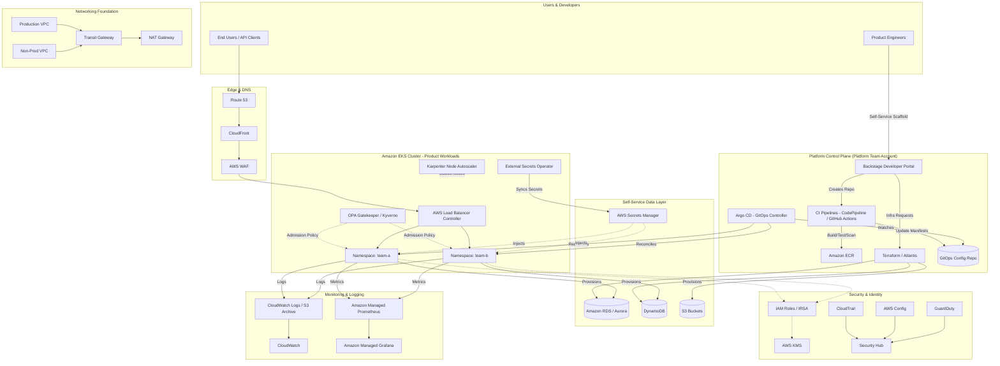
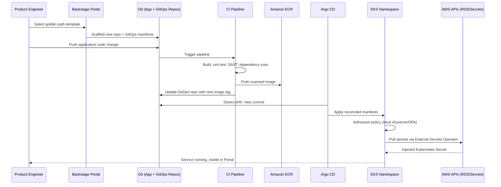

# Part V – Container & Kubernetes Architectures

# Chapter 40: Platform Engineering

---

## 1. Executive Summary

Platform Engineering is the discipline of building an **Internal Developer Platform (IDP)** — a curated, self-service layer on top of raw cloud infrastructure that lets application teams ship software without needing deep AWS, Kubernetes, or networking expertise for every deployment.

This chapter describes a production-grade AWS Platform Engineering architecture built around Amazon EKS, GitOps delivery, a self-service developer portal, golden path templates, and centralized guardrails for security, cost, and compliance.

**The business problem.**

- As organizations grow past a handful of engineering teams, every team re-solves the same problems: how to provision a VPC, how to wire up an ALB, how to configure IAM roles, how to set up CI/CD, how to onboard a database.
- This duplication is expensive. It is also inconsistent — one team's "production-ready" service has proper observability and encrypted secrets; another team's does not.
- Central platform teams historically responded by writing wikis and runbooks. Wikis do not enforce anything. Engineers copy stale examples, drift accumulates, and security debt grows silently until an audit or incident surfaces it.
- Meanwhile, the central infrastructure or DevOps team becomes a ticket queue. Every new microservice, every new environment, every new database requires a ticket to a small team that cannot scale linearly with the number of product teams.

**The architecture objective.**

- Turn infrastructure into a **product**, with application teams as the internal customers.
- Provide **golden paths**: opinionated, batteries-included templates for common workloads (a REST service, an event consumer, a scheduled job, a data pipeline) that come pre-wired with logging, tracing, IAM least privilege, cost tagging, and CI/CD.
- Make the "paved road" the path of least resistance. Teams can go off-road, but they do so consciously and with reduced platform support guarantees.
- Encode organizational policy (security, compliance, tagging, networking) as code, enforced automatically, rather than as a checklist reviewed manually per deployment.

**Why organizations adopt this architecture.**

1. Engineering headcount growth without a platform strategy leads to a linear (or worse) increase in the size of the central infrastructure team — this doesn't scale.
2. Security and compliance teams need a smaller number of enforcement points rather than reviewing hundreds of individually-built pipelines.
3. New service onboarding time becomes a competitive differentiator. Organizations that can go from "idea" to "running service with logging, metrics, and a production URL" in under a day materially outcompete those that take weeks.
4. Incident response improves because standardized services expose standardized telemetry — on-call engineers are not learning a new logging convention for every team's service.
5. FinOps becomes tractable because cost allocation tags, service quotas, and right-sizing defaults are baked into the golden path rather than bolted on after the fact.

**Major business benefits.**

| Benefit | Description |
|---|---|
| Faster time-to-production | New services launch in hours/days instead of weeks |
| Reduced cognitive load | Developers focus on business logic, not YAML and IAM |
| Consistent security posture | Guardrails enforced by the platform, not by manual review |
| Lower operational toil | Central team manages the platform, not hundreds of snowflake pipelines |
| Improved cost visibility | Standardized tagging and quota defaults across all workloads |
| Better incident response | Uniform observability makes cross-team debugging tractable |
| Auditability | Policy-as-code produces a verifiable compliance trail |

**Typical enterprise scenarios.**

- A company with 40+ engineering teams building microservices on a shared EKS fleet, where the platform team owns the golden paths and cluster operations, and product teams own application code and business logic.
- A regulated enterprise (financial services, healthcare) that must prove, for audit purposes, that every production workload was provisioned through an approved, policy-enforced pipeline — not through ad hoc console changes.
- A company undergoing rapid team growth (scaling from 20 to 200 engineers in 18 months) that needs onboarding to stay fast without infrastructure quality collapsing.
- An organization consolidating multiple "tribal" infrastructure patterns (some teams on ECS, some on raw EC2, some on Lambda) into a unified platform without forcing every team through a manual migration ticket queue.

This is not a "one microservice" architecture. It is the architecture *for the architecture* — the meta-layer that other chapters in this book (ECS Fargate, EKS, Service Mesh, GitOps) compose into. A platform engineering initiative typically emerges only after an organization already runs several of those patterns independently and needs to unify them.

**A note on scope.** Platform Engineering is as much an organizational and process discipline as a technical one. This chapter focuses on the technical architecture — the AWS services, Kubernetes constructs, and GitOps tooling that implement the platform — while noting the organizational practices (platform-as-product, golden paths, developer experience metrics) that make the technology effective. A perfect technical implementation without the product mindset produces an unused platform; teams will quietly route around it.

---

## 2. Business Requirements

### Business Drivers

- Reduce average new-service lead time from weeks to under one business day.
- Reduce the ratio of platform engineers to product engineers (commonly targeted at 1:15–1:30 in mature organizations).
- Achieve consistent, auditable security posture across all workloads without per-team manual review.
- Provide a single source of truth for "what is running in production" for cost, security, and compliance reporting.

### Functional Requirements

- Self-service creation of new services from approved templates (golden paths).
- Self-service provisioning of common dependencies: databases, queues, caches, object storage buckets, secrets.
- Centralized CI/CD pipeline templates that all product teams inherit and cannot silently modify around security stages.
- A service catalog / developer portal exposing what exists, who owns it, its health, and its documentation.
- GitOps-based deployment: the desired state of every workload lives in Git and is reconciled automatically into the cluster.
- Multi-environment support (dev, staging, production) with progressive promotion.
- Namespace and tenant isolation for both compute and network boundaries within the shared EKS fleet.

### Non-Functional Requirements

- **Scalability goals:** Support 500+ microservices and 100+ engineering teams on a shared multi-cluster EKS fleet without platform-team involvement in individual deployments.
- **Availability requirements:** Platform control plane (developer portal, GitOps controllers, CI/CD) target 99.9% availability. Individual product workloads inherit at least 99.9% via platform-provided HA defaults, with teams able to opt into higher tiers.
- **Latency requirements:** Golden path service creation (repo + pipeline + namespace + base manifests) completes in under 5 minutes end-to-end. API Gateway/ingress p99 latency budget is workload-specific but the platform's own control plane APIs should respond within 300 ms p99.
- **Compliance requirements:** SOC 2 Type II, and where applicable PCI-DSS or HIPAA, with policy-as-code enforcement mapped to control objectives (see Section 11).
- **Security expectations:** Least-privilege IAM per workload (IRSA), network policy default-deny between namespaces, mandatory image scanning before deployment, no direct kubectl access to production for application engineers.
- **Recovery objectives:**
  - RPO for platform control plane state (Git repositories, Terraform state): near-zero, since Git and S3-backed state are naturally durable and versioned.
  - RPO for stateful product workloads: workload-specific, defined in each team's golden path variant (typically 15 minutes–24 hours depending on tier).
  - RTO for platform control plane: under 1 hour for full recovery from Git and IaC in a new region.
  - RTO for individual product workloads: workload-specific, typically under 1 hour for stateless services (redeploy) and 1–4 hours for stateful services (restore from snapshot/replica promotion).
- **SLAs:** Internal platform SLA published to product teams — e.g., "self-service database provisioning fulfilled within 10 minutes, 99.5% of the time; platform on-call response within 15 minutes for Sev-1."
- **Expected workload:** Starting deployments of 50–150 services, scaling to 500+ over 2–3 years; deployment frequency in the hundreds to low thousands per day across the whole platform once golden paths are adopted broadly.
- **Expected growth:** Team count scaling 3–5x over 24 months; the platform must absorb this growth without proportional platform-team headcount growth.

---

## 3. Architecture Overview

### Overall Design

The platform separates concerns into four layers:

1. **Foundation layer** — AWS account structure, networking, EKS clusters, provisioned and governed via Terraform, owned exclusively by the platform team.
2. **Platform services layer** — GitOps controllers (Argo CD or Flux), a developer portal (Backstage-style service catalog), CI/CD pipeline templates, policy engines (OPA/Gatekeeper or Kyverno), secrets management, and observability stack.
3. **Golden path layer** — Reusable templates (Terraform modules + Helm charts + CI pipeline definitions + scaffolding) that generate a fully wired, compliant starting point for a new service.
4. **Product layer** — Application teams' actual services, deployed through the golden paths, owning their business logic and, within guardrails, their runtime configuration.

### Architecture Philosophy

- **Golden paths, not gates.** The platform should make the compliant path the *easiest* path, not the only technically possible one. Hard gates create shadow IT; strong defaults with visible guardrails create adoption.
- **Everything as code, reconciled continuously.** Desired state (infrastructure and application) lives in Git. Nothing is "clicked into existence" in the AWS console or the Kubernetes API directly in production.
- **Policy as code, not policy as document.** Security and compliance requirements are expressed as OPA/Kyverno policies and Terraform Sentinel/OPA checks that block non-compliant changes automatically.
- **Platform as a product.** The platform team measures developer satisfaction (e.g., via periodic surveys, lead-time metrics, DORA metrics) and treats product teams as customers with a roadmap, not ticket submitters.
- **Progressive trust.** New teams start with tighter guardrails and fewer self-service capabilities; as they demonstrate maturity (or the platform matures), self-service scope expands.

### Core Components

| Component | Role |
|---|---|
| Amazon EKS (multi-cluster) | Shared compute substrate for product workloads |
| Argo CD | GitOps continuous delivery controller |
| Backstage (self-hosted on EKS) | Developer portal / service catalog / scaffolding |
| AWS CodePipeline / GitHub Actions | CI pipelines for build, test, scan, publish |
| Terraform + Terraform Cloud/Atlantis | Infrastructure-as-code for foundation and self-service infra modules |
| OPA Gatekeeper / Kyverno | Kubernetes admission policy enforcement |
| AWS IAM + IRSA | Workload identity, least privilege |
| Amazon ECR | Container image registry |
| AWS Secrets Manager + External Secrets Operator | Secrets distribution into Kubernetes |
| Amazon CloudWatch, Prometheus/AMP, Grafana | Observability |
| AWS KMS | Encryption key management |
| Amazon VPC, Transit Gateway | Networking foundation |
| Crossplane (optional) | Kubernetes-native provisioning of AWS resources via CRDs |

### How Components Interact — High-Level Workflow

1. A developer opens the Backstage portal and selects a golden path template (e.g., "Node.js REST API with Postgres").
2. Backstage's scaffolder generates a new Git repository from the template, pre-populated with application skeleton code, a Dockerfile, a Helm chart, a CI pipeline definition, and a Kubernetes manifest referencing platform-managed infrastructure (namespace, IAM role, database claim).
3. The CI pipeline (triggered on push) builds the container image, runs unit tests, performs SAST and dependency scanning, and pushes the image to Amazon ECR on success.
4. The developer's Kubernetes manifests, including the new image tag, are updated in a GitOps repository (either automatically by CI, or via a pull request bot).
5. Argo CD detects the change in the GitOps repository and reconciles the desired state into the target EKS cluster/namespace.
6. Kubernetes admission controllers (Kyverno/OPA Gatekeeper) validate the incoming manifests against policy (resource limits present, no privileged containers, approved base images, required labels present) before allowing the objects to be created.
7. If infrastructure dependencies are declared (e.g., an RDS database claim via Crossplane or a Terraform module invoked through Atlantis), the platform provisions them asynchronously and injects connection details as Kubernetes Secrets via External Secrets Operator, sourced from AWS Secrets Manager.
8. The workload starts, registers with the service mesh (if enabled) or ingress controller, and begins emitting structured logs, metrics, and traces automatically because the golden path's sidecar/init containers and SDK wiring are pre-configured.
9. The developer portal reflects the new service's status, ownership, dependency graph, and links to dashboards — without the developer having written a single Terraform file or manually configuring CloudWatch.

### Request, Response, and Data Lifecycle (for a deployed product workload)

- **Request lifecycle:** Client → Route 53 → CloudFront (optional edge caching/WAF) → Application Load Balancer or API Gateway → Ingress Controller (AWS Load Balancer Controller managing ALB/NLB target groups) → Kubernetes Service → Pod.
- **Response lifecycle:** Pod → Service → Ingress → Load Balancer → Client, with response metadata (status codes, latency) captured by the ingress controller's access logs and shipped to CloudWatch/S3.
- **Data lifecycle:** Application writes to its provisioned data store (RDS/Aurora/DynamoDB, provisioned via the platform's self-service data layer), with backups, encryption, and retention policy attached automatically based on the data classification tag chosen at scaffolding time.

> **Note:** This chapter treats the *platform* as the primary architecture under review — not any single product workload. Chapters 35–39 in this Part cover ECS Fargate, EKS fundamentals, service mesh, GitOps mechanics, and multi-cluster Kubernetes individually; this chapter assumes familiarity with those building blocks is not required, and re-introduces each service and concept before using it.

---

## 4. AWS Services Used

For each service: purpose, why selected, alternatives, limitations, pricing considerations, and best practices.

### Amazon EKS (Elastic Kubernetes Service)

- **Purpose:** Managed Kubernetes control plane; the compute substrate on which product workloads and several platform services run.
- **Why selected:** Kubernetes is the de facto standard for platform engineering because of its extensibility (CRDs, admission webhooks, operators) — the entire golden path and policy enforcement model depends on Kubernetes' API-driven, declarative object model. EKS removes the operational burden of running the control plane, etcd, and control-plane upgrades.
- **Alternatives:** Self-managed Kubernetes (kOps, kubeadm) — more control, far more operational burden, rarely justified for a platform engineering initiative. Amazon ECS — simpler, cheaper, less operationally demanding, but lacks the CRD/operator ecosystem (Crossplane, Argo CD ApplicationSets, Gatekeeper) that most platform engineering tooling assumes. ECS is a legitimate alternative for organizations that don't need Kubernetes-specific extensibility (see Chapter 35).
- **Limitations:** EKS control plane cost, version upgrade cadence (Kubernetes deprecates APIs aggressively), the operational complexity of running a multi-tenant cluster safely (noisy neighbor risk, resource quotas required), and a steep learning curve for teams unfamiliar with Kubernetes.
- **Pricing considerations:** Flat hourly control plane charge, plus underlying EC2/Fargate compute costs, plus data transfer. Multi-cluster fleets multiply the control plane charge — a valid reason to consolidate onto fewer, larger clusters when tenant isolation requirements allow it.
- **Best practices:** Use managed node groups or Karpenter for node lifecycle; enable IRSA (IAM Roles for Service Accounts) rather than node-level IAM roles; separate clusters by blast-radius domain (e.g., production vs. non-production, or by compliance boundary) rather than by team, to avoid control-plane sprawl.

### Amazon ECR (Elastic Container Registry)

- **Purpose:** Private container registry for all platform and product images.
- **Why selected:** Native IAM integration (no separate registry credentials to manage), native integration with EKS node IAM roles for pulls, built-in vulnerability scanning.
- **Alternatives:** Self-hosted Harbor (more features — quota management, replication, richer RBAC — at the cost of operating another stateful service); Docker Hub (not acceptable for most enterprises due to rate limits and lack of private-network-only access).
- **Limitations:** Cross-region replication must be explicitly configured; scanning depth is more limited than dedicated tools like Snyk or Prisma Cloud unless enhanced scanning (powered by Amazon Inspector) is enabled.
- **Pricing considerations:** Storage per GB-month plus data transfer; enhanced scanning has its own per-image cost — budget for it explicitly in the golden path's cost model since every merge triggers a build.
- **Best practices:** Enforce image immutability (tags cannot be overwritten), enable Inspector-based continuous scanning, use lifecycle policies to expire untagged/old images automatically, and require signed images (via Notation/Cosign) as an admission policy for production namespaces.

### AWS IAM and IRSA (IAM Roles for Service Accounts)

- **Purpose:** Identity and least-privilege access control, both for humans (platform/product engineers) and workloads (pods needing to call AWS APIs).
- **Why selected:** IRSA maps a Kubernetes ServiceAccount to an IAM role via OIDC federation, eliminating the need for long-lived AWS credentials inside pods and giving each workload a distinct, auditable identity — a foundational requirement for a multi-tenant platform.
- **Alternatives:** kiam/kube2iam (older node-level credential proxy patterns) — deprecated in favor of IRSA/Pod Identity due to security weaknesses (credential leakage across pods on the same node). Amazon EKS Pod Identity (newer, simpler alternative to IRSA, avoiding OIDC trust configuration) is worth adopting in new builds.
- **Limitations:** IRSA requires an OIDC provider per cluster and correct trust policy configuration per role — a common source of "AccessDenied" debugging sessions for teams new to the platform.
- **Pricing considerations:** No direct cost; indirect cost is engineering time spent on IAM policy design and review.
- **Best practices:** One IAM role per workload (never shared "namespace-wide" roles beyond least-privilege necessity), enforce via policy-as-code that new ServiceAccounts must declare an IRSA role annotation, and centrally review IAM policy diffs via a platform-owned Terraform module rather than allowing product teams to hand-write trust policies.

### AWS Secrets Manager

- **Purpose:** Centralized storage and rotation of credentials (database passwords, API keys, third-party tokens).
- **Why selected:** Native rotation Lambda support for RDS/Aurora, fine-grained IAM-based access control, audit trail via CloudTrail.
- **Alternatives:** HashiCorp Vault (richer dynamic-secrets and multi-cloud support, but requires operating another stateful, highly-available service); SSM Parameter Store (cheaper, no native rotation, acceptable for non-sensitive configuration but not for credentials).
- **Limitations:** Per-secret monthly cost adds up at scale (hundreds of services × multiple secrets each); API call costs for high-frequency reads (mitigate via caching, e.g., the Secrets Manager CSI driver or a sidecar cache).
- **Pricing considerations:** Flat per-secret monthly fee plus per-10,000-API-calls charge — at platform scale this is a real, trackable line item; budget it explicitly and consider Parameter Store for non-credential configuration to control cost.
- **Best practices:** One secret per credential per environment; use External Secrets Operator to sync into Kubernetes Secrets rather than baking secrets into images or environment variables at build time; rotate database credentials automatically.

### AWS Systems Manager (SSM)

- **Purpose:** Parameter Store for non-secret configuration; Session Manager for auditable, agentless shell access to EC2 instances (e.g., worker nodes) without SSH keys or bastion hosts.
- **Why selected:** Removes the need for bastion host infrastructure and SSH key distribution — aligns with the platform's "no standing access" security posture.
- **Alternatives:** Traditional bastion hosts (more attack surface, key management burden); EKS `kubectl exec` for pod-level access (used for application debugging, complementary to SSM for node-level access).
- **Limitations:** Session Manager requires the SSM agent and appropriate IAM permissions on the instance profile; not a substitute for Kubernetes-level access control.
- **Pricing considerations:** SSM itself is free; underlying CloudWatch Logs storage for session logs has standard log ingestion/storage costs.
- **Best practices:** Log all sessions to CloudWatch Logs and S3 for audit; restrict SSM access via IAM conditions (e.g., tag-based resource restriction) rather than blanket instance access.

### Amazon VPC, Transit Gateway, PrivateLink

- **Purpose:** Network isolation and connectivity backbone for the EKS fleet and platform services.
- **Why selected:** Transit Gateway centralizes routing across multiple VPCs (one per environment or business unit) without a full mesh of VPC peering, which becomes unmanageable past a handful of VPCs. PrivateLink allows product teams to consume shared platform services (e.g., a shared logging endpoint, a shared internal API) without route table exposure across account boundaries.
- **Alternatives:** VPC peering mesh (simpler at small scale, operationally untenable beyond ~10 VPCs due to O(n²) peering relationships and non-transitive routing); AWS Cloud WAN (newer, higher-level abstraction over Transit Gateway, worth evaluating for very large multi-region fleets — see Chapter 18).
- **Limitations:** Transit Gateway has per-attachment and per-GB data processing costs; PrivateLink endpoints have hourly and per-GB charges per consuming VPC.
- **Pricing considerations:** These are often the least-visible line items in a platform's AWS bill until FinOps tagging maturity catches up — see Section 16 and Section 34 ("Cost Surprises").
- **Best practices:** One VPC per environment tier (or per compliance boundary), private subnets for all node groups, no public IPs on worker nodes, centralized egress via NAT Gateway or a shared egress VPC.

### Amazon CloudWatch, Amazon Managed Prometheus (AMP), Amazon Managed Grafana (AMG)

- **Purpose:** Metrics, logs, dashboards, and alerting for both the platform control plane and every product workload.
- **Why selected:** CloudWatch provides native AWS service metrics/logs with minimal setup; AMP/AMG provide a managed, Prometheus-compatible metrics stack that most Kubernetes-native tooling (kube-state-metrics, application `/metrics` endpoints) already targets, avoiding the operational burden of self-hosting Prometheus and Grafana at scale.
- **Alternatives:** Self-hosted Prometheus + Grafana (more control, no per-metric-sample cost, but the platform team now owns another stateful, HA-critical system); third-party observability platforms (Datadog, New Relic, Honeycomb) — often chosen for richer APM/tracing UX at materially higher cost.
- **Limitations:** AMP ingestion cost scales with the number of active time series — golden paths must set sane default scrape intervals and cardinality limits or costs grow unpredictably as teams instrument freely.
- **Pricing considerations:** CloudWatch Logs ingestion and storage is commonly one of the largest and least-controlled cost lines on a platform (see Section 16); AMP is priced per metric sample ingested and per query.
- **Best practices:** Define a platform-wide default retention policy per log group tier (debug/short vs. audit/long), enforce metric cardinality budgets via policy, and provide pre-built Grafana dashboards as part of every golden path so teams don't hand-roll inconsistent dashboards.

### AWS CloudTrail, AWS Config, AWS Security Hub, Amazon GuardDuty

- **Purpose:** Audit logging (CloudTrail), configuration compliance (Config), aggregated security findings (Security Hub), and threat detection (GuardDuty) across the platform's accounts.
- **Why selected:** These form the compliance and security backbone that lets a platform team assert, with evidence, that guardrails are actually enforced — a hard requirement for SOC 2 / PCI / HIPAA audits (see Section 11).
- **Alternatives:** Third-party CSPM tools (Wiz, Orca, Prisma Cloud) — often layered on top of, not instead of, these native services for deeper contextual risk analysis.
- **Limitations:** Config rule evaluation lag (minutes, not real-time — not a substitute for admission-time enforcement via Kyverno/OPA); GuardDuty findings require a triage process or they become noise.
- **Pricing considerations:** CloudTrail data events (as opposed to management events) and Config rule evaluations both scale with account activity and are easy to under-budget for a fast-growing multi-tenant platform.
- **Best practices:** Centralize CloudTrail and Config into a dedicated log-archive/security-tooling account (see AWS multi-account landing zone patterns, Chapter 99); enable Security Hub's AWS Foundational Security Best Practices standard as a baseline.

### AWS KMS (Key Management Service)

- **Purpose:** Encryption key management for data at rest (EBS, S3, RDS, Secrets Manager) and application-level envelope encryption.
- **Why selected:** Native integration across virtually every AWS data service; customer-managed keys (CMKs) allow per-tenant or per-data-classification key separation, which is often a compliance requirement.
- **Alternatives:** AWS-managed keys (simpler, no cost, but no cross-account/tenant key separation or custom key policies — insufficient for multi-tenant compliance boundaries).
- **Limitations:** API call costs and request-per-second quotas can matter at very high scale; key policy complexity grows with the number of CMKs.
- **Pricing considerations:** Monthly per-CMK charge plus per-10,000-request charge — trivial per key but adds up if every one of 500 services gets its own CMK without justification; align key granularity with actual compliance boundary granularity, not with service count.
- **Best practices:** Use one CMK per data-classification tier per environment (not per microservice, unless a compliance boundary demands it) — see the trade-off discussion in Section 34.

---

## 5. Complete Architecture Diagram





---

## 6. Component-by-Component Explanation

### Backstage Developer Portal

- **Purpose:** Single pane of glass for service discovery, ownership, documentation, and scaffolding.
- **Responsibilities:** Render the service catalog; expose golden path templates via the scaffolder plugin; surface CI/CD status, on-call ownership, and cost per service; provide TechDocs (documentation-as-code rendering).
- **Inputs:** `catalog-info.yaml` files committed alongside each service's source, template definitions maintained by the platform team.
- **Outputs:** New Git repositories, pull requests against the GitOps repo, dashboard links.
- **Scaling:** Stateless frontend/backend, horizontally scaled behind an ALB; catalog data persisted in a managed PostgreSQL (RDS) instance.
- **High availability:** Multi-AZ RDS backing store; multiple Backstage pod replicas across AZs.
- **Failure handling:** If Backstage is unavailable, existing services continue running (it is a control-plane convenience layer, not a runtime dependency) — this decoupling is a deliberate design choice.
- **Dependencies:** RDS (catalog persistence), GitHub/GitLab API (repo creation), Kubernetes API (status aggregation).
- **Security:** OIDC-integrated SSO for developer login; scoped GitHub App permissions rather than personal access tokens for repo creation.
- **Monitoring:** Request latency, scaffolding success/failure rate, catalog staleness.

### Argo CD (GitOps Controller)

- **Purpose:** Continuously reconciles the live state of the EKS cluster to match the desired state declared in Git.
- **Responsibilities:** Poll/watch GitOps repositories, diff live vs. desired state, apply changes, report sync/health status, support automated or manual sync policies per application.
- **Inputs:** Kubernetes manifests / Helm charts / Kustomize overlays in Git.
- **Outputs:** Reconciled Kubernetes objects; sync status surfaced via API/UI and to Backstage.
- **Scaling:** Argo CD's `application-controller` component can be sharded across multiple replicas for large numbers of Applications; ApplicationSets are used to template many similar Applications (e.g., one per team/namespace) rather than hand-maintaining hundreds of Application objects.
- **High availability:** Deployed with multiple replicas of each component across AZs; repo-server caching tuned to avoid Git API rate limiting.
- **Failure handling:** If Argo CD is down, running workloads are unaffected (Kubernetes continues running already-applied objects); new changes simply queue until Argo CD recovers.
- **Dependencies:** Git hosting API, Kubernetes API server, (optionally) a Redis cache.
- **Security:** RBAC mapped to SSO groups so that team X can only sync Applications scoped to team X's namespaces; secrets never stored in Git (see External Secrets Operator).
- **Monitoring:** Sync failure rate, reconciliation drift duration, Application health status distribution.

### OPA Gatekeeper / Kyverno (Admission Policy Enforcement)

- **Purpose:** Enforce organizational policy at the Kubernetes admission layer — reject non-compliant objects before they are ever created.
- **Responsibilities:** Validate incoming manifests (resource requests/limits present, no `:latest` tags, no privileged containers, required labels/annotations present, only approved image registries); optionally mutate objects to inject defaults (e.g., automatically add a sidecar or default network policy).
- **Inputs:** Admission review requests from the Kubernetes API server.
- **Outputs:** Allow/deny decisions, mutation patches, policy violation audit logs.
- **Scaling:** Runs as a webhook deployment; horizontally scaled; policy evaluation adds a small, bounded latency to every object creation.
- **High availability:** Multiple replicas; `failurePolicy` for the webhook must be chosen deliberately (`Fail` blocks the cluster if the policy engine is down — safer for compliance, riskier for availability; most platforms choose `Fail` for production namespaces and `Ignore` for non-critical dev namespaces).
- **Failure handling:** A misconfigured policy with `failurePolicy: Fail` can block all deployments cluster-wide — this is a known, high-impact failure mode requiring careful policy testing (dry-run/audit mode before enforce mode).
- **Dependencies:** Kubernetes API server (admission webhook registration).
- **Security:** This *is* a core security control — its own RBAC and update process must be tightly restricted to the platform team.
- **Monitoring:** Policy violation counts by policy and namespace, webhook latency, webhook availability.

### External Secrets Operator (ESO)

- **Purpose:** Bridges AWS Secrets Manager / SSM Parameter Store into native Kubernetes Secrets, kept in sync.
- **Responsibilities:** Poll or watch the configured `SecretStore`/`ExternalSecret` custom resources and materialize/update the corresponding Kubernetes Secret.
- **Inputs:** `ExternalSecret` CRDs referencing AWS Secrets Manager ARNs.
- **Outputs:** Kubernetes Secrets consumed by pods as environment variables or mounted volumes.
- **Scaling:** Lightweight controller; scales with the number of `ExternalSecret` resources and refresh interval.
- **High availability:** Multiple replicas with leader election.
- **Failure handling:** Existing Kubernetes Secrets remain valid (stale but present) if ESO is briefly unavailable; new secret rotations are simply delayed.
- **Dependencies:** AWS Secrets Manager API, IRSA role with least-privilege `secretsmanager:GetSecretValue` scoped to relevant secret ARN prefixes.
- **Security:** This is a high-value target — its IAM role must be scoped per-namespace/per-team to prevent one team's ESO from reading another team's secrets.
- **Monitoring:** Sync failure rate, secret age/staleness, IAM AccessDenied error rate.

### Karpenter (Node Autoscaling)

- **Purpose:** Just-in-time provisioning of EC2 capacity for the EKS cluster, replacing the older Cluster Autoscaler + static node group model.
- **Responsibilities:** Watch for unschedulable pods, select and launch right-sized EC2 instances (including Spot where the workload tolerates it), and consolidate/terminate underutilized nodes.
- **Inputs:** Pending pod scheduling constraints (resource requests, node affinity, taints/tolerations).
- **Outputs:** EC2 instances joined to the cluster.
- **Scaling:** Itself lightweight; the scaling it performs is of the underlying node fleet.
- **High availability:** Runs with 2+ replicas with leader election; a brief outage delays new node provisioning but doesn't affect already-running workloads.
- **Failure handling:** If Karpenter is down, pending pods queue until it recovers or until standing capacity (if any) has room.
- **Dependencies:** EC2 Fleet/RunInstances API, IAM role with EC2 provisioning permissions.
- **Security:** Its IAM role is broad by necessity (can launch instances) — protect it with strict RBAC on who can modify Karpenter's `NodePool`/`EC2NodeClass` CRDs.
- **Monitoring:** Node provisioning latency, Spot interruption rate, consolidation savings.

### AWS Load Balancer Controller

- **Purpose:** Translates Kubernetes `Ingress`/`Service` objects into AWS ALB/NLB resources.
- **Responsibilities:** Provision and update ALB listeners/target groups/rules based on Ingress annotations; register pod IPs directly as ALB targets (IP target mode) for lower-latency routing than the legacy instance-mode.
- **Inputs:** Kubernetes `Ingress` and `Service` (type LoadBalancer) objects.
- **Outputs:** ALB/NLB and associated target group configuration in AWS.
- **Scaling:** Controller itself is lightweight; scaling concern is the number of ALBs/target groups against AWS service quotas.
- **High availability:** Multiple controller replicas with leader election.
- **Failure handling:** Existing load balancers keep routing traffic if the controller is briefly down; only new Ingress changes are delayed.
- **Dependencies:** EC2/ELB APIs via IRSA.
- **Security:** WAF association, TLS termination via ACM-issued certificates referenced in Ingress annotations.
- **Monitoring:** ALB 5xx rate, target health, controller reconciliation errors.

---

## 7. End-to-End Request Flow

The following describes the *runtime* request flow for an end user calling a product API deployed via the platform (as distinct from the developer's deployment flow described in Section 3/5).

1. **Client** issues an HTTPS request to `api.example.com`.
2. **Route 53** resolves the hostname to the CloudFront distribution (or directly to the ALB if CloudFront is not used for this workload).
3. **CloudFront** (if configured) serves cached responses where applicable, and forwards cache-miss/non-cacheable requests to the origin ALB, adding edge-level compression.
4. **AWS WAF**, attached to CloudFront or the ALB, evaluates managed and custom rule groups (SQLi, XSS, rate-based rules) and blocks or allows the request.
5. **Application Load Balancer** (provisioned by the AWS Load Balancer Controller from the workload's Ingress object) terminates TLS using an ACM certificate and routes based on host/path rules to the correct target group.
6. **Target group** forwards the request to a healthy pod IP (IP target mode) belonging to the destination Kubernetes Service.
7. **Kubernetes kube-proxy/CNI** (or service mesh sidecar, if enabled) delivers the packet to the selected pod.
8. **Application container** processes the request; if it needs data, it calls its provisioned data store (e.g., RDS) using credentials injected by External Secrets Operator and an IAM role assumed via IRSA for any AWS API calls (e.g., S3, DynamoDB).
9. **Caching layer** (e.g., ElastiCache/Redis, if part of the workload's golden path) is checked/updated as per the application's caching strategy.
10. **Database** executes the query; Multi-AZ RDS/Aurora ensures the primary is available, with read replicas serving read-heavy paths if configured.
11. **Application** constructs the response and emits structured logs (JSON, with trace ID) to stdout, captured by Fluent Bit (running as a DaemonSet) and shipped to CloudWatch Logs.
12. **Tracing SDK** (OpenTelemetry, auto-instrumented as part of the golden path) emits a trace span, exported to AWS X-Ray or an OTLP collector feeding Grafana Tempo/AMP.
13. **Response** flows back through the pod → Service → Target Group → ALB → (CloudFront) → Client.
14. **Access logs** from the ALB and CloudFront are delivered to S3 for audit and later Athena querying.
15. **Metrics** (request count, latency histogram, error rate) are scraped by the Prometheus-compatible endpoint and ingested into Amazon Managed Prometheus, visualized in Amazon Managed Grafana, and alerting rules evaluate SLO burn rate.
16. **Error handling:** On a 5xx from the application, the ALB target health check may mark the pod unhealthy after threshold failures, deregistering it and stopping new requests from routing there; Kubernetes readiness/liveness probes independently restart or replace unhealthy pods; the platform's default alerting rules (bundled in every golden path) fire a page if the error-rate SLO burns too fast.

---

## 8. Deployment Flow

### Infrastructure Provisioning

- Foundation infrastructure (VPCs, EKS clusters, Transit Gateway, shared IAM boundaries) is provisioned via **Terraform**, organized into modules per concern (networking, cluster, IRSA baseline, observability baseline).
- Self-service infrastructure requested by product teams (an RDS instance, an S3 bucket, a DynamoDB table) is provisioned either:
  - **Option A — Terraform + Atlantis:** the team's request is a pull request against a thin Terraform configuration that calls a platform-published module; Atlantis runs `plan` automatically on PR and `apply` after approval, with policy checks (OPA/Sentinel) gating the apply.
  - **Option B — Crossplane:** the team declares a Kubernetes-native `Composition` claim (e.g., a `PostgreSQLInstance` CRD) alongside their application manifests, and Crossplane's AWS provider reconciles the underlying RDS resource — keeping infrastructure requests in the same GitOps flow as application deployment.
- Most mature platforms use Terraform for foundation (rarely changing, high blast radius) and Crossplane or a thin self-service Terraform layer for day-to-day product infrastructure (frequent, low blast radius, needs to be fast).

### Terraform Workflow

```

1. Developer opens PR modifying/adding a .tf file (or a golden-path-generated
   claim) in the infra repository.
2. CI runs: terraform fmt -check, terraform validate, tflint, checkov/tfsec
   (static security scanning), terraform plan.
3. Plan output posted as a PR comment (via Atlantis or a CI bot).
4. Required reviewers (platform team, for foundation changes; automatic
   approval for pre-approved self-service module usage within guardrails)
   approve.
5. Merge triggers terraform apply, state stored remotely in S3 with
   DynamoDB state locking, encrypted with a dedicated KMS key.
6. Apply output and resulting resource ARNs are posted back to the PR and
   (for self-service infra) surfaced in Backstage.

```

### CI/CD Deployment (Application Path)

```

1. Push to feature branch -> CI: build, unit test, lint.
2. Push to main (post-merge) -> CI: build production image, SAST
   (e.g., Semgrep), dependency/SCA scan (e.g., Grype/Snyk), container
   image scan, push to ECR with immutable tag (git SHA).
3. CI opens a PR against the GitOps repo, bumping the image tag in the
   relevant environment overlay (e.g., environments/dev/kustomization.yaml).
4. Auto-merge for dev (based on golden path policy); manual approval
   gate for staging and production promotions.
5. Argo CD detects the GitOps repo change and syncs.
6. Post-sync hook runs smoke tests / health checks; Argo CD reports
   sync + health status back to the GitOps repo commit (via a status
   check) and to Backstage.

```

### Blue-Green / Progressive Delivery

- Implemented via **Argo Rollouts** (an Argo CD companion controller) rather than native Kubernetes Deployments for production-tier services.
- Supported strategies: canary (traffic-shifted percentage-based rollout with automated analysis against Prometheus metrics), and blue-green (full traffic cutover after a manual or automated promotion gate).
- Rollback is a first-class operation: Argo Rollouts automatically reverts to the previous stable ReplicaSet if the analysis step's success-rate/latency metrics breach the defined threshold — no human intervention required for the common case.

### Secrets and Configuration in the Deployment Pipeline

- Application secrets are **never** stored in the GitOps repo. `ExternalSecret` CRDs reference AWS Secrets Manager ARNs by name/path convention (e.g., `/platform/{team}/{service}/{env}/db-password`), and the actual secret material is created out-of-band by the self-service data provisioning flow (Section 8, Infrastructure Provisioning), never committed anywhere.
- Non-secret configuration uses Kubernetes ConfigMaps generated from values files in the GitOps repo (safe to version and diff).

### Validation

- Pre-deploy: policy-as-code checks (Kyverno in audit mode during CI, enforce mode at admission), Terraform plan review, image scan gating (block on Critical/High CVEs above an agreed threshold, with a documented, time-boxed exception process).
- Post-deploy: automated smoke tests, synthetic canary checks (e.g., CloudWatch Synthetics) against key endpoints, and Argo Rollouts' automated analysis templates querying Prometheus for error-rate/latency regression before completing a rollout.

---

## 9. Network Topology

### VPC and CIDR Strategy

- One VPC per environment tier, sized to avoid CIDR collisions across the fleet: e.g., `10.0.0.0/16` non-prod, `10.16.0.0/16` staging, `10.32.0.0/16` production, with room reserved for additional regions/accounts.
- Kubernetes pod CIDR planning matters at platform scale: with the Amazon VPC CNI's default behavior (each pod gets a VPC-routable IP), a large multi-tenant cluster can exhaust available subnet IPs quickly. Mitigate with **prefix delegation** (assigning /28 prefixes to ENIs rather than individual secondary IPs) or by using a secondary, larger CIDR (via VPC CIDR association, e.g., a `100.64.0.0/16` block) dedicated to pod IPs.

### Public and Private Subnets

- Public subnets: only host NAT Gateways and internet-facing load balancers (or CloudFront origins) — no worker nodes, no databases.
- Private subnets: host EKS worker nodes, RDS/Aurora instances, ElastiCache clusters, and internal-only services.
- A minimum of three AZs per environment for genuine HA (two is a common but risky shortcut — see Section 24).

### NAT Gateway and Internet Gateway

- One NAT Gateway per AZ (not a single shared NAT Gateway) to avoid a cross-AZ single point of failure and to avoid inter-AZ data transfer charges for egress traffic.
- Internet Gateway attached once per VPC for public subnet routing.

### Transit Gateway

- Central hub connecting the platform's VPCs (and, if applicable, on-premises via Direct Connect/VPN) without a peering mesh.
- Route tables segmented per attachment to enforce which VPCs can reach which other VPCs (e.g., non-prod cannot route to prod databases).

### Route Tables and Network ACLs

- Private subnet route tables send `0.0.0.0/0` to the AZ-local NAT Gateway; internal cross-VPC traffic routes via Transit Gateway attachment.
- Network ACLs are used sparingly, as an additional coarse-grained control (e.g., explicitly deny known-bad CIDR ranges), with primary segmentation enforced via Security Groups and Kubernetes NetworkPolicies (see below) rather than NACLs, which are stateless and harder to reason about at scale.

### Security Groups

- EKS worker node security group allows control-plane-to-node and node-to-node communication per AWS's documented EKS requirements.
- Pod-level network segmentation is enforced primarily via **Kubernetes NetworkPolicies** (implemented by the CNI, e.g., Calico or the VPC CNI's native NetworkPolicy support), with a **default-deny-all** policy applied to every namespace by the golden path, and explicit allow rules generated for each service's actual declared dependencies.

### PrivateLink

- Shared platform services consumed across account boundaries (e.g., a central logging ingestion endpoint, a shared internal package registry) are exposed via VPC Endpoint Services (PrivateLink) rather than VPC peering, limiting exposure to only the specific service rather than full network reachability.

### Hybrid Connectivity

- Where the organization has on-premises systems (e.g., a legacy mainframe, an on-prem Active Directory), Direct Connect (with a VPN backup) terminates into the Transit Gateway, exposed selectively to the VPCs/teams that require it — most product teams on the platform never need direct hybrid connectivity and should not have route visibility to on-prem CIDRs by default.

---

## 10. Identity and Access

### IAM Roles and Policies — Human Access

- No standing IAM users. All human access is federated through **AWS IAM Identity Center** (see Chapter 89), mapped to the organization's SSO/IdP groups (e.g., Okta, Azure AD).
- Platform team members get an IAM permission set scoped to platform-owned resources (EKS cluster admin, Terraform state bucket, foundation VPC) plus read access across product accounts for troubleshooting.
- Product engineers get **no direct AWS console/API access to production by default**. All production changes flow through the GitOps and Terraform pipelines described in Section 8. Break-glass access exists but is logged, time-boxed (via IAM session policies with short `MaxSessionDuration`), and triggers a mandatory post-incident review.

### IAM Roles for Kubernetes Workloads (IRSA)

- Every ServiceAccount that needs AWS API access has a dedicated IAM role, scoped to only the actions and resource ARNs that specific service needs — never a shared "namespace role" used by multiple unrelated services.
- Golden path scaffolding generates the IRSA role and trust policy automatically based on a declarative manifest (e.g., "this service needs read access to bucket X and read/write to DynamoDB table Y"), which is reviewed the same way any other Terraform PR is reviewed.

### Resource Policies

- S3 bucket policies, KMS key policies, and Secrets Manager resource policies are used to enforce cross-account or cross-namespace boundaries in addition to identity-based IAM policies — defense in depth, since a resource policy can block access even if an identity policy is accidentally too permissive.

### STS and Cross-Account Access

- Multi-account structure (see Section 28/Alternatives and Chapter 99) means platform and product workloads frequently need cross-account access — implemented via `sts:AssumeRole` with tightly scoped trust policies, never long-lived cross-account access keys.

### Least Privilege in Practice

- The platform enforces least privilege structurally: golden path templates generate the *minimum viable* IAM policy for the declared dependencies, and policy-as-code checks reject Terraform plans that introduce wildcard (`"Resource": "*"` or `"Action": "*"`) statements without an explicit, reviewed exception.

### Service Roles

- EKS cluster IAM role, node group IAM role, Karpenter controller role, AWS Load Balancer Controller role, External Secrets Operator role, Argo CD role — each is a distinct, narrowly scoped role, not a shared "platform-admin" role reused across controllers, so that a compromise of one controller does not cascade into full cluster or account compromise.

### Permission Boundaries

- IAM permission boundaries are attached to any role-creation capability exposed to product teams (e.g., via the self-service Terraform module that creates IRSA roles), capping the maximum permissions any self-service-created role can ever have — a critical control that prevents a benign or malicious Terraform change from ever escalating beyond the boundary, regardless of what the policy document says.

---

## 11. Security Architecture

### Encryption

- **At rest:** EBS volumes, RDS/Aurora storage, S3 buckets, and Secrets Manager secrets are encrypted with KMS customer-managed keys, scoped per data-classification tier (see Section 34 for the trade-off on per-service vs. per-tier keys).
- **In transit:** TLS everywhere — ACM-issued certificates on ALBs/CloudFront, mutual TLS between services where a service mesh is deployed (see Chapter 37), and TLS enforced for all data store connections (`sslmode=require` or equivalent).

### WAF and Shield

- AWS WAF attached to CloudFront/ALB with managed rule groups (common OWASP Top 10 protections) plus custom rate-based rules per API.
- AWS Shield Standard is active by default for all CloudFront/ALB resources; Shield Advanced is adopted selectively for internet-facing production services with material DDoS exposure, given its cost.

### Secrets Manager and Certificate Manager

- Covered in Sections 4 and 8; ACM handles certificate issuance/renewal automatically for all TLS endpoints, removing manual certificate rotation as an operational task and failure mode.

### GuardDuty, Inspector, Security Hub

- GuardDuty enabled organization-wide (via AWS Organizations delegated administrator) for threat detection across all accounts, including EKS-specific findings (e.g., anomalous `kubectl` API calls, cryptomining process detection in containers).
- Inspector performs continuous vulnerability scanning of ECR images and EC2/EKS node AMIs.
- Security Hub aggregates findings from GuardDuty, Inspector, Config, and third-party tools into a single, prioritized view, mapped to compliance standards (CIS AWS Foundations, PCI-DSS, etc.).

### CloudTrail and AWS Config

- Organization-wide CloudTrail trail, logging to a centralized, access-restricted log-archive account, with log file integrity validation enabled.
- AWS Config rules continuously assess configuration drift against the platform's baseline (e.g., "no S3 bucket is publicly readable," "no security group allows 0.0.0.0/0 on port 22") and auto-remediate low-risk violations where safe.

### Zero Trust Posture

- No implicit trust based on network location (being "inside the VPC" grants no special privilege). Every service-to-service call is authenticated (via mTLS in the service mesh, or IAM SigV4 for AWS API calls) and authorized (via NetworkPolicy plus, where a service mesh is present, L7 authorization policies).
- Human access to any production system requires SSO authentication plus, for sensitive operations, an additional approval step (e.g., a break-glass workflow).

### Threat Model — Key Attack Vectors and Mitigations

| Attack Vector | Mitigation |
|---|---|
| Compromised CI/CD pipeline pushing malicious image | Mandatory image scanning + signing (Cosign) + admission policy requiring verified signatures |
| Over-privileged IRSA role exploited via app vulnerability (SSRF/RCE) | Least-privilege per-service IAM, permission boundaries, GuardDuty runtime detection |
| Lateral movement between tenant namespaces | Default-deny NetworkPolicy, namespace-scoped RBAC, per-team IAM roles |
| Secrets exposure via misconfigured logging | Structured logging with secret redaction, ESO instead of environment-variable secrets baked at build time |
| Supply chain compromise (malicious dependency) | SCA scanning in CI, SBOM generation, dependency pinning, private package registry mirroring |
| Admission policy bypass via cluster-admin misuse | Tightly restricted RBAC on who can modify Gatekeeper/Kyverno policies; audit logging on policy changes |
| Data exfiltration via overly broad S3 bucket policy | Config rules blocking public buckets, mandatory bucket policy review in Terraform PR pipeline |
| Node-level compromise exposing IMDS credentials | IMDSv2 enforced, IRSA (not node IAM role) used for workload AWS access, minimizing value of node compromise |

---

## 12. High Availability

### Availability Zone Failures

- EKS worker nodes and self-managed node groups span a minimum of three AZs; Karpenter's provisioning constraints spread new capacity across AZs by default.
- RDS/Aurora deployed Multi-AZ; Aurora's storage layer is inherently replicated across AZs within a region.
- ALB automatically routes only to healthy targets across the AZs it spans; an AZ outage is absorbed by shifting traffic to the remaining healthy AZs.

### Instance (Node) Failures

- Kubernetes' scheduler and Karpenter/Cluster Autoscaler replace failed nodes automatically; pod disruption budgets (PDBs) ensure a minimum number of replicas remain available during voluntary disruptions (e.g., node upgrades).
- Liveness/readiness probes ensure Kubernetes detects and replaces unhealthy pods without waiting for a full node failure.

### Regional Failures

- The platform control plane (Backstage, Argo CD, CI) is, for most organizations, single-region with a documented (and periodically tested) disaster recovery runbook to rebuild in a secondary region from Git and Terraform state (see Section 13).
- Individual product workloads adopt multi-region active-active or active-passive patterns only when their specific business requirements justify the added cost and complexity (see Chapter 98) — the platform provides multi-region golden path variants but does not force every service into them.

### Database Failures

- RDS/Aurora Multi-AZ automated failover (typically under 60–120 seconds); Aurora Global Database for cross-region read replicas where regional failover is a hard requirement.
- DynamoDB is inherently multi-AZ within a region by default, with Global Tables available for multi-region active-active use cases.

### Load Balancing and Health Checks

- ALB target group health checks configured per golden path with sane defaults (path, interval, healthy/unhealthy thresholds) that teams can override but not disable.
- Readiness gates ensure a newly deployed pod is not added to the ALB target group until it has passed both the Kubernetes readiness probe and, where used, the AWS Load Balancer Controller's target health synchronization.

### Failover Behavior Summary

| Failure Type | Detection Mechanism | Failover Time (typical) |
|---|---|---|
| Pod crash | Liveness probe | Seconds |
| Node failure | Node NotReady + Karpenter reprovision | 1–3 minutes |
| AZ outage | ALB health checks + multi-AZ node spread | Near-immediate (traffic shift), minutes (capacity rebalance) |
| RDS/Aurora primary failure | RDS Multi-AZ automated failover | 60–120 seconds |
| Argo CD outage | N/A (no runtime traffic impact) | No impact to running workloads |
| Regional outage | Manual/automated DR runbook activation | Minutes to hours, per DR tier (see Section 13) |

---

## 13. Disaster Recovery

### Backup Strategy

- **Platform control plane state:** Git repositories (application source, GitOps config, Terraform config) are the source of truth and are inherently versioned and durable via the Git hosting provider's own redundancy; Terraform state is stored in S3 with versioning and cross-region replication enabled, plus DynamoDB state locking.
- **Product data stores:** RDS/Aurora automated backups (point-in-time recovery) with a retention period set per data-classification tier (e.g., 7 days for internal tools, 35 days for regulated financial data); DynamoDB point-in-time recovery enabled for tables holding production data.
- **Container images:** ECR repositories are replicated cross-region for critical services so that a regional ECR outage does not block redeployment in a DR region.

### Cross-Region Replication

- S3 buckets holding critical artifacts (Terraform state, golden path templates, compliance evidence) use S3 Cross-Region Replication to a DR region.
- Aurora Global Database is adopted for the subset of services with an RTO/RPO requirement tight enough to justify its cost (typically Tier-1 revenue-critical services only — see the tiering discussion below).

### DR Strategy Selection — Pilot Light, Warm Standby, Multi-Site

The platform does not mandate a single DR strategy for all workloads; instead it offers tiers, and golden paths pre-wire the infrastructure for whichever tier a team selects at scaffolding time:

| Tier | Strategy | RPO | RTO | Typical Use Case |
|---|---|---|---|---|
| Tier 3 | Backup & Restore | 24 hours | 4–24 hours | Internal tools, non-critical batch jobs |
| Tier 2 | Pilot Light | 1 hour | 1–4 hours | Standard product services |
| Tier 1 | Warm Standby | 5–15 minutes | 15–60 minutes | Revenue-critical services |
| Tier 0 | Multi-Site Active-Active | Near-zero | Near-zero (automated failover) | Regulated, mission-critical services (payments, core banking) |

- The **platform control plane itself** (EKS foundation, Argo CD, Backstage, CI) is typically operated at a **Pilot Light** tier: infrastructure-as-code allows a complete rebuild in a secondary region within the documented RTO, without paying to keep a fully warmed duplicate control plane running continuously — because the control plane's own downtime, while painful, does not directly halt already-running product traffic (see Section 12).

### RPO/RTO Testing

- DR runbooks are tested on a scheduled cadence (quarterly game days at minimum for Tier 0/1 services, annually for Tier 2/3), with results feeding back into the platform's compliance evidence for audits (see Section 34, "First disaster recovery test").

---

## 14. Scalability

### Horizontal Scaling

- Product workloads scale via Kubernetes Horizontal Pod Autoscaler (HPA), driven by CPU/memory metrics by default and custom Prometheus-based metrics (e.g., queue depth, request latency) where the golden path's workload type warrants it (e.g., an event-consumer template scaling on SQS queue depth via KEDA rather than CPU alone).
- The platform's own control-plane services (Backstage, Argo CD components) scale horizontally behind their own HPAs.

### Vertical Scaling

- Vertical Pod Autoscaler (VPA) is used in recommendation-only mode by default across the fleet — teams see suggested resource request/limit adjustments in Backstage/Grafana but auto-application is opt-in, since VPA-triggered pod restarts can be disruptive for stateful or latency-sensitive workloads.

### Cluster/Node Autoscaling

- Karpenter (Section 6) provides sub-minute node provisioning driven directly by unschedulable pod events, avoiding the coarser, slower behavior of the older Cluster Autoscaler + fixed node group model, and enables mixed Spot/On-Demand fleets with automatic fallback.

### Database Scaling

- Aurora read replicas absorb read-heavy scaling; Aurora Serverless v2 is offered as a golden path option for workloads with unpredictable or spiky traffic where paying for fixed-capacity instances is wasteful.
- DynamoDB on-demand capacity mode is the default for new self-service tables unless a team has a well-understood, steady traffic pattern that justifies provisioned capacity with auto scaling for cost efficiency.

### Storage Scaling

- S3 scales inherently; EBS volumes attached to stateful workloads use gp3 with independently scalable IOPS/throughput, avoiding the need to over-provision volume size purely to get more IOPS (a common gp2-era anti-pattern).

### Queue/Event Scaling

- SQS and EventBridge scale natively without provisioning; consumer-side scaling is handled by KEDA-driven HPAs reacting to queue depth, decoupling compute scaling from a fixed poll-based model.

### Multi-Cluster Scaling

- As the fleet grows past what a single EKS cluster can comfortably host (practically bounded by node count, API server load from hundreds of controllers/CRDs, and blast-radius risk tolerance — see Chapter 39), the platform adds additional clusters (e.g., per business unit or per compliance boundary) rather than growing a single cluster indefinitely; Argo CD's ApplicationSet `Cluster Generator` and Backstage's catalog abstract this from product teams, who interact with "an environment," not "a specific cluster."

---

## 15. Performance Optimization

### Caching

- CDN-level caching via CloudFront for cacheable API responses and static assets, with cache-control headers standardized by the golden path's framework defaults.
- Application-level caching via ElastiCache (Redis), offered as a one-line addition in the golden path's infrastructure claim.

### Compression

- Gzip/Brotli compression enabled by default at the CloudFront and ALB layer for text-based responses.

### Database Optimization

- Connection pooling via RDS Proxy (or a language-appropriate pooler such as PgBouncer, offered as a golden path sidecar) to prevent connection exhaustion under Kubernetes' pod-churn-heavy operating model, where naive per-pod connection counts can quickly overwhelm a database's max_connections limit.
- Query performance insights enabled by default (Performance Insights for RDS/Aurora) so teams have baseline query visibility without instrumenting it themselves.

### Concurrency and Async Processing

- Golden paths for I/O-bound services default to async-capable runtimes/frameworks and provide a pre-wired SQS-consumer template for workloads that benefit from decoupling request intake from processing.
- CPU-bound workloads are steered toward the batch/GPU golden paths (see Chapters 41–42) rather than being forced into the synchronous request/response template.

### CDN and Edge Optimization

- Origin Shield enabled for high-traffic CloudFront distributions to reduce origin load and improve cache hit ratio for geographically distributed traffic.

---

## 16. Cost Optimization (FinOps)

### Estimated Monthly Cost by Deployment Size

> **Note:** These are illustrative, order-of-magnitude estimates for the *platform control plane plus a representative product workload footprint*, in USD, for a single AWS region (us-east-1 pricing as a baseline). Actual costs vary significantly by usage pattern, commitment level, and region.

| Component | Small (≈20 services) | Medium (≈150 services) | Enterprise (≈500+ services) |
|---|---|---|---|
| EKS control plane(s) | $73 (1 cluster) | $146 (2 clusters) | $438 (6 clusters) |
| EC2/Fargate compute | $2,500 | $18,000 | $75,000 |
| RDS/Aurora (aggregate) | $1,200 | $9,000 | $35,000 |
| DynamoDB (on-demand aggregate) | $200 | $2,500 | $12,000 |
| Data transfer (cross-AZ, NAT, CloudFront) | $400 | $3,500 | $18,000 |
| CloudWatch Logs (ingestion + storage) | $300 | $4,000 | $22,000 |
| Amazon Managed Prometheus/Grafana | $150 | $1,800 | $9,000 |
| Secrets Manager | $50 | $400 | $1,800 |
| ECR storage + scanning | $50 | $500 | $2,500 |
| WAF/Shield/GuardDuty/Security Hub | $200 | $1,200 | $5,500 |
| Backstage/Argo CD infra (RDS, compute) | $150 | $300 | $600 |
| **Estimated Total** | **≈$5,270/mo** | **≈$41,350/mo** | **≈$181,838/mo** |

### Major Cost Drivers

1. **Compute (EC2/Fargate)** — almost always the largest single line item; dominated by right-sizing quality and Spot adoption rate.
2. **CloudWatch Logs** — grows silently as more teams onboard and log verbosely by default; one of the most common "surprise" cost centers (see Section 34).
3. **Data transfer** — cross-AZ traffic between chatty microservices, and NAT Gateway data processing charges, are frequently underestimated during initial cost modeling.
4. **Database compute/storage** — over-provisioned instance sizes chosen "to be safe" at scaffolding time and never revisited.

### Optimization Opportunities

- **Reserved Instances / Savings Plans:** Apply Compute Savings Plans against the baseline, steady-state portion of the EKS node fleet (the floor that never scales down), covering 60–80% of typical usage, leaving headroom for Spot and On-Demand to absorb variable load.
- **Spot:** Golden paths tag workloads by interruption tolerance (`spot-tolerant: true/false`) at scaffolding time; Karpenter provisions Spot capacity for tolerant workloads automatically, commonly cutting compute cost 40–70% for stateless, horizontally-scaled services.
- **S3 lifecycle and storage classes:** Automatic lifecycle policies (e.g., transition to S3 Infrequent Access after 30 days, Glacier Deep Archive after 180 days) are part of every golden path's default bucket configuration, not an opt-in.
- **Rightsizing:** VPA recommendation-mode data (Section 14) feeds a monthly automated rightsizing report per team, surfaced in Backstage, rather than relying on manual Cost Explorer review.
- **Cost allocation and tagging:** Every resource provisioned through the platform is tagged automatically with `team`, `service`, `environment`, `cost-center`, and `data-classification` — enforced by policy-as-code so cost allocation is complete by construction, not by voluntary compliance.
- **Budgets and Cost Anomaly Detection:** Per-team AWS Budgets with alert thresholds, plus Cost Anomaly Detection monitors tuned per major service category, feeding alerts into the same on-call/Slack channels as operational alerts — treating cost anomalies as a class of incident.

---

## 17. AI-Assisted Operations

### Amazon Q (Developer and Business)

- **Amazon Q Developer** is integrated into the platform's IDE tooling and CI to assist with code review comments, unit test generation for golden-path-scaffolded services, and natural-language-to-Terraform/CLI suggestions during infrastructure PR review.
- **Amazon Q in the AWS console** assists platform engineers troubleshooting AWS resource configuration issues (e.g., "why is this target group unhealthy") by summarizing relevant CloudTrail events and resource configuration in natural language, meaningfully reducing the console-tab-switching overhead of manual root-cause analysis.

### Amazon Bedrock

- Used to build an internal chat assistant (grounded via Retrieval-Augmented Generation over the platform's own documentation, runbooks, and TechDocs corpus) exposed inside Backstage, answering common "how do I..." questions and reducing platform-team ticket load for FAQ-tier support.
- Bedrock-backed log/anomaly summarization: during an incident, an on-call engineer can request a natural-language summary of the relevant CloudWatch Logs Insights query results and recent GuardDuty/Config findings for the affected namespace, compressing initial triage time.

### AI for Capacity Planning and Cost Optimization

- Time-series forecasting (via Bedrock or a purpose-built forecasting service) applied to historical CloudWatch/AMP metrics to generate proactive rightsizing and Reserved Instance/Savings Plan purchase recommendations ahead of predictable seasonal traffic growth.

### AI-Generated Terraform and Documentation

- Golden path scaffolding can offer an AI-assisted step where a developer describes their infrastructure need in natural language ("a Postgres database with daily backups retained 14 days, in the `payments` compliance tier"), and the platform generates a draft Terraform module invocation for human review — never auto-applied without the standard PR review and policy-as-code gate.
- TechDocs pages for new services can be AI-drafted from the service's code structure and OpenAPI spec as a starting point, with the owning team responsible for review and accuracy — explicitly framed as a draft accelerator, not a substitute for human-verified documentation, since inaccurate auto-generated runbooks are worse than no runbook during an incident.

> **Warning:** AI-generated infrastructure code and AI-generated incident-response suggestions must always pass through the same policy-as-code and human-review gates as human-authored changes. Treat AI as a drafting accelerant inside the existing guardrails, never as a bypass of them.

---

## 18. Terraform Implementation

The examples below show a representative slice of the platform's foundation and self-service modules. They are illustrative and should be adapted to organizational naming/tagging standards.

### Provider and Backend Configuration

```hcl

# providers.tf

terraform {
  required_version = ">= 1.7.0"

  required_providers {
    aws = {
      source  = "hashicorp/aws"
      version = "~> 5.0"
    }
    kubernetes = {
      source  = "hashicorp/kubernetes"
      version = "~> 2.27"
    }
    helm = {
      source  = "hashicorp/helm"
      version = "~> 2.13"
    }
  }

  backend "s3" {
    bucket         = "platform-terraform-state-prod"
    key            = "foundation/eks-cluster/terraform.tfstate"
    region         = "us-east-1"
    dynamodb_table = "platform-terraform-locks"
    encrypt        = true
    kms_key_id     = "arn:aws:kms:us-east-1:111111111111:key/foundation-state-key"
  }
}

provider "aws" {
  region = var.aws_region

  default_tags {
    tags = {
      ManagedBy   = "terraform"
      Platform    = "internal-developer-platform"
      Environment = var.environment
    }
  }
}

```

### Variables

```hcl

# variables.tf

variable "aws_region" {
  description = "Primary AWS region for this environment"
  type        = string
  default     = "us-east-1"
}

variable "environment" {
  description = "Environment tier: dev | staging | production"
  type        = string

  validation {
    condition     = contains(["dev", "staging", "production"], var.environment)
    error_message = "environment must be one of dev, staging, production."
  }
}

variable "cluster_name" {
  description = "Name of the EKS cluster"
  type        = string
}

variable "vpc_cidr" {
  description = "Primary CIDR block for the environment VPC"
  type        = string
}

variable "cluster_version" {
  description = "Kubernetes control plane version"
  type        = string
  default     = "1.30"
}

variable "node_instance_types" {
  description = "Fallback on-demand instance types for baseline managed node group"
  type        = list(string)
  default     = ["m6i.large", "m6a.large"]
}

```

### Networking Module (Foundation VPC)

```hcl

# modules/networking/main.tf

module "vpc" {
  source  = "terraform-aws-modules/vpc/aws"
  version = "~> 5.8"

  name = "${var.cluster_name}-vpc"
  cidr = var.vpc_cidr

  azs             = data.aws_availability_zones.available.names
  private_subnets = [for i, az in local.azs : cidrsubnet(var.vpc_cidr, 4, i)]
  public_subnets  = [for i, az in local.azs : cidrsubnet(var.vpc_cidr, 8, i + 48)]

  enable_nat_gateway     = true
  one_nat_gateway_per_az = true
  single_nat_gateway     = false

  enable_dns_hostnames = true
  enable_dns_support   = true

  # Tags required by the AWS Load Balancer Controller and Karpenter

  public_subnet_tags = {
    "kubernetes.io/role/elb"                     = "1"
    "kubernetes.io/cluster/${var.cluster_name}"  = "shared"
  }

  private_subnet_tags = {
    "kubernetes.io/role/internal-elb"            = "1"
    "kubernetes.io/cluster/${var.cluster_name}"  = "shared"
    "karpenter.sh/discovery"                     = var.cluster_name
  }
}

data "aws_availability_zones" "available" {
  state = "available"
}

locals {
  azs = slice(data.aws_availability_zones.available.names, 0, 3)
}

```

### EKS Cluster Module

```hcl

# modules/eks/main.tf

module "eks" {
  source  = "terraform-aws-modules/eks/aws"
  version = "~> 20.0"

  cluster_name    = var.cluster_name
  cluster_version = var.cluster_version

  vpc_id     = module.vpc.vpc_id
  subnet_ids = module.vpc.private_subnets

  cluster_endpoint_private_access = true
  cluster_endpoint_public_access  = false # private-only, accessed via SSM/VPN

  enable_irsa = true

  cluster_addons = {
    coredns    = { most_recent = true }
    kube-proxy = { most_recent = true }
    vpc-cni = {
      most_recent = true
      configuration_values = jsonencode({
        env = {
          ENABLE_PREFIX_DELEGATION = "true"
          WARM_PREFIX_TARGET       = "1"
        }
      })
    }
    aws-ebs-csi-driver = { most_recent = true }
  }

  eks_managed_node_groups = {
    baseline = {
      instance_types = var.node_instance_types
      min_size       = 3
      max_size       = 6
      desired_size   = 3
      capacity_type  = "ON_DEMAND"
      subnet_ids     = module.vpc.private_subnets

      labels = {
        "platform.io/pool" = "baseline"
      }
    }
  }

  # Karpenter handles all elastic/burst capacity beyond the baseline

  # managed node group above.

  tags = {
    "karpenter.sh/discovery" = var.cluster_name
  }
}

```

### IRSA Module (Per-Workload Least-Privilege Role)

```hcl

# modules/irsa-workload-role/main.tf

variable "service_name" {}
variable "namespace" {}
variable "cluster_oidc_provider_arn" {}
variable "cluster_oidc_provider_url" {}
variable "policy_json" {
  description = "Least-privilege IAM policy document for this workload"
  type        = string
}
variable "permission_boundary_arn" {
  description = "Mandatory permission boundary preventing privilege escalation"
  type        = string
}

resource "aws_iam_role" "workload" {
  name                 = "irsa-${var.namespace}-${var.service_name}"
  permissions_boundary = var.permission_boundary_arn

  assume_role_policy = jsonencode({
    Version = "2012-10-17"
    Statement = [{
      Effect = "Allow"
      Principal = {
        Federated = var.cluster_oidc_provider_arn
      }
      Action = "sts:AssumeRoleWithWebIdentity"
      Condition = {
        StringEquals = {
          "${var.cluster_oidc_provider_url}:sub" = "system:serviceaccount:${var.namespace}:${var.service_name}"
          "${var.cluster_oidc_provider_url}:aud" = "sts.amazonaws.com"
        }
      }
    }]
  })
}

resource "aws_iam_role_policy" "workload_policy" {
  name   = "${var.service_name}-policy"
  role   = aws_iam_role.workload.id
  policy = var.policy_json
}

output "role_arn" {
  value = aws_iam_role.workload.arn
}

```

### Self-Service RDS Module (Consumed via Golden Path Claim)

```hcl

# modules/self-service-postgres/main.tf

variable "service_name" {}
variable "environment" {}
variable "instance_class" {
  default = "db.t4g.medium"
}
variable "allocated_storage" {
  default = 50
}
variable "backup_retention_days" {
  default = 14
}
variable "kms_key_arn" {}
variable "subnet_ids" { type = list(string) }
variable "vpc_security_group_ids" { type = list(string) }

resource "aws_db_instance" "this" {
  identifier     = "${var.service_name}-${var.environment}"
  engine         = "postgres"
  engine_version = "16.3"
  instance_class = var.instance_class

  allocated_storage     = var.allocated_storage
  storage_type           = "gp3"
  storage_encrypted      = true
  kms_key_id             = var.kms_key_arn

  multi_az               = var.environment == "production" ? true : false
  db_subnet_group_name   = aws_db_subnet_group.this.name
  vpc_security_group_ids = var.vpc_security_group_ids

  backup_retention_period = var.backup_retention_days
  deletion_protection     = var.environment == "production" ? true : false
  skip_final_snapshot     = var.environment == "production" ? false : true

  performance_insights_enabled = true

  tags = {
    Service     = var.service_name
    Environment = var.environment
  }
}

resource "aws_db_subnet_group" "this" {
  name       = "${var.service_name}-${var.environment}"
  subnet_ids = var.subnet_ids
}

resource "aws_secretsmanager_secret" "db_credentials" {
  name       = "/platform/${var.service_name}/${var.environment}/db-credentials"
  kms_key_id = var.kms_key_arn
}

```

### Outputs

```hcl

# outputs.tf

output "cluster_endpoint" {
  value = module.eks.cluster_endpoint
}

output "cluster_oidc_provider_arn" {
  value = module.eks.oidc_provider_arn
}

output "vpc_id" {
  value = module.vpc.vpc_id
}

output "private_subnet_ids" {
  value = module.vpc.private_subnets
}

```

### Remote State and Best Practices

- Remote state in S3 with DynamoDB locking, per-environment state files (never a single shared state file across environments).
- `terraform plan` output is a mandatory PR artifact; no `terraform apply` is ever run from a developer laptop against shared environments.
- Modules are versioned and published to a private Terraform module registry (or a tagged Git repository), with product teams pinning to a specific module version and receiving automated PRs (via Renovate/Dependabot-style tooling) when a new module version is published, rather than silently inheriting changes.

---

## 19. AWS CLI Examples

### Cluster Access and Validation

```bash

# Update local kubeconfig for the platform EKS cluster

aws eks update-kubeconfig \
  --name platform-prod-use1 \
  --region us-east-1 \
  --alias platform-prod

# Verify node group health

aws eks describe-nodegroup \
  --cluster-name platform-prod-use1 \
  --nodegroup-name baseline \
  --query 'nodegroup.{status:status,health:health}'

# List Karpenter-provisioned nodes vs. managed node group nodes

kubectl get nodes -L karpenter.sh/nodepool,eks.amazonaws.com/nodegroup

```

### Deployment Validation

```bash

# Confirm the latest image pushed to ECR for a service

aws ecr describe-images \
  --repository-name platform/payments-api \
  --query 'sort_by(imageDetails,& imagePushedAt)[-1].{tag:imageTags[0],pushedAt:imagePushedAt,scanStatus:imageScanStatus.status}'

# Check for critical/high vulnerabilities blocking a deploy

aws ecr describe-image-scan-findings \
  --repository-name platform/payments-api \
  --image-id imageTag=$(git rev-parse HEAD) \
  --query 'imageScanFindings.findingSeverityCounts'

```

### Monitoring and Troubleshooting

```bash

# Tail recent errors for a service via CloudWatch Logs Insights

aws logs start-query \
  --log-group-name /eks/platform-prod-use1/team-payments/payments-api \
  --start-time $(date -d '-30 minutes' +%s) \
  --end-time $(date +%s) \
  --query-string 'fields @timestamp, level, message | filter level = "ERROR" | sort @timestamp desc | limit 50'

# Check ALB target health for a service

aws elbv2 describe-target-health \
  --target-group-arn arn:aws:elasticloadbalancing:us-east-1:222222222222:targetgroup/payments-api-tg/abc123

# Inspect recent GuardDuty findings for the production account

aws guardduty list-findings \
  --detector-id d1a2b3c4d5e6f7 \
  --finding-criteria '{"Criterion":{"severity":{"Gte":7}}}'

```

### Cost Investigation

```bash

# Cost by team tag for the last 30 days

aws ce get-cost-and-usage \
  --time-period Start=$(date -d '-30 days' +%Y-%m-%d),End=$(date +%Y-%m-%d) \
  --granularity MONTHLY \
  --metrics "UnblendedCost" \
  --group-by Type=TAG,Key=team

```

### Cleanup / Decommissioning a Service

```bash

# Remove a service's Argo CD Application (triggers cascade delete of its

# Kubernetes objects if cascade deletion is configured)

argocd app delete team-payments/payments-api --cascade

# Empty and delete the associated ECR repository once fully decommissioned

aws ecr batch-delete-image \
  --repository-name platform/payments-api \
  --image-ids "$(aws ecr list-images --repository-name platform/payments-api --query 'imageIds[*]' --output json)"
aws ecr delete-repository --repository-name platform/payments-api

```

---

## 20. CI/CD Integration

### GitHub Actions (Primary Reference Implementation)

```yaml

# .github/workflows/build-and-scan.yml

name: build-and-scan
on:
  push:
    branches: [main]

permissions:
  id-token: write   # required for OIDC federation to AWS, no static keys
  contents: read

jobs:
  build:
    runs-on: ubuntu-latest
    steps:
      - uses: actions/checkout@v4

      - name: Configure AWS credentials via OIDC
        uses: aws-actions/configure-aws-credentials@v4
        with:
          role-to-assume: arn:aws:iam::222222222222:role/gha-ci-payments-api
          aws-region: us-east-1

      - name: Run unit tests
        run: make test

      - name: SAST scan
        uses: returntocorp/semgrep-action@v1

      - name: Dependency / SCA scan
        run: grype dir:. --fail-on high

      - name: Login to ECR
        run: aws ecr get-login-password | docker login --username AWS --password-stdin 222222222222.dkr.ecr.us-east-1.amazonaws.com

      - name: Build and push image
        run: |
          IMAGE_TAG=${GITHUB_SHA}
          docker build -t 222222222222.dkr.ecr.us-east-1.amazonaws.com/platform/payments-api:${IMAGE_TAG} .
          docker push 222222222222.dkr.ecr.us-east-1.amazonaws.com/platform/payments-api:${IMAGE_TAG}

      - name: Update GitOps repo image tag
        run: |
          git clone https://x-access-token:${{ secrets.GITOPS_BOT_TOKEN }}@github.com/org/gitops-config.git
          cd gitops-config
          yq -i '.image.tag = "${{ github.sha }}"' environments/dev/team-payments/payments-api/values.yaml
          git commit -am "chore: bump payments-api to ${{ github.sha }}"
          git push

```

### GitLab CI (Equivalent Reference)

```yaml

stages: [test, scan, build, promote]

unit-test:
  stage: test
  script: make test

sast:
  stage: scan
  script: semgrep --config=auto --error

sca:
  stage: scan
  script: grype dir:. --fail-on high

build-push:
  stage: build
  script:
    - aws ecr get-login-password | docker login --username AWS --password-stdin $ECR_REGISTRY
    - docker build -t $ECR_REGISTRY/platform/$CI_PROJECT_NAME:$CI_COMMIT_SHA .
    - docker push $ECR_REGISTRY/platform/$CI_PROJECT_NAME:$CI_COMMIT_SHA

update-gitops:
  stage: promote
  script:
    - ./scripts/bump-image-tag.sh dev $CI_COMMIT_SHA

```

### AWS CodePipeline (Alternative for AWS-Native Shops)

- Source stage: CodeCommit/GitHub via CodeStar Connections.
- Build stage: CodeBuild running the same test/scan/build steps as above, using a shared, platform-maintained `buildspec.yml` base that golden paths extend rather than duplicate.
- Approval stage: manual approval action gating promotion to staging/production, integrated with the organization's change management tooling.

### Policy as Code in the Pipeline

- Every pipeline (regardless of CI provider) runs `conftest` or `opa eval` against generated Kubernetes manifests and Terraform plans before allowing merge/promotion — the same policy bundle used for runtime admission control (Section 6) is evaluated shift-left in CI, so violations are caught in seconds during a PR rather than at deploy time.

### Rollback

- Application rollback: `argocd app rollback <app-name> <revision>` reverts to a prior Git-tracked revision; Argo Rollouts' automated analysis (Section 8) triggers this automatically on metric regression without manual intervention for the common case.
- Infrastructure rollback: `terraform plan`/`apply` against the previous Git commit, following the same reviewed-PR process as any forward change — infrastructure rollback is never a manual console change.

---

## 21. Monitoring

### CloudWatch

- Used for AWS-service-native metrics (ALB, RDS, NAT Gateway) and as the destination for all application/container logs shipped via Fluent Bit.
- Composite alarms combine multiple underlying signals (e.g., high error rate AND elevated latency) to reduce false-positive paging.

### Dashboards

- Every golden path ships with a pre-built Grafana dashboard (request rate, error rate, latency percentiles, saturation — the "RED"/"USE" method) auto-provisioned in Amazon Managed Grafana for the new service, linked directly from its Backstage catalog entry.

### Metrics, Prometheus, and X-Ray/Tracing

- Application `/metrics` endpoints (Prometheus exposition format) are scraped by an ADOT (AWS Distro for OpenTelemetry) collector DaemonSet and remote-written into Amazon Managed Prometheus.
- Distributed tracing via OpenTelemetry auto-instrumentation, exported to AWS X-Ray (or an OTLP-compatible backend), enabling cross-service trace correlation without every team hand-instrumenting their code.

### Alarms and Notifications

- Alertmanager (or Grafana-managed alerting against AMP) routes alerts to team-specific PagerDuty/Opsgenie/Slack integrations, configured once per team at onboarding rather than per service.
- Default SLO-based alerting (burn-rate alerts on error budget consumption) is included in every golden path, with sane default SLO targets (e.g., 99.9% availability, 500ms p99 latency) that teams can tune once they understand their actual traffic characteristics.

### SLIs, SLOs, and Error Budgets

- The platform defines default SLIs (availability, latency) at scaffolding time; teams are encouraged, not forced, to define additional business-specific SLIs (e.g., checkout success rate) as they mature.
- Error budget burn is visualized per service in Grafana and surfaces in Backstage as a simple "budget remaining this period" indicator, making the trade-off between shipping velocity and reliability investment visible to both engineers and their managers.

---

## 22. Logging

### Centralized Logging Architecture

- Fluent Bit runs as a DaemonSet on every node, tailing container stdout/stderr, enriching each log line with Kubernetes metadata (namespace, pod, labels), and shipping to CloudWatch Logs (short-term, queryable) and, for long-term/audit retention, to S3 via a Kinesis Data Firehose delivery stream.

### CloudWatch Logs

- Log groups are namespaced per team/service (`/eks/<cluster>/<namespace>/<service>`), with retention policies set per data-classification tier by the golden path (e.g., 30 days for standard application logs, 1 year+ for audit-relevant logs) rather than left at the CloudWatch default of "never expire," which silently accumulates cost.

### S3 and Athena

- Logs archived to S3 (typically after a shorter CloudWatch hot-retention window) are queried ad hoc via Athena for historical investigation, cost-effectively, without keeping everything in CloudWatch Logs' more expensive storage tier indefinitely.

### OpenSearch

- For teams needing rich full-text search and near-real-time log exploration beyond what CloudWatch Logs Insights or Athena comfortably provide (e.g., a security operations use case), a shared, platform-managed Amazon OpenSearch Service domain is offered as an opt-in destination, avoiding each team standing up its own cluster.

### Retention and Audit Logging

- Audit-relevant logs (authentication events, admission policy denials, IAM/Config/CloudTrail activity) are retained per the organization's compliance-mandated retention period (commonly 1–7 years depending on regulatory framework) in S3 Glacier, with object lock enabled for tamper-evidence where required.

---

## 23. Operational Excellence

### Runbooks

- Every golden path includes a starter runbook template (in TechDocs/Backstage) covering: how to check service health, how to roll back, how to scale manually in an emergency, and who to page — populated with service-specific details by the owning team, not left generic.

### Automation

- Routine operational tasks (certificate renewal, node AMI patching, dependency updates via Renovate/Dependabot, log group retention enforcement) are automated by the platform team and applied fleet-wide, rather than delegated to each product team to remember independently.

### Patch Management

- EKS control plane version upgrades and node AMI patching follow a platform-managed cadence (e.g., staying within the last two supported Kubernetes minor versions), communicated to product teams via a deprecation-notice workflow surfaced in Backstage well ahead of any breaking change.

### Maintenance Windows

- Platform-initiated maintenance (cluster upgrades, node replacement) is designed to be zero-downtime for correctly-configured workloads (multiple replicas, PDBs, graceful shutdown handling) — golden paths enforce these prerequisites so maintenance windows don't become de facto outages for non-compliant services.

### Incident Response

- A standardized incident severity matrix (Sev-1 through Sev-4) and response process applies platform-wide; the platform team owns Sev-1 response for platform-control-plane incidents, while product teams own Sev-1 response for their own service incidents, using shared tooling (PagerDuty, a common incident Slack workflow, blameless postmortem templates) provided by the platform.

### Change Management

- Every change (application or infrastructure) is a reviewed, auditable Git commit — this is itself the change management system, satisfying most compliance frameworks' change-control requirements without a separate manual ticketing process layered on top.

---

## 24. Failure Scenarios

| # | Failure | Symptoms | Root Cause | Detection | Resolution | Prevention |
|---|---|---|---|---|---|---|
| 1 | Argo CD sync stuck in "OutOfSync" | Deployments not reflecting latest commits | Webhook misconfiguration or repo-server Git API rate limiting | Argo CD UI/alerts on stale sync age | Manually trigger sync; fix webhook/rate limit config | Monitor sync age as an SLI; use Git provider App auth instead of PATs to raise rate limits |
| 2 | Kyverno webhook outage blocks all deployments | All `kubectl apply`/CI deployments fail cluster-wide | `failurePolicy: Fail` combined with Kyverno pod crash-looping | Elevated admission latency/error alerts | Scale up Kyverno, or temporarily patch webhook to `Ignore` under documented emergency procedure | Run Kyverno with adequate replica count and PDB; test policy changes in audit mode first |
| 3 | IRSA AccessDenied after role rename | Application errors calling AWS APIs | Terraform PR renamed IAM role without updating ServiceAccount annotation | CloudTrail AccessDenied spike, application error logs | Restore correct role ARN annotation; redeploy | Golden path templates generate the annotation from the same source as the Terraform role name, preventing drift |
| 4 | Karpenter fails to provision nodes | Pods stuck Pending | EC2 service quota exhausted for the selected instance family | Karpenter controller logs, CloudWatch pending-pod alert | Request quota increase; broaden NodePool instance type requirements | Proactive quota monitoring against known growth trajectory |
| 5 | RDS Multi-AZ failover causes brief connection errors | Elevated 5xx during failover window | Underlying AZ degradation triggering automated failover | RDS event notifications, application error spike | Application-level retry with backoff (should already be present) | Enforce connection retry logic as a golden-path requirement; use RDS Proxy to smooth failover |
| 6 | Secrets Manager rotation breaks application | Auth failures after scheduled rotation | Application caching old credential without respecting TTL/refresh | Spike in DB authentication errors post-rotation window | Restart affected pods to force secret re-read | Golden path enforces short secret cache TTL and readiness-probe-based credential validation |
| 7 | Noisy-neighbor pod exhausts node resources | Unrelated pods evicted/throttled on same node | Missing or misconfigured resource limits | Node memory/CPU pressure alerts | Evict/reschedule offending pod; enforce LimitRange | Kyverno policy mandates resource requests/limits on every container |
| 8 | ECR image pull failures during rollout | Pods stuck `ImagePullBackOff` | Node IAM role losing ECR pull permission (accidental Terraform change) | Kubernetes event stream, deployment stuck alert | Restore ECR pull IAM policy | Policy-as-code check preventing removal of baseline node IAM permissions |
| 9 | Cross-AZ data transfer cost spike | Unexpected bill increase | Chatty services calling dependencies in a different AZ without AZ-aware routing | Cost Anomaly Detection alert | Enable topology-aware routing / same-zone preference | Golden path enables `service.kubernetes.io/topology-mode: Auto` by default |
| 10 | GitOps repo merge conflict blocks promotion | Promotion PR cannot be auto-merged | Two teams' automation both touching a shared file (e.g., a shared ingress) | CI pipeline failure | Manual conflict resolution | Golden path scaffolds one file per service, avoiding shared-file contention |
| 11 | Terraform state lock stuck | `terraform apply` hangs indefinitely | A prior CI run crashed without releasing the DynamoDB lock | Atlantis/CI timeout alert | Manually release the DynamoDB lock after confirming no concurrent run | CI pipeline timeout with automatic lock-release on failure |
| 12 | Cluster autoscaling thrash | Nodes rapidly created and terminated | Pod resource requests set far below actual usage, causing bin-packing instability | Karpenter consolidation event frequency alert | Correct resource requests based on VPA recommendations | Enforce VPA-recommendation review before production promotion |
| 13 | Cross-namespace network policy gap | Team A can unexpectedly reach Team B's service | Default-deny NetworkPolicy not applied to a manually-created (non-golden-path) namespace | Periodic network policy audit / Config rule | Apply default-deny policy retroactively | Admission policy blocks namespace creation outside the platform's namespace-provisioning flow |
| 14 | CloudWatch Logs cost spike after new team onboarding | Unexpected large increase in logging bill | New team's service logging at DEBUG level in production | Cost Anomaly Detection alert on the log ingestion cost category | Adjust log level; apply log group subscription filter to drop noisy debug lines | Golden path defaults to INFO in production, DEBUG only in dev, enforced via ConfigMap template |
| 15 | Certificate expiry causes TLS errors | Client connection failures, browser warnings | ACM auto-renewal blocked by a DNS validation record that was manually removed | ACM certificate expiry approaching alert (should fire well in advance) | Restore DNS validation record; force renewal | Route 53-managed validation records provisioned via the same Terraform module as the certificate, preventing manual drift |

---

## 25. Troubleshooting Guide

| Problem | Symptoms | Likely Cause | Diagnosis | AWS CLI Commands | Resolution |
|---|---|---|---|---|---|
| Pod stuck Pending | No node assigned | Insufficient cluster capacity or unsatisfiable scheduling constraints | `kubectl describe pod` for scheduling events | `aws eks describe-nodegroup ...` | Adjust resource requests, check Karpenter NodePool constraints, verify quota |
| Pod CrashLoopBackOff | Repeated restarts | Application startup failure, missing config/secret | `kubectl logs --previous` | `aws secretsmanager get-secret-value ...` (verify secret exists) | Fix application bug or missing dependency; verify ESO sync status |
| 502/504 from ALB | Intermittent gateway errors | Target group health check misconfiguration or slow app startup | `aws elbv2 describe-target-health` | as above | Tune health check thresholds; add startup probe |
| High latency, low error rate | Slow but successful responses | Database connection pool saturation or missing index | Check RDS Performance Insights | `aws rds describe-db-instances` | Add RDS Proxy/pooler; optimize query/index |
| IAM AccessDenied in application logs | AWS API calls failing | IRSA role missing required action/resource | `kubectl describe sa <name>` for role annotation | `aws iam get-role-policy` | Update least-privilege policy via Terraform PR |
| Argo CD Application "Degraded" | Sync completes but health check fails | Readiness probe misconfigured or dependency unavailable | Argo CD UI resource tree | `kubectl get events -n <namespace>` | Fix readiness probe target or dependency availability |
| Unexpected cost increase | Budget alert fired | New resource type provisioned without tagging, or traffic pattern change | Cost Explorer grouped by tag | `aws ce get-cost-and-usage ...` | Identify owning team via tags, review usage pattern |
| Deployment blocked by admission policy | CI/CD pipeline fails at apply step | Manifest violates a Kyverno/OPA policy | Policy engine audit log / CI job output | N/A (Kubernetes-native) | Update manifest to comply, or request a documented, time-boxed exception |
| Secrets not appearing in pod | Application cannot find expected env var/mounted file | ExternalSecret misconfigured or ESO IAM role lacking access | `kubectl describe externalsecret` | `aws secretsmanager get-resource-policy` | Correct `SecretStore` reference or IAM policy |
| GuardDuty finding for a workload | Security alert fired | Potential compromise or benign anomaly (e.g., new region API call) | GuardDuty finding detail | `aws guardduty get-findings ...` | Triage per severity; isolate workload if confirmed malicious |

---

## 26. Best Practices

1. Treat the platform as a product with a roadmap, a backlog, and developer-satisfaction metrics — not a side project of the infrastructure team.
2. Make the golden path materially easier than the alternative; adoption follows convenience, not mandate.
3. Enforce policy at admission time (Kyverno/OPA), not only via documentation or manual review.
4. Shift policy checks left into CI so violations are caught in seconds, not at deploy time.
5. One IAM role per workload; never share roles across unrelated services.
6. Apply IAM permission boundaries to any self-service role-creation capability.
7. Default-deny NetworkPolicy in every namespace, with explicit allow rules generated from declared dependencies.
8. Never store secrets in Git, container images, or environment variables baked at build time — use External Secrets Operator or equivalent, sourced from Secrets Manager.
9. Use IRSA (or EKS Pod Identity) exclusively; never share node-level IAM credentials across pods.
10. Immutable image tags; never deploy `:latest` to any non-dev environment.
11. Mandatory image scanning with a defined, enforced severity threshold and a documented, time-boxed exception process.
12. Sign container images (Cosign/Notation) and verify signatures at admission for production namespaces.
13. Default resource requests/limits enforced by policy, not left to developer discretion.
14. Pod Disruption Budgets required for any service claiming production tier, to survive routine node maintenance.
15. Multi-AZ by default for all stateful data stores in any tier above "dev/internal tool."
16. RDS Proxy or equivalent connection pooling for any relational database consumed by more than a handful of pods.
17. Structured JSON logging with a consistent schema (trace ID, level, service, environment) enforced by the golden path's logging library wrapper.
18. Every golden path ships a pre-built dashboard and default SLO alerting — teams should never start from a blank Grafana board.
19. Tag every resource automatically at provisioning time (team, service, environment, cost-center, data-classification); do not rely on voluntary tagging discipline.
20. Right-size log retention per data-classification tier; never leave CloudWatch Logs at indefinite retention by default.
21. Use Spot capacity by default for stateless, horizontally-scaled workloads; make it opt-out, not opt-in.
22. Consolidate onto fewer, larger EKS clusters where tenant isolation requirements allow, to reduce control-plane cost and operational surface area.
23. Reserve cluster-admin/RBAC-elevated access to the platform team; product engineers interact with the cluster exclusively through GitOps and CI, not `kubectl apply` against production.
24. Test admission policies in audit/dry-run mode before switching to enforce mode, especially for `failurePolicy: Fail` webhooks.
25. Automate DR runbook testing on a defined cadence per DR tier; an untested runbook is a hypothesis, not a plan.
26. Provide a break-glass access process that is logged, time-boxed, and triggers a mandatory post-incident review — never silent standing access "just in case."
27. Version and publish platform Terraform modules; require product teams to pin versions and receive update PRs rather than silently inheriting changes.
28. Separate the platform's own control-plane blast radius from product workload blast radius (distinct clusters/accounts where practical).
29. Publish a clear, versioned deprecation policy for golden path templates and Kubernetes versions, with advance notice surfaced directly in the developer portal.
30. Measure and publish platform health metrics (self-service success rate, mean time to provision, developer satisfaction score) the same way product teams measure their own service SLOs.
31. Treat cost anomalies as a class of operational incident with the same alerting rigor as availability incidents.
32. Avoid granting the platform's own automation (CI bots, Argo CD, Terraform runners) any permission broader than what golden paths themselves ever need to grant to product workloads.

---

## 27. Anti-Patterns

1. **Building the platform before understanding product team pain points.** Leads to a technically impressive platform nobody uses. *Correct approach:* start from the top 2–3 most common, most painful workflows and build golden paths for those first.
2. **Making the platform mandatory via a hard gate with no self-service escape valve.** Creates shadow IT and adversarial relationships with product teams. *Correct approach:* strong defaults, visible guardrails, and a documented exception process.
3. **One shared IAM role per namespace instead of per workload.** Defeats least privilege and makes IAM audits meaningless. *Correct approach:* IRSA role per ServiceAccount, generated by the golden path.
4. **Storing secrets as Kubernetes-native `Secret` objects created manually via `kubectl create secret`.** These are unversioned, unaudited, and drift silently. *Correct approach:* ExternalSecret CRDs synced from Secrets Manager.
5. **Running admission webhooks with `failurePolicy: Fail` without adequate replica count or PDB.** A single pod crash blocks all cluster deployments. *Correct approach:* multiple replicas, tested failure policy, alerting on webhook health.
6. **Indefinite CloudWatch Logs retention by default.** Silently becomes one of the largest line items on the bill. *Correct approach:* tiered retention by data classification, enforced at provisioning.
7. **Letting every team choose its own CI/CD tooling and pipeline structure "for flexibility."** Multiplies the platform team's support burden linearly with team count. *Correct approach:* a small number of supported pipeline templates, with genuine business-justified exceptions handled explicitly.
8. **Single NAT Gateway shared across AZs "to save cost."** Creates a cross-AZ single point of failure and adds inter-AZ data transfer cost that often exceeds the savings. *Correct approach:* one NAT Gateway per AZ.
9. **Granting `cluster-admin` to product engineers "temporarily" during platform rollout.** Temporary access reliably becomes permanent. *Correct approach:* GitOps-only access from day one, with a well-designed break-glass process for genuine emergencies.
10. **Treating Terraform state as disposable / not enabling versioning and locking.** A single concurrent apply can corrupt state with no recovery path. *Correct approach:* S3 versioning + DynamoDB locking + cross-region replication from day one.
11. **Building golden paths that are frameworks-of-the-month, chasing every new tool.** Fragments the platform's own maintainability and confuses product teams. *Correct approach:* a small, deliberately curated set of golden paths, evolved carefully with clear migration paths.
12. **Allowing product teams to modify the security-scanning stage of the shared CI pipeline template.** Undermines the entire compliance value proposition of a shared pipeline. *Correct approach:* pipeline templates with immutable security stages and an explicit, reviewed override process for genuine false positives.
13. **No default resource requests/limits, relying on developer discipline.** Produces noisy-neighbor incidents and unpredictable bin-packing. *Correct approach:* policy-enforced defaults, tunable but never absent.
14. **Per-microservice KMS CMK without a clear compliance justification.** Multiplies key management overhead without a corresponding security benefit. *Correct approach:* CMK granularity aligned to actual compliance/data-classification boundaries.
15. **Building the developer portal as a hard runtime dependency for deployments.** If Backstage is down, deployments should not be blocked — it is control-plane convenience, not a deployment gate. *Correct approach:* decouple the portal from the GitOps reconciliation path entirely.
16. **Ignoring Kubernetes version deprecation cycles until forced by an AWS EOL deadline.** Creates a rushed, risky, all-at-once upgrade. *Correct approach:* continuous, incremental version currency as an ongoing platform operating rhythm.
17. **Treating DR runbooks as a document, never tested.** An untested runbook typically fails on first real use, at the worst possible time. *Correct approach:* scheduled game days per DR tier.
18. **Over-centralizing decision-making such that every infrastructure change requires platform-team sign-off, regardless of blast radius.** Recreates the ticket-queue bottleneck the platform was meant to eliminate. *Correct approach:* tiered approval — pre-approved patterns auto-apply; novel/high-blast-radius changes get human review.
19. **Skipping cost tagging enforcement, relying on teams to tag voluntarily.** Produces an unattributable cost pool that grows over time and undermines FinOps entirely. *Correct approach:* automatic tagging at provisioning time, enforced by policy.
20. **Copy-pasting golden path output and then never updating it as the template evolves.** Services silently drift from current best practice and accumulate technical/security debt invisibly. *Correct approach:* golden paths should support a template-update mechanism (e.g., Backstage's software templates with update notifications, or a scheduled "paved road currency" audit).

---

## 28. Alternatives

### Alternative 1: No Platform — Fully Autonomous Teams ("You Build It, You Run It," Unassisted)

- **Advantages:** Maximum team autonomy; no platform-team bottleneck; teams choose exactly the tools that fit their workload.
- **Disadvantages:** Massive duplication of effort across teams; inconsistent security posture; onboarding time scales poorly; central security/compliance review becomes a bottleneck instead.
- **Cost:** Higher aggregate engineering cost (every team reinvents infrastructure) despite no dedicated platform-team cost.
- **Operational complexity:** High and fragmented — many snowflake systems.
- **Security:** Inconsistent; hard to audit at scale.
- **Performance:** Variable, team-dependent.
- **When it's the right call:** Very small organizations (under ~20 engineers, a handful of services) where the overhead of building a platform exceeds its benefit.

### Alternative 2: Fully Managed PaaS (e.g., AWS App Runner, Heroku-style)

- **Advantages:** Minimal operational burden; extremely fast time-to-first-deploy; no Kubernetes expertise required.
- **Disadvantages:** Less flexibility for complex networking, stateful workloads, or fine-grained resource control; can become expensive at scale; harder to enforce organization-specific policy beyond what the PaaS exposes.
- **Cost:** Often cheaper at small scale, more expensive at large, steady-state scale compared to a well-optimized EKS fleet with Spot/Savings Plans.
- **Operational complexity:** Very low.
- **Security:** Good baseline, but less customizable for complex compliance requirements.
- **Performance:** Good for typical web workloads; less suited to specialized workloads (GPU, batch, custom networking).
- **When it's the right call:** Early-stage companies or a subset of simple, stateless services even within a larger organization — many mature platforms offer this as one golden path option alongside EKS, not as a replacement for the whole strategy.

### Alternative 3: ECS Fargate–Based Internal Platform (No Kubernetes)

- **Advantages:** Lower operational complexity than EKS (no cluster/control-plane management, no CNI/node-group tuning); tightly integrated with native AWS IAM and networking; often meaningfully cheaper for organizations that don't need Kubernetes-specific extensibility.
- **Disadvantages:** Smaller ecosystem of platform-engineering tooling (fewer mature GitOps/policy-engine/operator options than Kubernetes); less portable if multi-cloud is ever a consideration; CRD-based self-service patterns (e.g., Crossplane) are Kubernetes-native and don't map cleanly.
- **Cost:** Generally lower than EKS at equivalent scale (no control-plane charge, simpler node management).
- **Operational complexity:** Lower.
- **Security:** Comparable, with tighter native AWS IAM integration.
- **Performance:** Comparable for typical workloads.
- **When it's the right call:** Organizations fully committed to AWS with no near-term multi-cloud requirement, and without a strong existing Kubernetes skill base — see Chapter 35 for the full ECS Fargate architecture.

### Alternative 4: Multi-Cloud Platform Abstraction (e.g., Crossplane or Terraform-based abstraction spanning AWS/Azure/GCP)

- **Advantages:** Avoids cloud vendor lock-in at the platform layer; useful for organizations with genuine multi-cloud requirements (M&A-driven, regulatory, or customer-driven).
- **Disadvantages:** Materially higher platform-team complexity — must build and maintain abstractions that work across providers with different primitives; frequently results in a lowest-common-denominator feature set that underuses each cloud's native strengths.
- **Cost:** Higher platform-engineering investment; potential savings from cloud-provider negotiating leverage.
- **Operational complexity:** High.
- **Security:** Requires duplicating security tooling and expertise across providers, or investing in genuinely cross-cloud security tooling.
- **Performance:** Comparable per-workload, with added cross-cloud networking complexity for any cross-cloud data flows.
- **When it's the right call:** Organizations with a genuine, business-driven multi-cloud requirement — not "optionality" as a hypothetical future need, which rarely justifies the ongoing complexity cost.

### Alternative 5: Third-Party Internal Developer Platform Product (e.g., a commercial IDP platform)

- **Advantages:** Faster initial time-to-value than building in-house; vendor-maintained golden path tooling and developer portal; often includes built-in cost visibility and policy engines out of the box.
- **Disadvantages:** Ongoing licensing cost; less customizable to organization-specific compliance/security requirements; potential vendor lock-in on the platform layer itself.
- **Cost:** Lower initial engineering investment, higher ongoing licensing cost; total cost of ownership crossover point depends heavily on organization size and how much customization is required.
- **Operational complexity:** Lower for the platform team; some complexity shifts to vendor relationship management.
- **Security:** Depends heavily on vendor maturity; requires the same due diligence as any third-party system with broad access to infrastructure.
- **Performance:** Generally good; workload performance is still governed by the underlying AWS resources, not the IDP tooling layer itself.
- **When it's the right call:** Organizations that want platform engineering benefits quickly without investing in building and maintaining Backstage/Argo CD/policy-engine integration in-house, and whose compliance requirements are compatible with a vendor-managed control plane.

### Comparison Summary

| Alternative | Cost | Complexity | Flexibility | Time to Value | Best Fit |
|---|---|---|---|---|---|
| No platform | Low direct, high aggregate | High (fragmented) | Highest | Immediate per-team | Very small orgs |
| Managed PaaS | Low–Medium | Low | Low–Medium | Fastest | Simple stateless workloads, early stage |
| ECS-based platform | Medium | Medium | Medium | Fast | AWS-committed, no Kubernetes need |
| Multi-cloud abstraction | High | Highest | Highest | Slowest | Genuine multi-cloud requirement |
| Third-party IDP | Medium–High (licensing) | Low (for platform team) | Medium | Fast | Want speed, accept vendor dependency |
| **This chapter's architecture (EKS + Backstage + GitOps)** | Medium–High | High initially, amortized over scale | High | Medium | Mid-to-large orgs, multiple teams, AWS-committed, need customization |

---

## 29. Real Enterprise Case Study

### Company Profile

**Meridian Health Analytics** (illustrative composite, representative of a common enterprise pattern) is a healthcare-technology company with 220 engineers across 28 product teams, processing claims and clinical data subject to HIPAA. Prior to its platform engineering initiative, it ran a mix of manually-provisioned EC2 fleets, three independently-managed EKS clusters (one per business unit, each configured differently), and no shared CI/CD standard.

### Business Problem

- New service onboarding took 3–6 weeks on average, dominated by manual VPC/IAM/CI setup requests to a four-person infrastructure team serving 28 product teams.
- A HIPAA compliance audit identified inconsistent encryption-at-rest configuration across services, inconsistent logging retention, and several instances of overly permissive IAM roles discovered only during the audit itself — not through any continuous control.
- The infrastructure team had become a full-time ticket queue, unable to invest in improving the underlying platform because it was consumed by one-off provisioning requests.

### Architecture Decisions

- Consolidated three inconsistent EKS clusters into two standardized clusters (production and non-production), each following the foundation Terraform module described in Section 18.
- Adopted Backstage as the developer portal and built four initial golden path templates covering roughly 70% of existing service patterns (REST API + Postgres, event consumer + SQS, scheduled batch job, static frontend + API).
- Adopted Argo CD for GitOps delivery and Kyverno for admission policy enforcement, with an initial policy set focused specifically on the audit findings: mandatory encryption at rest, mandatory resource limits, mandatory approved base images, and mandatory IRSA (no node-role AWS access).
- Migrated existing services to golden paths incrementally, prioritized by compliance risk (HIPAA-data-handling services first) rather than attempting a big-bang migration.

### Migration Approach

- New services were required to use golden paths from day one of the initiative.
- Existing services were migrated over 9 months via a dedicated "platform adoption" workstream, with the platform team pairing directly with each product team for their migration rather than handing over documentation and expecting self-service migration — a deliberate choice given the compliance urgency.
- A temporary "legacy" policy tier allowed pre-existing services a grace period against the strictest new policies while migration was in progress, avoiding an all-or-nothing enforcement cutover that would have blocked ongoing product delivery.

### Challenges

- Initial resistance from two product teams who had heavily customized CI/CD pipelines; resolved by demonstrating the golden path's security scanning caught real vulnerabilities their custom pipeline had missed, converting skeptics into advocates.
- Underestimated CloudWatch Logs cost growth during the first three months as previously-unmonitored services began emitting structured logs at platform-standard verbosity for the first time — addressed by implementing the tiered retention policy described in Section 22 before it became a budget crisis.
- Kyverno policy rollout in enforce mode initially blocked several legitimate in-flight deployments due to an overly strict image-registry allowlist policy that hadn't accounted for a legitimately-used third-party base image; resolved by adopting the audit-mode-first rollout practice described in Section 26 for all subsequent policy additions.

### Lessons Learned

- Compliance urgency was an effective forcing function for platform adoption — framing the platform as "how we pass the next audit by construction" secured executive sponsorship faster than a pure developer-experience pitch would have.
- Pairing directly with teams during migration, rather than relying purely on self-service documentation, was more expensive up front but produced meaningfully higher golden path fidelity than a self-service-only rollout would have.
- Policy rollout order mattered: leading with the policies that directly addressed known audit findings built trust faster than starting with a comprehensive, generic policy set.

### Results (18 Months Post-Initiative)

| Metric | Before | After |
|---|---|---|
| Average new service onboarding time | 3–6 weeks | 4 hours |
| Platform-team-to-product-engineer ratio | 1:55 | 1:36 (improved despite team growth) |
| Services with consistent encryption-at-rest | ~60% | 100% (policy-enforced) |
| Audit findings related to IAM over-permission | 14 | 0 |
| CloudWatch Logs monthly cost (post-tiering) | N/A (previously undermeasured) | Stabilized at a predictable, budgeted level |
| Services on golden paths | 0% | 92% |

---

## 30. Architecture Decision Record (ADR)

### ADR-040: Adopt EKS + Backstage + Argo CD + Kyverno as the Internal Developer Platform Foundation

**Status:** Accepted

**Date:** 2026-01-15

**Context**

The organization has grown past the point where ad hoc, per-team infrastructure provisioning is sustainable. New service onboarding takes weeks, security posture is inconsistent across teams, and the central infrastructure team is functioning as a ticket queue rather than a platform investment. A compliance audit has surfaced findings directly attributable to the lack of enforced, consistent guardrails. The organization needs a self-service platform that makes secure, compliant infrastructure the path of least resistance for product engineering teams.

**Decision**

Adopt Amazon EKS as the shared compute substrate, Backstage as the developer portal and service catalog, Argo CD for GitOps-based continuous delivery, and Kyverno for Kubernetes admission policy enforcement, backed by Terraform-managed foundation infrastructure and a self-service data layer (Crossplane and/or a thin Terraform module layer via Atlantis). Golden path templates will be built incrementally, prioritized by the proportion of existing/anticipated workload patterns they cover.

**Alternatives Considered**

- No platform (status quo): rejected — does not address the audit findings or the onboarding-time problem, and does not scale with continued team growth.
- ECS Fargate–based platform: seriously considered; rejected primarily because the organization's anticipated self-service infrastructure model (Kubernetes-native CRDs via Crossplane) and its existing partial Kubernetes adoption (three pre-existing EKS clusters) made Kubernetes-based consolidation lower-risk than a parallel migration to ECS.
- Third-party IDP product: considered; rejected due to HIPAA compliance requirements around control-plane data handling that the evaluated vendor could not yet fully satisfy, and a preference to retain full customization control given the audit-remediation urgency.
- OPA Gatekeeper vs. Kyverno for admission policy: Kyverno selected for its native Kubernetes-YAML policy authoring (vs. Gatekeeper's Rego), lowering the barrier for the platform team to author and for product teams to understand policy violations.

**Consequences**

*Positive:*
- Consolidates three inconsistent EKS clusters into a standardized, policy-enforced foundation.
- Directly addresses the audit findings via admission-time policy enforcement rather than periodic manual review.
- Establishes a repeatable golden path model that scales onboarding without linear platform-team growth.

*Negative:*
- Meaningful up-front engineering investment (estimated 4–6 platform engineers for 9–12 months to reach broad golden path coverage).
- Introduces new operational dependencies (Backstage's RDS backing store, Argo CD, Kyverno webhook availability) that the platform team must now operate at high availability.
- Requires a migration program for existing services, with associated short-term productivity cost for the teams being migrated.

**Risks**

- Kyverno `failurePolicy: Fail` misconfiguration could block all cluster deployments — mitigated by audit-mode-first rollout and adequate replica/PDB configuration.
- Underestimating CloudWatch Logs and data-transfer cost growth as previously ungoverned services adopt platform-standard logging — mitigated by the tiered retention and cost-anomaly-alerting practices in Sections 16 and 22.
- Team resistance/adoption risk — mitigated by direct pairing during migration and prioritizing golden paths that address teams' most acute existing pain points first.

**Review Date:** 2027-01-15 (annual review, or sooner if a major AWS EKS/Kubernetes version deprecation or a significant compliance framework change occurs)

---

## 31. Architecture Review Checklist

### Security

- [ ] Every workload uses IRSA (or Pod Identity) with a least-privilege, per-workload IAM role
- [ ] No IAM policy statements use wildcard `Resource: "*"` without a documented, reviewed exception
- [ ] Permission boundaries applied to any self-service role-creation path
- [ ] Default-deny NetworkPolicy applied to every namespace
- [ ] Secrets sourced exclusively via External Secrets Operator from Secrets Manager — none in Git, images, or hardcoded env vars
- [ ] Mandatory container image scanning with an enforced severity threshold
- [ ] Image signature verification enforced at admission for production namespaces
- [ ] TLS enforced in transit for all external and internal service-to-service traffic
- [ ] Encryption at rest enforced (KMS CMKs) for all data stores

### Networking

- [ ] Minimum three AZs per environment
- [ ] One NAT Gateway per AZ (no single shared NAT Gateway)
- [ ] No worker nodes or databases in public subnets
- [ ] Transit Gateway route tables scoped to enforce intended cross-VPC boundaries
- [ ] Pod CIDR capacity planned (prefix delegation or secondary CIDR) against expected pod density

### Operations

- [ ] GitOps is the sole path for production changes; no direct `kubectl apply` against production
- [ ] Runbook present and populated (not generic) for every production-tier service
- [ ] Pod Disruption Budgets defined for every production-tier service
- [ ] DR runbook tested within the current review cycle for the service's assigned DR tier
- [ ] On-call rotation and escalation path defined and current in the incident tooling

### Performance

- [ ] Default resource requests/limits present and right-sized (not copy-pasted placeholders)
- [ ] Connection pooling (RDS Proxy or equivalent) in place for any relational database under multi-pod load
- [ ] Caching strategy documented where applicable
- [ ] Horizontal Pod Autoscaler (or KEDA scaler) configured with sensible thresholds

### Scalability

- [ ] Stateless where possible; stateful components identified and justified
- [ ] Autoscaling tested under representative load (not only theoretically configured)
- [ ] Database scaling path identified (read replicas, Aurora Serverless v2, or sharding strategy) before it becomes an incident

### Reliability

- [ ] Multi-AZ enabled for all production-tier data stores
- [ ] Health checks (liveness/readiness) correctly differentiate "not ready yet" from "permanently unhealthy"
- [ ] Rollback path tested (Argo Rollouts automated analysis or manual `argocd app rollback`)

### Cost

- [ ] All resources tagged automatically per the platform's required tag schema
- [ ] Log retention set per data-classification tier, not left at indefinite default
- [ ] Spot eligibility evaluated and applied where the workload tolerates interruption
- [ ] Budget and Cost Anomaly Detection configured for the owning team

### Compliance

- [ ] Data classification tag present and accurate
- [ ] Audit logging (CloudTrail data events, admission policy denials) retained per the applicable regulatory requirement
- [ ] No manual, undocumented exceptions to platform policy without a recorded, time-boxed approval

---

## 32. Summary

### Business Value

Platform Engineering converts infrastructure from a per-team, per-project cost center into a shared, compounding capability. The investment pays back through faster time-to-production, a materially lower platform-team-to-product-engineer ratio as the organization scales, consistent and auditable security/compliance posture, and clearer cost attribution.

### Key Architecture Decisions

- Amazon EKS as the shared, policy-governed compute substrate, provisioned entirely via Terraform.
- A developer portal (Backstage) that decouples convenience/discoverability from the actual deployment path, so its own downtime never blocks production traffic or even deployments.
- GitOps (Argo CD) as the sole path to production, making every change reviewable, auditable, and reversible by construction.
- Admission-time policy enforcement (Kyverno/OPA Gatekeeper) rather than manual review, catching violations before they exist rather than after an audit finds them.
- A tiered approach to DR, cost optimization, and self-service infrastructure — not a single one-size-fits-all answer imposed on every workload regardless of its actual criticality.

### Lessons Learned

- Adoption follows convenience, not mandate — the golden path must genuinely be the easiest path, not merely the sanctioned one.
- Policy should ship in audit mode before enforce mode; a misconfigured `failurePolicy: Fail` webhook is one of the platform's highest-blast-radius failure modes.
- Cost visibility (tagging, log retention tiers, Spot adoption) must be built into golden paths from day one — it is far harder to retrofit after teams have already onboarded hundreds of untagged, over-logging services.
- A platform initiative anchored to a concrete forcing function (a compliance audit, a scaling crisis) secures organizational buy-in faster than an abstract developer-experience pitch alone.

### When to Use This Architecture

- Organizations with 15+ engineering teams and growing, where per-team infrastructure duplication has become visibly expensive.
- Organizations facing compliance requirements that demand consistent, auditable, enforced guardrails across many services.
- Organizations already running (or clearly headed toward) multiple Kubernetes clusters or a fragmented mix of deployment patterns that need consolidation.

### When Not to Use This Architecture

- Very small organizations (under ~15–20 engineers, a handful of services), where the platform-engineering investment exceeds any near-term return — a lighter-weight shared Terraform module library and a simple CI template are often sufficient.
- Organizations with a single, simple workload profile that a managed PaaS (Alternative 2, Section 28) already serves well without the operational overhead of Kubernetes.
- Organizations not yet AWS-committed, where building deep AWS-specific platform tooling risks being thrown away in a future cloud migration.

---

## 33. Further Reading

- AWS Well-Architected Framework — https://aws.amazon.com/architecture/well-architected/
- Amazon EKS Best Practices Guide — https://docs.aws.amazon.com/eks/latest/best-practices/introduction.html
- AWS Well-Architected Framework — Operational Excellence Pillar — https://docs.aws.amazon.com/wellarchitected/latest/operational-excellence-pillar/welcome.html
- Backstage Documentation (CNCF) — https://backstage.io/docs/overview/what-is-backstage
- Argo CD Documentation — https://argo-cd.readthedocs.io/
- Kyverno Policy Library — https://kyverno.io/policies/
- Open Policy Agent / Gatekeeper Documentation — https://open-policy-agent.github.io/gatekeeper/website/docs/
- Crossplane Documentation — https://docs.crossplane.io/
- Karpenter Documentation — https://karpenter.sh/
- Terraform AWS Provider Registry — https://registry.terraform.io/providers/hashicorp/aws/latest/docs
- terraform-aws-modules (community EKS/VPC modules) — https://github.com/terraform-aws-modules
- AWS FinOps Guide — https://aws.amazon.com/aws-cost-management/aws-finops/
- CNCF Platform Engineering Maturity Model — https://tag-app-delivery.cncf.io/whitepapers/platform-engineering-maturity-model/
- Related chapters in this handbook: Chapter 35 (ECS Fargate), Chapter 36 (Amazon EKS), Chapter 37 (Service Mesh), Chapter 38 (GitOps Platform), Chapter 39 (Multi-Cluster Kubernetes), Chapter 89 (IAM Identity Center), Chapter 97 (FinOps Architecture), Chapter 99 (Reference Landing Zone).

---

# 34. Architect's Corner

## Why This Architecture Exists

- Every organization eventually hits the same wall: a small platform/infra team cannot linearly scale with a growing number of product teams, each of whom needs a VPC, an IAM role, a CI pipeline, and a place to run their service.
- Wikis and runbooks do not enforce anything — they document intent, not behavior. Drift accumulates invisibly until an audit, an incident, or a cost review surfaces it, usually all at once and painfully.
- Simpler designs — "just give every team an AWS account and some Terraform examples" — fail specifically at the point where the organization needs *consistency*: consistent security posture, consistent cost attribution, consistent incident response. Autonomy without guardrails produces speed early and chaos later.
- The specific enterprise requirements that drive this architecture's evolution are almost always: (1) a compliance audit finding inconsistent controls, (2) a scaling crisis where onboarding time became a visible business bottleneck, or (3) a cost review revealing untracked, unattributed cloud spend. Most platform initiatives can trace their executive sponsorship to one of these three triggers.

## When You SHOULD Choose This Architecture

- **Company size:** Typically 15+ engineering teams (roughly 100+ engineers), where per-team infrastructure duplication has become measurably expensive in engineering time.
- **Traffic profile:** Multiple services with independent, often unpredictable traffic patterns — a platform's value increases with the diversity of workload shapes it needs to support.
- **Engineering maturity:** Organizations with at least a baseline of CI/CD and Infrastructure-as-Code adoption somewhere in the org — building a platform on top of zero existing automation maturity is a much larger, riskier undertaking than consolidating existing-but-fragmented automation.
- **Compliance requirements:** Any regulated industry (healthcare, finance, government) benefits disproportionately, since admission-time policy enforcement converts "prove you followed the policy" from a manual audit exercise into a continuously-true property of the system.
- **Budget considerations:** Requires sustained investment (typically 3-8 dedicated platform engineers depending on organization size) — this is not a project with a defined end date; it is an ongoing product investment.
- **Growth expectations:** Organizations expecting continued team/headcount growth get compounding returns; a platform built for a static-sized organization has a much weaker ROI case.

## When You Should NOT Choose This Architecture

- Fewer than ~15 engineering teams — the platform-engineering overhead (dedicated platform team, Backstage operation, policy engine maintenance) frequently costs more than the duplication it prevents at this scale.
- A team without any existing Kubernetes experience and no near-term multi-cloud or CRD-ecosystem need — the learning curve and operational burden of EKS may not be justified; consider the ECS-based alternative (Section 28) first.
- Severe budget constraints where a 3-8 person dedicated platform team is not fundable — a lighter-weight shared module library plus a single CI template can capture a meaningful fraction of the benefit at a fraction of the investment.
- Low engineering-team maturity where teams are not yet comfortable with Git-based workflows, code review, or basic CI/CD — introducing GitOps and policy-as-code on top of that gap tends to produce frustration rather than adoption.
- A genuinely simple, single-workload-profile business (e.g., one monolith, one team) — the platform's value proposition (consistency across many teams and workload shapes) doesn't apply.

## Hidden Trade-offs

- **Operational complexity:** The platform team now operates Backstage, Argo CD, Kyverno, Karpenter, and the EKS fleet itself as production systems with their own SLAs — this is a genuinely new, ongoing operational commitment, not a one-time build.
- **Unexpected cloud costs:** CloudWatch Logs, cross-AZ data transfer, and Transit Gateway data processing are the three most common "we didn't expect the bill to look like this" line items once dozens of previously-unmonitored services start behaving consistently (i.e., logging and communicating at platform-standard verbosity for the first time).
- **Troubleshooting difficulty:** A request now traverses many more layers (CloudFront → WAF → ALB → Ingress Controller → Service Mesh (if used) → Pod → IRSA → downstream AWS API) than a simple EC2-behind-an-ALB architecture. Distributed tracing is not optional at this complexity level — without it, root-causing a cross-service latency issue becomes genuinely difficult.
- **Deployment complexity:** GitOps means a "simple" hotfix now requires a Git commit, a CI run, and a reconciliation cycle — materially safer, but slower than an emergency `kubectl edit`, which is precisely the point but is sometimes felt as friction during a live incident by teams new to the model.
- **Vendor/tooling lock-in:** Deep investment in Backstage's plugin ecosystem, Argo CD's ApplicationSet patterns, and Kyverno's policy library creates real switching costs — evaluate these choices as multi-year commitments, not a quarter's experiment.
- **Learning curve:** Kubernetes, GitOps, and policy-as-code represent a genuinely steep learning curve for engineers coming from a pure EC2/VM background — budget real training and pairing time, not just documentation, into the rollout plan.
- **Security implications:** Centralizing policy enforcement into Kyverno/Gatekeeper makes that system an extremely high-value target and an extremely high-blast-radius single point of failure if misconfigured — it deserves security review rigor comparable to the IAM system itself.
- **Maintenance burden:** Golden path templates are not "build once" artifacts — they require ongoing maintenance as base images age, Kubernetes APIs deprecate, and dependency vulnerabilities are discovered, or they become a source of the exact inconsistency the platform was built to prevent.

## Common Architecture Review Questions

1. Why Amazon EKS instead of a serverless-only architecture (Lambda/Fargate without Kubernetes)?
2. Why Kubernetes instead of ECS, given ECS's lower operational overhead?
3. Why multiple Availability Zones, and what is the actual tested failover behavior, not just the theoretical design?
4. Why GitOps instead of direct CI/CD deployment (`kubectl apply` from the pipeline)?
5. How are secrets managed, and can you demonstrate that no secret has ever been committed to Git?
6. How is IAM least privilege actually enforced, not just documented as a goal?
7. What happens if the admission policy webhook (Kyverno/Gatekeeper) becomes unavailable — does the cluster fail open or fail closed, and is that the intended behavior?
8. How is disaster recovery tested, and when was it last tested for each DR tier?
9. How is compliance evidence generated — is it a point-in-time manual audit, or a continuously-verifiable property of the system?
10. How is cost monitored and attributed per team, and what happens when a team exceeds budget?
11. What is the blast radius of a single misconfigured Terraform module used by many teams?
12. How are Kubernetes version upgrades handled without downtime, and what is the deprecation notice process for product teams?
13. What is the process for a team that needs to deviate from a golden path — is there a reviewed exception path, or is it simply disallowed?
14. How is cross-namespace/cross-tenant isolation enforced and verified, beyond configuration intent?
15. What is the actual measured mean-time-to-provision for a new service, and how does it compare to the pre-platform baseline?
16. Who has production access, under what conditions, and how is break-glass access logged and reviewed?
17. How does the platform handle a team's workload that has fundamentally different requirements than any existing golden path (e.g., GPU-heavy ML workloads)?
18. What is the platform team's own on-call and incident response process, and how does it differ from product teams' processes?
19. How is vendor/tooling risk managed for core platform dependencies (Backstage, Argo CD, Kyverno) — what is the contingency if a chosen open-source project becomes unmaintained?
20. What is the actual, measured developer satisfaction with the platform, and how is that feedback incorporated into the roadmap?

## Production Pitfalls

1. **Problem:** Deploying Kyverno/Gatekeeper with `failurePolicy: Fail` and only one replica. **Business impact:** A single pod crash blocks all deployments organization-wide during a peak release window. **Technical impact:** Complete admission control outage. **Recommended solution:** Minimum 3 replicas with a PodDisruptionBudget, plus dedicated alerting on webhook availability.
2. **Problem:** Granting the CI/CD pipeline's IAM role broad, long-lived permissions "to avoid friction." **Business impact:** A compromised CI pipeline becomes a path to broad account compromise. **Technical impact:** Massive expansion of the effective attack surface. **Recommended solution:** Scope CI IAM roles per-repository via OIDC federation, least-privilege, time-boxed.
3. **Problem:** Not planning pod CIDR capacity before scaling past a few hundred pods. **Business impact:** New deployments start failing to schedule with no obvious error to product teams. **Technical impact:** VPC CNI IP exhaustion. **Recommended solution:** Prefix delegation or a dedicated secondary CIDR, planned before it becomes an incident.
4. **Problem:** Leaving CloudWatch Logs retention at "Never Expire" by default. **Business impact:** Silent, compounding cost growth that surfaces as an unpleasant monthly bill surprise. **Technical impact:** None directly, but obscures genuine cost signals. **Recommended solution:** Tiered retention enforced by the golden path at provisioning time.
5. **Problem:** Sharing one IAM role across all services in a namespace. **Business impact:** Compliance audit failure; a compromised low-value service gains access to a high-value service's permissions. **Technical impact:** Defeats the purpose of IRSA. **Recommended solution:** One role per workload, generated by the golden path.
6. **Problem:** Testing DR runbooks only on paper, never executing them. **Business impact:** DR failure during an actual regional incident, when it matters most. **Technical impact:** Discovering missing permissions, stale documentation, or broken automation live during an outage. **Recommended solution:** Scheduled game days per DR tier, treated as a non-negotiable operating rhythm.
7. **Problem:** Allowing manual `kubectl apply` against production "just this once" during an incident. **Business impact:** Configuration drift that GitOps subsequently either silently overwrites (losing the manual fix) or conflicts with. **Technical impact:** Loss of the single-source-of-truth guarantee that makes GitOps valuable. **Recommended solution:** Even emergency changes go through an expedited, but still Git-based, change path.
8. **Problem:** Underestimating the platform team's own on-call burden once product teams depend on the platform for production traffic. **Business impact:** Platform-team burnout; degraded platform reliability. **Technical impact:** Slower incident response for platform-level issues. **Recommended solution:** Size the platform on-call rotation based on actual platform-control-plane incident volume, not assumption.
9. **Problem:** Not versioning Terraform modules, so a change to a shared module silently affects every consuming team simultaneously. **Business impact:** A single bad module change becomes an organization-wide incident. **Technical impact:** Difficult to trace which change caused a widespread issue. **Recommended solution:** Semantic-versioned modules, with consuming teams pinning versions and receiving update PRs.
10. **Problem:** Treating the developer portal (Backstage) as load-bearing for the deployment path itself. **Business impact:** A Backstage outage incorrectly perceived as "we can't deploy," even though GitOps/Argo CD would function fine without it. **Technical impact:** Confusion during incidents about what is actually broken. **Recommended solution:** Architect and communicate the clear separation between the portal (convenience) and the GitOps pipeline (source of truth).
11. **Problem:** No image scanning severity threshold enforcement, treating scan results as advisory only. **Business impact:** Known-critical vulnerabilities ship to production. **Technical impact:** Expanded attack surface, compliance failure. **Recommended solution:** Enforced, admission-time-checked severity threshold with a documented, time-boxed exception process, not a purely advisory scan.
12. **Problem:** Building golden paths around a single team's specific tech stack preference rather than the organization's actual workload diversity. **Business impact:** Low platform adoption outside the originating team. **Technical impact:** Wasted engineering investment on a template nobody else uses. **Recommended solution:** Survey actual workload patterns across teams before building templates.
13. **Problem:** No process for deprecating old golden path versions, so services silently accumulate on outdated, potentially vulnerable templates. **Business impact:** Growing security/compliance debt that's invisible until an audit. **Technical impact:** Fragmented, inconsistent fleet despite nominal "golden path" adoption. **Recommended solution:** Template versioning with update notifications surfaced in the developer portal, plus a periodic "paved road currency" audit.
14. **Problem:** Applying uniform DR/HA requirements to every service regardless of actual business criticality. **Business impact:** Wasted spend on over-engineered DR for low-criticality internal tools. **Technical impact:** Unnecessary operational complexity for services that don't need it. **Recommended solution:** Explicit DR/HA tiering (Section 13) chosen deliberately per service, not applied uniformly.
15. **Problem:** No feedback loop measuring actual developer satisfaction or platform adoption friction. **Business impact:** The platform team optimizes for what it assumes matters, not what actually blocks adoption. **Technical impact:** Slow, mis-prioritized roadmap. **Recommended solution:** Regular developer satisfaction surveys and lead-time metrics treated as first-class platform KPIs.

## Lessons Learned

- **What usually causes delays:** Underestimating the time needed for IAM/permission-boundary design review — this is consistently the most contentious and slowest-moving part of golden path development, because it requires genuine security-team collaboration, not just platform-team unilateral design.
- **Why migrations fail:** Attempting a big-bang cutover instead of an incremental, priority-ordered migration. Migrations succeed when the platform team can point to a concrete, credible improvement (faster onboarding, a caught vulnerability) early, converting skeptical teams before attempting to move the hardest, most resistant teams.
- **Why monitoring is often insufficient:** Teams new to the platform frequently ship with only the default golden-path dashboards and never add business-specific SLIs, leaving genuine business-impact incidents (e.g., "checkout succeeded but the confirmation email never sent") invisible to the platform's default infrastructure-level metrics alone.
- **Why teams underestimate networking:** Pod CIDR exhaustion, cross-AZ data transfer cost, and Transit Gateway route table complexity are consistently under-budgeted in both time and cost during initial platform design, because they only become visible at meaningful scale, well after the initial architecture review.
- **How IAM becomes overly complex:** Without a strict per-workload-role discipline enforced from day one, teams reflexively request broader permissions "to avoid future friction," and IAM policy sprawl compounds — by the time it's noticed, unwinding hundreds of over-permissioned roles is a much larger project than preventing the sprawl would have been.
- **How Terraform modules become difficult to maintain:** Without semantic versioning and a clear ownership model, shared modules accumulate conditional logic trying to serve every team's slightly different variant, becoming fragile and hard to reason about — the fix is disciplined module boundaries and a genuine willingness to say no to one-off customization requests.

## Cost Surprises

- **CloudFront costs:** Data transfer out and request-based pricing scale with success — a platform whose golden paths make it easy to ship customer-facing APIs can see CloudFront costs grow faster than anticipated purely because adoption is working as intended.
- **NAT Gateway costs:** Per-GB data processing charges on NAT Gateways are frequently missed in initial cost models; centralized egress patterns (a shared, well-monitored egress VPC) help make this cost visible and optimizable rather than distributed invisibly across every team's VPC.
- **Logging costs:** As covered repeatedly above, this is the single most common "where did this line item come from" conversation in FinOps reviews of a newly-adopted platform.
- **Cross-AZ charges:** Chatty microservice-to-microservice traffic that happens to land in different AZs incurs data transfer charges that are individually tiny but collectively significant at hundreds-of-services scale; topology-aware routing (preferring same-zone endpoints) meaningfully reduces this.
- **Idle resources:** Self-service infrastructure provisioning without a lifecycle/decommissioning process leads to "zombie" databases and compute for decommissioned services that nobody remembers to tear down — a decommissioning workflow (Section 19) is as important as the provisioning workflow.
- **Storage growth:** Database storage and S3 buckets grow monotonically by default; lifecycle policies and periodic rightsizing review prevent this from becoming invisible waste.
- **Monitoring costs:** Amazon Managed Prometheus's per-metric-sample pricing means unconstrained custom metric instrumentation (a common developer instinct once self-service observability is easy) can grow cost faster than the insight it provides — cardinality budgets, enforced by policy or convention, matter.
- **Third-party licensing:** If any golden path integrates commercial tooling (e.g., a commercial APM agent, a commercial secrets tool), per-seat or per-host licensing costs scale with platform adoption success in the same way infrastructure cost does — budget for this scaling, not just the pilot cost.

## Security Blind Spots

- **IAM misconfigurations:** The most common blind spot is not malicious over-permissioning but well-intentioned over-permissioning — a developer grants `s3:*` on a bucket because narrowing to the exact three actions needed felt like unnecessary friction during a deadline crunch.
- **Overly permissive roles:** Roles created outside the golden path's IRSA-generation flow (e.g., hand-written by a developer following an outdated Stack Overflow answer) are a recurring source of policy drift that automated tooling alone won't catch without a periodic manual IAM Access Analyzer review.
- **Encryption gaps:** Non-golden-path resources (created before the platform, or created via an approved exception) are the most common source of encryption-at-rest gaps — Config rules provide an important safety net specifically for this category.
- **Secret leakage:** The most common real-world leakage vector is not the secrets management system itself but secrets accidentally logged by application code (e.g., an exception handler that logs a full request object including an Authorization header) — golden path logging library wrappers should include automatic secret/PII redaction as a default, not an opt-in.
- **Insufficient logging/auditing:** Data-plane CloudTrail events (S3 object-level access, for instance) are frequently left disabled because of their cost, creating audit gaps precisely in the areas most relevant to a data-handling compliance review.
- **Network exposure:** A namespace created outside the platform's standard provisioning flow (e.g., during an early proof-of-concept that was never properly onboarded) is a common source of a missing default-deny NetworkPolicy — periodic network policy audits catch what admission-time enforcement alone might miss if the namespace itself bypassed golden-path creation.
- **Supply chain risks:** Base images and third-party dependencies pulled without SBOM generation or pinning create risk that isn't visible until a downstream vulnerability disclosure — golden paths should generate and track SBOMs by default.
- **Container security:** Privileged containers or containers running as root, even when not strictly necessary for the workload, remain a common finding — admission policy should default-deny both unless explicitly and narrowly justified.
- **API security:** Internal, service-to-service APIs are frequently left without the same authentication/authorization rigor applied to external-facing APIs, on the mistaken assumption that "internal network" implies trust — the Zero Trust posture (Section 11) exists specifically to close this gap.

## Scaling Limits

- **AWS service quotas commonly encountered:** EC2 instance limits per family (especially during Spot-heavy, bursty Karpenter scaling), VPC Elastic IP limits, EKS's documented limits on pods per node (driven by ENI/IP availability) and, at very large scale, on the number of Kubernetes objects the API server comfortably serves.
- **Soft limits:** Most of the above are soft limits raiseable via AWS Support — the operational lesson is to track usage against them proactively (via AWS Trusted Advisor / Service Quotas dashboards integrated into platform monitoring) rather than discovering them reactively when a scaling event fails.
- **Hard limits:** VPC CIDR block size is effectively a hard limit once allocated and consumed — this is why CIDR planning (Section 9) deserves real up-front rigor; resizing a live VPC's addressing scheme is disruptive.
- **Performance bottlenecks:** A single EKS cluster's API server becomes a bottleneck well before node count does, particularly with many CRD-heavy controllers (Argo CD ApplicationSets, Kyverno policies, Crossplane compositions) all watching/writing to the API server — this is the primary technical driver behind multi-cluster strategies (Chapter 39) at large scale, more than raw node count.
- **Scaling bottlenecks:** Argo CD's repo-server component can become a bottleneck (Git API rate limiting, manifest-rendering CPU) well before the underlying cluster does, at high Application counts — sharding and caching configuration matters more than most teams initially expect.
- **Operational bottlenecks:** The platform team's own capacity to review and evolve golden paths is frequently the actual scaling bottleneck, not any AWS service limit — this is a people/process constraint, not a technical one, and needs to be planned for explicitly.
- **Preparing before reaching them:** Build service-quota monitoring into the platform's own observability stack from day one, and treat "approaching 80% of a known quota" as an actionable alert, not a surprise discovered during an incident.

## Evolution Path

```

Startup (single service, single team)
   ↓  [Add: basic CI/CD, shared VPC]
Small Production (a handful of services, still one team owning infra)
   ↓  [Add: Multi-AZ, automated backups, basic monitoring]
Highly Available (production-grade single or few services)
   ↓  [Add: service decomposition, shared platform primitives emerge organically]
Microservices (many independent services, growing team count)
   ↓  [Add: EKS consolidation, GitOps, golden paths, admission policy — THIS CHAPTER]
Platform Engineering Maturity (self-service, policy-enforced, many teams)
   ↓  [Add: multi-region active-active for critical services, expanded compliance scope]
Multi-Region
   ↓  [Add: multi-cluster-per-region, advanced FinOps, possible multi-cloud abstraction]
Global Enterprise

```

- **Startup → Small Production:** The architectural change is mostly about introducing repeatability (IaC, basic CI) — no platform team yet, usually one or two engineers wearing an infra hat part-time.
- **Small Production → Highly Available:** Multi-AZ and automated backup/recovery become non-negotiable; monitoring moves from "check the app is up" to structured dashboards.
- **Highly Available → Microservices:** This is where duplication pain starts — multiple teams independently solving the same infrastructure problems, usually the trigger for the first dedicated platform hire.
- **Microservices → Platform Engineering Maturity:** This chapter's architecture — consolidation onto a shared, policy-governed EKS fleet with self-service golden paths, replacing per-team snowflake infrastructure.
- **Platform Engineering Maturity → Multi-Region:** Selective adoption of multi-region patterns for the subset of services whose business criticality justifies the added cost (see Chapter 98), not a blanket organization-wide requirement.
- **Multi-Region → Global Enterprise:** Multi-cluster-per-region strategies, deeper FinOps automation, and — only if a genuine business driver exists — evaluation of multi-cloud abstraction (Section 28, Alternative 4).

## Decision Matrix

| Criteria | This Architecture (EKS + Platform) | No Platform | Managed PaaS | ECS-Based Platform | Third-Party IDP |
|---|---|---|---|---|---|
| Cost | 3/5 | 2/5 (high aggregate) | 4/5 | 4/5 | 3/5 |
| Complexity (lower is better, scored inverse) | 2/5 | 2/5 (fragmented) | 5/5 | 4/5 | 3/5 |
| Performance | 4/5 | 3/5 | 4/5 | 4/5 | 4/5 |
| Reliability | 5/5 | 2/5 | 4/5 | 4/5 | 4/5 |
| Scalability (team/service count) | 5/5 | 2/5 | 3/5 | 4/5 | 4/5 |
| Security | 5/5 | 2/5 | 4/5 | 4/5 | 4/5 |
| Operational effort (lower is better, scored inverse) | 3/5 | 2/5 | 5/5 | 4/5 | 4/5 |
| Maintainability | 4/5 | 2/5 | 4/5 | 4/5 | 3/5 |
| Compliance readiness | 5/5 | 2/5 | 3/5 | 4/5 | 4/5 |
| Time to Market (for new services, once built) | 5/5 | 2/5 | 5/5 | 4/5 | 5/5 |
| Developer Experience | 5/5 | 2/5 | 4/5 | 4/5 | 4/5 |
| **Overall Recommendation** | **Best for 15+ teams, compliance-driven, AWS-committed orgs** | Only for very small orgs | Best for simple/early-stage workloads | Strong alternative if Kubernetes isn't needed | Good if fast time-to-value outweighs customization needs |

## Final Recommendations from the Architect

- **Biggest success factor:** Treating the platform as a product with real customers (product engineering teams), not as an internal compliance mandate handed down without regard for developer experience. Adoption is earned, not enforced.
- **Biggest implementation risk:** Rolling out admission-time policy enforcement in `Fail`-closed mode before it has been proven in audit mode — this is the single most common cause of a platform's first major, trust-damaging incident.
- **First thing to build:** A single, genuinely excellent golden path for the organization's single most common workload pattern — resist the temptation to build ten mediocre templates before one great one.
- **First thing to automate:** Automatic resource tagging and IAM role generation — these compound in value every single day they're in place and are painful to retrofit later.
- **First thing to monitor:** Self-service success/failure rate and time-to-provision — these are the platform's own core product metrics, and you cannot improve what you don't measure from day one.
- **First security control to enable:** Default-deny NetworkPolicy plus per-workload IRSA — these two controls alone close the majority of the highest-severity blast-radius risks in a multi-tenant cluster.
- **First FinOps recommendation:** Enforce automatic resource tagging before optimizing anything else — you cannot make good cost decisions about cost you can't attribute.
- **First disaster recovery test:** Rebuild the platform control plane itself (Backstage, Argo CD, foundation Terraform) into a fresh environment from Git and IaC alone, with no manual intervention — if the platform team can't do this for its own control plane, it has no business asserting product teams can do it for theirs.
- **Long-term maintenance advice:** Budget real, ongoing engineering capacity for golden path maintenance as a permanent line item, not a one-time build cost — a platform that stops evolving with its base images, Kubernetes versions, and policy set becomes, over a surprisingly short time, exactly the kind of inconsistent, undermaintained system it was built to replace.
