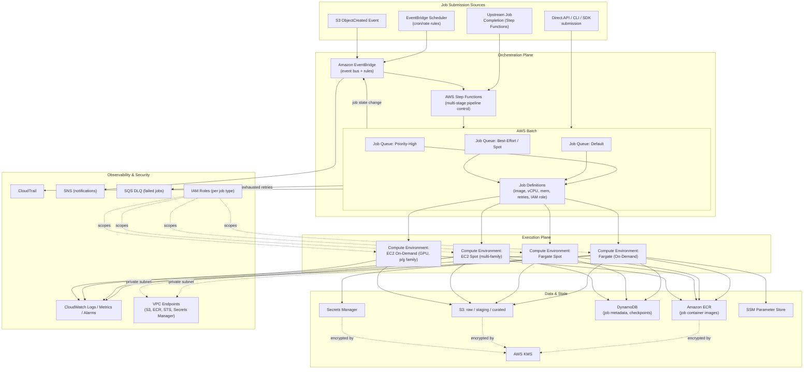

# Part V – Container & Kubernetes Architectures

# Chapter 41: Batch Containers

---

# 1. Executive Summary

## The Business Problem

Enterprises run enormous volumes of work that is **not** interactive.

- Nightly financial reconciliation across thousands of accounts.
- Genomics pipelines that process terabytes of sequencing data.
- Media transcoding for on-demand video libraries.
- Machine learning training and hyperparameter sweeps.
- Risk simulations (Monte Carlo, VaR) run by banks and insurers.
- Retail demand forecasting and inventory optimization.
- ETL and data transformation jobs feeding a data warehouse.

These workloads share a common shape:

- They are **bursty**. Demand spikes at month-end, at 2 a.m., or after a market close, and is near zero the rest of the time.
- They are **parallelizable**. A single logical job decomposes into thousands of independent tasks.
- They are **cost-sensitive**. Running idle capacity 24/7 to serve a workload that only executes for six hours a night is financially indefensible.
- They tolerate **interruption** far better than user-facing services. A batch task that dies mid-run can usually be retried.

Traditional approaches to this problem fail in predictable ways:

- **Static EC2 fleets** sized for peak load sit idle 80–95% of the time, burning budget.
- **Cron jobs on a single server** create a single point of failure and cap throughput at whatever one box can do.
- **Homegrown job schedulers** built on top of raw EC2 Auto Scaling Groups require teams to reinvent queueing, retries, dependency management, and bin-packing — problems that are already solved.
- **General-purpose Kubernetes clusters without batch-aware scheduling** waste enormous amounts of compute because the default scheduler does not understand job priority, preemption, or fair-share queueing.

## Architecture Objective

This chapter designs a **Batch Containers** reference architecture: a container-native, elastically scaled, cost-optimized platform for running large volumes of independent or dependent short-lived compute jobs on AWS.

The design goals are:

- Scale compute capacity from zero to thousands of vCPUs within minutes, and back to zero when idle.
- Support both simple "run this container to completion" jobs and complex multi-stage pipelines with dependencies.
- Aggressively use **Spot capacity** to cut compute costs by 60–90%, while remaining resilient to interruption.
- Provide strong job isolation using containers, without the operational overhead of managing bare EC2 fleets by hand.
- Offer priority-based, fair-share scheduling across multiple teams sharing the same underlying capacity.
- Integrate cleanly with existing CI/CD, data pipelines, and event sources (S3 uploads, EventBridge schedules, SQS messages).

## Why Organizations Adopt This Architecture

- **Cost control.** Batch is frequently the single largest line item in an engineering compute budget because of how easy it is to over-provision. A well-designed batch platform routinely cuts this spend by half or more.
- **Elasticity without operational burden.** Teams want to submit a job and have capacity appear; they do not want to manage Auto Scaling Groups, AMIs, or capacity reservations themselves.
- **Standardization.** A shared batch platform stops every team from building its own bespoke job runner, reducing the number of systems the platform team must operate and secure.
- **Governance.** Centralizing batch execution gives security and FinOps teams a single control plane for quotas, tagging, encryption, and audit logging across all batch workloads.
- **Speed of iteration.** Data scientists and analysts can package a job as a container image and submit it without waiting for infrastructure provisioning.

## Major Business Benefits

| Benefit | Description |
|---|---|
| Cost reduction | 50–90% lower compute cost versus static, always-on fleets, driven primarily by Spot usage and scale-to-zero. |
| Faster time-to-insight | Jobs that used to queue for hours on a fixed-size cluster now scale out immediately. |
| Reduced operational load | No AMI patching cadence, no manual capacity planning, no bespoke scheduler to maintain. |
| Improved reliability | Automatic retries, dead-letter handling, and checkpointing patterns reduce silent job failures. |
| Better governance | Centralized IAM, tagging, and cost allocation across every batch workload in the organization. |
| Multi-tenant fairness | Priority queues and fair-share scheduling prevent one team's large job from starving another team's urgent job. |

## Typical Enterprise Scenarios

- A retail bank runs 4,000 independent Monte Carlo risk simulations every night, each taking 3–20 minutes, with a hard deadline before markets open.
- A media company transcodes newly uploaded video assets into a dozen output renditions, triggered automatically by an S3 upload event.
- A pharmaceutical company runs genomics alignment pipelines that fan out into tens of thousands of parallel tasks per sample.
- A retailer re-trains demand-forecasting models nightly across thousands of SKU/store combinations.
- An insurer processes claims documents through an OCR and extraction pipeline in bursts tied to weather events.

Each of these scenarios maps cleanly onto the same underlying primitive: **submit many short-lived container tasks, run them on elastic and largely interruptible compute, track completion, and retry failures** — which is exactly what this chapter's architecture is built to do.

---

# 2. Business Requirements

## Business Drivers

- Reduce compute spend on non-interactive workloads without reducing throughput.
- Give multiple internal teams self-service access to elastic compute, governed by quotas.
- Meet fixed nightly/weekly processing deadlines (e.g., risk reports must be ready by 6 a.m.).
- Support rapid growth in job volume (2–5x year over year in most adopting organizations) without re-architecture.

## Functional Requirements

- Accept job submissions via API, CLI, event trigger (S3, EventBridge, SQS), or scheduled cron.
- Package job logic as container images with defined resource requirements (vCPU, memory, GPU where applicable).
- Support job dependencies (Job B runs only after Job A succeeds) and array jobs (the same job definition run N times with an index).
- Retry failed jobs a configurable number of times, with distinction between retryable and terminal failures.
- Prioritize jobs across queues so that urgent work preempts or overtakes routine work.
- Emit job status, logs, and metrics for observability and cost attribution.

## Non-Functional Requirements

| Category | Requirement |
|---|---|
| Scalability | Scale from 0 to 10,000+ concurrent vCPUs within 5–10 minutes. |
| Availability | Control plane (queue, scheduler) must not be a single point of failure. |
| Latency | Job start latency (queued → running) under 2 minutes for On-Demand-backed queues, under 5 minutes for Spot-backed queues. |
| Compliance | Encryption at rest and in transit; audit trail of who submitted what job with what data access. |
| Security | Least-privilege IAM per job; no shared long-lived credentials between tenants. |
| Recovery | Failed or interrupted jobs automatically retried; no manual intervention required for routine Spot interruption. |

## Scalability Goals

- Support at least 50,000 job submissions per day across the platform at steady state.
- Support burst submission of 10,000 array-job tasks within a single minute.
- Horizontal growth of new teams/queues without redesigning the core platform.

## Availability Requirements

- Control plane (managed AWS services) target: 99.9% availability, inherited from AWS Batch / EKS / EventBridge SLAs.
- Job-level availability is handled through retries, not through the underlying compute being "always up" — batch workloads are availability-tolerant by design.

## Latency Requirements

- Time-critical queues (e.g., intraday risk recalculation) use On-Demand or Compute Savings Plans-backed capacity with target start latency under 60 seconds.
- Best-effort queues (e.g., nightly ETL) use Spot-heavy capacity with target start latency under 5 minutes.

## Compliance Requirements

- Data processed by batch jobs is frequently regulated (financial records, health data, PII). The architecture must support:
  - Encryption at rest (EBS, S3, ECR) using AWS KMS.
  - Network isolation (private subnets, VPC endpoints, no public egress unless explicitly required).
  - Full audit trail via CloudTrail of job submission, image pulls, and IAM role usage.

## Security Expectations

- Every job runs under a distinct, least-privilege IAM role scoped to only the data it needs.
- Container images are scanned for vulnerabilities before being eligible to run.
- No job can read another tenant's data or secrets by default.

## Recovery Objectives

| Metric | Target |
|---|---|
| RPO (Recovery Point Objective) | Near-zero for job definitions and queue state (managed AWS services, multi-AZ by default); job *output* RPO depends on the job's own checkpointing design. |
| RTO (Recovery Time Objective) | Under 15 minutes to resume processing in a second region for Tier-1 batch pipelines; under 4 hours for Tier-2/Tier-3 pipelines. |

## SLAs

- Nightly Tier-1 pipelines (e.g., regulatory reporting) must complete by a fixed wall-clock deadline with 99.5% monthly success rate.
- Tier-2 pipelines (internal analytics) target same-day completion with 99% success rate.
- Ad-hoc/interactive batch submissions (data science experimentation) have no formal SLA but a target p95 start latency.

## Expected Workload

- Baseline: 5,000–10,000 job submissions/day, average job duration 4 minutes, average 2 vCPU / 4 GB per task.
- Peak (month-end, quarter-end): 5–10x baseline submission volume within a 2-hour window.

## Expected Growth

- 2–3x job volume growth year over year as more teams onboard onto the shared platform.
- Growing GPU workload share (ML training/inference) requiring the platform to support GPU-backed compute environments alongside CPU-only ones.

---

# 3. Architecture Overview

## Overall Design

The architecture is built around **AWS Batch** as the primary orchestration layer, running jobs as containers on a managed, elastic **Amazon ECS on Fargate / EC2** compute environment, with an alternative **Amazon EKS**-based path described for organizations standardizing on Kubernetes.

Three logical planes:

1. **Submission plane** — how jobs enter the system (API, CLI, event triggers, schedules).
2. **Orchestration plane** — queueing, prioritization, dependency resolution, and compute provisioning (AWS Batch job queues, job definitions, compute environments).
3. **Execution plane** — the actual containers running on Fargate, Fargate Spot, EC2 On-Demand, or EC2 Spot, pulling images from Amazon ECR and reading/writing data from S3 and databases.

## Architecture Philosophy

- **Compute should be a consequence of demand, not a prerequisite for it.** Capacity is provisioned only when jobs are queued, and released the moment queues empty.
- **Containers, not snowflake servers.** Every job is a versioned, immutable container image. There is no SSH-and-fix-it operational model.
- **Spot-first, On-Demand as a fallback.** Compute environments default to Spot capacity across many instance families and Availability Zones, with On-Demand reserved for latency-sensitive queues or as an automatic fallback.
- **Managed orchestration over homegrown schedulers.** AWS Batch already solves queueing, retries, dependency graphs, and bin-packing — this architecture leans on it rather than re-implementing it.
- **Everything is observable and attributable.** Every job carries tags that map back to a cost center, team, and pipeline for FinOps reporting.

## Core Components

| Component | Role |
|---|---|
| Amazon ECR | Stores versioned, scanned container images for every job. |
| AWS Batch (Job Queues) | Priority-ordered queues that hold submitted jobs awaiting capacity. |
| AWS Batch (Job Definitions) | Templates describing container image, resource requirements, retry strategy, IAM role. |
| AWS Batch (Compute Environments) | Elastic pools of Fargate, Fargate Spot, EC2 On-Demand, and EC2 Spot capacity. |
| Amazon EventBridge | Triggers job submissions on schedule or in response to events (S3 upload, upstream job completion). |
| AWS Step Functions | Orchestrates multi-stage pipelines with dependencies, branching, and error handling across many Batch jobs. |
| Amazon S3 | Input/output data lake for job payloads and results. |
| Amazon DynamoDB | Job metadata, idempotency tracking, and checkpoint state. |
| Amazon CloudWatch | Metrics, logs, dashboards, and alarms for job and queue health. |
| AWS Secrets Manager | Per-job credentials and API keys, retrieved at container start. |
| AWS KMS | Encryption of S3 data, EBS volumes, and Secrets Manager secrets. |
| Amazon SNS / SQS | Job completion notifications and dead-letter handling. |

## How Components Interact

- A job is submitted (directly, via schedule, or via event) with a reference to a job definition and a target queue.
- AWS Batch places the job in the queue, evaluates dependencies and priority, and — when capacity is available or can be provisioned — launches the container on the compute environment.
- The container pulls its image from ECR, assumes its scoped IAM role, retrieves any secrets it needs, reads input data from S3, processes it, writes output back to S3 or a database, and exits.
- AWS Batch records the exit code; success closes out the job, failure triggers the configured retry strategy up to a maximum attempt count.
- CloudWatch Logs captures stdout/stderr; CloudWatch Metrics and EventBridge job-state-change events feed dashboards and downstream notifications.
- For multi-stage pipelines, Step Functions coordinates the sequence of Batch job submissions, handling branching, parallel fan-out, and compensating actions on failure.

## High-Level Workflow

1. Job defined and versioned as a container image + job definition.
2. Job submitted to a queue (manually, on schedule, or by event).
3. AWS Batch schedules the job onto available or newly provisioned compute.
4. Job executes, reading/writing S3 and other AWS services under a scoped IAM role.
5. Job completes; state and logs recorded; downstream consumers notified via EventBridge/SNS.
6. Compute environment scales back down once the queue is empty.

## Request Lifecycle

For an event-triggered job (e.g., new file lands in S3):

1. S3 `ObjectCreated` event fires.
2. EventBridge rule matches the event and invokes a small Lambda (or Step Functions execution) that submits an AWS Batch job, passing the S3 object key as a parameter.
3. AWS Batch queues the job.

## Response Lifecycle

1. Job container runs, processes the object, writes results to an output S3 prefix.
2. Job exits with code 0.
3. AWS Batch marks the job `SUCCEEDED` and emits an EventBridge event.
4. A downstream EventBridge rule (or Step Functions callback) notifies subscribers via SNS, or triggers the next pipeline stage.

## Data Lifecycle

- **Input data** lands in an S3 "raw" prefix, encrypted with a KMS customer-managed key (CMK).
- **Intermediate data** (between pipeline stages) lands in a "staging" prefix with a short lifecycle policy (e.g., 7-day expiration).
- **Output data** lands in a "curated" prefix with a longer retention policy and, where required, is replicated cross-region for DR.
- **Logs** are retained in CloudWatch Logs for 30–90 days, then exported to S3/Glacier for long-term audit retention.

---

# 4. AWS Services Used

## AWS Batch

- **Purpose:** Managed job scheduler that queues, prioritizes, and runs containerized batch jobs on elastic compute.
- **Why selected:** Removes the need to build a custom scheduler on top of raw EC2 Auto Scaling Groups. Natively supports Spot, Fargate, array jobs, dependencies, and retry strategies.
- **Alternatives:** Self-managed Kubernetes with a batch scheduler (Volcano, Kueue); Slurm on EC2 for HPC-style workloads; raw EC2 Auto Scaling with a custom queue consumer.
- **Limitations:** Job start latency can be higher than a warm, always-on cluster; less suited to workloads needing sub-second scheduling; complex multi-team fair-share scheduling requires careful queue/compute-environment design.
- **Pricing considerations:** No additional charge for AWS Batch itself; you pay only for the underlying compute (Fargate, EC2) and any associated storage/data transfer.
- **Best practices:** Use multiple queues by priority tier; use array jobs for high task-count parallel work instead of submitting thousands of individual jobs; tag every job definition and queue for cost allocation.

## Amazon ECS (Fargate and Fargate Spot)

- **Purpose:** Serverless container execution layer that AWS Batch uses when configured with a Fargate-type compute environment.
- **Why selected:** No EC2 instances or AMIs to manage; fastest path to scale-to-zero; strong isolation between jobs (each task is its own micro-VM via Firecracker).
- **Alternatives:** EC2-backed AWS Batch compute environment (more control, lower cost at very high sustained utilization, but requires AMI/patch management).
- **Limitations:** No GPU support on Fargate (GPU jobs must use EC2-backed compute environments); maximum task size (currently up to 16 vCPU / 120 GB memory) may not suit the largest single-task workloads.
- **Pricing considerations:** Pay per vCPU-second and GB-second consumed; Fargate Spot offers up to ~70% discount versus Fargate On-Demand.
- **Best practices:** Default to Fargate for operational simplicity; use Fargate Spot for interruption-tolerant queues; fall back to EC2-backed compute environments only for GPU or very large single-task jobs.

## Amazon EC2 (Spot and On-Demand, as an AWS Batch compute environment)

- **Purpose:** Underlying virtual machines for jobs that need GPUs, very large instance sizes, or the lowest possible sustained cost at high utilization.
- **Why selected:** Required for GPU workloads (ML training) and for cost efficiency at very high, sustained batch volume where EC2 Spot pricing beats Fargate Spot.
- **Alternatives:** Fargate/Fargate Spot (simpler, no instance management, no GPU).
- **Limitations:** Requires AMI management (or use of the Amazon ECS-optimized AMI, refreshed automatically by AWS Batch-managed compute environments); Spot interruption still requires interruption-tolerant job design.
- **Pricing considerations:** EC2 Spot typically 60–90% cheaper than On-Demand; use Spot allocation strategy `SPOT_CAPACITY_OPTIMIZED` (or `price-capacity-optimized`) to minimize interruption frequency.
- **Best practices:** Diversify instance types/families within a compute environment to maximize Spot capacity availability; set a maximum On-Demand-equivalent price cap only when necessary — capacity-optimized allocation is generally preferable to strict price-only bidding.

## Amazon EKS (alternative execution layer)

- **Purpose:** For organizations standardizing all workloads (interactive and batch) on Kubernetes, EKS with a batch-aware scheduler (Kueue, Volcano, or Karpenter for node provisioning) can replace AWS Batch as the execution layer.
- **Why selected:** Single control plane and toolchain across microservices and batch; existing Kubernetes expertise and tooling (Helm, GitOps) reused.
- **Alternatives:** AWS Batch (simpler, less operational overhead, no cluster to manage).
- **Limitations:** Higher operational complexity — cluster upgrades, add-on management, and scheduler configuration are the platform team's responsibility; fair-share/priority scheduling requires additional components (Kueue) not built into vanilla Kubernetes.
- **Pricing considerations:** EKS control plane fee per cluster-hour plus underlying EC2/Fargate compute; Karpenter-driven node provisioning can match AWS Batch's elasticity when tuned correctly.
- **Best practices:** Use Karpenter for rapid node provisioning/deprovisioning; use Kueue for queueing, quotas, and fair-share across teams; isolate batch node pools from latency-sensitive service node pools with taints and tolerations.

## Amazon ECR

- **Purpose:** Private, versioned registry for all batch job container images.
- **Why selected:** Native IAM integration, image scanning, and lifecycle policies; no additional network hop outside AWS when pulling from within the same region.
- **Alternatives:** Self-hosted registry (Harbor), Docker Hub (not recommended for production due to rate limits and lack of IAM integration).
- **Limitations:** Cross-region pulls incur data transfer cost unless images are replicated to each region in use.
- **Pricing considerations:** Storage priced per GB-month; minimal cost relative to compute; enable lifecycle policies to expire untagged/old images.
- **Best practices:** Enable enhanced scanning (Amazon Inspector integration) on every repository; enforce image signing (AWS Signer) for production job images; replicate images to a DR region for Tier-1 pipelines.

## AWS Step Functions

- **Purpose:** Orchestrates multi-step batch pipelines — sequencing, branching, parallel fan-out, and error handling across multiple AWS Batch job submissions.
- **Why selected:** Native `Batch.submitJob` integration with `.sync` support (wait for job completion before proceeding); visual, versioned state machine definitions; built-in retry/catch semantics.
- **Alternatives:** Apache Airflow on EC2/EKS (Managed Workflows for Apache Airflow — MWAA); Argo Workflows on EKS.
- **Limitations:** Standard Workflows are billed per state transition, which can add up for very high-frequency, fine-grained pipelines — Express Workflows are cheaper for short-duration, high-volume executions but have different logging/history trade-offs.
- **Pricing considerations:** Pay per state transition (Standard) or per execution duration and memory (Express).
- **Best practices:** Use Standard Workflows for long-running, auditable pipelines (hours); use Express Workflows for high-volume, sub-5-minute orchestration; use `.sync` integration rather than manual polling.

## Amazon S3

- **Purpose:** Primary data lake for batch job input, intermediate, and output data.
- **Why selected:** Effectively unlimited scale, 11 nines durability, native lifecycle policies, and deep integration with every other service in the architecture.
- **Alternatives:** Amazon EFS (for jobs needing a shared POSIX filesystem across many concurrent tasks); Amazon FSx for Lustre (for HPC-class throughput needs, e.g., genomics or ML training data).
- **Limitations:** Not a POSIX filesystem; workloads assuming local file semantics need adaptation or EFS/FSx.
- **Pricing considerations:** Storage class selection (Standard, Intelligent-Tiering, Glacier) materially affects cost for long-retained batch output.
- **Best practices:** Separate raw/staging/curated prefixes with distinct lifecycle policies; enable S3 Intelligent-Tiering for output data with unpredictable access patterns.

## Amazon DynamoDB

- **Purpose:** Tracks job metadata, idempotency keys, and checkpoint/resume state for long-running or chunked jobs.
- **Why selected:** Single-digit millisecond access, on-demand capacity mode matches batch's bursty access pattern, and native TTL for automatic cleanup of stale job records.
- **Alternatives:** Amazon RDS/Aurora (better for complex relational queries over job history, worse for very high write throughput during burst submission).
- **Limitations:** Not ideal for complex ad-hoc analytical queries over job history (pair with S3 + Athena export for that use case).
- **Pricing considerations:** On-demand capacity mode avoids paying for idle throughput between batch windows.
- **Best practices:** Use a composite key (`pipeline_id` + `job_id`) for efficient lookups; enable TTL to auto-expire old checkpoint records.

## Amazon EventBridge

- **Purpose:** Central event bus for triggering job submissions (scheduled or event-driven) and for reacting to AWS Batch job state changes.
- **Why selected:** Native AWS Batch integration emits job state-change events without any custom polling; scheduler rules replace cron servers.
- **Alternatives:** Amazon SQS with a polling Lambda (works, but reintroduces polling latency and complexity that EventBridge avoids).
- **Limitations:** Rule evaluation and event delivery, while fast, are not designed for sub-second real-time triggering.
- **Pricing considerations:** Charged per event published; negligible relative to compute cost at typical batch volumes.
- **Best practices:** Use one rule per job-state-change type you care about (`FAILED`, `SUCCEEDED`) rather than one broad catch-all rule with complex filtering logic.

## AWS IAM

- **Purpose:** Scopes exactly what each job, queue, and compute environment is permitted to do.
- **Why selected:** Fine-grained, auditable, and natively integrated with every AWS service the jobs touch.
- **Best practices:** One IAM role per job type (task role), never a single shared "batch-jobs-role" used by every job; scope S3 access to the specific prefixes a job needs, not the entire bucket.

## Amazon VPC

- **Purpose:** Network isolation for compute environments, ensuring job traffic to S3, DynamoDB, Secrets Manager, and internal services stays private.
- **Best practices:** Run Fargate/EC2 compute in private subnets; use VPC Gateway Endpoints for S3/DynamoDB (no NAT cost, no public exposure) and Interface Endpoints for other services (ECR, Secrets Manager, CloudWatch Logs, STS).

## Amazon CloudWatch

- **Purpose:** Centralized logs, metrics, dashboards, and alarms for queue depth, job success/failure rate, and compute utilization.
- **Best practices:** Alarm on queue depth trending upward without corresponding capacity growth (a sign of a compute environment misconfiguration or a quota being hit); alarm on job failure rate exceeding a threshold.

## AWS CloudTrail

- **Purpose:** Immutable audit log of every API call — job submissions, IAM role assumptions, ECR image pulls.
- **Best practices:** Enable organization-wide trail delivering to a dedicated, access-restricted log archive account.

## AWS KMS

- **Purpose:** Encrypts S3 data, EBS volumes (for EC2-backed compute environments), and Secrets Manager secrets.
- **Best practices:** Use a dedicated CMK per data classification tier (e.g., separate keys for PII versus non-sensitive data) with key policies restricting decrypt to the specific job IAM roles that need it.

## AWS Secrets Manager

- **Purpose:** Stores database credentials, third-party API keys, and other sensitive values retrieved by jobs at runtime rather than baked into images or environment variables.
- **Best practices:** Reference secrets via the AWS Batch job definition's `secrets` field (injected as environment variables at container start, never stored in the image); enable automatic rotation for database credentials.

## AWS Systems Manager (Parameter Store)

- **Purpose:** Stores non-sensitive job configuration (feature flags, thresholds, endpoint URLs) that changes independently of the container image.
- **Best practices:** Use SecureString parameters (backed by KMS) for anything sensitive that doesn't need Secrets Manager's rotation features.

---

# 5. Complete Architecture Diagram



**Diagram notes:**

- Three job queues map to three business priority tiers, each with its own compute environment mix.
- All execution-plane compute environments run in private subnets with no public IP assignment; egress to AWS services flows through VPC endpoints, not NAT.
- Step Functions sits above AWS Batch for any pipeline with more than one stage or a dependency graph; single-stage jobs can be submitted directly to a queue.

---

# 6. Component-by-Component Explanation

## Job Queues

- **Purpose:** Hold submitted jobs in priority order until compute is available.
- **Responsibilities:** Enforce priority ordering; route jobs to one or more associated compute environments; enforce queue-level concurrency limits if configured.
- **Inputs:** Job submissions referencing a job definition.
- **Outputs:** Jobs dispatched to a compute environment for execution.
- **Scaling:** Queues themselves do not need scaling — they are a managed, virtually unlimited-depth construct.
- **High availability:** Multi-AZ by default as an AWS-managed service.
- **Failure handling:** Jobs remain queued (not lost) if all associated compute environments are at capacity or temporarily unavailable.
- **Dependencies:** At least one associated, enabled compute environment.
- **Security:** Queue-level tags support cost allocation; no data flows through the queue itself (only metadata).
- **Monitoring:** `ApproximateNumberOfJobsQueued`-equivalent metrics (via CloudWatch) per queue.

## Job Definitions

- **Purpose:** Immutable, versioned templates describing exactly how a job should run.
- **Responsibilities:** Specify container image (ECR URI + tag/digest), vCPU/memory, IAM job role, retry strategy, timeout, environment variables, and secrets references.
- **Inputs:** None directly — referenced by job submissions.
- **Outputs:** Fully specified container run configuration handed to the compute environment.
- **Scaling:** N/A (definitions are templates, not runtime resources).
- **High availability:** Stored durably as part of the AWS Batch control plane.
- **Failure handling:** A misconfigured job definition (bad image URI, insufficient IAM permissions) fails fast at container start, visible in CloudWatch Logs.
- **Dependencies:** ECR image must exist; IAM role must exist and be assumable by the ECS/Batch service.
- **Security:** Reference the specific least-privilege IAM role for this job type; never reference an overly broad shared role.
- **Monitoring:** Track job definition revision in job metadata for reproducibility and rollback.

## Compute Environments

- **Purpose:** The elastic pool of Fargate or EC2 capacity that actually executes containers.
- **Responsibilities:** Provision and de-provision compute in response to queue depth; enforce a maximum vCPU ceiling per environment; select instance types (for EC2-backed environments) using the configured allocation strategy.
- **Inputs:** Queue depth and job resource requirements.
- **Outputs:** Running containers.
- **Scaling:** Managed compute environments scale automatically between a configured minimum (often 0) and maximum vCPU count.
- **High availability:** Spread across multiple Availability Zones via subnet configuration.
- **Failure handling:** Spot interruption triggers AWS Batch to reschedule the interrupted job (if retryable) onto new capacity automatically.
- **Dependencies:** VPC subnets, security groups, and (for EC2) an instance role and launch template.
- **Security:** Security groups restrict egress to only required AWS service endpoints and any required internal services.
- **Monitoring:** vCPU utilization, Spot interruption rate, instance provisioning failures.

## Step Functions State Machine

- **Purpose:** Coordinates multi-job pipelines with sequencing, branching, and error handling.
- **Responsibilities:** Submit jobs to AWS Batch, wait synchronously for completion, branch on success/failure, fan out parallel job submissions, and invoke compensating actions on failure.
- **Scaling:** Each pipeline execution is independent; Step Functions scales to thousands of concurrent executions natively.
- **High availability:** Fully managed, multi-AZ.
- **Failure handling:** Built-in `Retry` and `Catch` blocks per state; failed executions are visible in the execution history with full input/output at each step.
- **Security:** Its own IAM execution role, scoped to `batch:SubmitJob`, `batch:DescribeJobs`, and `batch:TerminateJob` only for the specific job queues/definitions it orchestrates.

## Container Task (the job itself)

- **Purpose:** Runs the actual business logic — data transformation, model training, simulation, transcoding, etc.
- **Responsibilities:** Read input, checkpoint progress periodically for long-running tasks, write output, exit with an accurate status code.
- **Inputs:** Environment variables, mounted secrets, S3 object references passed as parameters.
- **Outputs:** Data written to S3/DynamoDB/RDS; logs written to stdout/stderr (captured by CloudWatch Logs).
- **Scaling:** N/A at the individual task level; parallelism is achieved via array jobs or multiple job submissions.
- **Failure handling:** Non-zero exit triggers the job definition's retry strategy; a task designed for idempotent re-execution can simply be retried without side effects.
- **Dependencies:** ECR image, assigned IAM task role, any upstream data it reads.
- **Security:** Runs under its own scoped IAM role; no long-lived credentials baked into the image.
- **Monitoring:** CloudWatch Logs per task; custom application metrics published to CloudWatch if needed.

---

# 7. End-to-End Request Flow

Scenario: a nightly ETL job triggered by schedule, followed by a dependent aggregation job.

1. **EventBridge Scheduler** fires at 01:00 UTC based on a configured rate/cron rule.
2. EventBridge invokes a lightweight **Lambda function** (or starts a Step Functions execution directly) that starts the pipeline.
3. **Step Functions** begins execution: state 1 submits an AWS Batch job (`etl-extract`) to the `default` priority queue.
4. **AWS Batch** places the job in the queue; the associated **compute environment** evaluates current capacity.
5. If capacity is insufficient, the compute environment provisions additional Fargate/EC2 capacity (Spot-first, allocation-strategy driven).
6. The container starts, pulling its image from **ECR**; the image pull uses a **VPC Interface Endpoint**, never traversing the public internet.
7. The container assumes its **IAM task role** via the ECS task metadata endpoint / IRSA-equivalent mechanism.
8. The container retrieves any required secrets from **Secrets Manager** and configuration from **SSM Parameter Store**.
9. The container reads its input dataset from the **S3 raw prefix**.
10. The container performs the extract/transform logic, writing intermediate output to the **S3 staging prefix**.
11. The container writes checkpoint/completion metadata to **DynamoDB**.
12. The container exits with status code 0.
13. **AWS Batch** marks the job `SUCCEEDED` and emits a job-state-change event to **EventBridge**.
14. **Step Functions**, using the `.sync` integration, resumes execution upon job completion and evaluates the next state.
15. Step Functions submits the dependent job (`etl-aggregate`) to the same or a different queue, passing the staging S3 prefix as input.
16. Steps 4–13 repeat for the aggregation job, writing final output to the **S3 curated prefix**.
17. On successful completion of the full pipeline, Step Functions publishes a completion message to an **SNS topic**, notifying downstream consumers (e.g., a BI dashboard refresh trigger).
18. Throughout, **CloudWatch Logs** capture container stdout/stderr, and **CloudWatch Metrics/Alarms** monitor queue depth and job duration against SLA thresholds.
19. **Error handling:** if `etl-extract` fails after exhausting its configured retry attempts, Step Functions' `Catch` block routes execution to a failure-handling state that publishes an alert to a dedicated **on-call SNS topic** and writes the failed job's details to an **SQS dead-letter queue** for manual triage — the aggregation job never runs against incomplete data.

---

# 8. Deployment Flow

## Infrastructure Provisioning

- All AWS Batch resources (queues, compute environments, job definitions), IAM roles, ECR repositories, and networking are provisioned via **Terraform**, never through the console, to guarantee reproducibility across environments (dev/staging/prod).

## Terraform Workflow

1. Engineer opens a pull request modifying a Terraform module (e.g., adding a new job queue or adjusting a compute environment's max vCPU).
2. CI pipeline runs `terraform fmt -check`, `terraform validate`, and `tflint`.
3. CI pipeline runs `terraform plan` and posts the plan output as a PR comment for review.
4. A second engineer reviews and approves.
5. On merge to `main`, CI pipeline runs `terraform apply` against the target environment, using a remote state backend (S3 + DynamoDB lock table).

## CI/CD Deployment (Job Images)

1. Engineer commits changes to a job's source code repository.
2. CI pipeline builds the container image, runs unit tests, and scans the image for vulnerabilities.
3. On success, the image is tagged with the Git commit SHA and pushed to **ECR**.
4. A follow-up pipeline stage updates the corresponding AWS Batch **job definition** to reference the new image digest, registering a new job definition revision (job definitions are immutable per revision — this creates revision N+1 rather than mutating revision N).
5. The pipeline runs an automated smoke-test job submission against a staging queue before promoting the new job definition revision as the "active" one referenced by production submissions.

## Blue-Green Deployment (for job definitions)

- Because AWS Batch job definitions are inherently versioned (each update creates a new revision), blue-green deployment is natural: production submissions reference a specific revision or the `:LATEST` alias only after validation.
- **Recommended pattern:** maintain a parameter (SSM Parameter Store or a pipeline variable) holding the "current production revision" for each job; update it only after the smoke test passes.

## Rollback

- Rollback is simply repointing the "current production revision" parameter back to the previous, known-good job definition revision — no rebuild required, since old revisions remain registered and immediately usable.

## Secrets

- Secrets are never embedded in Terraform state or container images.
- Secrets Manager entries are provisioned via Terraform (referencing externally-managed secret values, e.g., via a secure CI variable or manual initial seed), and job definitions reference secret **ARNs**, not values.

## Configuration

- Non-sensitive configuration lives in SSM Parameter Store, versioned and provisioned via Terraform alongside the rest of the infrastructure.

## Validation

- Every pipeline change is validated in a staging environment with a representative (but smaller-scale) compute environment before promotion to production.
- Terraform plan output is required reading for reviewers; no `apply` runs without a preceding, reviewed `plan`.

---

# 9. Network Topology

## VPC

- A dedicated VPC (or a dedicated set of subnets within a shared VPC, depending on organizational network topology) hosts all batch compute.

## CIDR

- Example: `10.40.0.0/16` allocated to the batch platform, sized to comfortably support the maximum expected concurrent task count (each Fargate task or EC2 instance consumes an ENI/IP).

## Public Subnets

- Minimal footprint: only NAT Gateways (if any public egress is genuinely required) live here. No batch compute runs in public subnets.

## Private Subnets

- All Fargate tasks and EC2 compute-environment instances run here, spread across at least three Availability Zones for capacity resilience (critical for Spot availability — more AZs and instance types means more Spot capacity pools to draw from).

## NAT Gateway

- Deployed per-AZ (for resilience) only if job containers require outbound internet access (e.g., pulling from a third-party API or public package registry). Prefer VPC endpoints wherever the destination is an AWS service, to avoid NAT data-processing charges entirely.

## Internet Gateway

- Attached to the VPC only to support the public subnets' NAT Gateways; no batch compute has a public IP or route to the Internet Gateway directly.

## Transit Gateway

- Used if batch jobs need to reach resources in other VPCs (e.g., a shared RDS instance in a data-platform VPC) or on-premises systems, avoiding a mesh of VPC peering connections as the number of connected VPCs grows.

## Route Tables

- Private subnet route tables send AWS-service-bound traffic through VPC endpoints and any other required traffic through the NAT Gateway or Transit Gateway attachment — never a default route to an Internet Gateway.

## Network ACLs

- Applied at the subnet level as a coarse-grained defense-in-depth layer (e.g., explicitly denying inbound traffic from unexpected CIDR ranges), supplementing — not replacing — security groups.

## Security Groups

- One security group per compute environment type, permitting only:
  - Outbound HTTPS (443) to VPC endpoints and any required internal service ports.
  - No inbound rules required for batch compute (tasks initiate all connections; there is no listener to expose).

## PrivateLink (VPC Endpoints)

- Interface endpoints: ECR (`api` and `dkr`), Secrets Manager, SSM, STS, CloudWatch Logs, KMS.
- Gateway endpoints: S3, DynamoDB (no hourly or data-processing charge, strongly preferred over NAT for these two).

## Hybrid Connectivity (if applicable)

- If batch jobs must reach on-premises data sources (common in banking/insurance during a cloud migration), a Direct Connect or Site-to-Site VPN attachment on the Transit Gateway provides private connectivity, avoiding any on-premises data traversing the public internet.

---

# 10. Identity and Access

## IAM Roles

- **Batch service role:** Permits AWS Batch to manage underlying ECS/EC2 resources on the account's behalf.
- **Compute environment instance role (EC2-backed only):** Permits EC2 instances to register with ECS and pull container images.
- **Per-job-type task role:** One distinct role per logical job type (e.g., `role-etl-extract`, `role-video-transcode`), scoped to exactly the S3 prefixes, DynamoDB tables, and other resources that job type needs.
- **Step Functions execution role:** Scoped to `batch:SubmitJob`/`DescribeJobs`/`TerminateJob` for the specific job queues and definitions it orchestrates, plus any direct service calls (e.g., `sns:Publish`) its state machine makes.

## IAM Policies

- Written with explicit resource ARNs wherever possible (specific S3 prefixes via `arn:aws:s3:::bucket/prefix/*`, specific DynamoDB table ARNs), never `Resource: "*"` for data-plane actions.

## Resource Policies

- ECR repository policies restrict `ecr:GetDownloadUrlForLayer`/`BatchGetImage` to the specific IAM roles used by batch compute environments in the account (and, if applicable, cross-account roles for a shared platform account model).
- S3 bucket policies enforce encryption-in-transit (`aws:SecureTransport`) and, where relevant, restrict access to specific VPC endpoints via `aws:sourceVpce` conditions.

## STS

- Task roles are assumed dynamically per-container via the ECS task credential mechanism — no long-lived access keys are ever distributed to job containers.

## Cross-Account Access

- In a multi-account setup (common at enterprise scale), a **shared platform account** hosts the AWS Batch compute environments and ECR repositories, while **workload accounts** own the data (S3 buckets, DynamoDB tables). Cross-account access is granted via resource policies plus scoped IAM roles assumed by the specific job task role — never a broad account-to-account trust.

## Least Privilege

- Reviewed quarterly: any job task role with unused permissions (identified via IAM Access Analyzer's policy generation feature, cross-referenced against CloudTrail activity) is tightened.

## Service Roles

- Distinct from task roles: the AWS Batch service-linked role and the ECS task execution role (which handles image pulls and log delivery, distinct from the *task* role that the application code inside the container uses) are kept separate, following the standard ECS execution-role-vs-task-role split.

## Permission Boundaries

- Applied to any IAM role creation delegated to individual teams (e.g., a data science team allowed to create their own job task roles within a permission boundary that caps what those roles can ever be granted, preventing privilege escalation).

---

# 11. Security Architecture

## Encryption

- **At rest:** S3 (SSE-KMS with customer-managed keys), EBS volumes on EC2-backed compute environments (KMS-encrypted by default), DynamoDB (KMS-encrypted), ECR (KMS-encrypted repositories), Secrets Manager (KMS-encrypted by default).
- **In transit:** TLS enforced for all S3/DynamoDB/Secrets Manager/ECR API calls (default for AWS SDKs); S3 bucket policies additionally deny any non-TLS request.

## KMS

- Dedicated CMKs per data sensitivity tier, with key policies restricting `kms:Decrypt` to the specific task roles that legitimately need it — a job processing non-sensitive data cannot decrypt data encrypted under the PII-tier key even if it somehow gained read access to the S3 object.

## TLS

- Enforced end-to-end; no plaintext HTTP endpoints in the data path.

## WAF

- Not directly applicable to the batch compute plane itself (no inbound HTTP listener), but relevant if a **job submission API** is exposed via API Gateway for external/partner-triggered submissions — that API Gateway endpoint sits behind AWS WAF with standard managed rule groups.

## Shield

- AWS Shield Standard applies automatically to any public-facing endpoint (e.g., the job-submission API Gateway, if present); Shield Advanced considered only if that submission API is business-critical and internet-facing.

## Secrets Manager

- All job runtime secrets (DB credentials, third-party API keys) retrieved here, never embedded in images or Terraform.

## Certificate Manager

- Used for TLS certificates on any internal ALB/API Gateway fronting a job-submission API.

## GuardDuty

- Enabled account-wide, including **GuardDuty for ECS/Fargate Runtime Monitoring** and **Malware Protection for EC2**, to detect anomalous container behavior (e.g., a compromised job attempting to reach a cryptomining pool or perform port scanning).

## Inspector

- Amazon Inspector continuously scans ECR images for OS and language-package vulnerabilities; job definitions referencing images with unresolved critical vulnerabilities are blocked from production submission via a CI gate.

## Security Hub

- Aggregates GuardDuty, Inspector, and Config findings into a single dashboard with a normalized severity score, feeding the platform team's security backlog.

## CloudTrail

- Full audit trail of every `batch:SubmitJob`, `iam:AssumeRole`, and `ecr:GetAuthorizationToken` call — critical for demonstrating, during an audit, exactly who (or what automated process) triggered a given job that touched regulated data.

## AWS Config

- Rules enforce that: every S3 bucket in the data-layer has encryption and public-access-block enabled; every ECR repository has scan-on-push enabled; no security group in the batch VPC permits unrestricted inbound access.

## Zero Trust

- No implicit trust based on network location — every service-to-service call (container to S3, container to DynamoDB) is authenticated and authorized via IAM, independent of the VPC it runs in. Compromise of the network perimeter alone does not grant data access.

## Threat Model

| Threat | Mitigation |
|---|---|
| Compromised job container attempts to exfiltrate data | Task role scoped to only its required resources; GuardDuty runtime monitoring; no public egress by default. |
| Malicious or vulnerable container image | ECR scan-on-push + Inspector; CI gate blocking critical-vulnerability images from production job definitions. |
| Over-privileged shared IAM role used across many jobs | Architectural rule: one task role per job type, reviewed via IAM Access Analyzer. |
| Secrets leaked via environment variable logging | Secrets injected via the Batch `secrets` mechanism (not plain env vars sourced from Terraform); application-level guidance to avoid logging environment dumps. |
| Spot interruption causing partial/corrupt output | Jobs designed to write output atomically (write to a temp key, then copy/rename) or to be safely re-runnable (idempotent). |
| Unauthorized job submission | Job-submission API (if exposed) requires IAM auth or a signed request; internal submitters restricted via IAM policy to specific queues/job definitions. |

## Attack Vectors

- Supply-chain compromise of a base image or third-party dependency.
- Over-permissioned task role enabling lateral movement to unrelated data.
- Leaked long-lived credentials (mitigated by never issuing any to job containers).
- Denial-of-wallet via unbounded Spot/On-Demand scale-out from a misconfigured or maliciously flooded job queue.

## Mitigations

- Base images pinned to specific digests, not floating tags; automated dependency scanning in CI.
- Quarterly least-privilege review of task roles.
- Per-queue maximum vCPU ceilings on every compute environment, preventing runaway cost from a submission flood or a bug causing infinite job resubmission.

---

# 12. High Availability

## AZ Failures

- Compute environments span at least three AZs; loss of one AZ simply reduces available capacity pools — AWS Batch continues scheduling into the remaining AZs. Job-level impact is limited to tasks actively running in the affected AZ, which are retried per the job's retry strategy.

## Instance Failures

- EC2-backed compute environments automatically replace failed instances; in-flight tasks on a failed instance are marked failed and retried by AWS Batch per the job definition's retry strategy.

## Regional Failures

- Addressed at the DR layer (Section 13) — the batch platform is not architected for automatic regional failover of in-flight jobs (batch workloads generally tolerate a delayed restart in a second region far better than they'd tolerate the complexity of active-active regional batch orchestration).

## Database Failures

- DynamoDB (job metadata/checkpoints) is inherently multi-AZ with no failover action required. If jobs write to RDS/Aurora as an output target, Multi-AZ deployment (Aurora: multiple readers across AZs) ensures job writes are not blocked by a single-AZ database outage.

## Load Balancing

- Not applicable to job execution itself (no persistent listener); applicable only if a job-submission API is exposed via ALB/API Gateway, which are inherently multi-AZ.

## Health Checks

- AWS Batch/ECS continuously monitors task health; a task that fails to start or exits unexpectedly is immediately visible in job state, with no manual health-check configuration required (unlike long-running services).

## Failover

- For EC2-backed compute environments, Spot capacity failover across instance families/AZs is automatic when using `SPOT_CAPACITY_OPTIMIZED` allocation — if one pool is interrupted or unavailable, AWS Batch provisions from the next-best pool in the diversified fleet.

---

# 13. Disaster Recovery

## Backup Strategy

- **Job definitions, queue, and compute environment configuration:** Version-controlled in Terraform — the true "backup" is the Git repository plus remote state, re-appliable to a new region/account within minutes.
- **Container images:** Replicated from the primary ECR repository to a DR-region ECR repository via ECR cross-region replication.
- **Data (S3):** Cross-Region Replication (CRR) enabled on curated/output prefixes for Tier-1 pipelines; raw/staging data is typically not replicated (regenerable by re-running upstream extraction) unless the source system itself is not re-queryable.
- **DynamoDB (job metadata):** Global Tables for Tier-1 pipelines needing cross-region checkpoint continuity.

## Snapshots

- Any RDS/Aurora databases used as job output targets follow standard automated snapshot + cross-region snapshot copy practices (see the Relational Database and Aurora Global Database chapters for full detail).

## Cross-Region Replication

- Applied selectively — full active-active replication of every S3 prefix and DynamoDB table is unnecessary cost for most batch pipelines; reserve it for Tier-1, deadline-critical pipelines.

## Pilot Light

- **Standard DR posture for this architecture.** Terraform modules for the batch platform (queues, compute environments, job definitions, IAM) exist and are validated in the DR region but are not actively running compute. ECR images are replicated. In a declared DR event, `terraform apply` stands up the queues/compute environments in the DR region within minutes, and pipelines resume against replicated data.

## Warm Standby

- Reserved for the small subset of Tier-1 pipelines with the tightest RTO — a minimal compute environment (near-zero but not literally zero vCPU floor) is kept active in the DR region so the very first job after failover does not incur cold-start compute provisioning latency.

## Multi-Site / Active-Active

- Not typically justified for batch workloads — the cost and complexity of active-active batch orchestration across two regions rarely pays for itself given batch's inherent tolerance for a bounded restart delay. Called out here as an option only for organizations with regulatory requirements mandating it.

## RPO

- Effectively the interval since the last successful checkpoint/output write for the affected pipeline — typically minutes for jobs with frequent checkpointing, up to the full job duration for jobs without checkpointing (a strong argument for building checkpointing into any job running longer than ~10 minutes).

## RTO

- Tier-1: under 15 minutes to have the DR-region platform accepting job submissions again (Pilot Light `terraform apply` + DNS/endpoint cutover for any submission API).
- Tier-2/3: under 4 hours, generally achieved simply by waiting for the primary region's restoration rather than actively failing over.

---

# 14. Scalability

## Horizontal Scaling

- The core scaling mechanism: AWS Batch compute environments add Fargate tasks or EC2 instances in direct response to queue depth, up to the configured maximum vCPU ceiling per environment.

## Vertical Scaling

- Applied at the job-definition level, not the platform level: a job needing more memory or vCPU per task simply specifies larger resource requirements in its job definition — no infrastructure change required.

## Auto Scaling

- Native and continuous for AWS Batch-managed compute environments; no manual Auto Scaling Group tuning required (AWS Batch manages the underlying ASG for EC2-backed environments internally).

## Serverless Scaling

- Fargate/Fargate Spot compute environments scale with no instance-level capacity planning at all — the practical ceiling is the compute environment's configured maximum vCPU and the account's Fargate service quota.

## Database Scaling

- DynamoDB on-demand capacity mode scales automatically with checkpoint-write volume during burst submission windows; no manual read/write capacity provisioning.

## Storage Scaling

- S3 scales essentially without limit; the only practical consideration is request-rate partitioning for extremely high-throughput prefixes (mitigated by S3's automatic partition scaling, aided by avoiding sequential key naming for very high-volume prefixes).

## Queue Scaling

- AWS Batch job queues have no meaningful depth limit; the practical constraint is downstream compute environment vCPU ceilings and account-level service quotas (vCPU quotas per instance family for EC2 Spot/On-Demand, Fargate concurrent task quotas) — these should be proactively raised via Service Quotas ahead of known peak periods (e.g., quarter-end).

---

# 15. Performance Optimization

## Caching

- Reference/lookup data used by many job invocations (e.g., a currency conversion table used by every risk-simulation task) is cached in **DynamoDB** or **ElastiCache** rather than re-fetched from a slower source on every task start.

## Compression

- Input/output data compressed (e.g., Parquet with Snappy/Zstd compression instead of raw CSV) both to reduce S3 storage cost and to reduce per-task I/O time, directly shortening job duration and therefore compute cost.

## CDN

- Not typically applicable to the batch execution plane itself; relevant only if job *output* is subsequently served to end users (out of scope for this chapter — see the CloudFront Edge Architecture chapter).

## Database Optimization

- Batch writes to DynamoDB/RDS use batched API calls (`BatchWriteItem`, multi-row `INSERT`) rather than one call per record, reducing both latency and cost.

## Connection Pooling

- Jobs connecting to RDS/Aurora use a connection pooler (RDS Proxy, or an in-process pool sized appropriately) to avoid the classic batch failure mode of thousands of simultaneously-starting Fargate tasks each opening a fresh database connection and exhausting the database's max-connections limit.

## Concurrency

- Array jobs and `job.arraySize` allow a single submission to fan out into thousands of parallel, independently-scheduled tasks without the submission-side overhead of thousands of individual `SubmitJob` API calls.

## Async Processing

- Where a pipeline stage does not need to block on another, Step Functions' `Parallel` state (or `Map` state for array-style fan-out at the orchestration layer) runs independent branches concurrently rather than serially, reducing total pipeline wall-clock time.

---

# 16. Cost Optimization (FinOps)

## Estimated Monthly Compute Cost by Deployment Size

> Figures are illustrative, us-east-1, Linux/x86, and assume a Spot-heavy mix; actual costs vary by region, instance family, and Spot market conditions at time of run.

| Deployment size | Profile | Estimated monthly compute cost |
|---|---|---|
| Small | ~500 jobs/day, avg 2 vCPU / 4 GB, 5 min duration, Fargate Spot | $150 – $400 |
| Medium | ~10,000 jobs/day, avg 4 vCPU / 8 GB, 8 min duration, mixed Fargate Spot + EC2 Spot | $3,000 – $8,000 |
| Enterprise | ~100,000 jobs/day, mixed CPU + GPU workloads, multi-team, mixed Spot/On-Demand | $40,000 – $120,000+ |

## Major Cost Drivers

- vCPU-seconds and GB-seconds consumed (the dominant cost by far).
- On-Demand vs. Spot mix — the single biggest lever available.
- Data transfer (cross-AZ, cross-region, and NAT Gateway processing charges if VPC endpoints are not used).
- CloudWatch Logs ingestion and retention for high-volume, verbose job logging.
- GPU instance hours for ML training/inference queues (materially more expensive per hour than CPU-only).

## Optimization Opportunities

- **Maximize Spot usage.** For interruption-tolerant queues (the large majority of batch workloads), Spot should be the default, not the exception.
- **Right-size job resource requests.** Over-requesting vCPU/memory "just in case" is one of the most common and most fixable sources of batch waste — track actual utilization via CloudWatch Container Insights and tighten requests to match.
- **Compress and prune data.** Smaller inputs/outputs mean shorter task duration and lower storage cost.
- **Consolidate small jobs into array jobs** where task startup overhead is a meaningful fraction of total task duration.
- **Set queue-level vCPU ceilings** to prevent a runaway job flood from silently scaling cost far beyond intent.

## Reserved Instances / Savings Plans

- For the **baseline, always-present** portion of EC2-backed batch capacity (e.g., a GPU compute environment that never scales to zero because a training queue is always active), a **Compute Savings Plan** covering that baseline vCPU floor delivers meaningful discount without sacrificing the flexibility Savings Plans offer across instance families.
- Standard Reserved Instances are generally a poor fit for batch's inherently bursty, instance-family-diversified compute — Savings Plans are strongly preferred.

## Spot

- The primary cost lever for this architecture. Recommended defaults:
  - `SPOT_CAPACITY_OPTIMIZED` (EC2) or Fargate Spot for all interruption-tolerant queues.
  - Diversify across at least 10–15 instance types/sizes within an EC2 Spot compute environment to maximize available capacity pools and minimize interruption frequency.

## S3 Lifecycle

- Staging prefix: expire after 7–14 days.
- Curated/output prefix: transition to S3 Intelligent-Tiering after 30 days; transition to Glacier Deep Archive for compliance-retained data past 1 year.

## Storage Classes

- Raw input data retained per compliance requirements, generally moved to Glacier Instant Retrieval or Deep Archive once the corresponding pipeline run has successfully completed and been validated.

## Rightsizing

- Quarterly review comparing each job definition's requested vCPU/memory against its actual observed peak utilization (via CloudWatch Container Insights); systematically over-provisioned job definitions are tightened.

## Cost Allocation

- Every job submission carries a `team`, `pipeline`, and `cost-center` tag, propagated automatically to the underlying Fargate task / EC2 instance via AWS Batch's tag-propagation configuration, enabling accurate chargeback in Cost Explorer / CUR.

## Tagging

| Tag Key | Example Value | Purpose |
|---|---|---|
| `team` | `risk-analytics` | Chargeback / cost allocation |
| `pipeline` | `nightly-var-calc` | Pipeline-level cost tracking |
| `environment` | `prod` | Environment-level cost segmentation |
| `data-classification` | `confidential` | Security/compliance reporting |
| `cost-center` | `CC-4471` | Finance chargeback mapping |

## Budgets

- AWS Budgets configured per team/cost-center with alert thresholds at 80% and 100% of monthly allocation, notifying the owning team directly rather than surfacing only at the platform level.

## Cost Anomaly Detection

- Enabled at the service level (AWS Batch/EC2/Fargate) and, where tagging is consistent, at the cost-allocation-tag level, catching scenarios like a misconfigured job definition accidentally requesting 64 vCPU instead of 4 across thousands of array-job tasks.

---

# 17. AI-Assisted Operations

## Amazon Q

- **Amazon Q Developer** assists engineers writing and reviewing Terraform for AWS Batch compute environments and job definitions, and can explain a failed job's CloudWatch Logs output in plain language during triage.
- **Amazon Q in CloudWatch/console** helps on-call engineers quickly correlate a spike in job failures with a recent deployment or a Spot interruption event.

## Bedrock

- Used to build an internal **"batch triage assistant"**: a Bedrock-backed application that ingests recent job failure logs and metadata, summarizes likely root cause (e.g., "80% of failures in the last hour are `OutOfMemoryError` in job definition `video-transcode:47`, suggesting the last revision's memory request is undersized"), and suggests a remediation.

## AI Troubleshooting

- Bedrock-based summarization of long, noisy CloudWatch Logs output reduces mean-time-to-diagnosis for on-call engineers unfamiliar with a specific pipeline.

## Log Analysis

- Logs exported to S3 and queried via Athena; a Bedrock agent with Athena query tool access can answer natural-language questions like "which job definitions had the highest failure rate last week?" without an engineer writing SQL by hand.

## Incident Response

- An EventBridge rule on `FAILED` job-state-change events (exceeding a threshold within a time window) triggers a Bedrock-summarized incident brief posted to the team's on-call channel, cutting the time from failure to human context.

## Cost Optimization

- A scheduled Bedrock-assisted job reviews the prior week's CUR data and Container Insights utilization data, producing a weekly "rightsizing candidates" report highlighting job definitions consistently over-provisioned relative to actual usage.

## Capacity Planning

- Historical job-submission volume trends (via CloudWatch/QuickSight) combined with a Bedrock-generated narrative forecast help the platform team proactively request Service Quota increases ahead of known peak periods (e.g., fiscal year-end).

## Architecture Review

- Amazon Q Developer, given the Terraform for a new job/pipeline, can flag common anti-patterns (e.g., a job definition without a retry strategy, a task role with `s3:*` on `Resource: "*"`) as part of the CI pull-request review process.

## AI-Generated Terraform

- New job queues/compute environments frequently start from an Amazon Q Developer-generated draft based on the platform's existing module patterns, then are reviewed and refined by an engineer — accelerating onboarding of new teams without compromising the review gate.

## AI-Generated Documentation

- Runbook drafts for new pipelines (failure modes, retry behavior, escalation contacts) are drafted with Q/Bedrock assistance from the pipeline's Step Functions definition and job definitions, then reviewed and finalized by the owning team.

---

# 18. Terraform Implementation

> The following is illustrative, modular Terraform for the core of this architecture. Adapt variable defaults, naming conventions, and module boundaries to your organization's conventions.

## Providers

```hcl

# providers.tf

terraform {
  required_version = ">= 1.7.0"

  required_providers {
    aws = {
      source  = "hashicorp/aws"
      version = "~> 5.0"
    }
  }

  backend "s3" {
    bucket         = "acme-terraform-state-prod"
    key            = "batch-platform/terraform.tfstate"
    region         = "us-east-1"
    dynamodb_table = "acme-terraform-locks"
    encrypt        = true
  }
}

provider "aws" {
  region = var.aws_region

  default_tags {
    tags = {
      Platform    = "batch-containers"
      ManagedBy   = "terraform"
      Environment = var.environment
    }
  }
}

```

## Variables

```hcl

# variables.tf

variable "aws_region" {
  description = "AWS region for the batch platform"
  type        = string
  default     = "us-east-1"
}

variable "environment" {
  description = "Deployment environment (dev, staging, prod)"
  type        = string
}

variable "vpc_id" {
  description = "VPC ID hosting the batch compute environments"
  type        = string
}

variable "private_subnet_ids" {
  description = "Private subnet IDs spanning at least 3 AZs"
  type        = list(string)
}

variable "max_vcpus_default_queue" {
  description = "Maximum vCPUs for the default-priority compute environment"
  type        = number
  default     = 2000
}

variable "max_vcpus_spot_queue" {
  description = "Maximum vCPUs for the best-effort Spot compute environment"
  type        = number
  default     = 5000
}

variable "kms_key_arn" {
  description = "KMS CMK ARN used for batch-related encryption"
  type        = string
}

```

## Networking (Security Group)

```hcl

# networking.tf

resource "aws_security_group" "batch_compute" {
  name_prefix = "batch-compute-${var.environment}-"
  description = "Security group for AWS Batch compute environments"
  vpc_id      = var.vpc_id

  egress {
    description = "HTTPS to VPC endpoints and required AWS services"
    from_port   = 443
    to_port     = 443
    protocol    = "tcp"
    cidr_blocks = ["0.0.0.0/0"]
  }

  tags = {
    Name = "batch-compute-${var.environment}"
  }
}

```

## IAM (Service Role, Task Execution Role, Example Task Role)

```hcl

# iam.tf

# --- AWS Batch service role ---

resource "aws_iam_role" "batch_service_role" {
  name = "batch-service-role-${var.environment}"

  assume_role_policy = jsonencode({
    Version = "2012-10-17"
    Statement = [{
      Effect    = "Allow"
      Principal = { Service = "batch.amazonaws.com" }
      Action    = "sts:AssumeRole"
    }]
  })
}

resource "aws_iam_role_policy_attachment" "batch_service_role_policy" {
  role       = aws_iam_role.batch_service_role.name
  policy_arn = "arn:aws:iam::aws:policy/service-role/AWSBatchServiceRole"
}

# --- ECS task execution role (image pull + log delivery) ---

resource "aws_iam_role" "batch_task_execution_role" {
  name = "batch-task-execution-role-${var.environment}"

  assume_role_policy = jsonencode({
    Version = "2012-10-17"
    Statement = [{
      Effect    = "Allow"
      Principal = { Service = "ecs-tasks.amazonaws.com" }
      Action    = "sts:AssumeRole"
    }]
  })
}

resource "aws_iam_role_policy_attachment" "batch_task_execution_managed" {
  role       = aws_iam_role.batch_task_execution_role.name
  policy_arn = "arn:aws:iam::aws:policy/service-role/AmazonECSTaskExecutionRolePolicy"
}

# --- Example scoped task role: ETL extract job ---

resource "aws_iam_role" "etl_extract_task_role" {
  name = "batch-task-role-etl-extract-${var.environment}"

  assume_role_policy = jsonencode({
    Version = "2012-10-17"
    Statement = [{
      Effect    = "Allow"
      Principal = { Service = "ecs-tasks.amazonaws.com" }
      Action    = "sts:AssumeRole"
    }]
  })
}

resource "aws_iam_role_policy" "etl_extract_task_policy" {
  name = "etl-extract-scoped-policy"
  role = aws_iam_role.etl_extract_task_role.id

  policy = jsonencode({
    Version = "2012-10-17"
    Statement = [
      {
        Sid    = "ReadRawPrefix"
        Effect = "Allow"
        Action = ["s3:GetObject", "s3:ListBucket"]
        Resource = [
          "arn:aws:s3:::acme-data-lake-${var.environment}",
          "arn:aws:s3:::acme-data-lake-${var.environment}/raw/etl/*"
        ]
      },
      {
        Sid      = "WriteStagingPrefix"
        Effect   = "Allow"
        Action   = ["s3:PutObject"]
        Resource = "arn:aws:s3:::acme-data-lake-${var.environment}/staging/etl/*"
      },
      {
        Sid      = "CheckpointTable"
        Effect   = "Allow"
        Action   = ["dynamodb:PutItem", "dynamodb:GetItem", "dynamodb:UpdateItem"]
        Resource = "arn:aws:dynamodb:${var.aws_region}:*:table/batch-job-checkpoints-${var.environment}"
      },
      {
        Sid      = "DecryptWithBatchKey"
        Effect   = "Allow"
        Action   = ["kms:Decrypt", "kms:GenerateDataKey"]
        Resource = var.kms_key_arn
      }
    ]
  })
}

```

## Compute Environments and Queues

```hcl

# batch.tf

resource "aws_batch_compute_environment" "fargate_spot" {
  compute_environment_name = "ce-fargate-spot-${var.environment}"
  type                      = "MANAGED"
  state                     = "ENABLED"
  service_role              = aws_iam_role.batch_service_role.arn

  compute_resources {
    type               = "FARGATE_SPOT"
    max_vcpus          = var.max_vcpus_spot_queue
    subnets            = var.private_subnet_ids
    security_group_ids = [aws_security_group.batch_compute.id]
  }
}

resource "aws_batch_compute_environment" "fargate_ondemand" {
  compute_environment_name = "ce-fargate-ondemand-${var.environment}"
  type                      = "MANAGED"
  state                     = "ENABLED"
  service_role              = aws_iam_role.batch_service_role.arn

  compute_resources {
    type               = "FARGATE"
    max_vcpus          = var.max_vcpus_default_queue
    subnets            = var.private_subnet_ids
    security_group_ids = [aws_security_group.batch_compute.id]
  }
}

resource "aws_batch_job_queue" "high_priority" {
  name     = "queue-high-priority-${var.environment}"
  state    = "ENABLED"
  priority = 100

  compute_environment_order {
    order               = 1
    compute_environment = aws_batch_compute_environment.fargate_ondemand.arn
  }
}

resource "aws_batch_job_queue" "best_effort" {
  name     = "queue-best-effort-${var.environment}"
  state    = "ENABLED"
  priority = 10

  compute_environment_order {
    order               = 1
    compute_environment = aws_batch_compute_environment.fargate_spot.arn
  }
}

```

## Job Definition

```hcl

resource "aws_batch_job_definition" "etl_extract" {
  name                  = "etl-extract"
  type                  = "container"
  platform_capabilities = ["FARGATE"]

  container_properties = jsonencode({
    image            = "111122223333.dkr.ecr.us-east-1.amazonaws.com/etl-extract:latest"
    executionRoleArn = aws_iam_role.batch_task_execution_role.arn
    jobRoleArn       = aws_iam_role.etl_extract_task_role.arn

    resourceRequirements = [
      { type = "VCPU", value = "2" },
      { type = "MEMORY", value = "4096" }
    ]

    networkConfiguration = {
      assignPublicIp = "DISABLED"
    }

    logConfiguration = {
      logDriver = "awslogs"
      options = {
        "awslogs-group"         = "/aws/batch/etl-extract"
        "awslogs-region"        = var.aws_region
        "awslogs-stream-prefix" = "etl-extract"
      }
    }

    secrets = [
      {
        name      = "DB_PASSWORD"
        valueFrom = "arn:aws:secretsmanager:us-east-1:111122223333:secret:etl-db-password"
      }
    ]
  })

  retry_strategy {
    attempts = 3

    evaluate_on_exit {
      action        = "RETRY"
      on_status_reason = "Host EC2*"
    }
    evaluate_on_exit {
      action    = "EXIT"
      on_reason = "*"
    }
  }

  timeout {
    attempt_duration_seconds = 1800
  }
}

```

## Outputs

```hcl

# outputs.tf

output "high_priority_queue_arn" {
  value = aws_batch_job_queue.high_priority.arn
}

output "best_effort_queue_arn" {
  value = aws_batch_job_queue.best_effort.arn
}

output "etl_extract_job_definition_arn" {
  value = aws_batch_job_definition.etl_extract.arn
}

```

## Remote State

- S3 backend with a DynamoDB lock table (as configured in `providers.tf` above), one state file per environment (`dev`, `staging`, `prod`), never a shared state file across environments.

## Best Practices Applied Above

- Task role scoped to specific S3 prefixes and a single DynamoDB table, not account-wide access.
- `assignPublicIp = "DISABLED"` — compute has no public IP.
- Secrets injected via the `secrets` block, never as plain `environment` variables.
- Retry strategy distinguishes retryable infrastructure failures (`Host EC2*`) from application-level exits, which should surface immediately rather than retry blindly.

---

# 19. AWS CLI Examples

## Deployment / Submission

```bash

# Submit a single job

aws batch submit-job \
  --job-name etl-extract-manual-run \
  --job-queue queue-high-priority-prod \
  --job-definition etl-extract \
  --parameters s3InputPrefix=raw/etl/2026-08-10/

# Submit an array job (1000 parallel tasks, indexed 0-999)

aws batch submit-job \
  --job-name genomics-align-batch \
  --job-queue queue-best-effort-prod \
  --job-definition genomics-align \
  --array-properties size=1000

```

## Validation

```bash

# Describe a job queue's current state

aws batch describe-job-queues \
  --job-queues queue-high-priority-prod

# List jobs currently in RUNNABLE state (queued, waiting for capacity)

aws batch list-jobs \
  --job-queue queue-high-priority-prod \
  --job-status RUNNABLE

# Validate a job definition renders correctly before submission

aws batch describe-job-definitions \
  --job-definition-name etl-extract \
  --status ACTIVE

```

## Monitoring

```bash

# Describe a specific job's current status and attempts

aws batch describe-jobs --jobs <job-id>

# Tail CloudWatch Logs for a running job

aws logs tail /aws/batch/etl-extract --follow

# Check compute environment vCPU utilization

aws batch describe-compute-environments \
  --compute-environments ce-fargate-spot-prod

```

## Troubleshooting

```bash

# List failed jobs in the last queue evaluation

aws batch list-jobs \
  --job-queue queue-best-effort-prod \
  --job-status FAILED

# Get the full status reason for a failed job (e.g., Spot interruption, OOM)

aws batch describe-jobs --jobs <job-id> \
  --query 'jobs[0].[status,statusReason,container.exitCode,container.reason]'

# Check current Service Quota usage for On-Demand Fargate vCPUs

aws service-quotas get-service-quota \
  --service-code fargate \
  --quota-code L-3032A538

```

## Cleanup

```bash

# Deregister an obsolete job definition revision

aws batch deregister-job-definition \
  --job-definition etl-extract:12

# Disable and delete an unused compute environment (queue must be disassociated first)

aws batch update-compute-environment \
  --compute-environment ce-fargate-ondemand-staging \
  --state DISABLED

aws batch delete-compute-environment \
  --compute-environment ce-fargate-ondemand-staging

```

---

# 20. CI/CD Integration

## GitHub Actions

```yaml

# .github/workflows/deploy-batch-job.yml

name: Build and Deploy Batch Job Image

on:
  push:
    branches: [main]
    paths:
      - "jobs/etl-extract/**"

jobs:
  build-and-push:
    runs-on: ubuntu-latest
    permissions:
      id-token: write   # required for OIDC -> AWS role assumption
      contents: read
    steps:
      - uses: actions/checkout@v4

      - name: Configure AWS credentials via OIDC
        uses: aws-actions/configure-aws-credentials@v4
        with:
          role-to-assume: arn:aws:iam::111122223333:role/gha-batch-deploy
          aws-region: us-east-1

      - name: Login to ECR
        run: aws ecr get-login-password | docker login --username AWS --password-stdin 111122223333.dkr.ecr.us-east-1.amazonaws.com

      - name: Build image
        run: docker build -t etl-extract:${{ github.sha }} jobs/etl-extract/

      - name: Scan image
        run: |
          docker scout cves etl-extract:${{ github.sha }} --exit-code --only-severity critical

      - name: Push image
        run: |
          docker tag etl-extract:${{ github.sha }} 111122223333.dkr.ecr.us-east-1.amazonaws.com/etl-extract:${{ github.sha }}
          docker push 111122223333.dkr.ecr.us-east-1.amazonaws.com/etl-extract:${{ github.sha }}

      - name: Register new job definition revision
        run: |
          aws batch register-job-definition \
            --job-definition-name etl-extract \
            --type container \
            --cli-input-json file://job-definition.json

      - name: Smoke test in staging queue
        run: |
          JOB_ID=$(aws batch submit-job \
            --job-name smoke-test-${{ github.sha }} \
            --job-queue queue-best-effort-staging \
            --job-definition etl-extract \
            --query 'jobId' --output text)
          aws batch wait job-succeeded --jobs "$JOB_ID" || exit 1

```

## GitLab

- Equivalent pipeline structure using `.gitlab-ci.yml` stages (`build`, `scan`, `push`, `register`, `smoke-test`), authenticating to AWS via GitLab's OIDC integration rather than static credentials.

## Jenkins

- A declarative pipeline with equivalent stages, using the `aws-sdk`/CLI via a Jenkins credentials binding scoped to a short-lived assumed role, never static long-lived keys stored in Jenkins credentials.

## AWS CodePipeline

- An alternative to GitHub Actions/GitLab/Jenkins for organizations standardized on native AWS CI/CD: CodeCommit/GitHub source stage → CodeBuild (build, scan, push to ECR) → a CodeBuild or Lambda stage registering the new job definition revision → a manual or automated approval gate before promoting the revision to production.

## Terraform Pipeline

- Separate pipeline from the job-image pipeline above, per the workflow in Section 8: `fmt` → `validate` → `plan` (posted for review) → manual approval → `apply`.

## Validation

- Every job-definition change requires a passing smoke-test job submission in staging before the CI pipeline is permitted to update the production "current revision" pointer.

## Security Scanning

- Container image scanning (Docker Scout, Trivy, or Amazon Inspector post-push) gates the pipeline — critical vulnerabilities block promotion.
- Terraform security scanning (`tfsec` or `checkov`) runs alongside `terraform plan`, flagging issues like an IAM policy with a wildcard resource before it reaches `apply`.

## Policy as Code

- Open Policy Agent (OPA) or AWS Config custom rules enforce organizational guardrails at the CI stage — e.g., rejecting any job definition Terraform that omits a `retry_strategy` block or that references an ECR image by mutable tag rather than digest for production job definitions.

## Rollback

- As described in Section 8: repoint the "current production revision" configuration value to the prior known-good job definition revision; no rebuild or redeploy of infrastructure required.

---

# 21. Monitoring

## CloudWatch

- Primary monitoring surface for both queue-level and job-level health.

## Dashboards

- A platform-level dashboard showing: aggregate queue depth by priority tier, aggregate vCPU utilization by compute environment, job success/failure rate (rolling 24h), Spot interruption rate.
- Per-pipeline dashboards (owned by the pipeline team) showing job duration trend, cost-per-run trend, and SLA-deadline adherence.

## Metrics

| Metric | Source | Why it matters |
|---|---|---|
| Jobs Queued (RUNNABLE) | AWS Batch | Leading indicator of insufficient capacity or a hit Service Quota. |
| Jobs Running | AWS Batch | Current active concurrency. |
| Job Success/Failure Count | AWS Batch (via EventBridge → CloudWatch metric filter) | Core reliability signal. |
| Compute Environment vCPU Utilization | ECS/EC2 | Detects over- or under-provisioned max vCPU ceilings. |
| Spot Interruption Count | EC2/Fargate | Tracks interruption-driven retries; sustained high rates suggest insufficient instance-type diversification. |
| Job Duration (p50/p95/p99) | Custom, derived from job start/stop timestamps | SLA adherence and rightsizing signal. |

## Logs

- Every task's stdout/stderr flows to a per-job-definition CloudWatch Logs group (`/aws/batch/<job-definition-name>`), with a consistent structured-logging format (JSON) across all job images to make cross-job querying in CloudWatch Logs Insights practical.

## Tracing

- For pipelines with multiple stages, the Step Functions execution ID is passed as a correlation ID into every downstream job's environment variables and included in every structured log line, enabling full pipeline tracing across independently-scheduled Batch jobs even though AWS X-Ray's native tracing is oriented more toward request/response services than batch.

## X-Ray

- Optional, applied selectively: jobs that make many downstream service calls (e.g., an aggregation job calling several internal APIs) can instrument the AWS X-Ray SDK to trace those specific calls for performance debugging, even though the job itself is not a request/response service.

## Alarms

- Queue depth alarm: `RUNNABLE` job count exceeding a threshold for more than N minutes without a corresponding increase in running tasks (signals a capacity or quota problem).
- Failure rate alarm: job failure rate for a given pipeline exceeding, e.g., 5% over a rolling window.
- SLA alarm: a Tier-1 pipeline's Step Functions execution has not reached its terminal "success" state by its configured deadline.

## Notifications

- CloudWatch Alarms route to SNS topics subscribed by both a Slack/Teams integration (for immediate visibility) and PagerDuty/on-call tooling (for Tier-1 pipeline SLA breaches specifically).

## SLIs

- Job success rate, job start latency (queued → running), pipeline completion time versus deadline.

## SLOs

- Example: "99.5% of `nightly-var-calc` pipeline executions complete successfully before 06:00 local market time, measured over a rolling 30-day window."

## Error Budgets

- The Tier-1 pipeline's monthly error budget (e.g., 0.5% allowed failure rate) governs whether the owning team can take on riskier changes (e.g., a major job-definition resource change) versus needing to prioritize stability work — tracked on the same dashboard as the SLO itself.

---

# 22. Logging

## Centralized Logging

- All job container logs (`awslogs` driver) flow to CloudWatch Logs, organized into one log group per job definition, with log streams per task execution.

## CloudWatch Logs

- Retention set per data classification: 30 days for routine/internal pipelines, 1 year (or per specific regulatory requirement) for Tier-1/compliance-relevant pipelines, after which logs are exported.

## S3 (Log Archive)

- CloudWatch Logs export (via subscription filter to Kinesis Firehose, or scheduled export tasks) lands long-term logs in a dedicated, access-restricted log-archive S3 bucket for cost-effective long-term retention beyond CloudWatch Logs' practical retention window.

## Athena

- Archived logs, stored in a queryable format (JSON Lines or Parquet), are queried via Athena for historical incident investigation and periodic failure-pattern analysis without needing to keep everything "hot" in CloudWatch Logs.

## OpenSearch

- For platforms with very high log volume and a need for interactive, low-latency search across recent logs (rather than Athena's batch-query model), logs are additionally streamed to Amazon OpenSearch Service via Kinesis Firehose, retained for a shorter hot window (e.g., 14 days) before falling back to the S3/Athena cold path.

## Retention

| Log Category | Hot Retention (CloudWatch) | Cold Retention (S3) |
|---|---|---|
| Routine/internal pipeline logs | 30 days | 90 days, then deleted |
| Tier-1 / compliance pipeline logs | 90 days | 7 years (per regulatory requirement) |
| CloudTrail (job submission/IAM audit) | 90 days | 7 years, Object Lock enabled |

## Audit Logging

- CloudTrail captures every `SubmitJob`, `RegisterJobDefinition`, `AssumeRole`, and `TerminateJob` call, delivered to a dedicated, cross-account, write-once log archive to satisfy audit and compliance requirements independent of any single team's own account access.

---

# 23. Operational Excellence

## Runbooks

- Each pipeline has a short, versioned runbook (stored alongside its Terraform/job-definition code) covering: what the pipeline does, its SLA, how to check current status, common failure modes and their fixes, and escalation contacts.

## Automation

- Routine operational tasks (deregistering stale job definition revisions, rotating Secrets Manager credentials, right-sizing review report generation) are themselves scheduled AWS Batch jobs or EventBridge-triggered Lambdas — the platform "eats its own dog food."

## Patch Management

- Fargate: no OS patching burden (fully managed by AWS).
- EC2-backed compute environments: use AWS Batch-managed compute environments with the Amazon ECS-optimized AMI, which AWS Batch automatically refreshes to the latest patched version as instances cycle — no manual AMI-baking pipeline required in most cases; organizations with custom AMI requirements maintain a golden-AMI pipeline (see Chapter 11) feeding the compute environment's launch template.

## Maintenance

- Quarterly review cadence: least-privilege IAM audit, job-definition rightsizing review, Service Quota headroom check ahead of known peak periods, and dependency/base-image update sweep across all job images.

## Incident Response

- Job-failure incidents follow the organization's standard incident process, with the batch-platform-specific addition that the on-call runbook always starts with "check the job's `statusReason`" (via `describe-jobs`) before escalating, since a large share of batch failures are self-explanatory (OOM, Spot interruption, timeout) directly from that field.

## Change Management

- All production changes (job-definition updates, compute environment resizes, queue priority changes) flow through the standard Terraform PR-review-apply pipeline described in Section 8 — no direct console changes to production batch resources.

---

# 24. Failure Scenarios

| # | Scenario | Symptoms | Root Cause | Detection | Resolution | Prevention |
|---|---|---|---|---|---|---|
| 1 | Spot interruption mid-task | Job marked `FAILED` with `statusReason` referencing Spot reclamation | AWS reclaiming Spot capacity | CloudWatch alarm on interruption-driven failure spike | AWS Batch automatically retries per retry strategy | Diversify instance types/AZs; design jobs to checkpoint and resume rather than restart from scratch |
| 2 | Compute environment hits max vCPU ceiling | Jobs stuck in `RUNNABLE`, queue depth climbing | Ceiling too low for current demand | Queue-depth alarm | Raise `max_vcpus` via Terraform | Set ceilings with headroom above p99 historical peak; alert before hitting the ceiling, not after |
| 3 | Out-of-memory task failure | Job exits with OOM-killed status | Job definition under-requests memory for actual workload | CloudWatch Container Insights memory utilization near 100% before failure | Increase memory in job definition; register new revision | Load-test job definitions with representative data volumes before production promotion |
| 4 | Account Service Quota exhausted (Fargate concurrent tasks) | New jobs fail to launch despite queue capacity | Default quota too low for enterprise peak volume | CloudWatch/Service Quotas alarm | Request quota increase | Proactively request quota increases ahead of known growth/peak events |
| 5 | ECR image pull failure | Task fails immediately with `CannotPullContainerError` | Missing VPC endpoint, incorrect IAM permission, or deleted image | CloudWatch Logs / task status reason | Fix endpoint/IAM/image reference | Terraform-managed, tested VPC endpoint configuration; CI gate preventing deletion of in-use image tags |
| 6 | IAM permission denial mid-job | Job fails partway through with an `AccessDenied` exception in application logs | Task role missing a required permission (e.g., new S3 prefix added without policy update) | Application-level structured log capturing the denial | Update task role policy via Terraform | Policy-as-code review catching scope mismatches before deployment; staging smoke test against representative data |
| 7 | Downstream database connection exhaustion | Many concurrent tasks fail with connection timeout errors | No connection pooling; burst of Fargate tasks each opening a direct connection | Database max-connections metric spike correlated with job burst | Introduce RDS Proxy / connection pooling | Load-test job definitions with realistic array-job concurrency before production |
| 8 | Step Functions execution stuck | Pipeline shows `RUNNING` far past expected duration | A `.sync` Batch job submission never reaches a terminal state (e.g., stuck in `RUNNABLE` due to quota) | SLA alarm on execution duration | Investigate and resolve underlying Batch job issue; execution resumes automatically once the job completes | Set a Step Functions state-level timeout so stuck executions fail explicitly rather than hanging indefinitely |
| 9 | Duplicate job submission (idempotency failure) | Same data processed twice, causing duplicate/corrupted output | Retry logic re-submits a job that partially succeeded without idempotency protection | Data quality check downstream, or DynamoDB checkpoint collision | Manual data cleanup; fix job idempotency | Design jobs to check a DynamoDB checkpoint/idempotency key before writing output, making retries safe |
| 10 | Secrets Manager rotation breaks running jobs | Jobs fail authentication mid-run after a credential rotation | Job holds a cached credential across a rotation boundary without refresh | Sudden failure spike correlated with a rotation event timestamp | Re-run affected jobs; jobs re-fetch fresh credentials on next start (by design, since containers are short-lived) | Ensure rotation Lambda updates both the secret and any dependent database user atomically; keep task duration short relative to rotation frequency |
| 11 | Cost spike from misconfigured array job | Unexpectedly large AWS bill | Job definition or array size typo requesting far more vCPU/tasks than intended | Cost Anomaly Detection alert | Cancel/terminate excess jobs via `terminate-job`; fix definition | Queue-level vCPU ceilings as a hard backstop; PR review catching implausible array sizes |
| 12 | Cross-AZ data transfer cost surprise | Higher-than-expected data transfer line item | Jobs in one AZ frequently reading from a resource concentrated in another AZ | Cost Explorer breakdown by usage type | Co-locate frequently-accessed resources or accept the cost as a reliability trade-off | Model expected cross-AZ traffic during design; use VPC endpoints (no cross-AZ data-transfer charge difference for Gateway endpoints) |
| 13 | Job definition drift between staging and production | A change tested successfully in staging fails in production | Manual out-of-band change made directly to a production job definition | Terraform plan shows unexpected drift on next apply | `terraform apply` to reconcile drift back to source-controlled definition | Enforce that no one has console write access to production Batch resources; all changes via pipeline |
| 14 | Silent partial failure of an array job | Job queue reports overall "mixed" status; some array indices failed, majority succeeded | Downstream aggregation step doesn't check per-index status before proceeding | Data completeness check catches missing output partitions | Re-run only the failed array indices | Pipeline design explicitly checks per-index completion status before triggering downstream aggregation |
| 15 | Terraform state lock contention during concurrent deploys | `terraform apply` fails with a state lock error | Two pipeline runs (e.g., two teams' PRs) attempt to apply simultaneously | CI pipeline failure notification | Retry apply after the first lock releases | Serialize apply stage in CI (single concurrent deployment lane per environment) |

---

# 25. Troubleshooting Guide

| Problem | Symptoms | Likely Cause | Diagnosis | AWS CLI Commands | Resolution |
|---|---|---|---|---|---|
| Jobs stuck in `RUNNABLE` | Queue depth growing, no jobs transitioning to `STARTING`/`RUNNING` | Compute environment at max vCPU, or Service Quota exhausted | Compare queue depth to compute environment vCPU utilization and account Service Quota usage | `aws batch describe-compute-environments`; `aws service-quotas get-service-quota` | Raise `max_vcpus` or request a Service Quota increase |
| Job fails immediately (`STARTING` → `FAILED` in seconds) | No application logs produced at all | Image pull failure or execution role misconfiguration | Check `statusReason`; check for `CannotPullContainerError` | `aws batch describe-jobs --jobs <id>` | Fix ECR permissions/VPC endpoint or execution role |
| Job fails partway through | Partial application logs, then abrupt termination | OOM kill, timeout, or Spot interruption | Check `container.reason` / `statusReason` for OOM or Spot signal | `aws batch describe-jobs --jobs <id> --query 'jobs[0].[status,statusReason,container.reason]'` | Increase memory, increase timeout, or accept and rely on retry for Spot |
| Job "succeeds" but output is missing/wrong | Exit code 0, but downstream data quality check fails | Application logic bug, or job read stale/wrong input | Review application logs and confirm the exact input S3 key processed | `aws logs tail /aws/batch/<job-def> --since 1h` | Fix application logic; re-run against correct input |
| Pipeline (Step Functions) stuck `RUNNING` | Execution far exceeds expected duration | Underlying Batch job stuck `RUNNABLE`, or a `.sync` wait never resolves due to quota | Inspect the Step Functions execution history for the stuck state; cross-reference the referenced Batch job | Step Functions console/`aws stepfunctions describe-execution`; `aws batch describe-jobs` | Resolve underlying Batch capacity/quota issue; add state-level timeout going forward |
| High failure rate after a deployment | Failure spike correlated with a recent job-definition revision change | Bad image or misconfigured resource requirements in the new revision | Compare failure timestamps to the job-definition revision registration timestamp | `aws batch describe-job-definitions --job-definition-name <name>` | Roll back the "current production revision" pointer to the prior revision |
| Unexpectedly high cost | Cost Anomaly Detection alert or budget breach | Misconfigured array size, missing Spot usage, or a runaway retry loop | Cost Explorer breakdown by job/queue tag; check for unusually high running task count | `aws batch list-jobs --job-queue <queue> --job-status RUNNING` | Terminate excess jobs; fix the misconfiguration; consider tightening the queue vCPU ceiling |
| Secrets/credentials failure | `AccessDenied` or authentication failure in application logs, but IAM policy looks correct | Secret rotated but job cached the old value, or the task role lacks `secretsmanager:GetSecretValue` on the specific secret ARN | Check the exact IAM policy resource ARN against the secret's ARN; check rotation event timing | `aws secretsmanager describe-secret --secret-id <arn>` | Fix IAM policy resource scope, or re-run (fresh containers fetch fresh secrets) |

---

# 26. Best Practices

1. Default every interruption-tolerant queue to Spot (Fargate Spot or EC2 Spot) — it is the single largest cost lever in this architecture.
2. Diversify EC2 Spot compute environments across at least 10–15 instance types/families to maximize capacity pool availability and minimize interruption frequency.
3. Use `SPOT_CAPACITY_OPTIMIZED` (or `price-capacity-optimized`) allocation strategy rather than lowest-price-only bidding.
4. Design every job to be idempotent — safe to retry without producing duplicate or corrupted output.
5. Checkpoint long-running jobs (>10 minutes) periodically so a Spot interruption loses minutes, not hours, of progress.
6. Use array jobs for high-task-count parallel work instead of submitting thousands of individual `SubmitJob` calls.
7. One IAM task role per job type — never a single shared role across all jobs.
8. Scope every task role's S3/DynamoDB/RDS permissions to specific resources and prefixes, never account-wide wildcards.
9. Inject secrets via the AWS Batch `secrets` mechanism, never as plaintext environment variables in the job definition or Terraform.
10. Run all compute in private subnets with no public IP assignment.
11. Use VPC Gateway Endpoints for S3/DynamoDB and Interface Endpoints for ECR/Secrets Manager/CloudWatch Logs/STS to avoid NAT costs and public exposure.
12. Set an explicit, reviewed `max_vcpus` ceiling on every compute environment as a cost/blast-radius backstop.
13. Tag every job submission with `team`, `pipeline`, `environment`, and `cost-center` for accurate chargeback.
14. Enable ECR image scanning (scan-on-push, enhanced scanning via Inspector) on every repository.
15. Reference container images by digest, not mutable tag, in production job definitions.
16. Never mutate an existing job definition revision's meaning — register a new revision and cut over deliberately.
17. Maintain a "current production revision" pointer for each job, enabling instant rollback without a rebuild.
18. Use Step Functions `.sync` integration for multi-stage pipelines rather than custom polling logic.
19. Set explicit timeouts on both individual job definitions and Step Functions states to prevent silent, indefinite hangs.
20. Distinguish retryable failures (infrastructure) from terminal failures (application bugs) in the `retry_strategy`'s `evaluate_on_exit` rules.
21. Use structured (JSON) logging in every job image for consistent CloudWatch Logs Insights querying across pipelines.
22. Propagate a pipeline/execution correlation ID through every job's logs for cross-job tracing.
23. Load-test job definitions with realistic data volumes and array-job concurrency before production promotion, specifically checking downstream database connection limits.
24. Use RDS Proxy or an in-process connection pool for any job connecting to a relational database at scale.
25. Right-size job resource requests quarterly against actual observed CloudWatch Container Insights utilization.
26. Apply S3 lifecycle policies distinguishing raw, staging, and curated data retention needs.
27. Reserve Compute Savings Plans only for the genuinely persistent baseline portion of EC2-backed capacity, not for bursty peak capacity.
28. Proactively request Service Quota increases ahead of known peak periods (month-end, quarter-end, fiscal year-end).
29. Enforce all production changes through a reviewed Terraform PR pipeline — no direct console edits to production Batch resources.
30. Enable GuardDuty Runtime Monitoring for ECS/Fargate to detect anomalous in-container behavior.
31. Run quarterly least-privilege IAM reviews using IAM Access Analyzer's policy-generation feature against CloudTrail activity.
32. Maintain per-pipeline runbooks covering common failure modes, SLA, and escalation, versioned alongside the pipeline's code.
33. Design pipeline aggregation steps to explicitly verify per-array-index completion before proceeding, rather than assuming overall job success implies every index succeeded.

---

# 27. Anti-Patterns

1. **Using a single shared IAM role across every job type.** Dangerous because a compromise or bug in one job grants access to every other job's data. Correct approach: one scoped role per job type.
2. **Requesting `Resource: "*"` in a task role's S3 policy "to be safe."** Dangerous because it defeats the entire purpose of per-job isolation and vastly widens blast radius. Correct approach: scope to specific bucket prefixes.
3. **Running production batch compute in public subnets with public IPs.** Dangerous because it unnecessarily exposes compute to the internet with no corresponding benefit. Correct approach: private subnets, VPC endpoints for AWS service access.
4. **Baking secrets directly into container images.** Dangerous because anyone with image pull access, forever, has the secret — and rotation requires a rebuild. Correct approach: Secrets Manager, retrieved at runtime.
5. **Skipping idempotency design because "retries are rare."** Dangerous because Spot interruption makes retries routine, not rare, in a cost-optimized batch platform — non-idempotent jobs will eventually double-process data. Correct approach: design for safe re-execution from day one.
6. **Submitting thousands of individual jobs instead of one array job.** Dangerous because it multiplies API call overhead, complicates tracking, and makes the queue harder to reason about. Correct approach: array jobs for homogeneous, high-count parallel work.
7. **No `max_vcpus` ceiling on a compute environment (or an unreasonably high default left unreviewed).** Dangerous because a bug or misconfiguration can scale cost far beyond any sane budget before anyone notices. Correct approach: deliberate, reviewed ceilings per environment.
8. **Treating job definition revisions as mutable — "just update it in place."** Dangerous because it removes the ability to instantly roll back and makes it unclear which revision actually ran a given historical job. Correct approach: always register a new revision; track "current" via an explicit pointer.
9. **Polling for Step Functions/Batch job completion with a custom Lambda loop instead of `.sync` integration.** Dangerous because it reinvents retry/backoff/error handling that Step Functions already provides natively, and adds unnecessary Lambda invocation cost and complexity. Correct approach: use native `.sync` service integration.
10. **No connection pooling for database-writing batch jobs.** Dangerous because a burst of hundreds of concurrent Fargate tasks can exhaust a database's max-connections limit within seconds. Correct approach: RDS Proxy or an application-level pool sized to the database's actual capacity.
11. **Ignoring Spot interruption entirely in job design ("it probably won't happen to us").** Dangerous because at meaningful scale, Spot interruptions are a statistical certainty, not an edge case. Correct approach: checkpointing and idempotency as a baseline requirement, not an afterthought.
12. **Using a single, narrow instance type in an EC2 Spot compute environment.** Dangerous because it minimizes available Spot capacity pools, causing frequent capacity shortfalls and higher interruption rates. Correct approach: diversify across many compatible instance types/sizes.
13. **No distinction between retryable and terminal job failures.** Dangerous because blindly retrying an application bug wastes compute and delays visibility into a real problem; never retrying an infrastructure blip wastes a perfectly recoverable job. Correct approach: `evaluate_on_exit` rules distinguishing the two.
14. **Logging unstructured, free-text output from every job.** Dangerous because it makes cross-job, cross-pipeline querying during an incident nearly impossible at scale. Correct approach: consistent structured (JSON) logging with a correlation ID.
15. **No cost tagging strategy from day one.** Dangerous because retrofitting tagging after a platform has hundreds of job definitions is far more expensive than establishing it upfront, and until then, chargeback and cost anomaly detection are effectively blind. Correct approach: enforce required tags via Policy-as-Code at job/pipeline creation time.
16. **Manually clicking through the AWS Console to fix a "quick" production issue.** Dangerous because it creates drift between actual infrastructure and the Terraform source of truth, causing confusion (and risk) on the next `apply`. Correct approach: even urgent fixes go through the pipeline, with an expedited review process if necessary.
17. **Assuming array-job "SUCCEEDED" at the parent level means every index succeeded.** Dangerous because AWS Batch reports overall array job status in a way that requires explicit per-index checking for full correctness in downstream logic. Correct approach: pipeline aggregation steps explicitly verify per-index completion.
18. **Running GPU training workloads on Fargate.** Dangerous in the sense of simply not working — Fargate does not support GPU. This is listed because teams new to the platform frequently attempt it before learning the EC2-backed compute environment is required. Correct approach: EC2-backed compute environment with GPU instance types for any GPU workload.
19. **Not load-testing job definitions with production-representative data volume before go-live.** Dangerous because resource under-provisioning (OOM) and database connection exhaustion typically only manifest at real scale, not in small dev testing. Correct approach: staging load test with representative array-job concurrency and data size.
20. **Treating the batch platform's DR posture as "we'll figure it out during an actual regional outage."** Dangerous because untested DR procedures reliably fail exactly when needed most. Correct approach: Pilot Light infrastructure validated via periodic DR drills (see Section 13 and the Disaster Recovery chapter).

---

# 28. Alternatives

## Alternative 1: Self-Managed Kubernetes (EKS) with Kueue/Volcano

- **Advantages:** Single toolchain across interactive services and batch; fine-grained fair-share and gang-scheduling via Kueue; large ecosystem of Kubernetes-native batch tooling.
- **Disadvantages:** Materially higher operational burden — cluster upgrades, add-on lifecycle, and scheduler configuration are the platform team's responsibility.
- **Cost:** Comparable underlying compute cost; additional EKS control plane fee; potentially higher operational (people) cost.
- **Operational complexity:** High — requires dedicated Kubernetes platform expertise.
- **Security:** Comparable, assuming equivalent IAM/RBAC rigor (IRSA for pod-level IAM scoping).
- **Performance:** Comparable or better scheduling granularity for very large, complex dependency graphs (Kueue's cohort/quota model exceeds AWS Batch's native capability here).
- **When to prefer:** Organizations already standardized on Kubernetes for everything, with dedicated platform engineering capacity.

## Alternative 2: Self-Managed HPC Cluster (Slurm on EC2, or AWS ParallelCluster)

- **Advantages:** Purpose-built for tightly-coupled, MPI-style HPC workloads (e.g., large-scale simulation with heavy inter-node communication) that AWS Batch is not optimized for.
- **Disadvantages:** Not a fit for loosely-coupled, independent-task batch workloads that make up the majority of typical enterprise batch volume; higher operational overhead than a managed service.
- **Cost:** Comparable compute cost; higher operational cost.
- **Operational complexity:** High.
- **Security:** Comparable, with additional cluster-management surface area to secure.
- **Performance:** Superior for genuinely tightly-coupled HPC workloads with high inter-node communication needs.
- **When to prefer:** Scientific/engineering simulation workloads requiring MPI-style tight coupling, not the general enterprise batch case this chapter targets.

## Alternative 3: Serverless-Only (Step Functions + Lambda, no containers)

- **Advantages:** Zero container/image management; extremely fast cold start for short tasks; simplest possible operational model for lightweight jobs.
- **Disadvantages:** Lambda's 15-minute maximum execution time and memory/ephemeral-storage ceilings make it unsuitable for longer-running or resource-heavy batch tasks; no GPU support.
- **Cost:** Can be cheaper for very short, lightweight, high-frequency tasks; more expensive or simply infeasible for long-running, resource-intensive jobs.
- **Operational complexity:** Lowest.
- **Security:** Comparable IAM-scoping model.
- **Performance:** Excellent for short tasks; not viable for long-running ones.
- **When to prefer:** A pipeline composed entirely of short (<15 min), lightweight tasks, where container overhead isn't justified — often used as a complement to, not a full replacement for, the AWS Batch architecture in this chapter.

## Alternative 4: Managed Workflows for Apache Airflow (MWAA) + AWS Batch

- **Advantages:** Airflow's rich DAG authoring model (Python-native), extensive operator ecosystem, and strong fit for data-engineering teams already fluent in Airflow.
- **Disadvantages:** MWAA environments run continuously (not scale-to-zero) and carry their own operational/cost overhead on top of the Batch execution layer; heavier orchestration model than Step Functions for teams not already invested in Airflow.
- **Cost:** Additional MWAA environment cost on top of the same underlying Batch compute cost.
- **Operational complexity:** Moderate — MWAA is managed, but DAG authoring and Airflow-specific operational knowledge are still required.
- **Security:** Comparable, with an additional MWAA environment to secure.
- **Performance:** Comparable orchestration latency; MWAA's DAG scheduling model differs from Step Functions' state-machine model.
- **When to prefer:** Data engineering organizations with substantial existing Airflow investment and expertise, prioritizing DAG-authoring ergonomics over the tightest possible AWS-native integration.

## Alternative 5: Third-Party SaaS Batch/Workflow Platforms

- **Advantages:** Fast time-to-value, vendor-managed scheduling UI, often strong observability out of the box.
- **Disadvantages:** Data egress to a third-party control plane may conflict with data residency/compliance requirements; ongoing SaaS licensing cost; less deep integration with native AWS IAM/VPC security model.
- **Cost:** Per-seat or per-job-volume SaaS licensing, additive to underlying AWS compute cost.
- **Operational complexity:** Lowest for the orchestration layer itself, but introduces a new vendor relationship and integration surface to manage.
- **Security:** Requires careful evaluation of the vendor's data handling, especially for regulated data.
- **Performance:** Comparable, dependent on the vendor's own scheduling engine.
- **When to prefer:** Organizations without deep in-house platform engineering capacity, willing to accept vendor lock-in and data residency trade-offs for faster initial time-to-value.

---

# 29. Real Enterprise Case Study

## Company Profile

**Northfield Insurance Group** — a mid-to-large property & casualty insurer, approximately 6,000 employees, operating across 30 U.S. states, processing roughly 2 million active policies.

## Business Problem

- Nightly actuarial risk recalculation ran on a fixed cluster of 40 always-on EC2 instances, sized for the worst-case month-end volume.
- The cluster sat at 15–20% average utilization the rest of the month, representing roughly $380,000/year in compute spend for work actually needed only a fraction of that time.
- After a major weather event (hurricane landfall), claims-processing document extraction volume could spike 8–10x for several days; the fixed cluster had no mechanism to absorb this beyond queueing delays that pushed claims processing SLAs to breach.
- The data science team, running model retraining jobs, competed for the same fixed capacity as the nightly actuarial jobs, causing frequent priority conflicts resolved manually via Slack messages between team leads.

## Architecture Decisions

- Replaced the fixed EC2 cluster with the AWS Batch-based architecture described in this chapter.
- Established three job queues: `high-priority` (claims processing, backed by On-Demand Fargate, sub-2-minute start latency target), `default` (nightly actuarial risk calc, backed by a mix of Fargate and EC2 Spot), and `best-effort` (model retraining and ad-hoc analytics, backed almost entirely by EC2 Spot with heavy instance-type diversification).
- Migrated the actuarial risk-calculation workload — approximately 4,200 independent per-policy-segment simulations nightly — to AWS Batch array jobs, replacing a custom-built job-splitting script that had been maintained by a single engineer for years.
- Built a claims-document-extraction pipeline using S3 event triggers → EventBridge → Step Functions → Batch (OCR/extraction container) → Comprehend Medical (where relevant) → curated S3 output, replacing a manual triage queue during surge events.
- Adopted a Pilot Light DR posture in a second region for the actuarial and claims pipelines specifically, given their regulatory-reporting-adjacent criticality.

## Migration

- Phase 1 (8 weeks): stood up the AWS Batch platform in a non-production account; migrated the model-retraining (`best-effort`) workload first, as the lowest-risk, most Spot-tolerant workload, validating Spot interruption handling and cost savings assumptions.
- Phase 2 (10 weeks): migrated the nightly actuarial risk calculation, running the new AWS Batch pipeline in shadow mode (producing output alongside the legacy cluster, comparing results) for three full nightly cycles before cutover.
- Phase 3 (6 weeks): built and launched the new event-driven claims-document pipeline, load-tested against a simulated surge volume before the next hurricane season.
- Decommissioned the legacy fixed EC2 cluster at the end of Phase 3.

## Challenges

- Early Spot interruption rates on the actuarial workload were higher than expected because the initial EC2 Spot compute environment was configured with only three instance types; diversifying to fourteen types resolved this.
- The claims-extraction pipeline's first load test exposed a database connection exhaustion issue (Anti-Pattern #10 in Section 27) when 400 concurrent Fargate tasks each opened a direct RDS connection; resolved by introducing RDS Proxy before go-live.
- Cultural resistance from the actuarial team, accustomed to SSH-ing into cluster nodes to debug a stuck job, required investment in CloudWatch Logs Insights training and clear runbooks before they were comfortable with the container-native model.

## Lessons Learned

- Shadow-mode validation (running old and new pipelines in parallel before cutover) was the single highest-value risk-reduction step in the migration, catching several subtle numerical discrepancies caused by floating-point handling differences between the old and new container base images.
- Instance-type diversification is not a "nice to have" — it was the direct fix for the single biggest reliability complaint during the pilot phase.
- Load testing at realistic concurrency, done early, prevented what would otherwise have been a production incident during the pipeline's first real surge event.

## Results

| Metric | Before | After |
|---|---|---|
| Annual batch compute cost | ~$380,000 | ~$142,000 |
| Nightly actuarial job completion time | 5.5 hours (fixed cluster) | 1.8 hours (elastic scale-out) |
| Claims-surge handling | Manual triage, SLA breaches during major events | Automatic elastic scale-out, no SLA breach in the subsequent two hurricane seasons |
| Cross-team capacity conflicts | Frequent, manually resolved | Eliminated via dedicated priority queues |
| Platform operational headcount | 1 dedicated engineer (custom scripts) | Shared platform team, no dedicated single-point-of-failure engineer |

---

# 30. Architecture Decision Record (ADR)

**ADR-041: Adopt AWS Batch as the Primary Batch Job Orchestration Platform**

**Status:** Accepted

**Context:**

The organization runs a growing volume of non-interactive, containerizable compute workloads (ETL, risk simulation, document processing, ML training) currently split across several ad-hoc, team-owned solutions (fixed EC2 clusters, cron scripts, homegrown queue consumers). This fragmentation causes cost inefficiency (idle always-on capacity), inconsistent security posture (varying IAM practices per team), and duplicated operational effort (each team maintains its own scheduler-equivalent logic).

**Decision:**

Adopt AWS Batch, backed primarily by Fargate/Fargate Spot with an EC2 Spot/On-Demand path for GPU and very large-task workloads, as the organization's standard platform for containerized batch workloads. Orchestrate multi-stage pipelines with AWS Step Functions. Provision all resources via Terraform. Establish three priority-tiered job queues shared across teams, governed by centralized tagging and cost-allocation standards.

**Alternatives Considered:**

- Self-managed Kubernetes (EKS) with Kueue — rejected as the default due to higher operational overhead than the organization's current platform-engineering capacity supports; revisit if/when the organization fully standardizes on Kubernetes for all workload types.
- Continue with team-owned, ad-hoc solutions — rejected due to demonstrated cost inefficiency and inconsistent security posture.
- Third-party SaaS batch platform — rejected due to data residency concerns for regulated workloads (insurance claims and actuarial data).

**Consequences:**

- Positive: Meaningful compute cost reduction via Spot-first design and scale-to-zero; consistent, centrally-governed security posture (per-job IAM scoping, encryption, audit logging); reduced duplicated engineering effort across teams; improved elasticity for surge events.
- Negative: Teams accustomed to direct SSH access to fixed servers require a change-management and training investment to adopt the container-native, log-based debugging model; initial migration effort (estimated 20–24 weeks for the first two workloads) is non-trivial.
- Neutral: Introduces a shared-platform dependency — the platform team now owns a piece of infrastructure critical to multiple business units' SLAs, requiring corresponding on-call and capacity-planning investment.

**Risks:**

- Under-provisioned Service Quotas at peak causing job queuing delays — mitigated by proactive quota increase requests ahead of known peak periods.
- Insufficient Spot instance-type diversification causing higher-than-expected interruption rates — mitigated by the diversification standard established in Section 26, Best Practice #2.
- Migration risk of subtle output discrepancies between legacy and new pipelines — mitigated by mandatory shadow-mode validation before any Tier-1 pipeline cutover.

**Review Date:** 12 months from adoption, or immediately upon any material change in workload profile (e.g., a large new GPU-training workload class) that could challenge the current compute-environment design.

---

# 31. Architecture Review Checklist

## Security

- [ ] Every job type has its own scoped IAM task role — no shared "batch-jobs-role."
- [ ] No task role policy uses `Resource: "*"` for data-plane actions.
- [ ] All secrets are retrieved via Secrets Manager/SSM at runtime — none embedded in images or Terraform.
- [ ] Container images are scanned (scan-on-push + Inspector) with a CI gate blocking critical vulnerabilities.
- [ ] Production job definitions reference images by digest, not mutable tag.
- [ ] GuardDuty Runtime Monitoring is enabled for ECS/Fargate compute environments.

## Networking

- [ ] All compute runs in private subnets with no public IP assignment.
- [ ] VPC Gateway Endpoints are configured for S3 and DynamoDB.
- [ ] VPC Interface Endpoints are configured for ECR, Secrets Manager, CloudWatch Logs, and STS.
- [ ] Security groups permit only the minimum required outbound access; no unnecessary inbound rules exist.
- [ ] Compute environments span at least three Availability Zones.

## Operations

- [ ] All Batch resources (queues, compute environments, job definitions) are provisioned via Terraform, with no direct console changes to production.
- [ ] Every pipeline has a versioned runbook covering common failure modes and escalation contacts.
- [ ] A "current production revision" pointer exists for each job, enabling rollback without a rebuild.
- [ ] Retry strategies distinguish retryable infrastructure failures from terminal application failures.

## Performance

- [ ] Job resource requests (vCPU/memory) have been validated against realistic load tests, not guessed.
- [ ] Database-writing jobs use connection pooling appropriate to expected concurrency.
- [ ] Array jobs are used for high-task-count homogeneous parallel work instead of many individual submissions.

## Scalability

- [ ] Every compute environment has a deliberate, reviewed `max_vcpus` ceiling.
- [ ] Service Quotas have sufficient headroom above p99 historical peak demand, with a proactive increase process ahead of known peak periods.
- [ ] EC2 Spot compute environments are diversified across at least 10–15 instance types.

## Reliability

- [ ] Jobs are designed to be idempotent and safely retryable.
- [ ] Long-running jobs (>10 minutes) implement periodic checkpointing.
- [ ] Pipeline aggregation steps explicitly verify per-array-index completion status.
- [ ] SLAs and SLOs are defined and monitored per Tier-1 pipeline, with alerting on trending SLA risk.

## Cost

- [ ] Every job submission is tagged with `team`, `pipeline`, `environment`, and `cost-center`.
- [ ] Spot is the default for all interruption-tolerant queues.
- [ ] Cost Anomaly Detection is enabled and alerting to the owning team.
- [ ] S3 lifecycle policies are configured per data classification tier.
- [ ] Quarterly rightsizing review is scheduled and owned.

## Compliance

- [ ] Data at rest (S3, DynamoDB, EBS, Secrets Manager) is encrypted with an appropriately-scoped KMS CMK.
- [ ] CloudTrail captures all job-submission and IAM-assumption activity, delivered to a protected log archive.
- [ ] Log retention meets the specific regulatory requirement for each pipeline's data classification.
- [ ] DR posture (Pilot Light or higher, as appropriate to pipeline tier) is documented and periodically tested.

---

# 32. Summary

## Business Value

This architecture converts batch compute from a fixed, always-on cost center into an elastic, demand-driven one — typically cutting compute spend by half or more while simultaneously improving surge capacity and reducing the operational burden of maintaining bespoke schedulers per team.

## Key Architecture Decisions

- AWS Batch as the core orchestration layer, avoiding a homegrown scheduler built on raw EC2 Auto Scaling Groups.
- Fargate/Fargate Spot as the default execution layer for operational simplicity, with EC2-backed compute environments reserved for GPU and very large single-task workloads.
- Step Functions for multi-stage pipeline orchestration, using native `.sync` integration.
- Spot-first design as the primary cost lever, paired with mandatory idempotent, checkpointed job design.
- Per-job-type IAM scoping and centralized tagging as the foundation of both security posture and cost attribution.

## Lessons Learned

- Shadow-mode validation before cutting over any Tier-1 pipeline catches subtle correctness issues that unit tests alone will not.
- Instance-type diversification is the direct, practical fix for most Spot-reliability complaints.
- Load-testing at realistic concurrency — especially against downstream databases — belongs before go-live, not after the first production incident.

## When to Use

- Organizations running meaningful volumes of independent or loosely-dependent, containerizable, interruption-tolerant compute work, especially with bursty demand and multiple teams sharing capacity.

## When Not to Use

- Tightly-coupled HPC workloads requiring heavy inter-node MPI communication (favor Slurm/ParallelCluster).
- Very short (sub-15-minute), lightweight tasks where a purely serverless (Step Functions + Lambda) design avoids container overhead entirely.
- Organizations without any tolerance for the container-native operational model and unwilling to invest in the associated tooling/training migration.

---

# 33. Further Reading

- AWS Documentation: AWS Batch User Guide
- AWS Documentation: Amazon ECS Developer Guide (Fargate and Fargate Spot)
- AWS Documentation: AWS Step Functions Developer Guide (Batch service integrations)
- AWS Whitepaper: AWS Well-Architected Framework
- AWS Whitepaper: Cost Optimization Pillar — AWS Well-Architected Framework
- AWS Whitepaper: Building a Scalable and Secure Multi-VPC AWS Network Infrastructure
- Terraform Documentation: `hashicorp/aws` provider — `aws_batch_*` resources
- GitHub: `aws-samples/aws-batch-*` reference implementations
- Open-source: Kueue (Kubernetes-native job queueing, for organizations evaluating the EKS alternative in Section 28)
- Related chapters in this series: Chapter 27 (Lambda Microservices), Chapter 35 (ECS Fargate), Chapter 36 (Amazon EKS), Chapter 42 (GPU Workloads), Chapter 95 (Disaster Recovery), Chapter 97 (FinOps Architecture)

---

# 34. Architect's Corner

## Why This Architecture Exists

- Batch workloads have a fundamentally different risk profile than user-facing services: they tolerate delay and interruption but are brutally unforgiving of wasted spend at scale.
- Experienced architects converge on this design because it directly targets the two failure modes seen over and over in production: (1) fixed-capacity clusters that waste money sitting idle, and (2) homegrown schedulers that quietly become a single engineer's unmaintainable pet project.
- Simpler designs — a cron job on an EC2 instance, a hand-rolled SQS-consumer fleet — work fine at small scale, then break down predictably as job volume, team count, or priority complexity grows: the cron server becomes a bottleneck, the SQS consumer fleet reinvents retries and dependency handling badly, and nobody owns capacity planning.
- The enterprise requirements that drove this architecture's evolution: multi-team fair-share scheduling, auditable per-job IAM, cost attribution down to the pipeline level, and elastic response to genuinely unpredictable surge events (a market close, a weather event, a product launch).

## When You SHOULD Choose This Architecture

- **Company size:** Mid-size to large enterprises with more than one team submitting batch work, where shared infrastructure and governance start to pay off.
- **Traffic profile:** Bursty, non-interactive workloads — nightly, weekly, or event-triggered — rather than sustained, constant-throughput processing.
- **Engineering maturity:** Teams comfortable packaging logic as container images and reading structured logs; some Terraform/IaC familiarity on the platform-owning team.
- **Compliance requirements:** Any organization needing auditable, per-job IAM and encryption — this architecture's governance model is a direct fit.
- **Budget considerations:** Organizations currently running fixed, always-on batch clusters sized for peak — the larger the gap between peak and average utilization, the larger the win.
- **Growth expectations:** Organizations expecting batch job volume to grow meaningfully year over year, where re-architecting later would be costly.

## When You Should NOT Choose This Architecture

- A single team running a handful of small, infrequent jobs — the operational investment in a shared platform outweighs the benefit; a simple scheduled Lambda or single small EC2 instance may suffice.
- Organizations with tightly-coupled HPC workloads requiring genuine MPI-style inter-node communication — this is a fundamentally different scheduling problem AWS Batch is not designed for.
- Teams with zero appetite for container-based workflows and no near-term plan to adopt one — forcing containerization purely to fit this architecture is a mistake; address the underlying skills gap first, or accept a simpler interim solution.
- Organizations without any platform engineering capacity to own the shared infrastructure — a shared platform with no owner degrades into the same fragmentation problem it was meant to solve.

## Hidden Trade-offs

- **Operational complexity** shifts from "many teams each own a small, simple thing" to "one team owns a shared, more complex thing" — this is usually a net win but is a real organizational change, not a free lunch.
- **Unexpected cloud costs** can appear from Spot interruption retry storms, cross-AZ data transfer, or CloudWatch Logs ingestion at high job volume if structured logging isn't disciplined.
- **Troubleshooting difficulty** initially rises for teams used to SSH-based debugging — CloudWatch Logs Insights and `describe-jobs` output take some getting used to.
- **Deployment complexity** increases modestly — job definitions are versioned and immutable, which is a safety feature but does require the team to actually use the "current revision" rollback pattern correctly.
- **Vendor lock-in** to AWS Batch's specific API/model is real, though moderate — the container images and business logic themselves remain portable; the orchestration wiring would need rework to move to another platform.
- **Learning curve** for Step Functions' state-machine model is non-trivial for teams unfamiliar with it, though the payoff (native retry/branching/error handling) is substantial.
- **Security implications** of a shared platform mean a misconfiguration in the shared compute environment or VPC networking has blast radius across every team using it — this is precisely why the per-job IAM scoping standard is non-negotiable.
- **Maintenance burden** shifts to the platform team for quarterly rightsizing reviews, IAM audits, and Service Quota management — real, ongoing work, not a "set and forget" system.

## Common Architecture Review Questions

1. Why AWS Batch instead of a fully self-managed Kubernetes batch scheduler?
2. Why Fargate as the default execution layer instead of EC2 for everything?
3. Why three priority queues instead of a single shared queue?
4. How are secrets managed, and can you prove no job image embeds a plaintext credential?
5. How is disaster recovery tested for Tier-1 pipelines, and how often?
6. How is compliance (audit trail, encryption, retention) demonstrated to an external auditor?
7. How is cost monitored and attributed down to the individual team/pipeline level?
8. What happens if a Spot interruption occurs mid-task — is data corruption possible?
9. Why is GPU compute on EC2 rather than Fargate, and what's the cost delta?
10. How are IAM permissions for a new job type reviewed before it reaches production?
11. What is the blast radius if the shared VPC security group is misconfigured?
12. How does the platform prevent one team's runaway job from starving another team's capacity?
13. What is the RTO/RPO for each pipeline tier, and how was that determined?
14. How are container image vulnerabilities detected and blocked before production?
15. What is the rollback procedure if a new job definition revision causes failures in production?
16. How is database connection exhaustion prevented under high job concurrency?
17. What Service Quotas does this platform depend on, and what is the current headroom?
18. How is idempotency enforced or verified for jobs that may be retried?
19. Who owns the shared platform operationally, and what is the on-call model?
20. What is the actual measured cost savings versus the prior fixed-capacity approach, and how was it validated?

## Production Pitfalls

1. **Problem:** Shared IAM role across job types. **Business impact:** Regulatory/audit finding, potential data breach scope expansion. **Technical impact:** Any job compromise grants access to unrelated data. **Solution:** Enforce one role per job type as a non-negotiable platform standard.
2. **Problem:** No instance-type diversification in EC2 Spot compute environments. **Business impact:** SLA misses during Spot capacity shortages. **Technical impact:** High interruption rate, jobs repeatedly retried. **Solution:** Diversify across 10+ instance types.
3. **Problem:** Job definitions under-provisioned on memory. **Business impact:** Delayed processing, missed deadlines. **Technical impact:** Frequent OOM kills. **Solution:** Load-test with representative data before production.
4. **Problem:** No connection pooling for database-writing jobs. **Business impact:** Downstream application outages caused by exhausted database connections. **Technical impact:** Connection storms during job bursts. **Solution:** RDS Proxy or application-level pooling, validated under load.
5. **Problem:** Missing `max_vcpus` ceiling. **Business impact:** Unbudgeted cost spike. **Technical impact:** Runaway scale-out from a bug or misconfiguration. **Solution:** Deliberate, reviewed ceilings on every compute environment.
6. **Problem:** Console-based manual changes to production Batch resources. **Business impact:** Untracked, unauditable changes; compliance risk. **Technical impact:** Terraform drift, confusing future applies. **Solution:** Enforce pipeline-only changes; remove console write access to production Batch resources.
7. **Problem:** No idempotency design in job logic. **Business impact:** Data quality incidents from duplicate processing. **Technical impact:** Retries (routine with Spot) cause double-writes. **Solution:** Design-time requirement for idempotent, checkpointed jobs.
8. **Problem:** Unstructured, free-text logging. **Business impact:** Slower incident resolution, longer outages. **Technical impact:** Impossible to query logs efficiently across jobs during an incident. **Solution:** Mandate structured JSON logging with correlation IDs.
9. **Problem:** No tagging enforcement at job submission time. **Business impact:** Inaccurate chargeback, disputes between teams over cost responsibility. **Technical impact:** Cost Anomaly Detection loses effectiveness without consistent tags. **Solution:** Policy-as-Code gate rejecting untagged job submissions.
10. **Problem:** Treating array job "SUCCEEDED" as meaning every index succeeded. **Business impact:** Downstream reports built on incomplete data. **Technical impact:** Silent partial failures. **Solution:** Explicit per-index completion verification in pipeline logic.
11. **Problem:** No DR testing for Tier-1 pipelines. **Business impact:** Extended outage during an actual regional event, regulatory exposure for reporting pipelines. **Technical impact:** Untested Terraform/Pilot Light infrastructure fails when actually needed. **Solution:** Scheduled DR drills, at minimum annually for Tier-1.
12. **Problem:** Ignoring Service Quota headroom ahead of known peak periods. **Business impact:** SLA breach during exactly the highest-stakes period (quarter-end, holiday surge). **Technical impact:** Jobs stuck `RUNNABLE`, unable to scale. **Solution:** Proactive quota review and increase requests tied to the business calendar.
13. **Problem:** No smoke test before promoting a new job definition revision to production. **Business impact:** Production incident from an untested change. **Technical impact:** Bad image or misconfigured resources reach production directly. **Solution:** Mandatory staging smoke-test gate in the CI pipeline.
14. **Problem:** GPU workloads mistakenly targeted at Fargate. **Business impact:** Delayed ML project delivery while the team discovers and fixes the platform mismatch. **Technical impact:** Jobs simply cannot run. **Solution:** Clear platform documentation and job-definition templates steering GPU workloads to the correct EC2-backed compute environment from the start.
15. **Problem:** Underestimating CloudWatch Logs cost at high job volume with verbose logging. **Business impact:** Unexpected line item in the monthly AWS bill. **Technical impact:** N/A (cost only). **Solution:** Log-level discipline (avoid debug-level logging in production job images by default) and appropriate retention/export policies.

## Lessons Learned

- **What usually causes delays:** Underestimating the load-testing phase — teams often want to skip straight from "it works on my laptop" to production, and database connection exhaustion or OOM issues surface exactly there.
- **Why migrations fail:** Skipping shadow-mode validation for numerically or financially sensitive pipelines; subtle discrepancies (floating-point handling, timezone assumptions, dependency version drift) only surface when comparing old and new output side by side.
- **Why monitoring is often insufficient:** Teams monitor job success/failure but forget to alarm on queue depth trending upward — by the time failures spike, the SLA is already at risk.
- **Why teams underestimate networking:** VPC endpoint configuration is treated as an afterthought, then discovered to be missing only when the first production job fails to pull its image or fails to authenticate to Secrets Manager.
- **How IAM becomes overly complex:** Starting with a shared role "temporarily" during a rushed initial rollout, then never circling back to split it out per job type as more teams onboard.
- **How Terraform modules become difficult to maintain:** Copy-pasting a compute environment/queue module per team instead of parameterizing a single well-designed module — leads to inconsistent configuration drifting across dozens of near-duplicate modules within a year.

## Cost Surprises

- **Unexpected AWS charges:** A misconfigured array job size (an extra zero, typed by mistake) running thousands more tasks than intended for several hours before Cost Anomaly Detection caught it.
- **Data transfer costs:** Jobs in one AZ reading heavily from a resource concentrated in another AZ, generating meaningful cross-AZ transfer charges that weren't modeled during design.
- **CloudFront costs:** Not typically applicable to this architecture directly, but relevant if job output is served via CloudFront downstream — budget it as a separate line item, not lumped into "batch cost."
- **NAT Gateway costs:** Teams that skip VPC endpoint configuration and route all AWS-service traffic through a NAT Gateway pay a meaningful, entirely avoidable per-GB processing charge.
- **Logging costs:** Verbose, unstructured debug-level logging left enabled in production by default, generating far more CloudWatch Logs ingestion volume than intended.
- **Cross-AZ charges:** See data transfer above — a frequent, underestimated line item.
- **Idle resources:** A compute environment left at a non-zero minimum vCPU floor "just in case," long after the workload that justified it was decommissioned.
- **Storage growth:** Staging-prefix data that was supposed to have a 7-day lifecycle policy but didn't, silently accumulating for months.
- **Monitoring costs:** OpenSearch or third-party observability tooling costs scaling faster than expected as job/log volume grows — right-size retention windows deliberately.
- **Third-party licensing:** Any commercial base image or licensed software packaged into a job container needs its own cost tracking, separate from AWS compute cost.

## Security Blind Spots

- **IAM misconfigurations:** The single most common finding in review — a task role scoped "temporarily" too broadly during initial rollout that never gets tightened.
- **Overly permissive roles:** `s3:*` instead of `s3:GetObject`/`s3:PutObject` on specific prefixes — convenient during development, dangerous in production.
- **Encryption gaps:** An S3 bucket or DynamoDB table created outside the standard Terraform module, missing the organization's default KMS encryption configuration.
- **Secret leakage:** A job accidentally logging its full environment variable dump (including injected secrets) to CloudWatch Logs during debugging.
- **Insufficient logging:** A job image that swallows exceptions internally and exits cleanly despite a real failure, leaving no trace for the retry-vs-terminal distinction to act on.
- **Insufficient auditing:** CloudTrail enabled but not centrally aggregated to a protected log-archive account, leaving individual team accounts able to tamper with their own audit trail.
- **Network exposure:** A security group rule left open for "temporary" debugging access that never gets closed.
- **Supply chain risks:** Base images pulled from an untrusted or unpinned public source rather than a vetted, internally-mirrored base image.
- **Container security:** Running job containers as root inside the container unnecessarily, widening the impact of any container-escape-class vulnerability.
- **API security:** A job-submission API (if exposed for external/partner triggering) without proper authentication, allowing unauthorized job submission and associated cost/data risk.

## Scaling Limits

- **Commonly encountered quotas:** Fargate concurrent task quota per account/region; EC2 Spot vCPU quota per instance family per region; AWS Batch job queue/compute environment count limits per account.
- **Soft limits:** Most of the above are soft limits, raisable via Service Quotas requests — but requests can take days to process, so they must be requested proactively, not during an active incident.
- **Hard limits:** Individual Fargate task size ceiling (currently up to 16 vCPU / 120 GB); job definition parameter size limits; array job maximum size — workloads exceeding these need task-level redesign (e.g., splitting a single very large task into a proper array job), not just a quota increase request.
- **Performance bottlenecks:** Downstream database connection limits under high job concurrency; S3 request-rate partitioning for extremely high-throughput, sequentially-named key prefixes.
- **Scaling bottlenecks:** Spot capacity pool depth for narrow, undiversified instance-type selections during periods of broad market Spot demand (e.g., many organizations running month-end batch simultaneously).
- **Operational bottlenecks:** A platform team without enough headcount to keep pace with onboarding new teams' job types and reviewing their IAM scoping requests.
- **Preparation:** Track Service Quota usage against limits on the platform dashboard; request increases at 70% utilization, not 95%; maintain a documented, tested "what to do at 2x expected peak volume" runbook.

## Evolution Path

**Startup**
→ A single scheduled Lambda or small EC2 instance running a cron job — appropriate at this stage; do not over-engineer.

**Small production**
→ First adoption of AWS Batch with a single queue and compute environment, typically Fargate-only, for a handful of jobs from one team.

**Highly Available**
→ Multiple priority-tiered queues, EC2 Spot introduced for cost efficiency, per-job-type IAM roles enforced as a hard standard, centralized tagging and cost allocation established.

**Microservices** *(in the batch context, read as: pipeline decomposition)*
→ Multi-stage pipelines via Step Functions replace monolithic single-job scripts; individual pipeline stages become independently deployable, versioned job definitions.

**Multi-region**
→ Pilot Light (or Warm Standby for the most critical pipelines) DR posture established; ECR replication, S3 CRR, and DynamoDB Global Tables introduced for Tier-1 pipeline data.

**Global Enterprise**
→ Multiple teams and business units share a common platform with formal governance (Policy-as-Code guardrails, quarterly IAM/rightsizing review cadence, dedicated platform on-call rotation); GPU-backed compute environments added for ML workloads; the platform itself becomes a well-documented internal product with its own roadmap and SLAs to its internal customers.

## Decision Matrix

| Criteria | AWS Batch (this architecture) | Self-Managed EKS + Kueue | Slurm / ParallelCluster (HPC) | Serverless-Only (Step Functions + Lambda) | Third-Party SaaS |
|---|---|---|---|---|---|
| Cost | 4/5 | 3/5 | 3/5 | 5/5 (for short tasks only) | 2/5 |
| Complexity (lower is better, scored inverted here — higher = simpler) | 4/5 | 2/5 | 2/5 | 5/5 | 4/5 |
| Performance | 4/5 | 4/5 | 5/5 (tightly-coupled HPC) | 3/5 (short tasks only) | 3/5 |
| Reliability | 4/5 | 4/5 | 3/5 | 4/5 | 3/5 |
| Scalability | 5/5 | 5/5 | 3/5 | 3/5 (Lambda ceilings) | 3/5 |
| Security | 5/5 | 4/5 | 3/5 | 5/5 | 2/5 |
| Operational Effort (higher = less effort required) | 4/5 | 2/5 | 2/5 | 5/5 | 4/5 |
| Maintainability | 4/5 | 3/5 | 3/5 | 4/5 | 3/5 |
| Compliance | 5/5 | 4/5 | 3/5 | 4/5 | 2/5 |
| Time to Market | 4/5 | 2/5 | 2/5 | 5/5 | 5/5 |
| Developer Experience | 4/5 | 3/5 | 2/5 | 4/5 | 4/5 |
| **Overall Recommendation** | **Strong default for general enterprise batch** | Best for Kubernetes-standardized orgs | Best for tightly-coupled HPC only | Best as a complement for short tasks | Best for orgs without platform capacity, tolerant of data-residency trade-offs |

## Final Recommendations from the Architect

- **Biggest success factor:** Discipline around per-job-type IAM scoping and idempotent job design from day one — retrofitting either after dozens of job types exist is far more painful than establishing them as a hard platform standard up front.
- **Biggest implementation risk:** Skipping load testing at realistic concurrency before production go-live, particularly for jobs writing to a shared relational database.
- **First thing to build:** The Terraform module for queues/compute environments/job definitions, parameterized well enough that the second and third team onboarding is trivial, not a copy-paste exercise.
- **First thing to automate:** The CI pipeline for job image build → scan → push → job-definition-revision registration → staging smoke test, before onboarding any team beyond the first pilot.
- **First thing to monitor:** Queue depth trending upward without corresponding capacity growth — it's the earliest, most reliable leading indicator of an SLA risk before any job has actually failed.
- **First security control to enable:** Per-job-type IAM roles, enforced as a non-negotiable review-gate requirement before any job definition reaches production, not an aspiration to "clean up later."
- **First FinOps recommendation:** Enforce required cost-allocation tags at job-submission time via a Policy-as-Code gate — retrofitting tagging after the fact across a large job-definition catalog is materially harder.
- **First disaster recovery test:** A full Pilot Light `terraform apply` in the DR region for the platform's highest-tier pipeline, done deliberately as a drill long before any real regional event forces it.
- **Long-term maintenance advice:** Treat the batch platform as an internal product with real owners, a documented roadmap, and a quarterly review cadence (IAM audit, rightsizing, Service Quota headroom) — a shared platform without a clear owner reliably drifts back into the same fragmentation it was built to solve.
