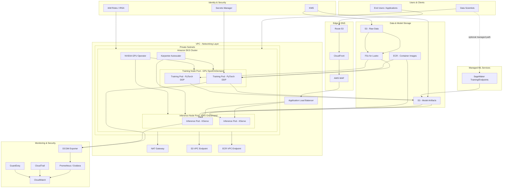

# Chapter 42 — GPU Workloads

*Part V – Container & Kubernetes Architectures*

---

## 1. Executive Summary

GPU workloads on AWS exist to solve one core problem: certain computational tasks — deep learning training, large language model (LLM) inference, high-performance computing (HPC) simulations, real-time rendering, and computer vision pipelines — are fundamentally parallel-friendly and run orders of magnitude faster on GPU architectures than on general-purpose CPUs.

A single NVIDIA H100 GPU can deliver thousands of parallel CUDA cores plus dedicated Tensor Cores for matrix multiplication, the mathematical operation that underlies nearly all modern machine learning. CPUs are optimized for sequential logic, branching, and low-latency single-thread work. GPUs are optimized for throughput across massively parallel, largely uniform operations. When a workload is dominated by matrix multiplications, convolutions, or embarrassingly parallel simulations, GPUs win — often by 10x–100x on raw throughput per dollar for the right workload shape.

**Business problem.** Organizations building AI/ML products, running scientific simulations, doing genomics analysis, rendering VFX, or serving real-time inference at scale hit a wall with CPU-only infrastructure. Training a modern transformer model on CPUs is not just slower — for many model sizes it is not practically finishable within a useful timeframe. Inference latency for large models on CPUs frequently exceeds acceptable user-facing SLAs. The business problem is therefore not "how do we go faster" but "how do we make this workload possible at all, at a cost the business can sustain."

**Architecture objective.** The objective of a production GPU workload architecture is to:

- Provision the right GPU instance type for the right job (training vs. inference vs. rendering vs. HPC)
- Maximize GPU utilization, since GPU capacity is the single largest cost line item in most ML infrastructure budgets
- Provide elastic scaling so GPU capacity is not paid for when idle
- Support both batch (training, offline inference) and real-time (online inference) patterns
- Integrate with container orchestration (primarily Kubernetes via EKS) for portability and multi-tenancy
- Provide strong isolation, quota management, and cost attribution across teams sharing scarce GPU capacity
- Meet availability and reliability requirements without over-provisioning extremely expensive hardware

**Why organizations adopt this architecture.** Three forces drive adoption:

1. **AI/ML product requirements.** Recommendation engines, generative AI features, fraud detection models, and computer vision products all require GPU-backed training and inference pipelines.
2. **Competitive time-to-market pressure.** Teams that can iterate on model training faster ship better products faster. GPU capacity planning becomes a direct lever on product velocity.
3. **Cost discipline at scale.** Once GPU spend crosses six or seven figures annually, the difference between a well-architected GPU platform and an ad hoc one is measured in millions of dollars, because GPU instances are 5x–20x the hourly cost of equivalent CPU instances.

**Major business benefits:**

- Faster model iteration cycles (days → hours, or hours → minutes)
- Ability to serve inference workloads that would be economically or technically infeasible on CPU
- Shared, multi-tenant GPU platforms that reduce per-team infrastructure duplication
- Predictable cost governance through quotas, chargeback, and automated scale-down
- Reduced time from research prototype to production deployment

**Typical enterprise scenarios:**

- A fintech company training fraud-detection models nightly on terabytes of transaction data, requiring a burst of multi-GPU training capacity for 4–6 hours per night
- A media company running GPU-based video transcoding and rendering farms with bursty batch demand
- A SaaS company serving real-time LLM-powered features to end users, requiring low-latency, highly available GPU inference endpoints
- A pharmaceutical company running molecular dynamics simulations on HPC GPU clusters
- An autonomous vehicle company training perception models on petabyte-scale sensor data using distributed multi-node GPU training

This chapter describes a production-grade, enterprise-ready architecture for running both GPU training and GPU inference workloads on AWS, built primarily on Amazon EKS with GPU-accelerated EC2 instances, supported by S3-based data lakes, container registries, autoscaling, cost governance, and full observability. It also covers alternatives — SageMaker-managed training/inference, ECS-based GPU scheduling, and Batch-based HPC — and explains when each is the better choice.

> **Note:** This chapter treats "GPU workloads" as an infrastructure and orchestration problem, not a data science problem. Model architecture, hyperparameter tuning, and ML algorithm selection are out of scope. The focus is: how do you run GPU compute reliably, securely, and cost-effectively in production on AWS.

---

## 2. Business Requirements

### Business Drivers

- Enable AI/ML product features that require GPU acceleration
- Reduce model training time to accelerate experimentation velocity
- Support real-time inference SLAs for customer-facing AI features
- Consolidate GPU capacity across multiple teams to improve utilization and reduce shadow-IT GPU spend
- Provide a governed, secure platform for regulated industries (finance, healthcare) doing ML on sensitive data

### Functional Requirements

| Requirement | Description |
|---|---|
| Multi-tenant GPU scheduling | Multiple teams/projects share a GPU cluster with fair scheduling and quotas |
| Training job support | Support distributed multi-node, multi-GPU training jobs (data-parallel and model-parallel) |
| Inference serving | Support low-latency real-time inference and high-throughput batch inference |
| Model registry integration | Trained models are versioned, stored, and retrievable for deployment |
| Autoscaling | GPU node pools scale up/down based on job queue depth and utilization |
| Spot capacity support | Non-critical batch training can use Spot Instances for cost savings |
| Framework support | Support common frameworks (PyTorch, TensorFlow, JAX) via containerized images |
| Job scheduling/queueing | Batch jobs queue when capacity is unavailable rather than failing |

### Non-Functional Requirements

- **Scalability goals:** Scale from 0 to hundreds of GPUs within minutes for burst training; scale inference endpoints horizontally based on request volume.
- **Availability requirements:** Inference endpoints require 99.9%+ availability; training jobs can tolerate interruption if checkpointed correctly.
- **Latency requirements:** Real-time inference p99 latency targets typically 100ms–2s depending on model size; batch/offline inference has no strict latency requirement.
- **Compliance requirements:** Data residency, encryption at rest/in transit, audit logging for any regulated workload (PCI-DSS, HIPAA, SOC 2).
- **Security expectations:** Strong tenant isolation between teams sharing GPU clusters; no cross-tenant data leakage via shared storage or GPU memory.
- **Recovery objectives:**
  - **RPO (Recovery Point Objective):** For training checkpoints, typically 15–30 minutes (checkpoint interval); for inference, RPO is effectively zero since inference is stateless.
  - **RTO (Recovery Time Objective):** Inference endpoints should recover within minutes (autoscaling replacement); training jobs should resume from last checkpoint within the checkpoint interval.
- **SLAs:** Internal platform SLA commonly targets 99.9% inference availability and defined queue-wait-time SLOs for training job scheduling.
- **Expected workload:** Bursty — training workloads spike nightly/weekly; inference workloads follow product traffic patterns with diurnal cycles.
- **Expected growth:** GPU fleet growth of 30–100% year-over-year is common for organizations scaling AI initiatives; architecture must accommodate rapid quota and capacity growth without redesign.

---

## 3. Architecture Overview

### Overall Design

The architecture centers on **Amazon EKS** as the orchestration layer for GPU workloads, because Kubernetes has become the de facto standard for ML platform teams needing portability, multi-tenancy, and a rich ecosystem of ML tooling (Kubeflow, Ray, Ray Serve, KServe, Volcano, NVIDIA GPU Operator).

Two distinct workload types are supported on the same platform, using separate node pools and scheduling policies:

1. **Training workloads** — batch, often distributed across multiple GPU nodes, tolerant of interruption, cost-sensitive (good Spot candidate), scheduled via a batch scheduler (Kubernetes Jobs, Volcano, or AWS Batch).
2. **Inference workloads** — long-running services, latency-sensitive, require high availability, scheduled via Kubernetes Deployments with Horizontal Pod Autoscaling (HPA) or KServe/Ray Serve for model-serving-specific autoscaling.

### Architecture Philosophy

- **Separate control planes for separate concerns.** Training and inference have opposite reliability/cost trade-offs. They should never share node pools or autoscaling groups.
- **GPU is the scarce, expensive resource.** Every design decision optimizes for GPU utilization first, general compute elasticity second.
- **Data locality matters.** GPU compute is often bottlenecked by data loading, not compute itself. S3 + FSx for Lustre is used to eliminate I/O bottlenecks for large training datasets.
- **Fail cheap, recover fast.** Spot interruption handling and checkpointing are first-class architecture concerns, not afterthoughts.
- **Multi-tenancy via namespaces and quotas**, not separate clusters, to maximize shared GPU utilization across teams — except where regulatory isolation requires dedicated clusters.

### Core Components

- Amazon EKS cluster with mixed node groups (On-Demand GPU, Spot GPU, CPU-only)
- NVIDIA GPU Operator (device plugin, driver management, DCGM monitoring)
- Karpenter for GPU-aware node autoscaling
- S3 for dataset storage and model artifacts
- FSx for Lustre for high-throughput training data access
- ECR for container images (training and inference images)
- Application Load Balancer / API Gateway for inference endpoint exposure
- SageMaker (optional, alternative/complementary path) for managed training and inference
- CloudWatch + Prometheus/Grafana + DCGM Exporter for GPU-level observability
- Step Functions or Argo Workflows for training pipeline orchestration

### How Components Interact

Training data lands in S3, is optionally staged into FSx for Lustre for high-throughput reads, and is consumed by training jobs running as Kubernetes Jobs on GPU node pools. Trained model artifacts are written back to S3 and registered in a model registry. Inference services pull the approved model artifact from S3, load it into GPU memory, and serve requests through a load-balanced Kubernetes Deployment. Karpenter watches pending pods with GPU resource requests and provisions the correct GPU instance type just-in-time, scaling to zero when no GPU workload is queued.

### High-Level Workflow

1. Data engineering pipeline lands training data in S3
2. Data scientist submits a training job (containerized) to the EKS training namespace
3. Karpenter provisions GPU nodes matching the job's resource request
4. Training job runs, checkpoints periodically to S3
5. On completion, model artifact is pushed to S3 and registered
6. CI/CD pipeline builds an inference container referencing the new model
7. Inference deployment is rolled out via blue-green or canary strategy
8. Autoscaling adjusts inference replica count based on request volume and GPU utilization
9. Observability stack tracks GPU utilization, latency, error rate, and cost

### Request Lifecycle (Inference)

Client request → API Gateway/ALB → Kubernetes Service → Inference Pod (GPU) → Model forward pass → Response serialization → Response returned → Logged and metered.

### Response Lifecycle

Response payload is compressed, returned via ALB, logged to CloudWatch with latency/tokens/cost metadata for FinOps tracking.

### Data Lifecycle

Raw data (S3 Standard) → processed/curated training sets (S3 + FSx for Lustre for active training) → model checkpoints (S3, versioned) → deployed model artifacts (S3 + ECR-packaged inference image) → archived old model versions (S3 Glacier after retention window).

---

## 4. AWS Services Used

### Amazon EC2 (GPU Instance Families)

**Purpose:** Provides the underlying GPU compute — P5 (H100), P4d/P4de (A100), G5/G6 (L4/L40S, cost-efficient inference and graphics), G4dn (T4, legacy/cost-sensitive inference), Trn1 (Trainium, training), Inf2 (Inferentia2, inference).

**Why selected:** EC2 GPU instances are the foundation for both self-managed Kubernetes-based GPU platforms and as the underlying compute for SageMaker. They provide full control over drivers, container runtime, and scheduling — required for custom ML platforms.

**Alternatives:** SageMaker managed training/endpoints (abstracts EC2 entirely); on-premises GPU clusters (rarely cost-competitive for elastic workloads); other cloud providers.

**Limitations:** GPU instance capacity is constrained by regional quotas and, at peak demand, by AWS capacity availability — Capacity Reservations or On-Demand Capacity Reservations (ODCR) are often necessary for guaranteed access to P5/P4d instances.

**Pricing considerations:** GPU instances are the single largest cost driver. A p5.48xlarge (8x H100) runs into the $50–100+/hour range on-demand; Spot and Reserved/Savings Plans pricing can reduce this substantially. Idle GPU time is pure waste — utilization monitoring is mandatory.

**Best practices:** Right-size to the smallest GPU instance that meets memory requirements; use Spot for training with checkpointing; use Capacity Reservations for guaranteed inference capacity; separate training and inference node pools.

### Amazon EKS

**Purpose:** Managed Kubernetes control plane orchestrating GPU and CPU node pools, providing scheduling, autoscaling, and multi-tenancy for ML workloads.

**Why selected:** Kubernetes is the industry-standard substrate for ML platforms (Kubeflow, Ray, KServe, Volcano all target Kubernetes). EKS removes the operational burden of managing the control plane while retaining full flexibility of self-managed worker nodes.

**Alternatives:** Amazon ECS (simpler, less ML-tooling-ecosystem support); SageMaker (fully managed, less flexible); self-managed Kubernetes on EC2 (more operational overhead, rarely justified).

**Limitations:** EKS control plane does not natively understand GPU scheduling nuances (MIG partitioning, GPU sharing) without the NVIDIA GPU Operator and device plugin installed.

**Pricing considerations:** EKS control plane has an hourly charge (~$0.10/hour per cluster) — negligible compared to GPU node cost.

**Best practices:** Use managed node groups or Karpenter for GPU node lifecycle; isolate GPU node pools with taints/tolerations; enable IRSA (IAM Roles for Service Accounts) for least-privilege pod-level AWS access.

### NVIDIA GPU Operator / Device Plugin

**Purpose:** Automates installation of NVIDIA drivers, container toolkit, and the Kubernetes device plugin that exposes `nvidia.com/gpu` as a schedulable resource.

**Why selected:** Without it, GPU resources are invisible to the Kubernetes scheduler, and driver version drift between nodes causes silent failures.

**Alternatives:** Manually baking drivers into a custom AMI (more control, more maintenance burden); AWS Deep Learning AMIs (pre-baked, less flexible for custom driver versions).

**Limitations:** Adds startup latency to new GPU nodes while drivers install (mitigated by using pre-baked GPU-optimized AMIs where possible).

### Karpenter

**Purpose:** Just-in-time node autoscaler that provisions the exact EC2 instance type needed for pending pods, including GPU instance types, and scales GPU node pools to zero when idle.

**Why selected:** Cluster Autoscaler requires pre-defined node groups per instance type; Karpenter can select from a flexible instance type pool, react faster to pending pods, and consolidate underutilized nodes automatically — critical for GPU cost control.

**Alternatives:** Cluster Autoscaler with fixed managed node groups (simpler, less cost-optimal); manual capacity management (not viable at scale).

**Limitations:** Requires careful `NodePool`/`EC2NodeClass` configuration to avoid provisioning oversized or wrong-generation GPU instances.

### Amazon S3

**Purpose:** Durable, scalable storage for raw training data, curated datasets, model checkpoints, and final model artifacts.

**Why selected:** 11 nines durability, virtually unlimited scale, native integration with SageMaker, EKS via S3 CSI driver, and lifecycle policies for cost control.

**Alternatives:** EFS (lower throughput, higher cost per GB for large datasets); FSx for Lustre (better for active high-throughput training I/O, used alongside S3, not instead of it).

**Best practices:** Use S3 Intelligent-Tiering for datasets with unpredictable access patterns; use S3 Transfer Acceleration for cross-region uploads; enable versioning on model artifact buckets.

### FSx for Lustre

**Purpose:** High-throughput, low-latency parallel file system, linked to S3, used to eliminate data-loading bottlenecks during distributed GPU training.

**Why selected:** Multi-GPU training jobs can be I/O-bound if reading directly from S3 at scale; FSx for Lustre provides POSIX file semantics and sub-millisecond latencies with throughput scaling linearly with storage size.

**Alternatives:** Reading directly from S3 with a high-performance data loader (works for many workloads, less optimal at extreme scale); EFS (lower throughput ceiling).

**Limitations:** Additional cost and operational complexity; must be sized and warmed correctly for the training dataset.

### Amazon ECR

**Purpose:** Private container registry for training and inference container images (PyTorch/TensorFlow images with CUDA runtime baked in).

**Why selected:** Native IAM integration, image scanning, and low-latency pulls within the same region as EKS nodes.

### Elastic Load Balancing (ALB)

**Purpose:** Distributes inference traffic across GPU inference pods, performs health checks, and terminates TLS.

**Why selected:** Native integration with EKS via AWS Load Balancer Controller; supports path-based routing for multi-model endpoints.

### Amazon SageMaker (Complementary/Alternative Path)

**Purpose:** Fully managed training jobs, hyperparameter tuning, and inference endpoints (including multi-model endpoints and serverless inference) without managing Kubernetes infrastructure directly.

**Why selected:** Reduces operational overhead for teams that do not need full Kubernetes flexibility; provides managed autoscaling, built-in experiment tracking, and managed Spot training with automatic checkpoint/resume.

**Alternatives:** Self-managed EKS-based platform (this chapter's primary architecture) — chosen when organizations need multi-framework flexibility, custom scheduling, or are already standardized on Kubernetes for all workloads.

**Limitations:** Less control over underlying infrastructure; can be more expensive per-hour than raw EC2 for very large, long-running training jobs; less suited to highly custom distributed training topologies.

### AWS Batch (Alternative for HPC-style GPU Jobs)

**Purpose:** Managed batch computing service that can schedule GPU jobs onto EC2 (including Spot) without requiring a Kubernetes cluster.

**Why selected:** Simpler operational model for pure batch/HPC GPU workloads (e.g., genomics, rendering) that don't need Kubernetes-native tooling.

**Limitations:** No native support for the broader ML tooling ecosystem (KServe, Ray, Kubeflow) that typically expects Kubernetes.

### IAM

**Purpose:** Controls access to GPU clusters, S3 buckets, ECR repositories, and SageMaker resources; IRSA provides pod-level least-privilege AWS access.

**Best practices:** Separate IAM roles per namespace/team; scope S3 bucket policies to specific prefixes per team; never use node-level IAM roles for workload-level AWS access.

### VPC / Networking

**Purpose:** Provides network isolation for the GPU cluster, private subnets for GPU nodes, NAT Gateway for outbound package/model downloads, and VPC endpoints for S3/ECR to avoid NAT data transfer costs.

**Best practices:** Use S3 Gateway VPC Endpoint (free) rather than routing S3 traffic through NAT Gateway — this alone can save significant cost given the volume of training data transfer.

### CloudWatch, Prometheus/Grafana, DCGM Exporter

**Purpose:** GPU-level observability — utilization, memory usage, temperature, power draw — combined with application-level metrics (inference latency, throughput, queue depth).

**Why selected:** GPU utilization is the single most important cost-efficiency metric; without DCGM-level telemetry, teams cannot detect underutilized (wasted) GPU capacity.

### KMS

**Purpose:** Encrypts EBS volumes on GPU nodes, S3 buckets containing training data/models, and Secrets Manager secrets.

### Secrets Manager

**Purpose:** Stores API keys, database credentials, and third-party model registry credentials used by training/inference pipelines.

---

## 5. Complete Architecture Diagram



---

## 6. Component-by-Component Explanation

### GPU Training Node Pool

- **Purpose:** Runs distributed, batch-oriented training jobs.
- **Responsibilities:** Execute containerized training code, checkpoint progress to S3, report metrics.
- **Inputs:** Training container image (ECR), training dataset (S3/FSx for Lustre), hyperparameters (ConfigMap/env vars).
- **Outputs:** Model checkpoints and final artifacts (S3), training metrics (CloudWatch/Prometheus).
- **Scaling:** Scales via Karpenter based on pending Job pod count; scales to zero when no training jobs are queued.
- **High availability:** Not required in the traditional sense — training jobs are designed to be interruption-tolerant via checkpointing, particularly critical when using Spot Instances.
- **Failure handling:** On Spot interruption (2-minute warning via EC2 Instance Metadata Service), the job checkpoints immediately and resumes on a replacement node from the last checkpoint.
- **Dependencies:** NVIDIA GPU Operator, Karpenter, S3/FSx for Lustre, ECR.
- **Security:** IRSA-scoped IAM role limited to specific S3 prefixes; network policies restricting pod-to-pod traffic across tenant namespaces.
- **Monitoring:** DCGM Exporter for GPU utilization/memory; job-level metrics for loss curves and throughput (samples/sec).

### GPU Inference Node Pool

- **Purpose:** Serves real-time and batch inference requests.
- **Responsibilities:** Load model into GPU memory, serve forward-pass requests, expose health/readiness endpoints.
- **Inputs:** Model artifact (S3), inference container image (ECR), incoming requests (ALB).
- **Outputs:** Inference responses, latency/throughput metrics.
- **Scaling:** Horizontal Pod Autoscaler based on GPU utilization or custom metrics (requests-per-second, queue depth); Karpenter provisions additional GPU nodes as pod count grows.
- **High availability:** Minimum 2 replicas across 2+ Availability Zones; readiness probes ensure traffic is only routed to pods with a fully loaded model.
- **Failure handling:** Unhealthy pods are removed from the ALB target group automatically; Kubernetes reschedules failed pods.
- **Dependencies:** Model registry/S3, ALB, AWS Load Balancer Controller.
- **Security:** TLS termination at ALB, WAF rules for rate limiting and payload inspection, IRSA-scoped read-only access to model artifacts.
- **Monitoring:** p50/p95/p99 latency, GPU utilization, error rate, tokens-per-second (for LLM workloads), cost-per-1000-inferences.

### Karpenter

- **Purpose:** Just-in-time, cost-aware node provisioning.
- **Responsibilities:** Watch for unschedulable pods requesting `nvidia.com/gpu`, select the cheapest/most appropriate instance type meeting requirements, provision and bootstrap the node, and consolidate/terminate underutilized nodes.
- **Scaling:** Itself scales the cluster — it is the scaling mechanism, not a scaled component.
- **Failure handling:** If preferred GPU instance types are unavailable (capacity constrained), Karpenter falls back to alternative instance types defined in the NodePool's flexible requirements.
- **Security:** Runs with a scoped IAM role permitting EC2 instance creation/termination only within designated subnets and security groups.

### NVIDIA GPU Operator

- **Purpose:** Ensures every GPU node has matching driver, CUDA runtime, and container toolkit versions, and exposes GPUs to the Kubernetes scheduler.
- **Responsibilities:** Install/manage drivers, run DCGM for telemetry, manage MIG (Multi-Instance GPU) partitioning where applicable.
- **Failure handling:** Node health checks detect driver mismatches or GPU errors (Xid errors) and can cordon the node automatically.

### S3 (Data & Model Storage)

- **Purpose:** System of record for all training data and model artifacts.
- **Scaling:** Effectively unlimited; performance scales with request parallelism (partition prefixes appropriately for high-throughput access patterns).
- **High availability:** 99.99% availability SLA, 11 nines durability, cross-AZ replication built in.
- **Security:** SSE-KMS encryption at rest, bucket policies scoped per team/prefix, versioning enabled on model artifact buckets to support rollback.

### FSx for Lustre

- **Purpose:** High-throughput scratch file system for active training jobs.
- **Scaling:** Throughput scales with provisioned capacity (GB/s per TiB); must be sized to match the aggregate read bandwidth required by all concurrent GPUs.
- **Failure handling:** Data is lazily loaded from and can be synced back to S3; the file system itself is not the durable source of truth — S3 is.

---

## 7. End-to-End Request Flow

### Training Job Flow

1. Data scientist packages training code into a Docker image and pushes to ECR.
2. Data scientist submits a Kubernetes `Job` (or Argo Workflow) manifest specifying GPU resource requests, referencing the ECR image and S3 dataset path.
3. Kubernetes scheduler finds no available GPU node matching the request; the pod remains `Pending`.
4. Karpenter observes the pending pod and provisions a matching GPU EC2 instance (e.g., p4d.24xlarge) in the appropriate private subnet.
5. NVIDIA GPU Operator finishes driver/toolkit initialization on the new node (or the node boots pre-baked with drivers via a GPU-optimized AMI to skip this step).
6. The training pod is scheduled onto the new node; the container pulls the image from ECR via the ECR VPC Endpoint.
7. The training process mounts the FSx for Lustre file system (backed by the S3 dataset) and begins reading training batches.
8. Training proceeds; DCGM Exporter streams GPU utilization/memory metrics to Prometheus; the training script emits loss/accuracy metrics.
9. Every N steps, the training script writes a checkpoint to S3.
10. If running on Spot and an interruption notice is received, the job immediately checkpoints and exits gracefully; Karpenter provisions a replacement node and the job resumes from the last checkpoint.
11. On completion, the final model artifact is written to S3 and registered in the model registry (e.g., an S3-backed manifest or MLflow).
12. CloudWatch/Prometheus alarms notify the team of job completion, failure, or anomalous metrics (e.g., loss divergence).
13. The Kubernetes Job completes; Karpenter consolidates/terminates the now-idle GPU node after a configurable idle timeout.

### Inference Request Flow

1. Client sends an HTTPS request to the public endpoint (Route 53 → CloudFront → WAF → ALB).
2. WAF evaluates rate-limiting and payload rules; malicious/abusive requests are blocked.
3. ALB routes the request to a healthy inference pod based on target group health checks.
4. The inference pod (already holding the model in GPU memory) performs the forward pass.
5. Response is serialized and returned through the ALB to the client.
6. Latency, token count (for LLMs), and GPU utilization are logged to CloudWatch for cost attribution.
7. If GPU utilization or request queue depth exceeds threshold, HPA triggers additional replica creation.
8. If no GPU node has capacity for the new replica, Karpenter provisions an additional inference GPU node.
9. Errors (5xx, timeout) trigger CloudWatch Alarms and are routed to the on-call team via SNS.

---

## 8. Deployment Flow

### Infrastructure Provisioning

All infrastructure (VPC, EKS cluster, Karpenter NodePools, IAM roles, S3 buckets, FSx for Lustre) is provisioned via Terraform, stored in a version-controlled repository with mandatory peer review before merge.

### Terraform Workflow

1. Engineer creates a feature branch and modifies Terraform modules.
2. `terraform fmt` and `terraform validate` run in CI on every push.
3. `terraform plan` output is posted as a PR comment for review.
4. On merge to `main`, a CI/CD pipeline runs `terraform apply` against the target environment using a remote state backend (S3 + DynamoDB lock table).
5. Policy-as-code checks (e.g., OPA/Conftest or Checkov) validate the plan against security/cost guardrails before apply.

### CI/CD Deployment (Application Layer)

1. Model training code and inference server code are built into Docker images and pushed to ECR with commit-SHA tags.
2. Image vulnerability scanning runs automatically in ECR.
3. Helm charts (or Kustomize overlays) define the Kubernetes manifests for training Jobs and inference Deployments.
4. Argo CD (GitOps) syncs the desired state from the Git repository into the EKS cluster.

### Blue-Green Deployment (Inference)

- A new model version is deployed alongside the existing (green) deployment as a separate (blue) deployment with 0% traffic.
- Smoke tests validate the blue deployment's correctness and latency.
- Traffic is gradually shifted (10% → 50% → 100%) using weighted ALB target groups or a service mesh (e.g., Istio/App Mesh).
- If error rates or latency regress, traffic is immediately shifted back to green.

### Rollback

- Argo CD supports one-click rollback to the previous Git-tracked manifest revision.
- Model artifacts are versioned in S3; rollback simply repoints the inference deployment to the prior model version's S3 path.

### Secrets

- Managed via AWS Secrets Manager, injected into pods via the Secrets Store CSI Driver — never stored in container images or plaintext Kubernetes Secrets.

### Configuration

- Environment-specific configuration (dataset paths, hyperparameters, scaling thresholds) managed via Kubernetes ConfigMaps, templated per environment through Helm values files.

### Validation

- Pre-deployment: automated smoke tests validate model loading and a sample inference request.
- Post-deployment: canary analysis (latency, error rate, GPU utilization) gates full rollout.

---

## 9. Network Topology

### VPC and CIDR

A dedicated VPC (e.g., `10.40.0.0/16`) is used for the ML platform, sized generously to accommodate the large number of ENIs consumed by GPU instances (some GPU instance types support multiple ENIs and require larger CIDR allocations for Kubernetes pod networking, particularly under the AWS VPC CNI which assigns one IP per pod by default).

### Public Subnets

Host only the ALB and NAT Gateway. No GPU nodes are placed in public subnets.

### Private Subnets

GPU worker nodes (training and inference) run in private subnets across at least 2 (preferably 3) Availability Zones for high availability of inference workloads. Training node pools may be concentrated in fewer AZs if the training framework requires low-latency inter-node communication (e.g., NCCL all-reduce operations benefit from same-AZ placement to minimize cross-AZ network latency and cost).

### NAT Gateway

Provides outbound internet access for package downloads (e.g., pip installs at container build time — ideally avoided at runtime) and any external API calls. NAT Gateway data processing charges can become significant for large model downloads; VPC endpoints should be used wherever possible to bypass NAT entirely.

### Internet Gateway

Attached to the VPC to support the public-facing ALB and NAT Gateway.

### Transit Gateway

Used in multi-VPC/multi-account setups to connect the ML platform VPC to shared services VPCs (e.g., a central logging or security tooling VPC) without VPC peering sprawl.

### Route Tables

Private subnet route tables direct S3/ECR traffic to VPC Gateway/Interface Endpoints rather than the NAT Gateway, and direct all other outbound traffic through NAT.

### Network ACLs

Used as a coarse-grained defense-in-depth layer at the subnet boundary, primarily to block known-bad CIDR ranges; fine-grained control is handled at the Security Group level.

### Security Groups

- GPU node security group: allows inter-node traffic on NCCL/GPUDirect ports for distributed training communication, restricts inbound traffic to the cluster CIDR only.
- ALB security group: allows inbound 443 from the internet (or from CloudFront's managed prefix list), outbound only to the inference pod security group.

### PrivateLink

Used for S3, ECR, CloudWatch, Secrets Manager, and STS VPC endpoints, keeping all AWS API traffic within the VPC and avoiding NAT Gateway data transfer costs — this is a material cost optimization given the volume of container image pulls and S3 dataset access in GPU workloads.

### Hybrid Connectivity

For enterprises with on-premises GPU clusters or data sources, Direct Connect or Site-to-Site VPN connects on-premises networks to the ML platform VPC, typically routed through a Transit Gateway for centralized management.

---

## 10. Identity and Access

### IAM Roles

- **Karpenter controller role:** Permission to create/terminate EC2 instances, create launch templates, and pass the node instance role.
- **Node instance role:** Permissions for EKS node bootstrap (`AmazonEKSWorkerNodePolicy`, CNI policy, ECR read-only), plus SSM for patch management.
- **Training pod IRSA role:** Scoped to read specific S3 dataset prefixes and write to specific S3 checkpoint/model prefixes only.
- **Inference pod IRSA role:** Read-only access to the specific model artifact prefix in S3; no write access.

### IAM Policies (Least Privilege Example)

```json

{
  "Version": "2012-10-17",
  "Statement": [
    {
      "Sid": "ReadTrainingData",
      "Effect": "Allow",
      "Action": ["s3:GetObject", "s3:ListBucket"],
      "Resource": [
        "arn:aws:s3:::ml-platform-training-data/team-fraud/*",
        "arn:aws:s3:::ml-platform-training-data"
      ],
      "Condition": {
        "StringLike": { "s3:prefix": ["team-fraud/*"] }
      }
    },
    {
      "Sid": "WriteCheckpoints",
      "Effect": "Allow",
      "Action": ["s3:PutObject"],
      "Resource": "arn:aws:s3:::ml-platform-checkpoints/team-fraud/*"
    }
  ]
}

```

### Resource Policies

S3 bucket policies additionally restrict access to specific VPC endpoints (via `aws:sourceVpce` condition) to prevent access from outside the VPC even if credentials are compromised.

### STS

Used for the temporary credential exchange underlying IRSA — each pod assumes its IAM role via a web identity token projected by the EKS OIDC provider, with credentials automatically rotated and scoped to the pod's lifetime.

### Cross-Account Access

In multi-account setups (common in enterprises with separate accounts per business unit or environment), a central "ML Platform" account hosts the EKS cluster, while data lives in per-team data accounts, accessed via cross-account IAM roles with explicit trust policies.

### Least Privilege

Every namespace (team) gets its own IRSA role scoped to its own S3 prefixes — no shared "God role" is used for training or inference pods, even though this increases the number of IAM roles to manage.

### Service Roles

The AWS Load Balancer Controller, Karpenter, and Cluster Autoscaler each run under their own dedicated IRSA role with only the specific permissions each controller requires.

### Permission Boundaries

Applied at the account level to cap the maximum permissions any IAM role created within the ML platform account can have, preventing privilege escalation even if a role's policy is misconfigured.

---

## 11. Security Architecture

### Encryption

- **At rest:** All S3 buckets (training data, checkpoints, models) use SSE-KMS with customer-managed keys; EBS volumes on GPU nodes are encrypted by default via a KMS key specified in the Karpenter EC2NodeClass.
- **In transit:** TLS 1.2+ enforced on all ALB listeners; inter-node NCCL traffic for distributed training remains within the private VPC and is not encrypted by default (acceptable within a trusted VPC boundary, but organizations with strict compliance requirements may enable encrypted NCCL transports at a performance cost).

### KMS

Customer-managed KMS keys are used (not AWS-managed defaults) so that key policies can restrict which IAM roles may decrypt training data — critical when handling sensitive data (PII, PHI, financial records).

### TLS / Certificate Manager

ACM issues and auto-renews the TLS certificate used by the ALB; no manual certificate rotation is required.

### WAF

Rate-limiting rules protect inference endpoints from abuse (a single client sending an excessive volume of expensive GPU-backed inference requests can materially impact cost); managed rule groups block common web exploits at the edge before they reach the GPU compute layer.

### Shield

AWS Shield Standard is enabled by default on CloudFront/ALB; Shield Advanced is recommended for public-facing, business-critical inference APIs subject to potential DDoS targeting.

### Secrets Manager

Stores third-party API keys (e.g., a hosted model registry, external data provider credentials) with automatic rotation where supported.

### GuardDuty

Monitors for anomalous API activity (e.g., unexpected `ec2:RunInstances` calls that could indicate compromised Karpenter credentials being used to mine cryptocurrency on GPU instances — a real and increasingly common attack pattern against ML platforms).

### Inspector

Continuously scans ECR container images for OS and library vulnerabilities, flagging CVEs in the CUDA/cuDNN base images that ML teams frequently reuse without patching.

### Security Hub

Aggregates findings from GuardDuty, Inspector, and Config into a single compliance dashboard, mapped to frameworks like CIS AWS Foundations Benchmark.

### CloudTrail

Logs all API calls, particularly EC2 instance launches by Karpenter and S3 access to training data — essential for both security investigation and cost attribution/audit.

### AWS Config

Tracks configuration drift, e.g., detecting if a GPU node security group is accidentally modified to allow broader inbound access than intended.

### Zero Trust

No implicit trust is granted based on network location alone; every pod-to-AWS-service call is authenticated via IRSA-issued short-lived credentials, and inter-service traffic within the cluster can be further secured with mutual TLS via a service mesh for regulated workloads.

### Threat Model

| Attack Vector | Description | Mitigation |
|---|---|---|
| Compromised training container | Malicious dependency in a pip package used during training | Image scanning (Inspector), restricted egress from training nodes, SBOM tracking |
| Cryptomining via stolen credentials | Attacker uses leaked IAM credentials to launch GPU instances for cryptomining | GuardDuty anomaly detection, IAM permission boundaries, budget alerts |
| Model extraction via inference API | Attacker probes inference endpoint to reconstruct/steal proprietary model | Rate limiting (WAF), request logging/anomaly detection, output obfuscation where applicable |
| Training data exfiltration | Compromised pod exfiltrates sensitive training data | VPC endpoint-restricted S3 bucket policies, egress filtering, DLP monitoring |
| Cross-tenant data leakage | Multi-tenant cluster misconfiguration exposes one team's data to another | Namespace-scoped IRSA roles, network policies, S3 prefix isolation |
| Supply chain attack via base image | Compromised public CUDA/PyTorch base image | Use AWS Deep Learning Containers or internally vetted base images only |

---

## 12. High Availability

### AZ Failures

Inference node pools span at least 2 (ideally 3) AZs; the ALB automatically routes around an unhealthy AZ. Training jobs are generally single-AZ per job (for NCCL performance) but the platform as a whole can launch training jobs in any AZ with available GPU capacity.

### Instance Failures

Kubernetes automatically reschedules failed inference pods to healthy nodes; readiness probes prevent traffic from reaching a pod before its model is fully loaded into GPU memory (a non-trivial load time for large models, often 30 seconds to several minutes).

### Regional Failures

For business-critical inference workloads, a secondary region hosts a warm-standby inference deployment with pre-loaded models, with Route 53 health checks providing automated regional failover.

### Database Failures

The model registry metadata (if using a relational store like Aurora/RDS rather than a flat S3 manifest) follows standard Multi-AZ RDS/Aurora failover patterns (see Chapter 43/44).

### Load Balancing

ALB health checks target a dedicated `/healthz` endpoint on each inference pod that verifies the model is loaded and the GPU is responsive (not just that the HTTP server process is alive).

### Health Checks

Distinguish between **liveness** (process is running) and **readiness** (model loaded, GPU healthy, ready to serve) — a common production mistake is using only a liveness probe, which allows traffic to reach pods before the model finishes loading.

### Failover

Automated via Kubernetes pod rescheduling (node/pod level) and Route 53 health-check-based DNS failover (regional level).

---

## 13. Disaster Recovery

### Backup Strategy

- Training datasets: S3 with versioning and Cross-Region Replication (CRR) for critical/hard-to-regenerate datasets.
- Model checkpoints: Written incrementally to S3 during training; final artifacts versioned.
- Infrastructure: Fully defined in Terraform — the cluster itself is disposable and reproducible from code, not backed up in the traditional sense.

### Snapshots

EBS snapshots of GPU node root volumes are generally unnecessary since nodes are stateless/ephemeral (Karpenter-managed); persistent state lives in S3/FSx, not on node-local disks.

### Cross-Region Replication

Model artifacts and critical training datasets are replicated to a secondary region via S3 CRR, enabling inference capacity to be stood up in the DR region without a full data re-transfer.

### DR Strategies Compared

| Strategy | RTO | RPO | Cost | Use Case |
|---|---|---|---|---|
| Pilot Light | Hours | Minutes (last replicated checkpoint) | Low | Training platform DR — acceptable since training can simply restart |
| Warm Standby | Minutes | Near-zero | Medium-High | Business-critical inference endpoints |
| Multi-site Active-Active | Seconds | Zero | Very High | Only justified for the highest-tier, revenue-critical inference APIs |
| Active-Passive | Minutes-Hours | Minutes | Medium | Most common choice for inference; training rarely needs Active-Active |

### RPO / RTO Targets (Typical)

- Training platform: RPO = last checkpoint interval (15–30 min), RTO = time to re-provision GPU capacity in DR region (typically under 1 hour given Terraform-driven infrastructure).
- Inference platform: RPO = 0 (stateless), RTO = minutes (warm standby with pre-loaded models) to near-zero (active-active, if justified by business criticality).

---

## 14. Scalability

### Horizontal Scaling

Both training (more concurrent Jobs/nodes) and inference (more replicas) scale horizontally. Karpenter is the primary mechanism, reacting to pending pods within seconds and provisioning matching GPU instance types.

### Vertical Scaling

Changing GPU instance type (e.g., moving from a single-GPU g5.xlarge to a multi-GPU p4d.24xlarge) for workloads requiring more GPU memory or more GPUs per node for a single large model that doesn't fit on one GPU.

### Auto Scaling

- **Training:** Scales with queue depth of pending training Jobs; Karpenter provisions Spot GPU capacity for cost efficiency, falling back to On-Demand when Spot capacity is unavailable (via NodePool priority/weighting).
- **Inference:** HPA scales replica count based on GPU utilization or custom Prometheus metrics (e.g., requests-per-second per replica, queue depth for async inference).

### Database Scaling

If a model registry database is used, it follows standard Aurora read-replica/Aurora Serverless v2 scaling patterns — generally low-throughput relative to the GPU compute layer and rarely the bottleneck.

### Storage Scaling

- S3: effectively unlimited, scales automatically.
- FSx for Lustre: throughput scales with provisioned storage capacity; must be resized (or use scratch file systems sized per-job) as dataset sizes grow.

### Queue Scaling

For asynchronous batch inference, an SQS queue in front of the inference layer buffers requests; the inference deployment scales based on `ApproximateNumberOfMessagesVisible`, decoupling request arrival rate from processing rate.

---

## 15. Performance Optimization

### Caching

- Model weights are cached in GPU memory for the pod's lifetime — avoiding repeated model loads is the single biggest performance lever for inference latency.
- Frequently accessed training data can be cached on local NVMe instance storage (available on many GPU instance types) to reduce repeated S3/FSx reads across epochs.

### Compression

Model checkpoints and datasets are stored compressed in S3 (reducing storage cost and transfer time); mixed-precision (FP16/BF16) and quantization (INT8/FP8) reduce both compute time and GPU memory footprint for inference.

### CDN

CloudFront caches static assets associated with inference-serving web UIs; raw inference responses are typically not cacheable (dynamic, user-specific) but request routing still benefits from CloudFront's edge network for reduced latency to the origin ALB.

### Database Optimization

Not typically a bottleneck for GPU workloads themselves; relevant only for metadata/model-registry lookups, which should be indexed appropriately and kept out of the hot inference path where possible (cache model metadata in-memory in the inference pod).

### Connection Pooling

Inference servers maintain persistent connections/warm GPU contexts rather than re-initializing CUDA contexts per request — cold CUDA context initialization can add hundreds of milliseconds of latency.

### Concurrency

- **Training:** Data-parallel training distributes batches across multiple GPUs/nodes using NCCL all-reduce; gradient accumulation is used when GPU memory limits batch size.
- **Inference:** Dynamic batching (grouping concurrent incoming requests into a single GPU forward pass) dramatically improves throughput for LLM inference, at a small latency cost per request — a critical technique implemented by serving frameworks like TensorRT-LLM, vLLM, or Triton Inference Server.

### Async Processing

Long-running or non-latency-sensitive inference (e.g., document processing, batch scoring) is handled asynchronously via SQS + worker pods rather than synchronous request/response, allowing better GPU batching and utilization.

---

## 16. Cost Optimization (FinOps)

> **Warning:** GPU instances are frequently 5x–20x the hourly cost of comparable CPU instances. A single idle p5.48xlarge left running unnecessarily overnight can cost more than an engineer's daily salary. Cost governance is not optional for GPU platforms — it is a core architectural requirement.

### Estimated Monthly Costs (US East, illustrative on-demand list pricing — verify current pricing before use)

| Deployment Size | Example Configuration | Approx. Monthly Cost |
|---|---|---|
| Small (dev/experimentation) | 1x g5.xlarge (1x A10G) running 8hrs/day | $250–$400 |
| Medium (team training + inference) | 2x g5.12xlarge (inference) + burst 4x p4d.24xlarge (training, 40hrs/month, Spot) | $15,000–$30,000 |
| Enterprise (multi-team platform) | 10x g5.12xlarge (always-on inference) + 8x p5.48xlarge (training, ~200hrs/month, mixed Spot/OD) | $250,000–$500,000+ |

### Major Cost Drivers

- On-demand GPU instance hours (by far the largest line item)
- Idle/underutilized GPU capacity (inference replicas over-provisioned for peak that sits idle off-peak)
- Cross-AZ / NAT Gateway data transfer for large dataset movement
- FSx for Lustre provisioned throughput (paid whether or not it's fully utilized)
- S3 storage growth from unmanaged checkpoint/experiment artifact accumulation

### Optimization Opportunities

- **Reserved Instances / Savings Plans:** Commit to baseline always-on inference capacity (1- or 3-year Compute Savings Plans) for 30–60% discount versus on-demand.
- **Spot Instances:** Use for training workloads with checkpointing — commonly 60–90% cheaper than on-demand; not recommended for synchronous, latency-critical inference.
- **S3 Lifecycle Policies:** Automatically transition old experiment checkpoints to S3 Infrequent Access or Glacier after a defined retention window (e.g., 30 days for intermediate checkpoints, keep only final models long-term).
- **Storage Classes:** Use S3 Intelligent-Tiering for datasets with unpredictable access patterns.
- **Rightsizing:** Continuously monitor DCGM GPU utilization; a training job consistently showing 40% GPU utilization indicates a data-loading bottleneck wasting 60% of very expensive compute — fix the data pipeline before adding more GPUs.
- **Scale-to-zero:** Ensure training node pools scale to zero when idle (Karpenter consolidation) — this is the single highest-leverage cost control for bursty training workloads.
- **Cost Allocation / Tagging:** Tag every GPU node and pod (via Kubernetes labels propagated to Cost Allocation Tags) with team/project/cost-center for chargeback.
- **Budgets:** AWS Budgets with alert thresholds per team/project, tied to the tagging strategy above.
- **Cost Anomaly Detection:** AWS Cost Anomaly Detection flags unexpected spend spikes — critical for catching runaway training jobs or (in worst cases) compromised credentials used for cryptomining.

> **Tip:** Set a hard AWS Service Quota limit on GPU instance counts per account/team as a backstop against runaway costs from a misconfigured autoscaler or a malicious actor, in addition to soft budget alerts.

---

## 17. AI-Assisted Operations

### Amazon Q

Amazon Q Developer can assist with troubleshooting Kubernetes GPU scheduling errors, generating Terraform for new NodePool configurations, and explaining CloudWatch/DCGM metric anomalies in natural language during incident response.

### Bedrock

Can be used to build an internal chatbot for the ML platform team that answers common questions ("why is my training job pending?", "how do I request a quota increase?") by querying CloudWatch metrics and Kubernetes API state via a Bedrock Agent with tool integrations.

### AI Troubleshooting

Feeding DCGM Xid error codes and pod event logs into an LLM-based triage assistant can accelerate root-cause identification for GPU hardware errors, which are notoriously cryptic (e.g., differentiating a transient ECC memory error from a failing GPU requiring hardware replacement).

### Log Analysis

LLM-assisted log analysis over CloudWatch Logs Insights queries can surface patterns across thousands of training job failures faster than manual log review — particularly valuable for identifying common OOM (out-of-memory) failure signatures across teams.

### Incident Response

AI-assisted runbook generation and automated first-response actions (e.g., auto-cordoning a node showing repeated Xid errors) reduce mean-time-to-resolution for GPU hardware-related incidents.

### Cost Optimization

AI-driven analysis of utilization patterns can recommend rightsizing (e.g., "Team X's inference workload consistently uses under 30% GPU memory on g5.4xlarge — a g5.2xlarge would reduce cost by 40% with no performance impact").

### Capacity Planning

Time-series forecasting (via SageMaker Canvas or custom models) on historical GPU demand can inform Capacity Reservation purchasing decisions ahead of anticipated product launches.

### Architecture Review

LLM-assisted review of Terraform plans and Kubernetes manifests against internal best-practice policies (e.g., flagging a training Job missing checkpoint configuration before it burns Spot-interruption-induced compute waste).

### AI-Generated Terraform / Documentation

AI coding assistants accelerate the creation of new NodePool/EC2NodeClass Terraform modules and auto-generate runbook documentation from cluster configuration — always subject to the same peer review as human-written code.

---

## 18. Terraform Implementation

### Providers

```hcl

terraform {
  required_version = ">= 1.7.0"
  required_providers {
    aws = {
      source  = "hashicorp/aws"
      version = "~> 5.50"
    }
    kubernetes = {
      source  = "hashicorp/kubernetes"
      version = "~> 2.30"
    }
    helm = {
      source  = "hashicorp/helm"
      version = "~> 2.13"
    }
  }

  backend "s3" {
    bucket         = "ml-platform-tfstate"
    key            = "gpu-workloads/terraform.tfstate"
    region         = "us-east-1"
    dynamodb_table = "ml-platform-tfstate-lock"
    encrypt        = true
  }
}

provider "aws" {
  region = var.aws_region
}

```

### Variables

```hcl

variable "aws_region" {
  description = "AWS region for the GPU workload platform"
  type        = string
  default     = "us-east-1"
}

variable "cluster_name" {
  description = "Name of the EKS cluster"
  type        = string
  default     = "ml-platform-prod"
}

variable "vpc_cidr" {
  description = "CIDR block for the ML platform VPC"
  type        = string
  default     = "10.40.0.0/16"
}

variable "training_instance_types" {
  description = "Allowed GPU instance types for training node pool"
  type        = list(string)
  default     = ["p4d.24xlarge", "p5.48xlarge"]
}

variable "inference_instance_types" {
  description = "Allowed GPU instance types for inference node pool"
  type        = list(string)
  default     = ["g5.2xlarge", "g5.4xlarge", "g5.12xlarge"]
}

```

### Networking (Core Excerpt)

```hcl

module "vpc" {
  source  = "terraform-aws-modules/vpc/aws"
  version = "~> 5.8"

  name = "${var.cluster_name}-vpc"
  cidr = var.vpc_cidr

  azs             = ["${var.aws_region}a", "${var.aws_region}b", "${var.aws_region}c"]
  private_subnets = ["10.40.0.0/19", "10.40.32.0/19", "10.40.64.0/19"]
  public_subnets  = ["10.40.96.0/24", "10.40.97.0/24", "10.40.98.0/24"]

  enable_nat_gateway   = true
  single_nat_gateway   = false # one per AZ for HA and to reduce cross-AZ NAT charges
  enable_dns_hostnames = true

  # Required tags for EKS + Karpenter subnet discovery

  private_subnet_tags = {
    "kubernetes.io/role/internal-elb"           = "1"
    "karpenter.sh/discovery"                    = var.cluster_name
  }
}

# S3 Gateway Endpoint - avoids NAT Gateway data charges for S3 traffic

resource "aws_vpc_endpoint" "s3" {
  vpc_id            = module.vpc.vpc_id
  service_name      = "com.amazonaws.${var.aws_region}.s3"
  vpc_endpoint_type = "Gateway"
  route_table_ids   = module.vpc.private_route_table_ids
}

resource "aws_vpc_endpoint" "ecr_dkr" {
  vpc_id              = module.vpc.vpc_id
  service_name        = "com.amazonaws.${var.aws_region}.ecr.dkr"
  vpc_endpoint_type    = "Interface"
  subnet_ids           = module.vpc.private_subnets
  private_dns_enabled  = true
  security_group_ids   = [aws_security_group.vpc_endpoints.id]
}

```

### EKS Cluster

```hcl

module "eks" {
  source  = "terraform-aws-modules/eks/aws"
  version = "~> 20.0"

  cluster_name    = var.cluster_name
  cluster_version = "1.30"

  vpc_id     = module.vpc.vpc_id
  subnet_ids = module.vpc.private_subnets

  # Minimal baseline managed node group for system pods (CoreDNS, controllers)

  eks_managed_node_groups = {
    system = {
      instance_types = ["m6i.large"]
      min_size       = 2
      max_size       = 4
      desired_size   = 2
    }
  }

  enable_irsa = true

  cluster_addons = {
    vpc-cni    = { most_recent = true }
    coredns    = { most_recent = true }
    kube-proxy = { most_recent = true }
  }
}

```

### Karpenter GPU NodePool (Training - Spot Preferred)

```hcl

resource "kubectl_manifest" "training_nodepool" {
  yaml_body = <<-YAML
  apiVersion: karpenter.sh/v1
  kind: NodePool
  metadata:
    name: gpu-training
  spec:
    template:
      metadata:
        labels:
          workload-type: training
      spec:
        taints:
          - key: nvidia.com/gpu
            value: "true"
            effect: NoSchedule
        requirements:
          - key: karpenter.sh/capacity-type
            operator: In
            values: ["spot", "on-demand"]
          - key: node.kubernetes.io/instance-type
            operator: In
            values: ${jsonencode(var.training_instance_types)}
        nodeClassRef:
          apiVersion: karpenter.k8s.aws/v1
          kind: EC2NodeClass
          name: gpu-training-class
        expireAfter: 720h
    disruption:
      consolidationPolicy: WhenEmptyOrUnderutilized
      consolidateAfter: 5m
    limits:
      cpu: "4000"
      memory: 16000Gi
  YAML
}

resource "kubectl_manifest" "training_nodeclass" {
  yaml_body = <<-YAML
  apiVersion: karpenter.k8s.aws/v1
  kind: EC2NodeClass
  metadata:
    name: gpu-training-class
  spec:
    amiFamily: AL2  # or Bottlerocket / custom Deep Learning AMI
    subnetSelectorTerms:
      - tags:
          karpenter.sh/discovery: ${var.cluster_name}
    securityGroupSelectorTerms:
      - tags:
          karpenter.sh/discovery: ${var.cluster_name}
    role: ${module.eks.eks_managed_node_iam_role_name}
    blockDeviceMappings:
      - deviceName: /dev/xvda
        ebs:
          volumeSize: 300Gi
          volumeType: gp3
          encrypted: true
          kmsKeyID: ${aws_kms_key.ebs.arn}
  YAML
}

```

### Outputs

```hcl

output "cluster_endpoint" {
  value = module.eks.cluster_endpoint
}

output "cluster_name" {
  value = module.eks.cluster_name
}

output "oidc_provider_arn" {
  value = module.eks.oidc_provider_arn
}

```

### Remote State and Best Practices

- Remote state stored in S3 with DynamoDB locking (as shown above) prevents concurrent-apply state corruption.
- Modules are split by concern (networking, EKS core, Karpenter NodePools, IAM) and versioned independently to allow safe incremental changes.
- `terraform plan` output is required in every pull request; no direct `apply` from local machines in production.
- Sensitive outputs (none in this example, but applicable to secrets-adjacent modules) are marked `sensitive = true`.

---

## 19. AWS CLI Examples

### Deployment / Verification

```bash

# Verify EKS cluster status

aws eks describe-cluster --name ml-platform-prod --query "cluster.status"

# Update local kubeconfig

aws eks update-kubeconfig --name ml-platform-prod --region us-east-1

# List current GPU nodes and their instance types

kubectl get nodes -l karpenter.sh/nodepool=gpu-training \
  -o custom-columns=NAME:.metadata.name,INSTANCE:.metadata.labels.node\\.kubernetes\\.io/instance-type

# Check GPU allocatable resources on a node

kubectl describe node <node-name> | grep -A5 "Allocatable"

```

### Validation

```bash

# Confirm NVIDIA device plugin is exposing GPUs

kubectl get nodes -o json | jq '.items[].status.allocatable."nvidia.com/gpu"'

# Validate Terraform plan before apply

terraform plan -var-file=prod.tfvars -out=tfplan
terraform show -json tfplan | jq '.resource_changes[] | select(.change.actions[0]=="delete")'

```

### Monitoring

```bash

# Check GPU utilization via kubectl exec + nvidia-smi (spot check)

kubectl exec -it <training-pod> -- nvidia-smi

# Tail CloudWatch Logs for an inference deployment

aws logs tail /aws/eks/ml-platform-prod/inference --follow --since 1h

# Check Karpenter node provisioning events

kubectl get events -n karpenter --sort-by='.lastTimestamp'

```

### Troubleshooting

```bash

# Describe a pending training pod to see scheduling failure reason

kubectl describe pod <pod-name> -n training

# Check for Spot interruption notices in node events

kubectl get events --field-selector reason=SpotInterruption

# Check GPU Xid errors in node system logs (via SSM)

aws ssm start-session --target <instance-id>

# then: dmesg | grep -i xid

```

### Cleanup

```bash

# Delete a completed training job

kubectl delete job <job-name> -n training

# Force Karpenter to consolidate/terminate idle nodes immediately (for testing)

kubectl delete node <node-name>

# Remove unused ECR images older than 90 days (example lifecycle policy application)

aws ecr put-lifecycle-policy --repository-name ml-platform/training \
  --lifecycle-policy-text file://ecr-lifecycle-policy.json

```

---

## 20. CI/CD Integration

### GitHub Actions (Training Image Build + Push)

```yaml

name: build-training-image
on:
  push:
    paths:
      - 'training/**'
jobs:
  build:
    runs-on: ubuntu-latest
    permissions:
      id-token: write
      contents: read
    steps:
      - uses: actions/checkout@v4
      - uses: aws-actions/configure-aws-credentials@v4
        with:
          role-to-assume: arn:aws:iam::123456789012:role/github-actions-ecr-push
          aws-region: us-east-1
      - uses: aws-actions/amazon-ecr-login@v2
        id: ecr-login
      - name: Build and push
        run: |
          docker build -t ${{ steps.ecr-login.outputs.registry }}/ml-platform/training:${{ github.sha }} training/
          docker push ${{ steps.ecr-login.outputs.registry }}/ml-platform/training:${{ github.sha }}

```

### GitLab CI (Terraform Pipeline)

```yaml

stages:
  - validate
  - plan
  - apply

terraform_plan:
  stage: plan
  script:
    - terraform init
    - terraform validate
    - terraform plan -out=tfplan
  artifacts:
    paths: [tfplan]

terraform_apply:
  stage: apply
  script:
    - terraform apply -auto-approve tfplan
  when: manual
  only: [main]

```

### Jenkins (Illustrative Stage)

Jenkins pipelines follow the same plan/manual-approval/apply pattern for Terraform, with GPU node pool changes specifically requiring sign-off from the platform team given the cost blast-radius of a misconfigured NodePool limit.

### AWS CodePipeline

An alternative for organizations standardized on native AWS tooling: CodeCommit/GitHub source → CodeBuild (Terraform plan/apply, or Docker build/push) → manual approval action → deployment stage.

### Validation and Security Scanning

- `tfsec` / `checkov` scan Terraform for misconfigurations (e.g., unencrypted EBS volumes, overly permissive security groups) before merge.
- ECR image scanning (or a dedicated tool like Trivy in CI) blocks images with critical CVEs from being deployed.

### Policy as Code

OPA/Conftest policies enforce organizational rules, e.g., "no NodePool may specify a `limits.cpu` greater than X without platform team approval" and "all EC2NodeClass definitions must reference an encrypted EBS volume."

### Rollback

Argo CD (GitOps) enables rollback to any previous Git commit's manifest state with a single command; Terraform rollback is handled by reverting the offending commit and re-applying.

---

## 21. Monitoring

### CloudWatch

Collects node-level and control-plane metrics from EKS, plus custom metrics pushed from the Prometheus/CloudWatch adapter for GPU-specific telemetry.

### Dashboards

A production ML platform dashboard typically includes: GPU utilization by node pool, GPU memory usage, training job queue depth, inference p50/p95/p99 latency, error rate, cost-per-hour by team (from tagged Cost Explorer data), and Spot interruption frequency.

### Metrics

| Metric | Source | Why It Matters |
|---|---|---|
| `DCGM_FI_DEV_GPU_UTIL` | DCGM Exporter | Detects underutilized (wasted) GPU capacity |
| `DCGM_FI_DEV_FB_USED` | DCGM Exporter | GPU memory usage — informs rightsizing |
| Inference p99 latency | Application/Prometheus | SLA compliance |
| Training throughput (samples/sec) | Application logs | Detects data-loading bottlenecks |
| Spot interruption rate | CloudWatch Events | Informs Spot vs. On-Demand mix decisions |
| Pending pod count | Kubernetes API | Signals insufficient GPU capacity/quota |

### Logs

Application and system logs shipped to CloudWatch Logs (or a centralized OpenSearch cluster) via Fluent Bit DaemonSet.

### Tracing / X-Ray

For multi-service inference pipelines (e.g., a request that fans out to a pre-processing service, the GPU model server, and a post-processing service), X-Ray or OpenTelemetry provides distributed tracing to pinpoint latency contributors.

### Alarms

CloudWatch Alarms trigger on: inference error rate > threshold, p99 latency > SLA, GPU utilization sustained above 95% (capacity pressure) or below 20% (waste), training job queue depth exceeding a threshold for longer than N minutes.

### SLIs / SLOs / Error Budgets

| SLI | SLO Target | Error Budget (30-day) |
|---|---|---|
| Inference availability | 99.9% | ~43 minutes |
| Inference p99 latency | < 500ms | 0.1% of requests may exceed |
| Training job success rate | 99% | 1% of jobs may require manual retry |

---

## 22. Logging

### Centralized Logging

All pod stdout/stderr, Kubernetes audit logs, and VPC Flow Logs are aggregated centrally (CloudWatch Logs or OpenSearch) rather than left on ephemeral node-local storage.

### CloudWatch Logs

Primary destination for application and control-plane logs; log groups organized per namespace/team with retention policies matched to compliance requirements (e.g., 1 year for regulated workloads, 30–90 days for general experimentation logs).

### S3 + Athena

Long-term log archives are exported to S3 and queried ad hoc via Athena for cost-efficient historical analysis without maintaining an always-on log indexing cluster.

### OpenSearch

Used when near-real-time full-text log search is required across teams (e.g., for security investigation or cross-team incident correlation).

### Retention

- Training job logs: 30–90 days (experimentation churn is high; long retention rarely valuable).
- Inference audit logs: 1+ year for regulated industries, tied to compliance retention requirements.
- CloudTrail: minimum 1 year, often longer per compliance mandate.

### Audit Logging

Kubernetes audit logs capture every API server request (who created/deleted a training Job, who modified a NodePool) — essential for both security forensics and cost accountability in a shared multi-tenant platform.

---

## 23. Operational Excellence

### Runbooks

Documented, versioned runbooks exist for: GPU node stuck in `NotReady` state, training job stuck `Pending` due to quota exhaustion, inference latency regression after a model deployment, Spot interruption storm handling.

### Automation

Automated remediation is applied where safe: auto-cordoning nodes with repeated Xid GPU errors, auto-scaling based on queue depth, auto-rollback on canary deployment failure.

### Patch Management

GPU node AMIs are rebuilt on a defined cadence (e.g., monthly) to incorporate NVIDIA driver and OS security patches, tested in a staging cluster before production rollout, given the risk of driver/CUDA version mismatches breaking training jobs.

### Maintenance

Node replacement (for AMI updates) uses a rolling strategy — cordon, drain (allowing in-flight training jobs to checkpoint gracefully), replace — never a hard force-terminate of nodes running active training jobs without checkpoint-aware draining.

### Incident Response

On-call rotation covers both platform-level incidents (cluster/node issues) and workload-level incidents (specific team's training job failures), with clear escalation paths between the two.

### Change Management

All changes to shared NodePool configurations, quota limits, and IAM policies go through a change advisory process given the blast radius (cost and multi-tenant impact) of platform-level misconfigurations.

---

## 24. Failure Scenarios

| # | Failure | Symptoms | Root Cause | Detection | Resolution | Prevention |
|---|---|---|---|---|---|---|
| 1 | Spot interruption mid-training | Training pod terminated abruptly | AWS reclaims Spot capacity | 2-min interruption notice event | Job resumes from last checkpoint on new node | Checkpoint frequently (every 10–15 min); use interruption handler |
| 2 | GPU driver/CUDA version mismatch | Pod CrashLoopBackOff with CUDA errors | Node AMI driver version doesn't match container's expected CUDA version | Pod logs show `CUDA driver version is insufficient` | Update node AMI or pin container CUDA version | Standardize on GPU Operator-managed driver versions across fleet |
| 3 | GPU out-of-memory (OOM) | Training/inference crashes with `CUDA OOM` | Batch size or model size exceeds GPU memory | Application error logs | Reduce batch size, enable gradient checkpointing, use a larger-memory GPU instance | Load-test with realistic batch sizes before production deployment |
| 4 | Data loader bottleneck | GPU utilization stuck at 20–40% during training | S3/FSx read throughput insufficient for GPU consumption rate | DCGM shows low utilization despite job "running" | Move to FSx for Lustre, increase data loader worker parallelism | Benchmark data pipeline throughput before scaling GPU count |
| 5 | Karpenter fails to provision GPU capacity | Pods stuck `Pending` indefinitely | Regional GPU capacity exhausted (no Spot/OD available) | CloudWatch/Karpenter events show `InsufficientInstanceCapacity` | Fall back to alternate instance type/AZ, or use Capacity Reservation | Purchase On-Demand Capacity Reservations for critical baseline capacity |
| 6 | Inference latency spike after deploy | p99 latency doubles post-deployment | New model larger/less optimized than previous version | Canary metrics catch regression before full rollout | Rollback to previous model version via Argo CD | Mandatory canary analysis gate before 100% traffic shift |
| 7 | Cross-tenant GPU resource contention | Team A's inference latency degrades when Team B submits large training job | Insufficient node pool isolation/resource quotas | Correlate latency spike timing with Team B job submission | Enforce ResourceQuotas and separate node pools per workload type | Never share training and inference node pools |
| 8 | ECR image pull failure | Pods stuck `ImagePullBackOff` | ECR VPC endpoint misconfigured or IAM permission missing | Pod events show pull error | Fix VPC endpoint route table association or IAM policy | Validate VPC endpoint connectivity as part of cluster provisioning tests |
| 9 | Model registry drift | Inference endpoint serves wrong/stale model version | Deployment manifest references outdated S3 model path | Model version mismatch detected in smoke test | Redeploy with correct model artifact path | Automate model path injection via CI/CD, never manual edits |
| 10 | Silent GPU hardware degradation | Training loss curve becomes erratic on one specific node | Failing GPU (ECC errors) producing incorrect computation | DCGM Xid error codes in node logs | Cordon and replace the affected node | Proactive DCGM Xid monitoring with automated cordoning |
| 11 | NAT Gateway cost spike | Unexpected large NAT Gateway bill | Training traffic routed through NAT instead of S3 VPC endpoint | Cost Explorer/Cost Anomaly Detection alert | Fix route table to use S3 Gateway Endpoint | Include VPC endpoint validation in infrastructure tests |
| 12 | Runaway training job cost | Team's monthly GPU spend far exceeds budget | Job lacks a maximum runtime/checkpoint-based early stopping | Budget alert fires | Kill job, implement max-runtime limits | Enforce per-namespace ResourceQuota and Budget alerts before job submission is allowed |
| 13 | Multi-node training NCCL timeout | Distributed training job hangs indefinitely | Nodes placed across AZs with insufficient network bandwidth/high latency for NCCL all-reduce | Job logs show NCCL timeout errors | Constrain training NodePool to single-AZ placement | Use placement groups / same-AZ node affinity for multi-node training |
| 14 | Compromised credentials used for cryptomining | Unexpected surge in GPU instance count | Leaked IAM credentials used to launch unauthorized GPU instances | GuardDuty anomaly finding, Cost Anomaly Detection | Revoke credentials, terminate unauthorized instances, rotate all secrets | IAM permission boundaries, MFA, credential rotation policies |
| 15 | Inference autoscaler thrashing | Replica count oscillates rapidly, causing repeated cold-start latency spikes | HPA thresholds too tight relative to traffic variance | Repeated scale-up/scale-down events in short window | Tune HPA stabilization window and thresholds | Load-test autoscaling behavior under realistic traffic patterns before production |

---

## 25. Troubleshooting Guide

| Problem | Symptoms | Likely Cause | Diagnosis | AWS CLI / kubectl Commands | Resolution |
|---|---|---|---|---|---|
| Pod stuck Pending | No node assigned | Insufficient GPU capacity or quota | `kubectl describe pod` | `kubectl describe pod <pod> -n <ns>` | Check Karpenter NodePool limits, request quota increase |
| ImagePullBackOff | Pod cannot start | ECR permission or VPC endpoint issue | Check pod events | `kubectl describe pod` / `aws ecr get-login-password` | Fix IAM policy or VPC endpoint route table |
| CrashLoopBackOff (CUDA error) | Repeated restarts | Driver/CUDA version mismatch | Check container logs | `kubectl logs <pod> --previous` | Align container CUDA version with node driver version |
| Low GPU utilization | Job "running" but slow | Data loading bottleneck | Check DCGM metrics | `kubectl exec -it <pod> -- nvidia-smi` | Optimize data pipeline, use FSx for Lustre |
| High inference latency | p99 latency SLA breach | Model too large, no batching, cold start | Check APM/X-Ray traces | CloudWatch Logs Insights query | Enable dynamic batching, increase replica count, warm-start pods |
| Spot interruptions frequent | Training restarts often | High Spot demand for instance type | Check Spot interruption events | `kubectl get events --field-selector reason=SpotInterruption` | Diversify instance type pool, increase On-Demand fallback ratio |
| Unexpected high AWS bill | Cost Anomaly alert | Idle GPU nodes not scaling down | Check Karpenter consolidation logs | `kubectl get nodes` + Cost Explorer | Verify Karpenter `consolidationPolicy` settings |
| Node NotReady | Node unresponsive | GPU hardware failure or driver crash | Check node conditions | `kubectl describe node <node>` | Cordon/drain/terminate node, let Karpenter replace it |
| Terraform apply fails on NodePool | CI/CD pipeline error | IAM permission missing for Karpenter role | Review CI logs | `terraform plan` output | Add missing IAM permission, re-run pipeline |
| Model version mismatch in production | Wrong predictions returned | Stale deployment manifest | Compare deployed image tag to expected | `kubectl get deployment -o yaml` | Redeploy via GitOps with correct model reference |

---

## 26. Best Practices

1. Always separate training and inference node pools — never share them.
2. Use Karpenter, not static managed node groups, for GPU capacity to enable scale-to-zero.
3. Checkpoint training jobs at least every 15 minutes when running on Spot.
4. Use FSx for Lustre for any training job where data loading is the bottleneck, not the GPU compute itself.
5. Always use S3 and ECR VPC Gateway/Interface Endpoints to avoid unnecessary NAT Gateway costs.
6. Enforce namespace-scoped IRSA roles — never a shared "God role" across teams.
7. Tag every GPU node and pod with team/project/cost-center for FinOps chargeback.
8. Set AWS Budgets and Cost Anomaly Detection on every ML platform account.
9. Monitor DCGM GPU utilization continuously — treat sustained low utilization as a P2 incident, not a curiosity.
10. Use readiness probes that validate model-loaded state, not just process liveness, for inference pods.
11. Deploy new models via canary/blue-green, never direct full-traffic cutover.
12. Version all model artifacts in S3 with a clear rollback path.
13. Use mixed-precision (FP16/BF16) or quantization for inference wherever accuracy permits, to reduce GPU memory and cost.
14. Implement dynamic request batching for LLM/high-throughput inference workloads.
15. Standardize GPU driver versions across the fleet via the NVIDIA GPU Operator, not manual per-node installation.
16. Use Capacity Reservations for business-critical inference capacity in constrained instance families (P5, P4d).
17. Never place multi-node distributed training jobs across AZs without validating NCCL performance impact.
18. Apply Kubernetes ResourceQuotas per namespace to prevent one team from starving others of shared GPU capacity.
19. Scan every container image (Inspector/Trivy) before deployment — CUDA base images are a common CVE source.
20. Rotate and centrally manage all secrets via Secrets Manager, never embed in container images.
21. Automate AMI rebuilds on a defined patch cadence, tested in staging before production rollout.
22. Use GitOps (Argo CD) for all Kubernetes deployments — no manual `kubectl apply` in production.
23. Require `terraform plan` review in every pull request touching GPU NodePool configuration.
24. Implement max-runtime limits on training jobs to catch runaway/misconfigured jobs early.
25. Use S3 lifecycle policies to automatically archive/delete stale experiment checkpoints.
26. Build distinct SLOs for training (job success rate, queue wait time) and inference (availability, latency) — they are different products with different guarantees.
27. Load-test inference autoscaling behavior before production traffic, not after an incident reveals thrashing.
28. Maintain a documented, tested runbook for Spot interruption storms and GPU hardware failures.
29. Use permission boundaries on all ML platform IAM roles to cap blast radius of misconfiguration.
30. Regularly right-size inference GPU instance types based on actual observed memory/utilization, not initial guesses.
31. Prefer AWS Deep Learning Containers or internally vetted base images over arbitrary public CUDA images.
32. Test disaster recovery (DR) failover for inference endpoints at least twice a year, not just on paper.

---

## 27. Anti-Patterns

1. **Sharing training and inference node pools.** Dangerous because a burst of training jobs can starve latency-sensitive inference of GPU capacity. *Correct approach:* separate NodePools with taints/tolerations.
2. **Using On-Demand for all training workloads.** Wastes 60–90% potential savings available via Spot for interruption-tolerant training. *Correct approach:* default to Spot with checkpointing; reserve On-Demand for time-critical or non-checkpointable jobs.
3. **No checkpointing strategy before using Spot.** Leads to total loss of training progress on every interruption. *Correct approach:* checkpoint every 10–15 minutes minimum.
4. **Leaving GPU inference replicas statically sized for peak traffic 24/7.** Wastes enormous cost during off-peak hours. *Correct approach:* HPA/scheduled scaling aligned to traffic patterns.
5. **Routing S3 traffic through NAT Gateway.** Incurs unnecessary data processing charges at scale. *Correct approach:* S3 Gateway VPC Endpoint (free).
6. **Using a single shared IAM role for all teams' training jobs.** Violates least privilege and makes cost/security attribution impossible. *Correct approach:* per-namespace IRSA roles scoped to team-specific S3 prefixes.
7. **Deploying new model versions directly to 100% of inference traffic.** Risks widespread outage/quality regression from an untested model. *Correct approach:* canary or blue-green rollout with automated rollback gates.
8. **Ignoring GPU utilization metrics.** Teams frequently assume "the job is running, so it's fine" while GPUs sit at 20% utilization due to data pipeline bottlenecks, wasting enormous cost. *Correct approach:* continuous DCGM monitoring with utilization SLOs.
9. **Manually installing NVIDIA drivers per-node.** Leads to driver version drift and unpredictable CUDA compatibility failures. *Correct approach:* NVIDIA GPU Operator or standardized Deep Learning AMIs.
10. **No maximum runtime on training jobs.** A bug causing an infinite training loop can burn tens of thousands of dollars unnoticed over a weekend. *Correct approach:* enforce Kubernetes Job `activeDeadlineSeconds` and budget alerts.
11. **Placing multi-node training pods across arbitrary AZs.** Cross-AZ NCCL communication is both slower and incurs data transfer charges. *Correct approach:* same-AZ node affinity for tightly-coupled distributed training.
12. **Using liveness probes only, not readiness probes, for inference pods.** Routes traffic to pods before the model finishes loading, causing user-facing errors. *Correct approach:* explicit readiness probe validating model-loaded state.
13. **Storing all model checkpoints indefinitely in S3 Standard.** Leads to runaway storage costs from experimentation churn. *Correct approach:* lifecycle policies transitioning/deleting intermediate checkpoints.
14. **No image vulnerability scanning for ML base images.** CUDA/cuDNN base images are large and frequently contain known CVEs. *Correct approach:* mandatory ECR/Inspector scanning gate in CI/CD.
15. **Treating GPU quota increases as a "just ask AWS support" afterthought.** Leads to launch delays when capacity isn't secured ahead of need. *Correct approach:* proactive quota and Capacity Reservation planning tied to product roadmap.
16. **Running experimentation/dev GPU workloads in the same account as production inference.** Increases blast radius and complicates cost attribution. *Correct approach:* separate AWS accounts per environment, connected via a landing zone.
17. **Hardcoding model S3 paths in container images.** Requires a full image rebuild for every model update. *Correct approach:* inject model path via ConfigMap/environment variable, resolved at pod startup.
18. **No cross-region DR plan for business-critical inference.** A single-region outage becomes a full product outage. *Correct approach:* warm-standby inference deployment in a secondary region with replicated model artifacts.
19. **Assuming Spot Instances are unsuitable for any production workload.** Overly conservative teams over-provision expensive On-Demand capacity for workloads that could safely use Spot with proper interruption handling. *Correct approach:* evaluate Spot suitability per workload based on interruption tolerance, not blanket policy.
20. **Skipping load testing of the autoscaler before launch.** Leads to production incidents from autoscaler thrashing or under-provisioning during real traffic spikes. *Correct approach:* synthetic load testing of HPA/Karpenter behavior pre-launch.

---

## 28. Alternatives

### Alternative 1: Amazon SageMaker (Fully Managed)

- **Advantages:** No Kubernetes operational burden; built-in experiment tracking, managed Spot training with automatic checkpoint/resume, managed multi-model endpoints, serverless inference for spiky low-volume workloads.
- **Disadvantages:** Less flexibility for highly custom distributed training topologies or non-standard serving frameworks; can be more expensive per-hour for very large, long-running jobs versus raw EC2.
- **Cost:** Comparable-to-higher per-GPU-hour than raw EC2, offset by reduced operational engineering cost.
- **Operational complexity:** Low — this is SageMaker's core value proposition.
- **Security:** Strong, managed IAM/VPC integration.
- **Performance:** Comparable to self-managed EC2/EKS for standard training patterns; less tunable for exotic distributed topologies.
- **Best fit:** Teams without deep Kubernetes expertise, or organizations wanting to minimize ML infrastructure operational headcount.

### Alternative 2: AWS Batch (GPU)

- **Advantages:** Simple batch scheduling model, good for HPC-style GPU jobs (rendering, genomics, simulation) without needing the broader Kubernetes ML ecosystem.
- **Disadvantages:** No native support for Kubeflow/Ray/KServe tooling; less suited to real-time inference serving.
- **Cost:** Similar underlying EC2 costs; lower platform overhead than EKS for pure batch use cases.
- **Operational complexity:** Lower than EKS for teams that only need batch, not serving.
- **Best fit:** Pure batch/HPC GPU workloads without a real-time inference component.

### Alternative 3: Amazon ECS with GPU Support

- **Advantages:** Simpler than Kubernetes for teams already standardized on ECS; supports GPU task definitions.
- **Disadvantages:** Much smaller ML-specific tooling ecosystem than Kubernetes (no KServe, limited Kubeflow-equivalent tooling); less common choice for dedicated ML platforms.
- **Cost:** Similar underlying EC2 costs; no EKS control plane fee.
- **Best fit:** Organizations with small ML footprints already fully standardized on ECS, unwilling to introduce Kubernetes.

### Alternative 4: Self-Managed Kubernetes on EC2 (kOps or kubeadm)

- **Advantages:** Maximum control over control plane configuration.
- **Disadvantages:** Full operational burden of managing the Kubernetes control plane (upgrades, etcd, HA) in addition to GPU workload management — rarely justified given EKS's low control-plane cost.
- **Cost:** No EKS fee, but materially higher operational (engineering time) cost.
- **Best fit:** Rare — typically only organizations with very specific control-plane customization requirements not supported by EKS.

### Alternative 5: On-Premises / Colocated GPU Clusters

- **Advantages:** Potentially lower steady-state cost for very large, constantly-utilized (near 100%) GPU fleets over a multi-year horizon; full data residency control.
- **Disadvantages:** No elasticity — capacity is fixed to what's physically racked; long procurement lead times (GPU supply constraints affect on-prem even more acutely than cloud); requires dedicated data center operations expertise.
- **Cost:** Can be lower per-GPU-hour at very high, sustained utilization, but capital-intensive and inflexible.
- **Best fit:** Organizations with extremely large, highly predictable, sustained GPU demand (e.g., large AI labs) with the capital and expertise to operate physical infrastructure — not typical for most enterprises.

### Alternative Comparison Summary

| Alternative | Cost | Ops Complexity | Flexibility | Best For |
|---|---|---|---|---|
| EKS (this chapter) | Medium-High | Medium-High | Very High | Multi-team ML platforms needing full flexibility |
| SageMaker | Medium-High | Low | Medium | Teams wanting managed ML infra without K8s expertise |
| AWS Batch | Medium | Low-Medium | Medium | Pure batch/HPC GPU workloads |
| ECS | Medium | Medium | Low-Medium | Small ML footprint, ECS-standardized orgs |
| Self-managed K8s | Medium | Very High | Very High | Rare, highly specialized control-plane needs |
| On-premises | Variable (capex) | Very High | Low (fixed capacity) | Extremely large, sustained, predictable GPU demand |

---

## 29. Real Enterprise Case Study

**Company Profile:** A mid-size fintech company (approx. 800 employees) providing real-time fraud detection for payment processors, with an existing three-tier web application on AWS and a growing data science team of 15 engineers.

**Business Problem:** The fraud detection model, originally a CPU-based gradient-boosted tree model, was being replaced with a deep learning sequence model requiring GPU acceleration for both nightly retraining on the full transaction history and real-time inference at the point of transaction authorization (sub-200ms latency requirement). The existing ad hoc setup — data scientists manually launching individual g4dn.xlarge EC2 instances for experimentation — had no governance, no cost visibility, and no path to production-grade real-time serving.

**Architecture Decisions:**

- Adopted the EKS-based GPU platform architecture described in this chapter, standing up separate training and inference node pools.
- Chose p4d.24xlarge Spot instances for nightly training (interruption-tolerant, checkpointed every 10 minutes) and g5.4xlarge On-Demand instances (with a Compute Savings Plan commitment) for the always-on real-time inference tier.
- Used FSx for Lustre to eliminate a data-loading bottleneck that had initially limited GPU utilization to ~35% during training.
- Implemented per-team IRSA roles and S3 prefix isolation as the data science team grew to include a second model (customer churn prediction) sharing the same platform.
- Deployed the inference tier across 3 AZs behind an ALB with WAF rate limiting, given the customer-facing, revenue-critical nature of the fraud API.

**Migration:** The migration proceeded in three phases over approximately 4 months: (1) stand up the EKS platform and migrate nightly training workloads first, since they carried lower business risk; (2) build and validate the inference serving path in parallel with the existing CPU-based model still in production; (3) canary the new GPU-backed inference endpoint at 5% of traffic, validating latency and accuracy, before full cutover.

**Challenges:**

- Initial GPU utilization during training was far below expectations (35%) due to the data loader reading directly from S3 without FSx for Lustre — diagnosed via DCGM monitoring and resolved by introducing the parallel file system.
- The first Spot-based training run lost significant progress due to inadequate checkpoint frequency (originally every 60 minutes) — revised to every 10 minutes after the incident.
- Early inference latency exceeded the 200ms SLA under load due to CUDA context cold-start on pod startup — resolved by implementing pod warm-up health checks that delay readiness until a dummy inference request completes successfully.

**Lessons Learned:**

- GPU utilization monitoring should be a Day 1 requirement, not an afterthought — the team estimates the FSx for Lustre fix alone reduced training time (and therefore cost) by roughly 60%.
- Checkpoint frequency must be tuned to the actual cost of Spot interruption in the specific instance family/region, not set to an arbitrary default.
- Canary deployment with real production traffic (even at low percentage) surfaced latency issues that synthetic load testing had not fully captured.

**Results:**

- Nightly training time reduced from ~14 hours (early misconfigured state) to under 3 hours after optimization.
- Real-time fraud inference deployed with 99.95% observed availability over the following 6 months, meeting the 200ms p99 latency SLA.
- Estimated 45% reduction in GPU compute cost versus the original ad hoc EC2 approach, driven primarily by Spot adoption for training and elimination of idle always-on experimentation instances.
- Platform extended to support two additional models within 6 months without requiring new infrastructure investment, validating the multi-tenant design.

---

## 30. Architecture Decision Record (ADR)

**ADR-042: Adopt EKS-Based Multi-Tenant GPU Platform for Training and Inference**

**Status:** Accepted

**Context:** The organization requires GPU-accelerated training and real-time inference capabilities for multiple ML teams. The existing approach (ad hoc, per-team EC2 instances) provides no cost governance, no shared tooling, and no production-grade serving capability. A decision is needed on the orchestration and infrastructure model for GPU workloads going forward.

**Decision:** Adopt Amazon EKS as the orchestration platform for GPU workloads, with separate node pools for training (Spot-preferred, checkpoint-tolerant) and inference (On-Demand/Reserved, high-availability), provisioned via Karpenter and managed through Terraform + GitOps (Argo CD).

**Alternatives Considered:**

- **Amazon SageMaker (fully managed):** Rejected as the primary platform due to the need for custom distributed training topologies and multi-framework flexibility not fully supported by SageMaker's managed training job model; retained as a complementary option for teams with simpler managed-training needs.
- **AWS Batch:** Rejected as the sole platform because it does not support the real-time inference serving requirement; considered viable for a future pure-HPC batch workload if one emerges.
- **Continued ad hoc EC2 usage:** Rejected due to lack of governance, cost visibility, and inability to scale to multi-team usage safely.

**Consequences:**

- *Positive:* Shared platform improves GPU utilization and reduces per-team infrastructure duplication; enables consistent security/cost governance; provides a foundation extensible to future ML tooling (Kubeflow, Ray).
- *Negative:* Introduces Kubernetes operational complexity and requires platform engineering expertise not previously needed by the data science team; requires ongoing investment in Karpenter/GPU Operator maintenance.

**Risks:**

- GPU capacity availability risk in constrained instance families (P4d/P5) — mitigated via Capacity Reservations for critical inference workloads.
- Team learning curve on Kubernetes — mitigated via a dedicated platform team providing self-service tooling (Helm charts, CI/CD templates) to abstract Kubernetes complexity from data scientists.
- Cost governance risk in a shared multi-tenant environment — mitigated via per-team ResourceQuotas, tagging, and budget alerts.

**Review Date:** 12 months from acceptance, or upon a 2x increase in GPU fleet size, whichever comes first.

---

## 31. Architecture Review Checklist

**Security**
- [ ] All S3 buckets containing training data/models use SSE-KMS encryption
- [ ] IRSA roles are scoped per-namespace/team with no shared "God role"
- [ ] Container images are scanned for vulnerabilities before deployment
- [ ] WAF rate limiting is configured on public inference endpoints
- [ ] GuardDuty and Security Hub are enabled across all ML platform accounts

**Networking**
- [ ] S3/ECR VPC endpoints are configured to avoid unnecessary NAT Gateway costs
- [ ] Inference node pools span at least 2 (ideally 3) Availability Zones
- [ ] Multi-node training pods use same-AZ affinity for NCCL performance
- [ ] Security groups follow least-privilege inbound/outbound rules

**Operations**
- [ ] Runbooks exist for Spot interruption handling and GPU hardware failures
- [ ] AMI patch cadence is defined and tested in staging before production rollout
- [ ] GitOps (Argo CD) manages all Kubernetes deployments — no manual `kubectl apply` in production
- [ ] On-call rotation covers both platform-level and workload-level incidents

**Performance**
- [ ] Data loading pipeline has been benchmarked to confirm GPU is the bottleneck, not I/O
- [ ] Dynamic batching is enabled for high-throughput inference workloads
- [ ] Mixed-precision/quantization is evaluated for inference cost reduction

**Scalability**
- [ ] Karpenter NodePools are configured to scale to zero for training workloads
- [ ] HPA thresholds have been load-tested to avoid thrashing
- [ ] ResourceQuotas prevent any single team from exhausting shared GPU capacity

**Reliability**
- [ ] Readiness probes validate model-loaded state, not just process liveness
- [ ] Canary/blue-green deployment gates all inference model updates
- [ ] Checkpoint frequency is tuned for the actual Spot interruption risk profile

**Cost**
- [ ] All GPU nodes/pods are tagged for team/project cost attribution
- [ ] AWS Budgets and Cost Anomaly Detection are configured per team/account
- [ ] S3 lifecycle policies manage checkpoint/experiment artifact retention
- [ ] Reserved Instances/Savings Plans cover baseline always-on inference capacity

**Compliance**
- [ ] Data residency requirements are mapped to region/account placement
- [ ] Audit logging (CloudTrail, Kubernetes audit logs) meets retention requirements
- [ ] DR failover has been tested within the last 6–12 months

---

## 32. Summary

This chapter presented a production-grade architecture for running GPU-accelerated training and inference workloads on AWS, centered on Amazon EKS with Karpenter-managed GPU node pools, S3/FSx for Lustre for data, and a full security, observability, and FinOps governance layer.

**Business value:** The architecture enables organizations to run AI/ML workloads that are otherwise technically or economically infeasible on CPU infrastructure, while providing the cost governance and multi-tenant isolation necessary to operate GPU capacity — the most expensive class of compute in AWS — responsibly at enterprise scale.

**Key architecture decisions:**

- Strict separation of training and inference node pools, reflecting their fundamentally different cost, reliability, and scaling characteristics.
- Karpenter for just-in-time, cost-aware GPU provisioning, with scale-to-zero for training capacity.
- FSx for Lustre to eliminate data-loading bottlenecks that otherwise silently waste the majority of GPU spend.
- Namespace-scoped IRSA and S3 prefix isolation for secure multi-tenancy.
- GitOps-driven deployment with canary/blue-green rollout for production inference safety.

**Lessons learned:** GPU utilization monitoring is not optional — it is the primary lever for cost efficiency, given that idle or underutilized GPU capacity represents pure financial waste at a scale that dwarfs most other cloud cost categories. Checkpoint discipline and data pipeline optimization are frequently the highest-leverage engineering investments in a GPU platform, often mattering more than raw GPU count.

**When to use this architecture:** Organizations with multiple ML teams sharing GPU capacity, requiring both training and real-time inference, with sufficient platform engineering capacity to operate Kubernetes.

**When not to use this architecture:** Single-team, low-volume, or purely experimental GPU usage, where SageMaker's fully managed model or even simple standalone EC2 instances provide a lower-overhead path; also not appropriate for organizations without any Kubernetes operational expertise and no near-term intent to build it.

---

## 33. Further Reading

- AWS Well-Architected Framework — Machine Learning Lens (AWS Documentation)
- Amazon EKS Best Practices Guide — GPU and Machine Learning section (AWS Documentation)
- AWS Whitepaper: "Optimizing Deep Learning on AWS"
- Karpenter Documentation (karpenter.sh) — NodePool and EC2NodeClass configuration reference
- NVIDIA GPU Operator Documentation
- AWS Documentation: Amazon EC2 Accelerated Computing Instances (P5, P4d, G5, G6, Trn1, Inf2)
- AWS Documentation: Amazon FSx for Lustre with S3 Data Repository Associations
- Terraform Registry: `terraform-aws-modules/eks/aws`
- KServe Documentation (kserve.github.io) — model serving on Kubernetes
- AWS Well-Architected Framework — Cost Optimization Pillar
- Related chapters in this handbook: Chapter 36 (Amazon EKS), Chapter 55 (Model Serving), Chapter 58 (MLOps Pipeline), Chapter 97 (FinOps Architecture)

---

# 34. Architect's Corner

## Why This Architecture Exists

Experienced architects converge on Kubernetes-based GPU platforms for one structural reason: GPU capacity is simultaneously the scarcest and most expensive resource in a modern ML organization, and it is almost always needed by more than one team.

- A pure single-team, single-purpose GPU deployment (one EC2 instance, one script) works fine at the prototype stage.
- The moment a second team wants GPU capacity, the questions of fairness, quota, isolation, and cost attribution appear — and ad hoc EC2 usage has no answer for them.
- Simpler designs (manually launched EC2 instances per data scientist) fail specifically because they have no mechanism to reclaim idle capacity, no shared observability into utilization, and no governance over who is spending what.

The enterprise requirements that drove this architecture's evolution are: multi-team GPU sharing at high utilization, production-grade inference SLAs alongside experimental training workloads, and cost accountability at a scale where a single mistake (an idle p5.48xlarge running all weekend) can cost more than a month of a smaller team's entire cloud budget.

## When You SHOULD Choose This Architecture

- **Typical organizations:** Companies with 2+ ML/data science teams needing shared GPU infrastructure; any organization with both a training workload and a production, customer-facing inference workload.
- **Company size:** Generally 100+ engineers, with a dedicated (even if small — 1–3 person) platform engineering function able to operate Kubernetes.
- **Traffic profile:** Bursty training demand combined with steady or diurnal inference traffic — the exact pattern that benefits from Karpenter's elastic, mixed-capacity-type scaling.
- **Engineering maturity:** Teams already comfortable with containers and CI/CD; some existing Kubernetes experience significantly reduces adoption risk.
- **Compliance requirements:** Regulated industries (finance, healthcare) benefit from the fine-grained IAM/network isolation this architecture provides.
- **Budget considerations:** Organizations with GPU spend already at or trending toward six figures monthly, where the cost-optimization tooling (Spot, utilization monitoring, chargeback) pays for the platform investment many times over.
- **Growth expectations:** Anticipated growth in both model count and team count over the next 12–24 months — the multi-tenant design pays dividends specifically under growth.

## When You Should NOT Choose This Architecture

- **Single team, single model, low volume:** A data science team of 2–3 people running occasional training jobs is better served by SageMaker Training Jobs or even ad hoc EC2 — the Kubernetes operational overhead isn't justified.
- **Budget limitations:** Organizations without the engineering headcount to operate a Kubernetes platform will find the operational overhead exceeds the value delivered; a managed alternative is more cost-effective when engineering time is priced in.
- **Operational overhead concerns:** If the organization has no existing Kubernetes footprint anywhere else, introducing it solely for GPU workloads is a significant, and sometimes unjustified, new operational surface.
- **Team maturity limitations:** Data science teams without platform/DevOps support will struggle with the Kubernetes-native workflow unless the platform team builds substantial self-service abstraction (Helm charts, CLI tooling) on top.
- **Lower-cost alternatives:** For purely batch/offline workloads with no real-time serving requirement, AWS Batch delivers similar cost efficiency with meaningfully less operational complexity.

## Hidden Trade-offs

- **Operational complexity:** Running the NVIDIA GPU Operator, Karpenter, and a full observability stack is a genuine ongoing operational commitment, not a "set and forget" investment.
- **Unexpected cloud costs:** Cross-AZ data transfer for distributed training, NAT Gateway charges from misconfigured routing, and FSx for Lustre's fixed provisioned-throughput cost (paid whether utilized or not) are the most common surprise line items.
- **Troubleshooting difficulty:** GPU-specific failures (Xid errors, NCCL timeouts, CUDA version mismatches) require specialized knowledge that general Kubernetes troubleshooting skills don't fully cover.
- **Deployment complexity:** Coordinating Terraform (infrastructure), Helm/GitOps (workloads), and model artifact versioning (S3) across three separate but interdependent systems requires disciplined process.
- **Vendor lock-in:** Deep integration with Karpenter, IRSA, and AWS-specific networking (VPC endpoints) makes a multi-cloud GPU strategy materially more complex to implement later.
- **Learning curve:** Data scientists accustomed to notebook-driven, single-machine workflows face a genuine learning curve adapting to containerized, Kubernetes-scheduled training — this is consistently underestimated in project timelines.
- **Security implications:** A multi-tenant shared cluster is a larger attack surface than isolated per-team infrastructure; the isolation guarantees are only as strong as the IRSA/NetworkPolicy configuration actually enforced.
- **Maintenance burden:** GPU driver/AMI patch cycles, Karpenter version upgrades, and Kubernetes version upgrades (EKS deprecates old versions on a defined cadence) create ongoing maintenance work that doesn't exist with fully managed alternatives.

## Common Architecture Review Questions

1. Why EKS instead of a fully managed SageMaker approach?
2. Why separate node pools for training and inference rather than a shared pool?
3. Why Spot for training — what is the actual measured interruption rate for the chosen instance types in this region?
4. How are secrets (API keys, model registry credentials) managed and rotated?
5. How is cross-tenant isolation enforced technically, not just by policy?
6. What is the disaster recovery plan for the inference tier, and when was it last tested?
7. How is GPU utilization monitored, and what is the target utilization SLO?
8. What is the cost attribution mechanism, and how granular is it (per-team? per-model? per-experiment)?
9. Why FSx for Lustre instead of reading directly from S3?
10. How are model versions tracked and how is rollback executed?
11. What happens if Karpenter cannot provision the requested GPU instance type due to regional capacity constraints?
12. How is compliance (data residency, encryption, audit logging) demonstrated for regulated workloads on this shared platform?
13. What is the blast radius of a misconfigured NodePool limit, and what guardrails prevent it?
14. Why not use Kubernetes natively without the NVIDIA GPU Operator?
15. How are GPU driver versions kept consistent across the fleet, and how is patching tested before rollout?
16. What is the maximum single-team GPU quota, and how is it enforced?
17. How does the platform prevent a single runaway training job from generating an unbounded bill?
18. What is the canary/rollback process for inference model deployments, and what metrics gate promotion?
19. How is the platform's own infrastructure (Terraform, Karpenter configuration) change-managed and reviewed?
20. What is the plan if GPU demand doubles within the next two quarters — does the current design scale without redesign?

## Production Pitfalls

1. **Problem:** Training jobs launched without checkpointing on Spot. **Business impact:** Wasted compute spend, delayed model delivery. **Technical impact:** Repeated full job restarts. **Solution:** Mandate checkpoint implementation as a code review gate for any Spot-eligible training job.
2. **Problem:** Inference pods marked ready before model finishes loading. **Business impact:** Customer-facing errors during deployments. **Technical impact:** Failed requests routed to unready pods. **Solution:** Readiness probes tied to actual model-loaded state.
3. **Problem:** No cost tagging strategy implemented from day one. **Business impact:** Inability to do chargeback, budget disputes between teams. **Technical impact:** Cost Explorer data is unusable for attribution. **Solution:** Enforce tagging at the Terraform/Helm chart level, not as an afterthought.
4. **Problem:** GPU utilization never monitored beyond "job completed successfully." **Business impact:** Massive hidden compute waste. **Technical impact:** Data pipeline bottlenecks go undetected for months. **Solution:** DCGM dashboards reviewed as part of every new training pipeline's launch checklist.
5. **Problem:** Multi-node training jobs spread across AZs without validation. **Business impact:** Slower, more expensive training runs than necessary. **Technical impact:** NCCL communication overhead and cross-AZ data transfer charges. **Solution:** Enforce same-AZ node affinity for tightly-coupled distributed training via topology spread constraints.
6. **Problem:** Shared IAM roles across teams for "simplicity." **Business impact:** Security/compliance audit failures. **Technical impact:** Impossible to determine which team accessed which data. **Solution:** Per-namespace IRSA roles enforced by policy-as-code.
7. **Problem:** No maximum runtime on training jobs. **Business impact:** Runaway weekend bills. **Technical impact:** Stuck jobs consume GPU capacity needed by other teams. **Solution:** `activeDeadlineSeconds` on every Job spec, enforced via admission policy.
8. **Problem:** Model deployments pushed directly to 100% traffic. **Business impact:** Customer-facing incidents from bad model versions. **Technical impact:** No early signal before full-scale impact. **Solution:** Mandatory canary stage with automated rollback triggers.
9. **Problem:** FSx for Lustre sized incorrectly for dataset growth. **Business impact:** Training slowdowns as datasets grow, unnoticed cost from over-provisioning. **Technical impact:** Throughput ceiling reached silently. **Solution:** Capacity planning tied to dataset growth forecasts, reviewed quarterly.
10. **Problem:** Container images built from unpinned, frequently-updated public base images. **Business impact:** Unpredictable, hard-to-debug production failures from upstream changes. **Technical impact:** CUDA/driver mismatch failures appear without any code change. **Solution:** Pin and internally mirror all base images; update deliberately, not automatically.
11. **Problem:** No DR testing for the inference tier. **Business impact:** Extended outage during an actual regional event, since the "plan" was never validated. **Technical impact:** Unknown gaps in the failover automation. **Solution:** Scheduled, mandatory DR failover drills at least twice yearly.
12. **Problem:** Autoscaling thresholds set once at launch and never revisited. **Business impact:** Cost waste (over-provisioned) or SLA breaches (under-provisioned) as traffic patterns evolve. **Technical impact:** Autoscaler thrashing or lag under changed load. **Solution:** Quarterly review of HPA/Karpenter thresholds against actual traffic data.
13. **Problem:** Data scientists given direct `kubectl apply` access to production namespaces. **Business impact:** Unreviewed, unrepeatable production changes. **Technical impact:** Configuration drift from GitOps source of truth. **Solution:** All production changes go through GitOps (Argo CD); direct `kubectl apply` restricted to non-prod.
14. **Problem:** GPU quota increase requests treated as low-priority, submitted late. **Business impact:** Product launch delays waiting on AWS capacity approval. **Technical impact:** Karpenter cannot provision needed capacity. **Solution:** Quota planning integrated into product roadmap review, requested well ahead of need.
15. **Problem:** Underestimating egress/cross-AZ costs for large model artifact distribution to multiple inference regions. **Business impact:** Surprise cost line item at month-end. **Technical impact:** None directly, but reflects poor cost forecasting. **Solution:** Model artifact size and replication frequency factored into cost projections at design time.

## Lessons Learned

- **What usually causes delays:** Underestimating the time required to properly tune the data loading pipeline — teams consistently assume "more GPUs" solves slow training, when the actual bottleneck is I/O.
- **Why migrations fail:** Migrating training workloads without first validating checkpoint/resume logic under actual Spot interruption conditions, discovering the gap only after a costly production interruption.
- **Why monitoring is often insufficient:** Teams monitor "job succeeded/failed" but not GPU utilization — the metric that actually reveals whether the expensive resource was used efficiently.
- **Why teams underestimate networking:** Cross-AZ NCCL communication costs and latency are frequently invisible until a distributed training job is significantly slower than single-node benchmarks predicted.
- **How IAM becomes overly complex:** Starting with a single shared role "to move fast" and retrofitting per-team isolation later is far more disruptive than designing namespace-scoped IRSA from the start.
- **How Terraform modules become difficult to maintain:** NodePool/EC2NodeClass configurations accumulate team-specific overrides and one-off exceptions over time without a clear ownership model — establish a platform team-owned module with well-defined extension points early.

## Cost Surprises

- **Unexpected AWS charges:** NAT Gateway data processing fees from S3 traffic not routed through the VPC endpoint — often the single largest unexpected line item in month one.
- **Data transfer costs:** Cross-region model artifact replication for DR, and cross-AZ NCCL traffic for distributed training.
- **CloudFront costs:** Generally minor for this architecture unless the inference API serves a very high request volume with cacheable static assets.
- **NAT Gateway costs:** As above — the most common and most easily preventable cost surprise in GPU platforms.
- **Logging costs:** High-verbosity training logs (especially per-step metrics at high frequency) can generate substantial CloudWatch Logs ingestion costs at scale — sample or aggregate before logging where possible.
- **Cross-AZ charges:** Multi-node training spread across AZs incurs both latency and per-GB data transfer charges for NCCL traffic.
- **Idle resources:** GPU nodes not properly consolidated/scaled to zero by Karpenter due to misconfigured `consolidationPolicy`.
- **Storage growth:** Unbounded accumulation of intermediate training checkpoints without lifecycle policies.
- **Monitoring costs:** A full Prometheus/Grafana/DCGM stack at high cardinality (per-GPU, per-pod metrics) can itself become a non-trivial cost line at large fleet scale.
- **Third-party licensing:** Some specialized inference serving frameworks or model formats carry their own licensing costs, separate from AWS infrastructure costs — often missed in initial budgeting.

## Security Blind Spots

- **IAM misconfigurations:** Overly broad IRSA roles granted "temporarily" during initial development that are never tightened before production launch.
- **Overly permissive roles:** Karpenter's node instance role granted broader EC2 permissions than strictly required for its NodePool configurations.
- **Encryption gaps:** EBS volumes on GPU nodes left unencrypted by default if not explicitly configured in the EC2NodeClass.
- **Secret leakage:** Training scripts with hardcoded credentials committed to the same repository as the training code, later baked into container images.
- **Insufficient logging:** Kubernetes audit logging not enabled by default on EKS — must be explicitly configured, and is frequently missed.
- **Insufficient auditing:** No review process for who can submit training jobs referencing arbitrary S3 paths, potentially exposing data across team boundaries.
- **Network exposure:** Inference ALBs occasionally left with overly broad security group rules during initial setup, never tightened.
- **Supply chain risks:** Public, unvetted CUDA/PyTorch base images pulled directly into production training pipelines without internal scanning or mirroring.
- **Container security:** Training containers running as root by default, unnecessarily broadening the impact of any container-level compromise.
- **API security:** Inference endpoints without adequate rate limiting, exposing the platform to both cost-based and model-extraction abuse.

## Scaling Limits

- **Commonly encountered service quotas:** EC2 vCPU/GPU instance limits per account (especially for P4d/P5 families, which have low default quotas), EKS nodes-per-cluster soft limits, VPC ENI limits per instance type (relevant for pod density on GPU nodes under the AWS VPC CNI).
- **Soft limits:** Most GPU instance quotas are soft limits requiring an AWS Support quota increase request — plan for multi-day to multi-week lead time, especially for high-demand instance families.
- **Hard limits:** Some account-level limits (e.g., maximum ENIs per instance, which constrains pods-per-node) are hard limits requiring architectural workarounds (e.g., prefix delegation in the VPC CNI) rather than a quota increase.
- **Performance bottlenecks:** Data loading throughput, NCCL inter-node bandwidth for distributed training, and CUDA context initialization latency for inference cold starts.
- **Scaling bottlenecks:** Regional GPU capacity availability, particularly for newest-generation instance types (P5/H100) during periods of high industry-wide demand.
- **Operational bottlenecks:** Platform team capacity to review and approve new NodePool configurations, IAM roles, and cost-impacting changes as the number of onboarded teams grows.
- **Preparation before reaching limits:** Request quota increases proactively based on roadmap forecasts, not reactively when a launch is blocked; consider Capacity Reservations for guaranteed access to constrained instance families ahead of known demand spikes.

## Evolution Path

**Startup** → A single data scientist runs training scripts on a manually launched EC2 GPU instance; no orchestration, no shared platform.

↓

**Small Production** → First production inference endpoint deployed, likely via SageMaker managed endpoints or a simple single-instance server behind an ALB; still no multi-tenant platform.

↓

**Highly Available** → Inference tier moves to multiple replicas across AZs with health checks and autoscaling; training remains ad hoc but on larger, occasionally multi-GPU instances.

↓

**Microservices / Multi-Team Platform** → This chapter's architecture: EKS-based multi-tenant platform with separate training/inference node pools, Karpenter, GitOps, and full cost/security governance, supporting multiple teams and models.

↓

**Multi-Region** → Inference capacity replicated across regions for latency and DR, with model artifacts replicated via S3 CRR; training may remain single-region if data residency/gravity favors it.

↓

**Global Enterprise** → Federated GPU platform across business units/accounts within a broader landing zone, with centralized governance (SCPs, centralized cost/security dashboards) but delegated day-to-day operation per business unit, potentially spanning multiple regions and, for the largest organizations, hybrid on-premises/cloud GPU capacity for cost optimization at extreme scale.

## Decision Matrix

| Criteria | EKS Platform (this chapter) | SageMaker | AWS Batch | ECS | Self-Managed K8s |
|---|---|---|---|---|---|
| Cost | 3/5 | 3/5 | 4/5 | 4/5 | 3/5 |
| Complexity (lower is better, scored inverted below) | 3/5 | 5/5 | 4/5 | 4/5 | 1/5 |
| Performance | 5/5 | 4/5 | 4/5 | 3/5 | 5/5 |
| Reliability | 5/5 | 4/5 | 4/5 | 4/5 | 4/5 |
| Scalability | 5/5 | 4/5 | 4/5 | 3/5 | 5/5 |
| Security | 4/5 | 4/5 | 4/5 | 4/5 | 3/5 |
| Operational Effort (lower is better, scored inverted below) | 3/5 | 5/5 | 4/5 | 4/5 | 1/5 |
| Maintainability | 4/5 | 5/5 | 4/5 | 3/5 | 2/5 |
| Compliance | 4/5 | 4/5 | 4/5 | 4/5 | 3/5 |
| Time to Market | 3/5 | 5/5 | 4/5 | 4/5 | 1/5 |
| Developer Experience | 4/5 | 4/5 | 3/5 | 3/5 | 3/5 |
| **Overall Recommendation** | **Best for multi-team, multi-workload ML platforms** | **Best for teams wanting managed simplicity** | **Best for pure batch/HPC** | **Best for small ECS-native footprints** | **Rarely justified** |

*(Scores are illustrative, relative comparisons intended to guide discussion — not absolute measurements. "Complexity" and "Operational Effort" rows show relative ease, i.e., higher score = easier/lower effort.)*

## Final Recommendations from the Architect

- **Biggest success factor:** Relentless focus on GPU utilization as the primary cost/efficiency metric from day one — everything else (Spot adoption, right-sizing, autoscaling) follows from taking this seriously.
- **Biggest implementation risk:** Underestimating the data pipeline as the actual bottleneck and over-investing in GPU count before validating that GPUs are actually the constraint.
- **First thing to build:** The training node pool with Karpenter and checkpoint-aware job handling — get the highest-cost, most failure-prone piece right before building the inference tier on top of it.
- **First thing to automate:** Checkpoint-and-resume logic for Spot interruptions — this alone determines whether Spot adoption is safe or reckless.
- **First thing to monitor:** DCGM GPU utilization, before latency, before cost dashboards — utilization is the leading indicator that predicts both of the others.
- **First security control to enable:** Namespace-scoped IRSA roles with S3 prefix isolation — retrofitting this after multiple teams are onboarded is far more painful than starting with it.
- **First FinOps recommendation:** Tagging enforcement at the infrastructure-as-code level (Terraform/Helm), not as a manual process — untagged resources are unattributable cost from day one onward.
- **First disaster recovery test:** A controlled Spot interruption drill for training, followed by a simulated AZ failure for the inference tier — both are cheap to test and reveal gaps before they matter in production.
- **Long-term maintenance advice:** Treat the GPU platform as a product with its own roadmap, on-call rotation, and backlog — not as a one-time infrastructure project. GPU technology, instance families, and best practices evolve rapidly (new NVIDIA generations roughly annually), and a platform that isn't actively maintained will fall behind on both cost efficiency and capability within 12–18 months.
