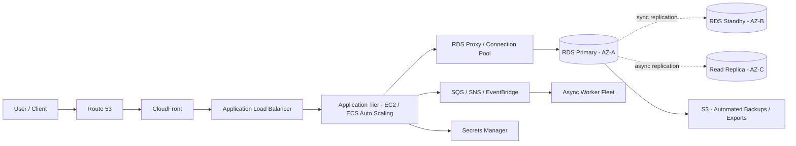
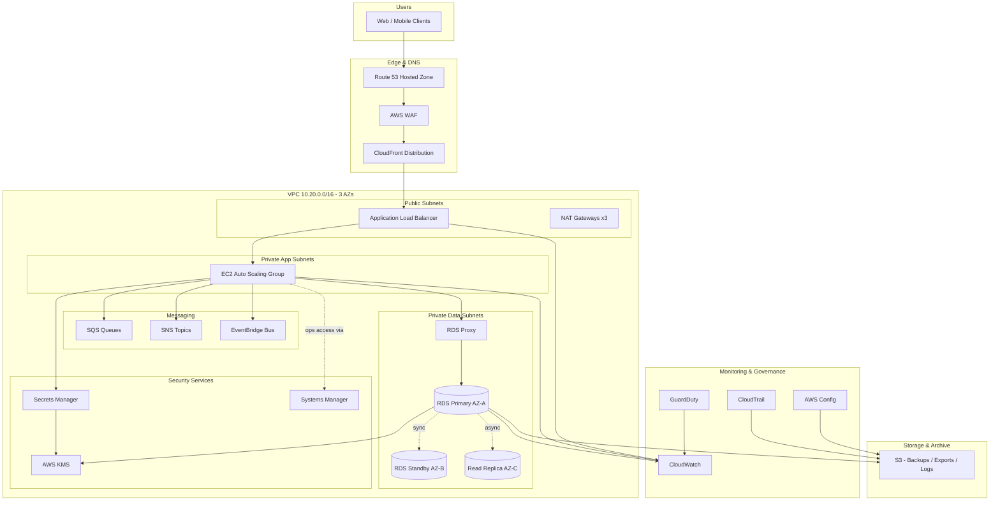
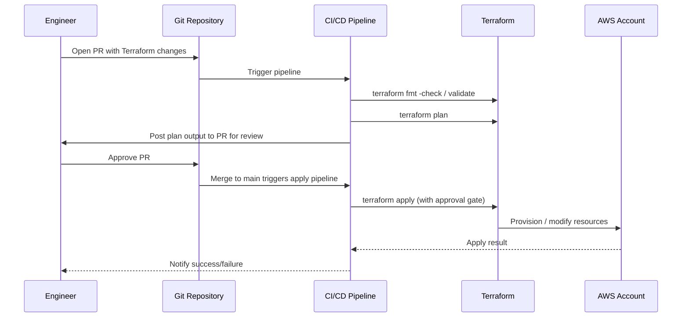
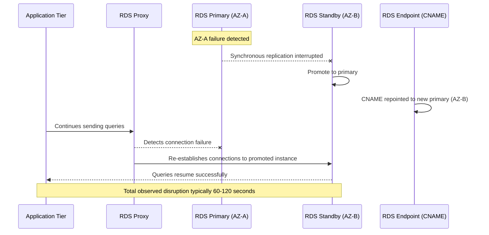

# Part VI – Data Platform Architectures

# Chapter 43: Relational Database

---

## 1. Executive Summary

Relational databases remain the backbone of enterprise computing. Despite the explosion of NoSQL, streaming, and analytical platforms over the past decade, the majority of transactional business systems — order management, billing, claims processing, core banking, inventory control, human resources — still run on relational database engines. This is not inertia. It is a direct consequence of what relational databases are good at: enforcing structural integrity, guaranteeing transactional consistency (ACID), and supporting complex, ad-hoc, multi-table queries without requiring the application layer to reimplement referential logic that the database engine already does well.

This chapter defines a production-ready reference architecture for deploying a relational database on AWS using **Amazon RDS** (Relational Database Service) as the primary managed engine, supporting a typical three-tier enterprise application. The architecture is deliberately scoped to **single-region, Multi-AZ relational database deployments** — the pattern that the overwhelming majority of enterprise workloads actually need. Aurora Global Database, multi-region active-active patterns, and DynamoDB-based designs are addressed in later chapters (44, 45, 98) and are referenced here only where a trade-off comparison is useful.

**Business problem.** Enterprises building transactional systems need a datastore that:

- Guarantees that a financial transaction either fully commits or fully rolls back — no partial writes.
- Enforces foreign key relationships, unique constraints, and check constraints declaratively, rather than requiring every application team to reimplement these rules correctly (and inevitably, inconsistently).
- Supports complex joins and aggregate queries used by finance, operations, and reporting teams without requiring a separate analytics pipeline for every ad-hoc question.
- Can be operated by a team that does not want to become full-time database administrators, but which still needs enterprise-grade availability, backup, and disaster recovery.
- Meets regulatory and audit requirements around encryption, access logging, and data retention.

A hand-rolled, self-managed database on EC2 can technically satisfy all of the above, but it pushes patching, backup verification, failover orchestration, and version upgrades onto the platform team indefinitely. Amazon RDS exists specifically to remove that operational burden while preserving engine compatibility (PostgreSQL, MySQL, MariaDB, Oracle, SQL Server) so that existing application code, ORMs, and tooling continue to work unmodified.

**Architecture objective.** The objective of this chapter's reference architecture is to describe a relational database tier that:

1. Survives the loss of a single Availability Zone with zero data loss and an automated failover measured in under two minutes.
2. Provides point-in-time recovery to any second within a configurable retention window (typically 7–35 days).
3. Enforces encryption at rest and in transit by default, with centrally managed keys.
4. Scales read capacity horizontally through read replicas without requiring application rewrites.
5. Is provisioned, versioned, and changed exclusively through Infrastructure as Code (Terraform), with no manual console changes in production.
6. Produces the audit trail, metrics, and alerting that a regulated enterprise's security and compliance functions require out of the box.
7. Has a cost model the FinOps function can forecast, tag, and optimize over time.

**Why organizations adopt this architecture.** Three forces consistently drive organizations toward a managed Multi-AZ RDS architecture rather than alternatives:

- **Regulatory pressure.** Financial services, healthcare, insurance, and government workloads are frequently required to demonstrate encryption, access control, and auditability. RDS provides these as configurable, verifiable platform features rather than bespoke application code.
- **Operational leverage.** A platform team of five engineers cannot realistically operate fifty self-managed database servers with the same reliability as fifty RDS instances, because RDS absorbs patching, backup execution, failover detection, and storage management.
- **Predictable failure modes.** When an AZ fails, a correctly configured Multi-AZ RDS deployment fails over automatically. A self-managed replication topology on EC2 requires a custom failover controller (or a human) to detect and act on the same failure, which is both slower and more error-prone.

**Major business benefits.**

| Benefit | Business Impact |
|---|---|
| Automated Multi-AZ failover | Reduces unplanned downtime from hours (manual recovery) to under two minutes |
| Automated backups + PITR | Removes backup engineering from the team's day-to-day responsibilities; satisfies RPO requirements |
| Managed patching | Reduces exposure window for CVEs affecting the database engine |
| Read replicas | Offloads reporting and read-heavy traffic without re-architecting the write path |
| Encryption at rest/in transit by default | Satisfies most common compliance frameworks (PCI DSS, HIPAA, SOC 2) with configuration, not custom code |
| Performance Insights / Enhanced Monitoring | Gives engineering teams query-level visibility without third-party APM tooling |
| IAM-integrated authentication | Removes long-lived database passwords from application configuration |

**Typical enterprise scenarios.** This architecture is the default choice for:

- Order management and e-commerce transaction systems.
- Core SaaS product databases for B2B applications with moderate-to-high write volume.
- Internal enterprise applications (HR systems, procurement, ticketing) migrated off legacy on-premises Oracle or SQL Server.
- Financial ledgers and sub-ledgers requiring strict consistency.
- Any system where the engineering team's existing skill set is SQL-centric and a NoSQL rewrite is not justified by the access patterns.

It is important to state plainly, in the spirit of this book's philosophy: **this is not the right architecture for every workload.** Section 34 ("Architect's Corner") and Section 28 ("Alternatives") return to this point in depth, because reflexively defaulting to RDS for workloads that are actually key-value or extremely high-throughput append-only is one of the most common and costly architecture mistakes in enterprise AWS environments. The purpose of this chapter is to describe the relational database pattern correctly and completely — not to argue it is universal.

---

## 2. Business Requirements

### 2.1 Business Drivers

- Replace a legacy on-premises or self-managed database with a platform that reduces operational toil and mean-time-to-recovery (MTTR).
- Provide a transactional system of record that finance, audit, and compliance teams can certify.
- Support predictable, budgeted growth in transaction volume without a database re-architecture every 12 months.
- Enable engineering velocity — schema changes, read scaling, and reporting — without requiring a dedicated DBA team for routine operations.

### 2.2 Functional Requirements

- Full ACID transaction support (atomicity, consistency, isolation, durability).
- Referential integrity enforcement (foreign keys, unique constraints, check constraints).
- Support for complex multi-table joins and aggregate reporting queries.
- Support for the organization's existing ORM / data access layer (e.g., Hibernate, SQLAlchemy, Entity Framework, ActiveRecord) without code rewrites.
- Read replica support for reporting workloads segregated from the primary write path.
- Programmatic schema migration support (Flyway, Liquibase, Alembic, or equivalent) integrated into CI/CD.

### 2.3 Non-Functional Requirements

| Category | Requirement |
|---|---|
| Availability | 99.95% monthly uptime (Multi-AZ) |
| Latency | p99 read latency < 15 ms; p99 write latency < 25 ms (regional, in-VPC) |
| Scalability | Support 5x current peak transaction volume without architecture change |
| Durability | 11 nines storage durability (EBS-backed RDS storage) |
| Security | Encryption at rest (KMS) and in transit (TLS 1.2+); no public database endpoints |
| Compliance | SOC 2 Type II, PCI DSS (where cardholder data is in scope), and applicable data residency requirements |
| Auditability | All administrative and DDL actions logged and retained for a minimum of 1 year |

### 2.4 Scalability Goals

- Vertical scaling path from `db.r6g.large` to `db.r6g.16xlarge` without downtime beyond a single failover window (Multi-AZ instance class modification).
- Horizontal read scaling via up to 15 read replicas (RDS) or reader nodes (Aurora, discussed comparatively).
- Storage auto-scaling enabled to avoid manual intervention as data volume grows (RDS storage autoscaling, up to a defined ceiling).

### 2.5 Availability Requirements

- Single-AZ failure: automatic failover, RTO < 120 seconds, RPO = 0 (synchronous replication to standby).
- Instance-level failure (engine crash, host hardware fault): automatic failover to standby, same RTO/RPO targets.
- Planned maintenance (patching, minor version upgrade): performed via the standby first, then failover, to minimize downtime to a single failover event.

### 2.6 Latency Requirements

- Application-to-database round trip within the same AZ (via connection pooler) should target < 2 ms network latency; cross-AZ within the same region typically adds 1–2 ms and is acceptable for this pattern.
- Read replica lag should be monitored and alarmed above 1 second for workloads that are latency-sensitive to replica reads (e.g., "read your own write" scenarios must not be routed to a replica).

### 2.7 Compliance Requirements

- Data encrypted at rest using a customer-managed KMS key (CMK), not the AWS-managed default key, to support key rotation policy and access auditing.
- All connections enforced over TLS; certificate validation required in application connection strings.
- CloudTrail logging enabled for all RDS control-plane API calls (`CreateDBInstance`, `ModifyDBInstance`, `RestoreDBInstanceFromDBSnapshot`, etc.).
- Database audit logging (pgAudit for PostgreSQL, Advanced Audit for MySQL/MariaDB where licensed) enabled for regulated workloads.

### 2.8 Security Expectations

- No database instance has a public IP or is reachable from the internet.
- Access restricted to application security groups and a dedicated, time-bounded bastion/SSM path for operational access.
- Credentials managed exclusively through AWS Secrets Manager with automatic rotation; no credentials in application configuration files, environment variables committed to source control, or CI/CD variables in plaintext.

### 2.9 Recovery Objectives

| Metric | Target |
|---|---|
| RPO (Recovery Point Objective) | ≤ 5 minutes (automated snapshots + transaction log shipping) |
| RTO (Recovery Time Objective) | ≤ 2 hours for full region-level restore from snapshot; ≤ 2 minutes for AZ-level Multi-AZ failover |

### 2.10 SLAs

- Internal platform SLA: 99.95% database availability, measured monthly, excluding approved maintenance windows.
- AWS RDS Multi-AZ SLA (external, contractual): AWS commits to 99.95% monthly uptime percentage for Multi-AZ RDS deployments; service credits apply below that threshold per the AWS RDS Service Level Agreement.

### 2.11 Expected Workload and Growth

- Baseline: 2,000 transactions per second (TPS) peak, 400 TPS average, 200 GB working data set.
- 12-month growth projection: 3x transaction volume, 2.5x data volume.
- 36-month growth projection: potential need to evaluate Aurora or sharding strategy if single-writer throughput ceiling is approached (see Section 14 and Chapter 44).

---

## 3. Architecture Overview

### 3.1 Overall Design

The architecture follows a classic three-tier enterprise pattern:

1. **Edge/DNS tier** — Route 53 and CloudFront handle DNS resolution and static/cacheable content delivery.
2. **Application tier** — an Application Load Balancer distributes traffic across an Auto Scaling group of EC2 instances (or, in containerized variants, ECS/EKS services — see Chapters 35–37) running the application logic.
3. **Data tier** — a Multi-AZ Amazon RDS instance serves as the system of record, with read replicas absorbing reporting and read-heavy traffic.

Supporting these three tiers are cross-cutting concerns: networking (VPC, subnets, routing), security (IAM, KMS, Secrets Manager, Security Groups), observability (CloudWatch, CloudTrail), and messaging (SQS/SNS/EventBridge) for asynchronous workflows that should not hold open a database transaction (e.g., sending a confirmation email after an order is placed).

### 3.2 Architecture Philosophy

Three design principles guide every decision in this chapter:

- **The database is the source of truth for correctness, not just storage.** Constraints, foreign keys, and transactions are enforced in the database engine itself, not only in application code. Application-only validation is treated as a UX optimization, not a correctness guarantee.
- **Operational responsibility should sit with AWS wherever it does not sacrifice control the business actually needs.** Patching, storage management, and failover orchestration are delegated to RDS. Schema design, query optimization, and capacity planning remain the responsibility of the engineering team, because these require business context RDS cannot have.
- **Every production change is code.** Terraform provisions and modifies the database. Schema migrations are versioned and applied through a migration tool in CI/CD. No manual `ALTER TABLE` statements against production.

### 3.3 Core Components

- **Amazon VPC** with public, private-application, and private-data subnet tiers across three Availability Zones.
- **Application Load Balancer** in public subnets, terminating TLS, forwarding to application targets.
- **EC2 Auto Scaling Group** (or ECS Fargate service) in private-application subnets running the application tier.
- **Amazon RDS (Multi-AZ)** in private-data subnets — primary engine for this chapter is PostgreSQL, with MySQL/MariaDB noted as an equivalent alternative.
- **RDS Read Replicas** for reporting/read-scaling, in the same region (cross-region replicas addressed in Section 13).
- **AWS Secrets Manager** for database credential storage and automatic rotation.
- **AWS KMS** for encryption key management (storage, Secrets Manager, CloudWatch Logs).
- **Amazon S3** for database export, application static assets, and log archival.
- **Amazon SQS/SNS/EventBridge** for decoupling asynchronous side effects from the primary transaction.
- **CloudWatch, CloudTrail, AWS Config, GuardDuty** for observability, audit, configuration compliance, and threat detection.

### 3.4 How Components Interact

- The application tier never connects directly to the database with static long-lived credentials. It retrieves short-lived credentials from Secrets Manager at startup (and on rotation events), using an IAM role attached to the EC2 instance profile or ECS task role.
- Write traffic flows exclusively to the RDS primary instance. The application connects through a connection pooler (RDS Proxy, or PgBouncer/ProxySQL where finer control is needed) to avoid exhausting database connections during traffic spikes or Lambda-based access patterns.
- Read-only reporting traffic is routed to a read replica via a distinct connection string/endpoint, selected explicitly at the application or data-access-layer level — never inferred implicitly, because implicit read/write splitting is a common source of stale-read bugs (see Section 27, Anti-Patterns).
- Asynchronous work (emails, webhooks, downstream notifications) is published to SQS/SNS/EventBridge **after** the database transaction commits, not within it, so that a slow downstream system cannot hold open a database transaction and block other writers.

### 3.5 High-Level Workflow



### 3.6 Request Lifecycle

1. Client resolves the application's domain name through Route 53.
2. Request is optionally served from CloudFront edge cache (static assets) or passed through to the ALB.
3. ALB performs health-checked routing to a healthy application instance.
4. Application authenticates the request, applies business logic, and opens a database transaction through the connection pool.
5. Database enforces constraints, executes the write, and commits — returning success/failure synchronously to the application.
6. Application publishes any asynchronous side effects to a queue/topic and returns the response to the client.

### 3.7 Response Lifecycle

1. Database commit acknowledgment returns to the application only after the Multi-AZ standby has synchronously received the write-ahead log record (for Multi-AZ RDS with synchronous replication), guaranteeing durability even under an immediate AZ failure.
2. Application serializes the response and returns it through the ALB to the client.
3. CloudWatch captures latency and error metrics at each hop (ALB target response time, application-level custom metrics, RDS query latency via Performance Insights).

### 3.8 Data Lifecycle

1. **Ingestion** — writes land on the RDS primary, synchronously mirrored to the Multi-AZ standby.
2. **Propagation** — asynchronously replicated to read replicas (typically sub-second lag under normal load).
3. **Backup** — automated daily snapshots plus continuous transaction log backup to S3, enabling point-in-time recovery.
4. **Archival** — data older than the operational retention window is exported (via AWS Database Migration Service or scheduled `pg_dump`/export jobs) to S3 for long-term, low-cost retention and analytics via Athena/Redshift Spectrum (Chapters 46–49).
5. **Deletion** — governed by data retention policy, executed through application-level soft-delete followed by scheduled hard-delete jobs that respect referential integrity and audit requirements.

---

## 4. AWS Services Used

For each service below: purpose, why selected, alternatives, limitations, pricing considerations, and best practices.

### 4.1 Amazon RDS (PostgreSQL / MySQL)

- **Purpose.** Managed relational database engine serving as the system of record for transactional data.
- **Why selected.** Removes patching, backup, and failover orchestration from the platform team while preserving full engine compatibility (standard SQL, existing ORMs, existing tooling).
- **Alternatives.** Amazon Aurora (Chapter 44) for higher throughput ceilings and faster failover; self-managed database on EC2 for workloads requiring engine features RDS does not expose; DynamoDB (Chapter 45) for access patterns that are fundamentally key-value rather than relational.
- **Limitations.** Single-writer architecture (no multi-master); instance class ceiling bounds vertical scaling; storage autoscaling has an upper limit that must be planned for; some engine extensions/plugins are not supported on RDS (only on self-managed or Aurora in some cases).
- **Pricing considerations.** Billed per instance-hour (or Reserved Instance/Savings Plan discount), storage (GB-month, plus IOPS if provisioned), backup storage beyond the free allotment equal to database size, and data transfer.
- **Best practices.** Always deploy Multi-AZ in production; enable storage autoscaling with a sane maximum; use `db.r6g` (Graviton) instance families for better price-performance unless a licensing or compatibility constraint prevents it; enable Performance Insights.

### 4.2 Amazon RDS Proxy

- **Purpose.** Connection pooling and multiplexing layer between the application tier and RDS, reducing connection overhead and improving failover behavior.
- **Why selected.** Application tiers that scale elastically (especially Lambda or highly bursty EC2/ECS fleets) can exhaust RDS's native connection limits; RDS Proxy pools and reuses connections transparently.
- **Alternatives.** PgBouncer/ProxySQL self-managed on EC2 for finer-grained control (e.g., custom pooling modes) at the cost of operating another fleet.
- **Limitations.** Adds a small amount of latency per query (typically sub-millisecond to low single-digit milliseconds); not all session-level features are compatible with transaction pooling mode.
- **Pricing considerations.** Billed per vCPU-hour of the underlying RDS instance it proxies; generally a small incremental cost relative to the value delivered.
- **Best practices.** Use RDS Proxy for Lambda-based or highly elastic access patterns; combine with IAM authentication to eliminate static credentials in application configuration.

### 4.3 Amazon EC2 (Application Tier)

- **Purpose.** Runs the application/business logic tier.
- **Why selected.** Provides full control over the runtime environment; well understood by most enterprise engineering teams; straightforward Auto Scaling integration.
- **Alternatives.** ECS Fargate or EKS (Chapters 35–36) for containerized workloads requiring more granular deployment control; Lambda for event-driven or highly bursty workloads (Chapter 27).
- **Limitations.** Requires patch management (via Systems Manager) and AMI lifecycle management (golden AMI pipeline, Chapter 11).
- **Pricing considerations.** On-Demand, Reserved Instance, Savings Plan, or Spot (for stateless, interruption-tolerant tiers only).
- **Best practices.** Use a golden AMI pipeline; never SSH directly — use Systems Manager Session Manager; enforce IMDSv2.

### 4.4 Application Load Balancer (ALB)

- **Purpose.** Layer 7 load balancing, TLS termination, health-checked routing across the application fleet.
- **Why selected.** Native integration with Auto Scaling groups and target groups; supports path-based and host-based routing for future service decomposition.
- **Alternatives.** Network Load Balancer for non-HTTP/TCP-level workloads; API Gateway for fully serverless API fronting (Chapter 25).
- **Limitations.** Regional resource — cross-region routing requires Global Accelerator or Route 53 latency/failover routing.
- **Pricing considerations.** Hourly charge plus Load Balancer Capacity Units (LCU) based on connections, bandwidth, and rule evaluations.
- **Best practices.** Enable access logs to S3; enforce TLS 1.2+ with a modern security policy; integrate with AWS WAF.

### 4.5 Amazon CloudFront

- **Purpose.** CDN for static assets and, optionally, API acceleration via edge caching and connection reuse to the origin.
- **Why selected.** Reduces origin load, improves global latency, and provides an additional layer for WAF/Shield protection.
- **Alternatives.** Direct ALB exposure for internal-only or low-latency-sensitive internal applications where CDN caching provides no benefit.
- **Limitations.** Cache invalidation adds operational complexity; not useful for highly dynamic, per-user, non-cacheable responses.
- **Pricing considerations.** Data transfer out (per GB, tiered, decreasing at volume) and request pricing; often cheaper than direct S3/EC2 data transfer for cacheable content.
- **Best practices.** Use origin access control for S3 origins; set cache policies deliberately per path pattern rather than a single global policy.

### 4.6 Amazon S3

- **Purpose.** Object storage for static application assets, database export/archival, log storage, and Terraform state (with DynamoDB locking).
- **Why selected.** Effectively unlimited durability and scalability at low cost; native lifecycle policies for tiering.
- **Alternatives.** EFS for POSIX-shared-filesystem needs (not typically required by this architecture).
- **Limitations.** Not a database — no transactional guarantees across objects; eventual consistency considerations for certain cross-region replication scenarios (though S3 is strongly consistent for same-region read-after-write).
- **Pricing considerations.** Storage class selection materially affects cost (see Section 16); request pricing matters at high object-operation volume.
- **Best practices.** Enable versioning and lifecycle policies; block public access at the account level by default; use S3 bucket policies plus KMS encryption for sensitive exports.

### 4.7 Amazon SQS / SNS / EventBridge

- **Purpose.** Decouple synchronous transaction processing from asynchronous side effects (notifications, downstream integrations, analytics events).
- **Why selected.** Removes the risk of a slow or failing downstream integration blocking a database transaction or degrading application latency.
- **Alternatives.** Kafka (MSK) for very high-throughput streaming or when strict ordering/replay across many consumers is required (Chapter 48).
- **Limitations.** SQS standard queues do not guarantee strict ordering (FIFO queues do, at lower throughput); EventBridge has payload size and throughput quotas to plan around.
- **Pricing considerations.** Per-request pricing; generally negligible relative to compute/database cost at typical enterprise volumes.
- **Best practices.** Use the transactional outbox pattern (Chapter 81) to guarantee that a database commit and an event publish are not lost independently of one another.

### 4.8 IAM

- **Purpose.** Identity and access control for both human operators and workloads.
- **Why selected.** Only viable enterprise-grade access control model on AWS; integrates with Secrets Manager, KMS, and RDS IAM authentication.
- **Alternatives.** None at the AWS control-plane level; federation via IAM Identity Center (Chapter 89) for human access.
- **Limitations.** Policy complexity grows quickly without discipline (see Section 27 and Architect's Corner "Lessons Learned").
- **Pricing considerations.** No direct charge for IAM itself.
- **Best practices.** Least privilege by default; permission boundaries for any role capable of creating other roles; no long-lived access keys for workloads — use instance/task roles.

### 4.9 Amazon VPC

- **Purpose.** Network isolation boundary for the entire architecture.
- **Why selected.** Mandatory foundation for any production AWS workload; enables layered subnet tiers and controlled egress.
- **Alternatives.** None — every architecture requires a VPC (or uses the default VPC, which is not recommended for production).
- **Limitations.** CIDR planning mistakes are expensive to unwind later (see Section 9).
- **Pricing considerations.** No direct VPC charge; NAT Gateway, VPC endpoints, and data transfer within/across AZs carry cost (see Section 16, Cost Surprises).
- **Best practices.** Plan CIDR ranges account-wide before first deployment; use three AZs minimum for production; use VPC endpoints for S3/DynamoDB/Secrets Manager/KMS to avoid unnecessary NAT traffic.

### 4.10 Route 53

- **Purpose.** DNS resolution and, optionally, health-check-based failover routing.
- **Why selected.** Deep integration with other AWS services (ALB alias records, health checks, latency-based routing for future multi-region growth).
- **Alternatives.** Third-party DNS providers, typically chosen for existing enterprise contracts rather than technical superiority for AWS-native workloads.
- **Limitations.** Health-check-based failover is not instantaneous — DNS TTL and health check interval both add latency to failover detection at the DNS layer (the database-layer Multi-AZ failover in Section 12 is what actually protects RPO/RTO, not DNS).
- **Pricing considerations.** Per hosted zone and per query pricing; low cost at typical enterprise volumes.
- **Best practices.** Use alias records to ALB/CloudFront (no charge for alias query resolution to AWS resources); enable health checks for any failover routing policy.

### 4.11 CloudWatch

- **Purpose.** Metrics, logs, dashboards, and alarms across every layer of the architecture.
- **Why selected.** Native integration requiring no additional agent installation for most managed services (RDS, ALB, etc.).
- **Alternatives.** Third-party observability platforms (Datadog, New Relic) often layered on top of CloudWatch for richer visualization and cross-cloud consistency.
- **Limitations.** Native dashboards are less flexible than dedicated observability platforms; log retention and query costs can grow unexpectedly (see Cost Surprises).
- **Pricing considerations.** Metrics, log ingestion, log storage, and dashboard/alarm counts are all billed dimensions.
- **Best practices.** Set explicit log retention periods (never "never expire" by default); use metric filters and composite alarms to reduce noise; enable Enhanced Monitoring and Performance Insights on RDS.

### 4.12 CloudTrail

- **Purpose.** Audit log of all AWS API calls (control-plane actions) across the account/organization.
- **Why selected.** Mandatory for compliance frameworks requiring demonstrable audit trails of infrastructure changes.
- **Alternatives.** None — CloudTrail is the AWS-native mechanism; organizations sometimes forward it to a SIEM for correlation.
- **Limitations.** Does not capture database-level data-plane activity (row-level reads/writes) — that requires database audit logging (pgAudit, etc.).
- **Pricing considerations.** First management-event trail per region is free; data events and additional trails/S3 storage incur cost.
- **Best practices.** Enable an organization-wide trail writing to a centralized, access-restricted S3 bucket in a dedicated log-archive account.

### 4.13 AWS Config

- **Purpose.** Continuous configuration compliance monitoring (e.g., "flag any RDS instance without encryption enabled").
- **Why selected.** Provides automated, continuous drift detection against defined compliance rules, rather than periodic manual audits.
- **Alternatives.** Third-party CSPM tools; custom Lambda-based compliance checks (higher maintenance burden).
- **Limitations.** Rule evaluation is not real-time in all cases; remediation requires separate automation (Config auto-remediation or EventBridge + Lambda).
- **Pricing considerations.** Per configuration item recorded and per rule evaluation.
- **Best practices.** Enable conformance packs aligned to the relevant compliance framework (PCI DSS, HIPAA, CIS AWS Foundations Benchmark).

### 4.14 GuardDuty

- **Purpose.** Threat detection using AWS-managed threat intelligence and anomaly detection across CloudTrail, VPC Flow Logs, DNS logs, and (with RDS Protection enabled) database login activity.
- **Why selected.** Detects anomalous access patterns (e.g., credential compromise, unusual login geography) without requiring the team to build detection logic from scratch.
- **Alternatives.** Third-party SIEM/XDR platforms, typically complementary rather than substitutive.
- **Limitations.** Findings require a response workflow (Security Hub + automated or human triage) to be actionable.
- **Pricing considerations.** Billed by volume of analyzed events/logs.
- **Best practices.** Enable RDS Protection specifically for this architecture; route findings to Security Hub and an incident response pipeline.

### 4.15 AWS KMS

- **Purpose.** Encryption key management for RDS storage, Secrets Manager secrets, CloudWatch Logs, and S3.
- **Why selected.** Centralizes key management with fine-grained IAM-based access control and full audit trail of key usage via CloudTrail.
- **Alternatives.** AWS-managed default keys (simpler, but less control over rotation policy and cross-account/service access boundaries).
- **Limitations.** Key policy misconfiguration can lock out legitimate access (or, more dangerously, over-grant it) — see Security Blind Spots.
- **Pricing considerations.** Per-key monthly charge plus per-API-call charge for cryptographic operations.
- **Best practices.** Use customer-managed keys (CMKs) for production databases, not AWS-managed keys, to control rotation and access policy explicitly; enable automatic annual key rotation.

### 4.16 AWS Secrets Manager

- **Purpose.** Secure storage and automatic rotation of database credentials.
- **Why selected.** Native RDS integration for automatic credential rotation without application downtime; eliminates static passwords in configuration.
- **Alternatives.** Systems Manager Parameter Store (SecureString) — lower cost but without native automatic rotation workflows for RDS.
- **Limitations.** Per-secret monthly cost can add up across many microservices/environments if not consolidated thoughtfully.
- **Pricing considerations.** Per secret per month plus per API call.
- **Best practices.** Enable automatic rotation on a defined schedule (e.g., 30 days); scope IAM policies so each application role can only read the specific secret(s) it needs.

### 4.17 Systems Manager

- **Purpose.** Patch management, Session Manager (bastion-less operational access), Parameter Store, and Automation runbooks.
- **Why selected.** Removes the need for SSH bastion hosts and static SSH key management; centralizes patch compliance reporting.
- **Alternatives.** Traditional bastion host with SSH key rotation (higher operational and security burden).
- **Limitations.** Requires the SSM agent and appropriate IAM role on every managed instance.
- **Pricing considerations.** No direct charge for Session Manager or basic Automation; Parameter Store advanced tier and high-throughput API usage carry incremental cost.
- **Best practices.** Disable SSH/RDP inbound entirely in security groups; use Session Manager exclusively for operational access; enforce patch baselines via Patch Manager.

---

## 5. Complete Architecture Diagram



---

## 6. Component-by-Component Explanation

### 6.1 Application Load Balancer

- **Purpose/Responsibilities.** Terminates client TLS, performs health checks against application targets, and distributes traffic using round-robin or least-outstanding-requests.
- **Inputs.** HTTPS requests from CloudFront/clients.
- **Outputs.** Forwarded HTTP requests to healthy targets in the Auto Scaling group.
- **Scaling.** Scales automatically; no capacity planning required by the team beyond LCU cost awareness.
- **High Availability.** Deployed across a minimum of two (recommended three) AZs; automatically routes around unhealthy targets or unhealthy AZs.
- **Failure Handling.** Failed health checks remove a target from rotation within the configured threshold (default: 3 consecutive failures).
- **Dependencies.** Target group health checks, ACM certificate for TLS.
- **Security.** Security group restricts inbound to 443 only; WAF web ACL attached for common attack pattern mitigation.
- **Monitoring.** `TargetResponseTime`, `HTTPCode_Target_5XX_Count`, `UnHealthyHostCount` CloudWatch metrics with alarms.

### 6.2 EC2 Auto Scaling Group (Application Tier)

- **Purpose/Responsibilities.** Executes application/business logic; opens database transactions through the connection pool; publishes asynchronous events.
- **Inputs.** HTTP requests from the ALB.
- **Outputs.** HTTP responses; database queries; queue/topic messages.
- **Scaling.** Target-tracking scaling policy on CPU utilization and/or request count per target; scheduled scaling for known traffic patterns (e.g., business-hours load).
- **High Availability.** Instances spread across three AZs; Auto Scaling replaces unhealthy instances automatically.
- **Failure Handling.** ALB health checks trigger instance replacement; Auto Scaling group respects launch template and warm-up configuration.
- **Dependencies.** Golden AMI (Chapter 11), IAM instance profile, Secrets Manager for credentials.
- **Security.** Security group allows inbound only from ALB security group; IMDSv2 enforced; no public IP.
- **Monitoring.** Custom application metrics via CloudWatch embedded metric format; standard EC2/ASG metrics.

### 6.3 RDS Proxy

- **Purpose/Responsibilities.** Pools and multiplexes database connections; reduces connection churn during scaling events and failovers.
- **Inputs.** Database connections from the application tier.
- **Outputs.** Pooled connections to the RDS primary (and optionally reader endpoint for read traffic).
- **Scaling.** Scales with the underlying RDS instance's vCPU allocation; no separate capacity management required.
- **High Availability.** Deployed across multiple AZs automatically; transparently re-establishes connections to the new primary during failover, reducing application-visible failover impact.
- **Failure Handling.** Buffers/retries connections during a brief failover window rather than surfacing immediate connection errors to every application instance.
- **Dependencies.** IAM authentication (recommended) or Secrets Manager-stored credentials.
- **Security.** TLS enforced by default; IAM authentication removes static credentials from the connection path entirely.
- **Monitoring.** `DatabaseConnections`, `ClientConnections`, pinned connection count.

### 6.4 RDS Primary Instance

- **Purpose/Responsibilities.** System of record for all transactional writes; enforces schema constraints and transactional isolation.
- **Inputs.** SQL DML/DDL from the application tier (via proxy) and from CI/CD migration jobs.
- **Outputs.** Query results; write-ahead log stream to the standby and read replicas; snapshot/backup data to S3.
- **Scaling.** Vertical (instance class change) for compute/memory; storage autoscaling for disk; read scaling delegated to replicas.
- **High Availability.** Multi-AZ synchronous standby; automated failover on instance or AZ failure.
- **Failure Handling.** RDS automatically detects failure (via multiple health signals) and promotes the standby, updating the DNS CNAME endpoint — application reconnects transparently (faster and more reliably when using RDS Proxy).
- **Dependencies.** KMS CMK for storage encryption, DB subnet group spanning private data subnets, parameter group and option group configuration.
- **Security.** Not publicly accessible; security group allows inbound only from application/proxy security groups and a tightly scoped operational access path.
- **Monitoring.** Performance Insights, Enhanced Monitoring, `CPUUtilization`, `FreeableMemory`, `ReadLatency`, `WriteLatency`, `DiskQueueDepth`, `ReplicaLag`.

### 6.5 RDS Standby (Multi-AZ)

- **Purpose/Responsibilities.** Synchronous replica of the primary, promoted automatically on primary failure; also used transparently during maintenance operations (patching applied to standby first).
- **Inputs.** Synchronous write-ahead log stream from the primary.
- **Outputs.** None under normal operation (not readable in standard Multi-AZ; for readable standby capability, evaluate Multi-AZ DB clusters, discussed in Section 28).
- **Scaling.** Matches primary instance class automatically.
- **High Availability.** Is itself the HA mechanism for the primary.
- **Failure Handling.** Promoted to primary automatically on detected failure.
- **Dependencies.** Same subnet group, different AZ from the primary (enforced by RDS).
- **Security.** Inherits the primary's security group and encryption configuration.
- **Monitoring.** Replication lag (synchronous, effectively zero under normal conditions), failover events in CloudTrail/RDS event subscriptions.

### 6.6 RDS Read Replica

- **Purpose/Responsibilities.** Serves read-only reporting/analytics traffic asynchronously replicated from the primary, isolating that load from the transactional write path.
- **Inputs.** Asynchronous replication stream from the primary.
- **Outputs.** Read-only query results to reporting/BI consumers.
- **Scaling.** Up to 15 replicas per source instance; can be independently instance-sized for the reporting workload's needs.
- **High Availability.** Can itself be deployed Multi-AZ for replica-tier resilience if reporting availability requirements demand it.
- **Failure Handling.** A failed replica does not affect the primary; it is simply removed from the reporting connection pool and can be recreated.
- **Dependencies.** Source primary instance; independent parameter group permitted for read-optimized settings.
- **Security.** Same VPC isolation posture as the primary; typically a separate, more restrictive security group limiting access to reporting/BI service accounts only.
- **Monitoring.** `ReplicaLag` is the critical metric — alarmed and dashboarded explicitly.

### 6.7 Secrets Manager

- **Purpose/Responsibilities.** Stores and automatically rotates the master and application database credentials.
- **Inputs.** Rotation Lambda invocations on schedule.
- **Outputs.** Current credential material retrieved by the application at startup/refresh.
- **Scaling.** Fully managed; no scaling action required.
- **High Availability.** Regional service with high built-in availability.
- **Failure Handling.** Failed rotation attempts retain the previous valid credential version until rotation succeeds, avoiding a self-inflicted outage.
- **Dependencies.** KMS CMK for secret encryption; rotation Lambda with network access to the database.
- **Security.** IAM resource policy scoped per secret; access logged via CloudTrail.
- **Monitoring.** Rotation success/failure CloudWatch events and alarms.

---

## 7. End-to-End Request Flow

1. **Client** issues an HTTPS request to `app.example.com`.
2. **Route 53** resolves the domain to the CloudFront distribution (alias record).
3. **CloudFront** evaluates cache policy; for a dynamic API request, it forwards to the origin (ALB) with connection reuse.
4. **AWS WAF**, attached to CloudFront and/or the ALB, evaluates the request against managed and custom rule groups (SQLi, XSS, rate-based rules).
5. **ALB** performs TLS termination and routes the request to a healthy target in the Auto Scaling group based on the listener rule.
6. **Application instance** authenticates/authorizes the request (JWT validation, session lookup, etc.).
7. **Application** retrieves database credentials from **Secrets Manager** (cached in memory, refreshed on rotation notification) or authenticates via **IAM database authentication** through **RDS Proxy**.
8. **RDS Proxy** selects or reuses a pooled connection to the **RDS primary**.
9. **RDS primary** begins a transaction, validates constraints, executes the write, and — under Multi-AZ — waits for synchronous acknowledgment from the **standby** before committing.
10. **Commit acknowledgment** returns to the application.
11. **Application** publishes any asynchronous side effects (e.g., order-confirmation event) to **SQS/SNS/EventBridge** using the transactional outbox pattern to guarantee at-least-once delivery consistent with the committed transaction.
12. **Application** returns the HTTP response through the **ALB** and **CloudFront** back to the **client**.
13. **CloudWatch** records latency and error metrics at every hop; **X-Ray** (if enabled) captures the distributed trace across ALB → application → database call.
14. **Error handling** — if step 9 fails (constraint violation, deadlock, timeout), the application rolls back the transaction, logs the failure with a correlation ID, returns an appropriate 4xx/5xx response, and does **not** publish the asynchronous side effect from step 11.
15. **Caching** — for read-heavy, cacheable responses, the application may consult an in-memory or ElastiCache layer before querying the database at all (not shown as mandatory in this chapter's baseline architecture, but noted in Section 15, Performance Optimization).
16. **Logging** — application logs (structured JSON) ship to CloudWatch Logs; database logs (slow query log, error log, and audit log where enabled) ship to CloudWatch Logs via the RDS log export feature.

---

## 8. Deployment Flow

### 8.1 Infrastructure Provisioning

All infrastructure is provisioned via Terraform, structured as reusable modules (VPC, RDS, ALB/ASG, IAM) composed per environment (dev/staging/production) using distinct `tfvars` files and isolated remote state.

### 8.2 Terraform Workflow



### 8.3 CI/CD Deployment (Application)

- Build stage compiles/packages the application and produces an immutable artifact (container image or AMI via golden-AMI pipeline).
- Deployment stage uses a **Blue-Green** strategy: a new Auto Scaling group (or ECS task set) is stood up alongside the existing one, health-checked, and traffic is shifted at the ALB target group level.
- Database schema migrations are applied as a **separate, gated step** before the application deployment that depends on the new schema, using an additive-first migration strategy (see Section 23, Operational Excellence) to avoid breaking the currently running previous version during the cutover window.

### 8.4 Blue-Green Deployment

1. Provision the new (green) Auto Scaling group behind the same ALB, initially with zero traffic weight.
2. Run automated smoke tests against the green target group directly (bypassing production DNS).
3. Shift a small percentage of production traffic to green (canary step, optional) and monitor error rates/latency.
4. Shift 100% of traffic to green once validated.
5. Keep the blue (previous) Auto Scaling group warm for a defined rollback window (e.g., 30–60 minutes) before terminating it.

### 8.5 Rollback

- **Application rollback** — shift ALB traffic weight back to the blue target group; near-instant.
- **Schema rollback** — because migrations are additive-first (new nullable columns, new tables, backward-compatible changes deployed ahead of the code that requires them), most rollbacks do not require a database schema rollback at all. Destructive migrations (dropping columns, renaming) are deferred to a subsequent release after the previous application version is fully retired.
- **Data rollback** — point-in-time recovery is the mechanism of last resort for data-level rollback and is never used as a routine deployment rollback tool, due to the availability impact of a full restore.

### 8.6 Secrets and Configuration

- Application configuration (non-secret) is managed via Systems Manager Parameter Store, injected at instance launch or container start.
- Secrets (database credentials, API keys) are retrieved at runtime from Secrets Manager using the instance/task IAM role — never baked into the AMI or container image.

### 8.7 Validation

- Post-deployment automated validation: synthetic transaction tests against critical read/write paths, database connection pool health check, and a CloudWatch alarm-based automated rollback trigger if error rate exceeds a defined threshold within the first N minutes of a deployment.

---

## 9. Network Topology

### 9.1 VPC and CIDR

- VPC CIDR: `10.20.0.0/16`, sized to accommodate this application's subnets plus headroom for future services, and chosen to avoid overlap with other VPCs it may eventually peer with or connect to via Transit Gateway (Chapter 17).

### 9.2 Subnet Layout (3 AZs)

| Tier | AZ-A | AZ-B | AZ-C | Purpose |
|---|---|---|---|---|
| Public | 10.20.0.0/24 | 10.20.1.0/24 | 10.20.2.0/24 | ALB, NAT Gateways |
| Private – App | 10.20.10.0/24 | 10.20.11.0/24 | 10.20.12.0/24 | EC2/ECS application tier |
| Private – Data | 10.20.20.0/24 | 10.20.21.0/24 | 10.20.22.0/24 | RDS primary, standby, replicas |

### 9.3 NAT Gateway

- One NAT Gateway per AZ (three total) to avoid a cross-AZ single point of failure and cross-AZ data transfer charges for outbound traffic originating in each AZ. This is a deliberate cost/resilience trade-off discussed further in Section 16.

### 9.4 Internet Gateway

- Single Internet Gateway attached to the VPC, used only by resources in public subnets (ALB, NAT Gateways). No application or database resource has a route to the Internet Gateway.

### 9.5 Transit Gateway

- Not required for a single-VPC deployment of this pattern. Introduced when this application's VPC must be connected to shared services VPCs, other business unit VPCs, or on-premises networks at enterprise scale (Chapter 17).

### 9.6 Route Tables

- Public subnets route `0.0.0.0/0` to the Internet Gateway.
- Private-app subnets route `0.0.0.0/0` to the NAT Gateway in the same AZ.
- Private-data subnets have **no route to the internet at all** — outbound access to AWS services (S3, Secrets Manager, KMS) is via VPC Gateway/Interface Endpoints only.

### 9.7 Network ACLs

- Default (allow-all) NACLs are retained at the subnet level in most designs, with security groups doing the primary enforcement, because NACL rule management at scale is error-prone and stateless. A restrictive NACL is added specifically on the private-data subnet tier as defense-in-depth, explicitly denying any inbound traffic that does not originate from the private-app subnet CIDR ranges.

### 9.8 Security Groups

| Security Group | Inbound | Outbound |
|---|---|---|
| `sg-alb` | 443 from `0.0.0.0/0` (or WAF/CloudFront prefix list) | 80/443 to `sg-app` |
| `sg-app` | 80/443 from `sg-alb` | 5432 to `sg-db`, 443 to VPC endpoints |
| `sg-db` | 5432 from `sg-app` and `sg-proxy` only | None required (RDS does not initiate outbound) |
| `sg-proxy` | 5432 from `sg-app` | 5432 to `sg-db` |

### 9.9 PrivateLink / VPC Endpoints

- Gateway endpoints: S3, DynamoDB (no hourly charge).
- Interface endpoints: Secrets Manager, KMS, CloudWatch Logs, Systems Manager (SSM, SSM Messages, EC2 Messages) — ensures the private-data and private-app subnets never require a NAT Gateway route for AWS API calls, improving both security posture and cost.

### 9.10 Hybrid Connectivity

- Not required for this baseline pattern. Where the enterprise requires on-premises connectivity (e.g., legacy reporting tools querying the read replica), Direct Connect or Site-to-Site VPN is layered in per Chapters 23–24, terminating into a dedicated networking VPC rather than directly into the application VPC.

---

## 10. Identity and Access

### 10.1 IAM Roles

- **Application instance role** — permits Secrets Manager `GetSecretValue` for the specific database secret, `rds-db:connect` for IAM database authentication (if used), CloudWatch Logs write access, and SQS/SNS/EventBridge publish permissions scoped to specific resource ARNs.
- **CI/CD deployment role** — assumed via OIDC federation from the CI/CD platform, scoped to Terraform state access, the specific resources this pipeline manages, and nothing else.
- **DBA/operational role** — scoped for break-glass access, requiring MFA and typically time-bounded via IAM Identity Center permission sets rather than standing IAM users.

### 10.2 IAM Policies (Example — Application Role, Least Privilege)

```json

{
  "Version": "2012-10-17",
  "Statement": [
    {
      "Sid": "ReadDbSecret",
      "Effect": "Allow",
      "Action": "secretsmanager:GetSecretValue",
      "Resource": "arn:aws:secretsmanager:us-east-1:111122223333:secret:prod/orderdb/app-credentials-*"
    },
    {
      "Sid": "IamDbAuth",
      "Effect": "Allow",
      "Action": "rds-db:connect",
      "Resource": "arn:aws:rds-db:us-east-1:111122223333:dbuser:db-ABCDEFGHIJKL/app_user"
    },
    {
      "Sid": "PublishOrderEvents",
      "Effect": "Allow",
      "Action": ["sns:Publish"],
      "Resource": "arn:aws:sns:us-east-1:111122223333:order-events"
    },
    {
      "Sid": "WriteLogs",
      "Effect": "Allow",
      "Action": ["logs:CreateLogStream", "logs:PutLogEvents"],
      "Resource": "arn:aws:logs:us-east-1:111122223333:log-group:/app/orderservice:*"
    }
  ]
}

```

### 10.3 Resource Policies

- The Secrets Manager secret's resource policy explicitly denies access from any principal outside the application account, even if a cross-account IAM policy were mistakenly granted — a deliberate defense-in-depth control.
- The S3 backup/export bucket policy denies any request not using TLS (`aws:SecureTransport: false`) and denies any request not using the designated KMS key for encryption.

### 10.4 STS and Cross-Account Access

- Where reporting or analytics teams sit in a separate AWS account (common in multi-account landing zone designs, Chapter 88), cross-account read access to the reporting replica's data is granted via an assumed role using STS `AssumeRole`, scoped to a specific role with query-only database privileges — never by sharing database credentials across accounts.

### 10.5 Least Privilege

- Database-level privileges mirror IAM's least-privilege philosophy: the application's database user has `SELECT/INSERT/UPDATE/DELETE` only on the specific schemas/tables it owns, no `DROP`/`ALTER`/`CREATE` privileges, and no superuser role. Schema migrations run under a distinct, more privileged migration role used only by the CI/CD pipeline, never by the running application.

### 10.6 Service Roles

- RDS itself uses a service-linked role for functions like automated snapshot export and Enhanced Monitoring — these are AWS-managed and should not be manually edited.

### 10.7 Permission Boundaries

- Any IAM role capable of creating other IAM roles (e.g., a platform-team CI/CD role) has a permission boundary attached that caps the maximum privilege any role it creates can have, preventing privilege escalation even if the pipeline's own policy is later broadened carelessly.

---

## 11. Security Architecture

### 11.1 Encryption

- **At rest.** RDS storage, automated backups, snapshots, and read replicas are encrypted using a customer-managed KMS key. Secrets Manager secrets and CloudWatch Logs are encrypted with the same or a dedicated CMK per data classification tier.
- **In transit.** TLS 1.2+ enforced on all client-to-database connections via the `rds.force_ssl` parameter (PostgreSQL) or equivalent; ALB enforces TLS 1.2+ via a modern security policy; internal service-to-service calls use TLS as well.

### 11.2 KMS

- A dedicated CMK per environment (production, staging) with a key policy granting `kms:Decrypt`/`kms:GenerateDataKey` only to the specific roles that require it (RDS service, application role, backup export role). Key rotation enabled annually.

### 11.3 TLS / Certificate Manager

- Public-facing certificates for the ALB and CloudFront are issued and auto-renewed via AWS Certificate Manager (ACM), eliminating manual certificate renewal as an operational risk.

### 11.4 WAF and Shield

- AWS WAF is attached at CloudFront (and/or the ALB) with AWS Managed Rule Groups (Core Rule Set, SQL Database rule group — directly relevant given the data tier) plus custom rate-based rules to mitigate credential-stuffing and application-layer DDoS attempts.
- AWS Shield Standard is active by default on all resources at no additional cost; Shield Advanced is evaluated for internet-facing production workloads with high business criticality (Chapter 93 covers this trade-off in depth).

### 11.5 Secrets Manager and Auditing

- Every `GetSecretValue` call is logged to CloudTrail, enabling detection of anomalous credential access patterns (e.g., a role retrieving the secret from an unexpected source IP or at an unusual time).

### 11.6 GuardDuty, Inspector, Security Hub

- **GuardDuty** with RDS Protection enabled monitors database login activity for anomalies (e.g., login attempts consistent with credential-stuffing patterns).
- **Inspector** continuously scans the application tier's EC2 instances (and container images, if used) for known vulnerabilities.
- **Security Hub** aggregates findings from GuardDuty, Inspector, and Config into a single prioritized view and can drive automated response workflows via EventBridge.

### 11.7 CloudTrail and AWS Config

- Already described in Section 4; specifically for this architecture, Config rules should include: `rds-storage-encrypted`, `rds-instance-public-access-check`, `rds-multi-az-support`, and `rds-in-backup-plan`.

### 11.8 Zero Trust Considerations

- No implicit trust is granted based on network location alone. Every service-to-service and human-to-service interaction is authenticated and authorized independently: application-to-database via IAM database authentication where feasible, human operators via IAM Identity Center with MFA and Session Manager (not network-level VPN trust alone).

### 11.9 Threat Model and Attack Vectors

| Attack Vector | Mitigation |
|---|---|
| SQL injection via application input | Parameterized queries/ORM enforced in code review; WAF SQL rule group as defense-in-depth |
| Credential compromise (leaked application secret) | Secrets Manager automatic rotation limits exposure window; IAM database auth removes static credentials entirely where adopted |
| Unauthorized network access to database | Database in private subnet with no internet route; security group restricts to application tier only |
| Insider threat / excessive privilege | Least-privilege IAM and database roles; CloudTrail + database audit logging for accountability |
| Data exfiltration via snapshot sharing | Config rule denies public snapshot sharing; KMS key policy restricts cross-account decrypt |
| Compromised application host | IMDSv2 enforced; instance role scoped to only what the application needs; Inspector vulnerability scanning |
| DDoS at the application/network layer | Shield Standard (default) + WAF rate-based rules; Shield Advanced evaluated for critical workloads |

---

## 12. High Availability

### 12.1 AZ Failures

A full Availability Zone failure removes the RDS primary (if hosted there), one-third of the application Auto Scaling group's capacity, and one AZ's NAT Gateway. Multi-AZ RDS automatically promotes the standby in another AZ; the Auto Scaling group launches replacement instances in the remaining healthy AZs; the ALB stops routing to the failed AZ's targets automatically via health checks.

### 12.2 Instance Failures

An individual EC2 instance failure is handled by ALB health checks removing it from rotation and Auto Scaling replacing it. An individual RDS instance (primary) failure — whether hardware fault or engine crash — triggers the same Multi-AZ failover mechanism as an AZ failure, because RDS does not distinguish the recovery path by root cause; it monitors instance health directly.

### 12.3 Regional Failures

This baseline architecture is single-region and does **not** protect against a full regional failure by itself. Organizations with an RTO/RPO requirement that cannot tolerate a regional outage should evaluate the disaster recovery patterns in Section 13 and the multi-region architectures in Chapters 44 and 98. This is a deliberate scoping decision for this chapter, not an oversight — most enterprise workloads do not, in practice, justify the cost and complexity of active multi-region for the relational tier, and Section 34 discusses this trade-off explicitly.

### 12.4 Database Failures

| Failure Type | Detection | Recovery Mechanism | Typical RTO |
|---|---|---|---|
| Primary instance crash | RDS internal health monitoring | Automatic failover to standby | 60–120 seconds |
| Storage volume issue | RDS/EBS internal monitoring | Automatic failover (Multi-AZ) | 60–120 seconds |
| AZ network partition | RDS internal health monitoring | Automatic failover to standby in healthy AZ | 60–120 seconds |
| Logical data corruption (application bug) | Alerting on data anomalies, not RDS-detected | Point-in-time recovery restore | Up to defined RTO in Section 2.9 (hours) |
| Full instance/data loss | N/A (deliberate deletion protection prevents most of this) | Restore from latest automated snapshot | Depends on data volume; hours |

### 12.5 Load Balancing and Health Checks

- ALB target group health check: HTTP path `/health`, interval 15s, healthy threshold 2, unhealthy threshold 3 — tuned to detect real failures quickly without flapping on transient blips.
- Application `/health` endpoint should verify **actual database connectivity**, not just process liveness, so that an application instance that has lost its database connection pool is correctly removed from rotation.

### 12.6 Failover Sequence (Multi-AZ RDS)



---

## 13. Disaster Recovery

### 13.1 Backup Strategy

- Automated daily snapshots retained per the RPO/compliance requirement (7–35 days configurable).
- Continuous transaction log backup enabling point-in-time recovery to any second within the retention window.
- Manual snapshots taken before any major schema migration or high-risk operational change, retained independently of the automated retention policy.

### 13.2 Snapshots

- Snapshots are encrypted with the same CMK as the source instance; cross-account snapshot sharing (for a dedicated backup/security account) is explicitly permitted via KMS key policy grants, and public sharing is explicitly and permanently denied via an AWS Config rule with auto-remediation.

### 13.3 Cross-Region Replication

- For workloads with a regional-failure RTO/RPO requirement, automated snapshots are copied cross-region on a scheduled basis (via AWS Backup with a cross-region copy rule), and/or a cross-region read replica is maintained that can be promoted in a regional DR event.

### 13.4 DR Strategy Comparison

| Strategy | RTO | RPO | Cost | Complexity | When to Use |
|---|---|---|---|---|---|
| Backup & Restore (cross-region snapshot copy) | Hours | Up to 24h (snapshot interval) | Low | Low | Non-critical systems; cost-sensitive |
| Pilot Light (cross-region replica, app infra defined but not running) | 30–60 min | Seconds to minutes | Medium | Medium | Business-critical, moderate budget |
| Warm Standby (cross-region replica + minimal running app capacity) | Minutes | Seconds | Medium-High | Medium-High | Revenue-critical systems |
| Multi-Site Active-Active | Near-zero | Near-zero | High | High | Mission-critical, global systems (Chapter 98) |

This chapter's baseline architecture assumes **Backup & Restore** or **Pilot Light** as the appropriate DR posture for a typical enterprise relational workload; Warm Standby and Active-Active are addressed fully in Chapters 44 and 98 because they fundamentally change the database architecture (Aurora Global Database or application-level multi-region write coordination), not just the operational runbook.

### 13.5 RPO/RTO Achieved by This Design

| Scenario | RPO | RTO |
|---|---|---|
| AZ failure | 0 (synchronous Multi-AZ) | 60–120 seconds |
| Accidental data corruption | Up to point-in-time recovery granularity (seconds) | Hours (restore + validation time) |
| Regional failure (Pilot Light DR) | Minutes (replica lag at time of failure) | 30–60 minutes |

---

## 14. Scalability

### 14.1 Horizontal Scaling (Application Tier)

- Auto Scaling group scales out/in based on target-tracking policies (CPU, request count per target); stateless application design is a prerequisite — session state lives in the database or a distributed cache, never on the local instance.

### 14.2 Vertical Scaling (Database Tier)

- RDS instance class can be modified (e.g., `db.r6g.xlarge` → `db.r6g.2xlarge`) with Multi-AZ minimizing the change to a single failover event rather than extended downtime. Vertical scaling is the first lever for write-throughput growth because RDS (unlike Aurora or DynamoDB) has a single writer.

### 14.3 Auto Scaling (Application)

- Scaling policies should be validated against realistic load tests, not assumed — a common production pitfall (Section 34) is scaling policies tuned against synthetic traffic that does not reflect real query cost distribution.

### 14.4 Serverless Scaling (Where Applicable)

- Where parts of the workload are bursty and event-driven (e.g., webhook ingestion), Lambda functions connecting through RDS Proxy can absorb spiky load without the application tier needing to pre-scale for worst-case burst — see Chapter 27 for the dedicated pattern.

### 14.5 Database Scaling

| Dimension | Mechanism | Ceiling / Consideration |
|---|---|---|
| Write throughput | Vertical instance scaling | Single-writer architecture; eventual ceiling requires Aurora or sharding (Chapter 44) |
| Read throughput | Read replicas (up to 15) | Replica lag grows under very high write volume; monitor closely |
| Storage | RDS storage autoscaling | Set a sane maximum; monitor IOPS/throughput ceiling of the chosen storage type (gp3 vs. io2) |
| Connections | RDS Proxy pooling | Underlying instance class still bounds maximum raw connections; proxy mitigates, does not eliminate |

### 14.6 Storage Scaling

- gp3 storage allows independently provisioned IOPS and throughput without requiring a larger volume purely to get more performance — this decouples cost from performance in a way earlier gp2 volumes did not, and should be the default choice for new deployments.

### 14.7 Queue Scaling

- SQS scales transparently; the operational concern is consumer (worker fleet) scaling to match queue depth, using a target-tracking policy on `ApproximateNumberOfMessagesVisible`.

---

## 15. Performance Optimization

### 15.1 Caching

- Read-heavy, infrequently-changing data (product catalogs, reference/lookup tables) is a strong candidate for an in-memory cache (ElastiCache for Redis/Valkey) in front of the database, reducing load on the primary and improving p99 latency substantially for cache-hit paths.
- Cache invalidation strategy must be explicit and tested — stale-cache bugs are a common and expensive production issue when this is treated as an afterthought.

### 15.2 Compression

- Response compression (gzip/brotli) at the ALB/CloudFront layer reduces client-perceived latency and data transfer cost for larger JSON payloads.

### 15.3 CDN

- Static assets and, where appropriate, cacheable API responses are served via CloudFront to reduce both origin load and client latency globally.

### 15.4 Database Optimization

- **Indexing.** Every foreign key and every column used in a `WHERE`/`JOIN`/`ORDER BY` on a frequently executed query path should have a supporting index — validated via `EXPLAIN ANALYZE`, not assumption.
- **Query review.** N+1 query patterns from ORMs are the single most common source of database performance issues in enterprise applications; these should be caught in code review and via Performance Insights' top-SQL view, not discovered in production.
- **Parameter group tuning.** `shared_buffers`, `work_mem`, `max_connections` (PostgreSQL) or equivalent MySQL parameters tuned to the instance class and workload profile, rather than left at generic defaults.
- **Vacuuming (PostgreSQL).** Autovacuum tuning is essential for write-heavy tables to avoid table bloat and eventual performance degradation; this is a frequently underestimated operational responsibility even on a managed service.

### 15.5 Connection Pooling

- Already covered via RDS Proxy in Section 6.3 — the key point here is that connection pooling is a **performance** optimization as much as an availability one: establishing a new database connection is expensive relative to reusing a pooled one, and under-pooled applications show measurable latency degradation under load purely from connection setup overhead.

### 15.6 Concurrency and Async Processing

- Long-running or non-critical-path work (report generation, bulk exports, third-party API calls) is moved out of the synchronous request path entirely into asynchronous workers consuming from SQS, keeping the database transaction — and therefore the lock duration on any rows involved — as short as possible.

---

## 16. Cost Optimization (FinOps)

### 16.1 Estimated Monthly Cost — Small Deployment

*(Single region, us-east-1, illustrative list pricing — always validate against the current AWS Pricing Calculator for a specific proposal.)*

| Component | Configuration | Est. Monthly Cost (USD) |
|---|---|---|
| RDS PostgreSQL Multi-AZ | 1x `db.r6g.large` primary + standby, 100 GB gp3 | ~$430 |
| Read Replica | 1x `db.r6g.large` | ~$215 |
| EC2 Application Tier | 2x `m6g.large` (Auto Scaling min) | ~$110 |
| ALB | Base + moderate LCU usage | ~$25 |
| NAT Gateway | 3x (one per AZ) | ~$100 + data processing |
| S3 (backups, logs) | ~200 GB | ~$5 |
| CloudWatch | Logs + metrics + alarms | ~$40 |
| Secrets Manager | 3 secrets | ~$1.20 |
| **Total (approx.)** | | **~$925/month** |

### 16.2 Estimated Monthly Cost — Medium Deployment

| Component | Configuration | Est. Monthly Cost (USD) |
|---|---|---|
| RDS PostgreSQL Multi-AZ | 1x `db.r6g.2xlarge` + standby, 500 GB gp3 provisioned IOPS | ~$1,900 |
| Read Replicas | 2x `db.r6g.xlarge` | ~$860 |
| EC2 Application Tier | 4–8x `m6g.xlarge` (Auto Scaling range) | ~$700–$1,400 |
| ALB | Higher LCU usage | ~$80 |
| NAT Gateway | 3x + higher data processing | ~$400 |
| S3 | ~2 TB with lifecycle tiering | ~$40 |
| CloudWatch | Higher log volume, Performance Insights extended retention | ~$150 |
| Secrets Manager | ~10 secrets | ~$4 |
| **Total (approx.)** | | **~$4,100–$4,800/month** |

### 16.3 Estimated Monthly Cost — Enterprise Deployment

| Component | Configuration | Est. Monthly Cost (USD) |
|---|---|---|
| RDS PostgreSQL Multi-AZ | 1x `db.r6g.8xlarge` + standby, 4 TB provisioned IOPS io2 | ~$14,000 |
| Read Replicas | 4x `db.r6g.4xlarge` | ~$13,600 |
| EC2/ECS Application Tier | Auto Scaling across 3 AZs, peak ~40 instances `m6g.xlarge` equivalent | ~$7,000 |
| ALB | High LCU volume | ~$300 |
| NAT Gateway | 3x + significant data processing | ~$1,500 |
| S3 | 20+ TB with lifecycle tiering to Glacier | ~$300 |
| CloudWatch/Observability | Full Performance Insights, extended retention, dashboards | ~$800 |
| Secrets Manager | ~50 secrets | ~$20 |
| **Total (approx.)** | | **~$37,500+/month** |

> **Note.** These figures are illustrative order-of-magnitude estimates for architecture planning discussions, not quotes. Always validate with the AWS Pricing Calculator and current regional pricing before presenting a cost estimate to a budget owner.

### 16.4 Major Cost Drivers

1. RDS instance compute (primary + standby, billed as two instances under Multi-AZ) — typically the single largest line item.
2. Read replica count and instance size.
3. Provisioned IOPS storage for high-throughput workloads.
4. NAT Gateway data processing charges (often underestimated — see Cost Surprises).
5. CloudWatch Logs ingestion and retention at scale.

### 16.5 Optimization Opportunities

- **Reserved Instances / Savings Plans.** For steady-state production RDS and EC2 capacity, 1- or 3-year Reserved Instances (or Compute Savings Plans for EC2) typically yield 30–60% savings over On-Demand for capacity that is known to run continuously.
- **Spot Instances.** Applicable only to stateless, interruption-tolerant components (e.g., asynchronous worker fleets processing from SQS) — never for the database tier or synchronous application tier serving customer traffic without careful design.
- **S3 Lifecycle Policies.** Transition backup exports and logs from S3 Standard → S3 Standard-IA → S3 Glacier Deep Archive on a defined schedule aligned to actual access patterns, not left in Standard indefinitely.
- **Storage Class Selection.** gp3 over gp2 for the database volume in nearly all cases — same or better baseline performance at lower cost, with independently tunable IOPS/throughput.
- **Rightsizing.** Regularly review Performance Insights and CloudWatch utilization data — an oversized `db.r6g.4xlarge` running at 15% average CPU is a very common finding in cost reviews and a straightforward, low-risk downsizing opportunity.
- **Read Replica Rightsizing.** Reporting replicas are frequently sized to match the primary "for consistency" without regard to actual reporting query load — this is worth challenging explicitly during cost review.

### 16.6 Cost Allocation and Tagging

| Tag Key | Example Value | Purpose |
|---|---|---|
| `Environment` | `production` | Environment-level cost segregation |
| `CostCenter` | `CC-4021` | Chargeback to business unit |
| `Application` | `order-management` | Application-level cost attribution |
| `Owner` | `platform-team` | Accountability for cost anomalies |
| `DataClassification` | `confidential` | Compliance and cost-of-control correlation |

### 16.7 Budgets and Cost Anomaly Detection

- AWS Budgets configured per environment/application tag with alert thresholds at 80% and 100% of forecast.
- Cost Anomaly Detection enabled at the service (RDS, EC2) level, routing alerts to the platform team's incident channel — this is specifically valuable for catching runaway costs from misconfigured autoscaling, an accidentally oversized restore, or an unbounded log retention setting.

---

## 17. AI-Assisted Operations

### 17.1 Amazon Q

- Amazon Q Developer assists with Terraform authoring, IAM policy review, and inline code suggestions for database access-layer code; Amazon Q in the console/CLI context can accelerate root-cause investigation by summarizing CloudWatch findings and suggesting likely causes for common RDS alarm patterns (e.g., elevated `DiskQueueDepth`).

### 17.2 Amazon Bedrock

- For teams building custom internal tooling (e.g., a Slack-integrated "explain this alarm" bot), Bedrock provides access to foundation models that can be grounded with the organization's own runbooks (via a knowledge base/RAG pattern, Chapter 52) to produce environment-specific triage suggestions rather than generic advice.

### 17.3 AI-Assisted Troubleshooting and Log Analysis

- Foundation models can summarize large volumes of CloudWatch Logs Insights query output into a human-readable incident summary far faster than manual log review, particularly useful during an active incident when engineer time is the scarcest resource. This should be treated as an **accelerant for a human responder**, not a replacement for the human decision to act on production systems.

### 17.4 Incident Response

- AI-assisted correlation across CloudTrail, GuardDuty findings, and application logs can shorten the time to identify whether an availability incident has a security dimension (e.g., distinguishing a capacity-driven outage from an active credential-stuffing attack manifesting as elevated database connection errors).

### 17.5 Cost Optimization and Capacity Planning

- AI-assisted analysis of Cost Explorer and Performance Insights data can surface rightsizing candidates and forecast future capacity needs with less manual spreadsheet work — but recommendations should always be validated against actual business context (planned feature launches, seasonal traffic) before acting.

### 17.6 Architecture Review

- Foundation models can be used to pre-review a proposed Terraform change or architecture diagram against the organization's own written standards (fed in as context) before it reaches a human Architecture Review Board, catching common omissions (missing encryption, missing Multi-AZ, overly permissive security groups) earlier and cheaper.

### 17.7 AI-Generated Terraform and Documentation

- AI-generated Terraform modules and documentation drafts materially accelerate first-draft production, but **every AI-generated infrastructure change must go through the same `plan` review, security scanning, and human approval gate as any other change** (Section 20) — AI assistance changes authorship speed, not the governance requirement.

---

## 18. Terraform Implementation

The following modules are illustrative production-quality Terraform for the RDS tier of this architecture. Provider version pinning, remote state, and full VPC/IAM modules are referenced but abbreviated for chapter length; a complete working repository structure follows the module layout shown.

### 18.1 Providers and Backend

```hcl

terraform {
  required_version = ">= 1.7.0"

  required_providers {
    aws = {
      source  = "hashicorp/aws"
      version = "~> 5.50"
    }
  }

  backend "s3" {
    bucket         = "acme-terraform-state-prod"
    key            = "data-platform/relational-db/terraform.tfstate"
    region         = "us-east-1"
    dynamodb_table = "terraform-state-lock"
    encrypt        = true
  }
}

provider "aws" {
  region = var.aws_region

  default_tags {
    tags = {
      Environment = var.environment
      Application = var.application_name
      ManagedBy   = "terraform"
      CostCenter  = var.cost_center
    }
  }
}

```

### 18.2 Variables

```hcl

variable "aws_region" {
  description = "AWS region for deployment"
  type        = string
  default     = "us-east-1"
}

variable "environment" {
  description = "Deployment environment (dev, staging, production)"
  type        = string
}

variable "application_name" {
  description = "Logical application name for tagging and naming"
  type        = string
  default     = "order-management"
}

variable "cost_center" {
  description = "Cost allocation tag value"
  type        = string
}

variable "vpc_cidr" {
  description = "CIDR block for the VPC"
  type        = string
  default     = "10.20.0.0/16"
}

variable "db_instance_class" {
  description = "RDS instance class for the primary/standby"
  type        = string
  default     = "db.r6g.large"
}

variable "db_allocated_storage" {
  description = "Initial allocated storage in GB"
  type        = number
  default     = 100
}

variable "db_max_allocated_storage" {
  description = "Storage autoscaling ceiling in GB"
  type        = number
  default     = 1000
}

variable "db_engine_version" {
  description = "PostgreSQL engine version"
  type        = string
  default     = "16.4"
}

variable "backup_retention_period" {
  description = "Automated backup retention in days"
  type        = number
  default     = 14
}

variable "read_replica_count" {
  description = "Number of read replicas to provision"
  type        = number
  default     = 1
}

variable "multi_az" {
  description = "Enable Multi-AZ deployment for the primary instance"
  type        = bool
  default     = true
}

```

### 18.3 Networking (Data Subnet Group)

```hcl

resource "aws_db_subnet_group" "this" {
  name       = "${var.application_name}-${var.environment}-db-subnet-group"
  subnet_ids = module.vpc.private_data_subnet_ids

  tags = {
    Name = "${var.application_name}-${var.environment}-db-subnet-group"
  }
}

resource "aws_security_group" "db" {
  name        = "${var.application_name}-${var.environment}-db-sg"
  description = "Allow database access from application and proxy tiers only"
  vpc_id      = module.vpc.vpc_id

  ingress {
    description     = "PostgreSQL from application tier"
    from_port       = 5432
    to_port         = 5432
    protocol        = "tcp"
    security_groups = [aws_security_group.app.id, aws_security_group.rds_proxy.id]
  }

  egress {
    from_port   = 0
    to_port     = 0
    protocol    = "-1"
    cidr_blocks = ["0.0.0.0/0"]
  }

  tags = {
    Name = "${var.application_name}-${var.environment}-db-sg"
  }
}

```

### 18.4 KMS Key for Encryption

```hcl

resource "aws_kms_key" "db" {
  description             = "CMK for ${var.application_name} ${var.environment} RDS encryption"
  deletion_window_in_days = 30
  enable_key_rotation     = true

  policy = data.aws_iam_policy_document.db_kms_policy.json
}

resource "aws_kms_alias" "db" {
  name          = "alias/${var.application_name}-${var.environment}-db"
  target_key_id = aws_kms_key.db.key_id
}

```

### 18.5 RDS Primary Instance (Multi-AZ)

```hcl

resource "aws_db_instance" "primary" {
  identifier     = "${var.application_name}-${var.environment}-primary"
  engine         = "postgres"
  engine_version = var.db_engine_version

  instance_class        = var.db_instance_class
  allocated_storage     = var.db_allocated_storage
  max_allocated_storage = var.db_max_allocated_storage
  storage_type          = "gp3"
  storage_encrypted     = true
  kms_key_id            = aws_kms_key.db.arn

  db_name  = "orderdb"
  username = "app_admin"
  manage_master_user_password = true # Secrets Manager-managed master credential

  multi_az               = var.multi_az
  db_subnet_group_name   = aws_db_subnet_group.this.name
  vpc_security_group_ids = [aws_security_group.db.id]

  backup_retention_period = var.backup_retention_period
  backup_window           = "03:00-04:00"
  maintenance_window      = "sun:04:30-sun:05:30"

  deletion_protection      = true
  skip_final_snapshot      = false
  final_snapshot_identifier = "${var.application_name}-${var.environment}-final-snapshot"
  copy_tags_to_snapshot    = true

  enabled_cloudwatch_logs_exports = ["postgresql", "upgrade"]
  performance_insights_enabled    = true
  performance_insights_kms_key_id = aws_kms_key.db.arn
  monitoring_interval             = 60
  monitoring_role_arn             = aws_iam_role.rds_enhanced_monitoring.arn

  parameter_group_name = aws_db_parameter_group.postgres16.name

  tags = {
    Name = "${var.application_name}-${var.environment}-primary"
    Tier = "data"
  }
}

```

### 18.6 Parameter Group (Tuning Example)

```hcl

resource "aws_db_parameter_group" "postgres16" {
  name   = "${var.application_name}-${var.environment}-pg16"
  family = "postgres16"

  parameter {
    name  = "rds.force_ssl"
    value = "1"
  }

  parameter {
    name  = "log_min_duration_statement"
    value = "500" # Log queries slower than 500ms
  }

  parameter {
    name         = "shared_preload_libraries"
    value        = "pgaudit,pg_stat_statements"
    apply_method = "pending-reboot"
  }
}

```

### 18.7 Read Replicas

```hcl

resource "aws_db_instance" "read_replica" {
  count = var.read_replica_count

  identifier          = "${var.application_name}-${var.environment}-replica-${count.index + 1}"
  replicate_source_db = aws_db_instance.primary.identifier
  instance_class      = var.db_instance_class

  vpc_security_group_ids            = [aws_security_group.db.id]
  performance_insights_enabled      = true
  performance_insights_kms_key_id   = aws_kms_key.db.arn
  monitoring_interval               = 60
  monitoring_role_arn               = aws_iam_role.rds_enhanced_monitoring.arn
  auto_minor_version_upgrade        = true

  tags = {
    Name = "${var.application_name}-${var.environment}-replica-${count.index + 1}"
    Tier = "data-readonly"
  }
}

```

### 18.8 RDS Proxy

```hcl

resource "aws_db_proxy" "this" {
  name                   = "${var.application_name}-${var.environment}-proxy"
  engine_family          = "POSTGRESQL"
  role_arn               = aws_iam_role.rds_proxy.arn
  vpc_subnet_ids         = module.vpc.private_data_subnet_ids
  require_tls            = true
  idle_client_timeout    = 1800

  auth {
    auth_scheme = "SECRETS"
    iam_auth    = "REQUIRED"
    secret_arn  = aws_db_instance.primary.master_user_secret[0].secret_arn
  }
}

resource "aws_db_proxy_default_target_group" "this" {
  db_proxy_name = aws_db_proxy.this.name

  connection_pool_config {
    max_connections_percent      = 90
    max_idle_connections_percent = 50
    connection_borrow_timeout    = 120
  }
}

resource "aws_db_proxy_target" "primary" {
  db_proxy_name          = aws_db_proxy.this.name
  target_group_name      = aws_db_proxy_default_target_group.this.name
  db_instance_identifier = aws_db_instance.primary.identifier
}

```

### 18.9 Outputs

```hcl

output "db_primary_endpoint" {
  description = "Writer endpoint for the RDS primary instance"
  value       = aws_db_instance.primary.endpoint
  sensitive   = false
}

output "db_proxy_endpoint" {
  description = "RDS Proxy endpoint for application connections"
  value       = aws_db_proxy.this.endpoint
}

output "db_replica_endpoints" {
  description = "Endpoints for all read replicas"
  value       = aws_db_instance.read_replica[*].endpoint
}

output "db_kms_key_arn" {
  description = "ARN of the KMS key used for database encryption"
  value       = aws_kms_key.db.arn
}

```

### 18.10 Terraform Best Practices Applied Above

- Remote state in S3 with DynamoDB locking to prevent concurrent-apply corruption.
- `manage_master_user_password = true` delegates master credential storage and rotation to Secrets Manager natively, rather than a hand-rolled `random_password` resource stored in state.
- `deletion_protection = true` and an explicit `final_snapshot_identifier` prevent accidental data loss from a `terraform destroy` or misapplied change.
- Variables have sane, explicit defaults for non-sensitive values and no hardcoded secrets anywhere in the configuration.
- Every resource is tagged consistently via `default_tags` at the provider level plus resource-specific `Name`/`Tier` tags.

---

## 19. AWS CLI Examples

### 19.1 Deployment / Verification

```bash

# Confirm the RDS instance is available and Multi-AZ

aws rds describe-db-instances \
  --db-instance-identifier order-management-production-primary \
  --query 'DBInstances[0].[DBInstanceStatus,MultiAZ,Endpoint.Address]' \
  --output table

# Verify storage encryption is enabled

aws rds describe-db-instances \
  --db-instance-identifier order-management-production-primary \
  --query 'DBInstances[0].StorageEncrypted'

```

### 19.2 Validation

```bash

# List automated backups and confirm retention configuration

aws rds describe-db-instances \
  --db-instance-identifier order-management-production-primary \
  --query 'DBInstances[0].[BackupRetentionPeriod,PreferredBackupWindow]'

# Confirm no public accessibility

aws rds describe-db-instances \
  --db-instance-identifier order-management-production-primary \
  --query 'DBInstances[0].PubliclyAccessible'

```

### 19.3 Monitoring

```bash

# Pull recent CPUUtilization datapoints

aws cloudwatch get-metric-statistics \
  --namespace AWS/RDS \
  --metric-name CPUUtilization \
  --dimensions Name=DBInstanceIdentifier,Value=order-management-production-primary \
  --start-time $(date -u -d '1 hour ago' +%Y-%m-%dT%H:%M:%S) \
  --end-time $(date -u +%Y-%m-%dT%H:%M:%S) \
  --period 300 \
  --statistics Average Maximum

# Check current replica lag

aws cloudwatch get-metric-statistics \
  --namespace AWS/RDS \
  --metric-name ReplicaLag \
  --dimensions Name=DBInstanceIdentifier,Value=order-management-production-replica-1 \
  --start-time $(date -u -d '30 minutes ago' +%Y-%m-%dT%H:%M:%S) \
  --end-time $(date -u +%Y-%m-%dT%H:%M:%S) \
  --period 60 \
  --statistics Average

```

### 19.4 Troubleshooting

```bash

# List recent RDS events (failovers, maintenance, errors)

aws rds describe-events \
  --source-identifier order-management-production-primary \
  --source-type db-instance \
  --duration 1440

# Download the current PostgreSQL log file for review

aws rds describe-db-log-files \
  --db-instance-identifier order-management-production-primary

aws rds download-db-log-file-portion \
  --db-instance-identifier order-management-production-primary \
  --log-file-name error/postgresql.log.2026-08-10-00 \
  --output text > db-error-log.txt

```

### 19.5 Manual Snapshot and Restore (DR Drill)

```bash

# Take a manual snapshot before a risky operation

aws rds create-db-snapshot \
  --db-instance-identifier order-management-production-primary \
  --db-snapshot-identifier pre-migration-snapshot-2026-08-10

# Restore to a new instance for DR drill validation (does not affect production)

aws rds restore-db-instance-to-point-in-time \
  --source-db-instance-identifier order-management-production-primary \
  --target-db-instance-identifier order-management-dr-drill \
  --restore-time 2026-08-10T02:00:00Z

```

### 19.6 Cleanup

```bash

# Remove a DR drill instance after validation

aws rds delete-db-instance \
  --db-instance-identifier order-management-dr-drill \
  --skip-final-snapshot

# Remove an old manual snapshot no longer needed

aws rds delete-db-snapshot \
  --db-snapshot-identifier pre-migration-snapshot-2026-08-10

```

---

## 20. CI/CD Integration

### 20.1 GitHub Actions (Terraform Plan/Apply)

```yaml

name: terraform-rds-pipeline

on:
  pull_request:
    paths: ["infrastructure/data-platform/**"]
  push:
    branches: [main]
    paths: ["infrastructure/data-platform/**"]

permissions:
  id-token: write   # required for OIDC federation to AWS
  contents: read
  pull-requests: write

jobs:
  plan:
    runs-on: ubuntu-latest
    steps:
      - uses: actions/checkout@v4
      - uses: hashicorp/setup-terraform@v3
      - name: Configure AWS credentials via OIDC
        uses: aws-actions/configure-aws-credentials@v4
        with:
          role-to-assume: arn:aws:iam::111122223333:role/gha-terraform-plan
          aws-region: us-east-1
      - run: terraform init
        working-directory: infrastructure/data-platform
      - run: terraform fmt -check
        working-directory: infrastructure/data-platform
      - run: terraform validate
        working-directory: infrastructure/data-platform
      - name: Security scan (tfsec)
        uses: aquasecurity/tfsec-action@v1.0.3
        with:
          working_directory: infrastructure/data-platform
      - run: terraform plan -out=tfplan
        working-directory: infrastructure/data-platform

  apply:
    needs: plan
    if: github.ref == 'refs/heads/main'
    runs-on: ubuntu-latest
    environment: production   # requires manual approval gate
    steps:
      - uses: actions/checkout@v4
      - uses: hashicorp/setup-terraform@v3
      - name: Configure AWS credentials via OIDC
        uses: aws-actions/configure-aws-credentials@v4
        with:
          role-to-assume: arn:aws:iam::111122223333:role/gha-terraform-apply
          aws-region: us-east-1
      - run: terraform init
        working-directory: infrastructure/data-platform
      - run: terraform apply -auto-approve tfplan
        working-directory: infrastructure/data-platform

```

### 20.2 Policy as Code

- `tfsec`/`checkov` scans run on every `plan`, failing the pipeline on high-severity findings (e.g., unencrypted storage, public accessibility) before a human ever reviews the plan output.
- Open Policy Agent (OPA)/Sentinel policies enforce organization-specific rules the generic scanners don't know about — e.g., "every RDS instance must have `deletion_protection = true` in production" — as a hard gate, not a suggestion.

### 20.3 Rollback (Infrastructure)

- Terraform rollback is achieved by reverting the merged commit and re-running the apply pipeline against the previous known-good configuration — infrastructure state should never be manually edited outside of Terraform to "fix forward" during an incident, as this creates drift that causes the next legitimate apply to behave unpredictably.

---

## 21. Monitoring

### 21.1 CloudWatch Dashboards

A single production dashboard for this architecture should surface, at minimum: ALB request count/latency/5xx rate, Auto Scaling group instance count and CPU, RDS primary CPU/memory/IOPS/latency, replica lag per replica, and current Secrets Manager rotation status.

### 21.2 Key Metrics and Alarms

| Metric | Threshold (illustrative) | Severity |
|---|---|---|
| RDS `CPUUtilization` | > 80% for 10 min | Warning |
| RDS `FreeableMemory` | < 10% of total | Critical |
| RDS `FreeStorageSpace` | < 15% of allocated | Warning |
| RDS `DiskQueueDepth` | > 20 sustained | Warning |
| RDS `ReadLatency` / `WriteLatency` | > 20ms sustained | Warning |
| `ReplicaLag` | > 5 seconds sustained | Warning |
| ALB `HTTPCode_Target_5XX_Count` | > 1% of requests | Critical |
| ALB `TargetResponseTime` | p99 > SLA threshold | Warning |
| `DatabaseConnections` | > 80% of max_connections | Warning |

### 21.3 Logs

- PostgreSQL logs, upgrade logs, and (where enabled) pgAudit logs are exported to CloudWatch Logs via `enabled_cloudwatch_logs_exports`, with a defined retention period (see Section 22) and metric filters for specific error patterns (e.g., deadlocks, connection refusals).

### 21.4 Tracing (X-Ray)

- AWS X-Ray instrumentation on the application tier traces the full request path including the database call segment, allowing an engineer to see exactly how much of a slow response's latency budget was consumed by the database versus application logic versus downstream calls — critical for correctly attributing performance regressions.

### 21.5 SLIs, SLOs, and Error Budgets

| SLI | SLO | Error Budget (monthly) |
|---|---|---|
| Availability (successful requests / total requests) | 99.9% | ~43 minutes |
| p99 write latency | < 25ms | N/A (latency SLO, not budget-based) |
| Database availability | 99.95% (Multi-AZ) | ~22 minutes |

Error budget burn-rate alerting (fast-burn and slow-burn alarms) is preferred over a single static threshold, because it distinguishes a brief severe incident from a slow, sustained degradation — both of which threaten the SLO but require different urgency of response.

---

## 22. Logging

### 22.1 Centralized Logging

- All application and database logs are shipped to a centralized CloudWatch Logs destination and, for long-term retention and cross-account security analysis, subscribed to a Kinesis Data Firehose delivery stream writing to a centralized S3 bucket in the log-archive account.

### 22.2 Retention

| Log Type | CloudWatch Retention | S3 Archive Retention |
|---|---|---|
| Application logs | 30 days | 1 year (then Glacier) |
| RDS PostgreSQL logs | 30 days | 1 year |
| RDS audit logs (pgAudit) | 90 days | 7 years (regulatory) |
| ALB access logs | N/A (S3 only) | 1 year |
| CloudTrail | N/A (S3 only) | 7 years (regulatory) |

### 22.3 Querying (Athena / OpenSearch)

- Archived logs in S3 are queried via Athena (ad hoc investigation, low operational overhead) for most enterprise needs; teams with a genuine need for real-time full-text log search and dashboarding at scale should evaluate OpenSearch Service, understanding it carries materially higher operational and cost overhead than Athena-over-S3.

### 22.4 Audit Logging

- pgAudit (PostgreSQL) or equivalent is enabled for regulated workloads to capture data-plane activity (which the database audit trail — not CloudTrail — is responsible for), configured to log DDL and role/permission changes at minimum, with row-level `SELECT` auditing enabled only for tables containing regulated data, since full statement auditing at scale has a measurable performance cost.

---

## 23. Operational Excellence

### 23.1 Runbooks

Every alarm defined in Section 21 has a corresponding runbook documenting: what the alarm means, immediate diagnostic steps (with the exact CloudWatch/CLI query to run), safe mitigation actions, and escalation criteria. Runbooks are stored as version-controlled Markdown alongside the infrastructure code, not in a wiki that drifts out of sync with the actual system.

### 23.2 Automation

- Routine operational tasks (DR drill restores, snapshot cleanup, credential rotation verification) are implemented as Systems Manager Automation documents or scheduled Lambda functions, not manual runbook steps performed by a human every time.

### 23.3 Patch Management

- RDS minor version patching is handled via the `auto_minor_version_upgrade` setting combined with a defined maintenance window; major version upgrades are planned, tested in staging, and executed as a deliberate change with a rollback plan — never allowed to apply automatically.
- Application tier OS/AMI patching flows through the golden AMI pipeline (Chapter 11) and Systems Manager Patch Manager compliance reporting.

### 23.4 Maintenance

- A defined weekly maintenance window (low-traffic period, e.g., Sunday 04:30–05:30 local low-traffic time) is configured for both the RDS instance and, where applicable, coordinated application deployments requiring a maintenance flag.

### 23.5 Incident Response

- A documented incident severity matrix (SEV1–SEV4) with corresponding response time expectations, an on-call rotation with clear escalation paths, and a blameless post-incident review process producing tracked action items — not just a narrative report that is filed and forgotten.

### 23.6 Change Management

- All production changes — infrastructure (Terraform) and schema (migration files) — go through pull request review, automated validation, and an explicit approval gate before apply. Emergency changes follow an expedited but still-auditable path (documented break-glass procedure), never a silent manual change.

### 23.7 Migration Strategy (Expand/Contract Pattern)

1. **Expand.** Deploy a backward-compatible schema change (new nullable column, new table) ahead of the application code that uses it.
2. **Migrate.** Deploy the application version that writes to (and optionally reads from) the new schema element, while the previous version remains fully functional against the old schema.
3. **Contract.** Once the old application version is fully retired from production, deploy a subsequent migration that removes the now-unused old schema element (drop column, drop constraint).

This pattern is what makes the Blue-Green rollback described in Section 8.5 safe — a rollback to the previous application version never encounters a schema it doesn't understand, because the destructive migration step has not yet run.

---

## 24. Failure Scenarios

Each scenario below reflects a realistic production failure mode for this architecture.

**1. AZ failure taking down the RDS primary**
- *Symptoms:* Application connection errors spike briefly; ALB 5xx rate increases for 60–120 seconds.
- *Root cause:* Underlying AZ infrastructure failure (power, network).
- *Detection:* RDS Event Subscription notification; CloudWatch alarm on `CPUUtilization`/connection metrics dropping to zero then recovering.
- *Resolution:* Automatic — Multi-AZ failover promotes standby; no human action required beyond confirming recovery.
- *Prevention:* Already mitigated by Multi-AZ design; ensure RDS Proxy is in use to smooth application-visible impact further.

**2. Read replica falling significantly behind (replica lag)**
- *Symptoms:* Reporting queries return stale data; `ReplicaLag` alarm fires.
- *Root cause:* Sustained high write volume on the primary exceeding the replica's apply capacity, or a long-running query blocking replication apply on the replica.
- *Detection:* CloudWatch `ReplicaLag` alarm.
- *Resolution:* Identify and terminate the blocking query on the replica if applicable; consider a larger replica instance class or additional replicas to distribute reporting load.
- *Prevention:* Alarm at a conservative lag threshold; capacity-test the replica against realistic reporting query patterns before go-live.

**3. Connection pool exhaustion during a traffic spike**
- *Symptoms:* Application errors ("too many connections"); elevated latency.
- *Root cause:* Application tier scaled out faster than the database's connection ceiling could absorb, without a pooling layer.
- *Detection:* `DatabaseConnections` CloudWatch metric approaching `max_connections`.
- *Resolution:* Enable/verify RDS Proxy is correctly in the connection path; temporarily reduce Auto Scaling max capacity if needed as an emergency mitigation.
- *Prevention:* RDS Proxy in place from day one; connection pool size per application instance explicitly capped and tested under load.

**4. Storage autoscaling reaching its configured maximum**
- *Symptoms:* `FreeStorageSpace` alarm; eventually, write failures if storage is fully exhausted.
- *Root cause:* Unplanned data growth (e.g., a logging table without retention policy) or the autoscaling ceiling was set too conservatively at initial provisioning.
- *Detection:* `FreeStorageSpace` trending alarm well before exhaustion.
- *Resolution:* Raise `max_allocated_storage` via Terraform; investigate and remediate the unplanned growth source.
- *Prevention:* Set the storage autoscaling ceiling with real growth headroom; implement data retention/archival jobs for high-growth tables proactively.

**5. Deadlocks under concurrent write load**
- *Symptoms:* Application-level transaction failures with a deadlock error code.
- *Root cause:* Application code acquiring row locks in inconsistent order across different code paths.
- *Detection:* Database error logs; application-level retry/error metrics.
- *Resolution:* Application-level retry with backoff for deadlock errors (should already be implemented as standard practice); identify and fix the inconsistent lock ordering.
- *Prevention:* Code review standard requiring consistent lock acquisition order for any multi-row transaction; load testing that specifically exercises concurrent write paths.

**6. Failed automatic minor version upgrade**
- *Symptoms:* Maintenance window extends beyond expected duration; instance briefly unavailable longer than typical failover.
- *Root cause:* An engine-level compatibility issue with a custom parameter group setting.
- *Detection:* RDS event notification; extended `CPUUtilization`/availability gap during the maintenance window.
- *Resolution:* AWS support engagement if the instance does not self-recover; restore from pre-maintenance manual snapshot if necessary (rare).
- *Prevention:* Test minor version upgrades in staging with the same parameter group configuration before enabling `auto_minor_version_upgrade` in production, or apply upgrades manually during a planned window.

**7. Secrets Manager rotation failure**
- *Symptoms:* Application authentication failures after a rotation window.
- *Root cause:* Rotation Lambda lacks network path to the database (e.g., a security group change broke connectivity) or lacks sufficient database privilege to change the password.
- *Detection:* CloudWatch alarm on rotation Lambda failure; application authentication error spike.
- *Resolution:* Secrets Manager retains the previous valid credential version until rotation succeeds — applications using the current version are unaffected unless the previous version was already invalidated; fix the rotation Lambda's connectivity/permissions and re-trigger rotation.
- *Prevention:* Alarm explicitly on rotation Lambda failures, not just on downstream application symptoms; test rotation in staging after any networking or IAM change touching the database path.

**8. Runaway query consuming excessive I/O**
- *Symptoms:* Elevated latency across all queries; `DiskQueueDepth` and `ReadLatency` spike.
- *Root cause:* A missing index or an inefficient ad hoc reporting query executed directly against the primary instead of the replica.
- *Detection:* Performance Insights top-SQL view identifies the offending query immediately.
- *Resolution:* Terminate the offending query (`pg_terminate_backend` or equivalent); add the missing index; redirect the reporting workload to a replica.
- *Prevention:* Enforce that reporting/ad hoc access uses the replica endpoint exclusively, with database-level privilege restrictions preventing direct primary access for reporting roles.

**9. Accidental data deletion by application bug**
- *Symptoms:* Business users report missing records.
- *Root cause:* A deployed application bug executed an unintended bulk delete/update.
- *Detection:* Business user report (most common) or, ideally, an automated data-integrity check.
- *Resolution:* Point-in-time recovery restore to a new instance just before the erroneous operation, then a targeted, reviewed data-repair script to reconcile the affected records back into production — never a blind full restore over production without impact analysis.
- *Prevention:* Code review scrutiny on any bulk DML operation; a "dry run" / dry-count safeguard pattern for bulk operations in application code.

**10. NAT Gateway failure in a single AZ**
- *Symptoms:* Application instances in the affected AZ lose outbound internet/AWS API access (e.g., cannot reach Secrets Manager if VPC endpoints are not fully in place).
- *Root cause:* NAT Gateway-level AZ issue.
- *Detection:* Elevated errors from application instances specifically in the affected AZ.
- *Resolution:* Auto Scaling naturally shifts effective capacity as the ALB deprioritizes unhealthy targets; NAT Gateway is an AWS-managed resource that self-heals, but the per-AZ design (Section 9.3) means only that AZ's instances are affected, not the whole fleet.
- *Prevention:* This scenario is exactly why a NAT Gateway per AZ is specified rather than a single shared NAT Gateway — the blast radius is contained to one AZ.

**11. KMS key policy misconfiguration blocking access**
- *Symptoms:* RDS instance fails to start or Secrets Manager retrieval fails with an access denied error referencing KMS.
- *Root cause:* A Terraform change to the KMS key policy inadvertently removed a required grant.
- *Detection:* Immediate failure on the affected operation; CloudTrail shows the `AccessDenied` KMS event clearly.
- *Resolution:* Revert the key policy change via Terraform; re-apply.
- *Prevention:* KMS key policy changes require the same PR review rigor as any other production change, with a specific reviewer checklist item for "does this remove any existing grant."

**12. Read replica promoted accidentally / incorrectly used as primary**
- *Symptoms:* Application writes fail intermittently; data inconsistency between what was expected to be the primary and what's serving writes.
- *Root cause:* Application configuration error pointing a write-path connection string at a replica endpoint (replicas reject writes, so this typically fails loudly, but has occurred in misconfigured read/write-split logic that silently falls back).
- *Detection:* Application-level write failure logs explicitly referencing a read-only replica error.
- *Resolution:* Correct application configuration; audit all connection strings against an infrastructure-as-code source of truth.
- *Prevention:* Never allow application configuration to define database endpoints manually — endpoints should be injected from Terraform outputs / Parameter Store automatically, eliminating manual transcription error.

**13. Backup window overlapping with peak traffic causing latency**
- *Symptoms:* Elevated latency during the configured backup window.
- *Root cause:* Backup window scheduled without regard to actual regional traffic patterns (e.g., a global user base with no true "off-peak" window).
- *Detection:* Correlate latency alarms with the backup window timestamp.
- *Resolution:* Reschedule the backup window to the lowest-traffic period based on actual traffic data, not an assumed time zone.
- *Prevention:* Validate backup/maintenance window scheduling against real traffic telemetry during initial design, and revisit if the user base's geographic distribution changes.

**14. Terraform state drift from a manual console change**
- *Symptoms:* `terraform plan` shows unexpected changes (e.g., wanting to revert a manually-applied production fix).
- *Root cause:* An engineer made an emergency change directly in the console during an incident without updating Terraform afterward.
- *Detection:* Routine `plan` review, or a scheduled drift-detection pipeline run.
- *Resolution:* Reconcile the manual change into Terraform code (if it should be kept) or revert it via Terraform (if it was a temporary mitigation); never leave drift unresolved.
- *Prevention:* Break-glass procedure explicitly requires a same-day follow-up PR encoding any emergency manual change back into Terraform.

**15. Cross-AZ data transfer cost spike**
- *Symptoms:* Unexpected increase in data transfer line-item cost.
- *Root cause:* Application instances and their corresponding NAT Gateway, or application and database, ending up in different AZs more often than expected due to Auto Scaling placement behavior, increasing cross-AZ traffic.
- *Detection:* Cost Anomaly Detection alert; Cost Explorer breakdown by usage type.
- *Resolution:* Review Auto Scaling group AZ distribution and confirm subnet/AZ affinity assumptions; this is often an acceptable trade-off for resilience, but must be a deliberate, understood cost, not a surprise.
- *Prevention:* Include cross-AZ data transfer explicitly in the initial cost model (Section 16) rather than discovering it after the first invoice.

---

## 25. Troubleshooting Guide

| Problem | Symptoms | Likely Cause | Diagnosis | AWS CLI Commands | Resolution |
|---|---|---|---|---|---|
| High database CPU | Slow queries, request timeouts | Missing index, inefficient query, undersized instance | Performance Insights top-SQL; `EXPLAIN ANALYZE` | `aws cloudwatch get-metric-statistics --metric-name CPUUtilization ...` | Add index, tune query, or scale instance class |
| Connection errors | "too many connections" | Connection pool exhaustion, no proxy | Check `DatabaseConnections` metric vs `max_connections` | `aws rds describe-db-instances --query 'DBInstances[0].DBParameterGroups'` | Enable/verify RDS Proxy; right-size pool config |
| Replica lag | Stale reporting data | High write volume, blocking query on replica | Check `ReplicaLag` metric; check replica's active queries | `aws cloudwatch get-metric-statistics --metric-name ReplicaLag ...` | Kill blocking query; scale replica; add replicas |
| Failover took longer than expected | Extended outage beyond ~120s | DNS caching by application/driver; connection pool not retrying correctly | Review application connection retry logic and DNS TTL handling | `aws rds describe-events --source-type db-instance` | Ensure driver respects low DNS TTL; use RDS Proxy |
| Storage nearly full | `FreeStorageSpace` alarm | Unplanned data growth, missing retention policy | Query largest tables by size | `aws rds describe-db-instances --query 'DBInstances[0].AllocatedStorage'` | Increase max allocated storage; implement archival |
| Backup/restore failure | Snapshot creation or restore errors | KMS permission issue, insufficient storage quota | Check CloudTrail for the specific API error | `aws rds describe-events --source-type db-snapshot` | Correct KMS grant; raise account storage quota |
| Secrets rotation failure | Auth errors post-rotation | Rotation Lambda networking/permission issue | Check rotation Lambda CloudWatch Logs | `aws secretsmanager describe-secret --secret-id <arn>` | Fix Lambda VPC/security group/IAM; re-trigger rotation |
| Unexpected public accessibility flag | Config rule violation | Manual console change or misconfigured Terraform variable | `aws rds describe-db-instances --query 'DBInstances[0].PubliclyAccessible'` | Same command | Correct via Terraform immediately; investigate how it happened |
| Deadlocks | Transaction failures | Inconsistent lock ordering in application code | Review database error log for deadlock detail | `aws rds download-db-log-file-portion ...` | Fix lock ordering; add retry with backoff |
| Elevated 5xx from application | User-facing errors | Database connectivity issue, exhausted connections, or downstream dependency failure | Correlate ALB 5xx timestamps with RDS/CloudWatch metrics | `aws elbv2 describe-target-health` | Depends on root cause identified via correlation |

---

## 26. Best Practices

1. Always deploy production RDS instances Multi-AZ — Single-AZ is acceptable only for non-production environments.
2. Use customer-managed KMS keys (CMKs), not AWS-managed default keys, for production database encryption.
3. Enforce TLS for all database connections via the relevant force-SSL parameter.
4. Never expose an RDS instance publicly; always deploy in private subnets with no internet route.
5. Use RDS Proxy for any application tier with elastic/bursty connection patterns, and always for Lambda-based access.
6. Enable storage autoscaling with a deliberately chosen, monitored ceiling — never leave it unbounded or unconsidered.
7. Enable Performance Insights and Enhanced Monitoring on every production instance from day one, not added reactively after an incident.
8. Use gp3 storage by default; only move to Provisioned IOPS (io2) when a specific, measured IOPS requirement demands it.
9. Set `deletion_protection = true` on every production database resource.
10. Always configure a `final_snapshot_identifier`; never `skip_final_snapshot = true` in production.
11. Rotate database credentials automatically via Secrets Manager on a defined schedule; never use static, manually managed passwords.
12. Prefer IAM database authentication over static credentials wherever the engine and access pattern support it.
13. Grant the application's database user least-privilege access — no superuser, no unnecessary DDL rights.
14. Use a separate, more privileged role exclusively for CI/CD-driven schema migrations.
15. Route all reporting/analytics query traffic to a read replica, never the primary, enforced at both the application and database-privilege level.
16. Alarm explicitly on `ReplicaLag`, not just primary-instance metrics.
17. Use the expand/contract migration pattern for every schema change to keep rollback safe.
18. Tag every resource consistently (`Environment`, `CostCenter`, `Application`, `Owner`) for cost allocation and operational clarity.
19. Provision all infrastructure through Terraform with mandatory PR review — no manual console changes in production.
20. Run `tfsec`/`checkov` (or equivalent) security scanning on every Terraform plan.
21. Enable an organization-wide CloudTrail trail writing to a centrally access-restricted S3 bucket.
22. Enable AWS Config with conformance packs aligned to the applicable compliance framework.
23. Enable GuardDuty with RDS Protection specifically for database-targeted threat detection.
24. Define explicit CloudWatch Logs retention periods for every log group — never leave retention unset ("never expire").
25. Test point-in-time recovery restores periodically as an actual DR drill, not just as a theoretical capability.
26. Use VPC endpoints (Gateway for S3/DynamoDB, Interface for Secrets Manager/KMS/CloudWatch/SSM) to keep private subnets off the NAT path for AWS API traffic.
27. Deploy one NAT Gateway per AZ in production to contain AZ-level blast radius.
28. Validate Auto Scaling policies against realistic load tests, not synthetic assumptions.
29. Implement a transactional outbox pattern for any asynchronous side effect that must stay consistent with a database commit.
30. Review Performance Insights top-SQL output on a regular cadence, not only during incidents.
31. Rightsize instance classes and read replica counts on a quarterly FinOps review cadence.
32. Use Reserved Instances/Savings Plans for known steady-state production capacity.
33. Maintain a documented, version-controlled runbook for every defined CloudWatch alarm.
34. Require MFA and time-bounded access for any human operational access to production database infrastructure.
35. Treat every AI-generated Terraform or code change with the exact same review and approval gate as human-authored changes.

---

## 27. Anti-Patterns

1. **Single-AZ RDS in production.** Dangerous because a single AZ failure becomes a full outage with no automatic recovery. Correct approach: Multi-AZ by default for any production workload with an availability requirement above trivial.
2. **Storing database credentials in application environment variables or source control.** Dangerous because it creates a long-lived, widely-exposed secret with no rotation and no access audit trail. Correct approach: Secrets Manager with automatic rotation and IAM-scoped access.
3. **Granting the application's database user broad DDL/superuser privileges.** Dangerous because a compromised application credential or a code bug can then alter or drop schema objects, not just corrupt data. Correct approach: least-privilege DML-only grants for the application role.
4. **Implicit read/write splitting inferred from query type.** Dangerous because "read your own write" scenarios silently return stale data when a write is followed immediately by a read routed to a lagging replica. Correct approach: explicit, deliberate routing decided by the application/data-access layer per use case.
5. **Skipping `final_snapshot_identifier` / using `skip_final_snapshot = true` in production Terraform.** Dangerous because any `terraform destroy` (accidental or intentional) permanently loses all data with no recovery path. Correct approach: always require a final snapshot; add `deletion_protection` as a second layer of defense.
6. **Unbounded CloudWatch Logs retention ("never expire").** Dangerous only from a cost perspective directly, but often signals a broader lack of deliberate lifecycle policy across the account. Correct approach: explicit retention period aligned to actual compliance/operational need.
7. **Manual console changes to production infrastructure "just this once."** Dangerous because it creates state drift, undermines the audit trail Terraform provides, and is rarely followed up with a code change. Correct approach: break-glass procedure with mandatory same-day Terraform reconciliation.
8. **Sizing read replicas identically to the primary "to be safe," without load analysis.** Dangerous primarily to cost efficiency; masks a lack of actual capacity planning discipline. Correct approach: size replicas to the measured reporting workload, reviewed periodically.
9. **Running ad hoc reporting queries directly against the primary.** Dangerous because a single expensive analytical query can degrade transactional latency for every other user. Correct approach: route all reporting to a read replica, enforced by database privilege, not just convention.
10. **Treating point-in-time recovery as a routine deployment rollback mechanism.** Dangerous because a full restore has a multi-hour RTO and takes the entire dataset offline during the restore — wildly disproportionate to a typical bad-deploy scenario. Correct approach: expand/contract migrations and Blue-Green application rollback as the actual rollback mechanism; PITR reserved for genuine data-loss events.
11. **A single shared NAT Gateway for all AZs.** Dangerous because it becomes a cross-AZ single point of failure and incurs unnecessary cross-AZ data transfer charges. Correct approach: one NAT Gateway per AZ.
12. **No connection pooling in front of a database serving a highly elastic application tier.** Dangerous because connection exhaustion becomes the actual availability bottleneck, not compute or database capacity. Correct approach: RDS Proxy (or equivalent) from day one for any elastic access pattern.
13. **Embedding business logic exclusively in application code with no database-level constraints ("the ORM will handle it").** Dangerous because any direct database access (migrations, admin scripts, a second application, a future service) can then violate data integrity the application layer alone cannot enforce. Correct approach: enforce foreign keys, unique constraints, and check constraints at the database level as the authoritative guarantee.
14. **Ignoring autovacuum tuning on write-heavy PostgreSQL tables.** Dangerous because table/index bloat silently degrades performance over months until a painful, hard-to-diagnose crisis. Correct approach: monitor and tune autovacuum settings proactively for high-churn tables.
15. **Publishing asynchronous side effects inside the database transaction boundary.** Dangerous because a slow or failing downstream system (e.g., an email provider) then holds open a database transaction, risking lock contention and timeout cascades. Correct approach: transactional outbox pattern — publish after commit, decoupled via a queue.
16. **No DR drill ever performed on the documented recovery procedure.** Dangerous because an untested RTO/RPO commitment is a guess, not a guarantee — the first real test often happens during an actual incident. Correct approach: scheduled, periodic DR drills with measured results reported to stakeholders.
17. **Overly broad security group rules ("allow 5432 from 0.0.0.0/0 for convenience during development") left in place for production.** Dangerous because it directly exposes the database to the internet if any other layer of defense fails. Correct approach: security groups scoped to specific source security groups, never open CIDR ranges, for any data-tier resource.
18. **Treating AI-generated infrastructure code as exempt from normal review because "it's probably fine."** Dangerous because AI-generated Terraform can plausibly omit a critical control (encryption, Multi-AZ, least-privilege IAM) while looking complete. Correct approach: identical review, scanning, and approval gate as any human-authored change.
19. **No cost allocation tagging strategy, discovered only when a chargeback dispute arises.** Dangerous to organizational trust in the platform team and slows down legitimate cost optimization work. Correct approach: enforce tagging via Terraform `default_tags` and an AWS Config tagging-compliance rule from the very first deployment.
20. **Assuming Multi-AZ alone satisfies disaster recovery requirements.** Dangerous because Multi-AZ protects against AZ-level failure only, not regional failure, logical data corruption, or a compromised credential deleting data — each requires its own explicit control (Section 13). Correct approach: articulate DR requirements per failure category explicitly, not as a single blanket "we have Multi-AZ" answer.

---

## 28. Alternatives

This architecture (Multi-AZ RDS relational database) is compared against five common alternatives.

| Alternative | Advantages | Disadvantages | Cost | Operational Complexity | Security | Performance |
|---|---|---|---|---|---|---|
| **Amazon Aurora (PostgreSQL/MySQL-compatible)** (Ch. 44) | Faster failover (typically <30s); higher I/O throughput ceiling; up to 15 low-lag readers; storage auto-grows to 128TB | Slightly higher baseline cost per vCPU in some configurations; some engine extension compatibility gaps vs. vanilla PostgreSQL | Higher than standard RDS at equivalent instance class | Similar to RDS — still fully managed | Equivalent security model to RDS | Generally higher throughput ceiling than standard RDS |
| **DynamoDB** (Ch. 45) | Effectively unlimited horizontal scale; single-digit millisecond latency at any scale; no instance/patch management at all | No native multi-table joins or complex ad hoc queries; requires access-pattern-first data modeling, often a significant redesign | Can be very cost-efficient at scale for the right access pattern; unpredictable if access patterns are not well modeled | Lower infrastructure operational burden, higher data-modeling design burden upfront | Strong native encryption and IAM integration | Extremely high for key-value/lookup access patterns; poor fit for ad hoc relational queries |
| **Self-managed database on EC2** | Full control over engine version, extensions, and OS-level tuning; no RDS feature gaps | Team owns patching, backup verification, failover orchestration, and HA tooling entirely | Lower instance cost, but materially higher engineering labor cost | Significantly higher — the team builds and maintains what RDS provides out of the box | Team fully responsible for hardening; higher risk of misconfiguration | Can match or exceed RDS with sufficient tuning expertise, at higher effort |
| **Aurora Serverless v2** | Scales compute capacity automatically with load; well suited to variable or unpredictable workloads; still relational/SQL-compatible | Cold-start and scaling behavior requires understanding; can be more expensive than a rightsized provisioned instance for a truly steady-state workload | Pay-per-ACU; can be cheaper for spiky workloads, more expensive for constant high load | Lower capacity-planning burden; still requires the same schema/query discipline | Equivalent to Aurora | Good for variable workloads; provisioned Aurora/RDS may outperform for sustained peak load |
| **Managed third-party database platforms (e.g., PlanetScale, Supabase, Neon) on AWS-adjacent infrastructure** | Often excellent developer experience; branching/preview-database workflows for PostgreSQL/MySQL-compatible engines | Introduces a non-AWS-native dependency into the architecture; data residency, compliance, and support-model implications differ from AWS-native services | Varies by vendor; often competitive for smaller workloads | Lower for the database layer itself; higher for cross-vendor integration and compliance mapping | Depends entirely on the vendor's own security posture and certifications | Competitive for many workloads; enterprise-scale validation is vendor-specific |

**Selection guidance.** Choose standard Multi-AZ RDS (this chapter's pattern) when: the workload is genuinely relational, write throughput fits comfortably within a single-instance ceiling with headroom for growth, and the team wants the lowest-complexity fully-managed relational option. Choose Aurora when write/read throughput requirements or failover-speed requirements exceed what standard RDS comfortably delivers, or multi-region read scaling is anticipated (Chapter 44). Choose DynamoDB when the access pattern is genuinely key-value/lookup-oriented and can be modeled that way honestly — not as a default "scale" reflex. Choose self-managed EC2 only when a specific, validated requirement (an unsupported extension, an unusual replication topology) cannot be met any other way, and the organization has the operational maturity to own it. Third-party managed platforms are a legitimate choice for specific developer-experience needs but require their own compliance and vendor-risk evaluation before adoption in a regulated enterprise context.

---

## 29. Real Enterprise Case Study

**Company profile.** "Meridian Freight Systems" (illustrative composite) is a mid-market logistics company operating a B2B shipment-tracking and billing platform serving approximately 1,200 enterprise customers, processing roughly 800,000 shipment transactions per day.

**Business problem.** Meridian's shipment and billing system ran on a self-managed PostgreSQL instance on EC2, originally provisioned five years earlier by a since-departed engineer. Backups were verified manually and irregularly; a failed backup verification had gone unnoticed for six weeks before being discovered during an audit. The system had no automated failover — the one AZ-level outage the company experienced resulted in four hours of downtime and a manual, stressful recovery led by a single engineer who happened to be reachable.

**Architecture decisions.** The platform team migrated to the pattern described in this chapter: Multi-AZ RDS PostgreSQL as the primary, with two read replicas serving the billing-reporting and customer-facing tracking-dashboard read paths separately, RDS Proxy in front of both the primary and reporting endpoints, and full Terraform-managed infrastructure replacing the previously hand-provisioned EC2 database host. Secrets Manager replaced credentials that had previously been stored in a shared configuration file distributed via the deployment script.

**Migration.** The team used AWS Database Migration Service (DMS) to perform an initial full load followed by continuous change-data-capture replication from the legacy self-managed instance into the new RDS primary, allowing validation of the new environment against live production data for two weeks before cutover. Cutover itself was executed during a scheduled low-traffic maintenance window, with DMS replication lag driven to near-zero before the final application connection-string switch.

**Challenges.**

- The legacy database had accumulated several undocumented stored procedures with dependencies on a PostgreSQL extension not available on RDS at the target version, requiring the team to reimplement two of them in application code — a two-week unplanned delay.
- Initial read replica sizing (matched to the primary "for consistency," per the anti-pattern in Section 27) was significantly oversized relative to actual reporting query load, discovered only during the first FinOps cost review after go-live.
- The first DR drill, performed three months post-migration, revealed that the documented RTO of "under two hours" had never actually been validated end-to-end and, as executed, took three hours and forty minutes — primarily due to an undocumented manual DNS cutover step that had been assumed to be automatic.

**Lessons learned.**

- Migrating to a managed service does not retroactively fix architecture decisions made under the previous unmanaged system (the undocumented stored procedures) — those surface during migration validation, not before.
- "Match the primary" is not a sizing strategy; it is an avoidance of doing actual capacity analysis, and it is expensive.
- A documented RTO that has never been drilled is an assumption, not a fact — the DR drill finding directly informed a runbook correction and a subsequent successful drill at 1 hour 45 minutes.

**Results.** Twelve months post-migration: zero unplanned database-related downtime (versus the single four-hour incident in the prior architecture); backup verification is now automated and alarmed rather than manual; the corrected read replica sizing reduced monthly database spend by approximately 22%; and the DR drill program is now run quarterly with results reported to the executive risk committee.

---

## 30. Architecture Decision Record (ADR)

**ADR-043: Adopt Multi-AZ Amazon RDS as the Relational Database Platform**

- **Status.** Accepted
- **Context.** The platform requires a transactional relational database supporting ACID guarantees, complex reporting queries, and enterprise availability/recovery requirements, while minimizing the operational burden on a platform team that does not have dedicated full-time database administrators.
- **Decision.** Adopt Amazon RDS for PostgreSQL, deployed Multi-AZ, with read replicas for reporting workloads, RDS Proxy for connection management, Secrets Manager for credential lifecycle, and full Terraform-managed provisioning, as described in this chapter.
- **Alternatives Considered.**
  - *Amazon Aurora* — rejected for the initial deployment on the basis that current and projected throughput requirements fit comfortably within standard RDS's ceiling with meaningful headroom, and the marginal cost of Aurora was not justified at this stage; documented as a revisit trigger if write throughput approaches 70% of the largest practical RDS instance class sustained.
  - *Self-managed EC2 database* — rejected due to the operational burden of patching, backup verification, and failover orchestration falling entirely on a platform team without dedicated DBA capacity.
  - *DynamoDB* — rejected because the workload's access patterns require ad hoc multi-table reporting queries that do not map cleanly to a key-value access-pattern-first data model.
- **Consequences.**
  - *Positive:* Reduced operational burden for patching, backup, and failover; predictable, auditable infrastructure via Terraform; strong compliance posture via built-in encryption and audit logging support.
  - *Negative:* Single-writer architecture creates a future scaling ceiling that will require a follow-up architecture decision (Aurora migration or sharding) if growth projections in Section 2.11 are exceeded; Multi-AZ RDS costs roughly double the compute cost of a single instance due to the standby.
- **Risks.**
  - Write throughput growth outpacing the largest practical single-instance ceiling before a planned Aurora evaluation is completed.
  - Regional-failure DR posture (Backup & Restore / Pilot Light) may not meet a future, more stringent RTO requirement if the business's risk tolerance changes.
- **Review Date.** This ADR will be formally revisited 12 months from acceptance, or immediately if sustained write throughput exceeds 70% of the largest practical RDS instance class, whichever comes first.

---

## 31. Architecture Review Checklist

**Security**
- [ ] Database is not publicly accessible
- [ ] Storage encrypted with a customer-managed KMS key
- [ ] TLS enforced for all database connections
- [ ] Credentials managed via Secrets Manager with automatic rotation enabled
- [ ] Application database role follows least privilege (no superuser/DDL rights)
- [ ] Security groups scoped to specific source security groups, not open CIDR ranges
- [ ] GuardDuty RDS Protection enabled

**Networking**
- [ ] Database deployed in private, non-internet-routable subnets
- [ ] Multi-AZ subnet group spans a minimum of two, ideally three, AZs
- [ ] VPC endpoints in place for Secrets Manager, KMS, and other required AWS services
- [ ] NAT Gateway deployed per AZ, not shared

**Operations**
- [ ] Deletion protection enabled
- [ ] Final snapshot configured (not skipped)
- [ ] Automated backup retention period matches the defined RPO requirement
- [ ] Maintenance and backup windows validated against actual traffic patterns
- [ ] Runbooks exist and are version-controlled for every defined alarm
- [ ] DR drill has been executed and its actual RTO/RPO measured, not assumed

**Performance**
- [ ] Performance Insights and Enhanced Monitoring enabled
- [ ] Indexing strategy validated against actual query patterns (`EXPLAIN ANALYZE`)
- [ ] Connection pooling (RDS Proxy or equivalent) in place for elastic application tiers
- [ ] Read replica sizing based on measured reporting workload, not assumption

**Scalability**
- [ ] Storage autoscaling enabled with a deliberately chosen ceiling
- [ ] Vertical scaling path validated (instance class headroom exists)
- [ ] Read replica count/sizing has headroom for projected growth
- [ ] Growth projection reviewed against single-writer ceiling; Aurora/sharding trigger documented

**Reliability**
- [ ] Multi-AZ enabled for the primary instance
- [ ] Failover tested (via forced failover in a non-production environment at minimum)
- [ ] Application connection logic correctly handles endpoint failover without manual intervention

**Cost**
- [ ] Resources tagged for cost allocation (`Environment`, `CostCenter`, `Application`, `Owner`)
- [ ] Reserved Instance/Savings Plan coverage evaluated for steady-state capacity
- [ ] S3 lifecycle policies configured for backup/log archival
- [ ] Cost Anomaly Detection enabled

**Compliance**
- [ ] CloudTrail logging enabled and retained per regulatory requirement
- [ ] AWS Config conformance pack aligned to the applicable framework enabled
- [ ] Database audit logging (pgAudit or equivalent) enabled where regulated data is in scope
- [ ] Data retention/deletion policy documented and implemented

---

## 32. Summary

This chapter defined a production-ready reference architecture for a relational database tier on AWS, built around Multi-AZ Amazon RDS, read replicas, RDS Proxy, Secrets Manager, and full Terraform-managed provisioning. The architecture directly addresses the core reasons enterprises choose relational databases in the first place — ACID transactional guarantees, declarative referential integrity, and support for complex ad hoc queries — while delegating the operational burden of patching, backup, and failover orchestration to AWS.

**Key architecture decisions** in this chapter: Multi-AZ as the non-negotiable default for production availability; read replicas as the mechanism for isolating reporting load from the transactional write path; RDS Proxy as the connection-management layer protecting both availability and performance under elastic application scaling; Secrets Manager and IAM database authentication as the mechanism eliminating static, long-lived database credentials; and Terraform with mandatory review as the sole path for infrastructure change.

**Lessons learned**, consolidated from Sections 24, 27, and 29: availability commitments must be drilled, not assumed; capacity decisions (especially read replica sizing) must be based on measured load, not convenience; and a managed service does not retroactively fix architecture debt inherited from a prior system — it surfaces that debt during migration.

**When to use this architecture.** Choose this pattern for transactional, relational workloads with moderate-to-high write volume that fits comfortably within a single-writer scaling ceiling, where the team wants enterprise-grade availability and recovery without operating the database infrastructure directly, and where SQL/ACID semantics are a genuine functional requirement rather than a default habit.

**When not to use this architecture.** Do not default to this pattern when the access pattern is fundamentally key-value at very high scale (consider DynamoDB, Chapter 45); when write throughput requirements or failover-speed requirements exceed what a single-writer RDS instance can sustain with headroom (consider Aurora, Chapter 44); or when the workload requires true multi-region active-active write availability (consider Chapter 98) — forcing this pattern to serve those requirements produces exactly the kind of unnecessary complexity and cost this book's philosophy warns against.

---

## 33. Further Reading

- **AWS Documentation.** Amazon RDS User Guide — [https://docs.aws.amazon.com/AmazonRDS/latest/UserGuide/Welcome.html](https://docs.aws.amazon.com/AmazonRDS/latest/UserGuide/Welcome.html)
- **AWS Documentation.** Amazon RDS Proxy User Guide — [https://docs.aws.amazon.com/AmazonRDS/latest/UserGuide/rds-proxy.html](https://docs.aws.amazon.com/AmazonRDS/latest/UserGuide/rds-proxy.html)
- **AWS Whitepaper.** "Amazon RDS: Multi-AZ Deployments" — available via the AWS Whitepapers portal.
- **AWS Well-Architected Framework.** Reliability Pillar and Cost Optimization Pillar whitepapers — [https://docs.aws.amazon.com/wellarchitected/latest/framework/welcome.html](https://docs.aws.amazon.com/wellarchitected/latest/framework/welcome.html)
- **AWS Documentation.** AWS Secrets Manager rotation for RDS — [https://docs.aws.amazon.com/secretsmanager/latest/userguide/rotate-secrets_turn-on-for-db.html](https://docs.aws.amazon.com/secretsmanager/latest/userguide/rotate-secrets_turn-on-for-db.html)
- **Terraform Documentation.** `aws_db_instance`, `aws_db_proxy`, and `aws_kms_key` resource references — [https://registry.terraform.io/providers/hashicorp/aws/latest/docs](https://registry.terraform.io/providers/hashicorp/aws/latest/docs)
- **Open-Source Tools.** `tfsec` and `checkov` for Terraform security scanning; Flyway and Liquibase for schema migration management; pgAudit for PostgreSQL audit logging.
- **This Series.** Chapter 44 (Aurora Global Database), Chapter 45 (DynamoDB), Chapter 95 (Disaster Recovery), Chapter 97 (FinOps Architecture), and Chapter 98 (Multi-Region Active-Active) extend directly on the concepts introduced in this chapter.

---

# 34. Architect's Corner

## Why This Architecture Exists

Experienced architects converge on Multi-AZ RDS as the default relational pattern for one straightforward reason: it is the smallest amount of operational complexity that still satisfies the availability, durability, and compliance bar a real enterprise workload actually needs. It didn't emerge from theory — it emerged from watching self-managed database failover attempts go badly at 3 a.m., repeatedly, across many organizations.

- Simpler designs (a single unmanaged EC2 database instance) fail specifically at the moment they're needed most: during an actual AZ failure, when a human has to correctly execute a failover procedure under pressure, often for the first time.
- The business problems this solves exceptionally well are transactional correctness (no partial writes, ever) and recoverability (a defined, testable RPO/RTO) — not raw throughput, which is a different problem this pattern deliberately does not try to solve beyond its natural ceiling.
- The enterprise requirements that drove this architecture's evolution are almost always the same three: an auditor asking "show me your encryption and backup evidence," a board-level risk conversation after a competitor's outage, and an engineering team that grew past the point where one person could safely be "the database person."

## When You SHOULD Choose This Architecture

- **Organization size.** Mid-market to enterprise, with a platform/infrastructure team of at least 2–3 engineers who can own Terraform and on-call response, but without dedicated full-time DBAs.
- **Traffic profile.** Steady-to-moderately-variable transactional load; not a workload defined primarily by extreme, unpredictable bursts (that profile favors serverless-first patterns).
- **Engineering maturity.** Teams comfortable with SQL, standard ORMs, and Infrastructure as Code; not yet operating at a scale requiring dedicated database reliability engineering.
- **Compliance requirements.** Any requirement for demonstrable encryption, audit logging, and recovery testing — this architecture makes those checkboxes straightforward rather than bespoke engineering projects.
- **Budget considerations.** Willing to pay roughly double the single-instance compute cost for the Multi-AZ standby, in exchange for not building and maintaining custom failover tooling.
- **Growth expectations.** Growth that is real but not yet at the scale where a single-writer ceiling is a near-term concern (see Scaling Limits below).

## When You Should NOT Choose This Architecture

- **Unnecessary complexity scenarios.** A genuinely low-traffic internal tool, prototype, or single-tenant admin dashboard rarely justifies Multi-AZ's cost and operational surface — a Single-AZ instance with tested backups, or even a serverless option, is more appropriate.
- **Budget limitations.** Early-stage startups validating product-market fit are frequently better served deferring Multi-AZ until the business itself has proven durable enough to justify the durability investment in its database.
- **Operational overhead concerns.** If the team genuinely cannot commit to owning Terraform-managed infrastructure, alarm response, and periodic DR drills, this architecture will underperform its design intent — a partially-operated Multi-AZ RDS instance with untested backups is not meaningfully safer than a well-operated Single-AZ one.
- **Team maturity limitations.** Teams without SQL/relational data modeling experience, building a genuinely document- or key-value-shaped workload, are usually better served by DynamoDB from the start rather than forcing a relational model and its operational pattern onto data that doesn't need it.
- **Lower-cost alternatives.** For read-mostly, cache-friendly workloads, a smaller Single-AZ RDS instance behind an aggressive caching layer can meet real requirements at a fraction of the cost — don't default to Multi-AZ out of habit without checking whether the actual availability requirement demands it.

## Hidden Trade-offs

- **Operational complexity.** Multi-AZ removes the failover problem but does not remove query optimization, index management, autovacuum tuning, or capacity planning — these remain fully the team's responsibility and are frequently underestimated during initial planning.
- **Unexpected cloud costs.** NAT Gateway data processing, cross-AZ transfer, and CloudWatch Logs ingestion routinely surprise teams who budgeted only for the RDS instance line item itself (see Cost Surprises below).
- **Troubleshooting difficulty.** A Multi-AZ failover event, by design, changes which physical instance is serving traffic — teams whose monitoring/alerting is not endpoint-aware sometimes lose visibility mid-incident exactly when they need it most.
- **Deployment complexity.** Schema migrations must be planned with expand/contract discipline; teams accustomed to simpler "just run the migration" workflows on a single dev database underestimate this at first production incident.
- **Vendor lock-in.** While the SQL engine itself is portable (standard PostgreSQL/MySQL), the operational tooling (RDS Proxy, Secrets Manager rotation Lambdas, Performance Insights) is AWS-specific — a future multi-cloud requirement would require rebuilding this operational layer.
- **Learning curve.** Terraform module design, IAM least-privilege policy authoring, and KMS key policy management all have real learning curves that are easy to underestimate for a team new to AWS.
- **Security implications.** Centralizing so much control in IAM and KMS means misconfiguration in those layers has an outsized blast radius — this is a trade-off for stronger overall security, but it concentrates the risk rather than eliminating it.
- **Maintenance burden.** Someone has to own the ongoing cadence of parameter group tuning, minor version upgrade validation, and cost review — this does not happen automatically just because RDS is "managed."

## Common Architecture Review Questions

1. Why RDS instead of Aurora for this workload?
2. Why RDS instead of a fully serverless database option?
3. Why three Availability Zones instead of two?
4. Why not run this on Kubernetes/containers with a StatefulSet-managed database?
5. How are database secrets managed and rotated, and who can access them?
6. How is disaster recovery actually tested, and when was it last tested?
7. How is compliance (encryption, audit logging, access control) demonstrated to an auditor?
8. How is cost monitored and attributed to this specific application?
9. What is the actual measured RTO/RPO, versus the documented target?
10. What happens to in-flight transactions during a Multi-AZ failover?
11. How does the application detect and recover from a failover event?
12. What is the plan if write throughput exceeds this instance class's ceiling?
13. Who has standing production database access, and is it time-bounded?
14. What is the blast radius if the KMS key policy is misconfigured?
15. How are schema migrations tested before reaching production?
16. What is the rollback plan if a migration causes a production incident?
17. How is read replica lag monitored, and what breaks if it grows unbounded?
18. What is the data retention and deletion policy, and how is it enforced?
19. Is there a single point of failure anywhere in this design that isn't already mitigated?
20. What was the cost of the last DR drill, and is that cadence sustainable?
21. How does this architecture's cost scale with a 3x growth in transaction volume?
22. What third-party dependencies (extensions, licensed tooling) exist that RDS may not support at a future major version?

## Production Pitfalls

1. **Problem:** Backup verification never actually performed. **Business impact:** False confidence in recoverability; potential total data loss discovered only during a real incident. **Technical impact:** Backups may be corrupt or incomplete without anyone knowing. **Solution:** Scheduled, automated restore-and-validate drills, not just "backups are enabled" as a checkbox.
2. **Problem:** Read replicas sized "to match the primary" without load analysis. **Business impact:** Unnecessary ongoing cost. **Technical impact:** None directly, but signals a broader lack of capacity discipline. **Solution:** Size replicas against measured reporting query load.
3. **Problem:** No connection pooling in front of an elastic application tier. **Business impact:** Outages during traffic spikes that should have been growth events, not incidents. **Technical impact:** Connection exhaustion becomes the actual bottleneck. **Solution:** RDS Proxy from day one.
4. **Problem:** Security group rules left open during initial development and never tightened. **Business impact:** Direct compliance and breach risk. **Technical impact:** Database reachable beyond intended scope. **Solution:** Security review gate before any environment is promoted to handling real data.
5. **Problem:** No documented, tested rollback plan for schema migrations. **Business impact:** Extended incident duration when a bad migration ships. **Technical impact:** Team improvises a fix under pressure instead of executing a known procedure. **Solution:** Expand/contract migration discipline, enforced in code review.
6. **Problem:** Alerting tuned only for the primary instance, not the standby/replica/proxy layer. **Business impact:** Delayed incident detection. **Technical impact:** Blind spots during exactly the failover scenarios this architecture is meant to handle gracefully. **Solution:** Alarm coverage across every component in Section 6, not just the obvious one.
7. **Problem:** Terraform state drift from unreconciled manual changes. **Business impact:** Unpredictable behavior on the next legitimate deployment. **Technical impact:** `terraform plan` shows misleading or dangerous diffs. **Solution:** Mandatory same-day reconciliation after any break-glass manual change.
8. **Problem:** KMS key policy changes reviewed less rigorously than other infrastructure changes. **Business impact:** Potential total access lockout or, worse, unintended over-permissioning. **Technical impact:** Outage or security exposure. **Solution:** Explicit reviewer checklist item for any key policy change.
9. **Problem:** Reporting/analytics teams given direct primary database access "temporarily." **Business impact:** Recurring performance incidents traced back months later to a query nobody remembered granting access for. **Technical impact:** Primary instance contention from unbounded ad hoc queries. **Solution:** Replica-only access enforced at the database-privilege level, not just convention.
10. **Problem:** Cost review happens only after a surprising invoice, not on a regular cadence. **Business impact:** Budget overruns and reactive, rushed optimization work. **Technical impact:** None directly. **Solution:** Quarterly FinOps review built into the operating cadence from the start.
11. **Problem:** DR drill documentation exists but has never actually been executed. **Business impact:** False sense of preparedness at the executive level. **Technical impact:** Real RTO discovered to be far worse than documented, during an actual incident. **Solution:** Scheduled, mandatory DR drills with reported, tracked results.
12. **Problem:** Application code assumes database credentials never change (caches them indefinitely). **Business impact:** Authentication outages after a routine credential rotation. **Technical impact:** Application fails to pick up rotated credentials. **Solution:** Application-level credential refresh logic tested explicitly against a rotation event.
13. **Problem:** No autovacuum tuning review on high-churn PostgreSQL tables. **Business impact:** Gradual, hard-to-diagnose performance degradation over months. **Technical impact:** Table/index bloat. **Solution:** Proactive monitoring and tuning, not reactive firefighting.
14. **Problem:** Single NAT Gateway shared across AZs to save cost. **Business impact:** Broader blast radius than intended for a single AZ event. **Technical impact:** Cross-AZ single point of failure and unnecessary data transfer cost. **Solution:** One NAT Gateway per AZ, budgeted for from the start.
15. **Problem:** No clear owner for the database tier once the original implementing engineer moves to a different team. **Business impact:** Institutional knowledge loss; the "Meridian" case study pattern in Section 29 repeats. **Technical impact:** Undocumented decisions and dependencies surface later, expensively. **Solution:** Living, version-controlled documentation (ADRs, runbooks) that survives individual team member turnover by design.

## Lessons Learned

- **What usually causes delays.** Underestimating schema migration complexity and legacy data cleanup during a migration project — almost never the AWS infrastructure provisioning itself, which is comparatively fast and predictable once the Terraform modules exist.
- **Why migrations fail.** Undocumented dependencies (stored procedures, triggers, extensions) discovered only during migration validation, not before — as illustrated directly in Section 29's case study.
- **Why monitoring is often insufficient.** Teams instrument the obvious component (the primary database) thoroughly and under-instrument the supporting layer (proxy, replicas, rotation Lambda) that actually determines whether an incident is graceful or painful.
- **Why teams underestimate networking.** CIDR planning and NAT Gateway topology decisions feel like a minor detail during initial design but become expensive and disruptive to change later — this deserves the same design rigor as the database itself.
- **How IAM becomes overly complex.** Incremental, one-off policy grants added under time pressure during incidents, never revisited or consolidated, accumulate into a policy set nobody fully understands within 12–18 months without a deliberate periodic review.
- **How Terraform modules become difficult to maintain.** Module interfaces that grow too many optional variables to accommodate every edge case, rather than being split into focused, composable modules, become the primary source of maintenance pain in mature Terraform codebases.

## Cost Surprises

- **Data transfer costs.** Cross-AZ traffic between the application tier and database, and between the database and NAT Gateway paths, is frequently the single most underestimated line item in initial cost modeling.
- **CloudFront costs.** Generally modest for this pattern, but teams serving large, poorly-cached dynamic payloads through CloudFront sometimes discover origin-fetch and request charges exceed expectations.
- **NAT Gateway costs.** Both the hourly charge (multiplied by AZ count) and, more significantly, the per-GB data processing charge are commonly underestimated, especially before VPC endpoints are correctly configured to divert AWS API traffic off the NAT path entirely.
- **Logging costs.** CloudWatch Logs ingestion and storage at verbose logging levels (e.g., full statement logging left on in production "temporarily" for debugging and forgotten) can grow into a meaningful cost line silently.
- **Cross-AZ charges.** Distinct from general data transfer — specifically the charge for traffic crossing AZ boundaries, which a genuinely resilient multi-AZ design inherently generates more of than a single-AZ design; this is a legitimate cost of the resilience being purchased, not a mistake, but it should be modeled explicitly.
- **Idle resources.** Read replicas or staging-environment RDS instances left running well beyond their actual need, particularly ephemeral instances spun up for a migration validation or DR drill and never cleaned up.
- **Storage growth.** Automated storage autoscaling doing exactly what it's designed to do — quietly growing to accommodate unbounded table growth — can mask a missing data retention/archival policy until the storage cost itself prompts investigation.
- **Monitoring costs.** Performance Insights extended retention (beyond the free 7-day tier) and high-cardinality custom CloudWatch metrics both carry real, sometimes underestimated, ongoing cost.
- **Third-party licensing.** Relevant specifically for SQL Server or Oracle engine choices (License Included vs. Bring Your Own License models) — a decision with significant cost implications that should be made deliberately, not defaulted.

## Security Blind Spots

- **IAM misconfigurations.** Overly broad `secretsmanager:GetSecretValue` resource scoping (using `"Resource": "*"` instead of a specific secret ARN) is one of the most common findings in real environment audits.
- **Overly permissive roles.** CI/CD deployment roles that retain broader permissions than the current pipeline actually needs, accumulated from earlier, less carefully scoped iterations.
- **Encryption gaps.** Snapshots and manually exported data sometimes escape the encryption boundary applied to the primary instance — every export path needs its own explicit encryption verification, not an assumption that it inherits the source's protection.
- **Secret leakage.** Secrets pasted into a Slack channel or a support ticket during incident troubleshooting — a process gap, not a technology gap, and one that requires explicit team norms to prevent.
- **Insufficient logging.** Database audit logging (pgAudit) frequently left disabled by default because of a perceived performance cost that is rarely actually measured or quantified for the specific workload.
- **Insufficient auditing.** CloudTrail enabled for management events but not consistently reviewed — logging without a review process provides forensic value after an incident but little preventive value.
- **Network exposure.** Security group rules that were appropriately scoped at launch but never re-reviewed as the application architecture evolved and new services were added.
- **Supply chain risks.** Terraform provider and module versions pinned loosely (or not at all), creating exposure to an unexpectedly behaving upstream module update.
- **Container security.** Where the application tier is containerized (Chapters 35–36), base image vulnerability scanning is sometimes treated as a one-time check rather than a continuous Inspector-driven process.
- **API security.** Application-layer API authentication/authorization bugs are outside this chapter's direct scope but frequently the actual root cause when a "database security incident" is investigated — the database enforced its own boundaries correctly, but the API let an unauthorized request through to a legitimately-scoped database call.

## Scaling Limits

- **Commonly encountered AWS service quotas.** Default RDS instances-per-region quota, default VPC Elastic IP quota (relevant if NAT Gateway count grows with additional VPCs), and default Secrets Manager secrets-per-region quota are all soft limits worth checking proactively before a large rollout, not discovered mid-deployment.
- **Hard limits.** Maximum RDS storage size per engine (currently up into the tens of terabytes depending on engine and storage type) and maximum read replica count (15) are hard architectural ceilings that inform the Aurora-migration trigger decision.
- **Performance bottlenecks.** Single-writer throughput is the fundamental ceiling of this pattern — vertical scaling delays but does not eliminate this ceiling, and is the primary signal that a follow-up ADR (Aurora, sharding, or a bounded-context service decomposition) is needed.
- **Scaling bottlenecks.** `max_connections` at a given instance class is a real ceiling that connection pooling mitigates but does not remove — very large elastic application fleets eventually need either a larger instance class or a more sophisticated pooling/multiplexing strategy.
- **Operational bottlenecks.** A single platform team's on-call and Terraform-review capacity is itself a practical scaling limit as the number of database instances under management grows — this is an organizational, not technical, bottleneck, and is frequently the first one actually hit in practice.
- **How to prepare.** Track write-throughput trend against the largest practical instance class quarterly; treat sustained utilization above 70% of that ceiling as the trigger to begin the Aurora evaluation, not the point at which it becomes urgent.

## Evolution Path

```

Startup (Single-AZ RDS, minimal HA)
        ↓  [availability requirement increases]
Small Production (Multi-AZ RDS, single read replica)
        ↓  [reporting load grows, connection scaling needed]
Highly Available (Multi-AZ RDS + RDS Proxy + multiple replicas + full Terraform/CI-CD)
        ↓  [application decomposed by domain]
Microservices (Per-service databases, some remaining on RDS, others moving to purpose-fit stores)
        ↓  [write throughput or global latency requirements exceed single-region RDS]
Multi-Region (Aurora Global Database or application-level multi-region coordination, Ch. 44/98)
        ↓  [global scale, multiple business units, strict regional data residency]
Global Enterprise (Federated data platform, per-region compliance boundaries, centralized governance)

```

At each stage, the architectural change required is deliberate and driven by a measured trigger (a specific throughput ceiling, a specific new compliance boundary, a specific organizational restructuring) — not by a general sense that "we should modernize." This chapter's pattern is specifically the "Small Production" through "Highly Available" stages of this path; Chapters 44 and 98 pick up the subsequent stages explicitly.

## Decision Matrix

| Criteria | Multi-AZ RDS (this chapter) | Aurora | DynamoDB | Self-Managed EC2 |
|---|---|---|---|---|
| Cost | Medium | Medium-High | Low-Medium (workload-dependent) | Low (infra) / High (labor) |
| Complexity | Low-Medium | Medium | Medium (data modeling) | High |
| Performance | Good | Very Good | Excellent (for key-value patterns) | Variable (tuning-dependent) |
| Reliability | Very Good | Excellent | Excellent | Depends entirely on team |
| Scalability | Moderate (single-writer ceiling) | High | Very High | Depends entirely on team |
| Security | Strong (managed defaults) | Strong (managed defaults) | Strong (managed defaults) | Depends entirely on team |
| Operational Effort | Low | Low-Medium | Low (infra) / Medium (modeling) | Very High |
| Maintainability | Good | Good | Good | Poor without dedicated ownership |
| Compliance | Strong | Strong | Strong | Achievable, but fully DIY |
| Time to Market | Fast | Fast | Medium (requires access-pattern design) | Slow |
| Developer Experience | Good (standard SQL/ORM) | Good (standard SQL/ORM) | Requires access-pattern-first mindset | Good, but ops burden offsets it |
| **Overall Recommendation** | **Default choice for standard relational enterprise workloads** | Choose when throughput/failover-speed exceeds RDS ceiling | Choose for genuinely key-value access patterns at scale | Choose only for specific, validated engine requirements RDS cannot meet |

## Final Recommendations from the Architect

- **Biggest success factor.** Treating the database tier's operational runbooks and DR drills as first-class deliverables of the project, not an afterthought completed after the "real" launch.
- **Biggest implementation risk.** Undiscovered legacy dependencies (stored procedures, extensions, undocumented batch jobs) surfacing late in a migration project — surface these explicitly and early through a deliberate discovery phase, not through migration-week surprises.
- **First thing to build.** The Terraform module for the VPC and subnet topology — everything else depends on this being correct, and it is the most expensive layer to retrofit later.
- **First thing to automate.** Automated, alarmed backup verification — not backup creation, which RDS already handles, but verification that a restore actually works.
- **First thing to monitor.** Database connection count relative to `max_connections`, because connection exhaustion is the most common self-inflicted availability incident in this pattern and the easiest to prevent with early visibility.
- **First security control to enable.** Secrets Manager automatic rotation — it is the single highest-leverage control for reducing the blast radius of a credential compromise, and it is inexpensive to enable from day one versus retrofitting later.
- **First FinOps recommendation.** Tag everything from the very first `terraform apply`, not after the first confusing invoice — retrofitting tags across an existing resource fleet is tedious and always happens later than intended.
- **First disaster recovery test.** A forced Multi-AZ failover in a non-production environment during the project's first month, specifically to validate that application connection-handling code actually recovers gracefully — this is cheap to test early and expensive to discover broken during a real incident.
- **Long-term maintenance advice.** Schedule the quarterly rhythm — cost review, DR drill, IAM/security group audit, and Terraform module dependency review — as calendar-recurring commitments from the start. Architectures like this one don't degrade from a single bad decision; they degrade from a hundred small deferred reviews, and the fix is simply not deferring them.
