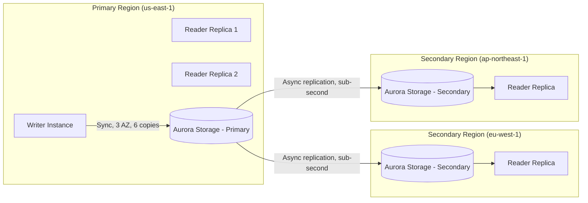
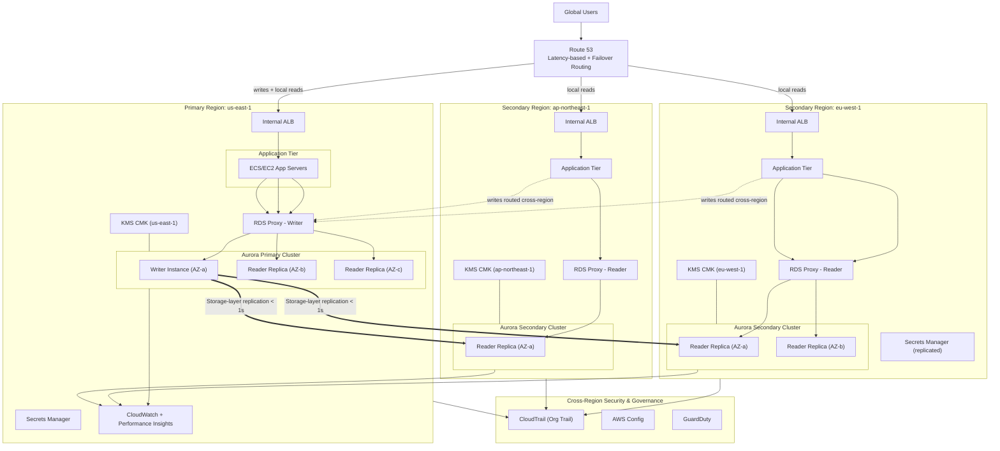

# Part VI – Data Platform Architectures

# Chapter 44 — Aurora Global Database

---

## 1. Executive Summary

### The Business Problem

Enterprises running relational workloads at global scale face a structural conflict that single-region databases cannot resolve:

- Users are distributed across continents, but a single-region primary database forces every write — and often every read — across long-haul network links.
- Regulatory frameworks (GDPR, PDPA, LGPD, various data-residency laws) increasingly require that certain data be readable, and sometimes writable, from specific geographies.
- Regional outages are not hypothetical. AWS Regions have experienced full-region degradation events; when a Region degrades, a single-region database becomes a single point of failure for the entire business, not just one Availability Zone.
- Traditional cross-region replication approaches — logical replication, DMS-based replication, custom binlog shipping — introduce replication lag measured in seconds to minutes, operational fragility, and manual failover runbooks that are rarely tested under real pressure.

Aurora Global Database was built specifically to remove this trade-off for MySQL- and PostgreSQL-compatible workloads. It replicates data across AWS Regions using dedicated, purpose-built infrastructure rather than SQL-level or storage-level replication over generic network paths.

### Architecture Objective

The objective of an Aurora Global Database architecture is threefold:

1. **Sub-second cross-region replication** for read scaling and disaster recovery, typically under 1 second, independent of write volume, using dedicated replication infrastructure rather than the general-purpose network path used by application traffic.
2. **Regional disaster recovery with an RTO measured in minutes, not hours.** A secondary Region can be promoted to a fully writable primary in typically under 1 minute for planned operations and under 5 minutes for unplanned failover, versus hours for snapshot-restore-based DR.
3. **Low-latency local reads for globally distributed users**, by placing up to five secondary Regions (as of this writing) close to user populations, each capable of serving local read traffic without crossing regional boundaries.

### Why Organizations Adopt This Architecture

- **Global SaaS platforms** need to serve read-heavy dashboards, catalogs, and reporting workloads to users in North America, Europe, and Asia-Pacific without every read traversing an ocean.
- **Regulated industries** (financial services, healthcare, insurance) need a documented, testable disaster recovery posture that satisfies auditors and regulators who ask "what happens if this Region disappears."
- **M&A-driven enterprises** consolidating regional data centers into AWS often inherit multi-region requirements from legacy on-premises DR architectures and need an equivalent or better RPO/RTO profile in the cloud.
- **Enterprises with existing MySQL/PostgreSQL investment** who want global scale without rewriting their data layer for a NoSQL or globally-distributed SQL system (such as Google Spanner-style architectures), preserving existing ORMs, stored procedures, and DBA tooling.

### Major Business Benefits

| Benefit | Business Impact |
|---|---|
| Sub-second replication lag | Near-real-time global read consistency without application-level workarounds |
| Regional failover in ~1 minute (planned) | Meets aggressive RTO SLAs for regulated workloads |
| Up to 5 read-scalable secondary Regions | Serves global user base with local read latency |
| Storage-level replication (not binlog) | No additional write amplification or replication overhead on the primary DB instance |
| No application rewrite | Preserves existing MySQL/PostgreSQL compatibility, ORMs, and tooling |
| Independent secondary compute scaling | Each Region right-sizes its own read replica fleet for local traffic patterns |

### Typical Enterprise Scenarios

- A retail platform running its transactional order system in `us-east-1`, with a read-only secondary Region in `eu-west-1` serving the European storefront's product catalog and order history queries, avoiding transatlantic query latency.
- A financial services firm running core ledger data in `us-east-1` as the write primary, with `us-west-2` as a warm DR secondary that can be promoted within minutes if `us-east-1` experiences a regional event, satisfying a regulator-mandated RTO of under 15 minutes.
- A healthcare SaaS vendor operating in North America and the EU, using Aurora Global Database to keep EU patient data physically located in an EU Region for data-residency compliance while still enabling centralized reporting from a US headquarters Region via read replicas (where permitted by data governance policy).
- A gaming company with a live-service title that needs leaderboard and player-profile data to be readable with low latency from `ap-northeast-1`, `eu-west-1`, and `us-east-1`, with all writes still consolidated in a single Region for consistency.

> **Note:** Aurora Global Database is not a substitute for a globally-distributed, multi-master database. Writes are still funneled through a single primary Region under normal operation. Organizations that need true multi-region, multi-writer semantics should evaluate Aurora's multi-writer clusters within a single Region, DynamoDB Global Tables, or a distributed SQL system — this is covered in Section 28.

This chapter provides a complete, production-grade reference architecture for deploying, securing, operating, and cost-optimizing Aurora Global Database in an enterprise environment, including Terraform modules, CLI runbooks, failure scenario playbooks, and an Architect's Corner section drawn from real production experience.

---

## 2. Business Requirements

### Business Drivers

- Reduce cross-region read latency for a globally distributed user base.
- Establish a tested, low-RTO disaster recovery posture for a Tier-1 relational database.
- Satisfy data-residency and regulatory requirements that mandate regional data locality for reads.
- Reduce reliance on manual, error-prone cross-region replication scripts previously built on DMS or custom log shipping.
- Support business continuity certification requirements (SOC 2, ISO 27001, PCI-DSS) that require demonstrable, periodically-tested regional failover.

### Functional Requirements

| ID | Requirement |
|---|---|
| FR-1 | System must support MySQL 8.0-compatible or PostgreSQL 15/16-compatible SQL workloads |
| FR-2 | System must support at least one primary write Region and up to five read-only secondary Regions |
| FR-3 | System must support promotion of a secondary Region to a full read/write primary |
| FR-4 | System must support point-in-time recovery within the primary Region |
| FR-5 | System must support automated backups with configurable retention |
| FR-6 | System must expose separate read and write endpoints per Region |
| FR-7 | Application layer in each Region must be able to route reads to the local secondary cluster |

### Non-Functional Requirements

| Category | Requirement |
|---|---|
| Scalability | Support horizontal read scaling to at least 15 Aurora Replicas per cluster, per Region |
| Availability | 99.99% availability target per regional cluster (Aurora SLA) |
| Latency | Sub-second cross-region replication lag under normal operating conditions |
| Compliance | Support encryption at rest (KMS), encryption in transit (TLS 1.2+), and audit logging sufficient for PCI-DSS and SOC 2 |
| Security | No public database endpoints; access only via private networking (VPC, PrivateLink, or VPN/Direct Connect) |
| Observability | Full metric and log visibility via CloudWatch, with alerting on replication lag, failover events, and storage growth |

### Scalability Goals

- Primary cluster: scale storage automatically up to 128 TiB per Aurora cluster (current Aurora limit at time of writing — verify current quota before design).
- Compute: support scaling primary instance classes from `db.r6g.large` up to `db.r7g.16xlarge` or higher without downtime for read replicas, with brief downtime (or zero-downtime via Aurora's fast failover) for writer resizing.
- Add or remove secondary Regions without disrupting the existing primary or other secondaries.

### Availability Requirements

- Primary Region: Multi-AZ deployment with at least 2 Aurora Replicas in separate Availability Zones for automatic failover.
- Secondary Regions: At least 1 Aurora Replica per secondary Region (AWS recommends at least one dedicated replica reserved for potential promotion, sized identically to production read capacity needs).
- Target: no single AZ or Region failure should cause a complete, unrecoverable outage of the write path for more than the defined RTO.

### Latency Requirements

| Traffic Type | Target Latency |
|---|---|
| In-Region read (local secondary) | < 10ms application-to-database round trip (typical) |
| Cross-region replication lag | Typically < 1 second under normal load |
| Cross-region read (anti-pattern — avoid) | Not a design target; should not occur in a well-designed architecture |

### Compliance Requirements

- Data encrypted at rest using AWS KMS customer-managed keys (CMKs), with regional key separation (each Region's cluster encrypted with a Region-local CMK, since Aurora Global Database does not support cross-region use of a single KMS key directly — this is addressed in Section 11).
- Audit logging enabled (`general_log`/`slow_query_log` for MySQL-compatible, `pgaudit` for PostgreSQL-compatible) shipped to CloudWatch Logs and archived to S3.
- IAM database authentication or Secrets Manager-based credential rotation for all application access.
- Full CloudTrail coverage of all control-plane operations against the Aurora cluster (create, modify, delete, failover, snapshot).

### Recovery Objectives

| Metric | Target |
|---|---|
| RPO (in-Region) | Near-zero (Aurora synchronously replicates 6 copies of data across 3 AZs) |
| RPO (cross-Region, unplanned failover) | Typically a few seconds of data loss possible, bounded by replication lag at time of failure |
| RTO (planned cross-region switchover) | Typically < 1 minute |
| RTO (unplanned cross-region failover / promotion) | Typically < 5 minutes, plus DNS/application cutover time |

### SLAs

- AWS Aurora Multi-AZ SLA: 99.99% monthly uptime percentage for the DB cluster.
- Internal enterprise SLA typically layered on top: 99.95% application-level availability, accounting for application-tier and DNS cutover time during regional failover.

### Expected Workload

- Mixed OLTP workload: high-frequency small writes to the primary, high-volume read traffic (dashboards, APIs, reporting) distributed across Regions.
- Typical enterprise sizing example used throughout this chapter: 5,000 writes/sec peak at primary, 40,000 reads/sec aggregate across all Regions.

### Expected Growth

- Design for 3x current data volume within 24 months.
- Design read replica fleet to scale horizontally within each Region without re-architecture.
- Plan for the possibility of adding 1–2 additional secondary Regions as the business expands into new geographies.

---

## 3. Architecture Overview

### Overall Design

Aurora Global Database consists of one **primary Aurora cluster** in a "primary Region," and up to five **secondary Aurora clusters** in other AWS Regions. All clusters share the same underlying data through Aurora's storage-layer replication engine — not logical (SQL statement) replication, and not binary-log shipping.

Aurora separates compute from storage. The Aurora storage layer is a distributed, log-structured storage system spanning multiple Availability Zones, independent of the database instances (compute) attached to it. Aurora Global Database extends this storage-layer design across Regions: write operations are captured as redo log records at the primary cluster's storage layer and shipped asynchronously to the storage layer of each secondary cluster, typically completing replication in under one second — well below what SQL-level replication or DMS-based replication can achieve, because it bypasses the database engine entirely for the replication path.

### Architecture Philosophy

1. **Storage-layer replication over engine-layer replication.** Because replication happens below the database engine, it does not consume primary instance CPU for replaying logical statements, and it is not subject to the same lag amplification under heavy write load that binlog-based replication experiences.
2. **One writer, many readers, per design.** Aurora Global Database is explicitly an active-passive-at-the-Region-level pattern for writes. Only the primary Region accepts writes under normal operation. This is a deliberate trade-off for consistency and operational simplicity over the added complexity of multi-region write conflict resolution.
3. **Regional autonomy for reads.** Each secondary Region's Aurora Replicas serve reads independently, with their own instance sizing, their own Auto Scaling policies (via Application Auto Scaling for Aurora Replicas), and their own connection endpoints.
4. **Explicit, controlled failover.** Promotion of a secondary to primary is not automatic across Regions (unlike AZ-level failover within a Region, which Aurora handles automatically). This is intentional: cross-region failover has broader blast-radius implications (DNS, application configuration, data-residency) that require either human judgment or a well-tested automated runbook, not a fully automatic decision by the database engine.

### Core Components

| Component | Role |
|---|---|
| Primary Aurora Cluster | Accepts all writes; located in the primary Region |
| Primary Cluster Writer Instance | The single read/write instance in the primary cluster |
| Primary Cluster Reader Instances (Aurora Replicas) | In-Region read scaling and automatic AZ failover targets |
| Aurora Global Database "wrapper" | The AWS control-plane construct (`aws_rds_global_cluster`) binding the primary and secondary clusters together |
| Secondary Aurora Cluster(s) | Read-only clusters in each secondary Region, continuously replicated from primary |
| Secondary Cluster Reader Instances | Serve local reads in the secondary Region |
| Route 53 (with health checks / failover routing) | Directs application traffic to the correct regional endpoint, and supports failover DNS cutover |
| Aurora Cluster Endpoint / Reader Endpoint | Regional connection endpoints used by applications |
| AWS KMS | Encryption at rest, one CMK per Region |
| AWS Secrets Manager | Credential storage and rotation, one secret per Region |
| CloudWatch | Metrics, alarms (replication lag, CPU, connections, storage) |
| CloudTrail | Control-plane audit logging |
| VPC (per Region) | Private network isolation for each regional cluster |

### How Components Interact

1. Application writes are sent to the primary cluster's **writer endpoint** in the primary Region.
2. The primary instance commits the transaction to the distributed Aurora storage layer (synchronously, across 3 AZs, 6 copies, requiring 4-of-6 write quorum).
3. The storage layer asynchronously ships redo log records to each secondary Region's storage layer, typically completing in under 1 second.
4. Secondary Region Aurora Replicas apply these log records and serve read traffic via their local **reader endpoints**.
5. Applications in each Region are configured to send reads to the local reader endpoint and writes to the primary Region's writer endpoint (often via a global write-routing layer, described in Section 7).
6. On regional failover, an operator (or automated runbook) promotes a secondary cluster to a standalone writable primary using `aws rds failover-global-cluster` or `promote-read-replica-db-cluster`-equivalent Global Database operations, then updates DNS/application routing.

### High-Level Workflow



### Request Lifecycle (Write Path)

1. Application in any Region determines the operation is a write.
2. Request routed (via application config, service mesh, or global write router) to the primary Region's writer endpoint.
3. Aurora writer instance validates and executes the transaction.
4. Redo log records committed synchronously to primary storage (4-of-6 AZ quorum).
5. Commit acknowledged to the application.
6. Redo log asynchronously propagated to all secondary Region storage layers.

### Response Lifecycle (Read Path)

1. Application in a given Region sends a read query to its local reader endpoint.
2. Aurora Replica in that Region serves the query from local storage.
3. If the read requires data more recent than what has replicated (rare, sub-second window), the application may observe slightly stale data — this must be an accepted trade-off, or the application must route latency-sensitive reads-after-write to the primary Region.

### Data Lifecycle

1. Data written at primary → committed to primary storage → replicated to all secondaries.
2. Automated backups taken from the primary cluster's storage (continuous, incremental, stored in S3 behind the scenes, retained per configured backup window).
3. Snapshots (manual or automated) can be shared cross-account and cross-Region for long-term retention or migration.
4. Backtrack (MySQL-compatible only) allows rewinding the cluster in place without a restore, for a configured window.

---

## 4. AWS Services Used

### Amazon Aurora (Global Database)

- **Purpose:** Primary relational data store, providing MySQL/PostgreSQL compatibility with cloud-native storage, and cross-region replication via Aurora Global Database.
- **Why selected:** Combines relational semantics enterprises already depend on (transactions, joins, existing ORM/tooling investment) with cloud-native scaling and sub-second cross-region replication that traditional RDS Multi-AZ or self-managed MySQL/PostgreSQL cannot match.
- **Alternatives:** Amazon RDS for MySQL/PostgreSQL with read replicas (higher replication lag, no purpose-built cross-region failover tooling); DynamoDB Global Tables (requires NoSQL data model, no multi-row transactions across arbitrary keys); Google Cloud Spanner-equivalent via self-managed CockroachDB or YugabyteDB on EC2 (higher operational burden, true multi-writer but added complexity).
- **Limitations:** Only one writable Region at a time under standard Global Database (write-forwarding exists for MySQL-compatible Aurora Global Database as a partial mitigation — see Section 15); maximum of 5 secondary Regions; storage ceiling per cluster (verify current quota, historically 128 TiB); cross-region replication lag can spike under extreme write bursts or network degradation between Regions.
- **Pricing considerations:** Billed for compute (per-instance, per-hour, by instance class) in every Region including secondaries; storage billed per GB-month plus I/O; **cross-region data transfer for replicated writes is billed separately** and is often underestimated during cost planning (see Section 16).
- **Best practices:** Right-size secondary Region reader instances independently from primary; enable Performance Insights in every Region; use Aurora Auto Scaling for reader fleets; test promotion regularly (see Section 13).

### Amazon RDS (Control Plane Context)

- **Purpose:** Aurora is technically an RDS engine; RDS APIs, CLI, and console constructs (parameter groups, subnet groups, snapshots) are used to manage Aurora clusters.
- **Why selected:** N/A — this is the underlying management plane for Aurora; it is unavoidable and not itself a discrete architectural choice.
- **Alternatives:** N/A.
- **Limitations:** Some RDS-standard features (e.g., certain parameter group options) behave differently under Aurora; always verify against Aurora-specific documentation, not general RDS documentation.

### Amazon VPC

- **Purpose:** Private network isolation for each regional Aurora cluster; ensures database instances have no public IP exposure.
- **Why selected:** Mandatory for any production data platform; provides subnet-level segmentation between application and data tiers.
- **Alternatives:** None credible for a production enterprise workload — running a database outside a VPC (EC2-Classic equivalent) is not available in modern AWS accounts.
- **Limitations:** VPC CIDR planning must avoid overlap across Regions if VPC peering or Transit Gateway is used to connect application tier to database tier across Regions.
- **Best practices:** Dedicated private subnets (no route to Internet Gateway) for DB subnet groups in every Region; minimum of 2 AZs, ideally 3, per Region for Aurora subnet groups.

### AWS KMS

- **Purpose:** Encryption at rest for Aurora storage, automated backups, and snapshots.
- **Why selected:** Required for compliance (PCI-DSS, HIPAA, SOC 2); customer-managed keys (CMKs) provide auditable, revocable encryption control versus AWS-managed keys.
- **Alternatives:** AWS-managed KMS keys (less control, cannot be selectively revoked or have custom key policies); no encryption (non-compliant, not viable for enterprise workloads).
- **Limitations:** **Critical limitation for Global Database:** each Region's Aurora cluster must be encrypted with a KMS key local to that Region. You cannot use a single global CMK for storage-level encryption across Regions when initially creating a Global Database from an encrypted source unless you follow AWS's specific cross-region key procedure (detailed in Section 11).
- **Pricing considerations:** Per-key monthly charge plus per-API-call charge; negligible relative to compute/storage cost but should still be tagged and tracked.

### AWS Secrets Manager

- **Purpose:** Stores and rotates database credentials for application access in each Region.
- **Why selected:** Avoids hardcoded credentials; integrates natively with Aurora for automatic rotation (single-user or multi-user rotation Lambda templates provided by AWS).
- **Alternatives:** AWS Systems Manager Parameter Store with SecureString (lower cost, but no built-in rotation Lambda for RDS/Aurora — must be built manually); HashiCorp Vault (higher operational overhead, often chosen only when already standardized on Vault enterprise-wide).
- **Limitations:** Secrets Manager rotation must be configured per-Region; a secret in the primary Region is not automatically available in secondary Regions (must be replicated or independently created).
- **Best practices:** Enable Secrets Manager multi-Region secret replication so the same secret ID/value structure is available in every Region hosting a secondary cluster, simplifying application configuration.

### Amazon Route 53

- **Purpose:** DNS-based routing to direct write traffic to the primary Region's writer endpoint and read traffic to the nearest regional reader endpoint; supports failover routing policies for DR cutover.
- **Why selected:** Native AWS DNS service with health-check-based failover routing and latency-based routing, avoiding a third-party DNS dependency.
- **Alternatives:** Third-party global DNS/traffic managers (e.g., NS1, Cloudflare) — viable but adds a vendor dependency; application-level service discovery (e.g., via a service mesh) — more complex, but avoids DNS TTL propagation delay during failover.
- **Limitations:** DNS TTL and client-side caching can delay failover cutover propagation; must be tuned (low TTLs, e.g., 30–60 seconds) and application connection pools must respect DNS changes (avoid indefinite connection caching).

### Amazon CloudWatch

- **Purpose:** Metrics and alarms for replication lag (`AuroraGlobalDBReplicationLag`), CPU, connections, storage, and IOPS across every regional cluster.
- **Why selected:** Native integration with Aurora; no additional agent required for core DB metrics.
- **Alternatives:** Third-party APM/observability platforms (Datadog, New Relic) — often layered on top of CloudWatch rather than replacing it, for richer dashboards and cross-service correlation.
- **Limitations:** Default metric retention and granularity may be insufficient for deep performance forensics; Performance Insights (a related, separate feature) is needed for query-level analysis.

### AWS CloudTrail

- **Purpose:** Audit trail of all control-plane API calls against the Aurora Global Database (cluster creation, modification, failover, snapshot, parameter changes).
- **Why selected:** Mandatory for compliance frameworks requiring change audit trails; needed to answer "who promoted the secondary cluster and when" during incident review.
- **Limitations:** Does not capture data-plane (SQL query) activity — that requires database audit logging (`pgaudit`, MySQL audit log plugin) shipped separately to CloudWatch Logs.

### AWS Systems Manager (Parameter Store / Session Manager)

- **Purpose:** Non-secret configuration storage (e.g., cluster endpoint names, Region topology metadata); Session Manager for secure operator access to bastion-equivalent jump hosts without exposing SSH.
- **Why selected:** Reduces need for hardcoded configuration; Session Manager eliminates the need for public bastion hosts.
- **Alternatives:** Configuration management tools (Consul, etcd) — typically unnecessary overhead unless already standardized.

### AWS Identity and Access Management (IAM)

- **Purpose:** Controls which principals (humans, CI/CD pipelines, application roles) can perform control-plane operations on Aurora clusters, and optionally supports IAM database authentication for data-plane connections.
- **Why selected:** Enforces least-privilege access to a Tier-1 data asset; integrates with Secrets Manager and KMS for a full chain-of-custody security model.
- **Limitations:** IAM database authentication has a connection-rate limit (historically around 200 new connections/second per Aurora instance) — not suitable as the sole authentication mechanism for very high-connection-churn applications without connection pooling (e.g., RDS Proxy).

### Amazon RDS Proxy

- **Purpose:** Connection pooling and multiplexing layer in front of Aurora, reducing connection overhead from serverless/high-concurrency application tiers (e.g., Lambda), and providing faster failover for the application by maintaining its own connection pool during a database failover event.
- **Why selected:** Prevents connection storms against the writer instance during traffic spikes or Lambda concurrency bursts; reduces failover-perceived downtime for applications.
- **Alternatives:** Application-level connection pooling (PgBouncer, ProxySQL self-managed on EC2) — more operational overhead, but more configuration flexibility.
- **Limitations:** RDS Proxy is Region-scoped; a proxy must be deployed per Region in front of each regional cluster (primary and each secondary).

> **Only services relevant to this architecture are included above.** Compute (EC2/ECS/Lambda application tier), CDN (CloudFront), and messaging (SQS/SNS/EventBridge) are referenced only where they interact directly with the data platform (e.g., RDS Proxy for Lambda) — the application tier itself is out of scope for this chapter and is covered in Part II and Part IV chapters.

---

## 5. Complete Architecture Diagram



---

## 6. Component-by-Component Explanation

### Primary Writer Instance

- **Purpose:** Sole read/write endpoint for the entire Global Database topology under normal operation.
- **Responsibilities:** Executes DML/DDL, manages transaction isolation, commits redo log to distributed storage.
- **Inputs:** SQL write traffic from application tier (directly or via RDS Proxy).
- **Outputs:** Redo log stream to Aurora storage layer (in-Region synchronous, cross-Region asynchronous).
- **Scaling:** Vertical only (instance class resize); cannot horizontally scale writes within a single cluster (see Section 15 for write-forwarding and sharding mitigations).
- **High availability:** Automatic failover to an in-Region Aurora Replica within the same cluster (typically 30 seconds or less) if the writer fails; this is independent of and faster than cross-region Global Database failover.
- **Failure handling:** Aurora automatically detects instance failure and promotes the highest-priority in-Region replica; application must handle a brief connection interruption (mitigated by RDS Proxy).
- **Dependencies:** VPC subnet group, security group, parameter group, KMS CMK, IAM roles for enhanced monitoring.
- **Security:** No public accessibility; TLS enforced via `rds.force_ssl` parameter; encrypted at rest.
- **Monitoring:** `WriteLatency`, `WriteIOPS`, `CPUUtilization`, `DatabaseConnections`, `FreeableMemory`.

### In-Region Aurora Replicas (Primary Cluster)

- **Purpose:** Serve in-Region read traffic and act as automatic failover targets.
- **Scaling:** Horizontal — add/remove replicas (up to 15 per cluster) based on read load; Aurora Auto Scaling can manage this automatically via target-tracking on `CPUUtilization` or `DatabaseConnections`.
- **High availability:** Each replica placed in a distinct AZ; failover priority (`promotion tier`) configurable per replica.
- **Failure handling:** If a replica fails, Aurora removes it from the reader endpoint's DNS rotation and, if configured, Auto Scaling launches a replacement.

### Secondary Region Cluster (Global Database Secondary)

- **Purpose:** Read-only replica cluster maintaining a near-real-time copy of primary data for local reads and DR readiness.
- **Responsibilities:** Serve read queries; remain promotable at any time to a standalone writable primary.
- **Inputs:** Storage-layer redo log stream from the primary Region.
- **Outputs:** Query results to local application tier.
- **Scaling:** Independent from the primary — each secondary Region sizes its own reader fleet based on local read demand.
- **High availability:** Multi-AZ within the secondary Region itself, same as the primary cluster's in-Region design.
- **Failure handling:** If the entire secondary Region degrades, no automatic action is taken against the primary; the secondary is simply degraded until the Region recovers, or is removed/rebuilt.
- **Dependencies:** Its own VPC, subnet group, security group, parameter group (must be compatible with primary engine version), regional KMS CMK.
- **Security:** Same posture as primary — private-only access, encryption at rest and in transit.
- **Monitoring:** `AuroraGlobalDBReplicationLag` (critical metric — alarm on this in every secondary Region), plus standard instance metrics.

### Aurora Global Cluster (Control-Plane Wrapper)

- **Purpose:** The logical AWS resource (`aws_rds_global_cluster` in Terraform, `AWS::RDS::GlobalCluster` in CloudFormation) that binds the primary and all secondary clusters into one replicated topology.
- **Responsibilities:** Tracks topology membership; is the target of `failover-global-cluster` and `remove-from-global-cluster` operations.
- **Dependencies:** Must be created before the primary cluster is attached (or an existing cluster converted into a Global Database).

### RDS Proxy (per Region)

- **Purpose:** Connection pooling, faster failover perception, and IAM-authentication offload.
- **Scaling:** Automatically scales connection pool size based on configuration (max connections as percentage of DB instance max connections).
- **High availability:** Multi-AZ by design (AWS-managed, no user-visible instances).
- **Failure handling:** Proxy detects writer failover and re-routes new connections to the newly promoted writer without requiring application-level DNS re-resolution delay.

### Route 53 (Global Routing Layer)

- **Purpose:** Routes users to the correct regional application tier, and supports controlled DNS cutover for cross-region database failover scenarios (in conjunction with application configuration, not a direct Aurora endpoint swap).
- **Scaling:** N/A (fully managed, globally distributed).
- **Failure handling:** Health-check-based failover routing policy shifts traffic away from a Region whose health checks fail.

---

## 7. End-to-End Request Flow

### Write Request Flow

1. User submits a write request (e.g., "place order") from a client in Europe.
2. Request hits the application tier in the nearest Region (`eu-west-1`) via Route 53 latency-based routing.
3. Application tier identifies this as a write operation and routes it to the **global write endpoint** — either a hardcoded primary-Region proxy endpoint or a service-mesh/config-driven pointer to `us-east-1`.
4. Request reaches RDS Proxy in `us-east-1`, which forwards it to the Aurora primary writer instance.
5. Writer instance validates the transaction, executes it, and commits the redo log synchronously to the primary Region's distributed storage (3 AZs, 6 copies, 4-of-6 quorum).
6. Commit acknowledgment returned to the application in `eu-west-1` (cross-region round trip latency applies to this write — typically 70–100ms transatlantic).
7. Application returns success to the end user.
8. Asynchronously (in parallel, non-blocking to the user response), the redo log record propagates to all secondary Region storage layers, typically completing in under 1 second.
9. CloudWatch records `WriteLatency` and `AuroraGlobalDBReplicationLag` metrics.
10. CloudTrail logs any control-plane activity if applicable (not for normal DML).

> **Warning:** Step 6 highlights the core latency trade-off of Aurora Global Database: writes from a non-primary Region always incur the network round-trip cost to the primary Region. This is unavoidable in a single-writer architecture and must be communicated clearly to application teams and product stakeholders.

### Read Request Flow

1. User submits a read request (e.g., "view product catalog") from a client in Japan.
2. Request hits the application tier in `ap-northeast-1` via Route 53 latency-based routing.
3. Application tier routes the read query to the **local RDS Proxy reader endpoint** in `ap-northeast-1`.
4. RDS Proxy forwards the query to a local Aurora Replica in the `ap-northeast-1` secondary cluster.
5. Aurora Replica serves the query from local storage — no cross-region call required.
6. Result returned to the application, then to the user, with only local (in-Region) latency incurred.
7. CloudWatch records `ReadLatency`, `ReadIOPS`, and connection metrics for the local cluster.

### Error Handling in the Request Flow

| Failure Point | Application Behavior |
|---|---|
| Primary writer instance fails (in-Region) | Aurora auto-fails over to an in-Region replica within ~30s; RDS Proxy re-routes; application sees a brief connection reset, should retry with backoff |
| Entire primary Region degrades | Writes fail entirely until an operator (or automated runbook) promotes a secondary Region; application should surface a clear "write temporarily unavailable" state, not a generic 500 error |
| Secondary Region reader fails | Aurora auto-fails over within that Region's cluster; local application retries against the reader endpoint, which re-resolves to a healthy replica |
| Replication lag spikes above threshold | CloudWatch alarm fires; application is not automatically affected (reads still succeed, just against slightly stale data) unless the application has custom staleness-detection logic |

---

## 8. Deployment Flow

### Infrastructure Provisioning Philosophy

- All infrastructure defined in Terraform, with a **separate Terraform root module per Region**, plus a top-level module that creates the `aws_rds_global_cluster` resource and wires the primary/secondary cluster resources together via `global_cluster_identifier`.
- State stored remotely (S3 backend with DynamoDB state locking, or Terraform Cloud), with **one state file per Region** to avoid a single blast-radius for `terraform apply` errors, plus a small shared state file for the global cluster wrapper resource and cross-region outputs (e.g., primary cluster ARN needed by secondary modules).

### Terraform Workflow

1. `terraform init` against the Region-specific backend.
2. `terraform plan` reviewed in CI (mandatory manual approval gate for any plan touching the primary cluster or global cluster resource).
3. Apply primary Region module first (creates `aws_rds_global_cluster` + primary `aws_rds_cluster` + primary instances).
4. Apply each secondary Region module (references the global cluster ID as a data source/remote state output; creates `aws_rds_cluster` with `global_cluster_identifier` set, plus secondary instances).
5. Post-apply validation script confirms `AuroraGlobalDBReplicationLag` metric is emitting and below threshold before marking deployment complete.

### CI/CD Deployment

- Terraform plan/apply orchestrated via CodePipeline or GitHub Actions, with distinct pipelines (or distinct stages with manual approval) per Region.
- Database schema migrations (DDL) run **only against the primary writer endpoint**, never against a secondary — secondary clusters are physically read-only at the storage layer and will reject DDL/DML.
- Migration tooling (Liquibase, Flyway, Alembic, etc.) configured with the primary writer connection string sourced from Secrets Manager, never hardcoded.

### Blue-Green Deployment (for engine version upgrades)

- Aurora Blue/Green Deployments (a native AWS feature) used for major/minor engine version upgrades: creates a fully replicated staging environment, allows validation, then performs a fast, low-downtime switchover.
- For Global Database specifically: Blue/Green Deployments are supported on the primary cluster; secondary Region clusters are typically upgraded to match the new engine version as part of the same coordinated change window, since all clusters in a Global Database must run compatible engine versions.

### Rollback

- For instance-level or parameter-group changes: revert Terraform configuration and re-apply.
- For engine version upgrades performed via Blue/Green: switch back to the "blue" (original) environment if validation fails post-switchover, before the blue environment is decommissioned.
- For data-level issues: point-in-time recovery from the primary cluster's continuous backup, or Backtrack (MySQL-compatible) for fast in-place rewind within the retention window.

### Secrets

- Initial master credentials generated via Terraform using `random_password`, immediately stored in Secrets Manager, **never output to Terraform state in plaintext** (use `sensitive = true` and avoid `terraform output` of the raw value).
- Secrets Manager automatic rotation configured post-deployment via a separate, tightly-scoped Terraform apply (rotation Lambda deployment).

### Configuration

- Parameter groups and option groups (MySQL-compatible) or parameter groups (PostgreSQL-compatible) defined as Terraform resources, version-controlled, identical across primary and secondary Regions unless a documented regional exception exists (e.g., a secondary-only read-optimization parameter).

### Validation (Post-Deployment)

- Automated smoke test: connect to each regional writer/reader endpoint, execute a trivial read query, confirm success.
- Replication lag check: confirm `AuroraGlobalDBReplicationLag` < defined SLO threshold (e.g., 1000ms) in every secondary Region before declaring the deployment healthy.
- Failover drill (non-production environments): execute a test promotion on a schedule (see Section 13) to validate the runbook remains functional after infrastructure changes.

---

## 9. Network Topology

### VPC Design (Per Region)

Each Region hosting an Aurora cluster (primary or secondary) requires its own VPC, sized and segmented independently, though following a consistent enterprise standard.

| Element | Example (Primary — us-east-1) | Example (Secondary — eu-west-1) |
|---|---|---|
| VPC CIDR | 10.10.0.0/16 | 10.20.0.0/16 |
| Public subnets | 10.10.0.0/24, 10.10.1.0/24, 10.10.2.0/24 (one per AZ) | 10.20.0.0/24, 10.20.1.0/24 |
| Private app subnets | 10.10.10.0/23 × 3 AZs | 10.20.10.0/23 × 2 AZs |
| Private DB subnets | 10.10.20.0/24 × 3 AZs | 10.20.20.0/24 × 2 AZs |

> **Note:** CIDR ranges must not overlap across Regions if you intend to connect them via VPC Peering or Transit Gateway (e.g., for cross-region operator/bastion access, or for application tiers that need to reach the primary writer directly from a secondary Region without going through the public internet or a separate direct-connect path).

### Public Subnets

- Host NAT Gateways (for private subnet outbound internet access — e.g., OS patching, package downloads) and, if applicable, public-facing load balancers for the application tier.
- **Never** host Aurora DB subnet groups.

### Private Application Subnets

- Host the application tier (ECS tasks, EC2 instances, or Lambda ENIs) and RDS Proxy ENIs.

### Private DB Subnets

- Host only Aurora cluster ENIs.
- No route to an Internet Gateway or NAT Gateway.
- Security group restricts inbound traffic to the application/proxy subnet CIDR ranges only, on the database port (3306 for MySQL-compatible, 5432 for PostgreSQL-compatible).

### NAT Gateway

- One per AZ in each Region for high availability of outbound connectivity from private subnets (avoids a single NAT Gateway becoming a cross-AZ dependency and cost/latency issue).

### Internet Gateway

- Attached once per VPC; used only by public subnets.

### Transit Gateway (Cross-Region Connectivity, if required)

- If application tiers in secondary Regions need direct network-level reachability to the primary Region's RDS Proxy/writer endpoint (rather than routing through public AWS service endpoints), a **Transit Gateway with inter-region peering** connects the VPCs.
- Alternative: rely on Aurora's endpoints being resolvable and reachable over AWS's backbone without explicit peering, if security policy permits standard AWS-managed connectivity (Aurora endpoints are not public, so cross-region access still requires either VPC peering, Transit Gateway, or PrivateLink — plain internet routing is not applicable since there is no public endpoint).

### Route Tables

- Private DB subnet route tables: local VPC route only, plus a route to Transit Gateway (if cross-region private connectivity is required for operators or cross-region application write paths).
- Public subnet route tables: route to Internet Gateway for 0.0.0.0/0.

### Network ACLs

- Stateless, subnet-level control as defense-in-depth behind security groups.
- DB subnet NACL: allow inbound on DB port only from application subnet CIDR; deny all else by default.

### Security Groups

| Security Group | Attached To | Inbound Rule |
|---|---|---|
| `sg-db-primary` | Primary Aurora cluster ENIs | Port 3306/5432 from `sg-app-primary` and `sg-proxy-primary` only |
| `sg-proxy-primary` | RDS Proxy ENIs (primary) | Port 3306/5432 from `sg-app-primary` only |
| `sg-app-primary` | Application tier | Port 443 from ALB security group only |
| `sg-db-secondary-*` | Each secondary Aurora cluster | Same pattern, scoped to that Region's app tier |

### PrivateLink

- Not typically required for Aurora itself (Aurora is accessed via VPC-resident ENIs, not a PrivateLink endpoint service), but **is** commonly used for:
  - Secrets Manager VPC endpoints (avoid NAT Gateway traffic and reduce latency/cost for credential retrieval).
  - KMS VPC endpoints (same rationale).
  - CloudWatch Logs / Monitoring VPC endpoints.

### Hybrid Connectivity (If Applicable)

- For enterprises with on-premises DBA tooling or BI tools that need direct database access, connectivity is established via **Direct Connect** (preferred for production, predictable latency/bandwidth) or **Site-to-Site VPN** (lower cost, acceptable for lower-volume access), terminating into the primary (and optionally each secondary) Region's VPC, never exposing the database via a public endpoint.

---

## 10. Identity and Access

### IAM Roles

| Role | Purpose |
|---|---|
| `aurora-app-execution-role` | Attached to application compute (ECS task role / EC2 instance profile); permits Secrets Manager `GetSecretValue` for DB credentials and, if used, `rds-db:connect` for IAM database authentication |
| `aurora-terraform-deploy-role` | Used by CI/CD pipeline; permits `rds:CreateDBCluster`, `rds:CreateGlobalCluster`, `rds:ModifyDBCluster`, etc., scoped via permission boundary |
| `aurora-dba-operator-role` | Human DBA/operator role; permits snapshot, failover, and parameter group operations, but not `DeleteDBCluster` without an additional break-glass approval step |
| `aurora-monitoring-role` | Used by CloudWatch/observability tooling; read-only `rds:Describe*`, `cloudwatch:GetMetricData` |
| `rds-enhanced-monitoring-role` | AWS-service-linked role permitting RDS to publish OS-level metrics to CloudWatch Logs |

### IAM Policies (Example — Application Execution Role)

```json

{
  "Version": "2012-10-17",
  "Statement": [
    {
      "Sid": "AllowSecretRetrieval",
      "Effect": "Allow",
      "Action": ["secretsmanager:GetSecretValue"],
      "Resource": "arn:aws:secretsmanager:us-east-1:123456789012:secret:prod/aurora/app-credentials-*"
    },
    {
      "Sid": "AllowIAMDBAuth",
      "Effect": "Allow",
      "Action": ["rds-db:connect"],
      "Resource": "arn:aws:rds-db:us-east-1:123456789012:dbuser:cluster-ABCDEFGHIJKL1234/app_user"
    }
  ]
}

```

### Resource Policies

- Secrets Manager resource policies restrict cross-account access to database credentials to only explicitly whitelisted account/role ARNs (relevant for enterprises using a multi-account structure where the application account differs from the data-platform account).
- KMS key policies restrict `kms:Decrypt` and `kms:GenerateDataKey` to the specific RDS service principal and the specific application/DBA roles — never `"Principal": "*"`.

### STS

- Cross-account access to Aurora control-plane operations (e.g., a central platform team managing Aurora on behalf of application teams in separate AWS accounts) is granted via `sts:AssumeRole` into a tightly-scoped operator role, with mandatory MFA (`aws:MultiFactorAuthPresent` condition) for any role capable of failover or deletion actions.

### Cross-Account Access

- In a multi-account landing zone (see Chapter 99), the data-platform account hosting Aurora clusters is separate from application accounts. Access patterns:
  - Application accounts assume a role in the data-platform account only for control-plane read (`Describe*`) operations, if needed for their own dashboards.
  - Actual data-plane access (SQL connections) flows over Transit Gateway/VPC peering with application-layer credentials from Secrets Manager — IAM cross-account roles are **not** used for the SQL connection itself.

### Least Privilege

- No IAM principal other than the CI/CD deploy role and a small break-glass operator group should have `rds:DeleteDBCluster`, `rds:DeleteGlobalCluster`, or `rds:FailoverGlobalCluster` permissions.
- Failover permissions should require an additional approval mechanism (e.g., a change-management ticket reference enforced by a wrapper Lambda/Step Functions runbook, not raw CLI access) for production.

### Service Roles

- `rds-enhanced-monitoring-role`: AWS-managed, permits publishing OS metrics.
- Lambda execution role for Secrets Manager rotation function: scoped to `secretsmanager:*` on the specific secret ARN, plus `rds:ModifyDBCluster`/`rds:DescribeDBClusters` for credential rotation against the writer.

### Permission Boundaries

- All human and CI/CD roles interacting with Aurora should have a permission boundary policy applied that caps maximum possible permissions regardless of any future policy misconfiguration — e.g., explicitly denying `rds:DeleteDBCluster` outside the designated break-glass role, even if a future IAM policy attachment attempts to grant it.

---

## 11. Security Architecture

### Encryption

- **At rest:** Every Aurora cluster (primary and each secondary) encrypted with a **Region-local KMS CMK**. Aurora Global Database does not support a single cross-region KMS key for storage encryption at the point of creation from an encrypted primary in the same way some other AWS services support multi-region keys — each secondary cluster's encryption is established using a KMS key in that secondary Region, with AWS handling the re-encryption during the global cluster attachment process. Confirm current KMS behavior against AWS documentation at implementation time, as this has evolved.
- **In transit:** TLS enforced via the `rds.force_ssl` (PostgreSQL-compatible) or equivalent MySQL-compatible parameter; application connection strings use `sslmode=verify-full` (PostgreSQL) or `sslMode=VERIFY_IDENTITY` (MySQL) with the Amazon RDS CA bundle.

### KMS

- One CMK per Region, tagged with cost-allocation tags (`Environment`, `DataClassification`, `Region`).
- Key rotation enabled (automatic annual rotation for CMKs).
- Key policy restricts usage to the RDS service principal and explicitly listed roles only.

### TLS

- Minimum TLS 1.2 enforced at the parameter-group level.
- Certificate rotation tracked against the RDS CA certificate rotation schedule published by AWS (RDS periodically rotates its CA — application connection code must trust the updated CA bundle before the old one expires).

### WAF / Shield

- Not directly applicable to Aurora (no public HTTP endpoint), but relevant to the application tier in front of it — WAF protects the ALB/API Gateway layer; Shield Advanced protects against volumetric DDoS at the edge. Referenced here because an application-tier DDoS event can translate into a database-tier connection storm if not properly rate-limited upstream.

### Secrets Manager

- Automatic rotation enabled (30-day rotation window recommended for production Tier-1 data).
- Multi-Region secret replication enabled so secondary-Region applications retrieve credentials from a local Secrets Manager replica rather than making a cross-region API call for every credential fetch.

### Certificate Manager

- Used for TLS certificates on the application-tier load balancers, not directly for Aurora (Aurora uses the AWS-provided RDS CA certificate, not ACM-issued certificates).

### GuardDuty

- Enabled account-wide (and ideally org-wide via GuardDuty delegated administrator) with **RDS Protection** enabled specifically — this analyzes Aurora login activity for anomalous patterns (e.g., credential-stuffing-style login attempts, access from unusual network paths).

### Inspector

- Not directly applicable to Aurora (a fully-managed service with no user-accessible OS to scan), but relevant if the application tier runs on EC2/ECS with attached volumes that need vulnerability scanning.

### Security Hub

- Aggregates findings from GuardDuty, Config, and Inspector across all Regions into a single-pane view; enables the CIS AWS Foundations and PCI-DSS security standards checks relevant to RDS/Aurora configuration (e.g., "RDS instances should not be publicly accessible," "RDS snapshots should not be publicly restorable").

### CloudTrail

- Organization trail capturing management events across all Regions, delivered to a centralized, access-restricted S3 bucket in a dedicated logging account.
- Specifically monitor for: `CreateDBCluster`, `DeleteDBCluster`, `FailoverGlobalCluster`, `ModifyDBClusterParameterGroup`, `RemoveFromGlobalCluster`.

### AWS Config

- Config rules specific to this architecture:
  - `rds-storage-encrypted` — every cluster must be encrypted.
  - `rds-instance-public-access-check` — no instance may be publicly accessible.
  - `rds-multi-az-support` — primary cluster must have Multi-AZ (multiple readers across AZs).
  - Custom Config rule: alert if a secondary Region's cluster is removed from the global cluster without a corresponding change-ticket tag.

### Zero Trust

- No implicit trust granted based on network location alone (VPC membership is necessary but not sufficient); every application-to-database connection is authenticated via Secrets Manager-issued credentials or IAM database authentication, and every control-plane action is authorized via IAM with MFA for sensitive operations.

### Threat Model

| Threat | Attack Vector | Mitigation |
|---|---|---|
| Credential theft | Leaked application secret, compromised CI/CD pipeline | Secrets Manager rotation, least-privilege IAM, no hardcoded credentials, scoped Secrets Manager resource policies |
| Unauthorized cross-region failover | Compromised operator credentials or over-permissioned CI/CD role | MFA requirement on failover IAM action, break-glass approval workflow, CloudTrail alerting on `FailoverGlobalCluster` |
| Data exfiltration via snapshot sharing | Malicious or mistaken public snapshot sharing | AWS Config rule denying public snapshot restorability; SCP at the organization level blocking `rds:ModifyDBSnapshotAttribute` for public sharing |
| Man-in-the-middle on DB connections | Missing TLS enforcement | `rds.force_ssl` parameter enforced; application-level certificate validation (`verify-full`) |
| Insider threat — direct data access | Overly broad IAM/DBA access to production data | IAM database authentication with per-user database accounts, full audit logging (`pgaudit`/MySQL audit plugin), no shared "admin" application credential used by humans |
| Regional compromise cascading to DR Region | Shared credentials or shared IAM roles across Regions | Region-scoped IAM roles and Region-local KMS keys reduce blast radius of a single-Region credential compromise |

---

## 12. High Availability

### AZ Failures

- Aurora's storage layer already spans 3 AZs with 6 copies of data and a 4-of-6 write quorum / 3-of-6 read quorum, meaning **loss of a full AZ does not cause data loss or write unavailability**, as long as the writer instance itself is not in the failed AZ (and if it is, Aurora automatically fails over to a replica in a healthy AZ).
- Design requirement: at least 2 Aurora Replicas in the primary cluster, each in a different AZ from the writer and from each other, to guarantee an immediate automatic failover target during an AZ event.

### Instance Failures

- Aurora continuously monitors instance health; a failed writer triggers automatic failover to the highest-`promotion-tier` available replica, typically completing in under 30 seconds, well under 60 seconds in the vast majority of cases.
- Application must implement connection retry with exponential backoff to ride out this brief interruption; RDS Proxy significantly smooths this by holding the connection pool open and re-routing internally.

### Regional Failures

- A full Regional failure (rare, but the scenario Aurora Global Database is explicitly designed for) requires **cross-region failover** — this is not automatic by default and must be triggered by an operator or an automated Route 53 health-check-driven runbook (see Section 13 for the detailed procedure).
- Design requirement: at least one secondary Region must be provisioned and kept warm (i.e., actively replicating, with reader instances running, not scaled to zero) at all times to serve as the failover target.

### Database Failures (Logical / Data Corruption)

- Logical corruption (e.g., a bad application deployment that issues a destructive `UPDATE`/`DELETE` without a `WHERE` clause) is **not** protected against by Multi-AZ or Global Database — both replicate the corruption just as quickly as legitimate data.
- Mitigation: Backtrack (MySQL-compatible Aurora) for fast in-place rewind, or point-in-time recovery from continuous backup, restored to a new cluster for surgical data recovery, not a full topology failover.

### Load Balancing

- Aurora reader endpoint performs connection-level load balancing (round-robin at the DNS layer) across all healthy Aurora Replicas in a cluster; RDS Proxy adds an additional layer of intelligent connection multiplexing on top of this.

### Health Checks

- Route 53 health checks against a lightweight `/healthz` endpoint on the application tier in each Region (not directly against the database) determine whether that Region's application tier — and by extension its database dependency — is healthy enough to receive traffic.
- Custom CloudWatch alarm on `AuroraGlobalDBReplicationLag` feeds into the operational decision of whether a secondary Region is a safe failover target at a given moment.

### Failover (Summary Table)

| Failover Type | Trigger | Automation Level | Typical Duration |
|---|---|---|---|
| In-Region instance failover | Writer instance failure | Fully automatic | < 30 seconds |
| In-Region AZ failure | AZ-level infrastructure event | Fully automatic | < 30–60 seconds |
| Cross-Region planned switchover | Operator-initiated, e.g., for DR test or Regional maintenance | Manual trigger, automated execution | ~1 minute |
| Cross-Region unplanned failover | Full Regional outage of primary | Manual or semi-automated trigger (recommended: human-in-the-loop with automated runbook) | ~1–5 minutes execution, plus detection and decision time |

---

## 13. Disaster Recovery

### Backup Strategy

- Aurora provides **continuous, incremental backups** to Amazon S3 automatically, with no performance impact on the primary instance (this is a fundamental Aurora storage-layer feature, distinct from traditional snapshot-based backup).
- Backup retention configured for 7–35 days depending on compliance requirement (PCI-DSS environments typically retain 35 days; general enterprise workloads often use 14).
- Manual snapshots taken before major changes (engine version upgrade, large schema migration) and retained independently of the automated retention window, tagged with the change ticket reference.

### Snapshots

- Manual snapshots can be **copied cross-Region** and **cross-account**, providing an additional recovery path independent of the live Global Database replication topology (protects against a scenario where corruption or a malicious action affects the replication stream itself, not just the primary).
- Snapshot copies encrypted with the destination Region's/account's own KMS CMK.

### Cross-Region Replication

- This is the core mechanism of Aurora Global Database itself, as detailed throughout this chapter — distinct from, and complementary to, cross-region snapshot copying.

### DR Strategy Pattern Selected: Warm Standby

Of the four classic DR patterns (Backup & Restore, Pilot Light, Warm Standby, Multi-Site Active-Active), this architecture implements **Warm Standby**:

| Pattern | Applicable Here? | Rationale |
|---|---|---|
| Backup & Restore | No — RTO too high (hours) for this architecture's requirements | Reserved for lower-tier, non-critical workloads only |
| Pilot Light | Partially — could describe a minimally-sized secondary (e.g., single small reader instance) | Viable cost-optimization variant for less latency-sensitive DR-only secondaries |
| **Warm Standby (selected)** | **Yes** | Secondary Region fully provisioned, actively replicating, actively serving read traffic — ready for promotion in ~1 minute |
| Multi-Site Active-Active | No, not for writes | Aurora Global Database is single-writer by design; true active-active writes would require a different architecture (see Section 28) |

### RPO

- **Planned switchover:** Effectively zero data loss — AWS drains replication before completing a managed planned switchover.
- **Unplanned failover:** Data loss bounded by replication lag at the moment of the Regional failure — typically sub-second under normal conditions, but could be higher (seconds) if the failure occurred during a lag spike. This must be explicitly communicated to business stakeholders as the realistic RPO, not an idealized zero.

### RTO

- Planned switchover: ~1 minute for the database layer itself, plus DNS/application cutover time (typically 2–5 minutes total with a well-tuned Route 53 configuration).
- Unplanned failover: ~1–5 minutes for database promotion, plus detection time (how quickly monitoring/alerting identifies the primary Region is down) and decision time (how quickly an authorized operator approves the failover) — **realistic end-to-end RTO for an unplanned event is typically 15–30 minutes** when detection and human decision-making are honestly accounted for, not just the technical promotion step.

### Detailed Failover Runbook (Unplanned Primary Region Loss)

1. **Detect:** CloudWatch alarms and/or Route 53 health checks indicate the primary Region's application tier and/or database is unreachable for a sustained period (e.g., 3 consecutive failed health checks over 3 minutes — tune to avoid false positives from transient network blips).
2. **Confirm:** On-call operator confirms via the AWS Health Dashboard and direct connectivity tests that this is a genuine Regional event, not a misconfiguration or a single-service blip.
3. **Decide:** Incident commander authorizes cross-region failover per the documented escalation policy (this is a business decision with data-loss implications, not a purely technical one — hence the human-in-the-loop step even in an otherwise automated runbook).
4. **Execute:**

   ```bash

   aws rds failover-global-cluster \
     --global-cluster-identifier prod-global-aurora \
     --target-db-cluster-identifier arn:aws:rds:eu-west-1:123456789012:cluster:prod-aurora-secondary-euw1

   ```

5. **Verify:** Confirm the target secondary cluster is now `available` and reports as the writer via `aws rds describe-global-clusters`.
6. **Cut over DNS/application config:** Update the global write endpoint (Route 53 record or application configuration/service discovery entry) to point to the newly promoted Region's writer endpoint.
7. **Validate:** Run smoke tests against the new primary; confirm application write functionality restored.
8. **Communicate:** Notify stakeholders of the failover, expected data-loss window (based on last known replication lag), and current status.
9. **Post-incident:** Once the original primary Region recovers, it does **not** automatically rejoin as a secondary — it must be explicitly re-added to the Global Database as a new secondary (this typically requires re-establishing it from the new primary, since its own data may have diverged or become stale during the outage), and documented in a post-incident review.

> **Warning:** A common and dangerous mistake is assuming the old primary Region will "just come back" and resume its role automatically once AWS resolves the underlying Regional issue. It will not. It must be deliberately and carefully reintegrated, typically by removing it from the global cluster and re-adding it as a fresh secondary of the new primary.

### DR Testing Cadence

- **Quarterly:** Full failover drill in a non-production environment that mirrors production topology.
- **Annually (minimum):** Failover drill in production during a planned maintenance window, using the **planned switchover** path (not the destructive unplanned path), to validate the runbook end-to-end including DNS cutover and application behavior — regulated industries often require this to be documented evidence for auditors.

---

## 14. Scalability

### Horizontal Scaling (Reads)

- Add Aurora Replicas within any cluster (primary or secondary) up to 15 per cluster; use Aurora Auto Scaling (`aws_appautoscaling_target`/`aws_appautoscaling_policy` in Terraform) with target-tracking on average CPU or connection count to add/remove replicas automatically within a configured min/max range.

### Vertical Scaling (Writer)

- Resize the writer instance class (e.g., `db.r7g.4xlarge` → `db.r7g.8xlarge`) — this incurs a brief interruption (Aurora performs this efficiently, but it is not zero-downtime the way reader scaling is); schedule during a low-traffic maintenance window and always precede with a snapshot.

### Auto Scaling (Read Replica Fleet)

```hcl

resource "aws_appautoscaling_target" "aurora_read_replica" {
  max_capacity       = 8
  min_capacity        = 2
  resource_id        = "cluster:${aws_rds_cluster.primary.cluster_identifier}"
  scalable_dimension  = "rds:cluster:ReadReplicaCount"
  service_namespace   = "rds"
}

resource "aws_appautoscaling_policy" "aurora_read_replica_cpu" {
  name               = "aurora-read-replica-cpu-scaling"
  policy_type        = "TargetTrackingScaling"
  resource_id        = aws_appautoscaling_target.aurora_read_replica.resource_id
  scalable_dimension = aws_appautoscaling_target.aurora_read_replica.scalable_dimension
  service_namespace  = aws_appautoscaling_target.aurora_read_replica.service_namespace

  target_tracking_scaling_policy_configuration {
    predefined_metric_specification {
      predefined_metric_type = "RDSReaderAverageCPUUtilization"
    }
    target_value       = 60.0
    scale_in_cooldown  = 300
    scale_out_cooldown = 120
  }
}

```

### Serverless Scaling (Aurora Serverless v2, if applicable)

- For workloads with highly variable or unpredictable traffic (e.g., a secondary Region with sporadic reporting load), Aurora Serverless v2 instances can be used **within a Global Database topology** as reader instances, scaling capacity (measured in ACUs) up and down automatically without the step-change disruption of traditional instance resizing.
- Not recommended for the primary writer in a Tier-1, latency-sensitive production workload without careful ACU floor tuning, since scaling transitions, while fast, are not instantaneous and can add latency variability under sudden load spikes.

### Database Scaling (Storage)

- Aurora storage auto-scales in 10 GiB increments up to the cluster's maximum (verify current quota — historically 128 TiB) with **no manual intervention and no downtime** — this is one of Aurora's core differentiators versus traditional RDS or self-managed databases where storage resizing requires planning.

### Storage Scaling (Secondary Regions)

- Secondary Region storage automatically matches the primary's data volume as replication proceeds — there is no independent storage sizing decision to make for secondaries beyond ensuring the account/Region service quota for Aurora storage is sufficient.

### Queue Scaling

- Not directly part of the Aurora architecture itself, but if a write-buffering pattern is used to smooth write bursts to the primary (e.g., SQS in front of a write-processing Lambda/service to avoid overwhelming the writer instance), that queue's consumer concurrency should be tuned against the writer's observed `WriteIOPS`/`CPUUtilization` headroom, not scaled independently without regard to database capacity.

---

## 15. Performance Optimization

### Caching

- Amazon ElastiCache (Redis or Valkey) deployed in front of read-heavy, slowly-changing data (e.g., product catalog, user profile lookups) to reduce load on Aurora Replicas, particularly valuable in secondary Regions serving high read volumes with cost-sensitive reader fleet sizing.
- Cache invalidation strategy must account for cross-region replication lag — a cache populated from a secondary Region reader could theoretically cache slightly stale data; for most read-heavy, eventually-consistent-tolerant use cases (catalogs, profile displays) this is an acceptable trade-off; for financial balance displays, it is not, and such reads should bypass cache or read from the primary.

### Compression

- Aurora Replica network traffic and cross-region replication traffic are handled internally by AWS's storage-layer replication protocol — this is not user-configurable, but application-side result set compression (e.g., gzip on API responses) reduces load on the application-to-client leg of the request.

### CDN

- Not directly relevant to the database layer, but CloudFront caching of API responses derived from read-only Aurora queries (e.g., a public product catalog API) further reduces database read load, particularly valuable for secondary Regions serving anonymous/public traffic.

### Database Optimization

- Query plan analysis via Performance Insights, enabled in every Region, with a retention period sufficient for meaningful trend analysis (7 days free tier, extend to longer retention for production Tier-1 workloads).
- Index review cadence: quarterly review of `pg_stat_statements` (PostgreSQL-compatible) or the MySQL-compatible slow query log to identify missing or unused indexes.
- Avoid `SELECT *` and large unbounded result sets, particularly on cross-region-latency-sensitive write-confirmation paths.

### Connection Pooling

- RDS Proxy deployed in every Region, in front of both the writer (primary Region) and readers (all Regions), particularly critical for Lambda-based or otherwise high-connection-churn application tiers, where establishing a fresh database connection per invocation would otherwise exhaust the writer instance's max connection limit under load.

### Concurrency

- Application-tier connection pool sizing tuned against the Aurora instance class's documented max connections (which scales with instance memory) — oversized application connection pools are a common root cause of `too many connections` errors under load; this is discussed further in Section 24 (Failure Scenarios).

### Async Processing

- Non-critical-path writes (e.g., analytics event logging, audit trail writes that don't need to be in the synchronous user-facing transaction) offloaded to an asynchronous queue (SQS/EventBridge) and written to Aurora by a separate consumer, reducing the write load and latency exposure on the primary transactional path.

### Write-Forwarding (MySQL-Compatible Aurora Global Database Feature)

- Aurora Global Database (MySQL-compatible engine) supports an optional **write-forwarding** feature, where a secondary Region's cluster can accept write statements and internally forward them to the primary Region's writer for execution, returning the result back to the application in the secondary Region.
- **When to use:** Simplifies application logic for teams that don't want to maintain separate write-routing logic in every Region, at the cost of additional latency (the write still has to reach the primary — write-forwarding does not eliminate the cross-region round-trip, it just moves where that round-trip happens).
- **When NOT to use:** High-throughput write paths where explicit control over write routing and clear latency visibility are required; write-forwarding can obscure where latency is being introduced and complicates capacity planning, since the secondary Region's proxy/instance is now also handling write traffic pass-through.
- PostgreSQL-compatible Aurora Global Database, at time of writing, does not support write-forwarding — verify current AWS documentation, as engine feature parity evolves.

---

## 16. Cost Optimization (FinOps)

### Estimated Monthly Cost — Small Deployment

*(1 primary Region, 1 secondary Region, moderate traffic — illustrative, us-east-1/eu-west-1 pricing, verify current rates)*

| Item | Configuration | Estimated Monthly Cost (USD) |
|---|---|---|
| Primary writer instance | 1 × db.r6g.xlarge | ~$500 |
| Primary reader instances | 2 × db.r6g.xlarge | ~$1,000 |
| Secondary reader instances | 1 × db.r6g.large | ~$220 |
| Storage | 500 GB, both Regions | ~$250 |
| I/O | ~200M requests/month | ~$40 |
| Cross-region data transfer (replication) | ~500 GB/month | ~$100 |
| Backup storage (beyond included) | ~200 GB | ~$40 |
| RDS Proxy (2 Regions) | 2 proxy instances | ~$50 |
| **Total (approximate)** | | **~$2,200/month** |

### Estimated Monthly Cost — Medium Deployment

*(1 primary, 2 secondary Regions, higher traffic)*

| Item | Estimated Monthly Cost (USD) |
|---|---|
| Compute (writer + readers across 3 Regions, ~8 instances, r6g.2xlarge avg) | ~$8,000 |
| Storage (2 TB, replicated) | ~$1,000 |
| I/O | ~$400 |
| Cross-region data transfer | ~$800 |
| Backup storage | ~$300 |
| RDS Proxy (3 Regions) | ~$150 |
| **Total (approximate)** | **~$10,650/month** |

### Estimated Monthly Cost — Enterprise Deployment

*(1 primary, 4–5 secondary Regions, high throughput, large data volume)*

| Item | Estimated Monthly Cost (USD) |
|---|---|
| Compute (25+ instances across 5–6 Regions, mix of r7g.4xlarge/8xlarge) | ~$60,000+ |
| Storage (20 TB, replicated across all Regions) | ~$10,000 |
| I/O (high-volume OLTP) | ~$5,000 |
| Cross-region data transfer (5 secondary Regions) | ~$8,000+ |
| Backup storage | ~$3,000 |
| RDS Proxy (6 Regions) | ~$400 |
| **Total (approximate)** | **~$86,000+/month** |

> **Note:** These figures are illustrative order-of-magnitude estimates for planning discussions, not quotes. Always validate against the AWS Pricing Calculator and current published rates for the specific Regions and instance classes in scope, and account for Reserved Instance/Savings Plan discounts, which materially change these numbers.

### Major Cost Drivers

1. **Compute, multiplied by Region count.** Every secondary Region adds its own reader fleet cost — this is the single largest lever in the cost model, and the one most directly controlled by the "how many secondary Regions do we actually need" business decision.
2. **Cross-region data transfer for replication.** Frequently underestimated during initial budgeting — proportional to write volume, not read volume, and multiplied by the number of secondary Regions (the same redo log stream is sent to every secondary independently).
3. **Storage, multiplied by Region count.** Each Region maintains a full copy of the data.
4. **I/O costs.** Aurora I/O-Optimized instance configuration (an alternative Aurora pricing model that bundles I/O cost into the instance price) should be evaluated for I/O-heavy workloads where I/O charges under the standard pricing model exceed roughly 25% of total instance cost.

### Optimization Opportunities

- **Reserved Instances / Savings Plans:** Apply to the primary writer and baseline reader capacity in every Region (the portion of capacity that is always-on and predictable); do not apply RIs to elastic/Auto-Scaled reader capacity that fluctuates.
- **Right-sizing secondary Region readers independently:** A secondary Region serving a smaller user base does not need writer-class-equivalent reader instances — right-size per-Region based on actual observed local read demand, not a copy-paste of primary Region sizing.
- **Aurora I/O-Optimized:** Evaluate for write-heavy or I/O-heavy clusters where per-request I/O charges under standard pricing exceed the flat premium of I/O-Optimized instance pricing.
- **Backup retention tuning:** Align retention period to the actual compliance requirement, not a default "keep everything forever" policy — excess backup retention is a quiet, compounding cost.
- **Storage class / snapshot lifecycle:** Move long-term-retained manual snapshots that are rarely needed for restore into a documented lifecycle/expiration policy rather than retaining indefinitely.
- **Evaluate secondary Region necessity annually:** Each secondary Region should be justified by an active business requirement (latency SLA for a specific user population, or DR requirement) — "we might need it someday" is not sufficient justification for the ongoing compute/storage/transfer cost.

### Spot

- Not applicable to Aurora database instances (Spot is for EC2/Fargate compute, not for the managed, stateful Aurora instance fleet) — do not attempt to apply Spot pricing concepts to Aurora capacity planning.

### S3 Lifecycle / Storage Classes

- Applicable to exported audit logs, archived snapshots (if exported to S3), and application-tier assets — not directly to Aurora's own internal storage, which is a managed, non-user-selectable storage tier.

### Rightsizing

- Quarterly rightsizing review using Compute Optimizer recommendations (where available for RDS/Aurora) combined with Performance Insights CPU/memory utilization trends, per Region, per instance.

### Cost Allocation and Tagging

| Tag Key | Example Value | Purpose |
|---|---|---|
| `Environment` | `production` | Separates prod/staging/dev cost reporting |
| `Application` | `order-management` | Maps cost to owning application/team |
| `Region-Role` | `primary` / `secondary` | Distinguishes primary vs. secondary Region cost in FinOps dashboards |
| `CostCenter` | `CC-4821` | Chargeback to business unit |
| `DataClassification` | `pci` / `internal` / `public` | Feeds compliance and security cost/risk reporting |

### Budgets and Cost Anomaly Detection

- AWS Budgets configured per Region and per application tag combination, with alert thresholds at 80% and 100% of forecasted monthly spend.
- Cost Anomaly Detection monitors specifically the RDS/Aurora service dimension, since a sudden spike (e.g., from an unplanned Auto Scaling event, a runaway query causing excessive I/O, or an accidental oversized instance class change) is a common and costly incident category for this architecture.

---

## 17. AI-Assisted Operations

### Amazon Q (Developer / Business)

- **Log analysis:** Amazon Q can be pointed at CloudWatch Logs Insights queries to help triage replication lag spikes or connection error clusters, accelerating root-cause identification during an incident versus manual log grep-ing across multiple Regions.
- **Architecture review:** Amazon Q can review Terraform plans for an Aurora Global Database change and flag deviations from AWS best practices (e.g., missing Multi-AZ reader, missing encryption) before apply.
- **AI-generated documentation:** Drafting initial runbook documentation, ADRs, and architecture diagrams-as-code (Mermaid) from a natural-language description of the intended topology, which a human architect then reviews and refines — useful as an acceleration tool, not a replacement for architect review, particularly for anything touching the failover runbook, which must be validated against actual tested behavior, not just generated prose.

### Amazon Bedrock

- **AI troubleshooting assistant:** A Bedrock-backed internal chatbot, grounded (via RAG — see Chapter 52) on the organization's own Aurora runbooks, past incident postmortems, and AWS documentation, can help on-call engineers quickly recall the correct failover command syntax and pre-failover checklist during a stressful incident, reducing time-to-execute during the "Decide" and "Execute" steps of the runbook in Section 13.
- **Capacity planning:** Bedrock models can assist in analyzing historical CloudWatch metrics trends and proposing Auto Scaling policy adjustments or Reserved Instance purchase recommendations, though final purchasing decisions should remain a human FinOps/architecture review, not a fully automated action, given the multi-year commitment implications of Reserved Instances.

### AI-Generated Terraform

- Useful for scaffolding the repetitive per-Region module boilerplate (subnet groups, parameter groups, security groups) that follows a consistent enterprise pattern — the primary risk is over-trusting AI-generated Terraform for the actual `aws_rds_global_cluster` and cross-region wiring logic, which is genuinely subtle (order of operations, KMS key handling per Region) and must be reviewed line-by-line by an engineer who understands Aurora Global Database's specific constraints, not merely syntactically valid HCL.

### Incident Response

- AI-assisted incident summarization (auto-drafting an initial incident timeline from CloudWatch alarm history and CloudTrail events) speeds up the post-incident review process described in Section 13's runbook, though the human incident commander remains accountable for the actual failover decision in real time.

> **Note:** AI-assisted tooling in this architecture is explicitly advisory. No AI system should be granted direct IAM permissions to execute `FailoverGlobalCluster`, `DeleteDBCluster`, or other destructive/high-blast-radius operations without a human approval step, given the business-critical, data-loss-sensitive nature of these actions.

---

## 18. Terraform Implementation

> The following modules assume a multi-region Terraform provider alias configuration, remote S3 state per Region, and a shared/global state for cross-region outputs. Variable values shown are illustrative; adapt to your organization's naming standards.

### Providers

```hcl

terraform {
  required_version = ">= 1.7.0"

  required_providers {
    aws = {
      source  = "hashicorp/aws"
      version = "~> 5.0"
    }
    random = {
      source  = "hashicorp/random"
      version = "~> 3.6"
    }
  }

  backend "s3" {
    bucket         = "acme-terraform-state-prod"
    key            = "aurora-global/us-east-1/terraform.tfstate"
    region         = "us-east-1"
    dynamodb_table = "terraform-state-locks"
    encrypt        = true
  }
}

provider "aws" {
  alias  = "primary"
  region = "us-east-1"
}

provider "aws" {
  alias  = "secondary_euw1"
  region = "eu-west-1"
}

provider "aws" {
  alias  = "secondary_apne1"
  region = "ap-northeast-1"
}

```

### Variables

```hcl

variable "environment" {
  description = "Deployment environment (production, staging)"
  type        = string
}

variable "global_cluster_identifier" {
  description = "Identifier for the Aurora Global Database cluster"
  type        = string
  default     = "prod-global-aurora"
}

variable "engine" {
  description = "Aurora engine (aurora-postgresql or aurora-mysql)"
  type        = string
  default     = "aurora-postgresql"
}

variable "engine_version" {
  description = "Aurora engine version - must be identical across all Regions"
  type        = string
  default     = "15.4"
}

variable "primary_instance_class" {
  type    = string
  default = "db.r6g.xlarge"
}

variable "secondary_instance_class" {
  type    = string
  default = "db.r6g.large"
}

variable "backup_retention_period" {
  type    = number
  default = 14
}

variable "vpc_cidr_primary" {
  type    = string
  default = "10.10.0.0/16"
}

variable "vpc_cidr_secondary_euw1" {
  type    = string
  default = "10.20.0.0/16"
}

```

### Global Cluster (Wrapper Resource)

```hcl

resource "aws_rds_global_cluster" "this" {
  provider                     = aws.primary
  global_cluster_identifier    = var.global_cluster_identifier
  engine                       = var.engine
  engine_version                = var.engine_version
  database_name                = "appdb"
  storage_encrypted            = true
  deletion_protection          = true
}

```

### Primary Region Cluster

```hcl

resource "aws_kms_key" "aurora_primary" {
  provider                = aws.primary
  description              = "KMS CMK for Aurora primary cluster - ${var.environment}"
  enable_key_rotation      = true
  deletion_window_in_days  = 30

  tags = {
    Environment = var.environment
    RegionRole  = "primary"
  }
}

resource "random_password" "master" {
  length  = 32
  special = true
}

resource "aws_secretsmanager_secret" "aurora_master" {
  provider = aws.primary
  name     = "${var.environment}/aurora/master-credentials"
}

resource "aws_secretsmanager_secret_version" "aurora_master" {
  provider      = aws.primary
  secret_id     = aws_secretsmanager_secret.aurora_master.id
  secret_string = jsonencode({
    username = "appadmin"
    password = random_password.master.result
  })
}

resource "aws_db_subnet_group" "primary" {
  provider   = aws.primary
  name       = "${var.environment}-aurora-primary-subnets"
  subnet_ids = var.primary_private_db_subnet_ids

  tags = {
    Environment = var.environment
  }
}

resource "aws_security_group" "aurora_primary" {
  provider    = aws.primary
  name        = "${var.environment}-aurora-primary-sg"
  description = "Aurora primary cluster access - app/proxy tier only"
  vpc_id      = var.primary_vpc_id

  ingress {
    from_port       = 5432
    to_port         = 5432
    protocol        = "tcp"
    security_groups = [var.app_tier_security_group_id, var.proxy_security_group_id]
  }

  egress {
    from_port   = 0
    to_port     = 0
    protocol    = "-1"
    cidr_blocks = ["0.0.0.0/0"]
  }
}

resource "aws_rds_cluster" "primary" {
  provider                       = aws.primary
  cluster_identifier             = "${var.environment}-aurora-primary-use1"
  engine                         = var.engine
  engine_version                 = var.engine_version
  global_cluster_identifier      = aws_rds_global_cluster.this.id
  master_username                = "appadmin"
  master_password                = random_password.master.result
  db_subnet_group_name           = aws_db_subnet_group.primary.name
  vpc_security_group_ids         = [aws_security_group.aurora_primary.id]
  storage_encrypted              = true
  kms_key_id                     = aws_kms_key.aurora_primary.arn
  backup_retention_period        = var.backup_retention_period
  preferred_backup_window        = "03:00-04:00"
  preferred_maintenance_window   = "sun:04:30-sun:05:30"
  deletion_protection            = true
  enabled_cloudwatch_logs_exports = ["postgresql"]

  lifecycle {
    ignore_changes = [master_password]
  }

  tags = {
    Environment = var.environment
    RegionRole  = "primary"
  }
}

resource "aws_rds_cluster_instance" "primary_writer" {
  provider             = aws.primary
  identifier           = "${var.environment}-aurora-primary-writer"
  cluster_identifier   = aws_rds_cluster.primary.id
  instance_class       = var.primary_instance_class
  engine               = aws_rds_cluster.primary.engine
  engine_version       = aws_rds_cluster.primary.engine_version
  db_subnet_group_name = aws_db_subnet_group.primary.name
  promotion_tier        = 0
  performance_insights_enabled = true
  monitoring_interval  = 60
  monitoring_role_arn  = var.enhanced_monitoring_role_arn
}

resource "aws_rds_cluster_instance" "primary_readers" {
  provider             = aws.primary
  count                = 2
  identifier           = "${var.environment}-aurora-primary-reader-${count.index + 1}"
  cluster_identifier   = aws_rds_cluster.primary.id
  instance_class       = var.primary_instance_class
  engine               = aws_rds_cluster.primary.engine
  engine_version       = aws_rds_cluster.primary.engine_version
  db_subnet_group_name = aws_db_subnet_group.primary.name
  promotion_tier        = count.index + 1
  performance_insights_enabled = true
  monitoring_interval  = 60
  monitoring_role_arn  = var.enhanced_monitoring_role_arn
}

```

### Secondary Region Cluster (eu-west-1)

```hcl

resource "aws_kms_key" "aurora_secondary_euw1" {
  provider                = aws.secondary_euw1
  description              = "KMS CMK for Aurora secondary cluster - eu-west-1 - ${var.environment}"
  enable_key_rotation      = true
  deletion_window_in_days  = 30
}

resource "aws_db_subnet_group" "secondary_euw1" {
  provider   = aws.secondary_euw1
  name       = "${var.environment}-aurora-secondary-euw1-subnets"
  subnet_ids = var.secondary_euw1_private_db_subnet_ids
}

resource "aws_security_group" "aurora_secondary_euw1" {
  provider    = aws.secondary_euw1
  name        = "${var.environment}-aurora-secondary-euw1-sg"
  description = "Aurora secondary cluster access - eu-west-1"
  vpc_id      = var.secondary_euw1_vpc_id

  ingress {
    from_port       = 5432
    to_port         = 5432
    protocol        = "tcp"
    security_groups = [var.secondary_euw1_app_tier_sg_id, var.secondary_euw1_proxy_sg_id]
  }

  egress {
    from_port   = 0
    to_port     = 0
    protocol    = "-1"
    cidr_blocks = ["0.0.0.0/0"]
  }
}

resource "aws_rds_cluster" "secondary_euw1" {
  provider                   = aws.secondary_euw1
  cluster_identifier         = "${var.environment}-aurora-secondary-euw1"
  engine                     = var.engine
  engine_version             = var.engine_version
  global_cluster_identifier  = aws_rds_global_cluster.this.id
  db_subnet_group_name       = aws_db_subnet_group.secondary_euw1.name
  vpc_security_group_ids     = [aws_security_group.aurora_secondary_euw1.id]
  storage_encrypted          = true
  kms_key_id                 = aws_kms_key.aurora_secondary_euw1.arn
  skip_final_snapshot        = false
  deletion_protection        = true

  # Secondary clusters do not set master_username/master_password —

  # credentials are inherited from the primary via the replication topology.

  depends_on = [aws_rds_cluster_instance.primary_writer]

  tags = {
    Environment = var.environment
    RegionRole  = "secondary"
  }
}

resource "aws_rds_cluster_instance" "secondary_euw1_readers" {
  provider             = aws.secondary_euw1
  count                = 2
  identifier           = "${var.environment}-aurora-secondary-euw1-reader-${count.index + 1}"
  cluster_identifier   = aws_rds_cluster.secondary_euw1.id
  instance_class       = var.secondary_instance_class
  engine               = aws_rds_cluster.secondary_euw1.engine
  engine_version       = aws_rds_cluster.secondary_euw1.engine_version
  db_subnet_group_name = aws_db_subnet_group.secondary_euw1.name
  performance_insights_enabled = true
}

```

### Outputs

```hcl

output "primary_writer_endpoint" {
  value       = aws_rds_cluster.primary.endpoint
  description = "Primary cluster writer endpoint"
}

output "primary_reader_endpoint" {
  value       = aws_rds_cluster.primary.reader_endpoint
  description = "Primary cluster reader endpoint (load-balanced across in-Region replicas)"
}

output "secondary_euw1_reader_endpoint" {
  value       = aws_rds_cluster.secondary_euw1.reader_endpoint
  description = "Secondary cluster (eu-west-1) reader endpoint"
}

output "global_cluster_id" {
  value = aws_rds_global_cluster.this.id
}

```

### Remote State

- Each Region's module maintains its own state file (`aurora-global/us-east-1/terraform.tfstate`, `aurora-global/eu-west-1/terraform.tfstate`, etc.) to limit blast radius.
- Secondary Region modules reference the primary Region's state via `terraform_remote_state` data source (read-only) to obtain the `global_cluster_id` and confirm the primary writer instance exists before attempting to attach.

### Terraform Best Practices Applied

- `lifecycle { ignore_changes = [master_password] }` on the primary cluster prevents Terraform from attempting to reset the master password on every plan after Secrets Manager rotation changes it out-of-band.
- `deletion_protection = true` on every cluster resource, requiring an explicit two-step change (disable protection, then destroy) to delete any cluster — guards against accidental `terraform destroy`.
- Explicit `depends_on` from the secondary cluster to the primary writer instance ensures correct creation ordering, since Terraform cannot always infer this dependency purely from the `global_cluster_identifier` reference.

---

## 19. AWS CLI Examples

### Deployment / Verification

```bash

# Confirm global cluster topology

aws rds describe-global-clusters \
  --global-cluster-identifier prod-global-aurora

# Confirm primary cluster status

aws rds describe-db-clusters \
  --db-cluster-identifier prod-aurora-primary-use1 \
  --region us-east-1

# Confirm secondary cluster status

aws rds describe-db-clusters \
  --db-cluster-identifier prod-aurora-secondary-euw1 \
  --region eu-west-1

```

### Monitoring

```bash

# Check current cross-region replication lag (secondary Region)

aws cloudwatch get-metric-statistics \
  --namespace AWS/RDS \
  --metric-name AuroraGlobalDBReplicationLag \
  --dimensions Name=DBClusterIdentifier,Value=prod-aurora-secondary-euw1 \
  --start-time $(date -u -d '15 minutes ago' +%Y-%m-%dT%H:%M:%S) \
  --end-time $(date -u +%Y-%m-%dT%H:%M:%S) \
  --period 60 \
  --statistics Average Maximum \
  --region eu-west-1

# Check writer instance CPU

aws cloudwatch get-metric-statistics \
  --namespace AWS/RDS \
  --metric-name CPUUtilization \
  --dimensions Name=DBInstanceIdentifier,Value=prod-aurora-primary-writer \
  --start-time $(date -u -d '1 hour ago' +%Y-%m-%dT%H:%M:%S) \
  --end-time $(date -u +%Y-%m-%dT%H:%M:%S) \
  --period 300 \
  --statistics Average \
  --region us-east-1

```

### Troubleshooting

```bash

# List recent events for the primary cluster (failovers, errors, maintenance)

aws rds describe-events \
  --source-identifier prod-aurora-primary-use1 \
  --source-type db-cluster \
  --duration 1440 \
  --region us-east-1

# Describe pending maintenance actions

aws rds describe-pending-maintenance-actions \
  --resource-identifier arn:aws:rds:us-east-1:123456789012:cluster:prod-aurora-primary-use1 \
  --region us-east-1

# List parameter group differences from default (drift check)

aws rds describe-db-cluster-parameters \
  --db-cluster-parameter-group-name prod-aurora-pg15-custom \
  --source user \
  --region us-east-1

```

### Failover / DR Operations

```bash

# Planned or unplanned promotion of a secondary to primary

aws rds failover-global-cluster \
  --global-cluster-identifier prod-global-aurora \
  --target-db-cluster-identifier arn:aws:rds:eu-west-1:123456789012:cluster:prod-aurora-secondary-euw1

# Remove a Region from the global cluster (e.g., decommissioning a secondary)

aws rds remove-from-global-cluster \
  --global-cluster-identifier prod-global-aurora \
  --db-cluster-identifier arn:aws:rds:ap-northeast-1:123456789012:cluster:prod-aurora-secondary-apne1

# Add a new secondary Region after primary already exists

aws rds create-db-cluster \
  --db-cluster-identifier prod-aurora-secondary-apse1 \
  --engine aurora-postgresql \
  --engine-version 15.4 \
  --global-cluster-identifier prod-global-aurora \
  --region ap-southeast-1

```

### Cleanup

```bash

# Disable deletion protection before teardown (non-production only)

aws rds modify-db-cluster \
  --db-cluster-identifier staging-aurora-secondary-euw1 \
  --no-deletion-protection \
  --apply-immediately \
  --region eu-west-1

# Delete a secondary cluster (must be removed from global cluster first)

aws rds delete-db-cluster \
  --db-cluster-identifier staging-aurora-secondary-euw1 \
  --skip-final-snapshot \
  --region eu-west-1

# Delete the global cluster wrapper (only after all member clusters removed)

aws rds delete-global-cluster \
  --global-cluster-identifier staging-global-aurora

```

---

## 20. CI/CD Integration

### GitHub Actions (Terraform Plan/Apply Pipeline)

```yaml

name: aurora-global-database-deploy

on:
  pull_request:
    paths:
      - 'infra/aurora-global/**'
  push:
    branches: [main]
    paths:
      - 'infra/aurora-global/**'

jobs:
  plan-primary:
    runs-on: ubuntu-latest
    steps:
      - uses: actions/checkout@v4
      - uses: hashicorp/setup-terraform@v3
        with:
          terraform_version: 1.7.5
      - name: Configure AWS credentials (primary)
        uses: aws-actions/configure-aws-credentials@v4
        with:
          role-to-assume: arn:aws:iam::123456789012:role/terraform-deploy-role
          aws-region: us-east-1
      - name: Terraform Init
        working-directory: infra/aurora-global/us-east-1
        run: terraform init
      - name: Terraform Validate
        working-directory: infra/aurora-global/us-east-1
        run: terraform validate
      - name: Checkov Security Scan
        uses: bridgecrewio/checkov-action@master
        with:
          directory: infra/aurora-global/us-east-1
      - name: Terraform Plan
        working-directory: infra/aurora-global/us-east-1
        run: terraform plan -out=tfplan
      - name: Upload Plan Artifact
        uses: actions/upload-artifact@v4
        with:
          name: tfplan-primary
          path: infra/aurora-global/us-east-1/tfplan

  apply-primary:
    needs: plan-primary
    runs-on: ubuntu-latest
    environment: production-approval  # requires manual approval gate
    steps:
      - uses: actions/checkout@v4
      - uses: hashicorp/setup-terraform@v3
      - uses: actions/download-artifact@v4
        with:
          name: tfplan-primary
          path: infra/aurora-global/us-east-1
      - name: Terraform Apply
        working-directory: infra/aurora-global/us-east-1
        run: terraform apply -auto-approve tfplan

  apply-secondary-euw1:
    needs: apply-primary
    runs-on: ubuntu-latest
    environment: production-approval
    steps:
      - uses: actions/checkout@v4
      - uses: hashicorp/setup-terraform@v3
      - name: Configure AWS credentials (secondary)
        uses: aws-actions/configure-aws-credentials@v4
        with:
          role-to-assume: arn:aws:iam::123456789012:role/terraform-deploy-role
          aws-region: eu-west-1
      - name: Terraform Init
        working-directory: infra/aurora-global/eu-west-1
        run: terraform init
      - name: Terraform Apply
        working-directory: infra/aurora-global/eu-west-1
        run: terraform apply -auto-approve

  post-deploy-validation:
    needs: [apply-primary, apply-secondary-euw1]
    runs-on: ubuntu-latest
    steps:
      - name: Verify replication lag under threshold
        run: |
          LAG=$(aws cloudwatch get-metric-statistics \
            --namespace AWS/RDS \
            --metric-name AuroraGlobalDBReplicationLag \
            --dimensions Name=DBClusterIdentifier,Value=prod-aurora-secondary-euw1 \
            --start-time $(date -u -d '5 minutes ago' +%Y-%m-%dT%H:%M:%S) \
            --end-time $(date -u +%Y-%m-%dT%H:%M:%S) \
            --period 60 --statistics Maximum \
            --region eu-west-1 \
            --query 'Datapoints[0].Maximum' --output text)
          echo "Current replication lag: ${LAG}ms"
          if (( $(echo "$LAG > 1000" | bc -l) )); then
            echo "::error::Replication lag exceeds 1000ms threshold post-deploy"
            exit 1
          fi

```

### Policy as Code

- OPA/Conftest or Checkov rules enforced in CI, failing the pipeline if:
  - `storage_encrypted != true` on any `aws_rds_cluster` resource.
  - `deletion_protection != true` for any resource tagged `Environment = production`.
  - A security group rule allows `0.0.0.0/0` inbound on the database port.
  - `skip_final_snapshot = true` is set for a production cluster without an explicit, ticketed exception.

### Rollback (CI/CD Context)

- Reverting the merged pull request and re-running the pipeline is the standard rollback path for infrastructure-as-code changes; for data-affecting incidents, rollback follows the Section 13 DR runbook instead, not a Terraform revert (Terraform cannot "undo" data written to the database).

---

## 21. Monitoring

### CloudWatch — Core Metrics to Track (Per Region, Per Cluster)

| Metric | Why It Matters | Suggested Alarm Threshold |
|---|---|---|
| `AuroraGlobalDBReplicationLag` | Primary indicator of cross-region DR readiness and read staleness | > 1000ms sustained for 5 minutes |
| `CPUUtilization` (writer) | Write-path capacity headroom | > 80% sustained for 10 minutes |
| `CPUUtilization` (readers) | Read-path capacity headroom | > 80% sustained for 10 minutes |
| `DatabaseConnections` | Approaching max-connections limit | > 80% of instance class max connections |
| `FreeableMemory` | Risk of swap/OOM | < 10% of total instance memory |
| `WriteLatency` / `ReadLatency` | End-user-facing performance | Baseline + 3 standard deviations |
| `DiskQueueDepth` | I/O contention | > 5 sustained |
| `FreeLocalStorage` | Temp/log space exhaustion risk | < 10% free |
| `AuroraVolumeBytesLeftTotal` | Approaching storage ceiling (rare, but critical if hit) | Custom alarm as volume nears account/cluster quota |

### Dashboards

- One CloudWatch dashboard per Region, plus a consolidated "Global Database Health" dashboard aggregating `AuroraGlobalDBReplicationLag` from every secondary Region side-by-side, since this cross-region comparison is the single most operationally important view for this specific architecture.

### Logs

- `postgresql` (or `error`, `slowquery`, `audit` for MySQL-compatible) logs exported to CloudWatch Logs via `enabled_cloudwatch_logs_exports`, in every Region.

### Tracing

- AWS X-Ray integrated at the application tier (not directly on Aurora, which has no native X-Ray instrumentation) to trace a request end-to-end including the database call segment, useful for diagnosing whether latency originates in the application, the network hop to a cross-region primary, or the database query itself.

### Alarms and Notifications

- CloudWatch Alarms route to SNS topics, fanned out to PagerDuty/Opsgenie for Sev-1/Sev-2 conditions (replication lag breach, writer unreachable) and to a lower-urgency Slack channel for Sev-3/informational conditions (approaching connection limit, storage growth trend).

### SLIs / SLOs / Error Budgets

| SLI | SLO Target | Error Budget (Monthly) |
|---|---|---|
| Primary Region write availability | 99.95% | ~21.6 minutes |
| Cross-region replication lag < 1s | 99.9% of measurement windows | ~43.2 minutes of breach allowed |
| In-Region read availability (per secondary) | 99.9% | ~43.2 minutes |

---

## 22. Logging

### Centralized Logging Architecture

- Every Region's Aurora cluster exports logs to its **local** CloudWatch Logs group; a subscription filter (or Kinesis Data Firehose) forwards these to a **centralized logging account**, aggregating logs from all Regions into a single S3 bucket structure (`s3://acme-central-logs/aurora/{region}/{cluster}/{date}/`).

### CloudWatch Logs

- Retention set per compliance requirement (e.g., 1 year in CloudWatch Logs, then transitioned/archived to S3 Glacier for longer-term retention beyond active operational query needs).

### S3 (Log Archive)

- Long-term log archive bucket with S3 Object Lock (compliance mode) enabled for regulated workloads requiring tamper-evident audit log retention.

### Athena

- Athena tables defined over the S3-archived database audit logs, enabling ad hoc SQL-based forensic queries across all Regions' historical logs without needing to restore or re-provision infrastructure (e.g., "show all DDL statements executed against the primary cluster in the last 90 days").

### OpenSearch

- For enterprises requiring near-real-time full-text search/analysis of database audit logs (e.g., a dedicated security operations team), logs are additionally streamed to an OpenSearch domain via Kinesis Data Firehose, with retention tuned separately (typically shorter, e.g., 30–90 days hot storage) from the S3 long-term archive.

### Retention

| Log Type | CloudWatch Retention | S3 Archive Retention |
|---|---|---|
| Database engine logs (error/slow query) | 90 days | 1 year |
| Audit logs (DDL/DML for compliance) | 1 year | 7 years (regulatory) |
| CloudTrail (control-plane) | 90 days | 7 years (org-wide policy) |

### Audit Logging

- `pgaudit` (PostgreSQL-compatible) or the MySQL audit log plugin enabled at the parameter-group level, configured to capture at minimum: DDL, role/permission changes, and — for PCI-DSS/HIPAA-scoped clusters — all DML against tables tagged as containing regulated data.

---

## 23. Operational Excellence

### Runbooks

- Maintained runbooks (version-controlled alongside infrastructure code, not in a disconnected wiki) for: cross-region failover (Section 13), engine version upgrade via Blue/Green, instance class resize, parameter group change, and secondary Region addition/removal.

### Automation

- Automated pre-flight checks (Terraform plan validation, replication lag check, backup-in-progress check) required to pass before any production change window opens.

### Patch Management

- Aurora minor version patching handled by AWS during the configured maintenance window; major version upgrades handled deliberately via Blue/Green Deployments (Section 8), never via the passive "auto minor version upgrade" setting for production Tier-1 clusters — set `auto_minor_version_upgrade = false` and patch on a controlled, tested cadence instead, since even minor version upgrades can occasionally introduce query planner behavior changes worth validating first in staging.

### Maintenance

- Maintenance windows staggered across Regions (not all Regions patched simultaneously) to avoid a scenario where a patching-related issue affects the primary and all secondaries within the same change window, reducing the organization's ability to fail over to a "known good" secondary if the patch itself is the problem.

### Incident Response

- Incident severity matrix explicitly mapping "primary Region Aurora unreachable" to Sev-1, "replication lag breach in one secondary" to Sev-2, and "single reader instance degraded in a secondary Region" to Sev-3, with corresponding on-call escalation paths defined for each.

### Change Management

- Every production change to the Aurora topology requires: a linked change ticket, a peer-reviewed Terraform plan, a rollback plan documented in the ticket before execution, and — for any change touching the primary cluster or global cluster wrapper resource — a second approver from the platform/DBA team distinct from the change author.

---

## 24. Failure Scenarios

### 1. Primary Writer Instance Crash

- **Symptoms:** Application write errors, connection resets.
- **Root cause:** Underlying host hardware failure, OS-level issue, or an out-of-memory condition from a runaway query.
- **Detection:** CloudWatch alarm on `CPUUtilization`/`FreeableMemory` prior to crash (if gradual); RDS event notification on failover.
- **Resolution:** Aurora automatic failover to an in-Region replica, typically < 30 seconds; no manual action required beyond confirming application recovery.
- **Prevention:** Query review to eliminate runaway memory-intensive queries; appropriate instance class sizing headroom.

### 2. Cross-Region Replication Lag Spike

- **Symptoms:** `AuroraGlobalDBReplicationLag` alarm fires; secondary Region reads become noticeably stale.
- **Root cause:** Sudden write burst at primary exceeding normal baseline; network degradation on the AWS backbone path between Regions (rare); a very large single transaction (e.g., a bulk data load) generating an oversized redo log burst.
- **Detection:** CloudWatch alarm.
- **Resolution:** Typically self-resolves as write burst subsides; if caused by a bulk operation, consider breaking large batch jobs into smaller transactions in the future.
- **Prevention:** Rate-limit/batch large bulk write operations; capacity-plan writer instance class with headroom above peak observed write burst.

### 3. Full Primary Region Outage

- **Symptoms:** All application writes failing; primary Region health checks failing.
- **Root cause:** AWS Regional service disruption (rare but has occurred historically).
- **Detection:** Multi-signal — Route 53 health checks, AWS Health Dashboard, internal monitoring all failing simultaneously.
- **Resolution:** Execute the Section 13 failover runbook — promote a secondary Region.
- **Prevention:** Cannot be "prevented," only mitigated via the Global Database DR architecture itself; the entire chapter's design exists to address this scenario.

### 4. Secondary Region Reader Fleet Overwhelmed

- **Symptoms:** High latency or connection errors for users served by a specific secondary Region.
- **Root cause:** Local read traffic growth outpacing provisioned reader capacity in that Region; missing or misconfigured Auto Scaling.
- **Detection:** CloudWatch alarm on secondary Region `CPUUtilization`/`DatabaseConnections`.
- **Resolution:** Manually scale out reader instances immediately; investigate why Auto Scaling did not respond in time (policy misconfiguration, hitting max-capacity ceiling).
- **Prevention:** Regular capacity review per Region; realistic max-capacity ceilings set above expected peak, not just current peak.

### 5. Accidental Destructive DML (No `WHERE` Clause)

- **Symptoms:** Mass data loss or corruption reported by application teams or end users.
- **Root cause:** Human error or a buggy deployment script executing an unguarded `UPDATE`/`DELETE`.
- **Detection:** Application error spikes, anomalous row-count-changed alerts if instrumented, or direct user reports.
- **Resolution:** Use Backtrack (MySQL-compatible) for immediate rewind, or point-in-time recovery to a new cluster, followed by surgical data reconciliation.
- **Prevention:** Mandatory `WHERE` clause linting in CI for migration scripts; separate, more restrictive IAM/database role for ad hoc production access versus the application's own service account.

### 6. KMS Key Deletion or Disablement

- **Symptoms:** Cluster becomes completely inaccessible; instances may show as `storage-full` or fail health checks in a confusing way.
- **Root cause:** Accidental KMS key deletion (rare, given the mandatory waiting period) or a key policy change that revokes RDS's ability to use the key.
- **Detection:** CloudTrail alert on `DisableKey`/`ScheduleKeyDeletion` for any KMS key tagged as in-use by an Aurora cluster.
- **Resolution:** If within the KMS deletion waiting period (7–30 days), cancel the deletion; if a key policy issue, restore the correct policy.
- **Prevention:** SCP-level guardrail preventing deletion of KMS keys tagged `Purpose=aurora-encryption` without a break-glass exception process.

### 7. Global Cluster Split-Brain Risk During Manual Recovery

- **Symptoms:** Confusion/conflicting writes if an operator mistakenly re-enables write capability on the old primary Region after a failover has already promoted a new primary elsewhere.
- **Root cause:** Human error during the post-incident "bring the old Region back" step described in Section 13.
- **Detection:** Should be caught by pre-execution runbook checklist, not by monitoring after the fact (by which point conflicting writes may already have occurred).
- **Resolution:** The old primary Region's cluster must never simply be "turned back on" as a writer — it must be explicitly, deliberately re-added as a new secondary of the current primary.
- **Prevention:** Runbook explicitly calls this out as a named risk (Section 13's warning callout); consider a technical guardrail such as removing the old Region's write capability/deleting its standalone cluster promptly after failover rather than leaving it in an ambiguous state.

### 8. Application Connection Pool Exhaustion

- **Symptoms:** `too many connections` errors from the database.
- **Root cause:** Application-tier horizontal scaling (e.g., a Lambda concurrency spike, or an ECS Auto Scaling event) increasing connection count faster than the database's max-connections ceiling.
- **Detection:** `DatabaseConnections` CloudWatch alarm.
- **Resolution:** Immediate: scale up the writer/reader instance class (increases max connections) or restart the application tier to force connection pool re-establishment through RDS Proxy.
- **Prevention:** RDS Proxy deployed in front of all high-churn application tiers from day one, not added reactively after an incident.

### 9. Schema Migration Deployed Only to Primary, Application Deployed Globally

- **Symptoms:** Application errors in secondary Regions referencing a column/table that doesn't exist yet, or that has since been dropped.
- **Root cause:** A common misunderstanding — secondary clusters replicate schema changes automatically (since Aurora Global Database replicates at the storage layer, including DDL effects), but there can be a brief propagation window; if application code deploys globally faster than a large DDL operation replicates, secondary Regions can briefly serve requests against a schema that hasn't caught up.
- **Detection:** Application error logs correlated with deployment timestamps and DDL execution timestamps.
- **Resolution:** Wait for replication to catch up (typically seconds); if using expand/contract migration patterns correctly, this window should not cause hard failures.
- **Prevention:** Always use expand/contract (additive-first) schema migration patterns; never deploy application code that depends on a newly dropped/renamed column in the same change window as the migration itself.

### 10. Snapshot Restore to Wrong Region/Account

- **Symptoms:** Operational confusion, potential data exposure if restored into a less-secured environment.
- **Root cause:** Human error during a manual snapshot restore operation, especially in a break-glass DR test scenario.
- **Detection:** CloudTrail review; AWS Config rule flagging an unexpected new RDS cluster creation event.
- **Resolution:** Immediately delete the mistakenly restored cluster if it exposes data inappropriately.
- **Prevention:** Snapshot restore runbook requires explicit target-account/Region confirmation step; restrict `rds:RestoreDBClusterFromSnapshot` IAM permission to the specific break-glass/DBA role.

### 11. Cost Spike from Unplanned Auto Scaling

- **Symptoms:** Unexpected month-end AWS bill increase attributable to RDS.
- **Root cause:** Reader Auto Scaling policy `max_capacity` set too high, combined with a sustained (possibly bot-driven or abusive) traffic spike that kept the fleet scaled out for an extended period.
- **Detection:** Cost Anomaly Detection alert.
- **Resolution:** Investigate traffic source; if illegitimate, address at the WAF/rate-limiting layer, not solely the database layer; adjust `max_capacity` ceiling if it was set unrealistically high.
- **Prevention:** Realistic, reviewed `max_capacity` ceilings; AWS Budgets alert thresholds tuned to catch this class of event quickly.

### 12. Cross-Region Network Degradation (Not a Full Outage)

- **Symptoms:** Elevated but not catastrophic replication lag; intermittent write-path latency for cross-region-routed writes.
- **Root cause:** Transient AWS backbone network congestion or degradation between two specific Regions.
- **Detection:** `AuroraGlobalDBReplicationLag` trending elevated but not alarming-critical; AWS Health Dashboard may show a network health event.
- **Resolution:** Typically transient; monitor and wait; escalate to AWS Support if sustained beyond an hour.
- **Prevention:** No direct prevention possible (this is an AWS-managed network path); mitigated by the fact that this scenario degrades read freshness, not write availability.

### 13. Parameter Group Drift Between Primary and Secondary

- **Symptoms:** Inconsistent query behavior or performance characteristics observed between Regions for logically identical queries.
- **Root cause:** A parameter group change applied manually (outside Terraform) to one Region's cluster but not replicated to the corresponding change in other Regions.
- **Detection:** Quarterly parameter group drift audit (comparing exported parameter group JSON across Regions); AWS Config custom rule.
- **Resolution:** Reconcile parameter groups to match the Terraform-defined source of truth.
- **Prevention:** Strict "no console changes" policy for production parameter groups, enforced via IAM (deny `rds:ModifyDBClusterParameterGroup` from the console/root user, allow only via the CI/CD role).

### 14. Failed Engine Version Upgrade Mid-Blue/Green Switchover

- **Symptoms:** Application errors during a planned upgrade window; unclear which environment ("blue" or "green") is currently authoritative.
- **Root cause:** An incompatibility discovered only during or after switchover (e.g., a driver/ORM incompatibility with the new engine version's default behavior).
- **Detection:** Automated smoke tests immediately post-switchover (mandatory step, not optional).
- **Resolution:** Switch back to the "blue" (original) environment using the Blue/Green Deployment's built-in switchback capability, before the blue environment is decommissioned.
- **Prevention:** Full staging environment validation against the new engine version, including ORM/driver compatibility testing, before scheduling the production switchover.

### 15. Break-Glass Access Overuse Normalizing Risk

- **Symptoms:** Audit review reveals the "emergency" break-glass DBA role has been used routinely rather than exceptionally.
- **Root cause:** Standard operational workflows being funneled through the break-glass path because it's more convenient than requesting appropriately-scoped standing access for legitimate recurring tasks.
- **Detection:** Quarterly IAM access review specifically auditing break-glass role `AssumeRole` frequency via CloudTrail.
- **Resolution:** Identify the legitimate recurring need and provision a properly-scoped, least-privilege standing role for it instead.
- **Prevention:** Treat break-glass overuse as a process/tooling gap to be fixed, not merely a compliance finding to note and move past.

---

## 25. Troubleshooting Guide

| Problem | Symptoms | Likely Cause | Diagnosis | AWS CLI Command | Resolution |
|---|---|---|---|---|---|
| High replication lag | Stale reads in secondary Region | Write burst at primary; network degradation | Check `AuroraGlobalDBReplicationLag` trend | `aws cloudwatch get-metric-statistics --metric-name AuroraGlobalDBReplicationLag ...` | Wait for burst to subside; escalate to AWS Support if sustained |
| `too many connections` error | Application connection failures | Connection pool exhaustion, no RDS Proxy | Check `DatabaseConnections` metric vs. instance max | `aws rds describe-db-instances --db-instance-identifier ... --query 'DBInstances[0].DBInstanceClass'` | Deploy/scale RDS Proxy; scale instance class |
| Writer instance unreachable | All writes failing | Instance failure or in-progress failover | Check recent RDS events | `aws rds describe-events --source-identifier <cluster> --source-type db-cluster --duration 30` | Confirm automatic failover completed; validate app reconnects |
| Failover command fails | `FailoverGlobalCluster` API returns error | Target cluster not in a promotable state, or lag too high | Check target cluster status and current lag | `aws rds describe-global-clusters --global-cluster-identifier <id>` | Wait for target to reach `available` status; retry |
| Cluster shows `storage-full` unexpectedly | Writes rejected | KMS key access issue (misdiagnosed by this status) or genuine storage quota | Check CloudTrail for recent KMS key changes; check storage metrics | `aws kms describe-key --key-id <key-arn>` | Restore KMS key policy/enable key; or request quota increase |
| Parameter group changes not taking effect | Query behavior unchanged after modification | Parameter requires `pending-reboot` application method | Check parameter `ApplyType` | `aws rds describe-db-cluster-parameters --db-cluster-parameter-group-name <pg>` | Schedule a reboot during maintenance window |
| Secondary Region cannot be added to global cluster | `CreateDBCluster` fails with engine version mismatch | Engine version mismatch between primary and intended secondary | Compare engine versions across Regions | `aws rds describe-db-clusters --query 'DBClusters[].EngineVersion'` | Align engine version before attaching |
| Unexpected cost spike | RDS line item elevated in Cost Explorer | Auto Scaling scaled out and stayed out; abusive traffic | Correlate Cost Explorer with `DatabaseConnections`/CPU trend during the spike window | `aws ce get-cost-and-usage ...` | Investigate traffic source; tune Auto Scaling ceiling |
| TLS connection errors post-CA-rotation | Application cannot connect after a scheduled RDS CA rotation | Application trust store not updated with new RDS CA bundle | Check application TLS handshake error logs | `aws rds describe-certificates` | Update application's trusted CA bundle proactively before rotation cutover date |
| Backtrack unavailable | Backtrack command fails | Backtrack not enabled at cluster creation, or engine doesn't support it (PostgreSQL-compatible does not support Backtrack) | Check cluster's `BacktrackWindow` attribute | `aws rds describe-db-clusters --query 'DBClusters[0].BacktrackWindow'` | Use point-in-time recovery instead if Backtrack unavailable |

---

## 26. Best Practices

1. Always provision at least 2 Aurora Replicas in the primary cluster, in separate AZs, to guarantee an immediate in-Region automatic failover target.
2. Always provision at least 1 dedicated, appropriately-sized reader in every secondary Region intended as a DR failover target — never rely on a minimally-sized "just enough to replicate" instance if that Region might need to absorb full production load during failover.
3. Enable `deletion_protection = true` on every production cluster, primary and secondary.
4. Use a Region-local KMS CMK for every cluster; never attempt to force a single cross-region key for storage encryption.
5. Enforce TLS (`rds.force_ssl` / equivalent) on every cluster, in every Region.
6. Deploy RDS Proxy in front of every writer and reader endpoint used by high-connection-churn application tiers (Lambda, containerized microservices with aggressive horizontal scaling).
7. Never run schema migrations (DDL) against anything other than the primary writer endpoint.
8. Use expand/contract migration patterns to avoid cross-region schema propagation timing issues.
9. Alarm on `AuroraGlobalDBReplicationLag` in every secondary Region — this is the single most important Global-Database-specific metric.
10. Test the failover runbook on a defined cadence (quarterly non-production, annually production) — an untested DR plan is not a DR plan.
11. Document, and rehearse, the explicit procedure for reintegrating a recovered former-primary Region — never assume it "just comes back."
12. Right-size each secondary Region's reader fleet independently based on local read demand, not by copying primary Region sizing.
13. Set realistic Auto Scaling `max_capacity` ceilings and pair them with AWS Budgets alerts to avoid cost surprises from sustained scale-out events.
14. Tag every Aurora resource with `Environment`, `Application`, `Region-Role`, `CostCenter`, and `DataClassification` from day one.
15. Enable Performance Insights in every Region for every production cluster.
16. Set `auto_minor_version_upgrade = false` for production clusters and patch deliberately on a tested, scheduled cadence.
17. Use Aurora Blue/Green Deployments for engine version upgrades rather than in-place major version upgrades.
18. Enable Secrets Manager automatic rotation for master and application credentials; never hardcode credentials.
19. Enable Secrets Manager multi-Region secret replication so every Region's application tier retrieves credentials locally.
20. Restrict `rds:FailoverGlobalCluster`, `rds:DeleteDBCluster`, and `rds:DeleteGlobalCluster` to a small, MFA-gated break-glass IAM role/group.
21. Enable GuardDuty RDS Protection account-wide/org-wide.
22. Enable database-level audit logging (`pgaudit` / MySQL audit plugin) for any cluster handling regulated data.
23. Centralize CloudTrail and CloudWatch Logs from every Region into a dedicated logging account with restricted access.
24. Apply AWS Config rules specifically validating encryption, public-accessibility, and Multi-AZ posture for every Aurora cluster.
25. Never share RDS snapshots publicly; enforce this via an organization-level SCP, not just documentation.
26. Use separate Terraform state files per Region to limit blast radius of any single `apply` operation.
27. Require a second, independent approver for any Terraform change touching the primary cluster or the global cluster wrapper resource.
28. Stagger maintenance windows across Regions rather than patching all Regions simultaneously.
29. Conduct a quarterly parameter group drift audit comparing all Regions against the Terraform-defined source of truth.
30. Conduct an annual review of whether each existing secondary Region is still justified by an active business requirement, given its ongoing compute/storage/transfer cost.
31. Use connection pooling and cap application-tier pool sizes against actual instance-class max-connections limits, not arbitrary defaults.
32. Instrument application code to distinguish "read that can tolerate cross-region staleness" from "read that must be strongly consistent" and route accordingly (local reader vs. primary read).

---

## 27. Anti-Patterns

1. **Treating a secondary Region as a "just in case, minimally sized" afterthought.** If it can't actually absorb production load, it isn't a real DR target — right-size it as if it will be used, because during an actual failover, it will be.
2. **Running schema migrations against a secondary Region's endpoint.** Physically impossible for DML/DDL (secondaries are read-only at the storage layer) but attempted often enough in scripts with hardcoded, incorrect endpoint configuration to warrant explicit callout — this will simply fail, but wastes incident time diagnosing why.
3. **Assuming the old primary Region automatically resumes its role after a Regional outage resolves.** It does not; treating it as if it will leads to split-brain risk (Failure Scenario 7).
4. **Using a single, shared IAM role with `FailoverGlobalCluster` permission across the entire engineering organization.** Removes accountability and increases blast radius of a compromised credential.
5. **Skipping RDS Proxy for Lambda-based application tiers.** Leads to connection storm incidents under concurrency spikes — a very common, very avoidable production incident.
6. **Applying a single cross-region KMS key strategy inconsistent with how Aurora Global Database actually handles encryption.** Leads to failed cluster creation or confusing IAM/KMS permission errors during initial setup.
7. **Not alarming on `AuroraGlobalDBReplicationLag`.** Teams frequently alarm on CPU and connections but overlook this Global-Database-specific metric, only discovering a lag problem during an actual failover attempt — the worst possible time to discover it.
8. **Copy-pasting primary Region instance sizing to every secondary Region without analyzing actual local read demand.** Wastes budget in low-traffic Regions and potentially under-provisions high-traffic ones.
9. **Never testing the failover runbook in production.** A runbook that has only ever been tested against a "toy" non-production environment frequently breaks on first real-world execution due to overlooked production-specific dependencies (DNS TTLs, application configuration reload behavior, connection pool warm-up time).
10. **Granting broad, standing DBA console access instead of a scoped, audited, MFA-gated break-glass process.** Normalizes high-privilege access and complicates audit review.
11. **Ignoring cross-region data transfer costs during initial budgeting.** Consistently the most underestimated line item in Global Database cost models; leads to uncomfortable budget conversations post-launch.
12. **Enabling `auto_minor_version_upgrade = true` on a production Tier-1 cluster.** Removes the organization's control over when and how engine patches are validated and applied.
13. **Using the application's own service account credentials for ad hoc human DBA access.** Destroys audit trail granularity (cannot distinguish which human performed an action) and violates least-privilege principles.
14. **Failing to replicate Secrets Manager secrets to secondary Regions.** Forces every secondary-Region application instance to make a cross-region API call just to retrieve credentials, adding unnecessary latency and a cross-region dependency to the read path.
15. **Treating Aurora Global Database as protection against logical/application-level data corruption.** It replicates corruption just as efficiently as legitimate data — Backtrack and point-in-time recovery, not Global Database, are the correct mitigations for this failure class.
16. **Deploying application code changes and large schema migrations in the same change window without accounting for replication propagation timing.** Can produce transient errors in secondary Regions if not using expand/contract patterns.
17. **Allowing parameter group configuration to drift between Regions via manual console changes.** Produces subtle, hard-to-diagnose behavioral inconsistencies between Regions.
18. **Setting Auto Scaling `max_capacity` far above any realistic traffic scenario "just to be safe."** Turns a legitimate traffic spike (or an illegitimate bot/abuse spike) into an uncontrolled cost event.
19. **Not tagging resources for cost allocation from day one.** Makes FinOps review and chargeback reporting for a multi-Region architecture — where cost attribution across Regions and applications is already inherently complex — far harder than necessary.
20. **Treating write-forwarding (MySQL-compatible) as a way to "get multi-region writes" without understanding it still funnels through the primary Region.** Leads to mis-set latency expectations and confused capacity planning when the primary Region's write capacity is still the actual bottleneck.

---

## 28. Alternatives

### Alternative 1: RDS Multi-AZ (Single Region) with Manual Cross-Region Read Replicas

- **Advantages:** Lower cost (no dedicated Global Database replication infrastructure); simpler mental model for teams unfamiliar with Global Database.
- **Disadvantages:** Cross-region replication lag typically much higher (seconds to tens of seconds, since this uses standard binlog/logical replication rather than storage-layer replication); no purpose-built one-command cross-region promotion tooling; replication overhead consumes primary instance resources.
- **Cost:** Lower than Global Database (no dedicated replication infrastructure charge), but the operational cost of building and maintaining custom failover tooling often offsets this.
- **Operational complexity:** Higher — failover is a custom-built process, not a native, tested AWS feature.
- **Security:** Comparable, assuming equivalent encryption/network configuration is applied.
- **Performance:** Materially worse cross-region replication lag under write-heavy workloads.

### Alternative 2: DynamoDB Global Tables

- **Advantages:** True active-active, multi-Region, multi-writer with automatic conflict resolution (last-writer-wins); virtually unlimited horizontal scale; no single-writer bottleneck.
- **Disadvantages:** Requires a NoSQL data model (no multi-row ACID transactions across arbitrary partition keys the way relational joins/transactions work); significant application rewrite for teams with existing relational schemas, stored procedures, and ORM-based codebases.
- **Cost:** Can be cost-competitive or cheaper at very high scale due to pay-per-request pricing, but requires careful data modeling to avoid hot-partition cost inefligiencies.
- **Operational complexity:** Lower operational burden for scaling (fully serverless), but higher upfront data-modeling complexity.
- **Security:** Comparable, IAM-native access control model.
- **Performance:** Excellent for key-value/simple-query-pattern access; poor fit for complex relational query patterns (multi-table joins, ad hoc reporting queries).
- **When to prefer this instead:** True multi-region active-active writes are a hard business requirement, and the data model can reasonably be expressed as key-value/document access patterns.

### Alternative 3: Self-Managed Distributed SQL (CockroachDB / YugabyteDB on EC2)

- **Advantages:** True multi-region, multi-writer, strongly-consistent relational semantics (unlike Aurora Global Database's single-writer model); PostgreSQL wire-compatible in most cases, easing migration.
- **Disadvantages:** Significant operational burden — this is a self-managed distributed system, not a fully-managed AWS service; the organization owns cluster operations, upgrades, and troubleshooting that AWS otherwise absorbs for Aurora.
- **Cost:** Compute cost can be comparable or higher (more nodes required for the consensus protocol overhead); no managed-service premium, but replaced by internal operational staffing cost.
- **Operational complexity:** Substantially higher — requires deep in-house distributed systems expertise.
- **Security:** Achievable to an equivalent standard, but the organization bears full responsibility for hardening, patching, and audit configuration that AWS manages for Aurora.
- **Performance:** True multi-region write latency is bounded by consensus round-trip time across Regions — often higher latency per write than Aurora Global Database's approach for workloads with a natural "single home Region" access pattern, though better for workloads genuinely requiring local writes everywhere.
- **When to prefer this instead:** Genuine business requirement for local, low-latency writes in multiple Regions simultaneously, combined with sufficient in-house distributed database operational expertise.

### Alternative 4: Amazon Aurora Serverless v2 (Single Region, No Global Database)

- **Advantages:** Simpler architecture, lower cost for variable/intermittent workloads, no cross-region complexity.
- **Disadvantages:** No cross-region DR or local-read-latency benefit at all — a single Regional outage is a full outage.
- **Cost:** Lower — single-Region footprint only.
- **Operational complexity:** Substantially lower.
- **When to prefer this instead:** Workloads without a genuine multi-region latency or regulatory requirement, where single-Region Multi-AZ availability (99.99%) is sufficient and an RTO of "restore from backup, potentially hours" is an acceptable business risk — common for internal tools or lower-tier applications, not appropriate for the Tier-1 workloads this chapter targets.

### Alternative 5: Google Cloud Spanner / Multi-Cloud Distributed Database

- **Advantages:** Native, fully-managed, globally-distributed, strongly-consistent multi-writer relational database — arguably the closest true equivalent to "what enterprises sometimes assume Aurora Global Database is" before understanding its single-writer design.
- **Disadvantages:** Requires operating outside the AWS ecosystem (or a genuinely multi-cloud architecture), introducing significant organizational complexity — separate IAM model, separate networking model, separate operational tooling, and a second cloud vendor relationship.
- **Cost:** Can be competitive at scale, but multi-cloud egress and operational overhead often erode the apparent savings.
- **Operational complexity:** High, specifically due to the multi-cloud dimension, independent of Spanner's own operational simplicity as a managed service.
- **When to prefer this instead:** Organizations already operating a genuine multi-cloud strategy with existing GCP investment and true global-write requirements; rarely the right first choice for an AWS-native enterprise evaluating Aurora Global Database as the default starting point.

### Alternative Comparison Summary

| Alternative | Multi-Writer | Relational | Managed | Cross-Region Lag | Relative Cost | Operational Burden |
|---|---|---|---|---|---|---|
| Aurora Global Database (this chapter) | No (single writer) | Yes | Fully managed | Sub-second | Medium-High | Low-Medium |
| RDS Multi-AZ + manual cross-region replicas | No | Yes | Mostly managed | Seconds-tens of seconds | Medium | High (custom tooling) |
| DynamoDB Global Tables | Yes | No | Fully managed | Sub-second (eventually consistent) | Variable (can be low) | Low |
| Self-managed distributed SQL | Yes | Yes | Self-managed | Consensus-latency-bound | Medium-High | Very High |
| Aurora Serverless v2, single Region | No | Yes | Fully managed | N/A (no cross-region) | Low | Very Low |
| Cross-cloud distributed SQL (e.g., Spanner) | Yes | Yes | Fully managed | Sub-second | Variable | High (multi-cloud) |

---

## 29. Real Enterprise Case Study

### Company Profile

**Northwind Retail Group** — a mid-to-large enterprise e-commerce and retail-technology company, operating a direct-to-consumer storefront and a B2B wholesale ordering platform, with headquarters in the United States and a growing customer base across the European Union and Southeast Asia.

- Annual online revenue: approximately $1.2B.
- Engineering organization: ~180 engineers across 22 product teams, with a centralized 8-person Platform/Infrastructure team owning core data platform decisions.
- Existing stack prior to this project: A single-Region Amazon RDS for PostgreSQL Multi-AZ deployment in `us-east-1`, serving all global traffic.

### Business Problem

- European customers were experiencing checkout page load times averaging 380ms higher than US customers, directly correlated with cart abandonment rate increases the growth team had flagged as a top-3 conversion blocker.
- The company's cyber insurance renewal required documented evidence of a tested disaster recovery plan with an RTO under 30 minutes for the order-management database — the existing single-Region architecture had no credible answer beyond "restore from backup, several hours."
- A Regional AWS service disruption affecting `us-east-1` eighteen months prior had caused a 90-minute full-platform outage, a widely publicized incident internally that created strong executive sponsorship for a DR investment.

### Architecture Decisions

- Adopted Aurora Global Database (PostgreSQL-compatible), migrating from single-Region RDS for PostgreSQL.
- Primary Region: `us-east-1` (co-located with the majority of existing application infrastructure and the largest customer base).
- Secondary Region 1: `eu-west-1`, sized for full production read capacity and DR promotion readiness, serving the growing European customer base's read traffic locally.
- Secondary Region 2: `ap-southeast-1`, sized more conservatively (smaller current traffic volume, added primarily for future growth and a secondary DR option), explicitly flagged for the annual "still justified" cost review described in Section 16.
- RDS Proxy deployed in all three Regions in front of the ECS Fargate-based application tier.
- Write-routing implemented via application configuration (not write-forwarding), with a dedicated internal client library wrapping the ORM's connection selection logic to route writes to `us-east-1` and reads to the local Region.

### Migration

1. **Phase 1 (6 weeks):** Stood up the Aurora Global Database topology in parallel with the existing RDS deployment; used AWS DMS for the initial bulk data migration from RDS for PostgreSQL to the new Aurora primary cluster, with continuous replication to keep it in sync during the transition period.
2. **Phase 2 (3 weeks):** Application-by-application cutover, starting with lower-traffic internal tools, validating the write-routing client library and RDS Proxy behavior under real production load before cutting over the core order-management service.
3. **Phase 3 (2 weeks):** Cutover of the core order-management and checkout services, performed during a scheduled low-traffic maintenance window, with the old RDS instance kept live and in sync (via DMS) for 72 hours post-cutover as a rollback safety net before decommissioning.
4. **Phase 4 (ongoing):** Progressive rollout of local-read routing for the European storefront, then the Southeast Asia catalog-browsing experience.

### Challenges

- **Underestimated cross-region data transfer costs** in the initial budget by roughly 40%, discovered only after the first full month of production traffic — required a follow-up FinOps review and adjustment to the annual cloud budget forecast (directly informed Section 16 of this chapter's emphasis on this cost driver).
- **A schema migration timing issue** during Phase 3 briefly caused error-rate elevation in the `eu-west-1` secondary during a large additive schema change, traced to the application tier's EU-region instances deploying updated code slightly before the DDL had fully propagated — resolved by formalizing an expand/contract migration checklist with an explicit propagation-wait step going forward.
- **Initial Auto Scaling `max_capacity` ceiling set too conservatively** for the `eu-west-1` reader fleet, causing a brief period of elevated read latency during a EU flash-sale event before the platform team increased the ceiling — informed a shift to load-testing each Region's Auto Scaling configuration against realistic peak-event traffic patterns, not just steady-state averages.

### Lessons Learned

- Cross-region data transfer cost modeling needs to be based on actual observed write volume patterns from a production pilot, not theoretical estimates — the team's initial estimate significantly underweighted the write volume generated by the order-management service's event-sourcing-style audit trail writes.
- Expand/contract migration discipline, while already a known best practice, needed to be formally checklisted and enforced in CI for a multi-region topology specifically — the "it usually just works" tolerance that existed for the single-Region deployment was not acceptable once secondary-Region propagation timing became a real, if brief, factor.
- The annual DR failover test (performed in production during a scheduled low-traffic window in month 9 post-migration) surfaced that the DNS cutover step took longer than expected due to an overlooked long TTL on one specific DNS record used by a legacy internal reporting tool — a good example of why full end-to-end testing, not just the database-layer promotion step, matters.

### Results

| Metric | Before | After |
|---|---|---|
| EU checkout page load time | +380ms vs. US baseline | +45ms vs. US baseline |
| EU cart abandonment rate (checkout-latency-attributed) | Baseline | Reduced, contributing to a measurable conversion rate improvement |
| Disaster recovery RTO (documented, tested) | Undefined / hours (backup restore) | ~18 minutes end-to-end (tested, including DNS cutover) |
| Cyber insurance renewal | At risk due to DR gap | Successfully renewed, DR posture cited as a positive factor |
| Monthly database infrastructure cost | ~$9,000 (single-Region RDS) | ~$24,000 (three-Region Aurora Global Database) — accepted as justified given the latency and DR outcomes achieved |

---

## 30. Architecture Decision Record (ADR)

**ADR-044: Adopt Aurora Global Database for the Order Management Data Platform**

**Status:** Accepted

**Context**

The order management platform currently runs on a single-Region Amazon RDS for PostgreSQL Multi-AZ deployment in `us-east-1`. This creates two unresolved business risks: (1) elevated latency for the growing European and Southeast Asian customer base, directly impacting checkout conversion; and (2) an unacceptable disaster recovery posture (RTO measured in hours) that does not satisfy the organization's cyber insurance renewal requirements or executive risk tolerance following a prior Regional outage incident.

**Decision**

Adopt Amazon Aurora Global Database (PostgreSQL-compatible) as the primary data platform for the order management system, with a primary write Region in `us-east-1` and initial secondary Regions in `eu-west-1` and `ap-southeast-1`.

**Alternatives Considered**

1. Manual cross-region read replicas on standard RDS — rejected due to higher replication lag and lack of native, tested one-command failover tooling.
2. DynamoDB Global Tables — rejected due to the order-management domain's reliance on multi-table relational transactions and existing ORM/reporting tooling investment that would require substantial rewrite.
3. Self-managed distributed SQL (CockroachDB) — rejected due to insufficient in-house distributed database operational expertise at the time of this decision, and the added operational burden versus a fully-managed AWS service.
4. Remain single-Region, accept the latency and DR risk — rejected as it does not resolve either identified business risk and was assessed as a direct threat to the cyber insurance renewal.

**Consequences**

- **Positive:** Reduced EU checkout latency; tested, documented DR posture with RTO ~18 minutes; local read scaling per Region; retained relational data model and existing tooling investment.
- **Negative:** Approximately 2.7x increase in monthly database infrastructure cost versus the single-Region baseline; added architectural complexity (write-routing logic, per-Region parameter/security group management, cross-region schema migration discipline); new operational burden of maintaining and regularly testing the cross-region failover runbook.
- **Risks:** Single-writer architecture means write-path latency for non-primary Regions remains bounded by the cross-region round trip to `us-east-1` — this is an accepted, documented trade-off, not a defect; a future decision may be needed if a genuine multi-region-write requirement emerges (would require re-evaluating Alternative 2 or 3 above).

**Review Date**

This ADR will be formally revisited 18 months from acceptance, or immediately upon any of the following triggers: a genuine multi-region-write business requirement emerging; sustained cross-region data transfer costs exceeding 15% of total database infrastructure spend; or the annual secondary-Region utility review (Section 16) determining a secondary Region is no longer justified.

---

## 31. Architecture Review Checklist

### Security

- [ ] All clusters encrypted at rest with a Region-local customer-managed KMS key
- [ ] TLS enforced (`rds.force_ssl` or equivalent) on every cluster
- [ ] No cluster is publicly accessible
- [ ] IAM policies for control-plane access follow least privilege, with break-glass gating for destructive/failover actions
- [ ] Secrets Manager rotation enabled for all database credentials
- [ ] GuardDuty RDS Protection enabled
- [ ] Database-level audit logging enabled for regulated data clusters
- [ ] Snapshot public-sharing blocked via SCP

### Networking

- [ ] Database subnet groups use private-only subnets with no route to an Internet Gateway
- [ ] Security groups scoped to application/proxy tier only, no broad CIDR ranges
- [ ] VPC CIDR ranges across Regions do not overlap (if cross-region private connectivity is required)
- [ ] NAT Gateway deployed per-AZ for outbound connectivity resilience

### Operations

- [ ] Documented, version-controlled failover runbook exists and has been tested within the last 12 months
- [ ] Maintenance windows staggered across Regions
- [ ] `auto_minor_version_upgrade` disabled for production clusters
- [ ] Parameter group drift audit performed on a defined cadence
- [ ] Centralized logging pipeline confirmed operational in every Region

### Performance

- [ ] Performance Insights enabled in every Region
- [ ] RDS Proxy deployed for high-connection-churn application tiers
- [ ] Query/index review cadence established
- [ ] Realistic Auto Scaling policies validated against peak-event (not just steady-state) load testing

### Scalability

- [ ] Reader fleet Auto Scaling configured per-Region, independently sized
- [ ] Storage auto-scaling confirmed within account/cluster quota headroom
- [ ] Growth projection reviewed against current instance class and quota ceilings

### Reliability

- [ ] At least 2 in-Region Aurora Replicas in the primary cluster
- [ ] At least 1 appropriately-sized (not minimally-sized) reader in every DR-target secondary Region
- [ ] `deletion_protection = true` on every production cluster
- [ ] Route 53 health-check-based failover routing configured and tested

### Cost

- [ ] Full resource tagging applied for cost allocation
- [ ] Cross-region data transfer cost explicitly modeled in the budget, not omitted
- [ ] AWS Budgets and Cost Anomaly Detection configured for the RDS/Aurora cost dimension
- [ ] Annual secondary-Region utility/justification review scheduled

### Compliance

- [ ] Backup retention period aligned to the applicable compliance requirement
- [ ] CloudTrail organization trail covers all Regions in scope
- [ ] AWS Config rules validate encryption, public-access, and Multi-AZ posture continuously
- [ ] Data-residency requirements (if any) explicitly mapped to the chosen Region topology

---

## 32. Summary

### Business Value

Aurora Global Database delivers a fully-managed path to two business outcomes that are otherwise difficult to achieve simultaneously with a relational database: low-latency reads for a globally distributed user base, and a disaster recovery posture with an RTO measured in minutes rather than hours, without requiring a rewrite away from an existing MySQL- or PostgreSQL-based application investment.

### Key Architecture Decisions

- Storage-layer, not engine-layer, cross-region replication — the foundation of Aurora Global Database's sub-second lag characteristic.
- A deliberate single-writer design, trading true multi-region write capability for consistency simplicity and lower operational complexity — appropriate for the vast majority of enterprise relational workloads, which have a natural "home Region" for writes.
- Explicit, human-in-the-loop (or carefully automated, approval-gated) cross-region failover, reflecting the genuinely business-critical, data-loss-sensitive nature of that decision.
- Region-independent reader fleet sizing and Auto Scaling, allowing cost to track actual local demand rather than a one-size-fits-all global template.

### Lessons Learned (Chapter-Wide)

- Cross-region data transfer cost is the most commonly underestimated line item — model it from real observed write volume, not theoretical estimates.
- A DR runbook is only as good as its last successful test — schedule and actually execute both non-production and production failover drills.
- The "old primary Region automatically comes back" assumption is the single most dangerous operational misconception in this architecture.
- Expand/contract schema migration discipline becomes materially more important, not just theoretically important, once multiple Regions are in play.

### When to Use This Architecture

- A genuine business requirement exists for low-latency local reads across multiple geographies, or a documented, auditable, low-RTO disaster recovery posture for a Tier-1 relational workload.
- The existing (or planned) data model is genuinely relational, with meaningful reliance on multi-table transactions, joins, and existing MySQL/PostgreSQL tooling investment.
- The organization has, or is willing to build, the operational maturity to maintain per-Region infrastructure, a tested failover runbook, and cross-region cost monitoring discipline.

### When NOT to Use This Architecture

- No genuine multi-region latency or DR requirement exists — a single-Region Multi-AZ Aurora or RDS deployment is simpler, cheaper, and entirely adequate.
- The workload has a hard requirement for true multi-region, multi-writer, low-latency local writes everywhere — Aurora Global Database's single-writer design will not satisfy this; evaluate DynamoDB Global Tables or a distributed SQL alternative instead (Section 28).
- The organization lacks the operational maturity (or willingness to build it) to maintain and test a genuine cross-region failover process — an untested, unfamiliar failover capability provides false confidence, not real risk reduction.

---

## 33. Further Reading

**AWS Documentation**
- Amazon Aurora User Guide — Aurora Global Database section (docs.aws.amazon.com/AmazonRDS)
- Amazon RDS Proxy User Guide
- AWS Key Management Service Developer Guide

**AWS Whitepapers**
- AWS Well-Architected Framework — Reliability Pillar
- AWS Well-Architected Framework — Cost Optimization Pillar
- Disaster Recovery of Workloads on AWS: Recovery in the Cloud (AWS Whitepaper)

**AWS Well-Architected Framework**
- Reliability Pillar: informs the Multi-AZ and cross-region failover design decisions throughout this chapter.
- Performance Efficiency Pillar: informs reader-fleet sizing and caching strategy (Section 15).
- Cost Optimization Pillar: informs Section 16's FinOps guidance.
- Operational Excellence Pillar: informs Section 23's runbook and change-management guidance.
- Security Pillar: informs Sections 10 and 11.
- Sustainability Pillar: right-sizing per-Region reader fleets (Section 16) also reduces unnecessary compute footprint, aligning cost optimization with sustainability goals.

**Terraform Documentation**
- Terraform AWS Provider — `aws_rds_global_cluster` resource reference
- Terraform AWS Provider — `aws_rds_cluster` and `aws_rds_cluster_instance` resource reference

**Open-Source Tools**
- Checkov (infrastructure-as-code security scanning) — bridgecrewio/checkov
- pgaudit (PostgreSQL audit logging extension)

**Additional Chapters from This Series**
- Chapter 43 — Relational Database (foundational single-Region RDS/Aurora patterns)
- Chapter 49 — Data Warehouse (for analytical workloads that should generally not run directly against the Aurora Global Database OLTP cluster)
- Chapter 95 — Disaster Recovery (organization-wide DR strategy patterns, of which this chapter's Warm Standby approach is one specific implementation)
- Chapter 97 — FinOps Architecture (organization-wide cost governance practices referenced throughout Section 16)
- Chapter 98 — Multi-Region Active-Active (for workloads that outgrow this chapter's single-writer model)

---

# 34. Architect's Corner

## Why This Architecture Exists

Experienced architects reach for Aurora Global Database when two forces converge: a genuinely global user base, and a genuinely low RTO requirement — not because either alone justifies the added complexity, but because together they make simpler alternatives structurally inadequate.

- Simpler single-Region designs fail organizations not because they're poorly built, but because they were never designed to answer "what happens when an entire Region is unavailable for an hour" — a question that eventually gets asked, usually right after it happens once.
- The specific business problems this design solves exceptionally well: checkout/transaction latency for geographically distant users, and demonstrable, testable disaster recovery for compliance and insurance purposes.
- It does not solve, and was never intended to solve, true multi-region concurrent-write requirements — architects who reach for it expecting that capability are solving the wrong problem with the right-sounding tool.
- The requirement that most reliably drives adoption in practice is not "we want global scale" in the abstract — it's a specific, dated trigger: a prior outage, an insurance renewal, or a measurable conversion-rate impact tied to latency, as in the Section 29 case study.

## When You SHOULD Choose This Architecture

- **Organization size:** Mid-size to large enterprise with a dedicated platform/infrastructure team capable of owning multi-Region operational discipline — not a two-person startup team.
- **Traffic profile:** Meaningful, sustained read traffic from at least one geography distant from the natural primary Region, or a compliance/insurance mandate for tested cross-region DR.
- **Engineering maturity:** A team already comfortable with Infrastructure as Code, staged deployments, and incident response processes — Global Database amplifies existing operational discipline; it does not create it.
- **Compliance requirements:** Any regulatory or contractual requirement specifying an RTO under an hour for a relational data store.
- **Budget:** Comfortable absorbing roughly 2–4x the compute/storage cost of an equivalent single-Region deployment, plus a genuinely underestimated-by-default cross-region transfer cost line item.
- **Growth expectations:** Clear signal of continued international user growth, not a one-time regional expansion that might reverse.

## When You Should NOT Choose This Architecture

- A single-Region user base with no near-term international growth plan — the added cost and complexity has no corresponding business return.
- A team without the operational maturity to maintain and, critically, to **test** a cross-region failover runbook — an untested capability creates false confidence, which is arguably worse than a known, accepted single-Region risk.
- A tight budget where the 2–4x cost multiplier cannot be absorbed without cutting investment elsewhere with a clearer near-term return.
- A workload requiring true multi-region concurrent writes — this architecture will disappoint that expectation specifically, not generally.
- Lower-cost alternatives worth considering first: single-Region Aurora Multi-AZ with a documented (if slower) snapshot-based DR plan for workloads that can tolerate an hours-scale RTO; or Aurora Serverless v2 single-Region for genuinely variable, non-latency-critical workloads.

## Hidden Trade-offs

- **Operational complexity** compounds non-linearly with each additional secondary Region — going from one to two secondaries is a bigger operational step than most teams initially expect, because every runbook, every parameter group audit, and every cost review now has one more Region to account for.
- **Unexpected cloud costs**, specifically cross-region data transfer, are the most consistently underestimated line item across real deployments this author has reviewed — budget for it explicitly and pessimistically.
- **Troubleshooting difficulty** increases because an issue can originate in the primary Region's write path, a specific secondary's read path, or the replication link between them — on-call engineers need a mental model of all three, not just standard single-Region database troubleshooting instincts.
- **Deployment complexity** — coordinating engine version parity across every Region, in the correct order, is a real operational burden that a single-Region deployment simply does not have.
- **Vendor lock-in** — Aurora Global Database's specific replication mechanism is AWS-proprietary; a future migration off AWS would require re-architecting the cross-region strategy entirely, not just a lift-and-shift of the database engine.
- **Learning curve** for teams new to the single-writer, storage-layer-replication mental model — engineers accustomed to thinking of "replicas" as generic read copies need to specifically understand why a secondary Region cluster cannot accept writes, and why that's a design choice, not a limitation to work around.
- **Security implications** — more Regions means more KMS keys, more security groups, more IAM role scoping decisions to get right, each an additional surface area for misconfiguration.
- **Maintenance burden** — the annual "is this secondary Region still justified" review (Section 16) is real, ongoing work, not a one-time setup cost.

## Common Architecture Review Questions

1. Why Aurora specifically, and not a simpler single-Region RDS deployment?
2. Why not a fully serverless data layer (DynamoDB) instead of a relational database?
3. Why is only one Region writable — doesn't that limit our resilience?
4. How is a cross-region failover actually triggered, and who has permission to trigger it?
5. How often is the failover runbook actually tested, and when was the last test?
6. What is the realistic, honestly-assessed RTO, including detection and human decision time, not just the technical promotion step?
7. What is the actual RPO in an unplanned failover, and how is that communicated to the business?
8. How are secrets managed and rotated across every Region?
9. How is encryption handled across Regions, given KMS keys are Region-local?
10. Why multiple Availability Zones within each Region, in addition to multiple Regions?
11. Why not run this on Kubernetes/self-managed database nodes for more control?
12. How is schema migration coordinated across Regions to avoid propagation-timing issues?
13. What happens to the old primary Region after a failover — does it just resume automatically?
14. How is cost monitored and attributed across Regions and applications?
15. What triggers a decision to add or remove a secondary Region?
16. How is compliance (data residency, audit logging) demonstrated for each Region individually?
17. What is the blast radius of a compromised IAM credential in this architecture, and how is it limited?
18. How does the application distinguish reads that can tolerate replication lag from reads that cannot?
19. What is the connection-handling strategy under a traffic spike, and why is RDS Proxy included?
20. What would trigger re-evaluating this architecture in favor of a true multi-writer alternative?

## Production Pitfalls

1. **Problem:** Secondary Region sized as an afterthought. **Business impact:** Failover promotes a Region that cannot actually handle production load. **Technical impact:** Post-failover performance degradation exactly when the business can least tolerate it. **Solution:** Size every DR-target secondary as if it will genuinely run production traffic.
2. **Problem:** No alarm on `AuroraGlobalDBReplicationLag`. **Business impact:** DR readiness is unknown until the moment it's needed. **Technical impact:** Silent lag growth goes undetected. **Solution:** Alarm on this metric in every secondary Region from day one.
3. **Problem:** Old primary Region manually "switched back on" as a writer after an outage. **Business impact:** Risk of conflicting/lost data (split-brain). **Technical impact:** Data integrity incident requiring manual reconciliation. **Solution:** Formal, checklisted reintegration procedure; never an ad hoc "just turn it back on."
4. **Problem:** DDL run against a secondary endpoint by mistake. **Business impact:** Minimal (fails safely) but wastes incident response time. **Technical impact:** Confusing error messages if the operator doesn't immediately recognize the cause. **Solution:** Clear, unambiguous endpoint naming conventions distinguishing writer/reader/Region.
5. **Problem:** Underestimated cross-region transfer cost in initial budget. **Business impact:** Uncomfortable post-launch budget conversation, potential executive confidence erosion in the platform team's estimates. **Technical impact:** None directly, but can create pressure to prematurely remove a secondary Region for cost reasons. **Solution:** Model this cost from real pilot data before committing to a budget figure.
6. **Problem:** Untested failover runbook. **Business impact:** DR posture claimed to stakeholders/auditors is not actually validated. **Technical impact:** First real execution frequently surfaces unexpected issues (as in the Section 29 case study's DNS TTL discovery). **Solution:** Scheduled, mandatory, calendared DR tests — not "as time permits."
7. **Problem:** Connection pool exhaustion from a Lambda-based tier without RDS Proxy. **Business impact:** Customer-facing errors during traffic spikes. **Technical impact:** `too many connections` incidents. **Solution:** RDS Proxy deployed proactively, not reactively after the first incident.
8. **Problem:** Parameter group drift between Regions via manual console changes. **Business impact:** Inconsistent behavior confuses both engineering and support teams. **Technical impact:** Hard-to-reproduce, Region-specific bugs. **Solution:** IAM-enforced "no console changes" policy for production parameter groups.
9. **Problem:** Auto Scaling `max_capacity` set unrealistically high "to be safe." **Business impact:** Uncontrolled cost exposure during a traffic anomaly (legitimate or abusive). **Technical impact:** None directly, purely a cost/governance issue. **Solution:** Realistic ceilings paired with Budget alerts.
10. **Problem:** Break-glass DBA access used routinely rather than exceptionally. **Business impact:** Audit findings, erosion of least-privilege posture. **Technical impact:** None directly. **Solution:** Identify and provision properly-scoped standing access for legitimate recurring needs instead.
11. **Problem:** Schema migration and application deployment shipped in the same window without expand/contract discipline. **Business impact:** Brief customer-facing errors in secondary Regions. **Technical impact:** Confusing, timing-dependent incident that's hard to reproduce after the fact. **Solution:** Formal migration checklist with an explicit propagation-wait step.
12. **Problem:** Snapshot restore executed against the wrong Region/account during a DR test. **Business impact:** Potential data exposure, wasted test time. **Technical impact:** Requires cleanup of an erroneously created resource. **Solution:** Explicit target confirmation step in the restore runbook; IAM restriction on who can restore.
13. **Problem:** Engine version mismatch discovered only when attempting to add a new secondary Region. **Business impact:** Delayed expansion timeline. **Technical impact:** Failed `CreateDBCluster` API call, requiring primary Region upgrade first. **Solution:** Engine version parity check built into the Terraform module/pipeline validation, not discovered manually.
14. **Problem:** Application code assumes strong read-after-write consistency globally. **Business impact:** Subtle, hard-to-reproduce bugs reported by users in non-primary Regions (e.g., "I just placed an order and it's not showing up"). **Technical impact:** Support escalations, engineering time spent disproving a "real" bug. **Solution:** Explicit application-level design decision about which reads must go to the primary Region versus which can tolerate local-secondary staleness.
15. **Problem:** No annual review of whether each secondary Region is still justified. **Business impact:** Ongoing, compounding, unexamined cost. **Technical impact:** None directly. **Solution:** Calendared annual FinOps/architecture review specifically for this question.

## Lessons Learned

- **What usually causes delays:** Underestimating the DMS-based (or equivalent) initial data migration time and validation effort during the cutover from an existing single-Region database — this phase is consistently longer than initial project timelines assume, because validating data integrity across a large existing dataset is inherently time-consuming.
- **Why migrations fail:** Most commonly, insufficient staging-environment validation of application behavior against the new engine version or connection topology before the production cutover window — issues that surface for the first time in production are almost always issues that could have surfaced in staging with more thorough testing.
- **Why monitoring is often insufficient:** Teams frequently instrument standard database metrics (CPU, connections, storage) thoroughly but overlook the Global-Database-specific `AuroraGlobalDBReplicationLag` metric, precisely because it doesn't exist in a single-Region deployment and isn't part of most teams' existing monitoring templates.
- **Why teams underestimate networking:** Cross-region VPC connectivity (if operator/application access requires it) is frequently treated as a minor detail late in the design process, when it should be a first-class design decision made alongside the database topology itself.
- **How IAM becomes overly complex:** Each additional Region tends to accumulate its own slightly-divergent IAM role definitions over time unless a strict, centrally-maintained Terraform module pattern is enforced from the start — IAM sprawl in a multi-Region architecture is a gradual, easy-to-miss form of technical debt.
- **How Terraform modules become difficult to maintain:** Without disciplined use of shared modules and remote state data sources between Regions, teams often end up with substantial copy-pasted configuration per Region that drifts over time — invest in a genuinely reusable module structure from the first Region, anticipating the second and third before they're built.

## Cost Surprises

- **Cross-region data transfer:** Consistently the most surprising line item; scales with write volume and number of secondary Regions, not read volume — teams budgeting based on read-traffic growth projections alone will be caught off guard.
- **CloudFront costs:** Indirectly relevant if a CDN sits in front of API responses derived from database reads — increased secondary-Region traffic can shift CDN request-origin patterns in ways that affect CloudFront cost allocation across Regions.
- **NAT Gateway costs:** Multiplied by Region count and AZ count; easy to overlook as a "small" line item that becomes non-trivial at 3+ Regions × 3 AZs each.
- **Logging costs:** CloudWatch Logs ingestion and storage costs multiply with Region count and audit-logging verbosity; teams enabling comprehensive `pgaudit` logging for compliance in every Region should explicitly budget for this, not treat it as a rounding error.
- **Cross-AZ charges:** Within each Region, cross-AZ data transfer between application tier and database instances is a standard but often under-budgeted cost, multiplied across every Region in the topology.
- **Idle resources:** A secondary Region reader fleet sized for "eventual" traffic that hasn't yet materialized is a quiet, ongoing cost — this is precisely what the annual utility review in Section 16 is designed to catch.
- **Storage growth:** Storage cost multiplies across every Region (each holds a full copy); a storage growth trend that seemed manageable in a single-Region deployment becomes a multiplied cost trend in a Global Database topology.
- **Monitoring costs:** Performance Insights, enhanced monitoring, and CloudWatch custom metrics/dashboards all multiply per-Region; still generally worth the cost, but should be explicitly line-itemed rather than assumed negligible.
- **Third-party licensing:** If any third-party database tooling (backup tools, observability agents) is licensed per-instance, a multi-Region reader fleet materially increases license count versus a single-Region deployment — verify licensing terms account for this before committing to the topology.

## Security Blind Spots

- **IAM misconfigurations:** The most common blind spot is a CI/CD deploy role accumulating broader permissions than necessary over time as new Regions and resource types are added, without a corresponding permission-boundary review.
- **Overly permissive roles:** A single shared "DBA" role with standing `FailoverGlobalCluster` and `DeleteDBCluster` permissions across the whole engineering organization, rather than a scoped, MFA-gated, individually-audited break-glass role.
- **Encryption gaps:** Assuming a single KMS key strategy works across Regions the same way it might for a single-Region service — this specific misunderstanding causes real deployment friction and, if worked around incorrectly, potential encryption gaps.
- **Secret leakage:** Master credentials or application secrets accidentally captured in Terraform state files that aren't themselves encrypted/access-restricted, or in CI/CD logs during a failed apply that echoes variable values.
- **Insufficient logging:** Enabling CloudTrail and CloudWatch metrics but not database-level audit logging (`pgaudit`/audit plugin) — leaves a genuine blind spot for "what data did this specific credential actually read or modify," which control-plane logging alone cannot answer.
- **Insufficient auditing:** No scheduled review of who has actually exercised break-glass access, versus who merely has the permission — permission review alone misses the more important question of actual usage patterns.
- **Network exposure:** A security group rule accidentally scoped too broadly (e.g., an entire VPC CIDR rather than the specific application/proxy security group) during a rushed change, particularly likely in a newly-added secondary Region where the reviewer may be less familiar with that Region's specific network layout.
- **Supply chain risks:** Third-party Terraform modules used for VPC/networking scaffolding should be pinned to specific, reviewed versions, not tracked against a mutable branch — relevant across every Region's network module.
- **Container security:** Not directly applicable to Aurora itself, but relevant to the RDS Proxy-adjacent or migration-tooling containers (e.g., a DMS or custom ETL container) that may have broader database network access than the steady-state application tier — these should be time-boxed and access-reviewed, not left running indefinitely post-migration.
- **API security:** The RDS/Aurora control-plane APIs themselves are IAM-protected, but any internal tooling/dashboard built to visualize replication lag or trigger runbook steps should itself be reviewed for appropriate authentication, since it effectively becomes a privileged interface to a Tier-1 data asset.

## Scaling Limits

- **AWS service quotas commonly encountered:** Aurora Replicas per cluster (historically 15); secondary Regions per Global Database (historically 5); Aurora cluster storage ceiling (historically 128 TiB) — verify current values against AWS documentation at design time, as these evolve.
- **Soft limits:** Most Aurora-related quotas are soft limits raisable via AWS Support request — plan for this lead time (typically a few business days) when anticipating growth that will approach a known ceiling, rather than discovering the limit during an urgent scale-out need.
- **Hard limits:** The maximum-5-secondary-Regions constraint (at time of writing) is a hard architectural boundary — organizations anticipating a need for more than 5 Regions with local read presence should evaluate this constraint early, as it may require a hybrid approach (e.g., Aurora Global Database for the primary DR/latency-critical Regions, plus a caching layer or read-replica-of-a-replica pattern for additional lower-priority Regions).
- **Performance bottlenecks:** The single-writer primary instance's CPU/IOPS capacity is the ultimate ceiling on global write throughput — no amount of secondary Region reader scaling addresses this; if write throughput itself becomes the bottleneck, the architectural conversation shifts to sharding, write-forwarding trade-offs (Section 15), or reconsidering a multi-writer alternative (Section 28).
- **Scaling bottlenecks:** Reader Auto Scaling reaction time (the interval between a load spike and a new replica becoming available) means very sudden, extreme traffic spikes (e.g., a flash-sale event) should be anticipated with pre-scaled capacity, not relied upon Auto Scaling to react to in real time.
- **Operational bottlenecks:** The number of Regions a small platform team can realistically maintain, patch, and audit with genuine operational rigor is itself a practical scaling limit, often reached well before any AWS service quota is — this is the most commonly underestimated "limit" in practice.
- **How to prepare:** Track actual utilization against known quotas quarterly; request quota increases proactively ahead of projected need, not reactively; and treat "team operational capacity to maintain N Regions well" as an explicit, tracked constraint alongside AWS service quotas.

## Evolution Path

**Startup** → Single EC2-hosted or single small RDS instance, no HA, acceptable for pre-product-market-fit stage.

**Small production** → Single-Region RDS or Aurora with Multi-AZ, basic automated backups, no cross-region capability — appropriate once real customers and real revenue exist, but before global expansion or strict compliance requirements.

**Highly Available** → Aurora Multi-AZ with multiple in-Region replicas, Performance Insights, proper parameter group and security hardening — the natural predecessor state to this chapter's architecture, and often sufficient for a long time.

**Microservices** → Data platform decisions increasingly need to account for multiple services with potentially different data-access patterns; this is often when RDS Proxy and connection-pooling discipline become necessary, still within a single Region.

**Multi-region (this chapter)** → Aurora Global Database adopted once a genuine international-latency or low-RTO-DR requirement emerges, as described throughout this chapter — the architectural leap covered in depth here.

**Global Enterprise** → Potentially evolving further into a hybrid model: Aurora Global Database for the core transactional system of record, combined with purpose-built regional caching layers, read-optimized regional data stores (e.g., a regional OpenSearch or DynamoDB Global Table for specific access patterns that outgrow relational Aurora Replicas), and possibly a re-evaluation of true multi-writer distributed SQL for specific sub-domains that develop a genuine local-write requirement — the point at which Chapter 98 (Multi-Region Active-Active) becomes the more relevant reference.

Each stage transition should be driven by a demonstrated, specific business requirement — latency data, a compliance mandate, a documented outage impact — not by architectural aspiration alone; premature adoption of Aurora Global Database before the business justification exists is itself an anti-pattern (Section 27, implicitly).

## Decision Matrix

| Criteria | Aurora Global Database | Single-Region Aurora Multi-AZ | DynamoDB Global Tables | Self-Managed Distributed SQL |
|---|---|---|---|---|
| Cost | 3/5 | 5/5 | 4/5 | 2/5 |
| Complexity (lower = simpler, scored inverse) | 3/5 | 5/5 | 4/5 | 1/5 |
| Performance (cross-region reads) | 5/5 | 1/5 | 5/5 | 4/5 |
| Reliability (regional DR) | 5/5 | 2/5 | 5/5 | 5/5 |
| Scalability (writes) | 3/5 | 3/5 | 5/5 | 5/5 |
| Security | 4/5 | 4/5 | 4/5 | 3/5 |
| Operational effort (lower = less effort, scored inverse) | 3/5 | 5/5 | 4/5 | 1/5 |
| Maintainability | 4/5 | 5/5 | 4/5 | 2/5 |
| Compliance readiness | 5/5 | 3/5 | 4/5 | 3/5 |
| Time to Market | 3/5 | 5/5 | 3/5 | 1/5 |
| Developer Experience (relational familiarity) | 4/5 | 5/5 | 2/5 | 4/5 |
| **Overall Recommendation** | **Best fit for global-latency + low-RTO-DR relational workloads** | Best fit absent a genuine multi-region requirement | Best fit for true multi-writer, key-value-friendly workloads | Best fit only with strong in-house distributed-systems expertise and a true multi-writer requirement |

*(Scores are illustrative, relative comparisons for this chapter's discussion — not a universal or vendor-validated benchmark; always validate against your organization's specific workload characteristics.)*

## Final Recommendations from the Architect

- **Biggest success factor:** Treating every secondary Region as genuinely production-ready from day one, not as a lightweight afterthought — a DR target that can't actually take the load isn't a DR target.
- **Biggest implementation risk:** Underestimating cross-region data transfer cost and operational complexity growth per additional Region — both compound faster than intuition suggests.
- **First thing to build:** The primary Region's cluster with full production-grade hardening (encryption, security groups, parameter groups, RDS Proxy) — get the single-Region foundation right before adding cross-region complexity on top of it.
- **First thing to automate:** The Terraform module structure for adding a new secondary Region — design this to be genuinely repeatable from the second Region onward, not a one-off script.
- **First thing to monitor:** `AuroraGlobalDBReplicationLag`, in every secondary Region, before the architecture goes live — not retrofitted after the first incident where it would have mattered.
- **First security control to enable:** Region-local KMS encryption with least-privilege key policies, verified explicitly for each new secondary Region before it goes live, given how easy this specific control is to get subtly wrong across Regions.
- **First FinOps recommendation:** Model cross-region transfer cost from a real pilot's write volume before finalizing the budget — don't rely on theoretical estimates for this specific line item.
- **First disaster recovery test:** A planned (not unplanned) switchover in a non-production environment, executed within the first month post-launch, specifically to validate the runbook's mechanics before the production annual test is scheduled.
- **Long-term maintenance advice:** Calendar the annual "is each secondary Region still justified" review and the annual production failover test as standing, non-negotiable items — architectures like this one degrade in practice not through a single bad decision, but through the slow accumulation of untested assumptions and unreviewed cost drift over time.
