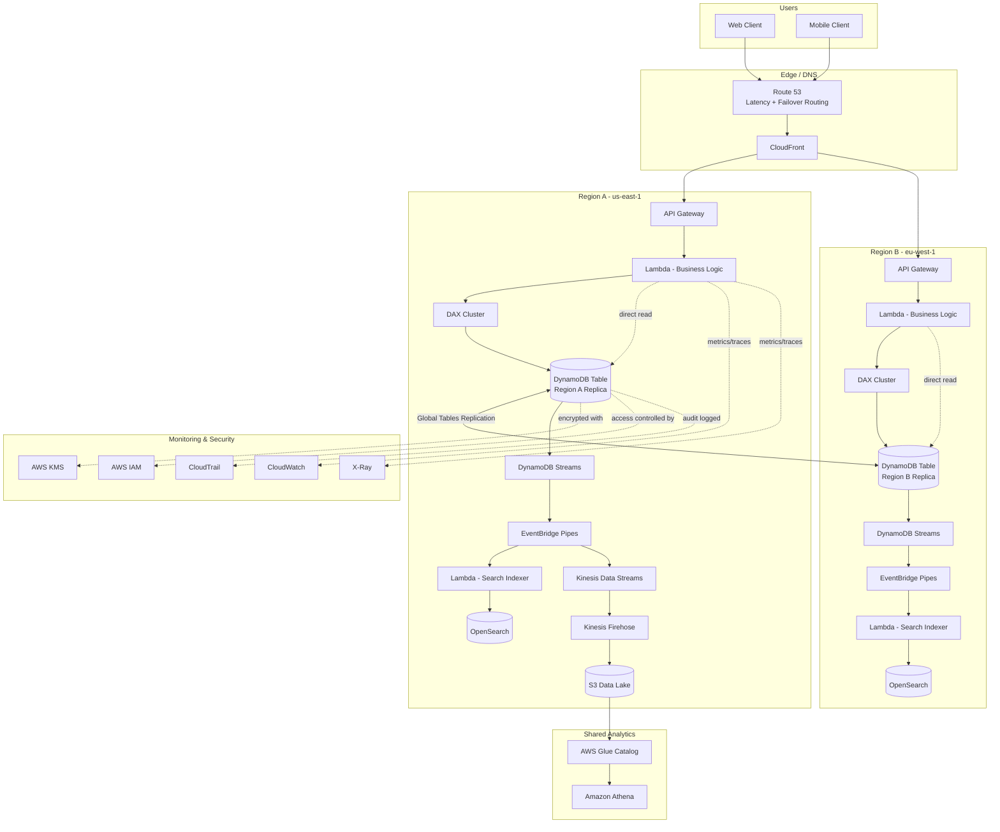

# Part VI – Data Platform Architectures

# Chapter 45: DynamoDB

*A single-table, multi-Region, event-driven DynamoDB reference architecture for enterprise workloads*

---

# 1. Executive Summary

## The Business Problem

Enterprises running high-traffic, latency-sensitive applications hit a wall with traditional relational databases long before they hit a wall with traffic itself.

The symptoms are familiar to anyone who has run a production RDBMS at scale:

- Read replicas lag under bursty write load, producing stale reads at the worst possible moment (checkout, inventory, session state).
- Vertical scaling has a ceiling. Eventually the biggest instance class is not big enough.
- Schema migrations on multi-terabyte tables require maintenance windows, blue-green cutovers, or risky online DDL.
- Connection limits force architects to bolt on connection pooling layers (RDS Proxy, PgBouncer) just to keep the application tier from starving the database.
- Multi-Region relational deployments require either expensive cross-Region synchronous replication (with latency penalties) or complex, hand-rolled asynchronous replication with conflict resolution logic.

DynamoDB exists to remove this ceiling entirely for a specific and very common class of workload: **high-throughput, key-based access patterns where the shape of the query is known in advance.**

This is not a database for ad-hoc analytical queries. It is a database for applications that need single-digit-millisecond, predictable-latency access to data at effectively unlimited scale, with zero database server management.

## Architecture Objective

The reference architecture in this chapter is built around three non-negotiable enterprise requirements:

1. **Predictable performance at any scale.** Latency must stay flat whether the table holds 10 GB or 100 TB, and whether traffic is 100 requests/second or 100,000 requests/second.
2. **Multi-Region resilience.** A Regional outage must not take down the application. Active-active writes must be possible in more than one Region.
3. **Zero operational database administration.** No patching, no instance sizing, no replica management, no manual failover.

The architecture combines:

- **DynamoDB with single-table design** (scoped to a bounded context, not the entire enterprise data estate) for the transactional core.
- **DynamoDB Global Tables** for multi-Region active-active replication.
- **DynamoDB Accelerator (DAX)** for microsecond-latency read caching on hot items.
- **DynamoDB Streams, EventBridge Pipes, and Kinesis Data Streams** for event-driven downstream processing and analytics offload.
- **S3 and Athena** for long-term, low-cost analytical access to data that has aged out of the hot path.

## Why Organizations Adopt This Architecture

Organizations move to this architecture pattern for a recurring set of reasons:

- **Traffic is spiky and unpredictable.** Flash sales, product launches, viral moments, and seasonal peaks (Black Friday, tax season, open enrollment) create 10x–50x traffic multipliers that a fixed-capacity relational tier cannot absorb without over-provisioning for the other 360 days of the year.
- **The access pattern is known and stable.** "Get order by order ID," "get all orders for a customer," "get the current session for a user" — these are key-value and key-range lookups, exactly what DynamoDB is built for.
- **Global user base.** Users in Tokyo, Frankfurt, and São Paulo all expect the same low latency, which requires data close to them, not a single Region they all cross an ocean to reach.
- **Engineering velocity matters more than schema flexibility.** Teams building microservices want each service to own its data model without waiting on a shared DBA team to run a migration.
- **The team wants to eliminate a category of on-call pain.** Database server crashes, disk-full events, and replication lag pages disappear because there is no server to crash.

## Major Business Benefits

| Benefit | Business Impact |
|---|---|
| Single-digit-millisecond latency at any scale | Higher conversion rates, better user experience, fewer abandoned carts/sessions |
| No capacity planning for normal operations (on-demand mode) | Engineering time redirected from infrastructure to product features |
| 99.999% availability SLA with Global Tables | Reduced revenue loss from Regional outages |
| Pay-per-request or provisioned pricing | FinOps teams can model cost directly against business metrics (requests, GB stored) |
| Built-in encryption, IAM-based access control, VPC endpoint support | Simplifies compliance audits (PCI-DSS, HIPAA, SOC 2) |
| Streams-driven event architecture | Decouples downstream systems (search indexing, analytics, notifications) from the write path |

## Typical Enterprise Scenarios

This architecture is the default choice for:

- **E-commerce**: shopping carts, product catalogs (read-heavy), order state machines, inventory counters.
- **Gaming**: player profiles, leaderboards, session state, matchmaking queues.
- **AdTech**: real-time bidding context lookups, frequency capping, user profile stores.
- **IoT**: device state, device shadow, telemetry ingestion staging before analytics offload.
- **Financial services**: idempotency ledgers, entitlement/permission caches, transaction state machines (not the system of record for double-entry accounting, but the fast-path state layer in front of it).
- **SaaS platforms**: multi-tenant configuration, feature flags, per-tenant usage counters.

> **Note:** DynamoDB is not a drop-in replacement for every relational workload. Chapter 43 (Relational Database) and Chapter 44 (Aurora Global Database) cover architectures where relational guarantees, complex joins, or ad-hoc query flexibility are the primary requirement. Section 28 of this chapter compares DynamoDB against those alternatives in detail.

---

# 2. Business Requirements

## Business Drivers

- Reduce checkout/session latency to improve conversion.
- Support 10x seasonal traffic spikes without pre-provisioning weeks in advance.
- Expand into new geographic Regions without re-architecting the data tier.
- Reduce database operations headcount and on-call burden.
- Meet contractual uptime SLAs with enterprise customers (99.95%+).

## Functional Requirements

- Sub-10ms p99 read latency for hot-path lookups.
- Support for single-item reads, batch reads, and bounded range queries (e.g., "all orders for customer X in the last 90 days").
- Strong consistency for financial and inventory-affecting operations; eventual consistency acceptable for read-heavy display data.
- Conditional writes to support optimistic concurrency (e.g., inventory decrement without overselling).
- Change data capture for downstream systems (search, analytics, notifications).
- Multi-Region active-active writes for at least two Regions.

## Non-Functional Requirements

| Category | Requirement |
|---|---|
| Availability | 99.99% single-Region, 99.999% multi-Region (Global Tables) |
| Latency | p50 < 5ms, p99 < 10ms (with DAX for cache-eligible reads: < 1ms) |
| Throughput | Sustain 50,000+ requests/second per table, burst to 150,000+ |
| Durability | 11 nines (AWS-managed, replicated across 3 AZs minimum) |
| Security | Encryption at rest (KMS), encryption in transit (TLS 1.2+), IAM-scoped access, VPC endpoint isolation |
| Compliance | PCI-DSS, SOC 2, HIPAA-eligible service usage where applicable |
| Auditability | All control-plane and data-plane access logged via CloudTrail |

## Scalability Goals

- Table must scale from a cold-start workload (hundreds of requests/second) to enterprise scale (hundreds of thousands of requests/second) without a re-architecture or table redesign.
- Partition key design must avoid hot partitions at 10x current peak traffic.
- Global Secondary Indexes (GSIs) must scale independently of the base table's access pattern.

## Availability Requirements

- No single Availability Zone failure should cause a customer-visible outage.
- No single Regional failure should cause a customer-visible outage for architectures using Global Tables.
- Planned maintenance windows: none required (DynamoDB is a fully managed, patch-free service).

## Latency Requirements

- Interactive user-facing reads: < 10ms p99.
- Cache-eligible hot-key reads (product catalog, session lookups): < 1ms via DAX.
- Write acknowledgment: < 10ms p99 for single-Region writes; < 1 second for cross-Region propagation via Global Tables (typically sub-second in practice).

## Compliance Requirements

- Data residency: Global Tables Region selection must respect data residency requirements (e.g., EU customer data replicated only within EU Regions where mandated).
- Encryption: customer-managed KMS keys (CMKs) for workloads subject to key-rotation and key-access-audit requirements.
- Access logging: every read/write API call attributable to an IAM principal via CloudTrail data events.

## Recovery Objectives

| Metric | Target | Mechanism |
|---|---|---|
| RPO (Recovery Point Objective) | Near-zero for multi-Region (Global Tables), < 5 minutes for single-Region (Point-in-Time Recovery) | Global Tables replication (typically sub-second); PITR continuous backups |
| RTO (Recovery Time Objective) | Near-zero for Regional failover (Global Tables + Route 53 failover), < 1 hour for full table restore from backup | Application-layer Regional failover; on-demand table restore |

## SLAs

- Internal SLA target: 99.99% availability per Region, 99.999% aggregate with Global Tables across 2+ Regions.
- AWS DynamoDB service SLA: 99.99% (single-Region, on-demand or provisioned with auto scaling); 99.999% for Global Tables spanning 3+ Regions.

## Expected Workload

- Baseline: 5,000 requests/second sustained.
- Peak (seasonal/promotional): 75,000 requests/second sustained for hours at a time.
- Burst: short spikes to 150,000+ requests/second (flash sale opening minute).
- Item size: predominantly < 4KB (order records, session objects); occasional larger items (< 400KB DynamoDB hard limit) for aggregated documents.

## Expected Growth

- 3-year data growth projection: 2 TB → 40 TB across core tables.
- Request volume growth: 3x–5x year over year during the platform's growth phase.
- New Region expansion: 1 additional Region every 12–18 months as the business enters new markets.

---

# 3. Architecture Overview

## Overall Design

This architecture treats DynamoDB as the **system of engagement** for a bounded business context (for example, "Order Management" or "Player Profile"), not as a single monolithic data store for the entire enterprise.

Each bounded context gets its own single-table design. This is a deliberate constraint:

- Single-table design inside one microservice's data boundary keeps the access-pattern-driven modeling tractable.
- Single-table design across an entire enterprise (all services sharing one giant table) becomes unmanageable and re-introduces the tight coupling DynamoDB is meant to help teams avoid.

## Architecture Philosophy

The design follows four core principles:

1. **Design for access patterns, not for entities.** Relational modeling starts with "what are my entities and their relationships." DynamoDB modeling starts with "what queries does my application need to run, at what frequency, at what latency." The schema is derived from the query list, not the other way around.
2. **Denormalize deliberately.** Duplicate data where it eliminates a join. Storage is cheap; cross-partition fan-out queries are not.
3. **Treat writes as events.** Every write is a potential trigger for downstream work (search indexing, cache invalidation, notification, analytics). DynamoDB Streams makes this a first-class architectural pattern rather than an afterthought (dual writes, polling, or nightly ETL).
4. **Push analytical and ad-hoc query needs out of the hot path.** DynamoDB is deliberately bad at ad-hoc queries and aggregations. Those needs are served by streaming the change log into S3/Athena or OpenSearch rather than contorting the table design to support them.

## Core Components

| Component | Role |
|---|---|
| DynamoDB table (single-table design) | Primary transactional store for the bounded context |
| Global Secondary Indexes (GSIs) | Support secondary access patterns (e.g., lookup by status, by date range) |
| DynamoDB Global Tables | Multi-Region active-active replication |
| DynamoDB Accelerator (DAX) | In-memory microsecond-latency read cache in front of the table |
| DynamoDB Streams | Ordered, near-real-time change data capture feed |
| Amazon EventBridge Pipes | Routes stream records to downstream targets with filtering/enrichment, no custom polling code |
| Amazon Kinesis Data Streams (via Kinesis Data Streams for DynamoDB) | High-throughput fan-out for analytics consumers requiring longer retention and multiple parallel consumers |
| AWS Lambda | Stream processors, business logic triggers, enrichment functions |
| Amazon S3 + AWS Glue + Amazon Athena | Cold-path analytical store fed from the Streams/Kinesis pipeline |
| Amazon OpenSearch Service | Full-text and faceted search index, fed from the same change stream |
| Amazon API Gateway + AWS Lambda | Application-facing API tier in front of DynamoDB |
| Amazon CloudWatch + AWS X-Ray | Observability across the request path |
| AWS KMS | Encryption key management |
| AWS IAM | Fine-grained, attribute-based access control down to the item level |

## How Components Interact

The write path and read path are intentionally asymmetric:

- **Writes** land in DynamoDB, are acknowledged to the client, and asynchronously fan out via Streams to every downstream consumer that cares about that change.
- **Reads** are served either directly from DynamoDB (for consistency-sensitive lookups) or from DAX (for latency-sensitive, cache-eligible lookups), never from the analytical copies.

This separation is what allows the transactional path to stay fast and simple while still supporting rich search, analytics, and reporting needs elsewhere in the platform.

## High-Level Workflow

1. Client issues a request through API Gateway.
2. Lambda (or a container-based service on ECS/EKS, in higher-throughput services) authenticates the caller, applies business logic, and issues a DynamoDB API call (GetItem, Query, PutItem, UpdateItem, TransactWriteItems).
3. For reads, DAX is checked first if the access pattern is cache-eligible.
4. For writes, DynamoDB persists the change synchronously to the base table and, if Global Tables is enabled, asynchronously replicates it to companion Regions.
5. DynamoDB Streams captures the change (old image, new image, or both) within milliseconds.
6. EventBridge Pipes reads the stream, optionally filters and enriches, and routes to targets: a Lambda function for search indexing, an SNS topic for notifications, and a Kinesis Data Stream for analytics.
7. The Kinesis stream is consumed by Kinesis Data Firehose (or a Glue streaming job) and lands in S3 in Parquet format, partitioned for Athena querying.
8. CloudWatch collects metrics and logs throughout; X-Ray traces the request path end-to-end.

## Request Lifecycle

- Inbound request → API Gateway → IAM/Cognito authorizer → Lambda handler → DynamoDB call → response serialization → client.
- Typical end-to-end latency budget: 15–40ms for a cache-miss read; 2–5ms for a DAX cache-hit read.

## Response Lifecycle

- Successful writes return the item's new state (when using `ReturnValues=ALL_NEW`) to avoid a follow-up read.
- Conditional check failures (e.g., optimistic concurrency conflicts) are surfaced as typed application errors, not generic 500s, so clients can retry with backoff or prompt the user.

## Data Lifecycle

- **Hot data** (accessed within the last 30–90 days, depending on the workload) lives in DynamoDB with TTL-based expiration for ephemeral items (sessions, temporary locks).
- **Warm data** is retained in DynamoDB but access frequency drops; provisioned capacity and DAX are sized around this working set, not the full historical dataset.
- **Cold data** ages out via DynamoDB TTL and is retained indefinitely in S3 (fed by the Streams pipeline before deletion), queryable via Athena for compliance, analytics, and reporting.

---

# 4. AWS Services Used

## Amazon DynamoDB

**Purpose:** Primary NoSQL key-value and document database for the transactional core of the application.

**Why selected:**
- Serverless, fully managed — no instances to patch or size.
- Single-digit-millisecond latency regardless of table size.
- Native multi-Region active-active replication via Global Tables.
- Built-in TTL, Streams, point-in-time recovery, and on-demand backups.

**Alternatives:** Amazon Aurora (relational, see Chapter 44), MongoDB Atlas / DocumentDB (document model with richer query language, weaker latency guarantees at extreme scale), Cassandra on EC2/MSK-adjacent self-managed clusters (more operational burden, similar wide-column model).

**Limitations:**
- 400KB maximum item size.
- No native joins or ad-hoc aggregate queries.
- Query flexibility is bounded by the indexes you design up front; adding a genuinely new access pattern after the fact often requires a new GSI or a data migration.
- Transactions (`TransactWriteItems`) are limited to 100 items / 4MB per transaction and only within a single Region.

**Pricing considerations:** On-demand mode bills per request (read/write request units); provisioned mode bills per hour of reserved capacity and is cheaper for steady, predictable workloads. Storage billed per GB-month. Global Tables multiply write costs by the number of participating Regions (each Region's replicated write is billed as a write in that Region).

**Best practices:** Design around access patterns first; use on-demand mode for unpredictable or new workloads and provisioned mode with auto scaling once traffic is well understood; enable point-in-time recovery for all production tables; use adaptive capacity (automatic in on-demand and modern provisioned tables) to absorb uneven key distribution.

## DynamoDB Global Tables

**Purpose:** Multi-Region, multi-active replication of DynamoDB tables with last-writer-wins conflict resolution.

**Why selected:** Enables active-active deployment across Regions with no application-level replication logic, supporting both disaster recovery and low-latency local reads/writes for a global user base.

**Alternatives:** Single-Region table with cross-Region read replicas via custom Streams-based replication (more control, significantly more engineering effort); Aurora Global Database (relational, single-writer-Region model, not active-active).

**Limitations:** Last-writer-wins conflict resolution means concurrent conflicting writes to the same item in different Regions can silently overwrite each other — application design must avoid or tolerate this (see Section 11 and Section 24).

**Pricing considerations:** Replicated write request units are billed in each additional Region; storage is billed in each Region a table exists in.

**Best practices:** Use for workloads where conflict is rare (e.g., per-user data where a user's writes originate from one Region at a time) or where last-writer-wins is an acceptable semantic (e.g., "current status" fields). Avoid for counters or values requiring cross-Region strong consistency without additional conflict-handling logic.

## DynamoDB Accelerator (DAX)

**Purpose:** In-memory, write-through caching layer for DynamoDB, delivering microsecond read latency for cache-eligible queries.

**Why selected:** Reduces read latency by roughly 10x for hot-key access patterns (product catalog lookups, session reads) without any application-level cache-invalidation logic.

**Alternatives:** ElastiCache (Redis/Memcached) as a self-managed cache-aside layer (more flexible, requires manual invalidation logic); no cache, relying on DynamoDB's native latency (acceptable for many workloads, insufficient for the most latency-sensitive ones).

**Limitations:** Eventually consistent by design (writes go through DAX, but DAX caches are not instantly coherent across all client connections in every edge case); does not support strongly consistent reads; cluster runs inside a VPC and adds an operational component (though still managed by AWS).

**Pricing considerations:** Billed per node-hour by instance type; sized independently of the DynamoDB table's own capacity.

**Best practices:** Use for read-heavy, cache-eligible access patterns only (e.g., product detail pages); do not put DAX in front of access patterns requiring strong consistency (inventory decrements, financial balances).

## DynamoDB Streams

**Purpose:** Ordered, near-real-time capture of item-level changes (insert, update, delete) in a table, retained for 24 hours.

**Why selected:** Enables event-driven architectures — search indexing, cache invalidation, notifications, analytics — without polling the table or building custom change-detection logic.

**Alternatives:** Application-level dual writes (writes both to DynamoDB and directly to downstream systems — introduces distributed-transaction risk and code duplication); scheduled batch export (higher latency, simpler).

**Limitations:** 24-hour retention window; consumers must keep up or risk data loss; ordering is guaranteed only within a single partition key.

**Best practices:** Always pair with a durable consumer (Lambda, Kinesis Data Streams for DynamoDB) rather than relying on the 24-hour window as a buffer of last resort.

## Amazon EventBridge Pipes

**Purpose:** Point-to-point integration connecting a DynamoDB Stream (or Kinesis stream, SQS queue) directly to a target, with optional filtering and enrichment, without writing custom polling/routing code.

**Why selected:** Reduces the amount of custom Lambda "glue" code needed to route stream events to multiple downstream targets; supports built-in filtering to avoid invoking downstream targets for irrelevant changes.

**Alternatives:** A single Lambda function subscribed directly to the DynamoDB Stream that fans out manually to SNS/SQS/Kinesis (more code, more to test and maintain); Step Functions for more complex, stateful downstream orchestration.

**Best practices:** Use filtering at the Pipe level to avoid invoking downstream Lambdas or writing to Kinesis for changes nobody consumes.

## Amazon Kinesis Data Streams (via Kinesis Data Streams for DynamoDB)

**Purpose:** High-throughput, multi-consumer, longer-retention (up to 365 days) event stream for analytics and audit use cases that outgrow the 24-hour DynamoDB Streams window.

**Why selected:** Supports many parallel independent consumers (analytics pipeline, audit archive, fraud detection stream) without each one competing for the same 24-hour Streams shard iterator budget.

**Alternatives:** Multiple Lambda consumers directly on DynamoDB Streams (works for a small number of consumers; becomes unwieldy and hits concurrency limits with many).

## AWS Lambda

**Purpose:** Serverless compute for the application's business logic tier and for stream-processing functions.

**Why selected:** Scales automatically with request volume; no server management; integrates natively with API Gateway, DynamoDB Streams, and EventBridge Pipes.

**Alternatives:** ECS Fargate or EKS for workloads with sustained high throughput where Lambda's per-invocation overhead and cold-start profile become a limiting factor (see Chapter 27 and Chapter 35).

## Amazon S3 + AWS Glue + Amazon Athena

**Purpose:** Cold-path analytical store. S3 holds the historical event/data lake in Parquet format; Glue catalogs the schema; Athena provides SQL query access.

**Why selected:** Extremely low storage cost compared to keeping historical data in DynamoDB; supports ad-hoc SQL queries that DynamoDB cannot serve natively.

**Best practices:** Partition by date (and a secondary dimension like Region or tenant) to keep Athena queries scanning only relevant data; convert to Parquet with a columnar layout for cost-efficient scanning.

## Amazon OpenSearch Service

**Purpose:** Full-text and faceted search index fed from the same DynamoDB Streams pipeline, supporting complex search queries the base table cannot serve.

**Alternatives:** Amazon Kendra for managed enterprise search; a third-party search SaaS (Algolia, Elasticsearch Cloud).

## Amazon API Gateway

**Purpose:** Managed, scalable API front door with built-in throttling, authentication integration, and request validation.

**Alternatives:** Application Load Balancer + container service, for teams standardizing on containers (see Chapter 35/36).

## AWS KMS

**Purpose:** Manages the encryption keys used for DynamoDB encryption at rest.

**Best practices:** Use customer-managed keys (CMKs) rather than the AWS-owned default key when the workload requires key rotation control, access auditing, or cross-account key sharing policies.

## AWS IAM

**Purpose:** Controls which principals (services, users, roles) can perform which DynamoDB API actions, down to the item and attribute level using fine-grained access control (`dynamodb:LeadingKeys` condition keys).

## Amazon CloudWatch and AWS X-Ray

**Purpose:** Metrics, logs, alarms (CloudWatch) and distributed tracing (X-Ray) across the full request path from API Gateway through Lambda to DynamoDB.

---

# 5. Complete Architecture Diagram



> **Diagram notes:**

> - Region A and Region B run fully independent application stacks, both writing to their local DynamoDB replica.

> - Global Tables handles bidirectional replication transparently; the application never calls a cross-Region API directly.

> - Each Region has its own Streams → search-index pipeline for local search latency; only Region A (in this example) feeds the shared analytics data lake, to avoid duplicate ingestion. In practice, either Region can be the analytics source, or both can feed a deduplicated pipeline keyed on item version.

---

# 6. Component-by-Component Explanation

## DynamoDB Table (Base Table, Single-Table Design)

**Purpose:** Store all entity types for the bounded context (e.g., Order, OrderLineItem, Customer-Order-Summary) in one physical table, keyed to support the majority of access patterns with a single query.

**Responsibilities:** Durable persistence, partition-level throughput isolation, conditional writes for concurrency control.

**Inputs:** PutItem, UpdateItem, DeleteItem, TransactWriteItems calls from the application tier.

**Outputs:** GetItem, Query, BatchGetItem responses; change events via Streams.

**Scaling:** On-demand mode scales automatically per partition; provisioned mode with auto scaling adjusts read/write capacity units based on utilization targets (typically 70%).

**High availability:** Data is synchronously replicated across three Availability Zones within the Region by default — this is not optional or configurable, it is how DynamoDB works.

**Failure handling:** AZ failure is transparently absorbed by the service; client-visible impact is, at most, a brief latency blip during internal failover, not an outage.

**Dependencies:** KMS (encryption), IAM (access control), VPC endpoint (if accessed privately).

**Security:** Encryption at rest via KMS; TLS in transit; IAM policies scoped to specific actions and, where needed, specific partition key prefixes via `dynamodb:LeadingKeys`.

**Monitoring:** `ConsumedReadCapacityUnits`, `ConsumedWriteCapacityUnits`, `ThrottledRequests`, `SystemErrors`, `SuccessfulRequestLatency`.

## Global Secondary Indexes (GSIs)

**Purpose:** Support access patterns that do not fit the base table's primary key structure (e.g., "find all orders with status = SHIPPED" when the base table is keyed by customer and order ID).

**Responsibilities:** Maintain an eventually consistent, independently scaled projection of the base table, keyed differently.

**Scaling:** Each GSI has its own throughput dimension; a hot GSI key can throttle independently of the base table.

**Failure handling:** GSI write failures (e.g., due to throttling) do not fail the base table write — DynamoDB retries asynchronously — but this means GSI reads can lag the base table under sustained GSI throttling. This must be monitored explicitly.

## DAX Cluster

**Purpose:** Sit between the application and DynamoDB for cache-eligible reads, absorbing repeated GetItem/Query calls for the same hot items.

**Scaling:** Add read replicas to the DAX cluster to scale read throughput; DAX does not scale writes (all writes still go to DynamoDB, DAX simply observes them via write-through).

**High availability:** Multi-AZ deployment with automatic failover to a replica node.

**Failure handling:** Application SDK falls back to direct DynamoDB access if the DAX cluster is unreachable — this must be explicitly implemented and tested, not assumed.

## DynamoDB Streams + EventBridge Pipes

**Purpose:** Turn every table mutation into a routable event.

**Responsibilities:** Guarantee ordered delivery per partition key; provide old-image/new-image/both views of each change.

**Failure handling:** Pipe targets that fail are retried with configurable retry policy and, beyond that, routed to a dead-letter queue for manual inspection — this DLQ must be actively monitored, not treated as a silent trash bin.

## Kinesis Data Streams for DynamoDB → Firehose → S3

**Purpose:** Durable, long-retention, multi-consumer analytical event bus feeding the data lake.

**Scaling:** Shard count scales with sustained throughput; on-demand mode (Kinesis on-demand capacity) removes manual shard management for variable workloads.

## Application Tier (API Gateway + Lambda)

**Purpose:** Enforce business rules, authentication, and authorization before any DynamoDB call; shape the DynamoDB response into the API contract the client expects.

**Scaling:** Both components scale automatically with request volume; the practical scaling limit is almost always DynamoDB partition throughput or downstream account-level Lambda concurrency limits, not the components themselves.

---

# 7. End-to-End Request Flow

**Scenario: customer places an order (write path), then immediately views order confirmation (read path).**

1. Client submits `POST /orders` to CloudFront.
2. CloudFront routes the request (no caching for POST) to the nearest healthy Regional API Gateway via Route 53 latency-based routing.
3. API Gateway validates the request schema and invokes the authorizer Lambda to validate the caller's JWT.
4. The order-service Lambda executes business logic: validates inventory availability, computes totals, generates an idempotency key.
5. The Lambda issues a `TransactWriteItems` call: conditionally decrement inventory count AND create the new order item, atomically, in the same transaction.
6. DynamoDB validates all condition expressions; if inventory is insufficient, the entire transaction is rejected and the Lambda returns a typed `409 Conflict` to the client — no partial state is ever written.
7. On success, DynamoDB persists the write synchronously across 3 AZs and returns success to the Lambda.
8. The Lambda returns `201 Created` with the new order to the client via API Gateway and CloudFront.
9. Asynchronously, within milliseconds, DynamoDB Streams captures the new-item event.
10. EventBridge Pipes routes the event to: (a) a Lambda that indexes the order into OpenSearch for customer-support search, and (b) a Kinesis Data Stream for the analytics pipeline.
11. The Kinesis Firehose consumer batches records and writes Parquet files to S3, partitioned by date.
12. If Global Tables is enabled, the write also propagates asynchronously to companion Region replicas, typically within one second.
13. Client immediately issues `GET /orders/{orderId}` for the confirmation page.
14. The Lambda checks DAX first. Since this is a brand-new item, it is a cache miss.
15. The Lambda falls through to a direct, strongly consistent `GetItem` call against DynamoDB (strong consistency is required here because the customer must see their own just-placed order).
16. DynamoDB returns the item; the Lambda populates DAX with the result for subsequent reads (which can tolerate eventual consistency, e.g., order-status polling).
17. Response is returned to the client.
18. CloudWatch records latency and error metrics at every hop; X-Ray stitches the trace together for end-to-end visibility.
19. If any step errors, the Lambda returns a structured error response and emits a CloudWatch metric; alarms notify the on-call engineer if error rates exceed threshold.
20. If the transaction write fails due to a throttling exception (rare, but possible under extreme partition-level hot-keying), the Lambda's SDK-level retry-with-backoff logic re-attempts before surfacing an error to the client.

---

# 8. Deployment Flow

## Infrastructure Provisioning

- All infrastructure (DynamoDB tables, GSIs, DAX clusters, Streams configuration, IAM roles, Lambda functions) is defined in Terraform and version-controlled.
- Table schema changes (new GSI, new attribute usage) go through the same pull-request and review process as application code.

## Terraform Workflow

1. Developer opens a pull request modifying the Terraform module (e.g., adding a new GSI).
2. CI pipeline runs `terraform validate`, `terraform plan`, and a policy-as-code check (Open Policy Agent / Sentinel) that blocks destructive changes to production tables (e.g., accidental `ForceNew` on the base table's key schema) without explicit override approval.
3. Plan output is posted as a PR comment for human review.
4. On merge, CI pipeline runs `terraform apply` against a non-production account first, runs smoke tests, then promotes to production.

## CI/CD Deployment

- Application code (Lambda functions) is deployed independently of table infrastructure changes, using AWS SAM or the Serverless Framework, with canary/linear traffic shifting via Lambda aliases and CodeDeploy.

## Blue-Green Deployment

- DynamoDB itself does not require blue-green deployment (it is not "deployed" in the traditional sense) — the pattern applies to the application tier (Lambda/API Gateway) in front of it.
- Table schema changes that are additive (new GSI, new attribute) are zero-downtime by nature.
- Table schema changes that are structurally incompatible (change of partition key) require a new table and a backfill/migration strategy — this is treated as a major, carefully planned event, not a routine deployment (see Section 27, Anti-Patterns, for the risks of designing yourself into this corner).

## Rollback

- Lambda rollback: revert the alias to the previous version immediately via CodeDeploy.
- Table configuration rollback: Terraform state revert; GSI removal (if the new GSI is the source of a problem) is safe and reversible; base table key schema is never rolled back in place — mitigated by never changing it in place to begin with.

## Secrets

- No database credentials exist to manage — DynamoDB access is entirely IAM-based, eliminating an entire class of secret-management risk (no rotating passwords, no leaked connection strings).
- Any third-party API keys used by stream-processing Lambdas are stored in AWS Secrets Manager.

## Configuration

- Environment-specific configuration (table names, Region list for Global Tables, DAX endpoint) is injected via Lambda environment variables, sourced from SSM Parameter Store, per environment (dev/staging/prod).

## Validation

- Post-deployment smoke tests exercise every core access pattern (read by ID, query by GSI, conditional write, transaction) against a synthetic test item before the deployment is marked successful.

---

# 9. Network Topology

DynamoDB is a regional, AWS-managed service accessed over its public API endpoint or, for private connectivity, via a VPC Gateway Endpoint (no ENI, no NAT Gateway cost) or Interface Endpoint.

## VPC

- Application Lambda functions run inside a VPC only when they need to reach other VPC-bound resources (DAX requires VPC placement; DynamoDB itself does not).
- Standard three-tier VPC layout: public subnets (NAT Gateways only, no application workloads), private application subnets, private data subnets (for DAX nodes).

## CIDR

- `/16` VPC CIDR per Region, subdivided into `/20` subnets per AZ per tier, leaving headroom for future service growth.

## Public Subnets

- Host NAT Gateways only. No Lambda, no DAX, no application compute is public-facing.

## Private Subnets

- Application Lambda functions (when VPC-attached) run in private application subnets.
- DAX cluster nodes run in private data subnets, reachable only from the application subnets' security group.

## NAT Gateway

- One per AZ for outbound internet access (e.g., Lambda calling a third-party API). DynamoDB access itself does not need to traverse the NAT Gateway if a Gateway Endpoint is configured.

## Internet Gateway

- Standard IGW for the public subnet tier (NAT Gateway egress only).

## Transit Gateway

- Used when this bounded context's VPC needs to communicate with other application VPCs in a hub-and-spoke enterprise network (see Chapter 17).

## Route Tables

- Private subnet route tables include a route to the DynamoDB Gateway Endpoint's prefix list, keeping DynamoDB traffic off the public internet and off the NAT Gateway entirely (reducing both cost and attack surface).

## Network ACLs

- Stateless NACLs at the subnet boundary as defense-in-depth, permitting only expected traffic (HTTPS out from application subnets, DAX port 8111 between application and data subnets).

## Security Groups

- Lambda security group: outbound HTTPS (443) to the DynamoDB Gateway Endpoint prefix list and to DAX port 8111.
- DAX security group: inbound 8111 from the Lambda security group only.

## PrivateLink

- DynamoDB's Gateway Endpoint (not an Interface Endpoint/PrivateLink resource) is the standard, no-cost, recommended private-access mechanism. Interface Endpoints exist for some regional variations but Gateway Endpoints are preferred for DynamoDB specifically.

## Hybrid Connectivity

- For enterprises with on-premises systems that need DynamoDB access (e.g., a legacy ERP polling order status), Direct Connect (Chapter 24) terminates into the VPC, and the same Gateway Endpoint route applies.

---

# 10. Identity and Access

## IAM Roles

- **Application execution role** (attached to each Lambda function): scoped to exactly the DynamoDB actions and, where practical, exactly the table/index ARNs that function needs — no wildcard `dynamodb:*` on `*`.
- **Stream-processing role**: scoped to `dynamodb:DescribeStream`, `dynamodb:GetRecords`, `dynamodb:GetShardIterator`, `dynamodb:ListStreams` on the specific stream ARN only.
- **CI/CD deployment role**: scoped to Terraform-managed resource types, with explicit deny on `dynamodb:DeleteTable` for production table ARNs, enforced via a permission boundary.

## IAM Policies

Example least-privilege policy for an order-service Lambda:

```json

{
  "Version": "2012-10-17",
  "Statement": [
    {
      "Sid": "OrderTableReadWrite",
      "Effect": "Allow",
      "Action": [
        "dynamodb:GetItem",
        "dynamodb:PutItem",
        "dynamodb:UpdateItem",
        "dynamodb:Query",
        "dynamodb:TransactWriteItems",
        "dynamodb:ConditionCheckItem"
      ],
      "Resource": [
        "arn:aws:dynamodb:us-east-1:111122223333:table/orders-service",
        "arn:aws:dynamodb:us-east-1:111122223333:table/orders-service/index/*"
      ]
    },
    {
      "Sid": "DenyDestructiveActions",
      "Effect": "Deny",
      "Action": [
        "dynamodb:DeleteTable",
        "dynamodb:DeleteItem",
        "dynamodb:UpdateTable"
      ],
      "Resource": "arn:aws:dynamodb:us-east-1:111122223333:table/orders-service"
    }
  ]
}

```

> **Tip:** Note that `DeleteItem` is explicitly denied for this particular service role — the order service marks orders as cancelled rather than physically deleting them, so no code path should ever need this permission. Denying it removes an entire class of accidental-deletion risk.

## Resource Policies

- DynamoDB does not support resource-based policies directly on tables in the same way S3 buckets do; cross-account access is instead granted via IAM role assumption (STS) combined with the resource-owning account's IAM policy granting `sts:AssumeRole` to the trusted principal.

## STS

- Cross-account read access (e.g., a shared analytics account reading via a Kinesis stream, not DynamoDB directly) uses `sts:AssumeRole` with an external ID condition to prevent confused-deputy attacks.

## Cross-Account Access

- The pattern of choice: the analytics account assumes a narrowly scoped role in the application account that grants only `kinesis:GetRecords` on the specific analytics stream — DynamoDB table access itself is never granted cross-account directly.

## Least Privilege

- Every Lambda function gets its own IAM role, not a shared "backend-services-role." This keeps the blast radius of a compromised function limited to exactly what that function needs.

## Service Roles

- DynamoDB Streams → EventBridge Pipes requires a Pipes execution role with `dynamodb:DescribeStream`, `dynamodb:GetRecords`, `dynamodb:GetShardIterator` on the stream, plus permissions on each configured target.

## Permission Boundaries

- All human and CI/CD roles in the account are constrained by a permission boundary that caps the maximum possible permissions, regardless of what a specific IAM policy grants — a safety net against policy misconfiguration.

---

# 11. Security Architecture

## Encryption

- **At rest:** DynamoDB encrypts all data at rest by default; enterprise workloads use a customer-managed KMS key (CMK) rather than the AWS-owned key, enabling key rotation policy control and detailed CloudTrail visibility into key usage.
- **In transit:** All DynamoDB API calls are TLS 1.2+ only; the AWS SDKs enforce this by default.

## KMS

- CMK with automatic annual rotation enabled.
- Key policy restricts `kms:Decrypt` to the specific IAM roles that access the table, plus the DynamoDB service principal.

## TLS

- Enforced end-to-end: client → CloudFront → API Gateway → Lambda → DynamoDB, every hop over TLS.

## WAF

- AWS WAF attached to CloudFront and/or API Gateway, with managed rule groups (SQL injection, known bad inputs) plus custom rate-based rules to blunt credential-stuffing and scraping attempts before they ever reach the application tier.

## Shield

- AWS Shield Standard is active by default on CloudFront and Route 53; Shield Advanced is added for workloads with a demonstrated DDoS risk profile (e.g., high-profile e-commerce brand during a known sale event).

## Secrets Manager

- Holds any third-party credentials used by stream-processing Lambdas (e.g., a notification provider API key). DynamoDB itself requires no stored credentials.

## Certificate Manager

- ACM issues and auto-renews the TLS certificates used by CloudFront and API Gateway custom domains.

## GuardDuty

- Monitors for anomalous API behavior against the account, including unusual DynamoDB API call patterns that could indicate credential compromise (e.g., a sudden `Scan` of the entire table from an unfamiliar IAM principal).

## Inspector

- Scans the Lambda function code and dependencies for known vulnerabilities as part of the CI/CD pipeline.

## Security Hub

- Aggregates findings from GuardDuty, Inspector, and Config into a single compliance dashboard, mapped against CIS AWS Foundations Benchmark and PCI-DSS where applicable.

## CloudTrail

- Data events enabled for the DynamoDB table, logging every `GetItem`, `PutItem`, `Query`, etc. call with the calling principal, source IP, and timestamp — required for compliance audits and forensic investigation.

## AWS Config

- Continuously evaluates DynamoDB table configuration against rules: encryption enabled, point-in-time recovery enabled, deletion protection enabled on production tables.

## Zero Trust

- No implicit trust between the application tier and the data tier based on network location alone — every DynamoDB call is authenticated and authorized via IAM at the API level, in addition to network-layer controls (see Chapter 87 for the full Zero Trust reference architecture).

## Threat Model

| Threat | Mitigation |
|---|---|
| Compromised Lambda execution role credentials | Least-privilege IAM scoping limits blast radius; GuardDuty detects anomalous usage |
| Data exfiltration via full table scan | IAM policy denies `Scan` for application roles that only need `GetItem`/`Query`; CloudTrail alerts on unexpected Scan calls |
| Cross-Region conflict exploitation (Global Tables) | Application-level design avoids concurrent conflicting writes to the same item from multiple Regions for financial-impact fields |
| Injection via unsanitized partition key input | Input validation at the API Gateway/Lambda layer before constructing any DynamoDB key |
| Insider threat / over-privileged human access | No standing human IAM access to production tables; break-glass access via time-limited, logged role assumption only |

## Attack Vectors and Mitigations

- **Credential leakage**: mitigated by IAM roles (no long-lived credentials to leak) and Secrets Manager for the few credentials that do exist.
- **Denial of wallet** (an attacker driving up on-demand billing via a flood of legitimate-looking requests): mitigated by API Gateway throttling, WAF rate-based rules, and CloudWatch billing anomaly alarms.
- **Data tampering**: mitigated by conditional writes (optimistic concurrency), CloudTrail audit trail, and, for the most sensitive fields, application-level checksums or DynamoDB's built-in item versioning pattern.

---

# 12. High Availability

## AZ Failures

- Fully absorbed by DynamoDB's native 3-AZ synchronous replication — no application awareness or action required.

## Instance Failures

- Not applicable in the traditional sense; DynamoDB has no customer-visible "instances." DAX nodes can fail, and the DAX cluster's multi-AZ configuration handles automatic failover to a healthy replica.

## Regional Failures

- Absorbed at the application layer using Global Tables: Route 53 health checks detect a Region's API Gateway becoming unhealthy and shift traffic to the companion Region, whose local DynamoDB replica already has (near) all the data due to ongoing replication.

## Database Failures

- DynamoDB's SLA and architecture are designed such that "database failure" as a discrete event is extremely rare; the more common operational concern is throttling due to under-provisioned capacity or a hot partition, which is addressed via on-demand mode or auto scaling plus deliberate key design (Section 24 covers this in depth as a failure scenario).

## Load Balancing

- API Gateway and Lambda scale horizontally and automatically; there is no traditional load balancer tier to manage for the serverless path (container-based variants use an ALB, per Chapter 35).

## Health Checks

- Route 53 health checks against a lightweight `/health` endpoint on each Regional API Gateway, which itself performs a cheap DynamoDB `DescribeTable` or `GetItem` on a known canary item to validate the full path, not just the API layer.

## Failover

- Failover is DNS-based (Route 53) and typically completes within the health check interval plus DNS TTL — commonly under 60–90 seconds for a full Regional failover, with zero data loss for items that had already replicated (typically sub-second lag under Global Tables).

---

# 13. Disaster Recovery

## Backup Strategy

- **Point-in-time recovery (PITR)** enabled on all production tables, allowing restore to any point within the last 35 days.
- **On-demand backups** taken before major schema changes or risky migrations, retained per compliance requirements (often 7 years for financial data, via export to S3).

## Snapshots

- DynamoDB backups are full-table, incremental-under-the-hood snapshots that do not consume table capacity or affect performance when taken.

## Cross-Region Replication

- Global Tables provides continuous, near-real-time cross-Region replication, functioning as both a low-latency access mechanism and a disaster recovery mechanism simultaneously.

## Pilot Light

- For bounded contexts not requiring active-active Global Tables (lower-traffic, non-latency-critical internal tools), a Pilot Light pattern is used instead: PITR backups plus a documented, tested restore-to-new-Region runbook, accepting a higher RTO in exchange for lower steady-state cost.

## Warm Standby

- For contexts requiring fast recovery but not full active-active, a warm standby Global Tables replica in a secondary Region receives replication traffic but serves no production reads until failover is triggered.

## Multi-Site / Active-Active

- The default posture for customer-facing, revenue-critical bounded contexts (checkout, inventory): full Global Tables active-active across at least two Regions, both serving live production traffic continuously.

## Active-Passive

- Used for internal admin tools and lower-tier services where the cost of a second fully active Region is not justified by the business impact of a Regional outage.

## RPO / RTO Summary

| Tier | Pattern | RPO | RTO |
|---|---|---|---|
| Tier 1 (checkout, inventory) | Global Tables active-active | Near-zero (sub-second replication lag) | Near-zero (DNS failover only) |
| Tier 2 (customer profile, search) | Global Tables active-active | Near-zero | Near-zero |
| Tier 3 (internal admin tools) | Pilot Light / PITR restore | < 24 hours | < 4 hours (manual restore + DNS cutover) |

---

# 14. Scalability

## Horizontal Scaling

- DynamoDB scales horizontally by adding partitions automatically as data volume and/or throughput grow — this is intrinsic to the service and requires no manual sharding logic from the application team.

## Vertical Scaling

- Not applicable — there is no "instance size" to increase. DAX node type can be upsized for more cache memory/throughput per node.

## Auto Scaling

- Provisioned-mode tables use DynamoDB Application Auto Scaling, adjusting read/write capacity units based on a target utilization (commonly 70%), reacting within minutes to sustained load changes.
- On-demand mode requires no auto scaling configuration at all and reacts to load in near real time, at a per-request cost premium relative to well-tuned provisioned capacity.

## Serverless Scaling

- Lambda concurrency scales automatically; the practical ceiling becomes account-level concurrent execution limits (raised via a service quota increase request for high-throughput services) rather than DynamoDB itself.

## Database Scaling

- Partition-level throughput limits (3,000 RCU / 1,000 WCU per partition, as of current service limits) mean the true scaling lever is partition key design that spreads load evenly — not a capacity number. This is discussed at length in Section 24 (Failure Scenarios) and Section 27 (Anti-Patterns).

## Storage Scaling

- Table storage scales to essentially unlimited size with no action required; there is no storage provisioning step.

## Queue Scaling

- Kinesis on-demand mode scales shard count automatically; SQS (used for the Pipes dead-letter queue) requires no capacity planning at all.

---

# 15. Performance Optimization

## Caching

- DAX in front of all cache-eligible reads reduces latency by roughly an order of magnitude and reduces DynamoDB read cost for hot items.
- Application-tier caching (API Gateway response caching) for fully public, non-personalized GET endpoints (e.g., product catalog listing) adds a second layer.

## Compression

- Large item attributes (e.g., a JSON blob describing order history) are compressed before storage when they approach the 400KB item limit, both to stay under the limit and to reduce storage/throughput cost.

## CDN

- CloudFront caches static assets and fully cacheable API responses at the edge, reducing the number of requests that reach the application tier at all.

## Database Optimization

- Partition key design is the single highest-leverage performance lever: a well-distributed key (e.g., `CUSTOMER#<customerId>` rather than a low-cardinality field like `STATUS#PENDING`) avoids hot partitions entirely.
- Sparse indexes (GSIs that only include items with a particular attribute present) keep secondary index size and cost proportional to the subset of data that actually needs that access pattern.

## Connection Pooling

- Not applicable in the traditional sense — DynamoDB is accessed over HTTPS via the AWS SDK, which manages HTTP keep-alive connection reuse internally. Lambda execution environment reuse (keeping the SDK client warm across invocations) is the relevant optimization here.

## Concurrency

- `TransactWriteItems` is used sparingly (it costs 2x the write capacity of an equivalent non-transactional write) and only where true atomicity across items is required, not as a default pattern for every write.

## Async Processing

- Anything that does not need to block the client response (search indexing, notification, analytics ingestion) happens asynchronously via Streams, keeping the synchronous write-path latency minimal.

---

# 16. Cost Optimization (FinOps)

## Deployment Size Estimates

| Deployment Size | Monthly Requests | Avg Item Size | Estimated Monthly Cost (On-Demand) |
|---|---|---|---|
| Small | 10M reads / 2M writes | 1KB | ~$150–$300 |
| Medium | 500M reads / 100M writes | 2KB | ~$4,000–$7,000 |
| Enterprise | 10B reads / 2B writes, multi-Region (2 Regions) | 2KB | ~$90,000–$140,000 |

> **Note:** These figures are illustrative order-of-magnitude estimates for planning purposes, not a quote. Actual cost depends heavily on item size, index count, DAX sizing, and Global Tables Region count. Always model against the AWS Pricing Calculator with the workload's real numbers before committing to a budget.

## Major Cost Drivers

- Read/write request units (on-demand) or provisioned capacity-hours.
- Number of GSIs (each GSI roughly duplicates the write cost for any item it projects).
- Global Tables Region count (write cost multiplies per additional Region).
- DAX node-hours.
- Data transfer, particularly cross-Region replication transfer for Global Tables.
- Backup storage (PITR is included; on-demand backups accrue storage cost over time if not lifecycle-managed).

## Optimization Opportunities

- Switch steady, predictable workloads from on-demand to provisioned + auto scaling — often 40–60% cheaper at consistent volume.
- Use sparse GSIs to avoid projecting/duplicating attributes that most items don't have.
- Set TTL aggressively on ephemeral data (sessions, temporary locks) to keep storage and backup costs proportional to genuinely needed data.
- Right-size DAX cluster node count/type based on actual cache hit ratio and observed read traffic, not a guess made at launch.

## Reserved Instances / Savings Plans

- DynamoDB provisioned capacity supports Reserved Capacity purchases (1-year or 3-year commitment) for workloads with well-understood, stable baseline throughput, similar in spirit to EC2 Reserved Instances.

## Spot

- Not applicable to DynamoDB itself; relevant to any EC2/Fargate compute used elsewhere in the broader platform (e.g., batch analytics jobs reading from the S3 data lake).

## S3 Lifecycle / Storage Classes

- Data lake objects transition from S3 Standard → S3 Infrequent Access → S3 Glacier Instant Retrieval as they age, driven by an S3 Lifecycle policy tied to the partition date.

## Rightsizing

- Quarterly review of provisioned-mode tables' actual utilization versus provisioned capacity, adjusting auto-scaling targets and, where a table has moved from unpredictable to predictable traffic (or vice versa), switching billing mode.

## Cost Allocation and Tagging

- Every table tagged with `cost-center`, `environment`, `bounded-context`, and `data-classification`, enabling precise chargeback to the owning team.

## Budgets

- AWS Budgets alerts configured per bounded-context cost-allocation tag, with escalating notification thresholds (50%, 80%, 100%, 120% of monthly forecast).

## Cost Anomaly Detection

- AWS Cost Anomaly Detection monitors DynamoDB spend per linked account/service and alerts the FinOps team of statistically unusual spend patterns — often the first signal of a runaway Scan operation, a misconfigured retry loop, or an actual traffic surge worth celebrating rather than panicking over.

---

# 17. AI-Assisted Operations

## Amazon Q

- Amazon Q Developer assists engineers writing DynamoDB access-pattern code, suggesting correct use of `Query` versus `Scan`, appropriate use of `ProjectionExpression` to minimize returned data, and flagging anti-patterns like unbounded `Scan` calls in application code during development.
- Amazon Q Business, connected to the team's runbooks and this handbook's content, answers on-call engineers' questions during an incident ("What's our documented procedure for a DynamoDB throttling event?") without requiring a search through wiki pages under pressure.

## Bedrock

- A Bedrock-backed internal tool analyzes CloudWatch Contributor Insights output (which identifies the most-accessed partition keys) and generates a plain-language summary flagging potential hot-key risk before it becomes a production incident — turning a dense metrics dashboard into an actionable early warning.

## AI Troubleshooting

- During a throttling incident, an AI-assisted runbook tool correlates `ThrottledRequests` metrics with recent deployment events and Contributor Insights data, proposing the most likely root cause (e.g., "a new GSI projection went live 20 minutes before throttling began; check GSI write capacity") rather than leaving the on-call engineer to manually cross-reference three dashboards.

## Log Analysis

- CloudWatch Logs Insights queries, generated or refined with AI assistance, quickly surface the specific Lambda invocations that triggered `ConditionalCheckFailedException` spikes, distinguishing expected business-logic conflicts (e.g., legitimate inventory races) from a genuine application bug.

## Incident Response

- AI-generated incident summaries (drafted from CloudWatch alarms, X-Ray traces, and deployment history) give incident commanders a starting narrative within the first minutes of a page, which humans then verify and correct — reducing time-to-first-hypothesis.

## Cost Optimization

- An AI-assisted FinOps review periodically analyzes table-level cost and utilization data and drafts specific, ranked recommendations (e.g., "Table X's provisioned write capacity has been under 20% utilized for 30 days — consider reducing or switching to on-demand"), which a human FinOps practitioner reviews before applying.

## Capacity Planning

- Seasonal traffic forecasting, informed by historical CloudWatch metrics and an AI-assisted trend model, feeds pre-emptive auto-scaling target adjustments ahead of known high-traffic events (product launches, holiday sales).

## Architecture Review

- New access-pattern proposals from application teams are reviewed with AI assistance against this chapter's design principles before a human architect approval — catching common issues (e.g., a proposed GSI on a low-cardinality attribute) early in design review rather than in a post-launch incident.

## AI-Generated Terraform

- Boilerplate Terraform for a new bounded context's table (following the module pattern established in Section 18) is scaffolded with AI assistance and then reviewed and adjusted by an engineer — accelerating a repetitive task without removing human review from the loop.

## AI-Generated Documentation

- Runbook drafts for new failure scenarios are AI-generated from incident postmortems and then edited by the responsible engineer, keeping the team's operational documentation current without it becoming a chore nobody has time for.

---

# 18. Terraform Implementation

```hcl

############################################

# providers.tf

############################################

terraform {
  required_version = ">= 1.7.0"

  required_providers {
    aws = {
      source  = "hashicorp/aws"
      version = "~> 5.50"
    }
  }

  backend "s3" {
    bucket         = "acme-terraform-state-prod"
    key            = "data-platform/orders-service/terraform.tfstate"
    region         = "us-east-1"
    dynamodb_table = "terraform-state-lock"
    encrypt        = true
  }
}

provider "aws" {
  alias  = "primary"
  region = var.primary_region
}

provider "aws" {
  alias  = "secondary"
  region = var.secondary_region
}

############################################

# variables.tf

############################################

variable "primary_region" {
  description = "Primary AWS Region for the base table"
  type        = string
  default     = "us-east-1"
}

variable "secondary_region" {
  description = "Secondary Region for Global Tables replication"
  type        = string
  default     = "eu-west-1"
}

variable "table_name" {
  description = "Base name of the DynamoDB table (bounded context identifier)"
  type        = string
  default     = "orders-service"
}

variable "environment" {
  description = "Deployment environment"
  type        = string
  default     = "production"
}

variable "billing_mode" {
  description = "PAY_PER_REQUEST (on-demand) or PROVISIONED"
  type        = string
  default     = "PAY_PER_REQUEST"
}

variable "enable_deletion_protection" {
  description = "Prevents accidental table deletion; must be true in production"
  type        = bool
  default     = true
}

############################################

# kms.tf

############################################

resource "aws_kms_key" "orders_table_key" {
  provider                = aws.primary
  description              = "CMK for ${var.table_name} encryption at rest"
  deletion_window_in_days  = 30
  enable_key_rotation      = true

  tags = {
    Environment    = var.environment
    BoundedContext = var.table_name
    CostCenter     = "commerce-platform"
  }
}

resource "aws_kms_alias" "orders_table_key_alias" {
  provider      = aws.primary
  name          = "alias/${var.table_name}-${var.environment}"
  target_key_id = aws_kms_key.orders_table_key.key_id
}

############################################

# dynamodb.tf - Base table with single-table design

############################################

resource "aws_dynamodb_table" "orders" {
  provider     = aws.primary
  name         = "${var.table_name}-${var.environment}"
  billing_mode = var.billing_mode

  hash_key  = "PK"
  range_key = "SK"

  attribute {
    name = "PK"
    type = "S"
  }

  attribute {
    name = "SK"
    type = "S"
  }

  # GSI1: supports "find all orders by status, ordered by date"

  attribute {
    name = "GSI1PK"
    type = "S"
  }

  attribute {
    name = "GSI1SK"
    type = "S"
  }

  global_secondary_index {
    name            = "GSI1-StatusDate"
    hash_key        = "GSI1PK"
    range_key       = "GSI1SK"
    projection_type = "ALL"
  }

  stream_enabled   = true
  stream_view_type = "NEW_AND_OLD_IMAGES"

  point_in_time_recovery {
    enabled = true
  }

  server_side_encryption {
    enabled     = true
    kms_key_arn = aws_kms_key.orders_table_key.arn
  }

  ttl {
    attribute_name = "expiresAt"
    enabled        = true
  }

  deletion_protection_enabled = var.enable_deletion_protection

  replica {
    region_name            = var.secondary_region
    kms_key_arn             = aws_kms_key.orders_table_key_replica.arn
    point_in_time_recovery  = true
  }

  tags = {
    Environment    = var.environment
    BoundedContext = var.table_name
    CostCenter     = "commerce-platform"
    DataClass      = "customer-transactional"
  }
}

# Replica-region KMS key (Global Tables requires a key in each Region)

resource "aws_kms_key" "orders_table_key_replica" {
  provider                = aws.secondary
  description              = "CMK for ${var.table_name} replica encryption at rest"
  deletion_window_in_days  = 30
  enable_key_rotation      = true
}

############################################

# dax.tf - Read-through cache cluster

############################################

resource "aws_dax_cluster" "orders_cache" {
  provider                   = aws.primary
  cluster_name                = "${var.table_name}-dax-${var.environment}"
  iam_role_arn                = aws_iam_role.dax_role.arn
  node_type                   = "dax.r5.large"
  replication_factor           = 3
  subnet_group_name            = aws_dax_subnet_group.dax_subnets.name
  security_group_ids           = [aws_security_group.dax_sg.id]

  server_side_encryption {
    enabled = true
  }

  tags = {
    Environment    = var.environment
    BoundedContext = var.table_name
  }
}

resource "aws_dax_subnet_group" "dax_subnets" {
  provider   = aws.primary
  name       = "${var.table_name}-dax-subnets-${var.environment}"
  subnet_ids = var.private_data_subnet_ids
}

resource "aws_security_group" "dax_sg" {
  provider    = aws.primary
  name        = "${var.table_name}-dax-sg-${var.environment}"
  description = "Allow DAX access from application subnet only"
  vpc_id      = var.vpc_id

  ingress {
    from_port       = 8111
    to_port         = 8111
    protocol        = "tcp"
    security_groups = [var.application_security_group_id]
  }

  egress {
    from_port   = 0
    to_port     = 0
    protocol    = "-1"
    cidr_blocks = ["0.0.0.0/0"]
  }
}

resource "aws_iam_role" "dax_role" {
  provider = aws.primary
  name     = "${var.table_name}-dax-role-${var.environment}"

  assume_role_policy = jsonencode({
    Version = "2012-10-17"
    Statement = [{
      Action    = "sts:AssumeRole"
      Effect    = "Allow"
      Principal = { Service = "dax.amazonaws.com" }
    }]
  })
}

resource "aws_iam_role_policy" "dax_dynamodb_access" {
  provider = aws.primary
  name     = "dax-dynamodb-access"
  role     = aws_iam_role.dax_role.id

  policy = jsonencode({
    Version = "2012-10-17"
    Statement = [{
      Effect = "Allow"
      Action = [
        "dynamodb:GetItem",
        "dynamodb:PutItem",
        "dynamodb:UpdateItem",
        "dynamodb:DeleteItem",
        "dynamodb:Query",
        "dynamodb:Scan",
        "dynamodb:BatchGetItem",
        "dynamodb:BatchWriteItem",
        "dynamodb:ConditionCheckItem",
        "dynamodb:DescribeTable"
      ]
      Resource = [
        aws_dynamodb_table.orders.arn,
        "${aws_dynamodb_table.orders.arn}/index/*"
      ]
    }]
  })
}

############################################

# eventbridge_pipes.tf - Streams -> targets

############################################

resource "aws_pipes_pipe" "orders_stream_pipe" {
  provider = aws.primary
  name     = "${var.table_name}-stream-pipe-${var.environment}"
  role_arn = aws_iam_role.pipes_role.arn
  source   = aws_dynamodb_table.orders.stream_arn
  target   = var.kinesis_analytics_stream_arn

  source_parameters {
    dynamodb_stream_parameters {
      starting_position = "LATEST"
      batch_size         = 100
    }

    filter_criteria {
      filter {
        pattern = jsonencode({
          eventName = ["INSERT", "MODIFY"]
        })
      }
    }
  }

  target_parameters {
    kinesis_stream_parameters {
      partition_key = "$.dynamodb.Keys.PK.S"
    }
  }
}

resource "aws_iam_role" "pipes_role" {
  provider = aws.primary
  name     = "${var.table_name}-pipes-role-${var.environment}"

  assume_role_policy = jsonencode({
    Version = "2012-10-17"
    Statement = [{
      Action    = "sts:AssumeRole"
      Effect    = "Allow"
      Principal = { Service = "pipes.amazonaws.com" }
    }]
  })
}

############################################

# outputs.tf

############################################

output "table_name" {
  value = aws_dynamodb_table.orders.name
}

output "table_arn" {
  value = aws_dynamodb_table.orders.arn
}

output "stream_arn" {
  value = aws_dynamodb_table.orders.stream_arn
}

output "dax_cluster_endpoint" {
  value = aws_dax_cluster.orders_cache.cluster_address
}

```

### Terraform Best Practices Applied

- Remote state in S3 with DynamoDB-based state locking (a second, small table dedicated purely to Terraform's own coordination — not to be confused with the application table).
- Every resource tagged consistently for cost allocation.
- `deletion_protection_enabled` defaulted to `true`, requiring an explicit, reviewed variable override to ever disable it.
- Customer-managed KMS keys in both Regions, each with rotation enabled.
- Modular structure so the same module can be instantiated per bounded context with different variable values.

---

# 19. AWS CLI Examples

## Deployment / Inspection

```bash

# Describe table configuration and status

aws dynamodb describe-table --table-name orders-service-production

# Check current on-demand or provisioned capacity settings

aws dynamodb describe-table \
  --table-name orders-service-production \
  --query 'Table.BillingModeSummary'

# List Global Table replicas

aws dynamodb describe-table \
  --table-name orders-service-production \
  --query 'Table.Replicas'

```

## Validation

```bash

# Put a synthetic canary item to verify write path

aws dynamodb put-item \
  --table-name orders-service-production \
  --item '{"PK": {"S": "CANARY#healthcheck"}, "SK": {"S": "CANARY#healthcheck"}, "checkedAt": {"S": "2026-08-10T00:00:00Z"}}'

# Read it back with strong consistency to verify read path

aws dynamodb get-item \
  --table-name orders-service-production \
  --key '{"PK": {"S": "CANARY#healthcheck"}, "SK": {"S": "CANARY#healthcheck"}}' \
  --consistent-read

```

## Monitoring

```bash

# Check for throttled requests in the last hour

aws cloudwatch get-metric-statistics \
  --namespace AWS/DynamoDB \
  --metric-name ThrottledRequests \
  --dimensions Name=TableName,Value=orders-service-production \
  --start-time "$(date -u -d '1 hour ago' +%Y-%m-%dT%H:%M:%S)" \
  --end-time "$(date -u +%Y-%m-%dT%H:%M:%S)" \
  --period 300 \
  --statistics Sum

# Check consumed vs provisioned capacity (provisioned-mode tables)

aws cloudwatch get-metric-statistics \
  --namespace AWS/DynamoDB \
  --metric-name ConsumedWriteCapacityUnits \
  --dimensions Name=TableName,Value=orders-service-production \
  --start-time "$(date -u -d '1 hour ago' +%Y-%m-%dT%H:%M:%S)" \
  --end-time "$(date -u +%Y-%m-%dT%H:%M:%S)" \
  --period 300 \
  --statistics Sum,Maximum

```

## Troubleshooting

```bash

# Identify the most frequently accessed keys (requires Contributor Insights enabled)

aws dynamodb list-contributor-insights --table-name orders-service-production

aws cloudwatch get-metric-data \
  --metric-data-queries file://contributor-insights-query.json \
  --start-time "$(date -u -d '1 hour ago' +%Y-%m-%dT%H:%M:%S)" \
  --end-time "$(date -u +%Y-%m-%dT%H:%M:%S)"

# Inspect a specific item for debugging

aws dynamodb get-item \
  --table-name orders-service-production \
  --key '{"PK": {"S": "ORDER#12345"}, "SK": {"S": "ORDER#12345"}}' \
  --consistent-read

```

## Backup and Restore

```bash

# Create an on-demand backup before a risky migration

aws dynamodb create-backup \
  --table-name orders-service-production \
  --backup-name orders-service-pre-migration-2026-08-10

# Restore a table from point-in-time recovery to a new table name

aws dynamodb restore-table-to-point-in-time \
  --source-table-name orders-service-production \
  --target-table-name orders-service-restored-test \
  --restore-date-time "2026-08-09T12:00:00Z"

```

## Cleanup (Non-Production Only)

```bash

# Disable deletion protection before deleting a non-production table

aws dynamodb update-table \
  --table-name orders-service-dev \
  --no-deletion-protection-enabled

aws dynamodb delete-table --table-name orders-service-dev

```

> **Warning:** Never run `delete-table` against a production table ARN. Production tables should always have `deletion_protection_enabled = true` at the infrastructure-as-code level, and the CI/CD deployment role should be explicitly denied `dynamodb:DeleteTable` on production resource ARNs as a second layer of defense.

---

# 20. CI/CD Integration

## GitHub Actions

```yaml

name: DynamoDB Infrastructure Pipeline

on:
  pull_request:
    paths:
      - 'infrastructure/dynamodb/**'
  push:
    branches: [main]
    paths:
      - 'infrastructure/dynamodb/**'

jobs:
  plan:
    runs-on: ubuntu-latest
    steps:
      - uses: actions/checkout@v4
      - uses: hashicorp/setup-terraform@v3
      - name: Terraform Init
        run: terraform init
        working-directory: infrastructure/dynamodb
      - name: Terraform Validate
        run: terraform validate
        working-directory: infrastructure/dynamodb
      - name: Policy as Code Check
        run: conftest test plan.json --policy policies/dynamodb-guardrails.rego
      - name: Terraform Plan
        run: terraform plan -out=tfplan
        working-directory: infrastructure/dynamodb
      - name: Post Plan to PR
        uses: actions/github-script@v7
        with:
          script: |
            // Post plan summary as PR comment

  apply-nonprod:
    needs: plan
    if: github.ref == 'refs/heads/main'
    runs-on: ubuntu-latest
    environment: staging
    steps:
      - uses: actions/checkout@v4
      - name: Terraform Apply - Staging
        run: terraform apply -auto-approve tfplan
        working-directory: infrastructure/dynamodb
      - name: Run Smoke Tests
        run: ./scripts/smoke-test-dynamodb.sh staging

  apply-prod:
    needs: apply-nonprod
    if: github.ref == 'refs/heads/main'
    runs-on: ubuntu-latest
    environment: production
    steps:
      - uses: actions/checkout@v4
      - name: Terraform Apply - Production
        run: terraform apply -auto-approve tfplan
        working-directory: infrastructure/dynamodb
      - name: Run Smoke Tests
        run: ./scripts/smoke-test-dynamodb.sh production

```

## GitLab / Jenkins / CodePipeline

- The same plan → policy-check → apply-to-staging → smoke-test → apply-to-production sequence is implemented equivalently in GitLab CI, Jenkins declarative pipelines, or AWS CodePipeline with CodeBuild stages — the tool differs, the guardrails (policy-as-code check, staging-before-production, automated smoke test gate) do not.

## Terraform Pipeline

- State locking via the DynamoDB lock table prevents concurrent applies from corrupting state.
- Plan output is always reviewed by a human for any change touching a production table's key schema, GSI configuration, or deletion protection setting, even though the pipeline is otherwise fully automated.

## Validation

- `terraform validate` and `terraform plan` run on every pull request, before any human review, catching syntax and drift issues early.

## Security Scanning

- `tfsec` / Checkov scans the Terraform code for misconfigurations (unencrypted table, missing PITR, overly permissive IAM policy) as a required CI check.

## Policy as Code

- Open Policy Agent (OPA) / Conftest rules enforce organization-wide guardrails: every production table must have `point_in_time_recovery` and `deletion_protection_enabled` set to true, and every table must carry the required cost-allocation tags.

## Rollback

- Terraform: `git revert` the merge commit and let the pipeline apply the reverted (previous) configuration.
- Application: Lambda alias rollback via CodeDeploy, independent of the table infrastructure pipeline.

---

# 21. Monitoring

## CloudWatch

- Core DynamoDB metrics monitored: `ConsumedReadCapacityUnits`, `ConsumedWriteCapacityUnits`, `ThrottledRequests`, `SystemErrors`, `UserErrors`, `SuccessfulRequestLatency`, `ReplicationLatency` (Global Tables specific).

## Dashboards

- A single-pane CloudWatch dashboard per bounded context showing: request latency (p50/p99), throttle count, consumed vs provisioned capacity (or on-demand request count trend), DAX cache hit ratio, and Streams iterator age.

## Metrics

| Metric | Why It Matters | Alarm Threshold (example) |
|---|---|---|
| `ThrottledRequests` | Direct signal of capacity or hot-partition problems | > 0 sustained for 5 minutes |
| `SuccessfulRequestLatency` (p99) | User-facing performance | > 15ms for 5 minutes |
| `SystemErrors` | AWS-side issue, rare but critical | > 0 for 1 minute |
| `ConditionalCheckFailedRequests` | Business-logic conflict rate (can be normal, but spikes indicate a problem) | Sudden deviation from baseline |
| Streams `IteratorAgeMilliseconds` | Consumer falling behind, risking the 24-hour retention window | > 5 minutes sustained |
| DAX `CacheHitRate` | Cache effectiveness | < 80% sustained (for workloads expected to be cache-friendly) |

## Logs

- Lambda function logs (structured JSON) capture the DynamoDB operation, key, latency, and outcome for every call, enabling correlation during incident investigation.

## Tracing

- AWS X-Ray traces every request end-to-end, with DynamoDB calls appearing as distinct segments, making it immediately visible whether latency is coming from the application logic or the DynamoDB call itself.

## X-Ray

- Service map view shows the full dependency graph (API Gateway → Lambda → DAX → DynamoDB → Streams → downstream consumers), useful both for onboarding new engineers and for pinpointing the failing hop during an incident.

## Alarms

- CloudWatch Alarms feed into SNS, which fans out to PagerDuty/Opsgenie for on-call paging and to a Slack channel for team visibility, with severity-based routing (throttling = page immediately; elevated conditional-check-failure rate = Slack notification only, investigate during business hours).

## Notifications

- Weekly automated digest summarizing capacity utilization trends, cost trend, and any near-miss throttling events, sent to the owning team's channel — surfacing slow-building problems before they become incidents.

## SLIs / SLOs / Error Budgets

| SLI | SLO | Error Budget (monthly) |
|---|---|---|
| Read request success rate | 99.99% | ~4.3 minutes of failed requests |
| p99 read latency < 10ms | 99.9% of requests meet this | 0.1% of requests may exceed 10ms |
| Write request success rate | 99.99% | ~4.3 minutes of failed requests |

---

# 22. Logging

## Centralized Logging

- All Lambda function logs, API Gateway access logs, and CloudTrail data events for the DynamoDB table are shipped to a centralized logging account, separate from the application account, so that log integrity survives even a full compromise of the application account.

## CloudWatch Logs

- Structured JSON logging from every Lambda function, with a consistent schema (`requestId`, `operation`, `tableName`, `latencyMs`, `outcome`) enabling reliable Logs Insights querying across the fleet of stream-processing and API-handling functions.

## S3

- CloudTrail logs and long-retention CloudWatch Logs exports land in a dedicated, versioned, access-logged S3 bucket in the logging account, with a bucket policy preventing deletion even by account administrators (via S3 Object Lock in compliance mode for regulated workloads).

## Athena

- The centralized S3 log bucket is queryable via Athena for security investigations and compliance reporting ("show every `GetItem` call against customer PII attributes in the last 90 days, by IAM principal").

## OpenSearch

- Operational logs (not the business-data search index — a separate OpenSearch domain) are also shipped for real-time log search during active incident response, complementing the Athena-based historical/compliance queries.

## Retention

| Log Type | Retention |
|---|---|
| CloudWatch Logs (Lambda application logs) | 30 days hot, then exported to S3 |
| CloudTrail data events (S3, long-term) | 7 years (compliance requirement for financial data) |
| DynamoDB Streams | 24 hours (native limit; downstream consumers provide effective longer retention) |
| Kinesis Data Stream (analytics fan-out) | 7 days (configurable up to 365 days) |

## Audit Logging

- Every human access to production DynamoDB data (via the AWS Console, CLI, or a support tool) is captured in CloudTrail and reviewed as part of a quarterly access audit, with any standing (non-break-glass) human access to production data treated as a finding requiring remediation.

---

# 23. Operational Excellence

## Runbooks

- Documented, tested runbooks exist for: throttling incident response, hot-partition identification and remediation, Global Tables replication lag investigation, and point-in-time-recovery restore procedure.
- Runbooks are stored alongside the infrastructure code (not in a separate wiki that drifts out of sync) and are exercised in quarterly game days.

## Automation

- Auto-remediation Lambda functions respond to specific, well-understood alarm conditions automatically (e.g., temporarily widening a provisioned table's auto-scaling maximum during a detected traffic surge), with human notification but no human action required for the routine case.

## Patch Management

- Not applicable to DynamoDB itself (no OS, no database engine version to patch) — a genuine operational advantage of this architecture over a self-managed database. Patch management remains relevant for the Lambda runtime and any container-based components elsewhere in the stack.

## Maintenance

- No maintenance windows required for DynamoDB. DAX cluster software updates are applied by AWS with configurable maintenance windows, similar in spirit to RDS but with a much smaller operational footprint.

## Incident Response

- A defined incident commander rotation, a documented severity classification (Sev1: customer-facing outage; Sev2: degraded performance; Sev3: internal-only issue), and a blameless postmortem process for every Sev1/Sev2 incident, feeding lessons back into the runbooks and, where relevant, this chapter's Production Pitfalls section.

## Change Management

- All production table changes go through the CI/CD pipeline described in Section 20 — no manual console changes to production tables are permitted, enforced by IAM policy denying console-initiated `UpdateTable` calls for human principals.

---

# 24. Failure Scenarios

**1. Hot Partition Due to Skewed Partition Key**

- *Symptoms:* Elevated latency and `ThrottledRequests` for a subset of traffic while overall table-level consumed capacity looks unremarkable.
- *Root cause:* A partition key design where one value (e.g., a single very popular product ID, or a low-cardinality status field) receives disproportionate traffic, exceeding the per-partition throughput limit even though the table's aggregate capacity is far from exhausted.
- *Detection:* CloudWatch Contributor Insights identifies the specific over-accessed keys.
- *Resolution:* Redesign the key to add higher-cardinality sharding (e.g., append a random or hashed suffix to the hot key and fan out reads across the shards), or move the hot item to a dedicated cache (DAX) to absorb read pressure.
- *Prevention:* Model access patterns and expected key cardinality during design review, before the table goes to production, not after the incident.

**2. Streams Consumer Falling Behind (Iterator Age Growing)**

- *Symptoms:* `IteratorAgeMilliseconds` climbing steadily; downstream search index or analytics data becoming stale.
- *Root cause:* Consumer Lambda concurrency limit reached, or a downstream target (OpenSearch, Kinesis) throttling the consumer.
- *Detection:* CloudWatch alarm on `IteratorAgeMilliseconds` exceeding a threshold (commonly a few minutes, well before the 24-hour data-loss risk window).
- *Resolution:* Increase consumer Lambda reserved concurrency; investigate and remediate downstream target throttling.
- *Prevention:* Load-test the full Streams pipeline at expected peak write throughput, not just the DynamoDB write path in isolation.

**3. Global Tables Replication Conflict (Concurrent Writes to Same Item, Different Regions)**

- *Symptoms:* An update made in Region A is silently overwritten by a near-simultaneous update in Region B, with no error surfaced to either client.
- *Root cause:* Last-writer-wins conflict resolution is DynamoDB's Global Tables default behavior — this is not a bug, it is the documented semantic, and it becomes a problem only when the application design assumed something stronger.
- *Detection:* Difficult to detect after the fact without deliberate item versioning; this is why prevention matters more than detection here.
- *Resolution:* Add an application-level version/timestamp attribute and conditional write logic to detect (not necessarily prevent) conflicting overwrites; for genuinely conflict-sensitive fields, route all writes for a given item through a single "home Region" determined by the item's owner.
- *Prevention:* During design review, explicitly identify which fields tolerate last-writer-wins and which do not; do not adopt Global Tables active-active for the latter without an explicit conflict-handling strategy.

**4. Unbounded Scan Operation in Application Code**

- *Symptoms:* A single request consumes a disproportionate amount of read capacity, causing throttling for unrelated concurrent requests.
- *Root cause:* A developer used `Scan` (reads every item in the table) where `Query` (reads only items matching a specific key) was appropriate, often introduced during a rushed feature addition.
- *Detection:* CloudWatch Contributor Insights or a code-review-stage static check flags `Scan` usage in application code.
- *Resolution:* Replace with a properly indexed `Query`; if a genuine full-table scan is required (e.g., a one-time data migration), run it with reduced capacity consumption via pagination and rate limiting, and never from a Lambda function serving live user traffic.
- *Prevention:* IAM policy denies `Scan` for application execution roles by default; engineers must explicitly justify and request `Scan` permission for a specific, reviewed use case.

**5. Item Size Approaching or Exceeding the 400KB Limit**

- *Symptoms:* Intermittent `ValidationException: Item size has exceeded the maximum allowed size` errors, often correlated with a specific customer or order that has an unusually large history.
- *Root cause:* A design that appends to a single item indefinitely (e.g., storing an entire order history as a growing list within one item) without a bound.
- *Resolution:* Redesign to use multiple items (one per event/history entry) under a shared partition key, rather than one ever-growing item.
- *Prevention:* Apply the single-table design principle of "many small items, not few large items" during initial modeling, with the failure mode explicitly discussed in design review.

**6. DAX Cluster Unreachable, No Fallback Logic**

- *Symptoms:* Application-wide outage for reads, even though DynamoDB itself is healthy.
- *Root cause:* Application code calls DAX directly with no fallback to DynamoDB on connection failure, and the DAX cluster becomes unreachable (e.g., a security group misconfiguration after a network change).
- *Resolution:* Implement and test explicit fallback logic in the DAX client wrapper.
- *Prevention:* Chaos-engineering test that specifically simulates DAX unavailability during a scheduled game day.

**7. Provisioned Capacity Under-Sized for a Known Traffic Event**

- *Symptoms:* Throttling begins precisely at the start of a planned promotional event.
- *Root cause:* Auto-scaling reacts to sustained load over minutes; a sudden, sharp spike (flash-sale opening second) can outrun the auto-scaling reaction time on provisioned-mode tables.
- *Resolution:* Pre-emptively raise provisioned capacity (or switch to on-demand mode) ahead of known high-traffic events, informed by the capacity-planning process in Section 17.
- *Prevention:* A documented pre-event capacity checklist tied to the marketing/business event calendar.

**8. Cross-Region Network Partition Delaying Global Tables Replication**

- *Symptoms:* `ReplicationLatency` metric climbing in one Region; reads in that Region return stale data relative to the other Region.
- *Root cause:* Underlying AWS backbone network issue between Regions (rare, but not impossible).
- *Detection:* CloudWatch alarm on `ReplicationLatency`.
- *Resolution:* AWS-managed; the application's role is to be designed to tolerate brief cross-Region staleness for eventually-consistent access patterns and to route consistency-sensitive reads to the item's Region of origin during the event.
- *Prevention:* Architectural acceptance that Global Tables replication is asynchronous, not synchronous — this must inform which access patterns are considered safe for a multi-Region active-active table from day one.

**9. IAM Policy Drift Granting Excessive Permissions Over Time**

- *Symptoms:* A security audit discovers a Lambda execution role with `dynamodb:*` on `*`, added months earlier as a quick fix during an incident and never tightened back down.
- *Root cause:* Emergency incident remediation permissions not rolled back after resolution.
- *Resolution:* Immediate policy tightening back to least privilege, with a review of CloudTrail logs to confirm no unauthorized use occurred during the drift window.
- *Prevention:* Any emergency permission grant is time-boxed (e.g., via a permission boundary with an expiration, or a scheduled follow-up ticket) as a hard requirement of the incident process.

**10. GSI Throttling Silently Delaying Secondary Index Consistency**

- *Symptoms:* Base table writes succeed and are fast, but a GSI-backed query (e.g., "orders by status") returns stale results for longer than expected.
- *Root cause:* The GSI's own write capacity is under-provisioned relative to the base table, and DynamoDB throttles the asynchronous GSI update without failing the base table write.
- *Detection:* Per-index CloudWatch metrics (`ThrottledRequests` dimensioned by GSI name) — easy to overlook if only table-level metrics are monitored.
- *Resolution:* Increase GSI-specific provisioned capacity or, on provisioned tables, ensure GSI auto-scaling targets are configured independently and correctly.
- *Prevention:* Include GSI-level metrics in the standard dashboard from day one, not just base-table metrics.

**11. Idempotency Key Collision Under Retry Storms**

- *Symptoms:* Duplicate orders created during a client-side retry storm (e.g., a mobile app retrying aggressively during a network blip).
- *Root cause:* Missing or improperly implemented idempotency-key conditional write logic.
- *Resolution:* Use a conditional `PutItem` with `attribute_not_exists(PK)` keyed on a client-supplied idempotency token, rejecting duplicate submissions at the database layer.
- *Prevention:* Idempotency handling is a mandatory, reviewed part of every write-path design, not an optional enhancement added after a duplicate-order incident.

**12. Backup Restore Tested for the First Time During a Real Incident**

- *Symptoms:* A restore-from-PITR procedure takes far longer than expected, or restores to the wrong point in time, during an actual data-corruption incident.
- *Root cause:* The restore runbook was written but never actually executed end-to-end in a drill.
- *Resolution:* Restore to a new table name, validate data, then execute the (separately planned) cutover.
- *Prevention:* Quarterly disaster-recovery game day that includes an actual PITR restore drill, timed against the documented RTO target.

**13. Lambda Cold Starts Inflating p99 Latency Under VPC Attachment**

- *Symptoms:* p99 (not p50) latency spikes correlate with low-traffic periods followed by a burst.
- *Root cause:* VPC-attached Lambda functions (required for DAX access) historically had higher cold-start latency due to ENI provisioning; modern Hyperplane ENI improvements have reduced but not eliminated this.
- *Resolution:* Provisioned Concurrency for latency-critical functions during known low-traffic-then-burst windows.
- *Prevention:* Load testing that specifically measures p99 (not just average) latency under realistic traffic shape, including idle-then-burst patterns.

**14. Excessive Use of TransactWriteItems Driving Unexpected Cost and Throttling**

- *Symptoms:* Write costs and throttling higher than the request volume alone would suggest.
- *Root cause:* `TransactWriteItems` consumes double the write capacity of an equivalent non-transactional write, and a team defaulted to using it for every write "to be safe" rather than only where true cross-item atomicity is required.
- *Resolution:* Audit write paths; replace transactions with conditional single-item writes wherever cross-item atomicity is not actually a business requirement.
- *Prevention:* Design review explicitly justifies every use of `TransactWriteItems` rather than treating it as a safe default.

**15. Orphaned On-Demand Backups Accumulating Storage Cost**

- *Symptoms:* A gradually rising storage cost line item unrelated to actual table growth.
- *Root cause:* On-demand backups taken before migrations or risky changes were never cleaned up or lifecycle-managed.
- *Resolution:* Delete backups no longer required per the retention policy; implement a lifecycle/expiration tag-driven cleanup Lambda.
- *Prevention:* Every on-demand backup is created with an explicit retention/expiration plan at creation time, not left indefinitely "just in case."

---

# 25. Troubleshooting Guide

| Problem | Symptoms | Likely Cause | Diagnosis | AWS CLI Commands | Resolution |
|---|---|---|---|---|---|
| Elevated read latency | p99 latency above SLO | Cache miss storm, hot key, or DAX unavailability | Check DAX hit ratio and DynamoDB `SuccessfulRequestLatency` | `aws cloudwatch get-metric-statistics --metric-name SuccessfulRequestLatency ...` | Warm the cache, redesign hot key, or fix DAX connectivity |
| `ThrottledRequests` > 0 | 400 errors surfaced to client, retries visible in logs | Under-provisioned capacity or hot partition | Contributor Insights + `ConsumedWriteCapacityUnits` vs provisioned | `aws dynamodb list-contributor-insights` | Increase capacity, redesign key, or switch to on-demand |
| `ConditionalCheckFailedException` spike | Elevated 409 responses | Legitimate business conflict (e.g., inventory race) OR retry-logic bug | Correlate with recent deploys and business event volume | Review Lambda structured logs via Logs Insights | If legitimate: expected behavior, ensure client UX handles it; if bug: fix retry/idempotency logic |
| Stale data in GSI-backed queries | Query results missing recently written items | GSI write throttling | Check GSI-specific `ThrottledRequests` metric | `aws cloudwatch get-metric-statistics --dimensions Name=GlobalSecondaryIndexName,...` | Increase GSI capacity |
| Streams consumer lag | `IteratorAgeMilliseconds` rising | Consumer under-provisioned or downstream target throttling | Check Lambda concurrency limits and downstream target metrics | `aws lambda get-function-concurrency` | Raise concurrency, fix downstream throttling |
| Cross-Region data mismatch | Same item shows different values in two Regions | Expected async replication lag, OR a genuine conflict | Check `ReplicationLatency`; inspect item version/timestamp attributes | `aws cloudwatch get-metric-statistics --metric-name ReplicationLatency ...` | Wait out normal lag; if genuine conflict, apply conflict-resolution logic |
| `ValidationException` on item size | Writes failing for specific large items | Item exceeds 400KB | Inspect the offending item's attribute sizes | `aws dynamodb get-item ...` | Redesign to split large item into multiple smaller items |
| Unexpected cost spike | Billing anomaly alert | Unbounded Scan, retry storm, or genuine traffic growth | Cost Anomaly Detection root-cause view + Contributor Insights | `aws ce get-anomalies` | Fix offending code path or confirm and budget for genuine growth |
| Access denied errors | `AccessDeniedException` in Lambda logs | IAM policy too restrictive, or recently changed | Review the specific IAM role's attached policies | `aws iam simulate-principal-policy` | Correct the policy to grant the specific required action/resource |
| Table restore taking longer than expected | RTO target missed during a real or drill restore | Large table size, or restore-target table also needs index rebuild time | Monitor restore progress | `aws dynamodb describe-table --table-name <restored-table>` | Plan restore RTO based on actual tested timing, not assumption |

---

# 26. Best Practices

1. Design the table schema around the application's actual access patterns, enumerated before any Terraform is written.
2. Prefer `Query` over `Scan` in all application code paths that serve live traffic.
3. Use on-demand billing mode for new, unpredictable, or rapidly evolving workloads; switch to provisioned + auto scaling once traffic patterns stabilize.
4. Enable point-in-time recovery on every production table without exception.
5. Enable deletion protection on every production table without exception.
6. Use customer-managed KMS keys for workloads with compliance-driven key management requirements.
7. Scope every IAM role to the minimum set of DynamoDB actions and resource ARNs it actually needs.
8. Explicitly deny `Scan` and `DeleteTable` for application execution roles that do not need them.
9. Design partition keys for high cardinality and even access distribution; avoid low-cardinality keys like status or boolean flags as the sole partition key.
10. Use sparse GSIs to keep secondary indexes proportional to the subset of data that needs that access pattern.
11. Treat `TransactWriteItems` as an exception, not a default — justify every use during design review.
12. Implement idempotency keys with conditional writes for every client-facing write operation that could be retried.
13. Set TTL on all ephemeral data (sessions, locks, temporary tokens) rather than relying on manual cleanup jobs.
14. Pair DynamoDB Streams with a durable, monitored consumer; never rely on the 24-hour retention window as a safety buffer.
15. Monitor Streams `IteratorAgeMilliseconds` as a first-class operational metric, not an afterthought.
16. Use DAX only for genuinely cache-eligible access patterns; never place it in front of strongly-consistency-required reads.
17. Implement and test explicit application-level fallback from DAX to direct DynamoDB access.
18. For Global Tables, explicitly identify which fields/items are safe for last-writer-wins semantics and which require additional conflict handling.
19. Route conflict-sensitive writes to a single "home Region" per item where true multi-Region concurrent writes are not tolerable.
20. Monitor GSI-level metrics independently from base-table metrics.
21. Load-test the entire pipeline (application → DynamoDB → Streams → downstream consumers) at realistic peak throughput, not components in isolation.
22. Run quarterly disaster-recovery game days that include an actual PITR restore drill.
23. Time-box any emergency IAM permission grants made during incident response, with a mandatory follow-up ticket to revert them.
24. Tag every table and related resource consistently for cost allocation and chargeback.
25. Review provisioned-mode capacity utilization quarterly and rightsize or switch billing modes as appropriate.
26. Pre-emptively adjust capacity ahead of known high-traffic business events; do not rely solely on reactive auto scaling for sharp, sudden spikes.
27. Keep all production table changes flowing through CI/CD; disallow manual console changes via IAM policy.
28. Use structured, consistent logging across all Lambda functions touching the table, to support Logs Insights correlation during incidents.
29. Centralize CloudTrail data events for the table in a separate logging account with restricted deletion permissions.
30. Document and regularly test runbooks for the most likely failure scenarios (throttling, hot partition, Streams lag, replication lag, restore).
31. Avoid ever-growing single items; model one-to-many relationships as multiple items under a shared partition key.
32. Review IAM policies quarterly for drift toward excessive permissions.

---

# 27. Anti-Patterns

1. **Using DynamoDB as a relational database with application-side joins.** Symptoms: N+1 query patterns fanning out dozens of `GetItem` calls per request. Correct approach: denormalize at write time so the read path is a single `Query`.
2. **Designing the table schema before enumerating access patterns.** This produces a schema that looks clean in an ER-diagram sense but cannot efficiently serve the application's actual queries. Correct approach: list every access pattern first, then derive the key schema.
3. **Using `Scan` in a hot request path.** Scales linearly with table size, guaranteeing the request path gets slower as the business grows — precisely backwards. Correct approach: `Query` against a properly designed key or GSI.
4. **A single enterprise-wide "mega table" shared across unrelated bounded contexts.** Reintroduces the tight coupling and blast-radius risk that microservice data ownership was meant to eliminate. Correct approach: one single-table design per bounded context, not per enterprise.
5. **Treating Global Tables as synchronous, strongly consistent replication.** Leads to silent last-writer-wins data loss for conflict-sensitive fields. Correct approach: explicit conflict-awareness in application design, per Section 24.
6. **Storing large, unbounded lists inside a single item.** Eventually hits the 400KB item limit and degrades performance well before that. Correct approach: model as multiple items.
7. **Defaulting every write to `TransactWriteItems` "to be safe."** Doubles write cost and reduces throughput unnecessarily. Correct approach: use conditional writes on single items unless true cross-item atomicity is required.
8. **No idempotency handling on client-facing write APIs.** Produces duplicate records under retry storms. Correct approach: conditional writes keyed on a client-supplied idempotency token.
9. **Granting `dynamodb:*` on `*` to application IAM roles "to move fast."** Massively expands blast radius of any credential compromise. Correct approach: least-privilege, resource-scoped policies from day one.
10. **Ignoring GSI-level metrics and monitoring only table-level aggregates.** Hides GSI-specific throttling that causes silently stale secondary-index reads. Correct approach: dashboard and alarm on a per-index basis.
11. **Relying on DynamoDB Streams' 24-hour retention as durable storage.** A consumer outage longer than 24 hours becomes permanent data loss for that window. Correct approach: durable, monitored consumers with alerting on iterator age.
12. **No tested restore procedure.** The first real test of a backup strategy should never be a live incident. Correct approach: quarterly restore drills against the documented RTO.
13. **Manual console changes to production tables.** Bypasses code review, creates drift from Terraform state, and is not auditable in the same way a PR is. Correct approach: all changes via CI/CD pipeline.
14. **Choosing a partition key based on what's convenient for the object model rather than access-pattern distribution.** Produces hot partitions under real traffic. Correct approach: design explicitly for cardinality and access-pattern spread.
15. **Placing DAX in front of financial-balance or inventory-count reads.** Eventually consistent caching in front of numbers that must never be stale for correctness. Correct approach: direct, strongly consistent DynamoDB reads for these specific access patterns.
16. **No fallback logic when DAX is unreachable.** Turns a cache-layer blip into a full application outage. Correct approach: SDK-level fallback to direct DynamoDB access, tested via chaos engineering.
17. **Ignoring cost implications of Global Tables Region count.** Each additional Region multiplies write cost; teams sometimes add Regions reactively without a FinOps review. Correct approach: explicit cost modeling before adding a Region.
18. **Not tagging resources for cost allocation.** Makes chargeback and anomaly root-causing far harder than necessary. Correct approach: enforce required tags via policy-as-code at the Terraform stage.
19. **Emergency incident IAM permission grants that are never reverted.** Silent permission drift toward over-privilege. Correct approach: time-boxed grants with a mandatory follow-up ticket.
20. **Treating this chapter's reference architecture as one-size-fits-all.** Not every bounded context needs Global Tables, DAX, and a full Streams-to-data-lake pipeline — applying the full pattern to a low-traffic internal tool is over-engineering. Correct approach: right-size the pattern to the actual availability, latency, and scale requirements of each specific workload (see Section 28).

---

# 28. Alternatives

## 1. Amazon Aurora (Relational)

- **Advantages:** Full SQL query flexibility, joins, complex transactions, familiar relational tooling and team skill set.
- **Disadvantages:** Vertical scaling ceiling, connection management overhead, more operational complexity for multi-Region active-active.
- **Cost:** Comparable or higher at extreme scale; lower at small scale due to no per-request billing model.
- **Operational complexity:** Higher — instance sizing, parameter groups, read replica management.
- **Security:** Comparable, mature IAM/VPC integration.
- **Performance:** Excellent for complex queries; higher latency floor than DynamoDB for simple key-based lookups at extreme scale.
- **When to prefer:** Complex relational data models, ad-hoc reporting needs, existing team SQL expertise, workloads that genuinely need joins and multi-table transactions as a first-class requirement. See Chapter 43 and Chapter 44.

## 2. Amazon DocumentDB (MongoDB-Compatible)

- **Advantages:** Richer document query language than DynamoDB, familiar to teams with MongoDB experience, flexible schema.
- **Disadvantages:** Instance-based (not fully serverless in the same sense), higher operational overhead than DynamoDB, less mature multi-Region active-active story.
- **Cost:** Instance-hour billing rather than per-request; can be more predictable for steady workloads, less efficient for spiky ones.
- **When to prefer:** Teams with existing MongoDB expertise and document-query needs that exceed what DynamoDB's key-based model comfortably supports.

## 3. Self-Managed Cassandra (on EC2) or Amazon Keyspaces (Managed Cassandra)

- **Advantages:** Wide-column model similar in spirit to DynamoDB; Amazon Keyspaces offers a managed, Cassandra-API-compatible option.
- **Disadvantages:** Self-managed Cassandra carries significant operational burden (compaction tuning, repair operations); Keyspaces narrows this but is generally less mature than DynamoDB's tooling ecosystem.
- **When to prefer:** Existing Cassandra investment/expertise, or a specific need for CQL compatibility.

## 4. Amazon ElastiCache (Redis) as Primary Store

- **Advantages:** Extremely low latency, rich data structures (sorted sets, hashes) useful for leaderboards and real-time counters.
- **Disadvantages:** Primarily an in-memory cache/store — durability and persistence guarantees are weaker than DynamoDB's; not designed as a system of record for critical transactional data.
- **When to prefer:** Ephemeral, latency-critical data (leaderboards, rate limiters, real-time counters) layered alongside DynamoDB as the durable system of record, not as a full replacement for it.

## 5. Relational Database with Read Replicas and Sharding (Self-Managed Scale-Out)

- **Advantages:** Full control, no vendor-specific NoSQL modeling constraints.
- **Disadvantages:** Significant engineering investment to build and maintain sharding logic, resharding is operationally painful, multi-Region active-active requires substantial custom engineering.
- **When to prefer:** Rarely, for greenfield builds — usually only relevant when migrating an existing large-scale sharded system incrementally rather than as a new design choice.

## Comparison Summary

| Criteria | DynamoDB (this chapter) | Aurora | DocumentDB | Cassandra/Keyspaces | ElastiCache |
|---|---|---|---|---|---|
| Query flexibility | Low (key-based) | High (SQL) | Medium-High | Low-Medium | Low |
| Operational overhead | Very low | Medium-High | Medium | Medium-High | Low-Medium |
| Multi-Region active-active | Native (Global Tables) | Limited (single-writer) | Limited | Possible, complex | Limited |
| Latency at extreme scale | Excellent, flat | Good, degrades with complexity | Good | Good | Excellent |
| Cost predictability | Good (on-demand) to Excellent (provisioned) | Good | Medium | Medium | Good |
| Best fit | Key-value, high-scale, global | Complex relational, reporting | Document-flexible, MongoDB migration | Wide-column at massive scale | Ephemeral, ultra-low-latency layer |

---

# 29. Real Enterprise Case Study

## Company Profile: Northgate Retail Group

Northgate Retail Group is a mid-to-large omnichannel retailer operating an e-commerce platform alongside 400+ physical stores across North America and Western Europe, with approximately $2.1 billion in annual online revenue.

## Business Problem

Northgate's checkout and inventory system ran on a monolithic Oracle RDBMS for over a decade. The system had become the primary constraint on the business:

- Black Friday traffic spikes (up to 40x normal load) required weeks of manual capacity planning and over-provisioning that sat idle for the rest of the year.
- A single Region deployment meant any Regional AWS issue was a full-platform outage risk — unacceptable given the growing European customer base experiencing 150–200ms of added latency to the US-East primary Region.
- Schema changes to the order and inventory tables required maintenance windows, directly conflicting with the "always open" expectation of an e-commerce platform.
- The DBA team had become an organizational bottleneck: every new feature touching checkout required a schema review queue with multi-week turnaround.

## Architecture Decisions

Northgate's platform engineering team adopted the architecture described in this chapter for the order-management and inventory-management bounded contexts specifically — not for the entire platform. Product catalog search and customer relationship management remained on their existing systems (OpenSearch and a separate CRM SaaS platform, respectively), integrated via the Streams-driven event pipeline described in Section 3.

Key decisions:

- Single-table design per bounded context (`orders-service` and `inventory-service` as separate tables, not one combined mega-table), each owned by a distinct platform team.
- Global Tables across `us-east-1` and `eu-west-1`, with each Region serving its local customer base directly, cutting European checkout latency from ~180ms to under 15ms.
- DAX deployed in front of product-availability lookups (extremely read-heavy, tolerant of brief eventual consistency) but explicitly not in front of the final inventory-decrement transaction, which uses direct, strongly consistent, conditional writes to prevent overselling.
- `TransactWriteItems` used specifically for the inventory-decrement-plus-order-creation step (the one place true cross-item atomicity was a hard business requirement) and nowhere else in the write path.
- DynamoDB Streams feeding both an OpenSearch index (for customer-support order lookup) and a Kinesis-to-S3 analytics pipeline (for the finance and merchandising teams' reporting needs), replacing a nightly batch ETL job that previously delayed reporting by up to 24 hours.

## Migration

- The migration ran in parallel with the existing Oracle system for one full quarterly cycle, using a dual-write pattern from the application tier during the transition, with a reconciliation job comparing state between both systems daily.
- Traffic was cut over gradually by customer segment (starting with a single low-risk Region and a small percentage of traffic), not as a single big-bang cutover.
- The Oracle system was kept in a read-only, decommission-pending state for 90 days after full cutover as a safety net, then formally retired.

## Challenges

- **Partition key redesign mid-migration:** The initial design used `orderId` as the sole partition key with a separate GSI for customer lookup; load testing revealed this was sufficient for the base access patterns but the team had underestimated the "customer order history" query volume, requiring a GSI redesign before go-live rather than after — caught in staging load testing, not production.
- **Team unfamiliarity with access-pattern-first modeling:** Engineers experienced with relational schema design initially tried to model DynamoDB tables the way they modeled Oracle tables (normalized, one entity type conceptually mapped to "one table"), requiring a deliberate internal training investment before the design was on the right track.
- **Global Tables conflict handling for inventory:** Early design assumed Global Tables' replication was sufficient for inventory counts; a review specifically flagged this as unsafe (per the failure scenario in Section 24) and the team correctly redesigned inventory decrements to use direct, Region-local strongly consistent writes with a periodic reconciliation process rather than relying on cross-Region eventual consistency for a value where overselling has direct financial and customer-trust impact.

## Lessons Learned

- Access-pattern-first modeling requires genuine mindset investment for teams coming from a relational background; budget for training, not just tooling migration.
- Load-testing the full pipeline (not just the base table) surfaced the GSI design gap before it became a production incident.
- Explicitly separating "eventually consistent, cache-friendly" access patterns from "must be strongly consistent, financially sensitive" access patterns early in design review prevented a category of bug that would have been very expensive to discover in production.

## Results

| Metric | Before | After |
|---|---|---|
| Peak Black Friday capacity planning lead time | 6+ weeks | Not required (on-demand mode absorbs the spike) |
| European checkout p99 latency | ~180ms | ~14ms |
| Schema change lead time | 2–4 weeks (DBA review queue) | Same-day (PR review + CI/CD) |
| Reporting data freshness | Up to 24 hours (nightly batch) | Near-real-time (Streams pipeline) |
| Regional outage blast radius | Full platform | Single Region, automatic failover via Global Tables |
| On-call database-related pages (monthly average) | ~12 | ~2 (mostly capacity-tuning notifications, not outages) |

---

# 30. Architecture Decision Record (ADR)

**ADR-045: Adopt DynamoDB Single-Table Design with Global Tables for Order and Inventory Management**

**Status:** Accepted

**Context**

The existing Oracle RDBMS-based order and inventory system cannot meet the business's scalability, multi-Region latency, and engineering-velocity requirements. Seasonal traffic spikes require weeks of manual capacity planning; a single-Region deployment creates unacceptable outage risk and latency for the growing European customer base; schema-change lead times bottleneck feature delivery.

**Decision**

Adopt Amazon DynamoDB with a single-table design per bounded context (order management, inventory management, modeled and deployed as two independently owned tables), deployed as DynamoDB Global Tables across `us-east-1` and `eu-west-1`, with DAX for cache-eligible read paths and a DynamoDB Streams-driven event pipeline for search indexing and analytics.

**Alternatives Considered**

- **Remain on Oracle with read replicas and manual sharding:** Rejected — does not solve the fundamental capacity-planning and multi-Region latency problems, and requires substantial custom engineering to approximate what Global Tables provides natively.
- **Migrate to Aurora (relational, managed):** Rejected as the primary store for this specific bounded context — Aurora Global Database's single-writer-Region model does not meet the active-active, low-latency-in-both-Regions requirement; remains the correct choice for other bounded contexts with genuine relational/reporting needs (see Chapter 44).
- **Migrate to MongoDB Atlas:** Rejected — team had no existing MongoDB expertise, and the access patterns for this specific workload (order-by-ID, order-by-customer, inventory-by-SKU) are cleanly served by DynamoDB's key-based model without needing MongoDB's richer query language.

**Consequences**

*Positive:*
- Elimination of manual seasonal capacity planning.
- Sub-20ms checkout latency for both US and EU customers.
- Same-day schema change lead time via CI/CD instead of a multi-week DBA review queue.
- Near-real-time reporting data via the Streams pipeline.

*Negative:*
- Team required upfront training investment in access-pattern-first data modeling.
- Loss of ad-hoc SQL query flexibility for the order/inventory data itself (mitigated by the Streams-to-S3/Athena analytical pipeline for reporting needs).
- Increased architectural complexity relative to a single relational database (more moving parts: DAX, Streams, Pipes, Kinesis) — justified by the scale and multi-Region requirements, but a real cost acknowledged in the decision.

**Risks**

- Global Tables last-writer-wins conflict resolution requires ongoing engineering discipline to avoid misapplying it to conflict-sensitive fields — mitigated by explicit design review checkpoints (Section 24, Section 31) for every new access pattern.
- Team skill-gap risk during the transition period — mitigated by dedicated training and pairing with experienced DynamoDB practitioners during initial development.

**Review Date**

This ADR will be reviewed 12 months after full production cutover, and again at any point the bounded context's Region footprint or fundamental access-pattern set materially changes.

---

# 31. Architecture Review Checklist

## Security

- [ ] Server-side encryption enabled with a customer-managed KMS key.
- [ ] IAM roles scoped to least privilege, with `Scan` and `DeleteTable` explicitly denied where not needed.
- [ ] CloudTrail data events enabled for the table.
- [ ] No standing human IAM access to production table data outside break-glass procedures.
- [ ] VPC Gateway Endpoint configured for private DynamoDB access, avoiding public internet transit.

## Networking

- [ ] DAX cluster (if used) deployed across multiple AZs with a properly scoped security group.
- [ ] Application Lambda functions have appropriate VPC configuration if DAX access is required.

## Operations

- [ ] Point-in-time recovery enabled.
- [ ] Deletion protection enabled.
- [ ] Documented and tested restore runbook exists.
- [ ] Streams consumer has monitored `IteratorAgeMilliseconds` alarming.
- [ ] Dead-letter queue configured and monitored for EventBridge Pipes targets.

## Performance

- [ ] Access patterns enumerated and mapped to specific key/index designs before implementation.
- [ ] Partition key cardinality reviewed for hot-partition risk at 10x current peak load.
- [ ] DAX applied only to genuinely cache-eligible, non-strongly-consistent-required access patterns.

## Scalability

- [ ] Billing mode (on-demand vs provisioned) matches the workload's actual predictability profile.
- [ ] Load testing performed at projected peak traffic across the full pipeline, not just the base table.
- [ ] GSI-level capacity and monitoring configured independently from base-table monitoring.

## Reliability

- [ ] Multi-AZ durability confirmed (native, but explicitly verified as part of review).
- [ ] Global Tables Region selection matches the business's actual availability and data-residency requirements.
- [ ] Conflict-handling strategy explicitly documented for any field subject to concurrent multi-Region writes.

## Cost

- [ ] Cost-allocation tags applied per organizational tagging standard.
- [ ] AWS Budgets and Cost Anomaly Detection configured for the table's cost-allocation tag.
- [ ] TTL applied to all ephemeral data to bound storage growth.

## Compliance

- [ ] Data residency requirements mapped to Global Tables Region selection.
- [ ] Retention periods for CloudTrail and downstream logs meet the applicable regulatory requirement.
- [ ] Sensitive data classification tags applied and access reviewed accordingly.

---

# 32. Summary

## Business Value

This architecture removes database scalability, multi-Region latency, and operational-overhead constraints as limiting factors for the business, replacing weeks of manual capacity planning with a system that scales to traffic automatically, replacing single-Region latency and availability risk with an active-active multi-Region posture, and replacing a multi-week schema-change bottleneck with same-day, CI/CD-driven changes.

## Key Architecture Decisions

- Single-table design scoped to a bounded context, not the entire enterprise data estate.
- Access-pattern-first modeling, deriving the schema from the query list rather than an entity-relationship diagram.
- Deliberate separation of the transactional hot path (DynamoDB, DAX) from analytical and search needs (Streams-driven fan-out to OpenSearch and S3/Athena).
- Explicit, field-by-field conflict-handling strategy for any workload using Global Tables active-active replication.

## Lessons Learned

- The single highest-leverage design activity is enumerating access patterns before writing any schema or Terraform.
- Teams coming from a relational background need genuine training investment, not just documentation, to model effectively for DynamoDB.
- Last-writer-wins conflict resolution in Global Tables must be an explicit, reviewed design decision per field — never an implicit assumption.

## When to Use

- High-throughput, latency-sensitive workloads with well-understood, key-based access patterns.
- Global user bases requiring low latency in multiple Regions with active-active write availability.
- Teams that want to eliminate database server operational burden (patching, instance sizing, replica management) entirely.

## When Not to Use

- Workloads requiring complex ad-hoc queries, multi-table joins, or flexible reporting directly against the transactional store.
- Low-traffic internal tools where the operational simplicity of a small relational database outweighs DynamoDB's scaling benefits that will never be exercised.
- Teams without the budget or willingness to invest in access-pattern-first modeling discipline — a DynamoDB table designed the way a relational table would be designed performs poorly and is expensive to fix later.

---

# 33. Further Reading

- AWS Documentation: *Amazon DynamoDB Developer Guide* — the authoritative reference for API behavior, limits, and configuration options.
- AWS Whitepaper: *Best Practices for Designing and Architecting with DynamoDB*.
- AWS Well-Architected Framework: *Data Analytics Lens* and the core *Well-Architected Framework* pillars, applied to the data layer.
- AWS Documentation: *DynamoDB Global Tables Developer Guide*, specifically the section on conflict resolution semantics.
- AWS Documentation: *Amazon DynamoDB Accelerator (DAX) Developer Guide*.
- Terraform Registry: `hashicorp/aws` provider documentation for `aws_dynamodb_table`, `aws_dax_cluster`, and `aws_pipes_pipe` resources.
- AWS GitHub: `aws-samples` organization repositories demonstrating DynamoDB single-table design patterns and Streams-based event-driven architectures.
- Related chapters in this handbook: Chapter 43 (Relational Database), Chapter 44 (Aurora Global Database), Chapter 48 (Streaming Analytics), Chapter 27 (Lambda Microservices), Chapter 87 (Zero Trust).

---

# 34. Architect's Corner

## Why This Architecture Exists

Experienced architects reach for this pattern when the fundamental constraint on the business is the database's ability to absorb unpredictable, high-magnitude traffic changes without days or weeks of lead time.

Simpler designs — a single relational instance, even a well-tuned one with read replicas — eventually fail for one of three reasons:

- The write path cannot scale horizontally without application-level sharding logic that the team ends up building badly, under pressure, during an actual incident.
- Multi-Region active-active becomes a multi-quarter engineering project rather than a configuration change.
- The operational burden of keeping a fleet of database instances patched, sized, and monitored grows linearly (or worse) with the number of bounded contexts the platform supports.

This architecture evolved specifically to answer: "what does the data tier look like when the business genuinely cannot predict its own traffic six weeks in advance, and cannot tolerate a Regional outage taking down revenue-generating functionality?"

## When You SHOULD Choose This Architecture

- **Organization size:** Mid-size to enterprise, typically with a platform engineering function distinct from individual product teams.
- **Traffic profile:** Spiky, seasonal, or rapidly growing — not flat and predictable.
- **Engineering maturity:** Teams comfortable with (or willing to invest in learning) access-pattern-first data modeling, event-driven architecture, and infrastructure-as-code discipline.
- **Compliance requirements:** Workloads needing demonstrable encryption, audit logging, and access control — DynamoDB's IAM-native model actually simplifies this relative to managing database-level credentials.
- **Budget:** Comfortable trading a per-request pricing model (which can be more expensive at very high, very steady volume than a well-tuned reserved-capacity relational instance) for reduced operational headcount and engineering velocity.
- **Growth expectations:** Genuine expectation of order-of-magnitude scale growth over the coming 2–3 years, or genuine current multi-Region latency requirements today.

## When You Should NOT Choose This Architecture

- **Low, flat, predictable traffic** where a small, well-understood relational database comfortably meets latency and availability requirements with far less architectural surface area.
- **Reporting-heavy workloads** where the primary need is ad-hoc SQL querying, not high-throughput transactional access — forcing this into DynamoDB's model creates more work than it saves.
- **Small teams without platform engineering capacity** to build and maintain the Streams/Pipes/Kinesis event pipeline — a simpler managed relational database with a nightly ETL job may be the right-sized choice, at least initially.
- **Budget-constrained early-stage products** where the engineering time to properly model access patterns up front is better spent validating product-market fit with a simpler, faster-to-build relational schema, with a planned migration path once scale actually demands it.

## Hidden Trade-offs

- **Operational complexity is not zero, it is shifted.** There is no database server to patch, but there is now a Streams pipeline, an EventBridge Pipes configuration, and a Kinesis/Glue/Athena analytics stack to maintain — genuinely less total operational burden for most enterprise workloads, but not "no operational burden."
- **Unexpected cloud costs** most commonly come from an under-reviewed `Scan` operation in application code, an unbounded number of GSIs each duplicating write cost, or Global Tables Region count multiplying costs faster than the team anticipated when adding a third or fourth Region.
- **Troubleshooting difficulty** is higher for engineers unfamiliar with the access-pattern-first mental model — a `ThrottledRequests` alarm requires understanding partition-level throughput limits, which has no direct relational-database analog.
- **Deployment complexity** for genuinely breaking schema changes (a new access pattern that the existing key design cannot serve) is materially higher than an equivalent relational `ALTER TABLE`, often requiring a new table and backfill.
- **Vendor lock-in** is real and should be named plainly — DynamoDB's API and consistency model are AWS-specific; a migration to another cloud provider requires a genuine data-layer rewrite, not a connection-string change.
- **Learning curve** for teams from a relational background is steeper than marketing materials suggest; budget real training time.
- **Security implications** are generally favorable (no database credentials to leak, strong IAM integration) but shift the security review burden toward IAM policy correctness, which is easy to get subtly wrong (see Section 27, anti-pattern 9).
- **Maintenance burden** for the event-pipeline components (Lambda functions, Pipes configuration, Glue jobs) is ongoing and real, even though it is smaller than traditional database administration.

## Common Architecture Review Questions

1. Why DynamoDB instead of a relational database for this workload specifically?
2. What are this bounded context's actual access patterns, and how does the key/index design serve each one?
3. Why single-table design instead of multiple normalized tables?
4. How is this table's partition key distributed under realistic peak load, and what evidence supports that?
5. Why Global Tables instead of a single-Region deployment with disaster recovery via backup/restore?
6. How does the application handle Global Tables' last-writer-wins conflict resolution for each field subject to concurrent multi-Region writes?
7. Why DAX for this specific access pattern, and how is DAX unavailability handled by the application?
8. How are secrets managed, given DynamoDB itself requires no stored database credentials?
9. How is disaster recovery tested, and when was it last actually exercised end-to-end?
10. What is the documented RTO/RPO, and is it consistent with the business's stated requirements for this workload?
11. How is compliance (encryption, access logging, data residency) demonstrated to an auditor?
12. How is cost monitored, and what alerts exist for anomalous spend?
13. What IAM permissions does each Lambda execution role actually have, and has that been reviewed for least privilege?
14. What happens to a write if the DynamoDB Streams consumer falls behind or fails entirely?
15. Why not Aurora Global Database for the multi-Region requirement?
16. Why not a self-managed Kubernetes-hosted database for more control?
17. What is the blast radius of a compromised application IAM role, concretely?
18. How does the team detect and respond to a hot-partition throttling event in production?
19. What is the plan if this table's access patterns need to change substantially in the future?
20. How was this specific table's provisioned/on-demand billing mode decision justified against the workload's actual traffic profile?
21. What is the cost impact of adding a third Global Tables Region, and has that been modeled?
22. How is idempotency handled for client-facing write operations that might be retried?

## Production Pitfalls

1. **Problem:** Designing the schema before enumerating access patterns. **Business impact:** Expensive re-modeling mid-project. **Technical impact:** Inefficient queries, hot partitions discovered late. **Solution:** Access-pattern inventory as a mandatory first design-review artifact.
2. **Problem:** Treating Global Tables as strongly consistent. **Business impact:** Silent data loss on conflicting concurrent writes (e.g., double-booked inventory). **Technical impact:** Undetected overwrites. **Solution:** Explicit per-field conflict-handling strategy.
3. **Problem:** Unbounded `Scan` in a live request path. **Business impact:** Degrading performance as the business grows — the opposite of the intended benefit. **Technical impact:** Throttling for unrelated concurrent requests. **Solution:** IAM-level deny by default; `Query` as the required pattern.
4. **Problem:** No idempotency handling. **Business impact:** Duplicate orders, customer trust damage, support burden. **Technical impact:** Data integrity issues. **Solution:** Conditional writes keyed on client-supplied idempotency tokens.
5. **Problem:** DAX with no fallback logic. **Business impact:** A cache-layer blip becomes a full outage. **Technical impact:** Cascading failure. **Solution:** Tested fallback to direct DynamoDB access.
6. **Problem:** Over-use of `TransactWriteItems`. **Business impact:** Higher-than-necessary cloud spend. **Technical impact:** Reduced throughput, more throttling. **Solution:** Justify every transactional write during design review.
7. **Problem:** GSI throttling monitored only at the table level. **Business impact:** Customers see stale search/filter results without any alarm firing. **Technical impact:** Silent secondary-index lag. **Solution:** Per-index metrics on the standard dashboard.
8. **Problem:** No tested restore procedure. **Business impact:** RTO target missed during a real incident, extending customer-facing downtime. **Technical impact:** Restore takes longer than assumed or restores the wrong point in time. **Solution:** Quarterly restore drills.
9. **Problem:** IAM permission drift after incident remediation. **Business impact:** Expanded attack surface discovered during audit, remediation cost. **Technical impact:** Over-privileged roles. **Solution:** Time-boxed emergency grants with mandatory follow-up.
10. **Problem:** Ever-growing single items. **Business impact:** Feature breaks for the platform's most engaged customers first (the ones with the most order history), a particularly painful failure mode. **Technical impact:** `ValidationException` at the 400KB limit. **Solution:** Model as multiple items from the start.
11. **Problem:** Manual console changes to production tables. **Business impact:** Untracked, unreviewed changes create compliance and audit gaps. **Technical impact:** State drift from Terraform. **Solution:** IAM deny for console-initiated changes; all changes via pipeline.
12. **Problem:** Orphaned on-demand backups. **Business impact:** Slowly rising, hard-to-explain storage cost line item. **Technical impact:** None directly, but represents unmanaged resource sprawl. **Solution:** Lifecycle-managed backup retention.
13. **Problem:** No pre-event capacity adjustment for known traffic spikes on provisioned tables. **Business impact:** Throttling and lost sales at the exact moment of a major promotional event. **Technical impact:** Auto scaling reacts too slowly for sharp spikes. **Solution:** Documented pre-event capacity checklist.
14. **Problem:** Applying this full reference architecture (Global Tables, DAX, full Streams pipeline) to a low-traffic internal tool. **Business impact:** Unnecessary cost and complexity for no corresponding business benefit. **Technical impact:** Over-engineered system that is harder to maintain than the workload justifies. **Solution:** Right-size the pattern per Section 34's "When You Should NOT Choose This Architecture."
15. **Problem:** Cross-team, enterprise-wide "mega table" shared by unrelated bounded contexts. **Business impact:** A change by one team can degrade or break an unrelated team's workload; organizational coupling reintroduced. **Technical impact:** Unpredictable throughput contention, unclear ownership. **Solution:** One single-table design per bounded context, owned by one team.

## Lessons Learned

- **What usually causes delays:** Underestimating the time needed for access-pattern discovery and schema design review — teams that rush this step almost always pay for it later with a mid-project or post-launch redesign.
- **Why migrations fail:** Attempting a big-bang cutover from a legacy relational system instead of a phased, dual-write, gradually-shifted migration with a documented rollback plan at every stage.
- **Why monitoring is often insufficient:** Teams monitor table-level aggregates and miss per-partition, per-GSI, and Streams-consumer-lag signals that catch problems earlier and more specifically.
- **Why teams underestimate networking:** DAX's VPC requirement is often the first time a "serverless" team has had to think carefully about subnet placement, security groups, and NAT costs for this bounded context.
- **How IAM becomes overly complex:** Incremental permission additions during incident response, without a corresponding cleanup step, compound over time into policies nobody fully understands or trusts to tighten.
- **How Terraform modules become difficult to maintain:** Copy-pasting a table module per bounded context instead of building one well-parameterized, reusable module leads to configuration drift between tables that should be following the same organizational standards.

## Cost Surprises

- **Data transfer costs:** Cross-Region replication traffic for Global Tables is often underestimated during initial cost modeling, particularly for write-heavy workloads with large item sizes.
- **CloudFront costs:** Generally minor relative to DynamoDB spend, but scale with request volume in ways that can surprise teams focused purely on the database cost line.
- **NAT Gateway costs:** Application Lambda functions that unnecessarily route DynamoDB traffic through a NAT Gateway (instead of a Gateway Endpoint) pay both a per-hour and a per-GB processing charge for traffic that could have been free.
- **Logging costs:** CloudTrail data events and detailed CloudWatch Logs at high request volume can become a meaningful cost line in their own right, particularly before log-retention lifecycle policies are tuned.
- **Cross-AZ charges:** Not typically a direct DynamoDB line item (replication is included in the service), but relevant for any self-managed compute in the same architecture communicating cross-AZ.
- **Idle resources:** DAX clusters sized for peak traffic but left running at that size year-round, when the actual sustained need is significantly lower outside of specific high-traffic windows.
- **Storage growth:** Forgetting to apply TTL to ephemeral data lets storage (and PITR backup storage, which tracks it) grow indefinitely for data nobody needs to keep.
- **Monitoring costs:** A large number of custom CloudWatch metrics and high-resolution alarms across many tables and GSIs accumulates cost that is easy to overlook relative to the "free tier" mental model many teams start with.
- **Third-party licensing:** Not typically applicable to the core DynamoDB stack itself, but relevant if a third-party observability or FinOps tool is layered on top.

## Security Blind Spots

- **IAM misconfigurations:** The single most common blind spot — overly broad `dynamodb:*` on `*` policies granted during initial development and never tightened.
- **Overly permissive roles:** A shared "backend services role" used across multiple unrelated Lambda functions, rather than one role per function.
- **Encryption gaps:** Assuming default (AWS-owned key) encryption satisfies a compliance requirement that actually mandates customer-managed keys with specific rotation and access-audit properties.
- **Secret leakage:** Not applicable to DynamoDB credentials themselves (there are none), but relevant to any third-party API keys used in stream-processing Lambdas if Secrets Manager is not consistently used.
- **Insufficient logging:** CloudTrail data events for DynamoDB are not enabled by default — teams sometimes discover this gap only during an incident investigation, when the audit trail they need does not exist.
- **Insufficient auditing:** No regular review cadence for IAM policies attached to DynamoDB-accessing roles, allowing drift to accumulate silently.
- **Network exposure:** Forgetting to restrict DAX security group ingress to only the application tier, leaving it reachable from a broader network segment than necessary.
- **Supply chain risks:** Third-party libraries used in Lambda functions that access DynamoDB should be scanned (Inspector, Dependabot) as part of CI, since a compromised dependency inherits that function's IAM permissions.
- **Container security:** Relevant for any containerized (ECS/EKS) components in the broader platform that also access DynamoDB — the same least-privilege IAM principles apply regardless of compute type.
- **API security:** The API Gateway layer in front of DynamoDB needs its own request validation, throttling, and WAF protection — DynamoDB's own security posture does not substitute for a secured API front door.

## Scaling Limits

- **Per-partition throughput:** 3,000 RCU / 1,000 WCU per partition is the practical limit that drives key-design decisions — this is the quota most commonly encountered in practice, not table-level throughput.
- **Item size:** 400KB hard limit per item — a hard limit, not a soft one, requiring architectural handling (multiple items) rather than a quota-increase request.
- **Transaction size:** 100 items / 4MB per `TransactWriteItems` call — a hard limit shaping how large a single atomic operation can be.
- **Account-level table limits:** Soft limits on tables per Region per account, raised via a service quota increase request, relevant mainly for platforms with a very large number of bounded contexts.
- **Lambda concurrency:** Often the true bottleneck before DynamoDB itself, particularly for Streams-consumer Lambdas processing a high-throughput table — account-level concurrent execution limits require a quota increase well ahead of a known high-traffic event.
- **Performance bottlenecks:** Almost always partition-key distribution, not raw table capacity — teams that hit a "DynamoDB is slow" wall have almost always hit a hot-key problem, not a genuine service-capacity ceiling.
- **Operational bottlenecks:** The Streams-to-downstream pipeline (Pipes, Kinesis, Lambda concurrency) is frequently the actual scaling constraint of the overall architecture, even when the base table itself is scaling comfortably.
- **How to prepare:** Load test the full pipeline at 2–3x projected peak well ahead of any known high-traffic event, and request relevant service quota increases (Lambda concurrency, Kinesis shard limits) with lead time — these are not instant approvals.

## Evolution Path

**Startup** → A single small DynamoDB table, on-demand billing, no Streams pipeline, no Global Tables — simplicity is correct at this stage.

↓

**Small Production** → Access patterns stabilize; provisioned capacity with auto scaling may become more cost-effective than on-demand; point-in-time recovery and deletion protection become mandatory.

↓

**Highly Available** → Multi-AZ is already native to DynamoDB at this point; the focus shifts to monitoring maturity (Contributor Insights, per-GSI metrics) and a first tested backup-restore drill.

↓

**Microservices** → The single table is split along bounded-context lines as the monolith decomposes; each service team takes ownership of its own table and IAM roles rather than sharing a database.

↓

**Multi-Region** → Global Tables is adopted for the specific bounded contexts with genuine multi-Region latency or availability requirements — not applied uniformly across every table by default.

↓

**Global Enterprise** → The full reference architecture in this chapter becomes standard for customer-facing, revenue-critical bounded contexts: Global Tables, DAX, Streams-driven event pipeline, comprehensive FinOps tagging and cost governance, and a mature platform-engineering team maintaining reusable Terraform modules across dozens of tables.

## Decision Matrix

| Criteria | DynamoDB (this architecture) | Aurora (relational) | DocumentDB | Self-Managed Cassandra |
|---|---|---|---|---|
| Cost (at extreme, steady scale) | Good | Good | Fair | Good |
| Cost (at spiky/unpredictable scale) | Excellent | Fair | Fair | Fair |
| Complexity (setup) | Fair | Good | Fair | Poor |
| Complexity (ongoing operations) | Excellent | Fair | Fair | Poor |
| Performance (key-based access) | Excellent | Good | Good | Good |
| Performance (complex queries) | Poor | Excellent | Good | Fair |
| Reliability | Excellent | Excellent | Good | Fair (self-managed) |
| Scalability | Excellent | Fair | Fair | Good |
| Security | Excellent | Excellent | Good | Fair (self-managed) |
| Operational effort | Excellent (low) | Fair | Fair | Poor (high) |
| Maintainability | Good | Good | Fair | Fair |
| Compliance | Excellent | Excellent | Good | Fair |
| Time to Market | Fair (learning curve) | Good | Good | Poor |
| Developer Experience | Fair-Good (learning curve) | Excellent (familiar SQL) | Good | Fair |
| **Overall Recommendation** | **Best for high-scale, key-based, multi-Region workloads** | Best for complex relational/reporting needs | Best for MongoDB-experienced teams needing document flexibility | Rarely the first choice for new builds |

## Final Recommendations from the Architect

- **Biggest success factor:** Genuine, disciplined access-pattern-first modeling before any Terraform is written — every project that skipped this step paid for it later, without exception.
- **Biggest implementation risk:** Misapplying Global Tables' last-writer-wins semantics to a field that actually needed conflict resolution — this is the failure mode most likely to cause real, hard-to-detect business harm.
- **First thing to build:** A small, throwaway prototype exercising the top three access patterns against a real table, before committing to the final schema.
- **First thing to automate:** The CI/CD pipeline for table infrastructure changes, including the policy-as-code guardrails — retrofit this later and you will find production changes that bypassed it.
- **First thing to monitor:** `ThrottledRequests` and `IteratorAgeMilliseconds`, per-index where applicable — these two signals catch the majority of real production problems earliest.
- **First security control to enable:** Least-privilege IAM roles per function, scoped to specific table/index ARNs, from the very first commit — retrofitting this later means auditing every existing role for accumulated over-privilege.
- **First FinOps recommendation:** Tag everything correctly from day one; retrofitting cost allocation tags onto resources already in production is a genuinely tedious, error-prone project best avoided entirely.
- **First disaster recovery test:** A full point-in-time-recovery restore drill against a non-production copy, timed and documented, within the first month of go-live — not deferred until "we have more time."
- **Long-term maintenance advice:** Treat the Terraform module for this architecture as a product with its own owners and its own changelog, not a one-time script — the organizations that scale this pattern successfully across dozens of bounded contexts are the ones that invested in a genuinely reusable, well-documented module rather than copy-pasting configuration per team.

---

*End of Chapter 45. Continue to Chapter 46: Data Lake.*
