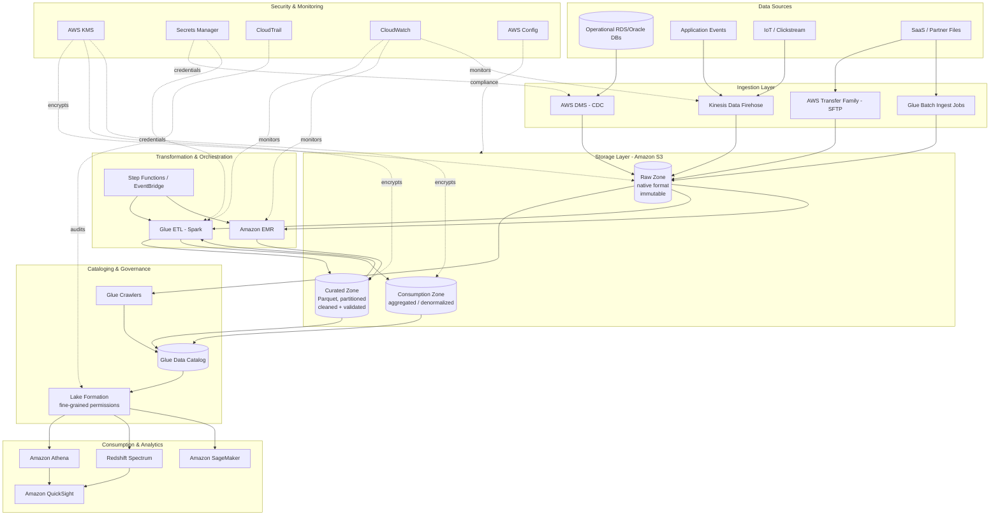

# Part VI – Data Platform Architectures

# Chapter 46 — Data Lake

---

# 1. Executive Summary

## 1.1 The Business Problem

Enterprises today generate data from dozens of disconnected sources: transactional databases, SaaS applications, IoT devices, clickstreams, mobile apps, partner APIs, and third-party data feeds. Individually, each source is well understood by the team that owns it. Collectively, the organization has no coherent way to answer questions that span sources — "which customers churned after a support ticket and a failed payment in the same week?" — because the data lives in silos with incompatible schemas, access models, and refresh cadences.

Traditional approaches to this problem fail at scale for predictable reasons:

- **Point-to-point integrations** between systems grow quadratically with the number of sources, and each integration becomes a maintenance liability.
- **Centralized data warehouses** built on schema-on-write relational engines force every producer to agree on a schema before data can be stored, which slows down ingestion and discourages experimentation with new data sources.
- **Departmental data marts** duplicate effort, drift out of sync with each other, and create conflicting "sources of truth" that erode trust in reporting.
- **Ungoverned data dumps** in shared drives or ad-hoc S3 buckets solve the storage problem but create a governance, security, and discoverability nightmare.

A **data lake** is the architectural answer to this problem: a centralized, durable, low-cost storage layer that accepts data in its native format — structured, semi-structured, or unstructured — without requiring an upfront schema, combined with a catalog, governance layer, and set of processing engines that turn raw data into analytics-ready datasets.

## 1.2 Architecture Objective

The objective of this chapter's reference architecture is to provide a production-grade, secure, cost-controlled data lake on AWS that:

- Ingests data from batch, streaming, and change-data-capture (CDC) sources into a durable, versioned, and encrypted storage layer.
- Organizes data into clearly defined **zones** (raw, curated, and consumption) with well-defined transformation boundaries between them.
- Maintains a single, centrally governed **data catalog** that all consuming engines share.
- Enforces **fine-grained, column- and row-level access control** independent of which query engine or team is accessing the data.
- Supports multiple consumption patterns — ad hoc SQL, business intelligence, machine learning feature extraction, and programmatic access — without duplicating data for each.
- Scales storage and compute independently, since in a data lake these two dimensions grow at very different rates.
- Provides auditability, lineage, and cost attribution suitable for a regulated enterprise.

## 1.3 Why Organizations Adopt This Architecture

Organizations move to a data lake architecture for a combination of the following reasons.

**Decoupling storage from compute.** In a traditional data warehouse, storage and compute are usually co-located on the same cluster, so growing your data retention window means paying for more compute even if query volume hasn't changed. A data lake built on Amazon S3 separates these concerns completely — storage grows independently and cheaply, while compute (Athena, EMR, Glue, Redshift Spectrum) is provisioned only when queries run.

**Schema-on-read flexibility.** New data sources can be onboarded by simply landing files in the raw zone. Schema is inferred or defined later, at query time, rather than negotiated up front with every producing team. This dramatically shortens the time from "we have a new data source" to "an analyst can query it."

**Support for all data types.** A data lake is equally capable of storing a 50 TB clickstream dataset in Parquet, a folder of PDF contracts for a document-intelligence pipeline, and a nightly CSV export from a legacy mainframe. A relational warehouse cannot do this without significant compromise.

**Multi-engine consumption.** The same underlying data — once cataloged — can be queried through Athena for ad hoc SQL, processed through EMR/Spark for large-scale transformation, exposed through Redshift Spectrum for BI tools that expect a warehouse interface, and used directly as training data for SageMaker, all without copying it.

**Cost efficiency at scale.** S3 storage costs, especially with intelligent tiering and lifecycle policies, are an order of magnitude cheaper than block storage attached to always-on compute clusters. For enterprises retaining years of historical data for compliance or model training, this difference is the deciding factor.

**Regulatory and audit requirements.** Regulated industries (financial services, healthcare, insurance) increasingly require the ability to demonstrate exactly which data existed at a point in time, who accessed it, and under what policy. A properly governed data lake with Lake Formation, CloudTrail, and Glue Data Catalog versioning provides this evidentiary trail far more cleanly than distributed departmental spreadsheets.

## 1.4 Major Business Benefits

| Benefit | Description |
|---|---|
| Faster time-to-insight | New data sources are queryable within hours instead of weeks, since ingestion doesn't wait for schema design. |
| Lower total cost of ownership | S3-based storage plus on-demand compute is materially cheaper than an always-on data warehouse cluster sized for peak load. |
| Single source of truth | A centrally governed catalog removes the ambiguity of multiple, conflicting departmental data marts. |
| Elastic scale | Storage scales to petabytes without re-architecture; compute scales per job rather than per cluster-year. |
| Democratized analytics | Business users, data scientists, and engineers all query the same governed data through the tool of their choice. |
| Foundation for AI/ML | Curated, well-cataloged data lake zones are the standard input for feature engineering and model training pipelines. |
| Regulatory readiness | Fine-grained access control and full audit trails support compliance frameworks (SOC 2, HIPAA, PCI-DSS, GDPR). |

## 1.5 Typical Enterprise Scenarios

- A retailer consolidating point-of-sale transactions, e-commerce clickstream, inventory, and supplier EDI feeds into a single analytics platform to power demand forecasting.
- A healthcare payer ingesting claims data, provider records, and clinical documents to support fraud detection and population health analytics under HIPAA controls.
- A financial services firm building a regulatory reporting platform that must retain seven years of trade and communication data with demonstrable chain-of-custody.
- A media company aggregating streaming telemetry, ad impressions, and subscriber data to build recommendation and churn models.
- A manufacturer combining IoT sensor telemetry from factory floors with ERP and quality data to drive predictive maintenance.

In every one of these cases, the common thread is the same: many heterogeneous sources, a need for both ad hoc exploration and structured reporting, and a requirement for governance that a pile of unmanaged S3 buckets cannot satisfy.

> **Note:** A data lake is a storage and governance architecture, not a single AWS service. This chapter builds the reference architecture from S3, Lake Formation, Glue, and Athena as the core, and shows where EMR, Kinesis, DMS, Redshift Spectrum, and QuickSight fit around it. Chapter 47 (Lake House) extends this pattern with transactional table formats (Apache Iceberg / Apache Hudi) for update-in-place workloads, and Chapter 49 (Data Warehouse) covers the case where a dimensional warehouse is the primary consumption layer rather than a supporting one.


---

# 2. Business Requirements

## 2.1 Business Drivers

- Consolidate fragmented data sources into a governed, queryable platform.
- Reduce time-to-insight for analytics and reporting teams.
- Provide a durable, auditable historical record for compliance and regulatory reporting.
- Enable machine learning and AI initiatives that require large volumes of historical, labeled data.
- Reduce the operating cost of maintaining multiple departmental data marts.

## 2.2 Functional Requirements

| Requirement | Description |
|---|---|
| Multi-format ingestion | Accept CSV, JSON, Parquet, Avro, XML, images, and PDF documents. |
| Batch and streaming ingestion | Support both scheduled batch loads and near-real-time streaming ingestion. |
| Schema evolution | Handle schema changes in source systems without breaking downstream consumers. |
| Data cataloging | Automatically discover and register schema/partition metadata for all datasets. |
| Fine-grained access control | Support table-, column-, and row-level permissions per consumer group. |
| Multi-engine query support | Allow SQL access via Athena and Redshift Spectrum, and programmatic access via Spark/EMR and SageMaker. |
| Data lineage | Track transformations from raw ingestion through curated and consumption zones. |
| Self-service discovery | Allow analysts to search the catalog for available datasets and their business definitions. |

## 2.3 Non-Functional Requirements

**Scalability goals**

- Storage must scale from an initial ~10 TB to multi-petabyte scale without architectural rework.
- Ingestion throughput must handle burst loads (e.g., month-end batch jobs, Black Friday clickstream volume) without manual intervention.

**Availability requirements**

- The catalog and storage layer should target 99.9%+ availability; S3 itself is designed for 99.99% availability within a region and eleven nines of durability.
- Query engines (Athena, EMR) are inherently stateless and can be considered highly available as long as the underlying S3 and Glue Catalog are available.

**Latency requirements**

- Ad hoc interactive queries: sub-30-second response for typical BI dashboard queries against curated Parquet data.
- Streaming ingestion latency: data available for querying within 5–15 minutes of arrival (near-real-time, not true real-time).
- Batch ETL jobs: complete within their operational SLA window (commonly overnight, 4–8 hours).

**Compliance requirements**

- Data encrypted at rest (SSE-KMS) and in transit (TLS 1.2+) for all zones.
- Full audit trail of data access via CloudTrail data events and Lake Formation permission grants.
- Support for data residency requirements (region pinning, cross-region replication controls).
- Support for right-to-erasure / data subject deletion requests where GDPR or similar regulation applies.

**Security expectations**

- No direct IAM user access to raw data buckets; all access mediated through Lake Formation permissions.
- Separation of duties between data producers (write access to raw zone only) and data consumers (read access to curated/consumption zones only).
- PII and sensitive fields tagged and access-controlled independently from the rest of the dataset.

## 2.4 Recovery Objectives

| Metric | Target | Rationale |
|---|---|---|
| RPO (Recovery Point Objective) | ≤ 15 minutes for streaming ingestion pipelines; 0 for landed S3 objects (S3 durability model) | S3 object durability means once data lands, it is not lost; RPO risk is concentrated in in-flight streaming buffers. |
| RTO (Recovery Time Objective) | ≤ 4 hours for full catalog and query-engine restoration in a secondary region | Glue Data Catalog and Lake Formation permissions must be replicated or re-creatable via IaC within this window. |

## 2.5 SLAs

- 99.9% monthly availability for the query layer (Athena/Redshift Spectrum endpoints).
- 95th percentile query latency under 30 seconds for curated-zone interactive queries.
- Data freshness SLA published per dataset (e.g., "sales_transactions curated table refreshed within 1 hour of raw arrival").

## 2.6 Expected Workload and Growth

- Initial ingestion volume: 500 GB–2 TB/day across all sources.
- Expected growth: 30–50% year-over-year as new sources are onboarded and historical retention windows extend.
- Query concurrency: 50–200 concurrent interactive users during business hours, plus scheduled batch ETL and ML training jobs running outside peak hours.
- Retention: raw zone retained 7+ years for audit purposes (often moved to Glacier); curated zone retained per business need (typically 2–3 years hot, older data archived).

---

# 3. Architecture Overview

## 3.1 Overall Design Philosophy

The architecture follows a **multi-zone, schema-on-read** design with a strict separation between raw, curated, and consumption data, governed centrally through **AWS Lake Formation** and cataloged in the **AWS Glue Data Catalog**. The guiding principles are:

1. **Immutable raw data.** Nothing is ever transformed in place. Raw zone objects are write-once; corrections happen by writing new curated-zone datasets, never by mutating history.
2. **Decoupled storage and compute.** S3 holds all data; compute engines (Glue ETL, EMR, Athena, Redshift Spectrum) are ephemeral or serverless and attach to the data only for the duration of a job or query.
3. **Centralized governance, decentralized consumption.** One catalog and one permission model serve every consuming engine, so a permission granted (or revoked) in Lake Formation applies uniformly whether the consumer uses Athena, Spark, or QuickSight.
4. **Partitioned, columnar storage in curated zones.** Raw data may arrive in any format; curated data is normalized to Parquet with partitioning aligned to common query predicates (typically date-based), because this is what makes Athena and Spark scans fast and cheap.

## 3.2 Core Components

| Layer | AWS Service | Role |
|---|---|---|
| Ingestion | Kinesis Data Firehose, AWS DMS, AWS Glue jobs, AWS Transfer Family | Land data from streaming, CDC, batch, and file-transfer sources into the raw zone |
| Storage | Amazon S3 (raw, curated, consumption buckets) | Durable, versioned, encrypted object storage across three zones |
| Cataloging | AWS Glue Data Catalog, AWS Glue Crawlers | Discover schema and partitions; maintain a central metadata catalog |
| Governance | AWS Lake Formation | Centralized, fine-grained (table/column/row) permission model across engines |
| Transformation | AWS Glue ETL (Spark), Amazon EMR | Batch and large-scale transformation from raw → curated → consumption |
| Orchestration | AWS Step Functions, Amazon EventBridge, Glue Workflows | Coordinate multi-step ETL pipelines and event-driven triggers |
| Query / Consumption | Amazon Athena, Amazon Redshift Spectrum, Amazon QuickSight, Amazon SageMaker | SQL query, BI dashboards, and ML feature access against curated/consumption data |
| Security | AWS KMS, IAM, AWS Secrets Manager | Encryption, identity, and credential management |
| Monitoring | CloudWatch, CloudTrail, AWS Config | Operational monitoring, audit logging, configuration compliance |

## 3.3 High-Level Workflow

1. Source systems emit data via streaming (Kinesis), CDC (DMS), or scheduled batch export.
2. Data lands in the **raw zone** (S3) in its native or lightly wrapped format (e.g., JSON records wrapped by Firehose), partitioned by ingestion date.
3. Glue Crawlers (or Glue ETL jobs with explicit schema definitions — preferred in mature pipelines) register schema and partitions in the Glue Data Catalog.
4. Glue ETL jobs or EMR Spark jobs validate, clean, deduplicate, and convert raw data into **curated zone** Parquet tables, partitioned for query efficiency.
5. Additional transformation jobs build **consumption zone** datasets: pre-aggregated, denormalized, or business-purpose-specific views (e.g., a "customer_360" table).
6. Lake Formation permissions gate which IAM principals/roles can read which tables, columns, or rows in curated and consumption zones.
7. Analysts and applications query curated/consumption data through Athena, Redshift Spectrum, or QuickSight; data scientists pull consumption-zone data into SageMaker for training.
8. CloudTrail and Lake Formation audit logs capture every access for compliance review.

## 3.4 Data Lifecycle

- **Landing (raw):** Data is never deleted from raw except per a documented retention/compliance policy; it is the immutable system of record for "what we received and when."
- **Curation:** Cleaned, validated, deduplicated, and type-cast data written as partitioned Parquet. Curated tables are the primary interface for most internal consumers.
- **Consumption:** Purpose-built, often denormalized or aggregated datasets optimized for a specific BI dashboard, ML feature set, or external data-sharing use case.
- **Archival:** Raw-zone data older than the active compliance window transitions to S3 Glacier Flexible Retrieval or Glacier Deep Archive via lifecycle policy; curated-zone data past its business-relevant window is either archived or dropped per data governance policy.

---

# 4. AWS Services Used

Each service below is explained in the context of the data lake architecture: why it was selected, what it replaces, and where it has limits.

## 4.1 Amazon S3

**Purpose:** Amazon S3 (Simple Storage Service) is the durable object storage layer that underpins every zone of the data lake — raw, curated, and consumption.

**Why selected:** S3 offers eleven nines of durability, virtually unlimited scale, a mature ecosystem of lifecycle and storage-class tooling, and native integration with every AWS analytics service. It is the de facto standard for data lake storage on AWS.

**Alternatives:** Amazon EFS (not designed for this access pattern — no partition-aware analytics integration); on-premises HDFS (higher operational burden, tightly couples storage and compute); Azure Data Lake Storage / Google Cloud Storage (equivalent capability, relevant only in multi-cloud or migration scenarios).

**Limitations:** S3 is eventually-consistent-free (strong read-after-write consistency since December 2020) but has no native ACID transaction support across multiple objects — this is why lake-house table formats (Iceberg/Hudi, Chapter 47) exist for update-heavy workloads. Very high request rates against a single prefix can throttle without proper key partitioning, though this limit is far higher than it once was.

**Pricing considerations:** Storage cost is billed per GB per storage class (Standard, Intelligent-Tiering, Glacier tiers); request and retrieval costs matter at scale, particularly for Glacier retrievals and for datasets with many small objects (small-object overhead is a common cost surprise — see Section 34).

**Best practices:** Partition by date (`year=/month=/day=`) for time-series data; avoid very small files (target 128 MB–1 GB per Parquet file); enable versioning on curated zone buckets; enable S3 Intelligent-Tiering or explicit lifecycle rules for raw zone data.

## 4.2 AWS Glue Data Catalog and Crawlers

**Purpose:** The Glue Data Catalog is the central Hive-compatible metastore that stores table definitions, schemas, and partition metadata for every dataset in the lake. Glue Crawlers scan S3 prefixes to infer schema and register/update catalog entries.

**Why selected:** It is the metadata backbone that Athena, Redshift Spectrum, EMR, and Lake Formation all read from natively — a single source of schema truth across every query engine.

**Alternatives:** Self-hosted Hive Metastore (more operational overhead, no native Lake Formation integration); Apache Iceberg's own catalog implementations (used in Lake House architectures, Chapter 47).

**Limitations:** Crawlers can misinfer schema on highly heterogeneous or evolving data; in mature pipelines, schema is explicitly defined by the ETL job rather than crawler-inferred, and crawlers are used only for genuinely ad hoc/raw discovery.

**Pricing considerations:** Billed per crawler run (per DPU-hour) and a small per-object metadata storage/request charge above the free tier.

**Best practices:** Run crawlers on a schedule appropriate to source data arrival (not continuously); prefer explicit schema management (via Glue ETL scripts or Terraform-managed catalog tables) for curated and consumption zones once schema stabilizes.

## 4.3 AWS Lake Formation

**Purpose:** Provides centralized, fine-grained access control (database, table, column, and row/cell level) across all Glue-Catalog-registered datasets, enforced consistently regardless of which engine (Athena, Redshift Spectrum, EMR) is used to query.

**Why selected:** Without Lake Formation, access control on a data lake defaults to bucket- and prefix-level IAM policies, which cannot express "this analyst may see all columns except `ssn` and `salary`." Lake Formation closes this gap and is the AWS-native mechanism for this requirement.

**Alternatives:** Custom-built column-masking views in Athena (labor-intensive, inconsistent across engines); Apache Ranger (common in self-managed Hadoop/EMR-only environments, not natively integrated with Athena/Redshift Spectrum).

**Limitations:** Adds an administrative layer that must be actively maintained — permission sprawl is a common failure mode if grants aren't reviewed periodically (see Section 27, Anti-Patterns).

**Best practices:** Model permissions around business roles/personas, not individual users; use LF-Tags (tag-based access control) rather than per-table grants once the catalog exceeds a few dozen tables.

## 4.4 AWS Glue ETL (Spark) and Amazon EMR

**Purpose:** Both provide managed Apache Spark for transforming data between zones. Glue ETL is serverless and job-oriented; EMR is a managed cluster service for larger, more customized, or longer-running big-data workloads.

**Why selected:** Glue ETL is preferred for standard raw→curated transformations because it requires no cluster management and integrates natively with the Glue Catalog and Lake Formation. EMR is added when workloads need custom Spark configurations, non-Spark frameworks (Hive, Presto, Flink), or sustained high-throughput processing where Glue's DPU pricing becomes less economical than a well-tuned EMR cluster (often with Spot instances).

**Alternatives:** AWS Glue DataBrew for no-code data preparation by analysts; Amazon Athena CTAS/INSERT statements for lightweight SQL-based transformation instead of Spark for simpler jobs.

**Limitations:** Glue ETL cold-start latency (tens of seconds to a few minutes) makes it unsuitable for low-latency streaming transforms; EMR requires more operational tuning (instance types, autoscaling policies) to be cost-efficient.

**Pricing considerations:** Glue ETL is billed per DPU-hour with per-second billing after a 1-minute minimum; EMR is billed per instance-hour plus the EMR service fee, and is dramatically cheaper with Spot for fault-tolerant batch jobs.

## 4.5 Amazon Kinesis Data Firehose

**Purpose:** Near-real-time delivery of streaming data (clickstream, IoT telemetry, application logs) directly into S3, with optional inline transformation via Lambda and automatic conversion to Parquet.

**Why selected:** Fully managed, no consumer application to operate, and writes directly into the raw zone in a format ready for cataloging.

**Alternatives:** Kinesis Data Streams + custom consumer (more control, more operational burden); Amazon MSK (Kafka) for organizations standardized on Kafka tooling; AWS Glue streaming ETL jobs for streaming transforms with heavier processing logic.

**Limitations:** Buffering interval (as low as 60 seconds) means Firehose is near-real-time, not sub-second; format conversion to Parquet requires a defined output schema up front.

## 4.6 AWS Database Migration Service (DMS)

**Purpose:** Captures change data capture (CDC) streams from relational sources (RDS, on-prem Oracle/SQL Server/PostgreSQL/MySQL) and replicates ongoing changes into S3 as the raw zone's transactional feed.

**Why selected:** Avoids building custom CDC connectors and provides ongoing replication (not just one-time migration) suitable for keeping the lake synchronized with operational systems.

**Alternatives:** Debezium on MSK Connect (more flexible, more operational overhead); scheduled full/incremental batch extracts (simpler, but loses fine-grained change history and increases source system load).

**Limitations:** CDC task tuning (LOB handling, DDL changes on source tables) requires careful configuration; DMS is not a general-purpose ETL tool.

## 4.7 Amazon Athena

**Purpose:** Serverless, interactive SQL query engine (based on Trino/Presto) used as the primary ad hoc and BI query interface against curated and consumption zone data.

**Why selected:** No infrastructure to manage, pay-per-query-scanned pricing model, and native integration with the Glue Catalog and Lake Formation permissions.

**Alternatives:** Redshift Spectrum (preferred when the primary BI workload already lives in Redshift and needs to join warehouse tables with lake data); Presto/Trino on EMR (for organizations needing custom connectors or on-prem hybrid query federation).

**Limitations:** Query performance is sensitive to file format and partitioning — poorly partitioned or excessively small-file datasets will scan far more data (and cost far more) than necessary; not intended for high-concurrency, sub-second transactional queries.

**Pricing considerations:** $5 per TB of data scanned (approximate, region-dependent) — this is why Parquet + partitioning + compression is a cost control, not just a performance optimization.

## 4.8 Amazon Redshift Spectrum

**Purpose:** Allows an existing Amazon Redshift cluster to query S3 data lake tables directly through the Glue Catalog, joining warehouse tables with lake tables without loading lake data into Redshift.

**Why selected:** Used when the organization already has BI workloads on Redshift and needs to extend those workloads to lake data without a full migration or duplicate ETL.

**Limitations:** Requires an existing (or newly provisioned) Redshift cluster or Redshift Serverless endpoint; adds a second compute engine with its own cost profile alongside Athena.

## 4.9 IAM

**Purpose:** Defines the identity and role model that Lake Formation permissions are ultimately granted to; service roles for Glue, EMR, Firehose, and DMS to read/write S3 and interact with the catalog.

**Why selected:** Foundational AWS identity service; no viable alternative on AWS.

**Best practices:** Use IAM roles (never long-lived access keys) for every service and human principal; scope Glue/EMR job roles narrowly to the specific S3 prefixes and catalog databases they need.

## 4.10 AWS KMS

**Purpose:** Manages the customer-managed keys (CMKs) used to encrypt data at rest across all S3 zones, Glue job bookmarks, and CloudTrail logs.

**Why selected:** Centralized, auditable key management with fine-grained key policies; required for most compliance frameworks.

**Best practices:** Use separate CMKs per zone/sensitivity tier (raw vs. curated vs. consumption) so key policy — and the ability to revoke access by disabling a key — aligns with data sensitivity boundaries.

## 4.11 AWS Secrets Manager

**Purpose:** Stores database credentials used by DMS endpoints and Glue JDBC connections, with automatic rotation.

**Why selected:** Removes hardcoded credentials from Glue job scripts and DMS endpoint configuration; integrates with automatic rotation Lambdas for supported database engines.

## 4.12 Amazon CloudWatch, AWS CloudTrail, AWS Config

**Purpose:** CloudWatch provides operational metrics/logs/alarms for Glue jobs, EMR clusters, and Firehose delivery streams. CloudTrail records every API call, including Lake Formation permission grants and S3 data-event access (when data events are enabled). AWS Config continuously evaluates resource configuration against compliance rules (e.g., "no S3 bucket in the raw zone may be public").

**Why selected:** These three together form the audit and observability backbone required for both operational reliability and compliance evidence.

## 4.13 Amazon QuickSight and Amazon SageMaker

**Purpose:** QuickSight is the primary BI/dashboard consumption layer against curated and consumption zone data (via Athena or Redshift Spectrum as the data source). SageMaker is the primary ML training/inference consumer, reading consumption-zone feature datasets directly from S3.

**Why selected:** Both integrate natively with Lake Formation permissions (QuickSight via its own row-level security plus Lake Formation; SageMaker via IAM/Lake Formation-scoped roles), avoiding a second, parallel access-control system.

---

# 5. Complete Architecture Diagram



> **Diagram note:** Arrows into the Consumption & Analytics layer flow exclusively through Lake Formation, never directly against S3 bucket policies. This is the architectural control point that makes fine-grained governance possible — bypass it (for example, by granting a role direct `s3:GetObject` on the curated bucket) and you have silently reintroduced ungoverned access.

---

# 6. Component-by-Component Explanation

## 6.1 Raw Zone (S3)

- **Purpose:** Immutable landing area for all ingested data in native or near-native format.
- **Responsibilities:** Preserve exact fidelity of source data; serve as the audit-grade system of record.
- **Inputs:** DMS CDC output, Firehose delivery streams, Transfer Family SFTP uploads, Glue batch ingestion jobs.
- **Outputs:** Read by Glue Crawlers (cataloging) and Glue ETL/EMR jobs (curation).
- **Scaling:** Effectively unlimited via S3; partition raw data by ingestion date and source system.
- **High availability:** Inherits S3's multi-AZ durability and availability design.
- **Failure handling:** Failed ingestion writes are retried by the ingestion service (Firehose has built-in retry/backoff to S3; DMS tasks alert on replication failure).
- **Dependencies:** IAM roles for each ingestion service; KMS key for encryption.
- **Security:** Bucket policy denies any principal outside designated ingestion/ETL roles; default encryption enforced; public access blocked at the account level.
- **Monitoring:** S3 event notifications to EventBridge for downstream triggering; CloudWatch metrics on Firehose delivery success/failure.

## 6.2 Curated Zone (S3)

- **Purpose:** Cleaned, validated, deduplicated, schema-enforced Parquet datasets — the primary interface for most consumers.
- **Responsibilities:** Apply data quality rules, type casting, deduplication, and partitioning optimized for query engines.
- **Inputs:** Raw zone data, transformed by Glue ETL/EMR jobs.
- **Outputs:** Read by Athena, Redshift Spectrum, further consumption-zone transformation jobs.
- **Scaling:** Partition pruning and file-size management (target 128 MB–1 GB per file) keep query performance stable as volume grows.
- **Failure handling:** ETL jobs write to a staging prefix and atomically "promote" (via partition swap or manifest update) only on success, so partial/failed job runs never corrupt curated tables.
- **Security:** Column- and row-level Lake Formation permissions applied here, since this is the primary consumer-facing layer.
- **Monitoring:** Data quality metrics (row counts, null rates, schema drift) emitted per job run to CloudWatch; alarms on significant deviation.

## 6.3 Consumption Zone (S3)

- **Purpose:** Purpose-built, often denormalized or pre-aggregated datasets tailored to a specific dashboard, ML feature set, or external sharing use case.
- **Responsibilities:** Minimize query-time joins and aggregation for high-frequency consumption patterns.
- **Dependencies:** Curated zone as its sole upstream source (never raw zone directly), to preserve the transformation lineage.
- **Security:** Often the zone most exposed to external partners or self-service BI users — subject to the strictest Lake Formation tag-based access review.

## 6.4 Glue Data Catalog and Crawlers

- **Purpose:** Central metadata store shared by every query engine.
- **Responsibilities:** Maintain accurate table schema, partition listings, and table statistics.
- **Failure handling:** Crawler failures (e.g., on malformed source files) alert via CloudWatch/EventBridge without blocking already-cataloged tables from being queried.
- **Dependencies:** IAM role scoped to read the specific S3 prefixes it crawls.

## 6.5 Lake Formation

- **Purpose:** Single enforcement point for fine-grained access control across Athena, Redshift Spectrum, EMR, and SageMaker.
- **Responsibilities:** Grant/revoke table, column, and row-level permissions; manage LF-Tags for scalable tag-based access control.
- **Failure handling:** Permission changes are effective immediately; a misconfigured grant is a security incident, not an availability incident — hence the emphasis on periodic access review (Section 26).

## 6.6 Glue ETL / EMR (Transformation)

- **Purpose:** Execute raw→curated and curated→consumption transformations.
- **Scaling:** Glue ETL scales DPUs per job configuration; EMR scales via cluster instance groups/fleets and autoscaling policies.
- **Failure handling:** Idempotent job design (writing to staging + atomic promote) allows safe retries; Step Functions orchestration captures failure state and triggers alerting/rollback.

## 6.7 Orchestration (Step Functions / EventBridge / Glue Workflows)

- **Purpose:** Coordinate multi-step pipelines (e.g., "wait for raw data arrival event → run crawler → run curation job → run data quality check → promote to consumption zone → notify").
- **Failure handling:** Step Functions retry/catch blocks handle transient failures; persistent failures route to a dead-letter notification (SNS/EventBridge) for on-call review.

## 6.8 Query/Consumption Layer (Athena, Redshift Spectrum, QuickSight, SageMaker)

- **Purpose:** Serve ad hoc SQL, BI dashboards, and ML training/inference against governed data.
- **Scaling:** Athena and Redshift Spectrum are serverless/elastic per query; QuickSight SPICE capacity and SageMaker training instance types scale independently per workload.
- **Security:** All access mediated through Lake Formation-scoped IAM roles; no engine is granted broader S3 access than its Lake Formation grants imply.

---

# 7. End-to-End Request Flow

This section traces two flows: an **ingestion flow** (data entering the lake) and a **query flow** (an analyst querying curated data).

## 7.1 Ingestion Flow — Streaming Clickstream Example

1. Client application emits a clickstream event via the application's event SDK.
2. The event is published to a Kinesis Data Stream (or directly to Firehose, depending on whether intermediate stream processing is needed).
3. Kinesis Data Firehose buffers events (by size or time interval, e.g., 5 MB or 60 seconds) and invokes an optional Lambda transformation for light enrichment/validation.
4. Firehose writes buffered records to the raw zone S3 bucket, partitioned by `year/month/day/hour`.
5. An S3 event notification fires to EventBridge on new object creation.
6. EventBridge triggers a Step Functions state machine.
7. The state machine runs a Glue Crawler (or, in mature pipelines, skips this step because schema is already registered) to confirm/update the catalog partition.
8. The state machine triggers a Glue ETL job that reads new raw partitions, validates schema, deduplicates, and writes Parquet output to the curated zone staging prefix.
9. A data quality check step (row count / null rate / schema check) runs against the staged output.
10. On success, the job atomically updates the Glue Catalog partition pointer to the new curated data (promote step); on failure, the pipeline halts and alerts via SNS.
11. CloudWatch records job duration, rows processed, and bytes written; CloudTrail logs the Glue/Lake Formation API calls involved.

## 7.2 Query Flow — Analyst Ad Hoc Query via Athena

1. Analyst authenticates to the AWS account (via IAM Identity Center federation) and assumes an analytics-read IAM role.
2. Analyst issues a SQL query in the Athena console or a BI tool connected via ODBC/JDBC.
3. Athena resolves table/column metadata from the Glue Data Catalog.
4. Athena calls Lake Formation to evaluate the caller's permissions against the requested table/columns/rows.
5. Lake Formation returns a **temporary, scoped credential** (via LF-managed access) that authorizes reading only the permitted S3 objects/columns.
6. Athena's distributed query engine (Trino-based) scans the relevant Parquet partitions in the curated zone S3 bucket, applying partition pruning based on query predicates.
7. Query results are computed and returned to the analyst; large result sets are also written to a designated Athena query-results S3 bucket.
8. CloudTrail logs the query execution and the Lake Formation permission evaluation for audit purposes.
9. CloudWatch captures Athena query metrics (data scanned, execution time) for cost monitoring and query optimization.

## 7.3 Error Handling Across Both Flows

| Failure Point | Handling |
|---|---|
| Firehose delivery failure to S3 | Automatic retry with exponential backoff; after repeated failure, records routed to an error/backup S3 prefix for manual replay. |
| Glue ETL job failure | Step Functions `Catch` block routes to an SNS alert; job is safe to re-run because it reads from immutable raw partitions and writes to a staging prefix. |
| Data quality check failure | Pipeline halts before promotion; curated table is left at its last known-good state; alert routed to data engineering on-call. |
| Athena query denied by Lake Formation | Query fails with an access-denied error surfaced to the analyst; no partial data is ever returned. |
| Crawler misinterprets schema | Schema drift alert triggers a manual review; explicit schema definitions in Glue ETL jobs prevent silent propagation of bad inferred types. |

---

# 8. Deployment Flow

## 8.1 Infrastructure Provisioning

All infrastructure — S3 buckets, Glue databases/crawlers/jobs, Lake Formation permissions, IAM roles, KMS keys — is defined in Terraform and deployed through a CI/CD pipeline. Manual console changes are prohibited in production accounts except for emergency break-glass access, which is itself logged and reconciled back into Terraform afterward.

## 8.2 Terraform Workflow

1. Engineer opens a pull request modifying the relevant Terraform module (e.g., adding a new curated table definition or Lake Formation grant).
2. CI pipeline runs `terraform fmt -check`, `terraform validate`, and a policy-as-code scan (e.g., Checkov or tfsec) for security misconfigurations (public buckets, missing encryption, overly broad IAM).
3. `terraform plan` output is posted to the pull request for human review.
4. On approval and merge, the CI/CD pipeline runs `terraform apply` against a dedicated deployment role with least-privilege permissions scoped to the resources the pipeline is allowed to manage.
5. State is stored remotely (S3 backend with DynamoDB state locking) to prevent concurrent-apply conflicts.

## 8.3 CI/CD Deployment for Glue ETL Jobs

1. Glue job scripts (PySpark) are version-controlled alongside their Terraform definitions.
2. CI pipeline runs unit tests against transformation logic using a local Spark session and sample fixture data.
3. On merge, the pipeline uploads the updated script to the designated S3 script bucket and updates the Glue job definition via Terraform (script location, DPU allocation, and job parameters).
4. A smoke-test invocation runs the job against a non-production catalog/dataset before it is considered deployed.

## 8.4 Blue-Green Deployment for Curated Tables

Since curated-zone tables are the primary consumer interface, schema or logic changes use a **parallel table** pattern:

1. New transformation logic writes to a new table version (e.g., `sales_transactions_v2`) alongside the existing `sales_transactions` table.
2. Data quality and consumer validation run against `_v2` for an agreed bake-in period.
3. On validation, the Glue Catalog table alias/view is repointed to `_v2`, and the old version is retained for a rollback window before deprecation.

## 8.5 Rollback

- Glue Catalog table versioning allows reverting table schema to a prior version.
- S3 bucket versioning (enabled on curated/consumption buckets) allows object-level rollback if a bad job overwrote data before the staging/promote pattern caught it.
- Terraform state history allows infrastructure-level rollback via `terraform apply` of a prior commit.

## 8.6 Secrets and Configuration

- Database connection credentials for DMS/Glue JDBC connections are stored in Secrets Manager and referenced by ARN in Terraform — never hardcoded.
- Environment-specific configuration (bucket names, KMS key ARNs, DPU sizing) is parameterized via Terraform variables and `.tfvars` files per environment (dev/staging/prod).

## 8.7 Validation

- Post-deployment automated checks confirm: buckets have encryption enabled, public access is blocked, Lake Formation permissions match the intended access model, and a synthetic end-to-end test query returns expected results.

---

# 9. Network Topology

## 9.1 VPC Design

The data lake's compute components (Glue ETL, EMR, DMS replication instances) run inside a dedicated **Data Platform VPC**, isolated from application VPCs, with connectivity to on-premises/source-system networks established through Transit Gateway or Direct Connect where CDC sources are on-prem.

| Element | Configuration |
|---|---|
| VPC CIDR | `10.40.0.0/16` |
| Private subnets (compute) | `10.40.0.0/20`, `10.40.16.0/20`, `10.40.32.0/20` across 3 AZs — hosts Glue ENIs, EMR clusters, DMS replication instances |
| Private subnets (endpoints) | `10.40.48.0/24` — hosts VPC interface endpoints |
| Public subnets | Not used for data platform compute; NAT Gateway subnets only if outbound internet access is required for specific third-party API ingestion |
| NAT Gateway | One per AZ, used sparingly — most AWS service access uses VPC endpoints instead |
| Internet Gateway | Present only if public subnets exist for NAT; no direct internet-facing resources |
| Transit Gateway | Connects the Data Platform VPC to on-prem networks (for DMS source connectivity) and to other internal VPCs needing lake access |
| Route Tables | Private subnet route tables route AWS service traffic to VPC endpoints, not through NAT |
| Network ACLs | Default-deny with explicit allow rules per subnet tier |
| Security Groups | Scoped per component (Glue connection SG, EMR cluster SG, DMS SG), allowing only required ports (e.g., 1521/1433/5432 to specific source DB security groups) |
| VPC Endpoints (Interface/Gateway) | S3 (Gateway), Glue, Lake Formation, STS, KMS, Secrets Manager, CloudWatch Logs (Interface) — keeps all AWS API traffic off the public internet |

## 9.2 PrivateLink / VPC Endpoints

Using Gateway and Interface VPC Endpoints for S3, Glue, Lake Formation, KMS, and Secrets Manager means Glue jobs and EMR clusters never need a NAT Gateway or Internet Gateway route to reach these AWS services — traffic stays on the AWS private network, which reduces both data-transfer cost and the network attack surface.

## 9.3 Hybrid Connectivity

For CDC sources running on-premises (e.g., an on-prem Oracle database feeding DMS), connectivity is established via:

- **AWS Direct Connect** (preferred for sustained, high-throughput, low-latency CDC replication) terminating into the Transit Gateway, or
- **Site-to-Site VPN** as a lower-throughput or backup path.

DMS replication instances sit in the Data Platform VPC's private subnets and reach on-prem source databases through this hybrid connection, never through the public internet.

---

# 10. Identity and Access

## 10.1 IAM Roles

| Role | Purpose |
|---|---|
| `glue-etl-raw-to-curated-role` | Assumed by Glue ETL jobs; read on raw zone prefixes, write on curated staging prefix, Glue Catalog read/write for its own tables. |
| `glue-crawler-role` | Read-only on the specific raw prefixes it crawls; Glue Catalog write for schema registration only. |
| `emr-ec2-instance-role` | Attached to EMR cluster nodes; scoped to the specific curated/consumption prefixes the job touches. |
| `dms-replication-role` | Used by DMS to write CDC output to the raw zone and read Secrets Manager for source credentials. |
| `athena-analyst-role` | Assumed by federated human users via IAM Identity Center; no direct S3 permissions — all access mediated through Lake Formation. |
| `quicksight-service-role` | Used by QuickSight to query via Athena/Redshift Spectrum, scoped through Lake Formation grants matching QuickSight's row-level security groups. |
| `sagemaker-training-role` | Scoped to specific consumption-zone feature-store prefixes for training jobs. |

## 10.2 IAM Policies vs. Lake Formation Permissions

A deliberate architectural choice in this design: **IAM policies grant infrastructure-level access (which roles may call which APIs); Lake Formation grants data-level access (which principals may read which tables/columns/rows).** IAM alone is never sufficient to read lake data — a role must have both the IAM permission to call Athena/Glue APIs *and* a Lake Formation grant on the specific data. This two-layer model is what allows column- and row-level control that plain S3 bucket policies cannot express.

## 10.3 Resource Policies

- S3 bucket policies deny any access that doesn't originate from an approved VPC endpoint (`aws:sourceVpce` condition) for internal zones, reducing the risk of credential exfiltration being usable outside the network boundary.
- KMS key policies explicitly enumerate which IAM roles may `Decrypt`/`GenerateDataKey`, independent of the IAM policies attached to those roles — a second, independent control.

## 10.4 STS and Cross-Account Access

In multi-account landing zones (Chapter 99), the data lake often lives in a dedicated **Data Platform account**, separate from source-system accounts and consumer/analytics accounts. Cross-account access uses:

- **Lake Formation cross-account data sharing** (resource links) to expose catalog tables to consumer accounts without copying data.
- **STS `AssumeRole`** with external ID conditions for any service-to-service access that crosses account boundaries outside of Lake Formation's native sharing.

## 10.5 Least Privilege

- Each Glue job role is scoped to the specific S3 prefixes and Glue database it operates on — a curation job for the `sales` domain cannot read or write `hr` domain prefixes.
- Permission boundaries are attached to all data-platform IAM roles capping the maximum permissions any role (or a future misconfigured policy attached to it) could ever have, providing a backstop against privilege escalation via Terraform misconfiguration.

## 10.6 Service Roles and Permission Boundaries

```hcl

resource "aws_iam_role" "glue_etl_role" {
  name                 = "glue-etl-raw-to-curated-role"
  assume_role_policy   = data.aws_iam_policy_document.glue_assume.json
  permissions_boundary = aws_iam_policy.data_platform_boundary.arn
}

resource "aws_iam_policy" "data_platform_boundary" {
  name   = "data-platform-permission-boundary"
  policy = jsonencode({
    Version = "2012-10-17"
    Statement = [
      {
        Effect   = "Allow"
        Action   = ["s3:*", "glue:*", "lakeformation:*", "kms:Decrypt", "kms:GenerateDataKey"]
        Resource = "*"
        Condition = {
          StringEquals = { "aws:RequestedRegion" = "us-east-1" }
        }
      }
    ]
  })
}

```

> **Warning:** A permission boundary is a ceiling, not a grant. It must be paired with a tightly scoped identity policy on the role itself — a boundary of `s3:*` combined with an identity policy of `s3:*` is equivalent to no boundary at all.

---

# 11. Security Architecture

## 11.1 Encryption

- **At rest:** Every S3 bucket (raw, curated, consumption, Athena query results, Glue scripts) uses SSE-KMS with a customer-managed key, not the default AWS-managed key, so that key policies and access logging are fully controllable.
- **In transit:** TLS 1.2+ enforced for all S3 API calls via bucket policy (`aws:SecureTransport` deny condition); JDBC connections from Glue/DMS to source databases use TLS where the source engine supports it.
- **Separate keys per sensitivity tier:** Raw zone (highest sensitivity — unfiltered source data), curated zone, and consumption zone each use distinct KMS keys, so a key can be disabled to immediately cut off access to one tier without affecting others.

## 11.2 Network and Application Security

- **WAF:** Applies to any web-facing component in the broader platform (e.g., a QuickSight-embedded analytics portal), not to the lake's internal data plane, which has no public endpoint.
- **Shield:** Standard DDoS protection is automatically applied account-wide; Shield Advanced is considered if the organization exposes a public data-sharing API on top of the lake.
- **Certificate Manager:** Issues TLS certificates for any internal or partner-facing endpoints (e.g., a self-service data catalog portal).

## 11.3 Secrets Manager

All source-system database credentials used by DMS and Glue JDBC connections are stored in Secrets Manager with automatic rotation enabled for supported engines (RDS MySQL, PostgreSQL, Oracle, SQL Server). Glue jobs reference the secret ARN and retrieve credentials at runtime — they are never embedded in job scripts or Terraform variable files.

## 11.4 GuardDuty, Inspector, Security Hub

- **GuardDuty:** Enabled account-wide, including S3 protection (detects anomalous data access patterns — e.g., an unusual spike in `GetObject` calls against the raw zone from an unfamiliar principal) and EMR protection (detects cryptomining or anomalous cluster behavior).
- **Inspector:** Scans EMR cluster AMIs and any custom container images used in Glue Docker-based jobs for known vulnerabilities.
- **Security Hub:** Aggregates findings from GuardDuty, Config, and Inspector into a single compliance dashboard mapped against CIS AWS Foundations and, where relevant, PCI-DSS/HIPAA standards.

## 11.5 CloudTrail and AWS Config

- CloudTrail management events capture every Lake Formation permission grant/revoke and every Glue Catalog schema change.
- CloudTrail **data events** are selectively enabled on the raw zone bucket (given cost implications at high request volume) to capture object-level `GetObject`/`PutObject` activity for the most sensitive datasets.
- AWS Config rules continuously verify: S3 buckets are not publicly accessible, default encryption is enabled, and IAM roles attached to Glue/EMR do not have wildcard `s3:*` permissions outside their permission boundary.

## 11.6 Zero Trust Principles Applied

- No implicit trust based on network location alone — even compute running inside the Data Platform VPC must present a valid IAM role and pass Lake Formation authorization for every data access.
- Every access decision (IAM + Lake Formation) is evaluated per-request, not cached at a session level beyond the lifetime of temporary STS credentials (typically 1 hour).

## 11.7 Threat Model and Mitigations

| Attack Vector | Mitigation |
|---|---|
| Compromised analyst credentials used to exfiltrate curated data | Lake Formation row/column scoping limits blast radius; CloudTrail + GuardDuty anomaly detection on unusual query volume; MFA enforced via IAM Identity Center. |
| Over-permissioned Glue/EMR service role reads unrelated sensitive prefixes | Least-privilege, prefix-scoped IAM policies plus permission boundaries; periodic access review (Section 26). |
| Misconfigured bucket made public via a Terraform change | AWS Config rule auto-remediation (Lambda) removes public ACLs/policies within minutes; CI pipeline policy-as-code scan blocks the change pre-merge. |
| CDC replication credentials leaked from a job script | Credentials never embedded in code — retrieved from Secrets Manager at runtime with narrow IAM access to the specific secret ARN. |
| Supply-chain risk from a compromised third-party Spark library used in a Glue job | Dependency scanning in CI; Glue jobs pinned to specific, reviewed library versions rather than "latest." |
| Insider threat — legitimate user querying outside their business need | Lake Formation LF-Tag-based permissions modeled around business roles limit exposure; audit review of query patterns flags anomalies. |

---

# 12. High Availability

## 12.1 AZ Failures

S3 is inherently multi-AZ and requires no design intervention for AZ resilience. Compute components that run inside specific AZs — EMR cluster nodes, DMS replication instances — are configured across multiple AZs where the service supports it (DMS Multi-AZ deployment for the replication instance) or are treated as ephemeral/re-launchable (EMR clusters are typically transient per-job in this architecture, so an AZ failure simply causes the job to be relaunched by orchestration in another AZ).

## 12.2 Instance/Job Failures

- Glue ETL jobs are serverless — a failure is retried per the job's configured retry policy without any instance-level recovery action needed.
- EMR step failures trigger cluster-level retry or Step Functions catch-and-retry logic; EMR clusters used for this architecture are generally transient (spun up per job, torn down after), so a failed cluster is simply relaunched.
- DMS replication instance failure (Multi-AZ enabled) fails over automatically to the standby replication instance with minimal replication lag interruption.

## 12.3 Regional Failures

The core data lake is designed as a **single-region-primary** architecture with **cross-region replication for disaster recovery** (Section 13) rather than active-active multi-region, because:

- The cost and complexity of active-active for a governance-heavy analytical system (with Lake Formation permissions, Glue Catalog state, and large data volumes) is rarely justified relative to a well-tested pilot-light DR plan.
- Query latency requirements for analytics workloads (seconds, not milliseconds) do not demand multi-region active-active the way a customer-facing transactional application might.

## 12.4 Database (Source System) Failures

Source database failures are outside the data lake's direct control, but the architecture is resilient to them: DMS CDC tasks resume replication from their last acknowledged checkpoint once the source database recovers, and no lake data is lost or corrupted by a source-side outage — ingestion simply pauses.

## 12.5 Load Balancing and Health Checks

Athena and Redshift Spectrum require no load balancer — they are serverless/managed services with AWS-internal request routing. For any custom API layer built on top of the lake (e.g., a data-sharing REST API), an Application Load Balancer with health checks against the backing Lambda/Fargate service applies standard multi-AZ ALB patterns (see Chapter 6).

## 12.6 Failover Summary

| Component | Failure Mode | Failover Behavior |
|---|---|---|
| S3 (all zones) | AZ outage | Transparent — no action required |
| Glue ETL job | Transient failure | Automatic retry per job configuration |
| EMR cluster | Node/AZ failure | Cluster relaunched by orchestration; job re-run from last successful checkpoint (staging pattern) |
| DMS replication instance | Instance/AZ failure | Automatic Multi-AZ failover to standby |
| Glue Data Catalog | Regional service outage | No customer-managed failover; mitigated by IaC-based rapid recreation in DR region |
| Lake Formation | Regional service outage | Same as above — permissions are re-applied via Terraform in DR region |

---

# 13. Disaster Recovery

## 13.1 Backup Strategy

- **S3 versioning** enabled on curated and consumption buckets protects against accidental overwrite/deletion by a faulty job.
- **Raw zone** is treated as the ultimate backup — because curated and consumption data are always derivable by re-running transformation jobs against raw data, raw zone durability is the single most important DR guarantee in this architecture.
- **Glue Data Catalog** metadata is backed up via a scheduled export (Glue `export-table-to-point-in-time` / catalog snapshot to S3) in addition to being fully reproducible from Terraform-managed table definitions.

## 13.2 Cross-Region Replication

- Raw zone S3 buckets have **Cross-Region Replication (CRR)** enabled to a DR region, with replicated objects encrypted using a DR-region KMS key.
- Curated zone CRR is enabled selectively for datasets with the strictest RTO requirements; less critical curated tables can instead be **regenerated** from replicated raw data during a DR event, trading a longer RTO for lower steady-state replication cost.

## 13.3 DR Strategy Selection: Pilot Light

This architecture uses a **Pilot Light** DR strategy rather than Warm Standby or Active-Active:

- Raw data is continuously replicated cross-region (the "pilot light" that's always on).
- Glue jobs, crawlers, Lake Formation permissions, and catalog definitions exist as Terraform code, deployable to the DR region on demand but not continuously running there.
- On a declared disaster, the DR runbook executes: apply Terraform to stand up the Glue Catalog/Lake Formation/Glue job definitions in the DR region, run crawlers against replicated raw data, run curation jobs to rebuild curated tables, and redirect Athena/QuickSight endpoints to the DR region.

**Why not Warm Standby or Active-Active:** A warm standby (partially running compute in DR) or active-active (fully running in both regions) adds continuous cost and Lake Formation permission-synchronization complexity that is rarely justified for analytical workloads whose consumers can tolerate a multi-hour RTO in a true regional disaster — unlike a transactional customer-facing system.

## 13.4 RPO / RTO Achieved

| Zone | RPO | RTO |
|---|---|---|
| Raw zone | Near-zero (CRR replication lag, typically minutes) | Minutes (data already present in DR region) |
| Curated zone (CRR-enabled critical tables) | Near-zero | Minutes |
| Curated zone (regenerated tables) | N/A (regenerated from raw) | Hours (time to re-run curation jobs at scale) |
| Full platform (Catalog, Lake Formation, orchestration) | N/A (IaC-defined) | Target ≤ 4 hours via Terraform apply + validation |

## 13.5 DR Testing

- Quarterly DR game days execute the runbook against an isolated DR-region test namespace, validating that Terraform apply succeeds cleanly, crawlers correctly re-catalog replicated data, and a sample of critical curated tables reproduce expected row counts/checksums against production.
- Game day results are logged, and any manual step discovered during the exercise is automated before the next cycle — the goal is a runbook with zero undocumented manual steps.

---

# 14. Scalability

## 14.1 Storage Scaling

S3 scales storage horizontally without any capacity planning — the architecture's scaling concern is not "can S3 hold this," but "will queries against this remain performant and cost-efficient as volume grows." This is addressed through partitioning strategy, file-size management, and storage-class lifecycle policies rather than through any provisioning action.

## 14.2 Ingestion Scaling

- **Kinesis Data Firehose** scales automatically to handle throughput bursts; the main planning consideration is downstream buffer interval tuning (smaller buffers = lower latency but more, smaller S3 objects — a direct cost/performance trade-off, see Section 34).
- **DMS** replication instance sizing (e.g., `dms.r5.xlarge` to `dms.r5.4xlarge`) scales vertically with source database change volume; multiple DMS tasks can run in parallel for multiple source schemas.

## 14.3 Transformation (Compute) Scaling

- **Glue ETL** scales horizontally by increasing the number of DPUs (Data Processing Units) allocated to a job; Glue also supports auto-scaling within a job run (G.1X/G.2X worker types with auto-scaling enabled) so a job doesn't need manual DPU tuning as data volume grows.
- **EMR** scales via instance fleets with managed scaling policies, adding/removing core and task nodes based on YARN memory/CPU utilization; Spot instances are used for task nodes to absorb burst capacity cost-efficiently.

## 14.4 Query (Consumption) Scaling

- **Athena** is fully serverless and scales query concurrency automatically, subject to account-level service quotas (default 20 concurrent DML queries per account/region — request a quota increase proactively for high-concurrency BI workloads).
- **Redshift Spectrum** query scaling is bounded by the Redshift cluster's compute capacity for the "warehouse-side" portion of a federated query; Redshift Serverless removes the need to manually resize for burst BI workloads.

## 14.5 Catalog and Governance Scaling

- The Glue Data Catalog scales to hundreds of thousands of tables/partitions without redesign, but **Lake Formation permission management** does not scale linearly with manual per-table grants — this is why LF-Tag-based access control (tagging tables/columns and granting permissions against tags rather than individual resources) becomes necessary once the catalog exceeds roughly 50–100 tables across multiple consumer personas.

## 14.6 Scaling Summary Table

| Dimension | Scaling Mechanism | Manual Intervention Required? |
|---|---|---|
| Storage volume | S3 native scaling | None |
| Streaming ingestion throughput | Firehose auto-scaling | None (monitor buffer/latency trade-off) |
| CDC ingestion throughput | DMS instance sizing | Yes — instance class selection |
| Batch transformation compute | Glue auto-scaling DPUs / EMR managed scaling | Minimal — policy configuration only |
| Query concurrency | Athena serverless / Redshift Serverless | Service quota increase request as usage grows |
| Access control complexity | LF-Tags vs. per-resource grants | Yes — architectural decision required at scale |

---

# 15. Performance Optimization

## 15.1 File Format and Layout

- Curated and consumption zone data is stored as **Parquet** (columnar) rather than row-based formats like CSV or JSON. Columnar storage lets Athena/Spark read only the columns referenced in a query, dramatically reducing bytes scanned.
- **Partitioning** by commonly filtered columns (typically date, sometimes region or business unit) enables partition pruning — a query with a `WHERE date = '2026-08-01'` predicate scans only that partition's files, not the entire table.
- **File size management**: target 128 MB–1 GB Parquet files. Too many small files (the "small file problem") causes excessive S3 request overhead and poor parallelism; too few, overly large files reduce query parallelism. Glue ETL jobs use `repartition`/`coalesce` before writing to control output file count.

## 15.2 Compression

Parquet files use **Snappy** compression by default in this architecture — a balance of compression ratio and CPU cost for decompression during scans. Zstandard (`zstd`) is used for colder, less frequently queried consumption datasets where a higher compression ratio (lower storage/transfer cost) is worth marginally higher CPU cost at query time.

## 15.3 CDN

Not directly applicable to the analytical query path, but relevant where the lake feeds a customer-facing or partner-facing data export/API layer — CloudFront caches static exports (e.g., a nightly data-share Parquet extract) to reduce repeated S3 egress cost for external consumers.

## 15.4 Database (Redshift Spectrum) Optimization

- Redshift Spectrum queries push predicate filters down to S3/Parquet scan time rather than pulling all data into Redshift compute first.
- Frequently joined lake tables with warehouse dimension tables are candidates for materialization into Redshift itself (via a scheduled `INSERT ... SELECT` from Spectrum) when join performance against very large fact tables becomes a bottleneck.

## 15.5 Connection Pooling and Concurrency

- Athena has no persistent connections to manage (stateless per-query), but BI tools connecting via JDBC/ODBC should use connection pooling at the application layer to avoid excessive concurrent session overhead against Athena's account-level concurrency quota.
- Glue ETL jobs reading from JDBC sources (rare in this raw-zone-first design, but relevant for direct lookups) should use bounded connection pools to avoid overwhelming source databases.

## 15.6 Asynchronous Processing

- Ingestion, cataloging, and transformation are fully asynchronous and event-driven (S3 event → EventBridge → Step Functions), decoupling ingestion throughput from transformation throughput — a burst of raw data arrival does not block or slow down ingestion even if curation jobs are still processing the prior batch.

## 15.7 Query Optimization Checklist

- [ ] Always filter on partition columns when possible.
- [ ] Avoid `SELECT *` against wide curated tables — select only needed columns to exploit columnar pruning.
- [ ] Use `CTAS` (`CREATE TABLE AS SELECT`) in Athena to materialize expensive, frequently repeated aggregations into a consumption-zone table rather than recomputing on every dashboard refresh.
- [ ] Monitor `DataScannedInBytes` per query via CloudWatch and flag queries scanning disproportionately more data than their result set size would suggest.
- [ ] Use Athena workgroups with per-workgroup data-scanned limits to contain runaway ad hoc queries.

---

# 16. Cost Optimization (FinOps)

## 16.1 Deployment Size Cost Estimates

> **Note:** Figures are directional, us-east-1, list-price estimates for architectural planning — always validate against AWS Pricing Calculator and current rates before presenting to finance stakeholders.

| Component | Small (≈2 TB ingested/mo, 5 TB total) | Medium (≈20 TB ingested/mo, 100 TB total) | Enterprise (≈200 TB ingested/mo, 2 PB total) |
|---|---|---|---|
| S3 storage (blended tiers) | ~$120/mo | ~$1,800/mo | ~$28,000/mo |
| S3 requests | ~$20/mo | ~$300/mo | ~$4,000/mo |
| Kinesis Data Firehose | ~$80/mo | ~$700/mo | ~$6,000/mo |
| AWS DMS (2x dms.r5.xlarge, Multi-AZ) | ~$700/mo | ~$1,400/mo (4 tasks) | ~$5,000/mo (multiple task groups) |
| Glue ETL (DPU-hours) | ~$300/mo | ~$3,500/mo | ~$35,000/mo |
| EMR (Spot-heavy) | ~$0 (not used) | ~$1,500/mo | ~$18,000/mo |
| Athena (data scanned) | ~$150/mo | ~$2,000/mo | ~$15,000/mo |
| Glue Data Catalog / Crawlers | ~$50/mo | ~$300/mo | ~$1,500/mo |
| CloudWatch / CloudTrail | ~$60/mo | ~$400/mo | ~$3,000/mo |
| **Estimated total** | **~$1,480/mo** | **~$11,900/mo** | **~$115,500/mo** |

## 16.2 Major Cost Drivers

1. **Data scanned by Athena** — the single largest lever most teams underinvest in controlling; poor partitioning/format choices can inflate this cost 10–50x.
2. **Glue ETL DPU-hours** — driven by job frequency, data volume, and whether jobs are right-sized (over-provisioned DPUs are a common waste).
3. **Small-file overhead** — excessive S3 PUT/GET requests from poorly batched writes.
4. **Cross-AZ and cross-region data transfer** — DMS/EMR traffic crossing AZ boundaries unnecessarily; CRR for DR adds ongoing replication transfer cost.
5. **CloudTrail data events** — enabling data-event logging broadly (rather than selectively on sensitive prefixes) can become a meaningfully large log-ingestion cost at high request volume.

## 16.3 Optimization Opportunities

| Lever | Optimization |
|---|---|
| S3 storage classes | Move raw-zone data older than 90 days to S3 Glacier Flexible Retrieval; data older than 1 year to Glacier Deep Archive, via lifecycle policy. |
| S3 Intelligent-Tiering | Apply to curated data with unpredictable access patterns to avoid manual tier management. |
| Athena workgroup limits | Set per-workgroup data-scanned quotas to prevent runaway ad hoc queries from a single analyst. |
| Glue job right-sizing | Review DPU allocation quarterly against actual job execution metrics; enable auto-scaling instead of static over-provisioning. |
| EMR Spot instances | Use Spot for task nodes on fault-tolerant transformation jobs — commonly 60–70% cheaper than On-Demand. |
| Reserved Capacity / Savings Plans | Apply Compute Savings Plans to steady-state EMR/EC2 usage; DMS reserved instances for long-running replication tasks. |
| Parquet + partitioning discipline | Enforced as a data engineering standard, not an afterthought — this is the single highest-leverage cost control in the entire architecture. |
| Cost allocation tags | Tag every S3 bucket, Glue job, and EMR cluster with `cost-center`, `data-domain`, and `environment` for chargeback reporting. |
| AWS Budgets | Per-data-domain budget alerts (e.g., "sales domain Glue+Athena spend") notify domain owners before month-end surprises. |
| Cost Anomaly Detection | Enabled on the data platform account/cost category to catch runaway jobs or scanning patterns within hours, not at month-end billing review. |

## 16.4 Reserved Instances, Savings Plans, and Spot — Applicability

- **Reserved Instances:** Apply to DMS replication instances that run continuously for CDC (predictable, long-lived workload).
- **Savings Plans:** Apply to EMR/EC2 usage that is steady-state (e.g., a nightly EMR cluster that runs every day, every month).
- **Spot:** Apply to EMR task nodes and any fault-tolerant, checkpointed Glue/Spark workloads — never apply Spot to DMS replication instances or any component holding in-flight state that can't tolerate interruption.

## 16.5 Tagging and Cost Allocation

```hcl

locals {
  common_tags = {
    Project     = "enterprise-data-lake"
    DataDomain  = "sales"
    Environment = "production"
    CostCenter  = "CC-4021"
    Owner       = "data-platform-team"
  }
}

```

Every S3 bucket, Glue job, Glue crawler, and EMR cluster in this architecture is tagged with the `common_tags` local, enabling Cost Explorer and Cost Anomaly Detection to break down spend per data domain — critical for chargeback models in enterprises where multiple business units share the platform.

---

# 17. AI-Assisted Operations

## 17.1 Amazon Q for Data Platform Operations

Amazon Q (in the Glue/QuickSight/console context) assists data engineers by answering natural-language questions against CloudWatch logs and Glue job run history — for example, "why did the sales_curation job fail last night" — surfacing the relevant error log excerpt and job configuration without manually cross-referencing CloudWatch Logs Insights queries.

## 17.2 Amazon Bedrock for Data Lake Use Cases

- **Natural-language-to-SQL:** A Bedrock-backed application layer allows business users to ask questions in plain English, which are translated to Athena SQL against the Glue Catalog's documented schema (table/column descriptions maintained in the catalog as business glossary metadata).
- **Document intelligence ingestion:** For unstructured raw-zone content (PDF contracts, scanned forms), Bedrock models combined with Amazon Textract extract structured fields that are then written into curated-zone tables, turning unstructured raw data into queryable structured data as part of the standard curation pipeline (see Chapter 57, Document Intelligence, for the dedicated pattern).

## 17.3 AI-Assisted Log Analysis and Incident Response

- CloudWatch Logs anomaly detection (ML-based) flags unusual patterns in Glue job execution logs (e.g., a sudden spike in error rate or an unusual drop in row counts processed) without requiring manually authored threshold alarms for every metric.
- During an incident, an LLM-assisted runbook assistant can summarize the relevant CloudTrail and CloudWatch event timeline leading up to a pipeline failure, reducing mean-time-to-diagnosis for on-call engineers.

## 17.4 AI-Assisted Cost Optimization and Capacity Planning

- AI-driven Cost Anomaly Detection (built on ML, not static thresholds) learns each data domain's normal spend pattern and flags deviations — catching, for example, a misconfigured Glue job that started full-scanning a table instead of using its intended partition filter.
- Capacity planning for EMR/Glue DPU allocation can be informed by an LLM analyzing historical job run metrics (duration, data volume, DPU utilization) to recommend right-sized configurations, though the recommendation should always be validated against a real job run before being applied in production.

## 17.5 AI-Assisted Architecture Review

- An LLM-assisted review (using Bedrock with the architecture's Terraform code and this chapter's checklist as context) can flag common misconfigurations before a human architecture review board session — for example, detecting a Glue job role with wildcard `s3:*` permissions or a curated bucket missing a lifecycle policy — as a first-pass filter, not a replacement for human review.

## 17.6 AI-Generated Terraform and Documentation

- AI-assisted code generation accelerates writing boilerplate Terraform for new Glue job/crawler/table definitions that follow the established module pattern, but every AI-generated Terraform change still goes through the same `plan` review and policy-as-code scan as human-authored changes (Section 8) — AI assistance does not bypass the change-control process.
- Table and column business-glossary descriptions in the Glue Catalog (used for the natural-language-to-SQL use case above) can be AI-drafted from sample data and column names, then reviewed and approved by the data domain owner before publishing — this significantly reduces the historically large effort of writing catalog documentation by hand.

> **Tip:** Treat AI-assisted operations as an accelerant for human review, not a replacement for it — especially for anything touching IAM, Lake Formation permissions, or production data deletion. The failure mode to avoid is an AI-suggested change being auto-applied without the same scrutiny a human-authored change would receive.

---

# 18. Terraform Implementation

The Terraform below is organized as reusable modules: `s3-zone`, `glue-database`, `glue-etl-job`, and `lakeformation-permissions`. Backend and provider configuration is shown first, followed by the root module composing the data lake.

## 18.1 Providers and Backend

```hcl

# versions.tf

terraform {
  required_version = ">= 1.7.0"

  required_providers {
    aws = {
      source  = "hashicorp/aws"
      version = "~> 5.50"
    }
  }

  backend "s3" {
    bucket         = "acme-data-platform-tfstate"
    key            = "data-lake/production/terraform.tfstate"
    region         = "us-east-1"
    dynamodb_table = "acme-data-platform-tflock"
    encrypt        = true
  }
}

provider "aws" {
  region = var.aws_region

  default_tags {
    tags = local.common_tags
  }
}

```

## 18.2 Variables

```hcl

# variables.tf

variable "aws_region" {
  description = "Primary AWS region for the data lake"
  type        = string
  default     = "us-east-1"
}

variable "environment" {
  description = "Deployment environment: dev, staging, production"
  type        = string
}

variable "data_domain" {
  description = "Business data domain this lake instance serves, e.g. sales"
  type        = string
}

variable "dr_region" {
  description = "Secondary region for cross-region replication"
  type        = string
  default     = "us-west-2"
}

variable "raw_retention_days_before_glacier" {
  type    = number
  default = 90
}

```

## 18.3 Module: S3 Zone (Raw / Curated / Consumption)

```hcl

# modules/s3-zone/main.tf

resource "aws_kms_key" "zone_key" {
  description             = "KMS key for ${var.zone_name} zone - ${var.data_domain}"
  deletion_window_in_days = 30
  enable_key_rotation     = true
}

resource "aws_kms_alias" "zone_key_alias" {
  name          = "alias/data-lake-${var.data_domain}-${var.zone_name}"
  target_key_id = aws_kms_key.zone_key.key_id
}

resource "aws_s3_bucket" "zone" {
  bucket = "acme-datalake-${var.data_domain}-${var.zone_name}-${var.environment}"
}

resource "aws_s3_bucket_versioning" "zone" {
  bucket = aws_s3_bucket.zone.id
  versioning_configuration {
    status = "Enabled"
  }
}

resource "aws_s3_bucket_server_side_encryption_configuration" "zone" {
  bucket = aws_s3_bucket.zone.id
  rule {
    apply_server_side_encryption_by_default {
      sse_algorithm     = "aws:kms"
      kms_master_key_id = aws_kms_key.zone_key.arn
    }
    bucket_key_enabled = true
  }
}

resource "aws_s3_bucket_public_access_block" "zone" {
  bucket                  = aws_s3_bucket.zone.id
  block_public_acls       = true
  block_public_policy     = true
  ignore_public_acls      = true
  restrict_public_buckets = true
}

resource "aws_s3_bucket_lifecycle_configuration" "zone" {
  count  = var.zone_name == "raw" ? 1 : 0
  bucket = aws_s3_bucket.zone.id

  rule {
    id     = "raw-zone-tiering"
    status = "Enabled"

    transition {
      days          = var.raw_retention_days_before_glacier
      storage_class = "GLACIER"
    }

    transition {
      days          = 365
      storage_class = "DEEP_ARCHIVE"
    }
  }
}

resource "aws_s3_bucket_policy" "deny_insecure_transport" {
  bucket = aws_s3_bucket.zone.id
  policy = jsonencode({
    Version = "2012-10-17"
    Statement = [
      {
        Sid       = "DenyInsecureTransport"
        Effect    = "Deny"
        Principal = "*"
        Action    = "s3:*"
        Resource  = [aws_s3_bucket.zone.arn, "${aws_s3_bucket.zone.arn}/*"]
        Condition = { Bool = { "aws:SecureTransport" = "false" } }
      },
      {
        Sid       = "DenyAccessOutsideVpcEndpoint"
        Effect    = "Deny"
        Principal = "*"
        Action    = "s3:*"
        Resource  = [aws_s3_bucket.zone.arn, "${aws_s3_bucket.zone.arn}/*"]
        Condition = {
          StringNotEquals = { "aws:sourceVpce" = var.allowed_vpc_endpoint_id }
          "Null"           = { "aws:sourceVpce" = "false" }
        }
      }
    ]
  })
}

```

## 18.4 Module: Glue Database and Curated Table

```hcl

# modules/glue-database/main.tf

resource "aws_glue_catalog_database" "domain_db" {
  name = "${var.data_domain}_${var.zone_name}"
}

resource "aws_glue_catalog_table" "curated_table" {
  name          = var.table_name
  database_name = aws_glue_catalog_database.domain_db.name
  table_type    = "EXTERNAL_TABLE"

  parameters = {
    "classification"  = "parquet"
    "parquet.compress" = "SNAPPY"
  }

  storage_descriptor {
    location      = "s3://${var.curated_bucket_name}/${var.table_name}/"
    input_format  = "org.apache.hadoop.hive.ql.io.parquet.MapredParquetInputFormat"
    output_format = "org.apache.hadoop.hive.ql.io.parquet.MapredParquetOutputFormat"

    ser_de_info {
      serialization_library = "org.apache.hadoop.hive.ql.io.parquet.serde.ParquetHiveSerDe"
    }

    dynamic "columns" {
      for_each = var.table_columns
      content {
        name = columns.value.name
        type = columns.value.type
      }
    }
  }

  partition_keys {
    name = "year"
    type = "string"
  }
  partition_keys {
    name = "month"
    type = "string"
  }
  partition_keys {
    name = "day"
    type = "string"
  }
}

```

## 18.5 Module: Glue ETL Job

```hcl

# modules/glue-etl-job/main.tf

resource "aws_glue_job" "curation_job" {
  name              = "${var.data_domain}-raw-to-curated"
  role_arn          = var.glue_job_role_arn
  glue_version      = "4.0"
  worker_type       = "G.2X"
  number_of_workers = var.number_of_workers
  max_retries       = 1
  timeout           = 60

  command {
    name            = "glueetl"
    script_location = "s3://${var.scripts_bucket}/jobs/${var.data_domain}_raw_to_curated.py"
    python_version  = "3"
  }

  default_arguments = {
    "--enable-metrics"                  = "true"
    "--enable-continuous-cloudwatch-log" = "true"
    "--job-bookmark-option"             = "job-bookmark-enable"
    "--source_database"                 = "${var.data_domain}_raw"
    "--target_database"                 = "${var.data_domain}_curated"
    "--target_s3_path"                  = "s3://${var.curated_bucket_name}/"
  }

  execution_property {
    max_concurrent_runs = 1
  }
}

resource "aws_glue_trigger" "on_raw_arrival" {
  name     = "${var.data_domain}-curation-trigger"
  type     = "CONDITIONAL"
  schedule = null

  actions {
    job_name = aws_glue_job.curation_job.name
  }

  predicate {
    conditions {
      job_name = aws_glue_job.curation_job.name
      state    = "SUCCEEDED"
    }
  }
}

```

## 18.6 Module: Lake Formation Permissions

```hcl

# modules/lakeformation-permissions/main.tf

resource "aws_lakeformation_permissions" "analyst_read_curated" {
  principal   = var.analyst_role_arn
  permissions = ["SELECT"]

  table_with_columns {
    database_name   = var.curated_database_name
    name            = var.table_name
    column_names    = var.non_sensitive_columns
  }
}

resource "aws_lakeformation_permissions" "analyst_deny_pii_columns" {

  # PII columns are simply excluded from column_names above (allow-list model),

  # which is preferred over deny-list because it fails closed on new columns.

  count       = 0
  principal   = var.analyst_role_arn
  permissions = ["SELECT"]
}

resource "aws_lakeformation_data_lake_settings" "this" {
  admins = [var.data_lake_admin_role_arn]

  create_database_default_permissions {
    permissions = []
    principal   = "IAM_ALLOWED_PRINCIPALS"
  }
  create_table_default_permissions {
    permissions = []
    principal   = "IAM_ALLOWED_PRINCIPALS"
  }
}

```

> **Note:** `create_database_default_permissions` and `create_table_default_permissions` are explicitly set to empty — this disables Lake Formation's legacy "IAM allowed principals" fallback, forcing every access grant through explicit Lake Formation permissions. Leaving these at their default is one of the most common Lake Formation misconfigurations (Section 27).

## 18.7 Root Module Composition

```hcl

# main.tf

module "raw_zone" {
  source      = "./modules/s3-zone"
  zone_name   = "raw"
  data_domain = var.data_domain
  environment = var.environment
}

module "curated_zone" {
  source      = "./modules/s3-zone"
  zone_name   = "curated"
  data_domain = var.data_domain
  environment = var.environment
}

module "consumption_zone" {
  source      = "./modules/s3-zone"
  zone_name   = "consumption"
  data_domain = var.data_domain
  environment = var.environment
}

module "curated_database" {
  source              = "./modules/glue-database"
  data_domain         = var.data_domain
  zone_name           = "curated"
  table_name          = "sales_transactions"
  curated_bucket_name = module.curated_zone.bucket_name
  table_columns       = var.sales_transactions_columns
}

module "curation_job" {
  source              = "./modules/glue-etl-job"
  data_domain         = var.data_domain
  glue_job_role_arn   = aws_iam_role.glue_etl_role.arn
  curated_bucket_name = module.curated_zone.bucket_name
  scripts_bucket      = module.scripts_bucket.bucket_name
  number_of_workers   = var.environment == "production" ? 10 : 2
}

```

## 18.8 Outputs

```hcl

# outputs.tf

output "raw_zone_bucket" {
  value = module.raw_zone.bucket_name
}

output "curated_zone_bucket" {
  value = module.curated_zone.bucket_name
}

output "curated_database_name" {
  value = module.curated_database.database_name
}

output "curation_job_name" {
  value = module.curation_job.job_name
}

```

## 18.9 Terraform Best Practices Applied

- Remote state with S3 backend and DynamoDB locking to prevent concurrent-apply corruption.
- One module per architectural concern (zone, database, job, permissions) to allow independent versioning and reuse across data domains.
- `default_tags` at the provider level guarantees every resource is tagged for cost allocation without per-resource repetition.
- Explicit, allow-list Lake Formation column grants rather than deny-list, so new sensitive columns added to a source table are excluded by default until explicitly granted.
- No hardcoded account IDs, ARNs, or credentials — all environment-specific values are variables or data-source lookups.

---

# 19. AWS CLI Examples

## 19.1 Deployment and Validation

```bash

# Verify a raw-zone bucket has default encryption enabled

aws s3api get-bucket-encryption \
  --bucket acme-datalake-sales-raw-production

# Confirm public access is blocked

aws s3api get-public-access-block \
  --bucket acme-datalake-sales-raw-production

# List Glue databases for a data domain

aws glue get-databases \
  --query "DatabaseList[?starts_with(Name, 'sales_')].Name"

# Start a Glue crawler manually (outside its schedule) after a backfill

aws glue start-crawler --name sales-raw-crawler

# Check crawler run status

aws glue get-crawler --name sales-raw-crawler \
  --query "Crawler.State"

```

## 19.2 Running and Monitoring Glue ETL Jobs

```bash

# Trigger a curation job run manually

aws glue start-job-run --job-name sales-raw-to-curated

# Check the status of a specific job run

aws glue get-job-run \
  --job-name sales-raw-to-curated \
  --run-id jr_1234567890abcdef

# List recent job runs and their state

aws glue get-job-runs \
  --job-name sales-raw-to-curated \
  --max-results 10 \
  --query "JobRuns[].[Id,JobRunState,StartedOn,ExecutionTime]" \
  --output table

```

## 19.3 Lake Formation Permission Management

```bash

# Grant SELECT on specific non-sensitive columns to an analyst role

aws lakeformation grant-permissions \
  --principal DataLakePrincipalIdentifier=arn:aws:iam::123456789012:role/athena-analyst-role \
  --resource '{
    "TableWithColumns": {
      "DatabaseName": "sales_curated",
      "Name": "sales_transactions",
      "ColumnNames": ["order_id","order_date","product_id","quantity","region"]
    }
  }' \
  --permissions "SELECT"

# List current permissions on a table (for periodic access review)

aws lakeformation list-permissions \
  --resource '{
    "Table": {
      "DatabaseName": "sales_curated",
      "Name": "sales_transactions"
    }
  }'

# Revoke access from a role that no longer needs it

aws lakeformation revoke-permissions \
  --principal DataLakePrincipalIdentifier=arn:aws:iam::123456789012:role/former-contractor-role \
  --resource '{"Table":{"DatabaseName":"sales_curated","Name":"sales_transactions"}}' \
  --permissions "SELECT"

```

## 19.4 Athena Query Operations

```bash

# Run a query and capture the query execution ID

aws athena start-query-execution \
  --query-string "SELECT region, SUM(quantity) FROM sales_curated.sales_transactions WHERE year='2026' AND month='08' GROUP BY region" \
  --query-execution-context Database=sales_curated \
  --result-configuration OutputLocation=s3://acme-athena-query-results-production/

# Check query status and data scanned (for cost review)

aws athena get-query-execution \
  --query-execution-id abcd1234-ef56-7890-abcd-1234567890ab \
  --query "QueryExecution.Statistics.DataScannedInBytes"

# List workgroup query-scan limits

aws athena get-work-group --work-group analyst-workgroup \
  --query "WorkGroup.Configuration.BytesScannedCutoffPerQuery"

```

## 19.5 Troubleshooting Commands

```bash

# Tail CloudWatch logs for a failed Glue job run

aws logs tail /aws-glue/jobs/output --since 1h --follow

# Check DMS replication task status and lag

aws dms describe-replication-tasks \
  --filters Name=replication-task-id,Values=sales-cdc-task \
  --query "ReplicationTasks[0].ReplicationTaskStats"

# Inspect S3 event notification configuration (verify ingestion trigger wiring)

aws s3api get-bucket-notification-configuration \
  --bucket acme-datalake-sales-raw-production

# Check EMR cluster step failure details

aws emr list-steps --cluster-id j-XXXXXXXXXXXXX \
  --step-states FAILED

```

## 19.6 Cleanup Commands

```bash

# Remove a decommissioned Glue crawler

aws glue delete-crawler --name legacy-source-crawler

# Delete an obsolete Glue Catalog table (after confirming no consumer references it)

aws glue delete-table --database-name sales_curated --name deprecated_orders_v1

# Empty and remove a temporary staging bucket used for a one-time backfill

aws s3 rm s3://acme-datalake-sales-backfill-staging --recursive
aws s3api delete-bucket --bucket acme-datalake-sales-backfill-staging

```

---

# 20. CI/CD Integration

## 20.1 GitHub Actions Pipeline

```yaml

name: data-lake-terraform-deploy

on:
  pull_request:
    paths: ["infra/data-lake/**"]
  push:
    branches: [main]
    paths: ["infra/data-lake/**"]

jobs:
  validate:
    runs-on: ubuntu-latest
    steps:
      - uses: actions/checkout@v4
      - uses: hashicorp/setup-terraform@v3
      - run: terraform -chdir=infra/data-lake fmt -check
      - run: terraform -chdir=infra/data-lake init -backend=false
      - run: terraform -chdir=infra/data-lake validate
      - name: Policy-as-code scan
        run: |
          pip install checkov
          checkov -d infra/data-lake --compact

  plan:
    needs: validate
    if: github.event_name == 'pull_request'
    runs-on: ubuntu-latest
    steps:
      - uses: actions/checkout@v4
      - uses: aws-actions/configure-aws-credentials@v4
        with:
          role-to-assume: arn:aws:iam::123456789012:role/gha-terraform-plan-role
          aws-region: us-east-1
      - uses: hashicorp/setup-terraform@v3
      - run: terraform -chdir=infra/data-lake init
      - run: terraform -chdir=infra/data-lake plan -out=tfplan
      - name: Post plan to PR
        run: terraform -chdir=infra/data-lake show -no-color tfplan >> $GITHUB_STEP_SUMMARY

  apply:
    needs: validate
    if: github.ref == 'refs/heads/main' && github.event_name == 'push'
    runs-on: ubuntu-latest
    environment: production
    steps:
      - uses: actions/checkout@v4
      - uses: aws-actions/configure-aws-credentials@v4
        with:
          role-to-assume: arn:aws:iam::123456789012:role/gha-terraform-apply-role
          aws-region: us-east-1
      - uses: hashicorp/setup-terraform@v3
      - run: terraform -chdir=infra/data-lake init
      - run: terraform -chdir=infra/data-lake apply -auto-approve

```

## 20.2 Alternative CI/CD Platforms

| Platform | Notes |
|---|---|
| GitLab CI | Equivalent pipeline structure using `gitlab-ci.yml` stages; use GitLab's OIDC integration with AWS IAM roles rather than static credentials. |
| Jenkins | Use the Terraform and AWS CLI plugins; store the AWS role assumption in a Jenkins credentials binding tied to an OIDC-federated identity, not static keys. |
| AWS CodePipeline | Natively integrates with CodeBuild for the `plan`/`apply` steps and CodeStar connections for GitHub source; preferred when the organization standardizes on AWS-native CI/CD tooling for auditability within a single account boundary. |

## 20.3 Terraform Pipeline Validation Gates

1. **Format and syntax** (`terraform fmt -check`, `terraform validate`).
2. **Policy-as-code scan** (Checkov/tfsec) — hard-fails the pipeline on: public S3 buckets, missing encryption, IAM policies with `Action: "*"` and `Resource: "*"`, missing Lake Formation default-permission lockdown.
3. **Cost estimation** (Infracost) posted to the PR for reviewer visibility on the financial impact of infrastructure changes.
4. **Human approval** required on `plan` output before `apply` in production (GitHub Environments protection rule / CodePipeline manual approval stage).

## 20.4 Glue Job Script CI/CD

1. PySpark job scripts are unit-tested locally using `pytest` against a local Spark session with fixture Parquet/JSON sample data.
2. On merge, CI uploads the script to the versioned scripts S3 bucket and tags the object with the Git commit SHA for traceability between a running job and the exact code version.
3. A post-deploy smoke test executes `aws glue start-job-run` against a non-production catalog and asserts on row count and schema of the output.

## 20.5 Security Scanning and Policy as Code

- **Checkov** or **tfsec** scans every Terraform pull request for the data lake's security-sensitive resource types (S3, IAM, KMS, Lake Formation).
- **cfn-nag** or equivalent is applied if any CloudFormation is used alongside Terraform (e.g., for AWS Control Tower guardrails at the account level).
- Custom OPA (Open Policy Agent) or Checkov custom policies enforce organization-specific rules, such as "every S3 bucket tagged `DataDomain` must have a corresponding Lake Formation database of the same name" — encoding architectural conventions as automated checks rather than relying on manual review consistency.

## 20.6 Rollback in CI/CD

- A failed `apply` in production triggers an automatic pipeline alert; rollback is performed by reverting the merge commit and re-running the pipeline, restoring the prior Terraform-managed state.
- Glue job script rollback is a redeploy of the prior Git-tagged script version, since scripts are addressed by commit SHA in S3.

---

# 21. Monitoring

## 21.1 CloudWatch Dashboards

A dedicated CloudWatch dashboard per data domain surfaces:

- Glue job success/failure rate and duration trend (7/30-day rolling).
- Firehose delivery success rate and buffering latency.
- DMS replication lag (`CDCLatencySource`, `CDCLatencyTarget` metrics).
- Athena data-scanned volume per workgroup (cost proxy).
- S3 bucket size and object count growth trend per zone.

## 21.2 Key Metrics

| Metric | Source | Why It Matters |
|---|---|---|
| `glue.driver.aggregate.numFailedTasks` | Glue job CloudWatch metrics | Early indicator of data quality or resource-sizing problems within a job. |
| `DeliveryToS3.Success` | Firehose | Confirms streaming ingestion is landing successfully. |
| `CDCLatencyTarget` | DMS | Measures how far behind the target (raw zone) is from the source database — critical for RPO tracking. |
| `DataScannedInBytes` | Athena | Direct proxy for per-query cost; trending this catches partitioning/format regressions. |
| `NumberOfObjects` / `BucketSizeBytes` | S3 (via CloudWatch Storage Lens or S3 metrics) | Tracks growth and surfaces the small-file problem when object count grows faster than bucket size. |

## 21.3 Logs

- Glue job logs (driver and executor) stream to CloudWatch Logs under `/aws-glue/jobs/`.
- DMS task logs stream to CloudWatch Logs under `/dms-tasks/`.
- Athena query logs are available via CloudTrail and, for detailed query text/plan analysis, via the Athena query history API.

## 21.4 Tracing

AWS X-Ray is applicable primarily to any custom application layer built on top of the lake (e.g., a REST API serving curated data to a partner) rather than to the core Glue/Athena pipeline, which does not support X-Ray instrumentation natively. For Step Functions orchestration, the built-in execution history view serves the equivalent tracing purpose for the ETL pipeline's control flow.

## 21.5 Alarms and Notifications

```hcl

resource "aws_cloudwatch_metric_alarm" "glue_job_failure" {
  alarm_name          = "${var.data_domain}-curation-job-failure"
  comparison_operator = "GreaterThanThreshold"
  evaluation_periods  = 1
  metric_name         = "glue.driver.aggregate.numFailedTasks"
  namespace           = "Glue"
  period              = 300
  statistic           = "Sum"
  threshold           = 0
  alarm_actions       = [aws_sns_topic.data_platform_alerts.arn]

  dimensions = {
    JobName = aws_glue_job.curation_job.name
    JobRunId = "ALL"
  }
}

resource "aws_cloudwatch_metric_alarm" "dms_replication_lag" {
  alarm_name          = "${var.data_domain}-cdc-replication-lag"
  comparison_operator = "GreaterThanThreshold"
  evaluation_periods  = 3
  metric_name         = "CDCLatencyTarget"
  namespace           = "AWS/DMS"
  period              = 300
  statistic           = "Average"
  threshold           = 900 # 15 minutes, matches the RPO target from Section 2.4
  alarm_actions       = [aws_sns_topic.data_platform_alerts.arn]
}

```

## 21.6 SLIs, SLOs, and Error Budgets

| SLI | SLO | Error Budget |
|---|---|---|
| Curated table freshness (time from raw arrival to curated promotion) | 95% of daily loads complete within 1 hour of raw arrival | 5% of daily loads may exceed 1 hour before triggering a review |
| Athena query success rate | 99.5% of queries complete without engine-side error | 0.5% budget covers transient throttling/service issues |
| DMS replication lag | 99% of 5-minute windows under 15 minutes lag | 1% budget for brief lag spikes during high source-write volume |

Breaching an error budget within a rolling 30-day window triggers a review of the underlying pipeline (job sizing, source system load, or architecture) before new feature work on that pipeline continues — the same error-budget discipline used for production services applies to data pipelines that business reporting depends on.

---

# 22. Logging

## 22.1 Centralized Logging

All Glue, DMS, and EMR logs are streamed to a centralized CloudWatch Logs account (in multi-account setups) or centralized log group structure (single-account), with a subscription filter forwarding logs to a long-term S3 archive for cost-efficient retention beyond CloudWatch's default window.

## 22.2 CloudWatch Logs

- Retention set per log group according to its purpose: operational job logs retained 90 days in CloudWatch (for fast query access during troubleshooting), then exported to S3 for years-long retention at a fraction of the cost.
- Structured logging (JSON log lines) is enforced in Glue job scripts so CloudWatch Logs Insights queries can filter/aggregate on fields like `job_run_id`, `partition`, and `row_count` rather than parsing free-text log lines.

## 22.3 S3 and Athena for Log Analytics

- Exported logs land in a dedicated `logs` S3 bucket, partitioned by date and service, and cataloged in Glue so they can be queried via Athena — this turns "search the logs" from a CloudWatch Logs Insights exercise into a standard SQL query, useful for cross-cutting analysis (e.g., "which Glue jobs across all domains failed more than twice last month").

## 22.4 OpenSearch (Optional)

For organizations requiring real-time, full-text-searchable log analysis with dashboarding (rather than the batch-oriented Athena-over-S3 pattern above), logs are additionally streamed to Amazon OpenSearch Service via a Firehose delivery stream. This is an optional addition — most data-lake-specific operational logging needs are well served by CloudWatch + S3/Athena without the added operational cost of an OpenSearch domain, and OpenSearch is typically reserved for platforms with broader log-analytics requirements beyond this one pipeline.

## 22.5 Retention

| Log Type | CloudWatch Retention | S3 Archive Retention |
|---|---|---|
| Glue job execution logs | 90 days | 3 years |
| DMS task logs | 30 days | 1 year |
| CloudTrail management events | N/A (delivered directly to S3) | 7 years (compliance requirement) |
| CloudTrail data events (raw zone) | N/A | 7 years |
| Athena query logs (via CloudTrail) | N/A | 7 years |

## 22.6 Audit Logging

Audit logging for the data lake specifically means: every Lake Formation permission grant/revoke, every Glue Catalog schema change, and every data-event access on sensitive raw-zone prefixes is captured in CloudTrail and retained for the full 7-year compliance window, independent of the shorter operational-log retention windows used for day-to-day troubleshooting. This distinction — operational logs for troubleshooting vs. audit logs for compliance — should be explicit in the logging architecture rather than treating all logs as a single undifferentiated retention policy.

---

# 23. Operational Excellence

## 23.1 Runbooks

Every recurring operational scenario has a documented, version-controlled runbook stored alongside the Terraform code:

- Curation job failure triage.
- DMS replication lag investigation and remediation.
- Lake Formation permission grant request process (with required approvals).
- New data source onboarding checklist.
- DR failover execution (Section 13.3).

## 23.2 Automation

- Pipeline orchestration (Step Functions/EventBridge) removes manual triggering of the ingestion→curation→consumption flow entirely under normal operation.
- Automated data quality checks (row count deltas, null-rate thresholds, schema-drift detection) gate every promotion from staging to curated/consumption, removing reliance on manual spot-checks.
- AWS Config auto-remediation Lambdas correct common drift (e.g., a bucket losing its public-access-block configuration) within minutes of detection.

## 23.3 Patch Management

- Glue and Athena are fully managed — AWS handles underlying patching.
- EMR AMIs are refreshed on a defined cadence (at minimum, before each cluster launch, EMR uses the latest supported release unless pinned) and Inspector-scanned for vulnerabilities before being used in production job launches.
- DMS replication instance engine versions are upgraded on a scheduled maintenance window, tested first in staging.

## 23.4 Maintenance

- Quarterly review of Glue Catalog for orphaned/deprecated tables no longer referenced by any consumer (identified via Lake Formation permission audit and Athena query-history analysis).
- Quarterly Lake Formation permission review (Section 26) to catch permission sprawl.
- Annual DPU/instance-sizing review against actual job execution metrics to catch both over- and under-provisioning.

## 23.5 Incident Response

1. Alarm fires (job failure, replication lag, data quality check failure) → SNS notification to on-call data engineer.
2. On-call triages using the relevant runbook; if unresolved within the defined SLA (e.g., 30 minutes for a P1 pipeline serving executive dashboards), escalates per the incident management process.
3. Root cause is documented in a post-incident review; any manual remediation step performed during the incident is evaluated for automation before closing the review.

## 23.6 Change Management

- All infrastructure and Glue job script changes go through the CI/CD pipeline described in Section 20 — no direct console changes in production.
- Lake Formation permission changes require a documented business justification and data-domain-owner approval before merge, tracked via the pull request itself as the audit record.
- Schema changes to curated tables follow the blue-green table pattern (Section 8.4) to avoid breaking existing consumers without notice.

---

# 24. Failure Scenarios

## 24.1 Firehose Buffer Delivery Failure

- **Symptoms:** Data missing from expected raw-zone partitions; downstream curation job finds no new data.
- **Root cause:** Firehose's IAM role lost permission to the destination bucket (e.g., an unrelated policy change tightened bucket policy conditions).
- **Detection:** `DeliveryToS3.Success` CloudWatch metric drops; Firehose error logs show `AccessDenied`.
- **Resolution:** Restore the required bucket policy statement; replay buffered records from Firehose's configured error-output prefix.
- **Prevention:** Policy-as-code checks in CI that block bucket policy changes removing Firehose's access; alarm on `DeliveryToS3.Success` dropping below 99%.

## 24.2 Glue Crawler Misinfers Schema

- **Symptoms:** Curation job fails with a type-cast error, or curated data silently contains incorrectly typed columns (e.g., a numeric ID inferred as a string after a source system emitted a single malformed row).
- **Root cause:** Crawler inference is sensitive to outlier/malformed records in the sampled data.
- **Detection:** Data quality check catches type mismatches; job failure alert.
- **Resolution:** Manually correct the Glue Catalog schema or move to explicit schema definition in the ETL job (bypassing crawler inference for this table going forward).
- **Prevention:** Prefer explicit schema management for stable, high-value tables; reserve crawlers for genuinely exploratory raw-zone discovery.

## 24.3 DMS Replication Lag Spike

- **Symptoms:** `CDCLatencyTarget` metric rises sharply; curated data appears stale relative to the source system.
- **Root cause:** A large batch update or bulk load on the source database generates a burst of change events exceeding the replication instance's processing throughput.
- **Detection:** CloudWatch alarm on `CDCLatencyTarget` (Section 21.5).
- **Resolution:** Temporarily scale up the DMS replication instance class; once lag clears, scale back down.
- **Prevention:** Right-size the replication instance for known peak load patterns (e.g., month-end batch jobs on the source system); coordinate with source-system owners on planned bulk operations.

## 24.4 Small-File Explosion in Curated Zone

- **Symptoms:** Athena queries against a curated table become progressively slower and more expensive over weeks without a corresponding data-volume increase.
- **Root cause:** A Glue job's output partitioning writes one file per Spark task without a `coalesce`/`repartition` step, producing thousands of tiny files per partition.
- **Detection:** S3 object-count-to-bucket-size ratio trend (Section 21.2); Athena `DataScannedInBytes` rising disproportionately to result size.
- **Resolution:** Run a one-time compaction job (read + rewrite with proper file-size targeting) against affected partitions.
- **Prevention:** Standardize `coalesce`/`repartition` logic in the shared Glue job template used across all curation jobs.

## 24.5 Lake Formation Permission Misconfiguration Blocks Legitimate Access

- **Symptoms:** An analyst or BI tool suddenly cannot query a table they previously accessed.
- **Root cause:** A Terraform change to Lake Formation permissions (e.g., a column list update for a table) inadvertently dropped an existing grant.
- **Detection:** Access-denied error surfaced immediately to the user; helpdesk ticket.
- **Resolution:** Terraform plan review catches the diff before apply in the normal case; if already applied, revert via a follow-up PR restoring the grant.
- **Prevention:** Require `terraform plan` diff review specifically for any Lake Formation permission resource changes, with a second approver.

## 24.6 Lake Formation Permission Misconfiguration Grants Excess Access

- **Symptoms:** A user or role can query columns/tables outside their intended scope, discovered during an access review rather than reported by the user.
- **Root cause:** A broad grant (e.g., `ALL` permissions at the database level instead of specific tables/columns) made during initial setup and never tightened.
- **Detection:** Quarterly Lake Formation access review (Section 26).
- **Resolution:** Revoke the excess grant; replace with the intended narrow grant.
- **Prevention:** Default to narrowest-possible grants at creation time; automated periodic review comparing granted permissions against a documented "intended access model."

## 24.7 Glue Job Out-of-Memory Failure

- **Symptoms:** Job fails with a Spark executor OOM error, typically on a partition significantly larger than others (data skew).
- **Root cause:** Uneven partition sizing (e.g., one region generates 10x the transaction volume of others) causes a single Spark task to process disproportionately more data.
- **Detection:** Job failure alert; CloudWatch driver/executor memory metrics show a spike before failure.
- **Resolution:** Re-run with increased worker count/type, or repartition the source data on a higher-cardinality key to reduce skew.
- **Prevention:** Monitor partition size distribution; apply salting or a composite partition key for known skewed dimensions.

## 24.8 Cross-Region Replication Falls Behind

- **Symptoms:** DR-region raw zone data is materially behind the primary region, discovered during a DR game day rather than proactively.
- **Root cause:** CRR replication time is proportional to object count/size and network conditions; a large backfill or bulk load in the primary region can outpace replication throughput.
- **Detection:** S3 Replication Metrics (`ReplicationLatency`) CloudWatch alarm.
- **Resolution:** Investigate and resolve the throughput bottleneck (e.g., request an S3 replication time control (RTC) SLA tier for critical prefixes).
- **Prevention:** Enable S3 Replication Time Control for datasets with strict RPO requirements.

## 24.9 Athena Query Exceeds Workgroup Data-Scan Limit

- **Symptoms:** Analyst's query fails immediately with a data-scan-limit-exceeded error.
- **Root cause:** A query without partition filters against a large, unpartitioned or poorly partitioned table.
- **Detection:** Immediate error at query time (intended behavior, not a true "failure").
- **Resolution:** Guide the analyst to add partition predicates; if the underlying table lacks appropriate partitioning, this is itself a data-modeling defect to fix.
- **Prevention:** Enforce partitioning standards at curation time; document query best practices for self-service analysts.

## 24.10 KMS Key Access Revoked Unexpectedly

- **Symptoms:** All reads/writes against a zone fail with an access-denied/KMS error simultaneously across multiple services.
- **Root cause:** A key policy change (often during a security hardening pass) removed a principal that a production service role depended on.
- **Detection:** Immediate, widespread failure across all consumers of that zone — high-severity, high-visibility incident.
- **Resolution:** Revert the key policy change immediately.
- **Prevention:** Treat KMS key policy changes with the same review rigor as IAM policy changes; test key policy changes in staging first.

## 24.11 EventBridge Rule Fails to Trigger Orchestration

- **Symptoms:** New raw data arrives but no curation job is triggered; data sits unprocessed until manually discovered.
- **Root cause:** An S3 event notification configuration was overwritten (e.g., by a separate Terraform apply that didn't account for an existing notification) or an EventBridge rule pattern no longer matches the event shape after an unrelated change.
- **Detection:** Data freshness SLO breach (Section 21.6) — this is why the freshness SLO exists as a backstop even when individual component alarms don't fire.
- **Resolution:** Restore the correct event notification/rule configuration; manually trigger the missed pipeline run.
- **Prevention:** Manage S3 event notification configuration as a single Terraform-owned resource (not appended to piecemeal) to avoid accidental overwrite.

## 24.12 Secrets Manager Rotation Breaks DMS Connectivity

- **Symptoms:** DMS replication task fails with an authentication error immediately following a scheduled secret rotation.
- **Root cause:** The rotation Lambda updated the secret but the source database's corresponding password change didn't propagate correctly, or DMS cached the old credential beyond the rotation window.
- **Detection:** DMS task failure alert.
- **Resolution:** Verify the rotated credential is valid directly against the source database; restart the DMS task to force credential refresh.
- **Prevention:** Test rotation Lambdas thoroughly in staging; stagger rotation schedules from known high-load replication windows to reduce blast radius of a rotation-related failure.

## 24.13 Consumption-Zone Table Diverges from Curated Source

- **Symptoms:** A BI dashboard shows numbers inconsistent with an ad hoc Athena query against the underlying curated table.
- **Root cause:** The consumption-zone aggregation job failed silently (or was skipped) on a prior run, leaving stale aggregated data while the curated source moved on.
- **Detection:** Reconciliation check comparing consumption-zone aggregate totals against a fresh curated-zone computation, run as part of the pipeline's data quality gate.
- **Resolution:** Re-run the consumption-zone aggregation job against current curated data.
- **Prevention:** Chain consumption-zone jobs as a dependent step in the same orchestrated pipeline (not an independently scheduled job that can silently drift out of sync).

## 24.14 Glue Catalog Table Definition Drift from Terraform State

- **Symptoms:** `terraform plan` shows an unexpected diff on a Glue table resource that no one intentionally changed.
- **Root cause:** A manual console edit (often during incident response) modified the table definition outside of Terraform.
- **Detection:** Routine `terraform plan` in CI on every merge surfaces drift.
- **Resolution:** Reconcile — either import the manual change into Terraform code (if it was a legitimate fix) or revert it (if accidental).
- **Prevention:** Enforce no-console-changes policy in production, with emergency break-glass access logged and reconciled within 24 hours.

## 24.15 Cost Spike from Runaway Ad Hoc Query Pattern

- **Symptoms:** Month-end Athena bill significantly exceeds forecast.
- **Root cause:** A new BI dashboard was connected directly to a large curated table without a partition filter, running a full scan on every dashboard refresh (e.g., every 5 minutes).
- **Detection:** Cost Anomaly Detection alert; per-workgroup `DataScannedInBytes` trend.
- **Resolution:** Add partition filters to the dashboard's underlying query; consider materializing the dashboard's data into a small, pre-aggregated consumption-zone table refreshed on a schedule instead of querying the large curated table live.
- **Prevention:** Require architecture review for any new BI tool connection to curated/consumption zones (Section 26 checklist); workgroup data-scan limits catch the worst cases automatically.

---

# 25. Troubleshooting Guide

| Problem | Symptoms | Likely Cause | Diagnosis | AWS CLI Commands | Resolution |
|---|---|---|---|---|---|
| Curation job never runs after raw data lands | No new curated partition despite raw data present | EventBridge rule / S3 notification misconfigured | Check S3 notification config and EventBridge rule pattern | `aws s3api get-bucket-notification-configuration --bucket <raw-bucket>` | Restore correct notification/rule config (Section 24.11) |
| Athena query returns stale results | Query results don't reflect recently promoted curated data | Partition not registered after job completion | Check Glue Catalog partition list vs. actual S3 prefixes | `aws glue get-partitions --database-name sales_curated --table-name sales_transactions` | Run `MSCK REPAIR TABLE` or explicit `add-partition` call as part of job promotion step |
| Analyst gets Access Denied on a table they should see | Query fails at authorization step | Missing or incorrect Lake Formation grant | List current permissions on the table | `aws lakeformation list-permissions --resource '{"Table":{"DatabaseName":"...","Name":"..."}}'` | Grant the correct principal/column-level permission |
| Glue job fails intermittently, succeeds on retry | Sporadic `OutOfMemoryError` in executor logs | Data skew across partitions | Review CloudWatch executor memory metrics per task | `aws logs tail /aws-glue/jobs/output --since 2h` | Increase worker count/type or repartition on a higher-cardinality key |
| DMS task shows growing lag | `CDCLatencyTarget` trending up | Source burst write volume exceeds replication throughput | Check DMS task stats | `aws dms describe-replication-tasks --query "ReplicationTasks[0].ReplicationTaskStats"` | Temporarily scale replication instance class |
| Curated table query scans far more data than expected | High `DataScannedInBytes` relative to result size | Missing partition filter or small-file problem | Review query execution plan and partition/file count | `aws athena get-query-execution --query-execution-id <id>` | Add partition predicate; compact small files |
| Cross-region DR data appears out of date | Replicated raw zone lags primary noticeably | CRR throughput bottleneck | Check S3 Replication Metrics | `aws s3api get-bucket-replication --bucket <raw-bucket>` | Enable S3 Replication Time Control on critical prefixes |
| Terraform plan shows unexpected Glue table diff | Plan output doesn't match expected state | Manual console change (drift) | Compare current AWS resource state vs. Terraform state | `aws glue get-table --database-name ... --name ...` | Import or revert the manual change |
| Firehose stops delivering to S3 | `DeliveryToS3.Success` metric drops to zero | IAM role lost bucket permission | Check Firehose error logs and IAM role policy | `aws iam get-role-policy --role-name <firehose-role> --policy-name <policy>` | Restore required bucket policy statement |
| Monthly Athena cost spikes unexpectedly | Cost Anomaly Detection alert fires | New unpartitioned/full-scan query pattern introduced | Review per-workgroup scanned-bytes trend | `aws athena get-work-group --work-group <name>` | Add partition filters; consider workgroup data-scan limits |

---

# 26. Best Practices

1. Treat the raw zone as immutable — never edit or delete raw objects except per a documented retention/compliance policy.
2. Always write curated/consumption data as Parquet with Snappy or Zstandard compression.
3. Partition by the columns most commonly used in query predicates — usually date, sometimes region or business unit.
4. Target 128 MB–1 GB per output file; actively guard against the small-file problem with `coalesce`/`repartition`.
5. Use explicit schema definitions for stable, high-value tables rather than relying solely on crawler inference.
6. Disable Lake Formation's legacy "IAM allowed principals" fallback and require explicit grants for all access.
7. Model Lake Formation permissions around business roles/personas, not individual users.
8. Move to LF-Tag-based access control once the catalog exceeds roughly 50 tables across multiple consumer groups.
9. Use an allow-list (not deny-list) model for column-level permissions so new sensitive columns are excluded by default.
10. Encrypt every zone with a distinct customer-managed KMS key, scoped by sensitivity tier.
11. Enforce TLS-only access via bucket policy `aws:SecureTransport` deny conditions.
12. Restrict S3 access to traffic originating from approved VPC endpoints where feasible.
13. Never embed database credentials in Glue job scripts — always retrieve via Secrets Manager at runtime.
14. Use the staging-then-atomic-promote pattern for every curation/aggregation job to avoid partial-failure corruption.
15. Chain dependent transformation steps (curated → consumption) within a single orchestrated pipeline, not independently scheduled jobs.
16. Build data quality checks (row count, null rate, schema drift) as a mandatory gate before promotion, not an optional afterthought.
17. Tag every resource with `DataDomain`, `CostCenter`, `Environment`, and `Owner` for cost allocation and ownership clarity.
18. Set Athena workgroup data-scan limits to contain runaway ad hoc queries.
19. Enable S3 lifecycle policies to transition raw-zone data to Glacier/Deep Archive on a defined schedule.
20. Use Spot instances for fault-tolerant EMR task nodes; never for stateful components like DMS replication instances.
21. Right-size Glue DPU allocation based on actual job execution metrics, reviewed quarterly.
22. Enable S3 Replication Time Control for datasets with strict cross-region RPO requirements.
23. Run quarterly DR game days with a fully IaC-driven runbook — zero undocumented manual steps.
24. Run quarterly Lake Formation access reviews to catch permission sprawl and excess grants.
25. Enforce no-console-changes in production; require all changes through the CI/CD pipeline with policy-as-code scanning.
26. Use the blue-green table pattern for schema/logic changes to curated tables that existing consumers depend on.
27. Separate operational log retention (90 days, fast access) from compliance audit log retention (7 years, S3 archive).
28. Enable CloudTrail data events selectively on the most sensitive raw-zone prefixes rather than universally, balancing audit coverage against log-ingestion cost.
29. Require architecture review before connecting any new BI tool or external consumer directly to curated/consumption zones.
30. Document a per-dataset freshness SLA and monitor it as a first-class SLO, not an implicit assumption.
31. Use permission boundaries on every data-platform IAM role as a backstop against Terraform misconfiguration.
32. Prefer Glue ETL (serverless) for standard transformations; reserve EMR for workloads that genuinely need cluster-level customization or sustained high throughput.
33. Version-control Glue job scripts alongside their Terraform definitions, and reference deployed scripts by Git commit SHA for traceability.

---

# 27. Anti-Patterns

1. **Treating S3 as a "data swamp."** Landing files with no partitioning, cataloging, or ownership convention turns the raw zone into an unsearchable dump. *Correct approach:* enforce a landing-zone naming/partitioning standard from day one.
2. **Granting `s3:*` directly on lake buckets to analyst roles.** This bypasses Lake Formation's fine-grained control entirely. *Correct approach:* analysts get IAM permission to call Athena/Glue APIs; all data-level access flows through Lake Formation grants.
3. **Leaving Lake Formation's IAM-allowed-principals fallback enabled.** This silently grants broad access based on legacy IAM permissions, undermining the entire governance model. *Correct approach:* explicitly disable it (Section 18.6) at initial setup.
4. **Mutating raw-zone data in place.** Destroys the audit trail and the ability to reprocess history. *Correct approach:* raw zone is write-once; corrections happen downstream.
5. **Using row-based formats (CSV/JSON) for curated data.** Multiplies query cost and latency compared to Parquet. *Correct approach:* standardize curated/consumption zones on columnar Parquet.
6. **Ignoring the small-file problem until query performance degrades.** By the time it's noticed, a costly compaction backfill is required. *Correct approach:* enforce file-size targets in every curation job template from the start.
7. **Running crawlers on every job execution instead of on a schedule aligned with actual schema-change frequency.** Wastes DPU-hours and risks re-inferring a schema incorrectly on a transient bad batch. *Correct approach:* schedule crawlers appropriately; prefer explicit schema management for stable tables.
8. **Granting database-level `ALL` Lake Formation permissions "to save time" during initial rollout.** Becomes a long-lived excess-access liability that's easy to forget about. *Correct approach:* grant narrowly from the start; broad grants create technical debt that periodic reviews must clean up.
9. **Building one BI dashboard directly against a massive unpartitioned curated table.** Produces uncontrolled Athena scan costs. *Correct approach:* pre-aggregate into a consumption-zone table sized for the dashboard's actual query pattern.
10. **Hardcoding database credentials in Glue job scripts.** A direct secrets-management failure. *Correct approach:* Secrets Manager reference, retrieved at runtime.
11. **Skipping data quality checks to "ship faster."** Silent data corruption in a curated table erodes organizational trust in the entire platform once discovered. *Correct approach:* make data quality gates non-optional in the pipeline template.
12. **Manually editing Glue Catalog tables in the console during an incident and never reconciling into Terraform.** Creates permanent drift and a false sense of infrastructure-as-code coverage. *Correct approach:* reconcile every emergency change within 24 hours.
13. **Treating DR as "we replicate to another region" without ever testing failover.** An untested DR plan is not a DR plan. *Correct approach:* quarterly game days with measured RTO/RPO against the documented targets.
14. **Applying the same KMS key across all sensitivity tiers.** Removes the ability to revoke access to one tier without affecting all others. *Correct approach:* one CMK per zone/sensitivity tier.
15. **Allowing ad hoc analysts unrestricted Athena workgroups with no data-scan limit.** One bad query can dominate the monthly bill. *Correct approach:* per-workgroup scan limits appropriate to the user population.
16. **Building consumption-zone aggregates as independently scheduled jobs rather than pipeline-chained steps.** Silent staleness when the upstream curated job runs late or fails. *Correct approach:* orchestrate as dependent steps with explicit success conditions.
17. **Skipping cost allocation tagging "until it matters."** By the time multiple business units share the platform, retrofitting tags across years of resources is a large, low-value project. *Correct approach:* enforce tagging via `default_tags` and policy-as-code from the first deployment.
18. **Over-engineering active-active multi-region for an analytics platform that doesn't need sub-minute RTO.** Adds continuous cost and Lake Formation synchronization complexity disproportionate to the actual business requirement. *Correct approach:* Pilot Light DR (Section 13) is sufficient for the vast majority of enterprise analytics workloads.
19. **Letting crawler-inferred "string" types silently propagate through the pipeline for what should be numeric or date columns.** Breaks downstream aggregation logic in subtle, hard-to-detect ways. *Correct approach:* explicit schema definition and type validation in curation jobs.
20. **No periodic access review process.** Permissions granted for a now-completed project or a departed contractor persist indefinitely. *Correct approach:* quarterly Lake Formation permission audits tied to an access-review calendar, not an ad hoc "whenever someone remembers" process.

---

# 28. Alternatives

## 28.1 Comparison Overview

| Alternative | Advantages | Disadvantages | Relative Cost | Operational Complexity | Security | Performance |
|---|---|---|---|---|---|---|
| **This architecture (S3 + Lake Formation + Glue + Athena)** | Decoupled storage/compute; multi-engine consumption; fine-grained governance | Requires disciplined partitioning/format practices to stay performant | Low storage, pay-per-query compute | Medium | High (with Lake Formation) | High for well-modeled data |
| **Lake House (Iceberg/Hudi on S3)** — Chapter 47 | ACID transactions, upserts/deletes, time-travel queries | More complex table-format tooling, newer ecosystem maturity curve | Similar to base architecture plus table-format overhead | Medium-High | High | High, better for update-heavy workloads |
| **Traditional data warehouse (Redshift-only, no lake)** | Simpler mental model for pure BI use cases; strong performance for structured, known-schema data | Poor fit for unstructured/semi-structured data; storage/compute coupled; costly at large historical retention | Higher (always-on cluster) | Lower for narrow use cases | High | Very high for structured, indexed queries |
| **Self-managed Hadoop/HDFS + Hive** | Full control; no vendor-specific service lock-in | Significant operational burden (cluster management, patching, scaling); largely legacy pattern | Higher (infrastructure + operations staff) | Very High | Depends entirely on self-managed hardening | Variable, requires tuning expertise |
| **Snowflake (or similar third-party lakehouse platform) on AWS** | Strong ease-of-use, built-in features (time travel, zero-copy clone) | Third-party billing/licensing model, less native integration with AWS-native governance (Lake Formation) | Higher (platform licensing + underlying cloud cost) | Lower (managed platform) | High (platform-native) but a second governance model to maintain alongside AWS-native | High |
| **Fully serverless event-driven analytics (Kinesis Analytics/Managed Flink only, no persistent lake)** | Very low latency for streaming aggregates | No durable historical store for ad hoc/ML use cases; not a substitute for a lake, only a complement | Lower for narrow streaming use case | Medium | High | Very high for narrow real-time metrics, not general-purpose |

## 28.2 When Each Alternative Wins

- **Lake House (Iceberg/Hudi):** Choose when the workload requires frequent updates/deletes to historical records (e.g., GDPR right-to-erasure at the row level, or slowly changing dimension management) that the base append-only Parquet pattern handles awkwardly.
- **Traditional warehouse-only:** Choose when the organization's entire analytics need is structured, known-schema, BI-focused, and doesn't require unstructured data or ML feature engineering at scale — a data lake adds unnecessary complexity for a purely tabular reporting use case.
- **Self-managed Hadoop:** Rarely the right choice for a new build in 2026; relevant primarily when migrating an existing large on-prem Hadoop estate incrementally rather than at the outset of a greenfield project.
- **Snowflake or similar:** Choose when organizational standardization on a third-party platform (often for multi-cloud portability or existing team expertise) outweighs the benefit of native AWS governance integration.
- **Streaming-only (no lake):** Never a full substitute — appropriate only as a complementary real-time layer sitting alongside, not instead of, the durable lake for historical and ML workloads.

---

# 29. Real Enterprise Case Study

## 29.1 Company Profile

**Meridian Retail Group** (fictional composite representative of a mid-to-large multi-channel retailer) operates 400 physical stores and an e-commerce platform across North America, with roughly $3.2B in annual revenue. Prior to this initiative, analytics data lived across a point-of-sale reporting system, a separate e-commerce clickstream analytics vendor, a legacy on-prem Oracle inventory system, and dozens of spreadsheet-based departmental reports.

## 29.2 Business Problem

Merchandising and marketing teams could not answer cross-channel questions — "which in-store promotions drove a measurable lift in online purchases the following week" — because in-store POS data, online clickstream data, and inventory data lived in three systems with no common integration layer. Producing a single cross-channel report took a data analyst roughly two weeks of manual extraction and spreadsheet reconciliation, and the resulting numbers were frequently disputed between teams because each pulled from slightly different source extracts.

## 29.3 Architecture Decisions

- Adopted the reference architecture in this chapter: S3-based raw/curated/consumption zones, Glue Data Catalog, Lake Formation governance, Athena for ad hoc query, and QuickSight for standardized dashboards.
- POS transaction data ingested via nightly batch export (existing legacy constraint — the POS system could not support CDC) landed via Glue batch jobs.
- E-commerce clickstream ingested via Kinesis Data Firehose from the existing event-tracking SDK, requiring only a destination change, not a redesign of the tracking layer.
- Inventory data (on-prem Oracle) ingested via AWS DMS CDC over a new Direct Connect link, replacing a previously fragile nightly FTP export process.
- A `customer_360` consumption-zone table joined loyalty program, POS, and e-commerce identifiers into a single customer view, becoming the most-queried table on the platform within three months of launch.

## 29.4 Migration Approach

The migration was phased over four quarters:

1. **Quarter 1:** Stood up the core platform (S3 zones, Glue Catalog, Lake Formation, IAM/networking foundation) via Terraform; onboarded e-commerce clickstream as the first source (lowest integration risk, existing streaming infrastructure).
2. **Quarter 2:** Onboarded POS batch data; built the first curated tables and validated against the legacy reporting system in parallel for one full month before decommissioning the legacy extract process.
3. **Quarter 3:** Onboarded inventory via DMS CDC; built the `customer_360` consumption table; onboarded the first cohort of self-service analysts under Lake Formation-governed access.
4. **Quarter 4:** Migrated the remaining departmental spreadsheet reports to QuickSight dashboards against the governed lake; deprecated the legacy e-commerce analytics vendor contract.

## 29.5 Challenges Encountered

- **Schema drift on POS exports:** The legacy POS system's nightly export occasionally changed column order without notice after vendor patches, breaking naive positional-column assumptions in early Glue job versions — resolved by switching to explicit header-based column mapping.
- **Data skew in the `customer_360` join:** A small number of loyalty accounts (corporate/bulk purchase accounts) had disproportionately high transaction volume, causing Spark task skew during the join — resolved via salting on the join key.
- **Initial Lake Formation permission model too granular:** Per-analyst, per-table grants became unmanageable within two months as the analyst population grew; migrated to LF-Tag-based, role-oriented permissions in Quarter 3.
- **Underestimated Athena cost from an early unpartitioned clickstream table:** The first version of the curated clickstream table was date-partitioned only at the day level, but dashboards frequently filtered by hour; adding hour-level sub-partitioning cut Athena scan costs by roughly 60%.

## 29.6 Lessons Learned

- Running the new platform in parallel with the legacy reporting process for a full month before cutover was essential to build stakeholder trust — the numbers had to match before anyone would rely on the new dashboards.
- Data-domain-owner sign-off on Lake Formation permission grants (rather than the platform team deciding access unilaterally) reduced friction and rework significantly.
- Investing in the staging/atomic-promote pipeline pattern from day one avoided a class of "partial bad data" incidents that peer organizations without this pattern reported experiencing.

## 29.7 Results

- Cross-channel reporting time reduced from approximately two weeks (manual reconciliation) to same-day, self-service via QuickSight dashboards against governed curated data.
- Legacy e-commerce analytics vendor contract (~$180K/year) decommissioned after Quarter 4.
- `customer_360` consumption table became the foundation for a subsequent churn-prediction ML initiative (built on SageMaker, reading directly from the consumption zone) launched two quarters after the core platform reached general availability.
- Data platform operating cost (S3 + Glue + Athena + DMS) landed close to the "Medium" tier estimate in Section 16.1, materially below the fully-loaded cost of the prior fragmented toolset (legacy analytics vendor + manual analyst labor for reconciliation).

---

# 30. Architecture Decision Record (ADR)

**ADR-046: Adopt an S3 + Lake Formation + Glue + Athena Data Lake as the Enterprise Analytics Platform**

| Field | Detail |
|---|---|
| Status | Accepted |
| Date | 2026-08-10 |
| Review Date | 2027-08-10 (annual review) |

**Context**

The organization's analytics data is fragmented across multiple operational systems and departmental tools, with no centralized, governed store supporting cross-source analysis, ad hoc query, and machine learning feature extraction. Existing point-to-point integrations and departmental data marts do not scale with the number of data sources and create conflicting reporting numbers.

**Decision**

Adopt a multi-zone (raw/curated/consumption) data lake on Amazon S3, cataloged in the AWS Glue Data Catalog, governed by AWS Lake Formation, with Amazon Athena as the primary ad hoc/BI query engine and AWS Glue ETL/Amazon EMR as the primary transformation engines, as described in this chapter.

**Alternatives Considered**

1. Traditional Redshift-only data warehouse — rejected as the primary architecture due to poor fit for unstructured/semi-structured sources and coupled storage/compute cost at scale; retained as a downstream consumer via Redshift Spectrum for existing BI workloads.
2. Third-party lakehouse platform (e.g., Snowflake) — rejected due to preference for native AWS governance integration (Lake Formation) and to avoid a second, parallel access-control model; may be revisited if multi-cloud strategy changes.
3. Self-managed Hadoop/Hive — rejected due to operational burden disproportionate to team size and the maturity of managed AWS alternatives.

**Consequences**

- *Positive:* Decoupled storage/compute cost model; centralized governance across all query engines; supports both structured and unstructured data; strong foundation for future ML/AI initiatives.
- *Negative:* Requires sustained data-engineering discipline (partitioning, file format, schema management) to avoid performance/cost degradation over time; introduces Lake Formation as a new governance layer requiring ongoing permission management maturity.

**Risks**

- Permission sprawl in Lake Formation if quarterly access reviews are not maintained (mitigated by Section 26 process).
- Cost overrun from poorly optimized Athena query patterns as self-service adoption grows (mitigated by workgroup limits and cost anomaly detection).
- Team skill gap in Spark/Glue development for domains without existing big-data engineering experience (mitigated by shared job templates and platform-team enablement support).

---

# 31. Architecture Review Checklist

## Security

- [ ] All S3 buckets have default SSE-KMS encryption with customer-managed keys.
- [ ] Public access is blocked at the account and bucket level for all lake buckets.
- [ ] Lake Formation IAM-allowed-principals fallback is disabled.
- [ ] No IAM role has direct `s3:*` access to lake data buckets outside designated service roles.
- [ ] Secrets are managed via Secrets Manager with rotation enabled for supported engines.
- [ ] CloudTrail data events are enabled on the most sensitive raw-zone prefixes.

## Networking

- [ ] Data-platform compute runs in private subnets with no direct internet exposure.
- [ ] VPC endpoints are used for S3, Glue, Lake Formation, KMS, and Secrets Manager traffic.
- [ ] Hybrid connectivity (Direct Connect/VPN) is used for any on-prem CDC source, never public internet.

## Operations

- [ ] All infrastructure is defined in Terraform with no production console changes.
- [ ] CI/CD pipeline includes policy-as-code scanning and human plan review before apply.
- [ ] Runbooks exist for job failure triage, DR failover, and permission-grant requests.
- [ ] Data quality gates are mandatory before staging-to-curated/consumption promotion.

## Performance

- [ ] Curated/consumption data is stored as partitioned, compressed Parquet.
- [ ] File sizes are managed to avoid the small-file problem.
- [ ] Athena workgroups have appropriate data-scan limits configured.

## Scalability

- [ ] Glue jobs use auto-scaling DPU configuration rather than static over-provisioning.
- [ ] DMS and EMR sizing is reviewed against actual peak-load metrics, not initial guesses.

## Reliability

- [ ] Multi-AZ is enabled for DMS replication instances.
- [ ] Staging-then-atomic-promote pattern is used for all curation/aggregation jobs.
- [ ] DR runbook has been tested via a game day within the last quarter.

## Cost

- [ ] All resources are tagged for cost allocation (`DataDomain`, `CostCenter`, `Environment`, `Owner`).
- [ ] Cost Anomaly Detection is enabled and routed to the data platform team.
- [ ] Lifecycle policies are in place for raw-zone archival to Glacier/Deep Archive.

## Compliance

- [ ] Audit logs (CloudTrail, Lake Formation grant history) are retained for the full required compliance window.
- [ ] Data residency requirements are satisfied by region placement and replication configuration.
- [ ] A documented process exists for data subject deletion requests where applicable (GDPR or equivalent).

---

# 32. Summary

## 32.1 Business Value

A well-governed data lake turns fragmented, siloed enterprise data into a single, queryable platform that supports ad hoc analysis, standardized BI reporting, and machine learning from the same governed source. The business value shows up as faster time-to-insight, lower total cost of ownership relative to always-on warehouse clusters, and a defensible audit trail for regulated industries.

## 32.2 Key Architecture Decisions

- Separate storage (S3) from compute (Glue/EMR/Athena) so each scales and is billed independently.
- Organize data into raw, curated, and consumption zones with an immutable raw layer as the ultimate system of record.
- Centralize governance in Lake Formation so every query engine enforces the same fine-grained permissions.
- Standardize curated/consumption data on partitioned, compressed Parquet as the primary performance and cost lever.
- Use a Pilot Light DR strategy appropriate to analytical workloads' RTO/RPO tolerance, rather than over-engineering active-active.

## 32.3 Lessons Learned

- Data engineering discipline (partitioning, file size, schema management) is not optional polish — it is the primary determinant of whether the platform stays fast and affordable as it scales.
- Governance (Lake Formation) requires ongoing maintenance, not a one-time setup; permission sprawl is the most common long-term failure mode.
- Parallel-running a new platform against legacy reporting before cutover is the single highest-leverage trust-building step in any migration.

## 32.4 When to Use This Architecture

- The organization has data from multiple heterogeneous sources (structured, semi-structured, unstructured) that need to be queried together.
- Analytics needs span ad hoc exploration, BI reporting, and ML feature engineering — not just a single fixed reporting use case.
- Historical retention requirements (compliance, model training) make an always-on warehouse cluster cost-prohibitive.
- The organization is prepared to invest in data engineering discipline and ongoing governance maintenance.

## 32.5 When Not to Use This Architecture

- The entire analytics need is narrow, structured, and purely BI-focused with no unstructured data or ML requirement — a warehouse-only architecture (or Chapter 49) may be simpler and sufficient.
- The team lacks the engineering maturity to maintain partitioning/schema/governance discipline, and no near-term investment in that maturity is planned — an ungoverned lake is worse than no lake.
- Data volume and source count are small enough that a single managed database with a BI tool on top meets the need without the operational surface area of a multi-zone lake platform.

---

# 33. Further Reading

**AWS Documentation**

- AWS Glue Data Catalog and Crawlers — AWS Glue Developer Guide
- AWS Lake Formation — permissions, LF-Tags, and cross-account sharing
- Amazon Athena — query performance tuning and workgroup configuration
- Amazon S3 — storage classes, lifecycle management, and replication

**AWS Whitepapers**

- "Building a Data Lake on AWS" — AWS Whitepaper
- "Data Analytics Lens" — AWS Well-Architected Framework

**AWS Well-Architected Framework**

- Data Analytics Lens (security, reliability, performance efficiency, cost optimization, operational excellence, sustainability pillars applied to analytics workloads)

**Terraform Documentation**

- HashiCorp AWS Provider — `aws_s3_bucket`, `aws_glue_catalog_table`, `aws_lakeformation_permissions` resource references

**Open-Source Tools**

- Checkov / tfsec — policy-as-code scanning for Terraform
- Apache Spark documentation — for Glue ETL/EMR job development

**Related Chapters in This Series**

- Chapter 47 — Lake House (Apache Iceberg/Hudi transactional table formats)
- Chapter 48 — Streaming Analytics
- Chapter 49 — Data Warehouse
- Chapter 57 — Document Intelligence
- Chapter 58 — MLOps Pipeline
- Chapter 95 — Disaster Recovery (deep dive on multi-region strategies referenced in Section 13)
- Chapter 97 — FinOps Architecture (deep dive on the cost practices referenced in Section 16)

---

# 34. Architect's Corner

## 34.1 Why This Architecture Exists

- Experienced architects reach for a lake-first design once an organization has more than a handful of data sources and more than one consumption pattern (BI, ad hoc, ML) — below that threshold, the overhead isn't justified.
- Simpler designs — a single relational reporting database, or a departmental data mart per team — fail predictably as source count grows: integration effort grows faster than linearly, and departmental marts drift into conflicting "sources of truth."
- The specific enterprise requirement that most consistently drives adoption is the need to answer cross-source questions ("marketing spend vs. actual conversion vs. inventory position") that no single operational system was ever designed to answer.
- Regulatory retention requirements (multi-year audit trails) are the second most common driver — relational warehouses sized for current-quarter reporting become prohibitively expensive to keep provisioned for years of cold historical data, while S3-backed storage does not.

## 34.2 When You SHOULD Choose This Architecture

| Factor | Good Fit |
|---|---|
| Company size | Mid-size to large enterprise, typically 500+ employees or any organization with more than 5–10 distinct operational data sources |
| Traffic profile | Batch-heavy and ad hoc query-heavy, not sub-second transactional |
| Engineering maturity | Has (or is actively building) a dedicated data engineering function comfortable with Spark/SQL and infrastructure-as-code |
| Compliance requirements | Multi-year retention, auditability, and fine-grained access control are explicit requirements, not nice-to-haves |
| Budget considerations | Willing to invest in platform build-out cost up front in exchange for materially lower marginal cost per additional data source/TB over time |
| Growth expectations | Expects continued growth in data source count and/or historical retention needs over the next 2–3 years |

## 34.3 When You Should NOT Choose This Architecture

- **Small organizations with 1–3 data sources and a single reporting need:** a managed relational database plus a BI tool directly on top is simpler, cheaper, and faster to stand up.
- **Teams with no data engineering capacity and no plan to build one:** an ungoverned, undermaintained lake accumulates technical debt faster than it delivers value — the governance and partitioning discipline this architecture requires is not optional.
- **Budget-constrained early-stage companies:** the platform build-out cost (even at the "Small" tier in Section 16.1) and the engineering time to build it properly often exceed what a pre-product-market-fit company should spend on analytics infrastructure.
- **Pure transactional/operational workloads:** this architecture is an analytics platform, not a substitute for an operational database — attempting to serve low-latency application reads from Athena is a fundamental mismatch.
- **Lower-cost alternative worth considering instead:** a managed data warehouse (Redshift Serverless, or even a well-indexed Aurora instance with a BI tool) for organizations whose entire need is structured reporting from 1–2 known-schema sources.

## 34.4 Hidden Trade-offs

- **Operational complexity** is front-loaded — the initial platform build (zones, catalog, governance, orchestration) is substantial engineering investment before the first business-facing dashboard ships.
- **Unexpected cloud costs** most often come from Athena data-scanned volume on poorly partitioned tables and from small-file overhead — both are silent until someone reviews the bill.
- **Troubleshooting difficulty** increases with the number of decoupled components (ingestion → catalog → transformation → governance → query) — a problem visible at the query layer can originate several steps upstream, and tracing it requires familiarity with the whole pipeline, not just the symptom's immediate layer.
- **Deployment complexity** is real but manageable with disciplined Terraform module design (Section 18) — the risk is teams that skip this discipline and end up with console-managed, undocumented infrastructure.
- **Vendor lock-in** is moderate — the architecture leans on AWS-specific services (Lake Formation, Glue) that don't have drop-in equivalents elsewhere, though the underlying data (S3 + Parquet + open table formats) remains portable.
- **Learning curve** for Spark/Glue development and Lake Formation's permission model is genuinely steep for teams without prior big-data experience — budget for ramp-up time, not just implementation time.
- **Security implications** of a centralized data platform are significant — it becomes a high-value target, and a Lake Formation misconfiguration has a much larger blast radius than a misconfigured permission on a single departmental database.
- **Maintenance burden** includes ongoing DPU/instance right-sizing, periodic access reviews, and catalog hygiene (removing orphaned tables) — this is recurring operational work, not a one-time setup cost.

## 34.5 Common Architecture Review Questions

1. Why S3-based data lake instead of a single consolidated relational data warehouse?
2. Why Lake Formation instead of managing access purely through S3 bucket policies and IAM?
3. Why Glue ETL for most transformations instead of EMR for everything?
4. Why not build this on Kubernetes-hosted Spark instead of managed Glue/EMR?
5. How is PII identified and protected at the column level?
6. How are secrets (database credentials) managed and rotated?
7. How is disaster recovery tested, and what were the results of the most recent test?
8. How is regulatory compliance (retention, audit trail) demonstrated to an external auditor?
9. How is cost monitored and attributed to individual business units/data domains?
10. What is the process for onboarding a new data source, end to end?
11. What is the process for granting a new analyst access to curated data?
12. How is data quality validated before data is exposed to consumers?
13. What happens if a source system's schema changes unexpectedly?
14. How is schema evolution handled without breaking existing consumers?
15. What is the blast radius if a single IAM role is compromised?
16. How are cross-account access patterns secured in a multi-account landing zone?
17. What is the plan if Athena's default service quotas are exceeded during peak usage?
18. Why is the raw zone retained indefinitely (or for N years) instead of just keeping curated data?
19. How is lineage tracked from raw ingestion through to a specific BI dashboard number?
20. What is the rollback plan if a curated table schema change breaks a downstream consumer?
21. How does this architecture handle GDPR/CCPA data subject deletion requests given the immutable raw-zone design?
22. What is the actual, measured cost per TB scanned by the analyst population, and is it trending as expected?

## 34.6 Production Pitfalls

1. **Problem:** Crawler-driven schema management on high-value tables. **Business impact:** Silent data quality issues reach executive dashboards. **Technical impact:** Type mismatches and downstream job failures. **Solution:** Explicit schema definitions for stable tables (Section 24.2).
2. **Problem:** No file-size management in early ETL jobs. **Business impact:** Rising query costs erode platform ROI over time. **Technical impact:** Small-file explosion, slow scans. **Solution:** Standardized `coalesce`/`repartition` in the shared job template (Section 24.4).
3. **Problem:** Overly broad initial Lake Formation grants. **Business impact:** Compliance exposure; failed audit findings. **Technical impact:** Excess access surface. **Solution:** Narrow grants from day one; quarterly reviews (Section 26).
4. **Problem:** No data quality gate before promotion. **Business impact:** Business decisions made on bad data before anyone notices. **Technical impact:** Corrupted curated tables. **Solution:** Mandatory quality checks as a pipeline gate (Section 23.2).
5. **Problem:** Direct dashboard queries against large unpartitioned curated tables. **Business impact:** Unpredictable, escalating Athena costs. **Technical impact:** Full table scans on every refresh. **Solution:** Pre-aggregated consumption-zone tables (Section 24.15).
6. **Problem:** Manual console changes during incident response, never reconciled. **Business impact:** Loss of confidence in infrastructure-as-code as the source of truth. **Technical impact:** Terraform drift. **Solution:** 24-hour reconciliation policy (Section 24.14).
7. **Problem:** Single shared KMS key across all zones. **Business impact:** Cannot selectively revoke access to sensitive data during an incident. **Technical impact:** Broad blast radius on key compromise. **Solution:** Per-zone CMKs (Section 11.1).
8. **Problem:** DR plan never tested end-to-end. **Business impact:** False confidence; actual RTO unknown until a real disaster. **Technical impact:** Runbook gaps discovered under pressure. **Solution:** Quarterly game days (Section 13.5).
9. **Problem:** Consumption-zone jobs scheduled independently of their curated-zone dependency. **Business impact:** Dashboards silently show stale data. **Technical impact:** Pipeline drift. **Solution:** Orchestrated, dependency-chained jobs (Section 24.13).
10. **Problem:** No cost allocation tagging from the start. **Business impact:** Cannot chargeback business units; budget disputes at scale. **Technical impact:** Retrofit project required later. **Solution:** `default_tags` enforced from the first Terraform apply (Section 16.5).
11. **Problem:** Analysts given unrestricted Athena workgroups. **Business impact:** Budget surprises traced to a single runaway query. **Technical impact:** No cost containment mechanism. **Solution:** Per-workgroup data-scan limits (Section 15.7).
12. **Problem:** Credentials embedded directly in Glue job scripts. **Business impact:** Credential leakage risk in version control history. **Technical impact:** Hardcoded secrets. **Solution:** Secrets Manager reference at runtime (Section 11.3).
13. **Problem:** No documented process for new data source onboarding. **Business impact:** Inconsistent quality/governance across sources depending on who built the pipeline. **Technical impact:** Technical debt accumulates unevenly. **Solution:** Standard onboarding runbook and shared job template (Section 23.1).
14. **Problem:** Ignoring data skew in join-heavy consumption-zone jobs. **Business impact:** Delayed dashboard refreshes; missed SLAs. **Technical impact:** Executor OOM failures. **Solution:** Salting/repartitioning on skewed keys (Section 24.7, 29.5).
15. **Problem:** Treating Lake Formation setup as a one-time project rather than an ongoing operating model. **Business impact:** Governance quality degrades silently over 12–24 months. **Technical impact:** Permission sprawl, orphaned grants. **Solution:** Quarterly access review as a standing operational process (Section 26).

## 34.7 Lessons Learned

- **What usually causes delays:** underestimating the effort to negotiate schema and access requirements with each source-system owning team — the technical build is rarely the bottleneck; cross-team coordination is.
- **Why migrations fail:** cutting over before running the new platform in parallel with legacy reporting long enough to build stakeholder trust in the numbers.
- **Why monitoring is often insufficient:** teams instrument job success/failure but skip data-freshness and data-quality SLIs, so a "successful" job that silently produced wrong output goes undetected.
- **Why teams underestimate networking:** on-prem CDC sources require real hybrid connectivity planning (Direct Connect provisioning lead times are often weeks) that's frequently discovered late in the project timeline.
- **How IAM becomes overly complex:** ad hoc, per-request role creation without a role-taxonomy standard leads to dozens of near-duplicate roles within a year; establish a small number of parameterized role templates early.
- **How Terraform modules become difficult to maintain:** resisting the temptation to add "just one more optional parameter" to a shared module repeatedly, until the module's interface is unreadable — refactor into composed smaller modules before that point.

## 34.8 Cost Surprises

- **Data transfer costs:** cross-AZ traffic between EMR nodes and S3 when a cluster's subnet placement wasn't aligned with the S3 gateway endpoint's routing — verify VPC endpoint routing, not just its existence.
- **CloudFront costs:** relevant only if a data-sharing/export layer is added on top of the lake; unexpected charges typically trace to un-cached, frequently repeated large file downloads by an external partner.
- **NAT Gateway costs:** teams that route AWS service traffic through NAT instead of VPC endpoints pay both the NAT hourly charge and per-GB processing charge unnecessarily.
- **Logging costs:** enabling CloudTrail data events broadly (all prefixes, all zones) instead of selectively on sensitive raw-zone prefixes.
- **Cross-AZ charges:** DMS replication instances and EMR clusters placed without AZ-awareness relative to their data source/sink.
- **Idle resources:** EMR clusters left running (not properly terminated) after job completion due to a missing auto-termination configuration.
- **Storage growth:** curated-zone duplication from repeated blue-green table versions that were never cleaned up after the bake-in/validation period.
- **Monitoring costs:** high-cardinality custom CloudWatch metrics emitted per-partition instead of per-job-run, multiplying metric ingestion cost unnecessarily.
- **Third-party licensing:** BI tool per-seat licensing costs scaling faster than expected once self-service adoption grows beyond the initial pilot user group — a cost dimension outside AWS billing entirely but frequently underestimated in the platform's total cost of ownership.

## 34.9 Security Blind Spots

- **IAM misconfigurations:** service roles granted account-wide S3 permissions "temporarily" during initial buildout that are never subsequently narrowed.
- **Overly permissive roles:** a single shared Glue job role used across all data domains instead of per-domain scoped roles, so a compromise or bug in one domain's job can access another domain's data.
- **Encryption gaps:** Athena query-results buckets sometimes overlooked for the same encryption/lifecycle rigor applied to the primary lake zones.
- **Secret leakage:** Glue job scripts committed with a placeholder credential during development that's forgotten and never rotated out before the first production run.
- **Insufficient logging:** CloudTrail data events disabled entirely "to save cost" without a risk-based decision on which prefixes actually need that coverage.
- **Insufficient auditing:** Lake Formation permission grants made ad hoc without a corresponding change-ticket/business-justification record, making later audits difficult to reconstruct.
- **Network exposure:** a Glue development endpoint or an EMR cluster's master node left with an overly broad security group rule during debugging that's never reverted.
- **Supply chain risks:** unpinned Python/Spark library versions in Glue job dependencies pulling in an unreviewed update.
- **Container security:** custom Docker images used for Glue Docker-based jobs not scanned by Inspector before deployment.
- **API security:** any data-sharing REST API layered on top of the lake inheriting weaker authentication than the Lake Formation-governed core (an easy place for the governance model to be inadvertently bypassed).

## 34.10 Scaling Limits

| Constraint | Type | Typical Threshold | Preparation |
|---|---|---|---|
| Athena concurrent DML queries | Soft limit (quota) | 20 per account/region (default) | Request quota increase proactively before high-concurrency BI rollout |
| S3 request rate per prefix | Soft/architectural | ~3,500 PUT/5,500 GET per second per prefix | Partition/key-space design to distribute request load |
| Glue concurrent job runs | Soft limit (quota) | Account-level default, varies by region | Request increase ahead of scaling out multi-domain job scheduling |
| Lake Formation grants manageability | Operational bottleneck, not a hard AWS limit | ~50–100 tables with per-table grants before unmanageable | Migrate to LF-Tag-based access control proactively, not reactively |
| DMS replication instance throughput | Performance bottleneck | Varies by instance class and change volume | Right-size ahead of known peak source-system load events |
| EMR cluster node limits | Soft limit (quota) | Account-level default vCPU limits | Request increase ahead of planned large-scale backfill jobs |

## 34.11 Evolution Path

**Startup** → single managed relational database with a BI tool directly connected; no lake needed yet.

**Small production** → first S3 raw zone introduced for one or two high-value sources; ad hoc Athena queries begin; no formal governance layer yet.

**Highly Available** → Lake Formation introduced as source count grows past a handful; curated/consumption zones formalized; CI/CD and Terraform-managed infrastructure replace console-driven setup.

**Microservices / Multi-domain** → the pattern in this chapter, replicated per data domain with shared platform modules; orchestration and data quality gating become standard; cross-domain consumption tables (like `customer_360`) emerge.

**Multi-region** → cross-region replication for DR (Section 13) is added; consideration of read-replica query endpoints in a secondary region for latency-sensitive global consumers.

**Global Enterprise** → full multi-account landing zone (Chapter 99) with per-business-unit data platform accounts, cross-account Lake Formation data sharing, and centralized governance/security tooling account overseeing the entire estate.

## 34.12 Decision Matrix

| Criteria | This Architecture | Warehouse-Only (Redshift) | Lake House (Iceberg/Hudi) | Self-Managed Hadoop | Third-Party Platform (Snowflake) |
|---|---|---|---|---|---|
| Cost | 4/5 | 3/5 | 4/5 | 2/5 | 3/5 |
| Complexity (lower is better, scored inverted) | 3/5 | 4/5 | 3/5 | 1/5 | 4/5 |
| Performance | 4/5 | 5/5 (structured only) | 5/5 | 3/5 | 4/5 |
| Reliability | 5/5 | 4/5 | 5/5 | 3/5 | 4/5 |
| Scalability | 5/5 | 3/5 | 5/5 | 3/5 | 4/5 |
| Security | 5/5 (with Lake Formation) | 4/5 | 5/5 | 2/5 (self-managed) | 4/5 |
| Operational effort (lower is better, scored inverted) | 3/5 | 4/5 | 3/5 | 1/5 | 5/5 |
| Maintainability | 4/5 | 4/5 | 4/5 | 2/5 | 4/5 |
| Compliance | 5/5 | 4/5 | 5/5 | 2/5 | 4/5 |
| Time to Market | 3/5 | 4/5 | 3/5 | 1/5 | 5/5 |
| Developer Experience | 3/5 | 4/5 | 4/5 | 2/5 | 5/5 |
| **Overall Recommendation** | **Best fit for multi-source, mixed-workload enterprise analytics** | Best for narrow structured BI-only needs | Best when update-in-place/ACID is required | Rarely recommended for new builds | Best when platform simplicity outweighs native AWS governance integration |

## 34.13 Final Recommendations from the Architect

- **Biggest success factor:** disciplined partitioning and file-format standards enforced from the very first pipeline, not retrofitted later.
- **Biggest implementation risk:** underestimating the cross-team coordination effort to define access requirements and schema ownership with each source system's team.
- **First thing to build:** the raw zone ingestion path for your single highest-value data source, with Lake Formation governance in place from day one — not "we'll add governance later."
- **First thing to automate:** the staging-then-atomic-promote pipeline pattern, before you have more than one curated table depending on manual promotion discipline.
- **First thing to monitor:** data freshness SLIs per dataset — job success/failure alone will not catch silent staleness or data quality regressions.
- **First security control to enable:** disabling Lake Formation's IAM-allowed-principals fallback, before any table is onboarded, so no accidental broad-access precedent is ever set.
- **First FinOps recommendation:** cost allocation tagging and Cost Anomaly Detection enabled before the first non-platform-team analyst runs a query, not after the first surprising bill.
- **First disaster recovery test:** a raw-zone-only recovery drill (replicate, re-catalog, confirm queryable) within the first quarter of production use — validate the foundation before layering more DR scope on top.
- **Long-term maintenance advice:** treat quarterly Lake Formation access review and quarterly DR game days as immovable calendar commitments, not optional exercises to be skipped when the team is busy — both degrade silently and expensively if neglected, and both are the two most common sources of the failure modes described throughout this chapter.
