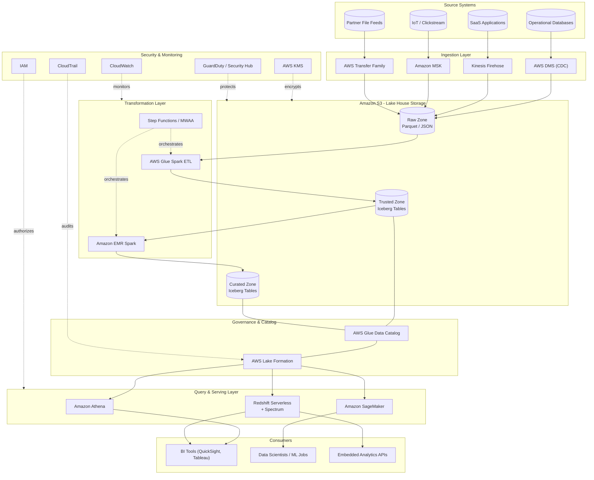

# Part VI – Data Platform Architectures

# Chapter 47 — Lake House

---

## 1. Executive Summary

Every large enterprise eventually collides with the same structural problem: the business needs the flexibility and low cost of a data lake, but the analysts, finance teams, and BI tools need the transactional guarantees, schema enforcement, and query performance of a data warehouse. For roughly a decade, organizations solved this by running both — a data lake for raw, semi-structured, and unstructured data, and a separate data warehouse (Redshift, Snowflake, Teradata) for curated, governed, high-performance analytics. That two-system model works, but it comes at a real cost: duplicated storage, brittle ETL pipelines that copy data between the lake and the warehouse, permanent staleness between the two copies, and double the operational surface area to secure, monitor, and pay for.

The Lake House architecture collapses that split. It keeps a single physical copy of data in low-cost object storage (Amazon S3) while adding a transactional table layer on top — using open table formats such as Apache Iceberg, Apache Hudi, or Delta Lake — that provides ACID transactions, schema evolution, time travel, and fine-grained update/delete/merge semantics directly on top of S3 objects. On top of that transactional layer, a purpose-built query engine (Amazon Redshift Spectrum, Amazon Athena, or Redshift Serverless with Iceberg support) reads the same physical files that batch jobs (AWS Glue, Amazon EMR) and streaming pipelines (Amazon Kinesis, Amazon MSK) write.

**Business problem.** Enterprises accumulate data across dozens or hundreds of source systems — transactional databases, SaaS platforms, IoT telemetry, clickstreams, third-party feeds. Historically, getting that data into a form that finance, product, and executive stakeholders can trust and query quickly required a chain of ETL jobs that moved data from raw storage into a warehouse, with each hop introducing latency, cost, and a fresh opportunity for the two copies to drift out of sync. Auditors and compliance teams then have to reconcile which copy is authoritative. Data scientists training models frequently need direct file-level access to raw and semi-processed data that a warehouse-only architecture simply does not expose economically.

**Architecture objective.** The objective of a Lake House is to establish a *single source of truth* for both operational analytics and data science workloads, stored once in S3, described once in a shared catalog (AWS Glue Data Catalog or Amazon SageMaker Lakehouse catalog), governed once (AWS Lake Formation), and queried through whichever engine is fit for the job — SQL analysts use Redshift or Athena, data scientists use EMR/Spark or SageMaker directly against the same Iceberg tables, and streaming consumers subscribe to Kinesis/MSK topics that land in the same lake within minutes.

**Why organizations adopt this architecture.**

- They are paying twice for the same data — once in S3 for the lake, once in Redshift/Snowflake managed storage for the warehouse — and the finance team is asking FinOps to explain the duplication.
- Data freshness SLAs are tightening. Batch ETL that refreshes a warehouse nightly no longer satisfies product teams that want near-real-time dashboards.
- Data science and ML teams are blocked because the warehouse does not expose raw, granular, or semi-structured data economically, and pulling it out via JDBC is too slow for training workloads.
- Compliance and audit requirements (SOX, GDPR, HIPAA) require precise lineage and the ability to prove that the numbers in a quarterly report and the values used in a fraud model came from the same underlying record — a proof that is far harder to construct across two independently-managed copies of data.
- Schema evolution (adding a column, changing a type, deprecating a field) breaks nightly ETL jobs in the two-system model. Open table formats support in-place schema evolution without rewriting the entire dataset.

**Major business benefits.**

| Benefit | Description |
|---|---|
| Cost reduction | Single copy of data in S3 (cents/GB/month) instead of duplicated in warehouse-managed storage |
| Faster time-to-insight | Streaming and micro-batch ingestion directly into query-able Iceberg/Hudi tables, no separate warehouse-load step |
| Unified governance | One Lake Formation policy set covers lake and warehouse consumers, instead of separate IAM/warehouse-grant models |
| ML/AI enablement | Data scientists and SageMaker training jobs read the same governed, ACID-compliant tables that BI tools query |
| Open format portability | Iceberg/Hudi/Delta tables are not locked to a single query engine; Athena, Redshift, EMR, and third-party engines (Trino, Snowflake external tables, Databricks) can all read the same physical data |
| Simplified pipelines | Fewer ETL hops means fewer points of failure and lower pipeline maintenance cost |

**Typical enterprise scenarios.**

- A retail company consolidating point-of-sale, e-commerce clickstream, and inventory data into one governed platform for both quarterly financial reporting and real-time demand forecasting.
- A financial services firm that must give data scientists access to transaction-level detail for fraud model training while simultaneously guaranteeing regulators that the same transaction values feed the general ledger reporting.
- A healthcare payer consolidating claims, eligibility, and clinical data under HIPAA-compliant row/column-level access controls, serving both actuarial analysts (via SQL) and population-health ML models (via Spark).
- A media company ingesting billions of ad-impression and viewership events per day, needing both sub-hour dashboarding and long-term historical analysis over the same raw event stream.

This chapter builds a complete, production-grade Lake House reference architecture on AWS, using S3 as the storage substrate, Apache Iceberg as the open table format, AWS Glue for cataloging and batch ETL, AWS Lake Formation for fine-grained governance, Amazon Redshift Serverless and Amazon Athena as the dual query engines, Amazon MSK/Kinesis for streaming ingestion, and Amazon EMR/Glue Spark jobs for large-scale transformation. It covers networking, identity, security, HA/DR, scaling, cost, AI-assisted operations, Terraform, CI/CD, monitoring, troubleshooting, and a full enterprise case study.

---

## 2. Business Requirements

### 2.1 Business Drivers

- Eliminate duplicate storage and reconciliation effort between the data lake and data warehouse.
- Support both batch BI/reporting and real-time/near-real-time analytics from one platform.
- Provide a governed, auditable single source of truth for regulated data domains.
- Enable data science and ML teams to train directly against production-quality, governed data without a separate export pipeline.
- Reduce the total pipeline count and associated operational burden.

### 2.2 Functional Requirements

| Requirement | Detail |
|---|---|
| Multi-format ingestion | Support batch (files, CDC snapshots), streaming (Kafka/Kinesis), and API-based ingestion |
| ACID table semantics | Support atomic inserts, updates, deletes, and merges (upserts) on lake tables |
| Schema evolution | Add, rename, and widen columns without full-table rewrites |
| Time travel | Query historical snapshots of a table for audit and rollback |
| Fine-grained access control | Row-level, column-level, and cell-level (tag-based) security |
| Multi-engine query access | Athena, Redshift Spectrum/Serverless, EMR Spark, and SageMaker must all read the same tables consistently |
| Data quality enforcement | Automated validation and quarantine of malformed records before they land in curated zones |
| Lineage and cataloging | Every dataset registered in a central catalog with lineage back to source systems |

### 2.3 Non-Functional Requirements

| Category | Target |
|---|---|
| Scalability | Petabyte-scale storage; ingestion throughput scaling from MB/s to multiple GB/s |
| Availability | 99.9% availability for query layer; S3 provides 99.99% designed availability, 11 nines durability |
| Latency | Streaming ingestion-to-queryable latency under 5 minutes; interactive BI queries under 5 seconds for curated marts |
| Compliance | SOC 2, HIPAA (where applicable), GDPR "right to be forgotten" support via row-level delete in Iceberg |
| Security | Encryption at rest (SSE-KMS) and in transit (TLS 1.2+) everywhere; least-privilege access via Lake Formation |
| RPO | 15 minutes for streaming ingestion pipelines; near-zero for S3 data via cross-region replication |
| RTO | 4 hours for full query-layer recovery in a DR region |
| SLA | 99.9% monthly uptime for the query/serving layer, excluding scheduled maintenance windows |

### 2.4 Expected Workload and Growth

A typical mid-to-large enterprise Lake House starts at 5–20 TB of curated data and 50–200 TB of raw data, ingesting 500 GB–5 TB per day across batch and streaming sources, growing 30–60% year over year as more source systems are onboarded. Query concurrency ranges from tens of concurrent BI users to thousands of concurrent Athena queries fired by embedded analytics and internal tooling.

> **Note:** These are illustrative planning numbers, not prescriptive limits. Right-size ingestion, compute, and catalog partitioning strategy against your actual source system volumes before committing to a specific instance count or WLM configuration.

---

## 3. Architecture Overview

### 3.1 Design Philosophy

The Lake House architecture is built on four philosophical commitments:

1. **Storage and compute are decoupled.** S3 holds all data; compute engines (Athena, Redshift, EMR, Glue) are stateless and can be scaled, replaced, or run in parallel without touching the underlying data.
2. **One physical copy, many logical views.** Data is written once into Iceberg tables. Different consumers (BI, ML, ad hoc SQL) read the same files rather than requiring separate copies loaded into engine-specific storage.
3. **Governance is centralized, not per-engine.** AWS Lake Formation issues temporary, scoped credentials to every query engine, so a single grant model governs Athena, Redshift Spectrum, and EMR access uniformly.
4. **Zones enforce data quality progressively.** Data moves through Raw → Trusted/Cleaned → Curated/Business zones, each with increasingly strict schema and quality guarantees, rather than mixing raw and business-ready data in the same location.

### 3.2 Core Components

| Layer | AWS Service(s) | Responsibility |
|---|---|---|
| Ingestion | AWS DMS, Amazon MSK, Amazon Kinesis Data Streams/Firehose, AWS Glue, AppFlow | Bring data from source systems into the raw zone |
| Storage | Amazon S3 (multiple buckets/prefixes for Raw, Trusted, Curated) | Durable, low-cost object storage holding all physical data |
| Table format | Apache Iceberg (via AWS Glue Data Catalog integration) | ACID transactions, schema evolution, time travel, partition evolution |
| Cataloging | AWS Glue Data Catalog | Central metadata store shared by Athena, Redshift, EMR, Glue jobs |
| Governance | AWS Lake Formation | Fine-grained row/column/cell/tag-based access control |
| Transformation | AWS Glue (Spark, serverless), Amazon EMR (Spark/Trino on EKS or EC2) | Batch and large-scale transformation jobs, quality checks |
| Query — interactive/ad hoc | Amazon Athena | Serverless SQL over S3/Iceberg for ad hoc and embedded analytics |
| Query — warehouse-grade BI | Amazon Redshift Serverless / Provisioned with Redshift Spectrum | High-concurrency BI workloads, complex joins, materialized views |
| Orchestration | AWS Step Functions, Amazon MWAA (managed Airflow) | DAG-based orchestration of multi-step ETL/ELT pipelines |
| Security | AWS KMS, IAM, Lake Formation, Macie, GuardDuty, Security Hub | Encryption, access control, threat detection, compliance posture |
| Monitoring | Amazon CloudWatch, AWS CloudTrail, AWS Glue job metrics | Observability across ingestion, transformation, and query layers |
| ML/AI | Amazon SageMaker, Amazon Bedrock, Amazon Q | Model training directly against Iceberg tables; AI-assisted operations |

### 3.3 High-Level Workflow

1. Source systems emit change data (CDC via DMS) or event streams (Kinesis/MSK) or batch files (S3 drop, SFTP via Transfer Family).
2. Data lands in the **Raw zone** in S3, partitioned by source and ingestion date, in its native or lightly-converted format (Parquet preferred).
3. Glue ETL jobs or EMR Spark jobs validate, deduplicate, and convert data into Iceberg tables in the **Trusted zone**, applying schema enforcement and data quality rules.
4. Further Glue/EMR jobs join, aggregate, and denormalize Trusted-zone data into **Curated/business zone** Iceberg tables optimized for specific consumption patterns (star schemas, pre-aggregated marts).
5. AWS Lake Formation governs column/row-level access to every zone; the Glue Data Catalog exposes table definitions to all query engines.
6. Analysts query Curated tables via Redshift Serverless (for high-concurrency BI) or Athena (for ad hoc/embedded analytics); data scientists query Trusted and Curated tables directly via SageMaker/EMR Spark.
7. CloudWatch, CloudTrail, and Lake Formation audit logs capture every access and transformation for compliance reporting.

### 3.4 Data Lifecycle

Raw data is retained per regulatory requirement (often 3–7 years) in S3 Glacier-tier storage after an initial hot period. Trusted-zone data typically lives 1–2 years in S3 Standard/Standard-IA before transitioning to Glacier. Curated marts are kept in fast-access storage as long as they are actively queried, with old partitions archived or dropped per data retention policy. Iceberg's time-travel and snapshot-expiration features let teams enforce retention *and* provide point-in-time query capability within the retention window.

---

## 4. AWS Services Used

### 4.1 Amazon S3

**Purpose:** Primary durable storage for every byte in the Lake House — raw ingested files, Iceberg data and metadata files, Athena query result staging, EMR/Glue Spark shuffle spill (via S3 or local NVMe), and archival tiers.

**Why selected:** 11 nines of durability, virtually unlimited scale, native integration with every AWS analytics service, and the cheapest large-scale storage available on the platform. S3's support for consistent read-after-write (now standard across all S3 operations) is a prerequisite for Iceberg's atomic commit protocol to function correctly.

**Alternatives:** Azure Data Lake Storage Gen2, Google Cloud Storage — both viable in multi-cloud contexts but outside AWS-native tooling; on-premises HDFS — high operational burden, does not decouple storage/compute, rarely chosen for greenfield builds today.

**Limitations:** S3 request costs (GET/PUT/LIST) can dominate cost for workloads with many small files — a very common Iceberg/Parquet anti-pattern discussed in Section 27. S3 is eventually consistent for cross-region replication timing (though same-region consistency is now strong).

**Pricing considerations:** S3 Standard (~$0.023/GB/month in us-east-1), S3 Intelligent-Tiering for unpredictable access, S3 Glacier Instant/Flexible Retrieval for archival raw data. Lifecycle policies should transition Trusted/Raw zone objects automatically.

**Best practices:** Use S3 Intelligent-Tiering for Curated zones with unpredictable access; enforce object sizes above 128 MB via Iceberg compaction to avoid small-file penalties; enable S3 Inventory for auditing; enable versioning only where legally required (adds storage cost).

### 4.2 Apache Iceberg on AWS Glue Data Catalog

**Purpose:** Provides the ACID transactional table layer over S3 objects — the defining technology of the Lake House pattern.

**Why selected:** Native integration with Glue Data Catalog (Iceberg REST/Glue catalog support), supported natively by Athena, Redshift, EMR, and Glue jobs without third-party connectors. Supports hidden partitioning (partition evolution without breaking existing queries), which materially reduces the operational burden versus Hive-style partitioning.

**Alternatives:** Apache Hudi (stronger for high-frequency upsert-heavy CDC workloads with incremental pull), Delta Lake (best when the shop is heavily invested in Databricks). Iceberg is generally the preferred default on AWS in 2025–2026 due to first-class multi-engine support.

**Limitations:** Requires disciplined compaction and snapshot-expiration maintenance jobs or table storage/metadata bloat accumulates quickly under high-frequency writes.

**Pricing considerations:** No direct charge for the format itself; cost is driven by the S3 storage and the compute (Glue/EMR/Redshift) used to read/write/maintain tables.

**Best practices:** Schedule regular `OPTIMIZE`/compaction and `expire_snapshots` maintenance procedures; use partition transforms (`bucket`, `truncate`, `day`) instead of manually-derived partition columns.

### 4.3 AWS Glue (Data Catalog, ETL Jobs, Crawlers)

**Purpose:** Central metadata catalog shared across all query engines, plus serverless Spark ETL for Raw→Trusted→Curated transformations.

**Why selected:** Deep native integration with Lake Formation for governance, pay-per-use serverless Spark (no cluster management), and the catalog is the de facto standard metadata store consumed by Athena, Redshift Spectrum, and EMR.

**Alternatives:** Self-managed Hive Metastore on EC2/EKS (more control, materially higher operational burden); Amazon EMR's own catalog (viable but loses the cross-service Lake Formation governance integration).

**Limitations:** Glue job cold-start latency (tens of seconds) makes it a poor fit for sub-second-latency use cases; DPU-based pricing can get expensive for very long-running jobs compared to a well-tuned EMR cluster at scale.

**Pricing considerations:** Billed per DPU-hour for ETL jobs; Data Catalog storage/requests billed per object and per API call beyond the free tier.

**Best practices:** Use Glue crawlers sparingly (prefer explicit schema management for Iceberg tables, since crawlers can be slow and occasionally misinfer schema); use Glue job bookmarks for incremental processing.

### 4.4 AWS Lake Formation

**Purpose:** Fine-grained, centralized access control (database, table, column, row, and cell/tag-based) enforced consistently across Athena, Redshift Spectrum, EMR, and Glue.

**Why selected:** Without Lake Formation, access control has to be replicated per-engine (S3 bucket policy for one engine, Redshift GRANT statements for another), which inevitably drifts out of sync and creates audit gaps. Lake Formation issues short-lived, scoped credentials so the underlying S3 permissions never need to be granted directly to end users.

**Alternatives:** IAM-only access control on S3 prefixes (coarse-grained, no column/row-level control, does not scale to complex regulatory requirements).

**Limitations:** Adds a layer of indirection that increases initial setup complexity; troubleshooting "access denied" errors requires understanding both IAM and Lake Formation permission models simultaneously.

**Pricing considerations:** No separate charge for Lake Formation itself; cost is in the underlying compute/storage it governs.

**Best practices:** Use LF-Tags (tag-based access control) for governing hundreds of tables at scale rather than granting per-table permissions individually; register S3 locations under Lake Formation control from day one — retrofitting is disruptive.

### 4.5 Amazon Athena

**Purpose:** Serverless, ad hoc and embedded SQL query engine over S3/Iceberg tables, ideal for exploratory analytics, dashboards with moderate concurrency, and cost-sensitive infrequent queries.

**Why selected:** Zero infrastructure to manage, pay-per-TB-scanned (or per-DPU for Athena provisioned capacity), native Iceberg support including `MERGE`, `UPDATE`, `DELETE`.

**Alternatives:** Presto/Trino self-managed on EMR/EKS (more tuning control, materially higher operational burden); Redshift Spectrum (better for very high concurrency BI, at higher baseline cost).

**Limitations:** Query queuing/latency variability under very high concurrency; per-query cost can be unpredictable if users are not trained to filter partitions.

**Pricing considerations:** $5 per TB scanned (on-demand) — use partitioning, columnar formats (Parquet), and compaction aggressively to control cost. Athena provisioned capacity offers predictable pricing at higher sustained-usage volumes.

**Best practices:** Enforce partition filters via Lake Formation/Athena workgroup query limits; set per-workgroup data-scanned limits to prevent runaway costs from a single bad query.

### 4.6 Amazon Redshift Serverless (with Redshift Spectrum / native Iceberg support)

**Purpose:** High-concurrency, warehouse-grade SQL engine for BI tools, scheduled reporting, and complex multi-join analytical workloads, querying Curated-zone Iceberg tables directly without a separate load step.

**Why selected:** Redshift's mature query optimizer, materialized views, and result caching outperform Athena for high-concurrency, complex-join BI workloads. Redshift Serverless removes the capacity-planning burden of provisioned clusters and scales automatically with RPU-based billing.

**Alternatives:** Snowflake (strong multi-cloud story, but introduces a second billing/security perimeter outside AWS-native governance); Google BigQuery (similarly out-of-ecosystem); Redshift Provisioned (better for very steady, predictable, large workloads where Reserved Instance-style pricing beats RPU-based serverless).

**Limitations:** Redshift Spectrum/Iceberg query performance depends heavily on table compaction/partitioning discipline; cold-start latency exists for Serverless after idle periods (mitigated by base RPU capacity settings).

**Pricing considerations:** Billed per RPU-second for Serverless; provisioned Redshift billed per node-hour (with Reserved Instance discounts up to ~60%+ for 3-year commitments).

**Best practices:** Use materialized views over frequently-joined Curated tables; set Redshift Serverless max RPU caps to bound cost; use short-query acceleration and result caching for dashboard-style repeat queries.

### 4.7 Amazon Kinesis Data Streams / Firehose and Amazon MSK

**Purpose:** Real-time and near-real-time ingestion of event/streaming data (clickstream, IoT, application events, CDC change events) directly into the Raw zone or straight into Iceberg tables via Firehose's Iceberg destination support.

**Why selected:** Kinesis Firehose has native "deliver directly to Apache Iceberg tables" support, removing the need for a custom Lambda/Glue streaming job for many common ingestion patterns. MSK (managed Kafka) is preferred when source systems or downstream consumers are already Kafka-native or require Kafka-specific semantics (consumer groups, exactly-once processing via Kafka Streams).

**Alternatives:** Self-managed Kafka on EC2 (full control, high operational burden); Amazon Data Firehose alone for simpler non-Kafka streaming needs.

**Limitations:** Kinesis Data Streams shard-based scaling requires either on-demand mode (simpler, higher per-GB cost) or careful shard capacity planning; MSK requires broker sizing and operational patching (or MSK Serverless to offload that).

**Pricing considerations:** Kinesis on-demand simplifies capacity planning at a cost premium; MSK Serverless bills per throughput rather than per broker-hour.

**Best practices:** Use Firehose's built-in Iceberg destination for simple append/CDC-merge patterns; reserve custom Glue Streaming/KCL consumers for complex transformation-in-flight requirements.

### 4.8 Amazon EMR (Spark on EKS or EC2)

**Purpose:** Large-scale, long-running Spark transformation jobs, complex ML feature engineering, and workloads that exceed Glue's DPU-based cost efficiency at very large scale.

**Why selected:** Full control over cluster sizing, Spark configuration, and custom libraries; typically more cost-effective than Glue for very large, long-running, steady-state batch jobs, especially when combined with Spot Instances.

**Alternatives:** AWS Glue (simpler, serverless, better for bursty/variable workloads); Databricks on AWS (excellent DX, but a third-party billing/governance perimeter).

**Limitations:** Requires more operational expertise (cluster sizing, bootstrap actions, YARN/K8s tuning) than Glue.

**Pricing considerations:** EC2/EKS instance cost plus EMR per-instance-hour surcharge; Spot Instances can cut compute cost 60–90% for fault-tolerant Spark stages.

**Best practices:** Use EMR on EKS for teams already running Kubernetes platforms to unify operational tooling; use managed scaling and Spot for task nodes, On-Demand for core/master nodes.

### 4.9 AWS Identity & Access Management (IAM), AWS KMS, Secrets Manager

**Purpose:** Underpin every access decision and every encryption key in the platform. Covered in depth in Sections 10 and 11.

### 4.10 Amazon CloudWatch, AWS CloudTrail, AWS Config

**Purpose:** Operational monitoring (CloudWatch), API-level audit trail (CloudTrail), and continuous compliance/configuration drift detection (Config). Covered in Sections 21–23.

### 4.11 Amazon SageMaker and Amazon Bedrock

**Purpose:** ML model training/inference directly against governed Iceberg tables (SageMaker) and generative-AI-assisted operations such as natural-language-to-SQL, documentation generation, and anomaly triage (Bedrock, Amazon Q). Covered in Section 17.

---

## 5. Complete Architecture Diagram



---

## 6. Component-by-Component Explanation

### 6.1 Raw Zone (S3)

**Purpose:** Immutable landing area for data exactly as received from source systems.

**Responsibilities:** Preserve source fidelity for audit and replay; partition by source system and ingestion date; apply minimal transformation (format conversion to Parquet where practical, no business logic).

**Inputs:** DMS CDC streams, Firehose delivery streams, batch file drops via Transfer Family/S3 direct upload.

**Outputs:** Feeds Glue/EMR transformation jobs that populate the Trusted zone.

**Scaling:** S3 scales automatically; the practical scaling concern is request rate per prefix — use high-cardinality prefixes (date/hour) to avoid S3 request throttling under very high ingestion rates.

**High availability:** S3 is inherently multi-AZ within a region (99.99% availability SLA).

**Failure handling:** DMS/Firehose retry with backoff on delivery failure; failed records route to a dead-letter S3 prefix or SQS DLQ for replay.

**Dependencies:** IAM roles for each ingestion service to write to designated Raw-zone prefixes; KMS key for encryption.

**Security:** Bucket policies deny unencrypted PutObject; Lake Formation registers the Raw-zone location so downstream governance applies uniformly.

**Monitoring:** CloudWatch metrics on DMS replication lag, Firehose delivery success rate, S3 PutObject error rate.

### 6.2 Trusted Zone (S3 + Iceberg)

**Purpose:** Schema-enforced, deduplicated, quality-checked Iceberg tables — the first point where data becomes queryable with ACID guarantees.

**Responsibilities:** Deduplicate CDC events; enforce column types and nullability constraints; quarantine records failing quality rules; apply upserts/merges from CDC streams.

**Inputs:** Raw-zone files/streams.

**Outputs:** Feeds Curated-zone aggregation jobs and is directly queryable by data science teams needing granular, pre-aggregation data.

**Scaling:** Glue job worker count (DPUs) and EMR executor count scale to ingestion volume; Iceberg partitioning strategy must scale with table cardinality.

**High availability:** Stateless compute (Glue/EMR); state lives entirely in S3/Iceberg, so compute failures are simply retried.

**Failure handling:** Iceberg's atomic commit ensures a failed/partial write never corrupts the table — either the whole commit succeeds or the table remains at its prior snapshot.

**Dependencies:** Glue Data Catalog table definitions; Lake Formation permissions; upstream Raw-zone availability.

**Security:** Column-level encryption for sensitive fields where required (e.g., tokenized PII); Lake Formation column/row filters.

**Monitoring:** Glue job success/failure metrics, data quality rule pass/fail counts (via Glue Data Quality or Deequ), Iceberg table snapshot growth.

### 6.3 Curated Zone (S3 + Iceberg)

**Purpose:** Business-ready, denormalized, pre-aggregated tables optimized for BI consumption and embedded analytics.

**Responsibilities:** Join Trusted-zone tables into star-schema fact/dimension tables; compute pre-aggregated rollups; enforce business-level data contracts.

**Inputs:** Trusted-zone Iceberg tables.

**Outputs:** Consumed by Redshift Spectrum/Serverless and Athena for BI and reporting.

**Scaling:** Redshift Serverless RPU auto-scaling; Athena scales transparently per query.

**High availability:** Multi-AZ by nature of S3; Redshift Serverless has no single point of failure at the compute layer.

**Failure handling:** Materialized view refresh failures alert via CloudWatch; underlying Iceberg table remains consistent even if a refresh job fails mid-run.

**Dependencies:** Trusted-zone freshness; Glue Catalog schema alignment; Lake Formation grants for BI tool service roles.

**Security:** Row-level security for multi-tenant or regional data segregation; column masking for PII fields exposed to broader BI audiences.

**Monitoring:** Redshift query performance insights, Athena query cost/duration metrics, BI tool connection health.

### 6.4 AWS Glue Data Catalog

**Purpose:** Single metadata registry describing every table's schema, partitioning, location, and format across all zones.

**Responsibilities:** Serve schema metadata to Athena, Redshift Spectrum, EMR, and Glue jobs consistently; track Iceberg table snapshots and manifest locations.

**Scaling:** Fully managed; scales to hundreds of thousands of tables without operational intervention.

**Failure handling:** Highly available managed service; no customer-managed failover required.

**Dependencies:** Underlying S3 locations must remain registered and accessible; Lake Formation permissions gate catalog visibility per principal.

**Monitoring:** CloudTrail logs every catalog API call for audit purposes.

### 6.5 AWS Lake Formation

**Purpose:** Enforce fine-grained access policy across every consuming engine.

**Responsibilities:** Issue temporary scoped credentials; enforce row/column/cell-level filters; manage LF-Tags for scalable tag-based access control; integrate with IAM Identity Center for federated user attribute-based access.

**Failure handling:** A Lake Formation outage would block *new* permission grants but does not retroactively revoke already-issued temporary credentials mid-query; design query engines to fail closed on permission-check errors.

**Monitoring:** CloudTrail `lakeformation.amazonaws.com` events; periodic access-review reports.

---

## 7. End-to-End Request Flow

**Scenario: A BI analyst runs a dashboard query in QuickSight against Curated-zone data via Redshift Serverless.**

1. Analyst opens a QuickSight dashboard in their browser; QuickSight authenticates the analyst via IAM Identity Center federated SSO.
2. QuickSight issues a SQL query to Redshift Serverless using a service role scoped to the analyst's Lake Formation-governed permissions.
3. Route 53 resolves the Redshift Serverless workgroup endpoint to its VPC-internal address.
4. The query enters Redshift Serverless through a VPC endpoint (no public internet traversal); Redshift's leader node parses and plans the query.
5. For tables backed by Redshift-managed storage, data is read directly; for Iceberg tables via Spectrum, Redshift requests temporary credentials from Lake Formation scoped to the specific tables/columns/rows the analyst is authorized to see.
6. Lake Formation validates the request against registered permissions and LF-Tag policies, returning scoped, time-limited S3 credentials.
7. Redshift Spectrum nodes read the relevant Iceberg manifest files and Parquet data files directly from S3 using the scoped credentials, applying predicate pushdown to skip irrelevant partitions.
8. Query results are aggregated at the leader node, cached in Redshift's result cache (if eligible), and returned to QuickSight.
9. QuickSight renders the dashboard visualization for the analyst.
10. CloudWatch records query duration and RPU consumption; CloudTrail records the Lake Formation permission check and the Redshift API call.
11. If the query fails (e.g., permission denied, timeout), Redshift returns a structured error; QuickSight surfaces it to the analyst, and CloudWatch Alarms trigger if failure rate exceeds threshold.
12. If the query succeeds but scans an unexpectedly large volume of data, Redshift Serverless's cost-control settings (max RPU-hours) can throttle or queue subsequent queries to protect the monthly budget.

> **Tip:** Configure Redshift Serverless usage limits (in RPU-hours) per workgroup so a single runaway analytical query cannot consume an entire month's compute budget.

---

## 8. Deployment Flow

### 8.1 Infrastructure Provisioning

All infrastructure (S3 buckets, Glue jobs/crawlers, Lake Formation permissions, Redshift Serverless namespaces/workgroups, MSK clusters, IAM roles) is provisioned via Terraform, organized into reusable modules per layer (storage, catalog, governance, compute, query).

### 8.2 Terraform Workflow

1. Developer opens a feature branch and modifies a Terraform module (e.g., adding a new Curated-zone table definition).
2. `terraform fmt` and `terraform validate` run locally or in a pre-commit hook.
3. Pull request triggers CI: `terraform plan` against a sandbox AWS account, plus `tflint`/`checkov` policy scanning.
4. Reviewer approves; merge to main triggers `terraform plan` against the target environment (dev → staging → prod) with manual approval gates for staging and prod.
5. `terraform apply` executes with state stored in a versioned, encrypted S3 backend with DynamoDB state locking.

### 8.3 CI/CD for ETL Code

Glue job scripts and EMR Spark jobs are version-controlled, unit-tested (via `pytest` with a local Spark session or Glue's local development container), and deployed via CodePipeline/GitHub Actions to update the Glue job's script location in S3 and its job definition.

### 8.4 Blue-Green Deployment for Query Layer

For Redshift, schema changes to Curated-zone views/materialized views are deployed by creating new objects alongside old ones, validating against a shadow query suite, then atomically switching a view alias — minimizing risk of breaking live BI dashboards mid-deployment.

### 8.5 Rollback

Iceberg's snapshot model provides a natural rollback mechanism: `CALL system.rollback_to_snapshot(...)` (via Spark/EMR) or Athena's `ALTER TABLE ... EXECUTE rollback` restores a table to any prior snapshot within the retention window — a capability that has no equivalent in traditional Hive-table data lakes.

### 8.6 Secrets and Configuration

Database credentials for DMS sources, third-party API keys for ingestion connectors, and Redshift admin credentials are stored in AWS Secrets Manager with automatic rotation; Glue jobs and EMR clusters retrieve secrets at runtime via IAM role permissions, never hardcoded.

### 8.7 Validation

Post-deployment validation runs a smoke-test suite: row-count reconciliation between Raw and Trusted zones, schema-diff checks against the Glue Catalog, and a canary BI query against Redshift/Athena to confirm the query layer is healthy before declaring the deployment complete.

---

## 9. Network Topology

### 9.1 VPC Design

A dedicated **Data Platform VPC** (e.g., CIDR `10.20.0.0/16`) hosts all compute resources that need network-level isolation: Redshift Serverless (via VPC-attached workgroups), EMR clusters, MSK brokers, and Glue job elastic network interfaces (ENIs). S3, Athena, and the Glue Data Catalog are accessed via VPC endpoints rather than public internet, even though they are regional managed services.

| Subnet Tier | CIDR Example | Purpose |
|---|---|---|
| Public | `10.20.0.0/24`, `10.20.1.0/24` | NAT Gateways only; no compute placed here |
| Private — Compute | `10.20.10.0/23`, `10.20.12.0/23` | EMR, Glue ENIs, Redshift Serverless workgroup |
| Private — Data | `10.20.20.0/23`, `10.20.22.0/23` | MSK brokers, DMS replication instances |
| Private — Management | `10.20.30.0/24` | Bastion/SSM-managed jump access, CI/CD runners |

### 9.2 NAT Gateway and Internet Gateway

An Internet Gateway attached to public subnets allows NAT Gateways (one per AZ for HA) to provide outbound-only internet access for compute in private subnets that need to reach external SaaS APIs (e.g., a Glue job calling a partner REST API). No inbound internet access is permitted to any data-plane compute.

### 9.3 Transit Gateway

For enterprises with multiple VPCs (e.g., separate VPCs per business unit each producing source data), a Transit Gateway connects the Data Platform VPC to source-system VPCs, enabling DMS and Glue connections to on-VPC operational databases without VPC peering sprawl.

### 9.4 VPC Endpoints (PrivateLink)

Gateway endpoints for **S3** and interface endpoints for **Glue**, **Athena**, **Lake Formation**, **Secrets Manager**, **KMS**, **STS**, and **CloudWatch Logs** ensure that no data-plane traffic ever traverses the public internet, which is both a security requirement and typically a compliance mandate (HIPAA, PCI-DSS).

### 9.5 Route Tables, Network ACLs, Security Groups

Private compute subnets route S3 traffic through the S3 gateway endpoint (no NAT charge for that traffic) and route all other internet-bound traffic through NAT Gateways. Security groups are scoped per service — e.g., the Redshift Serverless security group allows inbound 5439 only from the BI-tool security group and the CI/CD validation runner security group, denying broader access by default.

### 9.6 Hybrid Connectivity

Where source systems remain on-premises, AWS Direct Connect (with a backup Site-to-Site VPN) connects the corporate data center to the Transit Gateway, giving DMS and AppFlow reliable, private connectivity to on-prem databases and file shares feeding the Raw zone.

---

## 10. Identity and Access

### 10.1 IAM Roles

Every compute component runs under a dedicated, least-privilege IAM role: `glue-etl-execution-role`, `emr-instance-role`, `redshift-serverless-role`, `athena-workgroup-role`, `dms-replication-role`. No component shares a role with another, which keeps CloudTrail attribution unambiguous during incident investigation.

### 10.2 IAM Policies and Resource Policies

IAM policies grant only the specific S3 prefixes, KMS keys, and Glue Catalog databases each role requires. S3 bucket policies additionally enforce `aws:SourceVpce` conditions so that even a leaked credential cannot be used to read data from outside the VPC endpoint.

### 10.3 STS and Temporary Credentials

Lake Formation's data-access model is built on STS: rather than granting IAM principals direct S3 permissions, Lake Formation issues short-lived (typically 1-hour) scoped credentials per query, generated via `GetTemporaryGlueTableCredentials`/`GetDataAccess` STS-backed APIs.

### 10.4 Cross-Account Access

Larger enterprises typically separate the Lake House into distinct AWS accounts (Ingestion, Storage/Catalog, Analytics/Consumption) under AWS Organizations, using cross-account IAM roles and Lake Formation's cross-account data sharing (Resource Access Manager) so that a Consumption-account Redshift cluster can query Storage-account Iceberg tables without copying data across accounts.

### 10.5 Least Privilege in Practice

| Principal | Access Granted |
|---|---|
| Glue ETL role (Trusted-zone job) | Read Raw-zone prefix, write Trusted-zone prefix, read/write specific Glue Catalog databases, KMS decrypt/encrypt on designated key |
| BI analyst (via Redshift) | SELECT on specific Curated-zone LF-Tags matching their business unit; no access to Raw or Trusted zones |
| Data scientist (via SageMaker) | SELECT on Trusted and Curated zones for assigned domains; column-level masking on PII fields |
| DMS replication role | Read-only on source database, write-only on Raw-zone prefix |

### 10.6 Permission Boundaries

Permission boundaries are attached to all human-assumable roles (e.g., data engineers' deployment roles) to cap the maximum possible privilege even if an overly broad policy is mistakenly attached, preventing privilege escalation via IAM policy misconfiguration.

---

## 11. Security Architecture

### 11.1 Encryption

- **At rest:** Every S3 bucket uses SSE-KMS with a customer-managed key (CMK) per data classification tier (Raw, Trusted, Curated each get separate CMKs to enable independent access auditing and key rotation policy).
- **In transit:** TLS 1.2+ enforced on all S3, Redshift, Athena, and MSK connections via bucket policy conditions (`aws:SecureTransport`) and MSK's in-transit encryption setting.
- **Column-level:** Highly sensitive fields (SSNs, payment card data) are tokenized or encrypted at the application/ingestion layer before landing in the lake, using AWS Glue's built-in `DataBrew`/custom Lambda tokenization functions.

### 11.2 KMS

Separate CMKs per zone and per business domain enable granular audit of decrypt events via CloudTrail, and allow revoking access to an entire data domain by disabling a single key in an emergency.

### 11.3 TLS, WAF, Shield

BI tools and any customer-facing embedded analytics endpoints sit behind CloudFront/ALB with AWS WAF (rate limiting, SQL injection rule sets) and AWS Shield Standard (automatically included); Shield Advanced is added for internet-facing endpoints with elevated DDoS risk (e.g., a public embedded-analytics API).

### 11.4 Secrets Manager and Certificate Manager

Database credentials, third-party API keys, and Redshift admin passwords rotate automatically via Secrets Manager; ACM issues and auto-renews TLS certificates for any customer-facing endpoints.

### 11.5 GuardDuty, Inspector, Security Hub

GuardDuty's S3 Protection and Malware Protection features monitor for anomalous data access patterns (e.g., unusual `GetObject` volume from an unfamiliar principal) and scan newly uploaded objects for malware. Security Hub aggregates findings from GuardDuty, Config, and Inspector into a single compliance dashboard mapped to CIS/PCI/HIPAA control frameworks.

### 11.6 CloudTrail and AWS Config

CloudTrail captures every Lake Formation permission grant/revoke and every data-access API call; AWS Config continuously evaluates whether S3 buckets remain encrypted, whether public access block settings drift, and whether IAM policies exceed approved permission boundaries.

### 11.7 Zero Trust Principles Applied

No component trusts network location alone — every S3 access requires a valid, scoped, time-limited credential issued by Lake Formation/STS, regardless of whether the request originates inside the VPC. Service-to-service authentication uses IAM roles rather than static credentials throughout.

### 11.8 Threat Model and Mitigations

| Attack Vector | Mitigation |
|---|---|
| Leaked long-lived IAM credentials | Prefer roles over IAM users; enforce credential rotation; `aws:SourceVpce` conditions limit usability outside the VPC |
| Over-permissioned Lake Formation grant | Regular access reviews via Lake Formation's permission listing APIs; automated drift detection via Config rules |
| Small-file/partition scan abuse driving cost | Athena workgroup data-scanned limits; Redshift Serverless RPU-hour caps |
| Insider data exfiltration via broad SELECT | Row/column-level LF-Tag policies; CloudTrail alerting on large result-set exports |
| Malicious file upload to Raw zone | GuardDuty Malware Protection for S3; quarantine bucket for flagged objects |
| Cross-account data leakage | Explicit Resource Access Manager shares only; deny-by-default cross-account bucket policies |

---

## 12. High Availability

### 12.1 AZ Failures

S3 is inherently resilient to single-AZ failure. Redshift Serverless and EMR clusters are deployed across multiple AZs within the VPC subnet group; MSK brokers are distributed across at least 3 AZs with replication factor 3, tolerating loss of one AZ without data loss.

### 12.2 Instance Failures

EMR's managed scaling automatically replaces failed core/task nodes; Glue jobs are stateless and simply retried on failure (with job bookmarks preventing duplicate reprocessing of already-committed data).

### 12.3 Regional Failures

See Section 13 (Disaster Recovery) for cross-region strategy — the Lake House is not natively multi-region active-active by default; that is an explicit DR design decision layered on top.

### 12.4 Database/Catalog Failures

The Glue Data Catalog is a fully managed, highly available regional service with no customer-managed failover. Lake Formation similarly requires no customer HA configuration.

### 12.5 Load Balancing and Health Checks

Any customer-facing embedded analytics API sits behind an Application Load Balancer with health checks against the API layer; ALB automatically routes around unhealthy targets across AZs.

### 12.6 Failover

DMS replication instances support Multi-AZ deployment for source-database change capture resilience; a Multi-AZ DMS instance fails over automatically to a standby in a different AZ within seconds of a primary failure.

---

## 13. Disaster Recovery

### 13.1 Backup Strategy

- **S3 Cross-Region Replication (CRR):** Raw and Trusted zone buckets replicate asynchronously to a DR region, preserving object versions and Iceberg metadata files.
- **Glue Catalog backup:** Catalog metadata is exported periodically (or replicated via AWS Glue Catalog cross-region replication where available) so table definitions can be reconstructed in the DR region.
- **Redshift snapshots:** Automated daily snapshots with cross-region snapshot copy for the Curated-zone Redshift-managed tables.

### 13.2 DR Strategy Selection

| Strategy | RTO | RPO | Cost | When to Use |
|---|---|---|---|---|
| Backup & Restore | 12–24 hrs | 24 hrs | Lowest | Non-critical analytics, cost-sensitive |
| Pilot Light | 2–4 hrs | 15 min–1 hr | Low-Medium | Standard enterprise Lake House (recommended default) |
| Warm Standby | 30–60 min | Near-zero | Medium-High | Regulated industries with strict RTO |
| Active-Active Multi-Region | Near-zero | Near-zero | Highest | Global platforms with 24/7 regional user bases |

For most Lake House deployments, **Pilot Light** is the recommended default: S3 CRR keeps data continuously replicated to the DR region, Glue Catalog and Lake Formation permissions are defined via Terraform in both regions (but only "lit up" — i.e., Glue jobs and Redshift Serverless workgroups activated — during an actual failover), minimizing standing DR cost while keeping RTO in the 2–4 hour range.

### 13.3 Multi-Site Considerations

Because Iceberg tables reference absolute S3 paths in their metadata, a DR failover requires either (a) rewriting table metadata to point at the DR-region bucket, or (b) using S3 Multi-Region Access Points so the same logical endpoint resolves to whichever region is healthy — the latter is strongly preferred for minimizing failover complexity.

### 13.4 RPO/RTO Summary

Streaming ingestion pipelines (Kinesis/MSK) target an RPO of 15 minutes by replicating MSK topics to the DR region via MirrorMaker 2 or Kinesis cross-region replication add-ons. Batch pipelines inherit the S3 CRR replication lag, typically under 15 minutes for most object sizes. Overall platform RTO target is 4 hours for full query-layer restoration in the DR region, validated via quarterly DR game-day exercises (see Section 23).

---

## 14. Scalability

### 14.1 Horizontal and Vertical Scaling

Query compute (Athena, Redshift Serverless) scales horizontally and automatically with no customer intervention. EMR clusters scale horizontally via managed scaling policies tied to YARN/K8s resource pressure. Redshift Provisioned clusters can scale vertically (larger node types) or horizontally (elastic resize / concurrency scaling) depending on workload shape.

### 14.2 Serverless Scaling

Glue ETL jobs and Athena queries scale transparently per invocation with no cluster to manage; Redshift Serverless scales RPU allocation dynamically based on query complexity and concurrency within a configured min/max RPU range.

### 14.3 Database/Storage Scaling

S3 has no practical storage ceiling. Iceberg table scalability is governed by partition and file-count discipline — poorly partitioned tables degrade query planning performance well before they hit any hard AWS service limit.

### 14.4 Queue/Streaming Scaling

Kinesis Data Streams on-demand mode scales shard count automatically with throughput; MSK Serverless scales broker throughput automatically. For MSK Provisioned, broker count and instance type must be planned and scaled manually (or via MSK's auto-scaling storage feature for disk only).

---

## 15. Performance Optimization

### 15.1 Caching

Redshift result caching serves repeat BI dashboard queries without re-scanning S3; Athena does not cache results by default but query result reuse can be configured for repeat queries within a TTL window.

### 15.2 Compression and File Format

Parquet with Zstandard or Snappy compression is the standard columnar format for all Trusted/Curated zone data — reducing both storage cost and bytes scanned per query (which directly reduces Athena's per-TB-scanned cost).

### 15.3 Partitioning and Compaction

Iceberg's hidden partitioning (partition transforms like `day(event_time)`, `bucket(16, customer_id)`) eliminates the classic Hive problem of queries needing to know the exact partition scheme. Scheduled compaction jobs (`OPTIMIZE` via Spark or Athena's `OPTIMIZE` command) merge small files into target sizes of 128 MB–1 GB to prevent small-file query-planning overhead.

### 15.4 Database Optimization

Redshift materialized views pre-compute expensive joins/aggregations over Curated-zone Iceberg tables, refreshed on a schedule or incrementally, dramatically reducing BI dashboard query latency versus querying raw Curated tables directly on every dashboard load.

### 15.5 Connection Pooling and Concurrency

BI tools connecting to Redshift use connection pooling (e.g., PgBouncer-style pooling via Redshift's native connection management or RDS Proxy patterns) to avoid connection-storm issues during peak dashboard-refresh windows.

### 15.6 Async Processing

Long-running exploratory Athena queries submitted by data scientists run asynchronously with results polled/retrieved later, rather than blocking a synchronous request thread, which is the natural pattern given Athena's query-submission API design.

---

## 16. Cost Optimization (FinOps)

### 16.1 Estimated Monthly Cost by Deployment Size

| Component | Small (5 TB curated, light query volume) | Medium (50 TB curated, moderate BI concurrency) | Enterprise (500 TB+ curated, high concurrency) |
|---|---|---|---|
| S3 storage (all zones, blended tiers) | ~$800 | ~$6,000 | ~$45,000 |
| Glue ETL (DPU-hours) | ~$600 | ~$4,000 | ~$25,000 |
| Athena (TB scanned) | ~$300 | ~$2,500 | ~$15,000 |
| Redshift Serverless (RPU-hours) | ~$1,200 | ~$8,000 | ~$50,000 |
| MSK / Kinesis streaming | ~$500 | ~$3,000 | ~$18,000 |
| EMR (if used, beyond Glue) | $0 (not used) | ~$3,000 | ~$30,000 |
| CloudWatch / CloudTrail / logging | ~$200 | ~$1,000 | ~$6,000 |
| Lake Formation / Glue Catalog | Included | Included | Included |
| **Estimated Total/Month** | **~$3,600** | **~$27,500** | **~$189,000** |

> **Note:** These figures are illustrative planning estimates only, based on typical us-east-1 pricing patterns and moderate access frequency assumptions. Always validate against the AWS Pricing Calculator and your actual workload characteristics before budgeting.

### 16.2 Major Cost Drivers

1. Athena/Redshift Spectrum bytes-scanned — directly tied to partitioning and compaction discipline.
2. Redshift Serverless RPU-hours — tied to query complexity, concurrency, and whether materialized views absorb repeat-query load.
3. S3 storage tier mix — Raw-zone data left in S3 Standard indefinitely instead of transitioning to IA/Glacier is one of the single largest avoidable costs.
4. Cross-AZ and cross-region data transfer — especially between EMR/Glue compute and S3 if compute and storage are inadvertently placed in different regions.
5. Small-file overhead — excessive S3 request costs (GET/LIST) from poorly compacted tables.

### 16.3 Optimization Opportunities

- **S3 Lifecycle policies:** Raw zone → S3 Standard-IA after 30 days → Glacier Instant Retrieval after 90 days → Glacier Deep Archive after 1 year (adjusted to regulatory retention requirements).
- **Reserved Instances / Savings Plans:** For steady-state EMR or Redshift Provisioned workloads, 1- or 3-year commitments cut compute cost 40–60%.
- **Spot Instances:** EMR task nodes on Spot for fault-tolerant Spark stages, typically 60–90% cheaper than On-Demand.
- **Rightsizing:** Regularly review Redshift Serverless base/max RPU settings and Glue job DPU allocations against actual utilization via Cost Explorer and Compute Optimizer-style analysis.
- **Cost allocation tagging:** Tag every S3 bucket, Glue job, and Redshift workgroup with `cost-center`, `data-domain`, and `environment` tags to enable chargeback per business unit.
- **Budgets and Cost Anomaly Detection:** AWS Budgets alerts per environment/team; Cost Anomaly Detection flags unusual Athena/Redshift spend spikes (often caused by a single unfiltered query) within hours rather than at month-end.

---

## 17. AI-Assisted Operations

### 17.1 Amazon Q for Data and Amazon Q Developer

Amazon Q's natural-language-to-SQL capability lets business users query Curated-zone tables in plain English, translating to governed SQL that still respects Lake Formation permissions — reducing the ad hoc query backlog on the data engineering team. Amazon Q Developer assists engineers writing Glue/Spark transformation code and Terraform modules, and can review pull requests for common anti-patterns (e.g., missing partition filters).

### 17.2 Amazon Bedrock

Bedrock-based agents can be built to: summarize daily data-quality-check failures into a plain-language incident report; generate draft documentation for new Curated-zone tables from their schema and sample data; and power a RAG-based "ask your data catalog" chat interface over the Glue Catalog's table/column descriptions.

### 17.3 AI-Assisted Log Analysis and Incident Response

CloudWatch Logs Insights combined with Bedrock summarization can triage a spike in Glue job failures by clustering error messages and proposing likely root causes (e.g., "12 of 15 failures share a schema-mismatch error on column `order_status`"), cutting mean-time-to-diagnosis significantly versus manual log review.

### 17.4 AI-Assisted Cost Optimization and Capacity Planning

Bedrock agents can be scheduled to analyze weekly Cost Explorer exports and Redshift query history, proposing specific materialized view candidates (queries with high repeat frequency and high RPU cost) and specific S3 lifecycle policy adjustments based on actual access-pattern data from S3 Storage Lens.

### 17.5 AI-Generated Terraform and Documentation

New table onboarding (a new Curated-zone fact table, for example) can use an AI-assisted workflow where an engineer describes the business requirement in natural language, and an LLM-backed internal tool drafts the Terraform for the Glue Catalog table definition, the Lake Formation LF-Tag assignment, and the accompanying data dictionary documentation — which a human engineer then reviews and approves before merge. This does not replace review; it accelerates first-draft creation.

---

## 18. Terraform Implementation

### 18.1 Provider and Backend Configuration

```hcl

terraform {
  required_version = ">= 1.7.0"

  required_providers {
    aws = {
      source  = "hashicorp/aws"
      version = "~> 5.50"
    }
  }

  backend "s3" {
    bucket         = "acme-lakehouse-terraform-state"
    key            = "lakehouse/prod/terraform.tfstate"
    region         = "us-east-1"
    dynamodb_table = "acme-lakehouse-tf-locks"
    encrypt        = true
  }
}

provider "aws" {
  region = var.aws_region

  default_tags {
    tags = {
      Project     = "lakehouse"
      Environment = var.environment
      ManagedBy   = "terraform"
    }
  }
}

```

### 18.2 Variables

```hcl

variable "aws_region" {
  description = "Primary AWS region for the Lake House platform"
  type        = string
  default     = "us-east-1"
}

variable "environment" {
  description = "Deployment environment: dev, staging, prod"
  type        = string
}

variable "vpc_cidr" {
  description = "CIDR block for the Data Platform VPC"
  type        = string
  default     = "10.20.0.0/16"
}

variable "curated_zone_lf_tags" {
  description = "Map of LF-Tag key/value pairs applied to curated tables"
  type        = map(list(string))
  default = {
    domain       = ["finance", "sales", "operations"]
    sensitivity  = ["public", "internal", "restricted"]
  }
}

```

### 18.3 Networking Module (excerpt)

```hcl

module "vpc" {
  source = "./modules/vpc"

  name               = "lakehouse-${var.environment}"
  cidr_block         = var.vpc_cidr
  azs                = ["us-east-1a", "us-east-1b", "us-east-1c"]
  private_subnets    = ["10.20.10.0/23", "10.20.12.0/23", "10.20.14.0/23"]
  data_subnets       = ["10.20.20.0/23", "10.20.22.0/23", "10.20.24.0/23"]
  public_subnets     = ["10.20.0.0/24", "10.20.1.0/24", "10.20.2.0/24"]
  enable_nat_gateway = true
  single_nat_gateway = var.environment != "prod"

  enable_s3_endpoint       = true
  enable_glue_endpoint     = true
  enable_athena_endpoint   = true
  enable_secretsmgr_endpoint = true
  enable_kms_endpoint      = true
}

```

### 18.4 S3 Storage Module (excerpt)

```hcl

module "lake_storage" {
  source = "./modules/s3-lakehouse"

  for_each = toset(["raw", "trusted", "curated"])

  bucket_name         = "acme-lakehouse-${each.key}-${var.environment}"
  kms_key_arn         = module.kms_keys[each.key].key_arn
  enable_versioning   = each.key == "curated"
  lifecycle_rules = {
    raw = [
      { transition_days = 30,  storage_class = "STANDARD_IA" },
      { transition_days = 90,  storage_class = "GLACIER_IR" },
      { transition_days = 365, storage_class = "DEEP_ARCHIVE" }
    ]
    trusted = [
      { transition_days = 60, storage_class = "STANDARD_IA" }
    ]
    curated = []
  }[each.key]
}

```

### 18.5 Glue Catalog and Iceberg Table (excerpt)

```hcl

resource "aws_glue_catalog_database" "trusted" {
  name = "lakehouse_trusted_${var.environment}"
}

resource "aws_glue_catalog_table" "orders_trusted" {
  name          = "orders"
  database_name = aws_glue_catalog_database.trusted.name

  table_type = "EXTERNAL_TABLE"

  parameters = {
    "table_type"          = "ICEBERG"
    "metadata_location"   = "s3://acme-lakehouse-trusted-${var.environment}/orders/metadata/"
    "classification"      = "parquet"
  }

  storage_descriptor {
    location = "s3://acme-lakehouse-trusted-${var.environment}/orders/"

    columns {
      name = "order_id"
      type = "string"
    }
    columns {
      name = "customer_id"
      type = "string"
    }
    columns {
      name = "order_status"
      type = "string"
    }
    columns {
      name = "order_amount"
      type = "decimal(18,2)"
    }
    columns {
      name = "event_time"
      type = "timestamp"
    }
  }
}

```

### 18.6 Lake Formation Governance (excerpt)

```hcl

resource "aws_lakeformation_lf_tag" "sensitivity" {
  key    = "sensitivity"
  values = ["public", "internal", "restricted"]
}

resource "aws_lakeformation_resource_lf_tags" "orders_tagging" {
  database {
    name = aws_glue_catalog_database.trusted.name
  }
  table {
    database_name = aws_glue_catalog_database.trusted.name
    name           = aws_glue_catalog_table.orders_trusted.name
  }

  lf_tag {
    key   = aws_lakeformation_lf_tag.sensitivity.key
    value = "restricted"
  }
}

resource "aws_lakeformation_permissions" "analyst_read_internal" {
  principal   = aws_iam_role.bi_analyst_role.arn
  permissions = ["SELECT"]

  lf_tag_policy {
    resource_type = "TABLE"
    expression {
      key    = "sensitivity"
      values = ["public", "internal"]
    }
  }
}

```

### 18.7 IAM Role (excerpt)

```hcl

resource "aws_iam_role" "glue_etl_execution_role" {
  name = "glue-etl-execution-${var.environment}"

  assume_role_policy = jsonencode({
    Version = "2012-10-17"
    Statement = [{
      Effect    = "Allow"
      Principal = { Service = "glue.amazonaws.com" }
      Action    = "sts:AssumeRole"
    }]
  })
}

resource "aws_iam_role_policy" "glue_etl_s3_access" {
  name = "glue-etl-s3-access"
  role = aws_iam_role.glue_etl_execution_role.id

  policy = jsonencode({
    Version = "2012-10-17"
    Statement = [
      {
        Effect   = "Allow"
        Action   = ["s3:GetObject", "s3:ListBucket"]
        Resource = [
          module.lake_storage["raw"].bucket_arn,
          "${module.lake_storage["raw"].bucket_arn}/*"
        ]
      },
      {
        Effect   = "Allow"
        Action   = ["s3:PutObject", "s3:DeleteObject"]
        Resource = "${module.lake_storage["trusted"].bucket_arn}/*"
      }
    ]
  })
}

```

### 18.8 Outputs

```hcl

output "trusted_zone_bucket" {
  value = module.lake_storage["trusted"].bucket_name
}

output "glue_trusted_database" {
  value = aws_glue_catalog_database.trusted.name
}

output "redshift_serverless_endpoint" {
  value     = aws_redshiftserverless_workgroup.main.endpoint
  sensitive = false
}

```

### 18.9 Best Practices

- Separate Terraform state per environment and per layer (networking, storage, catalog/governance, compute, query) to limit blast radius of any single `apply`.
- Use `terraform plan -out` artifacts reviewed in pull requests, never `apply` directly from a developer laptop against prod.
- Pin provider versions and run `terraform validate` plus policy-as-code scanning (Checkov, tfsec) in CI before any plan is generated.

---

## 19. AWS CLI Examples

**Deployment / validation**

```bash

# Verify an Iceberg table is registered correctly in the Glue Catalog

aws glue get-table --database-name lakehouse_trusted_prod --name orders

# Trigger a Glue ETL job manually (e.g., for backfill)

aws glue start-job-run --job-name trusted-orders-etl --arguments '{"--backfill_date":"2026-08-01"}'

# Check the status of a running Glue job

aws glue get-job-run --job-name trusted-orders-etl --run-id jr_abcd1234

```

**Monitoring**

```bash

# Check Redshift Serverless workgroup metrics

aws cloudwatch get-metric-statistics \
  --namespace AWS/Redshift-Serverless \
  --metric-name ComputeCapacity \
  --dimensions Name=WorkgroupName,Value=lakehouse-prod-wg \
  --start-time 2026-08-09T00:00:00Z \
  --end-time 2026-08-10T00:00:00Z \
  --period 3600 \
  --statistics Average

# View recent Athena query executions and their data-scanned volume

aws athena list-query-executions --work-group lakehouse-analysts --max-results 20

```

**Troubleshooting**

```bash

# Inspect Lake Formation permissions granted to a specific role

aws lakeformation list-permissions \
  --principal DataLakePrincipalIdentifier=arn:aws:iam::123456789012:role/bi-analyst-role

# Check DMS replication task status and lag

aws dms describe-replication-tasks \
  --filters Name=replication-task-id,Values=orders-cdc-task \
  --query 'ReplicationTasks[0].ReplicationTaskStats'

# Retrieve recent Glue job error logs

aws logs filter-log-events \
  --log-group-name /aws-glue/jobs/error \
  --filter-pattern "trusted-orders-etl" \
  --start-time $(date -d '2 hours ago' +%s000)

```

**Cleanup**

```bash

# Expire old Iceberg snapshots older than 7 days to reclaim storage (via Athena)

aws athena start-query-execution \
  --query-string "ALTER TABLE lakehouse_trusted_prod.orders EXECUTE remove_orphan_files(retention_threshold => '7d')" \
  --work-group lakehouse-analysts

# Delete an unused Glue development endpoint

aws glue delete-dev-endpoint --endpoint-name legacy-dev-endpoint

```

---

## 20. CI/CD Integration

### 20.1 GitHub Actions Pipeline (Terraform + Glue jobs)

```yaml

name: lakehouse-deploy

on:
  pull_request:
    branches: [main]
  push:
    branches: [main]

jobs:
  terraform-plan:
    runs-on: ubuntu-latest
    steps:
      - uses: actions/checkout@v4
      - uses: hashicorp/setup-terraform@v3
      - run: terraform init
      - run: terraform validate
      - run: terraform plan -out=tfplan
      - name: Security scan
        run: checkov -d . --framework terraform

  glue-job-tests:
    runs-on: ubuntu-latest
    steps:
      - uses: actions/checkout@v4
      - name: Run PySpark unit tests
        run: |
          pip install pytest pyspark==3.5.0
          pytest tests/glue_jobs/ -v

  terraform-apply:
    needs: [terraform-plan, glue-job-tests]
    if: github.ref == 'refs/heads/main'
    runs-on: ubuntu-latest
    environment: production
    steps:
      - uses: actions/checkout@v4
      - uses: hashicorp/setup-terraform@v3
      - run: terraform init
      - run: terraform apply -auto-approve tfplan

```

### 20.2 Policy as Code

Every pull request runs `checkov`/`tfsec` against the Terraform diff, blocking merges that would create an unencrypted S3 bucket, an overly permissive IAM policy (`*` resource with write actions), or a Lake Formation permission grant broader than the requesting team's approved data domain.

### 20.3 Rollback

Because Terraform state is versioned in S3, a bad `apply` is rolled back by reverting the merge commit and re-running `terraform apply` against the prior configuration; Iceberg table-level rollback (Section 8.5) handles data-level mistakes independently of infrastructure rollback.

---

## 21. Monitoring

### 21.1 CloudWatch Dashboards

A unified CloudWatch dashboard tracks: Glue job success/failure rate and duration, Redshift Serverless RPU consumption and query queue depth, Athena data-scanned volume and query duration percentiles, MSK/Kinesis ingestion lag, and S3 bucket size growth per zone.

### 21.2 Metrics, Alarms, and Notifications

| Metric | Alarm Threshold | Notification |
|---|---|---|
| Glue job failure rate | > 5% over 1 hour | SNS → PagerDuty (data engineering on-call) |
| DMS replication lag | > 15 minutes | SNS → PagerDuty |
| Redshift Serverless query queue depth | > 20 queued queries | SNS → Slack (data platform channel) |
| Athena data scanned (single query) | > 1 TB | SNS → Slack (cost alert) |
| S3 4xx/5xx error rate | > 1% over 5 minutes | SNS → PagerDuty |

### 21.3 X-Ray and Tracing

For custom Lambda-based ingestion connectors (e.g., a bespoke SaaS API puller), AWS X-Ray traces the request lifecycle from API call through Firehose delivery into S3, helping isolate latency bottlenecks in multi-hop custom pipelines.

### 21.4 SLIs, SLOs, Error Budgets

| SLI | SLO | Error Budget |
|---|---|---|
| Trusted-zone data freshness (streaming sources) | 95% of records queryable within 5 minutes | 5% may exceed 5 minutes per rolling 30 days |
| Curated-zone dashboard query success rate | 99.5% | 0.5% failure budget per rolling 30 days |
| Redshift Serverless query P95 latency | < 8 seconds | Reviewed monthly against BI tool SLAs |

---

## 22. Logging

### 22.1 Centralized Logging

Glue job logs, Redshift audit logs, Lake Formation access logs, and S3 access logs all flow to a centralized CloudWatch Logs group per environment, with a scheduled export to a dedicated `lakehouse-audit-logs` S3 bucket for long-term retention and Athena-based log analysis.

### 22.2 Athena and OpenSearch for Log Analysis

Long-term audit logs (CloudTrail, Lake Formation access records) are queried via Athena directly against the S3 log bucket for compliance investigations; near-real-time operational log search (for on-call debugging) uses Amazon OpenSearch Service ingesting the same CloudWatch Logs via a subscription filter.

### 22.3 Retention

| Log Type | Hot Retention | Archive Retention |
|---|---|---|
| CloudTrail (management + data events) | 90 days (CloudWatch Logs) | 7 years (S3 Glacier) |
| Lake Formation access logs | 90 days | 7 years |
| Glue job logs | 30 days | 1 year |
| Redshift audit logs (connection, user activity) | 90 days | 7 years (regulated environments) |

### 22.4 Audit Logging

Every Lake Formation `GetDataAccess` call, every Redshift `SELECT` on a `restricted`-tagged table, and every Glue Catalog schema change is captured in CloudTrail as an immutable, timestamped audit record — the evidentiary backbone for SOX and HIPAA audits.

---

## 23. Operational Excellence

### 23.1 Runbooks

Documented runbooks exist for: Glue job failure triage, DMS replication lag recovery, Redshift Serverless RPU-cap breach response, Iceberg table corruption/rollback procedure, and full-region DR failover — each runbook includes exact CLI commands, escalation contacts, and expected resolution time.

### 23.2 Automation

Routine maintenance (Iceberg compaction, snapshot expiration, S3 lifecycle transitions, Glue Catalog orphaned-table cleanup) runs on scheduled EventBridge triggers rather than manual execution, reducing the chance of human error and freeing engineering time for higher-value work.

### 23.3 Patch Management

EMR AMIs and Glue job runtime versions are upgraded on a quarterly cadence in a staging environment first, validated against the smoke-test suite (Section 8.7), before promotion to production — avoiding the common failure mode of an unplanned runtime upgrade silently breaking a Spark job's dependency compatibility.

### 23.4 Incident Response

A documented severity matrix (SEV1: data platform-wide outage; SEV2: single-domain pipeline failure; SEV3: degraded performance) drives on-call paging thresholds, with post-incident reviews required for every SEV1/SEV2 within 5 business days.

### 23.5 Change Management

All schema changes to Curated-zone tables go through a lightweight change-advisory process: a data contract review confirming downstream BI dashboards and ML feature pipelines are not broken by the change, executed via the blue-green view-swap pattern described in Section 8.4.

---

## 24. Failure Scenarios

| # | Scenario | Symptoms | Root Cause | Detection | Resolution | Prevention |
|---|---|---|---|---|---|---|
| 1 | DMS replication stalls | Growing replication lag metric | Source DB connection drop or DDL change on source table | CloudWatch DMS lag alarm | Restart replication task; resync from last checkpoint | Multi-AZ DMS instance; DDL change alerting on source |
| 2 | Glue job OOM | Job fails with `ExecutorLostFailure` | Skewed partition or undersized worker type | Glue job failure alarm | Increase DPU/worker type; repartition skewed key | Data skew monitoring; adaptive query execution enabled |
| 3 | Iceberg table metadata bloat | Slow query planning, growing manifest file count | Missing scheduled compaction/snapshot expiration | Table metadata size CloudWatch custom metric | Run `expire_snapshots` and `rewrite_manifests` | Scheduled weekly maintenance job |
| 4 | Small-file explosion | High S3 request cost, slow Athena queries | Streaming job committing too frequently | Athena query duration regression, S3 request cost spike | Trigger compaction (`OPTIMIZE`); adjust Firehose buffer interval | Tune streaming commit interval; scheduled compaction |
| 5 | Redshift Serverless RPU cap breach | Query queuing, dashboard timeouts | Unfiltered query scanning full Curated table | RPU-hour usage alarm | Kill runaway query; raise cap temporarily if legitimate | Query timeout policies; analyst training; partition-filter enforcement |
| 6 | Lake Formation permission drift | Analyst reports unexpected access denied/allowed | Manual grant made outside Terraform | Config rule drift detection | Reconcile via Terraform apply; revoke manual grant | Enforce all grants via IaC only; disable console grant permission for engineers |
| 7 | S3 CRR replication lag spike | DR region data staleness beyond RPO | Large batch write spike exceeding replication throughput | S3 replication metrics (CloudWatch) | Temporarily increase replication priority/throughput | Pre-provision replication capacity for known batch windows |
| 8 | MSK broker disk full | Producer throttling, consumer lag growth | Retention period misconfigured vs. throughput growth | MSK disk usage alarm | Expand EBS volume (MSK auto-scaling storage) | Enable MSK storage auto-scaling; capacity review quarterly |
| 9 | Schema evolution breaks downstream job | Glue job fails with type-mismatch error | Upstream added/changed column without contract review | Job failure alarm; data contract validation failure | Roll back schema change or patch downstream job to handle new schema | Enforced schema registry / data contract review gate |
| 10 | Iceberg concurrent write conflict | Job fails with `CommitFailedException` | Two writers targeting the same table partition simultaneously | Glue/EMR job error logs | Retry with backoff (Iceberg's optimistic concurrency handles most cases automatically) | Coordinate writers via orchestration (Step Functions locking) |
| 11 | Redshift Spectrum external table stale after schema change | Query returns wrong columns or errors | Glue Catalog updated but Redshift external schema not refreshed | BI user-reported query error | Refresh external schema mapping | Automate Redshift external schema refresh in deployment pipeline |
| 12 | KMS key access denied after key rotation | Glue jobs suddenly fail with `AccessDeniedException` | IAM policy referenced old key alias without version wildcard | Glue job failure alarm | Update IAM policy to reference key alias, not specific key ID | Always reference KMS key aliases, not raw key IDs, in IAM policies |
| 13 | VPC endpoint DNS resolution failure | Compute cannot reach S3/Glue after network change | Route table or endpoint policy misconfigured during a network change | Compute-side connection timeout errors | Restore correct route table association | Network change review checklist; automated endpoint connectivity smoke test |
| 14 | Cost spike from Athena ad hoc query | Monthly Athena bill anomaly | Analyst ran a `SELECT *` without partition filter across full history | Cost Anomaly Detection alert | Cancel query if still running; workgroup scan limit enforcement going forward | Per-workgroup data-scanned limits; analyst training; partition-filter Lake Formation enforcement |
| 15 | Cross-region DR failover incomplete | Some Curated tables missing in DR region post-failover | Iceberg metadata pointed to primary-region bucket paths | DR game-day validation catches it (or, worse, a live failover) | Rewrite table metadata to DR bucket via `register_table`/path rewrite procedure | Use S3 Multi-Region Access Points; regular DR game-day testing |

---

## 25. Troubleshooting Guide

| Problem | Symptoms | Likely Cause | Diagnosis | AWS CLI Commands | Resolution |
|---|---|---|---|---|---|
| BI dashboard query timeout | Query exceeds 30s, times out | Missing materialized view or partition pruning not occurring | Check Redshift query plan for full table scan | `aws redshift-data describe-statement --id <query-id>` | Add/refresh materialized view; verify partition column used in WHERE clause |
| "Access Denied" on Athena query | Query fails immediately | Lake Formation permission missing for principal | List current grants for the role | `aws lakeformation list-permissions --principal DataLakePrincipalIdentifier=<role-arn>` | Grant appropriate LF-Tag/table permission via Terraform |
| Glue job stuck in "RUNNING" | Job exceeds expected runtime by 3x+ | Data skew or infinite retry loop on a malformed record | Review Spark UI / Glue job metrics for stage-level skew | `aws glue get-job-run --job-name <job> --run-id <run-id>` | Repartition skewed key; add dead-letter handling for malformed records |
| Iceberg table shows stale data | New writes not visible to readers | Reader query engine caching old table metadata pointer | Check current vs. cached metadata location | `aws glue get-table --database-name <db> --name <table>` (compare `metadata_location`) | Refresh engine-side catalog cache (e.g., Athena `MSCK`/metadata refresh not needed for Iceberg, but verify catalog sync) |
| DMS task shows high error count | CDC records failing to apply | Source schema drift (new/renamed column) not reflected in target mapping | Review DMS task table-mapping errors | `aws dms describe-table-statistics --replication-task-arn <arn>` | Update table mapping / target schema; resume task |
| Unexpectedly high Athena bill | Cost Anomaly Detection alert fired | Query without partition filter scanned entire table history | Review Athena query history for scanned-bytes outliers | `aws athena list-query-executions --work-group <wg>` then `get-query-execution` per ID | Apply workgroup scan limits; educate analyst; consider requiring partition filter enforcement |
| Redshift Serverless workgroup unreachable | BI tool connection timeout | Security group or VPC endpoint misconfiguration after a network change | Test connectivity from a bastion/SSM session in the same subnet | `aws redshiftserverless get-workgroup --workgroup-name <wg>` | Correct security group ingress rule; verify subnet route table |
| MSK consumer lag growing | Downstream Trusted-zone freshness SLA breached | Consumer under-provisioned relative to producer throughput | Check consumer group lag | `aws kafka describe-cluster --cluster-arn <arn>` plus Kafka `kafka-consumer-groups.sh` | Scale consumer parallelism; verify partition count supports target consumer count |

---

## 26. Best Practices

1. Register every S3 location under Lake Formation from day one — retrofitting governance onto an already-public data lake is materially harder.
2. Use LF-Tags for access control at scale; avoid granting per-table permissions once you exceed roughly 50 tables.
3. Standardize on Parquet with Zstandard compression for all Trusted/Curated zone data.
4. Schedule automated Iceberg compaction and snapshot expiration — never leave this as a manual, ad hoc task.
5. Separate KMS keys per data-sensitivity tier to enable independent audit and revocation.
6. Enforce partition filters via workgroup/query-engine configuration, not just documentation/training.
7. Use hidden partitioning (Iceberg partition transforms) instead of manually-derived partition columns.
8. Keep Raw-zone data immutable — never allow in-place edits; corrections flow through the Trusted-zone transformation layer.
9. Version-control every Glue/Spark transformation script and unit-test it before deployment.
10. Use Step Functions or MWAA for multi-step pipeline orchestration rather than chaining Lambda triggers implicitly.
11. Apply S3 lifecycle policies aggressively on Raw-zone data; it is the largest and least-frequently-accessed tier.
12. Set Redshift Serverless max-RPU caps per workgroup to bound cost exposure.
13. Set Athena workgroup data-scanned limits per team/workgroup.
14. Tag every resource with cost-center and data-domain tags from creation, not retroactively.
15. Use Reserved Instances/Savings Plans only after 3+ months of stable usage data, not at initial launch.
16. Run quarterly DR game days that include an actual failover rehearsal, not just a tabletop review.
17. Require a data contract review before any Curated-zone schema change ships.
18. Use materialized views for any query pattern executed more than a handful of times per day.
19. Prefer Firehose's native Iceberg destination over custom streaming consumers for standard append/merge patterns.
20. Isolate ingestion, storage/catalog, and consumption into separate AWS accounts for large enterprises.
21. Use permission boundaries on all human-assumable IAM roles.
22. Enable GuardDuty S3 Protection and Malware Protection from day one.
23. Centralize secrets in Secrets Manager with automatic rotation; never hardcode credentials in Glue job scripts.
24. Build a canary/smoke-test suite that runs after every deployment before declaring it complete.
25. Document and rehearse the Iceberg snapshot-rollback procedure before you need it in a real incident.
26. Prefer VPC endpoints (PrivateLink) over public internet routes for every AWS service the platform touches.
27. Use blue-green view-swap deployment for Curated-zone schema changes to avoid breaking live BI dashboards.
28. Monitor small-file count as a first-class metric, not an afterthought discovered during a performance incident.
29. Keep a single canonical data dictionary (auto-generated from the Glue Catalog where possible) accessible to all consumers.
30. Review Lake Formation access grants on a recurring quarterly cadence, not only at initial setup.
31. Use AI-assisted tools (Amazon Q, Bedrock) to accelerate documentation and first-draft IaC, but always require human review before merge.
32. Right-size Glue job worker types and counts based on actual DPU utilization metrics, reviewed monthly.

---

## 27. Anti-Patterns

1. **Skipping Lake Formation and relying on S3 bucket policies alone.** Bucket policies cannot express row/column-level rules; this forces a costly re-architecture later. Use Lake Formation from the start.
2. **Writing directly to Curated-zone tables from ad hoc notebooks.** Bypasses schema/quality enforcement and orchestration tracking. Route all writes through governed, version-controlled pipelines.
3. **Allowing uncontrolled small-file writes from streaming ingestion.** Destroys query performance and inflates S3 request cost. Tune Firehose buffering and schedule compaction.
4. **Treating the Raw zone as directly queryable by BI tools.** Raw data lacks quality guarantees; exposing it to BI creates trust and correctness issues. Gate BI access to Trusted/Curated zones only.
5. **Granting `SELECT *` broad permissions instead of column-level LF-Tags.** Creates unnecessary PII exposure risk. Use column-level and cell-level tagging for sensitive fields.
6. **Never running Iceberg snapshot expiration.** Table metadata grows unbounded, degrading query planning and inflating storage cost. Schedule this as routine maintenance.
7. **Using long-lived IAM user credentials for pipeline service accounts.** Elevated credential-leak risk. Use IAM roles with STS-issued temporary credentials exclusively.
8. **Hardcoding S3 paths in application code instead of resolving via the Glue Catalog.** Breaks the moment a table location changes or after a DR failover. Always resolve via catalog metadata.
9. **Building one giant monolithic Glue job for the whole Raw→Curated pipeline.** A single failure blocks the entire pipeline and is hard to debug. Decompose into per-zone, per-domain jobs orchestrated by Step Functions.
10. **Ignoring data contracts between producing and consuming teams.** Upstream schema changes silently break downstream consumers. Require a contract review gate for schema changes.
11. **Using Athena on-demand for high-frequency, predictable BI workloads.** Bytes-scanned pricing becomes more expensive than Redshift Serverless RPU-hours at sustained high query volume. Match the engine to the workload shape.
12. **Deploying Redshift Provisioned clusters sized for peak load year-round.** Wastes spend during off-peak periods. Use Redshift Serverless or elastic resize for variable workloads.
13. **Manually granting Lake Formation permissions via the console "just this once."** Creates permission drift invisible to Terraform state. Enforce IaC-only grants with console access disabled for engineers.
14. **Neglecting to separate KMS keys by sensitivity tier.** A single compromised key exposes the entire platform's encrypted data. Segment keys by domain/classification.
15. **Not testing DR failover until an actual regional outage occurs.** DR plans that are never rehearsed routinely fail in practice. Run quarterly game days.
16. **Allowing analysts unrestricted Athena/Redshift access without cost guardrails.** A single unfiltered query can generate thousands of dollars in scan cost. Enforce workgroup/RPU caps.
17. **Storing sensitive PII unencrypted at the column level, relying only on bucket-level encryption.** Insufficient for regulated data; a single over-broad grant exposes raw PII. Tokenize/encrypt sensitive columns independently.
18. **Using Hive-style manual partitioning instead of Iceberg's hidden partitioning.** Creates operational fragility when partition schemes need to evolve. Use Iceberg partition transforms.
19. **Treating the data catalog as optional documentation rather than the authoritative schema source.** Leads to schema drift between what's documented and what's actually deployed. Generate documentation from the catalog, not the reverse.
20. **Running data quality checks only in the Curated zone, not the Trusted zone.** Lets bad data propagate further before being caught, complicating root-cause analysis. Validate as early in the pipeline as feasible.

---

## 28. Alternatives

| Alternative | Advantages | Disadvantages | Cost | Operational Complexity | Security | Performance |
|---|---|---|---|---|---|---|
| **Traditional two-system (S3 lake + Redshift/Snowflake warehouse, ETL-copied)** | Mature, well-understood pattern; warehouse performance is excellent for its own copy | Duplicated storage/cost; permanent lake/warehouse drift; double governance surface | Higher (duplicate storage + compute) | Higher (two systems to operate) | Requires reconciling two access-control models | Warehouse queries fast; lake queries independent |
| **Snowflake as unified platform (with external tables over S3)** | Strong multi-cloud portability; excellent SQL engine and ecosystem | Separate billing/security perimeter outside AWS-native IAM/Lake Formation; egress costs for cross-cloud data movement | Comparable to Redshift at scale, premium at very large scale | Lower for Snowflake-only teams; higher for AWS-native governance integration | Requires bridging Snowflake RBAC with AWS IAM | Excellent for warehouse-native workloads |
| **Databricks Lakehouse (Delta Lake) on AWS** | Excellent for unified data engineering + ML/data science teams already in Databricks | Third-party control plane; less native AWS Lake Formation integration | Comparable to EMR-based approach, plus Databricks platform fee | Lower for Spark-heavy teams already skilled in Databricks | Databricks Unity Catalog vs. AWS Lake Formation — choose one as source of truth | Very strong for Spark-native ML workloads |
| **Pure data lake, no warehouse layer (Athena/Presto only, no Redshift)** | Simplest, lowest fixed cost; no warehouse compute to manage | Weaker performance for high-concurrency, complex-join BI workloads; no materialized views | Lowest baseline cost | Lowest operational complexity | Same Lake Formation model applies | Adequate for low-concurrency, adequate for exploratory; weak for dashboard-heavy BI |
| **Self-managed open-source stack (Trino + Hive Metastore + MinIO/on-prem)** | Full control, no cloud vendor lock-in, portable across environments | Very high operational burden; team must own HA, scaling, security patching entirely | Lower infrastructure cost, much higher labor cost | Highest | Requires building equivalent governance tooling from scratch | Depends entirely on tuning quality; ceiling is high, floor is very low without expertise |

**When the Lake House pattern described in this chapter is the right choice:** the organization is AWS-native, needs unified governance across BI and ML consumers, and wants to eliminate the duplicated storage/reconciliation cost of a separate lake and warehouse.

**When an alternative may fit better:** a genuinely multi-cloud organization may prefer Snowflake or Databricks for portability; a small team with only exploratory/ad hoc query needs and no BI concurrency requirement may not need Redshift at all and can run pure Athena-on-lake economically.

---

## 29. Real Enterprise Case Study

**Company profile:** A mid-market North American insurance carrier (~4,000 employees, ~$1.8B annual premium volume) operating a mix of legacy on-premises policy administration systems and newer cloud-native claims and quoting applications.

**Business problem:** Actuarial and finance teams relied on a nightly-refreshed on-premises Teradata warehouse fed by a brittle chain of custom ETL scripts pulling from the policy administration mainframe, the claims system's PostgreSQL database, and a third-party telematics vendor's daily file feed. Data scientists building a claims-fraud model needed record-level telematics and claims data that the warehouse did not retain at sufficient granularity, forcing a separate, unmanaged export process that regularly drifted out of sync with the "official" warehouse numbers — a discrepancy that had already triggered two internal audit findings.

**Architecture decisions:**

- Adopted the Lake House pattern described in this chapter, with AWS DMS performing CDC replication from the on-prem PostgreSQL claims database over Direct Connect, and a nightly SFTP-based batch feed from the telematics vendor landing via AWS Transfer Family.
- Chose Apache Iceberg over Hudi after a two-week proof of concept, driven primarily by the team's need for first-class Athena and Redshift Spectrum support without third-party connectors, plus the actuarial team's requirement for reliable time-travel queries to reproduce historical reserve calculations for audit purposes.
- Used AWS Lake Formation with LF-Tags segmenting data by `sensitivity` (public/internal/restricted) and `business_line` (auto/home/commercial), aligning with the company's existing data governance council's classification taxonomy.
- Retained Redshift Serverless for the finance/actuarial team's high-concurrency month-end close reporting, while giving the data science team direct SageMaker access to Trusted-zone Iceberg tables for fraud-model feature engineering — eliminating the previously unmanaged export process entirely.

**Migration approach:** A phased, six-month migration ran the legacy Teradata warehouse and the new Lake House in parallel for the first two reporting quarters, with automated row-count and aggregate-value reconciliation jobs comparing outputs nightly before the actuarial team was willing to sign off on cutover.

**Challenges encountered:**

- Initial Iceberg table partitioning strategy (partitioned by ingestion date only) caused slow query performance for the actuarial team's policy-level historical queries, which typically filtered by policy effective date rather than ingestion date; the team re-partitioned using a composite transform on `policy_effective_date` mid-project, requiring a one-time table rewrite.
- The claims-fraud model's feature pipeline initially bypassed the Trusted zone and read directly from Raw, reintroducing exactly the data-quality risk the migration was meant to eliminate; this was caught during the architecture review board's mid-project checkpoint and corrected before go-live.
- On-premises Direct Connect bandwidth was undersized for the initial CDC backfill volume, requiring a temporary Snowball Edge-based bulk transfer for historical backfill before switching to steady-state CDC replication.

**Lessons learned:** Partitioning strategy should be validated against actual downstream query patterns (via a representative BI query sample) before the first production table is built, not discovered after actuarial users complain about slow dashboards. Data science teams need clear, enforced guardrails preventing direct Raw-zone access, even when it is technically more convenient in the short term.

**Results:** Month-end close reporting cycle time dropped from 5 business days to 2; the fraud-detection model's feature pipeline now reads governed, audit-traceable data with zero reconciliation discrepancies in the four quarters following cutover; total data platform infrastructure spend decreased approximately 22% versus the prior Teradata-plus-lake dual-system cost base, driven primarily by eliminating duplicated storage and the associated ETL compute.

---

## 30. Architecture Decision Record (ADR)

**ADR-047: Adopt an Apache Iceberg-based Lake House on AWS in place of a separate data lake and data warehouse**

**Status:** Accepted

**Context:** The organization operates a separate S3-based data lake and a Redshift/Teradata data warehouse fed by nightly ETL. This creates duplicated storage cost, reconciliation risk between the two copies, and blocks data science teams from accessing governed, record-level data without a separate unmanaged export process.

**Decision:** Adopt a Lake House architecture using Apache Iceberg tables on Amazon S3, cataloged in the AWS Glue Data Catalog, governed by AWS Lake Formation, and queried through both Amazon Athena (ad hoc/embedded analytics) and Amazon Redshift Serverless (high-concurrency BI), eliminating the separate warehouse-managed copy of curated data.

**Alternatives considered:**

- Continue the two-system model with improved ETL tooling — rejected due to persistent duplication cost and reconciliation risk.
- Adopt Databricks/Delta Lake — rejected due to weaker native integration with existing AWS Lake Formation governance investment and IAM Identity Center federation already in place.
- Adopt Snowflake as the unified platform — rejected due to introducing a second, non-AWS-native security and billing perimeter, and additional cross-cloud egress cost for data already resident in S3.

**Consequences:**

- *Positive:* Single source of truth eliminates lake/warehouse reconciliation; data science teams gain governed direct access to granular data; overall storage cost decreases by eliminating duplication.
- *Negative:* Requires the data engineering team to build new operational competency in Iceberg maintenance (compaction, snapshot expiration); initial migration requires a parallel-run validation period, extending project timeline by an estimated 6–8 weeks versus a simpler "lift and shift" approach.

**Risks:** Partitioning strategy must be validated early against real query patterns to avoid a costly mid-project table rewrite (as observed in the case study, Section 29). Team must build and rehearse the Iceberg-specific DR/rollback runbooks before cutover, since these procedures do not exist in the prior Teradata-based operating model.

**Review date:** This ADR will be reviewed 12 months after production cutover, or immediately upon any AWS re:Invent announcement materially changing native Iceberg support across Athena/Redshift/EMR.

---

## 31. Architecture Review Checklist

**Security**
- [ ] All S3 buckets encrypted with SSE-KMS using domain/sensitivity-segmented CMKs
- [ ] Lake Formation registered on every S3 location containing lake data
- [ ] No IAM user (only role-based) access for any pipeline service account
- [ ] VPC endpoints in place for S3, Glue, Athena, Lake Formation, Secrets Manager, KMS
- [ ] GuardDuty S3 Protection and Malware Protection enabled

**Networking**
- [ ] No public internet ingress to any data-plane compute
- [ ] NAT Gateway HA (one per AZ) confirmed for production
- [ ] Security groups scoped to specific source security groups, not broad CIDR ranges

**Operations**
- [ ] Runbooks exist for the top failure scenarios in Section 24
- [ ] Scheduled Iceberg compaction and snapshot expiration jobs deployed and monitored
- [ ] CI/CD pipeline includes automated policy-as-code scanning

**Performance**
- [ ] Partitioning strategy validated against representative downstream query patterns
- [ ] Materialized views in place for high-frequency BI query patterns
- [ ] Small-file count monitored as an explicit metric

**Scalability**
- [ ] Redshift Serverless min/max RPU configured and reviewed against actual usage
- [ ] MSK/Kinesis ingestion capacity validated against peak, not just average, throughput

**Reliability**
- [ ] Multi-AZ deployment confirmed for MSK, DMS, and any provisioned compute
- [ ] DR strategy documented and last game-day test date recorded

**Cost**
- [ ] Cost allocation tags applied to all resources
- [ ] Athena workgroup scan limits and Redshift RPU caps configured
- [ ] S3 lifecycle policies applied to Raw and Trusted zones

**Compliance**
- [ ] Data retention periods documented and enforced via S3 lifecycle/Iceberg snapshot expiration
- [ ] Audit logging (CloudTrail, Lake Formation access logs) retained per regulatory requirement
- [ ] Data classification (LF-Tags) aligned with the organization's governance taxonomy

---

## 32. Summary

The Lake House architecture resolves a structural tension that has defined enterprise data platforms for a decade: the choice between the flexibility and economics of a data lake and the transactional guarantees and query performance of a data warehouse. By layering an open, ACID-compliant table format (Apache Iceberg) over S3 and governing access centrally through AWS Lake Formation, organizations maintain a single physical copy of data that is simultaneously queryable by high-concurrency BI tools through Redshift Serverless, ad hoc analysts through Athena, and data science/ML teams through EMR and SageMaker.

**Key architecture decisions** in this chapter: S3 as the universal storage substrate; Apache Iceberg as the transactional table format, chosen for its native multi-engine AWS support; AWS Glue Data Catalog and Lake Formation as the unified metadata and governance layer; a three-zone (Raw/Trusted/Curated) data quality progression; and a dual-engine query strategy pairing Athena's serverless flexibility with Redshift Serverless's high-concurrency BI performance.

**Lessons learned:** partitioning strategy must be validated against real downstream query patterns before tables are built at scale; Iceberg maintenance (compaction, snapshot expiration) must be automated from day one, not bolted on after a performance incident; and governance must be enforced through infrastructure-as-code from the very first table, since retrofitting fine-grained access control onto an already-public data lake is materially more disruptive than building it in from the start.

**When to use this architecture:** AWS-native organizations with both BI/reporting and data science/ML consumers who need a single governed source of truth, and who are currently paying the duplicated-storage and reconciliation cost of running separate lake and warehouse systems.

**When not to use this architecture:** organizations with only exploratory/ad hoc query needs and no BI concurrency requirement may not need the Redshift layer at all; genuinely multi-cloud organizations may find Snowflake or Databricks a better fit for portability; and small teams without dedicated data engineering capacity may find the operational overhead of Iceberg maintenance and Lake Formation governance disproportionate to their current data volume.

---

## 33. Further Reading

- AWS Well-Architected Framework — Analytics Lens: https://docs.aws.amazon.com/wellarchitected/latest/analytics-lens/
- AWS Lake Formation Developer Guide: https://docs.aws.amazon.com/lake-formation/
- AWS Glue Developer Guide (Iceberg support): https://docs.aws.amazon.com/glue/
- Amazon Redshift Spectrum and Iceberg integration documentation: https://docs.aws.amazon.com/redshift/
- Amazon Athena Iceberg support documentation: https://docs.aws.amazon.com/athena/
- Apache Iceberg documentation: https://iceberg.apache.org/docs/latest/
- Terraform AWS Provider documentation: https://registry.terraform.io/providers/hashicorp/aws/latest/docs
- AWS Whitepaper: "Building a Data Lake on AWS"
- AWS Whitepaper: "Data Analytics Lens"
- Related chapters in this series: Chapter 46 (Data Lake), Chapter 48 (Streaming Analytics), Chapter 49 (Data Warehouse), Chapter 97 (FinOps Architecture)

---

# 34. Architect's Corner

## Why This Architecture Exists

Experienced architects don't arrive at the Lake House pattern out of enthusiasm for a new buzzword — they arrive at it because the two-system model eventually fails under its own operational weight. A separate lake and warehouse works fine for the first year or two. Then a compliance audit asks why the fraud model's numbers don't match the quarterly report, and nobody can produce a clean lineage answer because the two systems were populated by independently-scheduled, independently-owned ETL jobs.

Simpler designs — a warehouse-only architecture, or a lake with no governed table layer — eventually fail for predictable reasons:

- A warehouse-only design can't economically retain the raw, granular data that ML teams need, so a shadow export process inevitably grows up around it, undocumented and unmanaged.
- A lake with no transactional table layer (plain Parquet/Hive tables) can't support in-place updates or deletes, which becomes a hard blocker the first time GDPR "right to be forgotten" or a CDC-based correction needs to reach the lake.

The Lake House exists because enterprise requirements — unified governance, ML/BI convergence, audit-traceable lineage, and cost discipline — outgrow what either system alone can deliver.

## When You SHOULD Choose This Architecture

- **Company size:** Mid-market to enterprise (typically 500+ employees, multiple business units each producing data).
- **Traffic profile:** Sustained data volume in the hundreds of GB to multiple TB/day range, with both scheduled BI reporting and at least one ML/data-science consumer.
- **Engineering maturity:** A dedicated data engineering function that can own Terraform-managed infrastructure and Iceberg maintenance jobs — this is not a weekend-project architecture.
- **Compliance requirements:** Any regulatory regime requiring demonstrable lineage between raw source data and reported figures (SOX, HIPAA, financial services regulation).
- **Budget:** Willing to invest in the migration/parallel-run period (typically 3–6 months) to realize the medium-term cost savings from eliminating duplicated storage.
- **Growth expectations:** Anticipated onboarding of additional source systems and consumer types (new BI tools, new ML use cases) over the next 12–24 months.

## When You Should NOT Choose This Architecture

- A small team (under ~20 engineers) with a single BI consumer and no ML workload — a plain Redshift or even RDS-based reporting setup is simpler and cheaper to operate.
- An organization with less than roughly 100 GB of total analytical data — the operational overhead of Iceberg maintenance and Lake Formation governance exceeds the benefit at this scale.
- A team without dedicated data engineering capacity to own scheduled compaction/snapshot-expiration jobs — an unmaintained Iceberg table degrades in ways that are non-obvious until query performance has already suffered.
- An organization already committed to a non-AWS-native platform (heavy Databricks or Snowflake investment) where re-platforming cost exceeds the benefit of AWS-native governance integration.

## Hidden Trade-offs

- **Operational complexity:** Iceberg maintenance is a new operational discipline most teams haven't owned before; underestimating this is the single most common cause of post-launch performance complaints.
- **Unexpected cloud costs:** Athena bytes-scanned charges and Redshift Serverless RPU-hours can both spike unpredictably from a single poorly-written query; cost guardrails are not optional.
- **Troubleshooting difficulty:** Diagnosing "why is this query slow" now spans catalog metadata, Lake Formation permission evaluation, and the underlying Iceberg table's file layout — a wider surface than a traditional warehouse-only troubleshooting path.
- **Deployment complexity:** Schema changes now have to be coordinated across Terraform-managed catalog definitions, Lake Formation tag assignments, and downstream BI tool schema caches.
- **Vendor lock-in:** While Iceberg itself is open, the governance layer (Lake Formation) and much of the operational tooling described here is AWS-specific; a future multi-cloud pivot would require rebuilding the governance layer.
- **Learning curve:** Analysts and engineers accustomed to a traditional warehouse need onboarding on Iceberg semantics (snapshots, time travel, partition transforms) before they're fully productive.
- **Security implications:** Centralizing governance in Lake Formation means a Lake Formation misconfiguration has platform-wide blast radius — the centralization that makes governance easier also raises the stakes of getting it wrong.
- **Maintenance burden:** Scheduled compaction, snapshot expiration, and orphan-file cleanup are ongoing, permanent operational responsibilities, not one-time setup tasks.

## Common Architecture Review Questions

1. Why Iceberg over Hudi or Delta Lake for this specific workload?
2. Why Redshift Serverless instead of Redshift Provisioned, given our workload's concurrency pattern?
3. Why not go fully serverless with Athena alone and skip Redshift entirely?
4. Why three zones (Raw/Trusted/Curated) instead of two or four?
5. How is PII specifically protected at the column level, not just bucket-level encryption?
6. How are Lake Formation permissions reviewed and by whom, and how often?
7. How is disaster recovery tested, and when was it last actually rehearsed end-to-end?
8. What is the actual measured RTO/RPO from the most recent DR test, versus the target?
9. How is cost monitored and who is paged when a single query exceeds a cost threshold?
10. What happens if the Glue Data Catalog itself becomes unavailable — what's the blast radius?
11. How do we prevent two concurrent Spark jobs from corrupting the same Iceberg table?
12. What is the process for onboarding a new source system into the Raw zone?
13. How do we detect and prevent schema drift breaking downstream consumers?
14. What is the compaction and snapshot-expiration schedule, and how is it monitored for failure?
15. How is cross-account access controlled if this platform spans multiple AWS accounts?
16. What is the process for granting a new analyst access, and how long does it take?
17. How do we demonstrate GDPR "right to be forgotten" compliance for a specific data subject?
18. What is the actual measured query performance for our top 10 BI dashboards, and how does that compare to the prior warehouse-only baseline?
19. How is the platform's total cost of ownership tracked against the projected savings that justified this migration?
20. What is our rollback plan if a production Iceberg table becomes corrupted or a bad schema change ships?

## Production Pitfalls

1. **Problem:** Partitioning by ingestion date only. **Business impact:** Slow, expensive queries for business-date-filtered reporting. **Technical impact:** Full or near-full table scans. **Solution:** Partition by business-relevant date columns using Iceberg partition transforms, validated against real query patterns before launch.
2. **Problem:** No scheduled Iceberg maintenance. **Business impact:** Gradually degrading dashboard performance, eroding user trust in the platform. **Technical impact:** Metadata bloat, small-file accumulation. **Solution:** Automate compaction/snapshot-expiration via EventBridge-scheduled jobs from day one.
3. **Problem:** Granting broad Lake Formation permissions "to unblock" a team quickly. **Business impact:** Compliance exposure, failed audits. **Technical impact:** Permission sprawl that's hard to unwind later. **Solution:** Use time-boxed, narrowly-scoped grants even for "urgent" requests, reviewed and renewed rather than granted permanently.
4. **Problem:** Data scientists bypassing the Trusted zone and reading Raw directly. **Business impact:** Model outputs disagree with reported business metrics. **Technical impact:** Untraceable data lineage. **Solution:** Technically restrict Raw-zone access via Lake Formation; make Trusted-zone access the only supported path.
5. **Problem:** No cost guardrails on Athena/Redshift. **Business impact:** Surprise five-figure monthly bill spikes. **Technical impact:** No automatic query throttling. **Solution:** Workgroup scan limits, RPU caps, and Cost Anomaly Detection from launch.
6. **Problem:** Treating Terraform state as optional for "quick" console changes. **Business impact:** Configuration drift undermines audit trust in the IaC-based control narrative. **Technical impact:** State/reality mismatch causing future `apply` failures. **Solution:** Disable console write access for engineers on governed resources; enforce IaC-only changes.
7. **Problem:** Under-provisioned Direct Connect/VPN bandwidth for initial historical backfill. **Business impact:** Migration timeline slips. **Technical impact:** CDC backfill takes weeks instead of days. **Solution:** Use Snowball Edge or S3 batch transfer for historical backfill; reserve CDC replication for steady-state only.
8. **Problem:** No data contract process for schema changes. **Business impact:** Downstream BI dashboards silently break, eroding stakeholder trust. **Technical impact:** Cascading pipeline failures. **Solution:** Mandatory contract review gate before any Curated-zone schema change ships.
9. **Problem:** Single shared KMS key across all sensitivity tiers. **Business impact:** Broader breach blast radius, harder to demonstrate compliance segmentation. **Technical impact:** Cannot revoke access to one data domain without affecting all. **Solution:** Segment CMKs per sensitivity tier/domain from initial design.
10. **Problem:** No DR game-day rehearsal before go-live. **Business impact:** DR plan fails exactly when needed, during a real outage. **Technical impact:** Iceberg metadata pointing at unreachable primary-region paths. **Solution:** Quarterly full failover rehearsals, not tabletop reviews alone.
11. **Problem:** Monolithic Glue jobs covering the entire Raw-to-Curated pipeline. **Business impact:** A single upstream data issue blocks all downstream reporting. **Technical impact:** Hard to debug, hard to partially retry. **Solution:** Decompose into per-domain, per-zone jobs orchestrated by Step Functions.
12. **Problem:** Ignoring small-file metrics until a performance incident. **Business impact:** Degraded BI experience erodes stakeholder confidence in the migration. **Technical impact:** Escalating S3 request costs and query latency. **Solution:** Track file count/size distribution as a first-class monitored metric.
13. **Problem:** Analysts unaware of partition-filter requirements. **Business impact:** Repeated cost overruns from unfiltered queries. **Technical impact:** Full table scans on multi-terabyte tables. **Solution:** Analyst training plus technical enforcement (Lake Formation/workgroup limits), not training alone.
14. **Problem:** No clear ownership of the Glue Data Catalog as source of truth. **Business impact:** Conflicting documentation across teams. **Technical impact:** Schema drift between documentation and deployed reality. **Solution:** Auto-generate documentation from the catalog; designate a single owning team.
15. **Problem:** Underestimating the Iceberg learning curve for the existing warehouse team. **Business impact:** Slower-than-planned team ramp-up delays project value realization. **Technical impact:** Early misuse of time-travel/snapshot features. **Solution:** Budget explicit training time and a proof-of-concept phase before full production commitment.

## Lessons Learned

- **What usually causes delays:** Underestimating the parallel-run validation period required before business stakeholders trust the new platform enough to decommission the legacy system.
- **Why migrations fail:** Not because of technology limitations, but because governance and data-contract processes weren't established before the first production table was built, forcing painful retrofits.
- **Why monitoring is often insufficient:** Teams instrument job success/failure but neglect cost-oriented metrics (bytes scanned, RPU consumption) until the first surprise bill arrives.
- **Why teams underestimate networking:** VPC endpoint and Direct Connect bandwidth planning is frequently treated as an afterthought, only discovered as a bottleneck during the first large historical backfill.
- **How IAM becomes overly complex:** Ad hoc, "just this once" permission grants outside Terraform accumulate into an unauditable permission set within months if not actively governed.
- **How Terraform modules become difficult to maintain:** Teams that don't separate state by layer (networking vs. storage vs. catalog vs. compute) end up with a single sprawling state file where any change risks unrelated resources.

## Cost Surprises

- **Data transfer costs:** Cross-AZ traffic between EMR/Glue compute and S3 if subnets aren't co-located thoughtfully; cross-region traffic if compute accidentally targets the wrong region's endpoint.
- **CloudFront costs:** Relevant only if the platform exposes embedded analytics publicly — often overlooked in the initial cost model, then discovered once customer-facing dashboards launch.
- **NAT Gateway costs:** Per-GB processed charges add up quickly for Glue jobs calling external SaaS APIs; VPC endpoints eliminate this for AWS-service traffic but not third-party API calls.
- **Logging costs:** CloudWatch Logs ingestion and storage for verbose Spark/Glue job logs can become a meaningful line item at scale; set appropriate log-level verbosity and retention.
- **Cross-AZ charges:** MSK broker replication traffic and Redshift Spectrum node-to-S3 traffic both incur cross-AZ charges that are easy to overlook in initial estimates.
- **Idle resources:** Redshift Provisioned clusters (if used instead of Serverless) sized for peak and left running 24/7 regardless of actual utilization.
- **Storage growth:** Uncontrolled Iceberg snapshot retention silently grows storage cost well beyond the active data footprint.
- **Monitoring costs:** OpenSearch clusters for log analysis, if oversized relative to actual log volume, become a persistent unnecessary cost.
- **Third-party licensing:** BI tool per-seat or per-query licensing costs (Tableau, Looker) scale with the platform's success in ways that are easy to underestimate during initial budgeting.

## Security Blind Spots

- **IAM misconfigurations:** Overly broad wildcard resource permissions granted "temporarily" during initial development and never tightened.
- **Overly permissive roles:** A single shared Glue execution role used across multiple jobs with different actual data-access needs.
- **Encryption gaps:** Column-level PII left relying solely on bucket-level SSE-KMS instead of additional field-level tokenization.
- **Secret leakage:** Database credentials accidentally committed to a Glue job script repository instead of retrieved from Secrets Manager at runtime.
- **Insufficient logging:** Data-plane S3 access logging disabled by default (it is not free, and teams sometimes disable it to save cost) — leaving a genuine audit gap for regulated workloads.
- **Insufficient auditing:** Not correlating Lake Formation access logs with actual BI tool user identity, losing the ability to attribute a specific query to a specific human.
- **Network exposure:** A misconfigured security group temporarily opening a Redshift port to a broader CIDR range than intended during troubleshooting, and not being reverted.
- **Supply chain risks:** Third-party Spark libraries/JARs pulled into EMR/Glue jobs without a vetted internal artifact repository.
- **Container security:** For EMR on EKS deployments, base container images not regularly scanned/patched for CVEs.
- **API security:** Embedded analytics APIs exposed without adequate rate limiting or WAF rules, especially if built quickly to meet a business deadline.

## Scaling Limits

- **Athena:** Default query timeout and per-account concurrent query quotas can be hit by high-concurrency embedded analytics use cases — request quota increases proactively, don't wait for throttling in production.
- **Glue:** Concurrent job run limits per account are a soft limit that should be reviewed before onboarding many parallel per-domain pipelines.
- **Redshift Serverless:** Maximum RPU ceiling per workgroup is a hard architectural constraint for extremely high-concurrency workloads — very large enterprises may need multiple workgroups segmented by consumer group.
- **MSK:** Partition count per broker and per cluster has practical operational ceilings well before hitting documented hard limits; plan partition strategy for 2–3 years of growth, not just current volume.
- **S3:** Request-rate limits per prefix (though very high) can be encountered by extremely high-throughput streaming ingestion into a low-cardinality prefix structure — use higher-cardinality partitioning to distribute request load.
- **Lake Formation:** Very large numbers of individual (non-tag-based) permission grants can slow permission evaluation and become operationally unmanageable — this is precisely why LF-Tags are recommended over per-table grants at scale.

## Evolution Path

**Startup** — a single S3 bucket, ad hoc Athena queries, no formal governance layer, adequate for a handful of engineers exploring data.

↓

**Small production** — introduction of a basic Glue Catalog and simple IAM-based access control; first scheduled ETL jobs replace manual notebook runs.

↓

**Highly Available** — introduction of Lake Formation for governance, multi-AZ ingestion (Multi-AZ DMS, multi-AZ MSK), and the first formal Raw/Trusted/Curated zone separation.

↓

**Microservices / Multi-domain** — multiple business domains onboard independently, LF-Tags replace per-table grants, Step Functions/MWAA orchestration replaces ad hoc job scheduling, dedicated data engineering team forms.

↓

**Multi-region** — S3 Cross-Region Replication and DR runbooks formalized, Multi-Region Access Points adopted, quarterly DR game days become standard practice.

↓

**Global Enterprise** — multi-account segregation (ingestion/storage/consumption accounts), cross-account Lake Formation data sharing via Resource Access Manager, dedicated FinOps function actively managing platform cost, AI-assisted operations (Amazon Q, Bedrock) integrated into daily operational workflows.

## Decision Matrix

| Criteria | Lake House (this chapter) | Two-System (Lake + Warehouse) | Databricks Lakehouse | Snowflake + External Tables | Pure Data Lake (Athena only) |
|---|---|---|---|---|---|
| Cost | 4/5 | 2/5 | 3/5 | 3/5 | 5/5 |
| Complexity | 3/5 | 3/5 | 3/5 | 3/5 | 5/5 |
| Performance (BI concurrency) | 4/5 | 4/5 | 4/5 | 5/5 | 2/5 |
| Reliability | 4/5 | 4/5 | 4/5 | 4/5 | 3/5 |
| Scalability | 5/5 | 4/5 | 5/5 | 4/5 | 5/5 |
| Security/Governance | 5/5 | 3/5 | 3/5 | 3/5 | 3/5 |
| Operational effort | 3/5 | 2/5 | 3/5 | 4/5 | 5/5 |
| Maintainability | 4/5 | 3/5 | 4/5 | 4/5 | 4/5 |
| Compliance readiness | 5/5 | 3/5 | 3/5 | 3/5 | 3/5 |
| Time to market | 3/5 | 3/5 | 4/5 | 4/5 | 5/5 |
| Developer experience | 4/5 | 3/5 | 5/5 | 5/5 | 3/5 |

*(Scores are directional, based on typical AWS-native enterprise deployments; actual results depend heavily on team skill and specific workload shape.)*

**Overall recommendation:** For AWS-native enterprises with converged BI and ML/data-science consumers and meaningful compliance requirements, the Lake House pattern in this chapter offers the strongest balance of governance, cost efficiency, and long-term maintainability — at the cost of a real, non-trivial operational learning curve that must be budgeted for honestly.

## Final Recommendations from the Architect

- **Biggest success factor:** Getting the partitioning strategy right before the first production table is built — validate against real downstream query patterns, not assumptions.
- **Biggest implementation risk:** Underestimating the parallel-run validation period needed to earn stakeholder trust before decommissioning the legacy system.
- **First thing to build:** The Raw-to-Trusted pipeline for a single, well-understood, low-risk data domain — prove the pattern end-to-end before onboarding the next ten domains.
- **First thing to automate:** Iceberg compaction and snapshot expiration — do not let this be a manual task even for the pilot domain.
- **First thing to monitor:** Bytes-scanned/RPU-consumption per query — cost visibility from day one prevents the first surprise bill from becoming a trust-eroding incident.
- **First security control to enable:** Lake Formation registration on every S3 location, before a single table is exposed to any consumer.
- **First FinOps recommendation:** Apply S3 lifecycle policies to the Raw zone immediately — it is the largest, least-accessed data tier and the easiest win.
- **First disaster recovery test:** A full, timed DR failover rehearsal for the pilot domain before any regulated or business-critical domain goes live on the platform.
- **Long-term maintenance advice:** Treat Iceberg table maintenance and Lake Formation permission review as permanent, staffed operational responsibilities — not one-time setup tasks — and revisit the partitioning and access-control model at least annually as data volume and consumer needs grow.
