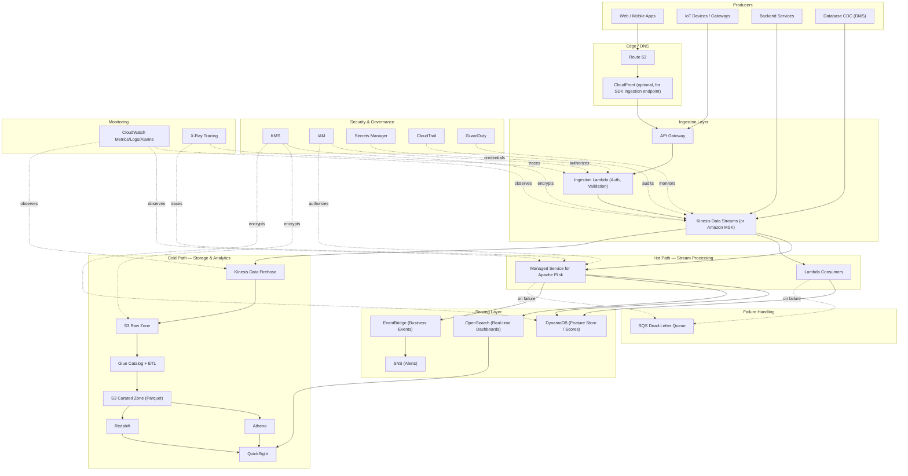

# Part VI – Data Platform Architectures

# Chapter 48 — Streaming Analytics

---

# 1. Executive Summary

## 1.1 The Business Problem

Enterprises increasingly generate data as a continuous flow rather than as periodic batches.

- Clickstreams from web and mobile applications.
- IoT telemetry from factory floors, vehicles, and medical devices.
- Financial transactions requiring fraud detection within milliseconds.
- Application and infrastructure logs requiring real-time correlation.
- Change-data-capture (CDC) streams from operational databases.

Traditional batch pipelines (nightly ETL jobs landing data in a warehouse) cannot answer questions that matter *right now*:

- Is this credit card transaction fraudulent, before it settles?
- Is this manufacturing line producing defective units, before the next 10,000 units are made?
- Is this user session showing signs of churn, while the user is still in the app?
- Is this security event part of an active intrusion, while the attacker is still inside the network?

A batch-only architecture introduces an unavoidable latency floor — usually hours — between an event occurring and a business decision being made on it. Streaming analytics architectures collapse that latency to seconds or sub-seconds.

## 1.2 Architecture Objective

The objective of this chapter's architecture is to provide a production-grade, horizontally scalable, multi-consumer streaming analytics platform on AWS that:

- Ingests millions of events per second with durable, ordered (per-partition-key) delivery.
- Supports multiple concurrent consumers reading the same stream independently (fan-out).
- Performs real-time transformation, enrichment, aggregation, and anomaly detection.
- Persists both raw and processed data for replay, audit, and downstream batch analytics.
- Provides sub-second to low-second end-to-end latency for the "hot path," while also feeding a "cold path" for historical analytics.
- Meets enterprise requirements for encryption, least-privilege access, observability, and cost governance.

## 1.3 Why Organizations Adopt This Architecture

- **Competitive pressure.** Fraud, personalization, and pricing decisions are won or lost in milliseconds; a competitor with a real-time pipeline reacts faster than one running nightly batch jobs.
- **Regulatory pressure.** Several industries (finance, healthcare, energy) now require near-real-time monitoring and reporting, not end-of-day reconciliation.
- **Operational necessity.** Modern distributed systems generate telemetry volumes that are simply unmanageable as periodic batch extracts; the only tractable ingestion model is streaming.
- **Data reuse.** A single durable stream can serve many independent consumers (fraud detection, personalization, data lake archival, real-time dashboards) without re-querying the source system, which reduces load on operational databases.
- **Architectural evolution.** Most enterprises do not start with streaming; they arrive at it after batch pipelines become too slow, too brittle, or too expensive to scale. This chapter documents both the target architecture and the evolution path.

## 1.4 Major Business Benefits

| Benefit | Description |
|---|---|
| Faster decisions | Business logic executes on events within seconds instead of after nightly batch windows. |
| Improved customer experience | Personalization, fraud checks, and recommendations react to the current session. |
| Reduced operational load | Streams decouple producers from consumers, protecting source databases from analytical query load. |
| Better observability | Real-time dashboards and alarms detect operational anomalies before they become incidents. |
| Reusable data asset | One stream, many consumers — new use cases attach without touching producers. |
| Lower long-term cost | Continuous, incremental processing is often cheaper than large periodic batch jobs at scale, because compute is right-sized to a steady-state load rather than a burst. |

## 1.5 Typical Enterprise Scenarios

- **Fraud detection** in payments — score every transaction against a rules/ML engine within 100–300ms.
- **IoT telemetry processing** — ingest sensor data from thousands of devices, detect anomalies, trigger maintenance workflows.
- **Clickstream analytics** — capture every page view/click, compute real-time funnels and A/B test metrics.
- **Log and security analytics** — centralize application and infrastructure logs, detect security events in near real time.
- **Real-time inventory and pricing** — recompute pricing or stock availability as orders and returns occur.
- **CDC-based data replication** — stream database changes to a lake house or search index without impacting the source database.

## 1.6 Architecture Philosophy

This chapter follows a **Lambda-adjacent, Kappa-leaning** design:

- A single durable, replayable stream (Amazon Kinesis Data Streams or Amazon MSK) is the system of record for event data.
- A **hot path** (stream processing with Amazon Managed Service for Apache Flink or Lambda) computes low-latency aggregates and triggers actions.
- A **cold path** (Kinesis Data Firehose to S3, cataloged by Glue) preserves raw and curated data for historical analytics, replay, and compliance.
- Consumers are added without modifying producers, because Kinesis/MSK support multiple independent readers.

This is deliberately **not** a pure Lambda Architecture (which maintains two independently coded pipelines for the same business logic) because the operational cost of keeping batch and streaming logic in sync exceeds its benefit for most enterprises. It leans toward **Kappa** — one source of truth (the stream), reprocessed via replay when logic changes — while keeping a batch layer for cost-efficient historical analytics, which is why it is described as "Lambda-adjacent."

## 1.7 Who Should Read This Chapter

- Architects designing a net-new real-time data platform.
- Teams migrating a batch ETL pipeline to streaming to reduce latency.
- Platform engineers responsible for ingesting IoT or clickstream data at scale.
- Security architects evaluating encryption and access control for data-in-motion.
- FinOps practitioners estimating and controlling streaming infrastructure cost, which behaves very differently from batch cost (steady-state provisioned throughput vs. burst compute).

---

# 2. Business Requirements

## 2.1 Business Drivers

- Reduce time-to-insight from hours to seconds for select use cases.
- Enable real-time fraud/anomaly detection to reduce financial loss.
- Support growth in event volume (IoT fleet expansion, user growth) without re-architecting.
- Provide a single ingestion layer serving multiple downstream teams (fraud, marketing, ops, data science).
- Reduce load on operational (OLTP) databases caused by analytical queries.

## 2.2 Functional Requirements

| ID | Requirement |
|---|---|
| FR-1 | Ingest events from multiple producer types (web/mobile SDK, IoT devices, application servers, CDC connectors). |
| FR-2 | Preserve event order within a partition key (e.g., per user, per device). |
| FR-3 | Support at minimum three concurrent independent consumers of the same stream. |
| FR-4 | Apply real-time transformation, enrichment (e.g., geo-IP lookup), and filtering. |
| FR-5 | Compute windowed aggregations (tumbling, sliding, session windows). |
| FR-6 | Detect anomalies/patterns and trigger downstream actions (alerts, workflow invocation). |
| FR-7 | Persist raw events immutably for replay and audit. |
| FR-8 | Persist curated/aggregated data queryable by SQL for BI tools. |
| FR-9 | Support schema evolution without breaking existing consumers. |
| FR-10 | Provide dead-letter handling for records that fail processing. |

## 2.3 Non-Functional Requirements

| Category | Requirement |
|---|---|
| Throughput | Sustain 500,000–2,000,000 events/second at peak (enterprise tier); 1,000–50,000 events/second (mid-market tier). |
| Latency (hot path) | P99 end-to-end latency under 2 seconds from ingestion to actionable output. |
| Latency (cold path) | Data queryable in the data lake within 5–15 minutes of ingestion. |
| Durability | No data loss for committed records; source stream retains data for replay (24 hours to 365 days depending on tier and compliance need). |
| Availability | 99.95%–99.99% for the ingestion path. |
| Elasticity | Scale ingestion and processing capacity up/down without downtime or data loss. |
| Security | Encryption in transit and at rest; least-privilege IAM; audit logging of all control-plane actions. |
| Multi-tenancy | Logical isolation between business units sharing the platform (namespace or account-level). |
| Observability | Full metrics, logs, and traces for every stage of the pipeline; consumer lag visibility. |

## 2.4 Scalability Goals

- Linear throughput scaling by adding shards (Kinesis) or partitions (MSK) without re-architecting.
- Support at least 10x traffic growth over 24 months without a platform redesign, only capacity changes.
- Stream processing layer (Flink/Lambda) auto-scales independently of ingestion capacity.

## 2.5 Availability Requirements

- Multi-AZ deployment mandatory for all stateful components (Kinesis is inherently multi-AZ within a region; MSK brokers spread across 3 AZs).
- No single AZ failure should cause data loss or ingestion downtime.
- Stream processing compute (Flink on KDA, or Lambda) must recover automatically from AZ failure with checkpoint-based state recovery.

## 2.6 Latency Requirements

| Path | Target Latency | Typical Use |
|---|---|---|
| Hot path (stream processing) | Sub-second to 2 seconds | Fraud scoring, alerting, real-time dashboards |
| Warm path (micro-batch, e.g., Firehose buffering) | 60 seconds–15 minutes | Near-real-time BI, operational reporting |
| Cold path (data lake / warehouse) | 15 minutes–hours | Historical analytics, ML training data, compliance archives |

## 2.7 Compliance Requirements

Depending on industry, one or more of the following typically apply:

- PCI DSS (payment card data in transit/at rest).
- HIPAA (healthcare telemetry, patient monitoring streams).
- SOC 2 (general enterprise SaaS).
- GDPR/CCPA (personal data — requires data minimization, retention limits, deletion capability).
- Data residency requirements (region pinning, no cross-region replication of certain data classes).

## 2.8 Security Expectations

- All data encrypted at rest (KMS) and in transit (TLS 1.2+).
- IAM roles scoped per-producer and per-consumer; no shared long-lived credentials.
- Network isolation via VPC endpoints (no public internet egress for stream access where avoidable).
- Full audit trail (CloudTrail) of every API call against the streaming control plane.
- PII fields tokenized or encrypted at the field level before entering shared streams where multiple consumers have varying trust levels.

## 2.9 Recovery Objectives

| Metric | Target |
|---|---|
| RPO (Recovery Point Objective) | Near zero for committed stream records (replay from retention window); typically 0–5 minutes for derived aggregates. |
| RTO (Recovery Time Objective) | 5–30 minutes for ingestion path recovery; 15–60 minutes for full processing layer recovery, depending on checkpoint restore time. |

## 2.10 SLAs

- Ingestion API availability: 99.95% (aligned to Kinesis/MSK/API Gateway SLAs).
- Processing pipeline: internally targeted 99.9% (accounting for planned maintenance, deployments).
- Data freshness SLA to downstream BI consumers: 15 minutes (warm/cold path).

## 2.11 Expected Workload and Growth

- Baseline: steady-state ingestion with diurnal peaks (2–5x baseline during business hours or campaign events).
- Burst events: flash sales, IoT firmware rollouts, marketing campaigns can spike traffic 10–20x for short windows.
- Growth: architecture must accommodate organic growth (new producers) and step-changes (new business unit onboarding an entire new event category) without redesign — only capacity/config changes.

---

# 3. Architecture Overview

## 3.1 Overall Design

The architecture is organized into five logical layers:

1. **Ingestion Layer** — accepts events from producers and durably stores them in order.
2. **Stream Processing Layer** — the hot path; transforms, enriches, aggregates, and detects patterns in near real time.
3. **Serving Layer** — stores processed results in low-latency stores (DynamoDB, OpenSearch) for application/API consumption.
4. **Storage & Analytics Layer** — the cold path; archives raw and curated data in S3, cataloged by Glue, queryable via Athena/Redshift, visualized via QuickSight.
5. **Cross-Cutting Layers** — security, identity, networking, observability, and cost governance, which apply to every layer above.

## 3.2 Architecture Philosophy (Recap and Expansion)

- **Durability first.** The stream itself (Kinesis/MSK) is the durable system of record. Every downstream consumer can be rebuilt by replaying the stream within its retention window. This is what makes the architecture resilient to bugs in downstream processing logic — a bad deployment does not lose data, it just needs a replay.
- **Decoupling via pub/sub.** Producers never call consumers directly. This means a new consumer (e.g., a new fraud model) can be added without any change to, or coordination with, producers.
- **Idempotent, replayable processing.** All stream processing logic is designed to be safely re-run against the same data (idempotent writes, deduplication keys) because at-least-once delivery semantics are the norm for streaming systems at this scale.
- **Separation of hot and cold paths.** Not all business questions need sub-second answers. Deliberately routing the majority of analytical volume to a cost-efficient cold path (S3 + Athena/Redshift) instead of paying for expensive low-latency compute on every record is a core FinOps discipline of this architecture.

## 3.3 Core Components

| Component | AWS Service | Role |
|---|---|---|
| Event ingestion | Amazon Kinesis Data Streams (or Amazon MSK) | Durable, ordered, replayable event bus |
| Ingestion API | Amazon API Gateway + AWS Lambda, or direct SDK/Kinesis Producer Library | Authenticated entry point for producers |
| Stream processing | Amazon Managed Service for Apache Flink (Kinesis Data Analytics) and/or AWS Lambda | Real-time transformation, windowing, enrichment |
| Micro-batch delivery | Amazon Kinesis Data Firehose | Buffers and delivers to S3/OpenSearch/Redshift |
| Low-latency serving store | Amazon DynamoDB | Real-time lookups, feature store for scoring |
| Search/observability store | Amazon OpenSearch Service | Real-time dashboards, log/event search |
| Data lake storage | Amazon S3 | Durable, cost-efficient raw + curated storage |
| Catalog | AWS Glue Data Catalog + Glue Crawlers | Schema discovery for Athena/Redshift |
| Interactive SQL | Amazon Athena | Ad hoc querying over the data lake |
| Data warehouse | Amazon Redshift (Serverless or provisioned) | Structured analytics, BI workloads |
| BI/visualization | Amazon QuickSight | Dashboards for business stakeholders |
| Orchestration/alerting | Amazon EventBridge, Amazon SNS, Amazon SQS | Event routing, notification, dead-letter handling |
| Security | AWS KMS, IAM, Secrets Manager, VPC endpoints | Encryption, access control, network isolation |
| Observability | Amazon CloudWatch, AWS X-Ray, CloudTrail | Metrics, tracing, audit |

## 3.4 High-Level Workflow

1. Producers (applications, IoT devices, CDC connectors) publish events to the ingestion layer.
2. The ingestion layer durably stores events in ordered, partitioned shards/partitions.
3. The stream processing layer reads the stream (as one of several independent consumers) and performs enrichment, windowed aggregation, and pattern detection.
4. Processed results are written to low-latency stores (DynamoDB, OpenSearch) for application consumption, and/or trigger downstream actions via EventBridge/SNS.
5. In parallel, Kinesis Data Firehose reads the same stream (an independent consumer) and delivers buffered batches to S3 in a partitioned, compressed format.
6. Glue crawlers catalog new S3 partitions; Athena and Redshift Spectrum query the data lake directly; Redshift ingests curated data for heavier BI workloads.
7. QuickSight visualizes both near-real-time (via direct query against OpenSearch/DynamoDB) and historical (via Redshift/Athena) data.
8. Failures at any stage are routed to dead-letter queues (SQS) and alerting (SNS/CloudWatch Alarms) without blocking the main pipeline.

## 3.5 Request, Response, and Data Lifecycle

**Request lifecycle (producer → stream):**
Producer authenticates → calls ingestion API or SDK → record is partitioned by key → record is durably written to shard/partition → acknowledgment returned to producer.

**Response lifecycle (stream → consumer application):**
Stream processing layer computes a result (e.g., fraud score) → result written to DynamoDB → application queries DynamoDB via API → response returned to end user, typically within the FR-2-second hot-path SLA.

**Data lifecycle (stream → data lake → warehouse → BI):**
Raw event → Firehose buffer (60s or 5MB, whichever first) → S3 raw zone (partitioned by ingestion date/hour) → Glue crawler discovers schema → curated ETL job (Glue/Spark or Flink) writes cleaned, deduplicated data to S3 curated zone → Redshift COPY or Spectrum external table → QuickSight dashboard refresh.

---

# 4. AWS Services Used

For each service: purpose, why selected, alternatives, limitations, pricing considerations, and best practices.

## 4.1 Amazon Kinesis Data Streams

**Purpose:** Primary durable, ordered, replayable event ingestion backbone.

**Why selected:** Fully managed (no broker patching), native multi-consumer fan-out (via Enhanced Fan-Out), tight integration with Lambda/Flink/Firehose, pay-as-you-go (On-Demand mode) or predictable provisioned throughput.

**Alternatives:**
- **Amazon MSK (Managed Kafka)** — preferred when the organization has existing Kafka expertise/tooling, needs Kafka-specific features (log compaction, exactly-once semantics via Kafka transactions), or requires cross-cloud/on-prem Kafka interoperability.
- **Amazon SQS/SNS** — not suitable as the primary ingestion backbone because SQS does not preserve strict ordering across partitions at scale and does not support replay of already-consumed messages (SQS is destructive-read by design, aside from short-lived redrive).
- **Self-managed Kafka on EC2/EKS** — avoided unless there is a hard requirement AWS-managed services cannot meet; adds substantial operational burden (broker management, patching, rebalancing).

**Limitations:**
- Default record size limit: 1 MB per record.
- Ordering is guaranteed only within a shard (per partition key), not across the whole stream.
- On-Demand mode has a throughput ceiling (200 MB/s write, 400 MB/s read by default per stream, increasable via support request) — very high-throughput use cases may still require Provisioned mode with careful shard planning.
- Retention beyond 7 days (up to 365 days) incurs extended retention charges.

**Pricing considerations:**
- On-Demand mode: pay per GB ingested/retrieved, no shard management, best for unpredictable/variable workloads and teams without deep capacity-planning experience.
- Provisioned mode: pay per shard-hour + PUT payload unit; cheaper at very high, steady, predictable throughput, but requires active shard management (resharding).

**Best practices:**
- Choose a partition key with high cardinality and even distribution to avoid "hot shards."
- Use Enhanced Fan-Out for consumers needing dedicated 2 MB/s throughput per shard (avoids consumers competing for the shared 2 MB/s read throughput).
- Start with On-Demand mode; migrate to Provisioned only once traffic patterns are well understood and stable, for cost optimization.

> **Note:** Many teams default to On-Demand mode in Kinesis and never revisit it. At steady, predictable, very high volume, Provisioned mode with right-sized shards is materially cheaper — this is a recurring FinOps finding covered in Section 16.

## 4.2 Amazon MSK (Managed Streaming for Apache Kafka)

**Purpose:** Alternative ingestion backbone when Kafka semantics/ecosystem are required.

**Why selected (when it is):** Existing Kafka Connect connectors, Kafka Streams applications, exactly-once processing guarantees via Kafka transactions, or a multi-cloud/hybrid strategy where Kafka is the common denominator.

**Alternatives:** Kinesis Data Streams (simpler operations, no broker/partition management); self-managed Kafka (more control, far more operational burden).

**Limitations:** Requires broker sizing, partition planning, and ongoing operational tuning (even in MSK's managed form, more configuration surface than Kinesis). MSK Serverless reduces this but has its own throughput/partition constraints.

**Pricing considerations:** Pay for broker instance-hours + storage (provisioned MSK), or per-partition-hour + throughput (MSK Serverless). Provisioned MSK is generally cheaper at very high sustained throughput; Serverless is easier operationally but costs more per unit at scale.

**Best practices:** Use MSK Serverless for teams without dedicated Kafka operators; use Provisioned MSK with Cluster Manager/auto-scaling for large, mature platform teams; always enable encryption in transit (TLS) and IAM or SASL/SCRAM authentication.

## 4.3 Amazon Kinesis Data Firehose

**Purpose:** Serverless micro-batch delivery from the stream to S3, OpenSearch, Redshift, or HTTP endpoints — the primary mechanism feeding the cold path.

**Why selected:** No infrastructure to manage, built-in format conversion (JSON → Parquet), built-in compression, built-in dynamic partitioning by event fields, native error handling/retry with S3 backup.

**Alternatives:** A custom Lambda consumer writing to S3 — more flexible but requires building buffering, retry, and format-conversion logic that Firehose provides out of the box; generally not worth the engineering cost unless Firehose's transformation model is insufficient.

**Limitations:** Minimum buffering interval of 60 seconds — Firehose is not for sub-minute delivery (that is what the hot path via Flink/Lambda is for). Data transformation via Lambda adds per-invocation cost and latency.

**Pricing considerations:** Charged per GB ingested, with additional charges for format conversion and any transformation Lambda invocations. Very cost-predictable at scale.

**Best practices:** Enable dynamic partitioning (e.g., by `event_date`, `event_hour`, `tenant_id`) so downstream Athena/Redshift Spectrum queries can prune partitions efficiently. Convert to Parquet at ingestion time — this alone typically cuts downstream query cost by 60–90% versus querying raw JSON.

## 4.4 Amazon Managed Service for Apache Flink (formerly Kinesis Data Analytics)

**Purpose:** The primary hot-path stream processing engine — windowed aggregation, CEP (complex event processing), enrichment, anomaly detection.

**Why selected:** Fully managed Flink runtime (no cluster provisioning), native exactly-once state checkpointing to S3, elastic auto-scaling based on load, rich windowing semantics (tumbling, sliding, session) not easily replicated in stateless Lambda.

**Alternatives:**
- **AWS Lambda** (stream-triggered) — simpler for stateless or lightly-stateful transformations at lower volume; becomes harder to reason about for complex multi-record windowed aggregation and does not natively manage long-lived state.
- **Self-managed Flink/Spark Structured Streaming on EMR/EKS** — chosen when the team needs deep customization of the Flink runtime, custom connectors unavailable in the managed offering, or when running a unified batch+streaming Spark platform is a strategic requirement.

**Limitations:** Has a learning curve (Flink's DataStream/Table API); state size directly affects checkpoint cost and recovery time; scaling is elastic but not instantaneous (a few minutes to rescale under sustained load change).

**Pricing considerations:** Charged per Kinesis Processing Unit (KPU)-hour (essentially vCPU + memory bundle), which scales with parallelism. Cost grows with both throughput and the complexity/state size of the job.

**Best practices:** Right-size initial parallelism based on load testing rather than guessing; use RocksDB state backend for large keyed state; checkpoint interval tuned to balance recovery time vs. checkpoint overhead (typically 1–5 minutes).

## 4.5 AWS Lambda

**Purpose:** Lightweight, stateless-to-lightly-stateful stream consumer for simpler transformations, routing, and the ingestion API backend.

**Why selected:** Zero infrastructure management, native Kinesis/DynamoDB Streams/MSK event source mappings with built-in batching, retry, and parallelization (via ParallelizationFactor), pay-per-invocation.

**Alternatives:** Amazon Managed Service for Apache Flink for anything requiring true windowed state; ECS/Fargate workers for very long-running or resource-intensive per-record processing where Lambda's 15-minute execution limit or memory ceiling (10 GB) is a constraint.

**Limitations:** 15-minute maximum execution duration; cold starts (mitigated with Provisioned Concurrency for latency-sensitive hot-path functions); stateless by default — any cross-invocation state must be externalized (DynamoDB, ElastiCache).

**Pricing considerations:** Pay per invocation + GB-second of compute; at very high sustained throughput, Flink or containerized consumers can become cheaper per-record than Lambda, because Lambda's per-invocation overhead does not amortize as well as a long-running process at extreme scale.

**Best practices:** Batch records per invocation (Kinesis event source mapping batch size) to amortize invocation overhead; use `ReportBatchItemFailures` for partial-batch failure handling so a single bad record does not block an entire batch (this is a very common production bug — see Section 24).

## 4.6 Amazon DynamoDB

**Purpose:** Low-latency serving store for hot-path outputs — real-time feature lookups, fraud scores, session state, deduplication tracking.

**Why selected:** Single-digit-millisecond reads/writes at any scale, native TTL for automatic expiry of transient state, DynamoDB Streams for further downstream reactive processing, on-demand or provisioned capacity.

**Alternatives:** Amazon ElastiCache (Redis/Valkey) — chosen when sub-millisecond latency or complex in-memory data structures (sorted sets, pub/sub) are required and data durability requirements are looser; Amazon Aurora — chosen when relational joins/transactions across the served data are required, at the cost of higher latency.

**Limitations:** Item size limit 400 KB; no native complex joins (application- or GSI-level modeling required); hot partition keys can throttle throughput even under on-demand capacity.

**Pricing considerations:** On-demand mode is simplest and safest for unpredictable streaming-derived write patterns; provisioned mode with auto-scaling is cheaper once write/read patterns stabilize.

**Best practices:** Design partition keys around the stream's natural high-cardinality key (e.g., user ID, device ID) to avoid hot partitions; use TTL aggressively for transient windowed state to control storage cost.

## 4.7 Amazon OpenSearch Service

**Purpose:** Near-real-time search and dashboarding layer for operational/security event data and ad hoc log/event exploration.

**Why selected:** Sub-second full-text and aggregation queries over recent streaming data, native Kibana/OpenSearch Dashboards for operational visualization, direct Firehose delivery support.

**Alternatives:** Amazon Managed Grafana + CloudWatch for pure metrics dashboards (cheaper, less flexible for free-text search); Redshift for structured heavy BI aggregation over larger historical windows.

**Limitations:** Not cost-efficient as a long-term (multi-year) archive — should hold hot/warm data (days to weeks) with lifecycle policies moving older data to S3/cold storage or UltraWarm/cold tiers.

**Pricing considerations:** Charged per instance-hour + storage; UltraWarm and cold storage tiers substantially reduce cost for less-frequently-queried historical indices.

**Best practices:** Use Index State Management (ISM) policies to roll over and age out indices automatically; separate hot (frequently queried), warm, and cold tiers.

## 4.8 Amazon S3

**Purpose:** Durable, low-cost storage for both raw and curated streaming data — the foundation of the cold path and long-term compliance archive.

**Why selected:** 11 nines durability, virtually unlimited scale, native lifecycle policies, direct integration with Firehose/Glue/Athena/Redshift Spectrum.

**Alternatives:** None credible for this role at this cost/durability profile within AWS; the only real alternative is a different cloud's object store, which is out of scope for an AWS-native architecture.

**Limitations:** Not a query engine itself — requires Athena/Redshift Spectrum/EMR on top for SQL access; eventual consistency nuances are no longer a practical concern (S3 has been strongly consistent since December 2020), but object-count and small-file proliferation from streaming writes can degrade query performance if not managed.

**Pricing considerations:** Storage class selection (Standard → Intelligent-Tiering → Glacier) is the single largest cost lever for long-term streaming archives; see Section 16.

**Best practices:** Partition by ingestion time (`year/month/day/hour`) at minimum, and by business key (`tenant_id`, `event_type`) where query patterns justify it; compact small files periodically (streaming writes naturally produce many small objects, which hurts Athena/Spectrum performance).

## 4.9 AWS Glue (Data Catalog, Crawlers, ETL Jobs)

**Purpose:** Central schema catalog for all S3-resident streaming data, plus batch curation jobs (raw → curated transformation, deduplication, format conversion).

**Why selected:** Serverless Spark for ETL, native crawler-based schema discovery, single catalog shared by Athena, Redshift Spectrum, and EMR.

**Alternatives:** AWS Lake Formation on top of Glue for fine-grained (row/column-level) access control; self-managed Hive Metastore (only for specific portability requirements, e.g., multi-cloud Spark).

**Limitations:** Crawler runs have cost and can be slow against very large partition counts; over-reliance on crawlers to constantly re-infer schema on every run is a common inefficiency (schedule crawlers, don't run per-file).

**Pricing considerations:** Glue ETL jobs are charged per DPU-hour; crawlers charged per crawler run duration; Data Catalog storage/requests are typically a minor cost line.

**Best practices:** Register schemas explicitly (via Glue Schema Registry integrated with Kinesis/MSK) rather than relying purely on crawler inference, to catch producer schema drift before it breaks downstream consumers.

## 4.10 Amazon Athena

**Purpose:** Serverless interactive SQL over the S3 data lake for ad hoc analysis and lightweight BI.

**Why selected:** No infrastructure, pay-per-query-scanned pricing, direct Glue Catalog integration.

**Alternatives:** Redshift Spectrum (better when queries are run from within an existing Redshift-centric BI workflow); Redshift native tables (better for high-frequency, predictable, performance-critical BI queries).

**Limitations:** Cost scales with data scanned — unpartitioned or non-columnar (JSON/CSV) data can make Athena expensive; not designed for high-concurrency, sub-second dashboard workloads at scale (that's what OpenSearch or Redshift with result caching are for).

**Pricing considerations:** $ per TB scanned — Parquet + partitioning + compression can reduce cost by 90%+ versus scanning raw JSON.

**Best practices:** Always query curated Parquet partitions, never raw JSON, for anything beyond one-off debugging.

## 4.11 Amazon Redshift (Serverless or Provisioned)

**Purpose:** Structured data warehouse for heavier, high-concurrency BI workloads over curated streaming-derived data.

**Why selected:** Massively parallel columnar SQL engine, Redshift Spectrum for querying S3 directly without loading, native materialized views for pre-aggregating streaming-derived facts, Serverless option removes capacity planning for variable BI load.

**Alternatives:** Athena (simpler, cheaper for low/sporadic query volume); Snowflake/other third-party warehouses (chosen for multi-cloud strategy or specific feature requirements, out of scope here as this is an AWS-native design).

**Limitations:** Provisioned Redshift requires cluster sizing and maintenance windows; Serverless has per-RPU-hour cost that can exceed provisioned cost at very high, constant utilization.

**Pricing considerations:** Serverless is best for variable/unpredictable BI query load; Provisioned with Reserved Instances is cheaper at high, constant utilization.

**Best practices:** Load curated (not raw) data; use automatic table optimization and sort/distribution key recommendations; use materialized views refreshed on a schedule aligned to the warm-path SLA (e.g., every 15 minutes) rather than refreshing on every micro-batch.

## 4.12 Amazon QuickSight

**Purpose:** Business-facing dashboards over both the warm (OpenSearch/DynamoDB) and cold (Redshift/Athena) paths.

**Why selected:** Serverless, pay-per-session (or per-author) pricing, native SPICE in-memory engine for fast dashboard refresh without hitting the warehouse on every viewer interaction, direct integration with Redshift/Athena.

**Alternatives:** Amazon Managed Grafana (better for engineering/ops-facing real-time metrics dashboards); third-party BI tools (Tableau, Power BI) chosen for existing organizational standardization.

**Limitations:** SPICE dataset refresh is not real-time by default (scheduled refresh); direct query mode trades freshness for load on the underlying warehouse.

**Pricing considerations:** Reader (pay-per-session) pricing is typically far cheaper than per-seat licensing for large read-only audiences — a material FinOps consideration versus legacy BI tools.

## 4.13 Amazon EventBridge, SNS, SQS

**Purpose:** Cross-cutting event routing, fan-out notification, and dead-letter/retry handling.

**Why selected:** EventBridge for rule-based routing of business events derived from the stream (e.g., "fraud score > 0.9" → invoke a case-management workflow); SNS for fan-out notification (email/SMS/webhook on alerts); SQS as the durable dead-letter queue for records that fail processing after retries.

**Alternatives:** Direct Lambda-to-Lambda invocation (tighter coupling, avoided); Step Functions for more complex multi-step remediation workflows triggered from stream events.

**Limitations:** EventBridge has payload size limits (256 KB) — large payloads should be passed by reference (S3 URI) rather than by value.

**Pricing considerations:** All three are priced per request/message at low unit cost; at extreme event volumes this can still become a non-trivial cost line and should be monitored (see Section 16).

## 4.14 IAM, VPC, KMS, Secrets Manager, CloudWatch, CloudTrail, GuardDuty

Covered in depth in Sections 9–11 and 21–22; summarized here for completeness:

| Service | Role in this architecture |
|---|---|
| IAM | Least-privilege roles per producer, consumer, and processing job. |
| VPC | Network isolation for Flink applications, Lambda-in-VPC where needed, MSK brokers. |
| KMS | Encryption keys for Kinesis/MSK, S3, DynamoDB, OpenSearch, Redshift. |
| Secrets Manager | Credentials for MSK SASL auth, Redshift, third-party producer API keys. |
| CloudWatch | Metrics (IteratorAge, throttles, consumer lag), Logs, Alarms, Dashboards. |
| CloudTrail | Audit trail of all control-plane API calls (CreateStream, ModifyShardCount, etc.). |
| GuardDuty | Threat detection across the account, including anomalous API activity against the streaming control plane. |

---

# 5. Complete Architecture Diagram



---

# 6. Component-by-Component Explanation

## 6.1 Ingestion API (API Gateway + Lambda)

- **Purpose:** Authenticated HTTP entry point for producers that cannot use the Kinesis SDK directly (e.g., third-party webhooks, browser-based clients).
- **Responsibilities:** Request authentication (IAM/API key/Cognito), payload validation, partition key derivation, PutRecord/PutRecords call to Kinesis.
- **Inputs:** JSON event payloads over HTTPS.
- **Outputs:** Records written to Kinesis Data Streams; HTTP 200/4xx/5xx response to producer.
- **Scaling:** API Gateway scales automatically; Lambda scales via concurrency (monitor for throttling under burst).
- **High availability:** Both services are inherently multi-AZ, regional services.
- **Failure handling:** Validation failures return 4xx immediately (fail fast, do not enter the stream); transient Kinesis write failures retried with exponential backoff, then routed to SQS DLQ.
- **Dependencies:** IAM role scoped to `kinesis:PutRecord` on the specific stream ARN only.
- **Security:** Request signing/authorization at the API Gateway layer; no direct public write access to the stream itself.
- **Monitoring:** API Gateway 4xx/5xx rates, Lambda error rate/duration, Kinesis `PutRecord.Success` metric.

## 6.2 Kinesis Data Streams (or MSK)

- **Purpose:** Durable, ordered, replayable, multi-consumer event backbone — the system of record for in-flight event data.
- **Responsibilities:** Accept writes, partition by key across shards, retain records for the configured window, serve reads to multiple independent consumer groups.
- **Inputs:** Records from the ingestion layer and direct SDK/producer library writers.
- **Outputs:** Ordered record batches to each registered consumer (Flink, Lambda, Firehose).
- **Scaling:** On-Demand mode auto-scales; Provisioned mode scales via shard splitting/merging (`UpdateShardCount` or targeted resharding).
- **High availability:** Data is synchronously replicated across three AZs within the region by the service.
- **Failure handling:** Consumer-side failures do not affect the stream itself; a stuck/failing consumer simply falls behind (monitor `IteratorAge`) but the stream retains data for replay.
- **Dependencies:** KMS key for at-rest encryption; IAM roles per producer/consumer.
- **Security:** Server-side encryption (KMS), IAM-based access control, VPC endpoint for private access from within a VPC.
- **Monitoring:** `IncomingBytes`, `IncomingRecords`, `WriteProvisionedThroughputExceeded`, `GetRecords.IteratorAgeMilliseconds` (the single most important consumer-lag metric).

## 6.3 Managed Service for Apache Flink (Hot Path)

- **Purpose:** Stateful, windowed real-time processing — enrichment, aggregation, anomaly detection, complex event pattern matching.
- **Responsibilities:** Consume from Kinesis/MSK, maintain keyed state (e.g., rolling transaction counts per user), emit results to DynamoDB/OpenSearch/EventBridge.
- **Inputs:** Raw event stream.
- **Outputs:** Enriched events, windowed aggregates, detected anomalies/alerts.
- **Scaling:** Elastic auto-scaling based on configured parallelism and observed backpressure/CPU utilization.
- **High availability:** Automatic checkpointing to S3 enables recovery from task failure or AZ disruption without data loss (exactly-once state semantics).
- **Failure handling:** Failed tasks restart from the last successful checkpoint; poison-pill records are routed to a side-output stream/DLQ rather than blocking the pipeline.
- **Dependencies:** IAM role with read access to the stream, write access to sinks; VPC configuration if sinks are VPC-only resources.
- **Security:** Runs within a VPC when accessing private resources; IAM execution role scoped tightly to required sources/sinks.
- **Monitoring:** `millisBehindLatest`, checkpoint duration/size, backpressure metrics, task failure counts.

## 6.4 Lambda Stream Consumers

- **Purpose:** Lightweight, stateless-to-lightly-stateful processing for simpler routing/transformation tasks that do not need Flink's windowing engine.
- **Responsibilities:** Consume batches from the stream (via event source mapping), transform/route/write to a sink.
- **Scaling:** Automatic, governed by `ParallelizationFactor` and the number of shards.
- **Failure handling:** `ReportBatchItemFailures` isolates bad records within a batch so the rest of the batch succeeds; a bisecting/retry policy governs repeated failures before DLQ routing.
- **Monitoring:** Iterator age, error count, throttles, concurrent executions.

## 6.5 Kinesis Data Firehose (Cold Path Delivery)

- **Purpose:** Buffer and deliver stream data to S3 (and optionally OpenSearch/Redshift) without custom code.
- **Responsibilities:** Buffer records (time- or size-based), optionally invoke a transformation Lambda, convert format (JSON→Parquet), partition dynamically, write to S3.
- **Failure handling:** Failed deliveries are retried; persistent failures are written to a configured S3 error/backup bucket for later reprocessing.
- **Monitoring:** `DeliveryToS3.Success`, delivery latency, transformation Lambda errors.

## 6.6 DynamoDB (Serving Layer)

- **Purpose:** Low-latency store for hot-path outputs consumed by applications (fraud scores, session features, dedup markers).
- **Scaling:** On-demand capacity recommended for streaming-derived, bursty write patterns.
- **Failure handling:** Conditional writes for idempotency; TTL for automatic cleanup of transient state.
- **Monitoring:** Throttled requests, consumed capacity, replication lag (if Global Tables used for multi-region).

## 6.7 OpenSearch (Real-Time Dashboards)

- **Purpose:** Near-real-time search/aggregation over recent event data for operational dashboards.
- **Scaling:** Add data nodes for storage/query capacity; dedicated master nodes for cluster stability at scale.
- **Failure handling:** Multi-AZ deployment with replica shards; automated snapshots for recovery.
- **Monitoring:** Cluster status (green/yellow/red), JVM memory pressure, indexing/search latency.

## 6.8 S3 Data Lake (Raw and Curated Zones)

- **Purpose:** Durable, low-cost, queryable long-term storage.
- **Failure handling:** 11 nines durability; versioning enabled on curated buckets to protect against accidental overwrite/corruption from ETL bugs.
- **Monitoring:** Storage metrics, request metrics, S3 Storage Lens for cost/usage patterns.

## 6.9 Glue, Athena, Redshift, QuickSight

Covered functionally in Section 4; operationally these form the batch analytics tier consuming the curated S3 zone and feed business-facing dashboards, with monitoring focused on job success/duration (Glue), query cost/duration (Athena/Redshift), and dashboard refresh success (QuickSight).

---

# 7. End-to-End Request Flow

1. **Client event generation.** A mobile app, IoT device, or backend service generates an event (e.g., `add_to_cart`, `sensor_reading`, `transaction`).
2. **DNS resolution.** Client resolves the ingestion endpoint via Route 53.
3. **Edge (optional).** For browser/mobile SDK ingestion, CloudFront may front the API Gateway endpoint for global latency reduction and DDoS absorption via AWS Shield.
4. **API Gateway.** Receives the HTTPS request; validates the request format against a defined model; authenticates via IAM/API key/Cognito authorizer.
5. **Ingestion Lambda.** Performs business validation, derives the partition key, optionally enriches the payload with a server-side timestamp, and calls `PutRecord`/`PutRecords` on Kinesis.
6. **Kinesis Data Streams.** Persists the record to the shard determined by the partition key's hash; replicates across 3 AZs; returns a sequence number.
7. **Acknowledgment.** API Gateway returns HTTP 200 with the sequence number to the producer (or HTTP 202 for fire-and-forget high-throughput producers using the SDK directly, bypassing API Gateway).
8. **Hot-path consumption (Flink).** The Flink application, running as an independent consumer group, reads new records within milliseconds, applies enrichment (e.g., a geo-IP or reference-data lookup against DynamoDB), and updates windowed aggregates in keyed state.
9. **Anomaly/pattern detection.** Flink evaluates the enriched event/aggregate against defined rules or an embedded ML scoring call; if a threshold is crossed, an event is emitted to EventBridge.
10. **Alerting.** EventBridge routes the anomaly event to SNS, notifying an on-call channel, and/or triggers a Step Functions remediation workflow.
11. **Serving store update.** Flink (or a downstream Lambda) writes the latest score/aggregate to DynamoDB, keyed by the entity ID, with a short TTL where appropriate.
12. **Application read.** A downstream application (e.g., the checkout service checking a fraud score) reads DynamoDB with single-digit-millisecond latency to make a decision before completing the user's request.
13. **Cold-path consumption (Firehose).** Independently and in parallel, Firehose reads from the same Kinesis stream, buffers for up to 60 seconds/5 MB, and converts records to Parquet.
14. **S3 raw zone write.** Firehose writes the buffered, converted batch to a time-partitioned S3 prefix (`s3://.../raw/year=2026/month=08/day=10/hour=14/`).
15. **Catalog update.** A scheduled Glue crawler (or Glue Schema Registry-driven catalog update) discovers new partitions and updates the Data Catalog.
16. **Curation ETL.** A scheduled Glue Spark job (e.g., every 15 minutes) reads new raw partitions, deduplicates (using the record's idempotency key), applies business transformations, and writes to the curated S3 zone in an optimized layout.
17. **Warehouse load.** Redshift ingests curated data via `COPY` (or queries it directly via Redshift Spectrum) on a scheduled cadence aligned to the warm-path SLA.
18. **BI query.** Analysts query via Athena (ad hoc) or Redshift (scheduled BI reports); QuickSight dashboards refresh from either source.
19. **Error handling (any stage).** Any stage failure (validation error, processing exception, delivery failure) is captured and routed to an SQS dead-letter queue with the original payload and failure context, without blocking the main pipeline.
20. **Monitoring.** Every stage emits CloudWatch metrics; X-Ray traces the request path from API Gateway through the ingestion Lambda; CloudWatch Alarms notify on-call staff of SLA breaches (e.g., rising `IteratorAge`, Firehose delivery failures, Flink checkpoint failures).

---

# 8. Deployment Flow

## 8.1 Infrastructure Provisioning

All infrastructure is provisioned via Terraform (Section 18), organized into modules:

- `network` — VPC, subnets, endpoints.
- `streaming` — Kinesis/MSK, Firehose.
- `processing` — Flink application, Lambda functions.
- `storage` — S3 buckets, lifecycle policies.
- `catalog` — Glue database, crawlers, jobs.
- `warehouse` — Redshift Serverless namespace/workgroup.
- `security` — KMS keys, IAM roles/policies.
- `observability` — CloudWatch dashboards, alarms.

## 8.2 Terraform Workflow

1. Developer opens a pull request modifying a module.
2. CI runs `terraform fmt -check`, `terraform validate`, and a policy-as-code scan (e.g., `tfsec`/`checkov`/OPA).
3. CI runs `terraform plan` against a non-production workspace and posts the plan as a PR comment.
4. Peer review approves; merge to main triggers `terraform plan` against production, requiring manual approval before `terraform apply`.
5. State is stored remotely (S3 backend with DynamoDB state locking, or Terraform Cloud) — never local state for shared infrastructure.

## 8.3 CI/CD Deployment (Application/Processing Code)

- Flink application JARs and Lambda deployment packages are built and tested in CI.
- Integration tests run against a dedicated test Kinesis stream with synthetic events before promotion.
- Deployment to the Flink application uses in-place application update with **snapshot-based state migration** — critical to avoid losing accumulated windowed state on deploy.

## 8.4 Blue-Green Deployment

- **Lambda consumers:** New version deployed as a Lambda alias shift (weighted traffic), monitored for error-rate regression before full cutover.
- **Flink application:** Because Flink applications are stateful, "blue-green" here means: start a new application instance from a savepoint of the running application, validate output correctness against a shadow sink, then cut over the stream consumer registration and stop the old instance.
- **Firehose/Glue jobs:** Stateless; new job versions can be deployed directly with a canary run against a subset of partitions before full rollout.

## 8.5 Rollback

- Terraform: `terraform apply` of the previous known-good plan (from version-controlled state history).
- Flink: restart from the last-known-good savepoint.
- Lambda: alias shift back to the previous version (instant).

## 8.6 Secrets and Configuration

- All credentials (MSK SASL, Redshift admin, third-party API keys) stored in Secrets Manager, referenced by ARN in Terraform/application config — never hardcoded.
- Application configuration (buffer sizes, thresholds) externalized via Systems Manager Parameter Store, allowing runtime tuning without redeployment.

## 8.7 Validation

- Post-deployment smoke test: synthetic event injected into the stream, verified to appear in DynamoDB (hot path) and S3 (cold path) within SLA.
- Automated rollback trigger if post-deployment error rate exceeds a defined threshold within a 10-minute observation window.

---

# 9. Network Topology

## 9.1 VPC Design

A dedicated VPC (or a shared "data platform" VPC within a multi-account landing zone) hosts VPC-resident components: Flink applications (when configured for VPC access), MSK brokers (if used), Lambda functions requiring VPC access to private resources (e.g., Redshift, ElastiCache), and Redshift.

Kinesis Data Streams, S3, DynamoDB, Firehose, and Glue are regional AWS services accessed via AWS APIs (not VPC-resident), but are reachable privately via VPC endpoints to avoid internet egress.

## 9.2 CIDR Planning

| Subnet Tier | Example CIDR | Purpose |
|---|---|---|
| Public | 10.20.0.0/24, 10.20.1.0/24 | NAT Gateways only; no compute here |
| Private — Processing | 10.20.10.0/23, 10.20.12.0/23 | Flink application ENIs, VPC-attached Lambdas |
| Private — Data | 10.20.20.0/23, 10.20.22.0/23 | MSK brokers, Redshift, ElastiCache |
| Private — Management | 10.20.30.0/24 | Bastion-less SSM-managed admin tooling |

Sized generously (larger than immediately needed) because streaming platforms tend to add processing capacity (more ENIs) faster than typical web tiers.

## 9.3 Public/Private Subnets, NAT, IGW

- Public subnets host only NAT Gateways (one per AZ for high availability) and, if used, an internet-facing ALB for external webhook producers.
- Private subnets host all data-plane compute; outbound internet access (e.g., for third-party API calls from an enrichment Lambda) routes through NAT Gateways.
- No compute resource other than NAT Gateways/load balancers should have a public IP.

## 9.4 Transit Gateway

- Used when the streaming platform must be reachable from multiple VPCs/accounts (e.g., producer VPCs in application accounts, consumer VPCs in analytics accounts) under a hub-and-spoke model.
- Producers in other accounts route to the ingestion VPC via Transit Gateway rather than through public endpoints, keeping east-west traffic off the public internet.

## 9.5 Route Tables

- Private-Processing and Private-Data route tables: default route to NAT Gateway (for internet-bound egress) and specific routes to Transit Gateway for intra-org traffic.
- Public route table: default route to Internet Gateway.

## 9.6 Network ACLs and Security Groups

- Security Groups are the primary control (stateful, resource-scoped): e.g., the Flink application security group allows outbound to the MSK security group on the Kafka broker port only, and to the DynamoDB/S3 prefix list.
- NACLs provide a coarse-grained subnet-level backstop (stateless), primarily used to explicitly deny known-bad ranges or enforce subnet-tier isolation as defense-in-depth.

## 9.7 VPC Endpoints (PrivateLink)

Interface or Gateway endpoints should be provisioned for:

| Service | Endpoint Type |
|---|---|
| S3 | Gateway |
| DynamoDB | Gateway |
| Kinesis Streams | Interface |
| Kinesis Firehose | Interface |
| STS | Interface |
| Secrets Manager | Interface |
| KMS | Interface |
| CloudWatch Logs/Monitoring | Interface |
| Glue | Interface |

This ensures VPC-resident components (Flink, VPC-attached Lambda) never traverse the public internet to reach AWS control/data planes, reducing both attack surface and NAT Gateway data-processing cost (a frequently underestimated cost line — see Section 16).

## 9.8 Hybrid Connectivity

For IoT producers on-premises or in a factory network, connectivity is established via Site-to-Site VPN or Direct Connect into the Transit Gateway, terminating at the ingestion VPC — avoiding any public exposure of the ingestion API for high-security industrial environments.

---

# 10. Identity and Access

## 10.1 IAM Roles (Representative Set)

| Role | Attached To | Purpose |
|---|---|---|
| `streaming-ingestion-lambda-role` | Ingestion Lambda | `kinesis:PutRecord(s)` on the ingestion stream only |
| `streaming-flink-app-role` | Flink application | Read from Kinesis; write to DynamoDB, OpenSearch, EventBridge; read/write checkpoint S3 bucket |
| `streaming-firehose-role` | Firehose delivery stream | Read from Kinesis; write to S3 raw bucket; invoke transformation Lambda |
| `streaming-glue-etl-role` | Glue ETL jobs | Read/write S3 raw and curated buckets; Glue Catalog access |
| `streaming-redshift-role` | Redshift namespace | Read curated S3 bucket (Spectrum), `redshift:GetClusterCredentials` |
| `streaming-quicksight-role` | QuickSight | Read access to Redshift/Athena result location only |

## 10.2 IAM Policy Example (Ingestion Lambda — Least Privilege)

```json

{
  "Version": "2012-10-17",
  "Statement": [
    {
      "Sid": "AllowPutRecordsToIngestionStreamOnly",
      "Effect": "Allow",
      "Action": [
        "kinesis:PutRecord",
        "kinesis:PutRecords"
      ],
      "Resource": "arn:aws:kinesis:ap-south-1:111122223333:stream/prod-events-ingestion"
    },
    {
      "Sid": "AllowDecryptWithStreamKMSKeyOnly",
      "Effect": "Allow",
      "Action": ["kms:GenerateDataKey", "kms:Decrypt"],
      "Resource": "arn:aws:kms:ap-south-1:111122223333:key/streaming-kms-key-id"
    },
    {
      "Sid": "AllowStructuredLogging",
      "Effect": "Allow",
      "Action": ["logs:CreateLogStream", "logs:PutLogEvents"],
      "Resource": "arn:aws:logs:ap-south-1:111122223333:log-group:/aws/lambda/streaming-ingestion:*"
    }
  ]
}

```

> **Warning:** A common review finding is a Lambda execution role scoped with `"Resource": "*"` on `kinesis:*` "to make development easier," left unchanged into production. Every role in this architecture must be resource-ARN-scoped, action-scoped, and reviewed against actual CloudTrail usage before go-live.

## 10.3 Resource Policies

- The Kinesis stream itself typically relies on IAM identity policies rather than a resource policy (Kinesis does not support resource-based policies the way S3/SQS do); cross-account access is instead granted via a cross-account IAM role assumed by the external producer/consumer.
- S3 bucket policies enforce `aws:SecureTransport: true` and restrict write access to the specific Firehose/Glue roles.

## 10.4 STS and Cross-Account Access

- External producers (e.g., a partner's AWS account sending events) assume a narrowly scoped cross-account role via `sts:AssumeRole`, with a trust policy restricted to the specific external account ID and an `sts:ExternalId` condition to mitigate confused-deputy risk.
- Consumers in analytics accounts assume a read-only cross-account role to query the curated S3 bucket or Redshift datashare, rather than being granted direct IAM users in the data platform account.

## 10.5 Least Privilege in Practice

- Every IAM role in this architecture is scoped to a single stream/bucket/table ARN, not a wildcard.
- Permissions are derived from actual CloudTrail `Access Analyzer` findings during a pre-production access review, not just from documentation.
- Break-glass access (for incident response) uses time-bound, logged, elevated roles via IAM Identity Center permission sets — never standing admin credentials.

## 10.6 Service Roles and Permission Boundaries

- Every service role has a permission boundary policy applied, capping the maximum permissions any future policy attachment could grant — this protects against privilege escalation via a compromised or misconfigured CI/CD pipeline that provisions IAM roles.

---

# 11. Security Architecture

## 11.1 Encryption

- **In transit:** TLS 1.2+ enforced for all API Gateway, Kinesis, MSK (via TLS listener), Firehose, Redshift, and OpenSearch endpoints.
- **At rest:** KMS customer-managed keys (CMKs) — not AWS-managed keys — for Kinesis, S3, DynamoDB, OpenSearch, and Redshift, enabling key rotation policy control and detailed CloudTrail key-usage auditing.
- **Field-level encryption:** For streams carrying PII (e.g., card numbers, health identifiers) consumed by multiple downstream teams with different trust levels, sensitive fields are encrypted or tokenized at the producer before entering the shared stream, with decryption keys granted only to authorized consumers.

## 11.2 KMS Key Strategy

| Key | Used By | Rotation |
|---|---|---|
| `streaming-ingest-key` | Kinesis/MSK | Annual automatic rotation |
| `streaming-lake-key` | S3 raw + curated | Annual automatic rotation |
| `streaming-serving-key` | DynamoDB, OpenSearch | Annual automatic rotation |
| `streaming-pii-field-key` | Field-level tokenization | Manual rotation with re-encryption workflow, tied to compliance calendar |

## 11.3 WAF and Shield

- AWS WAF attached to the CloudFront distribution / API Gateway in front of any internet-facing ingestion endpoint, with managed rule groups (SQLi, known bad inputs) plus custom rate-based rules to prevent producer-side abuse.
- AWS Shield Standard is active by default; Shield Advanced considered for ingestion endpoints exposed to high-value/high-risk external producers (e.g., public webhook ingestion for a financial product).

## 11.4 Certificate Manager

- ACM-issued certificates for all custom domains (ingestion API, OpenSearch Dashboards, QuickSight embedding) with automatic renewal.

## 11.5 GuardDuty, Inspector, Security Hub

- GuardDuty enabled account-wide, including S3 protection (detects anomalous access to the raw/curated buckets) and Kinesis-related findings (unusual API call patterns against the stream control plane).
- Inspector scans any container images (Flink application containers, if containerized) and Lambda function dependencies for known vulnerabilities.
- Security Hub aggregates findings across GuardDuty, Config, and Inspector into a single compliance posture view, mapped to CIS/AWS Foundational Security Best Practices.

## 11.6 CloudTrail and AWS Config

- CloudTrail (organization trail) captures every control-plane API call — critical for detecting unauthorized shard count changes, IAM policy modifications, or KMS key policy changes.
- AWS Config rules enforce and continuously evaluate: encryption-at-rest enabled on Kinesis/S3/DynamoDB, no public S3 buckets, IAM policies do not contain full-wildcard actions.

## 11.7 Zero Trust Considerations

- No implicit trust based on network location alone; every service-to-service call is authenticated via IAM (SigV4) even within the VPC.
- Producers and consumers are each issued the minimum-scope credentials needed, re-validated per request rather than relying on a long-lived network perimeter.

## 11.8 Threat Model and Mitigations

| Attack Vector | Mitigation |
|---|---|
| Compromised producer credentials used to flood the stream | Rate limiting at API Gateway; per-producer quota; anomaly detection on ingestion volume |
| Unauthorized read of sensitive stream data | IAM least privilege; field-level encryption for PII; VPC endpoints (no public data-plane exposure) |
| Poison-pill records causing processing outage | Schema validation at ingestion; DLQ routing; `ReportBatchItemFailures` isolation |
| Insider threat — over-privileged analyst account | Row/column-level access control via Lake Formation; CloudTrail-based access review |
| Exfiltration via S3 misconfiguration | S3 Block Public Access enforced at account/org level via SCP; Config rules alerting on drift |
| Supply-chain risk in Flink/Lambda dependencies | Inspector scanning; dependency pinning; SBOM generation in CI |

---

# 12. High Availability

## 12.1 AZ Failures

- Kinesis/MSK/S3/DynamoDB are inherently multi-AZ managed services — an AZ failure does not interrupt the data plane.
- Flink applications configured with a multi-AZ subnet group automatically reschedule tasks to healthy AZs, resuming from the last checkpoint.
- Redshift Serverless and OpenSearch are deployed with multi-AZ node placement; provisioned Redshift clusters should use a multi-node configuration spanning AZs where the workload justifies the cost.

## 12.2 Instance/Task Failures

- Lambda: automatic retry and re-invocation on transient failure, governed by the event source mapping's retry configuration.
- Flink: task manager failure triggers automatic restart from the last checkpoint (typically within 1–5 minutes depending on state size).

## 12.3 Regional Failures

- For Tier-0 workloads (e.g., real-time fraud detection with regulatory continuity requirements), a warm-standby architecture in a second region is used (see Section 13); most enterprise streaming workloads accept regional failure as a DR (not HA) event given the cost/complexity of active-active streaming across regions.

## 12.4 Database Failures

- DynamoDB: no single point of failure by design (multi-AZ replication built in); Global Tables for multi-region durability on Tier-0 data.
- Redshift: automated snapshots and multi-AZ (where enabled) protect against node failure; Serverless removes node-management burden entirely.

## 12.5 Load Balancing and Health Checks

- API Gateway/ALB in front of the ingestion Lambda performs automatic health-based routing; Route 53 health checks enable automatic failover to a secondary regional ingestion endpoint if configured for DR.

## 12.6 Failover

- Producers using the Kinesis SDK directly can be configured with a secondary-region stream ARN and client-side failover logic (write to secondary if primary write fails repeatedly) for the highest-tier workloads.

---

# 13. Disaster Recovery

## 13.1 Backup Strategy

| Component | Backup Mechanism |
|---|---|
| Kinesis/MSK | Retention window (replay) is the primary "backup"; not a traditional snapshot-based backup |
| S3 raw/curated | Versioning + Cross-Region Replication (CRR) for Tier-0 data classes |
| DynamoDB | Point-in-Time Recovery (PITR) enabled; on-demand backups before major schema changes |
| Redshift | Automated snapshots (daily) + manual pre-deployment snapshots |
| OpenSearch | Automated hourly snapshots to S3 |
| Flink application state | Checkpoints (S3) + periodic savepoints before deployments |

## 13.2 Cross-Region Replication

- Curated S3 data classified as compliance-critical is replicated cross-region via S3 CRR.
- DynamoDB Global Tables used selectively for Tier-0 serving data requiring multi-region read/write availability (fraud scores for a globally distributed payment platform, for example).

## 13.3 DR Strategy Selection

| Strategy | Applicability |
|---|---|
| Backup & Restore | Default for cold-path analytics data (S3, Redshift, Glue) — RTO measured in hours is acceptable. |
| Pilot Light | Ingestion infrastructure defined in Terraform but not running in the DR region; activated on declared disaster. |
| Warm Standby | Used for Tier-0 hot-path components (a secondary, lower-capacity Kinesis stream + Flink app running continuously in the DR region, promoted to full capacity on failover). |
| Multi-Site Active-Active | Reserved for the highest-tier global platforms (e.g., global real-time fraud detection) — significant additional cost and complexity; see Chapter 98 for the dedicated multi-region active-active pattern. |

Most enterprise streaming analytics platforms land on **Pilot Light for the cold path** and **Warm Standby for the Tier-0 hot path**, balancing DR cost against realistic business impact.

## 13.4 RPO/RTO by Tier

| Tier | RPO | RTO |
|---|---|---|
| Tier-0 (fraud/safety-critical) | Near zero (stream replay + Global Tables) | 5–15 minutes |
| Tier-1 (operational dashboards) | 5–15 minutes | 30–60 minutes |
| Tier-2 (historical analytics/BI) | Up to 24 hours | 4–24 hours |

---

# 14. Scalability

## 14.1 Horizontal Scaling

- Kinesis: increase shard count (Provisioned) or rely on On-Demand auto-scaling.
- MSK: add partitions and brokers.
- Flink: increase parallelism/KPU allocation.
- Lambda: automatically scales concurrency up to account/reserved limits.

## 14.2 Vertical Scaling

- Redshift: resize node type/count (or adjust Serverless base RPU).
- OpenSearch: increase instance size for data/master nodes.

## 14.3 Auto Scaling

- Application Auto Scaling can be attached to Kinesis (via a custom scaling Lambda reacting to `IncomingBytes`/`ReadProvisionedThroughputExceeded`) for Provisioned-mode streams; On-Demand mode auto-scales natively.
- Flink's built-in auto-scaling adjusts parallelism based on CPU utilization and backpressure.

## 14.4 Serverless Scaling

- Lambda, Firehose, API Gateway, Athena, and Redshift Serverless all scale without capacity planning, which is precisely why this architecture leans serverless wherever the latency/cost profile allows.

## 14.5 Database Scaling

- DynamoDB On-Demand absorbs unpredictable write bursts from the stream without pre-provisioning; auto-scaling Provisioned capacity is a cost optimization once patterns stabilize.

## 14.6 Storage Scaling

- S3 scales inherently; the practical scaling concern is **object count and small-file management**, addressed via Firehose buffering tuning and periodic compaction jobs.

## 14.7 Queue Scaling

- SQS DLQ scales automatically; the operational concern is ensuring a redrive/reprocessing mechanism exists so the DLQ does not become an unmonitored data black hole (a very common production gap — see Section 24).

---

# 15. Performance Optimization

## 15.1 Caching

- Reference data used for stream enrichment (e.g., product catalog, device metadata) is cached in-memory within the Flink application (broadcast state) or in ElastiCache for Lambda-based consumers, avoiding a per-record DynamoDB/RDS lookup.

## 15.2 Compression and Format

- Firehose converts JSON to Parquet with Snappy compression at ingestion — this is the single highest-leverage performance/cost optimization in the cold path, typically reducing both storage footprint and downstream query scan cost by 70–90%.

## 15.3 CDN

- CloudFront in front of the ingestion API primarily benefits globally distributed producers (mobile SDKs) by reducing TLS handshake latency via edge termination, not by caching (ingestion traffic is inherently non-cacheable).

## 15.4 Database Optimization

- DynamoDB: design GSIs around actual query patterns from consuming applications, not speculative future needs — extra GSIs cost extra write capacity on every stream-driven update.
- Redshift: sort keys aligned to the most common time-range + entity filter pattern in BI queries; distribution keys aligned to common join keys.

## 15.5 Connection Pooling

- Lambda functions writing to Redshift/RDS use RDS Proxy (or a connection-pooling layer) to avoid connection exhaustion under high concurrent invocation, a very common failure mode when a stream-triggered Lambda scales to hundreds of concurrent executions against a fixed-connection-limit database.

## 15.6 Concurrency and Async Processing

- Hot-path actions that are not on the critical response path (e.g., sending a notification after a fraud alert) are dispatched asynchronously via EventBridge/SNS rather than synchronously within the Flink/Lambda processing function, keeping the core processing latency low.

---

# 16. Cost Optimization (FinOps)

## 16.1 Illustrative Cost Estimates

> **Note:** These are illustrative order-of-magnitude estimates for architectural planning, not quotes. Always validate with the AWS Pricing Calculator and current regional pricing before budgeting.

| Deployment Tier | Approx. Event Volume | Illustrative Monthly Cost Range (USD) |
|---|---|---|
| Small | ~1,000–5,000 events/sec average | $3,000–$8,000 |
| Medium | ~20,000–100,000 events/sec average | $15,000–$50,000 |
| Enterprise | ~500,000–2,000,000 events/sec peak | $150,000–$600,000+ |

## 16.2 Major Cost Drivers

| Driver | Notes |
|---|---|
| Kinesis/MSK ingestion | Scales with sustained throughput; On-Demand simpler but can cost more than well-tuned Provisioned at very high steady volume. |
| Flink (KPU-hours) | Scales with both throughput and processing complexity/state size — the most easily underestimated line item. |
| NAT Gateway data processing | Frequently overlooked; every GB egressing through NAT (e.g., third-party enrichment API calls from within the VPC) is billed per-GB. |
| S3 storage | Grows continuously with raw retention; storage class strategy is the primary lever. |
| Athena/Redshift query cost | Directly proportional to how disciplined the team is about querying curated Parquet vs. raw JSON. |
| CloudWatch Logs | High-cardinality per-record logging from a high-throughput consumer can silently become one of the largest line items in the account. |
| Cross-AZ data transfer | Consumer/producer placement across AZs relative to the stream/broker incurs inter-AZ charges at scale. |

## 16.3 Optimization Opportunities

- **Reserved Instances / Savings Plans:** apply to Redshift (Reserved Nodes) and any steady-state EC2/Fargate compute in the pipeline (e.g., self-managed connectors); Compute Savings Plans for consistent Lambda/Fargate baseline usage.
- **Spot:** applicable to non-critical batch Glue/EMR jobs used for periodic curated-zone reprocessing/backfill, not for the real-time hot path.
- **S3 lifecycle policies:** raw zone transitions to Infrequent Access after 30 days, Glacier Instant Retrieval after 90 days, Glacier Deep Archive after 1 year (or per compliance retention schedule) — this is typically the single largest long-term savings lever in a mature streaming platform.
- **Storage classes:** curated zone (frequently queried) stays on S3 Standard/Intelligent-Tiering; raw zone (rarely re-queried except for replay/audit) moves to colder tiers aggressively.
- **Rightsizing:** review Flink KPU allocation and Lambda memory allocation quarterly against actual utilization metrics — both are commonly over-provisioned "to be safe" at launch and never revisited.
- **Cost allocation tagging:** every stream, bucket, Flink application, and Redshift workgroup tagged with `cost-center`, `data-domain`, and `environment` to enable chargeback to the business unit generating the volume.
- **Budgets and Cost Anomaly Detection:** AWS Budgets alert thresholds per major component (Kinesis, Flink, NAT, S3); Cost Anomaly Detection specifically catches the common "someone changed a Firehose buffer interval to 1 second and Lambda transformation cost spiked 10x" class of incident.

## 16.4 Cost Governance Table

| Practice | Frequency |
|---|---|
| Review Kinesis mode (On-Demand vs. Provisioned) against actual traffic pattern | Quarterly |
| Review S3 lifecycle policy effectiveness (Storage Lens) | Monthly |
| Review CloudWatch Logs retention and log volume per component | Monthly |
| Review Flink KPU utilization vs. allocation | Quarterly |
| Review Athena/Redshift query cost by team/dashboard | Monthly |
| Tag compliance audit | Monthly (automated via Config) |

---

# 17. AI-Assisted Operations

## 17.1 Amazon Q

- **Amazon Q Developer** assists in writing and reviewing Flink application code, Lambda transformation logic, and Terraform modules — particularly useful for generating boilerplate for new event types (schema classes, Glue table DDL) consistently.
- **Amazon Q in the console** (e.g., Q for CloudWatch) assists operators in root-causing anomalies — for example, summarizing why `IteratorAge` spiked by correlating deploy events, throttle metrics, and downstream sink latency in natural language.

## 17.2 Amazon Bedrock

- Used within the hot path itself for advanced use cases: invoking a foundation model (via Bedrock) from a Flink or Lambda enrichment step to classify unstructured event content (e.g., free-text fraud narrative fields, support ticket text embedded in an event) in near real time.
- **Caution:** synchronous foundation-model calls within the hot-path critical loop introduce latency and cost per record; these are typically reserved for a sampled subset of events or routed to an asynchronous side-path rather than gating every record's processing.

## 17.3 AI-Assisted Troubleshooting and Log Analysis

- Natural-language querying of CloudWatch Logs Insights via Q to accelerate root-cause analysis during an incident (e.g., "show me the top error messages from the Flink application in the last hour, grouped by exception type").
- AI-assisted anomaly detection on operational metrics (CloudWatch Anomaly Detection, which uses statistical/ML models) flags unusual `IteratorAge` or throughput patterns before they breach hard alarm thresholds.

## 17.4 Incident Response, Capacity Planning, and Architecture Review

- Amazon Q can summarize a CloudTrail history around an incident window to assist a security review.
- AI-assisted capacity planning uses historical CloudWatch metrics to forecast shard/KPU requirements ahead of known events (product launches, marketing campaigns).
- AI-generated Terraform and documentation accelerate onboarding of new event producers (a common recurring task), but all AI-generated infrastructure code still goes through the same CI policy-as-code and peer review gates as human-authored code — AI assistance does not bypass the review process.

---

# 18. Terraform Implementation

## 18.1 Providers and Backend

```hcl

# versions.tf

terraform {
  required_version = ">= 1.7.0"

  required_providers {
    aws = {
      source  = "hashicorp/aws"
      version = "~> 5.50"
    }
  }

  backend "s3" {
    bucket         = "acme-terraform-state-prod"
    key            = "streaming-analytics/terraform.tfstate"
    region         = "ap-south-1"
    dynamodb_table = "terraform-state-lock"
    encrypt        = true
  }
}

provider "aws" {
  region = var.aws_region

  default_tags {
    tags = {
      Project     = "streaming-analytics"
      Environment = var.environment
      ManagedBy   = "terraform"
      CostCenter  = var.cost_center
    }
  }
}

```

## 18.2 Variables

```hcl

# variables.tf

variable "aws_region" {
  description = "Primary AWS region for the streaming platform"
  type        = string
  default     = "ap-south-1"
}

variable "environment" {
  description = "Deployment environment (dev, staging, prod)"
  type        = string
}

variable "cost_center" {
  description = "Cost allocation tag for chargeback"
  type        = string
}

variable "stream_name" {
  description = "Name of the primary ingestion Kinesis stream"
  type        = string
  default     = "events-ingestion"
}

variable "stream_mode" {
  description = "ON_DEMAND or PROVISIONED"
  type        = string
  default     = "ON_DEMAND"
}

variable "shard_count" {
  description = "Shard count when stream_mode is PROVISIONED"
  type        = number
  default     = 8
}

variable "retention_hours" {
  description = "Kinesis retention period in hours"
  type        = number
  default     = 168 # 7 days
}

```

## 18.3 Networking Module (Excerpt)

```hcl

# modules/network/main.tf

resource "aws_vpc" "streaming" {
  cidr_block           = var.vpc_cidr
  enable_dns_support   = true
  enable_dns_hostnames = true

  tags = { Name = "${var.environment}-streaming-vpc" }
}

resource "aws_subnet" "private_processing" {
  for_each          = var.private_processing_subnets
  vpc_id            = aws_vpc.streaming.id
  cidr_block        = each.value.cidr
  availability_zone = each.value.az

  tags = { Name = "${var.environment}-private-processing-${each.key}" }
}

resource "aws_vpc_endpoint" "s3" {
  vpc_id            = aws_vpc.streaming.id
  service_name      = "com.amazonaws.${var.aws_region}.s3"
  vpc_endpoint_type = "Gateway"
  route_table_ids   = var.private_route_table_ids
}

resource "aws_vpc_endpoint" "kinesis_streams" {
  vpc_id              = aws_vpc.streaming.id
  service_name        = "com.amazonaws.${var.aws_region}.kinesis-streams"
  vpc_endpoint_type   = "Interface"
  subnet_ids          = [for s in aws_subnet.private_processing : s.id]
  security_group_ids  = [aws_security_group.vpc_endpoints.id]
  private_dns_enabled = true
}

```

## 18.4 Kinesis Stream Module

```hcl

# modules/streaming/main.tf

resource "aws_kms_key" "streaming" {
  description             = "CMK for streaming analytics data-at-rest encryption"
  deletion_window_in_days = 30
  enable_key_rotation     = true
}

resource "aws_kinesis_stream" "ingestion" {
  name             = "${var.environment}-${var.stream_name}"
  retention_period = var.retention_hours

  stream_mode_details {
    stream_mode = var.stream_mode
  }

  # shard_count only applies when stream_mode == PROVISIONED

  shard_count = var.stream_mode == "PROVISIONED" ? var.shard_count : null

  encryption_type = "KMS"
  kms_key_id      = aws_kms_key.streaming.arn

  tags = {
    Name = "${var.environment}-${var.stream_name}"
  }
}

resource "aws_kinesis_firehose_delivery_stream" "raw_to_s3" {
  name        = "${var.environment}-events-raw-firehose"
  destination = "extended_s3"

  kinesis_source_configuration {
    kinesis_stream_arn = aws_kinesis_stream.ingestion.arn
    role_arn            = aws_iam_role.firehose.arn
  }

  extended_s3_configuration {
    role_arn           = aws_iam_role.firehose.arn
    bucket_arn         = var.raw_bucket_arn
    prefix              = "raw/year=!{timestamp:yyyy}/month=!{timestamp:MM}/day=!{timestamp:dd}/hour=!{timestamp:HH}/"
    error_output_prefix = "raw-errors/!{firehose:error-output-type}/"
    buffering_size      = 128
    buffering_interval  = 60
    compression_format  = "UNCOMPRESSED" # Parquet conversion below handles compression

    data_format_conversion_configuration {
      enabled = true
      input_format_configuration {
        deserializer {
          open_x_json_ser_de {}
        }
      }
      output_format_configuration {
        serializer {
          parquet_ser_de {
            compression = "SNAPPY"
          }
        }
      }
      schema_configuration {
        database_name = var.glue_database_name
        table_name    = var.glue_raw_table_name
        role_arn      = aws_iam_role.firehose.arn
      }
    }

    cloudwatch_logging_options {
      enabled         = true
      log_group_name  = "/aws/kinesisfirehose/${var.environment}-events-raw"
      log_stream_name = "S3Delivery"
    }
  }
}

```

## 18.5 IAM Module (Excerpt)

```hcl

# modules/security/main.tf

data "aws_iam_policy_document" "ingestion_lambda_assume" {
  statement {
    actions = ["sts:AssumeRole"]
    principals {
      type        = "Service"
      identifiers = ["lambda.amazonaws.com"]
    }
  }
}

resource "aws_iam_role" "ingestion_lambda" {
  name               = "${var.environment}-streaming-ingestion-lambda-role"
  assume_role_policy = data.aws_iam_policy_document.ingestion_lambda_assume.json
  permissions_boundary = var.iam_permissions_boundary_arn
}

data "aws_iam_policy_document" "ingestion_lambda_policy" {
  statement {
    sid       = "PutRecordsToStreamOnly"
    actions   = ["kinesis:PutRecord", "kinesis:PutRecords"]
    resources = [var.kinesis_stream_arn]
  }

  statement {
    sid       = "KMSForStreamEncryption"
    actions   = ["kms:GenerateDataKey", "kms:Decrypt"]
    resources = [var.kms_key_arn]
  }
}

resource "aws_iam_role_policy" "ingestion_lambda" {
  name   = "${var.environment}-ingestion-lambda-policy"
  role   = aws_iam_role.ingestion_lambda.id
  policy = data.aws_iam_policy_document.ingestion_lambda_policy.json
}

```

## 18.6 Outputs

```hcl

# outputs.tf

output "kinesis_stream_arn" {
  description = "ARN of the primary ingestion stream"
  value       = module.streaming.stream_arn
}

output "raw_bucket_name" {
  description = "S3 bucket name for the raw data zone"
  value       = module.storage.raw_bucket_name
}

output "flink_application_name" {
  description = "Name of the Managed Service for Apache Flink application"
  value       = module.processing.flink_application_name
}

```

## 18.7 Remote State and Best Practices

- Remote state in S3 with DynamoDB locking (shown above) — never local state for anything beyond a personal sandbox.
- Separate state files per environment (`dev`, `staging`, `prod`) via distinct backend `key` values or workspaces.
- Modules are versioned (git tags) and referenced by version, not by a floating branch, to keep environments reproducible.
- `terraform plan` output reviewed by a human for every production change — no unattended `apply` against production without a prior approved plan.

---

# 19. AWS CLI Examples

## 19.1 Deployment/Validation

```bash

# Describe the ingestion stream and confirm encryption/mode

aws kinesis describe-stream-summary \
  --stream-name prod-events-ingestion \
  --region ap-south-1

# Put a synthetic test record after deployment

aws kinesis put-record \
  --stream-name prod-events-ingestion \
  --partition-key "smoke-test-user-001" \
  --data '{"event_type":"smoke_test","ts":"2026-08-10T10:00:00Z"}' \
  --region ap-south-1

# Verify Firehose delivery stream status

aws firehose describe-delivery-stream \
  --delivery-stream-name prod-events-raw-firehose \
  --region ap-south-1

```

## 19.2 Monitoring

```bash

# Check consumer lag (IteratorAge) for the Flink consumer

aws cloudwatch get-metric-statistics \
  --namespace AWS/Kinesis \
  --metric-name GetRecords.IteratorAgeMilliseconds \
  --dimensions Name=StreamName,Value=prod-events-ingestion \
  --start-time 2026-08-10T09:00:00Z \
  --end-time 2026-08-10T10:00:00Z \
  --period 300 \
  --statistics Maximum \
  --region ap-south-1

# Check for write throttling on a Provisioned-mode stream

aws cloudwatch get-metric-statistics \
  --namespace AWS/Kinesis \
  --metric-name WriteProvisionedThroughputExceeded \
  --dimensions Name=StreamName,Value=prod-events-ingestion \
  --start-time 2026-08-10T09:00:00Z \
  --end-time 2026-08-10T10:00:00Z \
  --period 300 \
  --statistics Sum \
  --region ap-south-1

```

## 19.3 Troubleshooting

```bash

# List shards to inspect current shard layout (Provisioned mode)

aws kinesis list-shards \
  --stream-name prod-events-ingestion \
  --region ap-south-1

# Check Firehose delivery errors in the last hour via CloudWatch Logs Insights

aws logs start-query \
  --log-group-name /aws/kinesisfirehose/prod-events-raw \
  --start-time $(date -d '1 hour ago' +%s) \
  --end-time $(date +%s) \
  --query-string 'fields @timestamp, @message | filter @message like /ERROR/ | sort @timestamp desc | limit 50' \
  --region ap-south-1

# Inspect Lambda event source mapping state (batch size, parallelization factor)

aws lambda list-event-source-mappings \
  --function-name prod-streaming-consumer \
  --region ap-south-1

```

## 19.4 Cleanup

```bash

# Gracefully drain and delete a decommissioned Firehose delivery stream

aws firehose delete-delivery-stream \
  --delivery-stream-name dev-events-raw-firehose \
  --allow-force-delete \
  --region ap-south-1

# Delete a Provisioned stream after confirming no active consumers

aws kinesis delete-stream \
  --stream-name dev-events-ingestion \
  --enforce-consumer-deletion \
  --region ap-south-1

```

---

# 20. CI/CD Integration

## 20.1 GitHub Actions (Terraform Plan/Apply)

```yaml

name: terraform-streaming-analytics

on:
  pull_request:
    paths: ["infra/streaming/**"]
  push:
    branches: [main]
    paths: ["infra/streaming/**"]

jobs:
  plan:
    runs-on: ubuntu-latest
    steps:
      - uses: actions/checkout@v4
      - uses: hashicorp/setup-terraform@v3
        with:
          terraform_version: 1.7.5
      - name: Terraform fmt & validate
        run: |
          terraform -chdir=infra/streaming fmt -check
          terraform -chdir=infra/streaming init -backend=false
          terraform -chdir=infra/streaming validate
      - name: Policy as Code scan
        run: checkov -d infra/streaming --compact
      - name: Terraform Plan
        run: terraform -chdir=infra/streaming plan -out=tfplan
      - uses: actions/upload-artifact@v4
        with:
          name: tfplan
          path: infra/streaming/tfplan

  apply:
    needs: plan
    if: github.ref == 'refs/heads/main'
    environment: production
    runs-on: ubuntu-latest
    steps:
      - uses: actions/checkout@v4
      - uses: hashicorp/setup-terraform@v3
      - uses: actions/download-artifact@v4
        with:
          name: tfplan
          path: infra/streaming
      - name: Terraform Apply (requires manual approval via environment protection rule)
        run: terraform -chdir=infra/streaming apply tfplan

```

## 20.2 Flink Application Deployment Pipeline (Concept)

1. Build and unit-test the Flink JAR.
2. Run integration tests against a dedicated CI Kinesis stream with synthetic events.
3. Upload the JAR to a versioned S3 artifact bucket.
4. Take a savepoint of the currently running production Flink application.
5. Update the Managed Service for Apache Flink application to the new JAR, restoring from the savepoint.
6. Monitor error rate and `millisBehindLatest` for a defined bake period; automated rollback to the previous JAR/savepoint on regression.

## 20.3 Policy as Code and Security Scanning

- `checkov`/`tfsec` block merges on: unencrypted resources, overly permissive IAM (`*` actions/resources), public S3 buckets, missing VPC endpoint usage for sensitive services.
- Container/dependency scanning (Inspector or `trivy` in CI) for any Flink container images and Lambda dependency layers before deployment.

## 20.4 Rollback in CI/CD

- Terraform: re-apply the last known-good plan artifact retained from a previous successful pipeline run.
- Application code: automated rollback triggered by CloudWatch Alarm-driven pipeline hooks (e.g., via CodePipeline/CodeDeploy or a custom GitHub Actions rollback job) if post-deploy error-rate SLOs are breached.

---

# 21. Monitoring

## 21.1 CloudWatch Metrics (Key Set)

| Component | Key Metrics |
|---|---|
| Kinesis | `IncomingBytes`, `IncomingRecords`, `WriteProvisionedThroughputExceeded`, `GetRecords.IteratorAgeMilliseconds` |
| Firehose | `DeliveryToS3.Success`, `DeliveryToS3.DataFreshness`, `ThrottledRecords` |
| Flink | `millisBehindLatest`, `numRecordsOutPerSecond`, `lastCheckpointDuration`, `numberOfFailedCheckpoints` |
| Lambda | `Duration`, `Errors`, `Throttles`, `IteratorAge` (for stream-triggered functions) |
| DynamoDB | `ThrottledRequests`, `ConsumedWriteCapacityUnits`, `SuccessfulRequestLatency` |
| OpenSearch | `ClusterStatus.red/yellow`, `JVMMemoryPressure`, `SearchLatency` |
| Redshift | `QueryDuration`, `WLMQueueLength`, `DiskSpaceUsed` |

## 21.2 Dashboards

A tiered dashboard structure is recommended:

- **Executive dashboard:** end-to-end pipeline health (single "is streaming healthy" indicator), SLA compliance percentage.
- **Operational dashboard:** per-component throughput, lag, and error rate for on-call engineers.
- **Cost dashboard:** daily spend by component against budget, refreshed via Cost Explorer API integration.

## 21.3 Logs

- CloudWatch Logs for all Lambda functions, Firehose delivery, and Flink application logs; structured JSON logging with a correlation ID propagated from ingestion through processing for traceability.

## 21.4 Tracing (X-Ray)

- X-Ray tracing enabled on the ingestion API Gateway → Lambda path to measure and alert on producer-facing latency; stream processing itself (Kinesis → Flink) is typically traced via custom correlation IDs and CloudWatch Logs Insights rather than X-Ray, since X-Ray's request/response model maps less naturally onto continuous stream processing.

## 21.5 Alarms and Notifications

| Alarm | Threshold (illustrative) | Action |
|---|---|---|
| `IteratorAge` (Kinesis consumer) | > 60,000 ms for 5 minutes | Page on-call; investigate consumer scaling |
| Firehose delivery failure rate | > 1% over 10 minutes | Page on-call; check S3 permissions/transformation Lambda |
| Flink checkpoint failures | > 3 consecutive failures | Page on-call; investigate state backend/backpressure |
| DynamoDB throttled requests | > 0 sustained for 5 minutes | Auto-scale trigger + notify |
| DLQ depth | > 100 messages | Notify data quality team for triage |

## 21.6 SLIs, SLOs, and Error Budgets

- **SLI:** percentage of events processed end-to-end (ingestion to serving store) within 2 seconds.
- **SLO:** 99.5% of events meet this SLI over a rolling 28-day window.
- **Error budget:** the remaining 0.5% is consciously spent on planned maintenance/deployments; when the error budget is exhausted mid-cycle, new feature deployments to the hot path are paused in favor of reliability work — a standard SRE practice applied to the streaming platform.

---

# 22. Logging

## 22.1 Centralized Logging

- All component logs (Lambda, Firehose, Flink, API Gateway access logs) are shipped to a centralized CloudWatch Logs account (in a multi-account landing zone) via cross-account log subscription filters, then optionally forwarded to OpenSearch or S3 for long-term retention and correlation.

## 22.2 CloudWatch Logs vs. S3/Athena

- Recent, high-value operational logs remain in CloudWatch Logs (fast query via Logs Insights, integrated alarms).
- Logs older than the operational query window (e.g., 30 days) are exported to S3 and queried via Athena when needed for deeper historical investigation — far cheaper than extended CloudWatch Logs retention at high volume.

## 22.3 OpenSearch for Log Correlation

- Application and security-relevant logs are additionally indexed into OpenSearch for cross-component correlation during incident response (e.g., correlating an ingestion validation error spike with a specific producer's deployment).

## 22.4 Retention

| Log Category | CloudWatch Retention | S3 Archive Retention |
|---|---|---|
| Application/debug logs | 14 days | 90 days |
| Access/audit logs | 90 days | 7 years (compliance-driven) |
| Security-relevant logs (CloudTrail, GuardDuty) | 90 days | 7 years |

## 22.5 Audit Logging

- CloudTrail data events enabled specifically for the S3 raw/curated buckets and the Kinesis stream (not just management events) for environments with strict compliance requirements (PCI, HIPAA) — this has a direct cost implication (Section 16) and should be scoped to the specific compliance-relevant resources rather than enabled account-wide by default.

---

# 23. Operational Excellence

## 23.1 Runbooks

Every alarm defined in Section 21.5 has a corresponding runbook covering: symptom description, likely root causes (ranked by frequency), diagnostic commands, remediation steps, and escalation path.

## 23.2 Automation

- Auto-remediation Lambda functions triggered by specific, well-understood alarms (e.g., automatically increasing Lambda reserved concurrency when `IteratorAge` breaches a threshold and CPU/memory utilization indicates headroom exists) — reserved for well-understood, low-risk remediations only; ambiguous failures always page a human.

## 23.3 Patch Management and Maintenance

- Managed services (Kinesis, Firehose, DynamoDB, OpenSearch Service, MSK Serverless) receive AWS-managed patching; provisioned MSK and Redshift clusters have defined maintenance windows configured during low-traffic periods, with maintenance events tracked via AWS Health Dashboard subscriptions.

## 23.4 Incident Response

- A defined incident severity matrix (Sev-1: hot-path SLA breach affecting fraud/safety decisions; Sev-2: cold-path SLA breach affecting BI freshness; Sev-3: non-customer-facing degradation) drives paging policy and communication cadence.

## 23.5 Change Management

- All production changes to the streaming platform (Terraform, Flink application updates, IAM policy changes) go through the CI/CD pipeline described in Section 20 — no manual console changes in production, enforced via SCP restricting console write access to break-glass roles only.

---

# 24. Failure Scenarios

| # | Scenario | Symptoms | Root Cause | Detection | Resolution | Prevention |
|---|---|---|---|---|---|---|
| 1 | Hot shard / hot partition | One shard throttled while others are idle | Poor partition key selection (low cardinality, skewed distribution) | `WriteProvisionedThroughputExceeded` on specific shard | Re-shard with better key distribution; add a randomizing suffix to hot keys | Load-test partition key distribution before launch |
| 2 | Consumer falling behind | Rising `IteratorAge`; stale dashboards | Insufficient Flink parallelism/Lambda concurrency for current volume | CloudWatch alarm on `IteratorAge` | Scale up processing parallelism; investigate downstream sink latency | Capacity planning tied to load-tested throughput ceilings |
| 3 | Poison-pill record blocking a Lambda batch | Repeated Lambda errors on the same shard, growing lag | Malformed/unexpected schema in a single record blocking the whole batch | Error rate spike correlated with a single shard | Enable `ReportBatchItemFailures`; route bad record to DLQ | Schema validation at ingestion, before it enters the stream |
| 4 | Firehose delivery failure | Missing S3 partitions for a time window | IAM permission drift or downstream Glue schema mismatch (Parquet conversion failure) | `DeliveryToS3.Success` metric drop | Fix IAM/schema; replay from Firehose backup S3 error output | Automated IAM drift detection (Config); schema registry validation |
| 5 | Flink checkpoint failures | Repeated task restarts, growing lag | State backend (RocksDB) disk pressure or S3 checkpoint store throttling | `numberOfFailedCheckpoints` alarm | Increase task manager storage; tune checkpoint interval | Right-size state backend storage from load testing |
| 6 | DynamoDB hot partition on serving table | Elevated write latency, throttling | Partition key not aligned with actual write distribution from the stream | `ThrottledRequests` metric | Redesign partition key; enable on-demand capacity | Model partition key against real production key cardinality, not synthetic test data |
| 7 | Schema drift from producer | Downstream ETL/Glue crawler failures, malformed curated data | Producer team deployed a breaking schema change without coordination | Glue job failures; data quality checks failing | Roll back producer change or add a compatibility transformation layer | Glue Schema Registry with compatibility enforcement (backward-compatible only) |
| 8 | Cost spike from Firehose buffer misconfiguration | Sudden Lambda transformation invocation cost increase | Buffer interval reduced to a very small value, multiplying invocation count | Cost Anomaly Detection alert | Revert buffer configuration | Change management gate on Firehose configuration changes |
| 9 | DLQ silently growing unmonitored | Data loss discovered late; missing records in downstream reports | No alarm configured on DLQ depth | Manual discovery during a data quality audit (too late) | Reprocess DLQ messages; backfill missing data | Mandatory DLQ depth alarm as part of every new consumer's deployment checklist |
| 10 | Cross-region replication lag (DR) | DR region data significantly behind primary | Underestimated replication bandwidth requirement for CRR | S3 CRR metrics; DR drill failure | Increase replication priority/bandwidth; review DR RPO assumptions | Regular DR drills (Section 29) validating actual RPO, not assumed RPO |
| 11 | Over-privileged IAM role exploited | Unusual API activity against the stream control plane | Role scoped too broadly (`kinesis:*` on `*`) during initial development, never tightened | GuardDuty finding; CloudTrail anomaly | Rotate credentials; scope down role immediately | Pre-production least-privilege review (Section 10) |
| 12 | NAT Gateway cost/throughput bottleneck | Elevated egress latency from VPC-resident processing; unexpected NAT cost | Enrichment Lambda calling external APIs at high volume without VPC endpoint alternatives | Cost anomaly + NAT CloudWatch metrics | Add VPC endpoints where possible; review third-party call volume | Architecture review includes NAT dependency analysis before launch |
| 13 | Small file explosion in S3 | Athena/Spectrum query performance degradation over time | Firehose buffer interval too short relative to volume, producing excessive small objects | Rising Athena query duration/cost | Increase Firehose buffer size/interval; run a compaction job | Buffer sizing tied to expected object-size targets (128 MB+ ideal) |
| 14 | Redshift query queue contention | BI dashboards timing out during peak load | WLM queue misconfiguration; too many concurrent ad hoc queries competing with scheduled loads | `WLMQueueLength` alarm | Reconfigure WLM queues/priorities; move ad hoc users to a separate queue | WLM design reviewed against actual concurrent usage pattern |
| 15 | Compliance data retained beyond policy | Audit finding; regulatory exposure | No automated lifecycle enforcement, manual process relied upon and skipped | Internal/external audit | Implement automated S3 lifecycle deletion tied to compliance retention schedule | Lifecycle policy defined as part of initial S3 bucket provisioning, not retrofitted |
| 16 | MSK broker under-provisioned (if using MSK) | Elevated produce/consume latency, ISR shrink events | Partition count/broker sizing not matched to actual peak throughput | Kafka broker CloudWatch metrics (CPU, network) | Add brokers/partitions; rebalance | Load test against realistic peak, not average, throughput |

---

# 25. Troubleshooting Guide

| Problem | Symptoms | Likely Cause | Diagnosis | AWS CLI Commands | Resolution |
|---|---|---|---|---|---|
| Rising consumer lag | Dashboards stale, `IteratorAge` climbing | Under-scaled consumer | Check `millisBehindLatest`/`IteratorAge` trend vs. `IncomingBytes` | `aws cloudwatch get-metric-statistics --metric-name GetRecords.IteratorAgeMilliseconds ...` | Scale Flink parallelism or Lambda concurrency; verify sink (DynamoDB/OpenSearch) isn't the actual bottleneck |
| Producer write failures | Elevated 5xx from ingestion API | Kinesis throttling or IAM misconfiguration | Check `WriteProvisionedThroughputExceeded`; check Lambda execution logs for `AccessDeniedException` | `aws logs start-query --log-group-name /aws/lambda/... --query-string 'filter @message like /AccessDenied/'` | Re-shard stream, or fix IAM policy scope |
| Missing S3 partitions | Athena query returns no data for a time window | Firehose delivery failure or Glue crawler not run | `aws firehose describe-delivery-stream`; check Firehose error output prefix in S3 | `aws firehose describe-delivery-stream --delivery-stream-name ...` | Fix delivery permissions; manually trigger Glue crawler; backfill from error bucket |
| High Athena query cost | Cost Explorer shows Athena spend spike | Query scanning raw JSON instead of curated Parquet | Review query history for `raw` table references | `aws athena get-query-execution --query-execution-id ...` | Redirect users/dashboards to curated Parquet tables; add Athena workgroup query-scan limits |
| Flink application stuck restarting | Repeated task manager restarts in console | Checkpoint failures due to state size or storage throttling | Review Flink application CloudWatch logs for checkpoint exceptions | `aws logs start-query --log-group-name /aws/kinesis-analytics/...` | Increase checkpoint storage throughput/allocation; tune checkpoint interval |
| DynamoDB throttling on writes | Elevated `ThrottledRequests` | Hot partition key or under-provisioned capacity | Review CloudWatch per-partition metrics (Contributor Insights) | `aws dynamodb describe-table --table-name ...` | Switch to on-demand capacity; redesign partition key |
| DLQ growing | Increasing SQS queue depth | Persistent downstream processing failure | Inspect DLQ message samples for common failure pattern | `aws sqs receive-message --queue-url ... --max-number-of-messages 10` | Fix root cause in processing logic; redrive queue after fix deployed |
| QuickSight dashboard stale | Numbers not updating | SPICE refresh schedule misconfigured or failed | Check dataset refresh history in QuickSight console | N/A (console-based) | Reconfigure refresh schedule; investigate underlying Redshift/Athena query failure |

---

# 26. Best Practices

1. Choose a high-cardinality, evenly distributed partition key before launch — this decision is expensive to change later without a full re-shard/replay.
2. Default to Kinesis On-Demand mode until traffic patterns are well understood; migrate to Provisioned deliberately, not by default.
3. Enable Enhanced Fan-Out for any consumer requiring dedicated, predictable throughput independent of other consumers.
4. Treat the stream's retention window as your primary recovery mechanism — size it deliberately (not just the 24-hour default) based on realistic reprocessing needs.
5. Validate and reject malformed events at the ingestion boundary, before they enter the shared stream.
6. Use `ReportBatchItemFailures` on every Kinesis/DynamoDB Streams-triggered Lambda — this is non-negotiable for production.
7. Convert to Parquet with compression at the earliest possible point in the cold path (Firehose), not in a later batch job.
8. Partition the S3 data lake by both ingestion time and the most common business query dimension.
9. Register schemas explicitly via Glue Schema Registry rather than relying solely on crawler-based inference.
10. Enforce backward-compatible schema evolution — producers should never be able to break existing consumers unilaterally.
11. Externalize all processing configuration (thresholds, buffer sizes) to Parameter Store/Secrets Manager, not hardcoded constants.
12. Scope every IAM role to specific resource ARNs, never wildcard resources or actions.
13. Use VPC endpoints for every AWS service accessed from VPC-resident processing components.
14. Encrypt every data store with customer-managed KMS keys, not AWS-managed defaults, for anything compliance-relevant.
15. Field-level encrypt or tokenize PII before it enters a stream shared across multiple trust boundaries.
16. Alarm on consumer lag (`IteratorAge`/`millisBehindLatest`) as the primary pipeline health signal — it is the earliest reliable indicator of a growing problem.
17. Alarm on DLQ depth from day one of any new consumer's deployment — an unmonitored DLQ is a silent data-loss risk.
18. Take Flink savepoints before every deployment, not just periodic checkpoints.
19. Load-test against realistic peak (not average) throughput, including burst scenarios (flash sales, campaign launches).
20. Right-size Flink KPU allocation and Lambda memory quarterly against actual utilization, not launch-day assumptions.
21. Tag every resource with cost center, environment, and data domain for FinOps chargeback.
22. Apply S3 lifecycle policies at bucket creation time, not retrofitted after storage costs surprise finance.
23. Separate hot (frequently queried), warm, and cold storage tiers in both S3 and OpenSearch.
24. Run periodic small-file compaction jobs against high-frequency Firehose delivery prefixes.
25. Use materialized views in Redshift refreshed on a schedule aligned to the actual business SLA, not on every micro-batch.
26. Route non-critical-path actions (notifications, secondary writes) asynchronously via EventBridge/SNS rather than inline in the hot-path critical loop.
27. Design DynamoDB partition keys from real production key cardinality data, not synthetic test data.
28. Conduct regular DR drills that validate actual RPO/RTO, not assumed RPO/RTO.
29. Gate all production changes (including Firehose buffer and Flink parallelism changes) through the same CI/CD change-management process as code changes.
30. Review IAM roles against actual CloudTrail usage before go-live, and periodically thereafter, to catch permission creep.
31. Document every alarm with a corresponding runbook before the alarm goes live in production.
32. Treat the platform as a shared, multi-tenant service from day one — even a single-team launch should use tagging/namespacing conventions that scale to multiple consuming teams.

---

# 27. Anti-Patterns

1. **Using a low-cardinality partition key (e.g., event type instead of user ID).** Creates hot shards that throttle regardless of overall stream capacity. Correct approach: partition by the entity the business cares about isolating (user, device, tenant).
2. **Treating Firehose as a real-time delivery mechanism.** Its minimum buffering is 60 seconds by design; forcing it lower for "real-time" needs multiplies transformation Lambda invocation cost without achieving true real-time latency. Correct approach: use Flink/Lambda direct stream consumption for the hot path; Firehose is for the cold path.
3. **Querying raw JSON directly in Athena/Redshift Spectrum for regular BI workloads.** Multiplies query cost and duration versus Parquet. Correct approach: always curate to Parquet before regular query access.
4. **Granting `kinesis:*` on `Resource: "*"` "temporarily" during development.** These grants routinely survive into production unnoticed. Correct approach: scope IAM from day one; use Access Analyzer to validate before go-live.
5. **No DLQ or dead-letter handling on stream consumers.** A single malformed record can silently block an entire shard's processing indefinitely. Correct approach: `ReportBatchItemFailures` plus a monitored DLQ on every consumer.
6. **Ignoring schema evolution until it breaks something.** A producer team changes a field type without coordination, silently corrupting downstream aggregates. Correct approach: Glue Schema Registry with enforced backward compatibility.
7. **Running ETL/curation on a fixed schedule regardless of actual data arrival patterns.** Either wastes compute on empty runs or lags behind actual data availability. Correct approach: event-driven triggering (e.g., S3 event notification → Glue job) or a schedule tuned to actual arrival patterns.
8. **Over-provisioning Flink KPUs "to be safe" and never revisiting.** A material, ongoing, unnecessary cost. Correct approach: right-size from load test data, review quarterly.
9. **Synchronous foundation-model calls in the critical hot-path loop.** Adds unpredictable latency and cost to every record. Correct approach: sample, or route to an asynchronous side-path.
10. **Storing all data in S3 Standard indefinitely.** A slow, compounding cost leak that often goes unnoticed for years. Correct approach: lifecycle policies from bucket creation.
11. **No compaction strategy for high-frequency small-file writes.** Query performance degrades gradually and mysteriously. Correct approach: scheduled compaction jobs.
12. **Treating the stream as a queue (destructive consumption assumption).** Some teams build consumers assuming exactly-once, single-consumer semantics like a traditional queue, then are surprised by re-delivery. Correct approach: design all consumers for at-least-once delivery and idempotent processing.
13. **Hardcoding shard count based on launch-day traffic and never revisiting.** As traffic grows, this silently becomes a throughput ceiling. Correct approach: use On-Demand mode, or a documented resharding process tied to growth monitoring.
14. **Skipping DR drills because the DR path "should work."** DR configurations rot silently (IAM drift, Terraform drift) if never exercised. Correct approach: scheduled, mandatory DR drills (Section 29).
15. **Building a fully custom stream processing framework on raw EC2/containers when Managed Flink or Lambda would suffice.** Substantially increases operational burden without a corresponding architectural benefit for the majority of use cases. Correct approach: default to managed services; justify custom infrastructure with a specific, documented requirement the managed service cannot meet.
16. **Allowing direct console changes to production streaming infrastructure "just this once."** Breaks the Terraform state's authority over reality, causing drift and future apply failures. Correct approach: SCP-restricted console access; all changes via pipeline.
17. **No cost allocation tagging strategy from day one.** Makes chargeback and cost anomaly root-causing nearly impossible later, once dozens of resources exist untagged. Correct approach: enforce tagging via Config rules/SCP at resource creation.
18. **Using a single shared IAM role across multiple unrelated consumers "for simplicity."** Violates least privilege and makes blast-radius containment impossible during an incident. Correct approach: one role per logical component.
19. **Ignoring cross-AZ data transfer cost when placing consumers.** At high volume, careless AZ placement of Flink/Lambda relative to the stream/broker meaningfully inflates cost. Correct approach: monitor and, where feasible, align processing compute placement with data locality.
20. **Assuming CloudWatch default retention/log volume is "free enough" to ignore.** At high per-record logging volume, this becomes one of the largest line items in the account, unnoticed until the monthly bill. Correct approach: structured, sampled logging; explicit retention policy per log group.

---

# 28. Alternatives

## 28.1 Comparison Table

| Alternative | Advantages | Disadvantages | Relative Cost | Operational Complexity | Security | Performance |
|---|---|---|---|---|---|---|
| **This architecture (Kinesis/MSK + Flink + Firehose/S3)** | Fully managed, elastic, native multi-consumer fan-out, strong AWS-native integration | Learning curve for Flink; multi-service coordination | Medium–High at scale | Medium | High (native IAM/KMS integration) | Sub-second hot path, minutes for cold path |
| **Pure batch ETL (Glue/EMR on a schedule)** | Simpler mental model, cheaper at low event value/decision, mature tooling | Cannot meet sub-second/sub-minute latency requirements at all | Low | Low | High | Hours of latency |
| **Self-managed Kafka on EC2/EKS** | Maximum control/customization, avoids some managed-service limits | Full operational burden (patching, scaling, rebalancing, HA) | Medium (infra) + High (ops labor) | Very High | Depends entirely on team's hardening discipline | Comparable to MSK if well-operated |
| **Third-party streaming SaaS (e.g., Confluent Cloud) on AWS** | Kafka-native features, vendor-managed operations, multi-cloud portability | Additional vendor cost layer, data egress considerations, another vendor relationship to govern | Medium–High | Low (vendor-managed) | Depends on vendor's controls + shared responsibility model | Comparable to MSK |
| **Amazon EMR with Spark Structured Streaming** | Unified batch+streaming Spark codebase, strong for teams already Spark-centric | Higher operational overhead than Managed Flink for pure streaming; micro-batch model has inherently higher latency floor than Flink's native streaming model | Medium | Medium–High | High | Seconds (micro-batch), not sub-second |
| **Fully serverless, Lambda-only (no Flink)** | Simplest to operate, lowest initial complexity | No native windowed state management at scale; complex aggregation logic becomes hard to maintain and is not truly stateful across scaling events | Low–Medium | Low | High | Adequate for simple transforms; poor fit for complex CEP/windowing |

## 28.2 When Each Alternative Wins

- **Pure batch ETL** wins when no use case genuinely requires sub-hour latency — do not adopt streaming complexity without a specific latency-driven business requirement.
- **Self-managed Kafka** wins only when the organization has a dedicated, experienced platform team and a specific requirement (e.g., a particular Kafka Connect connector, or strict on-prem/multi-cloud portability) that managed services cannot satisfy.
- **Third-party SaaS (Confluent, etc.)** wins when multi-cloud portability or specific Kafka-ecosystem tooling is a strategic requirement outweighing the cost/governance overhead of an additional vendor.
- **EMR/Spark Structured Streaming** wins when the organization already has a large Spark-based batch estate and wants a single unified codebase/skillset across batch and streaming.
- **Lambda-only, no Flink** wins for genuinely simple use cases (routing, light transformation, no cross-record aggregation) — adding Flink here would be over-engineering.

---

# 29. Real Enterprise Case Study

## 29.1 Company Profile

**Company:** A mid-to-large regional digital payments provider ("the Company"), processing consumer and merchant transactions across multiple countries, with roughly 40 million monthly active users and a rapidly growing merchant network.

## 29.2 Business Problem

- Existing fraud detection ran as a nightly batch job against the previous day's transactions, meaning fraudulent transactions were only flagged 12–36 hours after they occurred — often after funds had already settled and been withdrawn.
- Customer support and risk teams had no real-time visibility into transaction anomalies; incident detection relied on customer complaints.
- The operational database (Aurora PostgreSQL) was under increasing query load from ad hoc analytics teams running reports directly against production tables, causing periodic performance degradation for the live payment API.

## 29.3 Architecture Decisions

- Adopted Kinesis Data Streams (On-Demand initially, migrated to Provisioned after six months once volume stabilized) as the single ingestion backbone for all transaction events, decoupling analytics/fraud workloads entirely from the operational database.
- Deployed Amazon Managed Service for Apache Flink for real-time fraud scoring, maintaining rolling per-user and per-merchant transaction velocity windows (5-minute, 1-hour, 24-hour tumbling/sliding windows) as keyed state.
- Fraud scores written to DynamoDB with single-digit-millisecond reads, queried synchronously by the payment authorization service before completing a transaction.
- Kinesis Data Firehose delivered the same raw transaction stream to an S3 data lake, curated via scheduled Glue jobs, and loaded into Redshift Serverless for finance and risk BI reporting.
- Field-level tokenization applied to card numbers and personally identifying fields before they entered the shared stream, with detokenization keys granted only to the fraud-scoring Flink application's execution role.

## 29.4 Migration Approach

- Ran the new real-time fraud pipeline in **shadow mode** for eight weeks — scoring every transaction in parallel with the existing batch process, without blocking any transaction — to validate scoring accuracy and false-positive rate against the known-good batch baseline.
- Gradually shifted a percentage of transactions to be gated by the real-time score (canary rollout: 5% → 25% → 100% over four weeks), monitoring false-positive-driven customer friction closely at each stage.
- Decommissioned the nightly batch fraud job only after the real-time pipeline had run at 100% traffic with acceptable false-positive rates for a full month.

## 29.5 Challenges

- Initial partition key choice (transaction ID, effectively random) distributed load evenly but made per-user velocity aggregation in Flink require an internal re-keying/shuffle step, adding processing overhead — later corrected by re-evaluating the trade-off between even shard distribution and processing-friendly keying, ultimately keeping the random ingestion key but re-partitioning within the Flink job by user ID for stateful aggregation.
- Underestimated NAT Gateway data-processing cost from an early design where the Flink application called an external device-fingerprinting API directly over the internet at high volume; resolved by negotiating a private connectivity option with the vendor and reducing call frequency via caching.
- First production Flink deployment did not use savepoints correctly, causing a loss of in-flight windowed state (and a temporary spike in false negatives) during a routine deployment — corrected by mandating savepoint-based deployment in the CI/CD pipeline going forward (Section 20.2).

## 29.6 Lessons Learned

- Shadow-mode validation before cutover was the single highest-value risk mitigation in the entire migration — it caught scoring discrepancies that would have caused significant customer friction if deployed directly to 100% traffic.
- Partition key design decisions made at day one had downstream effects on processing architecture that were expensive to unwind later; the Company now runs a mandatory partition-key design review for every new stream.
- NAT Gateway and third-party API call costs are easy to underestimate at ingestion-layer volume; the Company added third-party integration cost review to its architecture review checklist as a direct result.

## 29.7 Results

- Fraud detection latency reduced from 12–36 hours (batch) to under 300ms (real-time scoring) for the gated authorization path.
- Ad hoc analytics query load fully removed from the production Aurora database, eliminating a recurring class of production performance incident.
- Finance/risk BI reporting freshness improved from next-day to within 15 minutes via the curated Redshift pipeline.

---

# 30. Architecture Decision Record (ADR)

**ADR-048: Adopt a Kinesis/Flink-Based Streaming Analytics Platform for Real-Time Event Processing**

**Status:** Accepted

**Context:**
The organization's existing batch-only data pipeline cannot meet emerging business requirements for sub-second to low-minute decisioning (fraud detection, real-time personalization, operational alerting). Analytical query load against production operational databases is also causing performance degradation. A durable, replayable, multi-consumer event backbone with both real-time and batch consumption paths is required.

**Decision:**
Adopt Amazon Kinesis Data Streams as the primary event ingestion backbone (with Amazon MSK as an approved alternative for teams with existing Kafka-specific requirements), Amazon Managed Service for Apache Flink for hot-path stream processing, Amazon Kinesis Data Firehose for cold-path delivery to an S3-based data lake, and Amazon Redshift/Athena/QuickSight for the batch analytics and BI layer.

**Alternatives Considered:**
- Continue with pure batch ETL — rejected; cannot meet latency requirements.
- Self-managed Kafka on EC2/EKS — rejected; operational burden not justified given no specific Kafka-only feature requirement at present.
- Third-party streaming SaaS (Confluent Cloud) — rejected for the initial platform; revisit if multi-cloud strategy becomes a formal organizational requirement.

**Consequences:**
- Positive: sub-second fraud/alerting capability; decoupled analytics load from operational databases; reusable event backbone for future use cases.
- Negative: introduces new operational skill requirements (Flink); introduces new cost categories (KPU-hours, NAT data processing) requiring active FinOps governance; increases overall infrastructure surface area to secure and monitor.

**Risks:**
- Team unfamiliarity with Flink's windowing/state model could slow initial delivery — mitigated via targeted training and a phased rollout starting with simpler Lambda-based consumers before the first Flink application.
- Cost overrun risk if KPU allocation and NAT Gateway usage are not actively governed — mitigated via the FinOps practices in Section 16 and mandatory quarterly cost review.

**Review Date:** 12 months from adoption, or immediately upon any 5x sustained throughput growth, whichever comes first.

---

# 31. Architecture Review Checklist

## Security

- [ ] All data encrypted at rest with customer-managed KMS keys.
- [ ] TLS enforced on all endpoints (in-transit encryption).
- [ ] IAM roles scoped to specific resource ARNs, reviewed against CloudTrail usage.
- [ ] Field-level encryption/tokenization applied to PII in shared streams.
- [ ] VPC endpoints used for all AWS service access from VPC-resident compute.
- [ ] GuardDuty, Security Hub, and Config enabled and reviewed.
- [ ] No public S3 buckets; Block Public Access enforced via SCP.

## Networking

- [ ] Multi-AZ subnet design for all VPC-resident components.
- [ ] Security groups scoped to specific source/destination, no broad `0.0.0.0/0` ingress.
- [ ] NAT Gateway cost/throughput reviewed against expected third-party call volume.
- [ ] Transit Gateway/VPN/Direct Connect connectivity documented for cross-account/hybrid producers.

## Operations

- [ ] Runbook exists for every configured alarm.
- [ ] CI/CD pipeline enforces policy-as-code scanning and peer review.
- [ ] Savepoint-based deployment process for Flink applications.
- [ ] DLQ depth alarm configured for every consumer.
- [ ] DR drill scheduled and results documented.

## Performance

- [ ] Partition key cardinality/distribution validated via load testing.
- [ ] Parquet conversion and partitioning applied in the cold path.
- [ ] Consumer parallelism/concurrency sized against load-tested peak throughput.
- [ ] Small-file compaction strategy in place for high-frequency delivery prefixes.

## Scalability

- [ ] Growth projections (12–24 months) validated against chosen stream mode/shard strategy.
- [ ] Auto-scaling configured for DynamoDB, Lambda, and Flink where applicable.

## Reliability

- [ ] Multi-AZ deployment confirmed for all stateful components.
- [ ] Checkpointing/savepoint strategy validated for Flink recovery time.
- [ ] RPO/RTO targets defined and validated by drill, per data tier.

## Cost

- [ ] Cost allocation tags applied to every resource.
- [ ] S3 lifecycle policies configured at bucket creation.
- [ ] Budgets and Cost Anomaly Detection configured for major cost drivers.
- [ ] Quarterly rightsizing review scheduled (Flink KPU, Lambda memory, Redshift RPU).

## Compliance

- [ ] Data retention periods documented and enforced via automated lifecycle policy.
- [ ] CloudTrail data events enabled for compliance-relevant resources.
- [ ] Access reviews scheduled per compliance calendar (PCI/HIPAA/SOC 2 as applicable).

---

# 32. Summary

## 32.1 Business Value

This architecture converts data from a batch-processed, delayed asset into a continuously available, real-time decisioning capability. It enables fraud detection, operational alerting, and personalization use cases that are structurally impossible under a batch-only design, while simultaneously reducing load on operational databases and providing a single, reusable event backbone for future analytical use cases.

## 32.2 Key Architecture Decisions

- A durable, replayable stream (Kinesis or MSK) as the system of record, enabling multiple independent consumers without producer coordination.
- A clear separation of hot path (Flink/Lambda, sub-second to low-second latency) and cold path (Firehose/S3/Glue/Redshift, minutes-to-hours latency), deliberately routing the majority of data volume to the more cost-efficient cold path.
- Security and governance (IAM, KMS, VPC endpoints, tagging) treated as first-class architectural concerns from day one, not retrofitted.

## 32.3 Lessons Learned (Recap)

- Partition key design is the highest-leverage early decision and the most expensive to change later.
- Shadow-mode validation before cutover meaningfully reduces production risk for decision-critical hot-path use cases.
- NAT Gateway, CloudWatch Logs, and Athena/Redshift query-scan costs are the most commonly underestimated cost lines in streaming platforms.

## 32.4 When to Use This Architecture

- When a genuine, specific business requirement exists for sub-second to low-minute decisioning on event data.
- When multiple teams/use cases need independent access to the same event data without coordinating with the producer.
- When operational database load from analytical queries is degrading production performance.

## 32.5 When Not to Use This Architecture

- When no use case genuinely requires latency below what a well-run batch pipeline (hourly/nightly) already provides — the operational and cost overhead is not justified.
- When the organization lacks (and cannot readily build or acquire) the operational skill to run and troubleshoot a stream processing platform — start with a simpler Lambda-only or pure-batch design and evolve (Section "Evolution Path" in the Architect's Corner) as both the business need and team maturity grow.

---

# 33. Further Reading

- AWS Well-Architected Framework — Data Analytics Lens (AWS Documentation).
- Amazon Kinesis Data Streams Developer Guide (AWS Documentation).
- Amazon Managed Service for Apache Flink Developer Guide (AWS Documentation).
- Amazon MSK Developer Guide (AWS Documentation).
- AWS Whitepaper: "Streaming Data Solutions on AWS."
- AWS Whitepaper: "Data Analytics Lens."
- Apache Flink official documentation — DataStream API and windowing semantics.
- Terraform AWS Provider Documentation — `kinesis`, `kinesisfirehose`, `msk`, and `glue` resources.
- AWS FinOps Framework and AWS Cost Optimization documentation.
- Related chapters in this handbook: Chapter 43 (Relational Database), Chapter 45 (DynamoDB), Chapter 46 (Data Lake), Chapter 47 (Lake House), Chapter 49 (Data Warehouse), Chapter 87 (Zero Trust), Chapter 95 (Disaster Recovery), Chapter 97 (FinOps Architecture), Chapter 98 (Multi-Region Active-Active).

---

# 34. Architect's Corner

## Why This Architecture Exists

- Experienced architects reach for this design when the business has moved past "can we analyze this data eventually" to "we lose money/customers/safety margin for every minute of latency."
- Simpler batch designs fail not because batch processing is wrong in general, but because they hit a specific wall: a business decision (fraud, safety, pricing) that must happen *before* the batch window would even start.
- The requirement that usually drives adoption is not "big data" volume — it's **decision latency**. Many organizations adopt streaming for volumes a well-tuned batch job could easily handle, purely because the *timing* of the decision matters, not the size of the dataset.
- The multi-consumer, replayable stream model specifically solves the organizational problem of every new analytical use case requiring a new integration with the source system — a durable stream lets teams attach independently.

## When You SHOULD Choose This Architecture

- **Organizations:** mid-market to large enterprises with at least one genuinely latency-sensitive use case (fraud, safety, real-time personalization, operational alerting).
- **Company size:** typically 200+ engineers, with a dedicated platform or data engineering function able to own the operational burden.
- **Traffic profile:** sustained event volume in the thousands-per-second range or higher, or lower steady volume with hard latency requirements regardless of volume (e.g., a smaller fintech with strict fraud SLAs).
- **Engineering maturity:** teams comfortable with distributed systems concepts (at-least-once delivery, idempotency, eventual consistency) and CI/CD discipline.
- **Compliance requirements:** industries where near-real-time monitoring/reporting is itself a compliance driver (payments, healthcare monitoring, critical infrastructure).
- **Budget:** willing to commit to an ongoing, non-trivial monthly infrastructure spend (Section 16) plus dedicated engineering ownership, not a one-time project cost.
- **Growth expectations:** anticipating meaningful event volume growth or new use case attachment over the next 12–24 months, making the reusable-stream investment pay off.

## When You Should NOT Choose This Architecture

- A single, well-understood daily/nightly reporting use case with no genuine latency requirement — a scheduled Glue/EMR batch job is simpler, cheaper, and easier to operate.
- A small team (under ~20 engineers) without dedicated platform capacity to own Flink/Kinesis operations — the operational overhead will dominate and starve other priorities.
- A tight, fixed budget where the ongoing KPU/NAT/storage cost profile cannot be absorbed — start with a lower-cost Lambda-only or pure-batch design and evolve later.
- A team still establishing basic CI/CD and IAM discipline — adding a stateful, distributed stream processing layer on top of immature operational practices compounds risk rather than solving the original problem.
- Lower-cost alternatives to consider instead: scheduled batch ETL (Glue), DynamoDB Streams + Lambda for simple reactive use cases without complex windowing, or a managed third-party analytics tool if the requirement is purely dashboard-level visibility rather than programmatic real-time decisioning.

## Hidden Trade-offs

- **Operational complexity:** running Flink well requires understanding checkpointing, state backends, and backpressure — this is a genuinely different skill set from typical request/response service operations.
- **Unexpected cloud costs:** NAT Gateway data processing, CloudWatch Logs volume, and Athena/Redshift query-scan cost are the three most common "the bill was 3x what we expected" findings in production reviews.
- **Troubleshooting difficulty:** distributed, continuously running stream processing failures are harder to reproduce and debug than a failed batch job that can simply be re-run against the same static input.
- **Deployment complexity:** stateful application deployment (savepoint management) is meaningfully more involved than stateless service deployment; teams underestimate this until their first bad deployment loses in-flight state.
- **Vendor lock-in:** while built on open-source Flink, the managed runtime, Kinesis-specific APIs, and tight AWS service integration create real migration friction toward another cloud, should that ever become a strategic requirement.
- **Learning curve:** Flink's DataStream/Table API, windowing semantics, and state management concepts typically take a dedicated engineer 4–8 weeks to become genuinely productive with, not a few days.
- **Security implications:** a shared, multi-consumer stream widens the blast radius of a single compromised consumer credential relative to point-to-point integrations — least-privilege IAM design becomes more, not less, important.
- **Maintenance burden:** schema evolution coordination across many independent consumers becomes an ongoing organizational governance task, not a one-time design decision.

## Common Architecture Review Questions

1. Why Kinesis instead of MSK (or vice versa) for this specific use case?
2. Why Managed Service for Apache Flink instead of a simpler Lambda-only consumer?
3. Why multiple Availability Zones — what is the actual cost of an AZ failure to the business if we skip this?
4. Why not run this on Kubernetes/EKS instead of managed services?
5. How are secrets (MSK SASL credentials, third-party API keys) managed and rotated?
6. How is disaster recovery tested, and when was it last actually exercised (not just documented)?
7. How is regulatory compliance (PCI/HIPAA/GDPR) demonstrated for data in this pipeline?
8. How is cost monitored and attributed to the business unit generating the volume?
9. What is the partition key, and has its cardinality/distribution been validated under realistic load?
10. What happens to a malformed or unexpected-schema record — where does it go, and who is alerted?
11. What is the actual (not assumed) RPO/RTO for each data tier in this pipeline?
12. How does a new consuming team onboard to this stream without impacting existing consumers?
13. What is the blast radius if a single consumer's IAM credentials are compromised?
14. How is schema evolution coordinated across producer and multiple independent consumer teams?
15. What is the plan if Kinesis/Flink throughput limits are approached — is this a config change or a re-architecture?
16. How is PII handled differently for consumers with different trust/authorization levels?
17. What is the cost impact of the current Firehose buffer configuration, and who approved it?
18. What is the process for rolling back a bad Flink application deployment, and has it been tested?
19. How is consumer lag (`IteratorAge`) monitored, and what is the alerting threshold and rationale?
20. What is the long-term data retention/deletion strategy, and is it automated or manual?
21. Who owns this platform operationally, and what is the on-call/escalation structure?

## Production Pitfalls

1. **Problem:** Partition key chosen without load testing. **Business impact:** processing delays during peak traffic, directly affecting time-sensitive decisions. **Technical impact:** hot shard throttling. **Solution:** mandatory partition key load test before launch.
2. **Problem:** No DLQ monitoring configured. **Business impact:** silent data loss discovered weeks later during an audit. **Technical impact:** unbounded, unmonitored queue growth. **Solution:** DLQ depth alarm mandatory at consumer deployment.
3. **Problem:** IAM roles over-scoped "for development speed." **Business impact:** expanded breach blast radius, audit findings. **Technical impact:** violates least privilege. **Solution:** pre-production Access Analyzer review.
4. **Problem:** Athena/Redshift queries run against raw JSON instead of curated Parquet. **Business impact:** inflated cloud spend. **Technical impact:** slow queries, poor user experience. **Solution:** enforce curated-zone-only access for regular BI users.
5. **Problem:** Flink deployed without savepoints. **Business impact:** temporary accuracy degradation in fraud/alerting outputs. **Technical impact:** lost in-flight windowed state. **Solution:** mandatory savepoint step in CI/CD.
6. **Problem:** NAT Gateway used for high-volume third-party API calls from VPC-resident processing. **Business impact:** unexpected cost spike. **Technical impact:** egress bottleneck under load. **Solution:** private connectivity or caching for high-volume external calls.
7. **Problem:** No schema registry; producers change payloads without coordination. **Business impact:** broken downstream reports, eroded stakeholder trust in data. **Technical impact:** ETL/crawler failures. **Solution:** Glue Schema Registry with enforced compatibility.
8. **Problem:** CloudWatch Logs retention left at indefinite/default for high-volume debug logging. **Business impact:** unexpected, growing monthly cost. **Technical impact:** none directly, but obscures genuine cost signals. **Solution:** explicit retention policy per log group, sampled logging for high-volume components.
9. **Problem:** Small-file proliferation from an overly aggressive Firehose buffer interval. **Business impact:** slower, more expensive BI queries over time. **Technical impact:** Athena/Spectrum performance degradation. **Solution:** buffer sizing tuned to target object size; periodic compaction.
10. **Problem:** DR configuration never drilled. **Business impact:** false confidence in RTO/RPO commitments to the business. **Technical impact:** drift between documented and actual recovery capability. **Solution:** scheduled, mandatory DR drills.
11. **Problem:** Redshift WLM not tuned for actual concurrent ad hoc query load. **Business impact:** dashboard timeouts during peak business hours. **Technical impact:** queue contention. **Solution:** WLM queue design reviewed against real usage.
12. **Problem:** Single shared IAM role across multiple unrelated consumers. **Business impact:** difficult incident containment. **Technical impact:** violates least privilege, complicates audit. **Solution:** one role per component.
13. **Problem:** Manual, undocumented production console changes to Kinesis/Firehose configuration. **Business impact:** untracked change causing unexplained behavior/cost changes. **Technical impact:** Terraform state drift. **Solution:** SCP-restricted console access; pipeline-only changes.
14. **Problem:** No cost allocation tagging strategy from launch. **Business impact:** inability to charge back cost to the business unit driving volume, weakening FinOps accountability. **Technical impact:** none directly. **Solution:** enforce tagging via Config/SCP at resource creation.
15. **Problem:** Synchronous, ungated foundation-model calls added to the hot-path critical loop for a "quick win" feature. **Business impact:** unpredictable latency and cost affecting the core SLA. **Technical impact:** violates the hot-path latency budget. **Solution:** sample or route to an asynchronous side-path.

## Lessons Learned

- **What usually causes delays:** underestimating the Flink learning curve for teams new to stateful stream processing; budget 4–8 weeks of ramp-up before the first production Flink application, not days.
- **Why migrations fail:** skipping shadow-mode validation before cutover for decision-critical use cases (fraud, safety) — direct cutover without a parallel-run comparison period is the single most common cause of a rolled-back streaming migration.
- **Why monitoring is often insufficient:** teams instrument throughput and error rate but forget consumer lag (`IteratorAge`/`millisBehindLatest`) as the earliest, most reliable pipeline health signal.
- **Why teams underestimate networking:** NAT Gateway cost and throughput implications of VPC-resident stream processing calling external APIs are rarely modeled during initial design, only discovered from the first month's bill.
- **How IAM becomes overly complex:** ad hoc, one-off permission grants added under deadline pressure accumulate into an unreviewable policy sprawl within 12–18 months without a scheduled least-privilege review cadence.
- **How Terraform modules become difficult to maintain:** streaming infrastructure modules that mix environment-specific values directly into resource blocks (instead of variables) become brittle as the platform scales to more environments/teams; enforce a strict variables-and-outputs module contract from the start.

## Cost Surprises

- **Data transfer costs:** cross-AZ traffic between processing compute and the stream/broker at high volume; inter-region traffic for any DR replication.
- **CloudFront costs:** minor for this architecture (ingestion is not cacheable), but request-count charges still accumulate at very high producer volume if CloudFront is placed in front of the ingestion API unnecessarily.
- **NAT Gateway costs:** both the hourly charge and, more significantly, the per-GB data processing charge for high-volume third-party enrichment calls from VPC-resident compute.
- **Logging costs:** high-cardinality, per-record structured logging from a high-throughput Lambda/Flink consumer, left at default retention, is a recurring top-3 cost surprise.
- **Cross-AZ charges:** consumer placement relative to Kinesis/MSK broker AZ distribution.
- **Idle resources:** over-provisioned Flink KPU allocation or Redshift provisioned capacity left unreviewed after initial launch traffic estimates prove conservative.
- **Storage growth:** raw-zone S3 storage left on Standard storage class indefinitely without lifecycle policies.
- **Monitoring costs:** CloudWatch custom metrics and high-resolution alarms proliferating as more consumers/dashboards are added without a metrics governance review.
- **Third-party licensing:** enrichment/fraud-model API calls billed per-call can scale non-linearly with event volume if not sampled or cached.

## Security Blind Spots

- IAM roles granted broad permissions during initial development and never tightened before go-live.
- Overly permissive Lambda execution roles inherited from a copy-pasted template across many functions.
- Encryption gaps where a newly added sink (e.g., a new OpenSearch domain) is provisioned without the organization's standard CMK, defaulting to an AWS-managed key.
- Secrets (MSK SASL credentials, third-party API keys) occasionally found hardcoded in Lambda environment variables instead of Secrets Manager during rapid prototyping, and never migrated before production launch.
- Insufficient logging on the data plane (CloudTrail data events not enabled for the specific S3/Kinesis resources) in environments where it is actually required for compliance.
- Insufficient auditing of who has read access to the curated data lake, especially as new analytics teams are onboarded over time without a formal access review process.
- Network exposure from an ingestion API left with a broader-than-necessary API Gateway resource policy or missing WAF rate limiting.
- Supply-chain risks in Flink application dependencies or Lambda layers not scanned by Inspector/SCA tooling before deployment.
- Container security gaps if any component is containerized (e.g., a custom connector on Fargate) without image scanning in the CI pipeline.
- API security gaps in the ingestion endpoint — missing input validation allowing oversized or malformed payloads to reach the stream.

## Scaling Limits

- **Kinesis On-Demand mode:** default throughput ceiling (200 MB/s write / 400 MB/s read per stream) — a soft limit increasable via support request, but worth knowing before it is hit unexpectedly during a traffic spike.
- **Kinesis record size:** 1 MB hard limit per record — large payloads must be chunked or passed by reference (S3 URI).
- **Lambda concurrency:** account-level concurrency limits can throttle a stream-triggered function under a sudden traffic surge if not proactively raised ahead of known peak events.
- **DynamoDB partition throughput:** even under on-demand capacity, a single hot partition key has an effective per-partition throughput ceiling.
- **Flink state size:** very large keyed state (e.g., extremely long windows over high-cardinality keys) increases checkpoint duration and recovery time — a practical, not just theoretical, bottleneck.
- **Athena query concurrency:** default per-account query concurrency limits can bottleneck a large analyst team running many ad hoc queries simultaneously.
- **Redshift WLM concurrency:** a fixed number of concurrent query slots per queue — under-provisioned WLM queues bottleneck BI dashboard responsiveness under peak concurrent usage.
- **Preparation:** track utilization against known AWS service quotas proactively (via Service Quotas dashboards/alarms), and request limit increases ahead of known growth events (campaigns, product launches), not reactively during an incident.

## Evolution Path

**Startup** — a single Lambda function polling or a simple SQS-based pipeline; no dedicated streaming platform yet; batch reporting is sufficient.

↓

**Small production** — first Kinesis stream introduced for a single latency-sensitive use case; single Lambda consumer; minimal formal governance.

↓

**Highly Available** — multi-AZ discipline formalized; Firehose cold path added for durable archival and BI; basic IAM/KMS hardening applied; first production runbooks written.

↓

**Microservices** — multiple independent teams attach as consumers to the shared stream; Managed Service for Apache Flink introduced for genuine stateful/windowed processing needs; schema governance (Glue Schema Registry) becomes necessary as producer/consumer count grows.

↓

**Multi-region** — Tier-0 use cases (fraud, safety) require warm-standby or active-active DR; DynamoDB Global Tables and cross-region S3 replication introduced; DR drills become a mandatory operational cadence.

↓

**Global Enterprise** — the streaming platform becomes formal shared infrastructure with a dedicated platform team, self-service onboarding for new producer/consumer teams, mature FinOps chargeback, and a full architecture review board governing every new attachment to the shared stream.

## Decision Matrix

| Criteria | This Architecture (Kinesis/Flink) | Pure Batch (Glue/EMR) | Self-Managed Kafka | Third-Party SaaS (Confluent) | Lambda-Only |
|---|---|---|---|---|---|
| Cost | Medium–High | Low | Medium (infra) + High (labor) | Medium–High | Low–Medium |
| Complexity | Medium | Low | Very High | Low (vendor-managed) | Low |
| Performance | High (sub-second hot path) | Low (hours) | High (if well-operated) | High | Medium |
| Reliability | High (managed, multi-AZ) | High | Depends on operator skill | High | High |
| Scalability | High | Medium | High (with effort) | High | Medium |
| Security | High (native IAM/KMS) | High | Depends on team | Depends on shared responsibility | High |
| Operational Effort | Medium | Low | Very High | Low | Low |
| Maintainability | Medium | High | Low | High | High |
| Compliance | High (native AWS controls) | High | Depends on team | Depends on vendor | High |
| Time to Market | Medium | Fast | Slow | Fast | Fast |
| Developer Experience | Medium (learning curve) | High | Low–Medium | High | High |
| **Overall Recommendation** | **Best fit for genuine sub-second/low-minute enterprise decisioning needs** | Best fit when no real-time requirement exists | Only for teams with specific Kafka requirements and dedicated ops capacity | Best fit for multi-cloud strategic requirements | Best fit for simple, low-complexity streaming needs |

## Final Recommendations from the Architect

- **Biggest success factor:** running the hot-path business logic in shadow mode against the existing process before cutover — this single practice prevents the majority of production incidents seen in real migrations.
- **Biggest implementation risk:** underestimating the Flink learning curve and shipping a stateful application without proper savepoint-based deployment discipline.
- **First thing to build:** the ingestion layer with strict schema validation at the boundary — everything downstream depends on this being solid from day one.
- **First thing to automate:** the CI/CD pipeline with policy-as-code scanning, before any application logic is written — retrofitting governance onto an already-running platform is always harder.
- **First thing to monitor:** consumer lag (`IteratorAge`/`millisBehindLatest`) — it is the earliest, most reliable signal of a developing problem across the entire pipeline.
- **First security control to enable:** least-privilege, resource-scoped IAM roles per component, validated against Access Analyzer before go-live — this is far cheaper to get right initially than to remediate later.
- **First FinOps recommendation:** enforce cost allocation tagging and S3 lifecycle policies at resource creation time, not as a later cleanup project.
- **First disaster recovery test:** a full stream-replay drill — stop a consumer, let it fall behind, then verify it recovers correctly from the retention window without data loss or duplication issues in downstream stores.
- **Long-term maintenance advice:** treat this platform as shared infrastructure from day one, even if only one team uses it initially — the governance, tagging, and review discipline built in early is what allows it to scale to many teams later without a costly retrofit.
