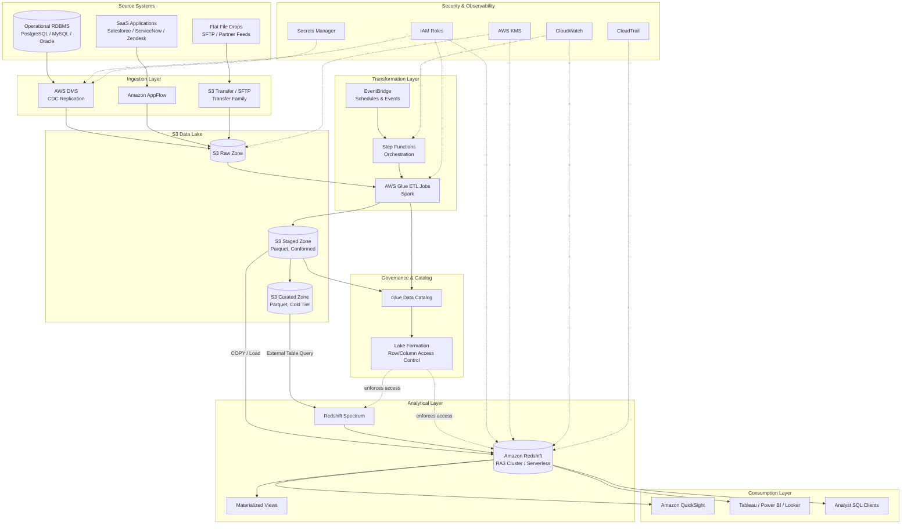

# Part VI – Data Platform Architectures

# Chapter 49 — Data Warehouse

---

## 1. Executive Summary

Every enterprise eventually hits the same wall. Operational databases are optimized for transactions, not for analysis. Running a finance quarter-close report against a production OLTP database competes with the application traffic paying the bills. Marketing wants three years of customer history joined against product catalogs, order history, and support tickets — a query pattern that will bring a row-oriented transactional database to its knees.

This is the business problem a data warehouse solves.

**The business problem, stated plainly:**

- Transactional systems (order management, billing, CRM, ERP) are built for fast, narrow, single-row reads and writes.
- Analytical workloads need wide, multi-table, aggregate-heavy scans across huge historical ranges.
- Running both workloads on the same infrastructure creates resource contention, unpredictable latency, and operational risk.
- Business stakeholders — finance, marketing, product, executive leadership — need a single, trusted, query-friendly source of historical truth.
- Data is scattered across dozens of source systems, each with different schemas, formats, and update cadences.

**Architecture objective:**

This chapter designs a production-grade, enterprise-scale **cloud data warehouse** on AWS, built around **Amazon Redshift** as the analytical query engine, backed by an **S3-based data lake** for staging, historical retention, and cost-efficient cold storage, orchestrated by **AWS Glue** and **Step Functions**, and consumed by **Amazon QuickSight** and third-party BI tools.

The objective is not simply "store data somewhere queryable." The objective is:

- Consolidate data from many operational sources into one governed, structurally consistent analytical model.
- Serve high-concurrency BI and reporting workloads with predictable, sub-minute query latency.
- Separate storage from compute so cost scales with actual usage, not worst-case peak.
- Provide strong data governance: lineage, access control, encryption, auditability.
- Support both scheduled batch ELT and, where required, near-real-time ingestion.
- Remain queryable directly against the data lake (via Redshift Spectrum) without duplicating every byte into the warehouse.

**Why organizations adopt this architecture:**

- Single source of truth. Instead of every department building its own spreadsheet-based reporting pipeline, the organization standardizes on one warehouse with governed data models.
- Query performance at scale. Columnar storage, massively parallel processing (MPP), and result caching turn multi-billion-row aggregations into sub-second to low-minute queries.
- Cost control through separation of storage and compute. RA3 node types and Redshift Serverless decouple how much data you keep from how much compute you pay for at any given moment.
- Governance and compliance. Centralizing sensitive data (PII, financial records, health records) in one platform makes it dramatically easier to apply consistent encryption, masking, access control, and audit logging — a hard requirement in regulated industries.
- BI tool compatibility. Redshift speaks standard PostgreSQL-compatible SQL and integrates natively with QuickSight, Tableau, Looker, Power BI, and virtually every enterprise BI product via JDBC/ODBC.
- Elastic scale. Concurrency scaling and elastic resize let the warehouse absorb month-end close, Black Friday reporting spikes, or a new BI rollout without a forklift infrastructure upgrade.

**Major business benefits:**

| Benefit | Business Impact |
|---|---|
| Faster decision-making | Reports that took hours or days to compile now run in seconds to minutes |
| Reduced reporting cost | Eliminates dozens of duplicated, ad-hoc ETL scripts and spreadsheet pipelines |
| Improved data trust | One governed model reduces "whose number is right" disputes between departments |
| Regulatory readiness | Centralized audit trails and access control simplify SOX, HIPAA, GDPR, PCI-DSS evidence gathering |
| Self-service analytics | Business users query curated marts directly via BI tools instead of filing tickets with engineering |
| Lower infrastructure cost over time | Storage and compute scale independently instead of over-provisioning a single monolithic database |

**Typical enterprise scenarios:**

- A retail chain consolidating point-of-sale, e-commerce, inventory, and loyalty data to build a unified customer 360 view and daily sales reporting.
- A financial services firm building a regulatory reporting platform that must reconcile trades, positions, and risk exposure across dozens of source systems with full auditability.
- A healthcare payer building population health and claims analytics while maintaining strict HIPAA-compliant access boundaries.
- A SaaS company building a usage analytics platform that feeds both internal product decisions and customer-facing usage dashboards.
- A manufacturing company integrating ERP, MES, and IoT telemetry data to analyze production efficiency and supply chain performance.

**What this chapter does NOT cover:**

- Real-time streaming analytics with sub-second latency requirements — that is Chapter 48 (Streaming Analytics).
- Raw, schema-on-read data lake architectures without a curated analytical layer — that is Chapter 46 (Data Lake).
- Combined lake + warehouse unified platforms using open table formats (Iceberg/Hudi/Delta) as the primary access layer — that is Chapter 47 (Lake House). This chapter uses S3 primarily as a staging and cold-archive tier feeding a Redshift-centric warehouse, not as the primary query surface.

**Design philosophy for this chapter:**

- ELT over ETL where possible. Land raw data first, transform inside the warehouse using its MPP compute, rather than transforming in a separate compute layer before load.
- Storage/compute separation as a first-class principle, not an afterthought.
- Governance by default — every dataset classified, every sensitive column identified, every access path logged.
- Cost visibility baked into the architecture from day one, not bolted on after the first surprise bill.
- Design for growth in three dimensions simultaneously: data volume, query concurrency, and organizational users — because in production, all three grow together.

---

## 2. Business Requirements

### 2.1 Business Drivers

- Consolidate fragmented reporting into a governed, trusted analytical platform.
- Reduce time-to-insight from days to minutes for recurring business reports.
- Enable self-service BI for non-technical business users.
- Support regulatory and compliance reporting with full auditability.
- Provide a stable foundation for downstream machine learning and advanced analytics.

### 2.2 Functional Requirements

| Requirement | Description |
|---|---|
| Multi-source ingestion | Ingest from RDBMS (via DMS/Glue), SaaS APIs (via AppFlow), flat files (via S3), and streaming sources |
| Historical retention | Retain 7+ years of historical transactional data for trend analysis and compliance |
| Dimensional modeling | Support star-schema fact/dimension modeling for BI tool compatibility |
| Incremental loads | Support both full-refresh and incremental (CDC-based) load patterns |
| Ad-hoc query support | Allow analysts to run ad-hoc SQL against curated marts without engineering involvement |
| BI tool integration | Native JDBC/ODBC connectivity for QuickSight, Tableau, Power BI, Looker |
| Data lake federation | Query data directly in S3 without loading into the warehouse, for infrequently accessed or very large datasets |
| Data quality validation | Automated data quality checks embedded in the ELT pipeline |
| Workload isolation | Separate compute resources for ETL, ad-hoc analyst queries, and scheduled BI dashboards |

### 2.3 Non-Functional Requirements

**Scalability goals**

- Support growth from an initial 5–10 TB warehouse to 100+ TB without architectural rework.
- Support concurrent query load growth from tens to thousands of concurrent BI sessions.
- Support ingestion volume growth from gigabytes/day to terabytes/day.

**Availability requirements**

- 99.9% availability target for the warehouse query endpoint during business hours.
- No single point of failure in the ingestion pipeline.
- Automated failover for cluster node failures.

**Latency requirements**

| Workload | Target Latency |
|---|---|
| Dashboard queries (pre-aggregated marts) | Under 3 seconds |
| Ad-hoc analyst queries (curated marts) | Under 60 seconds |
| Ad-hoc queries against data lake (Spectrum) | Under 5 minutes |
| Batch ELT pipeline (daily loads) | Complete within nightly maintenance window (typically 4 hours) |
| Incremental CDC loads | Within 15–30 minutes of source change, where near-real-time is required |

**Compliance requirements**

- Encryption at rest and in transit for all data classified as sensitive (PII, PCI, PHI, financial).
- Column-level and row-level access control for regulated datasets.
- Full audit trail of query access to sensitive data (who queried what, when).
- Data residency controls where required by regional regulation (GDPR, data localization laws).
- Retention and deletion policies aligned with regulatory mandates (right-to-erasure support).

**Security expectations**

- No public internet exposure of the warehouse cluster; access only through private networking.
- Least-privilege IAM roles for every service and pipeline component.
- Centralized secrets management — no embedded credentials anywhere in code or configuration.
- Network-level segmentation between ingestion, transformation, and consumption layers.

**Recovery objectives**

| Metric | Target |
|---|---|
| RPO (Recovery Point Objective) | 24 hours for the warehouse (daily automated snapshots), lower for source-of-truth data retained in S3 with versioning |
| RTO (Recovery Time Objective) | 2–4 hours for full cluster restoration from snapshot in a DR region |

**SLAs**

- Business-hours query availability: 99.9%.
- Nightly ELT pipeline completion: 99.5% on-time completion rate.
- Data freshness SLA communicated per dataset (e.g., "sales fact table refreshed by 6:00 AM local time daily").

**Expected workload**

- Initial: 5–20 TB compressed data, 50–200 concurrent BI users, nightly batch ELT.
- Steady state: 50–150 TB compressed data, 500–2,000 concurrent BI users across dashboards and ad-hoc query tools, mixed batch and incremental near-real-time loads.

**Expected growth**

- Data volume: 20–40% year-over-year growth is typical for a maturing enterprise warehouse.
- User growth: Self-service BI adoption tends to grow faster than data volume once the platform proves valuable — plan compute scaling for user growth, not just data growth.

---

## 3. Architecture Overview

### 3.1 Overall Design

The architecture is organized into five logical layers. Each layer has a distinct responsibility, its own scaling model, and its own security boundary.

1. **Ingestion Layer** — pulls data from source systems (operational databases, SaaS applications, files, streams) into a raw landing zone in S3.
2. **Storage Layer** — a tiered S3-based data lake (raw, staged, curated) that serves as both the durable system of record for ingested data and the cold/archive tier for the warehouse.
3. **Transformation Layer** — AWS Glue jobs and Redshift ELT SQL that clean, conform, and model raw data into dimensional (star-schema) structures.
4. **Analytical Storage & Compute Layer** — Amazon Redshift (provisioned RA3 or Serverless), the MPP query engine that serves curated fact and dimension tables, with Redshift Spectrum extending queries directly into S3.
5. **Consumption Layer** — BI tools (QuickSight, Tableau, Power BI, Looker), ad-hoc SQL clients, and downstream ML feature pipelines.

Orchestration (AWS Step Functions + EventBridge schedules), governance (Lake Formation, Glue Data Catalog), security (IAM, KMS, Secrets Manager), and observability (CloudWatch, CloudTrail) are cross-cutting concerns that touch every layer.

### 3.2 Architecture Philosophy

- **ELT, not ETL, as the default pattern.** Raw data lands in S3 largely as-is. Heavy transformation happens either in Glue (Spark) for large-scale reshaping, or directly in Redshift SQL using its MPP compute for joins, aggregations, and dimensional modeling. This avoids building and maintaining a separate large-scale transformation cluster for logic that Redshift can execute more efficiently.
- **Storage/compute separation everywhere.** S3 is unlimited, cheap, durable storage. Redshift RA3 nodes and Redshift Serverless separate compute capacity from the data they operate on. This means the organization is never forced to over-provision compute just to hold more data.
- **Curate progressively, in layers.** Raw → staged → curated. Never transform directly from raw to final; keep each stage independently reproducible and auditable.
- **Query the lake, don't always load it.** Not every dataset needs to live inside Redshift's own storage. Infrequently queried, very large, or rarely-joined datasets are queried in place from S3 via Redshift Spectrum, saving both storage cost and load time.
- **Governance is a pipeline stage, not a bolt-on.** Data classification, PII tagging, and access policy are defined before data is curated, not retrofitted after an audit finding.

### 3.3 Core Components

| Component | Role |
|---|---|
| AWS DMS | Continuous or one-time replication from operational RDBMS sources into S3 raw zone |
| Amazon AppFlow | Managed ingestion from SaaS applications (Salesforce, ServiceNow, Zendesk, etc.) |
| Amazon S3 (raw/staged/curated buckets) | Durable, tiered data lake storage |
| AWS Glue Crawlers + Data Catalog | Automated schema discovery and centralized metadata catalog |
| AWS Glue ETL (Spark) | Large-scale batch transformation, schema conformance, format conversion (to Parquet) |
| AWS Step Functions | Pipeline orchestration — sequencing ingestion, transformation, load, and validation steps |
| Amazon EventBridge | Scheduled triggers and event-driven pipeline starts (e.g., "file arrived" events) |
| Amazon Redshift (RA3 / Serverless) | MPP columnar data warehouse — the analytical query engine |
| Redshift Spectrum | Extends Redshift SQL to query data directly in S3 without loading |
| AWS Lake Formation | Centralized fine-grained access control (row/column/tag-based) across S3 and Redshift Spectrum |
| Amazon QuickSight | Native AWS BI and dashboarding tool |
| AWS Secrets Manager | Centralized credential storage for database connections and API keys |
| AWS KMS | Encryption key management for data at rest across S3 and Redshift |
| Amazon CloudWatch | Metrics, logs, alarms for pipeline and cluster health |
| AWS CloudTrail | API-level audit logging |
| AWS Glue DataBrew (optional) | Visual data quality and profiling for analysts without writing Spark code |

### 3.4 How Components Interact

- Source systems are extracted on a schedule (or via CDC stream) into the **raw zone** of S3, partitioned by source and ingestion date.
- Glue Crawlers catalog new raw data automatically, registering schema in the Glue Data Catalog.
- Step Functions orchestrates a pipeline: validate raw data arrival → run Glue ETL jobs to clean/conform → write to the **staged zone** in Parquet format → run Redshift COPY or Spectrum-based INSERT...SELECT to load into **curated** dimensional tables inside Redshift.
- Data quality checks run at each transition point; failures halt the pipeline and alert via SNS.
- Business users and BI tools query curated fact/dimension tables in Redshift directly; less-frequently accessed historical data is queried via Redshift Spectrum against Parquet files in the curated S3 zone.
- Lake Formation permissions govern who can see which rows, columns, and tables, enforced consistently whether the query originates from Redshift or from Athena.

### 3.5 High-Level Workflow

1. Extract data from source systems into S3 raw zone (batch or CDC).
2. Catalog and validate schema.
3. Transform and conform data using Glue Spark jobs.
4. Land conformed data in S3 staged zone as partitioned Parquet.
5. Load or federate data into Redshift curated schema (star schema fact/dimension tables).
6. Run data quality validation against loaded data.
7. Refresh materialized views and pre-aggregated BI extracts.
8. Notify downstream consumers (BI refresh, ML pipeline trigger) that data is ready.
9. Business users and BI tools query the curated layer.

### 3.6 Request Lifecycle (Query Path)

1. BI tool or analyst submits SQL query via JDBC/ODBC to the Redshift endpoint (through a private VPC endpoint / VPN / Direct Connect — never public internet).
2. Redshift leader node parses, plans, and distributes the query across compute nodes.
3. If the query references external (Spectrum) tables, Redshift dispatches a distributed scan request to the Spectrum fleet, which reads Parquet data directly from S3.
4. Compute nodes execute in parallel, returning aggregated results to the leader node.
5. Leader node returns the final result set to the client.
6. Query execution details are logged to system tables and, optionally, exported to CloudWatch/S3 for long-term audit retention.

### 3.7 Response Lifecycle

- Result sets are streamed back to the client over the JDBC/ODBC connection.
- For BI tools using SPICE (QuickSight's in-memory cache) or extract-based caching, results may be cached client-side to avoid repeated warehouse round-trips for identical dashboard views.
- Query results exceeding practical dashboard size are typically pre-aggregated via materialized views rather than returned raw to the BI layer.

### 3.8 Data Lifecycle

| Stage | Location | Format | Retention |
|---|---|---|---|
| Raw | S3 raw zone | Native source format (CSV, JSON, source DB export) | Indefinite (compliance-driven), lifecycle to Glacier after 90 days |
| Staged | S3 staged zone | Parquet, partitioned, schema-conformed | 1–2 years hot, then lifecycle to Glacier |
| Curated (in-warehouse) | Redshift managed storage (RA3) | Columnar, compressed, sort/dist keys applied | Active reporting window (e.g., 3 years hot), older years accessed via Spectrum |
| Curated (cold, Spectrum-queryable) | S3 curated zone | Parquet, partitioned by date | 7+ years, aligned to regulatory retention |
| Archived | S3 Glacier Deep Archive | Compressed source format | Per regulatory retention schedule, rarely queried |

---

## 4. AWS Services Used

Each service below is scoped to how it is actually used in this architecture. Alternatives and trade-offs are discussed for every major decision.

### 4.1 Amazon Redshift (Core Engine)

**Purpose:** The MPP (Massively Parallel Processing) columnar data warehouse that stores curated dimensional models and serves BI/analyst queries.

**Why selected:**

- Native columnar storage with automatic compression dramatically reduces both storage footprint and I/O for analytical scan/aggregate queries.
- RA3 node types decouple storage from compute — you can scale compute independently of how much historical data you retain.
- Redshift Serverless removes cluster management entirely for variable or unpredictable workloads, billing per RPU-second.
- Concurrency Scaling automatically adds transient compute capacity during query bursts (e.g., month-end close) without manual intervention.
- Native Spectrum integration lets the same SQL engine query S3 data lake files without a separate query engine.
- Deep BI ecosystem support: QuickSight, Tableau, Looker, Power BI all have first-class Redshift connectors.

**Alternatives:**

- **Snowflake** — excellent multi-cloud portability and near-zero administration, but introduces a non-AWS-native billing and IAM model, and typically costs more at very large scale for steady-state workloads.
- **Google BigQuery** — fully serverless, pay-per-query pricing is attractive for spiky workloads, but requires leaving the AWS ecosystem for the core analytical engine, complicating data gravity and cross-service IAM.
- **Databricks SQL Warehouse (on AWS)** — strong when the organization already has a Databricks Lakehouse investment and wants a single platform for both ML and BI; more expensive and complex to operate than Redshift for teams whose primary need is classic BI/reporting.
- **Athena (data lake only, no warehouse)** — appropriate for smaller or intermittent workloads; struggles with the interactive, high-concurrency dashboard load patterns Redshift is designed for.

**Limitations:**

- Not designed for OLTP-style single-row transactional workloads.
- Leader node can become a bottleneck for very high query concurrency without Concurrency Scaling or WLM tuning.
- Cross-region querying requires explicit data movement or Redshift data sharing configuration.

**Pricing considerations:**

- RA3 nodes bill for compute; managed storage bills separately per GB, decoupling the two.
- Redshift Serverless bills per RPU-hour with automatic pause during idle periods — attractive for dev/test and bursty production workloads.
- Concurrency Scaling includes a free tier (1 hour per day per cluster) before additional charges apply.
- Reserved Instances (1 or 3 year) provide 20–75% discounts over on-demand for stable, predictable production clusters.

**Best practices:**

- Choose distribution keys (DISTKEY) based on the most common large join columns to minimize data movement (broadcast/redistribution) during query execution.
- Choose sort keys (SORTKEY) based on the most common filter/range predicates (typically date columns).
- Use compression encodings (Redshift auto-applies these via `ANALYZE COMPRESSION`, but validate for critical tables).
- Vacuum and analyze tables regularly (or rely on Redshift's automatic table maintenance) to keep statistics current and reclaim space from deletes/updates.

### 4.2 Amazon S3 (Data Lake Storage)

**Purpose:** Durable, cheap, unlimited storage for raw, staged, and curated data; the backing store for Redshift Spectrum external tables.

**Why selected:** 99.999999999% durability, virtually unlimited scale, native integration with every AWS analytics service, and storage-class tiering (Standard → Infrequent Access → Glacier) for cost-efficient lifecycle management.

**Alternatives:** On-premises HDFS (loses elasticity and durability guarantees, high operational burden); Azure Data Lake Storage / GCS (only relevant in multi-cloud strategies, adds egress cost and cross-cloud latency).

**Limitations:** Eventually-consistent-feeling behavior for very high-frequency small-file writes (mitigated by batching writes and using Parquet with reasonable file sizes, generally 128MB–1GB per file).

**Pricing considerations:** Storage cost is low per GB but scales with volume; request costs (GET/PUT) can add up with poorly batched small-file patterns; lifecycle policies to Glacier meaningfully reduce cold-tier cost.

**Best practices:** Partition by date (and a secondary business key where useful) to enable partition pruning; avoid excessive small files; use Parquet for staged/curated zones for columnar compression and predicate pushdown.

### 4.3 AWS Glue (ETL and Catalog)

**Purpose:** Serverless Spark-based ETL for large-scale transformation, plus the Glue Data Catalog as the shared metadata store used by Redshift Spectrum, Athena, and Lake Formation.

**Why selected:** Serverless — no cluster to manage; scales automatically with job size; Data Catalog is the de facto standard metadata layer across AWS analytics services, avoiding a fragmented "which catalog is authoritative" problem.

**Alternatives:** Self-managed Apache Spark on EMR (more control, significantly more operational overhead); dbt running transformation logic directly inside Redshift (excellent for SQL-first teams, often used *alongside* Glue rather than instead of it — Glue handles large-scale reshaping/format conversion, dbt handles in-warehouse SQL modeling).

**Limitations:** Cold-start latency for infrequent jobs; Spark-based jobs are less cost-efficient than pure SQL for transformations Redshift itself could do natively.

**Pricing considerations:** Billed per DPU-hour; right-size worker type and count per job rather than defaulting to maximum capacity.

**Best practices:** Use job bookmarks for incremental processing; separate crawlers from ETL jobs; partition Glue jobs by logical domain (sales, finance, customer) rather than one monolithic job.

### 4.4 AWS Database Migration Service (DMS)

**Purpose:** Continuous change-data-capture (CDC) replication from operational RDBMS sources (PostgreSQL, MySQL, Oracle, SQL Server) into the S3 raw zone.

**Why selected:** Managed, low-operational-overhead CDC without building custom log-shipping infrastructure; supports both one-time full-load and ongoing replication.

**Alternatives:** Debezium + Kafka (more flexible, much higher operational complexity, appropriate when true event-streaming architecture is also needed); vendor-native replication tools (often licensing-cost-prohibitive at scale).

**Limitations:** Schema drift on the source can break replication tasks; large object (LOB) handling requires explicit configuration.

**Best practices:** Use CDC (not full reload) for high-volume tables; monitor replication lag via CloudWatch; test failover of the DMS replication instance.

### 4.5 Amazon AppFlow

**Purpose:** Managed, no-code ingestion from SaaS platforms (Salesforce, ServiceNow, Zendesk, Google Analytics, etc.) directly into S3.

**Why selected:** Avoids building and maintaining custom API integration code for common SaaS sources; built-in scheduling, field mapping, and basic transformation.

**Alternatives:** Custom Lambda-based API pollers (more flexible but higher maintenance burden); third-party ELT SaaS tools like Fivetran (excellent breadth of connectors, adds a recurring SaaS cost and a non-AWS-native dependency).

### 4.6 Amazon QuickSight

**Purpose:** Native AWS BI tool for dashboards and self-service analytics against curated Redshift data.

**Why selected:** Pay-per-session pricing model is cost-efficient for large, infrequent-user populations; SPICE in-memory engine offloads repetitive dashboard queries from Redshift; tight IAM/Redshift integration.

**Alternatives:** Tableau (richer visualization ecosystem, higher licensing cost, per-seat pricing can be expensive at scale); Power BI (strong if the organization is already a Microsoft shop); Looker (strong semantic modeling layer, Google-owned, higher cost).

### 4.7 AWS Lake Formation

**Purpose:** Centralized, fine-grained (row/column/tag-based) access control across S3 data lake and Redshift Spectrum, layered on top of IAM.

**Why selected:** IAM alone can only control access at the S3 bucket/prefix level; Lake Formation adds column-level and row-level permissions and a single place to audit "who can see this data," which is essential for PII/PCI/PHI governance.

**Limitations:** Adds a permissions layer that must be actively maintained — permission drift is a common operational pitfall (see Architect's Corner).

### 4.8 AWS Step Functions

**Purpose:** Orchestrates the multi-step ELT pipeline: ingestion trigger → Glue job → data quality check → Redshift load → notification.

**Why selected:** Visual, auditable state machine execution history; native retry/catch error handling; integrates directly with Glue, Lambda, SNS, and Redshift Data API without custom polling code.

**Alternatives:** Apache Airflow (via Amazon MWAA) — preferred when the organization has complex, code-first DAG requirements or existing Airflow expertise; Step Functions is generally lower-operational-overhead for teams standardizing on native AWS services.

### 4.9 Amazon EventBridge

**Purpose:** Schedules pipeline runs (cron-based) and reacts to S3 object-created events to trigger event-driven ingestion pipelines.

### 4.10 IAM, KMS, Secrets Manager, VPC

**IAM:** Least-privilege roles per service (Glue job role, Redshift cluster role, Step Functions execution role) — never a shared, broadly-scoped role across pipeline components.

**KMS:** Customer-managed keys (CMKs) for S3 bucket encryption and Redshift cluster encryption, enabling key rotation and granular access auditing separate from IAM alone.

**Secrets Manager:** Stores database credentials for DMS source connections and any third-party API keys used by AppFlow/Lambda; supports automatic rotation.

**VPC:** Redshift cluster and Glue jobs run inside private subnets; no direct internet exposure; VPC endpoints (Gateway endpoint for S3, Interface endpoints for Glue/Secrets Manager/KMS) keep AWS API traffic off the public internet.

### 4.11 CloudWatch, CloudTrail, AWS Config

**CloudWatch:** Cluster performance metrics (CPU, disk usage, query throughput, concurrency scaling activations), Glue job metrics, pipeline execution alarms.

**CloudTrail:** API-level audit trail for every control-plane action (cluster resize, snapshot, IAM changes) — required for SOX/PCI/HIPAA evidence.

**AWS Config:** Continuous compliance monitoring — e.g., alerting if a Redshift cluster is ever configured with public accessibility enabled, or if encryption is disabled on a bucket.

### 4.12 Services Deliberately Not Used Here

| Service | Why not used in this chapter's design |
|---|---|
| DynamoDB | Operational NoSQL store, not an analytical query engine; out of scope for a warehouse chapter |
| Kinesis Data Streams (as primary path) | Sub-second streaming ingestion is the focus of Chapter 48 (Streaming Analytics); this chapter uses batch/micro-batch CDC via DMS instead |
| EMR | Reserved for teams needing custom Spark/Hadoop ecosystem control beyond what serverless Glue provides; adds meaningful operational overhead not justified for most warehouse ELT |
| Aurora (as the warehouse itself) | Aurora is an excellent OLTP engine but not columnar/MPP; not appropriate as the analytical serving layer at scale |

---

## 5. Complete Architecture Diagram



**Diagram notes:**

- Solid arrows represent data flow; dashed arrows represent control/security enforcement.
- Redshift Spectrum reads directly from the S3 curated zone without a separate load step, keeping cold/historical data queryable without duplicating storage inside Redshift.
- Lake Formation enforces the same access policy whether the query originates from Redshift Spectrum or a downstream Athena query against the same catalog.
- All ingestion paths land in the raw zone first — there is no direct source-to-Redshift load path, preserving a reproducible, auditable raw copy of every dataset.

---

## 6. Component-by-Component Explanation

### 6.1 AWS DMS (Change Data Capture)

- **Purpose:** Continuously replicate row-level changes from operational databases into S3 without impacting source system performance.
- **Responsibilities:** Initial full load, ongoing CDC capture via transaction log reading, schema change detection.
- **Inputs:** Source RDBMS connection (via Secrets Manager credentials), table/schema mapping rules.
- **Outputs:** Parquet or CSV files written to S3 raw zone, partitioned by table and load timestamp.
- **Scaling:** Replication instance sized (dms.r5/dms.c5 family) based on source change volume; can scale vertically; multiple tasks can run in parallel across source schemas.
- **High availability:** Multi-AZ replication instance deployment for production CDC tasks.
- **Failure handling:** Automatic task restart on transient failure; CloudWatch alarms on replication lag exceeding threshold; dead-letter handling for malformed records.
- **Dependencies:** Source database log retention configured for CDC (e.g., PostgreSQL logical replication slots, MySQL binlog retention).
- **Security:** Source credentials in Secrets Manager, rotated automatically; replication instance in private subnet; encryption in transit (SSL) to source and at rest (KMS) for S3 targets.
- **Monitoring:** CDCLatencySource/CDCLatencyTarget CloudWatch metrics; alarm on sustained lag.

### 6.2 Amazon AppFlow

- **Purpose:** Managed, scheduled or event-triggered ingestion from SaaS platforms.
- **Responsibilities:** Field mapping, basic filtering/masking at ingestion, delivery to S3.
- **Inputs:** OAuth-authenticated SaaS API connection.
- **Outputs:** JSON/CSV/Parquet objects in S3 raw zone.
- **Scaling:** Fully managed; scales with API rate limits of the source SaaS platform (a source-side constraint, not an AWS-side one).
- **Failure handling:** Automatic retry with backoff; flow run history retained for troubleshooting.
- **Security:** OAuth tokens/API keys stored in Secrets Manager or AppFlow's native connection profile encryption.

### 6.3 S3 Raw / Staged / Curated Zones

- **Purpose:** Tiered storage that separates "as received" data from "cleaned and conformed" data from "final, cold-tier queryable" data.
- **Responsibilities:** Durable storage, partitioning strategy, lifecycle management.
- **Scaling:** Effectively unlimited; cost scales linearly with volume and access frequency (storage class).
- **High availability:** 99.999999999% durability across multiple AZs by default (S3 Standard).
- **Failure handling:** Versioning enabled on raw zone to protect against accidental overwrite/deletion; cross-region replication for DR-critical datasets.
- **Security:** Bucket policies restrict access to specific IAM roles; default encryption with KMS CMK; access logging enabled; Lake Formation governs fine-grained table/column access on top of bucket-level IAM.
- **Monitoring:** S3 storage metrics, request metrics, and S3 Inventory reports for lifecycle auditing.

### 6.4 AWS Glue ETL Jobs

- **Purpose:** Transform raw data into schema-conformed, business-logic-applied, dimensionally-modeled datasets.
- **Responsibilities:** Schema validation, deduplication, type conversion, slowly changing dimension (SCD) logic, format conversion to Parquet.
- **Inputs:** Raw zone data (via Glue Data Catalog table definitions), reference/lookup data.
- **Outputs:** Staged zone Parquet files, partitioned appropriately for downstream query patterns.
- **Scaling:** Auto-scaling Glue workers (G.1X/G.2X) per job based on data volume; jobs are independently scalable per domain.
- **Failure handling:** Job bookmarks prevent reprocessing on retry; Step Functions catch/retry logic around job failures; failed job triggers SNS alert.
- **Dependencies:** Glue Data Catalog table definitions must be current (crawler runs before ETL, or catalog updated by the previous pipeline stage).
- **Security:** Glue job IAM role scoped to only the specific S3 prefixes and Glue databases it needs.
- **Monitoring:** Glue job run metrics (DPU-hours, duration, records processed) in CloudWatch; job bookmarks state tracked in Glue.

### 6.5 Amazon Redshift Cluster

- **Purpose:** Serve curated dimensional models to BI tools and analysts with low-latency, high-concurrency SQL access.
- **Responsibilities:** Store fact/dimension tables, execute MPP queries, maintain materialized views, enforce workload management (WLM) queue isolation.
- **Inputs:** COPY commands loading Parquet from S3 staged zone; INSERT...SELECT from Spectrum external tables.
- **Outputs:** Query result sets to BI tools/analysts; unloaded data (via UNLOAD) back to S3 for downstream consumption.
- **Scaling:** RA3 elastic resize (minutes) or classic resize (longer, for node-type change); Concurrency Scaling adds transient compute for query bursts; Redshift Serverless auto-scales RPUs.
- **High availability:** Multi-AZ deployment (Redshift Multi-AZ, GA for RA3) for automatic failover; automated snapshots every 8 hours (configurable) plus continuous incremental backups.
- **Failure handling:** Node replacement is automatic and transparent for compute-node failures (data is in RA3 managed storage, not lost); leader node failure triggers cluster-level failover in Multi-AZ configurations.
- **Dependencies:** VPC networking, IAM role for S3/Glue Catalog access, KMS key for encryption.
- **Security:** No public accessibility; access via VPC only; column-level encryption available for highly sensitive fields; audit logging to S3/CloudWatch.
- **Monitoring:** CloudWatch metrics (CPUUtilization, PercentageDiskSpaceUsed, database connections, query duration), Redshift system tables (STL/SVL views) for query-level diagnostics.

### 6.6 Redshift Spectrum

- **Purpose:** Query S3 data directly from Redshift SQL without loading it into cluster storage.
- **Responsibilities:** Distributed scan of external Parquet/ORC/CSV files registered in the Glue Data Catalog.
- **Scaling:** Spectrum compute scales independently and automatically per query, billed per TB scanned.
- **Best practices:** Partition external tables aggressively (by date at minimum) to minimize data scanned per query; use Parquet, not CSV, for Spectrum tables — columnar format plus predicate pushdown dramatically reduces scan cost.
- **Security:** Governed by the same Lake Formation permissions as the underlying Glue Catalog tables.

### 6.7 AWS Lake Formation

- **Purpose:** Centralized, fine-grained access control across the data lake and Spectrum.
- **Responsibilities:** Row-level filters, column-level permissions, tag-based access control (e.g., tag a column `PII` once, apply policy to the tag, not to every table individually).
- **Dependencies:** Glue Data Catalog as the underlying metadata store.
- **Monitoring:** Lake Formation access audit logs via CloudTrail.

### 6.8 Step Functions + EventBridge (Orchestration)

- **Purpose:** Deterministic, auditable sequencing of the multi-stage ELT pipeline.
- **Responsibilities:** Trigger scheduling (EventBridge cron or S3 event), stage sequencing, error handling/retry, fan-out for parallel domain pipelines, notification on completion/failure.
- **High availability:** Serverless, no infrastructure to manage; execution history retained for audit and troubleshooting.
- **Monitoring:** Step Functions execution history dashboard; CloudWatch alarms on failed executions.

### 6.9 QuickSight / BI Tools

- **Purpose:** Deliver curated, governed dashboards and enable self-service ad-hoc analysis.
- **Responsibilities:** Data model presentation, visualization, row-level security enforcement (QuickSight supports its own RLS layered on top of Redshift/Lake Formation policy).
- **Scaling:** SPICE caching absorbs repeated dashboard queries; pay-per-session pricing scales cost with actual usage rather than named-seat licensing.
- **Security:** IAM-federated or SSO-based user authentication; row-level security datasets scoped per business unit.

---

## 7. End-to-End Request Flow

This section traces a single BI dashboard query from click to render, step by step.

1. **Analyst opens a dashboard** in QuickSight (or Tableau/Power BI connected via ODBC).
2. **Client authentication** — QuickSight authenticates the user via IAM Identity Center SSO; the session inherits the user's assigned row-level security dataset rules.
3. **Cache check** — If the dashboard uses SPICE, QuickSight first checks its in-memory cache. If data is fresh (per the configured refresh schedule), results are served from SPICE without touching Redshift at all.
4. **Query dispatch** — On a cache miss, or for direct-query (non-SPICE) datasets, QuickSight issues SQL over a JDBC connection to the Redshift endpoint.
5. **Private network path** — The connection routes through a VPC interface, never traversing the public internet; QuickSight's AWS-managed network interfaces connect directly into the customer VPC.
6. **Leader node query planning** — The Redshift leader node parses the SQL, builds a distributed query plan, and determines whether any referenced tables are external (Spectrum) tables.
7. **WLM queue assignment** — The query is assigned to a workload management queue based on the user group / query group configuration (e.g., "BI dashboards" queue vs. "ad-hoc analyst" queue vs. "ETL" queue), ensuring heavy ad-hoc queries cannot starve dashboard queries of resources.
8. **Distributed execution** — Compute nodes execute their assigned query slices in parallel; if Spectrum tables are involved, a request is dispatched to the Spectrum fleet to scan and filter the relevant S3 partitions.
9. **Data movement** — If a join requires redistributing data between nodes (because DISTKEY doesn't align with the join key), Redshift performs an internal network shuffle — this is one of the most common sources of unexpected query latency (see Troubleshooting Guide).
10. **Aggregation at leader node** — Partial results from compute nodes are merged, sorted, and finalized by the leader node.
11. **Result caching** — Redshift's result cache stores the query result; an identical subsequent query (same SQL, same underlying data state) returns instantly from cache.
12. **Response returned to client** — The result set streams back over the JDBC/ODBC connection to QuickSight/BI tool.
13. **Rendering** — The BI tool renders the visualization; SPICE-backed dashboards store the result for future cache hits.
14. **Logging** — Query text, duration, rows returned, and WLM queue are logged to Redshift system tables (`STL_QUERY`, `SVL_QUERY_SUMMARY`) and optionally exported to CloudWatch Logs / S3 for long-term audit retention.
15. **Monitoring** — CloudWatch dashboards track query duration percentiles (p50/p95/p99); alarms fire if p95 dashboard query latency exceeds SLA thresholds.
16. **Error handling** — If a query fails (timeout, permission denied, malformed SQL), Redshift returns a structured error to the client; permission-denied errors are cross-checked against Lake Formation policy for row/column-level restrictions, and access attempts against restricted data are logged to CloudTrail for audit.

---

## 8. Deployment Flow

### 8.1 Infrastructure Provisioning

- All infrastructure (VPC, subnets, Redshift cluster, Glue jobs, IAM roles, S3 buckets) is provisioned via Terraform, never manually through the console, to guarantee reproducibility across dev/staging/production environments.
- Environment-specific configuration (cluster size, node count, subnet CIDRs) is parameterized via Terraform workspaces or separate `.tfvars` files per environment.

### 8.2 Terraform Workflow

1. Developer writes/modifies Terraform modules in a feature branch.
2. `terraform fmt` and `terraform validate` run locally and in CI.
3. Pull request triggers `terraform plan` in CI, posting the plan output as a PR comment for review.
4. Security scanning (`tfsec` / `checkov`) runs against the plan to catch misconfigurations (e.g., public Redshift accessibility, unencrypted S3 buckets) before merge.
5. On merge to main, CI runs `terraform apply` against the target environment using a locked remote state backend (S3 + DynamoDB state lock).
6. Post-apply validation script confirms cluster health, IAM role attachment, and endpoint reachability before marking the deployment successful.

### 8.3 CI/CD Deployment (Pipeline Code)

- Glue job scripts and Step Functions state machine definitions are version-controlled alongside infrastructure code.
- CI/CD pipeline packages and deploys Glue scripts to S3, updates Glue job definitions via Terraform, and deploys Step Functions state machine JSON via Terraform's `aws_sfn_state_machine` resource.
- SQL transformation logic (dimensional modeling, dbt models if used) is version-controlled and deployed via a dedicated dbt CI job that runs `dbt build` against a staging schema before promoting to production.

### 8.4 Blue-Green Deployment (Warehouse Context)

- For major schema changes to curated fact/dimension tables, a **blue-green schema pattern** is used: build the new table structure in a parallel schema (`curated_v2`), backfill and validate, then atomically swap views/synonyms to point BI tools at the new schema.
- This avoids taking dashboards offline during a schema migration and provides an instant rollback path (swap the view back) if validation fails post-cutover.

### 8.5 Rollback

- Terraform state provides infrastructure rollback via `terraform apply` of the previous known-good commit.
- Data pipeline rollback relies on the raw zone's immutability — any bad staged/curated load can be reprocessed from raw data, since raw data is never mutated in place.
- Redshift automated and manual snapshots provide point-in-time cluster restoration if a destructive schema change or data corruption occurs.

### 8.6 Secrets

- All source database credentials, API keys, and service credentials are stored in Secrets Manager with automatic rotation enabled where the source system supports it.
- No credentials are ever stored in Terraform state in plaintext — Secrets Manager ARNs are referenced, not values; `sensitive = true` is set on all credential-related Terraform variables.

### 8.7 Configuration

- Environment-specific parameters (cluster node count, WLM queue definitions, Glue worker counts) are stored in Terraform variable files and, for runtime-tunable parameters, in Systems Manager Parameter Store for values that operational teams may need to adjust without a full deployment.

### 8.8 Validation

- Post-deployment smoke tests confirm: cluster reachable on expected port, IAM role assumable, Glue Catalog accessible, sample Spectrum query returns expected row count, sample Redshift query against curated schema returns expected row count.
- Data quality validation gates (see Section 9 of the pipeline design, covered under Component 6.4) must pass before a load is considered "promoted" to the production curated schema.

---

## 9. Network Topology

### 9.1 VPC Design

- A dedicated **Data Platform VPC**, separate from application VPCs, hosting Redshift, Glue ENIs, and DMS replication instances.
- CIDR: `10.20.0.0/16` (example), sized generously to accommodate future subnet growth without re-IP'ing.

### 9.2 Subnet Layout

| Subnet | CIDR (example) | Purpose |
|---|---|---|
| Public subnet (AZ-a, AZ-b) | 10.20.0.0/24, 10.20.1.0/24 | NAT Gateways only — no warehouse resources here |
| Private subnet — Redshift (AZ-a, AZ-b) | 10.20.10.0/24, 10.20.11.0/24 | Redshift cluster nodes |
| Private subnet — ETL (AZ-a, AZ-b) | 10.20.20.0/24, 10.20.21.0/24 | Glue job ENIs, DMS replication instances |
| Private subnet — Shared services (AZ-a, AZ-b) | 10.20.30.0/24, 10.20.31.0/24 | VPC interface endpoints (Secrets Manager, KMS, Glue, CloudWatch) |

### 9.3 NAT Gateway / Internet Gateway

- Internet Gateway attached only for NAT Gateway egress (e.g., Glue jobs occasionally needing to reach external SaaS APIs, or DMS replicating from an internet-accessible source).
- NAT Gateway deployed per AZ for high availability, avoiding a cross-AZ single point of failure and unnecessary cross-AZ data transfer charges.
- Redshift cluster itself has no route to the internet gateway — it is fully private, reachable only from within the VPC or via peered/VPN-connected networks.

### 9.4 Transit Gateway

- Where the data platform VPC must be reachable from multiple business unit VPCs (for BI tool access) or on-premises networks, a Transit Gateway hub-and-spoke model connects the data platform VPC without requiring a full mesh of VPC peering connections.
- Route tables on the Transit Gateway restrict data platform VPC reachability to only the specific BI/analyst subnets that need it — not a blanket "all VPCs can reach the warehouse" policy.

### 9.5 Route Tables

- Private Redshift subnet route table: local VPC route + route to Transit Gateway for approved cross-VPC BI traffic. No default route to NAT/IGW.
- Private ETL subnet route table: local VPC route + route to NAT Gateway (for external SaaS/API access) + route to Transit Gateway if sources are on-premises via Direct Connect.

### 9.6 Network ACLs

- Stateless NACLs on the Redshift subnet restrict inbound traffic to the Redshift port (5439) only from approved CIDR ranges (BI tool subnets, analyst VPN pool), and deny all other inbound traffic by default.

### 9.7 Security Groups

- Redshift cluster security group: inbound 5439 only from the BI/analyst security group and the Glue/Step Functions execution security group; no `0.0.0.0/0` rules under any circumstance.
- Glue job security group: outbound to Redshift (5439), S3 (via gateway endpoint, no security group needed), and Secrets Manager/KMS interface endpoints.
- DMS replication instance security group: outbound to source database port only; inbound none required.

### 9.8 VPC Endpoints (PrivateLink)

| Endpoint | Type | Purpose |
|---|---|---|
| S3 | Gateway | Route S3 traffic (raw/staged/curated buckets, COPY/UNLOAD) without traversing NAT/internet |
| Secrets Manager | Interface | Private access to stored credentials from Glue/DMS |
| KMS | Interface | Private access to encryption key operations |
| Glue | Interface | Private access to Glue Catalog/job APIs |
| CloudWatch Logs | Interface | Private log delivery from private subnets |
| STS | Interface | Private role assumption for cross-account access patterns |

### 9.9 Hybrid Connectivity

- Where source systems are on-premises (common for large enterprises migrating incrementally), Direct Connect (private, dedicated, low-latency) or Site-to-Site VPN (encrypted over the public internet, faster to provision) connects on-premises networks into the Transit Gateway.
- DMS replication instances and Glue jobs reaching on-premises sources route through this hybrid connection, never through a NAT Gateway to the public internet.

---

## 10. Identity and Access

### 10.1 IAM Roles

| Role | Attached To | Purpose |
|---|---|---|
| `redshift-cluster-role` | Redshift cluster | Read Glue Catalog, read/write S3 staged/curated buckets for COPY/UNLOAD, use KMS key |
| `glue-etl-job-role` | Glue ETL jobs | Read S3 raw, write S3 staged, read/write Glue Catalog, use KMS key |
| `dms-replication-role` | DMS replication instance | Write S3 raw bucket, read Secrets Manager for source credentials |
| `step-functions-execution-role` | Step Functions state machine | Invoke Glue StartJobRun, invoke Lambda validation functions, publish SNS notifications |
| `quicksight-service-role` | QuickSight | Read Redshift via Redshift Data API or JDBC-based connection, assume into approved schemas only |
| `lake-formation-admin-role` | Data governance team | Manage Lake Formation permissions (restricted to a small governance group, not engineers broadly) |

### 10.2 IAM Policies

- Every role above follows least privilege: explicit resource ARNs (specific bucket prefixes, specific Glue databases), not wildcard `*` resources.
- Policies are managed as Terraform-defined JSON documents, version-controlled, and reviewed via pull request like any other code change.

### 10.3 Resource Policies

- S3 bucket policies additionally restrict access by source VPC endpoint ID (using `aws:sourceVpce` condition), ensuring that even a role with S3 permissions cannot reach the bucket from outside the approved VPC endpoint path.
- KMS key policies explicitly enumerate which IAM roles may use the key for encrypt/decrypt operations — a role having generic `kms:Decrypt` IAM permission is not sufficient without also being permitted by the key policy itself.

### 10.4 STS and Cross-Account Access

- In multi-account setups (a common enterprise pattern: separate accounts for raw ingestion, transformation, and the warehouse itself), cross-account access uses STS `AssumeRole` with external ID conditions, not shared long-lived credentials.
- Glue jobs in a "transformation account" assume a scoped role in the "warehouse account" to write COPY commands into Redshift, with the assumed role limited to exactly the S3 prefixes and Redshift schema needed.

### 10.5 Least Privilege in Practice

- No pipeline component ever has account-wide `AdministratorAccess` or broad `s3:*` permissions.
- Table-level and column-level Lake Formation grants are reviewed quarterly against actual usage (unused grants revoked) — permission sprawl is one of the most common audit findings in mature data platforms.

### 10.6 Service Roles

- Distinct service roles per pipeline stage (ingestion, transformation, load, consumption) rather than one shared "data-platform-role" — this ensures a compromised or misconfigured component in one stage cannot laterally access resources scoped to another stage.

### 10.7 Permission Boundaries

- Permission boundaries are attached to any IAM role creatable by automation (e.g., a role provisioned dynamically per new data domain onboarding) to enforce a hard ceiling on what that role can ever be granted, regardless of what policy is later attached to it.

---

## 11. Security Architecture

### 11.1 Encryption

- **At rest:** All S3 buckets (raw, staged, curated) encrypted with SSE-KMS using customer-managed keys, not AWS-managed default keys — this enables per-dataset key rotation policy and granular CloudTrail-based key usage auditing.
- **Redshift:** Cluster encryption enabled at creation (cannot be added retroactively without an unload/reload or snapshot-restore-with-encryption cycle — decide this at day one).
- **In transit:** TLS enforced for all JDBC/ODBC connections to Redshift; DMS source connections use SSL where the source database supports it.
- **Column-level encryption:** For the most sensitive fields (SSNs, payment card numbers) beyond what table-level encryption covers, Redshift supports column-level encryption with a separate key, or tokenization prior to load, so that even users with table SELECT access cannot see the raw sensitive value without an additional decrypt permission.

### 11.2 Key Management (KMS)

- Separate CMKs per data classification tier (e.g., one key for PII-tagged datasets, a different key for general business data) so key-level access control adds a second layer of separation beyond IAM/Lake Formation.
- Automatic annual key rotation enabled; rotation events do not require re-encrypting existing data (KMS handles this transparently for envelope-encrypted data).

### 11.3 Network-Level Protections

- WAF is not directly applicable to the Redshift cluster itself (it is not a public HTTP endpoint), but is relevant for the QuickSight embedded dashboard layer if dashboards are embedded in a customer-facing web application — WAF protects that embedding application's endpoint.
- Shield Standard applies automatically to any public-facing component (e.g., a public analyst portal front-end, if one exists); the warehouse itself has no direct internet exposure to protect.

### 11.4 Secrets Manager and Certificate Manager

- Secrets Manager stores all database credentials, API keys, and rotates them on a schedule matched to the source system's rotation support.
- ACM issues and manages TLS certificates for any internal load balancer fronting a custom analyst query portal or API layer built on top of the warehouse.

### 11.5 GuardDuty, Inspector, Security Hub

- GuardDuty monitors for anomalous API activity (e.g., unusual `CreateSnapshot` or `ModifyClusterIamRoles` calls against the Redshift cluster, which could indicate a compromised credential attempting exfiltration).
- Security Hub aggregates findings from GuardDuty, Config, and Inspector into a single compliance dashboard, mapped against CIS AWS Foundations Benchmark and relevant regulatory frameworks.

### 11.6 CloudTrail and AWS Config

- CloudTrail logs every control-plane API call against Redshift, S3, Glue, and IAM — retained for a minimum of one year (longer per regulatory requirement) in a dedicated, access-restricted logging account.
- AWS Config rules continuously evaluate: Redshift cluster not publicly accessible, S3 buckets not publicly readable, encryption enabled on all data stores, IAM roles free of wildcard resource policies.

### 11.7 Zero Trust Principles Applied

- No implicit trust between pipeline stages based on network location alone — every service-to-service call is authenticated via IAM, not just "it's inside the VPC so it's trusted."
- Every data access, whether from a pipeline component or a human analyst, is authorized against Lake Formation policy at query time, not just at initial provisioning.

### 11.8 Threat Model

| Threat | Attack Vector | Mitigation |
|---|---|---|
| Credential theft (source DB) | Compromised Secrets Manager access, leaked credential in code | Automatic rotation, least-privilege IAM, no credentials in code/Terraform state |
| Data exfiltration via query | Malicious or compromised analyst account running bulk UNLOAD | Query monitoring/alerting on large UNLOAD operations, Lake Formation row/column restrictions, CloudTrail audit |
| Insider threat | Over-privileged analyst accessing data outside their business need | Column/row-level Lake Formation policy, quarterly access review, query audit logging |
| Misconfigured public access | Accidental public S3 bucket or public Redshift cluster | AWS Config rules + Security Hub alerting, Terraform-enforced `publicly_accessible = false` |
| Supply chain (Glue job dependencies) | Malicious package in a Glue Python/Spark job dependency | Dependency scanning in CI, pinned package versions, private artifact repository |
| Man-in-the-middle | Unencrypted JDBC connections intercepted | Enforced TLS for all client connections, network-level isolation via VPC/PrivateLink |

---

## 12. High Availability

### 12.1 AZ Failures

- Redshift RA3 Multi-AZ deployments maintain compute capacity across two AZs; on an AZ failure, the cluster fails over to standby compute in the surviving AZ with minimal disruption, since data itself lives in RA3 managed storage (backed by S3), not on ephemeral node-local disk.
- Glue jobs are inherently AZ-resilient — they are serverless and simply reschedule onto healthy infrastructure automatically.
- DMS replication instances should be deployed Multi-AZ for production CDC tasks; a standby instance takes over automatically on primary failure.

### 12.2 Instance/Node Failures

- Individual Redshift compute node failure triggers automatic node replacement; because RA3 storage is decoupled from compute, no data is lost and query execution resumes once the replacement node rejoins the cluster.
- Leader node failure (rare) is handled by Multi-AZ cluster failover.

### 12.3 Regional Failures

- Full regional failure requires cross-region recovery — addressed in Section 13 (Disaster Recovery), since Redshift Multi-AZ operates within a region, not across regions, by default.

### 12.4 Database (Cluster) Failures

- Automated snapshots (every 8 hours by default, configurable) plus continuous incremental backup provide point-in-time recovery within the retention window.
- Cluster relocation (AWS-managed migration to a healthy host) is automatic and largely transparent for underlying infrastructure issues.

### 12.5 Load Balancing

- Not directly applicable to the Redshift cluster itself (clients connect to a single cluster endpoint that Redshift internally load-balances across compute nodes), but any custom query API layer built in front of Redshift (e.g., a REST API for embedded analytics) should sit behind an Application Load Balancer across multiple AZs.

### 12.6 Health Checks

- CloudWatch alarms on cluster health metrics (`HealthStatus`, `MaintenanceMode`, disk space, CPU) feed into an operational dashboard and page the on-call data platform engineer on sustained degradation.
- Step Functions pipeline health is monitored via execution failure rate; a failed nightly ELT run triggers immediate SNS/PagerDuty alerting rather than being discovered the next morning when a stale dashboard is noticed.

### 12.7 Failover

- Redshift Multi-AZ failover is automatic and typically completes within a few minutes, with client connections needing to reconnect (most BI tools and JDBC drivers handle this transparently with connection retry logic).
- DMS Multi-AZ failover for CDC tasks is automatic, though a brief replication gap during failover should be expected and monitored.

---

## 13. Disaster Recovery

### 13.1 Backup Strategy

- Redshift automated snapshots retained per a defined policy (e.g., 35 days for daily snapshots, longer for weekly/monthly snapshots aligned to compliance retention).
- Manual snapshots taken before any major schema migration or high-risk operational change, retained independently of the automated rotation policy.
- S3 raw and staged zones use S3 Versioning plus Cross-Region Replication (CRR) for the most business-critical raw datasets, ensuring the source-of-truth raw copy survives even a regional S3 event.

### 13.2 Cross-Region Replication

- Redshift snapshots are configured to automatically copy to a DR region on a schedule.
- S3 CRR replicates the raw zone (and optionally staged zone) to a bucket in the DR region, encrypted with a region-specific KMS key.

### 13.3 DR Strategy Selection

| Strategy | RTO | RPO | Cost | When to Use |
|---|---|---|---|---|
| Backup & Restore | 4–8 hours | Up to 24 hours | Lowest | Non-critical warehouses, dev/test |
| Pilot Light | 1–4 hours | Up to snapshot interval | Low-medium | Standard production warehouse (recommended default for most enterprises) |
| Warm Standby | 15–60 minutes | Minutes | Medium-high | Regulatory reporting platforms with tight RTO |
| Active-Active (Multi-Region) | Near-zero | Near-zero | Highest | Only for the small minority of warehouses where global 24/7 continuous availability is a genuine business requirement — rare for a warehouse, more common for the OLTP systems feeding it |

**Recommended default for this architecture:** Pilot Light. A minimal DR-region footprint (empty or small Redshift cluster, cross-region-replicated S3 data, Terraform-defined infrastructure ready to scale up) is maintained continuously; on a declared disaster, the DR-region cluster is resized/restored from the latest cross-region-copied snapshot and scaled to production capacity.

### 13.4 Pilot Light Implementation

- DR-region S3 buckets continuously receive replicated data via CRR — no manual intervention required at failover time for storage.
- DR-region Redshift snapshot copy grant ensures the latest production snapshot is always available in the DR region.
- Terraform infrastructure-as-code for the DR-region cluster exists but is not deployed at full capacity — on disaster declaration, `terraform apply` provisions/restores the cluster from the latest replicated snapshot.
- DNS (Route 53) failover or manual cutover redirects BI tool connection strings to the DR-region endpoint.

### 13.5 RPO / RTO Achieved

| Component | RPO | RTO |
|---|---|---|
| Redshift cluster | Snapshot interval (8 hours, configurable to more frequent) | 2–4 hours (restore + resize to production capacity) |
| S3 raw/staged zones | Near-continuous (CRR replication lag typically under 15 minutes) | Immediate (data already present in DR region) |
| Pipeline orchestration (Step Functions/Glue) | N/A (stateless, redeployed from IaC) | Under 1 hour (Terraform apply) |

### 13.6 DR Testing

- DR failover is tested at minimum semi-annually via a full tabletop and, at least annually, via an actual cutover exercise to the DR region during a planned maintenance window — an untested DR plan is not a DR plan, it is a hypothesis.

---

## 14. Scalability

### 14.1 Horizontal Scaling

- Redshift RA3 clusters scale horizontally by adding compute nodes; elastic resize completes in minutes for adding/removing nodes of the same type.
- Redshift Spectrum scales scan capacity automatically and independently of the main cluster — a large ad-hoc query against S3 does not consume main cluster compute capacity in the same way a native-table query does.

### 14.2 Vertical Scaling

- Classic resize (changing node type, e.g., moving from `ra3.xlplus` to `ra3.4xlarge`) is used less frequently than elastic resize, since it requires a longer operation (data redistribution), but is appropriate for a fundamental compute-per-node capacity change rather than simply adding more of the same node.

### 14.3 Auto Scaling (Concurrency Scaling)

- Concurrency Scaling automatically provisions additional transient clusters when query queue wait times exceed configured thresholds — critical for absorbing predictable spikes like month-end close or a new dashboard rollout without manual cluster resize.
- Configured per WLM queue, so only the queues expected to see bursty concurrent load (e.g., "BI dashboards") have Concurrency Scaling enabled, keeping cost predictable for steady-state queues (e.g., "ETL").

### 14.4 Serverless Scaling (Redshift Serverless)

- For workloads with unpredictable or highly variable usage patterns (e.g., a new business unit's analytics still finding its usage rhythm), Redshift Serverless auto-scales RPUs (Redshift Processing Units) up and down based on workload, with automatic pause during extended idle periods.
- Serverless is frequently used for dev/test/staging warehouse environments even when production runs on provisioned RA3, since it eliminates idle-cluster cost for non-production usage patterns.

### 14.5 Database Scaling

- Table design (distribution keys, sort keys) matters more for scaling than raw node count for many workloads — a poorly distributed large fact table will not scale acceptably even on a large cluster (see Troubleshooting Guide and Anti-Patterns).
- Materialized views pre-aggregate expensive repeated query patterns, effectively scaling read performance for dashboard-style workloads without scaling raw cluster compute.

### 14.6 Storage Scaling

- RA3 managed storage scales automatically and independently of compute — there is no manual storage provisioning step; you are billed for what you use.
- S3 data lake storage is inherently unlimited; lifecycle policies control cost growth as volume scales, not query performance.

### 14.7 Queue/Pipeline Scaling

- Glue jobs scale by adjusting worker count/type per job, and by parallelizing independent domain pipelines (sales, finance, customer) as separate Step Functions state machines rather than one increasingly large monolithic pipeline.
- As data volume grows, partition pruning becomes increasingly important — a Glue job or Spectrum query scanning "yesterday's partition" scales very differently than one scanning "the whole table" as history accumulates.

---

## 15. Performance Optimization

### 15.1 Caching

- Redshift result caching returns identical repeated queries instantly without re-executing — encourage BI tools to use parameterized, consistent query patterns to maximize cache hit rate.
- QuickSight SPICE caches dashboard data in-memory, removing repetitive dashboard refresh load from the cluster entirely.
- Materialized views serve as a persistent, auto-refreshing cache layer for expensive aggregate queries run repeatedly by many users (e.g., "daily sales by region" refreshed once, queried thousands of times).

### 15.2 Compression

- Redshift's columnar storage applies compression encodings automatically; running `ANALYZE COMPRESSION` on large tables after significant data pattern changes validates that the optimal encoding is still applied.
- Parquet files in S3 (staged/curated zones) use Snappy or Zstd compression, reducing both storage cost and Spectrum scan cost (billed per TB scanned).

### 15.3 CDN

- Not directly applicable to the warehouse query path; relevant only if static BI dashboard assets (embedded dashboard JS/CSS) are served through CloudFront for a customer-facing analytics portal.

### 15.4 Database Optimization

- **Distribution keys:** Choose based on the largest, most frequently joined tables — align DISTKEY across fact and dimension tables on the common join column to avoid expensive network redistribution during query execution.
- **Sort keys:** Compound sort keys on date columns dramatically improve range-filtered query performance (the most common BI query pattern: "last 30 days," "this fiscal quarter").
- **Vacuum and analyze:** Scheduled or automatic table maintenance reclaims space from deleted/updated rows and keeps the query planner's statistics accurate.
- **Workload Management (WLM):** Separate queues for ETL, ad-hoc analyst, and BI dashboard workloads prevent one workload type from starving another of cluster resources.

### 15.5 Connection Pooling

- BI tools and application layers should use connection pooling (e.g., PgBouncer in front of Redshift, or the built-in pooling many BI tools provide) to avoid the overhead of establishing a new Redshift connection per query, especially important for embedded analytics with many concurrent end users.

### 15.6 Concurrency

- Concurrency Scaling (Section 14.3) handles query-volume bursts; WLM queue configuration handles query-type prioritization; both work together rather than as alternatives to each other.

### 15.7 Asynchronous Processing

- Long-running ad-hoc exploratory queries are routed to a dedicated, lower-priority WLM queue with a longer timeout, so they do not block the "BI dashboard" queue's short-timeout, high-priority queries.
- Heavy UNLOAD operations (exporting large result sets to S3 for downstream ML feature engineering) run asynchronously via Step Functions, not as blocking operations in an interactive session.

---

## 16. Cost Optimization (FinOps)

### 16.1 Estimated Monthly Cost — Small Deployment

*(Illustrative estimate; actual pricing varies by region and changes over time — always validate against the current AWS Pricing Calculator.)*

| Component | Configuration | Est. Monthly Cost |
|---|---|---|
| Redshift RA3 | 2x ra3.xlplus, on-demand | ~$4,700 |
| Managed storage | 5 TB | ~$120 |
| Glue ETL | 200 DPU-hours/month | ~$90 |
| S3 storage | 10 TB (mixed tiers) | ~$180 |
| DMS | 1x dms.r5.large, Multi-AZ | ~$450 |
| QuickSight | 30 authors + 100 readers (pay-per-session) | ~$550 |
| Data transfer, CloudWatch, misc | — | ~$200 |
| **Total (small)** | | **~$6,290/month** |

### 16.2 Estimated Monthly Cost — Medium Deployment

| Component | Configuration | Est. Monthly Cost |
|---|---|---|
| Redshift RA3 | 4x ra3.4xlarge, mix of RI + on-demand | ~$18,500 |
| Managed storage | 40 TB | ~$960 |
| Concurrency Scaling | ~40 hrs/month beyond free tier | ~$1,200 |
| Glue ETL | 1,500 DPU-hours/month | ~$680 |
| S3 storage | 80 TB (mixed tiers, lifecycle-optimized) | ~$1,100 |
| DMS | 3x dms.r5.xlarge, Multi-AZ | ~$1,800 |
| QuickSight | 100 authors + 800 readers | ~$3,200 |
| Data transfer, CloudWatch, Lake Formation, misc | — | ~$900 |
| **Total (medium)** | | **~$28,340/month** |

### 16.3 Estimated Monthly Cost — Enterprise Deployment

| Component | Configuration | Est. Monthly Cost |
|---|---|---|
| Redshift RA3 | 8–12x ra3.16xlarge, 3-year RI coverage on baseline | ~$95,000 |
| Managed storage | 150+ TB | ~$3,700 |
| Concurrency Scaling | Sustained bursty load | ~$6,000 |
| Glue ETL | 8,000+ DPU-hours/month across domains | ~$3,600 |
| S3 storage | 500+ TB (aggressive lifecycle tiering) | ~$5,500 |
| DMS | 8+ replication instances across source systems | ~$5,200 |
| QuickSight / BI tooling | 500+ authors + several thousand readers, mixed BI tools | ~$15,000+ |
| Data transfer, monitoring, governance tooling | — | ~$4,000 |
| **Total (enterprise)** | | **~$138,000+/month** |

### 16.4 Major Cost Drivers

1. Redshift compute (largest single line item at every scale — dominated by node type/count, not storage).
2. Concurrency Scaling overuse — often a symptom of poor WLM tuning or under-provisioned baseline capacity rather than genuine peak demand.
3. Data transfer, particularly cross-AZ and cross-region traffic between compute and storage tiers that weren't co-located thoughtfully.
4. BI tool licensing (QuickSight session cost, or third-party BI per-seat licensing) at high user counts.
5. Unoptimized S3 storage — data left in Standard tier long after it should have transitioned to Infrequent Access or Glacier.

### 16.5 Optimization Opportunities

| Opportunity | Typical Savings |
|---|---|
| Reserved Instances (1 or 3 year) on baseline Redshift capacity | 20–75% vs. on-demand |
| Redshift Serverless for dev/test/variable workloads | 30–60% vs. always-on provisioned cluster for non-production |
| S3 Intelligent-Tiering / lifecycle to Glacier for cold raw/archive data | 40–70% storage cost reduction on aged data |
| Right-sizing Glue job worker count/type | 15–30% |
| WLM tuning to reduce reliance on Concurrency Scaling | Variable, often significant for chronically over-triggering queues |
| Materialized views to reduce repeated expensive query execution | Reduces effective compute needed for a given concurrency level |
| Spectrum for cold/infrequent data instead of loading into cluster storage | Avoids both storage and load-compute cost for rarely queried history |

### 16.6 Reserved Instances and Savings Plans

- Purchase RIs for the steady-state baseline compute the cluster genuinely needs 24/7; leave headroom for Concurrency Scaling and elastic resize to absorb variable peak load rather than over-purchasing RIs sized for peak.
- Re-evaluate RI coverage annually as workload patterns shift — RIs purchased for a workload profile that has since changed become a sunk cost, not a savings mechanism.

### 16.7 Spot (Where Applicable)

- Not applicable to the Redshift cluster itself, but relevant for any EMR-based supplementary Spark processing the organization runs alongside Glue for specialized large-batch jobs — Spot instances there can reduce compute cost 60–90% for fault-tolerant batch stages.

### 16.8 S3 Lifecycle and Storage Classes

| Zone | Recommended Lifecycle |
|---|---|
| Raw zone | Standard → Infrequent Access at 30 days → Glacier Flexible Retrieval at 90 days → Glacier Deep Archive at 1 year (adjust to compliance retention) |
| Staged zone | Standard for active reporting window (e.g., 1 year) → Infrequent Access thereafter |
| Curated zone (Spectrum-queried) | Standard or Intelligent-Tiering — avoid Glacier here if data must remain instantly queryable via Spectrum |

### 16.9 Rightsizing

- Quarterly review of Redshift cluster CPU/disk/query-queue utilization against actual business need — a cluster provisioned for a 2x growth projection that hasn't materialized is quietly burning budget every month.

### 16.10 Cost Allocation and Tagging

- Every resource tagged with `cost-center`, `data-domain` (sales/finance/customer/etc.), `environment`, and `owner` — enabling chargeback/showback reporting per business unit, which is often the single most effective lever for driving organic cost discipline (teams optimize their own usage once they see their own bill).

### 16.11 Budgets and Cost Anomaly Detection

- AWS Budgets configured per data-domain cost allocation tag with alert thresholds at 80%/100%/120% of forecast.
- Cost Anomaly Detection monitors for unusual spend spikes (e.g., a runaway Concurrency Scaling event, or an accidentally-triggered full-table reload) and alerts the platform team same-day rather than at month-end billing review.

---

## 17. AI-Assisted Operations

### 17.1 Amazon Q

- **Amazon Q Business** can be connected to the Glue Data Catalog and curated documentation to let business users ask natural-language questions about "what does this table mean" without paging a data engineer.
- **Amazon Q Developer** assists engineers writing Glue Spark transformation code, Terraform modules, and Redshift SQL — particularly effective for generating boilerplate (CDC merge logic, SCD Type 2 patterns) that follows well-established templates.

### 17.2 Amazon Bedrock

- Bedrock-hosted foundation models support a **natural-language-to-SQL** layer on top of curated Redshift schemas, letting business users ask questions in plain English that get translated into governed SQL against approved marts — critically, scoped only to tables/columns the requesting user's Lake Formation permissions already allow, never bypassing existing access control.
- Bedrock can also assist in automated data quality anomaly explanation — when a data quality check fails, a model summarizes the likely cause in plain language for the on-call engineer instead of requiring manual log archaeology.

### 17.3 AI Troubleshooting

- Log analysis: feeding Redshift system table query logs and CloudWatch Glue job logs into a Bedrock-backed summarization workflow to identify recurring slow-query patterns or job failure root causes across a week of pipeline runs, faster than manual log review.
- Incident response: an AI-assisted runbook step can draft an initial incident summary (what failed, likely blast radius, affected downstream dashboards) for the on-call engineer to review and act on, rather than starting incident response from a blank page.

### 17.4 Capacity Planning

- Historical CloudWatch metrics (cluster CPU, Concurrency Scaling activation frequency, storage growth trend) can be fed to a forecasting model to project when the cluster will need elastic resize or RI repurchase, turning capacity planning from a reactive, alarm-driven process into a proactive quarterly review.

### 17.5 Architecture Review

- AI-assisted review of proposed schema changes or new Glue job designs against the organization's documented best practices (distribution key selection, partition strategy) can catch common anti-patterns (Section 27) before they reach production code review, though human architectural review remains the final gate for anything touching production data models.

### 17.6 AI-Generated Terraform and Documentation

- AI-assisted generation of Terraform module boilerplate and table/column documentation from schema metadata reduces the "the catalog is technically populated but nobody actually wrote a description" problem that plagues many data platforms — generated descriptions are reviewed and refined by data domain owners, not published unreviewed.

**Caution:** AI-assisted SQL generation and AI-assisted infrastructure code must always pass through the same review, testing, and security scanning gates as human-written code. AI assistance accelerates authoring; it does not replace the review and validation stages of the deployment pipeline.

---

## 18. Terraform Implementation

The following modules provide a production-quality starting point. Values are illustrative — adjust sizing, CIDR ranges, and naming to organizational standards.

### 18.1 Providers and Backend

```hcl

# providers.tf

terraform {
  required_version = ">= 1.7.0"

  required_providers {
    aws = {
      source  = "hashicorp/aws"
      version = "~> 5.40"
    }
  }

  backend "s3" {
    bucket         = "acme-data-platform-tfstate"
    key            = "data-warehouse/terraform.tfstate"
    region         = "us-east-1"
    dynamodb_table = "acme-data-platform-tf-locks"
    encrypt        = true
  }
}

provider "aws" {
  region = var.aws_region

  default_tags {
    tags = {
      Project     = "data-warehouse"
      Environment = var.environment
      ManagedBy   = "terraform"
    }
  }
}

```

### 18.2 Variables

```hcl

# variables.tf

variable "aws_region" {
  description = "AWS region for the data platform"
  type        = string
  default     = "us-east-1"
}

variable "environment" {
  description = "Deployment environment (dev, staging, production)"
  type        = string
}

variable "vpc_cidr" {
  description = "CIDR block for the data platform VPC"
  type        = string
  default     = "10.20.0.0/16"
}

variable "redshift_node_type" {
  description = "Redshift RA3 node type"
  type        = string
  default     = "ra3.xlplus"
}

variable "redshift_node_count" {
  description = "Number of Redshift compute nodes"
  type        = number
  default     = 2
}

variable "redshift_master_username" {
  description = "Master username for the Redshift cluster"
  type        = string
  default     = "warehouse_admin"
}

variable "redshift_db_name" {
  description = "Initial database name"
  type        = string
  default     = "analytics"
}

variable "kms_key_alias" {
  description = "Alias for the data platform KMS CMK"
  type        = string
  default     = "alias/data-warehouse-cmk"
}

```

### 18.3 Networking Module

```hcl

# networking.tf

resource "aws_vpc" "data_platform" {
  cidr_block           = var.vpc_cidr
  enable_dns_support    = true
  enable_dns_hostnames  = true

  tags = {
    Name = "data-platform-vpc-${var.environment}"
  }
}

resource "aws_subnet" "redshift_private" {
  for_each          = { a = "10.20.10.0/24", b = "10.20.11.0/24" }
  vpc_id            = aws_vpc.data_platform.id
  cidr_block        = each.value
  availability_zone = "${var.aws_region}${each.key}"

  tags = {
    Name = "redshift-private-${each.key}-${var.environment}"
  }
}

resource "aws_subnet" "etl_private" {
  for_each          = { a = "10.20.20.0/24", b = "10.20.21.0/24" }
  vpc_id            = aws_vpc.data_platform.id
  cidr_block        = each.value
  availability_zone = "${var.aws_region}${each.key}"

  tags = {
    Name = "etl-private-${each.key}-${var.environment}"
  }
}

resource "aws_s3_vpc_endpoint" "s3_gateway" {
  vpc_id            = aws_vpc.data_platform.id
  service_name      = "com.amazonaws.${var.aws_region}.s3"
  route_table_ids   = [aws_route_table.private.id]
}

resource "aws_vpc_endpoint" "secretsmanager" {
  vpc_id              = aws_vpc.data_platform.id
  service_name        = "com.amazonaws.${var.aws_region}.secretsmanager"
  vpc_endpoint_type   = "Interface"
  subnet_ids          = [for s in aws_subnet.etl_private : s.id]
  security_group_ids  = [aws_security_group.vpc_endpoints.id]
  private_dns_enabled = true
}

```

### 18.4 Redshift Cluster

```hcl

# redshift.tf

resource "aws_kms_key" "data_warehouse" {
  description             = "CMK for data warehouse encryption"
  deletion_window_in_days = 30
  enable_key_rotation     = true
}

resource "aws_kms_alias" "data_warehouse" {
  name          = var.kms_key_alias
  target_key_id = aws_kms_key.data_warehouse.key_id
}

resource "aws_redshift_subnet_group" "warehouse" {
  name       = "warehouse-subnet-group-${var.environment}"
  subnet_ids = [for s in aws_subnet.redshift_private : s.id]
}

resource "aws_security_group" "redshift" {
  name   = "redshift-sg-${var.environment}"
  vpc_id = aws_vpc.data_platform.id

  ingress {
    description     = "BI and analyst access"
    from_port       = 5439
    to_port         = 5439
    protocol        = "tcp"
    security_groups = [aws_security_group.bi_access.id]
  }

  egress {
    from_port   = 0
    to_port     = 0
    protocol    = "-1"
    cidr_blocks = ["0.0.0.0/0"]
  }
}

resource "aws_redshift_cluster" "warehouse" {
  cluster_identifier        = "data-warehouse-${var.environment}"
  node_type                 = var.redshift_node_type
  number_of_nodes            = var.redshift_node_count
  cluster_type               = var.redshift_node_count > 1 ? "multi-node" : "single-node"
  database_name              = var.redshift_db_name
  master_username             = var.redshift_master_username
  manage_master_password      = true

  cluster_subnet_group_name  = aws_redshift_subnet_group.warehouse.name
  vpc_security_group_ids     = [aws_security_group.redshift.id]

  publicly_accessible        = false
  encrypted                  = true
  kms_key_id                 = aws_kms_key.data_warehouse.arn

  automated_snapshot_retention_period = 35
  preferred_maintenance_window        = "sun:05:00-sun:06:00"

  iam_roles = [aws_iam_role.redshift_cluster_role.arn]

  logging {
    enable        = true
    log_destination_type = "cloudwatch"
    log_exports   = ["connectionlog", "userlog", "useractivitylog"]
  }

  tags = {
    Name = "data-warehouse-${var.environment}"
  }
}

resource "aws_redshift_cluster_iam_roles" "default" {
  cluster_identifier = aws_redshift_cluster.warehouse.cluster_identifier
  iam_role_arns       = [aws_iam_role.redshift_cluster_role.arn]
  default_iam_role_arn = aws_iam_role.redshift_cluster_role.arn
}

```

### 18.5 IAM Role for Redshift

```hcl

# iam.tf

resource "aws_iam_role" "redshift_cluster_role" {
  name = "redshift-cluster-role-${var.environment}"

  assume_role_policy = jsonencode({
    Version = "2012-10-17"
    Statement = [{
      Effect    = "Allow"
      Principal = { Service = "redshift.amazonaws.com" }
      Action    = "sts:AssumeRole"
    }]
  })
}

resource "aws_iam_role_policy" "redshift_s3_glue_access" {
  name = "redshift-s3-glue-access"
  role = aws_iam_role.redshift_cluster_role.id

  policy = jsonencode({
    Version = "2012-10-17"
    Statement = [
      {
        Effect   = "Allow"
        Action   = ["s3:GetObject", "s3:PutObject", "s3:ListBucket"]
        Resource = [
          "arn:aws:s3:::acme-warehouse-staged-${var.environment}",
          "arn:aws:s3:::acme-warehouse-staged-${var.environment}/*",
          "arn:aws:s3:::acme-warehouse-curated-${var.environment}",
          "arn:aws:s3:::acme-warehouse-curated-${var.environment}/*"
        ]
      },
      {
        Effect   = "Allow"
        Action   = ["glue:GetTable", "glue:GetDatabase", "glue:GetPartitions"]
        Resource = "*"
      },
      {
        Effect   = "Allow"
        Action   = ["kms:Decrypt", "kms:GenerateDataKey"]
        Resource = aws_kms_key.data_warehouse.arn
      }
    ]
  })
}

```

### 18.6 Glue Job Definition

```hcl

# glue.tf

resource "aws_glue_job" "conform_sales_domain" {
  name     = "conform-sales-domain-${var.environment}"
  role_arn = aws_iam_role.glue_etl_role.arn

  command {
    name            = "glueetl"
    script_location = "s3://acme-warehouse-scripts-${var.environment}/glue/conform_sales_domain.py"
    python_version  = "3"
  }

  glue_version      = "4.0"
  worker_type       = "G.2X"
  number_of_workers = 10
  max_retries       = 1
  timeout           = 120

  default_arguments = {
    "--job-bookmark-option" = "job-bookmark-enable"
    "--enable-metrics"      = "true"
    "--enable-continuous-cloudwatch-log" = "true"
    "--TempDir"             = "s3://acme-warehouse-tmp-${var.environment}/glue-temp/"
  }
}

```

### 18.7 Outputs

```hcl

# outputs.tf

output "redshift_cluster_endpoint" {
  description = "Redshift cluster JDBC endpoint"
  value       = aws_redshift_cluster.warehouse.endpoint
  sensitive   = true
}

output "redshift_cluster_id" {
  value = aws_redshift_cluster.warehouse.cluster_identifier
}

output "kms_key_arn" {
  value = aws_kms_key.data_warehouse.arn
}

```

### 18.8 Terraform Best Practices Applied

- Remote state in S3 with DynamoDB locking prevents concurrent apply conflicts.
- `manage_master_password = true` delegates Redshift admin credential storage to AWS-managed Secrets Manager integration rather than a plaintext Terraform variable.
- Every resource explicitly tagged via `default_tags` for cost allocation.
- Sensitive outputs marked `sensitive = true` to prevent accidental credential exposure in CI logs.
- Modules are split logically (networking, redshift, iam, glue) rather than one monolithic file, easing team ownership and review.

---

## 19. AWS CLI Examples

### 19.1 Deployment / Cluster Management

```bash

# Create a manual snapshot before a major schema migration

aws redshift create-cluster-snapshot \
  --cluster-identifier data-warehouse-production \
  --snapshot-identifier pre-migration-2026-08-11

# Elastic resize to add compute nodes ahead of a known peak

aws redshift resize-cluster \
  --cluster-identifier data-warehouse-production \
  --node-type ra3.4xlarge \
  --number-of-nodes 6 \
  --classic false

# Enable Concurrency Scaling on a WLM queue via parameter group

aws redshift modify-cluster-parameter-group \
  --parameter-group-name warehouse-wlm-production \
  --parameters ParameterName=wlm_json_configuration,ParameterValue=file://wlm-config.json

```

### 19.2 Validation

```bash

# Confirm the cluster is not publicly accessible

aws redshift describe-clusters \
  --cluster-identifier data-warehouse-production \
  --query 'Clusters[0].PubliclyAccessible'

# Verify encryption is enabled

aws redshift describe-clusters \
  --cluster-identifier data-warehouse-production \
  --query 'Clusters[0].[Encrypted,KmsKeyId]'

# Run a post-deployment smoke query via the Redshift Data API (no persistent JDBC connection needed)

aws redshift-data execute-statement \
  --cluster-identifier data-warehouse-production \
  --database analytics \
  --db-user warehouse_admin \
  --sql "SELECT COUNT(*) FROM curated.fact_sales;"

```

### 19.3 Monitoring

```bash

# Check recent Concurrency Scaling usage

aws cloudwatch get-metric-statistics \
  --namespace AWS/Redshift \
  --metric-name ConcurrencyScalingSeconds \
  --dimensions Name=ClusterIdentifier,Value=data-warehouse-production \
  --start-time 2026-08-01T00:00:00Z \
  --end-time 2026-08-11T00:00:00Z \
  --period 86400 \
  --statistics Sum

# List recent Glue job runs and their status

aws glue get-job-runs \
  --job-name conform-sales-domain-production \
  --max-results 10

# Check Step Functions execution history for the nightly pipeline

aws stepfunctions list-executions \
  --state-machine-arn arn:aws:states:us-east-1:123456789012:stateMachine:nightly-elt-pipeline \
  --status-filter FAILED \
  --max-results 20

```

### 19.4 Troubleshooting

```bash

# Identify currently running queries and their WLM queue

aws redshift-data execute-statement \
  --cluster-identifier data-warehouse-production \
  --database analytics \
  --db-user warehouse_admin \
  --sql "SELECT query, user_name, wlm_queue, elapsed FROM stv_wlm_query_state ORDER BY elapsed DESC LIMIT 20;"

# Check DMS replication task lag

aws dms describe-replication-tasks \
  --filters Name=replication-task-id,Values=source-orders-db-cdc \
  --query 'ReplicationTasks[0].ReplicationTaskStats'

# Retrieve Glue job error logs

aws logs filter-log-events \
  --log-group-name /aws-glue/jobs/error \
  --filter-pattern "conform-sales-domain-production" \
  --start-time $(date -d '1 hour ago' +%s000)

```

### 19.5 Cleanup

```bash

# Delete a cluster with a final snapshot (never skip the final snapshot in production)

aws redshift delete-cluster \
  --cluster-identifier data-warehouse-staging \
  --final-cluster-snapshot-identifier staging-final-snapshot-2026-08-11

# Remove expired manual snapshots per retention policy

aws redshift delete-cluster-snapshot \
  --snapshot-identifier pre-migration-2025-01-15

```

---

## 20. CI/CD Integration

### 20.1 GitHub Actions

```yaml

name: data-warehouse-infra

on:
  pull_request:
    paths: ["infra/**"]
  push:
    branches: [main]
    paths: ["infra/**"]

jobs:
  plan:
    runs-on: ubuntu-latest
    steps:
      - uses: actions/checkout@v4
      - uses: hashicorp/setup-terraform@v3
      - run: terraform -chdir=infra init
      - run: terraform -chdir=infra fmt -check
      - run: terraform -chdir=infra validate
      - name: Security scan
        run: |
          curl -sfL https://raw.githubusercontent.com/aquasecurity/tfsec/master/scripts/install_linux.sh | bash
          tfsec infra/
      - run: terraform -chdir=infra plan -out=tfplan
      - name: Post plan to PR
        if: github.event_name == 'pull_request'
        run: terraform -chdir=infra show -no-color tfplan >> $GITHUB_STEP_SUMMARY

  apply:
    needs: plan
    if: github.ref == 'refs/heads/main'
    runs-on: ubuntu-latest
    environment: production
    steps:
      - uses: actions/checkout@v4
      - uses: hashicorp/setup-terraform@v3
      - run: terraform -chdir=infra init
      - run: terraform -chdir=infra apply -auto-approve tfplan

```

### 20.2 GitLab CI

```yaml

stages: [validate, plan, apply, dbt]

terraform-validate:
  stage: validate
  script:
    - terraform -chdir=infra init -backend=false
    - terraform -chdir=infra validate
    - tfsec infra/

terraform-plan:
  stage: plan
  script:
    - terraform -chdir=infra init
    - terraform -chdir=infra plan -out=tfplan
  artifacts:
    paths: [infra/tfplan]

terraform-apply:
  stage: apply
  only: [main]
  script:
    - terraform -chdir=infra init
    - terraform -chdir=infra apply -auto-approve tfplan

dbt-build:
  stage: dbt
  only: [main]
  script:
    - dbt deps
    - dbt build --target production

```

### 20.3 AWS CodePipeline (Native Alternative)

- Source stage: CodeCommit or GitHub via CodeStar Connections.
- Build stage: CodeBuild running `terraform plan`, `tfsec`, and `checkov` scans.
- Manual approval stage before production apply, routed to the data platform team lead.
- Deploy stage: CodeBuild running `terraform apply` against the production account via cross-account IAM role assumption.

### 20.4 Policy as Code

- Open Policy Agent (OPA) or `checkov` custom policies enforce organization-specific rules beyond generic security scanning: e.g., "every Redshift cluster resource must set `encrypted = true`," "every S3 bucket resource must have a lifecycle rule block defined," "no security group may permit ingress from `0.0.0.0/0`."
- Policy violations fail the CI pipeline before merge — they are not advisory warnings.

### 20.5 Rollback in CI/CD

- A failed production apply triggers automatic rollback to the last known-good Terraform state via a pipeline step that re-applies the previous commit's plan.
- dbt model deployments use a blue-green schema swap (Section 8.4) so a bad model build never overwrites the currently-serving production schema until validation passes.

---

## 21. Monitoring

### 21.1 CloudWatch

- Core cluster metrics tracked continuously: `CPUUtilization`, `PercentageDiskSpaceUsed`, `DatabaseConnections`, `ReadIOPS`/`WriteIOPS`, `ConcurrencyScalingSeconds`, `QueryDuration`.
- Glue job metrics: `glue.driver.aggregate.numCompletedTasks`, job duration, DPU-hours consumed per run.
- Step Functions: execution success/failure rate, execution duration percentiles.

### 21.2 Dashboards

- A single "Data Platform Health" CloudWatch dashboard combines cluster health, pipeline execution status, and data freshness indicators (time since last successful load per curated table) into one operational view.
- Separate "FinOps" dashboard tracks Concurrency Scaling usage, storage growth trend, and DPU-hour consumption trend for cost-conscious review.

### 21.3 Metrics

| Metric | Target | Alert Threshold |
|---|---|---|
| Cluster CPU utilization | Under 70% sustained | Alert at 85% sustained 15+ minutes |
| Disk space used | Under 80% | Alert at 90% |
| p95 dashboard query duration | Under 3 seconds | Alert if p95 exceeds 8 seconds for 30+ minutes |
| Nightly pipeline completion | Before 6:00 AM local | Alert if not complete by 7:00 AM |
| DMS replication lag | Under 5 minutes | Alert if lag exceeds 15 minutes |

### 21.4 Logs

- Redshift audit logging (`connectionlog`, `userlog`, `useractivitylog`) exported to CloudWatch Logs and archived to S3 for long-term retention.
- Glue job logs (driver and executor) centralized in CloudWatch Logs, with continuous logging enabled for real-time troubleshooting during active job runs.

### 21.5 Tracing

- X-Ray tracing is most relevant for any custom Lambda-based validation or notification steps within the Step Functions pipeline, providing a request-level trace across the orchestration chain for troubleshooting complex multi-step failures.

### 21.6 Alarms and Notifications

- CloudWatch Alarms route to SNS topics, fanning out to PagerDuty/Opsgenie for on-call paging (severity-1: pipeline failure blocking morning reporting) and to Slack for lower-severity informational alerts (e.g., a single Concurrency Scaling activation, which is expected behavior, not an incident).

### 21.7 SLIs, SLOs, and Error Budgets

| SLI | SLO | Error Budget |
|---|---|---|
| Dashboard query success rate | 99.9% | ~43 minutes/month of degraded query service |
| Nightly pipeline on-time completion | 99.5% | ~1.5 failed/late runs per year budget before review triggers |
| Data freshness (curated tables refreshed on schedule) | 99% | ~7 late-refresh incidents per year |

- Error budget burn triggers a review of recent changes (schema migrations, Glue job modifications, cluster resize events) rather than automatically pointing to any single root cause.

---

## 22. Logging

### 22.1 Centralized Logging

- All logs (Redshift audit logs, Glue job logs, Step Functions execution logs, VPC Flow Logs) are aggregated into a dedicated, access-restricted logging account, separate from the account running production workloads — this is standard multi-account AWS Organizations practice and prevents a compromised workload account from also compromising its own audit trail.

### 22.2 CloudWatch Logs

- Short-to-medium retention (30–90 days) in CloudWatch Logs for active troubleshooting, with export to S3 for long-term, lower-cost retention.

### 22.3 S3 (Long-Term Log Archive)

- Logs exported to S3 with lifecycle policies transitioning to Glacier after the active investigation window, retained per the organization's audit retention policy (commonly 1–7 years depending on regulatory framework).

### 22.4 Athena (Log Query)

- Athena queries S3-archived logs directly for historical audit investigations (e.g., "did any user query the customer PII table in the last 6 months without an approved business justification") without needing to restore anything from cold storage first for Standard/Infrequent Access tiers.

### 22.5 OpenSearch (Operational Log Search)

- For teams needing fast, full-text searchable operational log analysis across Glue/Step Functions logs during active incident response, logs are additionally streamed to an OpenSearch domain — this is an optional addition for organizations with mature observability tooling investment, not a strict requirement for the base architecture.

### 22.6 Retention

| Log Type | Hot Retention | Archive Retention |
|---|---|---|
| Redshift audit logs (connection/user/activity) | 90 days (CloudWatch) | 7 years (S3 Glacier) |
| Glue job logs | 30 days (CloudWatch) | 1 year (S3) |
| CloudTrail (API audit) | 90 days (CloudWatch) | 7 years (S3 Glacier), per compliance mandate |
| VPC Flow Logs | 30 days (CloudWatch) | 1 year (S3) |

### 22.7 Audit Logging

- Every query against a table tagged with sensitive data classification is logged with user identity, timestamp, query text, and rows returned — reviewed on a defined cadence by the data governance team, and available on-demand for compliance audit requests.

---

## 23. Operational Excellence

### 23.1 Runbooks

- Documented runbooks exist for the most common operational scenarios: nightly pipeline failure, cluster disk space approaching capacity, DMS replication lag exceeding threshold, Concurrency Scaling sustained activation investigation, and cluster failover validation.
- Runbooks are stored alongside infrastructure code in version control, reviewed and updated after every incident postmortem, not written once and forgotten.

### 23.2 Automation

- Routine operational tasks (snapshot cleanup, WLM queue statistics review, stale materialized view refresh) are automated via scheduled Lambda functions or Step Functions, not performed manually by an engineer on a recurring basis.

### 23.3 Patch Management

- Redshift maintenance windows are configured during low-usage periods (typically weekend early morning) with automatic minor version patching enabled; major version upgrades are tested in staging first and scheduled deliberately, never auto-applied to production without validation.

### 23.4 Maintenance

- Regular VACUUM/ANALYZE maintenance (automatic table maintenance is generally sufficient for most workloads in current Redshift versions, but large, high-churn tables are monitored explicitly to confirm automatic maintenance is keeping pace).
- Quarterly review of unused materialized views, stale Glue Catalog tables, and orphaned S3 prefixes for cleanup — technical debt in a data platform compounds silently if not actively managed.

### 23.5 Incident Response

- A defined incident severity matrix (Sev-1: production dashboards unavailable or data materially incorrect; Sev-2: pipeline delayed but will recover within SLA window; Sev-3: non-urgent operational anomaly) drives response time expectations and escalation paths.
- Every Sev-1/Sev-2 incident receives a blameless postmortem within 5 business days, with action items tracked to completion, not just documented and forgotten.

### 23.6 Change Management

- Schema changes to curated fact/dimension tables go through a lightweight but mandatory change review (impact on downstream dashboards, backward compatibility, rollback plan) before deployment — this is the single most effective practice for avoiding "why did the executive dashboard break overnight" incidents.

---

## 24. Failure Scenarios

| # | Scenario | Symptoms | Root Cause | Detection | Resolution | Prevention |
|---|---|---|---|---|---|---|
| 1 | Nightly ELT pipeline fails mid-run | Curated tables not refreshed by SLA time | Glue job OOM error on unexpectedly large daily batch | Step Functions execution failure alert | Rerun job with increased worker count; investigate source data volume spike | Auto-scaling Glue worker allocation, data volume anomaly monitoring on source extracts |
| 2 | DMS replication falls behind | Curated data increasingly stale relative to source | Source database experienced a large batch update overwhelming CDC throughput | CDCLatencyTarget CloudWatch alarm | Scale DMS replication instance, or temporarily pause non-critical replication tasks to prioritize | Right-size DMS instance for known peak batch patterns, monitor source-side batch job schedules |
| 3 | Redshift cluster runs out of disk space | Queries failing with disk full errors | Large table growth without corresponding VACUUM, or runaway temp table usage from a poorly written query | PercentageDiskSpaceUsed alarm | Elastic resize to add storage/nodes, identify and kill runaway query, VACUUM affected tables | Proactive disk usage alerting at 80%, query resource limits per WLM queue |
| 4 | Dashboard query performance degrades sharply | p95 query latency spikes | Table statistics stale after large bulk load, sort key/distribution key no longer aligned with query patterns | Query duration CloudWatch alarm, user complaints | Run ANALYZE, review and potentially redesign DISTKEY/SORTKEY | Scheduled ANALYZE post-bulk-load, quarterly query pattern review |
| 5 | Unauthorized access to PII table detected | CloudTrail/Lake Formation audit shows unexpected query | Over-privileged role granted broader access than intended during onboarding | Lake Formation access audit review, GuardDuty anomaly | Revoke excess permission, investigate scope of exposure, notify compliance per policy | Least-privilege grant review process, quarterly access recertification |
| 6 | Glue Catalog and actual S3 schema drift | Spectrum queries return errors or incorrect columns | Source system changed schema (new/removed column) without corresponding catalog update | Glue crawler schema change detection, query failures | Update catalog table definition, backfill/reprocess affected partitions | Schema change detection alerting from crawler runs, source system change notification process |
| 7 | Concurrency Scaling cost spikes unexpectedly | FinOps dashboard shows anomalous spend | A new, unreviewed dashboard introduced an expensive query pattern run at high frequency | Cost Anomaly Detection alert | Identify and optimize offending query/dashboard, add WLM query timeout | Query review process for new dashboards before production rollout |
| 8 | Cross-region snapshot copy fails silently | DR region snapshot missing/stale during a drill | KMS key permission misconfigured after a key rotation or policy change | DR drill discovers the gap, or scheduled snapshot copy monitoring alert | Fix KMS grant, re-trigger snapshot copy, validate DR readiness | Automated snapshot copy monitoring with alerting (not just relying on periodic DR drills to catch it) |
| 9 | BI tool connection pool exhaustion | New dashboard sessions fail to connect | Connection pooling misconfigured or leaking connections from a long-running embedded analytics integration | DatabaseConnections metric near max, connection errors reported | Restart/reconfigure connection pool, identify connection leak source | Connection pool health monitoring, enforced idle connection timeout |
| 10 | Materialized view refresh failure | Dashboard shows stale aggregated data | Underlying table schema change broke the materialized view definition | Refresh job failure alert | Fix view definition, manual refresh, validate downstream dashboards | Schema change impact analysis before deployment (does this break any dependent MV) |
| 11 | Large ad-hoc query starves BI dashboard queue | Multiple users report slow dashboards simultaneously | Ad-hoc analyst query routed into the same WLM queue as dashboards | Query duration spike correlated with a single long-running query in STV_WLM_QUERY_STATE | Move offending query to ad-hoc queue, educate user/enforce query group tagging | Strict WLM queue routing rules enforced at the connection/role level, not user discretion |
| 12 | S3 lifecycle policy misconfiguration deletes needed data | Historical Spectrum queries suddenly return incomplete results | Lifecycle rule incorrectly configured to expire (not just transition) curated zone objects | User-reported missing historical data, S3 Inventory audit | Restore from versioning/backup if within recovery window, fix lifecycle policy immediately | Lifecycle policy changes go through the same change review as schema changes, never applied ad hoc |
| 13 | Secrets Manager rotation breaks DMS source connection | Replication task fails immediately after a scheduled rotation | Rotation Lambda didn't correctly update the connection the DMS task expects, or rotation window collided with an active replication cycle | DMS task failure alert immediately following rotation event correlation | Manually validate/update credential, restart replication task | Test rotation Lambda thoroughly in staging, avoid rotation windows overlapping active large CDC batches |
| 14 | Redshift Multi-AZ failover causes brief BI tool disconnect storm | All active BI sessions drop simultaneously, users report "connection reset" | Expected failover behavior — leader node moved to standby AZ | CloudWatch cluster event notification | No action needed beyond confirming failover completed successfully; BI tools reconnect automatically | Ensure BI tools/JDBC drivers are configured with reasonable connection retry logic ahead of time |
| 15 | Data quality check silently disabled | Bad data reaches curated tables undetected for days | A pipeline refactor accidentally removed the data quality validation step from the Step Functions definition | Downstream business user notices incorrect numbers; ideally, a dedicated "quality check ran" heartbeat alert catches it first | Fix pipeline definition, reprocess affected date range, notify affected report consumers | Step Functions definition changes reviewed with the same rigor as schema changes; heartbeat/canary alerting for "did the quality check step actually execute" |

---

## 25. Troubleshooting Guide

| Problem | Symptoms | Likely Cause | Diagnosis | AWS CLI Commands | Resolution |
|---|---|---|---|---|---|
| Slow dashboard queries | p95 latency above SLA | Missing/misaligned sort key, stale statistics | Check `EXPLAIN` plan, review `SVL_QUERY_SUMMARY` | `aws redshift-data execute-statement --sql "EXPLAIN SELECT ..."` | Add appropriate SORTKEY, run ANALYZE, consider materialized view |
| Query fails with "disk full" | Query errors mid-execution | Runaway temp table from a poorly optimized join | Check `PercentageDiskSpaceUsed`, review query plan for large intermediate result sets | `aws cloudwatch get-metric-statistics --metric-name PercentageDiskSpaceUsed ...` | Rewrite query to filter earlier, add WLM memory/temp limits per queue |
| Data not refreshing in dashboard | Users report stale numbers | Step Functions pipeline failed silently or completed with warnings | Check Step Functions execution history | `aws stepfunctions describe-execution --execution-arn ...` | Rerun failed step, investigate root cause in Glue job logs |
| Spectrum query returns wrong row count | Query results inconsistent with expectations | Partition not registered in catalog, or stale partition metadata | Check Glue Catalog partition list vs. actual S3 prefixes | `aws glue get-partitions --database-name ... --table-name ...` | Run `MSCK REPAIR TABLE` equivalent (Glue crawler re-run) to sync partitions |
| DMS task stuck in "starting" | Replication never begins producing data | Source database connectivity or permission issue | Check DMS task status and connection test results | `aws dms test-connection --replication-instance-arn ... --endpoint-arn ...` | Fix security group/credentials, verify source DB CDC prerequisites (log retention, replication slot) |
| Cluster CPU pegged at 100% | All queries slow simultaneously | A single expensive, unfiltered scan query, or genuine capacity shortfall | Identify top queries by CPU via system tables | `SELECT * FROM stv_recents WHERE status='Running' ORDER BY duration DESC;` | Kill offending query if erroneous, elastic resize if genuine capacity need |
| Glue job fails with "AccessDenied" | ETL job errors on S3 read/write | IAM role missing permission after a bucket policy or role change | Review CloudTrail for the specific denied action | `aws cloudtrail lookup-events --lookup-attributes AttributeKey=EventName,AttributeValue=PutObject` | Correct IAM policy, redeploy via Terraform (never patch manually in console) |
| QuickSight dashboard shows permission error | Specific users cannot see expected data | Lake Formation row/column-level permission not granted for that user's group | Review Lake Formation permissions for the table/user | `aws lakeformation list-permissions --resource '{"Table":{"DatabaseName":"...","Name":"..."}}'` | Grant appropriate Lake Formation permission, verify via test query |
| Unexpected high Concurrency Scaling cost | FinOps alert on Redshift spend | WLM queue thresholds too aggressive, or genuinely under-provisioned baseline | Review `ConcurrencyScalingSeconds` trend and correlate with query volume | `aws cloudwatch get-metric-statistics --metric-name ConcurrencyScalingSeconds ...` | Tune WLM queue slot count/timeout, consider baseline cluster resize if pattern is sustained not spiky |
| Cross-region DR snapshot missing | DR drill fails to find expected snapshot | Snapshot copy grant/KMS permission broken | Check snapshot copy configuration and recent copy events | `aws redshift describe-cluster-snapshots --region <dr-region>` | Fix KMS cross-region grant, manually trigger copy, add proactive monitoring |

---

## 26. Best Practices

1. Always separate storage and compute — use RA3 nodes or Redshift Serverless, never legacy DC2 node types for new production builds.
2. Land raw data immutably; never transform data in place in the raw zone.
3. Use Parquet, not CSV or JSON, for staged and curated S3 zones — columnar format enables predicate pushdown and dramatically reduces Spectrum scan cost.
4. Partition S3 data by date at minimum; add a secondary business-relevant partition key where query patterns justify it.
5. Choose DISTKEY based on your largest, most frequently joined tables — get this right early, since redesigning distribution on a multi-terabyte table later is expensive.
6. Choose SORTKEY based on the most common filter predicate, typically a date column.
7. Enable automatic table maintenance (VACUUM/ANALYZE) and validate it is actually keeping pace on high-churn tables.
8. Use separate WLM queues for ETL, ad-hoc analyst, and BI dashboard workloads — never let them compete in a single default queue.
9. Enable Concurrency Scaling only on queues that genuinely need burst absorption, to keep cost predictable.
10. Use materialized views for expensive, frequently-repeated aggregate queries.
11. Never grant broad `SELECT *` access on sensitive tables — use Lake Formation column/row-level permissions from day one.
12. Tag every sensitive column (PII, PCI, PHI) explicitly in the data catalog; don't rely on tribal knowledge of "which columns are sensitive."
13. Encrypt everything at rest with customer-managed KMS keys, never AWS-managed default keys, for production data.
14. Enforce TLS for every client connection to the warehouse — no exceptions for "internal" traffic.
15. Never make the Redshift cluster publicly accessible; enforce via AWS Config rule, not just documentation.
16. Use the Redshift Data API for programmatic/serverless query execution instead of maintaining persistent JDBC connections from Lambda functions.
17. Automate schema migrations via a blue-green pattern to avoid dashboard downtime.
18. Version-control every SQL transformation model (dbt or equivalent), never leave production logic only in someone's local scratch file.
19. Build data quality validation into the pipeline as a blocking gate, not an after-the-fact audit.
20. Use job bookmarks in Glue for incremental processing — avoid full-table reprocessing as the default pattern.
21. Right-size Glue worker count and type per job rather than using a one-size-fits-all default across all jobs.
22. Monitor DMS replication lag continuously, not just at initial setup.
23. Test DR failover at least annually with an actual cutover exercise, not just a tabletop review.
24. Maintain separate dev/staging/production Redshift environments, using Serverless for dev/staging to control cost.
25. Purchase Reserved Instances for steady-state baseline compute; rely on Concurrency Scaling/elastic resize for variable peak, not over-purchased RIs.
26. Tag every resource with cost-center and data-domain for FinOps chargeback visibility.
27. Set up Cost Anomaly Detection from day one, not after the first surprise bill.
28. Review and revoke unused Lake Formation grants quarterly.
29. Centralize audit logs in a separate, access-restricted logging account.
30. Document every curated table and column in the data catalog — an undocumented warehouse becomes untrustworthy and unmaintainable within a year.
31. Establish a lightweight but mandatory change review process for schema changes to curated tables.
32. Use CDC-based incremental replication (DMS) rather than full-table reload wherever the source system supports it.
33. Keep the raw zone as the single reprocessable source of truth — any staged/curated data corruption should always be recoverable by reprocessing from raw.
34. Avoid `SELECT *` in production ETL/BI queries — explicit column lists prevent silent breakage on upstream schema changes and reduce unnecessary data scan.
35. Set query timeouts per WLM queue to prevent a single runaway query from degrading the entire cluster.

---

## 27. Anti-Patterns

1. **Using the warehouse as an OLTP system.** Symptoms: frequent single-row UPDATE/DELETE statements against large fact tables. Why dangerous: Redshift's columnar storage is optimized for bulk operations, not row-level mutation; frequent small updates cause severe table bloat and query degradation. Correct approach: batch updates, use MERGE patterns for CDC application, never treat curated tables as a live transactional store.
2. **One giant, monolithic ETL job for everything.** Why dangerous: a single point of failure for the entire pipeline; a failure in the "finance" data logic blocks the "sales" data refresh unnecessarily. Correct approach: separate pipelines per data domain, orchestrated independently.
3. **No distribution key strategy — leaving everything on default (EVEN) distribution.** Why dangerous: forces expensive data redistribution on every join. Correct approach: deliberately choose DISTKEY based on actual join patterns.
4. **Loading everything into Redshift managed storage, never using Spectrum.** Why dangerous: unnecessarily inflates storage cost and load time for data that is rarely queried. Correct approach: use Spectrum for cold/historical/infrequently-joined data.
5. **Public Redshift cluster "for convenience."** Why dangerous: direct exposure of a data warehouse to the internet is one of the most severe possible misconfigurations for a system holding enterprise-sensitive data. Correct approach: private-only access via VPC/VPN/Direct Connect, enforced by policy-as-code.
6. **Sharing one IAM role across the entire pipeline.** Why dangerous: eliminates least-privilege boundaries; a compromise or bug in one stage has blast radius across the entire platform. Correct approach: distinct, scoped roles per pipeline stage.
7. **No data quality gates — "just load it and see."** Why dangerous: bad data silently propagates into executive dashboards, eroding trust in the platform (often irreversibly, once discovered). Correct approach: automated, blocking validation at each pipeline stage transition.
8. **Manually applying schema changes directly in the Redshift console.** Why dangerous: no audit trail, no code review, no reproducibility across environments, high risk of dev/prod drift. Correct approach: all schema changes via version-controlled migration scripts deployed through CI/CD.
9. **Ignoring WLM configuration and running everything through the default queue.** Why dangerous: ad-hoc analyst queries starve time-sensitive dashboard queries of resources unpredictably. Correct approach: explicit queue separation by workload type.
10. **Treating the data catalog as optional documentation.** Why dangerous: without accurate, current metadata, Spectrum queries silently return wrong results after schema drift, and new team members cannot safely self-serve. Correct approach: catalog updates are a mandatory, automated part of every pipeline run.
11. **Storing PII in plaintext without column-level protection.** Why dangerous: any analyst with table-level SELECT access sees raw sensitive data, creating unnecessary compliance exposure. Correct approach: column-level encryption or tokenization for the most sensitive fields, combined with Lake Formation column permissions.
12. **No DR testing beyond "we have snapshots."** Why dangerous: snapshot existence does not guarantee a successful, timely restore — cross-region KMS permissions, network configuration, and application connection strings are common silent failure points discovered only during an actual drill. Correct approach: scheduled, real DR failover exercises.
13. **Uncontrolled ad-hoc `SELECT *` on massive tables via Spectrum.** Why dangerous: Spectrum bills per TB scanned; an unfiltered scan across years of partitioned history can produce a shockingly large single-query bill. Correct approach: enforce partition filter requirements, educate analysts, consider Spectrum query result size/cost guardrails.
14. **Never revisiting Reserved Instance purchases.** Why dangerous: workload patterns shift, and RIs purchased for a since-outgrown or since-shrunk workload profile become a sunk cost rather than a savings mechanism. Correct approach: annual RI coverage review against actual utilization.
15. **Building BI dashboards directly against raw or staged data instead of curated marts.** Why dangerous: bypasses the entire governance, quality, and modeling layer, reintroducing the "whose number is right" problem the warehouse was built to solve. Correct approach: BI tools connect only to curated, governed schemas.
16. **No cost allocation tagging.** Why dangerous: makes chargeback, showback, and anomaly root-cause analysis nearly impossible at scale — a large bill with no way to attribute it to a business unit undermines FinOps accountability entirely. Correct approach: enforced tagging policy from day one, validated via AWS Config.
17. **Treating Lake Formation permissions as "set once, never revisit."** Why dangerous: permission sprawl accumulates silently as teams reorganize and projects end, leaving stale access that fails audit review. Correct approach: quarterly access recertification.
18. **Skipping staging entirely — raw straight to curated.** Why dangerous: couples raw ingestion format quirks directly to the analytical model, making reprocessing and debugging significantly harder. Correct approach: maintain the raw → staged → curated progression even when it feels like "extra steps" for a simple dataset.
19. **Running Glue jobs without job bookmarks, defaulting to full reprocessing every run.** Why dangerous: unnecessarily expensive and slow as data volume grows; a job that took 5 minutes at launch can silently become a 2-hour job a year later. Correct approach: incremental processing via bookmarks as the default pattern, full reprocessing as a deliberate, occasional exception.
20. **No documented data lineage.** Why dangerous: when a number in a dashboard looks wrong, without lineage, tracing back through raw → staged → curated → dashboard to find the root cause becomes a multi-day investigation instead of a 20-minute one. Correct approach: maintain lineage metadata (Glue Catalog lineage features, or a dedicated lineage tool) as a first-class pipeline artifact.

---

## 28. Alternatives

### 28.1 Snowflake (on AWS)

- **Advantages:** True separation of storage/compute with per-second billing per virtual warehouse; excellent cross-cloud portability if a multi-cloud strategy is a genuine organizational requirement; strong data sharing features between Snowflake accounts.
- **Disadvantages:** Non-AWS-native billing/IAM adds an integration seam; often more expensive than Redshift RI-covered baseline at steady, predictable enterprise scale.
- **Cost:** Comparable or higher than Redshift at scale, generally lower for highly spiky/unpredictable workloads due to per-second billing granularity.
- **Operational complexity:** Lower day-to-day cluster management overhead than Redshift provisioned clusters; roughly comparable to Redshift Serverless.
- **Security:** Strong, comparable enterprise security feature set; requires separate IAM/identity federation setup outside native AWS IAM.
- **Performance:** Comparable for most standard BI workloads; workload-specific benchmarking recommended before a large migration decision.

### 28.2 Google BigQuery

- **Advantages:** Fully serverless, no cluster sizing decisions at all; pay-per-query pricing is very cost-efficient for intermittent, unpredictable workloads.
- **Disadvantages:** Requires leaving the AWS ecosystem for the core analytical engine, complicating data gravity, cross-service IAM, and network architecture for an otherwise AWS-native enterprise.
- **Cost:** Can be very cost-effective for low-frequency, ad-hoc analytical workloads; can become expensive and less predictable for high-frequency, large-scan production BI workloads without careful query optimization.
- **Operational complexity:** Lowest of all alternatives — no infrastructure sizing at all.
- **Security:** Strong, but again requires separate identity/access model integration for an AWS-primary organization.
- **Performance:** Excellent for large-scale scan/aggregate queries; less optimized for the fixed-capacity, highly concurrent dashboard pattern that RA3 Reserved Instances handle cost-efficiently.

### 28.3 Databricks SQL Warehouse (Lakehouse)

- **Advantages:** Single platform serving both BI/SQL analytics and ML/data science workloads on the same underlying data (Delta Lake format); strong for organizations with heavy ML investment alongside BI needs.
- **Disadvantages:** Higher licensing cost; more operational complexity than a pure-play warehouse for teams whose primary need is classic BI/reporting rather than combined ML+BI.
- **Cost:** Generally higher than Redshift for pure BI workloads; more competitive when the ML use case is factored into total platform value.
- **Operational complexity:** Higher — cluster/warehouse tuning, Delta table optimization (OPTIMIZE/VACUUM equivalents), and job orchestration add operational surface area.
- **Security:** Strong, Unity Catalog provides comparable fine-grained governance to Lake Formation.
- **Performance:** Excellent, particularly for workloads that blend large-scale transformation, ML feature engineering, and BI in one platform.

### 28.4 Amazon Athena-Only (No Warehouse)

- **Advantages:** Lowest operational overhead and lowest fixed cost — pay only per query, no cluster to manage at all.
- **Disadvantages:** Not designed for the interactive, high-concurrency, low-latency dashboard workload pattern this chapter targets; query latency and concurrency limits become a real constraint well before enterprise BI scale.
- **Cost:** Very low for light, infrequent usage; can exceed Redshift cost at high query volume/frequency due to per-TB-scanned pricing without a caching/materialization layer.
- **Operational complexity:** Lowest of all options.
- **Security:** Governed by the same Lake Formation model; comparable governance capability.
- **Performance:** Adequate for ad-hoc, infrequent analysis; not adequate as the primary engine for a high-concurrency enterprise BI platform.

### 28.5 Self-Managed Data Warehouse on EC2 (PostgreSQL/Vertica/Greenplum)

- **Advantages:** Maximum control over configuration; potentially lower software licensing cost for certain open-source options.
- **Disadvantages:** Full operational burden of patching, scaling, HA/DR, and performance tuning falls entirely on the internal team — a substantial and ongoing cost that is easy to underestimate.
- **Cost:** Lower AWS-service cost, but total cost of ownership (including engineering time) is frequently higher than a managed service once fully accounted for.
- **Operational complexity:** Highest of all alternatives by a wide margin.
- **Security:** Entirely the organization's responsibility to implement and maintain — no AWS-managed baseline.
- **Performance:** Can be tuned to match or exceed managed options for specific workloads by a highly specialized team, but this is rarely the best use of scarce senior engineering time in most enterprises.

### 28.6 Decision Summary

| Alternative | Best Fit When |
|---|---|
| Redshift (this chapter's design) | AWS-native organization, predictable-to-moderately-variable BI workload, wants storage/compute separation with strong RI cost control |
| Snowflake | Multi-cloud strategy is a genuine requirement, or extensive cross-organization data sharing is core to the use case |
| BigQuery | Already primarily on GCP, or workload is highly intermittent/unpredictable and serverless-per-query billing is the priority |
| Databricks SQL Warehouse | ML/data science and BI must share a single platform and data format |
| Athena-only | Small-to-medium organization, light/infrequent analytical workload, minimal budget for a dedicated warehouse |
| Self-managed on EC2 | Rare — specialized performance requirements combined with deep, dedicated database engineering expertise already in-house |

---

## 29. Real Enterprise Case Study

**Company profile:** Meridian Consumer Goods, a mid-to-large enterprise consumer packaged goods manufacturer and distributor, operating across 14 countries with $2.3B in annual revenue.

**Business problem:**

- Sales, inventory, and finance reporting were built on a patchwork of regional Excel-based extracts pulled manually from six different regional ERP instances.
- Month-end close reporting took 9 business days to consolidate group-wide financials — well behind industry peers.
- No consistent product hierarchy existed across regions, making group-wide category performance analysis effectively impossible without weeks of manual reconciliation.
- A recent external audit flagged inadequate access controls and audit trails around financial reporting data as a material weakness.

**Architecture decisions:**

- Standardized on Amazon Redshift RA3 as the group-wide analytical warehouse, replacing all regional Excel-based reporting.
- Used AWS DMS for CDC replication from five of the six regional ERP systems (relational databases); the sixth, a legacy mainframe system, was integrated via nightly batch file extract landed directly in S3 raw zone.
- Built a conformed, group-wide product and customer dimension model in Glue ETL, resolving the multi-region hierarchy inconsistency as a dedicated, heavily-reviewed transformation stage — this was, by the team's own account, the single hardest and most valuable part of the project.
- Implemented Lake Formation column-level protection on all financial and customer PII fields, with row-level filtering ensuring regional finance teams could see only their own region's granular data while group finance leadership retained full visibility.
- Deployed QuickSight for group-wide standardized dashboards, while allowing regional analyst teams to continue using existing Power BI licenses connected directly to curated Redshift schemas — avoiding a costly, politically difficult forced BI tool migration.

**Migration approach:**

- Phased by region, starting with the two largest revenue regions to prove the model and secure organizational buy-in before rolling out group-wide.
- Ran the new warehouse in parallel with existing manual reporting for two full month-end close cycles before officially decommissioning the legacy Excel process, allowing finance to validate numbers matched before cutting over trust entirely.

**Challenges:**

- The mainframe batch extract proved far more brittle than anticipated — schema "drift" in an undocumented legacy system caused two significant pipeline failures in the first quarter, addressed by building explicit schema validation checks specifically hardened around that source.
- Initial WLM queue configuration wasn't separated by workload type, causing month-end close ad-hoc finance queries to intermittently degrade standard daily sales dashboard performance — resolved by implementing the queue separation strategy described in Section 15.4.
- Regional teams initially resisted the group-wide product hierarchy conformance, perceiving it as loss of regional autonomy; resolved through a formal data governance council with regional representation, not a purely technical fix.

**Lessons learned:**

- The technical migration was, in the team's retrospective assessment, less difficult than the organizational alignment required to agree on a single, group-wide conformed dimensional model — budget significant time for this, not just for the pipeline engineering.
- Running the new and old systems in parallel for two full cycles, rather than one, caught a subtle currency conversion discrepancy that would otherwise have reached the board-level financial report.
- WLM queue design should be finalized and tested under realistic concurrent load *before* go-live, not tuned reactively after the first month-end close incident.

**Results:**

- Month-end close reporting time reduced from 9 business days to 1.5 business days.
- Group-wide category performance analysis, previously effectively impossible, became a standard weekly self-service dashboard.
- The prior audit finding on access control and audit trail adequacy was fully remediated, confirmed in the subsequent annual audit cycle.
- Regional finance teams reported materially higher confidence in group-reported numbers, reducing cross-regional reconciliation disputes significantly.

---

## 30. Architecture Decision Record (ADR)

**ADR-049: Adopt Amazon Redshift RA3 as the Enterprise Data Warehouse Engine**

**Status:** Accepted

**Context:**

The organization requires a centralized analytical platform capable of consolidating data from multiple operational source systems, serving high-concurrency BI dashboard workloads with sub-few-second latency, supporting ad-hoc analyst SQL access, and meeting regulatory audit/access-control requirements. The organization is AWS-native, with existing investment in S3, Glue, and IAM-based governance.

**Decision:**

Adopt Amazon Redshift with RA3 node types (or Redshift Serverless for non-production environments) as the primary analytical query engine, backed by an S3-based data lake for raw/staged/curated storage, with Redshift Spectrum extending query capability directly into cold-tier S3 data. AWS Glue provides ELT transformation; AWS Lake Formation provides fine-grained governance; AWS Step Functions orchestrates the pipeline.

**Alternatives Considered:**

- Snowflake — rejected as primary platform due to lack of native AWS IAM integration and no compelling multi-cloud requirement at this time; may be reconsidered if a genuine multi-cloud strategy emerges.
- Google BigQuery — rejected due to the organization's AWS-native infrastructure investment; would introduce unnecessary cross-cloud data gravity and identity federation complexity.
- Athena-only (no dedicated warehouse) — rejected as insufficient for the required BI dashboard concurrency and latency targets.
- Databricks SQL Warehouse — rejected for the primary BI use case due to higher cost and operational complexity not justified without a comparably significant ML platform requirement at this time; may be reconsidered if ML investment grows substantially.

**Consequences:**

- Positive: Storage/compute separation enables independent cost scaling; strong native AWS ecosystem integration (IAM, KMS, Glue, QuickSight) simplifies governance and reduces integration engineering effort; RI purchasing provides significant steady-state cost savings.
- Negative: Introduces a degree of AWS platform dependency for the analytical layer; RA3-specific distribution/sort key design decisions require upfront schema design discipline that a fully serverless alternative (BigQuery) would not require.
- Neutral: Requires ongoing WLM and cluster capacity management discipline that a fully elastic, per-query-billed alternative would not — an accepted trade-off in exchange for predictable steady-state cost via Reserved Instances.

**Risks:**

- Distribution/sort key design mistakes on core fact tables are expensive to correct at scale post-launch — mitigated by dedicated schema design review before initial production load.
- Concurrency Scaling cost growth if WLM queues are not deliberately tuned — mitigated by mandatory WLM design review and FinOps dashboard monitoring from launch.

**Review Date:** This ADR will be reviewed 18 months post-launch, or sooner if a material change in multi-cloud strategy, ML platform investment, or workload profile occurs.

---

## 31. Architecture Review Checklist

**Security**

- [ ] Redshift cluster is not publicly accessible, enforced via AWS Config rule.
- [ ] All S3 buckets and Redshift cluster storage encrypted with customer-managed KMS keys.
- [ ] TLS enforced for all client connections.
- [ ] Lake Formation column/row-level permissions defined for all sensitive datasets before production data load.
- [ ] Secrets Manager used for all credentials; no plaintext credentials in code or Terraform state.
- [ ] IAM roles follow least privilege, scoped per pipeline stage.

**Networking**

- [ ] Redshift cluster deployed in private subnets only.
- [ ] VPC endpoints configured for S3, Secrets Manager, KMS, Glue to avoid public internet transit.
- [ ] Security groups restrict inbound access to explicit source security groups/CIDRs, no `0.0.0.0/0`.
- [ ] NAT Gateway deployed per-AZ for ETL egress resilience.

**Operations**

- [ ] Runbooks documented for the top operational failure scenarios.
- [ ] CloudWatch alarms configured for cluster health, pipeline failure, and data freshness.
- [ ] Automated snapshot schedule and retention policy configured and validated.
- [ ] DR failover tested at least annually with a real cutover exercise.

**Performance**

- [ ] Distribution and sort keys deliberately chosen for all major fact tables, not left on defaults.
- [ ] WLM queues separated by workload type (ETL, ad-hoc, dashboard).
- [ ] Materialized views implemented for the top recurring expensive query patterns.
- [ ] Concurrency Scaling configured and validated under realistic load before go-live.

**Scalability**

- [ ] Elastic resize / Concurrency Scaling capacity planning documented for known peak periods (month-end close, seasonal peaks).
- [ ] Glue job worker sizing reviewed for expected data volume growth over the next 12–24 months.

**Reliability**

- [ ] Multi-AZ Redshift deployment confirmed for production.
- [ ] DMS Multi-AZ configured for production CDC tasks.
- [ ] Data quality validation gates implemented and confirmed blocking (not advisory) in the pipeline.

**Cost**

- [ ] Resource tagging policy enforced for cost allocation (cost-center, data-domain, environment).
- [ ] Reserved Instance coverage analysis completed for steady-state baseline compute.
- [ ] Cost Anomaly Detection configured with alert thresholds.
- [ ] S3 lifecycle policies configured for raw/staged/curated zones per retention requirements.

**Compliance**

- [ ] Data classification (PII/PCI/PHI) completed and tagged in the Glue Data Catalog before production load.
- [ ] Audit logging enabled and retained per regulatory requirement.
- [ ] Access recertification process scheduled (quarterly recommended).
- [ ] Data retention and deletion policy documented and implemented, including right-to-erasure support where applicable.

---

## 32. Summary

**Business value:**

- Consolidates fragmented, source-system-specific reporting into a single governed, trusted analytical platform.
- Converts multi-day manual reporting cycles into minutes-to-hours self-service analytics.
- Provides the audit trail, access control, and encryption foundation regulated industries require.

**Key architecture decisions:**

- Redshift RA3 (or Serverless for variable workloads) as the MPP analytical engine, chosen for its native AWS ecosystem integration and storage/compute separation.
- ELT over ETL as the default transformation pattern, leveraging Redshift's own MPP compute for heavy joins and aggregations.
- A disciplined raw → staged → curated S3 data lake progression, with Spectrum extending query reach into cold-tier data without duplicating storage.
- Lake Formation as the single, centralized fine-grained governance layer across both warehouse and lake access paths.

**Lessons learned:**

- Distribution key and sort key design decisions matter more to long-term performance and cost than almost any other single design choice — get schema design review right before the first production load, not after.
- Organizational alignment on a single, conformed dimensional model is frequently harder than the technical pipeline engineering itself.
- WLM queue separation is not optional at any meaningful scale — a shared default queue will eventually cause a production incident.

**When to use this architecture:**

- AWS-native organizations needing a governed, high-concurrency BI platform serving hundreds to thousands of business users.
- Regulated industries requiring strong, auditable access control and encryption around historical business data.
- Organizations consolidating multiple fragmented source systems into a single analytical source of truth.

**When NOT to use this architecture:**

- Very small organizations with light, infrequent analytical needs — an Athena-only or fully serverless approach carries far less operational overhead and cost.
- Organizations with a genuine, already-committed multi-cloud strategy where a cloud-agnostic warehouse (Snowflake) better serves long-term portability goals.
- Use cases requiring sub-second streaming analytics as the primary workload — this chapter's batch/micro-batch ELT pattern is not the right fit; see Chapter 48 (Streaming Analytics).
- Organizations whose primary need is a combined ML feature store and BI platform on open table formats — see Chapter 47 (Lake House).

---

## 33. Further Reading

- AWS Well-Architected Framework — Data Analytics Lens: https://docs.aws.amazon.com/wellarchitected/latest/analytics-lens/analytics-lens.html
- Amazon Redshift Documentation: https://docs.aws.amazon.com/redshift/
- Amazon Redshift Best Practices for Designing Tables: https://docs.aws.amazon.com/redshift/latest/dg/c_designing-tables-best-practices.html
- AWS Glue Documentation: https://docs.aws.amazon.com/glue/
- AWS Lake Formation Documentation: https://docs.aws.amazon.com/lake-formation/
- AWS Database Migration Service Documentation: https://docs.aws.amazon.com/dms/
- Amazon QuickSight Documentation: https://docs.aws.amazon.com/quicksight/
- AWS Whitepaper: Data Warehousing on AWS
- AWS Well-Architected Framework — Cost Optimization Pillar
- Terraform AWS Provider Documentation — Redshift Resources: https://registry.terraform.io/providers/hashicorp/aws/latest/docs/resources/redshift_cluster
- dbt Documentation (for in-warehouse SQL transformation modeling): https://docs.getdbt.com/
- Related chapters in this book: Chapter 46 (Data Lake), Chapter 47 (Lake House), Chapter 48 (Streaming Analytics), Chapter 97 (FinOps Architecture), Chapter 96 (Observability Platform)

---

## 34. Architect's Corner

### Why This Architecture Exists

- Experienced architects reach for a dedicated MPP warehouse pattern once an organization's reporting needs outgrow what a single operational database, or a loose collection of spreadsheets, can reliably serve.
- Simpler designs — running BI queries directly against production OLTP replicas, or maintaining departmental Excel pipelines — fail predictably as data volume and user concurrency grow: query contention degrades application performance, and inconsistent departmental logic produces conflicting numbers that erode organizational trust in data.
- The specific evolution toward storage/compute-separated MPP warehouses (RA3, Serverless, Snowflake, BigQuery) was driven by a very concrete enterprise pain point: teams were forced to over-provision compute permanently just to hold growing historical data, or conversely, forced to delete valuable history to control cost. Decoupling the two solved a genuine, widespread operational problem.
- Regulatory pressure (SOX, GDPR, HIPAA, PCI-DSS) further accelerated adoption — centralizing sensitive data in one governed platform is dramatically easier to audit than proving compliance across dozens of scattered departmental extracts.

### When You SHOULD Choose This Architecture

- **Organization size:** Mid-size to large enterprises (typically 500+ employees, though smaller data-intensive organizations can also justify it) with multiple operational source systems needing consolidation.
- **Traffic profile:** Hundreds to thousands of concurrent BI users, with a mix of scheduled dashboard refresh and ad-hoc analyst query patterns.
- **Engineering maturity:** An organization with at least a small dedicated data engineering function capable of maintaining Terraform-managed infrastructure, ELT pipelines, and schema design discipline — this is not a "set it up once and forget it" platform.
- **Compliance requirements:** Regulated industries (finance, healthcare, insurance) where centralized audit trail and access control are not optional.
- **Budget considerations:** Organizations able to commit to a baseline monthly compute spend (Reserved Instance-covered) in exchange for meaningfully lower steady-state cost — not appropriate for teams needing pure pay-per-query unpredictability avoidance.
- **Growth expectations:** Organizations expecting sustained data volume and user growth over multiple years, where the storage/compute separation investment pays back over time.

### When You Should NOT Choose This Architecture

- A small organization with a handful of reports run monthly — the operational overhead of maintaining a dedicated MPP cluster is disproportionate to the actual analytical need; a lighter-weight approach (Athena directly against S3, or even a well-organized set of QuickSight datasets against RDS read replicas) is more appropriate.
- Teams without any dedicated data engineering capacity — a Redshift cluster without deliberate schema design, WLM tuning, and pipeline maintenance degrades into an expensive, poorly-performing liability within a year.
- Extremely tight, fixed budgets that cannot commit to baseline Reserved Instance spend — fully serverless alternatives (BigQuery, Redshift Serverless with aggressive auto-pause) may better match true pay-for-what-you-use needs.
- Primary use case is real-time, sub-second operational analytics — this architecture's batch/micro-batch pattern is the wrong tool; a streaming-first design (Chapter 48) fits better.
- Organization is very early-stage and data models/business logic are still changing weekly — the upfront schema design investment this architecture rewards is wasted effort against a moving target; a lighter, more flexible approach is more appropriate until the business stabilizes.

### Hidden Trade-offs

- **Operational complexity:** WLM tuning, distribution/sort key design, and Concurrency Scaling configuration require genuine expertise — this is not "click a button and it's optimized" the way some fully serverless competitors market themselves.
- **Unexpected cloud costs:** Concurrency Scaling, Spectrum scan costs on unfiltered queries, and cross-AZ data transfer are the three most common sources of budget surprise in production.
- **Troubleshooting difficulty:** Diagnosing a slow query requires reading `EXPLAIN` plans and system tables — a skill gap for teams accustomed only to application-layer debugging.
- **Deployment complexity:** Schema migrations on multi-terabyte fact tables require careful blue-green execution; a naive `ALTER TABLE` on a huge table can lock out production dashboards for an unacceptable window.
- **Vendor lock-in:** While SQL itself is portable, Redshift-specific features (distribution/sort keys, WLM configuration, RA3-specific behavior) represent real migration friction if the organization later wants to move engines.
- **Learning curve:** New data engineers typically need weeks, not days, to become genuinely proficient at Redshift-specific performance tuning.
- **Security implications:** Centralizing sensitive data from many sources into one platform is a governance win, but also concentrates risk — a misconfiguration here has a much larger blast radius than a misconfiguration in one isolated departmental system.
- **Maintenance burden:** Ongoing WLM tuning, RI repurchasing, catalog documentation upkeep, and access recertification are recurring operational work, not one-time setup tasks.

### Common Architecture Review Questions

1. Why Redshift specifically, and not Snowflake or BigQuery?
2. Why RA3 provisioned nodes and not Redshift Serverless for this workload?
3. Why is data staged through S3 rather than loaded directly from source to warehouse?
4. How are distribution and sort keys chosen for the core fact tables, and who reviewed that design?
5. What is the disaster recovery RTO/RPO, and when was it last actually tested (not just documented)?
6. How is PII identified, tagged, and protected at the column level?
7. How is access to sensitive tables audited, and who reviews those audit logs?
8. What prevents an ad-hoc analyst query from degrading production dashboard performance?
9. How is cost allocated back to individual business units, and who is accountable for warehouse spend?
10. What is the process for schema changes to curated tables, and how is backward compatibility with existing dashboards protected?
11. How is data quality validated before data reaches the curated layer, and what happens when validation fails?
12. Why is CDC-based replication used instead of full nightly reloads for high-volume source tables?
13. How are secrets (database credentials, API keys) managed, and how often are they rotated?
14. What is the concurrency scaling cost exposure, and is it bounded or unbounded?
15. How does this architecture handle a source system schema change without breaking downstream pipelines?
16. What is the plan if data volume grows 5x faster than currently projected?
17. Is the cluster ever publicly accessible under any configuration, and how is that continuously verified?
18. How is lineage tracked from a dashboard number back to its originating source system record?
19. What is the process for onboarding a new data source into this platform?
20. How does this architecture support right-to-erasure / data deletion requests under GDPR or similar regulation?
21. What load-testing was performed to validate the platform handles expected peak concurrency (e.g., month-end close)?
22. Why was Kubernetes/containerized compute not used for the ETL layer instead of managed Glue?

### Production Pitfalls

1. **Problem:** Distribution key chosen without analyzing actual join patterns. **Business impact:** Chronic slow dashboard performance, user complaints, erosion of platform trust. **Technical impact:** Excessive network redistribution on every large join. **Solution:** Mandatory schema design review analyzing real query patterns before initial production load.
2. **Problem:** No WLM queue separation. **Business impact:** Executive dashboards become unreliable during month-end close, exactly when leadership visibility matters most. **Technical impact:** Resource contention between workload types. **Solution:** Enforce queue separation from day one, not retrofitted after the first incident.
3. **Problem:** Sensitive data loaded without column-level protection. **Business impact:** Compliance audit finding, potential regulatory exposure. **Technical impact:** Any table-level SELECT grantee sees raw PII. **Solution:** Data classification and Lake Formation column policy completed before, not after, production data load.
4. **Problem:** Snapshot-based DR never actually tested with a real cutover. **Business impact:** A real disaster reveals the DR plan doesn't actually work, at the worst possible moment. **Technical impact:** Broken cross-region KMS permissions or network config discovered too late. **Solution:** Scheduled annual real DR drill, not just documentation review.
5. **Problem:** Uncontrolled Spectrum queries scanning entire unpartitioned history. **Business impact:** Unexpected, sometimes dramatic, cost spikes. **Technical impact:** Massive unnecessary data scan. **Solution:** Partition enforcement, analyst education, query cost guardrails.
6. **Problem:** No data quality gate before curated load. **Business impact:** Bad numbers reach executive dashboards, sometimes for days before detection. **Technical impact:** Silent pipeline "success" despite corrupted or incomplete data. **Solution:** Blocking, automated quality validation as a mandatory pipeline stage.
7. **Problem:** Shared IAM role across ingestion, transformation, and load stages. **Business impact:** Larger blast radius for any single compromised credential. **Technical impact:** Violates least privilege. **Solution:** Distinct, scoped roles per stage, enforced via IaC review.
8. **Problem:** Undocumented, tribal-knowledge-only data catalog. **Business impact:** New team members and business users cannot self-serve confidently; onboarding new engineers takes far longer than necessary. **Technical impact:** Increased risk of misinterpreting or misusing data. **Solution:** Mandatory documentation as part of the pipeline deployment process, not an optional afterthought.
9. **Problem:** No cost allocation tagging. **Business impact:** No accountability for spend growth, chronic budget overruns without clear ownership. **Technical impact:** N/A (purely a FinOps governance gap). **Solution:** Enforced tagging policy validated by AWS Config.
10. **Problem:** Schema changes deployed directly to production without a review/rollback plan. **Business impact:** Broken dashboards discovered by business users, not engineering — a serious trust hit. **Technical impact:** Downstream materialized views or BI extracts silently break. **Solution:** Mandatory change review and blue-green schema migration pattern.
11. **Problem:** RI purchases never revisited after initial sizing. **Business impact:** Ongoing wasted spend as workload patterns shift. **Technical impact:** N/A (financial governance gap). **Solution:** Annual RI coverage review against actual utilization.
12. **Problem:** DMS replication instance under-sized for peak source batch load. **Business impact:** Stale data during exactly the periods (month-end, quarter-end) when freshness matters most. **Technical impact:** Chronic CDC lag during predictable peak windows. **Solution:** Right-size for known peak patterns, not average load.
13. **Problem:** No access recertification process. **Business impact:** Failed compliance audit, potential regulatory exposure from stale over-privileged access. **Technical impact:** Permission sprawl accumulates invisibly. **Solution:** Quarterly Lake Formation access review with formal sign-off.
14. **Problem:** Materialized views not monitored for refresh failure. **Business impact:** Dashboards silently serve stale data indefinitely. **Technical impact:** No alerting on MV refresh job failure. **Solution:** Explicit monitoring and alerting on every materialized view refresh job, not just the base ELT pipeline.
15. **Problem:** No load testing before go-live for realistic peak concurrency. **Business impact:** Platform fails exactly when it matters most (first real month-end close), damaging organizational confidence in the new platform right at launch. **Technical impact:** Unanticipated WLM/Concurrency Scaling behavior under real load. **Solution:** Mandatory load testing simulating realistic peak concurrency before production go-live.

### Lessons Learned

- Delays most often come from organizational alignment on a single conformed dimensional model, not from the technical pipeline engineering itself — budget accordingly.
- Migrations fail more often from underestimated data quality issues in legacy source systems than from AWS service limitations — profile source data thoroughly before committing to a migration timeline.
- Monitoring is often insufficient because teams monitor infrastructure health (is the cluster up) but neglect data freshness and quality monitoring (is the data actually correct and current) — both are required.
- Teams consistently underestimate networking complexity, particularly hybrid connectivity to on-premises source systems and cross-account IAM in multi-account setups — validate this early, not during the final integration testing phase.
- IAM becomes overly complex when roles are created ad hoc per new requirement rather than following a deliberate, documented role design pattern from the start — establish the pattern early and enforce it via code review.
- Terraform modules become difficult to maintain when infrastructure and pipeline logic are mixed in the same module rather than cleanly separated — keep networking, Redshift, Glue, and IAM as distinct, composable modules.

### Cost Surprises

- **Data transfer:** Cross-AZ transfer between compute and storage layers that weren't co-located thoughtfully can add a meaningfully larger bill than teams initially model.
- **CloudFront costs:** Rarely a major factor for the warehouse itself, but relevant if embedded analytics dashboards are served through a customer-facing web application.
- **NAT Gateway costs:** Per-AZ NAT Gateways plus data processing charges add up faster than expected for Glue jobs that make frequent external API calls.
- **Logging costs:** Verbose Redshift audit logging and CloudWatch Logs ingestion at scale is a frequently underestimated line item — plan log volume and retention deliberately.
- **Cross-AZ charges:** Multi-AZ Redshift and cross-AZ Glue job data movement both contribute meaningfully at scale.
- **Idle resources:** Non-production Redshift clusters left running 24/7 instead of using Serverless or scheduled pause/resume.
- **Storage growth:** Curated zone storage growing unchecked without lifecycle policy review, particularly for datasets that turned out to need much longer retention than originally scoped.
- **Monitoring costs:** CloudWatch custom metrics and detailed monitoring at high resolution across many pipeline components adds up faster than expected at scale.
- **Third-party licensing:** BI tool per-seat licensing (Tableau, Power BI Premium) can end up being a larger recurring cost than the AWS infrastructure itself at high user counts — factor this into total platform cost comparisons, not just AWS service cost.

### Security Blind Spots

- **IAM misconfigurations:** Overly broad `s3:*` or `glue:*` wildcard permissions granted "temporarily" during initial build and never tightened afterward.
- **Overly permissive roles:** A single shared analyst IAM role granted broad SELECT access across all schemas rather than scoped per business need.
- **Encryption gaps:** Non-production environments (dev/staging) sometimes deployed without the same encryption rigor as production — a common audit finding, and a real risk if non-production environments contain copies of sensitive production data.
- **Secret leakage:** Credentials accidentally committed to a Glue job script or notebook rather than referenced via Secrets Manager.
- **Insufficient logging:** Audit logging enabled at the cluster level but not actually exported/retained long enough to satisfy actual regulatory lookback requirements.
- **Insufficient auditing:** Logs collected but never actually reviewed on any regular cadence — collection without review provides limited real security value.
- **Network exposure:** A "temporary" security group rule opened for troubleshooting and never closed afterward.
- **Supply chain risks:** Unpinned or unreviewed third-party Python package dependencies in Glue Spark jobs.
- **Container security:** Less directly relevant to this Redshift-centric design, but relevant if custom containerized microservices sit in front of the warehouse for a query API layer.
- **API security:** Any custom API layer exposing warehouse query results externally needs its own authentication/authorization and rate limiting — never assume warehouse-level Lake Formation permissions alone are sufficient protection for a public-facing API.

### Scaling Limits

- **Common AWS service quotas encountered:** Redshift maximum nodes per cluster (varies by node type — check current service quotas before large-scale planning), maximum concurrent connections per cluster, Glue job concurrent run limits per account.
- **Soft limits:** Most Redshift and Glue quotas are soft limits raisable via AWS Support — request increases proactively ahead of known growth, not reactively after hitting a wall in production.
- **Hard limits:** Certain node-type-specific maximum cluster sizes are hard limits — factor this into long-term capacity planning if extreme scale is anticipated.
- **Performance bottlenecks:** Leader node CPU can become a bottleneck at very high query concurrency even with ample compute node capacity — this is a common scaling surprise for teams that assume "more nodes" always solves concurrency problems.
- **Scaling bottlenecks:** Elastic resize, while fast, still requires a brief operation window; frequent resize cycles to chase highly volatile load patterns are often better solved with Concurrency Scaling or Redshift Serverless instead.
- **Operational bottlenecks:** Team capacity to review and approve schema changes can become the actual bottleneck to platform velocity well before any AWS service limit is reached — this is worth planning for as deliberately as technical capacity.
- **Preparing before reaching limits:** Establish a quarterly capacity review examining current utilization against known service quotas and known upcoming growth (new data domains, new BI tool rollouts, anticipated M&A data integration).

### Evolution Path

**Startup → Small Production**

- Begins with a single small Redshift Serverless or small provisioned cluster, minimal WLM configuration, manual or lightly-scheduled ELT.

**Small Production → Highly Available**

- Introduces Multi-AZ, automated snapshot policy, dedicated WLM queues, and a first formal DR plan (even if only backup-and-restore tier initially).

**Highly Available → Governed Multi-Domain Platform**

- Introduces Lake Formation fine-grained governance, formal data classification, multiple domain-specific ELT pipelines replacing an early monolithic pipeline, and a dedicated data governance function/council.

**Governed Multi-Domain Platform → Multi-Region**

- Cross-region DR matures from Pilot Light toward Warm Standby as RTO requirements tighten; may introduce Redshift data sharing across regional clusters for global business units needing regional data residency with occasional cross-region reporting needs.

**Multi-Region → Global Enterprise Platform**

- Introduces formal FinOps chargeback across business units, AI-assisted natural-language query layers for broad self-service adoption, and potentially a hybrid lakehouse extension (open table formats) for organizations whose ML platform investment has grown to justify Chapter 47's Lake House pattern alongside the warehouse.

**Architectural changes required at each stage:** Each transition typically requires revisiting distribution/sort key design as data volume and query patterns mature, expanding WLM queue granularity, and formalizing governance processes that were informal in earlier stages — this evolution should be planned for, not treated as a surprise rebuild.

### Decision Matrix

| Criteria | Redshift (this design) | Snowflake | BigQuery | Databricks SQL | Athena-only |
|---|---|---|---|---|---|
| Cost (steady-state, RI-covered) | High (best with RIs) | Medium-High | Medium | High | Low |
| Cost (variable/unpredictable load) | Medium | High (per-second billing) | High (per-query billing) | Medium | High (per-query) |
| Complexity | Medium-High | Medium | Low | High | Low |
| Performance (BI dashboard concurrency) | High | High | Medium-High | High | Medium |
| Reliability | High | High | High | High | Medium |
| Scalability | High | High | Very High | High | High |
| Security/Governance | High (native IAM/Lake Formation) | High (separate identity model) | High (separate identity model) | High (Unity Catalog) | High (Lake Formation) |
| Operational effort | Medium-High | Low-Medium | Low | High | Low |
| Maintainability | Medium | High | High | Medium | High |
| Compliance readiness | High | High | High | High | Medium |
| Time to Market | Medium | Medium-Fast | Fast | Medium | Fast |
| Developer Experience | Good (standard SQL) | Excellent | Excellent | Good | Good |
| **Overall Recommendation** | **Best for AWS-native enterprises with predictable-to-moderate BI concurrency wanting RI cost control** | Best for multi-cloud/data-sharing-heavy needs | Best for GCP-primary or highly unpredictable workloads | Best for combined ML+BI platforms | Best for small/light analytical needs |

### Final Recommendations from the Architect

- **Biggest success factor:** Getting distribution key and sort key design right on the core fact tables before the first production load — this single decision affects performance and cost more than almost any other architectural choice in the platform's lifetime.
- **Biggest implementation risk:** Underestimating the organizational effort required to agree on a single, conformed dimensional model across business units — this is consistently harder than the technical build.
- **First thing to build:** The raw-zone ingestion pipeline for the single highest-value, highest-confidence source system — prove the pattern end-to-end on one domain before parallelizing across many.
- **First thing to automate:** Data quality validation as a blocking pipeline gate — this prevents the single most damaging failure mode (bad data silently reaching executive dashboards) from ever happening in the first place.
- **First thing to monitor:** Data freshness per curated table, not just infrastructure health — a healthy cluster serving stale data is still an incident.
- **First security control to enable:** Private-only network access with no public accessibility, enforced by policy-as-code from the very first Terraform apply, not added later.
- **First FinOps recommendation:** Enforce cost allocation tagging from day one — retrofitting tagging onto an established platform is far more painful than requiring it from the start.
- **First disaster recovery test:** A real, scheduled snapshot restore into a separate test cluster within the first 90 days of production go-live — don't wait for an annual DR calendar cycle to discover a broken assumption.
- **Long-term maintenance advice:** Treat the data catalog, access permissions, and WLM configuration as living artifacts requiring the same ongoing review discipline as production application code — a warehouse that was well-designed at launch but never revisited will degrade in performance, cost efficiency, and trustworthiness within eighteen to twenty-four months.
