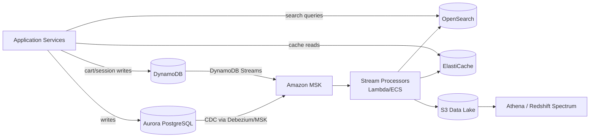
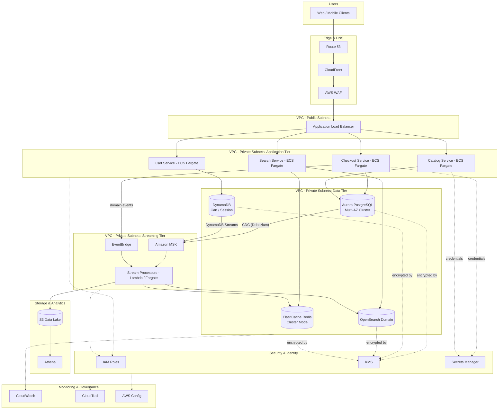

# Part VI – Data Platform Architectures

# Chapter 50: Multi-Database Architecture

---

## 1. Executive Summary

Modern enterprise applications rarely fit inside a single database engine.

A single relational database was the default choice for decades. It handled transactions, reporting, search, and caching all at once. That model breaks down once an application grows past a certain scale of traffic, data variety, and team size.

**The business problem.**

- Product teams need transactional consistency for orders, payments, and account balances.
- The same product needs millisecond-latency lookups for session data, shopping carts, and feature flags.
- Search and discovery teams need full-text and faceted search across catalog data.
- Analytics teams need to run large aggregations without slowing down production traffic.
- Some data is naturally graph-shaped (recommendations, fraud rings, org charts) and performs poorly in a row-store.
- Some data is naturally document-shaped (user profiles, configuration, event payloads) and forcing it into rigid relational schemas creates migration friction.

A single database engine can be tuned to do one or two of these things well. It cannot do all of them well simultaneously without significant compromise.

**The architecture objective.**

Multi-Database Architecture (sometimes called **Polyglot Persistence**) is the deliberate practice of selecting a different, purpose-built database engine for each distinct data access pattern inside a system, rather than forcing every workload through one general-purpose database.

- Use Amazon Aurora PostgreSQL/MySQL for transactional, strongly consistent, relational workloads.
- Use Amazon DynamoDB for high-throughput, low-latency, key-based access patterns.
- Use Amazon ElastiCache (Redis/Valkey) for caching, session storage, and leaderboards.
- Use Amazon OpenSearch Service for full-text search, log analytics, and faceted filtering.
- Use Amazon Neptune for graph traversal workloads such as recommendations and fraud detection.
- Use Amazon Timestream or Amazon Managed Service for Prometheus for time-series and metrics data.
- Use Amazon S3 combined with Athena/Redshift Spectrum for large-scale analytical workloads.

**Why organizations adopt this architecture.**

- **Right tool for the right job.** Every database engine makes internal trade-offs (consistency vs. availability, read latency vs. write throughput, flexible schema vs. strict schema). No single engine optimizes for every access pattern.
- **Independent scaling.** A traffic spike on the product catalog search path should not degrade checkout transaction latency. Separate engines mean separate scaling domains.
- **Team autonomy.** In a microservices organization, each service team can select the persistence technology that fits their domain, as long as it meets platform governance standards.
- **Reduced blast radius.** An operational incident, a runaway query, or a failed migration in one database does not necessarily bring down the entire platform.
- **Cost efficiency.** Storing large volumes of infrequently accessed data in DynamoDB (which charges for provisioned/on-demand throughput) is often far more expensive than storing the same data in S3 and querying it with Athena. Matching engine to access pattern controls cost as much as it controls performance.

**Major business benefits.**

| Benefit | Description |
|---|---|
| Performance | Each workload runs on an engine tuned for its access pattern, avoiding the "average case" compromise of a single database. |
| Scalability | Read-heavy, write-heavy, and analytical workloads scale independently without contention. |
| Resilience | A failure or performance degradation in one database does not cascade into every other domain. |
| Developer velocity | Teams are not forced to model graph data as adjacency-list tables or force full-text search through `LIKE '%term%'` queries. |
| Cost control | Storage and throughput costs are matched to the actual access pattern instead of over-provisioning one expensive engine for everything. |
| Compliance segmentation | Sensitive data domains (PII, PCI, PHI) can be isolated into dedicated database instances with tighter controls, without those controls taxing unrelated workloads. |

**Typical enterprise scenarios.**

- An e-commerce platform: Aurora PostgreSQL for orders and inventory, DynamoDB for shopping carts and session state, OpenSearch for product search, ElastiCache for pricing and promotion caching, Neptune for "customers who bought this also bought" recommendations.
- A fintech platform: Aurora PostgreSQL for ledger and account data (ACID transactions are non-negotiable), DynamoDB for high-volume event ingestion (fraud signals, device fingerprints), Timestream for transaction-rate metrics, OpenSearch for compliance and audit log search.
- A SaaS B2B platform: Aurora for tenant configuration and billing, DynamoDB for high-cardinality usage-metering events, ElastiCache for API rate-limiting counters, S3/Athena for the customer-facing analytics dashboard.
- A media/streaming platform: DynamoDB for watch-history and recommendations state, Aurora for subscription and billing, OpenSearch for content search, ElastiCache for trending content leaderboards.

**A critical framing for this chapter.**

> **Note:** Multi-Database Architecture is not "use every database engine AWS offers." It is the discipline of mapping each distinct access pattern to the smallest number of engines that satisfy it well, and resisting the temptation to add a new engine for every new feature request. Every additional database engine is additional operational surface area: additional monitoring, additional IAM policies, additional backup/DR procedures, additional on-call expertise, additional failure modes. The architecture earns its complexity only when the access patterns genuinely diverge enough that a single engine cannot serve them acceptably.

This chapter builds a complete, production-grade reference architecture around a polyglot persistence platform: an e-commerce-style system using Aurora PostgreSQL (transactional core), DynamoDB (high-throughput key-value), ElastiCache for Redis (caching/session), and OpenSearch (search), coordinated through an event-driven synchronization layer so that data written to the system of record propagates consistently to every downstream engine without introducing tight coupling between services.

---

## 2. Business Requirements

### 2.1 Business Drivers

- Support a product catalog and order-processing platform expected to scale from 500,000 to 25 million monthly active users over 24 months.
- Provide sub-100ms search response times across a catalog exceeding 5 million SKUs.
- Guarantee ACID transaction integrity for orders, payments, and inventory decrements.
- Provide sub-10ms cache-hit latency for session and pricing lookups.
- Support real-time personalization and recommendations without impacting transactional throughput.
- Maintain a single, auditable source of truth for financial and inventory data.

### 2.2 Functional Requirements

| Requirement | Description |
|---|---|
| Order processing | Create, update, and query orders with full ACID guarantees. |
| Inventory management | Decrement/reserve inventory atomically to avoid overselling. |
| Product search | Full-text, faceted, and filtered search across the catalog. |
| Session management | Store and retrieve shopping cart and session state with millisecond latency. |
| Recommendations | Serve "related products" and personalized recommendations. |
| Reporting | Support near-real-time operational dashboards without impacting OLTP performance. |
| Data synchronization | Propagate changes from the system of record to search and cache layers within seconds. |

### 2.3 Non-Functional Requirements

- **Availability:** 99.95% for the transactional path (checkout, payment), 99.9% for search and recommendations.
- **Latency:** p99 < 150ms for checkout API calls; p99 < 100ms for search queries; p99 < 10ms for cache reads.
- **Consistency:** Strong consistency required for financial and inventory writes; eventual consistency acceptable (with bounded staleness under 5 seconds) for search and recommendation data.
- **Durability:** No data loss for order and payment records (RPO of zero for the transactional store).
- **Auditability:** Every write to financial data must be traceable to a user, timestamp, and originating request.

### 2.4 Scalability Goals

- Transactional database: scale from 2,000 to 50,000 transactions per second at peak (e.g., flash sale events).
- Cache layer: scale from 10,000 to 500,000 reads per second.
- Search layer: scale from 500 to 20,000 queries per second with sub-second indexing lag.

### 2.5 Availability Requirements

- Multi-AZ deployment mandatory for every stateful component in the architecture.
- Zero single points of failure in the request path.
- Automated failover for the primary transactional database within 60 seconds.

### 2.6 Latency Requirements

| Path | Target (p99) |
|---|---|
| Checkout transaction write | < 150 ms |
| Product search query | < 100 ms |
| Cart read/write | < 10 ms |
| Recommendation lookup | < 50 ms |
| Order history read (reporting replica) | < 500 ms |

### 2.7 Compliance Requirements

- PCI DSS scope isolation for payment-card-adjacent data.
- Encryption at rest and in transit for all data stores.
- Data residency controls for customers in regulated jurisdictions.
- Immutable audit trail for all financial transactions (retained 7 years).

### 2.8 Security Expectations

- Least-privilege IAM roles per service, scoped to the specific database resource it needs.
- No shared database credentials between services.
- Network isolation between the transactional tier and public-facing services.
- Secrets rotated automatically with no application redeploy required.

### 2.9 Recovery Objectives

| Data domain | RPO | RTO |
|---|---|---|
| Orders / Payments (Aurora) | 0 seconds (synchronous multi-AZ) | < 60 seconds (automated failover) |
| Inventory (Aurora) | 0 seconds | < 60 seconds |
| Cart / Session (DynamoDB) | < 1 second (point-in-time recovery) | < 5 minutes |
| Search index (OpenSearch) | N/A (rebuildable from Aurora) | < 30 minutes (reindex) |
| Cache (ElastiCache) | N/A (rebuildable from source) | < 5 minutes |

### 2.10 SLAs

- 99.95% monthly uptime commitment for the checkout path, backed by AWS service SLAs (Aurora, DynamoDB, ElastiCache) and internal architecture redundancy.
- Search availability SLA of 99.9%, with graceful degradation to a cached "popular products" list if OpenSearch is unavailable.

### 2.11 Expected Workload

- Baseline: 3,000 requests/second across all services.
- Peak (promotional events): 45,000 requests/second, with search and cart traffic spiking disproportionately relative to checkout traffic.
- Write-heavy periods: end-of-day batch inventory reconciliation and nightly catalog re-index.

### 2.12 Expected Growth

- Catalog size: 5 million to 20 million SKUs over 3 years.
- Order volume: 2 million to 40 million orders per year over 3 years.
- Data volume in Aurora: approximately 8 TB at year one, growing to 40 TB by year three, driving the eventual introduction of read replicas and selective archival to S3.

---

## 3. Architecture Overview

### 3.1 Overall Design

The architecture is organized around a **system-of-record principle**: exactly one database owns the authoritative copy of each entity, and every other database that holds a copy of that data is a **read-optimized projection**, kept in sync through an event-driven pipeline rather than through direct dual-writes from application code.

| Entity | System of record | Read-optimized projections |
|---|---|---|
| Orders, payments, inventory | Aurora PostgreSQL | Reporting read replica, S3 (Athena) for historical analytics |
| Product catalog | Aurora PostgreSQL | OpenSearch (search index), ElastiCache (hot product cache) |
| Shopping cart / session | DynamoDB | ElastiCache (hot session cache, optional) |
| User click-stream / events | DynamoDB (short TTL) | Kinesis Data Streams → S3 data lake |
| Recommendations | Precomputed offline, stored in DynamoDB | — |

### 3.2 Architecture Philosophy

- **Single writer per entity.** Application services never write the same entity to two databases directly. They write to the system of record; propagation to other engines happens asynchronously through events.
- **CDC over dual-writes.** Change Data Capture (via Aurora + Amazon Managed Streaming for Apache Kafka (MSK) / DynamoDB Streams / Amazon EventBridge Pipes) removes the risk of partial-failure inconsistency inherent in application-level dual-writes.
- **Bounded staleness, not eventual chaos.** Every downstream projection has an explicit staleness SLA (typically 1–5 seconds) so that product and engineering teams can reason about consistency guarantees instead of treating "eventual consistency" as an open-ended promise.
- **Fail closed on the transactional core, fail open on projections.** If OpenSearch is degraded, search falls back to a cached top-sellers list rather than failing the page. If Aurora is degraded, checkout fails explicitly rather than accepting an order it cannot guarantee.

### 3.3 Core Components

- **Aurora PostgreSQL (Multi-AZ cluster):** transactional system of record for orders, payments, inventory, and catalog master data.
- **DynamoDB:** shopping cart, session state, and high-throughput event ingestion.
- **ElastiCache for Redis (Valkey-compatible):** hot-path caching for product detail pages, pricing, and rate limiting.
- **Amazon OpenSearch Service:** product search, faceted filtering, and operational log analytics.
- **Amazon MSK (Kafka) / DynamoDB Streams / Aurora CDC via Debezium on MSK Connect:** the synchronization backbone that propagates changes from the system of record to every projection.
- **Amazon EventBridge:** decouples domain events (OrderPlaced, InventoryReserved, ProductUpdated) from the services that react to them.
- **AWS Lambda / ECS Fargate consumers:** stream processors that apply changes to OpenSearch and invalidate/refresh ElastiCache entries.
- **Amazon S3 + Athena:** long-term analytical store fed by the same CDC stream, decoupled from the OLTP path entirely.

### 3.4 How Components Interact



### 3.5 High-Level Workflow

1. A customer action (e.g., updating a product, placing an order) is written synchronously to the system of record (Aurora or DynamoDB).
2. A change event is captured automatically (Aurora CDC via Debezium on MSK Connect, or native DynamoDB Streams).
3. The event lands on an MSK topic (or EventBridge, for lower-throughput domain events).
4. Stream processors consume the event and apply the corresponding update to OpenSearch (reindex) and ElastiCache (invalidate/refresh).
5. Analytical consumers write the same event to S3 in Parquet format for historical querying.
6. The application layer reads from the fastest appropriate source: cache first, then search index, and only falls through to Aurora for data that requires strong consistency (e.g., final price confirmation at checkout).

### 3.6 Request Lifecycle (Example: Product Search → Add to Cart → Checkout)

1. Client queries `/search?q=...` → routed to OpenSearch via the Search Service.
2. Client adds an item to cart → written directly to DynamoDB by the Cart Service (system of record for carts).
3. Client proceeds to checkout → Checkout Service reads current price and inventory availability directly from Aurora (bypassing cache, since checkout requires strong consistency) inside a database transaction.
4. Checkout Service commits the order and inventory decrement atomically in Aurora.
5. CDC pipeline propagates the inventory change to OpenSearch (to update "in stock" facets) and ElastiCache (to invalidate the stale product cache entry).

### 3.7 Response Lifecycle

- Search responses are served from OpenSearch with a target p99 latency under 100ms; results are annotated with cached pricing from ElastiCache to avoid a synchronous Aurora call on the search path.
- Cart responses are served directly from DynamoDB with single-digit-millisecond latency.
- Checkout responses require a synchronous round trip to Aurora and are the only path in the system permitted to have transactional dependency on the primary database.

### 3.8 Data Lifecycle

- **Hot data** (active carts, current pricing, live inventory) lives in DynamoDB, ElastiCache, and Aurora.
- **Warm data** (recent orders, last 90 days of catalog changes) remains queryable through Aurora read replicas and OpenSearch.
- **Cold data** (orders older than 18 months, historical clickstream) is archived to S3 in Parquet format and queried through Athena, removed from the OLTP engines to control cost and preserve transactional performance.

---

## 4. AWS Services Used

### 4.1 Amazon Aurora PostgreSQL

- **Purpose:** System of record for orders, payments, inventory, and catalog master data.
- **Why selected:** Aurora provides MySQL/PostgreSQL compatibility with up to 15 read replicas, storage that auto-scales up to 128 TiB, and sub-second failover via the Aurora Replica promotion mechanism. It gives full ACID transactional guarantees, which are non-negotiable for financial data.
- **Alternatives:** Amazon RDS for PostgreSQL (simpler, but lower replica ceiling and slower failover); self-managed PostgreSQL on EC2 (full control, but the team owns patching, backups, and failover logic).
- **Limitations:** Vertical write scaling is bounded by the largest available instance class; write throughput does not scale horizontally the way DynamoDB's does.
- **Pricing considerations:** Billed for compute (per-instance-hour), storage (per GB-month), I/O (per million requests, unless using I/O-Optimized), and backup storage beyond the free retention window.
- **Best practices:** Enable Aurora I/O-Optimized for I/O-heavy transactional workloads to get predictable pricing; use Aurora Auto Scaling for read replicas; enable Performance Insights.

### 4.2 Amazon DynamoDB

- **Purpose:** Shopping cart, session state, and high-throughput event ingestion.
- **Why selected:** Single-digit-millisecond latency at any scale, on-demand or provisioned throughput, native TTL for session expiry, and DynamoDB Streams for CDC-style propagation without operating a separate CDC pipeline for this data domain.
- **Alternatives:** ElastiCache for Redis as the primary cart store (faster, but not durable by default and requires separate persistence design); Aurora with a `sessions` table (simpler operationally, but does not scale to hundreds of thousands of writes/second economically).
- **Limitations:** No multi-item ACID transactions across partition keys beyond DynamoDB Transactions' 100-item limit; query flexibility is constrained by key design (access patterns must be modeled up front).
- **Pricing considerations:** On-demand mode is simplest for unpredictable traffic; provisioned mode with auto scaling is more cost-effective for stable, predictable baseline traffic.
- **Best practices:** Use single-table design for related entities accessed together; enable point-in-time recovery; use DynamoDB Streams with Lambda for downstream propagation instead of polling.

### 4.3 Amazon ElastiCache (Redis/Valkey)

- **Purpose:** Hot-path caching for product detail pages, computed pricing, and API rate limiting.
- **Why selected:** Sub-millisecond in-memory reads, rich data structures (sorted sets for leaderboards, hashes for object caching), and native support for cluster mode to scale beyond a single node's memory ceiling.
- **Alternatives:** DAX (DynamoDB Accelerator) if the cache is exclusively in front of DynamoDB; Amazon MemoryDB for Redis if durability guarantees stronger than ElastiCache's are required.
- **Limitations:** Data is not durable by default (replica failure can lose unpersisted writes); cluster resizing requires careful planning to avoid hot shards.
- **Pricing considerations:** Billed per node-hour by instance type; reserved nodes provide significant savings for steady-state baseline capacity.
- **Best practices:** Use cluster mode enabled for datasets that exceed single-node memory; set explicit TTLs on every cache key to bound staleness; never treat the cache as a system of record.

### 4.4 Amazon OpenSearch Service

- **Purpose:** Product search, faceted filtering, and operational log analytics.
- **Why selected:** Full-text search, relevance scoring, and aggregation-heavy faceted search are native strengths of OpenSearch; it also doubles as the platform's centralized log analytics engine, reducing the number of distinct engines operated.
- **Alternatives:** Amazon Kendra (if the requirement is natural-language enterprise search rather than faceted e-commerce search); Algolia or a similar SaaS search product (faster to integrate, but introduces a third-party data residency and cost dependency).
- **Limitations:** Not a system of record — it must always be rebuildable from Aurora; cluster resizing and shard rebalancing require operational care at scale.
- **Pricing considerations:** Billed per instance-hour for data and master nodes, plus EBS storage; UltraWarm and cold storage tiers reduce cost for infrequently queried historical data (primarily relevant for the log-analytics use case).
- **Best practices:** Separate dedicated master nodes from data nodes in production; use index aliases to enable zero-downtime reindexing; size shards to stay under 50 GB each.

### 4.5 Amazon MSK (Managed Streaming for Apache Kafka)

- **Purpose:** Durable, ordered, high-throughput backbone for propagating change events from Aurora and DynamoDB to every downstream projection.
- **Why selected:** MSK Connect with a Debezium PostgreSQL connector provides log-based CDC from Aurora with minimal impact on the source database, and Kafka's partitioned log model gives natural backpressure handling and replay capability that EventBridge alone does not provide at this throughput.
- **Alternatives:** Amazon Kinesis Data Streams (simpler operationally, weaker ecosystem support for CDC connectors); EventBridge Pipes directly from DynamoDB Streams for lower-throughput domains.
- **Limitations:** Operational complexity is materially higher than Kinesis or EventBridge; requires careful partition and consumer group design.
- **Pricing considerations:** Billed per broker-hour and storage; MSK Serverless removes capacity planning for variable workloads at a premium per-request cost.
- **Best practices:** Use MSK Serverless for unpredictable ingestion volume; enable encryption in transit and at rest; monitor consumer lag as the primary health signal for the synchronization pipeline.

### 4.6 AWS Lambda / Amazon ECS Fargate (Stream Processors)

- **Purpose:** Consume CDC/stream events and apply corresponding updates to OpenSearch, ElastiCache, and S3.
- **Why selected:** Lambda is well-suited to bursty, per-event processing (DynamoDB Streams triggers); Fargate-based Kafka consumers are better suited to sustained, high-throughput MSK consumption where long-lived connections and consumer group coordination matter.
- **Alternatives:** Kinesis Data Analytics / Apache Flink for complex stream transformations; AWS Glue streaming jobs for the S3 archival path.
- **Limitations:** Lambda has a 15-minute execution ceiling and cold-start considerations; Fargate consumers require their own scaling and deployment pipeline.
- **Best practices:** Use dead-letter queues for failed events; make all consumers idempotent since at-least-once delivery is the default guarantee.

### 4.7 Amazon EventBridge

- **Purpose:** Decouples coarse-grained domain events (`OrderPlaced`, `InventoryLow`, `ProductPublished`) from the services that react to them, separate from the fine-grained CDC stream on MSK.
- **Why selected:** Native AWS service integrations, schema registry, and simple rule-based routing make it ideal for business-level event fan-out without the operational overhead of Kafka for lower-throughput event types.
- **Alternatives:** Amazon SNS/SQS for simpler pub/sub without EventBridge's content-based routing and schema registry.
- **Best practices:** Use EventBridge for cross-domain business events; use MSK/DynamoDB Streams for high-throughput, fine-grained CDC.

### 4.8 Amazon S3 + Amazon Athena

- **Purpose:** Long-term, low-cost analytical store for historical orders, clickstream, and audit data.
- **Why selected:** Decouples analytical query load entirely from the OLTP engines; S3 storage cost is an order of magnitude lower than keeping the same data in Aurora or DynamoDB indefinitely.
- **Best practices:** Store data in Parquet with partitioning by date; use AWS Glue for schema management and catalog.

### 4.9 Supporting Services

| Service | Role |
|---|---|
| IAM | Least-privilege access boundaries per service, scoped to specific database resources. |
| VPC | Network isolation between public-facing, application, and data tiers. |
| KMS | Encryption key management for all data stores, with per-domain keys for PCI-scoped data. |
| Secrets Manager | Automatic rotation of database credentials, no application redeploy required. |
| CloudWatch | Metrics, logs, and alarms across every database engine and stream processor. |
| CloudTrail | Auditable record of every control-plane API call against the data platform. |
| AWS Config | Continuous compliance checks (e.g., encryption enabled, public access disabled). |
| Route 53 | DNS-based routing and health-check-driven failover for read endpoints. |

---

## 5. Complete Architecture Diagram



---

## 6. Component-by-Component Explanation

### 6.1 Aurora PostgreSQL Cluster

- **Purpose:** Authoritative system of record for orders, payments, and inventory.
- **Responsibilities:** Enforce referential integrity, run transactional writes, serve consistency-sensitive reads (checkout).
- **Inputs:** Writes from Checkout Service and Catalog Service.
- **Outputs:** Row-level change events emitted via logical replication to Debezium.
- **Scaling:** Vertical scaling of the writer instance; horizontal scaling of reads via up to 15 Aurora Replicas.
- **High availability:** Multi-AZ cluster with automated failover to a replica in a different AZ within seconds.
- **Failure handling:** Aurora automatically detects writer failure and promotes a replica; application layer uses the cluster (not instance) endpoint to avoid manual failover handling.
- **Dependencies:** KMS for encryption, Secrets Manager for credential rotation, VPC private subnets.
- **Security:** IAM database authentication for application roles where feasible; network access restricted to application-tier security groups only.
- **Monitoring:** Performance Insights, CloudWatch (CPU, IOPS, replica lag, connections), RDS Enhanced Monitoring.

### 6.2 DynamoDB (Cart / Session Table)

- **Purpose:** System of record for shopping cart and session state.
- **Responsibilities:** Serve millisecond-latency reads/writes; expire abandoned carts via TTL; emit stream events for downstream cache warming.
- **Inputs:** Writes from Cart Service.
- **Outputs:** DynamoDB Streams events consumed by stream processors.
- **Scaling:** On-demand capacity mode absorbs traffic spikes without pre-provisioning; provisioned mode with auto scaling for predictable baseline traffic.
- **High availability:** Data replicated across three AZs by default; optionally extended to Global Tables for multi-region.
- **Failure handling:** Fully managed; no failover action required from operators.
- **Dependencies:** IAM policies scoped to specific table/index ARNs, KMS for encryption at rest.
- **Security:** Fine-grained IAM condition keys restrict access to items owned by the requesting principal where applicable.
- **Monitoring:** CloudWatch (consumed capacity, throttled requests, system errors), DynamoDB Contributor Insights for hot-key detection.

### 6.3 ElastiCache for Redis (Cluster Mode Enabled)

- **Purpose:** Sub-millisecond cache for product detail pages, computed pricing, and rate-limit counters.
- **Responsibilities:** Absorb read traffic that would otherwise hit Aurora or OpenSearch directly; enforce TTL-bound staleness.
- **Inputs:** Cache-aside writes from application services and stream processors (on catalog/price change events).
- **Outputs:** Sub-millisecond reads to application services.
- **Scaling:** Horizontal scaling by adding shards in cluster mode; read scaling via read replicas per shard.
- **High availability:** Multi-AZ with automatic failover enabled per shard.
- **Failure handling:** Application layer treats cache misses as normal and falls through to Aurora/OpenSearch; cache is never a required dependency for correctness.
- **Dependencies:** KMS for encryption, VPC security groups restricting access to application tier.
- **Security:** Redis AUTH token plus TLS in transit; no public endpoint.
- **Monitoring:** CloudWatch (CPU, evictions, cache hit ratio, replication lag).

### 6.4 OpenSearch Domain

- **Purpose:** Product search and faceted filtering.
- **Responsibilities:** Serve full-text and structured queries with relevance ranking; maintain near-real-time index freshness from the CDC pipeline.
- **Inputs:** Bulk index/update requests from stream processors.
- **Outputs:** Query responses to Search Service.
- **Scaling:** Horizontal scaling by adding data nodes; shard count planned at index creation time (reindexing required to change shard count).
- **High availability:** Three dedicated master nodes across three AZs; data nodes distributed across the same AZs with zone awareness enabled.
- **Failure handling:** Automatic shard replica promotion on node failure; index snapshots to S3 for disaster recovery.
- **Dependencies:** KMS for encryption, fine-grained access control tied to IAM.
- **Security:** VPC-only access, no public endpoint, fine-grained access control for index-level permissions.
- **Monitoring:** CloudWatch (cluster status, JVM memory pressure, search/indexing latency), OpenSearch Dashboards for operational visibility.

### 6.5 Amazon MSK (CDC Backbone)

- **Purpose:** Durable, ordered transport of change events between the system of record and every projection.
- **Responsibilities:** Guarantee at-least-once delivery with ordering per partition key; buffer bursts so downstream consumers are never overwhelmed.
- **Inputs:** Debezium connector output from Aurora's logical replication slot; DynamoDB Streams events via Kinesis-compatible adapter or EventBridge Pipes.
- **Outputs:** Topic partitions consumed by stream processors.
- **Scaling:** Broker count and partition count scaled to sustained throughput; MSK Serverless removes manual capacity planning.
- **High availability:** Brokers spread across three AZs with replication factor of 3.
- **Failure handling:** Consumer group rebalancing on broker or consumer failure; replay from the last committed offset guarantees no event loss.
- **Dependencies:** KMS for encryption, VPC private subnets, IAM/SASL for client authentication.
- **Monitoring:** CloudWatch (consumer lag per partition, broker CPU/disk, under-replicated partitions).

### 6.6 Stream Processors (Lambda / Fargate Consumers)

- **Purpose:** Translate change events into engine-specific updates (OpenSearch bulk API calls, ElastiCache invalidations, S3 Parquet writes).
- **Responsibilities:** Idempotent application of each event; dead-letter routing for poison messages.
- **Scaling:** Lambda scales automatically per DynamoDB Streams shard; Fargate consumers scale via ECS Service Auto Scaling tied to consumer lag.
- **High availability:** Deployed across multiple AZs; Lambda is inherently multi-AZ.
- **Failure handling:** Exponential backoff retry, then dead-letter queue (SQS) with alerting for manual investigation.
- **Monitoring:** CloudWatch (invocation errors, duration, DLQ depth), custom metrics for propagation lag (time from source commit to projection update).

---

## 7. End-to-End Request Flow

**Scenario: customer searches for a product, adds it to cart, and checks out.**

1. Client sends `GET /search?q=running+shoes` to Route 53, resolved to CloudFront.
2. CloudFront forwards the request through AWS WAF to the internet-facing Application Load Balancer.
3. ALB routes the request to the Search Service task in the private application subnet.
4. Search Service queries OpenSearch for matching products with facet aggregations.
5. Search Service enriches results with live pricing from ElastiCache (cache-aside read).
6. Response returned to the client with product results and cached pricing.
7. Client sends `POST /cart/items` to add a product to their cart.
8. Request routed through the same edge/ALB path to the Cart Service.
9. Cart Service writes the cart item directly to DynamoDB (system of record for carts).
10. DynamoDB Streams emits a change event, consumed asynchronously by stream processors for analytics only (cart contents do not need to propagate to search or cache).
11. Client sends `POST /checkout`.
12. Checkout Service opens a database transaction against Aurora: locks the relevant inventory rows, verifies availability, decrements inventory, and inserts the order and payment records.
13. Transaction commits; Aurora's write-ahead log captures the change.
14. Debezium connector on MSK Connect reads the logical replication stream and publishes `OrderPlaced` and `InventoryUpdated` events to MSK.
15. EventBridge receives a coarser `OrderPlaced` domain event (published directly by Checkout Service) and fans it out to the Notification Service (order confirmation email) and the Fraud Detection Service.
16. Stream processors consume the MSK events: update the OpenSearch inventory facet for the affected SKU, and invalidate the ElastiCache entry for that product's pricing/availability.
17. Stream processors also write the order event to S3 in Parquet format for the analytics data lake.
18. CloudWatch captures latency and error metrics at every hop; any anomaly triggers an alarm.
19. If any step in the checkout transaction fails, Aurora rolls back the entire transaction, no partial state is written, and the Checkout Service returns an explicit error to the client rather than a degraded success.
20. Logging: every request is logged with a correlation ID from the ALB access log through to the Aurora query log and MSK event payload, enabling full request tracing.

---

## 8. Deployment Flow

### 8.1 Infrastructure Provisioning

- All infrastructure defined in Terraform, organized into modules per data engine (`aurora`, `dynamodb`, `elasticache`, `opensearch`, `msk`).
- Environments (dev, staging, production) use separate Terraform workspaces/state files with environment-specific `.tfvars`.

### 8.2 Terraform Workflow

1. `terraform plan` executed in CI on every pull request, with output posted as a PR comment for review.
2. Policy-as-code checks (e.g., Open Policy Agent / Checkov) validate the plan against security and cost guardrails before merge.
3. `terraform apply` executed only from the main branch by the CI/CD pipeline, never from a developer workstation, against production.
4. State stored in a versioned, encrypted S3 backend with DynamoDB-based state locking.

### 8.3 CI/CD Deployment

- Application services deployed independently of database infrastructure changes.
- Database schema migrations run as a distinct pipeline stage, gated by manual approval for production, using a migration tool (e.g., Flyway or Liquibase) that supports forward-only, reversible migrations.

### 8.4 Blue-Green Deployment

- Application tier: ECS blue/green deployments via CodeDeploy, shifting traffic gradually with automated rollback on CloudWatch alarm breach.
- Aurora schema changes: additive-only changes deployed first (new nullable columns, new tables); destructive changes (column drops, type changes) deployed only after all application versions depending on the old schema are fully retired — the classic **expand/contract** migration pattern.

### 8.5 Rollback

- Application rollback: automated via CodeDeploy on alarm breach (error rate, latency).
- Database rollback: schema migrations are written to be backward-compatible for at least one full deployment cycle, so a rollback of application code never requires a corresponding forward-incompatible schema rollback.

### 8.6 Secrets

- All database credentials stored in Secrets Manager with automatic rotation (Aurora native rotation Lambda, custom rotation Lambda for Redis AUTH token).
- Applications retrieve credentials at startup and on rotation notification; no credentials embedded in container images or environment variable files committed to source control.

### 8.7 Configuration

- Non-secret configuration (endpoint names, table names, index names) delivered via AWS Systems Manager Parameter Store, versioned and environment-scoped.

### 8.8 Validation

- Post-deployment smoke tests validate connectivity to every database engine, verify replication lag is within SLA, and confirm CDC consumer lag has not grown beyond threshold before marking a deployment successful.

---

## 9. Network Topology

### 9.1 VPC and CIDR

- Single VPC per environment, CIDR `10.20.0.0/16`, sized to accommodate three tiers across three Availability Zones with headroom for future subnet additions.

### 9.2 Subnet Layout

| Subnet type | Purpose | Example CIDR (per AZ) |
|---|---|---|
| Public | ALB, NAT Gateways | 10.20.0.0/24, 10.20.1.0/24, 10.20.2.0/24 |
| Private – Application | ECS Fargate tasks | 10.20.10.0/23, 10.20.12.0/23, 10.20.14.0/23 |
| Private – Streaming | MSK brokers, stream processors | 10.20.20.0/23, 10.20.22.0/23, 10.20.24.0/23 |
| Private – Data | Aurora, DynamoDB VPC endpoints, ElastiCache, OpenSearch | 10.20.30.0/23, 10.20.32.0/23, 10.20.34.0/23 |

### 9.3 NAT Gateway / Internet Gateway

- One Internet Gateway attached to the VPC for public subnet egress.
- One NAT Gateway per AZ (three total) to avoid a single-AZ dependency for private-subnet outbound traffic and to avoid cross-AZ data transfer charges on the NAT path.

### 9.4 Transit Gateway

- Used when this VPC must connect to shared services (CI/CD runners, centralized logging account) or additional application VPCs in a multi-account landing zone; not required for a single-VPC deployment.

### 9.5 Route Tables

- Public route table: default route to Internet Gateway.
- Private application/streaming/data route tables: default route to the NAT Gateway in the same AZ; explicit routes to VPC endpoints for S3, DynamoDB, and Secrets Manager to avoid unnecessary NAT traffic and cost.

### 9.6 Network ACLs

- Baseline stateless NACLs at the subnet level as a defense-in-depth layer; primary access control enforced through security groups.

### 9.7 Security Groups

| Security group | Inbound from | Purpose |
|---|---|---|
| `sg-alb` | Internet (443) via WAF | Public entry point |
| `sg-app` | `sg-alb` only | Application tier |
| `sg-aurora` | `sg-app`, `sg-streaming` | Database access restricted to application and CDC connector |
| `sg-dynamodb-endpoint` | `sg-app` | VPC endpoint access |
| `sg-elasticache` | `sg-app` | Cache access |
| `sg-opensearch` | `sg-app`, `sg-streaming` | Search and indexing access |
| `sg-msk` | `sg-streaming` | Kafka broker access restricted to consumers/producers |

### 9.8 PrivateLink / VPC Endpoints

- Gateway endpoints for S3 and DynamoDB (no additional cost, removes NAT dependency).
- Interface endpoints for Secrets Manager, KMS, CloudWatch Logs, and STS to keep all control-plane traffic off the public internet.

### 9.9 Hybrid Connectivity

- Not required for this reference deployment; if an on-premises data warehouse must consume the S3 data lake, Direct Connect or a site-to-site VPN would terminate at a Transit Gateway attached to this VPC.

---

## 10. Identity and Access

### 10.1 IAM Roles

- One IAM role per ECS service (Search, Cart, Checkout, Catalog), each scoped to only the database resources that service owns.
- One IAM role for the MSK Connect Debezium connector, scoped to read the Aurora replication slot and write to MSK topics only.
- One IAM role per stream processor Lambda, scoped to read from MSK/DynamoDB Streams and write to OpenSearch/ElastiCache/S3.

### 10.2 IAM Policies (Example)

```json

{
  "Version": "2012-10-17",
  "Statement": [
    {
      "Sid": "CartServiceDynamoDBAccess",
      "Effect": "Allow",
      "Action": [
        "dynamodb:GetItem",
        "dynamodb:PutItem",
        "dynamodb:UpdateItem",
        "dynamodb:DeleteItem",
        "dynamodb:Query"
      ],
      "Resource": [
        "arn:aws:dynamodb:us-east-1:123456789012:table/CartTable",
        "arn:aws:dynamodb:us-east-1:123456789012:table/CartTable/index/*"
      ]
    }
  ]
}

```

### 10.3 Resource Policies

- OpenSearch domain access policy restricted to the VPC's application and streaming security groups, with fine-grained access control layered on top for index-level permissions.

### 10.4 STS

- ECS tasks assume roles via task IAM roles (no long-lived credentials); temporary credentials refreshed automatically by the ECS agent.

### 10.5 Cross-Account Access

- In a multi-account landing zone, the analytics account assumes a read-only role into the production account to query the S3 data lake, scoped by an `sts:ExternalId` condition and restricted to the specific S3 prefix.

### 10.6 Least Privilege

- Every service IAM role is deny-by-default with an explicit allow-list of resource ARNs; wildcard resource permissions (`Resource: "*"`) are prohibited by Service Control Policy for the data-tier account.

### 10.7 Service Roles

- Separate service-linked roles for Aurora, DynamoDB, and OpenSearch snapshot/backup operations, distinct from application data-access roles.

### 10.8 Permission Boundaries

- Permission boundaries applied to all application-tier IAM roles, capping maximum possible permissions even if a role's policy is misconfigured, preventing privilege escalation into unrelated database domains.

---

## 11. Security Architecture

### 11.1 Encryption

- **At rest:** KMS customer-managed keys (CMKs) for Aurora, DynamoDB, ElastiCache, OpenSearch, and S3; a dedicated CMK for PCI-scoped tables/columns, separate from the general-purpose data-tier CMK.
- **In transit:** TLS enforced for all database connections (Aurora `rds.force_ssl`, Redis TLS, OpenSearch HTTPS-only, MSK TLS/SASL).

### 11.2 KMS

- Key rotation enabled annually at minimum; key policies restrict `kms:Decrypt` to the specific IAM roles that require it, not account-wide.

### 11.3 TLS / Certificate Manager

- ACM-issued certificates terminate TLS at CloudFront and the ALB; internal service-to-database TLS uses AWS-provided or ACM Private CA certificates.

### 11.4 WAF and Shield

- AWS WAF in front of CloudFront with managed rule groups (SQL injection, known bad inputs) plus custom rate-based rules on the search and checkout endpoints.
- AWS Shield Standard active by default; Shield Advanced considered once transaction volume justifies the additional DDoS response SLA.

### 11.5 Secrets Manager

- All database credentials, Redis AUTH tokens, and third-party API keys stored in Secrets Manager with automatic rotation; no plaintext secrets in Terraform state (marked as `sensitive` and sourced from Secrets Manager data sources).

### 11.6 GuardDuty / Inspector / Security Hub

- GuardDuty enabled account-wide, including RDS Protection and S3 Protection, to detect anomalous database access patterns.
- Inspector scans container images for the stream-processor and application services before deployment.
- Security Hub aggregates findings across GuardDuty, Inspector, and Config into a single compliance dashboard.

### 11.7 CloudTrail / AWS Config

- CloudTrail logs every control-plane API call (e.g., snapshot creation, IAM policy change) to a centralized, immutable logging account.
- AWS Config rules continuously verify: encryption enabled on every data store, no public accessibility on Aurora/OpenSearch/ElastiCache, and Secrets Manager rotation is active.

### 11.8 Zero Trust Considerations

- No implicit trust between the application tier and data tier based on network location alone; every database connection is authenticated (IAM database auth for Aurora where feasible, Redis AUTH, OpenSearch fine-grained access control).

### 11.9 Threat Model / Attack Vectors / Mitigations

| Attack vector | Mitigation |
|---|---|
| SQL injection against Aurora | Parameterized queries enforced at the ORM layer; WAF managed rules as defense in depth. |
| Credential leakage from source control | Secrets Manager only, pre-commit secret scanning, no `.env` files in repositories. |
| Overly broad IAM permissions | Permission boundaries, least-privilege policies, periodic IAM Access Analyzer review. |
| Cache poisoning (stale/incorrect pricing) | TTL-bound cache entries, explicit invalidation on price-change events, checkout always reads Aurora directly. |
| CDC pipeline tampering | MSK topic ACLs restrict producer access to the Debezium connector role only. |
| Data exfiltration via OpenSearch | VPC-only access, fine-grained index permissions, no public endpoint, query auditing enabled. |

---

## 12. High Availability

### 12.1 AZ Failures

- Every stateful component (Aurora, DynamoDB, ElastiCache, OpenSearch, MSK) is deployed across a minimum of three AZs; loss of a single AZ causes no customer-visible downtime.

### 12.2 Instance Failures

- Aurora: automated failover promotes a replica within seconds; ECS tasks are automatically replaced by the service scheduler on health-check failure.

### 12.3 Regional Failures

- Out of scope for the baseline architecture (addressed in Chapter 98, Multi-Region Active-Active); this reference architecture assumes single-region deployment with documented DR runbooks for regional failure (see Section 13).

### 12.4 Database Failures

- Aurora: writer failure triggers automatic replica promotion; DynamoDB and OpenSearch failures are handled transparently by the managed service; ElastiCache shard failure triggers automatic replica promotion within the shard.

### 12.5 Load Balancing

- ALB distributes traffic across all healthy ECS tasks in all AZs; target group health checks remove unhealthy tasks within the configured interval.

### 12.6 Health Checks

- ALB health checks validate application-level readiness (including a lightweight dependency check against Aurora and Redis) rather than just process liveness.

### 12.7 Failover

- Aurora cluster endpoint automatically redirects application connections to the newly promoted writer; applications use connection pooling with short-lived connections to avoid holding stale connections to a failed writer.

---

## 13. Disaster Recovery

### 13.1 Backup Strategy

| Data store | Backup mechanism | Frequency |
|---|---|---|
| Aurora | Automated snapshots + continuous backup (point-in-time recovery) | Continuous, 35-day retention |
| DynamoDB | Point-in-time recovery + on-demand backups before major changes | Continuous |
| OpenSearch | Automated snapshots to S3 | Hourly |
| ElastiCache | Not backed up (rebuildable from source of truth) | N/A |
| S3 data lake | Versioning + cross-region replication | Continuous |

### 13.2 Cross-Region Replication

- Aurora snapshots copied to a secondary region on a scheduled basis for the Pilot Light DR posture.
- S3 data lake bucket configured with Cross-Region Replication for compliance and analytics continuity.

### 13.3 DR Strategy: Pilot Light

- A minimal footprint of infrastructure (empty Aurora cluster from restored snapshot, OpenSearch domain definition, ECS task definitions) is maintained in the secondary region via Terraform, ready to scale up on activation.
- DynamoDB Global Tables optionally enabled for the Cart table to provide near-zero RPO for session data specifically, given its high write volume.

### 13.4 RPO / RTO Summary

| Data domain | RPO | RTO |
|---|---|---|
| Orders / Payments (Aurora) | < 5 minutes (cross-region snapshot cadence) | 2–4 hours (Pilot Light activation) |
| Cart (DynamoDB Global Tables, if enabled) | Seconds | Minutes |
| Search index (OpenSearch) | N/A | 30–60 minutes (reindex from Aurora post-failover) |

> **Warning:** A common architecture review mistake is failing to test the OpenSearch and ElastiCache rebuild procedure end-to-end. If Aurora is restored in a DR region but the reindexing pipeline has never been rehearsed at production data volume, the stated RTO is fiction. This procedure must be tested at least twice per year against a production-scale dataset.

---

## 14. Scalability

### 14.1 Horizontal Scaling

- ECS services scale horizontally based on CPU, memory, and custom metrics (request queue depth) via ECS Service Auto Scaling.
- DynamoDB scales horizontally natively; OpenSearch scales by adding data nodes; ElastiCache scales by adding shards in cluster mode.

### 14.2 Vertical Scaling

- Aurora writer instance class scaled vertically as sustained write throughput grows, with online instance-class modification during low-traffic maintenance windows.

### 14.3 Auto Scaling

- Aurora read replicas: Aurora Auto Scaling adds/removes replicas based on average CPU or connection count.
- DynamoDB: on-demand mode for unpredictable spikes; provisioned + auto scaling for steady-state cost efficiency.

### 14.4 Database Scaling

- Read scaling: Aurora read replicas absorb reporting and read-heavy traffic away from the writer.
- Write scaling: partitioned/sharded DynamoDB design absorbs high-cardinality write traffic that would overwhelm a relational writer.

### 14.5 Storage Scaling

- Aurora storage auto-scales up to 128 TiB with no manual intervention.
- S3 storage is effectively unbounded; lifecycle policies transition older Parquet partitions to Glacier Instant Retrieval for cost control.

### 14.6 Queue/Stream Scaling

- MSK partition count planned for 3–5x current peak throughput to allow consumer group scaling without a repartitioning event.

---

## 15. Performance Optimization

### 15.1 Caching

- Cache-aside pattern for product detail and pricing data in ElastiCache, TTL of 60 seconds for prices, 5 minutes for relatively static product attributes.

### 15.2 Compression / CDN

- CloudFront caches static product images and immutable API responses (e.g., category listings) at the edge, reducing origin load on the Search Service.

### 15.3 Database Optimization

- Aurora: appropriate indexing on `orders(customer_id, created_at)` and `inventory(sku)`, query plan review via `pg_stat_statements`, connection pooling via RDS Proxy to avoid connection exhaustion under load spikes.
- DynamoDB: single-table design with access-pattern-driven key schema to avoid hot partitions; use of DynamoDB Accelerator (DAX) considered for read-heavy cart lookups if latency requirements tighten further.

### 15.4 Connection Pooling

- Amazon RDS Proxy in front of Aurora to pool and multiplex connections from bursty ECS Fargate tasks, protecting the database from connection storms during scale-out events.

### 15.5 Concurrency / Async Processing

- Checkout remains synchronous end-to-end for correctness; all non-critical-path work (search indexing, cache warming, notifications, analytics) is fully asynchronous via the CDC/event pipeline.

---

## 16. Cost Optimization (FinOps)

### 16.1 Estimated Monthly Cost by Deployment Size

| Component | Small (baseline) | Medium (growth) | Enterprise (peak) |
|---|---|---|---|
| Aurora PostgreSQL (writer + 2 replicas) | $1,800 | $5,400 | $14,000 |
| DynamoDB (on-demand) | $600 | $3,200 | $12,000 |
| ElastiCache (cluster mode, 3 shards) | $900 | $2,700 | $7,500 |
| OpenSearch (3 data + 3 master nodes) | $2,200 | $5,800 | $16,000 |
| MSK (Serverless / provisioned) | $700 | $2,400 | $6,500 |
| Lambda / Fargate (stream processors) | $300 | $900 | $2,800 |
| S3 + Athena | $150 | $600 | $2,200 |
| Data transfer / NAT / CloudFront | $400 | $1,500 | $4,500 |
| **Estimated total** | **~$7,050** | **~$22,500** | **~$65,500** |

> **Note:** These figures are directional planning estimates, not quotes. Actual cost depends heavily on instance family choices, reserved capacity coverage, and regional pricing. Always validate against the AWS Pricing Calculator for the specific account and region.

### 16.2 Major Cost Drivers

- OpenSearch and Aurora dominate baseline cost due to always-on compute; DynamoDB and MSK costs scale more directly with traffic.
- Cross-AZ data transfer between the application tier and data tier is frequently underestimated during initial budgeting.

### 16.3 Optimization Opportunities

- **Reserved Instances / Savings Plans:** Apply to Aurora and OpenSearch baseline capacity (the portion of capacity that never scales down).
- **Spot:** Not applicable to stateful database engines; applicable to any batch reindexing or ETL compute running on Fargate Spot.
- **S3 lifecycle / storage classes:** Transition order history older than 90 days to S3 Infrequent Access, and older than 18 months to Glacier Instant Retrieval.
- **Rightsizing:** Quarterly review of Aurora instance CPU/memory utilization and OpenSearch data node utilization against actual peak, not provisioned headroom.
- **Cost allocation / tagging:** Every resource tagged with `service`, `environment`, `data-domain`, and `cost-center` to enable per-team chargeback.
- **Budgets / Cost Anomaly Detection:** AWS Budgets alert at 80%/100% of forecasted monthly spend per data domain; Cost Anomaly Detection flags unexpected spikes (e.g., a runaway OpenSearch reindex job) within hours rather than at month-end.

---

## 17. AI-Assisted Operations

### 17.1 Amazon Q

- Amazon Q Developer used to review Terraform modules for the data tier against AWS best practices before merge, and to accelerate writing Debezium connector configuration and OpenSearch index mapping definitions.
- Amazon Q in CloudWatch used to summarize anomalous CDC consumer-lag patterns during incident triage.

### 17.2 Bedrock

- Amazon Bedrock (with a foundation model such as Anthropic's Claude) used to power the platform's own recommendation-explanation feature and to assist internal engineers with natural-language querying of the Athena-backed analytics data lake, translating business questions into SQL for review before execution.

### 17.3 AI Troubleshooting / Log Analysis

- CloudWatch Logs Insights combined with a Bedrock-backed summarization step to condense large volumes of stream-processor error logs into a prioritized incident summary during an active event.

### 17.4 Capacity Planning / Architecture Review

- AI-assisted analysis of CloudWatch Aurora and OpenSearch utilization trends to project when the next instance-class upgrade or shard-count increase will be required, feeding directly into the quarterly capacity planning review.

### 17.5 AI-Generated Terraform / Documentation

- New database module scaffolding (e.g., adding a new DynamoDB table with standard tagging, encryption, and alarms) generated from an internal Terraform module template with AI assistance, then reviewed by a human engineer before merge — AI accelerates drafting, it does not replace review.

---

## 18. Terraform Implementation

### 18.1 Providers and Backend

```hcl

terraform {
  required_version = ">= 1.7.0"

  required_providers {
    aws = {
      source  = "hashicorp/aws"
      version = "~> 5.50"
    }
  }

  backend "s3" {
    bucket         = "acme-platform-tfstate-prod"
    key            = "data-platform/multi-database/terraform.tfstate"
    region         = "us-east-1"
    dynamodb_table = "terraform-state-lock"
    encrypt        = true
  }
}

provider "aws" {
  region = var.aws_region

  default_tags {
    tags = {
      Project     = "multi-database-architecture"
      Environment = var.environment
      ManagedBy   = "terraform"
    }
  }
}

```

### 18.2 Variables

```hcl

variable "environment" {
  description = "Deployment environment (dev, staging, production)"
  type        = string
}

variable "aws_region" {
  description = "AWS region for the data platform"
  type        = string
  default     = "us-east-1"
}

variable "vpc_id" {
  description = "VPC ID for the data tier"
  type        = string
}

variable "data_subnet_ids" {
  description = "Private subnet IDs for the data tier"
  type        = list(string)
}

variable "aurora_instance_class" {
  description = "Instance class for Aurora writer/reader instances"
  type        = string
  default     = "db.r6g.xlarge"
}

variable "aurora_replica_count" {
  description = "Number of Aurora read replicas"
  type        = number
  default     = 2
}

```

### 18.3 Aurora PostgreSQL Module (excerpt)

```hcl

resource "aws_rds_cluster" "aurora_pg" {
  cluster_identifier      = "acme-${var.environment}-orders-cluster"
  engine                  = "aurora-postgresql"
  engine_mode             = "provisioned"
  engine_version          = "15.4"
  database_name           = "orders"
  master_username         = "app_admin"
  manage_master_user_password = true
  master_user_secret_kms_key_id = aws_kms_key.data_tier.arn

  db_subnet_group_name    = aws_db_subnet_group.data_tier.name
  vpc_security_group_ids  = [aws_security_group.aurora.id]

  storage_encrypted       = true
  kms_key_id              = aws_kms_key.data_tier.arn

  backup_retention_period = 35
  preferred_backup_window = "03:00-04:00"

  deletion_protection     = true
  copy_tags_to_snapshot   = true

  enabled_cloudwatch_logs_exports = ["postgresql"]
}

resource "aws_rds_cluster_instance" "aurora_pg_instances" {
  count                = var.aurora_replica_count + 1
  identifier            = "acme-${var.environment}-orders-${count.index}"
  cluster_identifier    = aws_rds_cluster.aurora_pg.id
  instance_class        = var.aurora_instance_class
  engine                = aws_rds_cluster.aurora_pg.engine
  engine_version         = aws_rds_cluster.aurora_pg.engine_version
  performance_insights_enabled = true
  monitoring_interval    = 60
  monitoring_role_arn    = aws_iam_role.rds_monitoring.arn
}

```

### 18.4 DynamoDB Module (excerpt)

```hcl

resource "aws_dynamodb_table" "cart_table" {
  name         = "acme-${var.environment}-cart"
  billing_mode = "PAY_PER_REQUEST"
  hash_key     = "PK"
  range_key    = "SK"

  attribute {
    name = "PK"
    type = "S"
  }

  attribute {
    name = "SK"
    type = "S"
  }

  ttl {
    attribute_name = "expires_at"
    enabled        = true
  }

  stream_enabled   = true
  stream_view_type = "NEW_AND_OLD_IMAGES"

  point_in_time_recovery {
    enabled = true
  }

  server_side_encryption {
    enabled     = true
    kms_key_arn = aws_kms_key.data_tier.arn
  }
}

```

### 18.5 IAM Module (excerpt)

```hcl

data "aws_iam_policy_document" "cart_service_policy" {
  statement {
    sid    = "CartTableAccess"
    effect = "Allow"
    actions = [
      "dynamodb:GetItem",
      "dynamodb:PutItem",
      "dynamodb:UpdateItem",
      "dynamodb:DeleteItem",
      "dynamodb:Query",
    ]
    resources = [
      aws_dynamodb_table.cart_table.arn,
      "${aws_dynamodb_table.cart_table.arn}/index/*",
    ]
  }
}

resource "aws_iam_role_policy" "cart_service" {
  name   = "cart-service-dynamodb-access"
  role   = aws_iam_role.cart_service.id
  policy = data.aws_iam_policy_document.cart_service_policy.json
}

```

### 18.6 Outputs

```hcl

output "aurora_cluster_endpoint" {
  description = "Aurora cluster writer endpoint"
  value       = aws_rds_cluster.aurora_pg.endpoint
}

output "aurora_reader_endpoint" {
  description = "Aurora cluster reader endpoint"
  value       = aws_rds_cluster.aurora_pg.reader_endpoint
}

output "cart_table_stream_arn" {
  description = "DynamoDB Streams ARN for cart table"
  value       = aws_dynamodb_table.cart_table.stream_arn
}

```

### 18.7 Best Practices

- One module per data engine, composed together at the environment level; never a single monolithic Terraform file spanning every engine.
- `deletion_protection = true` on every production stateful resource, removed only through a documented, reviewed change.
- All secrets (`manage_master_user_password`) delegated to AWS-managed rotation rather than storing generated passwords in Terraform state.

---

## 19. AWS CLI Examples

### 19.1 Deployment / Validation

```bash

# Check Aurora cluster status and current writer instance

aws rds describe-db-clusters \
  --db-cluster-identifier acme-production-orders-cluster \
  --query 'DBClusters[0].[Status,Endpoint,ReaderEndpoint]'

# Verify DynamoDB Streams is enabled and check stream ARN

aws dynamodb describe-table \
  --table-name acme-production-cart \
  --query 'Table.StreamSpecification'

# Check OpenSearch domain health

aws opensearch describe-domain \
  --domain-name acme-production-search \
  --query 'DomainStatus.[Processing,ClusterConfig]'

```

### 19.2 Monitoring / Troubleshooting

```bash

# Check Aurora replica lag across all instances

aws cloudwatch get-metric-statistics \
  --namespace AWS/RDS \
  --metric-name AuroraReplicaLag \
  --dimensions Name=DBClusterIdentifier,Value=acme-production-orders-cluster \
  --start-time $(date -u -d '1 hour ago' +%Y-%m-%dT%H:%M:%S) \
  --end-time $(date -u +%Y-%m-%dT%H:%M:%S) \
  --period 300 \
  --statistics Maximum

# Check MSK consumer group lag for stream processors

aws kafka list-clusters --query 'ClusterInfoList[*].[ClusterName,State]'

# Check DynamoDB throttling events

aws cloudwatch get-metric-statistics \
  --namespace AWS/DynamoDB \
  --metric-name ThrottledRequests \
  --dimensions Name=TableName,Value=acme-production-cart \
  --start-time $(date -u -d '1 hour ago' +%Y-%m-%dT%H:%M:%S) \
  --end-time $(date -u +%Y-%m-%dT%H:%M:%S) \
  --period 300 \
  --statistics Sum

```

### 19.3 Cleanup

```bash

# Delete a non-production OpenSearch domain (never run against production without change approval)

aws opensearch delete-domain --domain-name acme-dev-search

# Disable deletion protection before a planned, approved teardown

aws rds modify-db-cluster \
  --db-cluster-identifier acme-dev-orders-cluster \
  --no-deletion-protection \
  --apply-immediately

```

---

## 20. CI/CD Integration

### 20.1 GitHub Actions (Terraform Plan/Apply)

```yaml

name: data-platform-terraform

on:
  pull_request:
    paths: ["infra/data-platform/**"]
  push:
    branches: [main]
    paths: ["infra/data-platform/**"]

jobs:
  plan:
    runs-on: ubuntu-latest
    steps:
      - uses: actions/checkout@v4
      - uses: hashicorp/setup-terraform@v3
      - run: terraform -chdir=infra/data-platform init
      - run: terraform -chdir=infra/data-platform plan -out=tfplan
      - name: Policy check
        run: checkov -d infra/data-platform --compact

  apply:
    if: github.ref == 'refs/heads/main'
    needs: plan
    runs-on: ubuntu-latest
    environment: production
    steps:
      - uses: actions/checkout@v4
      - uses: hashicorp/setup-terraform@v3
      - run: terraform -chdir=infra/data-platform init
      - run: terraform -chdir=infra/data-platform apply -auto-approve

```

### 20.2 Validation and Security Scanning

- Checkov / tfsec run on every pull request against the data-platform Terraform modules, blocking merge on high-severity findings (e.g., unencrypted storage, public access).
- Container image scanning (Amazon Inspector or Trivy) run against every stream-processor image before deployment.

### 20.3 Policy as Code

- Open Policy Agent (OPA) policies enforced in the pipeline: deny any Terraform plan that disables encryption, removes deletion protection on a production resource, or opens a security group to `0.0.0.0/0` on a database port.

### 20.4 Rollback

- Terraform: rollback is a forward `apply` of the previous known-good configuration from version control, never a manual state edit.
- Schema migrations: rollback scripts written and tested alongside every forward migration before it is approved for production.

---

## 21. Monitoring

### 21.1 CloudWatch Dashboards

- A unified "Data Platform Health" dashboard combining Aurora replica lag, DynamoDB throttles, ElastiCache hit ratio, OpenSearch cluster status, and MSK consumer lag on a single pane, since an incident in this architecture is rarely isolated to one engine.

### 21.2 Metrics

| Engine | Key metrics |
|---|---|
| Aurora | CPU utilization, replica lag, deadlocks, connection count, buffer cache hit ratio |
| DynamoDB | Consumed read/write capacity, throttled requests, system errors |
| ElastiCache | Cache hit ratio, evictions, CPU, replication lag |
| OpenSearch | Cluster status (green/yellow/red), JVM memory pressure, search/index latency |
| MSK | Consumer lag, under-replicated partitions, broker CPU/disk |

### 21.3 Tracing (X-Ray)

- AWS X-Ray traces every request from the ALB through each service to the specific database call, allowing a single request to be traced across Aurora, DynamoDB, and OpenSearch calls to pinpoint which engine introduced latency.

### 21.4 Alarms and SLIs/SLOs

| SLI | SLO | Alarm threshold |
|---|---|---|
| Checkout p99 latency | < 150ms | Alarm at 200ms sustained 5 min |
| Search p99 latency | < 100ms | Alarm at 150ms sustained 5 min |
| CDC propagation lag | < 5 seconds | Alarm at 15 seconds sustained 5 min |
| Aurora replica lag | < 100ms | Alarm at 1 second sustained 5 min |
| Error budget (checkout) | 99.95% monthly | Alert at 50% budget consumed |

---

## 22. Logging

### 22.1 Centralized Logging

- Aurora query logs, ECS application logs, and MSK broker logs all shipped to CloudWatch Logs, then forwarded to a centralized logging account via a subscription filter to S3 for long-term retention and Athena querying.

### 22.2 Retention

- CloudWatch Logs: 30-day hot retention for operational troubleshooting.
- S3 archive: 7-year retention for financial audit logs (orders, payments), aligned with compliance requirements; 1-year retention for general application logs.

### 22.3 Audit Logging

- Every write to the `orders` and `payments` tables captured via Aurora's audit logging extension (`pgaudit`), separate from the CDC stream used for downstream propagation, specifically for compliance review and forensic investigation.

---

## 23. Operational Excellence

### 23.1 Runbooks

- Documented runbooks for: Aurora failover verification, OpenSearch full reindex from Aurora, ElastiCache full cache warm-up, MSK consumer group reset after a poison-message incident.

### 23.2 Patch Management

- Aurora and OpenSearch minor version patching applied automatically during defined maintenance windows; major version upgrades planned as their own change with staging validation.

### 23.3 Incident Response

- On-call rotation covers the data platform as a single unit (not per-engine), since most real incidents in a polyglot architecture manifest as cross-engine symptoms (e.g., stale search results caused by a stuck CDC consumer).

### 23.4 Change Management

- Every schema migration and every Terraform change to a production data resource requires a peer-reviewed pull request and a documented rollback plan before merge.

---

## 24. Failure Scenarios

| # | Scenario | Symptoms | Root cause | Detection | Resolution | Prevention |
|---|---|---|---|---|---|---|
| 1 | Aurora writer failover | Brief connection errors, elevated latency | AZ or instance failure | RDS event notification, CloudWatch alarm | Automatic failover completes; verify application reconnects via cluster endpoint | Use cluster endpoint, not instance endpoint, in application config |
| 2 | CDC consumer lag spike | Search results stale, cache not invalidated | Stream processor under-provisioned or downstream OpenSearch slow | Consumer lag CloudWatch alarm | Scale stream processor concurrency; investigate OpenSearch indexing latency | Auto scaling tied to consumer lag metric |
| 3 | DynamoDB hot partition | Elevated latency/throttling on specific cart keys | Poor partition key design (e.g., popular promo code as key) | Contributor Insights, throttled request alarm | Redesign key to add distribution suffix | Access-pattern-driven key design review before launch |
| 4 | OpenSearch cluster yellow/red | Search failures or degraded relevance | Node failure, disk watermark breach | Cluster status alarm | Add capacity, free disk space, or replace failed node | Proactive disk-usage alerting at 70% threshold |
| 5 | ElastiCache node failure | Latency spike, cache miss storm | Node/AZ failure | CloudWatch node health alarm | Automatic replica promotion; monitor origin (Aurora) load during miss storm | Multi-AZ automatic failover enabled |
| 6 | Dual-write inconsistency | Search shows different price than checkout | Application code bypassed CDC pipeline and wrote directly to two stores | Data reconciliation job flags mismatch | Correct the offending code path; force reindex affected records | Architectural review gate prohibiting direct dual-writes |
| 7 | MSK broker disk full | Producer write failures | Retention/storage misconfiguration | Broker disk usage alarm | Expand storage, adjust topic retention | Capacity planning with headroom, disk-usage alerting |
| 8 | Debezium connector crash | CDC pipeline stalls entirely, no propagation | Connector task failure, schema change on source table | MSK Connect task status alarm | Restart connector task; verify replication slot not causing WAL bloat | Alert on Aurora WAL/replication slot growth |
| 9 | Poison message in stream | One consumer repeatedly fails and blocks partition | Malformed event payload | DLQ depth alarm | Route to DLQ, patch consumer to handle malformed input, replay from DLQ | Idempotent, defensive consumer coding standards |
| 10 | Secrets rotation failure | Application cannot connect to Aurora after rotation | Rotation Lambda misconfiguration | Secrets Manager rotation failure alarm | Manually complete rotation, restart affected tasks | Rotation tested in staging before enabling in production |
| 11 | Checkout transaction deadlock | Elevated error rate on order placement | Concurrent transactions locking rows in different order | Aurora deadlock CloudWatch metric | Application-level retry with backoff | Consistent row-locking order in transaction code |
| 12 | Cross-AZ NAT cost spike | Unexpected data transfer cost increase | Missing VPC endpoints, traffic routed through NAT unnecessarily | Cost Anomaly Detection alert | Add missing gateway/interface endpoints | Network topology review includes endpoint coverage check |
| 13 | Reindex job overwhelms OpenSearch | Search latency degrades during catalog-wide reindex | Reindex run without throttling during business hours | Search latency alarm | Throttle bulk indexing rate, schedule reindex during low-traffic window | Reindex runbook enforces rate limiting and maintenance window |
| 14 | DynamoDB TTL not clearing stale carts | Table size grows unexpectedly, cost increase | TTL attribute not set on all write paths | Table size growth trend in Cost Anomaly Detection | Backfill missing TTL attribute, audit write paths | Schema validation test ensures TTL attribute always set |
| 15 | Read replica lag causes stale reporting reads | Reporting dashboard shows outdated data | Replica under-provisioned relative to write volume | Replica lag alarm | Scale replica instance class | Capacity planning includes replica sizing for write growth |

---

## 25. Troubleshooting Guide

| Problem | Symptoms | Likely cause | Diagnosis | AWS CLI commands | Resolution |
|---|---|---|---|---|---|
| Checkout errors spike | 5xx on `/checkout` | Aurora connection exhaustion | Check RDS Proxy/connection metrics | `aws cloudwatch get-metric-statistics --namespace AWS/RDS --metric-name DatabaseConnections ...` | Scale RDS Proxy, review connection pool settings |
| Search results outdated | Product shows "in stock" after sellout | CDC pipeline lag or consumer failure | Check MSK consumer lag | `aws kafka list-clusters` then check consumer group via Kafka admin tooling | Restart/scale stream processor, verify DLQ empty |
| Cart items disappearing | Carts empty unexpectedly | TTL misconfiguration or accidental delete | Check DynamoDB Streams for delete events | `aws dynamodb describe-table --table-name acme-production-cart` | Correct TTL attribute logic, restore from PITR if needed |
| Slow search queries | p99 latency > 500ms | Shard imbalance or insufficient data nodes | Check OpenSearch cluster stats | `aws opensearch describe-domain --domain-name acme-production-search` | Add data nodes, rebalance shards |
| Cache stampede after deploy | Aurora CPU spikes right after deployment | Cache cleared/cold on deploy | Check ElastiCache hit ratio metric | `aws cloudwatch get-metric-statistics --namespace AWS/ElastiCache --metric-name CacheHitRate ...` | Pre-warm cache before cutover, stagger deployment |
| High AWS bill for data tier | Unexpected month-over-month increase | Missing VPC endpoints, over-provisioned OpenSearch, or runaway DynamoDB writes | Cost Explorer breakdown by service | `aws ce get-cost-and-usage ...` | Identify driver, apply rightsizing/endpoint fix from Section 16 |

---

## 26. Best Practices

1. Assign exactly one system of record per entity; every other copy is a projection.
2. Never allow application code to dual-write the same entity to two databases directly.
3. Propagate data between engines via CDC/event streams, not synchronous application-level fan-out.
4. Define an explicit staleness SLA for every projection and monitor it as a first-class metric.
5. Make every stream consumer idempotent; assume at-least-once delivery everywhere.
6. Use least-privilege IAM roles scoped to specific resource ARNs, never account-wide database access.
7. Encrypt every data store at rest with KMS customer-managed keys, and every connection in transit with TLS.
8. Rotate all database credentials automatically via Secrets Manager; never hardcode credentials.
9. Deploy every stateful component across a minimum of three Availability Zones.
10. Use the Aurora cluster endpoint, never the instance endpoint, in application configuration.
11. Put RDS Proxy in front of Aurora when connection counts are volatile (e.g., Fargate scale-out events).
12. Design DynamoDB partition keys around actual access patterns, not around convenience.
13. Set explicit TTLs on every cache entry; never treat a cache as durable storage.
14. Keep OpenSearch fully rebuildable from the system of record at all times.
15. Separate dedicated master nodes from data nodes in every production OpenSearch domain.
16. Size OpenSearch shards to remain under roughly 50 GB each.
17. Plan MSK partition counts for 3–5x current peak throughput to avoid repartitioning events.
18. Use the expand/contract pattern for schema migrations to keep rollbacks safe.
19. Tag every resource with service, environment, data-domain, and cost-center for FinOps visibility.
20. Apply Reserved Instances/Savings Plans to baseline (never-scaled-down) compute capacity only.
21. Use S3 lifecycle policies to age out historical OLTP data instead of retaining it indefinitely in Aurora/DynamoDB.
22. Test disaster recovery rebuild procedures (especially OpenSearch reindex) at production scale at least twice a year.
23. Alarm on CDC consumer lag as a primary platform health signal, not an afterthought.
24. Trace every request end-to-end with X-Ray across every database hop it touches.
25. Keep the checkout path's dependency graph as small as possible — synchronous dependency only on Aurora.
26. Fail open on non-critical projections (search, recommendations); fail closed on financial transactions.
27. Require peer review and a documented rollback plan for every production schema change.
28. Run policy-as-code checks in CI to block unencrypted or publicly accessible data resources before merge.
29. Separate audit logging (compliance) from CDC event streams (application propagation) — they serve different purposes.
30. Review the number of distinct database engines in use at least annually and retire any engine whose access pattern has converged with another.

---

## 27. Anti-Patterns

1. **Dual-writing from application code.** Writing to Aurora and OpenSearch in the same request handler without a transactional or event-driven guarantee — a partial failure leaves the two stores permanently inconsistent. Use CDC instead.
2. **Using DynamoDB as a relational database.** Modeling highly relational, ad-hoc-query-heavy data in DynamoDB forces awkward denormalization and expensive scatter-gather queries. Use Aurora for that data instead.
3. **Using Aurora as a cache.** Serving every read from the primary relational database instead of introducing ElastiCache creates unnecessary load and cost on the most expensive, hardest-to-scale-horizontally component.
4. **Treating ElastiCache as a system of record.** Storing data in Redis with no durable source of truth risks total data loss on a cache flush or node failure.
5. **No TTL on cache entries.** Cached data that never expires silently drifts from the source of truth, and customers see stale prices or inventory indefinitely.
6. **One database engine "because it's simpler."** Forcing search, caching, and transactional workloads all through Aurora because introducing new engines feels like overhead — this "simplicity" becomes a performance and scaling ceiling at moderate traffic.
7. **Adding a new database engine for every new feature.** The opposite failure: introducing Neptune for a single minor graph query instead of reusing an existing engine with acceptable performance. Every new engine is permanent operational burden.
8. **Skipping the DR rebuild rehearsal.** Assuming OpenSearch/ElastiCache can be rebuilt from Aurora in an emergency without ever having tested the procedure at scale — RTO estimates are meaningless until proven.
9. **Wildcard IAM permissions on database resources.** `dynamodb:*` on `Resource: "*"` used "to save time," creating a massive blast radius if any single service is compromised.
10. **No idempotency in stream consumers.** Assuming exactly-once delivery from MSK/DynamoDB Streams; a retried event silently double-applies a side effect (e.g., double-charging a promotional credit).
11. **Ignoring hot partitions in DynamoDB.** Using a low-cardinality attribute (e.g., a single popular promo code) as a partition key, causing severe throttling under load.
12. **Synchronous cross-database transactions.** Attempting to hold a transaction open across Aurora and DynamoDB simultaneously — these engines cannot participate in a single ACID transaction together.
13. **Using instance endpoints instead of cluster endpoints for Aurora.** Hardcoding a specific Aurora instance's endpoint bypasses automatic failover redirection entirely.
14. **No connection pooling in front of Aurora.** Fargate tasks scaling out rapidly and opening new raw connections directly against Aurora, exhausting `max_connections` during a traffic spike.
15. **Running full catalog reindexing during business hours without throttling.** Saturating OpenSearch's indexing capacity and degrading live search traffic.
16. **Storing PCI-scoped data unencrypted or without column-level isolation.** Mixing payment card data into general-purpose tables without a dedicated encryption key and access boundary.
17. **No monitoring on CDC pipeline lag.** Treating the synchronization pipeline as "fire and forget" until customers report stale search results.
18. **Manually editing Terraform state to "fix" drift.** Masking a real infrastructure problem instead of reconciling configuration properly, risking future `apply` operations destroying resources unexpectedly.
19. **Retaining OLTP data indefinitely in Aurora "just in case."** Never archiving to S3, causing storage costs and backup/restore times to grow unbounded.
20. **No explicit staleness SLA for projections.** Leaving "eventually consistent" completely undefined, so product and support teams cannot distinguish expected lag from a genuine incident.

---

## 28. Alternatives

### 28.1 Alternative 1: Single Aurora PostgreSQL Instance (with extensions)

- **Advantages:** Operational simplicity, single engine to monitor/patch/back up, strong native transactional consistency, PostgreSQL full-text search (`tsvector`) can serve modest search needs.
- **Disadvantages:** Full-text search quality and relevance tuning fall well short of a dedicated search engine at catalog sizes above roughly 1 million SKUs; no sub-millisecond caching tier; a single write bottleneck for all workload types.
- **Cost:** Lower baseline cost, but write scaling requires progressively larger (and more expensive) single instances.
- **Operational complexity:** Lowest of all alternatives.
- **Security:** Simplest to secure (one engine, one set of controls).
- **Performance:** Acceptable at small-to-medium scale; degrades under combined transactional and search/analytical load.

### 28.2 Alternative 2: Single DynamoDB Table for Everything

- **Advantages:** Extreme horizontal scalability and low operational overhead for well-modeled access patterns.
- **Disadvantages:** Poor fit for ad-hoc relational queries and complex joins (e.g., financial reporting); full-text search requires an external engine regardless.
- **Cost:** Can be very cost-effective for pure key-value access; expensive if used for scan-heavy analytical queries.
- **Operational complexity:** Low for the engine itself, but application-level query logic complexity increases significantly.
- **Security:** IAM-native, fine-grained, generally strong.
- **Performance:** Excellent for key-based access; poor for ad-hoc analytical queries.

### 28.3 Alternative 3: Managed SaaS Search (Algolia/Elastic Cloud) instead of Self-Managed OpenSearch

- **Advantages:** Faster time-to-market, less operational burden for search-specific tuning.
- **Disadvantages:** Third-party data residency and compliance review required; recurring per-query or per-record SaaS pricing can exceed self-managed OpenSearch cost at scale; less native integration with the rest of the AWS security/IAM model.
- **Cost:** Often higher at scale; simpler to budget at small scale.
- **Operational complexity:** Lower for the team, shifted to the vendor.
- **Security:** Requires careful data-residency and third-party risk review.
- **Performance:** Generally excellent, purpose-built for search.

### 28.4 Alternative 4: Data Lakehouse-First (S3 + Iceberg/Redshift for everything, including near-real-time)

- **Advantages:** Excellent for analytics and reporting at massive scale; unifies storage cost.
- **Disadvantages:** Not suited to sub-100ms transactional or interactive-search latency requirements; not a substitute for the OLTP core.
- **Cost:** Very cost-efficient for large historical datasets.
- **Operational complexity:** Moderate; different skill set (data engineering) than OLTP database administration.
- **Security:** Strong via Lake Formation governance.
- **Performance:** Poor fit for the transactional/cart/search paths described in this chapter; excellent for the analytics path already included as a complementary component.

### 28.5 Alternative 5: NewSQL / Distributed SQL (e.g., Amazon Aurora Limitless Database, or a third-party distributed SQL engine)

- **Advantages:** Horizontally scalable writes with relational semantics, reducing the need for a separate DynamoDB tier for some high-throughput use cases.
- **Disadvantages:** Newer technology with a smaller operational knowledge base across most engineering teams; not all PostgreSQL/MySQL features and extensions are supported identically.
- **Cost:** Comparable to or higher than standard Aurora depending on scale.
- **Operational complexity:** Moderate to high while the team builds operational maturity with the technology.
- **Security:** Comparable to standard Aurora given AWS-native integration.
- **Performance:** Strong for write-heavy relational workloads that would otherwise force a move to DynamoDB purely for write scale.

### 28.6 Decision Summary

| Alternative | Best fit when |
|---|---|
| Single Aurora instance | Early-stage product, catalog under ~500K SKUs, team of 1-5 engineers, cost-sensitive |
| Single DynamoDB table | Access patterns are simple and well-understood up front, minimal ad-hoc reporting needs |
| Managed SaaS search | Search is the core differentiator and the team wants to avoid operating a search cluster |
| Lakehouse-first | Primary workload is analytical/batch, not interactive/transactional |
| Distributed SQL | Write throughput exceeds what a single Aurora writer can sustain, but relational semantics remain valuable |
| **This chapter's Multi-Database Architecture** | **Distinct access patterns (transactional, key-value, cache, search) each operate at meaningful scale and independent SLAs** |

---

## 29. Real Enterprise Case Study

**Company profile: Meridian Home & Garden**

- Mid-market e-commerce retailer, $340M annual revenue, catalog of 2.1 million SKUs across home goods and garden supplies.
- Prior architecture: a single, large Amazon RDS for PostgreSQL instance handling orders, catalog, search (via `ILIKE` queries), and session state.

**Business problem.**

- During seasonal promotional events, search page latency degraded to over 3 seconds, and checkout error rates rose above 2% due to database CPU saturation from concurrent search and transactional load competing for the same instance.
- Engineering leadership had already vertically scaled the RDS instance to the largest available class, with no further vertical scaling headroom.

**Architecture decisions.**

- Adopted the polyglot pattern described in this chapter: Aurora PostgreSQL retained as the transactional core (orders, inventory, catalog master data), DynamoDB introduced for cart/session, ElastiCache introduced for pricing/product cache, and OpenSearch introduced for search, connected via an MSK-based CDC pipeline using Debezium.
- Deliberately did not introduce Neptune or Timestream at this stage — the architecture review board determined that recommendation and metrics use cases could be served adequately by precomputed DynamoDB tables and CloudWatch, respectively, avoiding two additional engines that would not have earned their operational cost yet.

**Migration.**

- Phase 1: Stood up Aurora as a drop-in replacement for the existing RDS instance with minimal application changes, establishing the new baseline system of record.
- Phase 2: Built the CDC pipeline and OpenSearch index in parallel with the existing `ILIKE`-based search, running both in shadow mode and comparing relevance and latency for four weeks before cutover.
- Phase 3: Migrated cart/session logic to DynamoDB behind a feature flag, rolled out to 5% of traffic, then ramped to 100% over two weeks while monitoring error rates.
- Phase 4: Decommissioned the legacy search code path and the session tables in the relational database.

**Challenges.**

- Initial DynamoDB partition key design caused hot-partition throttling during a flash sale because a promotional campaign ID was briefly used as part of the key; corrected within 48 hours by adding a randomized suffix and a lookup pattern.
- The Debezium connector required a schema-change runbook, since an uncoordinated `ALTER TABLE` on Aurora during a demo initially stalled the CDC pipeline for 40 minutes.

**Lessons learned.**

- Shadow-mode validation before cutover caught relevance-quality gaps in the initial OpenSearch mapping that would have been customer-visible if launched directly.
- The architecture review board's discipline in *not* adding every available AWS database engine kept the operational team's on-call load manageable through the migration.

**Results.**

- Search p99 latency reduced from 3.1 seconds to 85 milliseconds during peak promotional traffic.
- Checkout error rate during peak events reduced from 2.1% to 0.03%.
- Overall data-tier infrastructure cost increased by approximately 35% compared to the single large RDS instance, but was offset by a measured 2.4% increase in checkout conversion rate attributable to faster search and more reliable checkout.

---

## 30. Architecture Decision Record (ADR)

**Title:** Adopt Polyglot Persistence for the Core E-Commerce Platform

**Status:** Accepted

**Context.**

- The platform's single relational database can no longer serve transactional, search, and caching workloads simultaneously at required latency and availability targets under peak promotional traffic.
- Vertical scaling of the existing database has reached its practical ceiling.

**Decision.**

- Adopt a multi-database architecture: Aurora PostgreSQL as the transactional system of record, DynamoDB for cart/session, ElastiCache for hot-path caching, and OpenSearch for product search, synchronized via an MSK-based CDC pipeline with Debezium.

**Alternatives considered.**

- Continue vertically scaling the single relational database (rejected: no further scaling headroom, does not solve search relevance quality).
- Adopt a fully managed SaaS search product instead of OpenSearch (rejected: data residency review would have added unacceptable delay to the migration timeline; revisit in 18 months).
- Adopt a distributed SQL engine for everything (rejected: team lacked operational experience with the technology; revisit if write throughput requirements exceed Aurora's ceiling).

**Consequences.**

- Positive: independent scaling per workload, improved latency and availability, reduced blast radius per incident.
- Negative: increased operational surface area (five distinct engines instead of one), requires new CDC pipeline expertise, higher baseline infrastructure cost.

**Risks.**

- CDC pipeline becomes a new single point of coordination failure; mitigated by consumer-lag alerting and a documented reindex runbook.
- Team must build new operational expertise in Kafka/MSK; mitigated by a three-month training and shadow-operations period before full cutover.

**Review date.**

- Scheduled review in 12 months to assess whether any engine's access pattern has converged sufficiently to consolidate, and whether write throughput trends justify evaluating a distributed SQL alternative for the transactional core.

---

## 31. Architecture Review Checklist

**Security**
- [ ] Every data store encrypted at rest with a KMS customer-managed key.
- [ ] TLS enforced on every database connection.
- [ ] No database resource has a public endpoint.
- [ ] IAM policies scoped to specific resource ARNs, no wildcards.
- [ ] Secrets Manager rotation enabled and tested for every credential.

**Networking**
- [ ] Every stateful component deployed across three or more AZs.
- [ ] VPC endpoints configured for S3, DynamoDB, Secrets Manager, and KMS.
- [ ] Security groups follow least-privilege, source-restricted rules.

**Operations**
- [ ] Runbooks exist and have been rehearsed for: Aurora failover, OpenSearch reindex, ElastiCache warm-up, MSK consumer reset.
- [ ] On-call coverage spans the full data platform, not siloed per engine.
- [ ] Schema migrations follow the expand/contract pattern.

**Performance**
- [ ] Latency SLOs defined and monitored per workload path (checkout, search, cart).
- [ ] Connection pooling (RDS Proxy) in place in front of Aurora.
- [ ] Cache hit ratio monitored and TTLs reviewed against staleness requirements.

**Scalability**
- [ ] DynamoDB partition key design validated against actual access patterns.
- [ ] MSK partition count sized for 3–5x current peak throughput.
- [ ] Aurora read replica count sized for projected read growth.

**Reliability**
- [ ] CDC consumer lag monitored and alarmed as a primary platform health signal.
- [ ] Every stream consumer is idempotent.
- [ ] DR rebuild procedure tested at production scale within the last 6 months.

**Cost**
- [ ] Every resource tagged for cost allocation by service, environment, and data domain.
- [ ] Reserved capacity applied to baseline (non-elastic) compute.
- [ ] S3 lifecycle policies in place for historical OLTP data archival.

**Compliance**
- [ ] PCI-scoped data isolated with dedicated encryption keys and access boundaries.
- [ ] Audit logging enabled and retained per regulatory requirement.
- [ ] Data residency requirements validated for every data store and its cross-region replicas.

---

## 32. Summary

**Business value.**

- Multi-Database Architecture allows each distinct workload — transactional, key-value, caching, and search — to run on a purpose-built engine, delivering independent scalability, improved latency, and reduced blast radius compared to forcing every access pattern through a single general-purpose database.

**Key architecture decisions.**

- Establish a single system of record per entity; every other database holding a copy is an explicitly bounded-staleness projection.
- Synchronize data between engines through event-driven CDC, never through application-level dual-writes.
- Keep the transactional core's dependency graph minimal and fail closed; let non-critical projections fail open with graceful degradation.

**Lessons learned.**

- The discipline of *not* adding a database engine for every new feature is as important as the discipline of choosing the right engine when one is genuinely needed.
- CDC pipeline health (consumer lag) deserves first-class monitoring status equal to the databases it connects.
- DR is only as real as its last successful, full-scale rehearsal.

**When to use.**

- Distinct access patterns (transactional, key-value, cache, search, and potentially graph/time-series) each operate at meaningful scale, with independent latency and availability requirements, and a team with the operational maturity to run multiple engines.

**When not to use.**

- Early-stage products with modest scale, a small engineering team, or access patterns that a single well-tuned relational database can still serve within latency and availability targets. Introduce additional engines only when a specific, measured access pattern genuinely requires it.

---

## 33. Further Reading

- AWS Well-Architected Framework — Data pillar guidance across the Reliability, Performance Efficiency, and Cost Optimization pillars.
- AWS Whitepaper: "Building Scalable and Resilient Web Applications" — foundational patterns referenced throughout this chapter's HA/DR sections.
- Amazon Aurora User Guide — official documentation on cluster architecture, failover behavior, and I/O-Optimized storage.
- Amazon DynamoDB Developer Guide — single-table design patterns and partition key best practices.
- Amazon OpenSearch Service Developer Guide — index design, shard sizing, and fine-grained access control.
- Amazon MSK Developer Guide and the Debezium PostgreSQL Connector documentation — CDC pipeline design references.
- Terraform AWS Provider Documentation (registry.terraform.io) — module reference for every resource used in Section 18.
- Related chapters in this series: Chapter 43 (Relational Database), Chapter 44 (Aurora Global Database), Chapter 45 (DynamoDB), Chapter 96 (Observability Platform), Chapter 97 (FinOps Architecture), Chapter 98 (Multi-Region Active-Active).

---

## 34. Architect's Corner

### Why This Architecture Exists

- Experienced architects arrive at polyglot persistence not by preference for complexity, but because they have personally watched a single database become the platform's ceiling — CPU-bound by search queries competing with checkout transactions, or storage-bound by session data that never should have lived in a relational table in the first place.
- Simpler single-database designs fail predictably at a specific inflection point: the moment two or more access patterns on the same engine begin to compete for the same finite resource (CPU, I/O, lock contention) during peak load, rather than failing gradually.
- The requirements that drive this evolution are almost always the same three: search relevance quality that a relational `LIKE` query cannot provide at scale, session/cart write volume that would be economically absurd on a relational writer, and a latency SLA on the hot path that a general-purpose engine cannot guarantee under mixed load.

### When You SHOULD Choose This Architecture

- Mid-market to enterprise organizations with catalog/data volume in the millions of records and traffic patterns that include distinct, independently-scaling workloads (search-heavy browsing vs. write-heavy checkout).
- Engineering organizations with dedicated platform/data engineering capacity — this is not a pattern for a five-person startup team without dedicated infrastructure ownership.
- Businesses where search quality or cart/session latency is a measurable driver of conversion, justifying the added investment.
- Organizations with compliance requirements (PCI, financial audit) that benefit from isolating transactional data from broader read/search infrastructure.

### When You Should NOT Choose This Architecture

- Early-stage products validating product-market fit — the operational overhead of five engines will slow iteration speed far more than it improves customer experience at this stage.
- Teams without dedicated platform engineering capacity to own CDC pipeline health, multi-engine monitoring, and cross-engine incident response.
- Budget-constrained deployments where a single well-indexed Aurora instance with PostgreSQL full-text search can still meet latency and availability targets.
- Data volumes and traffic where a single database's vertical scaling headroom has not yet been exhausted — premature adoption here is pure overhead.

### Hidden Trade-offs

- **Operational complexity** compounds non-linearly, not linearly, with each additional engine — five engines is not "five times the work" of one engine, it is meaningfully more due to cross-engine failure interactions.
- **Unexpected cloud costs** appear most often in cross-AZ data transfer between the application tier and each data engine, and in over-provisioned OpenSearch/MSK capacity sized for peak rather than actual sustained load.
- **Troubleshooting difficulty** increases because a single customer-visible symptom (stale search result) can originate in the application, the CDC connector, MSK, or the OpenSearch indexing pipeline — tracing requires correlation IDs threaded through every hop.
- **Deployment complexity** requires careful sequencing (expand/contract schema changes) that a single-database team rarely has to think about.
- **Learning curve** for Kafka/MSK operations specifically is steep for teams whose prior experience is entirely relational-database-centric.
- **Maintenance burden** includes keeping five sets of engine-specific best practices, patching schedules, and upgrade paths current simultaneously.

### Common Architecture Review Questions

1. Why is Aurora the system of record for orders instead of DynamoDB?
2. Why not use DynamoDB for the entire platform and avoid the relational engine altogether?
3. Why introduce Kafka/MSK instead of relying solely on DynamoDB Streams and EventBridge?
4. How is data consistency guaranteed between Aurora and OpenSearch, given they are never in a single transaction?
5. What is the maximum acceptable staleness for search results, and how is it enforced?
6. How are dual-writes prevented at the application code level?
7. What happens to checkout if OpenSearch or ElastiCache is completely unavailable?
8. What happens to search if Aurora is temporarily unavailable?
9. How is PCI-scoped data isolated from the general catalog and search infrastructure?
10. How are secrets rotated for each of the five database engines without application downtime?
11. What is the tested RTO for rebuilding OpenSearch from Aurora after a regional failure?
12. How is DynamoDB partition key design validated against real access patterns before launch?
13. What is the current MSK partition count relative to projected peak throughput?
14. How is CDC consumer lag monitored, and what is the alerting threshold?
15. What is the process for a schema change on a table with an active Debezium CDC connector?
16. How is cost allocated across teams that share this multi-engine platform?
17. Why three dedicated OpenSearch master nodes instead of a smaller cluster without dedicated masters?
18. What is the on-call model — one rotation for the whole data platform, or per-engine?
19. How is compliance/audit logging kept separate from the CDC event pipeline?
20. Under what conditions would the team consolidate two of these engines back into one?

### Production Pitfalls

1. **Problem:** Dual-writing from application code during an initial migration phase. **Business impact:** Customer-visible price/inventory discrepancies. **Technical impact:** Permanent data drift between Aurora and OpenSearch. **Solution:** Enforce CDC-only propagation from day one, even during migration.
2. **Problem:** No idempotency in stream consumers. **Business impact:** Duplicate promotional credits applied to customer accounts. **Technical impact:** Silent data corruption from retried events. **Solution:** Design every consumer to be safely re-runnable against the same event.
3. **Problem:** DynamoDB hot partition from a poorly chosen key. **Business impact:** Cart failures during the platform's highest-revenue moments (flash sales). **Technical impact:** Throttled requests cascade into elevated application error rates. **Solution:** Model partition keys against measured access patterns, not assumed ones.
4. **Problem:** OpenSearch reindex run without rate limiting during business hours. **Business impact:** Degraded search experience during a routine maintenance task. **Technical impact:** Search latency SLO breach. **Solution:** Runbook-enforced throttling and maintenance-window scheduling for bulk operations.
5. **Problem:** No monitoring on CDC consumer lag. **Business impact:** Customers report stale inventory before the platform team notices. **Technical impact:** No leading indicator of pipeline health. **Solution:** Treat consumer lag as a tier-1 alarm, equal in priority to database CPU.
6. **Problem:** Wildcard IAM permissions "temporarily" left in place after a migration. **Business impact:** Expanded breach blast radius. **Technical impact:** Fails every subsequent security audit. **Solution:** Permission boundaries and scheduled IAM Access Analyzer review.
7. **Problem:** No connection pooling in front of Aurora. **Business impact:** Checkout outage during a traffic spike. **Technical impact:** `max_connections` exhaustion from rapid Fargate scale-out. **Solution:** RDS Proxy in front of every application-tier connection.
8. **Problem:** Cache TTLs set too long "to reduce database load." **Business impact:** Customers see incorrect promotional pricing. **Technical impact:** Cache staleness exceeds business tolerance. **Solution:** Set TTLs based on the business staleness tolerance, not database load convenience.
9. **Problem:** DR rebuild procedure never tested at full scale. **Business impact:** Extended outage during an actual regional event, contradicting the documented RTO. **Technical impact:** Reindex takes far longer than planned against real data volume. **Solution:** Biannual full-scale DR rehearsal, non-negotiable.
10. **Problem:** Schema migration breaks the Debezium connector. **Business impact:** Silent CDC pipeline stall, discovered hours later via customer complaints. **Technical impact:** Search/cache go stale platform-wide. **Solution:** Schema-change runbook with connector-compatibility checklist and staging validation.
11. **Problem:** No cost allocation tagging across the five engines. **Business impact:** FinOps cannot attribute spend to the responsible team, delaying accountability. **Technical impact:** Cost anomalies go unnoticed longer. **Solution:** Mandatory tagging enforced by policy-as-code at deploy time.
12. **Problem:** ElastiCache treated as durable storage for a "temporary" feature. **Business impact:** Data loss on a routine node failure. **Technical impact:** Feature breaks in production with no recovery path. **Solution:** Architectural review gate: no feature may treat cache as its only copy of data.
13. **Problem:** OpenSearch shard count fixed too small at index creation. **Business impact:** Search performance degrades as catalog grows, requiring a disruptive full reindex to correct. **Technical impact:** Shard rebalancing limitations at scale. **Solution:** Size shard count for projected 18–24 month growth, not current volume.
14. **Problem:** MSK under-provisioned on partition count at launch. **Business impact:** Consumer scaling ceiling reached during a major promotional event. **Technical impact:** CDC lag grows unbounded under peak load. **Solution:** Provision partition count for 3–5x current peak from the outset.
15. **Problem:** On-call rotation split strictly per engine. **Business impact:** Slower incident resolution because no single engineer owns cross-engine symptoms. **Technical impact:** Mean time to resolution increases for platform-wide incidents. **Solution:** Unified data-platform on-call rotation with cross-engine runbooks.

### Lessons Learned

- Migrations are usually delayed not by the database migration itself, but by underestimating the application-layer refactor required to stop dual-writing and adopt cache-aside/CDC patterns correctly.
- Migrations most often fail when the team attempts a "big bang" cutover instead of a shadow-mode validation period comparing old and new paths under real production traffic.
- Monitoring is frequently insufficient at launch because teams instrument each engine individually but never build the cross-engine correlation view (via X-Ray and consolidated dashboards) needed to diagnose real incidents quickly.
- Networking is consistently underestimated: missing VPC endpoints and unplanned cross-AZ traffic are the most common source of both unexpected cost and unexpected latency in the first quarter after launch.
- IAM becomes overly complex when roles are created ad hoc per developer request instead of following a consistent per-service, per-resource template from day one.
- Terraform modules become difficult to maintain when database-specific modules are not kept independent — a monolithic module spanning all five engines becomes a bottleneck for every team's change velocity.

### Cost Surprises

- **Data transfer costs:** Cross-AZ traffic between application tasks and database engines, especially before VPC endpoints are fully configured.
- **CloudFront costs:** Underestimated when product images and API responses are not adequately cached at the edge, driving unnecessary origin requests.
- **NAT Gateway costs:** Per-GB processing charges accumulate quickly when application-to-AWS-service traffic (S3, DynamoDB, Secrets Manager) is not routed through VPC endpoints.
- **Logging costs:** CloudWatch Logs ingestion and storage costs grow faster than expected once query logging (`pgaudit`, OpenSearch slow logs) is enabled platform-wide without sampling.
- **Cross-AZ charges:** Between MSK brokers and consumers spread evenly across AZs, this is often not accounted for in initial cost modeling.
- **Idle resources:** Non-production OpenSearch and MSK clusters left running at full capacity outside business hours.
- **Storage growth:** DynamoDB table size growing unexpectedly when TTL is not applied consistently across all write paths (see Failure Scenario 14).
- **Monitoring costs:** Detailed/enhanced monitoring enabled on every resource at the highest granularity without evaluating whether that granularity is actually needed.
- **Third-party licensing:** Not applicable to the AWS-native engines in this reference architecture, but relevant if a SaaS search alternative is chosen per Section 28.3.

### Security Blind Spots

- **IAM misconfigurations:** Overly permissive roles granted "temporarily" during initial development that are never tightened before production launch.
- **Overly permissive roles:** A single shared application role used across multiple services instead of one role per service, expanding blast radius unnecessarily.
- **Encryption gaps:** ElastiCache or OpenSearch deployed without encryption in transit enabled by default in early proof-of-concept environments that later get promoted to production without a security review.
- **Secret leakage:** Database connection strings accidentally logged in application debug logs at verbose logging levels.
- **Insufficient logging:** Audit logging (`pgaudit`) not enabled on the financial tables from day one, creating a compliance gap discovered only during an audit.
- **Insufficient auditing:** No periodic review of who has `kms:Decrypt` access to PCI-scoped encryption keys.
- **Network exposure:** A database security group inadvertently left open to a broader CIDR range than intended during a debugging session and never reverted.
- **Supply chain risks:** Unvetted third-party libraries in stream-processor Lambda functions that have direct write access to production data stores.
- **Container security:** Stream-processor container images not scanned before deployment, potentially carrying known vulnerabilities into a service with production database write access.
- **API security:** Internal service-to-service calls between the application tier and stream processors lacking the same authentication rigor applied to public-facing APIs.

### Scaling Limits

- **DynamoDB:** Default account-level table and capacity quotas; partition-level throughput limits (3,000 RCU / 1,000 WCU per partition) that necessitate careful key design well before reaching account-wide limits.
- **Aurora:** Maximum of 15 read replicas per cluster; storage auto-scales to 128 TiB but write throughput remains bound by the single writer instance's capacity.
- **OpenSearch:** Practical shard-count and shard-size limits (recommended under ~50 GB/shard) that force a planned reindex if exceeded; instance-type-specific maximum node counts per domain.
- **ElastiCache:** Cluster mode node/shard limits per account (soft limits, raisable via support request); single-node memory ceiling drives the decision to enable cluster mode well before it is reached.
- **MSK:** Broker-level throughput ceilings and partition-count-per-broker guidance that must be planned against projected 18–24 month growth, not current volume.
- **Preparation:** Quarterly capacity review comparing current utilization trend against each engine's known scaling limit, with a documented action plan (add replicas, add shards, add brokers) triggered at a defined utilization threshold — not reactively after a limit is hit.

### Evolution Path

```

Startup (single RDS/Aurora instance, all workloads)
   ↓  (search quality and session-write volume become bottlenecks)
Small Production (Aurora + basic ElastiCache cache-aside layer)
   ↓  (search relevance/latency requirements exceed relational full-text search)
Highly Available (Aurora Multi-AZ + DynamoDB for cart/session + OpenSearch introduced)
   ↓  (services decompose, each domain needs independent deployment and scaling)
Microservices (per-domain database ownership, CDC/MSK backbone introduced for cross-service sync)
   ↓  (customer base and compliance requirements expand across geographies)
Multi-Region (Aurora Global Database or cross-region Pilot Light, DynamoDB Global Tables, cross-region OpenSearch replication)
   ↓  (platform serves as infrastructure for multiple business units/products)
Global Enterprise (fully self-service data platform, per-team engine provisioning within governed guardrails, centralized FinOps and security tooling)

```

### Decision Matrix

| Criteria | Single Aurora | Single DynamoDB | Multi-Database (this chapter) | Lakehouse-first | Distributed SQL |
|---|---|---|---|---|---|
| Cost | 5 | 4 | 3 | 4 | 3 |
| Complexity | 5 | 4 | 2 | 3 | 2 |
| Performance | 3 | 4 | 5 | 2 | 4 |
| Reliability | 3 | 4 | 4 | 3 | 4 |
| Scalability | 2 | 5 | 5 | 4 | 5 |
| Security | 4 | 4 | 4 | 4 | 4 |
| Operational effort | 5 | 4 | 2 | 3 | 2 |
| Maintainability | 4 | 4 | 3 | 3 | 3 |
| Compliance | 4 | 3 | 4 | 3 | 4 |
| Time to Market | 5 | 4 | 2 | 3 | 2 |
| Developer Experience | 4 | 3 | 3 | 3 | 3 |
| **Overall Recommendation** | Best for early-stage | Best for pure key-value platforms | **Best for mature, multi-workload enterprise platforms** | Best for analytics-first products | Best for extreme relational write scale |

(Scale: 1 = weak fit, 5 = strong fit, scored per criterion independently — a low complexity/operational-effort score reflects higher burden, not a negative overall judgment.)

### Final Recommendations from the Architect

- **Biggest success factor:** Discipline around the single-system-of-record principle — every consistency bug traced back through a real production incident, in this architecture, traces back to a violation of that rule.
- **Biggest implementation risk:** Underestimating the CDC pipeline's operational maturity requirements — treat MSK/Debezium as a first-class production system from day one, not a background integration detail.
- **First thing to build:** The event schema and CDC pipeline itself, before building the second and third database projections — get the propagation mechanism right once, reuse it for every projection.
- **First thing to automate:** Schema migration validation against the CDC connector (a migration that silently breaks Debezium is the single most common self-inflicted outage in this architecture).
- **First thing to monitor:** CDC consumer lag — it is the single leading indicator that predicts nearly every other downstream symptom in this architecture.
- **First security control to enable:** Per-service IAM roles scoped to specific resource ARNs, before a single line of application code is deployed to production.
- **First FinOps recommendation:** Tag every resource for cost allocation before launch — retrofitting tagging after the fact is far more expensive in engineering time than the resources it was meant to track.
- **First disaster recovery test:** A full OpenSearch reindex from Aurora at production data volume, timed and documented, run in staging before the platform ever goes live.
- **Long-term maintenance advice:** Review the engine count annually and be willing to consolidate — the discipline that prevents over-engineering at the start is the same discipline that prevents accumulating unnecessary engines over years of feature growth.
